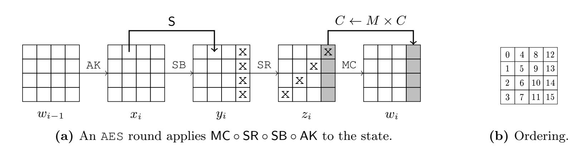
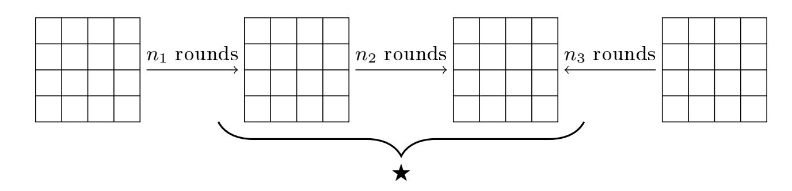
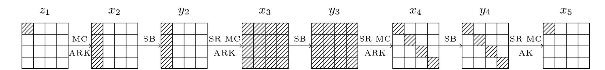
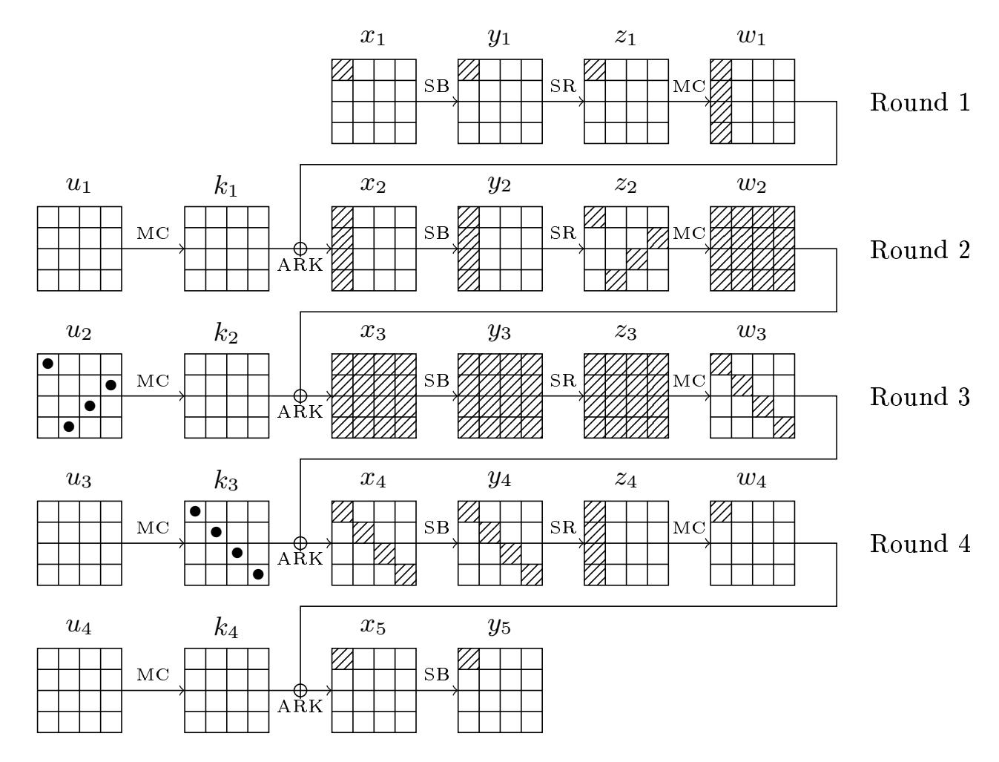
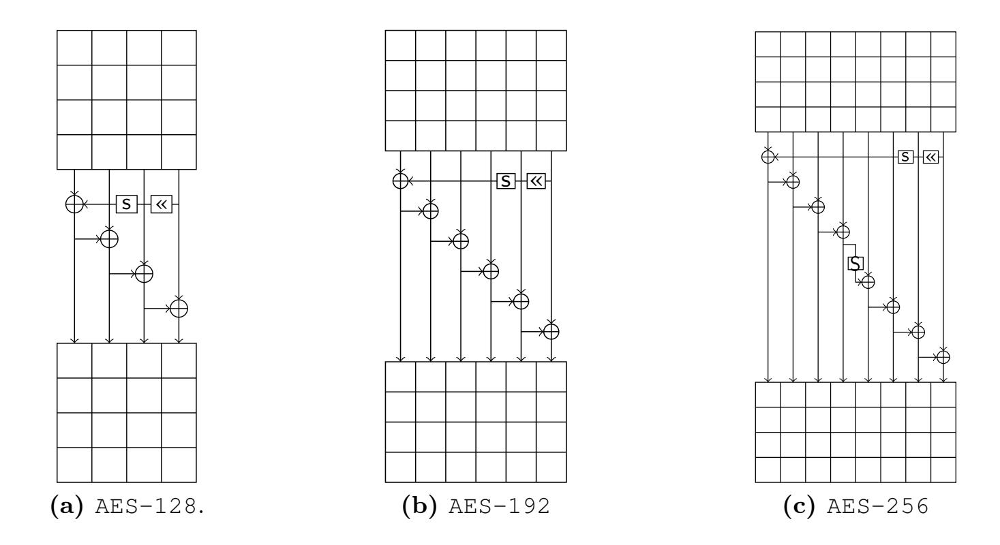
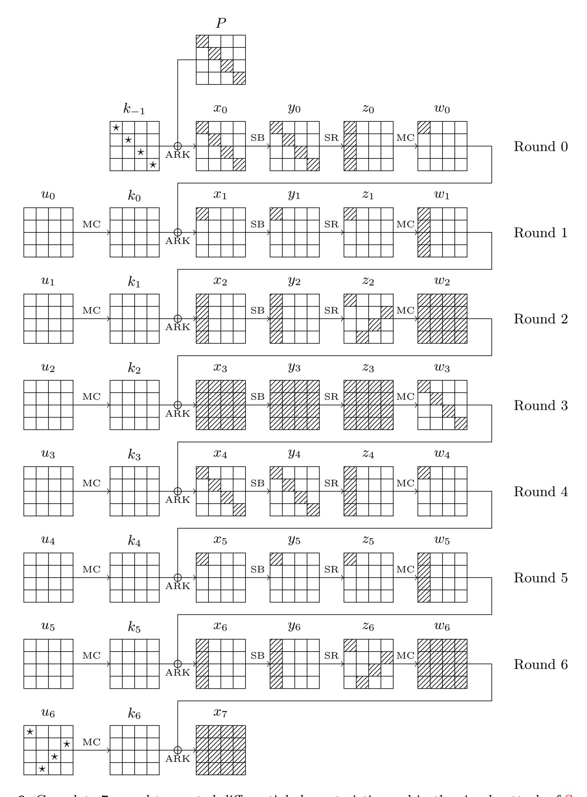
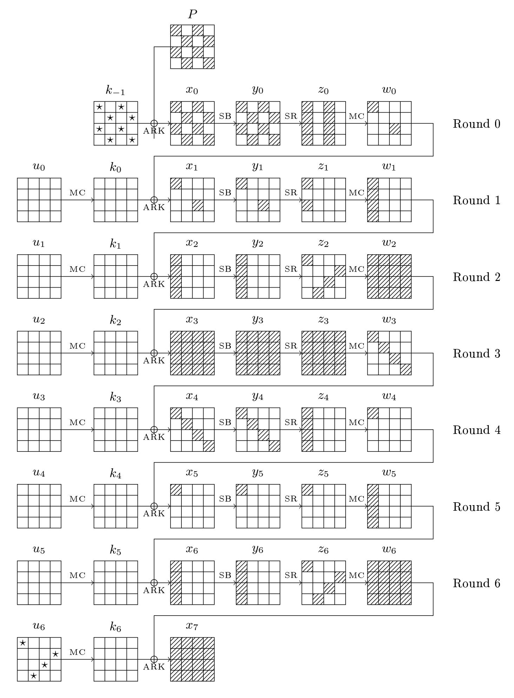
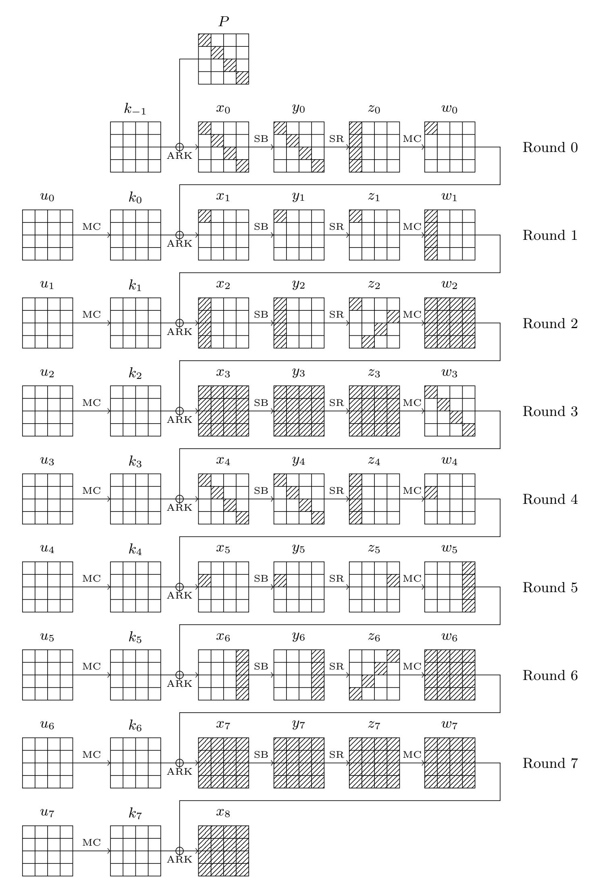
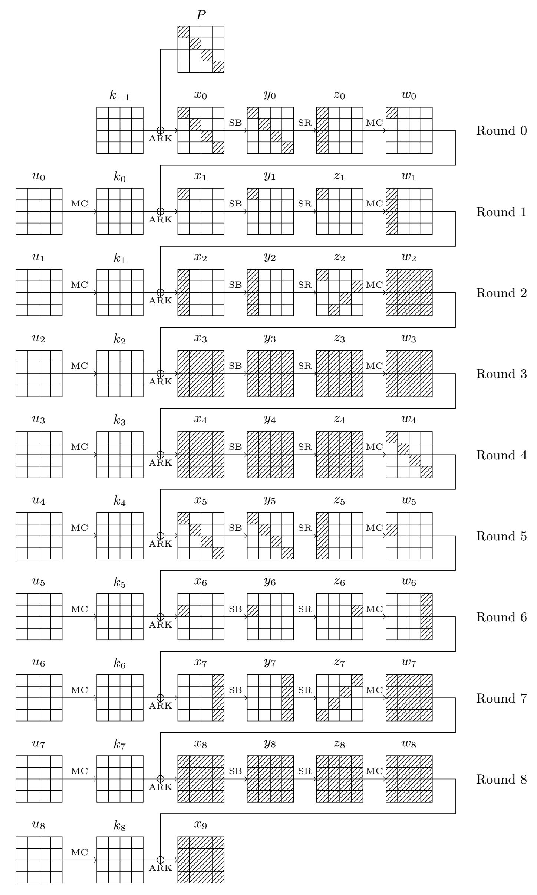

{0}------------------------------------------------

# Improved Key Recovery Attacks on Reduced-Round AES in the Single-Key Setting

Patrick Derbez, Pierre-Alain Fouque, and Jérémy Jean

École Normale Supérieure, 45 Rue d'Ulm, 75005 Paris, France {Patrick.Derbez,Pierre-Alain.Fouque,Jeremy.Jean}@ens.fr

Abstract. In this paper, we revisit meet-in-the-middle attacks on AES in the single-key model and improve on Dunkelman, Keller and Shamir attacks of Asiacrypt 2010. We present the best attack on 7 rounds of AES-128 where data/time/memory complexities are below 2 <sup>100</sup>. Moreover, we are able to extend the number of rounds to reach attacks on 8 rounds for both AES-192 and AES-256. This gives the best attacks on those two versions with a data complexity of 2 <sup>107</sup> chosen-plaintexts, a memory complexity of 2 <sup>96</sup> and a time complexity of 2 <sup>172</sup> for AES-192 and 2 <sup>196</sup> for AES-256. Finally, we also describe the best attack on 9 rounds of AES-256 with 2 <sup>120</sup> chosen-plaintexts and time and memory complexities of 2 <sup>203</sup>. All these attacks have been found by carefully studying the number of reachable multisets in Dunkelman et al. attacks.

# 1 Introduction

The Rijndael block cipher has been designed by Daemen and Rijmen in 1997 and accepted as the AES (Advanced Encryption Standard) standard since October 2000 by the NIST. Nowadays, it is probably the most used block cipher. It has very good performances in both software and hardware on various platforms and it is provably resistant against differential and linear attacks thanks to the wide trail strategy.

However, new attacks have been recently developed using many ideas from the cryptanalysis of hash functions. The first analysis studies AES in the strong adversarial model where the adversary can ask the encryption of a message under a related-key by specifying the relation. Biryukov, Khovratovich and Nikolic show some drawbacks of the key-schedule algorithms and how to exploit it in order to mount an attack on the full versions of AES-192 and AES-256 in [\[4,](#page-15-0)[5,](#page-15-1)[6\]](#page-15-2). In a second analysis, Dunkelman, Keller and Shamir show more efficient meet-in-themiddle attacks using ideas from Boomerang attacks on hash function in [\[12\]](#page-15-3). Finally, the biclique attack [\[7\]](#page-15-4) also uses meet-in-the-middle ideas for preimage attacks on hash functions by Sasaki et al. [\[1\]](#page-14-0). It has been developed by Bogdanov, Khovratovich and Rechberger in [\[7\]](#page-15-4) and allows to mount an attack on the full AES for all versions with a marginal time complexity over exhaustive search.

#### 1.1 Overview of the attacks on AES

The first attack against the AES is the SQUARE attack, proposed by Daemen, Knudsen and Rijmen against the SQUARE block cipher [\[8\]](#page-15-5). In [\[9\]](#page-15-6), Daemen and Rijmen remark that if we encrypt a δ-set, i.e. a set of 256 plaintexts where a byte (called active byte) can take all values and the 15 other bytes are constant, after 3 rounds of Rijndael, the sum of each byte of the 256 ciphertexts equals zero. This distinguishing property can be used to mount efficient attacks up to 6 rounds. The first attack has a time complexity of 2 <sup>72</sup> encryptions and requires 2 <sup>32</sup> messages, but it has been improved by Ferguson et al. in time 2 <sup>46</sup> in [\[13\]](#page-15-7).

Then, Gilbert and Minier show in [\[14\]](#page-15-8) that this property can be made more precise using functions of the active byte, which allows to build a distinguisher on 3 rounds. The main idea is to consider the set of functions mapping one active byte to one byte after 3 rounds. This set depends 

{1}------------------------------------------------

on 9 one-byte parameters so that the whole set can be described using a table of 2 <sup>72</sup> entries of a 256-byte sequence (f(0), . . . , f(255)). Their attack allows to break 7 rounds of AES with a marginal time complexity over exhaustive search. This idea has been generalized at Fse 2008 by Demirci and Selçuk in [\[10\]](#page-15-9) using meet-in-the-middle techniques, whereas Gilbert and Minier used collision between the functions. More specifically, they show that on 4 rounds, the value of each byte of the ciphertext can be described by a function of the active byte parameterized by 25 in [\[10\]](#page-15-9) and 24 8-bit parameters in [\[11\]](#page-15-10). The last improvement is to notice the 25th parameter is a key byte which is constant for all functions. Consequently, by considering (f(0) − f(0), f(1) − f(0), . . . , f(255) − f(0)) we can use only 24 parameters. The main drawback of the meet-in-themiddle attack is the memory requirement. Indeed, the basic attack only works for the 256-bit version and then Demirci and Selçuk have to use a time/memory tradeoff to extend the attack for 192-bit version.

Another idea has been developed by Biham and Keller [\[3\]](#page-14-1) and is based on a 3-round impossible differential. Bahrak and Aref in [\[2\]](#page-14-2) show that there exists a 4-round impossible differential. Later, this idea has been refined by Lu, Dunkelman, Keller and Kim in [\[16\]](#page-15-11). At the present time, it is the most efficient attack on 7-round AES-128.

At Asiacrypt 2010, Dunkelman, Keller and Shamir develop many new ideas to solve the memory problems of the Demirci and Selçuk attacks. First of all, they show that instead of storing the whole sequence, we can only store the associated multiset, i.e. the unordered sequence with multiplicity rather than the ordered sequence. This reduces the table by a factor 4 and avoids to guess one key byte during the attack. The second and main idea is the differential enumeration which allows to reduce the number of parameters that describes the set of functions from 24 to 16. However, to reduce this number, they rely on a special property on a truncated differential characteristic. The idea consists in using a differential truncated characteristic whose probability is not too small. The property of this characteristic is that the set of functions from one state to the state after 4 rounds can only take a restricted number of values, which is much smaller than the number of all functions. The direct consequence is an increase of the amount of needed data, but the good news are that the memory requirements are reduced to 2 <sup>128</sup> and the same analysis also applies to the 128-bit version. However, this attack is not better than the impossible differential attack even though many tradeoffs could be used.

Finally, at Crypto 2011, Bouillaguet, Derbez and Fouque describe new meet-in-the-middle attacks that allow to efficiently break a small number of rounds of AES using a very small amount of data. These attacks have been found automatically. Similar attacks have been developed against other symmetric schemes that reuse AES component such as the Pelican-MAC message authentication code or the LEX stream cipher. However, the complexity of the algorithm that looks for the best attack is exponential in the number of variables and if we try to take into account more rounds or more plaintext/ciphertext pairs, then the program does not find anything of interest. This tool looks promising since improvements on existing attacks usually considered a small number of rounds. For instance, if we want to improve on Dunkelman et al. attacks, we need to study 4 rounds of AES.

# 1.2 Dunkelman, Keller and Shamir's Attack

In [\[12\]](#page-15-3), a new attack is developed using ideas from differential and meet-in-the-middle attacks. In a first stage, differential attacks find a differential characteristic with high or low probability covering many rounds. Then, in the online stage, the adversary asks for the encryption of many pairs: for each pair, the adversary tries to decrypt by guessing the last subkey and if the differential characteristic is followed, then the adversary increases the counter of the associated 

{2}------------------------------------------------

subkey. If the probability of the characteristic is high enough, then the counter corresponding to the right secret-key would be among the higher counters. In some case, it is also possible to add some rounds at the beginning by guessing part of the first subkeys.

Here, Dunkelman et al. propose a novel differential attack. Instead of increasing a counter once a pair is found, the adversary uses another test to eliminate the wrong guesses of the first or last subkeys. This test decides with probability one whether the middle rounds are covered with the differential. The idea is that the middle rounds follow a part of the differential and the function f which associates each byte of the input state to one byte of the output state can be stored efficiently. Demirci and Selçuk propose to store in a table the function with no differential characteristic, which turns out to be much larger that this one. Consequently, in Dunkelman et al.'s attack, the adversary guesses the first and last subkeys and looks for a pair that follows the beginning and last rounds of the differential characteristic. Once such a pair is found, the adversary takes one of the messages that follows the characteristic and constructs a structure to encrypt which is related to a δ-set for the intermediate rounds. From the encryption of this set, the adversary can decrypt the last rounds and check whether the encryption of this δ-set belongs to the table. If this is the case, then the part of the first and last subkeys are correct and an exhaustive search on the other parts of the key allows to find the whole key.

In order to construct the table, the idea is similar to the attack. We need to find a pair of messages that satisfies the truncated differential characteristic. Then, we take one message in the pair and we compute the function f. Dunkelman et al. use a rebound technique to find the pair that follows the characteristic.

#### 1.3 Our Results

Dunkelman et al. show that by using a particular 4-round differential characteristic with a not too small probability, the active states in the middle of the characteristic can only take 2 <sup>64</sup> values. In their characteristic, they also need to consider the same 8 key bytes as Demirci and Selçuk. They claim that In order to reduce the size of the precomputed table, we would like to choose the δ-set such that several of these parameters will equal to predetermined constants. Of course, the key bytes are not known to the adversary and thus cannot be "replaced" by such constants. Here, we show that it is possible to enumerate the whole set of solutions more efficiently that by taking all the values for the key bytes such that every values of these bytes are possible. We show that the whole set can take only 2 <sup>80</sup> values with this efficient enumeration technique. Of course, it might be possible to improve this result to 2 <sup>64</sup> but not any further since the key bytes may take all the 2 <sup>64</sup> possible values. Using the same ideas, we show that it is possible to have an efficient enumeration for a 5-round differential characteristic which allows us to mount an attack on 9 rounds for AES-256. The bottleneck of the attack is no longer the memory, but the time and data complexities.

In this paper, we show that the number of parameters describing the functions can be further reduced to 10 and that this attack is now more efficient that the impossible differential attack [\[16\]](#page-15-11). We also show that it allows us to attack one more round on AES-256, and for the AES-192 the attack is comparable even though some improvements can be made. To this end, we use several tradeoffs proposed by Dunkelman et al. and we use a more careful analysis of the enumeration technique.

#### 1.4 Organization of the paper

In [Section 2,](#page-3-0) we describe the AES and some properties used by the previous attacks on this block cipher. In [Section 3,](#page-6-0) we present our basic attack on 7 rounds for all AES versions. Then, 

{3}------------------------------------------------

in section Section 4, we show that we can also attack 8 rounds for AES-192 and AES-256 and even 9 rounds for AES-256.

### <span id="page-3-0"></span>2 AES and Previous Work

#### 2.1 Description of the AES

The Advanced Encryption Standard (AES) [19] is a Substitution-Permutation Network that can be instantiated using three different key bit-lengths: 128, 192, and 256. The 128-bit plaintext initializes the internal state viewed as a  $4 \times 4$  matrix of bytes as values in the finite field  $GF(2^8)$ , which is defined via the irreducible polynomial  $x^8 + x^4 + x^3 + x + 1$  over GF(2). Depending on the version of the AES,  $N_r$  rounds are applied to that state:  $N_r = 10$  for AES-128,  $N_r = 12$  for AES-192 and  $N_r = 14$  for AES-256. Each of the  $N_r$  AES round (Figure 1a) applies four operations to the state matrix (except the last one where we omit the **MixColumns**):

- AddRoundKey (AK) adds a 128-bit subkey to the state.
- **SubBytes** (SB) applies the same 8-bit to 8-bit invertible S-Box S 16 times in parallel on each byte of the state,
- ShiftRows (SR) shifts the *i*-th row left by *i* positions,
- **MixColumns** (MC) replaces each of the four column C of the state by  $M \times C$  where M is a constant  $4 \times 4$  maximum distance separable matrix over  $GF(2^8)$ ,

<span id="page-3-1"></span>

Figure 1: Description of one AES round and the ordering of bytes in an internal state.

After the  $N_r$ -th rounds has been applied, a final subkey is added to the internal state to produce the ciphertext. The key expansion algorithms to produce the  $N_r + 1$  subkeys for all AES variants are described in Appendix C (Figure 5). We refer to the original publication [19] for further details.

<span id="page-3-4"></span>Proposition 1 (Differential Property of S). Given  $\Delta_i$  and  $\Delta_o$  two non-zero differences in  $\mathbb{F}_{256}$ , the equation

<span id="page-3-3"></span><span id="page-3-2"></span>
$$S(x) + S(x + \Delta_i) = \Delta_o, \tag{1}$$

has one solution in average. This property also applies to  $S^{-1}$ .

Proof. To prevent the prediction of the propagation of differences in the AES, the SBox S as been chosen so that all differences behave equivalently: none is more frequent than the others. Consequently, the number of solutions  $N(\Delta_i, \Delta_o)$  of the 8-bit equation (1) is almost constant for any choice of  $\Delta_i$  and  $\Delta_o$ . In average, we get a constant number of solutions: in general zero or two, and more rarely four. In detail, for a fixed  $\Delta_i$ , among the  $2^8 - 1$  possible  $\Delta_o$ , there are  $2^7 - 1$  of them for which  $N(\Delta_i, \Delta_o) = 0$ , another  $2^7 - 1$  so that  $N(\Delta_i, \Delta_o) = 2$  and the remaining

{4}------------------------------------------------

one gives  $N(\Delta_i, \Delta_o) = 4$ . Due to symmetry, an even number of solutions means that both x and  $x + \Delta_i$  are valid. In other words, in average, there is one solution to this equation. Consequently, if both input and output differences  $\Delta_i$  and  $\Delta_o$  are known, then the values are also known. This property allows to deduce the values from the knowledge of the differences.

Notations and units. In this paper, we count the AES rounds from 0 and we refer to a particular byte of an internal state x by x[i], as depicted in Figure 1b, or  $x[i, \ldots, j]$  for bytes as positions between i and j. Moreover, as shown in Figure 1a, in the ith round, we denote the internal state after AddRoundKey by  $x_i$ , after SubBytes by  $y_i$ , after ShiftRows by  $z_i$  and after MixColumns by  $w_i$ . To refer to the difference in a state x, we use the notation  $\Delta x$ . The first added subkey is the master key  $k_{-1}$ , and the one added after round i is denoted  $k_i$ . In some cases, we are interested in swapping the order of the MixColumns and AddRoundKey operations. As these operations are linear they can be interchanged, by first XORing the data with an equivalent key and applying the MixColumns operation afterwards. We denote the equivalent subkey for this new round-function description by:

$$u_i = \mathsf{MC}^{-1}(k_i) = \begin{bmatrix} 14 & 11 & 13 & 9 \\ 9 & 14 & 11 & 13 \\ 13 & 9 & 14 & 11 \\ 11 & 13 & 9 & 14 \end{bmatrix} \times k_i \tag{2}$$

We measure memory complexities of our attacks in number of 128-bit AES blocks and time complexities in terms of AES encryptions.

In the following sections, we use particular structures of messages captured by Definition 1 and Definition 2.

<span id="page-4-0"></span>**Definition 1** ( $\delta$ -set, [9]). Let a  $\delta$ -set be a set of 256 AES-states that are all different in one state bytes (the active byte) and all equal in the other state bytes (the inactive bytes).

<span id="page-4-1"></span>**Definition 2 (Multisets of bytes).** A multiset generalizes the set concept by allowing elements to appear more than once. Here, a multiset of 256 bytes can take as many as  $\binom{2^8+2^8-1}{2^8} \approx 2^{506.17}$  different values. From the point of view of information theory, we can represent such a multiset on 512 bits: we propose a way to do so in Appendix A.

### 2.2 Attack Scheme

In this section, we present a unified view of the previously known meet-in-the-middle (MITM) attacks on AES [10,12,14], where n rounds of the block cipher can be split into three consecutive parts of  $n_1$ ,  $n_2$  and  $n_3$  rounds,  $n = n_1 + n_2 + n_3$ , such that a particular set of messages may verify a certain property that we denote  $\bigstar$  in the sequel in the middle  $n_2$  rounds (Figure 2).

<span id="page-4-2"></span>

**Figure 2:** General scheme of the meet-in-the-middle attack on AES, where some messages in the middle rounds may verify a certain ★ property used to perform the meet-in-the-middle.

{5}------------------------------------------------

The general attack uses three successive steps:

# Precomputation phase

1. In this phase, we build a lookup table T containing all the possible sequences constructed from a δ-set such that one message verifies the F property.

### Online phase

- 2. Then, in the online phase, we need to identify a δ-set containing a message m verifying the desired property.
- 3. Finally, we partially decrypt the associated δ-set through the last n<sup>3</sup> rounds and check whether it belongs to T.

The two steps of the online phase require to guess some key bytes while the goal of this attack is to filter some of their values. In the best case, only the right ones should pass the test.

<span id="page-5-0"></span>Demirci and Selçuk Attack. The starting point is to consider the set of functions

$$f: \{0,1\}^8 \to \{0,1\}^8$$

that maps a byte of a δ-set to another byte of the state after four AES rounds. A convenient way is to view f as an ordered byte sequence (f(0), . . . , f(255)) so that it can be represented by 256 bytes. The crucial observation made by the generalizing Gilbert and Minier attack is that this set is tiny since it can be described using 25 byte-parameters (2 <sup>25</sup>·<sup>8</sup> = 2200) compared with the set of all functions of this type which counts as many as 2 8·2 8 = 2<sup>2048</sup> elements. Considering the differences (f(0) − f(0), f(1) − f(0), . . . , f(255) − f(0)) rather than values, the set of functions can be described by 24 parameters. Dunkelman et al. identify these parameters as follows:

- the full state x<sup>3</sup> of message 0,
- four bytes of state x<sup>2</sup> of message 0,
- four bytes of subkey k3.

The four bytes of the state x<sup>2</sup> which are needed only depend on the column of z<sup>1</sup> where the active byte of the δ-set is located; for instance, if it is column 0, then those bytes are x2[0, 1, 2, 3]. Similarly, the four bytes of k<sup>3</sup> depend on the column of x<sup>5</sup> where the byte we want to determine is located; as an example, if it is column 0, then those bytes are k3[0, 5, 10, 15].

In their attacks [\[10\]](#page-15-9), Demirci and Selçuk use the F property that does not filter any message. Consequently, they do not require to identify a particular message m. The data complexity of their basic attack is very small and around 2 <sup>32</sup>. However, since there is no particular property, the size of the table T is very large and the basic attack only works for the AES-256. To mount an attack on the AES-192, they consider some time/memory tradeoff. More precisely, the table T does not contain all the possible states, but only a fraction α. Consequently, a specific δ-set may not be in the table T, so that we have to wait for this event and redo the attack O(1/α) times on average. The attack becomes probabilistic and the memory requirement makes the attack possible for AES-192. The consequence of this advanced version of the attack, which also works for AES-256, is that the amount of data increases a lot. The time and memory requirement of the precomputation phase is the construction of table T that contains messages for the n<sup>2</sup> = 4 middle rounds, which counts as many as 2 <sup>8</sup>·<sup>24</sup> = 2<sup>192</sup> ordered sequences of 256 bytes.

Finally, it is possible to remove from each function some output values. Since we know that these functions can be described by the key of 24 or 32 bytes, one can reduce T by a factor 10 or 8 by storing only the first differences. Such observation has been used by Wei et al. in [\[20\]](#page-15-14).

{6}------------------------------------------------

Dunkelman et al. Attack. In [\[12\]](#page-15-3), Dunkelman, Keller and Shamir introduced two new improvements to further reduce the memory complexity of [\[10\]](#page-15-9). The first uses multisets, behaving as unordered sequences, and the authors show that there is enough information so that the attack succeeds. The second improvement uses a particular 4-round differential characteristic (Figure [3\)](#page-6-1) to reduce the size of the precomputed lookup table T, at the expense of trying more pairs of messages to expect at least one to conform to the truncated characteristic.

<span id="page-6-1"></span>

Figure 3: The four middle rounds used in the 7-round attack from [\[12\]](#page-15-3). Dashed bytes are active, others inactive.

The main idea of the differential characteristic is to fix the values of as many state-bytes as possible to a constant. Assume now we have a message m such that we have a pair (m, m<sup>0</sup> ) that satisfies the whole 7-round differential characteristic and our goal is to recover the key. Contrary to classical differential attacks, where the adversary guesses some bytes of the last subkey and eliminates the wrong guess, the smart idea of Dunkelman et al. is to use to table to recover the right key more efficiently. Usually, differential attacks do not use memory to recover the key or to find the right pair. The attack principle consists in constructing the δ-set from m which can be made since we already have to guess some key bytes to check if the pair (m, m<sup>0</sup> ) has followed the right differential characteristic. Then, the table allows to identify the right key from the encryption of the δ-set.

It is now easy to see that the differential characteristic can be described using only 16 bytes. The states x<sup>3</sup> and y<sup>3</sup> can only take 2 <sup>32</sup> possible differences each, so that the number of solutions for these two states is 2 <sup>64</sup>. We also have the 4 key-bytes of u<sup>2</sup> and the 4 key-bytes of k<sup>3</sup> corresponding to the active bytes of [Figure 3](#page-6-1) in states z<sup>2</sup> and x4.

The following [Table 1](#page-7-0) shows the best cryptanalysis of AES variants, including our new results detailed in this article.

# <span id="page-6-0"></span>3 New Attack on AES

In this section, we describe our basic attack on AES, which is independent of its key schedule algorithms. We begin in [Section 3.1](#page-6-2) by describing an efficient way to enumerate and store all the possible multisets in the middle that are used to mount the meet-in-the-middle attack. We continue in [Section 3.2](#page-8-0) by applying the general scheme previously described to construct a keyrecovery attack on all AES versions reduced to 7 rounds. Finally, in [Section 3.3,](#page-10-0) we show that modifying slightly the property for the middle rounds allows to trade some memory for data and time.

#### <span id="page-6-2"></span>3.1 Efficient Tabulation

As in the previous results, our attack also uses a large memory lookup table constructed in the precomputation phase, and used in the online phase. Dunkelman, Keller and Shamir showed that if a message m belongs to a pair of states conforming to the truncated differential characteristic of [Figure 3,](#page-6-1) then the multiset of differences ∆x5[0] obtains from the δ−set constructed from m in x<sup>1</sup> can only take 2 <sup>128</sup> values, because 16 of the 24 parameters used to build the multisets can

{7}------------------------------------------------

Table 1: Current cryptanalysis of (reduced-round) AES variants in the secret-key model.

<span id="page-7-0"></span>

| Cipher  | Rounds    | Data (CP)  | Time       | Memory     | Technique               | Reference   |
|---------|-----------|------------|------------|------------|-------------------------|-------------|
| AES-128 | 7         | 112.2<br>2 | 117.2<br>2 | 112.2<br>2 | Impossible Differential | [16]        |
|         | 7         | 106.2<br>2 | 110.2<br>2 | 90.2<br>2  | Impossible Differential | [17]        |
|         | 7         | 116<br>2   | 116<br>2   | 116<br>2   | Meet-in-the-Middle      | [12]        |
|         | 7         | 105<br>2   | 99<br>2    | 90<br>2    | Meet-in-the-Middle      | Section 3   |
|         | 7         | 99<br>2    | 99<br>2    | 96<br>2    | Meet-in-the-Middle      | Section 3   |
|         | 8         | 88<br>2    | 125.3<br>2 | 8<br>2     | Bicliques               | [7]         |
|         | 10 (full) | 88<br>2    | 126.2<br>2 | 8<br>2     | Bicliques               | [7]         |
| AES-192 | 7         | 116<br>2   | 116<br>2   | 116<br>2   | MITM                    | [12]        |
|         | 7         | 99<br>2    | 99<br>2    | 96<br>2    | Meet-in-the-Middle      | Section 3   |
|         | 8         | 113<br>2   | 172<br>2   | 129<br>2   | Meet-in-the-Middle      | [12]        |
|         | 8         | 113<br>2   | 172<br>2   | 82<br>2    | Meet-in-the-Middle      | Section 4.1 |
|         | 8         | 107<br>2   | 172<br>2   | 96<br>2    | Meet-in-the-Middle      | Section 4.1 |
|         | 9         | 80<br>2    | 188.8<br>2 | 8<br>2     | Bicliques               | [7]         |
|         | 12 (full) | 80<br>2    | 189.4<br>2 | 8<br>2     | Bicliques               | [7]         |
| AES-256 | 7         | 116<br>2   | 116<br>2   | 116<br>2   | Meet-in-the-Middle      | [12]        |
|         | 7         | 99<br>2    | 98<br>2    | 96<br>2    | Meet-in-the-Middle      | Section 3   |
|         | 8         | 113<br>2   | 196<br>2   | 129<br>2   | Meet-in-the-Middle      | [12]        |
|         | 8         | 113<br>2   | 196<br>2   | 82<br>2    | Meet-in-the-Middle      | Section 4.1 |
|         | 8         | 107<br>2   | 196<br>2   | 96<br>2    | Meet-in-the-Middle      | Section 4.1 |
|         | 9         | 120<br>2   | 251.9<br>2 | 8<br>2     | Bicliques               | [7]         |
|         | 9         | 120<br>2   | 203<br>2   | 203<br>2   | Meet-in-the-Middle      | Section 4.2 |
|         | 14 (full) | 40<br>2    | 254.4<br>2 | 8<br>2     | Bicliques               | [7]         |

CP: Chosen-plaintext.

take only 2 values instead of 2 . We make the following proposition that reduces the size of the table by a factor 2 .

<span id="page-7-2"></span>Proposition 2. If a message m belongs to a pair of states conforming to the truncated differential characteristic of [Figure 3,](#page-6-1) then the multiset of differences ∆x5[0] obtains from the δ−set constructed from m in x<sup>1</sup> can only take 2 values. More precisely, the 24 parameters (which are state bytes of m) can take only 2 values in that case. Reciprocally, for each of these 2 values it exists a tuple (m, m<sup>0</sup> , k) such that m is set to the chosen value and the pair (m, m<sup>0</sup> ) follows the truncated differential path.

Proof. The proof uses rebound-like arguments borrowed from the hash function cryptanalysis domain [\[18\]](#page-15-16). Let (m, m<sup>0</sup> ) be a right pair. We show in the following how the knowledge of 10 particular bytes restricts the values of the 24 parameters used to construct the multisets, namely:

$$x_2[0,1,2,3], x_3[0,\ldots,15], x_4[0,5,10,15].$$
 (3)

In the sequel, we use the state names mentioned in [Figure 4.](#page-8-1) The 10 bytes

<span id="page-7-1"></span>
$$\Delta z_1[0], \ x_2[0,1,2,3], \ \Delta w_4[0], \ z_4[0,1,2,3].$$
 (4)

can take as many as 2 possible values, and for each of them, we can determine the values of all the differences shown on [Figure 4:](#page-8-1) linearly in x2, applying the SBox to reach y2, linearly for x<sup>3</sup> and similarly in the other direction starting from z4. By the differential property of the AES

{8}------------------------------------------------

<span id="page-8-1"></span>

Figure 4: Truncated differential characteristic used in the middle of the 7-round attacks on AES.

SBox (Proposition 1), we get in average one value for each of the 16 bytes of state  $x_3^1$ . From the known values around the two **AddRoundKey** layers of rounds 3 and 4, this suggests four bytes of the equivalent subkey  $u_2 = \mathsf{MC}^{-1}(k_2)$  and four others in subkey  $k_3$ : those are  $u_2[0]$ ,  $u_2[7]$ ,  $u_2[10]$ ,  $u_2[13]$  and  $u_3[0]$ ,  $u_3[5]$ ,  $u_3[10]$ ,  $u_3[15]$ ; they are marked by a bullet ( $\bullet$ ) in Figure 4.

The reciprocal is now trivial: the only difficulty is to prove that for each value of the 8 key bytes, there exists a corresponding master key.

To construct the multiset for each of the  $2^{80}$  possible choice for the 10 bytes from (4), we consider all the  $2^8-1$  possible values for the difference  $\Delta y_1[0]$ , and propagate them until  $x_5$ . This leads to a multiset of  $2^8-1$  differences in  $\Delta x_5[0]$ . Finally, as the AES SBox behaves as a permutation over  $\mathbb{F}_{256}$ , the sequence in  $\Delta y_1[0]$  allows to derive the sequence in  $\Delta x_1[0]$ . Note that in the present case where there is a single byte of difference between m and m' in the state  $x_1$ , both messages belongs to the same  $\delta$ -set. This does not hold if we consider more active bytes as we will see in Section 4. We describe in an algorithmic manner this proof in Algorithm 3 of Appendix B (ConstructTable).

# <span id="page-8-0"></span>3.2 Simple Attack

**Precomputation phase.** In the precomputation phase of the attack, we build the lookup table that contains the  $2^{80}$  multisets for difference  $\Delta x_5$  by following the proof of Proposition 2. This step is performed by first iterating on the  $2^{80}$  possible values for the 10 bytes of (4) and for each of them, we deduce the possible values of the 24 original parameters. Then, for each of them, we construct the multiset of  $2^8 - 1$  differences. Using the differential property of the AES SBox (Proposition 1), we can count exactly the number of multisets that are computed:

$$2^{80} \times \left(4 \times \frac{2^8 - 1}{(2^8 - 1)^2} + 2 \times \frac{(2^8 - 1)(2^7 - 1 - 1)}{(2^8 - 1)^2}\right)^{16} \approx 2^{80.09}.$$
 (5)

<span id="page-8-2"></span>In fact, only  $2^{64}$  values of the 10 bytes lead to a solution for  $x_3$  but for each value, there are  $2^{16}$  solutions for  $x_3$ .

{9}------------------------------------------------

Finally, the lookup table of the  $2^{80.09}$  possible multisets that we simplify to  $2^{80}$  requires about  $2^{82}$  128-bit blocks to be stored. To construct the table, we have to perform  $2^{80}$  partial encryptions on 256 messages, which we estimate to be equivalent to  $2^{84}$  encryptions.

Online phase. The online phase splits into three parts: the first one finds pairs of messages that conform to the truncated differential characteristic of Figure 6, which embeds the previous 4-round characteristic in the middle rounds. The second step uses the found pairs to create a  $\delta$ -set and test them against the precomputed table and retrieve the secret key in a final phase.

To generate one pair of messages conforming to the 7-full-round characteristic where there are only four active bytes in both the plaintext and the ciphertext differences, we prepare a structure of  $2^{32}$  plaintexts where the diagonal takes all the possible  $2^{32}$  values, and the remaining 12 bytes are fixed to some constants. Hence, each of the  $2^{32} \times (2^{32} - 1)/2 \approx 2^{63}$  pairs we can generate satisfies the plaintext difference. Among the  $2^{63}$  corresponding ciphertext pairs, we expect  $2^{63} \cdot 2^{-96} = 2^{-33}$  to verify the truncated difference pattern. Finding one such pair then requires  $2^{33}$  structures of  $2^{32}$  messages and  $2^{32+33} = 2^{65}$  encryptions under the secret key. Using this secret key, the probability that the whole truncated characteristic of Figure 6 is verified is  $2^{-2\times3\times8} = 2^{-48}$  because of the two  $4\to 1$  transitions in the MixColumns of rounds 0 and 5. By repeating the previous procedure to find  $2^{48}$  pairs, one is expected to verify the full 7-round characteristic. All in all, we ask the encryptions of  $2^{48+65} = 2^{113}$  messages to find  $2^{48}$  pairs of messages. Note that we do not have to examine each pair in order to find the right one. Indeed, if a pair verifies the full 7-round characteristic, then the ciphertext difference has only four active bytes. Thus, we can store the structures in a hash table indexed by the 12 inactive bytes to get the right pairs in average time one.

For each of the  $2^{48}$  pairs, we get  $2^{8\times(8-2\times3)}\cdot 2^8=2^{24}$  suggestions for the 9 key bytes:

$$k_{-1}[0, 5, 10, 15], u_{5}[0], u_{6}[0, 7, 10, 13].$$
 (6)

Indeed, there are  $2^8$  possibilities for the bytes from  $k_{-1}$  since the pair of diagonals in  $x_0$  need to be active only in  $w_0$  after the **MixColumns** operation. Among the  $2^{32}$  possible values for those bytes, only  $2^{32} \times 2^{-24} = 2^8$  verifies the truncated pattern. The same reasoning applies for  $u_6[0, 7, 10, 13]$ , and the last byte  $u_5[0]$  can take all the  $2^8$  values.

For every  $2^{24}$  possibility, we construct a  $\delta$ -set to use the precomputed table. To do so, we partially decrypt the diagonal of one message, using the four known bytes from  $k_{-1}$  and consider the  $2^8-1$  possible non-zero differences for  $\Delta x_1[0]$ . This gives one set of  $2^8$  plaintexts, whose corresponding ciphertexts may be partially decrypted using the four known bytes from  $u_6$  and the one from  $u_5$ . Once decrypted, we can construct the multiset of differences for  $\Delta x_5$  and check if it lies in the precomputed lookup table. If not, we can discard the subkey with certainty. On the other hand, the probability for a wrong guess to pass this test is smaller than  $2^{80} \cdot 2^{-467.6} = 2^{-387.6}$  so, as we try  $2^{48} \cdot 2^{24} = 2^{72}$  multisets, only the right subkey should verify the test. Note that the probability is  $2^{-467.6}$  (and not  $2^{-506.17}$ ) because the number of ordered sequences associated to a multiset is not constant.

We summarize the above description if the following Algorithm 1, where the initial call to the function Construct Table (0,0) constructs the lookup table for  $\Delta x_1$  and  $\Delta x_5$  both at position 0 (Figure 4) and is defined in Appendix B.

To evaluate the complexity of the online phase of the simple attack, we count the number of AES encryptions. First, we ask the encryption of  $2^{113}$  chosen-plaintexts, so that the time complexity for that step is already  $2^{113}$  encryptions. Then, for each of the  $2^{48}$  found pairs, we perform  $2^{24}$  partial encryptions/decryptions of a  $\delta$ -set. We evaluate the time complexity of

{10}------------------------------------------------

# <span id="page-10-1"></span>Algorithm 1 – A simple attack.

```
1: function SimpleAttack
                                                                        \# Construction of the Table
       T_{0,0} \leftarrow \text{ConstructTable}(0,0).
 2:
                                                                        \# 2^{81} times on average
       while true do
 3:
         Ask for a structure S of 2^{32} plaintexts P_m where bytes in diagonals 0 assume all values.
 4:
         Empty a hash table T of list of plaintext.
 5:
         for all corresponding ciphertexts C_m do
 6:
            index \leftarrow MC^{-1}(C_m)[1, 2, 3, 4, 5, 6, 8, 9, 11, 12, 14, 15].
 7:
           for all P \in T[index] do
 8:
                                                                        \# 2^{-33} pairs by structure on average
              Consider the pair (P, P_m).
9:
              for all k_{-1}[0, 5, 10, 15] s.t. \Delta w_0[1, 2, 3] = 0 do
                                                                        \# 2^8 times on average
10:
                 Construct \delta-set D from P.
                                                                        # The \delta-set belongs to the structure
11:
                 for all u_6[0,7,10,13] s.t. \Delta z_5[1,2,3] = 0 do
12:
                   Decrypt column 0 of x_6 for D.
13:
14:
                    for all u_5[0] do
                                                                        \# 2^8 times
                      Decrypt byte 0 of x_5 for D.
15:
                      Construct multiset M of \Delta x_5.
16:
                      if M \in T_{0,0} then
17:
                         return ExhaustiveSearch()
18:
19:
            T[index] \leftarrow T[index] \cup \{P_m\}.
       end while
20:
```

this part to  $2^{48+24+8} \cdot 2^{-5} = 2^{75}$  encryptions since we can well ordering the computations as see in Algorithm 1. All in all, the time complexity is dominated by  $2^{113}$  encryptions, the data complexity is  $2^{113}$  chosen-plaintexts, and the memory complexity is  $2^{82}$  since it requires to store  $2^{80}$  multisets.

#### <span id="page-10-0"></span>3.3 Efficient Attack: New Property ★

Unlike the previous attacks where the bottleneck complexity is the memory, our attack uses a smaller table which makes the time complexity to find the pairs being the dominating one. Therefore, we would like to decrease the time spent in that phase. The natural idea is to find a new property  $\bigstar$  for the four middle rounds that can be checked more efficiently. To do so, we reuse the idea of Dunkelman et al. from [12], which adds an active byte in the second round of the differential characteristic. The sequence of active bytes becomes:

$$8 \xrightarrow{R_0} 2 \xrightarrow{R_1} 4 \xrightarrow{R_2} 16 \xrightarrow{R_3} 4 \xrightarrow{R_4} 1 \xrightarrow{R_5} 4 \xrightarrow{R_6} 16, \tag{7}$$

with the constraint that the two active bytes of the second round belong to the same diagonal to be transformed in a column in the next round.

As a consequence, it is now easier to find pairs conforming to that truncated differential characteristic. Indeed, the size of the structures of plaintexts may take as many as  $2^{64}$  different values, so that we can construct at most  $2^{64} \cdot (2^{64} - 1)/2 = 2^{127}$  pairs from each. Therefore, it is enough to ask the encryption of  $2^{8\cdot 3\cdot 3}/2^{127-8\cdot 12} = 2^{41}$  structures to get  $2^{72}$  pairs, and expect one to conform to the 7-round characteristic of Figure 7. Consequently in this new setting, we only need  $2^{105}$  chosen plaintexts. In return, the number of pairs that the adversary have to consider is increased by a factor  $2^{24}$  and so the time complexity too. Furthermore, we now need 11 parameters to generate the 24 of the precomputed table increasing the memory requirement by a factor  $2^{8}$ . All in all, the time complexity of this attack is  $2^{24+75} = 2^{99}$  encryptions, the data complexity is  $2^{105}$  chosen plaintexts and the memory requirement is  $2^{82+8} = 2^{90}$  128-bit blocks.

{11}------------------------------------------------

Assuming that the bytes of diagonals 0 and 2 of the structure of plaintexts takes all the values<sup>2</sup>, the two differences in the first state of the second round can take four different positions: (0, 10), (1, 11), (2, 8) and (3, 9). Similarly, the position of the active byte in the penultimate round is not constrained; it can be placed anywhere on the 16 positions. These possibilities actually define tweaked versions of the property  $\bigstar$  and allows to trade some time for memory: with less data, we can check more tables for the same final probability of success. Namely, by storing  $4 \times 16 = 2^6$  tables to cover all the cases by adapting the proof of Proposition 2, the encryption of  $2^{41}/2^6 = 2^{35}$  structures of  $2^{64}$  plaintexts suffices to expect a hit in one of the  $2^6$  tables. Therefore, the memory complexity reaches  $2^{96}$  AES blocks and the time complexity remains unchanged since we analyze  $2^6$  times less pairs, but the quantity of work to check *one* pair is multiplied by the same factor.

```
Algorithm 2 – An efficient attack.
 1: function Efficient Attack
                                                                           # Construction of the 2<sup>6</sup> Tables
       for all (i, j) \in \{0, \dots, 3\} \times \{0, \dots, 15\} do
 2:
 3:
         T_{i,j} \leftarrow \text{ConstructTable2}(i,j).
                                                                           \# 2^{35} times on average
 4:
       while true \ do
         Ask for a structure S of 2^{64} plaintexts P_m where bytes in diagonals 0 and 1 assume all values.
 5:
                                                                           # Position of the non-zero column of \Delta x_6
         for all k \in \{0, ..., 3\} do
 6:
 7:
            Empty a hash table T of list of plaintext.
            for all corresponding ciphertexts C_m do
 8:
               index \leftarrow (SR^{-1} \circ MC^{-1}(C_m))[\{0,\ldots,15\} - \{4k,\ldots,4k+3\}].
 9:
               for all P \in T[index] do
10:
                                                                           \# 2^{33} pairs by structure on average
                  Consider the pair (P, P_m).
11:
12:
                  for all (i, l_j) \in \{0, \dots, 3\} \times \{0, \dots, 3\} do
                                                                           # Assume mod give a positive result.
                    j \leftarrow 4k - 3l_j \mod 16.
13:
                    ONLINEPHASE ((P, P_m), i, j, T_{i,j}, S).
14:
               T[index] \leftarrow T[index] \cup \{P_m\}.
15:
       end while
16:
1: function OnlinePhase((m, m'), i, j, T, S)
                                                                           \# Retrieving the right positions
       b_j \leftarrow (j-4 \times (j \mod 4)) \mod 16.
 2:
       c_i \leftarrow |b_i/4|.
                                                                           # because of the ShiftRows.
 3:
       Col_i \leftarrow \{4c_i, \ldots, 4c_i + 3\}
 4:
       for all k_{-1}[0, 5, 10, 15] s.t. \Delta w_0[\{0, \dots, 3\} - \{i\}] = 0 do
 5:
          Construct \delta-set D from m.
 6:
         for all SR(u_6)[Col_j] s.t. \Delta z_5[Col_j - \{j\}] = 0 do
 7:
 8:
            Decrypt column c_i of x_6 for D.
 9:
            for all u_5[b_i] do
10:
               Decrypt byte j of x_5 for D.
11:
               Construct multiset M of \Delta x_5.
12:
               if M \in T then
                  return ExhaustiveSearch()
13:
```

#### 3.4 Turning the distinguisher into a key recovery

In this section, we present an efficient way to turn this distinguisher into a key recovery. First, let us summarize what the opponent has in his possession at the end of the efficient attack: a pair

<span id="page-11-0"></span><sup>&</sup>lt;sup>2</sup>Those are bytes 1, 3, 4, 6, 9, 11, 12 and 14.

{12}------------------------------------------------

(m, m<sup>0</sup> ) following the truncated differential characteristic, a δ-set containing m, the knowledge of 9 key bytes and the corresponding multiset for which we found a match in the precomputed table. Thus, there are still 2 56 , 2 <sup>120</sup> or 2 <sup>184</sup> possible keys, if we consider AES-128, AES-192 or AES-256 respectively. As a consequence, performing an exhaustive search to find the missing key bytes would drastically increase the complexity of the whole attack, except for the 128-bit version. Even in that case, it seems nontrivial to recover the 2 <sup>56</sup> possible keys in less than 2 96 , as the 9 key bytes do not belong to the same subkey.

A natural way to recover the missing bytes would be to replay the attack by using different positions for the input and output differences. Unfortunately, this increases the complexity, and it would also interfere with the trade-off since we could not look for all the possible positions of the differences anymore.

We propose a method that recovers the last subkey and 4 bytes of the penultimate subkey in a negligible time compared to the 2 <sup>99</sup> encryptions of the efficient attack. This is based on a simple observation made in [Section 2.2:](#page-5-0) for any fixed position of the active byte of the δ-set in x1, the set of the 24 parameters necessary to build the multisets of differences in one byte b of x<sup>5</sup> only depends on the column where b is located. Thus, the parameters used in the offline phase to construct the multiset that was matched during the online phase, can be reused in order to mount three others tests. More precisely, the adversary begins by recovering the values of the 24 parameters used to build the checked multiset. For instance, this can be done by storing this information during the precomputation phase. Then, for each byte of the column where the output difference is located, the adversary builds the corresponding multiset using the parameters, guess the four bytes of the last subkey as well as the one of the penultimate necessary to partially decrypt the δ-set and build the multiset, actually builds the multiset and look for a match. Only the right values should pass those three tests so that the adversary retrieves the value of the last subkey and four bytes of the penultimate.

Note that this requires to store 24 × 8 = 192 bits of additional information by multiset. To reduce it and to keep the complexity around 2 <sup>40</sup>, we can only store the values of only 6 of the 11 bytes used to generate the parameters. In return, we have 2 <sup>40</sup> possibilities for the 24 parameters and so this part would require to store as many multisets.

Some key bytes of u<sup>5</sup> are still missing and to recover them, the adversary may apply a 6 round attack fast enough as the attack of Ferguson et al. in time 2 <sup>46</sup> in [\[13\]](#page-15-7), or a dedicated guess-and-determine attack since the adversary already knows 32 key bytes, which spreads over all the subkeys.

# <span id="page-12-0"></span>4 Extension to more rounds

#### <span id="page-12-1"></span>4.1 8-round attacks on AES-192 and AES-256

We can extend the simple attack on the AES presented [Section 3.2](#page-8-0) to an 8-round attack for both 192- and 256-bit versions by adding one additional round at the end. The main difficulty compared to the previous attack is that we cannot apply a first step to the structure to filter the wrong pairs. Indeed, now for each pair from the structure, there exists at least one key such that the pair follows the differential characteristic. Then our goal is to enumerate, for each pair and as fast as possible, the key bytes needed to identify a δ-set and construct the associated multiset assuming that the pair is a right one.

The main idea to do so is the following: if there is a single non-zero difference in a column of a state before (resp. after) the MixColumns operation, then the difference on same column in the state after (resp. before) can only assume 2 <sup>8</sup> − 1 values among all the (2<sup>8</sup> − 1)<sup>4</sup> possible 

{13}------------------------------------------------

ones. Combined to the key schedule equations and to the differential property of the AES SBox [\(Proposition 1\)](#page-3-4), this leads to an attack requiring 2 <sup>113</sup> chosen plaintexts, 2 <sup>82</sup> 128-bit blocks of storage and and a time complexity equivalent to 2 <sup>172</sup> (resp. 2 <sup>196</sup>) encryptions on AES-192 (resp. AES-256).

To reach this time complexity, the position of the output active byte must be chosen carefully. The position of the input active byte for both the pair and the δ-set must be identical, as well as the output active byte of the pair and the byte that is to be checked. Then, the output difference must be located at position 1, 6, 11 or 12 in the case of AES-192. As for the AES-256, it can be located anywhere, except on bytes 0, 5, 10 and 15. Finally, in both cases, the position of the input difference does not matter.

Assume that the positions of the input and output active bytes are respectively 0 and 1. In the first stage of the attack, we ask for the encryption of 2 <sup>81</sup> structures of 2 <sup>32</sup> plaintexts. Then, the following procedure applied on each of the 2 81 · 2 32+31 = 2<sup>144</sup> pairs allows to enumerate the 2 <sup>24</sup> possible values for the needed key bytes in about 2 <sup>24</sup> simple operations for the 192-bit version:

- 1. (a) Guess the difference in column 0 of x0.
  - (b) Deduce the actual values in this column.
  - (c) Deduce bytes 0, 5, 10 and 15 of k−1.
  - (d) Store all these values in a hash table T−<sup>1</sup> indexed by k−1[15].
- 2. Guess the difference in column 3 of x6.
- 3. (a) Guess the difference in columns 0 and 1 of x7.
  - (b) Deduce the actual values of these two columns.
  - (c) Deduce the actual values of x6[14] and x6[15].
  - (d) Deduce u6[3], u6[6] and bytes 0, 1, 4, 7, 10, 11, 13 and 14 of k<sup>7</sup> (or u<sup>7</sup> if we do not omit the last MixColumns).
  - (e) Store all these values in a hash table T7.
- 4. (a) Similarly, guess the difference in the two other columns of x<sup>7</sup> and deduce u6[9], u6[12] and the 8 others bytes of the last subkey.
  - (b) Retrieve u6[3], u6[6] and bytes 0, 1, 4, 7, 10, 11, 13 and 14 of k<sup>7</sup> (resp. u7) using T<sup>7</sup> since u6[3] and u6[6] are linearly dependent of k<sup>7</sup> (and also of u7).
  - (c) Deduce u5[13] and k−1[15] from k7.
  - (d) Get bytes 0, 5 and 10 of k−<sup>1</sup> using T−1.

The fact we can deduce u5[13], u6[3], u6[6] comes from the following observation.

Proposition 3. By the key schedule of AES-192, knowledge of the subkey k<sup>7</sup> allows to linearly deduce columns 0 and 1 of k<sup>6</sup> and column 3 of k5.

In contrast, to deduce k−1[15] from k7, we need a more complicated observation made by Dunkelman et al. in [\[12\]](#page-15-3).

Proposition 4 (Key bridging, [\[12\]](#page-15-3)). By the key schedule of AES-192, the knowledge of columns 0, 1, 3 of the subkey k<sup>7</sup> allows to deduce column 3 of the whitening key k−1.

Note that it is now easy to see why the choice of the input active byte does not affect the complexity and why only four positions for the output active byte lead to the minimal complexity.

Finally, for each of the 2 <sup>144</sup> pairs and for each of the 2 <sup>24</sup> subkeys corresponding to one pair, the adversary identifies the δ-set and verifies whether the corresponding multiset belongs to the precomputed table. Thus, the time complexity of this part is equivalent to 2 144 ·2 24 ·2 8 ·2 <sup>−</sup><sup>4</sup> = 2<sup>172</sup> encryptions.

In the case of the 256-bit version, k<sup>6</sup> and k<sup>7</sup> are independent and the only key schedule property we can use is the following one.

{14}------------------------------------------------

Proposition 5. By the key schedule of AES-256, knowledge of the subkey k<sup>7</sup> allows to linearly deduce columns 1, 2 and 3 of k5.

Then, there are 2 <sup>48</sup> possible values for the required key bytes and a procedure like the previous one enumerates them in 2 <sup>48</sup> simple operations.

It is possible to save some data in exchange for memory by considering several differentials in parallel. We can bypass the fact that all the positions for the output active byte not lead in the same complexity by performing the check on y<sup>5</sup> instead of x5. This is done by just adding one parameter to the precomputed table and increases its size by a factor 2 8 . Then, we can look for all the 4 · 16 = 2<sup>6</sup> differentials in parallel on the same structure. All in all, the data complexity and the memory requirement become respectively 2 <sup>107</sup> chosen plaintexts and 2 <sup>96</sup> 128-bit blocks.

#### <span id="page-14-3"></span>4.2 9-round attack on AES-256

The 8-round attack on AES-256 can be extended to an attack on 9-round by adding one round right in the middle (see [Figure 9\)](#page-21-0). This only increases the memory requirements: the time and data complexities remain unchanged. More precisely, the number of parameters needed to construct the precomputed table turns 24 + 16 = 40, but they can only assume 2 <sup>8</sup>×(10+16) = 2<sup>208</sup> different values. All in all, the data complexity of the attack stays at 2 <sup>113</sup> chosen-plaintexts, the time complexity remains 2 <sup>196</sup> encryptions and the memory requirement reaches about 2 <sup>210</sup> 128 bit blocks. To reduce its complexity, we can covert only a fraction 2 <sup>−</sup><sup>7</sup> of the possible multisets stored in the precomputed table. In return, the data and time complexities are increased by a factor 2 <sup>7</sup> by replaying the attack several times. This way, we reach the complexities mentioned in [Table 1.](#page-7-0)

# 5 Conclusion

In this article, we have provided improved cryptanalysis of reduced variants of all the AES versions in the standard single-key model, where the adversary wants to recover the secret key. In particular, we present an attack on 7-round of all AES versions that runs in less than 2 100 encryptions of chosen-plaintexts. To the best of our knowledge, this is currently the most efficient result on AES-128 in this model. Additionally, we show we can turn this algorithm into attacks for AES-192 and AES-256 on 8 rounds, in time equivalent to 2 <sup>172</sup> and 2 <sup>196</sup> encryptions respectively, and we even reach an attack on 9 rounds of AES-256 in about 2 <sup>203</sup> encryptions.

Those results fit into the scheme on both differential and meet-in-the-middle attacks, which have been extensively studied in the past. In details, our algorithms improve on known techniques by drastically reducing the memory requirements so that the overall bottleneck switches from memory complexity in the previous meet-in-the-middle attacks to time or data complexity in our case.

As those complexities remain merely theoretical and also because the AES provides a good security margin, the block cipher is not threaten. Nevertheless, we believe the strategy behind these algorithms may pave the way for new cryptanalysis techniques.

# References

- <span id="page-14-0"></span>1. Aoki, K., Sasaki, Y.: Meet-in-the-Middle Preimage Attacks Against Reduced SHA-0 and SHA-1. [\[15\]](#page-15-17) 70–89
- <span id="page-14-2"></span>2. Bahrak, B., Aref, M.R.: A Novel Impossible Differential Cryptanalysis of AES. In: WEWoRc. (2007)
- <span id="page-14-1"></span>3. Biham, E., Keller, N.: Cryptanalysis of Reduced Variants of Rijndael. Technical report, Computer Science Department, Technion – Israel Institute of Technology (2000)

{15}------------------------------------------------

- <span id="page-15-0"></span>4. Biryukov, A., Dunkelman, O., Keller, N., Khovratovich, D., Shamir, A.: Key Recovery Attacks of Practical Complexity on AES-256 Variants with up to 10 Rounds. In Gilbert, H., ed.: Eurocrypt. Volume 6110 of Lecture Notes in Computer Science., Springer (2010) 299-319
- <span id="page-15-1"></span>5. Biryukov, A., Khovratovich, D.: Related-Key Cryptanalysis of the Full AES-192 and AES-256. In Matsui, M., ed.: ASIACRYPT. Volume 5912 of Lecture Notes in Computer Science., Springer (2009) 1–18
- <span id="page-15-2"></span>6. Biryukov, A., Khovratovich, D., Nikolic, I.: Distinguisher and Related-Key Attack on the Full AES-256. [15] 231-249
- <span id="page-15-4"></span>7. Bogdanov, A., Khovratovich, D., Rechberger, C.: Biclique Cryptanalysis of the Full AES. In Lee, D.H., Wang, X., eds.: ASIACRYPT. Volume 7073 of Lecture Notes in Computer Science., Springer (2011) 344–371
- <span id="page-15-5"></span>8. Daemen, J., Knudsen, L.R., Rijmen, V.: The Block Cipher SQUARE. In Biham, E., ed.: FSE. Volume 1267 of Lecture Notes in Computer Science., Springer (1997) 149–165
- <span id="page-15-6"></span>9. Daemen, J., Rijmen, V.: AES proposal: Rijndael (1998)
- <span id="page-15-9"></span>10. Demirci, H., Selçuk, A.A.: A Meet-in-the-Middle Attack on 8-Round AES. In Nyberg, K., ed.: Fse. Volume 5086 of Lecture Notes in Computer Science., Springer (2008) 116–126
- <span id="page-15-10"></span>11. Demirci, H., Taskin, I., Çoban, M., Baysal, A.: Improved Meet-in-the-Middle Attacks on AES. In Roy, B.K., Sendrier, N., eds.: Indocrypt. Volume 5922 of Lecture Notes in Computer Science., Springer (2009) 144–156
- <span id="page-15-3"></span>12. Dunkelman, O., Keller, N., Shamir, A.: Improved Single-Key Attacks on 8-Round AES-192 and AES-256. In Abe, M., ed.: ASIACRYPT. Volume 6477 of Lecture Notes in Computer Science., Springer (2010) 158-176
- <span id="page-15-7"></span>13. Ferguson, N., Kelsey, J., Lucks, S., Schneier, B., Stay, M., Wagner, D., Whiting, D.: Improved Cryptanalysis of Rijndael. In Schneier, B., ed.: FSE. Volume 1978 of Lecture Notes in Computer Science., Springer (2000) 213–230
- <span id="page-15-8"></span>14. Gilbert, H., Minier, M.: A Collision Attack on 7 Rounds of Rijndael. In: AES Candidate Conference. (2000) 230–241
- <span id="page-15-17"></span>15. Halevi, S., ed.: Advances in Cryptology - Crypto 2009, 29th Annual International Cryptology Conference, Santa Barbara, CA, USA, August 16-20, 2009. Proceedings. In Halevi, S., ed.: Crypto. Volume 5677 of Lecture Notes in Computer Science., Springer (2009)
- <span id="page-15-11"></span>16. Lu, J., Dunkelman, O., Keller, N., Kim, J.: New Impossible Differential Attacks on AES. In Chowdhury, D.R., Rijmen, V., Das, A., eds.: Indocrypt. Volume 5365 of Lecture Notes in Computer Science., Springer (2008) 279–293
- <span id="page-15-15"></span>17. Mala, H., Dakhilalian, M., Rijmen, V., Modarres-Hashemi, M.: Improved Impossible Differential Cryptanalysis of 7-Round AES-128. In Gong, G., Gupta, K.C., eds.: Indocrypt. Volume 6498 of Lecture Notes in Computer Science., Springer (2010) 282–291
- <span id="page-15-16"></span>18. Mendel, F., Rechberger, C., Schläffer, M., Thomsen, S.S.: The Rebound Attack: Cryptanalysis of Reduced Whirlpool and Grøstl. In Dunkelman, O., ed.: FSE. Volume 5665 of Lecture Notes in Computer Science., Springer (2009) 260–276
- <span id="page-15-12"></span>19. NIST: Advanced Encryption Standard (AES), FIPS 197. Technical report, NIST (November 2001)
- <span id="page-15-14"></span>20. Wei, Y., Lu, J., Hu, Y.: Meet-in-the-Middle Attack on 8 Rounds of the AES Block Cipher under 192 Key Bits. In Bao, F., Weng, J., eds.: ISPEC. Volume 6672 of Lecture Notes in Computer Science., Springer (2011) 222–232

#### <span id="page-15-13"></span>A Multiset Representation

As there are about  $\binom{2^8+2^8-1}{2^8} \approx 2^{506.17}$  multisets of 256 elements from  $\mathbb{F}_{256}$ , we are able to represent them on 512 bits. Here is one way of doing it for a given multiset M. In the sequel, we consider that  $M = \{x_1^{n_1}, \ldots, x_m^{n_m}\}$ , with  $\sum_{i=1}^m n_i = 256$ , that we may represent by

<span id="page-15-18"></span>
$$\underbrace{x_1 x_1 x_1 x_1}_{n_1} \mid \underbrace{x_2 x_2 x_2}_{n_2} \mid \dots \mid \underbrace{x_m x_m x_m x_m x_m x_m}_{n_m}, \tag{8}$$

where the distinct elements are the m elements  $x_i$ , which appears each with multiplicity  $n_i$ . In M, the order of the elements is undetermined.

Consider the set  $S = \{x_1, \ldots, x_m\}$  deduced from M by deleting any repetition of element in M. As there are at most 256 elements in S, we can encode whether  $e \in \mathbb{F}_{256}$  belongs to S in a 256-bit number s by a 1-bit flag at the position e seen as an index in  $[0, \ldots, 255]$  in s. Then, to express the repetition of element, we sort M using the natural order in the integers and consider the sequence of multiplicity of each distinct element: if  $x_1 < \cdots < x_m$ , then we consider the sequence  $n_1, \ldots, n_m$ . We use a second 256-bit number t to store the sequence of  $(\sum_{j=1}^i n_j)_i$  seen as indexes in t, which actually encodes the positions of the vertical separators in the multiset representation (8). The 512-bit element (s,t) then represents the multiset M.

{16}------------------------------------------------

#### <span id="page-16-1"></span><span id="page-16-0"></span>Algorithm 3 – Construction of the tables.

```
1: function Construct Table (i, j)
                                                                           # Retrieving the right positions
 2:
       b_i \leftarrow i - 4(i \mod 4) \mod 16.
       c_i \leftarrow \lfloor b_i/4 \rfloor.
                                                                           \# because of the ShiftRows.
 3:
       c_j \leftarrow \lfloor j/4 \rfloor.
 4:
       Empty a lookup table T.
 5:
       Guess values of the five bytes \Delta z_1[b_i], x_2[4c_i], x_2[4c_i+1], x_2[4c_i+2], x_2[4c_i+3].
 6:
 7:
         Deduce differences in \Delta x_3.
         Guess values of the five bytes \Delta w_4[j], w_4[4c_j], w_4[4c_j+1], w_4[4c_j+2], w_4[4c_j+3].
 8:
 9:
            Deduce differences in \Delta y_3.
            Use the differential property of the AES SBox to deduce the values in x_3 and x'_3.
10:
            Deduce SR^{-1}(u_2)[4c_i], SR^{-1}(u_2)[4c_i+1], SR^{-1}(u_2)[4c_i+2], SR^{-1}(u_2)[4c_i+3].
11:
            Deduce SR(k_3)[4c_j], SR(k_3)[4c_j + 1], SR(k_3)[4c_j + 2], SR(k_3)[4c_j + 3].
12:
13:
             Empty a multiset M.
14:
            for all the differences \Delta z_1[b_i] do
               Obtain a column x_2, and then a state x_3.
15:
16:
               Add \Delta x_5[j] to M.
17:
             Add M to the lookup table T.
       return T of size \approx 2^{80}.
18:
1: function ConstructTable2(i, j)
       b_i \leftarrow i - 4(i \mod 4) \mod 16.
                                                                           \# x_1[i] must be located on column 0
 2:
 3:
       c_i \leftarrow |b_i/4|.
       k \leftarrow ((i+1) \mod 4) + 4.
                                                                           \# Position of the active byte on column 1 of x_1
 4:
       b_k \leftarrow k - 4(k \mod 4) \mod 16.
 5:
       c_j \leftarrow |j/4|.
 6:
 7:
       Empty a lookup table T.
       Guess values of the six bytes \Delta z_1[b_i], \Delta z_1[b_k], x_2[4c_i], x_2[4c_i+1], x_2[4c_i+2], x_2[4c_i+3].
 8:
 9:
         Deduce differences in \Delta x_3.
          Guess values of the five bytes \Delta w_4[j], w_4[4c_j], w_4[4c_j+1], w_4[4c_j+2], w_4[4c_j+3].
10:
11:
             Deduce differences in \Delta y_3.
            Use the differential property of the AES SBox to deduce the values in x_3 and x'_3.
12:
            Deduce SR^{-1}(u_2)[4c_i], SR^{-1}(u_2)[4c_i+1], SR^{-1}(u_2)[4c_i+2], SR^{-1}(u_2)[4c_i+3].
13:
            Deduce SR(k_3)[4c_j], SR(k_3)[4c_j + 1], SR(k_3)[4c_j + 2], SR(k_3)[4c_j + 3].
14:
15:
             Empty a multiset M.
16:
            for all the differences \Delta z_1[b_i] do
               Obtain a column x_2, and then a state x_3.
17:
18:
               Add \Delta x_5[j] to M.
19:
             Add M to the lookup table T.
       return T of size \approx 2^{88}.
20:
```

{17}------------------------------------------------

# <span id="page-17-1"></span><span id="page-17-0"></span>C All Key-Schedule versions of AES



Figure 5: Key schedules of the variants of the AES: AES-128, AES-192 and AES-256.

{18}------------------------------------------------

# D Truncated differential characteristics used in the attacks

#### <span id="page-18-0"></span>D.1 Simple Attack on 7-round AES



Figure 6: Complete 7-round truncated differential characteristic used in the simple attack of [Section 3.](#page-6-0)

{19}------------------------------------------------

### <span id="page-19-0"></span>D.2 Efficient Attack on 7-round AES



Figure 7: Complete 7-round truncated differential characteristic used in the efficient attack of [Section 3.](#page-6-0)

{20}------------------------------------------------

### D.3 Attack on 8-round AES



Figure 8: Complete 8-round truncated differential characteristic used in the attack of [Section 4.1.](#page-12-1)

{21}------------------------------------------------

### <span id="page-21-0"></span>D.4 Attack on 9-round AES



Figure 9: Complete 9-round truncated differential characteristic used in the attack of [Section 4.2.](#page-14-3)