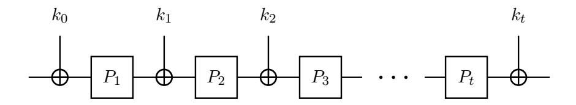
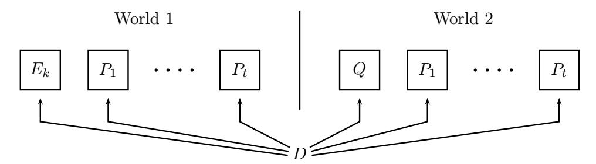

# Improved Security Bounds for Key-Alternating Ciphers via Hellinger Distance

John Steinberger
Institute of Theoretical Computer Science, Tsinghua University
jpsteinb@gmail.com

#### Abstract

A t-round key alternating cipher can be viewed as an abstraction of AES. It defines a cipher E from t fixed public permutations  $P_1, \ldots, P_t : \{0,1\}^n \to \{0,1\}^n$  and a key  $k = k_0 \| \cdots \| k_t \in \{0,1\}^{n(t+1)}$ by setting  $E_k(x) = k_t \oplus P_t(k_{t-1} \oplus P_{t-1}(\cdots k_1 \oplus P_1(k_0 \oplus x)\cdots))$ . The indistinguishability of  $E_k$ from a random truly random permutation by an adversary who also has oracle access to the (public) random permutations  $P_1, \ldots, P_t$  was investigated for t=2 by Even and Mansour [5] and, much later, by Bogdanov et al. [1]. The former proved indistinguishability up to  $2^{n/2}$  queries for t=1 while the latter proved indistinguishability up to  $2^{2n/3}$  queries for  $t \geq 2$  (ignoring low-order terms). Our contribution is to improve the analysis of Bogdanov et al. by showing security up to  $2^{3n/4}$  queries for  $t \geq 3$ . Given that security cannot exceed  $2^{\frac{t}{t+1}n}$  queries, this is in particular achieves a tight bound for the case t=3, whereas, previously, tight bounds had only been achieved for t=1 (by Even and Mansour) and for t=2 (by Bogdanov et al.). Our main technique is an improved analysis of the elegant sample distinguishability game introduced by Bogdanov et al. [1]. More specifically, we succeed in eliminating adaptivity by considering the Hellinger advantage of an adversary, a notion that we introduce here. To our knowledge, our result constitutes the first time Hellinger distance (a standard measure of "distance" between random variables, and a cousin of statistical distance) is used in a cryptographic indistinguishability proof.

#### Introduction

Given t permutations  $P_1, \ldots, P_t : \{0,1\}^n \to \{0,1\}^n$  the t-round key-alternating cipher based on  $P_1, \ldots, P_t$  is a blockcipher  $E : \{0,1\}^{(t+1)n} \times \{0,1\}^n \to \{0,1\}^n$  of keyspace  $\{0,1\}^{(t+1)n}$  and message space  $\{0,1\}^n$ , where for a key  $k = k_0 ||k_1|| \cdots ||k_t \in \{0,1\}^{(t+1)n}$  and a message  $x \in \{0,1\}^n$  we set

$$E(k,x) = k_t \oplus P_t(k_{t-1} \oplus P_{t-1}(\cdots P_1(k_0 \oplus x)\cdots)). \tag{1}$$

(See Figure 1.) Plainly,  $E(k,\cdot)$  is a permutation of  $\{0,1\}^n$  for each fixed  $k \in \{0,1\}^{(t+1)n}$ ; we let  $E^{-1}(k,\cdot)$  denote the inverse permutation. The  $P_i$ 's are called the *round permutations* of E and t is the *number of rounds* of E. Thus t and the permutations  $P_1, \ldots, P_t$  are parameters determining E.

Key-alternating ciphers were first proposed (for values of t greater than 1) by the designers of AES [3,4], the Advanced Encryption Standard. Indeed, AES-128 itself can be viewed as a particular instantiation of the key-alternating cipher paradigm in which the round permutations  $P_1, \ldots, P_t$  equal a single permutation P (the Rijndael round function, in this case), in which t = 10, and in which only a subset of the  $\{0,1\}^{(t+1)n} = \{0,1\}^{11n}$  possible keys are used (more precisely, the 11n bits of key are derived pseudorandomly from a seed of n bits, making the key space  $\{0,1\}^n = \{0,1\}^{128}$ ). However, for t = 1 the design was proposed much earlier by Even and Mansour as a means of constructing a blockcipher from a fixed permutation [5].

Even and Mansour accompanied their proposal with "provable security" guarantees by showing that, for t = 1, an adversary needs roughly  $2^{n/2}$  queries to distinguish  $E(k, \cdot)$  for a random key k (k being

Figure 1: A t-round key alternating cipher.

hidden from the adversary) from a true random permutation, in a model where the adversary is given oracle access to  $E(k,\cdot)$ ,  $E^{-1}(k,\cdot)$  as well as to  $P_1$ ,  $P_1^{-1}$ , where  $P_1$  is modeled as a random permutation (in the dummy world, the adversary is given oracle access to two independent random permutations and their inverses). Their bound was matched by Daemen [2], who showed a  $2^{n/2}$ -query distinguishing attack for t=1.

For t > 1, we can generalize the Even-Mansour indistinguishability experiment by giving the adversary oracle access to  $P_1, \ldots, P_t$  and their inverses and to  $E(k, \cdot)$ ,  $E^{-1}(k, \cdot)$  in the real world (for a randomly chosen, hidden  $k \in \{0,1\}^{(t+1)n}$ ), and to a tuple of t+1 independent random permutations and their inverses in the "ideal" or "dummy" world (see Figure 2). In this case, Daemen's attack can be easily generalized to an attack of query complexity  $2^{\frac{t}{t+1}n}$ , as pointed out by Bogdanov et al. [1], but the security analysis of Even and Mansour does not similarly generalize to a security bound of  $2^{\frac{t}{t+1}n}$  (though security of  $2^{n/2}$  queries still holds, and is easy to prove in a black-box fashion from the Even-Mansour result).

Despite the advent of AES, further provable security improvements on key-alternating ciphers for t > 1 had to wait for the afore-mentioned paper of Bogdanov et al. [1], who showed (in the same model as Even and Mansour) security of  $2^{\frac{2}{3}n}$  queries for  $t \ge 2$  (modulo lower-order terms). This bound is tight for t = 2, as it matches the  $2^{\frac{t}{t+1}n}$ -query attack, but is not sharp for t > 2—e.g., the best known attack for t = 3 has cost  $2^{\frac{3}{4}n}$ , whereas the best known security bound remains  $2^{\frac{2}{3}n}$ . In this paper we further this line of work by showing that key-alternating ciphers enjoy security of  $2^{\frac{3}{4}n}$  queries for  $t \ge 3$ . In a nutshell, the Even-Mansour bound is tight for t = 1, the Bogdanov et al. bound is tight for t = 2, and our bound is tight for t = 3. It remains an open problem to prove tight bounds for  $t \ge 4$  (though, we emphasize, our bound also improves the previous best of  $2^{\frac{2}{3}n}$  up to  $2^{\frac{3}{4}n}$  for t > 4).

Our proof follows closely the method of Bogdanov et al. [1]. Essentially, our improvement follows by replacing a certain "loose" statistical distance triangle inequality in [1] by a sharper inequality based on Hellinger distance (a variant of statistical distance). In fact, this technique more generally gives a much improved (and, in a cryptographic sense, sharp) analysis of the elegant sample distinguishability game introduced by Bogdanov et al. The modified sample distinguishability analysis that we present is also interesting because we show (loosely speaking) that the "statistical" advantage of an adaptive adversary can be upper bounded by the "Hellinger" advantage of a non-adaptive adversary. It thus presents a new, interesting instance of the paradigm common in cryptographic proofs that seeks to replace an adaptive adversary by a non-adaptive adversary in order to upper bound advantage [8,9,12–14].

Our work has two main parts: (i) an improved (generic) analysis of sample distinguishability based on the technical concept of Hellinger distance, and (ii) an application of the previous analysis to the sample distinguishability game defined by Bogdanov et al., where the main hurdle is to upper bound the relevant Hellinger distance (whereas Bogdanov et al. only upper bounded statistical distance).

In the paper's first part we (re-)introduce sample distinguishability, Hellinger distance, and their interconnection. This part contains the improved Hellinger-distance-based upper bound for sample distinguishability that is of independent interest from the paper's main result. In the paper's second

part we give more detailed definitions for key-alternating ciphers and the security experiment. We then recall the outline of Bogdanov et al.'s security analysis for key-alternating ciphers and "plug in" our improved sample distinguishability bound to this proof, thus obtaining the improvement from  $2^{\frac{2}{3}n}$  to  $2^{\frac{3}{4}n}$  queries for  $t \geq 3$  rounds.

To the best of our knowledge, this paper represents the first application of Hellinger distance in cryptography, or to indistinguishability in general.

A notational preliminary. The statistical distance  $\Delta(X,Y)$  (more accurately known, also, as the total variation distance) between two random variables X, Y of range S is defined as

$$\Delta(X,Y) := \max_{T \subseteq S} (\Pr[X \in T] - \Pr[Y \in T]) = \sum_{s \in S} \frac{1}{2} |\Pr[X = s] - \Pr[Y = s]|.$$

It is well-known (and easily proved) that

$$\Delta(X,Y) = \sup_{D} |\Pr[D(X) = 1] - \Pr[D(Y) = 1]|$$

where the sup is taken over all (probabilistic or deterministic—it doesn't matter) distinguishers  $D: S \to \{0,1\}$ , and where  $\Pr[D(X)=1]$ ,  $\Pr[D(Y)=1]$  are the probabilities that D outputs 1 when given a sample of X and Y, respectively, these probabilities being computed over the randomness in X and Y and over D's coins, if any.

### 1 Sample Distinguishability and Hellinger Distance

We start by recalling the elegant *sample distinguishability* game originally introduced as a mid-level abstraction in the proof of Bogdanov et al.

Bogdanov et al. consider a family  $(X_{\alpha}, Y_{\alpha})_{\alpha \in A}$  of pairs of random variables indexed by some finite1 set A. For each  $\alpha \in A$ ,  $X_{\alpha}$  and  $Y_{\alpha}$  take values in some finite set  $S_{\alpha}$  (one can assume, for conceptual simplicity and without loss of generality, that all  $S_{\alpha}$ 's are equal, say  $S_{\alpha} = S$  for all  $\alpha$  where S is some sufficiently large finite set).

The notation  $D^{(X_{\alpha})_{\alpha\in A}}$  indicates that a distinguisher D is given oracle access to a family of random variables indexed by the set A, in this case the family  $(X_{\alpha})_{\alpha\in A}$ . More precisely, this means D's query sequence has the form  $\alpha_1, \ldots, \alpha_q$  where each  $\alpha_i$  is in A, query  $\alpha_i$  being answered by a sample from  $X_{\alpha_i}$ . D may repeat queries to the same  $\alpha \in A$ , in which case a "fresh" sample of  $X_{\alpha}$  is returned each time to D. All samples returned to D are independent (including, thus, samples from repeated queries to the same  $\alpha \in A$ ). In general, D can be adaptive.

D's sample distinguishability advantage with respect to the family of pairs  $(X_{\alpha}, Y_{\alpha})_{\alpha \in A}$  is defined as

$$\Delta_D^{\mathsf{samp}}((X_\alpha, Y_\alpha)_{\alpha \in A}) = |\Pr[D^{(X_\alpha)_{\alpha \in A}} = 1] - \Pr[D^{(Y_\alpha)_{\alpha \in A}} = 1]|$$

where  $D^{(X_{\alpha})_{\alpha \in A}} = 1$  indicates the event that D outputs 1 after interacting with its oracle. The q-query sample distinguishability of the family  $(X_{\alpha}, Y_{\alpha})_{\alpha \in A}$  is defined as

$$\Delta^{\mathsf{samp}}(q,(X_\alpha,Y_\alpha)_{\alpha\in A}) = \sup_D \Delta^{\mathsf{samp}}_D((X_\alpha,Y_\alpha)_{\alpha\in A})$$

where the sup is taken over all distinguishers D making at most q queries.

&lt;sup>1The various finiteness assumptions are, of course, made mostly for simplicity; by replacing maximums by supremums and discrete sums by Lebesgue integrals, the game and theory can be generalized to the case of an infinite A and arbitrary measure spaces  $S_{\alpha}$  equipped with probability measures  $X_{\alpha}, Y_{\alpha}$ .

It might seem, given the independence of the various samples, that adaptivity cannot help the distinguisher. However, as Bogdanov et al. point out, this intuition is mistaken. Bodganov et al. give a somewhat hard-to-follow example with q=2, |A|=2 and  $\max_{\alpha}|S_{\alpha}|=3$  that shows an adaptive adversary can have better advantage than a non-adaptive one. A much simpler and more intuitive example was provided to us by Liu Tianren [15]. In this example q=2, |A|=3, and  $\max_{\alpha} |S_{\alpha}|=2$ . We put, more precisely,  $A = \{1, 2, 3\}$  and  $S_{\alpha} = \{0, 1\}$  for all  $\alpha \in A = \{1, 2, 3\}$ ; the pairs  $(X_1, Y_1), (X_2, Y_2),$  $(X_3, Y_3)$  are given by the probability tables

| Pr    | 0   | 1   | Pr    | (  |
|-------|-----|-----|-------|----|
| $X_1$ | 2/3 | 1/3 | $X_2$ |    |
| $Y_1$ | 1/3 | 2/3 | $Y_2$ | 3, |
|       |     |     |       |    |

| Pr    | 0   | 1   | Pr    | 0   |
|-------|-----|-----|-------|-----|
| $X_2$ | 1   | 0   | $X_3$ | 1/4 |
| $Y_2$ | 3/4 | 1/4 | $Y_3$ | 0   |

$$\Delta(X_1, Y_1) = 1/3$$
  $\Delta(X_2, Y_2) = 1/4$   $\Delta(X_3, Y_3) = 1/4$

Here the optimal distinguisher is an adaptive distinguisher D that first queries 1, then queries 2 if the answer to the first query is 0, and otherwise queries 3 if the answer to the first query is 1. One can

- check, then, that  $\Delta_D^{\mathsf{samp}} = \frac{1}{2}$ . On the other hand, one can also verify that

   if D non-adaptively queries (1,1),  $\Delta_D^{\mathsf{samp}} = 1/3$  if D non-adaptively queries (1,2),  $\Delta_D^{\mathsf{samp}} = 5/12$  (and similarly if D non-adaptively queries (1,3))

   if D non-adaptively queries (2,3),  $\Delta_D^{\mathsf{samp}} = 1/4$  (and similarly if D non-adaptively queries (3,2))

   if D non-adaptively queries (2,2),  $\Delta_D^{\mathsf{samp}} = 7/16$  (and similarly if D non-adaptively queries (3,3)).

  Thus, the advantage of the best adaptive distinguisher is  $\frac{1}{2}$  whereas the advantage of the best nonadaptive distinguisher is  $\frac{7}{16}$ .

We define separately the non-adaptive sample distinguishibility of a family  $(X_{\alpha}, Y_{\alpha})_{\alpha \in A}$  as

$$\Delta_{\mathrm{non}}^{\mathrm{samp}}(q,(X_{\alpha},Y_{\alpha})_{\alpha\in A}) = \sup_{D} \Delta_{D}^{\mathrm{samp}}((X_{\alpha},Y_{\alpha})_{\alpha\in A})$$

where the sup, this time, is taken over all non-adaptive distinguishers D making at most q queries (a nonadaptive distinguisher is defined as a distinguisher that announces its sequence of queries  $(\alpha_1, \ldots, \alpha_q) \in$  $A^q$  at the start of the game, before receiving any query answers). We will prove, among others, that

$$\Delta^{\mathsf{samp}}(q,(X_{\alpha},Y_{\alpha})_{\alpha\in A}) \leq \sqrt{2\Delta^{\mathsf{samp}}_{\mathsf{non}}(q,(X_{\alpha},Y_{\alpha})_{\alpha\in A})} \tag{2}$$

for any family  $(X_{\alpha}, Y_{\alpha})_{\alpha \in A}$ . Thus, while adaptivity helps for sample distinguishability, it helps "at most quadratically". In practice, it seems, the (potentially) quadratic discrepancy between the adaptive and non-adaptive sample distinguishability advantages makes little difference for cryptographic applications (due to the fact that there is typically little difference, e.g., between the number of non-adaptive queries necessary for reaching distinguishing advantage 0.5 and the number necessary for reaching distinguishing advantage  $0.5^2/\sqrt{2}$ ).

We will prove (2) using Hellinger distance. Coincidentally, Hellinger distance is also the appropriate tool for upper bounding  $\Delta_{\mathsf{non}}^{\mathsf{samp}}$ —thus Hellinger distance will turn out to be "twice useful" in this paper.

Given random variables X and Y of finite range S, the Hellinger distance h(X,Y) between X and Y is defined via

$$\begin{array}{lcl} h^2(X,Y) &:=& \frac{1}{2}\sum_{s\in S}(\sqrt{\Pr[X=s]}-\sqrt{\Pr[Y=s]})^2\\ &=& 1-\sum_{s\in S}\sqrt{\Pr[X=s]\Pr[Y=s]} \end{array}$$

where the second equality is easily verified by elementary algebra. (Thus, we emphasize, h(X,Y) is the positive square root of the above quantities.) We note already that

$$1 - h^2(X, Y) = \sum_{s \in S} \sqrt{\Pr[X = s] \Pr[Y = s]}$$

has a fairly simple expression, which will play a role later on.

Hellinger distance can be used to upper bound statistical distance and vice-versa. One has, to be precise,

$$h^2(X,Y) \le \Delta(X,Y) \le \sqrt{2}h(X,Y). \tag{3}$$

(The first inequality follows directly from the fact that  $(\sqrt{a} - \sqrt{b})^2 \le |a - b|$  for all real numbers  $a, b \ge 0$ ; the second inequality can be proved from Cauchy-Schwarz.)

A product distribution is a random variable of the form  $X = (X_i)_{i=1}^n$  where the  $X_i$ 's are (fully) independent. One can note that if  $X = (X_i)_{i=1}^n$ ,  $X = (Y_i)_{i=1}^n$  are product distributions where  $X_i$  and  $Y_i$  have finite range  $S_i$ , then

$$1 - h^{2}(X,Y) = \sum_{(s_{1},\dots,s_{n})\in S_{1}\times\dots\times S_{n}} \sqrt{\Pr[X = (s_{1},\dots,s_{n})] \Pr[Y = (s_{1},\dots,s_{n})]}$$

$$= \sum_{(s_{1},\dots,s_{n})\in S_{1}\times\dots\times S_{n}} \sqrt{\Pr[X_{1} = s_{1}] \cdots \Pr[X_{n} = s_{n}] \Pr[Y_{1} = s_{1}] \cdots \Pr[Y_{n} = s_{n}]}$$

$$= \left(\sum_{s_{1}\in S_{1}} \sqrt{\Pr[X_{1} = s_{1}] \Pr[Y_{1} = s_{1}]}\right) \cdots \left(\sum_{s_{n}\in S_{n}} \sqrt{\Pr[X_{n} = s_{n}] \Pr[Y_{n} = s_{n}]}\right)$$

$$= \prod_{i=1}^{n} (1 - h^{2}(X_{i}, Y_{i}))$$

$$\geq 1 - \sum_{i=1}^{n} h^{2}(X_{i}, Y_{i})$$

so, in particular,

$$h^{2}(X,Y) \leq \sum_{i=1}^{n} h^{2}(X_{i},Y_{i}) \leq n \max_{i} h^{2}(X_{i},Y_{i})$$

and

$$h(X,Y) \le \sqrt{\sum_{i=1}^{n} h^2(X_i, Y_i)} \le \sqrt{n} \max_{i} h(X_i, Y_i).$$
 (4)

We note that statistical distance admits the similar inequalities

$$\Delta(X,Y) \le \sum_{i=1}^{n} \Delta(X_i, Y_i) \le n \max_{i} \Delta(X_i, Y_i)$$
(5)

but the first inequality is typically fairly loose. Usually, the inequality

$$\Delta(X,Y) \le \sqrt{2}h(X,Y) \le \sqrt{n} \max_{i} h(X_i, Y_i)$$
(6)

obtained by combining (3) and (4) gives a better upper bound on  $\Delta(X,Y)$ . (On a very simplified level, our paper's improvement boils down to the difference between (6) and (5).) We next illustrate these

concepts with an example.

Example. Let  $X = (X_i)_{i=1}^n$ ,  $Y = (Y_i)_{i=1}^n$  be product distributions where  $X_1, \ldots, X_n$  are identically distributed, and so for  $Y_1, \ldots, Y_n$ , these distributions being given by

$$\Pr[X_i = 1] = \frac{1}{2} + \varepsilon \qquad \Pr[X_i = 0] = \frac{1}{2} - \varepsilon$$

$$\Pr[Y_i = 1] = \frac{1}{2} - \varepsilon \qquad \Pr[Y_i = 0] = \frac{1}{2} + \varepsilon$$

for some small  $\varepsilon$ . Thus, X represents n independent samples of a coin with a  $+\varepsilon$  bias towards 1, whereas Y represents n independent samples of a coin with a  $+\varepsilon$  bias towards 0. One can show with a Chernoff bound that  $n = O(1/\varepsilon^2)$  samples are *sufficient* to distinguish X and Y; that is,

$$\Delta(X,Y) = \Delta^{\mathsf{samp}}(n,(X_1,Y_1)) = \Omega(1)$$

for  $n = O(1/\varepsilon^2)$ . (Here we write simply  $(X_1, Y_1)$  for the family  $(X_\alpha, Y_\alpha)_{\alpha \in A}$  whose only member is the pair  $(X_1, Y_1)$ .) Also, (5) gives

$$\Delta(X,Y) \le n\Delta(X_1,Y_1) = 2n\varepsilon$$

which shows that  $n = O(1/\varepsilon)$  samples are necessary to distinguish X and Y—but  $O(1/\varepsilon)$  is a far cry from  $O(1/\varepsilon^2)$ . On the other hand, (6) gives

$$\Delta(X,Y) \le \sqrt{n}h(X_1,Y_1) = \sqrt{n}O(\varepsilon)$$

which, indeed, shows that  $n = O(1/\varepsilon^2)$  samples are necessary to distinguish the biased coins. (We skip the straightforward computation showing that  $h(X_1, Y_1) = O(\varepsilon)$ .) In this case, therefore, (6) gives a substantially better upper bound on  $\Delta(X, Y)$  than (5).

As one of our paper's main results, we will prove that

$$\Delta^{\mathsf{samp}}(q, (X_{\alpha}, Y_{\alpha})_{\alpha \in A}) \le \sqrt{2q} \max_{\alpha \in A} h(X_{\alpha}, Y_{\alpha}) \tag{7}$$

for any family  $(X_{\alpha}, Y_{\alpha})_{{\alpha} \in A}$ , and any  $q \in \mathbb{N}$ . Note that (7) generalizes (6) since, obviously,  $\Delta(X, Y) \leq \Delta^{\mathsf{samp}}(n, (X_i, Y_i)_{i \in [n]})$  for product distributions  $X = (X_i)_{i=1}^n$ ,  $Y = (Y_i)_{i=1}^n$ . We continue with, as our main goal, a proof of (7).

By a standard argument

$$\Delta^{\mathrm{samp}}(q,(X_{\alpha},Y_{\alpha})_{\alpha\in A})=\sup_{D}\Delta^{\mathrm{samp}}_{D}((X_{\alpha},Y_{\alpha})_{\alpha\in A})$$

with the sup taken over all deterministic (adaptive) distinguishers D making at most q queries. Thus we can restrict our attention to deterministic distinguishers.

The "query strategy" of a deterministic q-query distinguisher D for a family  $(X_{\alpha}, Y_{\alpha})_{\alpha \in A}$  can be encoded as a tree of depth q. Each non-leaf node of the tree is labeled by a query  $\alpha \in A$  where, e.g., the root of the tree is labeled by D's first query. For a node labeled  $\alpha$ , there are  $|S_{\alpha}|$  children for that node, each child corresponding to some element of  $S_{\alpha}$ , where  $S_{\alpha}$  (we recall) is the range of  $X_{\alpha}$  and  $Y_{\alpha}$ . When D makes its queries, it follows the tree downward from the root to a leaf according to the answers it receives from its oracle. Finally, each leaf is labeled with a decision: 0 or 1. Such a labeled tree fully describes a deterministic, adaptive distinguisher D.

Take now some arbitrary (deterministic, adaptive, q-query) D, let T be the tree associated to D, and let r be the root of T. We write  $T_v$  for the subtree of T rooted at  $v \in V(T)$  and write  $If(T_v)$  for the set of leaves of  $T_v$ . Thus  $T = T_r$ . For  $\ell \in If(T_v)$  we write  $P_X(v \to \ell)$  for the probability that leaf

 $\ell$  is reached if queries start at v and the oracle is  $(X_{\alpha})_{\alpha \in A}$ .  $P_Y(v \to \ell)$  is similarly defined. We also define  $P_X(\ell \to \ell) = P_Y(\ell \to \ell) = 1$  for any leaf  $\ell$ . We let  $L_X^T$ ,  $L_Y^T$  be random variables of range  $\mathrm{lf}(T)$ , such that  $\Pr[L_X^T = \ell] = P_X(r \to \ell)$  and  $\Pr[L_Y^T = \ell] = P_Y(r \to \ell)$ . In other words,  $L_X^T$  is distributed according to the probability that D lands at a given leaf when the oracle is  $(X_\alpha)_{\alpha \in A}$ , and likewise with  $L_Y^T$  and  $(Y_\alpha)_{\alpha \in A}$ . It is easy to see, then, that  $\Delta_D^{\mathsf{samp}}((X_\alpha, Y_\alpha)_{\alpha \in A}) \leq \Delta(L_X^T, L_Y^T)$  (and, moreover,  $\Delta_D^{\mathsf{samp}}((X_\alpha, Y_\alpha)_{\alpha \in A}) = \Delta(L_X^T, L_Y^T)$  if D labels the leaves intelligently, e.g., if leaf  $\ell$  has label 1 if and only if  $\Pr[L_X^T = \ell] \geq \Pr[L_Y^T = \ell]$ ). In particular, by (3),

$$\Delta_D^{\mathsf{samp}}((X_\alpha, Y_\alpha)_{\alpha \in A}) \le \Delta(L_X^T, L_Y^T) \le \sqrt{2}h(L_X^T, L_Y^T). \tag{8}$$

Say a tree T' is non-adaptive if all the nodes at a given level of the tree have the same label. Obviously, the tree associated to a non-adaptive adversary (viewed as a special case of an adaptive adversary) is a non-adaptive tree. We will show:

$$\exists \text{ non-adaptive } T' \text{ of depth } q \text{ s.t.} \forall \text{ adaptive } T \text{ of depth } q, \ h(L_X^T, L_Y^T) \leq h(L_X^{T'}, L_Y^{T'}) \tag{9}$$

In other words, adaptivity does not help for maximizing the Hellinger distance between the probability distributions on the leaves (even though it does help for maximizing the statistical distance between the distributions on the leaves).

For convenience, we define

$$\begin{split} H(T) &= 1 - h^2(L_X^T, L_Y^T) \\ &= \sum_{\ell \in \mathrm{lf}(T)} \sqrt{\Pr[L_X^T = \ell] \Pr[L_Y^T = \ell]} \end{split}$$

for a tree T. Then (9) is equivalent to

$$\exists \text{ non-adaptive } T' \text{ of depth } q \text{ s.t.} \forall \text{ adaptive } T \text{ of depth } q, \ H(L_X^T, L_Y^T) \geq H(L_X^{T'}, L_Y^{T'}). \tag{10}$$

We prove (10) by induction on q. When q=1 the result is obvious, since it suffices to define T' to be the depth-1 tree whose root is labeled by the element  $\beta \in A$  that maximizes  $h(X_{\beta}, Y_{\beta})$  (i.e., that minimizes  $H(X_{\beta}, Y_{\beta})$ ). The fact that A is finite guarantees the existence of such a  $\beta$ .

For the induction step, assume that (10) has been established for  $q \leq t$ , and let  $T'_t$  be the tree T' satisfying (10) for q = t. Let T be an arbitrary tree of depth t + 1. Let T(v) denote the subtree of T rooted at  $v \in V(T)$  (thus, for example, T = T(r) where r is the root of T). Let the root r of T have label  $\alpha_r \in A$ , where  $X_{\alpha_r}$ ,  $Y_{\alpha_r}$  have range  $S_{\alpha_r}$ , and assume that r's children in T are  $\{v_s : s \in S_{\alpha_r}\}$ . Then

$$\begin{split} H(T) &= H(L_X^T, L_Y^T) \\ &= \sum_{\ell \in \operatorname{If}(T)} \sqrt{\Pr[L_X^T = \ell] \Pr[L_Y^T = \ell]} \\ &= \sum_{s \in S_{\alpha_r}} \sum_{\ell \in \operatorname{If}(T(v_s))} \sqrt{\Pr[X_{\alpha_r} = v_s] \Pr[L_X^{T(v_s)} = \ell] \Pr[Y_{\alpha_r} = v_s] \Pr[L_Y^{T(v_s)} = \ell]} \\ &= \sum_{s \in S_{\alpha_r}} \sqrt{\Pr[X_{\alpha_r} = v_s] \Pr[Y_{\alpha_r} = v_s]} \sum_{\ell \in \operatorname{If}(T(v_s))} \sqrt{\Pr[L_X^{T(v_s)} = \ell] \Pr[L_Y^{T(v_s)} = \ell]} \\ &= \sum_{s \in S_{\alpha_r}} \sqrt{\Pr[X_{\alpha_r} = v_s] \Pr[Y_{\alpha_r} = v_s]} H(T(v_s)) \\ &\geq \sum_{s \in S_{\alpha_r}} \sqrt{\Pr[X_{\alpha_r} = v_s] \Pr[Y_{\alpha_r} = v_s]} H(T_t') \end{split}$$

$$= H(T'_t) \sum_{s \in S_{\alpha_r}} \sqrt{\Pr[X_{\alpha_r} = v_s] \Pr[Y_{\alpha_r} = v_s]}$$
$$= H(T'_t) H(X_{\alpha_r}, Y_{\alpha_r}).$$

On the other hand, if we define  $T'_{t+1}$  to be the non-adaptive tree whose root is labeled by the element  $\beta \in A$  that minimizes  $H(X_{\beta}, Y_{\beta})$  and whose first-level subtrees are each equal to  $T'_t$ , then

$$H(T'_{t+1}) = H(T'_t)H(X_{\beta}, Y_{\beta}) \le H(T'_t)H(X_{\alpha_r}, Y_{\alpha_r})$$

so that  $H(T'_{t+1}) \leq H(T)$ , as desired. This establishes (10) and (9).

Now let T' be the non-adaptive tree of depth q whose existence is guaranteed by (9) and let D' be the non-adaptive adversary associated to T', where we label the leaves of T' such that  $\ell \in lf(T')$  has label 1 if and only if  $\Pr[L_X^{T'} = \ell] \ge \Pr[L_Y^{T'} = \ell]$ . Then  $\Delta_{D'}^{\mathsf{samp}}((X_\alpha, Y_\alpha)_{\alpha \in A}) = \Delta(L_X^{T'}, L_Y^{T'})$  and for any q-query adaptive distinguisher D with tree T we have

$$\Delta_D^{\mathsf{samp}}((X_\alpha, Y_\alpha)_{\alpha \in A}) \leq \Delta(L_X^T, L_Y^T) \leq \sqrt{2}h(L_X^T, L_Y^T) \leq \sqrt{2}h(L_X^{T'}, L_Y^{T'}) \leq \sqrt{2}q \max_{\alpha \in A} h(X_\alpha, Y_\alpha) \tag{11}$$

where: (i) the second inequality follows by (3), (ii) the third inequality follows by the choice of T', (iii) the fourth inequality follows by (6) because  $h(L_X^{T'}, L_Y^{T'}) = h(X, Y)$  where X, Y are the product distributions  $(X_{\alpha_i})_{i=1}^q$ ,  $(Y_{\alpha_i})_{i=1}^q$ , where  $\alpha_i$  is the label on the *i*-th level of T'. Thus we have proved (7), which we record as a lemma:

**Lemma 1** For any family  $(X_{\alpha}, Y_{\alpha})_{\alpha \in A}$ , A finite, we have

$$\Delta^{\mathsf{samp}}(q,(X_{\alpha},Y_{\alpha})_{\alpha\in A}) \leq \sqrt{2q} \max_{\alpha\in A} h(X_{\alpha},Y_{\alpha})$$

for all  $q \in \mathbb{N}$ .

(One can observe that the case |A| = q = 1 of Lemma 1 is equivalent to the right-hand inequality in (3).)

Moreover, the sequence of inequalities in (11) can be used to directly relate the adaptive and non-adaptive sample distinguishability advantages. More exactly, since

$$\sqrt{2}h(L_X^{T'},L_Y^{T'}) \leq \sqrt{2\Delta(L_X^{T'},L_Y^{T'})} = \sqrt{2\Delta_{D'}^{\mathsf{samp}}((X_\alpha,Y_\alpha)_{\alpha \in A})} = \sqrt{2\Delta_{\mathsf{non}}^{\mathsf{samp}}(q,(X_\alpha,Y_\alpha)_{\alpha \in A})}$$

with T' and D' as in (11), and since D is an arbitrary q-query distinguisher, we find

$$\Delta^{\mathsf{samp}}(q,(X_\alpha,Y_\alpha)_{\alpha\in A}) \leq \sqrt{2}h(L_X^{T'},L_Y^{T'}) \leq \sqrt{2\Delta^{\mathsf{samp}}_{\mathsf{non}}(q,(X_\alpha,Y_\alpha)_{\alpha\in A})}$$

which proves (2). We point out that we do not know the extent to which (2) is sharp. Indeed, it remains an interesting open problem to either find some sequence of examples showing that (2) is sharp (up to a possible constant factor), or else to display an even closer relationship between adaptive and non-adaptive sample distinguishabilities. In all events, however, we shall have no further use for (2), our main tool being Lemma 1.

We finally note, parenthetically, that sample distinguishability is loosely related to the notion of free-start distinguishability defined by Gazl and Maurer [7]. More precisely, sample distinguishability can be seen as taking the idea of free-start indistinguishability to its logical extreme, whereby the distinguisher is "repeatedly given a free start" at each query. (In fact, this establishes a general connection between sample indistinguishability and general indistinguishability.)

Figure 2: The two worlds for the Even-Mansour security experiment. In World 1 the distinguisher D has oracle access to random permutations  $P_1, \ldots, P_t$  and the key-alternating cipher  $E_k$  (cf. Eq. (1)) for a random key k. In World 2, D has oracle access to t+1 independent random permutations. In either world D also has oracle access to the inverse of each permutation.

## 2 Applications to Key-Alternating Ciphers

We define the PRP security of a t-round key-alternating cipher E (cf. (1)) against a distinguisher (or "adversary") D as

$$\mathbf{Adv}_{E,t}^{\text{PRP}}(D) = \Pr[k = k_0 \cdots k_t \longleftarrow \{0,1\}^{t(n+1)}; D^{E_k,P_1,\dots,P_t} = 1] - \Pr[D^{Q,P_1,\dots,P_t} = 1]$$

where in each experiment  $Q, P_1, \ldots, P_t$  are independent uniform random permutations, where D is also allowed to query the inverse of each of its oracles (see Figure 2), and where  $k = k_0 \cdots k_t$  is selected uniformly at random (and hidden from D). We further define

$$\mathbf{Adv}_{E,t}^{\mathrm{PRP}}(q) = \max_{D} \mathbf{Adv}_{E,t}^{\mathrm{PRP}}(D)$$

where the maximum is taken over all adversaries D making at most q queries. (The notation  $\mathbf{Adv}_{E,t}^{\mathrm{PRP}}(\cdot)$  is thus overloaded.) We also note that, besides t, n is a parameter on which E (and hence  $\mathbf{Adv}_{E,t}^{\mathrm{PRP}}(q)$ ) depends (and naturally enough, since n is the "security parameter").

Our main result is the following:

**Theorem 1** Let  $N=2^n$  and let  $q=N^{\frac{t}{t+1}}/Z$  for some  $Z\geq 1$ . Then, for any  $t\geq 1$  and assuming  $q<\min(N/100,N/5t)$ , we have

$$Adv_{E,t}^{PRP}(q) \le \frac{3q^2t}{N^{1.5}} + \frac{t+1}{Z^t}.$$

The above theorem is void for  $q > N^{\frac{t}{t+1}}$  since  $Z \ge 1$ . Thus, the provable security achieved is always at most  $N^{\frac{t}{t+1}}$  queries. On the other hand, the term  $3q^2t/N^{1.5}$  also caps security at  $q = N^{\frac{3}{4}}$ . Thus, roughly, Theorem 1 implies indistinguishability of the Even-Mansour cipher up to

$$q \approx \min(2^{\frac{3}{4}n}, 2^{\frac{t}{t+1}n})$$

queries, which is sharp for  $t \leq 3$ . We shall keep  $N = 2^n$  for the remainder of the article.

For a large part, our proof follows the outline of Bogdanov et al. [1]. As in [1], instead of giving D oracle access to the tuple of oracles

$$E_k, P_1, \ldots, P_t$$

in "world 1", we give it oracle access to the oracles

$$E_k^{-1}, P_1, \dots, P_t$$

(since the inverses can be queried, this is clearly a cosmetic change—moreover the corresponding change has no effect in world 2, since Q is anyway a uniform random permutation). We also rename  $E_k^{-1}$  as  $P_0$  so that, in "world 1", D's oracles become a (t+1)-tuple

$$P_0, P_1, \ldots, P_t$$

with the property that

$$P_t(P_{t-1}(\dots P_2(P_1(P_0(\cdot) \oplus k_0) \oplus k_1) \oplus k_2 \dots) \oplus k_{t-1}) \oplus k_t = id.$$
 (12)

We can indeed think of D's t+1 oracles  $P_0, \ldots, P_t$  as being constructed as follows in world 1: first the key  $k_0 \cdots k_t$  is sampled, after which permutations  $P_0, \ldots, P_t$  are sampled uniformly at random from all (t+1)-tuples  $(P_0, \ldots, P_t)$  satisfying (12). (In turn, one way of implementing the latter sampling is to sample t of the t+1 permutations  $P_0, \ldots, P_t$  uniformly and independently at random, and to define the remaining (t+1)-th permutation via (12).)

Following [1], we formally implement the interface of oracles  $(P_0, \ldots, P_t)$  in world 1 via an oracle O(N,t) taking  $k_0, \ldots, k_t$  as implicit parameters. This oracle uses lazy sampling to define  $P_0, \ldots, P_t$ . Originally the  $P_i$ 's are undefined at all points. Subsequently, when the adversary makes a query  $P_i(x)$  (the case of a backward query  $P_i^{-1}(x)$  is similarly handled) the oracle O(N,t) defines  $P_i(x)$  according to the following procedure:

• Let  $\mathcal{P} = \mathcal{P}(P_0, \dots, P_t)$  be the set of all (t+1)-tuples of permutations  $(\overline{P}_0, \dots, \overline{P}_t)$  such that  $\overline{P}_i$  extends the currently defined portion of  $P_i$ , and such that

$$\overline{P}_t(\cdots \overline{P}_2(\overline{P}_1(\overline{P}_0(\cdot) \oplus k_0) \oplus k_1) \cdots \oplus k_{t-1}) \oplus k_t = id.$$
(13)

Then O(N,t) samples uniformly at random an element  $(\overline{P}_0,\ldots,\overline{P}_t)$  from  $\mathcal{P}$ . The oracle sets  $P_i(x) = \overline{P}_i(x)$  and returns this value.

After the above, the oracle "forgets" about  $\overline{P}_0, \ldots, \overline{P}_t$ , and samples these afresh at the next query. It is clear that this lazy sampling process gives the same distribution as sampling the tuple  $(P_0, \ldots, P_t)$  at the start of the game.

In view of applying a hybrid argument, Bogdanov et al. also define a second oracle  $\tilde{O}(N,t)$ . This oracle also defines the permutations  $P_0, \ldots, P_t$  via lazy sampling, and also takes the key  $k_0 \cdots k_t$  as an implicit input, but this time the lazy sampling process is a bit different.

We say that a sequence of partially defined permutations  $P_0, \ldots, P_t$  is consistent if  $\mathcal{P}(P_0, \ldots, P_t) \neq \emptyset$ , with  $\mathcal{P}(\cdot)$  defined as in the description of O(N,t) above. Initially,  $\tilde{O}(N,t)$  sets the permutations  $P_0, \ldots, P_t$  to be undefined everywhere. Upon receiving a forward query  $P_i(x)$ ,  $\tilde{O}(N,t)$  uses the following lazy sampling procedure:

• Let  $U \subseteq \{0,1\}^n$  be the set of values y such that defining  $P_i(x) = y$  maintains the consistency of  $P_0, \ldots, P_t$ , besides maintaining the fact that  $P_i$  is a permutation. Then  $\tilde{O}(N,t)$  samples a value y uniformly from U, sets  $P_i(x) = y$ , and returns y.

Inverse queries are similarly treated. While it may not be immediately apparent that  $\tilde{O}(N,t)$ 's answers are distributed any differently from O(N,t)'s, small examples can be constructed to show that, indeed, these two oracles are statistically non-equivalent.

Theorem 1 is, via a hybrid argument, the direct consequence of the following two propositions:

**Proposition 1** Let  $q < \min(N/100, N/5t)$ . With O(N,t) and  $\tilde{O}(N,t)$  defined as above,

$$\Pr[k_0, \dots, k_t \leftarrow \{0, 1\}^n; D^{O(N, t)} = 1] - \Pr[k_0, \dots, k_t \leftarrow \{0, 1\}^n; D^{\tilde{O}(N, t)} = 1] \le \frac{3q^2t}{N^{1.5}}$$

for every distinguisher D making at most g queries.

**Proposition 2** Let  $q = N^{\frac{t}{t+1}}/Z$  for some  $Z \ge 1$  be such that q < N/3. With  $\tilde{O}(N,t)$  defined as above,

$$\Pr[k_0, \dots, k_t \leftarrow \{0, 1\}^n; D^{\tilde{O}(N, t)} = 1] - \Pr[D^{Q_0, \dots, Q_t} = 1] \le \frac{t + 1}{Z^{t + 1}}.$$

for every distinguisher D making at most q queries, where  $Q_0, \ldots, Q_t$  are independent random permutations.

Proposition 2 is proved in [1]. A weaker form of Proposition 1 is also proved in [1], with a bound of  $4.3q^3t/N^2$  instead of  $3q^2t/N^{1.5}$ . The rest of the paper is devoted to the proof of Proposition 1.

We use a sample distinguishability game to prove Proposition 1. This is the same sample distinguishability game used by Bogdanov et al. for the proof of "their" version of Proposition 1. Only the game's analysis will be different.

In view of defining this game, Bogdanov et al. first note that the adversary D can only have better advantage at distinguishing O(N,t) from  $\tilde{O}(N,t)$  if we tell D the keys  $k_0,\ldots,k_t$  (indeed, D is free to disregard this information). Nextly, they observe that one can further reduce to the case in which  $k_0 = \ldots = k_t = 0^n$  ([1] Proposition 4). (In the latter case, moreover, D obviously does not need to be "told"  $k_0,\ldots,k_t$ .) Letting

$$\mathbf{Adv}_{N,t}^{O\tilde{O};0^n}(D) = \Pr[k_0 = \dots = k_t = 0^n; D^{O(N,t)} = 1] - \Pr[k_0 = \dots = k_t = 0^n; D^{\tilde{O}(N,t)} = 1].$$

denote the advantage of an adversary D at distinguishing O(N,t) and  $\tilde{O}(N,t)$  implemented with zero keys, it thus suffices to prove

$$\mathbf{Adv}_{N,t}^{O\tilde{O};0^{n}}(q) \le \frac{3q^{2}t}{N^{1.5}} \tag{14}$$

where  $\mathbf{Adv}_{N,t}^{O\tilde{O};0^n}(q)$  is defined as the sup of  $\mathbf{Adv}_{N,t}^{O\tilde{O};0^n}(D)$  taken over all q-query distinguishers D.

When the keys are zero, O(N,t) and  $\tilde{O}(N,t)$  offer, essentially, two slightly different methods of lazy sampling permutations  $P_0, \ldots, P_t$  subject to the constraint

$$P_t(\cdots P_1(P_0(\cdot))\cdots) = id. \tag{15}$$

Moreover, the oracles O(N,t) and  $\tilde{O}(N,t)$  maintain no "internal" data structures between queries that are hidden from the distinguisher. (Indeed, the only data structures that O(N,t) and  $\tilde{O}(N,t)$  remember between queries are the tables  $P_0, \ldots, P_t$ , and the state of these tables is known to the distinguisher D who has made the queries to fill them.) More precisely, if we let  $\ell_i$  be the number of points at which  $P_i$  (or  $P_i^{-1}$ ) is defined before D's i-th query, then  $\ell_0 + \cdots + \ell_t = i - 1$  when D makes its i-th query, assuming (wlog) that D has made no redundant queries. We can imagine further strengthening D by giving D the ability to reset the state of the data structures  $P_0, \ldots, P_t$  arbitrarily between queries, subject to the constraint (say) that each  $P_i$  is defined at at most q points. Giving this added power to D brings us to a sample distinguishability game  $(X_\alpha, Y_\alpha)_{\alpha \in A_0}$  in which in which the index set  $A_0$  corresponds to all possible partial settings of the permutations  $P_0, \ldots, P_t$  available to D and in which the X-world and Y-world correspond to O(N,t) and  $\tilde{O}(N,t)$ , respectively. (We write  $A_0$  instead of A in order to distinguish this specific sample distinguishability from the generic sample distinguishability game discussed in Section 1.)

We now make a number of definitions to describe the above sample distinguishability game  $(X_{\alpha}, Y_{\alpha})_{\alpha \in A_0}$  more formally. In particular, we will encode the (partially defined) permutations  $P_0, \ldots, P_t$  as matchings, to remain consistent with the terminology of [1]. The following few definitions, indeed, are more or less all cut-and-pasted from [1].

We let  $V_0, \ldots, V_t, V_{t+1}$  be vertex sets with  $|V_i| = N$  and where we identify  $V_{t+1}$  with  $V_0$ . A sequence of matchings  $\overline{M} = (\overline{M}_0, \ldots, \overline{M}_{t+1})$  where  $\overline{M}_i$  is a perfect matching between  $V_i$  and  $V_{i+1}$  is called *circular*

if every path starting at a vertex  $v \in V_0$  following the edges in  $\overline{M}_0, \dots, \overline{M}_t$  ends at the same vertex  $v \in V_{t+1} = V_0$ . In other words, circularity is the matching equivalent of (15).

Given a sequence  $M = (M_0, \dots, M_t)$  where each  $M_i$  is a partial matching between  $V_i$  and  $V_{i+1}$ , we let

$$\mathcal{M}(M)$$

be the set of all circular sequences  $\overline{M}$  extending M, i.e. the set of all sequences  $\overline{M} = (\overline{M}_0, \dots, \overline{M}_t)$  such that  $\overline{M}_i$  extends  $M_i$  for each i and such that  $\overline{M}$  is circular. We say M is consistent if  $\mathcal{M}(M) \neq \emptyset$ .

A q-configuration is a pair  $(v_0, M)$  such that (i)  $M = (M_0, \ldots, M_t)$  is a consistent sequence of partial matchings such that  $|M_i| \leq q$  for all i, (ii)  $v_0 \in V_0$  is nonadjacent to  $M_0$ . The index set  $A_0$  of the sample distinguishability game will be the set of all q-configurations. That is,

$$A_0 = \{(v_0, M) : (v_0, M) \text{ is a } q\text{-configuration}\}.$$

We next describe the distributions  $X_{\alpha}$  and  $Y_{\alpha}$ . Let  $\alpha = (v_0, M) \in A_0$  be a q-configuration,  $M = (M_0, \ldots, M_t)$ . For any vertex  $u \in V_1$  nonadjacent to  $M_0$ , we write  $M \cup \{(v_0, u)\}$  for the sequence of partial matchings  $(M_0 \cup \{(v_0, u)\}, M_1, \ldots, M_t)$ . Let  $U \subseteq V_1$  be the set of vertices u such that  $M \cup \{(v_0, u)\}$  is consistent. We define

$$\Pr[X_{\alpha} = u] := \frac{\mathcal{M}(M \cup \{(v_0, u)\})}{\mathcal{M}(M)}.$$

We note that  $X_{\alpha}$  is a probability distribution on U, and that  $X_{\alpha}$  is equidistributed to O(N,t) queried at  $P_0(v_0)$  with keys  $k_0 = \ldots = k_t = 0^n$  and with  $P_0, \ldots, P_t$  defined such that  $P_i(x) = y \iff (x,y) \in M_i$ . As for  $Y_{\alpha}$ , it is simply the uniform distribution on U. Thus  $Y_{\alpha}$  is equidistributed to  $\tilde{O}(N,t)$  under the same correspondence. This completes the description of the sample distinguishability game  $(X_{\alpha}, Y_{\alpha})_{\alpha \in A_0}$  (parameterized by N and t).

We note the restriction of the sample distinguishability game to queries of the form  $P_0(\cdot)$  is without loss of generality, by symmetry considerations and because the distinguisher can "set up" the matchings as it wants. Thus

$$\mathbf{Adv}_{N,t}^{O\tilde{O};0^n}(q) \leq \Delta^{\mathsf{samp}}(q,(X_\alpha,Y_\alpha)_{\alpha \in A_0})$$

since the sample distinguishability game only gives more power to the distinguisher and, in particular, it suffices to show

$$\Delta^{\mathsf{samp}}(q, (X_{\alpha}, Y_{\alpha})_{\alpha \in A_0}) \le \frac{3q^2t}{N^{1.5}} \text{ when } q < N/100$$
(16)

in order to prove Proposition 1. To prove (16) we combine Lemma 1 with a rather technical analysis upper bounding  $\max_{\alpha \in A_0} h(X_{\alpha}, Y_{\alpha})$ . The latter analysis has two basic components: a combinatorial characterization of the "shape" of the distribution  $X_{\alpha}$  (recall  $Y_{\alpha}$  is uniform), and, secondly, an upper bound on  $h(X_{\alpha}, Y_{\alpha})$  based on this combinatorial characterization. These two components correspond, in that order, to the following two propositions:

**Proposition 3** Let q < N/3, let  $(X_{\alpha}, Y_{\alpha})_{\alpha \in A_0}$  be the sample distinguishability game described above, and let  $\alpha = (v_0, M) \in A_0$  be a q-configuration. Let  $\rho = 2.05qt/N$ . Let  $U \subseteq V_1$  be the support of  $Y_{\alpha}$ . Then either |U| = 1 and  $h(X_{\alpha}, Y_{\alpha}) = \Delta(X_{\alpha}, Y_{\alpha}) = 0$ , or else  $|U| \ge N - 2q$  and there exists a set  $R \subseteq U$  such that (i)  $|R| \ge N - 2q$  and  $|U \setminus R| \le q$ , (ii)  $\Pr[X_{\alpha} = u] = \Pr[X_{\alpha} = v]$  for all  $u, v \in R$ . Moreover,

$$\frac{\Pr[X_{\alpha} = u]}{\Pr[X_{\alpha} = v]} \ge 1 - \rho$$

for all  $u, v \in U$ .

**Proposition 4** Let X, Y be random variables of range U such that Y is uniform on U and such that there exists a set  $R \subseteq U$ ,  $|R| \ge |U|/2$ , such that  $\Pr[X = u] = \Pr[X = v]$  for all  $u, v \in R$  and such that

$$\frac{\Pr[X=u]}{\Pr[X=v]} \ge 1 - \varepsilon$$

for all  $u, v \in U$ , for some  $\varepsilon \leq \frac{1}{2}$ . Then

$$h^{2}(X,Y) \leq \varepsilon^{2} \left(\frac{|T|}{|R|}\right)^{2} + \frac{\varepsilon^{2}|T|}{2|U|}$$

where  $T = U \backslash R$ .

Proposition 3 is proved by Bogdanov et al. and, more exactly, is established as an intermediate result within the proof of their Lemma 2 [1]. (As a means of giving some intuition, however, we note the set R corresponds to the set of vertices in  $V_1$  are neither adjacent to an edge of  $M_1$  or of  $M_2$ —there are, naturally, at least N-2q such vertices.)

Before proving Proposition 4 (which amounts to a fairly straightforward computation) we show how (16), and hence Proposition 1, can be obtained as a corollary of Propositions 3 and 4:

Proof of Proposition 1. Let U and R be as guaranteed by Proposition 3 (for some given  $\alpha \in A_0$ ). Since q < N/100 we have  $|R| \ge N - 2q \ge \frac{98}{100}N$ , and  $|U| \le N$ , so  $|R| \ge |U|/2$ . Moreover since q < N/5t we have  $\rho = 2.05qt/N \le \frac{1}{2}$ . We can therefore apply Proposition 4 with  $\varepsilon = \rho = 2.05qt/N$ ; we find, since  $|U| \ge N - 2q$  and  $|T| = |U \setminus R| \le q$ :

$$h^2(X_{\alpha}, Y_{\alpha}) \le \rho^2 \left(\frac{q}{N - 2q}\right)^2 + \frac{\rho^2 q}{2(N - q)} \le \frac{\rho^2 q}{(N - q)}$$

where we used q < N/100 in the second inequality. Thus, by Lemma 1,

$$\Delta^{\mathsf{samp}}(q, (X_{\alpha}, Y_{\alpha})_{\alpha \in A_0}) \leq \sqrt{2q} \max_{\alpha \in A_0} h(X_{\alpha}, Y_{\alpha}) \leq \frac{\rho q}{\sqrt{N - q}} \leq \frac{3q^2 t}{N^{1.5}}$$

again using q < N/100.

#### Corollary 1 Theorem 1.

We finish, finally, with the (prosaic) proof of Proposition 4:

Proof of Proposition 4. Since  $\varepsilon \leq \frac{1}{2}$ ,  $(1-\varepsilon)^{-1} \leq 1+2\varepsilon$ . By an averaging argument, there exists some  $u_0, u_0' \in U$  such that  $\Pr[X = u_0] \leq 1/|U|$ ,  $\Pr[X = u_0'] \geq 1/|U|$ . Therefore

$$\Pr[X = u] \in [(1 - \varepsilon)/|U|, (1 + 2\varepsilon)/|U|]$$

for all  $u \in U$ . In particular,

$$\frac{|T|(1-\varepsilon)}{|U|} \le \Pr[X \in T] \le \frac{|T|(1+2\varepsilon)}{|U|}$$

(recall  $T = U \backslash R$ ) implying

$$1 - \frac{|T|(1-\varepsilon)}{|U|} \ge \Pr[X \in R] \ge 1 - \frac{|T|(1+2\varepsilon)}{|U|}.$$

Let  $p_R = \Pr[X \in R]/|R|$ . By definition, then  $p_R = \Pr[X = u]$  for all  $u \in R$ . We have

$$p_R \geq \frac{1}{|R|} \left( 1 - \frac{|T|(1+2\varepsilon)}{|U|} \right)$$

$$= \frac{1}{|R|} \left( 1 - \frac{(|U| - |R|)(1 + 2\varepsilon)}{|U|} \right)$$

$$= \frac{1}{|R|} \left( \frac{|U|}{|U|} - \frac{(|U| - |R|) + 2\varepsilon(|U| - |R|)}{|U|} \right)$$

$$= \frac{1}{|R|} \left( \frac{|R| - 2\varepsilon(|U| - |R|)}{|U|} \right)$$

$$= \frac{1}{|U|} - 2\varepsilon \left( \frac{1}{|R|} - \frac{1}{|U|} \right)$$
(17)

and

$$p_R \le \frac{1}{|R|} \left( 1 - \frac{|T|(1-\varepsilon)}{|U|} \right)$$

=  $\frac{1}{|U|} + \varepsilon \left( \frac{1}{|R|} - \frac{1}{|U|} \right)$ .

We also note that  $p_R \ge \frac{1}{2|U|}$ , as can be seen from (17) and from the fact that  $|R| \ge |U|/2$ . By concavity,  $\sqrt{x}$  is upper bounded by its tangent line approximation at x = b; namely,

$$\sqrt{b+h} \leq \sqrt{b} + \frac{1}{2}hb^{-\frac{1}{2}}$$

for all  $b \geq 0$  and all  $h \in [-b, \infty)$ . Thus

$$\begin{split} \sqrt{p_R} - \sqrt{\frac{1}{|U|}} & \leq & \sqrt{\frac{1}{|U|} + \varepsilon \left(\frac{1}{|R|} - \frac{1}{|U|}\right)} - \sqrt{\frac{1}{|U|}} \\ & \leq & \sqrt{\frac{1}{|U|} + \frac{1}{2}\varepsilon \left(\frac{1}{|R|} - \frac{1}{|U|}\right)} \sqrt{|U|} - \sqrt{\frac{1}{|U|}} \\ & = & \frac{1}{2}\varepsilon \left(\frac{1}{|R|} - \frac{1}{|U|}\right) \sqrt{|U|} \end{split}$$

and (using  $p_R \ge \frac{1}{2|U|}$ )

$$\sqrt{\frac{1}{|U|}} - \sqrt{p_R} = \sqrt{p_R + (\frac{1}{|U|} - p_R)} - \sqrt{p_R}
\leq \sqrt{p_R} + \frac{1}{2} (\frac{1}{|U|} - p_R) p_R^{-\frac{1}{2}} - \sqrt{p_R}
\leq \frac{1}{2} (\frac{1}{|U|} - p_R) \sqrt{2|U|}
\leq \varepsilon \left(\frac{1}{|R|} - \frac{1}{|U|}\right) \sqrt{2|U|}.$$

Therefore

$$\left|\sqrt{\frac{1}{|U|}} - \sqrt{p_R}\right| \leq \varepsilon \Big(\frac{1}{|R|} - \frac{1}{|U|}\Big) \sqrt{2|U|}$$

and

$$\left(\sqrt{\frac{1}{|U|}} - \sqrt{p_R}\right)^2 \leq 2\varepsilon^2 |U| \left(\frac{1}{|R|} - \frac{1}{|U|}\right)^2$$

$$= 2\varepsilon^2 |U| \left(\frac{|U| - |R|}{|U||R|}\right)^2$$

$$= \frac{2\varepsilon^2}{|U|} \left(\frac{|T|}{|R|}\right)^2.$$

Therefore

$$\sum_{u \in R} (\sqrt{\Pr[X = u]} - \sqrt{\Pr[Y = u]})^2 \le |R| \frac{2\varepsilon^2}{|U|} \left(\frac{|T|}{|R|}\right)^2$$

$$\le 2\varepsilon^2 \left(\frac{|T|}{|R|}\right)^2$$

(using |R| ≤ |U|).

Next, let u ∈ T. Then

$$\begin{split} \sqrt{\Pr[X=u]} - \sqrt{\Pr[Y=u]} & \leq \sqrt{(1+2\varepsilon)/|U|} - \sqrt{1/|U|} \\ & \leq \sqrt{1/|U|} + \frac{1}{2}(2\varepsilon/|U|)\sqrt{|U|} - \sqrt{1/|U|} \\ & = \varepsilon/\sqrt{|U|}. \end{split}$$

Also,

$$\begin{split} \sqrt{\Pr[Y=u]} - \sqrt{\Pr[X=u]} & \leq \sqrt{1/|U|} - \sqrt{(1-\varepsilon)/|U|} \\ & = \sqrt{(1-\varepsilon)/|U|} + \varepsilon/|U| - \sqrt{(1-\varepsilon)/|U|} \\ & \leq \sqrt{(1-\varepsilon)/|U|} + \frac{1}{2}(\varepsilon/|U|)\sqrt{|U|/(1-\varepsilon)} - \sqrt{(1-\varepsilon)/|U|} \\ & \leq \varepsilon/\sqrt{2|U|} \end{split}$$

(using 1/(1 − ε) ≤ 2). Therefore

$$\sum_{u \in T} (\sqrt{\Pr[X=u]} - \sqrt{\Pr[Y=u]})^2 \leq |T| \frac{\varepsilon^2}{|U|}.$$

Altogether, therefore, we find that

$$h^2(X,Y) = \frac{1}{2} \sum_{u \in U} (\sqrt{\Pr[X=u]} - \sqrt{\Pr[Y=u]})^2 \le \varepsilon^2 \left(\frac{|T|}{|R|}\right)^2 + \frac{\varepsilon^2 |T|}{2|U|}.$$

References

[1] Andrey Bogdanov, Lars R. Knudsen, Gregor Leander, Francois-Xavier Standaert, John Steinberger and Elmar Tischhauser: Key-Alternating Ciphers in a Provable Setting: Encryption Using a Small Number of Public Permutations. EUROCRYPT 2012, LNCS 7237, pp. , Springer-Verlag, 2012.

15

- [2] Joan Daemen: Limitations of the Even-Mansour Construction. ASIACRYPT 1991, LNCS 739, pp. 495-498, Springer-Verlag, 1991.
- [3] Joan Daemen and Vincent Rijmen: The Design of Rijndael. Springer-Verlag, 2002.
- [4] Joan Daemen and Vincent Rijmen: The Wide Trail Design Strategy. IMA Int. Conf., LNCS 2260, pp. 222-238, Springer-Verlag, 2001.
- [5] Shimon Even and Yishay Mansour: A Construction of a Cipher From a Single Pseudorandom Permutation. ASIACRYPT 1991, LNCS 739, pp. 210–224, Springer-Verlag, 1993.
- [6] Shimon Even and Yishay Mansour: A Construction of a Cipher from a Single Pseudorandom Permutation. J. Cryptology, vol. 10, num. 3, pp. 151-162, 1997.
- [7] Peter Gai and Ueli Maurer: Free-Start Distinguishing: Combining Two Types of Indistinguishability Amplification. The 4th International Conference on Information Theoretic Security - ICITS 2009, LNCS 5973, pp. 2844, 2010.
- [8] Michael Luby and Charles Rackoff: How to Construct Pseudorandom Permutations from Pseudorandom Functions. SIAM J. Comput., vol. 17, num. 2, pp. 373-386, 1988.
- [9] Ben Morris, Phillip Rogaway and Till Stegers: How to Encipher Messages on a Small Domain: Deterministic Encryption and the Thorp Shuffle. CRYPTO 2009. LNCS 5677, Springer, pp. 286- 302, 2009.How to Encipher Messages on a Small Domain: Deterministic Encryption and the Thorp Shuffle. CRYPTO 2009, LNCS 5677, Springer, pp. 286-302, 2009.
- [10] Mitsuru Matsui: New Structure of Block Ciphers with Provable Security against Differential and Linear Cryptanalysis. FSE 1996, LNCS 1039, pp. 205-218, Springer-Verlag, 1996.
- [11] Mitsuru Matsui: New Block Encryption Algorithm MISTY. FSE 1997, LNCS 1267, pp. 54-68, Springer-Verlag, 1997.
- [12] Ueli Maurer: Indistinguishability of Random Systems. Advances in Cryptology EUROCRYPT 2002, LNCS 2332, pp. 110132, May 2002.
- [13] Ueli Maurer and Krzysztof Pietrzak: Composition of Random Systems: When Two Weak Make One Strong. TCC 2004, LNCS 2951, pp. 410427, Feb 2004.
- [14] Ueli Maurer, Krzysztof Pietrzak and Renato Renner: Indistinguishability Amplification. CRYPTO 2007, LNCS 4622, pp. 130149, 2007.
- [15] Liu Tianren, personal communication.
- [16] Serge Vaudenay: Decorrelation: A Theory for Block Cipher Security. J. Cryptology, vol. 16, num. 14, pp. 249-286, 2003.