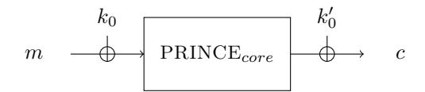
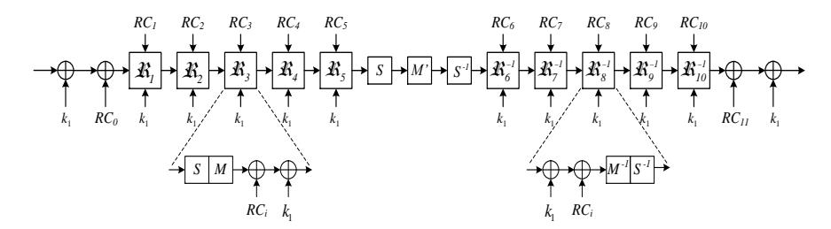
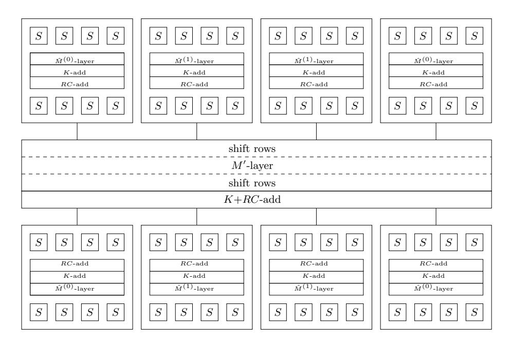

## PRINCE – A Low-latency Block Cipher for Pervasive Computing Applications Full version

Julia Borghoff1? , Anne Canteaut1,2??, Tim G¨uneysu3 , Elif Bilge Kavun3 , Miroslav Kneˇzevi´c4 , Lars R. Knudsen1 , Gregor Leander1? ? ?, Ventzislav Nikov4 , Christof Paar3 , Christian Rechberger1 , Peter Rombouts4 , Søren S. Thomsen1 , and Tolga Yal¸cın3

- 1 Technical University of Denmark
- 2 INRIA, Paris-Rocquencourt, France
- 3 Ruhr-University Bochum, Germany
- 4 NXP Semiconductors, Leuven, Belgium

Abstract. This paper presents a block cipher that is optimized with respect to latency when implemented in hardware. Such ciphers are desirable for many future pervasive applications with real-time security needs. Our cipher, named PRINCE, allows encryption of data within one clock cycle with a very competitive chip area compared to known solutions. The fully unrolled fashion in which such algorithms need to be implemented calls for innovative design choices. The number of rounds must be moderate and rounds must have short delays in hardware. At the same time, the traditional need that a cipher has to be iterative with very similar round functions disappears, an observation that increases the design space for the algorithm. An important further requirement is that realizing decryption and encryption results in minimum additional costs. PRINCE is designed in such a way that the overhead for decryption on top of encryption is negligible. More precisely for our cipher it holds that decryption for one key corresponds to encryption with a related key. This property we refer to as α-reflection is of independent interest and we prove its soundness against generic attacks.

## 1 Introduction

The area of lightweight cryptography, i.e., ciphers with particularly low implementation costs, has drawn considerable attention over the last years. Among the best studied algorithms are the block ciphers CLEFIA, Hight, KATAN, KTAN-TAN, Klein, mCrypton, LED, Piccolo and PRESENT [37, 28, 18, 25, 33, 26, 36,

? Supported by the Danish research council for Technology and Production Sciences, Grant No.10-093667

?? Partially supported by DGA/DS under Contract 2011.60.055.

? ? ? Partially supported by the Danish-Chinese Center for Applications of Algebraic Geometry in Coding Theory and Cryptography (Danish National Research Foundation and the National Science Foundation of China, Grant No.11061130539).

10], as well as the stream ciphers Grain, Mickey, and Trivium [27, 2, 19]. Particular interest in lightweight symmetric ciphers is coming from industry, as becoming evident in the adoption of CLEFIA and PRESENT in the ISO/IEC Standard 29192-2. The dominant metric according to which the majority of lightweight ciphers have been optimized is chip area, typically measured in gate equivalences (GE), i.e., the cipher area normalized to the area of a 2-input NAND gate in a given standard cell library. This is certainly a valid optimization objective in cases where there are extremely tight power or cost constraints, in particular passive RFID tags. However, depending on the application, there are several other implementation parameters according to which a cipher should have lightweight characteristics. There are several important applications for which a low-latency encryption and instant response time is highly desirable, such as instant authentication or block-wise read/write access to memory devices, e.g., solid-state hard disks. There are also embedded applications where current block ciphers in multiple-clock architectures could be sufficiently fast, but the needed high clock rates are not supported by the system. For instance, in many FPGA designs clock rates above 200 MHz are often difficult to realize. It can also be anticipated that given the ongoing growth of pervasive computing, there will be many more future embedded systems that require low-latency encryption, especially applications with real-time requirements, e.g., in the automotive domain. Moreover, [21] as well as [29] show that low-latency goes hand in hand with energy efficiency, another crucial criterion in many (other) applications.

For all these cases, we like to have symmetric ciphers that can instantaneously encrypt a given plaintext, i.e., the entire encryption and decryption should take place within the shortest possible delay. This seemingly simple problem poses a considerable challenge with today's cryptosystems — in particular if encryption and decryption should both be available on a given platform. Software implementations of virtually all strong ciphers take hundreds or thousands of clock cycles, making them ill suited for a designer aiming for low-latency cryptography. In the case of stream ciphers implemented in hardware, the high number of clock cycles for the initialization phase makes them not suitable for this task, especially when secret keys need to be regularly changed. Moreover, if we want to encrypt small blocks selected at random (e.g., encryption of sectors on solid-state disks), stream ciphers are not suited1 . This leaves block ciphers as the remaining viable solution. However, the round-based, i.e., iterative, nature of virtually all existing block ciphers, as shown for the case of AES, makes low-latency implementation a non-trivial task. A round-based hardware architecture of the AES-128 requires ten clock cycles to output a ciphertext which we do not consider instantaneous as it is still too long for some applications. As a remedy, the ten rounds can be loop-unrolled, i.e., the circuit that realizes the single round is repeated ten times. Now, the cipher returns a ciphertext within a single clock cycle — but at the cost of a very long critical path. This yields a very slow absolute response time and clock frequencies, e.g., in the range of a few MHz. Furthermore, the unrolled architecture has a high gate count in the range of several tens of thousand GE,

1 A possible exception are random-access stream ciphers such as Salsa [5]

implying a high power consumption and costs. Both features are undesirable, especially if one considers that many of the applications for instantaneous ciphers are in the embedded domain. Following the same motivation and reasoning as above [21] compares several lightweight ciphers with respect to latency and as a conclusion calls for new designs that are optimized for low-latency.

Our Contribution. Based on the above discussion our goal is to design a new block cipher which is optimized with respect to the following criteria if implemented in hardware:

- 1. The cipher can perform instantaneous encryption, a ciphertext is computed within a single clock cycle. There is no warm-up phase.
- 2. If implemented in modern chip technology, low delays resulting in moderately high clock rates can be achieved.
- 3. The hardware costs are moderate (i.e., considerably lower than fully unrolled versions of AES or PRESENT).
- 4. Encryption and decryption should both be possible with low costs and overhead.

We would like to remark that existing lightweight ciphers such as PRESENT do not fulfill Criteria 2 and 3 (low delay, small area) due to their large number of rounds. In order to fulfill Criterion 4, one needs to design a cipher for which decryption and encryption use (almost) identical pieces of hardware. This is an important requirement since the unrolled nature of instantaneous ciphers leads to circuits which are large and it is thus clearly advantageous if large parts of the implementation can be used both for encryption and decryption.

Besides designing a new lightweight cipher that is for the first time optimized with respect to the goals above, PRINCE has several innovative features that we like to highlight.

First, a fully unrolled design increases the possible design choices enormously. With a fully unrolled cipher, the traditional need that a cipher has to be iterative with very similar round functions disappears. This in turn allows us to efficiently implement a cipher where decryption with one key corresponds to encryption with a related key. This property we refer to as α-reflection is of independent interest and we prove its soundness against generic attacks. As a consequence, the overhead of implementing decryption over encryption becomes negligible. Note that previous approaches to minimizing the overhead of decryption over encryption, for example in the ciphers NOEKEON and ICEBERG usually require multiplexer in each round. While for a round-based implementation this does not make a difference, our approach is clearly preferable for a fully unrolled implementation, as we require multiplexer only once at the beginning of the circuit.

Another difference to known lightweight ciphers like PRESENT is that we balance the cost of an Sbox-layer and the linear layer. As it turns out optimizing the cost of the Sbox chosen has a major influence on the overall cost of the cipher. As an Sbox that performs well in one technology does not necessarily perform well in another technology, we propose the PRINCE-family of ciphers that allows to freely choose the Sbox within a (large) set of Sboxes fulfilling certain criteria. Our choice for the linear layer can be seen as being inbetween a bit-permutation layer PRESENT (implemented with wires only) and AES (implemented with considerable combinatorial logic). With the expense of only 2 additional XOR-gates per bit over a simple bit-permutation layer, we achieve an almost-MDS property that helps to prove much better bounds against various classes of attacks and in turn allows to significantly reduce the number of rounds and hence latency.

As a result, PRINCE compares very favorable to existing ciphers. For the same time constraints and technologies, PRINCE uses 6-7 times less area than PRESENT-80 and 14-15 times less area than AES-128. In addition to this, our design uses about 4-5 times less area than other ciphers in the literature (see Section 5 and in particular Tables 1 and 2 for a detailed comparison and technology details). To facilitate further study and fairer comparisons, we also report synthesis results using the open-source standard-cell library NANGATE [34]. We also like to mention that, although this is not the main objective of the cipher, PRINCE compares reasonably well to other lightweight ciphers when implemented in a round-based fashion.

We believe that our consideration can be of major value for industry and can at the same time stimulate the scientific community to pursue research on lightweight ciphers with different optimization goals.

Organization of the Paper. We introduce an instance of PRINCE-family of ciphers and state our security claims in Section 2. Design decisions are discussed in Section 3 where we also describe the entire PRINCE-family. We provide security proofs and evaluations considering cryptanalytical attacks in Section 4. In Section 5 we finally present implementation results and comparisons with other lightweight ciphers for a range of hardware technologies.

## 2 Cipher Description

PRINCE is a 64-bit block cipher with a 128-bit key. The key is split into two parts of 64 bits each,

$$k = k_0 || k_1$$

and extended to 192 bits by the mapping

$$(k_0||k_1) \to (k_0||k_0'||k_1) := (k_0||(k_0 \gg 1) \oplus (k_0 \gg 63)||k_1).$$

PRINCE is based on the so-called FX construction [7, 30]: the first two subkeys  $k_0$  and  $k'_0$  are used as whitening keys, while the key  $k_1$  is the 64-bit key for a 12-round block cipher we refer to as PRINCEcore. We provide test vectors in Appendix A.

## Specification of PRINCE $_{core}$ .

The whole encryption process of  $PRINCE_{core}$  is depicted below.

Each round of  $PRINCE_{core}$  consist of a key addition, an Sbox-layer, a linear layer, and the addition of a round constant.

 $k_i$ -add. Here the 64-bit state is xored with the 64-bit subkey.

**S-Layer.** The cipher uses one 4-bit Sbox. The action of the Sbox in hexadecimal notation is given by the following table.

| x    |   |   |   |   |   |   |   |   |   |   |   |   |   |   |   |   |
|------|---|---|---|---|---|---|---|---|---|---|---|---|---|---|---|---|
| S[x] | В | F | 3 | 2 | Α | C | 9 | 1 | 6 | 7 | 8 | 0 | Е | 5 | D | 4 |

The Matrices: M/M'-layer. In the M and M'-layer the 64-bit state is multiplied with a  $64 \times 64$  matrix M (resp. M') defined in Section 3.3.

 $RC_i$ -add. In the  $RC_i$ -add step a 64-bit round constant is xored with the state. We define the constants used below (in hex notation)

| $RC_0$    | 00000000000000000 |
|-----------|-------------------|
| $RC_1$    | 13198a2e03707344  |
| $RC_2$    | a4093822299f31d0  |
| $RC_3$    | 082efa98ec4e6c89  |
| $RC_4$    | 452821e638d01377  |
| $RC_5$    | be5466cf34e90c6c  |
| $RC_6$    | 7ef84f78fd955cb1  |
| $RC_7$    | 85840851f1ac43aa  |
| $RC_8$    | c882d32f25323c54  |
| $RC_9$    | 64a51195e0e3610d  |
| $RC_{10}$ | d3b5a399ca0c2399  |
| $RC_{11}$ | c0ac29b7c97c50dd  |

Note that, for all  $0 \le i \le 11$ ,  $RC_i \oplus RC_{11-i}$  is the constant  $\alpha = \texttt{c0ac29b7c97c50dd}$ ,  $RC_0 = 0$  and that  $RC_1, \ldots, RC_5$  and  $\alpha$  are derived from the fraction part of  $\pi = 3.141...$

From the fact that the round constants satisfy  $RC_i \oplus RC_{11-i} = \alpha$  and that M' is an involution, we deduce that the core cipher is such that the inverse of PRINCEcore parametrized with k is equal to PRINCEcore parametrized with  $(k \oplus \alpha)$ . We call this property of PRINCEcore the  $\alpha$ -reflection property. It follows that, for any expanded key  $(k_0||k'_0||k_1)$ ,

$$D_{(k_0||k_0'||k_1)}(\cdot) = E_{(k_0'||k_0||k_1 \oplus \alpha)}(\cdot)$$

where  $\alpha$  is the 64-bit constant  $\alpha = \text{c0ac29b7c97c50dd}$ . Thus, for decryption one only has to do a very cheap change to the master key and afterwards reuse the exact same circuit.

Security Claims. For an adversary that is able to acquire  $2^n$  plaintext/ciphertext pairs in a model with a single fixed unknown key k, we claim that the effort to find the key is not significantly less expensive than  $2^{127-n}$  calls to the encryption or decryption function. In Section 4.1 we give a bound matching this claim in the ideal cipher model that does consider the special relation between the encryption and decryption operations. One way to interpret this is that any attack violating our security claim will have to use more properties of the cipher than the relation between the encryption and decryption operations.

We explicitly state that we do not have claims in related-key or known- and chosen-key models as we do not consider them to be relevant for the intended use cases. In particular, as for any cipher based on the FX construction or on the Even-Mansour scheme [22], there exists a trivial distinguisher for PRINCE in the related-key model: for any difference  $\Delta$ , the ciphertexts corresponding to m and  $(m \oplus \Delta)$  encrypted under keys  $(k_0||k_1)$  and  $((k_0 \oplus \Delta)||k_1)$  respectively, differ from  $((\Delta \gg 1) \oplus (\Delta \gg 63))$  with probability 1.

Reduced Versions. Many classes of cryptanalytic attacks become more difficult with an increased number of rounds. In order to facilitate third-party cryptanalysis and estimate the security margin, reduced-round variants need to be considered. We encourage to study round-reduced variants of PRINCE where the symmetry around the middle is kept, and rounds are added in an inside-out fashion, i.e. for every additional round  $\Re_i$  its inverse is also added. Another natural way to reduce PRINCE is to consider the cipher without the key whitening layer, PRINCEcore.

#### 3 Design Decisions

In this section we explain our design decisions. First note that an SP-network is preferable over a Feistel-cipher, since a Feistel-cipher operates only on half the state resulting often in a higher number of rounds. In order to minimize the

number of rounds and still achieve security against linear and differential attacks, we adopted the wide-trail strategy [13]. As not all round functions have to be identical for a cipher aiming for a fully unrolled implementation as PRINCE, it is very tempting to directly use the concept of code-concatenation [16] to achieve a high number of active Sboxes over 4 rounds of the cipher. However, not only a serial implementation benefits from similar round functions. It is also very helpful for ensuring a minimum number of active Sboxes. Assume that, using the code-concatenation approach, one can ensure that rounds Ri to Ri+3 have at least 16 active Sboxes. While this is nice, the problem is that it does not ensure that rounds Ri−1 to Ri+2 or Ri+1 to Ri+4 have 16 active Sboxes as well if the individual rounds are very different in nature. We therefore decided to follow a design that on one hand allows to use the freedom given by a fully enrolled design and on the other hand still keeps the round functions similar enough to prove some bounds on the resistance against linear and differential attacks.

In this context, one of the main features of the design is that decryption can be implemented on top of encryption with a minimal overhead. This is achieved by designing a cipher which is symmetric around the middle round, a very simple key scheduling, and a special choice of round constants.

## 3.1 Aligning Encryption with Decryption

The use of a core cipher having the α-reflection property, with two additional whitening keys, offers a nice alternative to the usual design strategy which consists in using involutional components — Noekeon [14], Khazad [4], Anubis [3], Iceberg [39] or SEA [38] are some examples of such ciphers with involutional components. Actually, the general construction used in PRINCE has the following advantages:

- It allows a much larger choice of Sboxes, which may lead to a lower implementation cost, since the Sbox is not required to be an involution. It is worth noticing that the fact that both the Sbox and its inverse are involved in the encryption function does not affect the cost of the fully-unrolled implementations we consider;
- In ciphers with involutional components, the overhead due to the implementation of the inverse key scheduling can be reduced by adding some symmetry in the subkey sequence. But this may introduce weak keys or potential slide attacks. The fact that all components are involutions may also introduce some regularities in the cyclic structure of the cipher which can be exploited in some attacks [6]. The resistance of PRINCE to this type of attacks will be extensively discussed in Section 4.2.
- It is an open problem to prove the security of ciphers with ideal, involutional components against generic attacks. We show in Section 4.1 that ciphers with the α-reflection property (for α 6= 0) has a proof of security similar to that of the F X construction.
- Previous approaches to minimizing the overhead of decryption over encryption usually require multiplexer in each round while our approach requires multiplexer only once at the beginning of the circuit.

#### 3.2 The PRINCE-Family: Choosing the Sbox

As discussed in more detail in Section 5, the cost of the Sbox, i.e., its area and critical path, is a substantial part of the overall cost. Thus, choosing an Sbox which minimizes those costs is crucial for obtaining competitive results. As the cost of an Sbox depends on various parameters, such as the technology, the synthesis tool, and the library used, one cannot expect that there is one optimal Sbox for all environments. In fact, in order to achieve optimal results it is preferable to choose your favorite Sbox. In order to ensure the security of the resulting design, an Sbox  $S: \mathbb{F}_2^4 \to \mathbb{F}_2^4$  for the PRINCE-Family has to fulfill the following criteria.

- 1. The maximal probability of a differential is 1/4
- 2. There are exactly 15 differentials with probability 1/4.
- 3. The maximal absolute bias of a linear approximation is 1/4.
- 4. There are exactly 30 linear approximations with absolute bias 1/4.
- 5. Each of the 15 non-zero component functions has algebraic degree 3.

As it can be deduced for example from [32] up to affine equivalence there are only 8 Sboxes fulfilling those criteria. Thus, another way of defining an Sbox for the PRINCE-Family is to say that it has to be affine equivalent to one of the eight Sboxes  $S_i$  given in Table 3 in Appendix B.

#### 3.3 The Linear Layer

In the M and M'-layer the 64-bit state is multiplied with a 64 × 64 matrix M (resp. M') defined below. We have different requirements for the two different linear layers. The M'-layer is only used in the middle round, thus M' has to be an involution to ensure the  $\alpha$ -reflection property. This requirement does not apply for the M-layer used in the round functions. Here we want to ensure full diffusion after two rounds. To achieve this we combine the M'-mapping with an application of matrix SR which behaves like the AES shift rows and permutes the 16 nibbles in the following way

$$\boxed{0|1|2|3|4|5|6|7|8|9|10|11|12|13|14|15} \longrightarrow \boxed{0|5|10|15|4|9|14|3|8|13|2|7|12|16|11}$$

Thus  $M = SR \circ M'$ .

Additionally the implementation costs should be minimized, meaning that the number of ones in the matrices M' and M should be minimal, while at the same time it should be guaranteed that at least 16 Sboxes are active in 4 consecutive rounds (cf. Appendix C.1 for details). Thus, trivially each output bit of an Sbox has to influence 3 Sboxes in the next round and therefore the minimum number of ones per row and column is 3. Thus we can use the following four  $4 \times 4$  matrices as building blocks for the M'-layer.

$$M_0 = \begin{pmatrix} 0000 \\ 0100 \\ 0010 \\ 0001 \end{pmatrix}, \ M_1 = \begin{pmatrix} 1000 \\ 0000 \\ 0010 \\ 0001 \end{pmatrix}, \ M_2 = \begin{pmatrix} 1000 \\ 0100 \\ 0000 \\ 0001 \end{pmatrix}, \ M_3 = \begin{pmatrix} 1000 \\ 0100 \\ 0010 \\ 0000 \end{pmatrix}$$

In the next step we generate a  $4 \times 4$  block matrix  $\hat{M}$  where each row and column is a permutation of the four  $4 \times 4$  matrices  $M_0, \ldots, M_3$ . The row permutations are chosen such that we obtain a symmetric block matrix. The choice of the building blocks and the symmetric structure ensures that the resulting  $16 \times 16$  matrix is an involution. We define

$$\hat{M}^{(0)} = \begin{pmatrix} M_0 & M_1 & M_2 & M_3 \\ M_1 & M_2 & M_3 & M_0 \\ M_2 & M_3 & M_0 & M_1 \\ M_3 & M_0 & M_1 & M_2 \end{pmatrix} \quad \hat{M}^{(1)} = \begin{pmatrix} M_1 & M_2 & M_3 & M_0 \\ M_2 & M_3 & M_0 & M_1 \\ M_3 & M_0 & M_1 & M_2 \\ M_0 & M_1 & M_2 & M_3 \end{pmatrix}.$$

In order to obtain a permutation for the full 64-bit state we construct a  $64 \times 64$  block diagonal matrix M' with  $(\hat{M}^{(0)}, \hat{M}^{(1)}, \hat{M}^{(1)}, \hat{M}^{(0)})$  as diagonal blocks. The matrix M' is an involution with  $2^{32}$  fixed points, which is average for a randomly chosen involution [24, Page 596]. The linear layer M is not an involution anymore due to the composition of M' and shift rows, which is not an involution.

#### 3.4 The Key Expansion

The 128-bit key  $(k_0||k_1)$  is extended to a 192-bit key  $(k_0||k'_0||k_1)$  by a linear mapping of the form

$$(k_0||k_1) \mapsto (k_0||P(k_0)||k_1)$$
.

This expansion should be such that it makes peeling of rounds (both at the beginning and at the end) by partial key guessing difficult for the attacker. In particular, we would like that each pair of subkeys among  $k_1$  and the quantities  $(k_0 \oplus k_1)$  and  $(k'_0 \oplus k_1)$  takes all the  $2^{128}$  possible values when  $(k_0||k_1)$  varies in the set of 128-bit words. In other words, the set of all triples  $(k_0||P(k_0)||k_1)$  should correspond to an MDS code of length 3 and size  $2^{128}$  over  $\mathbf{F}_2^{64}$ . This equivalently means that both  $x \mapsto P(x)$  and  $x \mapsto x \oplus P(x)$  should be permutations of  $\mathbf{F}_2^{64}$ . Note that no bit-permutation P satisfies this condition. Indeed, both the all-zero vector and the all-one vector satisfy  $P(x) \oplus x = 0$ .

Thus, a hardware-optimal choice for P such that both P and  $P \oplus \operatorname{Id}$  are permutations is

$$P(x) = (x \gg 1) \oplus (x \gg 63)$$
,

i.e.,  $P(x_{63}, \ldots, x_0) = (x_0, x_{63}, \ldots, x_2, x_1 \oplus x_{63})$ . Then, we can easily check that P(x) = 0 (resp. P(x) = x) has a unique solution.

## 4 Security Analysis

This section investigates the security of the general construction of PRINCE. In particular, we show that the  $\alpha$ -reflection property of the core cipher does not introduce any generic attack with complexity significantly lower than the known generic attacks against the FX construction. However, in the particular case of PRINCE $_{core}$ , the  $\alpha$ -reflection property comes from some symmetries in the construction, including the use of an involution as middle round. Thus,

we investigate in Section 4.2 whether weaknesses similar to those identified for involutional ciphers could also appear in the case of PRINCE. An evaluation of the security of PRINCE regarding more classical attacks, including linear, differential and algebraic but also to the recently introduced biclique attacks is provided in Appendix C).

#### 4.1 On Generic Attacks: Security Proof

The FX construction, introduced by Rivest for increasing the resistance of DES to exhaustive key-search [7], consists in deriving a block cipher E with  $(2n + \kappa)$ -bit key and n-bit block from a block cipher F with  $\kappa$ -bit key and n-bit block by xoring the input and output of F with a pre-whitening key and a post-whitening key:

$$E_{k_0,k_1,k_2}(x) = F_{k_1}(x \oplus k_0) \oplus k_2$$
.

Kilian and Rogaway [30,31] proved that, if the core cipher F is ideal, then this construction achieves  $(\kappa + n - 1 - \log T)$ -bit security where T is the number of pairs of inputs and outputs for F known by the attacker. This result obviously does not apply in the case of PRINCE since the core cipher F in PRINCE can be easily distinguished from a family of random permutations due to the  $\alpha$ -reflection property, i.e.,  $F_k^{-1} = F_{k \oplus \alpha}$  for any k. Here, we want to quantify the impact of this property on the generic attacks against the FX construction. For instance, it appears that a decryption oracle also gives a related-key oracle with the fixed-key relation  $(k_0, k_2, k_1) \to (k_2, k_0, k_1 \oplus \alpha)$  and it is important to determine whether an adversary can profit from this relation.

A similar question was investigated by Kilian and Rogaway for showing that the complementation property of DES decreases the security level by a single bit [30, Section 4]. In the case of the  $\alpha$ -reflection property, we like to model the core cipher F as an ideal cipher, that is as a set of random permutations, with the (only!) additional relation that  $F_{k\oplus\alpha}(x)=F_k^{-1}(x)$ . Informally, this can be seen as picking only half of the  $2^{\kappa}$  permutations independently at random, while the second half is defined by the encryption vs decryption relation above.

More precisely, we consider for F a keyed permutation with a  $(\kappa-1)$ -bit key, operating on n-bit blocks. Let  $\alpha$  be a nonzero element in  $\mathbf{F}_2^{\kappa}$ . We decompose the set of  $\kappa$ -bit words into two subsets as  $\mathbf{F}_2^{\kappa} = H \cup (\alpha \oplus H)$  where H is some linear subspace of dimension  $(\kappa-1)$  which does not contain  $\alpha$ , e.g., if  $\mathrm{lsb}(\alpha)=1$ , H is the set of all n-bit words x with  $\mathrm{lsb}(x)=0$ . In the following, H is identified with the set of  $(\kappa-1)$ -bit words. It is worth noticing that such a decomposition does not exist when  $\alpha=0$ , i.e., when F is an involution. Therefore, the following construction is defined for  $\alpha \neq 0$  only. Now, we derive from F a block cipher with  $(2n+\kappa)$  key bits and n-bit blocks:

$$E_{k_0,k_1,k_2}(m) = \begin{cases} F_{k_1}(m \oplus k_0) \oplus k_2 & \text{if } k_1 \in H \\ F_{k_1 \oplus \alpha}^{-1}(m \oplus k_0) \oplus k_2 & \text{if } k_1 \in (\alpha \oplus H) \end{cases}$$

This construction, we refer to as  $\tilde{F}X$ -construction, corresponds to the FX construction applied to  $\tilde{F}$  where  $\tilde{F}$  is the family of  $2^{\kappa}$  permutations defined by

$$\tilde{F}_k(x) = \begin{cases} F_k(x) & \text{if } k \in H \\ F_{k \oplus \alpha}^{-1}(x) & \text{if } k \in (\alpha \oplus H) \end{cases}$$

The only difference with the construction considered in the case of the complementation property is that F is extended by using the inverse permutations  $F_k, k \in H$ , instead of the permutations themselves. But, we can obtain a similar result.

More precisely, when analyzing the original FX construction, Kilian and Rogaway [30] consider the following problem. Let  $\mathcal{A}$  be an adversary with access to three oracles: E, F and  $F^{-1}$ . During the game, the adversary may make queries to E, to F and  $F^{-1}$ . Any query to the  $F/F^{-1}$  oracle consists of a pair (k,x) in  $\mathbf{F}_2^{\kappa} \times \mathbf{F}_2^n$  and the oracle returns an element in  $\mathbf{F}_2^n$ . A query to the E oracle consists of an n-bit element, and an n-bit value is returned. The aim of this adversary is then to guess whether the E oracle computes  $FX_k$  for some random key k, or if it computes  $\pi$  for a random permutation of  $\mathbf{F}_2^n$ . Then, a game-hoping argument leads to the following upper-bound on the advantage of any such adversary.

**Theorem 1.** [30] The advantage of any adversary who makes D queries to the E oracle and T queries to the  $F/F^{-1}$  oracle satisfies

$$\begin{split} \mathsf{Adv}_{FX}^{\mathsf{CPA}}(\mathcal{A}) &= \left| \Pr[k \overset{\$}{\leftarrow} \mathbf{F}_2^{\kappa + 2n}, F \overset{\$}{\leftarrow} (\mathcal{P}_n)^{2^{\kappa}} \ : \ \mathcal{A}^{FX_k, F, F^{-1}} = 1] \right. \\ &\left. - \Pr[\pi \overset{\$}{\leftarrow} \mathcal{P}_n, F \overset{\$}{\leftarrow} (\mathcal{P}_n)^{2^{\kappa}} \ : \ \mathcal{A}^{\pi, F, F^{-1}} = 1] \right| \leq DT2^{-(n + \kappa - 1)} \ , \end{split}$$

where  $x \stackrel{\$}{\leftarrow} S$  means that x is uniformly chosen at random from a set S,  $\mathcal{P}_n$  denotes the set of permutations of  $\mathbf{F}_2^n$  and  $F \stackrel{\$}{\leftarrow} (\mathcal{P}_n)^{2^{\kappa}}$  means that F is a family of  $2^{\kappa}$  independently chosen random permutations.

We deduce a similar result for the  $\widetilde{F}X$  construction.

**Corollary 1.** The advantage of any adversary who makes D queries to the E oracle and T queries to the  $F/F^{-1}$  oracle satisfies

$$\begin{split} \mathsf{Adv}^{\mathsf{CPA}}_{\widetilde{F}X}(\mathcal{A}) &= \left| \Pr[k \overset{\hspace{0.1em}\mathsf{\scriptscriptstyle\$}}{\leftarrow} \mathbf{F}_2^{\kappa+2n}, F \overset{\hspace{0.1em}\mathsf{\scriptscriptstyle\$}}{\leftarrow} (\mathcal{P}_n)^{2^{\kappa-1}} \ : \ \mathcal{A}^{\widetilde{F}X_k, F, F^{-1}} = 1] \right| \\ &- \Pr[\pi \overset{\hspace{0.1em}\mathsf{\scriptscriptstyle\$}}{\leftarrow} \mathcal{P}_n, F \overset{\hspace{0.1em}\mathsf{\scriptscriptstyle\$}}{\leftarrow} (\mathcal{P}_n)^{2^{\kappa-1}} \ : \ \mathcal{A}^{\pi, F, F^{-1}} = 1] \right| \leq DT2^{-(n+\kappa-2)} \end{split}$$

*Proof.* We decompose

$$\begin{split} P_{c} &= \Pr[k \overset{\$}{\leftarrow} \mathbf{F}_{2}^{\kappa+2n}, F \overset{\$}{\leftarrow} (\mathcal{P}_{n})^{2^{\kappa-1}} \ : \ \mathcal{A}^{\widetilde{F}X_{k}, F, F^{-1}} = 1] \\ &= \Pr[k_{0}, k_{2} \overset{\$}{\leftarrow} \mathbf{F}_{2}^{n}, k_{1} \overset{\$}{\leftarrow} H, F \overset{\$}{\leftarrow} (\mathcal{P}_{n})^{2^{\kappa-1}} \ : \ \mathcal{A}^{\widetilde{F}X_{k_{0}, k_{1}, k_{2}}, F, F^{-1}} = 1] \\ &\times \Pr[k_{1} \in H] \\ &+ \Pr[k_{0}, k_{2} \overset{\$}{\leftarrow} \mathbf{F}_{2}^{n}, k_{1} \overset{\$}{\leftarrow} \alpha \oplus H, F \overset{\$}{\leftarrow} (\mathcal{P}_{n})^{2^{\kappa-1}} \ : \ \mathcal{A}^{\widetilde{F}X_{k_{0}, k_{1}, k_{2}}, F, F^{-1}} = 1] \\ &\times \Pr[k_{1} \in \alpha \oplus H] \\ &= \frac{1}{2} \Pr[k_{0}, k_{2} \overset{\$}{\leftarrow} \mathbf{F}_{2}^{n}, k_{1} \overset{\$}{\leftarrow} H, F \overset{\$}{\leftarrow} (\mathcal{P}_{n})^{2^{\kappa-1}} \ : \ \mathcal{A}^{FX_{k_{0}, k_{1}, k_{2}}, F, F^{-1}} = 1] \\ &+ \frac{1}{2} \Pr[k_{0}, k_{2} \overset{\$}{\leftarrow} \mathbf{F}_{2}^{n}, k_{1} \overset{\$}{\leftarrow} H, F \overset{\$}{\leftarrow} (\mathcal{P}_{n})^{2^{\kappa-1}} \ : \ \mathcal{A}^{F^{-1}X_{k_{0}, k_{1}, k_{2}}, F, F^{-1}} = 1] \ , \end{split}$$

since

$$\widetilde{F}X_{k_0,k_1,k_2}(x) = \begin{cases} FX_{k_0,k_1,k_2}(x) & \text{if } k_1 \in H \\ F^{-1}X_{k_0,k_1 \oplus \alpha,k_2}(x) & \text{if } k_1 \in \alpha \oplus H \end{cases}.$$

Obviously,

$$\Pr[\mathcal{A}^{F^{-1}X_{k_0,k_1,k_2},F,F^{-1}} = 1] = \Pr[\mathcal{A}^{FX_{k_0,k_1,k_2},F,F^{-1}} = 1]$$

leading to

$$P_c = \Pr[k_0, k_2 \overset{\$}{\leftarrow} \mathbf{F}_2^n, k_1 \overset{\$}{\leftarrow} H, F \overset{\$}{\leftarrow} (\mathcal{P}_n^{2^{\kappa-1}}) : \mathcal{A}^{FX_{k_0, k_1, k_2}, F, F^{-1}} = 1].$$

It directly follows from Theorem 1 that

$$\mathsf{Adv}^{\mathsf{CPA}}_{\widetilde{F}X}(\mathcal{A}) = \mathsf{Adv}^{\mathsf{CPA}}_{FX}(\mathcal{A}) \leq DT2^{-(n+\kappa-2)} \; .$$

As noticed in [30], this bound is still valid in a chosen-ciphertext scenario; it can also be extended to the case where the whitening keys are related, for instance if  $k_2 = k_0$  or  $k_2 = P(k_0)$  as in PRINCE. Both generalizations apply to the  $\widetilde{F}X$  construction as well.

The bound obtained for the FX construction is achieved, for instance by the slide attack due to Biryukov and Wagner [8] and by its recent generalization named slidex [20]. A chosen-plaintext variant of this attack allows to exploit the  $\alpha$ -reflection property for reducing the security level by one bit, compared to the original FX construction. This attack, detailed in Appendix D, has an average time complexity corresponding to  $2^{\kappa+n-\log_2 D}$  computations of the core cipher F for any number D of pairs of chosen plaintexts-ciphertexts.

# 4.2 Impact of the construction implementing the $\alpha$ -reflection property

As mentioned earlier, one particular feature of PRINCE is the  $\alpha$ -reflection property of PRINCEcore. But, not surprisingly, the construction we used for obtaining this feature also has structural properties, including an involutional middle

round, and care has to be taken when designing a cipher with such a structure. In this section we analyse the influence of this construction on the security of the cipher. In particular, we are interested in the so-called profile of the core cipher, i.e., in the sequence of the lengths of all cycles in the decomposition of  $PRINCE_{core}$ .

A first strategy for exploiting some information on the profile of the core cipher is the following. If the decomposition of the core cipher is independent from the key, then this decomposition can be used as a distinguishing property for recovering some information on the whitening keys. The simplest illustration of this type of attack is when the core cipher is an involution, *i.e.* when  $\alpha = 0$  which is the only case where Corollary 1 does not apply. Indeed, the attack presented by Dunkelman *et al.* [20, Section 5.2] allows to recover the sum of the two whitening keys  $(k_0 \oplus k_2)$  in the FX construction when F is an involution. This attack uses the fact that for two plaintext-ciphertext pairs (m,c) and (m',c') related by  $m' = E_{k_0,k_1,k_2}^{-1}(m \oplus k_0 \oplus k_2)$  it holds that  $m \oplus c = m' \oplus c'$ . Indeed,

$$m' \oplus c' = E_{k_0, k_1, k_2}^{-1}(m \oplus k_0 \oplus k_2) \oplus m \oplus k_0 \oplus k_2$$
$$= k_0 \oplus F_{k_1}^{-1}(m \oplus k_0) \oplus m \oplus k_0 \oplus k_2 = F_{k_1}(m \oplus k_0) \oplus m \oplus k_2$$
$$= m \oplus c$$

where the last-but-one equality uses that  $F_{k_1}$  is an involution. Thus, plaintext-ciphertext pairs (m,c) and (m',c') such that  $c'=m\oplus k_0\oplus k_2$  can be easily detected. Such a collision can be found if the attacker has access to  $2^{\frac{n+1}{2}}$  known plaintext-ciphertext pairs, and it provides the value of  $(k_0\oplus k_2)$ . Moreover, in the particular case of PRINCE,  $k_2$  is related to  $k_0$  by  $k_2=P(k_0)$  where  $x\mapsto x\oplus P(x)$  is a permutation (see Section 3.4). Therefore, the whitening key  $k_0$  can be deduced from  $(k_0\oplus k_2)$  in this case. It follows that, when the core cipher is an involution, the whole key can then be recovered with time complexity  $2^{\kappa}$  (corresponding to an exhaustive search for  $k_1$ ) and data complexity  $2^{\frac{n+1}{2}}$ . This confirms that Corollary 1 does not hold for  $\alpha=0$ .

This type of attack can be generalized to the case where the profile of the core cipher does not depend on  $k_1$ : since PRINCEcore has a reasonable block size, its cycle structure could be precomputed and then used as a distinguishing property for  $(k_0 \oplus k_2)$ . Indeed, the profile of  $E_{k_0,k_1,k_2}: m \mapsto k_2 \oplus F_{k_1}(m \oplus k_0)$  depends on  $(k_0 \oplus k_2)$  only. It follows that, for each n-bit word  $\delta$ , we could compute one or a few cycles of  $x \mapsto F_{k_1}(x \oplus k_0 \oplus k_2 \oplus \delta)$  in a chosen-plaintext scenario where the attacker knows a sequence of plaintext-ciphertext pairs  $(m_i, c_i)$  with  $m_{i+1} = c_i \oplus \delta$ . A valid candidate for  $(k_0 \oplus k_2)$  is a value  $\delta$  which leads to a cycle having a length which appears in the precomputed profile of  $F_{k_1}$ .

We checked whether the cycle structure of PRINCE $_{core}$  has some peculiarities which do not depend on its key. Based on the technique used by Biryukov for analyzing involutional ciphers [6], we can observe the profile of the reduced version of PRINCE $_{core}$  with 4 Sbox layers where we keep the symmetry around the middle does not depend on the key. Actually, this reduced version can be

written as

$$G = (R_5^{-1} \circ \operatorname{Add}_{k_1 \oplus \alpha}) \circ (S^{-1} \circ M' \circ S) \circ (\operatorname{Add}_{k_1} \circ R_5)$$

where  $R_5$  corresponds to  $\Re_5$  without the key addition. Since  $S^{-1} \circ M' \circ S$  is an involution, the cycle structure of  $\operatorname{Add}_{k_1 \oplus \alpha} \circ \left( S^{-1} \circ M' \circ S \right) \circ \operatorname{Add}_{k_1}$  depends on  $\alpha$  only and not on  $k_1$ . Its profile then remains unchanged after a right composition with  $R_5$  and a left composition with its inverse. However, this property does not hold anymore when an additional round is included since the next key addition  $\operatorname{Add}_{k_1 \oplus \alpha} \circ G \circ \operatorname{Add}_{k_1}$  modifies the cycle structure of G in a way which depends on the values G, and not only on its profile. Therefore, it appears that the previously mentioned attack strategy does not apply if  $\operatorname{PRINCE}_{core}$  contains more than 6 Sbox layers.

In the light of the previous analysis, a more relevant attack method consists in using the fact that the core cipher may have a peculiar cycle decomposition for some weak keys. For instance, if there exists some weak keys  $k_1$  for which PRINCEcore is an involution, then this class of keys can be detected from the knowledge of  $2^{\frac{n+1}{2}}$  pairs of plaintext-ciphertext by counting the number of collisions for  $m \oplus c$ . And the technique from [20] that we have previously described also recovers the whitening key. It is worth noticing that this attack applies to DESX and allows to detect the use of the four weak keys of DES [17] for which DES is an involution. A similar weakness would appear if, in PRINCEcore, we have used two subkeys  $k_1$  and  $k'_1$  in turn as round keys. Keeping the remaining structure of PRINCEcore results in the following relation

$$F_{(k_1||k_1')}^{-1} = F_{(k_1' \oplus \alpha||k_1 \oplus \alpha)}.$$

However, this has serious – and interesting – consequences for the security of the resulting cipher. For the class of keys such that  $k'_1 = k_1 \oplus \alpha$ , it holds that

$$F_{(k_1||k_1')}^{-1} = F_{(k_1||k_1')},$$

that is, the core cipher is an involution. This class of weak keys can then be easily detected. It then appears that some particular related-key distinguishers for the core cipher may be exploited for detecting the corresponding class of keys. To be very clear, we do not consider related key-attacks here in the classical sense of enlarging the power of an adversary. But without a careful choice, the construction we used for implementing the  $\alpha$ -reflection property might result in key-recovery attacks for certain weak-key classes, as soon as the core cipher is vulnerable to related key-attacks.

#### 5 Implementation

Besides the main target low-latency, low-cost hardware implementation is one of the design objectives of PRINCE. To achieve low-latency, a fully unrolled design should be considered for implementation. During the design process of PRINCE the cost of each function was investigated and each component was carefully designed in order to get the lowest possible gate count without compromising security. One of the most critical and expensive operations of the cipher is the substitution, where we use the same Sbox 16 times (rather than having 16 different Sboxes). Therefore, the implementation of PRINCE started with a search for the most suitable Sbox for the target design specifications. In order to achieve an implementation with low delay and gate count, we analyzed many Sbox instances to identify one with optimal combinational logic and propagation paths. Then, the targeted unrolled design was implemented with the resulting optimal Sbox.

In the implementation process, Cadence NCVerilog 06.20-p001 is used for simulation and Cadence Encounter RTL Compiler v10.1 for synthesis. Since gate count and delay parameters are heavily technology dependent, the implementations have been synthesized for three different technology libraries: 130 nm and 90 nm low-leakage Faraday libraries from UMC, and 45 nm generic NANGATE Open Cell Library. In all syntheses, typical operating conditions were assumed.

The unrolled version of PRINCE is a direct mapping to hardware of the cipher defined in Section 2. Multiplexers select encryption and decryption keys accordingly. The only costs associated with the key whitening stages are XOR gates and multiplexers used for whitening key selection. However, in practice, due to the unrolled nature of the implementation, these additions reduce to XOR operations with constants, which in turn reduce to inverters or no additional gates at all. Furthermore, these inverters are combined with the preceding or following matrix multiplications, which are implemented with cascaded XOR gates. In cases where an XOR is sourced by the output from an inverter, or is sourcing input of an inverter, it is simply replaced by an XNOR gate and the sourced/sourcing inverter is removed. Since both XOR and XNOR have the same gate count, the overall effect of the round constant addition on area reduces to zero.

The unrolled implementation of PRINCE results are listed in Table 1 for different technologies with respect to different timing constraints. In this table, a unit delay (UD) parameter is used to enable a fair comparison between different technologies. It is the average delay of a single inverter gate (with lowest drive - X1) within a ring oscillator under zero wireload conditions in the target technology (6.7 ps, 31.9 ps, and 43.6 ps for 45 nm, 90 nm, and 130 nm, respectively). We also implemented PRESENT-80, PRESENT-128, LED-128 and AES-128 and applied the same metrics to adequately evaluate the achievements of our new cipher (note that in some cases the key size – and also our security claim – is different: PRINCE does not claim to offer 128-bit security and security against related key-attacks). In order to achieve both encryption and decryption capability in PRESENT and LED, we had to implement both true and inverse Sboxes and select their output by a multiplexer, which doubled the Sbox area with respect to an encryption-only implementation. For AES, we just had to implement the inverse affine transform since the finite field inversion module could be shared between encryption and decryption. In addition to this comparison, Table 2 shows the extrapolated results (which are calculated by removing register and control logic area from the total gate count, and multiplying the rest by the number of rounds) for other unfolded cipher instances obtained from round-based cipher implementations provided by previous works. Note that all ciphers in the table include encryption and decryption functionality with 128-bit key size, however the comparison is difficult as the block size is different in some cases (also note that the ciphers having 128-bit block size are obviously much bigger and more power consuming than a 64-bit block cipher).

We also measured maximum frequencies achievable by unrolled versions of PRINCE under two different conditions: The frequency where the area of synthesized design starts to deviate from the unconstrained area – 158.9, 38.4 and 35.5 MHz, and the frequencey where the timing slack becomes zero – 212.8, 71.8 and 54.3 MHz. Both figures are given for 45 nm, 90 nm, and 130 nm, respectively.

Table 1. Area/power comparison of unrolled versions of PRINCE and other ciphers

|                      | Tech.       |        | Nangate 45nm Generic |                                          |              | UMC 90nm Faraday |       | UMC 130nm Faraday                                              |                      |       |  |
|----------------------|-------------|--------|----------------------|------------------------------------------|--------------|------------------|-------|----------------------------------------------------------------|----------------------|-------|--|
|                      | Constr.(UD) | 1000   | 3162                 | 10000                                    | 1000         | 3162             | 10000 | 1000                                                           | 3162                 | 10000 |  |
| PRINCE˜              | Area(GE)    | 8260   | 8263                 | 8263                                     | 7996         | 7996             | 7996  | 8679                                                           | 8679                 | 8679  |  |
|                      | Power(mW)   | 38.5   | 17.9                 | 8.3                                      | 26.3         | 10.9             | 3.9   | 29.8                                                           | 11.8                 | 4.1   |  |
| PRESENT-80           | Area(GE)    | 63942  | 51631                | 50429                                    | 113062 49723 |                  | 49698 | 119196 51790                                                   |                      | 51790 |  |
|                      | Power(mW)   | 1304.6 | 320.9                | 98.0                                     | 1436.9       | 144.9            | 45.5  | 1578.4                                                         | 134.9                | 42.7  |  |
| PRESENT-128 Area(GE) |             | 68908  | 56668                | 55467                                    | 120271 54576 |                  | 54525 | 126351 56732                                                   |                      | 56722 |  |
|                      | Power(mW)   | 1327.1 | 330.4                | 99.1                                     | 1491.1       | 149.9            | 47.8  | 1638.7                                                         | 137.4                | 43.6  |  |
| LED-128              | Area(GE)    |        |                      | 109811 109958 109697 281240 286779 98100 |              |                  |       |                                                                | 236770 235106 111496 |       |  |
|                      | Power(mW)   | 2470.7 | 835.7                | 252.3                                    |              | 5405.0 1076.3    | 133.7 |                                                                | 5274.8 1133.9        | 163.6 |  |
| AES-128              | Area (GE)   |        |                      |                                          |              |                  |       | 135051 135093 118440 421997 130835 118522 347860 141060 130764 |                      |       |  |
|                      | Power (mW)  |        | 3265.8 1165.7        | 301.6                                    | 8903.2       | 587.4            | 186.8 | 8911.2                                                         | 876.8                | 229.1 |  |

Table 2. Extrapolated area of unrolled versions of other ciphers against PRINCE

| Technology        | Area* (GE)                             |
|-------------------|----------------------------------------|
| CLEFIA-128 [1]    | 28035 (18 rounds unfolded, 130nm CMOS) |
| HIGHT-128 [28]    | 42688 (32 rounds unfolded, 250nm CMOS) |
| mCrypton-128 [33] | 37635 (13 rounds unfolded, 130nm CMOS) |
| Piccolo-128 [36]  | 25668 (31 rounds unfolded, 130nm CMOS) |

\* Area requirements extrapolated from round-based implementations.

## References

- 1. Toru Akishita and Harunaga Hiwatari. Very Compact Hardware Implementations of the Blockcipher CLEFIA. In Selected Areas in Cryptography - SAC 2011, volume 7118 of LNCS. Springer, 2011.
- 2. Steve Babbage and Matthew Dodd. The MICKEY Stream Ciphers. In Robshaw and Billet [35], pages 191–209.
- 3. Paulo S.L.M. Barreto and Vincent Rijmen. The ANUBIS Block Cipher. Submission to the NESSIE project, 2000. http://www.larc.usp.br/ pbarreto/AnubisPage.html.

- 4. Paulo S.L.M. Barreto and Vincent Rijmen. The Khazad Legacy-level Block Cipher. Submission to the NESSIE project, 2000. http://www.larc.usp.br/ pbarreto/KhazadPage.html.
- 5. Daniel J. Bernstein. The Salsa20 Family of Stream Ciphers. In Robshaw and Billet [35], pages 84–97.
- 6. Alex Biryukov. Analysis of Involutional Ciphers: Khazad and Anubis. In Fast Software Encryption - FSE 2003, volume 2887 of LNCS, pages 45–53. Springer, 2003.
- 7. Alex Biryukov. DES-X (or DESX). In Encyclopedia of Cryptography and Security (2nd Ed.), page 331. Springer, 2011.
- 8. Alex Biryukov and David Wagner. Advanced Slide Attacks. In Advances in Cryptology - EUROCRYPT 2000, volume 1807 of LNCS, pages 589–606. Springer, 2000.
- 9. Andrey Bogdanov, Dmitry Khovratovich, and Christian Rechberger. Biclique Cryptanalysis of the Full AES. In ASIACRYPT 2011, volume 7073 of LNCS, pages 344–371. Springer, 2011.
- 10. Andrey Bogdanov, Lars R. Knudsen, Gregor Leander, Christof Paar, Axel Poschmann, Matthew J. B. Robshaw, Yannick Seurin, and Charlotte Vikkelsø. PRESENT: An Ultra-Lightweight Block Cipher. In Cryptographic Hardware and Embedded Systems - CHES 2007, volume 4727 of Springer LNCS, pages 450–466, 2007.
- 11. Bruno Buchberger. Ein Algorithmisches Kriterium f¨ur die L¨osbarkeit Eines Algebraischen Gleichungssystems. Aequationes Mathematicae, 4:374–383, 1970.
- 12. Carlos Cid, Sean Murphy, and Matt J.B Robshaw. Small Scale Variants of the AES. In Fast Software Encryption 2005, volume 3557 of LNCS, page 145162. Springer, 2005.
- 13. Joan Daemen. Cipher and Hash Function Design, Strategies Based on Linear and Differential Cryptanalysis. PhD thesis, Katholieke Universiteit Leuven, 1995.
- 14. Joan Daemen, Michal Peeters, Gilles Van Assche, and Vincent Rijmen. The NOEKEON Block Cipher. Submission to the NESSIE project, 2000. http://gro.noekeon.org/.
- 15. Joan Daemen and Vincent Rijmen. Understanding Two-Round Differentials in AES. In SCN, volume 4116 of LNCS, pages 78–94. Springer, 2006.
- 16. Joan Daemen and Vincent Rijmen. Codes and Provable Security of Ciphers. In Enhancing Cryptographic Primitives with Techniques from Error Correcting Codes, volume 1807 of NATO Science for Peace and Security Series D - Information and Communication Security 23, pages 60–80. IOS Press, 2009.
- 17. Donald W. Davies. Some Regular Properties of the 'Data Encryption Standard' Algorithm. In Advances in Cryptology - CRYPTO'82, pages 89–96. Plenum Press, New York, 1982.
- 18. Christophe De Canni`ere, Orr Dunkelman, and Miroslav Kneˇzevic. KATAN and KTANTAN - A Family of Small and Efficient Hardware-Oriented Block Ciphers. In Cryptographic Hardware and Embedded Systems - CHES 2009, volume 5747/2009 of LNCS, pages 272–288, 2009.
- 19. Christophe De Canni`ere and Bart Preneel. Trivium Specifications. eSTREAM, ECRYPT Stream Cipher Project, 2006.
- 20. Orr Dunkelman, Nathan Keller, and Adi Shamir. Minimalism in Cryptography: The Even-Mansour Scheme Revisited. In Advances in Cryptology - EUROCRYPT 2012, volume 7237 of LNCS, pages 336–354. Springer, 2012.
- 21. Miroslav Kneˇzevic et al. Low-Latency Encryption Is "Lightweight = Light + Wait"? In Cryptographic Hardware and Embedded Systems - CHES 2012, to appear.

- 22. Shimon Even and Yishay Mansour. A Construction of a Cipher From a Single Pseudorandom Permutation. In Advances in Cryptology - ASIACRYPT '91, volume 739 of LNCS, pages 210–224. Springer, 1993.
- 23. Jean-Charles Faug`ere. A New Efficient Algorithm for Computing Gr¨obner Bases (F4). Journal of Pure and Applied Algebra, 139(1-3):61–88, 1999.
- 24. Philippe Flajolet and Robert Sedgewick. Analytic Combinatorics. Cambridge University Press, 2009.
- 25. Zheng Gong, Svetla Nikova, and Yee Wei Law. KLEIN: A New Family of Lightweight Block Ciphers. In RFID Security and Privacy - RFIDSec 2011, volume 7055 of LNCS, pages 1–18. Springer, 2011.
- 26. Jian Guo, Thomas Peyrin, Axel Poschmann, and Matthew J. B. Robshaw. The LED Block Cipher. In Cryptographic Hardware and Embedded Systems - CHES 2011, volume 6917 of LNCS, pages 326–341. Springer, 2011.
- 27. Martin Hell, Thomas Johnassen, and Willi Meier. Grain: A Stream Cipher for Constrained Environments. International Journal of Wireless and Mobile Computing, 2(1):86 – 93, 2007.
- 28. Deukjo Hong, Jaechul Sung, Seokhie Hong, Jongin Lim, Sangjin Lee, Bonseok Koo, Changhoon Lee, Donghoon Chang, Jaesang Lee, Kitae Jeong, Hyun Kim, Jongsung Kim, and Seongtaek Chee. HIGHT: A New Block Cipher Suitable for Low-Resource Devices. In Cryptographic Hardware and Embedded Systems - CHES 2006, volume 4249 of LNCS, pages 46–59. Springer, 2006.
- 29. St´ephanie Kerckhof, Fran¸cois Durvaux, C´edric Hocquet, David Bol, and Fran¸cois-Xavier Standaert. Towards Green Cryptography: A Comparison of Lightweight Ciphers from the Energy Viewpoint. In Cryptographic Hardware and Embedded Systems - CHES 2012, to appear.
- 30. Joe Kilian and Phillip Rogaway. How to Protect DES Against Exhaustive Key Search. In Advances in Cryptology - CRYPTO'96, volume 1109 of LNCS, pages 252–267. Springer, 1996.
- 31. Joe Kilian and Phillip Rogaway. How to Protect DES Against Exhaustive Key Search (An Analysis of DESX). J. Cryptology, 14(1):17–35, 2001.
- 32. Gregor Leander and Axel Poschmann. On the Classification of 4 Bit S-Boxes. In WAIFI, volume 4547 of LNCS, pages 159–176. Springer, 2007.
- 33. Chae Lim and Tymur Korkishko. mCrypton A Lightweight Block Cipher for Security of Low-Cost RFID Tags and Sensors. In Information Security Applications, volume 3786 of LNCS, pages 243–258. Springer, 2006.
- 34. NANGATE. The NanGate 45nm Opencell Library. http://www.nangate.com.
- 35. Matthew J. B. Robshaw and Olivier Billet, editors. New Stream Cipher Designs The eSTREAM Finalists, volume 4986 of LNCS. Springer, 2008.
- 36. Kyoji Shibutani, Takanori Isobe, Harunaga Hiwatari, Atsushi Mitsuda, Toru Akishita, and Taizo Shirai. Piccolo: An Ultra-Lightweight Blockcipher. In Cryptographic Hardware and Embedded Systems - CHES 2011, volume 6917 of LNCS, pages 342–357. Springer, 2011.
- 37. Taizo Shirai, Kyoji Shibutani, Toru Akishita, Shiho Moriai, and Tetsu Iwata. The 128-bit Block Cipher CLEFIA (Extended Abstract). In Fast Software Encryption - FSE 2007, volume 4593 of LNCS, pages 181–195. Springer, 2007.
- 38. Fran¸cois-Xavier Standaert, Gilles Piret, Neil Gershenfeld, and Jean-Jacques Quisquater. SEA: A Scalable Encryption Algorithm for Small Embedded Applications. In Smart Card Research and Advanced Applications - CARDIS 2006, volume 3928 of LNCS, pages 222–236. Springer, 2006.

- 39. Fran¸cois-Xavier Standaert, Gilles Piret, Ga¨el Rouvroy, Jean-Jacques Quisquater, and Jean-Didier Legat. ICEBERG : An Involutional Cipher Efficient for Block Encryption in Reconfigurable Hardware. In Fast Software Encryption - FSE 2004, volume 3017 of LNCS, pages 279–299. Springer, 2004.
- 40. Magma Computational Algebra System. Magma v2.18-3, 2012. http://magma.maths.usyd.edu.au/magma/.

## A Testvectors

| plaintext | k0 | k1                                                                  | ciphertext |
|-----------|----|---------------------------------------------------------------------|------------|
|           |    | 0000000000000000 0000000000000000 0000000000000000 818665aa0d02dfda |            |
|           |    | ffffffffffffffff 0000000000000000 0000000000000000 604ae6ca03c20ada |            |
|           |    | 0000000000000000 ffffffffffffffff 0000000000000000 9fb51935fc3df524 |            |
|           |    | 0000000000000000 0000000000000000 ffffffffffffffff 78a54cbe737bb7ef |            |
|           |    | 0123456789abcdef 0000000000000000 fedcba9876543210 ae25ad3ca8fa9ccf |            |

## B All Sboxes for the PRINCE-Family Up To Equivalence

In Table 3 we list all Sboxes for the PRINCE-Family, up to affine equivalence. Note that S0 is equivalent to the inverse function in F16 and the Sbox of PRINCE defined in Section 2 is equivalent to S7.

| S0 | 0x0, 0x1, 0x2, 0xD, 0x4, 0x7, 0xF, 0x6, 0x8, 0xC, 0x5, 0x3, 0xA, 0xE, 0xB, 0x9 |
|----|--------------------------------------------------------------------------------|
| S1 | 0x0, 0x1, 0x2, 0xD, 0x4, 0x7, 0xF, 0x6, 0x8, 0xC, 0x9, 0xB, 0xA, 0xE, 0x5, 0x3 |
| S2 | 0x0, 0x1, 0x2, 0xD, 0x4, 0x7, 0xF, 0x6, 0x8, 0xC, 0xB, 0x9, 0xA, 0xE, 0x3, 0x5 |
| S3 | 0x0, 0x1, 0x2, 0xD, 0x4, 0x7, 0xF, 0x6, 0x8, 0xC, 0xB, 0x9, 0xA, 0xE, 0x5, 0x3 |
| S4 | 0x0, 0x1, 0x2, 0xD, 0x4, 0x7, 0xF, 0x6, 0x8, 0xC, 0xE, 0xB, 0xA, 0x9, 0x3, 0x5 |
| S5 | 0x0, 0x1, 0x2, 0xD, 0x4, 0x7, 0xF, 0x6, 0x8, 0xE, 0xB, 0xA, 0x5, 0x9, 0xC, 0x3 |
| S6 | 0x0, 0x1, 0x2, 0xD, 0x4, 0x7, 0xF, 0x6, 0x8, 0xE, 0xB, 0xA, 0x9, 0x3, 0xC, 0x5 |
| S7 | 0x0, 0x1, 0x2, 0xD, 0x4, 0x7, 0xF, 0x6, 0x8, 0xE, 0xC, 0x9, 0x5, 0xB, 0xA, 0x3 |

Table 3. All Sboxes for the PRINCE-family up to affine equivalence

## C Resistance to classical attacks

## C.1 Linear and Differential Attacks

PRINCE follows the wide-trail strategy introduced in [13] and most prominently used in the advanced encryption standard (AES). As previously explained, our design strategy consists in using the freedom given by a fully enrolled design while keeping the round functions similar enough to prove some security results. In comparison to AES having 25 active Sboxes in 4 consecutive rounds, we lowered the bound to 16 active Sboxes in 4 rounds. This in turn enabled us to achieve significantly better hardware performance. In terms of hardware cost our linear layer uses the minimal number of xor operations among all linear layers achieving this bound.

**Theorem 2.** Any differential characteristic and any linear-trail over 4 consecutive rounds of PRINCE has at least 16 active Sboxes.

*Proof.* We restrict our studies to the differential case here only. The linear case follows by basically replacing the linear mappings M and M' by their adjoint mappings. We follow an approach that is very similar to the AES SuperBox principle introduced in [15]. Using that Shift-Rows commutes with the Sbox layer, any 4 consecutive rounds can be written as shown in Figure 1.

**Fig. 1.** Reordering of four consecutive rounds of the cipher, where S denotes the Sbox or its inverse and shift rows denotes the multiplication by the matrix SR or  $SR^{-1}$ .

The theorem follows now by showing (either by tedious hand calculations or by a suitable computer algebra package) that the following codes have minimum distance 4.

– The  $\mathbb{F}_2$  linear codes over  $\mathbb{F}_2^4$  generated by  $(I|\hat{M}^{(1)}),\,(I|(\hat{M}^{(1)})^{-1}),\,(I|\hat{M}^{(0)}),$  and  $(I|(\hat{M}^{(0)})^{-1}).$

ut

As a immediate corollary we get the following.

Corollary 2. Assuming independent round keys, the average probability (taken over the keys) of any differential-characteristic over PRINCE has a probability of less then 2 −96. Similarly, the average bias for a linear trail is at most 2 −49 .

Proof. From Theorem 2 it follows that the full 12 rounds of PRINCE have at least 48 active Sboxes. As the differential probability and the linear bias for each active Sbox is bounded by 2−2 the results follows from first principles.

Clearly, PRINCE does not have independent round-keys and moreover the above statement only covers the average probability. However, we are confident that the relative high number of active Sboxes ensures the resistance of PRINCE against differential and linear attacks. In particular we conjecture that PRINCE does not exhibit any strong differential or linear-hull effects.

## C.2 Reduced Versions

Many classes of cryptanalytic attacks become more difficult with an increased number of rounds. In order to facilitate third-party cryptanalysis and estimate the security margin, reduced-round variants need to be considered. We define round-reduced variants of PRINCE where we keep the symmetry around the middle, and add rounds in an inside-out fashion, i.e. for every additional round <i we also add its inverse. Another natural way to reduce PRINCE is to consider the cipher without the key whitening layer, PRINCEcore.

#### C.3 Algebraic degree

We did some tests of algebraic degrees for reduced-round versions of PRINCE. First, it can be proven that, for any key, each output bit after two rounds of PRINCEcore has algebraic degree 9 in the input bits. Similarly, the middle round corresponding to S −1 ◦ M0 ◦ S, has degree 9. For a higher number of rounds, we tested the algebraic degree by evaluating higher order differentials of PRINCE. Indeed, it is well-known that if a function has algebraic degree less than d, then the value of a higher order differential of order d over that function is zero. Thus, if the value of such differentials is not zero, one gets a lower bound on the algebraic degree. The block size of PRINCE is 64, so the maximum algebraic degree for PRINCE with any fixed key is 63 (since it is a bijection). We generated some higher order differentials for PRINCE reduced to the first five rounds (five Sbox layers and five linear transformations and the key exors). Our conclusion from these tests is that the degree after five rounds of encryption is at least 32. Therefore it seems safe to conclude that the algebraic degree is the maximum possible after 12 rounds of encryption.

## C.4 Biclique and Meet-in-the-Middle

Meet-in-the-middle attacks were recently shown to be more powerful than thought for a long time, most recently within the biclique cryptanalysis framework. This framework was recently introduced as a way to add more rounds to a MITM attack while potentially keeping the same time complexity.

To assess the reach of MITM attacks, we consider PRINCEcore and performed a search for good key space separations. We found this to be possible for up to 4 rounds. Independent-bicliques can be constructed for up to 2 rounds hence an independent-biclique attack as performed on full AES [9] can only cover 6 rounds in a non-exhaustive way. As 4 more rounds remain to be covered in an exhaustive way, the exhaustive part will dominate the time complexity, and hence the overall speed-up over brute-force search for the 64-bit key in PRINCEcore will not be significantly more than a factor of 2.

## C.5 Algebraic Attacks

Algebraic attacks exploit the description of a cipher as a non-linear Boolean equation system. Even though algebraic attacks have been far more successful when applied to stream cipher than to block cipher, it is important to argue that a new design can withstand such attacks. It is a well known result that for every 4-bit Sbox there are 21 quadratic relations between the input and the output bits. Introducing auxiliary variables for each output bit of the Sbox layer we obtain for the full cipher a quadratic Boolean equation system containing 4032 equations in 768 variables. Alternatively we can introduce new variables for the input and output bits of the Sbox layer, which yields as system of 4864 equations in 1536 unknowns.

As these equation systems are typically very sparse one might apply linearization, that means that one replaces each quadratic term by a new variable. However as the proposed equation systems contain 43264 and 5376 quadratic terms respectively, linearization will yield a highly underdetermined system and thus not pose a threat.

Another approach in algebraic cryptanalysis the application of Gr¨obner basis [11]. Buchberger's algorithm as well as the F4 algorithm [23] have been implemented in Magma [40]. Simulations on small-scale variants of AES showed that one quickly encounters difficulties with time and especially memory complexity [12]. Experiments could confirm that this is also the case for PRINCE. In our simulations we consider round-reduced variants of PRINCEcore as described in Sec. C.2. For the round-reduced version consisting of the 4 Sbox layers, Magma is able to find the key in less than two seconds. However, already for the variant with 6 Sbox layers, it is necessary to guess around 58 key bits2 to find the key and for some instances Magma reaches its memory limit. Furthermore, the average complexity exceeds two minutes, thus we can conclude that a brute force

2 As we omitted the whitening keys we consider a cipher with a 64-bit key in the algebraic attack. Initial experiments on round-reduced variants with whitening keys suggest the complexity will increase significantly.

search over the remaining 6 key bits will be faster. The fact that Magma already has difficulties to solve a round-reduced version containing 6 Sbox-layers makes us confident that the full version of the cipher which contains 12 Sbox layers will resist algebraic attacks.

## D Slidex Attack on the Bound of Corollary 1

The following modification of the slidex attack presented by Dunkelman *et al.* on the Even-Mansour scheme [20] shows that the property  $F_{k\oplus\alpha} = F_k^{-1}$  can be exploited in practice for reducing the security level by one bit, compared to the attack against the original FX construction.

The slidex attack against the FX construction recovers the key from D known plaintext-ciphertext pairs and an average time complexity corresponding to  $2^{\kappa+n-\log_2 D}$  computations of F. The attack aims at finding two of the known plaintexts which differ from  $(k_0 \oplus \Delta_\ell)$  where  $\Delta_\ell$  belongs to a fixed set of X distinct values. Such a pair can be detected by using that, for any plaintext-ciphertext pair (m,c) and any  $\Delta$ ,

$$H_{\Delta}(m) = F_{k_1}(m \oplus \Delta) \oplus c = F_{k_1}(m \oplus \Delta) \oplus F_{k_1}(m \oplus k_0) \oplus k_2$$
.

Then, this function takes the same value for two inputs which differ from  $(k_0 \oplus \Delta)$ . The attack then uses D plaintext-ciphertext pairs  $(m_i, c_i)$ , and performs an exhaustive search for  $k_1 \in \mathbf{F}_2^k$ : for each value of  $k_1$  and each  $\ell$  between 1 and X,  $H_{\Delta_{\ell}}(m) = F_{k_1}(m \oplus \Delta_{\ell}) \oplus c$  is computed, where  $\{\Delta_1, \ldots, \Delta_X\}$  is a set of distinct random values of size  $X \geq 2^{n+1}/D^2$ . Then, the number of triples  $(m_i, m_j, \Delta_{\ell})$  exceeds  $2^n$ . It follows that, if  $k_1$  is a wrong guess, it is expected to find a triple  $(m_i, m_j, \Delta_{\ell})$  such that  $H_{\Delta_{\ell}}(m_i) = H_{\Delta_{\ell}}(m_j)$ , while two such triples are expected when  $k_1$  is a right guess. For each such collision triple  $(m_i, m_j, \Delta_{\ell})$ , it must then be checked whether  $\hat{k_0} = m_i \oplus m_j \oplus \Delta_{\ell}$  and  $\hat{k_2} = c_j \oplus F_{k_1}(m_i \oplus \Delta_{\ell})$  is the right key.

In the case of the  $\widetilde{F}X$  construction, we can reduce both the data and time complexity of this attack by a factor  $\sqrt{2}$  if we consider a chosen-plaintext attack. Indeed, we can also exploit the fact that the same relation on the ciphertext, *i.e.*,

$$F_{k_1}^{-1}(c \oplus \Delta) \oplus m = F_{k_1}^{-1}(c \oplus \Delta) \oplus F_{k_1}^{-1}(c \oplus k_2) \oplus k_0$$

can be expressed as a relation involving  $F_{k_1 \oplus \alpha}$ :

$$F_{k_1 \oplus \alpha}(c \oplus \Delta) \oplus m = F_{k_1 \oplus \alpha}(c \oplus \Delta) \oplus F_{k_1 \oplus \alpha}(c \oplus k_2) \oplus k_0$$
.

This function takes the same value for two ciphertexts with difference  $(k_2 \oplus \Delta)$ , and this property can be used for testing  $(k_1 \oplus \alpha)$ . Then, we assume that the attacker knows D pairs of chosen plaintext-ciphertext obtained by iterating the encryption function, i.e.,  $c_{i+1} = E(c_i)$ ,  $0 \le i < D$ . For each value of  $k_1$  in  $\mathbf{F}_2^{\kappa}$  and X values  $\Delta_1, \ldots, \Delta_X$  with  $X \ge 2^n/D^2$ , she computes  $F_{k_1}(c_i \oplus \Delta_\ell)$  and deduces

$$A_i = F_{k_1}(c_i \oplus \Delta_\ell) \oplus c_{i+1}$$
 and  $B_i = F_{k_1}(c_i \oplus \Delta_\ell) \oplus c_{i-1}$ .

Since there are  $2^{n-1}$  triples  $(c_i, c_j, \Delta_\ell)$ , it is then expected that one of them will satisfy either  $c_i \oplus c_j = k_0 \oplus \Delta_\ell$  or  $c_i \oplus c_j = k_2 \oplus \Delta_\ell$ . Then, if  $A_i = A_j$ , we test whether  $\hat{k_0} = x_i \oplus x_j \oplus \Delta_\ell$ ,  $\hat{k_1} = k_1$  and  $\hat{k_2} = c_j \oplus F_{k_1}(m_i \oplus \Delta_\ell)$  is the right key. If  $B_i = B_j$ , we test  $\hat{k_0} = m_i \oplus F_{k_1}(c_j \oplus \Delta_\ell)$ ,  $\hat{k_1} = k_1 \oplus \alpha$  and  $\hat{k_2} = c_i \oplus c_j \oplus \Delta_\ell$ . The average time complexity of the attack then corresponds to  $2^{\kappa}DX = 2^{\kappa+n-\log_2 D}$  computations of F.

## E Round-Based Implementation

PRINCE is also synthesized as a round-based implementation to make a fair comparison with existing works in literature. Figure 2 shows the block diagram for the round-based implementation. To get a low-cost round-based implementation, we tried to maximize shared use of operational blocks. This way, double use of resources can be avoided. In our case, MixLayer gave a larger gate count than both the Sbox and inverse Sbox layers; therefore by taking this layer in the middle of the round function (instead of putting Sboxes in the middle) and building the other blocks accordingly, we have achieved the smallest possible area.

Fig. 2. Round-based implementation of PRINCE

A comparison of the round-based implementation of PRINCE with PRESENT-80, PRESENT-128, LED-128, AES-128 (which are implemented in our technology with the same metrics we use for PRINCE) is shown in Table 4. We also provide a comparison with the reported results of other ciphers in literature such as Clefia, HIGHT, mCrypton, Klein and Piccolo, which follows in Table 5. As in the unrolled case, all implementations are for encryption and decryption functionality with 128-bit key size.

Table 4. Performance comparison of round-based versions of PRINCE with PRESENT and AES

|             | Nangate 45nm Generic |             |                       |                                                                      |            | UMC 90nm Faraday      |      |      | UMC 130nm Faraday |            |                       |      |
|-------------|----------------------|-------------|-----------------------|----------------------------------------------------------------------|------------|-----------------------|------|------|-------------------|------------|-----------------------|------|
|             |                      |             | Area Freq. Power Tput |                                                                      |            | Area Freq. Power Tput |      |      |                   |            | Area Freq. Power Tput |      |
|             |                      |             |                       | (GE) (MHz) (mW) (Gbps) (GE) (MHz) (mW) (Gbps) (GE) (MHz) (mW) (Gbps) |            |                       |      |      |                   |            |                       |      |
| PRINCE      |                      | 3779 666.7  | 5.7                   | 3.56                                                                 |            | 3286 188.7            | 4.5  | 1.00 |                   | 3491 153.8 | 5.8                   | 0.82 |
| PRESENT-80  |                      | 3105 833.3  | 1.2                   | 1.67                                                                 |            | 2795 222.2            | 2.1  | 0.44 |                   | 2909 196.1 | 2.5                   | 0.39 |
| PRESENT-128 |                      | 3707 833.3  | 1.6                   | 1.67                                                                 |            | 3301 294.1            | 3.4  | 0.59 |                   | 3458 196.1 | 2.9                   | 0.39 |
| LED-128     |                      | 3309 312.5  | 0.5                   | 0.41                                                                 |            | 3076 103.1            | 1.9  | 0.13 |                   | 3407 78.13 | 2.4                   | 0.10 |
| AES-128     |                      | 15880 250.0 | 5.8                   | 2.91                                                                 | 14691 78.1 |                       | 14.3 | 0.91 | 16212 61.3        |            | 18.8                  | 0.71 |

Table 5. Performance comparison of round-based versions of PRINCE and other ciphers in literature

|                   |      |      | Technology Area Tput @ 100KHz |
|-------------------|------|------|-------------------------------|
|                   | (µm) | (GE) | (Kbps)                        |
| PRINCE            | 130  | 3491 | 533.3                         |
| CLEFIA-128 [1]    | 130  | 2678 | 73.0                          |
| HIGHT-128 [28]    | 250  | 3048 | 188.3                         |
| mCrypton-128 [33] | 130  | 4108 | 492.3                         |
| Piccolo-128 [36]  | 130  | 1260 | 237.0                         |