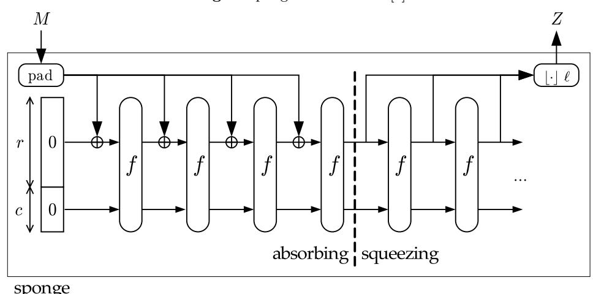
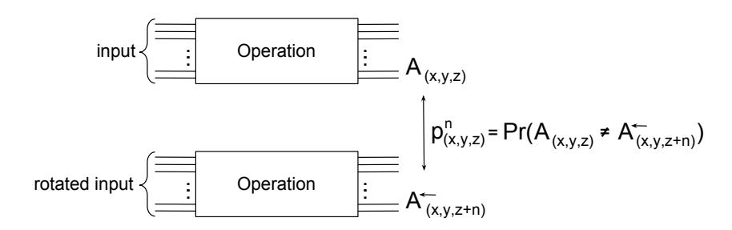
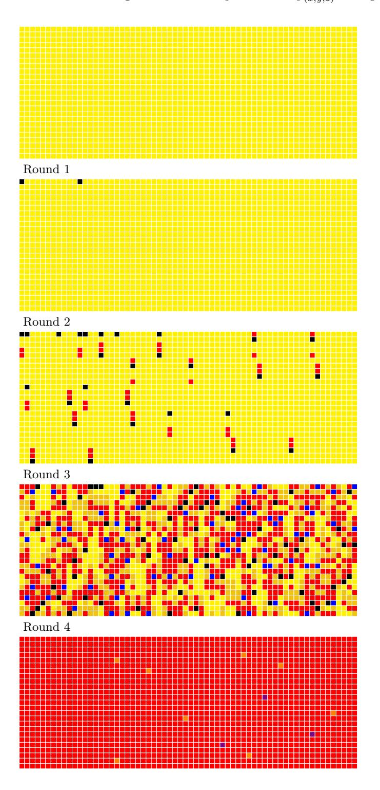
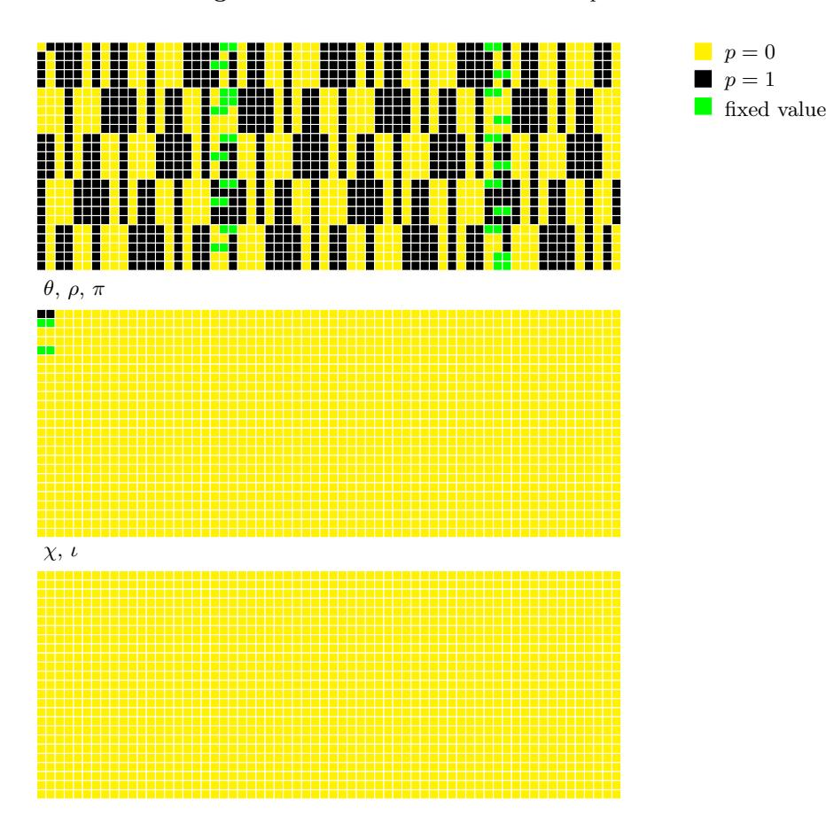
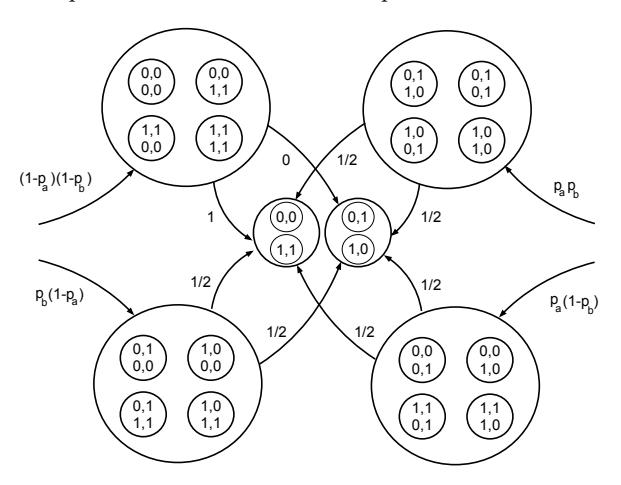
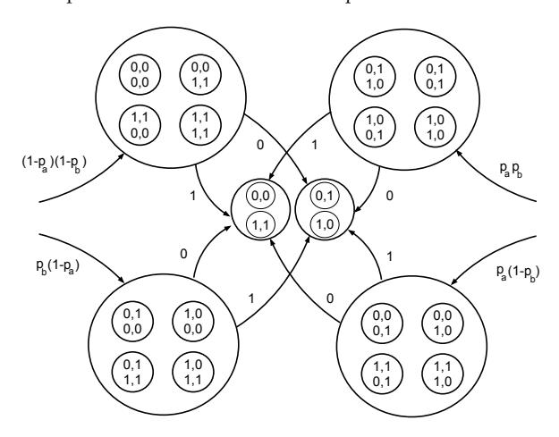
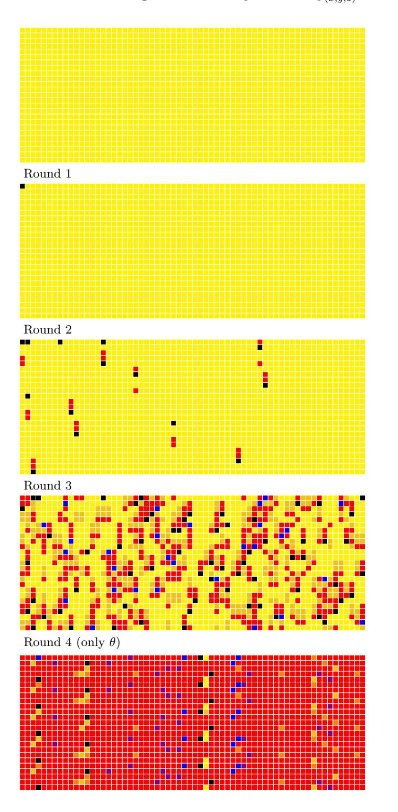

# Rotational cryptanalysis of round-reduced Keccak

Paweł Morawiecki<sup>1,3</sup>, Josef Pieprzyk<sup>2</sup>, and Marian Srebrny<sup>1,3</sup>

**Abstract.** In this paper we attack round-reduced Keccak hash function with a technique called rotational cryptanalysis. We focus on Keccak variants proposed as SHA-3 candidates in the NIST's contest for a new standard of cryptographic hash function. Our main result is a preimage attack on 4-round Keccak and a 5-round distinguisher on Keccak-f[1600] permutation — the main building block of Keccak hash function.

Keywords: preimage attack, Keccak, rotational cryptanalysis, SHA-3

### 1 Introduction

In 2007, the U.S. National Institute of Standards and Technology (NIST) announced a public contest aiming at the selection of a new standard for a cryptographic hash function. The main motivation behind starting the contest has been the security flaws identified in the SHA-1 standard in 2005. Similarities between SHA-1 and the most recent standard SHA-2 were worrisome and NIST decided that a new, stronger hash function would be needed. Overall, 51 functions were submitted to the first round of the contest. In July 2009 out of the submitted functions, 14 were selected to the second round. At the end of 2010, the five finalists were announced and eventually in October 2012 the winner has been selected. The new SHA-3 standard will be KECCAK hash function [5]. In this paper we analyze KECCAK using a technique called rotational cryptanalysis.

Rotational analysis is a relatively new type of attack. The technique was mentioned and applied in [2, 14, 16], and formally introduced in [12]. Unlike the differential analysis, where for a pair (x, y) the attacker follows the propagation of the difference  $x \oplus y$  through the cryptographic system, in the rotational analysis, the adversary investigates the propagation of the rotational relations through the cryptographic transformations. Khovratovich and Nikolić in [12] analyze the primitives composed of only three operations: addition, rotation, xor (ARX). For these primitives, they prove that the probability that a rotational pair of inputs will produce a rotational pair on the output depends on the number of additions only. In [17] a rotational distinguisher was designed for the keyed permutation of the Shabal hash function. Rotational cryptanalysis was combined with the rebound attack and applied to the compression function of the SHA-3 candidate Skein and its underlying cipher Threefish [13].

The known cryptanalytic results on Keccak can be divided into two types. The first type is showing a non-random behaviour, weakness in the Keccak's internal permutation, such as our rotational distinguishers. The second type is attacking the core security properties of the whole function (a preimage attack and a collision attack). The distinguisher of Keccak's permutation with the highest number of rounds is the zero-sum distinguisher proposed in [1] and later improved in [6, 9]. However, the complexity of these distinguishers is very high. For example, the zero-sum distinguisher for all 24 rounds has the complexity of 2<sup>1579</sup>. A differential analysis of Keccak's internal permutation, given in [10], leads to distinguishers up to 8 rounds with complexity of 2<sup>491.47</sup> and for 5 rounds with complexity of 2<sup>8</sup>. Among the attacks on the Keccak hash function, the most rounds were reached by Bernstein in his 8-round preimage attack [3].

<sup>&</sup>lt;sup>1</sup> Section of Informatics, University of Commerce, Kielce, Poland pawelm@wsh-kielce.edu.pl

<sup>&</sup>lt;sup>2</sup> Department of Computing, Macquarie University, Australia josef.pieprzyk@mq.edu.au

<sup>&</sup>lt;sup>3</sup> Institute of Computer Science, Polish Academy of Sciences, Poland marians@ipipan.waw.pl

However, the attack is much slower than parallel exhaustive search and it is inherently memoryintensive. Also with the aid of differential analysis, Naya-Plasencia et al. mounted the preimage and collision attacks on 2-round Keccak [15]. In [11] the same result (2-round preimage and 2-round collision attacks) were obtained through the SAT-based attacks. The most successful collision attack was given in [8] where 4-round collisions were presented.

In this paper we focus our analysis on the Keccak variants proposed as SHA-3 candidates. First we analyze the permutation Keccak-f[1600]. We mount the 4-round rotational distinguisher and then enhance it with a correlation analysis which improves the result to 5 rounds. We implement the distinguishers and verify the experimental results. Unlike the other rotational analysis we treat rotational relations between bits independently and we operate on probabilities of rotational relations. Our rotational cryptanalysis not only serves as a mean to show a non-random behaviour in the cryptographic primitive, but also for the first time the technique is used for mounting the preimage attack. A family of 4-round distinguishers is the base for our 4-round preimage attack with the complexity 64 times lower than exhaustive search. This is also the first 4-round preimage attack with a negligible amount of memory needed for the attack.

Table 1. Best known preimage attacks on the Keccak variants proposed as SHA-3 candidates. The number in the column 'Variant' denotes a hash length.

|       | Rounds Variant | Time                  | Memory             | Reference   |
|-------|----------------|-----------------------|--------------------|-------------|
| 6/7/8 | 512            | 506/2507/2511.5<br>2  | 176/2320/2508<br>2 | [3]         |
| 4     | 224/256        | 217.3<br>/2249.3<br>2 | 61<br>2            | [3]∗        |
| 4     | 384/512        | 377.3<br>/2505.3<br>2 | 61<br>2            | [3]∗        |
| 4     | 512            | 506<br>2              | negligible         | Section 4.2 |
| 4     | 384            | 378<br>2              | negligible         | Section 4.2 |
| 4     | 256            | 252<br>2              | negligible         | Section 4.2 |
| 4     | 224            | 221<br>2              | negligible         | Section 4.2 |

## 2 KECCAK

In this section we provide a description of Keccak to the extent necessary for understanding the attack described in the paper. For a complete specification, we refer the interested reader to the original specification [5].

Keccak uses the sponge construction and hence is a member of the sponge function family [4]. Figure 1 shows the construction. It can be used as a hash function but also can be applied for generating infinite bit stream, making it suitable as a stream cipher or a pseudorandom bit generator. In this paper we focus on the sponge construction for cryptographic hashing. Keccak has two main parameters r and c, which are called bitrate and capacity, respectively. The sum of those two makes the state size, which Keccak operates on. For the SHA-3 proposal, the state size is 1600 bits. Different values for bitrate and capacity give the trade-off between speed and security. The higher bitrate gives the faster function that is less secure. Keccak follows the sponge two-phase processing.

The initial 1600-bit state is filled with 0's. In the first phase (also called the absorbing phase), interleaved with applications of the permutation f (called Keccak-f in the specification). The

<sup>∗</sup>These results were provided for us by the author of the attack. Originally in [3] the results are given only for 6,7 and 8 rounds.

Fig. 1. Sponge Construction [4]



absorbing phase is finished when all message blocks have been processed. In the second phase (also called the squeezing phase), the first r bits of the state are returned as part of the output bits, interleaved with applications of the function f. The squeezing phase is finished after the desired length of output digest has been produced.

For the variants proposed as SHA-3 candidates, the value of the parameter c is equal to a hash length multiplied by 2. For example, the SHA-3 candidate with 512-bit hash length is Keccak with c = 1024 and r = 576 (r + c = 1600). In this paper we denote variants proposed as SHA-3 candidates by Keccak-512, Keccak-384, Keccak-256, and Keccak-224. (The number is a hash length for a given variant.)

Keccak can also operate on smaller states but through the whole paper we always refer to the default variant with 1600-bit state. The state can be visualised as an array of 5×5 lanes, each lane is 64-bit long. The state size determines the number of rounds in Keccak-f function. For the default 1600-bit state there are 24 rounds. All rounds are the same except for constants which are different for each round.

Below there is a pseudo-code of a single round. In the latter part of the paper, we often refer to the algorithm steps (denoted by Greek letters) described in the following pseudo-code.

### Round(A,RC) {

```
θ step
C[x] = A[x,0] xor A[x,1] xor A[x,2] xor
    A[x,3] xor A[x,4], forall x in (0...4)
D[x] = C[x-1] xor rot(C[x+1],1), forall x in (0...4)
A[x,y] = A[x,y] xor D[x], forall (x,y) in (0...4,0...4)
ρ step forall (x,y) in (0...4,0...4)
A[x,y] = rot(A[x,y], r[x,y]),
π step forall (x,y) in (0...4,0...4)
B[y,2*x+3*y] = A[x,y],
χ step forall (x,y) in (0...4,0...4)
```

```
A[x,y] = B[x,y] xor ((not B[x+1,y]) and B[x+2,y]),
ι step
A[0,0] = A[0,0] xor RC
return A }
```

All the operations on the indices shown in the pseudo-code are done modulo 5. A denotes the complete permutation state array and A[x,y] denotes a particular lane in that state. B[x,y], C[x], D[x] are 64-bit intermediate variables. The constants r[x,y] are the rotation offsets, while RC are the round constants. rot(W,m) is the usual bitwise rotation operation, moving bit at position i into position i + m in lane W (i + m are done modulo 64 – note that 64 is the lane size for the default variant of Keccak). θ is the linear operation intends to provide diffusion for the state. ρ is a permutation between bits in the lanes and π is a permutation between the whole lanes. The only non-linear operation is χ which can be treated as a layer of 5-bit Sboxes. Finally, ι xores the round constant with the first lane. The constants play a vital role in our analysis and it is worth mentioning that they have the very low Hamming weight. The constants for the first 5 rounds are: 0000000000000001, 0000000000008082, 800000000000808a, 8000000080008000, 000000000000808b (given respectively in hexadecimal using the little-endian format).

In our work we often need to refer to a particular bit of the state and we do that by A(x,y,z) . The coordinates x, y range from 0 to 4 specifying the lane in the state and the coordinate z ranges from 0 to 63 specifying the bit number in the given lane. With this notation we can refer to a state by A, to a lane by A(3,2), to a value of a single bit by A(1,4,6), or to a position of a single bit by (3, 1, 60).

# 3 Rotational distinguishers for the Keccak-f[1600] permutation

In our analysis we follow the relation between two states (A, A←) which change through subsequent steps of Keccak-f[1600] permutation. In particular we are interested in evolution of a rotational pair of states. Let us define the rotational pair in the context of the Keccak-f[1600] permutation.

Definition 1. A pair of two 1600-bit states (A, A←) is called a rotational pair when each lane in the state A<sup>←</sup> is created by bitwise rotation operation of the corresponding lane in the state A. The operation moves the bit from the position (x, y, z) to the position (x, y, z + n), where z + n is done modulo 64. The coordinates x, y range from 0 to 4 specifying the lane in the state and the coordinate z ranges from 0 to 63 specifying the bit number in the given lane. n is called a rotational number and is the same for every lane. Thus in the rotational pair ∀(x, y, z) : A(x,y,z) = A<sup>←</sup> (x,y,z+n) .

Remark 1. Following Definition 1, there are up to 64 possible rotational pairs including a pair, where A and A<sup>←</sup> are the same (having n = 0). We will use this fact in the preimage attack described later in the paper.

In some parts of this work we are interested in the probability that a given pair is a rotational one or a given pair of corresponding bits preserve the rotational relation. Two following definitions help to formally define this probability.

Definition 2. Set S<sup>n</sup> is a set of 2 <sup>1600</sup> pairs of states which are created by an operation (some number of steps of Keccak-f[1600] or their inverse) applied to all possible rotational pairs. (All possible means 2 <sup>1600</sup> possible rotational pairs for a chosen rotational number n.)

**Definition 3.** Probability  $p_{(x,y,z)}^n$  is the probability that for a pair of states  $(A, A^{\leftarrow})$  randomly selected from the set  $S_n$  we have  $A_{(x,y,z)} \neq A_{(x,y,z+n)}^{\leftarrow}$ .  $p_{(x,y,z)}^n$  can be expressed as  $p_{(x,y,z)}^n = 1/2 + \epsilon_{(x,y,z)}^n$ . Therefore if  $\epsilon_{(x,y,z)}^n = 1/2$ , the corresponding bits have opposite values and if  $\epsilon_{(x,y,z)}^n = -1/2$ , the corresponding bits are equal. In case  $\epsilon_{(x,y,z)}^n = 1/2$ 0, the bits are independent.

**Fig. 2.** Probabilistic relation between bits in a pair of states  $(A, A^{\leftarrow})$



When mounting distinguishers we refer to a random permutation which now we define for-

Given a permutation of n-bit sequences, i.e  $p:\{0,1\}^n \to \{0,1\}^n$ . The collection of all permutations over n bit sequences is denoted by  $\mathcal{P}_n$ . The cardinality of the set  $\mathcal{P}_n$  is n!.

**Definition 4.** Given a probability distribution  $\mathcal{D}_n$  that assigns the probability  $\frac{1}{n!}$  for each permutation  $p \in \mathcal{P}_n$ . A permutation is called random if it is chosen according to the (uniform) distribution  $\mathcal{D}_n$ .

For a random permutation we assume that  $p_{(x,y,z)}^n$  follows the binomial distribution  $\mathcal{B}(t,s)$ where t is a number of trials and s is a probability of success and is equal to 0.5. The mean for the binomial distribution equals  $s \cdot t$  and the standard deviation  $\sigma = \sqrt{(1-s)s \cdot t}$ .

To distinguish Keccak-f[1600] permutation from a random permutation we check whether the experimental results (for a chosen  $p_{(x,y,z)}$ ) follow the binomial distribution  $\mathcal{B}(t,0.5)$ . We choose a typical 95% confidence interval and hence the mean from the experimental sample should be within the range  $0.5t\pm2\sigma$ . If the mean is beyond that range we conclude that experimental results do not follow the binomial distribution  $\mathcal{B}(t,0.5)$  and hence Keccak-f[1600] can be distinguished from a random permutation.

To calculate how the probabilities change through the successive steps of the algorithm, let us first analyze two basic bitwise operations used in Keccak.

For the following Lemmas it is assumed that each  $p_{(x,y,z)}$  is independent. Also we assume that if corresponding bits from  $(A, A^{\leftarrow})$  are equal, both combinations ('00' or '11') have the same probability to be the actual values. The same applies for combinations with opposite bits ('01' or '10').

**Lemma 1 (AND).** Given the bitwise AND operation, its input bits a, b and the output bit out. Then the probability

$$P_{out} = \frac{1}{2}(p_a + p_b - p_a p_b),$$

where the probabilities  $p_a$  and  $p_b$  are defined according to Definition 3.

**Lemma 2 (XOR).** Given the bitwise XOR operation, its input bits a, b and the output bit out. Then the probability

$$P_{out} = p_a + p_b - 2p_a p_b,$$

where the probabilities  $p_a$  and  $p_b$  are defined according to Definition 3.

Proofs of the lemmas are given in Appendix.

There is also the bitwise NOT operation in the algorithm but it does not affect the probabilities. NOT flips the values of the corresponding bits  $A_{(x,y,z)}$  and  $A_{(x,y,z+n)}^{\leftarrow}$  but their relation (or precisely speaking the probability of relation  $p_{(x,y,z)}^n$ ) remains unchanged. Also the bitwise rotation operation (denoted in the pseudo-code as  $\mathsf{rot}(\mathtt{W},\mathtt{n})$ ) does not change the values of probabilities. It rotates the bits in the lane so their positions (coordinates z in  $p_{(x,y,z)}^n$ ) change while their probabilities  $p_{(x,y,z)}^n$  are not changed.

Having explained how the basic bitwise operations change the rotation probabilities, the

Having explained how the basic bitwise operations change the rotation probabilities, the analysis of the Keccak-f[1600] steps remains mostly straightforward. In the transformation  $\theta$ , there is the XOR operation only, applied a number of times. Due to the linearity of the XOR operation, the repeated application of Lemma 2 will give the correct results of calculated probabilities. For the permutations  $\rho$  and  $\pi$ , nothing needs to be calculated as only the positions of bits change. In the transformation  $\chi$ , the two Lemma 1 and Lemma 2 are applied. The last step is the transformation  $\iota$ , where the lane (0,0) is xored with a constant. Xoring with '0' does not change anything. However, if there is '1' at position m in the constant and a rotational number n > 0, then xoring with a constant change the probabilities as follows

$$p^n_{(0,0,m)} := 1 - p^n_{(0,0,m)} \text{ and } p^n_{(0,0,m-n)} := 1 - p^n_{(0,0,m-n)}$$

Example 1. Let us consider two 8-bit lanes  $A_{(0,0)}$  and  $A_{(0,0)}^{\leftarrow}$  with the rotational number n=3. The lanes have the following binary values:  $A_{(0,0)}=00000010$  and  $A_{(0,0)}^{\leftarrow}=00010000$ . Because  $\forall z\colon A_{(0,0,z)}=A_{(0,0,z+3)}^{\leftarrow}$ , then  $\forall z\colon p_{(x,y,z)}^3=0$  (according to Definition 3). Now if both lanes are xored with 8-bit constant C=00000001, new values of lanes are  $A_{(0,0)}=00000011$  and  $A_{(0,0)}^{\leftarrow}=00010001$ . Rotational relation has been spoilt at two positions (0 and 5), therefore the probabilities  $p_{(0,0,0)}^3$  and  $p_{(0,0,5)}^3$  are now equal to 1. In Keccak-f[1600] the constants are 64-bit long but the reasoning shown above is still valid.

#### 3.1 4-round distinguishers

We build a 4-round rotational distinguisher and show that after 4 rounds, there are some coordinates (x, y, z) and the rotational number n for which  $p_{(x,y,z)}^n$  does not follow the binomial distribution  $\mathcal{B}(t, 0.5)$ . Figure 3 illustrates an evolution of rotation probabilities. A single square represents a value (or a range of values) of the probability  $p_{(x,y,z)}^n$ . Usually in this paper, we refer to a lane by its two coordinates (x,y). However here for the sake of diagram readability instead of 5x5 matrix of lanes there are 25 rows, each representing a single lane. For example, a value of  $p_{(0,1,0)}^n$  is represented by the leftmost square in the sixth row and  $p_{(4,4,63)}^n$  is represented by the rightmost square in the last (25th) row.

In the beginning, all corresponding bits from a rotational pair are equal so  $\forall (x,y,z) \; p_{(x,y,z)}^n = 0$ . After the first application of  $\iota$ , some probabilities  $p_{(x,y,z)}^n$  change and in the subsequent steps these changes propagate and influence other bits. For most rotational numbers n, there are some probabilities  $p_{(x,y,z)}^n$  deviating from 0.5 until the end of the 4th round. According to our calculations, at the end of 4th round the probability  $p_{(4,4,14)}^{54} = 0.5625$ . To verify the distinguisher

we chose randomly 10000 rotational pairs and ran them on the 4-round Keccak-f[1600]. The mean from that sample was equal to 5682 (for 5682 rotational pairs bits had different values). For a random permutation which follows the binomial distribution  $\mathcal{B}(10000, 0.5)$ , the mean equals 5000 and the standard deviation equals 50. Thus the mean from the experiment on the 4-round Keccak-f[1600] should be within the range  $5000 \pm 2 \cdot 50$  and clearly 5682 is beyond that range. Hence we conclude we have a distinguisher for the 4-round Keccak-f[1600] permutation.

We could not directly extend the distinguisher to 5 rounds because after  $\theta$  in the 5th round all  $p_{(x,y,z)}^n = 0.5$ .

### 3.2 Extension to 5-round distinguisher

To extend the distinguisher to 5 rounds, we show that correlation between some corresponding bits from A and  $A^{\leftarrow}$  deviates from what is expected from random permutation. Let us first give an observation which helps to mount the 5-round distinguisher.

Observation 1 Consider two bits  $(A_{(x,y,z)}, A_{(x,y',z)})$  from state A which are in the same column and let us assume that we know the probability that  $A_{(x,y,z)} \neq A_{(x,y',z)}$ . Our point is that  $\theta$  does not change this probability. It is because  $\theta$  treats each bit within a column in the same way: either it flips all 5 of them or it leaves them unchanged.

We can use this observation in our rotational analysis. The difference is that now we look at relations in one pair  $(A_{(x,y,z)}, A_{(x,y,z+n)}^{\leftarrow})$  and the second pair  $(A_{(x,y',z)}, A_{(x,y',z+n)}^{\leftarrow})$ . Each of these two pairs has the relation between its bits (that is bits have either the same or opposite values). We are interested whether the relations are the same in both pairs, specifically the probability that relations are the same in both pairs. For a random permutation this probability has the binomial distribution  $\mathcal{B}(t,0.5)$ . If we can show that for the 5-round Keccak-f[1600] experimental results do not follow this distribution, then we have a distinguisher.

First we determine a rotational number n for which  $p_{(x,y,z)}^n$  and  $p_{(x,y',z)}^n$  have the highest deviation from 0.5 at the end of the 4th round. It turns out that for n=63,  $p_{(2,1,37)}^{63}$  and  $p_{(2,2,37)}^{63}$  is the best pair\*  $(p_{(2,1,37)}^{63}=0.5625$  and  $p_{(2,2,37)}^{63}=0.49219)$ .

Now let  $P_c$  denotes a probability that in the first pair  $(A_{(x,y,z)}, A_{(x,y,z+n)}^{\leftarrow})$  and in the second pair  $(A_{(x,y',z)}, A_{(x,y',z+n)}^{\leftarrow})$  is the same relation. That is the probability:

$$P_c = p_{(x,y,z)}^n \cdot p_{(x,y',z)}^n + (1 - p_{(x,y,z)}^n)(1 - p_{(x,y',z)}^n)$$

We can calculate  $P_c$  for the chosen pair  $p_{(2,1,37)}^{63}$  and  $p_{(2,2,37)}^{63}$ .

$$P_c = 0.5625 \cdot 0.49219 + (1 - 0.5625)(1 - 0.49219) = 0.49902375$$

This is the  $P_c$  value at the beginning of the 5th round. Then we have to examine how the steps in the algorithm change this probability. As explained in Observation 1,  $\theta$  does not change this value. Subsequent algorithm steps  $\rho$  and  $\pi$  also do not change  $P_c$  value, they only change a position of  $P_c$  which now refers to different pairs of bits  $(A_{(1,2,43)}, A_{(1,2,44)}^{\leftarrow})$  and  $(A_{(2,0,16)}, A_{(2,0,17)}^{\leftarrow})$ . After that there is  $\chi$  which preserves the relation between the first pair and the second with a probability equals 0.53125. The reason that this value deviates from 0.5 is that  $\chi$  is a non-linear operation and precisely the bitwise AND operation which introduces the bias. All the details on how this value is calculated are given in Appendix. Finally,  $\iota$  does not affect our

<sup>\*</sup> An anonymous reviewer pointed that a better pair can be found, that is  $p_{(0,0,3)}^{31}$  and  $p_{(0,2,3)}^{31}$ . It improves the distinguisher by a factor of 4.

Fig. 3. Evolution of probabilities p 53 (x,y,z) through 4 rounds of Keccak-f[1600].

p = 0 0.4 ≥ p > 0 0.5 > p > 0.4 p = 0.5 0.6 ≥ p > 0.5 1 > p > 0.6 p = 1



analysis here. Therefore, to have our pairs with the same relation at the end of the 5th round, there are two ways this event may occur. Either the pairs enter into the 5th round with the same relation and  $\chi$  does not spoil it or they enter into the 5th round with the opposite relation and  $\chi$  'fixes' it. Then the total probability  $P_c$  for the chosen pair at the end of the 5th round is:

$$P_c = 0.53125 \cdot 0.49902375 + (1 - 0.53125) \cdot (1 - 0.49902375) = 0.499938984$$

For a random permutation,  $P_c$  follows the binomial distribution with the probability of success s = 0.5 — very close to 0.499938984. Then the bias for 5-round Keccak-f[1600] is expected to be very small. To experimentally verify and observe the bias we need to check many rotational pairs. A sufficient number of rotational pairs m is calculated from Chernoff bound [7] and can be expressed as the following inequality:

$$m \ge \frac{1}{(P_c - 0.5)^2} \ln \frac{1}{\sqrt{\epsilon}},$$

where  $\epsilon$  is the probability of an error of the bound (typically set to 0.05). From the inequality we have  $m \ge 402\,332\,890 \approx 2^{28.6}$  and in the experiment we checked  $403\,000\,000$  rotational pairs. The distinguisher we implemented can be described in a few short steps:

- 1. Generate randomly 403 000 000 rotational pairs
- 2. For each pair
  - (a) Run 5-round Keccak-f[1600] on the state A and the state  $A^{\leftarrow}$ ;
  - (b) if  $(A_{(1,2,43)} \oplus A_{(1,2,44)}^{\leftarrow} \oplus A_{(2,0,16)} \oplus A_{(2,0,17)}^{\leftarrow} = 0)$  then mean := mean + 1;

The mean from the experiment was equal to 201 450 503. For a random permutation which follows the binomial distribution  $\mathcal{B}(403\,000\,000,0.5)$ , the mean equals  $201\,500\,000$  and the standard deviation equals 10 037. Thus the mean from the experiment on the 5-round Keccak-f[1600]should be within the range  $201\,500\,000\pm2\cdot10\,037$  and  $201\,450\,503$  is beyond that range. Hence we conclude we have a distinguisher for the 5-round Keccak-f[1600] permutation.

#### 3.3 5-round distinguisher with lower complexity

The idea allowing us to reduce the complexity of the 5-round distinguisher is to start not from a rotational pair of states but from the pair of states (called 'good' states) which after one round gives the rotational pair. First diagram in Figure 4 shows the structure which is used to generate a pair of 'good' states. Now we explain how we construct this structure. (A rotational number n is set to 63 in the following explanation but for any other n the logic of construction stays the same.)

On the way to the rotational pair from a pair of 'good' states the following should happen:

- $\iota$  from the first round flips the value of  $p_{(0,0,0)}^{63}$  and  $p_{(0,0,1)}^{63}$ . Thus to get the rotational pair
- after  $\iota$ , there have to be  $p_{(0,0,0)}^{63}=1$ ,  $p_{(0,0,1)}^{63}=1$  and for all other  $p_{(x,y,z)}^{63}=0$  before  $\iota$  step.

   We want that  $p_{(0,0,0)}^{63}=1$ ,  $p_{(0,0,1)}^{63}=1$  and all other  $p_{(x,y,z)}^{63}=0$  are going to  $\chi$  and  $\chi$  does not change any of  $p_{(x,y,z)}^{63}$ . This way  $\iota$  gets the right  $p_{(x,y,z)}^{63}$  to produce the rotational pair.

However  $\chi$  is a non-linear operation and to have the condition fulfilled, some  $A_{(x,y,z)}$  and  $A_{(x,y,z+n)}^{\leftarrow}$  have to be fixed. To have values fixed at this point it has to be taken under consideration at the beginning of the first round. Once we know the relation of the states A and  $A^{\leftarrow}$ before  $\chi$  step, it is easy to go back till the beginning of the round. It is because  $\pi$ ,  $\rho$  and  $\theta$  are all linear operations and they change the rotational relation with probability 1. Thus we simply

**Fig. 4.** 1-round transition to a rotational pair. A rotational number n set to 63.



invert these three operations to get the rotational relation at the beginning of the first round. Figure 4 shows a 1-round transition to a rotational pair where exact positions of the fixed bits are marked. The values of fixed bits which lead to this transition are given in Appendix.

We hoped that this 1-round transition to a rotational pair would give one more round in the distinguisher. However it is not the case and the problem is that the constant of the second round has the Hamming weight 3 (and not 1 as for the first round). More 1's in the round constant introduce more  $p_{(x,y,z)}^n = 1$  which subsequently cause more  $p_{(x,y,z)}^n$  with undesirable value of 0.5. Yet this 1-round transition can be used to lower the complexity of the 5-round distinguisher. Similarly as in the distinguisher from the previous section, we are interested in the pair of  $p_{(x,y,z)}^n$  at the end of 4th round which are in the same column and whose values deviate from 0.5. For a rotational number n set to 63, we find an excellent pair where both  $p_{(4,3,22)}^{63}$  and  $p_{(4,4,22)}^{63}$  are equal to 0. We calculate  $P_c$  in exactly the same way as in Section 3.2 but this time the total probability  $P_c$  is much higher and is equal to 0.53125. Putting this value to the Chernoff inequality, we calculate the number of pairs m needed to detect the bias and obtain  $m \geq 1534 \approx 2^{11}$ . Around  $2^{11}$  needed pairs make the complexity of the distinguisher roughly equal  $2^{12}$ .

Trying to win more rounds by 'going backwards' by 2 (or more) rounds is problematic. Either we end up with all fixed bits at the beginning of the distinguisher (then in fact is not a structural distinguisher any more), or if we assume that transitions can be probabilistic the complexity of the distinguisher becomes much higher than the complexity of the generic 'attack'. We also tried

the approach where each undesirable  $p_{(x,y,z)}^n = 0.5$  becomes 0 with probability  $2^{-1}$ . However, we could not reach anything better than 5 rounds without exceeding the generic complexity.

### 4 Preimage attacks on round-reduced Keccak

First, we describe the preimage attack on 3-round Keccak-512 which is based on the rotational distinguisher given in the previous section. Then we show how to extend the attack to 4 rounds. To have the attack working on Keccak hash function, we have to consider padding and Keccak parameters. Let us consider Keccak-512 which has r = 576, c = 1024 and a hash length set to 512 bits. For the preimage attack we propose the following structure of the message. A message length is 574 bits, where first 8 lanes (512 bits) are unknown (to be determined by the attacker). Last 62 bits of the message are set to 1. The message is padded with two 1's giving a block of 576 bits. This way we fulfil a condition that all lanes (except first 8 lanes) have all 0's or 1's. We would use similar constraints on a message when attacking Keccak with different parameters (including all Keccak variants proposed as SHA-3 candidates).

#### 4.1 3-round preimage attack

The goal of our attack is to find a preimage for a given 512-bit hash h. In the structure of the message described above we have 512 unknown bits, then we can expect that among  $2^{512}$  possible messages there is, on average, one with a given hash. The main idea of our attack is to find a rotational counterpart of the preimage and show that the workload for this task is below exhaustively trying all  $2^{512}$  values. Once we have a rotational counterpart of the preimage, we simply rotate it back and get the preimage.

As stated in Remark 1, for a given state there are up to 64 possible rotational pairs (including the identity function). There are 512 unknown preimage bits in the state A, then the probability that we guess one of the rotational counterpart  $A^{\leftarrow}$  is  $2^{-512} \cdot 64 = 2^{-506}$ . Thus we need  $2^{506}$  guesses. There is a subtlety here which should be mentioned. There are some messages which have fewer than 64 rotations. These 'special' messages have a cyclic pattern. For example a message starting with four 0's then four 1's, then four 0's and so on. However, the number of 'special' messages is relatively small in comparison to  $2^{512}$ . It can be shown there are  $2^{256}$  such messages for our case. (See Appendix for detailed analysis.) For simplicity, we can start our attack with checking  $2^{256}$  these special messages. Then there are still almost  $2^{512}$  possibilities left, but at least we are sure that in this poll each state gives 64 rotational pairs.

To make our attack working, at the end of the 3rd round we need some  $p_{(x,y,z)}^n = 0$  or  $p_{(x,y,z)}^n = 1$  for each rotational number n. In the precomputation phase of the attack we generate 64 diagrams (the same as shown in Figure 3), each with a different rotational number n. From these diagrams for each rotational number n we make a list of 10 sets of coordinates (x, y, z) for which  $p_{(x,y,z)}^n$  equals 0 or 1 at the end of the 3rd round. Please note that we have to consider only (x,y,z) such that 64x + 320y + z < 512 because the attacker knows only 512 bits of a hash (not the whole 1600-bit state).

Here is the main loop of the attack given in the following pseudo-code:

- 1. guess first 8 lanes (512 bits) of the state  $A^{\leftarrow}$ , the other bits are fixed according to the structure of the message given above.
- 2. run 3-round Keccak-f[1600] on the state  $A^{\leftarrow}$ .
- 3. **for** n := 0 **to** n < 64 **do**
  - (a)  $candidate := \mathbf{true};$
  - (b) for all 10 sets of coordinates (x, y, z) being on the list created in precomputation do

if
$$(p_{(x,y,z)}^n=0)$$
 and  $(A_{(x,y,z)}\neq A_{(x,y,z+n)}^\leftarrow)$  then  $candidate:=$  false; if  $(p_{(x,y,z)}^n=1)$  and  $(A_{(x,y,z)}=A_{(x,y,z+n)}^\leftarrow)$  then  $candidate:=$  false;

(c) if (candidate=true) then rotate back the guessed state by n bits and run 3-round Keccak-512 on it to check whether the state is the preimage of a given hash.

The attacker compares the probabilities  $p_{(x,y,z)}^n$  from the distinguisher with the actual values of A (the given hash) and  $A^{\leftarrow}$  state (a result of 3-round Keccak-512 on a guessed state). So, for example, if  $p_{(2,3,1)}^n = 0$ , then the bits  $A_{(2,3,1)}$  and  $A_{(2,3,1+n)}^{\leftarrow}$  have to be the same. If the bits are different, then the candidate is rejected as a potential rotational counterpart of the preimage. (It is the point in the pseudo-code where a variable candidate becomes false.)

As said earlier, running the main loop  $2^{506}$  times, we should get one rotational counterpart of the preimage. It could be the case that our guess (candidate) of a rotational counterpart is not rejected, but in fact it is not a rotational counterpart. Let us call it a false positive candidate. There will be many such false positive candidates and the number of them is calculated as follows. For each rotational number n there is a list of 10 sets of (x, y, z) (created in precomputation) for which  $p_{(x,y,z)}^n$  equals 0 or 1. A probability that we hit on a candidate for which all 10 values of  $p_{(x,y,z)}^n$  are the same as on the list is  $2^{-10}$ . Hence there will be around  $2^{512}/2^{10} = 2^{502}$  false positive candidates to check.

Now let us analyze the workload of inner loops. For each candidate there are 64 rotational numbers n, and for each n there are 10 sets of coordinates to check. Checking one set of coordinates can be implemented with 3 bitwise XOR operations. So the workload of inner loops is roughly  $64 \cdot 10 \cdot 3 = 1920$  XOR operations. This workload is negligibly small as in the single step  $\theta$  (in a single round) there are 3200 bitwise XOR operations.

Summing up, the workload of the attack is  $2^{256}$  (checking special messages) +  $2^{506}$  (main loop) +  $2^{502}$  (checking false positive candidates). Thus complexity of the attack is roughly  $2^{506}$  Keccak-512 calls, 64 times better than the exhaustive search.

#### 4.2 Extension to 4-round preimage attack

A direct extension of the attack to 4 rounds is not possible since there are not any  $p_{(x,y,z)}^n = 0$  or  $p_{(x,y,z)}^n = 1$  at the end of the 4th round of the rotational distinguisher. (As said earlier, we need some  $p_{(x,y,z)}^n$  equals 0 or 1 for mounting the attack.)

It is easy to notice from Figure 3 that  $\iota$  flips some  $p^n_{(0,0,z)}$  and in consequence it leads to undesirable  $p^n_{(x,y,z)} = 0.5$ . Then if we could limit this effect, hopefully some  $p^n_{(x,y,z)} = 0$  or  $p^n_{(x,y,z)} = 1$  would be kept till the end of the 4th round and make the attack work for 4 rounds. To realize this, we do the following. We trace the rotational relations between A and  $A^{\leftarrow}$  (as in previous sections), but this time  $A^{\leftarrow}$  is run on the modified version of Keccak-f[1600] — Keccak-f[1600] without  $\iota$ . Such a modification leads to the following observation.

Observation 2 In Example 1, Section 3 it was shown that application of  $\iota$  to A and  $A^{\leftarrow}$  states flips the value  $p_{(x,y,z)}^n$  for some triples (x,y,z). Our point is that if we do not apply  $\iota$  to an  $A^{\leftarrow}$  state, there will be half as many flips. (It is not a general rule but for constants with very low Hamming weight there are roughly half as many flips.) Let us see a simple example.

Example 2. Let us consider two 8-bit lanes  $A_{(0,0)}$  and  $A_{(0,0)}^{\leftarrow}$  with the rotational number n=3. The lanes have the following binary values:  $A_{(0,0)}=00000010$  and  $A_{(0,0)}^{\leftarrow}=00010000$ . Now  $A_{(0,0)}$  is xored with 8-bit constant C=00000001 and  $A_{(0,0)}^{\leftarrow}$  is left without changes. Then we have  $A_{(0,0)}=00000011$  and the unchanged  $A_{(0,0)}^{\leftarrow}=00010000$ . Therefore a rotational relation has been spoilt at only one position so now  $p_{(0,0,0)}^3$  is equal to 1. In Keccak-f[1600] the constants are 64-bit long but the reasoning shown here stays the same.

Now is the key point. As stated earlier, fewer flips lead to fewer  $p_{(x,y,z)}^n$  with undesirable 0.5 value. In consequence, now in the 4th round there are 9 triples (x,y,z) for which  $p_{(x,y,z)}^n = 0$  or  $p_{(x,y,z)}^n = 1$ . These triples fulfil the condition 64x + 320y + z < 512 as the attacker is given only 512 bits of a hash. In fact  $p_{(x,y,z)}^n = 0$  or  $p_{(x,y,z)}^n = 1$  are not at the end of the 4th round but before  $\chi$  in the 4th round. (Step  $\chi$  destroys these desirable probabilities.) Fortunately, we can invert  $\iota$  and  $\chi$  from the given hash as  $\chi$  operates on the rows independently and can be inverted on a row-by-row basis. In Appendix we give a diagram showing how the probabilities  $p_{(x,y,z)}^n$  evolve and propagate in the modified version of Keccak-f[1600] without  $\iota$ .

In precomputation phase we generate the list of sets of coordinates in the very similar way as described for the 3-round attack. The only difference is that now we use the diagram dedicated to the modified version of Keccak-f[1600] (without  $\iota$ ). The diagram and exact positions where  $p^n_{(x,y,z)}$  equals 0 or 1 is given in Appendix. Also in precomputation we invert  $\iota$  and  $\chi$  of the 4th round from the given hash (since these desirable  $p^n_{(x,y,z)}$  are before  $\chi$  in the 4th round,  $\chi$  destroys them). The result of the inversion is now our state A to which we refer in the pseudo-code of the attack.

Here is the main loop of the attack given in the following pseudo-code:

- 1. guess first 8 lanes (512 bits) of the state  $A^{\leftarrow}$ , the other bits are fixed according to the structure of the message given above.
- 2. run 4-round modified Keccak-f[1600] on the state  $A^{\leftarrow}$
- 3. **for** n := 0 **to** n < 64 **do**
  - (a)  $candidate := \mathbf{true};$
  - (b) for all 9 sets of coordinates (x,y,z) being on the list created in precomputation do if  $(p^n_{(x,y,z)}=0)$  and  $(A_{(x,y,z)}\neq A^{\leftarrow}_{(x,y,z+n)})$  then candidate:= false; if  $(p^n_{(x,y,z)}=1)$  and  $(A_{(x,y,z)}=A^{\leftarrow}_{(x,y,z+n)})$  then candidate:= false;
  - (c) if (candidate=true) then rotate back the guessed state by n bits and run 4-round Keccak-512 on it to check whether the state is the preimage of a given hash.

The main loop of the 4-round preimage attack on Keccak-512 is very similar to the 3-round variant, they differ only in a few places. In Step 2 of the pseudo-code instead of running a normal, full 4-round Keccak-f[1600], we run the modified version without  $\iota$  (in all 4 rounds) up to  $\chi$  in the 4th round. Finally, there will two times more false positive candidates as there are only 9 triples (x, y, z) for which  $p_{(x,y,z)}^n = 0$  or  $p_{(x,y,z)}^n = 1$ . The complexity of the attack stays the same as in the 3-round attack. That is  $2^{256}$  (checking special messages) +  $2^{506}$  (main loop) +  $2^{503}$  (checking false positive candidates), which is amounts roughly to  $2^{506}$  evaluations of the 4-round Keccak-512.

For Keccak-512, the preimage attack is better than the exhaustive search by a factor of  $2^6$ . The same gain can be achieved in the attack on Keccak-384. Our preimage attack works also on Keccak-256 and Keccak-224 but the gain is slightly smaller for these variants. The reason is that there are more false positive candidates to check. It is because an attacker knows fewer bits of a hash (a hash is shorter in these variants) and hence there are fewer triples (x, y, z) (fewer than in Keccak-512 and Keccak-384) for which  $p_{(x,y,z)}^n = 0$  or  $p_{(x,y,z)}^n = 1$ . Consequently, the complexities of the preimage attacks on Keccak-224 and Keccak-256 are  $2^{221}$  and  $2^{252}$ , respectively.

Please also note that if we try to attack KECCAK variant with higher bitrate r (e.g. a variant with r = 600, c = 1000, and a hash length equals 512), the claimed security for this variant is  $2^{c/2} = 2^{500}$ . In such a case our attack would not be actually an attack as its complexity is higher than the claimed security provided by designers.

We could not extend the attack to 5 or more rounds because in the 5th round all p n (x,y,z) = 0.5, while for the attack we need some p n (x,y,z) = 0 or p n (x,y,z) = 1.

### 5 Conclusion

In this paper we have presented the rotational distinguisher for Keccak-f[1600] permutation — the main building block of the Keccak hash function. The distinguisher has been enhanced with the correlation analysis, allowing us to reach 5 rounds with the complexity of 212. We have implemented and verified the distinguisher and experimental results have been consistent with the theoretical model. A family of 4-round distinguishers helps us to mount the 4-round preimage attack on Keccak-512 variant with the complexity of 2506. All the presented attacks are valid for all the Keccak variants submitted as SHA-3 candidates. As future work, it would be interesting to investigate whether the differential rebound attack could improve the rotational distinguishers. These two types of analysis (rebound and rotational) were combined in the attacks on Skein hash function [13].

## Acknowledgement

We would like to thank the Keccak Team for useful comments and discussion. We also thank Dmitry Khovratovich, Thomas Peyrin and anonymous reviewers for improving the quality of the paper. The research was cofounded by the European Union from resources of the European Social Fund, Project PO KL Information technologies: Research and their interdisciplinary applications, Agreement UDA-POKL.04.01.01-00-051/10-00. Josef Pieprzyk was supported by the Australian Research Council grant DP0987734.

### References

- 1. Aumasson, J.P., Meier, W.: Zero-sum distinguishers for reduced Keccak-f and for the core functions of Luffa and Hamsi. Tech. rep., NIST mailing list (2009)
- 2. Bernstein, D.J.: Salsa20. Tech. rep., eSTREAM, ECRYPT Stream Cipher Project (2005), http://cr.yp.to/ snuffle.html
- 3. Bernstein, D.J.: Second preimages for 6 (7? (8??)) rounds of Keccak? NIST mailing list (2010), http:// ehash.iaik.tugraz.at/uploads/6/65/NIST-mailing-list\_Bernstein-Daemen.txt
- 4. Bertoni, G., Daemen, J., Peeters, M., Van Assche, G.: Cryptographic sponges, http://sponge.noekeon.org
- 5. Bertoni, G., Daemen, J., Peeters, M., Van Assche, G.: Keccak sponge function family main document, http: //keccak.noekeon.org/Keccak-main-2.1.pdf
- 6. Boura, C., Canteaut, A.: Zero-Sum Distinguishers for Iterated Permutations and Application to Keccak-f and Hamsi-256. In: Biryukov, A., Gong, G., Stinson, D. (eds.) Selected Areas in Cryptography, Lecture Notes in Computer Science, vol. 6544, pp. 1–17. Springer Berlin Heidelberg (2011)
- 7. Chernoff, H.: A Note on an Inequality Involving the Normal Distribution. Annals of Probability 9, 533–535 (1981)
- 8. Dinur, I., Dunkelman, O., Shamir, A.: New Attacks on Keccak-224 and Keccak-256. In: Canteaut, A. (ed.) Fast Software Encryption, Lecture Notes in Computer Science, vol. 7549, pp. 442–461. Springer Berlin Heidelberg (2012)
- 9. Duan, M., Lai, X.: Improved zero-sum distinguisher for full round Keccak-f permutation. Chinese Science Bulletin 57, 694–697 (2012)
- 10. Duc, A., Guo, J., Peyrin, T., Wei, L.: Unaligned Rebound Attack Application to Keccak. Cryptology ePrint Archive, Report 2011/420 (2011)
- 11. Homsirikamol, E., Morawiecki, P., Rogawski, M., Srebrny, M.: Security margin evaluation of SHA-3 contest finalists through SAT-based attacks. In: 11th Int. Conf. on Information Systems and Industrial Management. LNCS, vol. 7564. Springer Berlin Heidelberg (2012)
- 12. Khovratovich, D., Nikoli´c, I.: Rotational cryptanalysis of ARX. In: Proceedings of the 17th international conference on Fast software encryption. pp. 333–346. LNCS, Springer-Verlag (2010)
- 13. Khovratovich, D., Nikolic, I., Rechberger, C.: Rotational Rebound Attacks on Reduced Skein. In: ASI-ACRYPT'10. LNCS, vol. 6477, pp. 1–19 (2010)

- 14. Knudsen, L.R., Matusiewicz, K., Thomsen, S.S.: Observations on the Shabal keyed permutation. Available online (2009), http://www.mat.dtu.dk/people/S.Thomsen/shabal.pdf
- Naya-Plasencia, M., Rck, A., Meier, W.: Practical analysis of reduced-round keccak. In: Bernstein, D., Chatterjee, S. (eds.) Progress in Cryptology INDOCRYPT 2011, Lecture Notes in Computer Science, vol. 7107, pp. 236–254. Springer Berlin Heidelberg (2011)
- 16. Standaert, F.X., Piret, G., Gershenfeld, N., Quisquater., J.J.: SEA: A Scalable Encryption Algorithm for Small Embedded Applications. In: CARDIS'06. LNCS, vol. 3928, pp. 222–236 (2006)
- 17. Van Assche, G.: A rotational distinguisher on Shabals keyed permutation and its impact on the security proofs. Available online, http://gva.noekeon.org/papers/ShabalRotation.pdf

### **Appendix**

#### Proof of Lemma 1

Analyzing the AND operation we consider two pairs of input bits. A pair from an A state and its counterpart from an  $A^{\leftarrow}$  state. There are 16 possible combinations of pairs and we group them in fours. We assume that all pairs of bits inside the groups are uniformly distributed. It is shown in Figure 5. Probabilities of getting the given group are also shown. The most inner circles represents pair of output bits (one bit from an A state and its counterpart from an  $A^{\leftarrow}$  state). It is clear from Figure 5 that four paths lead to a circle with output bits having opposite values (pairs (0,1) and (1,0)). Actually, one path has probability 0 thus a calculation of  $P_{out}$  (a probability that output bits have opposite values) comes down to adding probabilities of the three paths. We have:

$$P_{out} = p_a p_b \cdot \frac{1}{2} + (1 - p_a) p_b \cdot \frac{1}{2} + (1 - p_b) p_a \cdot \frac{1}{2} = \frac{1}{2} (p_a + p_b - p_a p_b)$$

Fig. 5. All possible 'paths' for the bitwise AND operation for rotational pairs of bits.



### Proof of Lemma 2

Proof of Lemma 2 is the same as for Lemma 1. The only difference is that now there are only two paths leading to a circle with output bits having opposite values. It is shown in Figure 6. We have:

$$P_{out} = (1 - p_a)p_b \cdot 1 + (1 - p_b)p_a \cdot 1 = p_a + p_b - 2p_ap_b$$

Fig. 6. All possible 'paths' for the bitwise XOR operation for rotational pairs of bits.



### Probability of relation preservation by $\chi$

We are given two pairs of bits  $(A_{(1,2,43)}, A_{(1,2,44)}^{\leftarrow})$  and  $(A_{(2,0,16)}, A_{(2,0,17)}^{\leftarrow})$ . Each of these two pairs has the relation between its bits (that is bits have either the same or opposite values). We can also look at relation between pairs and there are two possibilities: either the same relation in both pairs or different relation in each pair. For example a pair (0,1) and a pair (1,0) means that relations in both pairs is the same (bits are different in pairs). We are interested in a probability that  $\chi$  preserves the relation between pairs.  $\chi$  changes the values of bits in the following way.

$$\begin{array}{l} A_{(1,2,43)} := A_{(1,2,43)} \ \, \text{XOR} \, \left( A_{(2,2,43)} \ \, \text{AND} \, \, A_{(3,2,43)} \right) \\ A_{(1,2,44)}^{\leftarrow} := A_{(1,2,44)}^{\leftarrow} \ \, \text{XOR} \, \left( A_{(2,2,44)}^{\leftarrow} \ \, \text{AND} \, \, A_{(3,2,44)}^{\leftarrow} \right) \end{array} \right) \quad \text{first rotational pair} \\ A_{(2,0,16)} := A_{(2,0,16)} \ \, \text{XOR} \, \left( A_{(3,0,16)} \ \, \text{AND} \, \, A_{(4,0,16)}^{\leftarrow} \right) \\ A_{(2,0,17)}^{\leftarrow} := A_{(2,0,17)}^{\leftarrow} \ \, \text{XOR} \, \left( A_{(3,0,17)}^{\leftarrow} \ \, \text{AND} \, \, A_{(4,0,17)}^{\leftarrow} \right) \end{aligned} \quad \text{second rotational pair}$$

To keep the relation between bits  $A_{(1,2,43)}$  and  $A_{(1,2,44)}^{\leftarrow}$  from the first pair, the result of the AND operation has to be the same in both equations from the first pair. The probability of such event can be calculated from Figure 5. We add probabilities (paths) leading to the left, inner circle. (This circle represents the output bits with the same values.) Then a probability is:

$$P = (1 - p_a)(1 - p_b) \cdot 1 + p_a p_b \cdot \frac{1}{2} + (1 - p_a)p_b \cdot \frac{1}{2} + (1 - p_b)p_a \cdot \frac{1}{2}$$

In the 5th round, after  $\theta$  all  $p_{(x,y,z)}^n = \frac{1}{2}$ , then a numerical value of p is:

$$P = (1 - \frac{1}{2})(1 - \frac{1}{2})1 + \frac{1}{2}\frac{1}{2}\frac{1}{2} + (1 - \frac{1}{2})\frac{1}{2}\frac{1}{2} + (1 - \frac{1}{2})\frac{1}{2}\frac{1}{2} = \frac{5}{8}$$

For the second rotational pair calculations are exactly the same with the result of  $\frac{5}{8}$ . The event that  $\chi$  preserves the relation between the first and second pair can happen either when the relation in each pair is preserved or the relation in each pair is spoilt. Thus the probability of this event is equal to:

$$P_{event} = \frac{5}{8} \cdot \frac{5}{8} + (1 - \frac{5}{8})(1 - \frac{5}{8}) = \frac{34}{64} = 0.53125$$

#### Values of fixed bits in the distinguisher from Section 3.3

Bits given in tables below are set to 1. All other fixed bits which are not listed below (but are marked as fixed in Figure 4) are set to 0.

| Bit                         | Value |
|-----------------------------|-------|
| $A_{(4,4,50)}$              | 1     |
| $A_{(4,4,51)}$              | 1     |
| $A_{(4,4,51)}^{\leftarrow}$ | 1     |
| $A_{(0,2,21)}$              | 1     |
| $A_{(0,3,21)}$              | 1     |
| $A_{(0,0,22)}^{\leftarrow}$ | 1     |
| $A_{(0,2,22)}^{(0,0,22)}$   | 1     |
| $A_{(0,3,22)}$              | 1     |
| $A_{(0,4,22)}^{\leftarrow}$ | 1     |
| $A_{(2,0,20)}^{(0,1,22)}$   | 1     |
| $A_{(2,3,20)}^{(2,3,20)}$   | 1     |
| $A_{(2,2,21)}^{\leftarrow}$ | 1     |

| Bit                         | Value |
|-----------------------------|-------|
| $A_{(2,3,21)}^{\leftarrow}$ | 1     |
| $A_{(3,2,51)}^{\leftarrow}$ | 1     |
| $A_{(3,3,51)}^{\leftarrow}$ | 1     |
| $A_{(3,0,50)}$              | 1     |
| $A_{(3,3,50)}^{\leftarrow}$ | 1     |
| $A_{(3,0,52)}^{\leftarrow}$ | 1     |
| $A_{(3,2,52)}^{\leftarrow}$ | 1     |
| $A_{(3,3,52)}^{(3,3,52)}$   | 1     |
| $A_{(3,4,52)}^{(3,3,52)}$   | 1     |
| $A_{(0,2,51)}^{\leftarrow}$ | 1     |
| $A_{(0,3,51)}^{(0,2,51)}$   | 1     |
| (0,0,01)                    |       |

As a consequence of such settings, after  $\pi$  some bits have also fixed (known) values. Specifically,  $A_{(1,0,0)}$  and  $A_{(1,0,1)}$  with their rotational counterparts are equal to 0. Also  $A_{(4,0,0)}$  and  $A_{(4,0,1)}$  with their rotational counterparts are fixed, equal to 1. With this known values we are sure that the non-linear  $\chi$  changes the states into the desirable rotational relation, as shown in Figure 4.

#### Calculation of a number of special messages

According to Definition 1 and Remark 1, for a given state A there are up to 64 possible rotational pairs (including an identity function). There are some messages which have fewer than 64 rotations. These special messages must have a cyclic pattern (e.g. alternating four 1's and four 0's) in all lanes. All 0's or all 1's in the given lane are also considered cyclic here. Please note that if at least one lane in a state A is not cyclic then there are exactly 64 possible rotational pairs  $(A, A^{\leftarrow})$ . It is because this non-cyclic lane is distinct for each rotational number n and consequently the whole  $A^{\leftarrow}$  will be distinct.

For a 64-bit lane there are  $2^{32}$  cyclic patterns. In our preimage attack there are 8 unknown lanes in the A state (remaining lanes are fixed and cyclic), so the number of combinations of cyclic patterns in these 8 lanes is:  $2^{32} \cdot 2^{32} \cdot \dots \cdot 2^{32} = 2^{256}$ . And hence the number of special 8 factors

messages is  $2^{256}$ .

# Evolution of probabilities $p^n_{(x,y,z)}$ in the modified Keccak variant

Figure 7 shows how probabilities  $p_{(x,y,z)}^n$  change in the modified KECCAK variant (without  $\iota$ ). The variant was used in 4-round preimage attack. Please note that in the 4th round, after  $\theta$ , there are still  $p_{(x,y,z)}^n = 0$  or  $p_{(x,y,z)}^n = 1$  which is the key observation for the 4-round preimage attack.

Fig. 7. Evolution of probabilities p n (x,y,z) in the modified Keccak variant.

p = 0 0.4 ≥ p > 0 0.5 > p > 0.4 p = 0.5 0.6 ≥ p > 0.5 1 > p > 0.6 p = 1

