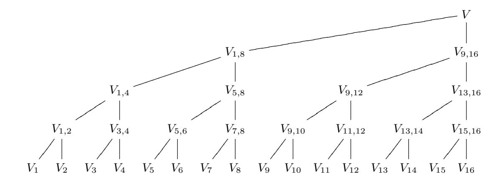
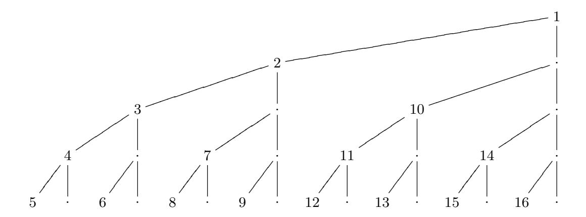
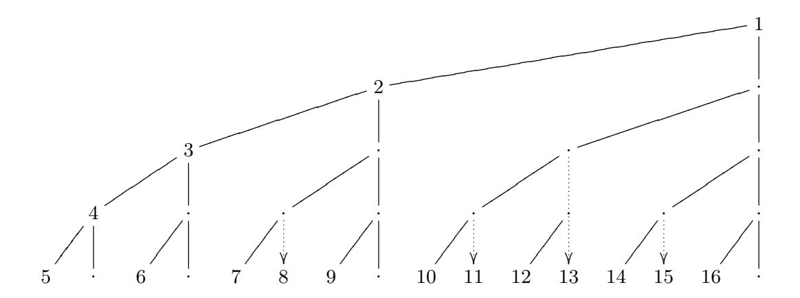
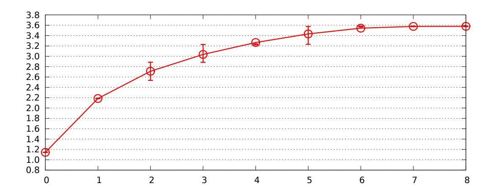
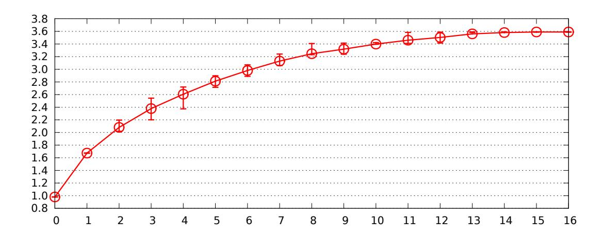
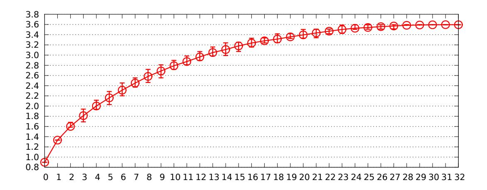

# Faster batch forgery identification

Daniel J. Bernstein1,3 , Jeroen Doumen2 , Tanja Lange3 , and Jan-Jaap Oosterwijk3

1 Department of Computer Science University of Illinois at Chicago, Chicago, IL 60607–7053, USA djb@cr.yp.to

2 Irdeto, CTO Research Group, Taurus Avenue 105, 2132 LS, Hoofddorp, The Netherlands

jdoumen@irdeto.com

3 Department of Mathematics and Computer Science Technische Universiteit Eindhoven, P.O. Box 513, 5600 MB Eindhoven, The Netherlands

tanja@hyperelliptic.org, j.oosterwijk@tue.nl

Abstract. Batch signature verification detects whether a batch of signatures contains any forgeries. Batch forgery identification pinpoints the location of each forgery. Existing forgery-identification schemes vary in their strategies for selecting subbatches to verify (individual checks, binary search, combinatorial designs, etc.) and in their strategies for verifying subbatches. This paper exploits synergies between these two levels of strategies, reducing the cost of batch forgery identification for ellipticcurve signatures.

Keywords: Signatures, batch verification, elliptic curves, scalar multiplication

#### 1 Introduction

Our goal in this paper is to minimize the cost of elliptic-curve signature verification. As an illustration of our results, one of our algorithms verifies a sequence of 64 elliptic-curve signatures (from 64 different signers) at a 2128 security level using

- a total of 0.9 · 64 · 128 additions if all signatures turn out to be valid,
- a total of 1.3 · 64 · 128 additions if 2 signatures turn out to be invalid,
- a total of 2.3 · 64 · 128 additions if 10 signatures turn out to be invalid, and
- a total of 3.6 · 64 · 128 additions if all 64 signatures turn out to be invalid.

This work was supported by the National Science Foundation under grant 1018836, by the Netherlands Organisation for Scientific Research (NWO) under grant 639.073.005, by the Dutch Technology Foundation STW (which is part of NWO, and which is partly funded by the Ministry of Economic Affairs, Agriculture and Innovation) under grant 10518, and by the European Commission under Contract ICT-2007-216676 ECRYPT II. Permanent ID of this document: 3bde3ab884b9aa2995cb5589e3037232. Date: 2012.09.19.

For comparison, we use a total of 2.8 · 64 · 128 additions to separately verify the same 64 signatures.

We emphasize that our algorithms pinpoint the forgeries. These algorithms are not merely "batch signature verification" algorithms, saying yes if and only if all of the signatures are valid; these algorithms are "batch forgery identification" algorithms, telling the user separately for each signature whether that signature is valid. The main challenge we address is to locate each forgery as efficiently as possible.

Cost metric. We systematically report the costs of our algorithms in group operations: the total number of elliptic-curve doublings, additions, and subtractions. For conciseness we write "additions" rather than "group operations", but readers evaluating costs in more detail should be aware that doublings are less expensive than additions in typical elliptic-curve coordinate systems, that "mixed additions" save time, etc.

We also caution the reader that elliptic-curve computations often involve significant overhead beyond group operations. For example, the CHES 2011 ellipticcurve-signatures paper [[4](#page-16-0)] by Bernstein, Duif, Lange, Schwabe, and Yang reports quite noticeable time, even after various speedups, for decompressing points and for manipulating a priority queue of scalars. We would expect our algorithms to use the same amount of time for decompression and less time for manipulating scalars, but properly verifying these predictions would require an optimized assembly-language implementation at the level of [[4](#page-16-0)].

Our verification algorithms are randomized. Performance depends somewhat on these random choices, but our experiments indicate that the variance in performance (for any particular number of forgeries) is quite small.

The total cost of separately verifying n signatures at a 2b security level scales linearly in n and almost linearly in b: it has the form αnb where α is independent of n and nearly independent of b. This paper's batch-forgery-identification algorithms use αnb additions where α is a more complicated function of n, b, the number of forgeries, and various algorithm parameters. We systematically report the number of additions in the form αnb, as illustrated by the 0.9nb example above with n = 64 and b = 128.

Choice of signature system. We focus on the EdDSA signature system proposed in [[4](#page-16-0)]. This system is a tweaked version of the classic Schnorr signature system [[35](#page-19-0)]; one of the tweaks allows much faster batch verification.

In EdDSA, verifying a signature (R, S) on a message M under a public key A means verifying an equation of the form SB = R + hA. Here B is a standard elliptic-curve point, R and A are elliptic-curve points, S is a scalar, and the scalar h is a hash of R, A, and M.

For comparison, in Schnorr's system, the signature is (h, S) rather than (R, S). The verifier recomputes R = SB −hA and then checks that the hash matches h. This is not compatible with our verification algorithms: our algorithms require R as input.

An analogous tweak for DSA (and the general idea of sending R instead of h) was introduced much earlier by Naccache, M'Ra¨ıhi, Vaudenay, and Raphaeli in [[23](#page-18-0)]. We prefer Schnorr to ECDSA (and prefer EdDSA to tweaked ECDSA) for several reasons: Schnorr eliminates inversions, for example, and is resilient to hash-function collisions.

For elliptic-curve signatures at a 2b security level it is standard practice to use about 2b bits for hashes, scalars, and field elements, and to compress points to single coordinates. EdDSA and Schnorr's system then have the same signature size, about 4b bits. Additions require uncompressed points, so the standard way to verify a signature in Schnorr's system is to decompress the public key A, compute SB − hA, compress the result to obtain R, compute the hash, and check for a match with h. We emphasize that the same operations, in a different order, verify a signature in EdDSA: compute the hash h, decompress the public key A, compute SB − hA, compress the result, and check for a match with R. The advantage of EdDSA is that it allows further choices for the verifier: fast batch verification, as discussed in [[4](#page-16-0)], and fast batch forgery identification, as discussed in this paper. These algorithms require decompression of both A and R for each signature, but amply compensate for the extra decompression (an extra square-root computation) by eliminating a large fraction of the subsequent elliptic-curve operations.

One can merge EdDSA with Schnorr's system, simultaneously allowing signatures of the form (h, S) and signatures of the form (R, S). The first step in verifying an EdDSA signature computes, as a side effect, a Schnorr signature for the same message; similarly, one of the (later) steps in verifying a Schnorr signature computes, as a side effect, an EdDSA signature. It is not commonly appreciated that Schnorr's system actually allows hashes as short as b bits (as pointed out by Schnorr), reducing a signature to about 3b bits; users then have the flexibility to convert signatures from EdDSA format to Schnorr format to save space, and to convert signatures from Schnorr format to EdDSA format for fast batch forgery identification. One can of course also save decompression time by transmitting uncompressed signatures and uncompressed public keys.

Pairing-based signatures allow shorter signatures, about 2b bits, but pairingbased verification is an order of magnitude slower than elliptic-curve verification. Consider, for example, [[21](#page-18-1), Figures 1(a), 2(a), 3(a), 4(a)]: batch verification of pairing-based signatures with b = 80 costs about 214 field multiplications per signature, i.e., about 200nb field multiplications. This is the cost in the best case, when there are no forgeries; the cost increases rapidly with the number of forgeries. For comparison, Hisil et al. showed in [[12](#page-17-0)] how to reduce the cost of an elliptic-curve addition to at most 8 field multiplications; we never use more than 4nb additions, i.e., 32nb field multiplications.

Previous work on elliptic-curve signature verification. There is an extensive literature analyzing and optimizing various techniques to verify one ellipticcurve signature. The main bottleneck here is double-scalar multiplication, computing an expression of the form `P + mQ where ` and m are scalars (typically 256 bits) and P and Q are elliptic-curve points. Typical speedups include signed digits, windows, sliding windows, fractional windows, and merged doublings; combining these speedups typically reduces the number of additions by a factor between 2 and 3 compared to the simplest binary methods of computing `P + mQ. There are also many lower-level speedups inside elliptic-curve additions, field arithmetic, etc., but these speedups have no effect on the number-ofadditions metric used for the rest of this paper.

There are, as mentioned above, some papers proposing batch verification of elliptic-curve signatures. The central idea is to check that several quantities V1 = R1 + h1A1 − S1B, V2 = R2 + h2A2 − S2B, etc. are all 0 by checking whether a random linear combination

$$V = z_1 R_1 + z_2 R_2 + \dots + (z_1 h_1) A_1 + (z_2 h_2) A_2 + \dots - (z_1 S_1 + z_2 S_2 + \dots) B$$

is 0. If the verifier chooses the "randomizers" z1, z2, . . . as independent uniform random 128-bit integers then this test cannot be fooled with probability above 2 −128. We emphasize the importance of including these randomizers; in Section 2 we explain how to break the non-randomized batch-verification system from a very recent paper.

This linear-combination idea was proposed in [[23](#page-18-0)] for (tweaked) DSA, in the simpler (and faster but obviously less useful) case of verifying multiple signatures of the same user, i.e. A1 = A2 = · · · . The speedup in [[23](#page-18-0)] was only a small constant for high security levels, because [[23](#page-18-0)] computed V using only very simple techniques for multi-scalar multiplication, but [[4](#page-16-0)] showed that the Bos–Coster multi-scalar multiplication method produced a much larger speedup. It is easy to see that the speedup here is asymptotically Θ(lg n) for a batch of n signatures. The first paper to point out a non-constant speedup was [[2](#page-16-1)] by Bellare, Garay, and Rabin, using a different technique that does not appear to be competitive with advanced multi-scalar multiplication methods.

What is missing from all of these papers is an efficient way to handle forgeries. Consider, for example, the following quote from [[4](#page-16-0)]:

If verification fails then there must be at least one invalid signature. We then fall back to verifying each signature separately. There are several techniques to identify a small number of invalid signatures in a batch, but all known techniques become slower than separate verification as the number of invalid signatures increases; separate verification provides the best defense against denial-of-service attacks.

This strategy means that an attacker sending a low volume of forgeries, enough to have one forgery in each batch, causes a severe slowdown in the software from [[4](#page-16-0)]: each signature ends up being verified separately. It is of course desirable to reduce this damage, if that can be done without compromising performance under heavier denial-of-service floods; what is most desirable is to simultaneously reduce the cost of handling a few forgeries, the cost of handling many forgeries, and every case in between.

Previous work on forgery identification. Pastuszak, Michalek, Pieprzyk, and Seberry in [[25](#page-19-1)] proposed a binary-splitting method of identifying forgeries: if a batch is bad (i.e., fails verification), split it into two halves and apply the same algorithm to each half separately. It is easy to see that this algorithm rapidly becomes slower than separate verification as the number of forgeries increases; however, this algorithm is the foundation for several improved algorithms discussed below.

If one measures algorithm speed by simply counting the number of batch verifications then the binary-splitting method seems quite fast, identifying each forgery in lg n batch verifications where n is the batch size; this is optimal for a single forgery, and diverges only slowly from optimality as the number of forgeries grows. However, the number of batch verifications is not a good measure for the actual amount of time needed to identify the forgeries. Not all verifications require the same amount of time: a larger batch takes longer. Counting additions is a much more realistic cost measure and shows that the binary-splitting method of [[25](#page-19-1)] is actually quite slow.

Pastuszak, Pieprzyk, and Seberry in [[26](#page-19-2)] considered the possibility of nonadaptively choosing subbatches to verify. All available evidence suggests that this non-adaptivity restriction compromises performance even when the number of forgeries is somehow known in advance, and it certainly does not improve performance. Furthermore, non-adaptivity is clearly a disaster when the approximate number of forgeries is not known in advance. We therefore focus on the more flexible adaptive case.

Zaverucha and Stinson in [[39](#page-19-3)] pointed out that there was already a long literature on the number of tests required by adaptive and non-adaptive "group testing" algorithms. Aside from terminology, a "group testing" algorithm is precisely a forgery-identification algorithm built on top of batch verification; in particular, both [[25](#page-19-1)] and [[26](#page-19-2)] fit into this framework. However, the following papers (some of which predate [[39](#page-19-3)]) do not fit into this framework.

Law and Matt in [[18](#page-18-2)] were the first to point out, in the context of pairingbased signatures, that batch verification is providing more information than a simple "yes" or "no". The most important idea, transported to the elliptic-curve case discussed in this paper, is that one can reuse the randomizers z1, . . . , zn from V = z1V1 + · · · + znVn. If V 6= 0 then the binary-splitting method begins with a half-size multi-scalar multiplication to compute a left-half sum z1V1 + · · ·+zn/2Vn/2; and then the right-half sum zn/2+1Vn/2+1 +· · ·+znVn is trivially computed with a single subtraction, rather than another half-size multi-scalar multiplication.

Law and Matt also suggested computing V 0 = z1V1 + 2z2V2 + · · · + nznVn. If there is just one invalid signature, say Vi 6= 0, then V 0 = iV , and one can compute i in O( √ n) additions by the baby-step-giant-step method. Further development of this approach appears in [[18](#page-18-2)], [[20](#page-18-3)], and [[21](#page-18-1)].

We start from the same ideas, move from pairing-based signatures to ellipticcurve signatures for extra speed, and then point out additional speedups. For example, we introduce two ways to drastically reduce the cost of computing the left-half sum described above, without penalizing other parts of the algorithm. To simplify verifiability and reuse of our results we have posted public-domain implementations of our main algorithms at <http://cr.yp.to/badbatch.html>.

#### 2 On the importance of being random

The paper [16] by Karati, Das, Roychowdhury, Bellur, Bhattacharya, and Iyer, appearing at Africacrypt 2012 earlier this year, proposed a scheme for batch verification of ECDSA signatures. This section shows that the scheme is insecure. The main problem is that the scheme does not randomize the linear combination being verified.

**ECDSA.** The basic ECDSA signature scheme works as follows. The system parameters are a prime  $\ell$ , a generator B of an order- $\ell$  group  $\langle B \rangle$ , and a cryptographic hash function H. The secret key of a user is a random integer a in  $[1,\ell]$ ; the user's public key is A=aB. The group is a subgroup of the set of  $\mathbf{F}_p$ -rational points on an elliptic curve given in Weierstrass form  $y^2=x^3+c_4x+c_6$  for  $c_4,c_6\in\mathbf{F}_p$ . An affine point is a tuple P=(x(P),y(P)) satisfying the curve equation; the negative of this point is -P=(x(P),-y(P)). The curve consists of the affine points and the point at infinity  $P_{\infty}$ , which is the neutral element of the group of points.

A signature on message M under public key A is a tuple (r,s) such that the x-coordinate of (H(M)/s)B + (r/s)A is congruent to r modulo  $\ell$ . The standard approach to verification is to compute R = (H(M)/s)B + (r/s)A and to check that x(R) is congruent to r modulo  $\ell$ .

The scheme from [16] for batch ECDSA verification. The batch verification scheme described in [16] verifies signatures  $(r_i, s_i)$  on messages  $M_i$  and public keys  $A_i$  for  $1 \le i \le n$  by reconstructing  $R_i$  from  $r_i$  and checking whether  $\sum_{i=1}^{n} R_i$  equals  $(\sum_{i=1}^{n} H(M_i)/s_i) B + \sum_{i=1}^{n} (r_i/s_i) A_i$ .

The obvious approach to reconstructing  $R_i$  from  $r_i$  is to first compute  $x(R_i)$  from  $x(R_i) \mod \ell = r_i$  and then compute  $y(R_i)$  from the curve equation. The first step is straightforward in the common case that  $\ell \approx p$ : there is almost always a unique integer  $x(R_i) \in \{0, 1, \dots, p-1\}$  satisfying  $x(R_i) \mod \ell = r_i$ . The second step is more difficult: it seems to require a square-root computation, and furthermore can at best determine  $\pm y(R_i)$ ; in a batch of n signatures one needs to guess as many as  $2^n$  combinations of signs. This implies that the batches need to be chosen small; in [16] the maximum batch size considered is 8. The paper puts the main effort into developing new techniques for computing  $\sum R_i$  from the x-coordinates in a more efficient manner and reports a good speed-up factor compared to individual verification.

**First attack.** A batch signature system is broken if invalid signatures pass as valid. The easiest way to break the above scheme is to submit (r, s) as a signature on a target message M under a target public key A and also (r, -s) as a signature on the same message under the same public key, where r is any x-coordinate of a curve point. The verification algorithm reconstructs two points R, -R having x-coordinate r, and then the contributions of these signatures cancel out in both sums:

$$R + (-R) = P_{\infty} = (H(M)/s)B + (r/s)A + (H(M)/(-s))B + (r/(-s))A.$$

This attack relies on the fact that r does not pinpoint a unique R: it can be expanded to R and to -R.

These forgeries are easy to detect once the system is altered to check for them. Excluding a sum of  $P_{\infty}$  is not adequate if the batch includes other signatures along with these two forgeries, but checking for repeated r values is adequate. However, as we will see in a moment, there are other attacks on the scheme that are much more difficult to detect.

**Second attack.** Assume that the attacker knows the secret key  $a_2$  for a public key  $A_2$ . The following attack convinces the verifier to accept a signature on any target message  $M_1$  under any target public key  $A_1$ , along with a signature on  $M_2$  under  $A_2$ .

The attacker picks a random  $k_1$ , and computes  $R_1 = k_1 B$  and  $r_1 = x(R_1)$  as in proper signature generation. He then picks a random  $s_1$  and computes  $R_2 = (r_1/s_1)A_1$ ,  $r_2 = x(R_2)$ , and  $s_2 = (H(M_2) + r_2a_2)/(k_1 - H(M_1)/s_1)$ ; the denominators are nonzero with overwhelming probability. The attacker then submits  $(r_1, s_1)$  as signature on  $M_1$  from  $A_1$  and  $(r_2, s_2)$  as signature on  $M_2$  from  $A_2$  to the batch system.

The verifier now reconstructs the same  $R_1$  and  $R_2$ , and computes  $R_1 + R_2$  and  $(H(M_1)/s_1 + H(M_2)/s_2)B + (r_1/s_1)A_1 + (r_2/s_2)A_2$ , both of which equal  $k_1B + (r_1/s_1)A_1$ . These forgeries thus pass verification, even though neither of them is valid individually and the attacker does not know the secret key for  $A_1$ . The forgeries also work if they are batched together with other signatures in the same verification.

As far as we can tell, the most efficient way to distinguish  $(r_1, s_1)$  and  $(r_2, s_2)$  from properly formed signatures is to verify them separately. This trivial batch-verification scheme is obviously secure but also sacrifices all of the speedup reported in [16].

Consequences. These attacks show that the scheme considered in [16] is insecure. The second attack would work even if the ECDSA signature system were replaced by a signature system such as EdDSA that transmits R instead of r, removing the  $\pm R$  ambiguity. The second attack shows that it is important to use randomness in the tests: to introduce n sufficiently random integers  $z_i$  to scale the equations and verify  $\sum_{i=1}^{n} z_i R_i = (\sum_{i=1}^{n} z_i H(M_i)/s_i) B + \sum_{i=1}^{n} (z_i r_i/s_i) A_i$  instead.

Randomizers were used in the original batch signature scheme introduced by Naccache, M'Raïhi, Vaudenay, and Raphaeli in [23]. There is no discussion of randomizers in [16], and in particular no explanation of why the randomizers were omitted in [16], but it is clear that computing  $\sum_{i=1}^{n} z_i R_i$  would take much longer than computing  $\sum_{i=1}^{n} R_i$ , and it is even harder to compute its x-coordinate from the  $r_i$  without square-root computations to recover each point  $R_i$  first.

### 3 High level: Binary search

This section presents a family of algorithms for verifying a batch of n EdDSA signatures. We begin with a simple binary-search algorithm and then discuss several variants of the algorithm.

These algorithms rely on multi-scalar multiplication as a lower-level subroutine. Section 4 presents several multi-scalar multiplication algorithms usable in this context, pointing out new synergies between these two levels of algorithms. Section 5 analyzes the overall algorithm cost and reports the results of computer experiments with particular algorithm parameters.

For simplicity we assume that the batch size n is a power of 2. Other batch sizes can be split into power-of-2 batch sizes, or handled directly by straightforward generalizations of the algorithms here.

We also assume for simplicity that B has prime order `, and that all input points Ri , Ai are known in advance to be in the group generated by B. For elliptic-curve groups with small cofactors the usual way to ensure this is to multiply all input points by the cofactor, such as the cofactor 8 in [[3](#page-16-2)] and [[4](#page-16-0)]. A closer look shows that this multiplication can safely be suppressed in the context of signature verification, but since the multiplication has very low cost we skip further discussion.

Randomizers. All of our algorithms use the randomizers zi discussed in Sections 1 and 2. As precomputation we choose z1, z2, . . . , zn independently and uniformly at random from the set 1, 2, 3, . . . , 2 b , where b is the security level. There are several reasonable ways to do this: for example, generate a uniform random b-bit integer and add 1, or generate a uniform random b-bit integer and replace 0 with 2b .

Of course, it is also safe to simply generate zi as a uniform random b-bit integer, disregarding the negligible chance that zi = 0; but this requires minor technical modifications to the security guarantees stated below, so we prefer to require zi 6= 0. It is also safe to simulate random numbers as outputs of a strong stream cipher using a long-term random secret key; this is helpful on platforms where generating randomness is expensive. Rather than maintaining stream-cipher state (e.g., the counter in the AES-CTR stream cipher) one can safely encrypt a collision-resistant hash of the input batch.

We also precompute integers h1, h2, . . . , hn as the standard (system-specified) hashes of (R1, A1, M1),(R2, A2, M2), . . . ,(Rn, An, Mn) respectively. By definition the ith signature is valid if SiB = Ri+hiAi , and a forgery if SiB 6= Ri+hiAi .

Leaf randomizers. In this section we define Vi = zi(Ri + hiAi − SiB). Note the inclusion of zi here, deviating from Section 1. This is not merely a change of notation: to verify a single signature (when this is required), our algorithm computes this Vi , whereas the standard verification approach from [[4](#page-16-0)] is to compute SiB − hiAi . Note that signature i is valid if and only if Vi = 0.

The standard approach would seem at first glance to be more efficient: computing SiB − hiAi involves two full-size (2b-bit) scalars Si , hi , while computing Vi as ziRi + zihiAi − ziSiB involves two full-size scalars zihi mod `, ziSi mod `

**Fig. 3.1.** Tree of sums of randomized leaves  $V_1, V_2, \ldots, V_n$  for n = 16.

and a half-size scalar  $z_i$ , for a total of 25% more scalar bits. However, the cost of multi-scalar multiplication (see Section 4) is affected much more by the *maximum* number of scalar bits than by the *total* number of scalar bits; the cost of computing  $V_i$  turns out to be only slightly higher than the cost of computing  $S_iB - h_iA_i$ . This slight extra expense pays off in subsequent steps of the batch algorithm, as discussed below.

Shared randomizers. Starting from these randomized quantities  $V_1, \ldots, V_n$  we draw a binary tree as illustrated in Figure 3.1, with  $V_{1,2} = V_1 + V_2$  and  $V_{3,4} = V_3 + V_4$  and so on at the second level,  $V_{1,4} = V_{1,2} + V_{3,4}$  and so on at the third level, etc. In general we write  $V_{j,k}$  for the sum  $\sum_{j \leq i \leq k} V_i$  of leaf nodes. If all of the signatures at positions  $j, j+1, \ldots, k$  are valid then  $V_{j,k} = 0$ , while if any of the signatures are invalid then with overwhelming probability  $V_{j,k} \neq 0$ . The root node  $V_{1,n}$  at the top represents the randomized signature verification of the entire batch; we denote this sum by V as a shorthand.

The set of tree nodes actually computed by the algorithm is determined adaptively; see below.

We emphasize that one sequence of randomizers is shared across all levels of the tree, including the leaf nodes. This reuse does not compromise the security of the algorithm: if signature i is invalid then with overwhelming probability all of the ancestor tree nodes  $V_{j,k}$  with  $j \leq i \leq k$  are nonzero. More precisely, fix a batch of signatures, and define a randomizer sequence  $(z_1, \ldots, z_n)$  as "bad" if it produces any zeros among ancestor tree nodes of any invalid signature; then the probability of a randomizer sequence being bad is at most  $(n-1)/2^b$ . The point is that if signature i is invalid (i.e.,  $R_i + h_i A_i - S_i B \neq 0$ ), then any equation  $V_{j,k} = 0$  for  $j \leq i \leq k$  is equivalent to a linear equation  $\cdots + z_i(R_i + h_i A_i - S_i B) + \cdots = 0$ . For each choice of  $z_1, \ldots, z_{i-1}, z_{i+1}, \ldots, z_n$  this equation is satisfied by exactly one integer  $z_i$  modulo  $\ell$ , and therefore at most one out of the  $2^b$  permitted choices of  $z_i$ . A randomizer sequence is therefore "(j,k)-bad" with probability at most  $1/2^b$  for j < k (i.e., non-leaf nodes), and with probability 0 for j = k (i.e., leaf

nodes). There are n − 1 non-leaf nodes, so a randomizer sequence is bad with probability at most (n − 1)/2 b .

The basic batch-forgery-identification algorithm. The following algorithm takes as input public keys A1, A2, . . . , An, signatures (R1, S1), . . . ,(Rn, Sn), precomputed hashes h1, h2, . . . , hn, and precomputed randomizers z1, z2, . . . , zn. The algorithm also takes an optional input V ; this is used when the algorithm calls itself recursively in Step 5.

The algorithm provides two outputs: first, V , whether or not V was provided as input; second, an n-bit string (b1, b2, . . . , bn). With overwhelming probability bi = 1 if and only if signature i is valid.

The algorithm has six steps:

- 1. Batch verification: Compute V = P i zi(Ri + hiAi − SiB), if V was not provided as input. Output V . If V = 0, output n bits (1, 1, . . . , 1) and stop.
- 2. Forgery rejection: If n = 1, output (0) and stop. (At this point V 6= 0, so the signature is invalid.)
- 3. Left subtree: Apply the same algorithm recursively to A1, A2, . . . , An/2; (R1, S1), . . . ,(Rn/2, Sn/2); h1, . . . , hn/2; and z1, . . . , zn/2; obtaining outputs V1,n/2 and (b1, . . . , bn/2).
- 4. Right root: If V1,n/2 = 0, set Vn/2+1,n = V . If V1,n/2 = V , set Vn/2+1,n = 0. Otherwise compute Vn/2+1,n = V − V1,n/2.
- 5. Right subtree: Apply the same algorithm recursively to An/2+1, . . . , An; (Rn/2+1, Sn/2+1), . . . ,(Rn, Sn); hn/2+1, . . . , hn; zn/2+1, . . . , zn; and Vn/2+1,n; obtaining outputs Vn/2+1,n and (bn/2+1, . . . , bn).
- 6. Final output: Output (b1, . . . , bn).

This algorithm is optimistic, hoping that there are no forgeries: Step 1 finishes the algorithm as quickly as possible in this case. See Section 4 for details of the computation in this step. The overall binary-splitting structure of this algorithm is taken from [[25](#page-19-1)]. The fast computation of Vn/2+1,n in Step 4, using at most one subtraction, is taken from [[18](#page-18-2)]; this is also the reason for treating V as an output and an optional input. This fast computation means that at most n nodes require a multi-scalar multiplication in Step 1; Figure 3.2 illustrates the worst case.

Another way to organize essentially the same computation is to record a partial tree of known Vj,k values, and to very quickly update the tree whenever a forgery is discovered, in effect retroactively removing the forgery from the batch. Start the computation at the root; after computing a zero node, deduce without further computation that all descendants of the node are also zero; after computing a nonzero leaf node Vi 6= 0, replace all ancestors Vj,k by Vj,k − Vi , skipping the subtraction in the common case that Vj,k = Vi ; after computing a nonzero non-leaf node, compute the left child node (and all of its descendants in order), and then simply copy this (possibly updated) node to the right child node.

Leaf randomizers, continued. In the case n = 1 this algorithm computes V1 = z1(R1 + h1A1 − S1B). As discussed above, this is only slightly more expensive

Fig. 3.2. Tests in worst case are depicted in order.

than computing  $S_1B - h_1A_1$ . We now explain the compensating advantage of computing  $V_1$ .

Consider a batch of two signatures that fails batch verification. i.e.,  $V_{1,2} \neq 0$ . This algorithm computes  $V_1$  (showing whether the first signature is valid), and then deduces  $V_2$  (showing whether the second signature is valid) with at most one subtraction. For comparison, one could instead compare  $S_1B - h_1A_1$  to  $R_1$  to see whether the first signature is valid, but one then still needs to check whether the second signature is valid. One could check the second signature separately, or multiply  $R_1 + h_1A_1 - S_1B$  by  $z_1$  to obtain  $V_1$  and thus  $V_2$ , but simply starting with  $V_1$  is less expensive.

**Early abort.** This algorithm is faster than separate verification when there are not many forgeries, but as discussed in subsequent sections it becomes noticeably slower than separate verification when there are many forgeries. The gap is not very large, but we would still like to minimize it.

We thus propose (1) using the fraction of invalid signatures found so far as an estimate for the expected fraction of invalid signatures in the rest of the tree, and (2) deciding on this basis whether it is best to abort the tree structure and check individual signatures.

An attacker might try to spoil the estimate by, e.g., placing several invalid signatures at the beginning of a large batch. After those signatures the algorithm will confidently, but incorrectly, estimate that the entire batch is invalid. To prevent such attacks one can simply apply a random permutation to the sequence of signatures before applying the algorithm. (One can also imagine tracking forgery percentages long term from one batch to another, but for simplicity we handle each batch separately.)

There is, furthermore, no need for aborts to be permanent: one can return to binary search for the next part of the tree if the fraction of invalid signatures has become small enough again. We actually propose making a new decision

**Fig. 3.3.** Tests performed for n=16 when all signatures are invalid, using the early abort. Arrows denote the test replacements and savings.

whenever a node is about to be computed. In the notation of the basic algorithm above, we dynamically choose between

- optimism: computing V, and then, if  $V \neq 0$ , computing  $V_{1,n/2}$  and deducing
- $V_{n/2+1,n}=V-V_{1,n/2}$ ; or pessimism: computing  $V_{1,n/2}$  and  $V_{n/2+1,n}$ , and then deducing  $V=V_{1,n/2}+V_{1,n/2}$  $V_{n/2+1,n}$ .

If V is provided as input then optimism is better. If V is not provided as input then we use  $(1-p)^n$  as an estimate of the chance that V=0, where p is the fraction of invalid signatures found so far (or 0 at the beginning of the algorithm), and then compare the expected costs of optimism and pessimism, using straightforward models of the costs of computing  $V, V_{1,n/2}, V_{n/2+1,n}$ .

When there are few forgeries, this approach performs the same computations as the basic algorithm. When there are many forgeries, this approach rapidly converges on checking each signature separately, as shown in Figure 3.3. Compared to the previous worst case, where we computed the top node of each vertical branch, we now only need to compute the top nodes of the main left diagonal branch. In all other vertical branches, the leaf node is computed directly. (One can do marginally better in this extreme case by immediately updating p after discovering  $V_{1,16} \neq 0$ : there must be a forgery somewhere, even though it has not been located yet.)

When there is a medium fraction of forgeries, this approach skips roots of large subtrees (since those roots are likely to fail verification and require computations of descendant nodes), but computes roots of small subtrees. For example, assume that we identified exactly 2 forgeries out of the first 16 signatures. We expect the same fraction of 1/8 invalid signatures in the next group of 16, so we estimate that  $V_{17,32} = 0$  with probability only 11%, that  $V_{17,24} = 0$  with probability 34%, and that  $V_{17,20} = 0$  with probability 59%. The next step depends on scalarmultiplication costs; we might decide to skip  $V_{17,32}$  and  $V_{17,24}$ , and proceed directly to V17,20. If the fraction of invalid signatures remains stable then we will check these 16 signatures as 4 batches of 4 signatures each. We then decide anew how to check the next 32 signatures.

Smaller randomizers. Large randomizers zi are critical for detecting multiforgeries, as discussed in Section 2, but this does not mean that large randomizers are required at each step of the tree. An alternative approach is to use one sequence of large randomizers at the root, and to use a second sequence of much smaller randomizers, say 20 bits each, for the subsequent levels of the tree.

This approach slightly speeds up multi-scalar multiplication at non-root nodes. However, this approach also has several costs. First, the right child of the root node is no longer obtained for free. Second, the sharing described in Section 4 begins only at the children of the root node, not at the root node itself. Third, an attacker can fool the smaller randomizers with noticeable probability, on the scale of 2−20, so after identifying forgeries using the smaller randomizers one must recompute the corresponding portion of the root node. If this root-node update shows that any forgeries remain then one must choose a new sequence of smaller randomizers and try the computation again on the remaining signatures.

#### 4 Low level: Trees of optional multi-scalar multiplications

This section looks more closely at the first step of the algorithm of Section 3: namely, batch verification, i.e., computing a linear combination

$$V = z_1 R_1 + \dots + z_n R_n + (z_1 h_1) A_1 + \dots + (z_n h_n) A_n - (z_1 S_1 + \dots + z_n S_n) B$$

of known elliptic-curve points R1, . . . , Rn, A1, . . . , An, B. If V 6= 0 then the algorithm calls itself recursively and computes a smaller linear combination

$$V_{1,m} = z_1 R_1 + \dots + z_m R_m + (z_1 h_1) A_1 + \dots + (z_m h_m) A_m - (z_1 S_1 + \dots + z_m S_m) B$$

with  $m = n/2$ .

The computation of V by itself is a standard (2n + 1)-scalar-multiplication problem. The only mildly uncommon feature of this problem is that the scalars have variable size, typically n 128-bit scalars (the zi 's) and n+ 1 256-bit scalars; but typical scalar-multiplication algorithms can trivially take advantage of the shorter scalars. Similarly, the computation of V1,m by itself is a standard (2m+1) scalar-multiplication problem.

Quite nonstandard, however, is the multi-scalar-multiplication problem that we actually face: computing V and then perhaps computing V1,m. If we knew that we wanted to compute both V and V1,m then the obvious approach would be two separate half-size computations, one for V1,m and one for Vm+1,n = V −V1,m; but we do not know this in advance. If V turns out to be 0 then we will not need V1,m and Vm+1,n, and a single full-size computation of V will be more efficient than two separate half-size computations.

The point of this section is that some— although certainly not all— state-ofthe-art algorithms to compute V can be modified at negligible cost to remember many intermediate results useful for computing  $V_{1,m}$ . The same idea can easily be pushed to further levels: for example, computing V, then optionally  $V_{1,|m/2|}$  and optionally  $V_{m+1,m+1+|(n-m)/2|}$ .

**Overlap in the Bos–Coster approach.** As an illustration of what does *not* seem to work very well in this context, consider the Bos–Coster algorithm reported in [8, Section 4]. This algorithm computes  $a_1P_1 + a_2P_2 + a_3P_3 + \cdots$ , where  $a_1 \geq a_2 \geq a_3 \geq \cdots$ , by recursively computing  $(a_1 - a_2)P_1 + a_2(P_1 + P_2) + a_3P_3 + \cdots$ . This algorithm was used in [4] to compute V.

The first few additions performed in the Bos-Coster algorithm depend only on the largest scalars. If we permute signatures so that  $z_1h_1 \geq z_2h_2 \geq \cdots$ , and handle  $z_1S_1+\cdots+z_nS_n$  separately, then the first  $\approx m$  additions in the algorithm will involve only  $A_1,\ldots,A_m$ , and will thus be the same as the first additions involved in computing  $V_{1,m}$ . However, this is only a slight speedup.

Overlap in the Straus approach. As a better example, consider the Straus algorithm [37], often miscredited to Shamir. This algorithm computes  $a_1P_1 + a_2P_2 + \cdots + a_nP_n$  by recursively computing  $\lfloor a_1/2^c \rfloor P_1 + \lfloor a_2/2^c \rfloor P_2 + \cdots + \lfloor a_n/2^c \rfloor P_n$ , doubling c times, and then adding the precomputed quantity  $(a_1 \mod 2^c)P_1 + (a_2 \mod 2^c)P_2 + \cdots + (a_n \mod 2^c)P_n$ . Here  $2^c$  is a radix chosen by the algorithm; for example, it is reasonable to take c = 5 for 256-bit scalars. We skip discussion of standard speedups such as signed digits.

This algorithm scales poorly to large values of n (because it involves too much precomputation, even for c=1), but a standard variant scales well to large values of n: at the last step one instead adds the separate precomputed quantities  $(a_1 \mod 2^c)P_1$ ,  $(a_2 \mod 2^c)P_2$ , etc.

Evidently one can reuse these precomputed quantities for a subsequent multiscalar multiplication involving  $P_1, \ldots, P_m$  with the same choice of c. Furthermore, if the precomputed quantities are added from left to right in each step, then one of the intermediate results is exactly  $(a_1 \mod 2^c)P_1 + \cdots + (a_m \mod 2^c)P_m$ . This drastically reduces the cost of computing  $a_1P_1 + \cdots + a_mP_m$  when m is large: each step of the recursion drops from cost c + m (c doublings and madditions) down to just c + 1.

The same overlap applies immediately to  $a_1P_1 + \cdots + a_{\lfloor m/2 \rfloor}P_{\lfloor m/2 \rfloor}$ . Even better, if we change the order to add precomputed quantities, recursively adding the  $P_1, \ldots, P_m$  part and the  $P_{m+1}, \ldots, P_n$  part, then the same overlap applies not just to left descendants but to arbitrary descendants.

Overlap in the Pippenger approach. As a more advanced example, consider Pippenger's multi-scalar-multiplication method. This method was published in [28] almost forty years ago; various special cases of the method were subsequently reinvented and published in the papers [6] and [19] and continue to be frequently miscredited to those papers. We comment that the patent accompanying [6] (U.S. patent 5299262) expired this year.

Pippenger's method is not as simple as the Bos-Coster method or the Straus method, but it is considerably faster when there are many large scalars. It is almost twice as fast in some cases, and it is within 1 + o(1) of optimal for

essentially all sequences of scalars; see generally [30]. Of course, this does not imply that Pippenger's method is optimal for the problem of computing V and then perhaps  $V_{1,m}$ , but inspecting the details shows that Pippenger's approach does allow considerable savings in computing  $V_{1,m}$ .

The following special case of Pippenger's algorithm has similar performance to the Bos-Coster method and is adequate to illustrate the idea. Choose a radix  $2^c$  as above, and proceed as in Straus's algorithm, but replace the last step with the following computation. Sort the points  $P_1, P_2, \ldots, P_n$  into  $2^c$  buckets according to the values  $a_1 \mod 2^c, a_2 \mod 2^c, \ldots, a_n \mod 2^c$ . Discard bucket 0 and add the points in the remaining buckets, obtaining sums  $S_1, \ldots, S_{2^c-1}$ . Now compute

$$(a_1 \bmod 2^c)P_1 + \dots + (a_n \bmod 2^c)P_n = S_1 + 2S_2 + \dots + (2^c - 1)S_{2^c - 1}$$

as the sum of the intermediate quantities  $S_{2^c-1}$ ,  $S_{2^c-1} + S_{2^c-2}$ , ...,  $S_{2^c-1} + S_{2^c-2} + \cdots + S_1$ .

Observe that computing  $a_1P_1 + \cdots + a_mP_m$  in the same way, using the same value of c, puts  $P_1, P_2, \ldots, P_m$  into exactly the same buckets. If for the  $a_1P_1 + \cdots + a_nP_n$  computation we are careful to add points in each bucket from left to right then the intermediate result after  $P_1, P_2, \ldots, P_m$  will be exactly the sum relevant to  $a_1P_1 + \cdots + a_mP_m$ . For typical parameters there are several points in each bucket, so this approach is several times faster than a standard computation of  $a_1P_1 + \cdots + a_mP_m$ . As before, it is even better to change the order to add points in each bucket, recursively adding the points that come from  $P_1, P_2, \ldots, P_m$  and the points that come from  $P_{m+1}, \ldots, P_n$ .

**Handling the base point.** These modified versions of the Straus and Pippenger methods apply directly to

$$z_1R_1 + (z_1h_1)A_1 + \cdots + z_nR_n + (z_nh_n)A_n$$

but do not apply directly to  $(z_1S_1 + \cdots + z_nS_n)B$ , the last component of V.

The simplest way to handle these multiples of B is to compute them separately. Because B is a fixed base point, one can afford a precomputed table of, e.g.,  $B, 2B, 3B, \ldots, (2^c - 1)B$  and  $2^cB, 2 \cdot 2^cB, 3 \cdot 2^cB, \ldots, (2^c - 1) \cdot 2^cB$  and so on. Computing any desired multiple of B then takes fewer than 1/c additions for each bit of the scalar, a very small cost compared to the other computations discussed here.

## 5 Analysis

This section analyzes the cost of identifying all of the forgeries among n elliptic-curve signatures at a  $2^b$  security level. Full-size scalars such as  $h_i, S_i, z_i h_i \mod \ell$ ,  $z_i S_i \mod \ell$  then have 2b bits as discussed in Section 1, while the randomizers  $z_i$  have b bits.

Our web page http://cr.yp.to/badbatch.html includes all of the software mentioned in this section.

Separate signature verification. Solinas' widely used Joint Sparse Form [[36](#page-19-7)] handles a double-scalar multiplication hiAi − SiB using 2b doublings and on average b additions, for a total cost of 3nb to handle n signatures.

Straus's method is asymptotically more efficient, handling n signatures at cost (2 + o(1))nb as b → ∞. Straus's method involves approximately 2b doublings; every c doublings are followed by 2 additions, and on average a fraction 1/2 c of the additions are skippable additions of 0. The additions rely on an initial computation of 2A1, 3A1, . . . ,(2c−1)A1, which costs 2c−2, and a free precomputation of 2B, 3B, . . . ,(2c − 1)B. The total cost for n signatures is approximately (2b + (1 − 1/2 c )(2/c)2b + 2c − 2)n. One can balance the terms (1 − 1/2 c )(4/c)b and 2c − 2 by taking c close to 2 + lg b − lg lg b; the total cost is then roughly (2 + 8/ lg b)nb.

Our separate3.py software uses Straus's method with c = 4 and with two standard speedups, namely signed digits and sliding windows. This software uses, on average, fewer than 2.8nb additions for b = 128. There is a small variance: 2.75nb and 2.82nb are not unusual. We would expect more detailed optimization here, in particular using more precomputed multiples of B, to beat 2.7nb.

Batch verification. All of our batch-forgery-identification algorithms start with batch verification, computing V . If there are no forgeries — no attackers attempting to fool the receiver or deny service — then this is the end of the computation.

Straus's algorithm computes V with 2b doublings as above, approximately n(b/c) additions for parts of ziRi , approximately n(2b/c) additions for parts of (zihi)Ai , and negligible cost for B. The additions rely on initial computations costing 2n(2c − 2). The total cost is approximately (2/n + 3/c + 2(2c − 2)/b)nb. If c is chosen close to lg(1.5b) − lg lg b then this cost is roughly (2/n + 6/ lg b)nb.

Our straus6.py software, with b = 128 and c = 5, uses 1.15nb additions for n = 16; 0.98nb additions for n = 16; 0.90nb additions for n = 32; and 0.86nb additions for n = 64.

We also experimented with the Bos–Coster algorithm (boscoster2.py) and did some preliminary analysis of Pippenger's algorithm. Compared to Straus's algorithm, we obtained better batch-verification speeds with the Bos–Coster algorithm (e.g., cost 0.55nb for n = 64 and b = 128) and we expect to obtain better batch-verification speeds with Pippenger's algorithm. Asymptotically the Bos– Coster algorithm costs O(nb/ lg n) and Pippenger's algorithm costs O(nb/ lg nb). However, we decided to focus on Straus's algorithm for our experiments because Straus's algorithm allows much better reuse of intermediate results inside batch forgery identification.

Batch forgery identification. For concreteness we focus on the overlap inside Straus's algorithm inside binary search using shared randomizers (including leaf randomizers), without early aborts. After the root node (i.e., the batch verification discussed above), reuse of intermediate results reduces each subsequent multi-scalar multiplication to approximately 2b doublings and 4b/c additions.

We emphasize that, no matter how many forgeries there are, this strategy is within 1+o(1) of separate signature verification as b → ∞. At most n tree nodes require multi-scalar multiplication, and each multi-scalar multiplication costs

Fig. 5.1. Observed cost αnb of identifying forgeries among n = 8 signatures for b = 128. Horizontal axis is number of forgeries. Vertical axis is α. Each circle indicates average cost over 101 experiments; error bars indicate quartiles.

(2+o(1))b after O(nb/ lg b) for the root, so the total cost is at most (2+o(1))nb, just like separate signature verification. If a positive constant fraction of the signatures are valid then the number of nodes required is a constant factor below n and this strategy is a constant factor faster than separate signature verification; if the number of forgeries drops then this strategy becomes a logarithmic factor faster than separate signature verification.

For constant b, such as b = 128, the picture is more complicated. Each computed non-root node has similar cost to a separate signature verification (in fact slightly lower cost), but the root node adds a significant extra cost, so this algorithm becomes noticeably slower than separate signature verification as the number of forgeries increases. Our straus6.py computer experiments indicate that the cutoff is around n/3 forgeries for b = 128. See Figures 5.1, 5.2, and 5.3.

### References

- [1] — (no editor), 17th annual symposium on foundations of computer science, IEEE Computer Society, Long Beach, California, 1976. MR 56:1766. See [[28\]](#page-19-8).
- [2] Mihir Bellare, Juan A. Garay, Tal Rabin, Fast batch verification for modular exponentiation and digital signatures, in Eurocrypt '98 [[24](#page-18-6)] (1998), 236–250. URL: <http://cseweb.ucsd.edu/~mihir/papers/batch.html>. Citations in this document: §[1](#page-3-0).
- [3] Daniel J. Bernstein, Curve25519: new Diffie-Hellman speed records, in PKC 2006 [[38](#page-19-9)] (2006), 207–228. URL: <http://cr.yp.to/papers.html#curve25519>. Citations in this document: §[3.](#page-7-0)
- [4] Daniel J. Bernstein, Niels Duif, Tanja Lange, Peter Schwabe, Bo-Yin Yang, Highspeed high-security signatures, in CHES 2011 [[31](#page-19-10)] (2011). URL: [http://eprint.](http://eprint.iacr.org/2011/368) [iacr.org/2011/368](http://eprint.iacr.org/2011/368). Citations in this document: §[1,](#page-1-0) §[1](#page-1-1), §[1](#page-1-2), §[1](#page-2-0), §[1](#page-3-1), §[1](#page-3-2), §[1](#page-3-3), §[3](#page-7-1), §[3,](#page-7-2) §[4](#page-13-0).
- [5] Gilles Brassard (editor), Advances in cryptology— CRYPTO '89, 9th annual international cryptology conference, Santa Barbara, California, USA, August 20–24,

Fig. 5.2. Same as Figure 5.1 but for n = 16.

- 1989, proceedings, Lecture Notes in Computer Science, 435, Springer, 1990. ISBN 3-540-97317-6. MR 91b:94002. See [\[34](#page-19-11)].
- [6] Ernest F. Brickell, Daniel M. Gordon, Kevin S. McCurley, David B. Wilson, Fast exponentiation with precomputation (extended abstract), in Eurocrypt '92 [[33](#page-19-12)] (1993), 200–207; see also newer version [[7](#page-17-3)]. Citations in this document: §[4](#page-13-1), §[4.](#page-13-2)
- [7] Ernest F. Brickell, Daniel M. Gordon, Kevin S. McCurley, David B. Wilson, Fast exponentiation with precomputation: algorithms and lower bounds (1995); see also older version [[6](#page-17-2)]. URL: <http://research.microsoft.com/~dbwilson/bgmw/>.
- [8] Peter de Rooij, Efficient exponentiation using precomputation and vector addition chains, in Eurocrypt '94 [[9](#page-17-4)] (1995), 389–399. MR 1479665. Citations in this document: §[4](#page-13-3).
- [9] Alfredo De Santis (editor), Advances in cryptology— EUROCRYPT '94, workshop on the theory and application of cryptographic techniques, Perugia, Italy, May 9–12, 1994, proceedings, Lecture Notes in Computer Science, 950, Springer, 1995. ISBN 3-540-60176-7. MR 98h:94001. See [[8\]](#page-17-5), [[23\]](#page-18-7).
- [10] Yvo Desmedt (editor), Advances in cryptology— CRYPTO '94, 14th annual international cryptology conference, Santa Barbara, California, USA, August 21–25, 1994, proceedings, Lecture Notes in Computer Science, 839, Springer, 1994. ISBN 3-540-58333-5. See [[19\]](#page-18-8).
- [11] Steven D. Galbraith (editor), Cryptography and coding, 11th IMA international conference, Cirencester, UK, December 18–20, 2007, proceedings, Lecture Notes in Computer Science, 4887, Springer, 2007. ISBN 978-3-540-77271-2. See [[18\]](#page-18-9).
- [12] H¨useyin Hisil, Kenneth Koon-Ho Wong, Gary Carter, Ed Dawson, Twisted Edwards curves revisited, in Asiacrypt 2008 [[27](#page-19-13)] (2008), 326–343. URL: [http://](http://eprint.iacr.org/2008/522) [eprint.iacr.org/2008/522](http://eprint.iacr.org/2008/522). Citations in this document: §[1](#page-2-1).
- [13] Hideki Imai, Yuliang Zheng (editors), Public key cryptography, third international workshop on practice and theory in public key cryptography, PKC 2000, Melbourne, Victoria, Australia, January 18–20, 2000, proceedings, Lecture Notes in Computer Science, 1751, Springer, 2000. ISBN 3-540-66967-1. See [[25\]](#page-19-14).
- [14] Stanislaw Jarecki, Gene Tsudik (editors), Public key cryptography— PKC 2009, 12th international conference on practice and theory in public key cryptography, Irvine, CA, USA, March 18–20, 2009, proceedings, Lecture Notes in Computer Science, 5443, Springer, 2009. ISBN 978-3-642-00467-4. See [[20\]](#page-18-10).

Fig. 5.3. Same as Figure 5.1 but for n = 32.

- [15] Marc Joye, Atsuko Miyaji, Akira Otsuka (editors), Pairing-based cryptography— Pairing 2010— 4th international conference, Yamanaka Hot Spring, Japan, December 2010, proceedings, Lecture Notes in Computer Science, 6487, Springer, 2010. ISBN 978-3-642-17454-4. See [[21\]](#page-18-11).
- [16] Sabyasachi Karati, Abhijit Das, Dipanwita Roychowdhury, Bhargav Bellur, Debojyoti Bhattacharya, Aravind Iyer, Batch verification of ECDSA signatures, in Africacrypt 2012 [[22](#page-18-12)] (2012), 1–18. Citations in this document: §[2,](#page-5-0) §[2,](#page-5-1) §[2,](#page-5-2) §[2,](#page-5-3) §[2,](#page-6-0) §[2](#page-6-1), §[2](#page-6-2), §[2.](#page-6-3)
- [17] Kaoru Kurosawa (editor), Information theoretic security, 4th international conference, ICITS 2009, Shizuoka, Japan, December 3–6, 2009, revised selected papers, Lecture Notes in Computer Science, 5973, Springer, 2010. ISBN 978-3-642-14495- 0. See [[39\]](#page-19-15).
- [18] Laurie Law, Brian J. Matt, Finding invalid signatures in pairing-based batches, in Cirencester 2007 [[11](#page-17-6)] (2007), 34–53. Citations in this document: §[1,](#page-4-0) §[1](#page-4-1), §[3](#page-9-0).
- [19] Chae Hoon Lim, Pil Joong Lee, More flexible exponentiation with precomputation, in Crypto '94 [[10](#page-17-7)] (1994), 95–107. Citations in this document: §[4](#page-13-4).
- [20] Brian J. Matt, Identification of multiple invalid signatures in pairing-based batched signatures, in PKC 2009 [[14](#page-17-8)] (2009), 337–356. Citations in this document: §[1](#page-4-2).
- [21] Brian J. Matt, Identification of multiple invalid pairing-based signatures in constrained batches, in Pairing 2010 [[15](#page-18-13)] (2010), 78–95. Citations in this document: §[1](#page-2-2), §[1](#page-4-3).
- [22] Aikaterini Mitrokotsa, Serge Vaudenay (editors), Progress in cryptology— AFRICACRYPT 2012, 5th international conference on cryptology in Africa, Ifrane, Morocco, July 10-12, 2012, proceedings, Lecture Notes in Computer Science, 7374, Springer, 2012. See [\[16](#page-18-14)].
- [23] David Naccache, David M'Ra¨ıhi, Serge Vaudenay, Dan Raphaeli, Can D.S.A. be improved? Complexity trade-offs with the digital signature standard, in Eurocrypt '94 [[9](#page-17-4)] (1994). Citations in this document: §[1](#page-2-3), §[1](#page-3-4), §[1,](#page-3-5) §[1,](#page-3-6) §[2](#page-6-4).
- [24] Kaisa Nyberg (editor), Advances in cryptology— EUROCRYPT '98, international conference on the theory and application of cryptographic techniques, Espoo, Finland, May 31–June 4, 1998, proceedings, Lecture Notes in Computer Science, 1403, Springer, 1998. ISBN 3-540-64518-7. See [[2](#page-16-3)].

- [25] Jaroslaw Pastuszak, Dariusz Michalek, Josef Pieprzyk, Jennifer Seberry, Identification of bad signatures in batches, in PKC 2000 [[13](#page-17-9)] (2000), 28–45. Citations in this document: §[1,](#page-3-7) §[1](#page-4-4), §[1](#page-4-5), §[3.](#page-9-1)
- [26] Jaroslaw Pastuszak, Josef Pieprzyk, Jennifer Seberry, Codes identifying bad signature in batches, in Indocrypt 2000 [[32](#page-19-16)] (2000), 143–154. Citations in this document: §[1](#page-4-6), §[1.](#page-4-7)
- [27] Josef Pieprzyk (editor), Advances in cryptology— ASIACRYPT 2008, 14th international conference on the theory and application of cryptology and information security, Melbourne, Australia, December 7–11, 2008, Lecture Notes in Computer Science, 5350, 2008. ISBN 978-3-540-89254-0. See [\[12\]](#page-17-10).
- [28] Nicholas Pippenger, On the evaluation of powers and related problems (preliminary version), in FOCS '76 [[1](#page-16-4)] (1976), 258–263; newer version split into [[29](#page-19-17)] and [[30](#page-19-6)]. MR 58:3682. Citations in this document: §[4](#page-13-5).
- [29] Nicholas Pippenger, The minimum number of edges in graphs with prescribed paths, Mathematical Systems Theory 12 (1979), 325–346; see also older version [[28](#page-19-5)]. ISSN 0025-5661. MR 81e:05079.
- [30] Nicholas Pippenger, On the evaluation of powers and monomials, SIAM Journal on Computing 9 (1980), 230–250; see also older version [[28](#page-19-5)]. ISSN 0097-5397. MR 82c:10064. Citations in this document: §[4](#page-14-0).
- [31] Bart Preneel, Tsuyoshi Takagi (editors), Cryptographic hardware and embedded systems— CHES 2011, 13th international workshop, Nara, Japan, September 28– October 1, 2011, proceedings, Lecture Notes in Computer Science, 6917, Springer, 2011. ISBN 978-3-642-23950-2. See [[4](#page-16-5)].
- [32] Bimal K. Roy, Eiji Okamoto (editors), Progress in cryptology— INDOCRYPT 2000, first international conference in cryptology in India, Calcutta, India, December 10–13, 2000, proceedings, Lecture Notes in Computer Science, 1977, Springer, 2000. ISBN 3-540-41452-5. See [[26\]](#page-19-18).
- [33] Rainer A. Rueppel (editor), Advances in cryptology— EUROCRYPT '92, workshop on the theory and application of cryptographic techniques, Balatonf¨ured, Hungary, May 24–28, 1992, proceedings, Lecture Notes in Computer Science, 658, Springer, 1993. ISBN 3-540-56413-6. MR 94e:94002. See [[6\]](#page-17-11).
- [34] Claus P. Schnorr, Efficient identification and signatures for smart cards, in Crypto '89 [[5](#page-16-6)] (1990), 239–252; see also newer version [[35](#page-19-0)].
- [35] Claus P. Schnorr, Efficient signature generation by smart cards, Journal of Cryptology 4 (1991), 161–174; see also older version [[34](#page-19-19)]. URL: [http://www.mi.](http://www.mi.informatik.uni-frankfurt.de/research/papers.html) [informatik.uni-frankfurt.de/research/papers.html](http://www.mi.informatik.uni-frankfurt.de/research/papers.html). Citations in this document: §[1](#page-1-3).
- [36] Jerome A. Solinas, Low-weight binary representations for pairs of integers CORR 2001-41 (2001). URL: [http://www.cacr.math.uwaterloo.ca/techreports/](http://www.cacr.math.uwaterloo.ca/techreports/2001/corr2001-41.ps) [2001/corr2001-41.ps](http://www.cacr.math.uwaterloo.ca/techreports/2001/corr2001-41.ps). Citations in this document: §[5.](#page-15-0)
- [37] Ernst G. Straus, Addition chains of vectors (problem 5125), American Mathematical Monthly 70 (1964), 806–808. Citations in this document: §[4](#page-13-6).
- [38] Moti Yung, Yevgeniy Dodis, Aggelos Kiayias, Tal Malkin (editors), Public key cryptography— 9th international conference on theory and practice in public-key cryptography, New York, NY, USA, April 24–26, 2006, proceedings, Lecture Notes in Computer Science, 3958, Springer, 2006. ISBN 978-3-540-33851-2. See [[3](#page-16-7)].
- [39] Gregory M. Zaverucha, Douglas M. Stinson, Group testing and batch verification, in ICITS 2009 [[17](#page-18-15)] (2010), 140–157. Citations in this document: §[1,](#page-4-8) §[1.](#page-4-9)