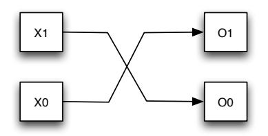
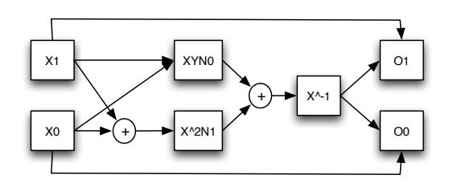
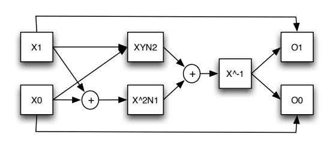
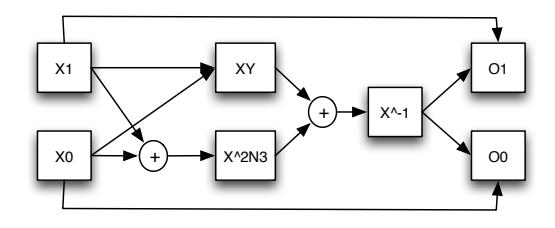

{0}------------------------------------------------

# The Algorithm of AAES

Shiyong Zhang, Gongliang Chen,Lei Fan, Jianhua Li School of Information Security Engineering, Shanghai Jiaotong University, China poetzhangzi@sjtu.edu.cn, chengl@sjtu.edu.cn, fanlei@sjtu.edu.cn, lijh888@sjtu.edu.cn

## **1 Introduction**

The Advanced Encryption Standard (AES) was specified in 2001 by the National Institute of Standards and Technology [1]. The purpose is to provide a standard algorithm for encryption, strong enough to keep U.S. government documents secure for at least the next 20 years. Now AES will largely replace triple-DES for government use, and will likely become widely adopted for a variety of encryption needs, such as secure transactions via the Internet.

A wide variety of approaches to implementing AES have appeared, to satisfy the varying criteria of different applications. Some approaches seek to maximize throughput, e.g., [2,3,4]; others minimize power consumption, e.g., [5]; and yet others minimize circuitry, e.g., [6,7,8,9]. For the latter goal, Rijmen[10] suggested using subfield arithmetic in the crucial step of computing an inverse in the Galois Field of 256 elements—reducing an 8-bit calculation to several 4-bit ones. D. Canright[11] suggested using a normal basis for each subfield to improve the compact implementation, and their work gave a merrged S-box circuit that was 20% smaller than before.

One method to improve the robustness and safety of the algorithm is to increase the computational complexity. So, AES is a variant of Rijndael which has a fixed block size of 128 bits, and a key size of 128, 192, or 256 bits. The more size the key own, the more robustness the algorithm is. However, another mothod to increase the computational complexity is to expand the fixed block size from 128 bits to a large number bits. For example, it can be expanded to 256 bits.

The four steps in each round of encryption, in order, are called SubBytes (byte substitution), ShiftRows, MixColumns, and AddRoundKey. Of these four steps, three of them (ShiftRows, MixColumns, and AddRound-Key) are linear, in the sense that the output 128-bit block for such steps is just the linear combination (bitwise, modulo 2) of the outputs for each separate input bit. These three steps are all easy to implement by direct calculation in software or hardware.

The single nonlinear step is the SubBytes step, where each byte of the input is replaced by the result of applying the "S-box"function to that byte. This nonlinear function involves finding the inverse of the 8-bit number, considered as an element of the Galois field *GF*(2<sup>8</sup> ). The Galois inverse is not a simple calculation, and so many current implementations use a table of the S-box function output.

At first, this table look-up method is regarded as fast and easy to implement. But for hardware implementations of AES, there is one drawback of the table look-up approach to the S-box function: each copy of the table requires 256 bytes of storage, along with the circuitry to address the table and fetch the results. Each of the 16 bytes in a block can go through the S-box function independently, and so could be processed in parallel for the byte substitution step. This effectively requires 16 copies of the S-box table for one round. To fully pipeline the encryption would entail "unrolling"the loop of 10 rounds into 10 sequential copies of the round calculation. This would require 160 copies of the S-box table (200 if round keys are computed "on the fly"), a significant allocation of hardware resources.

{1}------------------------------------------------

This is also the reason why it hard to expand the fixed block size from 128 bits to 256 bits. This will require 65536 bytes to storage. It will also equire 160 copies of the allocation of hardware resources. However, D. Canright[11] describes a direct calculation of the S-box function using sub-field arithmetic. This paper expand this method and make it possible to realize a new AES-like algorithm that has 256 bits fixed block size, which is named AAES algorithm.

### 2 AAES Algorithm

The AAES Algorithm is a symmetric block cipher with 256-bit blocks and 256-bit key size. As the algorithm is similar to AES Algorithm, there are also four steps in this algorithm. The four steps in each round of encryption, in order, are called SubBytes (byte substitution), ShiftRows, MixColumns, and AddRoundKey. Before the first round, the input block is processed by AddRoundKey. Also, the last round skips the MixColumns step. Otherwise, all rounds are the same, except each uses a different round key, and the output of one round becomes the input for the next. For decryption, the mathematical inverse of each step is used, in reverse order; certain manipulations allow this to appear like the same steps as encryption with certain constants changed. Each round key calculation also requires the SubBytes operation.

AAES operates on a 4×4 column-major order matrix of words(A word is equal to 2 bytes), termed the state, although some versions of Rijndael have a larger block size and have additional columns in the state. Most AAES calculations are done in a special finite field which is equal to AES Algorithm.

In the AddRoundKey step, the subkey is combined with the state. For each round, a subkey is derived from the main key using Rijndael's key schedule; each subkey is the same size as the state. The subkey is added by combining each byte of the state with the corresponding byte of the subkey using bitwise XOR. This, of course, is as same as the AES Algorithm.

The ShiftRows step operates on the rows of the state; it cyclically shifts the words in each row by a certain offset. For AES, the first row is left unchanged. Each word of the second row is shifted one to the left. Similarly, the third and fourth rows are shifted by offsets of two and three respectively. Row n is shifted left circular by n-1 bytes. In this way, each column of the output state of the ShiftRows step is composed of bytes from each column of the input state. This is also as same as the AES Algorithm.

In the MixColumns step, the four bytes of each column of the state are combined using an invertible linear transformation. The MixColumns function takes four bytes as input and outputs four bytes, where each input byte affects all four output bytes. Together with ShiftRows, MixColumns provides diffusion in the cipher.

During this operation, each column is multiplied by the known matrix that for the 256-bit key is:

$$\begin{bmatrix} 2 & 3 & 1 & 1 \\ 1 & 2 & 3 & 1 \\ 1 & 1 & 2 & 3 \\ 3 & 1 & 1 & 2 \end{bmatrix} \tag{1}$$

In the SubBytes step, each byte in the state matrix is replaced with a SubByte using an 16-bit substitution box. This operation provides the non-linearity in the cipher. The S-box used is derived from the multiplicative inverse over  $GF(2^{16})$ , known to have good non-linearity properties. To avoid attacks based on simple algebraic properties, the S-box is constructed by combining the inverse function with an invertible affine transformation. The S-box is also chosen to avoid any fixed points (and so is a derangement), and also any opposite fixed points.

Now, we give the core part—S-Box Algorithm in details. In software, the S-box is often implemented as a table lookup. The S-box function of an input byte (16-bit vector) a is defined by two substeps:

{2}------------------------------------------------

First, Inverse: inversion treats the byte as an element of  $GF(2^{16})$ , where the bits are coefficients of a polynomial, and polynomial arithmetic is modulo the irreducible polynomial  $f(x) = x^{16} + x^5 + x^3 + x^2 + 1$ ; each nonzero byte is replaced by its multiplicative inverse in this field, while a zero byte remains unchanged.

Then Affine Transformation: an affine transformation is applied: treating the byte as a vector of bits, the byte is multiplied by a constant bit matrix M and then a con-stant byte b is added (with bit arithmetic in GF(2), where multiplication is AND and addition is XOR), so x = Mx + b.

$$\begin{bmatrix} s_{15} \\ s_{14} \\ s_{13} \\ s_{12} \\ s_{11} \\ s_{10} \\ s_{9} \\ s_{8} \\ s_{7} \\ s_{6} \\ s_{5} \\ s_{4} \\ s_{3} \\ s_{2} \\ s_{11} \\ s_{0} \end{bmatrix} = \begin{bmatrix} 1 & 1 & 1 & 1 & 1 & 1 & 1 & 1 & 1 & 1$$

#### 3 Method

For the reason that other three step(ShiftRows, MixColumns, and AddRound- Key) are linear, we only need to consider the SubBytes step which is nonlinear. So we put the emphasis on the realization of the S-Box.

Direct calculation of the inverse (modulo an sixteenth-degree polynomial) of a fifteenth-degree polynomial is not easy. But calculation of the inverse (modulo a second-degree polynomial) of a first-degree polynomial is relatively easy, as pointed out by D. Canright[11]. This suggests the following changes of representation.

For any element G on  $GF(2^{16})$ , we consider its subfield  $GF(2^8)$ . For given element  $\tau$  and  $\gamma$  on  $GF(2^8)$ . Suppose the roots of the polynomial  $r_4(x) = x^2 + \tau x + \gamma = 0$  are  $\gamma_4, \gamma_4^{256}$ . Here  $[\gamma_4, \gamma_4^{256}]$  constitute the normal basis on  $GF(2^{16})$ . Thus, the element G on  $GF(2^{16})$  can be expressed as  $G = \alpha \gamma_4^{256} + \beta \gamma_4$ , where  $\alpha, \beta \in GF(2^8)$ 

```
We'll make it:
```

```
\begin{split} \tau &= \gamma_4 + \gamma_4^{256}, \gamma = \gamma_4 \cdot \gamma_4^{256} \in GF(2^8) \\ \text{Take notice of the fact that:} \\ &(\alpha \gamma_4^{256} + \beta \gamma_4) (\beta \gamma_4^{256} + \alpha \gamma_4) \\ &= \alpha^2 \gamma_4^{257} + \beta^2 \gamma_4^{257} + \alpha \beta (\gamma_4 + \gamma_4^{256})^2 \\ &= (\alpha + \beta)^2 \gamma + \alpha \beta \tau^2 \in F_{2^8} \\ \text{For the inverse element of element G,} \\ &G^{-1} = (\alpha \gamma_4^{256} + \beta \gamma_4)^{-1} \\ &= ((\alpha + \beta)^2 \gamma + \alpha \beta \tau^2)^{-1} \cdot (\beta \gamma_4^{256} + \alpha \gamma_4) \\ &= ((\alpha + \beta)^2 \gamma + \alpha \beta \tau^2)^{-1} \beta \gamma_4^{256} + ((\alpha + \beta)^2 \gamma + \alpha \beta \tau^2)^{-1} \alpha \gamma_4, \end{split}
```

Here  $(\alpha + \beta)^2 \gamma + \alpha \beta \tau^2$ ,  $\alpha, \beta \in F_{2^8}$ , so it only required to calculate the inverse element on  $GF2^8$  which can be expressed as  $(\alpha + \beta)^2 \gamma + \alpha \beta \tau^2$ .

Similarly, we can use normal basis  $[\gamma_3, \gamma_3^{16}]$  to calculate all the inverse element  $G_3^{-1}$  on  $GF(2^8)$ . And also, we can use normal basis  $[\gamma_2, \gamma_2^4]$  to calculate all the inverse element  $G_2^{-1}$  on  $GF(2^4)$ .

{3}------------------------------------------------



Figure 1:  $(x_1\gamma_1^2 + x_0\gamma_1)^{-1} = o_1\gamma_1^2 + o_0\gamma_1$ 



Figure 2:  $(x_1\gamma_2^4 + x_0\gamma_2)^{-1} = o_1\gamma_2^4 + o_0\gamma_2$ 

When consider  $GF(2^2)$ , we can use normal basis  $[\gamma_1, \gamma_1^2]$  to calculate all the inverse of element  $G_1$  which is on  $GF(2^2)$ ,  $G_1 = \alpha \gamma_1^2 + \beta \gamma_1, \alpha, \beta \in GF(2) = F(2) = \{0, 1\}.$  $\gamma_1, \gamma_1^2$  are the root of polynomial  $r_1(x) = x^2 + x + 1 = 0$ 

Take notice of the fact that:

$$(\alpha \gamma_1^2 + \beta \gamma_1)(\beta \gamma_1^2 + \alpha \gamma_1)$$

$$= \alpha^2 \gamma_1^3 + \beta^2 \gamma_1^3 + \alpha \beta (\gamma_1 + \gamma_1^2)^2$$

$$= \alpha + \beta + \alpha \beta = 1$$
So, the inverse of element  $C$ 

So, the inverse of element  $G_1$ ,

$$G_1^{-1} = (\alpha \gamma_1^2 + \beta \gamma_1)^{-1} = \beta \gamma_1^2 + \alpha \gamma_1$$

We can find that it is important to choose  $r_4(x), r_3(x), r_2(x), r_1(x) = x^2 + x + 1$ . Here we select the group base:

$$r_1(x) = x^2 + x + 1$$

$$r_2(x) = x^2 + \gamma_1 x + \gamma_1$$

$$r_3(x) = x^2 + \gamma_2 x + \gamma_1$$

$$r_4(x) = x^2 + x + \gamma_3$$

So, for  $G_1 = x_1 \gamma_1^2 + x_0 \gamma_1$ , the inverse of  $G_1^{-1} = o_1 \gamma_1^2 + o_0 \gamma_1$ , then we get:  $o_1 = x_0 \ o_0 = x_1(\text{Figure 1})$ 

For  $G_2 = x_1 \gamma_2^4 + x_0 \gamma_2$ , the inverse of  $G_2^{-1} = o_1 \gamma_2^4 + o_0 \gamma_2$ , then we get:  $o_1 = (x_1 x_0 \gamma_1^2 + (x_1 + x_0)^2 \gamma_1)^{-1} x_0$   $o_0 = (x_1 x_0 \gamma_1^2 + (x_1 + x_0)^2 \gamma_1)^{-1} x_1$  (Figure 2) Here  $N_0 = \overline{\gamma_1^2} = \gamma_0, N_1 = \gamma_1$  is a constant.

For  $G_3 = x_1 \gamma_3^{16} + x_0 \gamma_3$ , the inverse of  $G_3^{-1} = o_1 \gamma_3^{16} + o_0 \gamma_3$ , then we get:  $o_1 = (x_1 x_0 \gamma_2^2 + (x_1 + x_0)^2 \gamma_1)^{-1} x_0$   $o_0 = (x_1 x_0 \gamma_2^2 + (x_1 + x_0)^2 \gamma_1)^{-1} x_1$ (Figure 3) Here  $N_1 = \gamma_1$ ,  $N_2 = \gamma_2^2$  is a constant.

For  $G_4 = x_1 \gamma_4^{256} + x_0 \gamma_4$ , the inverse of  $G_4^{-1} = o_1 \gamma_4^{256} + o_0 \gamma_4$ , then we get:



Figure 3:  $(x_1\gamma_3^{16} + x_0\gamma_3)^{-1} = o_1\gamma_3^{16} + o_0\gamma_3$ 

{4}------------------------------------------------



Figure 4: (*x*1*γ* 256 <sup>4</sup> + *x*0*γ*4) *<sup>−</sup>*<sup>1</sup> = *o*1*γ* 256 <sup>4</sup> + *o*0*γ*<sup>4</sup>

$$o_1 = (x_1x_0 + (x_1 + x_0)^2\gamma_3)^{-1}x_0$$
  $o_0 = (x_1x_0 + (x_1 + x_0)^2\gamma_3)^{-1}x_1$ (Figure 4)  
Here  $N_3 = \gamma_3$  is a constant.

## **4 Conclusion**

For the judgement of the final hardware circuit complexity,Canright decide it through the logic gate number of statistical analysis. In fact,now it is no longer to use gate number to decide the complex degree of the logic circuit. Instead, using the new unit LUT. Look-Up-Table , which is called LUT for short, LUT. In digital logic, an n-bit lookup table can be implemented with a multiplexer whose select lines are the inputs of the LUT and whose inputs are constants. An n-bit LUT can encode any n-input Boolean function by modeling such functions as truth tables. This is an efficient way of encoding Boolean logic functions, and LUTs with 4-6 bits of input are in fact the key component of modern field-programmable gate arrays (FPGAs). Therefore, this paper holds that, for a logic algorithm, the corresponding hardware circuit to realize quality whether the decision criteria should be used when the hardware circuit language (VHDL or verilo ) simulation, using hardware electronic manufacturers (such as Lattice Diamond) provides hardware simulation program to simulate the LUT to get the number of at least, that is the realization of the optimal.

We use Verilog to simulate the AES arithmetic as well as this arithmetic, and use Lattice Diamond to simulate the hardware property and action. Lattice Diamond design software offers leading-edge design and implementation tools optimized for cost sensitive, low-power Lattice FPGA architectures. Diamond is the next generation replacement for ispLEVER featuring design exploration, ease of use, improved design flow, and numerous other enhancements. We give the result as follows:

|      | Canright's Work on AES | My Work on AES | AAES |
|------|------------------------|----------------|------|
| LUT4 | 173                    | 121            | 281  |

Lut4 is industrial standards to logic circuit scale measured. Thus we find the Luts we use on AAES is in the same order of magnitude on AES. Then this algorithm can be easily used on indestury and it is more robustness and safety than AES. And they are on the same order of magnitude in hardware implementation.

#### **References**

- [1] NIST. Specification for the ADVANCED ENCRYPTION STANDARD (AES). Technical Report FIPS PUB 197, National Institute of Standards and Technology (NIST), November 2001.
- [2] Sumio Morioka and Akashi Satoh. A 10 Gbps full-AES crypto design with a twisted-BDD S-box architecture. In IEEE International Conference on Computer Design. IEEE, 2002.
- [3] Nicholas Weaver and John Wawrzynek. High performance, compact AES implementations in Xilinx FPGAs. available at http://www.cs.berkeley.edu/ nweaver/papers/AES in FPGAs.pdf, September 2002.
- [4] Kimmo U. Jarvinen, Matti T. Tommiska, and Jorma O. Skytta. A fully pipelined memoryless 17.8 gbps AES128 encryptor. In FPGA03. ACM, 2003.

{5}------------------------------------------------

- [5] Sumio Morioka and Akashi Satoh. An optimized S-box circuit arthitecture for low power AES design. In CHES2002, volume 2523 of Lecture Notes in Computer Science, pages 172–186. Springer, 2003.
- [6] Atri Rudra, Pradeep K. Dubey, Charanjit S. Jutla, Vijay Kumar, Josyula R. Rao, and Pankaj Rohatgi. Efficient Rijndael encryption implementation with composite field arithmetic. In CHES2001, volume 2162 of Lecture Notes in Computer Science, pages 171–184. Springer, 2001.
- [7] A. Satoh, S. Morioka, K. Takano, and Seiji Munetoh. A compact Rijndael hardware architecture with S-box optimization. In Advances in Cryptology - ASIACRYPT 2001, volume 2248 of Lecture Notes in Computer Science, pages 239–254. Springer, 2001.
- [8] Johannes Wolkerstorfer, Elisabeth Oswald, and Mario Lamberger. An ASIC implementation of the AES Sboxes. In CT-RSA, volume 2271 of Lecture Notes in Computer Science, pages 67–78. Springer, 2002.
- [9] NIST. Recommendation for block cipher modes of operation. Technical Report SP 800-38A, National Institute of Standards and Technology (NIST), December 2001.
- [10] Vincent Rijmen. Efficient implementation of the Rijndael S-box. available at http://www.esat.kuleuven.ac.be/ rijmen/rijndael/sbox.pdf, 2001.
- [11] D. Canright. A very compact Rijndael S-box. Technical Report NPS-MA-04- 001, Naval Postgraduate School, September http://library.nps.navy.mil/uhtbin/ hyperion-image/NPS-MA-05-001.pdf, 2004.