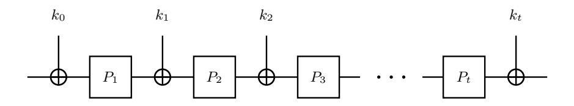
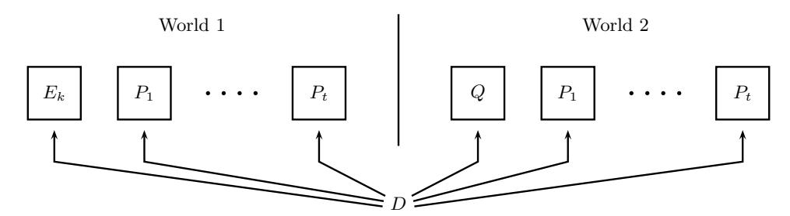

# Tight Security Bounds for Key-Alternating Ciphers

Shan Chen, John Steinberger\* \*\*

Institute for Interdisciplinary Information Sciences, Tsinghua University, Beijing. dragoncs16@gmail.com, jpsteinb@gmail.com

Abstract. A t-round key-alternating cipher (also called iterated Even-Mansour cipher) can be viewed as an abstraction of AES. It defines a cipher E from t fixed public permutations  $P_1, \ldots, P_t : \{0,1\}^n \to \{0,1\}^n$  and a key  $k = k_0 \| \cdots \| k_t \in \{0,1\}^{n(t+1)}$  by setting  $E_k(x) = k_t \oplus P_t(k_{t-1} \oplus P_{t-1}(\cdots k_1 \oplus P_t(k_0 \oplus x) \cdots))$ . The indistinguishability of  $E_k$  from a truly random permutation by an adversary who also has oracle access to the (public) random permutations  $P_1, \ldots, P_t$  was investigated in 1997 by Even and Mansour for t = 1 and for higher values of t in a series of recent papers. For t = 1, Even and Mansour proved indistinguishability security up to  $2^{n/2}$  queries, which is tight. Much later Bogdanov et al. (2011) conjectured that security should be  $2^{\frac{t}{t+1}n}$  queries for general t, which matches an easy distinguishing attack (so security cannot be more). A number of partial results have been obtained supporting this conjecture, besides Even and Mansour's original result for t = 1: Bogdanov et al. proved security of  $2^{\frac{3}{3}n}$  for  $t \geq 2$ , Steinberger (2012) proved security of  $2^{\frac{3}{4}n}$  for  $t \geq 3$ , and Lampe, Patarin and Seurin (2012) proved security of  $2^{\frac{t}{t+2}n}$  for all even values of t, thus "barely" falling short of the desired  $2^{\frac{t}{t+1}n}$ .

Our contribution in this work is to prove the long-sought-for security bound of  $2^{\frac{t}{t+1}n}$ , up to a constant multiplicative factor depending on t. Our method is essentially an application of Patarin's H-coefficient technique.

#### 1 Introduction

Given t permutations  $P_1, \ldots, P_t : \{0,1\}^n \to \{0,1\}^n$  the t-round key-alternating cipher based on  $P_1, \ldots, P_t$  is a blockcipher  $E : \{0,1\}^{(t+1)n} \times \{0,1\}^n \to \{0,1\}^n$  of keyspace  $\{0,1\}^{(t+1)n}$  and message space  $\{0,1\}^n$ , where for a key  $k = k_0 ||k_1|| \cdots ||k_t \in \{0,1\}^{(t+1)n}$  and a message  $x \in \{0,1\}^n$  we set

$$E(k,x) = k_t \oplus P_t(k_{t-1} \oplus P_{t-1}(\cdots P_1(k_0 \oplus x)\cdots)). \tag{1}$$

(See Figure 1.) Plainly,  $E(k,\cdot)$  is a permutation of  $\{0,1\}^n$  for each fixed  $k \in \{0,1\}^{(t+1)n}$ ; we let  $E^{-1}(k,\cdot)$  denote the inverse permutation. The  $P_i$ 's are called the *round permutations* of E and t is the *number of rounds* of E. Thus t and the permutations  $P_1, \ldots, P_t$  are parameters determining E.

Fig. 1. A t-round key alternating cipher.

Key-alternating ciphers were first proposed (for values of t greater than 1) by the designers of AES [5,6], the Advanced Encryption Standard. Indeed, AES-128 itself can be viewed as a particular

\* Supported by National Basic Research Program of China Grant 2011CBA00300, 2011CBA00301, the National Natural Science Foundation of China Grant 61033001, 61361136003, and by the China Ministry of Education grant number 20121088050.

\*\* ©IACR 2014. This article is the full version of [3].

instantiation of the key-alternating cipher paradigm in which the round permutations  $P_1, \ldots, P_t$  equal a single permutation P (the Rijndael round function, in this case), in which t = 10, and in which only a subset of the  $\{0,1\}^{(t+1)n} = \{0,1\}^{11n}$  possible keys are used (more precisely, the 11n bits of key are derived pseudorandomly from a seed of n bits, making the key space  $\{0,1\}^n = \{0,1\}^{128}$ ). However, for t = 1 the design was proposed much earlier by Even and Mansour as a means of constructing a blockcipher from a fixed permutation [7]. Indeed, key-alternating ciphers also go by the name of iterated Even-Mansour ciphers.

Even and Mansour accompanied their proposal with "provable security" guarantees by showing that, for t = 1, an adversary needs roughly  $2^{n/2}$  queries to distinguish  $E(k,\cdot)$  for a random key k (k being hidden from the adversary) from a true random permutation, in a model where the adversary is given oracle access to  $E(k,\cdot)$ ,  $E^{-1}(k,\cdot)$  as well as to  $P_1$ ,  $P_1^{-1}$ , where  $P_1$  is modeled as a random permutation (in the dummy world, the adversary is given oracle access to two independent random permutations and their inverses). Their bound was matched by Daemen [4], who showed a  $2^{n/2}$ -query distinguishing attack for t = 1.

For t > 1, we can generalize the Even-Mansour indistinguishability experiment by giving the adversary oracle access to  $P_1, \ldots, P_t$  and their inverses and to  $E(k, \cdot)$ ,  $E^{-1}(k, \cdot)$  in the real world (for a randomly chosen, hidden  $k \in \{0,1\}^{(t+1)n}$ ), and to a tuple of t+1 independent random permutations and their inverses in the "ideal" or "dummy" world (see Figure 2). In this case, Daemen's attack can be easily generalized to an attack of query complexity  $2^{\frac{t}{t+1}n}$ , as pointed out by Bogdanov et al. [2], but the security analysis of Even and Mansour could not be easily generalized to match this bound (though security of  $2^{n/2}$  queries still holds, and is easy to prove in a black-box fashion from the Even-Mansour result).

Bogdanov et al. did show, though, security of  $2^{\frac{2}{3}n}$  for  $t \geq 2$  (modulo lower-order terms), which is tight for t=2 as it matches the  $2^{\frac{t}{t+1}n}$ -query attack. Later Steinberger [19] improved this bound to  $2^{\frac{3}{4}n}$  queries for  $t \geq 3$  by modifying technical aspects of Bogdanov et al.'s analysis. Orthogonally and simultaneously, Lampe, Patarin and Seurin [13] used coupling-based techniques to show security of  $2^{\frac{t}{t+1}n}$  queries for nonadaptive adversaries and security  $2^{\frac{t}{t+2}n}$  for adaptive adversaries (and even values of t). While the bound  $2^{\frac{t}{t+2}n}$  might seem "almost" sharp, we note that

$$2^{\frac{t}{t+2}n} = 2^{\frac{(t/2)}{(t/2)+1}n}$$

is actually the conjectured adaptive security for t/2 rounds. Indeed, Lampe et al. basically show that an adaptive adversary attacking the t-round construction has no more advantage than a nonadapative adversary attacking t/2 rounds (this reduction follows upon work of Maurer et al. [16, 17]). Seen this way, Lampe et al.'s result appears less sharp. The issue is not only qualitative since their bound only improves on Steinberger's for  $t \ge 8$ .

Our Results. In this paper we finally prove security of  $2^{\frac{t}{t+1}n}$  queries for key-alternating ciphers, which has been the conjectured security since the paper of Bogdanov et al., and which is provably tight by the attack in the same paper. More precisely, we show that an adaptive adversary making at most q queries to each of its oracles has distinguishing advantage bounded by  $O(1)q^{t+1}/N^t + O(1)$ , where  $N = 2^n$  and the two O(1) terms depend on t. (See Section 2 for a formal statement.)

Our techniques are (maybe disappointingly) not as conceptually novel as those of [19] or [13], as we simply apply Patarin's H-coefficient technique. The crucial step is lower bounding the probability of a certain event, namely of the event that q input-output values become linked when t partially defined composed permutations (whose composition so far poses no contradiction to the linking of said q input-output pairs) are randomly extended. The surprising aspect of these computations is that various "second-order" factors (that one might otherwise expect to not matter) actually need to be taken into account. Informally, this can be ascribed to the fact that the values of q under consideration are far beyond birthday.

Besides shedding some light on the structural and probabilistic aspects of key-alternating ciphers in the ideal permutation model, we also hope this paper will serve as a useful additional tutorial on (or introduction to) Patarin's H-coefficient technique, which still seems to suffer from a lack of exposure.

We note that [13] also uses H-coefficient-based techniques and, indeed, our approach is much more closely inspired by that of [13] than by [2,19].

PAPER ORGANIZATION. Definitions relating to key-alternating ciphers as well as a formal statement of our main result are given in Section 2. An overview of the H-coefficient technique is given in Section 3. The proof of the main theorem is given in Section 4.

EXTENSIONS. As we note in the proof, our main result holds even if the subkeys  $k_0, \ldots, k_t$  are only t-wise independent instead of (t+1)-wise independent. This is particularly interesting for t=1. Along different lines, and as pointed out to us by Jooyoung Lee, our result also implies tight security bounds for the "XOR-cascade" cipher introduced by Gaži and Tessaro [9,10] via a reduction by Peter Gaži [10,11].

ACKNOWLEDGMENTS. The authors would like to thank Jooyoung Lee, Rodolphe Lampe and Yannick Seurin for helpful conversations.

### 2 Definitions and Main Result

Fig. 2. The two worlds for the Even-Mansour security experiment. In World 1 the distinguisher D has oracle access to random permutations  $P_1, \ldots, P_t$  and the key-alternating cipher  $E_k$  (cf. Eq. (1)) for a random key k. In World 2, D has oracle access to t+1 independent random permutations. In either world D also has oracle access to the inverse of each permutation.

A t-round key-alternating cipher E has keyspace  $\{0,1\}^{(t+1)n}$  and message space  $\{0,1\}^n$ . We refer back to equation (1) for the definition of E(k,x) (which implicitly depends on the choice of round permutations  $P_1, \ldots, P_t$ ). We note that  $E^{-1}(k,y)$  has an analoguous formula in which  $P_t^{-1}, \ldots, P_1^{-1}$  are called. We write  $E_k$  for the permutation  $E(k,\cdot)$ .

We work in the ideal permutation model. For our purposes, the PRP security of a t-round keyalternating cipher E against a distinguisher (or "adversary") D is defined as

$$\mathbf{Adv}_{E,t}^{\text{PRP}}(D) = \Pr[k = k_0 \cdots k_t \longleftarrow \{0,1\}^{(t+1)n}; D^{E_k, P_1, \dots, P_t} = 1] - \Pr[D^{Q, P_1, \dots, P_t} = 1]$$
 (2)

where in each experiment  $Q, P_1, \ldots, P_t$  are independent uniform random permutations, where  $D^A$  denotes that D has oracle access to A and  $A^{-1}$  (since all oracles are permutations), and where  $k = k_0 \cdots k_t$  is selected uniformly at random (and hidden from D). See Figure 2. We further define

$$\mathbf{Adv}_{E,t}^{\mathrm{PRP}}(q_e, q) = \max_{D} \mathbf{Adv}_{E,t}^{\mathrm{PRP}}(D)$$

where the maximum is taken over all distinguishers D that make at most  $q_e$  queries to their first oracle and at most q queries to each of their other oracles. (The notation  $\mathbf{Adv}_{E,t}^{\mathrm{PRP}}(\cdot)$  is thus overloaded.)

Accounting for cipher queries and permutation queries separately has the main advantage of clarifying "which q is which" in the security bound. Lampe et al. [13] do an even more fine-grained query accounting, with a separate variable for each permutation; this can be done here, too, but in our case the conceptual gain doesn't seem worth the notational complication. We also note that, besides t, n is a parameter on which E (and hence AdvPRP E,t (q)) depends.

(As an aside, we note the above indistinguishability experiment differs from the recently popular framework of indifferentiability by, among others, the presence of a secret key and the absence of a simulator; the similarity, on the other hand, is that the adversary can query the internal components of the structure. The end goal of the security proof is also different, since we simply prove PRP-security (with tight bounds) whereas indifferentiability aims to prove something much stronger, but, typically, with much inferior bounds. See [1, 14] for indifferentiability results on key-alternating ciphers.)

Our main result is the following:

Theorem 1. Let N = 2n and let q ≤ N/3, t ≥ 1. Then for any constant C > 0,

$$\mathbf{Adv}_{E,t}^{\mathrm{PRP}}(q_e, q) \leq \frac{q_e q^t}{N^t} \cdot Ct^2 (6C)^t + (t+1)^2 \frac{1}{C}.$$

The presence of the adjustable constant C in Theorem 1 is typical of security proofs that involve a threshold-based "bad event". The constant corresponds to the bad event's (adjustable) threshold. Some terms in the security bound grow with C, others decrease with C, and for every qe, q, t and N there is an optimal C. Choosing

$$C = \left(\frac{(t+1)N^t}{6^tt^2q_eq^t}\right)^{1/(t+2)}$$

(which happens to be the analytical optimum) and using a little algebra yields the following, more readable corollary for the case q = qe:

Corollary 1. Let N = 2n , q ≤ N/3, t ≥ 1. Then

$$\mathbf{Adv}_{E,t}^{PRP}(q,q) \le (t+1)^2 (t+2) \left(\frac{6tq}{N^{t/(t+1)}}\right)^{(t+1)/(t+2)}.$$
 (3)

Security therefore holds up to about q ≈ N t+1 /6t 4 , with "security exponent" (t + 1)/(t + 2). Since t is typically viewed as a constant the polynomial factor 6t 4 is not bothersome from the asymptotic point of view even though, obviously, such a factor considerably waters down the security bound for concrete parameters like t = 10, n = 128. We also note that if we fix q and N and let t → ∞ then (3) becomes worse and worse (i.e., closer to 1 and eventually greater than 1) for sufficiently large t. This apparent security degradation is obviously an artefact of our bound, since a straightforward reduction shows that security can only increase with t.

Generalization. In the case when D's queries are accounted for by t + 1 separate variables qe, q1, . . . , qt , the product qeq t in Theorem 1 should simply be replaced by qeq1 · · · qt . The proof of this more general fact is easy to reconstruct from the proof of Theorem 1 given here.

# 3 The H-coefficient Technique in a Nutshell

In this section we give a quick high-level outline of Patarin's H-coefficient technique. Indeed, we imagine that many readers might feel more curiosity about the high-level approach than about the technical details of our proof. This tutorial takes a broader view than Patarin's own [18], but [18] mentions refinements for nonadaptive adversaries and "plaintext only" attacks that we don't touch upon here. We emphasize that the material in this section is "informal by design".

The general setting is that of a q-query information-theoretic distinguisher D interacting with one of two oracles, the "real world" oracle or the "ideal world" oracle. (Each oracle might consist of several interfaces for D to query.) By such interaction, D creates a transcript, which is a list of queries made and answers returned. We can assume without loss of generality that D is deterministic, and makes its final decision as a (deterministic) function of the transcript obtained.

We note the probability of obtaining a certain transcript might be different in either world (even if nonzero in both worlds). Denoting X the probability distribution on transcripts induced by the real world and denoting Y the probability distribution on transcripts induced by the ideal world (for some fixed deterministic distinguisher D) then D's distinguishing advantage (cf. (2)) is easily seen to be upper bounded by

$$\Delta(X,Y) := \frac{1}{2} \sum_{\tau \in \mathcal{T}} |\Pr[X = \tau] - \Pr[Y = \tau]|$$

(the so-called statistical distance or total variation distance between X and Y ) where T denotes the set of possible transcripts.

The technique's central idea is to use the fact that

$$\Delta(X,Y) = 1 - E_{\tau \sim Y} \left[ \min(1, \Pr[X=\tau]/\Pr[Y=\tau]) \right]$$
(4)

in order to upper bound ∆(X, Y ). Here Eτ∼Y [Z(τ )] is the expectation of the random variable Z(τ ) when τ is sampled according to Y , and one assumes min(1,Pr[X = τ ]/Pr[Y = τ ]) = 1 if Pr[Y = τ ] = 0. For completeness we record the easy proof of (4):

$$\begin{split} \Delta(X,Y) &= \sum_{\tau \in \mathcal{T}: \Pr[Y=\tau] > \Pr[X=\tau]} (\Pr[Y=\tau] - \Pr[X=\tau]) \\ &= \sum_{\tau \in \mathcal{T}: \Pr[Y=\tau] > \Pr[X=\tau]} \Pr[Y=\tau] (1 - \Pr[X=\tau] / \Pr[Y=\tau]) \\ &= \sum_{\tau \in \mathcal{T}} \Pr[Y=\tau] (1 - \min(1, \Pr[X=\tau] / \Pr[Y=\tau])) \\ &= 1 - E_{\tau \sim Y} \big[ \min(1, \Pr[X=\tau] / \Pr[Y=\tau]) \big]. \end{split}$$

Thus, by (4), upper bounding the distinguisher's advantage reduces to lower bounding the expectation

$$E_{\tau \sim Y} \left[ \min(1, \Pr[X = \tau] / \Pr[Y = \tau]) \right]. \tag{5}$$

Typically, some transcripts are better than others, in the sense that for some transcripts τ the ratio

$$\Pr[X = \tau] / \Pr[Y = \tau]$$

might be quite small (when we would rather the ratio be near 1), but these "bad" transcripts occur with small probability. A typical proof classifies the set T of possible transcripts into a finite number of combinatorially distinct classes T1, . . . , Tk and exhibits values ε1, . . . , εk ≥ 0 such that

$$\tau \in \mathcal{T}_i \implies \Pr[X = \tau] / \Pr[Y = \tau] \ge 1 - \varepsilon_i.$$
 (6)

Then

$$E_{\tau \sim Y} \left[ \min(1, \Pr[X = \tau] / \Pr[Y = \tau]) \right] \ge \sum_{i=1}^{k} \Pr[Y \in \mathcal{T}_i] (1 - \varepsilon_i)$$

and, by (4),

$$\Delta(X,Y) \le \sum_{i=1}^k \Pr[Y \in \mathcal{T}_i] \varepsilon_i.$$

The "ideal world" random variable Y often has a very simple distribution, making the probabilities  $\Pr[Y \in \mathcal{T}_i]$  easy to compute. On the other hand, proving the lower bounds (6) for  $i = 1 \dots k$  can be difficult, and we rediscuss this issue below.

Many proofs (including ours) have k=2, with  $\mathcal{T}_1$  consisting of the set of "good" transcripts and  $\mathcal{T}_2$  consisting of the set of "bad" transcripts (i.e., those with small value of  $\Pr[X=\tau]/\Pr[Y=\tau]$ ); then  $\varepsilon_1$  is small and  $\varepsilon_2$  is large, while (hopefully)  $\Pr[Y\in\mathcal{T}_1]$  is large and  $\Pr[Y\in\mathcal{T}_2]$  is small, and

$$\Delta(X,Y) \le \Pr[Y \in \mathcal{T}_1]\varepsilon_1 + \Pr[Y \in \mathcal{T}_2]\varepsilon_2 \le \varepsilon_1 + \Pr[Y \in \mathcal{T}_2].$$

The final upper bound on  $\Delta(X,Y)$ , in this case, can thus be verbalized as "one minus the probability ratio of good transcripts [i.e.,  $\varepsilon_1$ ], plus the probability of a transcript being bad" (the latter probability being computed with respect to the distribution Y). This is the form taken by our own bound.

Theoretically, by using a sufficiently large (and possibly non-constant) value of k, the H-coefficient technique can be used to give sharp indistinguishability bounds in any (information-theoretic) setting. However, lower bounding the probability ratio  $\Pr[X = \tau]/\Pr[Y = \tau]$ , even when some structure is understood on  $\tau$ , can sometimes reveal itself to be an intractable problem (but see below for some general techniques). Moreover, other indistinguishability proof methods, such as game-playing or couplings, may be more appropriate or easier to apply than the H-coefficient technique depending on the situation.

Lower bounding the ratio  $\Pr[X=\tau]/\Pr[Y=\tau]$ . The random variables X and Y are, formally, defined on underlying probability spaces that contain respectively all the coins needed for the real and ideal world experiments. To be more illustrative, in the case of the key-alternating cipher distinguishability experiment X's underlying probability space consists of all possible (t+1)-tuples of the form  $(k, P_1, \ldots, P_t)$  where  $k \in \{0, 1\}^{(t+1)n}$  and where each  $P_i$  is a permutation of  $\{0, 1\}^n$ , while Y's underlying probability space is all (t+1)-tuples of the form  $(Q, P_1, \ldots, P_t)$  where Q as well as each  $P_i$  is a permutation of  $\{0, 1\}^n$ . (In either case the measure is uniform, and for simplicity we also assume uniform—and hence finite—probability spaces in our discussion here.) For the following, we write  $\Omega_X$ ,  $\Omega_Y$  for the probability spaces on which respectively X and Y are defined. We note that each  $\omega$  in  $\Omega_X$  or  $\Omega_Y$  can be viewed as an oracle for D to interact with, thus we may use phrases such as "D runs with oracle  $\omega$ ", etc. To summarize, X and Y are, formally, functions  $X: \Omega_X \to \mathcal{T}$ ,  $Y: \Omega_Y \to \mathcal{T}$ , where  $X(\omega)$  is the transcript obtained by running D with oracle  $\omega \in \Omega_X$ , and where  $Y(\omega)$  is the transcript obtained by running D oracle  $\omega \in \Omega_Y$ .

There is usually an obvious notion of "compatibility" between a transcript  $\tau$  and an element  $\omega \in \Omega_X$  or  $\omega \in \Omega_Y$ . For example, in the case of key-alternating ciphers, if  $\tau$  contains a query to  $P_1$  and nothing else, the  $\omega$ 's in  $\Omega_X$  that are compatible with  $\tau$  will be exactly those where the  $P_1$ -coordinate of  $\omega$  agrees with the query in  $\tau$ ; there are  $2^{(t+1)n} \cdot (2^n - 1)! \cdot (2^n !)^{t-1}$  such "compatible"  $\omega$ 's in  $\Omega_X$ . For the same transcript, there would be  $(2^n - 1)! \cdot (2^n !)^t$  compatible  $\omega$ 's in  $\Omega_Y$ . We write  $\mathsf{comp}_X(\tau)$  for the set of  $\omega$ 's in  $\Omega_X$  compatible with a transcript  $\tau$ , and we define  $\mathsf{comp}_Y(\tau)$  likewise with respect to  $\Omega_Y$ .

We note that the statement " $\omega$  is compatible with  $\tau$ " is actually not equivalent to the statement "running D with oracle  $\omega$  produces  $\tau$ ". Indeed, some  $\tau$ 's may never be produced by D at all; e.g., if a transcript  $\tau$  contains more than q queries, or if it contains queries to  $P_1$  when D is a distinguisher that never queries  $P_1$ , etc, then  $\tau$  is never produced by D (i.e.,  $\Pr[X = \tau] = \Pr[Y = \tau] = 0$ ), but this does not prevent  $\mathsf{comp}_X(\tau)$ ,  $\mathsf{comp}_Y(\tau)$  from being well-defined.

A central insight of the H-coefficient technique (but which is usually taken for granted and used without mention) is that when  $\tau$  is a possible transcript of D at all (i.e., if either  $\Pr[X=\tau]>0$  or  $\Pr[Y=\tau]>0$ ) then

$$\Pr[X = \tau] = \frac{|\mathsf{comp}_X(\tau)|}{|\Omega_X|}$$
 and  $\Pr[Y = \tau] = \frac{|\mathsf{comp}_Y(\tau)|}{|\Omega_Y|}$ . (7)

These equalities, argued below, might seem obvious (or not) but one should note they carry some counterintuitive consequences. Firstly:

(c1) The order in which queries appear in a transcript  $\tau$  does not affect the probability of  $\tau$  occurring; only the set of queries appearing in  $\tau$  matters.

(This because the sets  $\mathsf{comp}_X(\tau)$ ,  $\mathsf{comp}_Y(\tau)$  are unaffected by the order with which queries appear in  $\tau$ .) Along the same lines, one has:

(c2) If two different (deterministic) distinguishers can obtain a transcript  $\tau$  each with nonzero probability, these distinguishers will obtain  $\tau$  with equal probability. Moreover, by (c1), this holds even if the transcript carries no information about the order in which queries are made.

(This because the right-hand sides in (7) are distinguisher-independent.) Thus, if  $D_1$  and  $D_2$  are two adaptive, deterministic distinguishers that can arrive (by a potentially completely different query order) at transcripts  $\tau_1$  and  $\tau_2$  that contain the same set of queries, then  $D_1$  has the same probability of obtaining  $\tau_1$  as  $D_2$  has of obtaining  $\tau_2$ , with this equality holding separately both in the real and ideal worlds. While very basic, the order-independence property (c1) and distinguisher-independence property (c2) of deterministic distinguishers seem not to have been highlighted anywhere before. (A bit of thought reveals that (c1), (c2) will hold for any experiment (real, ideal, or whatever) involving a stateless1 set of oracles, in the sense that asking the same question twice to an oracle results twice the same answer. Then  $comp_{...}(\tau)$  has an obvious definition which is independent of the order with which the queries appear in  $\tau$ , and for which the proof sketch in the next paragraph goes through.)

We now informally argue (7), focusing on the first equality (the X-world) for concreteness. Firstly, executing D with an  $\omega \in \Omega_X$ ,  $\omega \notin \mathsf{comp}_X(\tau)$  can obviously not produce  $\tau$  as a transcript, since  $\omega$  is not compatible with  $\tau$ . It therefore suffices to show that running D on an oracle  $\omega \in \mathsf{comp}_X(\tau)$  produces the transcript  $\tau$ . For this, we know by assumption that there exists2 an  $\omega' \in \Omega_X \cup \Omega_Y$  such that running D on oracle  $\omega'$  produces  $\tau$ . However, one can show by induction on the number of queries made by D that the computations  $D^{\omega}$  and  $D^{\omega'}$  will not "diverge", since every time D makes a query to  $\omega'$  this query appears in  $\tau$  and, hence, because  $\omega \in \mathsf{comp}_X(\tau)$ , will be answered the same by  $\omega$  (also recall that D is deterministic). Hence  $D^{\omega}$  will produce the same transcript as  $D^{\omega'}$ , i.e.,  $\tau$ .

By (7), since3

$$\frac{|\mathsf{comp}_X(\tau)|}{|\varOmega_X|} = \Pr_{\varOmega_X}[\omega \in \mathsf{comp}_X(\tau)] \quad \text{and} \quad \frac{|\mathsf{comp}_Y(\tau)|}{|\varOmega_Y|} = \Pr_{\varOmega_Y}[\omega \in \mathsf{comp}_Y(\tau)] \tag{8}$$

the ratio  $\Pr[X = \tau] / \Pr[Y = \tau]$  is equal to

$$\frac{\Pr_{\Omega_X}[\omega \in \mathsf{comp}_X(\tau)]}{\Pr_{\Omega_Y}[\omega \in \mathsf{comp}_Y(\tau)]} \tag{9}$$

and it therefore suffices to lower bound the latter ratio of probabilities. (One could also try directly counting the size of the sets  $\mathsf{comp}_X(\tau)$ ,  $\mathsf{comp}_Y(\tau)$ , however, this is often intractable for  $\mathsf{comp}_X(\tau)$ , making a probabilistic approach preferable.) We note the ideal world probability  $\mathsf{Pr}_{\varOmega_Y}[\omega \in \mathsf{comp}_Y(\tau)]$  is often quite trivial to compute, due to the ideal world's nice structure.

Looking at (9) it is possible to wonder whether anything substantial has been gained so far, or whether notations are simply being shuffled around; after all,  $\Pr[X = \tau]$  and  $\Pr_{\Omega_X}[\omega \in \mathsf{comp}_X(\tau)]$  are "obviously the same thing" (and the same for Y). However the probability  $\Pr_{\Omega_X}[\omega \in \mathsf{comp}_X(\tau)]$  offers

&lt;sup>1 More formally, the oracle is a deterministic function taking as input a query and a (large) random tape, where the random tape is sampled and fixed at the start of the experiment.

&lt;sup>2 Here  $\omega'$  could also lie outside  $\Omega_X \cup \Omega_Y$ ; the argument goes through as long as there exists *some* oracle leading to the transcript  $\tau$ .

&lt;sup>3 In fact, replacing  $|\mathsf{comp}_X(\tau)|/|\Omega_X|$  and  $|\mathsf{comp}_X(\tau)|/|\Omega_X|$  by respectively  $\Pr_{\Omega_X}[\omega \in \mathsf{comp}_X(\tau)]$  and  $\Pr_{\Omega_Y}[\omega \in \mathsf{comp}_Y(\tau)]$  in (7) gives a more general formulation of these identities, for cases where the probability distributions on  $\Omega_X$ ,  $\Omega_Y$  are not uniform. W prefer the fractions  $|\mathsf{comp}_X(\tau)|/|\Omega_X|$ ,  $|\mathsf{comp}_X(\tau)|/|\Omega_X|$  because these expressions seem more concrete.

&lt;sup>4 In fact, as already pointed out,  $\Pr[X = \tau]$  and  $\Pr_{\Omega_X}[\omega \in \mathsf{comp}_X(\tau)]$  are *not* the same thing for  $\tau$ 's outside the range of D.

a considerable conceptual advantage over the probability  $\Pr[X = \tau]$ , as  $\Pr_{\Omega_X}[\omega \in \mathsf{comp}_X(\tau)]$  refers to an experiment with a non-adaptive flavor (a transcript  $\tau$  is fixed, and a uniform random element of  $\Omega_X$  is drawn—what is the probability of compatibility?) while the probability  $\Pr[X = \tau]$  refers, by definition, to the adaptive interaction of D with its oracle, which is much messier to think about. Indeed, (c1) and (c2) already show that adaptivity is in a sense "thrown out" when (7) is applied.

We finally note that a common way of computing

$$\Pr_{\varOmega_X}[\omega\in\mathsf{comp}_X(\tau)]$$

is to write

$$\begin{split} \Pr_{\Omega_X}[\omega \in \mathsf{comp}_X(\tau)] &= \Pr_{\Omega_X}[\omega \in \mathsf{comp}_X'(\tau)] \cdot \Pr_{\Omega_X}[\omega \in \mathsf{comp}_X(\tau) \, | \, \omega \in \mathsf{comp}_X'(\tau)] \\ &= (|\mathsf{comp}_X'(\tau)| / |\Omega_X|) \cdot \Pr_{\mathsf{comp}_X'(\tau)}[\omega \in \mathsf{comp}_X(\tau)] \end{split}$$

for some set  $\mathsf{comp}_X'(\tau) \subseteq \Omega_X$  such that  $\mathsf{comp}_X(\tau) \subseteq \mathsf{comp}_X'(\tau)$ . E.g., in the case of key-alternating ciphers,  $\mathsf{comp}_X'(\tau)$  might be defined as all points of  $\Omega_X$  that at least agree with  $\tau$  on the queries to  $P_1, \ldots, P_t$ , if not on the queries to  $P_0$ . The question then becomes, when a uniform random element  $\omega \in \mathsf{comp}_X'(\tau)$  is picked, what is the probability this  $\omega$  also agrees with the queries to  $P_0$ ?

## 4 Proof of Theorem 1

We make the standard simplifying assumption that the distinguisher D is deterministic. This assumption is without loss of generality since if D is randomized it is easy to see that D's coins can be fixed to value such that the resulting "induced" distinguisher D (running on the fixed random tape) has advantage at least that of the original randomized D.

For simplicity, we also assume the distinguisher never makes redundant queries; e.g., queries  $P_i$  twice on the same point, or queries  $P_i(x)$  obtaining answer y and then later queries  $P_i^{-1}(y)$ . Moreover, we will assume that D makes exactly  $q_e$  queries to its first oracle and exactly q queries to each of its other oracles. This assumption is obviously without loss of generality.

We refer to the case where D has an oracle tuple of the type  $(E_k, P_1, \ldots, P_t)$  as the "real world" and to the case when D has an oracle tuple of the type  $(Q, P_1, \ldots, P_t)$  as the "ideal world". For convenience, we will be generous with the distinguisher in the following way: at the end of the experiment (when the distinguisher has made its (t+1)q queries, but before the distinguisher outputs its decision) we reveal the key  $k = k_0 k_1 \cdots k_t$  to the distinguisher in the real world, while in the ideal world we sample a dummy key  $k' = k'_0 k'_1 \cdots k'_t$  and reveal this dummy key to the distinguisher. A distinguisher playing this "enhanced" game is obviously at no disadvantage, since it can disregard the key if it wants.

For the remainder of the proof we consider a fixed distinguisher D conforming to the conventions above. We can summarize D's interaction with its oracles by a transcript consisting of a sequence of tuples of the form  $(i, \sigma, x, y)$  where  $i \in \{0, \ldots, t\}$ ,  $\sigma \in \{+, -\}$  and  $x, y \in \{0, 1\}^n$ , plus the key value k at the end of the transcript. If  $\sigma = +$  such a tuple denotes that D made the query  $P_i(x)$  obtaining answer y, or if  $\sigma = -$  that D made the query  $P_i^{-1}(y)$  obtaining answer x, and D's interaction with its oracles (as well as D's final output bit) can be uniquely reconstructed from such a sequence of tuples. In fact, we can (and shall) encode the transcript as an unordered set of directionless tuples of the form (i, x, y) (plus the key value k). Indeed, given that D is deterministic, D's interaction can still be reconstructed from such a transcript. (Consider that D always makes the same first query, since it is deterministic; we can look up the answer to this query in the transcript, deduce the second query made by D again since D is deterministic, and so on.) All in all, therefore, the transcript can be encoded as a tuple  $(k, p_0, p_1, \ldots, p_t)$  where  $k \in \{0, 1\}^{(t+1)n}$  is the key (real or dummy) and where  $p_i$ ,  $i \geq 1$ , is a table containing q pairs (x, y), where each such pair either indicates a query  $P_i(x) = y$  or a query  $P_i^{-1}(y) = x$  (which it is can

be deduced from the transcript), and where  $p_0$  similarly contains the  $q_e$  input-output pairs queried to the cipher. One can also view  $p_i$  as a bipartite graph with shores  $\{0,1\}^n$  and containing q (resp.  $q_e$ , in the case of  $p_0$ ) disjoint edges.

We let  $\mathcal{T}$  denote the set of all possible transcripts, i.e., the set of all tuples of the form  $(k, p_0, \dots, p_t)$  as described above. Thus  $|\mathcal{T}| = 2^{(t+1)n} \left( \binom{2^n}{q_e} \frac{2^{n!}}{(2^n - q_e)!} \right) \left( \binom{2^n}{q} \frac{2^{n!}}{(2^n - q)!} \right)^t$ . We note that some elements of  $\mathcal{T}$ —in fact, most elements—may never be obtained by D. For example, if D's first query is  $P_1(0^n)$  then (this first query never varies and) any transcript obtained by D contains a pair of the form  $(0^n, y)$  in the table  $p_1$ , for some  $y \in \{0, 1\}^n$ .

Let  $\mathcal{P}$  be the set of all permutations of  $\{0,1\}^n$ ; thus  $|\mathcal{P}| = (2^n)!$ . Let  $\mathcal{P}^t = \mathcal{P} \times \cdots \times \mathcal{P}$  be the t-fold direct product of  $\mathcal{P}$ . Let  $\Omega_X = \{0,1\}^{(t+1)n} \times \mathcal{P}^t$  and let  $\Omega_Y = \{0,1\}^{(t+1)n} \times \mathcal{P}^{t+1}$ . In the obvious way, elements of  $\Omega_X$  can be viewed as real world oracles for D while elements of  $\Omega_Y$  can be viewed as "ideal world" oracles for D. (We note that  $\Omega_Y$  is slightly different from the  $\Omega_Y$  appearing in the discussion of Section 3, due to our convention of giving away the key as part of the transcript.) We write  $X(\omega)$  for the transcript obtained by running D with oracle  $\omega \in \Omega_X$ , and  $Y(\omega)$  for the transcript obtained by running D with oracle  $\omega \in \Omega_Y$ . Thus  $X: \Omega_X \to \mathcal{T}$ ,  $Y: \Omega_Y \to \mathcal{T}$  and by endowing  $\Omega_X$ ,  $\Omega_Y$  with the uniform probability distribution, X and Y become random variables of range  $\mathcal{T}$ , whose distributions are exactly those obtained by running D in the real and ideal worlds respectively. Since D's output is a deterministic function of the transcript, D's distinguishing advantage can be written

$$\Pr[D(X) = 1] - \Pr[D(Y) = 1]$$

(here identifying D with a function outputting a final decision from the transcript); thus D's advantage is upper bounded by

$$\Delta(X,Y) = \frac{1}{2} \sum_{\tau \in \mathcal{T}} |\Pr[X = \tau] - \Pr[Y = \tau]|$$

by standard considerations.

In order to upper bound  $\Delta(X,Y)$  we make use of the equality

$$\Delta(X,Y) = 1 - E_{\tau \sim Y} \left[ \min(1, \Pr[X = \tau] / \Pr[Y = \tau]) \right]$$

mentioned in Section 3. More precisely, we will identify a set  $\mathcal{T}_1 \subseteq \mathcal{T}$  of "good" query transcripts, and a set  $\mathcal{T}_2 \subseteq \mathcal{T}$  of "bad" transcripts, such that  $\mathcal{T}$  is the disjoint union of  $\mathcal{T}_1$  and  $\mathcal{T}_2$ . Then, as shown in Section 3,

$$\Delta(X,Y) \le \varepsilon_1 + \Pr[Y \in \mathcal{T}_2] \tag{10}$$

where  $\varepsilon_1$  is a number such that

$$\frac{\Pr[X = \tau]}{\Pr[Y = \tau]} \ge 1 - \varepsilon_1$$

for all  $\tau \in \mathcal{T}_1$  such that  $\Pr[Y = \tau] > 0$ .

We next discuss the definitions of  $\mathcal{T}_1$  and  $\mathcal{T}_2$ ; next we show  $\Pr[Y \in \mathcal{T}_2] \leq (t+1)^2 \frac{1}{C}$ ; and finally we will show  $\Pr[X = \tau] / \Pr[Y = \tau] \geq 1 - \varepsilon_1$  for  $\tau \in \mathcal{T}_1$  and  $\varepsilon_1 = q_e(\frac{q}{N})^t Ct^2(6C)^t$ . We will assume for these computations that  $Cq_eq^t < N^t$ . This assumption is without loss of generality since Theorem 1 is vacuously true otherwise.

BAD TRANSCRIPTS. Let  $\tau = (k, p_0, p_1, \dots, p_t) \in \mathcal{T}$  be a transcript. We associate to  $\tau$  a graph  $G(\tau)$ , dubbed the round graph, that encodes the information contained in k as well as in  $p_1, \dots, p_t$  (but that ignores  $p_0$ ).  $G(\tau)$  has  $2(t+1) \cdot 2^n$  vertices, grouped into "shores" of size  $2^n$  each, with each shore being identified with a copy  $\{0,1\}^n$ . We index the 2(t+1) shores as  $0^-$ ,  $0^+$ ,  $1^-$ ,  $1^+$ , ...,  $t^-$ ,  $t^+$ . Vertex y in shore  $i^-$  is connected to vertex  $y \oplus k_i$  in shore  $i^+$  by an edge, and these are the only edges between

shores  $i^-$  and  $i^+$ . Moreover, for each  $(x,y) \in p_i$ ,  $1 \le i \le t$ , we connect vertex x in shore  $(i-1)^+$  to vertex y in shore  $i^-$ . Thus  $G(\tau)$  consists of (t+1) full bipartite matchings (one per subkey) alternately glued with q-edge partial matchings (one for each  $p_i$ ,  $1 \le i \le t$ ). Since  $G(\tau)$  encodes all the information in  $k, p_1, \ldots, p_t$ , we can also write a transcript  $\tau$  in the form  $\tau = (p_0, G)$  where  $G = G(\tau)$ .

Obviously, the presence of the full bipartite graphs corresponding to the subkeys  $k_0, \ldots, k_t$  within  $G(\tau)$  is not topologically interesting. Call an edge of  $G(\tau)$  a "key edge" if the edge joins the shores  $i^-, i^+$  for some  $i \in \{0, \ldots, t\}$ . We then define the contracted round graph  $\tilde{G}(\tau)$  obtained from  $G(\tau)$  by contracting all key edges; thus  $\tilde{G}(\tau)$  has only t+1 shores; moreover, when an edge  $(y, y \oplus k_i)$  between shores  $i^-$ ,  $i^+$  of  $G(\tau)$  is contracted, the resulting vertex of  $\tilde{G}(\tau)$  is given label y if  $0 \le i \le t-1$ , and is given label  $y \oplus k_i$  if i = t. (The labeling of vertices of  $\tilde{G}(\tau)$  is somewhat unimportant and arbitrary, but we adopt the above convention so that vertices in shores  $0^-$  and  $t^+$  of  $G(\tau)$  keep their original labels in  $\tilde{G}(\tau)$ . The latter ensures compatibility between these vertex labels and triples in  $p_0$ .) We note that a transcript  $\tau$  is not determined by the pair  $(p_0, \tilde{G}(\tau))$  (the key material being unrecoverable from the latter pair) but, as we will see,  $\Pr[X = \tau]$  is determined by  $(p_0, \tilde{G}(\tau))$ .

An edge between shores (i-1) and i of  $\tilde{G}(\tau)$  is called an i-edge. (Each i-edge arises from an entry in  $p_i$ .) We write  $Z_{ij}(\tilde{G}(\tau))$  for the set of (necessarily edge-disjoint) paths that exists between shores i and j of  $\tilde{G}(\tau)$ . We write  $Z_{ij}^-(\tilde{G}(\tau))$ ,  $Z_{ij}^+(\tilde{G}(\tau))$  for vertices of paths in  $Z_{ij}(\tilde{G}(\tau))$  that are respectively in shores i and j of  $\tilde{G}(\tau)$ . We write  $p_0^- = \{x : (x,y) \in p_0\}$  and  $p_0^+ = \{y : (x,y) \in p_0\}$  be the projection of  $p_0$  to its first and second coordinates respectively.

We say a transcript  $\tau$  is bad if there exist  $0 \le i < j \le t$  such that

$$|Z_{ij}(\tilde{G}(\tau))| > \frac{Cq^{j-i}}{N^{j-i-1}} \tag{11}$$

or if there exists  $0 \le i \le j \le t$  such that

$$|\{(x,y) \in p_0 : x \in Z_{0,i}^-(\tilde{G}(\tau)) \land y \in Z_{j,t}^+(\tilde{G}(\tau))\}| > \frac{Cq_eq^{i+t-j}}{N^{i+t-j}}.$$
(12)

To motivate this definition we note that  $q^{j-i}/N^{j-i-1}$  is exactly the expected number of paths from shore i to shore j in the ideal world, whereas, likewise,  $q_eq^{i+t-j}/N^{i+t-j}$  is the expected number of paths from shore j to shore i that "wrap around" through an edge in  $p_0$  (though such edges are not encoded in  $\tilde{G}(\tau)$  and, hence, such "wrap around" paths don't physically exist in  $\tilde{G}(\tau)$ ). The set of bad transcripts is denoted  $\mathcal{T}_2$  and we let  $T_1 = \mathcal{T} \setminus \mathcal{T}_2$ . Transcripts in  $\mathcal{T}_1$  are called good.

PROBABILITY OF BADNESS. We next upper bound  $\Pr_{\tau \sim Y}[\tau \in \mathcal{T}_2]$ . We view  $|Z_{ij}| = |Z_{ij}(\tilde{G}(\tau))|$  as a random variable defined on  $\Omega_Y$ . Since k is independent of  $p_0, p_1, \ldots, p_t$ , any sequence

$$(x_{i+1}, y_{i+1}) \in p_{i+1}, (x_{i+2}, y_{i+2}) \in p_{i+2}, \dots, (x_j, y_j) \in p_j$$

of j-i edges have probability  $(1/N)^{j-i-1}$  of becoming connected by  $k_{i+1}, \ldots, k_{j-1}$ . (I.e., there is chance  $(1/N)^{j-i+1}$  that  $k_h = y_h \oplus x_{h+1}$  for  $h = i+1, \ldots, j-1$ .) By linearity of expectation, thus,

$$E_{\tau \sim Y}[|Z_{ij}|] = \frac{q^{j-i}}{N^{j-i-1}}$$

since there are  $q^{j-i}$  such sequences of edges in  $p_{i+1}, \ldots, p_j$ . By Markov's inequality, thus,

$$\Pr_{\tau \sim Y} \left[ |Z_{ij}| > \frac{Cq^{j-i}}{N^{j-i-1}} \right] \le \frac{1}{C}$$
(13)

for every  $0 \le i < j \le t$ .

Because  $|p_0| = q_e$ , it is similarly easy to see that

$$E_{\tau \sim Y} [|\{(x,y) \in p_0 : x \in Z_{0,i}^- \land y \in Z_{j,t}^+\}|] = \frac{q_e q^{i+(t-j)}}{N^{i+t-j}}$$

for every  $0 \le i \le j \le t$ , by which Markov again implies that

$$\Pr_{\tau \sim Y} \left[ |\{(x,y) \in p_0 : x \in Z_{0,i}^- \land y \in Z_{j,t}^+\}| > C \frac{q_e q^{i+(t-j)}}{N^{i+t-j}} \right] \le \frac{1}{C}$$
(14)

for every  $0 \le i \le j \le t$ .

Collecting the probabilities (13) for  $0 \le i < j \le t$  and (14) for  $0 \le i \le j \le t$  we obtain

$$\Pr_{\tau \sim Y} [\tau \in \mathcal{T}_2] \le {t+1 \choose 2} \frac{1}{C} + {t+2 \choose 2} \frac{1}{C} = (t+1)^2 \frac{1}{C}.$$
 (15)

LOWER BOUNDING  $\Pr[X = \tau]/\Pr[Y = \tau]$  for  $\tau \in \mathcal{T}_1$ . An element  $\omega = (k, P_1, \dots, P_t) \in \Omega_x$  is compatible with a transcript  $\tau = (k^*, p_0, \dots, p_t)$  if  $k = k^*$ , if  $P_i(x) = y$  for every  $(x, y) \in p_i$ ,  $1 \le i \le t$ , and if  $E_k(x) = y$  for every  $(x, y) \in p_0$ , where  $E_k$  stands for the Even-Mansour cipher instantiated with permutations  $P_1, \dots, P_t$  (and key k). We write  $\mathsf{comp}_X(\tau)$  for the set of w's in  $\Omega_X$  that are compatible with  $\tau$ .

Analogously, an  $w=(k,P_0,P_1,\ldots,P_t)\in\Omega_Y$  is compatible with  $\tau$  if the same conditions as above are respected, but replacing the constraint  $E_k(x)=y$  with  $P_0(x)=y$  for  $(x,y)\in p_0$ . We write  $\mathsf{comp}_Y(\tau)$  for the set of  $\omega$ 's in  $\Omega_Y$  that are compatible with  $\tau$ .

We also say  $\omega = (k, P_1, \dots, P_t)$  is partially compatible with  $\tau = (k^*, p_0, p_1, \dots, p_t)$  if  $k = k^*$  and if  $P_i(x) = y$  for all  $(x, y) \in p_i$ ,  $1 \le i \le t$ . (Thus, the requirement that  $p_0$  agrees with  $E_k$  is dropped for partial compatibility.) Likewise  $\omega \in \Omega_Y$  is partially compatible with  $\tau$  if (exactly as above)  $k = k^*$  and  $P_i(x) = y$  for all  $(x, y) \in p_i$ ,  $1 \le i \le t$ . (Thus, the requirement that  $p_0$  agrees with  $P_0$  is dropped.) We write  $\mathsf{comp}'_X(\tau)$ ,  $\mathsf{comp}'_Y(\tau)$  for the set of  $\omega$ 's in, respectively,  $\Omega_X$  or  $\Omega_Y$  that are partially compatible with  $\tau$ . Note that

$$\frac{|\mathsf{comp}_X'(\tau)|}{|\Omega_X|} = \frac{|\mathsf{comp}_Y'(\tau)|}{|\Omega_Y|} = \frac{1}{N^{t+1}} \cdot \prod_{i=1}^t \frac{(N - |p_i|)!}{N!}$$
(16)

for any transcript  $\tau = (k, p_0, p_1, \dots, p_t)$ , where  $|p_i|$  denotes the number of pairs in  $p_i$ .

We say that a transcript  $\tau \in \mathcal{T}$  is attainable if  $\Pr[Y = \tau] > 0$ . (Note that  $\Pr[X = \tau] > 0 \implies \Pr[Y = \tau] > 0$ .) In other words, a transcript is attainable if there exists an  $\omega \in \Omega_Y$  such that  $D^{\omega}$  produces the transcript  $\tau$ .

It is necessary and sufficient to lower bound  $\Pr[X = \tau]/\Pr[Y = \tau]$  for attainable transcripts  $\tau \in \mathcal{T}_1$ . It is easy to check that for an attainable transcript  $\tau$ ,

$$\Pr[Y = \tau] = \frac{|\mathsf{comp}_Y(\tau)|}{|\Omega_Y|},\tag{17}$$

$$\Pr[X = \tau] = \frac{|\mathsf{comp}_X(\tau)|}{|\Omega_X|}.$$
 (18)

The elementary argument required to prove these identities is sketched in Section 3, and we omit it here. Thus, by (16),

$$\frac{\Pr[X=\tau]}{\Pr[Y=\tau]} = \frac{|\mathsf{comp}_X(\tau)|}{|\mathsf{comp}_X'(\tau)|} / \frac{|\mathsf{comp}_Y(\tau)|}{|\mathsf{comp}_Y'(\tau)|}$$
(19)

for  $\tau$  such that  $\Pr[Y = \tau] > 0$ .

For the remainder of the argument we fix an arbitrary transcript  $\tau = (k, p_0, p_1, \dots, p_t) \in \mathcal{T}_1$ . We aim to lower bound the right-hand side fraction in (19).

For random permutations  $P_1, \ldots, P_t$  and partial permutations  $p_1, \ldots, p_t$ , let  $P_i \downarrow p_i$  denote the event that  $P_i$  extends  $p_i$ , i.e., that  $P_i(x) = y$  for all  $(x, y) \in p_i$ ; then it is easy to see that

$$\frac{|\mathsf{comp}_X(\tau)|}{|\mathsf{comp}'_X(\tau)|} = \Pr\left[E_k \downarrow p_0 \mid k, P_1 \downarrow p_1, \dots, P_t \downarrow p_k\right]$$
(20)

where the underlying probability space is the choice of the uniform random permutations  $P_1, \ldots, P_t$  (the notation conditions on  $\tau$ 's key k only to emphasize that k is not randomly chosen) and where  $E_k \downarrow p_0$  is the event that  $E_k(x) = y$  for all  $(x, y) \in p_0$ , where  $E_k$  is the Even-Mansour cipher with key k and permutations  $P_1, \ldots, P_t$ . Similarly,

$$\frac{|\mathsf{comp}_{Y}(\tau)|}{|\mathsf{comp}'_{Y}(\tau)|} = \Pr\left[P_0 \downarrow p_0 \mid k, P_1 \downarrow p_1, \dots, P_t \downarrow p_k\right]$$

where the underlying probability space is the uniform random choice of  $P_0, P_1, \ldots, P_t$ . In the latter conditional probability, however, the event  $P_0 \downarrow p_0$  is independent of the conditioned premise, so

$$\frac{|\mathsf{comp}_{Y}(\tau)|}{|\mathsf{comp}_{Y}'(\tau)|} = \Pr\left[P_0 \downarrow p_0\right] = \prod_{\ell=0}^{q_e-1} \frac{1}{N-\ell}.$$
 (21)

To facilitate the computation of the conditional probability that appears in (20), let (in accordance with the definition of the graph  $\tilde{G}(\tau)$  above)  $\tilde{p}_i$  be defined by

$$(x,y) \in \tilde{p}_i \iff (x \oplus k_{i-1},y) \in p_i$$

for  $1 \le i \le t - 1$ , and by

$$(x,y) \in \tilde{p}_i \iff (x \oplus k_{i-1}, y \oplus k_i) \in p_i$$

for i = t. Thus  $\tilde{p}_1, \ldots, \tilde{p}_t$  are the t edge sets of the graph  $\tilde{G}(\tau)$ , i.e.,  $\tilde{p}_i$  is the set of edges between shores i - 1 and i of  $\tilde{G}(\tau)$ . By elementary considerations, one has

$$\Pr\left[E_k \downarrow p_0 \mid k, P_1 \downarrow p_1, \dots, P_t \downarrow p_k\right] = \Pr\left[E_0 \downarrow p_0 \mid P_1 \downarrow \tilde{p}_1, \dots, P_t \downarrow \tilde{p}_k\right]$$
(22)

where  $E_0$  denotes the Even-Mansour cipher instantiated with key  $0^{(t+1)n}$ , and where the probability is taken (on either side) over the choice of the uniform random permutations  $P_1, \ldots, P_t$ . We will therefore focus on the right-hand side probability in (22).

We say shore i of  $\tilde{G}(\tau)$  is "to the left" of shore j if i < j. We also view paths in  $\tilde{G}(\tau)$  as oriented from left to right: the path "starts" at the leftmost vertex and "ends" at the rightmost vertex.

Let  $(x_1, y_1), \ldots, (x_{q_e}, y_{q_e})$  be the  $q_e$  edges in  $p_0$ . We write  $\mathsf{R}(x_\ell)$  for the rightmost vertex in the path of  $\tilde{G}(\tau)$  starting at  $x_\ell$ , and  $\mathsf{L}(y_\ell)$  for the leftmost vertex in the path of  $\tilde{G}(\tau)$  ending at  $y_\ell$ . (More often than not,  $x_\ell$  and  $y_\ell$  are not adjacent to any edges of  $\tilde{G}(\tau)$ , in which case  $\mathsf{R}(x_\ell) = x_\ell$ ,  $\mathsf{L}(y_\ell) = y_\ell$ .) We write the index of the shore containing vertex v as  $\mathsf{Sh}(v)$ . (Thus  $\mathsf{Sh}(v) \in \{0, 1, \ldots, t\}$ .) Because  $\tau$  is good, and because we are assuming  $Cq_e(q/N)^t < 1$ ,  $\mathsf{Sh}(\mathsf{R}(x_\ell)) < \mathsf{Sh}(\mathsf{L}(y_\ell))$  for  $1 \le \ell \le q_e$ .

A vertex in shore  $i \ge 1$  is *left-free* if it is not adjacent to a vertex in shore i - 1. A vertex in shore  $i \le t - 1$  is *right-free* if it is not adjacent to a vertex in shore i + 1.

To compute the conditional probability

$$\Pr\left[E_0 \downarrow p_0 \mid P_1 \downarrow \tilde{p}_1, \dots, P_t \downarrow \tilde{p}_t\right]$$

we imagine the following experiment in  $q_e$  stages. Let  $G_0 = \tilde{G}(\tau)$ . At the  $\ell$ -th stage,  $G_\ell$  is inductively defined from  $G_{\ell-1}$ . Let  $\tilde{p}_i^\ell$  be the edges between shore i-1 and i of  $G_\ell$ . Initially,  $G_\ell = G_{\ell-1}$ . Then, as long as  $\mathsf{R}(x_\ell)$  is not in shore t, a value y is chosen uniformly at random from the set of left-free vertices in shore  $\mathsf{Sh}(\mathsf{R}(x_\ell)) + 1$ , and the edge  $(\mathsf{R}(x_\ell), y)$  is added to  $\tilde{p}_{\mathsf{Sh}(\mathsf{R}(x_\ell))+1}^\ell$ .  $G_\ell$  is the result obtained when  $\mathsf{R}(x_\ell)$  reaches shore t. Thus,  $G_\ell$  has at most t more edges than  $G_{\ell-1}$ .

Since the permutations  $P_1, \ldots, P_t$  are uniformly random and independently chosen, it is easy to see that

$$\Pr\left[E_0 \downarrow p_0 \mid P_1 \downarrow \tilde{p}_1, \dots, P_t \downarrow \tilde{p}_t\right] = \Pr\left[G_{q_e} \downarrow p_0\right]$$

for the random graph  $G_{q_e}$  defined in the process above, where the notation  $G_{q_e} \downarrow p_0$  is a shorthand to indicate that vertices  $x_\ell$  and  $y_\ell$  are connected by a path in  $G_{q_e}$  for  $1 \le \ell \le q_e$ . Moreover, writing  $x_\ell \to y_\ell$  for the event that  $x_\ell$  and  $y_\ell$  are connected by a path in  $G_\ell$  (and thus in  $G_{q_e}$ ), and writing  $G_\ell \downarrow p_0$  for the event  $x_j \to y_j$  for  $1 \le j \le \ell$ , we finally find

$$\frac{|\mathsf{comp}_X(\tau)|}{|\mathsf{comp}_X'(\tau)|} = \prod_{\ell=0}^{q_e-1} \Pr[x_{\ell+1} \to y_{\ell+1} \,|\, G_\ell \downarrow p_0]. \tag{23}$$

This formula should be compared with (21). Indeed, (21) and (23) imply that

$$\frac{|\mathsf{comp}_X(\tau)|}{|\mathsf{comp}_X'(\tau)|} / \frac{|\mathsf{comp}_Y(\tau)|}{|\mathsf{comp}_Y'(\tau)|} = \prod_{\ell=0}^{q_e-1} \frac{\Pr[x_{\ell+1} \to y_{\ell+1} \mid G_\ell \downarrow p_0]}{1/(N-\ell)}$$

$$(24)$$

which suggests that to lower bound  $\Pr[X = \tau]/\Pr[Y = \tau]$  one should compare  $\Pr[x_{\ell+1} \to y_{\ell+1} \mid G_{\ell} \downarrow p_0]$  and  $1/(N-\ell)$ . (More specifically, give a lower bound for the former that is not much less than the latter.)

Some preliminary quantitative intuition for (24). Up to now, the proof has mostly been notational setup. (The possible exception is the upper bounding of  $\Pr[\tau \in \mathcal{T}_2]$ , but this is just an application of Markov's inequality, and the definition of  $\mathcal{T}_2$  is also the obvious one.) The heart of the proof, indeed, is lower bounding the product that appears in (24). At this stage we "pause" the proof to give some quantitative intuition about this product. This intuition shows, in particular, the need for a conservative computation. We will make the simplifying assumption that  $\operatorname{Sh}(R(x_\ell)) = 0$ ,  $\operatorname{Sh}(L(y_\ell)) = t$  for all  $1 \le \ell \le q_e$ . (Which, as it turns out, still captures the most interesting features of the problem.)

As a warm-up we can consider the case t=1. In this case, firstly, the "simplifying assumption"  $Sh(R(x_{\ell})) = 0$ ,  $Sh(L(y_{\ell})) = 1$  actually holds with probability 1 for all  $\tau \in \mathcal{T}_1$ , by the second bad event in the definition of a bad transcript (i.e., (12)), and by our wlog assumption that

$$1 > Cq_e(q/N)^t = Cq_eq/N. (25)$$

(In more detail, the right-hand side of (12) is  $Cq_eq/N$  for i=j=0 or i=j=1. Thus, if there exists an  $(x_\ell,y_\ell)\in p_0$  such that either  $\mathsf{R}(x_\ell)=1$  or  $\mathsf{L}(y_\ell)=0$ , then  $\tau\in\mathcal{T}_2$ .) Next (still for t=1) it can be directly observed that

$$\Pr\left[x_{\ell+1} \to y_{\ell+1} | G_{\ell} \downarrow p_0\right] = \frac{1}{N - q - \ell}$$

since  $\tilde{p}_1 = \tilde{p}_1^0$  contains q edges and since  $\ell$  additional edges have been drawn by the time  $G_{\ell+1}$  is constructed. In fact, the ratio  $1/(N-q-\ell)$  is greater than  $1/(N-\ell)$ , which means that in this case the product (24) is also greater than 1, and one can therefore use  $\varepsilon_1 = 0$ . I.e., for t = 1 the distinguisher's advantage is upper bounded by

$$\varepsilon_1 + \Pr[Y \in \mathcal{T}_2] \le 0 + \Pr[Y \in \mathcal{T}_2] \le \frac{2q_eq}{N}$$

where the last inequality is obtained by direct inspection of the event  $\tau \in \mathcal{T}_2$  for t = 1. (For t = 1, the only thing that can cause a transcript to be bad is if  $p_0^- \oplus k_0 \cap p_1^- \neq \emptyset$  or if  $p_0^+ \oplus k_1 \cap p_1^+ \neq \emptyset$ .) Note that even while  $\Pr[X = \tau]/\Pr[Y = \tau] \geq 1$  for all  $\tau \in \mathcal{T}_1$  such that  $\Pr[Y = \tau] > 0$ , one has  $\Pr[X = \tau]/\Pr[Y \in \tau] = 0$  for most  $\tau \in \mathcal{T}_2$  such that  $\Pr[Y = \tau] > 0$ . This is why  $\varepsilon_1$  can attain zero.

In passing, note we have proved the  $(2q_eq/N)$ -security of the key-alternating cipher for t=1, which exactly recovers Even and Mansour's original result for t=1. The difference is that the H-coefficient technique "mechanizes" the bound-proving, to a certain extent. (Even and Mansour's proof [7] is more complicated, though it pursues the same basic idea. See also Kilian and Rogaway's paper on DESX [12] for a nice game-based take on this argument.)

Given these auspicious beginnings for t=1 one might feel inclined to optimism and to conjecture, say, that the product (24) is always greater than 1 for good transcripts. However, let us start by dashing these hopes with an example for t=2. For the example, assume that  $\tilde{p}_1$  and  $\tilde{p}_2$  are disjoint, i.e., no edge in  $\tilde{p}_1$  touches an edge in  $\tilde{p}_2$ . (Thus  $G_0 = \tilde{G}(\tau)$  contains no paths of length 2.) The example will be clearer if we start by examining the case  $\tilde{p}_1 = \emptyset$  (i.e., when there are no edges between shore 0 and shore 1). Then one can compute that5

$$\Pr[x_1 \to y_1] = \left(1 - \frac{|\tilde{p}_2|}{N}\right) \frac{1}{N - |\tilde{p}_2|} = \left(\frac{N - |\tilde{p}_2|}{N}\right) \frac{1}{N - |\tilde{p}_2|} = \frac{1}{N}.$$

Similarly,

$$\Pr[x_2 \to y_2 | G_1 \downarrow p_0] = \left(1 - \frac{|\tilde{p}_2|}{N-1}\right) \frac{1}{N-1 - |\tilde{p}_2|} = \frac{1}{N-1}$$

since the vertex in shore 1 to which  $x_2$  is connected is sampled uniformly from a set of size N-1, and similarly the new vertex sampled in shore 2 (if such vertex is sampled) comes uniformly from a set of size  $N-1-|\tilde{p}_2|$ . More generally, thus,

$$\Pr[x_{\ell+1} \to y_{\ell+1} | G_{\ell} \downarrow p_0] = \left(1 - \frac{|\tilde{p}_2|}{N - \ell}\right) \frac{1}{N - \ell - |\tilde{p}_2|} = \frac{1}{N - \ell}.$$

So far so good, but these computations are under the false assumption that  $\tilde{p}_1 = \emptyset$ !

Now we remove the assumption  $\tilde{p}_1 = \emptyset$ , but keep the assumption that  $\tilde{p}_1$  and  $\tilde{p}_2$  are disjoint. In this case, one has

$$\Pr[x_1 \to y_1] = \left(1 - \frac{|\tilde{p}_2|}{N - |\tilde{p}_1|}\right) \frac{1}{N - |\tilde{p}_2|} = \left(\frac{N - 2q}{N - q}\right) \frac{1}{N - q} = \frac{N - 2q}{(N - q)^2}.$$

As our interest is to compare this quantity to 1/N, we further massage this expression by writing

$$\frac{N-2q}{(N-q)^2} = \frac{1}{N} - \frac{1}{N} + \frac{N-2q}{(N-q)^2} = \frac{1}{N} - \frac{(N-q)^2}{N(N-q)^2} + \frac{N(N-2q)}{N(N-q)^2} = \frac{1}{N} - \frac{q^2}{N(N-q)^2}.$$

More generally, one finds that

$$\Pr[x_{\ell+1} \to y_{\ell+1} | G_{\ell} \downarrow p_0] = \left(1 - \frac{|\tilde{p}_2|}{N - \ell - |\tilde{p}_1|}\right) \frac{1}{N - \ell - |\tilde{p}_2|} = \frac{1}{N - \ell} - \frac{q^2}{(N - \ell)(N - \ell - q)^2}$$
(26)

as can be seen by substituting N by  $N-\ell$  everywhere in the first computation. Thus the probability  $\Pr[x_{\ell+1} \to y_{\ell+1} | G_\ell \downarrow p_0]$  is now slightly lower than  $1/(N-\ell)$ , which rules out the optimistic conjecture

In more detail: when we travel from  $x_1$  to  $y_1$ , the sampling process first chooses a random endpoint in shore 1 to attach  $x_1$  to, and this endpoint has probability  $|\tilde{p}_2|/N$  of "hitting" an edge in  $\tilde{p}_2$  (in which case we have no hope of reaching  $y_1$ ). If we don't hit an edge in  $\tilde{p}_2$ , there is further chance  $1/(N-|\tilde{p}_2|)$  that we reach  $y_1$ , since the vertex in shore 2 is sampled uniformly at random from a set of size  $N-|\tilde{p}_2|$ .

above. As for the value of the product (24) one finds, by (26),

$$\prod_{\ell=0}^{q_e-1} \left( 1 - \frac{q^2}{(N-\ell-q)^2} \right) \ge \left( 1 - \frac{q^2}{(N-2q)^2} \right)^{q_e} \ge 1 - \frac{q_e q^2}{(N-2q)^2}.$$

This is acceptably close to 1 (i.e., taking  $\varepsilon_1 = q_e q^2/(N-2q)^2$  is acceptably close to zero) as long as  $q_e q^2 \ll N^2$ . We are (coincidentally or not, since the assumption  $q_e q^2 \ll N^2$  has already been used to upper bound  $\Pr[\tau \in \mathcal{T}_2]$ ) "bumping into" the security bound for t=2. Thus, the approach still works for t=2, but this time the approach "barely" works!

In fact, the simplifying assumption that  $\tilde{p}_1$  and  $\tilde{p}_2$  are disjoint can easily be removed since, as is not hard to see, having  $\tilde{p}_1$  and  $\tilde{p}_2$  disjoint is actually the worst case possible6 for t=2.

Moreover, the initial simplifying assumption that  $R(x_\ell) = 0$ ,  $L(y_\ell) = 2$  for all  $\ell$  is also easy to remove for t = 2, because  $\Pr[x_{\ell+1} \to y_{\ell+1} | G_\ell \downarrow p_0]$  actually increases to  $1/(N-q-\ell)$  (cf. the case t=1) when either  $R(x_\ell) = 1$  or  $L(y_\ell) = 1$ . Thus, the above computations essentially prove security of  $q_e q^2/N^2$  for  $t \geq 2$  (indeed, security is easily seen to "transfer upwards" from smaller to larger values of t), which is the main result of Bogdanov et al. [2]. The proof sketched above is arguably simpler than Bogdanov et al.'s, though. (Also, Bogdanov et al. seem to forget that if the only goal is to prove security of  $q_e q^2/N^2$  for  $t \geq 2$  it suffices to restrict oneself to the case t=2. Their general approach, however, can be pushed slightly further to cover the case t=3, as shown by Steinberger [19].)

We now consider the case t=3. Already, doing an exact probability computation for the conditional probability  $\Pr[x_{\ell+1} \to y_{\ell+1} | G_{\ell} \downarrow p_0]$  (as done in (26) for t=2) promises to be quite tedious for t=3, so we can look at doing back-of-the-envelope estimates instead. The simplest estimate is to lower bound the probability of  $x_{\ell+1}$  reaching  $y_{\ell+1}$  by upper bounding the probability that the path being constructed meets a pre-existing edge in either shore 1 or shore 2, viz.,

$$\Pr[x_{\ell+1} \to y_{\ell+1} | G_{\ell} \downarrow p_0] \ge \left(1 - \frac{2q}{N - \ell - q}\right) \frac{1}{N - \ell - q}$$
 (27)

where  $2q/(N-\ell-q)$  is a (crude) upper bound on the probability that the path touches a pre-existing edge in either shore 1 or shore 2, and where  $1/(N-\ell-q)$  is the probability of reaching  $y_{\ell+1}$  if the path reaches a right-free vertex in shore 2. However, (27) is worse than (26), so we are heading at best for security of  $\varepsilon_1 \approx q_e q^2/N^2$  if we use this estimate. One can argue that  $2q/(N-\ell-q)$  can be replaced by  $q/(N-\ell-q)$  in (27) (because: if we hit an edge in  $\tilde{p}_2$  that is not adjacent to an edge in  $\tilde{p}_3$  this only helps us, and if we hit an edge in  $\tilde{p}_2$  that is adjacent to an edge in  $\tilde{p}_3$  this can be "billed" to the corresponding edge in  $\tilde{p}_3$ ) but even so we are headed towards a security of  $q_e q^2/N^2$ , by comparison with (26). In fact, we can reflect that any approach that doesn't somehow seriously take into account the presence of three rounds is doomed to fail, because the computation for t=2 is actually tight (cf. footnote 6), and thus cannot be tweaked to give security better than  $q_e q^2/N^2$ .

As it turns out, the "exact but tedious" probability computation that we shied from above does deliver a bound that implies the desired security of  $q_eq^3/N^3$ , even while back-of-the-envelope estimates indicate a security bound of  $q_eq^2/N^2$ . Intuitively, the gain that occurs is due to the fact that when the path hits an edge of  $\tilde{p}_2$  not connected to an edge of  $\tilde{p}_3$ —and at most  $Cq^2/N \ll q$  edges in  $\tilde{p}_2$  are adjacent to edges in  $\tilde{p}_3$ , by definition of  $\mathcal{T}_2$ —this is actually better than not hitting any edge at all in shore 1, because it guarantees we won't hit an edge in  $\tilde{p}_3$ . While this intuition is easy to see, it is somewhat

On the other hand, we cannot count on  $\tilde{p}_1$  and  $\tilde{p}_2$  having some small intersection in order to possibly repair our optimistic conjecture. Indeed, the distinguisher could make sure that  $\tilde{p}_1$  and  $\tilde{p}_2$  are almost certainly disjoint. For example, the distinguisher could make q  $P_2$ -queries with values that start with n/3 0's, and also make q  $P_1^{-1}$ -queries with values that start with n/3 0's. Then  $\tilde{p}_1$  and  $\tilde{p}_2$  are disjoint unless the first n/3 bits of the key are 0, which occurs with negligible probability.

&lt;sup>7 Note that one always has  $R(x_{\ell}) < L(y_{\ell})$  by the definition of  $\mathcal{T}_2$  and by the wlog assumption  $Cq_{\ell}q^t < N^t$ .

harder to believe such a small "second-order" effect would make a crucial difference in the final security bound. Yet, this is exactly so. In fact, given the "completeness" of the H-coefficient method it makes sense to have faith that the exact probability computation (if doable) will deliver security  $q_e q^3/N^3$ . (Though in reality even this is not a given: by giving away the key at the end of each transcript we have been more generous to the adversary than those who devised the security conjecture of  $q_e q^t/N^t$ , so it's possible to conceive that it's the "key's fault" if the security is (apparently) topping off at  $q_e q^2/N^2$  (as opposed to the fault of our lossy estimates). Note that even if we have the correct intuition, and we believe it isn't the "key's fault" and that the approach is theoretically sound, we are still up against the problem of actually doing the computations in a such way that the desired security gain becomes apparent, and isn't lost in a sea of fractions.)

We will show the "exact" probability computation for t = 3 in the next subsection, where we will see it is neither more nor less terrible than might be expected. The t = 3 computation also serves as a useful reference point for the general case.

Before that, we will estimate what kind of lower bound is actually needed for  $\Pr[x_{\ell+1} \to y_{\ell+1} | G_{\ell} \downarrow p_0]$  in order to reach overall security  $\approx q_e q^t / N^t$ . Writing

$$\Pr[x_{\ell+1} \to y_{\ell+1} | G_{\ell} \downarrow p_0] = \frac{1}{N - \ell} + z_t$$

where  $z_t$  is an "error term" whose magnitude will determine  $\varepsilon_1$ , we find that

$$\prod_{\ell=0}^{q_e-1} \frac{\Pr[x_{\ell+1} \to y_{\ell+1} | G_\ell \downarrow p_0]}{1/(N-\ell)} = \prod_{\ell=0}^{q_e-1} (1 - (N-\ell)z_t) \ge (1 - N|z_t|)^{q_e} \ge 1 - Nq_e|z_t|.$$

Thus we will have  $\varepsilon_1 \approx Nq_e|z_t|$  and so we need need  $Nq_e|z_t| \ll 1$  in order for  $\varepsilon_1$  to be small. Having

$$|z_t| = q^t / N^{t+1} \tag{28}$$

gives us precisely this under the assumption  $q_e q^t/N^t \ll 1$ .

The quantity  $q^t/N^t$  affords a natural interpretation that resurfaces in the proof, so we will preemptively point out this interpretation here. Let  $0 \le i_0 < \ldots < i_s = t$  be some strictly increasing sequence of shore indices,  $s \le t$ . If we select a vertex uniformly at random from shore  $i_j$  of (say, for simplicity)  $G_0 = \tilde{G}(\tau)$  for  $1 \le j \le s$  then the probability that the selected vertex in shore  $i_j$  is a vertex in  $Z_{i_j-1i_j}$  for  $1 \le j \le s$  is upper bounded by

$$\prod_{j=1}^{s} \frac{|Z_{i_{j-1}i_{j}}|}{N} \le \prod_{j=1}^{s} \left( \frac{Cq^{i_{j}-i_{j-1}}}{N^{i_{j}-i_{j-1}-1}} / N \right) = C^{s} \left( \frac{q}{N} \right)^{t-i_{0}}$$

given the definition of  $\mathcal{T}_2$ . Discarding the constant factor of  $C^s$ , we see this probability is as small as  $q^t/N^t$  as long as  $i_0 = 0$ . As we will see in the general proof, the error term  $z_t$  can be written as a linear combination of probabilities that are (close to) the form above, but involving nonzero values of  $i_0$ . We will break up these probabilities into smaller (similar) probabilities such that all terms cancel except those with  $i_0 = 0$ . The latter terms are small enough so that the sum of their absolute values is an "acceptable" upper bound on  $|z_t|$ . (The number of such small terms will be exponentially many in t, as reflected in the bound of Theorem 1.) These hand-wavy ideas will make more sense after we see the case t = 3.

DETAILS ON THE CASE t=3. Let  $U_{ij}$  be the set of paths from shore i to shore j in  $G(\tau)$ ,  $0 \le i < j \le 3$ , such that the vertex of the path in shore i is left-free (i.e., is the head of the path), but where the vertex in shore j may or may not be right-free. The  $U_{ij}$ 's are therefore "half-open" paths. Note  $|U_{ij}| \le |Z_{ij}| \le Cq^{j-1}/N^{j-i-1}$  by definition of  $\mathcal{T}_2$ . For notational consistency with Lemma 1 below we rename  $\tilde{p}_i$  as  $E_i$

for i = 1, 2, 3. Thus  $|E_i| = q$  and  $E_i$  is the set of edges between shores (i - 1) and i of  $\tilde{G}(\tau)$ . Moreover, one can note that  $E_i = \bigcup_{0 \le i \le i} U_{ji}$  for all i, with the latter being a disjoint union.

We start by computing  $\Pr[x_1 \to y_1]$ , from which the general case  $\Pr[x_{\ell+1} \to y_{\ell+1} | G_{\ell} \downarrow p_0]$  will be easy to deduce. We view the underlying probability space as the selection of three vertices  $u_1$ ,  $u_2$  and  $u_3$  from shores 1, 2 and 3 of  $\tilde{G}(\tau)$  respectively, such that  $u_i$  is selected independently and uniformly at random from the set of left-free vertices in shore i. This defines a path  $w_0 := x_1$ ,  $w_1 := u_1$ ,  $w_2$ ,  $w_3$  where  $w_2$  equals  $u_2$  if  $u_1$  is right-free and equals the other endpoint of the edge adjacent to  $u_1$  otherwise, and where  $w_3$  equals  $u_3$  if  $w_2$  is right-free, otherwise equals the vertex in shore 3 adjacent to  $w_2$ . Then  $\Pr[x_1 \to y_1]$  is equal to the probability that  $w_3 = y_1$ .

Since  $y_1$  is left-free we have

$$w_3 = y_1 \iff (u_3 = y_1) \land \neg (w_1 \in U_{13} \lor w_2 \in U_{23}).$$

(The event  $\neg(w_1 \in U_{13} \lor w_2 \in U_{23})$  coincides with the event that  $w_2$  is right-free.) Note the event  $u_3 = y_1$  is independent from the event  $\neg(w_1 \in U_{13} \lor w_2 \in U_{23})$ , and also that the events  $w_1 \in U_{13}$  and  $w_2 \in U_{23}$  are disjoint. Moreover,

$$w_2 \in U_{23} \iff (u_2 \in U_{23}) \land \neg (w_1 \in U_{12})$$

since the vertices in shore 2 of  $U_{23}$  are left-free. By independence of  $u_1$  and  $u_2$ , thus,

$$\Pr[w_2 \in U_{23}] = \Pr[u_2 \in U_{23}] \cdot (1 - \Pr[w_1 \in U_{12}])$$

$$= \frac{|U_{23}|}{N - |E_2|} \left(1 - \frac{|U_{12}|}{N - |E_1|}\right)$$

$$= \frac{|U_{23}|}{N - |E_2|} - \frac{|U_{12}||U_{23}|}{(N - |E_1|)(N - |E_2|)}.$$

Thus

$$\Pr[w_3 = y_1] = \Pr[u_3 = y_1] (1 - \Pr[w_1 \in U_{13}] - \Pr[w_2 \in U_{23}])
= \frac{1}{N - |E_3|} \left( 1 - \frac{|U_{13}|}{N - |E_1|} - \frac{|U_{23}|}{N - |E_2|} + \frac{|U_{12}||U_{23}|}{(N - |E_1|)(N - |E_2|)} \right)
= \frac{1}{N - |E_3|} - \frac{|U_{13}|}{(N - |E_1|)(N - |E_3|)} - \frac{|U_{23}|}{(N - |E_2|)(N - |E_3|)}
+ \frac{|U_{12}||U_{23}|}{(N - |E_1|)(N - |E_2|)(N - |E_3|)}.$$

(Note that none of the terms above are as small as  $\approx q^3/N^4$  (cf. (28)), even with the approximation  $\frac{1}{N-|E_i|} \approx \frac{1}{N}$ , so none of the terms above can (yet) be folded into the error term.) Adding and subtracting the "ideal" probability  $\frac{1}{N}$  to  $\frac{1}{N-|E_3|}$  gives

$$\frac{1}{N} - \frac{1}{N} + \frac{1}{N - |E_3|} = \frac{1}{N} + \frac{|E_3|}{N(N - |E_3|)} = \frac{1}{N} + \frac{|U_{03}| + |U_{13}| + |U_{23}|}{N(N - |E_3|)}$$

(Here  $\frac{|U_{03}|}{N(N-|E_3|)}$  is basically the same order of magnitude as  $q^3/N^4$ , given that  $|U_{03}| \leq |Z_{03}| \leq Cq^3/N^2$ . So we can leave this term alone.) Next,

$$\frac{|U_{13}|}{N(N-|E_3|)} - \frac{|U_{13}|}{(N-|E_1|)(N-|E_3|)} = -\frac{|E_1||U_{13}|}{N(N-|E_1|)(N-|E_3|)} = -\frac{|U_{01}||U_{13}|}{N(N-|E_1|)(N-|E_3|)}$$

(same order of magnitude as  $q^3/N^4$ , given that  $|U_{13}| \leq Cq^2/N$ ), and

$$\frac{|U_{23}|}{N(N-|E_3|)} - \frac{|U_{23}|}{(N-|E_2|)(N-|E_3|)} = -\frac{|E_2||U_{13}|}{N(N-|E_2|)(N-|E_3|)}$$

$$= -\frac{|U_{02}||U_{13}|}{N(N-|E_2|)(N-|E_3|)} - \frac{|U_{12}||U_{23}|}{N(N-|E_2|)(N-|E_3|)}$$

where only  $\frac{|U_{02}||U_{13}|}{N(N-|E_2|)(N-|E_3|)}$  is small enough to fit inside the error term. But then, of course, we lastly compute that

$$\begin{split} &-\frac{|U_{12}||U_{23}|}{N(N-|E_2|)(N-|E_3|)} + \frac{|U_{12}||U_{23}|}{(N-|E_1|)(N-|E_2|)(N-|E_3|)} \\ &= \frac{|E_1||U_{12}||U_{23}|}{N(N-|E_1|)(N-|E_2|)(N-|E_3|)} \\ &= \frac{|U_{01}||U_{12}||U_{23}|}{N(N-|E_1|)(N-|E_2|)(N-|E_3|)} \end{split}$$

which is small enough to fit inside the error term. Collecting the leftovers after the various cancellations above, thus, we find

$$\Pr[w_{3} = y_{1}] = \frac{1}{N} + \frac{|U_{03}|}{N(N - |E_{3}|)} - \frac{|U_{01}||U_{13}|}{N(N - |E_{1}|)(N - |E_{3}|)} - \frac{|U_{02}||U_{13}|}{N(N - |E_{1}|)(N - |E_{3}|)} + \frac{|U_{01}||U_{12}||U_{23}|}{N(N - |E_{1}|)(N - |E_{2}|)(N - |E_{3}|)}$$
(29)

where all the terms except  $\frac{1}{N}$  are "error-term small". Moreover, when we compute  $\Pr[x_{\ell+1} \to y_{\ell+1} | G_{\ell} \downarrow p_0]$  for  $\ell \geq 1$  we can discard the  $\ell$  completed paths from shore 0 to shore 3 linking the vertex pairs  $(x_1, y_1), \ldots, (x_{\ell}, y_{\ell})$ , and thus reduce to the case  $\ell + 1 = 1$  with N replaced by  $N - \ell$ . I.e., the expression for  $\Pr[x_{\ell+1} \to y_{\ell+1} | G_{\ell} \downarrow p_0]$  will be identical to (29) except with N replaced by  $N - \ell$  throughout.

From here the proof for t=3 can be finished without many suprises. (For more details, see how the general case is treated after Lemma 1.) The crux of the proof is indeed the very simple idea of adding and subtracting  $\frac{1}{N}$  from the probability, and of letting cancellations occur. This approach is purely algebraic. In Lemma 1 below, when we carry out the same process for an arbitrary value of t, we will adopt a combinatorial approach that recasts the algebraic manipulations as manipulations of events. (This seems more satisfying because it gives the algebraic cancellations a combinatorial interpretation.) Doing so requires enlarging the probability space beyond its original confines. Indeed, for example, the original probability space has no event that occurs with probability  $\frac{1}{N}$  even while factors of  $\frac{1}{N}$  are ubiquitous in the final expression. Details follow below.

MAIN LEMMA. To accurately lower bound the probability  $\Pr[x_{\ell+1} \to y_{\ell+1} | G_{\ell} \downarrow p_0]$  we will abstract the setup within which that probability computation takes place. Let G be a graph with r+1 shores equal to  $\{0,1\}^n$  indexed  $0,1,\ldots,r$ . (Eventually, r will correspond to  $\mathsf{L}(y_{\ell+1}) - \mathsf{R}(x_{\ell+1})$ , and G will be the graph  $G_{\ell}$  with shores  $0,\ldots,\mathsf{R}(x_{\ell+1})-1$  and  $\mathsf{L}(y_{\ell+1})+1,\ldots,t$  deleted.) The edges of G are divided into r sets  $E_1,\ldots,E_r$  where  $E_i$  is a (partial) matching between shores i-1 and i. Moreover, G has two distinguished vertices u,v in shores 0,r, respectively, such that u is right-free and that v is left-free. These will eventually correspond to  $x_{\ell+1}$  and  $y_{\ell+1}$ .

As above we define  $U_{ij}$ ,  $0 \le i < j \le r$ , to be the set of paths from shore i to shore j of G such that the vertex in shore i is left-free, but where the vertex in shore j may or may not be right-free.

For  $1 \le i \le r$  we let  $u_i$  be a vertex chosen uniformly at random from the set of left-free vertices in shore i. The choice of  $u_1, \ldots, u_r$  defines a path  $w_0, w_1, \ldots, w_r$  in the following way: we put  $w_0 = u$  and

$$w_i = \begin{cases} y & \text{if there exists an edge } (w_{i-1}, y) \in E_i, \\ u_i & \text{otherwise} \end{cases}$$

for  $1 \le i \le r$ . We write  $\Pr_G[u \to v] = \Pr_G[w_r = v]$  for the probability that we arrive at vertex v in shore r by following this path. (In order not to confuse matters we do *not* view the above experiment as defining new edges that are added to G. Thus G is a static graph.)

The next lemma constitutes the technical heart of our proof.

**Lemma 1.** Let G be as described above, with  $U_{ij}$  as described above. Then

$$\Pr_{G}[u \to v] = \frac{1}{N} - \frac{1}{N} \sum_{\sigma} (-1)^{|\sigma|} \prod_{j=1}^{|\sigma|} \frac{|U_{i_{j}i_{j-1}}|}{N - |E_{i_{j}}|}$$

where the sum is taken over all sequences  $\sigma = (i_0, \dots, i_s)$  with  $0 = i_0 < \dots < i_s = r$ , and where  $|\sigma| = s$ .

Proof. A sequence  $\sigma = (i_0, \ldots, i_s)$  such that  $0 \le i_0 < \ldots < i_s \le r$  is called an  $i_0i_s$ -partition of size s. We write  $|\sigma| = s$ , as in the lemma statement. We write  $\mathfrak{S}_{ij}$  for the set of all ij-partitions. For example, the sum in the lemma statement is taken over  $\mathfrak{S}_{0r}$ . We allow s = 0 and note that  $\mathfrak{S}_{ii}$  contains the partition  $\sigma = (i)$  of size zero.

It will be notationally convenient if we add an (r+1)-th shore to G, with a single edge between shores r and r+1 having endpoint at v in shore r. We extend the definitions of the set of paths  $U_{ij}$  to allow j = r+1. Note that  $U_{i(r+1)} = \emptyset$  for all i < r because v is left-free and that  $U_{r(r+1)}$  consists of the single edge adjacent to v.

For  $1 \leq i < j \leq r+1$  (thus, in particular,  $1 \leq i \leq r$ ) let  $\odot_{ij}$  denote the event that  $u_i \in U_{ij}$  and let  $\otimes_{ij}$  denote the event that  $w_i \in U_{ij}$ . Then  $\odot_{r(r+1)}$  is the event that  $u_r = v$  and  $\otimes_{r(r+1)}$  is the event that  $w_r = v$ . In particular  $\Pr[u \to v] = \Pr[\otimes_{r(r+1)}]$ . (For the proof, we write simply  $\Pr[u \to v]$  instead of  $\Pr_G[u \to v]$ .)

We will use "arithmetical" notation for boolean operations on events: AB means the conjunction of events A and B, 1-A means the complement of A, etc. When using such notation, one should identify an event A with characteristic function  $1_A$ ; thus  $A+A\neq A$  (even though  $A\cup A=A$ ) because  $1_A+1_A=2\cdot 1_A\neq 1_A$ . While intermediate expressions may evaluate to functions that are not 0,1-valued, the final value of most expressions we give are 0,1-functions on the probability space (occasionally, the final value is a 0,-1-function). Moreover, if  $A_1+\ldots+A_g-B_1\ldots-B_h$  is a linear combination of events that sums to a 0,1-function, then  $\Pr[A_1+\ldots-B_h]$  makes sense and  $\Pr[A_1+\ldots-B_h]=\Pr[A_1]+\ldots-\Pr[B_h]$ . (On the other hand  $\Pr[AB]=\Pr[A]\Pr[B]$  if and only A and B are independent.) Finally, in this arithmetic an empty product corresponds to the certain event.

We note that

$$\otimes_{ij} = \odot_{ij} (1 - \otimes_{1i} - \otimes_{2i} - \dots - \otimes_{(i-1)i})$$

$$\tag{30}$$

for all  $1 \leq i < j \leq r+1$ . Indeed, for the path  $w_1, \ldots, w_r$  to "hit" the head of a path in  $U_{ij}$ , we need  $u_i$  to be the head of a path in  $U_{ij}$  (this is the event  $\odot_{ij}$ ) and we also need the path not to have been "hijacked" by a pre-existing path in G that goes at least up to shore i; this "hijack" occurs if and only if the event

$$\otimes_{1i} + \otimes_{2i} + \ldots + \otimes_{(i-1)i} \tag{31}$$

occurs. (Note the events in (31) are disjoint.) Whence (30). We note that only  $\odot_{ij}$  depends on j in the right-hand side of (30).

In particular, for j in the relevant ranges,

$$\begin{aligned}
\otimes_{1j} &= \odot_{1j} \\
\otimes_{2j} &= \odot_{2j} (1 - \otimes_{12}) = \odot_{2j} (1 - \odot_{12}) = \odot_{2j} - \odot_{12} \odot_{2j} \\
\otimes_{3j} &= \odot_{3j} (1 - \otimes_{13} - \otimes_{23}) = \odot_{3j} (1 - \odot_{13} - \odot_{23} + \odot_{12} \odot_{23}) \\
&= \odot_{3j} - \odot_{13} \odot_{3j} - \odot_{23} \odot_{3j} + \odot_{12} \odot_{23} \odot_{3j}
\end{aligned}$$

By repeatedly "unfolding" in this fashion the definition of the  $\otimes_{ij}$ 's in terms of the  $\odot_{ij}$ 's we arrive at the inclusion-exclusion formula

$$\otimes_{ij} = \odot_{ij} \sum_{y=1}^{i} \sum_{\sigma \in \mathfrak{S}_{yi}} (-1)^{|\sigma|} \prod_{h=1}^{|\sigma|} \odot_{i_{h-1}i_h}$$

$$(32)$$

where the partition  $\sigma$  that appears in the sum is notated  $(i_0, \ldots, i_{|\sigma|})$ . (We keep this convention, which already appeared in the lemma statement, for all sums with an index  $\sigma$ .)

We note, for completeness, the very standard proof of (32) by induction on i. The expression clearly holds for i = 1 since then the sum over  $\sigma$  contains a single element consisting of  $(-1)^0$  times an empty product. Now assume i > 1 and that (32) holds for smaller values of i. By (30) and the induction hypothesis,

$$\bigotimes_{ij} = \bigotimes_{ij} \left( 1 - \sum_{x=1}^{i-1} \bigotimes_{xi} \right) \\
= \bigotimes_{ij} \left( 1 - \sum_{x=1}^{i-1} \bigotimes_{xi} \sum_{y=1}^{x} \sum_{\sigma \in \mathfrak{S}_{yx}} (-1)^{|\sigma|} \prod_{h=1}^{|\sigma|} \bigotimes_{i_{h-1}i_{h}} \right) \\
= \bigotimes_{ij} \left( 1 - \sum_{y=1}^{i-1} \sum_{x=y}^{i-1} \sum_{\sigma \in \mathfrak{S}_{yx}} (-1)^{|\sigma|} \left( \prod_{h=1}^{|\sigma|} \bigotimes_{i_{h-1}i_{h}} \right) \bigotimes_{xi} \right) \\
= \bigotimes_{ij} \left( 1 - \sum_{y=1}^{i-1} \sum_{\sigma \in \mathfrak{S}_{yi}} (-1)^{|\sigma|-1} \prod_{h=1}^{|\sigma|} \bigotimes_{i_{h-1}i_{h}} \right) \\
= \bigotimes_{ij} \left( 1 + \sum_{y=1}^{i-1} \sum_{\sigma \in \mathfrak{S}_{yi}} (-1)^{|\sigma|} \prod_{h=1}^{|\sigma|} \bigotimes_{i_{h-1}i_{h}} \right) \\
= \bigotimes_{ij} \left( \sum_{y=1}^{i} \sum_{\sigma \in \mathfrak{S}_{yi}} (-1)^{|\sigma|} \prod_{h=1}^{|\sigma|} \bigotimes_{i_{h-1}i_{h}} \right) \tag{33}$$

which proves (32). In particular, (32) gives us the formulas

$$\otimes_{r(r+1)} = \odot_{r(r+1)} \left( \sum_{y=1}^{r} \sum_{\sigma \in \mathfrak{S}_{yr}} (-1)^{|\sigma|} \prod_{h=1}^{|\sigma|} \odot_{i_{h-1}i_h} \right)$$

$$(34)$$

$$= \odot_{r(r+1)} + \odot_{r(r+1)} \sum_{y=1}^{r-1} \sum_{\sigma \in \mathfrak{S}_{yr}} (-1)^{|\sigma|} \prod_{h=1}^{|\sigma|} \odot_{i_{h-1}i_h}$$
 (35)

for the event  $\otimes_{r(r+1)}$ .

We next introduce a brand new probability space. For  $1 \le i \le r$  let  $u_i'$  be a vertex uniformly chosen in shore i, and let  $u_i''$  be a vertex uniformly and independently chosen among all left-free vertices in shore i. (So  $u_i''$  has the same distribution as  $u_i$ .) The vertices  $u_1'', \ldots, u_r''$  are independently distributed and also independent from the  $u_i'$ 's. However, we will introduce some correlations among  $u_1', \ldots, u_r'$ . Specifically, if  $u_i'$  is not right-free,  $i \le r - 1$ , then  $u_{i+1}'$  must be (with probability 1) the other endpoint of the edge in  $E_{i+1}$  adjacent to  $u_i'$ ; otherwise, if  $u_i'$  is right-free,  $u_{i+1}'$  should be left-free. To see that random variables  $u_1', \ldots, u_r'$  really can be defined with this property (including the fact that  $u_i'$  is, individually, uniform in shore i) we imagine the following experiment: first  $u_1'$  is chosen uniformly at random from shore 1; if

 $u'_1$  is adjacent to an edge in  $E_2$ ,  $u'_2$  is defined as the other endpoint of that edge; otherwise  $u'_2$  is chosen uniformly at random from the set of left-free vertices in shore 2, and so on (with the sampling of  $u'_3$  depending on whether  $u'_2$  is right-free or not). It is easy to see by induction on the shore index that each  $u'_i$  is uniformly distributed in its shore. (One can reflect that  $u'_1, \ldots, u'_r$  have a very similar distribution to the "real path" vertices  $w_1, \ldots, w_r$  defined above, except for the fact that  $u'_1$  might not be left-free in G, while  $w_1$  is always left-free in G.)

We next define a vertex  $u_i'''$  which is a deterministic function of  $u_i'$  and  $u_i''$ . Specifically,  $u_i'''$  is defined as being  $u_i'$  if  $u_i'$  is left-free, and is defined as being  $u_i''$  otherwise. Thus  $u_i'''$  is always left-free, like  $u_i$ .

We next argue that  $u_1''', \ldots, u_r'''$  are independent, despite the dependencies among  $u_1', \ldots, u_r'$ . To see this it's sufficient to argue that  $u_i'''$  is independent from  $u_1''', \ldots, u_{i-1}'''$ . If  $u_{i-1}'$  is right-free then  $u_i''' = u_i''$  and this is again obvious. Hence  $u_1''', \ldots, u_r'''$  are independent.

Since  $u_1''', \ldots, u_r'''$  are independent they are equidistributed with  $u_1, \ldots, u_r$ . In fact, we will identify  $u_i$  with  $u_i'''$ . That is, we will choose to think of the actual process whereby  $u_1, \ldots, u_r$  are sampled as being the following:  $u_1', \ldots, u_r'$  and  $u_1'', \ldots, u_r''$  are sampled as described aboved; then we set  $u_i := u_i'''$  for  $u_i'''$  as defined above from  $u_i'$  and  $u_i''$ . Since  $u_1''', \ldots, u_r'''$  are (totally) independent and since each  $u_i'''$  is uniformly distributed among all left-free vertices in shore i, this definition of  $u_1, \ldots, u_r$  produces an identical random experiment. Having identified  $u_i'''$  with  $u_i$ , we will make no further mention of  $u_1''', \ldots, u_r'''$ , these being replaced by  $u_1, \ldots, u_r$ . To summarize,  $u_i'$  is the "primary choice" for  $u_i$ , and if this primary choice fails (because it is not left-free),  $u_i$  falls back onto the "secondary choice"  $u_i''$ , which is left-free by design.

We define events  $\triangle_{ij}$  and  $\square_{ij}$  with respect to  $u'_i$  and  $u''_i$  the same way  $\odot_{ij}$  is defined with respect to  $u_i$ . More precisely, for  $0 \le i < j \le r+1$ , the event  $\triangle_{ij}$  occurs if  $u'_h \in U_{ij}$  for any  $i \le h \le j$ . Note that if  $u'_h \in U_{ij}$  for some h in the range  $i \le h \le j$ , then  $u'_z \in U_{ij}$  for all h in the range  $\max(1,i) \le h \le \min(r,j)$ , by the way the  $u'_i$ 's are defined. (We need  $\max(1,i)$  and  $\min(r,j)$  because  $u'_0$  and  $u'_{r+1}$  are not defined.) We note that it would make little sense to define an event such as  $\odot_{01}$ , since  $u_0$  is not defined, but it does make sense to define  $\triangle_{01}$ , since  $u'_1$  may or may not be in  $U_{01}$ . The definition of the  $\square_{ij}$ 's is exactly analogous to the  $\odot_{ij}$ 's: for  $1 \le i < j \le r+1$ ,  $\square_{ij}$  occurs if  $u''_i$  is in  $U_{ij}$ .

We note that (i)  $\triangle_{ij}$  is independent from  $\square_{i'j'}$  if  $i \neq i'$ ; (ii)  $\triangle_{ij}$  is independent from  $\odot_{i'j'}$  if  $i' \neq i$ ; (iii)  $\square_{ij}$  is independent from  $\odot_{i'j'}$  if  $i' \neq i$ . We leave it to the reader to check these three facts, which can be argued using a similar case analysis as when we checked the independence of the  $u'''_{i'}$ 's above.

Note that for any  $1 \le i < j \le r+1$  one has

$$\odot_{ij} = \triangle_{ij} + \sum_{x=0}^{i-1} \triangle_{xi} \square_{ij}$$

because for the event  $u_i \in U_{ij}$  to occur we either need  $u_i' \in U_{ij}$  or else we need that  $u_i'' \in U_{ij}$  and that  $u_i'$  is not left-free, which means that  $u_i' \in E_i = \bigcup_{x=0}^{i-1} U_{xi}$ , where the latter is a disjoint union. In fact, we even have the equality of events

$$\odot_{ij} = \triangle_{ij} + \sum_{x=0}^{i-1} \triangle_{xi} \odot_{ij}. \tag{36}$$

because  $\triangle_{xi}\square_{ij}$  if and only if  $\triangle_{xi}\odot_{ij}$  for x < i, as is easy to verify.

Applying (36) to the first term  $\odot_{i_0i_1}$  in each product of (35) as well as to standalone term  $\odot_{r(r+)}$  on the left of (35) yields

$$\otimes_{r(r+1)} = \left( \triangle_{r(r+1)} + \sum_{x=0}^{r-1} \triangle_{xr} \odot_{r(r+1)} \right)$$

$$\begin{split} &+ \odot_{r(r+1)} \sum_{y=1}^{r-1} \sum_{\sigma \in \mathfrak{S}_{yr}} (-1)^{|\sigma|} \left( \triangle_{i_0 i_1} + \sum_{x=0}^{i_0 - 1} \triangle_{x i_0} \odot_{i_0 i_1} \right) \prod_{h=2}^{|\sigma|} \odot_{i_{h-1} i_h} \\ &= \left( \triangle_{r(r+1)} + \sum_{x=0}^{r-1} \sum_{\sigma \in \mathfrak{S}_{yr}} (-1)^{|\sigma|} \triangle_{i_0 i_1} \circ_{r(r+1)} \right) \\ &+ \odot_{r(r+1)} \sum_{y=1}^{r-1} \sum_{\sigma \in \mathfrak{S}_{yr}} (-1)^{|\sigma|} \triangle_{i_0 i_1} \prod_{h=2}^{|\sigma|} \odot_{i_{h-1} i_h} \\ &+ \odot_{r(r+1)} \sum_{y=1}^{r-1} \sum_{\sigma \in \mathfrak{S}_{yr}} (-1)^{|\sigma|} \left( \sum_{x=0}^{i_0 - 1} \triangle_{x i_0} \odot_{i_0 i_1} \right) \prod_{h=2}^{|\sigma|} \odot_{i_{h-1} i_h} \\ &= \triangle_{r(r+1)} + \odot_{r(r+1)} \sum_{y=1}^{r-1} \sum_{\sigma \in \mathfrak{S}_{yr}} (-1)^{|\sigma|} \triangle_{i_0 i_1} \prod_{h=2}^{|\sigma|} \odot_{i_{h-1} i_h} \\ &+ \odot_{r(r+1)} \sum_{y=1}^{r-2} \sum_{\sigma \in \mathfrak{S}_{yr}} (-1)^{|\sigma|} \triangle_{i_0 i_1} \prod_{h=2}^{|\sigma|} \odot_{i_{h-1} i_h} \\ &+ \odot_{r(r+1)} \sum_{x=0}^{r-2} \sum_{y=x+1} \sum_{\sigma \in \mathfrak{S}_{yr}} (-1)^{|\sigma|} \triangle_{x i_0} \odot_{i_0 i_1} \prod_{h=2}^{|\sigma|} \odot_{i_{h-1} i_h} \\ &= \triangle_{r(r+1)} - \odot_{r(r+1)} \sum_{y=1}^{r-1} \sum_{\sigma \in \mathfrak{S}_{yr}} (-1)^{|\sigma|} \triangle_{i_0 i_1} \prod_{h=2}^{|\sigma|} \odot_{i_{h-1} i_h} \\ &- \odot_{r(r+1)} \sum_{x=0}^{r-2} \sum_{\sigma \in \mathfrak{S}_{xr}, |\sigma| \geq 2} (-1)^{|\sigma|} \triangle_{i_0 i_1} \prod_{h=2}^{|\sigma|} \odot_{i_{h-1} i_h} \\ &= \triangle_{r(r+1)} - \odot_{r(r+1)} \sum_{\sigma \in \mathfrak{S}_{0r}} (-1)^{|\sigma|} \triangle_{i_0 i_1} \prod_{h=2}^{|\sigma|} \odot_{i_{h-1} i_h} \end{split}$$

Taking probabilities, we finally obtain,  $\Pr[\triangle_{ij}] = \frac{|U_{ij}|}{N}$  and  $\Pr[\odot_{ij}] = \frac{|U_{ij}|}{N - |E_i|}$ , and since  $|U_{r(r+1)}| = 1$ ,

$$\Pr[\bigotimes_{r(r+1)}] = \frac{1}{N} - \frac{1}{N - |E_r|} \sum_{\sigma \in \mathfrak{S}_{0r}} (-1)^{|\sigma|} \frac{|U_{i_0 i_1}|}{N} \prod_{h=2}^{|\sigma|} \frac{|U_{i_{h-1} i_h}|}{N - |E_{i_{h-1}}|}$$
$$= \frac{1}{N} - \frac{1}{N} \sum_{\sigma \in \mathfrak{S}_{0r}} (-1)^{|\sigma|} \prod_{h=1}^{|\sigma|} \frac{|U_{i_{h-1} i_h}|}{N - |E_{i_h}|}$$

as claimed.

Reflections on the proof of Lemma 1. As noted in the proof the vertices  $u'_1, \ldots, u'_r$  are always "path-compatible" with G, in the sense that if  $u'_i$  is not right-free then  $u'_{i+1}$  is the other endpoint of the edge to the right of  $u'_i$ . Moreover, it's not hard to see that if  $w_i = u'_i$  for some i, then  $w_j = u'_j$  for all  $j \geq i$ , and in particular  $w_r = u'_r$ . For example, if  $u'_1$  is left-free then  $w_1 = u'_1 = u_1$  and  $w_r = u'_r$ . More

generally, if there exists an  $i \leq r$  such that  $w_i$  and  $u'_i$  are both left-free in G, then  $w_i = u'_i$  and  $w_r = u'_r$ . Conceptually, thus, the introduction of the "primary choices"  $u'_1, \ldots, u'_r$  can be seen as establishing a coupling8 between the endpoint  $u'_r$  of an "ideal path" in G ("ideal" because vertices are uniform in each shore, and in particular  $u'_r$  is uniform in shore r) and the endpoint  $w_r$  of the "real path".

While the proof of Lemma 1 can indeed be recast, with appropriate changes, as a coupling argument, the current proof isn't a coupling, technically speaking. More exactly, a coupling argument consists (philosophically at least) in "deforming" the probability space underlying a "real" random variable to better compare the behavior of the "real" random variable with that of an "ideal" random variable (whereby the two probability spaces become "aligned" or "almost aligned"). In the proof of Lemma 1 we carry through the deformation (or alignment) but eschew the comparison with the "ideal" random variable. Indeed, we don't need to compare against the "ideal" random variable when we can exactly compute the "real" random variable probability of interest to us!

FINISHING THE PROOF OF THEOREM 1. We now apply Lemma 1 to lower bounding the product (24). For  $1 \le r \le t$ , let

$$\mathcal{L}_r = \{\ell : \mathsf{L}(y_\ell) - \mathsf{R}(x_\ell) = r\} \subseteq \{1, \dots, q_e\}$$

where (we recall) the elements of  $p_0$  are  $(x_1, y_1), \ldots, (x_{q_e}, y_{q_e})$ . By the definition of  $\mathcal{T}_2, \mathcal{L}_1, \ldots, \mathcal{L}_t$  cover  $\{1, \ldots, q_e\}$  (i.e., there is no  $\ell$  with  $\mathsf{R}(x_\ell) \geq \mathsf{L}(y_\ell)$ ). Assuming the event  $G_\ell \downarrow p_0$ , we apply Lemma 1 with the graph G obtained by removing shores  $1, \ldots, \mathsf{R}(x_{\ell+1}) - 1, \mathsf{L}(y_{\ell+1}) + 1, \ldots, t$  from  $G_\ell$ , and also (mainly for convenience) removing completed paths between  $x_h$  and  $y_h$  for  $1 \leq h \leq \ell$ . (Thus the shores of G will have size  $N - \ell$ , not N. Indeed, we committed a white lie when we stated in Lemma 1 that the shores of G would be copies of  $\{0,1\}^n$ . Of course, all that mattered was the size of those shores, and we can apply Lemma 1 by replacing N with  $N - \ell$  throughout in the main bound.) Also,  $u = \mathsf{R}(x_{\ell+1})$ ,  $v = \mathsf{L}(y_{\ell+1})$ . We note that with this definition of G,  $|U_{ij}| \leq |Z_{(i+\mathsf{R}(x_{\ell+1}))(j+\mathsf{R}(x_{\ell+1}))}| \leq Cq^{j-i}/N^{j-i-1}$  (by the definition of  $\mathcal{T}_2$ ) for  $0 \leq i < j \leq t$ , and  $|E_i| \leq q$  for  $1 \leq i \leq r$ . Thus for  $\ell + 1 \in \mathcal{L}_r$  we obtain, by Lemma 1,

$$\Pr[x_{\ell+1} \to y_{\ell+1} | G_{\ell} \downarrow p_{0}] = \frac{1}{N - \ell} - \frac{1}{N - \ell} \sum_{\sigma \in \mathfrak{S}_{0r}} (-1)^{|\sigma|} \prod_{h=1}^{|\sigma|} \frac{|U_{i_{h-1}i_{h}}|}{N - \ell - |E_{i_{h}}|}$$

$$\geq \frac{1}{N - \ell} - \frac{1}{N - \ell} \sum_{\sigma \in \mathfrak{S}_{0r}} \prod_{h=1}^{|\sigma|} \frac{Cq^{i_{h} - i_{h-1}}/N^{i_{h} - i_{h-1} - 1}}{N - \ell - q}$$

$$= \frac{1}{N - \ell} - \frac{1}{N - \ell} 2^{r-1} \left(\frac{q}{N}\right)^{r} \left(\frac{CN}{N - \ell - q}\right)^{|\sigma|}$$

$$\geq \frac{1}{N - \ell} - \frac{1}{N - \ell} \left(\frac{2q}{N}\right)^{r} \left(\frac{CN}{N - 2q}\right)^{r}$$

$$\geq \frac{1}{N - \ell} - \frac{1}{N - \ell} \left(\frac{6Cq}{N}\right)^{r}.$$

&lt;sup>8 This remark is made for the benefit of readers who know what couplings are. Basically, random variables X and Y defined on a common probability space and having a common range are "coupled" if some special effort has been made to define X and Y in such way that  $\Pr[X \neq Y]$  is small, while preserving predefined distributions of X and Y over their ranges. Doing a coupling is useful because one has, among others, that  $\Delta(X,Y) \leq \Pr[X \neq Y]$  for any X, Y defined over the same probability space (without the latter condition, the expression  $\Pr[X \neq Y]$  doesn't makes sense).

Moreover  $|\mathcal{L}_r| \leq t \cdot \frac{Cq_e q^{t-r}}{N^{t-r}}$  by the definition of  $\mathcal{T}_2$ , so

$$\prod_{\ell+1\in\mathcal{L}_r} \frac{\Pr[x_{\ell+1} \to y_{\ell+1}|G_{\ell} \downarrow p_0]}{1/(N-\ell)} \ge \prod_{\ell+1\in\mathcal{L}_r} \left(1 - \left(\frac{6Cq}{N}\right)^r\right)$$

$$\ge 1 - \frac{Ctq_eq^{t-r}}{N^{t-r}} \left(\frac{6Cq}{N}\right)^r$$

$$= 1 - \frac{Ctq_eq^t}{N^t} (6C)^r$$

Thus

$$\prod_{\ell=0}^{q_e-1} \frac{\Pr[x_{\ell+1} \to y_{\ell+1} | G_{\ell} \downarrow p_0]}{1/(N-\ell)} \ge 1 - \sum_{r=1}^t \frac{Ctq_eq^t}{N^t} (6C)^r$$
$$\ge 1 - \frac{q_eq^t}{N^t} Ct^2 (6C)^t.$$

This means

$$\frac{\Pr[X = \tau]}{\Pr[Y = \tau]} \ge 1 - \varepsilon_1$$

for  $\varepsilon_1 = \frac{q_e q^t}{N^t} C t^2 (6C)^t$ , for all  $\tau \in \mathcal{T}_1$  such that  $\Pr[Y = \tau] > 0$ . Having already established that  $\Pr[Y \in \mathcal{T}_2] \leq (t+1)^2 \frac{1}{C}$ , this concludes the proof of Theorem 1 by (10).

### References

- 1. Elena Andreeva, Andrey Bogdanov, Yevgeniy Dodis, Bart Mennink, John Steinberger, Indifferentiability of Key-Alternating Ciphers.
- Andrey Bogdanov, Lars R. Knudsen, Gregor Leander, Francois-Xavier Standaert, John Steinberger and Elmar Tischhauser, Key-Alternating Ciphers in a Provable Setting: Encryption Using a Small Number of Public Permutations. EUROCRYPT 2012, LNCS 7237, pp., Springer-Verlag, 2012.
- 3. Shan Chen and John Steinberger, Tight Security Bounds for Key-Alternating Ciphers. Eurocrypt 2014 (proceedings version of this paper).
- Joan Daemen, Limitations of the Even-Mansour Construction. ASIACRYPT 1991, LNCS 739, pp. 495-498, Springer-Verlag, 1991.
- 5. Joan Daemen and Vincent Rijmen, The Design of Rijndael. Springer-Verlag, 2002.
- Joan Daemen and Vincent Rijmen, The Wide Trail Design Strategy. IMA Int. Conf., LNCS 2260, pp. 222-238, Springer-Verlag, 2001.
- Shimon Even and Yishay Mansour, A Construction of a Cipher From a Single Pseudorandom Permutation. ASI-ACRYPT 1991, LNCS 739, pp. 210–224, Springer-Verlag, 1993.
- 8. Shimon Even and Yishay Mansour, A Construction of a Cipher from a Single Pseudorandom Permutation. J. Cryptology, vol. 10, num. 3, pp. 151-162, 1997.
- 9. Peter Gaži and Stefano Tessaro, Efficient and optimally secure key-length extension for block ciphers via randomized cascading. EUROCRYPT 2012, Lecture Notes in Computer Science volume 7237, pp 63-80, 2012.
- Peter Gaži, Plain versus Randomized Cascading-Based Key-Length Extension for Block Ciphers, CRYPTO 2013, Lecture Notes in Computer Science Volume 8042, pp 551–570, 2013.
- 11. Peter Gaži, Plain versus Randomized Cascading-Based Key-Length Extension for Block Ciphers http://eprint.iacr.org/2013/019.pdf. Full version of [10].
- 12. Joe Kilian and Phillip Rogaway, How to protect DES against exhaustive key search (an analysis of DESX). Journal of Cryptology 14 (1), 17-35 (2001).
- 13. Rudolphe Lampe, Jacques Patarin and Yannick Seurin, An Asymptotically Tight Security Analysis of the Iterated Even-Mansour Cipher, Asiacrypt 2012, Lecture Notes in Computer Science Volume 7658, pp 278-295, 2012.
- 14. Rudolphe Lampe and Yannick Seurin. How to Construct an Ideal Cipher from a Small Set of Public Permutations, Asiacrypt 2013.
- 15. Michael Luby and Charles Rackoff, How to Construct Pseudorandom Permutations from Pseudorandom Functions. SIAM J. Comput., vol. 17, num. 2, pp. 373-386, 1988.

- 16. Ueli Maurer and Krzysztof Pietrzak, Composition of Random Systems: When Two Weak Make One Strong. TCC 2004, LNCS 2951, pp. 410427, Feb 2004.
- 17. Ueli Maurer, Krzysztof Pietrzak and Renato Renner: Indistinguishability Amplification. CRYPTO 2007, LNCS 4622, pp. 130149, 2007.
- 18. Jacques Patarin, The "Coefficients H" Technique, Selected Areas in Cryptography, LNCS 5381, 2009, pp. 328-345.
- 19. John Steinberger, Improved Security Bounds for Key-Alternating Ciphers via Hellinger Distance, http://eprint.iacr.org/2012/481.pdf.