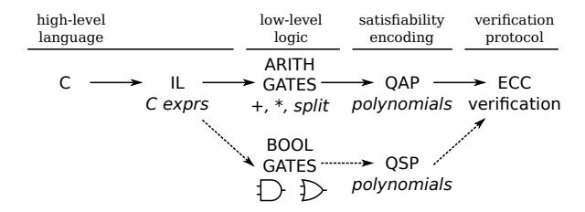
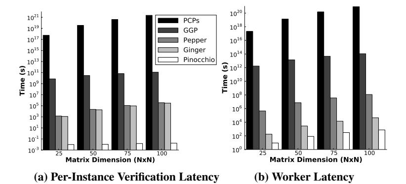
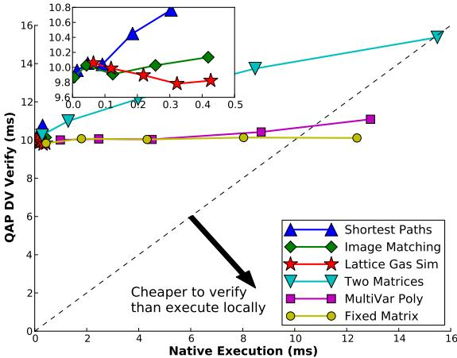

# <span id="page-0-0"></span>Pinocchio: Nearly Practical Verifiable Computation

Bryan Parno Jon Howell *Microsoft Research*

Craig Gentry Mariana Raykova *IBM Research*

# Abstract

To instill greater confidence in computations outsourced to the cloud, clients should be able to *verify* the correctness of the results returned. To this end, we introduce Pinocchio, a built system for efficiently verifying general computations while relying only on cryptographic assumptions. With Pinocchio, the client creates a public evaluation key to describe her computation; this setup is proportional to evaluating the computation once. The worker then evaluates the computation on a particular input and uses the evaluation key to produce a proof of correctness. The proof is only 288 bytes, regardless of the computation performed or the size of the inputs and outputs. Anyone can use a public verification key to check the proof.

Crucially, our evaluation on seven applications demonstrates that Pinocchio is efficient in practice too. Pinocchio's verification time is typically 10ms: 5-7 orders of magnitude less than previous work; indeed Pinocchio is the first general-purpose system to demonstrate verification cheaper than native execution (for some apps). Pinocchio also reduces the worker's proof effort by an additional 19-60×. As an additional feature, Pinocchio generalizes to zero-knowledge proofs at a negligible cost over the base protocol. Finally, to aid development, Pinocchio provides an end-to-end toolchain that compiles a subset of C into programs that implement the verifiable computation protocol.

# 1 Introduction

Since computational power is often asymmetric (particularly for mobile devices), a relatively weak client may wish to outsource computation to one or more powerful workers. Common examples include cloud or grid computing, as well as volunteer distributed computing [\[1\]](#page-12-0). In all of these settings, the client should be able to *verify* the results returned, to guard against malicious or malfunctioning workers. Even from a legitimate worker's perspective, verifiable results are beneficial, since they are likely to command a higher price. They also allow the worker to shed liability: any undesired outputs are provably the result of data the client supplied.

Considerable systems and theory research has looked at the problem of verifying computation (§[6\)](#page-11-0). However, most of this work has either been function specific, relied on assumptions we prefer to avoid, or simply failed to pass basic practicality requirements. Function specific solutions [\[2–](#page-12-1)[6\]](#page-12-2) are often efficient, but only for a narrow class of computations. More general solutions often rely on assumptions that may not apply. For example, systems based on replication [\[1,](#page-12-0) [7,](#page-12-3) [8\]](#page-12-4) assume uncorrelated failures, while those based on Trusted

Computing [\[9–](#page-12-5)[11\]](#page-12-6) or other secure hardware [\[12–](#page-12-7)[15\]](#page-12-8) assume that physical protections cannot be defeated. Finally, the theory community has produced a number of beautiful, generalpurpose protocols [\[16–](#page-12-9)[23\]](#page-12-10) that offer compelling asymptotics. In practice however, because they rely on complex Probabilistically Checkable Proofs (PCPs) [\[17\]](#page-12-11) or fully-homomorphic encryption (FHE) [\[24\]](#page-12-12), the performance is unacceptable – verifying small instances would take hundreds to trillions of years (§[5.2\)](#page-8-0). Very recent work [\[25–](#page-12-13)[28\]](#page-13-0) has improved these protocols considerably, but efficiency is still problematic, and the protocols lack features like public verification.

In contrast, we describe Pinocchio, a concrete system for efficiently verifying general computations while making only cryptographic assumptions. In particular, Pinocchio supports public verifiable computation [\[22,](#page-12-14) [29\]](#page-13-1), which allows an untrusted worker to produce *signatures of computation*. Initially, the client chooses a function and generates a public evaluation key and a (small) public verification key. Given the evaluation key, a worker can choose an input (or verifiably use one provided by the client), compute the function, and produce a proof (or signature) to accompany the result. Anyone (not just the client) can then use the verification key to check the correctness of the worker's result for the specific input used. As an additional feature, Pinocchio supports zero-knowledge verifiable computation, in which the worker convinces the client that it knows an input with a particular property, without revealing any information about the input.

Pinocchio's asymptotics are excellent: key setup and proof generation require cryptographic effort linear in the size of the original computation, and verification requires time linear in the size of the inputs and outputs. Even more surprising, Pinocchio's proof is constant sized, *regardless* of the computation performed. Crucially, our evaluation (§[5\)](#page-8-1) demonstrates that these asymptotics come with small constants, making Pinocchio close to practical for a variety of applications.

Compared with previous work, Pinocchio improves verification time by 5-7 *orders of magnitude* and requires less than 10ms in most configurations, enabling it to beat native C execution for some apps. We also improve the worker's proof efforts by 19-60× relative to prior work. The resulting proof is tiny, 288 bytes (only slightly more than an RSA-2048 signature), regardless of the computation. Making a proof zeroknowledge is also cheap, adding negligible overhead (213*µ*s to key generation and 0.1% to proof generation).

While these improvements are promising, additional progress is likely needed before the overhead reaches true practicality. However, even now, this overhead may be acceptable in scenarios that require high assurance, or that need the zero-knowledge properties Pinocchio supports.



<span id="page-1-0"></span>Figure 1: Overview of Pinocchio's Toolchain. *Pinocchio takes a high-level C program all the way through to a distributed set of executables that run the program in a verified fashion. It supports both arithmetic circuits, via Quadratic Arithmetic Programs (*§*[2.2.1\)](#page-2-0), and Boolean circuits via Quadratic Span Programs (*§*[2.2.2\)](#page-3-0).*

To achieve efficient verifiable computation, Pinocchio combines *quadratic programs*, a computational model introduced by Gennaro et al. [\[30\]](#page-13-2), with a series of theoretical refinements and systems engineering to produce an end-to-end toolchain for verifying computations. Specifically, via an improved protocol and proof technique, we slash the cost of key generation by 61%, and the cost of producing a proof by 64%. From a developer's perspective, Pinocchio provides a compiler that transforms C code into a circuit representation (we support both Boolean and arithmetic), converts the circuit into a quadratic program, and then generates programs to execute the cryptographic protocol (Fig. [1\)](#page-1-0).

Pinocchio's end-to-end toolchain, plus its support for both Boolean and arithmetic circuits, allows us to implement real applications that benefit from verification. In particular, we implement two forms of matrix multiplication, multivariate polynomial evaluation, image matching, all-pairs shortest paths, a lattice-gas scientific simulator, and SHA-1. We find (§[5\)](#page-8-1) that the first three apps translate efficiently into arithmetic circuits, and hence Pinocchio can verify their results faster than native execution of the same program. The latter four apps translate less efficiently, due to their reliance on inequality comparisons and bitwise operations, and yet they may still be useful for zero-knowledge applications.

Contributions. In summary, this paper contributes:

- 1. An end-to-end system for efficiently verifying computation performed by one or more untrusted workers. This includes a compiler that converts C code into a format suitable for verification, as well as a suite of tools for running the actual protocol.
- 2. Theoretical and systems-level improvements that bring performance down by 5-7 orders of magnitude, and hence into the realm of plausibility.
- 3. An evaluation on seven real C applications, showing verification faster than 32-bit native integer execution for some apps.

## <span id="page-1-2"></span>2 Background

#### 2.1 Verifiable Computation (VC)

A public verifiable computation (VC) scheme allows a computationally limited client to outsource to a worker the evaluation of a function *F* on input *u*. The client can then verify the correctness of the returned result *F*(*u*) while performing less work than required for the function evaluation.

More formally, we define public VC as follows, generalizing previous definitions [\[22,](#page-12-14) [29,](#page-13-1) [30\]](#page-13-2).

Definition 1 (Public Verifiable Computation) *A public verifiable computation scheme V C consists of a set of three polynomial-time algorithms* (KeyGen,Compute,Verify) *defined as follows.*

- (*EKF*,*VKF*) ← KeyGen(*F*,1 λ )*: The randomized key generation algorithm takes the function F to be outsourced and security parameter* λ*; it outputs a public evaluation key EKF, and a public verification key VKF.*
- (*y*,π*y*) ← Compute(*EKF*,*u*)*: The deterministic worker algorithm uses the public evaluation key EK<sup>F</sup> and input u. It outputs y* ← *F*(*u*) *and a proof* π*<sup>y</sup> of y's correctness.*
- {0,1} ← Verify(*VKF*,*u*, *y*,π*y*)*: Given the verification key VKF, the deterministic verification algorithm outputs 1 if F*(*u*) = *y, and 0 otherwise.*

Prior work gives formal definitions for correctness, security, and efficiency [\[30\]](#page-13-2), so we merely summarize:

- Correctness For any function *F*, and any input *u* to *F*, if we run (*EKF*,*VKF*) ← KeyGen(*F*,1 λ ) and (*y*,π*y*) ← Compute(*EKF*,*u*), then we always get 1 = Verify(*VKF*,*u*, *y*,π*y*).
- Security For any function *F* and any probabilistic polynomial-time adversary *A*, Pr[(*u*ˆ, *y*ˆ,πˆ *<sup>y</sup>*) ← *A*(*EKF*,*VKF*) : *F*(*u*ˆ) 6= *y*ˆ and 1 = Verify(*VKF*,*u*ˆ, *y*ˆ,πˆ *<sup>y</sup>*)] ≤ negl(λ).
- Efficiency KeyGen is assumed to be a one-time operation whose cost is amortized over many calculations, but we require that Verify is cheaper than evaluating *F*.

Several previous VC schemes [\[22,](#page-12-14) [23\]](#page-12-10) were not public, but rather *designated verifier*, meaning that the verification key *VK<sup>F</sup>* must be kept secret. Indeed, in these schemes, even revealing the output of the verification function (i.e., whether or not the worker had been caught cheating) could lead to attacks on the system. A public VC scheme avoids such issues. Zero-Knowledge Verifiable Computation. We also consider an extended setting where the outsourced computation is a function, *F*(*u*,*w*), of two inputs: the client's input *u* and an auxiliary input *w* from the worker. A VC scheme is *zeroknowledge* if the client learns nothing about the worker's input beyond the output of the computation.[1](#page-1-1)

Zero knowledge is relevant to practical scenarios where the worker's input is private. For example, to anonymously authenticate, the worker's input *w* might be a signature from a third party; the client's input *u* is the third party's public key, and the function *F*(*u*,*w*) validates the signature. The client learns that the worker holds a valid credential, but learns nothing about the credential itself. Another potential application is for privately aggregating sensitive data, for example, in the

<span id="page-1-1"></span><sup>1</sup>Such a scheme may also be referred to as a non-interactive zero knowledge (NIZK) proof [\[31\]](#page-13-3).

Inputs
$$\begin{array}{c|ccccccccccccccccccccccccccccccccccc$$

<span id="page-2-1"></span>Figure 2: Arithmetic Circuit and Equivalent QAP. Each wire value comes from, and all operations are performed over, a field  $\mathbb{F}$ . The polynomials in the QAP are defined in terms of their evaluations at the two roots,  $r_5$  and  $r_6$ . See text for details.

context of smart-meter billing [32], where individual meter readings should be private to the client, but the utility needs to authenticate the aggregate amount owed.

#### 2.2 Quadratic Programs

Gennaro, Gentry, Parno, and Raykova (GGPR) recently showed how to compactly encode computations as quadratic programs [30], so as to obtain efficient VC and zero-knowledge VC schemes. Specifically, they show how to convert any arithmetic circuit into a comparably sized Quadratic Arithmetic Program (QAP), and any Boolean circuit into a comparably sized Quadratic Span Program (QSP). We summarize these transformations.

Standard results show that polynomially-sized circuits are equivalent (up to a logarithmic factor) to Turing machines that run in polynomial time [33], though of course the actual efficiency of computing via circuits versus on native hardware depends heavily on the application (e.g., an arithmetic circuit for matrix multiplication adds essentially no overhead, whereas a Boolean circuit for integer multiplication is less efficient than executing a single 32-bit assembly instruction).

#### <span id="page-2-0"></span>2.2.1 Arithmetic Circuits and QAPs

An arithmetic circuit consists of wires that carry values from a field  $\mathbb{F}$  and connect to addition and multiplication gates – see Figure 2 for an example. We define a QAP, an encoding of such a circuit, as follows.

<span id="page-2-2"></span>**Definition 2 (Quadratic Arithmetic Program (QAP) [30])** A QAP Q over field  $\mathbb{F}$  contains three sets of m+1 polynomials  $\mathcal{V} = \{v_k(x)\}, \ \mathcal{W} = \{w_k(x)\}, \mathcal{Y} = \{y_k(x)\}, \ for \ k \in \{0...m\}, \ and a target polynomial <math>t(x)$ . Suppose F is a function that takes as input n elements of  $\mathbb{F}$  and outputs n' elements, for a total of N = n + n' I/O elements. Then we say that Q computes F if:  $(c_1, \ldots, c_N) \in \mathbb{F}^N$  is a valid assignment of F's inputs and outputs, if and only if there exist coefficients  $(c_{N+1}, \ldots, c_m)$  such that t(x) divides p(x), where:

$$p(x) = \left(v_0(x) + \sum_{k=1}^m c_k \cdot v_k(x)\right) \cdot \left(w_0(x) + \sum_{k=1}^m c_k \cdot w_k(x)\right)$$
$$-\left(y_0(x) + \sum_{k=1}^m c_k \cdot y_k(x)\right).$$

In other words, there must exist some polynomial h(x) such that  $h(x) \cdot t(x) = p(x)$ . The size of Q is m, and the degree is the degree of t(x).

Building a QAP Q for an arithmetic circuit C is fairly straightforward. We pick an arbitrary root  $r_g \in \mathbb{F}$  for each multiplication gate g in C and define the target polynomial to be  $t(x) = \prod_{g} (x - r_g)$ . We associate an index  $k \in [m] =$  $\{1...m\}$  to each input of the circuit and to each output from a multiplication gate (the addition gates will be compressed into their contributions to the multiplication gates). Finally, we define the polynomials in  $\mathcal{V}$ ,  $\mathcal{W}$ , and  $\mathcal{Y}$  by letting the polynomials in  $\mathcal V$  encode the left input into each gate, the  $\mathcal W$ encode the right input into each gate, and the  $\mathcal Y$  encode the outputs. For example,  $v_k(r_g) = 1$  if the k-th wire is a left input to gate g, and  $v_k(r_g) = 0$  otherwise. Similarly,  $y_k(r_g) = 1$  if the k-th wire is the output of gate g, and  $y_k(r_g) = 0$  otherwise. Thus, if we consider a particular gate g and its root  $r_g$ , Equation 1 simplifies to:  $(\sum_{k=1}^{m} c_k \cdot v_k(r_g)) \cdot (\sum_{k=1}^{m} c_k \cdot w_k(r_g)) =$  $\left(\sum_{k\in I_{left}} c_k\right) \cdot \left(\sum_{k\in I_{right}} c_k\right) = c_g y_k(r_g) = c_g$ , which just says that the output value of the gate is equal to the product of its inputs, the very definition of a multiplication gate.

In short, the divisibility check that t(x) divides p(x) decomposes into deg(t(x)) separate checks, one for each gate g and root  $r_g$  of t(x), that  $p(r_g) = 0$ .

Taking the circuit in Figure 2 as a concrete example, we build the equivalent QAP as follows. First, we select two roots,  $r_5, r_6 \in \mathbb{F}$  to represent the two multiplication gates. Hence the QAP's degree is 2. We define six polynomials for each set  $\mathcal{V}$ ,  $\mathcal{W}$ , and  $\mathcal{Y}$ , four for the input wires, and two for the outputs from the multiplication gates. Thus, the QAP's size is 6. We define these polynomials based on each wire's contributions to the multiplication gates. Specifically all of the  $v_k(r_5) = 0$ , except  $v_3(r_5) = 1$ , since the third input wire contributes to the left input of  $c_5$ 's multiplication gate. Similarly,  $v_k(r_6) = 0$ , except for  $v_1(r_6) = v_2(r_6) = 1$ , since the first two inputs both contribute to the left input of  $c_6$ 's gate. For  $\mathcal{W}$ , we look at right inputs. Finally,  $\mathcal{Y}$  represents outputs; none of the input wires is an output, so  $y_k(r_5) = y_k(r_6) = 0$  for  $k \in \{1, ..., 4\}$ , and  $y_5(r_5) = y_6(r_6) = 1$ .

Note the extreme sparsity of the polynomials in the example (in terms of evaluations of the polynomials). The VC protocol ( $\S 2.3$ ) exploits this sparseness to achieve efficiency.

The actual construction [30] is a bit more complex, as it handles addition and multiplication by constants. Nonetheless, GGPR show that for any arithmetic circuit with d multiplication gates and N I/O elements, one can construct an equivalent QAP with degree (the number of roots  $r_g$ ) d and size (number of polynomials in each set) d+N. Note that addition gates and multiplication-by-constant gates do not contribute to the size or degree of the QAP. Thus, these gates are essentially "free" in QAP-based VC schemes.

**Strong QAPs.** In their QAP-based VC scheme, described below, GGPR unfortunately require a strong property from the QAP. Note that Definition 2 only considers the case where the

same set of coefficients  $c_i$  are applied to all three sets of polynomials. GGPR additionally require the if-and-only-if condition in Definition 2 to hold even when different coefficients  $a_i$ ,  $b_i$ ,  $c_i$  are applied – i.e., when  $p(x) = (\sum_{k=1}^m c_k \cdot v_k(x)) \cdot (\sum_{k=1}^m b_k \cdot w_k(x)) - (\sum_{k=1}^m a_k \cdot y_k(x))$ . They show how to convert any QAP into a *strong QAP* that satisfies this stronger condition. Unfortunately, this strengthening step increases the QAP's degree to 3d + 2N, more than *tripling* it. This in turn, more than triples the cost of key generation, the size of the evaluation key, and the worker's effort to produce a proof.

#### <span id="page-3-0"></span>2.2.2 Boolean Circuits and QSPs

Boolean circuits operate over bits, with bitwise gates for AND, OR, XOR, etc. GGPR propose Quadratic Span Programs (QSPs) as a custom encoding for Boolean circuits [30]. QSPs are superficially similar to QAPs, but because they only support Boolean wire values, they use only two sets of polynomials  $\mathcal{V}$  and  $\mathcal{W}$ . The divisibility check is updated to consider  $p(x) = (v_0(x) + \sum_{k=1}^m c_k \cdot v_k(x)) \cdot (w_0(x) + \sum_{k=1}^m c_k \cdot w_k(x))$ . Instead of the arithmetic circuit-based polynomial construction above, QSPs build a small set of polynomials for each Boolean gate. Specifically, each gate adds 9 roots and 12 polynomials to the overall QSP. Like QAPs, the QSPs require a strengthening step.

### <span id="page-3-1"></span>2.3 Building VC from Quadratic Programs

To construct a VC protocol from a quadratic program, the main idea is that each polynomial – e.g.,  $v_k(x) \in \mathbb{F}$  – of the quadratic program is mapped to an element  $g^{v_k(s)}$  in a bilinear group, where s is a secret value selected by the client, g is a generator of the group, and  $\mathbb{F}$  is the field of discrete logarithms of g. These group elements are given to the worker. For a given input, the worker evaluates the circuit directly to obtain the output and the values of the internal circuit wires. These values correspond to the coefficients  $c_i$ of the quadratic program. Thus, the VC worker can evaluate  $v(s) = \sum_{k \in [m]} c_k \cdot v_k(s)$  "in the exponent" to get  $g^{v(s)}$ ; it computes w(s) and y(s), in the exponent, similarly. Finally, the worker computes  $h(x) = p(x)/t(x) = \sum_{i=0}^{d} h_i \cdot x^i$ , and then uses the  $h_i$ , along with  $g^{s^i}$  terms in the evaluation key, to compute  $g^{h(s)}$ . To oversimplify, the proof consists of  $(g^{v(s)}, g^{w(s)}, g^{v(s)}, g^{h(s)})$ . The verifier uses the bilinear map to check that p(s) = h(s)t(s). The actual protocol (Protocol 1) is a bit more complex, because additional machinery is needed to ensure that the worker incorporates the client's input u correctly, and that the worker indeed generates (say) v(s) in the exponent as some linear function of the  $v_k(s)$  values.

#### <span id="page-3-2"></span>Protocol 1 (Verifiable Computation from strong OAPs)

•  $(EK_F, VK_F) \leftarrow \text{KeyGen}(F, 1^{\lambda})$ : Let F be a function with N input/output values from  $\mathbb{F}$ . Convert F into an arithmetic circuit C; then build the corresponding  $QAP \ Q = (t(x), \mathcal{V}, \mathcal{W}, \mathcal{Y})$  of size m and degree d. Let  $I_{mid} = \{N+1,...,m\}$ , i.e., the non-IO-related indices. Let e be a non-trivial bilinear map  $[34] \ e : G \times G \to G_T$ , and let g be a generator of G.

Choose  $s, \alpha, \beta_{\nu}, \beta_{w}, \beta_{y}, \gamma \stackrel{R}{\leftarrow} \mathbb{F}$ . Construct the public evaluation key  $EK_{F}$  as:

$$\begin{array}{lll} (& \{g^{v_k(s)}\}_{k \in I_{mid}}, & \{g^{w_k(s)}\}_{k \in [m]}, & \{g^{y_k(s)}\}_{k \in [m]}, \\ & \{g^{\alpha v_k(s)}\}_{k \in I_{mid}}, & \{g^{\alpha w_k(s)}\}_{k \in [m]}, & \{g^{\alpha y_k(s)}\}_{k \in [m]}, \\ & \{g^{\beta v_k(s)}\}_{k \in I_{mid}}, & \{g^{\beta w_k(s)}\}_{k \in [m]}, & \{g^{\beta y_k(s)}\}_{k \in [m]}, \\ & \{g^{s^i}\}_{i \in [d]}, & \{g^{\alpha s^i}\}_{i \in [d]}, & \end{array}$$

The public verification key is:  $VK_F = (g^1, g^\alpha, g^\gamma, g^{\beta_\nu \gamma}, g^{\beta_w \gamma}, g^{\beta_y \gamma}, g^{t(s)}, \{g^{\nu_k(s)}\}_{k \in [N]}, g^{\nu_0(s)}, g^{w_0(s)}, g^{y_0(s)}).$

•  $(y, \pi_y) \leftarrow \mathsf{Compute}(EK_F, u)$ : On input u, the worker evaluates the circuit for F to obtain  $y \leftarrow F(u)$ . As a result of the evaluation, he knows the values  $\{c_i\}_{i \in [m]}$  of the circuit's wires.

He solves for h(x) (the polynomial such that  $p(x) = h(x) \cdot t(x)$ ), and computes the proof  $\pi_y$  as:  $(g^{v_{mid}(s)}, g^{w(s)}, g^{y(s)}, g^{h(s)}, g^{\alpha v_{mid}(s)}, g^{\alpha w(s)}, g^{\alpha y(s)}, g^{\alpha h(s)}, g^{\alpha h(s)}, g^{\alpha v_{mid}(s)}, g^{\alpha w(s)}, g^{\alpha v_{mid}(s)}, g^{\alpha v_{mid}(s)}, g^{\alpha v_{mid}(s)}, g^{\alpha v_{mid}(s)}, g^{\alpha v_{mid}(s)}, g^{\alpha v_{mid}(s)}, g^{\alpha v_{mid}(s)}, g^{\alpha v_{mid}(s)}, g^{\alpha v_{mid}(s)}, g^{\alpha v_{mid}(s)}, g^{\alpha v_{mid}(s)}, g^{\alpha v_{mid}(s)}, g^{\alpha v_{mid}(s)}, g^{\alpha v_{mid}(s)}, g^{\alpha v_{mid}(s)}, g^{\alpha v_{mid}(s)}, g^{\alpha v_{mid}(s)}, g^{\alpha v_{mid}(s)}, g^{\alpha v_{mid}(s)}, g^{\alpha v_{mid}(s)}, g^{\alpha v_{mid}(s)}, g^{\alpha v_{mid}(s)}, g^{\alpha v_{mid}(s)}, g^{\alpha v_{mid}(s)}, g^{\alpha v_{mid}(s)}, g^{\alpha v_{mid}(s)}, g^{\alpha v_{mid}(s)}, g^{\alpha v_{mid}(s)}, g^{\alpha v_{mid}(s)}, g^{\alpha v_{mid}(s)}, g^{\alpha v_{mid}(s)}, g^{\alpha v_{mid}(s)}, g^{\alpha v_{mid}(s)}, g^{\alpha v_{mid}(s)}, g^{\alpha v_{mid}(s)}, g^{\alpha v_{mid}(s)}, g^{\alpha v_{mid}(s)}, g^{\alpha v_{mid}(s)}, g^{\alpha v_{mid}(s)}, g^{\alpha v_{mid}(s)}, g^{\alpha v_{mid}(s)}, g^{\alpha v_{mid}(s)}, g^{\alpha v_{mid}(s)}, g^{\alpha v_{mid}(s)}, g^{\alpha v_{mid}(s)}, g^{\alpha v_{mid}(s)}, g^{\alpha v_{mid}(s)}, g^{\alpha v_{mid}(s)}, g^{\alpha v_{mid}(s)}, g^{\alpha v_{mid}(s)}, g^{\alpha v_{mid}(s)}, g^{\alpha v_{mid}(s)}, g^{\alpha v_{mid}(s)}, g^{\alpha v_{mid}(s)}, g^{\alpha v_{mid}(s)}, g^{\alpha v_{mid}(s)}, g^{\alpha v_{mid}(s)}, g^{\alpha v_{mid}(s)}, g^{\alpha v_{mid}(s)}, g^{\alpha v_{mid}(s)}, g^{\alpha v_{mid}(s)}, g^{\alpha v_{mid}(s)}, g^{\alpha v_{mid}(s)}, g^{\alpha v_{mid}(s)}, g^{\alpha v_{mid}(s)}, g^{\alpha v_{mid}(s)}, g^{\alpha v_{mid}(s)}, g^{\alpha v_{mid}(s)}, g^{\alpha v_{mid}(s)}, g^{\alpha v_{mid}(s)}, g^{\alpha v_{mid}(s)}, g^{\alpha v_{mid}(s)}, g^{\alpha v_{mid}(s)}, g^{\alpha v_{mid}(s)}, g^{\alpha v_{mid}(s)}, g^{\alpha v_{mid}(s)}, g^{\alpha v_{mid}(s)}, g^{\alpha v_{mid}(s)}, g^{\alpha v_{mid}(s)}, g^{\alpha v_{mid}(s)}, g^{\alpha v_{mid}(s)}, g^{\alpha v_{mid}(s)}, g^{\alpha v_{mid}(s)}, g^{\alpha v_{mid}(s)}, g^{\alpha v_{mid}(s)}, g^{\alpha v_{mid}(s)}, g^{\alpha v_{mid}(s)}, g^{\alpha v_{mid}(s)}, g^{\alpha v_{mid}(s)}, g^{\alpha v_{mid}(s)}, g^{\alpha v_{mid}(s)}, g^{\alpha v_{mid}(s)}, g^{\alpha v_{mid}(s)}, g^{\alpha v_{mid}(s)}, g^{\alpha v_{mid}(s)}, g^{\alpha v_{mid}(s)}, g^{\alpha v_{mid}(s)}, g^{\alpha v_{mid}(s)}, g^{\alpha v_{mid}(s)}, g^{\alpha v_{mid}(s)$

where  $v_{mid}(x) = \sum_{k \in I_{mid}} c_k \cdot v_k(x)$ ,  $v(x) = \sum_{k \in [m]} c_k \cdot v_k(x)$ ,  $w(x) = \sum_{k \in [m]} c_k \cdot w_k(x)$ , and  $y(x) = \sum_{k \in [m]} c_k \cdot y_k(x)$ . Since these are linear equations, he can compute them "in the exponent" using the material in the evaluation key, e.g.,  $g^{v(s)} = g^{v_0(s)} \cdot \prod_{k \in [m]} \left( g^{v_k(s)} \right)^{c_k}$ .

•  $\{0,1\} \leftarrow \text{Verify}(VK_F, u, y, \pi_y)$ : To verify a proof, anyone with access to the verification key  $VK_F$  can use the pairing function e to check that the  $\alpha$  and  $\beta$  proof terms are correct (e.g., check that  $e(g^{v_{mid}(s)}, g^{\alpha}) = e(g^{\alpha v_{mid}(s)}, g)$ ). This requires 8 pairings for the  $\alpha$  terms, and 3 for the  $\beta$  term.

Finally, the verifier can compute a term representing the I/O, u and y, by representing them as coefficients  $c_1, \ldots, c_N \in \mathbb{F}$  and computing, using elements from  $VK_F$ ,  $g^{v_{io}(s)} = \prod_{k \in [N]} \left( g^{v_k(s)} \right)^{c_k}$ .

A final check (with 3 pairings) verifies the divisibility requirement, i.e., that  $e(g^{v_0(s)} \cdot g^{v_{io}} \cdot g^{v(s)}, g^{w_0(s)} \cdot g^{w_0(s)})/e(g^{y_0(s)} \cdot g^{y(s)}, g) = e(g^{h(s)}, g^{t(s)}).$

In a designated verifier setting (where the verifier knows s,  $\alpha$ , etc.), pairings are only needed for this last check, and the I/O term can be computed directly over  $\mathbb{F}$ , rather than "in the exponent".

Regarding efficiency, GGPR [30] show that the one-time setup of KeyGen runs in time linear in the original circuit size, O(|C|). The worker performs O(|C|) cryptographic work, but he must also perform  $O(|C|\log^2|C|)$  non-cryptographic work to calculate h(x). To achieve this performance, the worker exploits the fact that the evaluation vectors  $(v_k(r_1), \ldots, v_k(r_d))$  are all very sparse (also for the w and y polynomials). The proof itself is constant size, with only 7 group elements for QSPs and 9 for QAPs, though the verifier's work is still linear, O(N), in the size of the inputs and outputs of the function.

In terms of security, GGPR [30] show this VC scheme is sound under the d-PKE and q-PDH assumptions (see Appendix A), which are weak versions of assumptions in prior work [21, 35, 36]. The q-PDH assumption belongs to a class

of cryptographic assumptions that do not lend themselves to efficient falsification [37], though some members have indeed been proven false [38]. Gentry and Wichs recently showed that assumptions from this class are likely to be inherent for efficient, non-interactive arguments for NP relations [39].

Zero Knowledge. Making the VC scheme zero-knowledge is remarkably simple. One simply includes the target polynomial t(x) itself in the polynomial sets  $\mathcal{V}$ ,  $\mathcal{W}$ , and  $\mathcal{Y}$ . This allows the worker to "randomize" its proof by adding  $\delta_{\nu}t(s)$ in the exponent to  $v_{mid}(s)$ ,  $\delta_w t(s)$  to w(s), and  $\delta_y t(s)$  to y(s)for random  $\delta_{\nu}, \delta_{w}, \delta_{\nu}$ , and modifying the other elements of the proof accordingly. The modified value of p(x) remains divisible by t(x), but the randomization makes the scheme statistically zero-knowledge [30].

### **Theoretical Refinements**

In this section, we improve Protocol 1 to significantly reduce key generation time, evaluation key size, and worker effort. We analyze our improvements empirically in §5.4.

Our main optimization is that we construct a VC scheme that uses a regular OAP (as in Definition 2), rather than a strong QAP. Recall that GGPR show how to transform a regular QAP into a strong QAP, but the transformation more than triples the degree of the QAP. Consequently, when they plug their strong QAP into their VC construction, the strengthening step more than triples the key generation time, evaluation key size, and worker computation. We take a different approach that uses a regular QAP, and hence we do not need a strengthening step at all. Instead, we embed additional structure into our new VC proof that ensures that the worker uses the same linear combination to construct the v, w, and y terms of its proof.<sup>2</sup> Surprisingly, this additional structure comes at no cost, and our VC scheme is actually less complicated than GGPR's! For example, we manage to shave the proof down from nine group elements to eight. Experiments ( $\S 5.4$ ) show that these improvements indeed give substantial savings.

We also remove the need for the worker to compute  $g^{\alpha h(s)}$ , and hence the  $g_{i \in [d]}^{\alpha s^i}$  terms from EK. Finally, we expand the expressivity and efficiency of the functions QAPs can compute by designing a number of custom circuit gates for specialized functions.

#### <span id="page-4-2"></span>**Our New VC Protocol**

Next we describe our more efficient VC scheme, with some remarks afterwards on some its properties.

#### <span id="page-4-3"></span>Protocol 2 (Verifiable Computation from regular OAPs)

•  $(EK_F, VK_F) \leftarrow \text{KeyGen}(F, 1^{\lambda})$ : Let F be a function with N input/output values from  $\mathbb{F}$ . Convert F into an arithmetic circuit C; then build the corresponding

QAP  $Q = (t(x), \mathcal{V}, \mathcal{W}, \mathcal{Y})$  of size m and degree d. Let  $I_{mid} = \{N+1,...,m\}$ , i.e., the non-IO-related indices. Let e be a non-trivial bilinear map [34]  $e: \mathbb{G} \times \mathbb{G} \to \mathbb{G}_T$ , and let g be a generator of G.

Choose  $r_v, r_w, s, \alpha_v, \alpha_w, \alpha_v, \beta, \gamma \stackrel{R}{\leftarrow} \mathbb{F}$  and set  $r_v = r_v \cdot r_w$ ,  $g_{v} = g^{r_{v}}, g_{w} = g^{r_{w}} \text{ and } g_{v} = g^{r_{y}}.$

Construct the public evaluation key  $EK_F$  as:

Construct the public evaluation key
$$EK_F$$
 as:
$$\left( \begin{array}{ccc} \left\{ g_{v}^{v_k(s)} \right\}_{k \in I_{mid}}, & \left\{ g_{w}^{w_k(s)} \right\}_{k \in I_{mid}}, & \left\{ g_{y}^{y_k(s)} \right\}_{k \in I_{mid}}, \\ \left\{ g_{v}^{\alpha_{v}v_k(s)} \right\}_{k \in I_{mid}}, & \left\{ g_{w}^{\alpha_{w}w_k(s)} \right\}_{k \in I_{mid}}, & \left\{ g_{y}^{\alpha_{y}y_k(s)} \right\}_{k \in I_{mid}}, \\ \left\{ g_{v}^{s^i} \right\}_{i \in [d]}, & \left\{ g_{v}^{\beta v_k(s)} g_{w}^{\beta w_k(s)} g_{y}^{\beta y_k(s)} \right\}_{k \in I_{mid}}, \\ and the public verification key as:  $VK_F = \left( g^1, g^{\alpha_{v}}, g^{\alpha_{w}}, g^{\alpha_{w}}, g^{\alpha_{w}}, g^{\alpha_{w}}, g^{\alpha_{w}}, g^{\alpha_{w}}, g^{\alpha_{w}}, g^{\alpha_{w}}, g^{\alpha_{w}}, g^{\alpha_{w}}, g^{\alpha_{w}}, g^{\alpha_{w}}, g^{\alpha_{w}}, g^{\alpha_{w}}, g^{\alpha_{w}}, g^{\alpha_{w}}, g^{\alpha_{w}}, g^{\alpha_{w}}, g^{\alpha_{w}}, g^{\alpha_{w}}, g^{\alpha_{w}}, g^{\alpha_{w}}, g^{\alpha_{w}}, g^{\alpha_{w}}, g^{\alpha_{w}}, g^{\alpha_{w}}, g^{\alpha_{w}}, g^{\alpha_{w}}, g^{\alpha_{w}}, g^{\alpha_{w}}, g^{\alpha_{w}}, g^{\alpha_{w}}, g^{\alpha_{w}}, g^{\alpha_{w}}, g^{\alpha_{w}}, g^{\alpha_{w}}, g^{\alpha_{w}}, g^{\alpha_{w}}, g^{\alpha_{w}}, g^{\alpha_{w}}, g^{\alpha_{w}}, g^{\alpha_{w}}, g^{\alpha_{w}}, g^{\alpha_{w}}, g^{\alpha_{w}}, g^{\alpha_{w}}, g^{\alpha_{w}}, g^{\alpha_{w}}, g^{\alpha_{w}}, g^{\alpha_{w}}, g^{\alpha_{w}}, g^{\alpha_{w}}, g^{\alpha_{w}}, g^{\alpha_{w}}, g^{\alpha_{w}}, g^{\alpha_{w}}, g^{\alpha_{w}}, g^{\alpha_{w}}, g^{\alpha_{w}}, g^{\alpha_{w}}, g^{\alpha_{w}}, g^{\alpha_{w}}, g^{\alpha_{w}}, g^{\alpha_{w}}, g^{\alpha_{w}}, g^{\alpha_{w}}, g^{\alpha_{w}}, g^{\alpha_{w}}, g^{\alpha_{w}}, g^{\alpha_{w}}, g^{\alpha_{w}}, g^{\alpha_{w}}, g^{\alpha_{w}}, g^{\alpha_{w}}, g^{\alpha_{w}}, g^{\alpha_{w}}, g^{\alpha_{w}}, g^{\alpha_{w}}, g^{\alpha_{w}}, g^{\alpha_{w}}, g^{\alpha_{w}}, g^{\alpha_{w}}, g^{\alpha_{w}}, g^{\alpha_{w}}, g^{\alpha_{w}}, g^{\alpha_{w}}, g^{\alpha_{w}}, g^{\alpha_{w}}, g^{\alpha_{w}}, g^{\alpha_{w}}, g^{\alpha_{w}}, g^{\alpha_{w}}, g^{\alpha_{w}}, g^{\alpha_{w}}, g^{\alpha_{w}}, g^{\alpha_{w}}, g^{\alpha_{w}}, g^{\alpha_{w}}, g^{\alpha_{w}}, g^{\alpha_{w}}, g^{\alpha_{w}}, g^{\alpha_{w}}, g^{\alpha_{w}}, g^{\alpha_{w}}, g^{\alpha_{w}}, g^{\alpha_{w}}, g^{\alpha_{w}}, g^{\alpha_{w}}, g^{\alpha_{w}}, g^{\alpha_{w}}, g^{\alpha_{w}}, g^{\alpha_{w}}, g^{\alpha_{w}}, g^{\alpha_{w}}, g^{\alpha_{w}}, g^{\alpha_{w}}, g^{\alpha_{w}}, g^{\alpha_{w}}, g^{\alpha_{w}}, g^{\alpha_{w}}, g^{\alpha_{w}}, g^{\alpha_{w}}, g^{\alpha_{w}}, g^{\alpha_{w}}, g^{\alpha_{w}}, g^{\alpha_{w}}, g^{\alpha_{w}}, g^{\alpha_{w}}, g^{\alpha_{w}}, g^{\alpha_{w}}, g^{\alpha_{w}}, g^{\alpha_{w}}, g^{\alpha_{w}}, g^{\alpha_{w}}, g^{\alpha_{w}}, g^{\alpha_{w}}, g^{\alpha_{w}}, g^{\alpha_{w}}, g^{\alpha_{w}}, g^{\alpha_{w}}, g^{\alpha_{w}}, g^{\alpha_{w}}, g^{\alpha_{w}}, g^$$$

•  $(y,\pi_y) \leftarrow \mathsf{Compute}(EK_F,u)$ : On input u, the worker evaluates the circuit for F to obtain  $y \leftarrow F(u)$ ; he also learns the values  $\{c_i\}_{i\in[m]}$  of the circuit's wires. He solves for h(x) (the polynomial such that  $p(x) = h(x) \cdot t(x)$ , and computes the proof  $\pi_v$  as:

$$\begin{pmatrix} g_{v}^{v_{mid}(s)}, & g_{w}^{w_{mid}(s)}, & g_{y}^{v_{mid}(s)}, & g_{y}^{h_{mid}(s)}, \\ g_{v}^{\alpha_{v_{v_{mid}}(s)}}, & g_{w}^{\alpha_{v_{w_{mid}}(s)}}, & g_{y}^{\alpha_{y_{w_{mid}}(s)}}, \\ g_{v}^{\beta_{v_{mid}(s)}}g_{w}^{\beta_{w_{mid}(s)}}g_{y}^{\beta_{y_{mid}(s)}}g_{y}^{\beta_{y_{mid}(s)}}, \end{pmatrix},$$

where  $v_{mid}(x) = \sum_{k \in I_{mid}} c_k \cdot v_k(x)$ , and similarly for  $w_{mid}(s)$  and  $y_{mid}(s)$ .

- $\{0,1\} \leftarrow \mathsf{Verify}(VK_F, u, y, \pi_v)$ : The verification of an alleged proof with elements  $g^{V_{mid}}$ ,  $g^{W_{mid}}$ ,  $g^{Y_{mid}}$ ,  $g^{H}$ ,  $g^{V'_{mid}}$ ,  $g^{W'_{mid}}$ ,  $g^{Y'_{mid}}$ , and  $g^Z$  uses the public verification key  $VK_F$ and the pairing function e for the following checks.
  - Divisibility check for the QAP: using elements from  $VK_F$  compute  $g_v^{v_{io}(s)} = \prod_{k \in [N]} \left(g_v^{v_k(s)}\right)^{c_k}$  (and similarly for  $g_w^{w_{io}(s)}$  and  $g_v^{y_{io}(s)}$ ), and check:

$$e(g_{v}^{v_{0}(s)}g_{v}^{v_{io}(s)}g_{v}^{V_{mid}},g_{w}^{w_{0}(s)}g_{w}^{w_{io}(s)}g_{w}^{W_{mid}}) =$$
(1)

$$e(g_y^{t(s)}, g^H)e(g_y^{y_0(s)}g_y^{y_{io}(s)}g_y^{Y_{mid}}, g).$$
 (2)

• Check that the linear combinations computed over V, W and Y are in their appropriate spans:

$$e(g_v^{V'_{mid}},g) = e(g_v^{V_{mid}},g^{\alpha_v}), \quad e(g_w^{W'_{mid}},g) = e(g_w^{W_{mid}},g^{\alpha_w}),$$
 $e(g_v^{Y'_{mid}},g) = e(g_w^{Y_{mid}},g^{\alpha_y}).$

• Check that the same coefficients were used in each of the linear combinations over V, W and  $\gamma$ :

$$e(g^Z, g^{\gamma}) = e(g_v^{V_{mid}} g_w^{W_{mid}} g_v^{Y_{mid}}, g^{\beta \gamma}).$$

The correctness of the VC scheme follows from the properties of the QAP. Regarding security, we have the following:

<span id="page-4-1"></span>**Theorem 1** Let d be an upper bound on the degree of the QAP used in the VC scheme, and let q = 4d + 4. The VC scheme is sound under the d-PKE, q-PDH and 2q-SDH assumptions (see Appendix A).

<span id="page-4-0"></span><sup>&</sup>lt;sup>2</sup>Our proof contains a term that enforces this linear constraint without increasing the degree. GGPR's generic strengthening step checked the consistency of the linear combinations via additional multiplication gates, which increased the degree of the QAP.

The proof of Theorem 1 is in Appendix B.

**Security Intuition.** As intuition for why the VC scheme is sound, note that it seems hard for an adversary who does not know  $\alpha$  to construct any pair of group elements  $h, h^{\alpha}$  except in the obvious way: by taking pairs  $(g_1, g_1^{\alpha}), (g_2, g_2^{\alpha}), \dots$ that he is given, and applying the same linear combination (in the exponent) to the left and right elements of the pairs. This hardness is formalized in the d-PKE assumption, a sort of "knowledge-of-exponent" assumption [40], that says that the adversary must "know" such a linear combination, in the sense that this linear combination can be extracted from him. Roughly, this means that, in the security proof, we can extract polynomials  $V_{mid}(x)$ ,  $W_{mid}(x)$ ,  $Y_{mid}(x)$  such that  $V_{mid}$  (from the proof) equals  $V_{mid}(s)$ ,  $W_{mid} = W_{mid}(s)$  and  $Y_{mid} = Y_{mid}(s)$ , and that moreover these polynomials are in the linear spans of the  $v_k(x)$ 's,  $w_k(x)$ 's, and  $y_k(x)$ 's respectively. If the adversary manages to provide a proof of a false statement that verifies, then these polynomials must not actually correspond to a QAP solution. So, either p(x) is not actually divisible by t(x)(in this case we break 2*q*-SDH) or  $V(x) = v_{io}(x) + V_{mid}(x)$ , W(x) and Y(x) do not use the same linear combination (in this case we break q-PDH because in the proof we choose  $\beta$ in a clever way).

**Zero Knowledge.** We can apply GGPR's rerandomization technique [30] (§2.3) to provide zero-knowledge for our new verifiable computation construction. The worker chooses  $\delta_v, \delta_w, \delta_y \overset{R}{\leftarrow} \mathbb{F}$  and in his proof, instead of the polynomials  $v_{mid}(x), v(x), w(x)$  and y(x), he uses the following randomized versions  $v_{mid}(x) + \delta_v t(x), v(x) + \delta_v t(x), w(x) + \delta_w t(x)$  and  $y(x) + \delta_y t(x)$ . In order to facilitate the randomization of the proof we add the following terms to the evaluation key:  $g_v^{\alpha_v t(s)}, g_w^{\alpha_w t(s)}, g_y^{\alpha_y t(s)}, g_v^{\beta_t t(s)}, g_y^{\beta_t t(s)}, g_y^{\beta_t t(s)}$ .

**Performance.** Our main improvement is that our VC scheme only requires a regular QAP, rather than a strong QAP, which improves performance by more than a factor of 3. Moreover, the scheme itself is simpler, leading to fewer group elements in the keys and proof, fewer bilinear maps for Verify, etc.

The scheme above assumes a symmetric bilinear map. In practice, for performance reasons, we use an asymmetric bilinear map  $e: \mathbb{G}_1 \times \mathbb{G}_2 \to \mathbb{G}_T$  where  $\mathbb{G}_1$  is an elliptic curve group called the "base" curve, and  $\mathbb{G}_2$  is the "twist" curve. Operations over the base curve are about 3 times faster than over the twist curve (§5.1). Due to our optimizations, while the worker must compute the  $g_w^{w(s)}$  term over the twist curve, all of the other proof terms can be over the base curve.

#### <span id="page-5-1"></span>3.2 Expressive Circuit Constructions

The QAP that we use in our VC scheme is defined over  $\mathbb{F}_p$ , where p is a large prime. We can, as explained above, derive a QAP over  $\mathbb{F}_p$  that efficiently computes any function F that can be expressed in terms of addition and multiplication modulo p. This provides no obvious way to express some operations, such as  $a \ge b$  using mod-p arithmetic. On the other hand, given a and b as bits, comparison is easy. Hence, one

might infer that Boolean circuits are more general and thus QSPs superior to QAPs.

However, we design an arithmetic *split gate* to translate an arithmetic wire  $a \in \mathbb{F}_p$ , known to be in  $[0, 2^k - 1]$ , into k binary output wires. Given such binary values, we can compute Boolean functions using arithmetic gates: NAND(a,b) = 1 - ab, AND(a,b) = ab, OR(a,b) = 1 - (1-a)(1-b). Each embedded Boolean gate costs only one multiply.

Surprisingly, even though QSPs are "designed for" Boolean circuits, the arithmetic embedding gives a more efficient VC scheme. With a QSP, each gate increases the degree of t(x) by 9 and the QSP size by 12. Embedding introduces an expensive initial gate that constrains each input to  $\{0,1\}$ , but henceforth, each embedded gate preserves the  $\{0,1\}$  invariant, adding only 1 to the degree and size of the QAP. <sup>3</sup>

Furthermore, the expression  $\sum_{i=1}^{k} 2^{i-1}a_i$  combines a bitwise representation of a back into a single wire. Because the sum consists of additions and multiplications by constants, recombination is free; it doesn't increase the size of the QAP.

Below, we define *split* and other useful new gates as standalone QAPs which can be composed [30, Thm.11] with other gates.

**Split Gate.** Given input  $a \in \mathbb{F}_p$  known to be in  $[0, 2^k - 1]$ , the split gate outputs k wires holding the binary digits  $a_1, \ldots, a_k$  of a. Thus, the QAP ensures that  $\sum_{i=1}^k 2^{i-1}a_i = a$ , and that each  $a_i$  is either 0 or 1. For convenience, we number the output wires  $1, \ldots, k$  and the input wire k+1.

In our mini-QAP, let  $t(x) = (x - r) \prod_{i=1}^{k} (x - r_i)$  where  $r, r_1, \dots, r_k$  are distinct roots. We set:

- $\begin{array}{lll} v_0(r)=0, & v_i(r)=2^{i-1} & \text{for } 1\leq i\leq k, & v_{k+1}(r)=0,\\ \bullet & w_0(r)=1, & w_i(r)=0 & \text{for } 1\leq i\leq k, & w_{k+1}(r)=0,\\ y_0(r)=0, & y_i(r)=0 & \text{for } 1\leq i\leq k, & y_{k+1}(r)=1; \end{array}$
- For  $1 \le j \le k$ :  $v_j(r_j) = 1$ ,  $v_i(r_j) = 0$  for all  $i \ne j$ ,  $w_0(r_j) = 1$ ,  $w_j(r_j) = -1$ ,  $w_i(r_j) = 0$  for all  $i \ne 0, j$ , and  $y_i(r_j) = 0$  for all i.

If  $(v_0(x) + \sum_{k=1}^m a_k \cdot v_k(x)) \cdot (w_0(x) + \sum_{k=1}^m a_k \cdot w_k(x)) - (y_0(x) + \sum_{k=1}^m a_k \cdot y_k(x))$  is divisible by t(x), it must evaluate to 0 at r, and therefore the first set of equations guarantee that  $\sum_{i=1}^k 2^{i-1}a_i - a = 0$ . This guarantees that if all  $a_1, \ldots, a_k$  are binary, then they are the binary digits of a. The second set of equations guarantees that each  $a_i$  is either 0 or 1. In particular, for each  $1 \le j \le k$ , the above polynomial evaluates to 0 at  $r_j$  if and only if  $a_j \cdot (1 - a_j) = 0$ .

**Equality-Assertion Gate.** For some computations, we require the value on two circuit wires to be equal. For example, in many signature schemes, the verification function checks for equality between two values. Thus when we use signature verification as part of a larger computation, we want to guarantee that the computation succeeds only if the verification is successful.

For such cases, we augment the QAP such that it forces two wires,  $i_1$  and  $i_2$ , to have the same value. Let T(x),

<span id="page-5-0"></span><sup>&</sup>lt;sup>3</sup>QSPs still have smaller proofs, since they require only two sets of polynomials  $(\mathcal{V}, \mathcal{W})$  vs. three  $(\mathcal{V}, \mathcal{W}, \mathcal{Y})$ .

 $\{V_i(x)\}_{i=1}^{k+1}, \{W_i(x)\}_{i=1}^{k+1}, \{Y_i(x)\}_{i=1}^{k+1}$  be the polynomials from the construction of the initial QAP.

We construct an augmented QAP with polynomials t(x),  $\{v_i(x)\}_{i=1}^{k+1}$ ,  $\{w_i(x)\}_{i=1}^{k+1}$ ,  $\{y_i(x)\}_{i=1}^{k+1}$  defined as follows. Set t(x) = T(x)(x-r) where r is different from the roots of T(x). For the rest of the polynomials we have:

• Modulo T(x), the following hold for all  $0 \le j \le k+1$ :  $v_j(x) = V_j(x), w_j(x) = W_j(x),$  and  $y_j(x) = Y_j(x).$ •  $v_{i_1}(r) = 1, v_{i_2}(r) = -1, v_j(r) = 0$  for  $j \ne i_1, i_2,$  $w_0(r) = 1, w_j(r) = 0$  for all  $1 \le j \le k+1,$

By the first set of equations, our new QAP inherits all of the constraints of the initial QAP. The second set of equations ensures that the divisibility holds if and only if the values on wires  $i_1$  and  $i_2$  are equal.

 $y_{j}(r) = 0$  for all  $0 \le j \le k + 1$ .

**Zero-Equality Gate.** Another useful type of comparison functionality is checking whether a value is equal to zero, e.g.,  $\mathbf{Y} = (\mathbf{X}! = \mathbf{0})?\mathbf{1}:\mathbf{0}$ . We use a prior observation [28] that this is equivalent to satisfying the following two constraints:  $X \cdot M - Y = 0$  and  $(1 - Y) \cdot X = 0$  for some value M. We construct the following QAP, which takes as input wire X (an input from the client) and a wire M, an input from the worker. The output wire will be Y. For distinct roots  $r_1, r_2$ , the mini-QAP has a target polynomial  $t(x) = (x - r_1)(x - r_2)$ , and the rest of the polynomials are defined as follows:

```
\begin{array}{llll} & v_0(r_1)=0, & v_1(r_1)=1, & v_2(r_1)=0, & v_3(r_1)=0;\\ \bullet & w_0(r_1)=0, & w_1(r_1)=0, & w_2(r_1)=1, & w_3(r_1)=0;\\ & y_0(r_1)=0, & y_1(r_1)=0, & y_2(r_1)=0, & y_3(r_1)=1;\\ & v_0(r_2)=1, & v_1(r_2)=0, & v_2(r_2)=0, & v_3(r_2)=-1;\\ \bullet & w_0(r_2)=0, & w_1(r_2)=1, & w_2(r_2)=0, & w_3(r_2)=0; \end{array}
```

 $y_0(r_2) = 0$ ,  $y_1(r_2) = 0$ ,  $y_2(r_2) = 0$ ,  $y_3(r_2) = 0$ .

The value X will be applied to be polynomials with subscript 1, M to subscript 2, and Y to subscript 3. The first set of equations provides that if t(x) divides  $(v_0(x) + \sum_{k=1}^m a_k \cdot v_k(x)) \cdot (w_0(x) + \sum_{k=1}^m a_k \cdot w_k(x)) - (y_0(x) + \sum_{k=1}^m a_k \cdot y_k(x))$ , then  $X \cdot M - Y = 0$ , and the second set of equations guarantees that  $(1 - Y) \cdot X = 0$ .

### 4 Implementation

We implemented a compiler that takes a subset of C to an equivalent arithmetic circuit (§4.1). Our verifiable computation suite then compiles the circuit representation to the equivalent QAP, and generates code to run the VC protocol, including key generation, proof computation, and proof verification (§4.2). The toolchain compiles a large collection of applications and runs them with verification (§4.3). Source code for the toolchain is available [41].

#### <span id="page-6-0"></span>4.1 Compiler Toolchain

The applications described below (§4.3) and evaluated in §5 are each compiled using qcc, our C-to-arithmetic-expression compiler, a 3,525-line Python program [42]. They are also compiled with gcc to produce the Native timings in Figures 7 and 8. A unit test validates that the gcc and 32-bit qcc executables produce matching output on varying inputs.

```
int mat[SIZE*SIZE] = { 0x12, ... };
struct In { int vector[SIZE]; };
struct Out { int result[SIZE]; };

void compute(struct In *input, struct Out *output) {
  int i, j, k, t;
  for (i=0; i<SIZE; i+=1) {
    int t=0;
    for (k=0; k<SIZE; k+=1) {
        t = t + mat->[i*SIZE+k] * input->vector[k];
    }
    output->result[i] = t;
  }
}
```

<span id="page-6-1"></span>Figure 3: **Fixed-Matrix Multiplication.** The qcc compiler unrolls the loops and decodes the struct and array references to generate an arithmetic expression for Out in terms of In.

The compiler understands a substantial subset of C, including global, function and block-scoped variables; arrays, structs, and pointers; function calls, conditionals, loops; and static initializers (Fig. 3). It also understands arithmetic and bitwise Boolean operators and preprocessor syntax. The program's entry point is a function

```
void compute (struct In *in, struct Out *out) whose parameters identify the set of input and output values.
```

Since the "target machine" (arithmetic circuits) supports only expressions, not mutable state and iteration, we restrict the C program's semantics accordingly. For example, pointers and array dereferences must be compile-time constants; otherwise, each dynamic reference would produce conditional expressions of size proportional to the addressable memory. Function calls are inlined, while preserving C variable scope and pointer semantics.

Imperative conditionals compile to conditional expressions that encode the imperative side effects. Static conditions are collapsed at compile time. Similarly, loops with statically-evaluatable termination conditions are automatically unrolled completely. A loop with dynamic termination—depending on an input value—requires a pragma \_unroll to inform the compiler how far it should unroll.

The only scalar type presently supported is **int**; a compiler flag selects the integer size. The compiler inserts masking expressions to ensure that a *k*-bit int behaves exactly as the corresponding C type, including overflow. As described below, our arithmetic circuits operate over a 254-bit field; if the program's computation is known not to overflow 254 bits, the programmer can disable masking with a compiler flag. We plan to extend our compiler to support floating point values via standard techniques [28, 43].

These features (and limitations) are similar to a parallel effort [44] to compile C for the purposes of secure multiparty computation, though they compile only to Boolean circuits. **Details.** The compiler front-end tracks scopes and variable values (as expressions), and unrolls imperative execution into a final program state that provides expressions for each output value. The intermediate language is a set of expressions of C-like operators, such as +, \*, <=, ?:, &, and  $^{\circ}$ .

The compiler back-end expands each expression into the arithmetic gate language of mul, add, const-mul, wire-split, etc., eliminating common subexpressions. It carefully bounds the bit-width of each wire value:

- inputs have the compiler-specified int width;
- each constant has a known width (e.g.  $13 = 1101_2$  has bit width 4);
- a bitwise op produces the *max* of its arguments' widths;
- add can produce max+1 bits (for a carry); and
- mul can produce  $2 \cdot max$  bits.

When the width nears the available bits in the crypto field (254), the compiler generates a split operation to truncate the value back to the specified **int** width. Tracking bit width minimizes the cost of split gates.

Signed numbers are handled just as they are in C: a 32-bit int is a twos-complement number with a sign bit at 1 < < 31. Each C expression value is treated either as an arithmetic scalar wire or a Boolean expansion, e.g. 32 wires in  $\{0,1\}$  ( $\{3.2\}$ ). The format is translated only when values pass from one operator type to the other; for example, in  $(a^b)^c + z$ , the bitwise xor (^) operators manipulate bitwise Booleans, which are joined into a scalar for the addition +.

#### <span id="page-7-0"></span>4.2 Quadratic Programs and Cryptographic Protocol

The next pipeline stage accepts a Boolean or arithmetic circuit and builds a QSP or QAP (§2). Then, per §3.1, it compiles the quadratic program into a set of cryptographic routines for the client (key generation and verification) and the worker (computation and proof generation). For comparison, we also implement the original GGPR [30]; §5.4 shows that Pinocchio's enhancements reduce overhead by 18-64%.

The key-generation routine runs at the client, with selectable public verification and zero-knowledge features (§5.3). The code transmits the evaluation key over the network to the worker; to save bandwidth, the program transmits as C and the worker compiles it locally.

The computation routine runs at the server, collecting input from the client, using the evaluation key to produce the proof, and transmitting the proof back to the client (or, if desired, a different verifier). The verification routine uses the verification key and proof to determine if the worker cheated.

Our cryptographic code is single-threaded, but each stage is embarrassingly parallel. Prior work [28] shows that standard techniques can parallelize work across cores, machines, or GPUs. For the cryptographic code, we use a high-speed elliptic curve library [45] with a 256-bit BN-curve [46] that provides 128 bits of security. The quadratic-program-construction and protocol-execution code is 10,832 lines of C and C++ [42].

#### <span id="page-7-1"></span>4.2.1 Optimizing Operations

We summarize some of the key optimizations we implemented, as well as lessons learned.

**Faster Exponentiation.** Generating the evaluation key EK requires exponentiating the same base g to many different powers. We optimize this operation by adapting Pippenger's

multi-exponentiation [47] algorithm for use with a single base. Essentially this means that we build a table of intermediate powers of g, allowing us to compute any particular exponent with only a few multiplications.

In a similar vein, the worker's largest source of overhead is applying the coefficients from the circuit "in the exponent" to compute  $g^{Y(s)}$  etc. Here Pippenger's algorithm is less directly useful, since the worker does a handful of such operations for a given work instance, but each operation involves hundreds of thousands of different bases, i.e., given  $g_1, \ldots, g_m$ ,  $e_1, \ldots, e_m$ , for very large m, the worker needs to compute  $\prod_i g_i^{e_i}$ . To optimize this operation, we use a sliding-window technique to build a small table of powers for each pair of bases. For example, for the first two bases, with a window of size 1, we compute  $\{g_1^0g_2^0, g_1^0g_2^1, g_1^1g_2^0, g_1^1g_2^1\}$ . In this case, the table only requires one multiply to build. We can then consider the high order bit of both  $e_1$  and  $e_2$ ; together these bits select one of four values in our table; we multiply that value into our accumulator and proceed to the next pair of bases. After all bases have been considered, we square the accumulator (to "move" the portion of the exponent we've computed into the next higher "slot"), and then repeat. In practice, these tables can save 3-4x, even counting the time to build the tables in the first place.

**Polynomial Asymptotics.** To generate a proof, the worker must compute the polynomial h(x) such that  $t(x) \cdot h(x) = P(x)$  (§2). Since we store P(x) in terms of its evaluations at the roots of the quadratic program (recall Figure 2), the worker must first interpolate to find P(x) and then perform a polynomial division to arrive at h(x).

Note that all of these computations take place in a normal field, whereas all of the worker's other steps involve cryptographic operations, which §5.1 shows are about three orders of magnitude more expensive.

Thus, one might naïvely conclude, as we did, that simple polynomial algorithms, such as Lagrangian interpolation and "high-school" polynomial multiplication, suffice. However, we quickly discovered that the  $O(n^2)$  behavior of these algorithms, at the scale required for verifiable computing, dwarfed the linear number of cryptographic operations (§5.1). Hence we implemented an FFT-based  $O(n\log n)$  polynomial multiplication library and used a polynomial interpolation algorithm [48] that builds a binary tree of polynomials, giving total time  $O(n\log^2 n)$ . Even so optimized, solving for h(x) is the second largest source of worker overhead.

Preparing for the Future; Learning from the Past. In our implementation and evaluation, we assume a worst case scenario in which the client decides, without any warning, to outsource a new function, and similarly that the worker only ever computes a single instance for a given client. In practice, neither scenario is plausible. When the client first installs Pinocchio, the program, could, in theory, build the single base exponent table discussed above. Further, it can choose a random *s* and begins computing powers of *s* in the background, since these are entirely independent of the computation.

Similarly, if the worker performs more than a single computation for the client, he can hold onto the exponentiation tables he built for the first computation and save substantial time on subsequent computations. He can also save the polynomial tree used to accelerate the computation of *h*(*x*). None of these values have any secret information, so workers could potentially even share this information amongst themselves.

Working With Elliptic Curves. Our BN curve is defined by the equation *y* <sup>2</sup> = *x* <sup>3</sup> + *b*, in that each group element *g<sup>i</sup>* is a point (*x*, *y*) on the curve. To speed operations, while computing on elliptic curve points, we represent them in *projective* form, as three coordinates (*x*, *y*,*z*), which corresponds to the affine point (*x*/*z* 2 , *y*/*z* 3 ). This is analogous to representing a rational number as an integral numerator and denominator. Projective coordinates reduce EC operation costs by ∼60%. We save space in the cryptographic keys and proof by converting points back to affine form before storing or transmitting them. Furthermore, rather than store (*x*, *y*), we store *x* and a bit indicating which square root of *x* <sup>3</sup> +*b* to use for *y*, reducing key and proof size by another 50%.

#### <span id="page-8-3"></span>4.3 Applications

Pinocchio runs several applications; each can be instantiated with some static *parameters*, and then each instance can be executed with dynamic *inputs*.

*Fixed Matrix* multiplies an *n* × *n* matrix parameter *M* by an *n*-length input vector *A*, and outputs the resulting *n*-length vector *M* · *A*. We choose five parameter settings that range from |*M*| = 200×200 to |*M*| = 1000×1000.

*Two Matrices* has parameter *n*, takes as input two *n* × *n* matrices *M*<sup>1</sup> and *M*2, and outputs the *n* × *n* matrix *M*<sup>1</sup> · *M*2. Matrix operations are widely used, e.g., in collaborative filtering [\[49\]](#page-13-22). (|*M*| = 30×30 to |*M*| = 110×110)

*MultiVar Poly* evaluates a *k*-variable, *m*-degree multivariate polynomial. The (*m* + 1) *k* coefficients are parameters, the *k* variables *x*1,..., *x<sup>k</sup>* are the inputs, and the polynomial's scalar value is the output. (*k* = 5, *m* = 6, 16,807 coeff. to *k* = 5, *m* = 10; 644,170 coeff.)

*Image Matching* is parameterized by an *i<sup>w</sup>* ×*i<sup>h</sup>* rectangular image and parameters *kw*, *kh*. It takes as input a *k<sup>w</sup>* × *k<sup>h</sup>* image kernel, and outputs the minimum difference and the point (*x*, *y*) in the image where it occurs. (*i<sup>w</sup>* ×*i<sup>h</sup>* = 25, *k<sup>w</sup>* ×*k<sup>h</sup>* = 9 to *i<sup>w</sup>* ×*i<sup>h</sup>* = 2025, *k<sup>w</sup>* ×*k<sup>h</sup>* = 9)

*Shortest Paths*implements the Floyd-Warshall *O*(*n* 3 ) graph algorithm, useful for network routing and matrix inversion. Its parameter *n* specifies the number of vertices, its input is an *n*×*n* edge matrix, and its output is an *n*×*n* matrix of allpairs shortest paths. (*n* = 8, *e* = 64 to *n* = 24, *e* = 576)

*LGCA* is a Lattice-Gas Cellular Automata implementation that converges to Navier-Stokes [\[50\]](#page-13-23). It has parameter *n*, the fluid lattice size, and *k*, the iteration count. It inputs one *n*-cell lattice and outputs another reflecting *k* steps. (*n* = 294, *k* = 5 to *n* = 294, *k* = 40)

*SHA-1* has no parameters. Its input is a 13-word (416-bit) input string, and it outputs its 5-word (160-bit) SHA-1 hash.

| Op                             | Base Curve | Twist Curve |  |  |
|--------------------------------|------------|-------------|--|--|
| Fixed Base Exp (naive)         | 318.5µs    | 1221.4µs    |  |  |
| Fixed Base Exp (opt)           | 38.2µs     | 118.3µs     |  |  |
| Multi Exp, 254-bit exp (naive) | 318.5µs    | 1221.5µs    |  |  |
| Multi Exp, 254-bit exp (opt)   | 104.5µs    | 401.0µs     |  |  |
| Multi Exp,<br>32-bit exp (opt) | 14.9µs     | 56.8µs      |  |  |
| Multi Exp,<br>1-bit exp (opt)  | 9.5µs      | 36.4µs      |  |  |
| Compress                       | 30.2µs     | 2160.9µs    |  |  |
| Decompress                     | 27.0µs     | 2168.3µs    |  |  |
| Pairing                        | 0.9ms      |             |  |  |
| Field Add                      | 50.2ns     |             |  |  |
| Field Mul                      | 361.1ns    |             |  |  |

<span id="page-8-4"></span>Figure 4: Microbenchmarks. *Breakdown of the main sources of performance overhead in the larger protocol.* (*N* = 100,σ ≤ 1%)*.*

|                     |       | Degree  |            |
|---------------------|-------|---------|------------|
|                     | 10    | 100     | 1000       |
| Poly Interp (naive) | 0.5ms | 238.3ms | 202013.1ms |
| Poly Interp (opt)   | 1.1ms | 21.1ms  | 331.1ms    |
| Poly Mul (naive)    | 0.1ms | 8.6ms   | 799.7ms    |
| Poly Mul (opt)      | 0.1ms | 0.4ms   | 4.1ms      |

<span id="page-8-5"></span>Figure 5: Cost of Polynomial Operations. *Illustrates the importance of optimizing polynomial algorithms.* (*N* = 500,σ ≤ 5%)*.*

# <span id="page-8-1"></span>5 Evaluation

We experiment on a Lenovo X201 ThinkPad. We run on a single core of a 2.67 GHz Intel Core i7 with 8 GB of RAM. Pinocchio's results use QAPs, since theory (§[3.2\)](#page-5-1) and practice (§[5.5\)](#page-11-2) show they offer superior performance.

### <span id="page-8-2"></span>5.1 Microbenchmarks

We performed a series of microbenchmarks to quantify the basic cost units of our protocol (Fig. [4\)](#page-8-4). Field operations are about three orders of magnitude cheaper than cryptographic exponentiations or multiplications. As §[3.1](#page-4-1) explained, we use an asymmetric pairing function, meaning that some group elements live on a (relatively) cheap base curve, while others live on the "twist" curve. Operations on the latter are 3-4× as expensive, reinforcing the importance of our optimizations to the VC protocol to move as many operations as possible to the base curve. Ultimately, Pinocchio's protocol requires only the *W* polynomials to operate on the twist curve; all other operations take place on the base curve.

Figures [4](#page-8-4) and [5](#page-8-5) also show the impact of the exponentiation and polynomial optimizations described in §[4.2.1,](#page-7-1) which reduce costs by two to three orders of magnitude for polynomial operations, and factors of 3-10 for exponentiations.

#### <span id="page-8-0"></span>5.2 Comparison With Previous Work

Figure [6](#page-9-2) plots Pinocchio's performance against that of previous general-purpose systems. We use the multiplication of two matrices as our test application since it has appeared in several prior papers [\[25,](#page-12-13) [27\]](#page-13-24), though simpler, noncryptographic verification procedures exist [\[51,](#page-13-25) §7.1]. Since



<span id="page-9-2"></span>Figure 6: **Performance Relative to Prior Schemes.** Pinocchio reduces costs by orders of magnitude (note the log scale on the y-axis). We graph the time necessary to (a) verify and (b) produce a proof result for multiplying two NxN matrices.

all of these prior schemes are designated verifier, we measure against Pinocchio's designated verifier mode.

We compare against 1) a naïve version of a PCP-based scheme [52]; 2) GGP [22], an early scheme that defined verifiable computation, but which relies on fully-homomorphic-encryption (FHE); 3) Pepper [27], an optimized refinement of (1); and 4) Ginger [28], a further refinement of Pepper. See Section 6 for more details on these schemes and the trade-offs between them. Since most of these schemes are ridiculously impractical, we model, rather than measure, their performance. For GGP, we built a model of its performance based on the latest performance results for FHE [53], while for the others, we used previously published models [27, 28]. For Pinocchio, however, we use real numbers from our implementation.

Figure 6 shows that Pinocchio continues the recent trend of reducing costs by orders of magnitude. Early PCP and FHE-based schemes are laughably impractical, taking hundreds to trillions of years to produce or verify a single proof. Pepper and Ginger have made huge improvements over prior work, but, as we discuss in more detail in §6, they do not offer public verification or zero knowledge.

In addition to offering new properties, Pinocchio significantly improves performance and security. The systems shown in Figure 6 amortize setup work across many work instances, but the characteristics of the amortization differ. To reach a break-even point, where the client does less work verifying than performing the work locally, Pepper and Ginger must batch work instances, whereas GGP and Pinocchio must perform enough instances to amortize key setup costs. These approaches have very different effects on latency. A client cannot benefit from Pepper or Ginger until it has accumulated an entire batch of instances. In Pinocchio, key setup can be precomputed, and henceforth every instance (including the first one) enjoys a better-than-break-even latency. Figure 6 shows the minimum latency achievable by each system.



<span id="page-9-0"></span>Figure 7: Cost of Verification Vs. Local. Verification must be cheaper than native execution for outsourcing to make sense, though for applications that want zero-knowledge, more expensive verification may be acceptable. All apps trend in the right direction, and three apps cross the plane where verification is cheaper than native. Error bars, often too small to see, represent 95% confidence intervals  $(N = 50, \sigma \le 2\%)$ .

Compared with Ginger, Pinocchio's verifier is  $\sim 120,000 \times 17,000,000 \times$  faster, and the worker is 19-60× faster. To improve performance, Ginger's parameters are chosen such that the probability that the adversary can successfully cheat can be as high as  $\frac{1}{2^{20}}$  [28, Figure 2], while in Pinocchio, the probability is roughly  $\frac{1}{128}$ .

#### <span id="page-9-1"></span>5.3 End-to-End Application Performance

We measure Pinocchio's performance for the applications and parameter settings described in Section 4.3. All applications are written in C and compile to both QAPs and to native executables. We measure performance using 32-bit input values, so we can compare against the native C version. This obviously makes things more challenging for Pinocchio, since Pinocchio operates over a 254-bit field using multi-precision integers, whereas the local execution uses the CPU's native 32-bit operations.

Figure 7 plots Pinocchio's verification time against the time to execute the same app natively; each line represents a parameterized app, and each point represents a particular parameter setting. Our key finding is that, for sufficiently large parameters, three apps cross the line where outsourcing makes sense; i.e., verifying the results of an outsourced computation is cheaper than local native execution. Note that the slope of each app's line is dictated by the size of the app parameters we experimented with (e.g., we reached larger parameters for fixed matrix than for two matrices).

On the downside, the other three apps, while trending in the right direction, fail to cross the outsourcing threshold. The difference is that these three apps perform large numbers of inequality comparisons and/or bitwise operations. This makes our circuit-based representation less efficient relative

<span id="page-9-3"></span><sup>&</sup>lt;sup>4</sup> In contrast, Pinocchio's public verifier (not shown) enables a client to benefit from a third party's key setup work.

|                         |        | Mult             |         | KeyGen Compute     |                   | Verify (ms) |       |      | Circuit Native EvalKey VerKey Proof |        |     |
|-------------------------|--------|------------------|---------|--------------------|-------------------|-------------|-------|------|-------------------------------------|--------|-----|
|                         | IO     | Gates            | Pub (s) | (s)                | Pub               | Priv        | (ms)  | (ms) | (MB)                                | (KB)   | (B) |
| Fixed Matrix, Medium    | 1,201  | 600              | 0.7     | 0.4                | 39.5              | 10.0        | 123.7 | 4.3  | 0.3                                 | 37.9   | 288 |
| Fixed Matrix, Large     | 2,001  | 1,000            | 1.5     | 0.9                |                   | 58.9 *10.1  | 337.4 | 12.4 | 0.5                                 | 62.9   | 288 |
| Two Matrices, Medium    | 14,701 | 347,900          | 79.8    |                    | 269.4 340.7       | 12.1        | 124.9 | 4.0  | 97.9                                | 459.8  | 288 |
| Two Matrices, Large     |        | 36,301 1,343,100 | 299.3   | 1127.8 882.2 *15.4 |                   |             | 509.5 | 15.5 | 374.8                               | 1134.8 | 288 |
| MultiVar Poly, Medium   | 7      | 203,428          | 41.9    | 246.1              | 11.6              | 10.0        | 93.1  | 4.5  | 55.9                                | 0.6    | 288 |
| MultiVar Poly, Large    | 7      | 571,046          | 127.1   |                    | 711.6 *12.7 *11.1 |             | 267.2 | 12.9 | 156.8                               | 0.6    | 288 |
| Image Matching, Medium  | 13     | 86,345           | 26.4    | 41.1               | 11.1              | 9.9         | 5.5   | 0.1  | 23.6                                | 0.8    | 288 |
| Image Matching, Large   | 13     | 277,745          | 67.0    | 144.4              | 11.4              | 10.1        | 18.0  | 0.4  | 75.8                                | 0.8    | 288 |
| Shortest Paths, Medium  | 513    | 366,089          | 85.4    | 198.0              | 25.5              | 10.0        | 18.7  | 0.1  | 99.6                                | 16.4   | 288 |
| Shortest Paths, Large   |        | 1,153 1,400,493  | 317.5   | 850.2              | 48.9              | 10.8        | 69.5  | 0.3  | 381.4                               | 36.4   | 288 |
| Lattice Gas Sim, Medium | 21     | 144,063          | 38.2    | 76.4               | 10.9              | 9.9         | 91.4  | 0.2  | 39.6                                | 1.1    | 288 |
| Lattice Gas Sim, Large  | 21     | 283,023          | 75.6    | 165.8              | 10.9              | 9.8         | 176.6 | 0.4  | 77.7                                | 1.1    | 288 |
| SHA-1                   | 22     | 23,785           | 12.0    | 15.7               | 11.1              | 9.9         | 18.8  | 0.0  | 6.5                                 | 1.1    | 288 |

<span id="page-10-0"></span>Figure 8: Application Performance. *Pinocchio's performance for a sampling of the parameter settings (*§*[4.3\)](#page-8-3). All programs are compiled directly from C. Private* KeyGen *is always within 0.4% of public* KeyGen*, and so is omitted. Verification values in bold indicate verification is cheaper than computing the circuit locally; those with stars (\*) indicate verification is cheaper than native execution.* (*N* = 50,σ ≤ 2%)*.*

to native, and hence on our current experimental platform, we cannot push the application parameter settings to the point where they would beat local execution. Nonetheless, these applications may still be useful in settings that require Pinocchio's zero-knowledge proofs.

Fortunately, additional experiments show that enabling zero-knowledge proofs adds a negligible, fixed cost to key generation (213*µ*s), and re-randomizing a proof to make it zero-knowledge requires little effort (e.g., 300ms or 0.1% for the multivariate polynomial app).

Figure [8](#page-10-0) provides more details of Pinocchio's performance. For KeyGen, our experiments conservatively assume that the client does no precomputation in anticipation of outsourcing a function, and for Compute, we assume that the worker only does a single work instance before throwing away all of its state. As discussed in §[4.2.1,](#page-7-1) in practice, we would take advantage of both precomputation and caching of previous work, which on average saves at least 43% of the effort for KeyGen and 16% of the effort for Compute.

In Figure [8,](#page-10-0) we see again that three apps (starred) beat native execution, including one in the public verifier setting (which requires more expensive operations per IO). The data also reinforces the point that using a circuit representation imposes a significant cost on image matching, shortest paths, and the lattice gas sim relative to native, suggesting a target for optimization. Relative to the circuit representation, Pinocchio's verification is cheap: both the public and the designated verifier "win" most of the time when compared to the circuit execution. Specifically, the designated verifier wins in 12 of 13 (92%) application settings. Public verification is more expensive, particularly for large IO, but still wins in 9 of 13 (69%) settings.

Since Pinocchio offers public verification, some clients will benefit from the KeyGen work of others, and hence only care about the verification costs. For example, a cellphone carrier might perform the one-time KeyGen so that its customers can verify computations done by arbitrary workers.

However, in other settings, e.g., a company outsourcing work to the cloud, the key generator and verifier may be the same entity, and will wish to amortize the cost of key generation via the savings from verification. Figure [8](#page-10-0) shows that most apps have a low "break even" point vs. circuit execution: the median for the designated verifier is 555 instances and for public verifier is 500 instances,[5](#page-10-1) both with a low of 5 instances for fixed matrix. Every instance afterwards is a net "win", even for the key generator. The median break-even points are higher (70K and 605K) when compared against native execution, since the outsourcing margin is relatively small for the current parameter settings. Larger parameter settings, improved verification techniques, or comparing against a big integer library instead of native execution [\[27,](#page-13-24) [28\]](#page-13-0) would all bring these values down.

Figure [8](#page-10-0) holds more good news for Pinocchio: the keys it generates are reasonably sized, with the evaluation key (which describes the entire computation) typically requiring 10s or 100s of MB. The weak verifier's key (which grows linearly with the I/O) is typically only a few KB, and even at its largest, for two-matrix multiplication, it requires only slightly more than 1 MB. This suggests that the keys are quite portable and will not require excessive bandwidth to transmit.

Finally, from the client's perspective, if the worker's efforts are free, then the worker's additional overhead of generating a proof is irrelevant, as long as it doesn't hurt response latency. Our results, combined with prior work on parallelization [\[28\]](#page-13-0), suggest that latency can be brought down to reasonable levels, given enough hardware. And indeed in high-assurance scenarios, scenarios where the client is incapable of performing the calculation itself (e.g., a power-limited device), or scenarios where the worker's resources are otherwise idle, the client may very well view the worker as "free".

However, in other scenarios, such as cloud computing, the worker's efforts are not free. Even here, however, Chen and

<span id="page-10-1"></span><sup>5</sup>The public verifier's median is lower, since it wins on fewer app settings.

|                       | GGPR [30] | This Paper | Reduction |
|-----------------------|-----------|------------|-----------|
| KeyGen                | 108.7s    | 41.9s      | 61%       |
| Build table           | 7.8s      | 7.9s       | -2%       |
| Encode powers of s    | 28.4s     | 4.7s       | 83%       |
| Eval polys at s       | 5.0s      | 1.7s       | 66%       |
| Encode polys          | 67.2s     | 27.4s      | 59%       |
| Compute               | 691.4s    | 246.1s     | 64%       |
| Solve for h(x)        | 252.3s    | 76.3s      | 70%       |
| Apply coefficients    | 391.1s    | 154.7s     | 60%       |
| Verify                | 15.2ms    | 11.6ms     | 24%       |
| Process I/O           | 456.5µs   | 901.8µs    | -98%      |
| Crypto checks         | 14.8ms    | 10.7ms     | 28%       |
| Evaluation Key Size   | 105.5MB   | 55.9MB     | 47%       |
| Verification Key Size | 640B      | 640B       | 0%        |
| Proof Size            | 352B      | 288B       | 18%       |

<span id="page-11-3"></span>Figure 9: Improving GGPR [\[30\]](#page-13-2). *Performance for the multivariate polynomial application. Pinocchio's high-level operations are 2.6x, 2.8x, and 1.3x faster than the original.* (*N* = 10,σ ≤ 2%)*.*

Sion estimate that the cost of cloud computing is about 60× cheaper than local computing for a small enterprise [\[54\]](#page-13-28). This provides an approximate upper-bound for the amount of extra work we should be willing to add to the worker's overhead. While we do not yet achieve this bound, we make substantial progress on reducing the worker's overhead, and the progress shown in Figure [6\(](#page-9-2)b) gives us hope.

### <span id="page-11-1"></span>5.4 Impact of Our Optimizations

In Figure [9,](#page-11-3) we break down Pinocchio's protocol overhead for the large multivariate polynomial example application, to better identify the major bottlenecks. For comparison, we also measure the performance of our implementation of GGPR's scheme [\[30\]](#page-13-2), using the same underlying cryptographic and polynomial libraries.

The results indicate that our protocol improvements had a significant impact. KeyGen and Compute are more than twice as fast, and even verification is 24% faster. Of Pinocchio's remaining KeyGen overhead, the majority comes from encoding the evaluations of the QAP's polynomials in the generator's exponent. For Compute, the multi-exponentiation required to compute the QAP's polynomials in the exponent still dominate, but the overhead of solving for *h*(*x*) is nontrivial as well.

Pinocchio also drastically reduces the size of the evaluation key and even manages to reduce the size of GGPR's already svelte 9 element proof to 8 elements.

### <span id="page-11-2"></span>5.5 QSPs versus QAPs

Finally, to confirm our theoretical prediction that QAPs would outperform QSPs (§[3.2\)](#page-5-1), we compared the two on our SHA-1 application, which performs numerous bitwise operations, and hence should favor QSPs. The resulting QSP's size was 38.6× that of the QAP, and the degree was 55.5× as large. Not surprisingly, the QSP's KeyGen took 35.2× and Compute took 55.4× as long as those of the QAP; the verification times were comparable.

# <span id="page-11-0"></span>6 Related Work

Much of the prior work in this area focuses on verifying specific functions via auditing or special properties of the functions [\[2](#page-12-1)[–6\]](#page-12-2). Other systems rely on replication, and hence assume failures are uncorrelated [\[1,](#page-12-0) [7,](#page-12-3) [8,](#page-12-4) [55\]](#page-13-29). A large body of work verifies computation by assuming the worker employs secure hardware [\[9–](#page-12-5)[15\]](#page-12-8).

While the theory and cryptography community has long studied the problem of general-purpose proof systems [\[16–](#page-12-9) [23\]](#page-12-10), until recently, this work was largely regarded as highly impractical, to the point where no one bothered to implement it. Much of this work [\[16](#page-12-9)[–20,](#page-12-16) [56\]](#page-13-30) relied on Probabilistically Checkable Proofs (PCPs), which offer impressive theoretical performance, but which can take trillions of years to verify in practice [\[27\]](#page-13-24). Other work [\[22,](#page-12-14) [23\]](#page-12-10) relies on fullyhomomorphic encryption (FHE) [\[24\]](#page-12-12), which, despite continuing advances [\[53\]](#page-13-27), remains highly impractical.

Recently, security and systems researchers have started to develop techniques to make theoretical cryptographic protocols practical. Secure multiparty computation, for example, has seen tremendous progress [\[57](#page-13-31)[–59\]](#page-13-32). However, since the primary focus is on secrecy, not outsourcing, both parties typically perform work equal to evaluating the function.

With regard to implementing verified computation, in the last year, two parallel efforts have emerged. One effort [\[25,](#page-12-13) [26\]](#page-13-33) builds on the interactive proofs of Goldwasser et al. [\[20\]](#page-12-16) (GKR), which draw on many techniques from the PCP literature. They target a streaming setting where the client cannot store all of the data it wishes to compute over; the system currently requires the function computed to be highly parallelizable. On the plus side, it does not require cryptography, and it is secure against computationally unbounded adversaries.

Setty et al. produced a line of PCP-based systems called Pepper [\[27\]](#page-13-24) and Ginger [\[28\]](#page-13-0). They build on a particular type of PCP called a linear PCP [\[52\]](#page-13-26), in which the proof can be represented as a linear function. This allows the worker to use a linearly-homomorphic encryption scheme to create a commitment to its proof while relying only on standard cryptographic assumptions. Through a combination of theoretical and systems-level improvements, this work made tremendous progress in making PCP-based systems practical. Indeed, for applications that can tolerate large batch sizes, the amortized costs of verification can be quite low.

A few downsides remain, however. Because the work builds on the Hadamard PCP [\[56\]](#page-13-30), the setup time, network overhead, and the prover's work are quadratic in the size of the original computation, unless the protocol is hand-tailored. To achieve efficiency, the verifier must outsource computations in batches, which means it cannot verify the results until the full batch returns. The scheme is designated verifier, meaning that third parties cannot verify the results of outsourced computations without sharing the client's secret key, and hence opening the possibility for fraud. The scheme also does not support zero-knowledge proofs.

Concurrent work [\[60\]](#page-13-34) also builds on the quadratic programs of Gennaro et al [\[30\]](#page-13-2). They observe that QAPs can be viewed as linear PCPs and hence can fit into Ginger's cryptographic framework [\[28\]](#page-13-0). Their work shows worker computation improvements similar to those of Pinocchio. Additional concurrent work [\[61\]](#page-13-35) adapts previous GKR-based protocols [\[25,](#page-12-13) [26\]](#page-13-33) to the batching model and develops a compiler that chooses amongst three PCP-based backends. Both systems retain PCPs and Ginger's cryptographic protocol, so they rely on simpler cryptographic assumptions than Pinocchio, but they must still batch computations to obtain an efficient verifier. They also remain designated verifier and do not support zero-knowledge proofs.

Previous systems either did not offer a compiler [\[25–](#page-12-13)[27\]](#page-13-24), or compiled from a subset of an academic language, SFDL [\[28,](#page-13-0) [60\]](#page-13-34). In contrast, we compile from a subset of C, which should ease the development burden for verifying computation.

Several systems provide compilers for zero-knowledge (ZK) proofs [\[62](#page-13-36)[–64\]](#page-13-37). Both the systems of Almeida et al. [\[62\]](#page-13-36) and Meiklejohn et al. [\[63\]](#page-13-38) adopt an approach based on Σprotocols [\[65\]](#page-13-39). The former provides functionality for proving knowledge in arbitrary groups, AND and OR compositions, and linear relations. The latter focuses on functionalities for cryptographic protocols, e.g., e-cash, blind signatures, or verifiable encryption. The compiler of Backes et al. [\[64\]](#page-13-37) uses Groth-Sahai ZK proofs [\[66\]](#page-13-40) and handles logical formulas. Rial and Danezis [\[32\]](#page-13-4) propose a system for privacypreserving smart metering in which clients use a ZK protocol to prove correctness of the billing computation they perform on meter readings. In general, these systems are likely to exhibit better performance than Pinocchio for their particular subset of functionality, but they do not possess the same level of efficient generality.

## 7 Conclusion and Future Work

We have presented Pinocchio, a system for public verifiable computing. Pinocchio uses quadratic programs, a new method for encoding computation, combined with a highly efficient cryptographic protocol to achieve both asymptotic and concrete efficiency. Pinocchio produces 288-byte proofs, regardless of the size of the computation, and the proofs can be verified rapidly, typically in tens of milliseconds, beating native execution in several cases. This represents five to seven *orders of magnitude* performance improvement over prior work. The worker also produces the proof 19-60× faster. Pinocchio even slashes the cost of its underlying protocol, cutting the cost of both key and proof generation by more than 60%. The end result is a natural cryptographic protocol for efficiently signing computations. Combined with a compiler for real C programs, Pinocchio brings verifiable computation much closer to practicality.

Nonetheless gaps still remain. We hope that additional theoretic improvements, combined with efforts to expand our toolchain, e.g., to support floating point or parallel execution (via standard techniques [\[25,](#page-12-13) [28,](#page-13-0) [43\]](#page-13-16)), will continue to advance us towards truly practical verifiable computing.

## Acknowledgements

The authors gratefully thank: Peter Montgomery, Michael Naehrig, and Patrick Longa for assisting us with the cryptographic library used by Pinocchio; Chris Hawblitzel for his sage guidance on compiler development; Rosario Gennaro for valuable discussions; and the anonymous reviewers for their helpful comments. Mariana Raykova was supported by NSF Grant No. 1017660.

# References

- <span id="page-12-0"></span>[1] D. P. Anderson, J. Cobb, E. Korpela, M. Lebofsky, and D. Werthimer, "SETI@Home: An experiment in public-resource computing," *Communications of the ACM*, vol. 45, no. 11, 2002.
- <span id="page-12-1"></span>[2] F. Monrose, P. Wyckoff, and A. Rubin, "Distributed execution with remote audit," in *Proc. of ISOC NDSS*, 1999.
- [3] P. Golle and S. G. Stubblebine, "Secure distributed computing in a commercial environment," in *Proc. of Financial Cryptography*, 2002.
- [4] W. Du and M. T. Goodrich, "Searching for high-value rare events with uncheatable grid computing," in *ACNS*, 2005.
- [5] P. Golle and I. Mironov, "Uncheatable distributed computations," in *Proc. of CT-RSA*, 2001.
- <span id="page-12-2"></span>[6] R. Sion, "Query execution assurance for outsourced databases," in *The Very Large Databases Conference (VLDB)*, 2005.
- <span id="page-12-3"></span>[7] M. Castro and B. Liskov, "Practical Byzantine fault tolerance and proactive recovery," *ACM Trans. on Comp. Sys.*, vol. 20, no. 4, 2002.
- <span id="page-12-4"></span>[8] B. Carbunar and R. Sion, "Uncheatable reputation for distributed computation markets," in *Financial Cryptography*, 2006.
- <span id="page-12-5"></span>[9] R. Sailer, X. Zhang, T. Jaeger, and L. van Doorn, "Design and implementation of a TCG-based integrity measurement architecture," in *Proc. of the USENIX Security*, 2004.
- [10] L. Chen, R. Landfermann, H. Lohr, M. Rohe, A.-R. Sadeghi, and ¨ C. Stuble, "A protocol for property-based attestation," in ¨ *Proc. of the ACM Workshop on Scalable Trusted Computing (STC)*, 2006.
- <span id="page-12-6"></span>[11] B. Parno, J. M. McCune, and A. Perrig, *Bootstrapping Trust in Modern Computers*. Springer, 2011.
- <span id="page-12-7"></span>[12] A. Seshadri, M. Luk, E. Shi, A. Perrig, L. VanDoorn, and P. Khosla, "Pioneer: Verifying integrity and guaranteeing execution of code on legacy platforms," in *Proc. of the ACM SOSP*, 2005.
- [13] R. B. Lee, P. Kwan, J. P. McGregor, J. Dwoskin, and Z. Wang, "Architecture for protecting critical secrets in microprocessors," in *Proc. of the International Symposium on Computer Architecture (ISCA)*, 2005.
- [14] D. Lie, C. A. Thekkath, M. Mitchell, P. Lincoln, D. Boneh, J. C. Mitchell, and M. Horowitz, "Architectural support for copy and tamper resistant software," in *Proc. of the ACM ASPLOS*, 2000.
- <span id="page-12-8"></span>[15] A.-R. Sadeghi, T. Schneider, and M. Winandy, "Token-based cloud computing: secure outsourcing of data and arbitrary computations with lower latency," in *TRUST*, 2010.
- <span id="page-12-9"></span>[16] S. Goldwasser, S. Micali, and C. Rackoff, "The knowledge complexity of interactive proof systems," *SIAM J. Comput.*, vol. 18, no. 1, 1989.
- <span id="page-12-11"></span>[17] S. Arora and S. Safra, "Probabilistic checking of proofs: A new characterization of NP," *J. ACM*, vol. 45, no. 1, pp. 70–122, 1998.
- [18] J. Kilian, "A note on efficient zero-knowledge proofs and arguments (extended abstract)," in *STOC*, 1992.
- [19] S. Micali, "Computationally sound proofs," *SIAM J. Comput.*, vol. 30, no. 4, pp. 1253–1298, 2000. Extended abstract in FOCS '94.
- <span id="page-12-16"></span>[20] S. Goldwasser, Y. T. Kalai, and G. N. Rothblum, "Delegating computation: Interactive proofs for muggles," in *STOC*, 2008.
- <span id="page-12-15"></span>[21] J. Groth, "Short pairing-based non-interactive zero-knowledge arguments," in *ASIACRYPT*, 2010.
- <span id="page-12-14"></span>[22] R. Gennaro, C. Gentry, and B. Parno, "Non-interactive verifiable computing: Outsourcing computation to untrusted workers," 2010.
- <span id="page-12-10"></span>[23] K.-M. Chung, Y. T. Kalai, and S. P. Vadhan, "Improved delegation of computation using fully homomorphic encryption," in *CRYPTO*, 2010.
- <span id="page-12-12"></span>[24] C. Gentry, *A fully homomorphic encryption scheme*. PhD thesis, Stanford University, 2009. <crypto.stanford.edu/craig>.
- <span id="page-12-13"></span>[25] J. Thaler, M. Roberts, M. Mitzenmacher, and H. Pfister, "Verifiable computation with massively parallel interactive proofs," in *USENIX HotCloud Workshop*, 2012.

- <span id="page-13-33"></span>[26] G. Cormode, M. Mitzenmacher, and J. Thaler, "Practical verified computation with streaming interactive proofs," in *ITCS*, 2012.
- <span id="page-13-24"></span>[27] S. Setty, R. McPherson, A. J. Blumberg, and M. Walfish, "Making argument systems for outsourced computation practical (sometimes)," in Proceedings of the ISOC NDSS, 2012.
- <span id="page-13-0"></span>[28] S. Setty, V. Vu, N. Panpalia, B. Braun, A. J. Blumberg, and M. Walfish, "Taking proof-based verified computation a few steps closer to practicality," in *Proc. of USENIX Security*, 2012.
- <span id="page-13-1"></span>[29] B. Parno, M. Raykova, and V. Vaikuntanathan, "How to delegate and verify in public: Verifiable computation from attribute-based encryption," in *IACR Theory of Cryptography Conference (TCC)*, 2012.
- <span id="page-13-2"></span>[30] R. Gennaro, C. Gentry, B. Parno, and M. Raykova, "Quadratic span programs and succinct NIZKs without PCPs," in *EUROCRYPT*, 2013. Originally published as Cryptology ePrint Archive, Report 2012/215.
- <span id="page-13-3"></span>[31] M. Blum, A. D. Santis, S. Micali, and G. Persiano, "Noninteractive zero-knowledge," SIAM J. on Computing, vol. 20, no. 6, 1991.
- <span id="page-13-4"></span>[32] A. Rial and G. Danezis, "Privacy-preserving smart metering," in *Proc.* of the ACM WPES, 2011.
- <span id="page-13-5"></span>[33] N. Pippenger and M. J. Fischer, "Relations among complexity measures," J. ACM, vol. 26, no. 2, 1979.
- <span id="page-13-6"></span>[34] D. Boneh and M. Franklin, "Identity-based encryption from the Weil pairing," *Proceedings of IACR CRYPTO*, 2001.
- <span id="page-13-8"></span>[35] D. Boneh, X. Boyen, and E.-J. Goh, "Hierarchical identity based encryption with constant size ciphertext," in EUROCRYPT, 2005.
- <span id="page-13-9"></span>[36] D. Boneh, C. Gentry, and B. Waters, "Collusion resistant broadcast encryption with short ciphertexts and private keys," in CRYPTO, 2005.
- <span id="page-13-10"></span>[37] M. Naor, "On cryptographic assumptions and challenges," in *Proceedings of IACR CRYPTO*, 2003.
- <span id="page-13-11"></span>[38] M. Bellare and A. Palacio, "The knowledge-of-exponent assumptions and 3-round zero-knowledge protocols," in CRYPTO, 2004.
- <span id="page-13-12"></span>[39] C. Gentry and D. Wichs, "Separating succinct non-interactive arguments from all falsifiable assumptions," in STOC, 2011.
- <span id="page-13-13"></span>[40] I. Damgård, "Towards practical public key systems secure against chosen ciphertext attacks," in IACR CRYPTO, 1991.
- <span id="page-13-14"></span>[41] "Verifiable computation: Pinocchio." http://research.microsoft.com/verifcomp/, Mar. 2013.
- <span id="page-13-15"></span>[42] D. A. Wheeler, "SLOCCount." http://www.dwheeler.com/ sloccount/.
- <span id="page-13-16"></span>[43] M. Aliasgari, M. Blanton, Y. Zhang, and A. Steele, "Secure computation on floating point numbers," in *Proc. of ISOC NDSS*, 2013.
- <span id="page-13-17"></span>[44] A. Holzer, M. Franz, S. Katzenbeisser, and H. Veith, "Secure two-party computations in ANSI C," in *Proc. of ACM CCS*, 2012.
- <span id="page-13-18"></span>[45] M. Naehrig, R. Niederhagen, and P. Schwabe, "New software speed records for cryptographic pairings," in *Proc. of LATINCRYPT*, 2010.
- <span id="page-13-19"></span>[46] P. S. L. M. Barreto and M. Naehrig, "Pairing-friendly elliptic curves of prime order," in Selected Areas in Cryptography (SAC), 2006.
- <span id="page-13-20"></span>[47] N. Pippenger, "On the evaluation of powers and related problems (preliminary version)," in *Proc. of FOCS*, 1976.
- <span id="page-13-21"></span>[48] A. Aho, J. Hopcroft, and J. Ulman, The Design and Analysis of Computer Algorithms. Addison-Wesley, 1974.
- <span id="page-13-22"></span>[49] G. Adomavicius and A. Tuzhilin, "Toward the next generation of recommender systems: A survey of the state-of-the-art and possible extensions," *Trans. Knowledge and Data Engineering*, vol. 17, no. 6, 2005.
- <span id="page-13-23"></span>[50] D. A. Wolf-Gladrow, Lattice-Gas Cellular Automata and Lattice Boltzmann Models: An Introduction. Springer, 2005.
- <span id="page-13-25"></span>[51] R. Motwani and P. Raghavan, Randomized Algorithms. Cambridge University Press, 1995.
- <span id="page-13-26"></span>[52] Y. Ishai, E. Kushilevitz, and R. Ostrovsky, "Efficient arguments without short PCPs," in *IEEE Conference on Computational Complexity*, 2007.
- <span id="page-13-27"></span>[53] C. Gentry, S. Halevi, and N. Smart, "Homomorphic evaluation of the AES circuit," in *Proceedings of CRYPTO*, 2012.
- <span id="page-13-28"></span>[54] Y. Chen and R. Sion, "To cloud or not to cloud? Musings on costs and viability," in *Proc. of the ACM Symposium on Cloud Computing*, 2011.
- <span id="page-13-29"></span>[55] G. O. Karame, M. Strasser, and S. Capkun, "Secure remote execution of sequential computations," in *Intl. Conf. on Information and Commu*nications Security, 2009.
- <span id="page-13-30"></span>[56] S. Arora, C. Lund, R. Motwani, M. Sudan, and M. Szegedy, "Proof verification and the hardness of approximation problems," *J. ACM*, vol. 45, no. 3, 1998.

- <span id="page-13-31"></span>[57] D. Malkhi, N. Nisan, B. Pinkas, and Y. Sella, "Fairplay—a secure twoparty computation system," in *Proc. of USENIX Security*, 2004.
- [58] Y. Huang, D. Evans, J. Katz, and L. Malka, "Faster secure two-party computation using garbled circuits," in *USENIX Security*, 2011.
- <span id="page-13-32"></span>[59] B. Kreuter, abhi shelat, and C.-H. Shen, "Billion-gate secure computation with malicious adversaries," in *Proc. of USENIX Security*, 2012.
- <span id="page-13-34"></span>[60] S. Setty, B. Braun, V. Vu, A. J. Blumberg, B. Parno, and M. Walfish, "Resolving the conflict between generality and plausibility in verified computation," in *Proc. of the ACM European Conference on Computer Systems (EuroSys)*, Apr. 2013.
- <span id="page-13-35"></span>[61] V. Vu, S. Setty, A. J. Blumberg, and M. Walfish, "A hybrid architecture for interactive verifiable computation," in *IEEE Symposium on Security* and Privacy, May 2013.
- <span id="page-13-36"></span>[62] J. B. Almeida, E. Bangerter, M. Barbosa, S. Krenn, A.-R. Sadeghi, and T. Schneider, "A certifying compiler for zero-knowledge proofs of knowledge based on σ-protocols," in *Proc. of ESORICS*, 2010.
- <span id="page-13-38"></span>[63] S. Meiklejohn, C. C. Erway, A. Küpçü, T. Hinkle, and A. Lysyanskaya, "ZKPDL: A language-based system for efficient zero-knowledge proofs and electronic cash," in *Proc. of USENIX*, 2010.
- <span id="page-13-37"></span>[64] M. Backes, M. Maffe, and K. Pecina, "Automated synthesis of privacypreserving distributed applications," in *Proc. of ISOC NDSS*, 2012.
- <span id="page-13-39"></span>[65] R. Cramer, I. Damgård, and B. Schoenmakers, "Proofs of partial knowledge and simplified design of witness hiding protocols," in *Proc.* of CRYPTO, 1994.
- <span id="page-13-40"></span>[66] J. Groth and A. Sahai, "Efficient non-interactive proof systems for bilinear groups," in *Proc. of EUROCRYPT*, 2008.
- <span id="page-13-41"></span>[67] D. Boneh and X. Boyen, "Short signatures without random oracles," in EUROCRYPT, 2004.
- <span id="page-13-42"></span>[68] R. Gennaro, "Multi-trapdoor commitments and their applications to proofs of knowledge secure under concurrent man-in-the-middle attacks." in CRYPTO, 2004.

### <span id="page-13-7"></span>A Cryptographic Assumptions

We define the hardness assumptions that we use in the security proof of our optimized VC construction from Section 3.1. Suppose  $(p, \mathbb{G}, \mathbb{G}_T, e) \leftarrow \mathcal{G}(1^{\kappa})$  outputs a description of a cyclic bilinear group [34] of order p, a  $\kappa$ -bit prime, where  $e: \mathbb{G} \times \mathbb{G} \to \mathbb{G}_T$  is the usual pairing (bilinear map) function. Below, let  $\kappa$  be a security parameter,  $q = \text{poly}(\kappa)$ , and let  $\mathcal{A}$  be a non-uniform probabilistic polynomial time adversary.

**Assumption 1** (q-**PDH [21]**) The q-power Diffie-Hellman (q-PDH) assumption holds for G if for all A we have

$$\begin{split} Pr[ & \quad (p, \mathbb{G}, \mathbb{G}_T, e) \leftarrow \mathcal{G}(1^{\kappa}) \; ; \; g \leftarrow \mathbb{G} \backslash \{1\} \; ; \; s \leftarrow \mathbb{Z}_p^* \; ; \\ & \quad \sigma \leftarrow (p, \mathbb{G}, \mathbb{G}_T, e, g, g^s, \dots, g^{s^q}, g^{s^{q+2}}, \dots, g^{s^{2q}}) \; ; \\ & \quad y \leftarrow \mathcal{A}(\sigma) \; : \; y = g^{s^{q+1}}] = \mathtt{negl}(\kappa). \end{split}$$

**Assumption 2** (*q*-**PKE** [21]) The *q*-power knowledge of exponent assumption holds for G if for all A there exists a non-uniform probabilistic polynomial time extractor  $\chi_A$  such that

$$\begin{split} Pr[ & \quad (p, \mathbb{G}, \mathbb{G}_T, e) \leftarrow \mathcal{G}(1^{\kappa}) \; ; \; g \leftarrow \mathbb{G} \backslash \{1\} \; ; \; \alpha, s \leftarrow \mathbb{Z}_p^* \; ; \\ & \quad \sigma \leftarrow (p, \mathbb{G}, \mathbb{G}_T, e, g, g^s, \ldots, g^{s^q}, g^{\alpha}, g^{\alpha s}, \ldots, g^{\alpha s^q}) \; ; \\ & \quad (c, \hat{c} \; ; \; a_0, \ldots, a_q) \leftarrow (\mathcal{A} \parallel \chi_{\mathcal{A}})(\sigma, z) \; : \\ & \quad \hat{c} = c^{\alpha} \wedge c \neq \prod_{i=0}^q g^{a_i s^i}] = \mathtt{negl}(\kappa) \end{split}$$

for any auxiliary information  $z \in \{0,1\}^{\text{poly}(\kappa)}$  that is generated independently of  $\alpha$ . Note that  $(y;z) \leftarrow (\mathcal{A} \parallel \chi_{\mathcal{A}})(x)$  signifies that on input x,  $\mathcal{A}$  outputs y, and that  $\chi_{\mathcal{A}}$ , given the same input x and  $\mathcal{A}$ 's random tape, produces z.

**Assumption 3** (*q*-**SDH** [67, 68]) The Diffie-Hellman (q-SDH) assumption holds for G if for all A:

$$\begin{split} Pr[ & \quad (p, \mathbb{G}, \mathbb{G}_T, e) \leftarrow \mathcal{G}(1^{\kappa}) \; ; \; g \leftarrow \mathbb{G} \backslash \{1\} \; ; \; s \leftarrow \mathbb{Z}_p^* \; ; \\ & \quad \sigma \leftarrow (p, \mathbb{G}, \mathbb{G}_T, e, g, g^s, \dots, g^{s^q}) \; ; \\ & \quad y \leftarrow \mathcal{A}(\sigma) \; : \; y = e(g, g)^{\frac{1}{s+c}}, c \in \mathbb{Z}_p^*] = \mathtt{negl}(\kappa). \end{split}$$

### <span id="page-14-0"></span>**Security Proof for Our VC Scheme**

To prove Theorem 1, we assume there exists an adversary  $\mathcal{A}_{vc}$ who returns a cheating proof, and we show how to construct an adversary  $\mathcal{B}$  that uses  $\mathcal{A}_{vc}$  and a d-PKE assumption knowledge extractor [21] to break either the q-PDH assumption [21] or the 2q-SDH assumption [67, 68], where q = 4d + 4. These assumptions are defined in Appendix A.

Let  $\mathcal{B}$  be given a challenge  $g, g^s, \dots, g^{s^q}, g^{s^{q+2}}, \dots, g^{s^{2q}}$ . (This challenge can be interpreted as either a q-PDH instance, or a subset (missing  $g^{sq+1}$ ) of a 2*q*-SDH instance.)  $\mathcal{A}_{vc}$  generates a function f with N input/output wires that has a QAP  $Q_f = (t(x), \mathcal{V}, \mathcal{W}, \mathcal{Y})$  of size m and degree d. (So that this proof covers the zero-knowledge variant of the VC scheme, we include t(x) in each of the sets  $\mathcal{V}, \mathcal{W}, \mathcal{Y}$ .) Let  $I_{mid} = \{N+1,...,m\}$ , i.e., the non-IO-related indices.

 $\mathcal{B}$  provides evaluation and verification keys to  $\mathcal{A}_{vc}$ , using

the same structure as in Protocol 2:
$$EK = \left(\begin{array}{cc} \{g_{v}^{\gamma_{k}(s)}\}_{k \in I_{mid}}, & \{g_{w}^{w_{k}(s)}\}_{k \in I_{mid}}, & \{g_{v}^{\gamma_{k}(s)}\}_{k \in I_{mid}}, \\ \{g_{v}^{\alpha_{v} \gamma_{k}(s)}\}_{k \in I_{mid}}, & \{g_{w}^{\alpha_{w} w_{k}(s)}\}_{k \in I_{mid}}, & \{g_{y}^{\alpha_{y} y_{k}(s)}\}_{k \in I_{mid}}, \\ \{g_{v}^{\alpha_{v} \gamma_{k}(s)}\}_{k \in I_{mid}}, & \{g_{w}^{\alpha_{w} w_{k}(s)}\}_{k \in I_{mid}}, & \{g_{v}^{\alpha_{y} y_{k}(s)}\}_{k \in I_{mid}}, \\ \{g_{v}^{s'}\}_{i \in [d]}, & \{g_{v}^{\beta_{v} k(s)}g_{w}^{\beta_{w} k(s)}g_{y}^{\beta_{v} y_{k}(s)}\}_{k \in I_{mid}}, \\ VK_{F} = (g, g^{\alpha_{v}}, g^{\alpha_{w}}, g^{\alpha_{y}}, g^{\gamma}, g^{\beta\gamma}, \{g_{v}^{\gamma_{k}(s)}, g_{w}^{w_{k}(s)}, g_{y}^{\gamma_{k}(s)}\}_{k \in \{0\} \cup I_{io}}, \\ g_{y}^{t(s)}), & \text{where } r_{v}', r_{w}', \alpha_{v}, \alpha_{w}, \text{ and } \alpha_{y} \text{ are chosen uniformly at random,} \\ r_{y}' = r_{v}'r_{w}', g_{v} = g^{r_{v}', s^{d+1}}, g_{w} = g^{r_{w}', s^{2(d+1)}}, \text{ and } g_{y} = g^{r_{y}', s^{3(d+1)}}, \\ \text{and the values } \beta \text{ and } \gamma \text{ are set as described next.}$$

Regarding  $\beta$ , write the final proof term with g as the base:  $g_{\nu}^{\beta\nu(s)}g_{w}^{\beta w(s)}g_{\nu}^{\beta y(s)} = g^{\beta(r'_{\nu}s^{d+1}\nu(s) + r'_{w}s^{2(d+1)}w(s) + r'_{y}s^{3(d+1)}y(s))}. \quad (3)$

<span id="page-14-1"></span>That is, in the exponent,  $\beta$  is multiplied with a certain polynomial that is evaluated at s.  $\mathcal{B}$  also generates  $\beta$  as a polynomial evaluated at s. In particular, it sets  $\beta = s^{q-(4d+3)}\beta_{poly}(s)$ , where  $\beta_{poly}(x)$  is a polynomial of degree at most 3d + 3sampled uniformly at random such that  $\beta_{poly}(x) \cdot (r'_{\nu}v_k(x) +$  $r'_{w}x^{d+1}w_{k}(x) + r'_{v}x^{2(d+1)}y_{k}(x)$  has a zero coefficient in front of  $x^{3d+3}$  for all k. We know that such a polynomial  $\beta_{poly}(x)$ exists by Lemma 10 of GGPR [30], which says (roughly) that, given a set of polynomials  $\{u_k(x) \in \mathbb{F}[x]\}$  of degree at most D, then there exists a nonzero polynomial a(x) of degree D+1 such that all of the polynomials  $a(x)u_k(x)$  have a nonzero coefficient for  $x^{D+1}$ , and moreover for any polynomial u(x) not in the linear span of  $\{u_k(x)\}\$ , the coefficient of  $x^{D+1}$  in a(x)u(x) is uniformly random in  $\mathbb{F}$  (when sampling a(x) uniformly subject to the above restriction). By inspection, when we now write out  $\beta$  in terms of s, we see that the exponent in Equation 3 has a zero in front of  $s^{q+1}$ , and also the powers of s only go up to degree  $a + 3d + 3 \le 2a$ . Therefore,  $\mathcal{B}$  can efficiently generate the terms in the evaluation key that contain  $\beta$  using the elements given in his challenge.

Regarding  $\gamma$ ,  $\mathcal{B}$  generates  $\gamma'$  uniformly at random from  $\mathbb{F}$  and sets  $\gamma = \gamma' s^{q+2}$ .  $\mathcal{B}$  can generate  $g^{\gamma}$  efficiently from its challenge, since  $g^{sq+2}$  is given. Also,  $\beta \gamma =$  $s^{q-(4d+3)}\beta_{poly}(s)\gamma s^{q+2}$  does not have a term  $s^{q+1}$  and has degree at most  $q-(4d+3)+(3d+3)+(q+2)\leq 2q$ , and so  $\mathcal{B}$  can generate  $g^{\beta\gamma}$  from the elements in its challenge.

Similarly none of the other elements in the CRS contains a term  $s^{q+1}$  in the exponent, since all of the polynomials  $v_k(x)$ ,  $w_k(x)$  and  $y_k(x)$  are of degree d and  $q \ge 4d + 4$ . Hence,  $\mathcal{B}$  can generate them using the terms from its challenge.

Thus, the evaluation and verifications keys generated by  $\mathcal{B}$ have a distribution statistically identical to the real scheme.

Given  $EK_F$  and  $VK_F$ ,  $\mathcal{A}_{vc}$  can run the Compute and Verify algorithms on its own. Let  $g_v^{V_{mid}}$ ,  $g_w^{W_{mid}}$ ,  $g_y^{Y_{mid}}$ ,  $g_v^{H}$ ,  $g_v^{V'_{mid}}$ ,  $g_w^{W'_{mid}}$ ,  $g_y^{Y'_{mid}}$ , and  $g^Z$  be a cheating proof that  $\mathcal{A}_{vc}$  provides for the result of the computation of f with input and output  $\{c_k\}_{k\in[N]}$ .

Since the verification holds, we have that  $(g_v^{V_{mid}})^{\alpha_v} = g_{mid}^{V'_{mid}}$ . We claim that  $\mathcal{B}$  can run the d-PKE extractor  $\chi_{\mathcal{A}}$  to recover a polynomial  $V_{mid}(x)$  of degree at most d such that  $V_{mid} =$  $V_{mid}(s)$ . Though it may not be immediately recognizable as such, the parameters received by  $\mathcal{A}_{vc}$  are a valid input  $(\sigma, z)$ for the d-PKE assumption. In particular, a valid input consists of  $\sigma = (\{g_v^{s^i}\}_{i \in [0,d]}, \{g_v^{\alpha_v s^i}\}_{i \in [0,d]})$  and z, where the auxiliary information z is independent of  $\alpha_{\nu}$ , and the other terms in the CRS can be generated efficiently from  $(\sigma, z)$ . The terms  $\{g_{\nu}^{\nu_k(s)}\}\$  can indeed be efficiently generated from  $\{g_{\nu}^{s^l}\}$ , and the auxiliary information z that  $\mathcal{A}_{vc}$  receives is indeed independent of  $\alpha_v$ . Therefore,  $\mathcal{B}$  can invoke the d-PKE extractor  $\chi_{\mathcal{A}}$  to recover  $V_{mid}(x)$ , which must be a polynomial of degree at most d. Similarly,  $\mathcal{B}$  recovers  $W_{mid}(x)$  and  $Y_{mid}(x)$  such that  $W_{mid} = W_{mid}(s)$  and  $Y_{mid} = Y_{mid}(s)$ . Then, it sets H(x) = $((v_0(x)+V(x))(w_0(x)+W(x))-(y_0(x)+Y(x)))/t(x)$ , where  $V(x) = \sum_{k \in [N]} c_k v_k(x) + V_{mid}(x)$  (and similarly for W(x) and

Since the proof verifies, but the statement is false (and therefore the extracted polynomials cannot actually be a QAP solution), there are two possible cases: (1) H(x) has a non-trivial denominator, or (2) The polynomial R(x) = $r'_{v}x^{d+1}V_{mid}(x) + r'_{w}x^{2(d+1)}W_{mid}(x) + r'_{v}x^{3(d+1)}Y_{mid}(x)$  is not in the linear subspace, S, generated by the polynomials  $\{r_k(x) = r'_v x^{d+1} v_k(x) + r'_w x^{2(d+1)} w_k(x) + r'_y x^{3(d+1)} y_k(x)\}_{k \in I_{mid}}$ .

First, we show that these are the only two cases, if the proof verifies but the statement is false. We assume that neither case 1 nor case 2 holds; i.e., H(x) has no non-trivial denominator, and R(x) is in the linear subspace S. We will show that V(x), W(x), and Y(x) are a solution for the QAP; i.e., they can be written as linear combinations of  $\{v_k(x)_{k\in[m]}\}$ ,  $\{w_k(x)_{k\in[m]}\}$  and  $\{y_k(x)_{k\in[m]}\}$  using the same coefficients, and  $(v_0(x) + V(x))(w_0(x) + W(x)) - (y_0(x) + Y(x))$  is divisible by t(x).

Since R(x) is in the subspace S, there exists a linear combination  $\{c_k\}_{k\in I_{mid}}$  such Thus, we can write R(x) as  $R(x) = \sum_{k \in I_{mid}} c_k r_k(x).$  $r'_{v}x^{d+1}V^{\dagger}(x) + r'_{w}x^{2(d+1)}W^{\dagger}(x) + r'_{v}x^{3(d+1)}Y^{\dagger}(x)$ , where  $V^{\dagger}(x) = \sum_{k \in I_{mid}} c_k v_k(x), \quad W^{\dagger}(x) = \sum_{k \in I_{mid}} c_k w_k(x), \quad \text{and}$  $Y^{\dagger}(x) = \sum_{k \in I_{mid}} c_k y_k(x).$ Each of the polynomials  $V^{\dagger}(x), W^{\dagger}(x), Y^{\dagger}(x)$  has degree at most d because they are in the spans of  $\{v_k(x)_{k \in I_{mid}}\}$ ,  $\{w_k(x)_{k \in I_{mid}}\}$  and  $\{y_k(x)_{k \in I_{mid}}\}$ respectively. Since  $V_{mid}(x)$ ,  $W_{mid}(x)$  and  $Y_{mid}(x)$  also have degree d, and since the linear subspaces  $\{x^{d+1+i}|i \in [0,d]\}$ ,  $\{x^{2(d+1)+i}|i \in [0,d]\}$ , and  $\{x^{3(d+1)+i}|i \in [0,d]\}$  are disjoint (except at the origin), we conclude from R(x) = $r'_{v}x^{d+1}V_{mid}(x) + r'_{w}x^{2(d+1)}W_{mid}(x) + r'_{y}x^{3(d+1)}Y_{mid}(x) =$  $r'_{v}x^{d+1}V^{\dagger}(x) + r'_{w}x^{2(d+1)}W^{\dagger}(x) + r'_{v}x^{3(d+1)}Y^{\dagger}(x)$  that we can write  $V_{mid}(x) = V^{\dagger}(x) = \sum_{k \in I_{mid}} c_k v_k(x), W_{mid}(x) =$  $W^{\dagger}(x) = \sum_{k \in I_{mid}} c_k w_k(x), Y_{mid}(x) = Y^{\dagger}(x) = \sum_{k \in I_{mid}} c_k y_k(x).$ Therefore,  $V(x) = \sum_{k \in [N]} c_k v_k(x) + \sum_{k \in I_{mid}} c_k v_k(x),$   $W(x) = \sum_{k \in [N]} c_k w_k(x) + \sum_{k \in I_{mid}} w_k v_k(x) \text{ and } Y(x) = \sum_{k \in [N]} c_k y_k(x) + \sum_{k \in I_{mid}} c_k y_k(x).$ Now we have that V(x), W(x), and Y(x) indeed can be written as the same linear combination  $\{c_k\}_{k\in[m]}$  of their polynomial sets, as required in a QAP. Since H(x) has no nontrivial denominator, it follows that t(x) evenly divides  $(v_0(x) + V(x))(w_0(x) + W(x)) - (y_0(x) + Y(x))$ . Hence V(x), W(x), and Y(x) constitute a QAP solution associated to the input/output  $\{c_k\}_{k\in[N]}$ , and hence to a true statement, contradicting our initial assumption.

Next we address the two cases from above. In Case 1, t(x) does not divide  $p(x) := (v_0(x) + V(x))(w_0(x) + W(x)) - (y_0(x) + Y(x))$ . Let (x - r) be a polynomial that divides t(x) but not p(x), and let T(x) = t(x)/(x - r). Let  $d(x) = \gcd(t(x), p(x))$ . Since t(x) and p(x) have degrees at most d and 2d respectively,  $\mathcal{B}$  can use the extended Euclidean algorithm for polynomials to find polynomials a(x) and b(x) of degrees 2d - 1 and d - 1 respectively such that a(x)t(x) + b(x)p(x) = d(x). Set  $A(x) = a(x) \cdot (T(x)/d(x))$  and  $B(x) = b(x) \cdot (T(x)/d(x))$ ; these polynomials have no denominator since d(x) divides T(x). Then A(x)t(x) + B(x)p(x) = T(x). Dividing by t(x), we have A(x) + B(x)H(x) = 1/(x - r). Since A(x) and B(x) have degree at most  $2d - 1 \le q$ ,  $\mathcal{B}$  can use the terms in its challenge to compute  $e(g^{A(s)}, g)e(g^{B(s)}, g^H) = e(g, g)^{1/(s - r)}$ , and thus solve 2q-SDH.

In Case 2, there does not exist  $\{c_k\}_{k\in I_{mid}}$  such that  $V_{mid}(x)=\sum_{k\in I_{mid}}c_kv_k(x)$ ,  $W_{mid}(x)=\sum_{k\in I_{mid}}c_kw_k(x)$  and  $Y_{mid}(x)=\sum_{k\in I_{mid}}c_ky_k(x)$ . By Lemma 10 [30], we have that with high probability  $x^{q-(4d+3)}\beta_{poly}(x)\cdot (r'_{\nu}x^{d+1}v_k(x)+r'_{\nu}x^{2(d+1)}w_k(x)+r'_{\nu}x^{3(d+1)}y_k(x))$  has a non-zero coefficient for the term  $x^{q+1}$ . Now  $\mathcal B$  can use  $g^Z=g^{s^{q-(4d+3)}\beta_{poly}(s)(s^{d+1}V_{mid}(s)+s^{2(d+1)}W_{mid}(s)+s^{3(d+1)}Y_{mid}(s))}$  to subtract off all elements of the form  $g^{s^j}$  where  $j\neq q+1$  and to obtain  $g^{s^{q+1}}$ . This breaks the q-PDH assumption.