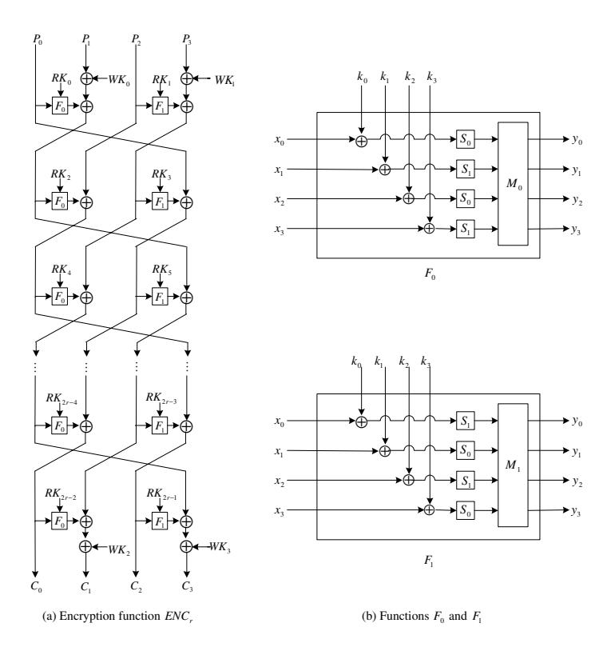
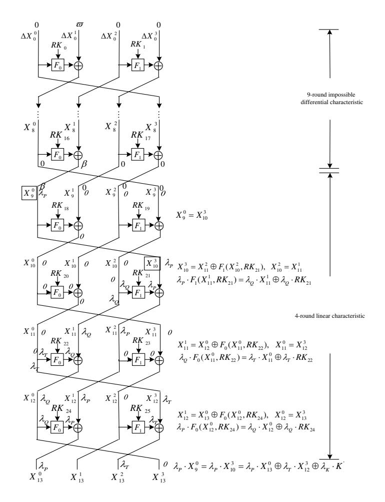
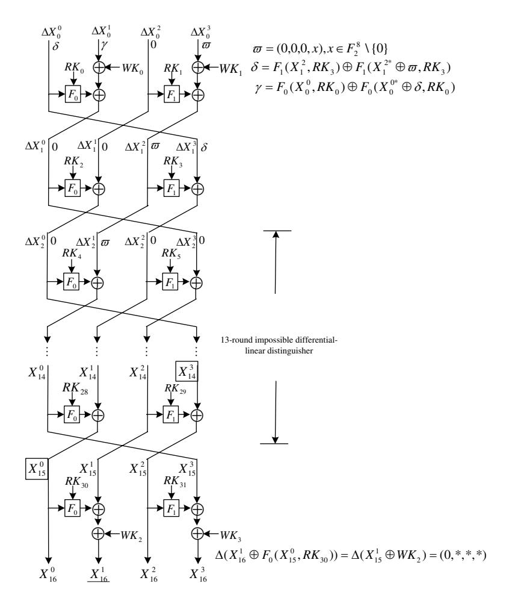
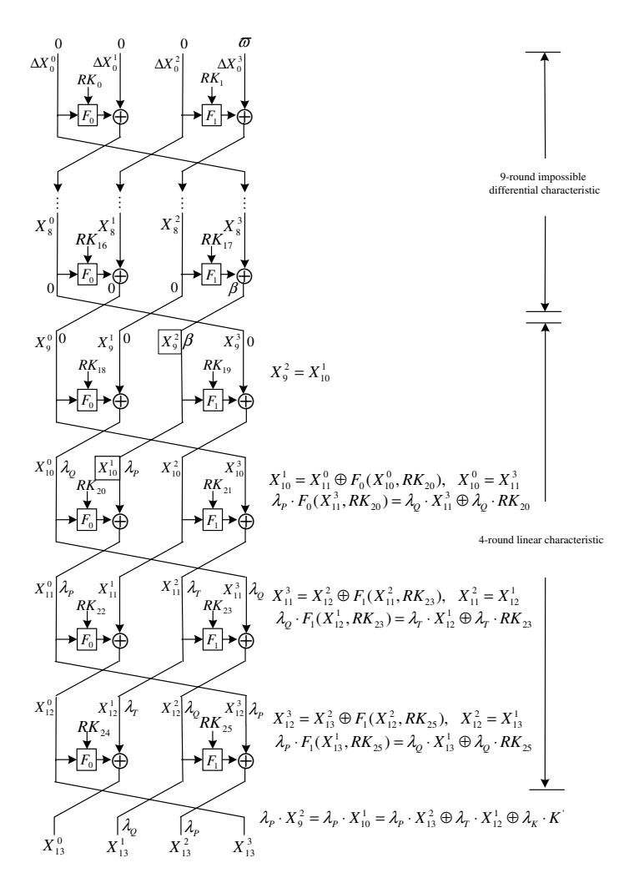
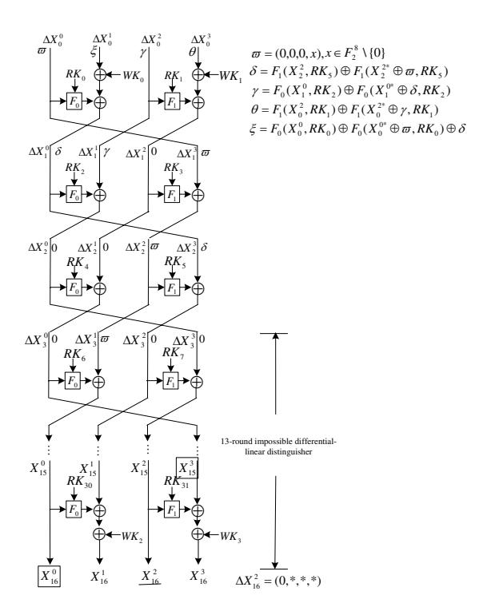
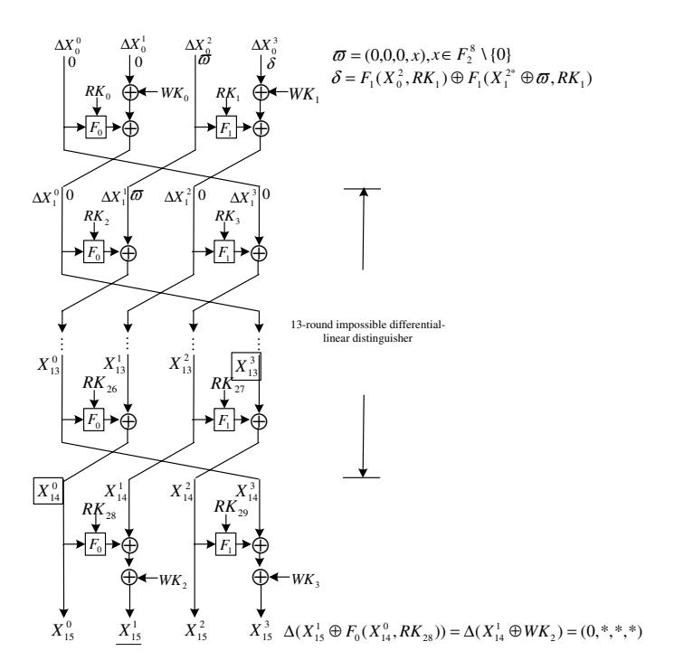
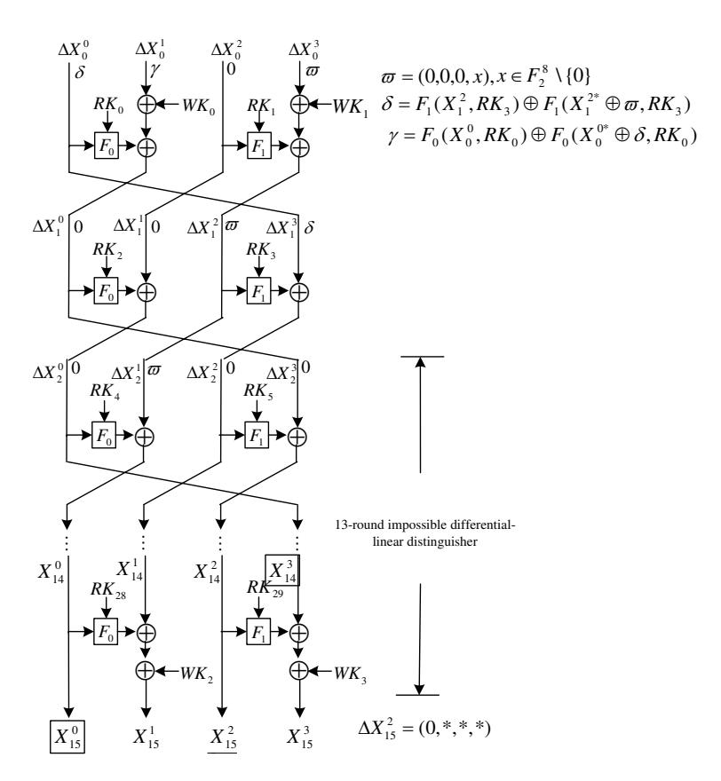

# Impossible Differential-Linear Cryptanalysis of Reduced-Round CLEFIA-128 \*

Zheng Yuan\*\*1,2,3, Xian Li<sup>4</sup>, Bart Preneel<sup>5</sup>

sharonlee0915@163.com

Dept. Electrical Engineering-ESAT/COSIC, KU Leuven, BELGIUM bart.preneel@esat.kuleuven.be

**Abstract.** CLEFIA is a 128-bit block cipher proposed by Sony Corporation in 2007. Our paper introduces a new chosen plaintext attack on iterated cryptosystems, the impossible differential-linear attack. The attack is efficient for 16-round CLEFIA with whitening keys. In the paper, we construct a 13-round extended impossible differential-linear distinguisher. Based on the distinguisher, we present an effective attack on CLEFIA-128 reduced from 18 to 16 rounds with data and time complexity  $2^{122.7}$ , recovering 96 bits of the subkeys. Our attack can be extended to CLEFIA-192 and CLEFIA-256.

 ${\bf Keywords:} {\bf CLEFIA, impossible \ differential-linear \ cryptanalysis, impossible \ differential \ cryptanalysis, linear \ approximation.}$

### 1 Introduction

CLEFIA [8] is a 128-bit block cipher supporting key lengths of 128, 192 and 256 bits; these three versions have 18, 22 and 26 rounds respectively. It achieves enough immunity against known attacks and is flexible enough for efficient implementation in both hardware and software. As a block cipher proposed by Sony Corporation in 2007, CLEFIA has received significant amount of cryptanalytic attention. However, except for the evaluation report [9] from the designers, there are only a few significant cryptanalytic results.

At present, the most powerful attack on CLEFIA is a series of impossible differential attacks on reduced rounds versions. The first one is proposed by its designers in the evaluation report of CLEFIA [9]. In FSE 2008, Tsunoo et al. introduced new 9-round impossible differentials for CLEFIA, and presented a

<sup>&</sup>lt;sup>1</sup> Beijing Electronic Science & Technology Institute, Beijing 100070, P.R. China zyuan@tsinghua.edu.cn,

<sup>&</sup>lt;sup>2</sup> Beijing University of Posts and Telecommunications, Beijing 100876, P.R. China
<sup>3</sup> University of Science and Technology of China, Hefei 230026, P.R. China
<sup>4</sup> State Key Laboratory of Cryptology

 $<sup>^{\</sup>star}$  This work is supported by the  $13^{th}$  Five-year Cryptography Development Foundation of China (No.MMJJ20180217).

 $<sup>^{\</sup>star\star}$  To whom correspondence should be addressed.

12-round attack on CLEFIA-128 with  $2^{118.9}$  chosen plaintexts and  $2^{119}$  encryptions [10]. Later, by the same impossible differential distinguisher, Zhang et al. presented an attack on 14-round CLEFIA, in which the design team pointed out a flaw and showed that it is not successful [11]. In IndoCrypt 2010, Tezcan proposed improbable differential cryptanalysis and applied it to 13/14/15-round CLEFIA-128/196/256 by taking advantage of relations among the round keys [5].

Our Contribution. In this paper, we will propose a new method, the impossible differential-linear attack, to analyze the CLEFIA block cipher. By constructing a 13-round distinguisher, using the new method, and combining it with key relations we found, we propose an attack on 16-round CLEFIA-128 with data and time complexity  $2^{122.7}$ . Furthermore, Appendix A presents another distinguisher construction and Appendix B shows another attack on a 16-round version. We present an attack on 15-round CLEFIA-128 in Appendix C. Our attacks are more efficient than earlier work. In Appendix D we also provide some key relations.

**Outline.** This paper is organized as follows. Section 2 provides a brief description of CLEFIA, and Sect. 3 introduces our new method of impossible differential-linear attack. In Sect. 4 we present details of the 13-round impossible differential-linear distinguisher. The 16-round impossible differential-linear attack on CLEFIA-128 is discussed in detail in Sect. 5. We summarize our results in Sect. 6.

### 2 Description of CLEFIA

### 2.1 Notation

```
\begin{array}{cccccccccccccccccccccccccccccccccccc
```

#### 2.2 CLEFIA

CLEFIA is a 128-bit block cipher with a generalized Feistel structure consisting of four 32-bit data lines. For the key lengths of 128, 192, and 256 bits, CLEFIA has 18, 22, and 26 rounds respectively. The encryption function uses four 32-bit whitening keys  $WK_0, WK_1, WK_2, WK_3 \in \{0,1\}^{32}$  and 2r 32-bit round keys, where r is the number of rounds.  $RK_i \in \{0,1\}^{32} (0 \le i < 2r)$  represents round key, and  $WK_0, WK_1, WK_2, WK_3 \in \{0,1\}^{32}$  are whitening keys. We denote d-branch r-round generalized Feistel network employed in CLEFIA as  $GFN_{d,r}$ .



Fig. 1. CLEFIA

The encryption process can be seen in Fig. 1(a). The details of  $GFN_{4,r}$  are as follows:

```
 \begin{array}{l} - \text{ Step 1. } T_0 \left| T_1 \right| T_2 \left| T_3 \leftarrow P_0 \left| \left( P_1 \oplus WK_0 \right) \right| P_2 \left| \left( P_3 \oplus WK_1 \right) \right. \\ - \text{ Step 2. For } i = 0 \text{ to } r - 1 \text{ do the following:} \\ T_1 \leftarrow T_1 \oplus F_0 (T_0, RK_{2i}), \quad T_3 \leftarrow T_3 \oplus F_1 (T_2, RK_{2i+1}) \\ T_0 \left| T_1 \right| T_2 \left| T_3 \leftarrow T_1 \right| T_2 \left| T_3 \right| T_0 \\ - \text{ Step 3. } C_0 \left| C_1 \right| C_2 \left| C_3 \leftarrow T_3 \right| \left( T_0 \oplus WK_2 \right) \left| T_1 \right| \left( T_2 \oplus WK_3 \right) \end{array}
```

Each round contains two parallel F functions,  $F_0$  and  $F_1$ , and their structures are shown in Fig. 1(b) where  $S_0$  and  $S_1$  are 8 × 8-bit S-boxes. The details of  $F_0$  are as follows:

```
 \begin{array}{l} - \text{ Step 1. } T_0 \left| T_1 \right| T_2 \left| T_3 \leftarrow RK \oplus x, \quad T_i \in \{0,1\}^8, \ x \in \{0,1\}^{32} \\ - \text{ Step 2. } T_0 \leftarrow S_0(T_0) \ , \ T_1 \leftarrow S_1(T_1) \ , \ T_2 \leftarrow S_0(T_2) \ , \ T_3 \leftarrow S_1(T_3) \\ - \text{ Step 3. } y = M_0 \cdot (T_0, T_1, T_2, T_3)^T, \ y \in \{0,1\}^{32} \end{array}
```

 $F_1$  is defined by replacing the terms in  $F_0$  as follows:  $S_0$  is replaced with  $S_1$ ,  $S_1$  with  $S_0$ , and  $M_0$  with  $M_1$ .

The two matrices  $M_0$  and  $M_1$  used in the F-functions are defined as follows.

$$M_0 = \begin{pmatrix} 0x01 \ 0x02 \ 0x04 \ 0x06 \ 0x04 \\ 0x02 \ 0x01 \ 0x06 \ 0x04 \\ 0x04 \ 0x06 \ 0x01 \ 0x02 \\ 0x06 \ 0x04 \ 0x02 \ 0x01 \end{pmatrix}, M_1 = \begin{pmatrix} 0x01 \ 0x08 \ 0x02 \ 0x0a \\ 0x08 \ 0x01 \ 0x0a \ 0x02 \\ 0x02 \ 0x0a \ 0x01 \ 0x08 \\ 0x0a \ 0x02 \ 0x08 \ 0x01 \end{pmatrix}.$$

### 2.3 Key Scheduling

For the 128-bit key, the Double Swap function  $\Sigma:\{0,1\}^{128}\to\{0,1\}^{128}$  is defined as follows:

$$X_{(128)} \mapsto X[7-63] |X[121-127] |X[0-6] |X[64-120],$$

where X[a-b] denotes a bit string cut from the a-th bit to the b-th bit of X.

Let  $K = K_0 | K_1 | K_2 | K_3$  be the key and L be an intermediate key, the key scheduling consists of the following 3 steps:

```
- Step 1. L \leftarrow GFN_{4,12}(CON_0, \cdots, CON_{23}, K_0, \cdots, K_3)

- Step 2.WK_0 \mid WK_1 \mid WK_2 \mid WK_3 \leftarrow K

- Step 3. For i=0 to 8 do the following:

T \leftarrow L \oplus (CON_{24+4i} \mid CON_{24+4i+1} \mid CON_{24+4i+2} \mid CON_{24+4i+3})

L \leftarrow \Sigma(L)

If i is odd: T \leftarrow T \oplus K

RK_{4i} \mid RK_{4i+1} \mid RK_{4i+2} \mid RK_{4i+3} \leftarrow T
```

We need 60 constant values  $CON_{(s)} (0 \le s \le 59)$  in the 128-bit key scheduling algorithm. Let  $R = 0xb7e1 (= (e-2) \cdot 2^{16})$  and  $Q = 0x243f (= (\pi-3) \cdot 2^{16})$ , where e is the base of the natural logarithm (2.71828...) and  $\pi$  is the circle ratio (3.14159...).  $CON_{(s)}$  are generated by the following way, in which  $IV^{128} = 0x428a (= (\sqrt[3]{2} - 1) \cdot 2^{16})$

```
\begin{array}{l} - \text{ Step 1. } T \leftarrow IV^{128} \\ - \text{ Step 2. For } j = 0 \text{ to 29 do the following:} \\ CON_{2j} \leftarrow (T \oplus R) | (\overline{T} <<<1) \\ CON_{2j+1} \leftarrow (\overline{T} \oplus Q) | (T <<<8) \\ T \leftarrow T \cdot 0x0002^{-1} (\text{mod } z^{16} + z^{15} + z^{13} + z^{11} + z^5 + z^4 + 1) \end{array}
```

The key relations we found are illustrated in Appendix D.

### 3 The Impossible Differential-Linear Attack

Inspired by the differential-linear attack, first introduced by Langford and Hellman in [4], we propose a new cryptanalytic method called impossible differential-linear attack, because it combines the impossible differential cryptanalysis and linear cryptanalysis together. The attack is not completely new, since the impossible differential attack and linear attack were typical and widely used in previous attacks on several cryptosystems. However, no previous work has been done on combining these two. In this section, we first describe the process of impossible differential-linear attack, then we compare this attack with impossible differential attack.

#### 3.1 Impossible Differential-Linear Distinguisher

Let a block cipher E is represented as  $E = E_1 \circ E_0$ , where  $E_0$  and  $E_1$  are two subciphers. We use an impossible differential  $\Omega_P \not\to \Omega_T$  with probability 1 for  $E_0$ , and a linear approximation  $\lambda_P \to \lambda_T$  with probability 1/2 + q for  $E_1$ , where  $\lambda_P \cdot \Omega_T$  is a fixed value (0 or 1). i.e., the probability of  $\Omega_T \to \lambda_P$  is 1, and the probability of  $\Omega_P \not\to \lambda_P$  with the specified difference path is also 1, so we call  $\Omega_P \not\to \lambda_P$  an impossible differential-linear distinguisher. In particular, we call  $E': \Omega_P \not\to \lambda_T$  an extended impossible differential-linear distinguisher.

For the extended impossible differential-linear distinguisher E', the impossible differential  $\Omega_P \not\to \Omega_T$  with probability 1, means that both  $\Omega_P \to \Omega_M$  and  $\Omega'_M \to \Omega_T$  with probability 1, and in the same state,  $\Omega_M \not\to \Omega'_M$ . Additionally,  $\Omega_T \to \lambda_P$  with probability 1 and  $\lambda_P \to \lambda_T$  with probability 1/2 + q, means that the probability of  $\Omega_T \to \lambda_T$  is 1/2 + q. So,  $\Omega'_M \to \lambda_T$  with probability 1/2 + q. We call  $\Omega_P \to \Omega_M$  'difference part', and call  $\Omega'_M \to \lambda_T$  'extended linear part'.

Different from other attack methods, such as a differential attack, linear attack, impossible differential attack and differential-linear attack, our impossible difference-linear distinguisher has an "order", which means that when using it, first use the 'extended linear part' to select some wrong objects, then filter the wrong object and obtain the correct object with the 'difference part'. For example, if we want recover the key with an (extended) impossible differential-linear distinguisher  $E': \Omega_P \not\to \lambda_T$ , we first need to guess the key set  $K_1 = \{k_1\}$  satisfying the 'extended linear part'  $\Omega'_M \to \lambda_T$ , then to guess another key set  $K_0 = \{k_0\}$  using the 'difference part'  $\Omega_P \to \Omega_M$ , and to the filter the wrong keys  $K' = \{k_0\} \cap \{k_1\}$ , finally, the correct keys  $K = K_0 - K'$  remain. For the following reasons, you cannot reverse the "order".

- In our impossible differential-linear distinguisher  $E': \Omega_P \not\to \lambda_P, \ \Omega_P \not\to \Omega_T$  with probability 1 and  $\lambda_P \cdot \Omega_T$  is a fixed value (0 or 1). In detail, both  $\Omega_P \to \Omega_M$  and  $\Omega_M' \to \Omega_T$  with probability 1, in the same state,  $\Omega_M \not\to \Omega_M'$ , a "contradiction" happens. So our impossible differential-linear distinguisher has the same "contradiction" as the impossible differential distinguisher. In the impossible differential-linear attacks, we also use these "contradictions" to delete the wrong keys.
- Let keys  $K_a = \{k_a\}$  satisfy the differential  $\Omega_P \to \Omega_M$ , let keys  $K_b = \{k_b\}$  satisfy the differential  $\Omega'_M \to \Omega_T$ , let keys  $K_c = \{k_c\}$  satisfy that  $\lambda_P \cdot \Omega_T$  is a fixed value (0 or 1), and let keys  $K_d = \{k_d\}$  satisfy the route  $\Omega'_M \to \lambda_P$ , then  $K_d \supset K_b$ , because  $K_d$  includes  $K_b$  and  $K_c$ .
- In the impossible differential-linear attack, if we first guess  $K_d$ , then guess  $K_a$  and filter wrong keys  $K'_{il} = K_d \cap K_a$ , the correct keys  $K_{il} = K_a K'_{il}$  remain. Reverse the "order", if we first guess  $K_a$ , then guess  $K_d$  and filter wrong keys  $K'_{il} = K_d \cap K_a$ , the correct keys  $K_{il}^{-1} = K_d K'_{il}$  remain.
- In fact,  $\Omega_P \not\to \Omega_T$  is an impossible differential distinguisher; this distinguisher allows to launch an impossible difference attack and recover the correct keys  $K_{id}$ . We typically guess  $K_b$  from  $\Omega'_M \to \Omega_T$ , guess  $K_a$  from  $\Omega_P \to \Omega_M$ , filter wrong keys  $K'_{id} = K_b \cap K_a$ , and obtain correct keys  $K_{id} = K_a K'_{id}$ . Reversing the "order", we can obtain the correct keys  $K_{id}^{-1} = K_b K'_{id}$ .

- Obviously,  $K'_{il} \supseteq K'_{id}$ , so  $K_{il} \subseteq K_{id}$  and  $K_{il}^{-1} \supseteq K_{id}^{-1}$ .  $K_{il} \subseteq K_{id}$  means that our impossible difference-linear distinguisher can get the same correct keys or the same number of correct keys as an impossible differential distinguisher.  $K_{il}^{-1} \supseteq K_{id}^{-1}$  means that our impossible difference-linear distinguisher cannot be used in a wrong order.

### 3.2 The Impossible Differential-Linear Attack

By our extended impossible differential-linear distinguisher,  $\Omega_P \not\to \lambda_T$ , we give an impossible differential-linear attack. Our impossible differential-linear attack procedure can be described as follows:

1. Encrypting stage: Let M be the set of chosen plaintext pairs whose difference  $P \oplus P^*$  is  $\Omega_P$ ; we encrypt distinct plaintexts in M. In  $E_0$ , we have  $E_0(P) \oplus E_0(P^*) \neq \Omega_T$  with probability 1. In  $E_1$ , we can get the equations

$$\lambda_P \cdot E_0(P) \oplus \lambda_T \cdot E_1(E_0(P)) \oplus \lambda_K \cdot K = 0 \tag{1}$$

and  $\lambda_P \cdot E_0(P^*) \oplus \lambda_T \cdot E_1(E_0(P^*)) \oplus \lambda_K \cdot K = 0$ . Both have probability 1/2 + q. Consequently, using the piling up lemma presented in [7], we can get

<span id="page-5-0"></span>
$$\lambda_P \cdot (E_0(P) \oplus E_0(P^*)) = \lambda_T \cdot E_1(E_0(P)) \oplus \lambda_T \cdot E_1(E_0(P^*)) \tag{2}$$

with probability  $1/2 + 2q^2$ .

2. Decrypting stage: In this stage we will guess part of the subkeys. Then we decrypt some rounds of the ciphertext pairs with the guessed subkeys. The decrypting process is also separated into two subciphers  $E_1^{-1}$  and  $E_0^{-1}$ , i.e.,  $D = E_0^{-1} \circ E_1^{-1}$ . In the first decrypting subcipher  $E_1^{-1}$ , take  $\lambda_P \cdot \Omega_T = \pi$  into Eqn. (2), it can be rewritten as  $\lambda_T \cdot E_1(E_0(P)) \oplus \lambda_T \cdot E_1(E_0(P^*)) = \lambda_P \cdot \Omega_T = \pi$ .

In fact, we only partially decrypt all ciphertext pairs  $(C, C^*)=(E_1(E_0(P)), E_1(E_0(P^*)))$  with each guessed subkeys in the first decrypting subcipher  $E_1^{-1}$ . The subkeys, with the maximal probability not suiting Eqn. (3)

<span id="page-5-1"></span>
$$\lambda_P \cdot E_1^{-1}(C) \oplus \lambda_P \cdot E_1^{-1}(C^*) = \pi,$$
 (3)

is regard as the correct subkeys.

Denote the set of pairs satisfying  $E_1^{-1}(C) \oplus E_1^{-1}(C^*) = \Omega_T$  as T, and denote the set of pairs satisfying  $\lambda_P \cdot E_1^{-1}(C) \oplus \lambda_P \cdot E_1^{-1}(C^*) = \pi$  as V. It is certain that  $T \subset V$ .

<span id="page-5-2"></span>Property 1. For  $T \subset V$ , if an impossible map  $M \not\to V$ , another impossible map  $M \not\to T$  also holds.

*Proof.* Assume that there is a map  $\bar{F}: M \to T$ . Randomly choose  $p \in M$ , and compute  $t = \bar{F}(p) \in T$ . Since  $T \subset V$ , we can get  $t \in V$ , which indicates that there is  $t = \bar{F}(p) \in V$ , i.e., the map  $\bar{F}': M \to V$  holds. It contradicts to the known condition.

3. Sieving stage: Guess part of the first rounds subkeys, and eliminate those wrong values by showing that the impossible property holds if these subkeys are used. That is, we eliminate those wrong values in terms of  $E_0(P) \oplus E_0(P^*) \neq E_1^{-1}(C) \oplus E_1^{-1}(C^*)$ , where  $\lambda_P \cdot E_1^{-1}(C) \oplus \lambda_P \cdot E_1^{-1}(C^*) = \pi$ . From Property1, after sieving stage, the right values must satisfy that  $E_0(P) \oplus E_0(P^*) \neq \Omega_T$ .

<span id="page-6-0"></span>Property 2. In Sieving stage, the success probability of sieving guessed values by  $E_0(P) \oplus E_0(P^*) \neq E_1^{-1}(C) \oplus E_1^{-1}(C^*)$ , where  $\lambda_P \cdot E_1^{-1}(C) \oplus \lambda_P \cdot E_1^{-1}(C^*) = \pi$ , is much higher than the filtering probability using  $E_0(P) \oplus E_0(P^*) \neq \Omega_T$ .

*Proof.* In Sieving stage, we eliminate those wrong guessed key values which satisfy Eqn. (3). When the number of eliminated values is less than the total number, the more eliminated values, the higher successful sieving probability. After the first decrypting subcipher  $E_1^{-1}$ , The number of the key values satisfying Eqn. (3) is more than the number of the wrong key values with  $E_1^{-1}(C) \oplus E_1^{-1}(C^*) = \Omega_T$ . So *Property* 2 is established.

 $\Diamond$

We named all the above as an impossible differential-linear distinguisher. The probability of our distinguisher is dominated by the above steps 1-2, which can be estimated separately as follows. The success rates are  $1/2+2q^2$  and 1 in Encrypting stage and Decrypting stage, respectively. Because our elimination principle is sieving the values using the condition  $E_0(P) \oplus E_0(P^*) \neq E_1^{-1}(E_1(E_0(P))) \oplus E_1^{-1}(E_1(E_0(P^*)))$ , where  $\lambda_P \cdot E_1^{-1}(E_1(E_0(P))) \oplus \lambda_P \cdot E_1^{-1}(E_1(E_0(P^*))) = \pi$ , the total probability of our distinguisher is  $1 - (1/2 + 2q^2)$ , i.e.,  $1/2 - 2q^2$ . The key recovery attack requires about  $8 \times O(q^{-4})$  chosen plaintext pairs.

### 3.3 The Impossible Differential-Linear Attack

# 4 The 13-Round Impossible Differential-Linear Distinguisher

In this section, we first present a 13-round impossible differential-linear distinguisher, which consists of a 9-round impossible differential characteristic followed by a 4-round linear approximation.

### 4.1 9-Round Impossible Differential Characteristic

Paper [10] presented several 9-round impossible differential characteristics. We choose the following one that is the most efficient and suitable to our attack:

$$(0, \varpi, 0, 0) \not\to (0, \beta, 0, 0), \text{ where } \varpi = (0, 0, 0, x), \beta = (y, 0, 0, 0)$$

 $\Diamond$



Fig. 2. 13-round extended impossible differential-linear distinguisher

After the encryption of 9 rounds, the input difference of the  $10^{th}$  round cannot have the following form:

<span id="page-7-0"></span>
$$\Delta X_9 = (\Delta X_9^0, \Delta X_9^1, \Delta X_9^2, \Delta X_9^3) = (\beta, 0, 0, 0) \tag{4}$$

with probability 1 as illustrated in Fig.2.

### 4.2 4-Round Linear Characteristic

Here we will describe the construction of a 4-round linear characteristic illustrated in Fig.2, which is from round 10 to round 13. Details of the 4-round linear characteristic are described as follows.

In the  $10^{th}$  round, we get  $X_9^0=X_{10}^3$  .

In the  $11^{th}$  round, based on the definition of the round function  $F_1$ , we can get the following two equations:

$$X_{10}^3 \oplus F_1(X_{10}^2, RK_{21}) = X_{11}^2, X_{10}^2 = X_{11}^1$$

Using linear approximations for the non-linear S-boxes in  $F_1$ , we can get the following equation.

$$\lambda_P \cdot F_1(X_{11}^1, RK_{21}) = \lambda_Q \cdot X_{11}^1 \oplus \lambda_Q \cdot RK_{21}$$

As a result, the linear characteristic of the  $11^{th}$  round can be expressed by the following equation:

<span id="page-8-0"></span>
$$\lambda_P \cdot X_{10}^3 = \lambda_P \cdot X_{11}^2 \oplus \lambda_Q \cdot X_{11}^1 \oplus \lambda_Q \cdot RK_{21}, p_1 = 1/2 + q_1 \tag{5}$$

Similarly, the linear characteristic of the  $12^{th}$  round can be expressed as

<span id="page-8-1"></span>
$$\lambda_Q \cdot X_{11}^1 = \lambda_Q \cdot X_{12}^0 \oplus \lambda_T \cdot X_{12}^3 \oplus \lambda_T \cdot RK_{22}, p_2 = 1/2 + q_2 \tag{6}$$

In the  $13^{th}$  round, we can first get the following equation

<span id="page-8-3"></span>
$$X_{12}^1 \oplus F_0(X_{12}^0, RK_{24}) = X_{13}^0, X_{12}^0 = X_{13}^3$$

Next, we can choose an appropriate pair of values  $(\lambda_P, \lambda_Q)$  by taking the linear characteristics expressed in Eqn .(5) and Eqn. (6) into account and get the linear characteristic of the  $13^{th}$  round as follows:

<span id="page-8-2"></span>
$$\lambda_P \cdot X_{12}^1 = \lambda_P \cdot X_{13}^0 \oplus \lambda_Q \cdot X_{13}^3 \oplus \lambda_Q \cdot RK_{24}, p_3 = 1/2 + q_3 \tag{7}$$

Finally, by concentrating the above linear characteristics of rounds 10-13 together, we can have the following property:

Property 3. If Eqn .(5)-(7) hold, we can get the following 4-round linear characteristic of CLEFIA from round 10 to round 13:

<span id="page-8-4"></span>
$$\lambda_{P} \cdot X_{9}^{0} = \lambda_{P} \cdot X_{10}^{3} = \lambda_{P} \cdot X_{13}^{0} \oplus \lambda_{T} \cdot X_{12}^{3} \oplus \lambda_{K} \cdot K', p = 1/2 + 2^{2}q_{1}q_{2}q_{3}$$
 (8)

*Proof.* If Eqn. (5)-(7) are true, this property is obvious from the CLEFIA structure.

 $\Diamond$

Note 1. Similarly, if we arbitrarily choose a 4-round CLEFIA from round  $i(i \ge 0)$  to round i + 3, we can rewrite Eqn. (5)-(7) as following Eqn. (5')-(7'):

$$\lambda_P \cdot X_{i+1}^3 = \lambda_P \cdot X_{i+2}^2 \oplus \lambda_Q \cdot X_{i+2}^1 \oplus \lambda_Q \cdot RK_{2(i+1)+1}, p_1' = 1/2 + q_1' \qquad (5')$$

$$\lambda_Q \cdot X_{i+2}^1 = \lambda_Q \cdot X_{i+3}^0 \oplus \lambda_T \cdot X_{i+3}^3 \oplus \lambda_T \cdot RK_{2(i+2)}, p_2' = 1/2 + q_2'$$
 (6')

$$\lambda_P \cdot X_{i+3}^1 = \lambda_P \cdot X_{i+4}^0 \oplus \lambda_Q \cdot X_{i+4}^3 \oplus \lambda_Q \cdot RK_{2(i+3)}, p_3' = 1/2 + q_3'$$
 (7')

and we can obtain the following 4-round linear characteristic

$$\lambda_{P} \cdot X_{i}^{0} = \lambda_{P} \cdot X_{i+1}^{3} = \lambda_{P} \cdot X_{i+4}^{0} \oplus \lambda_{T} \cdot X_{i+3}^{3} \oplus \lambda_{K} \cdot K^{'}, p' = 1/2 + 2^{2}q_{1}'q_{2}'q_{3}'$$

**4-Round Linear Approximations.** Furthermore, we can derive the 4-round linear input mask from the above 4-round linear characteristic.

Let  $(v, u)_{RK_k}$  be an approximation of a 32-bit invertible function  $F_s(X_j^i, RK_k)$ ,  $(0 \le s \le 1, 0 \le k \le 35)$ . Eqn. (5) suggests that the linear approximation of function  $F_1(X_{10}^2, RK_{21})$  is

<span id="page-9-0"></span>
$$(v,u)_{RK_{21}} = (\lambda_Q, \lambda_P) \tag{9}$$

Eqn. (6) indicates that the linear approximation of function  $F_0(X_{11}^0, RK_{22})$  is

<span id="page-9-1"></span>
$$(v,u)_{RK_{22}} = (\lambda_T, \lambda_Q) \tag{10}$$

and Eqn. (7) indicates

<span id="page-9-2"></span>
$$(v,u)_{RK_{24}} = (\lambda_Q, \lambda_P). \tag{11}$$

Denoting the input mask of the  $j^{th}$  32-bit input data in the  $i^{th}$  round as  $IM_{X_{i-1}^j}(1\leq i\leq 16,0\leq j\leq 3)$ , which is also the output mask of the  $((j+1)mod4)^{th}$  output data in the  $(i-1)^{th}$  round, we can get  $IM_{X_{10}^3}=IM_{X_{11}^2}=\lambda_P$  from Eqn. (9),  $IM_{X_{11}^1}=IM_{X_{12}^0}=\lambda_Q$  and  $IM_{X_{12}^3}=\lambda_T$  from Eqn. (10), and  $IM_{X_{10}^1}=IM_{X_{10}^0}=\lambda_P$  from Eqn. (11). In addition, we can also derive  $IM_{X_{10}^2}=0$ ,  $IM_{X_{10}^1}=0$ , and  $IM_{X_{10}^1}=0$ , and so on.

As a result, we can derive some 128-bit input masks as follows:

Property 4. If Property 3 holds, the 128-bit input masks of 4-round CLEFIA are:

In the 10<sup>th</sup> round:  $IM_{X_9} = (IM_{X_0^0}, IM_{X_0^1}, IM_{X_0^2}, IM_{X_0^3}) = (\lambda_P, 0, 0, 0)$ .

In the 11<sup>th</sup> round:  $IM_{X_{10}} = (IM_{X_{10}}^{\circ}, IM_{X_{10}}^{\circ}, IM_{X_{10}}^{\circ}, IM_{X_{10}}^{\circ}) = (0, 0, 0, \lambda_P).$

In the  $12^{th}$  round:  $IM_{X_{11}} = (IM_{X_{11}^0}, IM_{X_{11}^1}, IM_{X_{11}^2}, IM_{X_{11}^3}) = (\theta, \lambda_Q, \lambda_P, \theta).$

In the 13<sup>th</sup> round:  $IM_{X_{12}} = (IM_{X_{12}^0}, IM_{X_{12}^1}, IM_{X_{12}^2}, IM_{X_{12}^3}) = (\lambda_Q, \lambda_P, \theta, \lambda_T).$

In the 14<sup>th</sup> round,  $IM_{X_{13}} = (IM_{X_{13}^0}, IM_{X_{13}^1}, IM_{X_{13}^2}, IM_{X_{13}^3}) = (\lambda_P, *, \lambda_T, \theta)$ , where "\*" denotes an unknow 32-bit input mask.

Note 2. If a 4-round CLEFIA, from round  $i(i \geq 0)$  to round i+3, satisfies Eqn. (5')-(7'), their 128-bit input masks are  $IM_{X_i} = (\lambda_P, \theta, \theta, \theta)$ ,  $IM_{X_{i+1}} = (\theta, \theta, \theta, \lambda_P)$ ,  $IM_{X_{i+2}} = (\theta, \lambda_Q, \lambda_P, \theta)$ , and  $IM_{X_{i+3}} = (\lambda_Q, \lambda_P, \theta, \lambda_T)$ , respectively. Additionally,  $IM_{X_{i+4}} = (\lambda_P, *, \lambda_T, \theta)$ .

## 4.3 The 13-Round Extended Impossible Differential-Linear Distinguisher

Here, we first propose a new property, impossible differential-linear property, which is a concatenation of impossible differential characteristic and linear characteristic. To concatenate the above two parts together, the core technology resides in how to link the output differential  $\Delta X_9 = (\beta, 0, 0, 0)$  and the input masks  $IM_{X_9} = (\lambda_P, 0, 0, 0)$  of the  $10^{th}$  round together?

From section 4.1, we have  $\beta = (y, 0, 0, 0), y \in F_2^8 \setminus \{0\}$ . If choosing  $\lambda_P = (0, \lambda_1, \lambda_1, \lambda_1), \lambda_1 \in \{01, 02, ...ff\}$ , by Eqn. (4), we can get the following equation with probability 1:

<span id="page-9-3"></span>
$$\lambda_P \cdot \Delta X_9^0 = \lambda_P \cdot (X_9^0 \oplus X_9^{0*}) = 0.$$
 (12)

As a result, we always have  $IM_{X_9} \cdot \Delta X_9 = (0,0,0,0)$  in the  $10^{th}$  round, which links the output differential  $\Delta X_9$  and the input masks  $IM_{X_9}$  together.

Property 5. For a pair of plaintexts  $(P, P^*)$  whose difference is  $(0, \varpi, 0, 0)$  with  $\varpi = (0, 0, 0, x)$ , if we choose  $\lambda_P = (0, \lambda_1, \lambda_1, \lambda_1), \lambda_1 \in \{01, 02, ...ff\}$ , the 4-round linear characteristic can be concatenated to the 9-round impossible differential characteristic based on Eqn. (8) and Eqn. (12) to form the following 13-round impossible differential-linear distinguisher.

$$\lambda_P \cdot (X_{13}^0 \oplus X_{13}^{0*}) \oplus \lambda_T \cdot (X_{12}^3 \oplus X_{12}^{3*}) = 0 \tag{13}$$

Details of another 13-round impossible differential distinguisher are discussed in Appendix A.

#### 4.4 Selection of $\lambda$

In this subsection, we show how to select the values for  $\lambda_P, \lambda_Q$  and  $\lambda_T$  to make the bias of the 4-round linear characteristic as high as possible.

At first, we analyze the linear approximation of  $F_1$  in the  $11^{th}$  round as follows.

$$\lambda_P \cdot F_1(X_{11}^1, RK_{21}) = \lambda_Q \cdot X_{11}^1 \oplus \lambda_Q \cdot RK_{21}$$

The four bytes output of the S-boxes are denoted as (u, v, z, w). Then the round function can be expressed as:

$$F_1(X_{11}^1, RK_{21}) = M_1(S(X_{11}^1 \oplus RK_{21})) = M_1(u, v, z, w)$$

According to the definition in section 2, we can get the following equation:

$$M_1(u, v, z, w)^T = \begin{pmatrix} u \oplus (08 \times v) \oplus (02 \times z) \oplus (0a \times w) \\ (08 \times u) \oplus v \oplus (0a \times z) \oplus (02 \times w) \\ (02 \times u) \oplus (0a \times v) \oplus z \oplus (08 \times w) \\ (0a \times u) \oplus (02 \times v) \oplus (08 \times z) \oplus w \end{pmatrix}$$

Next, based on the discussion in section 4.3 about how to choose value for  $\lambda_P$ , the left part of the linear approximation can be computed as follows:

$$\lambda_P \cdot F_1(X_{11}^1, RK_{21}) = \{00 \ \lambda_1 \ \lambda_1 \ \lambda_1\} \cdot M_1(u, v, z, w)^T$$
$$= \lambda_1 \cdot (v \oplus (08 \times v) \oplus z \oplus (02 \times z) \oplus w \oplus (0a \times w))$$

Note that the primitive polynomial used in the multiplication is  $z^8 + z^4 + z^3 + z^2 + 1$ , which can be denoted as a binary string 100011101. Hence, we can compute the parity of  $\lambda_1 \cdot (02 \times z)$  as follows:

$$\lambda_1 \cdot (02 \times z) = \begin{cases} \lambda_1 \cdot (z << 1), & z_7 = 0\\ \lambda_1 \cdot (z << 1 \oplus 00011101), & z_7 = 1 \end{cases}$$

where  $z_7$  denotes the left-most bit of z. By choosing an appropriate value of  $\lambda_1$  such that  $\lambda_1 \cdot 00011101 = 0$ , the above two cases can both be transformed into the following equation:

$$\lambda_1 \cdot (02 \times z) = \lambda_1 \cdot (z << 1) = (\lambda_1 >> 1) \cdot z$$

no matter what the left-most bit of z is.

Similarly, when  $\lambda_1$  also satisfies  $(\lambda_1 >> 1) \cdot 00011101 = 0$ , the parity of  $\lambda_1 \cdot (08 \cdot v)$  and  $\lambda_1 \cdot (0a \cdot w)$  can be computed respectively as follows:

$$\lambda_1 \cdot (08 \times v) = \lambda_1 \cdot (v \ll 3) = (\lambda_1 \gg 3) \cdot v$$

$$\lambda_1 \cdot (0a \times w) = \lambda_1 \cdot ((02 \times w) \oplus (08 \times w)) = ((\lambda_1 >> 1) \oplus (\lambda_1 >> 3)) \cdot w$$

Therefore, the left part of the linear approximation can be transformed into the following equation:

$$\lambda_P \cdot F_1(X_{11}^1, RK_{21})$$

$$= (\lambda_1 \oplus (\lambda_1 >> 3)) \cdot v \oplus (\lambda_1 \oplus (\lambda_1 >> 1)) \cdot z \oplus (\lambda_1 \oplus (\lambda_1 >> 1) \oplus (\lambda_1 >> 3)) \cdot w$$

=
$$\{00, \lambda_1 \oplus (\lambda_1 >> 3), \lambda_1 \oplus (\lambda_1 >> 1), \lambda_1 \oplus (\lambda_1 >> 1) \oplus (\lambda_1 >> 3)\} \cdot (u, v, z, w)$$

By utilizing the linear distribution table of each S-box, we use the following linear approximation for each S-box ( $\varepsilon$  denotes the bias of the linear approximation).

$$(\lambda_1 \oplus (\lambda_1 >> 3)) \cdot v = \lambda_2 \cdot (X_{11}^1 \oplus RK_{21})_1, \quad p_4 = 1/2 + \varepsilon_1$$

 $(\lambda_1 \oplus (\lambda_1 >> 1)) \cdot z = \lambda_2 \cdot (X_{11}^1 \oplus RK_{21})_2, \quad p_5 = 1/2 + \varepsilon_2$

$$(\lambda_1 \oplus (\lambda_1 >> 1) \oplus (\lambda_1 >> 3)) \cdot w = \lambda_2 \cdot (X_{11}^1 \oplus RK_{21})_3, \quad p_6 = 1/2 + \varepsilon_3$$

where  $(X_{11}^1 \oplus RK_{21})_j$  stands for the  $j^{th}$  byte of  $(X_{11}^1 \oplus RK_{21})(0 \le j \le 3)$ , and (u, v, z, w) denotes the corresponding output of each S-box respectively.

As a result, we get the following linear approximation for the function  $F_1$  in the  $11^{th}$  round.

$$\lambda_P \cdot F_1(X_{11}^1 \oplus RK_{21}) = \{00, \lambda_2, \lambda_2, \lambda_2\} \cdot (X_{11}^1 \oplus RK_{21}), \quad p = 1/2 + 2^2 \varepsilon_1 \varepsilon_2 \varepsilon_3$$

Note that we choose  $\lambda_Q$  as the form of  $\lambda_Q = \{00, \lambda_2, \lambda_2, \lambda_2\}$ , such that we can make use of the property of the linear transformation as described in section 4.1.

Similar analysis can be applied to the linear approximation used in the  $12^{th}$  and  $13^{th}$  round. By running through all the possible values of  $\lambda_P$ ,  $\lambda_Q$  and  $\lambda_T$  that satisfies the above conditions, we can choose the following three linear approximations which achieve the highest biases.

$$\{00, f6, f6, f6\} \cdot F_1(X_{11}^1 \oplus RK_{21}) = \{00, eb, eb, eb\} \cdot (X_{11}^1 \oplus RK_{21})$$

whose probability is  $p \approx 1/2 - 2^{-11.61}$ .

$$\{00, eb, eb, eb\} \cdot F_0(X_{12}^3 \oplus RK_{22}) = \{00, 49, 49, 49\} \cdot (X_{12}^3 \oplus RK_{22})$$

whose probability is  $p \approx 1/2 - 2^{-10.83}$ .

$$\{00, f6, f6, f6\} \cdot F_0(X_{13}^3 \oplus RK_{24}) = \{00, eb, eb, eb\} \cdot (X_{13}^3 \oplus RK_{24})$$

whose probability is  $p \approx 1/2 - 2^{-10.19}$ .

Plugging the corresponding values of  $\lambda_P, \lambda_Q$  and  $\lambda_T$  into Eqn. (5)-(8), we can get the following 3-round linear characteristic of CLEFIA.

$$\{00, f6, f6, f6\} \cdot X_{10}^{3} = \{00, f6, f6, f6\} \cdot X_{13}^{0} \oplus \{00, 49, 49, 49\} \cdot X_{12}^{3} \oplus \lambda_{K} \cdot K'$$
 (14)

whose probability is  $p \approx 1/2 - 2^{-30.63}$ .

Finally, the decrypting stage of the 13-round impossible differential-linear distinguisher can be expressed as:

$$\{00, f6, f6, f6\} \cdot (X_{13}^{0} \oplus X_{13}^{0*}) \oplus \{00, 49, 49, 49\} \cdot (X_{12}^{3} \oplus X_{12}^{3*}) = 0$$
 (15)

The total probability of the 13-round impossible differential-linear distinguisher can be computed as described in section 3, which is about  $1/2 - 2^{-60.26}$ .

## 5 The Impossible Differential-Linear Attack on 16-Round CLEFIA-128

In this section, we explain our impossible differential-linear attack on 16-round CLEFIA-128 with whitening keys. In this attack, we set the above 13-round impossible differential-linear distinguisher as rounds 3-15, and extend two rounds backward and one round forward as shown in Fig.3.

The expression of the decrypting stage of the 13-round impossible differential-linear distinguisher should be transformed to the following form:

<span id="page-12-0"></span>
$$\{00, f6, f6, f6\} \cdot (X_{15}^0 \oplus X_{15}^{0*}) \oplus \{00, 49, 49, 49\} \cdot (X_{14}^3 \oplus X_{14}^{3*}) = 0, \tag{16}$$

and the total probability of the 13-round extended impossible differential-linear distinguisher is around  $1/2 - 2^{-60.26}$ , theoretically. Based on the analysis in section 3, we can know that approximately  $12 \times (2^{-61.26})^{-2} \approx 2^{126.1}$  correct pairs are needed to mount the key recovery attack.

In the following, we first introduce how to obtain the plaintext pairs, then describe the attack procedure in detail as illustrated in Fig.3. In the end, we estimate the data complexity and time complexity of our attack.

### 5.1 Chosen Plaintext

We choose a structure composed of  $2^{72}$  plaintexts that is defined as follows:

$$S_P = (X_0^0, X_0^1, X_0^2, X_0^3)_j, 1 \le j \le 2^{72},$$

If we choose plaintext pairs  $(P,P^*)$  where  $P=(X_0^0,X_0^1,X_0^2,X_0^3)$  and  $P^*=(X_0^{0*},X_0^{1*},X_0^{2*},X_0^{3*})=(X_0^0\oplus\delta,X_0^1\oplus\gamma,X_0^2,X_0^3\oplus\varpi)$ , whose difference takes the form  $\Delta P=(\delta,\gamma,0,\varpi)$  with  $\varpi=(0,0,0,x),\ \delta=(aw,2w,8w,w),\ w=M_0(S(x'))\oplus M_0(S(x'\oplus x))\ (x'\in F_2^8)$ , and  $\gamma=(v_0,v_1,v_2,v_3)$ . We can get  $\Delta X_2=(0,\varpi,0,0)$ . For the computations of  $\delta$  and  $\gamma$ , please refer to Fig.3. Thus, we have 255 possible values of both  $\varpi$  and  $\delta,2^{32}-1$  possible values of  $\gamma$ , and one structure can produce about  $2^{119}$  distinct plaintext pairs.



Fig. 3. 16-round impossible differential-linear attack

## 5.2 The Impossible Differential-Linear Attack on 16-Round CLEFIA-128 with Whitening Keys

In the following, we will discuss our impossible differential-linear attack on 16-round CLEFIA-128 with whitening keys in detail. In Fig.3, plaintext  $P=X_0$ , ciphertext  $C=X_{16}$ .

Step 1. Take  $2^{50.73}$  structures defined above, i.e.  $2^{72} \times 2^{50.73} = 2^{122.73}$  plaintexts, so  $2^{119} \times 2^{50.73} = 2^{169.73}$  plaintext pairs. Encrypt  $2^{122.73}$  distinct plaintexts for 16 rounds. Insert all ciphertexts into a table  $T_0$  indexed by  $X_{15}^0$ ,  $(X_{15}^0 = X_{16}^0)$ .

Step 2. Let 32-bit subkey  $RK_{30}$  and 24-bit subkey  $(RK_{29} \oplus WK_2)$  be indexed by  $N_1, \ldots, N_{2^{56}}$  and reset  $N_i (1 \le i \le 2^{56})$ .

Create a table  $T_1$  of  $F_0(X_{15}^0,RK_{30})$ , indexed by all  $2^{32}$  values of  $RK_{30}$  and  $2^{32}$  values of  $X_{15}^0$ . For every guess of  $RK_{30}$  (32-bit), look up the value of  $F_0(X_{15}^0,RK_{30})$  in  $T_1$  for each  $X_{15}^0$ , and obtain the value of  $X_{15}^1 \oplus WK_2 = X_{16}^1 \oplus F_0(X_{15}^0,RK_{30})$  for each  $X_{16}^1$ . Select only the pairs whose difference are equal in the first byte of  $(X_{15}^1 \oplus WK_2)$ , the expected number of such pairs is  $2^{169.73} \times 2^{-8} = 2^{161.73}$ .

Then for every guess of the last three bytes of subkey  $RK_{29} \oplus WK_2$  (24-bit), we can partially compute the value of  $\lambda_Q \cdot X_{14}^3 = \lambda_Q \cdot (F_1(X_{15}^1 \oplus WK_2, RK_{29} \oplus WK_2) \oplus X_{16}^2)$  for each  $X_{16}^2$ , and the value of  $\lambda_P \cdot X_{15}^0 \oplus \lambda_Q \cdot X_{14}^3$ . If the pair satisfies Eqn. (16), increment the corresponding  $N_i$  by 1.

After running all  $2^{56}$  guesses, we output the minimum value of  $N_i$  as the 56-bit correct subkeys. Based on the analysis in section 3 and [1,7], we know that approximately  $8 \times (2^{60.26})^2 \approx 2^{123.52}$  plaintext pairs are needed for the 13-round impossible linear distinguisher, we expect to have  $2^{38.21}$  pairs left with this condition.

- Step 3. We eliminate those wrong 40-bit values for the first two rounds subkey  $(RK_0, RK_3^3)$  (The first three zero bytes of  $\varpi$  only lead to the last byte of  $RK_3$  that affects  $\Delta F_1$ , so 32-bit  $RK_0$  and 8-bit  $RK_3$ ) by showing that the impossible property holds if these subkeys are used. To do so, we use a precomputation stage. At this precomputation stage, we consider all pairs whose difference  $(\Delta X_2^0, \Delta X_2^1, \Delta X_2^2, \Delta X_2^3) = (0, \varpi, 0, 0)$  after the first two rounds encryption. To achieve this, we need to perform two step, the first step makes sure that  $\Delta X_1^0 = 0$ , and the second step enables  $\Delta X_2^2 = 0$ .
  - 1). If  $\Delta X_1^0 = 0$ , there are  $2^{32}$  possible values for  $X_1^0$ . We perform  $A_1 = F_0^{-1}(X_1^0 \oplus WK_0 \oplus X_0^1)$  and create a hash table  $H_1$  containing one of the outputs of  $A_1$  and the XOR of the two outputs  $(X_0^0 \oplus RK_0)$ . There are  $2^{32}$  possible values for  $(X_0^0 \oplus RK_0)$ , and on average one value of  $X_1^0$  corresponds to each value of  $(X_0^0 \oplus RK_0)$ . Now for each of the  $2^{38.21}$  remaining pairs we compute  $(X_0^0 \oplus RK_0)$ , and use the table  $H_1$  to fetch one possibility of  $X_1^0$  that corresponds to the computed  $(X_0^0 \oplus RK_0)$ . The process identifies roughly one wrong value for the subkey  $RK_0$  by XORing the plaintext and  $A_1$ . The probability of a wrong 32-bit value for  $RK_0$  is  $(1-2^{-32})$ . After analyzing all  $2^{38.21}$  pairs, we expect only  $2^{32} \times (1-2^{-32})^{2^{38.21} \times 1} \approx 2^{-75}$  wrong values of  $RK_0$  remaining.
  - 2). In round 2, if  $\Delta X_2^2 = 0$ , there are  $2^{32}$  possible values for  $X_2^2$ . We perform  $A_2 = F_1^{-1}(X_2^2 \oplus X_1^3) = F_1^{-1}(X_2^2 \oplus X_0^0)$  and create a hash table  $H_2$  containing one of the outputs of  $A_2$  and XOR of the two outputs  $(X_1^2 \oplus RK_3)$ . There are  $2^{32}$  possible values for  $(X_1^2 \oplus RK_3)$  and  $2^8$  possible values for  $RK_3^3$ . Now for each of the  $2^{38.21}$  remaining pairs we compute  $(X_1^2 \oplus RK_3)$ , and use the table  $H_2$  to fetch one possibility of  $X_2^2$  that corresponds to the computed  $(X_1^2 \oplus RK_3)$ . The process identifies roughly one wrong value for the subkey  $RK_3$  by XORing the plaintext and  $A_2$ . The probability of a wrong 8-bit value for  $RK_3^3$  is  $(1-2^{-32})$ . After analyzing all  $2^{38.21}$  pairs, we expect only  $2^8 \times (1-2^{-32})^{2^{38.21} \times 1} \approx 2^{-99}$  wrong values of  $RK_3^3$ .

Therefore, wrong values of the 40-bit of  $(RK_0, RK_3^3)$  can be established unless the initial guess of the 32-bit value of  $RK_{30}$  or 24-bit value of  $(RK_{29} \oplus WK_2)$  is correct. It is expected that we can eliminate the whole 40-bit value of  $RK_0$  and  $RK_3$  in this step, since the wrong values of  $(RK_0, RK_3^3, (RK_{29} \oplus WK_2), RK_{30})$  remains with a small probability of  $\max\{2^{56} \times 2^{-75} = 2^{-19}, 2^{56} \times 2^{-99} = 2^{-43}\}$ . Hence if there remains a value of  $(RK_0, RK_3^3)$ , we can assume that the guessed 56-bit values for  $(RK_{29} \oplus WK_2)$  and  $RK_{30}$  are correct. Our attack can recover 96-bit subkeys.

**Complexity Analysis.** According to the above analysis, a structure has  $2^{72}$  plaintexts, we need about  $2^{50.73}$  structures, so the data complexity of our attack is about  $2^{72} \times 2^{50.73} = 2^{122.73}$ .

Step 1 need  $2^{122.73}$  encrypting operations, Step 2 requires  $(2 \times 2^{32} \times 2^{32} \times 2^{32}) \approx 2^{97}$  F operations, which is equal to  $2^{96}$  one round operation. The required time for memory access in step 3 is less than  $(2^{32} \times 2^{32}) \times 2^{38.21} + (2^8 \times 2^{32}) \times 2^{38.21} \approx 2^{102.21}$  F operations, i.e.  $2^{101.21}$  operations one round. Therefore, the total time complexity of our attack can be estimate as about  $2^{122.73} + (2^{96} + 2^{101.21})/16 \approx 2^{122.73}$ .

 $2^{122.73}/2^3 = 2^{119.73}$  bytes of memory are needed to store the table  $T_0$ ,  $2^{96}/2^3 = 2^{93}$  bytes of memory are needed to store the list of deleted key values  $(RK_{30}, RK_{29}, RK_0, RK_3^3)$ ,  $2 \times 2^{31} = 2^{32}$  bytes of memory are needed to store the hash table  $(H_1, H_2)$ , and  $2^{64}/2^3 = 2^{61}$  bytes of memory are needed to store table  $T_1$ . Our attack can recover 96-bit subkeys  $(RK_0, RK_3^3, RK_{29} \oplus WK_2, RK_{30})$ .

Note 3. For another 13-round extended impossible differential-linear distinguisher and another 16-round attack to CLEFIA-128, please refer to Appendix A and Appendix B, respectively. For attacks to 15-round CLEFIA-128, please refer to Appendix C. Our attack is also effective to CLEFIA-192 and CLEFIA-256.

### 6 Conclusion

In this paper, we present a new attack, impossible differential-linear attack, and achieve a result of 16-round CLEFIA-128 with  $2^{122.73}$  CP, and time complexity is also  $2^{122.73}$ . The comparison of cryptanalytic results with CLEFIA is illustrated in Table 1, which shows that our attack is more efficient than the present results. The attack is also effective to 15-round CLEFIA-128, given in Appendix C.

### References

- <span id="page-15-0"></span>1. E. Biham, O. Dunkelman, N. Keller. Enhancing Differential-Linear Cryptanalysis, Advances in Cryptology, Proceedings of ASIACRYPT 2002, Lecture Notes in Computer Science 2501, pp. 254-266, Springer, (2002)
- 2. A. Bogdanov, V. Rijmen. Linear Hulls with Correlation Zero and Linear Cryptanalysis of Block Ciphers. In: http://eprint.iacr.org/2011/123.
- <span id="page-15-1"></span>3. S. Emami, S. Ling, I. Nikoli, J. Pieprzyk and H. Wang. Low Probability Differentials and the Cryptanalysis of Full-Round CLEFIA-128. In: *ASIACRYPT 2014*, PART I, LNCS 8873, pp. 141C157.(2014)

Reference Rounds Recover Key Data Complexity Time Complexity  $2^{100}$ 14 104-bit [6]  $2^{122}$ a weak-key pair [3] 16(hashing mode)  $2^{102}$  $2^{101.7}$ [8.9]10 32-bit  $2^{119}$  $2^{118.9}$ [10] 12 72-bit  $2^{118.9}$  $2^{82}$ 12 80-bit [11] $2^{122.73}$  $2^{122.73}$ this paper 16 96-bit  $2^{124.52}$  $2^{121}$ this paper 16 104-bit  $2^{124.52}$  $2^{93.1}$ this paper 15 64-bit  $2^{99.1}$  $2^{124.52}$ 15 64-bit this paper

Table 1. Comparison of Cryptanalysis Results of CLEFIA-128

- <span id="page-16-5"></span>4. S. K. Langford, M. E. Hellman. Differential-Linear Cryptanalysis, Advances in Cryptology. In: *Proceedings of CRYPTO94*. LNCS, vol. 839, pp. 17-25. Springer, Heidelberg (1994)
- <span id="page-16-4"></span>5. C. Langford. Improbable Differential Attack-Cryptanalysis of Reduced Round CLEFIA, Advances in Cryptology. In:*Proceedings of INDOCRYPT2010*. LNCS, vol. 6498, pp. 197-209. Springer, Heidelberg (2010)
- <span id="page-16-7"></span>6. L. Li, K. Jia, X. Wang, X. Dong. Meet-in-the-Middle Technique for Truncated Differential and Its Applications to CLEFIA and Camellia. In: Fast Software Encryption-FSE 2015, LNCS, vol. 9054, pp. 48-70.(2015)
- <span id="page-16-6"></span>7. M. Matsui. Linear Cryptanalysis Method for DES Cipher, Advances in Cryptology. In: *Proceedings of EUROCRYPT93*. LNCS, vol. 765, pp. 386-397. Spinger, Heidelberg (1994)
- <span id="page-16-0"></span>8. T. Shirai, K. Shibutani, T. Akishita, S. Moriai, T. Iwata. The 128-bit Blockcipher CLEFIA. In: *Proceedings of Fast Software Encryption 2007*, LNCS, vol. 4593, pp. 181-195.(2007)
- <span id="page-16-1"></span>9. Sony Corporation. The 128-bit blockcipher CLEFIA: Security and performance evaluations. Revision 1.0, On-Line document, 2007.June 1 (2007), http://www.sony.co.jp/Products/clefia/technical/data/clefia-eval-1.0.pdf
- <span id="page-16-2"></span>Y. Tsunoo, E. Tsujihara, M. Shigeri, T. Saito, T. Suzaki and H. Kubo. Impossible Differential Cryptanalysis of CLEFIA. In: Fast Software Encryption-FSE 2008, LNCS, vol. 5086, pp. 398-411. Springer, Verlag (2008).
- <span id="page-16-3"></span>11. W. Zhang , J. Han. Impossible Differential Analysis of Reduced Round CLEFIA. In: Beijing, China. Proc of Inscrypt'08 . pp. 181-191. (2008)

## Appendix A. Another 13-round extended impossible differential-linear distinguisher

Another 13-round extended impossible differential-linear distinguisher concatenates an impossible differential

$$(0,0,0,\varpi) \not\to (0,0,0,\beta)^{[3]}$$

with a 4-round linear characteristic. For details please refer to Fig.4.



 $\textbf{Fig. 4.} \ 13\text{-round extended impossible differential-linear distinguisher}$

## Appendix B. Another Attack on 16-round CLEFIA-128

Another 16-round attack on CLEFIA-128 is illustrated in Fig.5 with the 13 round impossible differential-linear distinguisher in section 4, and three rounds extension on plaintext side. Its main ideas is: Choose a structure composed of 2<sup>104</sup> plaintexts, whose corresponding plaintext pairs are of the form ∆P = (̟, ξ, γ, θ). Encrypt all 2<sup>183</sup> plaintext pairs, select only the pairs whose ciphertexts are equal in the first byte of X<sup>2</sup> <sup>16</sup>. According to section 5.2, we can recover 104-bit subkeys.

The data complexity is about

$$2^{104} \times \left[8 \times \left(2^{60.26}\right)^2 / \left(2^{183} \times 2^{-8} \times 2^{-32} \times 2^{-32} \times 2^{-8}\right)\right] \approx 2^{124.52}.$$

The time complexity is

$$[(2^{32}\times 2^{32})\big/2 + ((2^{32}\times 2^{32})\times 2^{72} + (2^{32}\times 2^{32})\times 2^{72} + (2^8\times 2^{32})\times 2^{72})\big/2]\big/16 \approx 2^{131}$$



Fig. 5. 16-round impossible differential-linear attack

### Appendix C. Attacks on 15-round CLEFIA-128

The attacks to 15-round CLEFIA-128 below are all with whitening keys. The details of the attack can be divided into two cases.

The first extension is one round on plaintext side, and one round on ciphertext side as illustrated in Fig.6. We can choose a structure composed of 2<sup>40</sup> plaintexts, whose plaintext differences is of the form ∆P = (0, 0, ̟, δ). Obviously, one structure can produce about 2<sup>55</sup> different plaintext pairs. Similar to the section 5.2, we can recover 64-bit subkey composed of RK<sup>0</sup> 1 (8bit), RK27(24bit), and RK28(32bit), with impossible differential-linear attack.

The data complexity is

$$2^{40} \times [8 \times (2^{60.26})^2 / (2^{55} \cdot 2^{-8} \cdot 2^{-8})] \approx 2^{124.52}$$

The time complexity is

$$[(2\times 2^{32}\times 2^{32}\times 2^{32})\big/2 + ((2^8\times 2^{32})\times 2^8)\big/2]\big/15\approx 2^{93.1}$$

The second extension is two rounds on plaintext side, illustrated in Fig. 7. We can choose a structure composed of 2<sup>72</sup> plaintexts, whose plaintext differences is of the form ∆P = (δ, γ, 0, ̟). Obviously, one structure can produce about 2<sup>119</sup> distinct plaintext pairs. Similar to section 5.2, we can recover 64-bit subkey, that is RK0(32bit), RK<sup>0</sup> 3 (8bit), and RK29(24bit), with impossible differential-linear attack.

The data complexity is

$$2^{72} \times [8 \times (2^{60.26})^2 / (2^{119} \cdot 2^{-8} \cdot 2^{-32} \cdot 2^{-8})] \approx 2^{124.52}$$

The time complexity is

$$[(2^{32}\times 2^{32})\big/2 + ((2^{32}\times 2^{32})\times 2^{40} + (2^8\times 2^{32})\times 2^{40})\big/2]\big/15 \approx 2^{99.1}$$



 ${\bf Fig.\,6.}\ 15\text{-round impossible differential-linear attack}$



Fig. 7. 15-round impossible differential-linear attack

### Appendix D. Round Key Relation

According to the description in section 2, we can get the relationship between generated round keys and related data as follows:

```
RK_0 | RK_1 | RK_2 | RK_3 \leftarrow L \oplus CON_{24} | CON_{25} | CON_{26} | CON_{27}
           RK_4 | RK_5 | RK_6 | RK_7 \leftarrow \Sigma(L) \oplus K \oplus CON_{28} | CON_{29} | CON_{30} | CON_{31}
          RK_{8} | RK_{9} | RK_{10} | RK_{11} \leftarrow \Sigma^{2}(L) \oplus CON_{32} | CON_{33} | CON_{34} | CON_{35}
          \begin{array}{l} RK_{12} \left| RK_{13} \right| RK_{14} \left| RK_{15} \leftarrow \Sigma^{3}(L) \oplus K \oplus CON_{36} \left| CON_{37} \right| CON_{38} \left| CON_{39} \right| \\ RK_{16} \left| RK_{17} \right| RK_{18} \left| RK_{19} \leftarrow \Sigma^{4}(L) \oplus CON_{40} \left| CON_{41} \right| CON_{42} \left| CON_{43} \right| \end{array}
           RK_{20} | RK_{21} | RK_{22} | RK_{23} \leftarrow \Sigma^{5}(L) \oplus K \oplus CON_{44} | CON_{45} | CON_{46} | CON_{47} | CON_{47} | CON_{48} | CON_{48} | CON_{48} | CON_{48} | CON_{48} | CON_{48} | CON_{48} | CON_{48} | CON_{48} | CON_{48} | CON_{48} | CON_{48} | CON_{48} | CON_{48} | CON_{48} | CON_{48} | CON_{48} | CON_{48} | CON_{48} | CON_{48} | CON_{48} | CON_{48} | CON_{48} | CON_{48} | CON_{48} | CON_{48} | CON_{48} | CON_{48} | CON_{48} | CON_{48} | CON_{48} | CON_{48} | CON_{48} | CON_{48} | CON_{48} | CON_{48} | CON_{48} | CON_{48} | CON_{48} | CON_{48} | CON_{48} | CON_{48} | CON_{48} | CON_{48} | CON_{48} | CON_{48} | CON_{48} | CON_{48} | CON_{48} | CON_{48} | CON_{48} | CON_{48} | CON_{48} | CON_{48} | CON_{48} | CON_{48} | CON_{48} | CON_{48} | CON_{48} | CON_{48} | CON_{48} | CON_{48} | CON_{48} | CON_{48} | CON_{48} | CON_{48} | CON_{48} | CON_{48} | CON_{48} | CON_{48} | CON_{48} | CON_{48} | CON_{48} | CON_{48} | CON_{48} | CON_{48} | CON_{48} | CON_{48} | CON_{48} | CON_{48} | CON_{48} | CON_{48} | CON_{48} | CON_{48} | CON_{48} | CON_{48} | CON_{48} | CON_{48} | CON_{48} | CON_{48} | CON_{48} | CON_{48} | CON_{48} | CON_{48} | CON_{48} | CON_{48} | CON_{48} | CON_{48} | CON_{48} | CON_{48} | CON_{48} | CON_{48} | CON_{48} | CON_{48} | CON_{48} | CON_{48} | CON_{48} | CON_{48} | CON_{48} | CON_{48} | CON_{48} | CON_{48} | CON_{48} | CON_{48} | CON_{48} | CON_{48} | CON_{48} | CON_{48} | CON_{48} | CON_{48} | CON_{48} | CON_{48} | CON_{48} | CON_{48} | CON_{48} | CON_{48} | CON_{48} | CON_{48} | CON_{48} | CON_{48} | CON_{48} | CON_{48} | CON_{48} | CON_{48} | CON_{48} | CON_{48} | CON_{48} | CON_{48} | CON_{48} | CON_{48} | CON_{48} | CON_{48} | CON_{48} | CON_{48} | CON_{48} | CON_{48} | CON_{48} | CON_{48} | CON_{48} | CON_{48} | CON_{48} | CON_{48} | CON_{48} | CON_{48} | CON_{48} | CON_{48} | CON_{48} | CON_{48} | CON_{48} | CON_{48} | CON_{48} | CON_{48} | CON_{48} | CON_{48} | CON_{48} | CON_{48} | CON_{48} | CON_{48} | CON_{48} | CON_{48} | CON_{48} | CON_{48} | CON_{48} | CON_{48} | CON_{48} | CON_{48}
           RK_{32} | RK_{33} | RK_{34} | RK_{35} \leftarrow \Sigma^{8}(L) \oplus CON_{56} | CON_{57} | CON_{58} | CON_{59}
          Based on the properties proved in [5], we get the following key relations:
           RK_{32} \oplus C_1 = RK_1[56 - 63] |RK_3[100 - 102] |RK_3[107 - 127]
          RK_{33} \oplus C_2 = RK_2[72 - 95] |RK_3[96 - 99] |RK_3[103 - 106]
          RK_{34} \oplus C_3 = RK_0[21 - 24] |RK_0[28 - 31] |RK_1[32 - 55]
           RK_{35} \oplus C_4 = RK_0[0-20] |RK_0[25-27] |RK_2[64-71]
where
          C_1 = CON_{56} \oplus (CON_{25}[56 - 63] | CON_{27}[100 - 102] | CON_{27}[107 - 127] )
          C_2 = CON_{57} \oplus (CON_{26}[72 - 95] | CON_{27}[96 - 99] | CON_{27}[103 - 106] )
          C_3 = CON_{58} \oplus (CON_{24}[21 - 24] | CON_{24}[28 - 31] | CON_{25}[32 - 55] )
          C_4 = CON_{59} \oplus (CON_{24}[0-20] | CON_{24}[25-27] | CON_{26}[64-71] )
          Thus we get the following properties from the above derivations:
```

Property 6. . If 32 bits  $RK_{33}$  are known, we can get 24 bits  $RK_2[72-95]$ , and 8 bits  $RK_3[96-99]\,|RK_3[103-106]$ .

Property 7. . If 32 bits  $RK_{34}$  are known, then we can get 8 bits  $RK_0[21-24]$   $|RK_0[28-31]$ , and 24 bits  $RK_1[32-55]$ .