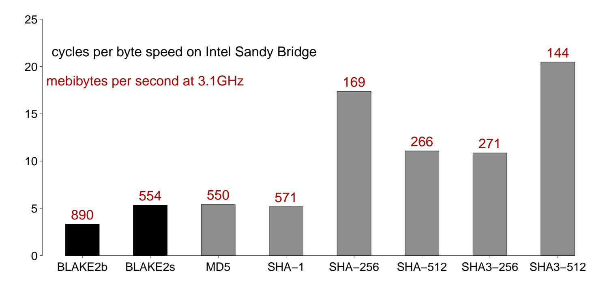
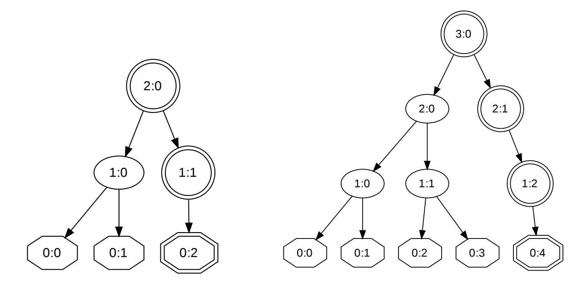
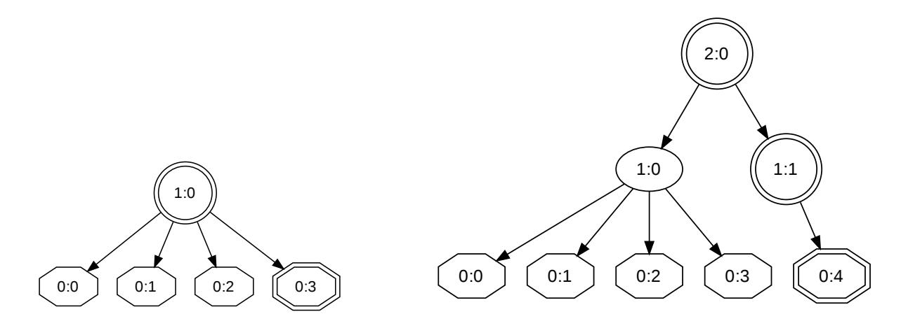
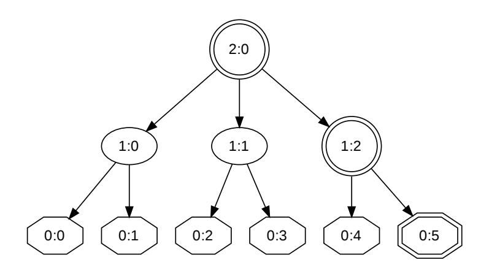

{0}------------------------------------------------

# BLAKE2: simpler, smaller, fast as MD5

Jean-Philippe Aumasson1 , Samuel Neves2 , Zooko Wilcox-O'Hearn3 , and Christian Winnerlein4

> 1 Kudelski Security, Switzerland jeanphilippe.aumasson@gmail.com 2 University of Coimbra, Portugal sneves@dei.uc.pt 3 Least Authority Enterprises, USA zooko@zooko.com 4 Ludwig Maximilian University of Munich, Germany codesinchaos@gmail.com

Abstract. We present the hash function BLAKE2, an improved version of the SHA-3 finalist BLAKE optimized for speed in software. Target applications include cloud storage, intrusion detection, or version control systems. BLAKE2 comes in two main flavors: BLAKE2b is optimized for 64-bit platforms, and BLAKE2s for smaller architectures. On 64 bit platforms, BLAKE2 is often faster than MD5, yet provides security similar to that of SHA-3: up to 256-bit collision resistance, immunity to length extension, indifferentiability from a random oracle, etc. We specify parallel versions BLAKE2bp and BLAKE2sp that are up to 4 and 8 times faster, by taking advantage of SIMD and/or multiple cores. BLAKE2 reduces the RAM requirements of BLAKE down to 168 bytes, making it smaller than any of the five SHA-3 finalists, and 32% smaller than BLAKE. Finally, BLAKE2 provides a comprehensive support for tree-hashing as well as keyed hashing (be it in sequential or tree mode).

# 1 Introduction

The SHA-3 Competition succeeded in selecting a hash function that complements SHA-2 and is much faster than SHA-2 in hardware [1]. There is nevertheless a demand for fast software hashing for applications such as integrity checking and deduplication in filesystems and cloud storage, host-based intrusion detection, version control systems, or secure boot schemes. These applications sometimes hash a few large messages, but more often a lot of short ones, and the performance of the hash directly affects the user experience.

Many systems use faster algorithms like MD5, SHA-1, or a custom function to meet their speed requirements, even though those functions may be insecure. MD5 is famously vulnerable to collision and length-extension attacks [2, 3], but it is 2.53 times as fast as SHA-256 on an Intel Ivy Bridge and 2.98 times as fast as SHA-256 on a Qualcomm Krait CPU.

Despite MD5's significant security flaws, it continues to be among the most widely-used algorithms for file identification and data integrity. To choose just a handful of examples, the OpenStack cloud storage system [4], the popular 

{1}------------------------------------------------

version control system Perforce, and the recent object storage system used internally in AOL [5] all rely on MD5 for data integrity. The venerable md5sum unix tool remains one of the most widely-used tools for data integrity checking. The Sun/Oracle ZFS filesystem includes the option of using SHA-256 for data integrity, but the default configuration is to instead use a non-cryptographic 256-bit checksum, for performance reasons. The Tahoe-LAFS distributed storage system uses SHA-256 for data integrity, but is investigating a faster hash function [6].

Some SHA-3 finalists outperform SHA-2 in software: for example, on Ivy Bridge BLAKE-512 is 1.41 times as fast as SHA-512, and BLAKE-256 is 1.70 times as fast as SHA-256. BLAKE-512 reaches 5.76 cycles per byte, or approximately 579 mebibytes per second, against 411 for SHA-512, on a CPU clocked at 3.5GHz. Some other SHA-3 submissions are competitive in speed with BLAKE and Skein, but these have been less analyzed and generally inspire less confidence (e.g., due to distinguishers on the compression function).

Fig. 1.1. Speed comparison of various popular hash functions, taken from eBACS's "hydra7" measurements. SHA-3 and BLAKE2 have no known security issues. SHA-1, MD5, SHA-256, and SHA-512 are susceptible to length-extension. SHA-1 and MD5 are vulnerable to collisions. MD5 is vulnerable to cheap chosen-prefix collisions.

BLAKE thus appears to be a good candidate for fast software hashing. Its security was evaluated by NIST in the SHA-3 process as having a "very large security margin", and the cryptanalysis published on BLAKE was noted as having "a great deal of depth" (see §4).

But as observed by Preneel [7], its design "reflects the state of the art in October 2008"; since then, and after extensive cryptanalysis, we have a better understanding of BLAKE's security and efficiency properties. We therefore introduce BLAKE2, an improved BLAKE with the following properties:

– Faster than MD5 on 64-bit Intel platforms

{2}------------------------------------------------

- 32% less RAM required than BLAKE
- Direct support, with no overhead, of
  - Parallelism for many-times faster hashing on multicore or SIMD CPUs
  - Tree hashing for incremental update or verification of large files
  - Prefix-MAC for authentication that is simpler and faster than HMAC
  - Personalization for defining a unique hash function for each application
- Minimal padding, faster and simpler to implement

Fig. 1.1 presents results on the Sandy Bridge, and compares them against other common hash functions, and the SHA-3 winner Keccak.

The rest of this paper is structured as follows: §2 describes how BLAKE2 differs from BLAKE, §3 discusses its efficiency on various platforms and reports preliminary benchmarks, and §4 discusses its security.

# 2 Description of BLAKE2

The BLAKE2 family consists of two main algorithms:

- BLAKE2b is optimized for 64-bit platforms including NEON-enabled ARMs — and produces digests of any size between 1 and 64 bytes.
- BLAKE2s is optimized for 8- to 32-bit platforms, and produces digests of any size between 1 and 32 bytes.

Both are designed to offer security similar to that of an ideal function producing digests of same length. Each one is portable to any CPU, but can be up to twice as fast when used on the CPU size for which it is optimized; for example, on a Tegra 2 (32-bit ARMv7-based SoC) BLAKE2s is expected to be about twice as fast as BLAKE2b, whereas on an AMD A10-5800K (64-bit, Piledriver microarchitecture), BLAKE2b is expected to be more than 1.5 times as fast as BLAKE2s.

Since BLAKE2 is very similar to BLAKE, we first describe the changes introduced with BLAKE2. We refer to https://blake2.net for the full version of the BLAKE2 paper, or https://131002.net/blake for a complete specification of BLAKE.

#### 2.1 Fewer rounds

BLAKE2b does 12 rounds and BLAKE2s does 10 rounds, against 16 and 14 respectively for BLAKE. Based on the security analysis performed so far, and on reasonable assumptions on future progress, it is unlikely that 16 and 14 rounds are meaningfully more secure than 12 and 10 rounds (as discussed in §4). Recall that the initial BLAKE submission [8] had 14 and 10 rounds, respectively, and that the later increase [9] was motivated by the high speed of BLAKE (i.e., it could afford a few extra rounds for the sake of conservativeness), rather than by cryptanalysis results.

This change gives a direct speed-up of about 25% and 29%, respectively, on long inputs. Speed on short inputs also significantly improves, though by a lower ratio, due to the overhead of initialization and finalization.

{3}------------------------------------------------

#### 2.2 Rotations optimized for speed

BLAKE is a so-called ARX algorithm, that is, it is based on a sequence of xors, modular additions, and word rotations.

The core function (G) of BLAKE-512 performs four 64-bit word rotations of respectively 32, 25, 16, and 11 bits. BLAKE2b replaces 25 with 24, and 11 with 63:

- Using a 24-bit rotation allows SSSE3-capable CPUs to perform two rotations in parallel with a single SIMD instruction (namely, pshufb), whereas two shifts plus a logical OR are required for a rotation of 25 bits. This reduces the arithmetic cost of the G function, in recent Intel CPUs, from 18 single cycle instructions to 16 instructions, a 12% decrease.
- A 63-bit rotation can be implemented as an addition (doubling) and a shift followed by a logical OR. This provides a slight speed-up on platforms where addition and shift can be realized in parallel but not two shifts (i.e., some recent Intel CPUs). Additionally, since a rotation right by 63 is equal to a rotation left by 1, this may be slightly faster in some architectures where 1 is treated as a special case.

No platform suffers from these changes. For an in-depth analysis of optimized implementations of rotations, we refer to a previous work by two co-designers of BLAKE2 [10].

Past experiments by the BLAKE designers as well as third parties suggest that known differential attacks are unlikely to get significantly better (cf. §4).

#### 2.3 Minimal padding and finalization flags

BLAKE2 pads the last data block if and only if necessary, with null bytes. If the data length is a multiple of the block length, no padding byte is added. This implies that if the message length is a multiple of the block length, no padding byte is added. The padding thus does not include the message length, as in BLAKE, MD5, or SHA-2.

To avoid weaknesses, e.g. exploiting fixed points, BLAKE2 introduces finalization flags f0 and f1, as auxiliary inputs to the compression function:

- The security functionality of the padding is transferred to a finalization flag f0, a word set to ff...ff if the block processed is the last, and to 00...00 otherwise. The flag f0 is 64-bit for BLAKE2b, and 32-bit for BLAKE2s.
- A second finalization flag f1 is used to signal the last node of a layer in treehashing modes (see §§2.10). When processing the last block—that is, when f0 is ff...ff—the flag f1 is also set to ff...ff if the node considered is the last, and to 00...00 otherwise.

The finalization flags are processed by the compression function as described in §2.4.

BLAKE2s thus supports hashing of data of at most 264 − 1 bytes, that is, almost 16 exbibytes (the amount of memory addressable by 64-bit processors). BLAKE2b's upper bound of 2128 − 1 bytes ought to be enough for anybody.

{4}------------------------------------------------

#### 2.4 Fewer constants

Whereas BLAKE used 8 word constants as IV plus 16 word constants for use in the compression function, BLAKE2 uses a total of 8 word constants, instead of 24. This saves 128 ROM bytes and 128 RAM bytes in BLAKE2b implementations, and 64 ROM bytes and 64 RAM bytes in BLAKE2s implementations.

The compression function initialization phase is modified to:

$$\begin{pmatrix} v_0 & v_1 & v_2 & v_3 \\ v_4 & v_5 & v_6 & v_7 \\ v_8 & v_9 & v_{10} & v_{11} \\ v_{12} & v_{13} & v_{14} & v_{15} \end{pmatrix} \leftarrow \begin{pmatrix} h_0 & h_1 & h_2 & h_3 \\ h_4 & h_5 & h_6 & h_7 \\ IV_0 & IV_1 & IV_2 & IV_3 \\ t_0 \oplus IV_4 & t_1 \oplus IV_5 & f_0 \oplus IV_6 & f_1 \oplus IV_7 \end{pmatrix}$$

Note the introduction of finalization flags f0 and f1, in place of BLAKE's redundant counter.

The G functions of BLAKE2b (left) and BLAKE2s (right) are defined as:

$$\begin{array}{lll} a \leftarrow a + b + m_{\sigma_r(2i)} & a \leftarrow a + b + m_{\sigma_r(2i)} \\ d \leftarrow (d \oplus a) \ggg 32 & d \leftarrow (d \oplus a) \ggg 16 \\ c \leftarrow c + d & c \leftarrow c + d \\ b \leftarrow (b \oplus c) \ggg 24 & b \leftarrow (b \oplus c) \ggg 12 \\ a \leftarrow a + b + m_{\sigma_r(2i+1)} & a \leftarrow a + b + m_{\sigma_r(2i+1)} \\ d \leftarrow (d \oplus a) \ggg 16 & d \leftarrow (d \oplus a) \ggg 8 \\ c \leftarrow c + d & c \leftarrow c + d \\ b \leftarrow (b \oplus c) \ggg 63 & b \leftarrow (b \oplus c) \ggg 7 \end{array}$$

Note the aforementioned change of rotation counts.

Omitting the constants in G gives an algorithm similar to the (unattacked) BLAZE toy version5 . Constants in G initially aimed to guarantee early propagation of carries, but it turned out that the benefits (if any) are not worth the performance penalty, as observed by a number of cryptanalysts. This change saves two xors and two loads per G, that is, 16% of the total arithmetic (addition and xor) instructions.

# 2.5 Little-endian

BLAKE, like SHA-1 and SHA-2, parses data blocks in the big-endian byte order. Like MD5, BLAKE2 is little-endian, because the large majority of target platforms is little-endian (AMD and Intel desktop processors, most mainstream ARM systems). Switching to little-endian may provide a slight speed-up, and often simplifies implementations.

Note that in BLAKE, the counter t is composed of two words t0 and t1, where t0 holds the least significant bits of the integer encoded. This little-endian convention is preserved in BLAKE2.

5See https://131002.net/blake/toyblake.pdf.

{5}------------------------------------------------

#### 2.6 Counter in bytes

The counter t counts bytes rather than bits. This simplifies implementations and reduces the risk of error, since target applications measure data volumes in bytes rather than bits.

Note that BLAKE supported messages of arbitrary bit size for the sole purpose of conforming to NIST's requirements. However, as discussed on the SHA-3 mailing list, there is no evidence of an actual need to support this. As observed during the first months of the competition, the support of arbitrary bit sizes was the origin of several bugs in reference implementations (including that of BLAKE).

### 2.7 Salt processing

BLAKE's predecessor LAKE [11] introduced the built-in support for a salt, to simplify the use of randomized hashing within digital signature schemes (although the RMX transform [12] can be used with arbitrary hash functions).

In BLAKE2 the salt is processed as a one-time input to the hash function, through the IV, rather than as an input to each compression function. This simplifies the compression function, and saves a few instructions as well as a few bytes in RAM, since the salt does not have to be stored anymore. Using salt-independent compression functions has only negligible practical impact on security, as discussed in §4.

## 2.8 Parameter block

The parameter block of BLAKE2 is xored with the IV prior to the processing of the first data block. It encodes parameters for secure tree hashing, as well as key length (in keyed mode) and digest length.

The parameters are described below, and the block structure is shown in Tables 2.1 and 2.2:

- General parameters:
  - Digest byte length (1 byte): an integer in [1, 64] for BLAKE2b, in [1, 32] for BLAKE2s
  - Key byte length (1 byte): an integer in [0, 64] for BLAKE2b, in [0, 32] for BLAKE2s (set to 0 if no key is used)
  - Salt (16 or 8 bytes): an arbitrary string of 16 bytes for BLAKE2b, and 8 bytes for BLAKE2s (set to all-NULL by default)
  - Personalization (16 or 8 bytes): an arbitrary string of 16 bytes for BLAKE2b, and 8 bytes for BLAKE2s (set to all-NULL by default)
- Tree hashing parameters:
  - Fanout (1 byte): an integer in [0, 255] (set to 0 if unlimited, and to 1 only in sequential mode)
  - Maximal depth (1 byte): an integer in [1, 255] (set to 255 if unlimited, and to 1 only in sequential mode)

{6}------------------------------------------------

Offset 0 1 2 3 0 Digest length Key length Fanout Depth 4 Leaf length 8 Node offset 12 16 Node depth Inner length RFU 20 24 RFU 28 32 . . . Salt 44 48 . . . Personalization 60

Table 2.1. BLAKE2b parameter block structure (offsets in bytes).

- Leaf maximal byte length (4 bytes): an integer in [0, 2 32 −1], that is, up to 4 GiB (set to 0 if unlimited, or in sequential mode)
- Node offset (8 or 6 bytes): an integer in [0, 2 64 − 1] for BLAKE2b, and in [0, 2 48 − 1] for BLAKE2s (set to 0 for the first, leftmost, leaf, or in sequential mode)
- Node depth (1 byte): an integer in [0, 255] (set to 0 for the leaves, or in sequential mode)
- Inner hash byte length (1 byte): an integer in [0, 64] for BLAKE2b, and in [0, 32] for BLAKE2s (set to 0 in sequential mode)

This is 50 bytes in total for BLAKE2b, and 32 bytes for BLAKE2s. Any bytes left are reserved for future and/or application-specific use, and are NULL. Values spanning more than one byte are written in little-endian. Note that tree hashing may be keyed, in which case leaf instances hash the key followed by a number of bytes equal to (at most) the maximal leaf length.

| Offset | 0               | 1                   | 2          | 3            |  |  |  |
|--------|-----------------|---------------------|------------|--------------|--|--|--|
| 0      | Digest length   | Key length          | Fanout     | Depth        |  |  |  |
| 4      | Leaf length     |                     |            |              |  |  |  |
| 8      | Node offset     |                     |            |              |  |  |  |
| 12     |                 | Node offset (cont.) | Node depth | Inner length |  |  |  |
| 16     |                 |                     |            |              |  |  |  |
| 20     | Salt            |                     |            |              |  |  |  |
| 24     | Personalization |                     |            |              |  |  |  |
| 28     |                 |                     |            |              |  |  |  |

Table 2.2. BLAKE2s parameter block structure (offsets in bytes).

{7}------------------------------------------------

### 2.9 Keyed hashing (MAC and PRF)

When keyed (that is, when the field key length is non-zero), BLAKE2 sets the first data block to the key padded with zeros, the second data block to the first block of the message, the third block to the second block of the message, etc. Note that the padded key is treated as arbitrary data, therefore:

- The counter t includes the 64 (or 128) bytes of the key block, regardless of the key length.
- When hashing the empty message with a key, BLAKE2b and BLAKE2s make only one call to the compression function.

The main application of keyed BLAKE2 is as a message authentication code (MAC): BLAKE2 can be used securely in prefix-MAC mode, thanks to the indifferentiability property inherited from BLAKE [13]. Prefix-MAC is faster than HMAC, as it saves at least one call to the compression function. Keyed BLAKE2 can also be used to instantiate PRFs, for example within the PBKDF2 password hashing scheme.

#### 2.10 Tree hashing

The parameter block supports arbitrary tree hashing modes, be it binary or ternary trees, arbitrary-depth updatable tree hashing or fixed-depth parallel hashing, etc. Note that, unlike other functions, BLAKE2 does not restrict the leaf length and the fanout to be powers of 2.

Basic mechanism. Informally, tree hashing processes chunks of data of "leaf length" bytes independently of each other, then combines the respective hashes using a tree structure wherein each node takes as input the concatenation of "fanout" hashes. The "node offset" and "node depth" parameters ensure that each invocation to the hash function (leaf of internal node) uses a different hash function. The finalization flag f1 signals when a hash invocation is the last one at a given depth (where "last" is with respect to the node offset counter, for both leaves and intermediate nodes). The flag f1 can only be non-zero for the last block compressed within a hash invocation, and the root node always has f1 set to ff...ff.

The tree hashing mechanism is illustrated on Figures 2.1 and 2.2, which show layout of trees given different parameters and different input lengths. On those figures, octagons represent leaves (i.e., instances of the hash function processing input data), double-lined nodes (including leaves) are the last nodes of a layer, and thus have the flag f1 set). Labels "i:j" indicate a node's depth i and offset j.

We refer to [14] for a comprehensive overview of secure tree hashing constructions.

Message parsing. Unless specified otherwise, we recommend that data be parsed as contiguous blocks: for example, if leaf length is 1024 bytes, then the first 1024 byte data block is processed by the leaf with offset 0, the subsequent 1024-byte data block is processed by the leaf with offset 1, etc.

{8}------------------------------------------------

- (a) Hashing 3 blocks: the tree has depth 3.
- (b) Hashing 5 blocks: the tree has depth 4.

Fig. 2.1. Layouts of tree hashing with fanout 2, and maximal depth at least 4.

Special cases. We highlight some special cases of tree hashing:

- Unlimited fanout: When the fanout is unlimited (parameter set to 0), then the root node hashes the concatenation of as many leaves are required to process the message. That is, the depth of the tree is always 2, regardless of the maximal depth parameter. Nevertheless, changing the maximal depth parameter changes the final hash value returned. We thus recommend to set the depth parameter to 2.
- Dealing with saturated trees: If a tree hashing instance has fanout f ≥ 2, maximal depth d ≥ 2, and leaf maximal length ` ≥ 1 bytes, then up to f d−1 ·` can be processed within a single tree. If more bytes have to be hashed, the fanout of the root node is extended to hash as many digests as necessary to respect the depth limit. This mechanism is illustrated on Figure 2.3. Note that if the maximal depth is 2, then the value does not affect the layout of the tree, which is identical to that of a tree hash with unlimited fanout.

Generic tree parameters. Tree parameters supported by the parameter block allow for a wide range of implementation trade-offs, for example to efficiently support updatable hashing, which is typically an advantage when hashing many (small) chunks of data.

Although optimal performance will be reached by choosing the parameters specific to one's application, we specify the following parameters for a generic tree mode: binary tree (i.e., fanout 2), unlimited depth, and leaves of 4 KiB (the typical size of a memory page).

Updatable hashing example. Assume one has to provide a digest of a 1-tebibyte filesystem disk image that is updated every day. Instead of recomputing the di-

{9}------------------------------------------------

- (a) Hashing 4 blocks: the tree has depth 2.
- (b) Hashing 5 blocks: the tree has depth 3.

Fig. 2.2. Layouts of tree hashing with fanout 4, and maximal depth at least 3.

Fig. 2.3. Tree hashing with maximal depth 3, fanout 2, but a root with larger fanout due to the reach of the maximal depth.

gest by reading all the 240 bytes, one can use our generic tree mode to implement an updatable hashing scheme:

- 1. Apply the generic tree mode, and store the 240/4096 = 228 hashes from the leaves as well as the 228 − 2 intermediate hashes
- 2. When a leaf is changed, update the final digest by recomputing the 28 intermediate hashes

If BLAKE2b is used with intermediate hashes of 32 bytes, and that it hashes at a rate of 500 mebibytes per second, then step 1 takes approximately 35 minutes and generates about 16 gibibytes of intermediate data, whereas step 2 is instantaneous.

Note however that much less data may be stored: For many applications it is preferable to only store the intermediate hashes for larger pieces of data (without increasing the leaf size), which reduces memory requirement by only storing "higher" intermediate values. For example, storing intermediate values for 4 MiB chunks instead of all 4 KiB leaves reduces the storage to only 16 MiB. 

{10}------------------------------------------------

Indeed, using 4 KiB leaves allows applications with different piece sizes (as long as they are powers-of-two of at least 4 KiB) to produce the same root hash, while allowing them to make different granularity vs. storage trade-offs.

### 2.11 Parallel hashing: BLAKE2sp and BLAKE2bp

We specify 2 parallel hash functions (that is, with depth 2 and unlimited leaf length):

- BLAKE2bp runs 4 instances of BLAKE2b in parallel
- BLAKE2sp runs 8 instances of BLAKE2s in parallel

These functions use a different parsing rule than the default one in §§2.10: The first instance (node offset 0) hashes the message composed of the concatenation of all message blocks of index zero modulo 4; the second instance (node offset 1) hashes blocks of index 1 modulo 4, etc. Note that when the leaf length is unlimited, parsing the input as contiguous blocks would require the knowledge of the input length before any parallel operation, which is undesirable (e.g. when hashing a stream of data of undefined length, or a file received over a network).

When hashing one single large file, and when incrementability is not required, such parallel modes with unlimited leaf length seem the most appropriate, since

- They minimize the computation overhead by doing only one non-leaf call to the sequential hash function
- They maximize the usage of the CPU by keeping multiple cores and instruction pipelines busy simultaneously
- They require realistic bandwidth and memory

Within a parallel hash, the same parameter block, except for the node offset, is used for all 4 or 8 instances of the sequential hash.

# 3 Performance

BLAKE2 is much faster than BLAKE, mainly due to its reduced number of rounds. On long messages, the BLAKE2b and BLAKE2s versions are expected to be approximately 25% and 29% faster, ignoring any savings from the absence of constants, optimized rotations, or little-endian conversion. The parallel versions BLAKE2bp and BLAKE2sp are expected to be 4 and 8 times faster than BLAKE2b and BLAKE2s on long messages, when implemented with multiple threads on a CPU with 4 or more cores (as most desktop and server processors: AMD FX-8150, Intel Core i5-2400S, etc.). Parallel hashing also benefits from advanced CPU technologies, as previously observed [10, §5.2].

Public domain C and C# code of BLAKE2 is available on https://blake2. net. We are developing a tool b2sum similar to, and aiming to replace, md5sum.

#### 3.1 Why BLAKE2 is fast in software

BLAKE2, along with its parallel variant, can take advantage of the following architectural features, or combinations thereof:

{11}------------------------------------------------

Instruction-level parallelism. Most modern processors are superscalar, that is, able to run several instructions per cycle through pipelining, out-of-order execution, and other related techniques. BLAKE2 has a natural instruction parallelism of 4 instructions within the G function; processors that are able to handle more instruction-level parallelism can do so in BLAKE2bp, by interleaving independent compression function calls. Examples of processors with notorious amount of instruction parallelism are Intel's Core 2, i7, and Itanium or AMD's K10, Bulldozer, and Piledriver.

SIMD instructions. Many modern processors contain vector units, which enable SIMD processing of data. Again, BLAKE2 can take advantage of vector units not only in its G function, but also in tree modes (such as the mode proposed in §§2.11), by running several compression instances within vector registers. Microarchitectures with SIMD capabilities are found in recent Intel and AMD CPUs, NEON-extended ARM-based SoC, PowerPC and Cell CPUs.

Multiple cores. Limits in both semiconductor manufacturing processes, as well as instruction-level parallelism have driven CPU manufacturers towards yet another kind of coarse-grained parallelism, where multiple independent CPUs are placed inside the same die, and enable the programmer to get thread-level parallelism. While sequential BLAKE2 does not take advantage of this, the parallel mode described in §§2.11, and other tree modes, can run each intermediate hashing in its own thread. Candidate processors for this approach are recent Intel and AMD chips, the IBM Cell, and recent ARM, UltraSPARC and Loongson models.

### 3.2 64-bit CPUs

We have submitted optimized BLAKE2 implementations to eBACS [15], that take advantage of the AVX and XOP instruction sets. Table 3.1 reports the timings obtained in two key architectures: Intel's Sandy Bridge (hydra7) and AMD's Bulldozer (hydra6). The full set of results is available at http://bench. cr.yp.to/results-hash.html.

Table 3.1. Speed, in cycles per byte, of BLAKE2 in sequential mode.

|                   | BLAKE2b |      |       | BLAKE2s |      |      |
|-------------------|---------|------|-------|---------|------|------|
| Microarchitecture | Long    | 1536 | 64    | Long    | 1536 | 64   |
| Sandy Bridge      | 3.32    | 3.81 | 9.00  | 5.34    | 5.35 | 5.50 |
| Bulldozer         | 5.29    | 5.30 | 11.95 | 8.20    | 8.21 | 7.91 |

Compared to the best known timings for BLAKE [10],

– On Sandy Bridge, BLAKE2b is 71.99% faster than BLAKE-512, and BLAKE2s is 40.26% faster than BLAKE-256,

{12}------------------------------------------------

– On Bulldozer, BLAKE2b is 30.25% faster than BLAKE-512, and BLAKE2s is 43.78% faster than BLAKE-256.

Due to the lack of native rotation instructions on SIMD registers, the speedup of BLAKE2b is greater on the Intel processors, which benefit not only from the round reduction, but also from the easier-to-implement rotations.

On short messages, the speed advantage of the improved padding on BLAKE2 is quite noticeable. On Sandy Bridge, no other cryptographic hash function measured in eBACS6 (including MD5 and MD4) is faster than BLAKE2s on 64-byte messages, while BLAKE2b is roughly as fast as MD4.

Like BLAKE, BLAKE2 will benefit from the AVX2 instruction set, which will appear in the upcoming Haswell microarchitecture by Intel. The analysis performed in [10, §4] for BLAKE applies to BLAKE2 as well, except for the constants, which reduce the number of instructions per compression function: techniques such as parallelized message loading or message caching can thus be applied to BLAKE2b and BLAKE2s. Adapting the estimates in [10, §§4.4], one obtains a lower bound of 2.62 cycles per byte for BLAKE2b on AVX2-enabled CPUs. Another bound can be defined for implementations on Haswell not using SIMD, but rather exploiting the additional integer execution port: this enables 4 parallel arithmetic operations and 3 parallel rotations per cycle, leading to a lower bound of (10/4 + 4/3) × 4 × 2 × 12/128 = 2.87 cycles per byte. It remains unclear whether SIMD implementations will be faster than non-SIMD ones, on Haswell.

Compared to Keccak's SHA-3 final submission, BLAKE2 does quite well on 64-bit hardware. On Sandy Bridge, the 512-bit Keccak[r = 576, c = 1024] hashes at 20.46 cycles per byte, while the 256-bit Keccak[r = 1088, c = 512] hashes at 10.87 cycles per byte.

Keccak is, however, a very versatile design. By lowering the capacity from 4n to 2n, where n is the output bit length, one achieves n/2-bit security for both collisions and second preimages [16], but also higher speed. We estimate that a 512-bit Keccak[r = 1088, c = 512] would hash at about 10 cycles per byte on high-end Intel and AMD CPUs, and a 256-bit Keccak[r = 1344, c = 256] would hash at roughly 8 cycles per byte. This parametrization would put Keccak at a performance level superior to SHA-2, but at a substantial cost in secondpreimage resistance. BLAKE2 does not require such tradeoffs, and still offers much higher speed.

### 3.3 Low-end platforms

A typical implementation of BLAKE-256 in embedded software stores in RAM at least the chaining value (32 bytes), the message (64 bytes), the constants (64 bytes), the permutation internal state (64 bytes), the counter (8 bytes), and the salt, if used (16 bytes); that is, 232 bytes, and 248 with a salt. BLAKE2s reduces these figures to 168 bytes—recall that the salt doesn't have to be stored

6 http://bench.cr.yp.to/results-hash.html#amd64-hydra7

{13}------------------------------------------------

anymore—that is, a gain of respectively 28% and 32%. Similarly, BLAKE2b only requires 336 bytes of RAM, against 464 or 496 for BLAKE-512.

### 3.4 Hardware

Hardware directly benefit from the 29% and 25% speed-up in sequential mode, due to the round reduction, for any message length. Parallelism is straightforward to implement by replicating the architecture of the sequential hash. BLAKE2 enjoys the same degrees of freedom as BLAKE to implement various space-time tradeoffs (horizontal and vertical folding, pipelining, etc.). In addition, parallel hashing provides another dimension for trade-offs in hardware architectures: depending on the system properties (e.g. how many input bits can be read per cycle), one may choose between, for example, BLAKE2sp based on 8 high-latency compact cores, or BLAKE2s based on a single low-latency unrolled core.

# 4 Security

BLAKE2 builds on the high confidence built by BLAKE in the SHA-3 competition. Although BLAKE2 performs fewer rounds than BLAKE, this does not imply lower security (it does imply a lower security margin), as explained below.

### 4.1 BLAKE legacy

The security of BLAKE2 is closely related to that of BLAKE, since they rely on a similar core permutation originally used in Bernstein's ChaCha stream cipher [17] (itself a variant of Salsa20 [18], co-winner in the eSTREAM project7 ).

Since 2009, at least 14 research papers have described cryptanalysis results on reduced versions of BLAKE. The most advanced attacks on the BLAKE as hash function—as opposed to its building blocks—are preimage attacks on 2.5 rounds by Ji and Liangyu, with respective complexities 2241 and 2481 for BLAKE-256 and BLAKE-512 [19]. Most research actually considered reduced versions of the compression function or core permutation of BLAKE, regardless of the constraints imposed by the IV. The most recent results of this type are the following

- A distinguisher on 6 rounds of the permutation of BLAKE-256, with complexity 2456, by Dunkelman and Khovratovich [20];
- A boomerang distinguisher on 8 rounds of the core permutation of BLAKE-512, with complexity 2242, by Biryukov, Nikolic, and Roy [21] (recent work questions the correctness of this result [22]).

The exact attacks as described in research papers may not directly apply to BLAKE2, due to the changes of rotation counts (typically, differential characteristics for BLAKE do not apply to BLAKE2). Nevertheless, we expect attacks on reduced BLAKE with n rounds to adapt to BLAKE2 with n rounds, though with slightly different complexities.

7See http://www.ecrypt.eu.org/stream/.

{14}------------------------------------------------

### 4.2 Implications of BLAKE2 tweaks

We have argued that the reduced number of rounds and the optimized rotations are unlikely to meaningfully reduce the security of BLAKE2, compared to that of BLAKE. We summarize the security implications of other tweaks:

Salt-independent compressions. BLAKE2 salts the hash function in the IV, rather than each compression. This preserves the uniqueness of the hash function for any distinct salt, but facilitates multicollision attacks relying on offline precomputations (see [23,24]). However, this leaves fewer "controlled" bits in the initial state of the compression function, which complicates the finding of fixed points.

Many valid IVs. Due to the high number of valid parameter blocks, BLAKE2 admits many valid initial chaining values. For example, if an attacker has an oracle that returns collisions for random chaining values and messages, she is more likely to succeed in attacking the hash function because she has many valid targets, rather than a valid one. However, such a scenario assumes that (free-start) collisions can be found efficiently, that is, that the hash function is already broken. Note that the best collision-like results on BLAKE are nearcollisions for the compression function with 4 reordered rounds [25, 26].

Simplified padding. The new padding does not include the message length of the message, unlike BLAKE. However, it is easy to see that the length is indirectly encoded through the counter, and that the padding preserves the unambiguous encoding of the initial padding. That is, the padding simplification does not affect the security of the hash function. Nevertheless, it may be desirable to have a formal proof.

# References

- 1. Chang, S., Perlner, R., Burr, W.E., Turan, M.S., Kelsey, J.M., Paul, S., Bassham, L.E.: Third-Round Report of the SHA-3 Cryptographic Hash Algorithm Competition. NISTIR 7896, National Institute for Standards and Technology (November 2012)
- 2. Stevens, M., Sotirov, A., Appelbaum, J., Lenstra, A.K., Molnar, D., Osvik, D.A., de Weger, B.: Short chosen-prefix collisions for MD5 and the creation of a rogue CA certificate. In Halevi, S., ed.: CRYPTO. Volume 5677 of LNCS., Springer (2009)
- 3. Duong, T., Rizzo, J.: Flickr's API Signature Forgery Vulnerability. http: //netifera.com/research/ (September 2009)
- 4. Slipetskyy, R.: Security issues in OpenStack. Master's thesis, Norwegian University of Science and Technology (2011)
- 5. Pollack, D.: HSS: A simple file storage system for web applications. In: 26th Large Installation System Administration Conference (LISA 12). (2012)
- 6. Haver, E., Ruud, P.: Experimenting with SHA-3 candidates in Tahoe-LAFS. Technical report, Norwegian University of Science and Technology (2010)

{15}------------------------------------------------

- 7. Preneel, B.: The First 30 Years of Cryptographic Hash Functions and the NIST SHA-3 Competition. In Pieprzyk, J., ed.: CT-RSA. Volume 5985 of LNCS., Springer (2010)
- 8. Aumasson, J.P., Henzen, L., Meier, W., Phan, R.C.W.: SHA-3 proposal BLAKE. Submission to NIST (Round 1/2) (2008)
- 9. Aumasson, J.P., Henzen, L., Meier, W., Phan, R.C.W.: SHA-3 proposal BLAKE. Submission to NIST (Round 3) (2010)
- 10. Neves, S., Aumasson, J.P.: Implementing BLAKE with AVX, AVX2, and XOP. Cryptology ePrint Archive, Report 2012/275 (2012) http://eprint.iacr.org/ 2012/275.
- 11. Aumasson, J.P., Meier, W., Phan, R.C.W.: The hash function family LAKE. In Nyberg, K., ed.: FSE. Volume 5086 of LNCS., Springer (2008) 36–53
- 12. Halevi, S., Krawczyk, H.: Strengthening digital signatures via randomized hashing. In: CRYPTO. (2006)
- 13. Chang, D., Nandi, M., Yung, M.: Indifferentiability of the Hash Algorithm BLAKE. Cryptology ePrint Archive, Report 2011/623 (2011) http://eprint.iacr.org/ 2011/623.
- 14. Bertoni, G., Daemen, J., Peeters, M., Assche, G.V.: Sufficient conditions for sound tree and sequential hashing modes. Cryptology ePrint Archive, Report 2009/210 (2009) http://eprint.iacr.org/2009/210.
- 15. Bernstein, D.J., Lange, T., eds.: eBACS: ECRYPT Benchmarking of Cryptographic Systems. accessed 1 November 2012.
- 16. Bertoni, G., Daemen, J., Peeters, M., Assche, G.V.: On the indifferentiability of the sponge construction. In Smart, N.P., ed.: EUROCRYPT. Volume 4965 of Lecture Notes in Computer Science., Springer (2008) 181–197
- 17. Bernstein, D.J.: ChaCha, a variant of Salsa20. http://cr.yp.to/chacha.html
- 18. Bernstein, D.J.: Snuffle 2005: the Salsa20 encryption function. http://cr.yp.to/ snuffle.html
- 19. Ji, L., Liangyu, X.: Attacks on round-reduced BLAKE. Cryptology ePrint Archive, Report 2009/238 (2009) http://eprint.iacr.org/2009/238.
- 20. Dunkelman, O., Khovratovich, D.: Iterative differentials, symmetries, and message modification in BLAKE-256. In: ECRYPT2 Hash Workshop. (2011)
- 21. Biryukov, A., Nikolic, I., Roy, A.: Boomerang attacks on BLAKE-32. In Joux, A., ed.: FSE. Volume 6733 of LNCS., Springer (2011)
- 22. Leurent, G.: ARXtools: A toolkit for ARX analysis. In: The Third SHA-3 Candidate Conference. (March 2012)
- 23. Biham, E., Dunkelman, O.: A framework for iterative hash functions HAIFA. Cryptology ePrint Archive, Report 2007/278 (2007) http://eprint.iacr.org/ 2007/278.
- 24. Joux, A.: Multicollisions in iterated hash functions. application to cascaded constructions. In Franklin, M.K., ed.: CRYPTO. Volume 3152 of LNCS., Springer (2004)
- 25. Guo, J., Matusiewicz, K.: Round-reduced near-collisions of blake-32. Accepted for presentation at WEWoRC 2009 (2009)
- 26. Su, B., Wu, W., Wu, S., Dong, L.: Near-collisions on the reduced-round compression functions of Skein and BLAKE. In: CANS. Volume 6467 of LNCS., Springer (2010)