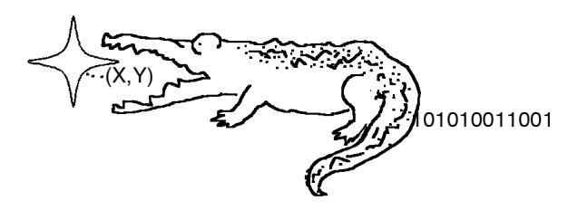

# **Elligator: Elliptic-curve points indistinguishable from uniform random strings**

Daniel J. Bernstein1,<sup>4</sup> djb@cr.yp.to

Mike Hamburg<sup>2</sup> mhamburg@cryptography.com

Anna Krasnova<sup>3</sup> anna@mechanical-mind.org

Tanja Lange<sup>4</sup> tanja@hyperelliptic.org

<sup>1</sup>Department of Computer Science, University of Illinois at Chicago, USA <sup>2</sup>Cryptography Research, a division of Rambus, USA

<sup>3</sup>Privacy & Identity lab, Institute for Computing and Information Sciences, Radboud University Nijmegen, The Netherlands <sup>4</sup>Department of Mathematics and Computer Science, Technische Universiteit Eindhoven, The Netherlands

## ABSTRACT

Censorship-circumvention tools are in an arms race against censors. The censors study all traffic passing into and out of their controlled sphere, and try to disable censorshipcircumvention tools without completely shutting down the Internet. Tools aim to shape their traffic patterns to match unblocked programs, so that simple traffic profiling cannot identify the tools within a reasonable number of traces; the censors respond by deploying firewalls with increasingly sophisticated deep-packet inspection.

Cryptography hides patterns in user data but does not evade censorship if the censor can recognize patterns in the cryptography itself. In particular, elliptic-curve cryptography often transmits points on known elliptic curves, and those points are easily distinguishable from uniform random strings of bits.

This paper introduces high-security high-speed ellipticcurve systems in which elliptic-curve points are encoded so as to be indistinguishable from uniform random strings. At a lower level, this paper introduces a new bijection between strings and about half of all curve points; this bijection is applicable to every odd-characteristic elliptic curve with a point of order 2, except for curves of j-invariant 1728. This paper also presents guidelines to construct, and two examples of, secure curves suitable for these encodings.

#### Categories and Subject Descriptors

E.3 [Data encryption]: Public key cryptosystems

#### Keywords

Censorship circumvention; elliptic curves; injective maps

# 1. INTRODUCTION

Elliptic-curve cryptography (ECC) is arguably the most important tool in modern public-key cryptography. It provides public-key encryption, signatures, non-interactive key

Public domain. This work was supported by the National Science Foundation under grant 1018836, by the Netherlands Organisation for Scientific Research (NWO) under grants 639.073.005 and 040.09.003, by the National Science Council of Taiwan under NSC 101-2915-I-001-019, by the European Commission under Contract ICT-2007-216676 ECRYPT II, and by SIDN.nl (http://www.sidn.nl/). Part of this work was done while Bernstein, Krasnova, and Lange visited Academia Sinica; they wish to thank Bo-Yin Yang for his hospitality. Permanent ID of this document: 711e2f8601805e06e5fbb3c5953dd5d1. Date: 2013.08.28.

*CCS'13,* November 4–8, 2013, Berlin, Germany.

ACM 978-1-4503-2477-9/13/11. http://dx.doi.org/10.1145/2508859.2516734.

exchange, and many higher-level security features. It offers an attractive combination of high security, high speed, and (often critical for deployment) small space consumption.

However, for applications in censorship circumvention, ECC has a security problem. ECC protocols naturally send elliptic-curve points in the clear as long-term public keys, ephemeral public keys, ciphertext prefixes, challenges, etc. These points, even in compressed form, are obvious: they are easy to distinguish from uniform random strings.

There have been some ad-hoc workarounds for this problem, notably for ElGamal ciphertext prefixes, using a curveor-twist technique introduced by M¨oller (see below). But each new ECC-based protocol faces the same problem. Protocol designers unaware of the issue continue building protocols that are trivially visible to attackers. Designers requiring keys and ciphertexts to be indistinguishable from uniform are forced to modify those protocols, hoping that the modifications do not compromise other forms of security.

The main goal of this paper is to eliminate this problem. The solution presented here works for a wide range of elliptic-curve protocols, essentially every protocol in which the transmitted curve points are generated at random. There is no longer any need for, e.g., ad-hoc handling of ciphertext prefixes; this paper's technique works for all of the types of elliptic-curve points mentioned above.

#### 1.1 Distinguishers

We use the standard NIST P-256 elliptic curve as an example to illustrate the difficulties. A public key on the NIST P-256 elliptic curve is a pair (x, y) of integers satisfying the equation y <sup>2</sup> = x <sup>3</sup> − 3x + b modulo the prime 2 <sup>256</sup> − 2 <sup>224</sup> + 2<sup>192</sup> + 2<sup>96</sup> − 1, where b is a standard constant. There are at least three obvious ways for an attacker to distinguish this public key from a uniform random string:

• Least severe: Normally x and y are represented as integers between 0 and 2<sup>256</sup> − 2 <sup>224</sup> + 2<sup>192</sup> + 2<sup>96</sup> − 2 inclusive, encoded as 256-bit strings. If the attacker sees a 256-bit string representing an integer larger than 2 <sup>256</sup> − 2 <sup>224</sup> + 2<sup>192</sup> + 2<sup>96</sup> − 2 then the attacker knows that the string is not a valid value of x or of y. If the attacker sees a user sending a series of (e.g.) 2<sup>35</sup> 256 bit strings, and the largest string is close to 2<sup>256</sup>−2 224 , then the attacker is reasonably confident that the user is sending curve points. See Section 2.6 for details.

One can dismiss this attack as being too slow to be of interest, but we prefer more robust cryptographic primitives that maintain security with heavy use. The user can cover all integers between 0 and  $2^{256} - 1$  by randomizing the representations of small integers x and y, but this adds very little security: the attacker easily collects statistics showing that some integers appear half as often as others.

A secure solution is to randomly represent x and y as integers between 0 and, e.g.,  $2^{320} - 1$ . Another secure solution, with smaller keys, is to switch to an elliptic curve using a prime much closer to a power of 2, such as NIST P-224 (prime  $2^{224} - 2^{96} + 1$ , lower security level) or Bernstein's Curve25519 from [6] (prime  $2^{255} - 19$ ).

- More severe: The attacker simply checks the curve equation. If a 512-bit string has the form (x, y) where  $y^2 = x^3 3x + b$  modulo this prime then the attacker is confident that the user is sending a public key.
  - Many ECC systems save space by compressing y to one (random-looking) bit: the sign in  $\pm \sqrt{x^3 3x + b}$ . Some ECC systems save space by eliminating y entirely. The cost for the legitimate user of computing a square root is almost always outweighed by the benefit of reducing keys to half size. Both of these mechanisms have the side effect of stopping this attack.
- Most severe: The attacker checks whether  $x^3 3x + b$  is a square modulo this prime. This has chance 1/2 of occurring for a uniform random string, but if it occurs repeatedly then the attacker is reasonably confident that the user is sending public keys.

The third attack is difficult to stop. Our solution requires a quite drastic change in how curve points are represented as strings; this representation is the main topic of this paper.

Our solution is not limited to public keys: it also protects other randomly generated elliptic-curve points, such as the points appearing in ciphertexts in elliptic-curve versions of the ElGamal encryption system and points appearing in signature systems. See Section 2.

#### 1.2 Previous work

Several years ago, in [40], Möller proposed a variant of the ElGamal encryption system that provides indistinguishability for ciphertexts as follows:

- Alice's public key is a pair (aP, a'P') where a and a'
  are secret integers, P is a standard base point on an\nelliptic curve E(F<sub>2n</sub>) over some binary field F<sub>2n</sub>, and
  P' is a standard base point on a nontrivial quadratic
  twist E'(F<sub>2n</sub>) of the same curve.
- To encrypt a message m using public key (aP, a'P'), Bob chooses a random integer b, chooses randomly between aP and a'P', sends the x-coordinate of bP or bP' respectively, hashes b(aP) or b(a'P') respectively to obtain a secret key, and sends an encryption of m using this secret key.
- Alice recovers bP or bP' from the x-coordinate. Alice multiplies bP or bP' by a or a' to obtain abP or a'bP', hashes it to obtain the same secret key, and decrypts the message. Möller requires Alice to perform tests to decide whether the input is on E or on E' and to recover the whole point bP or bP'. We comment that the "Montgomery ladder" handles both cases together if a' is chosen as a. (For Montgomery-ladder background

see [41], [16], and, for the binary case, [39].) This eliminates the need for such tests and offers efficient curve arithmetic.

The idea in Möller's proposal is that each element of  $\mathbf{F}_{2^n}$  is a valid x-coordinate on E or its twist. The x-coordinate sent here can therefore be any element of  $\mathbf{F}_{2^n}$ , and in fact the distribution of the x-coordinates is indistinguishable from the uniform distribution of n-bit strings. Möller slightly adjusts the choices so that the distribution is exactly uniform.

Young and Yung present in [49] a modified version of Möller's twist idea to achieve DDH security in the standard model. In their version Alice's public key consists of M points on each curve; Bob picks one of the curves and computes shared secrets with all M points on that curve. The shared key of length M is derived taking just one bit per DH shared secret.

Our approach encodes points on a single curve as strings in distinguishable from uniform random strings. This has several obvious advantages over Möller's system. We obtain in distinguishability not just for ciphertexts but also for public keys. Möller's system has double-length public keys, while our public keys have minimal length. Möller's approach is limited to ElGamal encryption, while our approach handles a much wider range of ECC systems; see Section 2. Möller needs cryptographic security not just for E but also for  $E^\prime$ ; in our system twist security is not required, although we still suggest it as a desirable feature (see Section 4). Since our proposal does not need to work with twists, achieving solutions in the standard model can be done simply using the standard methods.

#### 1.3 Application context

Möller's curve-or-twist approach is used in StegoTorus [47]. StegoTorus is an extension to Tor [19] for censorship circumvention. It makes Tor traffic resemble Skype, general HTTPS traffic, etc. and relies on secure communication with a StegoTorus server. Establishing a link with this server requires deriving temporary key material using the public key of the server. This key material is used to encrypt communication of a subsequent ephemeral DH key exchange. StegoTorus uses Möller's example parameters over  $\mathbf{F}_{2^{163}}$ .

For comparison, typical ECC protocols carry out a DH key exchange in the clear; see, e.g., the ntor example below. StegoTorus needs to encrypt its key exchange because the points sent in the key exchange are easily distinguishable from uniform random data. This encryption adds the outer Möller layer, doubling the space used for the initial communication. This also slows down the client, slows down the server, doubles the size of server public keys (one point on the curve, one point on the twist), and requires implementations to handle computations on two curves.

We eliminate all of these issues by solving the underlying problem, namely the point distinguishability. The points that we send in a DH key exchange are indistinguishable from uniform random strings. See Sections 2, 3, and 5.

Telex [48] is another censorship-circumvention tool. Telex messages pose as regular TLS messages to random uncensored sites; the only difference is that the nonce field contains a cryptographic value instead of a random value. The public key of the Telex server is a pair of points (aP, aP'), with P on an elliptic curve  $E(\mathbf{F}_q)$  and P' on a nontrivial quadratic twist. Telex servers use deep-packet inspection on all traffic passing through them and identify Telex messages by check-

ing whether the nonce field interpreted as α||β satisfies the following conditions. Interpret α as the x-coordinate of a point R on E or E 0 and compute aR on the appropriate curve. Identify the message as a Telex message if β matches a salted hash of aR, and route it according to some other, encrypted information.

The use of curves in Telex follows M¨oller's proposal except for the choice of finite field and the choice of equal secrets. The proposed parameters have q = 2<sup>168</sup> − 2 <sup>8</sup> − 1 so that the distribution of values in F<sup>q</sup> is indistinguishable from that of length-168 strings. The attempted decryption performs a complete point recovery from x and uses standard Weierstrass-curve arithmetic to compute the scalar multiplications. We comment again that the "Montgomery ladder" is more efficient, handling both cases together. We also comment that the system could use somewhat larger finite fields, gaining security, without reducing the 56-bit hash size and without going beyond the standard TLS 224-bit nonce size: servers would allow only points R with a fixed number of implicit trailing zeros, and clients would repeatedly generate points until meeting that condition.

This paper's solution to the point-distinguishability problem would not save bandwidth for Telex connections but would still simplify implementations, removing any need to handle the twist, and would reduce public keys to half size, potentially a useful feature for small clients keeping track of many different Telex servers.

As a third protocol we consider ntor [30], a handshake protocol proposed for Tor achieving anonymity and one-way authentication with forward secrecy. This protocol assumes that Tor relays have public keys on an elliptic curve. The following is a simplified version of the ntor protocol, skipping certificates and saved session states, but presenting all parts relevant to the choice of curve group and representation. To extend a Tor circuit to a relay with public key B = bP a client picks a random value x, computes X = xP, and sends X to the server. The server picks a random y, computes Y = yP, computes two secret keys as k 0 ||k = H(yX, bX, B, X, Y ) for some hash function H, computes t<sup>B</sup> = MACk<sup>0</sup> (B, X, Y ) (an authenticator under key k 0 ), and sends Y ||t<sup>B</sup> to the client. The client computes k¯<sup>0</sup> ||k¯ = H(xY, xB, B, X, Y ) and verifies that t<sup>B</sup> = MACk¯<sup>0</sup> (B, X, Y ). If the verification is successful, the client is convinced that it is communicating with the correct server: nobody other than the client and the relay could compute xB = bX. Both sides can use k = k¯ for transmitting encrypted messages.

Tor currently uses SSL links to superencrypt its traffic. However, one can easily imagine ntor being steganographically encoded inside a cover channel, with the goal of circumventing censorship, on top of the original goals of anonymity, one-way authentication, and forward secrecy. This raises the question of how the curve points can be hidden. Using a pair of points xP, xP<sup>0</sup> in place of X does not work: it is even easier to distinguish from uniform than a single point. M¨oller's curve-or-twist approach, using a pair of points in place of the server's long-term key B, also does not work: the client is free to pick X on the curve or the twist, but the server is then forced to pick Y on the same curve as X, and this is something visible to a censor.

Our solution applies straightforwardly to this protocol. It does not need twists; it ensures that the encodings of points on a single curve are uniformly distributed. More generally, our solution can be used to encode as many points as desired during one session or across sessions.

Our solution is also useful for several earlier applications: password-authenticated key exchange [13], ID-based encryption [12], pseudorandom-number generation [35, 36], and kleptography [49]. Note that [49] includes a treatment of covert channels and steganography, predating both Stego-Torus and Telex.

# 1.4 Mapping strings to elliptic-curve points

Shallue and van de Woestijne at ANTS 2006 [45] gave a positive answer to the following question in pure algorithmic number theory: there is, provably, a (very easy) probabilistic polynomial-time algorithm that, given any elliptic curve E over any sufficiently large finite field Fq, constructs a nonzero element of the group E(Fq); is there, provably, a deterministic polynomial-time algorithm for the same task? Shallue and van de Woestijne did more than construct a single point: they built a function φ : F<sup>q</sup> → E(Fq) such that each element of E(Fq) has at most C preimages, for a particular constant C; and they built a deterministic polynomialtime algorithm that computes φ(t) given q, E, and t. Trying C + 1 elements of F<sup>q</sup> produces a nonzero element of E(Fq).

Some cryptographic protocols rely on hashing strings to curve points. For example, in the Boneh–Franklin identitybased encryption scheme [12], public keys are points on pairing-friendly curves, and a user with identity i has public key H(i). Boneh and Franklin constructed a suitable function H for certain supersingular curves. Icart at Crypto 2009 [32] pointed out that the Shallue–van de Woestijne function φ produced suitable functions H for any elliptic curve, allowing the Boneh–Franklin system to be adapted to much more efficient non-supersingular (but still pairing-friendly) curves. Icart and subsequent authors explored various replacements φ for the Shallue–van de Woestijne function; see [32], [15], [26], [25], [20], [27], [23], and [21].

The reader should be wondering why one cannot simply define φ(t) by trying consecutive field elements x starting from t (for example, trying x = t, x = t + 1, x = t + 2, etc. in the prime-field case) until finding a curve point (x, y). The answer for Shallue and van de Woestijne is that this is not proven to take polynomial time. On the other hand, there is overwhelming evidence for the conjecture that this takes polynomial time, and in cryptography there is no harm in making such a conjecture; cryptography is built on a foundation of conjectures that are much easier to question, such as the conjecture that there is no fast ECDL algorithm. This simple function from F<sup>q</sup> to E(Fq) is exactly what is used in many papers on identity-based cryptography.

The real objection to this algorithm is that it does not take constant time. In many applications the time leaks secret information. One can compute the same function for almost all inputs in constant time by choosing an upper bound C on the number of consecutive field elements required with very high probability, say C = 100, and then always testing exactly C values of x; but testing C times for squares turns out to be a performance bottleneck.

It should be obvious that any of the functions φ mentioned above allows a public key φ(t) ∈ E(Fq) to be represented as an element t ∈ Fq, using a computation of Q 7→ {t : φ(t) = Q} to encode a point and a computation of t 7→ φ(t) to decode a point. However, this approach raises several important performance issues for key generation:

- The usual key-generation method produces a uniform random curve point by scalar multiplication, but there is no reason to think that this curve point can be expressed in the form φ(t). If it cannot then the user must try again, generating a new key.
- Even worse, to generate a uniform distribution of elements t ∈ F<sup>q</sup> the user must generate a uniform random curve point Q, compute the number k = #{t : φ(t) = Q} of preimages of the point, restart with probability 1 − k/C, and finally select a uniform random preimage of the point. (This is what statisticians call "rejection sampling"; more advanced sampling methods are inapplicable since there is no way to generate a uniform random curve point with a specified value of k.) The average number of points generated is then C#E(Fq)/q ≈ C. Applications that need realtime guarantees must budget for even more than C.
- Each of these C points takes time for not just a computation of Q but also a computation of {t : φ(t) = Q}. This is the main bottleneck if φ is slow to invert.

In many protocols, ephemeral ECC keys are generated for every protocol run, and these computations can easily dominate the overall protocol performance. Of course, even in protocols where key generation is rare, each use of t incurs the cost of computing φ(t).

We propose two ways to minimize these performance problems: Elligator 1 and Elligator 2. Elligator 1 takes an encoding function φ that is implicit in the very recent paper [23] by Fouque, Joux, and Tibouchi. This function, in the cases we consider, maps {0, 1, 2, 3, . . . ,(q − 1)/2} injectively to E(Fq); see Theorem 4. Since the number of points on E over F<sup>q</sup> is about q we have to try only about 2 points on average before finding a point of the form φ(t), and we do not need to randomize the preimage t. Not every elliptic curve is suitable for this function, but the curve requirements for Elligator 1 are compatible with state-of-the-art criteria for curve security and curve performance.

Fouque, Joux, and Tibouchi suggested that injectivity would be useful for a naive form of ElGamal encryption in which a message m is encoded injectively as an ellipticcurve point and then simply added to abP. We highlight the new anti-censorship application, namely encoding points as strings rather than encoding strings as points; we drastically simplify the definition of this function, while accelerating its forward and inverse computation; and we introduce a highsecurity high-speed elliptic curve that supports the function. See Section 4 for the curve, Section 3 for the function, and Section 2 for the cryptographic applications.

Elligator 2 introduces a new injective map ψ to elliptic curves. Elligator 2 has similar performance characteristics to Elligator 1. The main advantage of Elligator 2 is that it applies to more curves: in fact, every odd-characteristic elliptic curve that has a point of order 2, except for curves of j-invariant 1728. See Section 5 for this new map.

# 2. ELLIPTIC-CURVE PROTOCOLS

This section presents various elliptic-curve protocols in which public keys, ciphertexts, etc. are indistinguishable from uniform random strings. These protocols include all of the fundamental ECC constructions: static and ephemeral key exchange, encryption, and signatures.

The prerequisite for all of these protocols is an injective map ι from a set of strings S ⊆ {0, 1} b to an elliptic-curve group E(Fq). We require #S to be very close to 2<sup>b</sup> , so that a uniform random element of S is indistinguishable from a uniform random b-bit string; see Section 2.6. We have two different methods to construct ι and S, as mentioned above; see Sections 3 and 5.

The idea, as explained in Section 1, is for each string τ ∈ S to represent the curve point ι(τ ), i.e., for the point ι(τ ) to be encoded as the string τ . A uniform random element of ι(S), encoded in this way, is indistinguishable from a uniform random b-bit string. We do not require ι(S) to be all of E(Fq); our protocols compensate for this by repeatedly generating curve points until finding elements of ι(S). For our constructions #ι(S) is about (1/2)#E(Fq), requiring only about 2 repetitions on average, as mentioned in Section 1.

Our primary objective in this section is to illustrate how easily ι can be used to systematically hide elliptic-curve points in a wide range of protocols. We do not mean to suggest that all of these protocols are being used in contexts where they need to be hidden from censors; but there is no obvious dividing line between protocols that would be useful for those contexts and protocols that would not.

Consider, for example, static ECDH public keys. A static public key might be distributed openly, as part of a cryptographic software package, in which case it does not add any new risk of censorship; changing the encoding of the public key does nothing to hide the package from a censor. On the other hand, if a client already has all necessary cryptographic software, and a server broadcasts a series of static public keys by encoding those keys inside otherwise innocent web pages or other cover traffic, then indistinguishability from uniform is exactly the tool needed to defend those public keys against a censor with an accurate model of the cover traffic. A censored Tor client should be able to see frequent updates of public keys for Tor bridges, for example; see [1] for a detailed discussion of the speed at which various governments detect and suppress access to Tor bridges.

#### 2.1 Notation and domain parameters

To simplify the protocol statements we assume that the elliptic-curve group E(Fq) is cyclic: specifically, that it is generated by a standard base point P of order n. In the case that n is not prime (for example, n is 4 times a prime in Section 4) we do not restrict points to a prime-order subgroup: any proper subgroup is trivially distinguishable from the full group. For non-cyclic groups the protocols would have to be modified to handle multiple generators.

Let H denote a hash function, and let || denote concatenation of strings. Symmetric authenticated encryption of a message M using a secret key k is denoted as c = Enck(m), decryption as m = Deck(c). A standard security requirement for symmetric encryption is that the ciphertexts are indistinguishable from uniform (see, e.g., [3]); one can, for example, safely use AES in counter mode. For authentication there is a split in the literature between authenticators aiming at the "PRF" property, which guarantees indistinguishability, and authenticators aiming merely at the "MAC" property, which guarantees unforgeability but does not guarantee indistinguishability; we require the PRF property. See [44] for a unified security notion for authenticated encryption that guarantees indistinguishability from uniform random bit strings.

# 2.2 Long-term Diffie–Hellman keys

Each user U sets up a public key:

- 1. U generates a random integer u.
- 2. U computes P<sup>U</sup> = uP. If P<sup>U</sup> ∈/ ι(S) then U repeats from step 1.
- 3. U publishes ι −1 (P<sup>U</sup> ) = τ<sup>U</sup> and keeps u secret. The encoding τ<sup>U</sup> of the public key is a string which can be broadcast; it is indistinguishable from a random string.

Without further communication users Alice and Bob can compute a shared secret from their public strings τ<sup>A</sup> and τB. Alice can compute this key as follows and then use it to authenticate and encrypt a message to Bob:

- 1. Alice computes ι(τB) = PB.
- 2. Alice computes k = H(uAPB).

Upon receiving an encrypted message from Alice, Bob can likewise compute the same shared secret and then decrypt the message and verify the authenticator:

- 1. Bob computes ι(τA) = PA.
- 2. Bob computes k = H(uBPA).

## 2.3 ElGamal encryption

Assume u<sup>B</sup> and P<sup>B</sup> = uBP is a static key pair of Bob and that Bob has published τ<sup>B</sup> = ι −1 (PB). Alice wants to send Bob a message M. To encrypt the message she performs the following steps:

- 1. She generates a random integer r.
- 2. She computes the point R = rP. If R /∈ ι(S) she repeats from step 1.
- 3. She computes ι −1 (R) = τR.
- 4. She computes P<sup>B</sup> = ι(τB).
- 5. She computes the shared key value k = H(rPB).
- 6. She encrypts message m using key k: c = Enck(m).
- 7. She sends the tuple (τR, c) as an encryption of m.

To decrypt the received message, Bob:

- 1. computes ι(τR) = R,
- 2. computes the same shared key value: k = H(uBR), and
- 3. decrypts the message: m = Deck(c).

ElGamal encryption also appears in [23] as an application of an injective map between strings and curve points, but our application is completely different from the application in [23]. There is a critical difference in the underlying encryption methods: we use symmetric cryptography to encrypt the message m using a key derived from rPB, whereas [23] adds rP<sup>B</sup> to a curve point M that represents m. This is exactly where [23] uses an injective map, namely to encode the string m as a curve point M. Note, however, that this also (1) prevents [23] from encrypting long messages and (2) allows malleability, in violation of the basic security standards for public-key encryption. We instead use the standard "KEM/DEM" structure to provide secure publickey encryption, and as a consequence do not need to encode strings as curve points. We use an injective map for a completely different reason: we encode curve points as strings, preventing those points from being recognized by censors.

#### 2.4 Short-term Diffie–Hellman keys

In this protocol, Alice and Bob agree on a shared secret without using long-term keys. This protocol is important as a way to provide forward secrecy. Of course, this provides no authentication, but authentication can be added as a subsequent layer.

- 1. Alice and Bob generate short-term keys as follows:
  - (a) Generate a random integer r.
  - (b) Compute point R = rP. If R /∈ ι(S) repeat from step 1a.
- 2. Alice sends µ<sup>A</sup> = ι −1 (RA) to Bob; Bob sends µ<sup>B</sup> = ι −1 (RB) to Alice.
- 3. Alice decodes R<sup>B</sup> = ι(µB); Bob decodes R<sup>A</sup> = ι(µA).
- 4. Alice computes the shared key value k = H(rARB); Bob computes the same k as H(rBRA).

#### 2.5 Schnorr signatures

Assume that u<sup>B</sup> and P<sup>B</sup> = uBP are respectively private and public keys of Bob, where P<sup>B</sup> ∈ ι(S) and Bob has published τ<sup>B</sup> = ι −1 (PB). To sign a message m, Bob performs the following steps:

- 1. Choose a random integer r.
- 2. Compute R = rP. If R /∈ ι(S), repeat from step 1.
- 3. Compute τ = ι −1 (R).
- 4. Compute h = H(τ ||τB||m).
- 5. Compute s = r + hu<sup>B</sup> (mod n).
- 6. The signature is the tuple ψ = (τ, s).

The integer s must be encoded so as to be indistinguishable from uniform; see Section 2.6.

To verify the signature (τ, s), Alice performs the following steps:

- 1. Compute P<sup>B</sup> = ι(τB).
- 2. Compute R = ι(τ ).
- 3. Compute h = H(τ ||τB||m).
- 4. Compare R + hP<sup>B</sup> and sP. If they are equal, accept. Otherwise, reject.

Schnorr's original signature system actually sent (h, s). We follow "EdDSA" from [8] in sending an encoding of (R, s); security is the same, since one can reconstruct (h, s) from (R, s) and vice versa. The advantage of (R, s) is that it allows batching, making signature verification about twice as fast, as explained in [8]. Our use of ι makes this signature indistinguishable from a uniform random string.

We also follow EdDSA in including the public key τ<sup>B</sup> in the hash. Robert Ransom has pointed out that if the public key is omitted from the hash then an attacker who does not know it can calculate it by first computing h and then computing (sP − R)/h, and as a consequence can see that two signatures come from the same public key. Ransom has also suggested a different way of hiding signatures from someone who does not know τB: namely, encrypting the signatures with a secret-key cipher keyed by a hash of τB. Of course, indistinguishability is unachievable against an attacker who does know τB: the attacker can simply verify the signature.

We encode R as τ both for transmission and for input to H. We could safely switch to a different encoding for input to H. In particular, we could use the same encoding used in EdDSA. This would make our signatures compatible with EdDSA signatures: anyone could convert an EdDSA signature into a signature of our form and vice versa.

#### 2.6 Detecting differences from uniform

These protocols transmit uniform random elements of S. Usually S is not the set of all b-bit strings, so uniform random elements of S are not exactly uniform random b-bit strings. This is not a security problem if #S is very close to 2 b ; we now analyze quantitatively what "very close" means.

Consider a channel that normally sends k independent uniform random b-bit strings. A user modifies the channel to instead transmit k independent uniform random elements of S. The censor's goal is to take action against the modified channel without taking action against the original channel.

The obvious strategy for the censor is to take action if and only if all of the b-bit strings are elements of S. This has no false negatives, but it produces a false positive whenever k independent uniform random b-bit strings happen to all be elements of S. If #S = 2<sup>b</sup> − δ then a false positive occurs with probability (#S/2 b ) <sup>k</sup> = (1 − δ/2 b ) <sup>k</sup> ≈ exp(−kδ/2 b ). This strategy maximizes the difference in action probability between the original and modified channels; hence S k is indistinguishable from ({0, 1} b ) <sup>k</sup> when kδ/2 b is small.

 Consider, for example, the NIST P-256 set S = 0, 1, 2, . . . , 2 <sup>256</sup> − 2 <sup>224</sup> + 2<sup>192</sup> + 2<sup>96</sup> − 2 , with b = 256. Here δ ≈ 2 <sup>224</sup>. If the censor sees k = 2<sup>35</sup> sessions then kδ/2 <sup>b</sup> ≈ 8 so the censor will take action for the original channel with probability only about exp(−8) ≈ 0.000335. This may be an acceptable level of collateral damage.

As a second example illustrating the importance of the ratio kδ/2 b , consider a set S of size 2<sup>256</sup> − δ where δ ≤ 2 160 . This time a censor seeing k ≤ 2 <sup>64</sup> sessions has kδ/2 <sup>b</sup> ≤ 2 −32 so the probability is larger than 0.99999999; i.e., the censor will take action against practically every channel.

The encodings that we consider for elements of E(Fq) typically have #S = (q + 1)/2. In each of our recommended examples, #S is between 2<sup>b</sup>−2 b/2 and 2<sup>b</sup> , so kδ/2 <sup>b</sup> ≤ k/2 b/2 . The probability difference is therefore negligible until k, the number of strings transmitted, grows to a noticeable fraction of 2b/<sup>2</sup> . This cannot be a concern when E(Fq) is chosen to resist standard discrete-logarithm attacks: those attacks take time only about 2b/<sup>2</sup> .

We also encode integers modulo n = #E(Fq) as strings in Section 2.5. By Hasse's theorem, <sup>n</sup> is within 2√<sup>q</sup> of <sup>q</sup>+ 1, so if q is very close to 2<sup>b</sup>+1 then n is also forced to be very close to 2<sup>b</sup>+1. Note that taking q slightly below 2<sup>b</sup>+1 does not force n to be below 2<sup>b</sup>+1; for n > 2 <sup>b</sup>+1 we still use a (b+ 1)-bit encoding, restarting the protocol in Section 2.5 in the extremely unlikely case that an integer is 2<sup>b</sup>+1 or larger.

# 2.7 Active attacks

Censors can try replacing random-looking strings by other strings (possibly strings outside S) to see whether this has any visible effect. Presumably this replacement will disrupt communication, but protocol designers and implementors must take care to ensure that this replacement does not allow the censor to detect communication.

We briefly point out an attack against the passwordauthenticated key-exchange protocol of [13]; this attack is not in the censorship context, but it illustrates both the value of avoiding twists and the difficulty of protecting against active attacks. In the protocol of [13], Alice sends an encryption (using a shared password as a secret key) of either a point on a curve or a point on the twist of the curve; indistinguishability is important here for the ciphertext to avoid leaking information. Bob sends back two points, one on the curve and one on the twist; information is carried by the point on the same curve used by Alice, while the other point is random. Our attack is to actively rerandomize one of the two points sent by Bob. If this point is on the same curve then Alice aborts; if this point is not on the same curve then Alice does not notice and communication continues. This information leak allows the attacker to exclude half of all possible passwords, and repeating the attack allows the attacker to quickly find the right password.

# 3. ELLIGATOR 1: THE INJECTIVE MAP

Section 2 needs an injective map ι from a large set S of strings to E(Fq). Elligator 1 is one choice of ι; Elligator 2, introduced in Section 5, is another choice of ι. This section presents the mathematical details of Elligator 1: the construction of ι, how to compute ι, how to test whether a curve point is in the image of ι, and how to invert ι on curve points in the image. To help the reader visualize the mathematical structure of ι we include a picture as Figure 1.

We impose certain requirements on q and E for Elligator 1: we consider only primes q; we require q to be congruent to 3 modulo 4; we require E to be a complete Edwards curve; and we impose an extra algebraic requirement (c = 2/s<sup>2</sup> in Theorem 1) that allows only half of all complete Edwards curves. Approximately 1/16 of all isomorphism classes of elliptic curves over all finite fields satisfy these requirements. (Asymptotically 100% of all finite fields, ordered by size, are prime fields; 50% of those primes are congruent to 3 modulo 4; 25% of elliptic curves over those fields are complete Edwards curves; 50% of those satisfy the extra algebraic requirement.) See Section 4 for specific choices of q and E.

The heart of ι is a function φ : F<sup>q</sup> → E(Fq) defined in Theorem 1 and Definition 2. This function satisfies φ(t) = φ(−t) for each t ∈ F<sup>q</sup> but has no other collisions (see Theorem 3), so its restriction to {0, 1, 2, . . . ,(q − 1)/2} is injective. Theorem 4 simply defines S as {0, 1, 2, . . . ,(q − 1)/2} represented in little-endian form as b-bit strings, where b = blog<sup>2</sup> qc, and defines ι as the corresponding representation of φ. For indistinguishability we add the requirement that (q + 1)/2 be extremely close to 2<sup>b</sup> .

As mentioned in Section 1, this function φ was introduced by Fouque, Joux, and Tibouchi in [23]. Our main contributions in this section are a much more concise definition of φ; much more direct proofs of the relevant properties of φ; a simple method to invert φ; and a simple test for whether a curve point is in the image of φ.

The function −φ has the same useful properties as φ. Our choice of sign is not the same as the choice in [23]: in the notation below, the ratio is χ(c), i.e., χ(2). This choice of sign slightly simplifies our formulas for the forward and inverse maps, although it is not the main simplification compared to [23]. We also comment that φ(t) = −φ(1/t) for t 6= 0.

Computing ι in a sensible way is almost as fast as traditional point decompression, not a serious bottleneck compared to scalar multiplication. Inverting ι is slightly slower, but testing whether a curve point is in the image of ι is very fast. See Section 3.5 for further performance analysis.

#### 3.1 Squares, square roots, and χ

Fix a prime power q ≡ 3 (mod 4). In defining ι we consider only primes q for simplicity (so that 0, 1, 2, . . . ,(q−1)/2 are distinct field elements) but our φ theorems also apply to prime powers.

Define χ : F<sup>q</sup> → F<sup>q</sup> by χ(a) = a (q−1)/2 . If a is a non-zero square then χ(a) = 1; if a is a non-square then χ(a) = −1; if a = 0 then χ(a) = 0. Note that (q − 1)/2 is odd since q ≡ 3 (mod 4), so χ(−1) = −1, so −1 is not a square. More



Figure 1: The structure of our encoding function ι −1 , a bijection from a large subset of E(Fq) to a large set S of b-bit strings. The elliptic curve E is required to be a complete Edwards curve, shown on the left together with a sample element P = (x, y) of E(Fq). A sample b-bit output is shown on the right. See Theorems 1, 3, and 4 and Definition 2 for further details regarding the function in the middle.

generally, χ(χ(a)) = χ(a). There are several easy ways to manipulate χ arguments: for example, χ(ab) = χ(a)χ(b), χ(1/a) = χ(a) = 1/χ(a) if a 6= 0, and χ(a 2 ) = 1 if a 6= 0.

If a is a square then a (q+1)/4 is a square root of a: its square is a (q+1)/<sup>2</sup> = χ(a)a = a. More precisely, a (q+1)/4 is the principal square root of a: the unique square root that is a square. Any square root b of a satisfies b = χ(b)a (q+1)/4 .

The function χ is called a quadratic character. See [38] for further background on finite fields.

## 3.2 The map

Theorem 1. Let q be a prime power congruent to 3 modulo 4. Let s be a nonzero element of F<sup>q</sup> with (s <sup>2</sup>−2)(s <sup>2</sup>+2) 6= 0. Define c = 2/s<sup>2</sup> . Then c(c − 1)(c + 1) 6= 0.

Define r = c + 1/c and d = −(c + 1)<sup>2</sup> /(c − 1)<sup>2</sup> . Then r 6= 0, and d is not a square.

The following elements of F<sup>q</sup> are defined for each t ∈ F<sup>q</sup> \ {±1}:

$$u = (1 - t)/(1 + t),$$

$$v = u^{5} + (r^{2} - 2)u^{3} + u,$$

$$X = \chi(v)u,$$

$$Y = (\chi(v)v)^{(q+1)/4}\chi(v)\chi(u^{2} + 1/c^{2}),$$

$$x = (c - 1)sX(1 + X)/Y,$$

$$y = (rX - (1 + X)^{2})/(rX + (1 + X)^{2})$$

Furthermore x <sup>2</sup> + y <sup>2</sup> = 1 + dx<sup>2</sup> y 2 ; uvXY x(y + 1) 6= 0; and Y <sup>2</sup> = X <sup>5</sup> + (r <sup>2</sup> − 2)X <sup>3</sup> + X.

).

Proof. c(c − 1)(c + 1) 6= 0: By definition c = 2/s<sup>2</sup> so c 6= 0. By hypothesis s 2 6= 2 and s 2 6= −2 so c 6= 1 and c 6= −1.

r 6= 0: If r = 0 then c = −1/c so c <sup>2</sup> = −1, contradiction. d is not a square: Otherwise −1 = d(c − 1)<sup>2</sup> /(c + 1)<sup>2</sup> is a square, contradiction.

u is defined and u 6= 0: By hypothesis 1 + t 6= 0 and 1 − t 6= 0.

v 6= 0: r <sup>2</sup> −2 = c <sup>2</sup> + 1/c<sup>2</sup> so v = u(u <sup>2</sup> +c 2 )(u <sup>2</sup> + 1/c<sup>2</sup> ). If v = 0 then there are three possibilities: u = 0, contradiction; or u <sup>2</sup>+c <sup>2</sup> = 0 so −1 = (u/c) 2 , contradiction; or u <sup>2</sup>+1/c<sup>2</sup> = 0 so −1 = (uc) 2 , contradiction.

XY 6= 0, so x is defined: As above u <sup>2</sup> + 1/c<sup>2</sup> 6= 0 so all factors in X and Y are nonzero.

1 + X 6= 0, so x 6= 0: If X = −1 then u = −χ(v) so v = −χ(v)(1 + r <sup>2</sup> − 2 + 1) = −χ(v)r 2 so χ(v) = −χ(v), contradiction.

(X, Y ) satisfies Y <sup>2</sup> = X<sup>5</sup> + (r <sup>2</sup> − 2)X<sup>3</sup> + X: X = χ(v)u so X <sup>5</sup> + (r <sup>2</sup> −2)X <sup>3</sup> +X = χ(v)(u <sup>5</sup> + (r <sup>2</sup> −2)u <sup>3</sup> +u) = χ(v)v. Also χ(v)v is a square so (χ(v)v) (q+1)/<sup>2</sup> = χ(v)v so Y <sup>2</sup> = χ(v)v.

rX+(1+X) <sup>2</sup> 6= 0, so y is defined: If rX = −(1+X) 2 then (r <sup>2</sup> + 4r)X <sup>2</sup> = X <sup>4</sup> − 2X <sup>2</sup> + 1 so

$$Y^{2} = X(X^{4} + (r^{2} - 2)X^{2} + 1) = X^{3}(2r^{2} + 4r)$$
$$= rX \cdot X^{2}(2r + 4) = -(1 + X)^{2}X^{2}(s + 2/s)^{2}$$

so −1 is a square, contradiction.

y + 1 6= 0: If y = −1 then (rX − (1 + X) 2 )/(rX + (1 + X) 2 ) = −1 so rX −(1+X) <sup>2</sup> = −(rX + (1+X) 2 ) so rX = 0, contradiction.

x <sup>2</sup> + y <sup>2</sup> = 1 + dx<sup>2</sup>y 2 : First (c −1)<sup>2</sup> s <sup>2</sup> = (c −1)<sup>2</sup> (2/c) = 2(r − 2) so

$$Y^{2}(1-x^{2}) = Y^{2} - (c-1)^{2}s^{2}X^{2}(1+X)^{2}$$

$$= X^{5} + (r^{2}-2)X^{3} + X - 2(r-2)X^{2}(1+X)^{2}$$

$$= X(rX - (1+X)^{2})^{2}.$$

Similarly −d = (c + 2 + 1/c)/(c − 2 + 1/c) = (r + 2)/(r − 2) so −d(c − 1)<sup>2</sup> s <sup>2</sup> = 2(r + 2) so

$$Y^{2}(1 - dx^{2}) = Y^{2} - d(c - 1)^{2}s^{2}X^{2}(1 + X)^{2}$$
$$= X^{5} + (r^{2} - 2)X^{3} + X + 2(r + 2)X^{2}(1 + X)^{2}$$
$$= X(rX + (1 + X)^{2})^{2}.$$

Note that Y 2 (1−dx<sup>2</sup> ) 6= 0, and divide: (1−x 2 )/(1−dx<sup>2</sup> ) = (rX − (1 + X) 2 ) 2 /(rX + (1 + X) 2 ) <sup>2</sup> = y 2 ; i.e., x <sup>2</sup> + y <sup>2</sup> = 1 + dx<sup>2</sup> y 2 .

Definition 2. In the situation of Theorem 1, the decoding function for the complete Edwards curve E : x <sup>2</sup> +y <sup>2</sup> = 1 +dx<sup>2</sup> y 2 is the function φ : F<sup>q</sup> → E(Fq) defined as follows: φ(±1) = (0, 1); if t /∈ {±1} then φ(t) = (x, y).

## 3.3 Inverting the map

Theorem 3. In the situation of Definition 2:

- 1. If t ∈ F<sup>q</sup> then the set of preimages of φ(t) under φ is {t, −t}.
- 2. φ(Fq) is the set of (x, y) ∈ E(Fq) such that
  - y + 1 6= 0;
  - (1+ηr) <sup>2</sup> −1 is a square, where η = y − 1 2(<sup>y</sup> + 1); and
  - if ηr = −2 then x = 2s(c − 1)χ(c)/r.
- 3. If (x, y) ∈ φ(Fq) then the following elements X, z, ¯ u, ¯ t¯ of F<sup>q</sup> are defined and φ(t¯) = (x, y):

$$\begin{split} \bar{X} &= -(1 + \eta r) + ((1 + \eta r)^2 - 1)^{(q+1)/4}, \\ z &= \chi \left( (c - 1) s \bar{X} (1 + \bar{X}) x (\bar{X}^2 + 1/c^2) \right), \\ \bar{u} &= z \bar{X}, \\ \bar{t} &= (1 - \bar{u})/(1 + \bar{u}). \end{split}$$

Proof. Statement 1 of the theorem has two parts: a forward statement φ(t) = φ(−t), and a reverse statement that there are no other preimages. Statement 2 also has two parts: a forward statement that any (x, y) ∈ φ(Fq) satisfies certain conditions, and a reverse statement that any element of E(Fq) satisfying those conditions is in φ(Fq). We organize the proof as (A) forward 1; (B) 3, forward 2, and reverse 1; (C) reverse 2.

A. Fix t ∈ Fq. We now show that φ(t) = φ(−t). This is the forward part of statement 1 in the theorem.

If  $t \in \{\pm 1\}$  then  $\phi(t) = (0,1) = \phi(-t)$  by definition. Assume from now on that  $t \notin \{\pm 1\}$ .

Define u, v, X, Y, x, y from t as in Theorem 1. Then  $\phi(t) = (x, y)$  by definition.

Put t' = -t, and define u', v', X', Y', x', y' the same way from t'. Then  $\phi(t') = (x', y')$ . The proof strategy is to compare successively u' to u, v' to v, etc., concluding that x' = x and y' = y.

 $\mathbf{u'} = \frac{(1-t')}{(1+t')} = \frac{(1+t)}{(1-t)} = \frac{1}{u}.$   $\mathbf{v'} = \frac{u'^5}{(1+t')^5} + \frac{1}{(r^2-2)u'^3} + \frac{1}{u'} = \frac{1}{u^5} + \frac{1}{(r^2-2)\frac{1}{u^3}} + \frac{1}{u}, \text{ so }$   $v'u^6 = u + (r^2-2)u^3 + u^5 = v; \text{ i.e., } v' = v/u^6. \text{ Note that }$   $\chi(v') = \chi(v) \text{ since } \chi(u^6) = 1.$

 $\mathbf{X'} = \chi(v')u' = \chi(v)/u = 1/(\chi(v)u) = 1/X$  since  $\chi(v) = 1/\chi(v)$ .

$$\mathbf{y'} = \frac{rX' - (1+X')^2}{rX' + (1+X')^2} = \frac{r\frac{1}{X} - (1+\frac{1}{X})^2}{r\frac{1}{X} + (1+\frac{1}{X})^2} = \frac{rX - (X+1)^2}{rX + (X+1)^2} = y.$$

 $Y' = (\chi(v')v')^{(q+1)/4}\chi(v')\chi(u'^2 + 1/c^2)$ . This takes the most work; the first and third factors each need careful analyses. The second factor is easy:  $\chi(v') = \chi(v)$  as above.

First factor:  $\chi(v')v' = \chi(v)v/u^6$ . Note that the product  $\chi(u)u^3$  is a square and is therefore the principal square root of  $u^6$ ; i.e.,  $(u^6)^{(q+1)/4} = \chi(u)u^3$ . Hence  $(\chi(v')v')^{(q+1)/4} = (\chi(v)v/u^6)^{(q+1)/4} = (\chi(v)v)^{(q+1)/4}\chi(u)/u^3$ .

Third factor: Recall that  $v = u(u^2 + c^2)(u^2 + 1/c^2)$  and that  $\chi(a) = \chi(ab^2)$  for any  $b \neq 0$ . Thus

$$\chi(u'^2 + 1/c^2) = \chi(c^2 u^4 (u'^2 + 1/c^2)(u^2 + 1/c^2)^2)$$
$$= \chi(u^2 (c^2 + u^2)(u^2 + 1/c^2)^2)$$
$$= \chi(uv(u^2 + 1/c^2)).$$

Now multiply to obtain  $Y' = Y\chi(u)\chi(uv)/u^3 = Y/(\chi(v)u)^3 = Y/X^3$ . Finally

$$x' = (c-1)sX'(1+X')/Y' = (c-1)s\frac{1}{X}\left(1+\frac{1}{X}\right) / \frac{Y}{X^3}$$

=  $(c-1)sX(1+X)/Y = x$ .

Hence  $\phi(-t) = (x', y') = (x, y) = \phi(t)$  as claimed.

**B.** Fix  $t \in \mathbf{F}_q$ , and define  $(x,y) = \phi(t)$ . We show that  $\bar{X}, z, \bar{u}, \bar{t}$  in the theorem are defined and that  $\bar{t} \in \{t, -t\}$ , so  $\phi(\bar{t}) = (x,y)$ ; this is statement 3 in the theorem. We also show the forward part of statement 2: namely,  $y+1 \neq 0$ ;  $(1+\eta r)^2-1$  is a square, where  $\eta=(y-1)/(2(y+1))$ ; and if  $\eta r=-2$  then  $x=2s(c-1)\chi(c)/r$ . We also show the reverse part of statement 1: there are no preimages of  $\phi(t)$  other than t and -t.

The definition of  $\phi$  has two cases: if  $t \in \{1, -1\}$  then (x, y) = (0, 1); if  $t \notin \{1, -1\}$  then u, v, X, Y, x, y are defined in Theorem 1. Note that in the second case  $x \neq 0$  by Theorem 1, so in particular t is not a preimage of (0, 1).

In the first case  $y+1=2\neq 0$ ;  $\eta=0$ ;  $(1+\eta r)^2-1=0$  is a square;  $\bar{X}=-1$ ; z=0;  $\bar{u}=0$ ; and  $\bar{t}=1\in\{t,-t\}$ . As noted above, 1 and -1 are the only preimages of (0,1).

What remains is the second case. Here  $y+1 \neq 0$  by Theorem 1. The equation  $y = (rX - (1+X)^2)/(rX + (1+X)^2)$  implies  $X^2 + (2+r(y-1)/(y+1))X + 1 = 0$ , i.e.,  $X^2 + 2(1+\eta r)X + 1 = 0$ . Note that this forces the discriminant  $4(1+\eta r)^2 - 4$  to be a square; i.e.,  $(1+\eta r)^2 - 1$  is a square. Divide by X to see that  $X + 1/X = -2(1+\eta r)$ .

If  $\eta r = -2$  then  $(X - 1)^2 = 0$  so X = 1 so  $u \in \{\pm 1\}$ ; the case u = -1 forces 1 - t = -(1 + t), contradiction, so u = 1 and t = 0; so  $v = r^2$ , so  $Y = (r^2)^{(q+1)/4}\chi(1 + 1/c^2) = \chi(r)r\chi(r/c) = r\chi(c)$ , so  $x = 2(c - 1)s\chi(c)/r$  as claimed; also note for future reference that y = (r - 4)/(r + 4), i.e.,  $\phi(0) = (2(c - 1)s\chi(c)/r, (r - 4)/(r + 4))$ .

Define t' = -t, and define u', v', X', Y', x', y' as in Part A of this proof. Then X' = 1/X, so  $X + X' = -2(1 + \eta r)$ .

By construction  $1+\eta r+\bar{X}$  is a square root of  $(1+\eta r)^2-1$ ; i.e.,  $\bar{X}^2+2(1+\eta r)\bar{X}+1=0$ . Now  $(\bar{X}-X)(\bar{X}-X')=\bar{X}^2-(X+X')\bar{X}+XX'=\bar{X}^2+2(1+\eta r)\bar{X}+1=0$  so  $\bar{X}=X$  or  $\bar{X}=X'$ . This forces  $\bar{u}=u$  or  $\bar{u}=u'$ , since the definition of z turns out to match  $\chi(v)$  and  $\chi(v')$ :

- If  $\bar{X} = X$  then  $(c-1)s\bar{X}(1+\bar{X}) = xY$  so  $z = \chi(x^2Y(X^2+1/c^2)) = \chi(Y)\chi(X^2+1/c^2)$ . Note that  $(\chi(v)v)^{(q+1)/4}$  is a square and  $\chi(u^2+1/c^2) = \chi(X^2+1/c^2)$ , so  $\chi(Y) = \chi(v)\chi(X^2+1/c^2)$ , so  $z = \chi(v)$ , so  $\bar{u} = \chi(v)X = u$ , so  $\bar{t} = t$ .
- If  $\bar{X}=X'$  then similarly  $z=\chi(v'), \ \bar{u}=u', \ {\rm and} \ \bar{t}=t'=-t.$

To summarize,  $\bar{t} \in \{t, -t\}$ , so  $\phi(\bar{t}) = (x, y)$ .

The same logic also shows that there are no preimages p of (x,y) except for t and -t. Indeed, if  $(x,y)=\phi(p)$  then substituting p for t in the same proof shows that  $\bar{t}\in\{p,-p\}$ , so  $p\in\{\bar{t},-\bar{t}\}=\{t,-t\}$ .

**C.** Fix  $(x,y) \in E(\mathbf{F}_q)$ . Assume that  $y+1 \neq 0$ ; that  $(1+\eta r)^2-1$  is a square, where  $\eta=(y-1)/(2(y+1))$ ; and that if  $\eta r=-2$  then  $x=2s(c-1)\chi(c)/r$ . We now show that  $(x,y) \in \phi(\mathbf{F}_q)$ . This is the reverse part of statement 2 of the theorem.

If x=0 then  $(x,y)=(0,\pm 1)$  from the curve equation; but  $y+1\neq 0$ , so  $(x,y)=(0,1)=\phi(1)\in\phi(\mathbf{F}_q)$  as claimed. Assume from now on that  $x\neq 0$ .

If y=1 then x=0 from the curve equation, contradiction. Hence  $y\neq 1$ ; i.e.,  $\eta\neq 0$ .

Define  $X=-(1+\eta r)+((1+\eta r)^2-1)^{(q+1)/4}$ . As above  $1+\eta r+X$  is a square root of  $(1+\eta r)^2-1$ , so  $X^2+2(1+\eta r)X+1=0$ . This quadratic equation has several consequences. First,  $X\neq 0$ . Second,  $rX+(1+X)^2\neq 0$ : otherwise subtract to see that  $(1-2\eta)rX=0$ , so  $1=2\eta$ , so y-1=y+1, contradiction. Third,  $X\neq -1$ : otherwise  $\eta=0$ , contradiction. Fourth,  $y=(rX-(1+X)^2)/(rX+(1+X)^2)$ .

If X=1 then y=(r-4)/(r+4); also  $\eta r=-2$  so by assumption  $x=2s(c-1)\chi(c)/r$  so  $(x,y)=\phi(0)\in\phi(\mathbf{F}_q)$ . Assume from now on that  $X\neq 1$ .

Observe that

$$(rX + (1+X)^{2})^{2}(1-y^{2})$$

$$= (rX + (1+X)^{2})^{2} - (rX - (1+X)^{2})^{2}$$

$$= 4rX(1+X)^{2}.$$

Recall that -d = (r+2)/(r-2) and similarly observe that  $(rX + (1+X)^2)^2(1-dy^2)$

$$= (rX + (1+X)^2)^2 + \frac{r+2}{r-2}(rX - (1+X)^2)^2$$
$$= (2r/(r-2))(X^4 + (r^2-2)X^2 + 1).$$

Note that  $1 - dy^2 \neq 0$  since d is not a square. Divide:

$$x^{2} = \frac{1 - y^{2}}{1 - dy^{2}} = \frac{2(r - 2)X^{2}(1 + X)^{2}}{X^{5} + (r^{2} - 2)X^{3} + X}.$$

Define
$$Y = (c-1)sX(1+X)/x$$
. Then

$$Y^2 = (c-1)^2s^2X^2(1+X)^2/x^2$$

$$= 2(r-2)X^2(1+X)^2/x^2$$

$$= X^5 + (r^2 - 2)X^3 + X.$$

Define  $z = \chi(Y(X^2 + 1/c^2))$ . Both Y and  $X^2 + 1/c^2$  are nonzero, so  $z \in \{\pm 1\}$ .

Define u = zX. Then  $u \in \{\pm X\}$ . Note that  $u \neq -1$ , since  $X \notin \{\pm 1\}$ .

Define  $v = u^5 + (r^2 - 2)u^3 + u$ . Then  $v = z(X^5 + (r^2 - 2)X^3 + X) = zY^2$ , so  $\chi(v) = \chi(z) = z$ . Hence  $X = \chi(v)u$  and  $Y^2 = \chi(v)v$ . Furthermore  $\chi(v) = z = \chi(Y(X^2 + 1/c^2)) = \chi(Y(u^2 + 1/c^2))$ , so  $\chi(Y) = \chi(v)\chi(u^2 + 1/c^2)$ , so  $Y = (\chi(v)v)^{(q+1)/4}\chi(v)\chi(u^2 + 1/c^2)$ . Finally define t = (1-u)/(1+u). Then  $t \notin \{\pm 1\}$  and u = (1-t)/(1+t). The formulas for u, v, X, Y, x, y in Theorem 1 are all satisfied, so  $(x, y) = \phi(t) \in \phi(\mathbf{F}_q)$  as claimed.  $\square$

#### 3.4 Encoding as strings

Theorem 4. In the situation of Definition 2, assume that q is prime, and define  $b = \lfloor \log_2 q \rfloor$ . Define  $\sigma$ :  $\{0,1\}^b \to \mathbf{F}_q$  by  $\sigma(\tau_0,\tau_1,\ldots,\tau_{b-1}) = \sum_i \tau_i 2^i$ . Define  $S = \sigma^{-1}(\{0,1,2,\ldots,(q-1)/2\})$ . Define  $\iota: S \to E(\mathbf{F}_q)$  as follows:  $\iota(\tau) = \phi(\sigma(\tau))$ . Then #S = (q+1)/2;  $\iota$  is an injective map from S to  $E(\mathbf{F}_q)$ ; and  $\iota(S) = \phi(\mathbf{F}_q)$ .

PROOF. First  $2^b \leq q$  so the integers  $0, 1, \ldots, 2^b - 1$  are distinct in  $\mathbf{F}_q$ ; hence  $\sigma$  is injective. Furthermore  $2^b > q/2$  so  $\{0, 1, \ldots, (q-1)/2\}$  is a subset of  $\{0, 1, \ldots, 2^b - 1\}$ ; hence each of  $0, 1, \ldots, (q-1)/2$  has a preimage under  $\sigma$ , and S has exactly (q+1)/2 elements.

If  $\iota(\tau) = \iota(\tau')$  then  $\phi(\sigma(\tau)) = \phi(\sigma(\tau'))$ , so  $\sigma(\tau) = \pm \sigma(\tau')$  by Theorem 3; but  $\sigma(\tau)$  and  $\sigma(\tau')$  are both in  $\{0, 1, \ldots, (q-1)/2\}$ , so  $\sigma(\tau) = \sigma(\tau')$ , so  $\tau = \tau'$ . Hence  $\iota$  is injective.

Each element of  $\iota(S)$  has the form  $\phi(\sigma(\tau))$  and is therefore in  $\phi(\mathbf{F}_q)$ . Conversely, if  $P \in \phi(\mathbf{F}_q)$  then  $P = \phi(t)$  for some  $t \in \mathbf{F}_q$ , so also  $P = \phi(-t)$  by Theorem 3. At least one of t, -t is in  $\{0, 1, \ldots, (q-1)/2\}$ , i.e., in  $\sigma(S)$ , so P is in  $\phi(\sigma(S)) = \iota(S)$ .  $\square$

#### 3.5 Performance analysis

The definitions of u, v, X, Y, x, y in Theorem 1 involve divisions by 1 + t, c, Y, and  $rX + (1 + X)^2$ . The reciprocal of c is trivially precomputed, and the other divisions are easily replaced by a few multiplications: one simply stores field elements as fractions, i.e., works in projective coordinates. There are several easy ways to reduce the number of multiplications: for example, factor  $u^5 + (r^2 - 2)u^3 + u$  as  $u(u^2 + c^2)(u^2 + 1/c^2)$ , and reuse  $u^2 + 1/c^2$  in computing Y.

The main bottlenecks are then the following exponentiations: computing  $\chi(v)$  (used repeatedly); computing  $\chi(u^2+1/c^2)$ ; computing  $(\chi(v)v)^{(q+1)/4}$ , the principal square root of  $\chi(v)v$ ; and computing a final division if the output (x,y) is needed in affine coordinates instead of projective coordinates. The only essential exponentiation is for the square-root computation: the  $\chi$  computations and division can use Euclid's algorithm (blinded to protect against timing attacks) rather than exponentiation.

Similar comments apply to inverting  $\phi$  (or  $\iota$ ). There is one essential exponentiation, the square-root computation to obtain  $\bar{X}$  in Theorem 3. There are also two exponentiations that can be replaced by Euclidean computations: one  $\chi$  computation to obtain z, and one division to obtain the final output  $\bar{t}$ . Fractions eliminate the initial division by 2(y+1), but fractions cannot be used for  $\bar{t}$ , since the goal is to obtain the unique string representing  $\bar{t}$ .

It is easier to test, given  $(x,y) \in \mathbf{F}_q \times \mathbf{F}_q$ , whether  $(x,y) \in \phi(\mathbf{F}_q)$  (i.e., whether  $(x,y) \in \iota(S)$ ) without inverting  $\phi$ . One first checks  $x^2 + y^2 = 1 + dx^2y^2$  to verify  $(x,y) \in E(\mathbf{F}_q)$ , if this is not already known. Then, by

Theorem 3,  $(x, y) \in \phi(\mathbf{F}_q)$  if and only if the following three conditions are satisfied:

- $y + 1 \neq 0$ ;
- $(1+\eta r)^2 1$  is a square, where  $\eta = (y-1)/(2(y+1))$ ; i.e., r(y-1)(r(y-1)+4(y+1)) is a square;
- if  $\eta r = -2$  (equivalently, if r(y-1) = -4(y+1)) then  $x = 2s(c-1)\chi(c)/r$ .

This requires a few multiplications and one  $\chi$  computation.

# 4. CONSTRUCTION OF A SUITABLE EL-LIPTIC CURVE FOR ELLIGATOR 1

This section introduces a new high-security high-speed elliptic curve, called Curve1174, that supports the injective map presented in Section 3. In particular, this section specifies Curve1174; presents the criteria that we used to construct Curve1174; and analyzes the extent to which various previous curves meet the same criteria.

Curve1174 illustrates state-of-the-art criteria for choosing elliptic curves. It is compatible with Elligator 1, and is also compatible with the new map Elligator 2 introduced in the next section. It is even more concisely expressible than the existing Curve25519 curve.

We do not mean to suggest that users of Curve25519 are required to switch to Curve1174 to take advantage of this paper. Curve25519 is fully compatible with Elligator 2.

#### 4.1 The curve

Curve1174 is the Edwards curve  $x^2 + y^2 = 1 - 1174x^2y^2$  over the field  $\mathbf{F}_q$ , where q is the prime number  $2^{251} - 9$ . The coefficient -1174 is a non-square in  $\mathbf{F}_q$ , so Curve1174 is a complete Edwards curve by [9, Theorem 3.3]: the sum of any two points  $(x_1, y_1)$  and  $(x_2, y_2)$  in Curve1174( $\mathbf{F}_q$ ) is

$$\left(\frac{x_1y_2+y_1x_2}{1-1174x_1x_2y_1y_2}, \frac{y_1y_2-x_1x_2}{1+1174x_1x_2y_1y_2}\right),$$

with no divisions by 0 and no exceptional cases. The neutral element of the curve is (0,1).

To see that we have the desired injective map, note that q is congruent to 3 modulo 4; define s as the element

18064941211227179925228040535007972296

48438766985538871240722010849934886421

of  $\mathbf{F}_q$  (split onto two lines here for readability); define  $c = 2/s^2$ ; and define  $d = -(c+1)^2/(c-1)^2$ . Then d = -1174. The Edwards curve in Theorem 1 and Definition 2, for this choice of (q,s), is exactly Curve1174.

Curve1174 is birationally equivalent to the Montgomery curve  $(4/1175)V^2 = U^3 + (4/1175-2)U^2 + U$  by [9, Theorem 3.2]. The leading coefficient 4/1175 is a non-square in  $\mathbf{F}_q$ , so  $V^2 = U^3 + (4/1175-2)U^2 + U$  is a nontrivial quadratic twist of this curve. The Sage computer-algebra system [46] counts points on this curve in under 10 seconds on a laptop using the following script:

```
q=2^251-9
E=EllipticCurve(GF(q),[0,4/1175-2,0,1,0])
print E.trace_of_frobenius()
# output -45330879683285730139092453152713398836
```

The number of points on the twist is thus q+1+t, and the number of points on Curvel174 is q+1-t, where t=45330879683285730139092453152713398836. These integers

q + 1 + t, q + 1 − t have the form 4p0, 4p<sup>1</sup> respectively, where p<sup>0</sup> and p<sup>1</sup> are primes close to 2<sup>249</sup>. Generic methods to compute a discrete logarithm on Curve1174 or its twist take approximately <sup>√</sup> π2 <sup>247</sup> ≈ 2 124.3 group operations on average.

The point (U, V ) = (4, 192257776421116702304087124422 05514783403012708409058383774613284963344096) on the Montgomery curve (4/1175)V <sup>2</sup> = U <sup>3</sup> + (4/1175 − 2)U <sup>2</sup> + U has order 4p1. The corresponding point on Curve1174 is (x, y) = (4/V, 3/5).

Curve1174 and its twist do not have any structure allowing fast pairings or other special approaches to computing discrete logarithms. The primes p<sup>0</sup> and p<sup>1</sup> do not equal the field characteristic q. The order of q modulo p<sup>0</sup> is not small: it is (p<sup>0</sup> − 1)/2. The order of q modulo p<sup>1</sup> is not small: it is p<sup>1</sup> − 1. The endomorphism ring of Curve1174 has a large discriminant: up to squares this discriminant equals t <sup>2</sup>−4q, which is divisible once by the prime 161567415114024992333870349255799, so the discriminant must be a multiple of this prime.

## 4.2 Design criteria

We consider only prime fields. Bernstein, citing subfield attacks from [28] and [18], wrote in [6] that prime fields "have the virtue of minimizing the number of security concerns for elliptic-curve cryptography"; see [22] and [43] for recent developments of the attack strategy from [18]. Similarly, the Brainpool standard [14] and NSA's Suite B standards [37] require prime fields. There is general agreement that prime fields are the safe, conservative choice for ECC. Prime fields also perform very well across a wide range of processors; the current ECC speed records on high-end Intel processors take advantage of special Intel support for binary fields (see [42]), but most CPUs do not have any comparable support.

We consider only primes q congruent to 3 modulo 4. This is required for the injective map φ. These primes also have the well-known benefit of allowing very simple square-root computations; most other primes allow square-root computations at similar speed but with more complicated methods.

We consider only complete Edwards curves, i.e., curves x <sup>2</sup> + y <sup>2</sup> = 1 + dx<sup>2</sup> y <sup>2</sup> where d is not a square. This is required for the injective map. About 25% of all elliptic curves over F<sup>q</sup> are expressible as complete Edwards curves, as mentioned in [9, Abstract] and experimentally verified in [7, Section 4]. Complete Edwards curves also have the advantages of being extremely fast and of allowing a single addition formula with no exceptions. Complete Edwards curves are also expressible as Montgomery curves supporting very fast and uniform Montgomery-ladder computations.

To protect against generic discrete-logarithm algorithms we impose the standard requirement of a large prime dividing the number of curve points. This forces q to be even larger, where the gap accounts for the cofactor: the number of curve points divided by this prime. To minimize the performance problems of a large q we consider only Edwards curves with minimal cofactor, namely 4. The number of curve points is 4 times a prime for slightly below 1% of all choices of d, for the size of q that we consider below.

We also impose the requirement of "twist security": a large prime dividing the number of points on the quadratic twist of the curve. This prevents "twist attacks" against protocols that use the "Montgomery ladder" without checking that incoming points are on the curve; this defense was proposed by Bernstein in [5, page 23] and [4]. For q ≡ 3 (mod 4) roughly 1/10000 of all choices of d have the number of points on the curve and the number of points on the twist each being 4 times a prime.

We require d to have the form −(c + 1)<sup>2</sup> /(c − 1)<sup>2</sup> with c = 2/s<sup>2</sup> . This is required for the injective map, and covers about half of all non-squares d for q ≡ 3 (mod 4).

For standard performance reasons we take q very close to, but not above, a power of 2. The primes q ≡ 3 (mod 4) within 32 of 2<sup>e</sup> for 200 ≤ e ≤ 300 are 2<sup>206</sup> − 5, 2<sup>212</sup> − 29, 2 <sup>226</sup> − 5, 2<sup>243</sup> − 9, 2<sup>251</sup> − 9, and 2<sup>285</sup> − 9. Note that these fields ensure that σ −1 covers nearly all of 0, 1, . . . , 2 <sup>b</sup> − 1 giving a very close to uniform distribution of the encoding function. We focus on the last two of these primes as providing quantitatively safe security levels, and choose 2<sup>251</sup>−9 as being obviously faster.

Some curve operations involve multiplications by d. To speed up these multiplications we take the smallest possible d in absolute value, subject to the other requirements. The choice d = −1174 for q = 2<sup>251</sup> − 9 is smaller than expected.

# 4.3 Previous curves over prime fields

There is a long history of specific elliptic curves being designed to meet various security and performance criteria. For example, almost fifteen years ago the IEEE P1363 standard [33, Sections A.9–A.12]

- specified curves y <sup>2</sup> = x <sup>3</sup>−3x+b to "provide the fastest arithmetic on elliptic curves";
- imposed various further conditions upon these curves, with the security goal of making discrete logarithms difficult to compute; and
- specified a procedure to generate "verifiably pseudorandom" curves meeting these conditions.

NIST's standard curves P-192, P-224, P-256, P-384, and P-521 were generated as follows: five particular prime fields were chosen with the goal of maximizing performance; the IEEE P1363 procedure was used to generate one curve over each of those fields.

Subsequent research developed new security and performance criteria for curves over prime fields: twist security, Montgomery compatibility, Edwards compatibility, and completeness. The NIST curves, unsurprisingly, flunk these criteria: choosing cofactor 1 for y <sup>2</sup> = x <sup>3</sup>−3x+b is incompatible with both Montgomery and Edwards, and one cannot expect twist security if it is not demanded in advance. Newer curves meet all of these criteria: for example, Curve25519 was explicitly designed for twist security and Montgomery compatibility, and was shown in [9] to also be expressible as a complete Edwards curve.

These extra criteria do not improve discrete-logarithm security, but they do improve real-world security. They allow the simplest implementations to be correct implementations, whereas for other curves the simplest implementations that seem to work actually have hidden flaws that compromise security. See, e.g., [11, Section 4.1], [34], and [24].

We are imposing a new security condition to support censorship circumvention: namely, an efficient way to encode a large fraction of all curve points as strings indistinguishable from uniform random strings. The generality of Elligator 1 makes it easy to imagine how this security condition could be accidentally met by previously generated curves:

- The advantages of complete Edwards curves have been well known for five years.
- The advantages of Montgomery curves have been well known for even longer. A random Montgomery curve has a good chance of being expressible as a complete Edwards curve; see [7, Section 4].
- All complete Edwards curves over  $\mathbf{F}_q$  for  $q \equiv 3 \pmod{4}$  meet the new security condition. Half of these curves are within the streamlined case expressed by Theorem 1.

Given the amount of speed optimization of Curve25519 (see [6], [29], [17], [8], and [10]) and the wide deployment of Curve25519 in several applications (see, e.g., [2]) one of our initial goals for this paper was to show that Curve25519 meets this security condition. However, Elligator 1 is clearly limited to  $q \equiv 3 \pmod 4$ , while Curve25519 is defined over  $\mathbf{F}_q$  with  $q \equiv 1 \pmod 4$ . We provide two different solutions for this problem: Elligator 2 (see Section 5) and Curve1174.

We would expect serious implementations of Curve1174 to be competitive in speed with Curve25519. Curve1174 has some small advantages: for example,  $2^{251}-9$  is closer to a power of 2 than  $2^{255}-19$  is; 1174 is considerably smaller than 486662; and square roots modulo  $2^{251}-9$  are slightly easier than square roots modulo  $2^{255}-19$ . On the other hand, Curve25519 also has a small advantage: it is expressible in "-1-twisted Edwards form", allowing the speedup explained in [31]. Obviously applications already using Curve25519 should not switch away from it, but for new applications it is not clear which curve is better.

# 5. ELLIGATOR 2: HANDLING GENERIC CURVES WITH A POINT OF ORDER 2

This section introduces a new injective map  $\psi$  to any elliptic curve of the form  $y^2=x^3+Ax^2+Bx$  with  $AB(A^2-4B)\neq 0$  over any odd finite field, i.e., any finite field of odd characteristic. We emphasize that the characteristic is not required to be 3 modulo 4. This curve shape includes all Montgomery curves  $y^2=x^3+Ax^2+x$  except  $y^2=x^3+x$ , and in particular it includes Curve25519.

Any curve of this form has a point (0,0) of order 2. Conversely, over any odd finite field, almost every elliptic curve having a point of order 2 can be written in this form. Indeed, an elliptic curve over an odd finite field can always be written as  $y^2 = u^3 + a_2u^2 + a_4u + a_6$ ; a point of order 2 on this curve must have the form (r,0) where  $r^3 + a_2r^2 + a_4r + a_6 = 0$ ; substituting u = x + r produces the curve  $y^2 = x^3 + Ax^2 + Bx$  where  $A = a_2 + 3r$  and  $B = a_4 + 2a_2r + 3r^2$ . This curve must have  $B(A^2 - 4B) \neq 0$  since it is elliptic. The only exceptional case is A = 0, i.e., curves whose j-invariant equals 1728; this section assumes  $A \neq 0$ .

#### 5.1 Squares

Fix an odd prime power q. As in Section 3.1 we define  $\chi: \mathbf{F}_q \to \mathbf{F}_q$  by  $\chi(a) = a^{(q-1)/2}$ , and we have  $\chi(a)$  equal to 1, -1, or 0 when a is, respectively, a non-zero square, a non-square, or zero.

The definition of Elligator 2 is parametrized by a squareroot function for  $\mathbf{F}_q$ : a function  $\sqrt{\phantom{a}}: \mathbf{F}_q^2 \to \mathbf{F}_q$  such that  $\sqrt{a^2} \in \{a, -a\}$  for each  $a \in \mathbf{F}_q$ , where  $\mathbf{F}_q^2$  means  $\{a^2: a \in \mathbf{F}_q\}$ . Note that a square-root function  $\sqrt{\phantom{a}}$  is completely described by its image  $\sqrt{\mathbf{F}_q^2}$ . For  $q \equiv 3 \pmod{4}$  one can take the principal square root as a square-root function, i.e., take  $\sqrt{\mathbf{F}_q^2} = \mathbf{F}_q^2$ , as in Section 3.1; but the concept of principal square roots does not generalize to  $q \equiv 1 \pmod{4}$ . For any odd prime q one can take  $\sqrt{\mathbf{F}_q^2} = \{0, 1, \ldots, (q-1)/2\}$ . Other choices sometimes have computational benefits.

The definition of Elligator 2 is also parametrized by a non-square  $u \in \mathbf{F}_q$ . If  $q \equiv 3 \pmod{4}$  then one can take u = -1. If  $q \equiv 5 \pmod{8}$  then one can take u = 2. Finding a non-square is an easy computation in general since about half of the elements of  $\mathbf{F}_q$  are non-squares. For efficiency it is desirable to choose u to be small, or otherwise to choose u to speed up multiplications by u.

#### 5.2 The map

Theorem 5. Let q be an odd prime power. Let A, B be elements of  $\mathbf{F}_q$  such that  $AB(A^2-4B)\neq 0$ . Let u be a non-square in  $\mathbf{F}_q$ . Let  $\sqrt{\phantom{a}}$  be a square-root function for  $\mathbf{F}_q$ . Define R as the set

$$\{r \in \mathbf{F}_q : 1 + ur^2 \neq 0, \ A^2 ur^2 \neq B(1 + ur^2)^2\}.$$

The following elements of  $\mathbf{F}_q$  are defined for each nonzero  $r \in R$ :

$$v = -A/(1 + ur^{2}),$$


$$\epsilon = \chi(v^{3} + Av^{2} + Bv),$$


$$x = \epsilon v - (1 - \epsilon)A/2,$$


$$y = -\epsilon \sqrt{x^{3} + Ax^{2} + Bx}.$$

Furthermore  $v \in xy \neq 0$  and  $y^2 = x^3 + Ax^2 + Bx$ .

If  $q \equiv 1 \pmod{4}$  and  $A^2 - 4B$  is a non-square in  $\mathbf{F}_q$  then  $R = \mathbf{F}_q$ .

PROOF. v is defined and  $v \neq 0$ : By hypothesis  $A \neq 0$  and  $1 + ur^2 \neq 0$ .

 $v^3 + Av^2 + Bv \neq 0$  and  $\epsilon \neq 0$ : Note that  $v + vur^2 = -A$  so  $v^2 + Av = v(v + A) = v(-vur^2)$ . If  $v^2 + Av + B = 0$  then  $v^2ur^2 = B$  so, using the definition of v,  $A^2ur^2 = B(1 + ur^2)^2$ , contradicting the definition of R. Hence  $v^2 + Av + B \neq 0$ , so  $v^3 + Av^2 + Bv \neq 0$ , so  $\epsilon \neq 0$ .

 $x^3 + Ax^2 + Bx$  is a nonzero square and  $x \neq 0$ : There are two cases. First case:  $\epsilon = 1$ , i.e.,  $v^3 + Av^2 + Bv$  is a nonzero square. Then x = v so  $x^3 + Ax^2 + Bx$  is a nonzero square; and  $x \neq 0$  since  $v \neq 0$ .

Second case:  $\epsilon=-1$ , i.e.,  $v^3+Av^2+Bv$  is a non-square. Then  $x=-v-A=vur^2$ . All factors  $v,u,r^2$  here are nonzero so  $x\neq 0$ ; note also that  $\chi(x)=\chi(v)\chi(u)=-\chi(v)$ . Furthermore x(x+A)=(-v-A)(-v)=v(v+A) so  $x^2+Ax+B=v^2+Av+B$  so  $\chi(x^3+Ax^2+Bx)=-\chi(v^3+Av^2+Bv)=-\epsilon=1$  so  $x^3+Ax^2+Bx$  is a nonzero square. y is defined,  $y^2=x^3+Ax^2+Bx$ , and  $y\neq 0$ :  $x^3+Ax^2+Bx$  is a nonzero square so  $\sqrt{x^3+Ax^2+Bx}$  is defined; all factors in  $y=-\epsilon\sqrt{x^3+Ax^2+Bx}$  are nonzero, and  $y^2=x^3+Ax^2+Bx$ .

If  $q \equiv 1 \pmod{4}$  and  $A^2 - 4B$  is a non-square then  $R = \mathbf{F}_q$ : Fix  $r \in \mathbf{F}_q$ , and write  $s = ur^2$ . Then  $\chi(s) \in \{0, -1\}$  while  $\chi(\pm 1) = 1$  so  $s \neq \pm 1$ . In particular  $1 + ur^2 \neq 0$ .

Suppose that  $A^2s = B(1+s)^2$ . Subtract 4Bs to obtain  $(A^2-4B)s = B(1-s)^2$ . Multiply to obtain  $(A^2-4B)A^2s^2 = B^2(1+s)^2(1-s)^2$ . By hypothesis  $\chi(A^2-4B) = -1$  so  $\chi((A^2-4B)A^2s^2) \in \{-1,0\}$ , while all of B,1+s,1-s are nonzero so  $\chi(B^2(1+s)^2(1-s)^2) = 1$ , contradiction. Consequently  $A^2ur^2 \neq B(1+ur^2)^2$ .  $\square$

DEFINITION 6. In the situation of Theorem 5, the decoding function for the Weierstrass curve  $E: y^2 = x^3 + Ax^2 + Bx$  is the function  $\psi: R \to E(\mathbf{F}_q)$  defined as follows:  $\psi(0) = (0,0)$ ; if  $r \neq 0$  then  $\psi(r) = (x,y)$ .

With more work one can extend the definition of  $\psi$  to cover elements of  $\mathbf{F}_q$  outside R. For example, if  $A^2-4B$  is a square then one can map any square roots in  $\mathbf{F}_q$  of  $(A^2-2B\pm A\sqrt{A^2-4B})/(2uB)$  to  $((-A\pm\sqrt{A^2-4B})/2,0)$ . However, our main interest is in the case  $R=\mathbf{F}_q$ , and then this extra work is unnecessary.

#### 5.3 Inverting the map

Theorem 7. In the situation of Definition 6:

- 1. If  $r \in R$  then the set of preimages of  $\psi(r)$  under  $\psi$  is  $\{r, -r\}$ .
- 2.  $\psi(R)$  is the set of  $(x,y) \in E(\mathbf{F}_q)$  such that
  - $x \neq -A$ ,
  - if y = 0 then x = 0, and
  - -ux(x+A) is a square in  $\mathbf{F}_q$ .
- 3. If  $(x,y) \in \psi(R)$  then the following element  $\bar{r}$  of R is defined and  $\psi(\bar{r}) = (x,y)$ :

$$\bar{r} = \begin{cases} \sqrt{-x/((x+A)u)} & \text{if } y \in \sqrt{\mathbf{F}_q^2}; \\ \sqrt{-(x+A)/(ux)} & \text{if } y \notin \sqrt{\mathbf{F}_q^2}. \end{cases}$$

PROOF. 1. If r=0 then r=-r so  $\psi(r)=\psi(-r)$ . If  $r\neq 0$  then Theorem 5 defines  $\psi(r)$  purely in terms of  $r^2$  so  $\psi(r)=\psi(-r)$ .

Conversely, assume that  $\psi(r) = \psi(r')$ ; our goal is to show that  $r' \in \{r, -r\}$ . If r = 0 then  $\psi(r) = (0, 0)$ , and otherwise  $\psi(r)$  has nonzero coordinates by Theorem 5; hence r = 0 if and only if r' = 0. The only remaining case is that  $r \neq 0$  and  $r' \neq 0$ .

Define  $v', \epsilon', x', y'$  from r' as in Theorem 5. Then  $(x', y') = \psi(r') = \psi(r) = (x, y)$ . Furthermore  $y = -\epsilon \sqrt{x^3 + Ax^2 + Bx}$  and  $y' = -\epsilon' \sqrt{(x')^3 + A(x')^2 + B(x')}$  so  $\epsilon' = \epsilon$  since  $\sqrt{\phantom{a}}$  is a function. Next  $x = \epsilon v - (1 - \epsilon)A/2$  and  $x' = \epsilon' v' - (1 - \epsilon')A/2$  so v' = v. Finally  $1 + ur^2 = 1 + u(r')^2$  so  $r' \in \{r, -r\}$  as claimed.

**2.** Fix  $r \in R$ , and write  $(x,y) = \psi(r)$ . If r = 0 then (x,y) = (0,0) so x = 0;  $x \neq -A$ ; and -ux(x+A) = 0 is a square. If  $r \neq 0$  then (x,y) is defined in Theorem 5, and there are two cases. The first case is that  $\epsilon = 1$ ; then  $x = v \neq -A$  since  $ur^2 \neq 0$ . The second case is that  $\epsilon = -1$ ; then  $x = -v - A \neq -A$  since  $v \neq 0$ . In both cases  $y \neq 0$  by Theorem 5, and  $-ux(x+A) = -uv(v+A) = -uv(-vur^2) = u^2v^2r^2$ , which is a square.

Conversely, assume that  $(x,y) \in E(\mathbf{F}_q)$ , that  $x \neq -A$ , then if y=0 then x=0, and that -ux(x+A) is a square. Our goal is to show that  $(x,y) \in \psi(R)$ . We will in fact show more:  $(x,y) = \psi(\bar{r})$  where  $\bar{r}$  is defined as in the third part of the theorem statement.

If y=0 then x=0 by assumption. Furthermore  $y=\sqrt{0}\in\sqrt{\mathbf{F}_q^2}$  and -x/((x+A)u)=0 so  $\bar{r}$  is defined as 0. Hence  $(x,y)=(0,0)=\psi(0)=\psi(\bar{r})$  as claimed.

Assume from now on that  $y \neq 0$ . The curve equation then implies that  $x \neq 0$ . Now (x+A)u and ux are both nonzero, and both -x/((x+A)u) and -(x+A)/(ux) are squares, so  $\bar{r}$  is defined and nonzero. We will see below that  $1+u\bar{r}^2\neq 0$

and  $A^2u\bar{r}^2\neq B(1+u\bar{r}^2)^2,$  so  $\bar{r}\in R.$  Define  $\bar{v},\bar{\epsilon},\bar{x},\bar{y}$  as in Theorem 5.

If  $y \in \sqrt{\mathbf{F}_q^2}$  then  $\bar{r}^2 = -x/((x+A)u)$  so  $1 + u\bar{r}^2 = A/(x+A)$  so  $\bar{v} = -x - A$  so  $\chi(\bar{v}) = \chi(-x-A) = \chi(ux) = -\chi(x)$ . Next  $\bar{v}^2 + A\bar{v} + B = x^2 + Ax + B$  so  $\bar{\epsilon} = \chi(\bar{v}^3 + A\bar{v}^2 + B\bar{v}) = -\chi(x^3 + Ax^2 + Bx) = -1$ . Consequently  $\bar{x} = -\bar{v} - A = x$  and  $\bar{y} = -\bar{\epsilon}\sqrt{x^3 + Ax^2 + Bx} = \sqrt{x^3 + Ax^2 + Bx} = y$ .

The remaining case is that  $y \notin \sqrt{\mathbf{F}_q^2}$ , i.e.,  $y = -\sqrt{x^3 + Ax^2 + Bx}$ . Then  $\bar{r}^2 = -(x+A)/(ux)$  so  $1 + u\bar{r}^2 = -A/x$  so  $\bar{v} = x$ . Now  $\bar{v}^3 + A\bar{v}^2 + B\bar{v} = x^3 + Ax^2 + Bx$  so  $\bar{\epsilon} = 1$ . Consequently  $\bar{x} = \bar{v} = x$  and  $\bar{y} = -\bar{\epsilon}\sqrt{x^3 + Ax^2 + Bx} = -\sqrt{x^3 + Ax^2 + Bx} = y$ .

In both cases we have  $\bar{v}^2 + A\bar{v} + B = x^2 + Ax + B \neq 0$  so  $A^2 u \bar{r}^2 \neq B(1 + u \bar{r}^2)^2$ .

**3.** Fix  $(x,y) \in \psi(R)$ . We showed above that  $x \neq -A$ ; that if y=0 then x=0; and that -ux(x+A) is a square. We also showed that under these conditions  $\bar{r}$  is defined and  $\psi(\bar{r})=(x,y)$ .  $\square$

#### 5.4 Encoding as strings

THEOREM 8. In the situation of Definition 6, assume that q is prime, that  $q \equiv 1 \pmod{4}$ , and that  $A^2 - 4B$  is not a square in  $\mathbf{F}_q$ . Define  $b = \lfloor \log_2 q \rfloor$ . Define  $\sigma: \{0,1\}^b \to \mathbf{F}_q$  by  $\sigma(\rho_0,\rho_1,\ldots,\rho_{b-1}) = \sum_i \rho_i 2^i$ . Define  $S = \sigma^{-1}(\{0,1,2,\ldots,(q-1)/2\})$ . Define  $\iota: S \to E(\mathbf{F}_q)$  as follows:  $\iota(\rho) = \psi(\sigma(\rho))$ . Then #S = (q+1)/2;  $\iota$  is an injective map from S to  $E(\mathbf{F}_q)$ ; and  $\iota(S) = \psi(\mathbf{F}_q)$ .

PROOF. Note that  $R=\mathbf{F}_q$  by Theorem 5; i.e.,  $\psi$  is defined on all of  $\mathbf{F}_q$ . The rest of the proof is identical to the proof of Theorem 4 with  $\phi$  replaced by  $\psi$ ,  $\tau$  replaced by  $\rho$ , Theorem 1 replaced by Theorem 5, and Theorem 3 replaced by Theorem 7.  $\square$

#### 5.5 Application of $\psi$ to Curve25519

Curve 25519 is the curve  $y^2 = x^3 + Ax^2 + Bx$  over  $\mathbf{F}_q$  with  $q = 2^{255} - 19$ , A = 486662, and B = 1. Here  $q \equiv 1 \pmod{4}$  and  $A^2 - 4B$  is a non-square in  $\mathbf{F}_q$ , so  $R = \mathbf{F}_q$ .

We take u=2. We copy from [8] the following standard efficiently computable square-root function for  $\mathbf{F}_q$ . Given a square  $a\in \mathbf{F}_q$  compute  $b=a^{(q+3)/8}$ ; note that  $q\equiv 5\pmod 8$ , so (q+3)/8 is an integer. Then  $b^4=a^2$ , i.e.,  $b^2\in \{a,-a\}$ . Define  $\sqrt{a}$  as |b| if  $b^2=a$  and as  $|b\sqrt{-1}|$  otherwise. Here |b| means b if  $b\in \{0,1,\ldots,(q-1)/2\}$ , otherwise -b.

Computing  $\iota$  takes 1 square-root computation, 1 inversion, 1 computation of  $\chi$ , and a few multiplications. Note that the inversion and the square-root computation can be combined into one exponentiation, as in [8]. The computation of  $\chi$  can also be combined into the square-root computation as follows. First compute a power of  $v^3 + Av^2 + Bv$  as above, obtaining a square root of  $v^3 + Av^2 + Bv$  if  $v^3 + Av^2 + Bv$  is a square. If the square of this power turns out to match  $v^3 + Av^2 + Bv$  then  $\epsilon = 1$  and x = v. Otherwise  $\epsilon = -1$ ,  $x = vur^2$ , and  $x^3 + Ax^2 + Bx = ur^2(v^3 + Av^2 + Bv)$ ; multiply the previous power by r and by a precomputed power of v to obtain a square root of  $v^3 + Av^2 + Bv$ .

Similar comments apply to computing the inverse map. Checking for  $P \in \iota(S)$  takes 1 squaring and a computation of  $\chi$  to obtain  $\chi((x + A/2)^2 - A^2/4) = \chi(x(x + A))$ .

This map and its inverse seem simplest to describe in Weierstrass coordinates, but maps to and from Edwards form, and other curve shapes, are also easily obtained.

#### 6. REFERENCES

- APPELBAUM, J., AND DINGLEDINE, R. How governments have tried to block Tor, 2011. http: //ftp.ccc.de/congress/28C3/mp4-h264-HQ/28c3-4800-en-how\_ governments\_have\_tried\_to\_block\_tor\_h264.mp4.
- [2] APPLE. iOS security, 2012. http://images.apple.com/iphone/business/docs/iOS\_Security\_Oct12.pdf.
- [3] BELLARE, M., DESAI, A., JOKIPII, E., AND ROGAWAY, P. A concrete security treatment of symmetric encryption. In FOCS (1997), IEEE Computer Society, pp. 394–403.
- [4] BERNSTEIN, D. J. Current consensus on ECC, 2001. https://groups.google.com/forum/message/raw?msg=sci.crypt/mu\_paShEU3w/m491pYxHbtAJ.
- [5] BERNSTEIN, D. J. A software implementation of NIST P-224, 2001. http://cr.yp.to/talks.html#2001.10.29.
- [6] BERNSTEIN, D. J. Curve25519: New Diffie-Hellman speed records. In *Public Key Cryptography* (2006), M. Yung, Y. Dodis, A. Kiayias, and T. Malkin, Eds., vol. 3958 of *LNCS*, Springer, pp. 207–228.
- BERNSTEIN, D. J., BIRKNER, P., JOYE, M., LANGE, T., AND PETERS,
   C. Twisted Edwards curves. In AFRICACRYPT (2008),
   S. Vaudenay, Ed., vol. 5023 of LNCS, Springer, pp. 389–405.
- [8] BERNSTEIN, D. J., DUIF, N., LANGE, T., SCHWABE, P., AND YANG, B.-Y. High-speed high-security signatures. J. Cryptographic Engineering 2, 2 (2012), 77–89.
- [9] BERNSTEIN, D. J., AND LANGE, T. Faster addition and doubling on elliptic curves. In ASIACRYPT (2007), K. Kurosawa, Ed., vol. 4833 of LNCS, Springer, pp. 29–50.
- [10] BERNSTEIN, D. J., AND SCHWABE, P. NEON crypto. In CHES (2012), E. Prouff and P. Schaumont, Eds., vol. 7428 of LNCS, Springer, pp. 320–339.
- [11] BIEHL, I., MEYER, B., AND MÜLLER, V. Differential fault attacks on elliptic curve cryptosystems. In CRYPTO (2000), M. Bellare, Ed., vol. 1880 of LNCS, Springer, pp. 131–146.
- [12] BONEH, D., AND FRANKLIN, M. K. Identity-based encryption from the Weil pairing. In CRYPTO (2001), J. Kilian, Ed., vol. 2139 of LNCS, Springer, pp. 213–229.
- [13] BOYD, C., MONTAGUE, P., AND NGUYEN, K. Q. Elliptic curve based password authenticated key exchange protocols. In ACISP (2001), V. Varadharajan and Y. Mu, Eds., vol. 2119 of LNCS, Springer, pp. 487–501.
- [14] BRAINPOOL. ECC Brainpool standard curves and curve generation, v. 1.0, 2005. http://www.ecc-brainpool.org/download/Domain-parameters.pdf.
- [15] BRIER, E., CORON, J.-S., ICART, T., MADORE, D., RANDRIAM, H., AND TIBOUCHI, M. Efficient indifferentiable hashing into ordinary elliptic curves. In CRYPTO (2010), T. Rabin, Ed., vol. 6223 of LNCS, Springer, pp. 237–254.
- Brier, E., and Joye, M. Weierstraß elliptic curves and side-channel attacks. In *Public Key Cryptography* (2002),
   D. Naccache and P. Paillier, Eds., vol. 2274 of *LNCS*, Springer, pp. 335–345.
- [17] COSTIGAN, N., AND SCHWABE, P. Fast elliptic-curve cryptography on the Cell Broadband Engine. In AFRICACRYPT (2009), B. Preneel, Ed., vol. 5580 of LNCS, Springer, pp. 368–385.
- [18] DIEM, C. The GHS attack in odd characteristic. J. Ramanujan Mathematical Society 18 (2003), 1–32.
- [19] DINGLEDINE, R., MATHEWSON, N., AND SYVERSON, P. F. Tor: The second-generation onion router. In *USENIX Security* Symposium (2004), USENIX, pp. 303–320.
- [20] FARASHAHI, R. R. Hashing into Hessian curves. In AFRICACRYPT (2011), A. Nitaj and D. Pointcheval, Eds., vol. 6737 of LNCS, Springer, pp. 278–289.
- [21] FARASHAHI, R. R., FOUQUE, P.-A., SHPARLINSKI, I., TIBOUCHI, M., AND VOLOCH, J. F. Indifferentiable deterministic hashing to elliptic and hyperelliptic curves. *Math. Comput.* 82, 281 (2013).
- [22] FAUGÈRE, J.-C., PERRET, L., PETIT, C., AND RENAULT, G. Improving the complexity of index calculus algorithms in elliptic curves over binary fields. In EUROCRYPT (2012), D. Pointcheval and T. Johansson, Eds., vol. 7237 of LNCS, Springer, pp. 27–44.
- [23] FOUQUE, P.-A., JOUX, A., AND TIBOUCHI, M. Injective encodings to elliptic curves. In ACISP (2013), C. Boyd and L. Simpson, Eds., vol. 7959 of LNCS, Springer, pp. 203–218.
- [24] FOUQUE, P.-A., LERCIER, R., RÉAL, D., AND VALETTE, F. Fault attack on elliptic curve Montgomery ladder implementation. In FDTC (2008), L. Breveglieri, S. Gueron, I. Koren, D. Naccache, and J.-P. Seifert, Eds., IEEE Computer Society, pp. 92–98.
- [25] FOUQUE, P.-A., AND TIBOUCHI, M. Deterministic encoding and hashing to odd hyperelliptic curves. In *Pairing* (2010),

- M. Joye, A. Miyaji, and A. Otsuka, Eds., vol. 6487 of LNCS, Springer, pp. 265–277.
- [26] FOUQUE, P.-A., AND TIBOUCHI, M. Estimating the size of the image of deterministic hash functions to elliptic curves. In LATINCRYPT (2010), M. Abdalla and P. S. L. M. Barreto, Eds., vol. 6212 of LNCS, Springer, pp. 81–91.
- [27] FOUQUE, P.-A., AND TIBOUCHI, M. Indifferentiable hashing to Barreto-Naehrig curves. In *LATINCRYPT* (2012), A. Hevia and G. Neven, Eds., vol. 7533 of *LNCS*, Springer, pp. 1–17.
- [28] FREY, G. How to disguise an elliptic curve (Weil descent), 1998. http://www.cacr.math.uwaterloo.ca/conferences/1998/ecc98/ slides.html.
- [29] GAUDRY, P., AND THOMÉ, E. The mpFq library and implementing curve-based key exchanges. In SPEED: software performance enhancement for encryption and decryption (2007), pp. 49-64.
- [30] GOLDBERG, I., STEBILA, D., AND USTAOGLU, B. Anonymity and one-way authentication in key exchange protocols. *Des. Codes* Cryptography 67, 2 (2013), 245–269.
- [31] HISIL, H., WONG, K. K.-H., CARTER, G., AND DAWSON, E. Twisted Edwards curves revisited. In ASIACRYPT (2008), J. Pieprzyk, Ed., vol. 5350 of LNCS, Springer, pp. 326–343.
- [32] ICART, T. How to hash into elliptic curves. In CRYPTO (2009),
   S. Halevi, Ed., vol. 5677 of LNCS, Springer, pp. 303–316.
- [33] Institute of Electrical and Electronics Engineers. P1363 Draft Standard Specifications for Public Key Cryptography. IEEE, 1999.
- [34] IZU, T., AND TAKAGI, T. Exceptional procedure attack on elliptic curve cryptosystems. In *Public Key Cryptography* (2003), Y. Desmedt, Ed., vol. 2567 of *LNCS*, Springer, pp. 224–239.
- [35] Kaliski Jr., B. S. A pseudo-random bit generator based on elliptic logarithms. In CRYPTO (1986), A. M. Odlyzko, Ed., vol. 263 of LNCS, Springer, pp. 84–103.
- [36] KALISKI JR., B. S. Elliptic Curves and Cryptography: A Pseudorandom Bit Generator and Other Tools. PhD thesis, MIT, 1988. MIT/LCS/TR-411.
- [37] LAW, L. E., AND SOLINAS, J. A. Suite B cryptographic suites for IPsec, 2011. https://tools.ietf.org/html/rfc6379.
- [38] LIDL, R., AND NIEDERREITER, H. Finite Fields. Encyclopedia of Mathematics and its Applications. Cambridge University Press, 1997
- [39] LÓPEZ, J., AND DAHAB, R. Fast multiplication on elliptic curves over GF(2<sup>m</sup>) without precomputation. In CHES (1999), Ç. K. Koç and C. Paar, Eds., vol. 1717 of LNCS, Springer, pp. 316–327.
- [40] MÖLLER, B. A public-key encryption scheme with pseudo-random ciphertexts. In Computer Security—ESORICS 2004, P. Samarati, P. Ryan, D. Gollmann, and R. Molva, Eds., vol. 3193 of LNCS. Springer Berlin Heidelberg, 2004, pp. 335–351.
- [41] MONTGOMERY, P. L. Speeding the Pollard and elliptic curve methods of factorization. *Math. Comp.* 48, 177 (1987), 243–264.
- [42] OLIVEIRA, T., LÓPEZ, J., ARANHA, D. F., AND RODRÍGUEZ-HENRÍQUEZ, F. Lambda coordinates for binary elliptic curves. In CHES (2013), G. Bertoni and J.-S. Coron, Eds., vol. 8086 of LNCS, Springer, pp. 311–330.
- [43] PETIT, C., AND QUISQUATER, J.-J. On polynomial systems arising from a Weil descent. In ASIACRYPT (2012), X. Wang and K. Sako, Eds., vol. 7658 of LNCS, Springer, pp. 451–466.
- [44] ROGAWAY, P., AND SHRIMPTON, T. A provable-security treatment of the key-wrap problem. In *EUROCRYPT* (2006), S. Vaudenay, Ed., vol. 4004 of *LNCS*, Springer, pp. 373–390.
- [45] SHALLUE, A., AND VAN DE WOESTIJNE, C. Construction of rational points on elliptic curves over finite fields. In ANTS (2006), F. Hess, S. Pauli, and M. E. Pohst, Eds., vol. 4076 of LNCS, Springer, pp. 510–524.
- [46] STEIN, W., ET AL. Sage Mathematics Software (Version 2.9). The Sage Development Team, 2013. http://www.sagemath.org.
- [47] WEINBERG, Z., WANG, J., YEGNESWARAN, V., BRIESEMEISTER, L., CHEUNG, S., WANG, F., AND BONEH, D. StegoTorus: a camouflage proxy for the Tor anonymity system. In ACM Conference on Computer and Communications Security (2012), T. Yu, G. Danezis, and V. D. Gligor, Eds., ACM, pp. 109–120.
- [48] WUSTROW, E., WOLCHOK, S., GOLDBERG, I., AND HALDERMAN, J. A. Telex: Anticensorship in the network infrastructure. In USENIX Security Symposium (2011), USENIX Association.
- [49] YOUNG, A. L., AND YUNG, M. Kleptography from standard assumptions and applications. In SCN (2010), J. A. Garay and R. D. Prisco, Eds., vol. 6280 of LNCS, Springer, pp. 271–290.