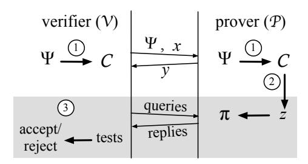
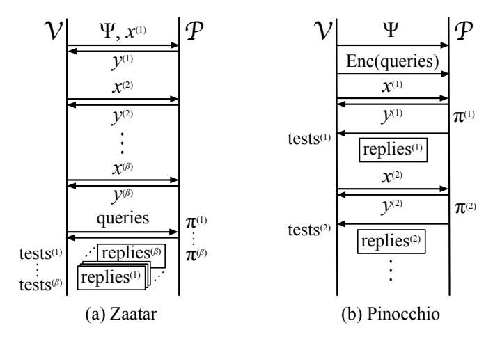
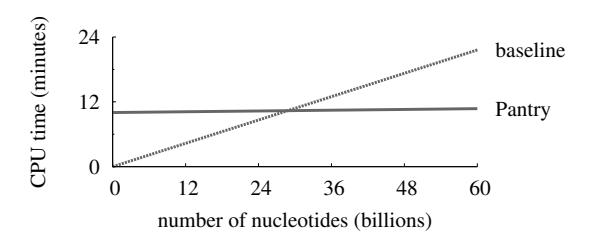
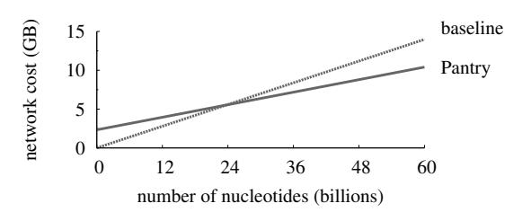

# Verifying computations with state (extended version)\*

Benjamin Braun, Ariel J. Feldman? , Zuocheng Ren, Srinath Setty, Andrew J. Blumberg, and Michael Walfish The University of Texas at Austin ?University of Pennsylvania

#### Abstract

When a client outsources a job to a third party (e.g., the cloud), how can the client check the result, without reexecuting the computation? Recent work in *proof-based verifiable computation* has made significant progress on this problem by incorporating deep results from complexity theory and cryptography into built systems. However, these systems work within a stateless model: they exclude computations that interact with RAM or a disk, or for which the client does not have the full input.

This paper describes Pantry, a built system that overcomes these limitations. Pantry composes proofbased verifiable computation with untrusted storage: the client expresses its computation in terms of digests that attest to state, and verifiably outsources *that* computation. Using Pantry, we extend verifiability to MapReduce jobs, simple database queries, and interactions with private state. Thus, Pantry takes another step toward practical proof-based verifiable computation for realistic applications.

### <span id="page-0-0"></span>1 Introduction

This paper addresses a fundamental problem in systems security: how can a local computer verify the correctness of a remote execution? (Checking that the given program was expressed correctly is a complementary concern, studied by the field of program verification.) Our focus on execution verification is motivated by large MapReduce jobs, remote database queries, and cloud computing more generally. In these scenarios, the causes of incorrect execution include corruption of input data in storage or transit, hardware faults, platform bugs, and misconfiguration. Unfortunately, the faults, and their effects, may not be visible as such. Indeed, when a job completes, after having processed petabytes of data, how can the client be sure that the output is correct [\[83\]](#page-41-0)?

The client could audit the output [\[60\]](#page-40-0), but this technique fails if a problem happens outside the selected sample. The client could replicate the computation (using state machine replication [\[27\]](#page-39-0), quorums [\[56\]](#page-40-1), or outsourcing to two clouds [\[5,](#page-38-0) [26\]](#page-39-1)), but this technique works only if replica faults are uncorrelated. The client could trust the remote hardware and use attestation [\[66,](#page-40-2) [69\]](#page-40-3), but what if the hardware is faulty? The client could use a tailored solution [\[8,](#page-38-1) [16,](#page-38-2) [22,](#page-39-2) [32,](#page-39-3) [43,](#page-39-4) [64,](#page-40-4) [76,](#page-41-1) [79,](#page-41-2) [81\]](#page-41-3), but such solutions are not available for all applications.

Perhaps surprisingly, the client can receive a guarantee that covers the entire execution of the computation, that makes no assumptions about the performing platform (other than cryptographic hardness assumptions), and that applies generally. In *proof-based verifiable computation*, the performing computer (or *prover*) returns the results along with a *proof* that the client (or *verifier*) can efficiently and probabilistically check. If the entire computation was executed correctly, the client accepts, and if there is any error, the client rejects with high probability.

These protocols are based on deep theoretical tools: probabilistically checkable proofs (PCPs) [\[6,](#page-38-3) [7\]](#page-38-4), interactive proofs [\[9,](#page-38-5) [41,](#page-39-5) [42,](#page-39-6) [53,](#page-40-5) [75\]](#page-41-4), and cryptography [\[18,](#page-38-6) [23,](#page-39-7) [35,](#page-39-8) [36,](#page-39-9) [47,](#page-40-6) [50\]](#page-40-7). This theory provides very

\*This is the full version of [\[25\]](#page-39-10). This version includes proofs (Appendices [A](#page-21-0)[–C\)](#page-33-0), further experimental details (Appendices [D–](#page-35-0) [E\)](#page-37-0), and minor improvements to the text.

strong guarantees and is usually phrased as defending against an arbitrarily malicious prover. Note that maliciousness is not an accusation but rather a comprehensive *model* that includes benign malfunctions with unpredictable effects.

Recent works have aimed to realize proof-based verifiable computation in built systems [\[15,](#page-38-7) [28,](#page-39-11) [65,](#page-40-8) [70–](#page-40-9) [73,](#page-40-10) [77,](#page-41-5) [78,](#page-41-6) [80\]](#page-41-7). On the one hand, these systems appear to approach practicality. Some of them come with compilers that allow programmers to express computations in a high-level language [\[15,](#page-38-7) [65,](#page-40-8) [71,](#page-40-11) [73,](#page-40-10) [80\]](#page-41-7). And the best of them achieve reasonable client performance, provided that there are many identical computations (with potentially different inputs) over which to amortize overhead—a requirement met by typical data-parallel cloud computing applications.

On the other hand, almost none of these systems admit a notion of state or storage:<sup>1</sup> their compilation target is *constraints*, a generalization of circuits ([§2\)](#page-2-0). Given this "assembly language", the computation cannot feasibly use memory, and the client must handle all of the input and output. Besides hindering programmability, these limitations are inconsistent with remotely stored inputs (as in MapReduce jobs, queries on remote databases, etc.); for example, verifying a large MapReduce job would require the client to materialize the entire dataset.

This paper introduces Pantry, the first system to provide verifiable computation with state. To do so, Pantry marries machinery for verifying pure computations with techniques from untrusted storage [\[21,](#page-39-12) [33,](#page-39-13) [52,](#page-40-12) [58\]](#page-40-13). While this picture is folklore among theorists [\[14,](#page-38-8) [18,](#page-38-6) [36,](#page-39-9) [46\]](#page-40-14), the contributions of Pantry are to work out the details and build a system, specifically:

- (1) Pantry enhances state of the art systems ([§2\)](#page-2-0) for verifiable computation (Ginger [\[73\]](#page-40-10), Zaatar [\[71\]](#page-40-11), Pinocchio [\[65\]](#page-40-8)) with a storage abstraction ([§3\)](#page-6-0). The programmer expresses a computation using a subset of C plus two new primitives—PutBlock and GetBlock—and the Pantry compiler produces appropriate constraints. These primitives name data blocks by a cryptographic digest, or hash, of their contents. Such blocks are used extensively in systems for untrusted storage [\[33,](#page-39-13) [52\]](#page-40-12); however, in Pantry, the verifier will not be fetching the blocks to check them. The key insight here is that there exist hash functions that are amenable to the constraint formalism.
- (2) Using PutBlock and GetBlock, we build a verifiable MapReduce framework ([§4\)](#page-8-0). The programmer writes Map and Reduce functions, much as in standard MapReduce frameworks. Here, however, input and output files are named by the digests of their contents.
- (3) We also use PutBlock and GetBlock (together with well-known techniques [\[21,](#page-39-12) [58\]](#page-40-13)) to build higher-level storage abstractions: a RAM and a searchable tree ([§5\)](#page-11-0). We use the tree to build a database application that supports verifiable queries in a (small) subset of SQL. The notable aspects here are the placement of functionality and the result: the abstractions are exposed to the C programmer, they need not be built into the compiler, and operations on these abstractions happen verifiably even though the client does not have the state.
- (4) We compose PutBlock and GetBlock with a zero-knowledge variant of Pinocchio [\[36,](#page-39-9) [65\]](#page-40-8), to build applications in which the prover's state is private: face matching, toll collection, etc. ([§6\)](#page-14-0).

The components just described have awkward usage restrictions (the database is single-writer, iteration constructs need static upper bounds, etc.), due in part to the clumsiness of the constraint formalism. Worse, the measured cost ([§8\)](#page-15-0) of the implementation ([§7\)](#page-15-1) is very high: the prover's overhead is tremendous, and the verifier incurs a similarly high per-computation setup cost, requiring many invocations to justify this expense.

However, compared to prior systems for verifiable computation ([§9\)](#page-19-0), Pantry improves performance: by not handling inputs, the verifier saves CPU and network costs. This effect, together with Pantry's enhanced expressiveness, expands the universe of applications for which verification makes sense ([§10\)](#page-20-0). MapReduce, for example, works over remote state, and is well-suited to amortizing the setup costs, since it

<sup>1</sup>The exception is concurrent work by Ben-Sasson et al. [\[15\]](#page-38-7); see [§9.](#page-19-0)



**Figure 1**—Verifiable outsourcing in Zaatar and Pinocchio, assuming a single instance of a computation  $\Psi$  on input x (amortization is depicted in Figure 2). Step ①:  $\mathcal{V}$  and  $\mathcal{P}$  compile  $\Psi$  from a high-level language to constraints  $\mathcal{C}$ . Step ②:  $\mathcal{P}$  produces a satisfying assignment, z, to  $\mathcal{C}(X=x,Y=y)$ . Step ③:  $\mathcal{P}$  uses complexity-theoretic and cryptographic machinery to convince  $\mathcal{V}$  that  $\mathcal{P}$  holds a satisfying assignment.

<span id="page-2-1"></span>entails many identical computations. And the private state applications provide functionality that does not exist otherwise or previously required intricate custom protocols. In summary, Pantry extends proof-based verifiable computation to real applications of cloud computing (albeit at much smaller scales for now).

#### <span id="page-2-0"></span>2 Pantry's base: Zaatar and Pinocchio

We present Zaatar [71] and Pinocchio [65], and the underlying theory, in a unified framework. Similar frameworks appear in prior work [65, 71–73, 80], and aspects of our presentation are borrowed [71, §2][80, §2].

#### <span id="page-2-2"></span>2.1 Overview of Zaatar and Pinocchio

A client, or *verifier*  $\mathcal{V}$ , sends a program  $\Psi$ , expressed in a high-level language, to a server, or *prover*  $\mathcal{P}$ .  $\mathcal{V}$  sends input x and receives output y, which is supposed to be  $\Psi(x)$ .  $\mathcal{V}$  then engages  $\mathcal{P}$  in a protocol that allows  $\mathcal{V}$  to check whether  $\mathcal{P}$  executed correctly. This protocol assumes a computational bound on  $\mathcal{P}$  (e.g., that  $\mathcal{P}$  cannot break a cryptographic primitive). However, the protocol makes no other assumptions about  $\mathcal{P}$ : its guarantees hold regardless of how or why  $\mathcal{P}$  malfunctions. These guarantees are probabilistic (over  $\mathcal{V}$ 's random choices):

- Completeness. If  $y = \Psi(x)$ , then if  $\mathcal{P}$  follows the protocol,  $\Pr{\mathcal{V} \text{ accepts}} = 1$ .
- Soundness. If  $y \neq \Psi(x)$ , then  $\Pr\{V \text{ rejects}\} > 1 \epsilon$ , where  $\epsilon$  can be made small.

Given a specific computation  $\Psi$ , we call each invocation of it an *instance*. The per-instance costs for  $\mathcal{V}$  are very low. However, in order to participate in the protocol,  $\mathcal{V}$  incurs a setup cost for each  $\Psi$ , which amortizes over multiple instances, either over a batch [71] or indefinitely [65] (see Section 2.3).

#### <span id="page-2-3"></span>2.2 Zaatar and Pinocchio in more detail

Verifiably outsourcing a computation happens in three steps, depicted in Figure 1. First, a compiler transforms the computation  $\Psi$  to an algebraic system of *constraints*. Next,  $\mathcal{P}$  produces a solution to these constraints that implies  $y = \Psi(x)$ . Finally,  $\mathcal{P}$  convinces  $\mathcal{V}$  that it has produced such a solution, thereby establishing that  $y = \Psi(x)$ . We now describe each step in detail; for the time being, we assume only one instance (§2.3 revisits).

(1)  $\Psi$  is represented as constraints. The programmer begins by expressing a computation,  $\Psi$ , in a subset of C or an equivalent high-level language (described in §2.4) and invoking a compiler [55, 65, 71, 73]. Here, we focus on the compilation target: *a set of constraints* [24, 73].

In our context, a set of constraints C is a system of equations in variables (X, Y, Z), over a large finite field,  $\mathbb{F}$ ; we choose  $\mathbb{F} = \mathbb{F}_p$  (the integers mod a prime p), where p is large (e.g., 128 bits). Each constraint

has total degree 2, so each summand in a constraint is either a variable or a product of two variables. Variables *X* and *Y* represent the input and output variables, respectively; for now, we assume one of each. Upper-case letters (*X*, *Y*, *Z*, . . .) represent constraint variables; their lower-case counterparts (*x*, *y*,*z*, . . .) represent concrete values taken by (or assigned to, or bound to) those variables.

Also, let C(*X*=*x*) mean C with *X* bound to *x* (V's requested input); C(*X*=*x*, *Y*=*y*) indicates that in addition *Y* is bound to *y* (the purported output). Notice that C(*X*=*x*, *Y*=*y*) is a set of constraints over the variables *Z*. If for some *z*, setting *Z*=*z* makes all constraints in C(*X*=*x*, *Y*=*y*) hold simultaneously, then C(*X*=*x*, *Y*=*y*) is said to be *satisfiable*, and *z* is a *satisfying assignment*.

For a given computation Ψ, a set of constraints C is said to be *equivalent* to Ψ if: for all *x*, *y*, we have *y* = Ψ(*x*) if and only if C(*X*=*x*, *Y*=*y*) is satisfiable. As a simple example, the constraints C={*Z* − *X* = 0, *Z* + 1 − *Y* = 0} are equivalent to add-1 [\[24\]](#page-39-14). Indeed, consider a pair (*x*, *y*). If *y* = *x* + 1, then there is a satisfying assignment to C(*X*=*x*, *Y*=*y*), namely *Z*=*x*. However, if *y* 6= *x* + 1, then C(*X*=*x*, *Y*=*y*) is not satisfiable.

(2) P computes and identifies a satisfying assignment. P "executes" Ψ(*x*) by identifying a satisfying assignment to the equivalent constraints C(*X*=*x*), and obtaining the output *y* in the process. To do so, P runs a constraint-solving routine that takes as input a compiler-produced list of annotated constraints. This routine goes constraint-by-constraint. A common case is that a constraint introduces a variable and can be written as an assignment to that new variable (e.g., {. . . , *Z*<sup>4</sup> = *Z*<sup>3</sup> · (*Z*<sup>2</sup> + *Z*1), *Z*<sup>5</sup> = *Z*<sup>4</sup> · *Z*2, . . .}); the routine "solves" such constraints by evaluating their right-hand sides.

Some constraints require additional work of P. An example is the != test (this will give some intuition for the techniques in Section [3\)](#page-6-0). Consider the following snippet:

```
if (Z1 != Z2)
    Z3 = 1;
else
    Z3 = 0;
```

This compiles to the following constraints [\[24\]](#page-39-14):

$$C_{!=} = \left\{ \begin{array}{rcl} M \cdot (Z_1 - Z_2) - Z_3 & = & 0 \\ (1 - Z_3) \cdot (Z_1 - Z_2) & = & 0 \end{array} \right\}.$$

Notice that the first constraint introduces *two* new variables (*M*, *Z*3), and thus there are multiple ways to satisfy this constraint. To choose values for these variables that also satisfy the second constraint, P's constraint-solving routine consults the constraints' annotations. The relevant annotation tells P that if *Z*<sup>1</sup> 6= *Z*2, then P should set *M* equal to the multiplicative inverse of *Z*<sup>1</sup> − *Z*2, which P computes outside of the constraint formalism. We call this "computing exogenously" (in theoretical terms, *M* and *Z*<sup>3</sup> are "non-deterministic input"), and there is an analogy between the exogenous computation of *M* and supplying values from storage in Section [3.](#page-6-0)

(3) P argues that it has a satisfying assignment. P wants to prove to V that it knows a satisfying assignment to C(*X*=*x*, *Y*=*y*); this would convince V that the output *y* is correct (and moreover that the computation, expressed in constraints, was executed correctly). Of course, there is a simple proof that a satisfying assignment exists: the satisfying assignment itself. However, V could check this proof only by examining all of it, which would be as much work as executing the computation.

Instead, Zaatar and Pinocchio apply the theory of PCPs [\[6,](#page-38-3) [7\]](#page-38-4),<sup>2</sup> which implies that a classical proof—a satisfying assignment *z*, in this case—can be *encoded* into a long string π in a way that allows V to detect

<sup>2</sup>Our description takes some expositional license: Pinocchio's explicit base is GGPR [\[36\]](#page-39-9), which does not invoke PCPs. However, one can regard the *key* in their work as PCP queries, in encrypted form [\[20\]](#page-39-15).



<span id="page-4-0"></span>**Figure 2**—Amortization in Zaatar [71] and Pinocchio [65]. Superscripts denote different instances. In Zaatar,  $\mathcal{V}$ 's work to formulate queries amortizes over a batch of  $\beta$  instances; in Pinocchio, analogous work amortizes over all future instances of the same computation (this is better). In both protocols, the  $\Psi \to \mathcal{C}$  step happens only once for each  $\Psi$  (not depicted).

the proof's validity by (a) inspecting a small number of randomly-chosen locations in  $\pi$ , and (b) applying efficient tests to the contents found at those locations. The details—what is in the encoding  $\pi$ , how  $\mathcal V$  selects locations to inspect, what tests  $\mathcal V$  applies, and why all of this works—are beyond the scope of this paper.

The protocols do not use PCPs alone: the encoded proof  $\pi$  is far larger than the number of steps in  $\Psi$ , so making  $\mathcal V$  receive  $\pi$  would again defeat our purpose. To get around this issue, Zaatar and Pinocchio—and their theoretical progenitors—compose PCPs with cryptography, based on assumptions that  $\mathcal P$  cannot break certain primitives. There are two types of protocols; our compiler produces  $\mathcal V$  and  $\mathcal P$  binaries for both.

First, Zaatar [71] instantiates an *efficient argument* [23, 47, 50, 72, 73]:  $\mathcal{V}$  extracts from  $\mathcal{P}$  a cryptographic *commitment* to  $\pi$ , and then  $\mathcal{V}$  queries  $\mathcal{P}$ , meaning that  $\mathcal{V}$  asks  $\mathcal{P}$  what values  $\pi$  contains at particular locations.  $\mathcal{V}$  uses PCPs to choose the locations and test the replies, and cryptography to ensure that  $\mathcal{P}$ 's replies pass  $\mathcal{V}$ 's tests only if  $\mathcal{P}$ 's replies are consistent with a proof  $\pi$  that a satisfying assignment exists. The protocol details are given in prior works [71, §2][73, §2][72].

The second variant is instantiated by Pinocchio [65] and known as a *non-interactive argument* [36, 37]: V preencrypts queries and sends them to P. As in the first variant, the queries are chosen by PCP machinery and describe locations where V wants to inspect an eventual  $\pi$ . Here, however, P replies to the queries without knowing which locations V is querying. This process (hiding the queries, replying to them, testing the answers) relies on sophisticated cryptography layered atop the PCP machinery. The details are described elsewhere [20, 36, 65].

#### <span id="page-4-1"></span>2.3 Amortization, guarantees, and costs

 $\mathcal{V}$  incurs a setup cost (to express which locations in  $\pi$  to query) for each computation  $\Psi$  and each input size. This cost amortizes differently in Zaatar and Pinocchio.

In Zaatar, amortization happens over a *batch*: a set of  $\beta$  instances of the identical computation  $\Psi$ , on different inputs (Figure 2(a)). Thus, Zaatar presumes parallelism: for  $j \in \{1, ..., \beta\}$ ,  $\mathcal{V}$  sends parallel inputs  $x^{(j)}$ ,  $\mathcal{P}$  returns parallel outputs  $y^{(j)}$ , and  $\mathcal{P}$  formulates parallel proofs  $\pi^{(j)}$  establishing that  $y^{(j)} = \Psi(x^{(j)})$ . The synchronization requirement is that V extract commitments to all  $\pi^{(j)}$  before issuing the queries (because queries are reused across the batch). Note that  $\mathcal{P}$  is an abstraction and could represent multiple machines (as in our MapReduce application in Section 4). Zaatar meets the completeness and

|            | naive                | Zaatar [71], Pinocchio [65]                       |
|------------|----------------------|---------------------------------------------------|
| V, setup   | 0                    | c2<br>· ( Z  +  C )                               |
| V, runtime | β · (T( x ) + c1 y ) | β · (c3<br>· ( x  +  y ))<br>+ c4                 |
| P, runtime | 0                    | β · (c5<br>· ( Z  +  C ) + c6<br>·  C  · log  C ) |

*T*: running time of computation as a function of input length.

Figure 3—CPU costs of step (3) under Zaatar and Pinocchio, and under the naive approach: reexecute and compare. The amortization behavior is different for Zaatar and Pinocchio (see text). Also, the constants (*c*2, *c*3, . . .) differ: Pinocchio's *c*<sup>4</sup> is lower while for the other constants, Zaatar's values are lower. Section [8.1](#page-15-2) discusses these constants, the magnitudes of |*Z*| and |C|, and the costs of step (2).

soundness properties given earlier ([§2.1\)](#page-2-2), with < 1/10<sup>6</sup> (see [\[71,](#page-40-11) Apdx. A.2]), and in addition provides soundness for the batch: if for any *j* ∈ {1, . . . , β}, *y* (*j*) 6= Ψ(*x* (*j*) ), then Pr{*V* rejects the batch} > 1 − .

In Pinocchio, query formulation by V and installation on P happen once per Ψ, thereby amortizing over all future instances of the identical computation (Figure [2\(](#page-4-0)b)). Pinocchio meets the completeness and soundness properties, with < 1/2 <sup>128</sup>. Pinocchio also has versions that provide zero-knowledge (the prover can keep private the contents of the satisfying assignment *z*) and public verifiability [\[65\]](#page-40-8); the former provides a crucial foundation for Pantry's privacy-preserving applications ([§6\)](#page-14-0).

Figure [3](#page-5-1) depicts the protocols' CPU costs for step (3). A key performance goal is that V *should incur lower (amortized) CPU costs than the naive alternative: reexecuting the computation [\[35\]](#page-39-8)*. <sup>3</sup> Performance is thus evaluated as follows [\[65,](#page-40-8) [71](#page-40-11)[–73,](#page-40-10) [80\]](#page-41-7). (1) Are the per-instance costs for V less than the running time of Ψ, when Ψ is expressed in C and compiled to machine code? (Otherwise, the performance goal cannot be met.) (2) What is the *cross-over* point, meaning the number of instances past which V expends less total CPU than the naive verifier? (3) What are the overheads of P, relative to normal execution?

Rough answers are as follows (see also Section [8\)](#page-15-0). For question (1), the answer is "sometimes; it depends on the computation". For (2), the cross-over points are tens of thousands or millions [\[71,](#page-40-11) §5.2], depending on the computation. For (3), the overheads are very high: factors of 10<sup>4</sup> or 10<sup>5</sup> are not uncommon.

To briefly compare the performance of Zaatar and Pinocchio, Pinocchio has superior amortization behavior (see above) but higher proving and setup costs (and hence higher cross-over points), by constant factors.

#### <span id="page-5-0"></span>2.4 Expressiveness

As context for Pantry, we now describe the language features and limitations of prior work [\[24,](#page-39-14) [65,](#page-40-8) [71,](#page-40-11) [73\]](#page-40-10). Pre-Pantry, compilers accepted a C subset [\[65\]](#page-40-8) (or the equivalent [\[55,](#page-40-15) [71,](#page-40-11) [73\]](#page-40-10)) that includes functions, structs, typedefs, preprocessor definitions, if-else statements, explicit type conversion, and standard integer and bitwise operations. These compilers partially support pointers and loops: pointers and array indexes must be compile-time constants (ruling out a RAM abstraction), and likewise with the maximum number of loop iterations.

When compiled, most operations introduce only a few new variables or constraints [\[71,](#page-40-11) §4]. There are four exceptions. The first two are inequalities and bitwise operations; these constructs separate numbers into their bits and glue them back together [\[24,](#page-39-14) [65,](#page-40-8) [73\]](#page-40-10), requiring ≈ log<sup>2</sup> |F| constraints and variables per operation. The other two are looping and if-else statements: loops are unrolled at compile time, and the costs of an if-else statement combine the costs of the then-block and the else-block [\[24\]](#page-39-14).

*x*, *y*: input and output of computation.

β: number of instances over which V's setup cost amortizes

<span id="page-5-1"></span>*c*1, *c*2, . . .: model costs of processing input/output, cryptographic primitives, PCP queries, etc.

<sup>3</sup>One might think to compare to replicated execution ([§1\)](#page-0-0), but a goal of verifiable computation is to provide very strong guarantees ([§2.1\)](#page-2-2); replication stops working when faults are correlated.

Apart from the specifics of language constructs and costs, the pre-Pantry model of computation is severely limited, even hermetic: computations can interact with state neither as auxiliary input, nor during execution, nor as auxiliary output. Therefore, using Zaatar or Pinocchio requires V to supply all inputs, receive all outputs, and eschew any notion of RAM, disk, or storage. These are the limitations addressed by Pantry.

# <span id="page-6-0"></span>3 Storage model and primitives in Pantry

The core of Pantry is two primitives, verifiable PutBlock and GetBlock, that extend the model above. This section describes the primitives; Sections [4](#page-8-0)[–6](#page-14-0) describe their use.

To explain Pantry's approach, we note that the interface to step (3) in Section [2.2](#page-2-3) is a set of constraints and a purported satisfying assignment. Thus, a first cut attempt at incorporating state into verifiable computation would be to represent load and store operations with constraints explicitly. However, doing so naively would incur horrific expense: if memory is an array of variables, then load(addr) would require a separate constraint for each possible value of addr (assuming addr is not resolvable at compile-time). This approach would also require the input state to be available to the verifier V.

To overcome these problems, we want a model in which computations do not execute storage but can efficiently verify it. Given such a model, we could use constraints to represent computation (as we do now) as well as efficient *checks* of storage. But such a model is actually well-studied, in the context of untrusted storage: the state is represented by hash trees [\[21,](#page-39-12) [58\]](#page-40-13), often accompanied by a naming scheme in which data blocks are referenced by hashes of their contents [\[33,](#page-39-13) [52\]](#page-40-12).

If we could efficiently represent the computation of the hash function as constraints, then we could extend the computational model in Section [2](#page-2-0) with the semantics of untrusted storage. At that point, a satisfying assignment to the constraints would imply correct computation *and* correct interaction with state—and we could use step (3) from Section [2.2](#page-2-3) to prove to V that P holds such an assignment. We now describe this approach.

### <span id="page-6-1"></span>3.1 Verifiable blocks: overview

The lowest level of storage is a block store; it consists of variable-length blocks of data, in which the blocks are named by collision-resistant hash functions (CRHFs) of those blocks. Letting *H* denote a CRHF, a correct block store is a map

$$S: name \rightarrow block \cup \bot$$
,

where if *block* = *S*(*name*), then *H*(*block*) = *name*. In other words, *S* implements the relation *H* −1 . This naming scheme allows clients to use untrusted storage servers [\[33,](#page-39-13) [52\]](#page-40-12). The technique's power is that given a name for data, the client can check that the returned block is correct, in the sense of being consistent with its name. Likewise, a client that creates new blocks can compute their names and use those names as references later in the computation.

But unlike the scenario in prior work, our V cannot actually check the contents of the blocks that it "retrieves" or impose the correct names of the blocks that it "stores", as the entire computation is remote. Instead, V represents its computations with constraints that P can satisfy only if P uses the right blocks. Another way to understand this approach is that V uses the verification machinery to outsource the storage checks to P; in fact, P itself could be using an untrusted block store!

We will show in later sections how to write general-purpose computations; for now, we illustrate the model with a simple example. Imagine that the computation takes as input the name of a block and returns the associated contents as output. The constraints are set up to be satisfiable if and only if the return value hashes to the requested name. In effect, P is being asked to identify a preimage of *H*, which

```
GetBlock(name n):
   block ← read block with name n in block store S
   assert n == H(block)
   return block
                                                           PutBlock(block):
                                                               n ← H(block)
                                                               store (n, block) in block store S
                                                               return n
```

<span id="page-7-0"></span>Figure 4—Pseudocode for verifiable storage primitives. These primitives compile to constraints that enforce the required relation between *n* and *block*; the constraints do not represent interactions with *S* explicitly.

(by the collision-resistance of *H*) P can do only if it returns the actual block previously stored under the requested name.

### <span id="page-7-1"></span>3.2 Verifiable blocks: details and costs

Pantry provides two primitives to the programmer:

```
block = GetBlock(name);
name = PutBlock(block);
```

These primitives are detailed in Figure [4.](#page-7-0) Notice that in a correct execution, *H*(block)=name. Given this relation, and given the collision-resistance of *H*, the programmer receives from GetBlock and PutBlock a particular storage model: *S* functions as write-once memory, where the addresses are in practice unique, and where an address certifies the data that it holds.

Of course, how *S* is implemented is unspecified here; the choice can be different for different kinds of storage (MapReduce, RAM, etc.). And, per the definition of *S*, block length can vary; for example, in the MapReduce application ([§4\)](#page-8-0), an entire file will be one block.

To bootstrap, the client supplies one or more names as input, and it may receive one or more names as output, for use in further computations. These names are related to capabilities [\[44,](#page-39-17) [51\]](#page-40-17): with capabilities, a reference certifies to the system, by its existence, that the programmer is entitled to refer to a particular object; here, the reference itself certifies to the programmer that the system is providing the programmer with the correct object.

We now describe the constraints that enforce the model. The code b = GetBlock(n) compiles to constraints C*H*−<sup>1</sup> , where: the input variable, *X*, represents the name; the output variable, *Y*, represents the block contents; and C*H*−<sup>1</sup> (*X*=*n*, *Y*=*b*) is satisfiable if and only if *b* ∈ *H* −1 (*n*) (i.e., *H*(*b*) = *n*). The code n = PutBlock(b) compiles to the same constraints, except that the inputs and outputs are switched. Specifically, this line compiles to constraints C*H*, where: *X* represents the block contents, *Y* represents the name, and C*H*(*X*=*b*, *Y*=*n*) is satisfiable if and only if *n* = *H*(*b*).

Of course, C*<sup>H</sup>* and C*H*−<sup>1</sup> will usually appear inside a larger set of constraints, in which case the compiler relabels the inputs and outputs of C*<sup>H</sup>* and C*H*−<sup>1</sup> to correspond to intermediate program variables. As an example, consider the following computation:

```
add(int x1, name x2) {
    block b = GetBlock(x2);
    /* assume that b is a field element */
    return b + x1;
}
```

The corresponding constraints are:

$$C = \{Y - B - X_1 = 0\} \cup C_{H^{-1}}(X = X_2, Y = B),$$

where the notation *X*=*X*<sup>2</sup> and *Y*=*B* means that, in C*H*−<sup>1</sup> above, the appearances of *X* are relabeled *X*<sup>2</sup> and the appearances of *Y* are relabeled *B*. Notice that variable *B* is unbound in C(*X*1=*x*1, *X*2=*x*2, *Y*=*y*). To assign *B*=*b* in a way that satisfies the constraints, P must identify a concrete *b*, presumably from storage, such that *H*(*b*)=*x*2.

<span id="page-8-1"></span>**Costs.** The main cost of GetBlock and PutBlock is the set of constraints required to represent the hash function H in  $C_H$  and  $C_{H^{-1}}$ . Unfortunately, widely-used functions (e.g., SHA-1) make heavy use of bitwise operations, which do not have compact representations as constraints (§2.4). Instead, we use an *algebraic* hash function, due to Ajtai [4, 40] and based on the hardness of approximation problems in lattices. The Ajtai function multiplies its input, represented as a bit vector, by a large matrix modulo an integer. This matrix-vector multiplication can be expressed concisely in constraints because constraints naturally encode sums of products (§2.2). Indeed, Ajtai requires approximately ten times fewer constraints than SHA-1 would. Nevertheless, Ajtai uses some bitwise operations (for modular arithmetic) and hence requires a substantial number of constraints (§8.1).

#### 3.3 Guarantees and non-guarantees

Appendices A and B describe the formal guarantees of Pantry; here we give an informal and heuristic explanation.

Notice that the constraints do not capture the actual interaction with the block store S; the prover P is separately responsible for maintaining the map S. What ensures that P does so honestly? The high-level answer is the checks in the constraints plus the collision-resistance of H.

As an illustration, consider this code snippet:

```
n = PutBlock(b);
b' = GetBlock(n);
```

In a reasonable (sequential) computational model, a read of a memory location should return the value written at that location; since our names act as "locations", a correct execution of the code above should have variables b and b' equal. But the program is compiled to constraints that include  $C_H$  (for PutBlock) and  $C_{H^{-1}}$  (for GetBlock), and these constraints could in principle be satisfied with  $b' \neq b$ , if H(b') = H(b). However,  $\mathcal{P}$  is prevented from supplying a spurious satisfying assignment because collision-resistance implies that identifying such a b and b' is computationally infeasible. That is, practically speaking,  $\mathcal{P}$  can satisfy the constraints only if it stores the actual block and then returns it.

However, Pantry does not formally enforce *durability*: a malicious  $\mathcal{P}$  could discard blocks inside PutBlock yet still exhibit a satisfying assignment. Such a  $\mathcal{P}$  might be caught only when executing a subsequent computation (when  $\mathcal{V}$  issues a corresponding GetBlock,  $\mathcal{P}$  would be unable to satisfy the constraints), and at that point, it might be too late to get the data back. For a formal guarantee of durability, one can in principle use other machinery [74]. Also, Pantry (like its predecessors) does not enforce *availability*:  $\mathcal{P}$  could refuse to engage, or fail to supply a satisfying assignment, even if it knows one.

What Pantry enforces is *integrity*, meaning that purported memory values (the blocks that are used in the computation) are consistent with their names, or else the computation does not verify.

For this reason, if  $\mathcal{V}$ 's computation executes GetBlock(foo), and foo is an erroneous name in the sense that it does not represent the hash of any block previously stored, then  $\mathcal{P}$  has no way of providing a satisfying assignment. This is as it should be: the computation itself is erroneous (in this model, correct programs pass the assert in GetBlock; see Figure 4).

A limitation of this model is that  $\mathcal{P}$  cannot prove to  $\mathcal{V}$  that  $\mathcal{V}$  made such an error; to the argument step (step (3) in §2.2), this case looks like the one in which  $\mathcal{P}$  refuses to provide a satisfying assignment. While that might be disconcerting, Pantry's goal is to establish that a remote execution is consistent with an expressed computation; program verification is a complementary concern (§1).

#### <span id="page-8-0"></span>4 Verifiable MapReduce

This section describes how Pantry provides verifiability for MapReduce jobs. We begin with a brief review of the standard MapReduce model [30].

```
DigestArray Mapper(Digest X) {
    Block list_in = GetBlock(X);
    Block list_out[NUM_REDUCERS];
    Digest Y[NUM_REDUCERS];
    // invoke programmer-supplied Map
    Map(list_in, &list_out);
    for (i = 0; i < NUM_REDUCERS; i++)
        Y[i] = PutBlock(list_out[i]);
    return Y;
}
                                                        Digest Reducer(DigestArray X) {
                                                            Block list_in[NUM_MAPPERS];
                                                            Block list_out;
                                                            for (i = 0; i < NUM_MAPPERS; i++)
                                                                list_in[i] = GetBlock(X[i]);
                                                            // invoke programmer-supplied Reduce
                                                            Reduce(list_in, &list_out);
                                                            Y = PutBlock(list_out);
                                                            return Y;
                                                        }
```

<span id="page-9-0"></span>Figure 5—For verifiable MapReduce, Pantry regards the depicted functions, Mapper and Reducer, as separate computations. The two functions compile to separate constraints, and V verifies in two batches: one for the mappers and one for the reducers.

A MapReduce *job* consists of Map and Reduce functions, and input data structured as a list of key-value pairs; the output is a transformed list of key-value pairs. The programmer supplies the implementations of Map and Reduce; Map takes as input a list of key-value pairs and outputs another list of key-value pairs, and Reduce takes as input a list of values associated with a single key and outputs another list of values. The *framework* runs multiple instances of Map and Reduce as stand-alone processes, called *mappers* and *reducers*. The framework gives each mapper a chunk of the input data, *shuffles* the mappers' output, and supplies it to the reducers; each reducer's output contributes a chunk to the overall output of the job. A centralized module, which is part of the framework, drives the job (by assigning processes to machines, etc.).

Overview of MapReduce in Pantry. The verifier V is a machine that invokes a MapReduce job (for instance, the desktop machine of a cloud customer). The goal of Pantry's MapReduce is to assure V that its job starts from the correct input data and executes correctly from there.

The model here will be similar to the standard one outlined above, except that the input and output files will be verifiable blocks ([§3\)](#page-6-0): a file will be referenced by a collision-resistant hash, or *digest*, of its contents (from now on, we use "digest" and "name" interchangeably). In this model, invoking a MapReduce job requires V to supply a list of digests, one for each input file; call this list *x*. Likewise, V receives as output a list of digests, *y*. V learns of the digests in *x* either from a bootstrapping step (creating the data and keeping track of its digest, say) or as the output of a job; likewise, V can use the digests in *y* either to download (and verify the integrity of) the actual data or to feed another job. That is, these digests are self-certifying references to the data [\[33,](#page-39-13) [52\]](#page-40-12).

Given this model, V will be guaranteed that the output digests *y* are correct, meaning that the actual input data (the key-value pairs whose digests are *x*), when transformed by V's desired Map and Reduce functions, results in output data with digests *y*. But providing this guarantee requires an application of the verification machinery ([§2–](#page-2-0)[§3\)](#page-6-0), which raises a design question: what exactly is the computation to be verified, and which machine(s) implement P?

Pantry's approach is as follows (we discuss the rationale later). The verifier regards the MapReduce job as two separate batch computations ([§2.3\)](#page-4-1), one for the map phase and one for the reduce phase. In these computations, each mapper and reducer is an instance, with a prover. In our design, V handles an intermediate digest for every (mapper, reducer) pair.

Mechanics. Pantry's MapReduce framework wraps Map and Reduce into functions Mapper and Reducer, which are depicted in Figure [5;](#page-9-0) the job is executed by multiple instances of each. For verification, Pantry's C-to-constraint compiler transforms these functions into constraints, and then each instance—

|                                                            | naive (local)                   | Pantry                              |  |  |
|------------------------------------------------------------|---------------------------------|-------------------------------------|--|--|
| CPU costs                                                  |                                 |                                     |  |  |
| V, setup                                                   | 0                               | c2<br>· ( Zmapper  +  CMapper )     |  |  |
| V, runtime                                                 | M · Tmapper( ch )               | M · (c3<br>·  d  · (R + 1))<br>+ c4 |  |  |
| network costs                                              |                                 |                                     |  |  |
| setup                                                      | 0                               | c7<br>· ( Zmapper  +  CMapper )     |  |  |
| runtime                                                    | M ·  ch                         | M · (c8<br>+  d  · (R + 1))         |  |  |
| Tmapper: running time of a map instance<br>M: # of mappers |                                 |                                     |  |  |
|                                                            | ch : length of a mapper's input | d : length of a digest              |  |  |

<span id="page-10-0"></span>Figure 6—Verification costs in Pantry's MapReduce and naive (local) verification, for the map phase; the reduce phase is similar. The CPU costs largely follow Figure [3;](#page-5-1) the main difference is that V now handles only a *digest* of the inputs. P's costs are omitted, but the substitutions are similar.

playing the role of the prover—convinces V that it knows a satisfying assignment to the corresponding constraints ([§2.2,](#page-2-3) step (3)). Execution and verification can be decoupled, but under Zaatar, the complete execution of a phase (map or reduce) must happen before verification of that phase.

We now give more detail, beginning with some notation. Let *M* and *R* be the number of mappers and reducers, and CMapper and CReducer the constraint representations of Mapper and Reducer. Also, recall that superscripts denote instances in a batch ([§2.3\)](#page-4-1).

When the mappers execute, each instance *j* ∈ {1, . . . , *M*} gets as its input, *x* (*j*) , the digest of some data. The output of an instance, *map out*(*j*) , is a vector of *R* digests, one for each reducer that this mapper is "feeding"; the framework receives this output and forwards it to V. Verification convinces V that each mapper *j* knows a satisfying assignment to CMapper(*X*=*x* (*j*) , *Y*=*map out*(*j*) ), which establishes for V that the mapper worked over the correct data, applied Map correctly, partitioned the transformed data over the reducers correctly, and—in outputting *map out*(*j*)—named the transformed data correctly. Note that {*map out*(*j*)}*j*={1,...,*M*} are the *M* · *R* intermediate digests mentioned above.

The framework then supplies the inputs to the second phase, by shuffling the digests {*map out*(*j*)}*j*={1,...,*M*} and regrouping them as {*reduce in*(*j*) }*j*={1,...,*R*} , where each *reduce in*(*j*) is a vector of *M* digests, one for each mapper. (V does this regrouping too, in order to know the reducers' inputs.)

The framework then invokes the reducers, and the output of each reducer *j* ∈ {1, . . . , *R*} is a single digest *y* (*j*) . Verification convinces V that each reducer *j* knows a satisfying assignment to CReducer(*X*=*reduce in*(*j*) , *Y*=*y* (*j*) ). This establishes for V that each reducer worked over the correct *M* blocks, applied Reduce to them correctly, and produced the correct output digests.

Analysis. Figure [6](#page-10-0) compares the costs of the map phase under Pantry's MapReduce and the naive approach of verifying a job by downloading the inputs (perhaps checking them against digests) and locally executing the computation. A similar analysis applies to the reduce phase.

Both pre-Pantry and under Pantry, the verifier can save CPU cycles compared to the naive verifier provided that the per-instance verification cost is less than the cost to execute the instance. Pre-Pantry, this condition holds only if *c*<sup>3</sup> + *c*<sup>4</sup> ·(|*x*| + |*y*|) < *T*(|*x*|) + *c*1|*y*|, implying that using the verification machinery makes sense only if the computation is superlinear in its input size (see Figure [3\)](#page-5-1). Under Pantry, however, the analogous condition holds when *c*<sup>3</sup> + *c*<sup>4</sup> · |*d*| · (*R* + 1) < *T*mapper(|*ch*|), which can hold even when the computation is *linear* in its input. If this condition holds, then the CPU cross-over point ([§2.3\)](#page-4-1) occurs when *M* ≥ *c*2·(|*Z*mapper|+|CMapper|) *T*mapper(|*ch*|)−*c*3−*c*4·|*d*|·(*R*+1) , per Figure [6.](#page-10-0)

Pantry also saves the verifier network costs. This happens when *M* ≥ *c*7·(|*Z*mapper|+|CMapper|) |*ch*|−*c*8−*R*·|*d*| . Notice that the floor on *M* is proportional to the setup costs: the higher the setup costs, the more instances are needed to beat naive verification. Also, the floor moves inversely with |*ch*|: the larger the chunk size, the greater the expense incurred by the naive verifier in downloading the inputs.

We emphasize that this analysis is predicated on a baseline that is favorable to Pantry. If the baseline were instead local execution and local storage (no remote party at all), then Pantry would never save network costs. However, the analyzed baseline corresponds to common uses of the cloud today: MapReduce jobs execute remotely because their inputs *are* remote, so downloading and uploading ought to be recognized as a cost. Another basis for comparison is Zaatar and Pinocchio: their verifiers handle all inputs and outputs, and thus cannot ever save network costs.

Summarizing the analysis, a MapReduce application calls for Pantry if (a) verifiability is needed and (b) the computational cost of the job is high (so there is a CPU cross-over point), there is a lot of data (so there is a network cross-over point), or both.

Rationale and limitations. Our design reflects awkward aspects of the framework. For example, because of the existence of setup costs ([§2.3\)](#page-4-1), we chose to have V handle intermediate digests. In more detail, V could avoid handling intermediate digests—it could verify the job's output digests {*y* (*j*)} directly from the input digests {*x* (*j*)}—by verifying a single batch. But each instance would have to encompass constraints for one reducer and *M* mappers, causing setup costs to be, undesirably, proportional to the *aggregate* mappers' (instead of a single mapper's) work. To further explain our choice, we note that quadratic intermediate state is not inherently disastrous: in standard MapReduce, the framework keeps *O*(*M* · *R*) state [\[30\]](#page-39-19).

Other limitations stem from the constraint model. For example, we eschew a general-purpose partitioning module in the mapper, as it would compile to a large number of constraints, increasing costs. Instead, the programmer must partition the output of Map into *R* chunks, and must similarly read from *M* inputs in Reduce—tasks that are hidden in standard MapReduce. Moreover, Map and Reduce face the expressiveness restrictions described earlier ([§2.4\)](#page-5-0); one consequence is that each mapper's chunk size must be identical and fixed at compile time, and likewise with the reducers.

# <span id="page-11-0"></span>5 Verifiable data structures

This section describes Pantry's higher-level storage abstractions: RAM, a searchable tree, and a simple database. As with MapReduce, we want to implement the abstractions as data structures in a subset of C, augmented with PutBlock and GetBlock ([§3\)](#page-6-0). To do so, we apply the technique of embedding in data blocks the names (or references or hashes—these concepts are equivalent here) of other blocks [\[21,](#page-39-12) [33,](#page-39-13) [52,](#page-40-12) [54,](#page-40-18) [58\]](#page-40-13) (see also [§9\)](#page-19-0). In the resulting structure, the hashes are links—or pointers that authenticate what they point to. The starting hash (for instance, of the root of a tree) can authenticate any value in the structure; we review how this is done below. We can then incorporate the resulting abstractions into some larger C program, compile that program to constraints, and apply the argument step ([§2.2\)](#page-2-3) to those constraints.

# <span id="page-11-1"></span>5.1 Verifiable RAM

Pantry's verifiable RAM abstraction enables random access to contiguously-addressable, fixed-size memory cells. It exposes the following interface:

```
value = Load(address, digest);
new digest = Store(address, value, digest);
```

Pseudocode for the implementation is in Figure [7.](#page-12-0)

The high-level idea behind this pseudocode is that the digest commits to the full state of memory [\[21,](#page-39-12) [58\]](#page-40-13), in a way that we explain shortly. Then, a Load guarantees that the claim "*address* contains *value*" is consistent with *digest*. For Store, the guarantee is that *new digest* captures the same memory state that *digest* does with the exception that *address* now holds *value*.

```
Load(address a, digest d):
  ` ← dlogNe
  h ← d
  for i = 1 to `:
     node ← GetBlock(h)
     x ← ith bit of a
     if x = 0:
        h ← node.left
     else:
        h ← node.right
  node ← GetBlock(h)
  return node.value
                                                       Store(address a, value v, digest d):
                                                          path ← LoadPath(a, d)
                                                          ` ← dlogNe
                                                          node ← path[`]
                                                          node.value ← v
                                                          d
                                                           0 ← PutBlock(node)
                                                          for i = ` to 1:
                                                             node ← path[i − 1]
                                                             x ← ith bit of a
                                                             if x = 0:
                                                               node.left ← d
                                                                              0
                                                             else:
                                                               node.right ← d
                                                                               0
                                                             d
                                                              0 ← PutBlock(node)
                                                          return d
                                                                  0
```

<span id="page-12-0"></span>Figure 7—RAM operations use verifiable blocks in a Merkle tree [\[21,](#page-39-12) [58\]](#page-40-13). *N* is the number of addresses in the memory.

To explain how a digest *d* can commit to memory, we briefly review Merkle trees [\[21,](#page-39-12) [58\]](#page-40-13). Every node is named by a collision-resistant hash (denoted *H*) of its contents. An interior node's contents are the names (or hashes) of the node's left and right children. Each leaf node corresponds to a memory address, and contains the value currently held at the memory address. Then, the digest *d* is the hash of the root node's contents. Indeed, if entity *A* holds a digest *d*, and entity *B* claims "the value at address *a* is *v*", then *B* could argue that claim to *A* by exhibiting a *witness-path*: the purported name of *a*'s sibling, the purported name of their parent, and so on, to the root. *A* could then check that the hash relationships hold and match *d*. For *B* to succeed in a spurious claim, it would have to identify a collision in *H*.

The pseudocode in Figure [7](#page-12-0) is simply applying this idea: the verifiable blocks in Section [3](#page-6-0) provide the required names-are-hashes referencing scheme, and the GetBlock invocations compile to constraints that force P to exhibit a witness-path. Thus, using CLoad to denote the constraints to which Load compiles, CLoad(*X*=(*a*, *d*), *Y*=*v*) can be satisfied only if the digest *d* is consistent with address *a* holding value *v*, which is the guarantee that Load is supposed to be providing.

How does P identify a path through the tree? In principle, it could recompute the internal nodes on demand from the leaves. But for efficiency, our implementation caches the internal nodes to avoid recomputation.

To invoke Load or Store, the program must begin with a digest; in Pantry, V supplies this digest as part of the input to the computation. One way to bootstrap this is for V to first create a small amount of state locally, then compute the digest directly, then send the data to P, and then use the verification machinery to track the changes in the digest. Of course, this requires that a computation's output include the new digest.

This brings us to the implementation of Store, which takes as input one digest and returns a digest of the new state. Store begins by placing in local variables the contents of the nodes along the required path (LoadPath in Figure [7](#page-12-0) is similar to Load and involves calls to GetBlock); this ensures continuity between the old state and the new digest. Store then updates this path by creating new verifiable blocks, starting with the block for address *a* (which is a new verifiable block that contains a new value), to that block's parent, and so on, up to the root. Let CStore denote the constraints that Store compiles to. To satisfy CStore(*X*=(*a*, *v*, *d*), *Y*=*d* 0 ), P must (1) exhibit a path through the tree, to *a*, that is consistent with *d*, and (2) compute a new digest that is consistent with the old path and with the memory update. Thus, the constraints enforce the guarantee that Store promises.

Costs. We briefly describe the blowup from the constraint representation; Sections [2.2](#page-2-3) and [4](#page-8-0) show how this blowup feeds into the costs of V and P. Letting *N* denote the number of memory addresses, a Load or Store compiles to *O*(log*N*) constraints and variables, with the constant mostly determined by the constraint representation of *H* inside GetBlock and PutBlock ([§3.2\)](#page-8-1).

### <span id="page-13-0"></span>5.2 Search tree

We now consider a searchable tree; we wish to support efficient range searches over any keys for which the less-than comparison is defined. Specifically, we wish to support the following API:

```
values = FindEquals(key, digest)
values = FindRange(key start, key end, digest)
new digest = Insert(key, value, digest)
new digest = Remove(key, digest)
```

To implement this interface, a first cut approach would be to use the general-purpose RAM abstraction ([§5.1\)](#page-11-1) to build a binary tree or B-tree out of pointers (memory addresses). Unfortunately, this approach is more expensive than we would like: since every pointer access in RAM costs *O*(log*N*), a search in a balanced tree of *m* elements would cost *O*((log *N*) · (log *m*)). Instead, we use an alternative construction, which illustrates a strategy applicable to a wide class of data structures.

To get the per-operation cost down to *O*(log *m*), we build a *searchable* Merkle tree (this is different from the tree in [§5.1\)](#page-11-1). Each node in the tree contains a key, one or more values corresponding to that key, and pointers to (that is, hashes of) its children. The nodes are in sorted order, and the tree is a balanced (AVL) tree, so operations take time that is logarithmic in the number of keys stored.

A search operation (FindEquals, FindRange) descends the tree, via a series of GetBlock calls. An update operation (Insert, Remove) first descends the tree to identify the node where the operation will be performed; then modifies that node (via PutBlock, thereby giving it a new name); and then updates the nodes along the path to the root (again via PutBlock), resulting in a new digest. As with RAM, these operations are expressed in C and compile to constraints; if P satisfies the resulting constraints then, unless it has identified a collision in *H*, it is returning the correct state (in the case of searches) and the correct digests (in the case of updates).

#### <span id="page-13-1"></span>5.3 Verifiable database queries

The data structures described above enable us to implement a simple database that supports verifiable queries.

V specifies queries in a primitive SQL-like language, which supports the following non-transactional queries on single tables: SELECT (the WHERE predicates must refer to a single column), INSERT, UPDATE, DELETE, CREATE, and DROP. V and P convert each query into C code that invokes the APIs from Sections [3.2](#page-7-1) and [5.2,](#page-13-0) and is then compiled into constraints.

The database itself has a simple design. Each row of every table is stored as a verifiable block, accessed through GetBlock/PutBlock ([§3\)](#page-6-0). These blocks are pointed to by one or more indexes, and there is a separate index for each column that the author of the computation wants to be searchable. Indexes are implemented as verifiable search trees ([§5.2\)](#page-13-0), and database queries are converted into a series of calls to the trees' FindEquals, FindRange, Insert, and Remove operations.

Because this database uses verifiable data structures and the code is compiled into constraints, we get strong integrity guarantees—with little programmer effort beyond implementing the data structures and queries.

#### <span id="page-13-2"></span>5.4 Compromises and limitations

A key compromise is that efficiency sometimes requires not using RAM and instead constructing data structures directly from verifiable pointers ([§5.2,](#page-13-0) [§5.3\)](#page-13-1). One consequence is that the implementer of these data structures is directly exposed to the clumsiness of the constraint model ([§2.4\)](#page-5-0); for example, if the data structure implementation indexes into a small array at a variable offset, the code must loop through the set of possible indexes.

The constraint model imposes several other limitations. First, because traversal loops have fixed bounds, data structures have a static size (a fixed depth for trees, etc.), regardless of the number of elements that they logically contain. (However, empty cells and nodes need not consume memory or disk.) For similar reasons, the number of results returned by the search API must be fixed at compile time. Third, as every operation on a data structure is compiled into a fixed number of constraints, P's running time to perform the operation is largely determined by the data structure's static size.

### <span id="page-14-0"></span>6 Private prover state

Pantry enables applications where the prover's state is private. For example, the prover holds photographs (e.g., of suspects), the verifier (e.g., a surveillance camera) submits a photograph, and the prover indicates if there is a match. Using Pantry, the client is assured that the response is correct, but no information about the prover's database leaks (beyond what the output implies).

Pinocchio's zero-knowledge (ZK) variant [\[36,](#page-39-9) [65\]](#page-40-8) provides most of the solution. Here, step (3) of Section [2.2](#page-2-3) persuades V that P has a satisfying assignment to a set of constraints (as usual), but P cryptographically hides the actual satisfying assignment. Since the contents of P's state appear in the satisfying assignment ([§3\)](#page-6-0), the ZK variant effectively hides P's state—almost. The wrinkle is that, under Pantry as so far described, V would begin with a cryptographic digest of P's state ([§5\)](#page-11-0), and this digest itself leaks information (V could conceivably guess P's state and use a digest to check the guess).

Thus, we assume that V begins with a cryptographic *commitment* [\[39,](#page-39-20) §4.4.1] to the prover's state. A commitment binds the prover to its state in a way that permits verifiable queries against that state (as with the previously described digests) but also hides the state. Then, the computation to be verified takes as input a commitment (not a digest), begins by querying for values and checking that they are consistent with the commitment (as with digests), and then uses those values in the rest of the computation. To summarize, the commitment hides the prover's beginning state from V, and the ZK machinery hides the prover's execution.

To realize this approach, we want a commitment primitive that has a reasonably efficient representation in constraints. As a compromise, we instantiate a simple scheme using HMAC-SHA256 [\[13\]](#page-38-10) (see Appendix C for details). Relative to the protocol of Pedersen [\[67\]](#page-40-19), our scheme makes a stronger cryptographic assumption but saves an order of magnitude in constraint size. Of course, this scheme uses SHA-256,<sup>4</sup> so it is more expensive for us than Ajtai's function ([§3.2\)](#page-8-1), but the expense is incurred only once per execution ([§8.1\)](#page-15-2).

Applications. We build ([§7\)](#page-15-1) and evaluate ([§8\)](#page-15-0) several applications of the machinery described above. The first is *face matching*, which implements the example at the start of this section. This example is inspired by previous work [\[63\]](#page-40-20), but that work provides privacy to both parties and verifiability to neither. The second is *tolling*; the prover is a car, the verifier is a toll collector, and the verifier checks the prover's claim about what it owes for the billing period. This example is inspired by [\[68\]](#page-40-21), which requires a custom protocol, while we require only a simple C program ([§7\)](#page-15-1). The third application is *regression analysis* (again inspired by prior work that requires a custom protocol [\[62\]](#page-40-22)); the prover holds a set of patient files, the verifier is an analyst seeking to fit a model to this data, and the computation returns the best-fit parameters. The details of our applications are in Appendix D.

<sup>4</sup>Ajtai is unsuitable because it is not a pseudorandom function (PRF) and therefore would not hide the prover's beginning state.

# <span id="page-15-1"></span>7 Implementation details

The Pantry implementation modifies the Ginger-Zaatar compiler [\[24,](#page-39-14) [71,](#page-40-11) [73\]](#page-40-10). The base compiler first transforms programs written in a high-level language ([§2.4\)](#page-5-0) into a list of assignment statements, producing a constraint or *pseudoconstraint* for each statement. The pseudoconstraints abstract operations that require multiple constraints (inequality comparisons, bitwise operations, etc.). Next, the compiler expands the pseudoconstraints and annotates the results ([§2.2\)](#page-2-3). The verifier and prover each consist of computationindependent routines that take a list of annotated constraints as input. P's routines solve the constraints and use the resulting satisfying assignment to respond to queries; V's routine selects queries according to the argument protocol and tests the replies ([§2.2\)](#page-2-3).

Pantry adds several conveniences to the base compiler. Following Pinocchio [\[65\]](#page-40-8), the Pantry compiler accepts a subset of C ([§2.4\)](#page-5-0). More significantly, the compiler targets the Pinocchio and the Zaatar encodings, with a unified code base. The main work here was implementing Pinocchio's pairing-based cryptography, for which we use a public library [\[2,](#page-38-11) [17\]](#page-38-12).

To implement GetBlock and PutBlock ([§3\)](#page-6-0), Pantry includes new pseudoconstraints, which expand to C*H*−<sup>1</sup> and C*H*, respectively. The associated annotations tell P how to interact with storage *S* (see Figure [4\)](#page-7-0); we implement *S* using the LevelDB key-value store [\[3\]](#page-38-13).

The C*H*−<sup>1</sup> and C*<sup>H</sup>* constraints implement *H* as (a variable-length version of) the Ajtai [\[4,](#page-38-9) [40\]](#page-39-18) hash function. Using the notation in [\[40\]](#page-39-18), this function hashes *m* bits into *n* · log *q* bits. Based on the analysis in [\[59\]](#page-40-23), we set these parameters as *m*=7296, *n*=64, and *q*=2 <sup>19</sup>—resulting in a digest of 1216 bits—to achieve at least 180 bits of security. To support variable-length input, we use a prefix-free variant of the Merkle-Damgard transform [\[49,](#page-40-24) Ch. 4.6.4] that prepends the input with its length [\[29\]](#page-39-21). ˚

To implement GetBlock and PutBlock, we added to the compiler pipeline 2200 lines of Java (for parsing Pantry's subset-of-C), 2100 lines of Go and 360 lines of Python (for expanding pseudoconstraints into constraints), and 300 lines of C++ (in the prover's constraint solving module). The MapReduce framework ([§4\)](#page-8-0) requires 1500 lines of C++. The verifiable data structures ([§5.1–](#page-11-1)[§5.2\)](#page-13-0) require 400 lines in Pantry's subset-of-C. The main component in the database application ([§5.3\)](#page-13-1) is a query-to-C translator, which we implement with 2000 lines of Java, on top of Cassandra's CQL parser [\[1\]](#page-38-14). Our private state applications ([§6\)](#page-14-0) are 60 lines for face matching, 80 lines for tolling, and 143 lines for regression analysis.

# <span id="page-15-0"></span>8 Evaluation

Our evaluation answers two questions: (1) What are the overheads for the prover and verifier? and (2) What does the verifier gain from Pantry, versus alternatives? Given Pantry's goals ([§1–](#page-0-0)[§2\)](#page-2-0), these alternatives must be general-purpose and not make restrictive hypotheses about failure classes. This often means comparing to naive verifiers ([§2.3\)](#page-4-1). However, we would be the first to admit that tailored protocols (of the kind cited in the introduction; an example is [\[76\]](#page-41-1)) or replication are likely to far outperform Pantry.

Applications and setup. We experiment with a set of sample applications, listed in Figure [8.](#page-16-0) Additional parameters (for the cryptographic primitives in Zaatar and Pinocchio, etc.) are described in Appendix D.

Our experiments use a local cluster of machines, each running Linux on an Intel Xeon processor E5 2680 2.7 GHz with 32GB of RAM and a 250GB 7.5K RPM SATA disk; they are connected by a 56 Gb/s InfiniBand network. Additionally, each machine has an access to a 14PB Lustre 2.1.3 parallel file system.

### <span id="page-15-2"></span>8.1 Overhead and its sources

Pantry's costs boil down to three sources of overhead:

- T1 The techniques of untrusted storage;
- T2 The constraint representation of computations; and
- T3 The argument step.

| computation (Ψ)                                                                                                                                                                | type                                                             | O(·)                              |
|--------------------------------------------------------------------------------------------------------------------------------------------------------------------------------|------------------------------------------------------------------|-----------------------------------|
| dot product of two length-m vectors<br>search m nucleotides for length-d substring<br>nearest neigh. search of m length-d vectors<br>covariance matrix for m samples of dim. d | MapReduce (Z)<br>MapReduce (Z)<br>MapReduce (Z)<br>MapReduce (Z) | m<br>m · d<br>m · d<br>2<br>m · d |
| SELECT rows from a table with m rows<br>INSERT a row into a table with m rows<br>UPDATE a row in a table with m rows                                                           | Database (P)<br>Database (P)<br>Database (P)                     | log m<br>log m<br>log m           |
| match against m 900-bit face fingerprints<br>compute toll bill for a maximum of m tolls<br>fit a linear model to m-many d-dim. records                                         | Private state (P)<br>Private state (P)<br>Private state (P)      | m<br>m<br>2 + d<br>3<br>m · d     |

<span id="page-16-0"></span>Figure 8—Sample applications in our experiments. The MapReduce applications uses Zaatar (Z); the other two categories use Pinocchio (P). In the MapReduce applications ([§4\)](#page-8-0), Map and Reduce are roughly 60 lines, combined. The DB queries are expressed in Pantry's query framework ([§5.3,](#page-13-1) [§7\)](#page-15-1). The private state applications (details and code size) are described in [§6](#page-14-0) and [§7.](#page-15-1)

| operation                         | number of constraints ( C ) |
|-----------------------------------|-----------------------------|
| GetBlock or PutBlock; 1KB blocks  | 13,000                      |
| GetBlock or PutBlock; 4KB blocks  | 47,000                      |
| GetBlock or PutBlock; 16KB blocks | 180,000                     |
| Load (Store); 220 memory cells    | 93,000 (190,000)            |
| Load (Store); 230 memory cells    | 140,000 (280,000)           |

<span id="page-16-1"></span>Figure 9—Cost of Pantry's storage primitives, in constraints (to the nearest 1000), for varying block size or memory size; the number of variables (|*Z*|) is similar (not shown). PutBlock is the same as GetBlock ([§3.2\)](#page-7-1). Store is shown in the same row as Load, and is twice as expensive ([§5.1\)](#page-11-1); the memory cell size here is 64 bits, and the intermediate Merkle nodes are 2432 bits. The costs scale linearly (in the block size) for GetBlock and logarithmically (in the memory size) for Load and Store.

Below, we investigate each of these overheads.

We assess the cost of T1 in terms of the *number of constraints and variables* to which Pantry's primitives compile. (We will focus on the number of constraints, |C|, as the number of variables, |*Z*|, scales linearly in |C|.) We use this metric because constraints are the computational model (and later, we will express actual running times in terms of constraint set size). Each constraint corresponds to a "register operation" (arithmetic, assignment, etc.), which provides an interpretation of our metric.

Figure [9](#page-16-1) shows the number of constraints to which GetBlock and PutBlock ([§3\)](#page-6-0) compile, varying the size of the block. The cost is ≈12 constraints per byte, or 50 constraints per 32-bit word; thus, in this model, reading a number is 50 times more expensive than adding—a ratio superior to the analogous comparison between hard disks and a CPU's register operations.<sup>5</sup> On the other hand, disks benefit from sequential access whereas the costs of GetBlock and PutBlock scale linearly. Moreover, constraints will translate into active CPU costs (as we will cover below), whereas real disks leverage DMA.

The preceding discussion presumes that each data item has its own name, or hash. If instead we want to give the programmer contiguously addressable random access memory (e.g., for a program's heap), we must use the RAM abstraction ([§5.1\)](#page-11-1). Unfortunately, as shown in Figure [9,](#page-16-1) a verifiable Load costs 93,000 constraints to read 64 bits of memory; the ratio here is *not* close to the analogous memory-vs-register comparison. Thus, GetBlock and PutBlock are best used to implement data structures built directly from verifiable blocks ([§5.2–](#page-13-0)[§5.3\)](#page-13-1); as indicated above, the costs are manageable if the programmer interacts with them as if they lived on disk.

<sup>5</sup>Of course, P (not V) also has to pay for actual execution (in step (2)).

|                                 | input size        | baseline            | $ \mathcal{C} $ (millions) |       | $\mathbf{prover}\ (\mathcal{P})$ |         |         | $3$ verifier $(\mathcal{V})$ |              |
|---------------------------------|-------------------|---------------------|----------------------------|-------|----------------------------------|---------|---------|------------------------------|--------------|
| $\textbf{computation} \ (\Psi)$ |                   |                     | storage                    | total | ② solve                          | ③ argue | total   | setup                        | per-instance |
| dot product                     | m=20k             | 10 ms               | 1.7                        | 1.8   | 4.5 min                          | 8.2 min | 13 min  | 5.4 min                      | 380 μs       |
| nucleotide substr. search       | m = 600 k, d = 4  | 13 ms               | 1.6                        | 4.0   | 4.4 min                          | 18 min  | 23 min  | 9.9 min                      | $390 \mu s$  |
| nearest neigh, search           | m = 20k, d = 10   | 5.6 ms              | 0.9                        | 1.1   | 2.5 min                          | 7 min   | 9.5 min | 4 min                        | $380 \mu s$  |
| covariance matrix               | m = 2.5 k, d = 10 | 3.8 ms              | 0.6                        | 0.8   | 1.4 min                          | 4 min   | 5.4 min | 2.3 min                      | $380 \mu s$  |
| SELECT query                    | $m=2^{27}$ rows   | 90 μs               | 1.0                        | 1.3   | 2.5 min                          | 17 min  | 20 min  | 18 min                       | 6.9 ms       |
| INSERT query                    | $m = 2^{20}$ rows | $89 \mu s$          | 2.0                        | 2.4   | 6.3 min                          | 31 min  | 37 min  | 34 min                       | 13 ms        |
| UPDATE query                    | $m=2^{20}$ rows   | $64 \mu s$          | 2.0                        | 2.4   | 6.4 min                          | 31 min  | 37 min  | 34 min                       | 14 ms        |
| face matching                   | m=128             | 100 μs              | 0.2                        | 0.7*  | 27 s                             | 7.8 min | 8.2 min | 6.5 min                      | 7.2 ms       |
| tolling                         | m = 512           | $6.7~\mu s$         | 0.1                        | 0.5*  | 9.8 s                            | 7.1 min | 7.3 min | 5.2 min                      | 6.2 ms       |
| regression analysis             | m=1024, d=8       | $30 \mu \mathrm{s}$ | 0.4                        | 0.7*  | 50 s                             | 8.2 min | 9.1 min | 7.7 min                      | 6.2 ms       |

\*Includes 250k constraints for commitment (§6)

<span id="page-17-0"></span>Figure 10—Overheads in our sample applications at sample input sizes; for the four MapReduce applications, only the map phase is included. The input size represents a single instance. The baseline column represents the execution of a normally compiled C program. For MapReduce, the baseline is the naive verifier (§4), including a SHA-256 digest check for data integrity (§4); for the database queries, the baseline is a MySQL query; and for the private state apps, the baseline is normal execution (no verifiability). The quantity |Z| is not depicted but is roughly the same as |C| for each sample application. The remaining columns depict the running times (for a single instance; no amortization) of steps (2) and (3), as defined in §2.2; circled numbers refer to these steps.

Even so, storage constraints contribute heavily to the total constraint set size in our applications; the weight is clear from the two columns labeled  $|\mathcal{C}|$  in Figure 10, which displays many of Pantry's costs for our sample experiments.

This brings us to the next source of overhead: the fact that there *are* constraints (T2). Indeed, the costs of step (2) are due to the constraint representation. The final source of overhead is the argument step (T3), which—together with T2—determines the cost of step (3). We consider steps (2) and (3) in turn.

Constraint solving (step (2), §2.2) is a cost for  $\mathcal{P}$ . We compute the ratio of solving time (Figure 10, the "solve" column) to  $|\mathcal{C}|$  for each of our sample applications. This ratio ranges from 20 to 160  $\mu$ s per constraint, where tolling has the smallest ratio and UPDATE query has the largest. The computations with the largest ratios are those with the highest proportion of GetBlock and PutBlock calls: "solving" these requires computing the Ajtai function (§3.2), which invokes many large integer arithmetic operations. (Another source of overhead here is that GetBlock / PutBlock operations incur I/O costs associated with accessing the block store.)

Arguing (step (3), §2.2) induces costs for  $\mathcal{P}$  and  $\mathcal{V}$ , which are depicted for our measured applications in Figure 10 (the columns labeled ③). These costs are largely determined by  $|\mathcal{C}|$  and |Z|, as indicated by the models given earlier (Figures 3 and 6). In these models, the largest constants are  $c_2$ ,  $c_3$ ,  $c_5$  (representing cryptographic operations), and are on the order of  $100\mu s$ . Note that these models are chosen for simplicity; their predictions are within a factor of two of empirical results. The primary sources of variation are the structure of the constraints (treated in prior work [71, §4]) and the relative number of bitwise constraints (small values reduce the costs of some of the cryptographic steps). A model that is more faithful (but more involved) is in Appendix E, which also quantifies the constants  $\{c_i\}$ .

The aforementioned costs can be understood by comparing to the cost of simply executing the computation (Figure 10, the "baseline" column). Both  $\mathcal{V}$ 's setup work and  $\mathcal{P}$ 's runtime work are orders of magnitude more than this baseline, in our sample applications. On top of these costs, the largest experiments (e.g., nucleotide substring search with m=600k, d=4) use roughly 75% of the available RAM in our machines (in the setup phase for  $\mathcal{V}$  and per-instance for  $\mathcal{P}$ ).

 $<sup>^6</sup>$ These costs are higher than necessary. Our implementation of  $\mathcal{P}$ 's constraint-solving routine is decidedly unoptimized.





<span id="page-18-0"></span>Figure 11—The verifier's CPU and network costs (extrapolated) as a function of job size for the nucleotide substring application in Figures [8](#page-16-0) and [10](#page-17-0) (each mapper gets a chunk of 600k nucleotides; one reducer is allocated per ten mappers). All y-intercepts (fixed costs) and slopes (per-instance costs) are empirically determined, based on experiments that exhibit the depicted scaling with hundreds of machines. In the CPU (resp., network) graph, Pantry's y-intercept is roughly ten minutes (resp., 2.3 GB); meanwhile, the baseline's slope is tens of milliseconds per chunk (resp., 146.5 KB per chunk). Thus, 40,000–50,000 chunks are required for V to break even, corresponding to 24–30 billion nucleotides.

# <span id="page-18-1"></span>8.2 All is not lost

Amidst the many appalling overheads in Figure [10,](#page-17-0) there is actually some encouraging news: the *perinstance* CPU costs for V are sometimes less than local execution (compare the "per-instance" and "baseline" columns). And though it is not depicted, an analogous thing happens for network costs. Given enough instances, then, the Pantry verifier could save resources relative to the naive verifier ([§2.3\)](#page-4-1). We investigate these and other benefits by taking a closer look at some of our sample applications.

<span id="page-18-2"></span>MapReduce. For the MapReduce examples, we want to determine the cross-over points ([§2.3,](#page-4-1) [§4\)](#page-8-0) for CPU and network. We will focus on the nucleotide substring search example; results for the other applications are similar.

We experiment within the limits of our testbed, and use the resulting data to extrapolate. A *work unit* will be 10 mappers (each with a chunk size of 600k nucleotides, per Figure [10\)](#page-17-0) and one reducer; let *N* denote the total job size, in number of input nucleotides. We experiment with *N*=6 million (one work unit, 10 machines), *N*=60 million (ten work units, 100 machines), and *N*=1.2 billion (200 work units, 250 machines, each machine executing multiple workers sequentially). Across these (and smaller-scale) experiments, we observe little variation (std. deviations are within 10% of means, scaling is linear, etc.).

Figure [11](#page-18-0) reports the extrapolated resource costs for V; the CPU (resp., network) cross-over point is 29 billion nucleotides, or 48,340 mappers (resp., 24 billion nucleotides, or 40,000 mappers). While the chunk size is tiny—reflecting overheads ([§8.1\)](#page-15-2)—the results are nevertheless encouraging. First, the baseline is stiff competition: it is linear-time, it runs as optimized machine code, and it uses SHA-256 (not Ajtai) for data integrity. Second, Pantry's V beats this baseline at a job size that is plausible: the human genome is roughly 3 billion nucleotides, so the cross-over point is ≈10 such genomes.

DB queries. This class of applications has an additional overhead: storage at the prover, for the hash trees ([§5.2\)](#page-13-0). Below, we assess that cost, and ask about Pantry's ability to save resources for V. What should the baseline be? In Figure [10,](#page-17-0) we present the running time of MySQL, which helps us gauge the prover's overhead. However, for a naive verifier to benefit from MySQL's optimized query execution *while achieving verifiability*, it would have to download the entire database and execute the query itself.

Instead, our baseline will be reasonably network-efficient and avoid two sources of overhead in Pantry: constraints and the argument step. We assume a server that implements a hash-based block store [\[33,](#page-39-13) [52\]](#page-40-12) (akin to the map *S* in [§3.1\)](#page-6-1) and a verifier that runs the computation *natively*; where the program calls GetBlock and PutBlock, the verifier issues an RPC to the server. Since the computation is run natively rather than in constraints, *H* is SHA-256 ([§3.2\)](#page-8-1). We have not yet built this alternative, so we estimate its network costs; we can do this since queries are highly constrained ([§2.4,](#page-5-0) [§5.4\)](#page-13-2).

|                                     | Pantry    | block store (est.) |
|-------------------------------------|-----------|--------------------|
| network costs                       |           |                    |
| setup, kept as storage (argue step) | 430 MB    | 0 MB               |
| per-instance (argue step)           | 288 bytes | 8.3 KB             |
| per-instance (input, output)        | 624 bytes | 620 bytes          |
| storage costs                       |           |                    |
| data                                | 11.5 GB   | 11.5 GB            |
| metadata (for hash tree)            | 262 GB    | ≥53.5 GB           |

<span id="page-19-1"></span>Figure 12—Resource costs of a SELECT query, under Pantry and estimates for an alternative based on an untrusted block store. The table has 2<sup>27</sup> rows, each holding 92 bytes in 12 columns; the query allows 5 matching rows ([§5.3,](#page-13-1) [§5.4\)](#page-13-2).

Figure [12](#page-19-1) depicts the comparison, for a SELECT query. This table indicates, first, that our implementation needs some work: the metadata is far larger than the data (for both Pantry and the alternative) due in part to unoptimized parameter choices (number of indexes, branching factor, etc.). Second, the effect of the size of Ajtai digests (versus SHA-256) is apparent in the metadata row. Nevertheless, despite these limitations, the Pantry verifier can amortize its network costs in the setup phase (because it does not incur the network cost of handling the verifiable blocks themselves); for this computation, the network cross-over point is 55,000 instances.

<span id="page-19-2"></span>Private state. For these applications, we do not ask about cross-over points because V cannot naively re-execute the computation. Instead, we just report the costs, for our sample application of tolling; costs for the others are similar. The CPU costs are in Figure [10;](#page-17-0) the storage and network resources are given below:

| private state                              | 5 KB      |
|--------------------------------------------|-----------|
| network (setup) and storage (ongoing)      | 170 MB    |
| network (per-instance), for inputs/outputs | 1 KB      |
| network (per-instance), for argument step  | 288 bytes |

The storage overhead here is proportional to the size of the private state; the reason is as follows. The storage overhead reflects setup costs (see above), setup costs are proportional to |C| and |*Z*| (see Figures [3](#page-5-1) and [6\)](#page-10-0), |C| and |*Z*| include terms for GetBlock's input ([§3.2\)](#page-7-1), and GetBlock's input is all of the state because there is no hash tree structure ([§5\)](#page-11-0). Although the constant of proportionality is high (due to the argument step), the absolute quantities are not necessarily alarming: the tolling application does not involve much state, and an overhead of several hundred megabytes could fit comfortably on a mobile phone. Moreover, the per-instance network costs are very low, owing to Pinocchio's machinery ([§2.2–](#page-2-3)[§2.3\)](#page-4-1).

### <span id="page-19-0"></span>9 Related work

Although verifiable computation has a decades-long history (see [\[65,](#page-40-8) [72,](#page-40-16) [80\]](#page-41-7) for surveys), only recently have systems emerged that are both (a) general-purpose (i.e., not targeted to a class of functionality) and (b) rooted in powerful complexity theory and cryptography.

One line of work [\[28,](#page-39-11) [77,](#page-41-5) [78\]](#page-41-6) refines the Muggles interactive proof protocol [\[41\]](#page-39-5), which is purely complexity-theoretic (no cryptography). As a consequence, the resulting systems are very efficient for the verifier and prover. However, they are restricted to straight-line computations (though this limitation has been partially relaxed [\[80\]](#page-41-7)).

Another line of work [\[70](#page-40-9)[–73,](#page-40-10) [80\]](#page-41-7) refines an efficient argument protocol ([§2\)](#page-2-0) due to Ishai et al. [\[47\]](#page-40-6). Zaatar [\[71\]](#page-40-11) is the best-performing entry in this line; it leverages the remarkable encoding of GGPR [\[36\]](#page-39-9) and handles general side-effect free computations [\[73\]](#page-40-10).

Pinocchio [\[65\]](#page-40-8) applies both GGPR's encoding and its cryptographic constructions [\[36\]](#page-39-9), and is the first implementation of a general-purpose non-interactive argument (it is a SNARG [\[37\]](#page-39-16) and a SNARK [\[18\]](#page-38-6)). It uses essentially the same computational model as Zaatar [\[71,](#page-40-11) [73\]](#page-40-10), and for systems working within this model, Pinocchio and Zaatar have the best performance in the literature (on different axes). The two are compared in [§2.2](#page-2-3) and [§2.3.](#page-4-1)

None of these three efforts handles computations over state. Pantry's principal contribution is to extend the computational model of Pinocchio and Zaatar to do so, using ideas from untrusted storage. First, Pantry relies on Merkle trees [\[58\]](#page-40-13) to authenticate a large untrusted memory, an idea used in theory [\[21\]](#page-39-12) and in practice (for smartcards [\[34\]](#page-39-22), databases [\[31,](#page-39-23) [54,](#page-40-18) [57\]](#page-40-25), file systems [\[38,](#page-39-24) [48\]](#page-40-26), etc.). Second, Pantry names data blocks by their digests, and treats the digests as references for the purposes of building data structures (including Merkle trees); this idiom is due to the SFSRO [\[33\]](#page-39-13) file system and used elsewhere (e.g., SUNDR [\[52\]](#page-40-12)). One (rough) way to understand Pantry is that it verifiably outsources an SFSRO or SUNDR *client*. Of course, Pantry's general approach is known [\[14,](#page-38-8) [18,](#page-38-6) [36,](#page-39-9) [46\]](#page-40-14). However, Pantry is the first realization of this strategy.

A fourth project, appearing in parallel with Pantry, offers a different approach to state. BCGTV [\[15\]](#page-38-7) use a promising circuit representation from [\[14\]](#page-38-8) (a different instantiation of steps (1) and (2) in [§2.2\)](#page-2-3).<sup>7</sup> Using insights from [\[20,](#page-39-15) [36,](#page-39-9) [71\]](#page-40-11), BCGTV combine their representation with a step (3) that is much like Pinocchio's (like Pinocchio, BCGTV is a "SNARK with pre-preprocessing"). On the one hand, BCGTV achieve expressivity relative to Pantry, specifically data-dependent loops. On the other hand, they do not (at present) work with remote state ([§4–](#page-8-0)[§6\)](#page-14-0). Furthermore, although a complete evaluation has not been done, their preliminary reported results indicate that performance is often orders of magnitude worse than Pantry. A detailed comparison is future work.

# <span id="page-20-0"></span>10 Discussion, limitations, and conclusion

Pantry has many limitations. A number of these stem from the clumsiness of the constraint model ([§2.4\)](#page-5-0), which led to various compromises described earlier ([§4,](#page-8-0) [§5.4,](#page-13-2) [§6\)](#page-14-0). A further compromise is the assumption throughout that the verifier knows the digest of the remote state; this holds when the state is read-only or when there is one client. Future work is to handle multiple writers, perhaps by outsourcing *signature* (not just hash) checks.

But the biggest limitation by far is costs—which are currently so high for the prover and the verifier's setup phase ([§8.1\)](#page-15-2) that they limit our experiments ([§8.2\)](#page-18-1) to scales smaller than those of real applications (to put it mildly). This issue afflicts the entire research area ([§9\)](#page-19-0). Indeed, key challenges are to reduce the overhead of the argument protocol (which seems possible, as the costs stem from high constants, not unfavorable asymptotics); reduce the overhead of memory operations within the constraint model (evidence exists that this can be done [\[14\]](#page-38-8)); and go beyond, or around, the constraint model.

Nevertheless, Pantry dramatically expands the set of scenarios where verifiable computation makes sense. First, Pantry extends verifiability to computations that make indirect memory accesses (to RAM, disk, etc.). Second, because the verifier can supply digests of inputs, the per-instance CPU cost of verification can drop below the time cost to handle the actual inputs, thereby allowing the verifier to beat naive verification even when outsourcing *linear*-time computations ([§4,](#page-8-0) [§8.2\)](#page-18-2). Third, Pantry can save network costs for the verifier versus the naive alternative ([§4,](#page-8-0) [§8.2\)](#page-18-2). Thus, Pantry may be beneficial even if verification costs more CPU cycles than local execution—a case that defeats the goals ([§2.3\)](#page-4-1) of prior work [\[65,](#page-40-8) [71–](#page-40-11)[73,](#page-40-10) [80\]](#page-41-7). Fourth, Pantry (with a major assist from Pinocchio) extends verifiability to a class of computations involving *private* remote state ([§6\)](#page-14-0).

<sup>7</sup>Recent work takes a different approach to efficient circuit representations of various standard data structures [\[82\]](#page-41-9). Incorporating into our system and comparing to Pantry and BCGTV is work in progress.

The preceding paragraph describes when Pantry *could* be applicable, but we must also consider when it actually *is*. The answer depends on computation-specific factors: the cross-over points, one's tolerance for prover overhead, and the details of the scenario. But data-parallel cloud computing (e.g., MapReduce) seems to fit the requirements: many instances of the same computation and an abundance of server CPU cycles. Moreover, a high price for the private state applications might be acceptable, since there is no naive alternative ([§8.2\)](#page-19-2).

In conclusion, there is a great deal of work remaining to bring verifiable computation to practice, but Pantry is a significant step toward that goal.

### <span id="page-21-0"></span>A Pantry's correctness

This appendix and the next will establish Pantry's correctness. These arguments mainly draw on existing techniques and folklore; we write them down here for completeness.

We wish to establish that Pantry's verifier V accepts correct outputs *y* and rejects incorrect ones with probability similar to that of Zaatar's soundness ([§2.1,](#page-2-2) [§2.3\)](#page-4-1). By the Completeness property of Zaatar [\[71,](#page-40-11) Apdx. A] and an equivalent property in Pinocchio [\[36,](#page-39-9) [65\]](#page-40-8), and the implementation of the prover P (specifically, the use of the map *S*), V can be made to accept correct outputs with certainty. The more involved step is showing that V rejects incorrect answers. One might think to apply the soundness property ([§2.2\)](#page-2-3), but this property is not enough: its technical guarantee is that *if no satisfying assignment exists*, then V is likely to reject [\[36,](#page-39-9) [65,](#page-40-8) [71\]](#page-40-11). Meanwhile, C(*X*=*x*, *Y*=*y*) could be satisfiable, even if *y* is incorrect in the context of steps 1 and 2 ([§2.2\)](#page-2-3). As a simple example, imagine that the computation Ψ is:

```
name = PutBlock(x);
B = GetBlock(name);
if (B == x)
    y = 1;
else
    y = 0;
return y;
```

The correct answer here is *y*=1. But *y*=0 also results in many satisfying assignments to CΨ(*X*=*x*, *Y*=0); in particular, any setting of the *B* variables for which *H*(*B*)=*H*(*x*)=*name*, where *B*6=*x*, will satisfy CΨ(*X*=*x*, *Y*=0). Since soundness says nothing about what V does when there *are* satisfying assignments, soundness cannot be used to argue that V will reject *y* = 0.

We need another property, called *proof of knowledge* (PoK). A formal definition is below; less formally, this property states that if P can make V accept a claimed output *y* with non-negligible probability, then there is an efficient algorithm that can run P to produce a satisfying assignment to C(*X*=*x*, *Y*=*y*). Even more informally, one can think of this property as stating that if V accepts the interaction, then P must have "known" an assignment.

The power of the PoK property in our context is the following. If *y* is an incorrect output and C(*X*=*x*, *Y*=*y*) is satisfiable, *the only satisfying assignments contain memory consistency violations*; meanwhile, memory consistency violations imply hash collisions, and manufacturing such collisions is presumed to be hard. Therefore, no efficient algorithm can produce satisfying assignments of this adverse form, and hence (by the italicized assertion) no efficient algorithm can produce any satisfying assignments, and hence—here is where we use the PoK property—the prover cannot systematically make the verifier accept the corresponding output. Very informally, the prover must not "know" any adverse satisfying assignments, which, by the PoK property, implies that it cannot make the verifier accept them.

In the rest of this appendix, we formally define a PoK property and use it to establish Pantry's correctness; Appendix [B](#page-25-0) proves that Pantry meets this property. We will restrict attention to the case that Pantry uses Zaatar; a similar analysis applies when Pantry uses Pinocchio.<sup>8</sup>

#### A.1 Setup and definition of proof-of-knowledge

Recall the Zaatar setup. V and P are given a set of constraints C (over variables *X*, *Y*, *Z*), input *x*, and output *y*. C(*X*=*x*, *Y*=*y*) is a set of constraints over variables *Z* = (*Z*1, . . . , *Z<sup>n</sup>* <sup>0</sup>); each *Z<sup>i</sup>* ∈ F. V and (a possibly incorrect P) interact. If, after getting the purported output *y*, V accepts, we notate that as (V,P)(C, *x*, *y*) = 1.

<span id="page-22-0"></span>Definition A.1 (Proof of knowledge (PoK).). There exists a PPT *extractor algorithm E* (which is presumed to have oracle access to the prover: it can run the prover by supplying arbitrary patterns) for which the following holds. For all P and all polynomially-bounded (C, *x*, *y*), if

$$\Pr\{(\mathcal{V}, \mathcal{P})(\mathcal{C}, x, y) = 1\} > \epsilon_K$$

then

$$\Pr_{s}\{E_{s}^{\mathcal{P}}(\mathcal{C}, x, y) \to z = z_{1}, \dots, z_{n'}, \text{ such that } z \text{ satisfies } \mathcal{C}(X = x, Y = y)\} > \epsilon'_{K},$$

where 0 *K* is non-negligible. The first probability is taken over the random choices of the Zaatar protocol (specifically, the coin flips of the commit phase, the decommit phase, and the choice of PCP queries). The second probability is taken over *s*, the random choices of the extractor algorithm *E*.

The next appendix proves that Zaatar has this property; for now, we take it as a given. As we will see below, the quantity *<sup>K</sup>* will wind up being Pantry's actual error: it will upper-bound the probability that V accepts an incorrect output. Sometimes this parameter is referred to as "knowledge error", and we will be motivated to ensure that it is not much larger than the soundness error. Notice that we cannot make this parameter lower than the soundness error, since a protocol that has knowledge error of at most *<sup>K</sup>* has soundness error of at most *<sup>K</sup>* (that is, PoK implies soundness). This is because if no satisfying assignment exists at all, then of course the probability of producing one is zero (for all algorithms), which implies (by PoK) that V rejects with probability at least 1 − *K*, which yields the soundness property.

# A.2 V rejects incorrect outputs

This section considers only single executions; the next section generalizes to the case of state carried across program executions.

We will use the PoK property (Defn. [A.1\)](#page-22-0) to establish that V rejects semantically incorrect outputs *y* 0 with high probability. In the context of a computation Ψ, the (unique) semantically correct output *y* on input *x* is the value or vector that results from following the logic of Ψ on input *x*. This logic includes *program logic* and *storage consistency*. Program logic means, for example, that the result of an "add" operation should actually be the sum of the two numbers.

Storage consistency is a typical definition: "reads should see writes". In our context, this means that if the program "reads address *n*" (that is, executes GetBlock with input *n*), then the return value *b* should be the "most recently written value to address *n*" (that is, the program should have executed *n* = PutBlock(*b*), and between that call and the GetBlock, there should be no intervening invocations *n* = PutBlock(*b* 0 ), where *b* <sup>0</sup> 6= *b*). If an input *x* would cause Ψ to issue a call GetBlock(*n*) for which there was no preceding call *n* = PutBlock(*b*), then there is no semantically correct output; in this situation, we sometimes say that the correct output is ⊥ and that *x* itself as a semantically incorrect input.

<sup>8</sup> Pinocchio has been shown to have a PoK property [\[36,](#page-39-9) §8]. This PoK property is stronger than the one that we prove for Zaatar (though Pinocchio's relies on non-falsifiable "knowledge assumptions" whereas Zaatar's relies on standard assumptions). As a consequence, the analysis in this appendix also applies to Pantry's use of Pinocchio.

Of course, the preceding notions require an ordering on operations; this order follows from program order, and induces an ordering on the constraints that the Pantry compiler produces. In more detail, recall that for a high-level program  $\Psi$ , the Pantry compiler produces constraints  $\mathcal{C}$  that correspond to  $\Psi$ 's program logic: the program variables in  $\Psi$  appear in  $\mathcal{C}$ , and the equations in  $\mathcal{C}$  enforce program logic through the relations among the program variables. (The constraints  $\mathcal{C}$  are said to be *equivalent* to the computation  $\Psi$ .) An assignment w = (x, y, z) to  $\mathcal{C}$  thus corresponds to a *transcript* for  $\Psi$ : a string consisting of the program  $\Psi$  with loops unrolled and with all variables  $(X, Y, Z_1, Z_2, \ldots)$  replaced with values  $(x, y, z_1, z_2, \ldots)$ . In what follows, we will move back and forth between the notion of transcript  $\tau$  and its corresponding assignment  $w_{\tau} = (x, y, z)$ .

A valid transcript is one that obeys program semantics. Specifically, in a valid transcript  $\tau$ :

- P1 All operations respect program logic. By the transcript-assignment equivalence, this property is equivalent to saying that the assignment  $w_{\tau} = (x, y, z)$  satisfies the constraints C.
- P2 Storage operations respect consistency. Specifically, if b = GetBlock(n) appears in  $\tau$ , then an operation n = PutBlock(b) appears earlier in  $\tau$  (with no intervening n = PutBlock(b'), where  $b' \neq b$ ).

<span id="page-23-0"></span>Claim A.1. For a computation  $\Psi$ , if  $y \neq \bot$  is semantically correct on input x, then there exists a valid transcript in which the input variables are set to x and the output variables are set to y. (Also, this transcript is unique in our present context.)

*Proof.* The transcript is an unrolled program execution. So if the program  $\Psi$  would correctly produce y from x, then we can write down all of the operations that lead from x to y. This list will respect validity (properties P1 and P2), since validity admits those transcripts (and only those transcripts) that obey the semantics.

The transcript is unique since each operation, when executed correctly, is deterministic. Note in particular that storage operations are deterministic: PutBlock operations are deterministic by construction (given an input block, PutBlock returns a digest of it), and the semantics given above specify the unique return value of a GetBlock invocation.

<span id="page-23-1"></span>**Claim A.2.** Let  $\mathcal{V}$  be Pantry's verifier, operating on constraints  $\mathcal{C}$  and input x. If  $y \neq \bot$  is the semantically correct output, then for all provers  $\mathcal{P}$  and all  $y' \neq y$ ,  $\Pr\{(\mathcal{V}, \mathcal{P})(\mathcal{C}, x, y') = 1\} \leq \epsilon_K$ .

*Proof.* Assume otherwise. Then there exists a prover  $\mathcal{P}'$  and an incorrect answer y' for which  $\Pr\{(\mathcal{V}, \mathcal{P}')(\mathcal{C}, x, y') = 1\} > \epsilon_K$ . By the PoK property (Defn A.1, Lemma B.1), there exists an extractor algorithm  $E^{\mathcal{P}'}$  that, with probability greater than  $\epsilon_K'$ , produces some assignment z' such that (x, y', z') satisfies  $\mathcal{C}$ ; let  $\tau'$  be the transcript corresponding to the assignment  $w_{\tau'}' = (x, y', z')$ . Also, since  $y \neq \bot$  is semantically correct, Claim A.1 implies that there exists a valid transcript  $\tau$  (while  $\tau$  is unique, we will not explicitly rely on that uniqueness below). By the validity of  $\tau$ , there is an assignment  $w_{\tau} = (x, y, z)$  that satisfies  $\mathcal{C}$ .

Compare  $\tau$  and  $\tau'$ . Consider the first position in these strings where they disagree (they must disagree somewhere, for their outputs are different). We now make two claims about this point of divergence: (1) it must be a GetBlock(n) operation, and (2) the input to this operation must be the same in both  $\tau$  and  $\tau'$ .

The reason for (1) is that if  $\tau$  and  $\tau'$  first disagreed on a different operation (either its inputs or outputs), they would agree up until that operation, and then disagree on a deterministic operation (all operations besides GetBlock are deterministic); hence, at least one of the two transcripts would be in violation of program logic, which would mean that at least one of  $w_{\tau}$  and  $w'_{\tau'}$  would not satisfy  $\mathcal{C}$ , which would contradict statements above. Similarly, to establish (2), observe that the constraints are constructed so that the input to GetBlock is deterministically produced from the computation's input (x) and the computation up to that point (and  $\tau$  and  $\tau'$  agree up to that point).

From claims (1) and (2), the output of the GetBlock in  $\tau$  (call it b) and in  $\tau'$  (call it b') are different; that is,  $b \neq b'$ . However, w and w' are both satisfying, so  $\tau$  and  $\tau'$  obey property P1. From the compilation of GetBlock into  $\mathcal{C}_{H^{-1}}$ , and the construction of  $\mathcal{C}_{H^{-1}}$ , per Section 3, we have n = H(b) and n = H(b'), where H is a collision-resistant hash function (CRHF). Also, because  $\tau$  is valid, it obeys P2, which means that  $\tau$  contains an earlier instance of  $n = \operatorname{PutBlock}(b)$ , where (by P1) H(b) = n. But  $\tau$  and  $\tau'$  match through that earlier point in the transcript, which means that  $\tau'$  also contains  $n = \operatorname{PutBlock}(b)$ . Thus,  $\tau'$  contains  $n = \operatorname{PutBlock}(b) = \operatorname{PutBlock}(b) = \operatorname{PutBlock}(b) = \operatorname{PutBlock}(b) = \operatorname{PutBlock}(b) = \operatorname{PutBlock}(b) = \operatorname{PutBlock}(b) = \operatorname{PutBlock}(b) = \operatorname{PutBlock}(b) = \operatorname{PutBlock}(b) = \operatorname{PutBlock}(b) = \operatorname{PutBlock}(b) = \operatorname{PutBlock}(b) = \operatorname{PutBlock}(b) = \operatorname{PutBlock}(b) = \operatorname{PutBlock}(b) = \operatorname{PutBlock}(b) = \operatorname{PutBlock}(b) = \operatorname{PutBlock}(b) = \operatorname{PutBlock}(b) = \operatorname{PutBlock}(b) = \operatorname{PutBlock}(b) = \operatorname{PutBlock}(b) = \operatorname{PutBlock}(b) = \operatorname{PutBlock}(b) = \operatorname{PutBlock}(b) = \operatorname{PutBlock}(b) = \operatorname{PutBlock}(b) = \operatorname{PutBlock}(b) = \operatorname{PutBlock}(b) = \operatorname{PutBlock}(b) = \operatorname{PutBlock}(b) = \operatorname{PutBlock}(b) = \operatorname{PutBlock}(b) = \operatorname{PutBlock}(b) = \operatorname{PutBlock}(b) = \operatorname{PutBlock}(b) = \operatorname{PutBlock}(b) = \operatorname{PutBlock}(b) = \operatorname{PutBlock}(b) = \operatorname{PutBlock}(b) = \operatorname{PutBlock}(b) = \operatorname{PutBlock}(b) = \operatorname{PutBlock}(b) = \operatorname{PutBlock}(b) = \operatorname{PutBlock}(b) = \operatorname{PutBlock}(b) = \operatorname{PutBlock}(b) = \operatorname{PutBlock}(b) = \operatorname{PutBlock}(b) = \operatorname{PutBlock}(b) = \operatorname{PutBlock}(b) = \operatorname{PutBlock}(b) = \operatorname{PutBlock}(b) = \operatorname{PutBlock}(b) = \operatorname{PutBlock}(b) = \operatorname{PutBlock}(b) = \operatorname{PutBlock}(b) = \operatorname{PutBlock}(b) = \operatorname{PutBlock}(b) = \operatorname{PutBlock}(b) = \operatorname{PutBlock}(b) = \operatorname{PutBlock}(b) = \operatorname{PutBlock}(b) = \operatorname{PutBlock}(b) = \operatorname{PutBlock}(b) = \operatorname{PutBlock}(b) = \operatorname{PutBlock}(b) = \operatorname{PutBlock}(b) = \operatorname{PutBlock}(b) = \operatorname{PutBlock}(b) = \operatorname{PutBlock}(b) = \operatorname{PutBlock}(b) = \operatorname{PutBlock}(b) = \operatorname{PutBlock}(b) = \operatorname{PutBlock}(b) = \operatorname{PutBlock}(b) = \operatorname{PutBlock}(b) = \operatorname{PutBlock$

Therefore, an adversarial algorithm  $\mathcal{A}$  can produce a collision in H as follows.  $\mathcal{A}$  runs  $E^{\mathcal{P}'}$  to get z' (which succeeds with  $> \epsilon'_K$  probability), forms w = (x, y', z'), sorts w by output digests, scans to find b and b', and outputs them. This succeeds in producing a collision with probability  $> \epsilon'_K$ , which contradicts the assumed collision-resistance of H.

#### A.3 Remote state

Arguing the correctness of Pantry's MapReduce (§4), among other applications, requires allowing state to be carried across executions. To this end, we generalize the definitions above.

We consider a model in which  $\mathcal{V}$  and  $\mathcal{P}$  interact sequentially:  $\mathcal{V}$  supplies input  $x_0$  and specifies  $\Psi_0$  to  $\mathcal{P}$ , receiving output  $y_0$ ; next,  $\mathcal{V}$  supplies input  $x_1$  and specifies  $\Psi_1$  to  $\mathcal{P}$ , receiving output  $y_1$ , etc. Suppose that there are t+1 pairs in all:  $(x_0, y_0), \ldots, (x_t, y_t)$ .

We define the semantic correctness of  $y_i$  inductively. Specifically, we say that  $y_0$  is semantically correct if it meets the earlier description (i.e., if the correct operation of  $\Psi_0$  on input  $x_0$  produces  $y_0$ ). For  $y_i$ , where i>0, we say that  $y_i$  is semantically correct if (a) all previous  $\{(x_j,y_j)\}_{j=0}^{i-1}$  are semantically correct; (b)  $y_i$  respects program logic on  $x_i$ ; and (c) if  $\Psi_i$  issues  $\mathtt{GetBlock}(n)$ , then the return value should be the b in the most recent  $n=\mathtt{PutBlock}(b)$  call, as above; here, however, we are looking not only at the current execution but at the concatenated (valid) transcripts  $\tau_0,\ldots,\tau_{i-1}$  together (these transcripts exist by the correctness of  $y_0,\ldots,y_{i-1}$ ).

Label with  $C_i$  the constraints that correspond to computation  $\Psi_i$ . We now make a claim that is analogous to Claim A.2:

**Claim A.3.** Consider a sequence of interactions between  $\mathcal{V}$  and  $\mathcal{P}$  that produces pairs  $(x_0, \hat{y}_0), \ldots, (x_t, \hat{y}_t)$ , where for  $i \in \{0, \ldots, t\}$ , the semantically correct output  $y_i$  is not  $\bot$ . For all provers  $\mathcal{P}$ , and all i, if  $\hat{y}_i \neq y_i$ , then for some  $j \leq i$ , we have  $\Pr\{(\mathcal{V}, \mathcal{P})(\mathcal{C}_i, x_j, \hat{y}_i) = 1\} \leq \epsilon_K$ .

*Proof.* (Sketch.) The proof is similar to that of Claim A.2. Let  $\hat{y}_i$  be the first semantically incorrect output in the sequence. Assume to the contrary that  $\Pr\{(\mathcal{V}, \mathcal{P})(\mathcal{C}_j, x_j, \hat{y}_j) = 1\} > \epsilon_K$ , for all  $j \in \{0, \dots, i\}$ ; by the PoK property, E can produce, with probability greater than  $(\epsilon'_K)^{i+1}$ , a list of assignments  $\hat{z}_0, \dots, \hat{z}_i$  (which satisfy the respective constraint sets, given the respective inputs and outputs). Let  $\hat{\tau}_0, \dots, \hat{\tau}_i$  be the corresponding transcripts, and concatenate these together to form one large aggregate transcript,  $\hat{\tau}_*$ . There is a valid aggregate transcript  $\tau_*$  that differs from  $\hat{\tau}_*$  in at least one location (because  $y_i \neq \hat{y}_i$ ).

As in Claim A.2, the two transcripts must again diverge in a GetBlock operation (all other operations are deterministic; furthermore, the inputs  $\{x_0,\ldots,x_i\}$  match in the two transcripts, and so do the outputs  $\{\hat{y}_0,\ldots,\hat{y}_{i-1}\}$ , since  $\hat{y}_i$  is the first semantically incorrect output in the sequence). This implies that  $\hat{\tau}_*$  contains a collision. An adversarial PPT algorithm can thus produce a collision with probability at least  $(\epsilon'_K)^{i+1}/t$  (by guessing i, running i instances of the extractor E, and sorting the resulting witnesses), in contradiction to the presumed collision-resistance of H.

The preceding analysis can be extended to cover the data structures that we build using the GetBlock and PutBlock abstractions (§5). In the case of the verifiable RAM, this analysis is a mild variant of the arguments for online memory-checking given by Blum et al. [21]. That paper specifies a simple memory semantics (roughly, reads and writes are totally ordered and each read is matched by a preceding write),

describes a Merkle tree-based on-line checking algorithm, and argues that in order to violate the memory semantics an adversary must fake some of the hash checks that validate a path through the Merkle tree. Inspection of our verifiable RAM design (Section 5.1, Figure 7) indicates that violation of the memory semantics would result in a violation of Claim A.2.

**Discussion.** Notice that the preceding claims are conditional on  $\mathcal{V}$  supplying correct inputs (i.e., a condition for the claims is that there *are* correct outputs). In particular, if the verifier supplies a made-up digest as a reference to storage, the protocol provides no guarantees. In practice, this means that the onus is on the verifier to supply correct digests as input.

Of course, if the verifier makes up a digest, then heuristically speaking, the prover will not be able to manufacture a satisfying assignment, since that would require inverting H. In fact, if the verifier chooses a digest d by random selection of b and then setting  $d \leftarrow H(b)$ , then we can show that the prover cannot convince the verifier to accept with greater than the knowledge error  $\epsilon_K$  (this relies on the preimage-resistance, or one-wayness, of H, which is Ajtai's function [4]). By contrast, if the verifier chooses an input digest arbitrarily (perhaps in collusion with the prover!), then we cannot apply the preceding guarantees; however, cases where the verifier chooses a "wrong" digest for which it knows that the prover knows a preimage are elaborate exercises in shooting oneself in the foot.

Finally, note that the security proof for remote state presumes that either the same verifier is participating across the sequence, or that there is a chain of trust linking them. This issue is handled somewhat better in the non-interactive "proof-carrying data" (PCD) framework [19], where an extractor can produce a complete transcript, given a certificate. On the other hand, existing PCD protocols rely on non-falsifiable hypotheses.

# <span id="page-25-0"></span>B Zaatar and proof-of-knowledge

This appendix will establish that Zaatar meets a proof-of-knowledge (PoK) property. Recall from the prior appendix that we are motivated to ensure that the knowledge error,  $\epsilon_K$ , is not much larger than Zaatar's soundness error,  $\epsilon_{\text{zaat}}$ ; as established elsewhere [71, Apdx. A],  $\epsilon_{\text{zaat}} = \epsilon_{\text{pcp}} + \epsilon_c$ , where  $\epsilon_{\text{pcp}}$  is the soundness error of the Zaatar PCP (approximately  $5 \cdot 10^{-7}$ ), and  $\epsilon_c$  is the error from the commitment protocol (for Zaatar,  $\epsilon_c \approx 6000 \cdot \sqrt[3]{1/|\mathbb{F}|}$ ).

<span id="page-25-1"></span>**Lemma B.1.** The Zaatar argument protocol has the PoK property with  $\epsilon_K = 2 \cdot \epsilon_{\text{pcp}} + \epsilon_c$ , and  $\epsilon_K' = (\epsilon_{\text{pcp}}/2) \cdot (1 - n' \cdot e^{-100})$ .

*Proof.* The proof combines techniques from Barak and Goldreich (BG02) [10] and from the soundness proof of Pepper [72, Apdx. B] and IKO [47] (which is Pepper's and Zaatar's base). We will assume familiarity with the technical details of Zaatar, Pepper, and IKO, but not of BG02. At a very high level, all of these protocols consist of a commit phase (in which the verifier makes the prover commit to an oracle, which is supposed to be the PCP) and a decommit phase; in the latter phase, the verifier submits the PCP queries.

The above works prove, loosely speaking, that at the end of the commit phase of the protocol, the prover is effectively bound to a particular (possibly inefficient) function f, from queries to responses. We face several technical difficulties in the present context. One of them is that just because f exists does not mean that it is easy to make the prover *respond* to queries. We will get around this issue by first showing that if there is  $a > \epsilon_K$  probability of  $\mathcal V$  accepting, then it must be true that for almost all of the possible queries, the prover responds with non-negligible probability. Then, loosely speaking, the extraction procedure will amplify the non-negligible probability to be near-certain. This is done by pumping the prover: feeding it many different interactions. Another difficulty is that when the extractor performs this pumping, we have to be sure that values *other* than the correct one will be sufficiently

infrequent that the pumping process won't get confused; we get around this by reformulating the claims that the prover is bound to a function *f* .

The proof proceeds according to the following outline:

- 1. We will describe an extraction procedure, leaving a number of parameters unspecified.
- 2. We will analyze the extraction procedure and in so doing fill in the parameters. The analysis is in several parts:
  - We will reformulate some of the analysis of the binding properties of Pepper [\[72,](#page-40-16) Apdx. B].
  - We will define notions [\[10\]](#page-38-16) of queries being "strong" (or weak) and "clear" (or confounding); these notions are relative to a given commit phase. We hope that in a *useful* commit phase, the vast majority of queries are both strong and clear; furthermore, we hope that a non-negligible fraction of commit phases are useful.
  - We will show that in useful commit phases, the function that the prover is bound to is a valid PCP oracle that encodes a satisfying assignment and has a soundness error identical to our usual.
  - We will show that in useful commit phases, the overwhelming majority of queries are strong.
  - We will show that in useful commit phases, the overwhelming majority of queries are clear.
  - The above results will be used to upper-bound *<sup>K</sup>* and lower-bound 0 *K* .

#### B.1 Preliminaries

There are three sets of random coin flips in the Zaatar protocol: *c* represents the random coin flips that determine the commit phase, *d* represents the random coin flips that determine the decommit phase, and *r* represents the random coin flips that determine the PCP queries. Often, we will assume that the coins for the commit phase have been flipped, and we will be working within a commit phase *c*.

Let *A<sup>i</sup>* be the prover's response to the *i*th query, independent of whether the decommitment succeeds; when *A<sup>i</sup>* depends on all three sources of randomness, we write *Ai*(*c*, *d*,*r*). A common case is that we will be interested in *A<sup>i</sup>* , within some commit phase (i.e., the commit coin flips will have already been determined); in that case, *A<sup>i</sup>* is a function of (*d*,*r*) and can be written *Ai*(*d*,*r*).

*Whether* V *accepts* is a random variable that is a function of (*c*, *d*,*r*). Likewise, *whether* V *decommits* (that is, whether the decommitment succeeds) is a random variable.

Let *Q*1(*r*), . . . , *Q*µ(*r*) represent the µ PCP queries generated by a particular choice of the PCP verifier's coin flips, *r*. The *Q<sup>i</sup>* are random variables, but of course they do not depend on *c* or *d*.

Let Vpcp denote Zaatar's PCP verifier. We will refer to Vpcp as generating queries and *accepting* their replies. (This can be formalized/notated with a query generation procedure Q((C, *x*, *y*),*r*, *i*), which, given the PCP coin flips, returns the *i*th query. Similarly, we can write down a decision procedure D((C, *x*, *y*),*r*, *a*1, . . . , *a*µ) that returns 1 or 0. While the notation is borrowed from BG02 [\[10\]](#page-38-16), the formalization itself is standard in the PCP literature.)

A PCP admits *reverse sampling* (as defined in BG02 [\[10\]](#page-38-16)) if, given a PCP query *q* and a position *i*, it is possible to choose the other PCP queries according to the random coins *r*, but holding *q* in the *i*th position. BG02 formalize this by saying that, given *q*, *i*, there is an efficient algorithm that can randomly and uniformly sample from all *r* such that Q((C, *x*, *y*),*r*, *i*) = *q*. In our context, it will be more helpful to think of the reverse sampling property as saying that for all *q*, *i*, it is possible to efficiently sample according to the conditional distribution {*Q*1(*r*), . . . , *Q*µ(*r*)}|*Qi*(*r*)=*<sup>q</sup>* . Zaatar's PCP has the reverse sampling property.

#### B.2 The extraction procedure

See Figure [13](#page-27-0) for the extractor, *E*.

```
// Goal is to produce a witness z that satisfies C(X=x,Y=y)
extract(P, C, x, y):
    flip the "commit coins", and run the commit phase.
    // for the remainder of the procedure, we will be in this commit phase.
    for t = 1, ..., n': // extract the tth witness element
        for k = 1, ..., T_1:
            choose q_r \in_R \mathbb{F}^{n'}
            q_s \leftarrow q_r + e_t
            \sigma_1 \leftarrow \text{extract\_response}(q_r, C, x, y)
            \sigma_2 \leftarrow \text{extract\_response}(q_s, \mathcal{C}, x, y)
           z_t^{(k)} \leftarrow \sigma_2 - \sigma_1
        if a majority of \{z_t^{(1)}, \dots, z_t^{(T_1)}\} equal the same value v:
        else:
            abort()
    output z_1, \ldots, z_n
extract_response(q, C, x, y):
    for i = 1, \ldots, \mu:
        for i = 1, ..., T_2:
            • place q in position i, and reverse sample to get full set of queries: q_1, \ldots, q_\mu. Here, q_i = q.
            \bullet run \mathcal{P} in the decommit phase, flipping decommit coins randomly.
            • if decommit succeeds, save the ith response, labeling it \sigma^{(i,j)}
        if more than (\delta/3) \cdot T_2 of the saved \sigma^{(i,\cdot)} are equal, store the value, calling it a candidate.
    if there is exactly one candidate value, \sigma:
        return \sigma
    else:
        abort()
```

<span id="page-27-0"></span>**Figure 13**—Definition of knowledge extractor, E. It borrows techniques from the oracle recovery procedure of Barak and Goldreich [10]. For now,  $\delta$ ,  $T_1$ ,  $T_2$  are parameters.  $e_t$  is the vector with a 1 in component t and 0s elsewhere.

#### **B.3** Analysis of the extractor

#### The binding of Pepper and Zaatar, revisited

Following IKO [47], Pepper's soundness analysis contains a binding game (Defn. B1 [72]); a commitment protocol is *admissible* if for all *environments* (loosely speaking, an environment encapsulates the process of producing PCP queries), the probability of the prover winning the binding game is negligible. The definition in IKO and Pepper is quantified over all deterministic environments.

In the present work, the binding game is now played inside an environment  $\mathcal{E}$  that (a) chooses a distinguished query q and the positions i and i' deterministically (as previously), and (b) chooses the other queries  $\vec{q}$  and  $\vec{q'}$  randomly, according to a distribution of  $\mathcal{E}$ 's choosing. The definition of " $S^*$  wins" is the same (outputting conflicting field values and successfully decommitting), and a protocol is now admissible if for all environments  $\mathcal{E}$ , the probability of  $S^*$  winning is less than  $\epsilon_B = 1/|\mathbb{F}|$ , where the probability now is taken over the coins r, r' that generate the two choices of queries as well as the three

phases of the binding game (commit phase, and two runs of the decommit phase).

The new definition of admissible protocol (which quantifies over probabilistic environments) is, by averaging, equivalent to the old one (which quantifies over deterministic environments); IKO also observe this equivalence [47]. To see that meeting the old definition implies meeting the new one, observe that if the protocol doesn't meet the new property in some environment  $\mathcal{E}$ , then there must (in  $\mathcal{E}$ ) be an adverse  $\vec{q}$  and  $\vec{q'}$  for which  $S^*$ 's probability of winning the old binding game is larger than  $\epsilon_B$ , contradicting the old definition.

Next, we rerun some of the analysis in Pepper, under probabilistic environments. Define  $A_c(q, i, a) = \Pr_{d,r}\{A_i(d,r) = a \mid Q_i(r) = q\}$ ; this quantity is with respect to a particular commit phase c, and answers the question, "given that q is in the ith position, if we reverse sample to get the other queries and flip the decommit coins, what is the probability that the ith output is a?". Define  $\operatorname{Ext}(c,q,i) = \operatorname{argmax}_{a \in \mathbb{F}} A_c(q,i,a)$ . Also, define  $f_c(q)$  to be  $\operatorname{Ext}(c,q,i^*)$ , for some distinguished  $i^*$  (for example,  $i^* = 1$ ).

<span id="page-28-0"></span>**Claim B.2.** For all  $q \in \mathbb{F}^{n'}$ ,  $i \in [\mu]$ , we have:

$$\Pr_{c}\left\{\Pr_{d,r}\left\{\left\{A_{i}(c,d,r)\neq f_{c}(q)\right\} \text{ and decommit happens } \mid Q_{i}(r)=q\right\}<\epsilon_{3}\right\}>1-\epsilon_{3},$$

where  $\epsilon_3 < 6 \cdot \sqrt[3]{1/|\mathbb{F}|}$ .

*Proof.* (Sketch.) This claim is similar to Claim B.4 in Pepper [72]. Essentially, wherever Pepper's proofs for Claims B.3 and B.4 talk about "the probability over the decommit phase", one should write "... over the decommit phase and choice of Q(r)". Also, the binding game that enforces the probabilities is of course over five (not three) sets of random coin flips.

<span id="page-28-1"></span>Claim B.3 (Existence of  $f_c(\cdot)$  and commit error). Define  $\epsilon_c = 2 \cdot \mu \cdot \epsilon_3$ .

$$\Pr_{c,d,r}\left\{\text{decommit happens and } \cup_{i=1}^{\mu}\left\{A_i(c,d,r)\neq f_c(Q_i(r))\right\}\right\}<\epsilon_c,$$

*Proof.* Fix  $i \in [\mu]$ . Claim B.2 implies that

$$\forall q\colon \Pr_{c,d,r}\left\{\{A_i(c,d,r)\neq f_c(q)\}\right. \text{ and decommit happens }\mid Q_i(r)=q\}<2\epsilon_3.$$

By an averaging argument, we get:

$$\Pr_{c,d,r} \{ \{ A_i(c,d,r) \neq f_c(Q_i(r)) \} \text{ and decommit happens} \} < 2\epsilon_3.$$

A union bound over the  $\mu$  query positions implies the result.

#### Notions of strong and clear

**Definition B.1** (strong and weak queries). Consider the event  $\{A_j(d,r) = f_c(Q_j(r))\}$ ; notice that whether this event holds is a function of the random coin flips (c,d,r). In commit view c, a query  $q \in \mathbb{F}^{n'}$  is:

•  $\delta$ -strong if

$$\exists i \colon \Pr_{d,r} \left\{ \mathcal{V} \text{ accepts and } \cap_{j=1}^{\mu} \left\{ A_j(d,r) = f_c(Q_j(r)) \right\} \mid Q_i(r) = q \right\} \geq \delta.$$

•  $\delta$ -weak if

$$\forall i \colon \Pr_{d,r} \left\{ \mathcal{V} \text{ accepts and } \cap_{j=1}^{\mu} \left\{ A_j(d,r) = f_c(Q_j(r)) \right\} \mid Q_i(r) = q \right\} < \delta.$$

This differs slightly from the Barak-Goldreich definition, which refers to strong and weak *answers*. The motivation for this definition is that if we can show most queries are strong (which we will be able to), then extract\_response (in Figure [13\)](#page-27-0) will produce *fc*(*q*) with non-negligible probability.

Definition B.2 (clear and confounding queries). In commit view *c*, a query *q* ∈ F *n* 0 is:

• δ/10*-clear* if

$$\forall i$$
:  $\Pr_{d,r} \{ \mathcal{V} \text{ decommits and } \{ A_i(d,r) \neq f_c(q) \} \mid Q_i(r) = q \} \leq \delta/10.$

• δ/10*-confounding* if

$$\exists i \colon \Pr_{d,r} \{ \mathcal{V} \text{ decommits and } \{ A_i(d,r) \neq f_c(q) \} \mid Q_i(r) = q \} > \delta/10.$$

This, too, is different from the analogous Barak-Goldreich definition, since they do not talk about a specific function *fc*(·). The motivation for this definition is that if we can show most queries are clear (which we will be able to), then extract\_response (Figure [13\)](#page-27-0) does not have to worry that a field element other than *fc*(*q*) shows up often enough to be confounding.

When a query is both strong and clear, observe that the extract\_response subroutine is likely to deliver a clear "signal."

### *Auspicious commit phases happen often enough*

Define a commit phase as *auspicious* if, in that phase, Pr*d*,*r*{V accepts and∩ µ *j*=1 {*Aj*(*d*,*r*) = *fc*(*Qj*(*r*))}} > (1/2) · ; an *auspicious* commit phase will not necessarily be *useful*, but auspiciousness is a precondition to usefulness (see Claim [B.9](#page-31-0) and the analysis that follows it).

Recall the premise of the PoK property: Pr*c*,*d*,*r*{V accepts} > *K*. The next claim guarantees that, when this premise holds, auspicious commit phases happen with non-negligible probability.

<span id="page-29-0"></span>Claim B.4 (Auspicious commit phases). If Pr*c*,*d*,*r*{V accepts} > *K*, then

$$\Pr_c\left\{\Pr_{d,r}\{\mathcal{V} \text{ accepts and } \cap_{j=1}^{\mu}\left\{A_j(d,r)=f_c(Q_j(r))\right\}\right\} > (1/2)\cdot\epsilon\right\} > (1/2)\cdot\epsilon,$$

where def <sup>=</sup> *<sup>K</sup>* <sup>−</sup> *c*, and *<sup>c</sup>* was defined in Claim [B.3.](#page-28-1)

*Proof.* From Claim [B.3,](#page-28-1)

$$\Pr_{c,d,r}\{\mathcal{V} \text{ decommits and } \cup_{j=1}^{\mu} \{A_j(c,d,r) \neq f_c(Q_j(r))\}\} < \epsilon_c.$$

But accepting implies decommitting and not the other way around, so

$$\Pr_{c,d,r}\{\mathcal{V} \text{ accepts and } \cup_{j=1}^{\mu} \{A_j(c,d,r) \neq f_c(Q_j(r))\}\} < \epsilon_c.$$

Combining the given with the inequality immediately above, we get:

$$\Pr_{c,d,r}\{\mathcal{V} \text{ accepts and } \cap_{j=1}^{\mu} \{A_j(c,d,r) = f_c(Q_j(r))\}\} > \epsilon_K - \epsilon_c = \epsilon.$$

Standard counting or averaging implies the result.

Recall that Vpcp denotes the Zaatar PCP verifier. The next two claims state that with probability that cannot be neglected (a) Vpcp accepts (which implies that *fc*(·) is of the right form), and (b) all queries issued by Vpcp are, in the context of the argument protocol, δ-strong.

*After auspicious commit phases, fc*(·) *is a valid PCP oracle*

<span id="page-30-1"></span>Claim B.5 (Vpcp accepts often). Assuming we are in an auspicious commit phase,

$$\Pr_r \left\{ \mathcal{V}_{\text{pcp}} \text{ accepts } \left( f_c(Q_1(r)), \dots, f_c(Q_\mu(r)) \right) \right\} > (1/2) \cdot \epsilon.$$

*Proof.* In an auspicious commit phase

$$(1/2) \cdot \epsilon < \Pr_{d,r} \left\{ \mathcal{V} \text{ accepts and } \cap_{i=1}^{\mu} \left\{ A_i(d,r) = f_c(Q_i(r)) \right\} \right\}.$$

But if V accepts on a particular set of coin flips, then Vpcp must accept the same answers, since the latter is a precondition for the former. So we can bound the expression above:

$$\begin{split} &\leq \Pr_{d,r} \left\{ \mathcal{V}_{\text{pcp}} \text{ accepts } \left( A_1(d,r), \ldots, A_{\mu}(d,r) \right) \text{ and } \cap_{i=1}^{\mu} \left\{ A_i(d,r) = f_c(Q_i(r)) \right\} \right\} \\ &\leq \Pr_{d,r} \left\{ \mathcal{V}_{\text{pcp}} \text{ accepts } \left( f_c(Q_1(r)), \ldots, f_c(Q_{\mu}(r)) \right) \right\} \\ &= \Pr_{r} \left\{ \mathcal{V}_{\text{pcp}} \text{ accepts } \left( f_c(Q_1(r)), \ldots, f_c(Q_{\mu}(r)) \right) \right\}. \end{split}$$

The second inequality holds because the event in its LHS is a restricted case of the event in its RHS. The equality holds because its LHS is independent of the *d* coins.

Take /2 = pcp, where pcp is Zaatar's PCP soundness error. The claim above, together with the properties of Zaatar (soundness [\[71,](#page-40-11) Lemma A.3] and one other: see below), implies the following:

<span id="page-30-0"></span>Corollary B.6 (*fc*(·) is often a valid PCP oracle). In auspicious commit phases, *fc*(·) is a well-formed Zaatar PCP oracle: it is 0.0294-close to a linear function that encodes a witness *z* that satisfies C(*X*=*x*, *Y*=*y*).

This corollary relies on a property of Zaatar's PCP that is stronger than soundness: "well-formedness". As stated, this property is (a shade) stronger than *PCP proof-of-knowledge (PCP PoK)*. PCP PoK [\[10\]](#page-38-16) says that if Vpcp accepts with greater than the soundness error, then not only is C satisfiable (which is what the soundness property gives) but also there is an efficient algorithm that can extract a satisfying witness, given access to the PCP oracle. As Barak and Goldreich [\[10\]](#page-38-16) observe, many PCPs have the PCP PoK property (Zaatar does too), but there are few (if any) proofs in the literature. The reason that our well-formedness property is slightly stronger than a PCP PoK property is that it actually specifies the form of the PCP (and any PCP meeting this form can, through self-correction, yield a witness).

#### *After auspicious commit phases, most queries are strong*

Claim B.7. Assuming we are in an auspicious commit phase,

$$\Pr_r\{\mathcal{V}_{\text{pcp}} \text{ makes only } \delta\text{-strong queries}\} > \epsilon/4,$$

for
$$\delta = (1/4)\epsilon/\mu$$
.

*Proof.* Fix a query position *i* ∈ [µ]:

$$\Pr_{d,r} \left\{ \mathcal{V} \text{ accepts and } \bigcap_{j=1}^{\mu} \left\{ A_j(d,r) = f_c(Q_j(r)) \right\} \text{ and } Q_i(r) \text{ is } \delta\text{-weak} \right\}$$

$$= \sum_{q: \ q \text{ is } \delta\text{-weak}} \Pr_{d,r} \left\{ \mathcal{V} \text{ accepts and } \bigcap_{j=1}^{\mu} \left\{ A_j(d,r) = f_c(Q_j(r)) \right\} \mid Q_i(r) = q \right\} \cdot \Pr_r \left\{ Q_i(r) = q \right\}$$

$$= \sum_{q: \ q \text{ is } \delta\text{-weak}} \delta \cdot \Pr_r \left\{ Q_i(r) = q \right\} < \delta$$

By the union bound over positions 1, . . . , µ,

$$\Pr_{d,r} \Big\{ \mathcal{V} \text{ accepts and } \cap_{j=1}^{\mu} \big\{ A_j(d,r) = f_c(Q_j(r)) \big\} \text{ and } \mathit{any } Q_j(r) \text{ is } \delta\text{-weak} \Big\} < \mu \cdot \delta.$$

Combining this with the definition of auspicious, we get

$$(1/2)\epsilon - \mu \cdot \delta < \Pr_{d,r} \left\{ \mathcal{V} \text{ accepts and } \cap_{j=1}^{\mu} \left\{ A_{j}(d,r) = f_{c}(Q_{j}(r)) \right\} \text{ and all of } Q_{1}(r), \dots, Q_{\mu}(r) \text{ are } \delta\text{-strong} \right\}$$

$$\leq \Pr_{d,r} \left\{ \text{all of } Q_{1}(r), \dots, Q_{\mu}(r) \text{ are } \delta\text{-strong} \right\}$$

$$= \Pr_{r} \left\{ \text{all of } Q_{1}(r), \dots, Q_{\mu}(r) \text{ are } \delta\text{-strong} \right\}$$

Substituting δ = (1/4)/µ in the lower bound gives the result.

<span id="page-31-1"></span>Corollary B.8 (Most queries are strong). Recalling that Vpcp makes µ PCP queries, if ρ <sup>0</sup> of these queries are *independently and uniformly random*, then (in auspicious commit phases) the fraction of total queries that is δ-strong is greater than (/4) 1/ρ<sup>0</sup> .

At this point, we are ready to argue that the overwhelming majority of queries are δ-strong. Looking at Zaatar's PCP, it has ρ <sup>0</sup> = 320 queries that hit π*<sup>z</sup>* randomly. Furthermore, we took = 2pcp ≈ 10−<sup>6</sup> (since pcp, the soundness error of Zaatar's PCP, is ≈ 5 · 10−<sup>7</sup> [\[71,](#page-40-11) Apdx. A]). Thus, by Corollary [B.8,](#page-31-1) after auspicious commit phases, the fraction of total queries that is δ-strong is greater than (/4) <sup>1</sup>/<sup>320</sup> > 0.95.

#### *In most commit phases, most queries are not confounding*

Recall that the notion of being δ-confounding is a function of the commit phase. We will now show that in the vast majority of commit phases, the vast majority of *q* are not 3-confounding (<sup>3</sup> is from Claim [B.2\)](#page-28-0).

<span id="page-31-0"></span>Claim B.9 (Most queries are clear). Letting Pr*<sup>q</sup>* denote a uniformly random choice of *q*,

$$\Pr_{c} \left\{ \Pr_{q} \left\{ q \text{ is } \epsilon_{3}\text{-confounding} \right\} < 1/20 \right\} > 1 - 20\mu\epsilon_{3}$$

*Proof.* Let *Gq*,*i*(*c*) denote the event in commit phase *c* that

$$\Pr_{d,r}\left\{\left\{A_i(d,r)\neq f_c(q)\right\} \text{ and decommit happens } \mid Q_i(r)=q\right\} > \epsilon_3.$$

Once *q* and *i* have been fixed, this expression is either true or not in commit phase *c*, and that is what the events *G* will capture. Claim [B.2](#page-28-0) implies:

$$\forall q, i: \Pr_{c} \left\{ G_{q,i}(c) \right\} < \epsilon_3.$$

Applying a union bound over query positions, we get

$$\forall q \colon \Pr_{c} \left\{ \cup_{i=1}^{\mu} G_{q,i}(c) \right\} < \mu \epsilon_3.$$

By definition of 3-confounding

$$\forall q \colon \Pr_{c} \{q \text{ is } \epsilon_3\text{-confounding}\} < \mu \epsilon_3.$$

Applying a standard averaging argument followed by a Markov bound

$$\Pr_{c} \left\{ \Pr_{q} \left\{ q \text{ is } \epsilon_{3}\text{-confounding} \right\} > 1/20 \right\} < 20\mu\epsilon_{3}$$

The complementary probabilities and events to the ones immediately above imply the claim.

#### Completing the analysis

We require

$$\epsilon_3 < \min\left\{\frac{\epsilon}{40\mu}, \, \frac{\epsilon}{80\mu}\right\}$$

because:

- 1. The first component in the min ensures that  $\epsilon_3 < \delta/10$  (recall that  $\delta = \epsilon/(4\mu)$ ). This bound gives us a gap (between  $\delta$  and  $\delta/10$ ) that helps us pump the prover in the "inner extraction loop".
- 2. The second component will ensure that the fraction of useful commit phases is  $> \epsilon/2 20\mu\epsilon_3 > \epsilon/4$ , which we want, to ensure that  $\epsilon'_K$  (in the definition of PoK) is non-negligible.

We must verify that the upper bound on  $\epsilon_3$  holds. Recall that  $\epsilon_3 < 6 \cdot \sqrt[3]{1/|\mathbb{F}|}$  (from Claim B.2) and  $\epsilon = 2\epsilon_{\rm pcp} \approx 10^{-6}$  (see Corollaries B.6 and B.8); also,  $\mu$  is almost exactly 1000. Fortunately, at the field size that Pantry works with (128 bits),  $6 \cdot \sqrt[3]{1/|\mathbb{F}|} < \epsilon/(80\mu)$ , so the bound holds.

Analyzing the steps of the extractor. By Claim B.4, if the PoK premise  $(\Pr{\mathcal{V} \text{ accepts}}) > \epsilon_K)$  holds, the choice of commit phase in the extractor is *useful* with probability  $> \epsilon/2 - (20\mu\epsilon_3) > \epsilon/4$ ; this is a commit phase that is both auspicious *and* bounds the fraction of  $\epsilon_3$ -confounding queries, in the sense of Claim B.9. From now on, we assume such a useful commit phase. By Corollary B.6,  $f_c(\cdot)$  is  $\delta'$ -close to a linear function that encodes a satisfying witness  $\vec{z}$ , for some  $\delta'$  that is < .03. Note that this  $\delta'$  is different from the  $\delta$  in some of the claims stated earlier.

Now fix t; consider iteration k. Look at query  $q_r$  in this iteration. By definition of  $\delta'$ -close, we have  $\Pr_{q_r}\{q_r \text{ hits } f_c(\cdot) \text{ where it is not linear}\} < .03$ , where the probability is taken over the coins that generate  $q_r$ . Also, by Corollary B.8,  $\Pr_{q_r}\{q_r \text{ is } \delta\text{-weak}\} < 1 - (\epsilon/4)^{1/\rho'} < .05$ . And we have  $1/20 > \Pr_{q_r}\{q_r \text{ is } \epsilon_3\text{-confounding}\} \ge \Pr_{q_r}\{q_r \text{ is } \delta/10\text{-confounding}\}$ . The first inequality comes from Claim B.9; the second, from the bound on  $\epsilon_3$  and the definition of confounding. Therefore, the probability (over the random choice of  $q_r$  and  $q_s$ ) that  $q_r$  and  $q_s$  both have the desirable properties (namely:  $\Pr_{q_r}\{e_r\}$ ) where linear; strong; clear) is at least 1 - 2(.03 + .05 + .05) = 0.74. Call an iteration k in which this event occurs "good".

Next, consider the "inner loop" (the function extract\_response), assuming the iteration is good. We'll speak of  $q_r$ , but the same analysis applies to  $q_s$ :

- Because  $q_r$  is  $\delta$ -strong, there is a query position  $i^*$  for which the  $i^*$  response is  $f_c(q_r)$ , with probability at least  $\delta$  over the reverse sampling coins. Thus, the expected number of times decommit succeeds when  $i=i^*$  is  $\geq \delta \cdot T_2$ . Now we apply a Chernoff bound, using this form [61, Thm. 4.2]:  $\Pr\{X \leq (1-a)E[X]\} < e^{-a^2 \cdot E[X]/2}$ . We take  $E[X] \geq \delta \cdot T_2$  and  $a \geq 2/3$ . This implies that for  $T_2 > 21/\delta$ , the probability in iteration k that position  $i^*$  will *not* label  $f_c(q_r)$  a candidate is < (1/100). The probability is over the coins used for reverse sampling in the j loop of iteration  $i^*$ .
- Now fix any position  $i \in [\mu]$ . Call all field elements besides  $f_c(q_r)$  scrap. We wish to upper bound the probability of the event (over the reverse sampling coins used in the j loop) that all scrap, together, is decommitted more than  $(\delta/3) \cdot T_2$  times: this probability is an upper bound on the probability that any field value is actually labeled a candidate (since if the scrap together does not clear the threshold, then no element by itself does).  $q_r$  is  $(\delta/10)$ -clear, so the expected number of times that all scrap, together, is decommitted is  $<(\delta/10) \cdot T_2$ . We use this form of the Chernoff bound [61, Thm 4.3]:  $\Pr\{X \geq (1+a)E[X]\} < e^{-a^2E[X]/4}$ . For  $T_2 \geq 4.7/\delta > (\ln(100\mu))/(2.5 \cdot \delta)$ , an upper bound on the event in question is  $10^{-5}$ .
- Now we can union bound over all  $\mu$  query positions: the probability (over the reverse sampling coins in extract\_response) that *any* position has a scrap candidate is  $< \mu \cdot 10^{-5}$ . Combining this with the event that  $f_c(q_r)$  is not labeled a candidate, we get that  $f_c(q_r)$  is not returned from extract\_response

with probability upper-bounded by 2/100. The same goes for  $f_c(q_s)$ .

Now, if iteration k is good, and furthermore produces  $f_c(q_r)$  and  $f_c(q_s)$ , then  $\sigma_2 - \sigma_1 = f_c(q_r + e_t) - f_c(q_r) = \vec{z} \cdot (q_r + e_t) - \vec{z} \cdot (q_r) = \vec{z} \cdot e_t = z_t$ . Thus, in iteration k, the probability (over all of the randomness that the algorithm used in the iteration: choice of  $q_r, q_s$  and reverse sampling in extract\_response) of outputting  $z_t$  is greater than > 1 - 2(.03 + .05 + .05 + .02) = 7/10. Now we apply another Chernoff bound, this time over the iterations k. For  $T_1 > 3500$ , the probability that there are fewer than  $T_1/2$  instances of  $z_t$  is  $< e^{-100}$ .

Applying a union bound to all positions in the witness, the probability of not extracting the witness (if we're in a useful commit phase) is  $< n' \cdot e^{-100}$ . Also, the probability of a useful commit phase is, as stated above, greater than  $\epsilon/4$ ; furthermore,  $\epsilon = 2 \cdot \epsilon_{\rm pcp}$  (see page 31). Therefore, the probability (over all of the extractor's many coin flips) of producing a witness is at least  $(\epsilon_{\rm pcp}/2) \cdot (1 - n' \cdot e^{-100})$ , which was what the lemma claimed.

Our analysis produced lower bounds for  $T_1$  and  $T_2$ :  $T_1 > 3500$  and  $T_2 > 80$  billion. The extractor thus has an appalling concrete cost: producing *one* component of a witness requires running the verifier-prover decommit phase (including generating queries)  $5 \cdot 10^{17}$  times, and that's only if the event of a useful commit phase happened, which has probability  $\geq \epsilon/4 \approx 2.5 \cdot 10^{-7}$ ! Thus, the expected time to generate a witness is  $10^{24}$  times the effort required to run the decommit phase. Nevertheless, the extractor runs in "polynomial time", as required. (The quotation marks are because our analysis is not asymptotic; in an asymptotic analysis, n' would grow, the error terms would depend on n', etc.)

Furthermore, the expected time to obtain a witness, though massive, is still far less than the expected time to generate a hash collision, as Pantry uses a hash function with at least 180 bits of security (§7). This gap is sufficient to generate the required contradictions in the proofs in Appendix A.

#### <span id="page-33-0"></span>C An HMAC-based commitment

In Section 6, we explain that in order to enable applications where the prover's state is private, we need a commitment to bind the prover to the state while hiding it from the verifier. Ordinarily, we would use a standard commitment scheme, such as Pedersen's [67], which would guarantee binding with respect to a computationally-bound prover along with information-theoretic hiding with respect to the verifier. Because Pedersen's protocol cannot be represented efficiently as constraints, we instead use a simple scheme based on HMAC-SHA256, which also provides computational binding, but hiding that is only computational. We present our scheme and prove its security here.

- Setup(1<sup>n</sup>) → CK
   Setup takes a unary string of length n, a security parameter, and returns CK, a public commitment key that is used to distinguish commitments based on this construction from other MACs generated using HMAC-SHA256.
- 2. Commit $(m,r) \to c$ , where  $c = \text{HMAC-SHA256}_r(CK \mid\mid m)$  and  $r \leftarrow_R \{0,1\}^{512}$  Commit takes the message m and a randomly-chosen value r as input and returns a commitment c. r can later be revealed to decommit.
- 3.  $\mathsf{Decommit}(m',r',c) \to \left\{ \begin{array}{ll} \mathsf{true} & \mathsf{if}\ c = \mathsf{HMAC}\text{-}\mathsf{SHA256}_{r'}(CK\,||\,m') \\ \mathsf{false} & \mathsf{otherwise} \end{array} \right.$   $\mathsf{Decommit}\ \mathsf{takes}\ \mathsf{the}\ \mathsf{purported}\ \mathsf{message}\ m'\ \mathsf{and}\ \mathsf{decommitment}\ \mathsf{key}\ r'\ \mathsf{as}\ \mathsf{input}\ \mathsf{and}\ \mathsf{recomputes}\ \mathsf{the}\ \mathsf{HMAC}\text{-}\mathsf{SHA256}\ \mathsf{to}\ \mathsf{check}\ \mathsf{whether}\ \mathsf{it}\ \mathsf{equals}\ \mathsf{the}\ \mathsf{received}\ \mathsf{commitment}\ c.\ \mathsf{If}\ \mathsf{so},\ \mathsf{the}\ \mathsf{commitment}\ \mathsf{is}\ \mathsf{considered}\ \mathsf{validly}\ \mathsf{decommitted},\ \mathsf{and}\ \mathsf{it}\ \mathsf{is}\ \mathsf{considered}\ \mathsf{invalidly}\ \mathsf{decommitted}\ \mathsf{otherwise}.$

**Lemma C.1.** The construction above, which we denote  $\Pi = (\text{Setup}, \text{Commit}, \text{Decommit})$ , is a correct, computationally hiding, computationally binding commitment if (1) HMAC-SHA256 is a PRF and (2) SHA-256 is a CRHF.

*Proof.* A commitment scheme is correct if  $\mathsf{Decommit}(m, r, \mathsf{Commit}(m, r)) = \mathsf{true}$  for all m and r. One can see that  $\Pi$  is correct because  $\mathsf{Decommit}(m, r, c) = \mathsf{true}$  when  $c = \mathsf{HMAC}\text{-SHA256}_r(CK \mid\mid m)$ , which is exactly what  $\mathsf{Commit}(m, r)$  computes. The proofs of hiding and binding follow from Claims C.2 and C.3 respectively.

<span id="page-34-0"></span>Claim C.2. If HMAC-SHA256 is a PRF,  $^9$  then  $\Pi$  is a computationally hiding commitment.

*Proof.* Computational hiding is defined with respect to the following game played by a probabilistic polynomial time (PPT) adversary A:

- 1. The committer runs  $\mathsf{Setup}(1^n) \to \mathsf{CK}$
- 2.  $\mathcal{A}$  picks two messages  $m_0$  and  $m_1$ .
- 3. The committer chooses  $b \leftarrow_R \{0,1\}$  and  $r \leftarrow_R \{0,1\}^k$ , computes  $c = \mathsf{Commit}(m_b,r)$ , and sends c to  $\mathcal{A}^{10}$ .
- 4.  $\mathcal{A}$  outputs b' and wins if b' = b.

Denote the probability (over the random choices of  $\mathcal{A}$  and the committer) that  $\mathcal{A}$  wins this game against commitment scheme  $\Pi$  by  $\Pr\left\{\mathsf{BreakHiding}_{\mathcal{A},\Pi}(n)=1\right\}$ . We say that  $\Pi$  is computationally hiding if  $\epsilon(n)\stackrel{\mathrm{def}}{=}\Pr\left\{\mathsf{BreakHiding}_{\mathcal{A},\Pi}(n)=1\right\}-\frac{1}{2}$  is negligible.

To see why  $\epsilon(n)$  must be negligible, we consider a variant of our scheme  $\widetilde{\Pi}=(\widetilde{\operatorname{Setup}},\widetilde{\operatorname{Commit}},\operatorname{Decommit})$  where  $\operatorname{HMAC-SHA256}_r(\operatorname{CK}||m)$  is replaced by  $f(\operatorname{CK}||m)$  and f is a truly random function. In that case,  $\operatorname{Pr}\left\{\operatorname{BreakHiding}_{\mathcal{A},\widetilde{\Pi}}(n)=1\right\}=\frac{1}{2}$  and therefore,

$$\epsilon(n) = \Pr\left\{\mathsf{BreakHiding}_{\mathcal{A},\Pi}(n) = 1\right\} - \Pr\left\{\mathsf{BreakHiding}_{\mathcal{A},\widetilde{\Pi}}(n) = 1\right\}.$$

Now, suppose that we construct a PPT algorithm  $\mathcal{D}$  that attempts to distinguish between HMAC-SHA256 and f defined as follows.

- 1.  $\mathcal{D}$  is given  $1^n$  along with an oracle  $\mathcal{O}$  that is either HMAC-SHA256, where  $r \leftarrow_R \{0, 1\}^{512}$ , or f.
- 2.  $\mathcal{D}$  runs  $\mathsf{Setup}(1^n) \to \mathsf{CK}$  and  $\mathcal{A}(1^n)$ . When  $\mathcal{A}$  provides two messages  $m_0$  and  $m_1$ ,  $\mathcal{D}$  picks  $b \leftarrow_R \{0, 1\}$ , and returns  $c = \mathcal{O}(CK || m_b)$  to  $\mathcal{A}$ .
- 3. When  $\mathcal{A}$  outputs b',  $\mathcal{D}$  returns 1 if b' = b and 0 otherwise.

If  $\mathcal{O}$  is HMAC-SHA256<sub>r</sub>, then  $\mathcal{A}$ 's view when run as a subroutine of  $\mathcal{D}$  is identical to  $\mathcal{A}$ 's view when playing the computational hiding game. Thus,

$$\Pr\left\{\mathcal{D}^{\text{HMAC-SHA256}_r}(1^n) = 1\right\} = \Pr\left\{\text{BreakHiding}_{\mathcal{A},\Pi}(n) = 1\right\}$$

where  $\Pr \{ \mathcal{D}^{\text{HMAC-SHA256}_r}(1^n) = 1 \}$  is taken over r and  $\mathcal{D}$ 's and  $\mathcal{A}$ 's random choices, and similarly,

$$\Pr\left\{\mathcal{D}^f(1^n)=1\right\}=\Pr\left\{\mathsf{BreakHiding}_{\mathcal{A},\widetilde{\Pi}}(n)=1\right\}$$

and so

$$\epsilon(n) = \Pr\left\{\mathcal{D}^{\text{HMAC-SHA256}_r}(1^n) = 1\right\} - \Pr\left\{\mathcal{D}^f(1^n) = 1\right\}.$$

If  $\epsilon(n)$  were not negligible, then  $\mathcal{D}$  would be able to distinguish between HMAC-SHA256 and f, violating our assumption that HMAC-SHA256 is a PRF.

<sup>&</sup>lt;sup>9</sup>Bellare shows that HMAC is a PRF if the underlying compression function is a PRF [12]. We assume that SHA-256 is a PRF when its initialization vector is chosen randomly and kept secret.

 $<sup>^{10}</sup>$ The value of k depends on the commitment scheme.

<span id="page-35-1"></span>**Claim C.3.** If SHA-256 is a CRHF, then  $\Pi$  is a computationally binding commitment.

*Proof.* Computational binding is defined with respect to the following game played by a PPT adversary A.

- 1.  $\mathcal{A}$  runs  $\mathsf{Setup}(1^n) \to \mathsf{CK}$
- 2.  $\mathcal{A}$  picks two messages  $m_0$  and  $m_1$  such that  $m_0 \neq m_1$  and two decommitment keys  $r_0$  and  $r_1$ .  $\mathcal{A}$  then computes  $\mathsf{Commit}(m_0, r_0) \to c_0$  and  $\mathsf{Commit}(m_1, r_1) \to c_1$
- 3.  $\mathcal{A}$  outputs CK,  $m_0$ ,  $m_1$ ,  $r_0$ ,  $r_1$ ,  $r_0$ , and  $r_1$  and wins if  $r_0 = r_1$ .

Let the probability (over  $\mathcal{A}$ 's random choices) that  $\mathcal{A}$  wins this game against our scheme  $\Pi$  be  $\Pr\left\{\mathsf{BreakBinding}_{\mathcal{A},\Pi}(n)=1\right\}$ . If this probability is negligible, then we can say that  $\Pi$  is computationally binding.

To see why it must be negligible, we construct a PPT algorithm  $\mathcal{B}$  that uses  $\mathcal{A}$  in an attempt to find a collision in SHA-256.  $\mathcal{B}$  is defined as follows.

- 1.  $\mathcal{B}$  is given  $1^n$  and runs  $\mathcal{A}(1^n)$ .
- 2. When  $\mathcal{A}$  outputs CK,  $m_0$ ,  $m_1$ ,  $r_0$ ,  $r_1$ ,  $c_0$ , and  $c_1$ ,  $\mathcal{B}$  constructs four messages:

$$a_0 = (r_0 \oplus \text{ipad}) || CK || m_0$$

 $b_0 = (r_0 \oplus \text{opad}) || SHA-256(a_0)$
 $a_1 = (r_1 \oplus \text{ipad}) || CK || m_1$
 $b_1 = (r_1 \oplus \text{opad}) || SHA-256(a_1),$

where opad is a string of 64 0x5c bytes and ipad is a string of 64 0x36 bytes. If  $b_0 \neq b_1$ ,  $\mathcal{B}$  outputs  $m = b_0$  and  $m' = b_1$ . Otherwise,  $\mathcal{B}$  outputs  $m = a_0$  and  $m' = a_1$ .  $\mathcal{B}$  wins if SHA-256(m') = SHA-256(m') and  $m \neq m'$ .

 $\mathcal{A}$ 's view when run as a subroutine of  $\mathcal{B}$  is identical to  $\mathcal{A}$ 's view when playing the computational binding game. Moreover, because HMAC-SHA256 $_r(x) = \text{SHA-256}((r \oplus \text{opad}) || \text{SHA-256}((r \oplus \text{ipad}) || x))$ ,  $\mathcal{B}$  wins exactly when  $\mathcal{A}$  would have won the computational binding game (i.e., when  $\text{Commit}(m_0, r_0) = \text{Commit}(m_1, r_1)$  where  $m_0 \neq m_1$ ). Thus,

$$\Pr\left\{\mathsf{Collision}_{\mathcal{B}}^{\mathsf{SHA-256}}(1^n) = 1\right\} = \Pr\left\{\mathsf{BreakBinding}_{\mathcal{A},\Pi}(n) = 1\right\}$$

where  $\Pr\left\{ \text{Collision}_{\mathcal{B}}^{\text{SHA-256}}(1^n) = 1 \right\}$  is taken over  $\mathcal{B}$ 's (really  $\mathcal{A}$ 's) random choices. As a result, if the probability that  $\mathcal{A}$  wins the computational binding game were non-negligible, then the probability that  $\mathcal{B}$  finds a collision in SHA-256 would be as well, violating the assumption that SHA-256 is a CRHF.

#### <span id="page-35-0"></span>D Applications and parameters

This appendix describes the configuration of our experimental evaluation (§8) in more detail.

#### **D.1** Details of sample applications

*Dot product.* Computes the dot product between two integer arrays, each of length *m*. Each mapper gets a chunk of the input vectors and computes a partial dot product, outputting an integer. Each reducer gets as input a list of numbers, and sums it. Another reducer phase sums the sums.

*Nucleotide substring search.* Searches *m* nucleotides for length-*d* substring. Each mapper gets as input a chunk of DNA and the same length-*d* substring; if a mapper finds a match, it outputs the position of the match. Each reducer takes as input a list of locations and concatenates them.

*Nearest neighbor search.* The search takes as input a length-*d* target vector and a list of *m* vectors, each of length *d*. Each mapper gets as input a subset of the search list of *m* vectors and the target vector. A mapper computes the Euclidean distance between the target vector and each vector in the subset, outputting a list of distances. Each reducer takes as input a list of Euclidean distances and computes the minimum. Another reducer phases computes the minimum among these minimums.<sup>11</sup>

*Covariance matrix.* Computes the covariance matrix for *m* samples, each of dimension *d*. Each mapper gets as input a subset of the samples and computes a *d* ×*d* covariance matrix, for its samples. Each reducer aggregates a set of these matrices, producing another *d* × *d* matrix. Then, a final reduce phase produces the final covariance matrix.

SELECT*,* INSERT*, and* UPDATE*.* These queries do as their names imply. Our database has three indices, and parameters are given in Figures [10](#page-17-0) and [12.](#page-19-1)

*Face matching.* The prover stores a list of 928-bit fingerprints of faces and a threshold for each fingerprint. The verifier supplies a fingerprint of 928 bits, and the prover indicates that there is a match if and only if the Hamming distance between the input fingerprint and one of the faces in the list is below the threshold for that fingerprint. This algorithm is based on the approach of Osadchy et al. [\[63\]](#page-40-20).

*Tolling.* The verifier is a toll collector, and the prover is a driver. The prover uses toll roads during a month and maintains a private database of its own toll road usage. Whenever the prover passes a tolling location, it adds a tuple to its database of the form (time, tolling location id, toll amount). The verifier can randomly and unpredictably "spot check" the prover whenever it uses a tolling location by storing a tuple of the same form in a separate database; the prover cannot tell whether it has been spot checked. At the end of the month, the prover sends a commitment to its database to the verifier. The computation to be verified takes as input the prover's commitment to its database and the spot checks that the verifier collected. The computation outputs REJECT if one of the spot checks does not have a "close matching tuple" in the database (two tuples are a close match when the tolling location id and toll amount match and when the difference in the times is less than a system parameter). Otherwise, the computation returns the total cost of tolls incurred by the prover in that month.

*Regression analysis.* The verifier is a data analyst who, for example, would like to learn a model for the effectiveness of a drug, based on a patient's background and symptoms; the prover is a clinic. The prover holds a list of patient records and sends a commitment to this data to the verifier. The computation takes as input the prover's commitment, a set of patient features to model, and a parameter *k* > 0. The computation returns a linear function obtained by applying ridge regression [\[45\]](#page-39-25) with regularization parameter *k* to all patient records in the prover's database; in the regression, the independent variables are the features, and the dependent variable is patient recovery time. That is, the linear function produced by the computation predicts a patient's recovery time, as a function of the patient's features, but does not reveal the details of any particular patient record.

#### D.2 Parameters

For the experiments that use Zaatar, we configure the field F (recall that F = F*p*) to have a prime modulus of 128 bits. Zaatar uses ElGamal encryption (as part of step (3) in Section [2.2\)](#page-2-3), and our experiments presume 1024-bit keys [\[71\]](#page-40-11). For the experiments that use Pinocchio, we configure the field to have a prime modulus of 254 bits. For Pinocchio's pairing-based cryptography, we use a BN curve that provides 128 bits of security [\[11\]](#page-38-18).

<sup>11</sup>This computation would be better named "nearest neighbor distance search", as it returns the distance rather than the closest vector; with minor changes (and few performance effects), the computation could return the distance and the nearest vector.

# <span id="page-37-0"></span>E Modeling

Below, we quantify the constants in the cost model in Figure [3.](#page-5-1) We run a set of microbenchmarks to measure the costs of the basic operations (e.g., encryption, decryption, multiplication, etc.) on our hardware platform ([§8\)](#page-15-0), and we use a detailed cost model from prior work [\[71\]](#page-40-11) to estimate the constants. The values are as follows:

|    | Zaatar | Pinocchio |
|----|--------|-----------|
| c1 | 9 ns   | 9 ns      |
| c2 | 77 µs  | 230 µs    |
| c3 | 205 µs | 6 ms      |
| c4 | 4.8 µs | 0.35 µs   |
| c5 | 170 µs | 243 µs    |
| c6 | 1.5 µs | 9.5 µs    |

Accuracy and assumptions. For applications that we use in Pantry, our end-to-end empirical results are generally within 20% of their predictions, but for the prover, the empirics are smaller than predictions of the cost model by up to a factor of 2. The primary reason for this deviation, as mentioned earlier, is that Pantry's applications include a large number of storage constraints ([§8\)](#page-15-0), and the values taken by the variables in those constraints are much smaller than the prime modulus, *p*, which reduces the value of *c*<sup>5</sup> for such applications.

Extensions for a more faithful model. One way to improve the accuracy of our simple cost model is to make *c*<sup>5</sup> depend on the relative number of bitwise operations and on the average number of bits in the values taken by variables in the constraints of a computation.

#### Acknowledgments

We first learned of the folklore approach to verifying computations with state from motivating comments by Yuval Ishai and an anonymous NDSS 2012 reviewer. Suggestions by Dan Boneh, Bryan Parno, Chris Peikert, and Shabsi Walfish substantially strengthened this work. We thank Chris and Shabsi for patient explanations. Feedback and comments from Sebastian Angel, Allen Clement, Josh Leners, David Mazieres, Bryan Parno, Riad Wahby, Brent ` Waters, Edmond L. Wong, George Candea (our shepherd), and the anonymous reviewers improved this draft. The Texas Advanced Computing Center (TACC) at UT supplied computing resources. This work was supported by AFOSR grant FA9550-10-1-0073; NSF grants 1040672, 1055057, and 1040083; a Sloan Fellowship; and an Intel Early Career Faculty Award.

For Pantry's source code: <http://cs.utexas.edu/pepper>

# References

- <span id="page-38-14"></span>[1] Cassandra CQL. <http://cassandra.apache.org/doc/cql/CQL.html>.
- <span id="page-38-11"></span>[2] High-speed software implementation of the optimal Ate pairing over Barreto-Naehrig curves. <https://github.com/herumi/ate-pairing>.
- <span id="page-38-13"></span>[3] leveldb – a fast and lightweight key/value database library by Google. <https://code.google.com/p/leveldb/>.
- <span id="page-38-9"></span>[4] M. Ajtai. Generating hard instances of lattice problems. In *ACM Symposium on the Theory of Computing (STOC)*, pages 99–108, May 1996.
- <span id="page-38-0"></span>[5] D. P. Anderson, J. Cobb, E. Korpela, M. Lebofsky, and D. Werthimer. SETI@home: An experiment in public-resource computing. *Communications of the ACM (CACM)*, 45(11):56–61, Nov. 2002.
- <span id="page-38-3"></span>[6] S. Arora, C. Lund, R. Motwani, M. Sudan, and M. Szegedy. Proof verification and the hardness of approximation problems. *Journal of the ACM*, 45(3):501–555, May 1998.
- <span id="page-38-4"></span>[7] S. Arora and S. Safra. Probabilistic checking of proofs: a new characterization of NP. *Journal of the ACM*, 45(1):70–122, Jan. 1998.
- <span id="page-38-1"></span>[8] M. J. Atallah and K. B. Frikken. Securely outsourcing linear algebra computations. In *ACM Symposium on Information, Computer and Communications Security (ASIACCS)*, pages 48–59, Apr. 2010.
- <span id="page-38-5"></span>[9] L. Babai. Trading group theory for randomness. In *ACM Symposium on the Theory of Computing (STOC)*, pages 421–429, May 1985.
- <span id="page-38-16"></span>[10] B. Barak and O. Goldreich. Universal arguments and their applications. *SIAM Journal on Computing*, 38(5):1661–1694, 2008.
- <span id="page-38-18"></span>[11] P. S. L. M. Barreto and M. Naehrig. Pairing-friendly elliptic curves of prime order. In *Selected Areas in Cryptography (SAC)*, 2006.
- <span id="page-38-17"></span>[12] M. Bellare. New proofs for NMAC and HMAC: Security without collision-resistance. In *CRYPTO*, 2006.
- <span id="page-38-10"></span>[13] M. Bellare, R. Canetti, and H. Krawczyk. Keying hash functions for message authentication. In *IACR International Cryptology Conference (CRYPTO)*, pages 1–15, 1996.
- <span id="page-38-8"></span>[14] E. Ben-Sasson, A. Chiesa, D. Genkin, and E. Tromer. Fast reductions from RAMs to delegatable succinct constraint satisfaction problems. In *Innovations in Theoretical Computer Science (ITCS)*, pages 401–414, Jan. 2013.
- <span id="page-38-7"></span>[15] E. Ben-Sasson, A. Chiesa, D. Genkin, E. Tromer, and M. Virza. SNARKs for C: Verifying program executions succinctly and in zero knowledge. In *IACR International Cryptology Conference (CRYPTO)*, pages 90–108, Aug. 2013.
- <span id="page-38-2"></span>[16] S. Benabbas, R. Gennaro, and Y. Vahlis. Verifiable delegation of computation over large datasets. In *IACR International Cryptology Conference (CRYPTO)*, pages 111–131, Aug. 2011.
- <span id="page-38-12"></span>[17] J.-L. Beuchat, J. E. G. Diaz, S. Mitsunari, E. Okamoto, F. Rodriguez-Henriquez, and T. Teruya. High-speed software implementation of the optimal Ate pairing over Barreto-Naehrig curves. Cryptology ePrint Archive, Report 2010/354, June 2010. <http://eprint.iacr.org/>.
- <span id="page-38-6"></span>[18] N. Bitansky, R. Canetti, A. Chiesa, and E. Tromer. From extractable collision resistance to succinct non-interactive arguments of knowledge, and back again. In *Innovations in Theoretical Computer Science (ITCS)*, pages 326–349, Jan. 2012.
- <span id="page-38-15"></span>[19] N. Bitansky, R. Canetti, A. Chiesa, and E. Tromer. Recursive composition and bootstrapping for SNARKs and proof-carrying data. In *ACM Symposium on the Theory of Computing (STOC)*, pages 111–120, June 2013.

- <span id="page-39-15"></span>[20] N. Bitansky, A. Chiesa, Y. Ishai, R. Ostrovsky, and O. Paneth. Succinct non-interactive arguments via linear interactive proofs. In *IACR Theory of Cryptography Conference (TCC)*, pages 315–333, Mar. 2013.
- <span id="page-39-12"></span>[21] M. Blum, W. Evans, P. Gemmell, S. Kannan, and M. Naor. Checking the correctness of memories. In *Symposium on Foundations of Computer Science (FOCS)*, pages 90–99, Oct. 1991.
- <span id="page-39-2"></span>[22] D. Boneh and D. M. Freeman. Homomorphic signatures for polynomial functions. In *Annual International Conference on the Theory and Applications of Cryptographic Techniques (EUROCRYPT)*, pages 149–168, May 2011.
- <span id="page-39-7"></span>[23] G. Brassard, D. Chaum, and C. Crepeau. Minimum disclosure proofs of knowledge. ´ *Journal of Computer and System Sciences*, 37(2):156–189, Oct. 1988.
- <span id="page-39-14"></span>[24] B. Braun. Compiling computations to constraints for verified computation. UT Austin Honors thesis HR-12-10, Dec. 2012.
- <span id="page-39-10"></span>[25] B. Braun, A. J. Feldman, Z. Ren, S. Setty, A. J. Blumberg, and M. Walfish. Verifying computations with state. In *ACM Symposium on Operating Systems Principles (SOSP)*, pages 341–357, Nov. 2013.
- <span id="page-39-1"></span>[26] R. Canetti, B. Riva, and G. Rothblum. Practical delegation of computation using multiple servers. In *ACM Conference on Computer and Communications Security (CCS)*, pages 445–454, Oct. 2011.
- <span id="page-39-0"></span>[27] M. Castro and B. Liskov. Practical Byzantine fault tolerance and proactive recovery. *ACM Transactions on Computer Systems (TOCS)*, 20(4):398–461, Nov. 2002.
- <span id="page-39-11"></span>[28] G. Cormode, M. Mitzenmacher, and J. Thaler. Practical verified computation with streaming interactive proofs. In *Innovations in Theoretical Computer Science (ITCS)*, pages 90–112, Jan. 2012.
- <span id="page-39-21"></span>[29] J.-S. Coron, Y. Dodis, C. Malinaud, and P. Puniya. Merkle-damgard revisited: how to construct a hash ˚ function. In *IACR International Cryptology Conference (CRYPTO)*, pages 430–448, Aug. 2005.
- <span id="page-39-19"></span>[30] J. Dean and S. Ghemawat. MapReduce: simplified data processing on large clusters. In *Symposium on Operating Systems Design and Implementation (OSDI)*, pages 107–113, Dec. 2004.
- <span id="page-39-23"></span>[31] P. Devanbu, M. Gertz, C. Martel, and S. G. Stubblebine. Authentic third-party data publication. In *Data and Application Security: Development and Directions*, pages 101–112. Springer, 2002.
- <span id="page-39-3"></span>[32] D. Fiore and R. Gennaro. Publicly verifiable delegation of large polynomials and matrix computations, with applications. In *ACM Conference on Computer and Communications Security (CCS)*, pages 501–512, May 2012.
- <span id="page-39-13"></span>[33] K. Fu, M. F. Kaashoek, and D. Mazieres. Fast and secure distributed read-only file system. In ` *Symposium on Operating Systems Design and Implementation (OSDI)*, pages 1–24, Oct. 2000.
- <span id="page-39-22"></span>[34] B. Gassend, G. E. Suh, D. Clarke, M. van Dijk, and S. Devadas. Caches and hash trees for efficient memory integrity verification. In *IEEE International Symposium on High Performance Computer Architecture (HPCA)*, pages 295–306, Feb. 2003.
- <span id="page-39-8"></span>[35] R. Gennaro, C. Gentry, and B. Parno. Non-interactive verifiable computing: Outsourcing computation to untrusted workers. In *IACR International Cryptology Conference (CRYPTO)*, pages 465–482, Aug. 2010.
- <span id="page-39-9"></span>[36] R. Gennaro, C. Gentry, B. Parno, and M. Raykova. Quadratic span programs and succinct NIZKs without PCPs. In *Annual International Conference on the Theory and Applications of Cryptographic Techniques (EUROCRYPT)*, pages 626–645, May 2013.
- <span id="page-39-16"></span>[37] C. Gentry and D. Wichs. Separating succinct non-interactive arguments from all falsifiable assumptions. In *ACM Symposium on the Theory of Computing (STOC)*, pages 99–108, June 2011.
- <span id="page-39-24"></span>[38] E.-J. Goh, H. Shacham, N. Modadugu, and D. Boneh. SiRiUS: securing remote untrusted storage. In *Network and Distributed System Security Symposium (NDSS)*, pages 131–145, Feb. 2003.
- <span id="page-39-20"></span>[39] O. Goldreich. *Foundations of Cryptography: II Basic Applications*. Cambridge University Press, 2004.
- <span id="page-39-18"></span>[40] O. Goldreich, S. Goldwasser, and S. Halevi. Collision-free hashing from lattice problems. *Electronic Colloquium on Computational Complexity (ECCC)*, TR96-042:236–241, 1996.
- <span id="page-39-5"></span>[41] S. Goldwasser, Y. T. Kalai, and G. N. Rothblum. Delegating computation: Interactive proofs for muggles. In *ACM Symposium on the Theory of Computing (STOC)*, pages 113–122, May 2008.
- <span id="page-39-6"></span>[42] S. Goldwasser, S. Micali, and C. Rackoff. The knowledge complexity of interactive proof systems. *SIAM Journal on Computing*, 18(1):186–208, 1989.
- <span id="page-39-4"></span>[43] P. Golle and I. Mironov. Uncheatable distributed computations. In *RSA Conference*, pages 425–440, Apr. 2001.
- <span id="page-39-17"></span>[44] N. Hardy. The Confused Deputy: (or why capabilities might have been invented). *ACM SIGOPS Operating Systems Review*, 22(4):36–38, Oct. 1988.
- <span id="page-39-25"></span>[45] A. E. Hoerl and R. W. Kennard. Ridge regression: Biased estimation for nonorthogonal problems.

- *Technometrics*, 12(1):55–67, 1970.
- <span id="page-40-14"></span>[46] Y. Ishai. Personal communication, June 2012.
- <span id="page-40-6"></span>[47] Y. Ishai, E. Kushilevitz, and R. Ostrovsky. Efficient arguments without short PCPs. In *IEEE Conference on Computational Complexity (CCC)*, pages 278–291, June 2007.
- <span id="page-40-26"></span>[48] M. Kallahalla, E. Riedel, R. Swaminathan, Q. Wang, and K. Fu. Plutus: scalable secure file sharing on untrusted storage. In *Conference on File and Storage Technologies (FAST)*, pages 29–42, Mar. 2003.
- <span id="page-40-24"></span>[49] J. Katz and Y. Lindell. *Introduction to Modern Cryptography*. Chapman & Hall / CRC Press, 2007.
- <span id="page-40-7"></span>[50] J. Kilian. A note on efficient zero-knowledge proofs and arguments (extended abstract). In *ACM Symposium on the Theory of Computing (STOC)*, pages 723–732, May 1992.
- <span id="page-40-17"></span>[51] H. M. Levy. *Capability-Based Computer Systems*. Digital Press, 1984.
- <span id="page-40-12"></span>[52] J. Li, M. N. Krohn, D. Mazieres, and D. Shasha. Secure untrusted data repository (SUNDR). In ` *Symposium on Operating Systems Design and Implementation (OSDI)*, pages 121–136, Dec. 2004.
- <span id="page-40-5"></span>[53] C. Lund, L. Fortnow, H. J. Karloff, and N. Nisan. Algebraic methods for interactive proof systems. *Journal of the ACM*, 39(4):859–868, 1992.
- <span id="page-40-18"></span>[54] U. Maheshwari, R. Vingralek, and W. Shapiro. How to build a trusted database system on untrusted storage. In *Symposium on Operating Systems Design and Implementation (OSDI)*, pages 135–150, Oct. 2000.
- <span id="page-40-15"></span>[55] D. Malkhi, N. Nisan, B. Pinkas, and Y. Sella. Fairplay—a secure two-party computation system. In *USENIX Security*, pages 287–302, Aug. 2004.
- <span id="page-40-1"></span>[56] D. Malkhi and M. Reiter. Byzantine quorum systems. *Distributed Computing*, 11(4):203–213, Oct. 1998.
- <span id="page-40-25"></span>[57] C. Martel, G. Nuckolls, P. Devanbu, M. Gertz, A. Kwong, and S. G. Stubblebine. A general model for authenticated data structures. *Algorithmica*, 39(1):21–41, Jan. 2004.
- <span id="page-40-13"></span>[58] R. C. Merkle. A digital signature based on a conventional encryption function. In *IACR International Cryptology Conference (CRYPTO)*, pages 369–378, Aug. 1987.
- <span id="page-40-23"></span>[59] D. Micciancio and O. Regev. Lattice-based cryptography. In D. J. Bernstein and J. Buchmann, editors, *Post-quantum Cryptography*, pages 147–191. Springer, 2008.
- <span id="page-40-0"></span>[60] F. Monrose, P. Wycko, and A. D. Rubin. Distributed execution with remote audit. In *Network and Distributed System Security Symposium (NDSS)*, pages 103–113, Feb. 1999.
- <span id="page-40-27"></span>[61] R. Motwani and P. Raghavan. *Randomized Algorithms*. Cambridge University Press, 1995.
- <span id="page-40-22"></span>[62] V. Nikolaenko, U. Weinsberg, S. Ioannidis, M. Joye, D. Boneh, and N. Taft. Privacy-preserving ridge regression on hundreds of millions of records. In *IEEE Symposium on Security and Privacy*, pages 334–348, May 2013.
- <span id="page-40-20"></span>[63] M. Osadchy, B. Pinkas, A. Jarrous, and B. Moskovich. SCiFI – a system for secure face identification. In *IEEE Symposium on Security and Privacy*, pages 239–254, May 2010.
- <span id="page-40-4"></span>[64] C. Papamanthou, E. Shi, and R. Tamassia. Signatures of correct computation. In *IACR Theory of Cryptography Conference (TCC)*, pages 222–242, Mar. 2013.
- <span id="page-40-8"></span>[65] B. Parno, C. Gentry, J. Howell, and M. Raykova. Pinocchio: Nearly practical verifiable computation. In *IEEE Symposium on Security and Privacy*, pages 238–252, May 2013.
- <span id="page-40-2"></span>[66] B. Parno, J. M. McCune, and A. Perrig. *Bootstrapping Trust in Modern Computers*. Springer, 2011.
- <span id="page-40-19"></span>[67] T. P. Pedersen. Non-interactive and information-theoretic secure verifiable secret sharing. In *IACR International Cryptology Conference (CRYPTO)*, pages 129–140, Aug. 1991.
- <span id="page-40-21"></span>[68] R. A. Popa, H. Balakrishnan, and A. Blumberg. VPriv: Protecting privacy in location-based vehicular services. In *USENIX Security*, pages 335–350, Aug. 2009.
- <span id="page-40-3"></span>[69] A. Seshadri, M. Luk, E. Shi, A. Perrig, L. van Doorn, and P. Khosla. Pioneer: Verifying integrity and guaranteeing execution of code on legacy platforms. In *ACM Symposium on Operating Systems Principles (SOSP)*, pages 1–16, Oct. 2005.
- <span id="page-40-9"></span>[70] S. Setty, A. J. Blumberg, and M. Walfish. Toward practical and unconditional verification of remote computations. In *Workshop on Hot Topics in Operating Systems (HotOS)*, May 2011.
- <span id="page-40-11"></span>[71] S. Setty, B. Braun, V. Vu, A. J. Blumberg, B. Parno, and M. Walfish. Resolving the conflict between generality and plausibility in verified computation. In *European Conference on Computer Systems (EuroSys)*, pages 71–84, Apr. 2013.
- <span id="page-40-16"></span>[72] S. Setty, R. McPherson, A. J. Blumberg, and M. Walfish. Making argument systems for outsourced computation practical (sometimes). In *Network and Distributed System Security Symposium (NDSS)*, Feb. 2012.
- <span id="page-40-10"></span>[73] S. Setty, V. Vu, N. Panpalia, B. Braun, A. J. Blumberg, and M. Walfish. Taking proof-based verified

- computation a few steps closer to practicality. In *USENIX Security*, pages 253–268, Aug. 2012.
- <span id="page-41-8"></span>[74] H. Shacham and B. Waters. Compact proofs of retrievability. In *ASIACRYPT*, pages 90–107, Dec. 2008.
- <span id="page-41-4"></span>[75] A. Shamir. IP = PSPACE. *Journal of the ACM*, 39(4):869–877, Oct. 1992.
- <span id="page-41-1"></span>[76] R. Sion. Query execution assurance for outsourced databases. In *International Conference on Very Large Databases (VLDB)*, pages 601–612, Aug. 2005.
- <span id="page-41-5"></span>[77] J. Thaler. Time-optimal interactive proofs for circuit evaluation. In *IACR International Cryptology Conference (CRYPTO)*, pages 71–89, Aug. 2013.
- <span id="page-41-6"></span>[78] J. Thaler, M. Roberts, M. Mitzenmacher, and H. Pfister. Verifiable computation with massively parallel interactive proofs. In *USENIX HotCloud Workshop*, June 2012.
- <span id="page-41-2"></span>[79] B. Thompson, S. Haber, W. G. Horne, T. Sander, and D. Yao. Privacy-preserving computation and verification of aggregate queries on outsourced databases. In *Privacy Enhancing Technologies Symposium*, pages 185–201, Aug. 2009.
- <span id="page-41-7"></span>[80] V. Vu, S. Setty, A. J. Blumberg, and M. Walfish. A hybrid architecture for interactive verifiable computation. In *IEEE Symposium on Security and Privacy*, pages 223–237, May 2013.
- <span id="page-41-3"></span>[81] C. Wang, K. Ren, and J. Wang. Secure and practical outsourcing of linear programming in cloud computing. In *IEEE International Conference on Computer Communications (INFOCOM)*, pages 820–828, Apr. 2011.
- <span id="page-41-9"></span>[82] S. Zahur and D. Evans. Circuit structures for improved efficiency of security and privacy tools. In *IEEE Symposium on Security and Privacy*, pages 493–507, May 2013.
- <span id="page-41-0"></span>[83] L. Zhou. Personal communication, Oct. 2012.