{0}------------------------------------------------

# Structural Evaluation of AES and Chosen-Key Distinguisher of 9-round AES-128

Pierre-Alain Fouque<sup>1</sup> , Jérémy Jean2, , and Thomas Peyrin<sup>3</sup>

> <sup>1</sup> Université de Rennes 1, France <sup>2</sup> École Normale Supérieure, France <sup>3</sup> Nanyang Technological University, Singapore

> > Jeremy.Jean@ens.fr

Abstract. While the symmetric-key cryptography community has now a good experience on how to build a secure and efficient fixed permutation, it remains an open problem how to design a key-schedule for block ciphers, as shown by the numerous candidates broken in the related-key model or in a hash function setting. Provable security against differential and linear cryptanalysis in the related-key scenario is an important step towards a better understanding of its construction. Using a structural analysis, we show that the full AES-128 cannot be proven secure unless the exact coefficients of the MDS matrix and the S-Box differential properties are taken into account since its structure is vulnerable to a related-key differential attack. We then exhibit a chosen-key distinguisher for AES-128 reduced to 9 rounds, which solves an open problem of the symmetric community. We obtain these results by revisiting algorithmic theory and graph-based ideas to compute all the best differential characteristics in SPN ciphers, with a special focus on AES-like ciphers subject to related-keys. We use a variant of Dijkstra's algorithm to efficiently find the most efficient related-key attacks on SPN ciphers with an algorithm linear in the number of rounds.

Keywords: SPN, Block Cipher, AES, Related-Key, Chosen-Key.

## 1 Introduction

Block ciphers and hash functions are among the most important primitives in cryptography and while their respective goals are different, they are related in many ways. For example, most compression functions, which can in turn be used to define a hash function, are built upon an internal block cipher thanks to classical constructions [\[24,](#page-17-0) [35,](#page-17-1) [40\]](#page-17-2) such as Davies-Meyer (DM), Matyas-Meyer-Oseas (MMO) or Miyaguchi-Preneel (MP). One of the main differences between the two primitives is that in the case of the block cipher, the key input is unknown and uncontrolled by the attacker, whereas for the compression function, the attacker has full control over the key schedule (generally called message expansion in that context). Yet, the so-called related-key attack scenario [\[5,](#page-16-0) [7\]](#page-16-1) is interesting for both cases. This model allows the attacker to incorporate differences not only in the plaintext or ciphertext input, but also in the key input. While less relevant in practice than the classical single-key model, it is important to analyze block ciphers in the light of related-key attacks since the secret keys are often updated in security protocols or differences can be incorporated using fault attacks. Moreover, related-key attacks are also very important when the block cipher is used as inner primitive of a hash function, and in that setting one can even consider the known-key [\[28\]](#page-17-3) or chosen-key models [\[10\]](#page-16-2) where the attacker is given knowledge or complete control of the key and his goal is to exhibit some non-ideal property of the primitive.

Avoiding high-probability related-key differential characteristics is one of the goal of the key schedule, and so far various directions have been investigated to construct this component. Resisting to attacks in this setting has been taken into account in the conception of the Piccolo block cipher [\[42\]](#page-17-4) or in the Whirlpool hash function [\[3\]](#page-16-3), the latter proposing to use the same AES-like permutation for both the internal permutation and the message expansion part, leading

{1}------------------------------------------------

to a strong key schedule in terms of number of Sbox calls, but quite slow as it represents about half of the total amount of computations. As a complete opposite, the designers of the LED block cipher [\[22\]](#page-17-5) chose to use no key schedule at all, at the expense that an important number of rounds is required. These two functions can both provide provable security with regard to related-key differential attacks, but they also both suffer from efficiency issues. In general (see for example AES or PRESENT [\[15\]](#page-16-4)), key schedules are built by using an ad-hoc and relatively light function that is quite different from the main permutation, in a hope that this will avoid any correlation between the two components and enforce low-probability related-key differential characteristics. However, because of the heuristic design process and the difficulty of the task, no real security argument is given and this can eventually lead to security issues [\[9,](#page-16-5) [11\]](#page-16-6). To help designers and cryptanalysts, many automated differential analyses have already been applied to various primitives [\[2,](#page-16-7) [11,](#page-16-6) [12,](#page-16-8) [16,](#page-17-6) [17,](#page-17-7) [26,](#page-17-8) [31,](#page-17-9) [32,](#page-17-10) [39,](#page-17-11) [43,](#page-17-12) [44\]](#page-17-13)

The AES block cipher [\[18\]](#page-17-14) is currently the most interesting candidate to scrutinize with regard to related-key, chosen-key attacks or when used as a black-box in cryptosystems: during the NIST SHA-3 hash function competition, many candidates [\[4,](#page-16-9) [6,](#page-16-10) [20\]](#page-17-15) reused some components from the AES and related-key attacks on the AES-192 and AES-256 [\[9,](#page-16-5) [10\]](#page-16-2) have been discovered. While differential and linear attacks against the AES in the single-key scenario seem to be mastered since the design of the cipher focuses in particular to resist to those class of attacks, provable security against related-key attacks remains more complex to tackle.

Graph traversal algorithms. In [\[33\]](#page-17-16), Matsui proposes an algorithm to find the best differential characteristics for DES. The strategy to find the best one on n rounds first starts by computing the best ones on 1 to n − 1 rounds. The algorithm works by induction and can be seen as a tree traversal in a depth-first manner, where the tree represents all the possible differential characteristics in the cipher layered by round. The nodes represent the actual differences and the edges the possible transitions between them, and are labeled by their probabilities. One differential characteristic is a path in this tree, and its probability equals the product of all traversed edges. We are looking for the path with the highest probability in this tree. The knowledge of the previous best characteristics, i.e. up to some depth in the tree, allows pruning during the procedure like the A<sup>∗</sup> heuristic [\[23\]](#page-17-17): the target value being known (the exhaustive search bound), we can reduce the possibilities for each one-round transition. Using such algorithm, the complexity is exponential in the number of nodes in the tree, and therefore in the block-size and the number of rounds, except if the pruning is very efficient.

In modern byte-oriented ciphers, designers ensure there is a fast diffusion and that all actual differential transitions occur with the same probability: all differences become equivalent. Consequently, Matsui's search algorithm becomes less efficient since there is no dominant characteristic. Biryukov and Nikolić propose in [\[11\]](#page-16-6) to restrict the search to truncated differences to decrease the number of edges in the tree. They also introduce a nice representation of truncated differences to consider the branching (combinatorial explosion of differences) in the key schedule.

In this article, we change the tree representation from the previous works into a graph: the nodes and edges have the same signification as before, but we merge all the nodes representing the same differences into a single one. Matsui's tree encodes all the paths of our graph. This merging allows to view the path search as a Markov process: round i is independent of the paths in rounds 0 to i − 1. Consequently, the numbers of nodes and edges become linear in the number of rounds. Finding the best differential characteristics is reduced to a shortest path problem: we want all the shortest paths in this graph to get all the differential characteristics with the highest probabilities. We use a variant of Dijkstra algorithm combined with the A<sup>∗</sup> heuristic to explore a kind of graph product in a breadth-first manner. Our algorithm uses a dynamic programming method, which was considered too costly in terms of memory in [\[11\]](#page-16-6). This approach solves the problem of finding the best related-key characteristics using graph algorithms in polynomial time

{2}------------------------------------------------

in the number of rounds and exponential in the state, whereas the previous best known methods were exponential in both parameters using Matsui's algorithm variants (the search in [11] was made possible thanks to an extreme pruning in the AES tree).

**Structural evaluation.** By structural evaluation, we mean the domain of cryptography that analyzes a cryptosystem in terms of generic constructions using black-box elements. We are interested in how the building blocks of the primitives interact together, while "ignoring their semantic definitions as particular functions" as in meet-in-the-middle attacks [13].

In this line of research, a major result is the conception of Rijndael, or how to construct a block cipher provably resistant to differential attacks. Daemen and Rijmen show in [18] a lower bound  $B_r$  on the number of active Sboxes for any differential characteristic on r rounds of Rijndael, when no difference is introduced in the key. For an Sbox with maximal differential probability  $p_{max}$ , this result allows to upper bound the probability of success of any differential attack on r rounds by  $p_{max}^{B_r}$ . For k-bit keys block ciphers, the resistance to differential cryptanalysis means  $p_{max}^{-B_r} > 2^k$ , which gives a criteria on r and  $p_{max}$  for the security of the cipher. In [13], Biryukov and Shamir analyze the SASAS construction, alternating five layers of non-linear S and affine A functions. They show that five such rounds are vulnerable to a very efficient structural attack, even though the adversary does not know anything about the inner structure of both S and A. Finally, we mention the work by Miles and Viola in [36], where they prove the security of bounded-input-length pseudo-random functions based on Substitution-Permutation Networks like the AES. In this article, we study the structural analysis of generic Substitution-Permutation Networks in the related-key model. Contrary to the single-key model, it seems impossible to prove anything on the key schedule resistance in the same vein as [18,36], so we build a tool to study this problem.

Open-key model. The open-key model has been introduced so as to investigate the security of block ciphers in relaxed versions of the standard model. In [28], Knudsen and Rijmen studied what they called the *known-key* model where the key is public and the goal of the adversary consists in distinguishing the cipher from a random permutation. At CRYPTO 2009, Biryukov et al. introduced in [10] a more relaxed version called *chosen-key* model where the adversary must exhibit a nontrivial property of the cipher when he has the freedom of the key bytes as extra parameters. They show how to find differential q-multicollisions for AES-256 in time  $q \cdot 2^{67}$ . For an ideal cipher, constructing q-multicollisions would require at least  $O\left(q \cdot 2^{\frac{q-1}{q+1}128}\right)$ . At FSE 2010, Gilbert and Peyrin introduced in [21] particular properties for the known-key model by using high-probability differential characteristics on 8 rounds of the block cipher AES-128. Given a key k, two known subspaces  $\Delta_{IN}$  and  $\Delta_{OUT}$ , they show how to find one pair of inputs (m, m') to the block cipher  $E_k$  such that  $m \oplus m' \in \Delta_{IN}$  and  $E_k(m) \oplus E_k(m') \in \Delta_{OUT}$  more efficiently than a generic attack on a random permutation, based on a restricted variant of the birthday paradox. In this work, given  $\delta$ ,  $\Delta_{IN}$  and  $\Delta_{OUT}$ , we are interested in finding a pair of keys (k, k') and a pair of messages (m, m') such that  $k \oplus k' = \delta$ ,  $m \oplus m' \in \Delta_{IN}$  and  $E_k(m) \oplus E_{k'}(m') \in \Delta_{OUT}$ .

Our contributions. The goal of this article is twofold. First, we describe an efficient and generic tool that computes all the best differential characteristics for general SPN ciphers, in particular for AES-like ciphers, and then we apply it to the structure of the AES-128. While our algorithm also works in the single-key setting and retrieves the tight proven bounds of the AES structure, we focus this article on the related-key model where the classical XOR difference is the relation in the keys.

First of all, we give an efficient algorithm that we implemented for the case of AES-128. This automatic tool can be useful in the future for designers that would like to efficiently test the security of their candidate in the related-key model. While some of the best differential

{3}------------------------------------------------

characteristics that our tool generated for AES-128 are already known, the goal of this article is to present a simple, efficient and generic method to evaluate related-key or single-key differential security of SPN ciphers. The efficiency is improved from several days of computations in [11] with a depth-first algorithm to a few hours on a single PC using our breadth-first approach. The memory requirements are not as large as expected by Biryukov and Nikolic in [11]: it is feasible, but we may need 100GB in the worst case where we want all the actual differential characteristics for a large number of rounds. Otherwise, the memory needed ranges from 512MB to 60GB, depending on what type of differences we are dealing with. On top of the algorithm, we also provide a technique based on a linear system resolution to compute the exact value of the maximal differential probability of the minimal differential characteristics. We show that the theoretical upper bound  $2^{-6\cdot17} = 2^{-102}$  mentioned in [11] for the best 5-round characteristic cannot be reached, since the truncated characteristic can only be instantiated with a probability at most  $2^{-105}$ .

As an application of our tool, we study AES-128 as a particular SPN cipher. First, we perform a structural analysis in the same vein as the one done in [13]. In our case, we consider the MDS property of the diffusion layer, but we do not specify its coefficients. The results show that in order to prove the security of 10 rounds of the cipher in the related-key model, one needs to consider more than just its structure: one needs in particular to consider the differential properties of the non-linear Sbox. Secondly, we analyze the structure of AES-128 in the hash function setting, where the key schedule and the message parts can be attacked somewhat independently by the adversary. We also show that this setting cannot be proven secure against differential cryptanalysis unless additionnal information about the instantiation of the SPN cipher are provided (e.g., the Sbox and the linear layer). Finally, we construct a chosen-key distinguisher for 9 rounds of AES-128 that requires  $2^{55}$  simple operations and  $2^{32}$  words of memory storage: this was considered an open problem until now, e.g. [11]. Our distinguisher exhibits a non-random property in the chosen-key setting and such a property for an ideal cipher would be detected only after 2<sup>68</sup> encryptions queries. In comparison, the biclique cryptanalysis [14] allows to recover the key from the full 10 rounds of AES-128, but with a complexity of  $2^{126.2}$ , almost identical to the generic case. Previously best known distinguishers reached 8 rounds [19,21] and even latest techniques distinguishing 9 rounds for AES-like permutations [25] cannot apply to AES-128 due to its small state size.

Organization of the paper. In Section 2, we first introduce definitions regarding the ciphers studied and the types of differences we analyze. We then describe our generic tool and give some improvements in the specific case of AES-like ciphers in Section 3. Finally, we present the results of our structural evaluation in Section 4.1, more specifically on AES-128 in Section 4.2, and we precise the construction of the chosen-key distinguisher for 9 rounds of AES-128 in Section 4.3. The details to apply the algorithm to AES-128 are discussed in Appendix B and the system resolution to instantiate the truncated differential characteristics in Appendix C.

### <span id="page-3-0"></span>2 Definitions

#### 2.1 SPN and AES-like ciphers description

To keep our reasoning as general as possible, we give in this subsection a generic description of Substitution-Permutation Network (SPN) ciphers, and we identify the subgroup of the AES-like ciphers. We refer to the corresponding specifications for a detailed description of the AES [18,37]. We consider that the block ciphers studied here take as input a plaintext or ciphertext of size n bits, and a key of size k bits. The cipher is composed of R successive applications of a round function, and we denote respectively  $s_i$  and  $k_i$  the successive internal states of the block cipher and the key schedule after the i-th round. The state  $s_0$  is initialized with the input plaintext

{4}------------------------------------------------

and  $k_0$  with the input key. One round i is itself composed of three layers: a key extraction and incorporation layer (AK) where a n-bit round-key  $rk_{i-1}$  is extracted from  $k_{i-1}$  and xored to  $s_{i-1}$ , a block cipher permutation layer  $\mathcal{BC}$  that updates the n-bit current state of the block cipher after addition of the subkey, i.e.  $s_i = \mathcal{BC}(s_{i-1} \oplus rk_{i-1})$ , and a key schedule transformation layer  $\mathcal{KS}$  that updates the k-bit current state of the key schedule, i.e.  $k_i = \mathcal{KS}(k_{i-1})$ . The final ciphertext is then defined as  $s_R \oplus rk_R$ .

**Definition 1.** (SPN cipher) Let a block cipher  $\mathcal{E}$  whose internal state is viewed as a  $t_{BC}$ -cell vector (where  $t_{BC} = \frac{n}{b}$ ), each cell representing a b-bit word, and the key schedule as a  $t_{KS}$ -cell vector (where  $t_{KS} = \frac{k}{b}$ ). The block cipher  $\mathcal{E}$  is called an SPN cipher when its round function  $\mathcal{B}C$  is made of a linear function P and a non-linear permutation S, with  $\mathcal{B}C = P \circ S$ , the latter applying one or distinct b-bit Sboxes to every cell.

In the even more particular case of AES-like ciphers, the internal state of  $\mathcal{BC}$  can be viewed as a square matrix of b-bit cells with d rows and d columns  $(n = d^2 \cdot b)$ . A cell of  $s_i$  is denoted by  $s_i^{x,y}$ , where x is its row position and y its column position in the square matrix, starting the counting from 0. Then, the linear layer is itself composed of the ShiftRows transformation (ShR), that moves each cell by x positions to the left in its own row, and the MixColumns transformation (MC), that linearly mixes all the columns of the matrix separately. Overall, for AES-like ciphers we have  $\mathcal{BC} = P \circ S = MC \circ ShR \circ S$  (Figure 1).

<span id="page-4-0"></span>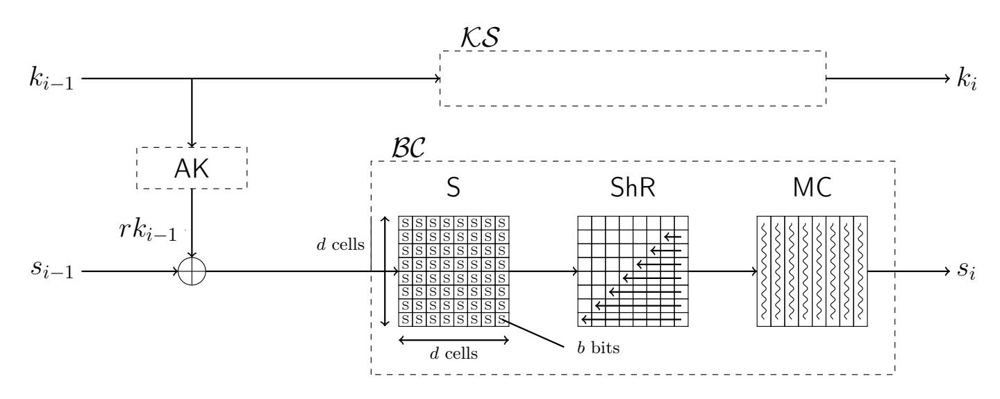

Figure 1: One round of the generic SPN and AES-like ciphers.

We also study the more particular AES-like ciphers that have a key schedule internal state that can be viewed as a b-bit cell matrix of d rows and d columns for a  $(d^2 \cdot b)$ -bit key (d rows and 1.5d columns for a  $(1.5d^2 \cdot b)$ -bit key or d rows and 2d columns for a  $(2d^2 \cdot b)$ -bit key) and whose key schedule layer  $\mathcal{KS}$  is the direct generalization of the AES key schedules to the dimension d (see Figure 2). We denote this class of ciphers total-AES-like ciphers, which encompasses all versions of AES. We note that the constant addition of the RCON values in the key schedule will not affect our reasoning: that is why we omit it in the sequel.

#### 2.2 Truncated and actual differences

In this article, we are interested in differential attacks [8]. Usually, in this scenario the attacker looks for the bitwise difference between two state values. However, here we also consider truncated differential attacks [27]. That is, for a state of differences, we only consider the *presence* of differences in every cell, regardless of their actual values. We call the former actual differences and the latter truncated differences.

{5}------------------------------------------------

<span id="page-5-0"></span>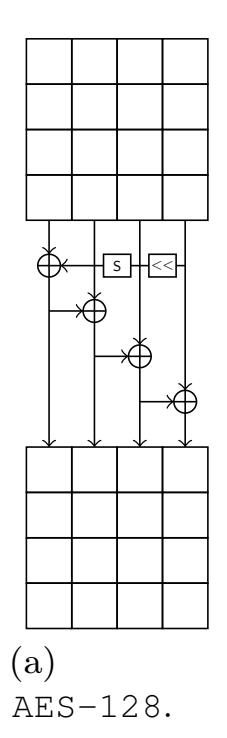

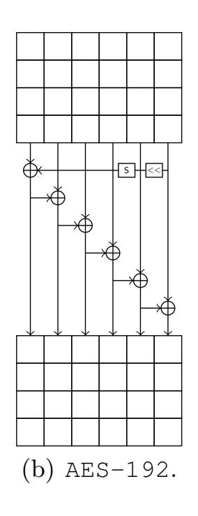

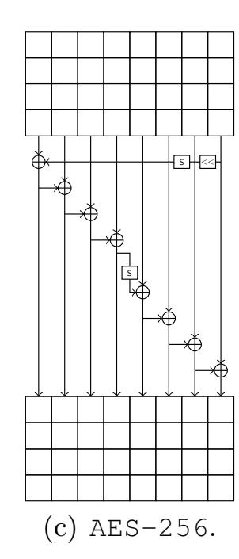

Figure 2: Key schedules of the three variants of the AES. The « stands for a rotation of the column and a round-dependent constant addition. The S-Box is denoted by S.

**Definition 2.** Let  $A = [A^{x,y}]$  and  $B = [B^{x,y}]$  two states. We denote their **truncated difference** by  $\Delta = [\Delta^{x,y}]$  with  $\Delta^{x,y} = 1$  if and only if  $A^{x,y} \neq B^{x,y}$  (active cell), and  $\Delta^{x,y} = 0$  otherwise (inactive cell). We denote their **actual difference** by  $\delta = [\delta^{x,y}]$  with  $\delta^{x,y} = A^{x,y} \oplus B^{x,y}$ .

First, we need analyze the effect of the cipher transformations on the truncated and actual differences.

The substitution layer. One can easily check that the substitution layer S has no effect on the truncated difference of a cell: a cell remains in the same active/inactive situation after application of the transformation. However, S has an effect on the actual difference of every active cells. This effect can be visualized by the differential distribution table (DDT) of the Sboxes. More precisely, for each possible pair  $(\delta_{in}, \delta_{out})$  of actual difference on the input/output of the Sbox, the table gives the number DDT $(\delta_{in}, \delta_{out}) = x$  of values X that validate this differential transition, i.e.  $Sbox(X) \oplus Sbox(X \oplus \delta_{in}) = \delta_{out}$ . Alternatively,  $x/2^b$  represents the differential probability of the transition. An important criteria that can be derived from this table is the maximal differential probability  $p_{max}$ , which is the highest possible differential probability when  $\delta_{in} \neq 0$  and  $\delta_{out} \neq 0$ . For example, the Sbox implemented in AES has maximal differential probability  $p_{max} = 2^{-6}$ .

In order to measure the quality of a truncated differential characteristic, we use the classical counting of the number of active Sboxes appearing in the characteristic, and we denote it  $|\cdot|$ .

**Definition 3.** Let  $v = [\Delta^i]$  be a vector of truncated differences. The **weight** of v is the number of active differences in  $v: \sum_{\Delta^i \neq 0} 1$ . We denote it |v| and generalize the notion to any matrix v.

The permutation layer for AES-like ciphers. Since the ShR layer only moves the cells around, it only changes the active/inactive cells positions in the internal state, but not their number. The same reasoning applies to the actual differences. The MC transformation being linear, the effect on the values and the actual differences is the same and therefore for each column of the internal state, the output actual differences are simply deduced by the application of the MC linear matrix. Concerning the truncated differences, the effect depends on the branching number  $B_{MC}$  of the MC matrix. The branching number is the minimum amount of active cells one can get on both the input and the output of the matrix, excluding the case when there are both null. This measure of the diffusion is crucial for the security of many cryptography primitives and, in general, the MC matrix is Maximum Distance Separable (MDS), that is  $B_{MC} = d + 1$ 

{6}------------------------------------------------

is maximal. A valid truncated differential transition forcing i cells to be inactive on the output happens with probability  $2^{-b \cdot i}$ .

### <span id="page-6-0"></span>3 Generic related-key differential characteristic search tool for SPN ciphers

In this section, we explain the inner workings of our generic related-key differential characteristic search tool for SPN ciphers. As a first step, we model the problem by assuming that the cipher round function is a Markov process in regard to the truncated differential characteristic search (Section 3.1). This allows us to reduce the problem to a shortest path search in a special (r+1)-equipartite directed acyclic graph, for which we provide a simple yet powerful algorithm. The precomputation phase of the process is devoted to building the graphs on which we work on (Section 3.2), while the online phase looks for the shortest paths (Section 3.3). Finally, we explain how to tweak the Markov assumption in order to find not only the best truncated differential characteristics, but also the actual difference ones (in Section B).

#### <span id="page-6-1"></span>3.1 Differential characteristic search as a graph modeling of a Markov process

When an attacker considers truncated differentials, he accepts to loose some information (the actual value of the difference) in order to make the analysis simpler. In general, when dealing with truncated differentials for SPN ciphers, most of the attacks actually maintain implicitly more information than just the presence or absence of difference in a cell. For example, in the case of the AES-128, the truncated differential characteristics found verify the linear conditions imposed by the key schedule of the cipher. Therefore, the characteristic actually contains more information than just active/inactive cells.

We describe a first algorithm that generates for any number of rounds *all* the related-key truncated differential characteristics for SPN ciphers with minimal number of active Sboxes. This analyzes the structure of the cipher in regard to the resistance against related-key attacks. We make a simple assumption: we would like the search to be a Markov process. More precisely, we assume that the possible differential transitions through a round from one truncated state to another one does not depend on previous rounds transitions. If we stick to the real definition of truncated differentials (i.e. without implicit conditions contained), then this assumption is verified for SPN ciphers: knowing the truncated input difference of one round represents all the information needed in order to deduce the possible output ones. We discuss in Section B how to adapt ourselves to the case of actual differences.

**Graph modeling.** In order to find the best r-round related-key truncated differential characteristics, we use a graph modeling of the problem. Let G be the 2-equipartite directed acyclic graph of all the possible one-round transitions. Then all the best r-round related-key truncated differential characteristics correspond to all the shortest paths in the (r+1)-equipartite directed acyclic graph  $G_r$  built by concatenating r copies of G (see Figure 3). Namely, denoting  $G = (V_0, V_1; E_{0,1})$  the 2-equipartite graph linking with one cipher round a state in set  $V_0$  to a state in set  $V_1$  using some edge in set  $E_{0,1}$ , we build the graph  $G_r$  representing r rounds of the cipher by  $G_r = (V_0, \ldots, V_r; E)$  such that for all i, the subgraph  $(V_i, V_{i+1}; E_{i,i+1})$  is equal to G. Note that all edges are oriented from  $V_i$  to  $V_{i+1}$ , and that  $|V_i| = |V_{i+1}|$ . The nodes of the graph stand for all the possible pairs  $(\Delta_{KS}, \Delta_{BC})$  where  $\Delta_{KS}$  represents the truncated difference on the key schedule state and  $\Delta_{BC}$  represents the truncated difference on the block cipher state. Since we have  $2^{t_{\mathsf{KS}}}$  possible values  $\Delta_{\mathsf{KS}}$  and  $2^{t_{\mathsf{BC}}}$  possible values  $\Delta_{\mathsf{BC}}$ , all  $V_i$  in the graph are composed of  $2^{(k+n)/b}$  nodes. The edges correspond to a possible one-round related-key truncated differential characteristic from the input to the output vertex and in the worst case where all differential transitions are possible, we have  $2^{2(k+n)/b}$  edges. A path in  $G_r$  is defined as a sequence of r+1nodes, one in each of the  $V_i$ .

{7}------------------------------------------------

<span id="page-7-1"></span>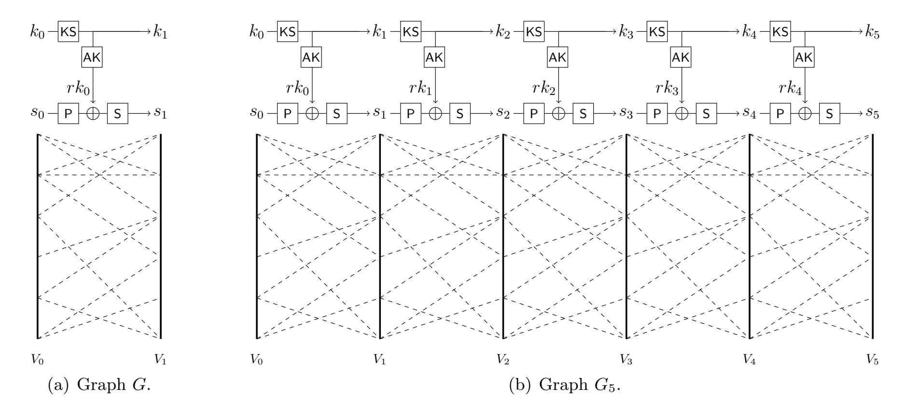

**Figure 3:** Examples of simplified versions of the two graphs G and  $G_5$ . Variables  $s_i$  and  $k_i$  represent the current internal permutation/key state respectively, while  $rk_i$  stands for the subkey generated during the round.

Instead of viewing one round with the normal SPN layers ordering AK, S and P, we prefer to slightly shift the window to the left: P, AK and S, the input key of this new window is the one that has been incorporated into the block cipher state during the previous round (see Figure 3). Then, the cost of the round is not associated to the vertices, but to the output nodes. Indeed, the number of active cells in the output node represents the number of active Sboxes during this round<sup>4</sup>. We denote  $C_{\rm BC}$  (resp.  $C_{\rm KS}$ ) the total number of active Sboxes in the internal permutation part of the block cipher (resp. in the key schedule part) in the whole characteristic. Depending on the situation considered, one might want to minimize  $C_{\rm BC} + C_{\rm KS}$  for classical scenarios, or instead max{ $C_{\rm BC}$ ;  $C_{\rm KS}$ } for hash function settings, where the key schedule and the block cipher parts can be attacked attacked sequentially (first the key schedule part, and then the block cipher one).<sup>5</sup>

**Theorem 1.** (Search algorithm) Let  $\mathcal{E}$  be a SPN cipher on n-bit blocks using a k-bit internal state in the key schedule. Both states are viewed as vectors of b-bit cells. There exists an algorithm  $\mathcal{A}$  with a theoretical time complexity of  $O(r \cdot 2^{(2n+k)/b})$  that finds all the best characteristics on r rounds of  $\mathcal{E}$ .

We emphasize that algorithm  $\mathcal{A}$  will find all the shortest paths in  $G_r$  representing the differential transitions of r rounds of  $\mathcal{E}$ . Moreover, we note that the time complexity of  $\mathcal{A}$  can be greatly reduced with heuristics.

We describe in the next two sections our tool that searches for the best r-round related-key truncated differential characteristics. The precomputation phase of the tool constructs the graph G from which one can virtually build  $G_r$ . During the online phase, the tool looks for the best possible related-key truncated differential characteristics on r rounds by searching for the cheapest paths of size r in the graph  $G_r$ .

<span id="page-7-2"></span><span id="page-7-0"></span><sup>&</sup>lt;sup>4</sup>To be able to associate the number of active Sboxes in the key schedule to the output node as well, we make the weak assumption that one round of the key schedule is composed of an Sbox and a linear layer at most.

<span id="page-7-3"></span><sup>&</sup>lt;sup>5</sup>In the case of minimizing max{ $C_{BC}$ ;  $C_{KS}$ }, the algorithm will not be able to find the shortest path since we loose the total order. However, in most ciphers,  $C_{BC} > C_{KS}$  and therefore, we minimize only  $C_{BC}$ . For the best found paths, if max{ $C_{BC}$ ;  $C_{KS}$ } =  $C_{BC}$  is verified, we are ensured that we indeed found one of the best paths minimizing max{ $C_{BC}$ ;  $C_{KS}$ }.

{8}------------------------------------------------

#### 3.2 Precomputation phase

The precomputation phase builds the graph G. It can be built and stored efficiently by observing its inner structure: the block cipher internal state output depends only on the block cipher internal state input and the incoming subkey (deduced by the extraction phase from the key schedule internal state input), while the key schedule internal state output depends only on the key schedule internal state input. Therefore, G can actually be described as a special product of two smaller graphs  $G_{\mathsf{BC}}$  and  $G_{\mathsf{KS}}$  (see Figure 4), such that an edge  $(s_i, k_j) \to (s_{i'}, k_{j'})$  exists in G if and only if  $k_j \to k_{j'}$  exists in  $G_{\mathsf{KS}}$  and  $(s_i, k_j) \to s_{i'}$  exists in  $G_{\mathsf{BC}}$ .

<span id="page-8-0"></span>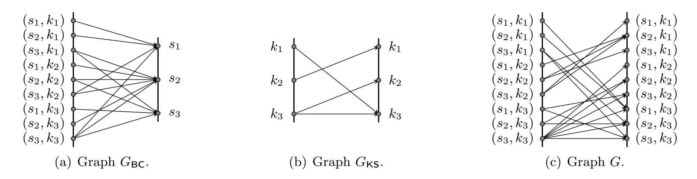

**Figure 4:** Example of graph product to build G, with three possible internal states  $s_1$ ,  $s_2$ ,  $s_3$  and three possible key states  $k_1$ ,  $k_2$ ,  $k_3$ , where  $(s_i, k_j)$  represents a node. An edge  $(s_i, k_j) \to (s_{i'}, k_{j'})$  exists in G if and only if  $k_j \to k_{j'}$  exists in  $G_{KS}$  and  $(s_i, k_j) \to s_{i'}$  exists in  $G_{BC}$ .

On the one hand,  $G_{\mathsf{BC}}$  is a bipartite directed acyclic graph whose input nodes are all the possible block cipher internal state and subkey pairs, and whose output nodes are all the possible block cipher internal state. The edges represent input nodes that can be mapped to output nodes through a valid differential transition. On the other hand,  $G_{\mathsf{KS}}$  is a 2-equipartite directed acyclic graph, whose input and output nodes are all the possible key schedule internal states. The edges represent input nodes that can be mapped to output nodes through a valid differential transition.

This observation slightly reduces the amount of computation/memory to build/store G: the number of vertices in  $G_{\mathsf{RS}}$  is  $v_{\mathsf{RS}} = 2 \times 2^{t_{\mathsf{RS}}}$ . This has to be compared with the  $2 \times 2^{t_{\mathsf{BC}}+t_{\mathsf{KS}}}$  nodes in G. For example, in the particular case of the AES-128, this trick reduces the number of nodes from  $2^{33}$  in G to  $v_{\mathsf{BC}} = 2^{32} + 2^{16}$  in  $G_{\mathsf{BC}}$  and  $2^{16}$  in  $G_{\mathsf{KS}}$  and mainly allows to apply an early-abort approach to prune edges in G in the online phase. More importantly, the total number of edges shrinks considerably from  $e_{\mathsf{BC}} \cdot e_{\mathsf{KS}}$  to  $e_G = e_{\mathsf{BC}} + e_{\mathsf{KS}}$ , which equals to  $2^{33.6} + 2^{22.15}$  in the case of AES-128 (these edge numbers are explained in Appendix B.3). At last, since  $G_r$  is the concatenation of r instances of G, we only need to store G to run computations on  $G_r$  and this further saves roughly a factor r.

The graph  $G_{BC}$ . It can be built by repeating the three following steps for all the  $2^{t_{BC}}$  possible truncated differences  $\Delta_{in}$  on the input and all the  $2^{t_{BC}}$  possible truncated differences  $\Delta_{out}$  on the output.

- 1. Compute all the possible truncated differences  $\Delta_x$  that can be obtained from  $\Delta_{in}$  through the P layer (on the backward direction, a truncated difference  $\Delta_{out}$  stays the same when inverting the S layer).
- 2. For every  $\Delta_x$  found, compute all the possible truncated differences  $\Delta_k$  on the key state that can be obtained from  $\mathsf{AK}^{-1}(\Delta_x \oplus \Delta_{out})$ .
- 3. For every  $\Delta_k$  found, add an edge in  $G_{\mathsf{BC}}$  from input node  $(\Delta_k, \Delta_{in})$  to output node  $\Delta_{out}$  if none exists.

{9}------------------------------------------------

## <span id="page-9-2"></span>**Algorithm 1** – Search all shortest paths in $G_r$ .

```
1: function Search(G_r)
 2: Copy all nodes of G_r in a new graph G_r^*
 3: for all v \in V_0, c(v) \leftarrow |v|
                                                               ▶ Initialize the starting nodes at their weight.
                                                               > The other nodes are not reachable yet.
 4: for all v \in V_1, \ldots, V_r, c(v) \leftarrow \infty
 5: SortList(V_0)
                                                               \triangleright The sorting is done according to the cost c(v) of the nodes.
     for i = 1 \rightarrow r do
                                                               \triangleright Loop around the r rounds of the cipher.
 6:
       for all v' \in V_i, by increasing c(v') do
                                                               > This ordering of the edges ensures the minimization.
 7:
         for all v \in \operatorname{succ}(v') do
 8:
          \alpha \leftarrow c(v') + |v|
 9:
10:
          if c(v) = \infty then
                                                               \triangleright If the node v have not been visited yet,
            c(v) \leftarrow \alpha
                                                               \triangleright we update its cost,
11:
            Add the edge v' \to v to G_r^*
                                                               \triangleright and we add the associated edge to the graph G_r^*.
12:
          else if c(v) = \alpha then
                                                               \triangleright If we can reach it at the same cost,
13:
            Add the edge v' \to v to G_r^*
14:
                                                               \triangleright also add the edge to G_r^*.
                                                               \triangleright Ensure the next nodes to be considered in increasing costs.
        SortList(V_i)
15:
16: return G_r^*
                                                               > The graph of shortest paths is constructed, return it.
```

The time complexity to build  $G_{BC}$  depends on the average branching  $B_{P}$  of the P layer and on the average branching  $B_{xor}$  of the subkey XORing layer. It amounts to  $2^{2t_{BC}} \cdot B_{xor} \cdot B_{P}$  operations. The memory cost to store  $G_{BC}$  corresponds to the number of edges  $e_{BC}$  of  $G_{BC}$  and is upper bounded by  $2^{2t_{BC}} \cdot B_{xor} \cdot B_{P}$  since one operation on step 3 adds at most one edge. We give in Appendix A an evaluation of  $B_{xor}$ , and as an example, we estimate  $B_{P}$  in the case of AES-128 in Appendix B.3. We denote  $\operatorname{succ}_{BC}(s,k)$  the set of successors of the state s in the graph  $G_{BC}$  using the key k.

The graph  $G_{\mathsf{KS}}$ . It is built by simply going through all the  $2^{t_{\mathsf{KS}}}$  possible key schedule internal state input truncated differences, checking which output truncated differences can be obtained through the KS layer and adding edges in  $G_{\mathsf{KS}}$  accordingly<sup>6</sup>. The time and memory complexities depend on the average branching  $B_{\mathsf{KS}}$  of the KS layer and amounts to  $2^{t_{\mathsf{KS}}} \cdot B_{\mathsf{KS}}$  operations. The number of edges  $e_{\mathsf{KS}}$  of  $G_{\mathsf{KS}}$  equals  $e_{\mathsf{KS}} = 2^{t_{\mathsf{KS}}} \cdot B_{\mathsf{KS}}$ . In the sequel, we denote  $\mathrm{succ}_{\mathsf{KS}}(k)$  the set of successors of the key k in graph  $G_{\mathsf{KS}}$ .

#### <span id="page-9-0"></span>3.3 Online phase

The online phase finds all the shortest paths in  $G_r$  with at most  $r \cdot (\frac{v_G}{2} \cdot \log(\frac{v_G}{2}) + e_G)$  computations and memory  $r \cdot e_G$ , thus linear in the number of rounds r. This is possible because  $G_r$  is a vertex-weighted directed acyclic graph. Since the edges have a constant weight (the number of active Sboxes, i.e. the weights, are on the nodes and not the edges), the function we want to minimize for each node  $v \in V_i$ ,  $i \in [1, r]$  is:

$$|v| + \min_{v' \in \operatorname{pred}(v)} (c(v')), \qquad (1)$$

where  $\operatorname{pred}(v) \subseteq V_{i-1}$  is the set of all predecessors of v and c(v') represents the cost of the shortest path to v'. In other words, assuming that we know the shortest path costs to all the nodes  $v' \in V_{i-1}$ , we find the shortest path to any  $v \in V_i$  by choosing the predecessor of v with the minimal cost.

<span id="page-9-1"></span><sup>&</sup>lt;sup>6</sup>We assume that the key schedule is simple: given a truncated difference on the input, one can find each reachable truncated output difference in constant time. This assumption is weaker than the one from Footnote 4, and verified by most ciphers since a very complex key schedule would make the whole primitive inefficient anyway.

{10}------------------------------------------------

This can easily be done by creating a list containing all the nodes  $v' \in V_{i-1}$  sorted increasingly according to the cost of their shortest path c(v'). Then, starting from the cheapest v' and ending to the most expensive one, we set the shortest path cost of all the successors v of v' to |v| + c(v') if and only if the cost of v was not set yet (see Algorithm 1). This is an improvement over the simple shortest path computation in a directed acyclic graph using a topological order since we can take advantage of the vertex-weighted property. In practice, we iteratively build a simpler vertex-weighted directed acyclic graph  $G_r^*$  from  $G_r$  (all the nodes are the same, but with less edges), for which each node  $v \in V_i$  has a cost equal to the cost of the shortest path to v in  $G_r$ , and an edge leading to  $v \in V_i$  represents one of the shortest paths to v (see Figure 5).

<span id="page-10-0"></span>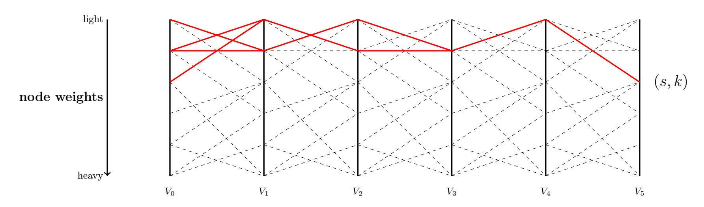

**Figure 5:** The dashed edges form an example of a simplified  $G_5$ . The thick edges describe paths in the subgraph  $G_5^*$  that are shortest paths in  $G_5$  to node (s, k). All the nodes in  $G_5^*$  are sorted according to their weight, the top being the cheapest ones.

At this point, in the graph  $G_r^*$  the costs assigned to all the nodes v in  $V_r$  represent the cost of the shortest path to v in  $G_r$ . If  $v_G$  represents the number of vertices and  $e_G$  the number of edges in the graph G, then the complexity of the shortest path search is about  $r \cdot \left(\frac{v_G}{2} \cdot \log\left(\frac{v_G}{2}\right) + e_G\right)$  operations: the  $\frac{v_G}{2} \cdot \log\left(\frac{v_G}{2}\right)$  term comes from the construction of the sorted list of the nodes at each round, and the  $e_G$  term is the number of edges visited during each round as we visit all of them. Note that this is an upper bound on the complexity since we do not need to go through all  $\frac{v_G}{2}$  nodes every rounds, but only a subset of them, and we may cut some edges among all the  $e_G$  ones. The term  $e_G = e_{\mathsf{BC}} + e_{\mathsf{KS}}$  dominates the complexity, and since  $e_{\mathsf{BC}} >> e_{\mathsf{KS}}$ , it can be approximated by the number  $e_{\mathsf{BC}} \leq 2^{(n+k)/b} \times 2^{n/b}$  of edges in  $G_{\mathsf{BC}}$ . Hence, the total time complexity is  $O(r \cdot 2^{(2n+k)/b})$  for r rounds.

In order to get all the shortest paths in  $G_r$ , we need to store at each node  $v \in V_i$  not only the first shortest path found to v but all of them (lines 13 and 14 in Algorithm 1). In general, this number is very small and never exceeds the total number of shortest paths anyway. In the worst case where all paths are the shortest, it amounts to the total number of edges  $r \cdot e_G$ .

As explained previously, in practice we do not use the graph G directly, but two separate graphs  $G_{BC}$  and  $G_{KS}$ . We can adapt the Algorithm 1 for this setting: in order to build  $G_r^*$ , we replace the **for all** loop of line 8 that iterates over all nodes  $v' = (s_i, k_i) \in V_i$  by two **for all** loops that describe all  $k_{i+1} \in \operatorname{succ}_{KS}(k_i)$  and all  $s_{i+1} \in \operatorname{succ}_{BC}(s_i, k_{i+1})$ .

In [33], Matsui introduces an argument equivalent to the  $A^*$  optimization for path-finding or graph traversal algorithms [23] that allows to prune the majority of the edges of G and to avoid the evaluation of many sets of successors. If we know the costs  $c_k$  of all k-round characteristics,  $1 \le k \le n-1$ , and we target an n-round characteristic of cost at least  $c_n$ , then we can consider only the nodes from  $V_0$  that have a cost at most  $c_n - c_{n-1}$ , and the ones in  $V_1$  that have a cost at most  $c_n - c_{n-2}$ . Intuitively, after one round has been passed, we know that we paid at least  $c_1$ , and since there are n-1 remaining rounds to pass, we will need to pay at least  $c_{n-1}$ . In

{11}------------------------------------------------

terms of intervals of costs, for each of the  $V_i$ , we only need to consider nodes that have costs in  $[c_i, c_n - c_{n-i}], 0 \le i \le n$  assuming  $c_0 = 0$ . To take advantage of the  $A^*$  heuristic, we sort the sets of successors in both graphs, so that we can perform an extreme pruning of the edges whenever the updated costs exceed the current interval, in an early-abort manner.

We detail how to efficiently extend this algorithm to the case of AES-like ciphers in Appendix B, and we continue directly with the consequences of the search for this class of ciphers.

### 4 Applications to SPN and AES-128

#### <span id="page-11-0"></span>4.1 Structural evaluation of SPN AES-like ciphers

We present here the results on the structural evaluation of the AES-like ciphers in regard to the related-key model, which provides an estimation of the security provided by their key schedule. Namely, we ignore the semantic definition of the Sbox and the MDS matrix, and we are only interested in how they can interact in the related-key settings. The results are measured in terms of number of active Sboxes as in [28], and presented in Table 1. Lines 2 and 3 of the table provide the minimum number of active Sboxes (line 2) for any number of rounds when implementing an AES-like cipher, and the number of truncated characteristics that reach that bound (line 3). In these two lines, we count the number of active Sboxes in both the state and the subkeys, whereas in lines 4 and 5 of Table 1, we consider the case of the hash function setting where the block cipher and its key schedule can be attacked somewhat independently.

<span id="page-11-1"></span>

| Rounds                       | 1 | 2    | 3    | 4     | 5†    | 6     | 7     | 8†    | 9     | 10†   |
|------------------------------|---|------|------|-------|-------|-------|-------|-------|-------|-------|
| $\min(C_{KS} + C_{BC})$      | 0 | 1    | 3    | 9     | 11    | 13    | 15    | 21    | 23    | 25    |
| Truncated Char. $(\log_2)$   | = | 4.52 | 6.58 | 10.46 | 5.00  | 13.26 | 16.17 | 21.34 | 14.90 | 21.38 |
| $\min(\max(C_{BC}, C_{KS}))$ | 0 | 1    | 3    | 5     | 7     | 9     | 11    | 13    | 15    | 17    |
| Truncated Char. $(\log_2)$   | = | 4.32 | 6.60 | 10.26 | 12.34 | 14.49 | 16.03 | 18.72 | 20.89 | 22.96 |

Table 1: For the AES-128 cipher on r rounds, this table shows: (1) the minimal number  $C_{KS} + C_{BC}$  of active Sboxes in **both** the key schedule  $C_{KS}$  and in the block cipher  $C_{BC}$  achievable in truncated differential characteristics; and (2), the same figures for the minimal number  $\max(C_{BC}, C_{KS})$  for the hash function setting. Lines 3 and 5 count the number of distinct truncated characteristics that reach that bound. † For  $r \in \{5, 8, 10\}$ , see Appendix E for the characteristics.

**Theorem 2.** It is impossible to prove the security of the full AES-128 against related-key differential attacks without considering both the differential property of the S-Box and the P layer when two keys verify a certain relation. It is impossible to prove the security of the full AES-128 in the hash function setting without considering both the differential property of the S-Box and the P layer.

*Proof.* First, in the case where we consider regular related-key attacks (line 2), we remark that for 10 rounds there exists a truncated differential characteristic counting only 25 Sboxes. As we discussed before, this means that a differential analysis would run in  $p_{max}^{-25}$  operations. Consequently, the structure of AES-128 on its own is not enough to prove the resistance to related-key attacks for any ciphers in this class, we at least need to add a criteria on the Sbox via  $p_{max}$ .

Secondly, with an S-Box on n bits (n = 8 in the AES), the minimal theoretical  $p_{max}$  that can be obtained is  $2^{-(n-1)}$ : consequently, the largest number of rounds that our structural analysis could attack for AES-like ciphers is 7 rounds. Indeed, for 7 rounds, the 15 active S-Boxes give a

{12}------------------------------------------------

differential analysis requiring  $p_{max}^{-15} \ge 2^{105}$  computations, which might be smaller than  $2^{128}$ . We note that we do not know how to construct an almost-perfect permutation on n bits acting as an S-Box with  $p_{max} = 2^{-(n-1)}$ . The S-Box chosen in the AES implements a composition of an affine transformation on the inverse mapping, and reach  $p_{max} = 2^{-(n-2)}$ . Hence, the largest number of rounds that our structural analysis could attack is 8 rounds. Indeed, for 8 rounds, the 21 active S-Boxes give a differential analysis requiring  $p_{max}^{-21} \ge 2^{126}$  computations, which might be smaller than 2<sup>128</sup>. However, when we instantiate the P layer by the one of the AES-128, we observe that none of the  $2^{16.17}$  characteristics found on 7 rounds by our search algorithm nor the  $2^{21.34}$  ones for 8 rounds can be instantiated due to linear constraints coming from the key schedule. This means that proving or disproving the security of the AES-128 in the related-key setting needs to consider both the differential properties of the Sbox and the linear equations of the P layer. From an instantiated P layer, we can write a system Q of linear equations whose solutions are the values of all the truncated differences of the characteristic. Therefore, choosing P such that  $\mathcal{Q}$  can be made inconsistent on a small number of rounds brings more security than a random P. Our tool can be used to write this system of linear equations for any truncated differential characteristic.

Finally, for 10 rounds in the hash function setting, there exists characteristics with only 17 active Sboxes. For the AES-128, in the best case, the differential probability equals  $2^{-6\cdot17} = 2^{-102}$ . In this setting, the adversary is supposed to have full control over the input of both the key schedule and the block cipher, that is why we considered  $\max(C_{BC}, C_{KS})$  as an objective function to minimize in our search algorithm of Section 3. As the previous structural results, this also means that one cannot prove the security of the full AES-128 against differential cryptanalysis by only analyzing its structure.

Complexity evaluation. Our tool found those results for any number of rounds in a few seconds on a single regular processor. We also note that the minimal characteristics in the single-key scenario are also found quasi-instantaneously. As a practical evaluation of the number of operations in terms of number of costs update (line 9 of Algorithm 1), we measured at most  $2^{21.31}$  updates in this case, for the 10 rounds.

#### <span id="page-12-0"></span>4.2 Differential Characteristics results for AES-128

**Theorem 3.** After 6 rounds, there is no related-key differential characteristic for AES-128 with a probability higher than  $2^{-128}$ .

Proof. The related-key differential characteristics presented in the previous section are valid only when one deals with truncated differences, and these characteristics give an indication on the structural security provided by the AES-128 key schedule. However, due to the choice of the P layer in AES-128, it turns out that none of them can be instantiated with actual differences, because of inconsistencies in some linear constraints. To overcome this difficulty, and at the cost of a bigger graph G to handle, we first add some more information in the Markov process both on the representation of the key schedule state and the internal permutation state, and we then filter the best characteristics obtained and hope to find one that can be instantiated with actual differences. More details can be found in Appendix B. Our algorithm performs a search fundamentally different from [11], but it finds again and more efficiently the same results.

By a system resolution, we show that from a truncated differential characteristic, we can decide whether it can be instantiated with actual differences, and even find an associated differential characteristic with the greatest probability (see Appendix C). As an example, our tool found again the best 17-Sbox truncated differential characteristic on 5 rounds of AES-128, and also found how to achieve the greatest probability  $2^{-105}$  by instantiating the differences. This has to be

{13}------------------------------------------------

compared with the upper bound of  $2^{-6\cdot17} = 2^{-102}$  given in [11] since in the best case, all the AES active Sboxes have maximal differential probability  $2^{-6}$ . Trying all the possible differences that instantiate this truncated differential characteristic, we show that we cannot reach that bound, but we can only set 15 out of 17 Sboxes to the maximal differential probability (see Appendix I for the actual differential characteristic). The following Table 2 reports the best related-key characteristics found by our tool on AES-128 up to 5 rounds, with their respective highest achievable probabilities. Thus, from 6 rounds, there is no related-key differential characteristic for AES-128 with a probability higher than  $2^{-128}$ .

<span id="page-13-1"></span>

| Rounds                  | 1 | 2  | 3   | 4   | 5    |
|-------------------------|---|----|-----|-----|------|
| $\min(C_{KS} + C_{BC})$ | 0 | 1  | 5   | 13  | 17   |
| $\max \log_2(p)$        | 0 | -6 | -31 | -81 | -105 |
| Appendix reference      | _ | F  | G   | Н   | I    |

**Table 2:** After 6 rounds, there is no related-key differential characteristic for AES-128 with a probability higher than  $2^{-128}$ . Our tool retrieved the previous known results but also provides the real differential characteristics with maximum probability.

Complexity evaluation. For 5 rounds, the online phase of our tool performs  $2^{35.36}$  cost updates (line 9 of Algorithm 1, for the transition between  $V_0$  and  $V_1$ ), which takes about one hour in a parallelized version of the shortest path finding algorithm on a 12-core machine. The precomputation step completes in half an hour on this machine and needs 60GB of memory to store precomputed tables, notably the  $G_{KS}$  graph.

#### <span id="page-13-0"></span>**4.3 Distinguishing 9 rounds of AES-128**

As another application of our tool, we describe a 9-round distinguisher for AES-128 in the chosen-key model requiring  $2^{55}$  computations and  $2^{32}$  memory. For an ideal cipher, the same property would be detected after  $2^{68}$  encryption queries. Here, the chosen-key model asks the adversary to find a pair of keys (k, k') satisfying  $k \oplus k' = \delta$  with a known difference  $\delta$ , and a pair of messages conforming to a partially instantiated characteristic in the data part.

We achieve this result by considering the best 5-round related-ley differential characteristic and propagating it backwards to reach 9 rounds. The 5 last rounds hence count 6 active Sboxes in the key schedule part and 11 in the data part (rounds 5 to 9 in Figure 6). By the backward propagation in the key schedule, we reach a total of 15 active Sboxes for the key schedule differential characteristic, whose probability equals  $2^{-101}$ . Since we have  $2^{128}$  possible key values, we expect  $2^{27}$  pairs of keys to conform to the differential characteristic in the key schedule. In the block cipher part, we prepend three rounds that we plan to control with an average cost of one computation using the **Super-SBox** technique [18,21,29], and one more round at the very beginning that we make as sparse as possible. The entire 9-round differential characteristic is depicted with colors on Figure 6 and in table form in Table 3.

The distinguishing algorithm. Once this differential characteristic settled, we find inputs that verify the whole characteristic (see Algorithm 2). We start by finding a pair of keys that conforms to the whole differential characteristic in the key schedule. There are about  $2^{27}$  expected such pairs of keys, and we can generate them at an average cost of one computation by picking random values satisfying all the non-linear transitions and efficiently solve the linear system to retrieve all the subkeys. We get for instance the pair of keys (k, k') shown in Appendix D and our implementation confirms about  $2^{27}$  are found. We note that the difference  $k \oplus k' = \delta$  is already verified at this stage.

{14}------------------------------------------------

#### <span id="page-14-1"></span>**Algorithm 2** – Chosen-key distinguisher for 9 rounds of AES-128 1: **function** Distinguisher 2: while True do Find $(k, k \oplus \delta)$ conforming to the KS characteristic 3: $\triangleright$ Done in amortized cost $1 \Rightarrow$ fixes the permutations $\triangleright About \ 2^{32} \ operations \ in \ parallel$ for $i \in \{0, ..., 3\}$ do 4: construct the array $T_i$ of the *i*th **Super-SBox** 5: for all values of the 5 differences in $S_{start}$ do 6: $\triangleright$ Done in $2^{8\times5} = 2^{40}$ simple operations Use tables $T_i$ to get a pair of messages (m, m') verifying the characteristic from $S_{start}$ to $S_{end}$ 7: 8: if backward transition not verified then continue $\triangleright$

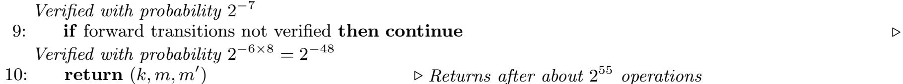

<span id="page-14-0"></span>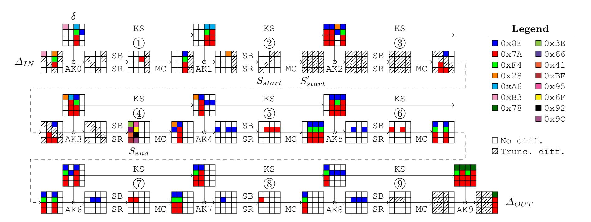

Figure 6: Differential characteristic of 9-round AES-128 used in the distinguisher. The colors map to actual values for the differences, whereas hatched bytes are truncated differences and white ones are inactive.

For a pair of keys, we precompute the four arrays  $T_i$  containing the paired values of the *i*th **Super-SBox**: those are four parallel 32-bit non-linear applications obtained by reordering the layers of two rounds of the cipher. To construct the tables  $T_i$ , we iterate in parallel over the  $2^{32}$  input values from state  $S_{end}$  that corresponds to the *i*th **Super-SBox** and propagate the values backwards until  $S'_{start}$ . We note that the difference in  $S_{end}$  is completely determined by our differential characteristic. We store the pair in  $T_i$  indexed by its difference<sup>7</sup>, so that this precomputation requires  $2^{32}$  simple operations, a memory complexity of  $2^{32}$ , and depends on the selected pair of keys.

We continue by picking random values for the 5-byte difference after the second non-linear layer in  $S_{start}$ , which linearly fixes all the differences in  $S'_{start}$ . Note that we can repeat this part about  $2^{8.5} = 2^{40}$  times. From the precomputed tables  $T_i$ , we find on average one pair of messages that verifies the middle rounds from  $S_{start}$  to  $S_{end}$ . The remaining of the process is probabilistic: backwards, we expect a fraction of  $2^{-7}$  pairs to pass the unique specified Sbox transition in the second round up to  $\Delta_{IN}$ . Forwards, we expect a fraction of  $2^{-6\times8} = 2^{-48}$  to verify the 5 last

<span id="page-14-2"></span>To simplify, we assume the differences in  $S'_{start}$  to be uniformly distributed so that each 32-bit difference appears once. While this simplification is not true in practice, the cost per solution remains one on average, thus it does not change the complexity estimation.

{15}------------------------------------------------

<span id="page-15-0"></span>**Table 3:** Differential characteristics used in the distinguisher of 9 rounds of AES-128 (see also Figure 6). The known differences are represented by their values from  $0 \times 00$  to  $0 \times FF$ , and truncated differences as ??, since their values are unknown, but positive. The two lines for state differences are the respectively the input difference after key addition and the output difference.

| Round      | State differences                         | Key differences                       |
|------------|-------------------------------------------|---------------------------------------|
| Plaintext  | B3??0000 0000??00 28F47A?? ????000        | 0                                     |
| 1          | 00330000 00003300 00000033 3333000        | B3000000 00000000 A6F47A7A 008E0000   |
| 1          | 00000000 00000000 8EF47A7A ???????        | ?                                     |
| 2          | 00000000 00000000 28000000 ???????        | ? 00000000 00000000 A6F47A7A A67A7A7A |
| 2          | ???????? ???????? ???????? ???????        | ?                                     |
| 3          | ???????? ???????? ???????? ???????        | ? 8E7A7A7A 8E7A7A7A 288E0000 8EF47A7A |
| J          | ??0000?? ????7A7A 8E????7A 0000???        | ?                                     |
| 4          | 3.5000033 3.3.50000 003.3.5.500 00003.3.5 | 28000000 A67A7A7A 8EF47A7A 00000000   |
| 4          | 288E0000 8E7A7A7A 00000000 0000000        | 0                                     |
| 5          | 008E0000 00000000 008E0000 008E000        | 0 28000000 8E7A7A7A 008E0000 008E0000 |
| 0          | 00000000 8EF47A7A 8EF47A7A 8EF47A7        | A                                     |
| 6          | 00000000 008E0000 00000000 008E000        | 0 00000000 8E7A7A7A 8EF47A7A 8E7A7A7A |
| 0          | 8EF47A7A 00000000 8EF47A7A 0000000        | 0                                     |
| 7          | 00000000 008E0000 008E0000 0000000        | 0 8EF47A7A 008E0000 8E7A7A7A 00000000 |
| '          | 8EF47A7A 8EF47A7A 00000000 0000000        | 0                                     |
| 8          | 00000000 008E0000 00000000 0000000        | 0 8EF47A7A 8E7A7A7A 00000000 00000000 |
| 0          | 8EF47A7A 00000000 00000000 0000000        | 0                                     |
| 9          | 00000000 008E0000 008E0000 008E000        | 0 8EF47A7A 008E0000 008E0000 008E0000 |
| 3          | 33333333 33333333 33333333 0000000        | 0                                     |
| Ciphertext | ???????? ???????? ??????? 787A7A7         | A 78F47A7A 787A7A7A 78F47A7A 787A7A7A |

rounds up to  $\Delta_{OUT}$  (all 8 transitions have been chosen by our tool to be 8 times the same one with maximal probability  $p_{max}=2^{-6}$ ). Finally, we expect a fraction  $2^{-7-48}=2^{-55}$  of the pairs generated in the middle to propagate correctly forwards and backwards.

By repeating this process for all  $2^{40}$  differences in  $S_{start}$  and for  $2^{15}$  distinct pairs of keys, we expect to find a solution for the whole characteristic in  $2^{15} \cdot (2^{32} + 2^{40}) \approx 2^{55}$  operations. Note that the freedom degrees left allows to get up to  $2^{12}$  solutions in  $2^{67}$  operations by exhausting the remaining  $2^{12}$  valid pairs of keys.

Ideal case. For an ideal cipher, the adversary faces a family of random and independent permutations  $\{\pi_i, i \in \{0,1\}^{128}\}$ . His goal is to find a key k and a pair of messages (m, m') such that:  $m \oplus m' \in \Delta_{IN}$  and  $\pi_k(m) \oplus \pi_{k \oplus \delta}(m') \in \Delta_{OUT}$ , where  $\delta$ ,  $\Delta_{IN}$  and  $\Delta_{OUT}$  are specified in Figure 6. Namely,  $\delta$  is a completely determined 128-bit difference, whereas  $\Delta_{IN}$  and  $\Delta_{OUT}$  are two sets of 128-bit differences defined in Appendix D: colored and white bytes are fixed differences, while hatched bytes can take several difference values. On the output, we constrained each of the three independent active bytes after the last non-linear layer of the last round to only 127 reachable difference values (since from a fixed input difference, only 127 output differences can be reached through the AES Sbox), and the MixColumns layer being linear we have  $|\Delta_{OUT}| = 127^3 \simeq 2^{21}$ . On the input, 4 bytes in  $\Delta_{IN}$  can take any difference value and 1 byte is constrained to only 127 reachable difference values, thus  $|\Delta_{IN}| = 127 \cdot (2^8 - 1)^4 \approx 2^{39}$ .

The best known method for the attacker to find (k, m, m') verifying those properties consists in applying the limited birthday algorithm [21]. The additional freedom left in choosing the key bits does not help the attacker to find the actual pair of messages that verifies the required property, since the permutations  $F_k$  and  $F_{k \oplus \delta}$  have to be chosen beforehand. All in all, the 

{16}------------------------------------------------

attacker has access to 39 bits of differences at the input and 21 bits in the output, for a pair of permutations on n = 128 bits. The limited birthday distinguisher on these permutations finds a solution in time  $\max\{\min(2^{IN/2}, 2^{OUT/2}), 2^{IN+OUT-n}\}$ , with IN = n - 39 and OUT = n - 21, which gives a time complexity equivalent to  $2^{68}$  encryption queries.

#### 5 Conclusion and future works

In this article, we have proposed a simple, efficient and generic algorithm that searches for (truncated) differential characteristics in the single-key, related-key or hash function setting for SPN ciphers. Thanks to this method, we were able to obtain the first non-trivial distinguisher of 9-round AES-128 in the chosen-key model, which has been a long-lasting open problem on this version of AES. We also show that no security proof of AES-128 in the related-key model of the hash function setting can be based only of its structure: one has to take into consideration both the Sbox and the linear layer. We believe this tool will be useful for designers that would like to easily test the security of their own key schedule or message expansion. The research community has still a lot to learn on the security of key schedules and there are many future works possible: extend the 9-round result on AES-128 to the full 10 rounds, find a single-key like security proofs in the related-key model for AES-like ciphers (generic enough to work for any dimension), provide a formal proof of security against differential/linear cryptanalysis for AES in the related-key model, and build simpler, more efficient and more secure key scheduling algorithms.

#### Acknowledgements

We would like to thank the Martjin Stam, Christian Rechberger and the anonymous referees for their valuable comments on our paper.

## References

- <span id="page-16-14"></span>1. Abdelraheem, M.A., Blondeau, C., Naya-Plasencia, M., Videau, M., Zenner, E.: Cryptanalysis of AR-MADILLO2. [30] 308–326
- <span id="page-16-7"></span>2. Aoki, K., Kobayashi, K., Moriai, S.: Best Differential Characteristic Search of FEAL. In Biham, E., ed.: FSE. Volume 1267 of Lecture Notes in Computer Science., Springer (1997) 41–53
- <span id="page-16-3"></span>3. Barreto, P.S.L.M., Rijmen, V.: The Whirlpool Hashing Function. Submitted to NESSIE, September 2000 Revised May 2003. Available: http://www.larc.usp.br/~pbarreto/WhirlpoolPage.html (2009/06/24).
- <span id="page-16-9"></span>4. Benadjila, R., Billet, O., Gilbert, H., Macario-Rat, G., Peyrin, T., Robshaw, M., Seurin, Y.: Sha-3 Proposal: ECHO. Submission to NIST (updated) (2009)
- <span id="page-16-0"></span>5. Biham, E.: New Types of Cryptoanalytic Attacks Using related Keys (Extended Abstract). In Helleseth, T., ed.: EUROCRYPT. Volume 765 of Lecture Notes in Computer Science., Springer (1993) 398–409
- <span id="page-16-10"></span>6. Biham, E., Dunkelman, O.: The SHAvite-3 Hash Function. Submission to NIST (Round 2) (2009)
- <span id="page-16-1"></span>7. Biham, E., Dunkelman, O., Keller, N.: A Unified Approach to Related-Key Attacks. [38] 73–96
- <span id="page-16-13"></span>8. Biham, E., Shamir, A.: Differential Cryptanalysis of DES-like Cryptosystems. In: CRYPTO'91. (1991)
- <span id="page-16-5"></span>9. Biryukov, A., Khovratovich, D.: Related-Key Cryptanalysis of the Full AES-192 and AES-256. [34] 1-18
- <span id="page-16-2"></span>10. Biryukov, A., Khovratovich, D., Nikolic, I.: Distinguisher and Related-Key Attack on the Full AES-256. In Halevi, S., ed.: CRYPTO. Volume 5677 of Lecture Notes in Computer Science., Springer (2009) 231-249
- <span id="page-16-6"></span>11. Biryukov, A., Nikolic, I.: Automatic Search for Related-Key Differential Characteristics in Byte-Oriented Block Ciphers: Application to AES, Camellia, Khazad and Others. In Gilbert, H., ed.: EUROCRYPT. Volume 6110 of Lecture Notes in Computer Science., Springer (2010) 322–344
- <span id="page-16-8"></span>12. Biryukov, A., Nikolic, I.: Search for Related-Key Differential Characteristics in DES-Like Ciphers. In Joux, A., ed.: FSE. Volume 6733 of Lecture Notes in Computer Science., Springer (2011) 18–34
- <span id="page-16-11"></span>13. Biryukov, A., Shamir, A.: Structural Cryptanalysis of SASAS. J. Cryptology 23(4) (2010) 505–518
- <span id="page-16-12"></span>14. Bogdanov, A., Khovratovich, D., Rechberger, C.: Biclique Cryptanalysis of the Full AES. [30] 344–371
- <span id="page-16-4"></span>15. Bogdanov, A., Knudsen, L.R., Leander, G., Paar, C., Poschmann, A., Robshaw, M.J.B., Seurin, Y., Vikkelsoe, C.: PRESENT: An Ultra-Lightweight Block Cipher. In Paillier, P., Verbauwhede, I., eds.: CHES. Volume 4727 of Lecture Notes in Computer Science., Springer (2007) 450–466

{17}------------------------------------------------

- <span id="page-17-6"></span>16. Bouillaguet, C., Derbez, P., Fouque, P.A.: Automatic Search of Attacks on Round-Reduced AES and Applications. In Rogaway, P., ed.: CRYPTO. Volume 6841 of Lecture Notes in Computer Science., Springer (2011) 169–187
- <span id="page-17-7"></span>17. Cannière, C.D., Rechberger, C.: Finding SHA-1 Characteristics: General Results and Applications. In Lai, X., Chen, K., eds.: ASIACRYPT. Volume 4284 of Lecture Notes in Computer Science., Springer (2006) 1–20
- <span id="page-17-14"></span>18. Daemen, J., Rijmen, V.: The Design of Rijndael: AES - The Advanced Encryption Standard. Springer Verlag, Berlin, Heidelberg, New York (2002)
- <span id="page-17-20"></span>19. Derbez, P., Fouque, P.A., Jean, J.: Faster Chosen-Key Distinguishers on Reduced-Round AES. In Galbraith, S., Nandi, M., eds.: INDOCRYPT. Volume 7668 of Lecture Notes in Computer Science., Springer (2012) 225–243
- <span id="page-17-15"></span>20. Gauravaram, P., Knudsen, L.R., Matusiewicz, K., Mendel, F., Rechberger, C., Schläffer, M., Thomsen, S.S.: Grøstl – a SHA-3 candidate. Submission to NIST (Round 3) (2011)
- <span id="page-17-19"></span>21. Gilbert, H., Peyrin, T.: Super-Sbox Cryptanalysis: Improved Attacks for AES-Like Permutations. In Hong, S., Iwata, T., eds.: FSE. Volume 6147 of Lecture Notes in Computer Science., Springer (2010) 365–383
- <span id="page-17-5"></span>22. Guo, J., Peyrin, T., Poschmann, A., Robshaw, M.J.B.: The LED Block Cipher. [\[41\]](#page-17-29) 326–341
- <span id="page-17-17"></span>23. Hart, P., Nilsson, N., Raphael, B.: A Formal Basis For The Heuristic Determination Of Minimum Cost Paths. IEEE Transactions on Systems, Science, and Cybernetics SSC-4(2) (1968) 100–107
- <span id="page-17-0"></span>24. ISO: ISO/IEC 10118-3:2004: Information technology — Security techniques — Hash-functions — Part 3: Dedicated hash-functions. (feb 2004)
- <span id="page-17-21"></span>25. Jean, J., Naya-Plasencia, M., Peyrin, T.: Improved Rebound Attack on the Finalist Grøstl. In Canteaut, A., ed.: FSE. Volume 7549 of Lecture Notes in Computer Science., Springer (2012) 110–126
- <span id="page-17-8"></span>26. Khovratovich, D., Biryukov, A., Nikolic, I.: Speeding up Collision Search for Byte-Oriented Hash Functions. In Fischlin, M., ed.: CT-RSA. Volume 5473 of Lecture Notes in Computer Science., Springer (2009) 164–181
- <span id="page-17-23"></span>27. Knudsen, L.R.: Truncated and Higher Order Differentials. In: Fast Software Encryption - Second International Workshop, Leuven, Belgium, LNCS 1008, Springer-Verlag (1995) 196–211
- <span id="page-17-3"></span>28. Knudsen, L.R., Rijmen, V.: Known-Key Distinguishers for Some Block Ciphers. In Kurosawa, K., ed.: ASIACRYPT. Volume 4833 of Lecture Notes in Computer Science., Springer (2007) 315–324
- <span id="page-17-25"></span>29. Lamberger, M., Mendel, F., Rechberger, C., Rijmen, V., Schläffer, M.: Rebound distinguishers: Results on the full whirlpool compression function. [\[34\]](#page-17-28) 126–143
- <span id="page-17-26"></span>30. Lee, D.H., Wang, X., eds.: Advances in Cryptology - ASIACRYPT 2011 - 17th International Conference on the Theory and Application of Cryptology and Information Security, Seoul, South Korea, December 4-8, 2011. Proceedings. In Lee, D.H., Wang, X., eds.: ASIACRYPT. Volume 7073 of Lecture Notes in Computer Science., Springer (2011)
- <span id="page-17-9"></span>31. Leurent, G.: ARXtools: A toolkit for ARX analysis. In: Second SHA-3 Conference. (2012)
- <span id="page-17-10"></span>32. Manuel, S., Peyrin, T.: Collisions on SHA-0 in One Hour. [\[38\]](#page-17-27) 16–35
- <span id="page-17-16"></span>33. Matsui, M.: On Correlation Between the Order of S-boxes and the Strength of DES. In Santis, A.D., ed.: EUROCRYPT. Volume 950 of Lecture Notes in Computer Science., Springer (1994) 366–375
- <span id="page-17-28"></span>34. Matsui, M., ed.: Advances in Cryptology - ASIACRYPT 2009, 15th International Conference on the Theory and Application of Cryptology and Information Security, Tokyo, Japan, December 6-10, 2009. Proceedings. In Matsui, M., ed.: ASIACRYPT. Volume 5912 of Lecture Notes in Computer Science., Springer (2009)
- <span id="page-17-1"></span>35. Matyas, S., Meyer, C., Oseas, J.: Generating Strong One-Way Functions With Cryptographic Algorithm - IBM Technical Disclosure Bulletin, Vol. 27, No. 10A (1985)
- <span id="page-17-18"></span>36. Miles, E., Viola, E.: Substitution-permutation networks, pseudorandom functions, and natural proofs. In Safavi-Naini, R., Canetti, R., eds.: CRYPTO. Volume 7417 of Lecture Notes in Computer Science., Springer (2012) 68–85
- <span id="page-17-22"></span>37. National Institute for Science, Technology (NIST): Advanced Encryption Standard (FIPS PUB 197) (November 2001)
- <span id="page-17-27"></span>38. Nyberg, K., ed.: Fast Software Encryption, 15th International Workshop, FSE 2008, Lausanne, Switzerland, February 10-13, 2008, Revised Selected Papers. In Nyberg, K., ed.: FSE. Volume 5086 of Lecture Notes in Computer Science., Springer (2008)
- <span id="page-17-11"></span>39. Ohta, K., Moriai, S., Aoki, K.: Improving the Search Algorithm for the Best Linear Expression. In Coppersmith, D., ed.: CRYPTO. Volume 963 of Lecture Notes in Computer Science., Springer (1995) 157–170
- <span id="page-17-2"></span>40. Preneel, B., Govaerts, R., Vandewalle, J.: Hash Functions Based on Block Ciphers: A Synthetic Approach. In Stinson, D.R., ed.: CRYPTO. Volume 773 of Lecture Notes in Computer Science., Springer (1993) 368–378
- <span id="page-17-29"></span>41. Preneel, B., Takagi, T., eds.: Cryptographic Hardware and Embedded Systems - CHES 2011 - 13th International Workshop, Nara, Japan, September 28 - October 1, 2011. Proceedings. In Preneel, B., Takagi, T., eds.: CHES. Volume 6917 of Lecture Notes in Computer Science., Springer (2011)
- <span id="page-17-4"></span>42. Shibutani, K., Isobe, T., Hiwatari, H., Mitsuda, A., Akishita, T., Shirai, T.: Piccolo: An Ultra-Lightweight Blockcipher. [\[41\]](#page-17-29) 342–357
- <span id="page-17-12"></span>43. Wang, X., Yin, Y.L., Yu, H.: Finding Collisions in the Full SHA-1. In Shoup, V., ed.: CRYPTO. Volume 3621 of Lecture Notes in Computer Science., Springer (2005) 17–36
- <span id="page-17-24"></span><span id="page-17-13"></span>44. Wang, X., Yu, H.: How to Break MD5 and Other Hash Functions. In Cramer, R., ed.: EUROCRYPT. Volume 3494 of Lecture Notes in Computer Science., Springer (2005) 19–35

{18}------------------------------------------------

## A Evaluating $B_{xor}$

**Theorem 4.** The average branching  $B_{xor}$  in the XOR key addition is:

$$\sum_{z=0}^{t_{BC}} \sum_{i=0}^{t_{BC}} \sum_{j=0}^{t_{BC}} \frac{\binom{t_{BC}}{i}}{2^{t_{BC}}} \cdot \frac{\binom{t_{BC}}{j}}{2^{t_{BC}}} \cdot P_{\texttt{and}}(t_{BC}, i, j, z) \cdot 2^z.$$

*Proof.* We would like to estimate the average branching factor  $B_{\mathsf{xor}}$  of the subkey XOR layer in order to be able to evaluate properly the time and memory complexity of the related-key differential characteristics search tool. We denote X[i] the i-th bit of the word X, and  $\mathsf{HAM}(X)$  the hamming weight of the word X. We recall from [1] that for two random k-bit words A and B of hamming weight a and b respectively, the probability that  $\mathsf{HAM}(A \land B) = i$  (where  $\land$  stands for the bitwise AND function) is given by the formula

$$P_{\text{and}}(k,a,b,i) = \frac{\binom{a}{i}\binom{k-a}{b-i}}{\binom{k}{b}} = \frac{\binom{b}{i}\binom{k-b}{a-i}}{\binom{k}{a}}.$$
 (2)

All the branching in the  $\oplus$  operation between two words A and B comes from the active bits in  $A \wedge B$ , and we have  $2^{\text{HAM}(A \wedge B)}$  possibilities. Therefore, we can deduce that

$$B_{\text{xor}} = \sum_{z=0}^{t_{\text{BC}}} \sum_{i=0}^{t_{\text{BC}}} \sum_{j=0}^{t_{\text{BC}}} \frac{\binom{t_{\text{BC}}}{i}}{2^{t_{\text{BC}}}} \cdot \frac{\binom{t_{\text{BC}}}{j}}{2^{t_{\text{BC}}}} \cdot P_{\text{and}}(t_{\text{BC}}, i, j, z) \cdot 2^{z}. \tag{3}$$

In the case of AES-128, this gives us  $B_{xor} = 2^{5.15}$ .

### <span id="page-18-0"></span>B Enhanced Markov Process for AES-like Ciphers

In this section, we study the special SPN case of AES-like ciphers, where the P layer is composed of ShR and MC (see Section 2). In this situation, we are able to compress the states by making some observations on one AES-like round. This saves a significant amount of computations and memory. Moreover, we also evaluate the number of nodes and edges of the graph  $G_{BC}$  (and of  $G_{KS}$  in the case of total-AES-like ciphers) so as to be able to estimate precisely the computations and memory complexities

#### <span id="page-18-1"></span>B.1 The Markov assumption and actual differences

Our search tool (Section 3) only works because we place ourselves in a Markov process scenario. Depending on the analysis we want to conduct on the studied block cipher, we may want more than just pure truncated differentials. This scenario indeed gives a structural evaluation of the cipher in regard to the related-key model, but we may want to instantiate the truncated differences into actual differences. With our current approach, the pure truncated characteristics found may not be valid since the Markov process did not propagate some constraints along the rounds, which includes equality conditions between actual differences, or their difference, or linear relations, etc. For example, choosing a subkey transition in one round of the AES-128 key schedule affects the possible choices for the next subkeys because of its strong linearity (see Figure 7). To address this deeper analysis, we propose two fundamentally different approaches.

The first one is the filtering. By starting with all the best pure truncated differential characteristics we have found with the search tool, we filter them one by one, until we reach one that fulfills all the implicit necessary conditions imposed by the block cipher. Depending on the studied block cipher, we may not find one with the minimal cost: this method is not guaranteed to find the best differential characteristics with all the extra conditions.

{19}------------------------------------------------

<span id="page-19-1"></span>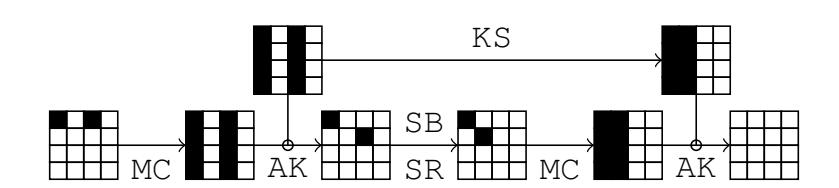

Figure 7: Example of linear incompatibility in the case of AES-128: the linearity of the Key schedule imposes all the active columns [a, b, c, d] T to be equal, which contradicts M·[x, 0, 0, 0]<sup>T</sup> ⊕[x 0 , 0, 0, 0]<sup>T</sup> = M·[y, 0, 0, 0]<sup>T</sup> ⊕[0, y<sup>0</sup> , 0, 0]<sup>T</sup> the first key addition (AK).

The second method is to build the very same tool, but propagating all the information such that the Markov assumption is verified again. Then, we can directly verify the implicit conditions and eventually be sure that the search finds valid characteristics. In return, the overall search introduces more complex operations since the graphs GBC and GKS are bigger.

A mix of the two methods seems to be the best strategy in practice and we give in [Appendix](#page-18-0) [B](#page-18-0) an example with the detailed study of the AES-128. In this case, the overall complexity is the same as before, except that we perform extra computations for each visited edges to check for linear consistency by solving small linear systems, which may all be precomputed.

## B.2 Block Cipher State Compression

<span id="page-19-2"></span>In the case of AES-like ciphers, the search space can be drastically reduced thanks to some observations on the round function. We introduce a new compressed view of the block cipher state.

Definition 4. Let ∆ be a state of truncated differences considered as a d-column square matrix ∆ = [∆·,<sup>1</sup> , . . . , ∆·,d]. We denote ∆¯ the image of ∆ by the non-injective function:

$$\Delta \longrightarrow \bar{\Delta} = \left[ |\bar{\Delta}^{\cdot,1}|, \dots, |\bar{\Delta}^{\cdot,d}| \right], \text{ where: } \forall j, \ \bar{\Delta}^{\cdot,j} = |\Delta^{\cdot,j}|$$

In the sequel, we call ∆¯ the compressed state of ∆.

A compressed state as defined above only describes the number of active cells there are in each column of the block cipher internal state. The motivation to introduce such a compressed representation lies in the MDS property of the underlying matrix M of the MC layer. Indeed, to get the possible output truncated patterns, we only need the number of active cells on the input, i.e. the weight of that column.

Theorem 5. Let E be an AES-like cipher with n-bit blocks using a k-bit internal state in the key schedule. Both states are viewed as vectors of b-bit cells. With state compression, the time complexity of [Algorithm](#page-9-2) [1](#page-9-2) to find all the best differential characteristics for r round of E becomes

$$O\left(r \cdot 2^{\sqrt{\frac{n}{b}}\log_2(\frac{n}{b}) + \frac{n}{b}}\right),$$

with a small hidden constant factor.

#### <span id="page-19-0"></span>B.3 Evaluating the number of nodes/edges of GBC and GKS

Number of nodes. With this new compressed representation, it is easy to see that the internal state can now take (d+1)<sup>d</sup> possible values instead of 2 <sup>t</sup>BC and <sup>G</sup>BC now contains (d+1)d×(2tKS+1) nodes; GKS is not affected by the compressed state.

{20}------------------------------------------------

Number of edges in  $G_{BC}$ . The average branching factor  $B_P$  of the P layer for AES-like ciphers corresponds to the one of the MixColumns layer: for a single column with  $i \in [1, d]$  active differences in its input, we may choose the location of j active difference in its output, with  $j \in [d+1-i,d]$  to respect the MDS property of the underlying  $d \times d$  matrix M. Alternatively, we may choose the location of  $j \in [0,i-1]$  inactive differences, which leads to the following formula of  $B_P$  for the d columns where the leading 1 comes from the full inactive column:

$$B_{\mathsf{P}} = \left(2^{-d} \left(1 + \sum_{i=1}^{d} \binom{d}{i} \sum_{j=0}^{i-1} \binom{d}{j}\right)\right)^{d} = \left(1 + \sum_{i=1}^{d} \sum_{j=0}^{i-1} \binom{d}{i} \binom{d}{j}\right)^{d}.$$
 (4)

In the case of AES-128, we obtain an average branching of  $B_{\mathsf{P}} = 2^{2.55}$  for one column of the P layer. However, we have to consider not only the P layer but also the subkey XOR layer that comes right after. We cannot use the value we previously computed for  $B_{\mathsf{P}}$  since we assumed in Appendix A that the two words XORed were random. However, in the current situation, the hamming weight of the column words arriving from the P layer presents a strong bias towards higher values (this is due to the branching effect that tends to populate more dense than sparse words). Therefore, we need to tweak a little bit the formula in order to take in account the hamming weight probability of the column words involved A and B:

$$B_{\text{xor}} = \left(\sum_{z=0}^{d} \sum_{a=0}^{d} \sum_{b=0}^{d} \Pr[\text{HAM}(A) = a] \cdot \Pr[\text{HAM}(B) = b] \cdot P_{\text{and}}(d, a, b, z) \cdot 2^{z}\right)^{d}, \tag{5}$$

where  $\Pr[\text{HAM}(B) = b] = \binom{d}{b}/2^d$  since the subkey column words are not biased, and  $P_{\text{and}}$  is defined in Appendix A. The hamming weight probabilities  $\Pr[\text{HAM}(A) = a]$  concerning the column words coming from the P layer are computed by

<span id="page-20-0"></span>
$$\Pr[\text{HAM}(A) = a] = \frac{\sum_{i=1}^{d} \binom{d}{i} \binom{d}{a} \cdot 1_{a < i}}{1 + \sum_{i=1}^{d} \sum_{j=0}^{i-1} \binom{d}{i} \binom{d}{j}}.$$
 (6)

In the case of AES-128, the total branching of both P layer and XOR layer amounts to  $2^{16.88}$ . One can see that the branching here is very strong compared to the number of nodes that the graph  $G_{\text{BC}}$  has, which indicates that this bipartite graph is dense. Therefore, we can instead upper bound the number of edges  $e_{\text{BC}}$  by reasoning on the number of nodes  $e_{\text{BC}} \leq (d+1)^{2d} \cdot 2^{t_{\text{BC}}}$ , since two nodes cannot share more than one edge. This gives us  $e_{\text{BC}} \leq 2^{34.6}$  for AES-128. In practice, we measured  $2^{33.6}$  edges for  $G_{\text{BC}}$ .

Number of edges in  $G_{KS}$ . In the case of total-AES-like ciphers, we can compute an estimation of the average branching factor  $B_{KS}$  of the KS layer and this allows to evaluate the number of edges in  $G_{KS}$ . Remember that any Sbox application has no effect on the truncated differentials search branching, so we only need to consider the XOR operations. In order to obtain this estimation, we model the total-AES-like ciphers key schedule as the following operations:

$$A'_0 = A_0 \oplus R_0; \quad A'_1 = A'_0 \oplus R_1; \quad \cdots \quad A'_{d-1} = A'_{d-2} \oplus R_{d-1}$$
 (7)

where all words represent a d-bit key state column and  $A_0$  and all  $R_i$  are random d-bit numbers. If we denote  $B_{\mathsf{KS}}^i$  the average branching concerning the i-th operation (i.e. column), then we have  $B_{\mathsf{KS}} = \prod_{i=0}^{d-1} B_{\mathsf{KS}}^i$ . Note that it is easy to evaluate the average branching  $B_{\mathsf{KS}}^0$  of the first operation, but hard to do for the remaining ones. Indeed, in the first operation we consider that both  $A_0$  and  $R_0$  are random d-bit numbers, but for the next operations the words  $A_0'$ , ...,  $A_{d-2}'$  are not random looking value anymore as their hamming weight is slightly biased towards

{21}------------------------------------------------

higher values (due to the effect of the branching in the previous operation). This is the very same problem that appear for combining the branching of the P and the XOR layer in the previous section.

We then use the same formula (5) to compute  $B_{KS}^i$ , remarking that  $A_0$  and  $R_i$  are considered as not biased (thus  $\Pr[HAM(A_0) = b] = \Pr[HAM(R_i) = b] = {d \choose b}/2^d$ ), while the biased probabilities  $\Pr[HAM(A_i') = a]$  are computed with:

$$\Pr[\mathtt{HAM}(A_i') = a] = \\ \left(\sum_{z=0}^d \sum_{a=0}^d \sum_{b=0}^d \sum_{y=z}^{2z} \Pr[\mathtt{HAM}(A_{i-1}') = a] \cdot \Pr[\mathtt{HAM}(R_i) = b] \cdot P_{\texttt{and}}(d, a, b, z) \cdot \binom{z}{y-z} \cdot 1_{i+j-y=a}/2^z\right)^d$$

We can now estimate the number of edges  $e_{\mathsf{KS}} = 2^{t_{\mathsf{KS}}} \cdot B_{\mathsf{KS}}$  in  $G_{\mathsf{KS}}$ . For AES-128, we obtain an average branching for the KS layer of  $B_{\mathsf{KS}} = 2^{6.15}$ . Our model and our assumptions seems to be sound since we measured an average branching of about  $B_{\mathsf{KS}} = 2^{6.22}$ . Overall, building/storing  $G_{\mathsf{KS}}$  during the precomputation phase should not require more than  $e_{\mathsf{KS}} = 2^{22.15}$  computations and memory.

#### **B.4** Enhanced Markov Process

The related-key differential characteristics presented in Section 4.1 are valid when one only deals with truncated differences and these characteristics give an indication on the structural security provided by the AES-128 key schedule. However, it turns out that none of them can be instantiated with actual differences, because of inconsistencies in some linear constraints. Therefore, we apply the techniques proposed in Section B.1: at the cost of a bigger graph G to handle, we first add some more information in the Markov process both on the representation of the key schedule state and the internal permutation state, and we then filter the best characteristics obtained and hope to find one that can be instantiated with actual differences.

Block Cipher State Compression. In order to look for actual differences characteristics for AES-128, we slightly reduce the state compression used for AES-like ciphers.

**Definition 5.** Let  $\Delta$  be a state of truncated differences considered as a d-column square matrix  $\Delta = [\Delta^{\cdot,1}, \ldots, \Delta^{\cdot,d}]$ . We denote  $\tilde{\Delta}$  the image of  $\Delta$  by the non-injective function:

$$\Delta \longrightarrow \tilde{\Delta} = \begin{bmatrix} |\tilde{\Delta}^{\cdot,1}|, \dots, |\tilde{\Delta}^{\cdot,d}| \end{bmatrix}, \text{ where: } \forall j, \ \tilde{\Delta}^{\cdot,j} = \begin{cases} \Delta^{\cdot,j} & \text{if } |\Delta^{\cdot,j}| = 1, \\ |\Delta^{\cdot,j}| & \text{otherwise.} \end{cases}$$

In the sequel, we call  $\Delta$  the **semi-compressed state** of  $\Delta$ .

A semi-compressed state as defined above only describes the number of active cells there are in each column of the block cipher internal state, and in the event that there is only one, keep tracks of its position (see example in Figure 8). The stored position in the particular case of a single input active cell provides the additional information needed by the Markov process to construct actual differences characteristics without inconsistencies.

<span id="page-21-0"></span>Representation of Truncated Subkeys. Keeping in mind that the unique  $d^2$ -bit truncated difference information is not enough for the Markov process to find actual differential characteristics, we provide a more complete coding of the subkeys. Namely, we introduce a representation that allows to encode some particular cases of linear constraints between the differences.

{22}------------------------------------------------

<span id="page-22-3"></span><span id="page-22-0"></span>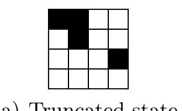

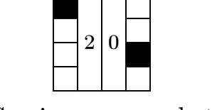

<span id="page-22-1"></span>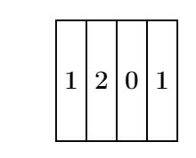

(a) Truncated state.

<span id="page-22-2"></span>(b) Semi-compressed state. (c) Compressed state.

Figure 8: Example of compressed truncated state (c) and semi-compressed truncated state (b) from a truncated state (a).

**Definition 6.** Let  $\delta = [\delta^{x,y}]$  be the actual difference in a subkey k and  $\Delta$  its truncated counterpart, where the d actual differences on each column j are related by a possibly empty system of linear equations  $S_j$ . We called **semi-truncated difference** of the key k, and denote it  $\tilde{k}$ , the d-column square matrix such that:

$$\tilde{k} = (b, [\tilde{k}^{\cdot,j}]), where: \quad \forall j, \tilde{k}^{\cdot,j} = \begin{cases} x & \text{if } S_j \cong \mathbf{M}x = 0, & \text{with } |x| = 1, \\ (x,y) & \text{if } S_j \cong \mathbf{M}x \oplus y = 0, \text{with } |x| = |y| = 1, \\ \Delta^{\cdot,j} & \text{otherwise.} \end{cases}$$
 (type 3)

and b may be  $\top$  if and only if all columns of the same type are equal in actual differences; it always equals to  $\bot$  otherwise. Additionally, we call an **extended state** a couple  $(\tilde{s}, \tilde{k})$  of a block cipher semi-compressed state  $\tilde{s}$  and a key schedule semi-truncated difference  $\tilde{k}$  and denote  $|(\tilde{s}, \tilde{k})|$  its weight.

This definition behaves as a trade-off between the actual differences, which amounts to a total of  $2^{b \cdot d^2}$  different differences but keeps the whole relations between the differences, and the truncated differences which compress to the minimum information on each difference, where there are only  $2^{d^2}$  of them.

As an example, in the case d = 4, the two linear systems  $S_1 : \mathbf{M}[a, 0, 0, 0]^T = 0$  and  $S_2 : \mathbf{M}[0, 0, 0, b]^T = 0$  falls into the type 1 category but results in two different columns, where we store  $[a, 0, 0, 0]^T$  and  $[0, 0, 0, b]^T$  respectively, or equivalently the position of the only active difference, 0 and 3. In this case, the bit b cannot give a relation between a and b since the two columns are not of the same type; but if  $S_2$  were  $S_2 : \mathbf{M}[c, 0, 0, 0]^T = 0$ , it could, which would mean that a = c in terms of actual differences.

#### B.5 Explanations

We explain here the choice of the extra information added in the Markov in comparison to our preliminary tool. Namely, we keep more information in some special cases to avoid loosing information of those particular values. In the block cipher, the columns of weight exactly 1 are stored uncompressed (Definition 4); in the key schedule, we encode the position of active differences in two particular cases (types 1 and 2, Definition 6).

Those enhanced representations come into the picture when iterating over the sets of successors in the two graphs  $G_{\mathsf{BC}}$  and  $G_{\mathsf{KS}}$ . To construct the set  $\mathrm{succ}_{\mathsf{KS}}(k)$  of successors of a semi-truncated key k, we consider in a very straightforward manner the sum of two columns and deduce which one(s) can be reached trough the key schedule algorithm.

In the graph  $G_{BC}$ , we want to find the set  $\operatorname{succ}_{BC}(s,k)$  of successors of a semi-compressed state s and a semi-truncated difference k. To do so, we first construct the set of all truncated state after the MC layer and check which truncated state s' can be obtained after the  $\mathsf{AK}(k)$ . For each of those s', we may write a homogeneous system of linear equations corresponding to the two linear AES transformations MC and AK, using the additional information on the columns of k

{23}------------------------------------------------

to check whether the transition is indeed valid. If the input semi-compressed state s is associated to n actual truncated state, then we write n systems and check if at least one has non-trivial solutions. In practice, all the possible systems are precomputed.

Consequently, the cost update function of the Markov process is done as before, with extra checks on the transitions/edges available with the added information at each node. This enhanced Markov process thus leads to graphs with more nodes than the one for pure truncated differentials, but proportionally, there are less edges because of the tighter transition function.

#### <span id="page-23-0"></span>C Finding actual differences

To find the actual differences from the truncated characteristic, we need to write down the system of linear equations which exists from the cipher definition. In the case of the AES, there are lots of linear constraints in the key schedule, and others at the MixColumns layer. To express those equations, we choose a set of independent variables  $\mathcal{B}$  such that any actual difference of the differential characteristic can be written as a linear combination of variables from  $\mathcal{B}$ . In the case of the AES, we can write all the equations with a basis  $\mathcal{B}$  of variables from the key schedule; for example, the  $d^2 - d$  last cells from the first subkey  $k_0$ , and each cell of the first column that goes out of the Sbox in the following subkeys,  $k_1, \ldots, k_r$ .

Once the system S of linear equations has been written, we apply the Gauss-Jordan elimination algorithm to transform it into reduced row echelon form and compute a basis of its kernel. We note that we want more than a non-trivial solution to the system; namely, we want each subsystems of S corresponding to each rounds to have non-trivial solutions. This is taken care of by the enhanced Markov process that we introduced to deal with actual differences. In the event that the nullity  $\nu$  of S of the system is not null, we can get as many as  $2^{b \cdot \nu}$  different possibilities to set values for actual differences of the truncated differential characteristic and any of them would conform to all the linear constraints.

In a second step, we need to take care of the non-linear constraints; namely, that each pair of input/output actual differences  $(\delta_{in}, \delta_{out})$  of the Sbox provide a non-null entry in the DDT. From the system  $\mathcal{S}$ , we can write each  $\delta_{in}$  and  $\delta_{out}$  as a linear combinations of variables from the basis  $\mathcal{B}$  and gather all the different transitions in a set  $\mathcal{D} = \{(\delta_{in}^k \to \delta_{out}^k)\}$ . Depending on the truncated differential characteristic, there may be several transitions which are equal: in the end, there are  $|\mathcal{D}|$  different ones. Finally, we enumerate all the elements of the previously computed kernel to find one which validates all the transitions in  $\mathcal{D}$ .

Furthermore, each pair  $(\delta_{in}^k, \delta_{out}^k) \in \mathcal{D}$  with a certain repetition  $\alpha_k$  in the characteristic goes along with a certain probability  $p_k$  (depending on the DDT), which contributes to the probability of the final differential characteristic  $p = \prod p_k^{\alpha_k}$ . Thus, if there are several kernel elements that validate all the transitions of  $\mathcal{D}$ , then we may prefer the one that maximize p.

{24}------------------------------------------------

## <span id="page-24-1"></span>D Tables for the distinguisher for 9 rounds of AES-128

**Table 4:** Example of a pair of keys conforming to the differential characteristic of our 9-round distinguisher of AES-128. There are about  $2^{27}$  such pairs.

| Round | k                                   | k'                                  | $k \oplus k'$                        |
|-------|-------------------------------------|-------------------------------------|--------------------------------------|
| 0     | BD219F91 37EBDD3C 623F76DB 34AD0BBB | 0E219F91 37EBDD3C C4CB0CA1 34230BBB | B3000000 000000000 A6F47A7A 008E0000 |
| 1     | 290A7589 1EE1A8B5 7CDEDE6E 4873D5D5 | 290A7589 1EE1A8B5 DA2AA414 EE09AFAF | 00000000 00000000 A6F47A7A A67A7A7A  |
| 2     | A40976DB BAE8DE6E C6360000 8E45D5D5 | 2A730CA1 3492A414 EEB80000 00B1AFAF | 8E7A7A7A 8E7A7A7A 288E0000 8EF47A7A  |
| 3     | CE0A75C2 74E2ABAC B2D4ABAC 3C917E79 | E60A75C2 D298D1D6 3C20D1D6 3C917E79 | 28000000 A67A7A7A 8EF47A7A 00000000  |
| 4     | 47F9C329 331B6885 81CFC329 BD5EBD50 | 6FF9C329 BD6112FF 8141C329 BDD0BD50 | 28000000 8E7A7A7A 008E0000 008E0000  |
| 5     | 0F839053 3C98F8D6 BD573BFF 000986AF | 0F839053 B2E282AC 33A34185 8E73FCD5 | 00000000 8E7A7A7A 8EF47A7A 8E7A7A7A  |
| 6     | 2EC7E930 125F11E6 AF082A19 AF01ACB6 | A033934A 12D111E6 21725063 AF01ACB6 | 8EF47A7A 008E0000 8E7A7A7A 00000000  |
| 7     | 1256A749 0009B6AF AF019CB6 00003000 | 9CA2DD33 8E73CCD5 AF019CB6 00003000 | 8EF47A7A 8E7A7A7A 00000000 000000000 |
| 8     | F152C42A F15B7285 5E5AEE33 5E5ADE33 | 7FA6BE50 F1D57285 5ED4EE33 5ED4DE33 | 8EF47A7A 008E0000 008E0000 008E0000  |
| 9     | 544F0772 A51475F7 FB4E9BC4 A51445F7 | 2CBB7D08 DD6E0F8D 83BAE1BE DD6E3F8D | 78F47A7A 787A7A7A 78F47A7A 787A7A7A  |

### <span id="page-24-0"></span>E Best truncated differential characteristics for AES-128

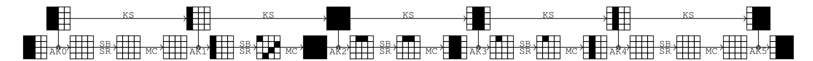

Figure 9: Best truncated differential characteristics for AES-128 when r = 5 rounds with 11 active Sboxes.

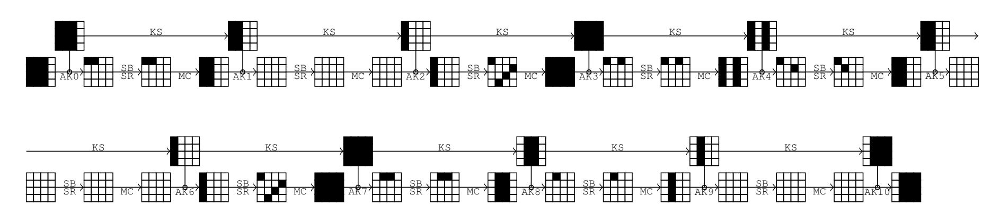

Figure 10: Best truncated differential characteristics for AES-128 when r = 10 rounds with 25 active Sboxes.

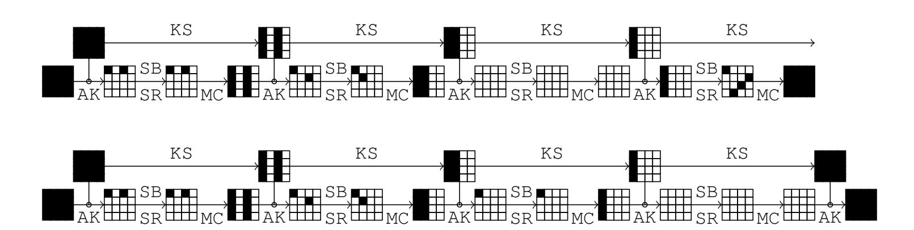

Figure 11: Best truncated differential characteristics for AES-128 when r = 8 rounds with 21 active Sboxes.

{25}------------------------------------------------

### <span id="page-25-0"></span>F Differential characteristic for 2-round AES-128

<span id="page-25-3"></span>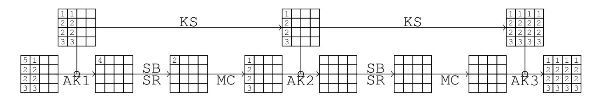

**Figure 12:** The best differential characteristic on two rounds of AES-128, which has a probability  $p = 2^{-6}$ . The vector of differences can take as many as  $2^8$  values, and for instance:  $(1, ..., 5) = (0 \times 10, 0 \times 0E, 0 \times 12, 0 \times 01, 0 \times 1D)$ .

### <span id="page-25-1"></span>G Differential characteristic for 3-round AES-128

<span id="page-25-2"></span>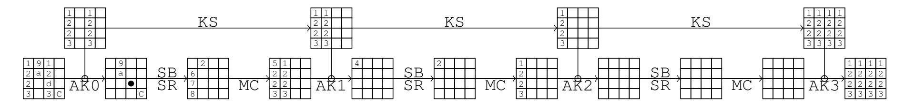

Figure 13: The differential characteristic three rounds of best on AES-128,  $2^{-31}$ which has probability =The vector of differences p $\mathbf{a}$ is (1, ..., d) = (0x1C, 0x0E, 0x12, 0x01, 0x1D, 0x90, 0x0D, 0x0B, 0xB3, 0x58, 0x45, 0xF7, 0x4B). Another one that reaches the same probability is: (0x38,0x1C,0x24,0x02,0x3A,0x12,0x1A,0x16,0x6B,0x2C,0xAF, 0x3F, 0xB3).

**Table 5:** Example of a pair of messages (m, m') that conforms to the 3-round truncated differential characteristic for AES-128 of Figure 13 with the second set of differences. The lines in this array contains the values of two subkeys and internal states before entering the corresponding round, as well as their differences. Note that discarding the first round provide a test vector for the differential characteristics of Figure 12.

| Round | k                                                                                                                 | k'                                                                         | $k \oplus k'$                                                                                                     |
|-------|-------------------------------------------------------------------------------------------------------------------|----------------------------------------------------------------------------|-------------------------------------------------------------------------------------------------------------------|
| 0     | 95220EA1 3C000000 F5416D13 3E000000                                                                               | AD3E1285 3C000000 CD5D7137 3E000000                                        | 381C1C24 00000000 381C1C24 00000000                                                                               |
| 1     | F7416D13 CB416D13 3E000000 00000000                                                                               | CF5D7137 F35D7137 3E000000 00000000                                        | 381C1C24 381C1C24 00000000 000000000                                                                              |
| 2     | 96220E70 5D636363 63636363 63636363                                                                               | AE3E1254 5D636363 63636363 63636363                                        | 381C1C24 00000000 00000000 000000000                                                                              |
| 3     | 69D9F58B 34BA96E8 57D9F58B 34BA96E8                                                                               | 51C5E9AF 0CA68ACC 6FC5E9AF 0CA68ACC                                        | 381C1C24 381C1C24 381C1C24 381C1C24                                                                               |
| D 1   |                                                                                                                   | 1                                                                          |                                                                                                                   |
| Round | m                                                                                                                 | m'                                                                         | $m\oplus m'$                                                                                                      |
| Init. |                                                                                                                   | 616CE889 3C0052B7 CBD97165 6CB5953F                                        |                                                                                                                   |
| Init. |                                                                                                                   | 616CE889 3C0052B7 CBD97165 6CB5953F                                        | 381C1C24 6B2C0000 381CB324 0000003F                                                                               |
| Init. | 5970F4AD 572C52B7 F3C5C241 6CB59500<br>CC52FA0C 6B2C52B7 0684AF52 52B59500                                        | 616CE889 3C0052B7 CBD97165 6CB5953F                                        | 381C1C24 6B2C0000 381CB324 0000003F<br>00000000 6B2C0000 0000AF00 0000003F                                        |
| Init. | 5970F4AD 572C52B7 F3C5C241 6CB59500<br>CC52FA0C 6B2C52B7 0684AF52 52B59500<br>E8000000 00000000 00000000 00000000 | 616CE889 3C0052B7 CBD97165 6CB5953F<br>CC52FA0C 000052B7 06840052 52B5953F | 381C1C24 6B2C0000 381CB324 0000003F<br>00000000 6B2C0000 0000AF00 0000003F<br>02000000 00000000 00000000 00000000 |

{26}------------------------------------------------

## <span id="page-26-1"></span>H Differential characteristic for 4-round AES-128

<span id="page-26-3"></span>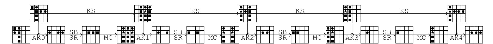

**Figure 14:** The first best differential characteristic on four rounds of AES-128, which has a probability  $p = 2^{-81}$ . Differences are:  $\blacksquare = 0 \times 7 \text{A}$ ,  $\bullet = 0 \times 8 \text{E}$  and  $\bigstar = \blacksquare \oplus \bullet = 0 \times 7 \text{A}$ .

<span id="page-26-4"></span>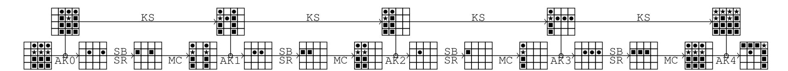

**Figure 15:** The second best differential characteristic on four rounds of AES-128, which has a probability  $p=2^{-81}$ . Differences are:  $\blacksquare = 0 \times 7 \text{A}$ ,  $\bullet = 0 \times 8 \text{E}$  and  $\bigstar = \blacksquare \oplus \bullet = 0 \times F 4$ .

### <span id="page-26-0"></span>I Differential characteristic for 5-round AES-128

<span id="page-26-2"></span>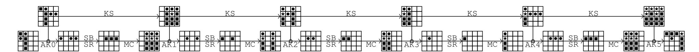

**Figure 16:** The best differential characteristic on five rounds of AES-128, which has a probability  $p = 2^{-105}$ . Differences are:  $\blacksquare = 0 \times 7A$ ,  $\bullet = 0 \times 8E$  and  $\bigstar = \blacksquare \oplus \bullet = 0 \times F4$ .

**Table 6:** Example of a pair of messages (m, m') that conforms to the 5-round truncated differential characteristic for AES-128 of Figure 16. The lines in this array contains the values of the two subkeys and internal states before entering the corresponding round, as well as their differences. Note that discarding the first or the last round provide a test vector for the differential characteristics of Figure 14 and Figure 15.

| Round | k                                                                          | k'                                                                                                                | $k \oplus k'$                                                              |
|-------|----------------------------------------------------------------------------|-------------------------------------------------------------------------------------------------------------------|----------------------------------------------------------------------------|
| 0     | 6D387102 D0C52A0F 854283FB 208E76EE                                        | 17387102 5EBF5075 85CC83FB 200076EE                                                                               | 7A000000 8E7A7A7A 008E0000 008E0000                                        |
| 1     | 750059B5 A5C573BA 2087F041 000986AF                                        | 750059B5 2BBF09C0 AE738A3B 8E73FCD5                                                                               | 00000000 8E7A7A7A 8EF47A7A 8E7A7A7A                                        |
| 2     | 764420D6 D381536C F306A32D F30F2582                                        | F8B05AAC D30F536C 7D7CD957 F30F2582                                                                               | 8EF47A7A 008E0000 8E7A7A7A 00000000                                        |
| 3     | 047B33DB D7FA60B7 24FCC39A D7F3E618                                        | 8A8F49A1 59801ACD 24FCC39A D7F3E618                                                                               | 8EF47A7A 8E7A7A7A 00000000 000000000                                       |
| 4     | 01F59ED5 D60FFE62 F2F33DF8 2500DBE0                                        | 8F01E4AF D681FE62 F27D3DF8 258EDBE0                                                                               | 8EF47A7A 008E0000 008E0000 008E0000                                        |
| 5     | 724C7FEA A4438188 56B0BC70 73B06790                                        | 86B80590 5039FBF2 A244C60A 87CA1DEA                                                                               | F4F47A7A F47A7A7A F4F47A7A F47A7A7A                                        |
| Round | m                                                                          | m'                                                                                                                | $m\oplus m'$                                                               |
| Init. | 65380101 FDA4FF6F D0424BEF 7A8E35D8                                        | 1FB60101 73DE8515 D0424BEF 7A8E35D8                                                                               | 7A8E0000 8E7A7A7A 00000000 00000000                                        |
| 1 12  |                                                                            |                                                                                                                   |                                                                            |
| 0     | 08007003 2D61D560 5500C814 5A004336                                        | 088E7003 2D61D560 558EC814 5A8E4336                                                                               | 008E0000 00000000 008E0000 008E0000                                        |
|       |                                                                            |                                                                                                                   | 008E0000 00000000 008E0000 008E0000 00000000                               |
| 1     |                                                                            | D2D342E8 CA007146 E79EA6D7 3B0048F9                                                                               |                                                                            |
| 1 2   | D2D342E8 CA8E7146 E79EA6D7 3B8E48F9                                        | D2D342E8 CA007146 E79EA6D7 3B0048F9                                                                               | 00000000 008E0000 00000000 008E00000                                       |
| 1 2   | D2D342E8 CA8E7146 E79EA6D7 3B8E48F9<br>91367406 EF8E3E84 9D8E980B 2BD1EE66 | D2D342E8 CA007146 E79EA6D7 3B0048F9<br>91367406 EF003E84 9D00980B 2BD1EE66<br>4331727A 1E8E4722 172C7D6A B8EE10F1 | 00000000 008E0000 008E0000 008E0000<br>00000000 008E0000 008E0000 00000000 |