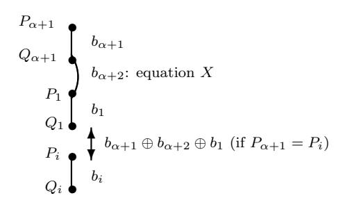
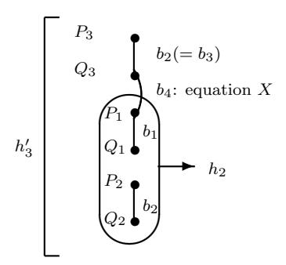
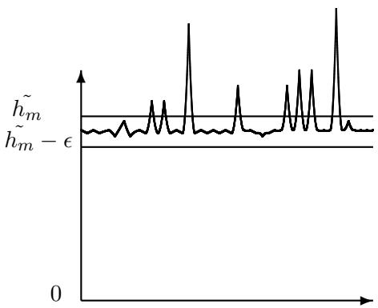
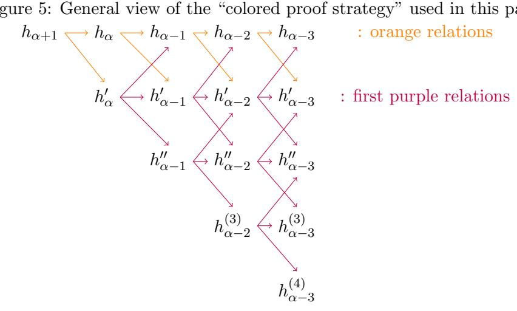

# Security in $O(2^n)$ for the Xor of Two Random Permutations

# - Proof with the standard H technique-

Jacques Patarin Université de Versailles 45 avenue des Etats-Unis 78035 Versailles Cedex - France

#### Abstract

Xoring two permutations is a very simple way to construct pseudorandom functions from pseudorandom permutations. In [13], it is proved that we have security against CPA-2 attacks when  $m \ll O(2^n)$ , where m is the number of queries and n is the number of bits of the inputs and outputs of the bijections. In this paper, we will obtain similar (but slightly different) results by using the "standard H technique" instead of the " $H_{\sigma}$  technique". It will be interesting to compare the two techniques, their similarities and the differences between the proofs and the results.

**Key words:** Pseudorandom functions, pseudorandom permutations, security beyond the birth-day bound, Luby-Rackoff backwards.

#### 1 Introduction

The problem of converting pseudorandom permutations (PRP) into pseudorandom functions (PRF) named "Luby-Rackoff backwards" was first considered in [3]. This problem is obvious if we are interested in an asymptotical polynomial versus non polynomial security model (since a PRP is then a PRF), but not if we are interested in achieving more optimal and concrete security bounds. More precisely, the loss of security when regarding a PRP as a PRF comes from the "birthday attack" which can distinguish a random permutation from a random function of n bits to n bits, in  $2^{\frac{n}{2}}$  operations and  $2^{\frac{n}{2}}$  queries. Therefore different ways to build PRF from PRP with a security above  $2^{\frac{n}{2}}$  and by performing very few computations have been suggested (see [2, 3, 4, 6]). One of the simplest way is simply to Xor k independent pseudorandom permutations, for example with k=2. In [6] (Theorem 2 p.474), it has been proved, with a simple proof, that the Xor of k independent PRP gives a PRF with security at least in  $O(2^{\frac{k}{k+1}n})$ . (For k=2 this gives  $O(2^{\frac{2}{3}n})$ ). In [2], a much more complex strategy (based on Azuma inequality and Chernoff bounds) is presented. It is claimed that with this strategy we may prove that the Xor of two PRP gives a PRF with security at least in  $O(2^n/n^{\frac{2}{3}})$  and at most in  $O(2^n)$ , which is much better than the birthday bound in  $O(2^{\frac{n}{2}})$ . However the authors of [2] present a very general framework of proof and they do not give every

details for this result. For example, page 9 they wrote "we give only a very brief summary of how this works", and page 10 they introduce O functions that are not easy to express explicitly. In this paper we will use a completely different proof strategy, based on the "standard H technique" (see Section 3 below), simple counting arguments and induction. This paper is self contained. It is nevertheless interesting to compare this paper with [13] where similar (but slightly different results, as we will explain) are obtained by using the  $H_{\sigma}$  technique instead of the standard H technique.

**Related Problems.** In [14] the best know attacks on the Xor of k random permutations are studied in various scenarios. For k = 2 the bound obtained are near our security bounds. In [7] attacks on the Xor of two **public** permutations are studied (i.e. indifferentiability instead of indistinguishibility).

#### Part I

# From the Xor of Two Permutations to the $h_i$ values

### 2 Notation and Aim of this paper

In all this paper we will denote  $I_n = \{0,1\}^n$ .  $F_n$  will be the set of all applications from  $I_n$  to  $I_n$ , and  $B_n$  will be the set of all permutations from  $I_n$  to  $I_n$ . Therefore  $|I_n| = 2^n$ ,  $|F_n| = 2^{n \cdot 2^n}$  and  $|B_n| = (2^n)!$ .  $x \in_R A$  means that x is randomly chosen in A with a uniform distribution.

The aim of this paper is to prove the theorem below, with an explicit O function (to be determined).

**Theorem 1** For all CPA-2 (Adaptive chosen plaintext attack)  $\phi$  on a function G of  $F_n$  with m chosen plaintext, we have:  $\operatorname{Adv}_{\phi}^{\operatorname{PRF}} \leq O(\frac{m}{2^n})$  where  $\operatorname{Adv}_{\phi}^{\operatorname{PRF}}$  denotes the advantage to distinguish  $f \oplus g$ , with  $f, g \in_R B_n$  from  $h \in_R F_n$ .

This theorem says that there is no way (with an adaptive chosen plaintext attack) to distinguish with a good probability  $f \oplus g$  when  $f, g \in_R B_n$  from  $h \in_R F_n$  when  $m \ll 2^n$  (and this even if we have access to infinite computing power, as long as we have access to only m queries). Therefore, it implies that the number  $\lambda$  of computations to distinguish  $f \oplus g$  with  $f, g \in_R B_n$  from  $h \in_R F_n$  satisfies:  $\lambda \geq O(2^n)$ . We say also that there is no generic CPA-2 attack with less than  $O(2^n)$  computations for this problem, or that the security obtained is greater than or equal to  $O(2^n)$ . Since we know (for example from [2] or [14]) that there is an attack in  $O(2^n)$ , Theorem 1 also says that  $O(2^n)$  is the exact security bound for this problem.

# 3 The general Proof Strategy (" standard H technique")

Let  $a = (a_i, 1 \le i \le m)$  be m pairwise distinct values of  $I_n$ .

Let  $b = (b_i, 1 \le i \le m)$  be m values of  $I_n$  (not necessarily distinct). • We will denote by H(a, b), or by H(b) since we will see that H(a, b) does

• We will denote by H(a,b), or by H(b) since we will see that H(a,b) does not depend on a, the number of  $(f,g) \in B_n^2$  such that:  $\forall i, 1 \leq i \leq m, (f \oplus g)(a_i) = b_i$ . Often we will denote H(b) by

 $H_m$  for simplicity (but H(b) depends on b).

#### Introducing h instead of H

- We will denote by h(b), or simply by  $h_m$  for simplicity (but h depends on b) the number of sequences  $x_i$ ,  $1 \le i \le m$ ,  $x_i \in I_n$ , such that:
  - 1. The  $x_i$  are pairwise distinct,  $1 \le i \le m$ .
  - 2. The  $x_i \oplus b_i$  are pairwise distinct,  $1 \le i \le m$ .

#### Theorem 2 We have

$$H(a,b) = h(b) \cdot \frac{|B_n|^2}{(2^n(2^n-1)\dots(2^n-m+1))^2}$$

(and therefore H(a,b) does not depend on a, i.e. does not depend on the pairwise distinct values  $a_i$ ,  $1 \le i \le m$ ).

**Proof.** When the  $x_i$  are fixed, f and g are fixed on exactly m pairwise distinct points by  $\forall i, 1 \le i \le m$ ,  $f(a_i) = x_i$  and  $g(a_i) = b_i \oplus x_i$ .

**Theorem 3**  $h_m$  is the number of  $(P_1, P_2, \dots, P_m, Q_1, \dots, Q_m) \in I_n^{2m}$  such that

- 1. The  $P_i$  are pairwise distinct (i.e.  $i \neq j \Rightarrow P_i \neq P_i$ ).
- 2. The  $Q_i$  are pairwise distinct (i.e.  $i \neq j \Rightarrow Q_i \neq Q_i$ ).
- $3. \ \forall i, \ 1 \leq i \leq m, \ P_i \oplus Q_i = b_i.$

**Proof.** Since  $Q_i$  is fixed when  $P_i$  is fixed, Theorem 3 is obvious from the definition of  $h_m$ , i.e. just take  $P_i = x_i$  and  $Q_i = x_i \oplus b_i$ .

# Computation of $E(h) = \tilde{h}_m$

We will denote by  $\tilde{h_m}$  the average of  $h_m$  when  $b \in_R I_n^m$ .

#### Theorem 4

$$\tilde{h_m} = \frac{(2^n(2^n - 1)\dots(2^n - m + 1))^2}{2^{nm}}$$

**Proof.** Let  $b = (b_1, \ldots, b_n)$ , and  $x = (x_1, \ldots, x_n)$ . For  $x \in I_n^m$ , let

$$\delta_x = 1 \Leftrightarrow \left\{ \begin{array}{ll} \text{The } x_i \text{ are pairwise distinct}, & 1 \leq i \leq m \\ \text{The } x_i \oplus b_i \text{ are pairwise distinct}, & 1 \leq i \leq m \end{array} \right.$$

and  $\delta_x = 0 \Leftrightarrow \delta_x \neq 1$ . Let  $J_n^m$  be the set of all sequences  $x_i$  such that all the  $x_i$  are pairwise distinct,  $1 \leq i \leq m$ . Then  $|J_n^m| = 2^n(2^n - 1) \dots (2^n - m + 1)$  and  $N = \sum_{x \in J_n^m} \delta_x$ . So we have  $E(h) = \sum_{x \in J_n^m} E(\delta_x)$ . For  $x \in J_n^m$ ,

$$E(\delta_x) = Pr_{b \in_R I_n^m}$$
 (All the  $x_i \oplus b_i$  are pairwise distinct) =  $\frac{2^n (2^n - 1) \dots (2^n - m + 1)}{2^{nm}}$

Therefore

$$E(h) = |J_n^m| \cdot \frac{2^n (2^n - 1) \dots (2^n - m + 1)}{2^{nm}} = \frac{(2^n (2^n - 1) \dots (2^n - m + 1))^2}{2^{nm}}$$

as expected.

We will denote by  $Adv_m$  the best Advantage that we can get in CPA-2 with m queries when we try to distinguish  $f \oplus g$ , with  $f, g \in_R B_n$  from  $h \in_R F_n$ . As we will see now, there is a very deep connection between  $Adv_m$  and the coefficients  $h_m$ . More precisely:

**Theorem 5** An exact formula for Adv.

Let  $F = \{(b_1, \ldots, b_m) \in I_n^m \text{ such that: } h(b_1, \ldots, b_m) \geq \tilde{h_m}\}$ . Then:

$$Adv_{m} = \frac{1}{2 \cdot [2^{n}(2^{n}-1)...(2^{n}-m+1)]^{2}} \sum_{b_{1},...,b_{m} \in I_{n}} |h_{m} - \tilde{h_{m}}|$$

$$= \frac{1}{2 \cdot 2^{nm}} \sum_{b_{1},...,b_{m} \in I_{n}} |\frac{h_{m}}{h_{m}} - 1|$$

$$= \frac{1}{2^{nm}} \sum_{b_{1},...,b_{m} \in F} (\frac{h_{m}}{h_{m}} - 1)$$

$$= \frac{1}{2^{nm}} \sum_{b_{1},...,b_{m} \in I_{n} \setminus F} (1 - \frac{h_{m}}{h_{m}})$$

**Proof.** We have seen above that the choice of the pairwise distinct values  $a_i$  has no influence. Therefore, here the best CPA-2 is this one denoted by  $\phi$  ( $\phi$  is also the best KPA attack): choose m pairwise distinct values  $a_1, \ldots, a_m$ ,

 $\forall i, 1 \leq i \leq m$ , ask for  $f(a_i) = b_i$  and now

- If  $H(b_1, \ldots, b_m) \geq \tilde{H_m}$  output 1.
- If  $H(b_1, \ldots, b_m) < \tilde{H_m}$  output 0.

Here  $\tilde{H_m}$  denotes the average of  $H(b_1,\ldots,b_m)$  when  $(b_1,\ldots,b_m)\in I_n^m$ , i.e.  $\tilde{H_m}=\frac{|B_n|^2}{2^{nm}}$ . Let  $p_1^*$  be the probability that  $\phi$  outputs 1 when  $f\in_R F_n$ .  $p_1^*$  is also the probability that  $H(b_1,\ldots,b_m)\geq \tilde{H}_m$  when  $(b_1,\ldots,b_m)\in_R I_n^m$ . Therefore  $p_1^*=\frac{|F|}{2^{nm}}$ . Let  $p_1$  be the probability that  $\phi$  outputs 1 when  $f=g\oplus h$  with  $(g,h)\in_R B_n^2$ . Then:  $Adv=Adv(\phi)=|p_1-p_1^*|$ .  $p_1=\sum_{(b_1,\ldots,b_m)\in F}\frac{H(b_1,\ldots,b_m)}{|B_n|^2}$ . We know that  $H_m=\frac{h_m|B_n|^2}{[2^n(2^n-1)\ldots(2^n-m+1)]^2}$  (cf (3.2)). Therefore,

$$p_1 - p_1^* = \sum_{b_1, \dots, b_m \in F} \left( \frac{h_m(b_1, \dots, b_m)}{[2^n(2^n - 1) \dots (2^n - m + 1)]^2} - \frac{1}{2^{nm}} \right)$$

$$p_1 - p_1^* = \sum_{b_1, \dots b_m \in F} (\frac{h_m - \tilde{h_m}}{[2^n(2^n - 1)\dots(2^n - m + 1)]^2})$$

Therefore from Theorem 4:

$$Adv_m = p_1 - p_1^* = \frac{1}{2^{nm}} \sum_{b_1, \dots b_m \in F} (\frac{h_m}{\tilde{h_m}} - 1)$$

Now from  $\frac{1}{2^{nm}} \sum_{b_1,...b_m \in F} h_m = \frac{\tilde{h_m}}{2}$ , we obtain the other equality of Theorem 5.

As a direct corollary of this Theorem 5 we get:

**Theorem 6** ("Standard H technique theorem")

Let  $\alpha$  and  $\beta$  be real numbers,  $\alpha > 0$  and  $\beta > 0$ . Let  $\mathcal{E}$  be a subset of  $I_n^m$  such that  $|\mathcal{E}| \ge (1-\beta) \cdot 2^{nm}$ . If

- 1. For all sequences  $b_i$ ,  $1 \le i \le m$  of  $\mathcal{E}$  we have  $h_m(b) \ge \tilde{h_m}(1 \alpha)$ . Then
- 2.  $Adv_m \leq \alpha + \beta$ .

#### **Proof** From Theorem 5

$$Adv_m = \frac{1}{2^{nm}} \sum_{b_1, \dots, b_m \in I_n \setminus F} \left(1 - \frac{h_m}{\tilde{h_m}}\right)$$

 $I_n \setminus F \subset (I_n \setminus E) \cup (E \setminus F)$ , so

$$Adv_m \le \frac{1}{2^{nm}} (\beta \cdot 2^{nm} + \alpha \cdot 2^{nm}) \le \alpha + \beta$$

as claimed.  $\Box$

Theorem 4 and theorem 5 show the proof strategy that we will follow in this paper: we will study and evaluate the values  $h_m$ , and try to show that "most of the time"  $h_m \stackrel{>}{\sim} \tilde{h_m}$  where  $a \stackrel{>}{\sim} b$  means  $a \geq b$  or  $a \simeq b$ .

#### Remarks

- 1. In [13] a slightly different strategy is used, by studying  $\sigma(h_m)$ , the standard deviation on the  $h_m$  values.
- 2. Theorem 4 and theorem 5 are specific of this problem. However Theorem 6 is a very classical "coefficient H theorem" and can also be proved independently of Theorem 5 with more general conditions (see for example [13, 12]).

3. The probability to distinguish is  $\frac{1}{2} + Adv \cdot \frac{1}{2}$ , as usual.

**Theorem 7**  $(H_{worse\ case}\ theorem)$

Let  $\alpha \geq 0$ . If

- 1. For all sequences  $b_i$ ,  $1 \leq b_i \leq m$ , of  $I_n^m$  we have  $h_m(b) \geq \tilde{h_m}(1-\alpha)$
- 2.  $Adv_m \leq \alpha$ .

**Proof.** This follows immediately from Theorem 6 with  $\beta = 0$ .

#### Part II

# Analysis of the $h_i$ values

# 4 Orange equations, security in $O(\frac{m^3}{2^{2n}})$

Let  $\epsilon \geq 0$ . From Theorem 7, (i.e. coefficients H technique) we know that if for all  $b_1, \ldots, b_{\alpha} \in I_n$  we have  $h_{\alpha}(b_1, b_2, \ldots, b_{\alpha}) \geq \tilde{h}_{\alpha}(1 - \epsilon)$ , then:  $Avd^{PRF} \leq 2\epsilon$  (where  $Avd^{PRF}$  is as before the advantage

to distinguish  $f \oplus g$  with  $f, g \in_R B_n$  from  $h \in_R F_n$  with a CPA-2 attack). Therefore we want to study  $\frac{h\alpha}{h\alpha}$ .

$$\tilde{h}_{\alpha+1} = \tilde{h}_{\alpha} \frac{(2^n - \alpha)^2}{2^n}$$

$$\tilde{h}_{\alpha+1} = \tilde{h}_{\alpha} (2^n - 2\alpha + \frac{\alpha^2}{2^n}) \quad (4.1)$$

Now we want to evaluate  $h_{\alpha+1}$  from  $h_{\alpha}$  and compare the result with (4.1). In  $h_{\alpha+1}$ , we have:

- 1. The previous conditions on  $h_{\alpha}$ .
- 2. Two new variables  $P_{\alpha+1}$  and  $Q_{\alpha+1}$ .
- 3. One more equation  $P_{\alpha+1} \oplus Q_{\alpha+1} = b_{\alpha+1}$ . We call X this equation.
- 4.  $2\alpha$  new non equalities:  $P_{\alpha+1} \neq P_i$ ,  $\forall i, 1 \leq i \leq \alpha$ , and  $Q_{\alpha+1} \neq Q_i$ ,  $\forall i, 1 \leq i \leq \alpha$ . We will denote by  $\beta_1, \beta_2, \ldots, \beta_{2\alpha}$ , the  $2\alpha$  equalities that should not be satisfied here (for example  $P_{\alpha+1} = P_1$ ).

Let  $B_i = \{(P_1, P_2, \dots, P_{\alpha+1}, Q_1, Q_2, \dots, Q_{\alpha+1}) \in I_n^{2\alpha+2} \text{ that satisfy the conditions on } h_\alpha,$  the equation X, and the equalitity  $\beta_i\}$ . We have

$$h_{\alpha+1} = 2^n h_{\alpha} - |\cup_{i=1}^{2\alpha} B_i|$$

Moreover, since 3 equalities  $\beta_i$  are necessarily not compatible with the conditions on  $h_{\alpha}$ , we have:

$$h_{\alpha+1} = 2^n h_{\alpha} - \sum_{i=1}^{2\alpha} |B_i| + \sum_{i < j} |B_i \cap B_j| \quad (4.2)$$

• X + 1 equations.

We have  $|B_i| = h_{\alpha}$  (since X and  $\beta_i$  will fix  $P_{\alpha+1}$  and  $Q_{\alpha+1}$ ), and  $-\sum_{i=1}^{2\alpha} |B_i| = -2\alpha h_{\alpha}$ .

• X + 2 equations.

X is :  $P_{\alpha+1} \oplus Q_{\alpha+1} = b_{\alpha+1}$ . To be compatible with the conditions on  $h_{\alpha}$  the 2 new equalities should be of the type:  $P_{\alpha+1} = P_i$  and  $Q_{\alpha+1} = Q_j$ , with  $i \leq \alpha$  and  $j \leq \alpha$ . Therefore  $P_i \oplus Q_j = b_{\alpha+1}$ . We will denote by  $h'_{\alpha}(b_1, \ldots, b_{\alpha})(i, j)$  or simply by  $h'_{\alpha}(i, j)$  for simplicity, the number of  $(P_1, \ldots, P_{\alpha}, Q_1, \ldots, Q_{\alpha}) \in I_n^{2\alpha}$  such that

- 1. We have the conditions on  $h_{\alpha}$  (i.e. the  $P_i$  are pairwise distinct, the  $Q_i$  are pairwise distinct, and  $\forall i, 1 \leq i \leq \alpha, P_i \oplus Q_i = b_i$ ).
- 2.  $P_i \oplus Q_j = b_{\alpha+1}$  (this is one more affine equality).

Then:

$$\sum_{1 \le i < j \le 2\alpha} |B_i \cap B_j| = \sum_{i=1}^{\alpha} \sum_{j=1}^{\alpha} h'_{\alpha}(i,j)$$

(there, unlike (4.2), we can have i = j because they do not come from the same  $\beta_i$ ). From (4.2), we get:

$$h_{\alpha+1} = (2^n - 2\alpha)h_{\alpha} + \sum_{i=1}^{\alpha} \sum_{j=1}^{\alpha} h'_{\alpha}(i,j)$$
 (4.3)

Let  $M = \{i, 1 \leq i \leq \alpha, b_i = b_{\alpha+1}\}$ . Let Y(i,j) be the equation added in  $h'_{\alpha}$  (i.e. Y(i,j) is  $P_i \oplus Q_j = b_{\alpha+1}$ ). If  $i \in M$ , then  $h'_{\alpha}(i,i) = h_{\alpha}$ , and if  $i \notin M$ , then  $h'_{\alpha}(i,i) = 0$ . (This is because Y(i,i) is  $P_i \oplus Q_i = b_{\alpha+1}$  and we have  $P_i \oplus Q_i = b_i$ ). Moreover, if  $i \in M$ , then  $\forall j, 1 \leq j \leq \alpha, j \neq i$ , we have  $h'_{\alpha}(i,j) = 0$ , and  $h'_{\alpha}(j,i) = 0$  (\*).

(Proof: This is because Y(i,j) is  $P_i \oplus Q_j = b_{\alpha+1}$ . Moreover  $b_{\alpha+1} = b_i$ , since  $i \in M$ , and  $P_i \oplus Q_i = b_i$ . So we would have  $Q_i = Q_j$ . Similarly, Y(j,i) is  $P_j \oplus Q_i = b_{\alpha+1} = b_i$  and from  $P_i \oplus Q_i = b_i$ , we would have  $P_j = P_i$ ). Therefore, from these results and (4.3), we have obtained:

Theorem 8 ("Orange equations")

With  $M = \{i, 1 \le i \le \alpha, b_i = b_{\alpha+1}\}$ , we have:

$$h_{\alpha+1} = (2^n - 2\alpha + |M|)h_{\alpha} + \sum_{i \notin M} \sum_{j \notin M, j \neq i} h'_{\alpha}(i,j)$$

**Theorem 9** ("Stabilization formula for  $h_{\alpha+1}$ ")

$$\sum_{b_{\alpha+1} \in I_n} h_{\alpha+1} = (2^n - \alpha)^2 h_{\alpha}$$

**Proof.** This comes immediately from the fact that in  $h_{\alpha+1}$  we have  $P_{\alpha+1}$  and  $Q_{\alpha+1}$  as new variables, with  $P_{\alpha+1} \notin \{P_1, \dots, P_{\alpha}\}$  and  $Q_{\alpha+1} \notin \{Q_1, \dots, Q_{\alpha}\}$ .

**Theorem 10** ("Stabilization formula for  $h'_{\alpha}$ ")  $\forall i, j, i \neq j, \sum_{b_{\alpha+1} \notin \{b_i, b_j\}} h'_{\alpha}(i, j) = h_{\alpha}$ .

**Proof.** Theorem 10 follows immediately from (\*) above (just before Theorem 8).

First Approximation: Security in  $O(\frac{m^3}{2^{2n}})$

From (4.2) we have:  $h_{\alpha+1} \geq (2^n - 2\alpha)h_{\alpha}$ . Then from (4.1)

$$\frac{h_{\alpha+1}}{\tilde{h}_{\alpha+1}} = \frac{h_{\alpha}}{\tilde{h}_{\alpha}} \frac{(2^n - 2\alpha)}{2^n - 2\alpha + \frac{\alpha^2}{2^n}}$$

$$\frac{h_{\alpha+1}}{\tilde{h}_{\alpha+1}} = \frac{h_{\alpha}}{\tilde{h}_{\alpha}} \left( 1 - \frac{\frac{\alpha^2}{2^n}}{2^n - 2\alpha + \frac{\alpha^2}{2^n}} \right)$$

Now since  $h_1 = 2^n$  and  $\tilde{h}_1 = 2^n$ ,

$$h_{\alpha} \ge \tilde{h}_{\alpha} \left( 1 - \frac{\alpha^2}{2^{2n} - 2\alpha \cdot 2^n + \alpha^2} \right)^{\alpha}$$

First step result:

$$h_{\alpha} \ge \tilde{h}_{\alpha} \left( 1 - \frac{\alpha^3}{2^{2n} - 2\alpha \cdot 2^n + \alpha^2} \right) \quad (4.4)$$

Therefore (from Theorem 7):

#### Theorem 11

$$Adv_{\alpha}^{PRF} \le \frac{\alpha^3}{2^{2n} - 2\alpha \cdot 2^n + \alpha^2} \quad (4.5)$$

(and the probability to distinguish is  $\frac{1}{2} + \frac{1}{2} \cdot Adv_m$  as usual).

We have proved security in  $O(\frac{\alpha^3}{2^{2n}})$ .

**Remark.** the fact that we have so far proved security when  $\alpha \ll 2^{\frac{2n}{3}}$  is not very impressive compared with we have previously obtained with the  $H_{\sigma}$  technique (i.e. with the  $\lambda_{\alpha}$  values). However, the fact that  $Adv^{PRF}$  decreases in  $2^{2n}$  when  $\alpha$  is fixed is interesting.

# 5 Second Approximation: Security in $O(\frac{m^4}{2^{3n}} + \frac{m^2}{2^{2n}})$

**Lemma 1** (Simple Approximation of  $h'_{\alpha}$ ) If  $i \notin M$ ,  $j \notin M$ , and  $i \neq j$ , we always have:

$$\frac{h_{\alpha}}{2^n}(1-\frac{4\alpha}{2^n}) \le h'_{\alpha}(i,j) \le \frac{h_{\alpha}}{2^n(1-\frac{4\alpha}{2^n})}$$

**Proof.** Without loss of generality, just by changing the order of the indices, we can assume that  $i = \alpha - 1$  and  $j = \alpha$ , i.e. that the new equation Y is:  $P_{\alpha-1} \oplus Q_{\alpha} = b_{\alpha+1}$ . We will now evaluate  $h_{\alpha}$  and  $h'_{\alpha}$  from  $h_{\alpha-2}$ . When we go from  $h_{\alpha-2}$  to  $h_{\alpha}$ , we have 4 new variables  $P_{\alpha}, Q_{\alpha}, P_{\alpha-1}, Q_{\alpha-1}$  such that  $P_{\alpha} \oplus Q_{\alpha} = b_{\alpha}$ ,  $P_{\alpha-1} \oplus Q_{\alpha-1} = b_{\alpha-1}$ ,

 $\forall i, 1 \le i \le \alpha - 2, P_{\alpha - 1} \ne P_i$

 $\forall i, 1 \leq i \leq \alpha - 2, \ Q_{\alpha - 1} \neq Q_i$

 $\forall i, 1 \leq i \leq \alpha - 1, P_{\alpha} \neq P_i$

 $\forall i, 1 \leq i \leq \alpha - 1, \ Q_{\alpha} \neq Q_i$

For  $P_{\alpha-1}$ , we have between  $2^n-(\alpha-2)$  and  $2^n-2(\alpha-2)$  possibilities. Now, when  $P_{\alpha-1}$  is fixed, for  $P_{\alpha}$ , we have between  $2^n-(\alpha-1)$  and  $2^n-2(\alpha-1)$  possibilities. Therefore:

$$(2^{n} - 2(\alpha - 1))(2^{n} - 2(\alpha - 2))h_{\alpha - 2} \le h_{\alpha} \le (2^{n} - (\alpha - 1))(2^{n} - (\alpha - 2))h_{\alpha - 2}$$

So

$$(2^{2n} - 4\alpha \cdot 2^n)h_{\alpha - 2} \le h_{\alpha} \le 2^{2n}h_{\alpha - 2} \quad (5.1)$$

Similarly, when we go from  $h_{\alpha-2}$  to  $h'_{\alpha}$ , we have 4 new variables  $P_{\alpha}, Q_{\alpha}, P_{\alpha-1}, Q_{\alpha-1}$  such that:  $P_{\alpha} \oplus Q_{\alpha} = b_{\alpha}, \ P_{\alpha-1} \oplus Q_{\alpha-1} = b_{\alpha-1}, \ P_{\alpha-1} \oplus Q_{\alpha} = b_{\alpha+1}, \ \text{and} \ \forall i, 1 \leq i \leq \alpha-2 : \ P_{\alpha-1} \neq P_i, \ Q_{\alpha-1} \neq Q_i, \ P_{\alpha} \neq P_i, \ \text{and} \ Q_{\alpha} \neq Q_i.$  (we necessarily have  $P_{\alpha} \neq P_{\alpha-1}$  and  $Q_{\alpha} \neq Q_{\alpha-1}$  since  $P_{\alpha} \oplus P_{\alpha-1} = p_{\alpha} \oplus p_{\alpha+1}$  and  $P_{\alpha} \oplus P_{\alpha-1} = p_{\alpha} \oplus p_{\alpha+1}$  and these values are  $P_{\alpha} \oplus P_{\alpha-1} = p_{\alpha} \oplus p_{\alpha+1}$  and  $P_{\alpha} \oplus P_{\alpha-1} = p_{\alpha} \oplus p_{\alpha+1}$  and  $P_{\alpha} \oplus P_{\alpha-1} = p_{\alpha} \oplus p_{\alpha+1}$  and  $P_{\alpha} \oplus P_{\alpha-1} = p_{\alpha} \oplus p_{\alpha+1}$  and  $P_{\alpha} \oplus P_{\alpha-1} = p_{\alpha} \oplus p_{\alpha+1}$  and  $P_{\alpha} \oplus P_{\alpha-1} = p_{\alpha} \oplus p_{\alpha+1}$  and  $P_{\alpha} \oplus P_{\alpha-1} = p_{\alpha} \oplus p_{\alpha+1}$  and  $P_{\alpha} \oplus P_{\alpha-1} = p_{\alpha} \oplus p_{\alpha+1}$  and  $P_{\alpha} \oplus P_{\alpha-1} = p_{\alpha} \oplus p_{\alpha+1}$  and  $P_{\alpha} \oplus P_{\alpha-1} = p_{\alpha} \oplus p_{\alpha+1}$  and  $P_{\alpha} \oplus P_{\alpha-1} = p_{\alpha} \oplus p_{\alpha+1}$  and  $P_{\alpha} \oplus P_{\alpha-1} = p_{\alpha} \oplus p_{\alpha+1}$  and  $P_{\alpha} \oplus P_{\alpha-1} = p_{\alpha} \oplus p_{\alpha+1}$  and  $P_{\alpha} \oplus P_{\alpha-1} = p_{\alpha} \oplus p_{\alpha+1}$  and  $P_{\alpha} \oplus P_{\alpha-1} = p_{\alpha} \oplus p_{\alpha+1}$  and  $P_{\alpha} \oplus P_{\alpha-1} = p_{\alpha} \oplus p_{\alpha+1}$  and  $P_{\alpha} \oplus P_{\alpha-1} = p_{\alpha} \oplus p_{\alpha+1}$  and  $P_{\alpha} \oplus P_{\alpha-1} = p_{\alpha} \oplus p_{\alpha+1}$  and  $P_{\alpha} \oplus P_{\alpha-1} = p_{\alpha} \oplus p_{\alpha+1}$  and  $P_{\alpha} \oplus P_{\alpha-1} = p_{\alpha} \oplus p_{\alpha+1}$  and  $P_{\alpha} \oplus P_{\alpha-1} = p_{\alpha} \oplus p_{\alpha+1}$  and  $P_{\alpha} \oplus P_{\alpha-1} = p_{\alpha} \oplus p_{\alpha+1}$  and  $P_{\alpha} \oplus P_{\alpha-1} \oplus p_{\alpha} \oplus p_{\alpha+1}$  and  $P_{\alpha} \oplus P_{\alpha-1} \oplus p_{\alpha} \oplus p_{\alpha+1}$  and  $P_{\alpha} \oplus P_{\alpha-1} \oplus p_{\alpha} \oplus p_{\alpha+1}$  and  $P_{\alpha} \oplus P_{\alpha-1} \oplus p_{\alpha} \oplus p_{\alpha+1}$  and  $P_{\alpha} \oplus P_{\alpha-1} \oplus p_{\alpha+1}$  and  $P_{\alpha} \oplus P_{\alpha-1} \oplus p_{\alpha} \oplus p_{\alpha+1}$  and  $P_{\alpha} \oplus P_{\alpha-1} \oplus p_{\alpha} \oplus p_{\alpha+1}$  and  $P_{\alpha} \oplus P_{\alpha-1} \oplus p_{\alpha} \oplus p_{\alpha+1}$  and  $P_{\alpha} \oplus P_{\alpha-1} \oplus p_{\alpha+1}$

Therefore, for  $P_{\alpha}$  we have between  $2^{n}-(\alpha-2)$  and  $2^{n}-4(\alpha-2)$  possibilities.

$$(2^n - 4(\alpha - 2))h_{\alpha - 2} \le h_{\alpha} \le (2^n - (\alpha - 2))h_{\alpha - 2}$$
 (5.2)

From (5.1) and (5.2), we obtain lemma 1, as claimed.

**Lemma 2** (A simple way to get ride of |M|) If  $\alpha \leq \frac{2^n}{6}$ , then there exists a value  $h'_{\alpha}$  such that:

$$h_{\alpha+1} \ge (2^n - 2\alpha)h_{\alpha} + \alpha(\alpha - 1)h'_{\alpha}$$

(The condition  $\alpha \leq \frac{2^n}{6}$  could be improved with further analysis).

**Proof of Lemma 2.** From Theorem 8, we have:

$$h_{\alpha+1} \ge (2^n - 2\alpha + |M|)h_{\alpha} + [(\alpha - |M|)(\alpha - |M|) - \alpha]h'_{\alpha}$$

So a sufficient condition for  $h_{\alpha+1} \geq (2^n-2\alpha)h_{\alpha} + [\alpha^2-\alpha]h'_{\alpha}$  is to have  $|M|h_{\alpha} \geq (2\alpha|M|-|M|^2)h'_{\alpha}$  (\*). From Lemma 1, we have  $h'_{\alpha} \leq \frac{h_{\alpha}}{2^n(1-\frac{4\alpha}{2^n})}$ . Therefore a sufficient condition for (\*) is to have:  $2^n-4\alpha \geq 2\alpha-|M|$  i.e.  $\alpha \leq \frac{2^n+|M|}{6}$ . This condition is satisfied if  $\alpha \leq \frac{2^n}{6}$  as claimed.

Security in  $O(\frac{m^2}{2^{2n}} + \frac{m^4}{2^{3n}})$

From Theorem 8 and Lemma 1, we have:

$$h_{\alpha+1} \ge (2^n - 2\alpha + |M|)h_{\alpha} + [(\alpha - |M|)(\alpha - |M|) - \alpha]\frac{h_{\alpha}}{2^n}(1 - \frac{4\alpha}{2^n})$$

$$h_{\alpha+1} \ge (2^n - 2\alpha + |M| + \frac{\alpha^2 - 2|M|\alpha + |M|^2 - \alpha}{2^n})h_\alpha - \frac{4\alpha^3}{2^{2n}}h_\alpha$$

We have

$$|M| + \frac{-2|M|\alpha + |M|^2}{2^n} \ge 0 \Leftrightarrow \alpha \le \frac{2^n + |M|}{2}$$

We will assume that  $\alpha \leq \frac{2^n}{2}$  (this condition could be improved with further analysis). Then

$$h_{\alpha+1} \ge (2^n - 2\alpha + \frac{\alpha^2 - \alpha}{2^n} - \frac{4\alpha^3}{2^{2n}})h_{\alpha}$$

**Remark.** We can also get this directly from Lemma 2 and Lemma 1 but with  $\alpha \leq \frac{2^n}{6}$  instead of  $\alpha \leq \frac{2^n}{2}$

$$\frac{h_{\alpha+1}}{\tilde{h}_{\alpha+1}} \ge \frac{2^n - 2\alpha + \frac{\alpha^2 - \alpha}{2^n} - \frac{4\alpha^3}{2^{2n}}}{2^n - 2\alpha + \frac{\alpha^2}{2^n}} \frac{h_{\alpha}}{\tilde{h}_{\alpha}}$$

$$\frac{h_{\alpha+1}}{\tilde{h}_{\alpha+1}} \ge \left(1 - \frac{\alpha}{(2^n - \alpha)^2} - \frac{4\alpha^3}{2^n(2^n - \alpha)^2}\right) \frac{h_\alpha}{\tilde{h}_\alpha}$$

Therefore

$$h_{\alpha} \ge \left(1 - \frac{\alpha}{(2^n - \alpha)^2} - \frac{4\alpha^3}{2^n (2^n - \alpha)^2}\right)^{\alpha} \tilde{h_{\alpha}}$$

Second Step result:

$$h_{\alpha} \ge (1 - \frac{\alpha^2}{(2^n - \alpha)^2} - \frac{4\alpha^4}{2^n (2^n - \alpha)^2}) \tilde{h_{\alpha}}$$
 (5.3)

Now from (5.3) we have for all CPA-2 attacks with m queries:

$$Adv^{PRF} \le \frac{m^2}{(2^n - m)^2} + \frac{4m^4}{2^n(2^n - m)^2}$$
 (5.4)

(here we do not need to say "when  $m \leq \frac{2^n}{2}$ " since for larger m, this value is larger than 1).

**Remark** (5.4) gives security in  $O(\frac{m^2}{2^{2n}} + \frac{m^4}{2^{3n}})$  with m queries as wanted in this section. In (5.4), we have two terms. The first term in  $\frac{m^2}{2^{2n}}$  is consistent with the fact that when m=2 for example we know that we must have a term in  $2^{2n}$  (see Appendix A: the value for the advantage with 2 queries is exactly  $\frac{1}{2^n(2^n-1)}$ ). The second term gives security only when  $m \ll 2^{\frac{3n}{4}}$  and we will see in the next sections how to improve this term.

# 6 An induction formula on $h'_{\alpha}$ ("First purple equations")

**Theorem 12** ("first purple equations"):

$$h'_{\alpha+1} = h_\alpha + (-2\alpha + 2 + \nu + \xi + \mu)h'_\alpha + \sum_{(i,j) \in \mathcal{N}} h''_\alpha$$

with

- $\mathcal{N} = \{(i, j), i \neq j, 2 \leq i \leq \alpha, 2 \leq j \leq \alpha, \text{ such that none of the 4 equalities } \mathcal{S} \text{ are satisfied} \}$ The  $\mathcal{S}$  equalities are
  - $b_{\alpha+1} = b_{j}$ .
  - $b_{\alpha+2}=b_j.$
  - $b_{\alpha+1}=b_i.$
  - $. b_1 \oplus b_{\alpha+1} \oplus b_{\alpha+2} \oplus b_i = 0.$
- $\mu$  is the number of i,  $2 \le i \le \alpha$ ,  $b_{\alpha+1} = b_i$ .
- $\xi$  is the number of i,  $2 \le i \le \alpha$ ,  $b_{\alpha+2} = b_i$ .
- $\nu$  is the number of i,  $2 \le i \le \alpha$ ,  $b_1 \oplus b_{\alpha+1} \oplus b_{\alpha+2} \oplus b_i = 0$ .

**Proof.** We have that  $h'_{\alpha+1}$  is the number of  $P_1, \ldots, P_{\alpha+1}, Q_1, \ldots, Q_{\alpha+1}$  such that:

- 1. The  $P_i$  values are pairwise distinct.
- 2. The  $Q_i$  values are pairwise distinct.
- 3. We have all the equalities of  $h_{\alpha+1}$ :  $P_1 \oplus Q_1 = b_1, \dots, P_{\alpha+1} \oplus Q_{\alpha+1} = b_{\alpha+1}$ .
- 4. We have the extra equation X:  $Q_{\alpha+1} \oplus P_1 = b_{\alpha+2}$ , with  $b_{\alpha+1} \neq b_{\alpha+2}$  (in order to have  $P_{\alpha+1} \neq P_1$ ) and  $b_1 \neq b_{\alpha+2}$  (in order to have  $Q_{\alpha+1} \neq Q_1$ ).  $\forall i, 1 \leq i \leq 2\alpha$ , we define by  $B_i'$  the set of all  $(P_1, \ldots, P_{\alpha+1}, Q_1, \ldots, Q_{\alpha+1})$  that satisfy:
  - (a) All the conditions  $h_{\alpha}$ .

- (b) The equation X.
- (c) The equation  $P_{\alpha+1} \oplus Q_{\alpha+1} = b_{\alpha+1}$ .
- (d) The equation  $\beta_i$  (these equations have been defined in section 4, for example  $\beta_1$  is  $P_{\alpha+1}=P_1,\ \beta_2$  is  $P_{\alpha+1}=P_2,\ \ldots,\ \beta_\alpha$  is  $P_{\alpha+1}=P_\alpha,\ \beta_{\alpha+1}$  is  $Q_{\alpha+1}=Q_1,\ \ldots,\$ and  $\beta_{2\alpha}$  is  $Q_{\alpha+1}=Q_\alpha)$ .

In  $h'_{\alpha+1}$  we have 2 new variables  $P_{\alpha+1}$  and  $Q_{\alpha+1}$ . These variables are fixed by:

$$\left\{ \begin{array}{l} P_{\alpha+1} \oplus Q_{\alpha+1} = b_{\alpha+1} \\ X: Q_{\alpha+1} \oplus P_1 = b_{\alpha+2} \end{array} \right.$$

We have:

$$h'_{\alpha+1} = h_{\alpha} - |\bigcup_{\substack{i=2\\i\neq\alpha+1}}^{2\alpha} B'_i|$$

(here i=1 is excluded since  $P_{\alpha+1} \neq P_1$  and similarly  $i=\alpha+1$  is excluded since  $Q_{\alpha+1} \neq Q_1$ ).

Figure 1: "6-point figure" for  $X + (1 \text{ equation } P_{\alpha+1} = P_i)$ .

Since 3 equations  $\beta_i$  are not compatible with the conditions  $h_{\alpha}$ , we have:

$$h'_{\alpha+1} = h_{\alpha} - \sum_{\substack{i=2\\i \neq \alpha+1}}^{2\alpha} |B'_{i}| + \sum_{i=2}^{\alpha} \sum_{j=\alpha+2}^{2\alpha} |B'_{i} \cap B'_{j}|$$

#### X+1 equation

We want to evaluate  $|B'_i|$ . These values are denoted as a value  $h'_{\alpha}$  (since we have one more equation than in  $h_{\alpha}$ ), except when  $|B'_i| = 0$ .

Case 1. If  $\beta_i$  is  $P_{\alpha+1} = P_i$   $(2 \le i \le \alpha)$  we will have  $|B'_i| = 0$  if  $\beta_i$  generates a collision on  $Q_i$ , this means here the collision  $Q_i = Q_1$  (see Figure 1).

 $P_{\alpha+1} = P_i$  means  $P_1 = P_i \oplus b_{\alpha+1} \oplus b_{\alpha+2}$ .

 $Q_i = Q_1$  means  $b_i = b_1 \oplus b_{\alpha+1} \oplus b_{\alpha+2}$  ( $\nu$  values i are like this).

**Remark.**  $Q_i \neq Q_{\alpha+1}$  (unlike  $Q_i \neq Q_1$ ) is not one of the conditions of  $B_i'$ . (We want to evaluate  $h'_{\alpha+1}$  from solutions  $h_{\alpha}$  and in  $h_{\alpha}$  we do not have the variables  $P_{\alpha+1}$  and  $Q_{\alpha+1}$ ). Here  $Q_i = Q_{\alpha+1}$  means  $b_i = b_{\alpha+1}$ , and we have  $\mu$  values i like this but we do not need this here.

Case 2. If  $\beta_j$  is  $Q_{\alpha+1} = Q_i$   $(2 \le i \le \alpha, j = \alpha + i)$  we will have  $|B'_i| = 0$  if  $\beta_j$  generates a collision  $P_i = P_1$ .

 $Q_{\alpha+1} = Q_i$  means  $P_1 = P_i \oplus b_i \oplus b_{\alpha+2}$

 $P_i = P_1$  means  $b_i = b_{\alpha+2}$  ( $\xi$  values i are like this).

**Remark.**  $P_i \neq P_{\alpha+1}$  (unlike  $P_i \neq P_1$ ) is not one of the conditions of  $B_i'$ . (We want to evaluate  $h'_{\alpha+1}$  from solutions  $h_{\alpha}$  and in  $h_{\alpha}$  we do not have the variables  $P_{\alpha+1}$  and  $Q_{\alpha+1}$ ). Here  $P_i = P_{\alpha+1}$  means  $b_i = b_{\alpha+1}$ , and we have  $\mu$  values i like this, but we do not need this here.

From Case 1 and Case 2, we have:

$$\sum_{\substack{i=2\\i\neq\alpha+1}}^{2\alpha} |B_i'| = (2\alpha - 2 - \xi - \nu)h_\alpha'$$

(Remember:  $h'_{\alpha}$  is generally not a constant, but, as we will see, all the values  $h'_{\alpha}$  will have about the same value).

#### X+2 equations

We want to evaluate here  $|B'_i \cap B'_j|$ . These values are denoted as a value  $h''_{\alpha}$  (since we have two more equations than in  $h_{\alpha}$ ), except when these two equations are not compatible with the conditions  $h_{\alpha}$  (because they generate a collision  $P_i = P_j$  or  $Q_i = Q_j$ ,  $i \neq j$ ) or when these two equations are not independent (and create a term in  $h'_{\alpha}$ ).

Figure 2: "8-point figure" for X + 2 equations

#### Case 1.

The two equations  $P_{\alpha+1} = P_i$  and  $Q_{\alpha+1} = Q_j$  are not independent and create a term in  $h'_{\alpha}$ . This implies that i = j (because if  $i \neq j$  then  $Q_i$  and  $Q_j$  are not connected by  $P_{\alpha+1} = P_i$ ) and then  $Q_i = Q_{\alpha+1}$  means  $b_i = b_{\alpha+1}$  as seen in the section X+1 equation above. Therefore, we have here a term in  $\mu h'_{\alpha}$ . If i = j and  $b_i \neq b_{\alpha+1}$  then  $Q_{\alpha+1} \neq Q_j$ . Therefore we will now assume (in Case 2) that  $i \neq j$ .

#### Case 2.

 $i \neq j$  and the two equations  $P_{\alpha+1} = P_i$  and  $Q_{\alpha+1} = Q_j$  generate a collision. We have seen in the section X+1 equation that from  $P_{\alpha+1} = P_i$ ,

 $Q_i = Q_1$  means  $b_i = b_1 \oplus b_{\alpha+1} \oplus b_{\alpha+2}$  ( $\nu$  values)

 $(Q_i = Q_{\alpha+1} \text{ means } b_i = b_{\alpha+1}, \mu \text{ values, this will occur below on } Q_i = Q_j)$  and from  $Q_{\alpha+1} = Q_j$ ,

 $P_j = P_1$  means  $b_j = b_{\alpha+2}$  ( $\xi$  values)

 $(P_j = P_{\alpha+1} \text{ means } b_j = b_{\alpha+1}, \mu \text{ values, this will occur below on } P_i = P_j)$

Moreover:  $P_i = P_j$  means here  $b_j = b_{\alpha+1}$  (the same as  $P_j = P_{\alpha+1}$  since we have  $P_{\alpha+1} = P_i$ )

 $Q_i = Q_j$  means here  $b_i = b_{\alpha+1}$  (the same as  $Q_i = Q_{\alpha+1}$  since we have  $Q_{\alpha+1} = Q_j$ ).

With the definitions of  $\mathcal{N}$  and  $\mathcal{S}$  given above and from Case 1 and Case 2, we see that

$$\sum_{i=2}^{\alpha} \sum_{j=\alpha+2}^{2\alpha} |B_i' \cap B_j'| = \mu h_\alpha' + \sum_{(i,j) \in \mathcal{N}} h_\alpha''$$

Therefore

$$h'_{\alpha+1} = h_{\alpha} + (-2\alpha + 2 + \nu + \xi + \mu)h'_{\alpha} + \sum_{(i,j) \in \mathcal{N}} h''_{\alpha}$$

as claimed.

#### Example

Let compute  $h_3'$  when  $b_2 = b_3$  is the only exceptional relation on the  $b_i$  values. We have:  $P_1 \oplus Q_1 = b_1$ ,  $P_2 \oplus Q_2 = b_2$ ,  $P_3 \oplus Q_3 = b_3 = b_2$  and  $X : Q_3 \oplus P_1 = b_4$ . Here  $\alpha = 2$ ,  $\mu = 1$ ,  $\nu = \xi = 0$ . Theorem 12 gives:

$$h_3' = h_2 + (-4 + 2 + 1)h_2' + \sum_{(i,j) \in \mathcal{N}} h_2''$$

Since  $h_2'' = 0$  (because all the variables are already linked in  $h_2'$ ) and since  $h_2' = 2^n$  and  $h_2 = 2^n(2^n - 2)$  (because  $b_1 \neq b_2$ ), this gives:  $h_3' = 2^n(2^n - 2) - 2^n = 2^n(2^n - 3)$ . This value can also be verified directly.

It is also interesting to see how the proof of Theorem 12 proceeds on this example.

We have:

 $\beta_1: P_3 = P_1$  (impossible since  $b_2 \neq b_4$ )

 $\beta_2 : P_3 = P_2$

 $\beta_3: Q_3 = Q_1$  (impossible since  $b_1 \neq b_4$ )

 $\beta_4: Q_3 = Q_2$

In  $h_3'$  we have 2 new variables  $P_3$  and  $Q_3$ . These variables are fixed from  $P_1$ ; however all the solutions for  $h_2$  do not necessary give a solution  $h_3'$  since in  $h_3'$  we must have  $P_3 \neq P_2$  and  $Q_3 \neq Q_2$ . More precisely:  $h_3' = h_2 - |B_2' \cup B_4'|$ . This gives:

$$h_3' = h_2 - |B_2'| - |B_4'| + |B_2' \cap B_4'|$$

Figure 3: Computation of  $h'_3$  from  $h_2$  on this example.

We have:  $|B_2'|=h_3'=2^n$  because  $P_3=P_2$  do not generate  $Q_2=Q_1$  (since  $b_1\neq b_4$ ). Similarly  $|B_4'|=h_3'=2^n$ . Moreover  $|B_2'\cap B_4'|=2^n$  since here  $P_3=P_2\Leftrightarrow Q_3=Q_2$  (since  $b_2=b_3$ ). Therefore  $h_3'=2^n(2^n-2)-2^n=2^n(2^n-3)$ .

**Theorem 13** With the same notation of Theorem 12, we have:

$$|\mathcal{N}| = (\alpha - 1)(\alpha - 2) - (\alpha - 2)(2\mu + \nu + \xi) + \mu(\mu - 1) + \mu\xi + \nu\xi + \xi(\nu - \epsilon_1)$$

with

$$\epsilon_1 = 1 \Leftrightarrow b_1 = b_{\alpha+1}$$

and

$$\epsilon_1 = 0 \Leftrightarrow b_1 \neq b_{\alpha+1}$$

**Proof.**  $\mathcal{N}$  is the set of all (i,j),  $i \neq j$ ,  $2 \leq i \leq \alpha$ ,  $2 \leq j \leq \alpha$  such that we have none of these 4 equalities:

 $b_i = b_{\alpha+1}$  (1) ( $\mu$  values)

 $b_i = b_1 \oplus b_{\alpha+1} \oplus b_{\alpha+2}$  (2) ( $\nu$  values)

 $b_i = b_{\alpha+1}$  (3) ( $\mu$  values)

 $b_i = b_{\alpha+2}$  (4) ( $\xi$  values)

- (1) and (2) are not compatible since  $b_1 \neq b_{\alpha+2}$
- (3) and (4) are not compatible since  $b_{\alpha+1} \neq b_{\alpha+2}$

We have  $(\alpha - 1)(\alpha - 2)$  values (i, j),  $i \neq j$ ,  $2 \leq i \leq \alpha$ ,  $2 \leq j \leq \alpha$ . We have  $(\mu + \nu)(\alpha - 2)$  values (i, j) such that i satisfies (1) or (2) and  $j \neq i$ . We have  $(\mu + \xi)(\alpha - 2)$  values (i, j) such that j satisfies (3) or (4) and  $j \neq i$ . Therefore

$$|\mathcal{N}| = (\alpha - 1)(\alpha - 2) - (\mu + \nu)(\alpha - 2) - (\mu + \xi)(\alpha - 2) + |\mathcal{P}|$$

where  $\mathcal{P} = \{(i, j) \text{ such that } i \text{ satisfies (1) or (2), and } j \text{ satisfies (3) or (4)} \}$

(1) and (3): we have  $\mu(\mu-1)$  values.

- (1) and (4): we have  $\mu.\xi$  values  $(i \neq j \text{ since } b_{\alpha+1} \neq b_{\alpha+2})$ .
- (2) and (3): we have  $\nu\xi$  values (because  $b_1 \neq b_{\alpha+2}$ ).

(2) and (4):
$$\begin{cases} b_i = b_1 \oplus b_{\alpha+1} \oplus b_{\alpha+2} \ (\nu \text{ values}) \\ b_j = b_{\alpha+2} \ (\xi \text{ values}) \end{cases}$$
We must have  $i \neq j$ . However  $i = j$  gives  $b_1 = b_{\alpha+1}$ .

Case 1.  $b_1 = b_{\alpha+1}$ . Then for (2) and (4) we have  $\nu \xi$  possibilities.

Case 2.  $b_1 = b_{\alpha+1}$ . Then  $\xi = \nu$  and for (2) and (4) we have  $\xi(\nu - 1)$  possibilities. Therefore

$$|\mathcal{N}| = (\alpha - 1)(\alpha - 2) - (\alpha - 2)(2\mu + \nu + \xi) + \mu(\mu - 1) + \mu\xi + \nu\xi + \xi(\nu - \epsilon_1)$$

as claimed.

### A simple variant of the schemes with only one permutation

Instead of  $G = f_1 \oplus f_2, f_1, f_2 \in_R B_n$ , we can study  $G'(x) = f(x||0) \oplus f(x||1)$ , with  $f \in_R B_n$  and  $x \in I_{n-1}$ . This variant was already introduced in [2] and it is for this that in [2] p.9 the security in  $\frac{m}{2^n} + O(n)(\frac{m}{2^n})^{3/2}$  is presented. In fact, from a theoretical point of view, this variant G' is very similar to G, and it is possible to prove that our analysis can be modified to obtain a similar proof of security for G'.

# A simple property about the Xor of two permutations and a new conjecture

I have conjectured this property:

$$\forall f \in F_n$$
, if  $\bigoplus_{x \in I_n} f(x) = 0$ , then  $\exists (g,h) \in B_n^2$ , such that  $f = g \oplus h$ .

Just one day after this paper was put on eprint, J.F. Dillon pointed to us that in fact this was proved by Marshall Hall Jr in 1952 in [5]. We thank him a lot for this information. (This property was proved again independently in 1979 in [15]).

A new conjecture. However I conjecture a stronger property. Conjecture:

$$\forall f \in F_n$$
, if  $\bigoplus_{x \in I_n} f(x) = 0$ , then the number  $H$  of  $(g,h) \in B_n^2$ ,

such that
$$f = g \oplus h$$
 satisfies  $H \ge \frac{|B_n|^2}{2^{n2^n}}$ .

Variant: I also conjecture that this property is true in any group, not only with Xor.

**Remark:** in this paper, I have proved weaker results involving m equations with  $m \ll O(2^n)$ instead of all the  $2^n$  equations. These weaker results were sufficient for the cryptographic security wanted.

### 9 Conclusion

The results in this paper improve our understanding of the PRF-security of the Xor of two random permutations. More precisely in this paper we have proved that the Adaptive Chosen Plaintext security for this problem is in O(2n ), and we have obtained an explicit O function. These results belong to the field of finding security proofs for cryptographic designs above the "birthday bound". (In [1, 8, 10], some results "above the birthday bound" on completely different cryptographic designs are also given). Since building PRF from PRP has many practical applications,we believe that these results are of real interest both from a theoretical point of view and a practical point of view. Our proofs need a few pages, so are a bit hard to read, but the results obtained are very easy to use and the mathematics used are elementary (essentially combinatorial and induction arguments). Moreover, we have proved (in Section 5) that this cryptographic problem of security is directly related to a very simple to describe and purely combinatorial problem. We have obtained this transformation by using the "Hσ technique", i.e. combining the "coefficient H technique" of [?, 10] and a specific computation of the standard deviation of H. (In a way, from a cryptographic point of view, this is maybe the most important result, and all the analysis after Section 5 can be seen as combinatorial mathematics and not cryptography anymore). It is also interesting to notice that in our proof with have proceeded with "necessary and sufficient" conditions, i.e. that the Hσ property that we proved is exactly equivalent to the cryptographic property that we wanted. Moreover, as we have seen, less strong results of security are quickly obtained.

### References

- [1] William Aiello and Ramarathnam Venkatesan. Foiling Birthday Attacks in Length-Doubling Transformations - Benes: A Non-Reversible Alternative to Feistel. In Ueli M. Maurer, editor, Advances in Cryptology – EUROCRYPT '96, volume 1070 of Lecture Notes in Computer Science, pages 307–320. Springer-Verlag, 1996.
- [2] Mihir Bellare and Russell Impagliazzo. A Tool for Obtaining Tighter Security Analyses of Pseudorandom Function Based Constructions, with Applications to PRP to PRF Conversion. ePrint Archive 1999/024: Listing for 1999.
- [3] Mihir Bellare, Ted Krovetz, and Phillip Rogaway. Luby-Rackoff Backwards: Increasing Security by Making Block Ciphers Non-invertible. In Kaisa Nyberg, editor, Advances in cryptology – EUROCRYPT 1998, volume 1403 of Lecture Notes in Computer Science, pages 266–280. Springer-Verlag, 1998.
- [4] Chris Hall, David Wagner, John Kelsey, and Bruce Schneier. Building PRFs from PRPs. In Hugo Krawczyk, editor, Advances in Cryptology – CRYPTO 1998, volume 1462 of Lecture Notes in Computer Science, pages 370–389. Springer-Verlag, 1998.
- [5] Marshall Hall Jr. A Combinatorial Problem on Abelian Groups. Proceedings of the Americal Mathematical Society, 3(4):584–587, 1952.
- [6] Stefan Lucks. The Sum of PRPs Is a Secure PRF. In Bart Preneel, editor, Advances in Cryptology – EUROCRYPT 2000, volume 1807 of Lecture Notes in Computer Science, pages 470–487. Springer-Verlag, 2000.

- [7] Avradip Mandal, Jacques Patarin, and Val´erie Nachef. Indifferentiability beyond the Birthday Bound for the Xor of Two Public Random Permutations. In Guang Gong and Kishan Chand Gupta, editors, Progress in Cryptology – INDOCRYPT 2010, volume 6948 of Lecture Notes in Computer Science, pages 69–81. Springer-Verlag, 2010.
- [8] Ueli Maurer and Krzysztof Pietrzak. The Security of Many-Round Luby-Rackoff Pseudo-Random Permutations. In Eli Biham, editor, Advances in Cryptology – EUROCRYPT 2003, volume 2656 of Lecture Notes in Computer Science, pages 544–561. Springer-Verlag, 2003.
- [9] Jacques Patarin. Introduction to Mirror Theory: Analysis of Systems of Linear Equalities and Linear Non Equalitites for Cryptography. Cryptology ePrint archive: 2010/287: Listing for 2010.
- [10] Jacques Patarin. Luby-Rackoff: 7 Rounds are Enough for 2n(1−) Security. In Dan Boneh, editor, Advances in Cryptology – CRYPTO 2003, volume 2729 of Lecture Notes in Computer Science, pages 513–529. Springer-Verlag, 2003.
- [11] Jacques Patarin. On linear systems of equations with distinct variables and Small block size. In Dongho Wan and Seungjoo Kim, editors, ICISC 2005, volume 3935 of Lecture Notes in Computer Science, pages 299–321. Springer-Verlag, 2006.
- [12] Jacques Patarin. The coefficients H technique. In Roberto Avanzi, Liam Keliher, and Francesco Sica, editors, SAC 2008, volume 5381 of Lecture Notes in Computer Science, pages 328–345. Springer-Verlag, 2008.
- [13] Jacques Patarin. A Proof of Security in O(2n ) for the Xor of Two Random Permutations . In Reihaneh Safavi-Naini, editor, ICITS 2008, volume 5155 of Lecture Notes in Computer Science, pages 232–248. Springer-Verlag, 2008. An extended version is also on eprint.
- [14] Jacques Patarin. Generic Attacks for the Xor of k Random Permutations. In Michael J. Jacobson Jr., Michael E. Locasto, Payman Mohassel, and Reihaneh Safavi-Naini, editors, ACNS 2013, volume 7954 of Lecture Notes in Computer Science, pages 154–169. Springer-Verlag, 2013.
- [15] F. Salzborn and G. Szekeres. A Problem in Combinatorial Group Theory. Ars Combinatoria, 7:3–5, 1979.
- [16] Emmanuel Volte, Jacques Patarin, and Val´erie Nachef. Mirror Theory: Theorems and Conjectures. Applicaitons to Cryptography. Available from the authors.

# Appendices

# A Examples of hm with m = 1, 2 or 3

As examples, we present here the exact values for hm and h 0 m when m = 1, 2 or 3. The values that we will obtain are summarized in Table 1.

(∗) h 0 3 denotes the condition h3 plus X : P1 ⊕ Q3 = b4 with b1 6= b4 and b3 6= b4. E denotes these 4 equalities: b2 = b3, b2 = b1 ⊕ b3 ⊕ b4, b2 = b4 and b1 = b2.

Table 1: Summary of the results on  $h_m$  for m = 1, 2, 3

Table 1: Summary of the results on
$$h_m$$
 for  $m = 1, 2, 3$

• If  $b_1 \neq b_2$ :
$$h_2 = 2^n(2^n - 2)$$
• If  $b_1 = b_2$ :
$$h_2 = 2^n(2^n - 1)$$
• If  $b_1 = b_2$ :
$$h_2 = 2^n(2^n - 1)$$
• If  $b_1 = b_2 \neq b_3$ :
$$h_3 = 2^n(2^{2n} - 5.2^n + 6)$$
• If  $b_1 = b_2 = b_3$ :
$$h_3 = 2^n(2^{2n} - 3.2^n + 2)$$
• If we have no equality in  $\mathcal{E}$  (\*):
$$h_3' = 2^n(2^n - 3)$$
• If we have 2 equalities in  $\mathcal{E}$ :
$$h_3' = 2^n(2^n - 2)$$
• If  $\mathbf{e}$  have 2 equalities in  $\mathcal{E}$ :
$$h_3' = 2^n(2^n - 2)$$
• If  $\mathbf{e}$  have  $\mathbf{e}$  and  $\mathbf{e}$  in  $\mathcal{E}$ :
$$h_3' = 2^n(2^n - 2)$$
• If  $\mathbf{e}$  have  $\mathbf{e}$  and  $\mathbf{e}$  in  $\mathcal{E}$ :
$$h_3' = 2^n(2^n - 2)$$
• If  $\mathbf{e}$  have  $\mathbf{e}$  and  $\mathbf{e}$  in  $\mathcal{E}$ :
$$h_3' = 2^n(2^n - 2)$$
• If  $\mathbf{e}$  have  $\mathbf{e}$  and  $\mathbf{e}$  in  $\mathcal{E}$ :
$$h_3' = 2^n(2^n - 2)$$
• If  $\mathbf{e}$  have  $\mathbf{e}$  and  $\mathbf{e}$  in  $\mathcal{E}$ :
$$h_3' = 2^n(2^n - 2)$$
• If  $\mathbf{e}$  have  $\mathbf{e}$  and  $\mathbf{e}$  in  $\mathcal{E}$ :
$$h_3' = 2^n(2^n - 2)$$
• If  $\mathbf{e}$  have  $\mathbf{e}$  and  $\mathbf{e}$  in  $\mathcal{E}$ :
$$h_3' = 2^n(2^n - 2)$$
• If  $\mathbf{e}$  have  $\mathbf{e}$  and  $\mathbf{e}$  in  $\mathcal{E}$ :
$$\mathbf{e}$$
 have  $\mathbf{e}$  and  $\mathbf{e}$  in  $\mathcal{E}$ :
$$\mathbf{e}$$
 have  $\mathbf{e}$  and  $\mathbf{e}$  in  $\mathcal{E}$ :
$$\mathbf{e}$$
 have  $\mathbf{e}$  and  $\mathbf{e}$  in  $\mathcal{E}$ :
$$\mathbf{e}$$
 have  $\mathbf{e}$  and  $\mathbf{e}$  in  $\mathcal{E}$ :
$$\mathbf{e}$$
 have  $\mathbf{e}$  and  $\mathbf{e}$  in  $\mathcal{E}$ :
$$\mathbf{e}$$
 have  $\mathbf{e}$  and  $\mathbf{e}$  in  $\mathcal{E}$ :
$$\mathbf{e}$$
 have  $\mathbf{e}$  and  $\mathbf{e}$  in  $\mathcal{E}$ :
$$\mathbf{e}$$
 have  $\mathbf{e}$  and  $\mathbf{e}$  in  $\mathcal{E}$ :
$$\mathbf{e}$$
 have  $\mathbf{e}$  and  $\mathbf{e}$  in  $\mathcal{E}$ :
$$\mathbf{e}$$
 have  $\mathbf{e}$  and  $\mathbf{e}$  in  $\mathcal{E}$ :
$$\mathbf{e}$$
 have  $\mathbf{e}$  and  $\mathbf{e}$  in  $\mathcal{E}$ :
$$\mathbf{e}$$
 have  $\mathbf{e}$  and  $\mathbf{e}$  in  $\mathcal{E}$ :
$$\mathbf{e}$$
 have  $\mathbf{e}$  and  $\mathbf{e}$  in  $\mathcal{E}$ :
$$\mathbf{e}$$
 have  $\mathbf{e}$  and  $\mathbf{e}$  in  $\mathcal{E}$ :
$$\mathbf{e}$$
 have  $\mathbf{e}$  and  $\mathbf{e}$  in  $\mathcal{E}$ :
$$\mathbf{e}$$
 have  $\mathbf{e}$  and  $\mathbf{e}$  in  $\mathcal{E}$ :
$$\mathbf{e}$$
 have  $\mathbf{e}$  and  $\mathbf{e}$  in  $\mathcal{E}$ :
$$\mathbf{e}$$
 have  $\mathbf{e}$  and  $\mathbf{e}$  in  $\mathcal{E}$ :
$$\mathbf{e}$$
 have  $\mathbf{e}$  and  $\mathbf{e}$  in  $\mathcal{E}$ :
$$\mathbf{e}$$
 have  $\mathbf{e}$  in  $\mathcal{E}$  in  $\mathcal{E}$  in  $\mathcal{E}$  in  $\mathcal{E}$  in  $\mathcal{E}$  in  $\mathcal{E}$  in  $\mathcal{E}$  in  $\mathcal{E}$  in  $\mathcal{E}$  in  $\mathcal{E}$  in  $\mathcal{E}$  in  $\mathcal{E}$  in  $\mathcal{E}$  in  $\mathcal{E}$  in  $\mathcal{E}$  in  $\mathcal{E}$  in  $\mathcal{E}$  in  $\mathcal{E}$  in  $\mathcal{E}$  in  $\mathcal{E}$  in  $\mathcal{E}$  in  $\mathcal{E}$  in  $\mathcal{E}$  in  $\mathcal{E}$  in  $\mathcal{E}$  in

From  $h_m$  we get the exact value for  $Adv_m$  by using Theorem 5 (and Theorem 4 to get the value of  $h_m$ ).

#### A.1m=1

By definition,  $h_1$  is the number of  $P_1, Q_1 \in I_n$  such that  $P_1 \oplus Q_1 = b_1$ . Therefore,  $h_1 = 2^n$ . Now from  $Adv_1 = \frac{1}{2^{2n}} \sum_{b_1 \in I_n} |h_1 - h_1|$  and  $h_1 = 2^n$ , we get:  $Adv_1 = 0$ .

#### $\mathbf{A.2}$ m=2

By definition,  $h_2$  is the number of  $P_1, P_2, Q_1, Q_2 \in I_n$  such that:  $P_1 \neq P_2, Q_1 \neq Q_2, P_1 \oplus Q_1 = b_1$ and  $P_2 \oplus Q_2 = b_2$ . We have  $Q_1 \neq Q_2 \Leftrightarrow P_1 \oplus P_2 \neq b_1 \oplus b_2$ .

Case 1.  $b_1 \neq b_2$ . Then  $h_2 = 2^n(2^n - 2)$  (because for  $P_1$  we have  $2^n$  possibilities, and then for  $P_2$ , we have  $2^n - 2$  possibilities).

Case 2.  $b_1 = b_2$ . Then  $h_2 = 2^n(2^n - 1)$  (because for  $P_1$  we have  $2^n$  possibilities, and then for  $P_2$ , we have  $2^n - 1$  possibilities).

Now from  $Adv_2 = \frac{1}{2 \cdot [2^n(2^n-1)]^2} \sum_{b_1,b_2 \in I_n} |h_2 - \tilde{h_2}|$  and  $\tilde{h_2} = \frac{[2^n(2^n-1)]^2}{2^{2n}} = (2^n-1)^2$ , we get:  $Adv_2 = \frac{1}{2} \frac{1}{2^n} \frac{1}{2^n} \frac{1}{2^n} \frac{1}{2^n} \frac{1}{2^n} \frac{1}{2^n} \frac{1}{2^n} \frac{1}{2^n} \frac{1}{2^n} \frac{1}{2^n} \frac{1}{2^n} \frac{1}{2^n} \frac{1}{2^n} \frac{1}{2^n} \frac{1}{2^n} \frac{1}{2^n} \frac{1}{2^n} \frac{1}{2^n} \frac{1}{2^n} \frac{1}{2^n} \frac{1}{2^n} \frac{1}{2^n} \frac{1}{2^n} \frac{1}{2^n} \frac{1}{2^n} \frac{1}{2^n} \frac{1}{2^n} \frac{1}{2^n} \frac{1}{2^n} \frac{1}{2^n} \frac{1}{2^n} \frac{1}{2^n} \frac{1}{2^n} \frac{1}{2^n} \frac{1}{2^n} \frac{1}{2^n} \frac{1}{2^n} \frac{1}{2^n} \frac{1}{2^n} \frac{1}{2^n} \frac{1}{2^n} \frac{1}{2^n} \frac{1}{2^n} \frac{1}{2^n} \frac{1}{2^n} \frac{1}{2^n} \frac{1}{2^n} \frac{1}{2^n} \frac{1}{2^n} \frac{1}{2^n} \frac{1}{2^n} \frac{1}{2^n} \frac{1}{2^n} \frac{1}{2^n} \frac{1}{2^n} \frac{1}{2^n} \frac{1}{2^n} \frac{1}{2^n} \frac{1}{2^n} \frac{1}{2^n} \frac{1}{2^n} \frac{1}{2^n} \frac{1}{2^n} \frac{1}{2^n} \frac{1}{2^n} \frac{1}{2^n} \frac{1}{2^n} \frac{1}{2^n} \frac{1}{2^n} \frac{1}{2^n} \frac{1}{2^n} \frac{1}{2^n} \frac{1}{2^n} \frac{1}{2^n} \frac{1}{2^n} \frac{1}{2^n} \frac{1}{2^n} \frac{1}{2^n} \frac{1}{2^n} \frac{1}{2^n} \frac{1}{2^n} \frac{1}{2^n} \frac{1}{2^n} \frac{1}{2^n} \frac{1}{2^n} \frac{1}{2^n} \frac{1}{2^n} \frac{1}{2^n} \frac{1}{2^n} \frac{1}{2^n} \frac{1}{2^n} \frac{1}{2^n} \frac{1}{2^n} \frac{1}{2^n} \frac{1}{2^n} \frac{1}{2^n} \frac{1}{2^n} \frac{1}{2^n} \frac{1}{2^n} \frac{1}{2^n} \frac{1}{2^n} \frac{1}{2^n} \frac{1}{2^n} \frac{1}{2^n} \frac{1}{2^n} \frac{1}{2^n} \frac{1}{2^n} \frac{1}{2^n} \frac{1}{2^n} \frac{1}{2^n} \frac{1}{2^n} \frac{1}{2^n} \frac{1}{2^n} \frac{1}{2^n} \frac{1}{2^n} \frac{1}{2^n} \frac{1}{2^n} \frac{1}{2^n} \frac{1}{2^n} \frac{1}{2^n} \frac{1}{2^n} \frac{1}{2^n} \frac{1}{2^n} \frac{1}{2^n} \frac{1}{2^n} \frac{1}{2^n} \frac{1}{2^n} \frac{1}{2^n} \frac{1}{2^n} \frac{1}{2^n} \frac{1}{2^n} \frac{1}{2^n} \frac{1}{2^n} \frac{1}{2^n} \frac{1}{2^n} \frac{1}{2^n} \frac{1}{2^n} \frac{1}{2^n} \frac{1}{2^n} \frac{1}{2^n} \frac{1}{2^n} \frac{1}{2^n} \frac{1}{2^n} \frac{1}{2^n} \frac{1}{2^n} \frac{1}{2^n} \frac{1}{2^n} \frac{1}{2^n} \frac{1}{2^n} \frac{1}{2^n} \frac{1}{2^n} \frac{1}{2^n} \frac{1}{2^n} \frac{1}{2^n} \frac{1}{2^n} \frac{1}{2^n} \frac{1}{2^n} \frac{1}{2^n} \frac{1}{2^n} \frac{1}{2^n} \frac{1}{2^n} \frac{1}{2^n} \frac{1}{2^n} \frac{1}{2^n} \frac{1}{2^n} \frac{1}{2^n} \frac{1}{2^n} \frac{1}{2^n} \frac{1}{2^n} \frac{1}{2^n} \frac{1}{2^n} \frac{1}{2^n} \frac{1}{2^n} \frac{1}{2^n} \frac{1}{2^n} \frac{1}{2^n} \frac{1}{2^n} \frac{1}{2^n} \frac{1}{2^n} \frac{1}{2^n} \frac{1}{2^n} \frac{1}{2^n} \frac{1}{2^n} \frac{1}{2^n} \frac{1}{2^n} \frac{1}{2^n} \frac{1}{2^n} \frac{1}{2^n} \frac{1}{2^n}$  $\frac{1}{2^n(2^n-1)} \simeq \frac{1}{2^{2n}}$ .

#### Standard deviation for m=2

Les  $\sigma$  be the standard deviation of  $h_2$  when  $b_1, b_2 \in_R I_n$ .  $\sigma = \sqrt{V(h_2)} = \sqrt{E(h_2 - \tilde{h_2})^2}$ . Let  $\sigma'$  be the average deviation of  $h_2$  when  $b_1, b_2 \in_R I_n$ .  $\sigma' = E(|h_2 - \tilde{h_2}|)$ .

$$V(h_2) = \frac{1}{2^{2n}} [2^n (2^n - 1)^2 + 2^n (2^n - 1)] = 2^n - 1$$

Therefore  $\sigma = \sqrt{2^n - 1} \simeq \frac{\tilde{h_2}}{2^{1.5n}}$ .

$$\sigma' = \frac{1}{2^{2n}} [2^n (2^n - 1) + 2^n (2^n - 1).1]$$

Therefore  $\sigma' = \frac{2(2^n-1)}{2^n} \simeq \frac{2\tilde{h_2}}{2^{2n}}$ . We see that here  $\sigma' \simeq \frac{2\sigma}{\sqrt{2^n}}$ .

So  $\sigma$  is much larger than  $\sigma'$  when n is large. This is one of the reasons that explains that when m is fixed and small the approximation of Adv obtained by Bienaymé-Tchebichev from  $\sigma$  (used in [13]) gives when m is fixed and small only  $Adv \leq O(\frac{1}{2^n})$  while the real Advantage is in  $O(\frac{1}{2^{2n}})$ .

#### **A.3** m = 3

In section 4 we have sen that (orange equation):

$$h_{\alpha+1} = (2^n - 2\alpha + |M|)h_{\alpha} + \sum_{i \notin M} \sum_{j \notin M, j \neq i} h'_{\alpha}(i,j)$$

with  $M = \{i, 1 \le i \le \alpha, b_i = b_{\alpha+1}\}.$

With  $\alpha = 2$ , this formula will give us  $h_3$  from  $h_2$  and  $h'_2$ .

 $M = \{i, 1 \le i \le 2, b_i = b_3\}.$

Case 1.  $b_1, b_2, b_3$  are pairwise distinct. Then |M| = 0 and  $h_3 = (2^n - 4)h_2 + 2h'_2$ .  $h_3 = (2^n - 4).2^n.(2^n - 2) + 2.2^n$ .

 $h_3 = 2^n(2^{2n} - 6.2^n + 10)$  and since  $\tilde{h_3} = \frac{[2^n(2^n-1)(2^n-2)]^2}{2^{3n}} = 2^{3n} - 6.2^{2n} + 13.2^n - 12 + \frac{4}{2^n}$ , we have  $h_3 - \tilde{h_3} = -3.2^n + 12 - \frac{4}{2^n}$ . Therefore, when  $n \ge 2$ , we have  $h_3 < \tilde{h_3}$  in this case 1 (and without loss of generality, we can assume  $n \ge 2$  since for n = 1 we have only two values in  $I_n$  but here the number m of queries is m = 3).

Case 2. We have  $b_1 = b_3 \neq b_2$ . Then |M| = 1,  $h_3 = (2^n - 3)h_2$ ,  $h_3 = (2^n - 3).2^n(2^n - 2)$ ,  $h_3 = 2^n(2^{2n} - 5.2^n + 6)$ . Here  $h_3 - \tilde{h_3} = 2^{2n} - 7.2^n + 12 - \frac{4}{2^n} = (2^n - 2)(2^n - 5 + \frac{2}{2^n})$ . Therefore, when  $n \geq 3$ , we have  $h_3 > \tilde{h_3}$ , and when n = 3, we have  $h_3 < \tilde{h_3}$ .

Case 2 bis. We can check that when  $b_1 = b_2 \neq b_3$  we obtain the same value (this is obvious by symmetry of the hypothesis but not obvious from the orange equation).

Here |M| = 0 and  $h_3 = (2^n - 4)h_2 + 2h_2'$ .

 $h_3 = (2^n - 4).2, (2^n - 1) + 2.2^n$

 $h_3 = 2^n (2^{2n} - 5.2^n + 6)$  as in Case 2.

Case 3.  $b_1 = b_2 = b_3$ . Here |M| = 2 and  $h_3 = (2^n - 2)h_2 = (2^n - 2)2^n(2^n - 1)$  So  $h_3 = 2^n(2^{2n} - 3.2^n + 2)$  and  $h_3 - \tilde{h_3} = 3.2^{2n} - 11.2^n + 12 - \frac{4}{2^n}$  and it is easy to see that this is always  $\geq 0$  if  $n \geq 0$ . (We can also say that we have

$$h_3 \ge \tilde{h_3} \Leftrightarrow 2^n (2^n - 1)(2^n - 2) \ge \frac{[2^n (2^n - 1)(2^n - 2)]^2}{2^{3n}}$$

 $\Leftrightarrow 2^{2n} \ge (2^n - 1)(2^n - 2)$

since  $n \ge 2$  since we have m=3 queries). Therefore  $h_3$  is always  $\ge \tilde{h_3}$  in Case 3. Finally, from

$$Adv_3 = \frac{1}{2 \cdot [2^n (2^n - 1)(2^n - 2)]^2} \sum_{b_1, b_2, b_3 \in I_n} |h_3 - \tilde{h_3}|$$

or from

$$Adv_3 = \frac{1}{[2^n(2^n - 1)(2^n - 2)]^2} \sum_{b_1, b_2, b_3/h_3 < \tilde{h}_3} (\tilde{h}_3 - h_3)$$

we obtain, if  $n \geq 3$

$$Adv_3 = \frac{1}{[2^n(2^n - 1)(2^n - 2)]^2} 2^n (2^n - 1)(2^n - 2)(3 \cdot 2^n - 12 + \frac{4}{2^n})$$
$$Adv_3 = \frac{1}{2^{2n}(2^n - 1)(2^n - 2)} (3 \cdot 2^{2n} - 12 \cdot 2^n + 4) \simeq \frac{3}{2^{2n}}$$

We did not need the value  $h'_3$  to compute  $h_3$ . However these values are directly given from section 6: "first purple equations".

With  $\alpha = 2$ ,  $h_2'' = 0$ ,  $X : P_1 \oplus Q_3 = b_4$ ,  $b_4 \neq b_1$ ,  $b_4 \neq b_3$ , we get  $h_3' = h_2 + (-2 + \mu + \xi + \nu) \cdot 2^n$ , with  $\mu = 1$  if  $b_3 = b_2$ ,  $\xi = 1$  if  $b_4 = b_2$  and  $\nu = 1$  if  $b_1 \oplus b_2 \oplus b_3 \oplus b_4 = 0$ .

#### The stabilization formulas

We can check these values with the "Stabilization formulas" (i.e. Theorem 9 and Theorem 10).

The stabilization formula for  $h_3$  is:

$$\sum_{b_3 \in I_n} h_3 = (2^n - 2)^2 h_2$$

- If  $b_1 \neq b_2$ , this gives:  $(2^n 2) \cdot 2^n (2^{2n} 6 \cdot 2^n + 10) + 2 \cdot 2^n (2^{2n} 5 \cdot 2^n + 6) = (2^n 2)^2 \cdot 2^n (2^n 2)$ . If  $b_1 = b_2$ , this gives:  $(2^n 1) \cdot 2^n (2^{2n} 5 \cdot 2^n + 6) + (2^{2n} 3 \cdot 2^n + 2) = (2^n 2)^2 \cdot 2^n (2^n 1)$ .

The stabilization formula for  $h'_3$  is:

$$\sum_{b_4 \notin \{b_1, b_3\}} h_3' = h_3 \quad \text{(since } X \text{ is } P_1 \oplus Q_3 = b_4\text{)}$$

There are 4 special values for  $b_4$ :  $b_1, b_2, b_3$  and  $b_1 \oplus b_2 \oplus b_3$  ( $h'_3 = 0$  if  $b_4 = b_1$  or  $b_4 = b_3$ ).

- If  $b_1, b_2, b_3$  are pairwise distinct, this gives:  $(2^n 4) \cdot 2^n (2^n 4) + 2 \cdot 2^n (2^n 3) = 2^n (2^{2n} 6 \cdot 2^n + 10)$ .
- If  $b_1 = b_2 \neq b_3$ , this gives:  $(2^n 2) \cdot 2^n (2^n 3) = 2^n (2^{2n} 5 \cdot 2^n + 6)$ .
- If  $b_1 = b_2 = b_3$ , this gives:  $(2^n 1) \cdot 2^n (2^n 2) = 2^n (2^{2n} 3 \cdot 2^n + 2)$ .

#### В Example of unusual values for $h_m$

 $h_m$ ; or more precisely,  $h_m(b)$ , is the number of  $(P_1, P_2, \dots, P_m, Q_1, \dots, Q_m) \in I_n^{2m}$  such that

- 1. The  $P_i$  are pairwise distinct.
- 2. The  $Q_i$  are pairwise distinct.
- 3.  $\forall i, 1 \leq i \leq m, P_i \oplus Q_i = b_i$ .

The average value of  $h_m$ , when  $(b_1, \ldots, b_m) \in I_n^m$  is:

$$\tilde{h_m} = \frac{(2^n(2^n - 1)\dots(2^n - m + 1))^2}{2^{nm}}$$
 (cf Theorem 4)

**Theorem 14** When  $b_i$  is a constant, i.e.  $\forall i, 1 \leq i \leq m, b_i = b_1$ , we have:

$$h_m = 2^n(2^n - 1)\dots(2^n - m + 1)$$

**Proof.** We have to choose the  $P_i$  pairwise distinct, and then the values  $Q_i$  are fixed and pairwise distinct by:  $\forall i, 1 \leq i \leq m, Q_i = b_1 \oplus P_i$ .

This value  $2^n(2^n-1)\dots(2^n-m+1)$  is the maximum possible value for  $h_m$ , since when  $P_1,\dots,P_m$  are fixed, there is at most one possibility for  $Q_1,\dots,Q_m$ .

**Remark.** Il is conjectured that the minimum value for  $h_m$  is obtained when the values  $b_1, \ldots, b_m$  are pairwise distinct. When m is small (for example  $m \leq \sqrt{2^n}$ ), this is proven, but when  $m = 2^n$  for example, no proof of this conjecture is known.

From the results above, when  $b_i$  is a constant, we have:

$$h_m/\tilde{h_m} = \frac{2^{nm}}{2^n(2^n - 1)\dots(2^n - m + 1)} = \frac{1}{(1 - \frac{1}{2^n})(1 - \frac{2}{2^n})\dots(1 - \frac{m-1}{2^n})}$$

It is easy to see that this expression can tend to infinity when m is large and  $\sqrt{2^n} \ll m \leq 2^n$  (by taking the log of  $h_m/\tilde{h_m}$  for example). Therefore, we see that  $h_m/\tilde{h_m}$  is not bounded in general. Unlike this result,  $h_m$  is generally  $\geq \tilde{h_m}(1-\epsilon)$  where  $\epsilon$  is small (see the results of this paper, when  $m \ll 2^{\frac{2n}{3}}$  for example).

Figure 4: The different values  $h_m$

Figure 4 illustrate these results. (This figure is a classical figure in "Mirror Theory", i.e. it appears often when we deal with sets of linear equalities and linear non equalities).

It is also interesting to notice that very large values  $h_m$  exist, but do not occur often, and that very large values  $h_m$  will affect more the standard deviation  $\sigma(h_m)$  of  $h_m$  than the average deviation  $\sigma'(h_m)$  of  $h_m$ .  $(\sigma(h_m) = \sqrt{E(h - h_m)^2}$  and  $\sigma'(h_m) = E(|h - h_m|)$ .

### C Summary of our notation and of our General Proof Strategy

In this Appendix C we will summarize the proof strategy and the main notations used in this paper.

- m and n are two integers.  $I_n = \{0,1\}^n$ . (From a cryptographic point of view, m will be the number of queries, and n is the number of bits of the inputs and outputs of each query).
- $H_m$  (cf section 3) denotes the number of  $(f,g) \in B_n^2$  such that  $\forall i, 1 \leq i \leq m, (f \oplus g)(a_i) = b_i$ .  $H_m$  is a compact notation for  $H_m(b_1, b_2, \ldots, b_m)$ .
- $h_m$  (cf section 3) denotes the number of  $(P_1, P_2, \dots, P_m, Q_1, Q_2, \dots, Q_m) \in I_n^{2m}$  such that: the  $P_i$  are pairwise distinct, the  $Q_i$  are pairwise distinct, and:  $\forall i, 1 \leq i \leq m, P_i \oplus Q_i = b_i$ .  $h_m$  is a compact notation for  $h_m(b_1, b_2, \dots, b_m)$ . ( $H_m$  and  $h_m$  are equal up to a multiplicative constant:  $H_m = h_m \cdot \frac{|B_n|^2}{(2^n(2^n-1)\dots(2^n-m+1))^2}$ , cf Theorem 2 of section 3).
- $\tilde{h}_m$  denotes  $\frac{(2^n(2^n-1)...(2^n-m+1))^2}{2^{nm}}$ .  $\tilde{h}_m$  is the average value of  $h_m$  when  $b \in_R I_n^m$ .

Our aim is to prove that: when  $m \ll 2^n$  then for most values b,  $h_m \gtrsim \tilde{h}_m$  (C1)(where  $a \gtrsim b$  means  $a \geq b$  or  $a \simeq b$ ), because then, from Theorem 6 (standard "H technique theorem") we will get CPA-2 security. In fact we will often prove a stronger property: that: when  $m \ll 2^n$  then for all values b,  $h_m \gtrsim \tilde{h}_m$  (C2).

In order to prove (C1) or (C2), we proceed in this paper with what we call the "usual proof strategy in Mirror Theory" or the "colored proof strategy". ("Mirror Theory" is the theory that analyses the number of solutions of sets of affine equalities (=) and affine non equalities  $(\neq)$  in finite fields). Essentially the two main ideas of this "colored proof strategy" are:

1. To compare  $\frac{h_{\alpha+1}}{h_{\alpha}}$  with  $\frac{\tilde{h}_{\alpha+1}}{\tilde{h}_{\alpha}}$  and to use

$$h_{\alpha} = \frac{h_{\alpha}}{h_{\alpha-1}} \cdot \frac{h_{\alpha-1}}{h_{\alpha-2}} \cdot \frac{h_{\alpha-2}}{h_{\alpha-3}} \dots \frac{h_2}{h_1} h_1$$

instead of studying  $h_{\alpha}$  globally.

2. To look carefully if the affine equations that will appear in the analysis of  $\frac{h_{\alpha+1}}{h_{\alpha}}$  are independent, consequences, or in contradiction with the linear equalities in  $h_{\alpha}$ .

More precisely, here, with  $h_{\alpha}$  values, this "colored proof strategy" is this one:

- 1. We get an equation (called the "orange equation") that evaluates  $h_{\alpha+1}$  from  $h_{\alpha}$  and  $h'_{\alpha}$  where  $h'_{\alpha}(X)$  denotes the number of solutions that satisfy the conditions  $h_{\alpha}$  plus one equation X:  $Q_{\alpha+1} \oplus P_1 = b_{\alpha+1}$ , when this equation X is linearly independent with the non equalities of  $h_{\alpha}$ .  $h'_{\alpha}$  denotes any such value  $h'_{\alpha}(X)$ . This was done in section 4 of this paper.
- 2. We get an equation (called the "first purple equation") that evaluates  $h'_{\alpha}$  from  $h_{\alpha-1}$ ,  $h'_{\alpha-1}$  and  $h''_{\alpha-1}$  (where in  $h''_{\alpha-1}$  we have introduced two extra and independent affine equations from the  $\lambda_{\alpha-1}$  conditions). This was done in section 6 of this paper.
- 3. We get the equations (called "all purple equations") that evaluate  $h_{\alpha}^{(d)}$  from  $h_{\alpha-1}^{(d-1)}$ ,  $h_{\alpha-1}^{(d)}$ , and  $h_{\alpha-1}^{(d+1)}$ , (where in  $h_{\alpha-1}^{(d)}$ , we have introduced d extra and independent affine equations from the  $h_{\alpha-1}$  equations).

Figure 5: General view of the "colored proof strategy" used in this paper

4. Now, from these evaluations we are able to compare  $\frac{h_{\alpha+1}}{h_{\alpha}}$  with  $\frac{h_{\alpha+1}}{\tilde{h}_{\alpha}}$  and therefore  $h_{\alpha}$  from  $h_{\alpha}$ .

#### About my Conjecture on $H_{2^n}$ D

In [5] in 1952 (and independently in [15] in 1979) it was proved that:

$$\forall f \in F_n$$
, if  $\bigoplus_{x \in I_n} f(x) = 0$ , then  $\exists (g,h) \in B_n^2$  such that  $f = g \oplus h$

([5] was pointed to me by J.F. Dillon).

#### A new conjecture

Since 2008, I conjectured a stronger property.

Conjecture:  $\forall f \in F_n$ , if  $\bigoplus_{x \in I_n} f(x) = 0$ , then the number H of  $(g,h) \in B_n^2$  such that  $f = g \oplus h$ satisfies  $H \ge \frac{|B_n|^2}{2^{n \cdot 2^n}}$ .

Variant: I also conjectures that this property is true in any group (commutative or not), not only with Xor.

In this paper I have proved results involving m equations with  $m \ll O(2^n)$  instead of all the  $2^n$ equations. These results were sufficient for the cryptographic security wanted (cf Figure 6).

Figure 6: The different cases for the values m

Zone 1: (i.e. "below the birthday bound"): when  $1 \le m \ll \sqrt{2^n}$ .

Zone 2: (i.e. the cryptographic zone "above the birthday bound"): when  $\sqrt{2^n} \leq m \leq \frac{2^n}{3}$ : the properties of this zone are the main subject of this paper.

Zone 3:  $\frac{2^n}{3} \le m \le 2^n - 1$ : this zone was not studied carefully in this paper. Our proof technique may also give some results in this zone, but this was not studied.

Zone 4:  $m = 2^n - 1$  and  $m = 2^n$ : the zone of the new conjecture, and of [5] and [13].

#### **Equivalent Conjectures**

Let  $\tilde{H}_{\alpha} = \frac{|B_n|^2}{2^{n\alpha}}$  be the average value of  $H_{\alpha}$ .

**Theorem 15** The new conjecture given above is equivalent to each of these (not proved properties):

1.
$$\forall f \in F_n, if \bigoplus_{x \in I_n} f(x) = 0, then H_{2^n}(f) \ge \frac{|B_n|^2}{2^{n \cdot 2^n}} (= \tilde{H}_{2^n})$$

2.
$$\forall f \in F_n, \ H_{2^n-1}(f) \ge \frac{\tilde{H}_{2^n-1}}{2^n} \left( = \frac{|B_n|^2}{2^{n\cdot 2^n}} \right)$$

3.
$$\forall f \in F_n, \ \forall \alpha, \ 1 \le \alpha \le 2^n - 1, \ H_{\alpha}(f) \ge \frac{\tilde{H}_{\alpha}}{2^n}$$

4.
$$\forall \alpha, 1 \leq \alpha \leq 2^n - 1, \forall b_1, \dots, b_\alpha, h_\alpha(b_1, \dots, b_\alpha) \geq \frac{\tilde{h}_\alpha}{2^n}$$

#### Proof of Theorem 15.

- (1) is the conjecture given above.
- $\tilde{H}_{2^n-1} = \frac{\tilde{H}_{2^n}}{2^n}$  and if  $\bigoplus_{x \in I_n} f(x) = 0$  then the last value of f is fixed when all the other values of f are given, and therefore if  $\bigoplus_{x \in I_n} f(x) = 0$ , then  $H_{2^n}(f) = H_{2^n-1}(f)$ . So  $(1) \Leftrightarrow (2)$ .
- (3)  $\Rightarrow$  (2) is obvious (just take  $\alpha = 2^n 1$ ).
- Let assume that (2) is true. Then  $\forall \alpha, 1 \leq \alpha \leq 2^n 1, \forall f \in F_n$ ,

$$H_{\alpha}(f) = \sum_{b_{\alpha+1},\dots,b_{2^{n}-1}} [\text{Number of } (g,h) \in B_{n}^{2} \, / \, g \oplus h = f']$$

where
$$\forall i, 1 \leq i \leq \alpha, f'(a_i) = f(a_i)$$
 and  $\forall i, \alpha + 1 \leq i \leq 2^n - 1, f'(a_i) = b_i$ .
So from (2):  $H_{\alpha} \geq (2^n)^{2^n - \alpha - 1} \frac{\tilde{H}_{2^n - 2}}{2^n} = \frac{2^{n \cdot 2^n}}{2^n \cdot 2^{\alpha n}} \cdot \frac{|B_n|^2}{2^{n \cdot 2^n}} = \frac{\tilde{H}_{\alpha}}{2^n}$ . Therefore (2)  $\Rightarrow$  (3).

• Finally since  $H_{\alpha} = h_{\alpha} \cdot \frac{|B_n|^2}{[2^n(2^n-1)...(2^n-\alpha)]^2}$ , we have: (3)  $\Leftrightarrow$  (4)

**Remark 1.** The coefficient  $2^n$  in (3) looks a bit artificial, and even stronger properties may be true (as suggested by our simulations done in [16]).

**Remark 2.** If we compare the conjecture above with the results of section 6, we see that:

- . Section 6 is stronger when  $m \ll 2^{\frac{3n}{4}}$  since it shows that  $H_{\alpha} \simeq \tilde{H}_{\alpha}$  (instead of  $\geq \frac{\tilde{H}_{\alpha}}{2^n}$ ). . The conjecture is stronger when  $m \gg 2^{\frac{3n}{4}}$  since  $H_{\alpha} \geq \frac{\tilde{H}_{\alpha}}{2^n}$  implies that  $H_{\alpha} \neq 0$  for example.