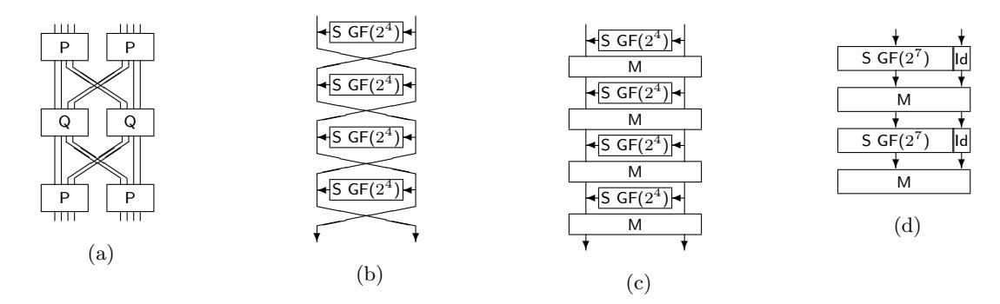
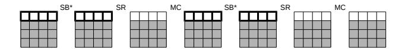
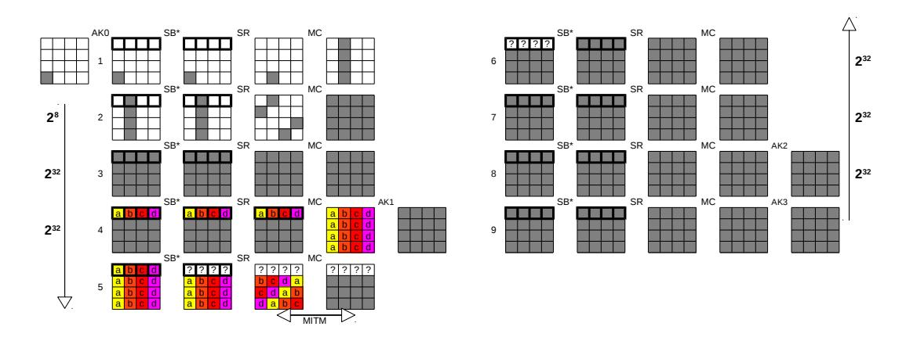
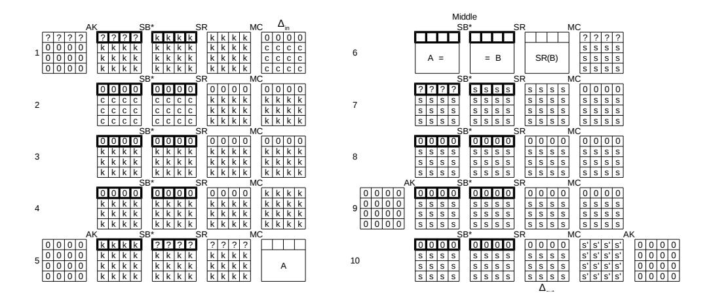
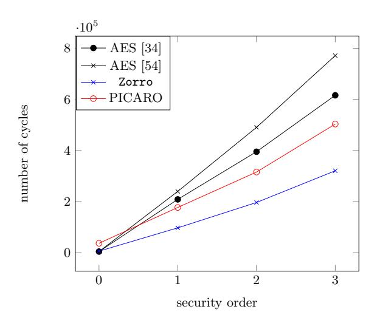
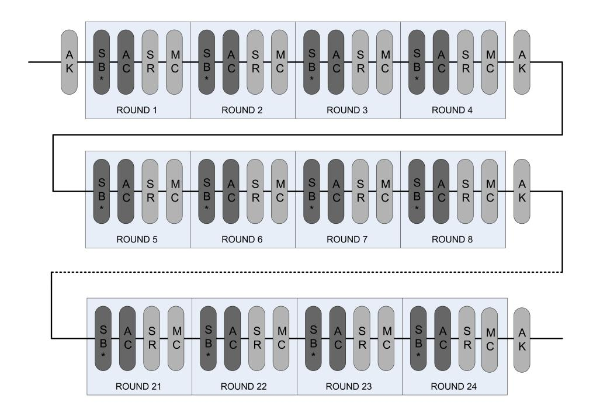
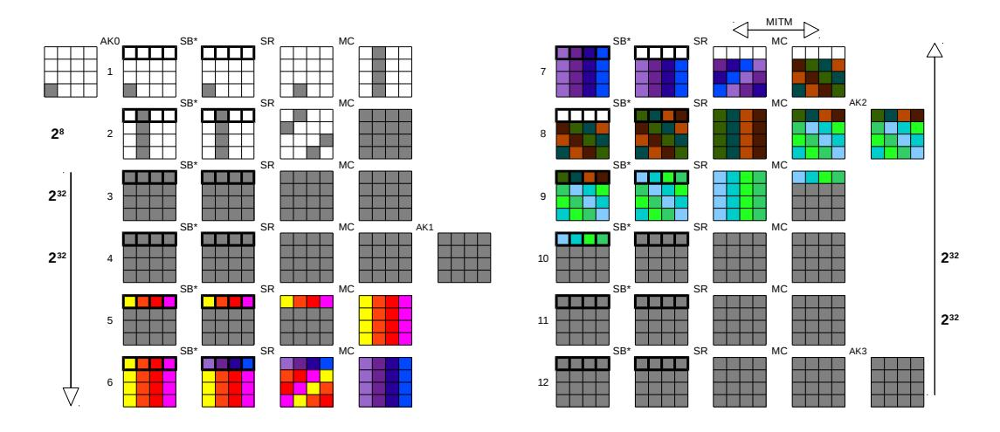
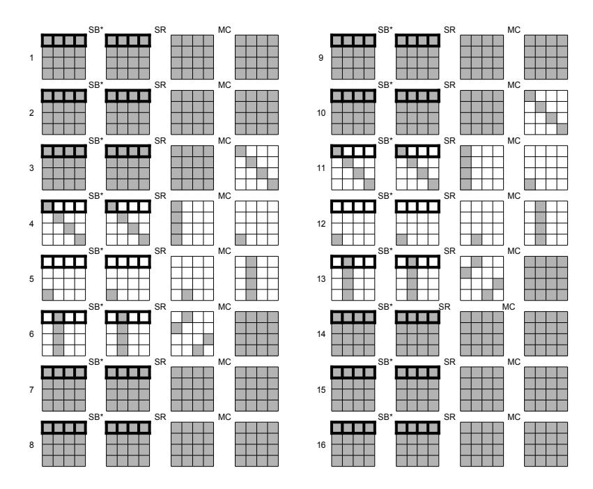

# Block Ciphers that are Easier to Mask: How Far Can we Go?

Benoˆıt G´erard1,<sup>2</sup> , Vincent Grosso<sup>1</sup> , Mar´ıa Naya-Plasencia<sup>3</sup> , Fran¸cois-Xavier Standaert<sup>1</sup> 1 ICTEAM/ELEN/Crypto Group, Universit´e catholique de Louvain, Belgium.

Abstract. The design and analysis of lightweight block ciphers has been a very active research area over the last couple of years, with many innovative proposals trying to optimize different performance figures. However, since these block ciphers are dedicated to low-cost embedded devices, their implementation is also a typical target for side-channel adversaries. As preventing such attacks with countermeasures usually implies significant performance overheads, a natural open problem is to propose new algorithms for which physical security is considered as an optimization criteria, hence allowing better performances again. We tackle this problem by studying how much we can tweak standard block ciphers such as the AES Rijndael in order to allow efficient masking (that is one of the most frequently considered solutions to improve security against side-channel attacks). For this purpose, we first investigate alternative Sboxes and round structures. We show that both approaches can be used separately in order to limit the total number of non-linear operations in the block cipher, hence allowing more efficient masking. We then combine these ideas into a concrete instance of block cipher called Zorro. We further provide a detailed security analysis of this new cipher taking its design specificities into account, leading us to exploit innovative techniques borrowed from hash function cryptanalysis (that are sometimes of independent interest). Eventually, we conclude the paper by evaluating the efficiency of masked Zorro implementations in an 8-bit microcontroller, and exhibit their interesting performance figures.

# 1 Introduction

Masking (aka secret sharing) is a widespread countermeasure against side-channel attacks (SCA) [28]. It essentially consists in randomizing the internal state of a device in such a way that the observation of few (say d) intermediate values during a cryptographic computation will not provide any information about any of the secret (aka sensitive) variables. This property is known as the "d-th order SCA security" and was formalized by Coron et al. as follows [16]: A masked implementation is d-th order secure if every d-tuple of the intermediate values it computes is independent of any sensitive variable. Reaching higher-order security is a theoretically sound approach for preventing SCAs, as it ensures that any adversary targeting the masked implementation will have to "combine" the information from at least d + 1 intermediate computations. More precisely, if one can guarantee that the leakage samples corresponding to the manipulation of the different shares of a masking scheme are independent, then a higher-order security implies that an adversary will have to estimate the d + 1-th moment of the leakage distribution (conditioned on a sensitive variable), leading to an exponential increase of the SCA data complexity [15]<sup>1</sup> . In practice though, this exponential security increase only becomes meaningful if combined with a sufficient amount of noise in the side-channel leakage samples [58]. Also, the condition of independent leakage for the shares may turn out to be difficult to fulfill because of physical artifacts, e.g. glitches occurring in integrated circuits [39]. Yet, and despite these constraints, masking has proven to be one of the most satisfying solutions to improve security against SCAs, especially in the context of protected software implementations in smart cards [45, 53, 54, 56].

In general, the most difficult computations to mask are the ones that are non-linear over the group operation used to share the sensitive variables (e.g. the S-boxes in a block cipher). Asymptotically, the time complexity of masking such non-linear operations grows at least quadratically with the order d. As a result, a variety of research works have focused on specializing masking to certain algorithms (most frequently the AES Rijndael, see e.g. [14, 44]), in order to reduce its implementation overheads. More recently, the opposite approach has been undertaken by Piret et al. [47]. In a paper presented at ACNS 2012, the authors suggested that improved SCA security could be achieved at a lower implementation cost by specializing a block cipher for efficient masking. For this purpose, they started from the provably secure scheme proposed by Rivain and Prouff at CHES 2010 (see Appendix A.1), and specified a design allowing better performances than

<sup>2</sup> Direction G´en´erale de l'Armement–Maˆıtrise de l'information, France. <sup>3</sup> INRIA Paris-Rocquencourt, France.

<sup>1</sup> In certain scenarios, e.g. in a software implementation where all the shares are manipulated at different time instants, masking may also increase the time complexity of the attacks, as an adversary will have to test all the pairs, triples, . . . of samples to extract information from a 2nd, 3rd, . . . secure implementation.

the AES Rijndael as the order of the masking increases. More precisely, the authors first observed that bijective S-boxes that are at the same time easy to mask and have good properties for resisting standard cryptanalysis (e.g. linear [40], differential [5], algebraic [17]) are remarkably close to the AES S-box. As a result, they investigated the gains obtained with non-bijective S-boxes and described a Feistel network with a Substitution-Permutation Network (SPN) based round function taking advantage of this S-box. One interesting feature of this approach is that its impact on the performances of block cipher implementations will grow with the the physical security level (informally measured with the order d). That is, it enables performance gains that become more significant as we move towards physically secure implementations.

In this paper, we complement this first piece of work and further investigate design principles that could be exploited to improve the security of block ciphers implementations against SCAs thanks to the masking countermeasure. In particular, we investigate two important directions left open by Piret et al. First, we observe that non-bijective S-boxes usually lead to simple non-profiled attacks (as their output directly gives rise to "meaningful leakage models" [59]). As recently shown by Whitnall et al., we even have a proof that generic (non-profiled) SCAs against bijective S-boxes cannot exist [61]. This naturally gives a strong incentive to consider bijective S-boxes in block ciphers that are purposed for masked implementations. Hence, we analyze the possibility to trade a bit of the classical S-box properties (linearity, differential profile, algebraic degree) for bijectivity and more efficient masking. Second, we observe that the previous work from ACNS 2012 focused on the S-box design in order to allow efficient masking. This is a natural first step as it constitutes the only non-linear element of most block ciphers. Yet, it is also appealing to investigate whether the algorithm structure could not be modified in order to limit the total number of S-boxes executed during an encryption. We investigate this possibility and suggest that irregular designs in which only a part of the state goes through an S-box in each round can be used for this purpose, if the diffusion layer is adapted to this setting.

Our results show that each of the principles we propose (i.e. the modified S-box and structure) can be used to reduce the total number of non-linear operations in an AES-like block cipher - yet with a stronger impact of the second one. We then describe a new block cipher for efficient masking, that combines these two ideas in order to further reduce the total complexity corresponding to non-linear operations in the cipher. We call this cipher Zorro in reference to the masked fictional character. We further provide a detailed security evaluation of our proposal, considering state-of-the-art and dedicated cryptanalysis, in order to determine the number of rounds needed to obtain a secure cipher. Because of the irregular structure of Zorro, this analysis borrows recent tools from hash function cryptanalysis and describes new techniques for providing security bounds (e.g. against linear and differential cryptanalysis). We conclude with performance evaluations exhibiting that Zorro already leads to interesting performance gains for small security orders d = 1, 2, 3.

# 2 Bijective S-boxes that are easier to mask

In this section we aim at finding an 8-bit S-box having both a small masking cost and good cryptographic properties regarding the criteria presented in Appendix A.2. For this purpose, we will use the number of field multiplications and amount of randomness needed to execute a shared S-box as performance metrics. As discussed in Appendix A.3, reducing this number directly leads to more efficient Boolean masking using the state-of-the-art scheme of Rivain and Prouff [54]. Interestingly, it is also beneficial for more advanced (polynomial) masking schemes inspired from the multiparty computation literature, such as proposed by Prouff and Roche [50]. So our proposal is generally suitable for two important categories of masking schemes that (provably) generalize to high security orders. For reference, we first recall that the AES S-box consists in the composition of an inversion of the element in the field GF(2<sup>8</sup> ) and an affine transformation A: SAES : x 7→ A(x −1 ). Starting from this standard example, a natural objective would be to find an S-box that can be masked with a lower cost than the AES one (i.e. an S-box that can be computed using less than 4 multiplications [54]), and with similar security properties (i.e. a maximum of the differential spectrum close to 4, a maximum of the Walsh spectrum close to 32, and a high algebraic degree). Since there are 2<sup>8</sup> ! permutations over GF(2<sup>8</sup> ), an exhaustive analysis of all these S-boxes is computationally unfeasible. Hence, we propose two different approaches to cover various S-boxes in our analysis. First, we exhaustively consider the S-boxes having a sparse polynomial representation (essentially one or two non-zero coefficients). Next, we investigate some proposals for constructing 8-bit S-boxes from a combination of smaller ones. In particular, we consider a number of solutions of low-cost S-boxes that have been previously proposed in the literature.

#### 2.1 Exhaustive search among sparse polynomials

Monomials in GF(2<sup>8</sup> ). First notice that in GF(2<sup>8</sup> ) the square function is linear. Hence, we can define an equivalence relation between exponents: e<sup>1</sup> ∼ e<sup>2</sup> ⇔ ∃ k ∈ N st. e<sup>1</sup> = e<sup>2</sup> 2 <sup>k</sup> mod 255. This relation groups exponents in 34 different equivalence classes. Only 16 classes out of the 34 lead to bijective functions. A list of the different security criterias corresponding to these monomials can be found in Appendix B, Table 3. It shows that the AES exponent (class of exponent 127) has the best security parameters and the largest number of multiplications. Our goal is to find an S-box with a lower number of multiplications, maintaining good (although not optimal) security features. In this respect, exponents 7, 29 and 37 are of interest.

Binomials in GF(2<sup>8</sup> ). We also performed an exhaustive search over all the S-boxes defined by a binomial. Note that in this case, an additional (refreshing) mask is required for the addition because of the dependency issue mentioned in Section A.3. Again, we were only interested in S-boxes that can be computed in less than 4 multiplications. The number of such binomials was too large for a table representation. Hence, we provide a few examples of the best improvements found, with binomials requiring 2 and 3 multiplications.

- 2 multiplications. We found binomials having properties similar to monomials X<sup>7</sup> and X37, with better non-linearity (a maximum of the Walsh spectrum between 64 and 48). Binomial 8X<sup>97</sup>+X<sup>12</sup> is an example.
- 3 multiplications. In this case, we additionally found several binomials reducing both the maximum value of the Walsh spectrum (from 64 to 48) and the maximum value of the differential spectrum (from 10 to 6) compared to the monomial X29. Binomial 155X<sup>7</sup> + X<sup>92</sup> is an example.

### 2.2 Constructing 8-bit S-boxes from smaller ones

As the exhaustive analysis of more complex polynomial representations becomes computationally intractable, we now focus on a number of alternatives based on the combination of smaller S-boxes. In particular, we focus on constructions based on 4-bit S-boxes that were previously proposed in the literature, and on 7-bit S-boxes (in order to benefit from the properties of S-boxes with an odd number of bits).

Building on GF(2<sup>4</sup> ) S-boxes. This is the approach chosen by the designers of PICARO. Namely, they selected an S-box that can be computed using only 4 secure multiplications over GF(2<sup>4</sup> ). This S-box has good security properties, excepted that its algebraic degree is 4 and that it is non-bijective.

In general, constructing 8-bit S-boxes from the combination of 4-bit S-boxes allows decreasing the memory requirements (e.g. when S-box computations are implemented as look-up tables), possibly at the cost of an increased execution time (as we generally need to iterate these smaller S-boxes). That is, just putting two 4 bit S-boxes side-by-side allows no interaction between the two nibbles of the byte. Hence the maximum of the Walsh spectrum and the maximum of the differential spectrum of the resulting 8-bit S-box are 2<sup>4</sup> times larger than the one of its 4-bit building block. This weakness can be mitigated by using at least two layers of 4-bit S-boxes interleaved with nibble-mixing linear operations. For instance, the KHAZAD [3] and ICEBERG [57] ciphers are using 8-bit S-boxes obtained from three applications of 4-bit S-box layers, interleaved with a bit permutation mixing two bits of each nibble (as illustrated in Figure 5(a)). The resulting S-boxes show relatively good security properties and have maximal algebraic degree. Unfortunately, these proposals are not good candidates to improve the performances of a masked implementations, since six 4-bit S-boxes have to be computed to obtain one 8-bit S-box. As any non-linear permutation in GF(2<sup>4</sup> ) requires at least 2 multiplications, even using only two layers would cost more secure multiplications than the AES S-box.

Another natural alternative to double the size of an S-box is to build on a small Feistel network, as illustrated in Figure 5(b). Note that in this case, we need to perform at least 3 rounds to ensure that security properties against statistical cryptanalyses will be improved compared to the ones of the underlying 4-bit S-box. Indeed, let us choose a differential (or linear) mask with all active bits in the left part of the input; then after 1 round we obtain the same difference in the right part; hence the differential (or linear) approximation probability after two rounds will be the one of the small S-box again. In fact, an exhaustive analysis revealed that 4-round networks are generally required to obtain good cryptanalytic properties. However, it also turned out that adding a linear layer could lead to improved results for S-boxes that are efficiently masked. That



Fig. 1: (a): ICEBERG S-box. (b) 4-round Feistel network without linear mixing layer. (c) 4-round Feistel network with linear mixing layer. (d) Combination of 7-bit S-boxes with linear mixing layer.

is, as illustrated in Figure 5(c), we can add an invertible  $8 \times 8$  binary matrix to mix the bits of the two Feistel branches between each round. Such a layer allows improving the differential and linear properties of the S-box, with limited impact on the cost of its masked implementations (since the transform is linear).

Example 1. We instantiate the 4-round Feistel network of Figure 5(c) with a 4-bit S-box corresponding to the monomial  $X^3$ , and add the 8-bit linear transformation  $M_1$  (given in Appendix C) at the end of each round. The corresponding 8-bit S-box has a maximum differential spectrum of 10, a maximum of the Walsh spectrum equal to 64 and an algebraic degree of 7. It can be computed using 4 secure multiplications in  $GF(2^4)$ .

Example 2. We instantiate the 4-round Feistel network of Figure 5(c) with a 4-bit S-box using the polynomial  $8X + 7X^2 + 7X^3 + 14X^4 + 3X^6 + 6X^8 + 9X^9 + 5X^{12}$  (which can be computed with 1 multiplication), and add the 8-bit linear transformation  $M_2$  (given in Appendix C) at the end of each round. The corresponding 8-bit S-box has a maximum differential spectrum of 8, a maximum of the Walsh spectrum equal to 64 and an algebraic degree of 6. It can also be computed using 4 secure multiplications in  $GF(2^4)$ .

Summarizing the previous investigations, Table 4 in Appendix D compares the security properties and number of secure multiplications of the proposed S-boxes to the other 8-bit S-boxes build from  $GF(2^4)$  ones mentioned at the beginning of the section. The new S-boxes proposed (i.e. Example 1 and Example 2) have the same number of multiplications as the PICARO S-box. They have the additional advantage of being invertible and have better linear and algebraic properties, at the cost of a worse differential spectrum.

Exploiting  $GF(2^7)$  and linear layers. We finally investigated the use of a smaller S-box in  $GF(2^7)$ . This choice was motivated by the fact that S-boxes in  $GF(2^n)$  with n odd provide better security properties against differential cryptanalysis than S-boxes acting on an even number of bits. For instance, the existence of Almost Perfect Non-linear permutations (aka APN permutations) is still an open problem for even values of n while many have been constructed for odd values of n. Hence, we expect that low-cost S-boxes acting on 7 bits will exhibit relatively good security properties. As in the previous paragraph, moving from a 7-bit to an 8-bit S-box can be done by combining the 7-bit S-box with an 8-bit linear transform. That is, we used the S-box in Figure 5(d), where the 7-bit S-box is applied twice, separated by a linear transformation to mix bits inbetween. This implies that good masking properties could only be obtained if the 7-bit S-box uses only a single multiplication. We found several 8-bit S-boxes using 2-multiplications based on this design, having 64 as maximum of the Walsh spectrum, 10 as maximum of the differential spectrum and 4 as algebraic degree.

Example 3. We use the monomial  $X^3$  as 7-bit S-box and the linear transform  $M_3$  given in Appendix C.

#### 2.3 Comparing proposed S-boxes to AES one

To conclude this section, we compiled the results we obtained in Table 1, in which most of our performance and security metrics are reported. As explicit with the column "additional operations", such a table is admittedly limited in providing precise estimates of the exact implementation costs, as these costs are always technology-dependent. Yet, it provides general indications about S-box candidates for efficient masking, and also complements the work of Piret et al. in providing some interesting bijective proposals.

Table 1: Comparison of the proposals.

|                        |    |             |                | required randomness (bit) # sec. mult. | additional operations    |   | security properties |        |
|------------------------|----|-------------|----------------|----------------------------------------|--------------------------|---|---------------------|--------|
|                        |    | d = 1 d = 2 | d              |                                        |                          |   | deg(S) max ∆S       | max ΩS |
| AES [33]               | 48 | 128         | 2 + 32d<br>16d | 4 (GF(28<br>))                         | 7 squ. + 1 Diff. matrix  | 7 | 4                   | 32     |
| AES [19]               | 32 | 84          | 2 + 22d<br>10d | 5 (GF(24<br>))                         | 3 squ. + 5 Diff. matrix  | 7 | 4                   | 32     |
| PICARO                 | 16 | 48          | 2 + 8d<br>8d   | 4 (GF(24<br>))                         | 2 squ.                   | 4 | 4                   | 68     |
| 7<br>X                 | 24 | 64          | 2 + 16d<br>8d  | 2 (GF(28<br>))                         | 2 squ. + 1 Diff. matrix  | 3 | 6                   | 64     |
| 29<br>X                | 32 | 88          | 2 + 20d<br>12d | 3 (GF(28<br>))                         | 4 squ. + 1 Diff. matrix  | 4 | 10                  | 64     |
| 37<br>X                | 24 | 64          | 2 + 16d<br>8d  | 2 (GF(28<br>))                         | 5 squ. + 1 Diff. matrix  | 3 | 6                   | 64     |
| 97 +<br>12<br>8X<br>X  | 32 | 80          | 2 + 24d<br>8d  | 2 (GF(28<br>))                         | 6 squ. + 1 Diff. matrix  | 3 | 6                   | 48     |
| 7 +<br>92<br>155X<br>X | 40 | 104         | 2 + 28d<br>12d | 3 (GF(28<br>))                         | 8 squ. + 1 Diff. matrix  | 4 | 6                   | 48     |
| Ex.<br>1               | 32 | 80          | 2 + 24d<br>8d  | 4 (GF(24<br>))                         | 4 squ. + 4 Diff. matrix  | 7 | 10                  | 64     |
| Ex.<br>2               | 48 | 112         | 2 + 40d<br>8d  | 4 (GF(24<br>))                         | 28 squ. + 4 Diff. matrix | 6 | 8                   | 64     |
| Ex. 3                  | 28 | 70          | 2 + 21d<br>7d  | 2 (GF(27<br>))                         | 2 squ. + 2 Diff. matrix  | 4 | 10                  | 64     |

# 3 Reducing the number of S-box executions

The previous section discussed how to reduce the number of multiplications per S-box execution in a block cipher, by trading cryptanalytic properties for more efficient masking. A complementary approach in order to design a block cipher that is easy to mask is to additionally reduce the total number of S-box executions. For this purpose, a natural solution is to consider rounds where not all the state goes through the S-boxes. To some extent, this proposal can be viewed as similar to an NLFSR-based cipher (e.g. Grain [30], Katan [12], Trivium [13]), where the application of a non-linear component to the state is not homogeneous. For example, say we consider two n-bit block ciphers with s-bit S-boxes: the first (parallel) one applies n/s S-boxes in parallel in each of its R rounds, while the second (serial) one applies only a single S-box per round, at the cost of a larger number of rounds R<sup>0</sup> . If we can reach a situation such that R<sup>0</sup> < R · n s , then the second cipher will indeed require less S-boxes in total, hence being easier to protect against side-channel attacks. Of course, the number of S-box executions in the serial version does not have to be stuck at one, and different trade-offs are possible. In general, the relevance of such a proposal highly depends on the diffusion layer. For example, we have been able to conclude that wire crossing permutations (like the one of PRESENT [8]) cannot lead to any improvement of this type (see Appendix E). By contrast, an AES-like structure is better suited to our goal. The rationale behind this intuition essentially relates to the fact that the AES Rijndael has strong security margins against statistical attacks, and the most serious concerns motivating its number of rounds are structural (e.g. [38]). Hence, iterating simplified rounds seems a natural way to prevent such structural attacks while maintaining security against linear/differential cryptanalysis. Furthermore, the impact of linear hulls and differentials in ciphers with strong diffusion could ideally lead to reductions in the total number of S-box executions required to reach a cipher that is secure against statistical attacks. In the following, we show that a modified AES cipher with 4 S-boxes per round (rather than 16) is indeed a good candidate for this purpose. We then put our results together in order to specify our new block cipher Zorro.

#### 3.1 The AES Rijndael

The AES Rijndael was designed by Daemen and Rijmen [19]. It operates on message blocks of 128 bits, that can be seen as a matrix of 4 × 4 bytes. One round is composed of four transformations. In SubBytes (SB), a single 8-bit S-box is applied 16 times in parallel to each byte of the state matrix. In ShiftRows (SR), the the 4 bytes in the ith row of the state matrix are rotated by i positions to the left. In MixColumns (MC), a linear transformation defined by an MDS matrix is applied independently to each column of the state matrix. Finally, in AddKey (AK), a 128-bit subkey provided by the key scheduling is added to the internal state by an exclusive or. Depending on the size of the key, the number of rounds varies from 10 to 14. We will compare our design with the 128-bit key version, which simply iterates 10 rounds, with a key whitening in the first one, and no MC operation in the last one. We do not describe the key scheduling as we will not reuse it.

#### 3.2 Preliminary investigations: how many S-boxes per round?

As in the previous section (about S-boxes that are easier to mask), an exhaustive analysis of all the round structures that could give rise to less S-box executions in total is out of reach. Yet, and as this number of S-box executions mainly depends on the SB operations, we considered several variants of it, while keeping SR, MC and AK unchanged. For this purpose, we have first analyzed how some elementary diffusion properties depend on the number and positions of the S-boxes within the state. Namely, we considered (1) the number of rounds so that all the input bytes have passed at least once through an S-box (NrSbox); (2) the number of rounds so that all the output bytes have at least one non-linear term (NrNlin); and (3) the maximal number of rounds so that an input difference has a non-linear effect in all the output bytes (NrDiff). In all three cases, these number of rounds should ideally be low. They are given in Appendix F, Table 5 for different S-box configurations. While such an analysis is of course heuristic, it indicates that considering four S-boxes per round, located in a single row of the state matrix seems an appealing solution. In the following, we will carefully analyze the security of this setting in front of various cryptanalysis techniques. Our goal will be to show that an AES-like block cipher where each round only applies four "easy-to-mask" S-boxes as found in the previous section can be secure. In particular, we will select the number of rounds as R<sup>0</sup> = 24, so that we have (roughly) twice less S-boxes executed than the original AES Rijndael (i.e. 24 × 4 vs. 10 × 16).

#### 3.3 The block cipher Zorro: specifications

We will use a block size and key size of n = 128 bits, iterate 24 rounds and call the combination of 4 rounds a step. Each round is a composition of four transforms: SB<sup>∗</sup> , AC, SR, and MC, where the two last ones are exactly the same operations as in the AES Rijndael, SB<sup>∗</sup> is a variant of SB where only 4 S-boxes are applied to the 4 bytes of the first row in the state matrix, and AC is a round-constant addition described in Appendix G. We additionally perform a key addition AK before the first and after each step. As for the selection of the S-box (given in Appendix H), we will use Example 1 from the previous section, and just add the constant 0xB2 to remove a fixed point. The latter choice is motivated by best trading efficiency (e.g. operations in GF(2<sup>4</sup> ) can be tabulated) and security (regarding statistical and algebraic attacks). Eventually, and order to maintain high implementation efficiency, we did not design any complex key scheduling and simply add the master key each time AK is called - as in the block cipher LED [29]. Using less key additions than in LED is justified by the exclusion of related-key attacks from our security claims (see the next section for the details). As for other lightweight block ciphers such as NOEKEON [18] or PRINCE [10], we believe that related-key attacks are not relevant for the intended use case (e.g. challenge-response authentication in smart cards), and mainly focused on the generation of a good permutation in the single key setting. A schematic view of the full cipher is given in Appendix I, Figure 6. Reduced-round versions (used in the following) maintain at least three steps, with number of rounds following the pattern: 4-4-4-4-4-4, 4-4-4-4-4-3,4-4-4-4-4-2, 4-4-4-4-4-1, 4-4-4-4-4, . . .

# 4 Security analysis

Despite its AES-like flavor, the irregular structure of the block cipher Zorro makes it quite different than most recently proposed SPNs. As a result, its security evaluation also requires more dedicated cryptanalysis than usually considered when designing such regular ciphers. In this section, we provide a preliminary investigation of a number of standard and less standard attacks against Zorro, paying a particular attention to different solutions to exploit the modified non-linear layer SB<sup>∗</sup> . While further studies by external cryptanalysts would certainly be welcome, we hope that the following analysis provides reasonable confidence that the proposed structure can lead to a secure block cipher - and will trigger more research in this direction.

### 4.1 Linear/differential cryptanalysis.

In general, security against linear [40] and differential [5] cryptanalysis can be estimated by counting the number of active S-boxes [20]. Based on the specifications in the previous section, we would need to pass through 28 (resp. 32) S-boxes in order to reach a security level of 2<sup>128</sup> against differential (resp. linear) cryptanalysis. Nevertheless, since less than 16 S-boxes are applied per round, simple bounds based on the MDS property of the diffusion layer cannot be obtained such as for the AES. An easy shortcoming is that trails that do not start in the first state row will be propagated through the second round with probability one. Besides, since the S-boxes only apply to one out of the 4 input bytes of MC in each round, the number of active S-boxes also progresses slower. As a result, the main question for bounding security against these statistical attacks is to determine the extent to which actual characteristics can take advantage of this feature, by keeping a maximum number of inactive S-boxes. For this purpose, we propose a technique inspired by hash functions cryptanalysis, that finds the best balance between this number of inactive S-boxes and the number of freedom degrees for the differential (or linear) paths. Taking the example of differential cryptanalysis, we first consider a fully active input state (we discuss next how to adapt our reasoning to other input differences) and a fixed (unknown) key. In this case, we have 16+16 degrees of freedom at the beginning of the differential path (in bytes, i.e. we have 232∗<sup>8</sup> possible trials to test if the differential path is verified). A first observation is that, in order to have x inactive S-boxes in the next round, we need to verify at least x byte conditions through the MC operation, which will spend x bytes of the freedom degrees available. Conversely, we have that verifying x byte conditions through MC can desactivate at most x S-boxes in the following rounds<sup>2</sup> . Our bounds then follow from the fact that desactivating an S-box is only possible as long as degrees of freedom are available (otherwise there will be no solutions for the differential path). That is, we can consider that for each round i we can ask x<sup>i</sup> conditions to be verified through the MC transform, and that at most x<sup>i</sup> S-boxes will not be activated in the following rounds because of these conditions. Hence, the following inequalities have to be verified for finding a valid path. They represent the degrees of freedom still available after r rounds, and the cumulated number of active S-boxes (that must be smaller than 28 as previously pointed out):

$$\sum_{i=1}^{r} x_i < 32, \quad \text{and} \quad 4 \times r - \sum_{i=1}^{r} x_i < 28.$$

For the sake of simplicity, we can just consider the average number of conditions ¯x that we can impose at each round. We then observe that the highest number of rounds is achieved for r = 14 and ¯x = 32/14 = 2.285, where we have 24 active S-boxes and no more freedom degrees available (for 15 rounds, the number of active S-boxes exceeds 28). Eventually, we note that when the initial state is not completely active, e.g. taking only Y possible differences, we have that with cin = log<sup>2</sup> (216∗8/Y )/8 byte conditions we will be able to desactivate at most cin S-boxes. Hence, the inequalities taking all possible input differences into account become:

$$\sum_{i=1}^{r} x_i < 32 - c_{in}, \quad \text{and} \quad 4 \times r - \sum_{i=1}^{r} x_i - c_{in} < 28.$$

They provide the same result as before: 14 rounds is the upper bound for building a classical differential path<sup>3</sup> . A similar reasoning for linear cryptanalysis leads to an upper bound of 16 rounds (out of 24).

### 4.2 Truncated differential attacks

In view of the non-linear transformation in Zorro, a natural extension of differential cryptanalysis to investigate is the use of dedicated truncated differentials [36]. In particular, the most damaging truncated differential patterns are those that would exclude active bytes affected by non-linear operations. For this reason, we analyzed the possible existence of cycles of differences that verify transitions from three active rows of the state to another three active rows with probability one for any number of rounds (i.e. excluding non-linear operations). Such patterns are represented in Figure 2, where big squares represent states, small squares represent bytes, highlighted ones are affected by non-linear transformations and gray bytes are the ones with a non-zero difference. Truncated differentials only following the pattern of the figure would never go through the S-boxes. Quite naturally, staying in this pattern for several rounds implies more conditions, but if an input difference exists so that it follows the pattern for some rounds before regenerating this first

<sup>2</sup> For example, consider the case where the first output byte of MC is inactive, meaning that we have one less active S-box in the next round. For more S-boxes to be inactive, we would have to pay more conditions on MC. Alternatively, say MC has only one active output difference per column (hence implying x = 12 byte conditions). Then, we will have at most 6 inactive S-boxes in the two next rounds, before coming back to the whole active state with 6 < x.

<sup>3</sup> Note that despite these bounds to being possibly loose for small number of rounds, they also guarantee security against boomerang attacks. Namely, we have at least 9 active S-boxes after 10 rounds, which would correspond to best differentials with probabilities p, q ≈ 2 <sup>42</sup> in a boomerang attack (leading to p 2 q <sup>2</sup> ≈ 2 <sup>−</sup><sup>168</sup>).

input difference again, this would imply that the pattern can be followed for an infinite number of rounds as a cycle would have been created. If no cycle exists, we have essentially 4 byte constraints per round for 12 unknowns, and we run out of degrees of freedom for verifying the pattern after 3 rounds. As a result, we essentially have to ensure that no cycle has been created, that would prevent differences to affect the first state row for an infinite number of rounds. The probability that such a cycle exists is small (about 2 <sup>64</sup>−<sup>96</sup> + 232−<sup>96</sup> + 2−<sup>96</sup> ≈ 2 <sup>−</sup>32). Yet, in order to be sure they do not exist, we performed an exhaustive search over all the 3-row input differences, and checked whether they generate a cycle or end by spreading the difference. The naive cost of such a search is 212∗<sup>8</sup> = 296. We describe a time and memory efficient alternative in Appendix J. It allowed us to verify that the pattern of Figure 2 can be verified for at most two rounds.



Fig. 2: Two rounds of truncated differential pattern.

### 4.3 Meet-in-the-middle and bicliques

Biclique cryptanalysis has been introduced in [33] and recently attracted a lot of attention because of its application to the full AES in [7]. It can be viewed as an improvement of classical meet-in-the-middle attacks, where the starting point does not correspond to a single state but to several rounds, that are covered with a structure called biclique. In the case of the full-AES, this principle can be applied so that the complexity of verifying each key candidate is reduced, hence leading to an accelerated exhaustive search. The direct extension of such an attack to our new algorithm does not strongly differ from attacks against the AES. Yet, because of our particular key addition, the number of rounds covered by bicliques as described in [7] would be bigger. We have evaluated that the constant exhaustive key search complexity reduction for 24 cipher rounds is larger than 0.5 (which improves the security over the 0.27 constant found for the AES).

Quite naturally and as in the previous section, the most interesting attacks against Zorro are the ones taking advantage of its particular structure. In the following, we describe a dedicated meet-in-the-middle attack for this purpose. Its main specificity is that, while classical meet-in-the-middle attacks work with pairs of plaintexts and ciphertexts to recover the key, our specialized attack will consider quadruplets of the type (plaintext1, plaintext2, ciphertext1, ciphertext2). This will allow us to extend meet-in-the-middle cryptanalysis by two more rounds, by choosing input differences that do not go through the S-boxes after the first round, and only go through one S-box after the second round. That is, since other round transformations are linear, we can compute differences after two rounds with only 2<sup>8</sup> guesses. As a result, we will match differences in the middle of the cipher (rather than values as traditionally done). The principle of the attack is represented in Figure 3 in which (i) the gray bytes are the bytes with differences that we know or guess; (ii) the bytes with '?' have an unknown difference; and (iii) the bytes with 'a', 'b', 'c' or 'd' are such that if their corresponding byte at the beginning of the state 4 is known, then they are also known. As in Figure 2, the highlighted bytes are the ones affected by S-boxes. The middle is placed in round 5 (through the MC transformation). On the sides of the figure, we added the cost for predicting gray bytes in both directions, which comes for the guessing of state bytes each time a difference goes through an S-box.

For the sake of simplicity, we will consider that any bit of internal state recovered can be translated into a key bit (since actual partial key recoveries can only be more complex, this also provides us with confident security margins). Under this assumption, the attack essentially proceeds as follows. Given one pair plaintext/ciphertext, we choose the second plaintext so that it has a one-byte difference with the first one that is not located on the first state row. As previously said, it allows us to postpone the guessing of bits compared to classical meet-in-the-middle attacks. Next, we perform 2<sup>8</sup> guesses each time we pass through an S-box, both forward and backward. In Figure 3, independent groups of bytes involved in the middle match are represented with different letters. In the right middle state, we can see three gray rows that have been guessed in the backward direction with a cost of 2<sup>32</sup>∗<sup>3</sup> = 2<sup>96</sup>. In the left middle state, we can see three colored rows, that have been determined in the forward direction with a cost of 232+32+8 = 2<sup>72</sup>. As the match in the middle is done through the (linear) MC operation, and we completely know three rows before and three rows after it, we have 64 bits of conditions in total. This means that we will keep 296+72−<sup>64</sup> = 2<sup>104</sup>



Fig. 3: Representation of the 9 rounds meet-in-the-middle scenario

possibilities. Considering the (pessimistic) case where these guesses directly translate into key bits, we only have  $2^{104}$  possibilities for 128 bits. In other words, the proposed attack reduces the cost of an exhaustive key search by a factor  $2^{24}$ . Note that we could consider better ways of making the merge in the middle point, by exploiting the independence between the colored groups of bytes. But even in this case, attacking more than 12 rounds (as illustrated in Appendix K, Figure 7) is unlikely. Namely, we need an additional  $2^{32}$  key guesses per round, and even supposing that the colored bytes can be merged with a reduced cost, the time complexity of the 12-round attack would be at least  $2^{96+8} + 2^{96}$  (so adding one more round with  $2^{32}$  guesses would increase this complexity beyond  $2^{128}$ ). Eventually, we note that this attack might be combined with bicliques for increasing the number of targeted rounds (with the size of the bicliques equal to the number of rounds added). The straightforward application of the AES techniques would suggest an improvement of two rounds, still leaving a comfortable security margin for the 24 rounds we suggest for Zorro.

#### 4.4 Impossible differential attacks

Impossible differential attacks exploit differential paths over some cipher rounds that cannot occur in order to discard key candidates leading to these differences to happen (hence reducing the complexity of an exhaustive key search) [4]. In this section, we describe such an attack against 10 rounds of Zorro. It is based on two main ingredients. First, we re-use the property (observed in Section 4.2) that we can choose up to  $2^{96-32*2} = 2^{32}$ differences on the last three state rows so that the difference in the first row remains inactive after two MC operations with probability one<sup>4</sup>. We will use this property twice, namely for rounds 2, 3 and for rounds 8, 9. Second, we will take advantage of the best differential characteristic of our S-box (with probability 10/256). The attack principle is pictured in Figure 4, where the impossible differential path stands between rounds 2 and 10. Bytes denoted with a c (resp. k) are such that their difference is chosen (resp. known). The 0's correspond to bytes with no difference and the '?'s represent the bytes whose differences have gone through an S-box and are consequently unknown. The remaining bytes (i.e. with A, B or nothing written on them) are unknown bytes that still verify certain known relations. Eventually, the output bytes are represented with s' meaning that although all of them are active, they have been generated by a concrete subspace of size  $2^{32}$ when the conditions of the impossible path are verified. Given these notations, we first choose one out of the 2<sup>32</sup> differences in three rows that keep the first row inactive through two MC operations, and fix it to the first state of the second round. The attack will then essentially exploit a chosen difference  $\Delta_{in}$  at the beginning of this second round, and look for impossible differences  $\Delta_{out}$  in round 10. As previously mentioned, we will choose  $\Delta_{in}$  so that the difference in the output of SB\* in the first round corresponds to the best S-box characteristic. Next, we observed that for a chosen  $\Delta_{in}$ , we can precompute if there exist a  $\Delta_{out}$  such that the middle transition (also represented in the figure) is impossible. That is, for a fixed  $\Delta_{in}$  and on average (over the state values and keys), there is only a probability  $2^{-4}$  of finding a  $\Delta_{out}$  such that this middle transition is possible<sup>5</sup>. As a result, we can easily filter the  $\Delta_{in}$ 's leading to impossibilities and use them in our attack.

<sup>&</sup>lt;sup>4</sup> As previously detailed, it does not extend to more rounds which prevents attack improvements in this direction.

Namely, we have  $2^{32}$  possible output differences  $\times$   $2^{32*2}$  bits of state values that affect the path  $\times$   $2^{-96}$  conditions in the middle  $\times$   $2^{-4}$  conditions for the difference transition to exist through the S-boxes =  $2^{-4}$ . This can be tested



Fig. 4: Representation of the 10 rounds impossible differential attack

Once a correct  $\Delta_{in}$  is chosen, we can compute the differences in the input plaintext bytes denoted with k, and choose a difference corresponding to the input difference of the best S-box characteristic (so that 10 values per S-box can make the transition to  $\Delta_{in}$  for the '?' bytes in the first state). We then generate  $2^{115}$  different pairs of plaintexts by modifying the values in the last 3 rows and 19 bits of the first row. Our goal will be to discard key candidates in order to identify the correct 32 bits of the first key row. For this purpose, and for each of the 2<sup>96</sup> values in the three last rows that we try for a fixed value in the first row, we expect to find the output corresponding to the impossible differential path once. When this occurs, all the keys that verify the transition to  $\Delta_{in}$  for that plaintext value must be discarded. This means  $10^4 \approx 2^{13.3}$ discarded values for the 32 bits of the key per first row value tried. As we typically want to discard all the wrong candidates but the correct one, we need to repeat this procedure  $2^{32}/2^{13.3} = 2^{18.7} \approx 2^{19}$  times. We point out here that we chose the  $2^{19}$  values for the first row in a manner that all the groups of size  $2^{13.3}$  are represented (i.e. so that the discarded keys are different for each of the 2<sup>19</sup> values). To sum up, by trying  $2^{115}$  different values for the plaintext, we obtain  $2^{115-96} = 2^{19}$  output pairs corresponding to the impossible path. For each of these  $2^{19}$  pairs, we discard the keys that make the first SB\* transition to  $\Delta_{in}$  possible (i.e.  $2^{13.3}$  per plaintext pair). This procedure allows us to recover the 32 first keybits with a complexity of  $2^{115}$ , and next the whole key (as the remaining 96 key bits can be found by exhaustive search).

#### 4.5 Derivative and Algebraic analysis

A standard requirement for iterated block cipher constructions is that a few of their rounds allow reaching the maximum algebraic degree (here 127). Nevertheless, as in the previous sections standard techniques for estimating this degree (e.g. [11]) do not directly apply. In the following, we approximate that the state-bit equations expressed as function of their input-bit variables reach their maximum degree after 6 rounds. For this purpose we first observed that while being of degree 7, the chosen S-box has four of its coordinates of degree 6 (and the four components of degree 7 share the same degree-7 term). Taking into account the particular structure of the SB\* layer, we have deduced the following relation for estimating the degree of the bits of the state. Assuming that at round r, the bits from the first row have degree  $d_0^r$  and the others  $d_{1,2,3}^r$ , then the degrees obtained after the next S-box application are  $d_0^{r+1} \leq d_0^r + 6d_{1,2,3}^r$  and  $d_{1,2,3}^{r+1} \leq d_0^r$ . Since the initial values are  $d_0^0 = d_{1,2,3}^0 = 1$ , we directly obtain that after 5 rounds, the bound is larger than 128 and thus the bit degrees should be close (or equal to) 127. Following, and in order to verify the validity of these equations, we have additionally checked in detail what happens during the third round. Starting with the S-box output, we found that their degree is 53, which is quite close to the 55 obtained with our previous estimation. We further noticed that the monomials of degree 53 of these 4 bytes have 28 variables in common (which correspond to the terms that reached degree 7 after the first SB\* layer). Amongst the 25 remaining variables, 20 are exclusive of each monomial, and the remaining five can take various values.

with a cost of approximately  $2^{32}$ . Furthermore, if one transition to a fixed  $\Delta_{out}$  was possible, it would not change the complexity, as we would just have to discard one out of the  $2^{32}$  pairs that we tried.

Several monomials of degree 53 can also be generated after the S-boxes, and because of the symmetry of the construction, we can ensure that after each S-box, the 5 remaining variables take at least 10 different values. This means that in the (unlikely) worst-case scenario where round 4 would not increase the degree, two rounds later the sixth round will multiply for sure the four terms of degree 53 (because of the MC of round 4 and the SR of round 5). Hence, we can guarantee that the degree will reach at least 28 + 20 ∗ 4 + 10 = 118 at this stage. As from round 4 on, all the variables appear in all the bytes, each S-box will at least add one new variable to the highest-degree term. This means that the maximum degree is surely reached in round 6.

Cube testers. As a complement to the previous approximations, we also launched a heuristic analysis of higher-order derivatives within Zorro. For this purpose, we used the cube testers introduced in [2] and next improved in [23, 35] by imposing conditions that allow detecting non-random properties for more rounds and allowing to recover some key bits. Cube testers embrace other analysis tools (e.g. [24, 25]) and essentially aim at (statistically) detecting some non-random properties of some bits in the derivatives of some cipher state equations. As previously discussed, the reduced number of S-boxes in SB<sup>∗</sup> leads the degree of the internal state bits to grow slower and less homogeneously than for the AES. Hence, we have performed several tests to check the number of rounds for which we could distinguish our construction from a random one. In particular, we have looked for linear dependencies, neutrality of variables and balancedness in the super-poly terms associated to the cube tested. Experiments have been performed for several trade-offs between the number of samples (up to 224) and the size of the cubes (up to 216). We also tested different cubes, but we obtained similar results with most of them. The most adequate ones turned out to be either corresponding to any couple of bytes in the 4 × 4 matrix, or corresponding to a set of bits located at the same position in the state bytes. The minimum number of rounds such that no particular weakness was detected are reported in Table 2, for different S-box choices and number of S-boxes per round. The highest number of rounds that we could distinguish was 7, which could be done using 2<sup>8</sup> samples and a cube of size 216. Considering more samples or cubes did not allow us to extend the distinguisher to any more rounds. This is to compare with 4 rounds that could be distinguished for the AES Rijndael. Hence, this experiment suggests that 24 rounds of Zorro should provide a similar security level as the AES with respect to this type of properties.

Table 2: Minimum number of rounds for which the cube tester did not find weaknesses.

|             |    | 2-byte cubes | 16-bit cubes |     |  |
|-------------|----|--------------|--------------|-----|--|
|             | SB | SB∗          | SB           | SB∗ |  |
| AES S-box   | 4  | 6            | 4            | 6   |  |
| Zorro S-box | 4  | 6            | 5            | 7   |  |

### 4.6 Rebound attacks

Rebound attacks have been introduced in [41] and widely applied in the context of the SHA-3 competition. Their first application was to provide distinguishers for the compression functions of AES-like hash functions. Besides, they have also been used for deducing non-random properties for the underlying permutation of some block ciphers [29, 43]. In view of the new round structure proposed for Zorro, they consequently are a tool of choice for better understanding the permutations generated. Hence, we have adapted rebound attacks in order to be able to apply them to our structure. For this purpose, we propose an original way to compute bounds on the maximal number of rounds for which we could distinguish such fixed-key permutations from a random one. The details of this analysis are reported in Appendix L. Summarizing, we could distinguish up to 12 rounds, which (as expected) is more than the best rebound distinguisher for the AES (8 rounds).

#### 4.7 Related-key attacks

Security against related-key attacks is not claimed for Zorro. Nevertheless, we believe that a few observations regarding them is important to further justify our design choices for the key scheduling and number of key additions (i.e. the number of rounds per step). In particular, we first would like to point out that two extreme solutions in this respect lead to extremely strong related-key issues. First, say we would add the key after every round and we have a pair of related keys with ∆<sup>k</sup> = a ⊕ MC(SR(a)), where a has no difference in the first row. Then, it is easy to see that a plaintext difference ∆ = MC(SR(a)) will propagate through all the rounds with probability one. There are 2<sup>96</sup> such related-keys. A similar probability-one distinguisher exists with 2<sup>32</sup> related keys if the key is added every 2 rounds (using the results from Section 4.2). By contrast, if the key is added every three rounds, no probability-one related-key distinguisher exists anymore. Now say that we would add the key only three times, e.g. with 2 steps of 10 rounds in between. Then, we can build a related key boomerang distinguisher with probability one as follows. First encrypt a pair of plaintexts p1, p<sup>2</sup> such that ∆ = p<sup>1</sup> ⊕ p<sup>2</sup> under related keys k1, k<sup>2</sup> such that ∆ = k<sup>1</sup> ⊕ k2, with c<sup>1</sup> = Ek<sup>1</sup> (p1) and c<sup>2</sup> = Ek<sup>2</sup> (p2). Next build c<sup>3</sup> = c<sup>1</sup> ⊕ ∆ and c<sup>4</sup> = c<sup>2</sup> ⊕ ∆. Eventually decrypt c<sup>3</sup> with k<sup>2</sup> and c<sup>4</sup> with k1. Since the differential probabilities through half the cipher equal to one, we also have p<sup>3</sup> ⊕ p<sup>4</sup> = ∆ with probability one.

These two extreme situations motivated us to select an intermediate number of key additions for Zorro, where related-key issues could only be observed with smaller probabilities. In this respect, we first refer to the results of Mendel et al. [42], where it is shown that the "generic" related-key attack against multiple Even-Mansour given in [9] extends from 2 to 3 (resp. 4) rounds if good differentials (resp. iterative differentials) can be found for the inner permutations (aka steps). We also refer to the recent announcements of Dinur et al. regarding key recovery attacks against 3-round Even-Mansour constructions [22]. From these state-ofthe-art results, we expect that possible related-key attacks against Zorro will require sufficiently high data complexities for not being a concern in the fixed-key setting for which we claim security.

# 5 Concluding remarks

The previous cryptanalysis investigations are admittedly far from exhaustive. Yet, we believe that the attacks evaluated are among the most relevant regarding the structure and components of Zorro. A number of other standard cryptanalysis techniques would naturally apply just like for any other cipher. One can mention the slide attacks introduced in [6] and exploiting the similarity of the round functions (that are prevented by the use of round constants). Another example are integral attacks exploiting properties of the MC transform [38]. Since our modified SB<sup>∗</sup> does not affect these diffusion properties, they would target 7 rounds, just as for the AES [37]. We leave the investigation of these alternative attack paths as a scope for further research.

To conclude this work, we report on masked implementations of Zorro in an Atmel AtMega644p 8-bit microcontroller. In order to justify the interest of this new cipher, we compared its performance figures with two natural competitors, namely the AES and PICARO. We considered the schemes of Rivain and Prouff [54] for this purpose. In the AES case, we also considered the optimization from Kim et al. [34]. The results of Figure 5 suggest that the AES remains most efficient cipher in the unprotected case, while PICARO and Zorro gradually lead to improved cycle counts with larger masking orders. The fact that Zorro exploits both an improved S-box and a modified structure explains its asymptotic gain over PICARO. Besides, we recall that using bijective S-boxes is important in order to avoid easy attack paths for non-profiled side-channel analysis. Note that considering the polynomial masking scheme of Prouff and Roche in [50] could only lead to more significant gains (since the cost of masking is cubic in the security order in this case).

Finally, we stress that the design of Zorro leads to interesting open problems regarding further optimizations for algorithms that are "easy to mask". Keeping the (generic) criteria of minimizing the number of field multiplications in the algorithm, a natural direction would be to consider cipher designs with stronger diffusion layers such as Khazad [51]. Alternatively, one could also give up a bit of our generality and focus exclusively on Boolean masking (e.g. the Rivain and Prouff 2010 scheme) while giving up polynomial types of masking schemes (e.g. the Prouff and Roche 2011 one). For example, the S-boxes of block ciphers such as PRESENT [8] or NOEKEON [18] require three multiplications in GF(2<sup>16</sup>), which makes them less suitable than Zorro regarding our current optimization criteria (as these ciphers require 16 × 32 and 31 × 16 of these S-boxes, respectively). But they have efficient bitslice representations minimizing the number of AND gates, which could lead to further improvements of Boolean masked implementations. In general, taking advantage of bitslicing in this specialized context, while maintaining a "regular" design (e.g. excluding bit manipulations that would leak more on certain bits than others) appears as an interesting open problem.

Acknoledgements. We would like to thank Dmitry Khovratovich for having pointing out the strong related key issue occurring when adding the key after each round of Zorro. We also would like to thank Orr Dunkelman for having shared his recent results about the cryptanalysis of Even-Mansour constructions, which motivated us to increase the number of steps in the final version of Zorro. This work has been funded in parts by the European Commission through the ERC project 280141 (acronym CRASH) and the European ISEC action grant HOME/2010/ISEC/AG/INT-011 B-CCENTRE project. Fran¸cois-Xavier Standaert is an associate researcher of the Belgian Fund for Scientific Research (FNRS-F.R.S.).



Fig. 5: Performance evaluation.

# References

- 1. Masayuki Abe, editor. Advances in Cryptology ASIACRYPT 2010 16th International Conference on the Theory and Application of Cryptology and Information Security, Singapore, December 5-9, 2010. Proceedings, volume 6477 of Lecture Notes in Computer Science. Springer, 2010.
- 2. Jean-Philippe Aumasson, Itai Dinur, Willi Meier, and Adi Shamir. Cube testers and key recovery attacks on reduced-round MD6 and Trivium. In FSE, volume 5665 of Lecture Notes in Computer Science, pages 1–22. Springer, 2009.
- 3. P. Barreto and V. Rijmen. The KHAZAD legacy-level block cipher. Primitive submitted to NESSIE, page 4, 2000.
- 4. Eli Biham, Alex Biryukov, and Adi Shamir. Cryptanalysis of Skipjack reduced to 31 rounds using impossible differentials. In Jacques Stern, editor, EUROCRYPT, volume 1592 of Lecture Notes in Computer Science, pages 12–23. Springer, 1999.
- 5. Eli Biham and Adi Shamir. Differential cryptanalysis of des-like cryptosystems. In Alfred Menezes and Scott A. Vanstone, editors, CRYPTO, volume 537 of Lecture Notes in Computer Science, pages 2–21. Springer, 1990.
- 6. Alex Biryukov and David Wagner. Slide attacks. In Lars R. Knudsen, editor, FSE, volume 1636 of Lecture Notes in Computer Science, pages 245–259. Springer, 1999.
- 7. Andrey Bogdanov, Dmitry Khovratovich, and Christian Rechberger. Biclique cryptanalysis of the full aes. In Dong Hoon Lee and Xiaoyun Wang, editors, ASIACRYPT, volume 7073 of Lecture Notes in Computer Science, pages 344–371. Springer, 2011.
- 8. Andrey Bogdanov, Lars R. Knudsen, Gregor Leander, Christof Paar, Axel Poschmann, Matthew J. B. Robshaw, Yannick Seurin, and C. Vikkelsoe. PRESENT: An ultra-lightweight block cipher. In Paillier and Verbauwhede [46], pages 450–466.
- 9. Andrey Bogdanov, Lars R. Knudsen, Gregor Leander, Fran¸cois-Xavier Standaert, John P. Steinberger, and Elmar Tischhauser. Key-alternating ciphers in a provable setting: Encryption using a small number of public permutations - (extended abstract). In David Pointcheval and Thomas Johansson, editors, EUROCRYPT, volume 7237 of Lecture Notes in Computer Science, pages 45–62. Springer, 2012.
- 10. Julia Borghoff, Anne Canteaut, Tim Gneysu, Elif Bilge Kavun, Miroslav Kneevic, Lars R. Knudsen, Gregor Leander, Ventzislav Nikov, Christof Paar, Christian Rechberger, Peter Rombouts, Sren S. Thomsen, and Tolga Yalin. PRINCE - a low-latency block cipher for pervasive computing applications. In Wang and Sako [60], pages 208–225.
- 11. Christina Boura, Anne Canteaut, and Christophe De Canni`ere. Higher-order differential properties of Keccak and luffa. In Joux [32], pages 252–269.

- 12. Christophe De Canni`ere, Orr Dunkelman, and Miroslav Knezevic. KATAN and KTANTAN a family of small and efficient hardware-oriented block ciphers. In Christophe Clavier and Kris Gaj, editors, CHES, volume 5747 of Lecture Notes in Computer Science, pages 272–288. Springer, 2009.
- 13. Christophe De Canni`ere and Bart Preneel. Trivium. In Matthew J. B. Robshaw and Olivier Billet, editors, The eSTREAM Finalists, volume 4986 of Lecture Notes in Computer Science, pages 244–266. Springer, 2008.
- 14. D. Canright and Lejla Batina. A very compact "perfectly masked" S-Box for aes. In Steven M. Bellovin, Rosario Gennaro, Angelos D. Keromytis, and Moti Yung, editors, ACNS, volume 5037 of Lecture Notes in Computer Science, pages 446–459, 2008.
- 15. Suresh Chari, Charanjit S. Jutla, Josyula R. Rao, and Pankaj Rohatgi. Towards sound approaches to counteract power-analysis attacks. In Michael J. Wiener, editor, CRYPTO, volume 1666 of Lecture Notes in Computer Science, pages 398–412. Springer, 1999.
- 16. Jean-S´ebastien Coron, Emmanuel Prouff, and Matthieu Rivain. Side channel cryptanalysis of a higher order masking scheme. In Paillier and Verbauwhede [46], pages 28–44.
- 17. Nicolas Courtois and Josef Pieprzyk. Cryptanalysis of block ciphers with overdefined systems of equations. In Yuliang Zheng, editor, ASIACRYPT, volume 2501 of Lecture Notes in Computer Science, pages 267–287. Springer, 2002.
- 18. Joan Daemen, Micha¨el Peeters, Gilles Van Assche, and Vincent Rijmen. Nessie proposal: NOEKEON, 2000. Available online at http://gro.noekeon.org/Noekeon-spec.pdf.
- 19. Joan Daemen and Vincent Rijmen. Rijndael candidate for aes. In AES Candidate Conference, pages 343–348, 2000.
- 20. Joan Daemen and Vincent Rijmen. The wide trail design strategy. In Bahram Honary, editor, IMA Int. Conf., volume 2260 of Lecture Notes in Computer Science, pages 222–238. Springer, 2001.
- 21. Donald W. Davies and Sean Murphy. Pairs and triplets of des S-Boxes. J. Cryptology, pages 1–25, 1995.
- 22. Itai Dinur, Orr Dunkelman, Nathan Keller, and Adi Shamir. Key Recovery Attacks on 3-round Even-Mansour (with Applications!), Eurocrypt rump session, May 2013.
- 23. Itai Dinur and Adi Shamir. Breaking Grain-128 with dynamic cube attacks. In Joux [32], pages 167–187.
- 24. H˚akan Englund, Thomas Johansson, and Meltem S¨onmez Turan. A framework for chosen IV statistical analysis of stream ciphers. In K. Srinathan, C. Pandu Rangan, and Moti Yung, editors, INDOCRYPT, volume 4859 of Lecture Notes in Computer Science, pages 268–281. Springer, 2007.
- 25. Simon Fischer, Shahram Khazaei, and Willi Meier. Chosen IV statistical analysis for key recovery attacks on stream ciphers. In Serge Vaudenay, editor, AFRICACRYPT, volume 5023 of Lecture Notes in Computer Science, pages 236–245. Springer, 2008.
- 26. Henri Gilbert and Helena Handschuh, editors. Fast Software Encryption: 12th International Workshop, FSE 2005, Paris, France, February 21-23, 2005, volume 3557 of Lecture Notes in Computer Science. Springer, 2005.
- 27. Henri Gilbert and Thomas Peyrin. Super-Sbox Cryptanalysis: Improved Attacks for AES-Like Permutations. In Seokhie Hong and Tetsu Iwata, editors, FSE, volume 6147 of Lecture Notes in Computer Science, pages 365–383. Springer, 2010.
- 28. Louis Goubin and Jacques Patarin. DES and differential power analysis (the "duplication" method). In C¸ etin Kaya Ko¸c and Christof Paar, editors, CHES, volume 1717 of Lecture Notes in Computer Science, pages 158–172. Springer, 1999.
- 29. Jian Guo, Thomas Peyrin, Axel Poschmann, and Matthew J. B. Robshaw. The led block cipher. In Preneel and Takagi [48], pages 326–341.
- 30. Martin Hell, Thomas Johansson, and Willi Meier. Grain: a stream cipher for constrained environments. IJWMC, 2(1):86–93, 2007.
- 31. J´er´emy Jean, Mar´ıa Naya-Plasencia, and Thomas Peyrin. Improved rebound attack on the finalist Grøstl. In FSE, Lecture Notes in Computer Science. Springer, 2012. to appear.
- 32. Antoine Joux, editor. Fast Software Encryption 18th International Workshop, FSE 2011, Lyngby, Denmark, February 13-16, 2011, volume 6733 of Lecture Notes in Computer Science. Springer, 2011.
- 33. Dmitry Khovratovich, Christian Rechberger, and Alexandra Savelieva. Bicliques for preimages: Attacks on Skein-512 and the SHA-2 family. In Anne Canteaut, editor, FSE, volume 7549 of Lecture Notes in Computer Science, pages 244–263. Springer, 2012.
- 34. HeeSeok Kim, Seokhie Hong, and Jongin Lim. A fast and provably secure higher-order masking of aes s-box. In Preneel and Takagi [48], pages 95–107.
- 35. Simon Knellwolf, Willi Meier, and Mar´ıa Naya-Plasencia. Conditional differential cryptanalysis of NLFSR-based cryptosystems. In Abe [1], pages 130–145.
- 36. Lars R. Knudsen. Truncated and higher order differentials. In Bart Preneel, editor, FSE, volume 1008 of Lecture Notes in Computer Science, pages 196–211. Springer, 1994.
- 37. Lars R. Knudsen and Vincent Rijmen. Known-key distinguishers for some block ciphers. In ASIACRYPT, volume 4833 of Lecture Notes in Computer Science, pages 315–324. Springer, 2007.

- 38. Lars R. Knudsen and David Wagner. Integral cryptanalysis. In Joan Daemen and Vincent Rijmen, editors, FSE, volume 2365 of Lecture Notes in Computer Science, pages 112–127. Springer, 2002.
- 39. Stefan Mangard, Thomas Popp, and Berndt M. Gammel. Side-channel leakage of masked CMOS gates. In Alfred Menezes, editor, CT-RSA, volume 3376 of Lecture Notes in Computer Science, pages 351–365. Springer, 2005.
- 40. Mitsuru Matsui. Linear cryptoanalysis method for des cipher. In Tor Helleseth, editor, EUROCRYPT, volume 765 of Lecture Notes in Computer Science, pages 386–397. Springer, 1993.
- 41. F. Mendel, C. Rechberger, M. Schl¨affer, and S. S. Thomsen. The Rebound Attack: Cryptanalysis of Reduced Whirlpool and Grøstl. In Fast Software Encryption - FSE 2009, volume 1008 of Lecture Notes in Computer Science. Springer, 5665.
- 42. Florian Mendel, Vincent Rijmen, Deniz Toz, and Kerem Varici. Differential analysis of the led block cipher. In Wang and Sako [60], pages 190–207.
- 43. Ivica Nikolic, Josef Pieprzyk, Przemyslaw Sokolowski, and Ron Steinfeld. Known and chosen key differential distinguishers for block ciphers. In Kyung Hyune Rhee and DaeHun Nyang, editors, ICISC, volume 6829 of Lecture Notes in Computer Science, pages 29–48. Springer, 2010.
- 44. Elisabeth Oswald, Stefan Mangard, Norbert Pramstaller, and Vincent Rijmen. A side-channel analysis resistant description of the aes S-Box. In Gilbert and Handschuh [26], pages 413–423.
- 45. Elisabeth Oswald and Kai Schramm. An efficient masking scheme for aes software implementations. In JooSeok Song, Taekyoung Kwon, and Moti Yung, editors, WISA, volume 3786 of Lecture Notes in Computer Science, pages 292–305. Springer, 2005.
- 46. Pascal Paillier and Ingrid Verbauwhede, editors. Cryptographic Hardware and Embedded Systems CHES 2007, 9th International Workshop, Vienna, Austria, September 10-13, 2007, Proceedings, volume 4727 of Lecture Notes in Computer Science. Springer, 2007.
- 47. Gilles Piret, Thomas Roche, and Claude Carlet. PICARO a block cipher allowing efficient higher-order sidechannel resistance. In Feng Bao, Pierangela Samarati, and Jianying Zhou, editors, ACNS, volume 7341 of Lecture Notes in Computer Science, pages 311–328. Springer, 2012.
- 48. Bart Preneel and Tsuyoshi Takagi, editors. Cryptographic Hardware and Embedded Systems CHES 2011 13th International Workshop, Nara, Japan, September 28 - October 1, 2011, volume 6917 of Lecture Notes in Computer Science. Springer, 2011.
- 49. Emmanuel Prouff. DPA attacks and S-Boxes. In Gilbert and Handschuh [26], pages 424–441.
- 50. Emmanuel Prouff and Thomas Roche. Higher-order glitches free implementation of the aes using secure multiparty computation protocols. In Preneel and Takagi [48], pages 63–78.
- 51. Vincent Rijmen and Paulo Barreto. Nessie proposal: KHAZAD, 2000. Available online at http://www.larc.usp. br/~pbarreto/KhazadPage.html.
- 52. Vincent Rijmen, Bart Preneel, and Erik De Win. On weaknesses of non-surjective round functions. Des. Codes Cryptography, pages 253–266, 1997.
- 53. Matthieu Rivain, Emmanuelle Dottax, and Emmanuel Prouff. Block ciphers implementations provably secure against second order side channel analysis. In Kaisa Nyberg, editor, FSE, volume 5086 of Lecture Notes in Computer Science, pages 127–143. Springer, 2008.
- 54. Matthieu Rivain and Emmanuel Prouff. Provably secure higher-order masking of aes. In Stefan Mangard and Fran¸cois-Xavier Standaert, editors, CHES, volume 6225 of Lecture Notes in Computer Science, pages 413–427. Springer, 2010.
- 55. Yu Sasaki, Yang Li, Lei Wang, Kazuo Sakiyama, and Kazuo Ohta. Non-full-active Super-Sbox Analysis: Applications to ECHO and Grøstl. In Abe [1], pages 38–55.
- 56. Kai Schramm and Christof Paar. Higher order masking of the aes. In David Pointcheval, editor, CT-RSA, volume 3860 of Lecture Notes in Computer Science, pages 208–225. Springer, 2006.
- 57. Fran¸cois-Xavier Standaert, Gilles Piret, Ga¨el Rouvroy, Jean-Jacques Quisquater, and Jean-Didier Legat. ICE-BERG : An involutional cipher efficient for block encryption in reconfigurable hardware. In Bimal K. Roy and Willi Meier, editors, FSE, volume 3017 of Lecture Notes in Computer Science, pages 279–299. Springer, 2004.
- 58. Fran¸cois-Xavier Standaert, Nicolas Veyrat-Charvillon, Elisabeth Oswald, Benedikt Gierlichs, Marcel Medwed, Markus Kasper, and Stefan Mangard. The world is not enough: Another look on second-order DPA. In Abe [1], pages 112–129.
- 59. Nicolas Veyrat-Charvillon and Fran¸cois-Xavier Standaert. Generic side-channel distinguishers: Improvements and limitations. In Phillip Rogaway, editor, CRYPTO, volume 6841 of Lecture Notes in Computer Science, pages 354–372. Springer, 2011.
- 60. Xiaoyun Wang and Kazue Sako, editors. Advances in Cryptology ASIACRYPT 2012 18th International Conference on the Theory and Application of Cryptology and Information Security, Beijing, China, December 2-6, 2012, volume 7658 of Lecture Notes in Computer Science. Springer, 2012.
- 61. Carolyn Whitnall, Elisabeth Oswald, and Fran¸cois-Xavier Standaert. The myth of generic DPA...and the magic of learning. Cryptology ePrint Archive, Report 2012/256, 2012. http://eprint.iacr.org/.

### A Background

#### A.1 The Rivain-Prouff 2010 masking scheme

The CHES 2010 scheme described in [54] is based on Boolean masking. That is, its initial secret sharing consists in randomly picking d elements  $\{x_i\}_{i=1}^d$ , and computing  $x_0 = s \oplus x_1 \oplus \cdots \oplus x_d$  where the d+1 variables  $x_i$  are called the shares. As the observation of d shares does not provide information about the secret value s, we have that order-d Boolean masking ideally provides d-th order SCA security<sup>6</sup>. In this context, all the block cipher operations that are linear over GF(2) can be applied independently to each share (e.g. bit permutations, bitwise XORs). By contrast, non-linear operations (i.e. S-boxes, typically) require the joint manipulation of multiple shares. In the following, we will consider n-bit bijective S-boxes, that can be represented as a polynomial  $S: \mathbb{F}_{2^n} \to \mathbb{F}_{2^n}$ . Using this representation, the only non-linear operation is the field multiplication. The efficient solution to perform a d-th order SCA-secure field multiplication proposed by Prouff and Rivain is given in Algorithm 1, where  $r \in_R \mathbb{F}_{2^n}$  means that r is uniformly randomly chosen in  $\mathbb{F}_{2^n}$ . It requires the generation of  $\frac{d^2+d}{2}$  random n-bit values,  $d^2+2d+1$  field multiplications and  $2d^2+2d$  XORs.

#### **Algorithm 1** Multiplication of two masked secrets $\in \mathbb{F}_{2^n}$ .

```
Require: Shares x_i and y_i such that x = x_d \oplus \cdots \oplus x_0 and y = y_d \oplus \cdots \oplus y_0

Ensure: Shares w_i such that xy = w = w_d \oplus \cdots \oplus w_0

for i from 0 to d do

for j from i+1 to d do

r_{i,j} \in_R \mathbb{F}_{2^n}

r_{j,i} \leftarrow r_{i,j} \oplus x_i y_j \oplus x_j y_i
\nend for
\nend for

for i from 0 to d do

w_i \leftarrow x_i y_i

for j from 0 to d, j \neq i do

w_i \leftarrow w_i \oplus r_{i,j}
\nend for
\nend for

return (w_d, ..., w_0)
```

#### A.2 Cryptanalytic properties for S-boxes

S-boxes exhibiting good properties against SCAs are usually weaker against mathematical cryptanalysis [49]. As one goal of this paper is to find an adequate trade-off between these conflicting goals, this section briefly summarizes the main cryptographic properties we will consider. As mentioned in introduction, we will focus in bijective S-boxes since (a) non-bijective S-boxes have already been investigated in [47] and (b) non-bijective S-boxes are more exposed to structural attacks [21,52] and also more sensitive to so-called generic (non-profiled) SCAs [61]. We now recall some tools used for evaluating the resistance of S-boxes against linear, differential and algebraic attacks. Such tools are based on Boolean functions theory. For this purpose, we consider an S-box as a vector of Boolean functions  $S = (f_0, \ldots, f_{n-1}), f_i : \mathbb{F}_{2^n} \to \mathbb{F}_2$ . For  $x \in \mathbb{F}_{2^n}$  and  $u \in \mathbb{F}_2^n$ , the notation  $x^u$  stands for the product  $\prod_{i=0}^{n-1} x_i^{u_i}$ , with the convention  $0^0 = 1$ . We will denote by #A the cardinality of a set A and by  $\langle a,b \rangle$  the dot product between two elements  $a,b \in \mathbb{F}_{2^n} : \langle a,b \rangle = \sum_{i=0}^{n-1} a_i b_i$ .

**Non-linearity.** Linear cryptanalysis is one of the most investigated attacks against block ciphers [40]. To prevent it, the target algorithm must present a high non-linearity (usually coming from the S-box characteristics). The Walsh transform can be used to evaluate the correlation of a linear approximation  $(a, b) \neq (0, 0)$ .

 $<sup>^{6}</sup>$  Again, the conditions of high enough noise and independent leakages described in introduction have to be fulfilled.

**Definition 1.** Walsh transform of a Boolean vector S:

$$W_S(a,b) := \sum_{x \in \mathbb{F}_{2^n}} (-1)^{\langle a,x \rangle + \langle b,S(x) \rangle}.$$

**Definition 2.** Walsh spectrum of a Boolean vector S:

$$\Omega_S = \{W_S(a,b)|a,b \in \mathbb{F}_{2^n}, (a,b) \neq (0,0)\}.$$

The smaller is  $\max(\Omega_S)$ , the stronger is the S-box regarding linear cryptanalysis.

**Differential profile.** The second well-known family of statistical attacks is differential cryptanalysis [5]. As for linear cryptanalysis, we consider all non-zero differentials and their probabilities (up to a factor  $2^{-n}$ ).

**Definition 3.** Differential spectrum of a Boolean vector S:

$$\Delta_S = \{ \#\{X | S(X+a) = S(X) + b\} | a, b \in \mathbb{F}_{2^n}, (a,b) \neq (0,0) \}.$$

The smaller is  $\max(\Delta_S)$ , the strongest is the S-box regarding differential cryptanalysis. If  $\max(\Delta_S) = d$ , the S-box is said to be differentially d-uniform.

**Algebraic degree.** Although the tools for analyzing algebraic attacks are not as advanced as for linear and differential attacks, the algebraic degree is generally considered as a good indicator of security. Moreover, having a non-maximal algebraic degree allows distinguishing a function from a random one. For any Boolean function, the algebraic degree can be defined as follows.

**Definition 4.** Algebraic degree of a boolean function f. A Boolean function f can be uniquely represented using its Algebraic Normal Form (ANF):

$$f(x) = \sum_{u \in \mathbb{F}_2^n} a_u x^u.$$

The algebraic degree of f is defined as:

$$\deg(f) = \max_{u \in \mathbb{F}_2^n} \left\{ \operatorname{Hw}(u), a_u \neq 0 \right\}.$$

Where Hw is denotes the Hamming weight function.

**Definition 5.** Algebraic degree of a Boolean vector S. The algebraic degree of a vector is defined as the maximum degree of its coordinates:

$$\deg(S) = \max_{0 \le i \le n} \deg(f_i).$$

#### A.3 Performance evaluation metrics

Masking an implementation implies performance overheads, both in terms of number of operations to perform and randomness to generate. As previously mentioned, linear operations in an d-th order secure block cipher execution simply have to be performed d+1 times (i.e. for each share independently). Hence, it is generally the cost of the non-linear operations that dominates in the performance evaluation of masking. In particular, there are two main criteria that can be used to evaluate how friendly is an S-box regarding Boolean masking. First, the number of multiplications directly matters, as described in Algorithm 1. Second, one also has to pay attention to any operation (even XORs) performed on pairs of dependent variables. In order to maintain the d-th order security, it is required that the masks of these dependent variables are kept independent, which can be achieved by refreshing the shares (i.e. XORing them with new random variables). As the generation of many random bytes can become expensive in low-cost devices, the number of additional random masks required to execute the S-box securely also has to be counted as a performance metric.

Example 4. In [54], Rivain and Prouff compute the inverse in  $GF(2^8)$  using 4 multiplications and need to refresh the mask 2 times. As a result, they require  $2d^2 + 4d$  random bytes,  $4d^2 + 8d + 4$  field multiplications and some linear transformations to compute the AES S-box in a d-th order secure manner.

| e  |   |   | # mul. deg(S) max ∆S | max ΩS | e  |   |   | # mul. deg(S) max ∆S | max ΩS |
|----|---|---|----------------------|--------|----|---|---|----------------------|--------|
| 1  | 0 | 1 | 256                  | 256    | 37 | 2 | 3 | 6                    | 64     |
| 7  | 2 | 3 | 6                    | 64     | 43 | 3 | 4 | 30                   | 96     |
| 11 | 2 | 3 | 10                   | 64     | 47 | 3 | 5 | 16                   | 48     |
| 13 | 2 | 3 | 12                   | 64     | 53 | 3 | 4 | 16                   | 64     |
| 19 | 2 | 3 | 16                   | 48     | 59 | 3 | 5 | 12                   | 64     |
| 23 | 3 | 4 | 16                   | 64     | 61 | 3 | 5 | 16                   | 64     |
| 29 | 3 | 4 | 10                   | 64     | 91 | 3 | 5 | 16                   | 32     |

31 3 5 16 32 127 4 7 4 32

Table 3: Masking cost and security properties of S-boxes S(X) = X e .

# C Linear transforms specifications

$$M_1 = \begin{pmatrix} \begin{smallmatrix} 0 & 1 & 1 & 0 & 1 & 1 & 1 & 0 & 0 \\ 0 & 0 & 1 & 1 & 0 & 0 & 1 & 1 & 0 \\ 1 & 1 & 0 & 1 & 0 & 1 & 1 & 0 \\ 0 & 0 & 0 & 1 & 0 & 0 & 0 & 0 \\ 1 & 0 & 1 & 0 & 0 & 1 & 0 & 1 & 0 \\ 0 & 0 & 0 & 1 & 0 & 0 & 0 & 1 \\ 1 & 0 & 0 & 0 & 1 & 1 & 0 & 0 \end{pmatrix}, \qquad M_2 = \begin{pmatrix} \begin{smallmatrix} 1 & 0 & 0 & 0 & 0 & 1 & 0 & 1 & 1 \\ 1 & 0 & 0 & 1 & 0 & 1 & 0 & 1 \\ 0 & 0 & 1 & 1 & 0 & 0 & 1 & 0 \\ 0 & 0 & 1 & 1 & 0 & 0 & 1 & 1 \\ 1 & 0 & 1 & 0 & 0 & 0 & 1 & 1 \\ 0 & 1 & 0 & 1 & 0 & 0 & 1 \\ 1 & 1 & 1 & 1 & 0 & 0 & 1 \\ 0 & 1 & 0 & 0 & 0 & 0 & 0 \end{pmatrix}, \qquad M_3 = \begin{pmatrix} \begin{smallmatrix} 1 & 1 & 1 & 1 & 1 & 0 & 0 \\ 1 & 1 & 0 & 1 & 1 & 1 & 1 \\ 1 & 0 & 1 & 1 & 1 & 1 & 1 \\ 1 & 0 & 1 & 1 & 1 & 1 & 1 \\ 1 & 0 & 1 & 1 & 0 & 1 & 1 \\ 1 & 0 & 1 & 0 & 1 & 0 & 1 \\ 1 & 0 & 0 & 0 & 0 & 1 & 1 \\ 1 & 1 & 1 & 0 & 1 & 0 & 1 \end{pmatrix}.$$

# D 8-bit S-boxes from 4-bit ones

Table 4: Comparison of GF(2<sup>8</sup> ) S-box built from GF(2<sup>4</sup> ) S-box.

|             | Ex. 1 | Ex. 2 | PICARO | KHAZAD | ICEBERG |
|-------------|-------|-------|--------|--------|---------|
| Permutation | yes   | yes   | no     | yes    | yes     |
| # mul.      | 4     | 4     | 4      | 18     | 18      |
| deg(S)      | 7     | 6     | 4      | 7      | 7       |
| max ∆S      | 10    | 8     | 4      | 8      | 8       |
| max ΩS      | 64    | 64    | 68     | 64     | 64      |

# E Wire crossing permutations

In this appendix we argue why the approach investigated in Section 3 cannot be successful when considering wire-crossing permutations. For this purpose, let us consider such a permutation acting on 128 bits and 8-bit S-boxes (the following reasoning identically applies to any other choice of parameters). The parallel approach consists in applying 16 S-boxes in one round while the serial approach boils down to apply one S-box per round for a larger number of rounds. As a result, we directly have that at least 16 serial rounds are required to obtain a security similar to the one of a single parallel round (if less than 16 rounds are performed, then at least one output bit will be equal to an input bit due to the wire-crossing permutation). Worse, if the permutation is chosen such that each bit has passed through an S-box after 16 serial rounds, then the 16 groups of 8 bits can be computed independently. In other words, the whole cipher would be the concatenation of sixteen 8-bit ciphers in this case, and we would at least need 17 rounds to obtain a security level similar to the parallel approach. The same kind of observation holds when applying more than one S-box per round.

# F How many S-boxes per round?

|                         | NrSbox | NrNlin | NrDiff |
|-------------------------|--------|--------|--------|
| 1 S-box                 | 3      | 2      | 4      |
| 4 S-boxes, 1 line       | 2      | 1      | 3      |
| 8 S-boxes, 2 lines      | 2      | 1      | 3      |
| 4 S-boxes, 1 column     | 3      | 1      | 3      |
| 4 S-boxes, 1 diagonal   | 2      | 2      | 3      |
| 4 S-boxes, 1 per column | 2      | 2      | 3      |
| 4 S-boxes, Square       | 3      | 2      | 4      |

Table 5: Diffusion properties for different SB<sup>∗</sup> configurations. Symmetric configurations provide the same results.

# G Round constants

The round constants addition is limited to the first state row. Constants can be generated "on-the-fly" according to {i, i, i, i << 3}, where i is the round index and << the left shift operator.

# H S-box

|    | 0     | 1                                      | 2        | 3     | 4              | 5        | 6           | 7           | 8                         | 9       | A        | B        | C                 | D        | E                                | F     |
|----|-------|----------------------------------------|----------|-------|----------------|----------|-------------|-------------|---------------------------|---------|----------|----------|-------------------|----------|----------------------------------|-------|
| 0  |       | B2 E5 5E FD 5F C5 50                   |          |       |                |          |             |             | BC DC 4A FA 88            |         |          |          | 28                |          | D8 E0 D1                         |       |
| 10 |       | B5 D0 3C B0 99                         |          |       |                |          |             | C1 E8 E2 13 |                           | 59      |          | A7 FB 71 |                   | 34 31    |                                  | F1    |
| 20 |       | 9F 3A CE 6E A8 A4 B4 7E 1F B7 51 1D 38 |          |       |                |          |             |             |                           |         |          |          |                   | 9D 46    |                                  | 69    |
| 30 | 53    | E                                      | 42       | 1B F  |                | 11 68    |             |             | CA AA 6                   |         |          | F0 BD 26 |                   | 6F 0     |                                  | D9    |
| 40 | 62    | F3 15                                  |          | 60    |                |          | F2 3D 7F 35 |             | 63                        |         | 2D 67 93 |          |                   | 1C 91 F9 |                                  | 9C    |
| 50 | 66    | 2A 81                                  |          | 20    | 95             |          |             |             |                           |         |          |          |                   |          | F8 E3 4D 5A 6D 24 7B B9 EF DF DA |       |
| 60 | 58    | A9 92                                  |          | 76    |                | 2E B3 39 |             | C           | 29                        |         |          |          | CD 43 FE AB F5 94 |          |                                  | 23    |
| 70 | 16    | 80                                     | C0 12    |       |                | 4C E9 48 |             | 19          | 8                         |         | AE 41 70 |          | 84                |          | 14 A2 D5                         |       |
| 80 | B8 33 |                                        | 65       |       | BA ED 17 CF 96 |          |             |             |                           | 1E 3B B |          |          |                   |          | C2 C8 B6 BB 8B                   |       |
| 90 | A1 54 |                                        | 75       | C4 10 |                |          | 5D D6 25    |             | 97                        |         | E6 FC 49 |          |                   | F7 52 18 |                                  | 86    |
| A0 |       | 8D CB E1 BF D7 8E 37                   |          |       |                |          |             | BE 82       |                           |         | CC 64 90 |          |                   | 7C 32 8F |                                  | 4B    |
| B0 |       | AC 1A EA D3 F4 6B 2C FF 55             |          |       |                |          |             |             |                           | A       | 45 9     |          | 89                | 1        | 30                               | 2B    |
| C0 | D2 77 |                                        | 87       | 72    |                |          |             |             | EB 36 DE 9E 8C DB 6C 9B 5 |         |          |          |                   | 2        |                                  | 4E AF |
| D0 | 4     | AD 74                                  |          |       |                |          |             |             | C3 EE A6 F6 C7 7D 40      |         | D4 D     |          |                   |          | 3E 5B EC 78                      |       |
| E0 |       | A0 B1 44                               |          | 73    | 47             | 5C 98    |             | 21          | 22                        | 61      |          |          |                   |          | 3F C6 7A 56 DD E7                |       |
| F0 | 85    |                                        | C9 8A 57 |       | 27             | 7        | 9A 3        |             | A3 83                     |         |          |          | E4 6A A5 2F 79    |          |                                  | 4F    |

### I Block cipher Zorro: schematic view



Fig. 6: Block cipher Zorro: light gray operations are AES-like, dark gray ones are new.

#### J Exhaustive Search for the Truncated Differential

In this appendix we investigate the number of rounds for which a truncated pattern with no difference in the first row (see Figure 2) can be found. Instead of testing all the 2<sup>96</sup> possible input differences at once, we will process column by column. The main idea is that when considering a column with only three input active bytes, given two of these bytes differences, there exists one and only one byte difference for the third active byte such that the output of MC applied to this column will have a 0 difference on the first row. We easily derive from this fact that there exists  $2^{16}$  column differential patterns having no difference in the first byte before and after the application of MC. At this point we could form the  $(2^{16})^4$  differentials and test them to see what is the maximum number of rounds for which the truncated pattern is preserved. This would cost  $2^{64}$ which is still too large and thus we will try to reduce the complexity by determining the differentials for which the truncated pattern is preserved after 2 rounds before launching any exhaustive search. We denote by  $c_{0...3}$ the differences in the columns at the beginning of the second round and by  $c_i^{0...3}$  the four bytes of differences from column  $c_i$ . To compute the differential obtained in column i after the round 2 we have to know the 4 bytes of the form  $c_{i+j}^j$  (due to SR). Since we know that for any  $i, c_i^0 = 0$ , then computing the differential only requires the knowledge of 3 bytes. Moreover, since we are looking for differentials preserving the truncated pattern, 2 bytes determine the value of the third one. The idea is then to use a hash table to match couples of columns. More precisely: (i) for any of the  $2^{32}$  differential values for  $(c_0, c_1)$  determine the values of  $c_2^3$  and  $c_3^1$  such that the columns 2 and 3 will have zeros in the first coordinate after MC (ii) store in a hash table the  $2^{32}$  corresponding values  $(c_0^3, c_1^1, c_2^3, c_3^1)$  (iii) for any of the  $2^{32}$  differential values for  $(c_2, c_3)$  determine the values of  $c_0^3$  and  $c_1^1$  such that the columns 0 and 1 will have zeros in the first coordinate after MC (iv) match these values with the ones in the hash table and keep the matching tuples. The tuples obtained correspond to differentials such that the truncated pattern remain valid after 2 rounds. The expected number of such

tuples is  $2^{32}$  times  $2^{32}$  for the number of configurations times  $2^{-32}$  for the probability that two configurations match that is  $2^{32}$ , that can be obtained with a time complexity of  $2^{32}$ . We now have a small enough number of differentials to test. Eventually, we attached an additional third round to all these differentials and we could not find any one corresponding to the truncated pattern after these 3 rounds.

### K Meet-in-the-middle path for 12 rounds



Fig. 7: Representation of the 12 rounds scenario

# L Rebound-attack-like analysis

Rebound attacks were introduced in [41] mainly for distinguishing the compression function of AES-like hash functions from random ones and have found many applications and targets since. Besides being applied to hash functions, they have also been used for deducing some non-desired properties from block ciphers. They have been one of the most used attacks since the SHA-3 competitions and we have used them to study the security of our construction in the known-key setting. As expected, the number of rounds that we were able to analyze is larger than for the classical AES setting (where the best rebound like distinguisher works for 8 rounds). In a first time we detail the rebound distinguishers applying to Zorro then, we provide complexities of generic distinguishers (in other words, bounds on the rebound distinguisher complexities).

Rebound distinguishers. Because of the structure of Zorro (and more precisely because a full active state only involves 4 S-boxes), the rebound attack will allow us to solve more rounds of the differential path with rebound-like techniques. The inbound phase that will be detailed here for 4 full-active state rounds can indeed be performed with up to 7 full-active rounds as shown in Table 6 (while only 3 such rounds are handled for AES [31]). We did not consider less than 4 rounds in the inbound since the lack of freedom degrees implies that no solutions can be found, and did not consider more than 7 rounds since the total complexity would exceed the generic complexity as it will be shown later (and is implicit in Table 7). Note that the 2<sup>14</sup> difference between time and total time complexities in Table 7 comes from the outbound cost.

We now consider the rebound analysis for the particular case of 4 full-active rounds in the middle of the differential path, and we detail how to solve its inbound phase. For more rounds in the middle, the analysis is very similar. An example with four fully active rounds in the middle and 5+5 rounds of outbound is illustrated in Figure 8, where gray squares are active squares. The inbound phase covers, in this example, rounds from the end of round 5 to the state before MC in round 11. First we choose a difference for the beginning of round

| Inbound rounds | Time complexity | Memory complexity | Total time complexity |
|----------------|-----------------|-------------------|-----------------------|
| 4 (+2)         | 29              | 28                | 43                    |
|                | 2               | 2                 | 2                     |
| 5 (+2)         | 43              | 42                | 57                    |
|                | 2               | 2                 | 2                     |
| 6 (+2)         | 57              | 56                | 71                    |
|                | 2               | 2                 | 2                     |
| 7 (+2)         | 93              | 70                | 107                   |
|                | 2               | 2                 | 2                     |

Table 6: Average cost of finding one solution for an inbound with 4 to 7 full-active states.

5, as well as the difference transition in the S-box of round 6 which will completely determine the difference in the end of round 6. Once we have found a solution for the inbound part, these conditions will allow us to have a probability of obtaining a difference on just one byte with a probability of roughly 2−<sup>7</sup> for the first rounds (we just have to satisfy the difference transition that we have imposed). The same holds for the end of the inbound: being able to determine the difference in state 10 before the MC application. This means that in total, we will need to obtain 2<sup>14</sup> solutions for the inbound part so as to obtain one for the total number of rounds. For the SB<sup>∗</sup> transition in round seven (respectively round 10), we guess the 2<sup>28</sup> possible differences in the output (respectively input) of the S-boxes. That means that before the MC of the 8th round, we know the differences of the last 3 rows. But we also fixed the differences in the 3 last rows after this MC. The probability that a pair of such configurations (one after and one before) are compatible with the MC transformation is 2 <sup>−</sup>64. Since we have 228+28 such pairs, we have a probability of 2<sup>−</sup><sup>8</sup> of obtaining a valid one. This means that we will have to repeat the procedure from the beginning around 2<sup>8</sup> times, but once the MC transition from the 8th round is verified, we will obtain 2<sup>8</sup> solutions for the values of the SB<sup>∗</sup> transitions in rounds 7 and 10 while the remaining parts will be completely determined. So the average cost of one solution is 228+1 in time and 2<sup>28</sup> in memory. Concerning the outbound part, its probability is 2<sup>−</sup>7∗<sup>2</sup> , since we can already force that three out of the four differences allow the 4 → 1 or the 1 → 4 transitions during the inbound part.



Fig. 8: Illustration of the rebound analysis (AddKey and AddConstant operations have not been represented on the figure, as the key is supposed to be known and consequently, do not modify the differential path).

Generic distinguishers. Table 7 shows the costs for the generic distinguishers to obtain the same differences in the input and the output as the ones of rebound distinguishers, depending on how many outbound rounds are considered in each direction. The aim of the rebound distinguishers, depending on its number of outbound rounds then, is the find solutions for the path with better complexity than the associated generic distinguisher. Such costs can be obtained with the limited birthday technique as described in [27], where n is the size of the state in bits (128 in our case), IN is the size of the subset of the input difference, and OUT the size of the subset of the output one:

$$\max\left\{\min\left\{\sqrt{2^n/IN},\sqrt{2^n/OUT}\right\},2^n/(IN\cdot OUT)\right\}.$$

Table 7: Generic distinguisher complexities for different number of backward+forward rounds outside the inbound.

| Rounds | IN  | OUT | Generic Complexity |
|--------|-----|-----|--------------------|
| 6+6    | 127 | 127 | 0.5                |
|        | 2   | 2   | 2                  |
| 5+5    | 99  | 99  | 14.5               |
|        | 2   | 2   | 2                  |
| 4+4    | 71  | 71  | 28.5               |
|        | 2   | 2   | 2                  |
| 4+3    | 71  | 43  | 28.5               |
|        | 2   | 2   | 2                  |
| 3+3    | 43  | 43  | 42.5               |
|        | 2   | 2   | 2                  |
| 3+2    | 43  | 15  | 70                 |
|        | 2   | 2   | 2                  |
| 2+2    | 15  | 15  | 88                 |
|        | 2   | 2   | 2                  |
| 2+1    | 15  | 8   | 105                |
|        | 2   | 2   | 2                  |
| 1+1    | 8   | 8   | 112                |
|        | 2   | 2   | 2                  |

Conclusion and discussion. From the previous tables, we deduce that the best distinguisher that we can build for Zorro works on 2+6+2+2=12 rounds or on 3+5+2+2=12 rounds, so for 6 rounds in the inbound and 2+2 outbound rounds, or for 5 inbound rounds plus 3+2 outbound rounds (as the complexities are 2<sup>71</sup> compared to 2<sup>88</sup> and 2<sup>57</sup> compared to 2<sup>70</sup> respectively). The number of rounds included in the inbound part might be improved but we still have a large security margin against possible improvements for this type of attacks. Considering sparse differential paths as in [55] does not seem promising as the main interest of this approach is to reduce the complexity of the outbound part which is already minimal in our case.