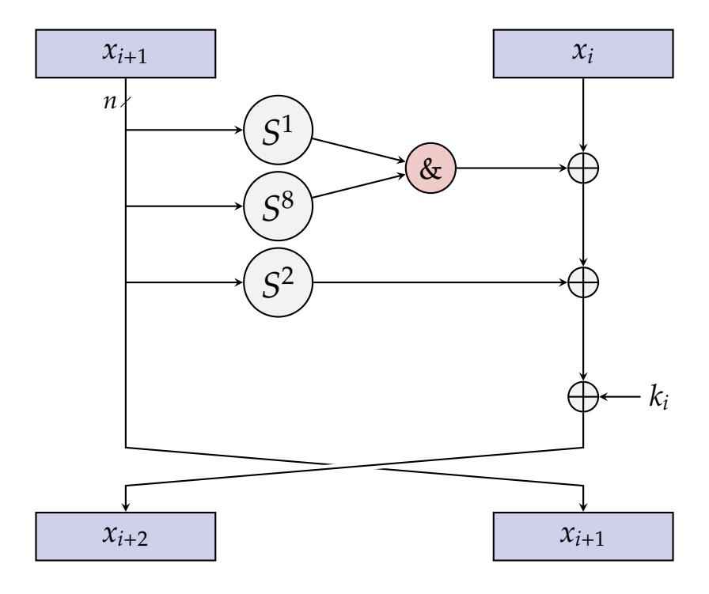
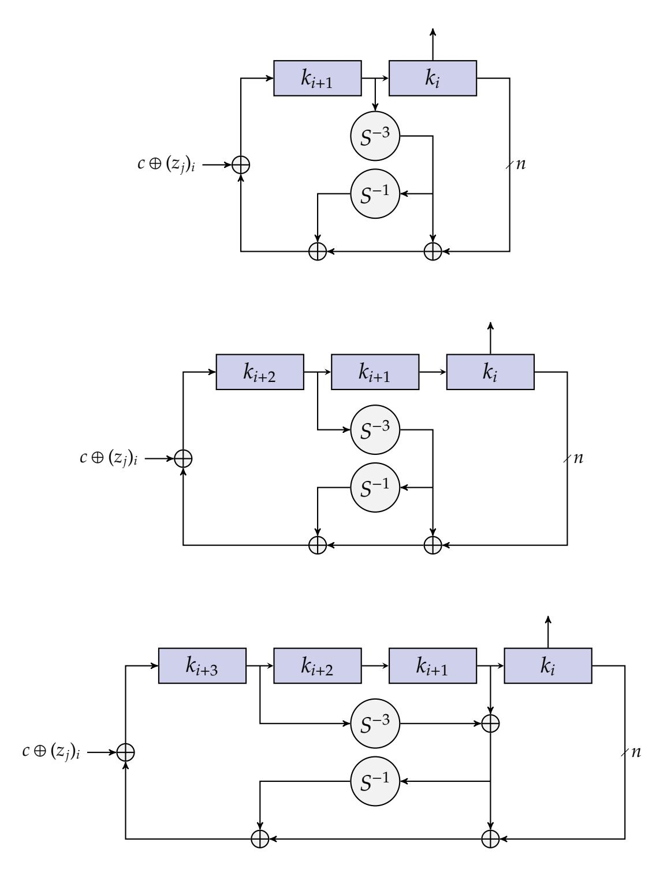
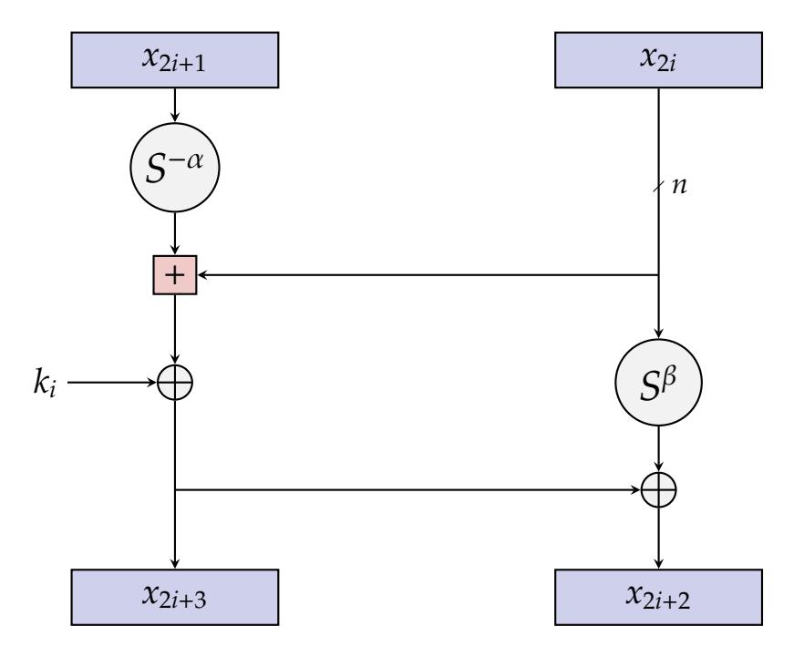
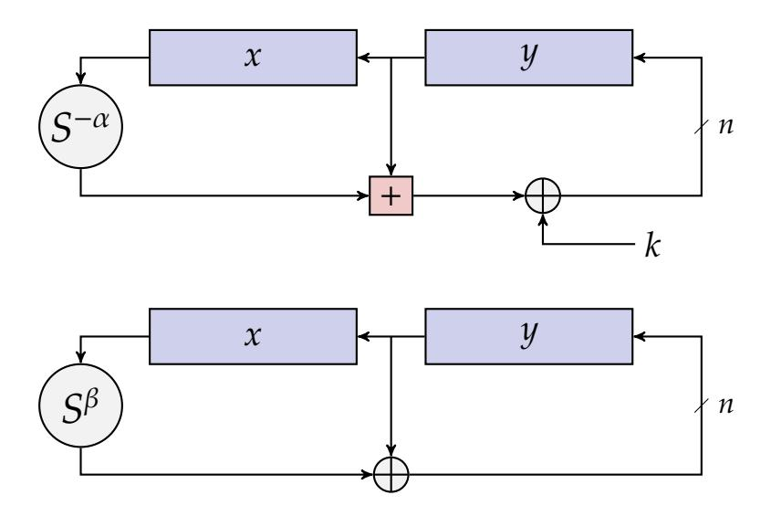
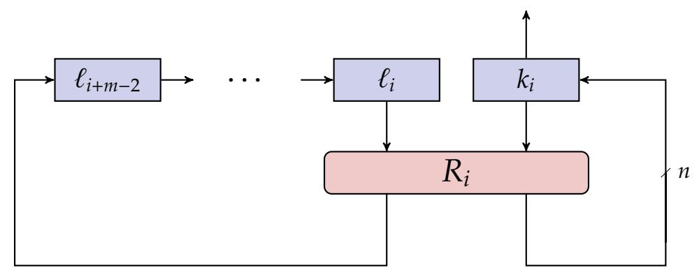

# **T S S F L B C**

Ray Beaulieu Douglas Shors Jason Smith Stefan Treatman-Clark Bryan Weeks Louis Wingers

National Security Agency 9800 Savage Road, Fort Meade, MD 20755, USA

{rabeaul, djshors, jksmit3, sgtreat, beweeks, lrwinge}@tycho.ncsc.mil 19 June 2013

# **A**

In this pape[r](#page-0-0) we propose two families of block ciphers, S and S, each of which comes in a variety of widths and key sizes. While many lightweight block ciphers exist, most were designed to perform well on a single platform and were not meant to provide high performance across a range of devices. The aim of S and S is to fill the need for secure, flexible, and analyzable lightweight block ciphers. Each offers excellent performance on hardware and software platforms, is flexible enough to admit a variety of implementations on a given platform, and is amenable to analysis using existing techniques. Both perform exceptionally well across the full spectrum of lightweight applications, but S is tuned for optimal performance in hardware, and S for optimal performance in software.

<span id="page-0-0"></span>This paper is a product of the NSA Research Directorate, and the algorithms presented are free from any intellectual property restrictions. This release does not constitute an endorsement of these algorithms for official use.

# **T S S F L B C**

Ray Beaulieu Douglas Shors Jason Smith Stefan Treatman-Clark Bryan Weeks Louis Wingers

National Security Agency 9800 Savage Road, Fort Meade, MD 20755, USA

{rabeaul, djshors, jksmit3, sgtreat, beweeks, lrwinge}@tycho.ncsc.mil

19 June 2013

# **1. I**

Existing cryptographic algorithms were, for the most part, designed to meet the needs of the desktop computing era. Such cryptography tends not to be particularly well-suited to the emerging era of *pervasive computing*, in which many highly constrained hardware- and software-based devices will need to communicate wirelessly with one another. And security is important for many of these devices: a hacker should not be able to take control of your insulin pump or override the brakes in your car.

The relatively new field of *lightweight cryptography* addresses security issues for highly constrained devices. A great deal of excellent work has already been done in this area, much of it aimed specifically at developing block ciphers suitable for lightweight cryptographic applications—the references at the end of this paper provide just a small sample. The algorithms we present here build upon that body of work. Our goal is that they provide the security that <span id="page-3-2"></span>the cryptographic community expects, while also delivering the flexibility and performance characteristics that developers require.

We would like to stress at this point that a block cipher does not provide security by itself! Different applications will likely have very different security requirements, and protocols must be developed in each specific instance to achieve the desired level of security. But a block cipher is an extremely versatile cryptographic primitive, and we fully expect that any *lightweight* protocol can be based upon an appropriately-sized block cipher.

That being said, the obvious first question for developers of lightweight applications is "Why not build my protocols around AES?" Indeed, AES [\[DR02\]](#page-35-0) has been suggested for lightweight use, and given its stature, we believe it should be used whenever appropriate. However, for the most constrained environments, AES is not the right choice: in hardware, for example, the emerging consensus in the academic literature is that area should not exceed 2000 gate equivalents (see [\[JW05\]](#page-36-0)), while the smallest available implementation of AES requires 2400[∗](#page-3-0) [\[MPL](#page-36-1)<sup>+</sup>11].

Among the block ciphers intended for use on constrained devices, some have been designed specifically to perform well on dedicated Application-Specific Integrated Circuits (ASICs), and thus can be realized by small circuits with minimal power requirements. Others are meant to perform well on low-cost microcontrollers with limited flash, SRAM, and/or power availability. Unfortunately, design choices meant to optimize performance on one platform often adversely affect performance on another.[†](#page-3-1)

Here we propose two families of highly-optimized block ciphers, S and S, that are flexible enough to provide excellent performance in both hardware and software environments. To the best of our knowledge, *each* of S and S outperforms both the best comparable hardware algorithms (in terms of the area required to achieve a given throughput), and the best comparable software algorithms (in terms of code size and memory usage). In addition, both families consist of algorithms having a range of block and key sizes, each

<span id="page-3-0"></span><sup>∗</sup>The algorithms we discuss in this paper can be implemented in hardware and software with roughly half the footprint of AES, and this greatly expands their range of application.

<span id="page-3-1"></span><sup>†</sup>These include the reliance on software-unfriendly bit permutations or bit-serial computations, and not-especially-hardware-friendly S-boxes.

<span id="page-4-0"></span>

|         |         | hardware |            | software |         |            |
|---------|---------|----------|------------|----------|---------|------------|
| size    | name    | area     | throughput | flash    | SRAM    | throughput |
|         |         | (GE)     | (kbps)     | (bytes)  | (bytes) | (kbps)     |
| 48/96   | S   | 763      | 15.0       | 196      | 0       | 589        |
|         | S   | 884      | 12.0       | 134      | 0       | 943        |
|         | EPCBC   | 1008     | 12.1       | [365]    | 0       | [93]       |
| 64/80   | T   | 1011     | 16.2       | 1304     | 414     | 472        |
|         | P | 1030     | 12.4       | [487]    | 0       | 96         |
|         | P | 1043     | 14.8       | –        | –       | –          |
|         | K   | 1054     | 25.1       | 272      | 18      | 14         |
|         | K   | 1478     | 23.6       | 766      | 18      | 168        |
| 64/96   | S   | 838      | 17.8       | 274      | 0       | 540        |
|         | S   | 984      | 14.5       | 182      | 0       | 888        |
|         | K   | 1528     | 19.1       | [766]    | [18]    | [134]      |
| 64/128  | S   | 1000     | 16.7       | 282      | 0       | 515        |
|         | S   | 1127     | 13.8       | 186      | 0       | 855        |
|         | P | 1334     | 12.1       | –        | –       | –          |
|         | P | 1339     | 12.1       | [487]    | [0]     | [96]       |
| 96/96   | S   | 984      | 14.8       | 454      | 0       | 454        |
|         | S   | 1134     | 13.8       | 276      | 0       | 866        |
|         | EPCBC   | 1333     | 12.1       | [730]    | 0       | [93]       |
| 128/128 | S   | 1317     | 22.9       | 732      | 0       | 342        |
|         | S   | 1396     | 12.1       | 396      | 0       | 768        |
|         | AES     | 2400     | 56.6       | 943      | 33      | 445        |

**Table 1.1:** Performance comparisons. Size is block size/key size; hardware refers to an ASIC implementation, and software to an implementation on an 8-bit microcontroller; clock speeds are 100 kHz (hardware) and 16 MHz (software). The best performance for a given size is indicated in red, the second best in blue. Numbers in brackets are our estimates; "–" means these values were unavailable at the time of writing.

of which admits a variety of implementations. The impact is that users will be able to closely match their application requirements with their security needs, without having to sacrifice performance.

S has been optimized for performance on hardware devices, and S for performance in software. But we emphasize that both families perform exceptionally well in *both* hardware and software, offering the flexibility across platforms that will be required by future applications.

Table [1.1](#page-4-0) shows a few significant hardware and software performance figures for S, S, and some other prominent block ciphers. For readers with some background in the field, much of the table will make sense without further explanation. Far more detail can be found in Sections [5,](#page-20-0) [6,](#page-24-0) and [7.](#page-29-0) Briefly, the data shown represent minimal-area hardware implementations achieving a throughput of at least 12 kilobits per second (kbps) at 100 kHz, and for software implementations minimizing what we call the *balanced performance metric* (see Equation [\(1\)](#page-22-0)).

The organization of the paper is as follows. Section [2](#page-5-0) discusses issues in lightweight block cipher design and introduces some of the choices we made in designing S and S. The algorithms are specified in Sections [3](#page-9-0) and [4.](#page-15-0) Sections [5,](#page-20-0) [6,](#page-24-0) and [7](#page-29-0) discuss our performance comparisons, and give fairly extensive hardware and software performance data. In the appendices, we briefly touch on performance on 64-bit processors (Appendix [A\)](#page-38-0) and give test vectors for S (Appendix [B\)](#page-42-0) and S (Appendix [C\)](#page-43-0).

# <span id="page-5-0"></span>**2. L B C D C**

The term *lightweight* is used broadly to mean that an algorithm is suitable for use on *some* constrained platform. But the features that make an algorithm excel on an 8-bit microcontroller, say, do not necessarily imply that it can be realized by an extremely small circuit. We would prefer to have a less platform-dependent notion of what is meant by lightweight, and so some general discussion is in order regarding our goals.

First, we make no attempt to optimize for a specific application. We prefer to make application-independent design choices that ensure good performance <span id="page-6-0"></span>on both ASICs and 8-bit microcontrollers, with the idea that good performance in these environments will carry over to other important platforms as well— FPGAs, 4- and 16-bit microcontrollers, 32-bit processors, and so on.

The principal aim is to provide algorithms that (1) have very small hardware implementations, and at the same time (2) have software implementations on small, low-power microcontrollers, with minimal flash and SRAM usage.

Our desire for low-area hardware designs means that we favor simple, lowcomplexity round functions, even if that means many rounds are required. Fortunately, for many lightweight applications, throughput is not the top priority. For the sake of comparison, however, it makes sense to set some minimal throughput requirement for low-frequency hardware implementations. There is no universal convention to be followed: based on values we've seen in the literature (see [\[CDK09\]](#page-35-1), for instance), and as we have noted above, we have chosen to limit the direct comparisons shown in Table [1.1](#page-4-0) to implementations of our algorithms that achieve a throughput of at least 12 kilobits per second (kbps) at 100 kHz.

For a lightweight algorithm to be as useful as possible, it should be *flexible* enough not just to be implemented efficiently on a variety of platforms, but also to allow for a variety of implementations on a single platform. For hardware applications, this means that it should be possible to take advantage of the available real estate. For extremely constrained hardware environments, very low-area implementations should be achievable, but if constraints are not so tight, one should be able to take advantage of this fact with larger-area, higherthroughput implementations. For software applications, very small flash and SRAM usage should be attainable, but high-throughput, low-energy implementations should be achievable as well.

Existing lightweight algorithms tend to use components that limit their flexibility. One important consideration is the extent to which an algorithm can be *serialized* in hardware. An implementation that updates a single bit at a time is said to be fully serialized, or *bit-serial*, while one that updates the entire block during each cycle is said to be unserialized, or *iterated*. Some algorithms are inherently bit-serial, making for small, though not necessarily fast, hardware implementations. But increasing the throughput of such an algorithm can be

unnecessarily costly (in terms of chip area). On the other hand, many algorithms are S-box based, precluding the possibility of efficient serialization at a level below the width of the S-box. This is reflected in the AES row of Table [1.1,](#page-4-0) where we see a throughput value much higher than 12 kbps, since AES is built from 8-bit S-boxes. Algorithms that can be efficiently serialized at any level provide better optimization opportunities.

Flexibility extends in another direction as well: since applications and devices vary, a variety of block and key sizes is useful. For instance, block sizes of 64 and 128 bits are prevalent in the world of desktop computing, but atypical block sizes of 48 or 96 bits are optimal for some electronic product code (EPC) applications. Key sizes, on the other hand, are related to the desired level of security: a very low-cost device may achieve adequate security using just 64 bits of key, while more sensitive applications (running on suitably higher-cost devices) may require as many as 256 bits of key.

<span id="page-7-0"></span>In order to provide this flexibility, we've designed S and S to be block cipher *families*: Each supports block sizes of 32, 48, 64, 96, and 128 bits, with up to three key sizes to go along with each block size. Each family provides ten algorithms in all. Table [2.1](#page-7-0) lists the different block and key sizes, in bits, for S and S.

| block size | key sizes     |  |  |
|------------|---------------|--|--|
| 32         | 64            |  |  |
| 48         | 72, 96        |  |  |
| 64         | 96, 128       |  |  |
| 96         | 96, 144       |  |  |
| 128        | 128, 192, 256 |  |  |

**Table 2.1:** S and S parameters.

We need to say a word about security, which is of course the primary goal of cryptography. In addition to meeting performance objectives, it is expected that a cryptographic algorithm have a level of security that matches its key size. Since confidence in the security of an algorithm increases as it is analyzed, a designer should strive to create algorithms that are amenable to current cryptanalytic techniques. S and S have been subjected to a fair amount of analysis, but nowhere near the amount brought to bear on algorithms such as DES and AES. Care must also be taken to use the appropriate block and key sizes to match the required level of security for the application.

But the fact of the matter is that our algorithms have simple round functions that invite analysis, and we are hopeful that this will entice the cryptographic community to expend some effort studying them.

While our intent is that S and S provide the advertised level of security, a large security margin is a luxury that we can't always afford when resources are scarce. Our approach has been aggressive: we have built in what we believe is a sufficient security margin, but not an excessive one, and certainly one which is tighter than might be supplied in a more traditional setting.

This brings up an important issue, and one we would like to see discussed further: What sorts of *cryptanalytic* adversaries should be considered in the world of lightweight cryptography? Does it make sense to allow access to the complete set of matched inputs and outputs for an algorithm with a 128-bit block size? One might argue that the amount of data encrypted by a single lightweight device during its functional lifetime will be tiny, and data to which an adversary has access will likely remain small when this tiny quantity is summed over all devices using a common key. In addition, for devices that can't be secured physically, practical (side-channel, reverse engineering) attacks will likely take precedence over cryptanalytic ones. The point is that there is a price to be paid (with every encryption) for blocking purely theoretical weaknesses, and it makes sense to think about what price is justified.

Since there is not yet a fully crystallized point of view on this issue, we have proceeded in a more-or-less standard fashion. S and S have been designed to provide security against traditional adversaries who can adaptively encrypt and decrypt large amounts of data. We concede that (as is the case with other algorithms) there will be what amount to highly optimized ways to exhaust the key that reduce the cost of a naive exhaust by a small factor. We have also made a reasonable effort to provide security against adversaries who can flip key bits, and our aim is that there should be no related-key attacks. But we have made no effort to guard against attacks in the open-key model, and S and S have not been evaluated for use as hashes.

# <span id="page-9-0"></span>**3. T S F B C**

The S block cipher with an *n*-bit word (and hence a 2*n*-bit block) is denoted S2*n*, where *n* is required to be 16, 24, 32, 48, or 64. S2*n* with an *m*-word (*mn*-bit) key will be referred to as S2*n*/*mn*. For example, S64/128 refers to the version of S acting on 64-bit plaintext blocks and using a 128-bit key.

Each instance of S uses the familiar Feistel rule of motion. The algorithm is engineered to be extremely small in hardware and easy to serialize at various levels, but care was taken so as not to sacrifice software performance.

#### **3.1. R F**

S2*n* encryption and decryption make use of the following operations on *n*-bit words:

- bitwise XOR, ⊕,
- bitwise AND, &, and
- left circular shift, *S j* , by *j* bits.

For *k* ∈ GF(2)*<sup>n</sup>* , the key-dependent S2*n* round function is the two-stage Feistel map *R<sup>k</sup>* : GF(2)*<sup>n</sup>* × GF(2)*<sup>n</sup>* → GF(2)*<sup>n</sup>* × GF(2)*<sup>n</sup>* defined by

$$R_k(x,y)=(y\oplus f(x)\oplus k,\ x),$$

where *f*(*x*) = (*Sx* & *S* <sup>8</sup>*x*) ⊕ *S* <sup>2</sup>*x* and *k* is the round key. The inverse of the round function, used for decryption, is

$$R_k^{-1}(x,y)=(y,\ x\oplus f(y)\oplus k).$$

The S key schedules take a key and from it generate a sequence of *T* key words *k*0, . . . , *kT*−1, where *T* is the number of rounds. The encryption map, then,

<span id="page-10-0"></span>

**Figure 3.1:** Feistel stepping of the S round function.

is the composition *R<sup>k</sup>T*−<sup>1</sup> ◦ · · · ◦ *R<sup>k</sup>*<sup>1</sup> ◦ *R<sup>k</sup>*<sup>0</sup> , read from right to left. Figure [3.1](#page-10-0) shows the effect of the round function *R<sup>k</sup><sup>i</sup>* on the two words of subcipher (*x<sup>i</sup>*+1, *xi*) at the *i* th step of this process.

Table [3.1](#page-11-0) makes explicit our parameter choices for all versions of S.

Observe that S includes no plaintext and ciphertext whitening steps, as inclusion of such operations can adversely affect circuit size. Consequently the first and last rounds do nothing cryptographically, other than acting to bring in the first and last round keys. There are various other locations on Figure [3.1](#page-10-0) where key could have been included instead, some of which don't have this issue, but none without drawbacks. Similar comments apply to S.

#### **3.2. K S**

Note that apart from the round key, all rounds of S are exactly the same, and the operations are perfectly symmetric with respect to the circular shift map on *n*-bit words. The S key schedules employ a sequence of 1-bit

<span id="page-11-0"></span>

| block<br>2n<br>size | key<br>mn<br>size | word<br>n<br>size | key<br>m<br>words | const<br>seq | rounds<br>T |
|---------------------|-------------------|-------------------|-------------------|--------------|-------------|
| 32                  | 64                | 16                | 4                 | z0           | 32          |
| 48                  | 72                | 24                | 3                 | z0           | 36          |
|                     | 96                |                   | 4                 | z1           | 36          |
| 64                  | 96                | 32                | 3                 | z2           | 42          |
|                     | 128               |                   | 4                 | z3           | 44          |
| 96                  | 96                | 48                | 2                 | z2           | 52          |
|                     | 144               |                   | 3                 | z3           | 54          |
| 128                 | 128               | 64                | 2                 | z2           | 68          |
|                     | 192               |                   | 3                 | z3           | 69          |
|                     | 256               |                   | 4                 | z4           | 72          |

**Table 3.1:** S parameters.

round constants specifically for the purpose of eliminating slide properties and circular shift symmetries. In fact, we provide some cryptographic separation between different versions of S having the same block size by defining five such sequences: *z*0, . . . , *z*4. Each of these sequences is defined in terms of one of the following period 31 sequences:

```
u = u0u1u2 . . . = 1111101000100101011000011100110 . . . ,
v = v0v1v2 . . . = 1000111011111001001100001011010 . . . ,
w = w0w1w2 . . .= 1000010010110011111000110111010 . . . .
```

The first two sequences are simply *z*<sup>0</sup> = *u* and *z*<sup>1</sup> = *v*. The remaining three, *z*2, *z*3, and *z*4, have period 62 and are formed by computing the bitwise XOR of the period 2 sequence  $t = t_0 t_1 t_2 \dots = 01010101 \dots$  with u, v, and w, respectively:

$$z_2=(z_2)_0(z_2)_1(z_2)_2\ldots=1010111101110000001101001001100$$

$$010100001000$$

where  $(z_i)_i$  is the  $j^{th}$  bit of  $z_i$ .

The sequences u, v, and w can be generated as follows: Define  $5 \times 5$  matrices U, V, and W over GF(2) by

$$U = \begin{bmatrix} 0 & 1 & 0 & 0 & 0 \\ 0 & 0 & 1 & 0 & 0 \\ 1 & 0 & 0 & 1 & 0 \\ 0 & 0 & 0 & 0 & 1 \\ 1 & 0 & 0 & 0 & 1 \end{bmatrix}, \quad V = \begin{bmatrix} 0 & 1 & 1 & 0 & 0 \\ 0 & 0 & 1 & 0 & 0 \\ 1 & 0 & 0 & 1 & 0 \\ 0 & 0 & 0 & 0 & 1 \\ 1 & 0 & 0 & 0 & 0 \end{bmatrix}, \quad W = \begin{bmatrix} 0 & 1 & 0 & 0 & 0 \\ 0 & 0 & 1 & 0 & 0 \\ 1 & 0 & 0 & 1 & 0 \\ 0 & 0 & 0 & 0 & 1 \\ 1 & 0 & 0 & 0 & 0 \end{bmatrix}.$$

The  $i^{th}$  element of each sequence is then obtained by initializing a 5-bit linear feedback shift register to **00001**, stepping i times using the corresponding matrix, and extracting the right-hand bit. Thus  $(u)_i = (0,0,0,0,1) U^i(0,0,0,0,1)^t$ .

Let  $c = 2^n - 4 = 0$ xff····fc. For Simon 2n with m key words  $(k_{m-1}, ..., k_1, k_0)$  and constant sequence  $z_i$ , round keys are generated by

$$k_{i+m} = \begin{cases} c \oplus (z_j)_i \oplus k_i \oplus (I \oplus S^{-1})S^{-3}k_{i+1}, & \text{if } m = 2, \\ c \oplus (z_j)_i \oplus k_i \oplus (I \oplus S^{-1})S^{-3}k_{i+2}, & \text{if } m = 3, \\ c \oplus (z_j)_i \oplus k_i \oplus (I \oplus S^{-1})(S^{-3}k_{i+3} \oplus k_{i+1}), & \text{if } m = 4, \end{cases}$$

for  $0 \le i < T - m$ . The key schedules are represented in Figure 3.2, and the version-dependent choice of constant sequence  $z_j$  is made explicit in Table 3.1. Note that key words  $k_0$  to  $k_{m-1}$  are used as the first m round keys; they are loaded into the shift registers with  $k_0$  on the right and  $k_{m-1}$  on the left.

Pseudocode for all versions of Simon is shown in Figure 3.3.

<span id="page-13-0"></span>

**Figure 3.2:** The S two, three, and four-word key expansions.

```
-------------------------- definitions --------------------------
 n = word size (16, 24, 32, 48, or 64)
 m = number of key words (must be 4 if n = 16,
                                 3 or 4 if n = 24 or 32,
                                 2 or 3 if n = 48,
                             2, 3, or 4 if n = 64)
 z = [11111010001001010110000111001101111101000100101011000011100110,
      10001110111110010011000010110101000111011111001001100001011010,
      10101111011100000011010010011000101000010001111110010110110011,
      11011011101011000110010111100000010010001010011100110100001111,
      11010001111001101011011000100000010111000011001010010011101111]
 (T, j) = (32,0) if n = 16
        = (36,0) or (36,1) if n = 24, m = 3 or 4
        = (42,2) or (44,3) if n = 32, m = 3 or 4
        = (52,2) or (54,3) if n = 48, m = 2 or 3
        = (68,2), (69,3), or (72,4) if n = 64, m = 2, 3, or 4
 x,y = plaintext words
 k[m-1]..k[0] = key words
------------------------- key expansion -------------------------
for i = m..T-1
  tmp ← S
           −3 k[i-1]
  if (m = 4) tmp ← tmp ⊕ k[i-3]
  tmp ← tmp ⊕ S
                 −1tmp
  k[i] ← ~k[i-m] ⊕ tmp ⊕ z[j][(i-m) mod 62] ⊕ 3
end for
-------------------------- encryption ---------------------------
for i = 0..T-1
  tmp ← x
  x ← y ⊕ (Sx & S
                   8x) ⊕ S
                          2x ⊕ k[i]
  y ← tmp
end for
```

**Figure 3.3:** S pseudocode.

# <span id="page-15-2"></span><span id="page-15-0"></span>**4. T S F B C**

The ten instances of S have been designed to provide excellent performance in both hardware and software, but have been optimized for performance on microcontrollers. Our notation for the different variants of S is entirely analogous to that used for S. For example, S96/144 refers to the S block cipher with block size 96 bits and key size 144 bits.

#### **4.1. R F**

The S2*n* encryption maps make use of the following operations on *n*-bit words:

- bitwise XOR, ⊕,
- addition modulo 2*<sup>n</sup>* , +, and
- left and right circular shifts, *S <sup>j</sup>* and *S* −*j* , respectively, by *j* bits.

For *k* ∈ GF(2)*<sup>n</sup>* , the key-dependent S2*n* round function is the map*R<sup>k</sup>* : GF(2)*<sup>n</sup>*× GF(2)*<sup>n</sup>* → GF(2)*<sup>n</sup>* × GF(2)*<sup>n</sup>* defined by

$$R_k(x,y) = ((S^{-\alpha}x + y) \oplus k, \ S^{\beta}y \oplus (S^{-\alpha}x + y) \oplus k),$$

with rotation amounts α = 7 and β = 2 if *n* = 16 (block size = 32) and α = 8 and β = 3 otherwise. The S round functions are similar to the mixing functions found in the T [\[FLS](#page-36-2)<sup>+</sup>10] block cipher.[∗](#page-15-1)

The inverse of the round function, necessary for decryption, uses modular subtraction instead of modular addition, and is given by

$$R_k^{-1}(x,y)=(S^\alpha((x\oplus k)-S^{-\beta}(x\oplus y)),\ S^{-\beta}(x\oplus y)).$$

Parameters for all versions of S are specified in Table [4.1.](#page-16-0)

<span id="page-15-1"></span><sup>∗</sup>Sdiffers from Threefish in various ways, e.g., it uses fixed vs. round-dependent rotation amounts, employs two rotations per round vs. one for the mixing functions, adds key using XOR and does not use word permutations. These and other important differences make S significantly lighter and faster than Threefish in both hardware and software.

<span id="page-16-0"></span>

| block<br>2n<br>size | key<br>mn<br>size | word<br>n<br>size | key<br>m<br>words | rot<br>α | rot<br>β | rounds<br>T    |
|---------------------|-------------------|-------------------|-------------------|----------|----------|----------------|
| 32                  | 64                | 16                | 4                 | 7        | 2        | 22             |
| 48                  | 72<br>96          | 24                | 3<br>4            | 8        | 3        | 22<br>23       |
| 64                  | 96<br>128         | 32                | 3<br>4            | 8        | 3        | 26<br>27       |
| 96                  | 96<br>144         | 48                | 2<br>3            | 8        | 3        | 28<br>29       |
| 128                 | 128<br>192<br>256 | 64                | 2<br>3<br>4       | 8        | 3        | 32<br>33<br>34 |

**Table 4.1:** S parameters.

The S key schedules take a key and from it generate a sequence of *T* key words *k*0, . . . , *kT*−1, where *T* is the number of rounds. The effect of the single round function *R<sup>k</sup><sup>i</sup>* is shown in Figure [4.1.](#page-17-0) Encryption is then the composition *R<sup>k</sup>T*−<sup>1</sup> ◦ · · · ◦ *R<sup>k</sup>*<sup>1</sup> ◦ *R<sup>k</sup>*<sup>0</sup> , read from right to left.

Note that S can be realized as the composition of two Feistel-like maps with respect to two different types of addition, namely,

$$(x, y) \mapsto (y, (S^{-\alpha}x + y) \oplus k)$$
 and  $(x, y) \mapsto (y, S^{\beta}x \oplus y)$ .

This decomposition is pictured in Figure [4.2.](#page-17-1)

<span id="page-17-0"></span>

<span id="page-17-1"></span>**Figure 4.1:** S round function; (*x*2*i*+1, *x*2*i*) denotes the subcipher after *i* steps of encryption.



**Figure 4.2:** S round function decomposed into Feistel-like steps.

#### **4.2. K S**

The S key schedules use the round function to generate round keys *k<sup>i</sup>* . Let *K* be a key for a S2*n* block cipher. We can write *K* = (`*m*−2, . . . , `0, *k*0), where `*i* , *k*<sup>0</sup> ∈ GF(2)*<sup>n</sup>* , for a value of *m* in {2, 3, 4}. Sequences *k<sup>i</sup>* and `*<sup>i</sup>* are defined by

$$\ell_{i+m-1} = (k_i + S^{-\alpha}\ell_i) \oplus i$$
 and  $k_{i+1} = S^{\beta}k_i \oplus \ell_{i+m-1}.$

The value *k<sup>i</sup>* is the *i* th round key, for 0 ≤ *i* < *T*. See Figure [4.3.](#page-18-0)

<span id="page-18-0"></span>

**Figure 4.3:** S key expansion, where *R<sup>i</sup>* is the S round function with *i* acting as round key.

Pseudocode for all versions of S is shown in Figure [4.4.](#page-19-0)

```
--------------------------- definitions ----------------------------
 n = word size (16, 24, 32, 48, or 64)
 m = number of key words (must be 4 if n = 16,
                                  3 or 4 if n = 24 or 32,
                                  2 or 3 if n = 48,
                                  2 or 3 or 4 if n = 64)
 T = number = 22 if n = 16
       of rounds = 22 or 23 if n = 24, m = 3 or 4
                   = 26 or 27 if n = 32, m = 3 or 4
                   = 28 or 29 if n = 48, m = 2 or 3
                   = 32, 33, or 34 if n = 64, m = 2, 3, or 4
 (α, β) = (7,2) if n = 16
         (8,3) otherwise
 x,y = plaintext words
 `[m-2]..`[0],k[0] = key words
--------------------------- key expansion --------------------------
for i = 0..T-2
  `[i+m-1] ← (k[i] + S−α
                        `[i]) ⊕ i
  k[i+1] ← S
               β k[i] ⊕ `[i+m-1]
end for
---------------------------- encryption ----------------------------
for i = 0..T-1
  x ← (S−α x + y) ⊕ k[i]
  y ← S
        βy ⊕ x
end for
```

**Figure 4.4:** S pseudocode.

# <span id="page-20-2"></span><span id="page-20-0"></span>**5. P C**

In this section we discuss the performance of S and S and fill in the details regarding the comparisons made in Table [1.1](#page-4-0) with AES [\[DR02\]](#page-35-0), EPCBC [\[YKPH11\]](#page-37-0), K [\[CDK09\]](#page-35-1), K [\[GNL11\]](#page-36-3), P [\[SIH](#page-36-4)<sup>+</sup>11], P [\[BKL](#page-35-2)<sup>+</sup>07], and T [\[SMMK\]](#page-37-1).

We have restricted our comparisons exclusively to block ciphers, as block ciphers are extremely flexible cryptographic primitives with a well-developed cryptanalytic theory. Consequently, we don't consider other interesting lightweight designs like H-2 [\[ESS11\]](#page-35-3), G [\[HJMM08\]](#page-36-5), T [\[CP05\]](#page-35-4), and S20 [\[Ber08\]](#page-35-5).

It is important to note the difficulties inherent in the sort of comparison we're doing. Different authors implement their algorithms under differing assumptions: various cell libraries are used for hardware implementations, and a variety of assumptions are made for software implementations. In addition, it's not always clear what a particular author means, for example, by code size (is the decryption algorithm implemented or not?) or gate count (is the key schedule included?). All of this can make attempts at a fair comparison problematic. That said, we believe the performance advantage of our algorithms cannot fully be explained by such discrepancies.

In this paper we strive to make equitable comparisons, and to provide all the relevant details about our performance metrics and our implementation platforms. We begin by discussing the platforms a bit further.

The principal hardware resources are circuit area and power. Area is measured in gate equivalents; a gate equivalent (GE), which depends on a particular cell library, is the physical area required for the smallest available two-input NAND gate. Our results were generated using an ARM standard cell library for the IBM 8RF (0.13 micron) ASIC process. The areas of some basic gates in this library are as follows: NOT 0.75, NAND 1.00, AND 1.25, OR 1.25, XOR 2.00, XNOR 2.00, 2-1 MUX 2.25, D flip-flop 4.25, 1-bit full adder 5.75, scan flip-flop 6.25.[∗](#page-20-1)

<span id="page-20-1"></span><sup>∗</sup>The existence of a smaller D flip-flop in this library than that found in libraries used by some authors—4.25 vs. 4.67—improves our numbers somewhat, but this does not fully explain our area advantages. We note also that our scan flip-flop is larger—6.25 vs. 6.0.

<span id="page-21-0"></span>Areas given for our algorithms are for *complete*implementations: we include the flip-flops to store the state and key, logic to implement the encryption algorithm and key schedule, control logic to manage the encryption, and logic to allow the plaintext to be loaded and ciphertext to be read out. We have not, however, included an implementation of the decryption algorithm in any of our area figures. This is consistent with other authors' work: for extremely lightweight applications one would want to use a block cipher in an encrypt-only mode.

Our current hardware designs have not proceeded past the synthesis stage, so reliable power information is not available. For this reason, we report only area figures. In addition, power consumption is strongly tied to the feature size, clock speed, etc., and this makes comparisons especially difficult. However, we expect that S and S are very amenable to low-power and low-energy implementations.

We now turn our attention to Table [1.1,](#page-4-0) noting first the one slight mismatch in key sizes in the data presented there: neither S nor S has a variant that uses an 80-bit key. In an attempt to draw the fairest comparison, we have lumped algorithms of size 64/80 together in the table with our algorithms of size 64/96.

The *hardware area* and *hardware throughput* columns of the table compare S and S with some of the best performing block ciphers available for lightweight hardware applications. The data for P and EPCBC is found in [\[YKPH11\]](#page-37-0), for P in [\[SIH](#page-36-4)<sup>+</sup>11], for K in [\[CDK09\]](#page-35-1), for T in [\[SMMK\]](#page-37-1), for K in [\[GNL11\]](#page-36-3), and for AES in [\[MPL](#page-36-1)<sup>+</sup>11].

Two notable omissions from the table are PRINT [\[KLPR10\]](#page-36-6) and K [\[CDK09\]](#page-35-1), lightweight block ciphers that also achieve very low-area hardware implementations. These algorithms specifically target application spaces where there is never a need to update keys, and take advantage of this fact by hardwiring a fixed key into the circuit. Because no flip-flops are required to store key bits, these algorithms realize a significant savings in area. Our algorithms, on the other hand, are meant to fill a much broader application space.

We now turn to software applications. In the lightweight application space, we expect our algorithms to be implemented on inexpensive microcontrollers with very limited memory resources. Atmel's ATtiny45 8-bit microcontroller, <span id="page-22-3"></span>for instance, has just 4 kB of flash and 256 bytes of SRAM. In addition, these microcontrollers often run on battery power, and cryptographic components require minimal energy per bit encrypted in the interest of extending battery life.

For the purposes of comparison, we define the *balanced performance metric*[∗](#page-22-1) for a software implementation to be

<span id="page-22-0"></span>
$$\frac{\text{throughput}}{\text{flash} + 16 \cdot \text{SRAM}}.$$

A *balanced* implementation is one which scores well amongst a variety of implementations with respect to the balanced performance metric. The table compares balanced implementations of S, S, and various well-known algorithms.

For algorithms other than S and S, we used the implementation with maximal balanced performance metric amongst those we could find in the literature. The software data for P is derived from [\[EKP](#page-35-6)<sup>+</sup>07]; for K, K, and AES from [\[EGG](#page-35-7)<sup>+</sup>12]; and for T from [\[SMMK\]](#page-37-1). We note that the implementations given in some of these papers include the code for both the encryption and decryption algorithms. Since our S and S code provides encrypt capability only (which is reasonable for lightweight applications), we have subtracted the size of the decryption code[†](#page-22-2) from the numbers reported by those authors to obtain the numbers in our table.

Alternatively, we could have included the decryption algorithms in our implementations. For S, naive implementations would have required another 100 bytes or so of flash, but by exploiting the similarity between the encryption and decryption algorithms we could reduce this number significantly. For S, the cost is negligible since the decryption algorithm *is* the encryption algorithm, up to swaps of words and reordering of round keys.

<span id="page-22-1"></span><sup>∗</sup>This metric is related to that used in [\[REP07\]](#page-36-7), but we have assigned a higher weight to SRAM than to flash. The factor of 16 reflects the relative amount of SRAM to flash in the ATtiny45 microcontroller: Implementations which use a lot of SRAM are, appropriately, penalized.

<span id="page-22-2"></span><sup>†</sup>This was determined by examining assembly code whenever available. When the code was not available, we halved the indicated flash usage as a reasonable estimate.

We note that the best balanced implementations of our algorithms were in fact those that required no SRAM. For these, code implementing the encryption algorithm is stored in flash, and the key is pre-expanded and also stored in flash; this obviates the need to include code for the key schedule and allows for high-throughput/low-energy encryption. This contrasts with the way in which some of the other algorithms handle the key: generally they include code for the key schedule, and sometimes generate round keys on the fly.

All of our software implementations were coded in assembly on an Atmel ATmega128 8-bit microcontroller running at 16 MHz. Distinct implementations were done for high throughput (low energy), low flash usage, and low SRAM usage. Results are presented in Section [7.](#page-29-0)

We conclude by highlighting a couple of comparisons from Table [1.1](#page-4-0) between our algorithms and two other prominent algorithms.

- P-80 is a leading hardware-oriented lightweight block cipher, with an implementation requiring just 1030 GE and achieving throughput of 12.4 kilobits per second at 100 kHz. S64/96 and S64/96 (which provide 16 added bits of security) achieve even higher throughput at areas of just 838 and 984 GE, respectively. More importantly, our algorithms also have excellent software performance, and this is something that P was not designed to offer: S64/96 and S64/96 have about 10 and 25 times better balanced performance, respectively, than P-80.
- AES is one of the best existing block ciphers for applications running on 8-bit microcontrollers. This makes it a fine choice for many lightweight software applications. But for extremely constrained applications where it is no longer viable, S128/128 and S128/128 can fill the void. Similarly, in hardware, if AES at 2400 GE is simply not an option, S- 128/128 and S128/128 can be made to fit in about half the area (see Table [6.1\)](#page-25-0).

Perhaps most significantly, lightweight applications typically do not require a 128-bit block cipher: a 64-bit block cipher may be perfectly adequate. This consideration makes the comparison of our algorithms with 128-bit algorithms like AES (which offers no 64-bit size) even more compelling. S64/128 and S64/128 have significantly higher balanced performance, and have minimal hardware requirements which fall below 1000 GE.

# <span id="page-24-0"></span>**6. H P**

This section presents detailed information regarding our ASIC implementations of S and S. The algorithms were implemented in VHDL and synthesized using Synopsys Design Compiler 11.09-SP4 to target the ARM SAGE-X v2.0 standard cell library for IBM's 8RF 130nm (CMR8SF-LPVT) process. Typical DC supply voltages for the process are 1.2 V. All throughput values given in this section assume a clock speed of 100 kHz.

Of particular interest are fully serialized implementations, for which nearly all of the chip area is dedicated to holding the words of subcipher and key. Table [6.1](#page-25-0) presents our data for such area-minimizing implementations. We note that throughput for these implementations is necessarily low, and typically well below the 12 kbps threshold required for inclusion in Table [1.1.](#page-4-0) We also note that fully serial implementations don't always make a lot of sense, as the marginal cost in area to double or even quadruple the throughput is quite small.[∗](#page-24-1)

Table [6.2](#page-26-0) gives a more complete set of hardware data for S and S, corresponding to various levels of serialization. The smallest area obtained for each block size represents the fully serialized implementation, where a single bit of each word is updated during each clock cycle. Subsequent lines are for implementations that process larger divisors of the word size. The largest area implementation listed for each block size corresponds to an iterated implementation, which carries out a complete round in a single cycle. Though other levels of serialization are certainly possible, this table should serve to demonstrate the flexibility of our algorithms in hardware.

<span id="page-24-1"></span><sup>∗</sup>For S, updating two bits at a time instead of one doubles the throughput while requiring an average of just 9 additional gate equivalents; quadrupling the throughput by updating four bits at a time costs just 33 GE. The corresponding numbers for S are 59 to double and 126 to quadruple the throughput.

<span id="page-25-0"></span>

| size    | name  | area<br>(GE) | throughput<br>(kbps) |
|---------|-------|--------------|----------------------|
| 32/64   | S | 523          | 5.6                  |
|         | S | 580          | 4.2                  |
| 48/72   | S | 631          | 5.1                  |
|         | S | 693          | 4.3                  |
| 48/96   | S | 739          | 5.0                  |
|         | S | 794          | 4.0                  |
| 64/96   | S | 809          | 4.4                  |
|         | S | 860          | 3.6                  |
| 64/128  | S | 958          | 4.2                  |
|         | S | 996          | 3.4                  |
| 96/96   | S | 955          | 3.7                  |
|         | S | 1012         | 3.4                  |
| 96/144  | S | 1160         | 3.5                  |
|         | S | 1217         | 3.3                  |
| 128/128 | S | 1234         | 2.9                  |
|         | S | 1280         | 3.0                  |
| 128/192 | S | 1508         | 2.8                  |
|         | S | 1566         | 2.9                  |
| 128/256 | S | 1782         | 2.6                  |
|         | S | 1840         | 2.8                  |

**Table 6.1:** Hardware performance: area-minimizing implementations.

We note that in Table [6.2](#page-26-0) it appears that S peaks at a higher throughput than S. This is an artifact of our choice to show the data for updating at most *n* bits per clock cycle for S2*n* and S2*n*. It's not hard to do an implementation of S64 that updates, say, 40 bits at a time, or 64 bits at a time, with the associated increases in area and throughput. But we have not included a separate table for high-throughput hardware implementations like

this, because these implementations have relatively large area, and, as such, fall outside the scope of this paper. In particular, if throughput per unit area is the measure of interest, then optimal implementations are not shown in the table—they would involve updating more than *n* bits per clock cycle.

A further note on throughput: it's natural to count only those cycles required for the encryption process. However, we believe that the throughput values we present will be of most interest to implementers considering applications that require the encryption of only a small number of blocks. Consequently, we have included cycles for loading plaintext and key in a manner consistent with our low-area implementation. In every case it's possible to make the loading proceed more quickly, thereby raising throughput a little, at a small cost in area. We have not included any cycles for sending the resulting ciphertext off chip, since we make the assumption that this can be done more-or-less instantaneously or, at worst, simultaneously with the task of reading new data.

**Table 6.2:** Hardware performance for S and S.

<span id="page-26-0"></span>

| algorithm  | area<br>(GE) | throughput<br>(kbps) | algorithm  | area<br>(GE) | throughput<br>(kbps) |
|------------|--------------|----------------------|------------|--------------|----------------------|
| S32/64 | 523          | 5.6                  | S32/64 | 580          | 4.2                  |
|            | 535          | 11.1                 |            | 642          | 8.3                  |
|            | 566          | 22.2                 |            | 708          | 16.7                 |
|            | 627          | 44.4                 |            | 822          | 33.3                 |
|            | 722          | 88.9                 |            | 850          | 123.1                |
| S48/72 | 631          | 5.1                  | S48/72 | 693          | 4.3                  |
|            | 639          | 10.3                 |            | 752          | 8.5                  |
|            | 648          | 15.4                 |            | 777          | 12.8                 |
|            | 662          | 20.5                 |            | 821          | 17.0                 |
|            | 683          | 30.8                 |            | 848          | 25.5                 |
|            | 714          | 41.0                 |            | 963          | 34.0                 |
|            | 765          | 61.5                 |            | 1040         | 51.1                 |
|            | 918          | 123.1                |            | 1152         | 192.0                |

*Continued on next page*

| algorithm   | area | throughput | algorithm   | area | throughput |
|-------------|------|------------|-------------|------|------------|
| S48/96  | 739  | 5.0        | S48/96  | 794  | 4.0        |
|             | 750  | 10.0       |             | 857  | 8.0        |
|             | 763  | 15.0       |             | 884  | 12.0       |
|             | 781  | 20.0       |             | 932  | 16.0       |
|             | 804  | 30.0       |             | 961  | 24.0       |
|             | 839  | 40.0       |             | 1081 | 32.0       |
|             | 898  | 60.0       |             | 1167 | 48.0       |
|             | 1062 | 120.0      |             | 1254 | 177.8      |
| S64/96  | 809  | 4.4        | S64/96  | 860  | 3.6        |
|             | 815  | 8.9        |             | 918  | 7.3        |
|             | 838  | 17.8       |             | 984  | 14.5       |
|             | 891  | 35.6       |             | 1095 | 29.1       |
|             | 1004 | 71.1       |             | 1338 | 58.2       |
|             | 1216 | 142.2      |             | 1522 | 220.7      |
| S64/128 | 958  | 4.2        | S64/128 | 996  | 3.4        |
|             | 968  | 8.3        |             | 1058 | 6.9        |
|             | 1000 | 16.7       |             | 1127 | 13.8       |
|             | 1057 | 33.3       |             | 1247 | 27.6       |
|             | 1185 | 66.7       |             | 1506 | 55.2       |
|             | 1417 | 133.3      |             | 1658 | 206.5      |
| S96/96  | 955  | 3.7        | S96/96  | 1012 | 3.4        |
|             | 965  | 7.4        |             | 1067 | 6.9        |
|             | 971  | 11.1       |             | 1089 | 10.3       |
|             | 984  | 14.8       |             | 1134 | 13.8       |
|             | 1007 | 22.2       |             | 1157 | 20.7       |
|             | 1037 | 29.6       |             | 1267 | 27.6       |
|             | 1088 | 44.4       |             | 1328 | 41.4       |
|             | 1151 | 59.3       |             | 1514 | 55.2       |
|             | 1263 | 88.9       |             | 1673 | 82.8       |
|             | 1580 | 177.8      |             | 2058 | 320.0      |

*Continued on next page*

| algorithm    | area | throughput | algorithm    | area | throughput |
|--------------|------|------------|--------------|------|------------|
| S96/144  | 1160 | 3.5        | S96/144  | 1217 | 3.3        |
|              | 1169 | 7.0        |              | 1269 | 6.6        |
|              | 1175 | 10.5       |              | 1297 | 9.8        |
|              | 1189 | 14.0       |              | 1345 | 13.1       |
|              | 1211 | 21.0       |              | 1371 | 19.7       |
|              | 1242 | 28.1       |              | 1485 | 26.2       |
|              | 1292 | 42.1       |              | 1558 | 39.3       |
|              | 1354 | 56.1       |              | 1751 | 52.5       |
|              | 1467 | 84.2       |              | 1928 | 78.7       |
|              | 1790 | 168.4      |              | 2262 | 300.0      |
| S128/128 | 1234 | 2.9        | S128/128 | 1280 | 3.0        |
|              | 1242 | 5.7        |              | 1338 | 6.1        |
|              | 1263 | 11.4       |              | 1396 | 12.1       |
|              | 1317 | 22.9       |              | 1488 | 24.2       |
|              | 1430 | 45.7       |              | 1711 | 48.5       |
|              | 1665 | 91.4       |              | 2179 | 97.0       |
|              | 2090 | 182.9      |              | 2727 | 376.5      |
| S128/192 | 1508 | 2.8        | S128/192 | 1566 | 2.9        |
|              | 1514 | 5.6        |              | 1627 | 5.8        |
|              | 1536 | 11.1       |              | 1687 | 11.6       |
|              | 1587 | 22.2       |              | 1797 | 23.2       |
|              | 1700 | 44.4       |              | 2038 | 46.4       |
|              | 1937 | 88.9       |              | 2536 | 92.8       |
|              | 2378 | 177.8      |              | 3012 | 355.6      |
| S128/256 | 1782 | 2.6        | S128/256 | 1840 | 2.8        |
|              | 1792 | 5.3        |              | 1901 | 5.6        |
|              | 1823 | 10.5       |              | 1967 | 11.1       |
|              | 1883 | 21.1       |              | 2087 | 22.2       |
|              | 2010 | 42.1       |              | 2341 | 44.4       |
|              | 2272 | 84.2       |              | 2872 | 88.9       |
|              | 2776 | 168.4      |              | 3284 | 336.8      |

# <span id="page-29-0"></span>**7. S P: 8- M**

Generally speaking, we expect our algorithms to have exceptional performance on 4-, 8-, 16-, and 32-bit microcontrollers. For the sake of comparison, however, we have chosen to report data only for 8-bit implementations of S and S, since most lightweight implementations reported in the literature have been on such platforms. In particular, we implemented our algorithms on the Atmel ATmega128, a low-power device with 128K bytes of programmable flash memory, 4K bytes of SRAM, and 32 8-bit general purpose registers.

Tables [7.1,](#page-32-0) [7.2,](#page-33-0) and [7.3](#page-34-0) show results for high-throughput, low-SRAM, and lowflash implementations of S and S. In most cases we don't optimize the parameter in question, because doing so tends to have a deleterious effect on the other parameters. For example, if the cost of decreasing the code size by a few bytes is to reduce throughput by 50%, then we forgo the code-size reduction. Similarly, we don't report data for an implementation that achieves 1% increase in throughput if the consequence is to double the code size.

We do not give throughput directly in these tables, as we did in Table [1.1.](#page-4-0) Instead, we show the *encryption cost* in cycles per byte, i.e., the number of cycles required per byte of ciphertext, as this is the common metric used in the literature for software implementations.

We now provide a little more detail about what is shown in each of the three tables. Among the choices we have that give rise to varying implementations are the following: (1) Is the code fully or partially unrolled, or is just one round implemented? (2) Is the key schedule implemented and the code stored in flash, or are the round keys simply assumed to be present in flash? (3) Are common functions done via function calls or via in-line code?

Table [7.1](#page-32-0) shows results for high-throughput implementations of the algorithms. High throughput on a microcontroller equates to low energy, so such implementations are of interest when battery life is at a premium.

Maximal throughput is attained by fully unrolling code in order to eliminate all loop overhead. This, however, can lead to very large programs, and most of <span id="page-30-2"></span>the performance gains achievable by fully unrolling can be achieved by partial unrolling. Table [7.1](#page-32-0) shows the minimal code-size results whose throughput is no more than 3% worse than the maximal throughput versions. Someone who *really* cares about this 2–3% can get it back, but with a significant code size penalty.

With regard to throughput, we note that the fastest reported software implementation of AES-128 available on an Atmel 8-bit microcontroller has a cost of 125 cycles/byte, and uses 1912 bytes of flash and 432 bytes of SRAM [\[BOSC10\]](#page-35-8). For a slight decrease in speed, the same implementers offer a more balanced implementation with a cost of 135 cycles/byte, using 1912 bytes of flash and 176 bytes of SRAM. Our high-speed S128/128 implementation has comparable throughput, at 139 cycles/byte, but uses only 388 bytes of flash and 256 bytes of SRAM.

If one doesn't require a full 128-bit cipher, then S64/128 could be considered. One implementation of S64/128 encrypts at 120 cycles/byte, and when compared to the fastest implementation of AES-128 mentioned above, uses less than a sixth of the flash (284 bytes) and a quarter of the SRAM (108 bytes)[.](#page-30-0)<sup>∗</sup>

In addition, the SPECK implementations are straightforward, and this tends not to be the case for high-speed AES implementations.

Table [7.2](#page-33-0) shows results for low-SRAM implementations of the algorithms. As it always is, code for the encryption algorithm is stored in flash. But here the key schedule is not implemented; instead, key is assumed to have been preexpanded and round keys are stored in flash. Here we must include the time to load the key from flash into registers as part of the encryption cost.

Table [7.3](#page-34-0) shows results for low-flash (i.e., low code-size) implementations of the algorithms. In most cases we also store the key schedule code in flash, in addition to the encryption code.[†](#page-30-1) We then expand the key and load it into SRAM, and so the reported SRAM usage is the amount of storage required to hold all the round keys (but in some cases one or two more words are necessary).

<span id="page-30-0"></span><sup>∗</sup>This implementation is essentially the one cited in Table [7.1,](#page-32-0) but with three rounds unrolled instead of six for the value shown in the table.

<span id="page-30-1"></span><sup>†</sup>This convention does not always produce minimal flash implementations—for smaller versions of the algorithms, with fewer round keys, it can require less memory to store all the pre-expanded round keys in flash than it does to implement the key schedule.

The encryption cost counts only the cycles required for encryption, i.e., it does not include the cycles required for the generation or storage of expanded key in SRAM. This approach makes sense for many high-speed applications, where a large amount of data may need to be encrypted. We note that the key generation for S or S requires about as many cycles as a single encryption.

Small code size is achieved in part by doing function calls for common operations such as *n*-bit XORs. There is overhead associated with each function call, and so throughput is affected. Our low-flash implementations use this technique, but only within reason. Additional code-size savings are possible (up to 30 bytes for S and 50 bytes for S), but only by significantly reducing throughput.

Finally, none of the results we report include any wrappers necessary for an actual application to interface with the external world. In particular, we have omitted the instructions and cycle counts associated with reading data in from the ports, and reading key in from wherever it resides. We also do not count any flash that may be required to store the key or plaintext.

<span id="page-32-0"></span>

| size    | name  | flash<br>(bytes) | SRAM<br>(bytes) | enc. cost<br>(cycles/byte) |
|---------|-------|------------------|-----------------|----------------------------|
| 32/64   | S | 384              | 64              | 168                        |
|         | S | 424              | 44              | 110                        |
| 48/72   | S | 430              | 108             | 187                        |
|         | S | 532              | 66              | 100                        |
| 48/96   | S | 442              | 108             | 187                        |
|         | S | 562              | 69              | 104                        |
| 64/96   | S | 530              | 168             | 205                        |
|         | S | 556              | 104             | 114                        |
| 64/128  | S | 404              | 176             | 217                        |
|         | S | 596              | 108             | 118                        |
| 96/96   | S | 544              | 312             | 249                        |
|         | S | 454              | 168             | 123                        |
| 96/144  | S | 444              | 324             | 260                        |
|         | S | 576              | 174             | 127                        |
| 128/128 | S | 446              | 544             | 333                        |
|         | S | 388              | 256             | 139                        |
| 128/192 | S | 582              | 552             | 335                        |
|         | S | 568              | 272             | 143                        |
| 128/256 | S | 458              | 576             | 353                        |
|         | S | 458              | 288             | 147                        |

**Table 7.1:** High-throughput (low-energy) software implementations.

<span id="page-33-0"></span>

| size    | name  | flash<br>(bytes) | SRAM<br>(bytes) | enc. cost<br>(cycles/byte) |
|---------|-------|------------------|-----------------|----------------------------|
| 32/64   | S | 130              | 0               | 205                        |
|         | S | 92               | 0               | 140                        |
| 48/72   | S | 196              | 0               | 220                        |
|         | S | 130              | 0               | 130                        |
| 48/96   | S | 196              | 0               | 220                        |
|         | S | 134              | 0               | 136                        |
| 64/96   | S | 274              | 0               | 239                        |
|         | S | 182              | 0               | 144                        |
| 64/128  | S | 282              | 0               | 250                        |
|         | S | 186              | 0               | 150                        |
| 96/96   | S | 454              | 0               | 284                        |
|         | S | 276              | 0               | 148                        |
| 96/144  | S | 466              | 0               | 295                        |
|         | S | 282              | 0               | 153                        |
| 128/128 | S | 732              | 0               | 376                        |
|         | S | 396              | 0               | 167                        |
| 128/192 | S | 740              | 0               | 381                        |
|         | S | 404              | 0               | 172                        |
| 128/256 | S | 764              | 0               | 398                        |
|         | S | 412              | 0               | 177                        |

**Table 7.2:** Low-SRAM software implementations.

<span id="page-34-0"></span>

| size    | name  | flash<br>(bytes) | SRAM<br>(bytes) | enc. cost<br>(cycles/byte) |
|---------|-------|------------------|-----------------|----------------------------|
| 32/64   | S | 136              | 64              | 189                        |
|         | S | 102              | 44              | 167                        |
| 48/72   | S | 166              | 108             | 202                        |
|         | S | 126              | 69              | 145                        |
| 48/96   | S | 178              | 108             | 202                        |
|         | S | 132              | 72              | 151                        |
| 64/96   | S | 198              | 168             | 218                        |
|         | S | 152              | 108             | 154                        |
| 64/128  | S | 208              | 176             | 228                        |
|         | S | 160              | 112             | 160                        |
| 96/96   | S | 256              | 312             | 258                        |
|         | S | 170              | 174             | 150                        |
| 96/144  | S | 256              | 324             | 268                        |
|         | S | 206              | 180             | 155                        |
| 128/128 | S | 328              | 544             | 342                        |
|         | S | 214              | 264             | 165                        |
| 128/192 | S | 328              | 552             | 347                        |
|         | S | 266              | 272             | 170                        |
| 128/256 | S | 340              | 576             | 362                        |
|         | S | 284              | 280             | 175                        |

**Table 7.3:** Low-flash software implementations.

# **R**

- <span id="page-35-5"></span>[Ber08] D. J. Bernstein. The Salsa20 Family of Stream Ciphers. In *New Stream Cipher Designs—The eSTREAM Finalists*, Lecture Notes in Compter Science, No. 4986, pages 84–97. Springer-Verlag, 2008. [19](#page-20-2)
- <span id="page-35-2"></span>[BKL<sup>+</sup>07] A. Bogdanov, L. R. Knudsen, G. Leander, C. Paar, A. Poschmann, M.J.B. Robshaw, Y. Seurin, and C. Vikkelsoe. PRESENT: An Ultra-Lightweight Block Cipher. In *CHES 2007*, Lecture Notes in Computer Science, No. 4727, pages 450–66. Springer-Verlag, 2007. [19](#page-20-2)
- <span id="page-35-8"></span>[BOSC10] J. Bos, D. Osvik, D. Stefan, and D. Canright. Fast Software AES Encryption. In *Proceedings of the 17th international conference on fast software encryption*, FSE 2010, pages 75–93. Springer-Verlag, 2010. [29](#page-30-2)
- <span id="page-35-1"></span>[CDK09] C. D. Cannière, O. Dunkelman, and M. Kneževi´c. KATAN and KTANTAN - A Family of Small and Efficient Hardware-Oriented Block Ciphers. In *CHES 2009*, Lecture Notes in Computer Science, No. 5747, pages 272–88. Springer-Verlag, 2009. [5,](#page-6-0) [19,](#page-20-2) [20](#page-21-0)
- <span id="page-35-4"></span>[CP05] C. D. Canniere and B. Preneel. T Specifications. In *ECRYPT Stream Cipher Project Report 2005*/*030*, 2005. [19](#page-20-2)
- <span id="page-35-0"></span>[DR02] J. Daemen and V. Rijmen. *The Design of Rijndael*. Springer, Berlin, 2002. [2,](#page-3-2) [19](#page-20-2)
- <span id="page-35-7"></span>[EGG<sup>+</sup>12] T. Eisenbarth, Z. Gong, T. Güneysu, S. Heyse, S. Indesteege, S. Kerckhof, F. Koeune, T. Nad, T. Plos, F. Regazzoni, F.-X. Standaert, and L. van Oldeneel tot Oldenzeel. Compact Implementation and Performance Evaluation of Block Ciphers in ATtiny Devices. In *Africacrypt 2012*, Progress in Cryptology, pages 172–87. Springer-Verlag, 2012. [21](#page-22-3)
- <span id="page-35-6"></span>[EKP<sup>+</sup>07] T. Eisenbarth, S. Kumar, C. Paar, A. Poschmann, and L. Uhsadel. A Survey of Lightweight-Cryptography Implementations. In *IEEE Design & Test*, Volume 24, Issue 6, pages 522–33, 2007. [21](#page-22-3)
- <span id="page-35-3"></span>[ESS11] D. Engels, M. Saarinen, and E. Smith. The Hummingbird-2 lightweight authenticated encryption algorithm. In *Cryptology ePrint Archive*, Report 2011/126, 2011. [19](#page-20-2)

- <span id="page-36-2"></span>[FLS<sup>+</sup>10] N. Ferguson, S. Lucks, B. Schneier, D. Whiting, M. Bellare, T. Kohno, J. Callas, and J. Walker. The Skein Hash Function Family, version 1.3, 1 Oct 2010. [14](#page-15-2)
- <span id="page-36-3"></span>[GNL11] Z. Gong, S. Nikova, and Y. W. Law. KLEIN: A New Family of Lightweight Block Ciphers. In *RFIDsec '11 Workshop Proceedings*, Cryptology and Information Security Series, No. 6, pages 1–18. IOS Press, 2011. [19,](#page-20-2) [20](#page-21-0)
- <span id="page-36-5"></span>[HJMM08] M. Hell, T. Johansson, A. Maximov, and W. Meier. The Grain Family of Stream Ciphers. In *New Stream Cipher Designs—The eSTREAM Finalists*, Lecture Notes in Compter Science, No. 4986, pages 179–90. Springer-Verlag, 2008. [19](#page-20-2)
- <span id="page-36-0"></span>[JW05] A. Juels and S. A. Weis. Authenticating Pervasive Devices with Human Protocols. In *Advances in Cryptology—CRYPTO '05*, Lecture Notes in Computer Science, No. 3126, pages 293–308. Springer-Verlag, 2005. [2](#page-3-2)
- <span id="page-36-6"></span>[KLPR10] L. R. Knudsen, G. Leander, A. Poschmann, and M. J. B. Robshaw. PRINTCIPHER: A Block Cipher for IC Printing. In *CHES 2010 Proceedings*, Lecture Notes in Computer Science, No. 6225, pages 16–32. Springer-Verlag, 2010. [20](#page-21-0)
- <span id="page-36-1"></span>[MPL<sup>+</sup>11] A. Moradi, A. Poschmann, S. Ling, C. Paar, and H. Wang. Pushing the Limits: A Very Compact and a Threshold Implementation of AES. In *Advances in Cryptology—EUROCRYPT 2011*, Lecture Notes in Computer Science, No. 6632, pages 69–88. Springer-Verlag, 2011. [2,](#page-3-2) [20](#page-21-0)
- <span id="page-36-7"></span>[REP07] S. Rinne, T. Eisenbarth, and C. Paar. Performance Analysis of Contemporary Lightweight Block Ciphers on 8-bit Microcontrollers. In *SPEED—Software Performance Enhancement for Encryption and Decryption*, 2007. [21](#page-22-3)
- <span id="page-36-4"></span>[SIH<sup>+</sup>11] K. Shibutani, T. Isobe, H. Hiwatari, A. Mitsuda, T. Akishita, and T. Shirai. Piccolo: An Ultra-Lightweight Blockcipher. In *CHES 2011*, Lecture Notes in Computer Science, No. 6917, pages 342–57. Springer-Verlag, 2011. [19,](#page-20-2) [20](#page-21-0)

- <span id="page-37-1"></span>[SMMK] T. Suzaki, K. Minematsu, S. Morioka, and E. Kobayashi. TWINE: A Lightweight, Versatile Block Cipher. [www.nec.co.jp/rd/media/](www.nec.co.jp/rd/media/code/research/images/twine_LC11.pdf) [code/research/images/twine\\_LC11.pdf](www.nec.co.jp/rd/media/code/research/images/twine_LC11.pdf). [19,](#page-20-2) [20,](#page-21-0) [21](#page-22-3)
- <span id="page-37-2"></span>[WN95] D. Wheeler and R. Needham. TEA, a Tiny Encryption Algorithm. In B. Preneel, editor, *FSE 1994*, Lecture Notes in Computer Science, No. 1008, pages 363–6. Springer-Verlag, 1995. [40](#page-41-0)
- <span id="page-37-0"></span>[YKPH11] H. Yap, K. Khoo, A. Poschmann, and M. Henricksen. EPCBC—A Block Cipher Suitable for Electronic Product Code Encryption. In *CANS 2011*, Lecture Notes in Computer Science, No. 7092, pages 76–97. Springer-Verlag, 2011. [19,](#page-20-2) [20](#page-21-0)

# <span id="page-38-0"></span>**A. S S 64- P**

Interoperability is an important issue: We can envision scenarios where many constrained devices interact with a back-end server, and performance on that machine becomes important. RFID is an example, where low-resource tags communicate with a reader. Although a tag may only talk to a single reader, the reader may be required to interact with a large number of tags over a short time interval.

<span id="page-38-1"></span>Although it was not our primary goal, S and S have exceptional performance on 32- and 64-bit processors. For the remainder of this section, we focus on 64-bit performance. Table [A.1](#page-38-1) reports the encryption cost for two

| size    | name  | enc. cost<br>(cycles/byte) | SSE enc. cost<br>(cycles/byte) |
|---------|-------|----------------------------|--------------------------------|
| 64/96   | S | 27.3                       | 4.9                            |
|         | S | 9.6                        | 2.3                            |
| 64/128  | S | 28.7                       | 5.2                            |
|         | S | 10.1                       | 2.4                            |
| 128/128 | S | 21.6                       | 7.5                            |
|         | S | 5.7                        | 2.6                            |
| 128/192 | S | 21.6                       | 7.7                            |
|         | S | 5.9                        | 2.7                            |
| 128/256 | S | 23.0                       | 8.0                            |
|         | S | 6.1                        | 2.8                            |

**Table A.1:** Encryption costs on a 64-bit processor. The first encryption cost column is for the reference code given below, where a single plaintext is encrypted using precomputed round keys. The SSE encryption costs are for multiple encryptions done in parallel.

different C implementations on a single core of a 2.67 GHz Intel Xeon E5640 processor: a straightforward reference implementation with nothing done in parallel, and a high-speed SSE implementation. Both use a pre-expanded key, and so incur no cost for the key expansion.

The SSE versions of S64 and S128 carried out sixteen and eight parallel encryptions, respectively. The SSE versions of S64 and S128 were bitsliced, each performing 128 parallel encryptions. The cost to transpose data for S was not included in the costs reported in Table [A.1.](#page-38-1)

In each case, our code was compiled using GCC version 4.5.1 with either the -O3 flag set or the -O1 flag set, whichever resulted in faster code (except for the SSE versions of S128, which performed significantly better when compiled with GCC version 4.1.2 using the -O1 flag).

For S128/128 and S128/128, we used the C code shown below as the basis of our reference implementations. The plaintext and ciphertext are stored in 2-dimensional arrays pt[ ] and ct[ ] of type u64. The (precomputed) round keys, also of type u64, are stored in the array k[ ]. The \_lrotl function is provided by x86intrin.h, which needs to be included.

```
#define LCS _lrotl //left circular shift
#define u64 unsigned long long
#define f(x) ((LCS(x,1) & LCS(x,8)) ^ LCS(x,2))
#define R2(x,y,k1,k2) (y^=f(x), y^=k1, x^=f(y), x^=k2)
void Simon128Encrypt(u64 pt[], u64 ct[], u64 k[])
{
  u64 i;
  ct[0]=pt[0]; ct[1]=pt[1];
  for(i=0; i<68; i+=2) R2(ct[1], ct[0], k[i], k[i+1]);
}
                   S128/128 encryption
```

```
#define LCS _lrotl //left circular shift
#define RCS _lrotr //right circular shift
#define u64 unsigned long long
#define R(x,y,k) (x=RCS(x,8), x+=y, x^=k, y=LCS(y,3), y^=x)
void Speck128Encrypt(u64 pt[], u64 ct[], u64 k[])
{
  u64 i;
  ct[0]=pt[0]; ct[1]=pt[1];
  for(i=0; i<32; i++) R(ct[1], ct[0], k[i]);
}
                    S128/128 encryption
```

S128/128 encryption can be coded with on-the-fly round key generation in a very concise manner. As expected, this reduces encryption efficiency. The C routine below, in which we denote the key by K=(K[1], K[0]), encrypts at a rate of 9.3 cycles/byte (or 8.0 cycles/byte if fully unrolled).

```
#define LCS _lrotl //left circular shift
#define RCS _lrotr //right circular shift
#define u64 unsigned long long
#define R(x,y,k) (x=RCS(x,8), x+=y, x^=k, y=LCS(y,3), y^=x)
void Speck128ExpandKeyAndEncrypt(u64 pt[], u64 ct[], u64 K[])
{
  u64 i,B=K[1],A=K[0];
  ct[0]=pt[0]; ct[1]=pt[1];
  for(i=0; i<32; i++){R(ct[1], ct[0], A); R(B, A, i);}
}
           S128/128 encryption and key expansion
```

<span id="page-41-0"></span>For comparison, we implemented the lightweight block cipher TEA on the same processor (using the C code found in [\[WN95\]](#page-37-2)). TEA has a trivial key schedule, so there is no additional cost associated with key expansion. Nevertheless, the resulting implementation has an encryption cost of 51.7 cycles/byte.

# <span id="page-42-0"></span>**B. S T V**

Simon32/64

Key: 1918 1110 0908 0100

Plaintext: 6565 6877 Ciphertext: c69b e9bb

Simon48/72

Key: 121110 0a0908 020100

Plaintext: 612067 6e696c Ciphertext: dae5ac 292cac

Simon48/96

Key: 1a1918 121110 0a0908 020100

Plaintext: 726963 20646e Ciphertext: 6e06a5 acf156

Simon64/96

Key: 13121110 0b0a0908 03020100

Plaintext: 6f722067 6e696c63 Ciphertext: 5ca2e27f 111a8fc8

Simon64/128

Key: 1b1a1918 13121110 0b0a0908 03020100

Plaintext: 656b696c 20646e75 Ciphertext: 44c8fc20 b9dfa07a

Simon96/96

Key: 0d0c0b0a0908 050403020100 Plaintext: 2072616c6c69 702065687420 Ciphertext: 602807a462b4 69063d8ff082

Simon96/144

Key: 151413121110 0d0c0b0a0908 050403020100

Plaintext: 746168742074 73756420666f Ciphertext: ecad1c6c451e 3f59c5db1ae9

Simon128/128

Key: 0f0e0d0c0b0a0908 0706050403020100 Plaintext: 6373656420737265 6c6c657661727420 Ciphertext: 49681b1e1e54fe3f 65aa832af84e0bbc

Simon128/192

Key: 1716151413121110 0f0e0d0c0b0a0908 0706050403020100

Plaintext: 206572656874206e 6568772065626972 Ciphertext: c4ac61effcdc0d4f 6c9c8d6e2597b85b

Simon128/256

Key: 1f1e1d1c1b1a1918 1716151413121110 0f0e0d0c0b0a0908 0706050403020100

Plaintext: 74206e69206d6f6f 6d69732061207369 Ciphertext: 8d2b5579afc8a3a0 3bf72a87efe7b868

# <span id="page-43-0"></span>**C. S T V**

Speck32/64

Key: 1918 1110 0908 0100

Plaintext: 6574 694c Ciphertext: a868 42f2

Speck48/72

Key: 121110 0a0908 020100

Plaintext: 20796c 6c6172 Ciphertext: c049a5 385adc

Speck48/96

Key: 1a1918 121110 0a0908 020100

Plaintext: 6d2073 696874 Ciphertext: 735e10 b6445d

Speck64/96

Key: 13121110 0b0a0908 03020100

Plaintext: 74614620 736e6165 Ciphertext: 9f7952ec 4175946c

Speck64/128

Key: 1b1a1918 13121110 0b0a0908 03020100

Plaintext: 3b726574 7475432d Ciphertext: 8c6fa548 454e028b

Speck96/96

Key: 0d0c0b0a0908 050403020100 Plaintext: 65776f68202c 656761737520 Ciphertext: 9e4d09ab7178 62bdde8f79aa

Speck96/144

Key: 151413121110 0d0c0b0a0908 050403020100

Plaintext: 656d6974206e 69202c726576 Ciphertext: 2bf31072228a 7ae440252ee6

Speck128/128

Key: 0f0e0d0c0b0a0908 0706050403020100 Plaintext: 6c61766975716520 7469206564616d20 Ciphertext: a65d985179783265 7860fedf5c570d18

Speck128/192

Key: 1716151413121110 0f0e0d0c0b0a0908 0706050403020100

Plaintext: 7261482066656968 43206f7420746e65 Ciphertext: 1be4cf3a13135566 f9bc185de03c1886

Speck128/256

Key: 1f1e1d1c1b1a1918 1716151413121110 0f0e0d0c0b0a0908 0706050403020100

Plaintext: 65736f6874206e49 202e72656e6f6f70 Ciphertext: 4109010405c0f53e 4eeeb48d9c188f43