# Implementing Lightweight Block Ciphers on **x86** Architectures

Ryad Benadjila<sup>1</sup> , Jian Guo2,?, Victor Lomné<sup>1</sup> , and Thomas Peyrin2,?

<sup>1</sup> ANSSI, France

<sup>2</sup> Division of Mathematical Sciences, School of Physical and Mathematical Sciences, Nanyang Technological University, Singapore

> {ryad.benadjila, victor.lomne}@ssi.gouv.fr {ntu.guo,thomas.peyrin}@gmail.com

Abstract. Lightweight block ciphers are designed so as to fit into very constrained environments, but usually not really with software performance in mind. For classical lightweight applications where many constrained devices communicate with a server, it is also crucial that the cipher has good software performance on the server side. Recent work has shown that bitslice implementations applied to Piccolo and PRESENT led to very good software speeds, thus making lightweight ciphers interesting for cloud applications. However, we remark that bitslice implementations might not be interesting for some situations, where the amount of data to be enciphered at a time is usually small, and very little work has been done on non-bitslice implementations.

In this article, we explore general software implementations of lightweight ciphers on x86 architectures, with a special focus on LED, Piccolo and PRESENT. First, we analyze table-based implementations, and we provide a theoretical model to predict the behavior of various possible trade-offs depending on the processor cache latency profile. We obtain the fastest table-based implementations for our lightweight ciphers, which is of interest for legacy processors. Secondly, we apply to our portfolio of primitives the vperm implementation trick for 4-bit Sboxes, which gives good performance, extra side-channels protection, and is quite fit for many lightweight primitives. Finally, we investigate bitslice implementations, analyzing various costs which are usually neglected (bitsliced form (un)packing, key schedule, etc.), but that must be taken in account for many lightweight applications. We finally discuss which type of implementation seems to be the best suited depending on the applications profile.

Keywords: lightweight cryptography, software, vperm, bitslice, LED, Piccolo, PRESENT

# 1 Introduction

RFID tags and very constrained computing devices are expected to become increasingly important for many applications and industries. In parallel to this general trend, the growth of ubiquitous computing and communication interconnections naturally leads to more entry points and increased potential damage for attackers. Security is crucial for many situations, but often left apart due to cost and feasibility constraints. In order to fulfill the need in cryptographic primitives that can be implemented and executed in very constrained environments (area, energy consumption, etc.), aka lightweight cryptography, the research community has recently made significant advances in particular in the domain of symmetrickey cryptography.

Current NIST standards for block cipher (AES [\[9\]](#page-13-0)) or hash function (SHA-2 [\[24\]](#page-13-1) or SHA-3 [\[2\]](#page-13-2)) are not really fit for very constrained environments and several alternatives have been proposed, such as PRESENT [\[4\]](#page-13-3), KATAN [\[6\]](#page-13-4), LED [\[12\]](#page-13-5), Piccolo [\[22\]](#page-13-6), TWINE [\[23\]](#page-13-7) for block ciphers and QUARK [\[1\]](#page-13-8), PHOTON [\[11\]](#page-13-9), SPONGENT [\[3\]](#page-13-10) for hash functions. Notably, PRESENT block cipher is now part of an ISO standard [\[16\]](#page-13-11). All these different proposals greatly improved our knowledge in lightweight designs and many already achieve close to optimal performance for certain metrics such as area consumption.

In practice, the constrained devices will be either communicating with other constrained devices or more probably with a server. In the latter case, the server is likely to have to handle an important number of devices, and while cryptography might be used in a protocol to secure the communications, other applications operations have to be performed by the server. Therefore, it is crucial that the server does not spend too much time performing cryptographic operations, even when communicating with many clients, and thus software performance does matter for lightweight cryptography.

At CHES 2012, Matsuda and Moriai [\[18\]](#page-13-12) have studied the application of bitslice implementations to PRESENT and Piccolo block ciphers, concluding that current lightweight ciphers can be surprisingly competitive for cloud applications. Bitslice implementations allow impressive speed results and are also valuable for their inherent protection against various side-channel cryptanalysis. However, we argue that they might not really fit all the lightweight cryptography use cases, where a server has to communicate with many devices. Indeed, constrained devices usually encipher a very

<sup>?</sup> Supported by the Singapore National Research Foundation Fellowship 2012 (NRF-NRFF2012-06).

small amount of data at a time. For example, in its smallest form, an Electronic Product Code (EPC), which is thought to be a replacement for bar codes using low-cost passive RFID-tags, uses 64, 96 or 125 bits as a unique identifier for any physical item. Small data enciphering makes the cost of data transformation into bitsliced form and key schedule process very expensive (these costs are usually omitted by assuming that a rather large number of blocks will be enciphered).

Therefore, it is interesting to explore the software efficiency profile of lightweight ciphers not only for cloud applications but also for classical lightweight applications and, surprisingly, apart from embedded 8-bit architectures, they are not really meant to perform well in software on mid-range or high-end processors. For example, the currently best non-bitslice AES implementations reaches about 14 cycles per byte (c/B) on a 32-bit Pentium III CPU [\[19\]](#page-13-13), while the currently best non-bitslice PRESENT implementations only runs in 130 c/B on the same processor (the implementation in [\[20\]](#page-13-14) reports a performance of 16.2 cycles per bit). Therefore, we believe a gap exists in this area, even if very recent proposals such as TWINE do report good non-bitsliced software performances.

Our contributions. In this article, we provide three main contributions for lightweight ciphers software implementations on x86 architectures, with a special focus on LED, PRESENT and Piccolo. First, in Section [2,](#page-1-0) we argue that table-based implementations are still valuable in particular situations (some servers with "legacy" CPUs, pre Core2, might lack the necessary SSE instructions set that is used in optimized bitslice or vperm implementations) and we propose new interesting trade-offs, with a theoretical cache modeling to better predict which trade-off will be suitable depending on the target processor. Our model is backed up by our experiments and we obtain the best known table-based implementations for the studied lightweight ciphers.

Then, in Section [3,](#page-5-0) we further push software implementations of lightweight ciphers by exploring the vperm implementation trick for 4-bit Sboxes that has already proven to be interesting for AES [\[13\]](#page-13-15) or TWINE [\[23\]](#page-13-7), and which provides cache-timing attack resistance. We propose a strategy for our portfolio of lightweight ciphers, and we conclude that the linear layer, usually not the part contributing a lot in the amount of computations, can have a significant impact on the performances for this type of implementation. We note that these implementations are interesting because they apply to almost all lightweight ciphers and they produce very efficient code.

Thirdly, in Section [4,](#page-8-0) we explore bitslice implementations for lightweight ciphers and we show that for some common use cases they are less interesting than for cloud applications [\[18\]](#page-13-12). In fact, bitslice implementations can be slower than table-based of vperm in some situations, for example when only a low number of blocks is enciphered per device. Moreover, previous bitslice analysis usually neglects the key schedule part, so we provide bitsliced versions of the key schedules. However, even in a bitsliced version, the key schedule can have a significant impact on the overall performance. We therefore revisit this type of implementation by taking in account various factors that are important in practice, such as the amount of distinct keys, the amount of blocks to be enciphered, etc. We note that we provide the first bitslice implementation of LED, greatly improving over the best known software performance of this cipher.

For all three primitives LED, PRESENT and Piccolo, we have coded all three versions of implementation with various tradeoffs. Then, for various crucial use cases presented in Section [5,](#page-10-0) we compare the different implementation strategies and we discuss our results in Section [6.](#page-11-0) For the readers not familiar with them, we quickly explain in Appendix [A](#page-14-0) the three lightweight ciphers that we take as example for our implementations and refer to the specification documents [\[12](#page-13-5)[,4](#page-13-3)[,22\]](#page-13-6) for a complete description. As many other lightweight ciphers, LED, PRESENT and Piccolo are 64-bit ciphers based on the repetition of a round function built upon a 4-bit Sbox and a linear diffusion layer, while the key schedule is very simple if not inexistent. All these design choices are justified by the reduction of the area consumption and while smaller Sboxes are possible, 4 bits is a sensitive choice which can provide very small area in hardware as well as ease of implementation in software.

The full source codes of the implementations presented in this paper are online at [https://github.com/rb-anssi](https://github.com/rb-anssi/lightweight-crypto-lib)/ [lightweight-crypto-lib](https://github.com/rb-anssi/lightweight-crypto-lib).

# <span id="page-1-0"></span>2 Table-based implementations

### 2.1 Core ideas

State of the art. Tabulating operations for efficiency purposes is an old method well known by programmers. When applied to block ciphers, the goal is to tabulate as much as possible the different operations composing one round, such that its computation consists in:

- selecting slices of the internal state by shift and mask operations;
- performing several table lookups to achieve the round transformation;
- aggregating lookup table outputs to get the updated internal state;

• performing the key addition layer.

Such an approach has for instance been proposed by Daemen and Rijmen in [9] to perform efficiently AES operations on 32-bit processors. Thus, an AES round can be computed with 16 table lookups, using 4 tables of 8-bit inputs and 32-bit outputs (each table having a size of about 1 KByte).

**Table size tradeoffs.** Many lightweight ciphers have in common 64-bit block and 4-bit Sbox, which allows a lot of tradeoffs when implemented on 32 or 64-bit processors with a table-based approach. It can be tedious to implement all these tradeoffs and check which one provides the best results. Thus, in the following, we propose a model to directly find the most efficient implementation strategy. We emphasize that such a modeling method can be applied on all 32 or 64-bit architectures, but here we focus specifically on Intel  $\times$ 86 ones. If one considers a generic Substitution and Permutation Network (SPN) based lightweight cipher (like LED or PRESENT), the round function can be performed, following the table-based approach, as follows (the internal state being divided into 64/m slices of m bits each, T0, T1, ... being tables with m-bit input and 64-bit output, and MASKm being a mask with m consecutive least significant bits at 1):

```
// Computation of a generic SPN lightweight cipher round // Input: 64-bit state --- Output: updated 64-bit state to = TO[ state & MASKm]; t1 = TI[(state >> m) & MASKm]; t2 = T2[(state >> 2m) & MASKm]; ... state = t0 ^ t1 ^ t2 ^ ...;
```

Note that the choice of 64-bit output tables exactly fits with the size of the cipher internal state, and thus one can directly include the linear layer when doing the table lookup. One round will then roughly be computed with shift, mask, table lookup and XOR operations, whose amount will depend on the size of the tables (each table T will have a size  $S_T = 2^m \times 8$  bytes). The main issue will be to choose the best tradeoff for m. Indeed, the bigger are the tables, the smaller is the amount of operations to compute during the round function, but the bigger are the latencies of the table lookups. Furthermore, depending on m, the Intel  $\times 86$  instruction set allows some tricks (like mask-and-move instructions) reducing the number of operations. We then focus on the assembly pseudo-code corresponding to one line (for m = 4, 12, 16) or two lines (for m = 8) of the previous generic SPN round functions on m (the assembly is Intel syntax):

```
// m=4 or 12 (1 round)
```

It is to be noted that these pseudo-codes are for  $\times 86$  64-bit architectures (on 32-bit ones, more mov and xor are required due to the fact that table lookups only get 32-bit words – refer to footenote<sup>6</sup> for more details about this –).

**Cache latency model.** To perform efficiently memory accesses, modern processors have different cache memory levels (L1, L2) and sometimes L3). According to cache policy rules, the most used data will be stored in L1, then in L3, etc... When considering a table T of size |T|, the probability  $P_{L1}$  that an element of T is in L3 (cache of size |L1|) is  $P_{L1} = \frac{|L1|}{|T|}$  if |T| > |L1| and  $P_{L1} = 1$  otherwise. Furthermore, the probability  $P_{L2}$  that an element of T is in T and not in T (considering that the element is either in T or in T in T i.e. T is T in T in T in T in T in T in T in T in T in T in T in T in T in T in T in T in T in T in T in T in T in T in T in T in T in T in T in T in T in T in T in T in T in T in T in T in T in T in T in T in T in T in T in T in T in T in T in T in T in T in T in T in T in T in T in T in T in T in T in T in T in T in T in T in T in T in T in T in T in T in T in T in T in T in T in T in T in T in T in T in T in T in T in T in T in T in T in T in T in T in T in T in T in T in T in T in T in T in T in T in T in T in T in T in T in T in T in T in T in T in T in T in T in T in T in T in T in T in T in T in T in T in T in T in T in T in T in T in T in T in T in T in T in T in T in T in T in T in T in T in T in T in T in T in T in T in T in T in T in T in T in T in T in T in T in T in T in T in T in T in T in T in T in T in T in T in T in T in T in T in T in T in T in T in T in T in T in T in T in T in T in T in T in T in T in T in T in T in T in T in T in T in T in T in T in T in T in T in T in T in T in T in T in T in T in T in

<span id="page-2-0"></span>
$$l_T = l_{L1} \times P_{L1} + l_{L2} \times P_{L2} = l_{L1} \times P_{L1} + l_{L2} \times (1 - P_{L1})$$
(1)

with  $l_{L1}$  and  $l_{L2}$  denoting the latencies of L1 and L2 caches respectively. Since in this work we focus on  $\times 86$  architectures, and more precisely on Intel ones, we now have to consider the size and the latency of their different cache memories. These numbers for several microarchitectures are given in the table below.

| microarchitecture                     | L1 size (KBytes) | L1 latency (cycles) | L2 size (KBytes) | L2 latency (cycles) |
|---------------------------------------|------------------|---------------------|------------------|---------------------|
| Intel P6                              | 16 or 32         | 3                   | 512              | 8                   |
| Intel Core                            | 32               | 3                   | 1500             | 15                  |
| Intel Nehalem / Westmere <sup>4</sup> | 32               | 4                   | 256              | 10                  |
| Intel Sandy / Ivy Bridge <sup>4</sup> | 32               | 5 <sup>5</sup>      | 256              | 12                  |

<sup>&</sup>lt;sup>3</sup> For the sake of simplicity, we consider an exclusive cache model. Considering inclusive or hybrid models would not change the equation much.

<sup>&</sup>lt;sup>4</sup> Westmere is the 32nm die shrink of the Nehalem microarchitecture, and Ivy Bridge is the 22nm die shrink of Sandy Bridge.

**Results.** From the generic SPN round pseudo-code given above (and its assembly decomposition), one can compute the number of instructions required for such a round according to the value m of a block slice and the microarchitecture cache memory characteristics. We can weight each instruction by its latency. We assume that a register to register shift, move and XOR have a latency of one cycle, whereas a table lookup has an average latency  $l_T$  defined in equation (1). An average theoretical latency of one round, for different microarchitectures, is given in the table below (for each architecture, the average latency is obtained by summing all the operations latencies).

|                           | theoretical number of instructions for one round (for different table input sizes m) |            |             |             |  |  |  |  |  |
|---------------------------|--------------------------------------------------------------------------------------|------------|-------------|-------------|--|--|--|--|--|
| instruction type          | m = 4 bits                                                                           | m = 8 bits | m = 12 bits | m = 16 bits |  |  |  |  |  |
| shift                     | 15                                                                                   | 3          | 5           | 3           |  |  |  |  |  |
| move/xor                  | 15                                                                                   | 8          | 5           | 3           |  |  |  |  |  |
| mask                      | 16                                                                                   | 0          | 5           | 0           |  |  |  |  |  |
| table lookup <sup>6</sup> | 16 (32)                                                                              | 8 (16)     | 6 (12)      | 4 (8)       |  |  |  |  |  |
|                           | theoretical average round latency (for different table input sizes m)                |            |             |             |  |  |  |  |  |
| microarchitecture         | m = 4 bits                                                                           | m = 8 bits | m = 12 bits | m = 16 bits |  |  |  |  |  |
| Intel P6                  | 142                                                                                  | 59         | 99          | 93          |  |  |  |  |  |

| microarchitecture        | m = 4 bits | m = 8 bits | m = 12 bits | m = 16 bits |
|--------------------------|------------|------------|-------------|-------------|
| Intel P6                 | 142        | 59         | 99          | 93          |
| Intel Core               | 94         | 35         | 91          | 264         |
| Intel Nehalem / Westmere | 110        | 43         | 68          | 186         |
| Intel Sandy / Ivy Bridge | 126        | 51         | 79          | 114         |
|                          |            |            |             |             |

Note that for m = 16 bits, we might have to also consider the L3 or RAM latency depending on the L2 size, and naturally extend the equation (1). We verified experimentally these values by implementing and running such a generic SPN round for the different m values considered. We could confirm the results on each of the considered microarchitectures. Note however that the experimental results do not exactly match the theoretical ones due to the superscalar property of the Intel architectures. Nevertheless, we emphasize the fact that this model is sufficient for our purpose: one can deduce that 8-bit slices seem to be the best tradeoff from an efficiency point-of-view, whatever the microarchitecture, and we will apply this tradeoff on each of the three lightweight ciphers from our portfolio. One can also notice that some theoretical counter-intuitive results are experimentally verified: for instance, 16-bits input tables outperform 4-bit input tables on some microarchitectures though a lot of data are outside L1 and L2 (this is due to the reduced number of shift/move/mask operations compensating the bad average table access latency). Even though this is not the core subject of our paper, this theoretical model can be used for performance comparisons of table based implementations on other architectures such as ARM, SPARC or PowerPC.

Finally, table-based implementations specificities for each cipher are described in the following sections.

#### **2.2** LED

We build eight tables, each one taking as input two row-wise adjacent 4-bit Sbox words (thus 8-bit input), and providing 64-bit output words. We give as example the description of the first table  $T_0$ , that takes as input the two least significant 4-bit words of the internal state (we denote  $a_0$  and  $a_1$  these two words, while SB represents the Sbox and  $\otimes$  the multiplication in  $GF(2^4)$ ):

$$T_0(a_0, a_1) = \begin{bmatrix} 4 \otimes SB[a_0] & 4 \otimes SB[a_1] & 0 & 0 \\ 8 \otimes SB[a_0] & 8 \otimes SB[a_1] & 0 & 0 \\ B \otimes SB[a_0] & B \otimes SB[a_1] & 0 & 0 \\ 2 \otimes SB[a_0] & 2 \otimes SB[a_1] & 0 & 0 \end{bmatrix}$$

Note that the 4-bit input words row-wise packing and the 64-bit output words allow to include the ShiftRows operation directly inside the table, by carefully placing the meaningful output bits at their correct position. Thus, the three round operations SubCells, ShiftRows and MixColumnsSerial are performed with 7 shifts and 8 masks (to select the eight

<sup>&</sup>lt;sup>5</sup> Sandy and Ivy Bridge data L1 cache latency can drop to 4 cycles when the offset from the base address is less than 2048 bytes (see [15] for more details). However, rounding this to a fixed 5 cycles gives a reasonable first-order approximation for our model.

<sup>&</sup>lt;sup>6</sup> The number in brackets denotes the cost for 32-bit architectures, where two table lookups need to be performed in order to obtain an entire 64-bit output. This however holds if we only consider **general purpose registers** loads: only one table lookup is needed when using SIMD registers, at the expense of additional loads to save back the state from SSE to general purpose registers. For the sake of simplicity, we only focus on general purpose registers code latency in this section.

<sup>&</sup>lt;sup>7</sup> One should consider the throughput of the instructions instead of their latencies for accurate performance estimates.

8-bit slices of the internal state), 8 table lookups (to perform the three round operations) and 7 XORs to agglomerate the eight table outputs.

Furthermore one extra table of 31 or 48 64-bit words (respectively in the case of LED-64 and LED-128) allows to perform the AddConstants operation with only one table lookup and one XOR (again, we manipulate 64-bit words in order to directly place the 4-bit constants at their correct position).

To summarize, one round of LED with 64-bit keys (resp. 128-bit keys) can be implemented with 7 shifts, 8 masks, 8 XORs<sup>8</sup> and 9 table lookups, and with memory requirements of 16640 bytes (resp. 16768 bytes). The tables are therefore small enough to fit mostly or even entirely in the L1 cache of the processor. We provide the pseudo-code for the *i th* round computation (T\_cst being the table computing the AddConstants operation, and T0, T1, T2, T3, T4, T5, T6 and T7 being the eight tables performing the SubCells, ShiftRows and MixColumnsSerial operations):

```
// Computation of the LED round i
// Input: 64-bit state St, round number i --- Output: updated 64-bit state St
St ^= T_cst[i];
t0 = T0[ St & 0xff]; t1 = T1[(St >> 8) & 0xff]; t2 = T2[(St >> 16) & 0xff]; t3 = T3[(St >> 24) & 0xff];
t4 = T4[(St >> 32) & 0xff]; t5 = T5[(St >> 40) & 0xff]; t6 = T6[(St >> 48) & 0xff]; t7 = T7[(St >> 56) & 0xff];
St = t0 ^ t1 ^ t2 ^ t3 ^ t4 ^ t5 ^ t6 ^ t7;
```

### 2.3 PRESENT

Encryption. Having a very similar structure to LED, we use the same implementation strategy for PRESENT. Eight tables are built, each one taking as input two adjacent Sbox 4-bit words (8-bit inputs), and providing 64-bit output words, such that the tables also take into account the permutation layer. The round computation pseudo-code is exactly the same as for LED, except that there is no constant addition in the round function. Therefore, one PRESENT round is performed with 7 shifts, 8 masks, 8 table lookups and 7 XORs<sup>8</sup> and requires eight tables of 2048 bytes each, thus 16384 bytes in total. The tables are therefore small enough to fit mostly or even entirely in L1 cache. An example of how to build the tables is provided in Appendix [C.1.](#page-17-0)

Key schedule. The PRESENT key schedule is quite costly in software, due to the 61-bit rotation over the full size of the master key (especially for the 80-bit key version, which does not fit exactly within a multiple of a x86 general purpose register size). Using two small tables Trctr and Tsboxks of 31 and 16 64-bit words, one can compute the round counter addition and the key schedule Sbox lookup with only a single table lookup and a XOR (the 128-bit key version performs two adjacent Sbox calls in the key schedule, thus the second table will contain 256 elements in the case of PRESENT 128). We provide the pseudo-code of the 80-bit version in Appendix [C.1.](#page-17-0)

### <span id="page-4-0"></span>2.4 Piccolo

Encryption. The table-based implementation of Piccolo is slightly different from that of LED or PRESENT since Piccolo has a Feistel network structure. In order to tabulate as much as possible the internal function *F*, we divide it in two parts. The first one packs the first Sbox layer of *F* and also the subsequent diffusion layer. It yields two tables of 8-bit input and 32-bit output (two Sbox inputs are handled at a time), which can be used to perform the first part of *F* in both branches of the Feistel. The second part computes the second Sbox layer only. It is therefore implemented using four tables of 8-bit input and 64-bit output (two tables per branch), allowing again to place the 16-bit branches at their correct positions before the byte permutation at the end of the round. We explain in Appendix [C.2](#page-17-1) how to build these tables, and the total amount of memory required is 10240 bytes, which is small enough to fit entirely in the L1 cache of the processor. The final byte permutation of a Piccolo round can then be computed efficiently with two masks, two 16-bit rotations and one XOR. We provide the pseudo-code for the *i th* round computation of Piccolo in Appendix [C.2.](#page-17-1)

Key schedule. The 80-bit and 128-bit versions of the Piccolo key schedule are slightly different, nevertheless they have a similar core which consists in selecting 16-bit slices of the master key and XORing them with constant values. Hence, we build one extra small table made of 25 64-bit words (or 31 words for Piccolo 128) corresponding to the constant values. Then, we prepare several 16-bit slices of the master key in 64-bit words, and one can perform the key schedule with only a single table lookup and one XOR operation. Note that the permutation used in the 128-bit version of the key schedule can be efficiently implemented with two masks, two 16-bit rotations and one XOR.

<sup>8</sup> These figures correspond to high level pseudo-code, but are slightly changed in assembly as reflected in the cache model results thanks to mask-and-move instructions.

# <span id="page-5-0"></span>3 Implementations using vperm technique

### 3.1 Introducing the vperm technique

Vector Permute, abbreviated vperm, is a technique that uses vector permutation instructions in order to implement table lookups by taking advantage of the SIMD engine present inside modern CPUs. The main advantages of the vperm technique are parallel table lookups and timing attacks side-channel resistance. This technique, applied to block cipher implementations, comes originally from [\[13\]](#page-13-15). It has also proven to be efficient for multivariate cryptography [\[7\]](#page-13-17).

The main idea behind the vperm technique is to use shuffling instructions for looking into small size tables. Though this technique can be used in different architectures where SIMD shuffling instructions are present (for instance AltiVec on PowerPC, or NEON on ARM), we will exclusively focus on their x86 flavor, namely the pshufb instruction. This instruction has been introduced with the SSSE3 extension that came with the Intel Core microarchitecture.

Regarding the lightweight block ciphers, the vperm technique has already been applied to TWINE [\[23\]](#page-13-7), yielding in very competitive results on the x86 platform (6.87 c/B for a 2-message encryption). However, there are no results available for other lightweight block ciphers. In the following subsections, we study how the vperm technique fits for LED, Piccolo and PRESENT. We will show that, though the confusion layer is quite straightforward to implement using vperm, the linear diffusion layer can be challenging.

### <span id="page-5-2"></span>3.2 Core ideas for vperm applied to lightweight block ciphers

In this section, we briefly describe the main implementation ideas that are common to LED, PRESENT and Piccolo (as well as to many lightweight block ciphers).

The pshufb instruction. pshufb is a byte shuffling instruction that takes two 128-bit operands as input, *e.g.* xmm0 and xmm1 registers (see Figure [1\)](#page-5-1). The destination operand xmm0 bytes are shuffled according to the source operand: xmm1 is used as a permutation mask selecting bytes inside xmm0. Only the low nibbles of bytes in xmm1 are used, and if the MSB is set the resulting byte is nullified. The result of the shuffling is stored inside xmm0. The second operand can be a memory reference. There is an AVX variant vpshufb of pshufb that takes three operands as input, the first operand being the destination. This saves a movdqa operation that is normally required to avoid overwritting the destination, thus saving some CPU cycles.

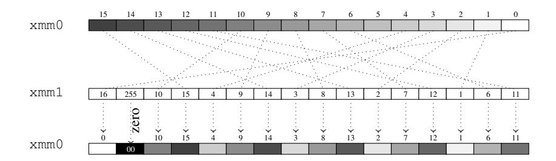

<span id="page-5-1"></span>Fig. 1. Result of "pshufb xmm0, xmm1": bytes in xmm0 are shuffled according to the content of xmm1. Only the low nibble of bytes in xmm1 are used as index: index 0x10=16 in the example translates to 0. When the byte index inside xmm1 ≥ 128 (*i.e.* the high bit of the byte is set, 255 on the example), the destination byte is zeroed.

Sbox implementation. Most lightweight block ciphers use Sboxes on GF(2<sup>4</sup> ), meaning that the Sbox is a table of 16 possible output values selected by the input. It is straightforward to implement such an operation on 16 nibbles, in parallel, using the pshufb instruction (see Figure [1\)](#page-5-1). The piece of code in Figure [2](#page-6-0) performs 16 parallel Sbox lookups on the 16 low nibbles of the r register (the high nibbles of each byte *r<sup>i</sup>* are supposed to be zero). The same technique can be used for any function from GF(2<sup>4</sup> ) to itself (including multiplications over the field), or even any function from GF(2<sup>4</sup> ) to GF(2<sup>8</sup> ) without any loss of parallelism since one xmm register is 16-byte long. Hence, the MixColumns-like multiplications can be stored inside 16-byte tables. More specifically, we can store the composition of the Sbox and the multiplication inside a single 16-element table, as explained in Section [2.](#page-1-0)

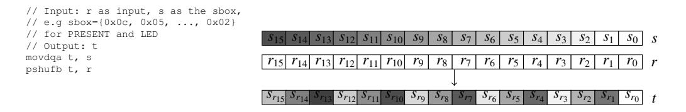

<span id="page-6-0"></span>**Fig. 2.** Using pshufb for 16 parallel Sbox lookups (high nibbles of bytes  $r_i$  are supposed to be zero).

**Extending to bigger tables.** pshufb can be utilized in order to compute a 4-bit to 8-bit function and it is possible to use the same technique for lookups inside tables with even bigger output size (but multiple of 8 bits). As presented on Figure 8 in Appendix D.1, if we consider, for instance, a 16-bit output table, we can pack this table inside two 128-bit xmm registers  $s^0$  and  $s^1$ . Then, the  $i^{th}$  entry of the table  $(0 \le i \le 15)$  is represented by the 16-bit value formed by  $s_i^0$  and  $s_i^1$ . Therefore, one can perform 16 parallel table lookups (with 16 output bits) by using two pshufb in a row, the first one getting the first half of the word in  $t^0$ , and the second one getting the second half in  $t^1$ .

Message packing and unpacking. Lightweight block ciphers states are 64-bit long, which means that two of them can be stored inside a 128-bit xmm register. However, the natural packing concatenating the two states side by side inside a register is not optimal. This is due to the fact that the algorithms we focus on use nibble-based permutations as part of their linear diffusion layer. Implementing such permutations by using shift or rotation operations can be costly. However, if the two states are packed by interleaving their nibbles as presented in Figure 3, it is possible to realize any nibble permutation by using pshufb, since they are now mapped to a byte permutation. The packing and unpacking are easily implemented using some shift and pshufb operations. Their cost, around ten cycles, is marginal compared to the encryption process. Using this packing, one can apply 32 Sbox lookups on the two states by using two pshufb, two pand masks and one 4-bit left shift psrlw to isolate low and high nibbles, and one pxor to merge the two results. As we will explain, this packing will be applied to Piccolo and PRESENT, but not to LED.

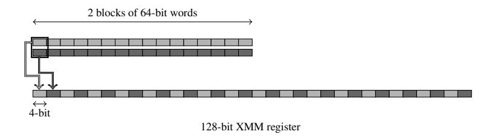

<span id="page-6-1"></span>Fig. 3. Packing for the 2-parallel vperm implementation of PRESENT and Piccolo. Each rectangle represents a 4-bit nibble.

Using AVX extensions. On the two last Intel CPU generations (Sandy and Ivy Bridge), a new instruction set has been added to extend Westmere's SSE 4.2. The 128-bit xmm registers have also been extended to 256-bit ymm registers, most of the instructions do however not operate on the full ymm registers, but only on their low 128-bit part. The full AVX extensions operating on ymm will be introduced on the forthcoming Haswell architecture with AVX2. All the presented encryption algorithms and their key schedules can still benefit from AVX on Sandy and Ivy Bridge by using the three operands form of the instructions, which saves registers backup. For instance, table lookups can be performed with one instruction "vpshufb t, s, r" instead of the two instructions "movdqa t, s; pshufb t, r".

#### **3.3** LED

The LED block cipher does not have a key schedule *per se* and since the decryption process is not more complex than the encryption one (the coefficients for the inverse diffusion matrix are the same as for the original matrix), we will only focus on the latter case. As explained previously, the 4-bit Sbox layer can be implemented in a few cycles by using pshufb, masks and shifts. The ShiftRows is also immediate with a pshufb by using the interleaved nibbles packing described

<sup>&</sup>lt;sup>9</sup> The expected throughput improvement would however vary accross the considered microarchitecures (mainly depending on the pipeline stage where register-to-register moves are performed, as well as the front end instruction decoder throughput).

above. However, the MixColumnsSerial step uses field multiplications with 11 different constants (4, 2, B...). Using as many as 11 lookup tables as multiplicative constants would be too costly as they would not leave room for the state and other operations inside the xmm registers. We could also use the fact that LED's MDS matrix is a power of a simpler sparse matrix, using less constants: the drawback is that raising to the power 4 would mean that the all operations would have to be applied four times.

We found out that there is a better implementation strategy for LED: we can use the table-based tricks to store the Sbox and MixColumnsSerial layers inside xmm register-based tables. Each column can be stored inside a  $2^4 \times 2 = 32$  bytes table (thus 2 xmm registers). Hence, 4 pairs of xmm registers will store the 4 tables needed to perform a round of LED, and lookups inside each table will be performed in a vectorized way for each nibble of the state using two pshufb as described in Section 3.2. The drawback is that the output words will be on different xmm registers, but the repacking of this step can be combined with the ShiftRows layer that shuffles the columns. We also use por masking to force the MSB of bytes that are not concerned with a lookup in a specific table. For each LED round, 8 pshufb instructions are used for the lookups, and 6 pshufb for the shifting layer (ShiftRows and repacking). This implementation strategy does not use the specific state packing from Figure 3 since shuffling for the ShiftRows and table repacking can be expressed using pshufb. However, one should notice that there is a small message packing cost for LED due to its row oriented message loading in the state: the input message is packed in a column wise fashion, and the ciphertext is packed back to row wise.

#### 3.4 PRESENT

pxor out, tmp

PRESENT can benefit from the vperm technique in both encryption and key schedule, since the latter uses Sbox lookups for subkeys computations.

**Encryption.** As explained in [20] and on Figure 4, PRESENT's pLayer permutation can be seen as the composition of two permutations: one acting on bits inside groups of 16 bits, and one shuffling the nibbles inside the 64-bit state. As for the table-based implementations of LED, it would be possible to compute a PRESENT round by using 4-bit to 16-bit tables that merge the Sbox and the first permutation of the pLayer acting on 16-bit groups. Nevertheless, we have found that this permutation can be implemented in a more efficient way by moving groups of bits (see the code on Figure 4 for more details). The second permutation, mapped to a byte permutation thanks to the message packing from Figure 3, can be expressed as one pshufb.

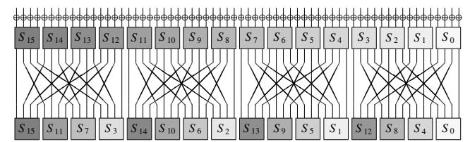

```
PlayerMask1 = {0xaa, 0x00, 0xaa, 0x00, 0xaa, 0x00, 0xaa, 0x00, 0xaa, 0x00, 0xaa, 0x00, 0xaa, 0x00, 0xaa, 0x00};
PlayerMask2 = \{0xcc, 0xcc, 0x00, 0x00, 0xcc, 0xcc, 0x00, 0x00, 0xcc, 0xcc, 0x00, 0x00, 0xcc, 0xcc, 0x00, 0x00\}
PlayerShuf = {0, 4, 8, 12, 1, 5, 9, 13, 2, 6, 10, 14, 3, 7, 11, 15};
bit_permute(in, out, mask, shift, tmp)
                                                                 PRESENT_pLayer(state)
                                                                    /* Permutation inside 16-bit groups
  movdga tmp, in
                                                                   /* (32-bit because of message packing) */
bit_permute(state, tmp1, PLayerMask1, 7, tmp2);
bit_permute(tmp1, state, PLayerMask2, 14, tmp2);
  psrldw tmp, shift
 pxor tmp, in pand tmp, mask
  movdqa out, tmp
                                                                    /\star Byte shuffling to complete the pLayer step \star/
 pslldw out, shift
                                                                   pshufb state, PLayerShuf
  pxor
         tmp, in
```

<span id="page-7-0"></span>**Fig. 4.** PRESENT's pLayer representation as two permutations.

**Key schedule.** A straightforward method for implementing PRESENT's keys schedules for 80-bit and 128-bit keys would be to store the master key inside one xmm register and compute all the subkeys by using rotations on the register (80-bit or 128-bit rotations depending on the key size), and extract the high part to get each subkey. However, the SSE instruction set lacks a rotation instruction. One could implement the rotation with two shifts and one XOR (and one AND for the 80-bit key case), but the shift instructions ps(r/1) ldq that operate on the entire 128-bit xmm register can only handle shift values that are multiples of 8 bits. Since PRESENT's key schedules use a 61-bit rotation, using such instructions is therefore too costly. Instead, we split the high and low key parts in two xmm register halves, which allows us to perform the 61-bit rotation with the quadword shift instructions ps(r/1) lq. It is possible to vectorize the

key schedule on two keys by using this trick, since the high parts of the two xmm registers can be used to store high and low keys of the second master key:

| keylow | xmm | xmm | xmm | xmm | xmm | xmm | xmm | xmm | xmm | xmm | xmm | xmm | xmm | xmm | xmm | xmm | xmm | xmm | xmm | xmm | xmm | xmm | xmm | xmm | xmm | xmm | xmm | xmm | xmm | xmm | xmm | xmm | xmm | xmm | xmm | xmm | xmm | xmm | xmm | xmm | xmm | xmm | xmm | xmm | xmm | xmm | xmm | xmm | xmm | xmm | xmm | xmm | xmm | xmm | xmm | xmm | xmm | xmm | xmm | xmm | xmm | xmm | xmm | xmm | xmm | xmm | xmm | xmm | xmm | xmm | xmm | xmm | xmm | xmm | xmm | xmm | xmm | xmm | xmm | xmm | xmm | xmm | xmm | xmm | xmm | xmm | xmm | xmm | xmm | xmm | xmm | xmm | xmm | xmm | xmm | xmm | xmm | xmm | xmm | xmm | xmm | xmm | xmm | xmm | xmm | xmm | xmm | xmm | xmm | xmm | xmm | xmm | xmm | xmm | xmm | xmm | xmm | xmm | xmm | xmm | xmm | xmm | xmm | xmm | xmm | xmm | xmm | xmm | xmm | xmm | xmm | xmm | xmm | xmm | xmm | xmm | xmm | xmm | xmm | xmm | xmm | xmm | xmm | xmm | xmm | xmm | xmm | xmm | xmm | xmm | xmm | xmm | xmm | xmm | xmm | xmm | xmm | xmm | xmm | xmm | xmm | xmm | xmm | xmm | xmm | xmm | xmm | xmm | xmm | xmm | xmm | xmm | xmm | xmm | xmm | xmm | xmm | xmm | xmm | xmm | xmm | xmm | xmm | xmm | xmm | xmm | xmm | xmm | xmm | xmm | xmm | xmm | xmm | xmm | xmm | xmm | xmm | xmm | xmm | xmm | xmm | xmm | xmm | xmm | xmm | xmm | xmm | xmm | xmm | xmm | xmm | xmm | xmm | xmm | xmm | xmm | xmm | xmm | xmm | xmm | xmm | xmm | xmm | xmm | xmm | xmm | xmm | xmm | xmm | xmm | xmm | xmm | xmm | xmm | xmm | xmm | xmm | xmm | xmm | xmm | xmm | xmm | xmm | xmm | xmm | xmm | xmm | xmm | xmm | xmm | xmm | xmm | xmm | xmm | xmm | xmm | xmm | xmm | xmm | xmm | xmm | xmm | xmm | xmm | xmm | xmm | xmm | xmm | xmm | xmm | xmm | xmm | xmm | xmm | xmm | xmm | xmm | xmm | xmm | xmm | xmm | xmm | xmm | xmm | xmm | xmm | xmm | xmm | xmm | xmm | xmm | xmm | xmm | xmm | xmm | xmm | xmm | xmm | xmm | xmm | xmm | xmm | xmm | xmm | xmm | xmm | xmm | xmm | xmm | xmm | xmm | xmm | xmm |

One should notice that since the PRESENT vperm encryption part uses packed messages, the scheduled keys that will be XORed to the cipher state must be packed in the same way. However, the 61-bit rotation is not compatible with the nibble interleaving packing from Figure 3, which means that the key schedule cannot be easily performed with this data packing. This implies that all the subkeys are to be packed after they have been generated and this explains the high key schedule packing cost reported in Appendix B.

#### 3.5 Piccolo

**Encryption.** Piccolo's F function uses a circulant MixColumns matrix over  $GF(2^4)$ , which allows using three 16 bytes tables, namely the Sbox, the Sbox composed with the multiplication by 2 in the field, and the Sbox composed with the multiplication by 3. Two states of Piccolo are stored in one xmm register with the nibbles interleaved as in Figure 3. It is then possible to implement one Piccolo round with two F functions in parallel inside the xmm register, by using three pshufb for the three multiplications lookups (by 1, 2, and 3). Three more pshufb on the results and three pxor are necessary in order to perform the columns mixing according to the circulant nature of the MixColumns matrix. The second layer of Sbox lookups in F can be performed with only one pshufb. Finally, Piccolo's Round Permutation is realized with a unique pshufb, since it is a byte permutation. The piece of code given in Appendix D.2 illustrates these steps (it is suited for the low nibbles of the state, almost the same code is used for the high nibbles).

**Key schedule.** Piccolo's key schedules for 80 and 128-bit keys do not really benefit from the vperm technique, since no Sbox lookup nor field multiplication over GF(2<sup>4</sup>) is performed. The same implementation tricks as presented in Section 2.4 are used in order to minimize the number of operations extracting the master key subparts. The main difference with the table-based implementations key schedule is that in the case of vperm, the process is performed inside xmm registers with SSE instructions: the main benefit being that one can vectorize the key schedule for two master keys, performing all the operations with the nibbles interleaved packing format from Figure 3. This results in an optimized key schedule for two keys that requires almost the same number of cycles than the table-based implementation on one key (see results in Appendix B).

## <span id="page-8-0"></span>4 Bitslice implementations

Bitslice implementations often lead to impressive performance results, as shown for example in [18] for PRESENT and Piccolo. However, we would like to also take into account the key schedule cost that might not be negligible in several typical lightweight cryptography use cases, such as short data or independent keys for different data blocks (see 5.2 for specific examples). As a consequence, exploring the bitslice possibilities for the various key schedules is of interest. In particular, many distinct keys might be used for the encryption and non-bitsliced key schedules might kill the parallelism gain if one does the packing for each round key (packing/unpacking takes comparable cycles as for encryption in most of the cases). This bitsliced key scheduling has never been studied for lightweight block ciphers to our knowledge, and we provide some results for the three ciphers in this section. One of our conclusions is that some key schedules can significantly slow down performances depending on the use case, which somehow moderates the results exposed in [18].

#### 4.1 The packing/unpacking

The choice of an appropriate packing inside the xmm registers is important for a bitslice implementation. For the LED bitsliced version with 16 parallel blocks, we use the packing described in Figure 9 in Appendix E.4. The packing for 32 parallel blocks is identical (see Figure 11). It is to be noted that the packing used for PRESENT is the same as for LED (such a packing can be obtained with a little more than one hundred of instructions). The (un)packing for Piccolo with 16-parallel blocks depicted in Figure 10 is very similar and requires a few more instructions. The reader can refer to [18] for details and code about this.

#### 4.2 The encryption

An important part of the encryption cost are the Sboxes, but the bitslice representation allows to compute many of them in parallel within a few clock cycles. We recall the logical instructions sequences proposed by [18] in Appendix E.1 for the LED and PRESENT Sbox, and in Appendix E.2 for the Piccolo Sbox.

The second part of an encryption round is the linear diffusion layer. For LED, the ShiftRows is simply performed with a few pshufb operations and the MixColumnsSerial are handled with the same method as in [\[17\]](#page-13-18) for AES or in [\[18\]](#page-13-12) for Piccolo diffusion matrices. In the case of LED, one also has to consider the XORing of round dependent constants during the AddConstants function, but this can be done easily by preparing in advance the constants in bitsliced form. For PRESENT, the bit permutation function pLayer can be performed by just reorganizing the positions of the 16-bit (or 32-bit) words in the xmm registers in bitsliced form. This can be executed efficiently [\[18\]](#page-13-12) using a few pshufd, punpck(h/l)dq and punpck(h/l)qdq instructions (see the pseudo-code in Appendix [E.3](#page-19-3) for 8-parallel data blocks). For Piccolo, the nibble position permutation (performed with a few pshufd instructions) and the matrix multiplication are similar to the ones in [\[18\]](#page-13-12).

### 4.3 The key schedule

As previously explained, the key schedule cost can be prohibitive in certain use cases when it comes to bitslicing. Thus, it seems reasonable to design bitsliced versions of the key schedule: this would leverage possible parallelism when many keys are processed, and this will prepare these keys in their packed format so that XORing them with the bitsliced state is straightforward. As a matter of consequence, the bitslice format for the key must be the same as for the data, or at least very similar so that the repacking cost is small. To minimize the key schedule cost, the packing is only performed once for the original keys, from which the subkeys are produced by shift and masking operations.

LED. No key schedule is defined for LED. Only the original secret key has to be packed in the data bitsliced format (one 64-bit key for LED-64 and two 64-bit keys for LED-128, other sizes use a sliding window requiring some additional shifts and masks).

Piccolo. The key schedule is very light: it basically consists in selecting 16-bit chunks from the original secret key and XORing them with round constants. Similarly to LED, our implementation first prepares the 16-bit chunks in bitsliced format once and for all. Thanks to the adapted packing, the two 16-bit key words appear in the same registers. For instance, when parallelism is of 16 blocks, 8 xmm registers are required to store the data and each round key, however, 4 are required only for storing one round-key in our case, because the other 4 contain only 0s, which can be discarded. This saves storage, and also key-addition operations by half. Another important observation is that even-number indexed chunks appear only in the left part of the round keys, and odd-number indexed chunks appear only in their right parts. Hence, we can pre-position these chunks only once, and the key schedule would involve only XORing the appropriate two chunks and the constants. To reduce the number of packing operations, we first pack all the original secret keys without re-positioning, and then do the pre-positioning for subkeys. These arrangements minimize the overall operations required by the key schedule.

PRESENT. The key schedule of PRESENT is not well suited for software, and even less suited when the key data has to be in bitsliced format. We divide the keys in two chunks (64 and 16 bits for PRESENT-80 and two 64-bit chunks for PRESENT-128) and prepare them in bitsliced format using the same packing as the data (each first chunks of the keys are packed together and each second chunks of the keys are packed together). The subkey to be XORed every round to the cipher internal state is located in the first chunk. The constants addition of the key schedule update function is simply handled by pre-formatting the constants in the bitsliced format and XORing them to the chunks (in fact only one chunk will be impacted if one does this step before the rotation). Then, the Sbox layer is performed by using the same Sbox function as for the internal cipher, just making sure with a mask that only a single Sbox is applied. Finally, the 61-bit rotation is separated in two parts, since only rotations of a multiple of 4 bits are easy to handle in bitslice packing. First, a 60-bit rotation is applied using several pshufb instructions (together with masking and XORs). Then, a single bit rotation is computed by changing the ordering of the xmm registers (the xmm registers containing the third Sbox bits will now contain the second Sbox bits, etc.). An adjustment is eventually required as some bits will go beyond the register limit and should switch to another one (this can be done with more shifts, masks and XORs). We provide the pseudo-code for the bitsliced key schedule implementation of PRESENT-80 in Appendix [E.5.](#page-20-1)

## 4.4 Discussions

To have a fair view on the workload of the key schedules, we minimized the number of packing operations in each implementation. The Table below, deduced from Table [2,](#page-16-1) shows the ratio of the key schedule (including the packing of the keys and subkeys generations) over one data block encryption (including plaintext packing, encryption, ciphertext unpacking) for 16 blocks parallelism. In other words, it represents the workload increase when taking key schedule into account. LED is affected only slightly, Piccolo by a quarter and PRESENT by more than half.

|                    | LED-64 | LED-128 | Piccolo-80 | Piccolo-128 | PRESENT-80 | PRESENT-128 |
|--------------------|--------|---------|------------|-------------|------------|-------------|
| Key schedule ratio | 3.3%   | 4.1%    | 20.2%      | 26.7%       | 55.2%      | 59.9%       |

# <span id="page-10-0"></span>5 Analyzing the performance

#### 5.1 Framework for performance evaluation

In order to compare various implementation techniques, we will consider that a server is communicating with *D* devices, each using a distinct key. For each device, the server has to encipher/decipher *B* 64-bit blocks of data. Moreover, we distinguish between the cases where the enciphered data comes from a parallel operating mode (like CTR) or a serial one (like CBC).

Now, we would like to take in account the fact that some implementations can be faster when some parallelism is possible (like bitslice technique). Let *t<sup>E</sup>* be the time required by the implementation to perform the encryption process (without the key schedule and without the packing/unpacking of the input/output data). Let *P<sup>E</sup>* denote the number of blocks that the implementation enciphers at a time in an encryption process (i.e. the number of blocks the implementation was intended to be used with). Similarly, let *tKS* be the time required by the implementation to perform the key schedule process (without the packing of the key data) and we naturally extend the notation to *PKS* .

We remark that ciphering a lower number of blocks than *P<sup>E</sup>* (resp. *PKS* ) will still require time *t<sup>E</sup>* (resp. *tKS* ). However, contrary to the encryption or key schedule process, the packing/unpacking time of the input/output data will strongly depend on the number of blocks involved. Therefore, if we denote by *tpack* the time required to pack one block of data, we get that packing *x* blocks simply requires *x* · *tpack*. Similarly, we denote *tunpack* the time required to unpack one block of data and unpacking *x* blocks simply requires *x* · *tunpack*. For the key schedule, *tpackKS* denotes the time to pack the key data, and packing *x* keys requires *x* · *tpackKS* (there is no need to unpack the key).

Finally, depending on *D* and *B*, the average time per block required to encrypt all *D* · *B* data blocks with a parallel operating mode is given by:

$$s_{parallel}(D, B) = \frac{\text{total encryption time}}{\text{number of data blocks enciphered}} = \frac{\left\lceil \frac{D \cdot B}{P_E} \right\rceil \cdot t_E + \left\lceil \frac{D}{P_{KS}} \right\rceil \cdot t_{KS} + D \cdot B \cdot (t_{pack} + t_{unpack}) + D \cdot t_{packKS}}{D \cdot B}$$
$$= \frac{\left\lceil \frac{D \cdot B}{P_E} \right\rceil \cdot t_E + \left\lceil \frac{D}{P_{KS}} \right\rceil \cdot t_{KS}}{D \cdot B} + t_{pack} + t_{unpack} + \frac{t_{packKS}}{B}.$$

However, when using a serial operating mode, the average time per block required to encrypt all *D* · *B* data blocks is given by:

$$s_{serial}(D, B) = \frac{\text{total encryption time}}{\text{number of data blocks enciphered}} = \frac{\left\lceil \frac{D}{P_E} \right\rceil \cdot B \cdot t_E + \left\lceil \frac{D}{P_{KS}} \right\rceil \cdot t_{KS} + D \cdot B \cdot (t_{pack} + t_{unpack}) + D \cdot t_{packKS}}{D \cdot B}$$
$$= \frac{\left\lceil \frac{D}{P_E} \right\rceil \cdot t_E}{D} + \frac{\left\lceil \frac{D}{P_{KS}} \right\rceil \cdot t_{KS}}{D \cdot B} + t_{pack} + t_{unpack} + \frac{t_{packKS}}{B}.$$

Since table-based implementations are usually not faster when offered the possibility to encipher several blocks at a time, we have that *P<sup>E</sup>* = *PKS* = 1 and *tpack* = *tunpack* = *tpackKS* = 0. Therefore, we conclude that for table-based implementations we have *<sup>s</sup>*(*D*, *<sup>B</sup>*) <sup>=</sup> *<sup>t</sup><sup>E</sup>* <sup>+</sup> *<sup>t</sup>KS* /*B*. On the opposite, for bitslice implementations, many data blocks will be enciphered in parallel. Note that vperm implementations will stand in between table-based and bitsliced versions, since a slight parallelism might increase the speed.

For previous bitslice implementations, since many blocks are assumed to be enciphered, the key schedule cost is usually omitted. However, in this article, we are interested in use cases where for example *B* can be a small value, like a single block. When *B* is small, one can see that the relative cost of the key schedule has to be taken in account.

## <span id="page-10-1"></span>5.2 The use cases

In order to have a clearer picture of the various scenarios that might be encountered in practice, we chose to study six distinct and meaningful use cases, depending on the value of *D*, *B* and the type of encryption operating mode. The six situations are given in Table [1](#page-11-1) together with some examples. One might argue that the first use case is not really interesting since with only few blocks and few devices the server would not be overloaded by the encryption/decryption work. However, latency can be an important criterion for many applications, and thus this use case checks the ability of the server to perform the cryptographic operation rapidly in software.

<span id="page-11-1"></span>Table 1. Six device/server use cases for lightweight encryption. For the practical measurements given in Table [2](#page-16-1) in Appendix [B,](#page-16-0) the notation "big/small" refers to more/less than 10 on average. For the experimentations in Table [2](#page-16-1) we used 1000 and 1.

|   | D     | B     | op.<br>mode | example                                                                                                                        | LED         | PRESENT     | Piccolo     |
|---|-------|-------|-------------|--------------------------------------------------------------------------------------------------------------------------------|-------------|-------------|-------------|
| 1 | small | small | -           | authentication / access control / secure traceability<br>(industrial assembly line)                                            | table/vperm | table/vperm | table/vperm |
| 2 | small | big   | parallel    | secure streaming communication (medical device<br>sending continuously sensitive data to a server,<br>tracking data, etc.)     | bitslice    | bitslice    | bitslice    |
| 3 | small | big   | serial      | secure serial communication                                                                                                    | table/vperm | table/vperm | table/vperm |
| 4 | big   | small | -           | multi-user authentication / secure traceability<br>(parallel industrial assembly lines)                                        | bitslice    | bitslice    | bitslice    |
| 5 | big   | big   | parallel    | multi-user secure streaming communication /<br>cloud computing / smart meters server / sensors<br>network / Internet of Things | bitslice    | bitslice    | bitslice    |
| 6 | big   | big   | serial      | multi-user secure serial communication                                                                                         | bitslice    | bitslice    | bitslice    |

# <span id="page-11-0"></span>6 Results and discussions

### 6.1 Implementation results

We have performed measurements of our three types of implementations for our three lightweight candidates. For more precision, the encryption times have been measured with a differential method, checking the consistency by verifying that the sum of the subparts is indeed equal to the entire encryption. Moreover, the measurements have been performed with the Turbo-Boost option *disabled*, in order to avoid any dynamic upscale of the processor's clock rate (this technology was implemented in certain processor versions since Intel Nehalem CPU generation). We observe that our bitslice implementations timings for Piccolo and PRESENT are consistent with the ones provided in [\[18\]](#page-13-12). Moreover, we greatly improve over the previously best known LED software implementations (about 57 c/B on Core i7-720QM [\[12\]](#page-13-5)), since our bitsliced version can reach speeds up to 12 c/B.

We give in Table [2](#page-16-1) in Appendix [B](#page-16-0) all the implementation results on Core i3-2367M (Sandy Bridge microarchitecture), XEON X5650 (Westmere microarchitecture) and Core 2 Duo P8600 (Core microarchitecture) processors. Using the measurements for *tE*, *tKS* , *tpack*, *tunpack*, *tpackKS* in our framework from Section [5,](#page-10-0) we can infer the performances for the 6 use cases.

#### 6.2 Comparing the implementations types and the ciphers

We can extract general tendencies from our measurements (see Table [1\)](#page-11-1) and one can remark that bitslice implementations will perform better than table-based or vperm ones except for use cases <sup>1</sup> and <sup>3</sup> , where only few devices are involved and data blocks can only be handled one at a time (bitslice implementations are naturally not fit for low latency and single block). More surprisingly, even for the use cases <sup>4</sup> and <sup>6</sup> , the gain of bitslice over table-based or vperm implementations is only clear for more than 10 devices.

For bitslice implementations, the cost of bitsliced form transposition on the server can be removed if the device also enciphers in bitsliced format. However, depending on the type of constrained device, the bitsliced algorithm might perform very poorly and the communication cost would increase if a serial mode is used or if a small amount of data is enciphered. Moreover, this solution would reduce the compatibility if other participants have to decipher in non-bitsliced form. The same compatibility issue is true for the keys in the server database, if one directly stores the keys or subkeys in bitsliced form. Finally, it is to be noted that bitsliced versions of the key schedule are especially interesting when all the keys are changed at the same time (i.e. fixed message length, messages synchronized in time).

We can see that from a software implementation perspective, all three ciphers perform reasonably well and are in the same speed range. Their internal round function is quite fit for x86 architectures. Table-based implementations are helped by the small 64-bit internal state size. The vperm implementations are fast thanks to the use of small 4-bit Sboxes, even though the linear diffusion layer can significantly impact the performance (which is the reason why TWINE has very good vperm implementation performances). For PRESENT the bit permutation layer is not really suited for software, the LED diffusion matrix has complex coefficients when not in its serial form, and the Piccolo *F* function with two layers of Sboxes reduces the possibilities of improvements. Concerning the key schedule, having a byte oriented or no key schedule is an advantage and bitwise rotation as in PRESENT is clearly difficult to handle in software.

Lots of research has been conducted on block cipher constructions and building a good cryptographic permutation is now well understood by the community. However, this is not the case of the key schedule and, usually, block ciphers designers try to build a key schedule very different from the round function, in a hope to avoid any unpredicted relation that might arise between the two components. However, we remark that this is in contradiction with efficient parallel implementations (like bitslice), since the packing of the key and the block cipher internal state must be (almost) the same (otherwise the repacking cost for every generated subkey would be prohibitive).

It is also to be noted that when analyzing ciphers software performances on the server side, it is more likely that decryption will have to be performed instead of encryption. We emphasize that the decryption process would have the same performances as our encryption implementations in the case of PRESENT. For LED and Piccolo, the inverse matrix for the diffusion layer will have more complex coefficients than the encryption one (only the non-serialized matrix for LED), but this shall not impact table-based implementations. However, we remark that this might have an impact on our best performing implementations for Piccolo and their decryption counterpart are likely to be somewhat slower than encryption mode.

### 6.3 Future implementations

The forthcoming Haswell architecture will introduce the new AVX2 instruction set. As discussed in Section [3.2,](#page-5-2) this extension will permit most of the existing SSE instructions to operate on the full 256-bit ymm registers. Apart from the three operands improvement already utilized in our vperm versions (Section [3.2\)](#page-5-2), the three types of implementations studied in this paper will probably gain from AVX2.

- Table-based implementations: with the new vgatherqq instruction, it is possible to perform 4 parallel table lookups by using 4 indexes inside the ymm quadwords. The resulting quadwords, after the lookups, are stored inside the ymm source register. Such a technique has been applied to the Grøstl hash function in [\[14\]](#page-13-19). When applied to lightweight block ciphers, 4 internal states can be stored inside a single ymm register. One can isolate the 8-bit indexes (if we use 8-bit tables) by using the vpshufb instruction, perform the 4 lookups in parallel, and merge the results by XORing it within an accumulator. As we can see, this will result in a 4-way vectorized block cipher. According to [\[15\]](#page-13-16), vgatherqq will have a latency of 16 cycles and a throughput of 10 cycles when data is in L1. A very rough estimation of the results on Haswell CPU is thus a 1.5 to 2 times improvement over the table-based implementations results provided in Appendix [B](#page-16-0) (since the mov instruction has a latency of 4 cycles in L1).
- vperm based implementations: extending the vperm technique to 256-bit ymm registers is straightforward, since one would store 4 states instead of 2 in one register. As for table-based, vperm implementations will be vectorized on 4 states providing a 2 times performance improvement for at least 4 parallel message blocks.
- Bitslice implementations: as for the vperm technique, bitslicing can naturally take advantage of the AVX2 extension to 256-bit registers by performing in the high 128-bit parts of ymm the exact same operations as on the low parts (if *<sup>N</sup>* message blocks are to be packed, *<sup>N</sup>*/2 are packed as previously presented in the low part of ymm, and *<sup>N</sup>*/2 are packed in the high part). This would roughly give a 2 times improvement for the performance (however requiring, as for vperm, twice more parallel message blocks).

# 7 Conclusion and future works

In this article, we have studied the software implementation of lightweight block ciphers on x86 architectures, with special focus on LED, Piccolo and PRESENT. We provided table-based, vperm and bitslice implementations and compared these three methods according to different common lightweight block ciphers use cases. We believe our work helps to get a more complete picture on lightweight block ciphers and we identified several possible future researches.

First, we remark that our cache latency model for table-based implementations predicts that new and future processors with an important amount of L2 cache might enable new fast primitives that utilize 16-bit Sboxes (which could then be implemented using big table lookups). Moreover, this remark might also improve current ciphers such as LED or PRESENT, by imagining a "Super-Sbox" type of implementation: two rounds can be seen as only composed of the applications of four parallel 16-bit Sboxes, and thus can be perfomed with only 4 table lookups.

Secondly, in the future, it would be interesting to use this kind of modeling to compare different implementation tradeoffs without tedious implementation for all of them (this would be also true for hardware implementations). Tablebased is a simple case we leave as open problem if more complex implementations can be studied the same way.

Finally, another future work is to study other recently proposed block cipher designs such as PRINCE [\[5\]](#page-13-20) or Zorro [\[10\]](#page-13-21), and the lightweight SPN-based hash functions such as PHOTON [\[11\]](#page-13-9) or SPONGENT [\[3\]](#page-13-10). The analysis of hash functions would be quite different since their internal state sizes (which vary with the intended output size) is bigger than 64 bits. Therefore, the amount of memory required to store the tables for table-based implementations is likely to be bigger, and vperm or bitslice implementations would be impacted as well since the packing would be more complex and would use more xmm registers.

# Acknowledgements

The authors would like to thank the anonymous referees for their helpful comments.

# References

- <span id="page-13-8"></span>1. Jean-Philippe Aumasson, Luca Henzen, Willi Meier, and María Naya-Plasencia. Quark: A Lightweight Hash. In Stefan Mangard and François-Xavier Standaert, editors, *CHES*, volume 6225 of *LNCS*, pages 1–15. Springer, 2010.
- <span id="page-13-2"></span>2. Guido Bertoni, Joan Daemen, Michaël Peeters, and Gilles Van Assche. Keccak specifications. Submission to NIST, 2008. <http://keccak.noekeon.org/Keccak-specifications.pdf>.
- <span id="page-13-10"></span>3. Andrey Bogdanov, Miroslav Knezevic, Gregor Leander, Deniz Toz, Kerem Varici, and Ingrid Verbauwhede. spongent: A Lightweight Hash Function. In Preneel and Takagi [\[21\]](#page-13-22), pages 312–325.
- <span id="page-13-3"></span>4. Andrey Bogdanov, Lars R. Knudsen, Gregor Leander, Christof Paar, Axel Poschmann, Matthew J. B. Robshaw, Yannick Seurin, and C. Vikkelsoe. PRESENT: An Ultra-Lightweight Block Cipher. In Pascal Paillier and Ingrid Verbauwhede, editors, *CHES*, volume 4727 of *LNCS*, pages 450–466. Springer, 2007.
- <span id="page-13-20"></span>5. Julia Borghoff, Anne Canteaut, Tim Güneysu, Elif Bilge Kavun, Miroslav Knezevic, Lars R. Knudsen, Gregor Leander, Ventzislav Nikov, Christof Paar, Christian Rechberger, Peter Rombouts, Søren S. Thomsen, and Tolga Yalçin. PRINCE - A Low-Latency Block Cipher for Pervasive Computing Applications - Extended Abstract. In Xiaoyun Wang and Kazue Sako, editors, *ASI-ACRYPT*, volume 7658 of *LNCS*, pages 208–225. Springer, 2012.
- <span id="page-13-4"></span>6. Christophe De Cannière, Orr Dunkelman, and Miroslav Knezevic. KATAN and KTANTAN - A Family of Small and Efficient Hardware-Oriented Block Ciphers. In Clavier and Gaj [\[8\]](#page-13-23), pages 272–288.
- <span id="page-13-17"></span>7. Anna Inn-Tung Chen, Ming-Shing Chen, Tien-Ren Chen, Chen-Mou Cheng, Jintai Ding, Eric Li-Hsiang Kuo, Frost Yu-Shuang Lee, and Bo-Yin Yang. SSE Implementation of Multivariate PKCs on Modern x86 CPUs. In Clavier and Gaj [\[8\]](#page-13-23), pages 33–48.
- <span id="page-13-23"></span>8. Christophe Clavier and Kris Gaj, editors. *Cryptographic Hardware and Embedded Systems - CHES 2009, 11th International Workshop, Lausanne, Switzerland, September 6-9, 2009, Proceedings*, volume 5747 of *LNCS*. Springer, 2009.
- <span id="page-13-0"></span>9. Joan Daemen and Vincent Rijmen. *The Design of Rijndael: AES - The Advanced Encryption Standard*. Springer, 2002.
- <span id="page-13-21"></span>10. Benoît Gérard, Vincent Grosso, María Naya-Plasencia, and François-Xavier Standaert. Block Ciphers that are Easier to Mask: How Far Can we Go? Cryptology ePrint Archive, Report 2013/369, 2013. <http://eprint.iacr.org/>.
- <span id="page-13-9"></span>11. Jian Guo, Thomas Peyrin, and Axel Poschmann. The PHOTON Family of Lightweight Hash Functions. In Phillip Rogaway, editor, *CRYPTO*, volume 6841 of *LNCS*, pages 222–239. Springer, 2011.
- <span id="page-13-5"></span>12. Jian Guo, Thomas Peyrin, Axel Poschmann, and Matthew J. B. Robshaw. The LED Block Cipher. In Preneel and Takagi [\[21\]](#page-13-22), pages 326–341.
- <span id="page-13-15"></span>13. Mike Hamburg. Accelerating AES with Vector Permute Instructions. In Clavier and Gaj [\[8\]](#page-13-23), pages 18–32.
- <span id="page-13-19"></span>14. Severin Holzer-Graf, Thomas Krinninger, Martin Andreas Pernull, Martin Schläffer, Peter Schwabe, David Seywald, and Wolfgang Wieser. Efficient Vector Implementations of AES-based Designs: A Case Study and New Implementations for Grøstl. In Ed Dawson, editor, *CT-RSA*, volume 7779 of *LNCS*, pages 145 – 161, 2013.
- <span id="page-13-16"></span>15. Intel. *Intel 64 and IA-32 Architectures Optimization Reference Manual*, 2013.
- <span id="page-13-11"></span>16. International Organization for Standardization. *ISO*/*IEC 29192-2:2012, Information technology – Security techniques – Lightweight cryptography – Part 2: Block ciphers*, 2012.
- <span id="page-13-18"></span>17. Emilia Käsper and Peter Schwabe. Faster and Timing-Attack Resistant AES-GCM. In Clavier and Gaj [\[8\]](#page-13-23), pages 1–17.
- <span id="page-13-12"></span>18. Seiichi Matsuda and Shiho Moriai. Lightweight Cryptography for the Cloud: Exploit the Power of Bitslice Implementation. In Emmanuel Prouff and Patrick Schaumont, editors, *CHES*, volume 7428 of *LNCS*, pages 408–425. Springer, 2012.
- <span id="page-13-13"></span>19. Dag Arne Osvik. Fast assembler implementations of the AES, 2003.
- <span id="page-13-14"></span>20. Axel Poschmann. Lightweight Cryptography - Cryptographic Engineering for a Pervasive World. Cryptology ePrint Archive, Report 2009/516, 2009. <http://eprint.iacr.org/>.
- <span id="page-13-22"></span>21. Bart Preneel and Tsuyoshi Takagi, editors. *Cryptographic Hardware and Embedded Systems - CHES 2011 - 13th International Workshop, Nara, Japan, September 28 - October 1, 2011. Proceedings*, volume 6917 of *LNCS*. Springer, 2011.
- <span id="page-13-6"></span>22. Kyoji Shibutani, Takanori Isobe, Harunaga Hiwatari, Atsushi Mitsuda, Toru Akishita, and Taizo Shirai. Piccolo: An Ultra-Lightweight Blockcipher. In Preneel and Takagi [\[21\]](#page-13-22), pages 342–357.
- <span id="page-13-7"></span>23. Tomoyasu Suzaki, Kazuhiko Minematsu, Sumio Morioka, and Eita Kobayashi. TWINE: A Lightweight Block Cipher for Multiple Platforms. In Lars R. Knudsen and Huapeng Wu, editors, *Selected Areas in Cryptography*, volume 7707 of *LNCS*, pages 339–354. Springer, 2012.
- <span id="page-13-1"></span>24. U.S. Department of Commerce, National Institute of Standards and Technology. *Secure Hash Standard (SHS) (Federal Information Processing Standards Publication 180-4)*, 2012. [http://csrc.nist.gov/publications/fips/fips180-4/](http://csrc.nist.gov/publications/fips/fips180-4/fips-180-4.pdf) [fips-180-4.pdf](http://csrc.nist.gov/publications/fips/fips180-4/fips-180-4.pdf).

### <span id="page-14-0"></span>A LED, PRESENT and Piccolo

#### A.1 LED

LED is a 64-bit block cipher that applies 32 rounds for the 64-bit key version and 48 rounds for bigger key sizes (up to 128 bits). The internal state is conceptually arranged in a  $(4 \times 4)$  grid where each nibble represents an element from  $GF(2^4)$  with the underlying polynomial for field multiplication given by  $X^4 + X + 1$ . A step is composed of 4 rounds and the key is XORed to the internal state before each step and also after the last step (there is no key schedule so if the key K is larger than 64 bits, the subkey material that is XORed every step is selected from K by a 64-bit sliding window).

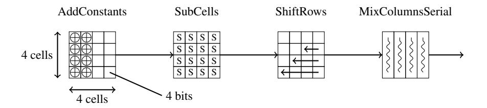

<span id="page-14-1"></span>Fig. 5. An overview of a single round of LED.

One round is composed of four steps: AddConstants, SubCells, ShiftRows and MixColumnsSerial as illustrated in Figure 5. The first function XORs a fixed constant to the first column and a round-dependent constant to the second column of the internal state. The SubCells function applies the 4-bit Sbox to every nibble of the state, the Sbox being the same as in PRESENT and given in Appendix E.1. The ShiftRows function just shifts left by *i* position all the nibbles located in row *i*. Finally, the linear function MixColumnsSerial applies a MDS diffusion matrix *M* to every column of the state independently, where

$$M = \begin{bmatrix} 4 & 1 & 2 & 2 \\ 8 & 6 & 5 & 6 \\ B & E & A & 9 \\ 2 & 2 & F & B \end{bmatrix} = \begin{bmatrix} 0 & 1 & 0 & 0 \\ 0 & 0 & 1 & 0 \\ 0 & 0 & 0 & 1 \\ 4 & 1 & 2 & 2 \end{bmatrix}^4$$

#### A.2 PRESENT

PRESENT is a 64-bit block cipher that applies 31 rounds for both its 80 and 128-bit key versions. One round is composed of three steps: addRoundKey, sBoxLayer and pLayer as illustrated in Figure 6. The first function just XORs the incoming subkey to the internal state and the sBoxLayer applies the 4-bit Sbox (given in Appendix E.1) to all nibbles. The pLayer function is a bit permutation where a bit located at position i is moved to position  $j = i \cdot 16 \mod 63$  when  $i \in \{0, \dots, 62\}$  and j = i if i = 63. After the last round, a last addRoundKey layer is performed.

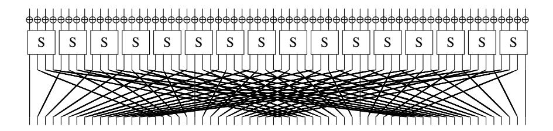

<span id="page-14-2"></span>**Fig. 6.** An overview of a single round of PRESENT.

The key schedule generating the subkeys is composed of four steps. Firstly, the subkey is obtained from the key state by extracting the 64 leftmost bits. Then, the key state is rotated to the left by 61 bit positions and the Sbox is applied to the leftmost nibble (the Sbox is also applied to the second-leftmost nibble for the 128-bit key version). Finally, a 5-bit round counter is XORed from bit positions 15 to 19 of the key state (from bit positions 62 to 66 for the 128-bit key version).

#### A.3 Piccolo

Piccolo is a 64-bit block cipher that applies respectively 25 and 31 rounds for the 80 and 128-bit key versions. The round function is a 4-line type-II generalized Feistel network variant, so one can view the internal state as four 16-bit branches. The three steps in one round are illustrated in Figure 7. The first function applies a transformation F to the first branch (resp. third branch) and XORs the result to the second branch (resp. fourth branch). Then two incoming 16-bit subkeys are XORed to the second and fourth branches respectively. Finally, a permutation on the nibble position is performed, where a nibble at position i is moved to position T[i] with T = [4, 5, 14, 15, 8, 9, 2, 3, 12, 13, 6, 7, 0, 1, 10, 11]. The 16-bit function F itself applies a 4-bit Sbox (given in Appendix E.2) to every nibble, then multiplies the current vector by an MDS diffusion matrix M, and applies again the 4-bit Sbox to every nibble. The matrix M is

$$M = \begin{bmatrix} 2 & 3 & 1 & 1 \\ 1 & 2 & 3 & 1 \\ 1 & 1 & 2 & 3 \\ 3 & 1 & 1 & 2 \end{bmatrix}$$

where each nibble represents an element from  $GF(2^4)$  with the underlying polynomial for field multiplication given by  $X^4+X+1$ . Finally, two 16-bit whitening keys are incorporated to the first and third branches respectively, at the beginning and at the end of the ciphering process.

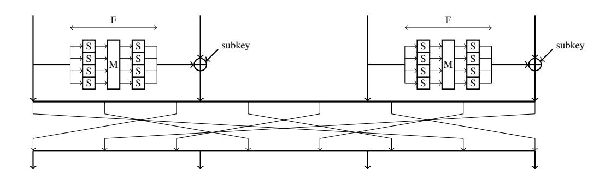

<span id="page-15-0"></span>Fig. 7. An overview of a single round of Piccolo.

The key schedule generating the subkeys simply selects two 16-bit chunks from the original key and XORs them with some round-dependent constants.

# <span id="page-16-0"></span>B Results tables

<span id="page-16-1"></span>Table 2. Implementation results for LED, PRESENT and Piccolo on various x86 architectures.

|             | Implementation results for LED, PRESENT and Piccolo on Core i3-2367M @ 1.4GHz    |              |                   |         |         |             |                            |               |   |   |                                                                    |   |     |     |
|-------------|----------------------------------------------------------------------------------|--------------|-------------------|---------|---------|-------------|----------------------------|---------------|---|---|--------------------------------------------------------------------|---|-----|-----|
| cipher      | implementation                                                                   | tE           | tKS               | PE      | PKS     | tpack       | tunpack                    | tpackKS       |   |   | use cases speed (cycles/byte)                                      |   |     |     |
|             | type                                                                             |              | (cycles) (cycles) |         |         |             | (cycles) (cycles) (cycles) |               | 1 | 2 | 3                                                                  | 4 | 5   | 6   |
|             | table                                                                            | 608          | 0                 | 1       | 1       | 0.0         | 0.0                        | 0.0           |   |   | 76.0 76.0 76.0 76.0 76.0 76.0                                      |   |     |     |
| LED-64      | vperm                                                                            | 560          | 0                 | 2       | 2       | 4.0         | 4.0                        | 4.0           |   |   | 71.5 36.0 71.0 36.5 36.0 36.0                                      |   |     |     |
|             | bitslice                                                                         | 2443         | 0                 | 16      | 16      | 5.1         | 6.3                        | 5.4           |   |   | 307.5 20.7 306.8 21.3 20.5 20.7                                    |   |     |     |
|             | bitslice                                                                         | 2604         | 0                 | 32      | 32      | 5.7         | 8.4                        | 5.8           |   |   | 328.0 12.2 327.3 12.9 11.9 12.2                                    |   |     |     |
|             | table                                                                            | 906          | 0                 | 1       | 1       | 0.0         | 0.0                        | 0.0           |   |   | 113.3 113.3 113.3 113.3 113.3 113.3                                |   |     |     |
| LED-128     | vperm<br>bitslice                                                                | 858<br>3671  | 0<br>0            | 2<br>16 | 2<br>16 | 4.0<br>5.1  | 4.0<br>6.6                 | 9.0<br>9.9    |   |   | 109.4 54.6 108.3 55.8 54.6 54.6<br>461.6 30.4 460.3 31.6 30.1 30.4 |   |     |     |
|             | bitslice                                                                         | 3967         | 0                 | 32      | 32      | 5.8         | 8.4                        | 11.9          |   |   | 499.1 17.6 497.7 19.1 17.3 17.6                                    |   |     |     |
|             | table                                                                            | 671          | 38                | 1       | 1       | 0.0         | 0.0                        | 0.0           |   |   | 88.6 83.9 83.9 88.6 83.9 83.9                                      |   |     |     |
| Piccolo-80  | vperm                                                                            | 512          | 55                | 2       | 2       | 6.0         | 4.5                        | 7.5           |   |   | 73.1 33.3 65.3 37.7 33.3 33.3                                      |   |     |     |
|             | bitslice                                                                         | 977          | 0                 | 16      | 16      | 5.4         | 6.9                        | 14.8          |   |   | 125.5 9.2 123.7 11.1                                               |   | 9.2 | 9.2 |
|             | table                                                                            | 829          | 57                | 1       | 1       | 0.0         | 0.0                        | 0.0           |   |   | 110.8 103.6 103.6 110.8 103.6 103.6                                |   |     |     |
| Piccolo-128 | vperm                                                                            | 644          | 55                | 2       | 2       | 9.0         | 2.0                        | 6.5           |   |   | 89.6 41.6 81.9 45.9 41.6 41.6                                      |   |     |     |
|             | bitslice                                                                         | 1196         | 0                 | 16      | 16      | 5.2         | 6.7                        | 23.1          |   |   | 153.9 10.9 151.0 13.8 10.8 10.9                                    |   |     |     |
|             | table                                                                            | 580          | 408               | 1       | 1       | 0.0         | 0.0                        | 0.0           |   |   | 123.5 72.6 72.6 123.5 72.6 72.6                                    |   |     |     |
| PRESENT-80  | vperm                                                                            | 540          | 350               | 2       | 2       | 6.5         | 3.5                        | 87.5          |   |   | 123.4 35.1 68.8 67.8 35.0 35.0                                     |   |     |     |
|             | bitslice                                                                         | 1333         | 706               | 8       | 8       | 9.0         | 8.3                        | 15.8          |   |   | 259.0 23.1 168.9 36.0 23.0 23.0                                    |   |     |     |
|             | bitslice                                                                         | 2038         | 1100              | 16      | 16      | 5.1         | 5.6                        | 7.4           |   |   | 394.5 17.5 256.2 27.0 17.3 17.4                                    |   |     |     |
|             | table                                                                            | 580          | 334               | 1       | 1       | 0.0         | 0.0                        | 0.0           |   |   | 114.3 72.5 72.5 114.3 72.5 72.5                                    |   |     |     |
| PRESENT-128 | vperm                                                                            | 540          | 296               | 2       | 2       | 6.5         | 3.5                        | 103.0         |   |   | 118.6 35.0 68.8 66.4 35.0 35.0                                     |   |     |     |
|             | bitslice<br>bitslice                                                             | 1313<br>2221 | 738<br>1286       | 8<br>16 | 8<br>16 | 9.4<br>5.3  | 8.5<br>5.8                 | 15.8<br>9.4   |   |   | 260.6 22.8 166.5 36.3 22.8 22.8<br>440.9 19.0 279.2 30.2 18.7 18.9 |   |     |     |
|             |                                                                                  |              |                   |         |         |             |                            |               |   |   |                                                                    |   |     |     |
|             | Implementation results for LED, PRESENT and Piccolo on XEON X5650 @ 2.67GHz      |              |                   |         |         |             |                            |               |   |   |                                                                    |   |     |     |
|             | table                                                                            | 567          | 0                 | 1       | 1       | 0.0         | 0.0                        | 0.0           |   |   | 70.9 70.9 70.9 70.9 70.9 70.9                                      |   |     |     |
| LED-64      | vperm<br>bitslice                                                                | 749<br>2445  | 0<br>0            | 2<br>16 | 2<br>16 | 5.0<br>5.0  | 5.0<br>6.3                 | 10.0<br>5.1   |   |   | 96.1 48.1 94.9 49.3 48.1 48.1<br>307.7 20.7 307.0 21.3 20.5 20.7   |   |     |     |
|             | bitslice                                                                         | 2846         | 0                 | 32      | 32      | 5.8         | 8.2                        | 6.0           |   |   | 358.2 13.1 357.5 13.9 12.9 13.1                                    |   |     |     |
|             | table                                                                            | 847          | 0                 | 1       | 1       | 0.0         | 0.0                        | 0.0           |   |   | 105.9 105.9 105.9 105.9 105.9 105.9                                |   |     |     |
|             | vperm                                                                            | 1058         | 0                 | 2       | 2       | 5.0         | 5.0                        | 18.5          |   |   | 135.8 67.4 133.5 69.7 67.4 67.4                                    |   |     |     |
| LED-128     | bitslice                                                                         | 3674         | 0                 | 16      | 16      | 5.0         | 6.3                        | 9.7           |   |   | 461.9 30.3 460.7 31.6 30.1 30.3                                    |   |     |     |
|             | bitslice                                                                         | 4306         | 0                 | 32      | 32      | 5.9         | 8.2                        | 12.2          |   |   | 541.5 19.0 540.0 20.5 18.6 19.0                                    |   |     |     |
|             | table                                                                            | 568          | 39                | 1       | 1       | 0.0         | 0.0                        | 0.0           |   |   | 75.9 71.0 71.0 75.9 71.0 71.0                                      |   |     |     |
| Piccolo-80  | vperm                                                                            | 580          | 47                | 2       | 2       | 2.5         | 7.0                        | 13.5          |   |   | 81.3 37.4 73.7 42.1 37.4 37.4                                      |   |     |     |
|             | bitslice                                                                         | 1038         | 0                 | 16      | 16      | 5.4         | 6.7                        | 14.4          |   |   | 133.1 9.7 131.3 11.5                                               |   | 9.6 | 9.7 |
|             | table                                                                            | 700          | 62                | 1       | 1       | 0.0         | 0.0                        | 0.0           |   |   | 95.3 87.5 87.5 95.3 87.5 87.5                                      |   |     |     |
| Piccolo-128 | vperm                                                                            | 724          | 77                | 2       | 2       | 10.5        | 7.0                        | 8.0           |   |   | 103.3 47.4 92.7 53.3 47.4 47.4                                     |   |     |     |
|             | bitslice                                                                         | 1400         | 0                 | 16      | 16      | 5.3         | 6.6                        | 22.8          |   |   | 179.3 12.5 176.5 15.4 12.4 12.5                                    |   |     |     |
|             | table                                                                            | 525          | 398               | 1       | 1       | 0.0         | 0.0                        | 0.0           |   |   | 115.4 65.7 65.7 115.4 65.7 65.7                                    |   |     |     |
| PRESENT-80  | vperm                                                                            | 650          | 441               | 2       | 2       | 6.0         | 5.5                        | 99.5          |   |   | 150.3 42.1 82.8 82.1 42.1 42.1                                     |   |     |     |
|             | bitslice<br>bitslice                                                             | 1360<br>2453 | 600<br>1437       | 8<br>16 | 8<br>16 | 9.5<br>5.0  | 9.0<br>6.0                 | 15.9<br>8.4   |   |   | 249.3 23.6 172.4 34.9 23.6 23.6<br>488.7 20.9 308.2 33.1 20.6 20.7 |   |     |     |
|             | table                                                                            | 525          | 304               | 1       | 1       | 0.0         | 0.0                        | 0.0           |   |   | 103.6 65.7 65.7 103.6 65.7 65.7                                    |   |     |     |
| PRESENT-128 | vperm                                                                            | 650          | 408               | 2       | 2       | 6.0         | 5.5                        | 152.5         |   |   | 152.8 42.1 82.8 86.6 42.1 42.1                                     |   |     |     |
|             | bitslice                                                                         | 1389         | 674               | 8       | 8       | 8.8         | 9.0                        | 16.0          |   |   | 262.1 24.0 175.9 36.5 23.9 23.9                                    |   |     |     |
|             | bitslice                                                                         | 2882         | 1888              | 16      | 16      | 5.3         | 5.9                        | 9.6           |   |   | 598.8 24.3 361.9 40.2 23.9 24.1                                    |   |     |     |
|             | Implementation results for LED, PRESENT and Piccolo on Core 2 Duo P8600 @ 2.4GHz |              |                   |         |         |             |                            |               |   |   |                                                                    |   |     |     |
|             | table                                                                            | 502          | 0                 | 1       | 1       | 0.0         | 0.0                        | 0.0           |   |   | 62.8 62.8 62.8 62.8 62.8 62.8                                      |   |     |     |
|             |                                                                                  |              |                   | 2       | 2       |             |                            |               |   |   | 94.9 47.4 94.4 47.9 47.4 47.4                                      |   |     |     |
|             | vperm                                                                            | 751          | 0                 |         |         | 2.0         | 2.0                        | 4.0           |   |   |                                                                    |   |     |     |
| LED-64      | bitslice                                                                         | 2880         | 0                 | 16      | 16      | 6.6         | 9.4                        | 6.6           |   |   | 362.8 24.7 362.0 25.5 24.5 24.7                                    |   |     |     |
|             | bitslice                                                                         | 3029         | 0                 | 32      | 32      | 6.3         | 10.3                       | 6.7           |   |   | 381.5 14.2 380.7 15.0 13.9 14.2                                    |   |     |     |
|             | table                                                                            | 748          | 0                 | 1       | 1       | 0.0         | 0.0                        | 0.0           |   |   | 93.5 93.5 93.5 93.5 93.5 93.5                                      |   |     |     |
|             | vperm                                                                            | 1091         | 0                 | 2       | 2       | 2.0         | 2.0                        | 25.0          |   |   | 140.0 68.7 136.9 71.8 68.7 68.7                                    |   |     |     |
| LED-128     | bitslice                                                                         | 4219         | 0                 | 16      | 16      | 6.5         | 9.5                        | 12.8          |   |   | 531.0 35.2 529.4 36.8 35.0 35.2                                    |   |     |     |
|             | bitslice                                                                         | 4521         | 0                 | 32      | 32      | 6.5         | 10.5                       | 13.4          |   |   | 568.9 20.2 567.3 21.9 19.8 20.2                                    |   |     |     |
|             | table                                                                            | 537          | 41                | 1       | 1       | 0.0         | 0.0                        | 0.0           |   |   | 72.3 67.1 67.1 72.3 67.1 67.1                                      |   |     |     |
| Piccolo-80  | vperm                                                                            | 594          | 44                | 2       | 2       | 4.0         | 5.0                        | 15.0          |   |   | 82.8 38.3 75.4 42.9 38.3 38.3                                      |   |     |     |
|             | bitslice                                                                         | 1100         | 0                 | 16      | 16      | 7.1         | 9.4                        | 16.9          |   |   | 141.7 10.7 139.6 12.8 10.7 10.7                                    |   |     |     |
|             | table                                                                            | 669          | 65                | 1       | 1       | 0.0         | 0.0                        | 0.0           |   |   | 91.8 83.6 83.6 91.8 83.6 83.6                                      |   |     |     |
|             | vperm                                                                            | 739          | 73                | 2       | 2       | 4.0         | 4.0                        | 8.0           |   |   | 103.5 47.2 93.4 52.8 47.2 47.2                                     |   |     |     |
|             | bitslice                                                                         | 1400         | 0                 | 16      | 16      | 6.3         | 9.4                        | 25.6          |   |   | 180.2 13.0 177.0 16.2 12.9 13.0                                    |   |     |     |
| Piccolo-128 | table                                                                            | 476          | 359               | 1       | 1       | 0.0         | 0.0                        | 0.0           |   |   | 104.4 59.5 59.5 104.4 59.5 59.5                                    |   |     |     |
| PRESENT-80  | vperm                                                                            | 651          | 384               | 2       | 2       | 8.5         | 4.0                        | 105.5         |   |   | 144.1 42.3 83.0 79.4 42.3 42.3                                     |   |     |     |
|             | bitslice                                                                         | 1446         | 731               | 8       | 8       | 11.0        | 11.1                       | 17.6          |   |   | 277.1 25.5 183.6 39.0 25.4 25.4                                    |   |     |     |
|             | bitslice                                                                         | 2438         | 1250              | 16      | 16      | 6.3         | 8.3                        | 10.0          |   |   | 464.1 21.2 306.7 32.1 20.9 21.0                                    |   |     |     |
|             | table                                                                            | 476          | 285               | 1       | 1       | 0.0         | 0.0                        | 0.0           |   |   | 95.1 59.5 59.5 95.1 59.5 59.5                                      |   |     |     |
| PRESENT-128 | vperm<br>bitslice                                                                | 652<br>1472  | 386<br>812        | 2<br>8  | 2<br>8  | 7.0<br>10.4 | 5.5<br>11.5                | 124.0<br>17.8 |   |   | 146.8 42.4 83.1 81.9 42.4 42.4<br>290.5 25.8 186.8 40.6 25.7 25.7  |   |     |     |

# C Table-based implementations

### <span id="page-17-0"></span>C.1 PRESENT

We give as example the pseudo-code of the computation of the first table T0 for the PRESENT round computation:

```
// Computation of table T0 for PRESENT
for(i = 0; i < 256; i++)
    t = (SB[(i & 0xf0) >> 4] << 4) | SB[i & 0x0f];
    T0[i] = ((t >> 0) & 0x01) << 0; T0[i] |= ((t >> 1) & 0x01) << 16;
    T0[i] |= ((t >> 2) & 0x01) << 32; T0[i] |= ((t >> 3) & 0x01) << 48;
    T0[i] |= ((t >> 4) & 0x01) << 1; T0[i] |= ((t >> 5) & 0x01) << 17;
    T0[i] |= ((t >> 6) & 0x01) << 33; T0[i] |= ((t >> 7) & 0x01) << 49;
```

Below is the pseudo-code of the 80-bit version of PRESENT key schedule (*keyH* being the 64 most significant bits of the master key and *keyL* the last 16 bits):

```
// Computation of the PRESENT 80-bit round key i+1
// Inputs: keyL and keyH two 64-bit words, round number i --- Outputs: updated keyL and keyH (round-key i+1)
keyH ^= Trctr[i]; t = keyH; keyH <<= 61; keyH |= (keyL << 45);
keyH |= (t >> 19); keyL = (t >> 3) & 0xffff; t = keyH >> 60;
keyH &= 0x0fffffffffffffff; t = Tsboxks[t]; keyH |= t;
```

### <span id="page-17-1"></span>C.2 Piccolo

We give below the pseudo-code in order to build one of the two tables T0 and T1 performing the first part of the *F* function of Piccolo (here T0 takes as input the two least significant 4-bit words of the considered 16-bit branch):

```
// Computation of table T0 for PICCOLO
for(i = 0; i < 256; i++)
     T0[i] = (SB[i & 0x0f] ^ SB[(i & 0xf0) >> 4]) << 12;
     T0[i] |= (SB[i & 0x0f] ^ xtime[SB[(i & 0xf0) >> 4]] ^ SB[(i & 0xf0) >> 4] ) << 8;
     T0[i] |= (xtime[SB[i & 0x0f]] ^ SB[(i & 0xf0) >> 4]);
     T0[i] |= (xtime[SB[i & 0x0f]] ^ SB[i & 0x0f] ^ xtime[SB[(i & 0xf0) >> 4]]) << 4;
```

Then we give the pseudo-code building one of the four tables T2, T3, T4 and T5 performing the second part of the *F* function:

```
// Computation of table T2 for PICCOLO
for(i = 0; i < 256; i++)
     T2[i] = (SB[i & 0x0f] | (SB[(i & 0xf0) >> 4] << 4)) << 16;
```

Finally, we provide the pseudo-code for the *i th* round computation of Piccolo (T0 and T1 being the two tables performing the first part of the *F* function, T2, T3, T4 and T5 being the four tables performing the second part of the *F* function, the two last lines performing the byte permutation and *roundKey*[*i*] being the *i th* round key):

```
// Computation of the PICCOLO round i
// Input: 64-bit state St, round number i --- Output: updated 64-bit state St
t0 = T0[St & 0xff] ^ T1[(St >> 8) & 0xff]; t1 = T0[(St >> 32) & 0xff] ^ T1[(St >> 40) & 0xff];
St ^= T2[t0 & 0xff] ^ T3[(t0 >> 8) & 0xff] ^ T4[t1 & 0xff] ^ T5[(t1 >> 8) & 0xff] ^ roundKey[i];
t0 = St & 0x00ff00ff00ff00ff; t1 = St & 0xff00ff00ff00ff00;
t0 = ((t0) >> 16) ^ ((t0) << (48)); t1 = ((t1) << 16) ^ ((t1) >> (48)); St = t0 ^ t1;
```

# D vperm implementations

### <span id="page-17-3"></span>D.1 Table lookups inside big tables using the vperm technique

Using multiple pshufb instructions to perform 4-bit input table lookups with outputs bigger than 8-bit.

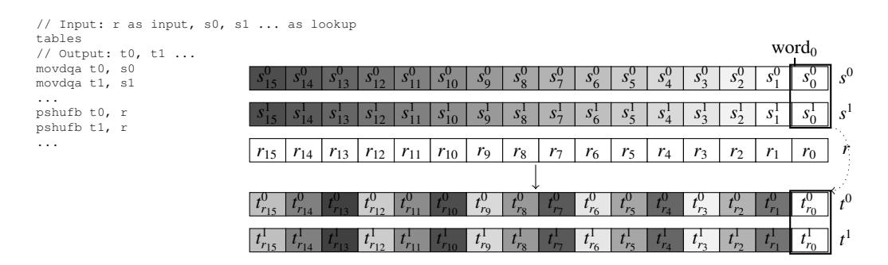

<span id="page-17-2"></span>Fig. 8. Lookups in tables of any output size using pshufb.

#### <span id="page-18-0"></span>D.2 Piccolo main encryption

Piccolo main encryption round on an interleaved state. It is suited for low nibbles (almost the same code is used for high nibbles).

```
/* Piccolo Sbox+1 multiplication (high and low nibbles) */
SBoxL={0x0e, 0x04, 0x0b, 0x02, 0x03, 0x08, 0x00, 0x09, 0x01, 0x0a, 0x07, 0x0f, 0x06, 0x0c, 0x05, 0x0d};
/* Piccolo Sbox+2 multiplication (high and low nibbles) */
TwoMulSBoxL[] = {0x0f, 0x08, 0x05, 0x04, 0x06, 0x03, 0x00, 0x01, 0x02, 0x07, 0x0e, 0x0d, 0x0c, 0x0b, 0x0a, 0x09};
  /* Piccolo Sbox+3 multiplication (high and low nibbles) */
ThreeMulSBoxL[] = \{0x01, 0x0c, 0x0e, 0x06, 0x05, 0x0b, 0x00, 0x08, 0x03, 0x0d, 0x09, 0x02, 0x0a, 0x07, 0x0f, 0x04\}; /* Piccolo's MixCoumns shuffles */
 \text{ThreeShuf} = \{1, \ 2, \ 3, \ 0, \ 0 \\ \text{xff}, \ 0 \\ \text{xff}, \ 0 \\ \text{xff}, \ 0 \\ \text{xff}, \ 9, \ 10, \ 11, \ 8, \ 0 \\ \text{xff}, \ 0 \\ \text{xff}, \ 0 \\ \text{xff}, \ 0 \\ \text{xff}\};
OneShufa = {2, 3, 0, 1, 0xff, 0xff, 0xff, 0xff, 10, 11, 8, 9, 0xff, 0xff, 0xff, 0xff, 0xff, 0xff, 0xff, 0xff, 0xff, 0xff, 0xff, 11, 8, 9, 10, 0xff, 0xff, 0xff, 0xff, 0xff, 0xff, 0xff, 0xff, 0xff, 0xff, 0xff, 0xff, 0xff, 0xff, 0xff, 0xff, 0xff, 0xff, 0xff, 0xff, 0xff, 0xff, 0xff, 0xff, 0xff, 0xff, 0xff, 0xff, 0xff, 0xff, 0xff, 0xff, 0xff, 0xff, 0xff, 0xff, 0xff, 0xff, 0xff, 0xff, 0xff, 0xff, 0xff, 0xff, 0xff, 0xff, 0xff, 0xff, 0xff, 0xff, 0xff, 0xff, 0xff, 0xff, 0xff, 0xff, 0xff, 0xff, 0xff, 0xff, 0xff, 0xff, 0xff, 0xff, 0xff, 0xff, 0xff, 0xff, 0xff, 0xff, 0xff, 0xff, 0xff, 0xff, 0xff, 0xff, 0xff, 0xff, 0xff, 0xff, 0xff, 0xff, 0xff, 0xff, 0xff, 0xff, 0xff, 0xff, 0xff, 0xff, 0xff, 0xff, 0xff, 0xff, 0xff, 0xff, 0xff, 0xff, 0xff, 0xff, 0xff, 0xff, 0xff, 0xff, 0xff, 0xff, 0xff, 0xff, 0xff, 0xff, 0xff, 0xff, 0xff, 0xff, 0xff, 0xff, 0xff, 0xff, 0xff, 0xff, 0xff, 0xff, 0xff, 0xff, 0xff, 0xff, 0xff, 0xff, 0xff, 0xff, 0xff, 0xff, 0xff, 0xff, 0xff, 0xff, 0xff, 0xff, 0xff, 0xff, 0xff, 0xff, 0xff, 0xff, 0xff, 0xff, 0xff, 0xff, 0xff, 0xff, 0xff, 0xff, 0xff, 0xff, 0xff, 0xff, 0xff, 0xff, 0xff, 0xff, 0xff, 0xff, 0xff, 0xff, 0xff, 0xff, 0xff, 0xff, 0xff, 0xff, 0xff, 0xff, 0xff, 0xff, 0xff, 0xff, 0xff, 0xff, 0xff, 0xff, 0xff, 0xff, 0xff, 0xff, 0xff, 0xff, 0xff, 0xff, 0xff, 0xff, 0xff, 0xff, 0xff, 0xff, 0xff, 0xff, 0xff, 0xff, 0xff, 0xff, 0xff, 0xff, 0xff, 0xff, 0xff, 0xff, 0xff, 0xff, 0xff, 0xff, 0xff, 0xff, 0xff, 0xff, 0xff, 0xff, 0xff, 0xff, 0xff, 0xff, 0xff, 0xff, 0xff, 0xff, 0xff, 0xff, 0xff, 0xff, 0xff, 0xff, 0xff, 0xff, 0xff, 0xff, 0xff, 0xff, 0xff, 0xff, 0xff, 0xff, 0xff, 0xff, 0xff, 0xff, 0xff, 0xff, 0xff, 0xff, 0xff, 0xff, 0xff, 0xff, 0xff, 0xff, 0xff, 0xff, 0xff, 0xff, 0xff, 0xff, 0xff, 0xff, 0xff, 0xff, 0xff, 0xff, 0xff, 0xff, 0xff, 0xff, 0xff, 0xff, 0xff, 0xff, 0xff, 0xff, 0xff, 0xff, 0xff, 0xff, 0xff, 0xff, 0xff, 0xff, 0xff, 0xff, 0xff, 0xff, 0xff, 0xff, 0xff, 0xff, 0xff, 0xff, 0xff, 0xff, 0xff, 0xff, 0xff, 0xff, 0xff, 0xff, 0xff, 0xff, 0xff, 0xff, 0xff, 0xff, 0xff, 0xff, 0xff, 0xff, 0xff, 0xff, 0xff, 0xff, 0xff, 0x
 /* Piccolo's Round Permutation */
RP[] = {4, 5, 14, 15, 8, 9, 2, 3, 12, 13, 6, 7, 0, 1, 10, 11};
 /\star Mask for selecting high and low nibbles \star/
AndMaskL={0x0f, 0x0f, 0x0f, 0x0f, 0x0f, 0x0f, 0x0f, 0x0f, 0x0f, 0x0f, 0x0f, 0x0f, 0x0f, 0x0f, 0x0f, 0x0f, 0x0f);
AndMaskH[] = {0xf0, 0xf0, 0xf0, 0xf0, 0xf0, 0xf0, 0xf0, 0xf0, 0xf0, 0xf0, 0xf0, 0xf0, 0xf0, 0xf0, 0xf0, 0xf0, 0xf0, 0xf0, 0xf0, 0xf0, 0xf0, 0xf0, 0xf0, 0xf0, 0xf0, 0xf0, 0xf0, 0xf0, 0xf0, 0xf0, 0xf0, 0xf0, 0xf0, 0xf0, 0xf0, 0xf0, 0xf0, 0xf0, 0xf0, 0xf0, 0xf0, 0xf0, 0xf0, 0xf0, 0xf0, 0xf0, 0xf0, 0xf0, 0xf0, 0xf0, 0xf0, 0xf0, 0xf0, 0xf0, 0xf0, 0xf0, 0xf0, 0xf0, 0xf0, 0xf0, 0xf0, 0xf0, 0xf0, 0xf0, 0xf0, 0xf0, 0xf0, 0xf0, 0xf0, 0xf0, 0xf0, 0xf0, 0xf0, 0xf0, 0xf0, 0xf0, 0xf0, 0xf0, 0xf0, 0xf0, 0xf0, 0xf0, 0xf0, 0xf0, 0xf0, 0xf0, 0xf0, 0xf0, 0xf0, 0xf0, 0xf0, 0xf0, 0xf0, 0xf0, 0xf0, 0xf0, 0xf0, 0xf0, 0xf0, 0xf0, 0xf0, 0xf0, 0xf0, 0xf0, 0xf0, 0xf0, 0xf0, 0xf0, 0xf0, 0xf0, 0xf0, 0xf0, 0xf0, 0xf0, 0xf0, 0xf0, 0xf0, 0xf0, 0xf0, 0xf0, 0xf0, 0xf0, 0xf0, 0xf0, 0xf0, 0xf0, 0xf0, 0xf0, 0xf0, 0xf0, 0xf0, 0xf0, 0xf0, 0xf0, 0xf0, 0xf0, 0xf0, 0xf0, 0xf0, 0xf0, 0xf0, 0xf0, 0xf0, 0xf0, 0xf0, 0xf0, 0xf0, 0xf0, 0xf0, 0xf0, 0xf0, 0xf0, 0xf0, 0xf0, 0xf0, 0xf0, 0xf0, 0xf0, 0xf0, 0xf0, 0xf0, 0xf0, 0xf0, 0xf0, 0xf0, 0xf0, 0xf0, 0xf0, 0xf0, 0xf0, 0xf0, 0xf0, 0xf0, 0xf0, 0xf0, 0xf0, 0xf0, 0xf0, 0xf0, 0xf0, 0xf0, 0xf0, 0xf0, 0xf0, 0xf0, 0xf0, 0xf0, 0xf0, 0xf0, 0xf0, 0xf0, 0xf0, 0xf0, 0xf0, 0xf0, 0xf0, 0xf0, 0xf0, 0xf0, 0xf0, 0xf0, 0xf0, 0xf0, 0xf0, 0xf0, 0xf0, 0xf0, 0xf0, 0xf0, 0xf0, 0xf0, 0xf0, 0xf0, 0xf0, 0xf0, 0xf0, 0xf0, 0xf0, 0xf0, 0xf0, 0xf0, 0xf0, 0xf0, 0xf0, 0xf0, 0xf0, 0xf0, 0xf0, 0xf0, 0xf0, 0xf0, 0xf0, 0xf0, 0xf0, 0xf0, 0xf0, 0xf0, 0xf0, 0xf0, 0xf0, 0xf0, 0xf0, 0xf0, 0xf0, 0xf0, 0xf0, 0xf0, 0xf0, 0xf0, 0xf0, 0xf0, 0xf0, 0xf0, 0xf0, 0xf0, 0xf0, 0xf0, 0xf0, 0xf0, 0xf0, 0xf0, 0xf0, 0xf0, 0xf0, 0xf0, 0xf0, 0xf0, 0xf0, 0xf0, 0xf0, 0xf0, 0xf0, 0xf0, 0xf0, 0xf0, 0xf0, 0xf0, 0xf0, 0xf0, 0xf0, 0xf0, 0xf0, 0xf0, 0xf0, 0xf0, 0xf0, 0xf0, 0xf0, 0xf0, 0xf0, 0xf0, 0xf0, 0xf0, 0xf0, 0xf0, 0xf0, 0xf0, 0xf0, 0xf0, 0xf0, 0xf0, 0xf0, 0xf0, 0xf0, 0xf0, 0xf0, 0xf0, 0xf0, 0xf0, 0xf0, 0xf0, 0xf0, 0xf0, 0xf0, 0xf0, 0xf0, 0xf0, 0xf0, 0xf0, 0xf0,
/* LOW NIBBLES */\
                                                                                                                                                                                                            /* Shuffle for MixColumns */
                                                                                                                                                                                                         pshufb tmp2, OneShufa
                                                                                                                                                                                                         pshufb tmp3, OneShufb pshufb tmp5, ThreeShuf
/* Get the state */\
movdqa tmp1, state
 /* Select the low nibbles */
                                                                                                                                                                                                           /* Merge */
                                                                                                                                                                                                pxor tmp2, tmp3
pxor tmp2, tmp4
pxor tmp2, tmp5
/* Second SBox lookup and result in tmp6 */
movdqa tmp6, SBoxL
pand
                            tmp1, AndMaskL
 /* Do the SBox+Multiplications */\
movdqa tmp2,SBoxL
movdqa tmp4, TwoMulSBoxL
movdqa tmp5, ThreeMulSBoxL
                                                                                                                                                                                                      pshufb tmp6, tmp2
pshufb tmp2, tmp1
pshufb tmp4, tmp1
                                                                                                                                                                                                       /\star Apply Round Permutation \star/
pshufb tmp5, tmp1
                                                                                                                                                                                                        pshufb state, RP
movdqa tmp3, tmp2
```

### **E** Bitslice implementations

#### <span id="page-18-1"></span>E.1 LED and PRESENT Sbox

LED and PRESENT use the same 4-bit Sbox, given by the following table in hexadecimal notation:  $S[X]=\{0 \times C, 0 \times 5, 0 \times 6, 0 \times B, 0 \times 9, 0 \times 0, 0 \times A, 0 \times D, 0 \times 3, 0 \times E, 0 \times F, 0 \times 8, 0 \times 4, 0 \times 7, 0 \times 1, 0 \times 2\}.$  We remark that the decomposition from [18] contains an error which we correct here. The Sbox can be decomposed into the following sequence of 20 two-operand instructions (r3 representing the most significant of the four bits):

```
// Bitslice implementation of LED or PRESENT Sbox
// Input: r3, r2, r1, r0, t --- Output: r3, r2, r1, r0
#define Sbox(r3, r2, r1, r0, t)
    r2 = XOR(r2,r1);    r3 = XOR(r3,r1);    t = r2;
```

#### <span id="page-18-2"></span>E.2 Piccolo Sbox

Piccolo uses a 4-bit Sbox that is given by the following table in hexadecimal notation:  $S[X]=\{0xE,0x4,0xB,0x2,0x3,0x8,0x0,0x9,0x1,0xA,0x7,0xF,0x6,0xC,0x5,0xD\}$ .

Using the decomposition from [18], this Sbox can be decomposed into the following sequence of 13 two-operand instructions (r3 representing the most significant of the four bits):

```
// Bitslice implementation of PICCOLO Sbox
// Input: r3, r2, r1, r0, t --- Output: r0, r1, r2, r3
#define Sbox(r3, r2, r1, r0, t)
    t = r1;
```

Note that the MSB/LSB ordering for the output is swapped, thus one has to adapt the implementation of Piccolo accordingly.

#### <span id="page-19-3"></span>E.3 PRESENT pLayer

We provide the pseudo-code for the 8-parallel bitslice implementation of the PRESENT pLayer.

```
// Bitslice implementation of pLayer for 8-parallel PRESENT
// Input: r3, r2, r1, r0, t --- Output: r3, r2, r1, r0
#define pLayer8 (r3, r2, r1, r0, t)
    mask = {0x0f, 0x0b, 0x07, 0x03, 0x0e, 0x0a, 0x06, 0x02, 0x0d, 0x09, 0x05, 0x01, 0x0c, 0x08, 0x04, 0x00};
    r0 = PSHUFB(r0,mask);
```

#### <span id="page-19-1"></span>E.4 Packing and unpacking

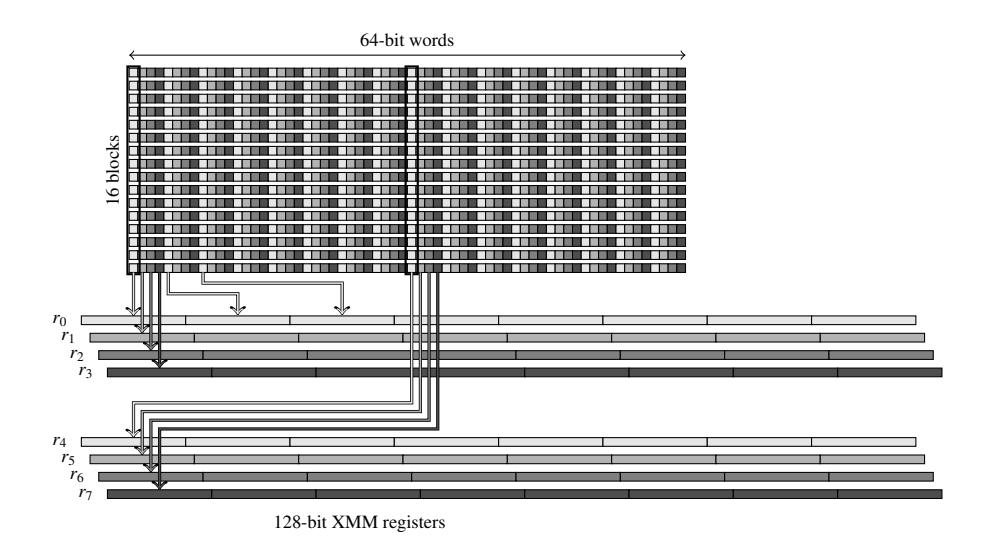

<span id="page-19-0"></span>Fig. 9. Packing for the 16-parallel bitslice implementation of LED and PRESENT. Each square represents a bit and the rectangles in the packed data stand for 16-bit words. White/light gray/dark gray/black cells denote respectively first/second/third/fourth bit of the Sboxes.

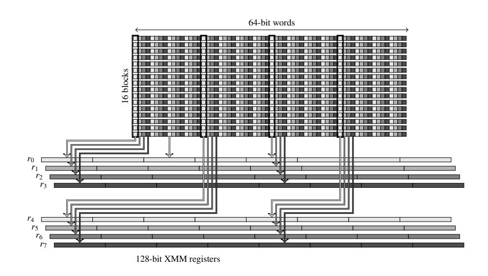

<span id="page-19-2"></span>**Fig. 10.** Packing for the 16-parallel bitslice implementation of Piccolo. Each square represents a bit and the rectangles in the packed data stand for 16-bit words. White/light gray/dark gray/black cells denote respectively first/second/third/fourth bit of the Sboxes.

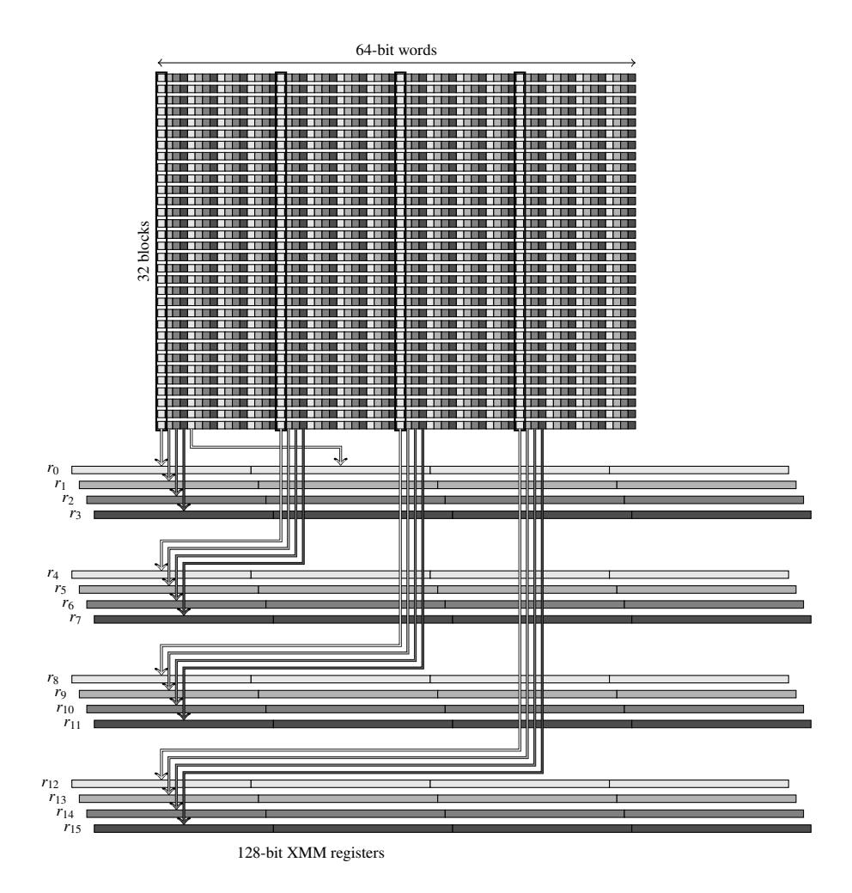

<span id="page-20-0"></span>**Fig. 11.** Packing for the 32-parallel bitslice implementation of LED. Each square represents a bit and the rectangles in the packed data stand for 32-bit words. White/light gray/dark gray/black cells denote respectively first/second/third/fourth bit of the Sboxes.

#### <span id="page-20-1"></span>E.5 Bitsliced key schedule for 8-parallel PRESENT

We provide the pseudo-code for the 8-parallel bitslice implementation of PRESENT-80 key schedule.

```
// Bitslice implementation of the key schedule for 8-parallel PRESENT-80
// Input: k0, k1, k2, k3, k4, k5, k6, k7, t0, t1, t2, t3, t, c0, c1, c2, c3 --- Output: k0, k1, k2, k3, k4, k5, k6, k7
#define KeySchedule_Bitsliced_Step(k0, k1, k2, k3, k4, k5, k6, k7, t0, t1, t2, t3, t, c0, c1, c2, c3) k0 = XOR(k0, c0); k1 = XOR(k1, c1); k2 = XOR(k2, c2); k3 = XOR(k3, c3); t1 = PSHIFTR(k1, 1); k1 = PSHUFB(k1,mask_key1); t2 = PSHUFB(k5,mask_key2); k1 = XOR(k1, t1 = PSHIFTR(k2, 1); k2 = PSHUFB(k2,mask_key1); t2 = PSHUFB(k6,mask_key2); k2 = XOR(k2, k2, k3, k4, k5, k6, k7, t0, t1, t2, t3, t, c0, c1, c2, c3)
                                                                                                                                                                                t2 = PSHUFB(k5, mask_key2);

t2 = PSHUFB(k6, mask_key2);

t2 = PSHUFB(k6, mask_key2);

t2 = PSHUFB(k7, mask_key2);
                                                                                                                                                                                                                                                                                  k1 = XOR(k1, +2):
                                                                                                                                                                                                                                                                                                                                                   k5 = t1:
                                                                                                                                                                                                                                                                                 k2 = XOR(k2, t2);

k3 = XOR(k3, t2);
                                                                                                                                                                                                                                                                                                                                                   k6 = t1;
                                                                                      k3 = PSHUFB(k3, mask_key1);
            t1 = PSHIFTR(k3, 1);
            t1 = k0:
                                                                                     k0 = PSHIFTR(k0, 4);
                                                                                                                                                                                 t2 = PSHIFTL(k4, 12);
                                                                                                                                                                                                                                                                                  k0 = XOR(k0, t2);
            t0 = k0; t1 = k1; t2 = k2; t3 = k3;
                                                                                                                                   Sbox(t1, t2, t3, t0, t);
            k0 = AND(k0, (0x0, 0xff, 0xff, 0xff, 0xff, 0xff, 0xff, 0xff, 0xff, 0xff, 0xff, 0xff, 0xff, 0xff, 0xff, 0xff, 0xff, 0xff));
           to = AND(t0, (0xff, 0x, 0, 0, 0, 0, 0, 0, 0, 0, 0, 0, 0, 0, 0,
            k2 = AND(k2, (0x0, 0xff, 0xff, 0xff, 0xff, 0xff, 0xff, 0xff, 0xff, 0xff, 0xff, 0xff, 0xff, 0xff, 0xff, 0xff, 0xff, 0xff, 0xff, 0xff, 0xff, 0xff, 0xff, 0xff, 0xff, 0xff, 0xff, 0xff, 0xff, 0xff, 0xff, 0xff, 0xff, 0xff, 0xff, 0xff, 0xff, 0xff, 0xff, 0xff, 0xff, 0xff, 0xff, 0xff, 0xff, 0xff, 0xff, 0xff, 0xff, 0xff, 0xff, 0xff, 0xff, 0xff, 0xff, 0xff, 0xff, 0xff, 0xff, 0xff, 0xff, 0xff, 0xff, 0xff, 0xff, 0xff, 0xff, 0xff, 0xff, 0xff, 0xff, 0xff, 0xff, 0xff, 0xff, 0xff, 0xff, 0xff, 0xff, 0xff, 0xff, 0xff, 0xff, 0xff, 0xff, 0xff, 0xff, 0xff, 0xff, 0xff, 0xff, 0xff, 0xff, 0xff, 0xff, 0xff, 0xff, 0xff, 0xff, 0xff, 0xff, 0xff, 0xff, 0xff, 0xff, 0xff, 0xff, 0xff, 0xff, 0xff, 0xff, 0xff, 0xff, 0xff, 0xff, 0xff, 0xff, 0xff, 0xff, 0xff, 0xff, 0xff, 0xff, 0xff, 0xff, 0xff, 0xff, 0xff, 0xff, 0xff, 0xff, 0xff, 0xff, 0xff, 0xff, 0xff, 0xff, 0xff, 0xff, 0xff, 0xff, 0xff, 0xff, 0xff, 0xff, 0xff, 0xff, 0xff, 0xff, 0xff, 0xff, 0xff, 0xff, 0xff, 0xff, 0xff, 0xff, 0xff, 0xff, 0xff, 0xff, 0xff, 0xff, 0xff, 0xff, 0xff, 0xff, 0xff, 0xff, 0xff, 0xff, 0xff, 0xff, 0xff, 0xff, 0xff, 0xff, 0xff, 0xff, 0xff, 0xff, 0xff, 0xff, 0xff, 0xff, 0xff, 0xff, 0xff, 0xff, 0xff, 0xff, 0xff, 0xff, 0xff, 0xff, 0xff, 0xff, 0xff, 0xff, 0xff, 0xff, 0xff, 0xff, 0xff, 0xff, 0xff, 0xff, 0xff, 0xff, 0xff, 0xff, 0xff, 0xff, 0xff, 0xff, 0xff, 0xff, 0xff, 0xff, 0xff, 0xff, 0xff, 0xff, 0xff, 0xff, 0xff, 0xff, 0xff, 0xff, 0xff, 0xff, 0xff, 0xff, 0xff, 0xff, 0xff, 0xff, 0xff, 0xff, 0xff, 0xff, 0xff, 0xff, 0xff, 0xff, 0xff, 0xff, 0xff, 0xff, 0xff, 0xff, 0xff, 0xff, 0xff, 0xff, 0xff, 0xff, 0xff, 0xff, 0xff, 0xff, 0xff, 0xff, 0xff, 0xff, 0xff, 0xff, 0xff, 0xff, 0xff, 0xff, 0xff, 0xff, 0xff, 0xff, 0xff, 0xff, 0xff, 0xff, 0xff, 0xff, 0xff, 0xff, 0xff, 0xff, 0xff, 0xff, 0xff, 0xff, 0xff, 0xff, 0xff, 0xff, 0xff, 0xff, 0xff, 0xff, 0xff, 0xff, 0xff, 0xff, 0xff, 0xff, 0xff, 0xff, 0xff, 0xff, 0xff, 0xff, 0xff, 0xff, 0xff, 0xff, 0xff, 0xff, 0xff, 0xff, 0xff, 0xff, 0xff, 0xff, 0xff, 0xff, 0xff, 0xff, 0xff, 0xff, 0xff, 0xff, 0xff, 0xff, 0xff, 0xff, 0xff, 0xff, 0xff, 0xff, 0xff, 0xff,
            t2 = AND(t2, (0xff, 0, 0, 0, 0, 0, 0, 0, 0, 0, 0, 0, 0, 0,
            t3 = AND(t3, (0xff, 0, 0, 0, 0, 0, 0, 0, 0, 0, 0, 0, 0, 0,
                                                                                                                                                                                                                                               k3 = XOR(k3, t3);
            t0 = k0; t1 = k4; k0 = k1; k4 = k5; k1 = k2; k5 = k6;
                                                                                                                                                                                                       k2 = k3; k6 = k7; k3 = t0; k7 = t1;
```