#### **SNARKs for C:**

# Verifying Program Executions Succinctly and in Zero Knowledge

(extended version)

Eli Ben-Sasson<sup>1</sup>, Alessandro Chiesa<sup>2</sup>, Daniel Genkin<sup>2</sup>, Eran Tromer<sup>3</sup> and Madars Virza<sup>2</sup>

Technion, {eli,danielg3}@cs.technion.ac.il

October 7, 2013

#### **Abstract**

An argument system for NP is a proof system that allows efficient verification of NP statements, given proofs produced by an untrusted yet computationally-bounded prover. Such a system is non-interactive and publicly-verifiable if, after a trusted party publishes a proving key and a verification key, anyone can use the proving key to generate non-interactive proofs for adaptively-chosen NP statements, and proofs can be verified by anyone by using the verification key.

We present an implementation of a publicly-verifiable non-interactive argument system for NP. The system, moreover, is a zero-knowledge proof-of-knowledge. It directly proves correct executions of programs on TinyRAM, a random-access machine tailored for efficient verification of nondeterministic computations. Given a program P and time bound T, the system allows for proving correct execution of P, on any input x, for up to T steps, after a one-time setup requiring  $\tilde{O}(|P| \cdot T)$  cryptographic operations. An honest prover requires  $\tilde{O}(|P| \cdot T)$  cryptographic operations to generate such a proof, while proof verification can be performed with only O(|x|) cryptographic operations. This system can be used to prove the correct execution of C programs, using our TinyRAM port of the GCC compiler.

This yields a zero-knowledge Succinct Non-interactive ARgument of Knowledge (zk-SNARK) for program executions in the preprocessing model — a powerful solution for delegating NP computations, with several features not achieved by previously-implemented primitives.

Our approach builds on recent theoretical progress in the area. We present efficiency improvements and implementations of two main ingredients:

- 1. Given a C program, we produce a circuit whose satisfiability encodes the correctness of execution of the program. Leveraging nondeterminism, the generated circuit's size is merely quasilinear in the size of the computation. In particular, we efficiently handle arbitrary and data-dependent loops, control flow, and memory accesses. This is in contrast with existing "circuit generators", which in the general case produce circuits of quadratic size.
- 2. Given a linear PCP for verifying satisfiability of circuits, we produce a corresponding SNARK. We construct such a linear PCP (which, moreover, is zero-knowledge and very efficient) by building on and improving on recent work on quadratic arithmetic programs.

Keywords: computationally-sound proofs, succinct arguments, zero-knowledge, delegation of computation

## Contents

| 1 | Introduction                                                                            | 3  |
|---|-----------------------------------------------------------------------------------------|----|
|   | 1.1<br>Succinct Verification in the Preprocessing Model<br>                             | 3  |
|   | 1.2<br>Approach Motivation<br>                                                          | 4  |
|   | 1.3<br>Contributions<br>                                                                | 5  |
|   | 1.4<br>Roadmap<br>                                                                      | 6  |
| 2 | From Correctness of Program Execution to Circuit Satisfiability                         | 8  |
|   | TinyRAM<br>2.1<br>The<br>Architecture                                                   | 8  |
|   | TinyRAM<br>2.2<br>A Compiler from C to<br>                                              | 10 |
|   | 2.3<br>An Efficient Reduction from<br>TinyRAM<br>to Circuit Satisfiability              | 14 |
| 3 | Verifying Circuit Satisfiability via Linear PCPs                                        | 21 |
|   | 3.1<br>A Transformation from Any Linear PCP                                             | 21 |
|   | 3.2<br>An Efficient Linear PCP<br>                                                      | 24 |
|   | 3.3<br>Performance                                                                      | 25 |
| 4 | System Evaluation                                                                       | 28 |
|   | 4.1<br>System Overview<br>                                                              | 28 |
|   | 4.2<br>System Performance<br>                                                           | 29 |
|   | 4.3<br>Performance for Rectilinear TSP Example                                          | 31 |
|   | 4.4<br>Further Optimizations                                                            | 32 |
| 5 | Extensions                                                                              | 33 |
|   | Acknowledgments                                                                         | 34 |
| A | Definition of Zero-Knowledge SNARKs                                                     | 35 |
| B | Summary of Theoretical Work on Succinct Verification                                    | 37 |
|   |                                                                                         |    |
| C | Prior Implementation Work                                                               | 38 |
|   | C.1<br>Prior Implementations of Proof Systems for Verifiably Delegating Computation<br> | 38 |
|   | C.2<br>Prior Implementations of Circuit Generators                                      | 39 |
| D | Definition of Linear PCPs                                                               | 40 |
| E | An Efficient HVZK Linear PCP                                                            | 42 |
|   | E.1<br>The Construction<br>                                                             | 43 |
|   | E.2<br>Computational Complexity of the Construction<br>                                 | 45 |
| F | Examples Used in Section 2.2                                                            | 48 |
|   | References                                                                              | 49 |
|   |                                                                                         |    |

### <span id="page-2-0"></span>1 Introduction

Proof systems for NP let an untrusted prover convince a verifier that " $x \in L$ " where L is some fixed NP-complete language. Proof systems for NP that satisfy the zero knowledge and proof of knowledge properties are a powerful tool that enables a party to prove that he or she "knows" a secret satisfying certain properties, without revealing anything about the secret itself. Such proofs are important building blocks of many cryptographic tools, including secure multiparty computation [GMW87, BGW88], group signatures [BW06, Gro06], malleable proof systems [CKLM12], anonymous credentials [BCKL08], delegatable credentials [BCC+09], electronic voting [KMO01, Gro05, Lip11], and many others. Known constructions of zero-knowledge proofs of knowledge are practical only when proving statements of certain form, which avoid generic NP reductions (e.g., proving pairing-product equations [Gro06]). Obtaining implementations that are both generic and efficient in practice is a long-standing goal in cryptography [BBK+09, ABB+12].

Due to differences in computational power among parties, many applications also require *succinct verification*: the verifier is able to check a nondeterministic polynomial-time computation in time that is much shorter than the time required to run the computation when given a valid NP witness. For instance, this is the case when a weak client wishes to *outsource* (or *delegate*) a computation to an untrusted worker. The additional requirement of succinct verification has still not been achieved in practice in its full generality, despite recent theoretical and practical progress.

Furthermore, a difficulty that arises when studying the efficiency of proofs for *arbitrary* NP statements is the problem of *representation*. Proof systems are typically designed for inconvenient NP-complete languages such as circuit satisfiability or algebraic constraint satisfaction problems, while in practice, many of the problem statements we are interested in proving are easiest (and more efficient) to express via algorithms written in a high-level programming language. Modern compilers can efficiently transform these algorithms into a program to be executed on a random-access machine (RAM) [CR72, AV77]. Therefore, we seek proof systems that efficiently support NP statements expressed as the correct execution of a RAM program.

#### <span id="page-2-1"></span>1.1 Succinct Verification in the Preprocessing Model

There has been a lot of work on the problem of how to enable a verifier to succinctly verify long computations. Depending on the model, the functionality, and the security notion, different constructions are known. See Appendix B for a brief summary of prior theoretical work in this area.

Many constructions achieving some form of succinct verification are only computationally sound: their security is based on cryptographic assumptions, and therefore are secure only against bounded-size provers. Computational soundness seems inherent in many of these cases [BHZ87, GH98, GVW02, Wee05]. Proofs (whether interactive or not) that are only computationally sound are also known as *arguments* [BCC88].

In this work we seek non-interactive succinct verification. We make two concessions: soundness is computational, and the proofs are in the *preprocessing model* which relies on an expensive but reusable key generation (discussed below). Thus, we investigate efficient implementations of *succinct non-interactive arguments (SNARGs) in the preprocessing model*. We focus on the *publicly-verifiable* case, where a non-interactive proof can be (succinctly) verified by anyone.

For simplicity, we start by introducing this cryptographic primitive for circuit satisfiability: the *circuit satisfaction problem* of a circuit  $C: \{0,1\}^n \times \{0,1\}^h \to \{0,1\}$  is the relation  $\mathcal{R}_C = \{(x,a) \in \{0,1\}^n \times \{0,1\}^h : C(x,a) = 0\}$ ; its language is  $\mathcal{L}_C = \{x \in \{0,1\}^n : \exists a \in \{0,1\}^h, C(x,a) = 0\}$ .

A *publicly-verifiable preprocessing SNARG* (or, for brevity in this paper, simply *SNARG*) is a triple of algorithms (G, P, V), respectively called *key generator*, *prover*, and *verifier*, working as follows. The (probabilistic) key generator G, given a security parameter  $\lambda$  and circuit  $C: \{0,1\}^n \times \{0,1\}^h \to \{0,1\}$ ,

outputs a proving key  $\sigma$  and a verification key  $\tau$ ; these are the system's public parameters, which need to be generated only once per circuit. After that, anyone can use the proving key  $\sigma$  to generate non-interactive proofs for the language  $\mathcal{L}_C$ , and anyone can use the verification key  $\tau$  to check these proofs. Namely, given  $\sigma$  and any  $(x,a) \in \mathcal{R}_C$ , the honest prover  $P(\sigma,x,a)$  produces a proof  $\pi$  attesting that  $x \in \mathcal{L}_C$ ; the verifier  $V(\tau,x,\pi)$  checks that  $\pi$  is a valid proof for  $x \in \mathcal{L}_C$ .

The efficiency requirements are as follows:

- running the generator G on input  $(1^{\lambda}, C)$  requires poly(|C|) cryptographic operations;
- $\bullet$  running the prover P on input  $(\sigma, x, a)$  also requires  $\operatorname{poly}(|C|)$  cryptographic operations; but
- running the verifier V on input  $(\tau, x, \pi)$  only requires poly(|x|) cryptographic operations; and
- an honestly-generated proof has size  $poly(\lambda)$ .

We require (adaptive) computational soundness: for every polynomial-size prover  $P^*$ , constant c>0, large enough security parameter  $\lambda\in\mathbb{N}$ , and circuit  $C\colon\{0,1\}^n\times\{0,1\}^h\to\{0,1\}$  of size  $\lambda^c$ , letting  $(\sigma,\tau)\leftarrow G(1^\lambda,C)$ , if  $P^*(\sigma,\tau)$  outputs an adaptively-chosen  $(x,\pi)$  such that there is no a for which  $(x,a)\in\mathcal{R}_C$  then  $V(\tau,x,\pi)$  rejects (except with negligible probability over G's randomness).

If a SNARG satisfies a certain natural proof-of-knowledge property, we call it a *SNARG of knowledge* (SNARK). If it also satisfies a certain natural zero-knowledge property, we call it a *zero-knowledge SNARK* (zk-SNARK). See Appendix A for definitions, and Figures 14 to 15 on page 35 for diagrams.

## <span id="page-3-0"></span>1.2 Approach Motivation

It would be wonderful to have efficient and generic implementations of SNARGs without any expensive preprocessing. (I.e., have the generator G run in  $\operatorname{poly}(\lambda)$  instead of  $\operatorname{poly}(|C|)$  cryptographic operations). The two known approaches to constructing such SNARGs are Micali's "computationally-sound proofs" [Mic00], and the bootstrapping techniques of Bitansky et al. [BCCT13]. Algorithmically, both are complex constructions: the former requires probabilistically-checkable proofs (PCPs) [BFLS91] (which remain concretely expensive despite recent advances [BGH+05, BS08, Din07, MR08, BCGT13b]), and the latter uses recursive proof-composition which adds a (quasilinear yet) concretely large overhead.<sup>4</sup>

Thus, it seems wise to first investigate efficient implementations of SNARGs in the preprocessing model, which is a less demanding model because it allows G to conduct a one-time expensive computation "as a setup phase". Despite the expensive preprocessing, this model is potentially useful for many applications: while the generator G does require a lot of work to set up the system's public parameters (which only depend on the given circuit G but not the input to G), this work can be subsequently amortized over many succinct proof verifications (where each proof is with respect to a new, adaptively-chosen, input to G).

In this work we focus on the preprocessing model, due to the simpler and tighter constructions known in it. Recent works [Gro10a, Lip12, GGPR13, BCI $^+$ 13] constructed zk-SNARKs based on knowledge-of-exponent assumptions [Dam92, HT98, BP04] in bilinear groups, and all of these constructions achieved the attractive feature of having proofs consisting of only O(1) group elements and of having verification via simple arithmetic circuits that are linear in the size of the input for the circuit.

In this vein, Bitansky et al. [BCI<sup>+</sup>13] gave a general technique for constructing zk-SNARKs. First, they define a *linear PCP* to be one where the honest proof oracle is a linear function (over an underlying field), and soundness is required to hold *only* for linear proof oracles. Then, they show a transformation (also based

<span id="page-3-1"></span><sup>&</sup>lt;sup>4</sup>Moreover, giving up public verifiability does not seem to allow for significantly simpler constructions. Concretely, known constructions of privately-verifiable SNARGs (without preprocessing) [BCCT12, DFH12, GLR11, BC12] rely, not only on PCPs, but also on private-information retrieval or fully-homomorphic encryption, both of which are expensive in practice.

on knowledge-of-exponent assumptions) from any linear PCP with a *low-degree verifier* to a SNARK; also, if the linear PCP is honest-verifier zero-knowledge (HVZK), then the resulting SNARK is zero knowledge.

Efficient HVZK linear PCPs for circuit satisfiability, with low-degree verifiers, are implied by the work of Gennaro et al. [GGPR13] on *quadratic-span programs* (QSPs) and *quadratic arithmetic programs* (QAPs). Moreover, the work of Ben-Sasson et al. [BCGT13a] implies that random-access machine computations can be efficiently reduced to circuit satisfiability. Combining these ingredients, one obtains a theoretically simple and attractive route for constructing zk-SNARKs. As always, bringing theory to practice requires significant additional insights and improvements, and tackling these is the goal of our work.

#### <span id="page-4-0"></span>1.3 Contributions

In this work we present an implementation of a zk-SNARK (i.e., a non-interactive argument system for NP with the properties of zero knowledge, proof of knowledge, and succinct verification in the preprocessing model). Moreover, our implementation efficiently supports NP statements expressed as the correct execution of a program on a random-access machine or (via a compiler we wrote) expressed as the correct execution of a C program. Our contributions can be summarized as follows:

1) Verifying circuit satisfiability via linear PCPs. We obtain an implementation of zk-SNARKs for (arithmetic) circuit satisfiability with essentially-optimal asymptotic efficiency: linear-time generator, quasilinear-time prover, and linear-time verifier. Moreover, proofs consist of only 12 group elements (a total of 2576 bits for 80-bit security), independently of the circuit C or the input x to C.

Our approach consists of two steps. First, we optimized and implemented the transformation of Bitansky et al. [BCI<sup>+</sup>13]; our optimizations rely on multi-exponentiation algorithms (see [Ber02] and references therein) and on a specialized choice of elliptic curve. Second, by building on the work on quadratic arithmetic programs (QAPs) of Gennaro et al. [GGPR13] and by leveraging algebraic structure of a carefully-chosen field, we give an efficient implementation of a linear PCP with a low-degree verifier. When verifying that  $x \in \mathcal{L}_C$ , our linear PCP has 5 queries of 2|C| field elements each; each query can be generated in linear time; the prover can compute the linear proof oracle via an arithmetic circuit of size  $O(|C|\log|C|)$  and depth  $O(\log|C|)$ ; the answers to the 5 queries can be verified with O(|x|) field operations.

- 2) From correctness of program execution to circuit satisfiability. The SNARKs generated by the previous transformation are for proving the satisfiability of a given (arithmetic) circuit. However, programs are easier to write using high-level programming languages, like C, and it is often not realistic to require an arbitrary application to already provide a circuit encoding the NP statement of interest. We address this problem by providing a "circuit generator" that differs significantly and qualitatively from all previous implementations of circuit generators (e.g., Fairplay [MNPS04, BDNP08]): it leverages nondeterminism to reduce the size of the output circuit. Specifically, previous circuit generators produce circuits of  $O(T^2)$  size for T-step computations in the worst case, whereas our generator produces circuits of only  $O(T \log T)$  size.<sup>5</sup> In more detail, our solution to the circuit generation problem is as follows:
- (i) We design a minimalistic random-access machine, called TinyRAM. It supports nondeterministic witnesses, which are supplied via a designated auxiliary-input tape.
- (ii) We obtain a transformation that takes as input a TinyRAM program  $\mathbf{P}$  and a time bound T and outputs a circuit whose satisfiability encodes the correct execution of  $\mathbf{P}$  for up to T steps. Building on the approach of Ben-Sasson et al. [BCGT13a], our transformation greatly improves efficiency by leveraging field operations and nondeterminism in order to verify several types of crucial (boolean) computations via smaller arithmetic circuits. We implemented our transformation.

<span id="page-4-1"></span><sup>&</sup>lt;sup>5</sup>See Appendix C (especially C.2) for an extended discussion of previous circuit generators.

(iii) We complement the above transformation with a GCC backend, for compiling programs written in a subset of C into TinyRAM assembly. This compiler provides a convenient way to obtain TinyRAM programs for problems of interest. Crucially, we can efficiently support arbitrary and data-dependent loops, control flow, and memory accesses.

Our choice of architecture for TinyRAM strikes a balance between allowing for efficient compilation of programs into assembly code, and the need to design small circuits for verifying correctness of the transition function of the machine.

Delegation for NP programs. Combined, our contributions yield a system for verifying program executions succinctly and in zero knowledge. (See Figures [1](#page-6-0) to [2](#page-6-1) on the next page for a high-level system overview.)

In particular, our contributions provide a solution for non-interactively delegating arbitrary NP computations, also in a way that does not compromise the privacy of any input that the untrusted worker contributes to the computation. Previous implementation work did not achieve many of the features enjoyed by our implementation. (See Appendix [C](#page-37-0) for a comparison with prior implementation work.)

Reusable components. Our contributions are independent in that each can be useful without the others:

- If one designed a linear PCP for circuits that is more efficient than ours, it could be plugged into our transformation to SNARKs. Moreover, such a linear PCP would also benefit from our circuit generator for TinyRAM programs, and our compiler from C programs to TinyRAM assembly.
- If one had an NP problem already represented via arithmetic circuit satisfiability (for instance, this is simple to achieve when considering "structured" computational problems such as evaluating FFTs) then there is no need to reduce from C (or TinyRAM) programs, so one could directly invoke our zk-SNARK.
- Our reduction from C programs to circuit satisfiability can be used in conjunction with other proof systems built for circuit satisfiability (or other related algebraic satisfaction problems). For instance, it can be used with many recent constructions of non-interactive zero-knowledge proofs [\[GOS06a,](#page-50-6) [GOS06b,](#page-50-7) [AF07,](#page-48-12) [Gro09,](#page-51-10) [Gro10a,](#page-51-6) [Gro10b\]](#page-51-11).

On asymptotic vs. concrete efficiency. In our discussion, we describe both the *asymptotic complexity* of abstract *algorithms*, and the *concrete complexity* (measured in seconds or CPU cycles) of concrete *implementations*. Concrete implementations are upper-bounded by computer memory size (and ultimately, the computational capacity of the universe), and thus their asymptotic behavior is ill-defined. Nonetheless, for conciseness, we will at times refer to the asymptotic complexity (e.g., "quasilinear") of an implementation, by which we mean the asymptotic complexity of the implemented algorithm. Since the constants involved are (in our case) small, the asymptotic behavior indeed "kicks in" early enough for this to be a useful aid for understanding concrete complexity.

## <span id="page-5-0"></span>1.4 Roadmap

In Section [2](#page-7-0) we discuss in more detail how we reduce correctness of program execution to circuit satisfiability. In Section [3](#page-20-0) we discuss in more detail how we verify circuit satisfiability via linear PCPs. In Section [4](#page-27-0) we provide a combined system evaluation. Definitions and other details appear in the appendices, and appropriate pointers will be given throughout the paper.

<span id="page-6-0"></span>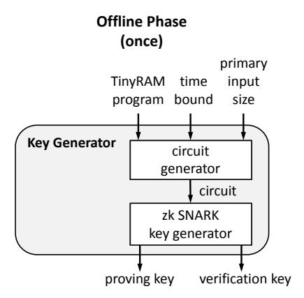

Figure 1: Offline phase (once). The key generator computes a (long) proving key and a (short) verification key, respectively for proving and verifying correct (nondeterministic) computations of a given TinyRAM program, for at most a given number of time steps on primary inputs of a given size. Our compiler can be used to obtain TinyRAM programs from C programs.

<span id="page-6-1"></span>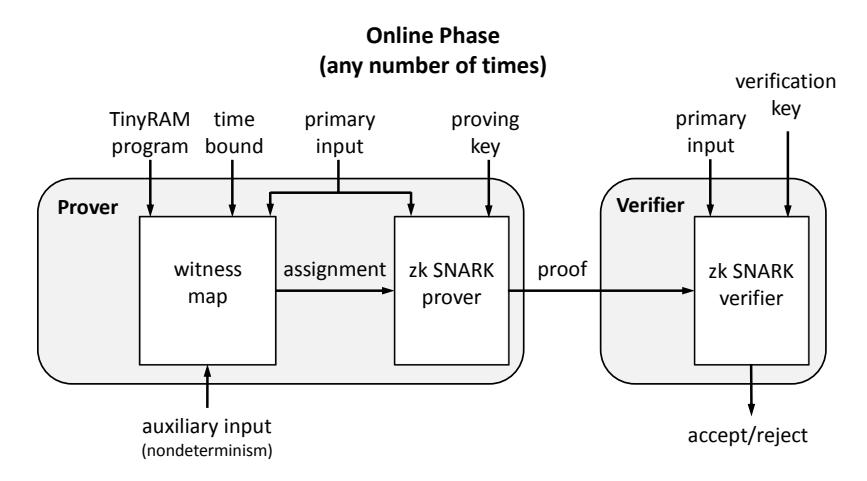

Figure 2: Online phase (any number of times). The prover sends a non-interactive publiclyverifiable proof to a verifier, who can check the proof with only a linear number of cryptographic operations in the primary input size. This phase can be repeated any number of times, each time for a different input to the program.

## <span id="page-7-0"></span>2 From Correctness of Program Execution to Circuit Satisfiability

As summarized in Section [1.3,](#page-4-0) we implemented an *efficient* transformation that reduces correctness of program execution to circuit satisfiabiliy. The following gives further design and performance details about this transformation. Concretely, in Section [2.1](#page-7-1) we motivate and discuss our choice of architecture, TinyRAM. Then, in Section [2.2,](#page-9-0) we discuss implementation and performance of our compiler from C to TinyRAM assembly. Finally, in Section [2.3,](#page-13-0) we discuss implementation and performance of our reduction from the correctness of TinyRAM assembly to circuit satisfiability.

### <span id="page-7-1"></span>2.1 The TinyRAM Architecture

To reason about correctness of program executions, we first need to fix a specific random-access machine. An attractive choice is to pick the instruction set architecture (ISA) of some existing, well-supported family of CPUs (e.g., x86 or ARM). We could then reuse existing tools and software written for those CPUs. This is possible in principle.

However, the design of CPUs typically focuses on efficient ways of getting data and code, at the right time, to the different executions units of the CPU, with the goal of maximizing utilization of these units. This is achieved by complex mechanisms whose size can dwarf the *functional core* circuitry (execution units, register file, instruction decoding, and so on). Thus, modern CPUs afford, and employ, large and rich instruction sets. As explained next, the efficiency considerations are very different in our context.

Executing vs. verifying. CPUs and their ISAs are optimized for fast *execution* of programs. However, we are interested in fast *verification* of (alleged) past executions. In our setting, the computation *has already been executed* and we possess a trace of this execution, giving the state of the processor (registers and flags) at every time step. Our goal is to efficiently verify the correctness of the trace: that every state in the trace follows from the preceding one.

This means that values that are expensive to produce during the execution become readily available for verification in the trace. For example, in real CPUs, reading from external memory is relatively slow and a large fraction of the circuitry is dedicated to caching data. However, in the trace, the result of a load from memory is readily seen in the processor state at the end of the instruction's execution; thus the need for caches is moot. Similarly, modern CPUs use complicated speculative-execution and branch-prediction mechanisms to keep their execution pipelines full; but a trace verifier going down the trace can "peek into the future" and readily observe control flow.

The elimination of the above mechanisms, and many others, affects the ISA. In particular, it means that the aforementioned functional core circuitry dominates cost. This leads to the next consideration.

Transition function complexity. We are ultimately interested in carrying out the verification of a trace via a circuit, so we wish to optimize the circuit complexity of the *transition function* of the ISA: the size of the smallest circuit that, given two adjacent states in the trace, verifies that the transition between the two indeed respects the ISA specification.[6](#page-7-2)

We thus seek an ISA that strikes a balance between two opposing requirements: (1) the need for a transition function of small circuit complexity and (2) the need to produce small and fast machine code, in particular when compiling from high-level programming languages. Rich architectures allow for smaller code and shorter execution trace but have transition functions of higher circuit complexity, while minimalistic architectures require longer machine code and longer execution traces, but enjoy transition functions with smaller circuit complexity.

<span id="page-7-2"></span><sup>6</sup>This does not include the (crucial) task of checking the correctness of values loaded from random-access memory. Memory consistency is efficiently handled separately; see Section [2.3.](#page-13-0)

Modern ISAs designed for general purpose CPUs (such as x86) are complex instruction set computer (CISC) machines: they support many elaborate instructions (e.g., a round of AES [Gue12]) and addressing modes. Less rich ISAs are reduced instruction set computer (RISC) machines designed for devices like smartphones (ARM) and embedded microcontrollers (Atmel AVR). Yet, even these "simple" ISAs are quite rich: they support many addressing modes, many conditional branches, floating point arithmetic, instructions for parallel execution, and so on. For example, the ARM architecture has more than 35 SIMD instructions for addition and subtraction alone [ARM12]; also, even 8-bit versions of the Atmel AVR family support as much as 25 different conditional branch instructions alone [ATM10].

In sum, we seek a minimal ISA that enables us to design a transition function with small circuit complexity, and yet allows reasonable overheads in code size and execution time (relative to richer ISAs).

**A custom ISA.** In light of the above, we designed an instruction set architecture, named TinyRAM, that is tailored for our setting. TinyRAM is a minimalistic RISC random-access machine with a Harvard architecture and word-addressable random-access memory. It has two parameters: the *word size*, denoted W, and the *number of registers*, denoted K. (When we wish to make this explicit, we write TinyRAM $_{W,K}$ .) The global state of the machine at any time consists of:

- $\bullet$  the program counter, denoted pc; it consists of W bits;
- K general-purpose registers, denoted  $r0, r1, \ldots, r(K-1)$ , each consisting of W bits;
- the (condition) flag, denoted flag; it consists of a single bit; and
- memory, which is a linear array of  $2^W$  words of W bits each.

In addition, the machine has two *input tapes*, each containing a string of W-bit words. Each tape can be read sequentially in one direction only. The first input tape is for the *primary input*, denoted x; the second input tape is for the *auxiliary input*, denoted w. We treat the primary input as given, and the auxiliary input as nondeterministic advice. (See Definition 2.1 below.)

We carefully selected the instructions of TinyRAM so to support relatively efficient compilation from high-level programming languages (like C), as discussed in Section 2.2, and, furthermore, allow for small circuits implementing its transition function (and other checks), as discussed in Section 2.3. Briefly, the instruction set of TinyRAM includes simple load and store instructions for accessing random-access memory, as well as simple integer, shift, logical, compare, move, and jump instructions. TinyRAM can efficiently implement complex control flow, loops, subroutines, recursion, and so on. Complicated instructions, such as floating-point arithmetic, are not directly supported and can be implemented "in software" by TinyRAM programs. Supporting only fairly simple load and store operations is important for efficiently verifying consistency of random-access memory; see Section 2.3.

In keeping with the setting of verifying computation, the only input to TinyRAM programs is via its two input tapes, and the only output is via an accept instruction, which also terminates execution.<sup>7</sup>

So far we have only informally discussed "correctness of TinyRAM program execution". This notion is formalized by defining a TinyRAM universal language.

<span id="page-8-0"></span>**Definition 2.1.** Fix the word size W and number of registers K. Let  $\mathbf{P}$  be a TinyRAM $_{W,K}$  program, let x and w be strings of W-bit words. We say that  $\mathbf{P}(x,w)$  accepts in T steps if  $\mathbf{P}$ , with x as primary input and w as auxiliary input, executes the instruction accept in step T.

The TinyRAM universal language is  $\mathcal{L}_U = \bigcup_{W,K} \mathcal{L}_{W,K}$ , where  $\mathcal{L}_{W,K}$  consists of the triples  $(\mathbf{P}, x, T)$  where  $\mathbf{P}$  is a TinyRAM<sub>W,K</sub> program, x is a string of W-bit words, and T is a time bound, such that there exists a string w of W-bit words for which  $\mathbf{P}(x, w)$  accepts in T steps.

<span id="page-8-1"></span>A specification for the TinyRAM architecture can be found in [BCG<sup>+</sup>13].

<sup>&</sup>lt;sup>7</sup>For ease of development, the TinyRAM simulator also supports debugging instructions that produce additional outputs. These are excluded from the execution trace and not verified.

```
_sumarray:
                             cmpe r4, r5
                             cjmp _end
                             load r6, r1
                             load r7, r2
                             add r8, r7, r5
                             store r3, r8
                             add r1, r1, 1
                             add r2, r2, 1
                             add r3, r3, 1
                             add r4, r4, 1
                             jmp _sumarray
                            _end:
void sumarray(int size,
 int* A,
 int* B,
 int* C)
{
 int i;
 for (i=0; i<size; i++) {
 C[i] = A[i] + B[i];
 }
}
```

Figure 3: Illustrative example of transforming a C program into TinyRAM assembly language.

## <span id="page-9-0"></span>2.2 A Compiler from C to TinyRAM

The GCC compiler [\[StGDC\]](#page-52-1) is a versatile framework supporting many source languages (e.g., C and Java) and many target languages (e.g., x86 and ARM assembly). Internally, the GCC compiler is partitioned into two main modules [\[StGDC13\]](#page-52-2). The *frontend* is responsible for converting a program written in a high-level programming language like C or Java into an intermediate representation language called *Register Transfer Language* (RTL). The *backend* is responsible for optimizing and converting RTL code into corresponding assembly code for a given architecture.

In order to automatically generate TinyRAM assembly for problems of interest, we have implemented a prototype of a GCC backend for converting RTL code to TinyRAM assembly code. Our prototype backend works with the C frontend, and can be extended to other programming languages by combining it with suitable GCC frontends (and providing the requisite standard libraries). Concretely, we have a prototype that can compile a subset[8](#page-9-1) of C to TinyRAM, with word size <sup>W</sup> ∈ {8, <sup>16</sup>} and number of registers <sup>K</sup> <sup>≥</sup> <sup>16</sup>. See Figure [3](#page-9-2) for an illustrative example.

Because TinyRAM's instruction set is quite minimal, any operation not directly supported by TinyRAM "hardware" (i.e., by a TinyRAM instruction) needs to be implemented in "software". This incurs overheads in both the *code size* (the number of lines in an assembly code) and *execution time* (the number of instructions required to execute a piece of code). Initial experiments indicate that both of these overheads are not large, as discussed next.

Code size overhead. We first evaluate the code size produced when compiling C code examples[9](#page-9-3) into TinyRAM assembly using our GCC port, compared to the code produced by standard GCC for some common architectures: x86, ARM and AVR. Figure [4 on page 12](#page-11-0) presents the results of compiling these examples. The results show that, compared to the RISC architectures (ARM and AVR), the resulting TinyRAM code is at most three times larger than ARM and significantly smaller than AVR. Compared to x86, which is a very rich CISC architecture, TinyRAM code is up to four times bigger. We deduce that, at least for the program styles represented by these examples, the TinyRAM architecture allows for compilation into compact programs.

<span id="page-9-1"></span><sup>8</sup> Floating-point arithmetic and static data are not yet implemented, but pose no fundamental difficulty. Most of the C standard library is not yet implemented; see discussion below.

<span id="page-9-3"></span><sup>9</sup> The examples, described in Appendix [F,](#page-47-0) are simple, natural C functions we wrote to demonstrate various program styles. They exercise memory accesses (pointer chasing and the RC4 stream cipher), integer arithmetic (matrix multiplication and polynomial evaluation), and logical calculations (single-source shortest paths and Game of Life).

Execution time overhead. The circuits ultimately produced by our reduction have O(T log T) gates, where T is the execution time (measured in machine steps). This execution time depends on the choice of architecture, and we wish to ensure that TinyRAM does not necessitate very long execution times due to deficiencies in the instruction set.

To evaluate this, we compiled examples of C code into both TinyRAM machine code and x86 machine code. In the examples depicted in Figure [5 on page 13,](#page-12-0) we observe that, in terms of execution time measured in number of executed instructions, TinyRAM is slower than x86 by a factor of merely 2 to 6, for examples that represent some realistic computations. This is despite x86 being a very rich CISC architecture, heavily optimized for minimizing instruction count, which is typically implemented using many millions of gates. (Recall the difference of executing vs. verifying, discussed in Section [2.1.](#page-7-1))

These small overheads are more than compensated by the fact that TinyRAM has a very compact circuit that verifies the correctness of the transition function. For instance, for a word size W = 16 and number of registers K = 16, and for a program with 100 instructions, we obtain a 785-gate circuit for verifying the transition function.

In summary, our experiments show that, even when working with a minimalistic architecture such as TinyRAM, we do not incur large overheads in code size or number of instructions executed. In Section [2.3,](#page-13-0) we discuss the circuit complexity of TinyRAM's transition function and how to efficiently verify TinyRAM execution traces.

Looking ahead. The C specification provides a standard library, which C programs liberally rely on. Our TinyRAM compiler at the moment does not provide support for this library and we are working on extending its functionality to include it. The two main challenges are implementing those functions that must be written directly in the underlying machine language, and supporting (or reasonably approximating) functionality that extends into the program runtime environment, such as file I/O, process management, inter-process communication (IPC), and other system services.

<span id="page-11-0"></span>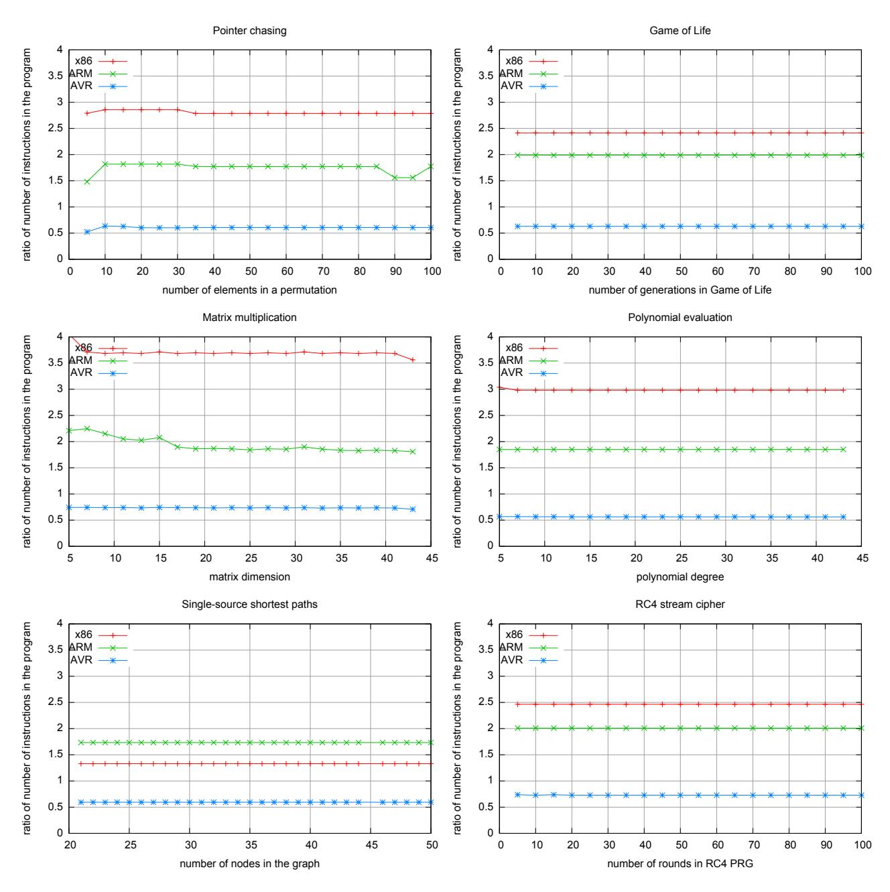

Figure 4: Ratio of the number of instructions in the compiled program in TinyRAM to the number of instructions in the compiled program in other architectures (x86, ARM, AVR).

<span id="page-12-0"></span>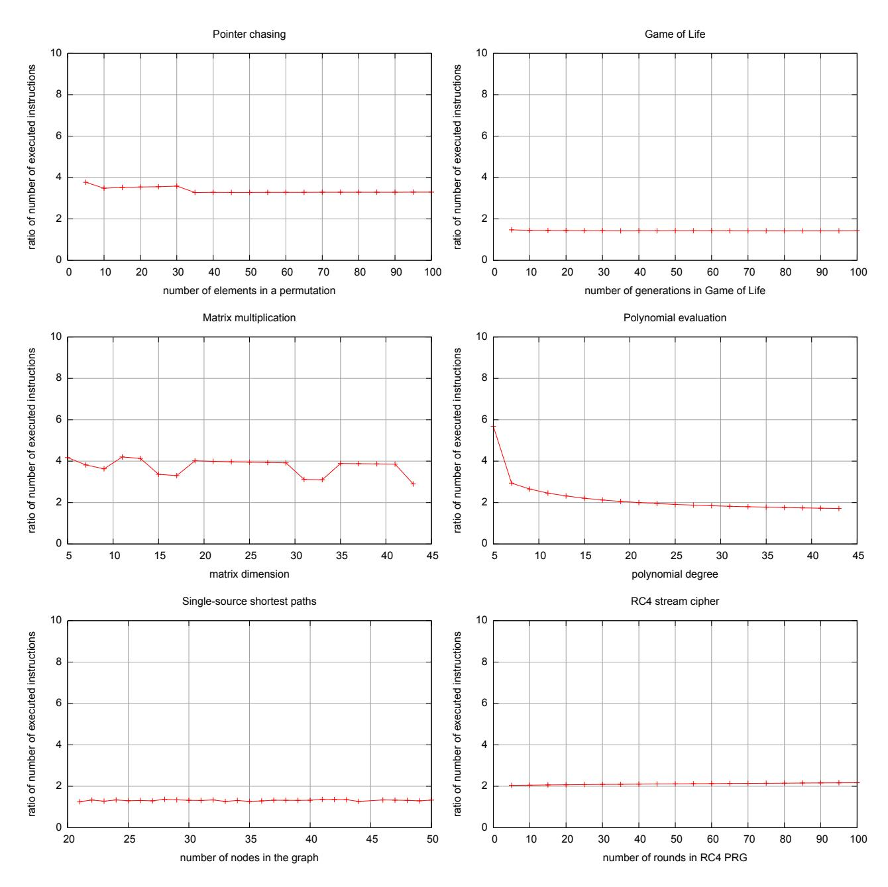

Figure 5: Ratio of the number of executed instructions in TinyRAM to the number of executed instructions in x86.

#### <span id="page-13-0"></span>2.3 An Efficient Reduction from TinyRAM to Circuit Satisfiability

The following describes our efficient reduction from the correctness of TinyRAM executions to  $\mathbb{F}$ -arithmetic circuit satisfiability, for any prime field  $\mathbb{F}$  of sufficiently large size.

#### 2.3.1 The reduction notion

In our setting, a *(circuit) reduction* is a triple of functions (circ, wit, wit<sup>-1</sup>) working as follows. The *circuit generator* function  $\operatorname{circ}(\mathbf{P},T,n)$ , given a TinyRAM program  $\mathbf{P}$ , time bound T, and primary input size n, outputs a corresponding  $\mathbb{F}$ -arithmetic circuit C that encodes the correct computation of  $\mathbf{P}$  for at most T steps on primary inputs of n words. The *witness map* function,  $\operatorname{wit}(\mathbf{P},T,x,w)$ , given a pair of primary and auxiliary inputs (x,w) that make  $\mathbf{P}$  accept in T steps, outputs a satisfying assignment a for  $C(x,\cdot)$ . The *inverse witness map* function,  $\operatorname{wit}^{-1}(\mathbf{P},T,x,a)$ , given a satisfying assignment a for  $C(x,\cdot)$ , outputs w with the property that (x,w) makes  $\mathbf{P}$  accept in T steps.

**Definition 2.2.** A **reduction** from TinyRAM (for a word size W and number of registers K) to  $\mathbb{F}$ -arithmetic circuit satisfiability is a triple of functions (circ, wit, wit<sup>-1</sup>) such that, for every TinyRAM program  $\mathbf{P}$ , time bound T, and primary input size n, the following hold:

- $C := \operatorname{circ}(\mathbf{P}, T, n)$  is an  $\mathbb{F}$ -arithmetic circuit from  $\mathbb{F}^{W \cdot n} \times \mathbb{F}^h$  to  $\mathbb{F}^l$  for some h, l; C's gates are bilinear;  $\mathbb{F}^{10}$
- for every (x, w) such that  $\mathbf{P}(x, w)$  accepts in T steps,  $C(x, \text{wit}(\mathbf{P}, T, x, w)) = 0^l$ ;
- for every (x, a) such that  $C(x, a) = 0^l$ ,  $\mathbf{P}(x, \mathsf{wit}^{-1}(\mathbf{P}, T, x, a))$  accepts in T steps.

The work on fast reductions of Ben-Sasson et al. [BCGT13a] implies a reduction (circ, wit, wit $^{-1}$ ) where |C| (the number of gates in C) is  $O(T(\log T)^2)$  and circ, wit, wit $^{-1}$  all run in  $O(T(\log T)^2)$  time. <sup>11</sup> In our work, we optimize and implement a reduction that builds on the theoretical approach of [BCGT13a]. We focus our attention only on the efficiency of the circuit and witness maps (i.e., circ and wit), because these need to be run in practice. <sup>12</sup> Before discussing our work, however, we briefly review the approach of [BCGT13a].

#### <span id="page-13-5"></span>2.3.2 The reduction in [BCGT13a]

We begin with necessary basic definitions.

- A (local) state of TinyRAM, denoted S, is a string of (W + KW + 1) bits, encoding the values of the program counter, K registers, and condition flag at a given time step.
- The transition function of TinyRAM, denoted  $\Pi_{TF}$ , is the predicate that, given a TinyRAM program  $\mathbf{P}$  and two states S and S', outputs 1 if and only if the machine in state S can transition (for *some* choice of values in random-access memory) to the state S' in the next step, according to the program  $\mathbf{P}^{13}$ .

<span id="page-13-1"></span> $<sup>\</sup>overline{\phantom{aaaaaaaaaaaaaaaaaaaaaaaaaaaaaaaaaaa$

<span id="page-13-2"></span><sup>&</sup>lt;sup>11</sup>Given a space bound S on the computation of  $\mathbf{P}$  on (x, w), Ben-Sasson et al. also present a reduction where |C| is only  $O(T \log T \log S)$ . We have so far not considered this additional, significantly more complex, optimization.

<span id="page-13-3"></span><sup>&</sup>lt;sup>12</sup>Concretely, the key generator runs circ while the prover runs wit; see Figure 10 and Figure 11 on page 28. In contrast, wit<sup>-1</sup> ensures that "proof of knowledge is preserved" (i.e., wit<sup>-1</sup> only appears as part of a proof of security). We are thus not particularly interested in optimizing wit<sup>-1</sup>, especially because (just as in [BCGT13a]) it can be computed in time that is only  $O(T(\log T)^2)$ .

<span id="page-13-4"></span> $<sup>^{13}</sup>$ Traditionally, the transition function is the function that, given the global state of a machine as input, outputs the next state. We abuse this terminology, and use it for the function that, given two local states S, S', decides whether the second can follow the first (cf. discussion of executing vs. verifying in Section 2.1).

• An execution trace<sup>14</sup> for a TinyRAM program P, time bound T, and primary input x is a sequence of states  $tr = (S_1, \ldots, S_T)$ . An execution trace tr is valid if there exists an auxiliary input w such that the sequence of states induced by P running with input tapes (x, w) is tr.

The goal is to design an  $\mathbb{F}$ -arithmetic circuit C for verifying that tr is valid that is as small as possible. This is done in three steps, as follows.

Step 1: code consistency. Let  $C_{\mathsf{TF}}$  be a circuit that implements the transition function  $\Pi_{\mathsf{TF}}$  of TinyRAM: namely,  $C_{\mathsf{TF}}(\mathbf{P}, S, S') = 1$  if and only if  $\Pi_{\mathsf{TF}}(\mathbf{P}, S, S') = 1$ . By invoking  $C_{\mathsf{TF}}$  on each pair of successive states of tr, we can verify every state transition in the trace tr, i.e., ensure that  $\Pi_{\mathsf{TF}}(\mathbf{P}, S_i, S_{i+1}) = 1$  for  $i = 1, \ldots, T-1$ . Doing so gives rise to a sub-circuit of C, consisting of T copies of  $C_{\mathsf{TF}}$ , that, when given as input tr, checks that tr is code-consistent.

**Step 2: memory consistency.** The global state of a random-access machine also includes memory. In particular, in order to verify that tr is valid, we *also* need to verify that tr is *memory-consistent*: namely, that every load operation from an address in memory actually retrieves the value of the last store to that address.

But the accesses to memory of a program  $\mathbf{P}$  depend on the inputs x and w. Hence, in general, at each time step i any of the addresses in memory could be accessed by the program. The naive solution of designing the verification circuit C to maintain a snapshot of the entire machine state (which includes registers and memory) for each time step is *not* efficient: such a circuit has size  $\Omega(T^2)$ . (As discussed in Appendix C, all previous circuit generators either adopt the naive solution or restrict a program's memory accesses to be known at compile time.)

Ben-Sasson et al. [BCGT13a] take a more efficient approach, building on classical results on quasilinear-time nondeterministic reductions [Sch78, GS89, Rob91]. The high-level idea in [BCGT13a] is that memory consistency would be easier to verify if the circuit C were to also have, as additional input, the *same* trace tr but sorted according to accessed memory addresses (and breaking ties via timestamps); let us denote this sorted trace by MemSort(tr). Concretely, one can define another "local" predicate  $\Pi_{MC}$  such that, if  $\Pi_{MC}$  is satisfied by each pair of adjacent states in MemSort(tr) (and, in addition, tr is codeconsistent) then tr is valid. We can then augment C with T copies of a sub-circuit  $C_{MC}$  that verifies the predicate  $\Pi_{MC}$  on MemSort(tr). The circuit C is thus left to verify that the auxiliary input MemSort(tr) is the result of sorting tr.

Step 3: routing network. The circuit C can efficiently perform this check if it is given yet another additional input: (alleged) routing decisions for a routing network which permutes tr into MemSort(tr). A T-packet routing network is a directed graph with T sources, T sinks, and inner nodes (switches) such that, for any permutation  $\pi\colon [T]\to [T]$ , there are routing decisions for the switches that cause T packets at the sources to travel to the T sinks, according to the permutation  $\pi$ , and without using a switch twice (i.e., with no congestion). One such a network is the Beneš network [Ben65], which has  $O(\log T)$  layers of T nodes each, and each node in a layer is connected to two nodes in the next layer. The idea is to interpret the switch settings in a routing network as a coloring on the routing network. Crucially, verifying that the given switch settings (i.e., a coloring of the network) implement some permutation from the input nodes to the output nodes can be done via simple and local routing constraints; furthermore, given that the switches implement some permutation, verifying that they implement the sorting permutation is easy to verify too. Overall we obtain a certain graph-coloring problem all of whose constraints can be evaluated by a circuit of size  $T \cdot O((\log T)^2)$ , which we add to C.

In sum. The approach from [BCGT13a] described in the above paragraphs yields a circuit C of size  $T \cdot (|C_{\mathsf{TF}}| + |C_{\mathsf{MC}}| + O((\log T)^2))$  for verifying the validity of a T-step trace. (See Figure 6 below.)

<span id="page-14-0"></span><sup>&</sup>lt;sup>14</sup>An execution trace is also at times known as a *computation transcript* [BCGT13a].

<span id="page-15-0"></span>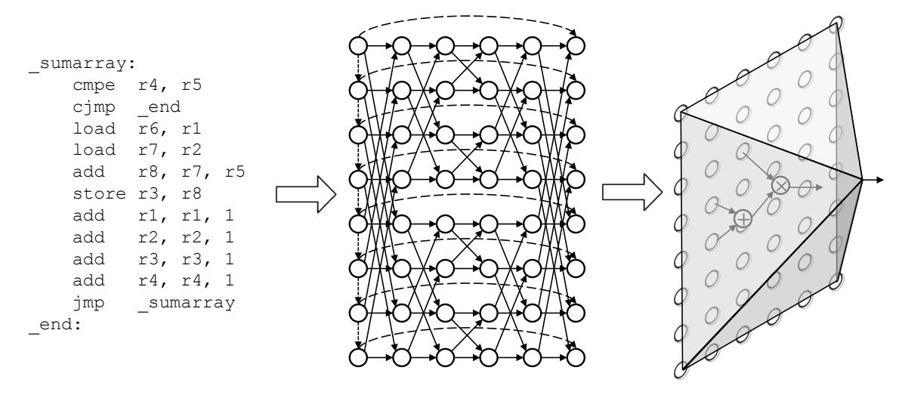

Figure 6: Verifying the correct execution of a given piece of TinyRAM code (left) is reduced to satisfiability of a certain constraint-satisfaction problem on a routing network (middle). Then, an arithmetic circuit (right), given an assignment as input, verifies all the constraints of the constraint-satisfaction problem.

#### 2.3.3 Optimized reduction

As mentioned, in our work we optimize and implement the theoretical approach of Ben-Sasson et al. [BCGT13a]. Despite the excellent asymptotic efficiency of the approach, getting to the point in which the verification circuit C has a manageable size in practice proved quite challenging, both theoretically and programmatically. For instance: while (as discussed in Section 2.1) we devised TinyRAM to facilitate the design of a small circuit  $C_{\mathsf{TF}}$  for the transition function  $\Pi_{\mathsf{TF}}$ , how small of a circuit can we actually design? And how well does its size scale with, say, the word size W, number of registers K, and program size  $|\mathbf{P}|$ ?

Our circuit generator. At high level, our main technical contribution is leveraging

- (1) "native" arithmetic in the field  $\mathbb{F}$ , which for us is a prime field of large characteristic, 15 and
- (2) nondeterministic advice

to achieve highly-optimized implementations of  $C_{\mathsf{TF}}$ ,  $C_{\mathsf{MC}}$ , and routing constraints, and ultimately obtain drastic improvements in the size of the verification circuit C output by our circuit generator circ.

To illustrate the use of (1) and (2), consider the basic task of *multiplexing bit vectors*, used numerous times in C. Given n vectors  $\mathbf{a}_1,\ldots,\mathbf{a}_n$  of  $\ell$  bits each, and a  $\lceil \log n \rceil$ -bit index  $\mathbf{i}$ , we seek a small  $\mathbb F$ -arithmetic circuit that computes the vector selected by the index. A naive multiplexer circuit requires  $\Theta(n(\ell+\log n))$  bilinear gates. In contrast, by relying on (1) and (2), we design a multiplexer circuit that needs only  $O(n\lceil \frac{\ell}{|\mathbb F|} \rceil)$  bilinear gates. The efficiency improvement is significant because we ultimately need to work with cryptographically-large fields; for instance, in our setting where  $\mathbb F = \mathbb F_r$  and r is an 181-bit prime, if  $n=\ell=16$ , the naive implementation uses 320 gates while we only use 51.

The idea of our multiplexer construction is as follows. Suppose, first, that every input vector  $\mathbf{a}_i$ , as well as the index i, were represented as integers, and we only had to design a Z-arithmetic circuit to output the integer representing the selected bit vector. In this case, we could easily construct a nondeterministic  $\mathbb{Z}$ -arithmetic circuit of size O(n) (with bilinear gates of unbounded fan-in): guess variables  $b_1, \ldots, b_n$  such that  $\sum_{i=1}^n b_i = 1$  and  $\{b_i \cdot (\mathbf{i} - i) = 0\}_{i=1}^n$ , and then output the inner product of the vector  $(b_1, \dots, b_n)$  and the vector  $(\mathbf{a}_1, \dots, \mathbf{a}_n)$ . However, the  $\mathbf{a}_i$  and  $\mathbf{i}$  are only given to us as strings of bits, and we need to work with F-arithmetic circuits. This gap motivates two fundamental operations: packing and unpacking of bit vectors. Packing denotes mapping a bit vector (using one field element per bit) into a shorter sequence of field elements that represent those bits using a denser encoding; unpacking denotes the inverse operation. The packing operation is very efficient: in the prime field  $\mathbb{F}_r$  with  $r \geq 2^{\ell}$ , a single gate suffices to compute  $\sum_{i=1}^{\ell} 2^{i-1} a_i$  from the input  $a_1, \ldots, a_{\ell}$ . The inverse operation is much more expensive to compute directly, but we can nondeterministically guess the answer and verify it using a single gate. In general,  $r \geq 2^{\ell}$ need not hold, so we use  $\lceil \frac{\ell}{|\mathbb{F}|} \rceil$  field elements to store an  $\ell$ -bit vector. Given the aforementioned efficient packing operations, our multiplexer construction works as follows: it guesses the selected  $\ell$ -bit vector, then computes the integers corresponding to the input  $\ell$ -bit vectors as well as the index, and then verifies the guess by selecting the correct integer according to the (integer) index.

More generally, we have found that, throughout our circuit generator, it is often advantageous to maintain, alongside certain vectors  $\mathbf{a}$ , also the corresponding (densely-packed) integer  $\sum_i 2^{i-1} a_i$ .

With these techniques in mind, we proceed to describe the circuit generator.

• Designing the transition function circuit  $C_{\mathsf{TF}}$ . The circuit  $C_{\mathsf{TF}}$  is the most complex sub-circuit of C. The size of  $C_{\mathsf{TF}}$  is dominated by the size of sub-circuits for multiplexing bit strings (for instruction fetch,

<span id="page-16-1"></span><span id="page-16-0"></span><sup>&</sup>lt;sup>15</sup>As required by the underlying zk-SNARK for circuit satisfiability; see Section 3.

<sup>&</sup>lt;sup>16</sup> For example: for each i = 1, ..., n, multiply  $\mathbf{a}_i$  by 1 if  $\mathbf{i}$  represents i, and by 0 otherwise, using  $\Theta(\log n + \ell)$  gates per i; then for  $j = 1, ..., \ell$ , produce the j-th output bit using one fan-in-n adder per j.

register fetch, and so on) and of the arithmetic logic unit (ALU), which executes the architecture's non-memory operations.

To obtain an efficient implementation of the ALU (or, more precisely, a circuit verifying its operation), we again make use of field arithmetic and nondeterministic advice. Since we work over a prime field of large characteristic, field arithmetic looks like integer arithmetic whenever there is no "wrap around". Thus, after fetching the arguments of an operation, we make sure to have both the binary and integer representation for each argument. Then, each operation in the ALU uses whichever representation is more efficient to use. For instance, bitwise AND, OR, XOR, and NOT are computed using binary representations. In contrast, we use integer representations to compute result and overflow information for addition, subtraction, and multiplication with only 2W, 2W, and 3W bilinear gates, respectively. For division, we nondeterministically guess the result and verify it with a multiplication. Each time an operation uses integer representations, the output integer can be "unpacked" into its binary representation, via nondeterministic advice. By carefully studying each operation, we obtain a (nondeterministic) circuit for verifying the ALU that, with word size W=16, has merely 343 gates.

Given efficient implementations of multiplexing and the ALU, it is possible to obtain an efficient implementation of  $C_{\mathsf{TF}}$ . Table 1 below shows the number of gates in our implementation of  $C_{\mathsf{TF}}$  for  $|\mathbf{P}| \in \{10, 10^2, 10^3\}$ ,  $W \in \{8, 16, 32\}$  and  $K \in \{8, 16, 32\}$ .

<span id="page-17-0"></span>

| $ \mathbf{P}  = 10/100/1000$ | W = 8             | W = 16             | W = 32             | W = 64             |  |  |
|------------------------------|-------------------|--------------------|--------------------|--------------------|--|--|
| K = 8                        | 482 / 572 / 1472  | 619 / 709 / 1609   | 892 / 982 / 1882   | 1437 / 1527 / 2427 |  |  |
| K = 16                       | 558 / 648 / 1548  | 695 / 785 / 1685   | 968 / 1058 / 1958  | 1513 / 1603 / 2503 |  |  |
| K = 32                       | 706 / 796 / 1696  | 843 / 933 / 1833   | 1116 / 1206 / 2106 | 1661 / 1751 / 2651 |  |  |
| K = 64                       | 998 / 1088 / 1988 | 1135 / 1225 / 2125 | 1408 / 1498 / 2398 | 1953 / 2043 / 2943 |  |  |

Table 1: Number of gates in  $C_{\mathsf{TF}}$  as a function of W and K, for different sizes of program P.

- Designing the memory consistency circuit  $C_{\text{MC}}$ . The predicate  $\Pi_{\text{MC}}$  is not as complex as the transition function  $\Pi_{\text{TF}}$ , but it is still important to design a small circuit  $C_{\text{MC}}$  for it. A crucial optimization is afforded by the fact that  $\Pi_{\text{MC}}$  only cares about the memory address being accessed, and the value loaded/stored, in each state. Deriving these values from the state requires instruction parsing and register-file multiplexing, but it turns out they have already been computed on "the other side" of the routing network, by  $C_{\text{TF}}$ , when verifying code consistency. Thus, we change the routing network (discussed below) to route only such pairs of address and value; there remains for  $\Pi_{\text{MC}}$  merely to check a simple ordering condition on this. We thereby obtain a circuit  $C_{\text{MC}}$  that only contains two integer comparisons and few other logical operations. For instance, when W=16,  $C_{\text{MC}}$  consists of just 64 gates.
- Checking routing constraints. Asymptotically, the routing constraints on the routing network are the most expensive sub-circuit of C: there are  $\Theta(T \log T)$  nodes in the routing network, compared to T copies of  $C_{\mathsf{TF}}$  and  $C_{\mathsf{MC}}$  each. It is thus crucial to check these constraints as efficiently as possible. As discussed for  $\Pi_{\mathsf{MC}}$ , it suffices to route packets consisting of just 2W bits (obtained from intermediate computations of  $C_{\mathsf{TF}}$ ), instead of whole TinyRAM states. This leads to another important optimization: now that a packet is small, we can pack a whole packet into a single field element (in our typical parameters,  $|\mathbb{F}| \geq 2^{2W}$ ); then, because the packets consist of single field elements, computing the routing constraints becomes particularly simple: only one bilinear gate per vertex. Concretely, the gate at a given vertex checks whether the vertex's packet is equal to at least one of the packets at the two neighbor vertices in the next layer. Overall, when T is a power of 2, all routing constraints can be verified with only  $2 \cdot T \cdot \log T$  gates.

We thus also obtain an asymptotic improvement, by a  $\log T$  factor, over the circuit size in [BCGT13a], where routing constraints required  $O(T(\log T)^2)$  gates. This holds since the size of  $\mathbb F$  must be  $\omega(T)$  for cryptographic reasons.

There are numerous additional details that go into our final construction of the verification circuit C. (For instance, another asymptotically-significant component, contributing an additional  $2 \cdot T \cdot \log T$  gates, originates from 2T integer comparisons on  $\log T$ -bit integers.) The eventual circuit sizes are as follows, fixing for concreteness a word size W=16, number of registers K=16, and a program length  $|\mathbf{P}|$  of 100 instructions. The size of C grows with T (when T is a power of 2) as follows:

$$|C| = 4 \cdot T \cdot \log T + 892 \cdot T + 37.$$

<span id="page-18-0"></span>In particular, for  $\log T < 20$ , every cycle of TinyRAM computation costs  $\leq 972$  gates to verify. Note that, while the gate count per cycle increases as T increases (since the number of routing constraints grows as  $O(T\log T)$ ), the growth rate is slow: doubling T costs only 4+o(1) additional gates per cycle. See Table 2 for values of |C|/T for  $\log T = \{10, \ldots, 20\}$ .

| T        | C /T   |
|----------|--------|
| $2^{10}$ | 932.04 |
| $2^{11}$ | 936.02 |
| $2^{12}$ | 940.01 |
| $2^{13}$ | 944.00 |
| $2^{14}$ | 948.00 |
| $2^{15}$ | 952.00 |
| $2^{16}$ | 956.00 |
| $2^{17}$ | 960.00 |
| $2^{18}$ | 964.00 |
| $2^{19}$ | 968.00 |
| $2^{20}$ | 972.00 |
|          |        |

Table 2: Number of gates per TinyRAM cycle, with  $|\mathbf{P}| = 100$ , W = 16, and K = 16.

From a software engineering point of view, we tackled the construction of the verification circuit C by developing a library of  $circuit\ gadgets$ , along with functions for composing these gadgets in a clean and modular way. This simplifies future modifications to our circuit generator for application-dependent extensions and customizations, such as supporting other instruction sets, other memory addressing modes, and so on.

Witness map. Thus far, we have focused on achieving *soundness*: verifying the validity of an execution trace of a TinyRAM program  $\mathbf{P}$  by using the circuit  $C := \operatorname{circ}(\mathbf{P}, T, n)$  output by the circuit generator circ. The circuit generator is run by the key generator when computing the public parameters. (See Figure 10 on page 28.) Let us now turn to *completeness*: we need to implement a witness map wit( $\mathbf{P}, T, x, w$ ) that computes a satisfying assignment a for  $C(x, \cdot)$ , whenever  $\mathbf{P}(x, w)$  accepts in T steps. The witness map is run by the prover when generating a proof. (See Figure 11 on page 28.)

The witness map wit consists of two main steps.

1. From inputs to execution trace. We implemented a TinyRAM simulator, denoted Simulate, that, given as input  $(\mathbf{P}, T, x, w)$ , outputs the T-step execution trace tr of  $\mathbf{P}$  on inputs (x, w). This step is conceptually straightforward: it is implemented as a fetch-and-execute loop written in a high-level language, C++. Unlike the subsequent steps, it does not involve circuit representation. Performance of the simulation inessential, since, in the full prover, running time is dominated by subsequent steps.

- 2. *From execution trace to satisfying assignment.* We implemented a function, denoted ExtendAndRoute, that, given a valid T-step trace tr for P(x, w), outputs a satisfying assignment a for C(x, ·). Computing a involves several sub-steps, corresponding to finding suitable satisfying assignments to the different sub-circuits of C, as we now describe.
  - The first task is to deduce from tr a satisfying assignment for each copy of CTF in C. In order to satisfy the i-th copy of CTF, it is *not* enough to provide the i-th and (i + 1)-th line in the trace tr as input to the i-th copy of CTF. Indeed, each copy of CTF also expects nondeterministic advice. (For instance, each multiplexer in CTF expects auxiliary advice; and so do many sub-circuits of the ALU, such as the sub-circuit responsible for verifying a division's result.) Thus, in this step we compute the necessary auxiliary advice for each copy of CTF.
  - The second task is to deduce from tr a satisfying assignment for each copy of CMC in C. We do so by first stable-sorting the trace tr, by address accessed, in order to obtain MemSort(tr). Then, we provide the i-th and (i + 1)-th line in the trace MemSort(tr) as input to the i-th copy of CMC. Similarly as before, each copy of CMC also requires various nondeterministic advice, mostly consisting of internal wire values of computations of the corresponding copy of CTF.
  - The third and final task is to deduce a satisfying assignment to the sub-circuit of C responsible for checking that MemSort(tr) is a suitable sorting of tr. To do so, we deduce from tr and MemSort(tr) the permutation π that we need to route on the Benes network; we then compute the switch settings ˇ for the network by using a standard routing algorithm [\[Ben65,](#page-49-14) [Wak68,](#page-52-5) [OTW71,](#page-52-6) [Lei92,](#page-51-14) [NS82\]](#page-52-7); from these switch settings and tr, we can then deduce the satisfying assignment. Asymptotically, this is the most expensive part of the witness map.

The above concludes the description of our witness map wit.

## <span id="page-20-0"></span>3 Verifying Circuit Satisfiability via Linear PCPs

As summarized in Section 1.3, we have implemented a zk-SNARK for (arithmetic) circuit satisfiability; see Section 1.1 for an informal definition of this cryptographic primitive, or Appendix A for a formal one. In this section we describe the design and performance of this part of our system.

Our high-level approach to obtain the zk-SNARK is as follows. First, as shall be discussed in Section 3.1, we optimized and implemented the transformation of Bitansky et al. [BCI<sup>+</sup>13]; the transformation takes as input any honest-verifier zero-knowledge (HVZK) linear PCP and outputs a zk-SNARK.<sup>17</sup> (More precisely, the linear PCP needs to be one where (i) queries are random evaluations of low-degree polynomials, and (ii) answers to the queries can be verified via a collection of degree-2 polynomials.) Second, as shall be discussed in Section 3.2, we provide an efficient implementation of a HVZK linear PCP for circuit satisfiability.

## <span id="page-20-1"></span>3.1 A Transformation from Any Linear PCP

We begin by discussing efficiency aspects of the transformation from a linear PCP to a corresponding SNARK. To do so, we first recall (at high level) the transformation itself.

**Constructing a SNARK from a linear PCP.** The transformation of Bitansky et al. [BCI<sup>+</sup>13] consists of an information-theoretic step followed by cryptographic step.

- *Step 1 (information-theoretic):* compile the linear PCP into a 2-message *linear interactive proof* (linear IP), i.e., one where the prover is restricted to only apply linear functions to the verifier's message.
  - This is achieved by adding a *consistency-check query*, which is a random linear combination of the linear PCP queries. In more detail, if the linear PCP has k queries each with m elements from a field  $\mathbb F$ , in the resulting linear IP the verifier sends to the prover a single message q consisting of m' = (k+1)m elements in  $\mathbb F$ ; the message q is the concatenation of the k linear PCP queries and the consistency-check query. A (potentially malicious) prover is restricted to only apply linear functions to q, i.e., reply with a vector  $\mathbf{a}^* \in \mathbb F^{k+1}$  such that  $\mathbf{a}^* = \Pi^* \mathbf{q} + \mathbf{b}^*$  for some  $\Pi^* \in \mathbb F^{(k+1)\times m'}$  and  $\mathbf{b}^* \in \mathbb F^{k+1}$ . The honest prover simply returns the vector  $\mathbf{a} = (a_1, \ldots, a_{k+1})$  where  $a_i = \langle \mathbf{\pi}, \mathbf{q}_i \rangle$ ,  $q_i$  is the i-th m-element block of q, and  $\pi$  is the linear PCP proof. A prover's message  $\mathbf{a}^*$  is verified by checking consistency of  $a_{k+1}^*$  with  $a_1^*, \ldots, a_k^*$  and then invoking the linear PCP decision predicate on  $a_1^*, \ldots, a_k^*$ ; the consistency check ensures that  $a_i^* = \langle \mathbf{\pi}^*, \mathbf{q}_i \rangle$  for *some* linear PCP  $\mathbf{\pi}^*$ .
- Step 2 (cryptographic): compile the linear IP into a SNARK, by forcing any polynomial-size malicious prover to act as if it were a linear function.

This is achieved using a cryptographic encoding  $Enc(\cdot)$  with the following properties.

- (i) It allows public testing of quadratic predicates on encoded elements.
- (ii) It provides a certain notion of one-way security to encoded elements.
- (iii) It ensures that any polynomial-size prover can only perform linear operations on the encoded elements, "up to" information leaked by the encoding. 18

<span id="page-20-2"></span> $<sup>^{17}</sup>$ As mentioned in Section 1.2, a linear PCP is a PCP where the honest proof oracle is a linear function over an underlying finite field  $\mathbb{F}$ , and soundness is required to hold only for linear proof oracles. The HVZK property is the same as in a standard PCP. See Appendix D for definitions.

<span id="page-20-3"></span><sup>&</sup>lt;sup>18</sup>Since the encoding cannot provide semantic security (due to the functionality requirement of allowing for evaluation of quadratic predicates on encoded elements) but only a notion of one-way security, a limited amount of information about the underlying elements is necessarily leaked.

Given  $\operatorname{Enc}(\cdot)$ , the compilation is then conceptually simple. The SNARK generator  $G(1^\lambda,C)$  samples a verifier message  $q\in\mathbb{F}^{m'}$  (which depends on the circuit C but not its input) for the linear IP, and outputs, as a proving key, the encoding  $\operatorname{Enc}(q)=(\operatorname{Enc}(q_i))_{i=1}^{m'}$ . (We omit here the discussion of how the short verification key is generated.) Starting from  $\operatorname{Enc}(q)$  and a linear PCP proof  $\pi$ , the honest SNARK prover P homomorphically evaluates the inner products  $\langle \pi, q_i \rangle$  and returns as a proof the resulting encoded answers. The SNARK verifier checks a proof by running the linear IP decision predicate (which is a collection of quadratic predicates) on the encoded answers.

The encoding  $Enc(\cdot)$  needed for Step 2 can be based on knowledge-of-exponent assumptions [Dam92, HT98, BP04], and requires us to fix  $\mathbb{F} = \mathbb{F}_r$  for some prime r. Also, from the discussion above it is not clear why the elements in q need to be random evaluations of low-degree polynomials; this requirement arises, for security reasons, in Step 2. For definitions and details, see [BCI<sup>+</sup>13].

**Computational overheads.** The transformation from a linear PCP to a SNARK introduces several computational overheads. In Step 1, the only overhead is due to the consistency-check query, and is minor. However, the cryptographic overheads in Step 2 are significant, and require optimizations for practical use. Specifically:

- The SNARK generator G, after sampling  $q \in \mathbb{F}^{m'}$ , must compute  $\operatorname{Enc}(q) = (\operatorname{Enc}(q_i))_{i=1}^{m'}$ . In other words G has to compute the encoding of m' = (k+1)m field elements.
- The honest SNARK prover P must compute  $\text{Enc}(\langle \boldsymbol{\pi}, \boldsymbol{q}_i \rangle)$  for  $i = 1, \dots, k+1$ , starting from  $\text{Enc}(\boldsymbol{q})$  and the linear PCP proof  $\boldsymbol{\pi} \in \mathbb{F}^m$ . In other words, P has to homomorphically evaluate k+1 inner products.

In our case, the linear PCP we use (see Section 3.2) is over the field  $\mathbb{F} = \mathbb{F}_r$ , where r is a 181-bit prime; the linear PCP has k=5 queries and  $m=\Theta(|C|)$  field elements per query. Furthermore, the encoding we use is  $\operatorname{Enc}(\gamma)=(g^\gamma,h^\gamma)$  where g,h are, respectively, generators of groups  $\mathbb{G}_1,\mathbb{G}_2$  of order r. The linear homomorphism is  $\operatorname{Enc}(a\gamma+b\delta)=\operatorname{Enc}(\gamma)^a\operatorname{Enc}(\delta)^b$  with coordinate-wise multiplication and exponentiation.

Therefore, G and P must compute a large number of exponentiations in  $\mathbb{G}_1$ ,  $\mathbb{G}_2$ . These dominate the the complexity of G and P, and thus their efficiency is essential.

**Efficiency optimizations.** We address the aforementioned cryptographic bottlenecks as follows.

- (a) Reducing the number of group operations in P. The SNARK prover P faces several large instances of a multi-exponentiation problem, a well-studied computational problem in applied cryptography [Ber02]. The problem is as follows: given group elements  $g_1, \ldots, g_m \in \mathbb{G}$  (here,  $\mathbb{G} = \mathbb{G}_1$  or  $\mathbb{G} = \mathbb{G}_2$ ) and 181-bit integers  $a_1, \ldots, a_m$ , compute  $\prod_{i=1}^m g_i^{a_i}$ . In order to reduce the number of group operations required to compute this product, we implemented a suitable choice of multi-exponentiation algorithm [BC89]. Compared to the naive approach of "exponentiate and then multiply", we save a multiplicative factor of 25 already for  $m=10^6$  (and the savings increase with m).
- (b) Reducing the number of group operations in G. The SNARK generator G is instead faced with several large instances of the following exponentiation problem: given a group element  $g \in \mathbb{G}$  and 181-bit integers  $a_1, \ldots, a_m$ , compute the tuple  $(g^{a_1}, \ldots, g^{a_m})$ . We reduce the number of required group operations by using the standard technique of pre-computing a table of powers of g, and then reusing these values in each subsequent exponentiation. We thus save a multiplicative factor of 23 in the number of group operations (over the naive approach of performing a "fresh" exponentiation for each term). Precomputing more powers of g provides even greater savings, at the expense of more space usage.
- (c) **Reducing the cost of group operations.** We sought instantiations of the groups  $\mathbb{G}_1$  and  $\mathbb{G}_2$  that offer particularly efficient group operations.

A crucial requirement is that  $\mathbb{G}_1$  and  $\mathbb{G}_2$  must admit an efficient *pairing* (non-degenerate bilinear map)  $e \colon \mathbb{G}_1 \times \mathbb{G}_2 \to \mathbb{G}_T$ , where  $\mathbb{G}_T$  is a "target" group (also of order r); indeed, the pairing e provides the necessary functionality to publicly test quadratic predicates on encoded elements. We focus on asymmetric pairings (where  $\mathbb{G}_1 \neq \mathbb{G}_2$ ), because of the extra flexibility in group choices at a given security level. Concretely, we work with the (reduced) Tate pairing [FR94, FMR06].

Thus, we need to find a suitable pairing-friendly elliptic curve E, defined over  $\mathbb{F}_q$  for a prime q, and set  $\mathbb{G}_1, \mathbb{G}_2, \mathbb{G}_T$  equal to suitable subgroups of  $E(\mathbb{F}_q), E(\mathbb{F}_{q^k}), \mathbb{F}_{q^k}^*$ , respectively. (For a field extension K of  $\mathbb{F}_q, E(K)$  is the group of K-rational points on the curve E; and k is known as E's embedding degree.)

Concretely, in order to optimize the efficiency of multiplication and squaring in  $\mathbb{G}_1$  and  $\mathbb{G}_2$ , we need to:

- (i) minimize the number of operations in  $\mathbb{F}_q$  needed for carrying out group multiplication and squaring; and
- (ii) do so without making q much larger than r, that is, without making the value  $\rho := \frac{\log q}{\log r}$  too large. Furthermore, to allow for an efficient implementation of the underlying linear PCP (via suitable FFTs in  $\mathbb{F}_r$ ; see Section 3.2), we require *smoothness*: r-1 should be divisible by a "large enough" power of 2. Thus, we seek a pairing-friendly elliptic curve E that *simultaneously* addresses all of these requirements. Our strategy for finding a suitable curve E is as follows. <sup>19</sup>
  - To address (i), we focus our attention to elliptic curves in which 4 divides the group order. Any such curve is birationally equivalent to an Edwards curve [Edw07], and group operations are particularly efficiency for Edwards curves [BL07] and, more generally, twisted Edwards curves [BBJ+08].
  - To address (ii), we consider parametrizations of Galbraith et al. [GMV07], which generalize the approach of Miyaji et al. [MNT01] to include known cofactors in the group order. Specifically, we use a parametrized family specified by a quadratic polynomial q(x) and a linear polynomial t(x) such that, for any integer a such that q(a) is prime and  $|t(a)| \leq 2\sqrt{q(a)}$ , there is an elliptic curve E over  $\mathbb{F}_q$  with order n(a) := q(a) t(a) + 1, embedding degree k = 6 (which makes the curve pairing friendly), and n(a) divisible by 4 (which makes the curve birationally equivalent to an Edwards curve). If the square-free part of  $|4q(a) t(a)^2|$  is not large, E can be constructed via the method of complex multiplication [AM93]. Next, letting r(a) be the largest prime divisor of n(a), we set  $\mathbb{G}_1$  and  $\mathbb{G}_2$  to be subgroups of order r = r(a) of  $E(\mathbb{F}_q)$  and  $E(\mathbb{F}_{q^6})$  respectively. By selecting e0 so that e1 is sufficiently large, we can ensure that the value e2 log e3 is e4. For security, we take e4 log e6, and get at least 80 bits of security [FST10].
  - To address the smoothness requirement (i.e., r-1 being divisible by a large power of 2) we proceed as follows. For any fundamental discriminant D<0, the quadratic equation  $4q(x)-t(x)^2=y^2D$  in the variables x,y can be transformed, via a linear map on x, to a generalized Pell equation  $x^2-Ay^2=B$  (where A>0 and B are integers). Integer solutions to the Pell equation "often" correspond to "good" integer solutions to the original equation. Thus, we iterate over fundamental discriminants in order of increasing magnitude and, for each fundamental discriminant D, we try to derive good solutions to  $4q(x)-t(x)^2=y^2D$  by relying on a Pell-equation solver [Sma99] invoked on the corresponding equation  $x^2-Ay^2=B$ . Heuristically, we need to "see"  $\Omega(2^\ell)$  Pell-equation solutions before finding a good solution, for some sufficiently small D. Crucially, the values of  $\ell$  that we are interested in practice are such that finding  $\Omega(2^\ell)$  solutions is a tractable problem, though one that requires significant computing resources (see Section 3.3).

<span id="page-22-1"></span><span id="page-22-0"></span><sup>&</sup>lt;sup>19</sup>The authors are grateful to Andrew Sutherland for generous guidance here.

<sup>&</sup>lt;sup>20</sup>More precisely, due to optimizations having to do with computing the (reduced Tate) pairing e,  $\mathbb{G}_2$  is subgroup of  $E'(\mathbb{F}_{q^3})$ , where E' is a quadratic twist of E [ALNR11].

We carried out the above strategy, and the resulting algebraic setup is given in Section 3.3.

(d) Reducing the number of  $\mathbb{G}_2$  group operations in G and P. Working with an asymmetric pairing causes  $\mathbb{G}_2$  operations to be about three times more expensive than  $\mathbb{G}_1$  operations. We modify the cryptographic transformation of  $[BCI^+13]$ , for the specific case of our linear IP construction, so that only a  $\approx \frac{1}{10}$  fraction of the generator's and prover's group operations have to be carried out in  $\mathbb{G}_2$ , while for the rest it suffices to carry them in  $\mathbb{G}_1$ .

We conclude the discussion about efficiency optimizations by noting that the cryptographic computations in both the key generator and prover are highly-parallelizable; thus, their latency can be greatly improved. Our prototype implementation does not seek to reduce latency or exploit parallelism. (See Section 4.4.)

#### <span id="page-23-0"></span>3.2 An Efficient Linear PCP

In the previous section we discussed how to ensure that the transformation from a linear PCP to a corresponding SNARK adds as little computational overhead as possible. In this section, we discuss the problem of implementing a linear PCP for arithmetic circuit satisfiability that is as efficient as possible. First, let us recall that the *circuit satisfaction problem* of a circuit  $C: \mathbb{F}^n \times \mathbb{F}^h \to \mathbb{F}^l$  is the relation  $\mathcal{R}_C = \{(x,a) \in \mathbb{F}^n \times \mathbb{F}^h : C(x,a) = 0^l\}$ ; its language is  $\mathcal{L}_C = \{x \in \mathbb{F}^n : \exists a \in \mathbb{F}^h, C(x,a) = 0^l\}$ .

**Our linear PCP.** Our technical starting point for constructing a linear PCP for  $\mathcal{R}_C$  is the work on *quadratic-span programs* (QSPs) and *quadratic-arithmetic programs* (QAPs) of Gennaro et al. [GGPR13]. Indeed, Bitansky et al. [BCI<sup>+</sup>13] observed that

- $\bullet$  any QSP for a relation  $\mathcal R$  yields a corresponding 3-query linear PCP for  $\mathcal R$ , and
- any QAP for a relation  $\mathcal{R}$  yields a corresponding 4-query linear PCP for  $\mathcal{R}$ .

By following the QAP approach of [GGPR13], we design a linear PCP for the relation  $\mathcal{R}_C$  that trades an increased number of 5 queries for a construction that, while keeping essentially-optimal asymptotics, enjoys excellent efficiency in practice.

Concretely, for checking membership in the language  $\mathcal{L}_C$  for a circuit C, our linear PCP has only 5 queries of 2|C| field elements each (and sampling the 5 queries needs only a single random field element); generating the queries can be done in linear time. The 5 answers of the queries can be verified via 2 quadratic polynomials using only 2n+9 field operations, where n is the input size. The soundness error is  $2|C|/|\mathbb{F}|$ . Using suitable FFTs, the honest prover can compute the linear proof oracle via an arithmetic circuit of size  $O(|C|\log|C|)$  and depth  $O(\log|C|)$ . (In particular, the prover is highly parallelizable.)

**Efficiency optimizations.** While there exists a variety of FFT algorithms, the most efficient ones are tailored to fields with special structure. With this in mind, we choose the prime r, which determines the field  $\mathbb{F}_r$  for the linear PCP, so that  $r-1=2^\ell m$  for a "large enough" integer  $\ell$ . Then,  $\mathbb{F}_r$  contains a primitive  $2^\ell$ -th root of unity, so multi-point evaluation/interpolation over domains consisting of roots of unity (or their multiplicative cosets) can be performed via a simple and efficient radix-2 FFT algorithm. This results in the aforementioned complexity for the honest prover. Furthermore, working over such  $\mathbb{F}_r$  simplifies the linear-time algorithm for sampling queries.

More precisely, when working with the language  $\mathcal{L}_C$ , we need  $2^{\ell} > |C|$  to hold. In practice,  $\ell \geq 30$  seems adequate for the problem sizes of interest, so we chose  $\ell = 30$  in our implementation. Larger values of  $\ell$  can be substituted to support circuits C with  $|C| > 2^{30}$  (see Section 3.3).<sup>21</sup>

**Zero knowledge.** The transformation from a linear PCP to a SNARK is such that if the linear PCP is honest-verifier zero-knowledge (HVZK) then the SNARK is zero knowledge. (See Appendix D for a definition of

<span id="page-23-1"></span>While requiring that r-1 be smooth complicates the search for an elliptic curve satisfying all of our requirements and the search's complexity grows with  $2^{\ell}$  (see Section 3.1), smoothness is crucial for leveraging tailored FFT algorithms in the prover.

HVZK.) Thus, we need to ensure that our linear PCP is HVZK. Bitansky et al. [BCI<sup>+</sup>13] showed a general transformation from a linear PCP to a HVZK linear PCP of similar efficiency. We do not rely on their general transformation. Instead, our linear PCP is made HVZK with essentially no computational overhead, via a simple modification analogous to the one used in [GGPR13] to achieve zero knowledge. Thus, the SNARK obtained from our linear PCP has (statistical) zero knowledge.

For more details on our linear PCP construction, see Appendix E.

#### <span id="page-24-0"></span>3.3 Performance

Plugging our linear PCP for arithmetic circuits (Section 3.2) into the transformation (Section 3.1), we obtain an implementation of zk-SNARKs for arithmetic circuit satisfiability with essentially-optimal asymptotic efficiency: linear-time key generator, quasilinear-time prover, and linear-time verifier. In this section, we discuss concrete performance of our implementation.

Instantiation of  $\mathbb{G}_1$ ,  $\mathbb{G}_2$ ,  $\mathbb{G}_T$  and pairing. We begin by describing the algebraic setup that provides a concrete instantiation of the prime-order groups  $\mathbb{G}_1$  and  $\mathbb{G}_2$ . We consider an Edwards curve E defined over the field  $\mathbb{F}_q$  where q is a prime of 183 bits. The curve group  $E(\mathbb{F}_q)$  has order 4r where r is a prime of 181 bits. In particular, the value  $\rho = \frac{\log q}{\log r}$  is approximately 1.011. Moreover, r-1 is divisible by  $2^{30}$ .

The group  $\mathbb{G}_1$  is a cyclic subgroup of  $E(\mathbb{F}_q)$  of order r, and  $\mathbb{G}_2$  is a cyclic subgroup of  $E'(\mathbb{F}_{q^3})$  of order r where E' is a quadratic twist of E (thus E' is a twisted Edwards curve [BBJ+08]); this instantiation provides 80 bits of security [FST10]. (In particular, the security parameter is now implicit and we thus omit it as an explicit input to the SNARK key generator in the discussion below.) Thus, each  $\mathbb{G}_1$  group element (when compressed) is 184 bits; each  $\mathbb{G}_2$  group element (when compressed) is 550 bits.

The curve E was found, after  $\approx 2^{38}$  trials, by following the strategy outlined in Section 3.1. The same strategy can be used, with more trials, to find curves where r-1 is divisible by a larger power of 2: roughly  $\Omega(2^{\ell})$  trials are needed to find a choice of parameters where  $2^{\ell}$  divides r-1.

Taking the "target" group  $\mathbb{G}_T$  to be a suitable subgroup of  $\mathbb{F}_{q^6}^*$  (since the embedding degree of E is 6), we choose the non-degenerate bilinear map  $e \colon \mathbb{G}_1 \times \mathbb{G}_2 \to \mathbb{G}_T$  to be the (reduced) Tate pairing [FR94, FMR06]. Next, we discuss the concrete performance of the generator, prover, and verifier. Our experiments were running as single-threaded code on a 2.4 GHz Intel E7-8870 CPU with 256 GB of RAM. (While our prototype does not exploit parallelism, our algorithms are highly parallelizable, so that latency can be greatly improved, as discussed in Section 4.4.)

**Performance of key generation.** Given an arithmetic circuit  $C: \mathbb{F}^n \times \mathbb{F}^h \to \mathbb{F}^l$  as input (where  $\mathbb{F} = \mathbb{F}_r$ ), the SNARK key generator G outputs:

- a proving key  $\sigma$ , consisting of  $\approx (11|C|+2n)$  group elements from  $\mathbb{G}_1$  and  $\approx |C|$  from  $\mathbb{G}_2$ ; and
- a verification key  $\tau$ , consisting of (n+2) group elements from  $\mathbb{G}_1$  and 6 from  $\mathbb{G}_2$ .

Only 8 random field elements need to be sampled for this computation. A small set of *public parameters* provides information, to both the prover and verifier, about the choice of field and elliptic-curve groups; storing these public parameters requires under 4000 bits. Figure 7 shows the measured number of operations (in  $\mathbb{F}_r$ ,  $\mathbb{G}_1$ ,  $\mathbb{G}_2$ ) and running time of G(C) as a function of |C| (for some fixed value of n). For instance, when  $|C| \approx 2 \cdot 10^6$ , G terminates in less than 20 minutes.

**Performance of proving.** Given  $\sigma$  and (x,a) in the relation  $\mathcal{R}_C$ , the SNARK prover outputs a proof consisting of 12 group elements (11 in  $\mathbb{G}_1$  and 1 in  $\mathbb{G}_2$ ). The proof length is 2576 bits (322 bytes). For comparison, we can fit 4 proofs into a single TCP packet, which is 1460 bytes. Figure 8 shows the measured number of operations (in  $\mathbb{F}_r, \mathbb{G}_1, \mathbb{G}_2$ ) and running time of  $P(\sigma, x, a)$  as a function of |C| (for some fixed value of n). For instance, when  $|C| \approx 2 \cdot 10^6$ , P terminates in less than 22 minutes.

**Performance of verifying.** Given  $\tau$ , an input x, and a proof  $\pi$ , the SNARK verifier computes the decision bit. To do so, the verifier evaluates 21 pairings and solves a multi-exponentiation problem of size |x|. Figure 9 shows the measured running time of  $V(\tau, x, \pi)$  as a function of |x|. For instance:

- when  $|x| \le 2^6$ , V terminates in less than 103 milliseconds;
- when  $|x| \le 2^{17}$ , V terminates in less than 4.68 seconds.

We emphasize that the above performance holds no matter how large is the circuit C.

<span id="page-25-0"></span>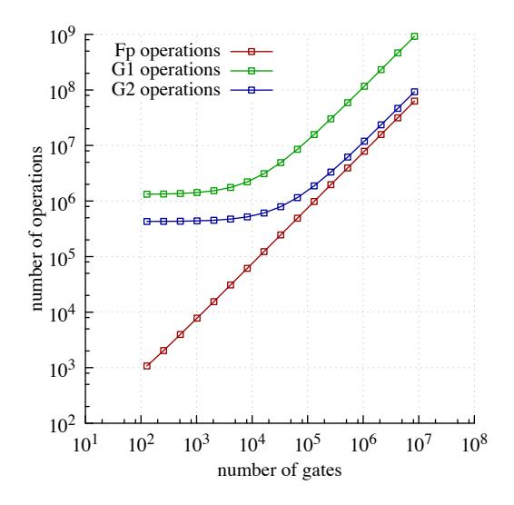

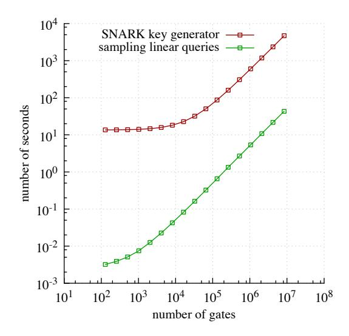

Figure 7: Number of operations in  $\mathbb{F}_r$ ,  $\mathbb{G}_1$ ,  $\mathbb{G}_2$  (left) and running time (right) of the SNARK key generator G(C) as a function of |C|, the number of gates in C. Also shown (right) is the time spent by G just for sampling linear queries; the difference is spent on cryptographic operations for encoding these queries. As expected, the asymptotic dependence on C is O(|C|). In both graphs, the knees are due to cost of building multi-exponentiation tables for  $\mathbb{G}_1$  and  $\mathbb{G}_2$ .

<span id="page-25-1"></span><sup>&</sup>lt;sup>22</sup> If x is a vector of field elements in  $\mathbb{F}_r$ , then |x| is the number of elements in the vector. If x is a bit string, then we can take |x| to be the number of bits in x divided by 181, because we can "pack" 181 bits into a single field element of  $\mathbb{F}_r$ .

<span id="page-26-0"></span>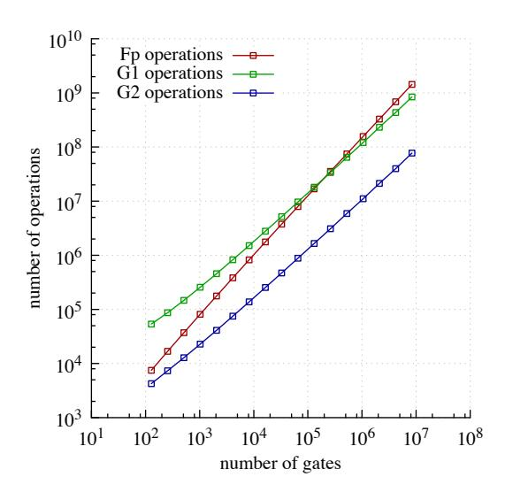

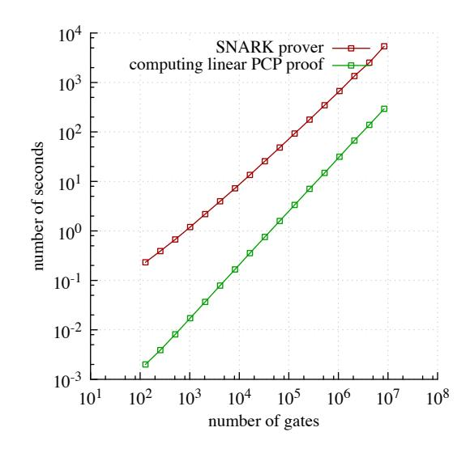

<span id="page-26-1"></span>Figure 8: Number of operations  $\mathbb{F}_r$ ,  $\mathbb{G}_1$ ,  $\mathbb{G}_2$  (left) and running time (right) of the SNARK prover  $P(\sigma,x,a)$  as a function of |C|, the number of gates in C. Also shown (right) is the (quasilinear) time spent by P just for computing the linear PCP proof; the difference is the (linear) time spent on cryptographic operations for homomorphically evaluating query answers. As expected, the asymptotic dependence on C is  $O(|C|\log|C|)$ . Moreover, for small values of |C| the (linear) cryptographic overhead dominates; as |C| increases, the (quasilinear) computation of the linear PCP proof eventually will dominate.

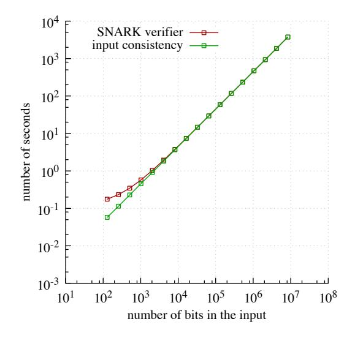

Figure 9: Running time of the SNARK verifier  $V(\tau,x,\pi)$  as a function of the number of bits in the input x. Also shown is the (linear) time spent by V just for the checking input consistency; the difference is for computing a constant number of pairings (21 in total). Recall that the input to a circuit is generally  $\mathit{much}$  smaller than the circuit's size, so the input size should be thought of as relatively small. As expected, the dependence on |x| is O(|x|).

## <span id="page-27-0"></span>4 System Evaluation

In Section [2](#page-7-0) we discussed our reduction from the correctness of program execution to circuit satisfiability, and then in Section [3](#page-20-0) we discussed our zk-SNARK for circuit satisfiability. In this section, we discuss the performance of the system obtained by combining these two components: an implementation of a zk-SNARK for the correctness of program executions. This system provides a solution for non-interactively delegating arbitrary NP computations, also in a way that does not compromise the privacy of any input that the untrusted worker contributes to the computation. Previous implementation work did not achieve many of the features enjoyed by our system. (See Appendix [C](#page-37-0) for a comparison with prior implementation work.)

### <span id="page-27-1"></span>4.1 System Overview

The zk-SNARK for the correctness of program executions consists of three algorithms (G? , P? , V ? ):

- The key generator <sup>G</sup>? , given a TinyRAM program P, input size n, and time bound T, outputs a proving key σ and a verification key τ that can be used to (respectively) prove and verify T-step computations of P on primary inputs of n words. (The auxiliary input may be longer than n words.)
- The prover P ? , given the proving key σ, the TinyRAM program P, a n-word primary input x, time bound T, and auxiliary input w, outputs a proof π, attesting to the fact that P(x, w) accepts in T steps.
- The verifier V ? , given the verification key τ , a n-word primary input x, and proof π, checks whether P(x, w) accepts in T steps for some choice of auxiliary input w.

Our GCC-based compiler can be used to obtain TinyRAM programs from C programs. See Figure [10](#page-27-2) and Figure [11](#page-27-2) below for an overview of how the three algorithms(G? , P? , V ? ) are obtained from (circ,wit,wit−<sup>1</sup> ), which is our circuit reduction, and (G, P, V ), which is our zk-SNARK for circuit satisfiability.

<span id="page-27-2"></span>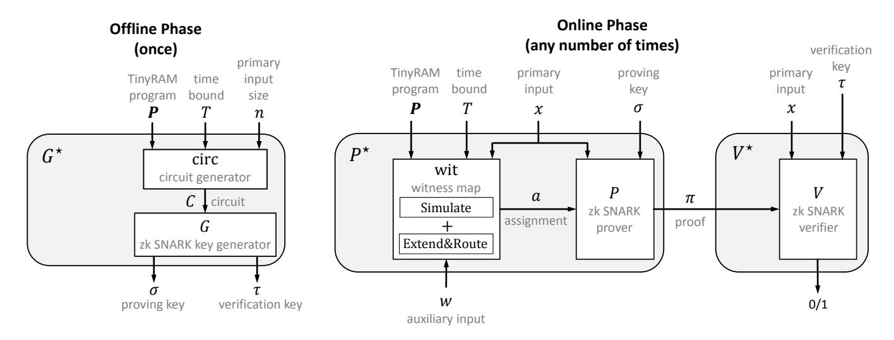

Figure 10: Overview of offline phase.

Figure 11: Overview of online phase.

### <span id="page-28-0"></span>4.2 System Performance

We now discuss the performance of our system, starting with the efficiency of compilation.<sup>23</sup>

• Compiling. The important efficiency measures of compiling from C code to TinyRAM assembly are code size (the number of instructions in the generated assembly code) and execution time (the number of machine steps needed to execute the assembly code). As discussed in Section 2.2, initial experiments indicate that both code size and execution time for our compiler are only a small multiplicative factor greater than those incurred when compiling to other architectures (such as x86, ARM, or AVR) by relying on existing compilers.

Next, we discuss the performance of our implementation of  $(G^*, P^*, V^*)$ . For concreteness, we fix word size W = 16 and number of registers K = 16.

- Key generation. The efficiency of the key generator  $G^*(\mathbf{P}, n, T)$  essentially only depends on the number of instructions in the program  $\mathbf{P}$ , the input size n, and the time bound T. Fixing any 100-instruction program  $\mathbf{P}$ , and input size n = 100, we study the efficiency of  $G^*(\mathbf{P}, n, T)$  as the time bound T grows. Specifically, the graphs in Figure 12 on the next page show, as a function of T, the running time of  $G^*$ , the number of gates in the circuit C (generated by  $G^*$  as an intermediate value), and the number of group elements in the proving key  $\sigma$  output by  $G^*$ . (We do not plot the number of group elements in the verification key  $\tau$  output by  $\tau$ 0 output by  $\tau$ 1.)
- Proving. The efficiency of the prover  $P^*(\sigma, \mathbf{P}, x, T, w)$  essentially only depends on the number of instructions in the program  $\mathbf{P}$ , the input size n (i.e., the number of words in x), and the time bound T. Fixing any 100-instruction program  $\mathbf{P}$ , primary input x with n=100 words, and auxiliary input w, we study the efficiency of  $P^*(\sigma, \mathbf{P}, x, T, w)$  as the time bound T grows. Specifically, in Figure 13 on page 30, we plot the running time of  $P^*$  as a function of T. Recall that the proof generated by P always consist of 12 group elements (regardless of the value of T, or other inputs)
- Verifying. The efficiency of the verifier  $V^*(\tau, x, x)$  essentially only depends on the input size n (i.e., the number of words in x). Indeed, the verifier  $V^*$  receives a verification key  $\tau$ , primary input x, and proof  $\pi$ , and then invokes V on these inputs. More precisely,  $V^*(\tau, x, \pi)$  actually coincides with  $V(\tau, x', \pi)$  where  $x' \neq x$  is a string of 2W(n+1)+1 bits obtained via a deterministic mapping applied to x. (Note that a primary input x of with n words contains Wn bits.) The mapping from x to x' arises from a technicality for correctly performing input consistency. Note that the circuit reduction was already performed by  $G^*$  and is implicit in the verification key  $\tau$ ; thus  $V^*$  itself is oblivious to the circuit reduction (up to the already mentioned technicality about mapping x to x').

The performance of V as a function of the number of bits in the input was discussed in Section 3.3, and specifically Figure 9 on page 27. So we do not produce any new graphs for  $V^*$ .

<span id="page-28-1"></span><sup>&</sup>lt;sup>23</sup>As in Section 3.3, we conducted these experiments using single-threaded code running on a 2.4 GHz Intel E7-8870 CPU with 256 GB of RAM.

<span id="page-29-0"></span>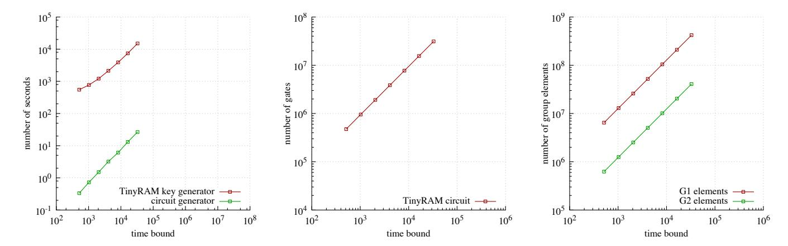

<span id="page-29-1"></span>Figure 12: On the left: running time of G? as a function of the time bound T; also shown is the running time of the circuit generator circ, while the remaining time is spent running G. (As T increases, the running time of G dominates the running time of G? .) In the center: number of gates in the circuit C, output by the circuit generator circ, as a function of T. On the right: number of G<sup>1</sup> and G<sup>2</sup> group elements in the proving key output by G? as a function of T.

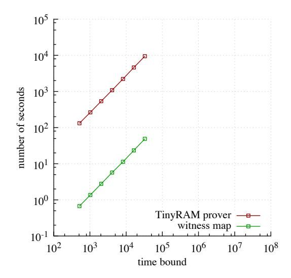

Figure 13: Running time of P ? as a function of the time bound T. Also shown is the running time of the witness map wit; the remaining time is spent running P. As T increases, the running time of P dominates the running time of P ? .

#### <span id="page-30-0"></span>4.3 Performance for Rectilinear TSP Example

We now report the system's performance when used for an illustrative example. The example proves and verifies claims of membership in the rectilinear Traveling Salesman Problem (*rectilinear TSP*) language, defined as follows.

A complete weighted graph G is specified by a list  $((x_1, y_1), \ldots, (x_n, y_n))$  where  $x_i, y_i \in \mathbb{Z}$ ; the *i*-th pair  $(x_i, y_i)$  specifies the coordinates in  $\mathbb{Z} \times \mathbb{Z}$  of the *i*-th vertex  $v_i$ ; any two vertices  $v_i$  and  $v_j$  have weight  $\Delta(v_i, v_j)$  given by the Manhattan distance (in  $\mathbb{Z} \times \mathbb{Z}$ ) between  $v_i$  and  $v_j$ .

Given a complete weighted graph G, the *rectilinear TSP language*,  $\mathcal{L}_G$ , is the language of pairs (s,B), where s is a source vertex in G and  $B \in \mathbb{Z}_+$  is a weight bound, such that there exists a Hamiltonian path p in G starting at s and with total weight at most B.

We chose above rectilinear TSP language in order to exercise various features of our system:

- Rectilinear TSP is NP-complete (when considered across all graphs G), so the proof-of-knowledge property gives a non-trivial guarantee. Namely, proving knowledge of a Hamiltonian path of low weight —when such a path is supposedly hard to find— is quite meaningful. (While proof of knowledge does tend to be more useful in cryptographic examples, we opted for a more familiar "classical" NP example.)
- Valid witnesses are often not unique, so that the zero-knowledge property gives a non-trivial guarantee.
- It is easy to write a linear-time C program that decides the relation for  $\mathcal{L}_G$ : given an instance (s,B) and a candidate witness p, the program checks that p is a valid path in G and that its total weight is at most B. In contrast, there may not exist a linear-size *circuit* for this task: even a quasilinear-size circuit seems to require routing/sorting techniques (similar to those used in our circuit generator; cf. Section 2.3). Thus, while simple, deciding  $\mathcal{L}_G$  efficiently makes crucial use of random access to memory.
- Instances in the language  $\mathcal{L}_G$  are much smaller than witnesses: a single vertex and an integer bound, vs. a Hamiltonian path. Hence, the time to verify a proof (which is linear in the instance size) will be much smaller than simply running the aforementioned program to decide the language (given the full witness).

Fixing a 200-node graph G, we obtained the following.

- Compiling. We wrote a simple C implementation of an NP decider for  $\mathcal{L}_{\mathsf{G}}$  (so that the description of  $\mathsf{G}$  is hardcoded in the decider), and compiled it to TinyRAM using our GCC-based compiler. The resulting TinyRAM program  $\mathbf{P}$  consists of 1105 instructions. When running  $\mathbf{P}$  on a primary input  $x = (\mathsf{s}, \mathsf{B})$  and auxiliary input  $y = \mathsf{p}$  (specified as a list of vertices), where  $\mathsf{s} = v_0$  and  $\mathsf{p}$  is a specific Hamiltonian path in  $\mathsf{G}$  of total weight at most  $\mathsf{B}$ ,  $\mathsf{P}$  accepts after  $11\,001$  steps.
- Key generation. Running the key generator  $G^*$  took 247 minutes. The generator  $G^*$  produced a proving key with 392 153 579 group elements in  $\mathbb{G}_1$  and 36 847 976 group elements in  $\mathbb{G}_2$ ; and a verification key with 9 group elements in  $\mathbb{G}_1$  and 6 group elements in  $\mathbb{G}_2$ . Of the total time, 307 seconds were spent in evaluating the circuit generator circ to compute C and the remaining time was spent in running G on C. The circuit C (which is an intermediate value of  $G^*$ 's computation) consisted of 32 047 142 gates.
- Proving. Running the prover  $P^*$  took 155 minutes, and produced a proof of 12 group elements (11 in  $\mathbb{G}_1$  and 1 in  $\mathbb{G}_2$ ). Of the total time, 318 seconds were spent in evaluating the witness map wit, which outputs a satisfying assignment a for C, and the remaining time was spent in running P on  $(\sigma, x, a)$  to compute the proof.
- Verifying. Running the verifier  $V^*$  took 0.11 seconds. Essentially this entire time was spent running V. Straightforward optimizations will significantly improve the above running times, as discussed next.

### <span id="page-31-0"></span>4.4 Further Optimizations

Our system is a *proof-of-concept prototype*, not an industrial-grade implementation. In particular, we did not put effort into any "second-order" optimizations that are standard and well-understood, but instead have focused our effort on optimizations that are novel to our work (and are thus less understood). Nonetheless, for completeness, we briefly mention several standard optimizations that will significantly improve the efficiency and scalability of our prototype.

- *Parallelization.* Essentially all the computations required of the generator, prover, and verifier can be parallelized.[24](#page-31-1) In particular, routing on Benes networks, sorting, polynomial interpolation/evaluation, ˇ multi-exponentiation, and others — all of these are highly-parallelizable (i.e., have polylogarithmic-depth circuits). Parallel implementations of all of these computational tasks are well-studied, and it should not be difficult to make our prototype leverage all available cores so to significantly reduce latency.
- *Computing in blocks.* Most of the computational problems mentioned in the previous paragraph achieve excellent time complexity at the cost of large space complexity. The large space complexity poses a serious obstacle to the scalability of the zk-SNARK to lengthy TinyRAM computations.

For example, the FFT algorithm improves over naive interpolation/evaluation, but does so at the cost of requiring random-linear space (with random access). As long as this fits into available RAM, (quasilinear) FFT is faster than native (quadratic) interpolation/evaluation . But for large problem sizes (e.g., such as those arising when proving correctness of lengthy computations), RAM becomes a bottleneck. This problem is traditionally mitigated by adopting a hybrid approach: the interpolation/evaluation problem is divided into smaller sub-problems (the "blocks"), the FFT algorithm is used to solve (separately) each smaller subproblem, and the solutions to the subproblems are combined using a naive algorithm. Doing so increases time complexity, but decreases space complexity. The choice of the block size allows one to tailor the resulting computational problem to the hardware carrying out the computation.

Similar ideas apply to mitigating the space complexity of routing on Benes networks, multi-exponentiation, ˇ etc. Applying these will improve scalability of the implementation, by removing the memory bottleneck.

• *Optimized field arithmetic.* Essentially all of the computations of the algorithms of (G, P, V ) — the zk-SNARK for circuit satisfiability — consist of field operations over a large prime field. In particular, tightly optimizing arithmetic for such fields (by taking into account the specific architecture at hand, the specific field that is used, etc.) has a significant impact on the efficiency of these three algorithms. Of course, optimizing arithmetic for large prime fields is a well-studied problem (e.g., it arises in many cryptographic applications). Thus, it should not be difficult to improve the running times that we measured in Section [3.3.](#page-24-0) (For this reason the number of field operations is arguably a more important measure of efficiency, and in Section [3.3](#page-24-0) we do report the number of field operations alongside running times.)

<span id="page-31-1"></span><sup>24</sup>With one exception: the actual execution of the TinyRAM program by the prover, in order to generate the execution trace, cannot of course be parallelized (in the general case).

## <span id="page-32-0"></span>5 Extensions

For simplicity, throughout the paper we have ignored several (orthogonal) extensions of our approach that provide additional functionality or efficiency. We now describe each of these extensions.

Program-independent offline phase. As discussed in Section [4,](#page-27-0) the key generator G? takes as input a TinyRAM program P, input size n, and time bound T; then G? outputs a proving key σ and verification key τ that can be used to (respectively) prove and verify T-step computations of P on primary inputs of n words.

But what if one does not want to commit in advance, in the offline phase, to a specific program P?

It is possible to modify G? so that, in the offline phase, one only has to commit to the program size but not the program itself: G? can take as input a *program size* `, rather than an `-instruction program P, so that the output keys can work for *any* program with ` instructions. (In such a case, the verifier V ? will receive P as an additional input.) The modification only incurs a minor overhead in the number of gates in the circuit C output by the circuit generator circ.

Primary inputs and programs of different sizes. As recalled in the previous paragraph, G? takes as input a primary input size n; the output keys then work for computations on primary inputs of n words.

But what if one does not want to commit in advance to a specific input size?

It is possible to modify G? so that the output keys work for computations on primary inputs of *at most* n words. This modification again only incurs a minor overhead in the number of gates.

Furthermore, if one does not want to commit in advance to a specific program size in the programindependent offline phase described above, it is possible to carry out an analogous modification to G? so that the output keys work for programs with *at most* ` instructions (rather than only *exactly* ` instructions).

In either of the above cases, if V ? has oracle access to the verification key, the running time is linear in the size of the primary input or program, rather than the respective (potentially much larger) bounds.

von Neumann architecture and self-modifying code. As discussed in Section [2.1,](#page-7-1) TinyRAM follows the Harvard architecture paradigm: the program to be executed is stored in a separate, read-only, address space (i.e., different from the read-write data address space). It is straightforward to define a *von Neumann variant* of TinyRAM, where the code to be executed sits in the same, read-write, address space as data. In particular, such an architecture allows for programs that access, and *modify*, their own code, and allows for applications such as *just-in-time compilation* [\[GES](#page-50-13)+09].

It is possible to modify G? , with essentially no efficiency overhead, to work for the "von Neumann variant" of TinyRAM. In particular, our approach can thus be extended to verify correctness of nondeterministic computations expressed via self-modifying programs.

## <span id="page-33-0"></span>Acknowledgments

The authors gratefully thank the members of the programming team: Ohad Barta, Lior Greenblatt, Shaul Kfir, Lev Pachmanov, Michael Riabzev, Gil Timnat, and Arnon Yogev. We also thank Andrey Vihrov for helpful technical discussions; Dan Bernstein, Tanja Lange, Peter Schwabe, and Andrew Sutherland for discussions about elliptic curves; and Ron Rivest and Nickolai Zeldovich for helpful comments and discussions. We thank Nickolai Zeldovich for the use of his group's compute nodes.

The research leading to these results, and in particular the aforementioned programming team, has received funding from the European Community's Seventh Framework Programme (FP7/2007-2013) under grant agreement number 240258. This work was also supported by the Center for Science of Information (CSoI), an NSF Science and Technology Center, under grant agreement CCF-0939370; by the Check Point Institute for Information Security; by the Israeli Ministry of Science and Technology, and by the Israeli Centers of Research Excellence I-CORE program (center 4/11).

## <span id="page-34-0"></span>A Definition of Zero-Knowledge SNARKs

In Section 1.1 we informally introduced (publicly-verifiable preprocessing) *zero-knowledge SNARKs* for boolean circuit satisfiability. For completeness, we give here formal definitions. The extension of the definition to *arithmetic* circuit satisfiability (as defined in Section 3.2) is straightforward, so we omit it.<sup>25</sup>

**Definition A.1.** A triple of algorithms (G, P, V) is a **publicly-verifiable preprocessing SNARG** (or, for brevity in this paper, simply SNARG) for boolean circuit satisfiability if the following conditions are satisfied.

## 1. Completeness

For every large enough security parameter  $\lambda \in \mathbb{N}$ , every circuit  $C \colon \{0,1\}^n \times \{0,1\}^h \to \{0,1\}$ , every input  $x \in \{0,1\}^n$ , and every assignment  $a \in \{0,1\}^h$  with  $(x,a) \in \mathcal{R}_C$ ,

$$\Pr\left[V(\tau, x, \pi) = 1 \middle| \begin{array}{c} (\sigma, \tau) \leftarrow G(1^{\lambda}, C) \\ \pi \leftarrow P(\sigma, x, a) \end{array} \right] = 1.$$

#### 2. Soundness

For every polynomial-size prover  $P^*$ , constant c > 0, every large enough security parameter  $\lambda \in \mathbb{N}$ , and every circuit  $C \colon \{0,1\}^n \times \{0,1\}^h \to \{0,1\}$  of size  $\lambda^c$ ,

$$\Pr\left[\begin{array}{c|c} V(\tau,x,\pi) = 1 \\ \nexists \ a \ s.t. \ (x,a) \in \mathcal{R}_C \end{array} \right| \begin{array}{c} (\sigma,\tau) \leftarrow G(1^{\lambda},C) \\ (x,\pi) \leftarrow P^*(\sigma,\tau) \end{array} \right] \leq \mathsf{negl}(\lambda) \ .$$

## 3. Efficiency

There is a universal polynomial p such that, for every large enough security parameter  $\lambda \in \mathbb{N}$ , every circuit  $C: \{0,1\}^n \times \{0,1\}^h \to \{0,1\}$ , input  $x \in \{0,1\}^n$ , and assignment  $a \in \{0,1\}^h$  with  $(x,a) \in \mathcal{R}_C$ ,

- the key generator G runs in time  $p(\lambda + |C|)$ ;
- the prover P runs in time  $p(\lambda + |C|)$ ;
- the verifier V runs in time  $p(\lambda + |x|)$ ;
- an honestly generated proof has size  $p(\lambda)$ .

<span id="page-34-1"></span>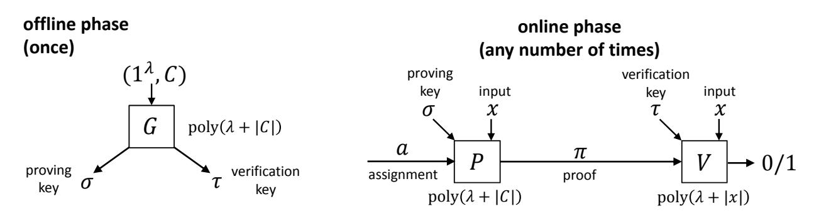

Figure 14: Overview of offline phase.

Figure 15: Overview of online phase.

<span id="page-34-2"></span><sup>&</sup>lt;sup>25</sup>In particular, we do not define here zero-knowledge SNARKs relative to a *universal relation* [BG08]. For details, see [BCI<sup>+</sup>13].

A SNARG of knowledge (SNARK) is a SNARG where soundness is strengthened as follows:

**Definition A.2.** A triple of algorithms (G, P, V) is a **SNARK** (for circuit satisfiability) if it is a SNARG (for circuit satisfiability) where soundness is replaced by the following stronger requirement:

### $Proof\ of\ knowledge$

For every polynomial-size prover  $P^*$  there exists a polynomial-size extractor E such that for every constant c>0, large enough security parameter  $\lambda\in\mathbb{N}$ , every auxiliary input  $z\in\{0,1\}^{\mathrm{poly}(\lambda)}$ , and every circuit  $C:\{0,1\}^n\times\{0,1\}^h\to\{0,1\}$  of size  $\lambda^c$ ,

$$\Pr\left[\begin{array}{c|c} V(\tau,x,\pi) = 1 \\ (x,a) \notin \mathcal{R} \end{array} \middle| \begin{array}{c} (\sigma,\tau) \leftarrow G(1^{\lambda},C) \\ (x,\pi) \leftarrow P^{*}(z,\sigma,\tau) \\ a \leftarrow E(z,\sigma,\tau) \end{array} \right] \leq \mathsf{negl}(\lambda) \enspace .$$

A zero-knowledge SNARK (or "succinct NIZK of knowledge") is a SNARK satisfying a zero-knowledge property. Namely, zero knowledge ensures that the honest prover can generate valid proofs for true theorems without leaking any information about the theorem beyond the fact that the theorem is true (in particular, without leaking any information about the assignment that he used to generate the proof). Of course, when considering zero-knowledge SNARKs, the prover must trust the generation of the proving key  $\sigma$ . (Thus, combined with the fact that the verifier must trust the generation of the verification key  $\tau$ , the key generator G must be run by a party that is trusted by both the prover and verifier.)

<span id="page-35-0"></span>**Definition A.3.** A triple of algorithms (G, P, V) is a (perfect) zero-knowledge SNARK (for circuit satisfiability) if it is a SNARK (for circuit satisfiability) and, moreover, satisfies the following property:

#### Zero Knowledge

There exists a stateful interactive polynomial-size simulator S such that for all stateful interactive polynomial-size distinguishers  $\mathcal{D}$ , constant c, large enough security parameter  $\lambda \in \mathbb{N}$ , every auxiliary input  $z \in \{0,1\}^{\operatorname{poly}(\lambda)}$ , and every circuit  $C:\{0,1\}^n \times \{0,1\}^h \to \{0,1\}$  of size  $\lambda^c$ ,

$$\Pr\left[\begin{array}{c|c} (x,a) \in \mathcal{R}_C \\ \mathcal{D}(\pi) = 1 \end{array} \middle| \begin{array}{c} (\sigma,\tau) \leftarrow G(1^\lambda,C) \\ (x,a) \leftarrow \mathcal{D}(z,\sigma,\tau) \\ \pi \leftarrow P(\sigma,x,a) \end{array}\right] = \Pr\left[\begin{array}{c|c} (x,a) \in \mathcal{R}_C \\ \mathcal{D}(\pi) = 1 \end{array} \middle| \begin{array}{c} (\sigma,\tau,\mathsf{trap}) \leftarrow S(1^\lambda,C) \\ (x,a) \leftarrow \mathcal{D}(z,\sigma,\tau) \\ \pi \leftarrow S(z,\sigma,x,\mathsf{trap}) \end{array}\right] \ .$$

As usual, Definition A.3 can be relaxed to consider the case in which the distributions are only *statistically* or *computationally* close.

**Multiple theorems.** A desirable property (especially when the SNARK requires an expensive preprocessing phase!) is the ability to generate the system's parameters  $(\sigma, \tau)$  once and for all and then reuse them in polynomially-many proofs (potentially generated by different provers). Doing so requires security also against provers that *have access to a proof-verification oracle*. In the case of public verifiability (which is the one considered in this paper) this *multi-theorem proof of knowledge* property is automatically guaranteed. (See [BCI<sup>+</sup>13] for more details.)

## <span id="page-36-0"></span>B Summary of Theoretical Work on Succinct Verification

In Table [3](#page-36-1) we provide a summary of theoretical work on proof systems and argument systems with succinct verification. For more details, we refer the reader to the cited works. In the table, lightly-shaded rows are works obtaining succinct *non-interactive* arguments (SNARGs); darkly-shaded rows are works obtaining SNARGs in the preprocessing model, which is the model considered in this work.

- The column "*supported statements*" denotes what types of computations can be succinctly verified.
- The column "*# online messages*" denotes how many statement-dependent messages are needed for the prover to convince the verifier. (All of the constructions require also a single offline message to set up the system's parameters.)
- The column "*offline work*" denotes whether the offline generation of system parameters is as expensive as conducting the computation, or much cheaper (namely, only a fixed polynomial in the security parameter).
- The column "*secure with verifier oracle?*" denotes whether the construction is secure even against provers that have access to a proof-verification oracle. (If not, then the construction has the so-called verifierrejection problem.)
- The column "*publicly verifiable?*" denotes whether anyone can recognize an accepting proof. When there is more than 1 online message, public verifiability guarantees soundness only when the party verifying the proof trusts the generation of the verifier's online messages (besides that of the system's parameters).
- The column "*main tools*" provides keywords for the main ingredients of the construction.

<span id="page-36-1"></span>From a theoretical point of view, the (preprocessing) SNARG implementation presented in this work is an optimized variant of the asymptotically-efficient construction in [\[BCI](#page-48-8)+13]. (See Table [3](#page-36-1) below.)

|                                   | supported       | # online | offline   | secure with      | publicly                 |                                   |  |  |
|-----------------------------------|-----------------|----------|-----------|------------------|--------------------------|-----------------------------------|--|--|
| references                        | statements      | messages | work      | verifier oracle? | verifiable?              | main tools                        |  |  |
| [Kil92]                           | NP              | 3        | cheap     | yes              | yes                      | PCP, CRH                          |  |  |
| [AIK10]                           | P               | 2        | expensive | no               | no                       | FHE, RE, MAC                      |  |  |
| [GGP10]                           | P               | 2        | expensive | no               | no                       | FHE, Yao GC                       |  |  |
| [CKV10]                           | P               | 2        | expensive | no               | no                       | FHE, cut-and-choose               |  |  |
| [GKR08]+[KR09]                    | NC              | 1        | cheap     | no               | no                       | IP for Muggles, PIR               |  |  |
| [CRR12]                           | non-uniform NC  | 1        | expensive | yes              | IP for Muggles, PIR, CRH |                                   |  |  |
| [KRR13]                           | SPACE(logc<br>) | 1        | cheap     | no               | no                       | no-signaling MIP, FHE             |  |  |
| [PRV12]+[GVW13]+[GKP+13]          | NC              | 2        | expensive | yes              | yes                      | FHE, FE, Yao GC                   |  |  |
| [GLR11]                           | NP              | 1        | cheap     | no               | no                       | PCP, PIR, extractable CRH         |  |  |
| [BCCT12]                          | NP              | 1        | cheap     | no               | no                       | PCP, PIR, extractable CRH         |  |  |
| [DFH12]                           | NP              | 1        | cheap     | no               | no                       | PCP, PIR, extractable CRH         |  |  |
| [BC12]                            | NP              | 1        | cheap     | no<br>no         |                          | MIP, extractable FHE              |  |  |
| [Gro10a]                          | NP              | 1        | expensive | yes              | yes                      | knowledge of exponent             |  |  |
| [Lip12]                           | NP              | 1        | expensive | yes              | yes                      | knowledge of exponent             |  |  |
| [GGPR13]                          | NP              | 1        | expensive | yes              | yes                      | QSP, knowledge of exponent        |  |  |
| [BCI+13]<br>(we follow this work) | NP              | 1        | expensive | yes              | yes                      | linear PCP, linear targeted mall. |  |  |
| [BCCT13]                          | NP              | 1        | cheap     | yes              | yes                      | any publicly-verifiable SNARK     |  |  |

Table 3: Summary of work on argument systems with succinct verification.

## <span id="page-37-0"></span>C Prior Implementation Work

Implementations of arguments systems for NP with succinct verification have not been achieved by prior work. (Not even in the preprocessing model, nor with interaction between the prover and verifier, nor for NP-complete languages that are less convenient than the correctness of RAM computations.) In Section C.1, we discuss prior work about implementations of delegation protocols of various flavors. We also discuss an independent work of Parno et al. [PGHR13] that, like this work, studies succinct verification in the preprocessing model. Then, in Section C.2, we discuss how previous work has addressed the problem of reducing the correctness of program executions to low-level representations such as circuits.

## <span id="page-37-1"></span>C.1 Prior Implementations of Proof Systems for Verifiably Delegating Computation

Interactive proofs for low-depth circuits. Goldwasser et al. [GKR08] obtained an interactive proof for delegating computations of low-depth circuits: given an input of length n, a verifier can check that a  $O(\log S(n))$ -space uniform circuit of fan-in 2, size S(n), and depth D(n) is correctly evaluated on the input, while running only in time  $(n+D(n)) \cdot \operatorname{polylog} S(n)$ ; the honest prover runs in time  $\operatorname{poly}(S(n))$  and requires  $D(n) \cdot \operatorname{polylog} S(n)$  rounds of interaction with the verifier. A set of works [CMT12, TRMP12, Tha13] has optimized and implemented the protocol of Goldwasser et al. [GKR08]; for instance, it improved the running time of the prover to  $O(S(n) \log S(n))$ , provided a GPU implementation, and carefully optimized the protocol for circuits with "sufficiently regular" wiring patterns.

The protocol of [GKR08] can be reduced to a two-message argument system [KR09, KRR13]. Canetti et al. [CRR12] showed how to extend the techniques in [GKR08] to also handle non-uniform circuits, with a two-message protocol having an expensive offline preprocessing phase.

**Batching arguments.** Ishai et al. [IKO07] constructed a 4-message argument system for NP in which the prover-to-verifier communication is short (i.e., an argument with a *laconic* prover [GVW02]) by combining a *strong* linear PCP and linear homomorphic encryption. While their construction does not grant the verifier savings in computation, Ishai et al. noted that their protocol yields a *batching argument*: an argument in which, to simultaneously verify that  $\ell$  circuits of size S are satisfiable, the verifier runs in time  $\max\{S^2,\ell\}$  poly( $\lambda$ ), where  $\lambda$  is a security parameter. (Thus, the verifier runs in time  $(S^2/\ell)$  poly( $\lambda$ ) per circuit.)

A set of works [SBW11, SMBW12, SVP<sup>+</sup>12, SBV<sup>+</sup>13] has improved, optimized, and implemented the batching argument of Ishai et al. [IKO07] for the purpose of outsourcing computation. In particular, by relying on quadratic arithmetic programs (QAPs) of [GGPR13], Setty et al. [SBV<sup>+</sup>13] have improved the running time of the verifier and prover to  $\max\{S,\ell\} \cdot \operatorname{poly}(\lambda)$  and  $\tilde{O}(S) \cdot \operatorname{poly}(\lambda)$  respectively.<sup>28</sup>

Vu et al. [VSBW13] provide a system that incorporates (along with optimizations) both the batching arguments of [SBW11, SMBW12, SVP<sup>+</sup>12, SBV<sup>+</sup>13] as well as the interactive proofs of [CMT12, TRMP12, Tha13]. The system decides, for any given instance, which of the two approaches is more efficient to use.

<span id="page-37-2"></span><sup>&</sup>lt;sup>26</sup> While all prior works only achieve solutions formally weaker than a succinct argument for NP, they rely on more standard cryptographic assumptions than those used in constructions of non-interactive succinct arguments for NP. (Or no assumptions at all in the case of information-theoretic constructions.) In our work, like other works on non-interactive arguments for NP, we rely on less standard cryptographic assumptions; Gentry and Wichs [GW11] have provided evidence that doing so might be inherent.

<span id="page-37-3"></span><sup>&</sup>lt;sup>27</sup>A *strong* linear PCP is a PCP in which the honest proof oracle is guaranteed to be a linear function, and soundness is required to hold for *all* (including non-linear) proof oracles. In this paper we rely on the work of Bitansky et al. [BCI<sup>+</sup>13], who work with a (*weak*) linear PCP, which is a PCP in which the honest proof oracle is guaranteed to be a linear function, and soundness is required to hold *only* for linear proof oracles. See [BCI<sup>+</sup>13] for a more detailed discussion on the differences between the two.

<span id="page-37-4"></span><sup>&</sup>lt;sup>28</sup>A brief technical comparison is of order here. Setty et al. [SBV<sup>+</sup>13] use QAPs within the framework of [IKO07], while in our work we do so within the framework of Bitansky et al. [BCI<sup>+</sup>13]. This implies significant differences in terms of cryptographic assumptions, efficiency, and functionality. See [BCI<sup>+</sup>13] for more details.

Arguments with competing provers. Canetti et al. [\[CRR11\]](#page-49-20) use collision-resistant hashes to get a protocol for verifying any deterministic T(n)-time computation, in time only O(n + λ log T(n)), in a model where the verifier interacts with two computationally-bounded provers at least one of which is assumed to be honest [\[FK97\]](#page-50-17). Remarkably, the protocol in [\[CRR11\]](#page-49-20) can be made to work *directly* for random-access machines, and therefore does not require reducing random-access machines to any "lower-level" representation (such as circuits). Canetti et al. implement their protocol for (deterministic) x86 programs and obtain very good efficiency. In order to support arbitrary C programs, Canetti et al. use GCC and a special deterministic implementation of key C standard-library functions such as malloc and free.

Independent work on preprocessing SNARKs. Parno et al. [\[PGHR13\]](#page-52-10) optimize and implement the preprocessing SNARK based on quadratic arithmetic programs (QAPs) of Gennaro et al. [\[GGPR13\]](#page-50-4); their proof system supports proving satisfiability of arithmetic circuits. For comparison, in our work, we also implement a preprocessing SNARK based on QAPs for arithmetic circuit satisfiability, but we do so via the (in our eyes) simpler framework of Bitansky et al. [\[BCI](#page-48-8)+13] for constructing SNARKs from linear PCPs.

The major difference between our work and that of Parno et al. is the approach to the representation problem: namely, how to obtain an efficient low-level (in this case, arithmetic circuit) representation for the correctness of arbitrary program executions. As we shall discuss next, the approach of Parno et al. (unlike ours) incurs at least a quadratic blow-up in the worst-case, like all other prior works.

## <span id="page-38-0"></span>C.2 Prior Implementations of Circuit Generators

All previous implementation work (except the work of Canetti et al. [\[CRR11\]](#page-49-20) on competing provers) requires an instance to be represented as a circuit, or other similar "low-level" representations.

While [\[SBW11,](#page-52-13) [SMBW12,](#page-52-14) [CMT12,](#page-49-19) [TRMP12\]](#page-52-11) do not address the problem of converting arbitrary programs to a circuit representation, [\[SVP](#page-52-15)+12, [SBV](#page-52-16)+13] do consider the problem of programming arithmetic circuits. Specifically, they present a solution, based on the Fairplay compiler [\[MNPS04,](#page-51-9) [BDNP08\]](#page-49-13), for compiling programs written in a special language called SFDL. Next, both [\[SVP](#page-52-15)+12, [SBV](#page-52-16)+13] convert the output of the FairPlay compiler to the constraints required by their respective protocols.

Compared with high-level programming languages like C, SFDL is quite limited in the sense that it does not support important primitives and has inefficient support for others. For example, SFDL does not support loops with a non-constant number of iterations; also, it does not support recursions. Furthermore, each array access of the form A[i], where A is an array and i is an index, is implemented via a multiplexer circuit over the *entire* array. In particular, relying on a compiler such as FairPlay has a severe drawback: the circuits it generates have size that is *quadratic* in the time bound T in the worst case, due to inefficient support of memory accesses. So, e.g., the prover in all previous works runs in time that is Ω(T 2 ) in the worst case.

Parno et al. [\[PGHR13\]](#page-52-10) do not rely on the Fairplay compiler, but also rely on an approach with a blowup that is at least quadratic in the worst case. Indeed, they provide a compiler for a basic subset of C that, like SFDL, is very restrictive: memory accesses are static constants, loops are unrolled up to a static bound, both branches of a conditional are executed, and so on. In particular, accesses to memory are inefficiently supported.

The quadratic blowup in previous work is not accidental but is due to a fundamental difficulty: how is consistency of random-access memory achieved? As discussed (see Section [2.3.2\)](#page-13-5), the naive solution of multiplexing from memory at each time step is inefficient. Instead, in this work (see Section [2.3\)](#page-13-0) we implement an *efficient* circuit generator: by leveraging nondeterminism and routing [\[BCGT13a\]](#page-48-11), we generate an arithmetic circuit whose size is only O(T log T). The bound holds even when a program makes use of datadependent loops, control flow, recursions, and memory accesses. (Indeed, the bound holds for all TinyRAM programs.) Because most prior works support circuit satisfiability, all these prior works directly benefit from our circuit generator in the sense that their circuit generators can be replaced with our more efficient one. (E.g., doing so in [\[SBV](#page-52-16)+13] or [\[PGHR13\]](#page-52-10) ensures the prover runs in quasilinear instead of quadratic time.)

### <span id="page-39-0"></span>**D** Definition of Linear PCPs

In Section 1.2 we informally introduced a linear PCP to be a PCP where the honest proof oracle is a linear function (over some underlying field), and soundness is required to hold *only* for linear proof oracles. For completeness, we give here formal definitions. For more details, see [BCI<sup>+</sup>13].

**Definition D.1.** We say that a multivariate polynomial  $f: \mathbb{F}^m \to \mathbb{F}$  has **degree** d if the total degree of f is at most d. A **multivalued multivariate polynomial**  $f: \mathbb{F}^m \to \mathbb{F}^{\mu}$  is a vector of polynomials  $(f_1, \ldots, f_{\mu})$  where each  $f_i: \mathbb{F}^m \to \mathbb{F}$  is a (single-valued) multivariate polynomial.

A *linear* probabilistically-checkable proof (linear PCP) system for a relation  $\mathcal{R}$  over a field  $\mathbb{F}$  is one where the PCP oracle is restricted to compute a linear function  $\pi \colon \mathbb{F}^m \to \mathbb{F}$  of the verifier's queries. Viewed as a traditional PCP,  $\pi$  has length  $|\mathbb{F}|^m$  (and alphabet  $\mathbb{F}$ ). For simplicity, we ignore the computational complexity issues in the following definition, and refer to them when they are needed.

**Definition D.2.** Let  $\mathcal{R}$  be a binary relation,  $\mathbb{F}$  a finite field,  $P_{\mathsf{LPCP}}$  a deterministic prover algorithm, and  $V_{\mathsf{LPCP}}$  a probabilistic oracle verifier algorithm. We say that the pair  $(P_{\mathsf{LPCP}}, V_{\mathsf{LPCP}})$  is a (input-oblivious) k-query linear PCP for  $\mathcal{R}$  over  $\mathbb{F}$  with knowledge error  $\varepsilon$  and query length m if it satisfies the following requirements.

- 1. Syntax. On any input x and oracle  $\pi$ , the verifier  $V_{\mathsf{LPCP}}^{\pi}(x)$  makes k input-oblivious queries to  $\pi$  and then decides whether to accept or reject. More precisely,  $V_{\mathsf{LPCP}}$  consists of a probabilistic query algorithm  $Q_{\mathsf{LPCP}}$  and a deterministic decision algorithm  $D_{\mathsf{LPCP}}$  working as follows. Based on its internal randomness, and independently of x,  $Q_{\mathsf{LPCP}}$  generates k queries  $q_1, \ldots, q_k \in \mathbb{F}^m$  to  $\pi$  and state information  $\mathbf{u}$ ; then, given x,  $\mathbf{u}$ , and the k oracle answers  $a_1 = \langle \pi, q_1 \rangle, \ldots, a_k = \langle \pi, q_k \rangle$ ,  $D_{\mathsf{LPCP}}$  accepts or rejects.
- 2. <u>Completeness.</u> For every  $(x, w) \in \mathcal{R}$ , the output of  $P_{\mathsf{LPCP}}(x, w)$  is a description of a linear function  $\pi \colon \mathbb{F}^m \to \mathbb{F}$  such that  $V^{\pi}_{\mathsf{LPCP}}(x)$  accepts with probability 1.
- 3. <u>Knowledge.</u> There exists a knowledge extractor  $E_{\mathsf{LPCP}}$  such that for every linear function  $\pi^* \colon \mathbb{F}^m \to \mathbb{F}$  if the probability that  $V_{\mathsf{LPCP}}^{\pi^*}(x)$  accepts is greater than  $\varepsilon$  then  $E_{\mathsf{LPCP}}^{\pi^*}(x)$  outputs w such that  $(x,w) \in \mathbb{R}$ .

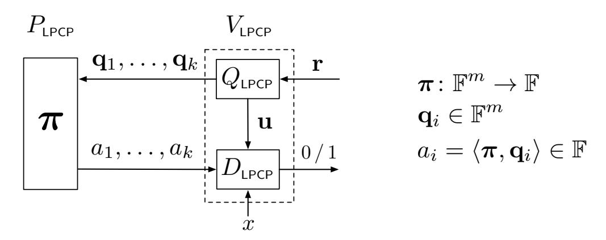

Figure 16: Diagram of a k-query linear PCP of length m.

<span id="page-39-1"></span><sup>&</sup>lt;sup>29</sup>In particular,  $(P_{\mathsf{LPCP}}, V_{\mathsf{LPCP}})$  has soundness error  $\varepsilon$ : for every x such that  $(x, w) \not\in \mathcal{R}$  for all w, and for every linear function  $\pi^* \colon \mathbb{F}^m \to \mathbb{F}$ , the probability that  $V_{\mathsf{LPCP}}^{\pi^*}(x)$  accepts is at most  $\varepsilon$ .

An important efficiency measure for a linear PCP is the (algebraic) degree of the verifier. Specifically, we say that  $(P_{LPCP}, V_{LPCP})$  has **degree**  $(d_O, d_D)$  if, additionally the following two requirements hold.

- The query algorithm  $Q_{\text{LPCP}}$  has degree  $d_Q$ . Namely, there are k polynomials  $p_1, \ldots, p_k \colon \mathbb{F}^\mu \to \mathbb{F}^m$  and state polynomial  $p \colon \mathbb{F}^\mu \to \mathbb{F}^{m'}$ , all of degree  $d_Q$ , such that the linear PCP queries are  $q_1 = p_1(r), \ldots, q_k = p_k(r)$  and the state is  $\mathbf{u} = p(r)$ , for a random  $r \in \mathbb{F}^\mu$ .
- The decision algorithm  $D_{LPCP}$  has degree  $d_D$ . Namely, for every input x there is a polynomial  $\boldsymbol{t}_x \colon \mathbb{F}^{m'+k} \to \mathbb{F}^{\eta}$  of degree  $d_D$  such that  $\boldsymbol{t}_x(\mathbf{u}, a_1, \dots, a_k) = 0^{\eta}$  if and only if  $D_{LPCP}(x, \mathbf{u}, a_1, \dots, a_k)$  accepts.

In such a case, we call m', which is the number of field elements in the u, the **state length**.

**Honest-verifier zero-knowledge linear PCPs.** We also consider *honest-verifier zero-knowledge* (HVZK) linear PCPs. In an HVZK linear PCP, soundness or knowledge is defined as in a usual linear PCP, and HVZK is defined as in a usual HVZK PCP. For convenience, let us recall the definition of a HVZK PCP:

**Definition D.3.** A PCP system  $(P_{PCP}, V_{PCP})$  for a relation  $\mathcal{R}$ , where  $P_{PCP}$  is also probabilistic, is  $\delta$ -statistical **HVZK** if there exists a simulator  $S_{PCP}$ , running in expected polynomial time, for which the following two ensembles are  $\delta$ -close ( $\delta$  can be a function of the field, input length, and so on):

$$\left\{S_{\text{PCP}}(x)\right\}_{(x,w)\in\mathcal{R}} \text{ and } \left\{\operatorname{View}\left(V_{\text{PCP}}^{\pi_{x,w}}(x)\right)\mid \pi_{x,w}\leftarrow P_{\text{PCP}}(x,w)\right\}_{(x,w)\in\mathcal{R}} \right.,$$

where View represents the view of the verifier, including its coins and the induced answers according to  $\pi$ . If the above two distributions are identically distributed then we say that  $(P_{PCP}, V_{PCP})$  is **perfect** HVZK.

### <span id="page-41-0"></span>E An Efficient HVZK Linear PCP

We describe the HVZK linear PCP for circuit satisfiability that we designed and implemented. (See Appendix D for the definition of a linear PCP, the HVZK property, and other notions used in this section.) The basic design of our linear PCP builds on the *quadratic arithmetic programs* (QAPs) of Gennaro et al. [GGPR13]. (See Remark E.4 for a technical comparison.)

Rather than directly constructing a linear PCP for circuit satisfiability, we first construct linear PCPs for a notationally more convenient language: satisfiability of systems of rank-1 quadratic equations over a finite field  $\mathbb{F}$ . As discussed below, both boolean and arithmetic circuit satisfiability are reducible to this language essentially without any overheads.

**Definition E.1.** A system of rank-1 quadratic equations over  $\mathbb{F}$  is a tuple  $\mathcal{S} = ((\mathbf{a}_j, \mathbf{b}_j, \mathbf{c}_j)_{j=1}^{N_{\mathsf{g}}}, n)$  where  $\mathbf{a}_j, \mathbf{b}_j, \mathbf{c}_j \in \mathbb{F}^{1+N_{\mathsf{w}}}$  and  $n \leq N_{\mathsf{w}}$ . Such a system  $\mathcal{S}$  is satisfiable with an input  $\mathbf{x} \in \mathbb{F}^n$  if there is a witness  $\mathbf{w} \in \mathbb{F}^{N_{\mathsf{w}}}$  such that:

```
1. \mathbf{x} = (w_1, \dots, w_n), and
2. \langle \mathbf{a}_j, (1, \mathbf{w}) \rangle \cdot \langle \mathbf{b}_j, (1, \mathbf{w}) \rangle = \langle \mathbf{c}_j, (1, \mathbf{w}) \rangle for all for j \in [N_g].
In such a case, we write S(\mathbf{x}, \mathbf{w}) = 1.
```

We call  $N_{\rm g}$  the number of constraints,  $N_{\rm w}$  the number of variables, and n the input size.

**Definition E.2.** The satisfaction problem of a system (of rank-1 quadratic equations) S is the relation  $\mathcal{R}_{S} = \{(\mathbf{x}, \mathbf{w}) \in \mathbb{F}^{n} \times \mathbb{F}^{N_{w}} : S(\mathbf{x}, \mathbf{w}) = 1\}$ ; its language is denoted  $\mathcal{L}_{S}$ .

A boolean circuit  $C\colon\{0,1\}^n\times\{0,1\}^h\to\{0,1\}$  with  $\alpha$  wires and  $\beta$  (bilinear) gates induces a corresponding system of quadratic equations  $\mathcal S$  with  $N_{\mathsf w}=\alpha$  variables and  $N_{\mathsf g}=\beta+h+1$  constraints. (The h+1 additional constraints are to ensure that the h variables corresponding to witness wires have boolean values, and that the output gate outputs 0.) Similarly, an arithmetic circuit  $C\colon\mathbb F^n\times\mathbb F^h\to\mathbb F^l$  with  $\alpha$  wires and  $\beta$  (bilinear) gates induces a corresponding system of quadratic equations  $\mathcal S$  with  $N_{\mathsf w}=\alpha$  variables and  $N_{\mathsf g}=\beta+l$  constraints. Thus, we can focus on the relation  $\mathcal R_{\mathcal S}$  without loss in generality or efficiency.

We prove the following claim:

<span id="page-41-2"></span>**Claim E.3.** For any finite field  $\mathbb{F}$ , there is a 5-query linear PCP  $(P_{\mathsf{LPCP}}, (Q_{\mathsf{LPCP}}, D_{\mathsf{LPCP}}))$  for  $\mathcal{R}_{\mathcal{S}}$  over  $\mathbb{F}$  with knowledge error  $\frac{2N_{\mathsf{g}}}{|\mathbb{F}|}$ , query length  $5+N_{\mathsf{w}}+N_{\mathsf{g}}$ , state length n+2, and degree  $(d_Q, d_D)=(N_{\mathsf{g}}, 2)$ . Moreover,  $Q_{\mathsf{LPCP}}$  needs to sample only a single random element of  $\mathbb{F}$  to generate the output queries and state. Finally, the linear PCP is  $\frac{N_{\mathsf{g}}}{|\mathbb{F}|}$ -statistical HVZK.

<span id="page-41-1"></span>**Remark E.4** (below 5 queries). As Bitansky et al. [BCI<sup>+</sup>13] observed, the work of Gennaro et al. [GGPR13] implies various constructions of efficient linear PCPs. Specifically, any quadratic span program (QSP) for a relation  $\mathcal R$  yields a corresponding 3-query linear PCP for  $\mathcal R$ , and any quadratic arithmetic program (QAP) for a relation  $\mathcal R$  yields a corresponding 4-query linear PCP for  $\mathcal R$ .

Efficient constructions of both QSPs and QAPs have the same asymptotic efficiency, but in this work we build on the QAP approach. Indeed, while QAPs yield linear PCPs with 4 queries instead of 3 (a minor overhead), QAPs are significantly simpler to construct than QSPs, resulting in very small hidden constants. This property is crucial for practical applications. In fact, in our linear PCP construction we rely on an additional query (for a total of 5 queries) in order to further simplify our construction.

#### <span id="page-42-0"></span>**E.1** The Construction

We now describe the construction for  $(P_{\text{LPCP}}, (Q_{\text{LPCP}}, D_{\text{LPCP}}))$  from Claim E.3. (Later, in Section E.2, we discuss how to implement these algorithms efficiently.) We begin by introducing some notation. Recall that we have fixed a system of quadratic equations  $\mathcal{S} = ((\mathbf{a}_j, \mathbf{b}_j, \mathbf{c}_j)_{j=1}^{N_{\mathsf{g}}}, n)$ , where  $\mathbf{a}_j, \mathbf{b}_j, \mathbf{c}_j \in \mathbb{F}^{1+N_{\mathsf{w}}}$  and  $n \leq N_{\mathsf{w}}$ , and we are interested in the relation  $\mathcal{R}_{\mathcal{S}}$ .

Fix an arbitrary subset S of  $\mathbb{F}$  with  $|S| = N_{\mathsf{g}}$ ; let  $S = \{\alpha_1, \ldots, \alpha_{N_{\mathsf{g}}}\}$ . For  $i \in \{0, 1, \ldots, N_{\mathsf{w}}\}$ , define the three functions  $A_i, B_i, C_i \colon S \to \mathbb{F}$  as follows: for each  $j \in [N_{\mathsf{g}}]$ ,

$$A_i(\alpha_j) := \mathbf{a}_j(i) , B_i(\alpha_j) := \mathbf{b}_j(i) , C_i(\alpha_j) := \mathbf{c}_j(i) .$$

Then extend each function  $A_i, B_i, C_i$  into a degree- $(N_g - 1)$  univariate polynomial over  $\mathbb{F}$ , via interpolation. Also define  $Z_S$  to be the  $N_g$ -degree univariate polynomial over  $\mathbb{F}$  that vanishes on S.

The linear PCP prover  $P_{\text{LPCP}}$  (when given suitable inputs) generates a vector of field elements  $\pi$  that represents his choice of (honest) linear proof oracle; we now specify how  $P_{\text{LPCP}}$  constructs  $\pi$ .

**Construction E.5** (linear PCP prover algorithm). *Given an input*  $\mathbf{x} \in \mathbb{F}^n$  *and a witness*  $\mathbf{w} \in \mathbb{F}^{N_w}$  *such that*  $(\mathbf{x}, \mathbf{w}) \in \mathcal{R}_{\mathcal{S}}$ , the prover  $P_{\mathsf{LPCP}}$  works as follows:

- 1. draw  $\delta_1, \delta_2, \delta_3$  independently at random from  $\mathbb{F}$ ;
- 2. let  $\mathbf{h} = (h_0, h_1, \dots, h_{N_g}) \in \mathbb{F}^{N_g+1}$  be the coefficients of the univariate polynomial

<span id="page-42-1"></span>
$$H(z) := \frac{A(z)B(z) - C(z)}{Z_S(z)}$$
, (1)

of degree  $N_g$ , where A, B, C are the univariate polynomials of degree  $N_g$  that are defined as follows:

$$\begin{split} A(z) &:= A_0(z) + \sum_{i=1}^{N_{\rm w}} w_i A_i(z) + \delta_1 Z_S(z) \ , \\ B(z) &:= B_0(z) + \sum_{i=1}^{N_{\rm w}} w_i B_i(z) + \delta_2 Z_S(z) \ , \\ C(z) &:= C_0(z) + \sum_{i=1}^{N_{\rm w}} w_i C_i(z) + \delta_3 Z_S(z) \ ; \end{split}$$

3. output the vector  $\pi \in \mathbb{F}^{3+(N_w+1)+(N_g+1)}$  given by  $(\delta_1, \delta_2, \delta_3, 1, \mathbf{w}, \mathbf{h})$ .

Note that H(z) is indeed a polynomial: one can verify that  $(\mathbf{x}, \mathbf{w}) \in \mathcal{R}_{\mathcal{S}}$  implies that  $Z_S(z)$  divides A(z)B(z)-C(z). Next, we describe the linear PCP query generator  $Q_{\mathsf{LPCP}}$ .

**Construction E.6** (linear PCP query algorithm). The query generator  $Q_{LPCP}$  works as follows:

- 1. draw  $\tau$  at random from  $\mathbb{F}$ ;
- 2. output 5 queries  $q_1, \ldots, q_5$  (of  $5 + N_w + N_g$  field elements each), constructed as follows:

|                    | field element contained at each query location, for each query |             |             |             |             |  |             |                 |  |                       |                  |                  |                      |
|--------------------|----------------------------------------------------------------|-------------|-------------|-------------|-------------|--|-------------|-----------------|--|-----------------------|------------------|------------------|----------------------|
|                    | 1                                                              | 2           | 3           | 3           | 3           |  | 3           | 3               |  | 3                     | 3                | 3                | 3                    |
|                    |                                                                |             |             | +1          | +2          |  | +n+1        | +n+2            |  | $+N_{\sf w} + 1$      | $+N_{\sf w} + 1$ | $+N_{\sf w} + 1$ | <br>$+N_{\sf w} + 1$ |
|                    |                                                                |             |             |             |             |  |             |                 |  |                       | +1               | +2               | $+N_{\rm g}+1$       |
| $\boldsymbol{q}_1$ | $Z_S(\tau)$                                                    | 0           | 0           | $A_0(\tau)$ | $A_1(\tau)$ |  | $A_n(\tau)$ | $A_{n+1}(\tau)$ |  | $A_{N_{\sf w}}(\tau)$ | 0                | 0                | <br>0                |
| $\boldsymbol{q}_2$ | 0                                                              | $Z_S(\tau)$ | 0           | $B_0(\tau)$ | $B_1(\tau)$ |  | $B_n(\tau)$ | $B_{n+1}(\tau)$ |  | $B_{N_{\sf w}}(\tau)$ | 0                | 0                | <br>0                |
| $q_3$              | 0                                                              | 0           | $Z_S(\tau)$ | $C_0(\tau)$ | $C_1(\tau)$ |  | $C_n(\tau)$ | $C_{n+1}(\tau)$ |  | $C_{N_{w}}(\tau)$     | 0                | 0                | <br>0                |
| $\boldsymbol{q}_4$ | 0                                                              | 0           | 0           | 0           | 0           |  | 0           | 0               |  | 0                     | 1                | $\tau$           | <br>$\tau^{N_{g}}$   |
| $\boldsymbol{q}_5$ | 0                                                              | 0           | 0           | 1           | $\tau$      |  | $\tau^n$    | 0               |  | 0                     | 0                | 0                | <br>0                |

3. output the state  $\mathbf{u} = (u_1, \dots, u_{n+2})$  where  $u_i := \tau^{i-1}$  for  $i \in \{1, \dots, n+1\}$  and  $u_{n+2} := Z_S(\tau)$ .

Finally, the linear PCP decision algorithm  $D_{\text{LPCP}}$ , given an input  $\mathbf{x}$ , checks whether  $\mathbf{x} \in \mathcal{L}_{\mathcal{S}}$ , by relying on the state information  $\mathbf{u}$  produced by the query algorithm as well as the 5 field elements  $a_1 = \langle \boldsymbol{\pi}^*, \boldsymbol{q}_1 \rangle, \ldots, a_5 = \langle \boldsymbol{\pi}^*, \boldsymbol{q}_5 \rangle$ , which are the answers when given a linear proof oracle  $\boldsymbol{\pi}^*$  (potentially maliciously generated by a dishonest prover).

**Construction E.7** (linear PCP decision algorithm). Given an input  $\mathbf{x} \in \mathbb{F}^n$ , the state information  $\mathbf{u} = (u_1, \dots, u_{n+2})$ , and answers  $(a_1, \dots, a_5)$ , the LPCP verifier  $D_{\mathsf{LPCP}}$  accepts if and only if

$$a_1a_2 - a_3 - a_4u_{n+2} = 0$$
 and  $a_5 - u_1 - \sum_{i=1}^n x_iu_{i+1} = 0$ .

We only sketch the (simple) proof of Claim E.3.

Proof sketch of Claim E.3. First, it is clear that the linear PCP we just described has 5 queries of  $5+N_{\rm w}+N_{\rm g}$  elements each, and that the state information passed from  $Q_{\rm LPCP}$  to  $D_{\rm LPCP}$  contains n+2 field elements. Regarding the degree of  $Q_{\rm LPCP}$ : each coordinate of any query generated by  $Q_{\rm LPCP}$  is the evaluation of a polynomial on the (random) field element  $\tau$ ; each such polynomial (e.g.,  $Z_S$ , A, and so on) has degree at most  $N_{\rm g}$ . Regarding the degree of  $D_{\rm LPCP}$ , it is clear that  $D_{\rm LPCP}$  tests the zero of two polynomials of degree 2. Overall, we deduce that the linear PCP has degree  $(d_Q, d_D) = (N_{\rm g}, 2)$ .

The knowledge error can be argued as follows: suppose that, for some  $\mathbf{x}$ , a cheating prover produces a vector  $\boldsymbol{\pi}^* = (\delta_1^*, \delta_2^*, \delta_3^*, \rho^*, \mathbf{w}^*, \mathbf{h}^*) \in \mathbb{F}^{3+(N_{\mathsf{w}}+1)+(N_{\mathsf{g}}+1)}$  such that

$$\Pr_{\tau \leftarrow \mathbb{F}} \left[ V_{\text{LPCP}} \big( \mathbf{x}, \mathbf{u}, \langle \pmb{\pi}^*, \pmb{q}_1 \rangle, \dots, \langle \pmb{\pi}^*, \pmb{q}_5 \rangle \, \big) = 1 \; \Big| \; (\pmb{q}_1, \dots, \pmb{q}_5, \mathbf{u}) \leftarrow Q_{\text{LPCP}}(\tau) \Big] > \frac{2N_{\text{g}}}{|\mathbb{F}|} \; .$$

By construction of  $Q_{LPCP}$  and  $D_{LPCP}$ , we know the above equation is equivalent to:

$$\Pr_{\tau \leftarrow \mathbb{F}} \left[ \begin{array}{c} A^*(\tau)B^*(\tau) - C^*(\tau) = Z_S(\tau) \cdot \left(\sum_{i=0}^{N_{\mathsf{g}}} h_i^* \tau^{i-1}\right) \\ \text{and} \\ \rho^* + \sum_{i=1}^n w_i^* \tau^i = 1 + \sum_{i=1}^n x_i \tau^i \end{array} \right] > \frac{2N_{\mathsf{g}}}{|\mathbb{F}|} \enspace,$$

where

$$\begin{split} A^*(z) &:= \rho^* A_0(z) + \sum_{i=1}^{N_{\mathsf{w}}} w_i^* A_i(z) + \delta_1^* Z_S(z) \ , \\ B^*(z) &:= \rho^* B_0(z) + \sum_{i=1}^{N_{\mathsf{w}}} w_i^* B_i(z) + \delta_2^* Z_S(z) \ , \\ C^*(z) &:= \rho^* C_0(z) + \sum_{i=1}^{N_{\mathsf{w}}} w_i^* C_i(z) + \delta_3^* Z_S(z) \ . \end{split}$$

Thus, because the equalities involve polynomials of low-enough degree, we can deduce that they hold as polynomial identities (in the formal variable z). In particular, we deduce that  $\rho^*=1$ , that  $\mathbf{x}=(w_1,\ldots,w_n)$ . We similarly deduce that  $A^*(z)B^*(z)-C^*(z)$  vanishes everywhere on  $S=\{\alpha_1,\ldots,\alpha_{N_{\mathbf{g}}}\}$  and thus, by

expanding terms, that  $\left(A_0(z) + \sum_{i=1}^{N_{\rm w}} w_i^* A_i(z)\right) \cdot \left(B_0(z) + \sum_{i=1}^{N_{\rm w}} w_i^* B_i(z)\right) - \left(C_0(z) + \sum_{i=1}^{N_{\rm w}} w_i^* C_i(z)\right)$  also vanishes everywhere on S. By construction of the polynomials  $A_i$ ,  $B_i$ , and  $C_i$ , we conclude that  $\langle \mathbf{a}_j, (1, \mathbf{w}^*) \rangle \cdot \langle \mathbf{b}_j, (1, \mathbf{w}^*) \rangle = \langle \mathbf{c}_j, (1, \mathbf{w}^*) \rangle$  for each  $j \in [N_{\rm g}]$ , and thus that  $(\mathbf{x}, \mathbf{w}^*) \in \mathcal{R}_{\mathcal{S}}$ , as desired. (In particular, the output of the knowledge extractor  $E_{\rm LPCP}^{\pi^*}(x)$  is defined to be  $\mathbf{w}^*$ .)

Finally,  $\frac{N_{\rm g}}{|\mathbb{F}|}$ -statistical HVZK for the honest prover  $P_{\rm LPCP}$  can be argued as follows. If  $Z_S(\tau) \neq 0$ , because  $\delta_1, \delta_2, \delta_3$  are selected uniformly and independently at random from  $\mathbb{F}$ , it holds that  $a_1, a_2, a_3$  are uniform and independent field elements in  $\mathbb{F}$  (and thus do not leak any information about  $\mathbf{w}$ ); for a random  $\tau$ , it holds that  $Z_S(\tau) \neq 0$  with probability  $1 - N_{\rm g}/|\mathbb{F}|$ . Also,  $a_4$  is determined by  $a_1, a_2, a_3, u_{n+2}$  via the constraint  $a_1a_2 - a_3 - a_4u_{n+2} = 0$ , so that  $a_4$  does not leak any additional information. As for  $a_5$ , it only contains information about the part of w that is equal to x, which is known to the verifier. Thus, overall,  $(a_1, \ldots, a_5, \mathbf{u})$  is a distribution that is  $\frac{N_{\rm g}}{|\mathbb{F}|}$ -far from one that is independent of  $\mathbf{w}$ .

## <span id="page-44-0"></span>**E.2** Computational Complexity of the Construction

We discuss efficiency considerations for the linear PCP  $(P_{\mathsf{LPCP}}, (Q_{\mathsf{LPCP}}, D_{\mathsf{LPCP}}))$  for  $\mathcal{R}_{\mathcal{S}}$  that we just presented. The decision algorithm  $D_{\mathsf{LPCP}}$  is only testing two simple quadratic equations, and computing its decision bit is already very efficient: it only involves 2n+9 field operations. Therefore, our discussion below focuses on minimizing the complexity of computing the query algorithm  $Q_{\mathsf{LPCP}}$  and the prover algorithm  $P_{\mathsf{LPCP}}$ .

We begin by ensuring that we work in a field  $\mathbb F$  with a nice algebraic structure. Specifically, we assume that  $N_{\mathbf g}$  is a power of 2 (this can be achieved by adding dummy constraints) and that  $\mathbb F$  has a  $N_{\mathbf g}$ -th root of unity (as discussed in Section 3, ensuring that this is the case is not a problem in our application). So, in the sequel, we fix  $\omega$  to be a principal  $N_{\mathbf g}$ -th root of unity, and we choose  $S=\{\alpha_1,\ldots,\alpha_{N_{\mathbf g}}\}$  with  $\alpha_i=\omega^{i-1}$ .

Computing the query algorithm. The complexity of computing  $Q_{\text{LPCP}}$  is dominated by the complexity of evaluating each  $A_i, B_i, C_i$  at the (random) element  $\tau$ .

We first explain how to efficiently compute  $A_0, \ldots, A_{N_w}$ ; a similar discussion holds for the  $B_i$  and  $C_i$ . Recall the formula for Lagrange interpolation:

$$A_i(z) := \sum_{j=1}^{N_{\mathsf{g}}} \mathbf{a}_j(i) \cdot L_j(z) \ , \ \text{where} \quad L_j(z) := \frac{\prod_{k \neq j} (z - \alpha_k)}{\prod_{k \neq j} (\alpha_j - \alpha_k)} \ .$$

We can also write:

$$A_i(z) = \sum_{j=1}^{N_{\rm g}} \mathbf{a}_j(i) \cdot \frac{L_j'(z)}{z - \alpha_j} \ \ \text{, \ where} \quad L_j'(z) := \frac{Z_S(z)}{\prod_{k \neq j} (\alpha_j - \alpha_k)} \ \ .$$

Because  $S=\{\alpha_1,\ldots,\alpha_{N_{\rm g}}\}=\{1,\omega,\ldots,\omega^{N_{\rm g}-1}\}$  are the  $N_{\rm g}$ -th roots of unity, computing the  $L'_j$  is particularly easy. First,  $Z_S(z)=z^{N_{\rm g}}-1$ . Moreover, when  $\alpha_k$  ranges over all roots of unity that are not equal to  $\alpha_j$ , the expression  $\omega\alpha_k$  ranges over all roots of unity that are not equal to  $\omega\alpha_j=\alpha_{j+1}$ . Therefore,

$$\frac{Z_S(z)}{L'_{j+1}(z)} = \prod_{k \neq j+1} (\alpha_{j+1} - \alpha_k) = \omega^{N_g - 1} \cdot \prod_{k \neq j} (\alpha_j - \alpha_k) = \frac{1}{\omega} \cdot \prod_{k \neq j} (\alpha_j - \alpha_k) = \frac{1}{\omega} \cdot \frac{Z_S(z)}{L'_j(z)} ,$$

and we deduce that  $L'_{j+1}(z) = \omega \cdot L'_{j}(z)$ . Thus, if we compute  $L'_{1}(\tau)$ , then we can compute  $L'_{2}(\tau), \ldots, L'_{N_{\mathbf{g}}}(\tau)$  with only  $N_{\mathbf{g}}-1$  additional multiplications.

We claim that  $L_1'(z) = Z_S(z)/N_{\rm g}$ ; this can be seen as follows. The polynomial  $z^{N_{\rm g}} - 1$  can be (always) factored as  $(z-1)\cdot(1+z+\cdots+z^{N_{\rm g}-1})$  or (in the field  $\mathbb F$  used here) as  $(z-1)\cdot(z-\omega)\cdot\cdots\cdot(z-\omega^{N_{\rm g}-1})$ .

We deduce that  $1+z+\cdots+z^{N_{\rm g}-1}=(z-\omega)\cdot\cdots\cdot(z-\omega^{N_{\rm g}-1})$ . By setting z=1, we conclude that  $N_{\rm g}=(1-\omega)\cdot\cdots\cdot(1-\omega^{N_{\rm g}-1})=Z_S(z)/L_1'(z)$ , as claimed.

Overall, we obtain an algorithm that, given  $\tau$  (as well as  $\omega$  and  $N_g$ ), outputs  $L_j(\tau) = \frac{L'_j(\tau)}{\tau - \alpha_j}$  for  $j = 1, \ldots, N_g$  by using only  $4N_g + \log N_g$  field operations. Specifically, the algorithm is as follows:

- 1.  $\zeta \leftarrow \tau^{N_g} 1$ ;
- 2.  $\lambda \leftarrow \zeta/N_{\rm g}$ ;
- 3.  $\rho \leftarrow 1$
- 4.  $L_1(\tau) \leftarrow \lambda/(\tau \rho)$
- 5. for  $j \in \{2, \dots, N_g\}$ :
  - (a)  $\lambda \leftarrow \omega \lambda$ ;
  - (b)  $\rho \leftarrow \omega \rho$ ;
  - (c)  $L_i(\tau) \leftarrow \lambda/(\tau \rho)$ ;
- 6. output  $L_1(\tau), \ldots, L_{N_g}(\tau)$ .

Then, after computing  $L_1(\tau), \ldots, L_{N_g}(\tau)$ , computing  $A_0(\tau), \ldots, A_{N_w}(\tau)$  only requires taking appropriate linear combinations of these, as determined by the coefficient vectors  $\mathbf{a}_1, \ldots, \mathbf{a}_{N_g}$ . Specifically, the number of field operations to compute all the necessary linear combinations is  $2\sum_{j=1}^{N_g}||\mathbf{a}_j||_0$ , where  $||\mathbf{a}_j||_0$  denotes the number of non-zero coordinates in the vector  $\mathbf{a}_j$ .

Recalling the definition of  $Q_{LPCP}$  (which involves evaluating each  $A_i, B_i, C_i$  at a point  $\tau$ , and a few other small computations on  $\tau$ ), one can see that computing the outputs of  $Q_{LPCP}$  requires only

$$4N_{\mathsf{g}} + \log N_{\mathsf{g}} + 2\sum_{j=1}^{N_{\mathsf{g}}} \left( ||\mathbf{a}_{j}||_{0} + ||\mathbf{b}_{j}||_{0} + ||\mathbf{c}_{j}||_{0} \right)$$

field operations. When the quadratic system S is obtained, e.g., from a circuit C of fan-in 2, it holds that  $||\mathbf{a}_j||_0, ||\mathbf{b}_j||_0, ||\mathbf{c}_j||_0 = O(1)$  for each j so that computing  $Q_{\mathsf{LPCP}}$  requires only O(|C|) field operations.

**Computing the prover algorithm.** The complexity of computing  $P_{\mathsf{LPCP}}$  is dominated by the complexity of computing the coefficients of the  $N_{\mathsf{g}}$ -degree polynomial H (see Equation 1). A natural approach to efficiently compute the coefficients of H is via a suitable use of FFTs. We show how to do so "generically", and then how to choose parameters so that we can leverage particularly simple and fast FFTs.

So let us begin by introducing notation for multipoint evaluation and interpolation. Given a domain  $D \subseteq \mathbb{F}$  and a polynomial A(z) of degree less than |D|, we use  $\mathrm{FFT}_D\big(A(z)\big)$  to denote a "generic" FFT that outputs the vector  $(A(\alpha))_{\alpha \in D}$ . Similarly, we use  $\mathrm{FFT}_D^{-1}\big((A(\alpha))_{\alpha \in D}\big)$  to denote the inverse operation (i.e., given |D| points, return the polynomial of degree less than |D| that interpolates between these points on D).

We now describe how to compute  $P_{\mathsf{LPCP}}$  in terms of the above notation. Below, we let T be a subset of  $\mathbb{F}$  with  $|T| = N_{\mathsf{g}}$  and  $S \cap T = \emptyset$ ; let  $T = \{\beta_1, \dots, \beta_{N_{\mathsf{g}}}\}$ . Later we fix a convenient choice of T. The algorithm of  $P_{\mathsf{LPCP}}$  is as follows:

<span id="page-45-0"></span>1. For  $j \in \{1, \dots, N_g\}$ , compute:

$$A'(\alpha_j) := A_0(\alpha_j) + \sum_{i=1}^{N_{w}} w_i A_i(\alpha_j) = \mathbf{a}_j(0) + \sum_{i=1}^{N_{w}} w_i \mathbf{a}_j(i) ,$$

$$B'(\alpha_j) := B_0(\alpha_j) + \sum_{i=1}^{N_{w}} w_i B_i(\alpha_j) = \mathbf{b}_j(0) + \sum_{i=1}^{N_{w}} w_i \mathbf{b}_j(i) , \text{ and}$$

$$C'(\alpha_j) := C_0(\alpha_j) + \sum_{i=1}^{N_{\mathsf{w}}} w_i C_i(\alpha_j) = \mathbf{c}_j(0) + \sum_{i=1}^{N_{\mathsf{w}}} w_i \mathbf{c}_j(i)$$
.

- <span id="page-46-0"></span>2. Compute the  $(N_{\rm g}-1)$  coefficients of A'(z) by invoking  ${\rm FFT}_S^{-1}\big(A'(\alpha_1),\ldots,A'(\alpha_{N_{\rm g}})\big)$ . Compute the  $(N_{\rm g}-1)$  coefficients of B'(z) by invoking  ${\rm FFT}_S^{-1}\big(B'(\alpha_1),\ldots,C'(\alpha_{N_{\rm g}})\big)$ . Compute the  $(N_{\rm g}-1)$  coefficients of C'(z) by invoking  ${\rm FFT}_S^{-1}\big(C'(\alpha_1),\ldots,C'(\alpha_{N_{\rm g}})\big)$ .
- <span id="page-46-1"></span>3. Compute the evaluation of A'(z) on T by invoking  $\mathrm{FFT}_T\big(A'(z)\big)$ . Compute the evaluation of B'(z) on T by invoking  $\mathrm{FFT}_T\big(B'(z)\big)$ . Compute the evaluation of C'(z) on T by invoking  $\mathrm{FFT}_T\big(C'(z)\big)$ .
- <span id="page-46-3"></span>4. Compute the evaluation of  $H'(z) := (A'(z)B'(z) - C'(z))/Z_S(z)$  on T, point-by-point by using the evaluations of A'(z), B'(z), C'(z),  $Z_S(z)$  on T.
- <span id="page-46-2"></span>5. Compute the  $(N_{\mathsf{g}}-2)$  coefficients of H'(z) by invoking  $\mathrm{FFT}_T^{-1}(H'(\beta_1),\ldots,H'(\beta_{N_{\mathsf{g}}}))$ .
- <span id="page-46-4"></span>6. Compute the  $N_{\rm g}$  coefficients of  $H(z):=H'(z)+\delta_2A'(\alpha)+\delta_1B'(\alpha)+\delta_1\delta_2Z_S(z)-\delta_3$ , by directly evaluating the sum.
- 7. Output the  $N_{\rm g}$  coefficients of H(z).

Step 1 can be performed with  $2\sum_{j=1}^{N_{\rm g}}\left(||\mathbf{a}_j||_0+||\mathbf{b}_j||_0+||\mathbf{c}_j||_0\right)$  field operations; Step 2, Step 3, and Step 5 all involve computing FFTs on a domain of size  $N_{\rm g}$ , and we will discuss their efficiency shortly; Step 4 involves computing  $Z_S(z)$  everywhere on T, whose complexity we also discuss shortly, and then performing  $4N_{\rm g}$  field operations; Step 6 requires  $O(N_{\rm g})$  because all the requisite coefficients have already been computed.

We choose T to be a multiplicative coset of S: for some  $\xi \in (\mathbb{F} \setminus S)$ , we choose  $T := \xi S$ . This choice greatly simplifies Step 2, Step 3, and Step 4, as follows.

First,  $Z_S(z)$  is equal to  $\xi^{N_g} - 1$  everywhere on T. Therefore, evaluating  $Z_S(z)$  on T in Step 4 only requires  $1 + \log N_g$  field operations.

Moreover,  $FFT_S^{-1}$  (for Step 2),  $FFT_T$  (for Step 3), and  $FFT_T^{-1}$  (for Step 5) are all FFTs (or inverse FFTs) that take only require  $O(N_{\rm g}\log N_{\rm g})$  field operations, and have particularly nice algorithm for computing them. Specifically, letting  $\Xi$  be the diagonal matrix whose i-th diagonal entry is  $\xi^{i-1}$  and letting  $S^{-1}=\{1,\omega^{-1},\ldots,\omega^{-N_{\rm g}+1}\}$ , it holds that:

$$\mathrm{FFT}_S^{-1}(\cdot) = \mathrm{FFT}_{S^{-1}}(\cdot) \ , \ \mathrm{FFT}_T(\cdot) = (\mathrm{FFT}_S \circ \Xi)(\cdot) \ , \ \mathrm{FFT}_T^{-1}(\cdot) = (\Xi^{-1} \circ \mathrm{FFT}_S^{-1})(\cdot) \ .$$

As for  $FFT_S$ , it is the "standard" FFT algorithm for finite fields that relies on an  $N_g$ -th root of unity (where  $N_g$  is a power of 2), and the main idea is to separately recurse on the even-power and odd-power coefficients of the polynomial and then suitably combine the answers.

In sum,  $P_{LPCP}$  can be computed with

$$2\sum_{j=1}^{N_{\mathsf{g}}} \left( ||\mathbf{a}_{j}||_{0} + ||\mathbf{b}_{j}||_{0} + ||\mathbf{c}_{j}||_{0} \right) + O(N_{\mathsf{g}} \log N_{\mathsf{g}})$$

field operations. As before, when the quadratic system  $\mathcal{S}$  is obtained, e.g., from a circuit C of fan-in 2, it holds that  $||\mathbf{a}_j||_0, ||\mathbf{b}_j||_0, ||\mathbf{c}_j||_0 = O(1)$  for each j so that computing  $P_{\mathsf{LPCP}}$  requires only  $O(N_{\mathsf{g}} \log N_{\mathsf{g}})$  field operations.

### <span id="page-47-0"></span>F Examples Used in Section 2.2

The graphs in Figure 4 and Figure 5 refer to specific examples of C code that we wrote in order to obtain those benchmarks. We briefly describe the programs that we wrote. We selected a set of simple, natural examples that demonstrate various program styles in C; these examples exercise memory accesses, integer arithmetic, and logical calculations.

- 1. **Pointer chasing.** Our example takes as input a permutation  $\pi$  on a domain  $\{1,\ldots,w\}$  and an integer d (we use d=3), and computes  $\pi^d$ , i.e., the composition of  $\pi$  with itself d times. This example exercises random accesses: while random access machines can compute  $\pi^d$  in  $O(d \cdot w)$  time, a (naive) arithmetic circuits for this function, using a w-to-1 multiplexer for choosing each element, has  $\tilde{O}(d \cdot w^2)$  size.<sup>30</sup>
- 2. **Game of Life.** Conway's *Game of Life* [Gar70] is a cellular automaton on an  $m \times m$  mesh where each cell is initialized as either *dead* or *alive*. The game transitions from a *generation* to the next; in every such transition, each cell either dies or become alive depending on the number of alive neighbors it has. Fixing m = 5, our example program checks whether, given an initial configuration, a target configuration, and a positive integer d, the target configuration is the result of simulating Game of Life for d generations starting from the initial configuration.
- 3. **Matrix multiplication.** Our example program takes as input two square integer matrices (of the same dimension), and multiplies them using the naive matrix-multiplication algorithm.
- 4. **Polynomial evaluation.** Our example program takes as input a polynomial of some degree d and k = d + 2 points, and evaluates the polynomial at each of the k points using the naive algorithm. Both the coefficients and points are 16-bit integers.
- 5. Single-source shortest paths. A single-source shortest path problem is specified by a weighted graph G = (V, E) and a source node  $s \in V$ . The goal is to find the shortest path between s and every node in G. Our example takes as input a positively-weighted graph G (where nodes have in-degree 20) and a source s, and finds the shortest path from s to all the nodes in G using Dijkstra's algorithm [Dij59].
- 6. **RC4** stream cipher. The *RC4* stream cipher [Gol97] maintains a 256-byte state, which it repeatedly updates during the initial key scheduling algorithm (KSA) and, subsequently, during the repeated invocation of the pseudorandomness generation algorithm (PRGA). Every invocation of the PRGA produces a pseudorandom sequence. Our example program takes as input an RC4 secret key, a positive integer d, and a "target" 128-bit string t; then, the program initializes the KSA with the secret key, produces a stream of d pseudorandom bytes using the PRGA, and finally checks that the 128-bit suffix of the resulting stream equals to t.

<span id="page-47-1"></span> $<sup>^{30}</sup>$  A more efficient circuit implementation would represent the permutations using routing networks (with nondeterministically-chosen switch setting), and achieve a circuit of size  $O(dw \log w)$ . The circuit generator that we implemented does this implicitly using its handling of random access to memory (following [BCGT13a]), which supports arbitrary read/write access patterns.

## <span id="page-48-0"></span>References

- <span id="page-48-3"></span>[ABB<sup>+</sup>12] Jose Bacelar Almeida, Manuel Barbosa, Endre Bangerter, Gilles Barthe, Stephan Krenn, and Santiago Zanella ´ Beguelin. Full proof cryptography: verifiable compilation of efficient zero-knowledge protocols. In ´ *Proceedings of the 19th ACM Conference on Computer and Communications Security*, CCS '12, pages 488–500, 2012.
- <span id="page-48-12"></span>[AF07] Masayuki Abe and Serge Fehr. Perfect NIZK with adaptive soundness. In *Proceedings of the 4th Theory of Cryptography Conference*, TCC '07, pages 118–136, 2007.
- <span id="page-48-20"></span>[AIK10] Benny Applebaum, Yuval Ishai, and Eyal Kushilevitz. From secrecy to soundness: Efficient verification via secure computation. In *Proceedings of the 37th International Colloquium on Automata, Languages and Programming*, ICALP '10, pages 152–163, 2010.
- <span id="page-48-19"></span>[ALNR11] Christophe Arene, Tanja Lange, Michael Naehrig, and Christophe Ritzenthaler. Faster computation of the Tate pair- ` ing. *Journal of Number Theory*, 131(5):842–857, 2011.
- <span id="page-48-18"></span>[AM93] A. O. L. Atkin and F. Morain. Elliptic curves and primality proving. *Mathematics of Computation*, 61:29–68, 1993.
- <span id="page-48-13"></span>[ARM12] ARM. ARMv7 architecture reference manual. [http://infocenter.arm.com/help/index.jsp?topic=](http://infocenter.arm.com/help/index.jsp?topic=/com.arm.doc.ddi0403c/index.html) [/com.arm.doc.ddi0403c/index.html](http://infocenter.arm.com/help/index.jsp?topic=/com.arm.doc.ddi0403c/index.html), Feb 2012.
- <span id="page-48-14"></span>[ATM10] ATMEL. 8-bit AVR instruction set. <http://www.atmel.com/images/doc0856.pdf>, Jul 2010.
- <span id="page-48-4"></span>[AV77] Dana Angluin and Leslie G. Valiant. Fast probabilistic algorithms for hamiltonian circuits and matchings. In *Proceedings on 9th Annual ACM Symposium on Theory of Computing*, STOC '77, pages 30–41, 1977.
- <span id="page-48-17"></span>[BBJ<sup>+</sup>08] Daniel J. Bernstein, Peter Birkner, Marc Joye, Tanja Lange, and Christiane Peters. Twisted Edwards curves. In *Proceedings of the 1st International Conference on Cryptology in Africa*, AFRICACRYPT' 08, pages 389–405, 2008.
- <span id="page-48-2"></span>[BBK<sup>+</sup>09] Endre Bangerter, Stefania Barzan, Stephan Krenn, Ahmad-Reza Sadeghi, and Thomas Schneider. Bringing zeroknowledge proofs of knowledge to practice. In *Proceedings of the 17th International Workshop on Security Protocols*, pages 51–62, 2009.
- <span id="page-48-16"></span>[BC89] Jurjen Bos and Matthijs Coster. Addition chain heuristics. In *Proceedings of the 9th Annual International Cryptology Conference*, CRYPTO '89, pages 400–407, 1989.
- <span id="page-48-10"></span>[BC12] Nir Bitansky and Alessandro Chiesa. Succinct arguments from multi-prover interactive proofs and their efficiency benefits. In *Proceedings of the 32nd Annual International Cryptology Conference*, CRYPTO '12, pages 255–272, 2012.
- <span id="page-48-5"></span>[BCC88] Gilles Brassard, David Chaum, and Claude Crepeau. Minimum disclosure proofs of knowledge. ´ *Journal of Computer and System Sciences*, 37(2):156–189, 1988.
- <span id="page-48-1"></span>[BCC<sup>+</sup>09] Mira Belenkiy, Jan Camenisch, Melissa Chase, Markulf Kohlweiss, Anna Lysyanskaya, and Hovav Shacham. Randomizable proofs and delegatable anonymous credentials. In *Proceedings of the 29th Annual International Cryptology Conference on Advances in Cryptology*, CRYPTO '09, pages 108–125, 2009.
- <span id="page-48-9"></span>[BCCT12] Nir Bitansky, Ran Canetti, Alessandro Chiesa, and Eran Tromer. From extractable collision resistance to succinct noninteractive arguments of knowledge, and back again. In *Proceedings of the 3rd Innovations in Theoretical Computer Science Conference*, ITCS '12, pages 326–349, 2012.
- <span id="page-48-6"></span>[BCCT13] Nir Bitansky, Ran Canetti, Alessandro Chiesa, and Eran Tromer. Recursive composition and bootstrapping for SNARKs and proof-carrying data. In *Proceedings of the 45th ACM Symposium on the Theory of Computing*, STOC '13, pages 111–120, 2013.
- <span id="page-48-15"></span>[BCG<sup>+</sup>13] Eli Ben-Sasson, Alessandro Chiesa, Daniel Genkin, Eran Tromer, and Madars Virza. TinyRAM architecture specification v1.00, 2013. URL: <http://scipr-lab.org/tinyram>.
- <span id="page-48-11"></span>[BCGT13a] Eli Ben-Sasson, Alessandro Chiesa, Daniel Genkin, and Eran Tromer. Fast reductions from RAMs to delegatable succinct constraint satisfaction problems. In *Proceedings of the 4th Innovations in Theoretical Computer Science Conference*, ITCS '13, pages 401–414, 2013.
- <span id="page-48-7"></span>[BCGT13b] Eli Ben-Sasson, Alessandro Chiesa, Daniel Genkin, and Eran Tromer. On the concrete efficiency of probabilisticallycheckable proofs. In *Proceedings of the 45th ACM Symposium on the Theory of Computing*, STOC '13, pages 585–594, 2013.
- <span id="page-48-8"></span>[BCI<sup>+</sup>13] Nir Bitansky, Alessandro Chiesa, Yuval Ishai, Rafail Ostrovsky, and Omer Paneth. Succinct non-interactive arguments via linear interactive proofs. In *Proceedings of the 10th Theory of Cryptography Conference*, TCC '13, pages 315– 333, 2013.

- <span id="page-49-3"></span>[BCKL08] Mira Belenkiy, Melissa Chase, Markulf Kohlweiss, and Anna Lysyanskaya. P-signatures and noninteractive anonymous credentials. In *Proceedings of the 5th Theory of Cryptography Conference*, TCC '08, pages 356–374, 2008.
- <span id="page-49-13"></span>[BDNP08] Assaf Ben-David, Noam Nisan, and Benny Pinkas. FairplayMP: a system for secure multi-party computation. In *Proceedings of the 15th ACM Conference on Computer and Communications Security*, CCS '08, pages 257–266, 2008.
- <span id="page-49-14"></span>[Ben65] Vaclav E. Bene ´ s.ˇ *Mathematical theory of connecting networks and telephone traffic*. New York, Academic Press, 1965.
- <span id="page-49-12"></span>[Ber02] Daniel J. Bernstein. Pippenger's exponentiation algorithm. <http://cr.yp.to/papers/pippenger.pdf>, 2002.
- <span id="page-49-6"></span>[BFLS91] Laszl ´ o Babai, Lance Fortnow, Leonid A. Levin, and Mario Szegedy. Checking computations in polylogarithmic time. ´ In *Proceedings of the 23rd Annual ACM Symposium on Theory of Computing*, STOC '91, pages 21–32, 1991.
- <span id="page-49-16"></span>[BG08] Boaz Barak and Oded Goldreich. Universal arguments and their applications. *SIAM Journal on Computing*, 38(5):1661–1694, 2008. Preliminary version appeared in CCC '02.
- <span id="page-49-7"></span>[BGH<sup>+</sup>05] Eli Ben-Sasson, Oded Goldreich, Prahladh Harsha, Madhu Sudan, and Salil Vadhan. Short PCPs verifiable in polylogarithmic time. In *Proceedings of the 20th Annual IEEE Conference on Computational Complexity*, CCC '05, pages 120–134, 2005.
- <span id="page-49-0"></span>[BGW88] Michael Ben-Or, Shafi Goldwasser, and Avi Wigderson. Completeness theorems for non-cryptographic fault-tolerant distributed computation. In *Proceedings of the 20th Annual ACM Symposium on Theory of Computing*, STOC '88, pages 1–10, 1988.
- <span id="page-49-5"></span>[BHZ87] Ravi B. Boppana, Johan Hastad, and Stathis Zachos. Does co-NP have short interactive proofs? ˚ *Information Processing Letters*, 25(2):127–132, 1987.
- <span id="page-49-15"></span>[BL07] Daniel J. Bernstein and Tanja Lange. Faster addition and doubling on elliptic curves. In *Proceedings of the 13th International Conference on the Theory and Application of Cryptology and Information Security*, ASIACRYPT '07, pages 29–50, 2007.
- <span id="page-49-10"></span>[BP04] Mihir Bellare and Adriana Palacio. The knowledge-of-exponent assumptions and 3-round zero-knowledge protocols. In *Proceedings of the 24th Annual International Cryptology Conference*, CRYPTO '04, pages 273–289, 2004.
- <span id="page-49-8"></span>[BS08] Eli Ben-Sasson and Madhu Sudan. Short PCPs with polylog query complexity. *SIAM Journal on Computing*, 38(2):551–607, 2008. Preliminary version appeared in STOC '05.
- <span id="page-49-1"></span>[BW06] Xavier Boyen and Brent Waters. Compact group signatures without random oracles. In *Proceedings of the 25th Annual International Conference on Theory and Application of Cryptographic Techniques*, EUROCRYPT '06, pages 427–444, 2006.
- <span id="page-49-2"></span>[CKLM12] Melissa Chase, Markulf Kohlweiss, Anna Lysyanskaya, and Sarah Meiklejohn. Malleable proof systems and applications. In *Proceedings of the 31st Annual International Conference on Theory and Applications of Cryptographic Techniques*, EUROCRYPT '12, pages 281–300, 2012.
- <span id="page-49-17"></span>[CKV10] Kai-Min Chung, Yael Kalai, and Salil Vadhan. Improved delegation of computation using fully homomorphic encryption. In *Proceedings of the 30th Annual International Cryptology Conference*, CRYPTO '10, pages 483–501, 2010.
- <span id="page-49-19"></span>[CMT12] Graham Cormode, Michael Mitzenmacher, and Justin Thaler. Practical verified computation with streaming interactive proofs. In *Proceedings of the 4th Symposium on Innovations in Theoretical Computer Science*, ITCS '12, pages 90–112, 2012.
- <span id="page-49-4"></span>[CR72] Stephen A. Cook and Robert A. Reckhow. Time-bounded random access machines. In *Proceedings of the 4th Annual ACM Symposium on Theory of Computing*, STOC '72, pages 73–80, 1972.
- <span id="page-49-20"></span>[CRR11] Ran Canetti, Ben Riva, and Guy N. Rothblum. Practical delegation of computation using multiple servers. In *Proceedings of the 18th ACM Conference on Computer and Communications Security*, CCS '11, pages 445–454, 2011.
- <span id="page-49-18"></span>[CRR12] Ran Canetti, Ben Riva, and Guy N. Rothblum. Two protocols for delegation of computation. In *Proceedings of the 6th International Conference on Information Theoretic Security*, ICITS 12, pages 37–61, 2012.
- <span id="page-49-9"></span>[Dam92] Ivan Damgard. Towards practical public key systems secure against chosen ciphertext attacks. In ˚ *Proceedings of the 11th Annual International Cryptology Conference*, CRYPTO '92, pages 445–456, 1992.
- <span id="page-49-11"></span>[DFH12] Ivan Damgard, Sebastian Faust, and Carmit Hazay. Secure two-party computation with low communication. In ˚ *Proceedings of the 9th Theory of Cryptography Conference*, TCC '12, pages 54–74, 2012.

- <span id="page-50-19"></span>[Dij59] Edsger W. Dijkstra. A note on two problems in connexion with graphs. *Numerische Mathematik*, 1(1):269–271, 1959.
- <span id="page-50-3"></span>[Din07] Irit Dinur. The PCP theorem by gap amplification. *Journal of the ACM*, 54(3):12, 2007.
- <span id="page-50-10"></span>[Edw07] Harold M. Edwards. A normal form for elliptic curves. *Bulletin of the American Mathematical Society*, 44(3):393– 422, 2007.
- <span id="page-50-17"></span>[FK97] Uriel Feige and Joe Kilian. Making games short. In *Proceedings of the 29th Annual ACM Symposium on Theory of Computing*, STOC '97, pages 506–516, 1997.
- <span id="page-50-9"></span>[FMR06] Gerhard Frey, Michael Muller, and Hans-Georg R ¨ uck. The Tate pairing and the discrete logarithm applied to elliptic ¨ curve cryptosystems. *IEEE Transactions on Information Theory*, 45(5):1717–1719, 2006.
- <span id="page-50-8"></span>[FR94] Gerhard Frey and Hans-Georg Ruck. A remark concerning m-divisibility and the discrete logarithm in the divisor ¨ class group of curves. *Mathematics of Computation*, 62(206):865–874, 1994.
- <span id="page-50-12"></span>[FST10] David Freeman, Michael Scott, and Edlyn Teske. A taxonomy of pairing-friendly elliptic curves. *Journal of Cryptology*, 23(2):224–280, 2010.
- <span id="page-50-18"></span>[Gar70] Martin Gardner. Mathematical games: The fantastic combinations of John Conway's new solitaire game 'Life'. *Scientific American*, 223(4):120–123, 1970.
- <span id="page-50-13"></span>[GES<sup>+</sup>09] Andreas Gal, Brendan Eich, Mike Shaver, David Anderson, David Mandelin, Mohammad R. Haghighat, Blake Kaplan, Graydon Hoare, Boris Zbarsky, Jason Orendorff, Jesse Ruderman, Edwin W. Smith, Rick Reitmaier, Michael Bebenita, Mason Chang, and Michael Franz. Trace-based just-in-time type specialization for dynamic languages. In *Proceedings of the 2009 ACM SIGPLAN Conference on Programming Language Design and Implementation*, PLDI '09, pages 465–478, 2009.
- <span id="page-50-14"></span>[GGP10] Rosario Gennaro, Craig Gentry, and Bryan Parno. Non-interactive verifiable computing: outsourcing computation to untrusted workers. In *Proceedings of the 30th Annual International Cryptology Conference*, CRYPTO '10, pages 465–482, 2010.
- <span id="page-50-4"></span>[GGPR13] Rosario Gennaro, Craig Gentry, Bryan Parno, and Mariana Raykova. Quadratic span programs and succinct NIZKs without PCPs. In *Proceedings of the 32nd Annual International Conference on Theory and Application of Cryptographic Techniques*, EUROCRYPT '13, pages 626–645, 2013.
- <span id="page-50-2"></span>[GH98] Oded Goldreich and Johan Hastad. On the complexity of interactive proofs with bounded communication. ˚ *Information Processing Letters*, 67(4):205–214, 1998.
- <span id="page-50-16"></span>[GKP<sup>+</sup>13] Shafi Goldwasser, Yael Kalai, Raluca Ada Popa, Vinod Vaikuntanathan, and Nickolai Zeldovich. Reusable garbled circuits and succinct functional encryption. In *Proceedings of the 45th ACM Symposium on the Theory of Computing*, STOC '13, pages 555–564, 2013.
- <span id="page-50-15"></span>[GKR08] Shafi Goldwasser, Yael Tauman Kalai, and Guy N. Rothblum. Delegating computation: Interactive proofs for Muggles. In *Proceedings of the 40th Annual ACM Symposium on Theory of Computing*, STOC '08, pages 113–122, 2008.
- <span id="page-50-5"></span>[GLR11] Shafi Goldwasser, Huijia Lin, and Aviad Rubinstein. Delegation of computation without rejection problem from designated verifier CS-proofs. Cryptology ePrint Archive, Report 2011/456, 2011.
- <span id="page-50-11"></span>[GMV07] Steven D. Galbraith, J. F. Mckee, and P. C. Valenc¸A. Ordinary abelian varieties having small embedding degree. *Finite Fields and Their Applications*, 13(4):800–814, 2007.
- <span id="page-50-0"></span>[GMW87] Oded Goldreich, Silvio Micali, and Avi Wigderson. How to play any mental game or a completeness theorem for protocols with honest majority. In *Proceedings of the 19th Annual ACM Symposium on Theory of Computing*, STOC '87, pages 218–229, 1987.
- <span id="page-50-20"></span>[Gol97] Jovan Dj. Golic. Linear statistical weakness of alleged RC4 keystream generator. In *Proceedings of the 16th Annual International Conference on Theory and Application of Cryptographic Techniques*, EUROCRYPT '97, pages 226– 238, 1997.
- <span id="page-50-6"></span>[GOS06a] Jens Groth, Rafail Ostrovsky, and Amit Sahai. Non-interactive Zaps and new techniques for NIZK. In *Proceedings of the 26th Annual International Conference on Advances in Cryptology*, CRYPTO '06, pages 97–111, 2006.
- <span id="page-50-7"></span>[GOS06b] Jens Groth, Rafail Ostrovsky, and Amit Sahai. Perfect non-interactive zero knowledge for NP. In *Proceedings of the 25th Annual International Conference on Advances in Cryptology*, EUROCRYPT '06, pages 339–358, 2006.
- <span id="page-50-1"></span>[Gro05] Jens Groth. Non-interactive zero-knowledge arguments for voting. In *Proceedings of the 3rd International Conference on Applied Cryptography and Network Security*, ACNS '05, pages 467–482, 2005.

- <span id="page-51-0"></span>[Gro06] Jens Groth. Simulation-sound NIZK proofs for a practical language and constant size group signatures. In *Proceedings of the 12th International Conference on Theory and Application of Cryptology and Information Security*, ASIACRYPT '06, pages 444–459, 2006.
- <span id="page-51-10"></span>[Gro09] Jens Groth. Linear algebra with sub-linear zero-knowledge arguments. In *Proceedings of the 29th Annual International Cryptology Conference on Advances in Cryptology*, CRYPTO '09, pages 192–208, 2009.
- <span id="page-51-6"></span>[Gro10a] Jens Groth. Short non-interactive zero-knowledge proofs. In *Proceedings of the 16th International Conference on the Theory and Application of Cryptology and Information Security*, ASIACRYPT '10, pages 341–358, 2010.
- <span id="page-51-11"></span>[Gro10b] Jens Groth. Short pairing-based non-interactive zero-knowledge arguments. In *Proceedings of the 16th International Conference on the Theory and Application of Cryptology and Information Security*, ASIACRYPT '10, pages 321–340, 2010.
- <span id="page-51-13"></span>[GS89] Yuri Gurevich and Saharon Shelah. Nearly linear time. In *Logic at Botik '89, Symposium on Logical Foundations of Computer Science*, pages 108–118, 1989.
- <span id="page-51-12"></span>[Gue12] Shay Gueron. Intel advanced encryption standard (AES) instructions set. [http://software.intel.](http://software.intel.com/en-us/articles/intel-advanced-encryption-standard-aes-instructions-set) [com/en-us/articles/intel-advanced-encryption-standard-aes-instructions-set](http://software.intel.com/en-us/articles/intel-advanced-encryption-standard-aes-instructions-set), Feb 2012.
- <span id="page-51-3"></span>[GVW02] Oded Goldreich, Salil Vadhan, and Avi Wigderson. On interactive proofs with a laconic prover. *Computational Complexity*, 11(1/2):1–53, 2002.
- <span id="page-51-19"></span>[GVW13] Sergey Gorbunov, Vinod Vaikuntanathan, and Hoeteck Wee. Attribute-based encryption for circuits. In *Proceedings of the 45th ACM Symposium on the Theory of Computing*, STOC '13, pages 545–554, 2013.
- <span id="page-51-21"></span>[GW11] Craig Gentry and Daniel Wichs. Separating succinct non-interactive arguments from all falsifiable assumptions. In *Proceedings of the 43rd Annual ACM Symposium on Theory of Computing*, STOC '11, pages 99–108, 2011.
- <span id="page-51-8"></span>[HT98] Satoshi Hada and Toshiaki Tanaka. On the existence of 3-round zero-knowledge protocols. In *Proceedings of the 18th Annual International Cryptology Conference*, CRYPTO '98, pages 408–423, 1998.
- <span id="page-51-20"></span>[IKO07] Yuval Ishai, Eyal Kushilevitz, and Rafail Ostrovsky. Efficient arguments without short PCPs. In *Proceedings of the Twenty-Second Annual IEEE Conference on Computational Complexity*, CCC '07, pages 278–291, 2007.
- <span id="page-51-16"></span>[Kil92] Joe Kilian. A note on efficient zero-knowledge proofs and arguments. In *Proceedings of the 24th Annual ACM Symposium on Theory of Computing*, STOC '92, pages 723–732, 1992.
- <span id="page-51-1"></span>[KMO01] Jonathan Katz, Steven Myers, and Rafail Ostrovsky. Cryptographic counters and applications to electronic voting. In *Proceedings of the 20th Annual International Conference on Theory and Application of Cryptographic Techniques*, EUROCRYPT '01, pages 78–92, 2001.
- <span id="page-51-17"></span>[KR09] Yael Tauman Kalai and Ran Raz. Probabilistically checkable arguments. In *Proceedings of the 29th Annual International Cryptology Conference*, CCC '09, pages 143–159, 2009.
- <span id="page-51-18"></span>[KRR13] Yael Kalai, Ran Raz, and Ron Rothblum. Delegation for bounded space. In *Proceedings of the 45th ACM Symposium on the Theory of Computing*, STOC '13, pages 565–574, 2013.
- <span id="page-51-14"></span>[Lei92] F. Thomson Leighton. *Introduction to parallel algorithms and architectures: array, trees, hypercubes*. Morgan Kaufmann Publishers Inc., San Francisco, CA, USA, 1992.
- <span id="page-51-2"></span>[Lip11] Helger Lipmaa. Two simple code-verification voting protocols. Cryptology ePrint Archive, Report 2011/317, 2011.
- <span id="page-51-7"></span>[Lip12] Helger Lipmaa. Progression-free sets and sublinear pairing-based non-interactive zero-knowledge arguments. In *Proceedings of the 9th Theory of Cryptography Conference on Theory of Cryptography*, TCC '12, pages 169–189, 2012.
- <span id="page-51-4"></span>[Mic00] Silvio Micali. Computationally sound proofs. *SIAM Journal on Computing*, 30(4):1253–1298, 2000. Preliminary version appeared in FOCS '94.
- <span id="page-51-9"></span>[MNPS04] Dahlia Malkhi, Noam Nisan, Benny Pinkas, and Yaron Sella. Fairplay — a secure two-party computation system. In *Proceedings of the 13th USENIX Security Symposium*, SSYM '04, pages 20–20, 2004.
- <span id="page-51-15"></span>[MNT01] Atsuko Miyaji, Masaki Nakabayashi, and Shunzo Takano. New explicit conditions of elliptic curve traces for FR-reduction. *IEICE Transactions on Fundamentals of Electronics, Communications and Computer Sciences*, 84(5):1234–1243, 2001.
- <span id="page-51-5"></span>[MR08] Dana Moshkovitz and Ran Raz. Two-query PCP with subconstant error. *Journal of the ACM*, 57:1–29, June 2008. Preliminary version appeared in FOCS '08.

- <span id="page-52-7"></span>[NS82] David Nassimi and Sartaj Sahni. Parallel algorithms to set up the Benes permutation network. ˇ *IEEE Transactions on Computers*, 31(2):148–154, 1982.
- <span id="page-52-6"></span>[OTW71] D. C. Opferman and N. T. Tsao-Wu. On a class of rearrangeable switching networks - part i: Control algorithm. *Bell System Technical Journal*, 50(5):1579–1600, 1971.
- <span id="page-52-10"></span>[PGHR13] Brian Parno, Craig Gentry, Jon Howell, and Mariana Raykova. Pinocchio: Nearly practical verifiable computation. In *Proceedings of the 34th IEEE Symposium on Security and Privacy*, Oakland '13, pages 238–252, 2013.
- <span id="page-52-9"></span>[PRV12] Bryan Parno, Mariana Raykova, and Vinod Vaikuntanathan. How to delegate and verify in public: verifiable computation from attribute-based encryption. In *Proceedings of the 9th Theory of Cryptography Conference*, TCC '12, pages 422–439, 2012.
- <span id="page-52-4"></span>[Rob91] J. M. Robson. An O(T log T) reduction from RAM computations to satisfiability. *Theoretical Computer Science*, 82(1):141–149, May 1991.
- <span id="page-52-16"></span>[SBV<sup>+</sup>13] Srinath Setty, Benjamin Braun, Victor Vu, Andrew J. Blumberg, Bryan Parno, and Michael Walfish. Resolving the conflict between generality and plausibility in verified computation. In *Proceedings of the 8th EuoroSys Conference*, EuroSys '13, pages 71–84, 2013.
- <span id="page-52-13"></span>[SBW11] Srinath Setty, Andrew J. Blumberg, and Michael Walfish. Toward practical and unconditional verification of remote computations. In *Proceedings of the 13th USENIX Conference on Hot Topics in Operating Systems*, HotOS '13, pages 29–29, 2011.
- <span id="page-52-3"></span>[Sch78] Claus-Peter Schnorr. Satisfiability is quasilinear complete in NQL. *Journal of the ACM*, 25:136–145, January 1978.
- <span id="page-52-8"></span>[Sma99] Nigel Smart. *The Algorithmic Resolution of Diophantine Equations*. Cambridge University Press, New York, NY, USA, 1999.
- <span id="page-52-14"></span>[SMBW12] Srinath Setty, Michael McPherson, Andrew J. Blumberg, and Michael Walfish. Making argument systems for outsourced computation practical (sometimes). In *Proceedings of the 2012 Network and Distributed System Security Symposium*, NDSS '12, pages ???–???, 2012.
- <span id="page-52-1"></span>[StGDC] Richard M. Stallman and the GCC Developer Community. GCC, the GNU compiler collection. URL: [http:](http://gcc.gnu.org) [//gcc.gnu.org](http://gcc.gnu.org).
- <span id="page-52-2"></span>[StGDC13] Richard M. Stallman and the GCC Developer Community. GNU compiler collection internals. [http://gcc.gnu.](http://gcc.gnu.org/onlinedocs/gccint.pdf) [org/onlinedocs/gccint.pdf](http://gcc.gnu.org/onlinedocs/gccint.pdf), 2013.
- <span id="page-52-15"></span>[SVP<sup>+</sup>12] Srinath Setty, Victor Vu, Nikhil Panpalia, Benjamin Braun, Andrew J. Blumberg, and Michael Walfish. Taking proofbased verified computation a few steps closer to practicality. In *Proceedings of the 21st USENIX Security Symposium*, Security '12, pages 253–268, 2012.
- <span id="page-52-12"></span>[Tha13] Justin Thaler. Time-optimal interactive proofs for circuit evaluation. ArXiv, report 1304.3812, 2013.
- <span id="page-52-11"></span>[TRMP12] Justin Thaler, Mike Roberts, Michael Mitzenmacher, and Hanspeter Pfister. Verifiable computation with massively parallel interactive proofs. *CoRR*, abs/1202.1350, 2012.
- <span id="page-52-17"></span>[VSBW13] Victor Vu, Srinath Setty, Andrew J. Blumberg, and Michael Walfish. A hybrid architecture for interactive verifiable computation. In *Proceedings of the 34th IEEE Symposium on Security and Privacy*, Oakland '13, pages 223–237, 2013.
- <span id="page-52-5"></span>[Wak68] Abraham Waksman. A permutation network. *Journal of the ACM*, 15(1):159–163, 1968.
- <span id="page-52-0"></span>[Wee05] Hoeteck Wee. On round-efficient argument systems. In *Proceedings of the 32nd International Colloquium on Automata, Languages and Programming*, ICALP '05, pages 140–152, 2005.