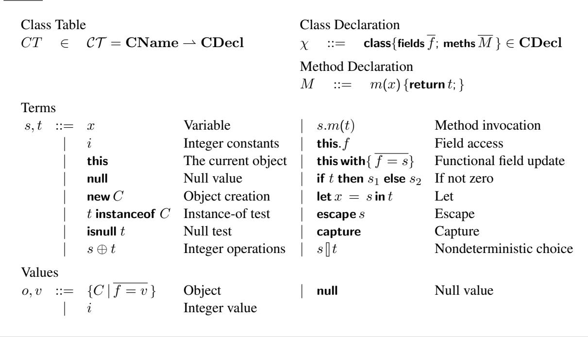
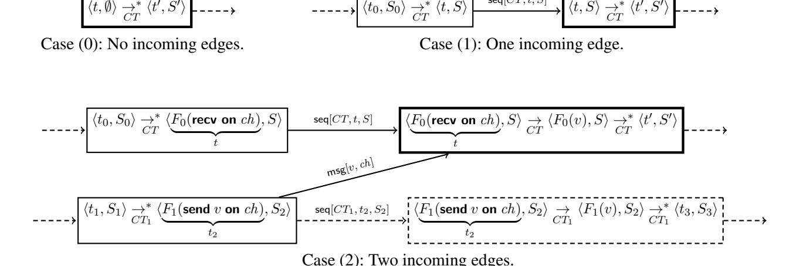
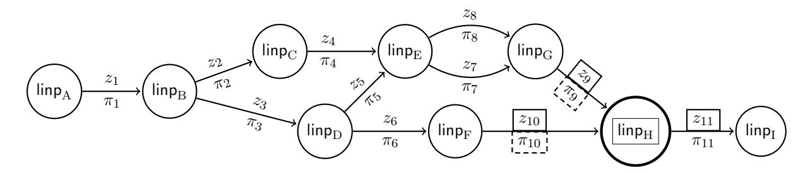

# Enforcing Language Semantics Using Proof-Carrying Data

(extended version)

January 13, 2014

Stephen Chong Harvard University chong@seas.harvard.edu

Eran Tromer Tel Aviv University tromer@cs.tau.ac.il

Jeffrey A. Vaughan LogicBlox Inc. jeff.vaughan@logicblox.com

# Abstract

Sound reasoning about the behavior of programs relies on program execution adhering to the language semantics. However, in a distributed computation, when a value is sent from one party to another, the receiver faces the question of whether the value is *well-traced*: could it have been produced by a computation that respects the language semantics? If not, then accepting the non-well-traced value may invalidate the receiver's reasoning, leading to bugs or vulnerabilities.

*Proof-Carrying Data* (PCD) is a recently-introduced cryptographic mechanism that allows messages in a distributed computation to be accompanied by proof that the message *and the history leading to it* complies with a specified predicate. Using PCD, a verifier can be convinced that the predicate held throughout the distributed computation, even in the presence of malicious parties, and at a verification cost that is independent of the size of the computation producing the value. Unfortunately, previous approaches to using PCD required tailoring a specialized predicate for each application, using an inconvenient formalism and with little methodological support.

We connect these two threads by introducing a novel, PCD-based approach to enforcing language semantics in distributed computations. We show how to construct an object-oriented language runtime that ensures that objects received from potentially untrusted parties are *well-traced* with respect to a set of class definitions. Programmers can then soundly reason about program behavior, despite values received from untrusted parties, without needing to be aware of the underlying cryptographic techniques.

# Contents

| 1 | Introduction                                                                                                                                                                                             | 3                          |
|---|----------------------------------------------------------------------------------------------------------------------------------------------------------------------------------------------------------|----------------------------|
| 2 | Overview                                                                                                                                                                                                 | 6                          |
| 3 | Base Language<br>3.1<br>Syntax and semantics<br>3.2<br>Well-traced values                                                                                                                                | 9<br>9<br>12               |
| 4 | Communication Language<br>4.1<br>Syntax and semantics<br>4.2<br>Well-tracedness<br>                                                                                                                      | 13<br>14<br>15             |
| 5 | Modeling Distributed Executions<br>5.1<br>COCOTRUST<br><br>5.2<br>Distributed execution graphs<br>                                                                                                       | 16<br>16<br>16             |
| 6 | Proof Carrying Data<br>6.1<br>Overview of PCD<br>6.2<br>A compliance predicate for well-tracedness<br><br>6.3<br>Verifying well-tracedness<br>6.4<br>Verifying correctness of COCOCOMM<br>executions<br> | 22<br>22<br>25<br>25<br>26 |
| 7 | Extensions                                                                                                                                                                                               | 28                         |
| 8 | Related work                                                                                                                                                                                             | 30                         |
| 9 | Conclusion                                                                                                                                                                                               | 32                         |
|   | Acknowledgments                                                                                                                                                                                          | 32                         |
|   | References                                                                                                                                                                                               | 33                         |
| A | Auxillary Definitions                                                                                                                                                                                    | 36                         |
| B | Proof of Theorem 1                                                                                                                                                                                       | 37                         |

# <span id="page-2-0"></span>1. Introduction

Encapsulation allows programmers to reason locally about expressive and useful properties of programs and values. The soundness of such local reasoning relies on program execution adhering to the language semantics. However, in a distributed computation, when a value is received from an untrusted party, it is potentially difficult to ascertain that the value was computed according to language semantics. Indeed, the received value (say, an object of a specific class) may be one that could never result from any valid computation. This could happen due to a malicious attack by the sender, transient errors, Trojan horses at the software or hardware levels, or (transitively) corruption in values that the sender itself received from others. Accepting values that are not the result of valid computation may belie otherwise sound reasoning, and lead to bugs or vulnerabilities. Such risks are especially a concern with distributed and outsourced cloud computing.

Consider, for example, object deserialization in a class-based type-safe language. A byte stream received from the network could represent a well-formed object value (i.e., one with appropriate fields for its class), but with a state that is impossible to reach by a sequence of calls to the class's public interface. Such objects may violate invariants that are satisfied by every object of that class produced in accordance with the language semantics, by calls to the public interface. Allowing such objects into a program's evaluation is potentially harmful, and may render invalid any program reasoning that relies on those invariants. Verifying these invariants is, in general, a hard open problem. Bloch devotes an entire chapter of his book *Effective Java* [\[10\]](#page-32-1) to the problem of, and manual methods for, safe deserialization of objects. In practice, similar concerns are raised by a secure coding standard [\[11\]](#page-32-2) (listing this problem as "probable" and "high remediation cost"), and by a study of common weaknesses [\[34\]](#page-33-0).

In this paper we show how to enforce language semantics in a distributed computation, where values are sent between mutually-untrusting and potentially-malicious parties. We do so in the context of a simple class-based object-oriented calculus, COCO, that provides encapsulation, and thus allows local languagelevel reasoning about rich application-specific properties. We enforce language semantics using a recently introduced cryptographic mechanism, *Proof-Carrying Data* [\[8,](#page-32-3) [12,](#page-32-4) [13\]](#page-32-5), to prove (in zero-knowledge) that object values that party A receives from party B were computed in accordance with language semantics, and, transitively, that all values previously received by B and used in its computation were similarly computed in accordance with language semantics.

*Proof-Carrying Data* PCD [\[8,](#page-32-3) [12,](#page-32-4) [13\]](#page-32-5) allows every message in a distributed computation to be accompanied by proof that the message *and the history leading to it* complies with a specified *compliance predicate*. Using PCD, a verifier can be convinced that the compliance predicate held throughout the computation, even in the presence of malicious parties, and at a verification cost that is independent of the size of the computation to produce the value.

The PCD compliance predicate can be instantiated with any polynomial-time computable property that is required to hold, locally, at every node of the computation. Once a compliance predicate has been chosen, PCD gives a recipe for generating and verifying proofs of this property during the distributed execution. In this work, we design a PCD compliance predicate that asserts that values were produced in accordance with the semantics of a specific object-oriented programming language, and with respect to any prescribed set of classes in that language.

PCD proofs are *probabilistic* and *computationally sound*: convincing proofs for false statements may exist, but no efficient algorithm can find them with more than negligible probability (just as in other cryptographic mechanisms for integrity, such as digital signatures).

*Example* Consider a distributed application where a sender creates *[helpmate chess puzzles](https://en.wikipedia.org/wiki/Helpmate)* to be solved by a recipient. A helpmate chess problem is a pair of an integer n and a board position. A solution exists if White and Black can conspire such that White wins in at most n moves. It is easy to construct a solvable

```
class Puzzle {
  remainingMoves; // Integer, number of moves until White wins
  board; // Board instance holding the state of the game
  initialize(b) { // gets a Board b, returns a new Puzzle
    if (! b.whiteWins()) return null;
    return (this with { remainingMoves = 0, board = b });
  }
  rewindMove(m) { // gets a Move m, returns the updated Puzzle
    . . . // check that m is a legal move on the current board
    return (this with
             { board = this.board.undoMove(m),
                remainingMoves = this.remainingMoves + 1} );
  }
  getBoard() { return this.board; }
}
class Board { . . .
  . . . // representation of board configuration, and whose turn is next
  undoMove(m) {. . . } // undo Move m and return the updated Board
  whiteWins() {. . . } // return 1 iff the board represents a White win
}
class Move { . . . } // represents a move by a player
```

<span id="page-3-0"></span>Figure 1. Class definitions for chess puzzles, in the COCO language. Comments indicate the intended types of methods and fields. Fields are implicitly private, initialized to null, and immutable.

puzzle by starting from a White checkmate and "rewinding" valid moves, but it's potentially difficult to decide if a given puzzle has a solution.

Figure [1](#page-3-0) sketches class definitions intended to implement this application, in an object-oriented programming language (namely, the COCO language described in Section [3\)](#page-8-0). Class Puzzle encodes helpmate problems following the intuition above: Puzzles are initialized with a Board object where White has won and where remainingMoves = 0, and more interesting puzzles are created via calls to rewindMove. All fields in these classes are implicitly private and immutable. We can reason at the language level to conclude that an invariant holds: every Puzzle object (where board is non-null) represents a solvable helpmate problem.

Now consider the distributed setting, and assume that all parties have agreed on a *common class table* that includes the definitions of classes in Figure [1.](#page-3-0) How can a recipient know if a received Puzzle is really solvable in the stated number of moves? An honest sender may have computed the puzzle using its own classes (i.e., classes not in the common class table that, say, implement a proprietary puzzle-making algorithm), executed that code according to language semantics, serialized the result, and sent it to the recipient. However, a malicious sender might simply provide data that deserializes into an unsolvable yet well-formed Puzzle object (i.e., it has two fields of the right name). The receiver might attempt to validate the Puzzle by solving it, but this is, in general, expensive.

In this paper we show how to use PCD to enable the recipient to efficiently verify that the Puzzle was (with overwhelming probability) computed in accordance with language semantics, which suffices to allow the recipient to conclude that the puzzle is solvable. And by using zero-knowledge PCD, the sender may share Puzzle objects without recipients learning any information about solutions, beyond that they exist.

*Other Applications* Enforcing language semantics in distributed computations can enable solutions to many different security problems, including the following.

- Consider a class with a single private field called key that can be set only by a method keyGen(seed) that uses seed as a source of entropy to generate two large primes, and sets key to the product of these primes. (This models one interesting part of RSA key generation, eliding exponents.) Upon receiving an object of this class, the recipient knows that the field key was generated according to appropriate algorithms, without knowing what the value of seed was. More generally, enforcement of language semantics can be used to provide assurance that correct cryptographic algorithms were followed, without revealing secret information.
- In proof-carrying access control systems [\[48\]](#page-34-0), access requests are accompanied by explicit proofs that the access is allowed, and the resource guard must check that the proof is correct. As an alternative, consider a class representing an access request with a private field proofOK that is set only by a method that takes a proof, checks it, and sets proofOK to a non-zero value only if the proof is correct. The resource guard, upon receiving such an object, can simply accept the request if proofOK is non-zero, because the resource guard is confident that language semantics were enforced. Moreover, the guard does not learn any private information that may be present in the explicit proof.
- *Higher-order contracts* [\[21\]](#page-33-1) are a run-time mechanism to enforce pre- and post-conditions of functions in higher-order languages. Contract implementations ensure that misbehaving parties are correctly blamed for their misbehavior [\[20\]](#page-33-2), a form of accountability. But enforcing correct contract use in a distributed system is a difficult problem, as an attacker may fail to evaluate pre- and post-conditions at appropriate times (and thus contract violations are not detected) and also may alter data structures that represent and track blame labels (possibly causing parties to be blamed inappropriately). Our approach of enforcing language semantics can ensure contracts are evaluated correctly. Thus, rich applicationspecific assertions can be checked, and blame appropriately assigned when assertions fail.

*Practicality* The fundamental possibility of PCD systems motivates the theoretical question of whether program properties and language semantics can be enforced in distributed systems. Yet, ultimately we are interested in working systems. Our approach can, in principle, be built using known cryptographic machinery, with good asymptotic complexity (the running time overheads of all components are at most polylogarithmic, compared to just blindly trusting received values). However, implementation of our approach for nontrivial programs is not yet practical, since sufficiently-efficient implementations of the underlying PCD systems are not yet available (see Section [6.1\)](#page-23-0). Using current techniques, the concrete overhead for producing proofs will be several orders of magnitude, and would thus be of practical interest mainly for security-critical systems or a small trusted base of larger system (though *verifying* such proofs is already highly efficient, on the order of milliseconds [\[3,](#page-32-6) [4,](#page-32-7) [40\]](#page-33-3)). However, rapid recent progress in the implementations of special cases of PCD [\[3,](#page-32-6) [4,](#page-32-7) [40\]](#page-33-3) raises favorable prospects for implementation of the general case required by our approach.

*Outline* Section [2](#page-5-0) provides intuition about the underlying cryptographic proof system. Section [3](#page-8-0) presents COCO, a class-based object-oriented language with encapsulation. An object v is *well-traced* if there is a COCO program that produces v. Because COCO has encapsulation and class tables, well-tracedness enables local language-level reasoning about objects.

Section [4](#page-12-0) presents COCOCOMM, which extends COCO with communication primitives, and requires that any value received over a channel must be well-traced. This is sufficient to ensure that any value produced by a COCOCOMM program must itself be well-traced. Thus, a party that uses COCOCOMM to execute its part of a distributed computation is able to use local language-level reasoning about objects, despite communication with untrusted parties. The challenge, of course, is to enforce COCOCOMM semantics.

Sections [5](#page-15-0) and [6](#page-21-0) show how to use PCD to enforce COCOCOMM semantics, i.e., to ensure that all values received could have been computed in accordance with language semantics. Section [7](#page-27-0) discusses extensions to our approach, including supporting additional language features (imperative state, concurrency, etc.), and achieving stronger proof notions. We discuss related work in Section [8,](#page-29-0) and conclude in Section [9.](#page-31-0)

*Contribution* The key contribution of this work is a novel mechanism to enforce language semantics in distributed computations with potentially malicious or faulty participants. This enables sound program reasoning: because received values are verified to have been computed in accordance with language semantics, developers can reason about properties and invariants of received values without needing to trust the party that computed the value. Key features of our approach include the following.

• We support both verified computation and private intermediate computations and data. For verified computation of known code, the known code may be placed in a mutually-agreed-upon *common class table*, and enforcement of language semantics ensures that this code is executed correctly. Computation not included in the common class table is deliberately left unspecified, and parties may choose it arbitrarily. For example, a party may use a proprietary algorithm or private data structure to perform a computation (e.g., to generate a chess puzzle); the zero-knowledge property ensures that such algorithms and private data are not unnecessarily revealed.

This is enabled by careful design of the programming language COCO, which is a class-based objectoriented calculus that provides encapsulation. This combination of language features enables local language-level reasoning about programs, which in turn enables local reasoning about applicationspecific properties, despite communication with potentially malicious parties.

• Our scheme offers efficient verification with short proofs. That is, one party can prove to another that a value v is well-traced using a proof whose size is independent of the length of the computation to compute v (and the time to produce the proof is polynomial in the length of the computation). Moreover, verification is transitive: a party can prove not just that the value it produced is well-traced, but any value it received was itself well-traced. (These properties arise due to the underlying PCD mechanism.)

# <span id="page-5-0"></span>2. Overview

Our approach relies on two key technical mechanisms. The first includes the COCO programming language, its extension to distributed settings (COCOCOMM), and the implementation using PCD to enforce language semantics in distributed computations. This is the main contribution of our paper and subsequent sections will formally describe our approach and prove its correctness. The second mechanism is PCD itself, which we use as a black box and is *not* a contribution of this paper.

However, in order to understand (and believe) our results, it is helpful to gain intuition for the PCD mechanism. Thus, in this section we forgo abstraction and provide a brisk, informal walk-through of our system, focusing on the cryptographic machinery that make the approach possible, and sketching reasons for its soundness. This journey will go through several scenarios (highlighted in bold), starting from naive non-solutions that assume too much or are inefficient, and building towards (one instance of) the full approach. Here, we simplify or omit most technical details.

Consider, first, the case of two parties, Alice and Bob. They have agreed upon an object-oriented programming language, in this case COCO, and upon a class table CTcmn providing a common vocabulary (e.g., the classes from the chess puzzle example). Each party also has arbitrary additional local classes, and some local program to evaluate. At some point, Bob's program receives from Alice an object v of a class C in CTcmn.

All Bob knows about v is its class C. He does not know what program was used to produce it. However, because the language provides encapsulation, Bob can reason locally, relying on the language semantics and the content of CTcmn, and deduce an invariant of C which v must fulfill (e.g., the puzzle is solvable). That COCO supports sound, encapsulation-based reasoning at all is a result of careful decisions in its design (see Sections [3](#page-8-0)[–4\)](#page-12-0). And because C is a COCO class, as opposed to COCOCOMM, Bob need not think about communication in his analysis of v; he can reason as if v was constructed locally by a trusted runtime.

Suppose Bob ascertained that this invariant of v implies a desirable property of his program (e.g., it eventually solves the puzzle represented by v). If both Alice and Bob's programs are run in a trusted joint runtime (e.g., a single interpreter running on a trusted platform), which passes v from Alice's program to Bob's, then Bob's property of course holds. It still holds if the programs are separated onto different computers, using separate but trusted runtime systems that correctly execute both programs and, whenever Alice sends a value, faithfully serialize it, transmit it to Bob over a network, and deserialize it there.

Suppose, however, that Alice runs an untrusted runtime that may produce corrupted values (due to malice or faults). When v is received, the deserialization in Bob's runtime easily ensures that v is *wellformed* (i.e., it has the right fields). But for Bob's property to hold, the value should moreover be *welltraced* (i.e., indeed produced by Alice executing a program, in adherence with the language semantics, and using the common class table). This is not guaranteed, and in general may be infeasible or impossible to check directly (e.g., how would one efficiently check if a chess puzzle is solvable?).

Bob still trusts his own computer (otherwise it is meaningless to discuss his program's behavior). He replaces his local runtime with a *verifying runtime*, which requires Alice to provide evidence that v is well-traced. Alice (if she is honest) then installs a *proving runtime*. Her runtime first executes her program as usual, until the point where her program sends v. This may entail nondeterministic choices resolved in arbitrary ways, such as external inputs, human interaction, or randomness; these choices are recorded in a *trace-witness* W. Alice's runtime then packages up everything needed to reproduce v: Alice's local program t, her local classes CT, and W; call this her *local input*, linp. Alice's runtime sends her linp to Bob's runtime, which checks it using a fixed program, called the *compliance predicate* C, which operates simply as follows: given value v and local input linp, C(v, linp) ensures that CT is compatible with CTcmn, and replays the whole computation to confirm that v is the correct result of executing program t with classes CT, using trace-witness W to resolve nondeterministic choices. Bob's runtime will agree to deserialize v only if C(v, linp) accepts. We have thus restored the soundness of Bob's reasoning, but using inefficient verification and long proofs.

We would like to move the burden of proving back to Alice. To convince Bob that there exists linp that produces v (and thus v is well-traced), Alice should run C on her own computer, and convince Bob of the following.

*Alice's Statement: "There exists some* linp *such that* C(v, linp) *accepts."*

*Probabilistically-Checkable Proofs (PCPs)* [\[1\]](#page-32-8) allow us to do just that. Alice's runtime first records a step-by-step trace T of C's execution (note that C is a fixed, known part of the runtime). It then uses a PCP to encode T into proof πPCP, which is a string of bits with a special error-detection property: there is an efficient algorithm, the *PCP verifier* VPCP, that gets v as input, samples just a handful of locations in the string πPCP, and just by a simple consistency check on these bits (e.g., a few parity checks), decides whether T is a correct trace of an execution of C(v, linp) for the *given* v and *some* linp. The PCP verifier is *probabilistically sound*: if there does not exist linp such that C(v, linp) accepts, then for any proof string πPCP, the PCP verifier will almost always catch an inconsistency in πPCP and reject. Alice's runtime thus sends v and  $\pi_{PCP}$  to Bob's runtime, which runs  $V_{PCP}$ . Alas, the string  $\pi_{PCP}$  is even longer than the trace T it encodes. We have thus attained a **probabilistically-sound efficient verification with long proofs**.

The next improvement is to reduce the proof size using cryptographic machinery. Alice's runtime again produces the PCP proof string  $\pi_{PCP}$  as above. It then summarizes  $\pi_{PCP}$  and commits to it, by computing its cryptographic (Merkle) hash digest r. Hash digest r determines which locations in  $\pi_{PCP}$  to sample. Alice's runtime creates a new proof string  $\pi$  consisting of hash digest r, the samples, and cryptographic evidence for consistency between these. It then sends v and  $\pi$  to Bob's runtime, which runs a verifier  $V_{CSP}$  to check this.  $V_{CSP}(v,\pi)$  checks the hash consistency and then invokes  $V_{PCP}$  to check the samples. Soundness now relies on cryptographic assumptions (e.g., that no efficient algorithm can find colliding inputs to the hash function, or manipulate the hash input to control the choice of samples). We thus attain a *computationally-sound proof system* [33], whose soundness holds only if the adversary is an efficient algorithm. The size of  $\pi$  is merely logarithmic in that of  $\pi_{PCP}$  (and T). We have thus attained **computationally-sound efficient verification with short proofs** for Alice's Statement, and thus for well-tracedness of v. This is the best Bob could hope for.

More generally, similar computationally-sound proofs can **generically compress proofs** for NP statements (i.e., statements of the form "there exists w such that  $\Phi(x,w)$  accepts" for a polynomial-time  $\Phi$ ). We use this later.

Let us now extend the scenario to a **chain of untrust**. Consider a third party, Carol, who has her own computer and program. She joins the conversation, using the same common class table  $CT_{cmn}$ . After receiving v from Alice, Bob's program sends a value v' (derived from v) to Carol. In her turn, Carol runs some Coco program that receives v', and relies on v' being well-traced in order to ensure some property. Carol does not trust Alice or Bob. She thus installs the same verifying runtime described above, using computationally-sound proofs, and expects Bob to produce a suitable proof  $\pi'$  for v'. Bob can compute his local input linp' similarly to Alice, but when he tries to run  $\mathbb{C}$ , it fails because the replayed computation receives a value (from Alice); this mustn't be allowed, for fear that the value is not well-traced. Indeed, even if Bob correctly evaluated every step of his program, if he (accidentally or maliciously) received values that were not well-traced, then v' may not be well-traced.

We thus require a mechanism for **transitive verification**: Bob's proof  $\pi'$  should convince Carol not merely that Bob executed his own program correctly, but also that he verified that every value he received was well-traced. The combination of these ensures that v' is well-traced.

To realize this we make two extensions. First, we extend compliance predicate  $\mathbb C$  with an additional parameter  $\vec v_{\rm in}$ , representing the values received during the computation. Now,  $\mathbb C(v, {\rm linp}, \vec v_{\rm in})$  (where  ${\rm linp} = (CT, t, W)$ ) ensures that CT is compatible with  $CT_{\rm cmn}$ , and that v is the correct result of executing program t using classes CT, using trace-witness W to resolve nondeterministic choices, and using  $\vec v_{\rm in}$  as the list of received values. This takes care of verifying Bob's Coco evaluation. Second, in order to transitively verify that values  $\vec v_{\rm in}$  are well-traced, we define the following algorithm  $\mathbb M_{\mathbb C}$ . Given value v, local input linp, received values  $\vec v_{\rm in}$  and corresponding proofs  $\vec \pi_{\rm in}$ ,  $\mathbb M_{\mathbb C}(v, {\rm linp}, \vec v_{\rm in}, \vec \pi_{\rm in})$  verifies that  $\mathbb C(v, {\rm linp}, \vec v_{\rm in})$  accepts and, moreover, for every input  $v_i \in \vec v_{\rm in}$  and corresponding proof  $\pi_i \in \vec \pi_{\rm in}$ , the aforementioned verifier  $V_{\rm CSP}(v_i, \pi_i)$  accepts. Carol asks Bob to prove the following about v'.

Bob's Statement: "There exists some linp, received values  $\vec{v}_{in}$  and corresponding proofs  $\vec{\pi}_{in}$  such that  $\mathbb{M}_{\mathbb{C}}(v', \mathsf{linp}, \vec{v}_{in}, \vec{\pi}_{in})$  accepts."

Bob then convinces Carol of this statement, using a computationally-sound proof. Concretely, Bob's proof is a compression of the execution trace of  $\mathbb{M}_{\mathbb{C}}(v', \mathsf{linp}', (v), (\pi))$ , where v and  $\pi$  are the value and proof he received from Alice. The result is a transitive proof that convinces Carol that v' is well-traced.<sup>1</sup>

<span id="page-7-0"></span><sup>&</sup>lt;sup>1</sup> While intuitively appealing, this recursive composition of proofs is not obvious. It requires additional ingredients: a trusted "signed input and randomness" oracle [12] or, alternatively, strong "proof of knowledge" extractability assumptions [8, 47].

Note that, in the above, proofs always "piggybacked" on values: every data value sent was accompanied by a stand-alone proof that attests to its well-tracedness. Carol did not have to talk to Alice; the proof produced by Bob already summarized his history. This idea naturally generalizes to general distributed computation among untrusted parties. Consider a distributed system, consisting of any number of parties, communicating in an arbitrary pattern and mutually-distrusting. We can ensure that, jointly, they are following the prescribed language semantics with respect to common classes CTcmn, by having all of them follow a protocol similar to Bob: verify every incoming value, and produce a transitive proof for every sent value, using computationally-sound proofs about (a generalization of) algorithm MC. The proofs are constant size, regardless of the length of computation or number of parties, and always "summarize" the relevant history back to the dawn of computation. This is a Proof-Carrying Data system for the property of well-tracedness.

Existing constructions of Proof-Carrying Data (of Chiesa and Tromer [\[12\]](#page-32-4) following Micali [\[33\]](#page-33-4), Kilian [\[29\]](#page-33-5) and Valiant [\[47\]](#page-34-1), of which the above is a sketch; and of Bitansky et al. [\[8\]](#page-32-3), which takes an alternative approach) already tackle the cryptographic details and soundness analysis, and encapsulate them as a "cryptographic primitive" which lets any compliance predicate (of suitable form) be enforced. In the remainder of this paper, we will take these constructions as granted, and *instantiate* them for welltracedness, for a particular, illustrative object-oriented language COCO, by defining a suitable compliance predicate and proving its requisite properties. By instantiating PCD on a compliance predicate that enforces language semantics, we enable local language-level program reasoning. A single instantiation of PCD enables many applications to enforce arbitrary properties through the use of standard programming language mechanisms.

# <span id="page-8-0"></span>3. Base Language

This section introduces COCO, a Core Calculus for Objects. COCO is a class-based object-oriented calculus broadly based on Featherweight Java [\[27\]](#page-33-6), but modified to model encapsulation and to support a clear, robust definition of well-tracedness. COCO allows only functional update of fields (i.e., fields are immutable, but it is possible to create a *copy* of an object with modified fields), and all fields are private (i.e., fields of objects of class C are accessible only by code of class C). These restrictions provide encapsulation and enable local language-level reasoning about objects, because given a COCO object, the only way it could have been produced is by some sequence of calls to methods of the corresponding class.

COCO contains two operators, escape and capture, that model the essence of values escaping their owner [\[38\]](#page-33-7) without the need for an explicit escape analysis. A non-deterministic choice operator makes it easy to construct and reason about observers of escaped values, even in the presence of concurrency and non-termination. These features allows us to give an intuitive definition of well-tracedness that includes escaped objects.

## <span id="page-8-1"></span>3.1 Syntax and semantics

COCO is a class-based object-oriented language; a class table CT is a partial map from names to class declarations, which define the classes' fields and methods. We write dom(CT) for the set of class names for which CT provides a definition, and names(CT) for the set of class names used or defined in CT.

Figure [2](#page-9-0) presents the syntax of COCO. X indicates a set (without duplicates) of objects in syntactic category X. We use subscripts to refer to individual elements of X, e.g., X<sup>i</sup> .

Objects have form {C | f = v }, where C is the class of the object, and the fields f<sup>i</sup> of the object map to values v<sup>i</sup> . Operator new C creates an object {C | f = null }, i.e., all fields initially map to the special value null. Notation s.m(t) invokes method m with receiver s and argument t. All methods take one argument and return a value. Fields are immutable and implicitly private: fields may be read only via term this.f,

#### Metavariable convention for names

```
 \begin{array}{lll} C,D & {\rm class\;names}\; (\in {\bf CName}) & s,t & {\rm terms}\; (\in {\bf Term}) \\ CT & {\rm class\;tables}\; (\in {\cal CT}) & u,v,o & {\rm values}\; (\in {\bf Val}) \\ f,g & {\rm field\;names} & i & {\rm integers}\; (\in {\mathbb Z}) \\ m,n & {\rm method\;names} & \oplus & {\rm total\;integer\;operations} \\ x,y,z & {\rm variable\;names}\; (\in {\bf Var}) & \end{array}
```

## Syntax



<span id="page-9-0"></span>Figure 2. Syntax of Coco

and term this with  $\{\overline{g} = s\}$  creates a new object identical to the object denoted by this, except each  $g_i$  is mapped to the result of evaluating  $s_i$ .

Term  $s \parallel t$  concurrently evaluates both s and t; if either evaluates to some value v,  $s \parallel t$  may evaluate to v. We use term  $s \parallel t$  to provide a limited model of both concurrency and nondeterministic choice.

We provide a simple mechanism to model how values can escape the context where they are created (e.g., through imperative state, communication, exceptions or coroutines—none of which exist in COCO). This explicit modeling allows code in a class to temporarily violate object invariants, so long as it can ensure that all objects that may escape satisfy object invariants. We use **escape** and **capture** to mark where objects escape and where escaped objects may be used, thus allowing us to avoid defining semantics for object invariants, or defining an escape analysis. Term **escape** t evaluates t to a value v, marks v as "escaping" by appending it to a list t of escaped values, and evaluates to t or Term **capture** nondeterministically evaluates to any value in t (i.e., that previously escaped). If a class does not contain any **escape** terms, then a value owned by that class can escape only if it is passed as an argument to a method (of another class) that may apply **escape** to it, or if it is returned from a method.

Judgment  $CT, \rho \vdash \langle t, S \rangle \rightarrow \langle t', S' \rangle$  indicates that, under class table CT, and environment  $\rho$ , term t takes one small step to t', with the list of escaped values growing from S to S'. Figure 3 defines inference rules for this judgment. When a small step evaluation of t evaluates an **escape** v term then

## Evaluation Contexts

$$E ::= [\cdot] \mid \text{isnull } E \mid E \oplus t \mid v \oplus E \mid \text{if } E \text{ then } s \text{ else } t \mid E \text{ int } t \text{ escape } E$$

$$\mid \text{this with}(\overline{g} = \overline{v}, f = E, \overline{g'} = \overline{t}) \mid E \mid t \mid t \mid E \mid \text{let } x = E \text{ in } t \mid \text{ escape } E$$

$$CT, \rho \vdash \langle s, S \rangle \rightarrow \langle t, S' \rangle$$

$$CT, \rho \vdash \langle s, S \rangle \rightarrow \langle t, S' \rangle$$

$$CT, \rho \vdash \langle t \mid s, S \rangle \rightarrow \langle t, S \rangle$$

$$CT, \rho \vdash \langle t \mid s, S \rangle \rightarrow \langle t, S \rangle$$

$$CT, \rho \vdash \langle t \mid s, S \rangle \rightarrow \langle t, S \rangle$$

$$CT, \rho \vdash \langle t \mid s, S \rangle \rightarrow \langle t, S \rangle$$

$$CT, \rho \vdash \langle t \mid s, S \rangle \rightarrow \langle t, S \rangle$$

$$CT, \rho \vdash \langle t \mid s, S \rangle \rightarrow \langle t, S \rangle$$

$$CT, \rho \vdash \langle t \mid s, S \rangle \rightarrow \langle t, S \rangle$$

$$CT, \rho \vdash \langle t \mid s, S \rangle \rightarrow \langle t, S \rangle$$

$$CT, \rho \vdash \langle t \mid s, S \rangle \rightarrow \langle t, S \rangle$$

$$CT, \rho \vdash \langle t \mid s, S \rangle \rightarrow \langle t, S \rangle$$

$$CT, \rho \vdash \langle t \mid s, S \rangle \rightarrow \langle t, S \rangle$$

$$CT, \rho \vdash \langle t \mid s, S \rangle \rightarrow \langle t, S \rangle$$

$$CT, \rho \vdash \langle t \mid s, S \rangle \rightarrow \langle t, S \rangle$$

$$CT, \rho \vdash \langle t \mid s, S \rangle \rightarrow \langle t, S \rangle$$

$$CT, \rho \vdash \langle t \mid s, S \rangle \rightarrow \langle t, S \rangle$$

$$CT, \rho \vdash \langle t \mid s, S \rangle \rightarrow \langle t, S \rangle$$

$$CT, \rho \vdash \langle t \mid s, S \rangle \rightarrow \langle t, S \rangle$$

$$CT, \rho \vdash \langle t \mid s, S \rangle \rightarrow \langle t, S \rangle$$

$$CT, \rho \vdash \langle t \mid s, S \rangle \rightarrow \langle t, S \rangle$$

$$CT, \rho \vdash \langle t \mid s, S \rangle \rightarrow \langle t, S \rangle$$

$$CT, \rho \vdash \langle t \mid s, S \rangle \rightarrow \langle t, S \rangle$$

$$CT, \rho \vdash \langle t \mid s, S \rangle \rightarrow \langle t, S \rangle$$

$$CT, \rho \vdash \langle t \mid s, S \rangle \rightarrow \langle t, S \rangle$$

$$CT, \rho \vdash \langle t \mid s, S \rangle \rightarrow \langle t, S \rangle$$

$$CT, \rho \vdash \langle t \mid s, S \rangle \rightarrow \langle t, S \rangle$$

$$CT, \rho \vdash \langle t \mid s, S \rangle \rightarrow \langle t, S \rangle$$

$$CT, \rho \vdash \langle t \mid s, S \rangle \rightarrow \langle t, S \rangle$$

$$CT, \rho \vdash \langle t \mid s, S \rangle \rightarrow \langle t, S \rangle$$

$$CT, \rho \vdash \langle t \mid s, S \rangle \rightarrow \langle t, S \rangle$$

$$CT, \rho \vdash \langle t \mid s, S \rangle \rightarrow \langle t, S \rangle$$

$$CT, \rho \vdash \langle t \mid s, S \rangle \rightarrow \langle t, S \rangle$$

$$CT, \rho \vdash \langle t \mid s, S \rangle \rightarrow \langle t, S \rangle$$

$$CT, \rho \vdash \langle t \mid s, S \rangle \rightarrow \langle t, S \rangle$$

$$CT, \rho \vdash \langle t \mid s, S \rangle \rightarrow \langle t, S \rangle$$

$$CT, \rho \vdash \langle t \mid s, S \rangle \rightarrow \langle t, S \rangle$$

$$CT, \rho \vdash \langle t \mid s, S \rangle \rightarrow \langle t, S \rangle$$

$$CT, \rho \vdash \langle t \mid s, S \rangle \rightarrow \langle t, S \rangle$$

$$CT, \rho \vdash \langle t \mid s, S \rangle \rightarrow \langle t, S \rangle$$

<span id="page-10-0"></span>Figure 3. Operational semantics of COCO

```
Terms
s, t ::= ...
      | mcall(t, ρ) Partially-evaluated method call
Environments
 ρ ∈ Var ∪ {this} * Val
```

<span id="page-11-1"></span>Figure 4. Deep syntax of COCO

S <sup>0</sup> = S • [v] (where • denotes list concatenation); otherwise S <sup>0</sup> = S. We write CT ` ht, Si → ht 0 , S<sup>0</sup> i when environment ρ is empty and CT ` hs, Si →<sup>∗</sup> ht, S<sup>0</sup> i for zero or more sequential small steps. We write ∅ for the empty list of escaped values.

Environments ρ ∈ Var ∪ {this} \* Val map variables and this to values. We write ∅ for the empty environment. Environments are modified by let terms and by method invocations. For instance, let x = v in t steps to let x = v in t <sup>0</sup> by evaluating t in an environment where ρ has been extended to ρ[x 7→ v].

To define the operational semantics of method calls, we extend the surface syntax (Figure [2\)](#page-9-0) with a new syntactic form, mcall(t, ρ), which is used to indicate a partially evaluated method call. The extended syntax is shown in Figure [4.](#page-11-1)In the remainder of the paper, we use "*program*" to mean a COCO term that uses just surface syntax, and does not contain a term of the form mcall(t, ρ).

Intuitively, term v.m(u) invokes method m on object v, passing value u as an argument. If the class declaration of v's class contains method declaration m(x) {return t; }, then v.m(u) steps to mcall(t, [this 7→ v, x 7→ u]). More generally, term mcall(t, ρ) represents a method invocation that is currently executing, where t is the rest of the method body to execute, and ρ is the environment for the callee. Note that unlike let terms, evaluation of mcall replaces the current environment instead of extending it; this models the fact that all variables are local to a method.

As mentioned previously, term escape v adds v to the list S of escaped values, and capture evaluates nondeterministically to a previously escaped value. Note that the list of escaped values only increases during execution.

A small-step evaluation of <sup>s</sup>8<sup>t</sup> may take a step for either <sup>s</sup> or <sup>t</sup> (using appropriate evaluation contexts), or, if either s or t is a value, then it may step to that value.

## <span id="page-11-0"></span>3.2 Well-traced values

We say that a value v is *well-traced in class table* CT if there is some COCO program that can evaluate to v using a class table that is consistent with CT.

The property of well-tracedness is central to our goal of enforcing language semantics in distributed computation. Intuitively, if value v is well-traced in class table CT, then v could have been produced by a program execution that adhered to the language semantics, using class definitions that are compatible with class table CT, but possibly including additional classes.

To formally define well-tracedness, we first introduce some notation, and define what it means for a value to be well-formed in a class table, and for one class table to extend another.

We must first present some preliminary definitions. Judgment CT `wf v, defined in Figure [5,](#page-12-1) indicates that v is *well-formed in class table* CT. Intuitively, well-formedness requires that objects are syntactically consistent with their class definitions. That is, object o = {C | f = v } is well-formed if C appears in CT, the fields f bound by object o are exactly the fields that the class C has according to CT, and, recursively, the values v that o binds to fields are also well formed in CT. Well-formedness (unlike well-tracedness) is

$$\frac{CT \vdash_{\mathsf{wf}} v}{CT(C) = \mathsf{class}\{\mathsf{fields}\, f_1, \dots, f_n; \, \mathsf{meths}\, \overline{M}\,\} \qquad CT \vdash_{\mathsf{wf}} v_i \, \mathsf{for}\, i \in 1..n \qquad names(CT) \subseteq \mathsf{dom}(CT)}{CT \vdash_{\mathsf{wf}} \{C \mid f_1 = v_1, \dots, f_n = v_n\,\}}$$

$$names(CT) \subseteq \mathsf{dom}(CT) \qquad names(CT) \subseteq \mathsf{dom}(CT)$$

<span id="page-12-1"></span>Figure 5. Inference rules for well-formedness

CT `wf i

directly and efficiently checkable. If an object o is not well formed, then o is inconsistent with class table CT, and use of o may result in stuck computation.

Class table CT extends class table CT<sup>0</sup> when CT contains all of the class declarations of CT<sup>0</sup> , and possibly some additional class declarations.

Definition 1 (Class table extension). *Class table* CT extends *class table* CT<sup>0</sup> *(written* CT ⊇ CT<sup>0</sup> *) if* dom(CT<sup>0</sup> ) ⊆ dom(CT) *and for all* C ∈ dom(CT<sup>0</sup> )*,* CT(C) = CT<sup>0</sup> (C)*.*

We can now formally define well-tracedness:

CT `wf null

Definition 2 (Well-traced values). *Value* v *is* well-traced in CT *if* CT `wf v *and there exist a class table* CT<sup>0</sup> *and a program* t *such that*

$$CT' \supseteq CT$$
 and  $CT' \vdash \langle t, S \rangle \rightarrow^* \langle v, S' \rangle$ .

Well-tracedness distinguishes syntactically well-formed values from values that can be produced by a COCO program. For integers, these notions coincide. However, for objects, well-tracedness plus encapsulation can ensure that fields satisfy nontrivial predicates (e.g., "this chess puzzle is solvable", "this is a valid RSA modulus, i.e., an integer which is the product of two large primes"). It is encapsulation that makes well-tracedness a useful property: in a calculus without encapsulation, the set of well-formed values and well-traced values typically coincide.

Note that well-tracedness of a value does not imply that we know the computation that produced it. Class table CT represents class definitions that are well-known and agreed upon by all parties, such as standard libraries and common application-specific classes (e.g., Puzzle, Board, and Move for the chess puzzle example). The computation that produced the value may use additional classes beyond those in CT. For example, the computation may use classes that are defined by another party in the distributed system, and represent proprietary algorithms or private data-structures of the other party.

The inclusion in COCO of non-deterministic concurrent evaluation and terms escape and capture means that any object that escapes the dynamic scope of the owning class is well-traced. This permits a simple and intuitive definition of well-tracedness that includes such escaping objects, since if program t allows value <sup>v</sup> to escape, then program <sup>t</sup>8capture can evaluate to <sup>v</sup>, and thus <sup>v</sup> is well-traced. For example, even if the classes in CT do not include any escape terms, if their code passes a value v to a method of an arbitrary class, then that could be a class in some CT<sup>0</sup> (extending CT) which invokes escape on v, which means we could write a COCO program that escapes v; hence v is well-traced in CT.

# <span id="page-12-0"></span>4. Communication Language

COCO deliberately models only local computation without communication. This is so that we can define well-tracedness independently of communication with untrusted parties, which greatly simplifies

## Metavariable convention for names

ch ranges over channel names

```
Syntax
Terms
s, t ::= . . .
     | send t on ch Send
     | recv on ch Receive
```

<span id="page-13-1"></span>Figure 6. Syntax of COCOCOMM (extending COCO)

reasoning about well-traced values. In this section, we extend COCO to the calculus COCOCOMM by adding communication primitives. A COCOCOMM program represents the local computation of one party of a distributed computation; communication with other parties occurs by sending and receiving values on channels. COCOCOMM semantics ensure that all values received are well-traced in a common class table.

## <span id="page-13-0"></span>4.1 Syntax and semantics

COCOCOMM extends COCO with terms for sending and receiving values over channels. The syntax extension is given in Figure [6.](#page-13-1) Term send t on ch evaluates term t to a value, which is sent over channel ch, and the term evaluates to the value sent. Term recv on ch receives a value on channel ch. We require that values sent and received are well-formed in a *common class table*: a set of class names and definitions that all parties in a distributed computation have agreed upon in advance. The common class table ensures that a value received will be well-formed in the receiver's local class table, even though the local class tables of the sender and receiver may differ. This is analogous to restricting class serialization in Java to only classes from well-known and agreed-upon libraries.[2](#page-13-2)

Importantly, COCOCOMM semantics also require that any value received is well-traced in the common class table. Intuitively, this allows the recipient to use local reasoning to establish invariants about the received value. That is, the recipient can examine the code of the relevant classes in the common class table in order to reason about the received value. The recipient does *not* need to trust the sender of the value, or be concerned about how the value was produced. The challenge is to enforce the semantics of COCOCOMM, that is, to ensure that all values received are well-traced. We address this in Sections [5](#page-15-0) and [6.](#page-21-0)

Judgment CT, CTcmn, ρ `comm ht, Si → ht 0 , S<sup>0</sup> i indicates that COCOCOMM term t takes one small step to term t 0 , using class table CT and environment ρ, using common class table CTcmn for communication, with the list of escaped values growing from S to S 0 . Class table CT must extend the common class table CTcmn, i.e., CT ⊇ CTcmn. Note that CTcmn is a COCO class table: the definitions of the classes of CTcmn do not contain any send or recv terms; CT may, however, contain classes with send or recv terms. We write CT, CTcmn `comm ht, Si →<sup>∗</sup> ht 0 , S<sup>0</sup> i to indicate that term t can take zero or more steps to evaluate to term t 0 (with an empty environment).

Semantics for COCOCOMM are similar to that of COCO: for each inference rule in the operational semantics of COCO (Figure [3\)](#page-10-0) there is a corresponding inference rule for COCOCOMM. In addition, we have inference rules for the terms send t on ch and recv on ch, given in Figure [7.](#page-14-2) The rule for send t on ch evaluates t to a value, ensures that the value is well-formed in CTcmn, and adds v to the list of escaped values. The rule for recv on ch nondeterministically receives some value v that is well-traced in CTcmn.

<span id="page-13-2"></span><sup>2</sup> We could extend our model to allow mobile code, that is, class definitions sent over channels. For simplicity, we refrain from doing so.

$$CT, CT_{\mathsf{cmn}}, \rho \vdash_{\mathsf{comm}} \langle t, S \rangle \to \langle t', S' \rangle$$

$$E ::= \dots \mid \mathsf{send} \ E \ \mathsf{on} \ ch$$

$$\frac{CT_{\mathsf{cmn}} \vdash_{\mathsf{wf}} v}{CT, CT_{\mathsf{cmn}}, \rho \vdash_{\mathsf{comm}} \langle \mathsf{send} \ v \ \mathsf{on} \ ch, S \rangle \to \langle v, S \bullet [v] \rangle}$$

$$v \ \mathsf{is} \ \mathsf{well-traced} \ \mathsf{in} \ CT_{\mathsf{cmn}}$$

$$\frac{v \ \mathsf{is} \ \mathsf{well-traced} \ \mathsf{in} \ CT_{\mathsf{cmn}}}{CT, CT_{\mathsf{cmn}}, \rho \vdash_{\mathsf{comm}} \langle \mathsf{recv} \ \mathsf{on} \ ch, S \rangle \to \langle v, S \rangle}$$

<span id="page-14-2"></span>Figure 7. Semantics of COCOCOMM (extending COCO)

*Example* Consider the chess puzzle example from the Introduction. (The pseudo-code in Figure [1](#page-3-0) is close to, but not exactly, COCO syntax.) Suppose class table CTcmn contains definitions for common classes, including Puzzle, Board, and Move. When object {Puzzle | remainingMoves = n, board = v } is received, the fact that it is well-traced, combined with the class definitions in CTcmn, allows the recipient to reason that the puzzle must have a solution within n moves. This holds, even though the recipient may not trust the sender, and has no idea how the sender produced the object. Indeed, the sender may have used proprietary code (in classes not in CTcmn) to compute the puzzle, or may have manufactured the puzzle without executing any COCO program.

COCOCOMM is a strict extension of COCO: if t is a COCO program that evaluates to value v, then it is also a COCOCOMM program that evaluates to v. The converse does not necessarily hold.

*Communication model* We do not explicitly model the operation of COCOCOMM communication channels. In Section [5.2](#page-15-2) we define a model for composing concurrently executing programs so that send and recv operations are matched up appropriately, but this model is deliberately underspecified with respect to whether communication is point-to-point, broadcast, in-order, reliable, etc. These details are not important for the purposes of this paper.

## <span id="page-14-0"></span>4.2 Well-tracedness

COCOCOMM preserves well-tracedness, in that if a COCOCOMM program allows value v to escape and v is well-formed in CTcmn then v is well-traced in CTcmn.

<span id="page-14-1"></span>Theorem 1. *Let* CT *be a* COCOCOMM *class table and let* CTcmn *be a common class table such that* CT ⊇ CTcmn*. Let* t *be a* COCOCOMM *program,* t <sup>0</sup> *a term,* S *a sequence of escaped values, and* v *a value such that* v ∈ S*. If*

$$CT, CT_{\mathsf{cmn}} \vdash_{\mathsf{comm}} \langle t, \emptyset \rangle \to^* \langle t', S \rangle$$

*and* CTcmn `wf v *then* v *is well-traced in* CTcmn*.*

The proof of this theorem is in Appendix [B.](#page-36-0)

Theorem [1](#page-14-1) has two key implications. First, a party using COCOCOMM to carry out its part of a distributed computation can be sure that values produced by its computation could also have been produced by a plain COCO program. The party does not need to be concerned that values received over channels can somehow violate properties that can be established by reasoning about only COCO programs. Despite communication with untrusted parties, it is as easy to reason about COCOCOMM programs as it is to reason about COCO programs.

<span id="page-15-3"></span>
$$\overline{CT,CT_{\mathrm{cmn}},\rho \vdash_{\mathsf{Trust}} \langle \mathsf{recv} \; \mathsf{on} \; ch,S \rangle \to \langle v,S \rangle}$$

**Figure 8.** Receive rule for COCOTRUST (modifying COCOCOMM.)

Second, honest parties can indeed use COCOCOMM to perform a distributed computation, since any value that an honest party sends over a channel will be well-traced in  $CT_{\rm cmn}$ , and can thus be accepted by the receiver. In other words, computation by honest parties will not get stuck due to sending non-well-traced values. Later, we will show that this is preserved when the assumption of honesty is replaced by cryptographic proofs.

## <span id="page-15-0"></span>5. Modeling Distributed Executions

The COCOCOMM language enables a party in a distributed computation to reason locally about values received during computation, without trusting the senders. To enforce COCOCOMM semantics, we must ensure that only well-traced values are received. In this and the following section, we show how to enforce COCOCOMM semantics using Proof-Carrying Data (PCD) [8, 12], as follows.

We introduce COCOTRUST, which is similar to COCOCOMM except that the evaluation of **recv** does not check that received values are well-traced (Section 5.1). We show that if we have a distributed computation where all parties are executing COCOTRUST programs, then received values are, nevertheless, well-traced (Section 5.2 and Theorem 2). Thus, to enforce COCOCOMM semantics, it suffices to ensure that all parties adhere to COCOTRUST semantics.

We provide an overview of PCD (Section 6.1), and develop a PCD compliance predicate that states that a computation adheres to CocoTrust semantics (Section 6.2). By instantiating PCD on this compliance predicate, a party can prove that its computation adhered to CocoTrust semantics, and, transitively, all values it received were also produced by CocoTrust semantics.

We show that this yields a sound and complete proof system for well-tracedness of values (Section 6.3 and Theorems 3 and 4, using Theorem 2), and, moreover, a sound and complete proof system for COCO-COMM semantics (Section 6.4 and Theorems 5 and 6).

#### <span id="page-15-1"></span>5.1 COCOTRUST

COCOTRUST shares its syntax of terms and evaluation contexts with COCOCOMM, and has a single (but crucial) relaxation in semantics. Judgment  $CT, CT_{cmn}, \rho \models_{trust} \langle t, S \rangle \rightarrow \langle t', S' \rangle$  indicates that COCOCOMM term t takes one small step to term t', using class table CT and environment  $\rho$ , using common class table  $CT_{cmn}$  for communication, with the list of escaped values growing from S to S'. As before, we write  $CT, CT_{cmn} \models_{trust} \langle t, S \rangle \rightarrow^* \langle t', S' \rangle$  to indicate that term t can take zero or more steps, using COCOTRUST semantics, to evaluate to term t' (with an empty environment).

Inference rules for the COCOTRUST operational semantics are identical to those for COCOCOMM, with the exception of the rule for receiving values. Whereas COCOCOMM requires received values to be well-traced in the common class table  $CT_{\rm cmn}$ , COCOTRUST merely "trusts" that received values will be suitable. The COCOTRUST rule for **recv** is shown in Figure 8; note that there is no premise for the rule, and thus no requirements on the received value v. Intuitively, the simplified rule for **recv** makes it easy to efficiently implement COCOTRUST evaluation.

#### <span id="page-15-2"></span>5.2 Distributed execution graphs

Suppose that we have multiple parties, each of which is executing its own COCOTRUST program, with common class table  $CT_{cmn}$ , and recv operations are matched up with appropriate send operations. As long

as all parties are honest, i.e., adhere to COCOTRUST semantics and  $CT_{cmn}$ , all values received by parties will in fact be well-traced and thus COCOCOMM semantics are achieved.

To model this, we define distributed execution graphs, which represent the parallel composition of COCOTRUST programs with the sends and receives matched up appropriately. The nodes of a distributed execution graph represent zero or more computational steps taken by one of the parties. Directed edges between nodes indicate either local sequential evaluation for a single party (who first performs the computation represented by the source node, and then the computation represented by the target node), or communication between two parties (i.e., the last computational step of the source node is a **send** v **on** ch term, and v is received by the first step of the target node).

We first informally describe distributed execution graphs, and then present a formal definition, stated in a way that simplifies the subsequent use of PCD. The key observation is that in a distributed execution graph (where all parties are following COCOTRUST semantics), all values received are well-traced, and thus COCOCOMM semantics are achieved.

**Nodes of a distributed execution graph** Each node in a distributed execution graph has a label of the form  $(CT, \langle t, S \rangle, \langle t', S' \rangle, W)$  where CT is a class table, t and t' are terms, and  $CT, CT_{cmn} \vdash_{trust} \langle t, S \rangle \rightarrow^* \langle t', S' \rangle$ . Trace-witness W allows us to efficiently check that  $CT, CT_{cmn} \vdash_{trust} \langle t, S \rangle \rightarrow^* \langle t', S' \rangle$ . This will be useful when we instantiate PCD to help enforce COCOCOMM semantics. Trace-witnesses indicate how nondeterministic choices in the program were resolved. Formally, a trace-witness W is a sequence defined by the grammar below, which indicates, for each step, whether the step was deterministic, or, if it was a nondeterministic choice  $s \mid t$ , whether the left or right term was chosen (and how the nondeterministic choices of the subterm were evaluated), or, if it was a **capture** term, the index i of the escaped value to which the term evaluated.

$$U ::= Det \mid Left \cdot U \mid Right \cdot U \mid i$$

$$W ::= (U)^*$$

We denote the set of possible trace-witnesses as W.

**Edges of a distributed execution graph** Edges between nodes of a distributed execution graph indicate either the continuation of the local *sequence* of evaluation or *communication*, and are labeled to indicate which. The labels also convey the information required for checking consistency between its source and destination nodes.<sup>3</sup>

A sequence edge between two nodes has label seq[CT, t', S'], indicating that the source node computation used class table CT and the last term in the source node's computation was t' with escaped values S'. The target node represents the continuation of the computation by the same party, so the target node's computation will also use class table CT, and the first term in the target node's computation will be t' with escaped values S'.

A communication edge between two nodes has label msg[v, ch], indicating that the source node sent value v over channel ch, and value v was received by the target node. Thus, the last term of the source node must have the form  $F[\mathbf{send}\ v\ \mathbf{on}\ ch]$  for some context F; and the first term of the target node must have the form  $F'[\mathbf{recv}\ \mathbf{on}\ ch]$  for some context F' and then step to F'[v], indicating that the value v was received. Here, contexts F are used to identify  $\mathbf{send}$  and  $\mathbf{recv}$  terms that will be reduced in the next evaluation step.

<span id="page-16-0"></span><sup>&</sup>lt;sup>3</sup> Thus, Definition 3 speaks of requirements within a node, and on node vs. its incident edges, but never on node vs. another node. This is essential to the subsequent instantiation of PCD to enforce COCOCOMM semantics, since no node can observe another except by the messages sent.

$$\begin{split} F ::= [\cdot] \mid & \text{isnull } F \mid F \oplus t \mid v \oplus F \mid \text{if } F \text{ then } s \text{ else } t \\ \mid F \text{ instanceof } C \mid F.m(t) \mid v.m(F) \\ \mid & \text{send } F \text{ on } ch \mid \text{this with} \{ \overline{g = v}, f = F, \overline{g' = t} \} \\ \mid & F \llbracket t \mid t \rrbracket F \mid \text{escape } F \\ \mid & \text{let } x = F \text{ in } t \mid \text{let } x = v \text{ in } F \mid \text{mcall}(F, \rho) \end{split}$$

<span id="page-17-0"></span>Figure 9. Contexts. Compared to COCOCOMM evaluation contexts, this adds let x=v in F and  $\operatorname{mcall}(F,\rho)$ .



<span id="page-17-2"></span>**Figure 10.** Cases for incoming edges of distributed execution graph nodes. Dashed nodes and edges indicate a typical (but not required) neighborhood. Here,  $\langle t, S \rangle \underset{CT}{\rightarrow^*} \langle t', S' \rangle$  is shorthand for  $CT, CT_{\mathsf{cmn}} \mid_{\mathsf{trust}} \langle t, S \rangle \rightarrow^* \langle t', S' \rangle$ .

Contexts F include the evaluation contexts of Figures 3 and 7 and also contexts for method calls **mcall** and let x = v in t expressions. Syntax for these contexts is given in Figure 9.<sup>4</sup>

We restrict the incoming and outgoing edges of nodes to ensure that the graph represents valid computation and communication between parties. For example, we ensure that no node has multiple incoming sequence edges. More precisely, we ensure that for each node  $(CT, \langle t, S \rangle, \langle t', S' \rangle, W)$ , there are only three possible cases for the incoming edges, enumerated here. (Diagrams illustrating the cases are given in Figure 10.)

- (0) No incoming edges. This node represents the start of a computation by a party, where t is the program the party is executing. Escaped values S should be empty.
- (1) One incoming sequence edge. This node represents the continuation of a local evaluation process: the parent node indicates that the party has evaluated the program up to term t (and escaped values S), and this node continues execution from t (and using the same class table, and escaped values S).

<span id="page-17-1"></span>The COCOCOMM operational semantics do not include **let** and **mcall** in evaluation contexts E, since these require specialized inference rules and would not be correctly handled by the generic rule for evaluation contexts (first rule in Figure 3). For example, let x = v in send x on ch is equivalent to F[send x on ch] where F = let x = v in  $[\cdot]$ , but there is no evaluation context E such that it is equivalent to E[send x on ch].

(2) Two incoming edges, consisting of one sequence edge and one communication edge. This node represents the continuation of an evaluation process (via a seq edge) after receiving a value via a msg edge from a sender. Note that the sender will typically continue its execution via another seq edge.

We require that distributed execution graphs are acyclic to ensure that communication is causally ordered: messages aren't received before they are sent. We also require that evaluation of a recv term receives exactly one value that was previously sent by a send term. We do not otherwise make assumptions about the operations of channels. For example, our model is agnostic as to whether message delivery is in-order or out-of-order, and is agnostic as to whether a sent value should be received at most once (i.e., point-to-point communication), or whether a sent value may be received multiple times along multiple communication edges (e.g., broadcast communication).

*Definition of distributed execution graphs* Before we formally define distributed execution graphs, we first introduce a helper function, check, that given class table CT, configurations ht, Si and ht 0 , S<sup>0</sup> i, and trace-witness W, efficiently checks whether CT ` ht, Si →<sup>∗</sup> ht 0 , S<sup>0</sup> i. Note that although terms t and t <sup>0</sup> may contain send and recv operations, the semantics are COCO, not COCOTRUST. This means that t evaluates to t <sup>0</sup> without performing any send or receive operations.

Proposition 1 (Existence of check). *There exists a polynomial-time algorithm*

$$\begin{split} \mathsf{check} : \mathcal{CT} \times \big( \mathbf{Term} \times \mathbf{List}(\mathbf{Val}) \big) \times \\ & \big( \mathbf{Term} \times \mathbf{List}(\mathbf{Val}) \big) \times \mathcal{W} \to \{0,1\} \end{split}$$

*such that whenever*

$$\operatorname{check}(CT,\langle t,S\rangle,\langle t',S'\rangle,W)=1$$

*it holds that* CT ` ht, Si →<sup>∗</sup> ht 0 , S<sup>0</sup> i*.*

*Define also a version that takes the common class table and skips any initial* send *if the value sent is well-formed in the common class table:*

$$\mathsf{check}'(CT, CT_{\mathsf{cmn}}, \langle t, S \rangle, \langle t', S' \rangle, W) = \\ \begin{cases} \mathsf{check}(CT, \langle F[v], S \rangle, \langle t', S' \rangle, W) & \textit{if } t = F[\mathsf{send} \ v \ \mathsf{on} \ ch] \ \textit{and} \ CT_{\mathsf{cmn}} \vdash_{\mathsf{wf}} v \\ \mathsf{check}(CT, \langle t, S \rangle, \langle t', S' \rangle, W) & \textit{otherwise} \end{cases}$$

Implementation of check and check<sup>0</sup> is straightforward: using the trace witness, we can efficiently find a derivation of CT ` ht, Si →<sup>∗</sup> ht 0 , S<sup>0</sup> i. Moreover, trace-witnesses can be produced efficiently (which is needed to satisfy the PCD instantiation requirements).

<span id="page-18-1"></span>Proposition 2 (Efficient trace-witness production). *There exists a polynomial-time algorithm that, given a derivation of* CT ` ht, Si →<sup>∗</sup> ht 0 , S<sup>0</sup> i *yields trace-witness* W *where* check(CT,ht, Si,ht 0 , S<sup>0</sup> i, W) = 1*.*

Note that the running time of check is polynomial in all of its inputs, including W, which in turn is polynomial in the size of the derivation. However, it independent of the derivation of received messages (indeed, check verifies only plain COCO derivations).

Distributed execution graphs are defined as follows.

<span id="page-18-0"></span>Definition 3 (Distributed execution graph). *Given a class table* CTcmn*, a* distributed execution graph using CTcmn *is a labeled directed acyclic graph fulfilling the following.*

*a. Each node's label is of the form* (CT,ht, Si,ht 0 , S<sup>0</sup> i, W) *where* CT *is a class table,* t *and* t <sup>0</sup> *are terms,* S *and* S <sup>0</sup> *are lists of values, and* W ∈ W *is a trace-witness.*

*b. For each node* (CT,ht, Si,ht 0 , S<sup>0</sup> i, W) *and edge with label* zout *exiting it, exactly one of the following holds:*

```
i. zout = seq[CT, t0
                       , S0
                           ]
```

- <span id="page-19-8"></span>*ii.* zout = msg[v, ch] *for some value* v *and channel* ch*, such that* t <sup>0</sup> = F[send v on ch] *for some context* F*, and* CTcmn `wf v
- <span id="page-19-1"></span>*c. For each node* (CT,ht, Si,ht 0 , S<sup>0</sup> i, W) *and its list* ~zin *of incoming edges, exactly one of the following holds:*
  - *(0)* ~zin *is empty and:*
    - *i.* CT *extends* CTcmn
    - *ii.* check<sup>0</sup> (CT, CTcmn,ht, Si,ht 0 , S<sup>0</sup> i, W) = 1
    - *iii.* t *is a program (i.e., it contains only surface syntax)*
    - *iv.* S *is the empty list* ∅*.*
- <span id="page-19-10"></span><span id="page-19-2"></span>*(1)* ~zin = (seq[CT <sup>E</sup>, tE, SE] ) *such that:*
  - *i.* CT <sup>E</sup> = CT *and* t<sup>E</sup> = t *and* S<sup>E</sup> = S
  - *ii.* check<sup>0</sup> (CT, CTcmn,ht, Si,ht 0 , S<sup>0</sup> i, W) = 1
- <span id="page-19-11"></span><span id="page-19-7"></span><span id="page-19-6"></span><span id="page-19-4"></span>*(2)* ~zin = (seq[CT <sup>E</sup>, tE, SE], msg[v, ch] ) *such that:*
  - *i.* CT <sup>E</sup> = CT *and* t<sup>E</sup> = t *and* S<sup>E</sup> = S
  - *ii.* t = F[recv on ch] *for some context* F
  - *iii.* check(CT,hF[v], Si,ht 0 , S<sup>0</sup> i, W) = 1

<span id="page-19-9"></span>Distributed execution graphs represent the execution of communicating COCOTRUST (rather than COCOCOMM) programs. Recall, however, that COCOCOMM semantics differ from COCOTRUST semantics only in requiring received values to be well-traced. Since the distributed execution graph explicitly shows the "pedigree" of each received value, it implies that all received values *are* in fact well-traced, and thus, COCOCOMM semantics hold for all nodes in the graph:

<span id="page-19-0"></span>Theorem 2. *In a distributed execution graph, for every node labeled* (CT,ht, Si,ht 0 , S<sup>0</sup> i, W)*, it holds that*

$$CT, CT_{\mathsf{cmn}} \vdash_{\mathsf{comm}} \langle t, S \rangle \to^* \langle t', S' \rangle \ .$$

*Proof.* By induction on the structure of the graph. Since the graph is acyclic, the induction is well founded. The induction hypothesis is that for any node (CT,ht, Si,ht 0 , S<sup>0</sup> i, W), there exists a program t<sup>0</sup> such that CT, CTcmn `comm ht0, ∅i →<sup>∗</sup> ht 0 , S<sup>0</sup> i and moreover, if t <sup>0</sup> = F[send v on ch] and CTcmn `wf v then v is well-traced in CTcmn.

We will use the following lemma, which is straightforward from the definitions:

<span id="page-19-5"></span>Lemma 1. *For any program* t0*, terms* t*,*t 0 *, class tables* CT*,*CTcmn*, lists* S*,*S <sup>0</sup> *and trace witness* W*: if*

$$CT, CT_{\mathsf{cmn}} \vdash_{\mathsf{comm}} \langle t_0, \emptyset \rangle \to^* \langle t, S' \rangle \quad \textit{and} \quad \mathsf{check'}(CT, CT_{\mathsf{cmn}}, \langle t, S \rangle, \langle t', S' \rangle, W) = 1$$

*then*

$$CT, CT_{\mathsf{cmn}} \vdash_{\mathsf{comm}} \langle t_0, \emptyset \rangle \to^* \langle t', S' \rangle$$
.

Consider node n, labeled (CT,ht, Si,ht 0 , S<sup>0</sup> i, W). Assume the inductive hypothesis holds for all nodes that can reach n. To show that there exists a program t<sup>0</sup> such that CT, CTcmn `comm ht0, ∅i →<sup>∗</sup> ht 0 , S<sup>0</sup> i, consider the cases of the incoming edges to n.

- (0) The cases of no incoming edges is straightforward, letting  $t_0 = t$  and noting condition c(0) in Definition 3 and the definition of check'.
- (1) In the case of a single incoming edge (seq[ $CT_{\mathsf{E}}, t_{\mathsf{E}}, S_{\mathsf{E}}$ ]), we know by condition c(1)i of Definition 3 that  $CT_{\mathsf{E}} = CT$  and  $t_{\mathsf{E}} = t$  and  $S_{\mathsf{E}} = S$ , and then by condition b(i) of Definition 3 that this edge exited some parent node of the form  $(CT, \langle \cdot, \cdot \rangle, \langle t, S \rangle, \cdot)$ . By the induction hypothesis applied to the parent, there exists a program  $t_0$  such that  $CT, CT_{\mathsf{cmn}} \models_{\mathsf{comm}} \langle t_0, \emptyset \rangle \to^* \langle t, S \rangle$ . By condition c(1)ii of Definition 3, check' $(CT, CT_{\mathsf{cmn}}, \langle t, S \rangle, \langle t', S' \rangle, W) = 1$  and thus by Lemma 1,  $CT, CT_{\mathsf{cmn}} \models_{\mathsf{comm}} \langle t_0, \emptyset \rangle \to^* \langle t', S' \rangle$  as required.

(2) In the case of two incoming edges, these are  $seq[CT_E, t_E S_E]$  and msg[u, ch]. Similarly to the above,

we deduce from conditions c(2)i and b(i) of Definition 3 that there exists a program  $t_0$  such that  $CT, CT_{\mathsf{cmn}} \vdash_{\mathsf{comm}} \langle t_0, \emptyset \rangle \to^* \langle t, S \rangle$ . Moreover, by condition c(2)ii,  $t = F[\mathsf{recv} \ \mathsf{on} \ ch]$  for some context F.

By condition b(ii), the parent of the edge  $\mathsf{msg}[u, ch]$  is node of the form  $(\cdot, \cdot, \langle F_2[\mathsf{send} \ u \ \mathsf{on} \ ch], \cdot \rangle, \cdot)$  for some context  $F_2$ , and  $CT_{\mathsf{cmn}} \vdash_{\mathsf{wf}} u$ . Thus, by the induction hypothesis, u is well-traced in  $CT_{\mathsf{cmn}}$ , and thus by COCOCOMM semantics,  $CT, CT_{\mathsf{cmn}} \vdash \langle F[\mathsf{recv} \ \mathsf{on} \ ch], S \rangle \to \langle F[u], S \rangle$ . Concatenating these derivations, we get:  $CT, CT_{\mathsf{cmn}} \vdash_{\mathsf{comm}} \langle t_0, \emptyset \rangle \to^* \langle F[u], S \rangle$ . Also, by condition c(2)iii,  $\mathsf{check}(CT, \langle F[u], S \rangle, \langle t', S' \rangle, W) = 1$  and thus by Lemma 1,  $CT, CT_{\mathsf{cmn}} \vdash_{\mathsf{comm}} \langle t_0, \emptyset \rangle \to^* \langle t', S' \rangle$  as required.

There remains to show that if  $t' = F[\mathbf{send}\ v\ \mathbf{on}\ ch]$  for some v, and  $CT_{\mathsf{cmn}} \vdash_{\mathsf{wf}} v$ , then v is well-traced. Indeed, since  $\mathbf{send}\ v\ \mathbf{on}\ ch$  adds v to the list of escaped values, we have  $CT, CT_{\mathsf{cmn}} \vdash_{\mathsf{comm}} \langle t_0 \| \mathsf{capture}, \emptyset \rangle \to^* \langle v, S' \rangle$ , and so by Theorem 1, v is well-traced.

The key implication of this theorem is that to show that a received value is well-traced, it suffices to show that the computation that sent the value (and, transitively, any computation on which the sender depended) adhered to COCOTRUST semantics. We can achieve this by instantiating PCD appropriately, which we do in the following subsections.

A corollary of this theorem is that in a distributed execution graph, any value sent or received is well-traced.

<span id="page-20-0"></span>**Corollary 1.** In a distributed execution graph, for every edge labeled msg[v, ch], v is well-traced in class table  $CT_{cmn}$ .

*Proof.* Consider the source node of an edge  $\operatorname{msg}[v,ch]$ , and suppose it is  $(CT,\langle t,S\rangle,\langle t',S'\rangle,W)$ . Term t' must be of the form  $F[\operatorname{send} v \text{ on } ch]$  for some F. By the structure of the graph, and by Theorem 2 there is a program  $t_0$  such that  $CT,CT_{\operatorname{cmn}} \vdash_{\operatorname{comm}} \langle t_0,\emptyset\rangle \to^* \langle F[v],S'\bullet[v]\rangle$ . By Theorem 1 we have that v is well-traced, as required.

<span id="page-20-1"></span>**Modeling computation with distributed execution graphs** In this paper distributed execution graphs define a model of concurrently executing, communicating COCOTRUST programs. Below, we argue informally that this is indeed a reasonable model of distributed computation.

First, distributed execution graphs are "intuitively sound," in the sense that every distributed execution graph maps to a scenario of parties executing COCOTRUST programs on distinct hardware and sending messages via a network. Second, they are "intuitively complete," in the sense that given a pool of communicating COCOTRUST interpreters, we can construct a distributed execution graph representing this. Note that while formal soundness and completeness results could be proved with respect to a (for instance) CSP-style model of COCOTRUST, we would still need an informal argument to show that the CSP-style model itself is reasonable.

Third, a distributed execution graph can be incrementally constructed as a system of COCOTRUST programs executes using the following process. As the programs execute they may nondeterministically perform the following actions on the distributed execution graph:

- 1. Add an unlabeled node (representing a prospective derivation)
- <span id="page-21-4"></span>2. Add an edge labeled seq[CT, t, S] from a labeled node n to an unlabeled node n 0 (representing n 0 continuing evaluation from configuration ht, Si)
- <span id="page-21-5"></span>3. Add an edge labeled msg[v, ch] from a labeled node n to an unlabeled node n 0 (representing n sending the value v to n <sup>0</sup> on channel ch)
- 4. Label an unlabeled node (representing the actual derivation and nondeterministic choices)

This process can be more fully specified to ensure that the resulting distributed execution graph satisfies the appropriate constraints and accurately reflects the execution of the COCOTRUST programs.

# <span id="page-21-0"></span>6. Proof Carrying Data

# <span id="page-21-1"></span>6.1 Overview of PCD

Proof Carrying Data (PCD), introduced by Chiesa and Tromer [\[12,](#page-32-4) [13\]](#page-32-5) and developed by Bitansky et al. [\[7,](#page-32-9) [8\]](#page-32-3), is a cryptographic mechanism for ensuring that a given property is maintained at every step of a distributed computation among mutually-untrusting parties. The designated property is specified as a *compliance predicate*, and all messages between parties are accompanied by a proof that the message's data, along with all of the distributed computation leading to that message, satisfies the compliance predicate.

We first recall the key definitions of PCD, which capture the notion of a distributed computation that is compliant with a designated property, and define a PCD system that proves and verifies such compliance. See Bitansky et al. [\[7\]](#page-32-9) for formal definitions.[5](#page-21-2)

*Distributed computation transcripts* Distributed computations are viewed as directed acyclic multigraphs with vertex labels and edge labels.[6](#page-21-3) Vertices represent the computation of programs, and edges represent messages sent between these programs. Such graphs are called *distributed computation transcripts*.

In our case, an "honest" distributed computation transcript will be a distributed execution graph. Thus, node labels should be of the form (CT,ht, Si,ht 0 , S<sup>0</sup> i, W), edge labels should be of the form seq[CT, t, S] or msg[v, ch], and the conditions in Definition [3](#page-18-0) should hold. But *verifying* these conditions is up to the PCD system.

In a *proof-carrying distributed computation transcript*, every edge label z<sup>i</sup> is augmented with another *proof string* label π<sup>i</sup> . Figure [11](#page-22-0) shows an example.

*Compliance* A *compliance predicate* C is a polynomial-time computable predicate for a node in a distributed computation transcript. Intuitively, a compliance predicate is a locally verifiable property: the predicate can be checked using just information that is available at a node. By choosing an appropriate compliance predicate, global properties may hold if all nodes in a distributed transaction graph satisfy the compliance predicate.

More precisely, C(zout; linp, ~zin) observes the local environment of a node in a distributed computation transcript: the list of received inputs ~zin; an (alleged) output zout; and the node's label, or *local input*,

<span id="page-21-2"></span><sup>5</sup> We use the definitions of "publicly-verifiable PCD system" of Bitansky et al. [\[7,](#page-32-9) [8\]](#page-32-3) which, compared to Chiesa and Tromer [\[12\]](#page-32-4), do not assume a secure oracle/token; directly allow arbitrary node in-degree and out-degrees; and simplify the security quantification. We also make some simplifications, mentioned in subsequent footnotes where pertinent.

<span id="page-21-3"></span><sup>6</sup> The definition of Bitansky et al. [\[7\]](#page-32-9) requires source and sink nodes to be labeled ⊥. The restriction is inessential and we remove it here for convenience. Also, we identify ⊥ with ∅.



<span id="page-22-0"></span>**Figure 11.** Example of a proof-carrying distributed computation transcript. Node labels ("local inputs") are denoted  $\operatorname{linp}_i$ , edge labels  $z_i$ , and proof strings  $\pi_i$ . Omitting proof strings gives the corresponding (non-proof-carrying) distributed computation transcript. When checking compliance of node  $\operatorname{linp}_H$ ,  $\mathbb C$  checks the values marked by solid boxes. When *proving* compliance,  $\mathbb P_{\mathbb C}$  additionally gets the incoming proofs, marked by dashed boxes, and outputs  $\pi_{11}$ .

denoted linp. The label linp contains the executed program and any associated local data (in our case, it will be the local class table CT, configurations  $\langle t, S \rangle$  and  $\langle t', S' \rangle$ , and trace-witness W). Given a distributed computation transcript DCT, we say that node n in DCT, with inputs  $\vec{z}_{in}$  and local input linp, is  $\mathbb{C}$ -compliant if  $\mathbb{C}(z_{out}, \mathsf{linp}, \vec{z}_{in})$  holds for every output  $z_{out}$  of n (see Figure 11). We say that DCT is  $\mathbb{C}$ -compliant if every node in the graph is  $\mathbb{C}$ -compliant. We say that a string z is  $\mathbb{C}$ -compliant if there exists a  $\mathbb{C}$ -compliant distributed computation transcript containing an edge labeled z.

**PCD** syntax and operation A PCD system for a compliance predicate  $\mathbb{C}$  is a triple of algorithms  $(\mathbb{G}, \mathbb{P}_{\mathbb{C}}, \mathbb{V}_{\mathbb{C}})$ :

- *PCD generator*  $\mathbb{G}$ , given an integer  $\kappa$  as a key size, outputs a key k which will be used by  $\mathbb{P}_{\mathbb{C}}$  to generate proofs and by  $\mathbb{V}_{\mathbb{C}}$  to verify them.<sup>8</sup>
- *PCD prover*  $\mathbb{P}_{\mathbb{C}}$ : Let k be a key, let  $\vec{z}_{\mathsf{in}}$  be a list of inputs and  $\vec{\pi}_{\mathsf{in}}$  be corresponding proof strings, let linp be a local input string, and let  $z_{\mathsf{out}}$  be an output string. Then  $\mathbb{P}_{\mathbb{C}}(k, \vec{z}_{\mathsf{in}}, \vec{\pi}_{\mathsf{in}}, \mathsf{linp}, z_{\mathsf{out}})$  outputs a proof string  $\pi_{\mathsf{out}}$  for the claim that  $z_{\mathsf{out}}$  is  $\mathbb{C}$ -compliant.
- *PCD verifier*  $\mathbb{V}_{\mathbb{C}}$ : Let k be a key, let  $z_{\mathsf{out}}$  be an output string and  $\pi_{\mathsf{out}}$  a corresponding proof string. Then  $\mathbb{V}_{\mathbb{C}}(k, z_{\mathsf{out}}, \pi_{\mathsf{out}})$  is meant to accept only if convinced that  $z_{\mathsf{out}}$  is  $\mathbb{C}$ -compliant.

Using these algorithms, a distributed computation transcript is dynamically compiled into a *proof-carrying* distributed computation transcript by generating and adding "on the fly" a proof string to each edge (see Figure 11). The process of generating proof strings is defined inductively, starting from the source nodes in the transcript graph. Consider a node n in the transcript, with local input linp, received inputs  $\vec{z}_{\text{in}}$  and corresponding proofs  $\vec{\pi}_{\text{in}}$ , and an output  $z_{\text{out}}$ . Use prover  $\mathbb{P}_{\mathbb{C}}$  to produce a new proof string  $\pi_{\text{out}}$  for its output  $z_{\text{out}}$  (given the inputs of n, their corresponding generated proof strings, the program of n, and its output). Proof strings generated in this way form the additional label on the edges in the resulting proof-carrying transcript.

The triple  $(\mathbb{G}, \mathbb{P}_{\mathbb{C}}, \mathbb{V}_{\mathbb{C}})$  must satisfy three properties. The first two bound the complexity of proving and verifying, and the third is computational soundness, discussed next.

Completeness and asymptotically-efficient proving The PCD prover can prove true statements, and do so efficiently. Whenever it is indeed the case that a given distributed computation transcript is  $\mathbb{C}$ -compliant,

<span id="page-22-1"></span> $<sup>\</sup>overline{\phantom{a}}$  In Bitansky et al. [7], the edge labeled z should be the first one entering a sink, but this is inessential since one can consider the subgraph leading to this edge.

<span id="page-22-2"></span><sup>&</sup>lt;sup>8</sup> For simplicity, we merge the "reference string"  $\sigma$  and "verification state"  $\tau$  of Bitansky et al. [7] into a single key k.

one can use the PCD prover  $\mathbb{P}_{\mathbb{C}}$  to generate proof strings for each message, and all of these proof strings will be accepted by the PCD verifier. The generation of these proofs runs in time that is polynomial in the key size  $\kappa$  and the time it took to run  $\mathbb{C}$  at every node in the distributed computation transcript.

**Efficient verification** Proof strings generated by the PCD prover have length polynomial in the key size  $\kappa$ , and are *efficiently verifiable* by the PCD verifier:  $\mathbb{V}_{\mathbb{C}}(k, z_{\text{out}}, \pi_{\text{out}})$  runs in time polynomial in  $\kappa$  and the length of the string  $z_{\text{out}}$ . In particular, the proof length and verification time are independent of how long it took to evaluate  $\mathbb{C}$  and run  $\mathbb{P}_{\mathbb{C}}$ .

**Soundness notion** <sup>11</sup> It is computationally infeasible to prove false statements. This is expressed as follows. Let  $\tilde{\mathbb{P}}$  be any efficient cheating prover, i.e., a deterministic algorithm running in time polynomial in the key size  $\kappa$ . <sup>12</sup> After a key  $k \leftarrow \mathbb{G}(1^{\kappa})$  is randomly generated,  $\tilde{\mathbb{P}}(k)$  outputs some non-compliant string z along with a proof string  $\pi$ , and tries to use  $\pi$  to falsely convince  $\mathbb{V}_{\mathbb{C}}$  that z is compliant. Then, we are guaranteed that  $\mathbb{V}_{\mathbb{C}}(k,z,\pi)$  will accept this false claim with negligible probability  $\kappa^{-\omega(1)}$  (i.e., smaller than  $1/p(\kappa)$  for any polynomial p). Formally:

<span id="page-23-5"></span>**Definition 4** (PCD soundness).  $(\mathbb{G}, \mathbb{P}_{\mathbb{C}}, \mathbb{V}_{\mathbb{C}})$  is sound if for every efficient cheating-prover algorithm  $\tilde{\mathbb{P}}$  and key size  $\kappa \in \mathbb{N}$ :

$$\Pr_{k \leftarrow \mathbb{G}(1^{\kappa})} \left[ \begin{array}{c} (z, \pi) \leftarrow \tilde{\mathbb{P}}(k) \\ \wedge \quad \mathbb{V}_{\mathbb{C}}(k, z, \pi) = 1 \\ \wedge \quad z \text{ is not } \mathbb{C}\text{-compliant} \end{array} \right] \leq \kappa^{-\omega(1)}$$

<span id="page-23-0"></span>Construction of PCD There are two known approaches to constructing PCD systems. The first, sketched in Section 2, is based on probabilistically-checkable proofs (PCPs). It relies on standard cryptographic assumptions (collision-resistant hashing and signatures), and requires parties to have access to a trusted oracle (e.g., a secure hardware token or trusted network service) that signs its inputs and produces fresh randomness. An asymptotically-efficient construction is known [12], and there has been recent progress towards the requisite concretely-efficient PCPs [2].

An alternative approach starts with the special case of PCD for a single message, called *computationally-sound proofs of knowledge* [33] or *Succinct Non-interactive ARguments of Knowledge (SNARKs)* which can be constructed without any trusted oracles, under a large class of assumptions [6]. SNARKs have been recently implemented for C programs [3, 4] and a restricted subset thereof [40], using approaches based on knowledge-of-exponent assumptions [26][31][23][9], in the relaxed "preprocessing" sense, where  $\mathbb G$  is allowed to run for time polynomial in that of  $\mathbb C$ . These are practical for very small programs, and research efforts are underway to improve efficiency. Using bootstrapping [8], such SNARKs (in principle) suffice to construct PCD systems without oracles, for a restricted but large set of distributed execution graph structures.

<span id="page-23-1"></span><sup>&</sup>lt;sup>9</sup> The formal definition of completeness requires a precise description of the inductive process of proof generation, and is thus straightforward but long; see Bitansky et al. [7, §5.2].

<span id="page-23-2"></span><sup>&</sup>lt;sup>10</sup> For simplicity of presentation, we assume here that the potential adversary's power is greater than all "honest" computations that will be proven, and the key size  $\kappa$  is chosen large enough to be secure against such adversaries. Since the adversary's power is at most  $\operatorname{poly}(\kappa)$ , the length of honest computation can be upper-bounded by  $B = \kappa^{\log \kappa}$  (or any other superpolynomial subexponential function), and thus the  $\log B$  terms in the proof length and verifier complexity expressions of Bitansky et al. [7] are dominated by  $\kappa$  and can be omitted.

<span id="page-23-3"></span><sup>&</sup>lt;sup>11</sup> Soundness is implied by the stronger "proof of knowledge" proved in Bitansky et al. [7, 8], Chiesa and Tromer [12]. For simplicity, in the following we discuss mere soundness, but our construction also offers proof of knowledge (see Section 7).

<span id="page-23-4"></span> $<sup>^{12}</sup>$  Or more, generally, a family of circuits, one for each  $\kappa$ , whose size is polynomial in  $\kappa$ .

#### <span id="page-24-0"></span>**6.2** A compliance predicate for well-tracedness

We shall use PCD to prove well-tracedness of values sent by a system of communicating COCOCOMM programs. A common class table  $CT_{\mathsf{cmn}}$  will be fixed in advance, and every value v sent during an (honest) execution will accompanied by a proof that v is well-traced in  $CT_{\mathsf{cmn}}$ .

Consider a system of communicating COCOCOMM programs using common class table  $CT_{\rm cmn}$ , that sends value v from one party to another on channel ch. If this computation is honest, then by the completeness of distributed execution graphs, there is a distributed execution graph DEG with an edge labeled  ${\rm msg}[v,ch]$ . We shall define a PCD compliance predicate  ${\mathbb C}_{\rm cmn}$  that enables efficiently proving the existence of such a DEG.

The compliance predicate  $\mathbb{C}_{cmn}$  will be applied to the nodes of a distributed computation transcript that is *allegedly* a distributed execution graph. The role of  $\mathbb{C}_{cmn}$  is to check that the nodes in the transcript indeed fulfill the constraints defined in Definition 3, i.e., that each node's label describes a correct Coco-TRUST derivation that is consistent with the incoming and outgoing edges' labels.

**Definition 5** (Compliance predicate enforcing  $CT_{cmn}$ ). For a COCO class table  $CT_{cmn}$ , the compliance predicate enforcing  $CT_{cmn}$  is denoted  $\mathbb{C}_{cmn}$ . Given local input linp, inputs  $\vec{z}_{in}$  and (alleged) output  $z_{out}$ ,  $\mathbb{C}_{cmn}(z_{out}, \text{linp}, \vec{z}_{in})$  accepts if:

- 1. linp is the form  $(CT, \langle t, S \rangle, \langle t', S' \rangle, W)$  where CT is a class table, t and t' are terms, S and S' are lists of values, and  $W \in W$  is a trace-witness, and for these:
- 2. Condition b(i) or b(ii) from Definition 3 holds, and
- 3. Condition c(0), c(1), or c(2) from Definition 3 holds.

<span id="page-24-2"></span>**Lemma 2.** Let  $CT_{cmn}$  be a COCO class table. Then every  $\mathbb{C}_{cmn}$ -compliant distributed computation transcript is also a distributed execution graph using  $CT_{cmn}$ , and vice versa.

The above is obvious from the definitions. Thus:

<span id="page-24-3"></span>**Lemma 3.** Let  $CT_{\mathsf{cmn}}$  be a Coco class table, let v be a value, and ch a channel. If  $z = \mathsf{msg}[v, ch]$  is  $\mathbb{C}_{\mathsf{cmn}}$ -compliant then v is well-traced in  $CT_{\mathsf{cmn}}$ .

*Proof.* As z is  $\mathbb{C}_{cmn}$ -compliant, there exists a  $\mathbb{C}_{cmn}$ -compliant distributed computation transcript DCT containing an edge labeled z. By Lemma 2, DCT is a distributed execution graph using  $CT_{cmn}$ , and thus by Corollary 1, v is well-traced in  $CT_{cmn}$ .

#### <span id="page-24-1"></span>6.3 Verifying well-tracedness

By plugging compliance predicate  $\mathbb{C}_{cmn}$  into a PCD construction, we obtain a PCD system ( $\mathbb{G}, \mathbb{P}_{\mathbb{C}_{cmn}}, \mathbb{V}_{\mathbb{C}_{cmn}}$ ). This PCD system is both sound and complete for efficiently verifying well-tracedness of values. This means that given a well-traced value v, it is possible to construct a proof that v is well-traced, and if we accept a proof that v is well-traced, then it is indeed well-traced (up to a negligible probability of error). This is key to enforcing COCOCOMM semantics, which we will see in Section 6.4.

**Soundness for well-tracedness** To verify well-tracedness of a value v with a proof  $\pi$ , we run  $\mathbb{V}_{\mathbb{C}_{\mathsf{cmn}}}(k, \mathsf{msg}[v, ch], \pi)$ , where k is the key generated by  $\mathbb{G}$  (the channel ch does not matter, but is syntactically necessary since  $\mathbb{V}_{\mathbb{C}}$  expects to verify edge labels of a distributed execution graph). Soundness of the PCD system means that if an efficient cheating-prover algorithm generates a string  $z = \mathsf{msg}[v, ch]$  claiming that v is well-traced, along with an alleged proof  $\pi$  for this (as before ch does not matter), but v is actually not well-traced, then  $\mathbb{V}_{\mathbb{C}_{\mathsf{cmn}}}(z,\pi)$  will accept only with negligible probability (smaller than any  $1/\mathsf{poly}(\kappa)$ ). Formally:

<span id="page-25-1"></span>**Theorem 3** (Soundness of PCD for well-tracedness). For any COCO class table  $CT_{cmn}$ , any efficient cheating-prover algorithm  $\tilde{\mathbb{P}}$ , and every key size  $\kappa$ :

$$\Pr_{k \leftarrow \mathbb{G}(1^{\kappa})} \left[ \begin{array}{c} (z,\pi) \leftarrow \tilde{\mathbb{P}}(k) \\ \wedge \ \mathbb{V}_{\mathbb{C}_{\mathsf{cmn}}}(k,z,\pi) = 1 \\ \wedge \ \exists v, ch : z = (\mathsf{msg}[v,ch]) \\ \wedge \ v \ \textit{is not well-traced in } CT_{\mathsf{cmn}} \end{array} \right] \leq \kappa^{-\omega(1)}$$

*Proof.* The soundness of the PCD system  $(\mathbb{G}, \mathbb{P}_{\mathbb{C}}, \mathbb{V}_{\mathbb{C}})$ , according to Definition 4, means that whenever the verifier accepts  $(z, \pi)$ , it's true that z is  $\mathbb{C}_{cmn}$ -compliant (up to negligible probability). By Lemma 3, if  $z = \mathsf{msg}[v, ch]$  then v is well-traced in  $CT_{cmn}$  (up to negligible probability).

**Completeness for well-tracedness** The PCD system is complete in that if we have a well-traced value with a known derivation, then we can efficiently produce a proof for its well-tracedness:

<span id="page-25-2"></span>**Theorem 4** (Completeness of PCD for well-tracedness). Let  $CT_{cmn}$  be a COCO class table, and let v be a well-traced value in  $CT_{cmn}$ , witnessed by  $CT' \vdash \langle t, \emptyset \rangle \to^* \langle v, S \rangle$  where CT' is a COCO class table such that  $CT' \supseteq CT_{cmn}$ . Consider the COCOTRUST execution

$$CT', CT_{\mathsf{cmn}} \vdash_{\mathsf{trust}} \langle \mathsf{send}\ t\ \mathsf{on}\ ch, \emptyset \rangle \to^* \langle v, S \bullet [v] \rangle$$

Let W be the trace-witness corresponding to the above derivation (by Proposition 2) and let linp =  $(CT, \langle send \ t \ on \ ch, \emptyset \rangle, \langle v, S \bullet [v] \rangle, W)$ .

Then for any key size  $\kappa$  and key  $k \leftarrow \mathbb{G}(1^{\kappa})$ , the proof  $\pi = \mathbb{P}_{\mathbb{C}_{\mathsf{cmn}}}(k,\emptyset,\emptyset,\mathsf{linp},\mathsf{msg}[v,ch])$  is always accepted:

$$\mathbb{V}_{\mathbb{C}_{\mathrm{cmn}}}(k, \mathrm{msg}[v, ch], \pi) = 1.$$

Moreover,  $\pi$  is computed in time polynomial in the size of the derivation  $CT \vdash \langle t, \emptyset \rangle \rightarrow^* \langle v, S \rangle$ .

*Proof.* Consider the graph DEG consisting of a node labeled linp, with no input edges, and single outgoing edge labeled z going to another node labeled  $(CT_{\mathsf{cmn}}, \langle \mathsf{recv} \ \mathsf{on} \ ch, \emptyset \rangle, \langle v, \emptyset \rangle, \emptyset)$ . It is readily verified to be a distributed execution graph using  $CT_{\mathsf{cmn}}$ , and thus by Lemma 2, DEG is also a  $\mathbb{C}_{\mathsf{cmn}}$ -compliant distributed computation transcript. The claim then follows from the completeness of the PCD system. Efficiency follows from  $\mathbb{P}_{\mathbb{C}_{\mathsf{cmn}}}$  being polynomial-time in its inputs, and the size of W being polynomial in the size of the derivation.

#### <span id="page-25-0"></span>6.4 Verifying correctness of COCOCOMM executions

The PCD system  $(\mathbb{G}, \mathbb{P}_{\mathbb{C}_{cmn}}, \mathbb{V}_{\mathbb{C}_{cmn}})$  can be used to verify the correct execution of a number of parties, each of which is executing its own CocoComm program. That is, we can use the PCD system to build a runtime system for CocoComm that correctly enforces semantics even when non-well-traced values are received from rogue parties.

**Soundness for CocoComm executions** A party who performs a CocoTrust evaluation, and uses  $\mathbb{V}_{\mathbb{C}_{cmn}}$  to verify every received value, can rest assured that (except with negligible probability) the evaluation follows the stricter CocoComm semantics: the probability that  $\mathbb{V}_{\mathbb{C}_{cmn}}$  accepts all received values, and yet the evaluation violates CocoComm semantics, is negligible (smaller than any  $1/\text{poly}(\kappa)$ ). Formally:

<span id="page-25-3"></span>**Theorem 5** (Soundness of verifying COCOCOMM). Consider a COCOTRUST derivation:

$$CT, CT_{\mathsf{cmn}} \vdash_{\mathsf{trust}} \langle t, S \rangle \to^* \langle t', S' \rangle$$

Let  $(v_i, ch_i)_{i=1}^{\ell}$  be the list of values, and corresponding channels, received in this derivation. Then for any efficient cheating-prover algorithm  $\tilde{\mathbb{P}}'$ , and every key size  $\kappa$ :

$$\Pr_{k \leftarrow \mathbb{G}(1^\kappa)} \left[ \begin{array}{c} \pi_i \leftarrow \tilde{\mathbb{P}}'(k,i) \text{ for } 1..\ell \\ \wedge \ \mathbb{V}_{\mathbb{C}_{\mathsf{cmn}}} \big( k, \ \mathsf{msg}[v_i, ch_i] \, \pi_i \big) = 1 \text{ for } 1..\ell \\ \wedge \ \neg \ CT, CT_{\mathsf{cmn}} \mid_{\mathsf{comm}} \langle t, S \rangle \rightarrow^* \langle t', S' \rangle \end{array} \right] \leq \kappa^{-\omega(1)}$$

*Proof.* The only difference between the semantics of COCOCOMM and COCOTRUST is the premise of the **recv** rule, so the above probability is bounded by:

$$\leq \Pr_{k \leftarrow \mathbb{G}(1^{\kappa})} \left[ \begin{array}{c} \pi_{i} \leftarrow \tilde{\mathbb{P}}'(k,i) \text{ for } 1..\ell \\ \wedge \ \exists i \in 1..\ell : \mathbb{V}_{\mathbb{C}_{\mathsf{cmn}}} \big(k, \, \mathsf{msg}[v_{i}, ch_{i}] \, \pi_{i} \big) = 1 \\ \wedge \ v_{i} \text{ is not well-traced in } CT_{\mathsf{cmn}} \end{array} \right]$$

Invoking the union bound on the events for separate i:

$$\leq \sum_{i=1}^{\ell} \Pr_{k \leftarrow \mathbb{G}(1^{\kappa})} \left[ \begin{array}{c} \pi_{i} \leftarrow \tilde{\mathbb{P}}'(k,i) \\ \wedge \ \mathbb{V}_{\mathbb{C}_{\mathsf{cmn}}}(k, \, \mathsf{msg}[v_{i}, \, ch_{i}] \, \pi_{i}) = 1 \\ \wedge \ v_{i} \ \mathsf{is \ not \ well-traced \ in} \ CT_{\mathsf{cmn}} \end{array} \right]$$

and invoking Theorem 3 (with  $\tilde{\mathbb{P}}$  derived from  $\tilde{\mathbb{P}}'$  by hardcoding i and  $z = \text{msg}[v_i, ch_i]$ ):

$$\leq \sum_{i=1}^{\ell} \kappa^{-\omega(1)} \leq \kappa^{-\omega(1)}$$

**Proof generation** Generating the above proof requires an inductive process accompanying the whole computation. Every time a party in the computation sends a message (msg edge) or pauses its derivation to receive a message (seq edge), it will run the PCD prover  $\mathbb{P}_{\mathbb{C}_{cmn}}$  to produce a proof that the computation was correct so far. Thus, we modify the process for incremental generation of a distributed execution graph (Section 5.2) to ensure that each edge also has a proof associated with it.<sup>13</sup> Initially, we run the PCD generator  $\mathbb{G}$  with a sufficiently large key size  $\kappa$  to obtain a key  $k \leftarrow \mathbb{G}(1^{\kappa})$ . Then we run the following *proof generation* process: every time a new edge is added (Operations 2 and 3), with edge label  $z_{out}$ , exiting a node labeled linp =  $(CT, \langle t, S \rangle, \langle t', S' \rangle, W)$  whose incoming edges are labeled  $\vec{z}_{in}$  with associated proofs  $\vec{\pi}_{in}$ , we generate the proof  $\pi = \mathbb{P}_{\mathbb{C}_{cmn}}(k, \vec{z}_{in}, \vec{\pi}_{in}, \lim, z_{out})$  and associate  $\pi$  with the edge. (See Section 2 for a more concrete but less precise account.)

**Completeness for CocoComm executions** The proofs constructed as above are indeed accepted by the PCD verifier (which follows easily from PCD completeness):

<span id="page-26-0"></span>**Theorem 6** (Completeness of verifying COCOCOMM). Let DEG be a distributed execution graph using COCO class table  $CT_{cmn}$ . Consider an edge e in DEG, labeled z, from node n to node n'. Consider any key size  $\kappa$  and key  $k \leftarrow \mathbb{G}(1^{\kappa})$ . Let  $\pi$  be a proof associated with e by the above proof generation process. Then  $\pi$  is accepted:  $\mathbb{V}_{\mathbb{C}_{cmn}}(k, z, \pi) = 1$ .

Moreover, the running time of the proof generation process for edge e is polynomial in the size of the derivation associated with node n.

<span id="page-26-1"></span><sup>&</sup>lt;sup>13</sup> For a general formal treatment, see the ProofGen process in Bitansky et al. [7].

*Proof.* Consider DEG<sup>0</sup> , the subgraph of DEG consisting of n 0 , and all nodes that can reach n 0 (which of course includes n). DEG<sup>0</sup> is also a distributed execution graph using CTcmn, and is thus a Ccmn-compliant distributed computation transcript. Acceptance of π thus follows from the completeness property of PCD (observing that the aforementioned proof generation process is essentially identical to the ProofGen process of Bitansky et al. [\[7\]](#page-32-9)).

Let the label of n be (CT,ht, Si,ht 0 , S<sup>0</sup> i, W); then efficiency follows from PCcmn being polynomialtime in its inputs, and the size of W being polynomial in the size of the derivationto which it attests.

*Remarks* In the above soundness definitions, the received values are independent of the PCD key k. The stronger property of adaptive soundness, where v<sup>i</sup> and ch<sup>i</sup> (and thus the resulting derivation) are allowed to depend on k, holds as well (due to the adaptive soundness of the underlying PCD system).

A natural optimization is the case where, in a distributed computation, there exists a clique of trusted parties Q that trust each other, but not others. The parties in Q can then verify messages received from outside Q, but omit verification of messages within Q, and still deduce that their (various) derivations follow COCOCOMM semantics.

# <span id="page-27-0"></span>7. Extensions

COCO is an intentionally minimal calculus, intended to capture essential language features and match them to the PCD formalism, while maintaining simplicity. However, our techniques can be extended to handle more expressive language features, and to provide stronger guarantees for consumers of verified values.

Imperative state, including a heap, can be added in a straightforward manner. State is threaded through the operational semantics of the language (as with the list of escaped values), and sent values are accompanied by a heap, which includes all locations that are transitively reachable from the value. When a value and heap are received, locations in the received heap are renamed to ensure disjointness from the current heap, and then the received heap is unioned with the current heap. The definition of distributed execution graphs is extended to enforce state consistency.

With the addition of state, we would no longer require the use of escape and capture terms to help define well-tracedness, since the language would now contain another, more standard, mechanism by which values may escape the dynamic scope of an owning class.

Concurrency is already modeled by the nondeterministic choice operator <sup>s</sup>8t, although threads are not guaranteed to run to completion. This can be remedied by adding a concurrent composition operator. Additional mechanisms for synchronization and communication between threads could also be added.

Evolution of values from known past ones (e.g., showing that the computation to produce value v <sup>0</sup> used value v) is a stronger property than well-tracedness (which allows an arbitrary semanticallyallowed history). For example, consider a protocol for a *chess game* (as opposed to the aforementioned *chess puzzle*), where White sends value v describing a board, subsequently receives value v 0 supposedly representing the board after Black's move, and wishes to ensure that v 0 is actually the result of a computation that starts with v and legally moves a single Black piece to produce v 0 .

Such properties can be enforced using mechanisms within the programming language, and do not require modifications to the language, or to the runtime mechanism for enforcing well-tracedness. One approach is to ensure that classes in CTcmn contain a field that is an append-only log of past states (or a cryptographic compression thereof, using hash functions), and the field is updated appropriately by methods of the class. For example, an object representing a chess board may contain a log of all previous chess boards that led up to it. This ensures that the object itself is recording its evolution, and welltracedness suffices to allow reasoning about the evolution of the value.

Another approach is to add a field id to a class, and the value of this field is only modified by method setId(r) { return (this with {id = owf(r)}); } where owf is a cryptographic one-way hash function. Given an object v with a particular value n for the field id, v was produced either by evolution from another object v <sup>0</sup> with id equal to n, or by a computation that knows a value i such that owf(i)= n. For example, White sets the id field of a board v by calling setId(r) with a large random integer r, and upon receiving v 0 , verifies that v 0 .getId()=v.getId(). Either v 0 evolved from v, or Black found a preimage of owf, which is by definition infeasible.

Enforcing encapsulation by the language semantics, along with enforcing of those semantics, enable local language-level reasoning about received values. However, in Java, it is difficult to enforce encapsulation, due to reflection. In order for our technique to be useful, we anticipate that it will be necessary to restrict the use of reflection and any other mechanisms that may violate encapsulation, or otherwise prevent local reasoning. Indeed, many sophisticated Java language analyses are sound only in the absence of reflection.

Note that in our setting we use encapsulation to enforce integrity: ensuring that values of fields of objects are consistent with using the public interface of the object. We are not able to use encapsulation to enforce confidentiality, since a malicious party receiving an object could always violate language semantics to *examine* the values of fields of that object (e.g., by peeking into the interpreter's in-memory representation of values). PCD will only detect violation of language semantics if the malicious party attempts to send a non-well-traced value.

Interaction with the external environment can be modeled in COCO by treating inputs as nondeterministic choices. However, this does not *enforce* that choice resolution is "truly external." To do so we could add input operators to COCO, and make the PCD compliance predicate verify inputs are cryptographically signed by suitable input devices, parties in the environment, etc.

Proof of knowledge is a security property of computational proof systems that is stronger than mere soundness. At times, there is a difference between proving that value v is well-traced and proving that one *knows* a program that (efficiently) produces v. This is especially true in programs that use cryptography. For example, consider the class BobPayment which sets its field amount to an integer i only when a method BobPayment.check is called with arguments i and u, where u is a digital signature on i that verifies under Bob's (hard-coded) signature verification key. Suppose Alice sends Bob the value v = {BobPayment | amount=1000000 } and a proof that v is well-traced. Should Bob be convinced that he owes her \$1M? Clearly a valid signature on "1000000" *exists*, so v is trivially well-traced regardless of whether Alice actually received the signature. However Alice cannot *efficiently compute* the signature by herself, so if she *efficiently* produced v following COCO semantics, then Bob should indeed be convinced. Our proof system indeed (nontrivially) supports reasoning about the computational complexity of producing values. PCD systems offer, beyond mere soundness, the guarantee of *proof of knowledge* [\[7\]](#page-32-9), which implies essentially the following: whenever the verifier accepts, VCcmn (k, msg[v, ch], π) = 1, the (possibly cheating) prover that produced π actually "knows" the full derivation of the value v and "could have" written it down with similar complexity.

Zero-knowledge is another useful property of proof systems, meaning essentially that when the verifier accepts, all it learns is that the value is well-traced, and nothing else about its derivation. In particular, if the sender had secrets, they are not revealed by the proof he produces, a desirable property in any other application where a party has proprietary algorithms or private data (such as the chess puzzle example of the Introduction). Our approach provides zero knowledge when invoked using suitable PCD systems [\[7\]](#page-32-9) or SNARKs [\[3,](#page-32-6) [4,](#page-32-7) [40\]](#page-33-3).

# <span id="page-29-0"></span>8. Related work

*Verifiable computing* The Proof-Carrying Data mechanism lies in the broad area of verifiable computing, which has been extensively studied from a cryptographic perspective. Verifying general, distributed interaction requires the full power of PCD systems whose construction was discussed in Section [6.1.](#page-23-0)

An important special case is Succinct Noninteractive Arguments of Knowledge (SNARKs) which, beside being an ingredient for PCDs as discussed in Section [6.1,](#page-23-0) are also of direct use for proving correct execution of stand-alone programs (e.g., outsourcing a computational task to a cloud server, and requiring a proof of the results' correctness). Recently, concrete SNARK systems were implemented for proving correct execution of C programs. One is restricted to constant memory access and control flow [\[40\]](#page-33-3), and another supports arbitrary control flow and memory accesses (by implementing a simulated random-access machine) [\[4\]](#page-32-7) and even self-modifying code [\[3\]](#page-32-6). Those works focus on the cryptographic and algorithmic implementations and are complementary to the present paper. In particular, they consider only the case of stand-alone programs (rather than distributed computation), and do not address issues of enforcing well-tracedness and invariants of values, for which the C language is unsuitable due to lack of strong encapsulation. Our work can thus be construed as looking ahead to potential uses and a program analysis approach for exploiting the "raw power" of the cryptographic implementations, once they achieve full PCD and sufficient efficiency.

If one relaxes the requirements to allow the verifier to send queries back to the prover (instead of proofs piggy-backing on existing messages), then *interactive proof systems* are relevant, including recent highly-optimized implementations (see Vu et al. [\[49\]](#page-34-2) and references therein). If one further relaxes the verifier efficiency requirement, then many *secure multiparty computation* and *secure function evaluation* techniques become relevant. When simultaneously verifying many claims, one can use efficient *batching arguments* (see Setty et al. [\[44\]](#page-34-3) and references therein). Some restricted classes of computation, such as those expressible as low-depth circuits, have especially efficient proof systems [\[24\]](#page-33-11) which were recently implemented (see Thaler [\[46\]](#page-34-4) and references therein).

*Automatic program partitioning* Jif/Split [\[51,](#page-34-5) [52\]](#page-34-6) automatically partitions single-threaded programs annotated with security types [\[42\]](#page-34-7) into a program distributed across potentially mutually distrusting host machines. The partitioning ensures that if computation of a value is declared to be independent of a given host, then that host is unable to corrupt or influence the computation of the value. This enables sound reasoning at the language-level of abstraction about the distributed computation: the value computed by the distributed system will be the same as the value computed by the single-threaded program unless one or more of the hosts upon which the computation depends (as indicated by the security-type annotations) is malicious. In Jif/Split, if a host is corrupted, then no computation they perform can be trusted. By contrast, our system allows trust to be gained in computation performed by a corrupted or malicious host: values received from hosts are checked to ensure they are well-traced, which enables sound reasoning about properties that the value must satisfy. However, our system is not suitable for restricting the flow of information in a distributed system, and is thus, is not suitable for enforcing confidentiality requirements.

*Enforcing language semantics* Our work ensures that values received over a network were produced according to COCOCOMM semantics, thus enabling sound reasoning about such values at the level of language abstractions, even in the presence of malicious parties. We do not know of existing work exploring this problem.

Much previous work seeks to enforce language-level semantics in different settings, typically on a single execution platform, or against different classes of faults.

Safe deserialization of objects, as discussed in Section [1,](#page-2-0) is extensively discussed in Bloch's book on practical Java programming [\[10,](#page-32-1) Chapter 11]. Pointing out that "serialization is an extralinguistic mechanism for creating objects", Bloch presents several attacks that cause objects to be deserialized into a state that cannot be reached through their public interfaces (i.e., attacks that create non-welltraced objects). Although Bloch describes methods for defensive programming to avoid these attacks, the solutions are manual and error-prone. Similar concerns are raised in CERT's Secure Coding Standard for Java entries SER06-J and SER07-J [\[11\]](#page-32-2), in Common Weakness Enumeration entry CWE-502 [\[34\]](#page-33-0), and the references therein.

Numerous works seek to enforce memory safety in C and C-like programs, including CCured [\[37\]](#page-33-12), Cyclone [\[25,](#page-33-13) [28\]](#page-33-14), and SAFECode [\[18,](#page-32-13) [19\]](#page-32-14). SAFECode in particular states that their mechanism enables certain analyses to be sound (points-to graph, call graph, and a subset of type information).

Perry et al. [\[41\]](#page-34-8) present a type system that can detect transient hardware faults (a single local corruption) in assembly programs, by maintaining redundant copies of the computations and enforcing their consistency.

Work on certified compilation (e.g., [\[5,](#page-32-15) [14,](#page-32-16) [15,](#page-32-17) [30\]](#page-33-15)) seeks to ensure that program semantics is preserved as the program is compiled.

*Ensuring integrity* Various language-based techniques have attempted to ensure the *integrity* of computation or the values they create. For example, automated program partitioning [\[52\]](#page-34-6) allows a distributed computation to be written as a single program with security types, and is compiled so that only sufficiently trusted hosts may handle high-integrity data and computation. Likewise, evidence-based audit [\[48\]](#page-34-0) allows programs to automatically verify that incoming values are endorsed by trusted principals. Techniques including proof-carrying code (PCC) [\[36\]](#page-33-16) and dependently typed programming [\[17\]](#page-32-18) combine values (representing data or code) with machine-checkable proof objects that demonstrate the validity of propositions about the values, independent of their provenance.

These techniques require a programmer to reason about a level of security types, propositions, or proofs, as well as the main computation language. By contrast, PCD allows a programmer to reason entirely at the level of COCOCOMM, and without making implicit or explicit trust assumptions about remote parties. Such systems are complementary to our approach. Similar to proof-carrying access control systems (discussed in the Introduction) our approach can enable compression, constant-time verification, and zero-knowledge privacy for PCC and dependent-type proofs.

*Foreign function interfaces* Foreign function interfaces (FFI) allow programs written in a high-level language to call code written in another language (typically C or native machine code). It is available in many popular languages, for performance and interoperability reasons. Typically, the callee can return arbitrary values to the caller, potentially violating the semantics and invariants of the high-level language (i.e., producing values that are not well-traced). Furr and Foster [\[22\]](#page-33-17) describe a static analysis approach to this problem, based on cross-language type-inference. Google Native Client [\[35,](#page-33-18) [50\]](#page-34-9) restricts the nativecode callee, using software fault isolation, to a certain memory region and set of instructions; however, it does not reason about the values output by the callee.

Our approach to proving well-tracedness offers an alternative, in principle: the high-level language can require values produced by FFI calls to be accompanied by proofs of well-tracedness. However, this incurs runtime overhead, which seems unattractive for performance-motivated uses of FFI.

*Remote attestation* Remote attestation [\[16,](#page-32-19) [39\]](#page-33-19) uses a hardware root of trust, typically based on a Trusted Platform Module (TPM), along with cryptography, to let a target machine convince an appraiser/verifier machine that the target machine's state fulfills some properties (e.g., that it is presently running a specific, unmodified and suitably-configured software stack).

Remote attestation can be used to claim well-tracedness of values by attesting that they were produced by executing a given program on top of a given operating system. This attestation is convincing if the appraiser trusts the TPM hardware root of trust,[14](#page-31-2) the correctness of the hardware platform (e.g., CPU and memory), and the correctness of (requisite properties of) the operating system. Our PCD-based approach removes all of these assumptions.

Similarly to our approach, BIND [\[45\]](#page-34-10) and Flicker [\[32\]](#page-33-20) aim to provide *fine-grained attestation*, attesting only to code directly relevant to producing an output. They remove the trust in the operating system, using CPU support for secure execution and late launch. However, trust in the hardware remains inherent. Notably, BIND supports transitive proofs, similarly to PCD.

Unlike most prior works, which focus on low-level properties such as enforcing execution of specific or signed software, we focus on enforcing language semantics, requiring that values produced by a target machine are well-traced.

PCD can be an alternative to hardware-based remote attestation, in scenarios where the latter is used to enforce *integrity* or *correctness* of a value computed by an untrusted target machine. However, PCD cannot express or enforce properties of the target machine as a whole, and thus cannot enforce *secrecy* properties, such as preventing data copying in Digital Rights Management applications.

# <span id="page-31-0"></span>9. Conclusion

This paper presents a novel mechanism to enforce language semantics in a distributed computation with potentially malicious participants. Using the cryptographic mechanism of Proof-Carrying Data (PCD) [\[8,](#page-32-3) [12\]](#page-32-4), we ensure that values received must be *well-traced*: they could have been produced by a program execution consistent with the language semantics. Thus, developers can reason about properties and invariants of received values, without trusting the parties that provide the values and without being aware of the underlying cryptographic mechanism.

# <span id="page-31-1"></span>Acknowledgments

We thank are indebted to Alessandro Chiesa, Christos Dimoulas, Daniel Genkin, Greg Morrisett and Noam Rinetzky for their insightful comments.

This work was supported by the Air Force Office of Scientific Research under Award No. FA95501210262; by the Check Point Institute for Information Security; by the Israeli Ministry of Science and Technology; by the Israeli Centers of Research Excellence I-CORE program (center 4/11); by the National Science Foundation under Grant No. 1054172; and by NATO's Public Diplomacy Division in the Framework of "Science for Peace".

<span id="page-31-2"></span><sup>14</sup> The Pioneer system [\[43\]](#page-34-11) aims to remove the explicit hardware root of trust, but depends on extensive knowledge of the precise hardware, can be verified only locally, and is subject to some attacks [\[16\]](#page-32-19).

# <span id="page-32-0"></span>References

- <span id="page-32-8"></span>[1] L. Babai, L. Fortnow, L. A. Levin, and M. Szegedy. Checking computations in polylogarithmic time. In *Proceedings of the 23rd Annual ACM Symposium on Theory of Computing*, STOC '91, pages 21–32, 1991.
- <span id="page-32-10"></span>[2] E. Ben-Sasson, A. Chiesa, D. Genkin, and E. Tromer. On the concrete efficiency of probabilistically-checkable proofs. In *Proceedings of ACM symposium on Symposium on theory of computing*, pages 585–594. ACM, 2013.
- <span id="page-32-6"></span>[3] E. Ben-Sasson, A. Chiesa, E. Tromer, and M. Virza. Succinct non-interactive arguments for a von Neumann architecture. Cryptology ePrint Archive, Report 2013/879, 2013. <http://eprint.iacr.org/2013/879>.
- <span id="page-32-7"></span>[4] E. Ben-Sasson, A. Chiesa, D. Genkin, E. Tromer, and M. Virza. SNARKs for C: Verifying program executions succinctly and in zero knowledge. In *Proceedings of CRYPTO 2013*, LNCS. Springer, to appear.
- <span id="page-32-15"></span>[5] N. Benton and C.-K. Hur. Biorthogonality, step-indexing and compiler correctness. In *Proceeding of the 14th ACM SIGPLAN international conference on Functional programming*, pages 97–108, 2009.
- <span id="page-32-11"></span>[6] N. Bitansky, R. Canetti, A. Chiesa, and E. Tromer. From extractable collision resistance to succinct noninteractive arguments of knowledge, and back again. In *Proceedings of Innovations in Theoretical Computer Science 2012*, pages 326–349. ACM, 2012.
- <span id="page-32-9"></span>[7] N. Bitansky, R. Canetti, A. Chiesa, and E. Tromer. Recursive composition and bootstrapping for SNARKs and proof-carrying data. Cryptology ePrint Archive, Report 2012/095, 2012. [http://eprint.iacr.org/2012/](http://eprint.iacr.org/2012/095) [095](http://eprint.iacr.org/2012/095).
- <span id="page-32-3"></span>[8] N. Bitansky, R. Canetti, A. Chiesa, and E. Tromer. Recursive composition and bootstrapping for SNARKs and proof-carrying data. In *Proceedings of ACM symposium on Symposium on theory of computing*, STOC '13, pages 111–120. ACM, 2013. ISBN 978-1-4503-2029-0.
- <span id="page-32-12"></span>[9] N. Bitansky, A. Chiesa, Y. Ishai, R. Ostrovsky, and O. Paneth. Succinct non-interactive arguments via linear interactive proofs. In *Proceedings of the 10th Theory of Cryptography Conference*, TCC '13, pages 315–333, 2013.
- <span id="page-32-1"></span>[10] J. Bloch. *Effective Java, Second Edition*. Addison-Wesley, Boston, 2nd edition, 2008.
- <span id="page-32-2"></span>[11] CERT. The CERT Oracle secure coding standard for Java, entries SER06-J and SER07- J. [https://www.securecoding.cert.org/confluence/display/java/The+CERT+Oracle+Secure+](https://www.securecoding.cert.org/confluence/display/java/The+CERT+Oracle+Secure+Coding+Standard+for+Java) [Coding+Standard+for+Java](https://www.securecoding.cert.org/confluence/display/java/The+CERT+Oracle+Secure+Coding+Standard+for+Java), 2013. Accessed 2013-06-04.
- <span id="page-32-4"></span>[12] A. Chiesa and E. Tromer. Proof-carrying data and hearsay arguments from signature cards. In A. C.-C. Yao, editor, *ICS*, pages 310–331. Tsinghua University Press, 2010. ISBN 978-7-302-21752-7.
- <span id="page-32-5"></span>[13] A. Chiesa and E. Tromer. Proof-carrying data: Secure computation on untrusted platforms. *The Next Wave: the NSA's review of emerging technologies*, 19(2):40–46, 2012. URL [http://www.nsa.gov/research/](http://www.nsa.gov/research/_files/publications/next_wave/TNW_19_2_ProofCarryingData_Chiesa_Tromer.pdf) [\\_files/publications/next\\_wave/TNW\\_19\\_2\\_ProofCarryingData\\_Chiesa\\_Tromer.pdf](http://www.nsa.gov/research/_files/publications/next_wave/TNW_19_2_ProofCarryingData_Chiesa_Tromer.pdf).
- <span id="page-32-16"></span>[14] A. Chlipala. A certified type-preserving compiler from lambda calculus to assembly language. In *Proceedings of the 2007 ACM SIGPLAN conference on Programming language design and implementation*, PLDI '07, pages 54–65, New York, NY, USA, 2007. ACM.
- <span id="page-32-17"></span>[15] A. Chlipala. A verified compiler for an impure functional language. In *Proceedings of the 37th annual ACM SIGPLAN-SIGACT symposium on Principles of programming languages*, POPL '10, pages 93–106, New York, NY, USA, 2010. ACM.
- <span id="page-32-19"></span>[16] G. Coker, J. Guttman, P. Loscocco, A. Herzog, J. Millen, B. O'Hanlon, J. Ramsdell, A. Segall, J. Sheehy, and B. Sniffen. Principles of remote attestation. *International Journal of Information Security*, 10(2):63–81, June 2011.
- <span id="page-32-18"></span>[17] T. Coquand and G. Huet. The calculus of constructions. *Information and Computation*, 76, 1988.
- <span id="page-32-13"></span>[18] J. Criswell, A. Lenharth, D. Dhurjati, and V. Adve. Secure virtual architecture: A safe execution environment for commodity operating systems. In *Proceedings of the Twenty First ACM Symposium on Operating Systems Principles (SOSP)*, 2007.
- <span id="page-32-14"></span>[19] D. Dhurjati, S. Kowshik, and V. Adve. SAFECode: Enforcing alias analysis for weakly typed languages. In *Proceedings of the ACM SIGPLAN Conference on Programming Language Design and Implementation*, 2006.

- <span id="page-33-2"></span>[20] C. Dimoulas, R. B. Findler, C. Flanagan, and M. Felleisen. Correct blame for contracts: No more scapegoating. In *POPL*, pages 215 – 226, 2011.
- <span id="page-33-1"></span>[21] R. B. Findler and M. Felleisen. Contracts for higher-order functions. In *ICFP*, pages 48–59, 2002.
- <span id="page-33-17"></span>[22] M. Furr and J. S. Foster. Checking type safety of foreign function calls. *ACM Trans. Program. Lang. Syst.*, 30 (4):18:1–18:63, Aug. 2008. ISSN 0164-0925. . URL <http://doi.acm.org/10.1145/1377492.1377493>.
- <span id="page-33-10"></span>[23] R. Gennaro, C. Gentry, B. Parno, and M. Raykova. Quadratic span programs and succinct NIZKs without PCPs. In *Proceedings of the 32nd Annual International Conference on Theory and Application of Cryptographic Techniques*, EUROCRYPT '13, pages 626–645, 2013.
- <span id="page-33-11"></span>[24] S. Goldwasser, Y. T. Kalai, and G. N. Rothblum. Delegating computation: Interactive proofs for Muggles. In *Proceedings of the 40th Annual ACM Symposium on Theory of Computing*, STOC '08, pages 113–122, 2008.
- <span id="page-33-13"></span>[25] D. Grossman, G. Morrisett, T. Jim, M. Hicks, Y. Wang, and J. Cheney. Region-based memory management in Cyclone. In *Proceedings of the 2002 ACM SIGPLAN Conference on Programming Language Design and Implementation*, pages 282–293, New York, NY, USA, 2002. ACM Press.
- <span id="page-33-8"></span>[26] J. Groth. Short non-interactive zero-knowledge proofs. In *Proceedings of the 16th International Conference on the Theory and Application of Cryptology and Information Security*, ASIACRYPT '10, pages 341–358, 2010.
- <span id="page-33-6"></span>[27] A. Igarashi, B. Pierce, and P. Wadler. Featherweight Java: A minimal core calculus for Java and GJ. *ACM Transactions on Programming Languages and Systems*, 23(3):396–450, 2001.
- <span id="page-33-14"></span>[28] T. Jim, J. G. Morrisett, D. Grossman, M. W. Hicks, J. Cheney, and Y. Wang. Cyclone: A safe dialect of C. In *ATEC '02: Proceedings of the General Track of the annual conference on USENIX Annual Technical Conference*, pages 275–288, Berkeley, CA, USA, 2002. USENIX Association.
- <span id="page-33-5"></span>[29] J. Kilian. A note on efficient zero-knowledge proofs and arguments. In *Proceedings of the 24th Annual ACM Symposium on Theory of Computing*, STOC '92, pages 723–732, 1992.
- <span id="page-33-15"></span>[30] X. Leroy. A formally verified compiler back-end. *Journal of Automated Reasoning*, 43(4):363–446, 2009.
- <span id="page-33-9"></span>[31] H. Lipmaa. Progression-free sets and sublinear pairing-based non-interactive zero-knowledge arguments. In *Proceedings of the 9th Theory of Cryptography Conference on Theory of Cryptography*, TCC '12, pages 169– 189, 2012.
- <span id="page-33-20"></span>[32] J. M. McCune, B. J. Parno, A. Perrig, M. K. Reiter, and H. Isozaki. Flicker: an execution infrastructure for TCB minimization. In *Proceedings of the 3rd ACM SIGOPS/EuroSys European Conference on Computer Systems 2008*, Eurosys '08, pages 315–328, New York, NY, USA, 2008. ACM.
- <span id="page-33-4"></span>[33] S. Micali. Computationally sound proofs. *SIAM Journal on Computing*, 30(4):1253–1298, 2000. Preliminary version appeared in FOCS '94.
- <span id="page-33-0"></span>[34] MITRE Corporation. Common weakness enumeration, CWE-502, 2013. URL [http://cwe.mitre.org/](http://cwe.mitre.org/data/definitions/502.html) [data/definitions/502.html](http://cwe.mitre.org/data/definitions/502.html).
- <span id="page-33-18"></span>[35] G. Morrisett, G. Tan, J. Tassarotti, J.-B. Tristan, and E. Gan. RockSalt: better, faster, stronger SFI for the x86. In *Proceedings of the 33rd ACM SIGPLAN conference on Programming Language Design and Implementation*, PLDI '12, pages 395–404, New York, NY, USA, 2012. ACM.
- <span id="page-33-16"></span>[36] G. C. Necula. Proof-carrying code. In *Proceedings of the 24th ACM SIGPLAN-SIGACT Symposium on Principles of Programming Languages*, pages 106–119, New York, NY, USA, 1997. ACM.
- <span id="page-33-12"></span>[37] G. C. Necula, S. McPeak, and W. Weimer. CCured: type-safe retrofitting of legacy code. In *Proceedings of the 29th ACM SIGPLAN-SIGACT Symposium on Principles of Programming Languages*, pages 128–139, 2002.
- <span id="page-33-7"></span>[38] Y. G. Park and B. Goldberg. Escape analysis on lists. In *Proceedings of the ACM SIGPLAN 1992 Conference on Programming Language Design and Implementation*, pages 116–127, New York, NY, USA, 1992. ACM.
- <span id="page-33-19"></span>[39] B. Parno, J. McCune, and A. Perrig. *Bootstrapping Trust in Modern Computers*. Springer, 2011. ISBN 9781461414605.
- <span id="page-33-3"></span>[40] B. Parno, J. Howell, C. Gentry, and M. Raykova. Pinocchio: Nearly practical verifiable computation. In *Proceedings of the IEEE Symposium on Security and Privacy*, 2013.

- <span id="page-34-8"></span>[41] F. Perry, L. Mackey, G. A. Reis, J. Ligatti, D. I. August, and D. Walker. Fault-tolerant typed assembly language. In *Proceedings of the 2007 ACM SIGPLAN Conference on Programming Language Design and Implementation*, pages 42–53, New York, NY, USA, 2007. ACM Press.
- <span id="page-34-7"></span>[42] A. Sabelfeld and A. C. Myers. Language-based information-flow security. *IEEE Journal on Selected Areas in Communications*, 21(1):5–19, Jan. 2003.
- <span id="page-34-11"></span>[43] A. Seshadri, M. Luk, E. Shi, A. Perrig, L. van Doorn, and P. Khosla. Pioneer: Verifying integrity and guaranteeing execution of code on legacy platforms. In *Proceedings of ACM Symposium on Operating Systems Principles (SOSP)*, pages 1–16, Oct. 2005.
- <span id="page-34-3"></span>[44] S. Setty, B. Braun, V. Vu, A. J. Blumberg, B. Parno, and M. Walfish. Resolving the conflict between generality and plausibility in verified computation. In *EuroSys*, 2013.
- <span id="page-34-10"></span>[45] E. Shi, A. Perrig, and L. V. Doorn. BIND: A fine-grained attestation service for secure distributed systems. In *Proceedings of the 2005 IEEE Symposium on Security and Privacy*, pages 154–168, Washington, DC, USA, 2005. IEEE Computer Society.
- <span id="page-34-4"></span>[46] J. Thaler. Time-optimal interactive proofs for circuit evaluation. *CoRR*, abs/1304.3812, 2013.
- <span id="page-34-1"></span>[47] P. Valiant. Incrementally verifiable computation or proofs of knowledge imply time/space efficiency. In *TCC*, 2008.
- <span id="page-34-0"></span>[48] J. A. Vaughan, L. Jia, K. Mazurak, and S. Zdancewic. Evidence-based audit. In *CSF*, pages 177–191, 2008. Extended version available as U. Pennsylvania Technical Report MS-CIS-08-09.
- <span id="page-34-2"></span>[49] V. Vu, S. Setty, A. J. Blumberg, and M. Walfish. A hybrid architecture for interactive verifiable computation. In *Proceedings of the IEEE Symposium on Security and Privacy*, 2013.
- <span id="page-34-9"></span>[50] B. Yee, D. Sehr, G. Dardyk, J. Chen, R. Muth, T. Ormandy, S. Okasaka, N. Narula, and N. Fullagar. Native client: A sandbox for portable, untrusted x86 native code. In *Security and Privacy, 2009 30th IEEE Symposium on*, pages 79–93, 2009. .
- <span id="page-34-5"></span>[51] S. Zdancewic, L. Zheng, N. Nystrom, and A. C. Myers. Untrusted hosts and confidentiality: Secure program partitioning. In *Proceedings of the 17th ACM Symposium on Operating System Principles (SOSP)*, pages 1–14, New York, NY, USA, Oct. 2001. ACM Press.
- <span id="page-34-6"></span>[52] L. Zheng, S. Chong, A. C. Myers, and S. Zdancewic. Using replication and partitioning to build secure distributed systems. In *Proceedings of the IEEE Symposium on Security and Privacy*, pages 236–250, Oakland, California, May 2003. IEEE Computer Society.

## <span id="page-35-0"></span>A. Auxillary Definitions

We write names(CT) for the set of class names used or defined in CT. Collecting class names mentioned in syntax (via names) is straightforward because there are no binding occurences of class names and no need to avoid capture. We overload names to return the class names used in terms, environments, class declarations, and sets of values.

**Definition 6** (names).

$$names(\mathbf{new}\ C) = \{C\}$$

$$names(t\ \mathbf{instanceof}\ C) = names(t) \cup \{C\}$$

$$\vdots$$

$$names(i) = \emptyset$$

$$names(\mathbf{null}) = \emptyset$$

$$names(\{C \mid \overline{f = v}\}) = \{C\} \cup \left(\bigcup_{(f = v) \in \overline{f = v}} names(v)\right)$$

$$names(\rho) = \bigcup_{x \in \mathrm{dom}(\rho)} names(\rho(x))$$

$$names(m(x) \{\mathbf{return}\ t;\}) = names(t)$$

$$names\left(\begin{array}{c} \mathbf{class}\{\ \mathrm{fields}\ \overline{f};\\ \mathrm{meths}\ \overline{M}\} \end{array}\right) = \bigcup_{M \in \overline{M}} names(M)$$

$$names(CT) = \bigcup_{C \in \mathrm{dom}(CT)} \{C\} \cup names(CT(C))$$

$$names(\{v_1, \dots, v_n\}) = names(v_1) \cup \dots \cup names(v_n)$$

We write e[D/C] to denote the replacement of class name C with class name D in expression e. As before, we overload this notation to also define substitution for environments, class declarations, class tables, and sets of values.

## **Definition 7** $(\cdot [\cdot / \cdot])$ .

$$C[D/C] = D$$

$$E[D/C] = E \ \ where \ C \neq E$$

$$(\text{new } E)[D/C] = \text{new } (E[D/C])$$

$$(t \ \text{instanceof } E)[D/C] = (t[D/C]) \ \text{instanceof } (E[D/C])$$

$$\vdots$$

$$i[D/C] = i$$

$$\text{null}[D/C] = \text{null}$$

$$\{E \mid \overline{f = v}\}[D/C] = \{E[D/C] \mid \overline{f = (v[D/C])}\}$$

$$\rho[D/C] = \lambda x.(\rho(x)[D/C])$$

$$CT[D/C] = \lambda E.\begin{cases} (CT(C))[D/C] & E = D \\ (CT(E))[D/C] & E \in \text{dom}(CT) \setminus \{C, D\} \\ \text{undefined} & \text{otherwise} \end{cases}$$

$$\{v_1, \dots, v_n\}[D/C] = \{v_1[D/C], \dots, v_n[D/C]\}$$

We define what it means for one environment to extend another.

**Definition 8** (2). We write  $\rho_2 \supseteq \rho_1$  when for any  $x \in \text{dom}(\rho_1)$  it is the case that  $\rho_2(x) = \rho_1(x)$ .

#### <span id="page-36-0"></span>B. Proof of Theorem 1

Given an evaluation  $CT \vdash \langle t, S \rangle \to^* \langle t', S' \rangle$ , it is possible to rename any class C to a new class name D without otherwise modifying the evaluation.

<span id="page-36-1"></span>Lemma 4 (Renaming). Suppose

$$CT, \rho \vdash \langle t, S \rangle \to^* \langle t', S' \rangle$$

and

 $D \notin names(CT) \cup names(t) \cup names(\rho) \cup names(t') \cup names(S) \cup names(S')$ .

Then, for any class name C, it is the case that

$$CT[D/C], \rho[D/C] \vdash \langle t[D/C], S[D/C] \rangle \rightarrow^* \langle t'[D/C], S'[D/C] \rangle.$$

*Proof.* by induction on the reduction relation.

Given an evaluation of a program, it is possible to add additional classes to the class table without changing the evaluation.

<span id="page-36-2"></span>**Lemma 5.** Suppose
$$CT_2 \supseteq CT_1$$
 and  $CT_1 \vdash \langle t, \emptyset \rangle \to^* \langle t', S \rangle$ . Then  $CT_2 \vdash \langle t, \emptyset \rangle \to^* \langle t', S \rangle$

*Proof.* By a straightforward induction on  $CT_1 \vdash \langle t, \emptyset \rangle \to^* \langle t', S \rangle$ .

We are now ready to prove Theorem 1, which states that if value v esacpes during evaluation of a Coco-Common program and v is well-formed with respect to common class table  $CT_{cmn}$ , then v is well-traced in  $CT_{cmn}$ .

Proof of Theorem 1. Suppose we have a COCOCOMM program t using classtable CT and during an evaluation of t, the value v escapes and values  $u_1, \ldots, u_n$  are received. Intuitively, since each value received is well-traced in  $CT_{\mathsf{cmn}}$ , there are COCO terms  $s_1, \ldots, s_n$  and class tables  $CT_1, \ldots, CT_n$  such that  $CT_i \supseteq CT_{\mathsf{cmn}}$  and  $CT_i \vdash \langle s_i, \emptyset \rangle \to^* \langle s_i', S_i \rangle$  such that  $u_i \in S_i$ .

We will first construct a class table  $CT^*$  such that for all i we have a program  $\overline{s}_i$  such that  $CT^* \vdash \langle \overline{s}_i, \emptyset \rangle \to^* \langle \overline{s'}_i, \overline{S}_i \rangle$  such that  $u_i \in \overline{S}_i$ .

For each i, we can rename the classes in  $s_i$  and  $CT_i$  using Lemma 4 to acquire terms  $\overline{s}_i$  and class tables  $CT_i' \supseteq CT_{\mathsf{cmn}}$  such that  $\mathrm{dom}(CT_i') \cap (\mathrm{dom}(CT_j') \cup CT) = \mathrm{dom}(CT_{\mathsf{cmn}})$  for all  $i \neq j$ , and  $CT_i' \vdash \langle \overline{s}_i, \emptyset \rangle \to^* \langle \overline{s'}_i, \overline{S}_i \rangle$  such that  $u_i \in \overline{S}_i$ .

Let  $CT^* = CT \cup \bigcup CT_i'$ . Then by Lemma 5 for any i it holds that  $CT^* \vdash \langle \overline{s}_i, \emptyset \rangle \to^* \langle \overline{s'}_i, \overline{S}_i \rangle$  such that  $u_i \in \overline{S}_i$ .

Recall that t is a COCOCOMM program such that value v escapes during evaluation, and v is well-formed in  $CT_{cmn}$ . We must show that v is well traced. We now translate COCOCOMM program t to a COCO program that replaces all **recv on** ch terms with term **capture** and replaces any term **send** s **on** ch with **escape** s. Moreover, we compose the translation with terms that will mark values  $u_1, \ldots, u_n$  as escaping. More precisely we translate t to the following program, which we denote  $t^*$ .

$$t^* \equiv \overline{s}_1 \, \| \dots \| \, \overline{s}_n \, \| \, [\![t]\!] \,$$

where  $\llbracket \cdot \rrbracket$  is a function such that

$$[\![ \mathbf{send} \ s \ \mathbf{on} \ ch]\!] = \mathbf{escape} [\![ s]\!]$$
  $[\![ \mathbf{recv} \ \mathbf{on} \ ch]\!] = \mathbf{capture}$

and is otherwise homomorphic in the struture of terms. Note that  $t^*$  is a program that uses only COCO terms (i.e., it does not contain any **send** or **recv** operations).

Moreover, we translate the class table  $CT^*$  in a similar way, denoted  $\llbracket CT^* \rrbracket$ . More precisely  $\llbracket CT^* \rrbracket$  is a class table with the same domain as  $CT^*$  and if for class C,

$$CT^*(C) = \operatorname{class}\{\operatorname{fields}\overline{f}; \operatorname{meths}\overline{m(x)}\{\operatorname{return}t;\}\}$$

then

$$[\![CT^*]\!](C) = \operatorname{class}\{\operatorname{fields}\overline{f}; \ \operatorname{meths} \ \overline{m(x)}\{\operatorname{return}\ [\![t]\!];\}\,\}.$$

First note that  $\llbracket CT^* \rrbracket \vdash \langle t^*, \emptyset \rangle \to^* \langle \llbracket t \rrbracket, S^* \rangle$  such that  $\{u_1, \dots, u_n\} \subseteq S^*$ .

We now show that evaluation of  $\langle t, \emptyset \rangle$  with class table CT under COCOCOMM semantics is in lockstep with evaluation of  $\langle [t], S^* \rangle$  with class table  $[CT^*]$  under COCO semantics. We proceeds by induction on the length of the evaluation, with the inductive hypothesis being that if the current COCOCOMM term is s then the current COCO term is [s]. For each small step, we proceed by induction on the derivation

$$CT, CT_{\mathsf{cmn}}, \emptyset \vdash_{\mathsf{comm}} \langle s, S \rangle \to \langle s', S' \rangle,$$

to show that if  $S' \subseteq S'''$  then

$$\llbracket CT^* \rrbracket, \emptyset \vdash \langle \llbracket s \rrbracket, S'' \rangle \rightarrow \langle \llbracket s' \rrbracket, S''' \rangle$$

and S ⊆ S <sup>00</sup>. The only interesting case is when the redex is recv on ch, and the received value is u<sup>i</sup> for some u<sup>i</sup> that is well-traced in CTcmn. In the translated version, the redex is capture, and the current set of escaped values contains at least u1, . . . , un. Thus, we can step to u<sup>i</sup> as required.

Finally, since v is a value, we have [[v]] = v, and so we have a program t ∗ such that

$$\llbracket CT^* \rrbracket \vdash \langle t^*, S \rangle \to^* \langle t', S \rangle$$

for some S such that v ∈ S, and thus v is well-traced, as required.