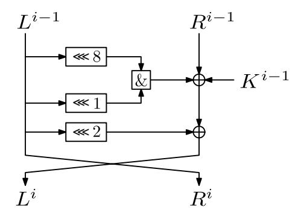
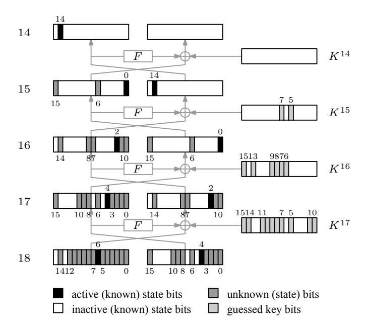
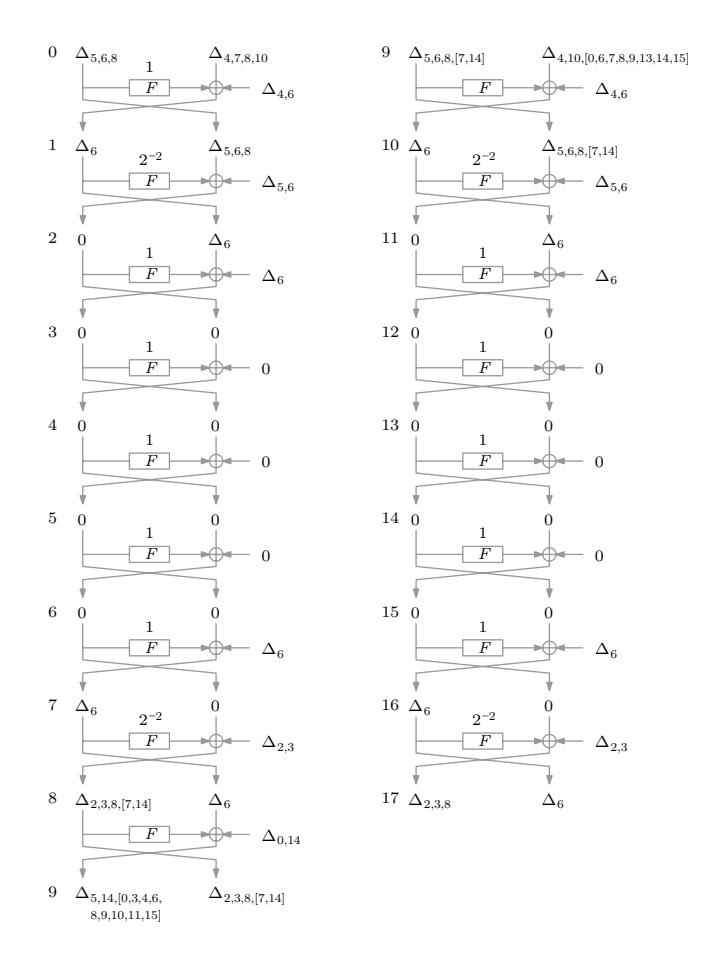

# Differential and Linear Cryptanalysis of Reduced-Round SIMON Revision From October 9, 2013

Farzaneh Abed, Eik List, Stefan Lucks, and Jakob Wenzel

Bauhaus-Universität Weimar, Germany {farzaneh.abed, eik.list, stefan.lucks, jakob.wenzel}@uni-weimar.de

**Abstract.** This paper presents differential attacks of round-reduced versions of Simon with up to 18/32, 19/36, 25/44, 35/54, and 46/72 rounds for the 32-, 48-, 64-, 96-, and 128-bit versions, respectively. Furthermore, we consider in brief related-key rectangle, impossible-differential, and also linear attacks. While all our attacks are completely academic, they demonstrate the drawback of the intensive optimizations in Simon.

Keywords: Differential cryptanalysis, block cipher, lightweight, Simon

## 1 Introduction

Due to the continuously growing impact of RFID tags, smartcards, and FP-GAs, cryptographic algorithms which are suitable for resource-constrained devices become more and more important. Lightweight ciphers shall ensure the confidentiality of transmitted messages. During the past five years, more than two dozens of lightweight ciphers have been developed, including but not limited to KATAN [17], KLEIN [20], LED [21], L-Block [36], or PRESENT [16]. In June 2012 Beaulieu et al. from the U.S. National Security Agency (NSA) contributed to this ongoing research progress with the announcement of two novel families of ultra-lightweight block ciphers, called SIMON and SPECK [7]. SIMON was thereby optimized for hardware (like KATAN, LED, or PRESENT), and SPECK for software implementations (such as KLEIN); however, both cipher families are efficient in either environment.

At first, Beaulieu et al. provided only scant information about their constructions: the announcement of both ciphers from Summer 2012 presented only performance and implementation footprints [6]. Though, in contrast to the common disclosure policy of the NSA, their specifications have recently been published and are free for use and analysis, as stipulated by Saarinen and Engels already in 2012 [32]. However, the designers provided little more than the pure specification and a discussion of the performance of their ciphers. While the NSA certainly possesses both the resources and expertise, the authors left the task of analyzing their ciphers' resistance against common attacks to the research community.

Differential Cryptanalysis. While IBM and the NSA already knew about differential cryptanalysis (DC) when designing the DES in 1974, the technique was first published in 1990, when Biham and Shamir attacked the block cipher FEAL [13]. At that time, DC received much attention after it showed applicable to mount the first attack against the full DES [11,12,14]. Nowadays, differential, together with linear, cryptanalysis is one of the best-understood and most powerful methods to analyze symmetric cryptographic primitives.

The core idea is to encrypt pairs of plaintexts (P, P') and study the propagation of their difference  $\Delta = P \oplus P'$  through the encryption process. In this context, a differential characteristic or differential trail is a sequence that describes how an input difference  $\Delta^{in}$  propagates to an output difference  $\Delta^{out}$  with a certain probability p, or formally written:  $\Delta^{in} \stackrel{p}{\longrightarrow} \Delta^{out}$ . If the probability of such a trail in a concrete cipher E is significantly higher than for a random distribution, i.e.,  $p \gg 2^{-n}$  (where n denotes the state size), then, an adversary can use this information to distinguish E from a random permutation and/or recover parts of the secret key. An adversary usually starts an attack with the collection of (at least 1/p) chosen plaintext pairs that are encrypted by an oracle. Then, it aims to identify a few ciphertext pairs that satisfy the differential trail. Thereupon, it usually tries to determine the subkeys of the rounds directly before or after the differential, before it extends its analysis over further rounds.

Extensions. Over the years, the basic attack principle has seen numerous extensions which could been applied to a huge range of primitives. In 1994, Knudsen [27] introduced truncated differentials, where some bits of the differences are not fixed, and higher-order differentials, which consider differences between larger structures of texts. In 1998, Knudsen [25] as well as Biham, Biryukov, and Shamir [9] independently proposed the idea of impossible-differential attacks, which allow the adversary to filter out keys that produce differential characteristics with zero probability. In 1999, Wagner [34] presented the boomerang attack, which allows the use of two concatenated short characteristics for settings, where no long characteristics with sufficiently high probabilities exist. In 2000, this attack was transformed into a chosen-plaintext attack by Kelsey et al. [23], which they called the amplified boomerang. Later their method was renamed by Biham et al. [10] as rectangle attack. We will apply differentials, impossible differentials and rectangles attacks on SIMON family of block ciphers in the following sections of this paper, where we will describe the ideas behind them in more detail.

Differential Cryptanalysis of Lightweight Ciphers. Differential attacks is applicable to a large range of lightweight ciphers. For KLEIN, Aumasson et al. [4] and Yu et al. [37] presented practical attacks on eight out of 12 rounds in 2011. Karakoç et al. [22] proposed impossible-differential attacks on 22 out of 32 rounds of L-Block. Considering LED, Mendel et al. [31] showed a differential analysis over up to 24 rounds. For PRESENT, Wang [35] presented attacks on up to 16 out of 31 rounds in 2008, which were improved by Albrecht and Cid in 2009 [1] by using the combination of algebraic and differential techniques. And in [24] Knellwolf, Meier, and Naya-Plasencia applied differential attacks against

up to 120 out of 254 rounds for KATAN, also in 2011. Yet, many more works besides the mentioned ones consider differential analyses of further lightweight ciphers.

The most relevant paper to ours is that by Alkhzaimi and Lauridsen, who – parallel to our work – also studied Simon and presented differential attacks on up to 16, 18, 24, 29, and 40 rounds of the versions with 32-, 48-, 64-, 96-, and 128-bit state size. The authors used a branch-and-bound algorithm to find differential trails, since the AND operation in the round function of Simon produces various paths for characteristics, so that the sum of all individual paths increase the probability significantly. In addition, they presented impossible-differential attacks (with a rather overcomplex procedure description) on up to 14, 15, 16, 19, and 22 rounds of the respective versions, and discussed observations regarding rotational cryptanalysis and weak keys of the ciphers.

| Cipher                | Rounds |      | Time        | Data                    | Memory      | Succ.       | Ref.   |  |
|-----------------------|--------|------|-------------|-------------------------|-------------|-------------|--------|--|
|                       | Full   | Att. |             |                         | (Bytes)     | Rate        |        |  |
| Differential          |        |      |             |                         |             |             |        |  |
| Simon32/64            | 32     | 18   | $2^{46.0}$  | $2^{31.2}$ CP           | $2^{15.0}$  | 0.632       | Sec. 4 |  |
| Simon48/72            | 36     | 19   | $2^{52.0}$  | $2^{46.0}$ CC           | $2^{20.0}$  | 0.981       | App. C |  |
| Simon48/96            | 36     | 19   | $2^{76.0}$  | $2^{46.0} \text{ CC}$   | $2^{20.0}$  | 0.981       | App. C |  |
| Simon64/96            | 42     | 26   | $2^{63.9}$  | $2^{63.0} \text{ CP}$   | $2^{31.0}$  | 0.863       | App. D |  |
| Simon64/128           | 44     | 26   | $2^{94.0}$  | $2^{63.0} \text{ CP}$   | $2^{31.0}$  | 0.863       | App. D |  |
| Simon96/96            | 52     | 35   | $2^{93.3}$  | $2^{93.2} \text{ CP}$   | $2^{37.8}$  | 0.632       | App. E |  |
| Simon96/144           | 54     | 35   | $2^{101.0}$ | $2^{93.2} \text{ CP}$   | $2^{37.8}$  | 0.632       | App. E |  |
| SIMON128/128          | 68     | 46   | $2^{125.7}$ | $2^{125.6} \text{ CP}$  | $2^{40.6}$  | 0.632       | App. F |  |
| SIMON128/192          | 69     | 46   | $2^{142.0}$ | $2^{125.6} \text{ CP}$  | $2^{40.6}$  | 0.632       | App. F |  |
| ${\rm Simon} 128/256$ | 72     | 46   | $2^{206.0}$ | $2^{125.6} \text{ CP}$  | $2^{40.6}$  | 0.632       | App. F |  |
|                       |        | R    | elated-K    | ley Rectang             | le          |             |        |  |
| Simon32/64            | 32     | 18   | $2^{54.55}$ | $2^{30.86}~\mathrm{CP}$ | $2^{32.86}$ | 0.632       | Sec. 5 |  |
|                       |        | In   | npossibl    | e Differenti            | al          |             |        |  |
| Simon32/64            | 32     | 13   | $2^{50.1}$  | $2^{30.0} \text{ CP}$   | $2^{20.0}$  | ≈ 1         | Sec. 6 |  |
| Simon48/96            | 36     | 15   | $2^{53.0}$  | $2^{38.0} \text{ CP}$   | $2^{20.6}$  | $\approx 1$ | Sec. 6 |  |
| Simon64/128           | 44     | 17   | $2^{71.0}$  | $2^{52.0} \text{ CP}$   | $2^{21.0}$  | $\approx 1$ | Sec. 6 |  |
| Simon 96/144          | 54     | 20   | $2^{111.0}$ | $2^{84.0}$ CP           | $2^{19.6}$  | $\approx 1$ | Sec. 6 |  |
| ${\rm Simon} 128/256$ | 72     | 25   | $2^{195.0}$ | $2^{119.0} \text{ CP}$  | $2^{23.0}$  | $\approx 1$ | Sec. 6 |  |

**Table 1.** Summary of our results on Simon. CP = chosen plaintexts, CC = chosen ciphertexts, Att. = attacked, Succ. = success, Ref. = reference.

Contribution and Outline. This paper describes our cryptanalysis of roundreduced Simon against differential, impossible-differential, rectangles and linear attacks. In Section 2 we first review the necessary details of Simon and point out a number of observations regarding its round structure. In Section [3](#page-5-0) we will describe how we build efficient differential characteristics through (parts of) the cipher, and how to extend these characteristics over a few more rounds. We then use these characteristics for basic differential key-recovery attacks, which we explain in Section [4.](#page-6-0) Thereupon, we present a related-key rectangle attack on Simon32/64 in Section [5,](#page-9-0) impossible-differential-based attacks in Section [6,](#page-13-0) and consider linear attacks in Section [7.](#page-16-0) At the end, we conclude our paper in Section [8.](#page-20-1) A summary of our results can be found in Table [1.](#page-2-0) First, we introduce the notations which are used in the remainder of this work.

| n                        | Word size.                                                                                                                                                                  |
|--------------------------|-----------------------------------------------------------------------------------------------------------------------------------------------------------------------------|
| 2n                       | State size.                                                                                                                                                                 |
| k                        | Size of the secret key in bits.                                                                                                                                             |
| Pi, Ci                   | Plaintext-ciphertext pair.                                                                                                                                                  |
| r , Rr (L )     | Left (L) and right (R) halves of the state after encryption of Round r in a Feistel-cipher.                                                                              |
| Li                       | The i-th (least-significant bit) in L, where i = 0 denotes the least-significant bit.                                                                                    |
| ∆i                       | An n-bit (XOR) difference, where only the i-th bit is active. with 0 ≤ i ≤ n − 1 and ∆0 denotes the least significant bit.                                            |
| ∆i,[j]                   | An n-bit truncated difference, where only the i-th bit is active and the j-th bit is unknown.                                                                            |
| ∆r                       | Difference after Round r.                                                                                                                                                   |
| p ∆r ∆s −→ E | A differential characteristic which yields the output difference ∆s with probability p when encrypting over a (sub-)cipher E and starting from an input difference ∆r |

# 2 Simon

Simon follows the idea of previous ARX constructions, such as ThreeFish [\[19\]](#page-21-11) or BLAKE/BLAKE2 [\[3](#page-20-2)[,5\]](#page-21-12) of using a very simple round function that is iterated over many rounds. Thus, the cipher owns a very compact construction that simplifies the analysis. At its core Simon is a two-branch balanced Feistel network which consists of only three operations: AND, XOR, and rotations. We denote the input to the i-th round by (L i−1 , Ri−1 ). In each round, the left word of the state L i−1 is used as input to a round function F that is defined by

$$F(L^{i-1}) = (L^{i-1} \ll 1) \wedge (L^{i-1} \ll 8) \oplus (L^{i-1} \ll 2).$$

The output of F(L i−1 ) is then XORed to Ri , together with the subkey Ki−1 , before both words of the state are swapped:

$$L^{i} = R^{i-1} \oplus F(L^{i-1}) \oplus K^{i-1},$$

 $R^{i} = L^{i-1}.$

Fig. 1. The round function of SIMON.

The result of the last round  $(L^r, R^r)$  yields the ciphertext. An illustration of the round function is depicted in Figure 1.

The key schedule of SIMON uses an LSFR-like procedure to generate in total r subkeys  $K^0, \ldots, K^{r-1}$ . More precisely, SIMON possesses three slightly different key schedule procedures, depending on whether the secret key consists of two, three, or four words. At the beginning, these first  $w \in \{2, 3, 4\}$  words  $K^0, \ldots, K^{w-1}$  are initialized with the secret key. The remaining key words  $K^i$ , for  $i \in \{w, \ldots, r-1\}$ , are then generated as follows:

Since the key schedule of SIMON maps the secret key uniquely to one value of w consecutive subkeys and vice versa, the full secret key can be derived with the help of any sequence of w known consecutive subkeys. To prevent slide attacks and to make rotational attacks complicated, the generated subkeys are XORed with a constant c = 0xff...fc, and a bit  $(z_j)_i$ , that denotes the i-th (least-significant) bit from one of five constant sequences  $z_0$ ,  $z_1$ ,  $z_2$ ,  $z_3$ , or  $z_4$ . For the exact sequence values, we refer readers to [7].

### 2.1 General Observations

In what follows, we discuss a few observations on SIMON which are relevant for differential cryptanalysis. First of all, we recall a general well-known property of the logical AND:

**Property 1** (Absorption of Logical AND). Let  $X, X', Y, Z, Z' \in \{0, 1\}^n$ , and  $Z = X \wedge Y$  and  $Z' = X' \wedge Y$ , where  $\wedge$  denotes bit-wise logical AND. Say, we

have an input difference  $\Delta X = X \oplus X'$  and an output difference  $\Delta Z = Z \oplus Z'$ . Further, let  $\Delta X_i = 1$  denote the *i*-th active bit in  $\Delta X$ , and let  $Y_i$  denote the *i*-th active bit in Y. Then,  $\Delta Z_i = 1$  iff  $Y_i = 1$ . Hence, if we can assume that the bit value of Y is random, then we say the AND operation absorbs an active bit with probability 1/2.

From Property (1) follows for the round function of Simon:

**Property 2** (Absorption of SIMON). Due to the rotations by one and eight positions to the left in the round function of SIMON, the logical AND will absorb an active bit  $\Delta L_i$  with probability  $2^{-2}$  iff  $L_{((i+7) \mod n),((i-7) \mod n)} = 0$ .

Since the round transformation only consists of bit-wise boolean operations, no carry-bits can occur, which is a major difference compared to addition-based ARX designs. As a consequence, the difference propagation in SIMON is independent from the indices of active bits in the input and output difference. Hereafter, we will simply call this property rotational invariance:

**Property 3** (Rotational Invariance of Differential Characteristics). Assume, we are given a differential characteristic  $\Delta^{in} \leftarrow^{p} \Delta^{out}$ , which holds with probability p over (parts of) a version of the SIMON2n/k family of block ciphers. Then, for any  $j \in [0, n-1]$ , it also applies that  $(\Delta^{in} \ll j) \leftarrow^{p} (\Delta^{out} \ll j)$ .

## 3 Search For Differentials

To find a good differential characteristics, we selected a twofold approach. Firstly, we employed Matsui's algorithm [29] which allows to find the provably best differential path over a given number of rounds. As pointed out by Biryukov and Nikolic [15] for the DES, Matsui's approach is well-feasible for ciphers with 64-bit state. So, we used it to find the best paths for the 32-, 48-, and 64-bit versions of Simon, which are:

- SIMON32/64:
$$(\Delta_{6}, 0) \xleftarrow{2^{-36}}_{12 \text{ rounds}} (\Delta_{14}, 0)$$

- SIMON48/ $k$ :  $(\Delta_{8,16}, \Delta_{6,14,18}) \xleftarrow{2^{-52}}_{15 \text{ rounds}} (\Delta_{6,14,18,22}, \Delta_{20})$
- SIMON64/ $k$ :  $(\Delta_{6}, 0) \xleftarrow{2^{-70}}_{20 \text{ rounds}} (\Delta_{6,10,14}, \Delta_{12})$

Inspired by the work of Alkhzaimi and Lauridsen [2], we then used the trails found by Matsui's algorithm as a reference in a branch-and-bound method which empirically searches for differential paths.

During our first version of this paper, we realized that differential characteristics can be produced by various paths due to the absorption of the logical AND in the round function of SIMON but we did not focus on full impact of this property. Later, Alkhzaimi and Lauridsen showed that the number of trails significantly increases the *Expected Differential Probability* (EDP) [18] of trails, so the probability of the trails found with Matsui's algorithm (whose probabilities

are significantly lower than  $2^{-n}$ ) becomes greater than  $2^{-n}$ . For the revised version of our paper, we then used a similar strategy of branch-and-bound approach to find differentials. In contrast to Alkhzaimi and Lauridsen's work, we searched in both forward and backward direction, which allowed us not only to confirm their results, but also to improve them regarding the number of covered rounds for several versions. Though, we have to point out that our search assumes that all possible round keys are uniformly distributed and equally probable at any round.

#### 3.1 Extending Characteristics Over More Rounds

A given differential can be extended by a few more rounds in a key-recovery attack for any version of  $\mathrm{SIMON}2n/k$ , . In the following, assume we are given an r-round differential

$$(\alpha, \beta) \xleftarrow{p} (\gamma, \delta).$$

Because SIMON injects the subkey at the end of its round function, the adversary itself can compute the output of F(x). Hence, it can choose  $(\beta, \alpha \oplus F(\beta))$  as a new input difference and obtains an (r+1)-round differential with equal probability. The same strategy can be applied at the output side. Recall that we are given the output difference  $(\gamma, \delta)$  after (r+1) rounds. Then, the difference after (r+2) rounds is  $(\delta \oplus F(\gamma), \gamma)$ . Since the subkey of the final round does not affect the difference  $\delta \oplus F(\gamma)$ , the adversary can compute  $F(\gamma)$  itself and obtains an (r+2)-round differential with equal probability.

For the 48/72-, 64/96-, 96/144-, and 128/192-bit versions, one can append a further round by simply guessing its full subkey. The total computational effort for collecting plaintext-ciphertext pairs and testing all subkey candidates for the appended round remains significantly smaller than exhaustively searching the full key space. Moreover, for the 32/64-, 48/96-, 64/128-, and 128/256-bit versions, the adversary can append a further round, again by guessing some bits of its subkey. Since our differentials have a relatively low Hamming weight, the in- and output differences are only affected by a few bits, with the result that for the mentioned versions of Simon2n/k with k > 2n we can easily obtain an (r+4)-round attack; in addition, concerning the four out of ten versions with k = 4n, one can mount (r+5)-round key-recovery attacks from a given r-round differential.

## 4 Key-Recovery Attacks on Simon

In this section, we demonstrate a key-recovery attack on round-reduced SI-MON32/64. We explain in details this version since it allows a simple practical verification. The attacks on the further variants follow a similar procedure. Therefore, we specify only their complexities at the end of this section.

We use the 13-round differential characteristic (see Table 5 in Appendix A) over the rounds 2-14:

$$\Delta^1 = (0, \Delta_6) \xrightarrow[10 \text{ rounds}]{2^{-30.2}} (\Delta_{14}, 0) = \Delta^{14}.$$

We append a further round to the beginning of the cipher, where the adversary can choose the left part of the plaintext pairs P, P' s.t. one obtains the desired difference  $\Delta^1$  after the first round. Additionally, we append four rounds to the end of the cipher, where the adversary will guess some key bits. From the obtained ciphertexts, we still know many bits from the truncated trail:

$$\begin{split} &(\Delta L^{15}, \Delta R^{15}) = (\Delta_{0,[6,15]}, \Delta_{14}), \\ &(\Delta L^{16}, \Delta R^{16}) = (\Delta_{2,[0,1,7,8,14]}, \Delta_{0,[6,15]}), \\ &(\Delta L^{17}, \Delta R^{17}) = (\Delta_{4,[0-3,6,8-10,15]}, \Delta_{2,[0,1,7,8,14]}), \\ &(\Delta L^{18}, \Delta R^{18}) = (\Delta_{6,[14,12-7,5-0]}, \Delta_{4,[0-3,6,8-10,15]}). \end{split}$$

**Attack Procedure.** The full attacking procedure can be split into a *collection*, a *pair-filtering*, a *key-guessing*, and a *brute-force phase*. The steps can be written as follows:

Collection phase:

- 1. Initialize an empty set  $\mathcal{P} = \emptyset$ .
- 2. Choose  $2^{30.2}$  plaintext pairs  $(P_i, P'_i)$  s.t. their difference after the first round yields  $\Delta^1$ .
- 3. Collect the corresponding ciphertext pairs  $(C_i, C'_i)$  from an encryption oracle, where  $C_i = E_K(P_i)$  and  $C'_i = E_K(P'_i)$ .

Pair-filtering phase:

4. For all ciphertext pairs, invert the final round to derive  $\Delta^{17}$  and store all pairs  $(C_i, C_i')$  with the correct difference at the known bits  $\Delta L_{4,5,7,11-14}^{17}$ ,  $\Delta R_{2-6,9-13,15}^{17}$  in  $\mathcal{P}$ . Note that  $\mathcal{A}$  knows seven bits of  $\Delta L^{17}$  and 11 bits of  $\Delta R^{17}$ . Assuming that the differences  $\Delta^{17}$  are uniformly distributed, we can expect that  $\mathcal{A}$  stores only  $2^{30.2-18}=2^{12.2}$  pairs in average.

*Key-guessing phase:*

- 5. Create a list of counters for all  $2^{18}$  possible values of the round-key bits  $K_{0,1,5,7-11,14,15}^{17}$ ,  $K_{6-9,13,15}^{16}$ , and  $K_{9,7}^{15}$  and perform the following steps for each candidate:
  - For all pairs  $(C_i, C_i') \in \mathcal{P}$ :
    - Partially decrypt  $(C_i, C'_i)$  to the state after the encryption of Round 14. If the resulting difference matches  $\Delta^{14}$ , increment the counter for the current key candidate.
- 6. Output the key candidate(s) which is/are associated to the highest counter values.

Brute-force phase:

7. For all bits of  $K^{17}$ ,  $K^{16}$ ,  $K^{15}$ , and  $K^{14}$ , which have not been guessed in the previous steps, perform further encryptions to identify their correct values.

Figure 2 visualizes the trail over the rounds 15-18. Note that  $\mathcal{A}$  guesses only those key bits which influence the output of the non-linear operations in rounds 15-18. To determine these key bits, one can take the positions of all active and

unknown bits in  $\Delta L^i$ , and add +7 and -7 (mod n) to them (cf. Property (2)). For instance, the output of  $F(\Delta L^{14})$  depends on the value of  $L_{5,7}^{14}$ . Hence, the adversary has to guess the key bits  $K_{5,7}^{14}$  to derive  $\Delta^{14}$ .

Fig. 2. Truncated differential trail over the rounds 15-18 of our attack on Simon32/64. The adversary obtains the ciphertext differences  $\Delta^{18}$  from the oracle, guesses the light gray subkey bits and decrypts until Round 14, and derives the differences  $\Delta^{14}$  in order to identify correct pairs.

**Attack Complexity.** Considering the data complexity, the adversary requires  $2^{31.2}$  chosen ciphertexts. Regarding the memory complexity,  $\mathcal{A}$  can store either a list of  $2^{18}$  counters for each key candidate or a list of all ciphertext pairs that survive the first filter after the decryption of the final round. Since the latter has smaller complexity, we allocate memory for  $2 \cdot 2^{12}$  texts of 32 bits each for the attack, which is equivalent to  $2^{15}$  bytes.

The computational effort for the collection phase,  $C_{\text{collect}}$ , is equivalent to  $2^{30.2}$  full encryptions performed by the oracle. The filtering effort,  $C_{\text{filter}}$ , is given by the costs for  $2^{30.2}$  one-round decryptions to check 18 bits of  $\Delta^{17}$ . Further, we denote by  $C_{\text{key-guessing}}$  the effort of the key-guessing phase, wherein the adversary encrypts the remaining pairs for each of the  $2^{18}$  key candidates over the final three rounds.

A trivial brute-force search can find the rest of these subkeys and  $K^{14}$  with about  $2^{46}$  partial encryptions. Summing up, the total computational complexity

can be approximated by

$$\underbrace{2 \cdot 2^{30.2}}_{C_{\text{collect}}} + \underbrace{2 \cdot 2^{30.2} \cdot \frac{1}{18}}_{C_{\text{filter}}} + \underbrace{2 \cdot 2^{18} \cdot 2^{18} \cdot \frac{3}{18}}_{C_{\text{key-guessing}}} + \underbrace{2^{46}}_{C_{\text{bruteforce}}} \approx 2^{46} \text{ encryptions.}$$

**Success Rate.** We have to point out that the described attack may not work for the complete trials. The probability of a pair to follow our differential is about  $2^{-30.2}$ . Hence, the probability that at least one correct pair occurs for the correct key can be approximated by

$$1 - Pr^{Poisson}[n = 2^{30.2}, p = 2^{-30.2}, x \le 0] \approx 0.632,$$

which is 1 - 1/e.

Similarly, we need to clarify the probability of a false-pair decision. The probability of a pair to produce the correct difference  $\Delta^{14}$  by random can be assumed to be  $2^{-32}$ . Since we partially decrypt  $2^{12.2}$  pairs in average for  $2^{18}$  key candidates, the probability that a false-positive hit occurs is about

$$1 - Pr^{Poisson}[n = 2^{30.2}, p = 2^{-32}, x \le 0] \approx 0.028.$$

After some simple calculations, we achieve success rate (i.e., one can find at least one correct pair) of 63.2% percent for the trials. Yet, in case of success, one or at most a few false-positive pairs may occur which can be filtered by negligible additional effort. To increase the success rate, one can employ shorter differentials of higher probability. For instance, there is the 10-round differential

$$(\Delta_{14}, \Delta_{0,8,12}) \stackrel{2^{-18.6}}{\longleftrightarrow} (\Delta_{2,10}, \Delta_{0,8,12}),$$

which can be used to mount a similar attack on 14-round SIMON32/64 with a data complexity of  $3 \cdot 2^{28}$  chosen plaintexts, a memory complexity of  $2^{17}$  bytes, a computational effort equivalent to about  $2^{35}$  14-round encryptions, and a success rate very close to 1.

Similar Attacks On Further Versions. We can apply the same procedure to the further versions of SIMON. Table 2 summarizes the probabilities, required number of pairs ( $C_{\rm data}$ ), known state bits to filter (1st filter), guessed key bits (key bits), and success rates (where false random shows the probability that no correct pair occurs during a run of the respective attack, and false real denotes the probability of a false-positive pair to occur) for each attack. As a remark, we used chosen ciphertexts in the attack on SIMON48/k in order to cover one more round. The detailed complexities can be found in Table 1. The detailed descriptions of the attack are summarized in the Appendices C-F.

## 5 Related-Key Attack on Simon

**Related-Key Attacks.** Related-key attacks were introduced by Knudsen [26] and Biham [8] in 1992 and 1993, respectively. In this method, for a given cipher,

| Cipher                | Rds. | Diff. | Pr[diff.]     | $C_{\mathrm{data}}$     | 1st    | Key  | False                   | False                 |
|-----------------------|------|-------|---------------|-------------------------|--------|------|-------------------------|-----------------------|
|                       |      | Rds.  |               |                         | filter | bits | $\operatorname{random}$ | real                  |
| Simon $32/64$         | 18   | 13    | $2^{-30.20}$  | _ 01                    | 18     | 18   | 0.368                   | 0.028                 |
| Simon $48/k$          | 19   | 15    | $2^{-43.01}$  | $2^{46.00} \text{ CC}$  | 28     | 20   | 0.019                   | $4.88 \cdot 10^{-4}$  |
| Simon $64/k$          | 26   | 21    | $2^{-61.01}$  | $2^{63.00} \text{ CP}$  | 35     | 36   | 0.137                   | $1.75 \cdot 10^{-3}$  |
| $\mathrm{Simon}96/k$  | 35   | 30    | $2^{-92.20}$  | $2^{93.20} \text{ CP}$  | 59     | 43   | 0.368                   | $5.48 \cdot 10^{-7}$  |
| $\mathrm{Simon}128/k$ | 46   | 41    | $2^{-124.60}$ | $2^{125.60} \text{ CP}$ | 89     | 50   | 0.368                   | $1.72 \cdot 10^{-13}$ |

**Table 2.** Parameters for our distinguisher attacks on the versions of Simon2n/k. Rds. = rounds, Diff. = differential, Prs. = pairs, CP = chosen plaintexts, CC = chosen ciphertexts.

the adversary has access to two oracles, where one oracle uses a secret key K, and another one a key  $\hat{K}$ . It is also aware of the relation between two keys instead of knowing their values. Furthermore, compare to the common single-key setting, adversary can choose the key relation such that provides it with an additional degree of freedom to identify weaknesses in a cipher. This can be beneficial for the future attacks. However, this assumption that an adversary is aware of the relations between multiple keys is rather impractical. Nevertheless, some recent cryptanalysis methods (e.g., bicliques) can re-use existing related-key differentials to mount attacks in the single-key model. Hence, related-key differential-based attacks are worth being considered.

Boomerangs and Rectangles. Boomerangs and rectangles are differential-based attacks that allow an adversary to concatenate two short differential characteristics with high probability instead of a single long differential which potentially helps to cover more rounds. Boomerangs have been first introduced by Wagner [34], and were later transformed into a chosen-plaintext amplified boomerangs by Kelsey et al. [23]. The latter principle was then renamed and improved by Biham et al. [10] to the rectangle attack.

In each of these methods, an adversary  $\mathcal{A}$  first decomposes a given cipher E into two sub-ciphers  $E=E^2\circ E^1$ , where it uses two differentials  $\alpha\xrightarrow[E^1]{p}\beta$  and  $\gamma\xrightarrow[E^2]{q}\delta$  and collects quartets of plaintexts (P,P',Q,Q') with  $P\oplus P'=Q\oplus Q'=\alpha$ . In the following, we denote by (R,R',S,S') their encryptions after  $E^1$  and by (C,C',D,D') their encryptions after  $E^2$ .

Each quartet has a probability of  $p^2$  that (R,R',S,S') fulfils  $R \oplus R' = S \oplus S' = \beta$ . We are also interested in the case that  $R \oplus S = \gamma$  and automatically  $R' \oplus S' = \gamma$ . With probability  $q^2$ , a ciphertext quartet (C,C',D,D') fulfils  $C \oplus D = C' \oplus D' = \delta$ . If this is the case, we call it a *right quartet*. If the adversary collects m pairs with difference  $\alpha$ , then, the expected number of right quartets is, according to [10]:

$$m^2 \cdot 2^{-n} \cdot (pq)^2.$$

So, if  $pq < 2^{-n/2}$ , A can count more correct quartets for E and distinguish E from a random permutation.

To increase the probability of p and q, Biham et al. further proposed instead of using fixed differences  $\beta$  and  $\gamma$  in the middle of the rectangle, right quartets can have any possible difference  $\beta'$  and  $\gamma'$ , as long as both pairs in a quartet share the same difference  $\beta'$  and  $\gamma'$  after  $E^1$ . Thus, the probabilities of p and q increase to

$$\hat{p} = \sqrt{\sum_{\beta'} Pr[\alpha \to \beta']}$$
 and  $\hat{q} = \sqrt{\sum_{\gamma'} Pr[\gamma' \to \delta]}$ .

For related-key rectangles, one uses related-key differentials, where the keyrelation used for  $E^1$  and that for  $E^2$  can be chosen independently:

$$p = Pr[E_K^1(X) \oplus E_{K^*}^1(X \oplus \alpha) = \beta] = Pr[E_{K'}^1(X) \oplus E_{K'^*}^1(X \oplus \alpha) = \beta],$$

$$q = Pr[E_K^2(X) \oplus E_{K'}^2(X \oplus \gamma) = \delta] = Pr[E_{K^*}^2(X) \oplus E_{K'^*}^2(X \oplus \gamma) = \delta],$$

where

$$K^* = K \oplus \Delta K,$$

$$K' = K \oplus \nabla K,$$

$$K'^* = K \oplus \Delta K \oplus \nabla K, \text{ and thus,}$$

$$\Delta K = K \oplus K^* = K' \oplus K'^*,$$

$$\nabla K = K \oplus K' = K^* \oplus K'^*$$

for known key differences  $\Delta K$  and  $\nabla K$ .

Related-Key Rectangle Attack on SIMON32/64. Recall that the key schedule of SIMON maps uniquely any sequence of w consecutive subkeys to one value of the secret key. With this property in mind, we explain a related-key rectangle attack on 18 rounds of SIMON32/64 in the following. For the difference  $\Delta K$  over  $E^1$  we start with  $\Delta K^3 = \Delta K^4 = \Delta K^5 = 0$ , and  $\Delta K^6 = \Delta_6$ . From a simple equational calculation, we obtain

$$\Delta K^{0} = \Delta_{4,6},$$
  $\Delta K^{7} = \Delta_{2,3},$   $\Delta K^{1} = \Delta_{5,6},$   $\Delta K^{8} = \Delta_{0,14},$   $\Delta K^{2} = \Delta_{6}.$

For the key relation  $\nabla K$  over  $E^2$  we start from  $\nabla K^{12} = \nabla K^{13} = \nabla K^{14} = 0$  and  $\nabla K^{15} = \Delta_6$  and obtain

$$\begin{array}{ll} \nabla K^9 = \varDelta_{4,6}, & \nabla K^{11} = \varDelta_{6}, \\ \nabla K^{10} = \varDelta_{5,6}, & \nabla K^{16} = \varDelta_{2,3}. \end{array}$$

The resulting trail is depicted in Figure 3. We choose the plaintext difference  $\alpha$  in a way that the difference after Round 3 in the state becomes zero. This allows us to pass rounds 3-7 with probability one. Because the adversary has freedom to choose the plaintext difference, it will pass the first round with probability

**Fig. 3.** Related-key trails for the attack on Simon32/64. The left side shows the trail over  $E^1$ , the right side that over  $E^2$ .

one. Now, we need to determine the probability of the  $E^1$ -trail over rounds 8 and 9. Due to the non-linear operation in Round 8, one obtains  $2^2$  possible differences for  $\Delta^8$ :  $\Delta_{2,3,8}$ ,  $\Delta_{2,3,7,8}$ ,  $\Delta_{2,3,8,14}$ , or  $\Delta_{2,3,7,8,14}$ . After Round 9,  $\Delta_{2,3,8}$  can produce  $2^6$  differences, where each of them occurs with probability  $2^{-6}$ ,  $\Delta_{2,3,7,8}$  and  $\Delta_{2,3,8,14}$  can produce  $2^8$  differences with probability  $2^{-8}$ . And similarly  $\Delta_{2,3,7,8,14}$  can produce  $2^{10}$  differences with probability  $2^{-10}$ . Hence, the cumulative probability for all differentials over rounds 8 and 9 can be calculated from

$$\sqrt{2^6 \cdot (2^{-2-6})^2 + 2^8 \cdot (2^{-2-8})^2 + 2^8 \cdot (2^{-2-8})^2 + 2^{10} \cdot (2^{-2-10})^2} \approx 2^{-4.68}.$$

Multiplying this value with the probability of  $2^{-2}$  for Round 2, we obtain  $\hat{p} = 2^{-6.68}$ . The same strategy can be applied to rounds 10 and 11 in the  $E^2$ -trail and gain  $\hat{q} = 2^{-6.68}$  with similar argumentation. Hence, this 17-round rectangle

has a probability of  $(\hat{p}\hat{q})^2 \approx 2^{-26.72}$ . The adversary can append another round due to the Feistel structure which can be directly inverted in order to check  $\Delta^{17}$ . The procedure for the attack is then as follows:

- 1. Choose  $\frac{2^{(n+1)/2}}{\hat{p}\hat{q}} = \frac{2^{33/2}}{2^{-6.68}2^{-6.68}} = 2^{29.86}$  pairs, or  $2^{28.86}$  quartets (P,P'), (Q,Q') with  $P\oplus P'=Q\oplus Q'=\alpha$ .
- 2. Ask an oracle for the corresponding encryptions  $C = E_K(P)$ ,  $C' = E_{K'}(P')$ ,  $D = E_{K^*(Q)}$ , and  $D' = E_{K^*(Q')}$ . Set the round keys for the final round to 0, invert the final round, and assign (C, C', D, D') to their corresponding states after Round 17.
- 3. For all possible  $(2^{29.86})^2/2 = 2^{58.72}$  combinations of pairs (C, C'), (D, D'):

   Test if  $C \oplus D = C' \oplus D' = \delta$ . If one such quartet is found, output "real" and terminate.
- 4. Output "random".

Attack Complexity. The attack requires  $2^{30.86}$  chosen plaintexts, which have to be stored using  $2^{30.86} \cdot 32/8 = 2^{32.86}$  bytes of memory. The computational effort is given by  $2^{30.86}$  full encryptions by the oracle,  $2^{30.86}$  additional single-round decryptions by the adversary and  $2^{58.72}$  memory accesses, which can be overestimated by single-round encryptions, yielding a complexity equivalent to

$$2^{30.86} + 2^{30.86} \cdot \frac{1}{18} + 2^{58.72} \cdot \frac{1}{18} \approx 2^{54.55} \text{ encryptions}.$$

Success Rate. The probability that, among all  $2^{58.72}$  possible quartets, at least one correct quartet occurs can be approximated by

$$1 - Pr^{Poisson}[n = 2^{58.72}, p = 2^{-58.72}, x \le 0] \approx 0.632.$$

On the other hand, the probability that a false-positive quartet occurs is about

$$1 - Pr^{Poisson}[n = 2^{58.72}, p = 2^{-64}, x \le 0] \approx 0.025.$$

## 6 Impossible-Differential Attacks on Simon

In this part, we go further and apply impossible-differential attacks on SIMON family of block ciphers. In contrast to conventional differential cryptanalysis, where the adversary searches for characteristics with a preferably high probability, impossible-differential attacks use characteristics with zero probability to reduce the key space. The technique was first shown independently by Biham, Biryukov, and Shamir in 1998 [9] to attack the NSA cipher Skipjack, as well as by Knudsen [25] to analyze 6 rounds of his AES-proposal DEAL.

#### 6.1 Impossible-Differential Cryptanalysis

In impossible-differential attacks, an adversary splits a given cipher E into  $E_4 \circ E_3 \circ E_2 \circ E_1$ , and searches for a characteristic

$$\Delta^{in} \xrightarrow{p^{in}} \Delta^x \xrightarrow{1}_{E_2} \Delta^{x'} \neq \Delta^{y'} \xleftarrow{1}_{E_2^{-1}} \Delta^y \xleftarrow{p^{out}}_{E_4^{-1}} \Delta^{out}.$$

As a next, it chooses a set of plaintext pairs with difference  $\Delta^{in}$  (or ciphertext pairs with difference  $\Delta^{out}$ ) and collects the corresponding ciphertext pairs from an oracle, where it keeps only those that satisfy  $\Delta^{out}$  (or plaintext pairs that satisfy  $\Delta^{in}$ , respectively). In the following, let  $K^{in}$  denote those key bits, which affect the characteristic  $\Delta^{in} \to \Delta^x$ , and  $K^{out}$  those key bits which affect the characteristic  $\Delta^y \leftarrow \Delta^{out}$ . For all possible values of  $K^{in} \cup K^{out}$ ,  $\mathcal{A}$  partially encrypts all remaining pairs over  $E_1$  and decrypts them over  $E_4$ . If, for a given key value, there is at least one pair that has  $\Delta^x$  after  $E_1$  and  $\Delta^y$  after the inverse  $E_4$ , then the differential path over  $E_3 \circ E_2$  is not possible, and  $\mathcal{A}$  can discard the current key value. This way, the key space can be effectively filtered. Note that for SIMON, since the key words  $K^{in}$  already provide us with the secret key, we do not need to consider  $K^{out}$ .

Remark 1. The number of rounds for the characteristic  $\Delta^{in} \to \Delta^x$  is limited (and so is that of  $\Delta^y \leftarrow \Delta^{out}$ ) because each value of the key bits  $K^{in} \cup K^{out}$  is used to encrypt a potentially high number of pairs. Obviously, this effort must not exceed that of exhaustive search, or formally written:

$$|K^{E_1} \cup K^{E_4}| \cdot |P_{ava}| \ll 2^n$$
,

where  $|P_{avg}|$  denotes the average number of pairs that need to be en-/decrypted with one non-correct key value to obtain the impossible differential.

For Simon, the length of  $E_1$  is limited to the first four rounds, when the secret key consists of three words, and to the first five rounds, when the secret key consists of four words. For the smallest variant, Simon32/64, this is not a problem; concerning the larger versions, this significantly limits the maximal number of rounds that we can attack. In this section, we only describe our impossible-differential attack on reduced Simon32/64. The characteristics used for the further versions of our attack on Simon are listed in Appendix B.

## 6.2 Impossible-Differential Attack on Simon32/64

For this attack, we denote by  $E = E_3 \circ E_2 \circ E_1$  a version of SIMON32/64 reduced to the rounds 1-13, where  $E_1$  denotes rounds 1-5,  $E_2$  the rounds 6-11, and  $E_3$  the rounds 12 and 13. We use the following characteristics:

$$\underbrace{ \underbrace{ \left( \underline{\Delta_{0,4,8}, \Delta_{2,10}} \right)}_{\Delta^{in}} \underbrace{ \frac{p^{in} = 2^{-10}}{E_1} }_{E_1} \underbrace{ \left( 0, \underline{\Delta_0} \right)}_{\Delta^x} \underbrace{ \frac{1}{E_2} }_{E_2} \underbrace{ \underbrace{ \left( \underline{\Delta_{[0-15]}, \Delta_{8,[0,2-7,9-14]} \right)}_{\Delta^{x'}} }_{D^{out}} \underbrace{ \underbrace{ \left( \underline{\Delta_{[1-5,9-15]}, \Delta_{[1-3,9-13]} \right)}_{\Delta^{out}} }_{D^{out}} .$$

Note that  $\Delta^{in}$  requires the six bits  $L^0_{1,7,9,11,13,15} = 0$ , which would restrict the plaintext space to  $2^{26}$  values. Again, to collect enough pairs, the adversary can set the bits  $L^0_{1,7,9,11,13,15} = 1$  and adapt the difference in the right part of  $\Delta^{in}$  s.t. the difference after the first round is still  $(\Delta_6, \Delta_{0,4,8})$ .

Attack Procedure. We can split the attack into a collection, a pair-filtering, and a key-filtering phase. The steps can be written as follows:

Collection phase:

- 1. Initialize an empty set  $\mathcal{P} = \emptyset$ .
- 2. Collect  $2^{29}$  plaintext pairs  $(P_i, P'_i)$  with  $P \oplus P' = \Delta^{in}$  and obtain the corresponding ciphertext pairs  $(C_i, C'_i)$  from an encryption oracle.

Pair-filtering phase:

3. Store all tuples  $(P_i, P_i')$  for which the corresponding ciphertexts  $C_i, C_i'$  satisfy  $C_i \oplus C_i' = \Delta^{out}$  in  $\mathcal{P}$ . Since there are  $2^{29}$  pairs and only 12 bits of  $\Delta^{out}$  are specified,  $\mathcal{A}$  can expect  $2^{29} \cdot 2^{-12} = 2^{17}$  pairs which satisfy our characteristic.

Key-filtering phase:

- 4. In the following, let  $K = K^0 ||K^1|| K_{1,5,6,7,8,9,11,15}^2 ||K_{7,9}^3|$ . For all possible values of K:
  - For each tuple  $(P_i, P_i') \in \mathcal{P}$ :
    - Encrypt  $S_i = E_1(K, P_i)$ ,  $S_i' = E_1(K, P_i')$ . If  $S_i \oplus S_i' = \Delta^x$ , then discard the current value K and proceed with the next key candidate.

The probability that a value K survives all tests for one plaintext pair is given by  $(1-2^{-10})$ , and for all pairs is equal to  $(1-2^{-10})^{2^{17}} \approx 2^{-184}$ . Thus, the probability of a false-positive key to survive is  $2^{64} \cdot 2^{-184} \approx 2^{-120}$ , which leads to our claim that  $\mathcal{A}$  will find the correct value K after the key-filtering phase.

**Attack complexity.** The data complexity is given by  $2^{30}$  chosen plaintexts. The adversary needs memory to store  $2^{17}$  pairs in average, which is equivalent to  $2^{21}$  bytes.

Same as our previous attacks, the computational complexity consists of several sub-steps which need to be considered. The costs for collecting  $2^{29}$  pairs are given by  $2^{30}$  encryptions. For every pair,  $\mathcal{A}$  then tests the keys  $K = K^0 || K^1 || K_{1,5,6,7,8,9,11,15}^3 || K_{7,9}^3$  by encrypting a number of pairs over five rounds. Note that these 16+16+8+2=42 key bits are derived from the fact that only these bits affect  $\Delta^5 = \Delta^{x'}$ .

We are also interested in the number of pairs  $|P_{avg}|$  that  $\mathcal{A}$  has to encrypt in average for an incorrect key candidate in order to find a pair that satisfies  $\Delta^{x'}$ . Therefore, we require

$$p = 1 - ((1 - 2^{-10})^{|P_{avg}|}) \ge 0.5.$$

Using simple calculus, we obtain

$$|P_{avg}| = \left[\frac{log(0.5)}{log(1-2^{-10})}\right] = 710 \text{ pairs (711 texts)}.$$

Summing up, the effort for the filtering phase can be estimated by  $2^{42} \cdot 711 \cdot \frac{5}{13} \approx 2^{50.1}$  full encryptions. Afterwards,  $\mathcal{A}$  will find the correct value of the 42 bits in K with overwhelming probability, and can test all  $2^{22}$  candidates for the remaining keys via exhaustive search. Thus, the total complexity is given by

$$\underbrace{2^{30}}_{C_{\text{collect}}} + \underbrace{2^{42} \cdot 711 \cdot \frac{5}{13}}_{C_{\text{blue}}} + \underbrace{2^{22}}_{C_{\text{bruteforce}}} \approx 2^{50.1} \text{ encryptions.}$$

Table 3 summarizes the parameters of our impossible-differential attacks on this and further versions of Simon. The differential trails which are used to mount the attack can be found in Appendix B. Note that, for example, one could easily add three or four more rounds to the impossible differential attack on Simon128/256 by guessing some more subkey bits, thus, reducing the effort for exhaustive search. But, since this would not lead us to have an attack with more rounds compare to the conventional differentials, we left the shorter attack as an easy-to-grasp example.

| State | ·    | Rounds        | #Pairs    | Known | $ \mathcal{P} $ | $\mathbf{p^{in}}$ | $ \mathbf{K^{in}} $ | Filter     | $ \mathrm{P}_{\mathrm{avg}} $ |
|-------|------|---------------|-----------|-------|-----------------|-------------------|---------------------|------------|-------------------------------|
| size  | size | $E_1/E_2/E_3$ |           | bits  |                 |                   |                     |            |                               |
| 32    | 64   | 5/6/2         | $2^{29}$  | 12    | $2^{17}$        | $2^{-10}$         | 42                  | $2^{-184}$ | 710                           |
| 48    | 96   | 5/7/3         | $2^{37}$  | 20    | $2^{17}$        | $2^{-10}$         | 44                  | $2^{-184}$ | 710                           |
| 64    | 128  | 5/8/4         | $2^{51}$  | 34    | $2^{17}$        | $2^{-10}$         | 57                  | $2^{-184}$ | 710                           |
| 96    | 144  | 4/10/6        | $2^{83}$  | 68    | $2^{15}$        | $2^{-8}$          | 33                  | $2^{-185}$ | 178                           |
| 128   | 256  | 5/12/8        | $2^{118}$ | 100   | $2^{18}$        | $2^{-10}$         | 61                  | $2^{-368}$ | 710                           |

**Table 3.** Impossible-differential attacks on Simon. The filter results from  $(1-p^{in})^{|\mathcal{P}|}$ .

## 7 Linear Cryptanalysis of Simon

#### 7.1 Linear Cryptanalysis

Linear cryptanalysis represents another powerful statistic method for the security analyzes of symmetric primitives. It was introduced by Matsui and Yamagishi in 1992 [30], and has been applied to a large range of primitives since then. Linear cryptanalysis considers a more practical setting than e.g., differential analysis, since the adversary requires only knowledge about known instead of chosen plaintext-ciphertext pairs. In a linear attack, the adversary searches for some linear relation of some plaintext bits  $P_{i_1,i_2,...}$ , ciphertext bits  $C_{j_1,j_2,...}$ , and some key bits  $K_{k_1,k_2,...}$ . Following relation must hold for the given cipher [28] with non-random probability

$$Pr\left[\bigoplus_{\ell} P_{i_{\ell}} \oplus \bigoplus_{\ell} C_{j_{\ell}} = \bigoplus_{\ell} K_{k_{\ell}}\right] = p = \frac{1}{2} + \epsilon. \tag{1}$$

In general, the larger the bias  $|\epsilon|$  from random, the more effective the linear approximation.

When approximating a given cipher, we assume that each of its internal non-linear operations behave linearly with a certain probability. We denote this event by  $p_i = 1/2 + \epsilon_i$  for the *i*-th non-linear operation. To combine multiple, say m, such events, Matsui [28] proposed the piling-up lemma:

**Lemma 1 ([28], Lemma 3).** Let  $X_i$   $(1 \le i \le m)$  be independent random variables whose values are 0 with probability  $p_i$  or 1 with probability  $1-p_i$ . Then the probability that  $X_1 \oplus X_2 \oplus \ldots \oplus X_m = 0$  is

$$p = 1/2 + 2^{m-1} \cdot \prod_{i=1}^{m} \epsilon_i.$$

In addition, Matsui also specified in his Lemma 2:

**Lemma 2 ([28], Lemma 2).** Let N be the number of given random plaintexts and p be the probability of the linear approximation of our cipher. Assuming that |p-1/2| is sufficiently small, then the success rate of our attack is

$$\int_{-2\sqrt{N}|p-1/2|}^{\infty} \frac{1}{\sqrt{2\pi}} e^{\frac{-x^2}{2}} dx. \tag{2}$$

Matsui's results were calculated with focus on the DES. In [33] Selçuk proposed a more general approach for his calculation of the success probability and data complexity. There, he used the notion of an  $a = (m - \log r)$ -bit advantage to denote that an m-bit key will be found among the  $2^r$  most probable key candidates identified by an attack. To achieve at least an 8-bit advantage for our attacks, we use  $N = 8|p - 1/2|^{-2}$  throughout this work, which yields a success rate of about 99.7% according to Table 2 [33, p.6].

## 7.2 Linearization of SIMON

To apply linear attacks on Simon, we have to linearize the AND operation. Therefore, we follow Matsui's example for the DES, where we first illustrate the approach for a toy version of the cipher with three rounds and then extend it to r-round-Simon in general.

**Linearizing 3-Round SIMON.** Here, we focus on a single active bit, say  $L_8^1$ , and regard the state  $L^1$  in the middle of 3-round SIMON. Starting from top and bottom, we can express  $L_8^1$  as a relation of plaintext  $(L^0, R^0)$ , ciphertext  $(L^3, R^3)$ , and subkey bits in two simple equations:

$$L_8^1 = R_8^0 \oplus L_6^0 \oplus X_8^0 \oplus K_8^0,$$

 $L_8^1 = L_8^3 \oplus R_6^3 \oplus X_8^2 \oplus K_8^2,$

where  $X^r$  denotes the output of the AND operation. Since for two random input bits, AND yields '0' as an output in 3/4 of the cases, we can say that

 $Pr[X_8^0 = 0] = Pr[X_8^2 = 0] = 3/4$  for random  $X_8^0$  and  $X_8^2$ . Shifting the key bits to the right side of the equations yields

$$Pr[L_8^1 \oplus R_8^0 \oplus L_6^0 = K_8^0] = 3/4 = 1/2 + 1/4,$$

 $Pr[L_8^1 \oplus L_8^3 \oplus R_6^3 = K_8^2] = 3/4 = 1/2 + 1/4.$

By XORing both equations and applying the piling-up lemma, we obtain

$$Pr[R_8^0 \oplus L_6^0 \oplus L_8^3 \oplus R_6^3 = K_8^0 \oplus K_8^2] = 1/2 + 2^1 \cdot (1/4)^2 = 5/8.$$

Generic Linearization of SIMON. From this toy example it is easy to see that SIMON can be linearized in a straight-forward manner: the AND operation behaves equally in any round and for any bit of the state, so for any approximation i in the cipher  $\epsilon_i = 1/4 = 2^{-2}$ . Thus, we can deduce the probability and the number of required known plaintext-ciphertext pairs from the number of approximations:

$$p = 1/2 + 2^{m-1} \cdot (2^{-2})^m = 1/2 + 2^{-m-1},$$

$$N = 8 \cdot (2^{-m-1})^{-2} = 2^{3+2(m+1)} = 2^{2m+5}.$$

We can also invert the deduction. Say, we want to collect at most  $2^{n-1}$  known plaintext-ciphertext pairs to have a data complexity less than the entire codebook. To achieve this, our attack with desired success probability of 97.7% can use at most

$$2^{2(m+5)} \le 2^{n-1} \implies m \le \frac{n-6}{2} \text{ KP.}$$
 (3)

**Extension To r-Round SIMON.** We can extend our 3-round approximation round by round. For instance, we can generate a five-round approximation by appending one round at the top and another one at the bottom. After appending one round, our equation transforms to

$$Pr[R_8^1 \oplus L_6^1 \oplus L_8^4 \oplus R_6^4 = K_8^1 \oplus K_8^3] = 5/8.$$

We can replace the unknown intermediate values  $(R_8^1, L_6^1, L_8^4, R_6^4)$  with known ones as below:

$$\begin{split} R_8^1 &= L_8^0, \\ L_6^1 &= K_6^0 \oplus R_6^0 \oplus L_4^0 \oplus X_6^0, \\ L_8^4 &= R_8^5, \\ R_6^4 &= K_6^4 \oplus R_4^5 \oplus L_6^5 \oplus X_6^4 \end{split}$$

In the two added rounds, we again approximate  $X_6^0 = 0$  and  $X_6^4 = 0$  with the same probability. Thus, after simplifying the above equations, we obtain a total bias of  $\epsilon = 2^{4-1} \cdot (1/4)^4 = 1/32$  for four approximations by applying the piling-up lemma:

$$Pr[L_8^0 \oplus L_4^0 \oplus R_6^0 \oplus R_8^5 \oplus R_4^5 \oplus L_6^5 = K_6^0 \oplus K_8^1 \oplus K_8^3 \oplus K_6^4] = 1/2 + 1/32.$$

We can apply this strategy over more rounds. From a small implementation with starting from a single bit in the middle of rounds as we suggested above, we attained the following sequence of required approximations in every round:

$$\dots$$
, 5, 5, 4, 4, 3, 3, 2, 2, 1, 1, 0, 1, 1, 2, 2, 3, 3, 4, 4, 5, 5,  $\dots$

For Simon32/64 the sequence is slightly better:

$$\ldots$$
, 3, 1, 2, 1, 1, 0, 1, 1, 2, 1, 3,  $\ldots$

However, from Equation 3, we know that an attack on Simon32/64 should have at most  $m \leq 13$  approximations. From the sequences above, we can deduce the maximal number of approximations for a linear attack on any version of Simon. For example, for Simon32/64, the sequence 1, 2, 1, 1, 0, 1, 1, 2, 1 represents a linearization of nine consecutive rounds with 10 approximations. For our concrete example from above, this gives the following equation system:

$$\begin{split} x &= L^0_{0,4,8} \oplus R^0_2 \oplus L^9_2 \oplus R^9_{0,4,8}, \\ y &= K^0_{2,6} \oplus K^1_{4,8} \oplus K^2_6 \oplus K^3_8 \oplus K^5_8 \oplus K^6_6 \oplus K^7_{4,8} \oplus K^8_{2,6}, \\ Pr[x = y] &= 1/2 + 2^{10-1} \cdot 2^{-2 \cdot 10} = 1/2 + 2^{-11}. \end{split}$$

Table 4 summarizes the parameters of our linear attacks for the different versions of Simon. We can extend the number of attacked rounds of all versions by ap-

| Cipher                | Rounds |      | #Approx. | Data | Succ.     |       |
|-----------------------|--------|------|----------|------|-----------|-------|
|                       | Full   | Att. | Approx.  |      | (KP)      | Rate  |
| Simon32/64            | 32     | 11   | 9        | 10   | $2^{23}$  | 0.997 |
| $\mathrm{Simon}48/k$  | 36     | 14   | 12       | 21   | $2^{47}$  | 0.997 |
| ${\rm Simon} 64/k$    | 42     | 16   | 14       | 28   | $2^{61}$  | 0.997 |
| ${\rm Simon}96/k$     | 52     | 20   | 18       | 45   | $2^{95}$  | 0.997 |
| $\mathrm{Simon}128/k$ | 68     | 23   | 21       | 60   | $2^{125}$ | 0.997 |

**Table 4.** Summary of linear attacks for the different versions of Simon. #Approx. = number of approximations, Approx. = number of rounds for linear approximation, Succ. = success probability, Att. = number of attacked rounds, KP = known plaintexts.

pending one round at the bottom and another one at the top without additional workload since the adversary knows the inputs to the AND operation from the plain- and ciphertexts and thus, does not need to approximate any. Since the linearization of SIMON is independent of rounds or bit-indices, the adversary obtains not only a single equation, but also n equations, which allow to recover almost all subkeys in these rounds (except for the middle round). However, note that the probability of all n equations to be hold at the same time has a significantly lower success probability. Most importantly, one can see that linear attacks on SIMON can not cover a quarter as many rounds as our differential analysis.

## 8 Discussion and Conclusion

In this work, we presented differential attacks on reduced-round versions of the Simon family of block ciphers. Furthermore, we briefly considered related-key rectangles, impossible-differential and linear attacks.

Since the round function of SIMON only employs rotations, XOR, and AND, it allows to construct differential characteristics of about one third of the total number of rounds of the cipher. However, for every version of SIMON we could find iterated differentials  $\Delta \stackrel{p}{\longleftrightarrow} \Delta$ , with only a single active bit difference in  $\Delta$  differences, which allowed us to cover up to half of the number of rounds. Inspired by the idea by Alkhzaimi and Lauridsen [2] of using a branch-andbound approach, we could show that there is a significant number of paths for differential characteristics in SIMON which notably increase the expected differential probability, so that differentials could be constructed to even more than half the number of rounds, e.g., 31 out of 52 rounds for the 96-bit, and 41 out of 68 rounds for the 128-bit version. The source of vulnerability of SIMON against differential cryptanalysis is obviously related to the absorption characteristic of the AND and also the lack of further non-linear operations, such as additions. Though, our attacks with smaller differential characteristics did not render comparably efficient, which leaves the open task of further exploiting rectangle and related-key rectangle attacks. Similarly, we briefly considered linear attacks, which are more practical since an adversary requires only known plaintextciphertext pairs. Our results show that a straight-forward approximation of the AND operation yields attacks with at least 11-23 rounds for the respective versions. Hence, differential attacks appear to be the more promising base for future improvements.

Nonetheless, from our point of view, the prominent and very positive security aspect of both NSA constructions is the round-wise key addition and the simple, yet powerful key schedule, which protects very effectively against slide, rotational, and meet-in-the-middle attacks over a reasonable number of rounds.

## 9 Acknowledgment

We would like to gratefully acknowledge Ivica Nikolić for his ideas and helpful comments.

## References

-  Martin R. Albrecht and Carlos Cid. Algebraic Techniques in Differential Cryptanalysis. In Orr Dunkelman, editor, FSE, volume 5665 of Lecture Notes in Computer Science, pages 193–208. Springer, 2009.
-  Hoda A. Alkhzaimi and Martin M. Lauridsen. Cryptanalysis of the SIMON Family of Block Ciphers. Cryptology ePrint Archive, Report 2013/543, 2013. http://eprint.iacr.org/.
- 3. Jean-Philippe Aumasson, Luca Henzen, Willi Meier, and Raphael C.-W. Phan. SHA-3 proposal BLAKE. Submission to NIST (Round 3), 2010.

- 4. Jean-Philippe Aumasson, María Naya-Plasencia, and Markku-Juhani O. Saarinen. Practical Attack on 8 Rounds of the Lightweight Block Cipher KLEIN. In Daniel J. Bernstein and Sanjit Chatterjee, editors, INDOCRYPT, volume 7107 of Lecture Notes in Computer Science, pages 134–145. Springer, 2011.
- 5. Jean-Philippe Aumasson, Samuel Neves, Zooko Wilcox-O'Hearn, and Christian Winnerlein. BLAKE2: Simpler, Smaller, Fast as MD5. In Michael J. Jacobson Jr., Michael E. Locasto, Payman Mohassel, and Reihaneh Safavi-Naini, editors, ACNS, volume 7954 of Lecture Notes in Computer Science, pages 119–135. Springer, 2013.
- 6. Ray Beaulieu, Douglas Shors, Jason Smith, Stefan Treatman-Clark, Bryan Weeks, and Louis Wingers. Performance of the SIMON and SPECK Families of Lightweight Block Ciphers. Technical report, National Security Agency, May 2012.
- 7. Ray Beaulieu, Douglas Shors, Jason Smith, Stefan Treatman-Clark, Bryan Weeks, and Louis Wingers. The SIMON and SPECK Families of Lightweight Block Ciphers. Cryptology ePrint Archive, Report 2013/404, 2013. [http://eprint.iacr.](http://eprint.iacr.org/) [org/](http://eprint.iacr.org/).
- 8. Eli Biham. New Types of Cryptanalytic Attacks Using Related Keys. J. Cryptology, 7(4):229–246, 1994.
- 9. Eli Biham, Alex Biryukov, and Adi Shamir. Cryptanalysis of Skipjack Reduced to 31 Rounds Using Impossible Differentials. In Jacques Stern, editor, EUROCRYPT, volume 1592 of Lecture Notes in Computer Science, pages 12–23. Springer, 1999.
- 10. Eli Biham, Orr Dunkelman, and Nathan Keller. The Rectangle Attack - Rectangling the Serpent. In Birgit Pfitzmann, editor, EUROCRYPT, volume 2045 of Lecture Notes in Computer Science, pages 340–357. Springer, 2001.
- 11. Eli Biham and Adi Shamir. Differential Cryptanalysis of DES-like Cryptosystems. In Alfred Menezes and Scott A. Vanstone, editors, CRYPTO, volume 537 of Lecture Notes in Computer Science, pages 2–21. Springer, 1990.
- 12. Eli Biham and Adi Shamir. Differential Cryptanalysis of DES-like Cryptosystems. J. Cryptology, 4(1):3–72, 1991.
- 13. Eli Biham and Adi Shamir. Differential Cryptanalysis of FEAL and N-hash. In Advances in Cryptology—EUROCRYPT'91, pages 1–16. Springer, 1991.
- 14. Eli Biham and Adi Shamir. Differential Cryptanalysis of the Full 16-Round DES. In Ernest Brickell, editor, Advances in Cryptology — CRYPTO' 92, volume 740 of Lecture Notes in Computer Science, pages 487–496. Springer Berlin / Heidelberg, 1993.
- 15. Alex Biryukov and Ivica Nikolic. Search for Related-Key Differential Characteristics in DES-Like Ciphers. In Antoine Joux, editor, FSE, volume 6733 of Lecture Notes in Computer Science, pages 18–34. Springer, 2011.
- 16. Andrey Bogdanov, Lars R. Knudsen, Gregor Leander, Christof Paar, Axel Poschmann, Matthew J. B. Robshaw, Yannick Seurin, and C. Vikkelsoe. PRESENT: An Ultra-Lightweight Block Cipher. In Pascal Paillier and Ingrid Verbauwhede, editors, CHES, volume 4727 of Lecture Notes in Computer Science, pages 450–466. Springer, 2007.
- 17. Christophe De Cannière and Orr Dunkelman and Miroslav Knezevic. KATAN and KTANTAN - A Family of Small and Efficient Hardware-Oriented Block Ciphers. In CHES, pages 272–288, 2009.
- 18. Joan Daemen, Mario Lamberger, Norbert Pramstaller, Vincent Rijmen, and Frederik Vercauteren. Computational Aspects of the Expected Differential Probability of 4-Round AES and AES-Like Ciphers. Computing, 85(1-2):85–104, 2009.
- 19. Niels Ferguson, Stefan Lucks, Bruce Schneier, Doug Whiting, Mihir Bellare, Tadayoshi Kohno, Jon Callas, and Jesse Walker. The Skein Hash Function Family. Submission to NIST (Round 3), 2010.

- 20. Zheng Gong, Svetla Nikova, and Yee Wei Law. KLEIN: A New Family of Lightweight Block Ciphers. In Ari Juels and Christof Paar, editors, RFIDSec, volume 7055 of Lecture Notes in Computer Science, pages 1–18. Springer, 2011.
- 21. Jian Guo, Thomas Peyrin, Axel Poschmann, and Matthew J. B. Robshaw. The LED Block Cipher. In Bart Preneel and Tsuyoshi Takagi, editors, CHES, volume 6917 of Lecture Notes in Computer Science, pages 326–341. Springer, 2011.
- 22. Ferhat Karakoc, Hüseyin Demirci, and A. Emre Harmanci. Impossible Differential Cryptanalysis of Reduced-Round LBlock. In Ioannis G. Askoxylakis, Henrich Christopher Pöhls, and Joachim Posegga, editors, WISTP, volume 7322 of Lecture Notes in Computer Science, pages 179–188. Springer, 2012.
- 23. John Kelsey, Tadayoshi Kohno, and Bruce Schneier. Amplified Boomerang Attacks Against Reduced-Round MARS and Serpent. In Fast Software Encryption, pages 75–93, 2000.
- 24. Simon Knellwolf, Willi Meier, and María Naya-Plasencia. Conditional Differential Cryptanalysis of Trivium and KATAN. In Ali Miri and Serge Vaudenay, editors, Selected Areas in Cryptography, volume 7118 of Lecture Notes in Computer Science, pages 200–212. Springer, 2011.
- 25. Lars Knudsen. DEAL—A 128-bit Block Cipher. Technical report, Department of Informatics, University of Bergen, Norway, 1998.
- 26. Lars R. Knudsen. Cryptanalysis of LOKI91. In Jennifer Seberry and Yuliang Zheng, editors, ASIACRYPT, volume 718 of Lecture Notes in Computer Science, pages 196–208. Springer, 1992.
- 27. Lars R. Knudsen. Truncated and Higher-Order Differentials. In Bart Preneel, editor, FSE, volume 1008 of Lecture Notes in Computer Science, pages 196–211. Springer, 1994.
- 28. Mitsuru Matsui. Linear Cryptoanalysis Method for DES Cipher. In Tor Helleseth, editor, EUROCRYPT, volume 765 of Lecture Notes in Computer Science, pages 386–397. Springer, 1993.
- 29. Mitsuru Matsui. On Correlation Between the Order of S-boxes and the Strength of DES. In Alfredo De Santis, editor, EUROCRYPT, volume 950 of Lecture Notes in Computer Science, pages 366–375. Springer, 1994.
- 30. Mitsuru Matsui and Atsuhiro Yamagishi. A New Method for Known Plaintext Attack of FEAL Cipher. In Rainer A. Rueppel, editor, EUROCRYPT, volume 658 of Lecture Notes in Computer Science, pages 81–91. Springer, 1992.
- 31. Florian Mendel, Vincent Rijmen, Deniz Toz, and Kerem Varici. Differential Analysis of the LED Block Cipher. In Xiaoyun Wang and Kazue Sako, editors, ASI-ACRYPT, volume 7658 of Lecture Notes in Computer Science, pages 190–207. Springer, 2012.
- 32. Markku-Juhani O. Saarinen and Daniel Engels. A Do-It-All-Cipher for RFID: Design Requirements (Extended Abstract). Cryptology ePrint Archive, Report 2012/317, 2012. <http://eprint.iacr.org/>.
- 33. Ali Aydin Selçuk. On Probability of Success in Linear and Differential Cryptanalysis. Journal of Cryptology, 21(1):131–147, 2008.
- 34. David Wagner. The Boomerang Attack. In Lars R. Knudsen, editor, FSE, volume 1636 of Lecture Notes in Computer Science, pages 156–170. Springer, 1999.
- 35. Meiqin Wang. Differential Cryptanalysis of Reduced-Round PRESENT. In Serge Vaudenay, editor, AFRICACRYPT, volume 5023 of Lecture Notes in Computer Science, pages 40–49. Springer, 2008.
- 36. Wenling Wu and Lei Zhang. LBlock: A Lightweight Block Cipher. In Javier Lopez and Gene Tsudik, editors, ACNS, volume 6715 of Lecture Notes in Computer Science, pages 327–344, 2011.

37. Xiaoli Yu, Wenling Wu, Yanjun Li, and Lei Zhang. Cryptanalysis of Reduced-Round KLEIN Block Cipher. In Chuankun Wu, Moti Yung, and Dongdai Lin, editors, *Inscrypt*, volume 7537 of *Lecture Notes in Computer Science*, pages 237–250. Springer, 2011.

# A Differential Characteristics for SIMON2n/k

| Rd.                                                  | S                                                                                                                                                                                                       | 1MON $32$ /                                                                                                                                                                                                                                     | <b>'64</b>                                                                                         | ${\bf Simon48}/k$                                                                                                                                                                                                            |                                                                                                                                                                                                                                                        |                                                                |  |
|------------------------------------------------------|---------------------------------------------------------------------------------------------------------------------------------------------------------------------------------------------------------|-------------------------------------------------------------------------------------------------------------------------------------------------------------------------------------------------------------------------------------------------|----------------------------------------------------------------------------------------------------|------------------------------------------------------------------------------------------------------------------------------------------------------------------------------------------------------------------------------|--------------------------------------------------------------------------------------------------------------------------------------------------------------------------------------------------------------------------------------------------------|----------------------------------------------------------------|--|
|                                                      | $\Delta L^i$                                                                                                                                                                                            | $\Delta R^i$                                                                                                                                                                                                                                    | $\log_2(\mathbf{Pr})$                                                                              | $\Delta L^i$                                                                                                                                                                                                                 | $\Delta R^i$                                                                                                                                                                                                                                           | $\log_{2}(\mathbf{Pr})$                                        |  |
| 0 1 2 3 4 5 6 7 8 9 10 | $\begin{array}{c} 0 \\ \Delta_6 \\ \Delta_8 \\ \Delta_{6,10} \\ \Delta_{12} \\ \Delta_{6,10,14} \\ \Delta_{0,8} \\ \Delta_{2,6,14} \\ \Delta_4 \\ \Delta_{2,14} \\ \Delta_0 \\ \Delta_{14} \end{array}$ | $\begin{array}{c} \varDelta_{6} \\ 0 \\ \varDelta_{6} \\ \varDelta_{8} \\ \varDelta_{6,10} \\ \varDelta_{12} \\ \varDelta_{6,10,14} \\ \varDelta_{0,8} \\ \varDelta_{2,6,14} \\ \varDelta_{4} \\ \varDelta_{2,14} \\ \varDelta_{0} \end{array}$ | 0 -2 -4 -7.3 -9.3 -14.39 -18.11 -22.08 -24.08 -27.21 -28.92 -30.2 | $\begin{array}{c} \Delta_{8,16} & \\ \Delta_{6,10,14} & \\ \Delta_{12} & \\ \Delta_{6,10} & \\ \Delta_{8} & \\ \Delta_{6} & \\ 0 & \\ \Delta_{6} & \\ \Delta_{6,10} & \\ \Delta_{12} & \\ \Delta_{6,10,14} & \\ \end{array}$ | $\begin{array}{c} \varDelta_{6,14,18} & \cr \varDelta_{8,16} & \cr \varDelta_{6,10,14} & \cr \varDelta_{12} & \cr \varDelta_{6,10} & \cr \varDelta_{8} & \cr \varDelta_{6} & \cr \cr \cr \cr \cr \cr \cr \cr \cr \cr \cr \cr \cr \cr \cr \cr \cr \cr $ | -4 -9.2 -11.2 -14.5 -16.5 -18.5 -20.5 -22.5 -25.8 -27.8 -32.92 |  |
| 12 13 14 15                                 | $0 \ \Delta_{14}$                                                                                                                                                                                       | $\frac{\Delta_{14}}{0}$                                                                                                                                                                                                                         | -30.2                                                                                              | $\Delta_{8,15,16}$ $\Delta_{6,14,18}$ $\Delta_{20}$ $\Delta_{6,14,18,22}$                                                                                                                                                    | $\Delta_{6,10,14}$ $\Delta_{8,15,16}$ $\Delta_{6,14,18}$ $\Delta_{20}$                                                                                                                                                                                 | -37.62 $-41.01$ $-43.01$                                       |  |

**Table 5.** Differential characteristics for Simon32/64 and Simon48/k.  $\ell$  denotes  $\log_2(\mathbf{Pr})$ .

| Rd. | Simon64/k   |             |              |  |  |  |  |  |
|-----|-------------|-------------|--------------|--|--|--|--|--|
|     | ∆Li         | ∆Ri         | log2 (Pr) |  |  |  |  |  |
| 0   | ∆8          | ∆6,10       |              |  |  |  |  |  |
| 1   | ∆6          | ∆8          | −2           |  |  |  |  |  |
| 2   | 0           | ∆6          | −4           |  |  |  |  |  |
| 3   | ∆6          | 0           | −4           |  |  |  |  |  |
| 4   | ∆7,8,14     | ∆6          | −6           |  |  |  |  |  |
| 5   | ∆6,10,16    | ∆7,8,14     | −11          |  |  |  |  |  |
| 6   | ∆12         | ∆6,10,16    | −13.3        |  |  |  |  |  |
| 7   | ∆6,10,14,16 | ∆12         | −15.3        |  |  |  |  |  |
| 8   | ∆8,15,16,22 | ∆6,10,14,16 | −21.49       |  |  |  |  |  |
| 9   | ∆6,14,18    | ∆8,15,16,22 | −24.13       |  |  |  |  |  |
| 10  | ∆14,15,20   | ∆6,14,18    | −26.48       |  |  |  |  |  |
| 11  | ∆6,14,17,18 | ∆14,15,20   | −32.49       |  |  |  |  |  |
| 12  | ∆8,16       | ∆6,14,17,18 | −40.49       |  |  |  |  |  |
| 13  | ∆6,10,14    | ∆8,16       | −43.55       |  |  |  |  |  |
| 14  | ∆12         | ∆6,10,14    | −48.96       |  |  |  |  |  |
| 15  | ∆6,10       | ∆12         | −50.79       |  |  |  |  |  |
| 16  | ∆8          | ∆6,10       | −53.96       |  |  |  |  |  |
| 17  | ∆6          | ∆8          | −55.7        |  |  |  |  |  |
| 18  | 0           | ∆6          | −57.01       |  |  |  |  |  |
| 19  | ∆6          | 0           | −57.01       |  |  |  |  |  |
| 20  | ∆8          | ∆6          | −59.01       |  |  |  |  |  |
| 21  | ∆6,10       | ∆8          | −61.01       |  |  |  |  |  |

Table 6. Differential characteristics for Simon64/k. ` denotes log2 (Pr).

| Round | S                       | Simon $96/k$          |                       | S                       | IMON128/              | r                       |
|-------|-------------------------|-----------------------|-----------------------|-------------------------|-----------------------|-------------------------|
|       | $\overline{\Delta L^i}$ | $\Delta R^i$          | $\log_2(\mathbf{Pr})$ | $\overline{\Delta L^i}$ | $\Delta R^i$          | $\log_{2}(\mathbf{Pr})$ |
| 0     | $\Delta_{20}$           | $\Delta_{6,14,18,22}$ |                       | $\Delta_{12}$           | $\Delta_{6,10,14}$    |                         |
| 1     | $\Delta_{6,14,18}$      | $\Delta_{20}$         | -2                    | $\Delta_{6,10}$         | $\Delta_{12}$         | -2                      |
| 2     | $\Delta_{8,16}$         | $\Delta_{6,14,18}$    | -6.44                 | $\Delta_8$              | $\Delta_{6,10}$       | -6                      |
| 3     | $\Delta_{6,10,14}$      | $\Delta_{8,16}$       | -10.11                | $\Delta_6$              | $\Delta_8$            | -7.3                    |
| 4     | $\varDelta_{12}$        | $\Delta_{6,10,14}$    | -15.23                | 0                       | $\Delta_6$            | -9.3                    |
| 5     | $\Delta_{6,10}$         | $\Delta_{12}$         | -17.23                | $\Delta_6$              | 0                     | -9.3                    |
| 6     | $\Delta_8$              | $\Delta_{6,10}$       | -20.53                | $\Delta_8$              | $\Delta_6$            | -11.3                   |
| 7     | $\Delta_6$              | $\Delta_8$            | -22.53                | $\Delta_{6,10}$         | $\Delta_8$            | -13.3                   |
| 8     | 0                       | $\Delta_6$            | -24.53                | $\Delta_{12}$           | $\Delta_{6,10}$       | -16.6                   |
| 9     | $\Delta_6$              | 0                     | -24.53                | $\Delta_{6,10,14}$      | $\Delta_{12}$         | -18.6                   |
| 10    | $\Delta_8$              | $\Delta_6$            | -26.53                | $\Delta_{8,15,16}$      | $\varDelta_{6,10,14}$ | -23.73                  |
| 11    | $\Delta_{6,10}$         | $\Delta_8$            | -28.53                | $\Delta_{6,14,18}$      | $\Delta_{8,15,16}$    | -28.42                  |
| 12    | $\varDelta_{12}$        | $\Delta_{6,10}$       | -31.83                | $\Delta_{14,15,20}$     | $\Delta_{6,14,18}$    | -31.8                   |
| 13    | $\Delta_{6,10,14}$      | $\Delta_{12}$         | -33.83                | $\Delta_{6,14,17,18}$   | $\Delta_{14,15,20}$   | -37.8                   |
| 14    | $\Delta_{8,15,16}$      | $\Delta_{6,10,14}$    | -38.94                | $\Delta_{8,16}$         | $\Delta_{6,14,17,18}$ | -45.8                   |
| 15    | $\Delta_{6,14,18}$      | $\Delta_{8,15,16}$    | -43.65                | $\Delta_{6,10,14}$      | $\Delta_{8,16}$       | -48.89                  |
| 16    | $\Delta_{14,15,20}$     | $\Delta_{6,14,18}$    | -47.04                | $\varDelta_{12}$        | $\Delta_{6,10,14}$    | -54.31                  |
| 17    | $\Delta_{6,14,17,18}$   | $\Delta_{14,15,20}$   | -53.04                | $\Delta_{6,10}$         | $\Delta_{12}$         | -56.04                  |
| 18    | $\Delta_{8,16}$         | $\Delta_{6,14,17,18}$ | -61.04                | $\Delta_8$              | $\Delta_{6,10}$       | -59.21                  |
| 19    | $\Delta_{6,10,14}$      | $\Delta_{8,16}$       | -64.18                | $\Delta_6$              | $\Delta_8$            | -60.96                  |
| 20    | $\it \Delta_{12}$       | $\Delta_{6,10,14}$    | -69.83                | 0                       | $\Delta_6$            | -62.28                  |
| 21    | $\Delta_{6,10}$         | $\Delta_{12}$         | -71.52                | $\Delta_6$              | 0                     | -62.28                  |
| 22    | $\Delta_8$              | $\Delta_{6,10}$       | -74.71                | $\Delta_8$              | $\Delta_6$            | -64.28                  |
| 23    | $\Delta_6$              | $\Delta_8$            | -76.47                | $\Delta_{6,10}$         | $\Delta_8$            | -66.28                  |
| 24    | 0                       | $\Delta_6$            | -77.77                | $\Delta_{12}$           | $\Delta_{6,10}$       | -69.58                  |
| 25    | $\Delta_6$              | 0                     | -77.77                | $\Delta_{6,10,14}$      | $\varDelta_{12}$      | -71.58                  |
| 26    | $\Delta_8$              | $\Delta_6$            | -79.77                | $\Delta_{8,15,16}$      | $\varDelta_{6,10,14}$ | -76.72                  |
| 27    | $\Delta_{6,10}$         | $\Delta_8$            | -81.77                | $\Delta_{6,14,18}$      | $\Delta_{8,15,16}$    | -81.44                  |
| 28    | $\it \Delta_{12}$       | $\Delta_{6,10}$       | -85.07                | $\Delta_{14,15,20}$     | $\Delta_{6,14,18}$    | -84.84                  |
| 29    | $\Delta_{6,10,14}$      | $\Delta_{12}$         | -87.07                | $\Delta_{6,14,17,18}$   | $\Delta_{14,15,20}$   | -90.84                  |
| 30    | $\Delta_{8,16}$         | $\Delta_{6,10,14}$    | -92.2                 | $\Delta_{8,16}$         | $\Delta_{6,14,17,18}$ | -98.84                  |
| 31    |                         |                       |                       | $\Delta_{6,10,14}$      | $\Delta_{8,16}$       | -101.92                 |
| 32    |                         |                       |                       | $\varDelta_{12}$        | $\varDelta_{6,10,14}$ | -107.33                 |
| 33    |                         |                       |                       | $\Delta_{6,10}$         | $\Delta_{12}$         | -109.07                 |
| 34    |                         |                       |                       | $\Delta_8$              | $\Delta_{6,10}$       | -112.24                 |
| 35    |                         |                       |                       | $\Delta_6$              | $\Delta_8$            | -113.98                 |
| 36    |                         |                       |                       | 0                       | $\Delta_6$            | -115.3                  |
| 37    |                         |                       |                       | $\Delta_6$              | 0                     | -115.3                  |
| 38    |                         |                       |                       | $\Delta_8$              | $\Delta_6$            | -117.3                  |
| 39    |                         |                       |                       | $\Delta_{6,10}$         | $\Delta_8$            | -119.3                  |
| 40    |                         |                       |                       | $\varDelta_{12}$        | $\Delta_{6,10}$       | -122.6                  |
| 41    |                         |                       |                       | $\Delta_{6,10,14}$      | $\Delta_{12}$         | -124.6                  |

**Table 7.** Differential characteristics for the 96- and 128-bit versions of Simon2n/k.  $\ell$  denotes  $\log_2(\mathbf{Pr})$ .

# B Impossible Differentials for Simon2n/k

Simon48/k:

$$\begin{array}{ccc} (\varDelta_{0,4,8},\varDelta_{2,10}) \xrightarrow{2^{-10}} (0,\varDelta_{0}) \xrightarrow{1} (\varDelta_{[0-23]},\varDelta_{[0-22]}) \\ & \neq \\ (\varDelta_{[0-14,16-20,23]},\varDelta_{23,[0-22]}) \xleftarrow{1} (\varDelta_{23,[0-6,8-12,15-18,22]},\varDelta_{[0-4,7-10,14,16]}). \end{array}$$

Simon64/k:

$$\begin{array}{ccc} (\varDelta_{0,4,8},\varDelta_{2,10}) \xrightarrow{2^{-10}} (0,\varDelta_{0}) \xrightarrow{1 \atop 8R} (\varDelta_{[0-31]},\varDelta_{[0,2-30]}) \\ \neq \\ (\varDelta_{[0-22,24-28,31]},\varDelta_{31,[0-30]}) \\ \xleftarrow{1 \atop 4R} (\varDelta_{[0-6,8-12,15-18,22,24,31]},\varDelta_{31,[0-4,7-10,14,16,30]}). \end{array}$$

Simon96/k:

$$\begin{array}{ccc} (\Delta_{6}, \Delta_{0,4,8}) \xrightarrow{2^{-8}} (0, \Delta_{0}) \xrightarrow{1} (\Delta_{[0-47]}, \Delta_{[0,2-46]}) \\ \neq \\ (\Delta_{[0-38,40-44,47]}, \Delta_{47,[0-46]}) \xleftarrow{1} (\Delta_{[1-6,8-12,16-18,22,24]}, \Delta_{47,[0-4,7-10,14,16]}). \end{array}$$

SIMON128/k:

$$\begin{array}{ccc} \left(\varDelta_{0,4,8},\varDelta_{2,10}\right) \xrightarrow{2^{-10}} \left(0,\varDelta_{0}\right) \xrightarrow{1}_{12R} \left(\varDelta_{[0-63]},\varDelta_{[0,2-62]}\right) \\ \neq \\ \left(\varDelta_{[0-54,56-60,63]},\varDelta_{63,[0-62]}\right) \xleftarrow{1}_{8R} \left(\varDelta_{[1-6,8-12,15-18,22,24]},\varDelta_{63,[0-4,7-10,14,16]}\right). \end{array}$$

## C Key-Recovery Attack on Simon48/k

For our attack on SIMON48/k, we use the 15-round differential characteristic from Table 5 (see Appendix A) over rounds 4-18:

$$\Delta^3 = (\Delta_{8,16}, \Delta_{6,8,14}) \xrightarrow{2^{-43.01}} (\Delta_{6,14,18,22}, \Delta_{20}) = \Delta^{18}.$$

**Attack Procedure.** This time, we let the adversary choose  $2^{45}$  ciphertext pairs (C, C') s.t. their differences yield  $\Delta^{18}$  after the inverse final round. Afterwards, it collects their corresponding plaintext pairs (P, P') from a decryption oracle. From our differential, we obtain the following truncated path:

$$(\Delta L^{0}, \Delta R^{0}) = (\Delta_{14,18,[0,3,4,6,8-10,15-17,20-23]}, \Delta_{[0-2,4-12,14-19,21-23]}),$$

$$(\Delta L^{1}, \Delta R^{1}) = (\Delta_{20,[2,7,14,15,19,22]}, \Delta_{14,18,[0,3,4,6,8-10,15-17,20-23]}),$$

$$(\Delta L^{2}, \Delta R^{2}) = (\Delta_{6,14,18}, \Delta_{20,[2,7,14,15,19,22]}).$$

The adversary has to guess 20 subkey bits in total, more precisely

- six bits of  $K^1$ :  $K^1_{1,7,11,13,21,23}$ , and
- 14 bits of  $K^0$ :  $K^0_{0,2,3,5,7-9,12-15,19,21,22}$

In the following, the adversary takes the obtained plaintexts and inverts the first round to filter out wrong pairs with the help of the 18 known bits of  $\Delta L^1$  and the ten known bits of  $\Delta R^1$ . Afterwards, it encrypts the  $2^{45-18-10}=2^{17}$  remaining pairs for all  $2^{20}$  subkey candidates over the first three rounds to check  $\Delta^3$ .

Attack Complexity. The attack requires  $2^{46}$  chosen ciphertexts. The adversary has to store  $2^{17}$  pairs, which is equivalent to  $2 \cdot 2^{17} \cdot 48/8 \approx 2^{20.6}$  bytes, or alternatively,  $2^{20}$  counters, where one byte per counter suffices. The computational complexity is given by:

$$\underbrace{2 \cdot 2^{45}}_{C_{\text{collect}}} + \underbrace{2 \cdot 2^{45} \cdot \frac{1}{19}}_{C_{\text{filter}}} + \underbrace{2 \cdot 2^{17} \cdot 2^{20} \cdot \frac{2}{19}}_{C_{\text{key-guessing}}} + \underbrace{2^{72-20}}_{C_{\text{bruteforce}}} \approx 2^{52.03} \text{ encryptions.}$$

For Simon48/96,  $C_{\text{bruteforce}}$  is given by  $2^{96-20} = 2^{76}$ , which dominates the total effort.

Success Rate. The probability that at least one correct pair occurs for the correct key can be approximated by

$$1 - Pr^{Poisson}[n = 2^{45}, p = 2^{-43.01}, x \le 0] \approx 0.981.$$

The probability of a pair to produce the correct difference  $\Delta^4$  by random can be assumed to be  $2^{-48}$ . Since we partially encrypt  $2^{17}$  pairs in average for  $2^{20}$  key candidates, the probability that a false-positive pair occurs is about

$$1 - Pr^{Poisson}[n = 2^{37}, p = 2^{-48}, x \le 0] \approx 4.88 \cdot 10^{-4}.$$

# D Key-Recovery Attack on Simon64/k

For our attack on Simon64/k, we use the 21-round differential characteristic from Table 6 (see Appendix A) over rounds 2-22:

$$\Delta^1 = (\Delta_8, \Delta_{6,10}) \stackrel{2^{-61.01}}{\underset{21 \text{ rounds}}{\longleftarrow}} (\Delta_{6,10}, \Delta_8) = \Delta^{22}.$$

**Attack Procedure.** The adversary chooses  $2^{62}$  plaintext pairs (P, P') s.t. their differences yield  $\Delta^1$  after the first round. Afterwards, it collects their corresponding ciphertext pairs (C, C') from an encryption oracle. From our differential, we obtain the following truncated:

$$\begin{split} (\Delta L^{23}, \Delta R^{23}) &= (\Delta_{12,[7,11,14,18]}, \Delta_{6,10}), \\ (\Delta L^{24}, \Delta R^{24}) &= (\Delta_{6,10,14,[8,9,12,13,15,16,19,20,22,26]}, \Delta_{12,[7,11,14,18]}), \\ (\Delta L^{25}, \Delta R^{25}) &= (\Delta_{8,[2,7,9,10,11,13-18,20-24,27,28,30]}, \\ &\qquad \qquad \qquad \Delta_{6,10,14,[8,9,12,13,15,16,19,20,22,26]}), \\ (\Delta L^{26}, \Delta R^{26}) &= (\Delta_{[0,3,4,6,8-26,28-31]}, \Delta_{8,[2,7,9,10,11,13-18,20-24,27,28,30]}). \end{split}$$

The adversary has to guess 36 subkey bits in total, more precisely

- four bits of  $K^{23}$ :  $K^{23}_{3,13,17,31}$ ,
- ten bits of  $K^{24}$ :  $K_{0,4,5,7,11,14,18,19,21,25}^{24}$ , and
- 22 bits of  $K^{25}\colon K^{25}_{1-3,5-9,12,13,15-17,19-23,26,27,29,31}$

In the following, the adversary takes the obtained ciphertexts and inverts the final round to filter out wrong pairs with the help of the 13 known bits of  $\Delta L^{25}$  and the 22 known bits of  $\Delta R^{25}$ . Afterwards, it partially decrypts all  $2^{62-13-22}=2^{27}$  remaining pairs for all  $2^{36}$  subkey candidates to check  $\Delta^{22}$ .

**Attack Complexity.** The attack requires  $2^{63}$  chosen plaintexts. The adversary has to store  $2^{27}$  pairs, which is equivalent to  $2 \cdot 2^{27} \cdot 64/8 \approx 2^{31}$  bytes, or alternatively,  $2^{36}$  counters. The computational complexity is given by:

$$\underbrace{2 \cdot 2^{62}}_{C_{\text{collect}}} + \underbrace{2 \cdot 2^{62} \cdot \frac{1}{26}}_{C_{\text{filter}}} + \underbrace{2 \cdot 2^{27} \cdot 2^{36} \cdot \frac{3}{26}}_{C_{\text{key-guessing}}} + \underbrace{4 \cdot 2^{96-36}}_{C_{\text{bruteforce}}} \approx 2^{63.82} \text{ encryptions.}$$

Note that we assume that one has to apply the brute-force step up four times since we allow up to three false positives to occur. For SIMON64/128,  $C_{\text{bruteforce}}$  is given by  $4 \cdot 2^{128-36} = 2^{94}$ , which dominates the computational effort.

Success Rate. The probability that at least one correct pair occurs for the correct key can be approximated by

$$1 - Pr^{Poisson}[n = 2^{62}, p = 2^{-61.01}, x \le 0] \approx 0.863.$$

The probability of a pair to produce the correct difference  $\Delta^{22}$  by random can be assumed to be  $2^{-64}$ . Since we partially decrypt  $2^{27}$  pairs in average for  $2^{36}$  key candidates, the probability that at most three false-positive pairs occur is about

$$1 - Pr^{Poisson}[n = 2^{63}, p = 2^{-64}, x \le 3] \approx 1.75 \cdot 10^{-3}.$$

# E Key-Recovery Attack on Simon96/k

For our attack on Simon96/k, we use the 30-round differential characteristic from Table 7 (see Appendix A) over rounds 2-31:

$$\Delta^1 = (\Delta_{20}, \Delta_{6,14,18,22}) \xrightarrow[30 \text{ rounds}]{2^{-92.2}} (\Delta_{8,16}, \Delta_{6,10,14}) = \Delta^{31}.$$

**Attack Procedure.** The adversary chooses  $2^{92.2}$  plaintext pairs (P, P') s.t. their differences yield  $\Delta^1$  after the first round. Afterwards, it collects their corresponding ciphertext pairs (C, C') from an encryption oracle. From our differential, we

obtain the following truncated path:

$$\begin{split} (\Delta L^{32}, \Delta R^{32}) &= (\Delta_{6,14,18,[9,16,17,24]}, \Delta_{8,16}), \\ (\Delta L^{33}, \Delta R^{33}) &= (\Delta_{20,[7,10,11,14,15,17-19,22,24-26,32]}, \Delta_{6,14,18,[9,16,17,24]}), \\ (\Delta L^{34}, \Delta R^{34}) &= (\Delta_{6,14,[8,9,11-13,15-28,30,32-34,40]}, \\ &\qquad \qquad \qquad \qquad \qquad \qquad \qquad \qquad \qquad \qquad \qquad \qquad \qquad \qquad \qquad \qquad \qquad \qquad$$

The adversary has to guess 43 subkey bits in total, more precisely

- four bits of  $K^{32}$ :  $K^{32}_{1,9,15,23}$ ,
- 14 bits of  $K^{33}$ :  $K^{33}_{2,7,9-11,13,16,17,21,23-25,31,47}$ , and
- -25 bits of  $K^{34}$ :  $K_{0,3,4,7,8,10-15,17-19,21,22,24-27,29,31-33,39}^{34}$ .

In the following, the adversary takes the obtained ciphertexts and inverts the final round to filter out wrong pairs with the help of the 24 known bits of  $\Delta L^{34}$  and the 35 known bits of  $\Delta R^{34}$ . Afterwards, it partially decrypts all  $2^{92.2-24-35}=2^{33.2}$  remaining pairs for all  $2^{43}$  subkey candidates to check  $\Delta^{31}$ .

**Attack Complexity.** The attack requires  $2^{93.2}$  chosen plaintexts. The adversary has to store  $2^{33.2}$  pairs, which is equivalent to  $2 \cdot 2^{33.2} \cdot 96/8 \approx 2^{37.8}$  bytes, or alternatively,  $2^{43}$  counters. The computational complexity is given by:

$$\underbrace{2 \cdot 2^{92.2}}_{C_{\text{collect}}} + \underbrace{2 \cdot 2^{92.2} \cdot \frac{1}{35}}_{C_{\text{filter}}} + \underbrace{2 \cdot 2^{35} \cdot 2^{43} \cdot \frac{3}{35}}_{C_{\text{kev-guessing}}} + \underbrace{2^{96-43}}_{C_{\text{bruteforce}}} \approx 2^{93.24} \text{ encryptions.}$$

For Simon96/144,  $C_{\text{bruteforce}}$  is given by  $2^{144-43}=2^{101}$  encryptions, which dominates the computational effort.

Success Rate. The probability that at least one correct pair occurs for the correct key can be approximated by

$$1 - Pr^{Poisson}[n = 2^{92.2}, p = 2^{-92.2}, x \le 0] \approx 0.632.$$

The probability of a pair to produce the correct difference  $\Delta^{22}$  by random can be assumed to be  $2^{-96}$ . Since we partially decrypt  $2^{33.2}$  pairs in average for  $2^{43}$  key candidates, the probability that a false-positive pair occurs is about

$$1 - Pr^{Poisson}[n = 2^{75.2}, p = 2^{-96}, x \le 0] \approx 5.48 \cdot 10^{-7}.$$

## F Key-Recovery Attack on Simon128/k

For our attack on Simon128/k, we use the 41-round differential characteristic from Table 7 (see Appendix A) over rounds 2-42:

$$\Delta^1 = (\Delta_{12}, \Delta_{6,10,14}) \xrightarrow{2^{-124.6}} (\Delta_{6,10,14}, \Delta_{12}) = \Delta^{42}.$$

**Attack Procedure.** The adversary chooses  $2^{124.6}$  plaintext pairs (P, P') s.t. their differences yield  $\Delta^1$  after the first round. Afterwards, it collects their corresponding ciphertext pairs (C, C') from an encryption oracle. From our differential, we obtain the following truncated path:

$$\begin{split} (\Delta L^{43}, \Delta R^{43}) &= (\Delta_{8,16,[7,11,14,15,18,22]}, \Delta_{6,10,14}), \\ (\Delta L^{44}, \Delta R^{44}) &= (\Delta_{6,14,18,[8,9,12,13,15-17,19,20,22-24,26,30]}, \Delta_{8,16,[7,11,14,15,18,22]}), \\ (\Delta L^{45}, \Delta R^{45}) &= (\Delta_{[7,9-11,13-28,30-32,34,38]}, \\ \Delta_{6,14,18,[8,9,12,13,15-17,19,20,22-24,26,30]}), \\ (\Delta L^{46}, \Delta R^{46}) &= (\Delta_{6,[8-36,38-40,42,46]}, \Delta_{[7,9-11,13-28,30-32,34,38]}). \end{split}$$

The adversary has to guess 50 subkey bits in total, more precisely

- six bits of  $K^{43}$ :  $K^{43}_{3,7,13,17,21,63}$ ,
- 15 bits of  $K^{44}$ :  $K_{0,1,4,7-9,11,14,15,18,21-23,25,29}^{44}$ , and
- 29 bits of  $K^{45}$ :  $K_{1,2,5-13,15-17,19-27,29-31,33,37,63}^{45}$ :

In the following, the adversary takes the obtained ciphertexts and inverts the final round to filter out wrong pairs with the help of the 39 known bits of  $\Delta L^{45}$  and the 50 known bits of  $\Delta R^{45}$ . Afterwards, it partially decrypts all  $2^{124.6-39-50}=2^{35.6}$  remaining pairs for all  $2^{50}$  subkey candidates to check  $\Delta^{42}$ .

**Attack Complexity.** The attack requires  $2^{125.6}$  chosen plaintexts. The adversary has to store  $2^{35.6}$  pairs, which is equivalent to  $2 \cdot 2^{35.6} \cdot 128/8 \approx 2^{40.6}$  bytes, or alternatively,  $2^{50}$  counters. The computational complexity is given by:

$$\underbrace{2 \cdot 2^{124.6}}_{C_{\text{collect}}} + \underbrace{2 \cdot 2^{124.6} \cdot \frac{1}{46}}_{C_{\text{filter}}} + \underbrace{2 \cdot 2^{35.6} \cdot 2^{50} \cdot \frac{3}{46}}_{C_{\text{kev-guessing}}} + \underbrace{2^{128-50}}_{C_{\text{bruteforce}}} \approx 2^{125.63} \text{ encryptions.}$$

For Simon128/192,  $C_{\rm bruteforce}$  is given by  $2^{192-50}=2^{142}$  encryptions, which dominates the computational effort. For Simon128/256, the brute-force effort is  $2^{256-50}=2^{206}$  encryptions.

Success Rate. The probability that at least one correct pair occurs for the correct key can be approximated by

$$1 - Pr^{Poisson}[n = 2^{124.6}, p = 2^{-124.6}, x \le 0] \approx 0.632.$$

The probability of a pair to produce the correct difference  $\Delta^{42}$  by random can be assumed to be  $2^{-128}$ . Since we partially decrypt  $2^{35.6}$  pairs in average for  $2^{50}$  key candidates, the probability that a false-positive pair occurs is about

$$1 - Pr^{Poisson}[n = 2^{85.6}, p = 2^{-128}, x \le 0] \approx 1.72 \cdot 10^{-13}.$$