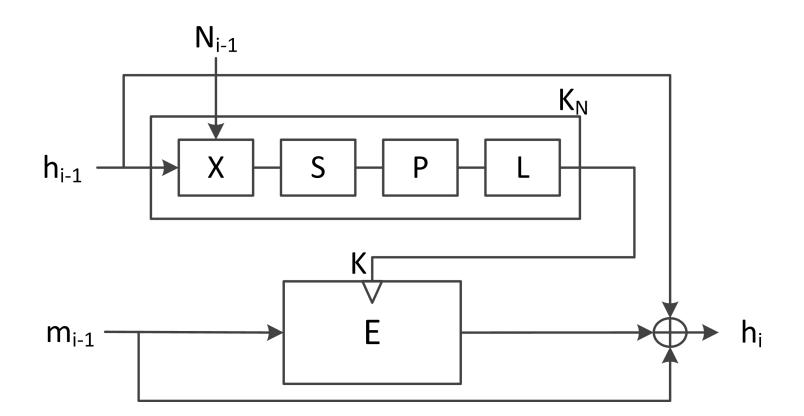
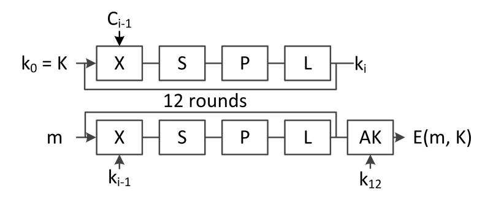
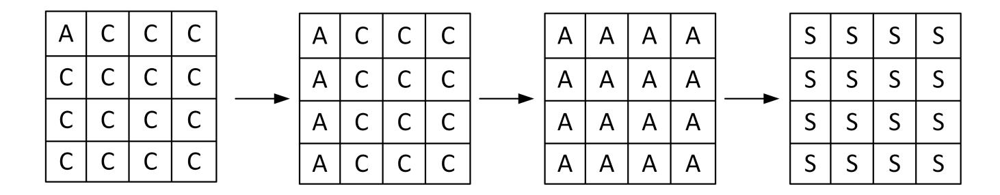
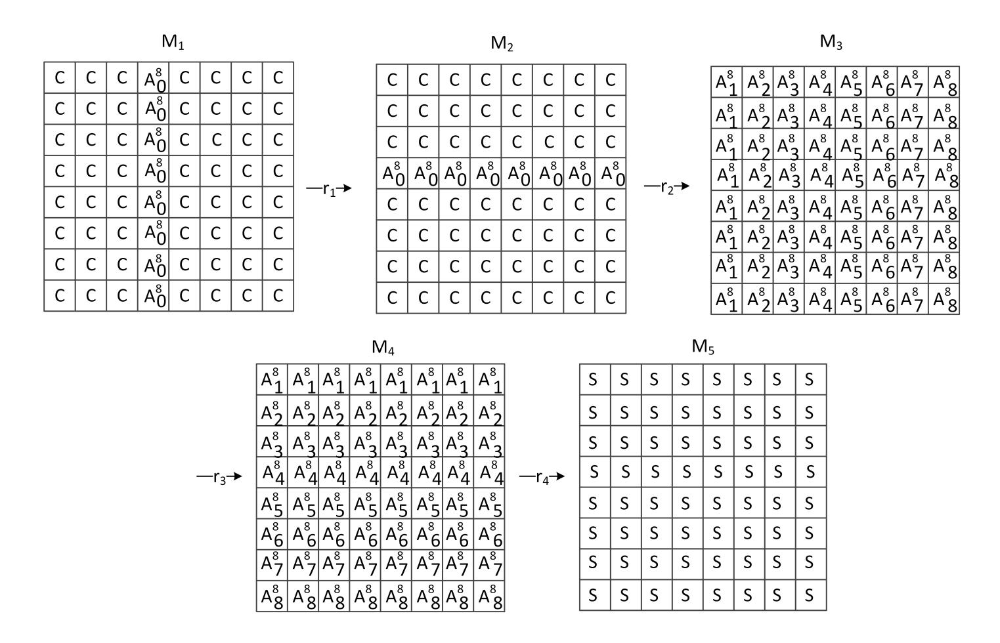
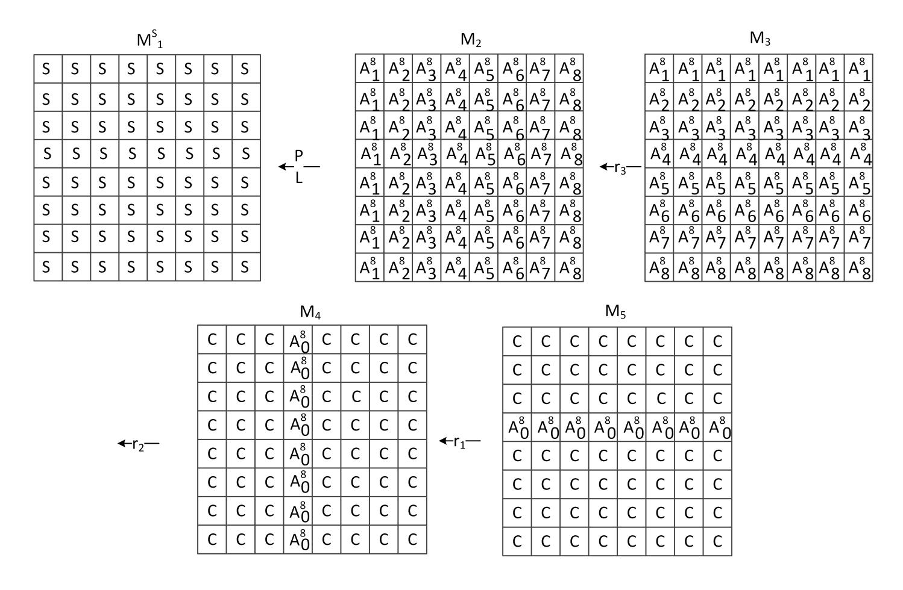
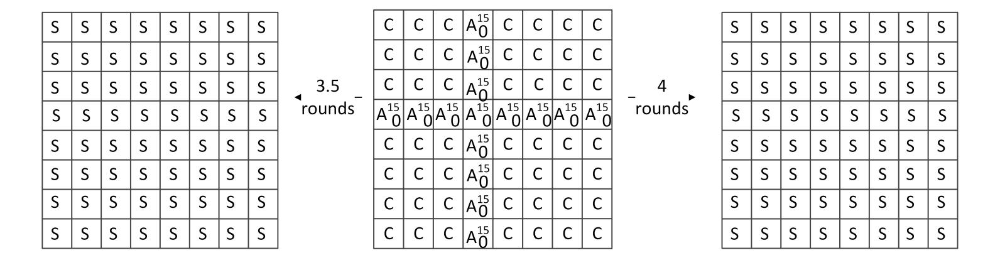
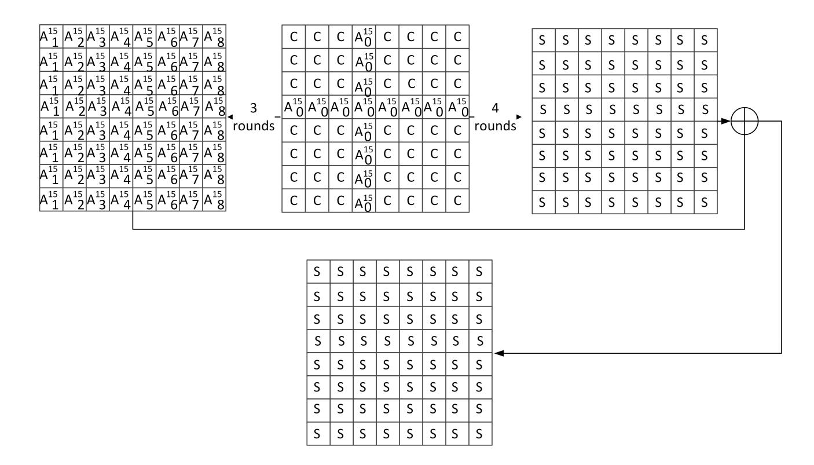
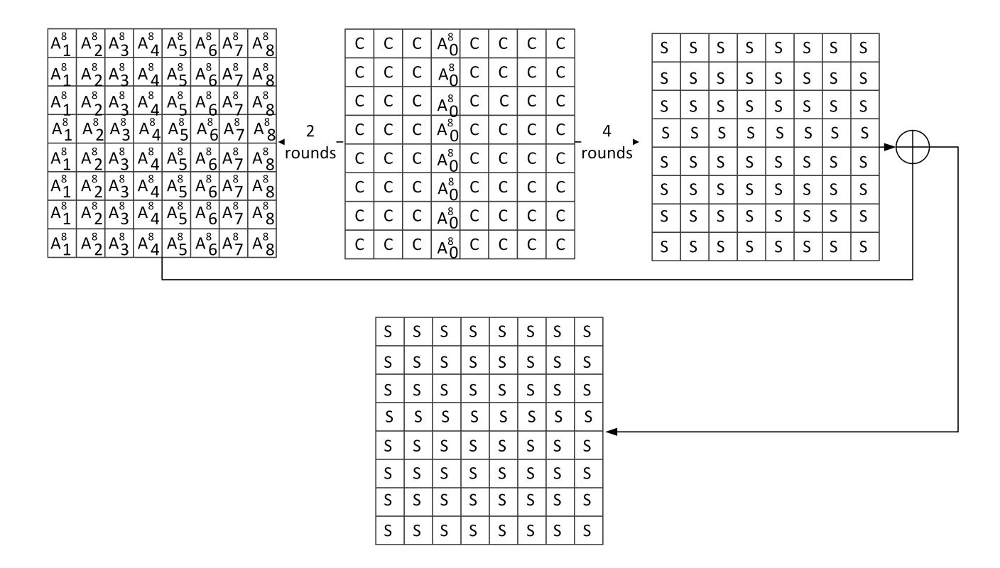

{0}------------------------------------------------

# Integral Distinguishers for Reduced-round Stribog

Riham AlTawy and Amr M. Youssef

Concordia Institute for Information Systems Engineering, Concordia University, Montr´eal, Queb´ec, Canada

Abstract. In January 2013, the Stribog hash function officially replaced GOST R 34.11-94 as the new Russian cryptographic hash standard GOST R 34.11-2012. Stribog is an AES-based primitive and is considered as an asymmetric reply to the new SHA-3 selected by NIST. In this paper we investigate the structural integral properties of reduced version of the Stribog compression function and its internal permutation. Specifically, we present a forward and backward higher order integrals that can be used to distinguish 4 and 3.5 rounds, respectively. Moreover, using the start from the middle approach, we combine the two proposed integrals to get 6.5-round and 7.5-round distinguishers for the internal permutation and 6-round and 7-round distinguishers for the compression function.

Keywords: Cryptanalysis, Hash functions, Start from the middle, Integral distinguisher, GOST R 34.11-2012, Stribog.

# 1 Introduction

The attacks by Wang et al. on MD5 [24] and SHA-1 [23] followed by the SHA-3 competition [4] have led to a flurry in the area of hash function cryptanalysis. Modern cryptanalytic approaches target both hash function primitives and underlying ciphers or permutations. Internal components are expected to provide certain properties and verifying their ideal behaviour is important to evaluate the resistance of the hash function to distinguishing attacks [3]. Particularly, the analysis of hash functions underlying block ciphers or permutations has resulted in new attack models for block ciphers, e.g., known key [8]. Such model is due to the fact that there is no secret key when block cipher based structures are used as the hash function building blocks.

Stribog [1] has an output length of 512/256-bit. The compression function employs a 12-round AES-like cipher with 8 × 8-byte internal state preceded with one round of nonlinear whitening of the chaining value. The compression function operates in Miyaguchi-Preneel mode and is plugged in Merkle-Damg˚ard domain extender with a finalization step [6]. Stribog officially replaces the previous standard GOST R 34.11-94 which has been theoretically broken in [15] and further cryptanalyzed in [14, 12].

{1}------------------------------------------------

In this work, we mainly focus on integral properties and their applications in the known key setting to present the first known Integral distinguishers for the Russian cryptographic hash standard compression function and its internal permutation. We present a four round eighth order integral for the forward direction and a three and a half round eighth order integral for the backward direction, where both integrals are satisfied by 264 inputs. Finally, we present a seven and a half round distinguisher for the internal permutation using 2120 middle inputs and six and seven round integral distinguishers for the compression function that are satisfied by 264 and 2120 middle input states, respectively.

The rest of the paper is organized as follows. In the next section, the specification of the Stribog hash function along with the notation used throughout the paper are provided. A brief overview of integral cryptanalysis is given in Section 3. Afterwards, in Sections 4, we provide detailed description of the integral patterns and the complexities of the distinguishers. Finally, the paper is concluded in Section 5.

# 2 Specification of Stribog

Stribog outputs a 512 or 256-bit hash value and can process up to 2512-bit message. The compression function iterates over 12 rounds of an AES-like cipher with an 8×8 byte internal state and a final round of key mixing. The compression function operates in Miyaguchi-Preneel mode and is plugged in Merkle-Damg˚ard domain extender with a finalization step. The input

Fig. 1. Stribog's compression function gN

message M is padded into a multiple of 512 bits by appending one followed by zeros. Given M = mnk..km1km0, the compression function gN is fed with three inputs: the chaining value hi−1, a message block mi−1, and the block 

{2}------------------------------------------------

size counter Ni−1 = 512 × i. (see Figure 1). Let hi be a 512-bit chaining variable. The first state is loaded with the initial value IV and assigned to h0. The hash value of M is computed as follows:

$$h_i \leftarrow g_N(h_{i-1}, m_{i-1}, N_{i-1}) \text{ for } i = 1, 2, ..., n+1$$
  
 $h_{n+2} \leftarrow g_0(h_{n+1}, |M|, 0)$   
 $h(M) \leftarrow g_0(h_{n+2}, \sum_i (m_0, ..., m_n), 0),$ 

where h(M) is the hash value of M. As depicted in Figure 1, the compression function gN consists of:

- KN : a nonlinear whitening round of the chaining value. It takes a 512 bit chaining variable hi−1 and the block size counter Ni−1 and outputs a 512-bit key K.
- E: an AES-based cipher that iterates over the message for 12 rounds in addition to a finalization key mixing round. The cipher E takes a 512-bit key K and a 512-bit message block m as a plaintext. As shown in Figure 2, it consists of two similar parallel flows for the state update and the key scheduling.

Fig. 2. The internal block cipher (E)

Both KN and E operate on an 8 × 8 byte key state K. E updates an additional 8 × 8 byte message state M. In one round, a state is updated by the following sequence of transformations

- AddKey(X): XOR with either a round key, a constant, or a block size counter (N)
- SubBytes (S): A nonlinear byte bijective mapping.
- Transposition (P): Byte permutation.
- LinearTransformation (L): Left multiplication by an MDS matrix in GF(2). (The transformation updates state rows but it is equivalent to the AES MixColumn transformation as mentioned in [6])

{3}------------------------------------------------

Initially, state K is loaded with the chaining value hi−1 and updated by KN as follows:

$$k_0 = L \circ P \circ S \circ X(N_{i-1})$$

Now K contains the key k0 to be used by the cipher E. The message state M is initially loaded with the message block m and E(k0, m) runs the key scheduling function on state K to generate 12 round keys k1, k2, .., k12 as follows:

$$k_i = L \circ P \circ S \circ X(C_{i-1}), \text{ for } i = 1, 2, ..., 12,$$

where Ci−1 is the i th round constant. The state M is updated as follows:

$$M_i = L \circ P \circ S \circ X(k_{i-1}), \text{ for } i = 1, 2, ..., 12.$$

The final round output is given by E(k0, m) = M12 ⊕ k12. The output of gN in the Miyaguchi-Preneel mode is E(KN (hi−1, Ni−1), mi−1) ⊕ mi−1 ⊕ hi−1 as shown in Figure 1. For further details, the reader is referred to [1].

#### 2.1 Notation

Let M be (8×8)-byte states denoting an input message state. The following notation will be used throughout the paper:

- Mi : A state at the beginning of round i.
- MU i : The message state after the U transformation at round i, where U ∈ {X, S, P, L}.
- Mi [r, c]: A byte at row r and column c of state Mi .
- Mi [row r]: Eight bytes located at row r of Mi state.
- Mi [col c]: Eight bytes located at column c of Mi state.

# 3 Integral cryptanalysis

Integral cryptanalysis was proposed by Knudsen and Wagner in [9]. It is considered as a dual to differential cryptanalysis and is efficient against ciphers that are resistant to differential attacks. While In differential cryptanalysis, one considers the propagation of differences between pairs of values to obtain probable differentials. Integral cryptanalysis considers the propagation of sums of many values to obtain integrals. Integral cryptanalysis is specifically designed for block ciphers which use only bijective transformations. An Integral is a set of values with a specific input and output sums. It covers several rounds of the cipher and describes how the summation properties of a set of input values would be affected by each successive round.

{4}------------------------------------------------

Integrals properties. For a given collection of (8×8)-byte states, a typical integral uses m chosen input states, where m equals 28× (number of active bytes). A state byte position can have any of the following properties:

- C: A constant byte, where all the bytes at this position in the m states are equal. However, If two byte position at the same state have the C property, that does not necessarily mean that they are equal.
- A: An active byte, where all the bytes at this position in the m states are different. Specifically, if m = 28 , then each byte in that position takes a value between 0 and 28 − 1 only once.
- Ad : An active byte that participates in a d th-order integral. If a byte takes 28 different values, then Ad means that this particular byte takes all values exactly 28(d−1) times. A byte with the Ad property also satisfies the A property.
- Ad i : An active byte that participates in a d th-order integral within a group. In particular, the string concatenation of all bytes with subscript i take the 28d values exactly once. A byte with the Ad i property satisfies both the Ad and A property.
- S: The sum of all bytes at this position can be predicted. All the C, A, Ad , and Ad i properties satisfies the S property where their predictable sum is zero. The S property is the weakest of them all as it reveals so little about the relation between bytes at similar positions in a set of states.

In order to be able to use an integral as a distinguisher, we expect that at least one entry in the output set of values satisfies a predictable property. Similar to truncated differentials [10] where one cares only if a specific entry is active or not, in a given integral we care if an input has an A property or not, i.e., a C property. As mentioned earlier, a typical integral uses 28×# active bytes. An integral having one active byte is called a first order integral and can be satisfied with 28 chosen inputs. On the other hand considering an integral with a group of active bytes results in a higher order integral. An example of a 3-round first order integral for Rijndeal is given in the first proposal [9] by Knudsen and Wagner and is shown in Figure 3. To further explain the idea of integral propagation through successive rounds, we give a detailed example on the above Rijndeal first order integral. One round applies 4 transformations on a state , which are byte substitution (SB), row cyclic shifting (SR), linear transformation (MC), and Key addition (AK). Consider a set of 28 input states, such that they have different values in M[0, 0] and equal values in the rest of the fifteen bytes. the transformation SB keeps the same property because it is bijective so each byte

{5}------------------------------------------------

Fig. 3. A 3-round first order integral for Rijndael

is substituted with a unique one. Afterwards, the SR transformation affects only the constant bytes keeping the state of the integral as is, then the MC transformation mixes the active byte with three constant bytes in column 0 and results in a column full of active bytes. Finally, due to the fact that the AK transformation XORs the same key with all the 256 state, the sum of all states remain the same at the end of the round. As with differential propagation, after two encryption rounds all the sixteen bytes in all the 256 states become active. However, this integral can go one more encryption round and we get a 256 states that sum to zero in all the sixteen byte positions.

Constructing a integral distinguisher can be viewed as a zero sum problem. Accordingly, to estimate the expected complexity of having a random set of states produce a distinguisher with a final balanced properties, the k-sum problem [22] was introduced in [8] to model this complexity. The k-sum problem finds a set of k inputs  $x_1, ..., x_k$  such  $\sum_{i=1}^k f(x_i) = 0$  for a given permutation f. This problem has a time and memory complexity of  $O(k2^{n/(1+log_2k)})$ , where n is the size of the state in bits. The k-sum problem is the best generic known approach suited to this case to find the zero sum. However, it does not provide the structured propertied of the distinguisher as hashing rounds progress and has high memory requirements.

Before being formalized in [9], the idea of integral attacks has been explored under several names [13]. It was first discovered during the analysis of the square cipher [5] and named the square attack. Following this, the attack was generalized into the saturation attack and was used to analyze the Twofish cipher [11]. Ever since higher order integrals have been introduced in [9], integral cryptanalysis has been used to analyze block ciphers in the known key setting [18, 8, 20] and to present distinguishers for the components of hash functions.

Previous literature related to integral cryptanalysis of hash functions include the analysis of Minier *et al.* of the three SHA-3 candidates; Hamsi-256, LANE-256 and Grøstl-512 in [17] and recently Grøstl-512 in [19], and

{6}------------------------------------------------

Knudsen's attack on whirlpool internal block cipher [7]. As for the Stribog hash function, cryptanalytic results against its collision resistance have been presented by AlTawy et al. in [2] and by Wang et al. in [25] . In the following section, we present 6.5-round and 7.5-round integral distinguishers for the internal permutation of the Stribog hash function, and 6-round and 7-round integral distinguishers for the reduced Stribog compression function.

# 4 Distinguishers for the Stribog compression function and internal permutation

The compression function of the Stribog hash function employs an AESbased cipher. In Figure 4, we present an 8th order integral distinguisher for the stribog internal cipher. In this distinguisher, the sum of all the bytes in all the states after four rounds of encryption with the same key is equal zero. To build this distinguisher, we consider 264 input states M1 that have equal

Fig. 4. An example for a forward 4-round 8th order integral for the Stribog permutation, where S means the sum is equal zero

values in 56 bytes and differ in only eight bytes. These states differs in the eight bytes in column three such that each state M1[col 3] (out of the 264) 

{7}------------------------------------------------

state takes a value between 0 and 264 −1 only once (the place of the column is arbitrary). After four complete rounds of hashing forward (encryption) we get 264 states M5, such that all the 64 bytes sum to zero.

The fact that integrals apply to primitives with bijective transformations allows us to build integrals in the backward direction (decryption). In Figure 5, we present a backwards integral for three and a half rounds of Stribog internal permutation. Although the third round integral properties are still giving a lot of information about the integral, i.e., M2[col 0, 1, ..7] all have grouped 8th order properties, we only get S property integral at states MS 1 after applying the inverse linear transformation that processes the state row by row. Consequently, extending the backwards integral to four rounds does not preserve the S property because the nonlinear substitution transformation does not preserve this property. To construct the backwards distinguisher,

Fig. 5. An example for a backward 3.5-round 8th order integral for the Stribog permutation, where S means the sum is equal zero

we consider 264 input states M4 that have equal values in 56 bytes and differ in only eight bytes. These states differs in the eight bytes in row three such that each state row M[row 3] takes a value between 0 and 264 −1 only once. Following three and a half rounds of hashing backwards (decryption) we get 2 64 states, such that all the 64 bytes sum to zero.

{8}------------------------------------------------

In order to cover more rounds, we employ the start from the middle approach that is used in both the boomerang [21] and rebound [16] attacks. Using this approach we can combine the forward and backward integrals over more than seven rounds of the Stribog internal permutation. In Figure 6, a 15th order integral 7.5-round distinguisher for the Stribog permutation is given. Moreover, we can obtain an 8th order integral to distinguish 6.5 rounds of the internal permutation by using 264 middle states only. Such integral is obtained by combining the forward integral shown in Figure 4 with only the two rounds that with states M4 from the backward integral shown in Figure 5.

Fig. 6. An example for a 7.5-round 15th order integral for the Stribog internal permutation, where S means the sum is equal zero

The seven and a half round integral is constructed by choosing a set of 2120 middle states M4 a structure that have equal values in 49 bytes and differ in 15 bytes. Each middle state different bytes takes a value between 0 and 2120− 1 only once. Finally, hashing forward for 4 rounds and backward for three and a half rounds we obtain the seven and a half round integral distinguisher for the Stribog internal permutation. Although both the forward and backward integrals are 8th order integrals, One can perceive the set of 2120 middle states used for the 15th order integral as a set of 256 sets of the forward four round integral and also 256 sets of the backwards three and half round integral.

Compression function distinguishers. A 7-round 15th distinguisher for the reduced compression function can be obtained after applying the Miyaguchi-Preneel feedforward and we would still have a fully balanced integral. The compression function distinguisher is shown in Figure 7. Additionally, one can construct a compression function integral distinguisher that covers 6

{9}------------------------------------------------

Fig. 7. An example for a 7-round 15th order integral for the Stribog compression function, where S means the sum is equal zero

rounds which are equivalent to half of the compression function rounds using 264 middle states only (See Figure 8). This distinguisher is obtained by combining the forward integral shown in Figure 4 with only the two rounds that with states M4 from the backward integral shown in Figure 5.

# 5 Conclusion

In this paper, we have analyzed the integral properties of the compression function and the internal permutation of the new Russian cryptographic hashing standard GOST R 34.11-2012. As for the internal permutation, we have proposed two integral distinguishers that cover 4 and 3.5 rounds in the forward and backward directions, respectively. Moreover, we have shown that using the start from the middle approach, we are able to combine these two integrals to obtain a 7.5-round and 6.5-round distinguishers for the internal permutation in the known-key setting that holds with probability 1 and are satisfied by 2120 and 264 middle states, respectively. Finally, we have shown that we can extend this approach based on the integral output properties to the compression function after applying the feed forward to distinguish 6 and 7 rounds out of 12 rounds with probability 1 and 264 and 2120 middle states, respectively.

{10}------------------------------------------------

Fig. 8. An example for a 6-round 8th order integral for the Stribog compression function, where S means the sum is equal zero

# References

- 1. The National Hash Standard of the Russian Federation GOST R 34.11-2012. Russian Federal Agency on Technical Regulation and Metrology report, 2012. https://www.tc26.ru/en/GOSTR34112012/GOST R 34 112012 eng.pdf.
- 2. AlTawy, R., Kircanski, A., and Youssef, A. M. Rebound attacks on Stribog. Cryptology ePrint Archive, Report 2013/539, 2013. http://eprint.iacr.org/2013/539.
- 3. Canteaut, A., Fuhr, T., Naya-Plasencia, M., Paillier, P., Reinhard, J.- R., and Videau, M. A unified indifferentiability proof for permutation- or block cipher-based hash functions. Cryptology ePrint Archive, Report 2012/363, 2012. http://eprint.iacr.org/2012/363.
- 4. Chang, S., Perlner, R., Burr, W.E., Turan, M., Kelsey, J., Paul, S. and Bassham, L.E. Third-round report of the SHA-3 cryptographic hash algorithm competition. http://nvlpubs.nist.gov/nistpubs/ir/2012/ NIST.IR.7896.pdf,2012.
- 5. Daemen, J., Knudsen, L., and Rijmen, V. The block cipher Square. In FSE (1997), E. Biham, Ed., vol. 1267 of Lecture Notes in Computer Science, Springer, pp. 149–165.
- 6. Kazymyrov, O., and Kazymyrova, V. Algebraic aspects of the Russian hash standard GOST R 34.11-2012. Cryptology ePrint Archive, Report 2013/556, 2013. http://eprint.iacr.org/2013/556.
- 7. Knudsen, L. Non-random properties of reduced-round Whirlpool. NESSIE public report, 2002. NES/DOC/UIB/WP5/017/1.
- 8. Knudsen, L., and Rijmen, V. Known-key distinguishers for some block ciphers. In ASIACRYPT (2007), K. Kurosawa, Ed., vol. 4833 of Lecture Notes in Computer Science, Springer, pp. 315–324.
- 9. Knudsen, L., and Wagner, D. Integral cryptanalysis. In FSE (2002), J. Daemen and V. Rijmen, Eds., vol. 2365 of Lecture Notes in Computer Science, Springer, pp. 112–127.
- 10. Knudsen, L. R. Truncated and higher order differentials. In FSE (1995), B. Preneel, Ed., vol. 1008 of Lecture Notes in Computer Science, Springer, pp. 196–211.

{11}------------------------------------------------

- 11. Lucks, S. The saturation attack a bait for twofish. In FSE (2002), M. Matsui, Ed., vol. 2355 of Lecture Notes in Computer Science, Springer, pp. 1–15.
- 12. Matyukhin, D., and Shishkin, V. Some methods of hash functions analysis with application to the GOST P 34.11-94 algorithm. Mat. Vopr. Kriptogr 3 (2012), 71–89.
- 13. McLaughlin, J. Chapter 5 Integral Cryptanalysis. http://pdf.aminer.org/000/217/035/a revised version of crypton crypton v.pdf.
- 14. Mendel, F., Pramstaller, N., and Rechberger, C. A (second) preimage attack on the GOST hash function. In FSE (2008), K. Nyberg, Ed., vol. 5086 of Lecture Notes in Computer Science, Springer, pp. 224–234.
- 15. Mendel, F., Pramstaller, N., Rechberger, C., Kontak, M., and Szmidt, J. Cryptanalysis of the GOST hash function. In CRYPTO (2008), D. Wagner, Ed., vol. 5157 of Lecture Notes in Computer Science, Springer, pp. 162–178.
- 16. Mendel, F., Rechberger, C., Schlffer, M., and Thomsen, S. S. The rebound attack: Cryptanalysis of reduced Whirlpool and Grøstl. In FSE (2009), O. Dunkelman, Ed., vol. 5665 of Lecture Notes in Computer Science, Springer, pp. 260–276.
- 17. Minier, M., Phan, R., and Pousse, B. Integral distinguishers of some SHA-3 candidates. In CANS (2010), S.-H. Heng, R. N. Wright, and B.-M. Goi, Eds., vol. 6467 of Lecture Notes in Computer Science, Springer, pp. 106–123.
- 18. Minier, M., Phan, R. C., and Pousse, B. Distinguishers for ciphers and known key attack against rijndael with large blocks. In AFRICACRYPT (2009), B. Preneel, Ed., vol. 5580 of Lecture Notes in Computer Science, Springer, pp. 60–76.
- 19. Minier, M., and Thomas, G. ntegral distinguisher on Grøstl-512 v3. In Indocrypt (2013), To appear in Springer LNCS.
- 20. Sasaki, Y., and Wang, L. Comprehensive study of integral analysis on 22-round LBlock. In ICISC2012 (2013), T. Kwon, M.-K. Lee, and D. Kwon, Eds., vol. 7839 of Lecture Notes in Computer Science, Springer, pp. 156–169.
- 21. Wagner, D. The boomerang attack. In Fast Software Encryption (1999), L. R. Knudsen, Ed., vol. 1636 of Lecture Notes in Computer Science, Springer, pp. 156–170.
- 22. Wagner, D. A generalized birthday problem. In CRYPTO (2002), M. Yung, Ed., vol. 2442 of Lecture Notes in Computer Science, Springer, pp. 288–304.
- 23. Wang, X., Yin, Y. L., and Yu, H. Finding collisions in the full SHA-1. In CRYPTO (2005), V. Shoup, Ed., vol. 3621 of Lecture Notes in Computer Science, Springer, pp. 17–36.
- 24. Wang, X., and Yu, H. How to break MD5 and other hash functions. In EUROCRYPT (2005), R. Cramer, Ed., vol. 3494 of Lecture Notes in Computer Science, Springer, pp. 19–35.
- 25. Wang, Z., Yu, H., and Wang, X. Cryptanalysis of GOST R hash function. Cryptology ePrint Archive, Report 2013/584, 2013. http://eprint.iacr.org/2013/584.