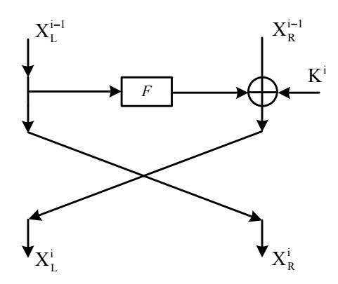
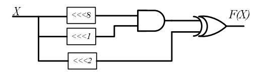
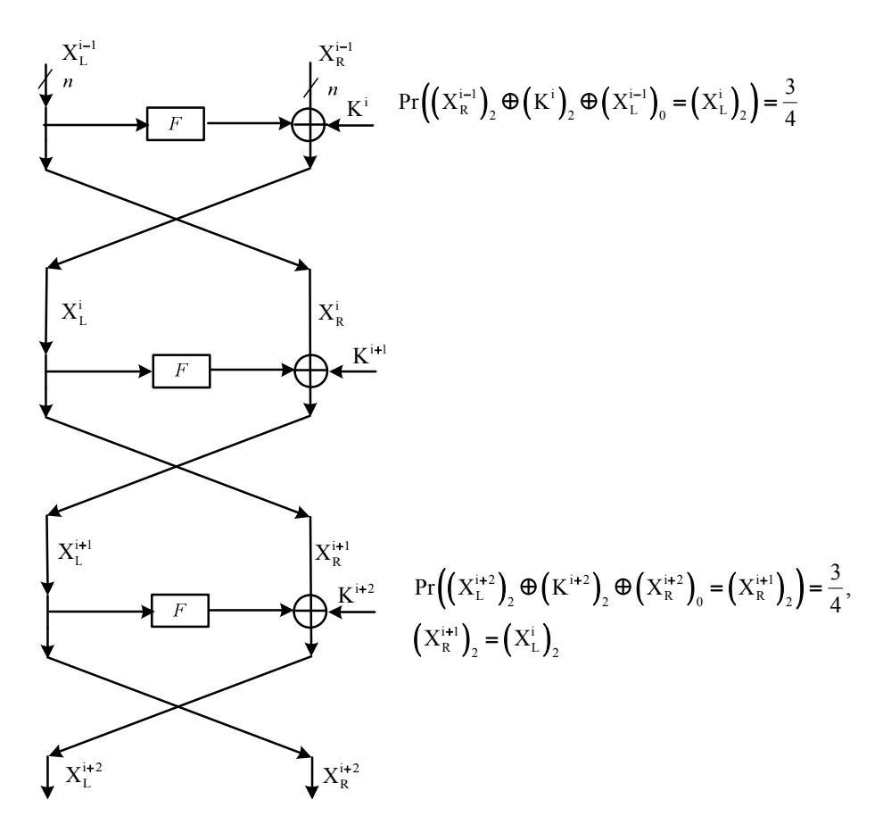
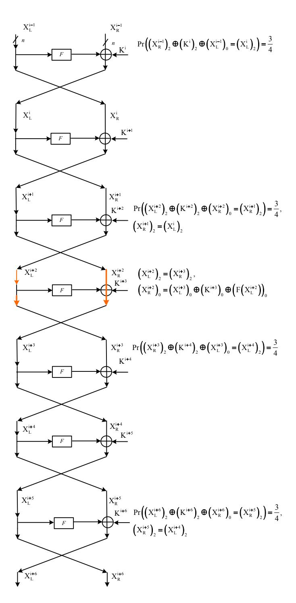
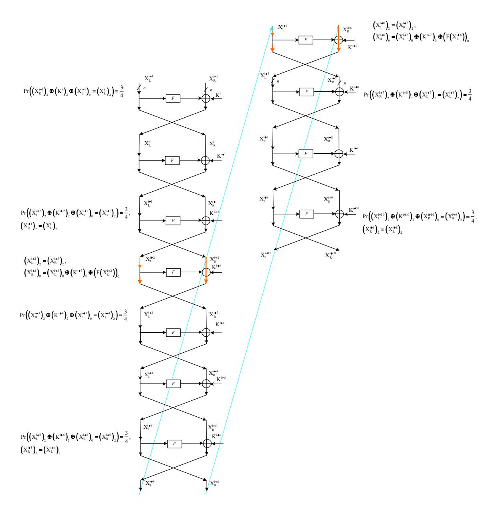
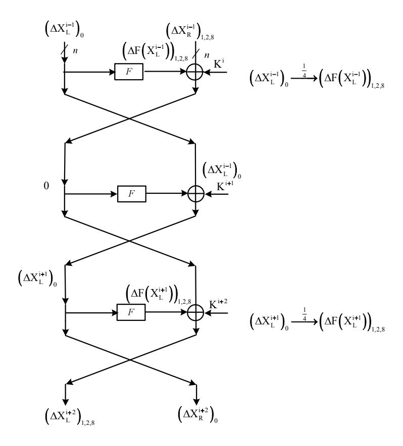
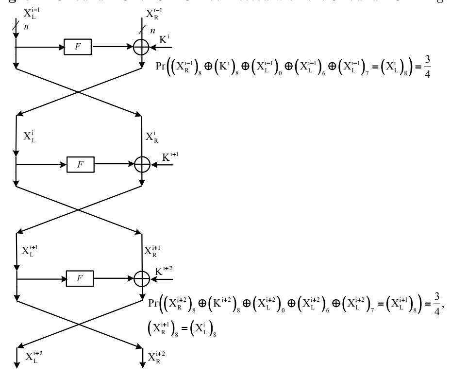
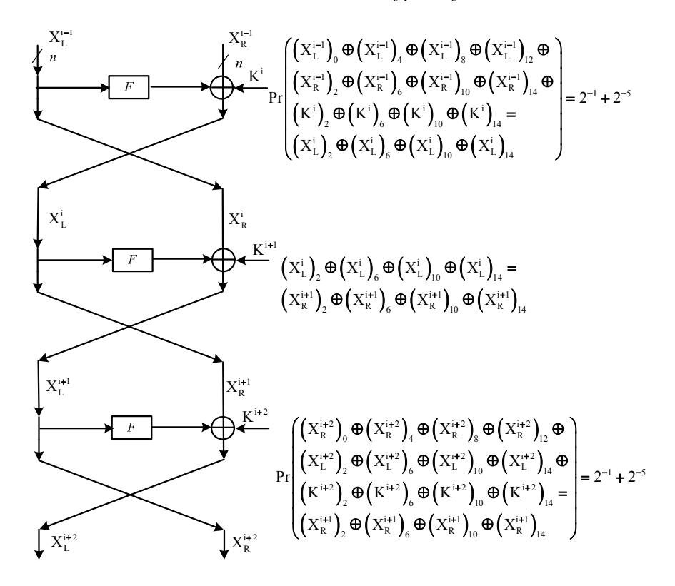
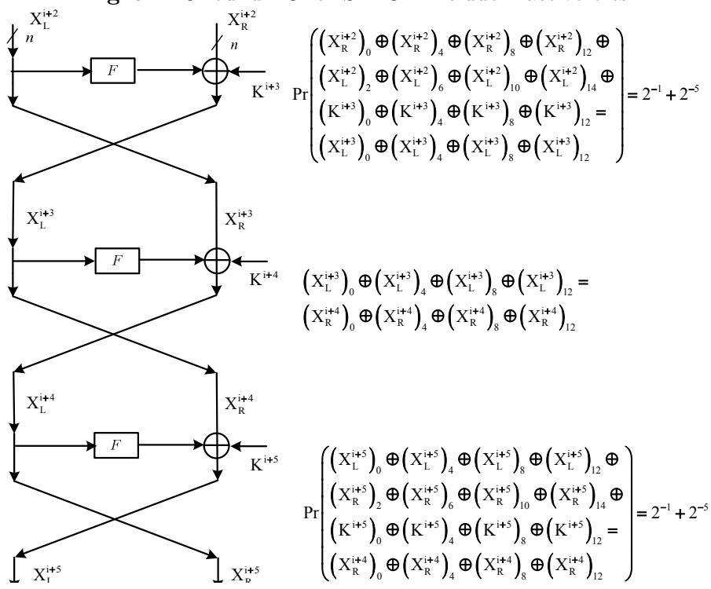
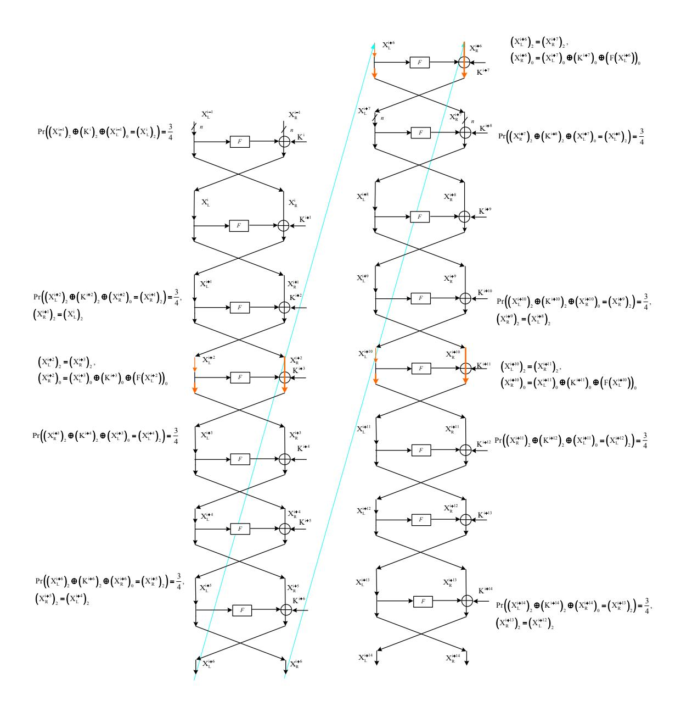

## Linear Cryptanalysis of Round Reduced SIMON

Javad Alizadeh1 , Nasour Bagheri1 , Praveen Gauravaram2 , Abhishek Kumar3 , and Somitra Kumar Sanadhya3

Abstract. SIMON is a family of lightweight block ciphers that was proposed by U.S National Security Agency (NSA). A cipher in this family with K-bit key and N-bit block is called SIMON N/K. In this paper we analyze the security of SIMON against linear cryptanalysis. We present several linear characteristics for all variants of SIMON with reduced number of rounds. Our best linear characteristic covers SIMON 32/64 reduced to 13 rounds out of 32 rounds with the bias of 2−16 .

In addition, we describe a connection between linear and differential characteristics for SIMON. This connection is then exploited by using the differential characteristics of the previous work of Abed et al. to construct linear characteristics presented in this work. Our attacks extend to all variants of SIMON covering more number of rounds compared to the previous results on linear cryptanalysis. We have implemented our attacks for small scale variants of SIMON and our experiments confirm the theoretical bias of various characteristics presented in this work. So far, our results are the best known with respect to linear cryptanalysis for any variant of SIMON.

keywords: SIMON, Linear Characteristic, Linear Cryptanalysis.

## 1 Introduction

SIMON is a family of lightweight block ciphers designed by the U.S National Security Agency (NSA) to provide an optimal hardware performance [\[3\]](#page-16-0). In order to meet hardware implementation flexibility (efficient implementations across a wide variety of platforms as well as several implementations on a single platform), SIMON was designed to support block sizes of 32, 48, 64, 96 and 128 bits, with up to three key sizes for each block size. SIMON N/K denotes a variant of SIMON that has the plaintext block length of size N and the key size of length K. For example, SIMON 32/64 refers to one variant of SIMON with 32-bit plaintext block and 64-bit key. There are 10 variants of SIMON, forming a family of lightweight block ciphers, which are described in Table [2.](#page-3-0)

Till date, the best cryptanalytic attacks on the round-reduced variants of SIMON were presented by Abed et. al. [\[1\]](#page-16-1). These attacks include both differential and linear cryptanalytic results. In the direction of differential cryptanalysis, authors have presented key-recovery attacks on all variants of SIMON with up to 18,19,26,35 and 46 rounds for the block sizes of 32, 48, 64, 96, and 128 bits respectively. They have also presented related-key rectangle and impossible differential attacks against few variants of SIMON, but these attacks do not extend beyond the rounds covered by the differential attacks. In the direction of linear

1 Electrical Engineering Department, Shahid Rajaee Teacher Training University, Iran, NBagheri@srttu.edu

2 Innovation Labs Hyderabad, Tata Consultancy Services Limited, India, P.Gauravaram@tcs.com 3 Indraprastha Institute of Information Technology, Delhi, India, abhishek1101,Somitra@iiitd.ac.in

cryptanalysis, Abed et al. presented key-recovery attacks on the variants of SIMON reduced to 11, 14, 16, 20 and 23 rounds for the respective block sizes of 32, 48, 64, 96 and 128 bits respectively. In an independent work a differential attack on SIMON was presented by Alkhazaimi and Lauridsen [\[2\]](#page-16-2) that works up to 16, 18, 24, 29 and 40 rounds of SIMON for block sizes of 32, 48, 64, 96 and 128-bits respectively. In addition, authors have discussed impossible differential rotational and weak key analysis in their work.

Linear Cryptanalysis is a well-known cryptanalytic technique that has been employed on several block ciphers such as DES, Serpent and Shannon [ [\[7\]](#page-16-3), [\[5\]](#page-16-4), [\[6\]](#page-16-5)]. An important fact about linear cryptanalysis is that it is a known plaintext attack, making it more practical and realistic attack model than an attack based on differential cryptanalysis which requires an attack to choose plaintexts for a successful attack. In this paper we investigate the security of SIMON family against linear cryptanalysis. We present several approaches to produce linear characteristics for SIMON32/64 and present the best known linear characteristic for 11-round SIMON 32/64 with the bias of 2−16. We then extend this characteristic to 13 rounds of the cipher.

We present several approaches to produce an LC for SIMON32/64, as a case study, and present the best known 11-round LC for this cipher with the bias of 2−16 (expendable to 13 rounds of the cipher). In addition, we show a direct connection between linear characteristic (LC) and differential characteristic (DC) on SIMON and use it to present linear characteristics for different variants of SIMON that can be used to attack reduced round versions of these ciphers. We also experimentally verified the theoretical results for SIMON32/64 and the results of implementation are represented in Appendix [C.](#page-17-0) With respect to linear cryptanalysis, our results cover more rounds for any variant of SIMON compared to the previously known results of Abed et al [\[1\]](#page-16-1). The summary of the results and the comparison with the results of Abed et. al. [\[1\]](#page-16-1) are given in Table [1.](#page-1-0) The comparison shows that our results covers more number of rounds for the same success probability and data complexity is also comparable to previous result.

Table 1. Comparison of our results with the previous results when the success probability of key recovery attack is 0.997. N= Block size, = Bias from 1/2 probability that the linear expression holds, # approximation= number of times biased linear characteristic used to attack cipher.

|                        | Variant of SIMON                           | 32/64   | 48/96   | 64/128  | 96/144  | 128/256  |
|------------------------|--------------------------------------------|---------|---------|---------|---------|----------|
| This work              | − N 2 +2 ≥ # rounds with  2 |         | 13      | 17      | 26      | 33       |
|                        | # rounds attacked                          | 12      | 15      | 19      | 28      | 35       |
|                        | # approximation                            | 13      | 19      | 28      | 44      | 59       |
|                        | Data Complexity                            | 31 2 | 43 2 | 61 2 | 93 2 | 123 2 |
| Abed et. al. [1] | − N 2 +2 # rounds with  ≥ 2 | 9       | 12      | 14      | 18      | 21       |
|                        | # rounds attacked                          | 11      | 14      | 16      | 20      | 23       |
|                        | # approximation                            | 10      | 21      | 28      | 45      | 60       |
|                        | Data Complexity                            | 25 2 | 47 2 | 61 2 | 95 2 | 125 2 |

The paper is structured as follows: In section 2 we present a brief description of SIMON family. In section 3 we present the idea of linear attack on SIMON and apply it to the SIMON32/64. Section 4 shows the connection between linear cryptanalysis and differential cryptanalysis of SIMON and its application to extends the attack to the other variants of SIMON. Finally, we conclude the paper in section 5.

#### 2 SIMON family

SIMON has a classical Feistel structure (see Figure 1) with the round block size of 2n bits, where n is word size. The number of rounds of cipher is denoted by r and depends on the variant. In addition, we denote the right part and the left part of the plaintext P by  $P_R$  and  $P_L$  respectively. Similarly, we denote the right part and the left part of the ciphertext C by  $C_R$  and  $C_L$  respectively. The output of round r is denoted by  $X^r = X_R^r || X_L^r$  and the subkey used in round r is denoted by  $K^r$ . Given an string X,  $(X)_i$  denotes the i-th bit of X. Bitwise circular rotation of string a by b position to the left is denoted by  $a \ll b$ . Further,  $\oplus$  and & denote bitwise XOR and AND operations respectively.

Each round of SIMON includes a non-linear and non-invertible function F (see Figure 2). The F function is an n-bit to n-bit function. Given  $X \in \{0,1\}^n$ , F(X) is calculated as follows:

$$F(X) = (X \ll 2) \oplus ((X \ll 1) \& (X \ll 8)).$$

Given an 2n-bit internal state, the input of the F-function is the left half of the internal state and its output is Xor'ed with the right half of the internal state and a subkey. The subkeys are driven from an unknown master key. Depending on the size of the master key, the key schedule of SIMON operates on two, three or four n-bit word registers. Assuming that the number of words for the master key K is m (see Table 2), the first m subkeys are directly driven from K, i.e.,  $K^0, \ldots, K^{m-1}$ . The subkey for round i, for  $m \leq i \leq r-1$ , is calculated as follows:

$$m = 2: K^{i} = K^{i-2} \oplus (K^{i-1} \gg 3) \oplus (K^{i-1} \gg 4) \oplus c \oplus (Z_{j})_{i-m}, m = 3: K^{i} = K^{i-3} \oplus (K^{i-1} \gg 3) \oplus (K^{i-1} \gg 4) \oplus c \oplus (Z_{j})_{i-m}, m = 4: K^{i} = K^{i-4} \oplus K^{i-3} \oplus (K^{i-1} \gg 3) \oplus ((K^{i-3} \oplus (K^{i-1} \gg 3)) \gg 1) \oplus c \oplus (Z_{j})_{i-m}.$$
 (1)

where,  $c = (2^n - 1) \oplus 3 = 0$ xFF...FFC is a constant value,  $(Z_j)_{i-m}$  denotes the  $i^{th}$  bit of  $Z_j$  and i - m is taken module 62.  $Z_j$  are five constant sequence  $Z_0, \ldots, Z_4$  depicted in Table 3 and j is a parameter of the cipher (see Table 2).

#### 3 Linear Cryptanalysis of SIMON 32/64

Linear cryptanalysis [7] is a known plaintext attack that tries to find a high probability linear expressions involving "plaintext" bits, "ciphertext" bits and the "subkey" bits. In contrast to differential attack, which requires chosen plaintexts/ciphertexts, the linear attack is a more practical and realistic technique in many scenarios. In this paper we use this technique

**Table 2.** Details of variants of SIMON. n is the input size of one word, m is the number of words for master key and j is the parameter of cipher.

| Variant      | Block size | Key size | Number    | n  | $\overline{m}$ | j |
|--------------|------------|----------|-----------|----|----------------|---|
|              | (bits)     | (bits)   | of rounds |    |                |   |
| SIMON32/64   | 32         | 64       | 32        | 16 | 4              | 0 |
| SIMON48/72   | 48         | 72       | 36        | 24 | 3              | 0 |
| SIMON48/96   | 48         | 96       | 36        | 24 | 4              | 1 |
| SIMON64/96   | 64         | 96       | 42        | 32 | 3              | 2 |
| SIMON64/128  | 64         | 128      | 44        | 32 | 4              | 3 |
| SIMON96/92   | 96         | 92       | 52        | 48 | 2              | 2 |
| /            | 96         | 144      | 54        | 48 | 3              | 3 |
| SIMON128/128 |            | 128      | 68        | 64 | 2              | 2 |
| SIMON128/192 |            | 192      | 69        | 64 | 3              | 3 |
| SIMON128/256 | 128        | 256      | 72        | 64 | 4              | 4 |

**Table 3.** Five constant sequence of  $Z_j$  vectors used in SIMON key-schedule.

| j | $ Z_j $                                         |
|---|-------------------------------------------------|
| 0 | 11111010001001010110000111001101111101000100101 |
| 1 | 1000111011111001001100001011010100011101111     |
| 2 | 10101111011100000011010010011000101000010001111 |
| 3 | 110110111010110001100101111100000010010         |
| 4 | 110100011110011010110110001000000101110000      |

Fig. 1. A round function of SIMON.

Fig. 2. A round function of SIMON.

to analyze SIMON family of block ciphers. So far the only result on linear cryptanalysis of SIMON is by Abed et. al [1], where an attack on 11 rounds of SIMON 32/64 is shown with the bias being  $2^{-11}$ .

The round function of SIMON can be represented as follows:

$$\begin{cases}
 X_L^r = F(X_L^{r-1}) \oplus X_R^{r-1} \oplus K^r \\
 X_R^r = X_L^{r-1}
 \end{cases}
 \tag{2}$$

where  $(F(X))_i = (X)_{i-2} \oplus ((X)_{i-1} \& (X)_{i-8})$  with subtractions being performed modulo n. In the round function of SIMON, the only non-linear operation is the bitwise AND. Note that, given single bits A and B, the output of (A & B) is 0 with probability 0.75. Hence, we can extract the following highly biased linear expressions for the F-function:

Approximation 1:
$$Pr[(F(X))_i = (X)_{i-2}] = \frac{3}{4}$$

Approximation 2:  $Pr[(F(X))_i = (X)_{i-2} \oplus (X)_{i-1}] = \frac{3}{4}$
Approximation 3:  $Pr[(F(X))_i = (X)_{i-2} \oplus (X)_{i-8}] = \frac{3}{4}$
Approximation 4:  $Pr[(F(X))_i = (X)_{i-2} \oplus ((X)_{i-1} \oplus (X)_{i-8})] = \frac{1}{4}$ . (3)

Given Equations 2 and 3 we can extract the following linear expression for the first round of the SIMON:

$$(P_R)_2 \oplus (K^1)_2 \oplus (X_L^1)_2 = (P_L)_0 \tag{4}$$

Equation 4 holds with probability  $\frac{3}{4}$ . With the help of the above expression, we can extract a 3-round linear expression as follows (see Figure 3):

$$(X_R^{i-1})_2 \oplus (K^i)_2 \oplus (X_L^{i-1})_0 = (X_R^{i+2})_0 \oplus (K^{i+2})_2 \oplus (X_L^{i+2})_2.$$
 (5)

As shown in Figure 4, Equation 5 can be used to produce a 7-round linear expression as follows:

$$\begin{pmatrix} (X_R^{i-1})_2 \oplus (K^i)_2 \oplus (X_L^{i-1})_0 \\ \oplus (X_R^{i+2})_0 \oplus (K^{i+2})_2 \oplus (X_L^{i+2})_2 \end{pmatrix} = \begin{pmatrix} (X_R^{i+3})_2 \oplus (K^{i+4})_2 \oplus (X_L^{i+3})_0 \\ \oplus (X_R^{i+6})_0 \oplus (K^{i+6})_2 \oplus (X_L^{i+6})_2 \end{pmatrix}$$
(6)

The above expression can be simplified to the following.

$$\begin{pmatrix} (X_R^{i-1})_2 \oplus (K^i)_2 \oplus (X_L^{i-1})_0 \oplus \\ (K^{i+2})_2 \oplus (F(X_L^{i+2}))_0 \oplus (K^{i+3})_0 \end{pmatrix} = ((K^{i+4})_2 \oplus (X_R^{i+6})_0 \oplus (K^{i+6})_2 \oplus (X_L^{i+6})_2)$$
(7)

Fig. 3. A 3-round linear charateristic for SIMON.

Fig. 4. A 7-round linear characteristic for SIMON.

**Table 4.** The biases for a 11-round LC

| Bias of 7 round linear expression      | $2^{-10}$ |
|----------------------------------------|-----------|
| Bias of $(F(X_L^{i+6}))_0$ approximate | $2^{-6}$  |
| Bias of approximate 7-11               | $2^{-3}$  |

In Equation 7, the only intermediate value is the term  $(F(X_L^{i+2}))_0$ . We can approximate  $(F(X_L^{i+2}))_0$  with some bits of plaintext (Considering Figure 4) as follows.

$$Pr[(F(X_L^{i+2}))_0 = (X_L^{i+2})_{14})] = \frac{3}{4}$$

$$Pr[(X_L^{i+2})_{14} = (X_R^{i+1})_{14} \oplus (K^{i+2})_{14} \oplus (X_L^{i+1})_{12})] = \frac{3}{4}$$

$$Pr[(X_R^{i+1})_{14} = (X_R^{i-1})_{14} \oplus (K^i)_{14} \oplus (X_L^{i-1})_{12}] = \frac{3}{4}$$

$$Pr[(X_L^{i+1})_{12} = (X_L^{i-1})_{12} \oplus (K^{i+1})_{12} \oplus (X_L^{i})_{10}] = \frac{3}{4}$$

$$Pr[(X_L^{i})_{10} = (X_R^{i-1})_{10} \oplus (K^i)_{10} \oplus (X_L^{i-1})_{8}] = \frac{3}{4}$$
(8)

Then, with probability  $(3/4)^5$  and bias  $2^{-6}$ , we get the following expression for  $F(X_L^{i+2}))_0$ .

$$(F(X_L^{i+2}))_0 = (X_R^{i-1})_{14} \oplus (K^i)_{14} \oplus (X_L^{i-1})_{12} \oplus (K^{i+2})_{14} \oplus (X_R^i)_{12} \oplus (K^{i+1})_{12} \oplus (X_R^{i-1})_{10} \oplus (K^i)_{10} \oplus (X_L^{i-1})_{18} \oplus (Y_L^{i-1})_{19} \oplus (Y_L^{i-1})_{19} \oplus (Y_L^{i-1})_{19} \oplus (Y_L^{i-1})_{19} \oplus (Y_L^{i-1})_{19} \oplus (Y_L^{i-1})_{19} \oplus (Y_L^{i-1})_{19} \oplus (Y_L^{i-1})_{19} \oplus (Y_L^{i-1})_{19} \oplus (Y_L^{i-1})_{19} \oplus (Y_L^{i-1})_{19} \oplus (Y_L^{i-1})_{19} \oplus (Y_L^{i-1})_{19} \oplus (Y_L^{i-1})_{19} \oplus (Y_L^{i-1})_{19} \oplus (Y_L^{i-1})_{19} \oplus (Y_L^{i-1})_{19} \oplus (Y_L^{i-1})_{19} \oplus (Y_L^{i-1})_{19} \oplus (Y_L^{i-1})_{19} \oplus (Y_L^{i-1})_{19} \oplus (Y_L^{i-1})_{19} \oplus (Y_L^{i-1})_{19} \oplus (Y_L^{i-1})_{19} \oplus (Y_L^{i-1})_{19} \oplus (Y_L^{i-1})_{19} \oplus (Y_L^{i-1})_{19} \oplus (Y_L^{i-1})_{19} \oplus (Y_L^{i-1})_{19} \oplus (Y_L^{i-1})_{19} \oplus (Y_L^{i-1})_{19} \oplus (Y_L^{i-1})_{19} \oplus (Y_L^{i-1})_{19} \oplus (Y_L^{i-1})_{19} \oplus (Y_L^{i-1})_{19} \oplus (Y_L^{i-1})_{19} \oplus (Y_L^{i-1})_{19} \oplus (Y_L^{i-1})_{19} \oplus (Y_L^{i-1})_{19} \oplus (Y_L^{i-1})_{19} \oplus (Y_L^{i-1})_{19} \oplus (Y_L^{i-1})_{19} \oplus (Y_L^{i-1})_{19} \oplus (Y_L^{i-1})_{19} \oplus (Y_L^{i-1})_{19} \oplus (Y_L^{i-1})_{19} \oplus (Y_L^{i-1})_{19} \oplus (Y_L^{i-1})_{19} \oplus (Y_L^{i-1})_{19} \oplus (Y_L^{i-1})_{19} \oplus (Y_L^{i-1})_{19} \oplus (Y_L^{i-1})_{19} \oplus (Y_L^{i-1})_{19} \oplus (Y_L^{i-1})_{19} \oplus (Y_L^{i-1})_{19} \oplus (Y_L^{i-1})_{19} \oplus (Y_L^{i-1})_{19} \oplus (Y_L^{i-1})_{19} \oplus (Y_L^{i-1})_{19} \oplus (Y_L^{i-1})_{19} \oplus (Y_L^{i-1})_{19} \oplus (Y_L^{i-1})_{19} \oplus (Y_L^{i-1})_{19} \oplus (Y_L^{i-1})_{19} \oplus (Y_L^{i-1})_{19} \oplus (Y_L^{i-1})_{19} \oplus (Y_L^{i-1})_{19} \oplus (Y_L^{i-1})_{19} \oplus (Y_L^{i-1})_{19} \oplus (Y_L^{i-1})_{19} \oplus (Y_L^{i-1})_{19} \oplus (Y_L^{i-1})_{19} \oplus (Y_L^{i-1})_{19} \oplus (Y_L^{i-1})_{19} \oplus (Y_L^{i-1})_{19} \oplus (Y_L^{i-1})_{19} \oplus (Y_L^{i-1})_{19} \oplus (Y_L^{i-1})_{19} \oplus (Y_L^{i-1})_{19} \oplus (Y_L^{i-1})_{19} \oplus (Y_L^{i-1})_{19} \oplus (Y_L^{i-1})_{19} \oplus (Y_L^{i-1})_{19} \oplus (Y_L^{i-1})_{19} \oplus (Y_L^{i-1})_{19} \oplus (Y_L^{i-1})_{19} \oplus (Y_L^{i-1})_{19} \oplus (Y_L^{i-1})_{19} \oplus (Y_L^{i-1})_{19} \oplus (Y_L^{i-1})_{19} \oplus (Y_L^{i-1})_{19} \oplus (Y_L^{i-1})_{19} \oplus (Y_L^{i-1})_{19} \oplus (Y_L^{i-1})_{19} \oplus (Y_L^{i-1})_{19} \oplus (Y_L^{i-1})_{19} \oplus (Y_L^{i-1})_{19} \oplus (Y_L^{i-1})_{19} \oplus (Y_L^{i-1})_$$

Using Equation 9 in Equation 7, we can extract a 7 round linear expression with bias  $2^{-10}$ . It is possible to use Equation 7 and produce a 11-round linear expression as follows (see Fig. 5):

$$(X_R^{i-1})_2 \oplus (K^i)_2 \oplus (X_L^{i-1})_0 \oplus (K^{i+2})_2 \oplus (F(X_L^{i+2}))_0 \oplus (K^{i+3})_0 = (K^{i+4})_2 \oplus (X_R^{i+6})_0 \oplus (K^{i+6})_2 \oplus (X_L^{i+6})_2$$

$$(10)$$

where.

$$\begin{pmatrix}
(X_L^{i+6})_2 = (X_R^{i+7})_2 \\
(X_R^{i+6})_0 = (X_L^{i+7})_0 \oplus (K^{i+7})_0 \oplus (F(X_L^{i+6}))_0 \\
Pr[(X_L^{i+8})_2 = (X_R^{i+7})_2 \oplus (K^{i+8})_2 \oplus (X_L^{i+7})_0] = \frac{3}{4} \\
Pr[(X_R^{i+9})_2 = (X_L^{i+10})_2 \oplus (K^{i+10})_2 \oplus (X_R^{i+10})_0] = \frac{3}{4}
\end{pmatrix}.$$
(11)

Thus, Equation 12 will be a 11-round linear expression with bias  $2^{-17}$  (We note that similar to  $(F(X_L^{i+2}))_0$ , we can approximate  $(F(X_L^{i+6}))_0$  with some bits of  $X^{i+10}$  with probability  $(3/4)^5$  and bias  $2^{-6}$ ). The bias is calculated using biases given in Table 4 and the pilling up lemma.

$$\begin{pmatrix}
(X_R^{i-1})_2 \oplus (K^i)_2 \oplus (X_L^{i-1})_0 \oplus \\
(K^{i+2})_2 \oplus (F(X_L^{i+2}))_0 \oplus (K^{i+3})_0
\end{pmatrix} = \begin{pmatrix}
(K^{i+4})_2 \oplus (K^{i+7})_0 \oplus (K^{i+6})_2 \oplus \\
(F(X_L^{i+6}))_0 \oplus (K^{i+8})_2 \oplus (X_L^{i+10})_2 \oplus \\
(K^{i+10})_2 \oplus (X_R^{i+10})_0
\end{pmatrix} (12)$$

Fig. 5. A 11-round LC for SIMON.

**Table 5.** The biases for a 10-round LC

| Bias of 7 round linear expression      | $2^{-10}$ |
|----------------------------------------|-----------|
| Bias of $(F(X_L^{i+6}))_0$ approximate | $2^{-4}$  |
| Bias of approximate 7-10               | $2^{-2}$  |

Unfortunately this linear expression can't yield a successful linear attack because the required number of plaintexts exceeds the possible values, i.e.  $2^{32}$ . Although we will introduce a 11-round linear expression with bias  $2^{-16}$  later, but in this section we use the above method and calculate a 10-round linear expression. The bias of the 10-round linear characteristic is  $2^{-14}$  as given in Table 5 and the expression is as follows:

$$\begin{pmatrix} (X_R^{i-1})_2 \oplus (K^i)_2 \oplus (X_L^{i-1})_0 \oplus \\ (K^{i+2})_2 \oplus (F(X_L^{i+2}))_0 \oplus (K^{i+3})_0 \end{pmatrix} = \begin{pmatrix} (K^{i+4})_2 \oplus (K^{i+7})_0 \oplus (K^{i+6})_2 \oplus \\ (F(X_L^{i+6}))_0 \oplus (K^{i+8})_2 \oplus (X_R^{i+9})_2 \end{pmatrix}$$
(13)

where approximate of  $(F(X_L^{i+6}))_0$  is as follows:

$$Pr[(F(X_L^{i+6}))_0 = (X_L^{i+6})_{14}] = \frac{3}{4}$$

$$Pr[(X_L^{i+6})_{14} = (K^{i+8})_{14} \oplus (X_R^{i+8})_{12} \oplus (X_R^{i+9})_{14}] = \frac{3}{4}$$

$$Pr[(X_L^{i+8})_{12} = (X_L^{i+9})_{12} \oplus (K^{i+9})_{12} \oplus (X_L^{i+8})_{10} = (X_L^{i+9})_{12} \oplus (X_R^{i+9})_{12} \oplus (X_R^{i+9})_{10}] = \frac{3}{4}$$

$$(14)$$

Hence, the approximation of  $(F(X_L^{i+6}))_0$  can be simplified as follows, with bias  $2^{-4}$ :

$$(F(X_L^{i+6}))_0 = (K^{i+8})_{14} \oplus (X_L^{i+9})_{12} \oplus (K^{i+9})_{12} \oplus (X_R^{i+9})_{10} \oplus (X_R^{i+9})_{14}$$
(15)

Then the 10-round linear expression gets simplified as follows:

$$\begin{pmatrix}
(X_R^{i-1})_2 \oplus (K^i)_2 \oplus (X_L^{i-1})_0 \oplus \\
(K^{i+2})_2 \oplus (X_R^{i-1})_{14} \oplus (K^i)_{14} \oplus \\
(K^{i+2})_{14} \oplus (K^{i+1})_{12} \oplus (X_R^{i-1})_{10} \oplus \\
(K^i)_{10} \oplus (X_L^{i-1})_8 \oplus (K^{i+3})_0
\end{pmatrix} = \begin{pmatrix}
(K^{i+4})_2 \oplus (K^{i+7})_0 \oplus (K^{i+6})_2 \oplus \\
(K^{i+8})_{14} \oplus (X_L^{i+9})_{12} \oplus (K^{i+9})_{12} \oplus \\
(X_R^{i+9})_{10} \oplus (X_R^{i+9})_{14} \oplus (K^{i+8})_2 \oplus \\
(X_R^{i+9})_2
\end{pmatrix} (16)$$

#### 3.1 13-Round Linear Characteristic

In this section we extend our attack by one more round to get some 11-round linear expressions for SIMON 32/64. We present three different methods to get 11-round linear characteristic with bias more than  $2^{-17}$ . Once we have any such 11-round linear characteristic we can add another one round to the beginning and one round to the end of each characteristic to extend the attack up tp 13-rounds. The added rounds are related to the plaintext and ciphertext and free of any approximation, because we know the input of F functions for these rounds. In this way we have a 13-round linear characteristic for SIMON 32/64.

**METHOD 1:** We can consider the 10-round linear expression in the previous section and add a single round at its beginning to achieve a 11-round characteristic. In this case we have these changes:

$$\begin{pmatrix}
(X_R^{i-1})_2 = (X_L^{i-2})_2 \\
Pr[(X_L^{i-1})_0 = (X_R^{i-2})_0 \oplus (K^{i-1})_0 \oplus (X_L^{i-2})_{14}] = \frac{3}{4} \\
(X_R^{i-1})_{14} = (X_L^{i-2})_{14} \\
(X_R^{i-1})_{10} = (X_L^{i-2})_{10} \\
Pr[(X_L^{i-1})_8 = (X_L^{i-2})_8 \oplus (K^{i-1})_8 \oplus (X_L^{i-2})_6] = \frac{3}{4}
\end{pmatrix}.$$
(17)

Since bias of added round is  $2^{-3}$ , hence the bias of the 11-round linear expression is  $2^{-16}$ .

**METHOD 2:** In this method we begin of  $X_R^{i+3}$  and  $X_L^{i+3}$  and backward to  $X_R^{i-1}$  and  $X_L^{i-1}$ :

$$(X_{R}^{i+3})_{2} = (X_{L}^{i+2})_{2}$$

$$Pr[(X_{L}^{i+3})_{0} = (X_{R}^{i+2})_{0} \oplus (K^{i+3})_{0} \oplus (X_{L}^{i+2})_{14}] = \frac{3}{4}$$

$$Pr[(X_{L}^{i+2})_{2} = (X_{R}^{i+1})_{2} \oplus (K^{i+2})_{2} \oplus (X_{L}^{i+1})_{0}] = \frac{3}{4}$$

$$(X_{R}^{i+2})_{0} = (X_{L}^{i+1})_{0}$$

$$Pr[(X_{L}^{i+2})_{14} = (X_{R}^{i+1})_{14} \oplus (K^{i+2})_{14} \oplus (X_{L}^{i+1})_{12}] = \frac{3}{4}$$

$$(X_{R}^{i+1})_{2} = (X_{L}^{i})_{2}$$

$$Pr[(X_{L}^{i+1})_{0} = (X_{R}^{i})_{0} \oplus (K^{i+1})_{0} \oplus (X_{L}^{i})_{14}] = \frac{3}{4}$$

$$(X_{R}^{i+1})_{14} = (X_{L}^{i})_{14}$$

$$Pr[(X_{L}^{i+1})_{12} = (X_{R}^{i})_{12} \oplus (K^{i+1})_{12} \oplus (X_{L}^{i})_{10}] = \frac{3}{4}$$

$$Pr[(X_{L}^{i})_{2} = (X_{R}^{i-1})_{2} \oplus (K^{i})_{2} \oplus (X_{L}^{i-1})_{0}] = \frac{3}{4} (*)$$

$$(X_{R}^{i})_{0} = (X_{L}^{i-1})_{0}$$

$$Pr[(X_{L}^{i})_{14} = (X_{R}^{i-1})_{14} \oplus (K^{i})_{14} \oplus (X_{L}^{i-1})_{12}] = \frac{3}{4} (**)$$

$$(X_{R}^{i})_{12} = (X_{L}^{i-1})_{12}$$

$$Pr[(X_{L}^{i})_{10} = (X_{R}^{i-1})_{10} \oplus (K^{i})_{10} \oplus (X_{L}^{i-1})_{8}] = \frac{3}{4} (***)$$

If we assume that with control of the plaintext bits, we can establish 3 relations \*, \*\*, and \*\*\*, then the 4-round linear expression will have bias  $2^{-6}$ .

Now we can attach the 3-round linear expression  $(X_R^{i+3})_2 \oplus (K^{i+4})_2 \oplus (X_L^{i+3})_0 = (X_R^{i+6})_0 \oplus (K^{i+6})_2 \oplus (X_L^{i+6})_2$  with bias  $2^{-3}$  to the 4-round linear expression and get a 7-round linear expression with bias  $2^{-8}$ . Then we add another 4-round linear expression that begin of

 $(X_R^{i+6})_0$  and  $(X_L^{i+6})_2$  to the 7-round linear expression. This new 4-round linear expression is:

$$(X_{L}^{i+6})_{2} = (X_{R}^{i+7})_{2}$$

$$Pr[(X_{R}^{i+6})_{0} = (X_{L}^{i+7})_{0} \oplus (K^{i+7})_{0} \oplus (X_{L}^{i+6})_{14}] = \frac{3}{4}$$

$$Pr[(X_{R}^{i+7})_{2} = (X_{L}^{i+8})_{2} \oplus (K^{i+8})_{2} \oplus (X_{L}^{i+7})_{0}] = \frac{3}{4}$$

$$(X_{L}^{i+7})_{0} = (X_{R}^{i+8})_{0}$$

$$Pr[(X_{L}^{i+6})_{14} = (X_{L}^{i+8})_{14} \oplus (K^{i+8})_{14} \oplus (X_{L}^{i+7})_{12}] = \frac{3}{4}$$

$$(X_{L}^{i+8})_{2} = (X_{R}^{i+9})_{2}$$

$$Pr[(X_{R}^{i+8})_{0} = (X_{L}^{i+9})_{0} \oplus (K^{i+9})_{0} \oplus (X_{R}^{i+9})_{14}] = \frac{3}{4}$$

$$(X_{L}^{i+8})_{14} = (X_{R}^{i+9})_{14}$$

$$Pr[(X_{L}^{i+7})_{12} = ((X_{L}^{i+9})_{12} \oplus (K^{i+9})_{12} \oplus (X_{R}^{i+9})_{10}] = \frac{3}{4}$$

$$(X_{L}^{i+9})_{0} = (X_{L}^{i+10})_{2} \oplus (K^{i+10})_{2} \oplus (X_{R}^{i+10})_{0}] = \frac{3}{4}$$

$$(X_{L}^{i+9})_{0} = (X_{R}^{i+10})_{0}$$

$$Pr[(X_{R}^{i+9})_{14} = (X_{L}^{i+10})_{14} \oplus (K^{i+10})_{14} \oplus (X_{R}^{i+10})_{12}] = \frac{3}{4}$$

$$(X_{L}^{i+9})_{12} = (X_{R}^{i+10})_{12}$$

$$Pr[(X_{R}^{i+9})_{10} = (X_{L}^{i+10})_{10} \oplus (K^{i+10})_{10} \oplus (X_{R}^{i+10})_{8}] = \frac{3}{4}$$

$$Pr[(X_{R}^{i+9})_{10} = (X_{L}^{i+10})_{10} \oplus (K^{i+10})_{10} \oplus (X_{R}^{i+10})_{8}] = \frac{3}{4}$$

This expression has bias  $2^{-9}$ . So we have a 11-round linear expression of bias  $2^{-16}$ .

**METHOD 3:** In this method we begin of  $(X_R^{i+3})_2$  and  $(X_L^{i+3})_0$  and use a 7-round linear expression (see equation 6):

$$(X_R^{i+3})_2 \oplus (K^{i+4})_2 \oplus (X_L^{i+3})_0 \oplus (K^{i+6})_2 \oplus (F(X_L^{i+6}))_0 \oplus (K^{i+7})_0 = (K^{i+8})_2 \oplus (X_R^{i+10})_0 \oplus (K^{i+10})_2 \oplus (X_L^{i+10})_2.$$
(20)

Then we add the 4-round linear expression that we get in method 2 at first of the 7-round linear expression and provide a 11-round linear expression with bias  $2^{-15}$  ( $2^{-6}$  of first 4-round linear expression and  $2^{-10}$  of second 7-round linear expression). Note that we can approximate  $(F(X_L^{i+6}))_0$  with some bits of  $X^{i+10}$  with bias  $2^{-6}$  as follows:

$$Pr[(F(X_L^{i+6}))_0 = (X_L^{i+6})_{14}] = \frac{3}{4}$$

$$Pr[(X_L^{i+6})_{14} = (K^{i+8})_{14} \oplus (X_R^{i+8})_{12} \oplus (X_R^{i+9})_{14}] = \frac{3}{4}$$

$$Pr[(X_L^{i+8})_{12} = (X_R^{i+10})_{12} \oplus (K^{i+9})_{12} \oplus (X_R^{i+9})_{10}] = \frac{3}{4}$$

$$Pr[(X_R^{i+9})_{14} = (X_L^{i+10})_{14} \oplus (K^{i+10})_{14} \oplus (X_R^{i+10})_{12}] = \frac{3}{4}$$

$$Pr[(X_R^{i+9})_{10} = (X_L^{i+10})_{10} \oplus (K^{i+10})_{10} \oplus (X_R^{i+10})_{8}] = \frac{3}{4}$$
(21)

### 4 Connections between LC and DC for SIMON and its application on the other variants of SIMON

Differential cryptanalysis [4] is a widely used known chosen plaintext/ciphertext cryptanalytic attack technique. In differential cryptanalysis an attacker tries to exploit a high probable input/output difference propagation through the cipher structure. This differential characteristic can be used to detect the non-random behavior of the cipher or recover a part of the

secret key with a certain success probability. Hence, in a differential attack we look for an input pair with difference ∆X that propagates to an output pair with difference ∆Y with a high probability pr and for certain number of rounds of the cipher. We denote this differential characteristic by ∆X pr→ ∆Y . In the round function of SIMON, the only non-linear operation is the bitwise AND. Given two bits A and B, the output of (A&B) would be "0" with the probability of 0.75. Hence, we can extract the following highly probable differential expressions for the F-function:

Differential Characteristic 1 :
$$(\Delta X)_i \xrightarrow{\frac{1}{4}} (\Delta F(X))_{i+2}$$

Differential Characteristic 2 :  $(\Delta X)_i \xrightarrow{\frac{1}{4}} (\Delta F(X))_{i+2,i+1}$

Differential Characteristic 3 :  $(\Delta X)_i \xrightarrow{\frac{1}{4}} (\Delta F(X))_{i+2,i+8}$

Differential Characteristic 4 :  $(\Delta X)_i \xrightarrow{\frac{1}{4}} (\Delta F(X))_{i+2,i+1,i+8}$

where (∆F(X))i+1,i+8 denotes differences in (i + 1)-th and (i + 8)-th bits for ∆F(X) to be 1 and remaining bit positions of ∆F(X) are 0, similarly for the other expressions. On the other hand, to produce a linear characteristic we approximate bits from output of F by bits from its input and to produce a differential characteristic we propagate differences in bits of input to the bits of output of F. Hence, it is possible to drive a unique connection between Equations [3](#page-4-2) and Equations [22.](#page-12-0) In other words, each approximation in Equation [3](#page-4-2) can be mapped to a differential characteristic in equation [22.](#page-12-0) Given this observation, for an r-round differential characteristic we can construct an equivalent r-round linear characteristic by employing the related approximation of each specific differential characteristic of F-function which has been used through r-round differential characteristic. For example we consider a 3-round differential characteristic depicted in Figure [6](#page-13-0) and use the above rule to generate a 3-round linear characteristic depicted in Figure [7.](#page-13-1)

Now we investigate the strength of different variants of SIMON against linear attack, given the above observation and the known results on differential cryptanalysis of variants of SIMON from [\[1\]](#page-16-1). In Appendix [B,](#page-17-1) Tables [8,](#page-20-0) [9,](#page-21-0) [10,](#page-22-0) [11](#page-23-0) and [12](#page-24-0) the propagation of our linear characteristics for SIMON32/64, SIMON48/96, SIMON64/128, SIMON96/192 and SIMON128/256 are presented respectively (for the detail of each used approximation, see equation [3\)](#page-4-2). In Tables [11](#page-23-0) and [12](#page-24-0) we used the approach of Abed et. al. [\[1,](#page-16-1) Table 7] for producing their differential characteristic as the main core of the presented paths. It is clear from these tables that the propagation of number of required approximations in our characteristics are far better than the pattern presented by Abed et. al. [\[1\]](#page-16-1). Note that their pattern is as follows (excluding SIMON32/64 for which we have the same pattern as theirs, as far as they have included in the paper):

$$\ldots$$
, 3, 1, 2, 1, 1, 0, 1, 1, 2, 1, 3,  $\ldots$

On the other hand, for SIMON32/64 reduced to 11 rounds, a linear characteristics based on the Abed et. al. [\[1\]](#page-16-1) approach will have bias of 2−17. However, we considered the propagation of number of approximations for this variant of SIMON on more rounds and received the

Fig. 6. A 3-round DC for SIMON connected with the 3-round LC in Fig. 7.

Fig. 7. A 3-round LC for SIMON connected with the 3-round DC in Fig. 6.

following pattern, see Table [8:](#page-20-0)

$$\dots$$
, 1, 2, 1, 3, 2, 3, 1, 2, 1, 1, 0, 1, 1, 2, 1, 3, 2, 3, 1, 2, 1, 1, 0, 1, 1, 2, 1, 3, 2, 3...

Based on tis pattern, it is possible to generate a pattern that has bias of 2−16 for 11-round, as follows:

2, 3, 1, 2, 1, 1, 0, 1, 1, 2, 1,

This is actually the pattern that we used in the previous section to provide a 13-round linear characteristic for SIMON32/64. Based on a similar strategy, it is possible to present linear characteristics for other variants of SIMON. We summarize the parameters of our linear attacks for the different variants of SIMON in Table [6.](#page-14-0) On the other hand, to use an approximation with the bias of to mount a linear attack the expected complexity is O( −2 ) [\[7\]](#page-16-3). Hence, we consider a case where ≥ 2 −n+2, where |P| = 2n and for the complexity of 8 × −2 the success probability of key recovery attack would be '0.997' [\[1,](#page-16-1) [7\]](#page-16-3). Our results for different variants of SIMON when ≥ 2 −n+2 have been represented in Table [7.](#page-15-0)

Table 6. Summary of our linear analysis for the different variants of SIMON. In this table KR denotes a linear characteristic that can be used trough a key recovery attack, Dis denotes a linear characteristic that can be used trough a distinguishing attack and App. denotes approximation.

|         |                          | Linear Expression |                |                |                             |     |           |     |
|---------|--------------------------|-------------------|----------------|----------------|-----------------------------|-----|-----------|-----|
| SIMON   | Start                    |                   |                | End            | # Rounds # App. Bias Attack |     |           |     |
|         | Active bits in           | Active bits in    | Active bits in | Active bits in |                             |     |           |     |
|         | the left side            | the right side    | the left side  | the right side |                             |     |           |     |
| 32/64   | 10,6,2,6,14              | 8,0               | 2,10,6,2       | 4              | 11                          | 15  | −16 2  | KR  |
| 32/64   | 4,8,4,0                  | 10,6,2            | 2,14,10        | 12             | 22                          | 31  | −32 2  | Dis |
| 48/96   | 2,18,14,10               | 12                | 20,0,20,16     | 2,22,18        | 14                          | 22  | −23 2  | KR  |
| 48/96   | 2,18,14,10               | 12                | 10,22,6,6      | 8              | 23                          | 46  | −47 2  | Dis |
| 64/128  | 2,26,22,18               | 20                | 2,26,22,18     | 20             | 17                          | 28  | −29 2  | KR  |
| 64/128  | 2,26,18,28,14            | 30,0,26,12        | 2,26,18,28,14  | 30,0,26,12     | 25                          | 60  | −61 2  | Dis |
|         | ,28,62,24,10             |                   | ,28,62,24,10   |                |                             |     |           |     |
| 96/144  | 2,46,42,46,38            | 0,40              | 2,46,42        | 44             | 27                          | 46  | −47 2  | KR  |
| 96/144  | 2,42,38,34               | 0,40,32           | 36,0,40,36,32  | 2,42,38,34     | 36                          | 70  | −71 2  | Dis |
|         | ,46,38,30                |                   |                |                |                             |     |           |     |
| 128/256 | 52,0,56,52,48            | 2,58,54,50        | 2,58,54,50     | 52             | 34                          | 63  | −64 2  | KR  |
|         | 128/256 36,0,48,40,36,32 | 2,50,42,38,34     | 2,50,42,38,34  | 0,48,40,32     | 52                          | 127 | −128 2 | Dis |
|         |                          |                   | ,62,46,38,30   |                |                             |     |           |     |

Assuming that (X)i1,...,im = (X)i1 ⊕. . .⊕(X)im and given Tables [8,](#page-20-0) [9,](#page-21-0) [10,](#page-22-0) [11](#page-23-0) and [12](#page-24-0) it is possible to extract the linear expression related to each variant of SIMON that include only input, output and key bits as follows:

**Table 7.** Summary of our linear analysis for the different variants of SIMON such that we can mount a linear attack with the success probability of '0.997'. In this table **App.** denotes approximation.

| SIMON   | Sta            | art            | Eı                            | nd             | # Rounds | # App. | Bias      |
|---------|----------------|----------------|-------------------------------|----------------|----------|--------|-----------|
|         | Active bits in | Active bits in | Active bits in Active bits in |                |          |        |           |
|         | the left side  | the right side | the left side                 | the right side |          |        |           |
| 32/64   | 10,6,2         | 4              | 0,8,0,8,4                     | 2,10,6         | 10       | 13     | $2^{-14}$ |
| 48/96   | 2,18,14,10     | 12             | 2,22,18                       | 20             | 13       | 19     | $2^{-20}$ |
| 64/128  | 2,26,22,18     | 20             | 2,26,22,18                    | 20             | 17       | 28     | $2^{-29}$ |
| 96/144  | 2,46,42,46,38  | 0,40           | 0,0,4                         | 2,46           | 26       | 45     | $2^{-46}$ |
| 128/256 | 2,58,54,50     | 52             | 2,58,54,50                    | 52             | 33       | 59     | $2^{-60}$ |

11-Round Linear Expression for SIMON 32/64:

$$\begin{pmatrix}
(P_L)_{10,2,14} \oplus (P_R)_{8,0} \oplus (C_L)_4 \\
\oplus (C_R)_{10,6}
\end{pmatrix} = \begin{pmatrix}
(K^1)_{8,0} \oplus (K^2)_{10,6,2} \oplus (K^3)_4 \\
\oplus (K^4)_{10,6} \oplus (K^5)_8 \oplus (K^6)_{10} \\
\oplus (K^8)_{10} \oplus (K^9)_8 \oplus (K^{10})_{10,6}
\end{pmatrix} (23)$$

14-Round Linear Expression for SIMON 48/96:

$$\begin{pmatrix}
(P_L)_{2,18,14,10} \oplus (P_R)_{12} \\
\oplus (C_L)_{2,22,18} \oplus (C_R)_{0,16}
\end{pmatrix} = \begin{pmatrix}
(K^1)_{12} \oplus (K^2)_{2,18,14} \oplus (K^3)_{0,16} \\
\oplus (K^4)_{2,22,18} \oplus (K^5)_{20} \oplus (K^6)_{2,22} \\
\oplus (K^7)_0 \oplus (K^8)_2 \oplus (K^{10})_2 \\
\oplus (K^{11})_0 \oplus (K^{12})_{2,22} \oplus (K^{13})_{20} \\
\oplus (K^{14})_{2,22,18}
\end{pmatrix} (24)$$

17-Round Linear Expression for SIMON 64/128:

$$\begin{pmatrix}
(P_L)_{2,26,22,18} \oplus (P_R)_{20} \oplus (C_L)_{20} \\
\oplus (C_R)_{2,26,22,18}
\end{pmatrix} = \begin{pmatrix}
(K^1)_{20} \oplus (K^2)_{2,26,22} \oplus (K^3)_{0,24} \\
\oplus (K^4)_{2,30,26} \oplus (K^5)_{28} \oplus (K^6)_{2,30} \\
\oplus (K^7)_0 \oplus (K^8)_2 \oplus (K^{10})_2 \oplus (K^{11})_0 \\
\oplus (K^{12})_{2,30} \oplus (K^{13})_{28} \oplus (K^{14})_{2,30,26} \\
\oplus (K^{15})_{0,24} \oplus (K^{16})_{2,26,22} \oplus (K^{17})_{20}
\end{pmatrix} (25)$$

27-Round Linear Expression for SIMON 96/144:

$$\begin{pmatrix}
(P_L)_{2,42,38} \oplus (P_R)_{0,40} \oplus (C_L)_{44} \\
\oplus (C_R)_{2,46,42}
\end{pmatrix} = \begin{pmatrix}
(K^1)_{0,40} \oplus (K^2)_{2,46,42} \oplus (K^3)_{44} \oplus (K^4)_{2,46} \\
\oplus (K^5)_0 \oplus (K^6)_2 \oplus (K^8)_2 \oplus (K^9)_0 \\
\oplus (K^{10})_{2,46} \oplus (K^{11})_{44} \oplus (K^{12})_{2,46,42} \\
\oplus (K^{13})_{0,41,40} \oplus (K^{14})_{2,42,38} \oplus (K^{15})_{42,41,36} \\
\oplus (K^{16})_{2,42,39,38} \oplus (K^{17})_{0,40} \oplus (K^{18})_{2,46,42} \\
\oplus (K^{19})_{44} \oplus (K^{20})_{2,46} \oplus (K^{21})_0 \oplus (K^{22})_2 \\
\oplus (K^{24})_2 \oplus (K^{25})_0 \oplus (K^{26})_{2,46} \oplus (K^{27})_{44}
\end{pmatrix} (26)$$

34-Round Linear Expression for SIMON 128/256:

$$\begin{pmatrix}
(K^{1})_{2,58,54,50} \oplus (K^{2})_{52} \oplus (K^{3})_{2,58,54} \\
\oplus (K^{4})_{0,56} \oplus (K^{5})_{2,62,58} \oplus (K^{6})_{60} \\
\oplus (K^{7})_{2,62} \oplus (K^{8})_{0} \oplus (K^{9})_{2} \oplus (K^{11})_{2} \\
\oplus (K^{12})_{0} \oplus (K^{13})_{2,62} \oplus (K^{14})_{60} \oplus (K^{15})_{2,58,62} \\
\oplus (K^{16})_{0,56,57} \oplus (K^{17})_{2,58,54} \oplus (K^{18})_{52,57,58} \\
\oplus (K^{19})_{2,54,55,58} \oplus (K^{20})_{0,56} \oplus (K^{21})_{2,62,58} \\
\oplus (K^{22})_{60} \oplus (K^{23})_{2,62} \oplus (K^{24})_{0} \oplus (K^{25})_{2} \\
\oplus (K^{30})_{60} \oplus (K^{31})_{2,58,62} \oplus (K^{32})_{0,56} \\
\oplus (K^{33})_{2,58,54} \oplus (K^{34})_{52}
\end{pmatrix} (27)$$

#### 5 Conclusion

In this paper we analyzed the security of SIMON family against linear attack. We presented several characteristics for different variants of SIMON. We have shown that there is a direct connection between LC and DC for SIMON and given a DC for r-rounds of a variant of SIMON it is possible to generate an r-round LC (however the probability of characteristics would not be necessarily the same). The significant of this approach is that any progress on providing a better differential characteristic may be directly used to provide a better linear characteristic. Although the presented results are advanced, compared to the previously known results on the linear cryptanalysis of SIMON, it only covers less than half of the rounds of the cipher.

#### References

- 1. F. Abed, E. List, S. Lucks, and J. Wenzel. Differential Cryptanalysis of Reduced-Round Simon. Cryptology ePrint Archive, Report 2013/526, 2013. http://eprint.iacr.org/.
- 2. H. A. Alkhzaimi and M. M. Lauridsen. Cryptanalysis of the SIMON Family of Block Ciphers. Cryptology ePrint Archive, Report 2013/543, 2013. http://eprint.iacr.org/.
-  R. Beaulieu, D. Shors, J. Smith, S. Treatman-Clark, B. Weeks, and L. Wingers. The SIMON and SPECK Families of Lightweight Block Ciphers. Cryptology ePrint Archive, Report 2013/404, 2013. http://eprint.iacr.org/.
- 4. E. Biham and A. Shamir. Differential Cryptanalysis of the Full 16-Round DES. In E. F. Brickell, editor, CRYPTO, volume 740 of Lecture Notes in Computer Science, pages 487–496. Springer, 1992.
- 5. J. Y. Cho, M. Hermelin, and K. Nyberg. A New Technique for Multidimensional Linear Cryptanalysis with Applications on Reduced Round Serpent. In *ICISC*, pages 383–398, 2008.
- 6. R. M. Hakala and K. Nyberg. Linear Distinguishing Attack on Shannon. In ACISP, pages 297–305, 2008.
-  M. Matsui. Linear Cryptoanalysis Method for DES Cipher. In T. Helleseth, editor, EUROCRYPT, volume 765 of Lecture Notes in Computer Science, pages 386–397. Springer, 1994.

#### A Other linear characteristics for SIMON

In Figure 8 and Figure 9 two distinct 3-round linear characteristic are depicted. The interesting point of these characteristics is that they can be combined to receive a characteristic for

extra rounds that do not include any intermediate values. For example, concatenating these figures gives a 6-round characteristic that includes the input, output and several sub-keys bits. However, the probability of such characteristic is expected to be  $\frac{1}{2} + 2^{-17}$ . If we extend the number of rounds to nine rounds then the probability of such characteristic is expected to be  $\frac{1}{2} + 2^{-25}$ . Although such characteristic can not be used to recover the key but maybe considered as a distinguisher for the reduced cipher. It must be noted, based on the same argument, it is possible to extract similar linear characteristics for any variant of SIMON.

In addition, following an approach used in METHOD 3 of section 3.1, it is possible to use equation 7 to produce a 15-round linear expression as follows (see Figure 10):

$$\begin{pmatrix} (X_R^{i-1})_2 \oplus (K^i)_2 \oplus (X_L^{i-1})_0 \oplus \\ (K^{i+2})_2 \oplus (F(X_L^{i+2}))_0 \oplus (K^{i+3})_0 \oplus \\ (K^{i+4})_2 \oplus (X_R^{i+6})_0 \oplus (K^{i+6})_2 \oplus \\ (X_L^{i+6})_2 \end{pmatrix} = \begin{pmatrix} (X_R^{i+7})_2 \oplus (K^{i+8})_2 \oplus (X_L^{i+7})_0 \oplus \\ (K^{i+10})_2 \oplus (F(X_L^{i+10}))_0 \oplus (K^{i+11})_0 \oplus \\ (K^{i+12})_2 \oplus (X_R^{i+14})_0 \oplus (K^{i+14})_2 \oplus \\ (X_L^{i+14})_2 \end{pmatrix}$$
(28)

which can be simplified as follows:

$$\begin{pmatrix} (X_R^{i-1})_2 \oplus (K^i)_2 \oplus (X_L^{i-1})_0 \oplus \\ (K^{i+2})_2 \oplus (F(X_L^{i+2}))_0 \oplus (K^{i+3})_0 \\ \oplus (K^{i+4})_2 \oplus (K^{i+6})_2 \end{pmatrix} = \begin{pmatrix} (F(X_L^{i+6}))_0 \oplus (K^{i+7})_0 \oplus (K^{i+8})_2 \oplus \\ (K^{i+10})_2 \oplus (F(X_L^{i+10}))_0 \oplus (K^{i+11})_0 \\ \oplus (K^{i+12})_2 \oplus (X_R^{i+14})_0 \oplus (K^{i+14})_2 \end{pmatrix}$$
(29)

In Equation 29, the only intermediate values are the term  $(F(X_L^{i+2}))_0$ ,  $(F(X_L^{i+6}))_0$  and  $(F(X_L^{i+10}))_0$ . This approach can be repeated to extend the number of rounds of the linear characteristic.

# B Sequences of approximation used through driving the linear characteristic of each variant of SIMON

Tables 8, 9, 10, 11 and 12 represent the propagation of our linear characteristics for SI-MON32/64, SIMON48/96, SIMON64/128, SIMON96/192 and SIMON128/256 are presented respectively. In each table, entries under used App. column denotes approximation used for corresponding active bit of column 2 of the table.

#### C Experimental results

We evaluated the theoretical results presented in equation 23 for 11-round SIMON 32/64 experimentally. Table 13 represents the results. In this table N is the number of known plaintexts, C is the number of palintext and ciphertext pairs that satisfied equation 23, Pr is the probability that equation 23 holds. It shows that, experimental results justify the theory and the bias of the presented path is not less than  $2^{-16}$

Fig. 8. A 3-round LC for SIMON include 4 active bits.

Fig. 9. Another 3-round LC for SIMON include 4 active bits.

Fig. 10. A 15-round LC for SIMON.

Table 8. Sequences of approximation for SIMON 32/64.

| Active bits in the left side | Active bits in the right side | Used App. | # App. |
|------------------------------|-------------------------------|-----------|--------|
| 10,6,2,6,14                  | 8,0                           | 1;1       | 2      |
| 4,8,4,0                      | 10,6,2                        | 1;1;1     | 3      |
| 10,6,2                       | 4                             | 1         | 1      |
| 8,8,4                        | 10,6                          | 1;1       | 2      |
| 10,6                         | 8                             | 1         | 1      |
| 8                            | 10                            | 1         | 1      |
| 10                           | -                             | -         | 0      |
| 8,8                          | 10                            | 1         | 1      |
| 10,6,6                       | 8                             | 1         | 1      |
| 4,8,4                        | 10,6                          | 1;1       | 2      |
| 2,10,6,2                     | 4                             | 1         | 1      |
| 0,8,0,8,4                    | 2,10,6                        | 1;1;1     | 3      |
| 2,14,10,14,6                 | 0,8                           | 1;1       | 2      |
| 12,0,12,8                    | 2,14,10                       | 1;1;1     | 3      |
| 2,14,10                      | 12                            | 1         | 1      |
| 0,0,12                       | 2,14                          | 1;1       | 2      |
| 2,14                         | 0                             | 1         | 1      |
| 0                            | 2                             | 1         | 1      |
| 2                            | -                             | -         | 0      |
| 0                            | 2                             | 1         | 1      |
| 2,14                         | 0                             | 1         | 1      |
| 0,0,12                       | 2,14                          | 1;1       | 2      |
| 2,14,10                      | 12                            | 1         | 1      |
| 12,0,12,8                    | 2,14,10                       | 1;1;1     | 3      |

Table 9. Sequences of approximation for SIMON 48/96.

| Active bits in the left side | Active bits in the right side | Used App. | # App. |
|------------------------------|-------------------------------|-----------|--------|
| 12,0,16,12,8                 | 2,18,14,10                    | 1;1;1;1   | 4      |
| 2,18,14,10                   | 12                            | 1         | 1      |
| 0,16,0,16,12                 | 2,18,14                       | 1;1;1     | 3      |
| 2,22,18,22,14                | 0,16                          | 1;1       | 2      |
| 20,0,20,16                   | 2,22,18                       | 1;1;1     | 3      |
| 2,22,18                      | 20                            | 1         | 1      |
| 0,0,20                       | 2,22                          | 1;1       | 2      |
| 2,22                         | 0                             | 1         | 1      |
| 0                            | 2                             | 1         | 1      |
| 2                            | -                             | -         | 0      |
| 0                            | 2                             | 1         | 1      |
| 2,22                         | 0                             | 1         | 1      |
| 0,0,20                       | 2,22                          | 1;1       | 2      |
| 2,22,18                      | 20                            | 1         | 1      |
| 20,0,20,16                   | 2,22,18                       | 1;1;1     | 3      |
| 2,22,18,22,14                | 0,16                          | 1;1       | 2      |
| 0,16,0,16,12                 | 2,18,14                       | 1;1;1     | 3      |
| 2,18,14,10                   | 12                            | 1         | 1      |
| 12,0,16,12,8                 | 2,18,14,10                    | 1;1;1;1   | 4      |

Table 10. Sequences of approximation for SIMON 64/128.

| Active bits in the left side | Active bits in the right side | Used App. | # App. |
|------------------------------|-------------------------------|-----------|--------|
| 20,30,24,20,16               | 2,26,22,18                    | 1;1;1;1   | 4      |
| 2,26,22,18                   | 20                            | 1         | 1      |
| 0,24,0,24,20                 | 2,26,22                       | 1;1;1     | 3      |
| 2,30,26,30,22                | 0,24                          | 1;1       | 2      |
| 28,0,28,24                   | 2,30, 26                      | 1;1;1     | 3      |
| 2,30,26                      | 28                            | 1         | 1      |
| 0,0,28                       | 2,30                          | 1;1       | 2      |
| 2,30                         | 0                             | 1         | 1      |
| 0                            | 2                             | 1         | 1      |
| 2                            | -                             | -         | 0      |
| 0                            | 2                             | 1         | 1      |
| 2,30                         | 0                             | 1         | 1      |
| 0,0,28                       | 2,30                          | 1;1       | 2      |
| 2,30,26                      | 28                            | 1         | 1      |
| 28,0,28,24                   | 2,30, 26                      | 1;1;1     | 3      |
| 2,30,26,30,22                | 0,24                          | 1;1       | 2      |
| 0,24,0,24,20                 | 2,26,22                       | 1;1;1     | 3      |
| 2,26,22,18                   | 20                            | 1         | 1      |
| 20,30,24,20,16               | 2,26,22,18                    | 1;1;1;1   | 4      |

Table 11. Sequences of approximation for SIMON 96/144.

| Active bits in the left side | Active bits in the right side | Used App. | # App. |
|------------------------------|-------------------------------|-----------|--------|
| 36,0,40,36,32                | 2,42,38,34                    | 1;1;1;1   | 4      |
| 2,42,38,34                   | 36                            | 1         | 1      |
| 0,40,0,40,36                 | 2,42,38                       | 1;1;1     | 3      |
| 2,46,42,46,38                | 0,40                          | 1;1       | 2      |
| 44,0,44,40                   | 2,46,42                       | 1;1;1     | 3      |
| 2,46,42                      | 44                            | 1         | 1      |
| 0,0,44                       | 2,46                          | 1;1       | 2      |
| 2,46                         | 0                             | 1         | 1      |
| 0                            | 2                             | 1         | 1      |
| 2                            | -                             | -         | 0      |
| 0,0                          | 2                             | 1         | 1      |
| 2,46,46                      | 0                             | 1;        | 1      |
| 44,0,44                      | 2,46                          | 1;1       | 2      |
| 2,46,42,42                   | 44                            | 1         | 1      |
| 0,41,40,0,44,41,40,          | 2,46,42                       | 1;1;2     | 3      |
| 2,42,38,46,39,39,38          | 0,41,40                       | 1;1;2     | 3      |
| 42,41,36,0,42,40,36          | 2,42,38                       | 3;1;1;    | 3      |
| 2,42,39,38,40,34,40,39,34    | 42,41,36                      | 3;2;1     | 3      |
| 0,40,0,42,41,40,37,37,36     | 2,42,39,38                    | 3;2;1;2   | 4      |
| 2,46,42,46,39,38             | 0,40                          | 1;2       | 2      |
| 44,0,44,40                   | 2,46,42                       | 1;1;1;    | 3      |
| 2,46,42                      | 44                            | 1         | 1      |
| 0,0,44                       | 2,46                          | 1;1       | 2      |
| 2,46                         | 0                             | 1         | 1      |
| 0                            | 2                             | 1         | 1      |
| 2                            | -                             | -         | 0      |
| 0                            | 2                             | 1         | 1      |
| 2,46                         | 0                             | 1         | 1      |
| 0,0,44                       | 2,46                          | 1;1       | 2      |
| 2,46,42                      | 44                            | 1         | 1      |
| 44,0,44,40                   | 2,46,42                       | 1;1;1     | 3      |
| 2,46,42,46,38                | 0,40                          | 1;1       | 2      |
| 0,40,0,40,36                 | 2,42,38                       | 1;1;1     | 3      |
| 2,42,38,34                   | 36                            | 1         | 1      |

Table 12. Sequences of approximation for SIMON 128/256.

| Active bits in the left side | Active bits in the right side | Used App. | # App. |
|------------------------------|-------------------------------|-----------|--------|
| 52,0,56,52,48                | 2,58,54,50                    | 1;1;1;1   | 4      |
| 2,58,54,50                   | 52                            | 1         | 1      |
| 0,56,0,56,52                 | 2,58,54                       | 1;1;1     | 3      |
| 2,62,58,62,54                | 0,56                          | 1;1       | 2      |
| 60,0,60,56                   | 2,62,58                       | 1;1;1     | 3      |
| 2,62,58                      | 60                            | 1         | 1      |
| 0,0,60                       | 2,62                          | 1;1       | 2      |
| 2,62                         | 0                             | 1         | 1      |
| 0                            | 2                             | 1         | 1      |
| 2                            | -                             | -         | 0      |
| 0,0                          | 2                             | 1         | 1      |
| 2,62,62                      | 0                             | 1;        | 1      |
| 60,0,60                      | 2,62                          | 1;1       | 2      |
| 2,62,58,58                   | 60                            | 1         | 1      |
| 0,57,56,0,60,57,56,          | 2,62,58                       | 1;1;2     | 3      |
| 2,58,54,62,55,55,54          | 0,57,56                       | 1;1;2     | 3      |
| 58,57,52,0,58,56,52          | 2,58,54                       | 3;1;1;    | 3      |
| 2,58,55,54,56,50,56,55,50    | 58,57,52                      | 3;2;1     | 3      |
| 0,56,0,58,57,56,53,53,52     | 2,58,55,54                    | 3;2;1;2   | 4      |
| 2,62,58,62,55,54             | 0,56                          | 1;2       | 2      |
| 60,0,60,56                   | 2,62,58                       | 1;1;1;    | 3      |
| 2,62,58                      | 60                            | 1         | 1      |
| 0,0,60                       | 2,62                          | 1;1       | 2      |
| 2,62                         | 0                             | 1         | 1      |
| 0                            | 2                             | 1         | 1      |
| 2                            | -                             | -         | 0      |
| 0                            | 2                             | 1         | 1      |
| 2,62                         | 0                             | 1         | 1      |
| 0,0,60                       | 2,62                          | 1;1       | 2      |
| 2,62,58                      | 60                            | 1         | 1      |
| 60,0,60,56                   | 2,62,58                       | 1;1;1     | 3      |
| 2,62,58,62,54                | 0,56                          | 1;1       | 2      |
| 0,56,0,56,52                 | 2,58,54                       | 1;1;1     | 3      |
| 2,58,54,50                   | 52                            | 1         | 1      |

Table 13. Experimental results for the linear characteristic of 11-round SIMON 32/64, equation [23.](#page-15-1)

| N          | Log (N) | C          | Pr          | Log(Bias) |
|------------|---------|------------|-------------|-----------|
| 179702664  | 27.42   | 89867759   | 0.5000914   | -14.00378 |
| 1073741824 | 30      | 536877274  | 0.500005925 | -12.63526 |
| 2526206249 | 31.2343 | 1263137717 | 0.50001369  | -15.07817 |
| 4294967296 | 32      | 2147550464 | 0.500015557 | -16.02790 |