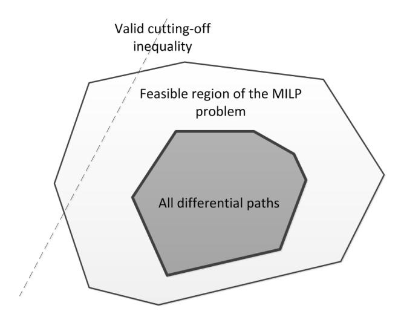
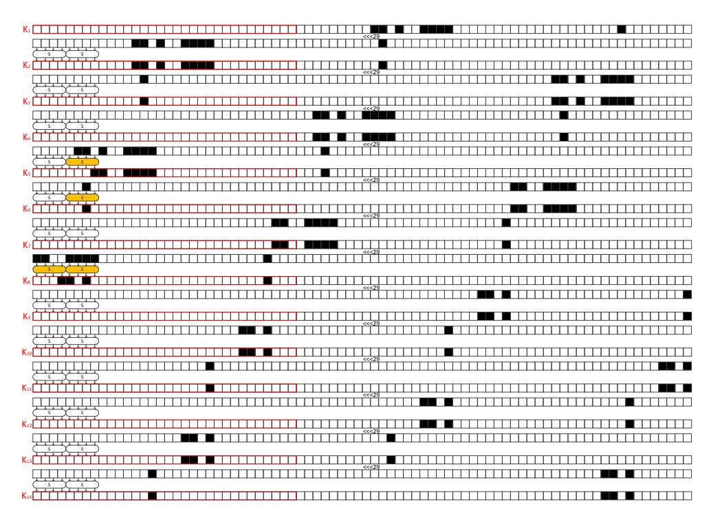

# Automatic Security Evaluation and (Related-key) Differential Characteristic Search: Application to SIMON, PRESENT, LBlock, DES(L) and Other Bit-oriented Block Ciphers

Siwei Sun1,<sup>2</sup> , Lei Hu1,<sup>2</sup> , Peng Wang1,<sup>2</sup> , Kexin Qiao1,<sup>2</sup> , Xiaoshuang Ma1,<sup>2</sup> , Ling Song1,<sup>2</sup>

<sup>1</sup>State Key Laboratory of Information Security, Institute of Information Engineering, Chinese Academy of Sciences, Beijing 100093, China <sup>2</sup>Data Assurance and Communication Security Research Center, Chinese Academy of Sciences, Beijing 100093, China

{sunsiwei,hulei,wpeng,qiaokexin,maxiaoshuang,songling}@iie.ac.cn

Abstract. We propose two systematic methods to describe the differential property of an S-box with linear inequalities based on logical condition modelling and computational geometry respectively. In one method, inequalities are generated according to some conditional differential properties of the S-box; in the other method, inequalities are extracted from the H-representation of the convex hull of all possible differential patterns of the S-box. For the second method, we develop a greedy algorithm for selecting a given number of inequalities from the convex hull. Using these inequalities combined with Mixedinteger Linear Programming (MILP) technique, we propose an automatic method for evaluating the security of bit-oriented block ciphers against the (related-key) differential attack, and several techniques for obtaining tighter security bounds. We successfully prove that the 24-round PRESENT-80 is secure enough to resist against standard related-key differential attacks based on differential characteristic, and the probability of the best related-key differential characteristic of the full LBlock is upper bounded by 2 <sup>−</sup><sup>60</sup>. These are the tightest security bounds with respect to the related-key differential attack published so far for PRESENT-80 and LBlock.

Moreover, we present a new tool for finding (related-key) differential characteristics automatically for bit-oriented block ciphers. Using this tool, we obtain new single-key or related-key differential characteristics for SIMON48, LBlock, DESL and PRESENT-128, which cover larger number of rounds or have larger probability than all previously known results. The methodology presented in this paper is generic, automatic and applicable to many bit-oriented block ciphers.

Keywords: Automatic cryptanalysis, Related-key differential attack, Mixed-integer Linear Programming, Convex hull

# 1 Introduction

Differential cryptanalysis is one of the most well-known attacks on modern block ciphers, based on which a whole bunch of cryptanalytic techniques has been developed, such as truncated differential attack [40], impossible differential attack [10], and boomerang attack [63]. Providing a security evaluation with respect to the differential attack has become a basic requirement for a newly designed practical block cipher to be accepted by the cryptographic community.

Contrary to the single-key model, where methodologies for constructing block ciphers provably resistant to differential attacks are readily available, the understanding of the security of block ciphers with regard to related-key differential attacks is relatively limited. This situation can be seen from the fact that even internationally standardized block ciphers such as AES and PRESENT enjoy no security proof at all for related-key differential attacks at the time of their publication. This limited understanding of the security concerning related-key differential attacks has been greatly improved in recent years for AES-like byte- or word-oriented SPN block ciphers. Along this line of research, two representative papers [11, 27] were published in Eurocrypt 2010 and Crypto 2013. In the former paper [11], an efficient search tool for finding differential characteristics both in the state and in the key was presented, and the best differential characteristics were obtained for some byte-oriented block ciphers such as AES, byte-Camellia, and Khazad. In the latter paper [27], Pierre-Alain Fouque et al. showed that the full-round AES-128 can not be proven secure against differential attacks in the related-key model unless the exact coefficients of the MDS matrix and the S-Box differential properties are taken into account. Moreover, a variant of Dijkstra's shortest path algorithm for finding the most efficient related-key attacks on SPN ciphers was developed in [27]. In [32], Ivica Nikolic presented a tweak for the key schedule of AES and the new cipher called xAES is resistant against the related-key differential attacks found in AES.

For bit-oriented block ciphers such as PRESENT-80 and DES, Sareh Emami  $et\ al.$  proved that no related-key differential characteristic exists with probability higher than  $2^{-64}$  for the full-round PRESENT-80, and therefore argue that PRESENT-80 is secure against basic related-key differential attacks [24]. In [58], Sun  $et\ al.$  obtained tighter security bounds for PRESENT-80 with respect to the related-key differential attacks using the MILP technique. Alex Biryukov and Ivica Nikolić proposed two methods [12] based on Matsui's tool [49] for finding related-key differential characteristics for DES-like ciphers. For their methods, they stated that

"... our approaches can be used as well to search for high probability related-key differential characteristics in any bit-oriented ciphers with linear key schedule."

Sareh Emami  $et\ al.\ [24]$  and Sun  $et\ al.$ 's method [58] can not be used to search for actual (related-key) differential characteristics, and Alex Biryukov  $et\ al.$ 's method [12] is only applicable to ciphers with linear key schedule.

In this paper, we provide a method based on Mixed-Integer Linear Programming which can not only evaluate the security (obtain security bound) of a block cipher with respect to the (related-key) differential attacks, but is also able to search for actual (related-key) differential characteristics even if the key schedule algorithm of the block cipher is nonlinear.

Mixed-Integer Linear Programming (MILP). The problem of Mixed Integer Linear Programming (MILP) is a class of optimization problems derived from Linear Programming in which the aim is to optimize an objective function under certain constraints. The field of MILP has received extensive study and achieved great success in both academic and industrial worlds. A Mixed Integer Linear Programming problem can be formally described as follows.

**MILP:** Find a vector  $x \in \mathbb{Z}^k \times \mathbb{R}^{n-k} \subseteq \mathbb{R}^n$  with  $Ax \leq b$ , such that the linear function  $c_1x_1 + c_2x_2 + \cdots + c_nx_n$  is minimized (or maximized), where  $(c_1, \ldots, c_n) \in \mathbb{R}^n$ ,  $A \in \mathbb{R}^{m \times n}$ , and  $b \in \mathbb{R}^m$ .

Despite its intimate relationship with discrete optimization problems, such as the set covering problem, 0-1 knapsack problem, and traveling salesman problem, it is only in recent years that MILP has been explicitly applied in cryptographic research [1, 6, 18, 19, 42, 53, 64, 71].

In this paper, we are mainly concerned with the application of MILP method in the (related-key) differential cryptanalysis. Roughly speaking, differential attack [8] is a cryptanalysis technique used to discover non-random behavior of a cipher by analyzing the input and output difference of the cipher. A practical approach to evaluate the security of a cipher against differential attack is to determine the lower bound of the number of active S-boxes throughout the cipher. This strategy has been employed in many designs [4, 9, 16, 17, 21]. MILP was applied in automatically determining the lower bounds of the numbers of active S-boxes for some word-oriented symmetric-key ciphers, and therefore used to prove their security against differential cryptanalysis [15, 51, 68] . Laura Winnen [67] and Sun et al. [58] extended this method by making it applicable to ciphers involving bit-oriented operations. We notice that such MILP tools [15, 51, 58, 68] for counting the minimum number of active S-boxes are also applied or mentioned in the design and analysis of some authenticated encryption schemes [9, 22, 23, 35–37, 69, 72].

Our Contributions. We find that the constraints presented in [58] are too coarse (and some of these constraints are redundant in some specific case) to accurately describe the differential properties of a specific cipher, since there are a large number of invalid differential patterns of the cipher satisfying all these constraints, which yields a feasible region of the MILP problem much larger than the set of all valid differential characteristics.

In this paper, we propose two methods to tighten the feasible region by cutting off some impossible differential patterns of a specific S-box with linear inequalities: one method is based on logical condition modeling, and the other is a more general approach based on convex hull computation — a fundamental algorithmic problem in computational geometry. In the first method, typically less than 15 inequalities are generated according to some conditional differential properties of the S-box; while in the second method, several hundreds of inequalities are extracted from the H-representation of the convex hull of all possible differential patterns of the S-box.

However, the second approach produces too many inequalities so that adding all of them to an MILP problem will make the solving process impractical. Therefore, we develop a greedy algorithm for selecting a given number of linear inequalities from the convex hull.

By adding all or a part of the constraints generated by these methods, we provide MILP based methods for evaluating the security of a block cipher with respect to the (related-key) differential attack, and searching for actual (related-key) differential characteristics. Using these methods, we obtain the following results.

- 1. The probability of the best related-key differential characteristic of the 24-round PRESENT-80, a bitoriented SPN block cipher, is upper bounded by  $2^{-64}$ , which is the tightest security bound obtained so far for PRESENT-80.
- 2. The probability of the best related-key differential characteristic for the full-round LBlock is at most  $2^{-60}$ . This is the first theoretic result concerning the full LBlock's security against differential attack in the related-key model.
- 3. We obtain a single-key differential characteristic and a single-key differential for the 15-round SIMON48 (a lightweight block cipher designed by the U.S. National Security Agency) with probability  $2^{-46}$  and  $2^{-41.96}$  respectively, which are the best results published so far for SIMON48.
- 4. We obtain a 14-round related-key differential characteristic of LBlock with only 20 active Sboxes and probability  $2^{-49}$  in no more than 4 hours on a PC. Note that the probabilities of the best previously published related-key characteristics covering the 13- and 14-round LBlock are  $2^{-53}$  and  $2^{-65}$  [70], respectively.
- 5. We obtain an 8-round related-key differential characteristic of DESL with probability  $2^{-34.78}$  in 10 minutes on a PC. To the best of our knowledge, no related-key differential characteristic covering more than 7 rounds of DESL has been published before.
- 6. We obtain a 7-round related-key characteristic for PRESENT-128 with probability 2<sup>-11</sup> and 0 active S-box in its key schedule algorithm, based on which an improved related-key boomerang distinguisher for the 14-round PRESENT-128 and a key-recovery attack on the 17-round PRESENT-128 can be constructed by using exactly the same method presented in [54].

Note that the above specific results are not the focus of this paper. Instead, the focus is the new method presented in the paper, which is generic, automatic, and applicable to other lightweight ciphers with bit-oriented operations such as EPCBC [71], and MIBS [33].

Organization of the paper. In Sect. 2, we introduce Mouha et al.'s framework and its extension for counting the number of active S-boxes of bit-oriented ciphers automatically with the MILP technique. In Sect. 3, we introduce the concept of valid cutting-off inequalities for tightening the feasible region of an MILP problem, and explore how to generate and select valid cutting-off inequalities. We present the methods for automatic security evaluation with respect to the (related-key) differential attack, and searching for (related-key) differential characteristics in Sect. 4 and Sect. 5. In Sect. 6 we conclude the paper and propose some research directions for bit-oriented ciphers and the application of the MILP technique in cryptography. The application of the methods to PRESENT80/128, LBlock, SIMON, DES(L) and example source code are presented in Appendices.

### 2 Mouha et al.'s Framework and Its Extension

In this section, we present Mouha  $et\ al.$ 's framework and its extension for counting the number of differentially active S-boxes for word-oriented and bit-oriented block ciphers respectively. We refer the reader to [51,58] for more information.

#### 2.1 Mouha et al.'s Framework for Word-oriented Block Ciphers

Assume a cipher is composed of the following three word-oriented operations, where  $\omega$  is the word size:

```
- XOR, \oplus : \mathbb{F}_2^{\omega} \times \mathbb{F}_2^{\omega} \to \mathbb{F}_2^{\omega};

- Linear transformation L : \mathbb{F}_{2^{\omega}}^m \to \mathbb{F}_{2^{\omega}}^m with branch number \mathcal{B}_L;

- S-box, \mathcal{S} : \mathbb{F}_2^{\omega} \to \mathbb{F}_2^{\omega}.
```

Mouha *et al.*'s framework uses 0-1 variables, which are subjected to certain constraints imposed by the above operations, to denote the word level differences propagating through the cipher (1 for nonzero difference and 0 otherwise).

Detailed MILP model building process for determining a lower bound of the number of active S-boxes is described as follows. Firstly, we should include the constraints imposed by the operations of the cipher.

Constraints Imposed by XOR Operations. Suppose a ⊕ b = c, where a, b, c ∈ F ω <sup>2</sup> are the input and output differences of the XOR operation, the following constraints will make sure that when a, b, and c are not all zero, then there are at least two of them are nonzero:

$$\begin{cases}
a+b+c \ge 2d_{\oplus} \\
d_{\oplus} \ge a, \ d_{\oplus} \ge b, \ d_{\oplus} \ge c
\end{cases}$$
(1)

where d<sup>⊕</sup> is a dummy variable taking values from {0, 1}. If each one of a, b, and c represents one bit, we should also add the inequality a + b + c ≤ 2.

Constraints Imposed by Linear Transformation. Let xi<sup>k</sup> and yj<sup>k</sup> , k ∈ {0, 1, . . . , m−1}, be 0-1 variables denoting the word-level input and output differences of the linear transformation L respectively. Since for nonzero input differences, there are totally at least B<sup>L</sup> nonzero ω-bit words in the input and output differences, we include the following constraints:

$$\begin{cases}
\sum_{k=0}^{m-1} (x_{i_k} + y_{j_k}) \ge \mathcal{B}_L d_L \\
d_L \ge x_{i_k}, & k \in \{0, \dots, m-1\} \\
d_L \ge y_{j_k}, & k \in \{0, \dots, m-1\}
\end{cases}$$
(2)

where d<sup>L</sup> is a dummy variable taking values in {0, 1} and B<sup>L</sup> is the branch number of the linear transformation. Then, we set up the objective function to be the sum of all variables representing the input words of the S-boxes. Obviously, this objective function corresponds to the number of active S-boxes, and can be minimized to determine its lower bound.

### 2.2 Extension of Mouha et al.'s Framework for Bit-oriented Ciphers

For bit-oriented ciphers, bit-level representations and additional constraints are needed [58]. For every input and output bit-level difference, a new 0-1 variable x<sup>i</sup> is introduced such that x<sup>i</sup> = 1 if and only if the difference at this bit is nonzero.

For every S-box in the schematic diagram, including the encryption process and the key schedule algorithm, we introduce a new 0-1 variable A<sup>j</sup> such that

$$A_j = \begin{cases} 1, & \text{if the input word of the Sbox is nonzero,} \\ 0, & \text{otherwise.} \end{cases}$$

At this point, it is natural to choose the objective function f, which will be minimized, as PA<sup>j</sup> for the goal of determining a lower bound of the number of active S-boxes.

For bit-oriented ciphers, we need to include two sets of constraints. The first one is the set of constraints imposed by XOR operations, and the other is due to the S-box operation. After changing the representations to bit-level, the set of constraints imposed by XOR operations for bit-oriented ciphers are the same as that presented in (1). The S-box operation is more tricky.

Constraints Describing the S-box Operation. Suppose (x<sup>i</sup><sup>0</sup> , . . . , x<sup>i</sup>ω−<sup>1</sup> ) and (y<sup>j</sup><sup>0</sup> , . . . , y<sup>j</sup>ν−<sup>1</sup> ) are the input and output bit-level differences of an ω × ν S-box marked by At. Firstly, to ensure that A<sup>t</sup> = 1 holds if and only if x<sup>i</sup><sup>0</sup> , . . . , x<sup>i</sup>ω−<sup>1</sup> are not all zero, we require that:

$$\begin{cases}
A_t - x_{i_k} \ge 0, & k \in \{0, \dots, \omega - 1\} \\
x_{i_0} + x_{i_1} + \dots + x_{i_{\omega - 1}} - A_t \ge 0
\end{cases}$$
(3)

For bijective S-boxes, nonzero input difference must result in nonzero output difference and vice versa:

$$\begin{cases} \omega y_{j_0} + \omega y_{j_1} + \dots + \omega y_{j_{\nu-1}} - (x_{i_0} + x_{i_1} + \dots + x_{i_{\omega-1}}) \ge 0\\ \nu x_{i_0} + \nu x_{i_1} + \dots + \nu x_{i_{\omega-1}} - (y_{j_0} + y_{j_1} + \dots + y_{j_{\nu-1}}) \ge 0 \end{cases}$$

$$(4)$$

Note that the above constraints should not be used for non-bijective S-box such as the S-box of DES(L).

Finally, the Hamming weight of the (ω + ν)-bit word x<sup>i</sup><sup>0</sup> · · · x<sup>i</sup>ω−<sup>1</sup> y<sup>j</sup><sup>0</sup> · · · y<sup>j</sup>ν−<sup>1</sup> is lower bounded by the branch number B<sup>S</sup> of the S-box for nonzero input difference x<sup>i</sup><sup>0</sup> · · · x<sup>i</sup>ω−<sup>1</sup> , where d<sup>S</sup> is a dummy variable:

$$\begin{cases}
\sum_{k=0}^{\omega-1} x_{i_k} + \sum_{k=0}^{\nu-1} y_{j_k} \ge \mathcal{B}_{\mathcal{S}} d_{\mathcal{S}} \\
d_{\mathcal{S}} \ge x_{i_k}, & k \in \{0, \dots, \omega - 1\} \\
d_{\mathcal{S}} \ge y_{j_k}, & k \in \{0, \dots, \nu - 1\}
\end{cases} \tag{5}$$

where the branch number B<sup>S</sup> of an S-box S, is defined as

$$\mathcal{B}_{\mathcal{S}} = \min_{a \neq b} \{ \operatorname{wt}((a \oplus b) || (\mathcal{S}(a) \oplus \mathcal{S}(b)) : a, b \in \mathbb{F}_2^{\omega} \}$$

and wt(·) is the standard Hamming weight of an (ω + ν)-bit word. We point out that constraint (5) is redundant for an invertible S-box with branch number B<sup>S</sup> = 2, since in this particular case, all differential patterns not satisfying (5) violate (4).

0-1 Variables. The MILP model proposed above is indeed a Pure Integer Programming Problem since all variables appearing are 0-1 variables. However, in practice we only need to explicitly restrict a part of all variables to be 0-1, while all other variables can be allowed to be any real numbers, which leads to a Mixedinteger Linear Programming problem. Following this approach, the MILP solving process may be accelerated as suggested in [18].

### 3 Tighten the Feasible Region with Valid Cutting-off Inequalities

The feasible region of an MILP problem is defined as the set of all variable assignments satisfying all constraints in the MILP problem. The modelling process presented in the previous sections indicates that every differential path corresponds to a solution in the feasible region of the MILP problem. However, a feasible solution of the MILP model is not guaranteed to be a valid differential path, since our constraints are far from perfect to rule out all invalid differential patterns. For instance, assume x<sup>i</sup> and y<sup>i</sup> (0 ≤ i ≤ 3) are the bit-level input and output differences of the PRESENT-80 S-box. According to Sect. 2.2, x<sup>i</sup> , y<sup>i</sup> are subjected to the constraints of (3), (4) and (5). Obviously, (x<sup>0</sup> · · · , x3, y0, · · · , y3) = (1, 0, 0, 1, 1, 0, 1, 1) satisfies the above constraints, whereas 0x9 = 1001 → 0xB = 1011 is not a valid difference propagation pattern for the PRESENT S-box, which can be seen from the differential distribution table of the PRESENT S-box. Hence, we are actually trying to minimize the number of the active S-boxes over a larger region as illustrated in Fig. 1, and the optimum value obtained in this setting must be smaller than or equal to the actual minimum number of active S-boxes. Although the above fact will not invalidate the lower bound we obtained from our MILP model, this prevents the designers or analysts from obtaining tighter security bounds and valid (related-key) differential characteristics from the feasible region.



Fig. 1: The relationship between the set of all differential paths and the feasible region of the MILP problem, and the effect of cutting-off inequality

The situation would be even worse when modelling an invertible S-box with branch number B<sup>S</sup> = 2, which is the minimal value of the branch number for an invertible S-box. In the case of invertible S-box with

 $\mathcal{B}_{\mathcal{S}}=2$ , the constraints of (3), (4) are enough, and (5) is redundant. In this situation, all differential patterns with nonzero input and output differences satisfy the constraints presented in the previous sections, which is obviously too coarse to describe a specific S-box. For instance, all 10 S-boxes of LBlock [70] are invertible and their branch numbers are all 2.

Therefore, we are motivated to look for linear inequalities which can cut off some part of the feasible region of the MILP model while leaving the region of valid differential characteristics intact as illustrated in Fig. 1. For the convenience of discussion, we give the following definition.

**Definition 1.** A valid cutting-off inequality is a linear inequality which is satisfied by all possible valid differential patterns, but is violated by at least one feasible solution corresponding to an impossible differential pattern in the feasible region of the original MILP problem.

### 3.1 Methods for Generating Valid Cutting-off Inequalities

In this section, we present two methods for generating valid cutting-off inequalities by analyzing the differential behavior of the underlying S-box.

### Modelling Conditional Differential Behaviour with Linear Inequalities

In building integer programming models in practice, sometimes it is possible to model certain logical constraints as linear inequalities. For example, assume x is a continuous variable such that  $0 \le x \le M$ , where M is a fixed integer, and we know that  $\delta$  is a 0-1 variable taking value 1 when x > 0, that is

$$x > 0 \implies \delta = 1$$
.

It is easy to verify that the above logical condition can be achieved by imposing the following constraint

$$x - M\delta < 0$$
.

In fact, there is a surprisingly large number of different types of logical conditions can be imposed in a similar way, and we refer the reader to [65,66] for many other examples. We now give a theorem which will be used in the following.

**Theorem 1.** If we assume that all variables are 0-1 variables, then the logical condition that  $(x_0, \ldots, x_{m-1}) = (\delta_0, \ldots, \delta_{m-1}) \in \{0, 1\}^m \subseteq \mathbb{Z}^m$  implies  $y = \delta \in \{0, 1\} \subseteq \mathbb{Z}$  can be described by the following linear inequality

$$\sum_{i=0}^{m-1} (-1)^{\delta_i} x_i + (-1)^{\delta+1} y - \delta + \sum_{i=0}^{m-1} \delta_i \ge 0, \tag{6}$$

where  $\delta_i$ ,  $\delta$  are fixed constants and  $\mathbb{Z}$  is the set of all integers.

**Proof.** We only prove the Theorem for the case  $\delta = 0$ . For  $\delta = 1$ , it can be proved in a similar way. We assume

$$(\delta_0,\ldots,\delta_{m-1})=(\delta_0,\ldots,\delta_{s_1-1};\delta_{s_1},\ldots,\delta_{m-1})=(1,1,\ldots,1;0,0,\ldots,0)=\Delta^*.$$

For other 0-1 patterns, it can be permuted into such a form and this will not affect our proof.

Firstly,  $(\Delta^*, 0)$  is satisfied by (6), which can be verified directly.

Secondly, we prove that all vectors  $(x_0, \ldots, x_{m-1}, y) \in \{0, 1\}^{m+1}$  such that  $(x_0, \ldots, x_{m-1}) \neq \Delta^*$  are satisfied by (6). In such cases, we have

$$\sum_{i=0}^{m-1} (-1)^{\delta_i} x_i + (-1)^{\delta+1} y - \delta + \sum_{i=0}^{m-1} \delta_i = -\sum_{i=0}^{s_1-1} x_i + \sum_{i=s_1}^m x_i - y - 0 + s_1 \ge -s_1 + 1 - y + s_1 = 1 - y \ge 0,$$

for y = 0 or y = 1.

Finally we prove that the vector  $(x_0, \ldots, x_{m-1}, y) = (\Delta^*, 1)$  is not satisfied by the linear inequality. In such case, we have

$$\sum_{i=0}^{m-1} (-1)^{\delta_i} x_i + (-1)^{\delta+1} y - \delta + \sum_{i=0}^{m-1} \delta_i = -\sum_{i=0}^{s_1-1} x_i + \sum_{i=s_1}^m x_i - 1 - 0 + s_1 = -s_1 - 1 + s_1 = -1 < 0.$$

The proof is completed.

For example, the PRESENT S-box has the following conditional differential properties, which are referred to as undisturbed bits in [61].

Fact 1. The S-box of PRESENT-80 has the following properties:

- (i) 1001→\*\*\*0: If the input difference of the S-box is 0x9 = 1001, then the least significant bit of the output difference must be 0;
- (ii) 0001→\*\*\*1 and 1000→\*\*\*1: If the input difference of the S-box is 0x1 = 0001 or 0x8 = 1000, then the least significant bit of the output difference must be 1;
- (iii) \*\*\*1→0001 and \*\*\*1→0100: If the output difference of the S-box is 0x1 = 0001 or 0x4 = 0100, then the least significant bit of the input difference must be 1; and
- (iv) \*\*\*0→0101: If the output difference of the S-box is 0x5 = 0101, then the least significant bit of the input difference must be 0.

From Theorem 1, we have the following fact. Note that similar conditional differential behaviors of other ciphers were also used by other researchers in different context [19, 28, 38, 39, 44].

Fact 2. Let 0-1 variables (x0, x1, x2, x3) and (y0, y1, y2, y3) represent the input and output bit-level differences of the S-box respectively, where x<sup>3</sup> and y<sup>3</sup> are the least significant bits. Then the logical conditions in Theorem 1 can be described by the following linear inequalities:

$$-x_0 + x_1 + x_2 - x_3 - y_3 + 2 \ge 0 (7)$$

$$\begin{cases} x_0 + x_1 + x_2 - x_3 + y_3 \ge 0\\ -x_0 + x_1 + x_2 + x_3 + y_3 \ge 0 \end{cases}$$
 (8)

$$\begin{cases} x_3 + y_0 + y_1 + y_2 - y_3 \ge 0 \\ x_3 + y_0 - y_1 + y_2 + y_3 \ge 0 \end{cases}$$
 (9)

$$-x_3 + y_0 - y_1 + y_2 - y_3 + 2 \ge 0 (10)$$

For example, the linear inequality (7) removes all differential patterns of the form (x0, . . . , x3, y0, . . . , y3) = (1, 0, 0, 1, ∗, ∗, ∗, 1), where (x0, . . . , x3) and (y0, . . . , y3) are the input and output differences of the PRESENT S-box respectively. We call this group of constraints presented in (7), (8), (9), and (10) the constraints of conditional differential propagation (CDP constraints for short). The CDP constraints obtained from Fact 1 and the differential patterns removed by these CDP constraints are given in Table 1.

Table 1: Impossible differential patterns removed by the CDP constraints generated according to the differential properties of the PRESENT S-box. Here, a 9-dimensional vector (λ0, . . . , λ3, γ0, . . . , γ3, θ) in the left column denotes a linear inequality λ0x<sup>0</sup> + · · · + λ3x<sup>3</sup> + γ0y<sup>0</sup> + · · · + γ3y<sup>3</sup> + θ ≥ 0, and an 8 dimensional vector in the right column denotes a difference propagation pattern, e.g., (1, 0, 0, 1, 0, 1, 1, 1) denotes 0x9 = 1001 → 0x7 = 0111.

| Constraints obtained by log    | Impossible differential patterns removed                                                                |
|--------------------------------|---------------------------------------------------------------------------------------------------------|
| ical condition modelling       |                                                                                                         |
| (−1, 1, 1, −1, 0, 0, 0, −1, 2) | (1, 0, 0, 1, 0, 0, 0, 1), (1, 0, 0, 1, 0, 0, 1, 1), (1, 0, 0, 1, 0, 1, 0, 1), (1, 0, 0, 1, 0, 1, 1, 1), |
|                                | (1, 0, 0, 1, 1, 0, 0, 1), (1, 0, 0, 1, 1, 0, 1, 1), (1, 0, 0, 1, 1, 1, 0, 1), (1, 0, 0, 1, 1, 1, 1, 1)  |
| (1, 1, 1, −1, 0, 0, 0, 1, 0)   | (0, 0, 0, 1, 0, 0, 0, 0), (0, 0, 0, 1, 0, 0, 1, 0), (0, 0, 0, 1, 0, 1, 0, 0), (0, 0, 0, 1, 0, 1, 1, 0), |
|                                | (0, 0, 0, 1, 1, 0, 0, 0), (0, 0, 0, 1, 1, 0, 1, 0), (0, 0, 0, 1, 1, 1, 0, 0), (0, 0, 0, 1, 1, 1, 1, 0)  |
| (−1, 1, 1, 1, 0, 0, 0, 1, 0)   | (1, 0, 0, 0, 0, 0, 0, 0), (1, 0, 0, 0, 0, 0, 1, 0), (1, 0, 0, 0, 0, 1, 0, 0), (1, 0, 0, 0, 0, 1, 1, 0), |
|                                | (1, 0, 0, 0, 1, 0, 0, 0), (1, 0, 0, 0, 1, 0, 1, 0), (1, 0, 0, 0, 1, 1, 0, 0), (1, 0, 0, 0, 1, 1, 1, 0)  |
| (0, 0, 0, 1, 1, 1, 1, −1, 0)   | (0, 0, 0, 0, 0, 0, 0, 1), (0, 0, 1, 0, 0, 0, 0, 1), (0, 1, 0, 0, 0, 0, 0, 1), (0, 1, 1, 0, 0, 0, 0, 1), |
|                                | (1, 0, 0, 0, 0, 0, 0, 1), (1, 0, 1, 0, 0, 0, 0, 1), (1, 1, 0, 0, 0, 0, 0, 1), (1, 1, 1, 0, 0, 0, 0, 1)  |
| (0, 0, 0, 1, 1, −1, 1, 1, 0)   | (0, 0, 0, 0, 0, 1, 0, 0), (0, 0, 1, 0, 0, 1, 0, 0), (0, 1, 0, 0, 0, 1, 0, 0), (0, 1, 1, 0, 0, 1, 0, 0), |
|                                | (1, 0, 0, 0, 0, 1, 0, 0), (1, 0, 1, 0, 0, 1, 0, 0), (1, 1, 0, 0, 0, 1, 0, 0), (1, 1, 1, 0, 0, 1, 0, 0)  |
| (0, 0, 0, −1, 1, −1, 1, −1, 2) | (0, 0, 0, 1, 0, 1, 0, 1), (0, 0, 1, 1, 0, 1, 0, 1), (0, 1, 0, 1, 0, 1, 0, 1), (0, 1, 1, 1, 0, 1, 0, 1), |
|                                | (1, 0, 0, 1, 0, 1, 0, 1), (1, 0, 1, 1, 0, 1, 0, 1), (1, 1, 0, 1, 0, 1, 0, 1), (1, 1, 1, 1, 0, 1, 0, 1)  |

However, there are cases where no such conditional differential property exists. For example, two out of the eight S-boxes of Serpent [7] exhibit no such property. Even when the S-box under consideration can be described with this logical condition modelling technique, the inequalities generated may be not enough to produce a satisfied result. The number of valid cutting-off inequalities can be obtained in this way is given in Table 2 for typical 4 × 4 S-boxes.

Table 2: The Numbers of valid cutting-off inequalities obtained using different methods. Notations: the "#CDP" columns record the numbers of constraints obtained using logical condition modelling approach, and the "#CH" columns record the numbers of constraints in the H-representation of the convex hulls.

| S-box            | #CDP | #CH | S-box      | #CDP | #CH |
|------------------|------|-----|------------|------|-----|
| Klein [29]       | 0    | 312 | LBlock S6  | 12   | 205 |
| Piccolo [57]     | 12   | 202 | LBlock S7  | 12   | 205 |
| TWINE [60]       | 0    | 324 | LBlock S8  | 12   | 205 |
| PRINCE [17]      | 0    | 300 | LBlock S9  | 12   | 205 |
| MIBS             | 0    | 378 | Serpent S0 | 6    | 327 |
| PRESENT/LED [31] | 6    | 327 | Serpent S1 | 6    | 327 |
| LBlock S0        | 12   | 205 | Serpent S2 | 6    | 325 |
| LBlock S1        | 12   | 205 | Serpent S3 | 0    | 368 |
| LBlock S2        | 12   | 205 | Serpent S4 | 3    | 321 |
| LBlock S3        | 12   | 205 | Serpent S5 | 3    | 321 |
| LBlock S4        | 12   | 205 | Serpent S6 | 3    | 327 |
| LBlock S5        | 12   | 205 | Serpent S7 | 6    | 368 |

In the following, a more general approach for generating valid cutting-off inequalities is proposed.

#### Convex Hull of All Possible Differentials for an S-box

The convex hull of a set Q of discrete points in  $\mathbb{R}^n$  is the smallest convex set that contains Q. A convex hull in  $\mathbb{R}^n$  can be described as the common solutions of a set of finitely many linear equations and inequalities as follows:

$$\begin{cases} \lambda_{0,0} x_0 + \dots + \lambda_{0,n-1} x_{n-1} + \lambda_{0,n} \ge 0 \\ \dots \\ \gamma_{0,0} x_0 + \dots + \gamma_{0,n-1} x_{n-1} + \gamma_{0,n} = 0 \\ \dots \end{cases}$$
(11)

This is called the H-Representation of a convex hull. Computing the H-representation of the convex hull of a set of finitely many points is a fundamental algorithm in computation geometry with many applications [30, 56].

If we treat a possible differential of an  $\omega \times \nu$  S-box as a point in  $\mathbb{R}^{\omega+\nu}$ , then we can obtain a set of finitely many discrete points which includes all possible differential patterns of this S-box . For example, one possible differential pattern of PRESENT S-box is  $0x9=1001 \to 0xE=1110$  which is identified with (1,0,0,1,1,1,1,0), and one possible differential pattern of the DESL S-box is  $0x3E=111110 \to 0xB=1011$  which is identified with (1,1,1,1,1,0,1,0,1,1). The set of all possible differential patterns for the S-boxes of PRESENT and DESL are given at http://paste.ubuntu.com/7123001/ and http://paste.ubuntu.com/7123005/ respectively. These are essentially sets of finitely many discrete points in high dimensional space, hence we can compute their convex hulls by standard method in computational geometry.

We now define the convex hull of a specific  $\omega \times \nu$  S-box to be the set of all linear inequalities in the H-Representation of the convex hull  $\mathcal{V}_{\mathcal{S}} \subseteq \mathbb{R}^{\omega+\nu}$  of all possible differential patterns of the S-box. The convex hull of a specific S-box can be obtained by using the inequality\_generator() function in the sage.geometry.polyhedron class of the SAGE computer algebra system [59]. The convex hull of the PRESENT S-box contains 327 linear inequalities. Any one of these inequalities can be taken as a valid cutting-off inequality. The numbers of linear inequalities in the convex hulls of typical  $4 \times 4$  S-boxes are given in Table 2.

#### 3.2 Selecting Valid Cutting-off Inequalities from the Convex Hull: A Greedy Approach

The number of equations and inequalities in the H-Representation of a convex hull computed from a set of discrete points in n dimensional space is very large in general. For instance, the convex hull  $\mathcal{V}_{\mathcal{S}} \subseteq \mathbb{R}^8$  of a  $4 \times 4$  S-box typically involves several hundreds of linear inequalities. Adding all of them to an MILP problem will quickly make the MILP problem insolvable in practical time. Hence, it is necessary to select a small number, say n, of "best" inequalities from the convex hull. Here by "best" we mean that, among all possible selections of n inequalities, the selected ones maximize the number of removed impossible differentials. Obviously, this is a hard combinatorial optimization problem. Therefore, we design a greedy algorithm, listed in Algorithm 1, to approximate the optimum selection.

### Algorithm 1: Selecting n inequalities from the convex hull H of an S-box

```
H: the set of all inequalities in the H-representation of the convex hull of an S-box;
  X : the set of all impossible differential patterns of an S-box;
  n: a positive integer.
  Output: O: a set of n inequalities selected from H
1 l
   ∗
    := None;
2 X
    ∗
      := X ;
3 H∗
      := H;
4 O := ∅;
5 for i ∈ {0, . . . , n − 1} do
6 l
      ∗
        := The inequality in H∗ which maximizes the number of removed impossible differential
```

patterns from X ∗ ; <sup>7</sup> X ∗ := X <sup>∗</sup> − {removed impossible differential patterns by l <sup>∗</sup>}; <sup>8</sup> H<sup>∗</sup> := H<sup>∗</sup> − {l <sup>∗</sup>}; <sup>9</sup> O := O ∪ {l <sup>∗</sup>};

10 end

Input:

<sup>11</sup> return O

The algorithm builds up a set of valid cutting-off inequalities by selecting at each step an inequality from the convex hull which maximizes the number of removed impossible differential patterns from the current feasible region.

For instance, We select 6 valid cutting-off inequalities from the convex hull of the PRESENT S-box using Algorithm 1. These inequalities and the impossible differential patterns removed are listed in Table 3. Compared with the 6 valid cutting-off inequalities obtained by Theorem 1 (see Table 1), they cut off 66 − 42 = 24 more impossible differential patterns, which leads to a relatively tighter feasible region.

Table 3: Impossible differential patterns removed by the constraints selected from the convex hull of the PRESENT S-box

| Constraints selected from the<br>Impossible differential patterns removed |                                                                                                                                                 |  |  |  |
|---------------------------------------------------------------------------|-------------------------------------------------------------------------------------------------------------------------------------------------|--|--|--|
| convex hull by the greedy algo                                            |                                                                                                                                                 |  |  |  |
| rithm                                                                     |                                                                                                                                                 |  |  |  |
| (−2, 1, 1, 3, 1, −1, 1, 2, 0)                                             | (1, 0, 1, 0, 0, 1, 0, 0) (1, 0, 0, 0, 1, 1, 0, 0) (1, 0, 0, 0, 1, 0, 0, 0) (1, 0, 1, 0, 0, 1, 1, 0) (1, 0, 0, 0, 1, 1, 1, 0) (1, 1, 0, 0, 0, 1, |  |  |  |
|                                                                           | 0, 0) (1, 1, 0, 0, 0, 1, 1, 0) (1, 0, 0, 0, 0, 1, 1, 0) (1, 0, 1, 0, 1, 1, 0, 0) (1, 0, 0, 0, 0, 1, 0, 0) (1, 0, 0, 0, 0, 1, 0, 1) (1, 0, 0, 0, |  |  |  |
|                                                                           | 0, 0, 1, 0) (1, 1, 0, 0, 1, 1, 0, 0) (1, 1, 1, 0, 0, 1, 0, 0)                                                                                   |  |  |  |
| (1, −2, −3, −2, 1, −4, 3, −3, 10)                                         | (0, 1, 1, 0, 1, 1, 0, 1) (1, 1, 1, 0, 0, 1, 0, 1) (0, 1, 1, 1, 0, 1, 1, 1) (1, 0, 1, 1, 0, 1, 0, 1) (0, 1, 1, 0, 0, 1, 0, 1) (0, 1, 1, 1, 0, 1, |  |  |  |
|                                                                           | 0, 0) (0, 1, 1, 1, 0, 1, 0, 1) (1, 1, 1, 1, 1, 1, 0, 1) (0, 0, 1, 1, 0, 1, 0, 1) (0, 1, 1, 1, 1, 1, 0, 1) (1, 1, 1, 1, 0, 1, 0, 1) (0, 1, 0, 1, |  |  |  |
|                                                                           | 0, 1, 0, 1) (0, 0, 1, 1, 1, 1, 0, 1)                                                                                                            |  |  |  |
| (2, −2, 3, −4, −1, −4, −4, 1, 11)                                         | (0, 1, 0, 1, 0, 1, 1, 0) (1, 1, 0, 1, 0, 1, 1, 0) (0, 0, 0, 1, 1, 1, 1, 0) (0, 1, 0, 1, 0, 1, 1, 1) (0, 0, 0, 1, 1, 1, 1, 1) (0, 1, 0, 1, 1, 1, |  |  |  |
|                                                                           | 1, 1) (0, 1, 0, 1, 1, 1, 1, 0) (0, 0, 0, 1, 0, 1, 1, 0) (1, 1, 0, 1, 1, 1, 1, 0) (0, 1, 1, 1, 1, 1, 1, 0) (1, 1, 0, 1, 1, 1, 1, 1)              |  |  |  |
| (−1, −2, −2, −1, −1, 2, −1, 0, 6)                                         | (1, 1, 1, 0, 1, 0, 1, 1) (1, 1, 1, 0, 1, 0, 1, 0) (1, 1, 1, 1, 1, 0, 0, 1) (1, 1, 1, 1, 1, 0, 0, 0) (0, 1, 1, 1, 1, 0, 1, 1) (1, 1, 1, 1, 1, 0, |  |  |  |
|                                                                           | 1, 0) (0, 1, 1, 1, 1, 0, 1, 0) (1, 1, 1, 1, 0, 0, 1, 1) (1, 1, 1, 1, 1, 0, 1, 1) (1, 1, 1, 1, 0, 0, 1, 0)                                       |  |  |  |
| (-2, 1, -2, -1, 1, -1, -2, 0, 6)                                          | (1, 1, 1, 1, 0, 1, 1, 0) (1, 1, 1, 1, 0, 1, 1, 1) (1, 0, 1, 1, 0, 0, 1, 0) (1, 0, 1, 0, 0, 1, 1, 1) (1, 0, 1, 1, 0, 0, 1, 1) (1, 0, 1, 1, 1, 1, |  |  |  |
|                                                                           | 1, 0) (1, 0, 1, 1, 1, 1, 1, 1) (1, 0, 1, 1, 0, 1, 1, 1) (1, 0, 1, 1, 0, 1, 1, 0)                                                                |  |  |  |
| (2, 1, 1, −3, 1, 2, 1, 2, 0)                                              | (0, 0, 0, 1, 1, 0, 0, 0) (0, 0, 1, 1, 0, 0, 1, 0) (0, 0, 0, 1, 0, 0, 0, 1) (0, 1, 0, 1, 1, 0, 0, 0) (0, 0, 0, 1, 0, 1, 0, 0) (0, 0, 0, 1, 0, 0, |  |  |  |
|                                                                           | 1, 0) (0, 0, 1, 1, 1, 0, 0, 0) (0, 1, 0, 1, 0, 0, 1, 0) (0, 0, 0, 1, 1, 0, 1, 0)                                                                |  |  |  |

### 4 Automatic Security Evaluation

To evaluate the security (obtain the security bound) of a block cipher with respect to related-key differential attack, we can build an MILP model according to Sect. 2 with the constraints introduced in Sect. 3.1 and Sect. 3.2 included. Then we solve the MILP model using any MILP optimizer, and the optimized solution, say N, is the minimum number of the active S-boxes from which we can deduce that the probability of the best differential characteristic is upper bounded by <sup>N</sup> , where is the maximum differential probability (MDP) of a single S-box.

However, it is computationally infeasible to solve an MILP model generated by an r-round block cipher with reasonably large r. In such case, we can turn to the so called simple split approach. We split the r-round block cipher into two parts with consecutive r<sup>1</sup> rounds and r<sup>2</sup> rounds such that r<sup>1</sup> + r<sup>2</sup> = r. Then we apply our method to these two parts. Assuming that there are at least Nr<sup>1</sup> and Nr<sup>2</sup> active S-boxes in the first and second part respectively, we can deduced that the probability of the best differential characteristic for this r-round cipher is upper bounded by (Nr1+Nr<sup>2</sup> ) . If r<sup>1</sup> and r<sup>2</sup> are still too large, they can be divided into smaller parts further.

Note that our method is applicable to both the single-key and related-key models. In single-key model, we only include the variables and constraints in the encryption process. While in related-key model, we include the variables and constraints introduced by both the encryption process, key schedule algorithm and key addition operations.

### 4.1 Techniques for Getting Tighter Security Bounds

Technique 1. In the above analysis, we pessimistically (in the sense that we want to prove the security of a cipher) assume that all the active S-boxes take the MDP . However, this is unlikely to happen in practice, especially in the case that the number of active S-boxes is minimized. Therefore, we have the following strategy for obtaining tighter security bound for a t-round characteristic.

Firstly, compute the set E of all the differential patterns of an S-box with probabilities greater than or equal to the S-box's MDP .

Secondly, compute the H-representation H<sup>E</sup> of the convex hull of E, and then use the inequalities selected from H<sup>E</sup> by Algorithm 1 to generate a t-round model according to Sect. 2 and Sect. 3. Note that the feasible region of this model is smaller than that of a t-round model generated in standard way, since the differential patterns allowed to take in this model is more restrictive. Hence, we hope to get a larger objective value than Nt, which is the result obtained by using the standard t-round model.

Finally, solve the model using a software optimizer. If the objective value is greater than Nt, we know that there is no differential characteristic with only N<sup>t</sup> active S-boxes such that all these S-boxes take differential patterns with probability . And hence, we can conclude that there is at least one active S-box taking a differential pattern with probability less than in a t-round characteristic with only N<sup>t</sup> active S-boxes.

Technique 2. Yet another technique for obtaining tighter security bound is inspired by Alex Biryukov et al. and Sareh Emami et al.'s (extended) split approach [12, 24]. In Sun et al.'s work [58], the strategy for proving the security of an n-round iterative cipher against the related-key differential attacks is to use the simple split approach. By employing the MILP technique, compute the minimum number N<sup>t</sup> of differentially active S-boxes for any consecutive t-round (1 ≤ t ≤ n) related-key differential characteristic. Then the lower bound of the number of active S-boxes for the full cipher (n-round) can be obtained by computing

$$\sum_{j \in I \subseteq \{1, 2, \dots\}} N_{t_j}, \text{ where } \sum_{j \in I} t_j = n.$$

Note that the computational cost is too high to compute N<sup>n</sup> directly.

We point out that this simple "split strategy" can be improved to obtain tighter security bound by exploiting more information of a differential characteristic. The main idea is that the characteristic covering round 1 to round m and the characteristic covering round m + 1 to round 2m should not be treated equal although they have the same number of rounds, since the starting difference of a characteristic of round m + 1 to 2m is not as free as that of a characteristic of round 1 to round m. Therefore, we have the following strategy.

Firstly, split an r-round into two parts: round 1 to round r1, and round r<sup>1</sup> + 1 to round r = r<sup>1</sup> + r2.

Secondly, construct an MILP model covering round 1 to round r. Change the objective function to be the sum of all S-boxes covering round r<sup>1</sup> + 1 to round r. Add some additional constraints on the number of active S-boxes covering round 1 to round r<sup>1</sup> (One way to obtain such constraints is to solve the model covering round 1 to round r1).

Finally, solve the model using any software optimizer, and the result is the lower bound of the number of active S-boxes of round r<sup>1</sup> + 1 to round r (r<sup>2</sup> rounds in total) for any characteristic covering round 1 to round r.

We have applied the methods presented in this section to PRESENT-80 and LBlock, and the results are given in Appendix A. For PRESENT-80, we prove that the probability of any related-key differential characteristic covering round 1 to round 24 is upper bounded by 2−64. For LBlock, we prove that the probability of any related-key differential characteristic of full-round LBlock is upper bounded by 2−60. These are the tightest security bounds for PRESENT-80 and LBlock with respect to the related-key differential attack published so far.

# 5 A Heuristic Method for Finding (Related-key) Differential Characteristics Automatically

To find a (related-key) differential characteristic with relatively high probability covering r rounds of a cipher is the most important step in (related-key) differential cryptanalysis. Most of the tools for searching differential characteristics are essentially based on Matsui's algorithm [49]. In this section, we propose an MILP based heuristic method for finding (related-key) differential characteristics. Compared to other methods, our method is easier to implement, and more flexible.

Thanks to the valid cutting-off inequalities which can describe the property of an S-box according to its differential distribution table, our method can output a good (related-key) differential characteristic directly by employing the MILP technique. The procedure of our method is outlined as follows.

Step 1. For every S-box S, select n inequalities from the convex hull of the set of all possible differential patterns of S using Algorithm 1, and generate an r-round MILP model in which we require that all variables involved are 0-1.

- Step 2. Extract a feasible solution of the MILP model by using the Gurobi [52] optimizer. <sup>1</sup>
- Step 3. Check whether the feasible solution is a valid (related-key) differential characteristic. If it is a valid characteristic, the procedure terminates. Otherwise, go to step 1, increase the number of selected inequalities from the convex hulls, and repeat the whole process.

We have developed a software by employing the python interface provided by the Gurobi optimizer, which automates the whole process of the above method.

To demonstrate the practicability of our method, we have applied the methods presented in this section to SIMON, PRESENT-128, LBlock and DES(L) [43], and the results are given in Appendix B. For all these ciphers, we obtain better (related-key) differential characteristics than all previous published results.

On the Quality of the Characteristics. The characteristics found by this method are not guaranteed to be the best. However, if you would like to wait until the optimizer outputs optimum solution, the characteristic found by this method is guaranteed to have the minimum number of active S-boxes. Experimental results show that we get reasonably good solutions. Moreover, the differential probabilities the active S-boxes take largely obey the differential distribution table. For example, for the S-box of PRESENT-128, there are 96 possible nonzero differential patterns in total: 24 of them are of probability 2<sup>−</sup><sup>2</sup> , and 72 of them are of probability 2 −3 . In the 7-round PRESENT-128 related-key characteristic we found, there are 4 active S-boxes. One of them are of probability 2<sup>−</sup><sup>3</sup> , and all other active S-boxes takes the probability of 2<sup>−</sup><sup>2</sup> .

On the Flexibility of the Searching Algorithm. By adding a small number of additional constraints, our method can be used to search characteristics with specific properties:

- 1. By setting some given variables marking the activity of some S-boxes to 1, we can search for characteristics with active S-boxes of predefined positions, which may be used in leaked-state forgery attacks [69].
- 2. By requiring the output and input variables to be the same, we can search for iterative characteristics.
- 3. By setting all the variables marking the activity of all the S-boxes in the key schedule algorithm to be 0, we can search for characteristics with 0 active S-boxes in its key schedule algorithm, which may be preferred in the related-key differential attack.

<sup>1</sup> In this step, we can extract a feasible solution after or before the Gurobi optimizer converges to its optimum solution. In our experiments, we just wait till the output of the Gurobi interactive shell reports that a solution with a reasonably small objective value (the number of active S-boxes) has been discovered.

# 6 Conclusion and Directions for Future Work

In this paper, we bring new constraints into the MILP model to describe the differential properties of a specific S-box, and obtain a more accurate MILP model for the differential behavior of a block cipher.

Based on these constraints, we propose an automatic method for evaluating the security of bit-oriented block ciphers with respect to (related-key) differential attack. We also present a new tool for finding (relatedkey) characteristics automatically. By using these methods, we obtain tighter security bounds for some bit-oriented block ciphers, and related-key characteristics which cover larger number of rounds or have larger probabilities than all previously known results.

At this point, several open problems emerge. Firstly, we have observed that the MILP instances derived from such cryptographic problems are very hard to solve compared with general MILP problems with the same scale with respect to the numbers of variables and constraints. Hence, it is interesting to develop specific methods to accelerate the solving process of such problems and therefore increase the number of rounds of the cipher under consideration that can be dealt with. Secondly, the method presented in this paper is very general. Is it possible to develop a compiler which can convert a standard description, say a description using hardware description language [55], of a cipher into an MILP instance to automate the entire security evaluation cycle with respect to (related-key) differential attack?

Finally, the methodology presented in this paper has some limitations which we would like to make clear, and trying to overcome these limitations is a topic deserving further investigation.

- 1. This methodology is only suitable to evaluate the security of constructions with S-boxes, XOR operations and bit permutations, and can not be applied to block cipher like SPECK [5], which involve modulo addition and no S-boxes at all. For tools which can be applied to ARX constructions, we refer the reader to [13, 45–47, 50].
- 2. We do do consider the differential effect and we assume that the expected differential probability (EDP) π of a characteristic over all keys is (almost) the same as the fixed-key differential probability (DP) π<sup>K</sup> for almost all keys (the common hypothesis of stochastic equivalence presented in Lai et al.'s work on Markov Ciphers [41]), and that if the lower bound of the EDP for any characteristic of a block cipher is less than 2<sup>−</sup><sup>s</sup> , where s is bigger than the block size or key size of the cipher, then the block cipher is secure against the (related-key) differential attack, which is a common assumption in almost all works on practical analysis of block ciphers. For more in-depth discussion of the essential gap between EDP π and DP πK, and what the bounds on EDP actually mean for the security of a block cipher once a key is fixed, we refer the reader to [14] for more information.

Acknowledgements: The authors would like to thank the anonymous reviewers for their helpful comments and suggestions. The work of this paper is supported by the National Key Basic Research Program of China (2013CB834203, 2014CB340603), the National Natural Science Foundation of China (Grants 61472417, 61472415, 61402469 and 61272477), the Strategic Priority Research Program of Chinese Academy of Sciences under Grant XDA06010702, and the State Key Laboratory of Information Security, Chinese Academy of Sciences.

### References

- 1. Albrecht, M., Cid, C.: Cold boot key recovery by solving polynomial systems with noise. In: Applied Cryptography and Network Security. pp. 57–72. Springer (2011)
- 2. Alex Biryukov, Arnab Roy, Vesselin Velichkov: Differential analysis of block ciphers SIMON and SPECK. In: Fast Software Encryption – FSE 2014 (2014)
- 3. Alkhzaimi, H.A., Lauridsen, M.M.: Cryptanalysis of the SIMON family of block ciphers. Cryptology ePrint Archive, Report 2013/543 (2013), http://eprint.iacr.org/2013/543
- 4. Aoki, K., Ichikawa, T., Kanda, M., Matsui, M., Moriai, S., Nakajima, J., Tokita, T.: Camellia: A 128-bit block cipher suitable for multiple platformsdesign andanalysis. In: Selected Areas in Cryptography – SAC 2001. pp. 39–56. Springer (2001)
- 5. Beaulieu, R., Shors, D., Smith, J., Treatman-Clark, S., Weeks, B., Wingers, L.: The SIMON and SPECK families of lightweight block ciphers. Cryptology ePrint Archive, Report 2013/404 (2013), http://eprint.iacr.org/2013/ 404
- 6. Beigel, R.: The polynomial method in circuit complexity. In: Structure in Complexity Theory Conference, 1993., Proceedings of the Eighth Annual. pp. 82–95. IEEE (1993)
- 7. Biham, E., Anderson, R., Knudsen, L.: Serpent: A new block cipher proposal. In: Fast Software Encryption FSE 1998. pp. 222–238. Springer (1998)

- 8. Biham, E., Shamir, A.: Differential cryptanalysis of DES-like cryptosystems. Journal of Cryptology 4(1), 3–72 (1991)
- 9. Bilgin, B., Bogdanov, A., Kneˇzevi´c, M., Mendel, F., Wang, Q.: FIDES: Lightweight authenticated cipher with side-channel resistance for constrained hardware. In: Cryptographic Hardware and Embedded Systems – CHES 2013, pp. 142–158. Springer (2013)
- 10. Biryukov, A.: Impossible differential attack. In: Encyclopedia of Cryptography and Security, pp. 597–597. Springer (2011)
- 11. Biryukov, A., Nikoli´c, I.: Automatic search for related-key differential characteristics in byte-oriented block ciphers: Application to AES, Camellia, Khazad and others. In: Advances in Cryptology – EUROCRYPT 2010, pp. 322–344. Springer (2010)
- 12. Biryukov, A., Nikoli´c, I.: Search for related-key differential characteristics in DES-like ciphers. In: Fast Software Encryption – FSE 2011. pp. 18–34. Springer (2011)
- 13. Biryukov, A., Velichkov, V.: Automatic search for differential trails in ARX ciphers. In: Topics in Cryptology CT-RSA 2014, pp. 227–250. Springer (2014)
- 14. Blondeau, C., Bogdanov, A., Leander, G.: Bounds in shallows and in miseries. In: Advances in Cryptology CRYPTO 2013, pp. 204–221. Springer (2013)
- 15. Bogdanov, A.: On unbalanced feistel networks with contracting MDS diffusion. Designs, Codes and Cryptography 59(1-3), 35–58 (2011)
- 16. Bogdanov, A., Knudsen, L.R., Leander, G., Paar, C., Poschmann, A., Robshaw, M.J., Seurin, Y., Vikkelsoe, C.: PRESENT: An ultra-lightweight block cipher. In: Cryptographic Hardware and Embedded Systems – CHES 2007, pp. 450–466. Springer (2007)
- 17. Borghoff, J., Canteaut, A., G¨uneysu, T., Kavun, E.B., Knezevic, M., Knudsen, L.R., Leander, G., Nikov, V., Paar, C., Rechberger, C., et al.: Prince–a low-latency block cipher for pervasive computing applications. In: Advances in Cryptology – ASIACRYPT 2012, pp. 208–225. Springer (2012)
- 18. Borghoff, J., Knudsen, L.R., Stolpe, M.: Bivium as a mixed-integer linear programming problem. In: Cryptography and Coding, pp. 133–152. Springer (2009)
- 19. Bulygin, S., Walter, M.: Study of the invariant coset attack on PRINTcipher: more weak keys with practical key recovery. Tech. rep., Cryptology ePrint Archive, Report 2012/85 (2012), http://eprint.iacr.org/2012/085.pdf
- 20. CPLEX, IBM ILOG: IBM software group. User-Manual CPLEX 12 (2011)
- 21. Daemen, J., Rijmen, V., Proposal, A.: Rijndael. In: Proceedings from the First Advanced Encryption Standard Candidate Conference, National Institute of Standards and Technology (NIST) (1998)
- 22. Elena Andreeva, Beg¨ul Bilgin, Andrey Bogdanov, Atul Luykx, Florian Mendel, Bart Mennink, Nicky Mouha, Qingju Wang, Kan Yasuda: PRIMATEs v1. CAESAR submission (2014), http://competitions.cr.yp.to/ round1/primatesv1.pdf
- 23. Elif Bilge Kavun, Martin M. Lauridsen, Gregor Leander, Christian Rechberger, Peter Schwabe, Tolga Yalcin: Pr∅st v1. CAESAR submission (2014), http://competitions.cr.yp.to/round1/proestv1.pdf
- 24. Emami, S., Ling, S., Nikolic, I., Pieprzyk, J., Wang, H.: The resistance of PRESENT-80 against related-key differential attacks. Cryptology ePrint Archive, Report 2013/522 (2013), http://eprint.iacr.org/
- 25. Farzaneh Abed, Eik List, Jakob Wenzel, Stefan Lucks: Differential cryptanalysis of round-reduced SIMON and SPECK. In: Fast Software Encryption – FSE 2014 (2014)
- 26. Farzaneh Abed, Eik List, Stefan Lucks, Jakob Wenzel: Differential and linear cryptanalysis of reduced-round SIMON. Cryptology ePrint Archive, Report 2013/526 (2013), http://eprint.iacr.org/526/
- 27. Fouque, P.A., Jean, J., Peyrin, T.: Structural evaluation of AES and chosen-key distinguisher of 9-round AES-128. In: Advances in Cryptology – CRYPTO 2013, pp. 183–203. Springer (2013)
- 28. Fuhr, T.: Finding second preimages of short messages for Hamsi-256. In: Advances in Cryptology ASIACRYPT 2010, pp. 20–37. Springer (2010)
- 29. Gong, Z., Nikova, S., Law, Y.W.: Klein: a new family of lightweight block ciphers. In: RFID. Security and Privacy, pp. 1–18. Springer (2012)
- 30. Goodman, J.E., O'Rourke, J.: Handbook of discrete and computational geometry. CRC press (2010)
- 31. Guo, J., Peyrin, T., Poschmann, A., Robshaw, M.: The LED block cipher. In: Cryptographic Hardware and Embedded Systems – CHES 2011, pp. 326–341. Springer (2011)
- 32. Ivica Nikolic: Tweaking AES. In: Selected Areas in Cryptography–SAC 2010. pp. 198–210. Springer (2010)
- 33. Izadi, M., Sadeghiyan, B., Sadeghian, S.S., Khanooki, H.A.: MIBS: a new lightweight block cipher. In: Cryptology and Network Security, pp. 334–348. Springer (2009)
- 34. Javad Alizadeh, Nasour Bagheri, Praveen Gauravaram, Abhishek Kumar, and Somitra Kumar Sanadhya: Linear cryptanalysis of round reduced SIMON. Cryptology ePrint Archive, Report 2013/663 (2013), http://eprint. iacr.org/2013/663
- 35. J´er´emy Jean, Ivica Nikoli´c, Thomas Peyrin: Deoxys v1. CAESAR submission (2014), http://competitions.cr. yp.to/round1/deoxysv1.pdf
- 36. J´er´emy Jean, Ivica Nikoli´c, Thomas Peyrin: Joltik v1. CAESAR submission (2014), http://competitions.cr. yp.to/round1/joltikv1.pdf
- 37. J´er´emy Jean, Ivica Nikoli´c, Thomas Peyrin: Kiasu v1. CAESAR submission (2014), http://competitions.cr. yp.to/round1/kiasuv1.pdf

- 38. Knellwolf, S., Meier, W., Naya-Plasencia, M.: Conditional differential cryptanalysis of NLFSR-based cryptosystems. In: Advances in Cryptology – ASIACRYPT 2010, pp. 130–145. Springer (2010)
- 39. Knellwolf, S., Meier, W., Naya-Plasencia, M.: Conditional differential cryptanalysis of Trivium and KATAN. In: Selected Areas in Cryptography – SAC 2012. pp. 200–212. Springer (2012)
- 40. Knudsen, L.R.: Truncated and higher order differentials. In: Fast Software Encryption FSE 1995. pp. 196–211. Springer (1995)
- 41. Lai, X., Massey, J.L., Murphy, S.: Markov ciphers and differential cryptanalysis. In: Advances in Cryptology EUROCRYPT91. pp. 17–38. Springer (1991)
- 42. Lamberger, M., Nad, T., Rijmen, V.: Numerical solvers and cryptanalysis. Journal of mathematical cryptology 3(3), 249–263 (2009)
- 43. Leander, G., Paar, C., Poschmann, A., Schramm, K.: New lightweight DES variants. In: Fast Software Encryption – FSE 2007. pp. 196–210. Springer (2007)
- 44. Lehmann, M., Meier, W.: Conditional differential cryptanalysis of Grain-128a. In: Cryptology and Network Security, pp. 1–11. Springer (2012)
- 45. Leurent, G.: Construction of differential characteristics in ARX designs application to Skein. In: Advances in Cryptology – CRYPTO 2013, pp. 241–258. Springer (2013)
- 46. Lipmaa, H., Moriai, S.: Efficient algorithms for computing differential properties of addition. In: Fast Software Encryption–FSE 2001. pp. 336–350. Springer (2002)
- 47. Lipmaa, H., Wall´en, J., Dumas, P.: On the additive differential probability of exclusive-or. In: Fast Software Encryption – FSE 2004. pp. 317–331. Springer (2004)
- 48. Marr, D.T., Binns, F., Hill, D.L., Hinton, G., Koufaty, D.A., Miller, J.A., Upton, M.: Hyper-threading technology architecture and microarchitecture. Intel Technology Journal 6(1) (2002)
- 49. Matsui, M.: On correlation between the order of S-boxes and the strength of DES. In: Advances in Cryptology EUROCRYPT'94. pp. 366–375. Springer (1995)
- 50. Mouha, N., Preneel, B.: Towards finding optimal differential characteristics for ARX: Application to Salsa20. Cryptology ePrint Archive, Report 2013/328 (2013), http://eprint.iacr.org/2013/328
- 51. Mouha, N., Wang, Q., Gu, D., Preneel, B.: Differential and linear cryptanalysis using mixed-integer linear programming. In: Information Security and Cryptology. pp. 57–76. Springer (2012)
- 52. Optimization, Gurobi: Gurobi optimizer reference manual. http://www.gurobi.com (2013)
- 53. Oren, Y., Kirschbaum, M., Popp, T., Wool, A.: Algebraic side-channel analysis in the presence of errors. In: Cryptographic Hardware and Embedded Systems – CHES 2010, pp. 428–442. Springer (2010)
- 54. Ozen, O., Varıcı, K., Tan, C., Kocair, C¸ .: Lightweight block ciphers revisited: Cryptanalysis of reduced round ¨ PRESENT and HIGHT. In: Information Security and Privacy. pp. 90–107. Springer (2009)
- 55. Pedroni, V.A.: Circuit design with VHDL. The MIT Press (2004)
- 56. Preparata, F.P., Shamos, M.I.: Computational geometry: An introduction (monographs in computer science). Monographs in Computer Science (Springer-Verlag, New York, 1985), ISBN 3540961313 (1993)
- 57. Shibutani, K., Isobe, T., Hiwatari, H., Mitsuda, A., Akishita, T., Shirai, T.: Piccolo: an ultra-lightweight blockcipher. In: Cryptographic Hardware and Embedded Systems–CHES 2011, pp. 342–357. Springer (2011)
- 58. Siwei Sun, Lei Hu, Ling Song, Yonghong Xie, Peng Wang: Automatic security evaluation of block ciphers with s-bp structures against related-key differential attacks. In: International Conference on Information Security and Cryptology – Inscrypt 2013 (2013)
- 59. Stein, W., et al.: Sage: Open source mathematical software (2008)
- 60. Suzaki, T., Minematsu, K., Morioka, S., Kobayashi, E.: Twine: A lightweight, versatile block cipher. In: ECRYPT Workshop on Lightweight Cryptography. pp. 146–169 (2011)
- 61. Tezcan, C.: Improbable differential attacks on PRESENT using undisturbed bits. Journal of Computional and Applied Mathematics 259, 503–511 (2014)
- 62. Van Rossum, G., et al.: Python programming language. In: USENIX Annual Technical Conference (2007)
- 63. Wagner, D.: The boomerang attack. In: Fast Software Encryption FSE 1999. pp. 156–170. Springer (1999)
- 64. Walter, M., Bulygin, S., Buchmann, J.: Optimizing guessing strategies for algebraic cryptanalysis with applications to EPCBC. In: International Conference on Information Security and Cryptology–Inscrypt 2012. pp. 175–197. Springer (2012)
- 65. Williams, H.P.: Logical problems and integer programming. Bulletin of the Institute of Mathematics and its Applications 13, 18–20 (1977)
- 66. Williams, H.P.: Model building in mathematical programming. Wiley (1999)
- 67. Winnen, L.: Sage S-box MILP toolkit, http://www.ecrypt.eu.org/tools/sage-s-box-milp-toolkit
- 68. Wu, S., Wang, M.: Security evaluation against differential cryptanalysis for block cipher structures. Tech. rep., Cryptology ePrint Archive, Report 2011/551 (2011), http://eprint.iacr.org/2011/551.pdf
- 69. Wu, S., Wu, H., Huang, T., Wang, M., Wu, W.: Leaked-state-forgery attack against the authenticated encryption algorithm ALE. In: Advances in Cryptology – ASIACRYPT 2013, pp. 377–404. Springer (2013)
- 70. Wu, W., Zhang, L.: LBlock: a lightweight block cipher. In: Applied Cryptography and Network Security. pp. 327–344. Springer (2011)
- 71. Yap, H., Khoo, K., Poschmann, A., Henricksen, M.: EPCBC-a block cipher suitable for electronic product code encryption. In: Cryptology and Network Security, pp. 76–97. Springer (2011)

72. Yu Sasaki, Yosuke Todo, Kazumaro Aoki, Yusuke Naito, Takeshi Sugawara, Yumiko Murakami, Mitsuru Matsui, Shoichi Hirose: Minalpher v1. CAESAR submission (2014), http://competitions.cr.yp.to/round1/ minalpherv1.pdf

# A On the Security of PRESENT-80, and LBlock with respect to the Related-key Differential Attack

In this section, we apply our method to two block ciphers with different structures. One is the bit-oriented SPN block cipher PRESENT-80, and the other is the bit-oriented Feistel block cipher LBlock.

### A.1 The 24-round Reduced PRESENT-80 is Secure Against Basic Related-key Differential Attack

We have applied the logical condition modelling method presented in Sect. 3.1 to the block cipher PRESENT-80 to determine its security bound with respect to the related-key differential attack. A Python module [62] is developed to generate the MILP instances in "lp" format [20]. In each of these MILP models, we include one more constraint to ensure that the difference of the initial key register is nonzero, since the case where the difference of the initial key register is zero can be analyzed in the single-key model. Then we employ the Gurobi 5.5 optimizer [52] to solve the MILP instances.

By default the computations are performed on a PC using 4 threads with Intel(R) Core(TM) Quad CPU (2.83GHz, 3.25GB RAM, Windows XP), and a star "\*" is appended on a timing data to mark that the corresponding computation is taken on a workstation equipped with two Intel(R) Xeon(R) E5620 CPU(2.4GHz, 8GB RAM, 8 cores). Despite there are only 2 CPUs and 8 physical cores in total on the workstation, we fire up 16 threads in Gurobi5.5 to solve the corresponding MILP instances to exploit Intel's Hyper-Threading Technology [48], where for each physical core, the operating system simulates two virtual or logical cores, and shares the workload between them.

We have computed the number of active S-boxes for PRESENT-80 in the related-key model up to 14 rounds, and the results and a comparison with previous results without using CDP constraints are summarized in Table 4. For example, according to the 6th row of Table 4, the Gurobi optimizer finds that the minimum number of active S-boxes for 6-round PRESENT-80 is at least 5 in no more than 16 seconds by solving the MILP model with CDP constraints.

|        |    | With CDP Constraints                                                    | Without CDP Constraints |          |  |
|--------|----|-------------------------------------------------------------------------|-------------------------|----------|--|
| Rounds |    | # Active S-boxes # Time(in seconds) # Active S-boxes # Time(in seconds) |                         |          |  |
| 1      | 0  | 1                                                                       | 0                       | 1        |  |
| 2      | 0  | 1                                                                       | 0                       | 1        |  |
| 3      | 1  | 1                                                                       | 1                       | 1        |  |
| 4      | 2  | 1                                                                       | 2                       | 1        |  |
| 5      | 3  | 5                                                                       | 3                       | 3        |  |
| 6      | 5  | 16                                                                      | 4                       | 10       |  |
| 7      | 7  | 107                                                                     | 6                       | 26       |  |
| 8      | 9  | 254                                                                     | 8                       | 111      |  |
| 9      | 10 | 522                                                                     | 9                       | 171      |  |
| 10     | 13 | 4158                                                                    | 12                      | 1540     |  |
| 11     | 15 | 18124                                                                   | 13                      | 8136     |  |
| 12     | 16 | 50017                                                                   | 15                      | 18102    |  |
| 13     | 18 | 137160*                                                                 | 17                      | 49537*   |  |
| 14     | 20 | 1316808*                                                                | 18                      | 685372*  |  |
| 15     | −  | > 20days                                                                | −                       | > 20days |  |

Table 4: Results obtained from MILP models for PRESENT-80 with and without CDP constraints

These results clearly demonstrate that the MILP models with CDP constraints lead to tighter security bounds. In particular, we have proved that there are at least 16 active S-boxes in the best related-key differential characteristic for any consecutive 12-rounds of PRESENT-80. Therefore, the probability of the best related-key differential characteristic of 24-round PRESENT-80 is (2<sup>−</sup><sup>2</sup> ) <sup>16</sup> × (2<sup>−</sup><sup>2</sup> ) <sup>16</sup> = 2<sup>−</sup><sup>64</sup>, leading to the result that the 24-round PRESENT-80 is resistant to basic related-key differential attack based on related-key differential characteristic (rather than differential). For round reduced variants of PRESENT-80 with round r ≥ 15, we are unable to accomplish the computation within 20 days.

It is possible to get tighter security bounds by adding more constraints: experimental result shows that, by adding 6 more valid cutting-off inequalities listed in Table 3 to the MILP problems for each S-box appearing in the schematic representation of PRESENT-80, we are able to prove that the guaranteed number of active S-boxes in related-key model for 7-round PRESENT-80 is at least 8, which is the tightest bound obtained so far (see Table 4 for comparison).

#### A.2 Results on LBlock

Up to now, there is no concrete result concerning the security of full-round LBlock [70] against differential attack in the related-key model due to a lack of proper tools for bit-oriented designs.

Since the encryption process of LBlock is nibble-oriented, the security of LBlock against single-key differential attack can be evaluated by those word-oriented techniques. However, the "≪ 29" operations in the key schedule algorithm of LBlock destroy its overall nibble-oriented structure, and make those word-oriented approaches infeasible in evaluating the security of LBlock against the related-key differential attack.

In this subsection, we apply the method proposed in this paper to LBlock, and some results concerning its security against related-key differential attacks are obtained. Note that the type of constraints given in (5) are removed in our MILP models for LBlock according to the explanations presented in previous sections.

From Table 5, we can deduce that the probability of the best differential characteristic for full LBlock (totally 32 = 11 + 11 + 10 rounds) is upper bounded by (2<sup>−</sup><sup>2</sup> ) <sup>10</sup> × (2<sup>−</sup><sup>2</sup> ) <sup>10</sup> × (2<sup>−</sup><sup>2</sup> ) <sup>8</sup> = 2<sup>−</sup><sup>56</sup> (This result will be improved in the following), where 2<sup>−</sup><sup>2</sup> is the MDP for a single S-box of LBlock.

| Table 5: Results for related-key differential analysis on LBlock (The #Variables column records the sum of |
|------------------------------------------------------------------------------------------------------------|
| the number of the 0-1 variables and continuous variables in the MILP model).                               |

| Rounds | #Variables      | #Constraints | #Active S-boxes | Time (in seconds) |
|--------|-----------------|--------------|-----------------|-------------------|
| 1      | 218+104 = 322   | 660          | 0               | 1                 |
| 2      | 292+208 = 500   | 1319         | 0               | 1                 |
| 3      | 366+312 = 678   | 1978         | 0               | 1                 |
| 4      | 440+416 = 856   | 2637         | 0               | 1                 |
| 5      | 514+520 = 1034  | 3296         | 1               | 2                 |
| 6      | 588+624 = 1212  | 3955         | 2               | 12                |
| 7      | 662+728 = 1390  | 4614         | 3               | 38                |
| 8      | 736+832 = 1568  | 5273         | 5               | 128               |
| 9      | 810+936 = 1746  | 5932         | 6               | 386               |
| 10     | 884+1040 = 1924 | 6591         | 8               | 19932             |
| 11     | 958+1144 = 2102 | 7250         | 10              | 43793             |

In fact, here we have an implicit trade-off between the number of constraints we use and the number of rounds we analyze. For example, we can use less constraints for every S-box and try to analyze more rounds, or we can use more constraints and focus on less rounds (but stronger bounds). However, it is not a simple task to find the best trade-off due to our limited computational power. We do try to analyze more rounds by using only one inequality selected from the convex hull for every S-box. The largest number of rounds we are able to analyze is 13, and we have prove that there are at least 13 active S-boxes in any related-key characteristic for 13-round LBlock on a PC with Intel(R) Core(TM) i7-3370 CPU (3.40GHz, 8GBRAM, Window7, 8 cores in total) in roughly 49 days.

Then, we try to improve the above result with the two techniques presented in Sect. 4.1. By using the first technique, we are managed to prove the following results.

Fact 3. There are at least 13 active S-boxes in a 13-round related-key differential characteristic of LBlock, and there is at least one active S-box taking a differential pattern with probability 2 −3 in any 13-round relatedkey differential characteristic of LBlock with only 13 active S-boxes. Therefore, the probability of a 13-round related-key differential characteristic of LBlock is upper bounded by (2<sup>−</sup><sup>2</sup> ) <sup>12</sup> × (2<sup>−</sup><sup>3</sup> ) = 2<sup>−</sup><sup>27</sup> .

We now turn to the second technique presented in Sect. 4.1. By adding the constraint that the number of active S-boxes of any characteristic covering round 22 to round 26 (5 rounds in total) has at least 1 active S-box (see Table 5), and at most 12 active S-boxes to a 11-round (round 22 to round 32) MILP model (If this is not the case, it will enable us to get better bounds than the result presented here), we can show that there are at least 3 active S-boxes in a characteristic covering round 27 to round 32 (6 rounds in total). Combined with Fact 3, we have that the probability of the best related-key differential characteristic for full LBlock is upper bounded by 2−<sup>27</sup> × 2 <sup>−</sup><sup>27</sup> × (2−<sup>2</sup> ) <sup>3</sup> = 2−<sup>60</sup> .

## B Search for Related-key Characteristics

### B.1 Results on SIMON

SIMON [5] is a family of lightweight block ciphers designed by the U.S National Security Agency (NSA), which offers excellent performance on both hardware and software platforms. The design of SIMONnb/n<sup>K</sup> is a Feistel scheme with a block size of n<sup>b</sup> bits and key size of n<sup>K</sup> bits. The bitwise AND operation is the only nonlinear operation of SIMONnb/nK. For a detailed description of SIMON and existing attacks on it, we refer the reader to [2, 3, 25, 26, 34].

By treating the AND (F<sup>2</sup> × F<sup>2</sup> → F2) operation as a 2 × 1 S-box, we apply our method to SIMON in the single-key model. We produce similar results as that presented in [2] for SIMON32/n<sup>K</sup> and SIMON64/nK. For SIMON48 we obtain a 15-round differential characteristic with probability 2−<sup>46</sup> (see Table 6), which is the best 15-round differential characteristic for 15-round SIMON48 published so far. If we fix the input and output differences to be the differences suggested by the characteristic we found, we can compute the probability of this differential by searching all characteristics with probability greater than 2<sup>−</sup><sup>54</sup> in this differential, and the result is 2<sup>−</sup>41.<sup>96</sup> which is also the best result published so far.

We would like to emphasize that in our MILP models we treat the input bits of the AND operation as independent input bits, and the dependencies of the input bits to the AND operation are not considered. Therefore, the characteristic obtained by our method is not guaranteed to be valid. Hence, every time after the Gurobi optimizer outputs a good solution (characteristic), we check its validity and compute its probability by the method presented in [2].

Table 6: Single-key Differential Characteristic of 15-round SIMON48

| SIMON48 |      |                                                   |
|---------|------|---------------------------------------------------|
| Rounds  | Left | Right                                             |
| 0       |      | 000000001000000000000000 000000100010001000000000 |
| 1       |      | 000000000010001000000000 000000001000000000000000 |
| 2       |      | 000000000000100000000000 000000000010001000000000 |
| 3       |      | 000000000000001000000000 000000000000100000000000 |
| 4       |      | 000000000000000000000000 000000000000001000000000 |
| 5       |      | 000000000000001000000000 000000000000000000000000 |
| 6       |      | 000000100000100000000000 000000000000001000000000 |
| 7       |      | 000000000010001000000010 000000100000100000000000 |
| 8       |      | 001000001000001000001000 000000000010001000000010 |
| 9       |      | 000000000010001000000010 001000001000001000001000 |
| 10      |      | 000000100000100000000000 000000000010001000000010 |
| 11      |      | 000000000000001000000000 000000100000100000000000 |
| 12      |      | 000000000000000000000000 000000000000001000000000 |
| 13      |      | 000000000000001000000000 000000000000000000000000 |
| 14      |      | 000000000000100000000000 000000000000001000000000 |
| 15      |      | 000000000010001000000000 000000000000100000000000 |

#### B.2 Results on PRESENT-128

By adding a constraint that there is no active S-box in the key schedule algorithm, we obtain a 7-round related-key differential characteristic for PRESENT-128 with probability 2<sup>−</sup><sup>11</sup> and 0 active S-box in its key schedule algorithm (see Table 7 and Table 8). This characteristic is better than the 7-round characteristic

presented in [54], and based on this characteristic and the characteristic presented in [54], an improved related-key boomerang attack on 17-round PRESENT-128 which is better than that presented in [54] can be constructed.

Table 7: A 7-round Related-key Characteristic for PRESENT-128 (Characteristic in the Encryption Process)

|        | The input and output differences of the S-box layer |                                                                                                                                   |  |  |
|--------|-----------------------------------------------------|-----------------------------------------------------------------------------------------------------------------------------------|--|--|
| Rounds | In                                                  | Out                                                                                                                               |  |  |
| 1      |                                                     | 1010000000000000000000000000000000000000000000000000000000000000 0101000000000000000000000000000000000000000000000000000000000000 |  |  |
| 2      |                                                     | 0000000000000000000000000000000000000000000000000000000000000000 0000000000000000000000000000000000000000000000000000000000000000 |  |  |
| 3      |                                                     | 0000000000000000000000000001000000000000000000000000000000000000 0000000000000000000000001101000000000000000000000000000000000000 |  |  |
| 4      |                                                     | 0000001000000000000000000000000000000000000000000000000000000000 0000001100000000000000000000000000000000000000000000000000000000 |  |  |
| 5      |                                                     | 0000000000000000000000000000000000000000000000000100000000000000 0000000000000000000000000000000000000000000000000101000000000000 |  |  |
| 6      |                                                     | 0000000000000000000000000000000000000000000000000000000000000000 0000000000000000000000000000000000000000000000000000000000000000 |  |  |
| 7      |                                                     | 0000000000000000000000000000000000000001000000000000000000000000 0000000000000000000000000000000000000111000000000000000000000000 |  |  |

Table 8: A 7-round Related-key Characteristic for PRESENT-128 (Characteristic in the Key Schedule Algorithm)

| Rounds | The Differences in the Key Register                                                                                               |
|--------|-----------------------------------------------------------------------------------------------------------------------------------|
| 0      | 0000000000000000000001000000000000000000000000000000000000000000 0000000000000100000000000000000000000000000001000000000000000000 |
| 1      | 0000000000000000100000000000000000000000000000001000000000000000 0000000000000000000000001000000000000000000000000000000000000000 |
| 2      | 0000000000000000000000000001000000000000000000000000000000000000 0000000000000000000100000000000000000000000000000001000000000000 |
| 3      | 0000000000000000000000100000000000000000000000000000001000000000 0000000000000000000000000000001000000000000000000000000000000000 |
| 4      | 0000000000000000000000000000000001000000000000000000000000000000 0000000000000000000000000100000000000000000000000000000001000000 |
| 5      | 0000000000000000000000000000100000000000000000000000000000001000 0000000000000000000000000000000000001000000000000000000000000000 |
| 6      | 0000000000000000000000000000000000000001000000000000000000000000 0000000000000000000000000000000100000000000000000000000000000001 |
| 7      | 0000000000000000000000000000000000100000000000000000000000000000 0010000000000000000000000000000000000000001000000000000000000000 |
| 8      | 0000010100000000000000000000000000000000000001000000000000000000 0000000000000000000000000000000000000100000000000000000000000000 |

#### B.3 Results on LBlock

We obtain a 14-round related-key differential characteristic of LBlock with only 20 active Sboxes and probability 2<sup>−</sup><sup>49</sup> in no more than 4 hours on a PC, and the characteristic is given in Fig. 2 and Fig. 3. Note that the probabilities of the best previously published related-key characteristics covering 13- and 14-round LBlock is 2<sup>−</sup><sup>53</sup> and 2<sup>−</sup><sup>65</sup> [70], respectively.

#### B.4 Results on DES(L)

For DES, we do not get better results compared to [12]. For DESL, we obtain an 8-round related-key differential characteristic of DESL with probability 2<sup>−</sup>34.<sup>78</sup> in no more than 10 minutes on a PC, and the characteristic is given in Table 9 and Table 10. To the best of our knowledge, there is no related-key differential characteristic covering more than 7 rounds of DESL have been published before.

Note that, like DES, there are related-key differential characteristics of DESL that hold with probability 1 and activate no S-box at all. In our searching algorithm we do not interest in such characteristics, and we remove such characteristic from the feasible region of our MILP model by dictating that there are at least one active S-box. In fact, if we do not add this constraint, our method can discover such characteristic (with probability 1) automatically in no more than 5 seconds, which surprised us a lot.



Fig. 2: A 14-round Related-key Differential Characteristic of LBlock (Characteristic in the Key Schedule Algorithm); a black square represents 1, and a white square represents 0.

Table 9: An 8-round related-key differential characteristic for DESL (characteristic in the encryption process)

|        | DESL |                                                                   |
|--------|------|-------------------------------------------------------------------|
| Rounds | Left | Right                                                             |
| 0      |      | 00010000000000000000000000000010 00000000000000000000010000000000 |
| 1      |      | 00000000000000000000010000000000 00000000000000000000000000000010 |
| 2      |      | 00000000000000000000000000000010 00000000000000000000110000000000 |
| 3      |      | 00000000000000000000110000000000 00000000000000000000000000001010 |
| 4      |      | 00000000000000000000000000001010 00000000000000000000010000000000 |
| 5      |      | 00000000000000000000010000000000 00000000000000000000000000001010 |
| 6      |      | 00000000000000000000000000001010 00000000000000000000110000000000 |
| 7      |      | 00000000000000000000110000000000 00000000000000000000000000000010 |
| 8      |      | 00000000000000000000000000000010 00000000001000000010010000101000 |

Table 10: An 8-round related-key differential characteristic for DESL (Characteristic in the key schedule algorithm)

| Rounds | Differences in the Key Register                  |
|--------|--------------------------------------------------|
| 1      | 000000000000000000000000000000100000000000000000 |
| 2      | 000000000000000000000000000000000000000000000010 |
| 3      | 000000000000000000000000000001000000000000000000 |
| 4      | 000000000000000000000000000000000000000001000000 |
| 5      | 000000000000000000000000000000001000000000000000 |
| 6      | 000000000000000000000000000000000000010000000000 |
| 7      | 000000000000000000000000000010000000000000000000 |
| 8      | 000000000000000000000000000000000100000000000000 |


Fig. 3: A 14-round Related-key Differential Characteristic of LBlock (Characteristic in the Encryption Process)

# C Source Code for Computing the H-representation

[1 , 0 , 0 , 1 , 1 , 1 , 1 , 0] ,\

```
# Example code for computing the H- representation of the convex hull of a set of points .
# Run on the Computer Algebra System SAGE at http :// sagemath .org
myPoints = [\
[0 , 0 , 0 , 0 , 0 , 0 , 0 , 0] ,\
[0 , 0 , 0 , 1 , 1 , 0 , 0 , 0] ,\
[0 , 0 , 0 , 1 , 1 , 0 , 0 , 1] ,\
[0 , 0 , 0 , 1 , 1 , 0 , 1 , 0] ,\
[0 , 0 , 0 , 1 , 1 , 0 , 1 , 1] ,\
[0 , 0 , 1 , 0 , 0 , 0 , 0 , 1] ,\
[0 , 0 , 1 , 0 , 0 , 0 , 1 , 1] ,\
[0 , 0 , 1 , 0 , 0 , 1 , 0 , 1] ,\
[0 , 0 , 1 , 0 , 0 , 1 , 1 , 0] ,\
[0 , 0 , 1 , 1 , 1 , 0 , 0 , 0] ,\
[0 , 0 , 1 , 1 , 1 , 0 , 0 , 1] ,\
[0 , 0 , 1 , 1 , 1 , 0 , 1 , 0] ,\
[0 , 0 , 1 , 1 , 1 , 0 , 1 , 1] ,\
[0 , 0 , 1 , 1 , 1 , 1 , 0 , 0] ,\
[0 , 0 , 1 , 1 , 1 , 1 , 0 , 1] ,\
[0 , 0 , 1 , 1 , 1 , 1 , 1 , 0] ,\
[0 , 0 , 1 , 1 , 1 , 1 , 1 , 1] ,\
[0 , 1 , 0 , 0 , 0 , 0 , 1 , 0] ,\
[0 , 1 , 0 , 0 , 0 , 1 , 1 , 0] ,\
[0 , 1 , 0 , 0 , 0 , 1 , 1 , 1] ,\
[0 , 1 , 0 , 0 , 1 , 0 , 1 , 1] ,\
[0 , 1 , 0 , 0 , 1 , 1 , 0 , 0] ,\
[0 , 1 , 0 , 0 , 1 , 1 , 0 , 1] ,\
[0 , 1 , 0 , 1 , 0 , 0 , 1 , 0] ,\
[0 , 1 , 0 , 1 , 0 , 1 , 1 , 0] ,\
[0 , 1 , 0 , 1 , 0 , 1 , 1 , 1] ,\
[0 , 1 , 0 , 1 , 1 , 0 , 1 , 0] ,\
[0 , 1 , 0 , 1 , 1 , 1 , 0 , 0] ,\
[0 , 1 , 0 , 1 , 1 , 1 , 0 , 1] ,\
[0 , 1 , 1 , 0 , 0 , 0 , 0 , 1] ,\
[0 , 1 , 1 , 0 , 0 , 0 , 1 , 1] ,\
[0 , 1 , 1 , 0 , 0 , 1 , 0 , 0] ,\
[0 , 1 , 1 , 0 , 0 , 1 , 1 , 1] ,\
[0 , 1 , 1 , 0 , 1 , 0 , 0 , 0] ,\
[0 , 1 , 1 , 0 , 1 , 0 , 1 , 0] ,\
[0 , 1 , 1 , 0 , 1 , 1 , 0 , 1] ,\
[0 , 1 , 1 , 0 , 1 , 1 , 1 , 0] ,\
[0 , 1 , 1 , 1 , 0 , 0 , 0 , 1] ,\
[0 , 1 , 1 , 1 , 0 , 0 , 1 , 1] ,\
[0 , 1 , 1 , 1 , 0 , 1 , 0 , 0] ,\
[0 , 1 , 1 , 1 , 0 , 1 , 1 , 1] ,\
[0 , 1 , 1 , 1 , 1 , 0 , 0 , 1] ,\
[0 , 1 , 1 , 1 , 1 , 0 , 1 , 1] ,\
[0 , 1 , 1 , 1 , 1 , 1 , 0 , 0] ,\
[0 , 1 , 1 , 1 , 1 , 1 , 1 , 1] ,\
[1 , 0 , 0 , 0 , 0 , 1 , 0 , 0] ,\
[1 , 0 , 0 , 0 , 0 , 1 , 0 , 1] ,\
[1 , 0 , 0 , 0 , 1 , 1 , 0 , 0] ,\
[1 , 0 , 0 , 0 , 1 , 1 , 0 , 1] ,\
[1 , 0 , 0 , 0 , 1 , 1 , 1 , 0] ,\
[1 , 0 , 0 , 0 , 1 , 1 , 1 , 1] ,\
[1 , 0 , 0 , 1 , 0 , 1 , 0 , 0] ,\
[1 , 0 , 0 , 1 , 0 , 1 , 0 , 1] ,\
[1 , 0 , 0 , 1 , 1 , 1 , 0 , 0] ,\
[1 , 0 , 0 , 1 , 1 , 1 , 0 , 1] ,\
```

```
[1 , 0 , 0 , 1 , 1 , 1 , 1 , 1] ,\
[1 , 0 , 1 , 0 , 0 , 1 , 0 , 1] ,\
[1 , 0 , 1 , 0 , 0 , 1 , 1 , 0] ,\
[1 , 0 , 1 , 0 , 1 , 0 , 0 , 0] ,\
[1 , 0 , 1 , 0 , 1 , 0 , 0 , 1] ,\
[1 , 0 , 1 , 0 , 1 , 0 , 1 , 0] ,\
[1 , 0 , 1 , 0 , 1 , 0 , 1 , 1] ,\
[1 , 0 , 1 , 1 , 0 , 0 , 0 , 1] ,\
[1 , 0 , 1 , 1 , 0 , 0 , 1 , 1] ,\
[1 , 0 , 1 , 1 , 1 , 1 , 0 , 0] ,\
[1 , 0 , 1 , 1 , 1 , 1 , 0 , 1] ,\
[1 , 0 , 1 , 1 , 1 , 1 , 1 , 0] ,\
[1 , 0 , 1 , 1 , 1 , 1 , 1 , 1] ,\
[1 , 1 , 0 , 0 , 0 , 0 , 1 , 0] ,\
[1 , 1 , 0 , 0 , 0 , 1 , 1 , 0] ,\
[1 , 1 , 0 , 0 , 0 , 1 , 1 , 1] ,\
[1 , 1 , 0 , 0 , 1 , 0 , 0 , 0] ,\
[1 , 1 , 0 , 0 , 1 , 1 , 1 , 0] ,\
[1 , 1 , 0 , 0 , 1 , 1 , 1 , 1] ,\
[1 , 1 , 0 , 1 , 0 , 0 , 1 , 0] ,\
[1 , 1 , 0 , 1 , 0 , 1 , 1 , 0] ,\
[1 , 1 , 0 , 1 , 0 , 1 , 1 , 1] ,\
[1 , 1 , 0 , 1 , 1 , 0 , 0 , 1] ,\
[1 , 1 , 0 , 1 , 1 , 1 , 1 , 0] ,\
[1 , 1 , 0 , 1 , 1 , 1 , 1 , 1] ,\
[1 , 1 , 1 , 0 , 0 , 0 , 0 , 1] ,\
[1 , 1 , 1 , 0 , 0 , 0 , 1 , 1] ,\
[1 , 1 , 1 , 0 , 0 , 1 , 0 , 0] ,\
[1 , 1 , 1 , 0 , 0 , 1 , 1 , 1] ,\
[1 , 1 , 1 , 0 , 1 , 0 , 0 , 1] ,\
[1 , 1 , 1 , 0 , 1 , 0 , 1 , 1] ,\
[1 , 1 , 1 , 0 , 1 , 1 , 0 , 1] ,\
[1 , 1 , 1 , 0 , 1 , 1 , 1 , 0] ,\
[1 , 1 , 1 , 1 , 0 , 0 , 0 , 1] ,\
[1 , 1 , 1 , 1 , 0 , 0 , 1 , 1] ,\
[1 , 1 , 1 , 1 , 0 , 1 , 0 , 0] ,\
[1 , 1 , 1 , 1 , 0 , 1 , 1 , 1] ,\
[1 , 1 , 1 , 1 , 1 , 0 , 0 , 0] ,\
[1 , 1 , 1 , 1 , 1 , 0 , 1 , 0] ,\
[1 , 1 , 1 , 1 , 1 , 1 , 0 , 0] ,\
[1 , 1 , 1 , 1 , 1 , 1 , 1 , 1]]
poly_test
             = Polyhedron
                             ( vertices
                                          = myPoints
                                                        )
for
     v in poly_test
                        . inequality_generator ():
          print
                  v
```

# D Example Source Code for Generating the MILP Model for LBlock

```
# Example code for generating the MILP model for LBlock
# Run on Python 3
KEY_SIZE = 80
SUBKEY_SIZE = 32
WORD_SIZE = 4
marker = 0
add_counter = 0
S0_T = [(2 , 1 , 1 , 1 , -3 , 0 , 1 , 2 , 0) ,\
( -1 , 2 , -2 , -1 , 0 , 0 , -2 , -1 , 5) ,\
(0 , 1 , 0 , 0 , 1 , -1 , 1 , 0 , 0) ,\
( -1 , -1 , 1 , -3 , 3 , -1 , -2 , 2 , 5) ,\
(3 , -1 , -1 , -1 , 0 , 3 , 2 , 1 , 0) ,\
( -1 , 1 , 2 , 0 , -1 , -1 , 2 , -2 , 3) ,\
(0 , -1 , 0 , 1 , -1 , 0 , -1 , 1 , 2) ,\
(0 , -1 , 0 , 0 , 1 , 1 , 1 , 0 , 0) ,\
( -1 , -1 , -1 , 0 , -1 , -1 , 0 , -1 , 5) ,\
(1 , 2 , -2 , 1 , 0 , 0 , 1 , 2 , 0) ,\
(1 , 2 , 3 , -2 , 1 , 0 , -1 , 3 , 0) ,\
( -1 , 0 , 0 , 0 , 1 , 0 , 1 , 1 , 0) ,\
(1 , 1 , -2 , -2 , 0 , -1 , -1 , -2 , 6) ,\
( -1 , -1 , 1 , 0 , -1 , 1 , -1 , -1 , 4) ,\
(0 , -1 , -1 , 1 , 1 , 1 , 0 , -1 , 2) ,\
( -1 , 0 , 1 , 0 , 1 , 1 , 1 , 0 , 0) ,\
(1 , 0 , 1 , 1 , 0 , -1 , -1 , -1 , 2) ,\
(1 , -2 , 1 , -1 , 2 , 3 , 1 , 1 , 0) ,\
( -1 , 1 , 0 , 0 , -1 , 1 , 1 , -1 , 2) ,\
(2 , -1 , -1 , 0 , -1 , 1 , 1 , 1 , 1) ,\
(2 , 3 , 1 , 1 , 0 , -3 , 1 , 1 , 0) ,\
(1 , -1 , -1 , 0 , 1 , -1 , -1 , 1 , 3) ,\
(3 , 1 , 2 , 1 , -3 , -1 , 1 , 3 , 0) ,\
(2 , -1 , -1 , 1 , -2 , 1 , 0 , 1 , 2) ,\
(1 , -1 , 1 , -1 , 0 , 1 , 0 , -1 , 2) ,\
(1 , 1 , 2 , 2 , 0 , 1 , 1 , -2 , 0) ,\
( -1 , -1 , -1 , -2 , 2 , 1 , 0 , 1 , 3) ,\
(0 , -1 , 1 , 1 , 1 , -1 , -1 , -1 , 3)]
S1_T = [(2 , 1 , 1 , 1 , -3 , 0 , 2 , 1 , 0) ,\
( -1 , 2 , -2 , -1 , 0 , 0 , -1 , -2 , 5) ,\
(0 , 1 , 0 , 0 , 1 , -1 , 0 , 1 , 0) ,\
( -1 , -1 , 1 , -3 , 3 , -1 , 2 , -2 , 5) ,\
(3 , -1 , -1 , -1 , 0 , 3 , 1 , 2 , 0) ,\
( -1 , 4 , 5 , 3 , -1 , -1 , -2 , 5 , 0) ,\
(0 , -1 , 0 , 1 , -1 , 0 , 1 , -1 , 2) ,\
(0 , -1 , 0 , 0 , 1 , 1 , 0 , 1 , 0) ,\
(1 , 2 , -2 , 1 , 0 , 0 , 2 , 1 , 0) ,\
( -1 , -1 , -1 , 0 , -1 , -1 , -1 , 0 , 5) ,\
(0 , 1 , 2 , -2 , 1 , 0 , 2 , -1 , 1) ,\
( -1 , 0 , 0 , 0 , 1 , 0 , 1 , 1 , 0) ,\
(1 , 1 , -2 , -2 , 0 , -1 , -2 , -1 , 6) ,\
(2 , 0 , 1 , 1 , -2 , -1 , 1 , -1 , 2) ,\
( -1 , -1 , 1 , 0 , -1 , 1 , -1 , -1 , 4) ,\
( -1 , 1 , -1 , 0 , -1 , 1 , -1 , 0 , 3) ,\
(1 , -1 , 1 , -1 , 0 , 1 , -1 , 0 , 2) ,\
( -1 , -1 , -1 , 0 , 1 , 1 , -1 , 0 , 3) ,\
(0 , -1 , 1 , 1 , 1 , -1 , -1 , -1 , 3) ,\
(1 , -1 , -1 , 1 , 0 , 1 , -1 , 0 , 2) ,\
(2 , 3 , 1 , 1 , 0 , -3 , 1 , 1 , 0) ,\
(2 , -1 , 2 , 3 , -1 , 2 , 3 , -1 , 0) ,\
```

```
( -1 , 1 , 1 , -1 , 2 , 0 , 1 , 1 , 0) ,\
( -1 , -1 , 0 , 0 , -1 , -1 , -1 , 1 , 4) ,\
(1 , -1 , 0 , 0 , 0 , 1 , 0 , 1 , 0) ,\
(3 , -1 , -1 , 0 , -1 , 2 , 2 , 2 , 0) ,\
(1 , 0 , -1 , 1 , 0 , -1 , 1 , -1 , 2)]
S2_T = [(2 , 1 , 1 , 1 , 1 , -3 , 2 , 0 , 0) ,\
( -1 , 2 , -2 , -1 , -2 , 0 , -1 , 0 , 5) ,\
(0 , 1 , 0 , 0 , 1 , 1 , 0 , -1 , 0) ,\
( -1 , -1 , 1 , -3 , -2 , 3 , 2 , -1 , 5) ,\
(3 , -1 , -1 , -1 , 2 , 0 , 1 , 3 , 0) ,\
( -1 , 4 , 5 , 3 , 5 , -1 , -2 , -1 , 0) ,\
(0 , -1 , 0 , 1 , -1 , -1 , 1 , 0 , 2) ,\
(0 , -1 , 0 , 0 , 1 , 1 , 0 , 1 , 0) ,\
( -1 , -1 , -1 , 0 , 0 , -1 , -1 , -1 , 5) ,\
(1 , 2 , -2 , 1 , 1 , 0 , 2 , 0 , 0) ,\
(1 , -2 , 1 , -2 , 1 , 3 , 2 , 4 , 0) ,\
(1 , 1 , -2 , -2 , -1 , 0 , -2 , -1 , 6) ,\
( -1 , 0 , 0 , 0 , 1 , 1 , 1 , 0 , 0) ,\
(2 , 0 , 1 , 1 , -1 , -2 , 1 , -1 , 2) ,\
(0 , -1 , 1 , 1 , -1 , 1 , -1 , -1 , 3) ,\
(0 , 1 , 1 , -1 , -1 , 0 , 1 , 0 , 1) ,\
( -1 , -1 , -1 , 0 , 0 , 1 , -1 , 1 , 3) ,\
(0 , -1 , 1 , -1 , -1 , -1 , -1 , 1 , 4) ,\
(1 , -1 , -1 , 1 , 0 , 0 , -1 , 1 , 2) ,\
( -1 , 1 , 0 , 0 , 1 , -1 , -1 , 1 , 2) ,\
(3 , 2 , -1 , 3 , -1 , 0 , 3 , -1 , 0) ,\
(1 , 2 , 1 , 1 , 1 , 0 , 0 , -2 , 0) ,\
( -1 , 2 , 1 , -2 , 1 , 3 , 2 , 0 , 0) ,\
( -1 , 1 , 2 , 0 , 2 , -1 , -2 , -1 , 3) ,\
(3 , 1 , 2 , 2 , 1 , -4 , 2 , 1 , 0) ,\
( -1 , -1 , 1 , 1 , -1 , -1 , 0 , 1 , 3) ,\
(3 , -1 , -1 , 0 , 2 , -1 , 2 , 2 , 0)]
S3_T = [(2 , 1 , 1 , 1 , 0 , 1 , -3 , 2 , 0) ,\
( -1 , 2 , -2 , -1 , 0 , -2 , 0 , -1 , 5) ,\
(0 , 1 , 0 , 0 , -1 , 1 , 1 , 0 , 0) ,\
( -1 , -1 , 1 , -3 , -1 , -2 , 3 , 2 , 5) ,\
(3 , -1 , -1 , -1 , 3 , 2 , 0 , 1 , 0) ,\
( -1 , 1 , 2 , 0 , -1 , 2 , -1 , -2 , 3) ,\
(0 , -1 , 0 , 1 , 0 , -1 , -1 , 1 , 2) ,\
(0 , -1 , 0 , 0 , 1 , 1 , 1 , 0 , 0) ,\
( -1 , -1 , -1 , 0 , -1 , 0 , -1 , -1 , 5) ,\
(1 , 2 , -2 , 1 , 0 , 1 , 0 , 2 , 0) ,\
(1 , 2 , 2 , -1 , 0 , -1 , 0 , 2 , 0) ,\
(1 , 1 , -2 , -2 , -1 , -1 , 0 , -2 , 6) ,\
( -1 , 0 , 0 , 0 , 0 , 1 , 1 , 1 , 0) ,\
(1 , 0 , 1 , 1 , -1 , -1 , 0 , -1 , 2) ,\
(1 , -1 , -1 , 1 , 1 , 0 , 0 , -1 , 2) ,\
(1 , -1 , 1 , -1 , 2 , 0 , 2 , 1 , 0) ,\
( -1 , 0 , 1 , 0 , 1 , 1 , 1 , 0 , 0) ,\
( -1 , 0 , -1 , 0 , 1 , -1 , 1 , -1 , 3) ,\
( -1 , 1 , -1 , 0 , 1 , 0 , -1 , -1 , 3) ,\
(0 , -1 , 1 , -1 , 1 , -1 , -1 , -1 , 4) ,\
(3 , 2 , -1 , 3 , -1 , -1 , 0 , 3 , 0) ,\
(1 , 2 , -1 , 1 , -1 , 1 , 0 , 1 , 0) ,\
(3 , 1 , 2 , 0 , -1 , 1 , -2 , 2 , 0) ,\
( -1 , -1 , 1 , 1 , 1 , -1 , -1 , 0 , 3) ,\
(1 , 1 , 2 , 2 , 1 , 1 , 0 , -2 , 0) ,\
(2 , -1 , -1 , 0 , 1 , 1 , -1 , 1 , 1) ,\
(0 , -1 , 1 , 1 , -1 , -1 , 1 , -1 , 3)]
S4_T = [(2 , 1 , 1 , 1 , 1 , -3 , 0 , 2 , 0) ,\
```

```
( -1 , 2 , -2 , -1 , -2 , 0 , 0 , -1 , 5) ,\
(0 , 1 , 0 , 0 , 1 , 1 , -1 , 0 , 0) ,\
( -1 , -1 , 1 , -3 , -2 , 3 , -1 , 2 , 5) ,\
(3 , -1 , -1 , -1 , 2 , 0 , 3 , 1 , 0) ,\
( -1 , 4 , 5 , 3 , 5 , -1 , -1 , -2 , 0) ,\
(0 , -1 , 0 , 1 , -1 , -1 , 0 , 1 , 2) ,\
(0 , -1 , 0 , 0 , 1 , 1 , 1 , 0 , 0) ,\
( -1 , -1 , -1 , 0 , 0 , -1 , -1 , -1 , 5) ,\
(1 , 2 , -2 , 1 , 1 , 0 , 0 , 2 , 0) ,\
(1 , -1 , 1 , -1 , -1 , 2 , 1 , 1 , 1) ,\
(1 , 1 , -2 , -2 , -1 , 0 , -1 , -2 , 6) ,\
( -1 , 0 , 0 , 0 , 1 , 1 , 0 , 1 , 0) ,\
( -1 , -1 , -1 , 0 , 0 , 1 , 1 , -1 , 3) ,\
(1 , 0 , 1 , 1 , -1 , 0 , -1 , -1 , 2) ,\
(1 , -1 , -1 , 1 , 0 , 0 , 1 , -1 , 2) ,\
( -1 , 1 , 0 , 0 , 1 , -1 , 1 , -1 , 2) ,\
(2 , 2 , 3 , -1 , -1 , 0 , -1 , 3 , 0) ,\
(0 , -1 , 1 , -1 , -1 , -1 , 1 , -1 , 4) ,\
(3 , -1 , -1 , 0 , 2 , -1 , 2 , 2 , 0) ,\
( -1 , 1 , 1 , -1 , 1 , 2 , 0 , 1 , 0) ,\
(1 , -1 , 0 , 0 , 1 , 0 , 1 , 0 , 0) ,\
( -1 , -1 , 1 , 0 , -1 , 1 , -1 , -1 , 4) ,\
(2 , 3 , 1 , 1 , 1 , 0 , -3 , 1 , 0) ,\
(1 , 0 , -1 , 1 , -1 , 0 , -1 , 1 , 2) ,\
(0 , 1 , 2 , -2 , -1 , 1 , 0 , 2 , 1) ,\
( -1 , -1 , 1 , 1 , -1 , -1 , 1 , 0 , 3) ,\
( -1 , 0 , 1 , 0 , 1 , -1 , -1 , -1 , 3)]
S5_T = [(2 , 1 , 1 , 1 , -3 , 1 , 0 , 2 , 0) ,\
( -1 , 2 , -2 , -1 , 0 , -2 , 0 , -1 , 5) ,\
(0 , 1 , 0 , 0 , 1 , 1 , -1 , 0 , 0) ,\
( -1 , -1 , 1 , -3 , 3 , -2 , -1 , 2 , 5) ,\
(3 , -1 , -1 , -1 , 0 , 2 , 3 , 1 , 0) ,\
( -1 , 1 , 2 , 0 , -1 , 2 , -1 , -2 , 3) ,\
(0 , -1 , 0 , 1 , -1 , -1 , 0 , 1 , 2) ,\
(0 , -1 , 0 , 0 , 1 , 1 , 1 , 0 , 0) ,\
( -1 , -1 , -1 , 0 , -1 , 0 , -1 , -1 , 5) ,\
(1 , 2 , -2 , 1 , 0 , 1 , 0 , 2 , 0) ,\
(1 , -1 , 1 , -1 , 2 , -1 , 1 , 1 , 1) ,\
( -1 , 0 , 0 , 0 , 1 , 1 , 0 , 1 , 0) ,\
(1 , 1 , -2 , -2 , 0 , -1 , -1 , -2 , 6) ,\
(0 , 1 , 1 , -1 , 0 , -1 , 0 , 1 , 1) ,\
( -1 , 0 , 1 , 0 , 1 , 1 , 1 , 0 , 0) ,\
(1 , 0 , 1 , 1 , 0 , -1 , -1 , -1 , 2) ,\
(1 , -1 , -1 , 1 , 0 , 0 , 1 , -1 , 2) ,\
( -1 , 1 , -1 , 0 , -1 , 0 , 1 , -1 , 3) ,\
(0 , -1 , 1 , -1 , -1 , -1 , 1 , -1 , 4) ,\
( -1 , -1 , -1 , 0 , 1 , 0 , 1 , -1 , 3) ,\
(2 , -1 , -1 , 0 , -1 , 1 , 1 , 1 , 1) ,\
(1 , -1 , -1 , 0 , 1 , -1 , -1 , 1 , 3) ,\
(1 , 1 , 0 , 0 , 0 , 1 , -1 , 0 , 0) ,\
(5 , 2 , 4 , 1 , -4 , 1 , -2 , 4 , 0) ,\
(1 , 1 , 2 , 2 , 0 , 1 , 1 , -2 , 0) ,\
( -1 , -1 , 1 , 1 , -1 , -1 , 1 , 0 , 3) ,\
(0 , -1 , 1 , 1 , 1 , -1 , -1 , -1 , 3)]
S6_T = [(2 , 1 , 1 , 1 , -3 , 0 , 2 , 1 , 0) ,\
( -1 , 2 , -2 , -1 , 0 , 0 , -1 , -2 , 5) ,\
(0 , 1 , 0 , 0 , 1 , -1 , 0 , 1 , 0) ,\
( -1 , -1 , 1 , -3 , 3 , -1 , 2 , -2 , 5) ,\
(3 , -1 , -1 , -1 , 0 , 3 , 1 , 2 , 0) ,\
( -1 , 4 , 5 , 3 , -1 , -1 , -2 , 5 , 0) ,\
(0 , -1 , 0 , 1 , -1 , 0 , 1 , -1 , 2) ,\
```

```
(0 , -1 , 0 , 0 , 1 , 1 , 0 , 1 , 0) ,\
(1 , 2 , -2 , 1 , 0 , 0 , 2 , 1 , 0) ,\
( -1 , -1 , -1 , 0 , -1 , -1 , -1 , 0 , 5) ,\
(0 , 1 , 2 , -2 , 1 , 0 , 2 , -1 , 1) ,\
( -1 , 0 , 0 , 0 , 1 , 0 , 1 , 1 , 0) ,\
(1 , 1 , -2 , -2 , 0 , -1 , -2 , -1 , 6) ,\
(2 , 0 , 1 , 1 , -2 , -1 , 1 , -1 , 2) ,\
( -1 , -1 , 1 , 0 , -1 , 1 , -1 , -1 , 4) ,\
( -1 , 1 , -1 , 0 , -1 , 1 , -1 , 0 , 3) ,\
(1 , -1 , 1 , -1 , 0 , 1 , -1 , 0 , 2) ,\
( -1 , -1 , -1 , 0 , 1 , 1 , -1 , 0 , 3) ,\
(0 , -1 , 1 , 1 , 1 , -1 , -1 , -1 , 3) ,\
(1 , -1 , -1 , 1 , 0 , 1 , -1 , 0 , 2) ,\
(2 , 3 , 1 , 1 , 0 , -3 , 1 , 1 , 0) ,\
(2 , -1 , 2 , 3 , -1 , 2 , 3 , -1 , 0) ,\
( -1 , 1 , 1 , -1 , 2 , 0 , 1 , 1 , 0) ,\
( -1 , -1 , 0 , 0 , -1 , -1 , -1 , 1 , 4) ,\
(1 , -1 , 0 , 0 , 0 , 1 , 0 , 1 , 0) ,\
(3 , -1 , -1 , 0 , -1 , 2 , 2 , 2 , 0) ,\
(1 , 0 , -1 , 1 , 0 , -1 , 1 , -1 , 2)]
S7_T = [(2 , 1 , 1 , 1 , -3 , 0 , 2 , 1 , 0) ,\
( -1 , 2 , -2 , -1 , 0 , 0 , -1 , -2 , 5) ,\
(0 , 1 , 0 , 0 , 1 , -1 , 0 , 1 , 0) ,\
( -1 , -1 , 1 , -3 , 3 , -1 , 2 , -2 , 5) ,\
(3 , -1 , -1 , -1 , 0 , 3 , 1 , 2 , 0) ,\
( -1 , 4 , 5 , 3 , -1 , -1 , -2 , 5 , 0) ,\
(0 , -1 , 0 , 1 , -1 , 0 , 1 , -1 , 2) ,\
(0 , -1 , 0 , 0 , 1 , 1 , 0 , 1 , 0) ,\
(1 , 2 , -2 , 1 , 0 , 0 , 2 , 1 , 0) ,\
( -1 , -1 , -1 , 0 , -1 , -1 , -1 , 0 , 5) ,\
(0 , 1 , 2 , -2 , 1 , 0 , 2 , -1 , 1) ,\
( -1 , 0 , 0 , 0 , 1 , 0 , 1 , 1 , 0) ,\
(1 , 1 , -2 , -2 , 0 , -1 , -2 , -1 , 6) ,\
(2 , 0 , 1 , 1 , -2 , -1 , 1 , -1 , 2) ,\
( -1 , -1 , 1 , 0 , -1 , 1 , -1 , -1 , 4) ,\
( -1 , 1 , -1 , 0 , -1 , 1 , -1 , 0 , 3) ,\
(1 , -1 , 1 , -1 , 0 , 1 , -1 , 0 , 2) ,\
( -1 , -1 , -1 , 0 , 1 , 1 , -1 , 0 , 3) ,\
(0 , -1 , 1 , 1 , 1 , -1 , -1 , -1 , 3) ,\
(1 , -1 , -1 , 1 , 0 , 1 , -1 , 0 , 2) ,\
(2 , 3 , 1 , 1 , 0 , -3 , 1 , 1 , 0) ,\
(2 , -1 , 2 , 3 , -1 , 2 , 3 , -1 , 0) ,\
( -1 , 1 , 1 , -1 , 2 , 0 , 1 , 1 , 0) ,\
( -1 , -1 , 0 , 0 , -1 , -1 , -1 , 1 , 4) ,\
(1 , -1 , 0 , 0 , 0 , 1 , 0 , 1 , 0) ,\
(3 , -1 , -1 , 0 , -1 , 2 , 2 , 2 , 0) ,\
(1 , 0 , -1 , 1 , 0 , -1 , 1 , -1 , 2)]
S8_T = [(2 , 1 , 1 , 1 , 0 , -3 , 2 , 1 , 0) ,\
( -1 , 2 , -2 , -1 , 0 , 0 , -1 , -2 , 5) ,\
(0 , 1 , 0 , 0 , -1 , 1 , 0 , 1 , 0) ,\
( -1 , -1 , 1 , -3 , -1 , 3 , 2 , -2 , 5) ,\
(3 , -1 , -1 , -1 , 3 , 0 , 1 , 2 , 0) ,\
( -1 , 4 , 5 , 3 , -1 , -1 , -2 , 5 , 0) ,\
(0 , -1 , 0 , 1 , 0 , -1 , 1 , -1 , 2) ,\
(0 , -1 , 0 , 0 , 1 , 1 , 0 , 1 , 0) ,\
(1 , 2 , -2 , 1 , 0 , 0 , 2 , 1 , 0) ,\
( -1 , -1 , -1 , 0 , -1 , -1 , -1 , 0 , 5) ,\
(1 , 1 , 2 , -1 , -1 , 0 , 2 , -1 , 1) ,\
(1 , 1 , -2 , -2 , -1 , 0 , -2 , -1 , 6) ,\
( -1 , 0 , 0 , 0 , 0 , 1 , 1 , 1 , 0) ,\
(3 , 2 , 3 , 3 , -1 , 0 , -1 , -1 , 0) ,\
```

```
(1 , -1 , -1 , 1 , 1 , 0 , -1 , 0 , 2) ,\
(1 , -1 , 1 , -1 , 1 , 2 , 1 , -1 , 1) ,\
( -1 , -1 , -1 , 0 , 1 , 1 , -1 , 0 , 3) ,\
( -1 , 1 , 0 , 0 , 1 , -1 , -1 , 1 , 2) ,\
(0 , -1 , 1 , -1 , 1 , -1 , -1 , -1 , 4) ,\
( -1 , 2 , 1 , -2 , 0 , 3 , 2 , 1 , 0) ,\
(3 , 2 , -1 , 3 , -1 , 0 , 3 , -1 , 0) ,\
( -1 , -1 , 0 , 0 , -1 , -1 , -1 , 1 , 4) ,\
( -1 , -1 , 1 , 0 , -1 , 1 , -1 , -1 , 4) ,\
(2 , 3 , 1 , 1 , -3 , 0 , 1 , 1 , 0) ,\
(3 , 1 , 2 , 2 , 1 , -4 , 2 , 1 , 0) ,\
( -1 , -1 , 1 , 1 , 1 , -1 , 0 , -1 , 3) ,\
( -1 , 1 , 0 , -1 , 0 , 0 , 1 , -1 , 2) ,\
(3 , -1 , -1 , 0 , 2 , -1 , 2 , 2 , 0)]
S9_T = [(2 , 1 , 1 , 1 , 1 , 2 , 0 , -3 , 0) ,\
( -1 , 2 , -2 , -1 , -2 , -1 , 0 , 0 , 5) ,\
(0 , 1 , 0 , 0 , 1 , 0 , -1 , 1 , 0) ,\
( -1 , -1 , 1 , -3 , -2 , 2 , -1 , 3 , 5) ,\
(3 , -1 , -1 , -1 , 2 , 1 , 3 , 0 , 0) ,\
( -1 , 4 , 5 , 3 , 5 , -2 , -1 , -1 , 0) ,\
(0 , -1 , 0 , 1 , -1 , 1 , 0 , -1 , 2) ,\
(0 , -1 , 0 , 0 , 1 , 0 , 1 , 1 , 0) ,\
( -1 , -1 , -1 , 0 , 0 , -1 , -1 , -1 , 5) ,\
(1 , 2 , -2 , 1 , 1 , 2 , 0 , 0 , 0) ,\
(1 , -1 , 1 , -1 , -1 , 1 , 1 , 2 , 1) ,\
(1 , 1 , -2 , -2 , -1 , -2 , -1 , 0 , 6) ,\
( -1 , 0 , 0 , 0 , 1 , 1 , 0 , 1 , 0) ,\
( -1 , -1 , -1 , 0 , 0 , -1 , 1 , 1 , 3) ,\
( -1 , 1 , 0 , 0 , 1 , -1 , 1 , -1 , 2) ,\
(1 , -1 , -1 , 1 , 0 , -1 , 1 , 0 , 2) ,\
( -1 , 1 , 0 , -1 , -1 , 1 , 0 , 0 , 2) ,\
(6 , 2 , 3 , 3 , -1 , 3 , -1 , -4 , 0) ,\
(0 , -1 , 1 , 1 , -1 , -1 , -1 , 1 , 3) ,\
(0 , -1 , 1 , -1 , -1 , -1 , 1 , -1 , 4) ,\
(1 , -1 , 0 , 0 , 1 , 0 , 1 , 0 , 0) ,\
(2 , 3 , 1 , 1 , 1 , 1 , -3 , 0 , 0) ,\
(1 , 0 , -1 , 1 , -1 , 1 , -1 , 0 , 2) ,\
(3 , -1 , -1 , -1 , 2 , 1 , 2 , -1 , 1) ,\
( -1 , 0 , 1 , -1 , 1 , 1 , 1 , 2 , 0) ,\
( -1 , 1 , 2 , 0 , 2 , -2 , -1 , -1 , 3) ,\
( -1 , -1 , 1 , 1 , -1 , 0 , 1 , -1 , 3)]
def sboxSpecificSubjection (inX , outY , ineqs ):
          assert (len (inX ) == len( outY ) and len( inX) == 4)
          global marker
          eqn = []
          eqn . append (' + '. join ([ inX [t] for t in range (0 , WORD_SIZE )]) + ' - y'\
      + str( marker ) + ' >= 0')
          for t in range (0 , WORD_SIZE ):
                    eqn . append (inX [t] + ' - ' + 'y' + str ( marker ) + ' <= 0')
          marker = marker + 1
          temp1 = ' + '. join ([ '4 ' + inX[i] for i in range (0 ,4)])
          temp2 = ' - '. join ([ outY [i] for i in range (0 ,4)])
          eqn . append ( temp1 + ' - ' + temp2 + ' >= 0')
```

```
temp1 = ' + '. join ([ '4 ' + outY [i] for i in range (0 ,4)])
        temp2 = ' - '. join ([ inX[i] for i in range (0 ,4)])
        eqn . append ( temp1 + ' - ' + temp2 + ' >= 0')
        T = ineqs
        for t in T :eqn . append (( str (t [0]) + ' ' + inX [0] + ' + ' +\
                              str (t [1]) + ' ' + inX [1] + ' + ' +\
                              str (t [2]) + ' ' + inX [2] + ' + ' +\
                              str (t [3]) + ' ' + inX [3] + ' + ' +\
                              str (t [4]) + ' ' + outY [0] + ' + ' +\
                              str (t [5]) + ' ' + outY [1] + ' + ' +\
                              str (t [6]) + ' ' + outY [2] + ' + ' +\
                              str (t [7]) + ' ' + outY [3] + ' >= '+\
                 str ( -t [8]) ). replace ('+ -','- '))
         return eqn
def getKeyStateAtRound (r):
         keycounter = 0
        if r ==1:
                 return ['k'+ str(i) for i in range (0 , KEY_SIZE )]
        else :
                 tempState = getKeyStateAtRound (r -1)
                 newState = ['' for i in range (0 , KEY_SIZE )]
                 for i in range (0 , KEY_SIZE ):
                          newState [ i ] = tempState [(i +29) % KEY_SIZE ]
                 assert ( len( newState )== KEY_SIZE )
                 if r >= 2:
                          newState [0] = 'vInSbox ' + str ((r -2)* WORD_SIZE *2 + 0)
                          newState [1] = 'vInSbox ' + str ((r -2)* WORD_SIZE *2 + 1)
                          newState [2] = 'vInSbox ' + str ((r -2)* WORD_SIZE *2 + 2)
                          newState [3] = 'vInSbox ' + str ((r -2)* WORD_SIZE *2 + 3)
                          newState [4] = 'vInSbox ' + str ((r -2)* WORD_SIZE *2 + 4)
                          newState [5] = 'vInSbox ' + str ((r -2)* WORD_SIZE *2 + 5)
                          newState [6] = 'vInSbox ' + str ((r -2)* WORD_SIZE *2 + 6)
                          newState [7] = 'vInSbox ' + str ((r -2)* WORD_SIZE *2 + 7)
                 return newState
def keySelfSubjectionAtRound (r):
         global marker
        upKey = getKeyStateAtRound (r)
         downKey = getKeyStateAtRound (r+1)
        eqn = []
        InBits = [ upKey [i] for i in range (29 , 37)]
         OutBits = [ downKey [i] for i in range (0 , 8)]
        in_S9 = InBits [0:4]
        in_S8 = InBits [4:8]
        out_S9 = OutBits [0:4]
        out_S8 = OutBits [4:8]
        eqn = eqn + sboxSpecificSubjection (in_S8 , out_S8 , S8_T )
        eqn = eqn + sboxSpecificSubjection (in_S9 , out_S9 , S9_T )
        return eqn
def keyScheduleSubjection ( totalRound ):
```

```
eqn = []
        for i in range (1 , totalRound + 1):
                 eqn = eqn + keySelfSubjectionAtRound (i)
        return eqn
def extractSubKeyAtRound (r):
        tempState = getKeyStateAtRound (r)
        newState = [ tempState [i] for i in range (0 , 32)]
        assert ( len( newState ) == SUBKEY_SIZE )
        return newState
SubKeys = [ None for i in range (0 , 33)]
for j in range (1 , 33):
        SubKeys [j] = extractSubKeyAtRound (j)
def xorAdditionSubjection (A, B, C):
        assert ( len(A) == SUBKEY_SIZE and len(B) == SUBKEY_SIZE and len(C) ==\
     SUBKEY_SIZE )
        global add_counter
        eqn = []
        for j in range (0 , len (A)):
                 eqn . append (' + '. join ([A[j] ,B[j] ,C[j]]) + ' - 2 a' + str ( add_counter ) +\
         ' >= 0')
                 eqn . append ('a' + str ( add_counter ) + ' - ' + A[j] + ' >= 0')
                 eqn . append ('a' + str ( add_counter ) + ' - ' + B[j] + ' >= 0')
                 eqn . append ('a' + str ( add_counter ) + ' - ' + C[j] + ' >= 0')
                 eqn . append (' + '. join ([A[j] ,B[j] ,C[j]]) + ' <= 2')
                 add_counter = add_counter + 1
        return eqn
def F_Subjection (inV , sK , middV , outV ):
        assert ( len( inV) == SUBKEY_SIZE and len(sK) == SUBKEY_SIZE \
                and len( middV ) == SUBKEY_SIZE and len ( outV ) == SUBKEY_SIZE )
        eqn = []
        eqn = eqn + xorAdditionSubjection (inV , sK , middV )
        eqn = eqn + sboxSpecificSubjection ( middV [0 : 4] , outV [8 :12] , S7_T )
        eqn = eqn + sboxSpecificSubjection ( middV [4 : 8] , outV [0 : 4] , S6_T )
        eqn = eqn + sboxSpecificSubjection ( middV [8 :12] , outV [12:16] , S5_T )
        eqn = eqn + sboxSpecificSubjection ( middV [12:16] , outV [4 : 8] , S4_T )
        eqn = eqn + sboxSpecificSubjection ( middV [16:20] , outV [24:28] , S3_T )
        eqn = eqn + sboxSpecificSubjection ( middV [20:24] , outV [16:20] , S2_T )
        eqn = eqn + sboxSpecificSubjection ( middV [24:28] , outV [28:32] , S1_T )
        eqn = eqn + sboxSpecificSubjection ( middV [28:32] , outV [20:24] , S0_T )
        return eqn
def rotationXorSubjection (A, B, C):
        assert ( len(A) == SUBKEY_SIZE and len(B) == SUBKEY_SIZE and len(C) ==\
     SUBKEY_SIZE )
        rotA = A [8:16] + A [16:24] + A [24:32] + A [0:8]
        eqn = []
        eqn = eqn + xorAdditionSubjection (rotA , B, C)
```

```
return eqn
def middVars_At_Round (r):
        assert (r >= 1)
        return ['midd_r '+ str(r)+ '_'+ str(i) for i in range (0 , SUBKEY_SIZE )]
def F_Out_At_Round (r):
        assert (r >= 1)
        return ['fout_r '+ str(r)+ '_'+ str(i) for i in range (0 , SUBKEY_SIZE )]
def L_At_Round (r):
        assert (r >= 1)
        return ['L_r '+ str(r)+ '_'+ str(i) for i in range (0 , SUBKEY_SIZE )]
def R_At_Round (r):
        assert (r >= 1)
        if (r == 1):
                 return ['R_r '+ str(r)+ '_'+ str(i) for i in range (0 , SUBKEY_SIZE )]
        else :
                 return L_At_Round (r -1)
def rotXorOut_At_Round (r):
        assert (r >= 1)
        return L_At_Round (r +1)
def genEncryptSubjectionAtRound (r):
                 eqn = []
                 inF_bits = L_At_Round (r)
                 subK_bits = extractSubKeyAtRound (r)
                 midd_bits = middVars_At_Round (r)
                 fout_bits = F_Out_At_Round (r)
                 right_bits = R_At_Round (r)
                 rotout_bits = rotXorOut_At_Round (r)
                 eqn = eqn + F_Subjection ( inF_bits , subK_bits , midd_bits , fout_bits )
                 eqn = eqn + rotationXorSubjection ( right_bits , fout_bits , rotout_bits )
                 return eqn
def genEncrypSubjection ( totalRound ):
        eqn = []
        for i in range (1 , totalRound + 1):
                 eqn = eqn + genEncryptSubjectionAtRound (i)
        return eqn
def getVariables (C):
        V = set ([])
        for s in C:
             temp = s. strip ()
             temp = temp . replace ('+', ' ')
             temp = temp . replace ('-', ' ')
             temp = temp . replace (' >=', ' ')
             temp = temp . replace (' <=', ' ')
             temp = temp . split ()
             for v in temp :
                 if not v. isdecimal ():
                      V.add(v)
```

```
return V
if __name__ == " __main__ ":
         ROUND_TO_COUNT = 12
         print (" Minimize ")
         print (' + '. join ( ['y' + str(i) for i in range (0 , ROUND_TO_COUNT *10)] ))
         print ('Subject To ')
         beginBits = R_At_Round (1) + L_At_Round (1)
         masterKey = ['k' + str(i) for i in range (0 , KEY_SIZE )]
         print (' + '. join ( masterKey ) + ' >= 1')
         AA = keyScheduleSubjection ( ROUND_TO_COUNT )
         BB = genEncrypSubjection ( ROUND_TO_COUNT )
         for x in AA:
                  print (x)
         for x in BB:
                  print (x)
         print ('Binary ')
         for v in getVariables (AA + BB ):
                  print (v)
         for v in range (0 , 80):
                  print ('k'+str(v))
         print ('End ')
```