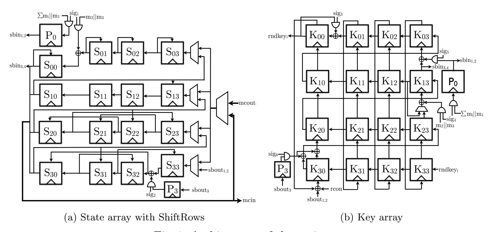
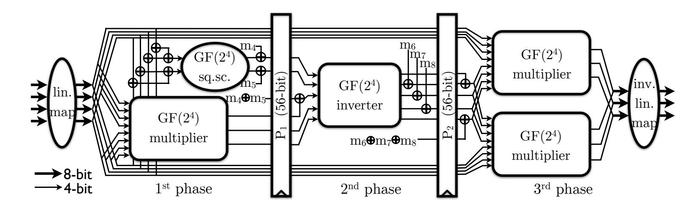
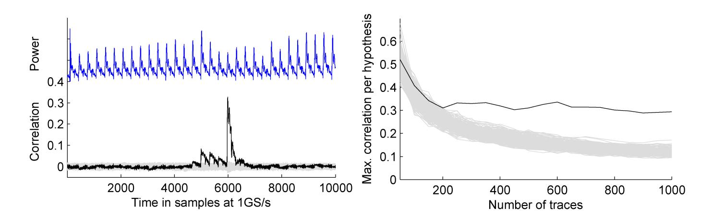
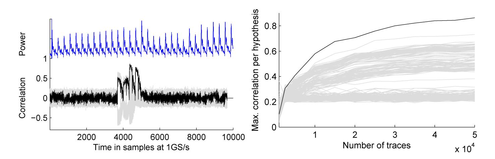
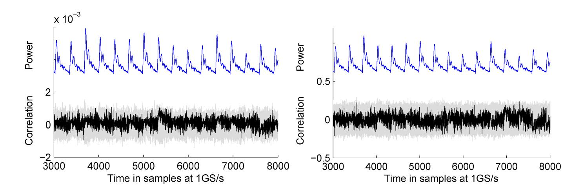
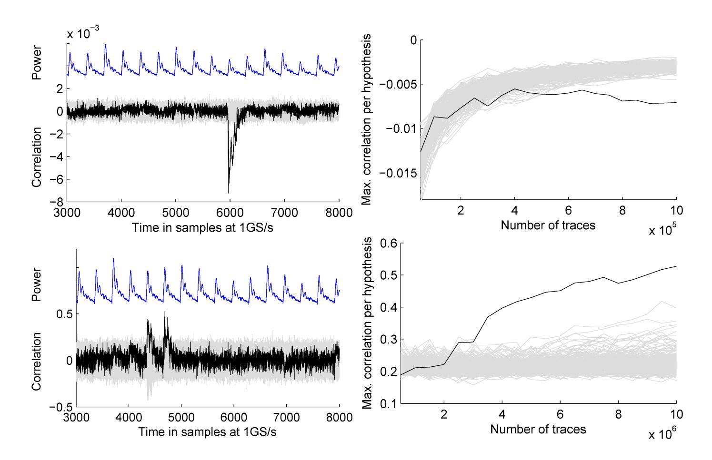
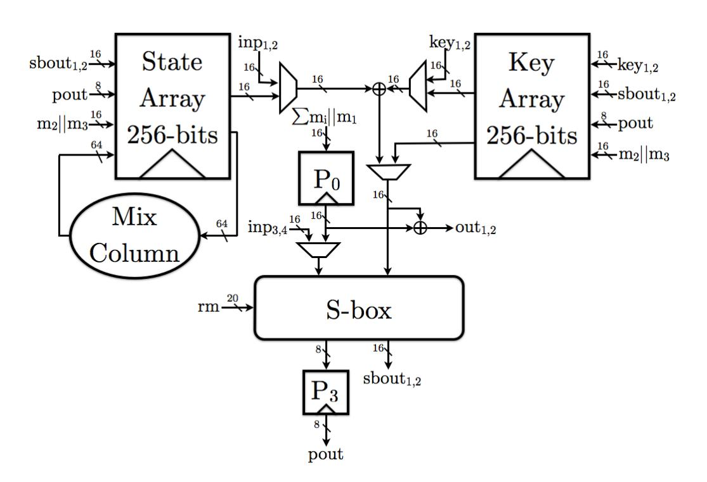
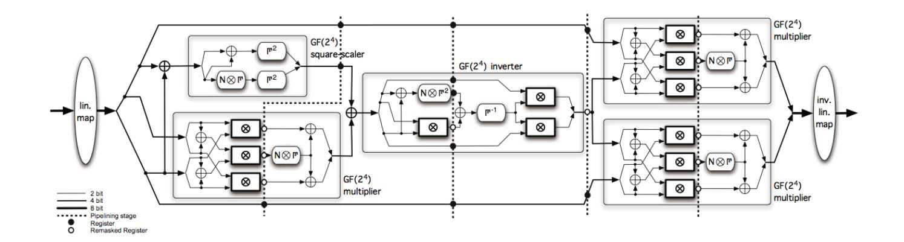
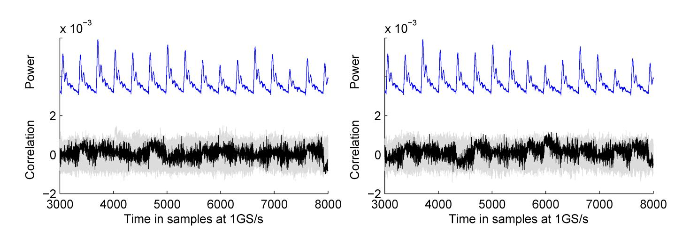

{0}------------------------------------------------

# A More Efficient AES Threshold Implementation

Beg¨ul Bilgin1,<sup>2</sup> , Benedikt Gierlichs<sup>1</sup> , Svetla Nikova<sup>1</sup> , Ventzislav Nikov<sup>3</sup> , and Vincent Rijmen<sup>1</sup>

<sup>1</sup> KU Leuven, ESAT-COSIC and iMinds, Belgium {name.surname}@esat.kuleuven.be <sup>2</sup> University of Twente, EEMCS-DIES, The Netherlands <sup>3</sup> NXP Semiconductors, Belgium {name.surname}@nxp.com

Abstract. Threshold Implementations provide provable security against first-order power analysis attacks for hardware and software implementations. Like masking, the approach relies on secret sharing but it differs in the implementation of logic functions. At Eurocrypt 2011 Moradi et al. published the to date most compact Threshold Implementation of AES-128 encryption. Their work shows that the number of required random bits may be an additional evaluation criterion, next to area and speed. We present a new Threshold Implementation of AES-128 encryption that is 18% smaller, 7.5% faster and that requires 8% less random bits than the implementation from Eurocrypt 2011. In addition, we provide results of a practical security evaluation based on real power traces in adversary-friendly conditions. They confirm the first-order attack resistance of our implementation and show good resistance against higher-order attacks.

Keywords: Threshold Implementation, First-order DPA, Glitches, Sharing, AES, S-box

## 1 Introduction

Embedded devices seem to be easily protected by modern ciphers in a black-box scenario. However, in the late 90s [10] the security of such devices has been shown to depend on the algorithm implementation. During the computation of an algorithm the device leaks information. Side channel attacks (SCA) are among the most relevant threats for the security of implementations of cryptographic algorithms. Certain countermeasures aim at introducing noise in the side channel, e.g. random delays, random order execution, dummy operations, etc., while masking conceals all sensitive intermediate values of a computation with random data and allows one to formally argue the security such a protection provides. Different masking schemes, like additive [8,9] and multiplicative [14], have been proposed in order to provide security against differential power analysis (DPA) attacks. However, it was shown [11,12,17] that masking can still be vulnerable to first-order DPA due to the presence of glitches in hardware implementations. One can try to eliminate the security relevant glitches by carefully balancing signal propagation delays, but this requires expertise, time, iterations of design and testing, and hence is expensive. As an alternative, new masking schemes have been developed that provide provable security even if glitches occur. In 2006 Nikova et al. proposed such a scheme called Threshold Implementation (TI) [19]. It is based on secret-sharing and provably secure against first-order DPA [20]. In 2012 Prouff and Roche proposed an other such scheme [24], based on Shamir's secret sharing, for which they claim security even against higher-order attacks. It is a general method that replaces every field multiplication by 4d <sup>3</sup> field multiplications and 4d <sup>3</sup> additions, using 2d <sup>2</sup> bytes of randomness. In some cases this may prove too costly or inefficient. And a recent result has shown that the multivariate leakages can be exploitable in univariate attacks [16].

{1}------------------------------------------------

Related Work. The Threshold Implementation technique is based on a specific type of multi-party computation and applies boolean masking. Interesting properties of the technique are that it provides provable security against first-order side-channel attacks, that it requires few assumptions on the hardware leakage behavior, and that it allows to construct realistic-size circuits without intervention and design iterations. However, threshold implementations can still be broken by univariate mutual information analysis (MIA) [2,20] or univariate higher-order attacks [15].

It has been shown that all 3 × 3, 4 × 4 and the DES 6 × 4 S-boxes have a TI sharing with 3, 4 or 5 shares [5]. The TI approach has been applied to only few entire algorithms: PRESENT [21], AES [18] and Keccak [3]. In AES, the S-box is the by far most challenging part to share. Moradi et al. [18] have proposed a TI of this S-box that constantly uses 3 shares based on the tower field approach.

Contribution. We propose a more compact and faster Threshold Implementation of AES-128 encryption that requires less random bits compared to the one by Moradi et al. from Eurocrypt 2011. For the S-box we use the tower field approach over GF(2<sup>4</sup> ) and for each block in the S-box computation we adapt the number of shares. This reduces the area by 13% and the clock cycles by 40%. However, our main focus is to optimize not only the S-box but the whole cipher. Our implementation of AES is 18% smaller, 7.5% faster and requires 8% less random bits than the implementation from Eurocrypt 2011. We investigate the uniformity problem and the need for re-masking in more detail. We prove that under certain circumstances, it is enough to re-mask only a fraction of the shares. We evaluate the security of our implementation against first and higher-order attacks using real power traces in adversary-friendly conditions. The results confirm that it provides the theoretically guaranteed first-order attack resistance and show good security against higher-order attacks.

## 2 Threshold Implementation

TIs use sharings with the following properties: correctness, incompleteness and uniformity. The last property is often the most difficult to achieve, and the most costly in terms of hardware area. However, one can propose implementations where not every function satisfies the property of uniformity and fresh randomness is used instead to do a remasking. In this section, we recall the TI properties and describe how circuit complexity can be traded off for fresh random bits.

#### 2.1 Notation and Definitions

We denote by upper-case characters stochastic variables, and by lower-case characters the values they can take, i.e. elements of a finite field. Let X, taking values in F <sup>m</sup>, denote the input of the (unshared) function f. A masking takes as inputs a value x and some auxiliary values (random masks), and outputs a vector (x1, x2, . . . , xs<sup>x</sup> ) such that the XOR-sum of the s<sup>x</sup> shares equals x. For all values x with Pr(X = x) > 0, let Sh(x) denote the set of valid share vectors (x1, x2, . . . , xs<sup>x</sup> ) for x:

$$Sh(x) = \{(x_1, x_2, \dots, x_{s_x}) \in \mathcal{F}^{ms_x} \mid x_1 + x_2 + \dots + x_{s_x} = x\}.$$

Pr((X1, X2, . . . , Xs<sup>x</sup> ) = (x1, x2, . . . , xs<sup>x</sup> )|X = x) denotes the probability that (X1, X2, . . . , Xs<sup>x</sup> ) = (x1, x2, . . . , xs<sup>x</sup> ) when the first input of the masking equals x, taken over all auxiliary

{2}------------------------------------------------

inputs of the masking. Similarly, we denote the output Y , taking values in F n , and (y1, y2, . . . , ys<sup>y</sup> ), Sh(y). Let F denote the vector function with input (X1, X2, . . . , Xs<sup>x</sup> ) and output (Y1, Y2, . . . , Ys<sup>y</sup> ); we will call it a sharing. TIs, like most other masking schemes, require that the masking is uniform, in the sense of the following definition.

Definition 1 (Uniform masking). A masking is uniform if and only if there exists a constant p such that for all x we have:

$$\Pr((X_1, X_2, \dots, X_{s_x}) = (x_1, x_2, \dots, x_{s_x}) | X = x) = p \text{ if } (x_1, x_2, \dots, x_{s_x}) \in Sh(x),$$

else it is 0.

In words, we call a masking uniform if for each value x of the variable X, the corresponding vectors with masked values occur with the same probability. Straightforward computation shows that this probability p = 2−m(sx−1) .

Threshold implementations use sharings that satisfy the following properties. Firstly, the sharing F of f needs to be correct:

$$\forall y \in \mathcal{F}^n, \forall (x_1, x_2, \dots, x_{s_x}) \in \operatorname{Sh}(x), \forall (y_1, y_2, \dots, y_{s_y}) \in \operatorname{Sh}(y) :$$
$$F(x_1, x_2, \dots, x_{s_x}) = (y_1, y_2, \dots, y_{s_y}) \Leftrightarrow f(x) = y.$$

Secondly, the sharing needs to be incomplete: every component function of F should be independent of at least one share X<sup>i</sup> . The third property is uniformity of the sharing. Although the main point of this section is that also sharings which do not satisfy the third property can be used in threshold implementations, we provide the definition already now.

Definition 2 (Uniform sharing). The sharing F of f is uniform if and only if

$$\forall x \in \mathcal{F}^m, \forall y \in \mathcal{F}^n \text{ with } f(x) = y, \forall (y_1, y_2, \dots, y_{s_y}) \in \operatorname{Sh}(y) :$$

$$\left| \left\{ (x_1, x_2, \dots, x_{s_x}) \in \operatorname{Sh}(x) \middle| F(x_1, x_2, \dots, x_{s_x}) = (y_1, y_2, \dots, y_{s_y}) \right\} \right| = \frac{2^{m(s_x - 1)}}{2^{n(s_y - 1)}} .$$

It follows that a uniform sharing F is invertible if and only if f is invertible.

#### 2.2 Security from Correctness and Incompleteness

The security of threshold implementations against first-order side-channel attacks follows from two intuitively easy steps. If the masking is uniform and the sharing F is incomplete, then

- 1. any single component function of F does not get the information to determine the value of X (it does not know x), hence cannot leak any information on X, and
- 2. the expected value (average) of any leakage signal of an implementation of the sharing F, be it instantaneous or summed over an arbitrary period of time, is constant.

Note that the only assumption on the physical behavior of the hardware or software implementation of F that is needed for this reasoning, is that it should be possible to implement the component functions in such a way that they are each independent of one share of X. In other words, the cross-talk between implementations of different components should be negligible.

{3}------------------------------------------------

#### 2.3 Uniformity for the Cascaded and Parallel Functions

If the threshold implementation technique is used to protect cascaded functions, then extra measures need to be taken, such that the input for the next non-linear operation is again a uniform masking. A similar situation occurs when the threshold implementation technique is used to protect several functional blocks acting in parallel on (partially) the same inputs. This occurs for example in implementations of the AES S-box using the tower field approach. If no special care is taken, then "local uniformity" of the distributions of the inputs of the individual blocks will not lead to "global uniformity", i.e. for the joint distributions of the inputs of all blocks. For example, let f, g be two functions acting on the same input X. Then, even if F, G are uniform sharings, producing uniform Y = F(X) and Y <sup>0</sup> = G(X), this does not imply that (Y, Y <sup>0</sup> ) is uniform. Like with cascaded functions, if each of the parallel blocks satisfies the properties of correctness and incompleteness, there will be no leakage of signals within the parallel blocks, but the lack of uniformity in the joint distribution of the masking of the outputs can lead to information leakage if the outputs are combined as inputs to a next function.

We can take different types of actions to remedy this problem. We discuss here two alternatives. The first approach is to require uniformity of the sharing F (Definition 2). We can show that if the sharing is uniform and the masking of its input is uniform, then also the masking of its output is uniform. Hence there will be no leakage in further functions, provided that their sharings are correct and incomplete.

Theorem 1. If the masking of X is uniform and the sharing F is uniform, then the masking of Y = f(X), defined by (y1, y2, . . . , ys<sup>y</sup> ) = F(x1, x2, . . . , xs<sup>x</sup> ), is uniform.

The proof is omitted here to save space. Practice shows that adding the uniformity requirement to a sharing tends to blow up the mathematical complexity of the sharing, as well as the cost of implementation. In some applications, it might be better to consider an alternative remedy: re-masking as for example done by Moradi et al. [18]. Indeed, by adding new random masks to the shares, we can make the distribution uniform.

#### 2.4 Reducing the Randomness Used in a Re-masking Step

The following theorem allows to reduce the amount of random bits used by re-masking steps of threshold implementations: under certain circumstances, only a fraction of the shares needs to be re-masked.

Theorem 2. Let X be a Q-ary variable and let (X1, X2, . . . , Xs) be a sharing of X, where Pr(X<sup>1</sup> = x1, X<sup>2</sup> = x2, . . . , X<sup>s</sup> = xs|X 6= x<sup>1</sup> + x<sup>2</sup> + · · · xs) = 0 and Pr(X<sup>1</sup> = x1, . . . , X<sup>t</sup> = xt) = Q−<sup>t</sup> , ∀(x1, . . . , xt) for some t with 1 ≤ t ≤ s. Then the sharing (Y1, . . . , Ys), defined by Y<sup>i</sup> = X<sup>i</sup> for 1 ≤ i ≤ t and Y<sup>i</sup> = X<sup>i</sup> + R<sup>i</sup> for t < i ≤ s, is a uniform sharing for X, i.e.: Pr(Y<sup>1</sup> = y1, Y<sup>2</sup> = y2, . . . , Y<sup>s</sup> = ys|X = y<sup>1</sup> + y<sup>2</sup> + · · · ys) = Q1−<sup>s</sup> , provided that the Ri, i = t + 1, . . . , s − 1 are independently and uniformly distributed random Q-ary variables and that R<sup>s</sup> = −(Rt+1 + · · · + Rs−1).

Proof. We give here a sketch of the proof. We have:

$$Pr(Y_1 = y_1, ..., Y_s = y_s | X = y_1 + y_2 + ... y_s)$$

$$= Pr(Y_1 = y_1, ..., Y_t = y_t | X = y_1 + y_2 + ... y_s)$$

$$\cdot Pr(Y_{t+1} = y_{t+1}, ..., Y_s = y_s | X = y_1 + y_2 + ... y_s, Y_1 = y_1, ..., Y_t = y_t).$$
(1)

{4}------------------------------------------------

Since Y<sup>i</sup> = X<sup>i</sup> for 1 ≤ i ≤ t, the first factor equals Q−<sup>t</sup> . For the second factor we recall the definition of Yt+1to obtain that:

$$\Pr(Y_{t+1} = y_{t+1}) = \sum_{x_{t+1}} \Pr(X_{t+1} = x_{t+1}) \underbrace{\Pr(R_{t+1} = y_{t+1} - x_{t+1})}_{Q^{-1}}$$

The same holds for Yt+2, . . . , Ys−<sup>1</sup> and since the R<sup>i</sup> have independent distributions, we can equate the second factor of (1) to:

$$Q^{1-s-t} \sum_{x_{t+1},\dots,x_{s-1}} \Pr(X_{t+1} = x_{t+1},\dots,X_{s-1} = x_{s-1},Y_s = y_s | X = y_1 + \dots + y_s, X_1 = x_1,\dots,X_t = x_t).$$

.

Recalling the definition of Y<sup>s</sup> completes the proof. ut

Clearly, the extra randomness required by the re-masking approach in some cases may be a worse problem than the blow-up in gate count caused by the uniform sharing approach. The point that we want to stress here, however is the following.

Observation 1 An implementation that uses re-masking, does not need uniform sharings in order to resist first-order attacks.

By relinquishing the uniformity requirement, it is often possible to reduce the number of shares and the size of the implementation. This will be used in the next section in order to reduce the number of shares in the subblocks of the AES S-box and improve on the implementation of [18].

## 3 Implementations

In this section, we will discuss the new TI of AES in detail. We will first describe the general data flow of our implementation. Then we will introduce a new approach to apply the TI to the S-box of AES which is the only non-linear layer of the block cipher. We used ModelSim to verify the functionality of the proposed design and Synopsys Design Vision D-201-.03-SP4 with Faraday Standard Cell Library FSA0A C Generic Core, which is based on UMC 0.18µm GenericII Logic Process with 1.8V voltage, for synthesis. We will conclude this section by providing the performance of our design together with the comparison with the previous work in [18].

#### 3.1 General Data Flow

Our main goal in this implementation is to minimize the area and randomness overhead caused by the sharing for a more efficient implementation. To achieve this, we use a serial implementation as proposed in [18] which requires only one S-box instance and loads the plaintext and key byte-wise in column-wise order. Moreover, we adapt the number of shares used in each operation in the block cipher. That is, we use two shares which is the minimum number of shares possible for all the affine operations such as MixColumns or Key XOR and increase or decrease the number of shares when required for the non-linear layer. This can also be seen in Fig. 7 in Appendix A, as the key and the state registers are 256 bits implying the two shares. With this approach we already decrease a significant part of the register cost since one bit register costs 5.33 GE in our library.

The TI of the S-box, for which the details will be given in the following section, requires four input shares and 20 bits of randomness and outputs three shares. Therefore our initial

{5}------------------------------------------------



Fig. 1: Architecture of the registers.

sharing for the plaintext is also with four shares. The key is XORed to two of these shares before the S-box operation. After three clock cycles two of the output shares are written to the state register whereas one share is written to the register  $P_3$ . The data in  $P_3$  is merged with one of the shares after one clock cycle to be able to continue with two shares for the linear operations. In the following rounds, we increase the number of shares from two to four by using 24 bits of randomness one clock cycle before the S-box operation. We use  $P_0$  to store these extra two shares to achieve the non-completeness property of a proper TI. The registers  $P_0$  and  $P_3$  are used both for the round transformations and the key scheduling.

State Array (Fig. 1a) The state array consists of sixteen 16-bit registers each corresponding to the two shares of a byte in the state. From the first to the sixteenth clock cycle, the four input shares (first round) or the shares in the registers  $S_{00}$  and  $P_0$  (later rounds) are sent to the S-box module. The corresponding three output shares are written to the registers  $S_{33}$  and  $P_3$  and shifted to the left horizontally from the third to the eighteenth clock cycle. The signal sig<sub>2</sub> is active from the fourth to the nineteenth clock cycle. The Shift Rows operation is also completed in the nineteenth clock cycle with an irregular horizontal shift. In the next four clock-cycles, the data in the registers  $S_{00}$ ,  $S_{10}$ ,  $S_{20}$  and  $S_{30}$  are sent to MixColumns operation, the rest of the registers are shifted to the left horizontally and the output of the MixColumns operation is written to the registers  $S_{03}$ ,  $S_{13}$ ,  $S_{23}$  and  $S_{33}$ . The MixColumns operation is implemented column-wise as in [18] and with two shares working in parallel. The registers except  $S_{10}$ ,  $S_{11}$  and  $S_{12}$  are implemented as scan flip-flops (SFF) that are D-flip-flops (DFF) combined with 2-to-1 MUXes and can operate with two inputs to reduce the area since a single 2-to-1 MUX costs 3.33 GE in our library whereas one bit SFF costs 6.33 GE. One round of AES takes 23 clock cycles. The signal sig<sub>1</sub> is active for sixteen clock cycles, starting from the last clock-cycle of each round, for re-sharing.

**Key Array** (**Fig. 1b**) Similar to the state array, the key array also consists of sixteen 16-bit registers implemented as SFFs each corresponding to the two shares of a byte in the key schedule. The round key is inserted from the register  $K_{33}$  in the first sixteen clock cycles of each round. For the next three clock cycles, the registers except  $K_{03}$ ,  $K_{13}$ ,  $K_{23}$  and  $K_{33}$  are not clocked. The registers  $K_{03}$ ,  $K_{23}$  and  $K_{33}$  are also not clocked in the seventeenth

{6}------------------------------------------------

clock cycle. In that clock cycle, we increase the number of shares in the register  $K_{13}$ . In the following three clock cycles this re-sharing is done during the vertical shift from the register  $K_{23}$  to  $K_{13}$ . Hence the re-sharing signal  $sig_4$  is active from the seventeenth to the twentieth clock cycle. Signal  $sig_5$  is active from eighteenth to twenty first clock cycle to reduce the number of shares. The registers  $K_{03}$ ,  $K_{13}$ ,  $K_{23}$  and  $K_{33}$  are not clocked in the remaining two clock cycles of each round. We choose this way of irregular clocking to avoid using extra MUXes in our design. The S-box output is XORed to the data in  $K_{00}$  together with the round counter rcon in the last four clock cycles of each round. rcon is active only in the twentieth clock cycle and the number of shares are reduced in the output of the register  $K_{30}$ . Signal  $sig_3$  is active in the first sixteen clock cycles except the fourth, eighth, twelfth and sixteenth clock cycles. The roundkey is taken from the register  $K_{00}$ .

#### 3.2 TI of the AES S-box

The S-box (Fig. 2) is shared between the key schedule and the state update. In the first sixteen clock cycles, it gets its inputs from the state. The input is taken from the key array in clock cycles eighteen to twenty-one.



Fig. 2: The Sbox of our implementation.

The S-box implementation in [18], which can be observed in Appendix B, uses the tower field approach up to  $GF(2^2)$  for a smaller implementation. Therefore, the only non-linear operation is  $GF(2^2)$  multiplication which must be followed by registers to avoid first order leakages.

We also chose to use the tower field approach, however, we decided to go to  $GF(2^4)$  instead of  $GF(2^2)$ . With this approach, the  $GF(2^4)$  inverter can be seen as a four bit permutation and the  $GF(2^4)$  multiplier as a four bit multiplication both of which are well studied in [4]. Therefore, we can find uniform TIs for these non-linear blocks directly which implies using less fresh random bits. Moreover, with this approach the S-box calculation takes three clock cycles instead of five.

The multiplier in  $GF(2^4)$  is a combination of three multipliers in  $GF(2^2)$  and some XOR gates as given in [7,18]. The algebraic normal form of this multiplier is given in Appendix C.1. This multiplication can be shared uniformly as in Appendix C.3 with four input and three output shares and the required area is 625 GE without any optimization.

The  $GF(2^4)$  inverter, on the other hand, is a combination of three  $GF(2^2)$  multiplications, one  $GF(2^2)$  inversion and some XOR gates (formula in Appendix C.2). To have a uniform sharing for this function, which belongs to class  $\mathcal{C}_{282}^4$  [5], we consider two options. Either using four shares which is the minimum number of shares necessary for a

{7}------------------------------------------------

uniform implementation in that class and decomposing the function into three uniform sub-functions as Inv(x) = F(G(H(x))), or using five shares without any decomposition. Our experiments show that both versions have similar area requirements but a different number of clock cycles. To reduce the number of cycles, we chose the version with five shares, with the formula in Appendix C.4, which requires 618 GE. The sharing for this module is found by using the method described in [20] which is slightly different from the direct sharing [5]. We chose this formula since it can be implemented with less logic gates in hardware compared to the direct sharing.

Even though it is enough to use only two shares for linear operations, we sometimes chose to work on more than two shares to avoid the need for extra random bits. The linear map operates on four shares since the multiplication needs four input shares. The inverter requires five input shares and the multiplication outputs only three shares, therefore we use two shares for the square scalar to have five shares in the beginning of the second phase. We use three shares for the inverse linear map since the multiplication outputs three shares.

Combining the sub-blocks. During this process we face two challenges. One is to keep the uniformity in the pipeline registers as the sub-blocks are combined. That is a challenge Moradi et al. also faced and solved with re-masking. We also apply re-masking in the 2nd phase where we combine the 2 output shares of the square scaler and the 3 output shares of the multiplier to 5 shares. We must note that this combination also acts as the XOR of the output of the square scaler and multiplier in the unshared case. By theorem 2, it is enough to re-mask the output shares only for one function to achieve uniformity. We choose to re-mask the output of the square scaler since it operates on less shares hence requires less random bits. The correction mask, i.e. XOR of the masks, is XORed to one of the output shares of the multiplier to achieve correctness and non-completeness.

The second challenge is to keep the uniformity as we increase or decrease the number of shares. This is achieved by introducing new masks before the S-box operation to increase from two to four shares and at the end of the second phase to decrease from five to four shares. The output of the third phase together with the decrease from three to two shares is not uniform. However, uniform input is important for the non-linear functions only and the re-sharing before the S-box makes the input uniform.

We always keep the XOR of the masks in the pipeline registers and complete the re-masking in the next clock cycle as in [18]. Overall, we need 44 bits of fresh random numbers per S-box operation which is less than what was required in [18].

#### 3.3 Performance

Like other countermeasures TIs require extra area and randomness. In this work we minimize these needs for a more efficient implementation. In Table 1, we show the area, randomness and timing requirements of our implementation and compare them with [18]. The area cost for the state and the key arrays include the ANDs and XORs that are in Fig. 1. An expected observation is that the cost of the state and key array together with the MixColumns is reduced by one third compared to [18] since we use two shares instead of three. The area cost of the S-box is a sum of the combinational logic in three phases and the registers required. For the three phases, we use four linear maps (each 42 GE), two square scalers (each 9 GE), three multipliers (each 625 GE), one inverter (618 GE), three inverse linear maps (each 33 GE) and some additional XORs for re-masking. The

{8}------------------------------------------------

Table 1: Synthesis results for different versions of AES TI.

|                               | State |             | Key S-box |             | MixCol Contr.1 |                    | Key MUX Other |    | Total        | cycles rand |       |
|-------------------------------|-------|-------------|-----------|-------------|----------------|--------------------|---------------|----|--------------|-------------|-------|
|                               |       | Array Array |           | Col         |                | XOR                |               |    |              |             | bits2 |
| [18]                          | 2529  | 2526        | 4244      | 1120        | 166            | 64                 | 376           | 89 | 11114/110313 | 266         | 48    |
| This paper                    | 1698  | 1890        | 3708      | 770         | 221            | 48                 | 746           | 21 | 9102         | 246         | 44    |
| This paper3 1698              |       | 1890        | 3003      | 544         | 221            | 48                 | 746           | 21 | 8171         | 246         | 44    |
| 1<br>including round constant |       |             |           | 2 per S-box |                | 3<br>compile ultra |               |    |              |             |       |

registers P<sup>0</sup> and P<sup>3</sup> are also counted in the cost of the S-box together with the pipelined registers P<sup>1</sup> and P2.

In this implementation, the S-box occupies 40% of the total area. When compared to the previous implementation by Moradi et al., the S-box is 13% smaller and the overall area is 18% smaller. Moreover it is faster and requires less randomness. The numbers provided in Table 1 are taken from the Synopsys tool with compile command. We use these numbers for a fair quantitative comparison. On the other hand, it is also possible to compile each function that is provided in Appendix C.3 and C.4 individually with the compile ultra command to let the tool optimize these functions and use the generated optimized descriptions of these functions. This reduces the cost of TI of AES to 8171 GE. However, the results for compile ultra mainly reflect how good the tools are at optimizing and a comparison may not be fair.

## 4 Power Analysis

To evaluate the security of our design in practice we implement it on a SASEBO-G board [1] using Xilinx ISE version 10.1. We use the "keep hierarchy" constraint to prevent the tools from optimizing over module boundaries (see the last paragraph of Sect. 2.2). The board features two Xilinx Virtex-II Pro FPGA devices: we implement the TI AES and a PRNG on the crypto FPGA (xc2vp7) while the control FPGA (xc2vp30) handles I/O with the measurement PC and other equipment. The PRNG that generates all random bits is implemented as AES-128 in CTR mode.

We measure the power consumption of the crypto FPGA during the first 1.5 rounds of TI AES as the voltage drop over a 1Ω resistor in the FPGA core GND line. The output of the passive probe is sampled with a Tektronix DPO 7254C digital oscilloscope at 1GS/s sampling rate.

Methodology. We define two main goals for our practical evaluation. First, we want to verify our implementation's resistance against first-order attacks. Second, we want to assess the level of security our implementation provides against other, e.g. higher-order, power analysis attacks.

Since there is no single, all-embracing test to evaluate the security of an implementation, we follow the approach of [18] and test its resistance against state-of-the-art attacks. We narrow the evaluation to univariate attacks because our implementation processes all shares of a value in parallel. Estimating the information-theoretic metric by Standaert et al. [25] is out of reach. It would require estimation of up to 2<sup>56</sup> Gaussian templates.

We make several choices that are in favor of an adversary and make attacks easier. First, to minimize algorithmic noise the PRNG and the TI AES do not operate in parallel, i.e. the PRNG generates and stores a sufficient number of random bits before each TI AES operation. In practice, running them in parallel will increase the level of noise and thus the number of measurements needed for an attack to succeed. Second, we provide the crypto 

{9}------------------------------------------------

FPGA with a stable 3MHz clock frequency to ensure that the traces are well aligned and the power peaks of adjacent clock cycles do not overlap (this would also help to assign a possibly identified leak to a specific clock cycle). In practice, clocking the device at a faster or unstable clock will make attacks harder. Note that the "combining effect" of the measurement setup or a faster clock described in [16] does not apply to our situation. In our implementation all shares are processed and leak at the same time, in contrast to the implementation analyzed in [16] where all shares are processed and leak separated in time. Hence we expect the effect to not ease an attack. Third, we let the adversary know the implementation. Specifically, if the PRNG was switched off the adversary would be able to correctly compute bit values and bit flips under the correct key hypothesis. In practice, obscurity is often used as an additional layer of security. Fourth, we use techniques described in [13] to achieve the best possible alignment of the traces.

PRNG switched off. To confirm that our setup works correctly and to get some reference values we first attack the implementation with the PRNG switched off. We expect that the implementation can be broken with many first-order attacks. As example, Fig. 3 shows the result of a correlation DPA attack [6] that uses the Hamming distance of two consecutive S-box outputs as power model. The attacks require 2 · 2 <sup>8</sup> key hypotheses. To reduce the computational complexity we let the adversary know one key byte and aim to recover the second one.



Fig. 3: Results of DPA attacks using HD model over 3/2/1 registers with PRNG off; left: correlation traces for all key hypotheses computed using 50 000 power traces, correct hypothesis in black, and a scaled power trace; right: max. correlation coefficient per key hypothesis (from the overall time span) over number of traces used.

Since the adversary knows the implementation, he can choose to compute the Hamming distance over three 8-bit registers (S<sup>33</sup> and P3; output of the S-box in three shares), two 8-bit registers (S32; one cycle later; two shares) or ignore the details and compute the distance over a single 8-bit register as if it was a plain implementation. The results for all three options are identical. This is a property of our implementation that vanishes when the PRNG is switched on. Only a few hundred traces are required to recover the key with one of these attacks. It is worth noticing that the highest correlation peak does not occur at the S-box output registers, but three resp. two clock cycles later when the bit-flips occur in register S30. This register drives the MixColumns logic and therefore has a much greater fanout.

Fig. 4 shows the result of a correlation collision attack [17] that targets combinational logic. The attack computes two sets of mean traces for the values of two processed plaintext bytes and shifts the mean traces in the time domain to align them. It aims to recover the 

{10}------------------------------------------------

linear difference between the two key bytes involved. To do so, it permutes one set of mean traces according to a hypothesis on the linear difference and then correlates both sets of mean traces. The result shows that this attack is successful with a few thousand measurements.



Fig. 4: Result of a correlation collision attack with PRNG off; left: correlation traces for all hypotheses on the linear difference computed using 50 000 power traces, correct hypothesis in black, and a scaled power trace; right: max. correlation coefficient per hypothesis on the linear difference (from the overall time span) over number of traces used.

PRNG switched on. Next we repeat the evaluation with the PRNG switched on. Fig. 5 and Fig. 9 in Appendix D show the results of the first-order attacks against the protected implementation using 10 million measurements. The results show that the attacks fail.



Fig. 5: Results of first-order DPA and correlation collision attacks with PRNG on computed using 10 million traces; left: HD over 1 register, right: correlation collision.

We proceed with higher-order attacks to assess the level of security our implementation provides. For our second-order DPA attacks we use the same power models as before but center and then square the traces (for each time sample) before correlating [8,23,26]. Second-order correlation collision attacks work as above with mean traces replaced by variance traces [15].

Fig. 6 (top) shows the results of the second-order DPA attack that uses the Hamming distance in a single register as power model (as if it was a plain implementation). The attack requires about 600 000 traces to succeed. We note that the highest correlation peak occurs again when the bitflips happen in register S30, cf. Fig. 3. Second-order DPA attacks using the other, intuitively more informative power models did unexpectedly fail to recover the key.

{11}------------------------------------------------

Fig. 6 (bottom) shows the results of the second-order correlation collision attack. The attack requires about 3.5 million traces to succeed. A third-order correlation collision attack works as above with mean traces replaced by skewness traces [15]. This attack fails using 10 million measurements.



Fig. 6: Results of second-order DPA (top) and correlation collision (bottom) attacks with PRNG on computed using 10 million traces; right: min./max. correlation coefficient per hypothesis (from the overall time span) over number of traces used.

Discussion. The first goal of our evaluation is to verify our implementation's resistance against first-order attacks. But this goal is always limited by the number of measurements at hand. It is simply not possible to demonstrate resistance against attacks with an infinite number of traces. However, we argue that for practical security a different criterion is more relevant: a first-order attack must not be the easiest attack vector. In other words, the job is done if a non-first-order attack becomes easier than a first-order attack. The second goal is to assess the level of security our implementation provides against such other attacks.

We have shown that our implementation resists state-of-the-art first-order attacks with 10 million traces in conditions that are strongly in favor of the adversary (no algorithmic noise from the PRNG, knowledge of the implementation, slow and stable clock, best possible alignment). In the same conditions, the most trace-efficient second-order attack in our evaluation requires about 600 000 traces.

We hence consider our implementation sufficiently secure against first-order attacks because the second-order attack is easier. Recall that our evaluation focuses on univariate attacks, so that the computational overhead is limited to estimating second-order moments and does not involve the notoriously more costly search over pairs of points in time. Regarding second-order attacks, it is well known that the number of traces required for an attack to succeed scales quadratically in the noise standard deviation [8,22]. Therefore, second-order attacks against our implementation in less favorable, i.e. more noisy, conditions will require many more traces.

{12}------------------------------------------------

It is tempting to compare the results of our evaluation to the results of the evaluation in [18]. However, not only the implementations but also the measurement platforms and the conditions differ, so that any difference must not be credited to an implementation alone. Already the numbers of traces required for attacks against the implementations with PRNG switched off differ by roughly two orders of magnitude. In addition, the analysis in [18] is limited to four clock cycles during the S-box computation.

## 5 Acknowledgement

This work has been supported in part by the Research Council of KU Leuven (OT/13/071), B. Bilgin was partially supported by the FWO project G0B4213N, V. Nikov was supported by the European Commission (FP7) within the Tamper Resistant Sensor Node (TAM-PRES) project with contract number 258754 and Benedikt Gierlichs is a Postdoctoral Fellow of the Research Foundation - Flanders (FWO).

## References

- 1. AIST. Side-channel Attack Standard Evaluation BOard. http://staff.aist.go.jp/akashi.satoh/ SASEBO/en/.
- 2. L. Batina, B. Gierlichs, E. Prouff, M. Rivain, F.-X. Standaert, and N. Veyrat-Charvillon. Mutual Information Analysis: a Comprehensive Study. J. Cryptol., 24(2):269–291, April 2011.
- 3. G. Bertoni, J. Daemen, M. Peeters, and G. Van Assche. Building power analysis resistant implementations of Keccak. Second SHA-3 candidate conference, August 2010.
- 4. B. Bilgin, S. Nikova, V. Nikov, V. Rijmen, and G. St¨utz. Threshold implementations of all 3 × 3 and 4 × 4 S-boxes. Cryptology ePrint Archive, http://eprint.iacr.org/.
- 5. B. Bilgin, S. Nikova, V. Nikov, V. Rijmen, and G. St¨utz. Threshold implementations of all 3 × 3 and 4 × 4 S-boxes. In CHES, volume 7428 of LNCS, pages 76–91. Springer, 2012.
- 6. E. Brier, C. Clavier, and F. Olivier. Correlation power analysis with a leakage model. In CHES, volume 3156 of LNCS, pages 16–29. Springer, 2004.
- 7. D. Canright. A very compact S-box for AES. In CHES, volume 3659 of LNCS, pages 441–455. Springer, 2005.
- 8. S. Chari, C. S. Jutla, J. R. Rao, and P. Rohatgi. Towards sound approaches to counteract poweranalysis attacks. In CRYPTO, volume 1666 of LNCS, pages 398–412. Springer, 1999.
- 9. L. Goubin and J. Patarin. DES and differential power analysis the "duplication" method. In CHES, volume 1717 of LNCS, pages 158–172. Springer, 1999.
- 10. P. C. Kocher, J. Jaffe, and B. Jun. Differential power analysis. In CRYPTO, volume 1666 of LNCS, pages 388–397. Springer, 1999.
- 11. S. Mangard, T. Popp, and B. M. Gammel. Side-channel leakage of masked CMOS gates. In CT-RSA, volume 3376 of LNCS, pages 351–365. Springer, 2005.
- 12. S. Mangard, N. Pramstaller, and E. Oswald. Successfully attacking masked AES hardware implementations. In CHES, volume 3659 of LNCS, pages 157–171. Springer, 2005.
- 13. T. S. Messerges. Power analysis attacks and countermeasures on cryptographic algorithms. PhD thesis, University of Illinois at Chicago, 2000.
- 14. T. S. Messerges. Securing the AES finalists against power analysis attacks. In Bruce Schneier, editor, FSE, volume 1978 of LNCS, pages 150–164. Springer, 2000.
- 15. A. Moradi. Statistical tools flavor side-channel collision attacks. In D. Pointcheval and T. Johansson, editors, EUROCRYPT, volume 7237 of LNCS, pages 428–445. Springer, 2012.
- 16. A. Moradi and O. Mischke. On the simplicity of converting leakages from multivariate to univariate - (case study of a glitch-resistant masking scheme). In G. Bertoni and J.-S. Coron, editors, CHES, volume 8086 of LNCS, pages 1–20. Springer, 2013.
- 17. A. Moradi, O. Mischke, and T. Eisenbarth. Correlation-enhanced power analysis collision attack. In CHES, volume 6225 of LNCS, pages 125–139. Springer, 2010.
- 18. A. Moradi, A. Poschmann, S. Ling, C. Paar, and H. Wang. Pushing the limits: A very compact and a threshold implementation of AES. In EUROCRYPT, volume 6632 of LNCS, pages 69–88. Springer, 2011.

{13}------------------------------------------------

- 19. S. Nikova, C. Rechberger, and V. Rijmen. Threshold implementations against side-channel attacks and glitches. In ICICS, volume 4307 of LNCS, pages 529–545. Springer, 2006.
- 20. S. Nikova, V. Rijmen, and M. Schl¨affer. Secure hardware implementation of nonlinear functions in the presence of glitches. J. Cryptology, 24(2):292–321, 2011.
- 21. A. Poschmann, A. Moradi, K. Khoo, C.-W. Lim, H. Wang, and S. Ling. Side-channel resistant crypto for less than 2300 GE. J. Cryptology, 24(2):322–345, 2011.
- 22. E. Prouff and M. Rivain. Masking against side-channel attacks: A formal security proof. In Thomas Johansson and Phong Q. Nguyen, editors, EUROCRYPT, volume 7881 of LNCS, pages 142–159. Springer, 2013.
- 23. E. Prouff, M. Rivain, and R. Bevan. Statistical analysis of second order differential power analysis. IEEE Trans. Computers, 58(6):799–811, 2009.
- 24. E. Prouff and T. Roche. Higher-order glitches free implementation of the AES using secure multi-party computation protocols. In CHES, volume 6917 of LNCS, pages 63–78. Springer, 2011.
- 25. F.-X. Standaert, T. Malkin, and M. Yung. A unified framework for the analysis of side-channel key recovery attacks. In Antoine Joux, editor, EUROCRYPT, volume 5479 of LNCS, pages 443–461. Springer, 2009.
- 26. J. Waddle and D. Wagner. Towards efficient second-order power analysis. In M. Joye and J.-J. Quisquater, editors, CHES, volume 3156 of LNCS, pages 1–15. Springer.

## A Architecture of the serialized TI of AES-128



Fig. 7: Architecture of the serialized TI of AES-128 .

## B Architecture of the AES S-box described in [18]

## C Equations

#### C.1 Multiplier in GF(2<sup>4</sup> )

$$(f_1, f_2, f_3, f_4) = (x_1, x_2, x_3, x_4) \times (x_5, x_6, x_7, x_8)$$

f<sup>1</sup> = x1x<sup>5</sup> ⊕ x3x<sup>5</sup> ⊕ x4x<sup>5</sup> ⊕ x2x<sup>6</sup> ⊕ x3x<sup>6</sup> ⊕ x1x<sup>7</sup> ⊕ x2x<sup>7</sup> ⊕ x3x<sup>7</sup> ⊕ x4x<sup>7</sup> ⊕ x1x<sup>8</sup> ⊕ x3x<sup>8</sup>

f<sup>2</sup> = x2x<sup>5</sup> ⊕ x3x<sup>5</sup> ⊕ x1x<sup>6</sup> ⊕ x2x<sup>6</sup> ⊕ x4x<sup>6</sup> ⊕ x1x<sup>7</sup> ⊕ x3x<sup>7</sup> ⊕ x2x<sup>8</sup> ⊕ x4x<sup>8</sup>

f<sup>3</sup> = x1x<sup>5</sup> ⊕ x2x<sup>5</sup> ⊕ x3x<sup>5</sup> ⊕ x4x<sup>5</sup> ⊕ x1x<sup>6</sup> ⊕ x3x<sup>6</sup> ⊕ x1x<sup>7</sup> ⊕ x2x<sup>7</sup> ⊕ x3x<sup>7</sup> ⊕ x1x<sup>8</sup> ⊕ x4x<sup>8</sup>

f<sup>4</sup> = x1x<sup>5</sup> ⊕ x3x<sup>5</sup> ⊕ x2x<sup>6</sup> ⊕ x4x<sup>6</sup> ⊕ x1x<sup>7</sup> ⊕ x4x<sup>7</sup> ⊕ x2x<sup>8</sup> ⊕ x3x<sup>8</sup> ⊕ x4x<sup>8</sup>

{14}------------------------------------------------



Fig. 8: Architecture of the AES S-box described in [18] .

#### C.2 Inverter in GF(2<sup>4</sup> )

$$(f_1, f_2, f_3, f_4) = Inv(x_1, x_2, x_3, x_4)$$

$$f_1 = x_3 \oplus x_4 \oplus x_1 x_3 \oplus x_2 x_3 \oplus x_2 x_3 x_4$$

$$f_2 = x_4 \oplus x_1 x_3 \oplus x_2 x_3 \oplus x_2 x_4 \oplus x_1 x_3 x_4$$

$$f_3 = x_1 \oplus x_2 \oplus x_1 x_3 \oplus x_1 x_4 \oplus x_2 x_2 x_4$$

$$f_4 = x_2 \oplus x_1 x_3 \oplus x_1 x_4 \oplus x_2 x_4 \oplus x_1 x_2 x_3$$

#### C.3 Sharing Multiplier in GF(2<sup>4</sup> ) with 4 Input 3 Output Shares

$$f = xy$$
, where  $f = f_1 \oplus f_2 \oplus f_3$   $x = x_1 \oplus x_2 \oplus x_3 \oplus x_4$   $y = y_1 \oplus y_2 \oplus y_3 \oplus y_4$ 

$$f_1 = (x_2 \oplus x_3 \oplus x_4)(y_2 \oplus y_3) \oplus y_4$$

$$f_2 = ((x_1 \oplus x_3)(y_1 \oplus y_4)) \oplus x_1 y_3 \oplus x_4$$

$$f_3 = ((x_2 \oplus x_4)(y_1 \oplus y_4)) \oplus x_1 y_2 \oplus x_4 \oplus y_4$$

#### C.4 Sharing Inverter in GF(2<sup>4</sup> ) with 5 Input 5 Output Shares

$$f = xyz \oplus xy \oplus z$$
, where  $f = f_1 \oplus f_2 \oplus f_3 \oplus f_4$   $x = x_1 \oplus x_2 \oplus x_3 \oplus x_4 \oplus x_5$   $y = y_1 \oplus y_2 \oplus y_3 \oplus y_4 \oplus y_5$   $z = z_1 \oplus z_2 \oplus z_3 \oplus z_4 \oplus z_5$ 

{15}------------------------------------------------

```
f1 = ((x2 ⊕ x3 ⊕ x4 ⊕ x5)(y2 ⊕ y3 ⊕ y4 ⊕ y5)(z2 ⊕ z3 ⊕ z4 ⊕ z5))
  ⊕ ((x2 ⊕ x3 ⊕ x4 ⊕ x5)(y2 ⊕ y3 ⊕ y4 ⊕ y5)) ⊕ z2
f2 = (x1(y3 ⊕ y4 ⊕ y5)(z3 ⊕ z4 ⊕ z5) ⊕ y1(x3 ⊕ x4 ⊕ x5)(z3 ⊕ z4 ⊕ z5)
  ⊕ z1(x3 ⊕ x4 ⊕ x5)(y3 ⊕ y4 ⊕ y5) ⊕ x1y1(z3 ⊕ z4 ⊕ z5) ⊕ x1z1(y3 ⊕ y4 ⊕ y5)
  ⊕ y1z1(x3 ⊕ x4 ⊕ x5) ⊕ x1y1z1) ⊕ (x1(y3 ⊕ y4 ⊕ y5) ⊕ y1(x3 ⊕ x4 ⊕ x5) ⊕ x1y1) ⊕ z3
f3 = (x1y1z2 ⊕ x1y2z1 ⊕ x2y1x1 ⊕ x1y2z2 ⊕ x2y1z2 ⊕ x2y2z1 ⊕ x1y2z4 ⊕ x2y1z4 ⊕ x1y4z2
  ⊕ x2y4z1 ⊕ x4y1z2 ⊕ x4y2z1 ⊕ x1y2z5 ⊕ x2y1z5 ⊕ x1y5z2 ⊕ x2y5z1 ⊕ x5y1z2 ⊕ x5y2z1)
  ⊕ (x1y2 ⊕ y1x2) ⊕ z4
f4 = (x1y2z3 ⊕ x1y3z2 ⊕ x2y1z3 ⊕ x2y3z1 ⊕ x3y1z2 ⊕ x3y2z1) ⊕ 0 ⊕ z5
f5 = 0 ⊕ 0 ⊕ z1
```

{16}------------------------------------------------

## D Plots of Power Analysis Attacks



Fig. 9: Results of first-order DPA attacks with PRNG on computed using 10 million traces; left: HD over 2 registers, right: HD over 3 registers.