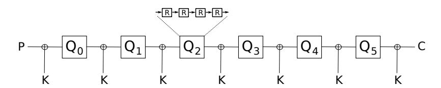
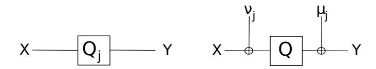
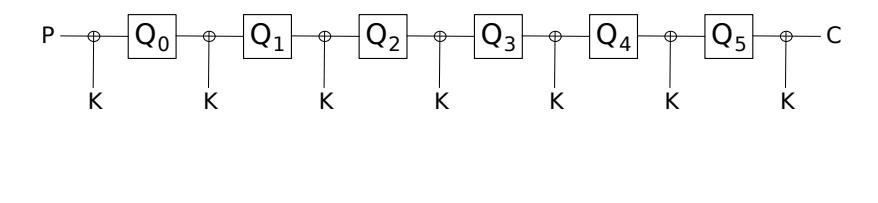
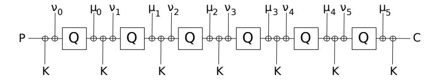
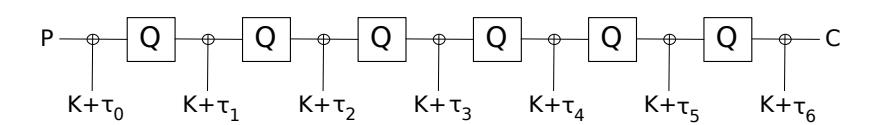
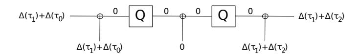
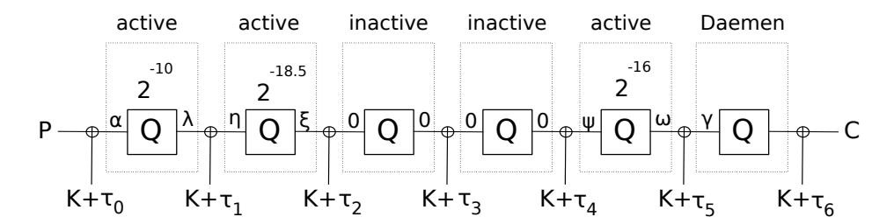

# Cryptanalysis of Zorro

Jian Guo, Ivica Nikoli´c, Thomas Peyrin, and Lei Wang

Nanyang Technological University, Singapore ntu.guo@gmail.com, {inikolic,thomas.peyrin, wang.lei}@ntu.edu.sg

Abstract. At CHES 2013 was presented a new block cipher called Zorro. Although it uses only 4 S-boxes per round, the designers showed the resistance of the cipher against various attacks, and concluded the cipher has a large security margin. In this paper, we give a key recovery attack on the full cipher in the single-key model that works for 264 out of 2128 keys. Our analysis is based precisely on the fact that the non-linear layer has only 4 S-boxes. We exploit this twice in a two-stage attack: first, we show that Zorro has an equivalent description that does not have constants in the rounds, and then, we launch an internal differential attack on the newly described cipher. With computer verifications we confirm the correctness of the analysis. Our attack is the first to use internal differentials for block ciphers, thus we adapt Daemen's attack on Even-Mansour construction to the case of internal differentials (instead of differentials), which allows us to recovery to full key.

This work provides as well insights on alternative descriptions of general Zorro-type ciphers (incomplete non-linear layers), the importance of well chosen constants, and the advantages of Daemen's attack.

Keywords: Zorro, cryptanalysis, block cipher, internal differentials

# 1 Introduction

The Advanced Encryption Standard (AES) is the current de facto block cipher standard, known for its elegant and simple design, high security, and efficiency. More than a decade ago, these features motivated NIST to chose the cipher as a standard, and even now, most of the design decisions of AES are considered optimal from the point of view of both efficiency and security. The advances in the field of cryptography, however, suggest that some peculiar details of the design can be improved. One research direction emerged after the discovery of the related-key attacks on AES-192 and AES-256 [2, 1], and to make the cipher secure in the related-key model, patches of the key schedule were proposed [3, 13]. Another line of research focuses on countermeasures for preventing side-channel attacks on the cipher, and investigates tweaks of the non-linear operations in the cipher that lead to efficient masking methods.

In this paper, we analyze the security of the block cipher Zorro published at CHES'13 [7], designed by G´erard, Grosso, Naya-Plasencia, and Standaert, and proposed to improve the side-channel resistance of AES. The main tweak introduced by Zorro is in the non-linear layer (SubBytes) of AES, and includes defining a new S-box and reducing the application of the S-box per round, from 16 to only 4. The remaining tweaks include increasing the number of rounds from 10 to 24, reordering the round transformations, moving the constants from the key schedule to the rounds, and simplifying the key schedule by adding the master key only after each 4 rounds (as in the block cipher LED-64 [8]).

How risky is the new design? A round of Zorro is very similar to a round of AES, except that is has only 4 S-boxes. Thus the 24-round Zorro compared to the 10-round AES, has 40% less non-linear operations, but 140% more linear. This tradeoff does not provide an actual proof of security and therefore in the submission paper the designers address the main security concerns and give an extensive analysis of Zorro. They stress that, due to the intended use of the cipher, related-key attacks are of no interest. In the single-key model they require full 128-bit security and thus provide rigorous analysis against various attacks: differential, linear, meet-in-the-middle, impossible differential, etc. Interestingly, due to the modified SubBytes, the designers cannot use the simple bounds on number of active S-boxes in linear and differential characteristics, and instead, they come up with a dedicated approach, and successfully prove that no characteristic suitable for attacks exists on more then 14-16 rounds of Zorro. The best found attacks, in both the secret and the open key models, reach only 12 rounds, which allows the designers to conclude that the 24-round Zorro has comfortable security margin.

Our contribution. We present a key-recovery attack on the full 24-round cipher in the single-key model that works for a fraction of the keys (for 264 keys out of 2128 possible). Our attack model and the results of the analysis are similar to Leander et al. [11] attack published at CRYPTO'11 on the lightweight cipher PRINTcipher [10]: both are single-key attacks on the full ciphers under the weak-key assumption. However, the attack techniques are completely different. Our attack is based on the idea of redefining the block cipher and then launching internal differential attack [14] – these two steps can be achieved only due to the new S-box layer.

We show a surprising feature of Zorro: the cipher has another, equivalent description, with constants added not in the rounds, but to the keys. We obtain the new description first for a single step (defined as four rounds), and then for the whole cipher. For the step, we put side by side four rounds with and without constants, and show that a specifically chosen difference at the input of these two steps, deterministically propagates to another difference at the output. The 16 bytes of the input difference are the solution of a linear system of 16 equations – each equation corresponds to one condition on an intermediate byte difference, imposed by one of the 16 S-boxes contained in a step. It means that one step described as in Zorro, can be seen as a step that has no constants in the rounds, if we add one value to the input and one at the output of the step (the values are indeed the above input and the output differences, and are constant). We elevate this new description to the whole cipher, by merging two consecutive values and moving them to the key (which now becomes a subkey) that is added between the steps.

By the new description, a round of Zorro has no constants, thus same as a round of AES or any other cipher with three arbitrarily defined S-box, ShiftRows, MixColumns, maintains the following property: if at the input of the round the two halves (the first two columns and the last two columns) of the state are equal, then they will be equal at the output as well. We model this property as internal differential characteristic [14] that holds with probability 1, and try to extended it to as many rounds as possible. But after each four rounds (a step) we have the addition of a subkey, which may or may not permit the free flow of the characteristic. Thus we use three different strategies to pass the steps: in the first, we use the above probability 1 internal differential characteristic, in the second, lower probability characteristic, and in the third we apply a special technique, inspired by the attacks of Mendel et al. [12] on the cipher LED [8], and based on Daemen's attack [4] on Even-Mansour construction [6]. In optimal complexity attacks, it is beneficial to have more steps passed using the probability 1 characteristic, thus to achieve two such steps, we focus on the case when the secret key is chosen uniformly at random from a set of 264 keys, and provide key recovery attack on the full cipher in 254.3 time, data, and memory. We extensively verify the attack on a computer: in 228.5 time produce inputs conforming to the 20-round characteristic used in the attack, test and confirm the idea based on the Daemen's attack, and launch the whole attack on reduced-size Zorro-like cipher.

Fig. 1. A graphical view of Zorro. The cipher uses 6 steps (denoted as Q0, . . . , Q5) of 4 rounds each. The rounds differ only in the constants that are added to the state.

# 2 Description of Zorro

The block cipher Zorro has 128-bit key and 128-bit state. The cipher has 24 rounds divided into 6 steps of 4 rounds each. The steps do not use the key, and Zorro does not have a key schedule. Instead, before each step the master key is bitwisely added to the state, and the same addition is done after the last step. In Zorro, as in AES, the state is regarded as 4 × 4 matrix of bytes, and one round consists of four distinct transformations: SB∗ , AC, SR, MC. The first transformation SB∗ is the S-box layer (as SubBytes in AES) and consists of applying the same S-box to the bytes of the first row only. Next, AC is addition of round constants – in round i, the four constants (i, i, i, i << 3) are added to the four bytes of the top row. Finally, the last two transformations, SR and MC, are the AES's ShiftRows and MixColumns.

We omit the definition of the S-box used in Zorro (it is different from the one of AES), and refer the interested reader to [7].

# 3 Internal Differentials and the Equivalent Description of Zorro

The designers analyze the cipher against various attacks and their approach follows the standard routine of providing the required initial trust in the security of the cipher. This routine consists of analyzing the cipher against all attacks that might threaten the security.

The evaluation, however, lacks the analysis against one particular attack technique: internal differentials[14]. Unlike differential analysis which follows the propagation of a difference between two states, internal differentials follow the propagation of a difference between the two halves of the state. If the state transformations in the two halves are (almost) identical, then the attacker can construct an internal differential characteristic. One simple approach to prevent internal differentials is to use different constants in the two halves. In fact, this is the case of Zorro: in each round i, in the first half the constants i, i are used, while in the second i, i ≪ 3. Therefore, it seems that Zorro, along with the rest of the ciphers that use different constants in the halves, easily resists this type of attack.

But what happens if there are no such constants? Let us focus on one round of Zorro, where the transformation AC is removed, and the two halves of the state are equal. Then:

$$\begin{pmatrix} a & e & a & e \\ b & f & b & f \\ c & g & c & g \\ d & h & d & h \end{pmatrix} \xrightarrow{SB*} \begin{pmatrix} a' & e' & a' & e' \\ b & f & b & f \\ c & g & c & g \\ d & h & d & h \end{pmatrix} \xrightarrow{SR} \begin{pmatrix} a' & e' & a' & e' \\ f & b & f & b \\ c & g & c & g \\ h & d & h & d \end{pmatrix} \xrightarrow{MC} \begin{pmatrix} p & x & p & x \\ q & t & q & t \\ r & u & r & u \\ s & v & s & v \end{pmatrix}.$$

Therefore, after one round, we end up with a state that again has two equal halves. By elevating the above property to the whole cipher, we obtain that if the plaintext and the key have two equal halves, then the ciphertext will have as well two equal halves. This is to say that the internal differential characteristic with no difference in the plaintext, in the key, and in the ciphertext, has probability 11 .

The above characteristic looks attractive for attacks, but the round constants (the transformation AC) should prevent such characteristics. However, Zorro has an equivalent description that has no constants in the rounds. To explain how to obtain such description, let us focus on one step of Zorro. Assume we are dealing with the j-th step denoted as Qj (then the six steps of Zorro are Q0, . . . , Q5) composed of four rounds. This step is a public permutation, i.e. we do not take the key additions as part of the step. In parallel to Qj we put the public permutation Q, composed of the same four rounds, but with round constants removed2 . Our analysis shows that there is a relation between Qj and Q (see Fig. 2), described in the following lemma:

Lemma 1. For any j = 0, . . . , 5, and a plaintext P, it holds:

$$Q_j(P) = Q(P \oplus \nu_j) \oplus \mu_j,$$

where νj , µj are two 128-bit values that depend on the round constants used in Qj .

Proof. Let X be the input to Qj , and Y = X ⊕D be the input to Q, that is, the inputs are related by the difference D. We propagate D through four rounds, and show how to define D such that for any choice of X, the difference Qj (X)⊕Q(X ⊕D) is constant (equals µj ). It means we want to find a differential characteristic on four rounds, with input difference D, that holds with probability 1. This can be achieved only when there is no difference in the bytes at the input of the non-linear operations. Such operations are the four S-boxes applied to the four bytes of the top row in each of the four rounds. Therefore we have conditions on 16 bytes (4 S-boxes × 4 rounds). Note, if there is no difference coming into the S-boxes, as the rest of the round transformations are linear, the above 16 conditions can be expressed as a linear system of equations in the 16 unknown bytes of D. Let us obtain the system. Let di,j , i = 1, . . . , 4, j = 1, . . . , 4 be the byte in the i-th row, j-th

Fig. 2. The equivalent definitions of the step Qj of Zorro.

column of D, and c i j , i = 1, . . . , 4, j = 1, . . . , 4 be the constant used in the i-th round of the j-th byte in the top row. Recall that the round transformations follow the sequence SB∗ , AC, SR, MC. As the round starts with SB∗ , and we want no difference in the bytes of the top row, the four conditions in the first round result in

$$d_{1,1} = 0, d_{1,2} = 0, d_{1,3} = 0, d_{1,4} = 0.$$

The remaining transformations of the round are linear

1 Although is looks trivial (no difference goes to no difference), for internal differentials this is rarely the case due to the different constants that are added to the two parts of the state.

2 It means a round of Q consists of SB∗ , SR, MC.

$$\begin{pmatrix} 0 & 0 & 0 & 0 & 0 \\ d_{2,1} & d_{2,2} & d_{2,3} & d_{2,4} \\ d_{3,1} & d_{3,2} & d_{3,3} & d_{3,4} \\ d_{4,1} & d_{4,2} & d_{4,3} & d_{4,4} \end{pmatrix} \xrightarrow{AC} \begin{pmatrix} c_1^1 & c_2^1 & c_3^1 & c_4^1 \\ d_{2,1} & d_{2,2} & d_{2,3} & d_{2,4} \\ d_{3,1} & d_{3,2} & d_{3,3} & d_{3,4} \\ d_{4,1} & d_{4,2} & d_{4,3} & d_{4,4} \end{pmatrix} \xrightarrow{SR} \begin{pmatrix} c_1^1 & c_2^1 & c_3^1 & c_4^1 \\ d_{2,2} & d_{2,3} & d_{2,4} & d_{2,1} \\ d_{3,3} & d_{3,4} & d_{3,1} & d_{3,2} \\ d_{4,4} & d_{4,1} & d_{4,2} & d_{4,3} \end{pmatrix} \xrightarrow{MC}$$

$$\begin{pmatrix} 2c_1^1 + 3d_{2,2} + d_{3,3} + d_{4,4} & 2c_2^1 + 3d_{2,3} + d_{3,4} + d_{4,1} & 2c_3^1 + 3d_{2,4} + d_{3,1} + d_{4,2} & 2c_4^1 + 3d_{2,1} + d_{3,2} + d_{4,3} \\ c_1^1 + 2d_{2,2} + 3d_{3,3} + d_{4,4} & c_2^1 + 2d_{2,3} + 3d_{3,4} + d_{4,1} & c_3^1 + 2d_{2,4} + 3d_{3,1} + d_{4,2} & c_4^1 + 2d_{2,1} + 3d_{3,2} + d_{4,3} \\ c_1^1 + d_{2,2} + 2d_{3,3} + 3d_{4,4} & c_2^1 + d_{2,3} + 2d_{3,4} + 3d_{4,1} & c_3^1 + d_{2,4} + 2d_{3,1} + 3d_{4,2} & c_4^1 + d_{2,1} + 2d_{3,2} + 3d_{4,3} \\ 2c_1^1 + d_{2,2} + d_{3,3} + 2d_{4,4} & 2c_2^1 + d_{2,3} + d_{3,4} + 2d_{4,1} & 2c_3^1 + d_{2,4} + d_{3,1} + 2d_{4,2} & 2c_4^1 + d_{2,1} + d_{3,2} + 2d_{4,3} \end{pmatrix}$$

As the output of the first round is the input to the second, the conditions for the top row in the second round are

$$3d_{2,2} + d_{3,3} + d_{4,4} = 2c_{1,3}^{1}$$
$$3d_{2,3} + d_{3,4} + d_{4,1} = 2c_{2,3}^{1}$$
$$3d_{2,4} + d_{3,1} + d_{4,2} = 2c_{3,3}^{1}$$
$$3d_{2,1} + d_{3,2} + d_{4,3} = 2c_{4,3}^{1}$$

Following this approach, we can obtain as well the remaining 8 equations from the third and the fourth rounds. The system of 12 equations in 12 unknown bytes of D (all but the one of the top row) has the form  $A \cdot \tilde{D} = b$ , with

$$A = \begin{pmatrix} 0 & 0 & 0 & 3 & 0 & 0 & 1 & 0 & 0 & 1 & 0 & 0 \\ 3 & 0 & 0 & 0 & 0 & 0 & 0 & 1 & 0 & 0 & 1 & 0 \\ 0 & 3 & 0 & 0 & 1 & 0 & 0 & 0 & 0 & 0 & 0 & 1 \\ 0 & 0 & 3 & 0 & 0 & 1 & 0 & 0 & 0 & 0 & 0 & 0 & 1 \\ 0 & 0 & 3 & 0 & 0 & 1 & 0 & 0 & 1 & 0 & 0 & 0 \\ 1 & 1 & 6 & 0 & 2 & 5 & 0 & 1 & 3 & 0 & 2 & 3 \\ 0 & 1 & 1 & 6 & 1 & 2 & 5 & 0 & 3 & 3 & 0 & 2 \\ 6 & 0 & 1 & 1 & 0 & 1 & 2 & 5 & 2 & 3 & 3 & 0 \\ 1 & 6 & 0 & 1 & 5 & 0 & 1 & 2 & 0 & 2 & 3 & 3 \\ 7 & 14 & 2 & 3 & 8 & 1 & 4 & 9 & 5 & 1 & 14 & 2 \\ 3 & 7 & 14 & 2 & 9 & 8 & 1 & 44 & 2 & 5 & 1 \\ 14 & 2 & 3 & 7 & 14 & 4 & 9 & 8 & 1 & 14 & 2 & 5 \end{pmatrix}, \qquad \tilde{D} = \begin{pmatrix} d_{2,1} \\ d_{2,2} \\ d_{2,3} \\ d_{3,1} \\ d_{3,2} \\ d_{3,3} \\ d_{3,4} \\ d_{4,1} \\ d_{4,2} \\ d_{4,3} \\ d_{4,4} \end{pmatrix}, \qquad b = \begin{pmatrix} 2c_1^1 \\ 2c_2^1 \\ 2c_3^1 \\ 2c_3^1 \\ 3c_2^2 \\ 3c_3^2 \\ 3c_3^2 \\ 5c_3^3 \\ 5c_4^3 \end{pmatrix}$$

The matrix A is non-singular, thus for any choice of b, exists a unique solution  $\tilde{D}$ . The 12 bytes of  $\tilde{D}$  are in fact the last three rows of  $\nu_j$ , while the first row is composed of zero bytes. The constants used in the fourth round do not have impact on the value of  $\nu_j$ , however they determine the value of  $\mu_j$ . The precise values of  $\nu_j$ ,  $\mu_j$  are given in Appendix A.

Remark 1. To show that one step of Zorro must have active S-boxes, in the submission paper [7] (Section 4.2 and Appendix I) was given an algorithm that in  $2^{32}$  time checks exhaustively all possible high probability characteristics. Our above approach used in the proof of the lemma provides the same result much faster. A 4-round differential characteristic has no active S-boxes only when the system  $A \cdot \tilde{D} = b$  has a trivial solution. Since b is a zero vector (unlike in the lemma where we compare  $Q_j$  and Q, in the case of differential characteristics we compare  $Q_j$  with  $Q_j$ , thus there is no difference between the constants and b is a zero vector), the only solution is trivial. Non-trivial solutions can be obtained if we allow one S-box to be active – then the (new) system is underdefined (11 equations

with 12 unknowns3). It means we can have differential characteristic  $\Delta_I \xrightarrow{2^{-4.67}} \Delta_O$  on one step, and thus related-key differential characteristic on the full cipher with  $2^{-28}$  and key difference  $\Delta_I \oplus \Delta_0$ . We do not pursue this research direction more extensively, as there is no claim of related-key resistance of Zorro.

Remark 2. Obviously, for any choice of the constants used in the four rounds, we can find appropriate  $\nu$  and  $\mu$ . Moreover, a step has an equivalent description even when in each round, the number of constants and their position is chosen arbitrary, i.e. it is not mandatory to have four constants added to the bytes of the top row.

From the lemma it follows that we can replace each  $Q_j$  with Q, if we add  $\nu_j$  to the input and  $\mu_j$  to the output. Let us combine the consecutive constants,  $\mu_{j-1}$  from the output of the previous step and  $\nu_j$  from the input to the next step, into one:

$$\tau_j = \mu_{j-1} \oplus \nu_j, j = 0, \dots, 6,$$

where  $\mu_{-1} = \nu_6 = 0$ . Then, Zorro can be described as (see Fig. 3):

$$Zorro_K(P) = Q_5(Q_4(Q_3(Q_2(Q_1(Q_0(K \oplus P) \oplus K) \oplus K) \oplus K) \oplus K) \oplus K) \oplus K) \oplus K$$

As a result of the equivalent description, it follows that the 6 steps are identical as they

**Fig. 3.** The equivalent definitions of **Zorro**. At the top is the standard definition provided by the designers. At the bottom is our equivalent definition.

do not have addition of constants, and only the subkeys  $K \oplus \tau_i$  are different.

In the sequel we analyze Zorro given with the new description, and present an internal differential attack on the cipher. With  $\Delta(X)$  we denote the 8-byte internal difference of the 16-byte state X:

&lt;sup>3 In fact it is 15 equations with 16 unknowns as we can take into account  $d_{1,1}, d_{1,2}, d_{1,3}, d_{1,4}$ .

$$X = \begin{pmatrix} x_{1,1} & x_{1,2} & x_{1,3} & x_{1,4} \\ x_{2,1} & x_{2,2} & x_{2,3} & x_{2,4} \\ x_{3,1} & x_{3,2} & x_{3,3} & x_{3,4} \\ x_{4,1} & x_{4,2} & x_{4,3} & x_{4,4} \end{pmatrix}, \qquad \Delta(X) = \begin{pmatrix} x_{1,1} \oplus x_{1,3} & x_{1,2} \oplus x_{1,4} \\ x_{2,1} \oplus x_{2,3} & x_{2,2} \oplus x_{2,4} \\ x_{3,1} \oplus x_{3,3} & x_{3,2} \oplus x_{3,4} \\ x_{4,1} \oplus x_{4,3} & x_{4,2} \oplus x_{4,4} \end{pmatrix}.$$

In the case when the internal difference in all 8 bytes is zero, we write simply 0, instead of the full form.

### 4 Techniques to Attack One Step of Zorro

Before presenting the actual attack, let us explore our options for attacking a single step Q of Zorro. We focus on three techniques, denoted as inactive, active, and Daemen, based on internal differentials.

# 4.1 Characteristic with probability 1 [inactive step]

The best way to attack one step is to use the internal differential characteristic 0 → 0 that has no input and no output difference, as input with two equal halves always results in an output with two equal halves. This characteristic holds with probability 1, and it is the only such high probability characteristic. The step where this characteristic is used, is called an inactive step.

### 4.2 Characteristic with active S-boxes [active step]

The second option is to use characteristic with input difference α 6= 0, that in four rounds of the step goes through active S-boxes4 . The maximal number of active S-boxes in any step characteristic is only 8 – this comes from the fact that we work with half states, and in each round only the top row (that consists of two bytes), goes through S-boxes. Hence, an internal differential characteristic on one step, with an arbitrary input difference α, has at most 8 active S-boxes and a probability of at least 2−8·7 = 2−56 .

It is important, however, for any starting α to find the best (highest probability) characteristic on one step and thus reduce the complexity of the attack. We search for the best characteristic by branching on the active S-boxes. That is, we build a search tree, the root being the input difference α, propagate the difference, and each time we have an S-box with input byte difference, we try all possible output differences – on average, there are 26.67 differences. To speed up the search method which in the worse case requires 26.67·8 ≈ 2 53 time, we use heuristic based on the probability of the previously found characteristics and the current number of active S-boxes in the branch of the tree.

#### 4.3 Daemen's attack on Even-Mansour [Daemen step]

The last step (only!) can be attacked with a technique that resembles Daemen's attack [4] on the Even-Mansour construction [6]. This technique has two main advantages: 1) it can be applied even when the characteristic for the previous steps has a probability only slightly higher than 2−n , where n is the size of the key space, and 2) it recovers the key that is added to the output of the step.

4 An S-box is called active if at the input of the S-box the difference is non-zero.

First, let us recall the Even-Mansour (EM) construction and the proposed attack by Daemen. The EM construction  $E_{K_1,K_2}(P)$  is a cipher with *n*-bit state and 2n-bit key  $K_1, K_2$ , based upon a public permutation Q, and defined as  $E_{K_1,K_2}(P) = Q(P \oplus K_1) \oplus K_2$ . Daemen's attack on this cipher requires  $2^{n/2}$  time and data, and works as follows:

- 1. Fix a random *n*-bit value  $\Delta$ .
- 2. For  $2^{n/2}$  randomly generated pairs  $(V_1, V_2 = V_1 \oplus \Delta)$ , obtain the corresponding pairs of outputs  $(W_1, W_2) = (Q(V_1), Q(V_2))$ , and store in a table T the entries  $(W_1 \oplus W_2, V_1, W_1)$ .
- 3. For  $2^{n/2}$  randomly generated pairs of plaintexts  $(P_1, P_2 = P_1 \oplus \Delta)$ , ask the corresponding pairs of ciphertexts  $(C_1, C_2) = (E_{K_1, K_2}(P_1), E_{K_1, K_2}(P_2))$ , and check if for any pair the difference in the ciphertexts  $C_1 \oplus C_2$  coincides with some difference  $W_1 \oplus W_2$  of the entries stored in T. If so, then guess the keys:  $K_1 = P_1 \oplus V_1, K_2 = W_1 \oplus C_1$ .

The key idea that characterizes the attack and makes it valid is the fact that when Q is a random permutation, for each output difference  $\nabla$  on average there is only one good input pair  $(V_1, V_1 \oplus \Delta)$ . As  $\Delta$  is fixed and the key  $K_1$  is bitwisely added to the plaintext, one only has to be sure that some of  $P_1 \oplus K_1$  will collide with some  $V_1$  – then the related plaintext  $P_2 = P_1 \oplus \Delta$  after the addition of  $K_1$  will result in the second  $V_2 = V_1 \oplus \Delta$ . The collision space is n bits, therefore any  $0 \le t \le n$ ,  $2^{n-t}$  pairs of plaintext and  $2^t$  pairs of inputs to Q, will result in a collision. After the collision, the output of Q must coincide with the precomputed entry from the table (due to the above key idea), and therefore, the ciphertext difference is used to detect the collision and to recover the two keys.

Let us adapt Daemen's attack to the case of internal differences (instead of differences between states). Assume we have a construction  $E_K(P)$  defined as  $E_K(P) = Q(P \oplus (K \oplus a)) \oplus (K \oplus b)$ , that is, we have a single key K, and the two subkeys are produced by adding the constants a, b to the key K. Obviously this construction resembles **Zorro**'s step permutation Q with two subkeys added at the beginning and at the end. Assume further that we know the internal difference  $\kappa$  of the key K, i.e.  $\Delta(K) = \kappa$ . Then we launch the following key recovery attack:

- 1. Fix a random  $\frac{n}{2}$ -bit value  $\delta$ .
- 2. For  $2^{n/4}$  randomly generated inputs V with internal difference  $\Delta(V) = \delta$ , obtain the corresponding outputs W = Q(V), and store in a table T the entries  $(\Delta(W), W)$ .
- 3. For  $2^{n/4}$  randomly generated plaintexts P with internal difference  $\Delta(P) = \delta \oplus \kappa \oplus \Delta(a)$  ask the corresponding ciphertexts  $C = E_K(P)$ , and check if for some ciphertext C, the internal difference  $\Delta(C) \oplus \kappa \oplus \Delta(b)$  coincides with some difference  $\Delta(W)$  of the entries stored in T. If so, then guess the key:  $K = W \oplus C \oplus b$ .

In the above case the collisions space is only  $\frac{n}{2}$  bits. The way we generate the plaintexts assures that after the addition of the first subkey  $K \oplus a$  to the plaintext P, the internal difference of the resulting state is  $\Delta(P) \oplus \Delta(K) \oplus \Delta(a) = (\delta \oplus \kappa \oplus \Delta(a)) \oplus \kappa \oplus \Delta(a) = \delta$ . As we have  $2^{n/4}$  randomly chosen values V at step 2,  $2^{n/4}$  values P at step 3, and the collision space is  $\frac{n}{2}$  bits, a collision will occur with a high probability. Thus at the output of Q, the internal difference will become  $\Delta(W)$ , and after the second key addition, it will become  $\Delta(W) \oplus \kappa \oplus \Delta(b)$ .

We note that the attack works for any chosen  $\delta$ . Moreover, even when the value of the plaintext is unknown (but has the predefined internal difference), we can still recover the key – Daemen's classical attack requires the knowledge of the plaintext only because EM uses two different keys, whereas our scheme has only one key, which can be recovered from the ciphertext. Finally, as in Daemen's attack, the tradeoff of  $2^{\frac{n}{2}-t}$  plaintexts, and

 $2^t$  offline entries for T, leads to an attack with  $max(2^{\frac{n}{2}-t}, 2^t)$  time,  $2^{\frac{n}{2}-t}$  data, and  $2^t$  memory.

Daemen's attack requires the permutation to be random, but in Zorro, the step Q is not random as for any input internal difference  $\delta$ , exists a characteristic with probability of at least  $2^{-56}$ . For the attack, this means that there will be false positives for the key guesses – if  $\Delta(C) \oplus \kappa \oplus \Delta(b)$  coincides with some  $\Delta(W)$ , the key is not necessarily  $W \oplus C \oplus b$ . Nevertheless, on average the number of false positives does not change – more false positives per  $\Delta(W)$ , but lower number of different  $\Delta(W)$ . Hence the complexity of attack stays the same (if there is a collision on  $P \oplus K \oplus a$  and V then the output of Q must be in the table), and the key still can be recovered.

When Q is not random, in the offline stage of the attack (during the creation of the table T), we might get collisions on the output difference, i.e. several different  $V_1, V_2, \ldots V_j$  produce the same output internal difference, i.e.  $\Delta(Q(V_1)) = \Delta(Q(V_2)) = \ldots = \Delta(Q(V_j))$ . We do not discard such values, but store all of them in the table, i.e. we threat them as if they were different (as in the case of random Q). When for a ciphertext C, the condition  $\Delta(C) \oplus \kappa \oplus \Delta(b) = \Delta(W)$  holds, we guess the key  $K = W_j \oplus C \oplus b$ , for all  $W_j, \Delta(W_j) = \Delta(W)$  stored in the table. This means that even when Q is not random, the complexity of the attack stays the same.

#### 5 Single-Key Attack on Zorro

Our attack on the full, 6-step Zorro is based on internal differentials. We use a high probability internal differential characteristic on 5 steps, and append an additional step, to obtain 6-step key recovery attack. The 5 steps of the characteristic are passed with inactive and active techniques, while in the last step we apply Daemen. A high level view of the step-by-step attack is active-active-inactive-inactive-active-Daemen.

Before we present the attack, let us clarify the decision of choosing the above 6-step strategy. First, note that Daemen must be used in the last5 step as only then this technique can recover the secret key. As a result, for the remaining 5 steps we need to build an internal differential characteristic, based either on inactive or on active. As inactive step in comparison to active step, has probability 1, to maximize the probability of the whole 5-step characteristic (and thus reduce the complexity of the attack), we want to use as many inactive steps as possible. Two consecutive steps can be inactive only if there is no internal difference in the subkey that is added between the steps6. For example, if we use inactive in the first two steps of Zorro (see Fig. 4), then the internal difference of the subkey  $K \oplus \tau_1$  should be zero, that is  $\Delta(K) = \Delta(\tau_1)$ . Hence by focusing on  $2^{64}$

**Fig. 4.** The inactive-inactive characteristic for the first two steps, when  $\Delta(K) = \Delta(\tau_1)$ .

(out of  $2^{128}$ ) keys that have this specific internal difference, we can always apply inactive in two consecutive steps. However, extending it to three steps is not possible as then we need to limit the keys to both  $\Delta(K) = \Delta(\tau_1)$  and  $\Delta(K) = \Delta(\tau_2)$ , which is an empty

&lt;sup>5 In fact, Daemen can go at the front and be the first step, but then we have to ask decryption queries.

&lt;sup>6 Recall that inactive means no input or output difference.

**Fig. 5.** The individual step techniques used in the single-key attack on Zorro. The non-zero values  $\alpha, \lambda, \eta, \xi, \psi, \omega, \gamma$  are the the internal differences of the state and are given in Appendix B. The internal difference of  $K \oplus \tau_3$  is zero.

set. Furthermore, having non-consecutive inactive steps does not give an advantage as well. For example, if we use inactive in steps 1 and 2 as before, but also in step 4, i.e. inactive-inactive-active-inactive, then the characteristic in step 3 may have a probability as low as 0.7. Therefore, we can have only two inactive steps, and they have to be consecutive. We choose these steps to be 2 and 3, as the other combinations lead to characteristics with lower probabilities.

Now we are ready to present the attack. We only note that in the 5-step characteristic  $\alpha \to \gamma$ , where  $\alpha$  is the internal difference at the input of th first step and  $\gamma$  is the difference at the input of the last step, holds with probability  $2^{-44.5}$ , and the active steps were found with an automatic search method (similar to the method described in Sec. 4.2). The attack based on this characteristic is as follows:

- 1. For  $2^{54.25}$  randomly generated inputs V with internal difference  $\gamma$ , obtain the corresponding outputs W = Q(V), and store in a table T the entries  $(\Delta(W), W)$ .
- 2. For  $2^{54.25}$  randomly generated plaintexts P with internal difference  $\alpha \oplus \Delta(\tau_3) \oplus \Delta(\tau_0)$  ask for the corresponding ciphertexts C, and check if for some ciphertext C, the internal difference  $\Delta(C) \oplus \Delta(\tau_3) \oplus \Delta(\tau_6)$  coincides with some differences  $\Delta(W)$  of the entries stored in T. For all such entries  $(\Delta(W), W)$ , guess the key:  $K = W \oplus C \oplus \tau_6$ .

Among  $2^{54.25}$  plaintexts,  $2^{9.75}$  will have the required internal difference  $\gamma$  at the input of step 6, and matched against  $2^{54.25}$  precomputed entries from T, one will result in a collision, and thus the key can be recovered. We note that there will be around  $2^{54.25+54.25-64}=2^{44.5}$  false positives for the key guesses, but the wrong keys can be discarded by checking them on another pair of plaintext-ciphertext. Therefore, the complexity to recover the full key that belongs to the class of  $2^{64}$  keys with internal difference  $\Delta(\tau_3)$ , is  $2^{54.25}$  time, data, and memory. The amount of data can be reduced in a tradeoff for memory and higher complexity.

Computer verification. We have implemented and tested the attack details on a computer. The complexity of  $2^{54.25}$  is too high to launch the attack as a whole, but the two separated parts, the characteristic active-active-inactive-inactive-active for the first five steps, and Daemen's attack on the last step, can be checked. In addition, we have tested the attack on a reduced-size Zorro.

To confirm the characteristic is valid, we have produced examples of key, plaintext, and corresponding ciphertext, that have internal differences as specified by the characteristic.

&lt;sup>7 Recall that some transitions through the step are impossible, i.e. the chance that the third-step characteristic  $\Delta(\tau_1) \oplus \Delta(\tau_2) \to \Delta(\tau_1) \oplus \Delta(\tau_3)$  has non-zero probability is only  $2^{-8}$ . Even when it is a non-zero chance, the probability of the characteristic might be very low.

The examples of such tuples are given in Appendix C, and were produced by finding a state that follows the characteristic in step 4, and then randomizing the key and checking if the resulting internal difference in the plaintext is as required – the complexity of finding a single tuple is 228.5 .

We have tested Daemen in step 6 with subkeys K ⊕ τ5, K ⊕ τ6, and with input internal difference as the one of the attack, that is, γ ⊕ ∆(τ3) ⊕ ∆(τ5). In the first experiment, we used 230 offline entries, and were able to find the key after 231.1 encryptions, whereas the expected time complexity was 234. In the second experiment, we wanted to confirm that the non-randomness of Q has no impact on the time complexity of the attack. We reduced the state size to 64 bits (discarded the first two rows in the plaintext, the key, and the ciphertext) and used 228 offline entries in T. There were around 227.87 different ∆(W) in the table, hence on average around 1.1 per ∆(W). The key was recovered after 9 = 23.2 encryptions, with no false positives, whereas the expected time is 16 = 24 encryptions.

The whole attack idea was tested on a reduced-size Zorro, where the bytes were replaced with 4-bit nibbles. This type of cipher is very similar to LED-64, thus we tweaked LED-64 to mimic Zorro: we removed the S-boxes from all but the first row, removed the constants from the rounds, and added random constants to the subkeys. Then, in a inactive-inactive-active-Daemen attack8 , we chose an arbitrary differential characteristic9 to the for the active step that holds with probability 2−23, created 227 entries for the table T, and after encrypting around 226.5 plaintexts (the expected time/data is 228), recover the key.

These experiments confirm the correctness of our attack to a large extend.

#### 6 Lessons Learned

We can investigate possible tweaks that stop our attack, but this is trivial – the S-box should be applied to bytes that belong to different rows. Then in the internal differential characteristic each round can have 4 active S-boxes (instead of only 2), and thus much lower probability. As the generic complexity is only 264, characteristics on higher number of rounds will be avoided. Instead of proposing other similar tweaks for Zorro, we find it far more important to share our insights that we have obtained during the cryptanalysis and the lessons we have learned, as they will be helpful to both designers and cryptanalysts.

Zorro is the first cipher that uses incomplete S-box layer, where not all the bytes go through S-boxes, but we may expect more such designs to appear. As we have seen, this type of constructions can be redefined – the initial constants can be removed from the rounds and related constants added outside. Such definition (or dual description) can provide better insight of the security. For example, even if we apply the above tweak to Zorro, the cipher would still permit redefinition and thus it can be seen as cipher with 6 equal steps and 7 subkeys K ⊕ τ˜0, . . . , K ⊕ τ˜6. This construction is weaker than the SEM construction of Dunkelman et al. [5], as it is a particular instance of SEM. Therefore, an attack generic not to SEM (as pointed out by the designers), but to the instance of SEM, could penetrate more than three steps. The redefinition depends on the number of S-boxes used per round. In Zorro, the freedom of 16 input bytes, coincided with the 16 conditions on the bytes that go through S-box in one step, and thus the related constants could be merged and put as a part of the subkey. Increasing the step to five rounds seems an easy

8 For a randomly chosen constants, 6-step attack is not always possible. We took inactive-inactiveactive-Daemen as is completely reflects our attack idea: use two consecutive inactive, add as many active as possible (in this case only one), and append Daemen step at the end.

9 A characteristic with a lower probability was chosen on purpose to mimic the 2−44.5 characteristic used in the attack on the original Zorro.

way to prevented this, but then the designers should be careful and make sure that the related constants after four rounds go through S-boxes in the additional fifth round, and hence the redefinition holds only with some probability. Even then, it may be beneficial for the attacker to pay the probability to have the redefinition, thus the designers should take into account this outcome.

Let us focus now on the round constants used in Zorro. From Remark 2 it follows that the constants always can be put outside of the step and added to the subkeys. Hence, one step can always be inactive, and two consecutive steps can be inactive when the key has predefined internal difference. Furthermore, an additional step can always be passed as the probability of the internal differential characteristic in one step is at least 2−56 . Finally, we can add one more step where we use Daemen, and launch inactive-inactiveactive-Daemen attack. Therefore, for any choice of the constants, we can attack 4-step Zorro-like cipher. The constants, however, have a significant impact on extending the attack beyond 4 steps. We have discovered this, when we tried to find the best one-step characteristic that has randomly chosen input difference – unsurprisingly, on average such characteristic has around 4 active S-boxes. On the other hand, the constants used in Zorro are not random (in round i, they are i, i, i, i ≪ 3), and it is due to them that the 5-step characteristic used in the attack has a high probability. Therefore, 2/3 of rounds in the cipher are weak due to the above generic attack, but the last 1/3 failed due to the bad choice of the constants. This means that, although it is tempting to use constants that are possibly cheap to implement, their choice is still sensitive to certain attacks, and the mere use of making all rounds different should not be seen as the only requirement of the round constants. Instead, they should be evaluated against internal differential attacks and even against slide attacks, which surprisingly might work if exists a high probability slide differential characteristic.

Finally, let us take another look at Daemen's attack used as a part of larger attack such as ours on Zorro, or Mendel et al.'s on LED-64 – we call this application Daemen's key filtration (DKF), as this technique allows to recover the last subkey, by filtering the ciphertexts with a particular difference (either internal difference as in our case, or standard difference as in the case of Mendel et al.). The only requirement of DKF is that the probability of the characteristic before the last public permutation (round or step, with no subkeys) does not exceed 2 −n . Thus any differential characteristic can be extended for an additional round at the end, as long as its probability is above 2−n . Take for instance, the well known property of AES that any 4-round characteristic has at least 25 active S-boxes and thus at most 2−150 probability. It means we cannot use characteristic on 4 rounds for an attack, but when we switch to 3-round characteristic (with configuration of 4-1-4 active S-boxes, and a probability of at least 2−9·7 = 2−63 > 2 −128), extended with an additional round of DKF (where it is irrelevant that the characteristic has 16 active S-boxes), we have a key recovery on 4-round AES based on differentials. The impact of DKF is even stronger in ciphers such as LED and Zorro, where the last public permutation consists of several rounds grouped into a step – the whole last step can be skipped if the characteristic on the previous steps is with higher probability. Thus when analyzing the resistance of the cipher against differentials, we should keep in mind that a differential attack is at least on one step longer than the best characteristic. In the case of Zorro, it is not excluded the existence of a characteristic on 12 rounds (as the probability has not yet reached 2−128), thus a 16-round attack based on classical differential analysis may be possible.

## Acknowledgements

The authors would like to thank Fran¸cois-Xavier Standaert for helpful comments and discussions. The work in this paper is supported by the Singapore National Research Foundation Fellowship 2012 (NRF-NRFF2012-06).

### References

- 1. A. Biryukov and D. Khovratovich. Related-key cryptanalysis of the full AES-192 and AES-256. In M. Matsui, editor, ASIACRYPT, volume 5912 of Lecture Notes in Computer Science, pages 1–18. Springer, 2009.
- 2. A. Biryukov, D. Khovratovich, and I. Nikolic. Distinguisher and related-key attack on the full AES-256. In S. Halevi, editor, CRYPTO, volume 5677 of Lecture Notes in Computer Science, pages 231–249. Springer, 2009.
- 3. J. Choy, A. Zhang, K. Khoo, M. Henricksen, and A. Poschmann. AES variants secure against relatedkey differential and boomerang attacks. In C. A. Ardagna and J. Zhou, editors, WISTP, volume 6633 of Lecture Notes in Computer Science, pages 191–207. Springer, 2011.
- 4. J. Daemen. Limitations of the Even-Mansour construction. In Imai et al. [9], pages 495–498.
- 5. O. Dunkelman, N. Keller, and A. Shamir. Minimalism in cryptography: The Even-Mansour scheme revisited. In D. Pointcheval and T. Johansson, editors, EUROCRYPT, volume 7237 of Lecture Notes in Computer Science, pages 336–354. Springer, 2012.
- 6. S. Even and Y. Mansour. A construction of a cioher from a single pseudorandom permutation. In Imai et al. [9], pages 210–224.
- 7. B. G´erard, V. Grosso, M. Naya-Plasencia, and F.-X. Standaert. Block ciphers that are easier to mask: How far can we go? In G. Bertoni and J.-S. Coron, editors, CHES, volume 8086 of Lecture Notes in Computer Science, pages 383–399. Springer, 2013.
- 8. J. Guo, T. Peyrin, A. Poschmann, and M. J. B. Robshaw. The LED block cipher. In B. Preneel and T. Takagi, editors, CHES, volume 6917 of Lecture Notes in Computer Science, pages 326–341. Springer, 2011.
- 9. H. Imai, R. L. Rivest, and T. Matsumoto, editors. Advances in Cryptology ASIACRYPT '91, International Conference on the Theory and Applications of Cryptology, Fujiyoshida, Japan, November 11-14, 1991, Proceedings, volume 739 of Lecture Notes in Computer Science. Springer, 1993.
- 10. L. R. Knudsen, G. Leander, A. Poschmann, and M. J. B. Robshaw. PRINTcipher: A block cipher for ic-printing. In S. Mangard and F.-X. Standaert, editors, CHES, volume 6225 of Lecture Notes in Computer Science, pages 16–32. Springer, 2010.
- 11. G. Leander, M. A. Abdelraheem, H. AlKhzaimi, and E. Zenner. A cryptanalysis of PRINTcipher: The invariant subspace attack. In P. Rogaway, editor, CRYPTO, volume 6841 of Lecture Notes in Computer Science, pages 206–221. Springer, 2011.
- 12. F. Mendel, V. Rijmen, D. Toz, and K. Varici. Differential analysis of the LED block cipher. In X. Wang and K. Sako, editors, ASIACRYPT, volume 7658 of Lecture Notes in Computer Science, pages 190–207. Springer, 2012.
- 13. I. Nikolic. Tweaking AES. In A. Biryukov, G. Gong, and D. R. Stinson, editors, Selected Areas in Cryptography, volume 6544 of Lecture Notes in Computer Science, pages 198–210. Springer, 2010.
- 14. T. Peyrin. Improved differential attacks for ECHO and Grøstl. In T. Rabin, editor, CRYPTO, volume 6223 of Lecture Notes in Computer Science, pages 370–392. Springer, 2010.

# A The Values of the Constants $\nu_i, \mu_i, \tau_i$

**Table 1.** The values of the constants  $\nu_i, \mu_i, \tau_i$ .

|         | ν  | <b>'</b> 0 |    |         |    | $\tau_0 = \nu_0$ |    |                               |    |            |    |  |  |
|---------|----|------------|----|---------|----|------------------|----|-------------------------------|----|------------|----|--|--|
| 00      | 00 | 00         | 00 |         |    |                  |    | 00                            | 00 | 00         | 00 |  |  |
| 99      | b4 | bd         | 80 |         |    |                  |    | 99                            | b4 | bd         | 80 |  |  |
| c2      | a6 | b2         | 5f |         |    |                  |    | c2                            | a6 | b2         | 5f |  |  |
| 7a      | 29 | ef         | 05 |         |    |                  |    | 7a                            | 29 | ef         | 05 |  |  |
|         | ν  | <b>'</b> 1 |    |         | μ  | 0                |    | $\tau_1 = \mu_0 \oplus \nu_1$ |    |            |    |  |  |
| 00      | 00 | 00         | 00 | 02      | 58 | 02               | 4a | 02                            | 58 | 02         | 4a |  |  |
| ef      | ab | 7d         | 16 | 8f      | 70 | f8               | 4d | 60                            | db | 85         | 5b |  |  |
| 93      | 58 | b8         | с5 | 8c      | bb | b4               | Зс | 1f                            | еЗ | 0с         | f9 |  |  |
| 9f      | 8a | e7         | 7d | f6      | ec | 4e               | 93 | 69                            | 66 | <b>a</b> 9 | ee |  |  |
|         | ν  | <b>'</b> 2 |    |         | μ  | 1                |    | $\tau_2 = \mu_1 \oplus \nu_2$ |    |            |    |  |  |
| 00      | 00 | 00         | 00 | 3d      | е8 | 3d               | c1 | 3d                            | е8 | 3d         | c1 |  |  |
| 75      | 8a | 26         | b7 | 3a      | 6b | c0               | df | 4f                            | e1 | e6         | 68 |  |  |
| 60      | 41 | a6         | 70 | 40      | 3ъ | b3               | 73 | 20                            | 7a | 15         | 03 |  |  |
| ab      | 74 | ff         | f5 | 8e      | 79 | 70               | 4d | 25                            | 0d | 8f         | b8 |  |  |
|         | ν  | <b>'</b> 3 |    | $\mu_2$ |    |                  |    | $\tau_3 = \mu_2 \oplus \nu_3$ |    |            |    |  |  |
| 00      | 00 | 00         | 00 | 7с      | 23 | 7c               | 47 | 7с                            | 23 | 7с         | 47 |  |  |
| 03      | 95 | е6         | 21 | fe      | 46 | 88               | 72 | fd                            | d3 | 6e         | 53 |  |  |
| 31      | bf | ac         | ea | Of      | a0 | ba               | a2 | Зе                            | 1f | 16         | 48 |  |  |
| 4e      | d7 | f7         | 8d | 06      | dd | 32               | 34 | 48                            | 0a | с5         | b9 |  |  |
|         | ν  | <b>'</b> 4 |    |         | μ  | 3                |    | $\tau_4 = \mu_3 \oplus \nu_4$ |    |            |    |  |  |
| 00      | 00 | 00         | 00 | 43      | 93 | 43               | СС | 43                            | 93 | 43         | СС |  |  |
| 5a      | с8 | 90         | ee | 4b      | 5d | b0               | e0 | 11                            | 95 | 20         | 0e |  |  |
| 9d      | 73 | 9a         | 01 | сЗ      | 20 | bd               | ed | 5е                            | 53 | 27         | ec |  |  |
| с3      | 93 | cf         | fe | 7e      | 48 | 0c               | ea | bd                            | db | сЗ         | 14 |  |  |
| $\nu_5$ |    |            |    | $\mu_4$ |    |                  |    | $\tau_5 = \mu_4 \oplus \nu_5$ |    |            |    |  |  |
| 00      | 00 | 00         | 00 | fe      | ae | fe               | 50 | fe                            | ae | fe         | 50 |  |  |
| 2c      | d7 | 50         | 78 | 6d      | 1c | 18               | 33 | 41                            | cb | 48         | 4b |  |  |
| СС      | 8d | 90         | 9b | 91      | 8d | a8               | 1b | 5d                            | 00 | 38         | 80 |  |  |
| 26      | 30 | с7         | 86 | 0d      | 8e | b6               | с6 | 2b                            | be | 71         | 40 |  |  |
|         |    |            |    |         | μ  | 5                |    | $\tau_6 = \mu_5$              |    |            |    |  |  |
|         |    |            |    | c1      |    | c1               | db | c1                            | 1e | c1         | db |  |  |
|         |    |            |    | d8      | 07 | 20               | a1 | d8                            | 07 | 20         | a1 |  |  |
|         |    |            |    | 5d      | 0d | af               | 54 | 5d                            | 0d | af         | 54 |  |  |
|         |    |            |    | 75      | 1b | 88               | 18 | 75                            | 1b | 88         | 18 |  |  |

#### B The 5-Step Characteristic Used in the Attack

The internal differences of the constants  $\tau_i$ ,  $i = 0, \dots, 6$  are:

$$\begin{pmatrix} 00 & 00 \\ 24 & 34 \\ 70 & f9 \\ 95 & 2c \end{pmatrix}, \begin{pmatrix} 00 & 12 \\ e5 & 80 \\ 13 & 1a \\ c0 & 88 \end{pmatrix}, \begin{pmatrix} 00 & 29 \\ a9 & 89 \\ 35 & 79 \\ aa & b5 \end{pmatrix}, \begin{pmatrix} 00 & 64 \\ 93 & 80 \\ 28 & 57 \\ 8d & b3 \end{pmatrix}, \begin{pmatrix} 00 & 5f \\ 31 & 9b \\ 79 & bf \\ 7e & cf \end{pmatrix}, \begin{pmatrix} 00 & fe \\ 09 & 80 \\ 65 & 80 \\ 5a & fe \end{pmatrix}, \begin{pmatrix} 00 & c5 \\ f8 & a6 \\ f2 & 59 \\ fd & 03 \end{pmatrix}$$

The internal difference in the master key K is  $\Delta(K) = \Delta(\tau_3)$ . Therefore, the differences in the 7 subkeys  $K \oplus \tau_i$  are:

$$\begin{pmatrix} 00 & 64 \\ b7 & b4 \\ 58 & ae \\ 18 & 9f \end{pmatrix}, \begin{pmatrix} 00 & 76 \\ 76 & 00 \\ 3b & 4d \\ 4d & 3b \end{pmatrix}, \begin{pmatrix} 00 & 4d \\ 3a & 09 \\ 1d & 2e \\ 27 & 06 \end{pmatrix}, \begin{pmatrix} 00 & 00 \\ 00 & 00 \\ 00 & 00 \\ 00 & 00 \end{pmatrix}, \begin{pmatrix} 00 & 3b \\ a2 & 1b \\ 51 & e8 \\ f3 & 7c \end{pmatrix}, \begin{pmatrix} 00 & 9a \\ 9a & 00 \\ 4d & d7 \\ d7 & 4d \end{pmatrix}, \begin{pmatrix} 00 & a1 \\ 6b & 26 \\ da & 0e \\ 70 & b0 \end{pmatrix}$$

The 5-step characteristic is:

$$\begin{pmatrix} 00 \ 64 \\ 14 \ 0a \\ f4 \ 96 \\ de \ ea \end{pmatrix} \xrightarrow{\oplus \Delta(\tau_0) \oplus \Delta(\tau_3)} \begin{pmatrix} 00 \ 00 \\ a3 \ be \\ ac \ 38 \\ c6 \ 75 \end{pmatrix} \xrightarrow{1R} \begin{pmatrix} 00 \ 00 \\ fd \ d3 \\ 62 \ 82 \\ f8 \ 0c \end{pmatrix} \xrightarrow{1R} \begin{pmatrix} 00 \ 66 \\ 17 \ 84 \\ 03 \ f1 \\ a9 \ 94 \end{pmatrix} \xrightarrow{2^{-5.4}} \begin{pmatrix} 00 \ e8 \\ 25 \ c7 \\ b4 \ ef \end{pmatrix} \xrightarrow{2^{-4.66}} \begin{pmatrix} 00 \ fd \\ 0c \ 7d \\ 26 \ 54 \\ a6 \ a1 \end{pmatrix}$$

## C Examples for the 5-step Characteristic

Table 2. Examples of tuples (plaintext,key,ciphertext) that follow the 5-step characteristic. ∆ stands for internal difference.

|            | Example 1 |    |    |    | Example 2 |    |    |    | Example 3 |    |    |    | ∆  |    |
|------------|-----------|----|----|----|-----------|----|----|----|-----------|----|----|----|----|----|
|            | 4e        | dc | 4e | b8 | f5        | de | f5 | ba | 24        | 0e | 24 | 6a | 00 | 64 |
| Plaintext  | 45        | df | 51 | d5 | 62        | db | 76 | d1 | 13        | 5a | 07 | 50 | 14 | 0a |
|            | f3        | fa | 07 | 6c | 57        | 3b | a3 | ad | 3d        | bd | c9 | 2b | f4 | 96 |
|            | a8        | d5 | 76 | 3f | 4a        | a7 | 94 | 4d | 95        | e6 | 4b | 0c | de | ea |
|            | fe        | e8 | fe | 8c | 56        | 65 | 56 | 01 | fc        | c8 | fc | ac | 00 | 64 |
| Key        | 59        | 40 | ca | c0 | 5c        | e8 | cf | 68 | 8b        | be | 18 | 3e | 93 | 80 |
|            | 51        | d9 | 79 | 8e | 72        | 1d | 5a | 4a | 03        | 85 | 2b | d2 | 28 | 57 |
|            | c5        | e4 | 48 | 57 | b1        | ee | 3c | 5d | 8d        | 4d | 00 | fe | 8d | b3 |
|            | 03        | 1b | 03 | 8e | 68        | 81 | 68 | 14 | b8        | 97 | b8 | 02 | 00 | 95 |
| Ciphertext | 60        | 8e | 49 | 19 | 15        | c2 | 3c | 55 | e5        | 3b | cc | ac | 29 | 97 |
|            | 2b        | 72 | 31 | 08 | 15        | 07 | 0f | 7d | 9b        | d5 | 81 | af | 1a | 7a |
|            | 16        | 03 | 4a | bb | 6b        | 4e | 37 | f6 | f6        | 64 | aa | dc | 5c | b8 |