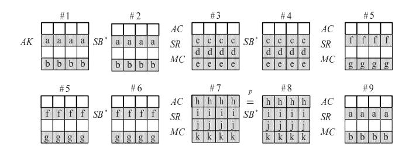
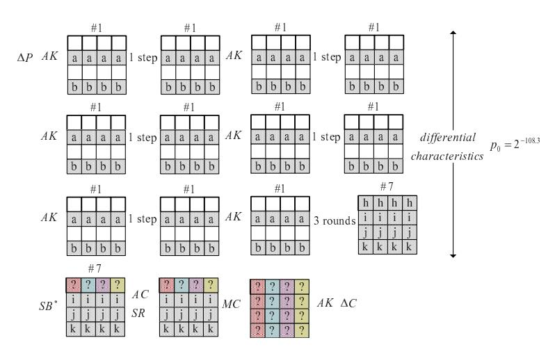
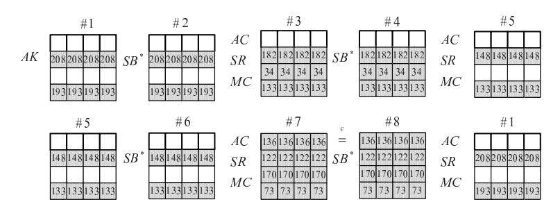
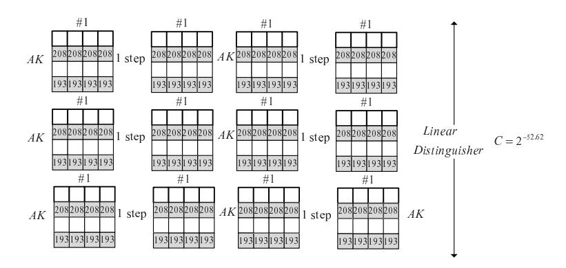

# Differential Cryptanalysis and Linear Distinguisher of Full-Round Zorro

Yanfeng Wang1,2 , Wenling Wu1 , Zhiyuan Guo1,2 and Xiaoli Yu1,2

1Trusted Computing and Information Assurance Laboratory, Institute of Software, Chinese Academy of Sciences, Beijing 100190, P.R. China 2Graduate University of Chinese Academy of Sciences, Beijing 100049, P.R. China {wangyanfeng, wwl}@tca.iscas.ac.cn

Abstract. Zorro is an AES-like lightweight block cipher proposed in CHES 2013, which only uses 4 S-boxes per round. The designers showed the resistance of the cipher against various attacks and concluded the cipher has a large security margin. Recently, Guo et. al [1] have given a key recovery attack on full-round Zorro by using the internal differential characteristics. However, the attack only works for 264 out of 2128 keys. In this paper, the secret key selected randomly from the whole key space can be recovered with a time complexity of 2108 full-round Zorro encryptions and a data complexity of 2112.4 chosen plaintexts. We first observe that the fourth power of the MDS matrix used in Zorro equals to the identity matrix. Moveover, several iterated differential characteristics and iterated linear trails are found due to the interesting property. We select three characteristics with the largest probability to give a key recovery attack on Zorro and a linear trail with the largest correlation to show a a linear distinguishing attack with 2105.3 known plaintexts. The results show that the security of Zorro against linear and differential cryptanalysis evaluated by designers is insufficient and the block cipher Zorro is far from a random permutation.

Key words: Zorro, block cipher, differential cryptanalysis, linear distinguisher

# 1 Introduction

Block ciphers are used as building blocks for many symmetric cryptographic primitives for encryption, authentication, pseudo-random number generation, and hash functions. Security of these primitives is evaluated in regard to known attacks against block ciphers. Among the different types of attacks, the statistical ones exploit non-uniform behavior of the data extracted from the cipher to distinguish the block cipher from random permutations. Differential cryptanalysis[2] and linear cryptanalysis[3] are the most prominent statistical attacks against block ciphers.

Differential cryptanalysis has been introduced in 1990 by Biham and Shamir in order to break the DES block cipher. This statistical cryptanalysis exploits the existence of a differential, i.e., a pair (△in, △out) of differences such that for a given input difference △in, the output difference after encryption equals △out with a high probability. For a b-bit random permutation, the probability is about 2−b . The gap of the probability results in a distinguisher between the cipher and the random permutation, which is often extended to distinguish the correct key and the wrong keys. In 1993, the iterated differentials are proposed to analyze DES and s2-DES[4]. Since then, the differential cryptanalysis is always a hot topic of cryptanalysis[5–7]. The problem of estimating the data complexity, time complexity and success probability of a differential cryptanalysis is far from being simple. Until 2011, [8] presented a general method (Algorithm 1) for finding an accurate number of samples to reach given error probabilities which can be applied to the differential cryptanalysis.

Linear cryptanalysis[9, 10] is a known-plaintext attack proposed in 1993 by Matsui to break DES. It exploits the correlation between linear combinations of input bits and linear combinations of output bits of the block cipher. If the correlation between input and output equals C, the required amount of known plaintexts is about  $C^{-2}$  if we want to distinguish the block cipher from the random permutation with a high success probability.

Zorro[11] is a new lightweight block cipher proposed at CHES 2013. It is an AES-like block cipher and is designed to improve the side-channel resistance of AES[12]. The secret key is added to the state only after each 4 rounds as in the block cipher LED-64[13]. The S-box layer of Zorro only applies four same S-boxes to the first row per round and the S-box is different from that of AES. Besides, the MC operation is the same as AES. The designers have evaluated the security of the cipher against various methods. For differential/linear cryptanalysis, authors found a balance between the number of inactive S-boxes and the number of freedom degrees for the differential (or linear) paths. Considering the average number of conditions imposed at each round, designers concluded that 14(or 16) rounds are the upper bound for building a classical differential(or linear) path. Finally, a 12-round meet-in-the-middle attack was shown as the best powerful attack on Zorro in the single key model. Recently, Guo et. al[1] have given a key recovery attack on full-round Zorro by using the internal differential characteristics, while it only works for 264 keys of the whole key space.

In this paper, we revaluated the security of Zorro against differential cryptanalysis and linear cryptanalysis. As mentioned in [1], the main weakness of Zorro includes defining a new S-box and applying only four S-boxes to the first row per round. Besides, we observed that the fourth power of the MDS matrix of Zorro(or AES) is equal to the identity matrix. Coincidentally, one step of Zorro consists four rounds with four MDS matrix transformations. Interestingly, there exist several iterated differential characteristics with a high probability and iterated linear trails with a high correlation for one step of Zorro. Furthermore, we can recover the secret key of the full-round Zorro based on a 23-round differential characteristic with a time complexity of  $2^{108}$  full-round Zorro encryptions. Meanwhile, the  $1/C^2$  of some linear trails of full-round Zorro is also lower than the size of the palintext space  $2^{128}$ . Thus, we can obtain a full-round linear distinguisher for Zorro with  $1/C^2$  known plaintexts. All in all, the above results have threatened the theoretical security of the full-round Zorro.

The remainder of this paper is organized as follows. Section 2 gives a brief description of Zorro block cipher. Section 3 proposes some iterated differential characteristics for one step of Zorro and shows a key recovery attack on full-round Zorro. Section 4 presents a linear distinguisher of full-round Zorro based on the theory of correlation matrix. Finally, Section 5 concludes this paper.

### 2 A brief description of Zorro

The block cipher Zorro has 128-bit key and 128-bit state. It iterates 24 rounds and the 24 rounds are divided into 6 steps of 4 rounds each.

**Encryption Algorithm.** As in AES-128, the state in Zorro is regarded as  $4 \times 4$  matrix of bytes, and one round consists of four distinct transformations:  $SB^*$ , AC, SR and MC.  $SB^*$  is the S-box layer where only 4 same S-boxes are applied to the 4 bytes of the first row in the state matrix. The S-box used in Zorro is different from the one of AES and the definition of S-box is referred to Appendix A. Next, AC is the addition of round constants in round i. Specifically, the four constants (i, i, i, i <<3) are added to the four bytes of the first row. Finally, the last two transformations, SR and MC,

are the AES's ShiftRows and MixColumns.

Key Schedule Algorithm. The key schedule algorithm of Zorro is similar to that of LED. Before the first and after each step, the master key is bitwisely added to the state and the same addition is done after the last step.

Let us focus on MC(MixColumns) used in Zorro and it is a permutation operation on the state column by column. The matrix multiplication can be shown as:

$$M = \begin{pmatrix} 02 & 03 & 01 & 01 \\ 01 & 02 & 03 & 01 \\ 01 & 01 & 02 & 03 \\ 03 & 01 & 01 & 02 \end{pmatrix}.$$

Interestingly, the following equation is true:

$$M^4 = \begin{pmatrix} 01 & 00 & 00 & 00 \\ 00 & 01 & 00 & 00 \\ 00 & 00 &$$

Combined with the fact that only 4 S-boxes are applied to the first row in each round, iterated differential characteristics and linear trails are found for four rounds of Zorro.

# 3 Differential Cryptanalysis of Full-Round Zorro

Differential cryptanalysis defines characteristics that describe possible evolvements of the differences through the cipher. For non-linear operations (such as S-boxes), it is possible to predict statistical information on the output difference given the input difference by generating the differential distribution table (DDT). Given the expected difference for the intermediate data before the last round, it may be possible to deduce the unknown key by a statistical analysis. The attack is a chosen plaintext attack that is performed in two phases: In the data collection phase the attacker requests encryption of a large number of pairs of plaintexts, where the differences of all the plaintext pairs are selected to have the plaintext difference of the characteristic. In the data analysis phase the attacker then recovers the key from the collected ciphertexts.

Generally, the total probability of a differential characteristic is the product of the probabilities of each round assuming that the round functions are independent. The secret key is added to the data every four rounds and 4 rounds of Zorro can be seen as a step that has no constants in the rounds, if we add one value to the input and one at the output of the step [1]. For Zorro, the assumption that the step functions are independent is more rational than the one that round functions are independent. In this section, we will present a 23-round differential distinguisher of Zorro under the assumption that the step functions are independent. Furthermore, a key recovery attack of full-round Zorro is shown.

#### 3.1 Iterated Differential Characteristic

As mentioned by designers, the most damaging differential patterns are those that would exclude active bytes affected by non-linear operations. This kind of differential characteristic with probability 1 exists for at most two rounds. We extend the differential pattern to 4 rounds with 4 active bytes, which is shown in Figure 1. The big squares represent states, small squares represent bytes, gray bytes are the ones with a non-zero difference and the letters in gray bytes present the difference values. In order to remove the influence of ShiftRow, we set the four byte differences in each row all equal. If the output differences of all the 4 active S-boxes are equal to the input differences, then the differences of #1 are equal to that of #9 because  $M^4 = I$ . Firstly, we find that 255 different values of (a,b) make the path from #1 to #7 with probability 1. After searching the differential distribution table (DDT) of the S-box used in Zorro, 111 original differences make the path from #7 to #9 possible.

Fig. 1. Iterated differential characteristic of four rounds Zorro

The probability of the differential characteristic from #1 to #9(four rounds) is determined by the value of (h,h) in DDT. Specifically, if the value of (h,h) in DDT of S-box is m, then there are m different values with the equation  $S(x) \bigoplus S(x \bigoplus h) = h$ . Thus, the probability of the differential characteristic p shown in Figure 1 is  $(m/256)^4$ . Obviously, the largest m means the highest probability of the characteristic. We find that the maximum m is equal to 6 and 3 options of (a,b) make the probability of the differential characteristic shown in Table 1 be  $(6/256)^4 \approx 2^{-21.66}$ . Furthermore, if we replace the state of #1 by #3, #5 or #7, another three iterated differential characteristics appear.

Table 1. Three kinds of iterated differential characteristics on one step

| NO | a  | b   | С  | d   | е   | f   | g   | h   | i   | j   | k   |
|----|----|-----|----|-----|-----|-----|-----|-----|-----|-----|-----|
| 1  | 22 | 58  | 22 | 88  | 98  | 166 | 138 | 123 | 221 | 35  | 169 |
| 2  |    |     |    |     |     |     |     |     |     |     | 149 |
| 3  | 88 | 232 | 88 | 123 | 147 | 174 | 30  | 247 | 89  | 140 | 146 |

#### 3.2 Key Recovery Attack on Full-Round Zorro

In order to recovery the secret key of Zorro, three iterated differential characteristics of 23-round Zorro are used to distinguish the right key and the wrong keys. With the assumption that the step functions of Zorro are independent, we can extend the iterated characteristics to 5 steps of Zorro. The probability becomes  $2^{-21.66\times5}=2^{-108.3}$  which is much lower than  $2^{-128}$  in random permutation. Meanwhile, the 23-round differential characteristics shown in Figure 2 have the same probability  $2^{-108.3}$  as the

path from #1 to #7 with probability 1, where the values of a and b are referred to Table 1. With another assumption that the secret key is randomly chosen from the whole key space, we can give a key recovery attack on the full-round Zorro.

Fig. 2. Differential characteristics on 23-round Zorro

Outline In order to recover the secret key of Zorro efficiently, we combine 3 iterated differential trails to give a structure attack. If we denote the secret key by K, we can change the order of MC and AK in the last round by adding the equivalent key  $K' = MC^{-1}(K)$  before MC. Meanwhile, recovering the equivalent key means that the secret key is found. Note that it is impossible to distinguish equivalent keys that share the same values in the last three rows based on the above distinguisher. Therefore, we focus on the 4 bytes of the first row of K'. We first reduce the size of guessing key space from  $2^{32}$  to  $2^3$  and then exhaustively search the remaining key candidates for the whole 128-bit key.

#### 1. Choice of Plaintext Pairs

The chosen plaintexts structure is shown as Figure 3. It is easy to see that in such a structure each difference appears three times. Thus, a total of 9 pairs are contained in a structure of 7 plaintexts. Choose n structures and ask all the 7n plaintexts for the corresponding ciphertexts, we can obtain 9n plaintext-ciphertext pairs.

#### 2. Choice of Ciphertext Pairs

Choose ciphertext pairs so that the differences of the input of 24-round satisfy the condition in #7. About  $2^{32}$  among  $2^{128}$  pairs can satisfy the differential condition. Therefore, it remains about  $9n \times 2^{-96}$  plaintext-ciphertext pairs to distinguish the right key from wrong keys.

#### 3. Reduction of Key Candidates of the First Row

Guess the four bytes of the first row of  $K'(2^{32})$ , and decrypt the remaining pairs to get the differences of the bytes who fall in the first row of the output of 23-round. If the differences satisfy the the condition in the first row of the output of distinguisher, increase the corresponding counter of the guessing key.

#### 4. Extraction from Key Candidates

There are  $9n \times 2^{-96}$  plaintext-ciphertext pairs to distinguish the right key from wrong keys. The incorrect key is suggested with a probability of  $2^{-32}$  while it is

Fig. 3. Chosen plaintexts structure

about  $2^{-108.3}/2^{-96} = 2^{-12.3}$  for the right key. Utilizing the probability differences between the correct key and incorrect keys, we can extract the correct key. We use the ranking paradigm to filter out the correct one as the right key candidates and only keep the keys in the first  $2^3$  positions.

5. Recovery the Right Key Exhaustively test the remaining key candidates to find the correct 128-bit key.

### Complexities

#### 1. Data Complexity

As mentioned in the first step of attack, 7n chosen plaintexts are needed to process the attack.

#### 2. Time Complexity

One computational complexity is checking whether the differences of ciphertext pairs satisfy the differences of last three rows of #7 or not. It costs about one-round encryption for one pair. Thus, all pairs spend about  $9n \times 2^{-4.6}$  full-round Zorro encryptions. Another computational complexity is incrementing counters for correct key candidates from the tuples of guessed 32-bit keys and plaintext-ciphertext pairs. It is smaller than  $9n \times 2^{-96} \times 2^{32}$  one round encryption. Finally, we need about  $2^3 \times 2^{96}$  full-round Zorro encryptions to exhaustively test the remaining key candidates.

#### 3. Memory Complexity

Since attackers must choose the correct key among the 32-bit keys, it is necessary for the attacker to have enough memory for each  $2^{32}$  keys, which is independent of n.

Given the probabilities  $(p_0, p)$ , the authors provided a general method (Algorithm 1) for finding an accurate number of samples to reach given error probabilities in [8], where  $p(\text{resp. }p_0)$  is the probability that be suggested for a wrong key(resp. for the right key). We first denote the type-I error probability (the probability to wrongfully discard the right key) with  $\alpha$  and the type-II error probability (the probability to wrongfully accept a random key as the right key) with  $\beta$ . In our attack, we want to determine the number of sample  $9n \times 2^{-96}$  with  $p_0 = 2^{-12.3}$  and  $p = 2^{-32}$ . If  $\alpha = 10\%$  and  $\beta = 2^{-29}$ , about  $2^{16.71}$  samples(pairs) can reduce  $2^{32}$  keys to  $2^3$  candidates. That is to say, the data complexity of our attack is about  $2^{112.4}$  chosen plaintexts. Therefore, the number of remaining key candidates for 128-bit key is about  $2^{3+96} = 2^{99}$  and we exhaustively check the key candidates to filter out the right key. All in all, the time

complexity is about  $2^{112.84} \times 2^{-4.6} + 2^{16.84} \times 2^{32} \times 1/23 + 2^3 \times 2^{96} \approx 2^{108}$  full-round Zorro encryptions.

# 4 Linear Distinguishing Attack on Full-Round Zorro

Consider an *n*-bit block cipher F and let the input of the function be  $x \in F_2^n$ . A linear approximation (u, v) with an input mask u and an output mask v has probability

$$p(u,v) = Pr_{x \in F_2^n}(u \cdot x \oplus v \cdot F(x) = 0).$$

The value  $C_F(u, v) = 2p(u, v) - 1$  is called the correlation of linear approximation (u, v).

Consider a mapping  $F: \mathbb{F}_2^n \to \mathbb{F}_2^n$  given as a key-alternating iterative block cipher, i.e.  $F = F_n \circ F_{n-1} \circ ... \circ F_1$ . A linear trail consists of an input mask u and output mask v and a vector  $U = (u_1, ..., u_{r-1})$  with  $u_i \in \mathbb{F}_2^n$ . The correlation of the trial is defined as

$$C_F(u, v, U) = C_{F_1}(u, u_1)C_{F_2}(u_1, u_2)...C_{F_{r-1}}(u_{r-2}, u_{r-1})C_{F_r}(u_{r-1}, v).$$

In contrary to the piling-up lemma[3], no assumption of any kind has to be made for this equation to hold. The characteristics of the correlation matrixes of some special boolean functions are summarized as follows[12]:

**Lemma 1** (XOR with a Constant): Consider the function that consists of the bitwise XOR with a constant vector k:  $F(x) = x \oplus k$ , the correlation matrix is a diagonal matrix with

$$C_F(u,u) = (-1)^{u^T k}.$$

**Lemma 2** (Linear functions): Consider a linear function F(x) = Mx, with M an  $m \times n$  binary matrix. The elements of the corresponding correlation matrix are given by

$$C_F(u,v) = \delta(M^T v \oplus u),$$

where

$$\delta(w) = \begin{cases} 1, & when \ w = 0 \\ 0, & when \ w \neq 0 \end{cases}.$$

**Lemma 3** (Bricklayer Functions): Consider a bricklayer function y = F(x) that is defined by the following component functions:  $y_{(i)} = F_{(i)}(x_{(i)})$  for  $1 \le i \le l$ . For every component function  $F_{(i)}$  there is a corresponding correlation matrix denoted by  $C_{F_{(i)}}$ . The elements of the correlation matrix of F are given by

$$C_F(u,v) = \prod_i C_{F_{(i)}}(u_{(i)},v_{(i)}),$$

where
$$u = (u_{(1)}, u_{(2)}, ..., u_{(l)})$$
 and  $v = (v_{(1)}, v_{(2)}, ..., v_{(l)})$

In this section, we will give a linear distinguishing attack for full-round Zorro according to the above three rules. F represents the 24-round Zorro, and  $F_i$  represents the corresponding i-th step function. Note that the fact  $M^4 = I$  implies that  $(M^T)^4 = I$ , where  $M^T$  means the transpose of matrix M.

#### 4.1 Iterated Linear Trail

There exists some iterated linear trials for 4 rounds of Zorro and the pattern can also be shown as Figure 1, where the gray bytes are the ones with a non-zero mask. We compute the correlation of the linear trail using the theory of the correlation matrix with  $u = v = u_i (i \le 6)$ .

Fig. 4. Iterated linear trail of one-step Zorro

There are 255 different (a,b) which result in the path from #1 to #7 with the absolute of correlation to be 1. After searching the linear approximation table(LAT) of the S-box used in Zorro, only 210 original linear masks make the path from #7 to #8 with a non-zero correlation. The largest linear correlation occurs when a=208 and b=193 and the absolute of the corresponding correlation  $|c|=(28/128)^4\approx 2^{-8.77}$ . If we change the relative location of #1 with #3, #5 or #7, |c| remains equal. Meanwhile, if the input mask and the output mask of one step are both (0,0,0,0,208,208,208,208,0,0,0,193,193,193,193,193), the linear trail is determined as Figure 4.

#### 4.2 Linear distinguisher of the Full-Round Zorro

Fig. 5. Linear distinguisher on full-round of Zorro

If we fix the input linear mask of every step to be pattern of #1 with a=208 and b=193, we can get a linear trail of full-round Zorro. The absolute of the correlation of the linear trial can be computed as  $|C|=2^{-8.77\times 6}=2^{-52.62}$  without any assumption. Thus we can distinguish the full-round Zorro from random permutation by using  $1/C^2\approx 2^{105.3}$  known plaintexts and the distinguisher is shown as Figure 5.

### 5 Conclusion

In this paper, we presented a full-round differential cryptanalysis of Zorro and recovered the secret key with a data complexity of  $2^{112.4}$  chosen plaintexts and a time complexity of  $2^{105.5}$  full-round Zorro encryptions. Meanwhile, we gave a linear distinguishing attack on the full-round Zorro with  $2^{105.3}$  known plaintexts.

For convenience, we fix that the differences of four bytes in each row are all the same. If we exhaustively search the characteristics covering three rounds with probability 1, we may obtain some trails for one step of Zorro with a probability higher than  $2^{-21.66}$ . Thus the complexities of our key recovery attack can be improved. The similar cases may occur for the linear distinguishing attack. In summary, the results show that only four S-boxes located in the first row and an iterated structure as AES produce a theoretical weak block cipher. Designers should carefully reduce the non-linear operations when designing a lightweight block cipher based on AES block cipher.

# Acknowledgments

The research presented in this paper is supported by the National Basic Research Program of China (No. 2013CB338002) and National Natural Science Foundation of China (No. 61272476, No.61232009 and No. 61202420).

### References

- 1. Jian Guo, Ivica Nikolic, Thomas Peyrin, and Lei Wang. Cryptanalysis of Zorro. Cryptology ePrint Archive, Report 2013/713, 2013. http://eprint.iacr.org/.
- 2. Eli Biham and Adi Shamir. Differential cryptanalysis of DES-like cryptosystems. In AlfredJ. Menezes and ScottA. Vanstone, editors, *Advances in Cryptology-CRYPT0 90*, volume 537 of *Lecture Notes in Computer Science*, pages 2–21. Springer Berlin Heidelberg, 1991.
- 3. Mitsuru Matsui. Linear cryptanalysis method for DES cipher. In Tor Helleseth, editor, Advances in Cryptology-EUROCRYPT 1993, volume 765 of Lecture Notes in Computer Science, pages 386—397. Springer Berlin Heidelberg, 1994.
- 4. LarsR. Knudsen. Iterative characteristics of DES and s2-DES. In ErnestF. Brickell, editor, Advances in Cryptology-CRYPTO 92, volume 740 of Lecture Notes in Computer Science, pages 497—511. Springer Berlin Heidelberg, 1993.
- 5. Lars R. Knudsen. Truncated and higher order differentials. In Bart Preneel, editor, Fast Software Encryption, volume 1008 of Lecture Notes in Computer Science, pages 196–211. Springer Berlin Heidelberg, 1995.
- Makoto Sugita, Kazukuni Kobara, and Hideki Imai. Security of reduced version of the block cipher Camellia against truncated and impossible differential cryptanalysis. In Colin Boyd, editor, Advances in Cryptology-ASIACRYPT 2001, volume 2248 of Lecture Notes in Computer Science, pages 193–207. Springer Berlin Heidelberg, 2001.
- 7. Meiqin Wang. Differential cryptanalysis of reduced-round Present. In Serge Vaudenay, editor, *Progress in Cryptology-AFRICACRYPT 2008*, volume 5023 of *Lecture Notes in Computer Science*, pages 40–49. Springer Berlin Heidelberg, 2008.
- 8. Céline Blondeau, Benoît Gérard, and Jean-Pierre Tillich. Accurate estimates of the data complexity and success probability for various cryptanalyses. *Designs, Codes and Cryptography*, 59(1-3):3–34, 2011.
- 9. Eli Biham. On matsui's linear cryptanalysis. In Alfredo Santis, editor, Advances in Cryptology-EUROCRYPT 1994, volume 950 of Lecture Notes in Computer Science, pages 341–355. Springer Berlin Heidelberg, 1995.
- 10. Thomas Baignres, Pascal Junod, and Serge Vaudenay. How far can we go beyond linear cryptanalysis? In PilJoong Lee, editor, *Advances in Cryptology-ASIACRYPT 2004*, volume 3329 of *Lecture Notes in Computer Science*, pages 432–450. Springer Berlin Heidelberg, 2004.

- 11. B. G´erard, Vincent Grosso, M. Naya-Plasencia, and Fran¸cois-Xavier Standaert. Block ciphers that are easier to mask: How far can we go? In Guido Bertoni and Jean-Sbastien Coron, editors, Cryptographic Hardware and Embedded Systems-CHES 2013, volume 8086 of Lecture Notes in Computer Science, pages 383–399. Springer Berlin Heidelberg, 2013.
- 12. Joan Daemen and Vincent Rijmen. The Design of Rijndael. Springer-Verlag New York, Inc., Secaucus, NJ, USA, 2002.
- 13. Jian Guo, Thomas Peyrin, Axel Poschmann, and Matt Robshaw. The LED block cipher. In Bart Preneel and Tsuyoshi Takagi, editors, Cryptographic Hardware and Embedded Systems-CHES 2011, volume 6917 of Lecture Notes in Computer Science, pages 326–341. Springer Berlin Heidelberg, 2011.

## Appendix A : S-box of Zorro

|    | 0  | 1                       | 2     | 3                 | 4  | 5        | 6           | 7                                   | 8  | 9                 | A        | B           | C     | D     | E                 | F     |
|----|----|-------------------------|-------|-------------------|----|----------|-------------|-------------------------------------|----|-------------------|----------|-------------|-------|-------|-------------------|-------|
| 00 |    |                         |       |                   |    |          |             | B2 E5 5E FD 5F C5 50 BC DC 4A FA 88 |    |                   |          |             |       |       | 28 D8 E0 D1       |       |
| 10 |    | B5 D0 3C B0             |       |                   |    |          | 99 C1 E8 E2 |                                     | 13 |                   |          | 59 A7 FB 71 |       | 34    | 31                | F1    |
| 20 |    | 9F 3A CE 6E A8 A4 B4 7E |       |                   |    |          |             |                                     | 1F | B7                |          | 51 1D       |       | 38 9D | 46                | 69    |
| 30 | 53 | E                       | 42    | 1B                | F  | 11       |             | 68 CA AA                            |    | 6                 |          | F0 BD 26    |       | 6F    | 0                 | D9    |
| 40 | 62 | F3                      | 15    | 60                |    | F2 3D 7F |             | 35                                  | 63 | 2D 67             |          | 93          | 1C 91 |       | F9                | 9C    |
| 50 | 66 | 2A                      | 81    | 20                |    |          |             | 95 F8 E3 4D 5A 6D 24                |    |                   |          |             |       |       | 7B B9 EF DF DA    |       |
| 60 | 58 | A9                      | 92    | 76                |    | 2E B3 39 |             | C                                   |    | 29 CD 43 FE AB F5 |          |             |       |       | 94                | 23    |
| 70 | 16 | 80                      | C0    | 12                |    | 4C E9 48 |             | 19                                  | 8  | AE 41             |          | 70          | 84    | 14    |                   | A2 D5 |
| 80 | B8 | 33                      |       | 65 BA ED 17 CF 96 |    |          |             |                                     | 1E | 3B                | B        |             |       |       | C2 C8 B6 BB 8B    |       |
| 90 | A1 | 54                      | 75    | C4                |    | 10 5D D6 |             | 25                                  | 97 |                   | E6 FC 49 |             | F7    | 52    | 18                | 86    |
| A0 |    |                         |       |                   |    |          |             | 8D CB E1 BF D7 8E 37 BE 82 CC 64    |    |                   |          | 90          | 7C 32 |       | 8F                | 4B    |
| B0 |    | AC 1A EA D3 F4 6B 2C FF |       |                   |    |          |             |                                     | 55 | A                 | 45       | 9           | 89    | 1     | 30                | 2B    |
| C0 | D2 | 77                      | 87    |                   |    |          |             | 72 EB 36 DE 9E 8C DB 6C 9B          |    |                   |          |             | 5     | 2     |                   | 4E AF |
| D0 | 4  | AD 74                   |       |                   |    |          |             | C3 EE A6 F6 C7 7D                   |    |                   | 40 D4    | D           |       |       | 3E 5B EC          | 78    |
| E0 |    | A0 B1                   | 44    | 73                |    | 47 5C 98 |             | 21                                  | 22 | 61                |          |             |       |       | 3F C6 7A 56 DD E7 |       |
| F0 | 85 |                         | C9 8A | 57                | 27 | 7        | 9A          | 3                                   | A3 | 83                |          | E4 6A A5 2F |       |       | 79                | 4F    |