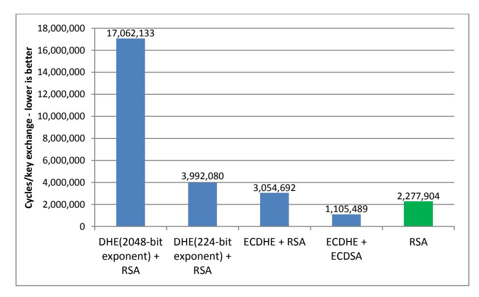
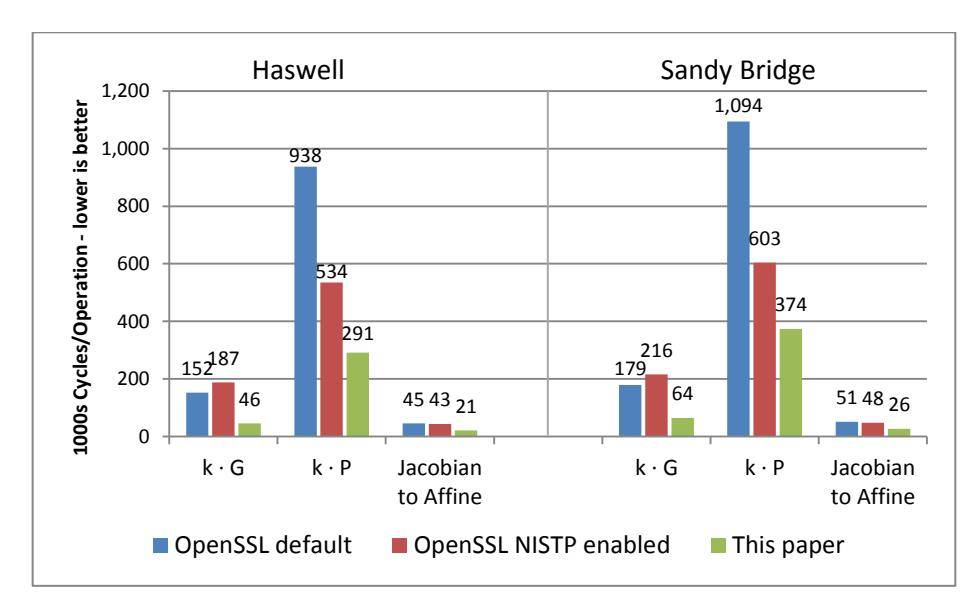
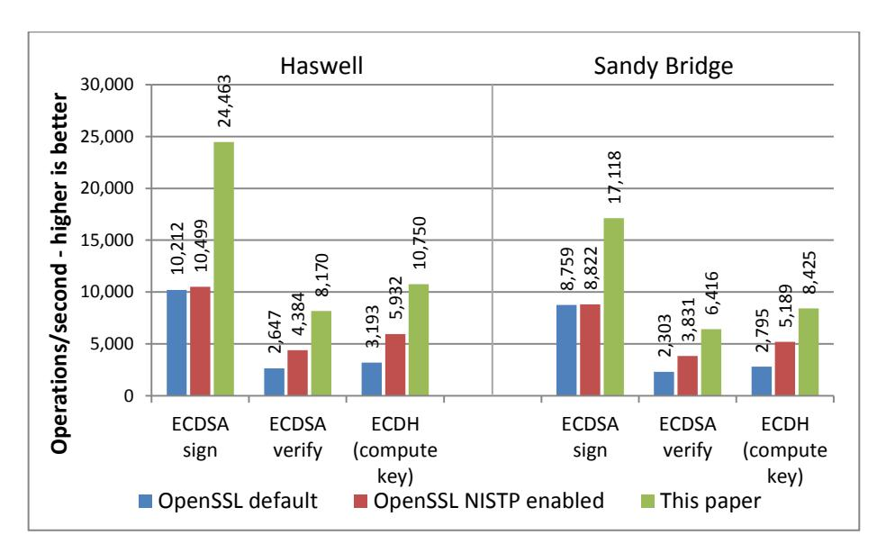
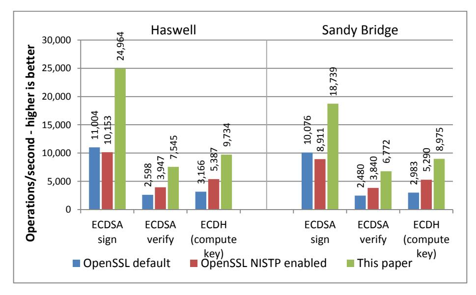
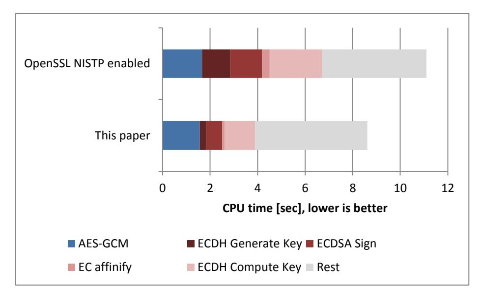
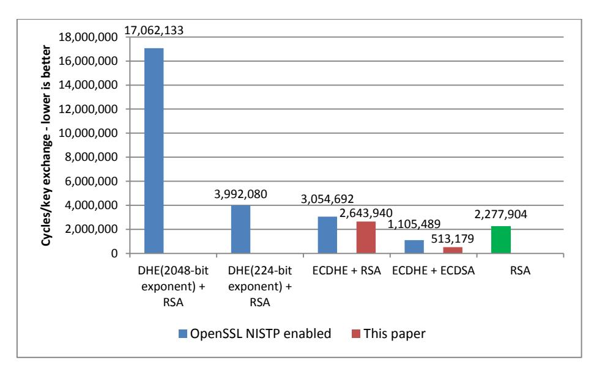

# **Fast Prime Field Elliptic Curve Cryptography with 256 Bit Primes**

Shay Gueron1,2, Vlad Krasnov<sup>2</sup>

<sup>1</sup> Department of Mathematics, University of Haifa, Israel 2 Intel Corporation, Israel Development Center, Haifa, Israel

**Abstract.** This paper studies software optimization of Elliptic Curve Cryptography with *256*-bit prime fields. We propose a constant-time implementation of the NIST and SECG standardized curve *P-256*, that can be seamlessly integrated into OpenSSL. This accelerates Perfect Forward Secrecy TLS handshakes that use ECDSA and/or ECDHE, and can help improving the efficiency of TLS servers. We report significant performance improvements for ECDSA and ECDH, on several architectures. For example, on the latest Intel Haswell microarchitecture, our ECDSA sign is *2.33x* faster than OpenSSL's implementation.

**Keywords:** ECDSA, ECDH, EC, SSL, TLS, optimization, Haswell

## **1 Introduction**

TLS [7] is the leading protocol for secure network communications. It supports a variety of symmetric ciphers and MAC algorithms for the authenticated and encrypted client-server communication, and a variety of public key algorithms for establishing a symmetric session key (for the authenticated encryption).

Currently, the most popular key-exchange algorithm is based on RSA. Here, the client generates a secret value (master key) and encrypts it using the server's public RSA key. The server decrypts that value, and both parties apply some agreed Key Derivation Function to derive the session key.

With this approach, the confidentiality of all the sessions depends on the server's private RSA key: the confidentiality of any session, with any client (even past recorded sessions) is lost if this key is compromised (e.g., lost, hacked, subpoenaed). In response to increased sensitivity to this property (e.g., due to information on the PRISM projects [11] ), some bodies and companies are migrating to a "Perfect Forward Secrecy" (PFS) protocol (e.g., [19]), and some have already implemented it

 1 "Demand for encryption apps has increased dramatically ever since the exposure of massive internet surveillance programs run by US and UK intelligence agencies. Now Facebook is reportedly moving to implement a strong, decades-old encryption technique that's been largely avoided by the online services that need it most"; J. Kopstein, The Verge, [http://www.theverge.com/2013/6/26/4468050/facebook-follows-google-with-tough](http://www.theverge.com/2013/6/26/4468050/facebook-follows-google-with-tough-encryption-standard)[encryption-standard.](http://www.theverge.com/2013/6/26/4468050/facebook-follows-google-with-tough-encryption-standard)

(e.g., [14]). Here, the server-client key exchange uses ephemeral parameters, rather than a single fixed key. Two such key exchange algorithms are supported by TLS: Ephemeral Diffie-Hellman (DHE), and Elliptic-Curve Ephemeral Diffie-Hellman (ECDHE). These algorithms require the server and the client to (randomly) select a secret key, and to use it for generating and exchanging "public key parameters". These are subsequently used for deriving a shared session key. In such protocols, the server is required to authenticate itself (to the client) by signing the parameters that it sends to the client. Several signature algorithms can be agreed during the initial client-server handshake, and the two leading ones are RSA signature and Elliptic Curve Digital Signature Algorithm (ECDSA). Consequently, adding support for PFS protocols makes DHE+RSA, ECDHE+RSA and ECDHE+ECDSA key exchange and signature combinations important targets for optimization, especially for servers.

From the server's viewpoint, migration to ECC based TLS connections can be done in two ways. Adopting the full ECDHE+ECDSA combination requires the server to use an EC certificate. On the other hand, the ECDHE+RSA combination allows a server to continue using an existing RSA certificate, and use ECC only for the key exchange. Direct browsing indicates that current ECC adopters indeed use both combinations. Few examples are Google (using ECDHE+RSA and ECDHE+ECDSA), Facebook and Twitter (recently adopting ECDHE+RSA).

The currently recommended RSA key size is *2048*-bit, and it is estimated to provide *112* bits of security [2] (for *128* bits security, one needs RSA3072, which is ~*3.375* times slower). The computational cost of RSA2048 can be estimated as the cost of two *1024*-bit modular exponentiations. The DHE protocol (providing *112* bits of security) requires two modular exponentiations with a *2048*-bit modulus, and it suffices to use a *224*/*256* bits exponent. With these parameters, the performance of DHE is comparable to that of RSA. Elliptic Curve algorithms for signature and key exchange require shorter keys of *224*/*256* bits for *112*/*128* bits of security. With such keys, ECDSA signatures and ECDH are significantly faster than RSA signatures and DH key exchange counterparts. [Fig. 1](#page-2-0) shows the performance of these signature and key exchange algorithms, with a comparison to the classical non-PFS key exchange based on RSA alone. It shows that supporting PFS key exchange, with DHE+RSA and ECDHE+RSA combinations, comes with a performance cost, but the ECDHE+ECDSA combination is actually faster than the non-PFS key exchange.

Elliptic-Curve cryptography with a *224*-bit prime (NIST *P-224* curve) has been recently optimized by [13], contributed to OpenSSL, and is now part of its current offering. Subsequently, a similar optimized implementation was derived from [13], to support the *256*-bit and *521*-bit NIST primes<sup>3</sup> . These optimizations provide significant speedups compared to original OpenSSL implementations. However, as NSA's Suite

<sup>2</sup> RSA signature verification with the standard short public exponent remains faster than ECDSA verification. However, verification is done by the client, and not by the server side.

<sup>3</sup> An optimized implementation of P-224, P-256 and P-521 was contributed to OpenSSL by Emilia Käsper, Adam Langley and Bodo Moeller. To enable it, OpenSSL should be configured with 'enable-ec\_nistp\_64\_gcc\_128'.

B endorses only *256* and *384*-bit prime curves ECC [20], the de-facto standard that is adopted on the web, uses the *256*-bit prime.



<span id="page-2-0"></span>**Fig. 1.** The performance of PFS supporting algorithms, measured in CPU cycles on the latest Intel Haswell Microarchitecture. The RSA2048 and DH2048 numbers are based on the currently fastest implementation [8]. DH2048 is shown with both *2048*-bit exponent (OpenSSL's default) and with *224*-bit exponent (that suffices for *112* bits of security). For ECDSA and ECDHE, the numbers correspond to the NIST *P-256* curve (OpenSSL development version of OpenSSL; September 9, 2013, configured with 'enable-ec\_nistp\_64\_gcc\_128'). Note that the ECDHE+ECDSA combination provides *128* bits of security, and the other combinations provide only *112* bits. For comparison, the rightmost (green) bar shows the performance of the RSA-based key exchange, that does not provide PFS.

While ECC can be used with any prime, NIST specifies one prime for each curve with *192*, *224*, *256*, *384* and *521* bits [16]. These are "Generalized Mersenne" primes [21], where modular reduction can be implemented efficiently.

This paper studies software optimizations for ECC with *256*-bit primes (NIST *P-256* curve in particular). We apply our proposed optimizations to x86-64 architectures, but any *64* or *32* bit architecture may potentially benefit from them as well. Our implementation includes side channel protection up to the protocol level, and we use several optimizations for improving the performance. In particular, we propose a method for implementing ECC in the Montgomery domain, and optimize it to what we call "Montgomery Friendly" primes. The NIST *P-256* curve has such a prime.

### **2 Preliminaries**

Prime field Elliptic Curves are defined by the pairs *(x, y)* satisfying the relation *y 2 = x <sup>3</sup> + ax + b* with *a, b* <sup>∈</sup> *GF(p)* (satisfying *4a<sup>3</sup> + 27b<sup>2</sup> ≠ 0*) and where *p>3* is a prime. For any two points *P*, *Q* on a given curve, their addition (*P + Q*) is defined as a fundamental operation (using the tangent-and-chord rule), and this defines a group of points on the curve. The addition *P + Q* when *P ≠ Q* is called point addition, and addition *P + Q = 2P* when *P = Q* is called point doubling (and they are different operations). Consequently, for non-negative integer *k*, it is possible to define the scalar point multiplication *k·P* on the curve.

In this paper, we consider the two Elliptic Curves Cryptosystems (ECC) mentioned above, namely ECDHE and ECDSA. Their security relies on the difficulty of the Elliptic Curve Discrete Logarithm Problem, i.e., finding the value of *k*, when *k·P* is given. Obviously, implementation of these protocols involves (among other computations) the computation of point multiplications over the given field.

For the sake of optimization, the EC affine coordinates *(x, y)* can be converted to a representation where the group operations are cheaper (specifically, involve fewer *GF(p)* inversions). We use here the Jacobian point representation with three coordinates *(X, Y, Z)*, where *x = X/Z<sup>2</sup>* , *y=Y/Z<sup>3</sup>* (modulo the relevant prime). The point doubling and point addition operations in these coordinates are provided in [Fig. 2.](#page-3-0)

```
Point Doubling
Input: (X, Y, Z)
S = 4XY2; M = 3X
                    2 + aZ4
X' = M2 - 2S
Y' = M(S - X') - 8Y4
Z' = 2YZ
Output: (X', Y', Z')
Point Addition
Input: (X1, Y1, Z1), (X2, Y2, Z2)
U1 = X1Z2
        2; U2 = X2Z1
                      2; S1 = Y1Z2
                                    3; S2 = Y2Z1
                                                   3
if (U1 == U2) then
 if (S1 != S2) return POINT_AT_INFINITY
 else return POINT_DOUBLE (X1, Y1, Z1)
 abort
end
H = U2 - U1; R = S2 - S1
X3 = R2 - H
          3 - 2U1H
Y3 = R(U1H
         2 - X3) - S1H
                      3
Z3 = HZ1Z2
Output:(X3, Y3, Z3)
```

<span id="page-3-0"></span>**Fig. 2.** Point doubling and point addition in Jacobian coordinates. The arithmetic operations are in the underlying field *GF(p)*.

By definition, converting the triplet *(X, Y, Z)* from Jacobian back to affine coordinates requires field inversion(s). This conversion needs to be carried out only once, at the end of the computation of the point multiplication *k·P*.

Generalized-Mersenne [21] primes are of special interest. They are defined as primes of a special form, that allows for efficient reduction, without integer-division. Generalized-Mersenne primes are frequently used for ECC (all the NIST primes in [16] are such) because reduction modulo such primes can be carried out efficiently. *p<sup>256</sup>* is a Generalized–Mersenne prime (se[e Fig. 4\)](#page-5-0).

[Fig. 3](#page-4-0) illustrates the ECDH and ECDSA flows (note that during the TLS handshake, the server computes an ECDSA signature).

```
The (public) curve parameters are:
a, b, p (prime), G (the generator point), n (the multi-
plicative order of G).
The private data: ds – server secret
The signed data: z – hash(message) truncated to len(n)
ECDSA signature
Pick a random integer k[1,n-1]
Compute (x1, y1) = k·G
r = x1 mod n
s = k-1(z + rdS) mod n
The signature is the pair (r, s)
ECDH
Server picks a random integer dS[1,n-1]
Client picks a random integer dC[1,n-1]
Generate key:
 Server generates it's public key QS = dS·G
 Client generates it's public key QC = dC·G
Compute key:
 Server computes (x1, y1) = dS·QC
 Client computes (x1, y1) = dC·QS
The shared secret is x1
```

**Fig. 3.** The flows for ECDSA signature and ECDH key exchange.

<span id="page-4-0"></span>In the rest of the paper, we consider only the case *a=-3 mod p*, and primes whose bit-length is *256* (i.e., satisfying *2 <sup>255</sup> < p < 2<sup>256</sup>*).

#### **2.1 The 256-bit NIST curve's parameters**

The results we show in this paper relate to optimizations for the NIST *256*-bit curve, *P-256*, with a prime denoted by *p256*. The related parameters are given in [Fig. 4.](#page-5-0)

```
p256 = 2256-2
           224+2192+296-1
a = p-3
The base point G:
x
  =
0x6b17d1f2e12c4247f8bce6e563a440f277037d812deb33a0f4a13945d898c296
y
  =
0x4fe342e2fe1a7f9b8ee7eb4a7c0f9e162bce33576b315ececbb6406837bf51f5
the order of G, n =
0xffffffff00000000ffffffffffffffffbce6faada7179e84f3b9cac2fc632551
```

**Fig. 4.** The NIST *256*-bit curve parameters [16].

### <span id="page-5-0"></span>**3 A Montgomery Friendly modulus**

The Montgomery Multiplication [15] (*MM* hereafter) is a well-known efficient technique for computing modular exponentiation [9]. Similarly, it can be used for other modular arithmetic intensive algorithms, such as the elliptic curve point multiplication.

Point doubling and addition (see [Fig. 2\)](#page-3-0) involves a sequence of operations modulo the prime *p*. It is possible to execute them in the so-called Montgomery domain, where the modular multiplication *A×B mod p* is replaced by the Montgomery Multiplication operation, *MM (A, B) = A×B×2-l mod p*, and where the positive integer *l* is some parameter. When *A=B*, we call the operation a Montgomery Square (*MSQR*), and this case can be optimized by leveraging the fact that *A=B*.

To compute a point multiplication using *MM* operations, the coordinates of the input point *(X, Y, Z)* need to be converted to the Montgomery domain. This is done by multiplying (modulo *p*) each coordinate by *2 l* , or alternatively, performing an *MM* by the constant *H=22l mod p*. After all the computations are completed (in the Montgomery domain), they need to be converted back to the residue domain. This is done by *MM* by *1*. The Word-by-Word flow for computing *MM* (*WW-MM*) is described in [Fig.](#page-6-0)  [5](#page-6-0) (left panel).

For some cases, such as the one we discuss here, a shortcut is available, and to this end, we use the following definition.

**Definition 1:** let *p* be an odd modulus and *s* be a positive integer. If *p* satisfies *-1/p mod 2<sup>s</sup> = 1*, then *p* is called an *s*-Montgomery Friendly modulus (MF for short).

For an MF modulus, the *WW-MM* computations can be optimized, as shown in [Fig.](#page-6-0)  [5](#page-6-0) (right panel).

Our study discusses a modulus which is a *256*-bit prime, implying *l=256*. To optimize code for *64*-bit architectures, we use *s=64*. This implies that *k=4*. In other words, each field element is considered as a "*4* digits number", where each digit has *64* bits.

```
Algorithm 1: Word-by-Word
                                           Algorithm 2: Word-by-Word
Montgomery Multiplication (WW-MM)
                                           Montgomery Multiplication for a
                                           Montgomery Friendly modulus p
Input: p < 2^1 (odd modulus),
                                           (Montgomery Friendly Multiplica-
     0 \le a, b < p, l=s \times k
                                           Satisfying -p^{-1} \mod 2^{s}=1.
Output: a \times b \times 2^{-1} \mod p
Pre-computed: k0 = -p^{-1} \mod 2^{s}
                                           Input: p < 2^1
Flow
                                                 (Montgomery Friendly modulus)
  1. T = a \times b
                                                 0 \le a, b < p, l=s \times k
   For i = 1 to k do
                                           Output: a×b×2<sup>-1</sup> mod p
      2. T1 = T mod 2^{s}
                                           Flow
      3. Y = T1 \times k0 \mod 2^s
                                             1. T = a \times b
      4. T2 = Y \times p
                                              For i = 1 to k do
      5. T3 = (T + T2)
                                                 2. T1 = T \mod 2^s
      6. T = T3 / 2^{s}
                                                 3. T2 = T1 \times p
                                                 4. T3 = (T + T1)
   End For
  7. If T \ge p then X = T - p;
                                                 5. T = T3 / 2^{s}
         else X = T
                                              End For
                                              6. If T \ge p then X = T - p;
Return X
                                                     else X = T
                                           Return X
```

<span id="page-6-0"></span>**Fig. 5.** Left panel: Word by Word Montgomery Multiplication (*WW-MM*). Right panel: *WW-MM* for a Montgomery Friendly modulus. In our context, the relevant parameters for a 256-bit prime modulus (p) are l=256, s=64, and k=4.

In the general case, where an l-bit number can be represented using k digits, MM requires  $2k^2 + k$  single-precision multiplication operations. Optimizing for an MF prime reduces the number of single-precision multiplications to  $2k^2$ . With k=4, as in our case, this saves more than 10% of the operations (for a large k, the saving can be insignificant).

A similar optimization is employed in the NSS[17] project, for s=32.

**Observation 1.** A 256-bit MF modulus q has the form  $q = 2^{255\text{-offset}} \times L + 2^{64}$ -I, or the form  $q = 2^{255\text{-offset}} \times L$ -I, where offset = floor (log<sub>2</sub> (L)) (and it is bounded appropriately, to assure that  $q < 2^{256}$ ).

**Example 1.** The first 256-bit MF prime of the first form is  $2^{250} \times 61 + 2^{64} - 1$ . The first 256-bit MF prime of the second form is  $2^{247} \times 321 - 1$ .

**Observation 2.** The NIST prime  $p_{256}$  is a MF prime.

**Observation 3.** Another property of  $p_{256}$ , can be used for optimization in Step 3 (on the right pane of Fig. 5). We use it to optimize the multi-precision multiplication by  $p_{256}$ . When writing  $p_{256}$  in hexadecimal notation (64-bit "quad-words"), we note that quad-word 0 is: 0x is: 0x is: 0x is: 0x is: 0x is: 0x is: 0x is: 0x is: 0x is: 0x is: 0x is: 0x is: 0x is: 0x is: 0x is: 0x is: 0x is: 0x is: 0x is: 0x is: 0x is: 0x is: 0x is: 0x is: 0x is: 0x is: 0x is: 0x is: 0x is: 0x is: 0x is: 0x is: 0x is: 0x is: 0x is: 0x is: 0x is: 0x is: 0x is: 0x is: 0x is: 0x is: 0x is: 0x is: 0x is: 0x is: 0x is: 0x is: 0x is: 0x is: 0x is: 0x is: 0x is: 0x is: 0x is: 0x is: 0x is: 0x is: 0x is: 0x is: 0x is: 0x is: 0x is: 0x is: 0x is: 0x is: 0x is: 0x is: 0x is: 0x is: 0x is: 0x is: 0x is: 0x is: 0x is: 0x is: 0x is: 0x is: 0x is: 0x is: 0x is: 0x is: 0x is: 0x is: 0x is: 0x is: 0x is: 0x is: 0x is: 0x is: 0x is: 0x is: 0x is: 0x is: 0x is: 0x is: 0x is: 0x is: 0x is: 0x is: 0x is: 0x is: 0x is: 0x is: 0x is: 0x is: 0x is: 0x is: 0x is: 0x is: 0x is: 0x is: 0x is: 0x is: 0x is: 0x is: 0x is: 0x is: 0x is: 0x is: 0x is: 0x is: 0x is: 0x is: 0x is: 0x is: 0x is: 0x is: 0x is: 0x is: 0x is: 0x is: 0x is: 0x is: 0x is: 0x is: 0x is: 0x is: 0x is: 0x is: 0x is: 0x is: 0x is: 0x is: 0x is: 0x is: 0x is: 0x is: 0x is: 0x is: 0x is: 0x is: 0x is: 0x is: 0x is: 0x is: 0x is: 0x is: 0x is: 0x is: 0x is: 0x is: 0x is: 0x is: 0x is: 0x is: 0x is: 0x is: 0x is: 0x is: 0x is: 0x is: 0x is: 0x is: 0x is: 0x is: 0x is: 0x is: 0x is: 0x is: 0x is: 0x is: 0x is: 0x is: 0x is: 0x is: 0x is: 0x is: 0x is: 0x is: 0x is: 0x is: 0x is: 0x is: 0x is:

the multiplication by this quad-words can be replaced by a (quicker) subtraction. In addition, quad-word *2* of *p256*, is *0* (i.e., no multiplication is needed at all).

## **4 Point doubling and point addition in the Montgomery domain**

The operations in Montgomery domain correspond to operations in the Residue domain as follows: if *OP(a, b)* is the operation in the Residue domain, it corresponds to *MOP(a×2-n , b×2-n ) = OP(a, b)×2-n* in the Montgomery domain. Unlike modularexponentiation that has only multiplications, Point Addition and Point Doubling involve addition, subtraction, and also multiplications by some small constants. These can be performed using regular modular (modulo *p*) operations:

```
Addition: a×2-n + b×2-n = (a+b) ×2-n
                                                           (mod p)
Subtraction: a×2-n
                  - b×2-n = (a-b) ×2-n
                                                           (mod p)
Multiplication by constant c: c×(a×2-n
                                      )= (c×a)×2-n
                                                           (mod p)
```

The relevant constants for Point-Doubling are *2*, *4*, *8*, and *3*. However we use an equivalent flow that requires multiplication by 2 and 3, and a division by 2. Multiplication and division by two is implemented using bit shift to the left/right, and a constant time conditional subtraction/addition of the modulus, similarly do the addition and subtraction operations. Multiplication by 3 is implemented as multiplication by two followed by an addition.

### **5 Optimizing at the protocol level**

This section describes the methods we applied in order to optimize the ECDSA and the ECDH at the protocol level.

#### **5.1 The four computational problems for optimizing EDSA and ECDH**

ECDSA and ECDH implementations include four independent algorithmic flows: ECDSA sign, ECDSA verify, ECDH generate key, ECDH compute key. The efficiency of these flows depends on optimization of the following four Computational Problems (CP hereafter):

**CP 1:** multiply the point *G* (the generator) by a scalar.

**CP 2:** multiply an arbitrary point *P* by a scalar.

**CP 3:** extract the affine coordinate *x* (and *y*). We use here the Jacobian coordinates, so the back-conversion involves a *256* bit modular inverse (modulo *p256*).

**CP 4:** Compute a *256*-bit modular inverse, with the modulus *n = Order(G)*.

These problems are used in the following combinations.

ECDSA sign uses: CP1, CP3 and CP4.

ECDSA verify uses: CP1, CP2, CP3 and CP4.

ECDH generate key uses: CP1 and CP3.

ECDH compute key uses: CP2 and CP3.

### **6 The different components of the optimization**

Obviously, CP1 and CP2 dominate the computations, so they are the first optimization target. For CP1, we note that the generator (*G*) is part of the pre-defined curve parameters (i.e., fixed). We implement the scalar multiplication (by *G*) with a windowing method and Booth encoding [3], using a window of size 7, and avoid *MSQR*'s via pre-computation. There are *256/7 = 37* windows, and hence *37×2* tables (storing the *X* and the *Y* coordinate; *Z* is implicitly *1*). The values stored in the tables are

$$Table[i][j] = 2^{7i} \times (j \times G) \pmod{p_{256}}$$

Each table is stored, and fetched in a side-channel protected manner: accessing a table does not employ memory access patterns that depend on the (secret) scalar, instead, for a given window all elements are loaded sequentially, and masked based on the secret window value. The mask is such, that all values but the required one are zeroed. To optimize this flow we make use of SIMD instructions.

The pre-computed (fixed) tables require slightly more than *150*KB of storage, which exceeds the size of the first level cache in modern CPU's. However, our tests indicate that using these large tables yields better performance than the performance obtained with smaller tables. For completeness, our implementation includes a function that generates the tables, but a server can choose to just hold a static-fixed value for *P-256*.

Note that for this usage, a server needs a single table for all the connections (unlike RSA's modular exponentiation computations, where the tables depend on the exponentiation base, and are different for each connection).

To speed up point multiplication (for a general point *P* and also by *G*) we wrote *MM* and *MSQR* assembly routines that are specifically optimized for the MF prime *p256*. We also use windowing method with Booth encoding, but with a smaller window size of 5.

The aggressive optimization of CP1 and CP2 increases the relative weight of CP3, which becomes the next optimization target. To implement modular inversion (modulo *p256*) we used the Fermat's Little Theorem and wrote a dedicated modularexponentiation function (optimized for the Generalized-Merssene *p256*). It computes the modular inverse at the cost of *255 MSQR*'s and *13 MM*'s. When only the *x* coordinate is required, thus only *Z -2 (mod p)* needs to be computed, we can reduce the number of *MM*'s to *12*.

We did not prepare a dedicated function for CP4, because *n* is neither a Pseudo-Mersenne nor a MF prime. Instead, we used the already highly-optimized constant time implementation of Montgomery modular exponentiation, that is present in the OpenSSL (this implementation was recently improved by incorporating some contributed ideas from [9]).

### **7 Side channel protection**

Cryptographic software implementations are nowadays expected to be protected against side channel leakage. Specifically, a protected implementation must not include branches, memory access patterns and instructions flows that depend on secret information.

Side-channel information in an ECC implementation can potentially leak from two sources. The first is the scalar multiplication *k·P*, where *k* is secret (i.e., a key). This happens if the implementation accesses tables in a way that depends on the value of *k*, or if it has branches that depend on *k*. However, we point out that closing this potential leak is not sufficient for generating a fully protected ECDSA implementation: the step *(z + rdS)/k* mod *n* (see [Fig. 3\)](#page-4-0) can also leak secret information if the modular inverse *1/k* mod *n* is computed in an unsafe manner.

The recent optimized implementation [13] and the subsequently derived implementation for *P-256*, have a constant-time point multiplication. By comparison, our implementation addresses both side channel leak sources via constant-time point multiplications, as well as constant time modular inversion. To this end, we modified the OpenSSL *ecdsa\_sign\_setup* routine so that it uses OpenSSL's constant time modular exponentiation function based on Fermat's Little Theorem (rather than the original OpenSSL *BN\_mod\_inverse* that is based on Extended Euclidean Algorithm and is implemented with branches that can potentially give away *k* ; see [1] for details discussing this leak). As a result, our software patch makes the entire ECDSA sign function constant time.

### **8 Results**

This section details the performance results that we obtain through our proposed optimizations. We compare them to the performance of the latest development branch of OpenSSL (from September 9, 2013; retrieved from the "git" repository of OpenSSL [18]). We configured OpenSSL with both the default parameters (denoted 'OpenSSL default' here), and with 'enable-ec\_nistp\_64\_gcc\_128' (denoted 'OpenSSL NISTP enabled').

[Fig. 6](#page-10-0) shows the performance gains in CP1, CP2, CP3 (see Section 5 for the definitions). The computation of *k∙G* gains a speedup factor of more than *3x* on the new Haswell microarchitecture. Most of this gain can be attributed to the pre-computations that we use. Recall that the computation of *k∙G* is used for both ECDSA signature and ECDHE generate key routines. These are computed by the server side during a TLS handshake.

The *k∙P* computation shows significant speedup as well: on the Haswell microarchitecture it is *1.8x* times faster than the optimized implementation of OpenSSL NISTP. This performance gain is due to our MM and MSQR implementations that are also optimized for the MF  $p_{256}$  prime.

Finally, conversion from Jacobian to affine coordinates is sped up by a factor of 2.11x on the Haswell microarchitecture, thanks to using optimized MM and MSQR routines and a reduced number of operations (using  $(p_{256})$ -2 as the exponent).



<span id="page-10-0"></span>Fig. 6. The performance (in 1000s of CPU cycles) on the NIST P-256 curve, of the fundamental EC operations  $k \cdot G$ ,  $k \cdot P$  and Jacobian-to-affine coordinates transformation. The left panel shows the performance on the Haswell Microarchitecture, and the right panel shows the performance on the Sandy Bridge Microarchitecture.

Fig. 7 and Fig. 8 demonstrate the performance, at the protocol level, of ECDSA signing, verifying, and the ECDH Compute Key. This performance is measured via OpenSSL's built-in benchmarking utility "openssl speed". Note that this utility benchmarks only the Compute Key part of the ECDH key exchange (and not the Generate Key part), although in a real application, the ECDH parameters are ephemeral, and the Generate Key routine is also performed for every connection.

For ECDSA signature, we point out that only our implementation is entirely constant-time. For ECDH, both ours and OpenSSL's optimized NISTP implementations are constant-time.

On a Haswell CPU, in a single threaded run, our implementation is 2.33x faster for ECDSA sign, 1.86x faster for ECDSA verify, and 1.8x faster for the key computation. The Hyper-threaded performance shows an even larger gap, with the respective speedup factors of 2.46x, 1.91x and 1.81x (all compared to OpenSSL's optimized NISTP implementation).



<span id="page-11-0"></span>**Fig. 7.** The performance of ECDSA sign, ECDSA verify, and ECDE Compute key, measured by 'openssl speed', for *P-256*, at the frequency of *3.4*GHz, for a single core, and a single threaded run. The left panel shows the performance on the Haswell Microarchitecture, and the right panel shows the performance on the Sandy Bridge microarchitecture.



<span id="page-11-1"></span>**Fig. 8.** The performance of ECDSA sign, ECDSA verify, and ECDE Compute key, measured by 'openssl speed', for *P-256*, at the frequency of *3.4*GHz, for a single core, and a Hyper Threaded run. The left panel shows the performance on the Haswell Microarchitecture, and the right panel shows the performance on the Sandy Bridge microarchitecture.

#### **8.1 System level effects**

We show here the impact of our optimizations at the system level. We measured the actual performance of a Haswell based server machine, running on single core at *1*GHz, using the ECDHE-ECDSA-AES128-GCM-SHA256 cipher suite (this is the cipher suite selected when connecting to Gmail service with the Chrome browser version *31*). We defined the session to download a *500*KB file. More details on the configuration used for the experiment are described in Appendix A.

By applying our patch, the server improved its throughput by *1.22x* (from ~*300* to ~*367* connections/second), compared to the original OpenSSL based connection. [Fig.](#page-12-0)  [9](#page-12-0) shows how the time spent on the different parts of the session (with and without the patch). The ECC computations are reduced from *45*% of the CPU time, to only *23*%.

#### **8.2 Performance comparison of several public key handshakes**

[Fig. 10](#page-13-0) provides an update to [Fig. 1.](#page-2-0) It compares the performance of several PFS combinations *after* our improved ECC implementation. From the figure we can see that the gap between using DHE+RSA vs. ECDHE+RSA grew significantly. In addition, using the combination of ECDHE+ECDSA is roughly five times faster than using RSA, while at the same time providing greater security (*128* bit vs. *112* bit) and Perfect Forward Secrecy.



<span id="page-12-0"></span>**Fig. 9.** The time (and its breakdown) to service *2,000* TLS connections, each one downloading a *500*KB file. The experiment uses an Apache server profiling tool ("ab"), and is run on a single Haswell core that is down-clocked to *1*GHz (Hyper-Threading enabled). The graph compares the development version of OpenSSL to a system with OpenSSL patched with our improved software. It shows that our improvements make the server's throughput *1.2*x higher.



<span id="page-13-0"></span>**Fig. 10.** The performance of several signature and key exchange algorithms that can be used for TLS handshake, and provide PFS. The presented results are obtained *after* the ECC optimizations have been applied, and are to be compared to the graph shown in Fig. 1.

#### **8.3 Performance estimation on future processors**

A future Intel microarchitecture may introduce two new instructions, namely ADCX and ADOX that assist high-speed multi-precision integer arithmetic [12]. Together with the instruction MULX (which already exists in the Haswell microarchitecture), two "carry chains" can be parallelized, and this can lead to an efficient implementation of *MM*. We used these instructions to obtain a further optimized ECC implementation, and report our preliminary results.

Since there is not yet any processor with these instructions, the actual performance of the additional optimization cannot be measured at this point. Therefore, we took a different approach. The code can be compiled (using gcc version 4.8.0 and above), and executed on an emulator (Intel Software Development Emulator - SDE<sup>4</sup> ). We used the SDE tool to count the number of executed instructions. [Table 1](#page-14-0) compares the instructions count of three implementations: OpenSSL and the two optimizations discussed here. The ADCX/ADOX based implementation offers an incremental reduction of *22*%, *9*% and *18*% in the instructions count for ECDH, ECDSA sign, and ECDSA verify, respectively (compared to our first optimization). This gives a strong indication for a future performance improvement in the next generation's processor.

<sup>4</sup> Available from<http://software.intel.com/en-us/articles/intel-software-development-emulator>

|              | Instructions count |                   |                   |
|--------------|--------------------|-------------------|-------------------|
|              | OpenSSL NISTP      | This paper, using | This paper, using |
|              | enabled            | ADD/ADC/MUL       | ADCX/ADOX/MULX    |
| ECDH         | 2,338,113          | 972,520           | 757,114           |
| ECDSA sign   | 882,879            | 412,982           | 375,773           |
| ECDSA verify | 2,336,523          | 1,077,205         | 880,185           |

<span id="page-14-0"></span>**Table 1.** The instructions count for three implementations (see explanation in the text). It shows the potential improvement available by using the future ADCX/ADOX instructions.

#### 9 Discussion

Using a combination of algorithmic and software implementation improvements, we considerably sped up the ECC operations with the NIST *P-256* curve. We also showed that this optimization provides a significant improvement at the server's performance level. This makes ECC with this NIST prime more attractive to use.

One of the properties of the NIST 256-bit prime, which we used for optimizing the underlying computations, was that  $p_{256}$  is an MF prime. However, this property is not unique for the NIST prime, and any ECC standard that uses an MF prime can enjoy the same optimization (of course, with the correct pre-computed tables being used, but this does not affect the resulting performance). Interestingly, there is already such a standardized case, namely the Chinese SM2 public key standard [6]. The relevant SM2 parameters are shown is Fig. 11.

```
\begin{array}{lll} p &=& 2^{256}-2^{225}+2^{224}-2^{96}+2^{64}-1 \\ & \text{FFFFFFFFFFFFFFFFFFFFFFFFFFFFFFFFFFF
```

<span id="page-14-1"></span>**Fig. 11.** The recommended parameters of the State Public Key Cryptographic Algorithm SM2 for public key [6], using a 256-bit Elliptic Curve Cryptography [5]. Note that is satisfies a=p-3, and that the prime is an MF prime. This implies that all of the optimizations proposed here can be equally applied to this standard (with the appropriate pre-computed tables).

The implementation described in this paper can be seamlessly integrated into the OpenSSL library, as demonstrated in [10]. The code was contributed as a patch [10], for integration as a whole or in parts, for the benefit the open source community.

We conclude with a word of caution with regards to intellectual properties and elliptic curves cryptography. The information in this paper is provided as is. No license (expressed or implied) to any intellectual property right is granted by this paper. The authors and Intel assume no liability whatsoever and disclaim any expressed or implied warranty, including liability or warranties relating to fitness for a particular purpose, merchantability, or infringement of any patent, copyright, or other intellectual property rights.

### **References**

- 1. Aciiçmez, O., Gueron, S., Seifert, J.P.: New Branch Prediction Vulnerabilities in Open SSL and Necessary Software Countermeasures. In: Galbarith, S.D (ed.) Cryptography and Coding. LNCS, vol. 4887, pp. 185--203. Springer, Heidelberg (2007).
- 2. Barker, E., Roginsky, A.: Transitions: Recommendation for Transitioning the Use of Cryptographic Algorithms and Key Lengths. NIST Special Publication 800-131A, NIST (2011)[, http://csrc.nist.gov/publications/nistpubs/800-131A/sp800-131A.pdf](http://csrc.nist.gov/publications/nistpubs/800-131A/sp800-131A.pdf)
- 3. Booth, A.D.: A Signed Binary Multiplication Technique. In: The Quarterly Journal of Mechanics and Applied Mathematics, 4(2), pp. 236--240. Oxford University Press, Oxford (1951).
- 4. Brent, R., Zimmermann, P.: Modern Computer Arithmetic. In: Cambridge Monographs on Computational and Applied Mathematics (No. 18). Cambridge University Press, Cambridge (2010).
- 5. China Cryptography Administration: SM2 Elliptic curve recommended parameters (in Chinese)[. http://www.oscca.gov.cn/UpFile/2010122214836668.pdf](http://www.oscca.gov.cn/UpFile/2010122214836668.pdf)
- 6. China Cryptography Administration: State Public Key Cryptographic Algorithm SM2 Based on Elliptic Curves (in Chinese). (December 2010), <http://www.oscca.gov.cn/UpFile/2010122214822692.pdf>
- 7. Dierks, T., Rescorla, E.: The Transport Layer Security (TLS) Protocol Version 1.2. IETF RFC5246. IETF (2008),<http://tools.ietf.org/html/rfc5246>
- 8. Gueron, S., Krasnov, V.: [PATCH] Efficient and side channel analysis resistant 1024-bit and 2048-bit modular exponentiation, optimizing RSA, DSA and DH of compatible sizes, for AVX2 capable x86\_64 platforms. OpenSSL patch (May 2013), <http://rt.openssl.org/Ticket/Display.html?id=3054&user=guest&pass=guest>
- 9. Gueron, S.: Efficient Software Implementations of Modular Exponentiation. In: Journal of Cryptographic Engineering, vol. 2, pp. 31--43. Springer, Heidelberg (2012).
- 10. Gueron, S., Krasnov, V.: [PATCH] Fast and side channel protected implementation of the NIST P-256 Elliptic Curve, for x86-64 platforms. OpenSSL patch (October 2013), http://rt.openssl.org/Ticket/Display.html?id=3149&user=guest&pass=guest
- 11. Greenwald, G., MacAskill, E.: NSA Prism program taps in to user data of Apple, Google and others. In: The Guardian (June 2013), <http://www.theguardian.com/world/2013/jun/06/us-tech-giants-nsa-data>
- 12. Intel: Intel® Architecture Instruction Set Extensions Programming Reference. <http://download-software.intel.com/sites/default/files/319433-015.pdf>(July 2013).
- 13. Käsper, E.: Fast Elliptic Curve Cryptography in OpenSSL. In: Danezis, G., Dietrich, S., Sako, K. (eds.) Financial Cryptography and Data Security. LNCS, vol. 7126, pp. 27--39. Springer, Heidelberg (2012).
- 14. Langley, A.: Protecting data for the long term with forward secrecy. In: Google Online Security Blog (November 2011),

http://googleonlinesecurity.blogspot.co.il/2011/11/protecting-data-for-long-term-with.html

- 15. Montgomery, P.L.: Modular Multiplication without Trial Division. In: Mathematics of Computation, vol. 44, pp. 519--521. (1985).
- 16. NIST: Mathematical routines for the NIST prime elliptic curves. (April 2010), [http://www.nsa.gov/ia/\\_files/nist-routines.pdf](http://www.nsa.gov/ia/_files/nist-routines.pdf)
- 17. NSS, Mozilla, https://developer.mozilla.org/en/docs/NSS
- 18. OpenSSL git repository,<http://git.openssl.org/gitweb/>
- 19. Renfro, S.: Secure browsing by default. In: Facebook, Facebook Engineering, [https://www.facebook.com/notes/facebook-engineering/secure-browsing-by](https://www.facebook.com/notes/facebook-engineering/secure-browsing-by-default/10151590414803920)[default/10151590414803920](https://www.facebook.com/notes/facebook-engineering/secure-browsing-by-default/10151590414803920)
- 20. Satler, M., Housley, R.: Suite B Profile for Transport Layer Security (TLS). IETF RFC6460. IETF (January 2012),<http://tools.ietf.org/html/rfc6460>
- 21. Solinas, J.A.: Generalized Mersenne Numbers. Technical Report, Center for Applied Cryptographic Research. University of Waterloo (1999).

## **Appendix A**

The configuration details of the platform that was used for the system profiling experiment:

**CPU:** Engineering sample of Intel microarchitecture codename Haswell, native speed of 2.9GHz, 4 cores 8 threads. For the experiment, we disabled 3 out of 4 cores and underclocked the CPU to 1 GHz, this helps eliminating the network bottleneck.

**Memory:** 8GB DDR3 1600MHz, two channel configuration.

**Hard Drive:** Intel SSD X25-M 80GB.

**Software:** Apache server version 2.4.4; OpenSSL development version (from September 9, 2013).

**Network:** Engineering sample of Intel 10Gbit Ethernet adapter