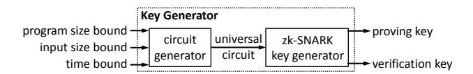
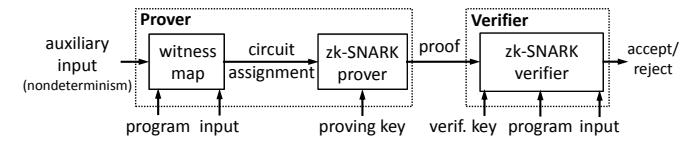
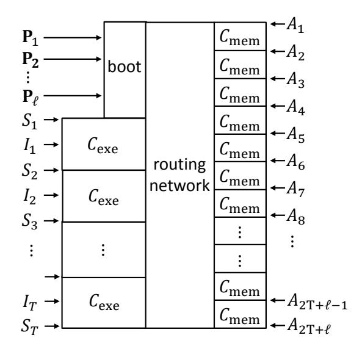

# <span id="page-0-0"></span>Succinct Non-Interactive Zero Knowledge for a von Neumann Architecture

Eli Ben-Sasson Technion

Alessandro Chiesa MIT

Eran Tromer Tel Aviv University Madars Virza MIT

February 5, 2019 (updated version)

#### Abstract

We build a system that provides succinct non-interactive zero-knowledge proofs (*zk-SNARK*s) for program executions on a von Neumann RISC architecture. The system has two components: a cryptographic proof system for verifying satisfiability of arithmetic circuits, and a circuit generator to translate program executions to such circuits. Our design of both components improves in functionality and efficiency over prior work, as follows.

Our circuit generator is the first to be *universal*: it does not need to know the program, but only a bound on its running time. Moreover, the size of the output circuit depends *additively* (rather than multiplicatively) on program size, allowing verification of larger programs.

The cryptographic proof system improves proving and verification times, by leveraging new algorithms and a pairing library tailored to the protocol.

We evaluated our system for programs with up to 10,000 instructions, running for up to 32,000 machine steps, each of which can arbitrarily access random-access memory; and also demonstrated it executing programs that use *just-in-time compilation*. Our proofs are 230 bytes long at 80 bits of security, or 288 bytes long at 128 bits of security. Typical verification time is 5 milliseconds, regardless of the original program's running time.

Keywords: zero-knowledge, succinct arguments, computationally-sound proofs

## Contents

| 1 | Introduction                                                      | 3  |
|---|-------------------------------------------------------------------|----|
|   | 1.1<br>Goal                                                       | 3  |
|   | 1.2<br>Prior work                                                 | 3  |
|   | 1.3<br>Limitations of prior work on zk-SNARKs<br>                 | 4  |
|   | 1.4<br>Results                                                    | 5  |
|   | 1.5<br>Roadmap<br>                                                | 7  |
| 2 | Preliminaries                                                     | 7  |
|   | 2.1<br>Notation                                                   | 7  |
|   | 2.2<br>Arithmetic circuits<br>                                    | 8  |
|   | 2.3<br>Quadratic arithmetic programs<br>                          | 8  |
|   | 2.4<br>Pairings<br>                                               | 9  |
|   | 2.5<br>zk-SNARKs for arithmetic circuits                          | 9  |
|   | 2.6<br>A von Neumann RISC architecture                            | 10 |
| 3 | Our circuit generator                                             | 10 |
|   | 3.1<br>Past techniques<br>                                        | 11 |
|   | 3.2<br>Our construction<br>                                       | 12 |
|   |                                                                   |    |
| 4 | Our zk-SNARK for circuits                                         | 14 |
|   | 4.1<br>The PGHR protocol and the two elliptic curves<br>          | 14 |
|   | 4.2<br>An optimized verifier                                      | 15 |
|   | 4.3<br>An optimized prover<br>                                    | 16 |
|   | 4.4<br>An optimized key generator                                 | 16 |
| 5 | Evaluation                                                        | 17 |
|   | 5.1<br>Performance of our circuit generator                       | 17 |
|   | 5.2<br>Performance of our zk-SNARK for circuit satisfiability<br> | 19 |
|   | 5.3<br>Performance of the combined system                         | 19 |
|   | 5.4<br>Comparison with prior work<br>                             | 21 |
|   |                                                                   |    |
| 6 | Conclusion                                                        | 22 |
| A | Other prior work                                                  | 24 |
| B | The PGHR zk-SNARK protocol                                        | 25 |
| C | Additional experimental data                                      | 26 |
|   |                                                                   |    |
| D | zk-SNARKs for vnTinyRAM                                           | 30 |
|   | D.1<br>Informal definition<br>                                    | 30 |
|   | D.2<br>Construction                                               | 31 |
| E | Case study: memcpy<br>with just-in-time compilation               | 32 |
|   | References                                                        | 33 |

## <span id="page-2-0"></span>1 Introduction

### <span id="page-2-1"></span>1.1 Goal

Consider the setting where a client owns a public input x, a server owns a private input w, and the client wishes to learn z := F(x, w) for a program F known to both parties. For instance, x may be a query, w a confidential database, and F the program that executes the query on the database.

Security. The client is concerned about *integrity* of computation: how can he ascertain that the server reports the correct output z? In contrast, the server is concerned about *confidentiality* of his own input: how can he prevent the client from learning information about w?

Cryptography offers a powerful tool to address these security concerns: *zero-knowledge proofs* [\[GMR89\]](#page-34-0). The server, acting as the prover, attempts to convince the client, acting as the verifier, that the following NP statement is true: "there exists w such that z = F(x, w)". Indeed:

- The *soundness* property of the proof system guarantees that, if the NP statement is false, the prover cannot convince the verifier (with high probability). Thus, soundness addresses the client's integrity concern.
- The *zero-knowledge* property of the proof system guarantees that, if the NP statement is true, the prover can convince the verifier without leaking any information about w (beyond was is leaked by the output z). Thus, zero knowledge addresses the server's confidentiality concern.

Moreover, the client sometimes not only seeks soundness but also *proof of knowledge* [\[GMR89,](#page-34-0) [BG93\]](#page-33-0), which guarantees that, whenever he is convinced, not only can he deduce that a witness w exists, but also that the server *knows* one such witness. This stronger property is often necessary to security if F encodes cryptographic computations, and is satisfied by most zero-knowledge proof systems.

Efficiency. Besides the aforementioned security desiderata, many settings also call for *efficiency* desiderata. The client may be either unable or unwilling to engage in lengthy interactions with the server, or to perform large computations beyond the "bare minimum" of sending the input x and receiving the output z. For instance, the client may be a computationally-weak device with intermittent connectivity (e.g., a smartphone).

Thus, it is desirable for the proof to be *non-interactive* [\[BFM88,](#page-33-1) [NY90,](#page-35-0) [BDSMP91\]](#page-32-1): the server just send the claimed output z˜, along with a non-interactive proof string π that attests that z˜ is the correct output. Moreover, it is also desirable for the proof to be *succinct*: π has size Oλ(1) and can be verified in time Oλ(|F| + |x| + |z|), where Oλ(·) is some polynomial in a security parameter λ; in other words, π is very short and easy to verify (i.e., verification time does *not* depend on |w|, nor F's running time).

zk-SNARKs. A proof system achieving the above security and efficiency desiderata is called a (publiclyverifiable) *zero-knowledge Succinct Non-interactive ARgument of Knowledge* (zk-SNARK). zk-SNARK constructions can be applied to a wide range of security applications, provided these constructions deliver good enough *efficiency*, and support rich enough *functionality* (i.e., the class of programs F that is supported).

Remark 1.1. In the zero-knowledge setting above, the client does not have the server's input, and so cannot conduct the computation on his own. Hence, it is *not meaningful* to compare "efficiency of outsourced computation at the server" and "efficiency of native execution at the client", because the latter was never an option. Non-interactive zero-knowledge proofs (and zk-SNARKs) are useful regardless of *cross-over points*.

#### Our goal in this paper is to construct

*a zk-SNARK implementation supporting executions on a universal von Neumann RISC machine*.

### <span id="page-2-2"></span>1.2 Prior work

zk-SNARKs. Many works have obtained zk-SNARK constructions [\[Gro10a,](#page-34-1) [Lip12,](#page-35-1) [GGPR13,](#page-34-2) [BCIOP13,](#page-32-2) [PGHR13,](#page-35-2) [BCGTV13a,](#page-32-3) [Lip13,](#page-35-3) [BFRS](#page-33-2)+13]. Three of these [\[PGHR13,](#page-35-2) [BCGTV13a,](#page-32-3) [BFRS](#page-33-2)+13] provide implementations, and thus we briefly recall them. Parno et al. [\[PGHR13\]](#page-35-2) present two main contributions.

- A zk-SNARK, with essentially-optimal asymptotics, for arithmetic circuit satisfiability, based on *quadratic arithmetic programs* (QAPs) [\[GGPR13\]](#page-34-2). They accompany their construction with an implementation.
- A compiler that maps C programs with fixed memory accesses and bounded control flow (e.g., array accesses and loop iteration bounds are compile-time constants) into corresponding arithmetic circuits. Ben-Sasson et al. [\[BCGTV13a\]](#page-32-3) present three main contributions.
- Also a QAP-based zk-SNARK with essentially-optimal asymptotics for arithmetic circuit satisfiability, and a corresponding implementation. Their construction follows the linear-interactive proofs of [\[BCIOP13\]](#page-32-2).
- A simple RISC architecture, TinyRAM, along with a circuit generator for generating arithmetic circuits that verify correct execution of TinyRAM programs.
- A compiler that, given a C program, produces a corresponding TinyRAM program.

Thus, both [\[PGHR13,](#page-35-2) [BCGTV13a\]](#page-32-3) have two main components: a zk-SNARK for a low-level language, and method to translate a high-level language to the low-level language. Finally, Braun et al. [\[BFRS](#page-33-2)+13] re-implemented the protocol of [\[PGHR13\]](#page-35-2) and combined it with a circuit generator that incorporates memorychecking techniques [\[BEGKN91\]](#page-33-3) to support random-access memory [\[BCGT13a\]](#page-32-4).

Outsourcing computation to powerful servers. Numerous works [\[SBW11,](#page-35-4) [SMBW12,](#page-35-5) [SVPB](#page-35-6)+12, [SBVB](#page-35-7)+13, [CMT12,](#page-33-4) [TRMP12,](#page-36-0) [VSBW13,](#page-36-1) [Tha13,](#page-36-2) [BFRS](#page-33-2)+13] seek to verifiably outsource computation to untrusted powerful servers, e.g., in order to make use of cheaper cycles or storage. (See Appendix [A](#page-23-0) for a summary.) We stress that verifiable outsourcing of computations *is not our goal*. Rather, as mentioned, we study functionality and efficiency aspects of *non-interactive zero-knowledge proofs*, which are useful even when applied to relatively-small computations, and even with high overheads.

Compared to most protocols to outsource computations, known zk-SNARKs use "heavyweight" techniques, such as *probabilistically-checkable proofs* [\[BFLS91\]](#page-33-5) and expensive pairing-based cryptography. The optimal choice of protocol, and whether it actually pays off compared to local *native execution*, are complex, computation-dependent questions [\[VSBW13\]](#page-36-1), and we leave to future work the question of whether zk-SNARKs are useful for the goal of outsourcing computations.

### <span id="page-3-0"></span>1.3 Limitations of prior work on zk-SNARKs

Recent work has made tremendous progress in taking zk-SNARKs from asymptotic theory into concrete implementations. Yet, known implementations suffer from several limitations.

Per-program key generation. As in any non-interactive zero-knowledge proof, a zk-SNARK requires a one-time trusted setup of public parameters: a *key generator* samples a proving key (used to generate proofs) and a verification key (used to check proofs). However, current zk-SNARK implementations [\[PGHR13,](#page-35-2) [BCGTV13a\]](#page-32-3) require the setup phase to depend on the program F, which is *hard-coded* in the keys. Key generation is costly (quasilinear in F's runtime) and is thus difficult to amortize if conducted anew for each program. More importantly, per-program key generation requires, *for each new choice of program*, a trusted party's help.

Limited support for high-level languages. Known circuit generators have limited functionality or efficiency: (i) [\[PGHR13\]](#page-35-2)'s circuit generator only supports programs without data dependencies, since memory accesses and loop iteration bounds cannot depend on a program's input; (ii) [\[BFRS](#page-33-2)+13]'s circuit generator allows data-dependent memory accesses, but each such access requires expensive hashing to verify Merkletree authentication paths; (iii) [\[BCGTV13a\]](#page-32-3)'s circuit generator supports arbitrary programs but its circuit size scales inefficiently with program size (namely, it has size Ω(`T) for `-instruction T-step TinyRAM programs). Moreover, while there are techniques that mitigate some of the above limitations [\[ZE13\]](#page-36-3), these only apply in special cases, and not do address general data dependencies, a common occurrence in many programs.

Ultimately, large general programs rely on external libraries (providing, e.g., mathematical subroutines or data structures), which contribute to program size. Thus, it is crucial to seek circuits that *simultaneously* support arbitrary programs and that efficiently scale with program size.

**Generic sub-algorithms.** The aforementioned zk-SNARKs use several sub-algorithms, and in particular elliptic curves and pairings. Protocol-specific optimizations are a key ingredient in fast implementations of pairing-based protocols [Sco05], yet prior implementations only utilize off-the-shelf cryptographic libraries, and miss key optimization opportunities.

#### <span id="page-4-0"></span>1.4 Results

We present two main contributions: a new circuit generator and a new zk-SNARK for circuits. These can be used independently, or combined to obtain an overall system.

#### <span id="page-4-2"></span>1.4.1 A new circuit generator

We design and build a new circuit generator that incorporates the following two main improvements.

(1) Our circuit generator is *universal*: when given input bounds  $\ell, n, T$ , it produces a circuit that can verify the execution of *any* program with  $\leq \ell$  instructions, on *any* input of size  $\leq n$ , for  $\leq T$  steps. Instead, all prior circuit generators [SVPB+12, SBVB+13, PGHR13, BCGTV13a, BFRS+13] hardcoded the program in the circuit. Combined with a zk-SNARK for circuits (or any NP proof system for circuits), we achieve a notable conceptual advance: *once-and-for-all key generation* that allows verifying all programs up to a given size. This removes major issues in all prior systems: expensive per-program key generation, and the thorny issue of conducting it anew in a trusted way for every program.

Our circuit generator supports a universal machine that, like modern computers, follows the *von Neumann paradigm* (program and data lie in the same read/write address space). Concretely, it supports a von Neumann RISC architecture called vnTinyRAM, a modification of TinyRAM [BCGTV13b]. Thus, we also support programs leveraging techniques such as *just-in-time compilation* or *self-modifying code* [GESA<sup>+</sup>09, RP06].

To compile C programs to the vnTinyRAM machine language, we ported the GCC compiler to this architecture, building on the work of [BCGTV13a].

See Figure 1 for a functionality comparison with prior circuit generators (for details, see [BFRS<sup>+</sup>13, §2]).

<span id="page-4-1"></span>

| Supported functionality        | [SVPB <sup>+</sup> 12, SBVB <sup>+</sup> 13, PGHR13] | [BCGTV13a] | [BFRS <sup>+</sup> 13] | this work |
|--------------------------------|------------------------------------------------------|------------|------------------------|-----------|
| side-effect free computations  | ✓                                                    | ✓          | ✓                      | ✓         |
| data-dependent memory accesses | ×                                                    | ✓          | ✓                      | ✓         |
| data-dependent control flow    | ×                                                    | ✓          | ×                      | ✓         |
| self-modifying code            | ×                                                    | ×          | ×                      | ✓         |
| universality                   | ×                                                    | ×          | ×                      | ✓         |

Figure 1: Comparison of the functionality supported by our and previous circuit generators.

(2) Our circuit generator efficiently handles *larger* arbitrary programs: the size of the generated circuit  $C_{\ell,n,T}$  in terms of the bounds  $\ell, n, T$ , is

$$O\big((\ell+n+T)\cdot\log(\ell+n+T)\big)$$
 gates.

Thus, the dependence on program size is *additive*, instead of multiplicative as in [BCGTV13a], where the generated (non-universal) circuit has size  $\Theta((n+T) \cdot (\log(n+T) + \ell))$ . As Figure 2 shows, our efficiency improvement compared to [BCGTV13a] is not merely asymptotic but yields sizable concrete savings: as program size  $\ell$  increases, our amortized per-cycle gate count is essentially unchanged, while that of [BCGTV13a] grows without bound, becoming orders of magnitudes more expensive.

An efficiency comparison with other non-universal circuit generators [SVPB<sup>+</sup>12, SBVB<sup>+</sup>13, PGHR13, BFRS<sup>+</sup>13] is not well-defined. First, they support more restricted classes of programs, so a programmer must "write around" the limited functionality. Second, their efficiency is not easily specified, since the output circuit is ad hoc for the given program, and the only way to know its size is to actually run the circuit generator. We

<span id="page-5-0"></span>

| n = 102 | C`,n,T     | /T        | improvement |
|---------|------------|-----------|-------------|
| T = 220 | [BCGTV13a] | this work |             |
| ` = 103 | 1,872      | 1,368     | 1.4×        |
| ` = 104 | 10,872     | 1,371     | 7.9×        |
| ` = 105 | 100,872    | 1,400     | 72.1×       |
| ` = 106 | 1,000,872  | 1,694     | 590.8×      |

Figure 2: Per-cycle gate count improvements over [\[BCGTV13a\]](#page-32-3).

expect, and find, that such circuit generators perform better than ours for programs that are already "close to a circuit", and worse for programs rich in data-dependent memory accesses and control flow.

#### 1.4.2 A new zk-SNARK for circuits

Our third contribution is a high-performance implementation of a zk-SNARK for arithmetic circuits.

(3) We improve upon and implement the protocol of Parno et al. [\[PGHR13\]](#page-35-2). Unlike previous zk-SNARK implementations [\[PGHR13,](#page-35-2) [BCGTV13a,](#page-32-3) [BFRS](#page-33-2)+13], we do not use off-the-shelf cryptographic libraries. Rather, we create a tailored implementation of the requisite components: the underlying finite-field arithmetic, elliptic-curve group arithmetic, pairing-based checks, and so on.

To facilitate comparison with prior work, we instantiate our techniques for two specific algebraic setups: we provide an instantiation based on Edwards curves [\[Edw07\]](#page-33-6) at 80 bits of security (as in [\[BCGTV13a\]](#page-32-3)), and an instantiation based on Barreto–Naehrig curves [\[BN06\]](#page-33-7) at 128 bits of security (as in [\[PGHR13,](#page-35-2) [BFRS](#page-33-2)+13]).

On our reference platform (a typical desktop), proof verification is fast: at 80-bit security, for an n-byte input to the circuit, verification takes 4.7 + 0.0004 · n milliseconds, *regardless of circuit size*; at 128-bit security, it takes 4.8 + 0.0005 · n. The constant term dominates for small inputs, and corresponds to the verifier's pairing-based checks; in both cases, it is *less than half* the time for separately evaluating the 12 requisite pairings of the checks. We achieve this saving by merging parts of the pairings' computation in a protocol-dependent way — another reason for a custom implementation of the underlying math.

Key generation and proof generation entail a per-gate cost. For example, for a circuit with 16 million gates: at 80 bits of security, key generation takes 81 µs per gate and proving takes 109 µs per gate; at 128 bits of security, these per-gate costs mildly increase to 100 µs and 144 µs.

As in previous zk-SNARK implementations, proofs have constant size (independent of the circuit or input size); for us, they are 230 bytes at 80 bits of security, and 288 bytes at 128 bits of security.

<span id="page-5-1"></span>Compared to previous implementations of zk-SNARKs for circuits [\[PGHR13,](#page-35-2) [BCGTV13a,](#page-32-3) [BFRS](#page-33-2)+13], our implementation improves both proving and verification times, e.g., see Figure [3.](#page-5-1)

|               |            | 80 bits of security |             |          | 128 bits of security |             |
|---------------|------------|---------------------|-------------|----------|----------------------|-------------|
|               | [BCGTV13a] | this work           | improvement | [PGHR13] | this work            | improvement |
| Key generator | 306 s      | 97 s                | 3.2×        | 123 s    | 117 s                | 1.1×        |
| Prover        | 351 s      | 115 s               | 3.1×        | 784 s    | 147 s                | 5.3×        |
| Verifier      | 66.1 ms    | 4.9 ms              | 13.5×       | 9.2 ms   | 5.1 ms               | 1.8×        |
| Proof size    | 322 B      | 230 B               | 1.4×        | 288 B    | 288 B                | (same)      |

Figure 3: Comparison with prior zk-SNARKs for a 1-million-gate arithmetic circuit and a 1000-bit input, running on our benchmarking machine, using software provided by the respective authors. Since [\[BFRS](#page-33-2)<sup>+</sup>13] is a re-implementation of [\[PGHR13\]](#page-35-2), we only include the latter's performance. (N = 5 and std < 2%)

#### 1.4.3 The two new components: independent or combined

Our new circuit generator and our new zk-SNARK for circuits can be used independently. For instance, the circuit generator can (up to interface matching) replace the circuit generators in [\[SVPB](#page-35-6)+12, [SBVB](#page-35-7)+13, PGHR13, BCGTV13a, BFRS<sup>+</sup>13], thus granting these systems universality: once-and-for-all key generation. Similarly, our zk-SNARK for circuits can replace the underlying zk-SNARKs in [PGHR13, BCGTV13a, BFRS<sup>+</sup>13], or be used directly in applications where a suitable circuit is already specified.

Combining these two components, we obtain a full system: a *zk-SNARK* for proving/verifying correctness of vnTinyRAM computations; see Figure 4 and Figure 5 for diagrams of this system. We evaluated this overall system for programs with up to 10,000 instructions, running for up to 32,000 steps. Verification time is, again, only few milliseconds, independent of the running time of the vnTinyRAM program, even when program size and input size are kilobytes. Proofs, as mentioned, have a small constant size. Key generation and proof generation entail a per-cycle cost, with a dependence on program size that "tapers off" as computation length increases. For instance, at 128-bit security and vnTinyRAM with a word size of 32 bits, key generation takes 210 ms per cycle and proving takes 100 ms per cycle, for 8K-instruction programs.



<span id="page-6-3"></span>Figure 4: **Offline phase (once).** The key generator outputs a proving key and verification key, for proving and verifying correctness of any program execution meeting the given bounds.



Figure 5: **Online phase (any number of times).** The prover sends a short and easy-to-verify proof to a verifier. This can be repeated any number of times, each time for a different program and input.

**JIT case study: efficient memcpy.** Besides evaluating individual components, we give an example demonstrating the rich functionality supported by the integrated system. We wrote a vnTinyRAM implementation of memcpy that leverages *just-in-time compilation* (in particular, *dynamic loop unrolling*) to require fewer cycles. While ours is a simple case study, just-in-time compilation is a widely-used powerful technique with many applications, e.g., increasing the performance of interpreted programming languages such as JavaScript in web browsers [GESA+09] or Python [RP06]. As the efficiency of zk-SNARK implementations improves, more and more of these applications will become feasible.

#### <span id="page-6-0"></span>1.5 Roadmap

In Section 2 we provide preliminaries. In Section 3 we describe our circuit generator. In Section 4 we describe our zk-SNARK for circuits. In Section 5 we evaluate our circuit generator and zk-SNARK, as well as the system resulting by combining the two. In Section 6 we conclude the paper.

#### <span id="page-6-1"></span>2 Preliminaries

#### <span id="page-6-2"></span>2.1 Notation

We denote by  $\mathbb{F}$  a finite field and  $\mathbb{F}_n$  is the field of size n; when n is prime, we identify elements of  $\mathbb{F}_n$  with integers modulo n. Field elements are denoted with Greek letters (e.g.  $\alpha, \beta, \gamma$ ). We denote by  $\mathbb{F}[z]$  the ring of univariate polynomials over  $\mathbb{F}$ , and by  $\mathbb{F}^{\leq d}[z]$  the subring of polynomials of degree  $\leq d$ . Vectors are denoted by arrow-equipped letters (such as  $\vec{a}$ ); their entries carry an index but not the arrow (e.g.,  $a_1$  or  $a_2$ ). Concatenation of vectors (and scalars) is denoted by the operator  $\circ$ .

#### <span id="page-7-0"></span>2.2 Arithmetic circuits

The circuits that we consider are not boolean but *arithmetic*. Given a finite field  $\mathbb{F}$ , an  $\mathbb{F}$ -*arithmetic circuit* takes inputs that are elements in  $\mathbb{F}$ , and its gates output elements in  $\mathbb{F}$ . The circuits we consider only have *bilinear gates*.<sup>1</sup> Arithmetic circuit satisfiability is analogous to the boolean case:

**Definition 2.1.** Let n, h, l respectively denote the input, witness, and output size. The **circuit satisfaction problem** of a circuit  $C: \mathbb{F}^n \times \mathbb{F}^h \to \mathbb{F}^l$  with bilinear gates is defined by the relation  $\mathcal{R}_C = \{(\vec{x}, \vec{a}) \in \mathbb{F}^n \times \mathbb{F}^h : C(\vec{x}, \vec{a}) = 0^l\}$ ; and its language is  $\mathcal{L}_C = \{\vec{x} \in \mathbb{F}^n : \exists \vec{a} \in \mathbb{F}^h, C(\vec{x}, \vec{a}) = 0^l\}$ .

Our circuit generator reduces the correctness of program executions to arithmetic circuit satisfiability (see Section 3), and our zk-SNARK implementation produces/verifies proofs for this language (see Section 4).

All the arithmetic circuits we consider are over prime fields  $\mathbb{F}_p$ . In this case, when passing boolean strings as inputs to arithmetic circuits, we *pack* the string's bits into as few field elements as possible: given  $s \in \{0,1\}^m$ , we use  $[\![s]\!]_p^m$  to denote the vector  $\vec{x} \in \mathbb{F}_p^{|m|_p}$ , where  $|m|_p := \lceil m/\lfloor \log p \rfloor \rceil$ , such that the binary representation of  $x_i \in \mathbb{F}_p$  is the *i*-th block of  $\lceil \log p \rceil$  bits in *s* (padded with 0's if needed). We extend the notation  $[\![s]\!]_p^m$  to binary strings  $s \in \{0,1\}^n$  with n < m bits via padding:  $[\![s]\!]_p^m := [\![s0^{m-n}]\!]_p^m$ .

### <span id="page-7-1"></span>2.3 Quadratic arithmetic programs

Our zk-SNARK leverages quadratic arithmetic programs (QAPs), introduced by Gennaro et al. [GGPR13].

**Definition 2.2.** A quadratic arithmetic program of size m and degree d over  $\mathbb{F}$  is a tuple  $(\vec{A}, \vec{B}, \vec{C}, Z)$ , where  $\vec{A}, \vec{B}, \vec{C}$  are three vectors, each of m+1 polynomials in  $\mathbb{F}^{\leq d-1}[z]$ , and  $Z \in \mathbb{F}[z]$  has degree exactly d.

Like a circuit, a QAP induces a satisfaction problem:

<span id="page-7-2"></span>**Definition 2.3.** The **satisfaction problem** of a size-m QAP  $(\vec{A}, \vec{B}, \vec{C}, Z)$  is the relation  $\mathcal{R}_{(\vec{A}, \vec{B}, \vec{C}, Z)}$  of pairs  $(\vec{x}, \vec{s})$  such that (i)  $\vec{x} \in \mathbb{F}^n$ ,  $\vec{s} \in \mathbb{F}^m$ , and  $n \leq m$ ; (ii)  $x_i = s_i$  for  $i \in [n]$  (i.e.,  $\vec{s}$  extends  $\vec{x}$ ); and (iii) the polynomial Z(z) divides the following one:

$$(A_0(z) + \sum_{i=1}^m s_i A_i(z)) \cdot (B_0(z) + \sum_{i=1}^m s_i B_i(z)) - (C_0(z) + \sum_{i=1}^m s_i C_i(z)).$$

We denote by  $\mathcal{L}_{(\vec{A},\vec{B},\vec{C},Z)}$  the language of  $\mathcal{R}_{(\vec{A},\vec{B},\vec{C},Z)}$ .

Gennaro et al. [GGPR13] showed that circuit satisfiability can be efficiently reduced to QAP satisfiability (which can then be proved and verified using zk-SNARKs):

<span id="page-7-3"></span>**Lemma 2.4.** There exist two polynomial-time algorithms QAPinst, QAPwit that work as follows. For any circuit  $C: \mathbb{F}^n \times \mathbb{F}^h \to \mathbb{F}^l$  with a wires and b gates,  $(\vec{A}, \vec{B}, \vec{C}, Z) := \mathsf{QAPinst}(C)$  is a QAP of size m and degree d over  $\mathbb{F}$  that satisfies the following three properties.

- EFFICIENCY. It holds that m = a and d = n + b + l + 1.
- COMPLETENESS. For any  $(\vec{x}, \vec{a}) \in \mathcal{R}_C$ , it holds that  $(\vec{x}, \vec{s}) \in \mathcal{R}_{(\vec{A}, \vec{B}, \vec{C}, Z)}$ , where  $\vec{s} := \mathsf{QAPwit}(C, \vec{x}, \vec{a})$ .
- PROOF OF KNOWLEDGE. For any  $(\vec{x}, \vec{s}) \in \mathcal{R}_{(\vec{A}, \vec{B}, \vec{C}, Z)}$ , it holds that  $(\vec{x}, \vec{a}) \in \mathcal{R}_C$ , where  $\vec{a}$  is a prefix of  $\vec{s}$ .
- NON-DEGENERACY. The polynomials  $A_0, \ldots, A_n$  are linearly independent. Moreover, the intersection of the span of  $A_0, \ldots, A_n$  and the span of  $A_{n+1}, \ldots, A_m$  is trivial (only contains the zero polynomial).

<sup>&</sup>lt;sup>1</sup>A gate with inputs  $x_1, \ldots, x_m \in \mathbb{F}$  is *bilinear* if the output is  $\langle \vec{a}, (1, x_1, \ldots, x_m) \rangle \cdot \langle \vec{b}, (1, x_1, \ldots, x_m) \rangle$  for some  $\vec{a}, \vec{b} \in \mathbb{F}^{m+1}$ . In particular, these include addition, multiplication, and constant gates.

<sup>&</sup>lt;sup>2</sup>We identify a circuit (which is a directed acyclic graph with labeled vertices) with the function it computes.

Proof sketch. The third condition in Definition 2.3 implies that  $\langle 1 \circ \vec{s}, \vec{A}(\omega) \rangle \cdot \langle 1 \circ \vec{s}, \vec{B}(\omega) \rangle = \langle 1 \circ \vec{s}, \vec{C}(\omega) \rangle$  for all roots  $\omega$  of Z. In other words, membership in  $\mathcal{R}_{(\vec{A},\vec{B},\vec{C},Z)}$  is characterized by  $\deg Z = d$  rank-1 quadratic constraints in the variable  $\vec{s}$ , and we can choose these constraints by choosing coefficients for the polynomials  $\vec{A}, \vec{B}, \vec{C}$ . We use b+l constraints to encode the satisfiability of the arithmetic circuit C: one constraint per gate (enforcing its correct evaluation) and one constraint per circuit output (enforcing it to be zero). We then use an additional 1+n constraints to meet the non-degeneracy condition:  $1 \cdot 0 = 0$  and  $s_i \cdot 0 = 0$  for  $i = 1, \ldots, n$ .

**Remark 2.5.** The authors thank Ariel Gabizon [Gab19] and Bryan Parno for identifying a problem in an earlier version of Lemma 2.4. Previously, the lemma's "non-degeneracy" condition merely required that  $A_0, \ldots, A_n$  be non-zero and distinct, which did not suffice for the security of the protocol in Appendix B. The current non-degeneracy condition yields a QAP degree of d = n + b + l + 1 rather than d = b + l + 1.

The degree increase is negligible for all applications reported in this paper and [BCGG<sup>+</sup>14, BCTV14, CTV15, BCGTV15] because  $n \ll b$  (typically,  $n/b < 10^{-4}$ ), leaving performance results unaffected. A similar negligible increase holds for any circuit in which the number of inputs n is small compared to the number of gates b, as is the case, e.g., for many circuits that verify cryptographic computations.

#### <span id="page-8-0"></span>2.4 Pairings

The zk-SNARK constructions that we consider are based on cryptographic *pairings*, which we now introduce. Let  $\mathbb{G}_1$  and  $\mathbb{G}_2$  be two cyclic groups of order r. We denote elements of  $\mathbb{G}_1$ ,  $\mathbb{G}_2$  via calligraphic letters such as  $\mathcal{P}$ ,  $\mathcal{Q}$ . We write  $\mathbb{G}_1$  and  $\mathbb{G}_2$  in additive notation. Let  $\mathcal{P}_1$  be a generator of  $\mathbb{G}_1$ , i.e.,  $\mathbb{G}_1 = \{\alpha \mathcal{P}_1\}_{\alpha \in \mathbb{F}_r}$  ( $\alpha$  is also viewed as an integer, hence  $\alpha \mathcal{P}_1$  is well-defined); let  $\mathcal{P}_2$  be a generator for  $\mathbb{G}_2$ . A *pairing* is an efficient map  $e: \mathbb{G}_1 \times \mathbb{G}_2 \to \mathbb{G}_T$ , where  $\mathbb{G}_T$  is also a cyclic group of order r (which we write in multiplicative notation), satisfying the following properties: (i) *bilinearity*: for every nonzero elements  $\alpha, \beta \in \mathbb{F}_r$ , it holds that  $e(\alpha \mathcal{P}_1, \beta \mathcal{P}_2) = e(\mathcal{P}_1, \mathcal{P}_2)^{\alpha \beta}$ ; (ii) *non-degeneracy*:  $e(\mathcal{P}_1, \mathcal{P}_2)$  is not the identity in  $\mathbb{G}_T$ .

For high-level discussions of zk-SNARK constructions, the choice of instantiation of  $\mathbb{G}_1$ ,  $\mathbb{G}_2$ ,  $\mathbb{G}_T$ , as well as the choice of pairing e, does not matter. However, later, when discussing optimizations in our implementation (see Section 4), these choices matter a great deal.

#### <span id="page-8-1"></span>2.5 zk-SNARKs for arithmetic circuits

A (preprocessing) **zk-SNARK** for  $\mathbb{F}$ -arithmetic circuit satisfiability (see, e.g., [BCIOP13]) is a triple of polynomial-time algorithms (G, P, V), called *key generator*, *prover*, and *verifier*. The key generator G, given a security parameter  $\lambda$  and an  $\mathbb{F}$ -arithmetic circuit  $C: \mathbb{F}^n \times \mathbb{F}^h \to \mathbb{F}^l$ , samples a *proving key* pk and a *verification key* vk; these are the proof system's public parameters, which need to be generated only once per circuit. After that, anyone can use pk to generate non-interactive proofs for the language  $\mathcal{L}_C$ , and anyone can use the vk to check these proofs. Namely, given pk and any  $(\vec{x}, \vec{a}) \in \mathcal{R}_C$ , the honest prover  $P(\text{pk}, \vec{x}, \vec{a})$  produces a proof  $\pi$  attesting that  $\vec{x} \in \mathcal{L}_C$ ; the verifier  $V(\text{vk}, \vec{x}, \pi)$  checks that  $\pi$  is a valid proof for  $\vec{x} \in \mathcal{L}_C$ . A proof  $\pi$  is both a proof of knowledge, and a (statistical) zero-knowledge proof. The succinctness property requires that  $\pi$  has length  $O_{\lambda}(1)$  and V runs in time  $O_{\lambda}(|\vec{x}|)$ , where  $O_{\lambda}$  hides a (fixed) polynomial in  $\lambda$ .

**Constructions.** Several zk-SNARK constructions are known [Gro10a, Lip12, GGPR13, BCIOP13, PGHR13, BCGTV13a, Lip13]. The most efficient ones are based on *quadratic span programs* (QSPs) [GGPR13, Lip13] or *quadratic arithmetic programs* (QAPs) [GGPR13, BCIOP13, PGHR13, BCGTV13a]. We focused on QAP-based constructions, because QAPs allow for tighter reductions from *arithmetic* circuits (see Lemma 2.4). Concretely, we build on the QAP-based zk-SNARK protocol of Parno et al. [PGHR13] (see Section 4).

<sup>&</sup>lt;sup>3</sup>A more precise analysis shows that one only needs to add 1 + n - r constraints, where r is the rank of the  $(b + l) \times (1 + n)$  sub-matrix of the  $(b + l) \times a$  matrix in which the i-th row equals the "left coefficients" of the i-th rank-1 constraint.

Remark 2.6 (full succinctness). The key generator G takes C as input, and so its complexity is linear in |C|. One could require G to *not* take C as input, and have its output keys work for *all* (polynomial-size) circuits C; then, G's running time would be independent of C. A zk-SNARK satisfying this stronger property is *fully succinct*. Theoretical constructions of such zk-SNARKs are known, based on various cryptographic assumptions [\[Mic00,](#page-35-10) [Val08,](#page-36-4) [BCCT13\]](#page-32-9). Despite achieving essentially-optimal asymptotics [\[BFLS91,](#page-33-5) [BGHSV05,](#page-33-9) [BCGT13b,](#page-32-10) [BCGT13a,](#page-32-4) [BCCT13\]](#page-32-9) no implementations of them have been reported to date.[4](#page-0-0)

### <span id="page-9-0"></span>2.6 A von Neumann RISC architecture

Ben-Sasson et al. [\[BCGTV13a\]](#page-32-3) introduced TinyRAM, a Harvard RISC architecture with word-addressable memory. We modify TinyRAM to obtain vnTinyRAM, which differs from it in two main ways. First, vnTinyRAM follows the *von Neumann paradigm*, whereby program and data are stored in the same readwrite address space; programs may use runtime code generation. Second, vnTinyRAM has byte-addressable memory, along with instructions to load/store bytes or words.[5](#page-0-0)

Besides the above main differences, vnTinyRAM is very similar to TinyRAM. Namely, it is parametrized by the *word size*, denoted W, and the *number of registers*, denoted K. The *CPU state* of the machine consists of (i) a W-bit *program counter*; (ii) K general-purpose W-bit *registers*; (iii) a 1-bit *condition flag*. The full state of the machine also includes *memory*, which is a linear array of 2<sup>W</sup> bytes, and two *tapes*, each with a string of W-bit words, and read-only in one direction. One tape is for a *primary input* x and the other for an *auxiliary input* w (treated as nondeterministic, untrusted advice).

In memory, an instruction is represented as a double word (one word for an immediate, and another for opcode, etc.). Thus, a *program* P is a list of address/double-word pairs specifying the initial contents of memory; all other memory locations assume the initial value of 0.

At every time step, the machine executes the instruction encoded by pc-th double word in memory, where pc is program counter pc (with its lowest 2W/8 set to 0); every instruction increments pc by 2W/8 (which is number of bytes in a double word), unless it explicitly modifies pc. The machine's only input is via the input tapes and initial memory, and only output is via an answer instruction (which halts execution) having a single argument A, representing the return value, where A = 0 means "accept".

Language of accepting computations. Formally, when saying "prover/verify correct execution" we mean "membership in the language of accepting computations". This language is defined as follows.

<span id="page-9-2"></span>Definition 2.7. *Fix bounds* `, n, T*. The language* L`,n,T *consists of pairs* (P, x) *such that: (i)* P *is a program with* ≤ ` *instructions, (ii)* x *is a primary input with* ≤ n *words, (iii) there exists an auxiliary input* w *s.t.* P(x, w) *accepts in* ≤ T *steps. We denote by* R`,n,T *the relation corresponding to* L`,n,T *.*

For more details about vnTinyRAM, see [\[BCGTV13b\]](#page-32-5).

## <span id="page-9-1"></span>3 Our circuit generator

A circuit generator translates the correctness of suitably-bounded program executions into circuit satisfiability: given input bounds `, n, T, it produces a circuit that can verify the execution of *any* program with ≤ ` instructions, on *any* input of size ≤ n, for ≤ T steps. More precisely, using the notations [[s]]<sup>p</sup> (for packing the binary string s into field elements) and |s| p (for computing the number of field elements required to pack s) introduced in Section [2.2,](#page-7-0) we define a (universal) circuit generator for vnTinyRAM as follows.

<sup>4</sup> In concurrent work, Ben-Sasson et al. [\[BCTV14\]](#page-32-7) build a fully-succinct zk-SNARK, by following the approach of [\[BCCT13\]](#page-32-9). See [\[BCTV14\]](#page-32-7) for a discussion about the tradeoffs between our construction and theirs.

<sup>5</sup>Byte-addressing is common in programs performing array or string operations (and is a deeply-ingrained assumption in the GCC and LLVM compilers), while word-addressing in programs performing arithmetic. Simultaneous support for both greatly simplifies compiling higher-level languages to vnTinyRAM.

<span id="page-10-2"></span>**Definition 3.1.** A (universal) circuit generator of efficiency  $f(\cdot)$  over a prime field  $\mathbb{F}_p$  is a polynomialtime algorithm circ, together with an efficient witness map wit, working as follows. For any program size bound  $\ell$ , time bound T, and primary-input size bound n,  $C := \text{circ}(\ell, n, T)$  is an  $\mathbb{F}_p$ -arithmetic circuit  $C : \mathbb{F}_p^m \times \mathbb{F}_p^h \to \mathbb{F}_p^l$ , for  $m := |\ell 2W|_p + |nW|_p$  and some h, l, where W is the word size (cf. Section 2.6).

- EFFICIENCY. The circuit C has  $f(\ell, n, T)$  gates.
- COMPLETENESS. Given any program  $\mathbb{P}$ , primary input x, and witness w such that  $((\mathbb{P}, x), w) \in \mathcal{R}_{\ell, n, T}$ , it holds that  $(\vec{x}, \vec{a}) \in \mathcal{R}_C$ , where  $\vec{x} := [\![\mathbb{P}]\!]_p^{\ell 2W} \circ [\![x]\!]_p^{nW}$  and  $\vec{a} := wit(\ell, n, T, \mathbb{P}, x, w)$ .
- PROOF OF KNOWLEDGE. There is a polynomial-time algorithm such that, given any  $(\vec{x}, \vec{a}) \in \mathcal{R}_C$ , outputs a witness w for  $(\mathbb{P}, x) \in \mathcal{L}_{\ell,n,T}$ .

The circuit C output by circ is *universal* because it does not depend on the program  $\mathbb{P}$  or primary input  $\mathbb{X}$ , but only on their respective size bounds  $\ell$  and n (as well as the time bound T). When combined with any proof system for circuit satisfiability (e.g., our zk-SNARK), this fact enables the generation of the proof systems' parameters to be universal as well. Namely, it is possible to generate keys for all bound choices (e.g., in powers of 2) up to some constant, *once and for all*; afterwards, one can pick the keys corresponding to bounds fitting a given computation. This avoids expensive per-program key generation and, more importantly, the need for a trusted party to conduct key generation anew for every program.

We construct a universal circuit generator with the following efficiency:

<span id="page-10-1"></span>**Theorem 3.2.** There is a circuit generator of efficiency  $f(\ell, n, T) = O((\ell + n + T) \cdot \log(\ell + n + T))$  over any prime field  $\mathbb{F}_p$  of size  $p > 2^{2W}$ , where W is the word size (cf. Section 2.6).

**Remark 3.3.** The prime p is determined by the zk-SNARK construction with which the circuit generator is combined, and in our case is at least 160 bits (so that inverting discrete logarithms in related groups is hard). Thus, the condition  $p > 2^{2W}$  is not really a restriction, even for large word sizes (e.g., W = 64). Regardless, Theorem 3.2 in fact holds for *any* field  $\mathbb{F}$ , but the construction, when  $\operatorname{char}(\mathbb{F}) \leq 2^{2W}$ , is more complex, and our code does not currently support it.

#### <span id="page-10-0"></span>3.1 Past techniques

Most of the difficulties that arise when designing a circuit generator have to do with *data dependencies*. A circuit's topology does not depend on its inputs but, in contrast, program flow and memory accesses depend on the choice of program and the program's inputs. Thus, a circuit tasked with verifying program executions must be "ready" to support a multitude of program flows and memory accesses, despite the fact that its topology has already been fixed. Various techniques have been applied to the design of circuit generators.

**Program analysis.** In the extreme, if both the program  $\mathbb{P}$  and its inputs (x, w) are known in advance, designing a circuit generator is simple: construct a circuit that evaluates  $\mathbb{P}$  on (x, w) by preparing the circuit's topology to match the pre-determined program flow and memory accesses. But now suppose that only  $\mathbb{P}$  is known in advance, but not its inputs (x, w). In this case, by analyzing  $\mathbb{P}$  piece by piece (e.g., separately examine the various loops, branches, and so on), one could try to design a circuit  $C_{\mathbb{P}}$  that can handle different choices of inputs. Most prior circuit generators [SVPB+12, SBVB+13, PGHR13, BFRS+13] take this approach.

However, this approach suffers from several limitations. First, the class of supported programs  $\mathbb{P}$  is not rich, because support for data dependencies is limited. E.g., [PGHR13] requires array accesses and loop iteration bounds to be compile-time constants; also, while [BFRS<sup>+</sup>13] supports data-dependent memory accesses, most program flow is also restricted to be known (or bounded) at compile-time; mitigations are possible, but only in special cases [ZE13]. Second, and more importantly, this approach does not seem to allow for designing universal circuit generators, because the program  $\mathbb{P}$  is *not known in advance* and thus there is no program to analyze.

Multiplex every access. Computers are universal random-access machines (RAMs), so one approach of designing a universal circuit is to mimic a computer's execution, building a layered circuit as follows. The i-th layer contains the entire state of the machine (CPU state and random-access memory) at time step i, and layer i+1 is computed from it by evaluating the transition function of the machine, handling any accesses to memory via multiplexing. While this approach supports arbitrary program flow, memory accesses are inefficiently supported; indeed, if memory has S addresses, the resulting circuit is huge: it has size  $\Omega(TS)$ .

**Nondeterministic routing.** Ben-Sasson et al. [BCGT13a] suggested using *nondeterministic routing* on a Beneš network to support memory accesses efficiently; indeed, sorting and routing are ubiquitous techniques in fast simulation results between nondeterministic models of computation [Ofm65, Sch78, GS89, Rob91]. Our circuit generator builds on the techniques of [BCGT13a, BCGTV13a], so we briefly review the main idea behind nondeterministic routing.

Following [BCGT13a], Ben-Sasson et al. [BCGTV13a] introduced a simple computer architecture, called TinyRAM, and constructed a routing-based circuit generator for TinyRAM. They define the following notions. A *CPU state*, denoted S, is the CPU's contents (e.g., program counter, registers, flags) at a given time step. An *execution trace* for a program  $\mathbb{P}$ , time bound T, and primary input  $\mathbb{X}$  is a sequence  $\mathrm{tr} = (S_1, \ldots, S_T)$  of CPU states. An execution trace  $\mathrm{tr}$  is *valid* if there is an auxiliary input  $\mathbb{W}$  such that the execution trace induced by  $\mathbb{P}$  running on inputs  $(\mathbb{X}, \mathbb{W})$  is  $\mathrm{tr}$ .

We seek an arithmetic circuit C for verifying that tr is valid. We break this down by splitting validity into three sub-properties: (i) validity of instruction fetch (for each time step, the correct instruction is fetched); (ii) validity of instruction execution (for each time step, the fetched instruction is correctly executed); and (iii) validity of memory accesses (each load from an address retrieves the value of the last store to that address).

The first two properties are verified as follows. Construct a circuit  $C_{\mathbb{P}}$  so that, for any two CPU states S and S',  $C_{\mathbb{P}}(S,S',g)$  is satisfied for some "guess" g if and only if S' can be reached from S (by fetching from  $\mathbb{P}$  the instruction indicated by the program counter in S and then executing it), for *some* state of memory. Then, properties (i) and (ii) hold if  $C_{\mathbb{P}}(S_i,S_{i+1},\cdot)$  is satisfiable for  $i=1,\ldots,T-1$ . Thus, C contains T-1 copies of  $C_{\mathbb{P}}$ , each wired to a pair of adjacent states in tr.

The third property is verified via nondeterministic routing. Assume that C also gets as input MemSort(tr), which equals to the sorting of tr by accessed memory addresses (breaking ties via timestamps), and write a circuit  $C_{\text{mem}}$  so that validity of memory accesses holds if  $C_{\text{mem}}$  is satisfied by each pair of adjacent states in MemSort(tr). (Roughly,  $C_{\text{mem}}$  checks consistency of "load-after-load", "load-after-store", and so on.) However, C merely gets some auxiliary input tr\*, which *purports* to be MemSort(tr). So C works as follows: (a) C has T-1 copies of  $C_{\text{mem}}$ , each wired to a pair of adjacent states in tr\*; (b) C separately verifies that tr\* = MemSort(tr) by routing on a  $O(T \log T)$ -node Beneš network. The switches of the routing network are set according to non-deterministic guesses (i.e., additional values in the auxiliary input), and the routing network merely *verifies* that the switch settings induce a permutation; this allows for a very tight reduction. (Known constructions that *compute* the correct permutation hide large constants in big-oh notation [AKS83].) **Past inefficiencies.** After filling in additional details, the construction of [BCGTV13a] reviewed above

**Past inefficiencies.** After filling in additional details, the construction of [BCGTV13a] reviewed above gives a circuit of size  $\Theta((n+T) \cdot (\log(n+T) + \ell)) = \Omega(\ell \cdot T)$ . The  $\Omega(\ell \cdot T)$  arises from the fact that all of the  $\ell$  instructions in  $\mathbb P$  are *hardcoded* into each of the T-1 copies of  $C_{\mathbb P}$ . Thus, besides being non-universal, the circuit scales inefficiently as  $\ell$  grows (e.g., for  $\ell = 10^4$ ,  $C_{\mathbb P}$ 's size is already dominated by  $\mathbb P$ 's size).

#### <span id="page-11-0"></span>3.2 Our construction

In comparison to [BCGTV13a], our circuit generator is universal and, moreover, its size only grows with  $\ell+T$  (additive dependence on program size) instead of with  $\ell\cdot T$  (multiplicative dependence). As our evaluation demonstrates (see Section 5.1), the size improvement actually translates into significant savings in practice.

Instead of hardcoding the program  $\mathbb{P}$  into each copy of the circuit  $C_{\mathbb{P}}$ , we follow the von Neumann paradigm, where the program  $\mathbb{P}$  lies in the same read/write memory space as data. We ensure that  $\mathbb{P}$  is loaded into the initial state of memory, using a dedicated circuit; we then verify instruction fetch via the *same* routing network that is used for checking data loads/stores. While the idea is intuitive, realizing it involves numerous technical difficulties, some of which are described below.

**Routing instructions and data.** We extend an execution trace to not only include CPU states but also instructions:  $tr = (S_1, I_1, \dots, S_T, I_T)$  where  $S_i$  is the *i*-th CPU state, and  $I_i$  is the *i*-th executed instruction. We seek an arithmetic circuit C that checks tr, in this "extended" format, for the same three properties as above: (i) validity of instruction fetch; (ii) validity of instruction execution; (iii) validity of memory accesses.

As in [BCGTV13a], checking that tr satisfies property (ii) is quite straightforward. Construct a circuit  $C_{\text{exe}}$  so that, given two CPU states S, S' and an instruction  $I, C_{\text{exe}}(S, S', I, g)$  is satisfied, for some guess g, if and only if S' can be reached from S, by executing I, for some state of memory. Then, C contains T-1 copies of  $C_{\text{exe}}$ , each wired to adjacent CPU states and an instruction, i.e., the i-th copy is  $C_{\text{exe}}(S_i, S_{i+1}, I_i, g_i)$ .

Unlike [BCGTV13a], though, we verify properties (i) and (iii) jointly, via the same routing network. The auxiliary input now contains  $\operatorname{tr}^* = (A_1, \dots, A_{2T})$ , purportedly equal to the memory-sorted list of *both* instructions fetches and CPU states. (Since the program  $\mathbb P$  lies in the same read-write memory as data, an instruction fetch from  $\mathbb P$  is merely a special type of memory load.) Thus, to check that tr satisfies properties (i) and (iii), we design C to (a) verify that  $\operatorname{tr}^* = \operatorname{MemSort}(\operatorname{tr})$  via nondeterministic routing, and (b) verify validity of all (i.e., instruction and data) memory accesses, via a new circuit  $C'_{\text{mem}}$  applied to each pair of adjacent items  $A_i, A_{i+1}$  in  $\operatorname{tr}^*$ . Thus, in this approach,  $\mathbb P$  is never replicated T times; rather, the fetching of its instructions is verified together with all other memory accesses, one instruction fetch at a time.

Multiple memory-access types. Each copy of  $C'_{\text{mem}}$  inspects a pair of items in tr\* and (assuming tr\* = MemSort(tr)) must ensure consistency of "load-after-load", "load-after-store", and so on. However, unlike in [BCGTV13a], the byte-addressable memory of vnTinyRAM is accessed in different-sized blocks: instruction-size blocks for instruction fetch; word-size blocks when loading/storing words; and byte-size blocks when loading/storing bytes. The consistency checks in  $C'_{\text{mem}}$  must handle "aliasing", i.e., accesses to the same point in memory via different addresses and block sizes.

We tackle this difficulty as follows. Double-word blocks are the largest blocks in which memory is accessed (as instructions are encoded as double words; cf. Section 2.6). We thus let each item in  $tr^*$  always specify a double-word, even if the item's memory access was with respect to a smaller-sized block (e.g., word or byte). With this modification, we can let  $C'_{mem}$  perform consistency checks "at the double-word level", and handling word/byte accesses by mapping them to double-word accesses with suitable shifting and masking.

**Booting the machine.** We have so far assumed that the program  $\mathbb{P}$ , given as input to C, already appears in memory. However, the circuit C sketched so far only verifies the validity of tr with respect to a machine whose memory is initialized to *some* state, corresponding to the execution of *some* program. But C must verify correct execution of, specifically,  $\mathbb{P}$ , and so it must also verify that memory is initialized to contain  $\mathbb{P}$ . Since C does not explicitly maintain memory (not even the initial one) and only implicitly reasons about memory via the routing network, it is not clear how C can perform this check.

We tackle this difficulty as follows. We further modify the the execution trace tr, by extending it with an initial *boot* section, preceding the beginning of the computation, during which the input program  $\mathbb{P}$  is stored into memory, one instruction  $\mathbb{P}_i$  at a time. This extends the length of both tr and tr\* from 2T to  $\ell + 2T$ , for  $\ell$ -instruction programs, and introduces a new type of item, "boot input store", in tr\*. Similarly, the routing network is now responsible for routing  $\ell + 2T$ , rather than 2T, packets.

**Further optimizations.** The above construction sketch (depicted in Figure 6) is only intuitive, and does not discuss other optimizations that ultimately yield the performance that we report in Section 5.1.

For example, while [BCGTV13a] rely on Beneš networks, we rely on *arbitrary-size Waksman networks* [BD02], which only require  $N(\log N - 0.91)$  switches to route N packets, instead of  $2^{\lceil \log N \rceil} (\lceil \log N \rceil - 0.5)$ .

Besides being closer to the information-theoretic lower bound of N(log N − 1.443), such networks eliminate costly rounding effects in [\[BCGTV13a\]](#page-32-3), where the size of the network is *doubled* if N is just above a power of 2 (since the height of a Benes network is ˇ 2 dlog Ne ).

As another example, we want C to not only support programs with *exactly* ` instructions but also with *at most* `, and similarly for the bound n on the size of primary inputs (which our discussion has so far omitted); we work out the details for C to efficiently support such upper bounds.

<span id="page-13-2"></span>Compiling to vnTinyRAM. To enable verification of higher-level programs, written in C, we ported the GCC compiler to the vnTinyRAM architecture, by modifying the Harvard-architecture, word-addressible TinyRAM C compiler of [\[BCGTV13a\]](#page-32-3). Given a C program, written in the same subset of C as in [\[BCGTV13a\]](#page-32-3), the compiler produces the initial memory map representing a program P. This also served to validate the vnTinyRAM architectural choices (e.g., the move to byte-addressing significantly, and added instructions, improved efficiency for many programs).



Figure 6: Outline of our universal circuit construction with the extended trace tr on the left and (allegedly) its memory sort tr<sup>∗</sup> on the right. All inputs to the circuit, with the exception of P (and the primary input x, not shown), are nondeterministic guesses.

## <span id="page-13-0"></span>4 Our zk-SNARK for circuits

We discuss our second main contribution: a high-performance implementation of a zk-SNARK for arithmetic circuit satisfiability. Our approach is to *tailor* the requisite mathematical algorithms to the *specific* zk-SNARK protocol at hand. While our techniques can be instantiated in many algebraic setups and security levels, we demonstrate them in two specific settings, to facilitate comparison with prior work. Later, in Section [5.2,](#page-18-0) we provide benchmarks for our zk-SNARK.

### <span id="page-13-1"></span>4.1 The PGHR protocol and the two elliptic curves

See Section [2.5](#page-8-1) for an informal definition of a zk-SNARK for arithmetic circuit satisfiability. We improve upon and implement the zk-SNARK of Parno et al. [\[PGHR13\]](#page-35-2). For completeness the "PGHR protocol" is summarized in Figure [10,](#page-24-1) which provides pseudocode for its key generator G, prover P, and verifier V . The construction is based on QAPs, introduced in Section [2.3.](#page-7-1)

Like most other zk-SNARKs, the PGHR protocol relies on a *pairing*, which is specified by a prime r ∈ N, three cyclic groups G1, G2, G<sup>T</sup> of order r, and a bilinear map e: G<sup>1</sup> × G<sup>2</sup> → G<sup>T</sup> . (See Section [2.4.](#page-8-0))

A pairing is typically instantiated via a pairing-friendly elliptic curve. Concretely, suppose that one uses a curve E defined over  $\mathbb{F}_q$ , with embedding degree k with respect to r, to instantiate the pairing. Then  $\mathbb{G}_T$  is set to  $\mu_r$ , the subgroup of r-th roots of unity in  $\mathbb{F}_{q^k}^*$ . The instantiation of  $\mathbb{G}_1$  and  $\mathbb{G}_2$  depends on the choice of e; typically,  $\mathbb{G}_1$  is instantiated as an order-r subgroup of  $E(\mathbb{F}_q)$ , while, for efficiency reasons [BKLS02, BLS04],  $\mathbb{G}_2$  as an order-r subgroup of  $E'(\mathbb{F}_{q^{k/d}})$  where E' is a d-th twist of E. Finally, the pairing e is typically a two-stage function  $e(\mathcal{P},\mathcal{Q}) := \mathsf{FE}(\mathsf{ML}(\mathcal{P},\mathcal{Q}))$ , where  $\mathsf{ML} \colon \mathbb{G}_1 \times \mathbb{G}_2 \to \mathbb{F}_q^k$  is known as  $\mathit{Miller loop}$ , and  $\mathsf{FE} \colon \mathbb{F}_q^k \to \mathbb{F}_q^k$  is known as  $\mathit{final exponentiation}$  and maps  $\alpha$  to  $\mathsf{FE}(\alpha) := \alpha^{(q^k-1)/r}$ .

As mentioned, we instantiate our techniques based on two different curves: an Edwards curve for the 80-bit security level (as in [BCGTV13a]) and a Barreto-Naehrig curve for the 128-bits security level (as in [PGHR13, BFRS<sup>+</sup>13]). We selected both the Edwards curve and Barreto-Naehrig curve so that r-1 has high 2-adic order (i.e., r-1 is divisible by a large power of 2), because this was shown to improve the efficiency of the key generator and the prover [BCGTV13a].

Next, we describe the optimizations that we have applied to the zk-SNARK verifier (Section 4.2), then to the prover (Section 4.3), and, finally, to the key generator (Section 4.4).

#### <span id="page-14-0"></span>4.2 An optimized verifier

The verifier V takes as input a verification key vk, input  $\vec{x} \in \mathbb{F}_r^n$ , and proof  $\pi$ , and checks if  $\pi$  is a valid proof for the statement " $\vec{x} \in \mathcal{L}_C$ ". The computation of V consists of two parts. First, use  $\mathsf{vk}_{\mathsf{IC},0}, \ldots, \mathsf{vk}_{\mathsf{IC},n} \in \mathbb{G}_1$  (part of vk) and input  $\vec{x}$  to compute  $\mathsf{vk}_{\vec{x}} := \mathsf{vk}_{\mathsf{IC},0} + \sum_{i=1}^n x_i \mathsf{vk}_{\mathsf{IC},i}$  (see Step 1 in Figure 10c). Second, use vk,  $\mathsf{vk}_{\vec{x}}$ , and  $\pi$ , to compute 12 pairings and perform the required checks (see Step 2, Step 3, Step 4 in Figure 10c). In other words, V performs O(n) scalar multiplications in  $\mathbb{G}_1$ , followed by O(1) pairing evaluations.

With regard to V's first part, variable-base multi-scalar multiplication techniques can be used to reduce the number of  $\mathbb{G}_1$  operations needed to compute  $\mathsf{vk}_{\vec{x}}$  [BCGTV13a, PGHR13]. With regard to V's second part, even if the pairing evaluations take constant time (independent of the input size n), these evaluations are very expensive and *dominate for small* n. Our focus here is to minimize the cost of these pairing evaluations.

When only making "black-box" use of a pairing, the verifier must evaluate 12 pairings(see Figure 10c), amounting to 12 Miller loops plus 12 final exponentiations. The straightforward approach is to compute these using a generic high-performance pairing library. We proceed differently: we obtain high-performance implementations of *sub-components* of a pairing, and then tailor their use specifically to V's protocol.

Namely, first, we obtain state-of-the-art implementations of a Miller loop and final exponentiation. We utilize *optimal pairings* [Ver10] to minimize the number of loop iterations in each Miller loop, and, to efficiently evaluate each Miller loop, rely on the formulas of [ALNR11] (for Edwards curves) and [BGDMO<sup>+</sup>10] (for BN curves). As for final exponentiation, we use multiple techniques to speed it up: [SBCDPK09, GS10, FCnKRH12, KKC13].

Next, building on the above foundation, we incorporate in V the following optimizations.

(1) Sharing Miller loops and final exponentiations. The verifier V computes two products of two pairings(see Step 3 and Step 4 in Figure 10c). We leverage the fact that a product of pairings can be evaluated faster than evaluating each pairing separately and then multiplying the results [Sol03, Sco05, GS06, Sco07]. Concretely, in a product of m pairings, the Miller loop iterations for evaluating each factor can be carried out in "lock-step" so to share a single *Miller accumulator variable*, using one  $\mathbb{F}_{q^k}$  squaring per loop instead of m.

In a similar vein, one can perform a single final exponentiation on the product of the outputs of the m Miller loops, instead of m final exponentiations and then multiplying the results. In fact, since the output of the pairing can be inverted for free (as the element is *unitary* so that inverting equals conjugating [SB04]), the idea of "sharing" final exponentiations extends to a ratio of pairing products. Thus, in the verifier we only need to perform 5, instead of 12, final exponentiations.

Our implementation incorporates both of the above techniques. For example, at the 80-bit security level, separately computing 12 optimal pairings costs 13.6 ms, but the above techniques reduce the time to only

8.1 ms. We decrease this further as discussed next.

(2) Precomputation by processing the verification key. Of the 12 pairings the verifier needs to evaluate, only one is such that both of its inputs come from the proof  $\pi$ . The other 11 pairings have one fixed input, either a generator of  $\mathbb{G}_1$  or  $\mathbb{G}_2$ , or coming from the verification key vk.

Whenever one of the two inputs to a pairing is fixed, precomputation techniques apply [GHS02, BLS03, Sco07], especially in the case when the fixed input is the *base point* in Miller's algorithm. In V, this holds for 9 out of the 11 pairing evaluations. We thus split the verifier's computation into an *offline phase*, which consists of a one-time precomputation that *only* depends on vk, and a many-time *online phase*, which depends on the precomputed values, input  $\vec{x}$ , and proof  $\pi$ . More precisely, the result of the offline phase is a *processed verification key* vk\*. While vk\* is longer than vk, it allows the online phase to be faster.

E.g., at the 80-bit security level, vk\* decreases the total cost of pairing checks from 8.1 ms to 4.7 ms.

#### <span id="page-15-0"></span>4.3 An optimized prover

The prover P takes as input a proving key pk (which includes the circuit  $C \colon \mathbb{F}^n_r \times \mathbb{F}^h_r \to \mathbb{F}^l_r$ ), input  $\vec{x} \in \mathbb{F}^n_r$ , and witness  $\vec{a} \in \mathbb{F}_r$ . The prover P is tasked to produce a proof  $\pi$ , attesting that  $\vec{x} \in \mathcal{L}_C$ . The computation of P consists of two main parts. First, compute the coefficients  $\vec{h}$  of the polynomial  $H(z) := \frac{A(z)B(z)-C(z)}{Z(z)}$  (see Step 4 in Figure 10b), where  $A, B, C \in \mathbb{F}_r[z]$  are derived from the QAP instance  $(\vec{A}, \vec{B}, \vec{C}, Z) := \operatorname{QAPinst}(C)$  and  $\operatorname{QAP}$  witness  $\vec{s} := \operatorname{QAPwit}(C, \vec{x}, \vec{a})$ . Second, use the coefficients  $\vec{h}$ , QAP witness  $\vec{s}$ , and public key pk to compute  $\pi$  (see Step 6 in Figure 10b).

With regard to the first part of P, the coefficients  $\vec{h}$  can be efficiently computed via FFT techniques [BCGTV13a, PGHR13]; our implementation follows [BCGTV13a], and leverages the high 2-adic order of r-1 for both of the elliptic curves we use.<sup>6</sup> With regard to P's second part, computing  $\pi$  requires solving large instances of the following problem: given elements  $Q_1, \ldots, Q_n$  all in  $\mathbb{G}_1$  (or all in  $\mathbb{G}_2$ ) and scalars  $\alpha_1, \ldots, \alpha_n \in \mathbb{F}_r$ , compute  $\langle \vec{\alpha}, \vec{Q} \rangle := \alpha_1 Q_1 + \cdots + \alpha_n Q_n$ . Previous work [PGHR13, BCGTV13a] has leveraged generic multi-scalar multiplication to compute  $\pi$ . We observe that these algorithms can be tailored to the specific scalar distributions arising in P. In P, the vector  $\vec{\alpha}$  is one of two types: (i)  $\vec{\alpha} \in \mathbb{F}_r^{d+1}$  and represents the coefficients of the degree-d polynomial H; or (ii)  $\vec{\alpha} = (1 \circ \vec{s} \circ \delta_1 \circ \delta_2 \circ \delta_3) \in \mathbb{F}_r^{d+m}$ , for random  $\delta_1, \delta_2, \delta_3 \in \mathbb{F}_r$ .

<span id="page-15-3"></span><span id="page-15-2"></span>In case i, the entries in of  $\vec{\alpha}$  are random-looking. We use the Bos-Coster algorithm [BC89] due to its lesser memory requirements (as compared to, e.g., [Pip80]). We follow [BDLSY11]'s suggestions and achieve an assembly-optimized heap to implement the Bos-Coster algorithm.

In case ii, the entries in  $\vec{s}$  depend on the input  $(C, \vec{x}, \vec{a})$  to QAPwit; in turn,  $(C, \vec{x}, \vec{a})$  depends on our circuit generator (Section 3). Using the above algorithm "as is" is inefficient: the algorithm works well when all the scalars have roughly the same bit complexity, but the entries in  $\vec{c}$  have very different bit complexity. Indeed,  $\vec{\alpha}$  equals to  $\vec{s}$  augmented with a few entries; and  $\vec{s}$ , the QAP witness, can be thought of as the list of wire values in C when computing on  $(\vec{x}, \vec{a})$ ; the bit complexity of a wire value depends on whether it is storing a boolean value, a word value, and so on. We observe that there are only a few "types" of values, so that the entries of  $\vec{\alpha}$  can be clustered into few groups of scalars with approximately the same bit complexity; we then apply the algorithm of [BC89] to each such group.

#### <span id="page-15-1"></span>4.4 An optimized key generator

The key generator G takes as input a circuit  $C: \mathbb{F}_r^n \times \mathbb{F}_r^h \to \mathbb{F}_r^l$ , and is tasked to compute a proving key pk and a verification key vk. The computation of G consists of two main parts. First, evaluate each  $A_i, B_i, C_i$  at

<sup>&</sup>lt;sup>6</sup>If the 2-adic order of r-1 is i then  $\mathbb{F}_r$  contains a primitive root of unity of order  $2^i$ . Hence, one can use the classical radix-2 multiplicative FFT [CT65] and its inverse over domains of size  $2^i$ . These algorithms only require  $O(n \log n)$  field operations for degree-n polynomials, and are particularly efficient in practice.

a random element  $\tau$ , where  $(\vec{A}, \vec{B}, \vec{C}, Z) := \mathsf{QAPinst}(C)$  is the QAP instance. Second, use these evaluations to compute pk and vk(see Step 3 and Step 4 in Figure 10a).

With regard to G's first part, we follow [BCGTV13a] and again leverage the fact that  $\mathbb{F}_r$  has a primitive root of unity of large order. With regard to G's second part, it is dominated by the cost of computing pk, which requires solving large instances of the following problem: given an element  $\mathcal{P}$  in  $\mathbb{G}_1$  or  $\mathbb{G}_2$  and scalars  $\alpha_1, \ldots, \alpha_n \in \mathbb{F}_r$ , compute  $\alpha_1 \mathcal{P}, \ldots, \alpha_n \mathcal{P}$ . Previous work [PGHR13, BCGTV13a], used fixed-base windowing [BGMW93] to efficiently compute such fixed-base multi-scalar multiplications.

In our implementation, we achieve additional efficiency, in space rather than in time. Specifically, we leverage a structural property of QAPs derived from arithmetic circuits, in order to reduce the size of the proving key pk, as we now explain. Lemma 2.4 states that an  $\mathbb{F}$ -arithmetic circuit  $C \colon \mathbb{F}^n \times \mathbb{F}^h \to \mathbb{F}^l$ , with  $\alpha$  wires and  $\beta$  gates, can be converted into a corresponding QAP of size  $m=\alpha$  and degree  $d\approx\beta$  over  $\mathbb{F}$ . Roughly, this is achieved in two steps. First, construct three matrices  $\mathbf{A}, \mathbf{B}, \mathbf{C} \in \mathbb{F}^{(m+1)\times d}$  that encode C's topology: for each  $j\in [d]$ , the j-th column of  $\mathbf{A}, \mathbf{B}$  respectively encodes the "left" and "right" coefficients of the j-th bilinear gate in C, while the j-th column of  $\mathbf{C}$  encodes the coefficients of the gate's output. Second, letting  $S\subset \mathbb{F}$  be a set of size d, define  $Z(z):=\prod_{\omega\in S}(z-\omega)$  and, for  $i\in\{0,\ldots,m\}$ , let  $A_i$  be the low-degree extension of the i-th row of  $\mathbf{A}$ ; similarly define each  $B_i$  and  $C_i$ . All prior QAP-based zk-SNARK implementations exploit the fact that columns in the matrices  $\mathbf{A}, \mathbf{B}, \mathbf{C}$  are very sparse.

In contrast, we also leverage a *different* kind of sparsity: we observe that it is common for *entire rows* of  $\mathbf{A}$ ,  $\mathbf{B}$ ,  $\mathbf{C}$  to be all zeroes, causing the corresponding low-degree extensions to be zero polynomials.<sup>7</sup> For instance, our circuit generator typically outputs a circuit for which the percentage of non-zero polynomials in  $\vec{A}$ ,  $\vec{B}$ ,  $\vec{C}$  is only about 52%, 15%, 71% respectively. The fact that many polynomials in  $\vec{A}$ ,  $\vec{B}$ ,  $\vec{C}$  evaluate to zero can be used towards reducing the size of pk, by switching from a dense representation to a sparse one.

In fact, we have *engineered* our circuit generator to reduce the number of non-zero polynomials in  $\vec{B}$  as much as possible, because computations associated to evaluations of  $\vec{B}$  are conducted with respect to more expensive  $\mathbb{G}_2$  arithmetic, which we want to avoid as much as possible.<sup>8</sup>

#### <span id="page-16-0"></span>5 Evaluation

We evaluated our system on a desktop computer with a 3.40 GHz Intel Core i7-4770 CPU (with Turbo Boost disabled) and 32 GB of RAM. All experiments, except the largest listed in Figure 8 and Figure 9, used a small fraction of the RAM. For the two largest experiments in Figure 9 we added a Crucial M4 solid state disk for swap space. Finally, while our code supports multi-threading, we ran all of our experiments in single-thread mode, for ease of comparison with prior work.

#### <span id="page-16-1"></span>5.1 Performance of our circuit generator

In Section 3 we described our universal circuit generator; we now benchmark its performance.

**Parameter choices.** The circuit generator supports the architecture vnTinyRAM, which is parametrized by two quantities: the *word size* W and the *number of registers* K (see Section 2.6). We report performance for a machine with K=16 registers, and two choices of word size: W=16 and W=32. Also, a circuit generator is defined relative to a prime field  $\mathbb{F}_p$  (see Definition 3.1) and its efficiency may in principle depend on p; since our construction has the *same* number of gates for any p with  $p>2^{2W}$  (a condition that holds for any cryptographically-large p), in the discussion below we do not have to worry about the value of p.

<sup>&</sup>lt;sup>7</sup>E.g., if the *i*-th wire never appears with a non-zero coefficient as the "left" input of a bilinear gate, then the *i*-th row of **A** is zero, and thus  $A_i$  is the zero polynomial.

 $<sup>^8</sup>$ Moreover, 15% non-zero polynomials in  $\vec{B}$  is likely not optimal: one can verify that minimizing the number of non-zero polynomials in  $\vec{B}$  reduces to a *minimum vertex cover problem* [MR96]. It is an interesting open question whether approximation algorithms for such a problem can be used to further improve efficiency, and go below 15%.

<span id="page-17-0"></span>

|            |              | Pe          | er-cycle | gate coun | t of $C :=$ | $\operatorname{circ}(\ell, n,$ | T) with vn     | TinyRA | M paramete | ers (W, K | (5)     |
|------------|--------------|-------------|----------|-----------|-------------|--------------------------------|----------------|--------|------------|-----------|---------|
|            |              |             |          |           |             | $n = 10^{2}$                   | $^{2}, K = 16$ |        |            |           |         |
|            |              |             |          | W = 16    |             |                                |                |        | W = 32     |           |         |
|            |              | C /T        |          | C /T div  | vided amo   | ong                            | Per            |        | C /T divi  | ided amo  | ng      |
|            |              | 0 /1        | boot     | exec.     | mem.        | routing                        | cycle          | boot   | exec.      | mem.      | routing |
| $10^{3}$   | $T = 2^{20}$ | 1,367.4     | 0.04     | 777.0     | 422.2       | 168.1                          | 1,992.5        | 0.08   | 1,114.0    | 710.4     | 168.1   |
|            | $T = 2^{24}$ | $1,\!399.0$ | 0.00     | 777.0     | 422.0       | 200.0                          | 2,024.0        | 0.00   | 1,114.0    | 710.0     | 200.0   |
| <i>l</i> = | $T = 2^{28}$ | 1,431.0     | 0.00     | 777.0     | 422.0       | 232.0                          | 2,056.0        | 0.00   | 1,114.0    | 710.0     | 232.0   |
| $10^{4}$   | $T = 2^{20}$ | 1,370.3     | 0.41     | 777.0     | 424.0       | 168.8                          | 1,997.0        | 0.72   | 1,114.0    | 713.4     | 168.8   |
|            | $T = 2^{24}$ | 1,399.2     | 0.03     | 777.0     | 422.1       | 200.1                          | 2,024.3        | 0.05   | 1,114.0    | 710.2     | 200.1   |
| ( =        | $T = 2^{28}$ | 1,431.0     | 0.00     | 777.0     | 422.0       | 232.0                          | 2,056.0        | 0.00   | 1,114.0    | 710.0     | 232.0   |
| $10^{5}$   | $T = 2^{20}$ | 1,399.7     | 4.12     | 777.0     | 442.1       | 176.4                          | 2,041.5        | 7.19   | 1,114.0    | 743.9     | 176.4   |
|            | $T = 2^{24}$ | 1,401.1     | 0.26     | 777.0     | 423.3       | 200.6                          | 2,027.2        | 0.45   | 1,114.0    | 712.1     | 200.6   |
| <i>β</i>   | $T = 2^{28}$ | 1,431.1     | 0.02     | 777.0     | 422.1       | 232.0                          | 2,056.2        | 0.03   | 1,114.0    | 710.1     | 232.0   |

Figure 7: **Performance of our circuit generator:** per-cycle gate counts in  $C := \text{circ}(\ell, n, T)$  for different choices of  $(\ell, n, T)$  and vnTinyRAM parameters (W, K).

**Methodology.** Theorem 3.2 provides an asymptotic efficiency guarantee: it states that our circuit generator has efficiency  $f(\ell, n, T) = O((\ell + n + T) \cdot \log(\ell + n + T))$ . To understand concrete efficiency, we "uncover" the constants hidden in the *big-oh* notation. By studying the number of gates in various subcircuits of the generated circuit  $C := \text{circ}(\ell, n, T)$ , we computed the following (quite tight) upper bound on C's size:

$$(12+2W) \cdot \ell + (12+W) \cdot n + |C_{\mathsf{exe}}| \cdot T + (|C_{\mathsf{mem}}| + 4\log H - 1.82) \cdot H$$

where  $H := (\ell + n + 2T)$  is the "height" of the routing network, and

- for (W, K) = (16,16):  $|C_{\mathsf{exe}}| = 777$  and  $|C_{\mathsf{mem}}| = 211$ ; and
- for (W, K) = (32,16):  $|C_{\mathsf{exe}}| = 1114$  and  $|C_{\mathsf{mem}}| = 355$ .

In Figure 7, we give per-cycle gate counts (i.e., |C|/|T|) for various choices of  $(\ell, n, T)$ ; we also give sub-counts divided among program/input boot, CPU execution, memory checking, and routing. (See Figure 11 in Appendix C for an extended table with additional data.)

**Discussion.** We first go through the size expression, to understand it: The first two terms,  $(12+2W) \cdot \ell + (12+W) \cdot n$ , correspond to the pre-execution boot phase, during which an  $\ell$ -instruction program and an n-word primary input are loaded into the machine. The term  $|C_{\text{exe}}| \cdot T$  corresponds to the T copies of  $C_{\text{exe}}$  used to verify each CPU transition, given the fetched instruction and two CPU states. The term  $|C_{\text{mem}}| \cdot H$  corresponds to the H copies of  $C_{\text{mem}}$  used to verify consistency on the memory-sorted trace. Finally, the term  $(4 \log H - 1.82) \cdot H$  corresponds to the routing network for routing H packets (two gates for each of  $(2 \log H - 0.91) \cdot H$  binary switches). Note that  $H = (\ell + n + 2T)$  because boot needs  $\ell + n$  memory stores (one for each program instruction and primary input word) and execution needs 2T memory accesses (1 instruction fetch and 1 data store/load per execution cycle).

The gate counts in Figure 7 demonstrate the additive (instead of multiplicative) dependence on program size of our universal circuit pays off. For example, for (W, K) = (32,16), a 100-fold increase in program size, from  $\ell = 10^3$  to  $\ell = 10^5$ , barely impacts the per-cycle gate count: for  $T = 2^{20}$ , it increases from 1,992.5 to only 2,041.5. Indeed, the cost of program size is incurred, once and for all, during the machine boot; Figure 7 shows that the per-cycle cost of machine boot diminishes as T grows.

Second, *less than half* of C's gates are dedicated to verifying accesses to random-access memory, while the majority of gates are dedicated to verifying execution of the CPU; indeed, almost always,  $|C_{\text{exe}}|T>\frac{1}{2}|C|$ . Put otherwise, C, which verifies an automaton with random-access memory (vnTinyRAM), has size that is less than twice that for verifying an automaton with the same CPU but no random-access memory at all. Moreover, note that the size of  $C_{\text{exe}}$  appears quite tight: for example, with (W, K) = (32,16), it has size 1114, not much larger than the size of the CPU state (545 bits).

### <span id="page-18-0"></span>5.2 Performance of our zk-SNARK for circuit satisfiability

In Section 4 we described our zk-SNARK implementation; we now benchmark its performance.

**Methodology.** We provide performance characteristics for each of the zk-SNARK algorithms, G, P and V, at the 80-bit and 128-bit security levels. We benchmark the system as follows.

- (1) The key generator G takes as input an arithmetic circuit  $C: \mathbb{F}_r^n \times \mathbb{F}_r^h \to \mathbb{F}_r^l$ . Its efficiency mostly depends on the number of gates and wires in C, because these affect the size and degree of the corresponding QAP (see Lemma 2.4). Thus, we evaluate G on a circuit with  $2^i$  gates and  $2^i$  wires for  $i \in \{10,12,\ldots,24\}$  (and fixed n=h=l=100). In Figure 8 we report the resulting running times and key sizes, as *per-gate costs*.
- (2) The prover P takes as input a proving key pk, input  $\vec{x} \in \mathbb{F}_r^n$ , and witness  $\vec{a} \in \mathbb{F}_r^h$ . Its efficiency mostly depends on the number of gates and wires in C (the circuit used to generate pk); we thus evaluate P on the proving keys output by G, for the same circuits as above. In Figure 8 we report the resulting running times, as per-gate costs, and (constant) proof sizes.
- (3) The verifier V takes as input a verification key vk, input  $\vec{x} \in \mathbb{F}_r^n$ , and proof  $\pi$ . Its efficiency depends only on  $\vec{x}$  (since the size of  $\vec{x}$  determines that of vk). Thus, we evaluate V on a random input  $\vec{x} \in \mathbb{F}_r^n$  of  $2^i$  bytes for  $i \in \{2,4,\ldots,20\}$ . In Figure 8 we report the resulting running times, along with corresponding key sizes. For completeness, Figure 12 in Appendix C reports the unnormalized measurements and additional information (e.g., times for various subcomputations).

**Discussion.** The data demonstrates that our zk-SNARK implementation works and scales as expected, as long as sufficient memory is available (e.g., on a desktop computer with 32GB of DRAM: up to 16 million gates); also, as expected, the higher security level entails higher costs. Key generation takes about 10 ms per gate of C; the size of a proving key is about 300 B per gate, and the size of a verification key is about 1 B per byte of input to C. Running the prover takes 11 ms to 14 ms per gate. For an n-byte input, proof verification time is  $c_1n + c_0$ , where  $c_0$  is a few milliseconds and  $c_1$  is a few tenths of microseconds.

Remark 5.1. Another factor affecting the efficiency of G and P is the number of non-zero polynomials in the QAP instance obtained from the circuit C (see Section 4.4). In Figure 8 we reported worst-case numbers in this respect: we only used circuits whose QAP has no non-zero polynomials. In general, QAP with more zero polynomials make the key generator and prover faster; in particular, the circuits output by our circuit generator induce QAP instances with many zero polynomials, so that the numbers reported in Section 5.3 are somewhat better than what one would expect by merely multiplying the per-gate costs of Figure 8 with the number of gates in the circuit output by the circuit generator.

#### <span id="page-18-1"></span>**5.3** Performance of the combined system

As discussed, our circuit generator (Section 3) and zk-SNARK for circuits (Section 4) can be used independently, or combined to obtain a zk-SNARK for vnTinyRAM. For completeness, in Appendix D.2 we spell out how these two components can be combined. Here we report measured performance of this combined system, at the 128-bit security level, and for a word size W=32 and number of registers K=16.

**Methodology.** A zk-SNARK for vnTinyRAM is a triple of algorithms (KeyGen, Prove, Verify). Given bounds  $\ell, n, T$  (for program size, input size, and time), the efficiency of KeyGen and Prove depends on  $\ell, n, T$ , while that of Verify essentially depends only on  $\ell, n$ . Thus, we benchmark the system as follows.

We evaluate KeyGen and Prove for various choices of  $\ell$  and T, while keeping n=100. (Varying  $\ell$  or n affects efficiency in similar ways, so we fix n and vary  $\ell$ .) Instead, since the efficiency of Verify does not depend on T, we evaluate Verify, for various choices of  $\ell$  and n, on random  $\ell$ -instruction programs and n-word inputs. In Figure 9, we report the following measurements: KeyGen's running time, the sizes of the keys pk and vk, Prove's runtime, the (constant) proof size, and Verify's running time. For quantities growing with T, we divide by T and report the per-cycle cost.

<span id="page-19-0"></span>

|             |                      | 80 bits of          | security               | 128 bits o          | f security             |
|-------------|----------------------|---------------------|------------------------|---------------------|------------------------|
|             | key gen. $G$         | $\mathrm{time}/ C $ | pk / C                 | $\mathrm{time}/ C $ | pk / C                 |
|             | $ C  = 2^{10}$       | 0.21 ms             | 248.8 B                | 0.21 ms             | 304.1 B                |
|             | $ C  = 2^{12}$       | 0.16 ms             | $252.5\mathrm{B}$      | 0.17 ms             | 309.1 B                |
|             | $ C  = 2^{14}$       | 0.14  ms            | $253.4\mathrm{B}$      | 0.16 ms             | 310.3 B                |
| 100         | $ C  = 2^{16}$       | $0.12\mathrm{ms}$   | $253.7\mathrm{B}$      | $0.14\mathrm{ms}$   | 310.6 B                |
| 11          | $ C  = 2^{18}$       | 0.11 ms             | $253.7\mathrm{B}$      | $0.12\mathrm{ms}$   | $310.7\mathrm{B}$      |
| "           | $ C  = 2^{20}$       | 0.10 ms             | $253.7\mathrm{B}$      | $0.12\mathrm{ms}$   | $310.7\mathrm{B}$      |
| `-          | $ C  = 2^{22}$       | 0.09 ms             | $253.7\mathrm{B}$      | 0.11 ms             | $310.7\mathrm{B}$      |
|             | $ C  = 2^{24}$       | 0.08 ms             | $253.7\mathrm{B}$      | 0.10 ms             | $310.7\mathrm{B}$      |
|             | vk                   | 2.8                 | KB                     | 3.6                 | KB                     |
|             | prover $P$           | $\mathrm{time}/ C $ | $ \pi $                | $\mathrm{time}/ C $ | $ \pi $                |
|             | $ C  = 2^{10}$       | 0.18 ms             | 230 B                  | 0.21 ms             | 288 B                  |
|             | $ C  = 2^{12}$       | 0.16 ms             | 230 B                  | 0.18 ms             | 288 B                  |
|             | $ C  = 2^{14}$       | 0.14  ms            | 230 B                  | 0.16 ms             | 288 B                  |
| 100         | $ C  = 2^{16}$       | 0.13  ms            | 230 B                  | $0.15\mathrm{ms}$   | 288 B                  |
| Ш           | $ C  = 2^{18}$       | $0.12\mathrm{ms}$   | 230 B                  | $0.15\mathrm{ms}$   | 288 B                  |
| u           | $ C  = 2^{20}$       | $0.12\mathrm{ms}$   | 230 B                  | $0.15\mathrm{ms}$   | 288 B                  |
|             | $ C  = 2^{22}$       | 0.11 ms             | 230 B                  | $0.14\mathrm{ms}$   | 288 B                  |
|             | $ C  = 2^{24}$       | 0.11 ms             | 230 B                  | 0.14 ms             | 288 B                  |
|             | verifier $V$         | $ vk / \vec{x} $    | ${\rm time}/ \vec{x} $ | $ vk / \vec{x} $    | ${\rm time}/ \vec{x} $ |
| $ \vec{x} $ | $=4\mathrm{B}$       | 118.7 B             | 1.2 ms                 | 123.4 B             | 1.2 ms                 |
| $ \vec{x} $ | = 16  B              | $29.7\mathrm{B}$    | $0.3\mathrm{ms}$       | 30.8 B              | $0.3\mathrm{ms}$       |
| $ \vec{x} $ | $=64\mathrm{B}$      | 8.1 B               | $76.7\mu\mathrm{s}$    | 8.7 B               | $81.2\mu\mathrm{s}$    |
| $ \vec{x} $ | $=256\mathrm{B}$     | $2.8\mathrm{B}$     | $19.5\mu\mathrm{s}$    | 2.9 B               | $20.3\mu\mathrm{s}$    |
| $ \vec{x} $ | $= 1.0  \mathrm{KB}$ | 1.5 B               | $5.4\mu\mathrm{s}$     | 1.5 B               | $5.9\mu\mathrm{s}$     |
| $ \vec{x} $ |                      | 1.1 B               | $1.8\mu\mathrm{s}$     | 1.1 B               | $2.1\mu\mathrm{s}$     |
| $ \vec{x} $ | -                    | 1.1 B               | $0.8\mu\mathrm{s}$     | 1.0 B               | $1.0\mu\mathrm{s}$     |
| $ \vec{x} $ |                      | 1.0 B               | $0.5\mu\mathrm{s}$     | 1.0 B               | $0.7\mu\mathrm{s}$     |
| $ \vec{x} $ | $=262.1\mathrm{KB}$  | 1.0 B               | $0.4\mu\mathrm{s}$     | 1.0 B               | $0.6\mu\mathrm{s}$     |
| $ \vec{x} $ | $=1.0\mathrm{MB}$    | 1.0 B               | $0.4\mu\mathrm{s}$     | 1.0 B               | $0.5\mu\mathrm{s}$     |

Figure 8: **Performance of our zk-SNARK for arithmetic circuit satisfiability:** per-gate costs of the key generator and prover for various circuit sizes; and per-byte costs of the verifier for various input sizes. (N = 10 and std < 1%)

For completeness, Figure 13 in Appendix C reports the unnormalized measurements and additional information, such as times for various subcomputations (e.g., subtimes for the circuit generator and zk-SNARK). **Discussion.** The measurements demonstrate that, on a desktop computer, our zk-SNARK for vnTinyRAM scales up to computations of 32,000 machine cycles, for programs with up to 10,000 instructions. Key generation takes about 200 ms per cycle; the size of a proving key is 500 KB to 650 KB per cycle, and the size of a verification key is a few kilobytes in total. Running the prover takes 100 ms to 200 ms per cycle. Verification times remain a few milliseconds, even for inputs and programs of several kilobytes.

**Program-specific vk.** The time complexity of Verify is  $O(\ell + n)$ , so verification time grows with program size. This is inevitable, because Verify must *read* a program  $\mathbb{P}$  (of at most  $\ell$  instructions) and input  $\mathbb{X}$  (of at most n words) in order to check, via the given proof n, if  $(\mathbb{P}, \mathbb{X}) \in \mathcal{L}_{\ell,n,T}$  (cf. Definition 2.7). However, this is inconvenient, e.g., when one has to verify many proofs relative to different inputs to the *same* program  $\mathbb{P}$ .

In our zk-SNARK it is possible to amortize this cost as follows. Given vk and  $\mathbb{P}$ , one can derive, in time  $O(\ell)$ , a program-specific verification key vk $_{\mathbb{P}}$ , which can be used to verify proofs relative to any input to  $\mathbb{P}$ . Subsequently, the time complexity of Verify for any input x (to  $\mathbb{P}$ ) is only O(n), independent of  $\ell$ . Essentially, one can pre-compute the program-specific part of vk $_{\vec{x}}$  (see Step 1 in Figure 10c), so that, later, one only needs to compute the input-dependent part of vk $_{\vec{x}}$  and combine it with vk $_{\mathbb{P}}$ . (Conversely, it is also possible to derive an input-specific verification key, for verifying proofs relative to the same input to different programs.)

Figure 13 in Appendix C also reports the subtime to compute vkp, which represents the time saved when

<span id="page-20-1"></span>

|        |        |         |         |          |          | 128 bits of security |          |          |
|--------|--------|---------|---------|----------|----------|----------------------|----------|----------|
|        |        |         |         |          |          | W = 32, K = 16       |          |          |
|        |        |         |         | ` = 2K   | ` = 4K   | ` = 6K               | ` = 8K   | ` = 10K  |
|        |        |         | T = 4K  | 209.8 ms | 232.1 ms | 257.5 ms             | 275.9 ms | 306.4 ms |
|        | time/T |         | T = 8K  | 190.9 ms | 205.9 ms | 216.1 ms             | 228.9 ms | 238.8 ms |
|        |        |         | T = 16K | 195.4 ms | 198.1 ms | 204.2 ms             | 213.6 ms | 218.3 ms |
|        |        | 100     | T = 32K | 206.0 ms | 208.4 ms | 211.2 ms             | 213.5 ms | 223.7 ms |
| KeyGen |        | =       | T = 4K  | 584.2 KB | 653.6 KB | 727.1 KB             | 784.0 KB | 876.8 KB |
|        | pk /T  | n       | T = 8K  | 552.4 KB | 585.2 KB | 618.1 KB             | 655.1 KB | 683.7 KB |
|        |        |         | T = 16K | 539.4 KB | 553.9 KB | 570.4 KB             | 586.9 KB | 605.5 KB |
|        |        |         | T = 32K | 533.8 KB | 541.1 KB | 548.3 KB             | 555.6 KB | 563.4 KB |
|        | vk     |         | T = ∗   | 17.0 KB  | 33.1 KB  | 49.2 KB              | 65.3 KB  | 81.5 KB  |
|        |        |         | T = 4K  | 75.7 ms  | 86.7 ms  | 103.4 ms             | 104.8 ms | 133.7 ms |
|        |        | 100     | T = 8K  | 69.2 ms  | 79.7 ms  | 97.0 ms              | 110.4 ms | 113.0 ms |
| Prove  | time/T | =       | T = 16K | 89.0 ms  | 89.1 ms  | 98.4 ms              | 99.6 ms  | 103.3 ms |
|        |        | n       | T = 32K | 98.9 ms  | 98.6 ms  | 102.3 ms             | 102.1 ms | 114.2 ms |
|        |        | T)      | n = 0   | 19.0 ms  | 30.0 ms  | 40.6 ms              | 51.2 ms  | 61.3 ms  |
|        |        | of      | n = 10  | 19.1 ms  | 30.2 ms  | 40.7 ms              | 51.2 ms  | 61.4 ms  |
| Verify | time   |         | n = 102 | 19.6 ms  | 30.7 ms  | 41.3 ms              | 51.8 ms  | 61.9 ms  |
|        |        |         | n = 103 | 23.0 ms  | 34.1 ms  | 44.7 ms              | 55.2 ms  | 65.4 ms  |
|        |        | (indep. | n = 104 | 48.9 ms  | 60.0 ms  | 70.6 ms              | 81.1 ms  | 91.3 ms  |

Figure 9: Performance of our zk-SNARK for vnTinyRAM: per-cycle costs of KeyGen and Prove for various choices of program size ` (all with input size n = 100), and total running time of Verify for various choices of ` and n. (N = 10 and std < 1.5% for all, except that std < 5% whenever T = 32K)

one first precomputes vkP ahead of time.

### <span id="page-20-0"></span>5.4 Comparison with prior work

### 5.4.1 Comparison with prior circuit generators

Universality is the main innovative feature of our circuit generator. *No* previous circuit generator achieves universality. (See Figure [1](#page-4-1) and Section [3.](#page-9-1))

Putting universality aside and focusing on efficiency instead, a comparison with previous circuit generators is a multi-faceted problem. On one hand, due to a shared core of techniques, a comparison with [\[BCGTV13a\]](#page-32-3)'s circuit generator is straightforward, and shows significant improvements in circuit size, especially as program size grows. See Section [1.4.1](#page-4-2) and Figure [2](#page-5-0) (the figure's numbers are for W, K = 16).

Instead, a comparison with other circuit generators [\[SVPB](#page-35-6)+12, [SBVB](#page-35-7)+13, [PGHR13,](#page-35-2) [BFRS](#page-33-2)+13] is complex. First, they support a smaller class of programs (see Figure [1\)](#page-4-1), so a programmer must "write around" the limited functionality, somehow. And second, their efficiency is not easily specified: due to the use of program-analysis techniques (see Section [3.1\)](#page-10-0) the output circuit is ad hoc for the given program, and the only way to know its size is to actually run the circuit generator.

Compared to [\[SVPB](#page-35-6)+12, [SBVB](#page-35-7)+13, [PGHR13,](#page-35-2) [BFRS](#page-33-2)+13], our circuit generator performs better for programs that are rich in memory accesses and control flow, and worse for programs that are more "circuit like".

Comparison with [\[SVPB](#page-35-6)+12, [SBVB](#page-35-7)+13, [PGHR13\]](#page-35-2). The circuit generators in [\[SVPB](#page-35-6)+12, [SBVB](#page-35-7)+13, [PGHR13\]](#page-35-2) restrict loop iteration bounds and memory accesses to be known at compile time; if a program does not respect these restrictions, it must be first somehow mapped to another one that does. For simplicity, we take [\[PGHR13\]](#page-35-2)'s circuit generator (the latest one) as representative and, to illustrate the differences between [\[PGHR13\]](#page-35-2)'s and our circuit generator, we consider two "extremes".

On one extreme, we wrote a simple C program multiplying two 10 × 10 matrices of 16-bit integers. The circuit generator in [\[PGHR13\]](#page-35-2) produces a circuit with 1100 gates[9](#page-0-0) ; instead, our circuit generator (when given

<sup>9</sup>The circuit produced by [\[PGHR13\]](#page-35-2) for int values, with "--bit-width= 16", nonetheless performs arithmetic modulo some large prime, without reductions modulo 2 16 .

the corresponding vnTinyRAM assembly) produces a much larger circuit: one with ≈ 10<sup>7</sup> gates.

On the other extreme, we consider a program making many random accesses to memory: pointer-chasing. Given a permutation π of [N], start position i ∈ [N], and an integer k, the program outputs π k (i), the element obtained by starting from i and following "pointers" for k times. Since no information about π is known at compile time, the only way of obtaining π(j), the pointer to follow, in [\[PGHR13\]](#page-35-2) is via a *linear scan*. On a simple C program that does one linear scan of π to obtain each new pointer, [\[PGHR13\]](#page-35-2)'s circuit generator outputs a circuit with 2N k + 1 gates (each of the k array accesses costs 2N gates).

In vnTinyRAM, the corresponding program P consists of 9 instructions, and the input x to it is N + 3 words. Booting vnTinyRAM with P and x requires 9 + N + 3 "boot stores" (see Section [3.2\)](#page-11-0), and takes 5 + 4k cycles to execute (independent of N). Say that we fix k = 10; then, in our circuit generator (with W = 32 and K = 16), each cycle costs about 2000 gates, and can perform a random access to memory. Thus, pointer chasing in our case is cheaper than in [\[PGHR13\]](#page-35-2) already for N > 5000, and the multiplicative saving, which is about <sup>20</sup><sup>N</sup> <sup>2000</sup>·(5+40) = N <sup>4500</sup> , grows unbounded as N increases.

Comparison with [\[BFRS](#page-33-2)+13]. The circuit generator of [\[BFRS](#page-33-2)+13] is also based on program analysis, but provides an additional feature that allows data-dependent memory accesses: a program may access memory by guessing the value and verifying its validity via a subcircuit that checks Merkle-tree authentication paths. In [\[BFRS](#page-33-2)+13], memory consists of 2 <sup>30</sup> cells, and each access costs many gates: 140K for a load, and 280K for a store. In comparison, in our circuit generator for vnTinyRAM (with word size W = 32 so that memory has 2 <sup>32</sup> cells), each memory store/load costs less than 1000 gates out of about 2000 per cycle (see Section [5.1\)](#page-16-1). Besides the aforementioned feature, [\[BFRS](#page-33-2)+13] rely on program analysis, and (as in [\[SVPB](#page-35-6)+12, [SBVB](#page-35-7)+13, [PGHR13\]](#page-35-2)) only support bounded control flow. Thus, [\[BFRS](#page-33-2)+13] performs better than our circuit generator for programs with bounded control flow and few data-dependent accesses to memory.

It is an intriguing open question whether techniques underlying our circuit generator can be combined with program analysis so to yield circuit generators achieving good efficiency both for restricted and rich programs, and avoid the sharp functionality vs. efficiency tradeoffs that exist among current circuit generators.

#### 5.4.2 Comparison with prior zk-SNARKs

Addressing the other component of our system, the zk-SNARK for circuits: Figure [3](#page-5-1) compares our implementation with prior ones, on a 1-million-gate circuit with a 1000-byte input. As shown, we mildly improve the key generation time and, more importantly, significantly improve the "online" costs of proving and verification.

## <span id="page-21-0"></span>6 Conclusion

We have presented two main contributions: (i) a circuit generator for a von Neumann RISC architecture that is *universal* and scales *additively* with program size; and (ii) a high-performance zk-SNARK for arithmetic circuit satisfiability. These two components can be used independently to the benefit of other systems, or combined into a zk-SNARK that can prove/verify correctness of computations on this architecture.

The benefits of universality. Universality attains the conceptual advance of *once-and-for-all key generation*, allowing verifying all programs up to a given size. This removes major issues in prior systems: expensive per-program key generation and the thorny issue of conducting it anew in a trusted way for every program.

The price of universality. We have demonstrated that our zk-SNARK scales, on a desktop computer, up to computations of 32,000 cycles, for programs with up to 10,000 instructions, relative to a simple universal computer (vnTinyRAM). Yet, the price of universality is still very high. Going forward, and aiming for widespread use in security applications, more work is required to slash costs of key generation and proving so to scale up to larger computations: e.g., billion-gate circuits, or millions of vnTinyRAM cycles, and beyond. An interesting open problem is whether the "program analysis" techniques underlying most prior circuit generators [\[SVPB](#page-35-6)+12, [SBVB](#page-35-7)+13, [PGHR13,](#page-35-2) [BFRS](#page-33-2)+13], typically more efficient for restricted classes of programs, can be used to construct universal circuits (for those same classes of programs).

Beyond vnTinyRAM. Finally, going beyond the foundation of a von Neumann RISC architecture, more work lies ahead towards a richer architecture (e.g., efficient support for floating-point arithmetic and cryptographic acceleration), code libraries, and tighter compilers.

## Acknowledgments

We thank Daniel Genkin, Raluca Ada Popa, Ron Rivest, and Nickolai Zeldovich for helpful comments and discussions, and Lior Greenblatt, Shaul Kfir, Michael Riabzev, and Gil Timnat for programming assistance. We thank Ariel Gabizon and Bryan Parno for finding a problem in earlier versions of Lemma [2.4](#page-7-3) and the protocol in Appendix [B.](#page-24-0) See [\[Gab19\]](#page-34-4) for a security proof of the protocol in the generic group model.

This work was supported by: the Center for Science of Information (CSoI), an NSF Science and Technology Center, under grant agreement CCF-0939370; the Check Point Institute for Information Security; the European Community's Seventh Framework Programme (FP7/2007-2013) under grant agreement number 240258; the Israeli Centers of Research Excellence I-CORE program (center 4/11); the Israeli Ministry of Science, Technology and Space; the Simons Foundation, with a Simons Award for Graduate Students in Theoretical Computer Science; and the Skolkovo Foundation under grant agreement number 6926059.

## <span id="page-23-0"></span>A Other prior work

Prior work most relevant to us is about zk-SNARKs, and is discussed in Section [1.2.](#page-2-2) There are also numerous works studying variations or relaxations of the goal we consider; here, we summarize some of them.

Interactive proofs for low-depth circuits. Goldwasser et al. [\[GKR08\]](#page-34-11) obtained an interactive proof for outsourcing computations of *low-depth circuits*. A set of works [\[CMT12,](#page-33-4) [TRMP12,](#page-36-0) [Tha13\]](#page-36-2) has optimized and implemented the protocol of [\[GKR08\]](#page-34-11). The protocol of [\[GKR08\]](#page-34-11) can also be reduced to a two-message argument system [\[KR09,](#page-35-20) [KRR13\]](#page-35-21). Canetti et al. [\[CRR12\]](#page-33-16) showed how to extend the techniques in [\[GKR08\]](#page-34-11) to also handle non-uniform circuits.

Batching arguments. Ishai et al. [\[IKO07\]](#page-34-12) constructed a *batching argument* for NP, where, to simultaneously verify that N circuits of size S are satisfiable, the verifier runs in time max{S 2 , N}.

A set of works [\[SBW11,](#page-35-4) [SMBW12,](#page-35-5) [SVPB](#page-35-6)+12, [SBVB](#page-35-7)+13] has improved, optimized, and implemented the batching argument of Ishai et al. [\[IKO07\]](#page-34-12) for the purpose of outsourcing computation. In particular, by relying on quadratic arithmetic programs of [\[GGPR13\]](#page-34-2), Setty et al. [\[SBVB](#page-35-7)+13] have improved the running time of the verifier and prover to max{S, N} · poly(λ) and O˜(S) · poly(λ) respectively.

Vu et al. [\[VSBW13\]](#page-36-1) provide a system that incorporates both the batching arguments of [\[SBW11,](#page-35-4) [SMBW12,](#page-35-5) [SVPB](#page-35-6)+12, [SBVB](#page-35-7)+13] as well as the interactive proofs of [\[CMT12,](#page-33-4) [TRMP12,](#page-36-0) [Tha13\]](#page-36-2). The system decides which of the two approaches is more efficient to use for outsourcing a given computation.

Braun et al. [\[BFRS](#page-33-2)+13] apply batching techniques (as well as zk-SNARKs) to verify MapReduce computations, by relying on various verifiable data structures.

Arguments with competing provers. Canetti et al. [\[CRR11\]](#page-33-17) use collision-resistant hashes to get a protocol for outsourcing deterministic computations in a model where a verifier interacts with two computationallybounded provers at least one of which is honest [\[FK97\]](#page-34-13). The protocol in [\[CRR11\]](#page-33-17) works *directly* for random-access machines, and therefore does not require reducing random-access machines to any "lowerlevel" representation (such as circuits). Canetti et al. implement their protocol for deterministic x86 programs.

Previous circuit generators. Some prior work addresses the problem of translating high-level languages into low-level languages such as circuits. Most prior work only supports restricted classes of programs: [\[SVPB](#page-35-6)+12, [SBVB](#page-35-7)+13] present a circuit generator based on Fairplay [\[MNPS04,](#page-35-22) [BDNP08\]](#page-32-16), whose SFDL language does not support important primitives and has inefficient support for others; [\[PGHR13\]](#page-35-2) present a circuit generator for programs without data dependencies (pointers and array indices must be known at compile time, and so do loop iteration bounds).

Other works support more general functionality: [\[BCGTV13a\]](#page-32-3) rely on nondeterministic routing to support random-access machine computations [\[BCGT13a\]](#page-32-4); [\[BFRS](#page-33-2)+13] rely on online memory checking [\[BEGKN91,](#page-33-3) [BCGT13a\]](#page-32-4) to support accessing untrusted storage from a circuit.

See [\[BFRS](#page-33-2)+13, Section 2] for a more detailed overview of some of the above techniques.

Other cryptographic tools. *Fully-homomorphic encryption* (FHE) [\[Gen09\]](#page-34-14) and *probabilistically-checkable proofs* [\[AS98,](#page-32-17) [ALMSS98\]](#page-32-18) are powerful tools that are often used in protocols for outsourcing computations (with integrity or confidentiality guarantees, or both) [\[Kil92,](#page-34-15) [Mic00,](#page-35-10) [AIK10,](#page-32-19) [GGP10,](#page-34-16) [CKV10,](#page-33-18) [KRR13,](#page-35-21) [GKPVZ13\]](#page-34-17). However, such constructions have so far not been explored in practice. Another powerful tool is *secure multi-party computation* [\[GMW87,](#page-34-18) [BOGW88\]](#page-33-19), but most work in this area does not consider the goal of succinctness.

### <span id="page-24-0"></span>B The PGHR zk-SNARK protocol

For the purposes of completeness and to fix notation, in Figure 10 below we recall the zk-SNARK protocol of Parno et al. [PGHR13]. The zk-SNARK can be used to prove/verify satisfiability of  $\mathbb{F}_r$ -arithmetic circuits, where r is the order of the two cyclic groups  $\mathbb{G}_1$  and  $\mathbb{G}_2$ , forming the domain of the pairing  $e \colon \mathbb{G}_1 \times \mathbb{G}_2 \to \mathbb{G}_T$ .

We refer the reader to [PGHR13] for further details regarding the intuition for the protocol, as well as the cryptographic assumptions on which its proof of security relies. (Briefly, security relies on the q-power Diffie–Hellman, q-power knowledge-of-exponent, and q-strong Diffie–Hellman assumptions [Gro10b, BB04, Gen04] for q that depends polynomially on the arithmetic circuit's size.)

<span id="page-24-1"></span>**Public parameters.** A prime r, two cyclic groups  $\mathbb{G}_1$  and  $\mathbb{G}_2$  of order r with generators  $\mathcal{P}_1$  and  $\mathcal{P}_2$  respectively, and a pairing  $e \colon \mathbb{G}_1 \times \mathbb{G}_2 \to \mathbb{G}_T$  (where  $\mathbb{G}_T$  is also cyclic of order r).

#### <span id="page-24-12"></span>(a) Key generator G

- INPUTS: circuit  $C \colon \mathbb{F}^n_r \times \mathbb{F}^h_r \to \mathbb{F}^l_r$
- OUTPUTS: proving key pk and verification key vk
- 1. Compute  $(\vec{A}, \vec{B}, \vec{C}, Z) := \mathsf{QAPinst}(C)$ ; extend  $\vec{A}, \vec{B}, \vec{C}$  via  $A_{m+1} = B_{m+2} = C_{m+3} = Z\,,$   $A_{m+2} = A_{m+3} = B_{m+1} = B_{m+3} = C_{m+1} = C_{m+2} = 0\,.$
- 2. Randomly sample  $\tau$ ,  $\rho_A$ ,  $\rho_B$ ,  $\alpha_A$ ,  $\alpha_B$ ,  $\alpha_C$ ,  $\beta$ ,  $\gamma \in \mathbb{F}_r$ .
- <span id="page-24-10"></span>
  $$\begin{split} \text{3. Set } \mathsf{pk} &:= (C, \mathsf{pk_A}, \mathsf{pk_A}', \mathsf{pk_B}, \mathsf{pk_B}', \mathsf{pk_C}, \mathsf{pk_C}', \mathsf{pk_K}, \mathsf{pk_H}) \text{ where:} \\ \mathsf{pk_A} &:= \{A_i(\tau)\rho_\mathsf{A}\mathcal{P}_1\}_{i=0}^{m+3} \;, \quad \mathsf{pk_A'} := \{A_i(\tau)\alpha_\mathsf{A}\rho_\mathsf{A}\mathcal{P}_1\}_{i=n+1}^{m+3} \\ \mathsf{pk_B} &:= \{B_i(\tau)\rho_\mathsf{B}\mathcal{P}_2\}_{i=0}^{m+3} \;, \quad \mathsf{pk_B'} := \{B_i(\tau)\alpha_\mathsf{B}\rho_\mathsf{B}\mathcal{P}_1\}_{i=0}^{m+3} \;, \\ \mathsf{pk_C} &:= \{C_i(\tau)\rho_\mathsf{A}\rho_\mathsf{B}\mathcal{P}_1\}_{i=0}^{m+3} \;, \mathsf{pk_C'} := \{C_i(\tau)\alpha_\mathsf{C}\rho_\mathsf{A}\rho_\mathsf{B}\mathcal{P}_1\}_{i=0}^{m+3} \;, \\ \mathsf{pk_K} &:= \{\beta\big(A_i(\tau)\rho_\mathsf{A} + B_i(\tau)\rho_\mathsf{B} + C_i(\tau)\rho_\mathsf{A}\rho_\mathsf{B}\big)\mathcal{P}_1\}_{i=0}^{m+3} \;, \\ \mathsf{and} \; \mathsf{pk_H} &:= \{\tau^i\mathcal{P}_1\}_{i=0}^d \;. \end{split}$$
- <span id="page-24-11"></span>4. Set  $\mathsf{vk} := (\mathsf{vk_A}, \mathsf{vk_B}, \mathsf{vk_C}, \mathsf{vk_\gamma}, \mathsf{vk_{\beta\gamma}^1}, \mathsf{vk_{\beta\gamma}^2}, \mathsf{vk_Z}, \mathsf{vk_{IC}})$  where
  $$\begin{split} \mathsf{vk_A} := \alpha_\mathsf{A} \mathcal{P}_2 \,, \mathsf{vk_B} &:= \alpha_\mathsf{B} \mathcal{P}_1 \,, \mathsf{vk_C} := \alpha_\mathsf{C} \mathcal{P}_2 \\ \mathsf{vk_\gamma} := \gamma \mathcal{P}_2 \,, \quad \mathsf{vk_{\beta\gamma}^1} := \gamma \beta \mathcal{P}_1 \,, \quad \mathsf{vk_{\beta\gamma}^2} := \gamma \beta \mathcal{P}_2 \,, \\ \mathsf{vk_Z} := Z(\tau) \rho_\mathsf{A} \rho_\mathsf{B} \mathcal{P}_2 \,, \mathsf{vk_{IC}} := \left(A_i(\tau) \rho_\mathsf{A} \mathcal{P}_1\right)_{i=0}^n \,. \end{split}$$
- 5. Output (pk, vk).

**Key sizes.** When invoked on a circuit  $C \colon \mathbb{F}_r^n \times \mathbb{F}_r^h \to \mathbb{F}_r^l$  with a wires and b (bilinear) gates, the key generator outputs:

- pk with (6a + b + l + 25)  $\mathbb{G}_1$ -elements and (a + 4)  $\mathbb{G}_2$ -elements;
- vk with (n+3)  $\mathbb{G}_1$ -elements and 5  $\mathbb{G}_2$ -elements.

**Proof size.** The proof always has  $7 \mathbb{G}_1$ -elements and  $1 \mathbb{G}_2$ -element.

#### <span id="page-24-8"></span>(b) Prover F

- INPUTS: proving key pk, input  $\vec{x} \in \mathbb{F}_r^n$ , and witness  $\vec{a} \in \mathbb{F}_r^h$
- OUTPUTS: proof  $\pi$
- 1. Compute  $(\vec{A}, \vec{B}, \vec{C}, Z) := \mathsf{QAPinst}(C)$ .
- 2. Compute  $\vec{s} := \mathsf{QAPwit}(C, \vec{x}, \vec{a}) \in \mathbb{F}_r^m$ .
- 3. Randomly sample  $\delta_1, \delta_2, \delta_3 \in \mathbb{F}_r$ .
- <span id="page-24-7"></span>4. Compute  $\vec{h}=(h_0,h_1,\ldots,h_d)\in\mathbb{F}_r^{d+1}$ , which are the coefficients of  $H(z):=\frac{A(z)B(z)-C(z)}{Z(z)}$  where  $A,B,C\in\mathbb{F}_r[z]$  are as follows:

$$A(z) := A_0(z) + \sum_{i=1}^m s_i A_i(z) + \delta_1 Z(z) ,$$


$$B(z) := B_0(z) + \sum_{i=1}^m s_i B_i(z) + \delta_2 Z(z) ,$$


$$C(z) := C_0(z) + \sum_{i=1}^m s_i C_i(z) + \delta_3 Z(z) .$$

- 5. Set  $p\tilde{k}_A$  := "same as  $pk_A$ , but with  $pk_{A,i}=0$  for  $i=0,1,\ldots,n$ ". Set  $p\tilde{k}_A'$  := "same as  $pk_A'$ , but prepend n+1 zeroes".
- <span id="page-24-9"></span>6. Letting  $\vec{c} := (1 \circ \vec{s} \circ \delta_1 \circ \delta_2 \circ \delta_3) \in \mathbb{F}_r^{4+m}$ , compute  $\pi_{\mathsf{A}} := \langle \vec{c}, \mathsf{p}\check{\mathsf{k}}_{\mathsf{A}} \rangle, \ \pi'_{\mathsf{A}} := \langle \vec{c}, \mathsf{p}\check{\mathsf{k}}'_{\mathsf{A}} \rangle, \ \pi_{\mathsf{B}} := \langle \vec{c}, \mathsf{p}\mathsf{k}_{\mathsf{B}} \rangle, \ \pi'_{\mathsf{B}} := \langle \vec{c}, \mathsf{p}\mathsf{k}'_{\mathsf{B}} \rangle, \\ \pi_{\mathsf{C}} := \langle \vec{c}, \mathsf{p}\mathsf{k}_{\mathsf{C}} \rangle, \ \pi'_{\mathsf{C}} := \langle \vec{c}, \mathsf{p}\mathsf{k}'_{\mathsf{C}} \rangle, \ \pi_{\mathsf{K}} := \langle \vec{c}, \mathsf{p}\mathsf{k}_{\mathsf{K}} \rangle, \ \pi_{\mathsf{H}} := \langle \vec{h}, \mathsf{p}\mathsf{k}_{\mathsf{H}} \rangle.$ 7. Output  $\pi := (\pi_{\mathsf{A}}, \pi'_{\mathsf{A}}, \pi_{\mathsf{B}}, \pi'_{\mathsf{B}}, \pi'_{\mathsf{C}}, \pi'_{\mathsf{C}}, \pi_{\mathsf{K}}, \pi_{\mathsf{H}}).$

#### <span id="page-24-3"></span>(c) Verifier V

- INPUTS: verification key vk, input  $\vec{x} \in \mathbb{F}_r^n$ , and proof  $\pi$
- OUTPUTS: decision bit
- <span id="page-24-2"></span>1. Compute  $vk_{\vec{x}} := vk_{IC,0} + \sum_{i=1}^{n} x_i vk_{IC,i} \in \mathbb{G}_1$ .
- <span id="page-24-4"></span>2. Check validity of knowledge commitments for A, B, C:

$$\begin{split} e(\pi_{\mathrm{A}}, \mathsf{vk_{\mathrm{A}}}) &= e(\pi_{\mathrm{A}}', \mathcal{P}_2) \,, e(\mathsf{vk_{\mathrm{B}}}, \pi_{\mathrm{B}}) = e(\pi_{\mathrm{B}}', \mathcal{P}_2) \,, \\ e(\pi_{\mathrm{C}}, \mathsf{vk_{\mathrm{C}}}) &= e(\pi_{\mathrm{C}}', \mathcal{P}_2) \,. \end{split}$$

<span id="page-24-5"></span>3. Check same coefficients were used:

$$e(\pi_{K}, \mathsf{vk}_{\gamma}) = e(\mathsf{vk}_{\vec{x}} + \pi_{A} + \pi_{C}, \mathsf{vk}_{\beta\gamma}^{2}) \cdot e(\mathsf{vk}_{\beta\gamma}^{1}, \pi_{B})$$
.

<span id="page-24-6"></span>4. Check QAP divisibility:

$$e(\mathsf{vk}_{\vec{x}} + \pi_{\mathsf{A}}, \pi_{\mathsf{B}}) = e(\pi_{\mathsf{H}}, \mathsf{vk}_{\mathsf{Z}}) \cdot e(\pi_{\mathsf{C}}, \mathcal{P}_2)$$
.

5. Accept if and only if all the above checks succeeded.

Figure 10: The zk-SNARK protocol of Parno et al. [PGHR13]. (More precisely, the protocol above differs from [PGHR13] in two ways. First, it does not assume that  $\mathbb{G}_1 = \mathbb{G}_2$ . Second, it has a verification key whose size grows as n + o(n), rather than 3n + o(n), by leveraging the non-degeneracy property in Lemma 2.4. The current version remedies a problem found by Gabizon [Gab19] and reported as CVE-2019-7167 in Zcash:  $pk'_A$  now starts at index n + 1, and  $p\tilde{k}_A$ ,  $p\tilde{k}'_A$  have been redefined accordingly.)

### <span id="page-25-0"></span>C Additional experimental data

For completeness, we report additional experimental data, beyond that reported in Section 5.

**Additional data for our circuit generator.** In Section 5.1 we discuss the performance of our circuit generator for vnTinyRAM, and provided per-cycle gate counts in Figure 7. In Figure 11 we provide an extended version of Figure 7.

Additional data for our zk-SNARK for circuits. In Section 5.2 we discuss how we evaluated (G, P, V), which is our zk-SNARK for arithmetic circuit satisfiability. In Figure 12 we report the unnormalized data from which Figure 8 is derived: we report the costs of the key generator G and prover P for various circuit sizes, and of the verifier V for various input sizes. We also provide information on various subcomputations, split between the information-theoretic ones having to do with QAPs, and the cryptographic ones having to do with exponentiations.

The reported key sizes assume that an element of  $\mathbb{G}_1$  or  $\mathbb{G}_2$  is *compressed* (i.e., a point  $(x_0, y_0)$  lying on an elliptic curve  $y^2 = x^3 + Ax + B$  is encoded as  $(x_0, b)$ , where b is a bit distinguishing between the two square roots of  $x_0^3 + Ax_0 + B$ ); to use a key, one typically first *decompresses* each element (and this is a one-time operation after transmission).

In the verifier, the reported running times assume that vk has been preprocessed (see Section 4.2), which is a one-time operation that can be amortized across any number of verifications.

Additional data for the combined system. In Section 5.3 we discuss how we evaluated (KeyGen, Prove, Verify), which is our zk-SNARK for vnTinyRAM. In Figure 13 we report part of the unnormalized data from which Figure 9 is derived, and also provide the same data for word size W=16 as a comparison (since Figure 9 only reports W=32). Concretely, we report the costs of KeyGen for various choices of program size bound  $\ell$  and time bound  $\ell$ 7, while keeping the input size bound  $\ell$ 8 for Verify, we report its running time for various choices of program size bound  $\ell$ 9 and input size bound  $\ell$ 9.

We also provide information on various subcomputations, specifically on how the running times are divided between the circuit generator and the zk-SNARK (the two components from which (KeyGen, Prove, Verify) is constructed). Namely, for KeyGen we report the subtime for running the circuit generator circ and the remaining time, which is spent in the zk-SNARK key generator G. And for Prove we report the subtime for running the witness map wit and the remaining time, which is spent in the zk-SNARK prover P. For Verify, we report the subtime to derive the program-specific verification key  $vk_{\mathbb{P}}$  (see Section 5.3); this represents the time that is saved if one wishes to verify multiple statements ( $\mathbb{P}, \times$ ) for different inputs  $\times$ .

<span id="page-26-0"></span>

|               |                           | Per-cycle gate count of $C := \operatorname{circ}(\ell, n, T)$ with $\operatorname{vnTinyRAM}$ parameters $(W, K)$ |                |                  |                  |                  |                    |        |                    |                    |                |  |  |
|---------------|---------------------------|--------------------------------------------------------------------------------------------------------------------|----------------|------------------|------------------|------------------|--------------------|--------|--------------------|--------------------|----------------|--|--|
|               |                           |                                                                                                                    |                |                  |                  | , , ,            | K = 16             |        | •                  | , ,                |                |  |  |
|               |                           |                                                                                                                    |                | W = 16           |                  |                  |                    |        | W = 32             |                    |                |  |  |
|               |                           |                                                                                                                    |                | C /T div         | ided among       | g                | Per                |        | C /T divi          | ided among         |                |  |  |
|               |                           | C /T                                                                                                               | boot           | exec.            | mem.             | routing          | cycle              | boot   | exec.              | mem.               | routing        |  |  |
|               | $T = 2^{15}$              | 1,337.8                                                                                                            | 1.41           | 777.0            | 429.1            | 130.3            | 1,968.6            | 2.44   | 1,114.0            | 721.9              | 130.3          |  |  |
|               | $T = 2^{16}$              | 1,340.4                                                                                                            | 0.70           | 777.0            | 425.5            | 137.2            | 1,968.4            | 1.22   | 1,114.0            | 716.0              | 137.2          |  |  |
|               | $T = 2^{17}$              | 1,345.8                                                                                                            | 0.35           | 777.0            | 423.8            | 144.6            | 1,972.2            | 0.61   | 1,114.0            | 713.0              | 144.6          |  |  |
|               | $T=2^{18}$                | $1,\!352.4$                                                                                                        | 0.18           | 777.0            | 422.9            | 152.3            | 1,978.1            | 0.30   | 1,114.0            | 711.5              | 152.3          |  |  |
|               | $T=2^{19}$                | $1,\!359.7$                                                                                                        | 0.09           | 777.0            | 422.4            | 160.2            | 1,985.1            | 0.15   | 1,114.0            | 710.7              | 160.2          |  |  |
|               | $T=2^{20}$                | 1,367.4                                                                                                            | 0.04           | 777.0            | 422.2            | 168.1            | 1,992.5            | 0.08   | 1,114.0            | 710.4              | 168.1          |  |  |
| 103           | $T = 2^{21}$              | 1,375.2                                                                                                            | 0.02           | 777.0            | 422.1            | 176.0            | 2,000.3            | 0.04   | 1,114.0            | 710.2              | 176.0          |  |  |
| 10            | $T = 2^{22}$              | 1,383.1                                                                                                            | 0.01           | 777.0            | 422.1            | 184.0            | 2,008.1            | 0.02   | 1,114.0            | 710.1              | 184.0          |  |  |
| $\ell = \ell$ | $T = 2^{23}$              | 1,391.0                                                                                                            | 0.01           | 777.0            | 422.0            | 192.0            | 2,016.1            | 0.01   | 1,114.0            | 710.0              | 192.0          |  |  |
|               | $T = 2^{24}$ $T = 2^{25}$ | 1,399.0                                                                                                            | 0.00           | 777.0            | 422.0            | 200.0            | 2,024.0            | 0.00   | 1,114.0            | 710.0              | 200.0          |  |  |
|               | $T = 2^{26}$ $T = 2^{26}$ | 1,407.0                                                                                                            | $0.00 \\ 0.00$ | 777.0            | 422.0<br>422.0   | $208.0 \\ 216.0$ | 2,032.0            | 0.00   | 1,114.0            | 710.0<br>710.0     | 208.0<br>216.0 |  |  |
|               | $T = 2$ $T = 2^{27}$      | $1,415.0 \\ 1,423.0$                                                                                               | 0.00           | $777.0 \\ 777.0$ | 422.0            | 216.0 $224.0$    | 2,040.0<br>2,048.0 | 0.00   | 1,114.0<br>1,114.0 | 710.0              | 216.0 $224.0$  |  |  |
|               | $T = 2$ $T = 2^{28}$      | 1,425.0 $1,431.0$                                                                                                  | 0.00           | 777.0            | 422.0            | 232.0            | 2,048.0 $2,056.0$  | 0.00   | 1,114.0            | 710.0              | 232.0          |  |  |
|               | $T = 2^{29}$              | 1,431.0 $1,439.0$                                                                                                  | 0.00           | 777.0            | 422.0            | 240.0            | 2,064.0            | 0.00   | 1,114.0            | 710.0              | 240.0          |  |  |
|               | $T = 2^{30}$              | 1,435.0 $1,447.0$                                                                                                  | 0.00           | 777.0            | 422.0            | 248.0            | 2,072.0            | 0.00   | 1,114.0            | 710.0              | 248.0          |  |  |
|               | $T = 2^{15}$              | 1,426.2                                                                                                            | 13.25          | 777.0            | 487.0            | 149.0            | 2,105.5            | 23.11  | 1,114.0            | 819.4              | 149.0          |  |  |
|               | $T = 2^{16}$              | 1,385.2                                                                                                            | 6.63           | 777.0            | 454.5            | 147.1            | 2,037.3            | 11.55  | 1,114.0            | 764.7              | 147.1          |  |  |
|               | $T = 2^{17}$              | 1,368.4                                                                                                            | 3.31           | 777.0            | 438.3            | 149.9            | 2,007.0            | 5.78   | 1,114.0            | 737.4              | 149.9          |  |  |
|               | $T = 2^{18}$              | 1,363.9                                                                                                            | 1.66           | 777.0            | 430.1            | 155.1            | 1,995.6            | 2.89   | 1,114.0            | 723.7              | 155.1          |  |  |
|               | $T = 2^{19}$              | 1,365.5                                                                                                            | 0.83           | 777.0            | 426.1            | 161.6            | 1,993.9            | 1.44   | 1,114.0            | 716.8              | 161.6          |  |  |
|               | $T = 2^{20}$              | 1,370.3                                                                                                            | 0.41           | 777.0            | 424.0            | 168.8            | 1,997.0            | 0.72   | 1,114.0            | 713.4              | 168.8          |  |  |
| 4             | $T = 2^{21}$              | $1,\!376.7$                                                                                                        | 0.21           | 777.0            | 423.0            | 176.4            | 2,002.5            | 0.36   | 1,114.0            | 711.7              | 176.4          |  |  |
| 104           | $T = 2^{22}$              | 1,383.8                                                                                                            | 0.10           | 777.0            | 422.5            | 184.2            | 2,009.3            | 0.18   | 1,114.0            | 710.9              | 184.2          |  |  |
|               | $T=2^{23}$                | 1,391.4                                                                                                            | 0.05           | 777.0            | 422.3            | 192.1            | 2,016.6            | 0.09   | 1,114.0            | 710.4              | 192.1          |  |  |
| в             | $T=2^{24}$                | 1,399.2                                                                                                            | 0.03           | 777.0            | 422.1            | 200.1            | 2,024.3            | 0.05   | 1,114.0            | 710.2              | 200.1          |  |  |
|               | $T = 2^{25}$              | 1,407.1                                                                                                            | 0.01           | 777.0            | 422.1            | 208.0            | 2,032.2            | 0.02   | 1,114.0            | 710.1              | 208.0          |  |  |
|               | $T = 2^{26}$              | 1,415.1                                                                                                            | 0.01           | 777.0            | 422.0            | 216.0            | 2,040.1            | 0.01   | 1,114.0            | 710.1              | 216.0          |  |  |
|               | $T = 2^{27}$              | 1,423.0                                                                                                            | 0.00           | 777.0            | 422.0            | 224.0            | 2,048.0            | 0.01   | 1,114.0            | 710.0              | 224.0          |  |  |
|               | $T = 2^{28}$ $T = 2^{29}$ | 1,431.0                                                                                                            | 0.00           | 777.0            | 422.0            | 232.0            | 2,056.0            | 0.00   | 1,114.0            | 710.0              | 232.0          |  |  |
|               | $T = 2^{30}$ $T = 2^{30}$ | 1,439.0 $1,447.0$                                                                                                  | $0.00 \\ 0.00$ | $777.0 \\ 777.0$ | 422.0<br>422.0   | 240.0 $248.0$    | 2,064.0            | 0.00   | 1,114.0            | 710.0<br>710.0     | 240.0<br>248.0 |  |  |
|               | $T = 2^{15}$              | 2,323.2                                                                                                            | 131.70         | 777.0            |                  |                  | 2,072.0            | 229.79 | 1,114.0            |                    |                |  |  |
|               | $T = 2^{16}$ $T = 2^{16}$ | $\frac{2,323.2}{1,833.1}$                                                                                          | 65.85          | 777.0            | 1,066.6<br>744.3 | 347.9 $246.0$    | 3,486.2<br>2,727.1 | 114.90 | 1,114.0<br>1,114.0 | 1,794.5<br>1,252.2 | 347.9<br>246.0 |  |  |
|               | $T = 2$ $T = 2^{17}$      | 1,595.1                                                                                                            | 32.93          | 777.0            | 583.1            | 202.0            |                    | 57.45  | 1,114.0            | 981.1              | 202.0          |  |  |
|               | $T = 2^{18}$              | 1,333.1 $1,478.6$                                                                                                  | 16.46          | 777.0            | 502.6            | 182.5            | 2,170.8            | 28.72  | 1,114.0            | 845.6              | 182.5          |  |  |
|               | $T = 2^{19}$              | 1,423.6                                                                                                            | 8.23           | 777.0            | 462.3            | 176.0            | 2,082.2            | 14.36  | 1,114.0            | 777.8              | 176.0          |  |  |
|               | $T = 2^{20}$              | 1,399.7                                                                                                            | 4.12           | 777.0            | 442.1            | 176.4            | 2,041.5            | 7.18   | 1,114.0            | 743.9              | 176.4          |  |  |
| 1             | $T = 2^{21}$              | 1,391.5                                                                                                            | 2.06           | 777.0            | 432.1            | 180.4            | 2,024.9            | 3.59   | 1,114.0            | 726.9              | 180.4          |  |  |
| $10^{5}$      | $T = 2^{22}$              | 1,391.4                                                                                                            | 1.03           | 777.0            | 427.0            | 186.3            | 2,020.6            | 1.80   | 1,114.0            | 718.5              | 186.3          |  |  |
| l II          | $T = 2^{23}$              | 1,395.2                                                                                                            | 0.51           | 777.0            | 424.5            | 193.2            | 2,022.3            | 0.90   | 1,114.0            | 714.2              | 193.2          |  |  |
| P             | $T = 2^{24}$              | 1,401.1                                                                                                            | 0.26           | 777.0            | 423.3            | 200.6            | 2,027.2            | 0.45   | 1,114.0            | 712.1              | 200.6          |  |  |
|               | $T=2^{25}$                | 1,408.1                                                                                                            | 0.13           | 777.0            | 422.6            | 208.3            | 2,033.6            | 0.22   | 1,114.0            | 711.1              | 208.3          |  |  |
|               | $T=2^{26}$                | 1,415.5                                                                                                            | 0.06           | 777.0            | 422.3            | 216.2            | 2,040.8            | 0.11   | 1,114.0            | 710.5              | 216.2          |  |  |
|               | $T = 2^{27}$              | 1,423.3                                                                                                            | 0.03           | 777.0            | 422.2            | 224.1            | 2,048.4            | 0.06   | 1,114.0            | 710.3              | 224.1          |  |  |
|               | $T = 2^{28}$              | 1,431.1                                                                                                            | 0.02           | 777.0            | 422.1            | 232.0            | 2,056.2            | 0.03   | 1,114.0            | 710.1              | 232.0          |  |  |
|               | $T = 2^{29}$              | 1,439.1                                                                                                            | 0.01           | 777.0            | 422.0            | 240.0            | 2,064.1            | 0.01   | 1,114.0            | 710.1              | 240.0          |  |  |
|               | $T = 2^{30}$              | 1,447.0                                                                                                            | 0.00           | 777.0            | 422.0            | 248.0            | 2,072.1            | 0.01   | 1,114.0            | 710.0              | 248.0          |  |  |

Figure 11: Performance of our circuit generator for vnTinyRAM for various choices of  $(\ell, n, T)$ .

#### <span id="page-27-0"></span>Key generator G

|         |          |          | 80 bits of security   |        |          |        | 128 bits of security |          |                       |        |          |        |
|---------|----------|----------|-----------------------|--------|----------|--------|----------------------|----------|-----------------------|--------|----------|--------|
| Gate    | Total    |          | Subtime for computing |        | pk       | vk     | Total                |          | Subtime for computing |        | pk       | vk     |
| count   | time     | QAP at τ | pk                    | vk     | size     | size   | time                 | QAP at τ | pk                    | vk     | size     | size   |
| 10<br>2 | 0.2 s    | 2.1 ms   | 0.2 s                 | 5.4 ms | 254.8 KB | 2.8 KB | 0.2 s                | 3.2 ms   | 0.2 s                 | 3.9 ms | 311.4 KB | 3.6 KB |
| 11<br>2 | 0.4 s    | 4.1 ms   | 0.4 s                 | 5.4 ms | 514.6 KB | 2.8 KB | 0.4 s                | 6.3 ms   | 0.4 s                 | 3.8 ms | 629.6 KB | 3.6 KB |
| 12<br>2 | 0.7 s    | 8.1 ms   | 0.6 s                 | 5.4 ms | 1.0 MB   | 2.8 KB | 0.7 s                | 12.4 ms  | 0.7 s                 | 3.8 ms | 1.3 MB   | 3.6 KB |
| 13<br>2 | 1.2 s    | 16.2 ms  | 1.2 s                 | 5.4 ms | 2.1 MB   | 2.8 KB | 1.3 s                | 24.8 ms  | 1.3 s                 | 3.7 ms | 2.5 MB   | 3.6 KB |
| 14<br>2 | 2.3 s    | 32.4 ms  | 2.3 s                 | 5.7 ms | 4.2 MB   | 2.8 KB | 2.5 s                | 49.7 ms  | 2.5 s                 | 3.7 ms | 5.1 MB   | 3.6 KB |
| 15<br>2 | 4.3 s    | 64.8 ms  | 4.2 s                 | 5.3 ms | 8.3 MB   | 2.8 KB | 4.8 s                | 99.4 ms  | 4.7 s                 | 3.5 ms | 10.2 MB  | 3.6 KB |
| 16<br>2 | 8.0 s    | 129.2 ms | 7.8 s                 | 5.2 ms | 16.6 MB  | 2.8 KB | 9.0 s                | 198.5 ms | 8.8 s                 | 3.5 ms | 20.4 MB  | 3.6 KB |
| 17<br>2 | 15.1 s   | 259.3 ms | 14.8 s                | 5.4 ms | 33.3 MB  | 2.8 KB | 17.1 s               | 0.4 s    | 16.7 s                | 3.4 ms | 40.7 MB  | 3.6 KB |
| 18<br>2 | 28.1 s   | 0.5 s    | 27.6 s                | 5.2 ms | 66.5 MB  | 2.8 KB | 32.1 s               | 0.8 s    | 31.2 s                | 3.4 ms | 81.5 MB  | 3.6 KB |
| 19<br>2 | 53.3 s   | 1.0 s    | 52.1 s                | 5.2 ms | 133.0 MB | 2.8 KB | 61.8 s               | 1.6 s    | 60.0 s                | 3.3 ms | 162.9 MB | 3.6 KB |
| 20<br>2 | 102.5 s  | 2.1 s    | 100.1 s               | 5.1 ms | 266.1 MB | 2.8 KB | 121.0 s              | 3.2 s    | 117.4 s               | 3.3 ms | 325.8 MB | 3.6 KB |
| 21<br>2 | 194.4 s  | 4.2 s    | 189.6 s               | 5.1 ms | 532.1 MB | 2.8 KB | 223.4 s              | 6.3 s    | 216.2 s               | 3.2 ms | 651.7 MB | 3.6 KB |
| 22<br>2 | 366.2 s  | 8.3 s    | 356.7 s               | 5.1 ms | 1.1 GB   | 2.8 KB | 444.7 s              | 12.7 s   | 430.3 s               | 3.2 ms | 1.3 GB   | 3.6 KB |
| 23<br>2 | 707.8 s  | 16.6 s   | 688.7 s               | 5.1 ms | 2.1 GB   | 2.8 KB | 861.4 s              | 25.5 s   | 832.6 s               | 3.4 ms | 2.6 GB   | 3.6 KB |
| 24<br>2 | 1360.6 s | 33.2 s   | 1322.3 s              | 5.1 ms | 4.3 GB   | 2.8 KB | 1676.7 s             | 51.0 s   | 1619.2 s              | 4.5 ms | 5.2 GB   | 3.6 KB |

#### Prover P

|         |          | 80 bits of security |                       |       |          | 128 bits of security |                       |       |
|---------|----------|---------------------|-----------------------|-------|----------|----------------------|-----------------------|-------|
| Gate    | Total    |                     | Subtime for computing | π     | Total    |                      | Subtime for computing | π     |
| count   | time     | H(z)                | π                     | size  | time     | H(z)                 | π                     | size  |
| 10<br>2 | 189.0 ms | 3.4 ms              | 182.5 ms              | 230 B | 214.3 ms | 5.5 ms               | 206.2 ms              | 288 B |
| 11<br>2 | 0.3 s    | 7.3 ms              | 0.3 s                 | 230 B | 0.4 s    | 11.8 ms              | 0.4 s                 | 288 B |
| 12<br>2 | 0.6 s    | 15.5 ms             | 0.6 s                 | 230 B | 0.7 s    | 25.1 ms              | 0.7 s                 | 288 B |
| 13<br>2 | 1.2 s    | 32.9 ms             | 1.2 s                 | 230 B | 1.4 s    | 53.1 ms              | 1.3 s                 | 288 B |
| 14<br>2 | 2.2 s    | 69.6 ms             | 2.2 s                 | 230 B | 2.6 s    | 112.8 ms             | 2.5 s                 | 288 B |
| 15<br>2 | 4.3 s    | 147.5 ms            | 4.2 s                 | 230 B | 5.1 s    | 238.7 ms             | 4.8 s                 | 288 B |
| 16<br>2 | 8.4 s    | 0.3 s               | 8.1 s                 | 230 B | 10.1 s   | 0.5 s                | 9.6 s                 | 288 B |
| 17<br>2 | 16.4 s   | 0.7 s               | 15.8 s                | 230 B | 19.9 s   | 1.1 s                | 18.8 s                | 288 B |
| 18<br>2 | 31.9 s   | 1.4 s               | 30.5 s                | 230 B | 39.3 s   | 2.2 s                | 37.1 s                | 288 B |
| 19<br>2 | 63.4 s   | 3.0 s               | 60.4 s                | 230 B | 77.2 s   | 4.8 s                | 72.5 s                | 288 B |
| 20<br>2 | 122.4 s  | 6.2 s               | 116.1 s               | 230 B | 152.7 s  | 10.0 s               | 142.7 s               | 288 B |
| 21<br>2 | 241.5 s  | 13.2 s              | 228.3 s               | 230 B | 302.8 s  | 20.9 s               | 281.9 s               | 288 B |
| 22<br>2 | 470.2 s  | 27.6 s<br>442.6 s   |                       | 230 B | 605.0 s  | 43.6 s               | 561.4 s               | 288 B |
| 23<br>2 | 941.7 s  | 57.4 s<br>884.3 s   |                       | 230 B | 1194.7 s | 90.7 s               | 1104.0 s              | 288 B |
| 24<br>2 | 1835.6 s | 119.1 s             | 1716.5 s              | 230 B | 2409.3 s | 204.8 s<br>2204.4 s  |                       | 288 B |

### Verifier V

|          |          |          | 80 bits of security |                       |          |          | 128 bits of security |                       |
|----------|----------|----------|---------------------|-----------------------|----------|----------|----------------------|-----------------------|
| Input    | vk       | Total    |                     | Subtime for computing | vk       | Total    |                      | Subtime for computing |
| size     | size     | time     | vk~x                | pairing checks        | size     | time     | vk~x                 | pairing checks        |
| 2 B      | 475 B    | 4.8 ms   | 0.1 ms              | 4.7 ms                | 494 B    | 5.0 ms   | 0.2 ms               | 4.8 ms                |
| 4 B      | 475 B    | 4.8 ms   | 0.1 ms              | 4.7 ms                | 494 B    | 4.9 ms   | 0.2 ms               | 4.8 ms                |
| 8 B      | 475 B    | 4.8 ms   | 0.1 ms              | 4.7 ms                | 494 B    | 5.0 ms   | 0.2 ms               | 4.8 ms                |
| 16 B     | 475 B    | 4.8 ms   | 0.1 ms              | 4.7 ms                | 494 B    | 5.0 ms   | 0.1 ms               | 4.8 ms                |
| 32 B     | 498 B    | 4.9 ms   | 0.2 ms              | 4.7 ms                | 525 B    | 5.1 ms   | 0.3 ms               | 4.8 ms                |
| 64 B     | 521 B    | 4.9 ms   | 0.2 ms              | 4.7 ms                | 557 B    | 5.2 ms   | 0.4 ms               | 4.8 ms                |
| 128 B    | 590 B    | 4.9 ms   | 0.2 ms              | 4.7 ms                | 621 B    | 5.1 ms   | 0.3 ms               | 4.8 ms                |
| 256 B    | 728 B    | 5.0 ms   | 0.3 ms              | 4.7 ms                | 749 B    | 5.2 ms   | 0.4 ms               | 4.8 ms                |
| 512 B    | 1.0 KB   | 5.2 ms   | 0.5 ms              | 4.7 ms                | 1.0 KB   | 5.5 ms   | 0.7 ms               | 4.8 ms                |
| 1.0 KB   | 1.5 KB   | 5.6 ms   | 0.9 ms              | 4.7 ms                | 1.5 KB   | 6.1 ms   | 1.3 ms               | 4.8 ms                |
| 2.0 KB   | 2.6 KB   | 6.2 ms   | 1.5 ms              | 4.7 ms                | 2.5 KB   | 7.0 ms   | 2.2 ms               | 4.8 ms                |
| 4.1 KB   | 4.7 KB   | 7.4 ms   | 2.6 ms              | 4.7 ms                | 4.6 KB   | 8.6 ms   | 3.8 ms               | 4.8 ms                |
| 8.2 KB   | 8.8 KB   | 9.5 ms   | 4.8 ms              | 4.7 ms                | 8.7 KB   | 11.7 ms  | 6.9 ms               | 4.8 ms                |
| 16.4 KB  | 17.2 KB  | 13.4 ms  | 8.7 ms              | 4.7 ms                | 17.0 KB  | 17.2 ms  | 12.4 ms              | 4.8 ms                |
| 32.8 KB  | 34.0 KB  | 21.7 ms  | 16.8 ms             | 4.9 ms                | 33.5 KB  | 27.5 ms  | 22.7 ms              | 4.8 ms                |
| 65.5 KB  | 67.5 KB  | 34.6 ms  | 29.8 ms             | 4.7 ms                | 66.5 KB  | 47.0 ms  | 42.1 ms              | 4.8 ms                |
| 131.1 KB | 134.4 KB | 61.2 ms  | 56.5 ms             | 4.7 ms                | 132.6 KB | 83.3 ms  | 78.5 ms              | 4.8 ms                |
| 262.1 KB | 268.4 KB | 112.7 ms | 107.8 ms            | 4.9 ms                | 264.7 KB | 153.7 ms | 148.9 ms             | 4.8 ms                |
| 524.3 KB | 536.4 KB | 207.7 ms | 203.0 ms<br>4.8 ms  |                       | 528.9 KB | 284.5 ms | 279.6 ms             | 4.8 ms                |
| 1.0 MB   | 1.1 MB   | 395.1 ms | 390.3 ms            | 4.8 ms                | 1.1 MB   | 538.6 ms | 533.7 ms             | 4.8 ms                |

Figure 12: Performance of our zk-SNARK for arithmetic circuit satisfiability, for the two security levels we considered in this paper. (N = 10 and std < 1%)

#### <span id="page-28-0"></span>KeyGen

|         |          |          |          |          |          | 128-bit security, K = 16, n = 100 |          |          |          |          |          |          |
|---------|----------|----------|----------|----------|----------|-----------------------------------|----------|----------|----------|----------|----------|----------|
|         |          |          |          | W = 16   |          |                                   | W = 32   |          |          |          |          |          |
|         |          | ` = 2K   |          |          | ` = 4K   |                                   |          | ` = 2K   |          |          | ` = 4K   |          |
|         | total    | subtime  | subtime  | total    | subtime  | subtime                           | total    | subtime  | subtime  | total    | subtime  | subtime  |
|         | time     | for circ | for G    | time     | for circ | for G                             | time     | for circ | for G    | time     | for circ | for G    |
| T = 4K  | 538.1 s  | 4.5 s    | 533.6 s  | 606.4 s  | 4.9 s    | 601.5 s                           | 839.2 s  | 7.0 s    | 832.1 s  | 928.5 s  | 7.7 s    | 920.8 s  |
| T = 8K  | 996.9 s  | 8.4 s    | 988.4 s  | 1040.9 s | 8.9 s    | 1032.1 s                          | 1527.0 s | 12.7 s   | 1514.3 s | 1647.4 s | 13.9 s   | 1633.4 s |
| T = 16K | 1927.7 s | 16.2 s   | 1911.5 s | 1980.1 s | 16.8 s   | 1963.2 s                          | 3125.6 s | 24.7 s   | 3101.0 s | 3170.2 s | 25.3 s   | 3144.9 s |
| T = 32K | 3896.0 s | 32.0 s   | 3864.0 s | 3956.9 s | 32.5 s   | 3924.4 s                          | 6593.1 s | 48.9 s   | 6544.2 s | 6669.5 s | 50.7 s   | 6618.8 s |

|         | pk size | vk size | pk size | vk size | pk size | vk size | pk size | vk size |
|---------|---------|---------|---------|---------|---------|---------|---------|---------|
| T = 4K  | 1.5 GB  | 8.7 KB  | 1.7 GB  | 16.8 KB | 2.3 GB  | 17.0 KB | 2.6 GB  | 33.1 KB |
| T = 8K  | 2.8 GB  | 8.7 KB  | 3.0 GB  | 16.8 KB | 4.4 GB  | 17.0 KB | 4.7 GB  | 33.1 KB |
| T = 16K | 5.5 GB  | 8.7 KB  | 5.7 GB  | 16.8 KB | 8.6 GB  | 17.0 KB | 8.9 GB  | 33.1 KB |
| T = 32K | 10.9 GB | 8.7 KB  | 11.1 GB | 16.8 KB | 17.1 GB | 17.0 KB | 17.3 GB | 33.1 KB |

Prove

|         |          |         |          |          |         |          | 128-bit security, K = 16, n = 100 |         |          |          |         |          |
|---------|----------|---------|----------|----------|---------|----------|-----------------------------------|---------|----------|----------|---------|----------|
|         |          |         |          | W = 16   |         |          | W = 32                            |         |          |          |         |          |
|         |          | ` = 2K  |          |          | ` = 4K  |          |                                   | ` = 2K  |          |          | ` = 4K  |          |
|         | total    | subtime | subtime  | total    | subtime | subtime  | total                             | subtime | subtime  | total    | subtime | subtime  |
|         | time     | for wit | for P    | time     | for wit | for P    | time                              | for wit | for P    | time     | for wit | for P    |
| T = 4K  | 204.5 s  | 7.0 s   | 197.6 s  | 260.8 s  | 7.7 s   | 253.1 s  | 302.7 s                           | 11.1 s  | 291.6 s  | 346.8 s  | 12.2 s  | 334.6 s  |
| T = 8K  | 414.7 s  | 13.3 s  | 401.4 s  | 417.4 s  | 14.1 s  | 403.3 s  | 553.6 s                           | 20.6 s  | 533.0 s  | 637.5 s  | 22.5 s  | 615.1 s  |
| T = 16K | 1039.1 s | 26.3 s  | 1012.8 s | 1042.4 s | 27.5 s  | 1014.9 s | 1424.7 s                          | 55.2 s  | 1369.5 s | 1424.9 s | 57.3 s  | 1367.5 s |
| T = 32K | 2107.5 s | 64.3 s  | 2043.2 s | 2111.1 s | 65.2 s  | 2045.9 s | 3166.3 s                          | 269.3 s | 2897.0 s | 3156.6 s | 265.6 s | 2890.9 s |

Verify

|         | 128-bit security, K = 16, indep. of T |         |          |         |         |          |         |         |          |         |         |          |
|---------|---------------------------------------|---------|----------|---------|---------|----------|---------|---------|----------|---------|---------|----------|
|         | W = 16                                |         |          |         |         |          | W = 32  |         |          |         |         |          |
|         | ` = 2K                                |         |          | ` = 4K  |         |          | ` = 2K  |         |          | ` = 4K  |         |          |
|         | total                                 | subtime | subtime  | total   | subtime | subtime  | total   | subtime | subtime  | total   | subtime | subtime  |
|         | time                                  | for vkP | for rest | time    | for vkP | for rest | time    | for vkP | for rest | time    | for vkP | for rest |
| n = 0   | 13.1 ms                               | 7.5 ms  | 5.6 ms   | 19.1 ms | 13.5 ms | 5.6 ms   | 19.0 ms | 13.4 ms | 5.6 ms   | 30.0 ms | 24.4 ms | 5.6 ms   |
| n = 10  | 13.2 ms                               | 7.5 ms  | 5.7 ms   | 19.2 ms | 13.5 ms | 5.7 ms   | 19.1 ms | 13.4 ms | 5.8 ms   | 30.2 ms | 24.4 ms | 5.8 ms   |
| n = 102 | 13.5 ms                               | 7.5 ms  | 6.0 ms   | 19.6 ms | 13.5 ms | 6.0 ms   | 19.6 ms | 13.3 ms | 6.3 ms   | 30.7 ms | 24.4 ms | 6.3 ms   |
| n = 103 | 15.4 ms                               | 7.5 ms  | 7.9 ms   | 21.5 ms | 13.6 ms | 7.9 ms   | 23.0 ms | 13.3 ms | 9.7 ms   | 34.1 ms | 24.4 ms | 9.7 ms   |
| n = 104 | 29.4 ms                               | 7.5 ms  | 21.9 ms  | 35.3 ms | 13.5 ms | 21.8 ms  | 48.9 ms | 13.3 ms | 35.6 ms  | 60.0 ms | 24.5 ms | 35.6 ms  |

Figure 13: Performance of our zk-SNARK for vnTinyRAM at the 128-bit security level, for word sizes W = 16 and W = 32. (N = 10 and std < 1.5% for all, except that std < 5% whenever T = 32K)

## <span id="page-29-0"></span>D zk-SNARKs for vnTinyRAM

For completeness, we explain how a circuit generator for vnTinyRAM (see Section 3) can be combined with a zk-SNARK for arithmetic circuit satisfiability to obtain a zk-SNARK for vnTinyRAM. We first informally define zk-SNARKs for vnTinyRAM (Appendix D.1) and then we give the construction (Appendix D.2).

#### <span id="page-29-1"></span>**D.1** Informal definition

A zk-SNARK for vnTinyRAM is a cryptographic primitive that gives short and easy-to-verify non-interactive zero-knowledge proofs of knowledge for the correct execution of programs on the machine vnTinyRAM. Below, we only provide an informal definition; for details, we refer the reader to [BCIOP13], where a formal definition for any random-access machine can be found. Below, the security parameter is implicit.

A **zk-SNARK for** vnTinyRAM is a triple of polynomial-time algorithms (KeyGen, Prove, Verify) working as follows.

• KeyGen $(\ell, n, T) \to (pk, vk)$ . On input a program size bound  $\ell$ , time bound T, and primary-input size bound n, the *key generator* KeyGen probabilistically samples a proving key pk and a verification key vk.

The keys pk and vk are published as public parameters and can be used, any number of times, to prove and verify membership in the language  $\mathcal{L}_{\ell,n,T}$  as follows.

- Prove(pk,  $\mathbb{P}, \mathbb{x}, \mathbb{w}$ )  $\to \pi$ . On input a program  $\mathbb{P}$  with  $\leq \ell$  instructions, primary input  $\mathbb{x}$  with  $\leq n$  words, and auxiliary input  $\mathbb{w}$  such that  $\mathbb{P}(\mathbb{x}, \mathbb{w})$  accepts in  $\leq T$  steps, the *prover* Prove outputs a non-interactive proof  $\pi$  for the statement  $(\mathbb{P}, \mathbb{x}) \in \mathcal{L}_{\ell, n, T}$ .
- Verify(vk,  $\mathbb{P}, x, \pi$ )  $\to b$ . On input a program  $\mathbb{P}$  with  $\leq \ell$  instructions, primary input x with  $\leq n$  words, and proof  $\pi$ , the *verifier* Verify outputs b = 1 if he is convinced that  $(\mathbb{P}, x) \in \mathcal{L}_{\ell, n, T}$ .

The key generator KeyGen is *universal*: it does not depend on the program  $\mathbb{P}$  or primary input  $\mathbb{X}$ , but only on their respective size bounds  $\ell$  and n (as well as the time bound T).

A zk-SNARK satisfies the following properties.

**Completeness.** The honest prover can convince the verifier for any instance in the language. I.e., for every  $(\mathbb{P}, \mathbb{x}) \in \mathcal{L}_{\ell,n,T}$  with a witness  $\mathbb{w}$ ,

$$\Pr\left[ \mathsf{Verify}(\mathsf{vk}, \mathbb{P}, \mathsf{x}, \pi) = 1 \, \middle| \, \begin{array}{c} (\mathsf{pk}, \mathsf{vk}) \leftarrow \mathsf{KeyGen}(\ell, n, T) \\ \pi \leftarrow \mathsf{Prove}(\mathsf{pk}, \mathbb{P}, \mathsf{x}, \mathsf{w}) \end{array} \right] = 1 \ .$$

**Succinctness.** An honestly-generated proof  $\pi$  has O(1) bits, and Verify(vk,  $\mathbb{P}, \times, \pi$ ) runs in time  $O(\ell + n)$ . In particular, verification time does *not* depend on the time bound T.

**Proof of knowledge (and soundness).** If the verifier accepts a proof, the prover "knows" a witness for the instance. (Thus, soundness holds.) I.e., for every polynomial-size adversary A there is a polynomial-size witness extractor E s.t.

$$\Pr\left[\begin{array}{c|c} \mathsf{Verify}(\mathsf{vk},\mathbb{P},\mathsf{x},\pi) = 1 \\ \left((\mathbb{P},\mathsf{x}),\mathsf{w}\right) \notin \mathcal{R}_{\ell,n,T} \end{array} \middle| \begin{array}{c} (\mathsf{pk},\mathsf{vk}) \leftarrow \mathsf{KeyGen}(\ell,n,T) \\ (\mathbb{P},\mathsf{x},\pi) \leftarrow A(\mathsf{pk},\mathsf{vk}) \\ \mathsf{w} \leftarrow E(\mathsf{pk},\mathsf{vk}) \end{array} \right] \leq \mathsf{negl} \ .$$

**Zero knowledge.** The proof  $\pi$  is statistical zero knowledge.

```
KeyGen

• INPUTS: bounds \ell, n, T

• OUTPUTS: proving key pk and verification key vk

1. Compute C := \operatorname{circ}(\ell, n, T).

2. Compute (\operatorname{pk}, \operatorname{vk}) := G(C), and output (\operatorname{pk}, \operatorname{vk}).

Prove

• INPUTS: proving key pk and (\mathbb{P}, \mathbb{x}) \in \mathcal{L}_{\ell, n, T} with witness w

• OUTPUTS: proof \pi

1. Compute \vec{x} := [\mathbb{P}]_r^{2W} \circ [\mathbb{x}]_r^{nW}.

2. Compute \vec{a} := \operatorname{wit}(\ell, n, T, \mathbb{P}, \mathbb{x}, \mathbb{w}).

3. Compute \pi := P(\operatorname{pk}, \vec{x}, \vec{a}), and output \pi.

Verify

• INPUTS: verification key vk and (\mathbb{P}, \mathbb{x}) \in \mathcal{L}_{\ell, n, T}

• OUTPUTS: decision bit

1. Compute \vec{x} := [\mathbb{P}]_r^{\ell 2W} \circ [\mathbb{x}]_r^{nW}.

2. Compute \vec{b} := V(\operatorname{vk}, \vec{x}, \pi), and output \vec{b}.
```

Figure 14: A zk-SNARK for vnTinyRAM is obtained by combining the circuit generator and the zk-SNARK for circuit satisfiability.

#### <span id="page-30-0"></span>**D.2** Construction

Let (G, P, V) be a zk-SNARK for  $\mathbb{F}_r$ -arithmetic circuit satisfiability, and let (circ, wit) be a circuit generator for vnTinyRAM over  $\mathbb{F}_t$ . (The prime r is typically determined by the order of the two cyclic groups  $\mathbb{G}_1$  and  $\mathbb{G}_2$  that form the domain of the pairing  $e \colon \mathbb{G}_1 \times \mathbb{G}_2 \to \mathbb{G}_T$  used to instantiate (G, P, V).) In Figure 14 below, we give the construction of the three algorithms (KeyGen, Prove, Verify) of a zk-SNARK for vnTinyRAM.

## <span id="page-31-0"></span>E Case study: **memcpy** with just-in-time compilation

The function memcpy is a standard C function that works as follows: given as input two array pointers and a length, memcpy copies the contents of one array to the other. Of course, with no data dependencies, copying data in a circuit is trivial: you just connect the appropriate wires. However, when the array addresses and their lengths are unknown, and memcpy is invoked as a subroutine in a larger program, the trivial solution *does not work*, and an efficient implementation is needed.

A naive implementation of memcpy iterates, via a loop, over each array position i and copies the i-th value from one array to the other. In vnTinyRAM each such loop iteration costs 6 instructions; 2 of these are to increase the iteration counter and jump back to the start of the loop. Thus, for m-long arrays, copying takes 6m instructions (discounting loop initialization). A cost of 6m also holds for TinyRAM of [\[BCGTV13a\]](#page-32-3).

But, in vnTinyRAM, one can do better: loop unrolling can be used to avoid paying for the 2 "control" instructions. Asymptotically, the optimal number of unrollings *depends* on the array length: it is Θ(<sup>√</sup> m). Thus, optimal unrolling requires dynamic code generation on a von Neumann architecture. We wrote a 54-instruction vnTinyRAM program for memcpy that uses dynamic loop unrolling to achieve an efficiency of ≈ 4m + 11.5 √ m cycles for m-long arrays. For m ≥ 600, we get 1.25× speed-up over the naive implementation, and 1.4× speed-up for m ≥ 3000.

## <span id="page-32-0"></span>References

- <span id="page-32-19"></span>[AIK10] Benny Applebaum, Yuval Ishai, and Eyal Kushilevitz. From secrecy to soundness: Efficient verification via secure computation. In *Proceedings of the 37th International Colloquium on Automata, Languages and Programming*, ICALP '10, pages 152–163, 2010.
- <span id="page-32-11"></span>[AKS83] Miklos Ajtai, J ´ anos Koml ´ os, and Endre Szemer ´ edi. An ´ o(n log n) sorting network. In *Proceedings of the Fifteenth Annual ACM Symposium on Theory of Computing*, STOC '83, pages 1–9, 1983.
- <span id="page-32-18"></span>[ALMSS98] Sanjeev Arora, Carsten Lund, Rajeev Motwani, Madhu Sudan, and Mario Szegedy. Proof verification and the hardness of approximation problems. *Journal of the ACM*, 45(3):501–555, 1998. Preliminary version in FOCS '92.
- <span id="page-32-13"></span>[ALNR11] Christophe Arene, Tanja Lange, Michael Naehrig, and Christophe Ritzenthaler. Faster computation of the Tate ` pairing. *Journal of Number Theory*, 131(5):842–857, 2011.
- <span id="page-32-17"></span>[AS98] Sanjeev Arora and Shmuel Safra. Probabilistic checking of proofs: a new characterization of NP. *Journal of the ACM*, 45(1):70–122, 1998. Preliminary version in FOCS '92.
- <span id="page-32-20"></span>[BB04] Dan Boneh and Xavier Boyen. Secure identity based encryption without random oracles. In *Proceedings of the 24th Annual International Cryptology Conference*, CRYPTO '04, pages 443–459, 2004.
- <span id="page-32-14"></span>[BC89] Jurjen Bos and Matthijs Coster. Addition chain heuristics. In *Proceedings of the 9th Annual International Cryptology Conference*, CRYPTO '89, pages 400–407, 1989.
- <span id="page-32-9"></span>[BCCT13] Nir Bitansky, Ran Canetti, Alessandro Chiesa, and Eran Tromer. Recursive composition and bootstrapping for SNARKs and proof-carrying data. In *Proceedings of the 45th ACM Symposium on the Theory of Computing*, STOC '13, pages 111–120, 2013.
- <span id="page-32-6"></span>[BCGG<sup>+</sup>14] Eli Ben-Sasson, Alessandro Chiesa, Christina Garman, Matthew Green, Ian Miers, Eran Tromer, and Madars Virza. Zerocash: Decentralized anonymous payments from Bitcoin. In *Proceedings of the 2014 IEEE Symposium on Security and Privacy*, SP '14, pages 459–474, 2014.
- <span id="page-32-4"></span>[BCGT13a] Eli Ben-Sasson, Alessandro Chiesa, Daniel Genkin, and Eran Tromer. Fast reductions from RAMs to delegatable succinct constraint satisfaction problems. In *Proceedings of the 4th Innovations in Theoretical Computer Science Conference*, ITCS '13, pages 401–414, 2013.
- <span id="page-32-10"></span>[BCGT13b] Eli Ben-Sasson, Alessandro Chiesa, Daniel Genkin, and Eran Tromer. On the concrete efficiency of probabilisticallycheckable proofs. In *Proceedings of the 45th ACM Symposium on the Theory of Computing*, STOC '13, pages 585–594, 2013.
- <span id="page-32-3"></span>[BCGTV13a] Eli Ben-Sasson, Alessandro Chiesa, Daniel Genkin, Eran Tromer, and Madars Virza. SNARKs for C: Verifying program executions succinctly and in zero knowledge. In *Proceedings of the 33rd Annual International Cryptology Conference*, CRYPTO '13, pages 90–108, 2013.
- <span id="page-32-5"></span>[BCGTV13b] Eli Ben-Sasson, Alessandro Chiesa, Daniel Genkin, Eran Tromer, and Madars Virza. TinyRAM architecture specification v2.00, 2013. URL: <http://scipr-lab.org/tinyram>.
- <span id="page-32-8"></span>[BCGTV15] Eli Ben-Sasson, Alessandro Chiesa, Matthew Green, Eran Tromer, and Madars Virza. Secure sampling of public parameters for succinct zero knowledge proofs. In *Proceedings of the 36th IEEE Symposium on Security and Privacy*, S&P '15, pages 287–304, 2015.
- <span id="page-32-2"></span>[BCIOP13] Nir Bitansky, Alessandro Chiesa, Yuval Ishai, Rafail Ostrovsky, and Omer Paneth. Succinct non-interactive arguments via linear interactive proofs. In *Proceedings of the 10th Theory of Cryptography Conference*, TCC '13, pages 315–333, 2013.
- <span id="page-32-7"></span>[BCTV14] Eli Ben-Sasson, Alessandro Chiesa, Eran Tromer, and Madars Virza. Scalable zero knowledge via cycles of elliptic curves. In *Proceedings of the 34th Annual International Cryptology Conference*, CRYPTO '14, pages 276–294, 2014. Extended version at <http://eprint.iacr.org/2014/595>.
- <span id="page-32-12"></span>[BD02] Bruno Beauquier and Eric Darrot. On arbitrary size Waksman networks and their vulnerability. ´ *Parallel Processing Letters*, 12(3-4):287–296, 2002.
- <span id="page-32-15"></span>[BDLSY11] Daniel J. Bernstein, Niels Duif, Tanja Lange, Peter Schwabe, and Bo-Yin Yang. High-speed high-security signatures. In *Proceedings of the 13th International Conference on Cryptographic Hardware and Embedded Systems*, CHES '11, pages 124–142, 2011.
- <span id="page-32-16"></span>[BDNP08] Assaf Ben-David, Noam Nisan, and Benny Pinkas. FairplayMP: a system for secure multi-party computation. In *Proceedings of the 15th ACM Conference on Computer and Communications Security*, CCS '08, pages 257–266, 2008.
- <span id="page-32-1"></span>[BDSMP91] Manuel Blum, Alfredo De Santis, Silvio Micali, and Giuseppe Persiano. Non-interactive zero-knowledge. *SIAM Journal on Computing*, 20(6):1084–1118, 1991.

- <span id="page-33-3"></span>[BEGKN91] Manuel Blum, Will Evans, Peter Gemmell, Sampath Kannan, and Moni Naor. Checking the correctness of memories. In *Proceedings of the 32nd Annual Symposium on Foundations of Computer Science*, FOCS '91, pages 90–99, 1991.
- <span id="page-33-5"></span>[BFLS91] Laszl ´ o Babai, Lance Fortnow, Leonid A. Levin, and Mario Szegedy. Checking computations in polylogarithmic ´ time. In *Proceedings of the 23rd Annual ACM Symposium on Theory of Computing*, STOC '91, pages 21–32, 1991.
- <span id="page-33-1"></span>[BFM88] Manuel Blum, Paul Feldman, and Silvio Micali. Non-interactive zero-knowledge and its applications. In *Proceedings of the 20th Annual ACM Symposium on Theory of Computing*, STOC '88, pages 103–112, 1988.
- <span id="page-33-2"></span>[BFRS<sup>+</sup>13] Benjamin Braun, Ariel J. Feldman, Zuocheng Ren, Srinath Setty, Andrew J. Blumberg, and Michael Walfish. Verifying computations with state. In *Proceedings of the 25th ACM Symposium on Operating Systems Principles*, SOSP '13, pages 341–357, 2013.
- <span id="page-33-0"></span>[BG93] Mihir Bellare and Oded Goldreich. On defining proofs of knowledge. In *Proceedings of the 12th Annual International Cryptology Conference on Advances in Cryptology*, CRYPTO '92, pages 390–420, 1993.
- <span id="page-33-12"></span>[BGDMO<sup>+</sup>10] Jean-Luc Beuchat, Jorge E. Gonzalez-D ´ ´ıaz, Shigeo Mitsunari, Eiji Okamoto, Francisco Rodr´ıguez-Henr´ıquez, and Tadanori Teruya. High-speed software implementation of the optimal ate pairing over Barreto-Naehrig curves. In *Proceedings of the 4th International Conference on Pairing-Based Cryptography*, Pairing '10, pages 21–39, 2010.
- <span id="page-33-9"></span>[BGHSV05] Eli Ben-Sasson, Oded Goldreich, Prahladh Harsha, Madhu Sudan, and Salil Vadhan. Short PCPs verifiable in polylogarithmic time. In *Proceedings of the 20th Annual IEEE Conference on Computational Complexity*, CCC '05, pages 120–134, 2005.
- <span id="page-33-15"></span>[BGMW93] Ernest F. Brickell, Daniel M. Gordon, Kevin S. McCurley, and David B. Wilson. Fast exponentiation with precomputation. In *Proceedings of the 11th Annual International Conference on Theory and Application of Cryptographic Techniques*, EUROCRYPT '92, pages 200–207, 1993.
- <span id="page-33-10"></span>[BKLS02] Paulo S. L. M. Barreto, Hae Yong Kim, Ben Lynn, and Michael Scott. Efficient algorithms for pairing-based cryptosystems. In *Proceedings of the 22Nd Annual International Cryptology Conference*, CRYPTO '02, pages 354–368, 2002.
- <span id="page-33-13"></span>[BLS03] Paulo S. L. M. Barreto, Ben Lynn, and Michael Scott. Constructing elliptic curves with prescribed embedding degrees. In *Proceedings of the 3rd International Conference on Security in Communication Networks*, SCN '02, pages 257–267, 2003.
- <span id="page-33-11"></span>[BLS04] Paulo S. L. M. Barreto, Ben Lynn, and Michael Scott. Efficient implementation of pairing-based cryptosystems. *Journal of Cryptology*, 17(4):321–334, 2004.
- <span id="page-33-7"></span>[BN06] Paulo S. L. M. Barreto and Michael Naehrig. Pairing-friendly elliptic curves of prime order. In *Proceedings of the 12th International Conference on Selected Areas in Cryptography*, SAC'05, pages 319–331, 2006.
- <span id="page-33-19"></span>[BOGW88] Michael Ben-Or, Shafi Goldwasser, and Avi Wigderson. Completeness theorems for non-cryptographic fault-tolerant distributed computation (extended abstract). In *Proceedings of the 20th Annual ACM Symposium on Theory of Computing*, STOC '88, pages 1–10, 1988.
- <span id="page-33-18"></span>[CKV10] Kai-Min Chung, Yael Kalai, and Salil Vadhan. Improved delegation of computation using fully homomorphic encryption. In *Proceedings of the 30th Annual International Cryptology Conference*, CRYPTO '10, pages 483–501, 2010.
- <span id="page-33-4"></span>[CMT12] Graham Cormode, Michael Mitzenmacher, and Justin Thaler. Practical verified computation with streaming interactive proofs. In *Proceedings of the 4th Symposium on Innovations in Theoretical Computer Science*, ITCS '12, pages 90–112, 2012.
- <span id="page-33-17"></span>[CRR11] Ran Canetti, Ben Riva, and Guy N. Rothblum. Practical delegation of computation using multiple servers. In *Proceedings of the 18th ACM Conference on Computer and Communications Security*, CCS '11, pages 445–454, 2011.
- <span id="page-33-16"></span>[CRR12] Ran Canetti, Ben Riva, and Guy N. Rothblum. Two protocols for delegation of computation. In *Proceedings of the 6th International Conference on Information Theoretic Security*, ICITS 12, pages 37–61, 2012.
- <span id="page-33-14"></span>[CT65] James W. Cooley and John W. Tukey. An algorithm for the machine calculation of complex Fourier series. *Mathematics of Computation*, 19:297–301, 1965.
- <span id="page-33-8"></span>[CTV15] Alessandro Chiesa, Eran Tromer, and Madars Virza. Cluster computing in zero knowledge. In *Proceedings of the 34th Annual International Conference on Theory and Application of Cryptographic Techniques*, EUROCRYPT '15, pages 371–403, 2015.
- <span id="page-33-6"></span>[Edw07] Harold M. Edwards. A normal form for elliptic curves. *Bulletin of the American Mathematical Society*, 44(3):393– 422, 2007.

- <span id="page-34-7"></span>[FCnKRH12] Laura Fuentes-Castaneda, Edward Knapp, and Francisco Rodr ˜ ´ıguez-Henr´ıquez. Faster hashing to G2. In *Proceedings of the 18th International Conference on Selected Areas in Cryptography*, SAC '11, pages 412–430, 2012.
- <span id="page-34-13"></span>[FK97] Uriel Feige and Joe Kilian. Making games short. In *Proceedings of the 29th Annual ACM Symposium on Theory of Computing*, STOC '97, pages 506–516, 1997.
- <span id="page-34-4"></span>[Gab19] Ariel Gabizon. On the security of the BCTV Pinocchio zk-SNARK variant. Cryptology ePrint Archive, 2019.
- <span id="page-34-20"></span>[Gen04] Rosario Gennaro. Multi-trapdoor commitments and their applications to proofs of knowledge secure under concurrent man-in-the-middle attacks. In *Proceedings of the 24th Annual International Cryptology Conference*, CRYPTO '04, pages 220–236, 2004.
- <span id="page-34-14"></span>[Gen09] Craig Gentry. Fully homomorphic encryption using ideal lattices. In *Proceedings of the 41st Annual ACM Symposium on Theory of Computing*, STOC '09, pages 169–178, 2009.
- <span id="page-34-3"></span>[GESA<sup>+</sup>09] Andreas Gal, Brendan Eich, Mike Shaver, David Anderson, David Mandelin, Mohammad R. Haghighat, Blake Kaplan, Graydon Hoare, Boris Zbarsky, Jason Orendorff, Jesse Ruderman, Edwin W. Smith, Rick Reitmaier, Michael Bebenita, Mason Chang, and Michael Franz. Trace-based just-in-time type specialization for dynamic languages. In *Proceedings of the 2009 ACM SIGPLAN conference on Programming language design and implementation*, PLDI '09, pages 465–478, 2009.
- <span id="page-34-16"></span>[GGP10] Rosario Gennaro, Craig Gentry, and Bryan Parno. Non-interactive verifiable computing: outsourcing computation to untrusted workers. In *Proceedings of the 30th Annual International Cryptology Conference*, CRYPTO '10, pages 465–482, 2010.
- <span id="page-34-2"></span>[GGPR13] Rosario Gennaro, Craig Gentry, Bryan Parno, and Mariana Raykova. Quadratic span programs and succinct NIZKs without PCPs. In *Proceedings of the 32nd Annual International Conference on Theory and Application of Cryptographic Techniques*, EUROCRYPT '13, pages 626–645, 2013.
- <span id="page-34-10"></span>[GHS02] Steven D. Galbraith, Keith Harrison, and David Soldera. Implementing the Tate pairing. In *Proceedings of the 5th International Symposium on Algorithmic Number Theory*, ANTS '02, pages 324–337, 2002.
- <span id="page-34-17"></span>[GKPVZ13] Shafi Goldwasser, Yael Kalai, Raluca Ada Popa, Vinod Vaikuntanathan, and Nickolai Zeldovich. Reusable garbled circuits and succinct functional encryption. In *Proceedings of the 45th ACM Symposium on the Theory of Computing*, STOC '13, pages 555–564, 2013.
- <span id="page-34-11"></span>[GKR08] Shafi Goldwasser, Yael Tauman Kalai, and Guy N. Rothblum. Delegating computation: Interactive proofs for Muggles. In *Proceedings of the 40th Annual ACM Symposium on Theory of Computing*, STOC '08, pages 113–122, 2008.
- <span id="page-34-0"></span>[GMR89] Shafi Goldwasser, Silvio Micali, and Charles Rackoff. The knowledge complexity of interactive proof systems. *SIAM Journal on Computing*, 18(1):186–208, 1989. Preliminary version appeared in STOC '85.
- <span id="page-34-18"></span>[GMW87] Oded Goldreich, Silvio Micali, and Avi Wigderson. How to play any mental game or a completeness theorem for protocols with honest majority. In *Proceedings of the 19th Annual ACM Symposium on Theory of Computing*, STOC '87, pages 218–229, 1987.
- <span id="page-34-1"></span>[Gro10a] Jens Groth. Short non-interactive zero-knowledge proofs. In *Proceedings of the 16th International Conference on the Theory and Application of Cryptology and Information Security*, ASIACRYPT '10, pages 341–358, 2010.
- <span id="page-34-19"></span>[Gro10b] Jens Groth. Short pairing-based non-interactive zero-knowledge arguments. In *Proceedings of the 16th International Conference on the Theory and Application of Cryptology and Information Security*, ASIACRYPT '10, pages 321–340, 2010.
- <span id="page-34-5"></span>[GS89] Yuri Gurevich and Saharon Shelah. Nearly linear time. In *Logic at Botik '89, Symposium on Logical Foundations of Computer Science*, pages 108–118, 1989.
- <span id="page-34-9"></span>[GS06] R. Granger and Nigel Smart. On computing products of pairings. Cryptology ePrint Archive, Report 2006/172, 2006.
- <span id="page-34-6"></span>[GS10] Robert Granger and Michael Scott. Faster squaring in the cyclotomic subgroup of sixth degree extensions. In *Proceedings of the 13th international conference on Practice and Theory in Public Key Cryptography*, PKC'10, pages 209–223, 2010.
- <span id="page-34-12"></span>[IKO07] Yuval Ishai, Eyal Kushilevitz, and Rafail Ostrovsky. Efficient arguments without short PCPs. In *Proceedings of the Twenty-Second Annual IEEE Conference on Computational Complexity*, CCC '07, pages 278–291, 2007.
- <span id="page-34-15"></span>[Kil92] Joe Kilian. A note on efficient zero-knowledge proofs and arguments. In *Proceedings of the 24th Annual ACM Symposium on Theory of Computing*, STOC '92, pages 723–732, 1992.
- <span id="page-34-8"></span>[KKC13] Taechan Kim, Sungwook Kim, and Jung Hee Cheon. On the final exponentiation in Tate pairing computations. *IEEE Transactions on Information Theory*, 59(6):4033–4041, 2013.

- <span id="page-35-20"></span>[KR09] Yael Tauman Kalai and Ran Raz. Probabilistically checkable arguments. In *Proceedings of the 29th Annual International Cryptology Conference*, CRYPTO '09, pages 143–159, 2009.
- <span id="page-35-21"></span>[KRR13] Yael Kalai, Ran Raz, and Ron Rothblum. Delegation for bounded space. In *Proceedings of the 45th ACM Symposium on the Theory of Computing*, STOC '13, pages 565–574, 2013.
- <span id="page-35-1"></span>[Lip12] Helger Lipmaa. Progression-free sets and sublinear pairing-based non-interactive zero-knowledge arguments. In *Proceedings of the 9th Theory of Cryptography Conference on Theory of Cryptography*, TCC '12, pages 169–189, 2012.
- <span id="page-35-3"></span>[Lip13] Helger Lipmaa. Succinct non-interactive zero knowledge arguments from span programs and linear error-correcting codes. In *Proceedings of the 19th International Conference on the Theory and Application of Cryptology and Information Security*, ASIACRYPT '13, pages 41–60, 2013.
- <span id="page-35-10"></span>[Mic00] Silvio Micali. Computationally sound proofs. *SIAM Journal on Computing*, 30(4):1253–1298, 2000. Preliminary version appeared in FOCS '94.
- <span id="page-35-22"></span>[MNPS04] Dahlia Malkhi, Noam Nisan, Benny Pinkas, and Yaron Sella. Fairplay — a secure two-party computation system. In *Proceedings of the 13th USENIX Security Symposium*, SSYM '04, pages 20–20, 2004.
- <span id="page-35-19"></span>[MR96] Madhav V. Marathe and S. S. Ravi. On approximation algorithms for the minimum satisfiability problem. *Information Processing Letters*, 58(1):23–29, 1996.
- <span id="page-35-0"></span>[NY90] Moni Naor and Moti Yung. Public-key cryptosystems provably secure against chosen ciphertext attacks. In *Proceedings of the 22nd Annual ACM Symposium on Theory of Computing*, STOC '90, pages 427–437, 1990.
- <span id="page-35-11"></span>[Ofm65] Yuri P. Ofman. A universal automaton. *Transactions of the Moscow Mathematical Society*, 14:200–215, 1965.
- <span id="page-35-2"></span>[PGHR13] Brian Parno, Craig Gentry, Jon Howell, and Mariana Raykova. Pinocchio: Nearly practical verifiable computation. In *Proceedings of the 34th IEEE Symposium on Security and Privacy*, Oakland '13, pages 238–252, 2013.
- <span id="page-35-18"></span>[Pip80] Nicholas Pippenger. On the evaluation of powers and monomials. *SIAM Journal on Computing*, 9(2):230–250, 1980.
- <span id="page-35-13"></span>[Rob91] J. M. Robson. An O(T log T) reduction from RAM computations to satisfiability. *Theoretical Computer Science*, 82(1):141–149, May 1991.
- <span id="page-35-9"></span>[RP06] Armin Rigo and Samuele Pedroni. PyPy's approach to virtual machine construction. In *Companion to the 21st ACM SIGPLAN Symposium on Object-oriented Programming Systems, Languages, and Applications*, OOPSLA '06, pages 944–953, 2006.
- <span id="page-35-17"></span>[SB04] Michael Scott and Paulo S. L. M. Barreto. Compressed pairings. In *Proceedings of the 24th Annual International Cryptology Conference*, CRYPTO '04, pages 140–156, 2004.
- <span id="page-35-14"></span>[SBCDPK09] Michael Scott, Naomi Benger, Manuel Charlemagne, Luis J. Dominguez Perez, and Ezekiel J. Kachisa. On the final exponentiation for calculating pairings on ordinary elliptic curves. In *Proceedings of the 3rd International Conference Palo Alto on Pairing-Based Cryptography*, Pairing '09, pages 78–88, 2009.
- <span id="page-35-7"></span>[SBVB<sup>+</sup>13] Srinath Setty, Benjamin Braun, Victor Vu, Andrew J. Blumberg, Bryan Parno, and Michael Walfish. Resolving the conflict between generality and plausibility in verified computation. In *Proceedings of the 8th EuoroSys Conference*, EuroSys '13, pages 71–84, 2013.
- <span id="page-35-4"></span>[SBW11] Srinath Setty, Andrew J. Blumberg, and Michael Walfish. Toward practical and unconditional verification of remote computations. In *Proceedings of the 13th USENIX Conference on Hot Topics in Operating Systems*, HotOS '11, pages 29–29, 2011.
- <span id="page-35-12"></span>[Sch78] Claus-Peter Schnorr. Satisfiability is quasilinear complete in NQL. *Journal of the ACM*, 25:136–145, January 1978.
- <span id="page-35-8"></span>[Sco05] Michael Scott. Computing the Tate pairing. In *Proceedings of the The Cryptographers' Track at the RSA Conference 2005*, CT-RSA '05, pages 293–304, 2005.
- <span id="page-35-16"></span>[Sco07] Michael Scott. Implementing cryptographic pairings. In *Proceedings of the 1st First International Conference on Pairing-Based Cryptography*, Pairing '07, pages 177–196, 2007.
- <span id="page-35-5"></span>[SMBW12] Srinath Setty, Michael McPherson, Andrew J. Blumberg, and Michael Walfish. Making argument systems for outsourced computation practical (sometimes). In *Proceedings of the 2012 Network and Distributed System Security Symposium*, NDSS '12, 2012.
- <span id="page-35-15"></span>[Sol03] Jerome A. Solinas. Id-based digital signature algorithms. [http://cacr.uwaterloo.ca/conferences/](http://cacr.uwaterloo.ca/conferences/2003/ecc2003/solinas.pdf) [2003/ecc2003/solinas.pdf](http://cacr.uwaterloo.ca/conferences/2003/ecc2003/solinas.pdf), 2003.
- <span id="page-35-6"></span>[SVPB<sup>+</sup>12] Srinath Setty, Victor Vu, Nikhil Panpalia, Benjamin Braun, Andrew J. Blumberg, and Michael Walfish. Taking proof-based verified computation a few steps closer to practicality. In *Proceedings of the 21st USENIX Security Symposium*, Security '12, pages 253–268, 2012.

- <span id="page-36-2"></span>[Tha13] Justin Thaler. Time-optimal interactive proofs for circuit evaluation. In *Proceedings of the 33rd Annual International Cryptology Conference*, CRYPTO '13, pages 71–89, 2013.
- <span id="page-36-0"></span>[TRMP12] Justin Thaler, Mike Roberts, Michael Mitzenmacher, and Hanspeter Pfister. Verifiable computation with massively parallel interactive proofs. *CoRR*, abs/1202.1350, 2012.
- <span id="page-36-4"></span>[Val08] Paul Valiant. Incrementally verifiable computation or proofs of knowledge imply time/space efficiency. In *Proceedings of the 5th Theory of Cryptography Conference*, TCC '08, pages 1–18, 2008.
- <span id="page-36-5"></span>[Ver10] Frederik Vercauteren. Optimal pairings. *IEEE Transactions on Information Theory*, 56(1):455–461, 2010.
- <span id="page-36-1"></span>[VSBW13] Victor Vu, Srinath Setty, Andrew J. Blumberg, and Michael Walfish. A hybrid architecture for interactive verifiable computation. In *Proceedings of the 34th IEEE Symposium on Security and Privacy*, Oakland '13, pages 223–237, 2013.
- <span id="page-36-3"></span>[ZE13] Samee Zahur and David Evans. Circuit structures for improving efficiency of security and privacy tools. In *Proceedings of the 2013 IEEE Symposium on Security and Privacy*, SP '13, pages 493–507, 2013.