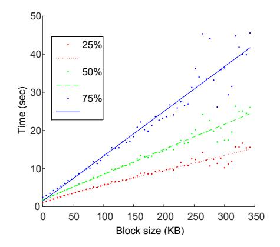
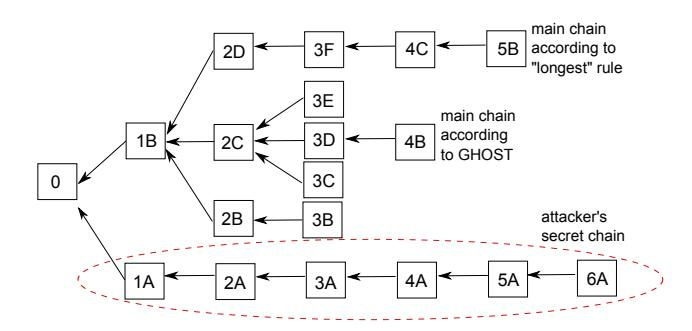
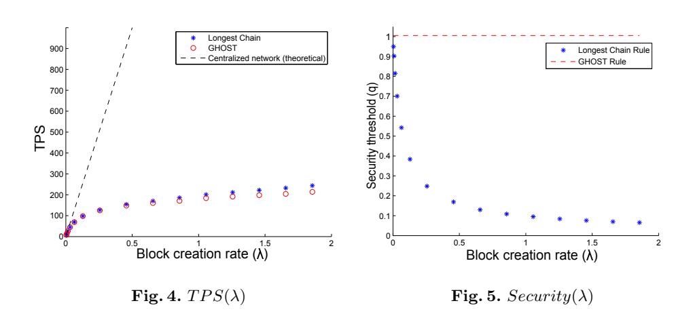

# **Secure High-Rate Transaction Processing in Bitcoin**

**(full version)**

Yonatan Sompolinsky<sup>1</sup> and Aviv Zohar1*,*<sup>2</sup>

<sup>1</sup> School of Engineering and Computer Science, The Hebrew University of Jerusalem, Israel <sup>2</sup> Microsoft Research, Herzliya, Israel yoni sompo@cs.huji.ac.il, avivz@cs.huji.ac.il

**Abstract.** Bitcoin is a disruptive new crypto-currency based on a decentralized open-source protocol which has been gradually gaining momentum. Perhaps the most important question that will affect Bitcoin's success, is whether or not it will be able to scale to support the high volume of transactions required from a global currency system. We investigate the implications of having a higher transaction throughput on Bitcoin's security against double-spend attacks. We show that at high throughput, substantially weaker attackers are able to reverse payments they have made, even well after they were considered accepted by recipients. We address this security concern through the GHOST rule, a modification to the way Bitcoin nodes construct and re-organize the block chain, Bitcoin's core distributed data-structure. GHOST has been adopted and a variant of it has been implemented as part of the Ethereum project, a second generation distributed applications platform.

## **1 Introduction**

Bitcoin is a disruptive protocol for distributed digital currency, which relies on cryptographic elements to secure its operation. Since its initial launch in 2009 by its mysterious creator Satoshi Nakamoto, general interest in the currency has been slowly increasing, and its uses have been slowly expanding.

While several obstacles such as regulatory uncertainty and an under-developed infrastructure still need to be overcome, the main challenges that must be faced from a computer science perspective are related to Bitcoin's ability to scale to higher transaction rates and to its ability to quickly process individual transactions. This paper aims to address both of these issues and the connections between them and Bitcoin's security against double-spend attacks.

The core idea behind the Bitcoin protocol is to replace the centralized control of money transmission ordinarily taken up by large organizations such as banks, credit card companies, and other money transmitters, by a large peer-to-peer network. The nodes of this network verify each other's work and thus ensure that no single entity is able to misbehave. Bitcoin achieves this by maintaining a complete and public record of all its transactions at each node in the network. This ledger, which is known as *the block chain*, is composed of a growing sequence of *blocks*, each containing a set of approved transactions. The main challenge that Bitcoin overcomes is the synchronization of the ledger between the various nodes. Malicious parties may further try to interfere with this synchronization in order to double-spend—to redirect previously processed payments that will allow them to use the same money twice.

To help solve the double-spend problem blocks are required to contain a proof-of-work, which is computationally difficult to generate. The difficulty of this task is adaptively set so that a block is created approximately once every 10 minutes in the entire network. Once created, blocks are propagated through the network. The 10 minute interval allows blocks to (usually) propagate to the vast majority of nodes before another block is created. If a node receives two conflicting blocks, which were created by distant nodes unaware of each other's work (or perhaps by a malicious attacker), it resolves the conflict by picking the block pertaining to the longest block chain and adopting it. Satoshi Nakamoto's original analysis of the protocol [12] shows that as long as any attacker holds less than 50% of the computational power in the network, the probability that double-spend attacks succeed decreases exponentially with time, which essentially allows payments to be considered accepted and irreversible after some period. The analysis, however, assumes that blocks are sent across the network much faster than they are created, and so it is ill-fitted to a scenario in which many transactions are processed by the network (which necessitates the frequent creation of larger blocks, taking longer to transmit).

Indeed, capacity for additional transaction processing in Bitcoin is very much needed. As of December 2014, Bitcoin's network processes around 90 thousand transactions per day [2], a number which has been slowly growing, but still amounts to an average of roughly 1 transaction per second (TPS). In contrast, Visa's global payment system handled a reported 150 million transactions per day in 2010 (just under 2000 TPS), and has grown steadily since. If Bitcoin is not able to scale to appropriate rates that match demand, transaction fees will rise, and users will be driven to use other forms of payment.

Bitcoin's current low number of transactions is mainly due to its small userbase. Once adoption increases, the system will need to scale to process transactions at a higher rate, and previous security guarantees may no longer hold. We investigate how susceptible the protocol is to double-spend attacks when more transactions are processed per second. We note that larger block sizes or more frequent block creation events (which are required in order to increase the transaction throughput) result in more conflicts between blocks, which severely reduces the level of security from attacks.

To mitigate this, some methods for block compression were suggested by members in the Bitcoin community, e.g., transmitting only transaction hashes in blocks (an almost 16-fold reduction in size), or applying invertible Bloom lookup tables to communicate the differences between the subsets of transactions nodes are aware of [3]. Another approach is to use trustless off-chain transaction channels that slowly release money in minute portions to another party by updating a transaction that is only committed to the block chain once a reasonable sum of money has been transferred [1]. This approach has some downsides: money must be locked and is unusable for the duration of the channel's existence, it only allows the aggregation of transactions between two parties that maintain a channel, and finally, it is not always useful for other protocols built on top of block chains (such as Ethereum) where individual updates cannot be aggregated in a similar fashion.

We suggest an alternative to the longest-chain rule called GHOST, that changes the conflict-resolution procedure for the block chain. GHOST selects at each fork in the chain the heaviest subtree rooted at the fork. This protocol modification alleviates the above-mentioned security problem, and will help block-chain-based protocols grow further. A variant of GHOST has been adopted and implemented by the Ethereum project [4], a second generation distributed applications platform that has recently received a great deal of attention. To best utilize the capacity of the block chain all solutions should ideally be combined. Our own improvement, GHOST, can be seen as a modification which allows an increase in the protocol's block chain commitments, which in turn, will allow more transactions to take place at lower costs.

A second aspect of our work involves the time until the transaction is authorized. As blocks are currently created on average once every 10 minutes, a given transaction is only included in the chain after a relatively long amount of time. Several alternative currencies that have forked the Bitcoin source-code have modified this parameter and have set lower block creation rates (e.g., once every 12 seconds in the case of FastCoin). We explore and quantify the security implications of such choices, from lower resilience to attacks to the required waiting time for a transaction to be considered accepted.

It is important to note that in addition to the decreased difficulty of a doublespend attack, several other issues appear at high transaction rates: First, miners that are better connected to the network enjoy rewards slightly larger than their share of the hashing power, and second, the selfish mining strategy explored by Eyal and Sirer [8] can be employed by weaker miners. Both of these issues remain unsolved by the GHOST protocol alone. In a companion paper [10] we explore an additional modification (compatible with GHOST) that lowers the advantage of highly-connected miners, and provides an additional increase in throughput.

## **2 Basics of the Bitcoin Protocol**

**The Block Chain.** Bitcoin uses a public ledger to record the entire transaction history, which essentially consists of a sequence of blocks, *the block chain*. New blocks are created from time to time and are added successively to the ledger. Each block contains the transactions that have occurred since the last block and a cryptographic hash of the previous block in the sequence, which identifies the predecessor uniquely.<sup>3</sup> A transaction is considered confirmed only once it is contained in some block which appears in this public log.<sup>4</sup>

The creation rate of blocks is set by requiring each block to contain a proof-ofwork in its header, in the form of a solution to a computationally difficult problem (finding partial SHA-256 hash collisions). The problem depends on the most recent block, and is solved by randomly trying different inputs, thus ensuring some (random) time lag between successful block creation events. The reader is referred to [12] for a full explanation of the proof-of-work mechanism.

As the block chain, which represents the state of all "accounts", is kept locally at each node, it is imperative that any update to the state of accounts will be propagated to the entire network. Nodes which receive a transaction verify its validity, and send it, in turn, to all their neighbors. Similarly, nodes which receive a new block check its validity (i.e., its compatibility with all preceding blocks) and transmit it to their neighbors.

**The Formation and Resolution of Forks.** Successive blocks are not necessarily built atop one another, and thus they form a block tree rather than a single chain (Fig. 3 illustrates such a scenario). One reason for the existence of forks is the delay in the network: it is possible for two blocks to be created at (about) the same time by far-away nodes in the network, in which case neither will point at the other as its parent, and a fork occurs.

When faced with several (internally consistent) block chains each node in the network is required to adopt only one as the valid account of transactions, the "main chain". Bitcoin's rule is simple: pick the longest chain (or in case of ties, keep the one you received first). An important property of the longest-chain selection rule is that as time passes, all the nodes in the network will adopt the same main chain. Indeed, in order for a fork in the block tree to last, two fractions of the network need to successively create new blocks at about the same times, a series of events which becomes rarer as time develops.

In addition to delays, forks can also occur due to a malicious deviation of a node from the protocol. An attacker may choose to extend any arbitrary block, and generate forks. The protocol cannot and does not deal with these forks differently than with delay-induced ones; if the attacker manages to present a longer chain of blocks, this chain will be accepted by other nodes in the network, and the previous main chain will be abandoned.

**Double-Spend Attacks.** This method of overriding the main chain can be used by an attacker to reverse transactions, a scheme called a "double-spend attack". The attacker may pay some merchant and then secretly create a chain of blocks without this payment that is longer than the network's. By releasing his chain he can trigger the replacement in the ledger which effectively erases

<sup>3</sup> Hash collisions are so rare that this hash can be regarded as a unique identifier of the block.

<sup>4</sup> Merely being included in a block is not sufficient to fully guarantee the irreversibility of a transaction. Transactions become increasingly less likely to be reversed as more blocks are added on top of them to the chain.

the transaction, or redirects the payment elsewhere (such an attack is illustrated in Fig. 3).

The computational effort required to create each block makes this attack a difficult undertaking, since the honest nodes usually have a great deal of computational power, and the attacker must get very lucky if he is to replace long chains.

However, if an attacker holds enough computational power he is able to generate blocks fast enough to bypass the main chain and override it, according to the longest-chain selection rule. This enables him to reverse any transaction that appears in the main chain at will. Specifically, if the attacker has more computational power than the rest of the network combined, he is able to generate blocks at a higher rate than the honest nodes and eventually to replace chains of arbitrary length. This stronger form of attack is known in Bitcoin jargon as "the 50% attack".<sup>5</sup>

#### 3 The Model

We model the Bitcoin network as a directed graph G=(V,E). Each node v has some fraction  $p_v \geq 0$  of the computational power of the entire network:  $\sum_{v \in V} p_v = 1$ . Each individual node v in the network generates blocks according to a Poisson process with a rate of  $p_v \cdot \lambda$ , so that the entire network combined generates blocks at a Poisson process with rate  $\lambda$  (the protocol's current value,  $\lambda = \frac{1}{600}$ , was chosen by Satoshi at Bitcoin's inception). We assume that each edge  $e \in E$  has a delay  $d_e$  associated with it, which is simply the time it takes to send a block across it.

In the context of a network under attack, we will use  $\lambda = \lambda_h$  as the honest network's block creation rate. The attacker's rate is denoted relative to the honest network by  $q \cdot \lambda_h > 0$ , for some 0 < q < 1. In contrast to the honest network, we assume that the attacker is creating long chains efficiently: its blocks are always built on top of one another. See Appendix A for a more detailed consideration of the relation between the attacker and the network.

For every block B, we denote by time(B) its (absolute) creation time. The blocks essentially form a time-developing tree structure that is rooted at the genesis block – the first block created at the moment of Bitcoin's inception; we denote the structure of this tree at time t by tree(t), and by subtree(B) the subtree rooted at B. Finally, the depth of block B in the tree will be denoted depth(B).

<sup>&</sup>lt;sup>5</sup> The 50% attack owes its name to Satoshi's result showing that the main chain is secure (after sufficient waiting periods) as long as the attacker holds less than 50% of the computational power. We show in this paper that in fact networks with delays are more vulnerable and can be attacked with less computational power.

<sup>&</sup>lt;sup>6</sup> This essentially assumes that all computational assets held by the attacker are centralized and that blocks that it creates are transmitted instantly in its internal network.

The structure of the block tree is affected by the blocks that nodes point to as their parent, and extend. Formally, we model this choice as a function  $s(\cdot)$  which maps a block tree  $T = (V_T, E_T)$  to a block  $B \in V_T$  that is to be the parent of the next block. Every node may posses a different view of the tree (it may not have heard of all created blocks) and thus applies s to its currently known tree.

The Bitcoin protocol currently requires nodes to build new blocks at the end of the longest chain that is known to them. Accordingly, we denote by longest(t) the deepest leaf in tree(t). Unless explicitly stated otherwise, we assume nodes follow this rule.

The term "main chain" will correspond to the path from the genesis block to the leaf that is selected for extension (usually longest(t)). The main chain is considered by nodes to be the single accepted version of transaction history. Its growth rate is therefore one of the core measures of the system's performance. Formally, the time it takes the main chain to advance from length n-1 to n is a random variable that we denote as  $\tau_n$ . We denote  $\tau = \lim_{n \to \infty} \frac{1}{n} \sum_{i=1}^n \tau_n$ , and  $\beta = \frac{1}{E[\tau]}$ .  $\beta$  is the rate of block addition to the main chain, while  $\lambda$  is the rate of block addition to the block tree.<sup>7</sup>

Another parameter embedded in the protocol is the maximal block size (in KB), denoted by b. We assume throughout the paper that there is high demand for transaction processing and that blocks are always full to the limit.

Finally, we define the primary measure of Bitcoin's scalability as the number of transactions per second (TPS) the system adds to the history (the main chain), in expectation. We denote by K the average number of transactions per KB. The TPS is then:  $TPS(\lambda, b) := \beta(\lambda, b) \cdot b \cdot K$ .

### 4 Reduced Security at High Throughput

In this section we explain why the Bitcoin protocol becomes more susceptible to double-spend attacks when its throughput is increased. Assume an attacker creates blocks at a rate of  $q \cdot \lambda_h$ . If  $q \cdot \lambda_h$  is greater than the growth rate of the network's main chain,  $\beta$ , the attack will always be successful (given enough time), regardless of the current length of the chain it aims to bypass and replace (by The Law of Large Numbers). Conversely, if  $q < \frac{\beta}{\lambda_h}$ , the probability of the attacker's chain bypassing the main chain decreases exponentially as the main chain grows in length (See Theorem 10 for the formal proof). We therefore think of the ratio  $\frac{\beta}{\lambda_h}$  as the "security threshold" of the system.

The throughput of the protocol is affected by the two elementary parameters: the block creation rate  $\lambda$ , and the block size b. The difficulty of the computational problem which is required to create a valid block can be lowered in order to accelerate the block creation process. Similarly, larger blocks can be allowed to propagate if one wishes to increase the block size. A naïve attempt at increasing the throughput can be made by simply increasing both parameters. We argue

 $<sup>^{7}</sup>$  See Theorem 54, Chapter 2 in [17] for the compatibility of these two interpretations of  $\beta.$

that both of these modifications lead to an increased number of forks in the block tree, which in turn leads to a reduction of the security threshold of the system. In other words, attackers can perform effective attacks with less computational power once the throughput is increased. The qualitative tradeoffs between these parameters are depicted in Fig. 2.



Throughput (TPS)

Block size (b)

Block rate (\(\hat{\lambda}\)

Forks in block tree

Security (\(\beta/\lambda\))

Fig. 1. The relation between the block size and the time it took to reach 25% (red), 50% (green), and 75% (blue) of monitored nodes, based on data provided by Decker and Wattenhofer [7].

Fig. 2. A general view of tradeoffs in the Bitcoin protocol. Increasing the block size or the block rate causes an increase in the TPS, but also decreases the security from double-spend attacks.

Larger Blocks. Indeed, while a node has not yet learned of the latest addition to the main chain, any block that it creates will not add to that chain, but rather contribute to a less updated alternative branch. Thus as the block size is increased, blocks naturally take longer to propagate through the network, hence more forks occur. This observation is well supported by a measurement study conducted by Decker and Wattenhofer [7] who have measured block propagation delays in the Bitcoin network. Figure 1, which is based on raw data that they have generously shared with us, depicts a clear linear relation between the block size and its propagation time.

Accelerated Block Creation. Similarly, if block creation is accelerated, more blocks are being created by the honest network (larger  $\lambda_h$ ) while the most recent block in the main chain is propagated. Again, these blocks will often be created by nodes that are not fully up to date and will not extend the longest chain. The attacker on the other hand, also creates blocks faster (at a rate of  $q \cdot \lambda_h$ ), but does not suffer from a loss of efficiency.

**Reduced Security.** In both cases described above, blocks that are created do not always contribute to the lengthening of the main chain, which makes it easier for an attacker to replace it.

Figure 3 illustrates a scenario in which a highly forked block tree was created by the honest network. The attacker secretly creates a chain of 6 blocks (denoted 1A, 2A,..., 6A) which is clearly longer than the network's longest chain (ending in block 5B). If block propagation was faster (in relation to the creation rate), all blocks in the honest network's tree would form a single long chain and would not be overtaken by the attacker.



**Fig. 3.** A block tree in which the longest chain and the chain selected by GHOST differ. An attacker's chain is able to switch the longest chain, but not the one selected by GHOST.

## 5 The Greedy Heaviest-Observed Sub-Tree (GHOST)

In this section we present our main contribution to the protocol: a new policy for the selection of the main chain in the block tree. The advantage of this suggested change to the protocol is that it maintains the security threshold for successful 50% attacks at 1 (rather than  $\frac{\beta}{\lambda_h}$ ), even if the network suffers from extreme delays and the attacker does not. This allows the protocol designer to set high block creation rates and large block sizes without the fear of approaching the 50%-attack cliff edge, which in turn implies that a high transaction throughput can be securely maintained.

The basic observation behind the protocol modification that we suggest, is that blocks that are off the main chain can still contribute to its weight. Consider, for example, the block tree in Fig. 3. Block 1B is supported by blocks 2B, 2C, and 2D that extend it directly, and include it in their chain. Similarly, blocks 3C, 3D, and 3E support both 1B and 2C as part of their chain. The heaviest subtree protocol we suggest makes use of this fact, and adds additional weight to blocks, helping to ensure that they will be part of the main chain.

Recall our definition from Sect. 3; any node chooses the parent of its next block according to a policy s(T), that maps a tree T to a block in T which essentially represents the main chain. Formally, our new protocol is a new parent-

selection policy. This new policy redefines the main chain, which is what should be regarded as the valid branch of transaction history.

For a block *B* in a block tree *T*, let *subtree*(*B*) be the subtree rooted at *B*, and let *Children<sup>T</sup>* (*B*) be the set of blocks directly referencing *B* as their parent. Denote by *GHOST*(*T*) the parent-selection policy we propose, defined as the output of the following algorithm.

**Algorithm 1.** *Greedy Heaviest-Observed Sub-Tree (GHOST) Input: Block tree T*

```
1. set B ← Genesis Block
2. if ChildrenT (B) = ∅ then return(B) and exit
3. else update B ← argmax
                   C∈ChildrenT (B)
                                  |subtreeT (C)|
                                                8
4. goto line 2
```

The algorithm follows a path from the root of the tree (the genesis block) and chooses at each fork the block leading to the heaviest subtree. In the tree depicted in Fig. 3, for instance, the subtree of block 1B contains 12 blocks, whereas that of 1A contains only 6. The algorithm will thus pick 1B as belonging to the main chain, and proceed to resolve the forks inside *subtree*(1B). This will result the choice of blocks 0, 1B, 2C, 3D, 4B as the main chain of the tree (and not the longest chain, ending in block 5B). This makes forks inside the subtree rooted at 1B of no consequence to the weight of block 1B itself — every addition of a block to *subtree*(1B) makes it harder to omit it from the main chain. In particular, when the attacker publishes its 6-blocks long secret chain, the same blocks as before remain in the main chain.

#### **5.1 Basic Properties of GHOST**

It is imperative to first show that all nodes eventually adopt the same history when following GHOST. For every block *B* define by *ψ<sup>B</sup>* the earliest moment at which it was either abandoned by all nodes, or adopted by them all. We call the adoption of a block by all nodes the *collapse* of the fork.

**Proposition 2 (The Convergence of History).** *P r*(*ψ<sup>B</sup> < ∞*) = 1*. In other words, every block is eventually either fully abandoned or fully adopted. Moreover, E*[*ψB*] *< ∞.*

*Proof.* Let *D* be the delay diameter of the network. Assume that at time *t > time*(*B*) block B is neither adopted by all nodes nor abandoned by all of them. Denote by *E<sup>t</sup>* the event in which the next block creation in the system occurs between times *t* + *D* and *t* + 2*D*, and then no other block is produced until time *t* + 3*D*. We argue that once such an event occurs, block B is either adopted or abandoned by all nodes. Indeed, between time *t* and *t* + *D* all nodes learn of all

<sup>8</sup> We are in fact interested in the subtree with the hardest combined proof-of-work, but for the sake of conciseness, we write the size of the subtree instead.

existing blocks (as no new ones are manufactured), and therefore each pair of leaves (of the block tree) that have nodes actively trying to extend them must have equal weight subtrees rooted at some common ancestor. A single block is then created which breaks these ties, and another D time units allow it to propagate to all nodes, which causes them to switch to a single shared history. Notice that  $Pr(\mathcal{E}_t)$  is uniformly (in t) lower bounded by a positive number, as it doesn't depend on t (as the exponential distribution is memoryless). Hence the expected waiting time for the first  $\mathcal{E}_t$  event is finite (see "Awaiting the almost inevitable" in [19], Chapter 10.11). Finally, the stopping time  $\psi_B$  is upper bounded, by definition, by the waiting time for the first  $\mathcal{E}_t$ , implying  $E[\psi_B] < \infty$ .

We now show the main advantage of the GHOST chain selection rule, namely, that it is resilient to 50% attacks, even at high rates or with significant delays in the network: By waiting a sufficiently long period of time  $\tau$  after the block's creation, the probability that its status will change from "accepted" to "abandoned" can be made arbitrarily small.

**Proposition 3 (Resilience to 50% Attacks).** Assume the attacker's block creation rate is  $q \cdot \lambda_h$ , and  $0 \le q < 1$ . The probability that a block B will be off the main chain sometime after time(B) +  $\tau$ , given that it was in the main chain at time(B) +  $\tau$ , goes to zero as  $\tau$  goes to infinity.

Contrast the statement above with the security threshold introduced in Sect. 4, where  $q < \frac{\beta}{\lambda_h}$  was required to guarantee resilience against 50% attacks. This proposition suggests that in any network following the GHOST rule, the security threshold is 1.

Proof (of Proposition 3). The event in which B is eventually discarded from the main chain is contained in the event that a collapse has yet to occur (i.e.,  $\psi_B \geq time(B) + \tau$ ). Relying again on the finiteness of  $E[\psi_B]$  (Proposition 2), and applying Markov's inequality, it follows that the probability that by  $time(B) + \tau$ , B was either already abandoned or already adopted by all (honest) nodes goes to 1, as  $\tau$  goes to infinity. In the former case, the proposition holds trivially. In the latter case, blocks are now built in B's subtree at the rate of  $\lambda_h$ , which is higher than  $q\lambda_h$ . Thus, as  $\tau$  grows, the gap between the size of subtree(B) and the attacker's chain grows, making the probability of the attack succeeding sometime in the future arbitrarily low (The Law of Large Numbers).

The Rate of Collapse in GHOST. In Subsection 5.1 we have discussed the collapse time  $\psi_B$  for any block B and its implications to the growth and convergence of the main chain in GHOST. Long living forks imply longer waiting times until the entire network contributes confirmations to a block, and further implies long waiting times for transaction authorization. It can prove useful to further investigate how fast the collapse at B occurs. We do this for a simple model including only two forks, each with equal contributing computational power. Even this seemingly simple case proves to be non-trivial.

**Theorem 4.** *Consider a network with two nodes, u and v, that equally create blocks at a rate of λ/*2*, which are connected by a single link with delay d. For any block B, E*[*nB*] *≤* (*dλ*) 2 8 + *dλ* 2 *, where n<sup>B</sup>* := *|subtree<sup>T</sup>* (*B*)*| for T* = *tree*(*ψB*)*.*

The theorem gives an upper bound for the special configuration of two nodes; we conjecture, however, that it is the worst case, and that in general setups collapses occur even faster. Its proof appears in Appendix B.

# **6 Main Chain Growth in GHOST and in Longest-Chain**

In this section we begin to systematically compare the two chain selection rules. Central to this comparison is an analysis of the growth rate of the main chain (*β*) under each one. Since this growth rate is highly dependent on the exact topology of the network which is both unknown and extremely difficult to measure, we take a dual approach: First we bound the rates analytically from above and below. Second, we simulate networks with randomly sampled overlay topologies and measure the resulting block-trees. We then go on to discuss the implications of these results in terms of security, throughput, and resource use of each rule.

## **6.1 A Lower Bound**

We begin our analysis with the following approach: suppose that a cluster of relatively well connected nodes (with delay diameter *D*) contains a fraction 0 *≤ α ≤* 1 of the computational power of the entire network. In this case, blocks created within this sub-network propagate internally relatively quickly, and we can bound the rate of growth of the main chain from below. The bounds are tight, both for longest-chain and for GHOST, and thus form a good basis for comparison.

**Lemma 5 (Longest-Chain & Bounded Delay).** *Let G=(V,E) be a network graph (a sub-graph of the entire network) which generates blocks at a rate λ ′* = *α·λ with delay diameter D. Then under the longest-chain rule, the rate at which the longest chain grows β*(*λ*) *≥ λ ′* 1+*λ′ ·D .*

**Lemma 6 (GHOST & Bounded Delay).** *Let G=(V,E) be a network graph (a sub-graph of the entire network) which generates blocks at a rate λ ′* = *α·λ with delay diameter D. Then under the GHOST rule, the rate at which the longest chain grows β*(*λ*) *≥ λ ′* 1+2*λ′ ·D .*

Both Lemma 5 and Lemma 6 can be shown to be tight. The bound is achieved in a complete graph with *n* nodes, *n → ∞*, where the delay on all edges is exactly *D*, and each node has 1*/n*'th of the computational power. This lower bound can thus be thought of as approximating the ideal decentralized network, where the computational power is well distributed among many equidistant nodes.

Lemma 5 follows, intuitively, from the fact that after some block *U* at depth *n* was created and sent to all nodes (*D* seconds), it takes in expectation <sup>1</sup> *λ* seconds for the next block U' to be created. As the creator of U' was certainly aware of the creation of U, its depth must be at least n+1. The rate is thus lower bounded by  $\frac{1}{D+\frac{1}{1'}}=\frac{\lambda'}{1+\lambda'\cdot D}$ . Refer to Appendix C for a formal proof.

As GHOST does not select the longest chain, it can be expected that the rate of growth of its main chain will be somewhat lower than in the longest-chain rule. This is indeed the case. The loss in growth rate, however, is relatively minor, and unlike in the longest-chain rule, has no bearing on the security of GHOST. Lemma 6 follows as an immediate consequence of the following claim, which is proven in Appendix D.

**Claim 7.** Let B be a block in tree T in a network as in Lemma 6, then regardless of history, the expected waiting time for the creation of the last child of B is upper bounded by  $2D + \frac{1}{\lambda'}$ .

Application to Throughput (Under Longest-Chain) What recommendations should we give the designer of the system who wishes to set the protocol's parameters, given that the network's topology is unknown? We now show how some rather limited knowledge of the network's topology could be used by the designer to guarantee a certain measure of security.

Assume we have managed to measure the delay diameter of some fraction of the network, namely, the maximal time D(b) it takes a block of size b to arrive at some fraction  $\alpha$  of the network. Following the results depicted in Fig. 1, we adopt a linear model of the delays; we thus assume that D(b) is of the form  $D(b) = D_{prop} + D_{bw} \cdot b$ . Notice that  $D_{prop}$  is a measure of aggregate propagation delay, and  $D_{bw}$  is an aggregate measure of bandwidth in units of seconds per KB.

**Lemma 8.** Assume there exists a sub-network with a block creation rate of  $\alpha\lambda$  and delay diameter D(b), in a network following the longest-chain rule. Then for any  $x \in \left(0, \frac{K}{D_{bw}}\right)$ , the protocol is able to achieve both a throughput of at least x TPS and a security threshold of at least  $\alpha \cdot \left(1 - \frac{x \cdot D_{bw}}{K}\right)$ , through a right choice of the parameters b and  $\lambda$ .

*Proof.* By Lemma 5, the main chain grows at a rate of at least  $\frac{1}{\frac{1}{\alpha\lambda}+D(b)}$ . By the definition of the throughput,  $TPS=b\cdot K\cdot \beta\geq \frac{K}{\frac{1}{\alpha\lambda}+D_{prop}}$ . For any  $x\in \left(0,\frac{K}{D_{bw}}\right)$ , there exists a large enough  $b=b_x$  such that the RHS equals x (fixing  $\lambda$ ), thereby guaranteeing  $TPS\geq x$ . The lower bound on  $\beta$  then implies:

$$\frac{\beta}{\alpha\lambda} \geq \frac{1}{1 + \alpha\lambda\left(D_{prop} + b_x \cdot D_{bw}\right)} = 1 - \frac{1}{\frac{1}{\alpha\lambda \cdot b_x \cdot D_{bw}} + \frac{D_{prop}}{b_x \cdot D_{bw}} + 1} = 1 - \frac{x \cdot D_{bw}}{K}.$$

Any evaluation of the real Bitcoin network's behavior under higher throughput requires full knowledge of the topology of the network. Unfortunately, the

structure is both unknown (partly because it is hard to measure, but also because miners attempt to keep their connections secret) and keeps shifting as nodes connect and disconnect. To obtain an order of magnitude estimation we apply Decker and Watenhoffer's measurements of Bitcoin's network to the bound from Lemma 8.

The best linear fit to the results, for  $\alpha = 0.5$ , yields a slope of  $D_{bw} = 0.066$ . This implies, for instance, an achievable throughput of 15.15 TPS, coupled with resilience to attackers with q up to 0.25 computational power.

Application of the Bound to GHOST (Efficiency) We have shown in Proposition 3 that the security threshold in a network following GHOST is always 1. While this means there is no limiting security constraint (contrary to the longest-chain case), the throughput cannot grow limitlessly: the transmission of many blocks (only a fraction of which contribute to the main chain) consumes bandwidth. Therefore, the ratio  $\frac{\beta}{\lambda}$  is still of interest, not in a security context, but rather as a measure of the network's efficiency in its resource utilization.

Following the same method as previously, one can apply the linear delays model to Lemma 6 and show that the network's efficiency under a given throughput is at least  $\alpha \cdot \left(1 - \frac{TPS \cdot 2 \cdot D_{bw}}{K}\right)$ . E.g., the network is able to process 9.09 transactions per second, while maintaining an efficiency of at least 0.2.

### 6.2 An Upper Bound

We proceed now to give upper bounds on the main chain's growth rate. The idea of the upper bound is to locate a partition of the network graph, such that blocks take at least d time units to cross the partition (i.e., all links crossing the cut have delay at least d). Given such a partition the network is inherently inefficient to some degree, as the communication delay between the two parts may cause forks. The following theorem formalizes this:

**Theorem 9.** Let G=(V,E) be the network graph. Let  $S,T\subset V$  be a partition of the nodes such that  $\forall s\in S, \forall t\in T$  we have  $d_{\{s,t\}}\geq d$ , and let  $p_S,p_T(p_S\neq p_T)$  be the fraction of computational power owned by nodes in S,T correspondingly. Then both under longest-chain and under GHOST, the main chain's growth rate is bounded from above as follows:  $\beta(\lambda)\leq \frac{(p_S\lambda)^2e^{p_S\lambda^2d}-(p_T\lambda)^2e^{p_T\lambda^2d}}{p_S\lambda e^{p_S\lambda^2d}-p_T\lambda e^{p_T\lambda^2d}}$ .

The theorem is tight – networks consisting of only two nodes add blocks to the main chain at exactly this rate. We defer the rather involved proof to Appendix E.

#### 6.3 Simulation Results

We simulated the growth of the main chain in networks roughly emulating the topologies of Bitcoin's P2P overlay network for nodes adhering either to longest-chain or to GHOST. Following a behavior similar to the default in Bitcoin's

reference client, each node initiates links to 8 uniformly selected neighbors (and accepts all links others initiated). We simulate a network with 1000 nodes, and assign computational power uniformly at random. The propagation delays on the links were sampled from a normal distribution ( $\mu = \sigma = 100$  milliseconds). Similarly, the bandwidth of each node was drawn from a normal distribution ( $\mu = 1, \sigma = 0.2$  MB). Both values were redrawn for negative results. The system was later allowed to evolve as blocks were propagated by nodes. Figure 5 depicts the security threshold measured in the system as a function of the block creation rate. Figure 4 illustrates the resulting TPS in both cases, and shows that the loss in efficiency of network resources caused by following the GHOST rule is indeed relatively small. See further discussion in Subsection 6.1.



# Security Against Weak Attackers

7

We have so far considered only the effect that delayed block propagation has on the 50% attack. Even attackers with a modest block creation rate can still succeed in a double-spend attack if they are lucky enough to generate many blocks in a quick burst; Satoshi, in his original paper, analyzes this threat. His analysis does not apply, however, to networks with non-negligible delay, and so we revisit this question.

The Acceptance Policy in Longest-Chain. The process of transaction authorization is defined by an acceptance policy chosen by the recipient of funds. Formally, the policy can be described as a function n(t, r, q), where r is the risk the recipient is willing to tolerate, q the upper bound on the attacker's fraction of computational power, and t the time that elapsed since the transaction was broadcast to the network. If the transaction receiver observes n blocks ("confirmations") atop his transaction by time t, he approves it only if  $n \ge n(t, r, q)$ , and

otherwise waits for n to increase. The policies for the GHOST and longest-chain rules differ. Notice however, that in both cases, if t seconds have passed since the transaction was received, the probability that the attacker has completed k blocks is  $\zeta_k := e^{-q\lambda_h t} \frac{(q\lambda_h t)^k}{k!}$ . Thus, given some n, t we have a probability distribution on the initial gap between the attacker and the honest network. The following theorem bounds the probability that an attacker will close this gap.

**Theorem 10.** Consider a network G with delays. Let  $1/\beta_1$  be an upper-bound on the expected waiting time for the next lengthening of the main chain, for all possible states of the system. Let  $q\lambda_h < \beta_1$  be the creation rate of the attacker (according to a Poisson process), and suppose the gap between the network's longest chain and that of the attacker is  $X_0$  blocks. Then the probability that the attacker will succeed in extending its chain to be longer than the network's is at most  $\left(\frac{q\lambda_h}{\beta_1}\right)^{X_0+1}$ .

The theorem is proved in Appendix F. This result justifies the following acceptance policy:

$$n(t,r,q) := \min_{n} \left\{ \sum_{k=0}^{n} \zeta_k \cdot \left( \frac{q\lambda_h}{\beta_1} \right)^{n-k+1} + \sum_{k=n+1}^{\infty} \zeta_k \le r \right\}$$

The first term inside the parenthesis corresponds to the chance of the attacker closing the gap (at some future time) given that at time t he is behind by n-k blocks. The second term aggregates the probability that its chain is long enough at the moment of acceptance.

The Acceptance Policy in GHOST. In GHOST, a block B gains confirmations from all blocks in its subtree. Once a collapse to a single subtree occurs, further confirmations are added at a full rate of  $\lambda_h$ . This justifies the following policy:

$$n(t,r,q) := \min_{n} \left\{ (1 - \eta_B^t) \cdot \left( \sum_{k=0}^n \zeta_k \cdot \left( \frac{q\lambda_h}{\lambda_h} \right)^{n-k+1} + \sum_{k=n+1}^\infty \zeta_k \right) + \eta_B^t \le r \right\}$$

where  $\eta_B^t$  is the probability that at time t, block B has yet to be included in the main chain of the entire honest network. The formulation given above includes the event of a collapse. Subject to that occurrence, block B gains confirmations at a faster pace.

### 8 GHOST Implementation Details

Below we outline some additional details about the use and implementation of the GHOST chain selection rule.

Links to Multiple Parents. As our protocol requires knowledge of off-chain blocks by all nodes, we propose that their headers (but not necessarily their

<sup>&</sup>lt;sup>9</sup> Previous work, such as [12, 16], considered simpler policies that did not take elapsed time into account.

entire contents) be propagated to all nodes. Information about off-chain blocks can then be embedded inside each block by simply listing the hashes of other childless blocks it is aware of.

**Deployment.** At low block creation rates, and with small block sizes, both GHOST and the conventional longest-chain rule behave the same: all blocks will simply be on a single long chain. Differences between the two rules appear only at high throughputs. The adoption of GHOST can therefore be gradual at low transaction rates–nodes will be partially compatible with the longest-chain version as long as transaction rates do not increase (additional references to block headers can be placed inside fields that the regular protocol currently ignores, and so backward compatibility can be maintained). This point, however, is of little importance. Increasing Bitcoin's block size or the block creation rate will require a hard fork in the protocol. Consequently, for these changes to take place a majority of the mining power needs to accept them.

**Retargeting (Difficulty Adjustment).** Given potentially complex relations between the growth rate of the main chain and the rate of created blocks, and the fact that GHOST depends more on the total rate of block creation, we suggest a change in the way automatic difficulty adjustments to the proof-of-work are done. Instead of targeting a certain rate of growth for the longest chain, i.e., *β* (which is Bitcoin's current strategy), we suggest that the total rate of block creation be kept constant (*λ*), which can be done, as the information on the entire block tree is available following the links to all ancestor blocks. Notice that the relation between *β* and the difficulty is highly complex, and so Bitcoin's current targeting mechanism will malfunction at high rates.

**Fees and Minted Coins.** While GHOST does make use of off-chain blocks to secure the protocol, we believe it is best to allocate minted coins only to the creators of blocks that are on the main chain, similarly to how the longest chain rule works today. The rate of minting can be adjusted independently from the block creation rate (but in a very similar way) by adjusting the amount of minted coins per block given the measured number of blocks in the recent past (e.g., in a 2 week window). A companion paper on *Inclusive protocols* [10] discusses the inclusion of transactions from blocks that are off the main chain (and the allocation of related fees).

**Preventing Amplified Denial of Service Attacks.** As each block in Bitcoin is sent to the entire network by the nodes themselves, any burst of blocks may disrupt the network. Attackers are naturally limited in their ability to create *recent* blocks due to the proof-of-work requirement, but may try to create blocks off-chain that are built upon blocks in the distant past (when the difficulty level was low). This issue is handled by the current implementation using checkpoints (points in the chain before which no additional off-chain blocks are accepted). Other mechanisms that involve probabilistic proofs of combined difficulty (for large chains that go back too far in the past) have also been suggested. Both solutions can be adapted to GHOST as well.

## **9 Additional Related Work**

The original security analysis done by Satoshi [12] has been improved in a whitepaper published by Meni Rosenfeld [16]. Several papers have looked at incentive concerns related to the operation of the protocol, examining issues related to transaction propagation [6], selfish mining [8], and the distribution of rewards within mining-pools [15]. Other works on Bitcoin have looked at its privacy aspects [13, 5], including analysis of its transaction graph [14] which allows to de-anonymize some of its users. The Zerocoin protocol has been offered as a way to improve anonymity [11].

Our work deals, among other issues, with enabling fast confirmations for transactions in the network. A paper by Karame *et. al.* discusses similar issues, that relate to possible attacks on nodes that accept zero-confirmation transactions [9]. They suggest several countermeasures that may help avoid such attacks. Their work does not deal with an attack by an adversary with a significant block creation rate, which can compute alternative chains on its own.

A paper closely related to ours is one that was published by Decker and Wattenhofer, in which they present a measurement study of message propagation times in the Bitcoin network. They associate delays with the creation of forks in the block-tree, and with an increased vulnerability to the 50% attack [7]. As far as we are aware, no other work addresses the issue of Bitcoin's scalability, or its security in a network with delayed block propagation.

## **10 Conclusion**

This paper has focused primarily on the effect network delays have on Bitcoin's security from double-spend attacks. In this context we presented GHOST, our suggestion for the modification of the protocol, which helps secure Bitcoin when processing transactions at high rates. Regarding the current state of the protocol, we have given some theoretical security guarantees that can be applicable even if limited information is known about the network topology. Our results underscore the importance of the health of the network to Bitcoin's security and scalability.

Many additional research questions should be addressed in light of our results: How should the block creation rate and block size dynamically adjust to changing network conditions? Additionally, in Bitcoin so-called Simplified Protocol Verification nodes can operate without downloading the entire block chain. If we are to increase the number of blocks per second, their job becomes harder. It is therefore of great interest to create light nodes that can, for example, verify the block chain probabilistically, without needing to download all headers. Finally, it can be shown that in networks with delay that operate at high rates, large miners get more than their fair share of the blocks, an effect that skews rewards in favor of large miners and slowly pushes the system towards a more centralized one. One way to mitigate the problem, which can be applied to GHOST as well, is presented in a companion paper on *Inclusive protocols* [10].

## **11 Acknowledgements**

The authors were supported in part by the Israel Science Foundation (Grants 616/13, and 1773/13), and by the Israel Smart Grid (ISG) Consortium.

## **References**

- 1. https://bitcoinj.github.io/working-with-micropayments
- 2. https://blockchain.info/charts/n-transactions
- 3. https://gist.github.com/gavinandresen/e20c3b5a1d4b97f79ac2
- 4. https://www.ethereum.org/
- 5. Androulaki, E., Karame, G.O., Roeschlin, M., Scherer, T., Capkun, S.: Evaluating user privacy in bitcoin. In: Financial Cryptography and Data Security, pp. 34–51. Springer (2013)
- 6. Babaioff, M., Dobzinski, S., Oren, S., Zohar, A.: On bitcoin and red balloons. In: The 13th ACM Conference on Electronic Commerce. pp. 56–73. ACM (2012)
- 7. Decker, C., Wattenhofer, R.: Information propagation in the bitcoin network. In: 13th IEEE International Conference on Peer-to-Peer Computing (P2P), Trento, Italy (September 2013)
- 8. Eyal, I., Sirer, E.G.: Majority is not enough: Bitcoin mining is vulnerable. In: Financial Cryptography and Data Security, pp. 436–454. Springer (2014)
- 9. Karame, G.O., Androulaki, E., Capkun, S.: Double-spending fast payments in bitcoin. In: The 2012 ACM conference on Computer and communications security. pp. 906–917. ACM (2012)
- 10. Lewenberg, Y., Sompolinsky, Y., Zohar, A.: Inclusive block chain protocols. In: Financial Cryptography and Data Security. Springer (2015)
- 11. Miers, I., Garman, C., Green, M., Rubin, A.D.: Zerocoin: Anonymous distributed e-cash from bitcoin. In: IEEE Symposium on Security and Privacy (2013)
- 12. Nakamoto, S.: Bitcoin: A peer-to-peer electronic cash system (2008)
- 13. Reid, F., Harrigan, M.: An analysis of anonymity in the bitcoin system. In: Security and Privacy in Social Networks, pp. 197–223. Springer (2013)
- 14. Ron, D., Shamir, A.: Quantitative analysis of the full bitcoin transaction graph. In: Financial Cryptography and Data Security, pp. 6–24. Springer (2013)
- 15. Rosenfeld, M.: Analysis of bitcoin pooled mining reward systems. arXiv preprint arXiv:1112.4980 (2011)
- 16. Rosenfeld, M.: Analysis of hashrate-based double spending. arXiv preprint arXiv:1402.2009 (2014)
- 17. Serfozo, R.: Basics of applied stochastic processes. Springer (2009)
- 18. Sompolinsky, Y., Zohar, A.: Bitcoin's security model revisited. arXiv preprint arXiv:1605.09193 (2016)
- 19. Williams, D.: Probability with martingales. Cambridge university press (1991)

# **A Where Is The Attacker in Longest Chain?**

From a practical perspective, we must remember that a node listening to the Bitcoin network does not really know the amount of computational power the honest nodes in the network possess. In particular, the attacker may be building blocks along with the network up until the time of the attack, or he may not. Therefore, all that is observed is some amount of computational power which triggers the reported block creation rate *λrep*. We now ask ourselves what is the worst case when using the longest-chain rule? An attacker who participates or one that does not? Also, what is the right security threshold in terms of *λrep* (rather than *λ<sup>h</sup>* which is unknown)?

We begin with the assumption that the attacker has a fraction *q* of the computational power of the honest network. Denote by *λa, λ<sup>h</sup>* the block creation rate of the attacker and the honest nodes respectively, and by *λ* = *λ<sup>a</sup>* + *λ<sup>h</sup>* their joint rate. Our assumption is *λ<sup>a</sup> < qλ<sup>h</sup>* as before. *λrep* is the observed rate of block creation in the system (before the attack), which is in the range [*λh, λ<sup>h</sup>* + *λa*]. The following proposition shows that for a given threshold *q* it is enough to use *λrep* as a measure of the honest network's creation rate, as the attacker would only make it harder on itself if it joined the rest of the network and generated blocks before the attack. This is quite counter-intuitive, as the attacker that adds to the rate before the attack fools the network into thinking it is stronger. In reality, it increases the number of its blocks but lowers the network's efficiency, which is the true measure of resilience to attacks.

**Proposition 11.** *If the network's observed block rate is λrep, for a given block size, and β*(*λrep*) *≥* 2*·q* 1+*q λrep, then the network is secure against an attacker with computational power lower than qλh. Furthermore, an attacker is most effective if it does not participate in block mining before the attack.*

*Proof.* If a fraction *f* of the attacker's blocks were included in *λrep* prior to the attack, then *λrep* = *λ<sup>h</sup>* + *f · λa.* I.e., *λ<sup>h</sup>* = *λrep − f · λ<sup>a</sup>* = *λrep − fqλh*.

Observe that every block that the attacker publishes before the attack could only increase the length of the main chain, and that the attacker's maximal contribution to the chain's length is the number of blocks that he published. Therefore: *β*(*λh*) *≥ β*(*λrep*) *− f · λa*. We obtain:

$$\beta(\lambda_h) \ge \beta(\lambda_{rep}) - f \cdot \lambda_a \ge \frac{2 \cdot q}{1+q} \cdot \lambda_{rep} - f \cdot \lambda_a = \frac{2 \cdot q}{1+q} \cdot (\lambda_h + f \cdot \lambda_a) - f \cdot \lambda_a = \frac{2 \cdot q}{1+q} \cdot \lambda_h - \left(1 - \frac{2 \cdot q}{1+q}\right) \cdot f \cdot \lambda_a > \frac{2 \cdot q}{1+q} \cdot \lambda_h - \left(1 - \frac{2 \cdot q}{1+q}\right) \cdot f \cdot q \cdot \lambda_h \ge \frac{2 \cdot q}{1+q} \cdot \lambda_h - \left(1 - \frac{2 \cdot q}{1+q}\right) \cdot q \cdot \lambda_h = \left(\frac{2 \cdot q}{1+q} - \left(q - \frac{2 \cdot q^2}{1+q}\right)\right) \cdot \lambda_h = \frac{2 \cdot q}{1+q} + \frac{2 \cdot q^2}{1+q} - q\right) \cdot \lambda_h = \frac{2 \cdot q + 2 \cdot q^2 - q - q^2}{1+q} \cdot \lambda_h = q \cdot \lambda_h > \lambda_a.$$

In conclusion, *β*(*λh*) *> λa*. The attacker's chain thus grows slower than the longest chain in the honest network's tree.

The attacker is most efficient if he avoids publishing his blocks before the attack (f=0), because these blocks can be used by him to increase the successprobability of double-spending. More on this in [18].

## B Proof of Theorem 4

#### Theorem 4:

Consider a network with two nodes, u and v, and equal block creation rates  $\lambda/2$ , which are connected by a single link with delay d. For any block B,  $E[n_B] \leq \frac{(d\lambda)^2}{8} + \frac{d\lambda}{2}$ , where  $n_B := |subtree_T(B)|$  for  $T = tree(\psi_B)$ .

*Proof.* We define a state  $x_n$  representing the time gap between the of creation the n'th block by each of the nodes, in favor of u.

It is clear that whenever  $|x_n| > d$ , a collapse has occurred, as this means a message from u about a new block has arrived at v without the latter creating a corresponding block in time, or vice versa.

In order to count  $n_B$ , we recursively express the expected number of additional blocks in subtree(B), given the current state  $x_n$ . We denote this by  $h(x_n)$ .

Given that the time gap  $x_{n+1}$  is positive, its value depends on the next block creation of v, and thus follows an exponential distribution with rate  $\lambda/2$ ; the same argument applies to the case  $x_{n+1} < 0$ . If  $|x_{n+1}| < d$ , the expected addition to subtree(B) (conditioned on the current state) is simply  $1 + h(x_{n+1})$ , otherwise, it is exactly 0. We express h() as a sum of two functions f(), g(). One for the case in which the time gap increases in favor of u(f), and one for the case in which it decreases (g). By symmetry, the probability for these events is  $\frac{1}{2}$ . This justifies the following equations for f, g and h:

$$\begin{split} f(x) &:= \frac{1}{2} \int\limits_{x}^{d} \mu e^{-\mu(t-x)} (h(t)+1) dt = e^{\mu x} \int\limits_{x}^{d} \mu e^{-\mu t} \frac{h(t)+1}{2} dt \\ g(x) &:= \frac{1}{2} \int\limits_{-d}^{x} \mu e^{-\mu(x-u)} (h(u)+1) du = e^{-\mu x} \int\limits_{-d}^{x} \mu e^{\mu u} \frac{h(t)+1}{2} du \\ h(x) &= f(x) + g(x). \end{split}$$

Differentiating these functions we obtain,

$$\frac{df}{dx} = \mu e^{\mu x} \int_{x}^{d} \mu e^{-\mu t} \frac{h(t) + 1}{2} dt + e^{\mu x} \cdot -1 \cdot \mu e^{-\mu x} \frac{h(x) + 1}{2} = \mu f(x) - \mu \frac{h(x) + 1}{2} = \mu f(x) - \mu \frac{f(x) + g(x) + 1}{2} = \frac{\mu}{2} (f(x) - g(x) - 1).$$

Similarly,

$$\frac{dg}{dx} = \frac{\mu}{2}(f(x) - g(x) + 1)$$

We thus arrive at the following linear non homogeneous differential system:

$$\begin{pmatrix} f \\ g \end{pmatrix}' = \begin{pmatrix} \frac{\mu}{2} & -\frac{\mu}{2} \\ \frac{\mu}{2} & -\frac{\mu}{2} \end{pmatrix} \cdot \begin{pmatrix} f \\ g \end{pmatrix} + \begin{pmatrix} -\frac{\mu}{2} \\ \frac{\mu}{2} \end{pmatrix},$$

with the following boundary conditions:

$$f(d) = 0, g(-d) = 0.$$

Solving this system yields:

$$f(x) = \frac{1}{4} \left( (d\mu)^2 - (x\mu)^2 + 2d\mu - 2x\mu \right)$$
$$g(x) = \frac{1}{4} \left( (d\mu)^2 - (x\mu)^2 + 2d\mu + 2x\mu \right)$$
$$h(x) = \frac{1}{2} \left( (d\mu)^2 - (x\mu)^2 + 2d\mu \right)$$

As the state at which the competition begins is x = 0, by symmetry, we get that the expected number of blocks until a collapse is  $h(0) = \frac{(d\mu)^2}{2} + d\mu$  blocks.

#### C Proof of Lemma 5

#### Lemma 5:

Let G=(V,E) be a network graph (a sub-graph of the entire network) which generates blocks at a rate  $\lambda' = \alpha \cdot \lambda$  with delay diameter D. Then under the longest-chain rule, the rate at which the longest chain grows  $\beta(\lambda) \geq \frac{\lambda'}{1+\lambda'\cdot D}$ .

*Proof.* We follow a sequence of block creation events for blocks  $U_0, U_1, U_2, \ldots$  such that each block  $U_{i+1}$  is the first block to be created after D seconds have passed from the creation of the previous block  $U_i$  (so that there has been sufficient time to send  $U_i$  to all nodes in the network), i.e., the first block B for which  $time(B) - D > time(U_i)$ . Let us now make the following claim.

**Claim 12.** Let  $U_0, U_1, U_2, \ldots$  be a series of blocks that were created at least D time units apart. Then for all  $n \in \mathbb{N}$ :  $Depth(U_n) - Depth(U_0) \geq n$ .

The claim can be proven by induction. It is trivially true for n = 0. Now we assume that the claim is true for n = k, and show it is true for n = k + 1. by  $time(U_k)$  we have  $Depth(U_k) - Depth(U_0) \ge n$ . Then, consider the time at which block  $U_{k+1}$  is created. The node that created it has done so after hearing about block  $U_k$ , it therefore has a chain that is at least of length k (by the induction

assumption and because Chains can only grow or be replaced by longer chains). Therefore  $U_{k+1}$  is built at depth that is at least 1 more than  $U_k$ .

Now that we have established the claim, we can turn to calculating the lower-bound of  $\beta$ . Denote by  $X_i = time(U_i) - time(U_{i-1})$  the random variable representing the time between block creations. Notice that the  $X_i$ 's are i.i.d. random variables (because the time interval they denote is exactly D time units for the block to spread plus an exponentially distributed waiting time for the next block's creation somewhere in the network). Also note that  $\beta \geq E[\frac{1}{n}\sum_{i=1}^n X_i]^{-1}$ , as the chain grows by at least n during the time  $\sum_{i=1}^n X_i$ . We therefore have  $\beta \geq \frac{1}{E[X_1]}$ . Additionally, we know that  $E[X_1] = D + E[Y]$ , where Y is a random variable with an exponential distribution with parameter  $\lambda'$ . As  $E[Y] = \frac{1}{\lambda'}$  we have:  $\beta \geq \frac{1}{D+\frac{1}{\lambda'}} = \frac{\lambda'}{1+\lambda'\cdot D}$ .

#### D Proof of Claim 7

#### Claim 7:

Let B be a block in tree T in a network as in Lemma 6, then regardless of history, the expected waiting time for the creation of the last child of B is upper bounded by  $2D + \frac{1}{\lambda'}$ .

*Proof.* Let C be the first block created after D seconds have passed from B's creation. Denote by  $\tau$  the time from B's creation until C has been created and yet another D seconds elapsed. We argue that  $E[\tau] \leq 2D + 1/\lambda'$ . This is easy to see: It takes  $1/\lambda'$  seconds in expectation to create block C, an event which can only occur after D seconds have passed from B's creation. Then, we deterministically wait another D seconds to propagate C to the entire network.

We claim that after  $\tau$  seconds from B's creation, B will have no more children. Let us examine the two possible cases:

Case I: C is a descendant of B. Once C has been propagated to all nodes, no node considers B a leaf, and the GHOST chain selection rule only extends leaves (in the subtree known to the extending node).

Case II: C is not a descendant of B. Because B was propagated to all nodes before C was created, the node that extended C was well aware of B, but did not extend it. It therefore had a strictly heavier subtree than B is part of after the creation of C. D seconds later, block C is known to all other nodes, along with its entire supporting subtree. In this case, B will not be extended directly either – nodes have switched away from B if no other children extend it, or have switched to its descendants if it does have children.

#### E Proof of Theorem 9

*Proof.* In the above setting, v and u create blocks separately, and whenever one completes a block it sends the message with its new block through the link, to arrive at its counterpart d seconds later; in these d seconds the node still

continues with the attempt to build new blocks and lengthen its own version of the main chain. Thus messages about blocks of the same depth (which were created by *u* and *v* roughly at the same time) may simultaneously be traveling in opposite directions on the link, causing a fork in the block-tree.

Note that the block-tree is actually a binary-tree — at any point of time their are at most two branches not abandoned, as the two-node network contains at most two conflicting world views. Among two candidate chains, the heaviest one and the longest one coincide; the analysis below applies thus equally to a network following the "longest chain" rule and to that following GHOST.

In order to count the number of blocks that fail to enter the main chain, we notice that such an event occurs precisely when two blocks of the same height have been created.

Consider a block *U* of node *u*. We say that the *window* of *U* is created *d* time units before *U*'s creation, and is gone *d* time units after it. Notice, that a block *U* is built upon any of *v*'s blocks that was created before *U*'s window was created, and also that block *U* arrives at node *v* exactly at the end of *U*'s window.

We say that *U* is "threatened" at a given time, if *U*'s window has been created, and the chain at *v* is of length *depth*(*U*) *−* 1 (this time interval is contained in *U*'s window). During this period, the next block created by *v* will be of the same depth as *U* and one of the blocks is wasted. We define *open* as the time that elapsed from *U*'s window's creation to the moment at which it becomes threatened, and define *close* as the time that elapsed from its window's creation until it ceases to be threatened.

Notice that the closure of *U* can occur in two ways: either 2d time has passed from the *U*-window creation, and *v* received a message containing *U*, or *v* generated a competing block of the same height before that. Therefore, the difference between the moment *U* is opened and the moment it is closed is between 0 and 2d. In addition, notice that two blocks of *u* cannot be simultaneously threatened (*v*'s chain cannot be shorter by 1 from both their depths at the same time).

Assuming block *Un*'s window was created at a time that we shall denote as time 0, *open*(*Un*) and *close*(*Un*) are random variables taking values in [0*,* 2*d*], for whom we have *close*(*Un*) *≥ open*(*Un*). The distribution of *open*(*Un*) is composed of a continuous part on the region (0*,* 2*d*], and a discrete part on the atomic event *{open*(*Un*) = 0*}*. We denote the former by *αn*(*x*), for *x ∈* (0*,* 2*d*], and the latter by *αn,*0. Similarly, *close*(*Un*)'s probability distribution has a continuous part which we denote *ωn*(*x*) on [0*,* 2*d*), and a discrete part *ωn,*2*<sup>d</sup>* for the atomic event *{close*(*Un*) = 2*d}*. 10

We denote by *f<sup>S</sup>* and *f<sup>T</sup>* the pdf's of the exponential random variables with rates *pSλ* and *p<sup>T</sup> λ*, respectively. We claim that the following relations hold:

<sup>10</sup> We avoided defining the pdf's *α<sup>n</sup>* and *ω<sup>n</sup>* on the entire closed segment [0*,* 2*d*], although it can be done by continuity; if defined so, one needs to be careful to distinguish between *αn*(0) and *αn,*<sup>0</sup> (respectively between *ωn,*2*<sup>d</sup>*, and *ωn*(2*d*)) which are different in essence.

$$\alpha_n(x) = \int_x^{2d} \omega_{n-1}(y) \cdot f_S(y-x) dy + \omega_{n-1,2d} \cdot f_S(2d-x), \quad 0 < x \le 2d$$
 (1)

$$\omega_n(x) = \int_0^x \alpha_n(z) \cdot f_T(x-z) dy +$$

$$\alpha_{n,0} \cdot f_T(x), \quad 0 \le x < 2d$$
(2)

Indeed, starting with 1, *U<sup>n</sup>* opens *x* seconds after the window creation if and only if for some *y*, *Un−*<sup>1</sup> closed *y* seconds after its window creation (with probability *ωn−*1(*y*) for *y <* 2*d* and *ωn−*1*,*2*<sup>d</sup>* for *y* = 2*d*), and the gap between their respective creations was *y − x* seconds (*fS*(*y − x*)). This calculation is relevant only to *x >* 0, as only under the assumption that *Un*'s window creation preceded *Un−*1's closure the period between *Un−*1's opening and closing (*y*) contains that between *Un*'s window creation and opening (*x*).

Regarding 2, *U<sup>n</sup>* closes *x* seconds after its window creation if and only if for some *z*, *z* seconds passed between *Un*'s window creation and its opening (with probability *αn*(*z*) for *z >* 0 and *αn,*<sup>0</sup> for *z* = 0), and *x − z* seconds between the latter and its closing (*f<sup>T</sup>* (*x − z*)). That the gap between the opening and the closing of *U<sup>n</sup>* is controlled by *f<sup>T</sup>* is true only in the region *x <* 2*d*.

The processes *open*(*Un*) and *close*(*Un*) are Markovian, and we now write equations 1 and 2 applied to their limiting distributions, *α*(*x*)*, α*<sup>0</sup> and *ω*(*x*)*, ω*2*d*:

$$\alpha(x) = \int_{x}^{2d} \omega(y) \cdot f_S(y - x) dy + \omega_{2d} \cdot f_S(2d - x), \quad 0 < x \le 2d$$
(3)

$$\omega(x) = \int_0^x \alpha(z) \cdot f_T(x - z) dy +$$

$$\alpha_0 \cdot f_T(x), \quad 0 \le x < 2d$$
(4)

These equations resolve to a differential equation system:

$$\begin{pmatrix} \alpha \\ \omega \end{pmatrix}' = \begin{pmatrix} p_S \lambda & -p_S \lambda \\ p_T \lambda & -p_T \lambda \end{pmatrix} \cdot \begin{pmatrix} \alpha \\ \omega \end{pmatrix}$$

whose solution is:

$$\begin{pmatrix} \alpha(x) \\ \omega(x) \end{pmatrix} = \frac{A}{S} \begin{pmatrix} p_S \lambda (e^{S \cdot x} - 1) \\ p_T \lambda (e^{S \cdot x} - 1) \end{pmatrix} + \begin{pmatrix} \alpha(0) \\ \omega(0) \end{pmatrix}$$
 for  $A = \alpha(0) - \omega(0)$  ;  $S = p_S \lambda - p_T \lambda$ . (5)

#### **Lemma 13.** *Equation 5 implies*

$$\omega_{2d} = \frac{p_S \lambda - p_T \lambda}{p_S \lambda - p_T \lambda e^{-(p_S \lambda - p_T \lambda)2d}}.$$

By the definition of *ω*2*d*, it is precisely the fraction of *u*'s blocks that have no conflicting blocks created by *v*. The blocks which contribute to the growth of the main chain are can thus be counted by considering all of *v*'s blocks as valid, and adding to those all of *u*'s non-conflicting blocks. Altogether, we obtain

$$\beta(\lambda) = p_T \lambda + \omega_{2d} \cdot p_S \lambda =$$

$$p_T \lambda + \frac{p_S \lambda - p_T \lambda}{p_S \lambda - p_T \lambda e^{-(p_S \lambda - p_T \lambda)2d}} p_S \lambda =$$

$$\frac{(p_S \lambda)^2 e^{p_S \lambda 2d} - (p_T \lambda)^2 e^{p_T \lambda 2d}}{p_S \lambda e^{p_S \lambda 2d} - p_T \lambda e^{p_T \lambda 2d}}.$$

This concludes the proof of Theorem 9. *⊓⊔*

All that remains is to prove Lemma 13

*Proof (of Lemma 13).* By equation 1, *α*(2*d*) = *ω*2*dpSλ*, and by 2, *ω*(0) = *α*0*p<sup>T</sup> λ*. Therefore,

$$\omega(x) = \hat{A}p_T \lambda (e^{(p_S \lambda - p_T \lambda)x} - 1) + \alpha_0 p_T \lambda, \text{ for } \hat{A} := \frac{A}{p_S \lambda - p_T \lambda} \Rightarrow$$

$$\omega'(x) = p_T \lambda A e^{(p_S \lambda - p_T \lambda)x}.$$
By E,  $\omega'(x) = p_T \lambda (\alpha(x) - \omega(x)), \text{ and therefore,}$

$$\alpha(x) - \omega(x) = A e^{(p_S \lambda - p_T \lambda)x} \Rightarrow \alpha'(x) = p_S \lambda (\alpha(x) - \omega(x)) \Rightarrow$$

$$\alpha(x) = \int_0^x p_S \lambda (\alpha(t) - \omega(t)) dt + \alpha(0) = p_S \lambda \int_0^x A e^{(p_S \lambda - p_T \lambda)t} dt + \alpha(0) =$$

$$\frac{p_S \lambda \cdot A}{p_S \lambda - p_T \lambda} (e^{(p_S \lambda - p_T \lambda)x} - 1) + \alpha(0).$$

We obtain,

$$\alpha(0) = \omega(0) + A = \alpha_0 p_T \lambda + A \Longrightarrow$$

$$\alpha(x) = \frac{p_S \lambda \cdot A}{p_S \lambda - p_T \lambda} (e^{(p_S \lambda - p_T \lambda)x} - 1) + \alpha_0 p_T \lambda + A \Longrightarrow$$

$$\alpha(2d) = \frac{p_S \lambda \cdot A}{p_S \lambda - p_T \lambda} (E - 1) + \alpha_0 p_T \lambda + A,$$

Therefore, for *A*ˆ := *<sup>A</sup> p<sup>S</sup> λ−p<sup>T</sup> λ* and *E* := *e* (*p<sup>S</sup> λ−p<sup>T</sup> λ*)2*d* ,

$$\hat{A} = \frac{\alpha(2d) - \alpha_0 p_T \lambda}{p_S \lambda E - p_T \lambda} = \frac{\omega_{2d} p_S \lambda - \alpha_0 p_T \lambda}{p_S \lambda E - p_T \lambda}.$$

We have thus obtained explicit expressions for *α*(*x*) and *ω*(*x*) subject to the parameters *α*<sup>0</sup> and *ω*2*d*:

$$\alpha(x) = \hat{A}(p_S \lambda e^{(p_S \lambda - p_T \lambda)x} - p_T \lambda) + \alpha_0 p_T \lambda$$
$$\omega(x) = \hat{A}(p_T \lambda e^{(p_S \lambda - p_T \lambda)x} - p_T \lambda) + \alpha_0 p_T \lambda$$

By the definition of *α* we know that *α*'s integral over the range (0*,* 2*d*] should be 1 *− α*0:

$$1 - \alpha_0 = \int_0^{2d} \left( \hat{A}(p_S \lambda e^{(p_S \lambda - p_T \lambda)t} - p_T \lambda) + \alpha_0 p_T \lambda \right) dt =$$

$$\hat{A} \left( \frac{p_S \lambda (E - 1)}{p_S \lambda - p_T \lambda} - 2d \cdot p_T \lambda \right) + 2d \cdot \alpha_0 p_T \lambda =$$

$$\hat{A} \left( \hat{E} - 2d \cdot p_T \lambda \right) + 2d \cdot \alpha_0 p_T \lambda,$$

for *E*ˆ := *p<sup>S</sup> λ*(*E−*1) *p<sup>S</sup> λ−p<sup>T</sup> λ* . Therefore,

$$\alpha_0 = 1 - \frac{\omega_{2d} p_S \lambda - \alpha_0 p_T \lambda}{p_S \lambda E - p_T \lambda} \left( \hat{E} - 2d \cdot p_T \lambda \right) - 2d \cdot \alpha_0 p_T \lambda.$$

Similarly, the integral of *ω* over [0*,* 2*d*) should be 1 *−ω*2*d*, and combining this with the relation *α*(*x*) *− ω*(*x*) = *Ae*(*p<sup>S</sup> <sup>λ</sup>−p<sup>T</sup> <sup>λ</sup>*)*<sup>x</sup>* we obtain:

$$1 - \alpha_0 - (1 - \omega_{2d}) = \int_0^{2d} A e^{(p_S \lambda - p_T \lambda)t} dt = \hat{A}(E - 1) \Longrightarrow$$

$$\omega_{2d} - \alpha_0 = \hat{A}(E - 1) = \frac{\omega_{2d} p_S \lambda - \alpha_0 p_T \lambda}{p_S \lambda E - p_T \lambda} (E - 1) \Longrightarrow$$

$$\frac{\omega_{2d}}{\alpha_0} - 1 = \frac{\frac{\omega_{2d}}{\alpha_0} p_S \lambda - p_T \lambda}{p_S \lambda E - p_T \lambda} (E - 1) \Longrightarrow$$

$$\left(1 - \frac{p_S \lambda (E - 1)}{p_S \lambda E - p_T \lambda}\right) \frac{\omega_{2d}}{\alpha_0} = 1 - \frac{p_T \lambda}{p_S \lambda E - p_T \lambda} (E - 1) \Longrightarrow$$

$$\frac{\omega_{2d}}{\alpha_0} = \frac{1 - \frac{p_T \lambda}{p_S \lambda E - p_T \lambda} (E - 1)}{1 - \frac{p_S \lambda (E - 1)}{p_S \lambda E - p_T \lambda}} = E$$

We conclude with,

$$\begin{split} &\omega_{2d} = E \cdot \alpha_0 = E \left( 1 - \frac{\omega_{2d} p_S \lambda - \frac{\omega_{2d}}{E} p_T \lambda}{p_S \lambda E - p_T \lambda} \left( \hat{E} - 2d \cdot p_T \lambda \right) - 2d \cdot \frac{\omega_{2d}}{E} p_T \lambda \right) = \\ &E \left( 1 - \frac{\omega_{2d}}{E} \left( \hat{E} - 2d \cdot p_T \lambda \right) - 2d \cdot \frac{\omega_{2d}}{E} p_T \lambda \right) = E - \omega_{2d} \hat{E} \Longrightarrow \\ &\omega_{2d} = \frac{E}{1 + \hat{E}} = \frac{e^{(p_S \lambda - p_T \lambda)2d}}{1 + \frac{p_S \lambda (e^{(p_S \lambda - p_T \lambda)2d} - 1)}{p_S \lambda - p_T \lambda}} = \frac{e^{(p_S \lambda - p_T \lambda)2d}}{p_S \lambda e^{(p_S \lambda - p_T \lambda)2d} - p_T \lambda} \cdot (p_S \lambda - p_T \lambda) \\ &= \frac{p_S \lambda - p_T \lambda}{p_S \lambda - p_T \lambda e^{-(p_S \lambda - p_T \lambda)2d}}. \end{split}$$

#### F Proof of Theorem 10

#### Theorem 10:

Consider a network G with delays. Let  $1/\beta_1$  be an upper-bound on the expected waiting time for the next lengthening of the main chain, for all possible states of the system. Let  $q\lambda_h < \beta_1$  be the creation rate of the attacker (according to a Poisson process), and suppose the gap between the network's longest chain and that of the attacker is  $X_0$  blocks. Then the probability that the attacker will succeed in extending its chain to be longer than the network's is at most  $\left(\frac{q\lambda_h}{\beta_1}\right)^{X_0+1}$ .

The proof depends on the following two lemmas:

**Lemma 14.** Let  $\varsigma$  be a nonnegative random variable with increasing hazard rate function. Then,  $\forall k \in \mathbb{N}$

$$E[\varsigma^k] \le k! E^k[\varsigma].$$

Note that the almost inverse inequality,  $E[\varsigma^k] \ge E^k[\varsigma]$ , stems from Jensen's inequality.

**Lemma 15.** Let  $\varsigma$  be as in Lemma 14, let f be its pdf, and denote  $\beta := E[\varsigma]^{-1}$ . Then for any constant  $0 < \gamma < \beta$  the function  $H_{\gamma,\beta}$  obtains a positive root  $a_0$  smaller than  $\frac{\gamma}{\beta}$ , where

$$H_{\gamma,\beta}(a) := \int_0^\infty f(\varsigma) e^{\gamma(\frac{1}{a} - 1)\varsigma} d\varsigma - \frac{1}{a}.$$

*Proof (of Lemma 14).* By induction on k. The base case k=0 is trivial. For k+1 we have:

$$E[\varsigma^{k+1}] = \int_0^\infty \varsigma^{k+1} f(\varsigma) = \int_0^\infty \varsigma^{k+1} \lambda(\varsigma) e^{-\Lambda(\varsigma)} d\varsigma =$$

$$[\varsigma^{k+1} \cdot -e^{-\Lambda(\varsigma)}]_0^\infty + \int_0^\infty (k+1) \varsigma^k e^{-\Lambda(\varsigma)} d\varsigma = (k+1) \int_0^\infty \frac{\varsigma^k}{\lambda(\varsigma)} \lambda(\varsigma) e^{-\Lambda(\varsigma)} d\varsigma$$

On the other hand,

$$\begin{split} E[\varsigma] &= \int_0^\infty \varsigma f(\varsigma) = \int_0^\infty \varsigma \lambda(\varsigma) e^{-\Lambda(\varsigma)} d\varsigma = \\ [\varsigma^{\cdot} - e^{-\Lambda(\varsigma)}]_0^\infty + \int_0^\infty e^{-\Lambda(\varsigma)} d\varsigma = \int_0^\infty e^{-\Lambda(\varsigma)} d\varsigma, \end{split}$$

and therefore,

$$\begin{split} &(k+1)!E^{k+1}[\varsigma] = (k+1)k!E^k[\varsigma]E[\varsigma] = \\ &(k+1)k!E^k[\varsigma] \int_0^\infty e^{-\varLambda(\varsigma)}d\varsigma = (k+1)\int_0^\infty \frac{k!E^k[\varsigma]}{\lambda(\varsigma)}\lambda(\varsigma)e^{-\varLambda(\varsigma)}d\varsigma \end{split}$$

It is thus sufficient to prove that,

$$(k+1)\int_0^\infty \frac{\varsigma^k}{\lambda(\varsigma)}\lambda(\varsigma)e^{-\Lambda(\varsigma)}d\varsigma \leq (k+1)\int_0^\infty \frac{k!E^k[\varsigma]}{\lambda(\varsigma)}\lambda(\varsigma)e^{-\Lambda(\varsigma)}d\varsigma,$$

or, equivalently, that

$$\int_0^\infty \frac{\varsigma^k - k! E^k[\varsigma]}{\lambda(\varsigma)} \lambda(\varsigma) e^{-\Lambda(\varsigma)} d\varsigma \le 0.$$

Using the induction hypothesis we obtain:

$$\begin{split} &\int_0^\infty \frac{\varsigma^k - k! E^k[\varsigma]}{\lambda(\varsigma)} \lambda(\varsigma) e^{-\Lambda(\varsigma)} d\varsigma = \\ &\int_0^{(k!E^k[\varsigma])^{\frac{1}{k}}} \frac{\varsigma^k - k! E^k[\varsigma]}{\lambda(\varsigma)} \lambda(\varsigma) e^{-\Lambda(\varsigma)} d\varsigma + \int_{(k!E^k[\varsigma])^{\frac{1}{k}}}^\infty \frac{\varsigma^k - k! E^k[\varsigma]}{\lambda(\varsigma)} \lambda(\varsigma) e^{-\Lambda(\varsigma)} d\varsigma \\ &\leq \frac{1}{\lambda((k!E^k[\varsigma])^{\frac{1}{k}})} \int_0^{(k!E^k[\varsigma])^{\frac{1}{k}}} (\varsigma^k - k!E^k[\varsigma]) \lambda(\varsigma) e^{-\Lambda(\varsigma)} d\varsigma + \\ &\frac{1}{\lambda((k!E^k[\varsigma])^{\frac{1}{k}})} \int_{(k!E^k[\varsigma])^{\frac{1}{k}}}^\infty (\varsigma^k - k!E^k[\varsigma]) \lambda(\varsigma) e^{-\Lambda(\varsigma)} d\varsigma = \\ &\frac{1}{\lambda((k!E^k[\varsigma])^{\frac{1}{k}})} \int_0^\infty (\varsigma^k - k!E^k[\varsigma]) \lambda(\varsigma) e^{-\Lambda(\varsigma)} d\varsigma \leq 0, \end{split}$$

where we used  $\lambda$ 's monotonicity in the first inequality and the induction hypothesis in the last one.

Proof (of Lemma 15). We have  $H_{\gamma,\beta}(0) = \infty$ .  $H_{\gamma,\beta}$  is continuous in a and thus, by The Intermediate Value Theorem, it suffices to show that  $H_{\gamma,\beta}(\frac{\gamma}{\beta}) \leq 0$ . Let  $H(\gamma) := H_{\gamma,\beta}(\frac{\gamma}{\beta})$ . We need to show that  $H(\gamma) \leq 0$ , and we do so by showing that its Taylor series elements (around  $\beta$ ) are all (!) nonpositive. That is, we show that  $H^{(k)}(\beta) \frac{(\gamma - \beta)^k}{k!} \leq 0$ , and this would imply,  $H(\gamma) = \sum_{k=0}^{\infty} H^{(k)}(\beta) \frac{(\gamma - \beta)^k}{k!} \leq 0$ .

Indeed,

$$\begin{split} H^{(k)}(\beta) &= \frac{d^k}{d\gamma^k} \left\{ \int_0^\infty f(t) e^{\gamma(\frac{1}{\gamma}-1)t} dt - \frac{1}{\frac{\gamma}{\beta}} \right\}_{\gamma=\beta} = \\ &\frac{d^k}{d\gamma^k} \left\{ \int_0^\infty f(t) e^{(\beta-\gamma)t} dt - \frac{\beta}{\gamma} \right\}_{\gamma=\beta} = \\ &\left\{ \int_0^\infty (-t)^k f(t) e^{\gamma(\frac{1}{a}-1)t} dt + \frac{k!\beta}{(-\gamma)^{k+1}} \right\}_{\gamma=\beta} = \\ &\int_0^\infty (-t)^k f(t) dt + k!\beta^{-k} (-1)^{k+1}. \end{split}$$

As the Taylor elements of  $H(\gamma)$  are of alternating signs (recall  $\gamma < \beta$ ), it suffices to show the inequalities  $H^{(k)}(\beta) \leq 0$  and  $H^{(k)}(\beta) \geq 0$  for even and odd k's respectively. It is sufficient to show that for all k:  $\int_0^\infty t^k f(t) dt \leq k! \beta^{-k},$  which was proven in Lemma 14.

Proof (of Theorem 10). Let  $\tau_n$  be the waiting time for the nth lengthening of the main chain. Let  $f_{\tau_n|\tau_{n-1},...,\tau_1}$  be the conditional pdf of  $\tau_n$  given  $\tau_{n-1},...,\tau_1$ . Denote  $\beta:=E[\tau_n\mid \tau_{n-1},...,\tau_1]^{-1}$  for some given history (that is, for some realization of the  $\tau_i$ 's up to n-1). By our assumption,  $\beta \geq \beta_1$ , and thus  $\forall k \in \mathbb{N}, \beta^{-k} \leq \beta_1^{-k}$  (we will make use of this inequality later).

The random variable  $\tau_n$  given a history is nonnegative with increasing hazard rate. Indeed, when a node creates a new block it broadcasts it to the network, and as more and more nodes learn about it, more computational power is contributed to the effort of creating the next one and thereby lengthening the main chain. If meanwhile a conflicting block was created elsewhere, still more computational power is working on lengthening the main chain, just on a different version of it.

The attacker's chain is built according to a Poisson process in the worst case, whose rate we denoted by  $\gamma$ . Let  $N_2$  be the event-count (random variable) of this process, namely,  $N_2(t) := \max\{n \mid \sum_{j=1}^n \tau_n \leq t\}$ . Define,  $X_n := n - N_2(\sum_{j=1}^n \tau_n)$ , and  $Y_n := \left(\frac{\gamma}{\beta_1}\right)^{X_n}$ .

The process  $X = (X_n)$  represents the gap between the lengths of the attacker's chain and the (worst-case) main chain, in favor of the latter, as the *n*th lengthening of the latter occurred.

We claim that  $Y=(Y_n)$  is a super-martingale, namely that for any history,  $E[Y_{n+1} \mid Y_n,...,Y_0] \leq Y_n$ . Indeed, while the value of  $X_{n+1}$  depends naturally on  $\tau_{n+1},...,\tau_1$ , the increment  $X_{n+1}-X_n$  given a history  $\tau_n,...,\tau_1$  is controlled by the random variable  $\tau_n$  given this history, with the pdf  $f_{\tau_n|\tau_{n-1},...,\tau_1}$  which we abbreviate f. We have:

$$E\left[Y_{n+1}|Y_{n},...,Y_{0}\right] = E\left[\left(\frac{\gamma}{\beta_{1}}\right)^{X_{n+1}} \left| \left(\frac{\gamma}{\beta_{1}}\right)^{X_{n}},...,\left(\frac{\gamma}{\beta_{1}}\right)^{X_{0}}\right] =$$

$$\sum_{k=0}^{\infty} \int_{0}^{\infty} f(\tau_{n+1}) \frac{e^{-\gamma \tau_{n+1}} (\gamma \tau_{n+1})^{k}}{k!} \left(\frac{\gamma}{\beta_{1}}\right)^{X_{n}+1-k} d\tau_{n+1} =$$

$$\left(\frac{\gamma}{\beta_{1}}\right)^{X_{n}+1} \cdot \sum_{k=0}^{\infty} \int_{0}^{\infty} f(\tau_{n+1}) \frac{e^{-\gamma \tau_{n+1}} (\gamma \tau_{n+1})^{k}}{k!} \left(\frac{\gamma}{\beta_{1}}\right)^{-k} d\tau_{n+1} =$$

$$\left(\frac{\gamma}{\beta_{1}}\right)^{X_{n}+1} \cdot \int_{0}^{\infty} f(\tau_{n+1}) e^{-\gamma \tau_{n+1}} \sum_{k=0}^{\infty} \frac{\left(\frac{\gamma \tau_{n+1}}{\beta_{1}}\right)^{k}}{k!} d\tau_{n+1} =$$

$$\left(\frac{\gamma}{\beta_{1}}\right)^{X_{n}+1} \cdot \int_{0}^{\infty} f(\tau_{n+1}) e^{-\gamma \tau_{n+1}} e^{\frac{1}{\gamma} \gamma \tau_{n+1}} d\tau_{n+1} =$$

$$\left(\frac{\gamma}{\beta_{1}}\right)^{X_{n}} \cdot \frac{\gamma}{\beta_{1}} \cdot \int_{0}^{\infty} f(\tau_{n+1}) e^{\gamma \left(\frac{1}{\gamma}\right)^{2} - 1} d\tau_{n+1} d\tau_{n+1} \leq$$

$$\left(\frac{\gamma}{\beta_{1}}\right)^{X_{n}} \cdot \frac{\gamma}{\beta_{1}} \cdot \int_{0}^{\infty} f(\tau_{n+1}) e^{\gamma \left(\frac{1}{\gamma}\right)^{2} - 1} d\tau_{n+1} d\tau_{n+1} \leq$$

$$\left(\frac{\gamma}{\beta_{1}}\right)^{X_{n}} = Y_{n}.$$

$$(8)$$

Equality 6 is due to the attacker's chain advancing during the waiting time  $\tau_{n+1}$  according to a Poisson process with rate  $\tau_{n+1} \cdot \gamma$ . In 7 we made explicit the fact that  $\left(\frac{\gamma}{\beta_1}\right)^{X_n}$  is a constant in the  $\sigma$ -algebra corresponding to the natural filtration (usually denoted by  $\sigma(X_n,...,X_1)$ ). Finally, as a corollary of Lemma 14,  $E[\tau_n^k \mid \tau_{n-1},...,\tau_1] \leq k!\beta^{-k} \leq k!\beta_1^{-k}$ . Combining this with the end of Lemma 15's proof shows that  $H_{\gamma,\beta_1}(\frac{\gamma}{\beta_1}) \leq 0$ , hence 8.

proof shows that  $H_{\gamma,\beta_1}(\frac{\gamma}{\beta_1}) \leq 0$ , hence 8. Let  $x_1 < X_0 < x_2$  be some fixed constants, let the stopping time  $\pi$  be defined by  $\pi := \min\{n \mid X_n \leq x_1 \vee X_n \geq x_2\}$ , and finally, define the event  $E_{x_1,x_2} := \{X_{\pi} = x_2\}$  (i.e., "X reached  $x_2$  before it reached  $x_1$ "). By Doob's Optional Stopping Theorem (See [19], p. 100-101) applied to the super martingale Y, we have,

$$\begin{split} & \left(\frac{\gamma}{\beta_1}\right)^{X_0} = Y_0 \geq E[Y_\pi] = \\ & Pr(E_{x_1,x_2}) \cdot \left(\frac{\gamma}{\beta_1}\right)^{x_2} + Pr(E_{x_1,x_2}^c) \cdot \left(\frac{\gamma}{\beta_1}\right)^{x_1} \Longrightarrow \\ & \left(\frac{\gamma}{\beta_1}\right)^{X_0} - \left(\frac{\gamma}{\beta_1}\right)^{x_1} \geq Pr(E_{x_1,x_2}) \cdot \left(\left(\frac{\gamma}{\beta_1}\right)^{x_2} - \left(\frac{\gamma}{\beta_1}\right)^{x_1}\right) \Longrightarrow \\ & Pr(E_{x_1,x_2}) \geq \frac{\left(\frac{\gamma}{\beta_1}\right)^{X_0} - \left(\frac{\gamma}{\beta_1}\right)^{x_1}}{\left(\frac{\gamma}{\beta_1}\right)^{x_2} - \left(\frac{\gamma}{\beta_1}\right)^{x_1}}. \end{split}$$

Taking  $x_1 = -1$  and  $x_2 \to \infty$  we obtain a lower bound on the probability that the gap between the chains will never reach minus 1:  $1 - (\frac{\gamma}{\beta_1})^{X_0 + 1}$ . The success probability of an attack is thus upper bounded by  $(\frac{\gamma}{\beta_1})^{X_0 + 1}$ .

Note that an almost identical method shows that if the random variables  $\tau_n$  are i.i.d then there exists an  $a_0 \leq \frac{\gamma}{\beta_1}$  such that  $Y := a_0^X$  is a martingale.