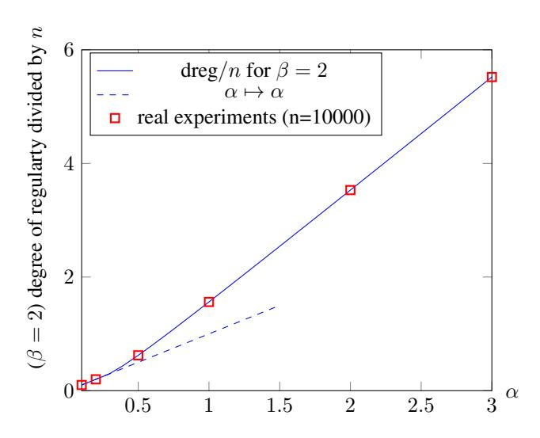
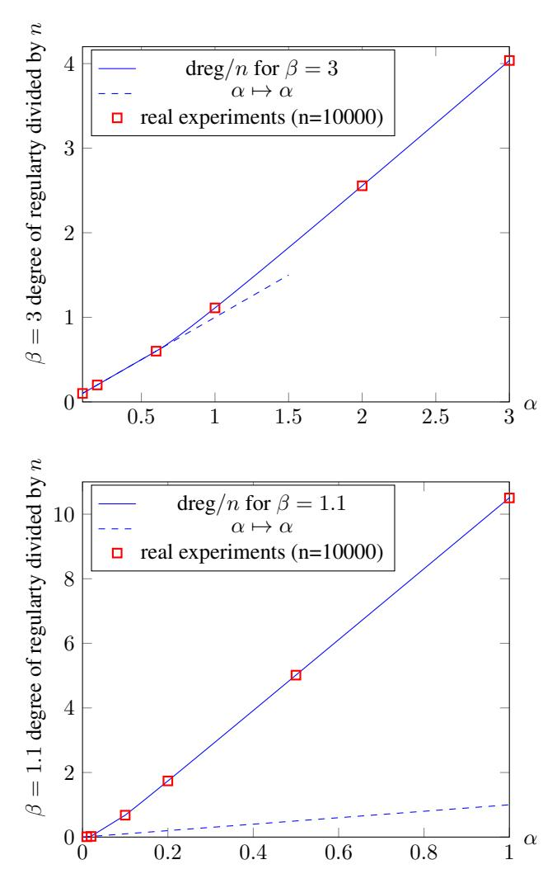

# **Algebraic Algorithms for LWE**

Martin R. Albrecht1, Carlos Cid1, Jean-Charles Faugère2, and Ludovic Perret2

Information Security Group Royal Holloway, University of London Egham, Surrey TW20 0EX, United Kingdom INRIA, Paris-Rocquencourt Center, POLSYS Project UPMC Univ Paris 06, UMR 7606, LIP6, F-75005, Paris, France CNRS, UMR 7606, LIP6, F-75005, Paris, France martin.albrecht@rhul.ac.uk, carlos.cid@rhul.ac.uk, jean-charles.faugere@inria.fr, ludovic.perret@lip6.fr

**Abstract.** The Learning with Errors (LWE) problem, proposed by Regev in 2005, has become an ever-popular cryptographic primitive, due mainly to its simplicity, flexibility and convincing theoretical arguments regarding its hardness. Among the main proposed approaches to solving LWE instances — namely, lattice algorithms, combinatorial algorithms, and algebraic algorithms — the last is the one that has received the least attention in the literature, and is the focus of this paper. We present a detailed and refined complexity analysis of the original Arora-Ge algorithm, which reduced LWE to solving a system of high-degree, error-free polynomials. Moreover, we generalise their method and establish the complexity of applying Gröbner basis techniques from computational commutative algebra to solving LWE. As a result, we show that the use of Gröbner basis algorithms yields an exponential speed-up over the basic Arora-Ge algorithm. On the other hand, our results show that such techniques do not yield a subexponential algorithm for the LWE problem.

We also apply our algebraic algorithm to the BinaryError-LWE problem, which was recently introduced by Micciancio and Peikert. We show that BinaryError-LWE in dimension n can be solved in subexponential time given access to a quasi-linear number of samples m under a regularity assumption. We also give precise complexity bounds for BinaryError-LWE given access to linearly many samples. Our approach outperforms the best currently-known generic heuristic exact CVP solver as soon as  $m/n \geq 6.6$ .

The results in this work depend crucially on the assumption that the encountered systems have no special structure. We give experimental evidence that this assumption holds and also prove the assumption in some special cases. Therewith, we also make progress towards proving Fröberg's long-standing conjecture from algebraic geometry.

#### 1 Introduction

Learning with Errors. Since its introduction, the Learning with Errors problem (LWE) has proven to be a rich and versatile source of many innovative cryptographic constructions, such as the oblivious transfer protocol by Peikert et al. [37], a leakage-resilient cryptosystem by Akavia et al. [1], and homomorphic encryption [3, 15, 30], among many others.

**Definition 1** (LWE [38,39]). Let  $n, m \geq 1$  be integers, q be an odd positive integer,  $\chi$  be a probability distribution on  $\mathbb{Z}_q$  and  $\mathbf{s} \in \mathbb{Z}_q^n$  be a secret vector. We denote by  $L_{\mathbf{s},\chi}^{(n)}$  the probability distribution on  $\mathbb{Z}_q^{n \times m} \times \mathbb{Z}_q^m$  obtained by choosing  $A \in \mathbb{Z}_q^{n \times m}$  uniformly at random, sampling a vector  $\mathbf{e} \in \mathbb{Z}_q^m$  according to  $\chi^m$ , and returning  $(A, \mathbf{s} \cdot A + \mathbf{e}) = (A, \mathbf{c}) \in \mathbb{Z}_q^{n \times m} \times \mathbb{Z}_q^m$ . LWE is the problem of finding  $\mathbf{s} \in \mathbb{Z}_q^n$  from  $(A, \mathbf{s} \cdot A + \mathbf{e})$  sampled according to  $L_{\mathbf{s},\chi}^{(n)}$ .

In what follows,  $\chi_{\alpha,q}$  will denote a discrete Gaussian distribution over  $\mathbb Z$  which returns an integer x with probability  $\exp\left(-\pi\,x^2/s^2\right)/\sum_{y\in\mathbb Z}\exp\left(-\pi\,y^2/s^2\right)$ , where  $s=\alpha q$ , considered modulo q. A typical setting is  $\alpha q=n^\epsilon$ , with  $0\leq\epsilon\leq 1$ . It has been shown that as soon as  $\epsilon>1/2$ , worst-case GAPSVP $_{\tilde{\mathcal{O}}(n/\alpha)}$  reduces to average-case LWE [14, 36, 38, 39]. Thus, any algorithm solving LWE for  $\epsilon>1/2$  can solve GAPSVP $_{\tilde{\mathcal{O}}(n/\alpha)}$ . It is widely believed that only exponential classical and quantum algorithms exist for solving GAPSVP $_{\tilde{\mathcal{O}}(n/\alpha)}$ .

Arora and Ge's algorithm. In [5], Arora and Ge proposed the first algebraic algorithm to solve the LWE problem. Their approach reduces LWE to finding the common root of a multivariate system of high-degree, error-free polynomials. The proposed algorithm solves LWE in  $2^{\tilde{\mathcal{O}}(n^{2\epsilon})}$  operations, hence being sub-exponential when  $\epsilon < \frac{1}{2}$ . This shows that Regev's original reduction in [38,39] is indeed tight.

In more detail, let  $(\mathbf{a},c) \in \mathbb{Z}_q^n \times \mathbb{Z}_q$  be an LWE sample and write  $f = c - \sum_{i=1}^n \mathbf{a}_i \cdot x_i$  where the  $x_i$  are variables. If we assume that the error e is in the interval  $\{-T,\ldots,T\}$ , then the polynomial F=f and  $f \in \prod_{i=1}^T (f+i) \cdot (f-i)$  of degree  $f \in T$  are variables. If we assume that the error  $f \in T$  is in the interval  $f \in T$ , then the polynomial  $f \in T$  is a constraint on the possible values for the secret vector  $f \in T$ , and collecting many such equations and solving the resulting multivariate high-degree system of equations allows to recover the secret. In [5] these systems are solved by the linearisation method, i.e. first replacing monomials with a new linearised variable and then by solving the resulting linear system of equations. This method requires  $f \in T$  equations to succeed, which could be obtained by collecting more samples. However, since  $f \in T$  is a discrete Gaussian distribution, requesting more samples also increases the probability that the noise of at least one sample falls outside of the chosen interval  $f \in T$  invalidating the constraint  $f \in T$ . Hence, as the number of samples grows so does the required value of  $f \in T$  so that the polynomial system remains error-free. This on the other hand may require a further increase in the number of samples (cf. Section 3). This trade-off is analysed in [5] to obtain the complexity of the Arora-Ge algebraic algorithm to solve LWE. We note however that the discussion above implies that the algorithm from [5] is not applicable if the number of available samples is smaller than  $f \in T$ .

In Section 4, we make a detailed analysis of the original Arora-Ge algorithm, and derive the precise complexity of applying linearisation as described above. The results of our analysis are given in the following theorem.

**Result 1** Let  $n,q,\sigma=\alpha q/\sqrt{2\pi}$  be parameters of an LWE $_{\chi_{\alpha,q}}$  instance,  $2\leq\omega<3$  be the linear algebra constant and  $D_{\rm AG}=8\,\sigma^2\log n+1$ .

If  $D_{AG} \in o(n)$  then the Arora-Ge algorithm solves the computational LWE problem in

$$\mathcal{O}\left(2^{\,\omega \cdot D_{\mathrm{AG}} \log \frac{n}{D_{\mathrm{AG}}}} \cdot \sigma \, q \log q\right) = \mathcal{O}\left(2^{\,8\,\omega \, \sigma^2 \log n (\log n - \log(8\,\sigma^2 \log n))} \cdot \mathrm{poly}(n)\right)$$

operations and in

$$\mathcal{O}\left(2^{\,\omega \cdot n \log \frac{D_{\mathrm{AG}}}{n}} \cdot \sigma \, q \log q\right) = \mathcal{O}\left(2^{\,\omega \, n \log(8 \, \sigma^2 \log n) - \omega \, n \log n} \cdot \mathrm{poly}(n)\right)$$

operations if  $n \in o(\sigma^2 \log(n))$ .

Specialising to  $\sigma = \sqrt{n}$  we obtain a complexity of  $\mathcal{O}\left(2^{(2+\epsilon)\omega n \log \log n}\right)$ . Our results shows that, in this case, the original Arora-Ge algorithm is asymptotically slower than the BKW algorithm [2] and lattice reduction if sieving is used to implement the SVP oracle, but asymptotically faster than lattice reduction if enumeration is used to implement the SVP oracle [4].

Gröbner bases. Gröbner bases are fundamental tools in commutative algebra and algebraic geometry. A Gröbner basis G for an ideal  $\mathcal{I}$  in a polynomial ring is a basis such that any leading term of any element in the ideal  $\mathcal{I}$  is divisible by a leading term of an element in G. In univariate polynomial rings the notion of a Gröbner basis coincides with the greatest common divisor; for linear polynomials it coincides with the notion of a row echelon form. Gröbner bases go back to the seminal work of Buchberger [16, 17, 19] who also gave a first algorithm for computing them by showing that repeated computation and reduction of S-polynomials computes a Gröbner basis. Gröbner basis algorithms have been frequently applied (successfully) on the algebraic cryptanalysis of a range of cryptographic schemes [27].

In this work we are interested in the fact that Gröbner bases allow to find all common roots of multivariate polynomial systems. Indeed, the linearisation approach described above is a special case of a Gröbner basis computation. In contrast to this special case, though, general Gröbner basis algorithms are also applicable if less than  $\mathcal{O}\left(n^d\right)$  polynomials of degree d are available – at the cost of increased computational complexity. We give more background on Gröbner bases in Section 2.

In Section 5 we show that applying standard Gröbner basis algorithms yields an exponential speed-up for solving LWE compared to Result 1, under a regularity assumption. In particular, we arrive at the following theorem.

**Result 2** Let  $\omega$  be the linear algebra constant, let  $H_2(x) = -x \log_2(x) - (1-x) \log_2(1-x)$  be the binary entropy function and C some known constant which can be explicitly computed. Let  $(\mathbf{a}_i, b_i)_{i \geq 1}$  be elements of  $\mathbb{Z}_q^n \times \mathbb{Z}_q$  sampled according to  $\mathrm{LWE}_{\chi_{\alpha,q}}$  with a standard deviation  $\sigma = \frac{\sqrt{n}}{\sqrt{2\pi}}$ . There is an algorithm solving the computational LWE problem in

$$\mathcal{O}\left(2^{n\left(\omega\left(1+C\right)H_{2}\left(\frac{C}{1+C}\right)+\frac{\pi\cdot\log_{2}(e)}{4}\right)}\right) \tag{1}$$

operations with success probability of at least  $1 - \frac{2}{\pi\sqrt{n}} = 1 - o(1)$ , if the system of equations encountered during the execution of the algorithm is semi-regular.

Hence, applying Gröbner basis algorithms gives an exponential speed-up over the algorithm from [5]. This places it in the same complexity class as the BKW algorithm or lattice reduction when sieving implements the SVP oracle, albeit with a larger leading constant in the exponent. It is worth noting that all known algorithms for achieving time complexity  $2^{\mathcal{O}(n)}$  – BKW, sieving, Gröbner bases – also require  $2^{\mathcal{O}(n)}$  memory.

BinaryError-LWE. A variant of LWE with errors values in  $\{0,1\}$  (or any uniform range) was recently introduced by Micianccio and Peikert in [35]. This generalises an earlier result of Döttling and Müller-Quade [22] who first introduced a variant of LWE with uniform errors whilst keeping a strong security reduction to lattice problems. These two works highlight the current interest of the cryptographic community in studying variants of LWE with small non-Gaussian errors. From a practical perspective these variants are interesting because they allow to forgoe Gaussian sampling (with large parameters) which is often the most expensive step when implementing lattice-based cryptography. In this regard [35] represents a significant step forward as it allows to sample the error from a binary distribution while still regaining a reduction to GAPSVP, albeit with a severe limit on the number of samples m:

**Theorem 1** (BinaryError-LWE [35]). Let  $n, m = n \left(1 + \frac{1}{c \log(n)}\right)$  for c > 1 be integers, and  $q \ge n^{\mathcal{O}(1)}$  be a sufficiently large polynomially bounded (prime) modulus. Then, solving LWE with parameters n, m, q and independent uniformly random binary errors is at least as hard as approximating lattice problems in the worst-case on  $\Theta(n/\log(n))$ -dimensional lattices within a factor  $\tilde{\mathcal{O}}(\sqrt{n} \cdot q)$ .

As already pointed out in [22,35], the algorithm from [5] yields a polynomial-time algorithm for solving BinaryError-LWE as soon as  $m = \mathcal{O}\left(n^2\right)$ . Hence, there is a gap between  $m = n\left(1 + \frac{1}{c\log(n)}\right)$  for c > 1, where the hardness reduces to standard LWE, and  $m = \mathcal{O}\left(n^2\right)$  where the problem is known to be easy due to the Arora-Ge algorithm. However, understanding the hardness of the problem for samples within this interval should be of great interest: applications in lattice-based cryptography typically require the provision of  $n\left(1 + \frac{1}{c\log(n)}\right) < m < \mathcal{O}\left(n^2\right)$  samples, e.g.  $m = \mathcal{O}\left(n\right)$  or  $m = \tilde{\mathcal{O}}(n)$ . It is hence a natural and relevant open question how the security of BinaryError-LWE degrades as more samples are made available.

From [5] and our generalisation using Gröbner basis algorithms, it follows that the complexity of solving LWE with uniform errors in  $\{-T,\ldots,T\}$  is at most the cost of computing a Gröbner basis for m polynomials of degree 2T+1 in n variables. In Section 6, we show – under a similar regularity assumption as above – that BinaryError-LWE can be solved in sub-exponential time as soon as the number of samples is quasi-linear, e.g.  $m=\mathcal{O}\left(n\log\log n\right)$ .

**Result 3** Let  $\omega$  be the linear algebra constant and let  $H_2(x) = -x \log_2(x) - (1-x) \log_2(1-x)$  be the binary entropy function. If  $m = \mathcal{O}(n \log \log n)$ , then there exists an algorithm which solves the BinaryError-LWE problem in

$$\mathcal{O}\left(m^2 \, 2^{\frac{\omega \, n \, \log \log \log n}{8 \log \log n}}\right)$$

operations if the equation system encountered in the execution of the algorithm is semi-regular. If  $m = C \cdot n$ , with  $C \ge 1$ , then there exists an algorithm which solves the BinaryError-LWE problem in

$$\mathcal{O}\left(n^2 \, 2^{\omega \, n(1+\beta) \, H_2\left(\frac{\beta}{1+\beta}\right)}\right)$$

operations with with  $\beta = \left(C - \frac{1}{2} - \sqrt{C(C-1)}\right)$  if the system of equations encountered during the execution of the algorithm is semi-regular.

More concretely, the algorithm discussed in this paper can solve the BinaryError-LWE problem in dimension n in time  $n^2 \cdot 2^{0.344\,n}$  as soon as  $m \geq 6.6\,n$ . For comparison, the best currently-known generic exact CVP solver [11] takes time  $2^{0.377\,n}$ . We note that many other LWE solving strategies such as combinatorial algorithms [2] or lattice reduction in the low advantage regime [34] do not apply in this setting.

Our results (Theorem 7, Section 6) show therefore that, despite its attractive implementation features, BinaryError-LWE should be ruled out for cryptographic applications that require a quasi-linear number of samples. Finally we note that while our results can also apply to the natural generalisations of BinaryError-LWE to any uniform error in a bounded interval  $\{-T,\ldots,T\}$  [35, Theorem 4.6], in this paper we focus on the BinaryError-LWE case for brevity.

*Regularity Assumptions.* Our complexity estimates depend crucially on two algebraic assumptions about the systems we consider. The assumption is as follows for BinaryError-LWE:

**Assumption 2.** Let  $(A, \mathbf{s} \cdot A + \mathbf{e}) = (A, \mathbf{c}) \in \mathbb{Z}_q^{n \times m} \times \mathbb{Z}_q^m$  be sampled according to  $L_{\mathbf{s}, \mathcal{U}(\mathbb{F}_2)}^{(n)}$ , and let P(x) = X(X - 1). We define:

$$f_1 = P(c_1 - \sum_{j=1}^n s_j A_{j,1}) = 0, \dots, f_m = P(c_m - \sum_{j=1}^n s_j A_{j,m}) = 0.$$

It holds that  $\langle f_1, \ldots, f_m \rangle$  is semi-regular (Definition 2, Section 2), i.e. has only trivial algebraic dependencies.

For general LWE, Assumption 1 is similar but we consider a polynomial  $P(X) = X \prod_{i=1}^{C_{GB} \cdot \sigma} (X+i)(X-i)$ , where  $C_{GB}$  depends on the parameters of the Gaussian distribution.

It is believed that random systems of equations are semi-regular. Hence, our semi-regularity assumptions essentially state that our systems are neither easier nor harder to solve than random systems of equations.

If the systems considered in this work were easier than random systems this would imply that the analysis of Section 5 could be much improved and lead to progress towards a sub-exponential classical algorithm for solving GAPSVP. On the other hand, if these systems were harder to solve than random systems, this would reveal new algebraic dependencies amongst LWE samples, which could likely also be used to improve (non-algebraic) solving strategies. Hence, our assumption in this paper that there is *no special structure* in our problem instances seems to be a reasonable one. We note also that Gröbner basis algorithms do not rely on this regularity assumption. Indeed, they have been successfully used in the past to exploit that a problem instance which does not behave like a semi-regular sequence [27].

Section 7.1 reports on our experimental verification that Assumptions 1 and 2 hold for reasonable parameter sets. For example, for BinaryError-LWE, we have verified them for  $n \le 100$ .

Fröberg's Conjecture. Our assumptions are closely related to the long-standing Fröberg conjecture [28] in algebraic geometry which states that semi-regular sequences form a dense subset among the set of all sequences. More precisely, the Fröberg conjecture states that *generically* the rank of some linear map associated to Macaulay matrices (the matrices occurring in a Gröbner basis computation) is maximal. A property is said to be generic if it holds on a Zariski open subset  $Z_O$  when the characteristic of the base field  $\mathbb K$  is 0. In Zariski's topology, a closed subset is defined as the vanishing set of algebraic equations. Hence, we can find a polynomial  $h(\mathbf a)$  in  $\mathbb Z[\mathbf a]$  which does not depend on the field  $\mathbb K$  such that  $h(\mathbf a) \neq 0 \Rightarrow \mathbf a \in Z_O$ .

The main difficulty in proving Fröberg's conjecture is to prove that the polynomial h is not identically zero or that  $Z_O$  is not empty (see [29]).

To prove Fröberg's conjecture it is sufficient to find one explicit family of polynomials which can be proven semi-regular for any m and n. Proving Assumptions 1 or 2 would provide such family and hence prove Fröberg's conjecture. Furthermore, any non-trivial partial results on our assumptions would lead to progress on the general Fröberg's conjecture. over a sufficiently big finite field, sequences with the same number of polynomials (m) and same number of variables (n), m=n+1 in characteristic 0, m polynomials of degree 2 with  $n \le 11$ , and m polynomials of degree 3 with  $n \le 8$  [20, 28, 29]. Indeed, Fröberg and Hollman [29] already investigated semi-regularity for powers of generic linear forms. In characteristic 0, [29, Lemma 2.1] proves that a sequence of n+1 squares of generic linear forms in n variables is generically semi-regular.

In Section 7 we report on progress towards proving Fröberg conjecture by investigating our assumptions. In Theorem 8 (Section A.2), we first prove that the equations  $f_1,\ldots,f_m$  generated for BinaryError-LWE are linearly independent with high probability. Secondly, we show that the sequence  $f_1,\ldots,f_m$  is semigeneric (Definition 3), i.e.  $\{x_i\cdot f_j\}_{1\leq i\leq n}^{1\leq j\leq n}$  spans a vector space of maximal dimension. We prove that such algebraic independence at low degree holds with  $m\leq n+\lfloor\frac{n-2}{2}\rfloor$  in Theorem 10. This improves on a result of [29, Theorem 2.2] where Fröberg and Hollman proved that the squares of m generic linear forms are semigeneric as long as  $m\leq n+15$  and  $n\leq 6$ . Finally, we consider algebraic independence at higher degree and prove in Theorem 11 that BinaryError-LWE samples give rise to a semi-regular sequence with high probability for m=n+1 and for a sufficiently large field.

In closing, we note that Fröberg's conjecture is similar in spirit to the Gaussian Heuristic often relied on in the complexity analysis of lattice-reduction algorithms. For example, the complexity analysis of the currently best know heuristic CVP solver [11] mentioned above and predictions for the quality of output for the BKZ algorithm [18] rely on it. Where Fröberg's conjecture asserts that most ideals have a predictable degree of regularity, i.e. no special structure deviating from this expectation, the Gaussian Heuristic asserts that for most lattices the shortest vectors of random lattices have a predictable norm, i.e. no special structure deviating from this expectation.

*Open problems.* While computational commutative algebra provides a rich resource to improve on the results in [5] for solving LWE and variants thereof, our results indicate that it is unlikely that sub-exponential algorithms for solving LWE can be found by directly applying standard Gröbner basis algorithms to LWE. A promising avenue, however, is to combine geometric with algebraic techniques to improve our understanding of the hardness of LWE. Secondly, applying algebraic techniques to Ring-LWE, which offers a much richer algebraic structure, is an area for future work.

### 2 Computation of Gröbner Bases

Lazard [32] showed that computing a Gröbner basis for a system of homogeneous polynomials  $f_1 \ldots, f_m$  is equivalent to perform Gaussian elimination on the  $\mathit{Macaulay matrices} \mathcal{M}_{d,m}^{\text{acaulay}}$  for d, where  $\min\left(\deg(f_1), \ldots, \deg(f_m)\right) \leq d \leq D$  for some integer D. The Macaulay matrix  $\mathcal{M}_{d,m}^{\text{acaulay}}$  for a set of homogeneous polynomials  $f_1 \ldots, f_m$  is defined as the coefficient matrix of  $(t_{i,j} \cdot f_i)$  where  $1 \leq i \leq m$  and  $t_{i,j}$  runs through all monomials of degree  $d - \deg(f_i)$ . It can be shown that Macaulay matrices up to degree d can be used to compute a partial Gröbner basis, called d-Gröbner basis. Lazard showed that for d big enough, a d-Gröbner basis is indeed a Gröbner basis:

**Theorem 2** ([32]). Let q be a prime and let  $\mathbf{f} = (f_1, \ldots, f_m) \in (\mathbb{Z}_q[x_1, \ldots, x_n])^m$  be homogeneous polynomials and  $\prec$  be a monomial ordering. There exists a positive integer D for which Gaussian elimination on all  $\mathcal{M}_{d,m}^{\mathrm{acaulay}}(f_1, \ldots, f_m)$  matrices for  $d, 1 \leq d \leq D$  computes a Gröbner basis of  $\langle f_1, \ldots, f_m \rangle$  w.r.t. to  $\prec$ .

It follows that the complexity of computing a Gröbner basis is bounded by the complexity of performing Gaussian elimination on the Macaulay matrices up to some degree D. In general, computing the maximum degree occurring in a Gröbner computation is a difficult problem. However, for a specific family of polynomial systems this degree is known [6-8, 10].

**Definition 2** (Semi-regular Sequence [8,10]). Let  $m \ge n$ , and  $f_1, \ldots, f_m \in \mathbb{Z}_q[x_1, \ldots, x_n]$  be homogeneous polynomials of degrees  $d_1, \ldots, d_m$  respectively and  $\mathcal{I}$  the ideal generated by these polynomials. The system is said to be a semi-regular sequence if the Hilbert polynomial [19] associated to  $\mathcal{I}$  w.r.t. the grevlex order is:

$$HP(z) = \left[\frac{\prod_{i=1}^{m} (1 - z^{d_i})}{(1 - z)^n}\right]_+,\tag{2}$$

with  $[S]_+$  being the polynomial obtained by truncating the series S before the index of its first non-positive coefficient. We shall call degree of regularity of a semi-regular sequence the quantity:

$$1 + \deg(\mathrm{HP}(z)).$$

This degree of regularity is the degree D involved in Theorem 2 for a semi-regular sequence.

Finally, let  $f_1, \ldots, f_m \in \mathbb{Z}_q[x_1, \ldots, x_n]$  be a sequence of affine polynomials. We denote by  $f_1^H, \ldots, f_m^H \in \mathbb{Z}_q[x_1, \ldots, x_n]$  the corresponding homogeneous components of highest degree. We shall say that  $f_1, \ldots, f_m$  is semi-regular if the sequence  $f_1^H, \ldots, f_m^H$  is semi-regular.

Throughout this paper, we will use the following complexity results about computing Gröbner bases for semi-regular sequences.

**Proposition 1** (adapted from [9]). Let  $\mathbf{F} = (f_1, \dots, f_m) \in (\mathbb{Z}_q[x_1, \dots, x_n])^m$  be affine polynomials with m > n. If  $f_1, \dots, f_m$  is semi-regular, then the number of operations in  $\mathbb{Z}_q$  required to compute a Gröbner basis for any admissible order is bounded by:

$$\mathcal{O}\left(m\,D_{reg}\begin{pmatrix}n+D_{reg}\\D_{reg}\end{pmatrix}^{\omega}\right), as\,D_{reg}\to\infty,$$
 (3)

where  $2 \le \omega < 3$  is the linear algebra constant and  $D_{reg}$  is the degree of regularity of  $\langle f_1, \ldots, f_m \rangle$ .

In general, (3) only holds for the *grevlex* monomial ordering, but efficient algorithms exist to convert a Gröbner basis from one ordering to another [26]. However, in our case where m > n we expect a unique solution which implies the Gröbner bases with respect to all monomial orderings are identical and the issue does not arise (cf. [12]).

The complexity bound (3) is pessimistic as we do not take the particular structure of the matrices involved into account. Typically, Macaulay matrices have huge rank defects which correspond to useless computations. More recent algorithms such as  $F_4$  [23] and  $F_5$  [24] take advantage of the structure of Macaulay matrices and avoid some or all of these useless computations. This leads to considerable speed-ups in practice [25, 27] and in theory [9]. However, to simplify the asymptotical analysis we apply Theorem 2 which performs row reductions on Macaulay matrices.

The following classical approximation of the binomial coefficient due to Stirling will be useful to prove some of our results below.

**Lemma 1.** Let  $H_2(x) = -x \log_2(x) - (1-x) \log_2(1-x)$  be the binary entropy. For n and k large enough, we have  $\log_2\binom{n}{k} \approx n \, H_2(\frac{k}{n})$ .

Similarly, we have the following lemma.

#### Lemma 2.

$$\log \binom{n+D}{D} \approx \left\{ \begin{array}{l} D\log(n/D), \ \ if \ D \in o(n), \\ \\ n\log(D/n), \ \ if \ n \in o(D). \end{array} \right.$$

This follows easily from Stirling's expansion of the binomial.

### 3 The Arora & Ge Algorithm

The Arora & Ge algorithm proceeds by generating a non-linear system of (error-free) multivariate equations from LWE samples by making use of the following well-known fact about the Gaussian distribution.

**Lemma 3.** Let  $\chi$  denote the Gaussian distribution with standard deviation  $\sigma$ . Furthermore, for x > 0, we denote  $Q(x) = \frac{1}{2} \left( 1 - \operatorname{erf} \left( \frac{x}{\sqrt{2}} \right) \right)$ . Then, for all C > 0, it holds that:

$$\Pr[e \overset{\$}{\leftarrow} \chi : |e| > C \cdot \sigma] \approx 2 \times Q(C) \le \frac{2}{C\sqrt{2\pi}} e^{-C^2/2} \in e^{\mathcal{O}\left(-C^2\right)}.$$

That is, for a C>0, elements sampled from a Gaussian distribution take only values on the interval  $[-C\cdot\sigma,\ldots,C\cdot\sigma]$  of  $\mathbb{Z}_q$  with probability at least  $1-e^{\mathcal{O}\left(-C^2\right)}$  if we represent elements in  $\mathbb{Z}_q$  as integers in  $[-\lfloor\frac{q}{2}\rfloor,\ldots,\lfloor\frac{q}{2}\rfloor]$ . Moreover, if  $e \stackrel{\$}{\leftarrow} \chi$  then P(e)=0 for

$$P(X) = X \prod_{i=1}^{C \cdot \sigma} (X+i)(X-i),$$

with probability at least  $1 - e^{\mathcal{O}\left(-C^2\right)}$ . Clearly P is of degree  $2C \cdot \sigma + 1 \in \mathcal{O}\left(C \cdot \sigma\right)$ .

It follows that if  $(\mathbf{a}_i, b_i) = (\mathbf{a}_i, \langle \mathbf{a}_i, \mathbf{s} \rangle + e_i) \in \mathbb{Z}_q^n \times \mathbb{Z}_q$ , and  $e_i \stackrel{\$}{\leftarrow} \chi$ , then

$$P(-b + \sum_{j=1}^{n} (\mathbf{a}_i)_{(j)} x_j) = 0,$$
 (4)

with probability at least  $1 - e^{\mathcal{O}\left(-C^2\right)}$ . Each sample  $(\mathbf{a}_i, \langle \mathbf{a}_i, \mathbf{s} \rangle + e_i) = (\mathbf{a}_i, b_i) \in \mathbb{Z}_q^n \times \mathbb{Z}_q$  allows to generate a non-linear equation of degree  $2C \cdot \sigma + 1$  in the n components of the secret  $\mathbf{s}$  which holds with probability  $1 - e^{\mathcal{O}\left(-C^2\right)}$ .

The Arora & Ge algorithm then proceeds by generating  $M_{\rm AG}$  independent equations of the form (4), to be then solved by linearisation. However, a value for C – denoted by  $C_{\rm AG}$  – occurring in Lemma 3 has to be chosen sufficiently large so that all errors  $e_i$  lie with high probability in the interval  $[-C_{\rm AG} \cdot \sigma, \ldots, C_{\rm AG} \cdot \sigma] \subseteq \mathbb{Z}_q$ , i.e. such that the secret s is indeed a common solution of the  $M_{\rm AG}$  equations. To this end, let  $\mathcal{S}_{\rm AG}$  be the system of equations generated from  $M_{\rm AG}$  equations as in (4) and bound the probability of failure by the union bound:

$$p_f = M_{\mathrm{AG}} \times \Pr[e \overset{\$}{\leftarrow} \chi_{\alpha,q} : |e| > C_{\mathrm{AG}} \cdot \sigma] \le \frac{M_{\mathrm{AG}}}{e^{\mathcal{O}\left(C_{\mathrm{AG}}^2\right)}}.$$

Hence,  $p_f$  is an upper bound on the probability that the secret  $\mathbf{s} \in \mathbb{Z}_q^n$  is not a solution to  $\mathcal{S}_{AG}$ . Let also  $D_{AG} = 2\,C_{AG}\,\sigma + 1$  be the degree of the equations occuring in  $\mathcal{S}_{AG}$ . It is shown in [5] (cf. Section 4) that taking  $C_{AG} \in \tilde{\mathcal{O}}(\sigma)$  allows us to make the probability of failure negligible.

In summary, the Arora & Ge algorithm reduces solving LWE to linearisation of a system of  $M_{\rm AG}$  equations of degree  $D_{\rm AG}=2\,C_{\rm AG}\,\sigma+1\in\tilde{\mathcal{O}}(\sigma^2)$ . In particular, the following theorem holds:

**Theorem 3** ([5]). Let  $D_{\rm AG} < q$ . The system obtained by linearizing

$$M_{\mathrm{AG}} = \mathcal{O}\left( \binom{n + D_{\mathrm{AG}}}{D_{\mathrm{AG}}}^{\omega} \sigma q \log q \right) = n^{\mathcal{O}(D_{\mathrm{AG}})} = 2^{\tilde{\mathcal{O}}(D_{\mathrm{AG}})}$$

equations as in (4) has at most one solution with high probability.

Note that  $\mathcal{O}\left(\binom{n+D_{\mathrm{AG}}}{D_{\mathrm{AG}}}\right)$  equations is sufficient to linearise the system. The extra factor  $\sigma q \log q$  allows to prove that the linearised system has at most one solution with high probability [5]. The overall complexity

of the Arora-Ge algorithm is the cost of performing Gaussian elimination on a matrix of size  $M_{\rm AG} \times \binom{n+D_{\rm AG}}{D_{\rm AG}}$ , i.e.

$$C_{\mathrm{AG}}^{\mathrm{plx}} = n^{\mathcal{O}(D_{\mathrm{AG}})} = 2^{\tilde{\mathcal{O}}(\sigma^2)} = 2^{\tilde{\mathcal{O}}(n^{2\epsilon})}.$$

Note also that, if we have the standard deviation  $\sigma=n^\epsilon$ , then the algorithm requires  $2^{\tilde{\mathcal{O}}(n^{2\epsilon})}$  LWE samples for performing the linearisation step. It follows that the Arora & Ge algorithm is subexponential when  $\epsilon<1/2$ .

# 4 Refined Analysis of the Arora & Ge Algorithm

We note that the analysis above and in [5] leaves much room for improvements, as it hides not only constants *in the exponent* but also logarithm factors. In this section, we make a more refined analysis of the complexity of the Arora & Ge algorithm when using the linearisation method, so that we can then compare potential improvements due to the application of Gröbner bases in Section 5.

As established in the previous section, the overall complexity of solving an LWE instance with the Arora & Ge algorithm is that of executing Gaussian elimination on a matrix of size  $M_{\rm AG} \times \binom{n+D_{\rm AG}}{D_{\rm AG}}$ . Gaussian elimination on an  $m \times n$  matrix of rank r has complexity  $\mathcal{O}\left(mnr^{\omega-2}\right)$  [31]. The Arora & Ge algorithm hence has a complexity of

$$\mathcal{O}\left(M_{\mathrm{AG}}\cdot \binom{n+D_{\mathrm{AG}}}{D_{\mathrm{AG}}}\right)^{\omega-1}\right) = \mathcal{O}\left(M_{\mathrm{AG}}\cdot \binom{n+2\,C_{\mathrm{AG}}\,\sigma+1}{2\,C_{\mathrm{AG}}\,\sigma+1}\right)^{\omega-1}\right).$$

We now consider the bound on  $C_{AG}$ .

**Lemma 4.** Let  $n, q, \sigma = \alpha q/\sqrt{2\pi}$  be parameters of an LWE $\chi_{\alpha,q}$  instance where q = poly(n). Let  $p_f' \in [0,1]$  be a constant upper bound on the probability of failure and

$$C_{AG} \le 2 \sigma \log n + a^{1/2} \approx 4 \sigma \log n,$$

with  $a=4(\sigma\log n)^2+2\log(\sigma q\log q)-2\log p_f'+2\log n$ . Finally, let also  $D_{\rm AG}=2\,C_{\rm AG}\,\sigma+1$ . Then, the system obtained by linearizing  $\binom{n+D_{\rm AG}}{D_{\rm AG}}\sigma$  q log q equations of degree as in (4) is correct, i.e. the secret is a zero of all the polynomials, with probability bigger than  $1-p_f'$ .

*Proof.* The probability of failure is upper bounded by:

$$p_f = M_{\mathrm{AG}} \times \Pr[e \overset{\$}{\leftarrow} \chi_{\alpha,q} : |e| > C_{\mathrm{AG}} \cdot \sigma] \approx \frac{2 \, \binom{n + D_{\mathrm{AG}}}{D_{\mathrm{AG}}} \, \sigma \, q \log q}{\sqrt{2\pi} \, C_{\mathrm{AG}} \, e^{C_{\mathrm{AG}}^2/2}} < \frac{\binom{n + D_{\mathrm{AG}}}{D_{\mathrm{AG}}} \, \sigma \, q \log q}{C_{\mathrm{AG}} \cdot e^{C_{\mathrm{AG}}^2/2}}.$$

We bound  $\binom{n+D_{\mathrm{AG}}}{D_{\mathrm{AG}}}$  by  $n^{D_{\mathrm{AG}}}$ . While this approximation is rather loose, it allows to simplify our expression sufficiently to recover a closed form of the complexity. With this simplification, our goal is to find  $C_{\mathrm{AG}}$  such that:

$$0 \le \frac{n^{D_{\mathrm{AG}}} \cdot \sigma q \log q}{C_{\mathrm{AG}} \cdot e^{C_{\mathrm{AG}}^2/2}} = p_f' \le 1.$$

That is:

$$\frac{e^{\log \left(\sigma \, q \log q\right)} e^{(2\,C_{\mathrm{AG}}\,\sigma+1)\log n}}{e^{\log p_f'}\cdot \left(e^{\log C_{\mathrm{AG}}}\cdot e^{C_{\mathrm{AG}}^2/2}\right)} = 1.$$

Thus we need to solve

$$0 = \log(\sigma \, q \log q) + 2 \, C_{AG} \, \sigma \log n + \log n - \log C_{AG} - \log p_f' - C_{AG}^2 / 2$$

> \log(\sigma \q \log q) + 2 \, C\_{AG} \sigma \log n + \log n - \log p\_f' - C\_{AG}^2 / 2

for  $C_{AG}$ . The last line has 2 roots:

$$[R_1 = 2 \sigma \cdot \log(n) - a^{1/2}, R_2 = 2 \sigma \cdot \log(n) + a^{1/2}],$$

with  $a = 4(\sigma \log n)^2 + 2\log(\sigma q \log q) - 2\log p'_f + 2\log n$ .

Note that  $a^{1/2} > 2 \sigma \log(n)$  and hence  $R_1 < 0$ . Thus, the smallest possible value for  $C_{AG}$  is  $R_2$ . Now, assume that  $q \in \text{poly}(n)$ , i.e.  $q \approx n^c$ . Also, recall that  $p'_f$  is a constant. Thus, for n big enough:

$$a = 4(\sigma \log n)^{2} + 2\log(\sigma q \log q) - 2\log p'_{f} + 2\log n$$

=  $4(\sigma \log n)^{2} + 2c\log(\sigma n c \log n) - 2\log p'_{f} + 2\log n$
 $\approx 4(\sigma \log n)^{2}$ .

So, we have  $C_{AG} \leq 2 \sigma \log n + a^{1/2} \approx 4 \sigma \log n$ .

We arrive at the following theorem:

**Theorem 4.** Let  $n,q,\sigma=\alpha\,q/\sqrt{2\pi}$  be parameters of an LWE $_{\chi_{\alpha,q}}$  instance. If  $D_{\rm AG}(=8\,\sigma^2\log n+1)\in o(n)$  then the Arora & Ge algorithm solves the computational LWE problem in time complexity

$$\mathcal{O}\left(2^{\,\omega \cdot D_{\mathrm{AG}} \log \frac{n}{D_{\mathrm{AG}}}} \cdot \sigma \, q \log q\right) = \mathcal{O}\left(2^{\,8\,\omega \, \sigma^2 \log n (\log n - \log(8\,\sigma^2 \log n))} \cdot \mathrm{poly}(n)\right)$$

and memory complexity

$$\mathcal{O}\left(2^{\,2\cdot D_{\mathrm{AG}}\log\frac{n}{D_{\mathrm{AG}}}}\cdot\sigma\,q\log q\right) = \mathcal{O}\left(2^{\,16\,\sigma^2\log n(\log n - \log(8\,\sigma^2\log n))}\cdot\mathrm{poly}(n)\right).$$

If  $n \in o(\sigma^2 \log(n))$  then the Arora & Ge algorithm solves the computational LWE problem in time complexity

$$\mathcal{O}\left(2^{\,\omega \cdot n \log \frac{D_{\text{AG}}}{n}} \cdot \sigma \, q \log q\right) = \mathcal{O}\left(2^{\,\omega \, n \log (8 \, \sigma^2 \log n) - \omega \, n \log n} \cdot \operatorname{poly}(n)\right)$$

and memory complexity

$$\mathcal{O}\left(2^{2n\log\frac{D_{\mathrm{AG}}}{n}} \cdot \sigma \, q \log q\right) = \mathcal{O}\left(2^{2n\log(8\,\sigma^2\log n) - 2\,n\log n} \cdot \mathrm{poly}(n)\right).$$

*Proof.* The result follows immediately from plugging the Lemmata 2 and 4 into Theorem 3.

### 5 Solving LWE with Gröbner Bases

In this section we address the natural question of whether the complexity of the basic Arora & Ge algorithm can be improved by using Gröbner basis algorithms instead of the linearisation method. The main motivation is that the constant  $C_{\rm AG}$  (and hence the degree of the equations) depends on the number of equations  $M_{\rm AG}$  considered. Hence, on the one hand, we may lower the number of equations to a value lower than  $\tilde{\mathcal{O}}(n^{2\,\epsilon})$  whilst keeping the probability of failure small enough. On the other hand, this means that the cost of solving the resulting system will grow compared to that of linearisation. The optimisation target is then to find a tradeoff allowing to improve upon linearisation.

We assume that  $\sigma = n^{\epsilon}$ , with  $0 \le \epsilon \le 1$ . Let also  $\theta, 0 \le \theta \le \epsilon \le 1$ . We consider the number of samples of the following form:

$$M_{\rm GB}=e^{\gamma_{\theta}}, \text{ with } \gamma_{\theta}=n^{2\cdot(\epsilon-\theta)}.$$

Note that  $\theta=0$  corresponds up to polylog factors to the basic Arora-Ge approach. To explain the rational for the choosing this form for  $M_{\rm GB}$  the number of samples, we state below a simple lemma which relates the number of samples to the degree of the multivariate equations:

**Lemma 5.** Let  $(\mathbf{a}_1, b_1), \dots, (\mathbf{a}_m, b_m)$  be elements of  $\mathbb{Z}_q^n \times \mathbb{Z}_q$  sampled according to  $\mathrm{LWE}_{\chi_{\alpha,q}}$ . If  $C = \sqrt{2\log(m)}$  then the equations generated as in (4) vanish with probability at least:

$$p_{\rm g} = 1 - \sqrt{\frac{1}{\pi \cdot \log(m)}}.$$

*Proof.* By Lemma 3, the probability of failure satisfies

$$\leq \frac{2\,m}{C\sqrt{2\pi}}e^{-C^2/2} = \frac{2m}{\sqrt{4\pi\cdot\log(m)}}e^{-\left(\sqrt{2\log(m)}\right)^2/2} = \frac{1}{\sqrt{\pi\cdot\log(m)}}.$$

From this the probably of success  $p_{\rm g} \ge 1 - p_{\rm f}$  follows.

Remark 1. If  $m \in \mathcal{O}(n)$  then it holds that  $p_g \in 1 - o(1)$ .

We can then deduce the degree  $D_{\rm GB}$  required for  $M_{\rm GB}=e^{\gamma\theta}$  equations. From Lemma 5, we have to fix  $C_{\rm GB}=\sqrt{2\cdot\log(M_{\rm GB})}=\sqrt{2\cdot\gamma_{\theta}}$ . Thus:

$$\begin{split} D_{\mathrm{GB}} &= 2\sqrt{2 \cdot \log(M_{\mathrm{GB}})} \cdot \sigma + 1 \\ &\in \mathcal{O}\left(\sqrt{\log(M_{\mathrm{GB}})} \cdot \sigma\right) = \mathcal{O}\left(\sqrt{\gamma_{\theta}} \cdot \sigma\right) = \mathcal{O}\left(n^{2\epsilon - \theta}\right) = \mathcal{O}\left(\gamma_{\theta} \cdot n^{\theta}\right). \end{split}$$

To ease the analysis below, we further simplify  $D_{\rm GB}$  to:

$$D_{\rm GB} \approx \gamma_{\theta} \cdot n^{\theta} = \log(M_{\rm GB}) \cdot n^{\theta}.$$

Furthermore, we restrict our attention to the case  $\sigma = \sqrt{n}/\sqrt{2\pi}$ . Now, in order to analyse the complexity of the Gröbner basis computation, we need to make the following assumption about the structure of the generated equations:

**Assumption 1** Let  $(\mathbf{a}_1, b_1), \ldots, (\mathbf{a}_{M_{\mathrm{GB}}}, b_{M_{\mathrm{GB}}})$  be elements of  $\mathbb{Z}_q^n \times \mathbb{Z}_q$  sampled according to  $\mathrm{LWE}_{\chi_{\alpha,q}}$ . Let  $P(X) = X \prod_{i=1}^{C_{\mathrm{GB}} \cdot \sigma} (X+i)(X-i)$ . We define:

$$f_i = P(-b + \sum_{j=1}^{n} (\mathbf{a}_i)_{(j)} x_j) = 0, \forall i, 1 \le i \le M_{GB}.$$
 (5)

Then,  $\langle f_1, \ldots, f_m \rangle$  is semi-regular.

We justify this assumption in Section 7.

From  $D_{\rm GB}$  and  $M_{\rm GB}$  we now need to establish the degree of regularity. Whilst there are classical results on the degree of regularity in the literature, these do not apply here. In particular, we need to consider systems of equations having a non-constant degree. For brevity and due to the fact a detailed analysis is beyond the scope of this paper, we only provide the general statement which allows to derive the result below in Appendix A (Proposition 3).

**Lemma 6.** Let  $A \ge 1$ , and  $f_1, \ldots, f_m \in \mathbb{Z}_q[x_1, \ldots, x_n]$  be semi-regular polynomials of degree  $\frac{n}{A}$ , and  $D_{\text{reg}}$  be the degree of regularity of these polynomials. If  $m = e^{\frac{\pi \cdot n}{4 \cdot A^2}}$ , then3 it holds that  $D_{\text{reg}}$  behaves asymptotically as

$$C_A \cdot n$$
, where  $C_A$  is a constant which depends on  $A$ .

The constant  $C_A$  in the Lemma can be computed explicitly for any value of A as explained in Proposition 3. For A=1, we get in particular that  $D_{\text{reg}}=1.41\cdot n$ , for n big enough. Putting all these results together we can now derive the complexity of solving LWE using a Gröbner basis algorithm.

&lt;sup>3 We will see that the constant  $\pi/4$  in the exponent allows to adjust the success probability in Theorem 5.

**Theorem 5.** Let  $A \geq 1, \omega$ ,  $C_A$  be as defined in Lemma 6,  $\omega, 2 \leq \omega < 3$ , be the linear algebra constant, and  $H_2(x) = -x \log_2(x) - (1-x) \log_2(1-x)$ . Let  $(\mathbf{a}_i, b_i)_{i \geq 1}$  be elements of  $\mathbb{Z}_q^n \times \mathbb{Z}_q$  sampled according to  $\mathrm{LWE}_{\chi_{\alpha,q}}$  with a standard deviation  $\sigma = \frac{\sqrt{n}}{\sqrt{2\pi}}$  and  $A \geq 1$ . There is an algorithm recovering the secret in

$$\mathcal{O}\left(2^{n\left(\omega\left(1+C_{A}\right)H_{2}\left(\frac{C_{A}}{1+C_{A}}\right)+\frac{\pi\cdot\log_{2}(e)}{4\cdot A^{2}}\right)}\right) \ \ (\textit{time}) \ \textit{and}$$

$$\mathcal{O}\left(2^{n\left(2\left(1+C_{A}\right)H_{2}\left(\frac{C_{A}}{1+C_{A}}\right)+\frac{\pi\cdot\log_{2}(e)}{4\cdot A^{2}}\right)}\right) \ \ (\textit{memory}).$$

The algorithm has success probability  $\geq 1 - \frac{2}{\pi\sqrt{n}} = 1 - o(1)$ .

*Proof.* Let  $M_{\rm GB}=e^{\frac{\pi\cdot n}{4\cdot A^2}}$  and  $D_{\rm GB}=n/A$ . We generate a system of  $M_{\rm GB}$  non-linear equations of degree  $D_{\rm GB}$  as (5). Under our regularity assumption 1, the complexity of computing a Gröbner basis for this system is:

$$\mathcal{O}\left(n e^{\frac{\pi \cdot n}{4 \cdot A^2}} \binom{n(1+C_A)}{C_A n}^{\omega}\right),\tag{6}$$

Combining this with Lemma 1 gives the complexity. By Lemma 3, the probability of failure verifies is  $\leq \frac{2\,m}{C\sqrt{2\pi}}e^{-C^2/2}$ . In our case,  $C\approx \frac{\sqrt{2\pi n}}{2}$  which gives a failure probability  $\leq \frac{2}{\pi\sqrt{n}}$ .

Note that the complexities in Theorem 5 are minimized by taking a constant A=1. So, we get a complexity of  $\mathcal{O}\left(2^{n\left(2.35\,\omega+1.13\right)}\right)$  (time) and  $\mathcal{O}\left(2^{5.85\,n}\right)$  (memory). Thus, our analysis shows that using Gröbner

bases yields an exponential speed-up (for  $\sigma=\sqrt{n}/\sqrt{2\pi}$  and under Assumption 1) over the basic Arora-Ge approach (cf. Theorem 4). On the slightly negative side, our results also give a negative answer to the natural question whether the combination of Gröner basis techniques with the Arora-Ge modelling can yield a subexponential algorithm for the LWE problem4: from Lemma 6, one can notice that there is no choice of A (constant,  $\log n, \ldots$ ) which makes the number of samples sub-exponential whilst keeping the degree of regularity sub-linear.

## 6 Solving LWE with Bounded Errors

We now turn to studying the complexity of solving BinaryError-LWE using the modelling of Arora & Ge [5] and applying a Gröbner basis algorithm for solving the resulting system of equations. As discussed earlier, BinaryError-LWE is an LWE instance over  $\mathbb{Z}_q$  but with errors restricted to the binary field [35]. This variant is particularly attractive for real-world practical implementations of LWE-based cryptographic schemes. Generating noise-free non-linear equations for BinaryError-LWE is straightforward: if  $\mathbf{e} = (e_1, \dots, e_m) \in \{0, 1\}^m$  and P(X) = X(X - 1), then we have  $P(e_i) = 0$ , for all i, 1 < i < m.

Now, let  $(G, \mathbf{s} \times G + \mathbf{e}) = (G, \mathbf{c}) \in \mathbb{Z}_q^{n \times m} \times \mathbb{Z}_q^m$  be sampled according to  $L_{\mathbf{s}, \mathcal{U}(\mathbb{F}_2)}^{(n)}$ . Then

$$e_i = c_i - \sum_{j=1}^n s_j G_{j,i}, \text{ for } 1 \le i \le m.$$

It follows that the secret  $\mathbf{s} \in \mathbb{Z}_q^n$  is a solution of the following algebraic system:

$$f_1 = P(c_1 - \sum_{j=1}^n s_j G_{j,1}) = 0, \dots, f_m = P(c_n - \sum_{j=1}^n s_j G_{j,n}) = 0.$$
 (7)

&lt;sup>4 Which was, admittedly, one of our original motivations to consider Gröbner basis algorithms as an alternative to linearisation in the original Arora & Ge method.

This is an algebraic system of m quadratic equations in  $\mathbb{Z}_q[x_1,\ldots,x_n]$ . As already pointed out in [5,35], this system can be solved using linearization if  $m=\mathcal{O}\left(n^2\right)$ . However the case  $m<\mathcal{O}\left(n^2\right)$  remained untreated. Here, we address this problem of evaluating the complexity of solving the algebraic system (7) with an arbitrary number m of equations.

As discussed in Section 2, answering this question in general is hard. But for one particular class of systems, namely *semi-regular systems of equations*, this question has in fact been settled. In particular, the following result [6–8, 10] allows us to classify the complexity of solving polynomial systems with respect to the number of equations.

**Theorem 6.** (i) Let  $m = C \cdot n$ , with C > 1, and let  $f_1, \ldots, f_m \in \mathbb{Z}_q[x_1, \ldots, x_n]$  be a semi-regular system of equations. The degree of regularity of  $f_1, \ldots, f_m$  behaves asymptotically as

$$D_{\text{reg}} = \left(C - \frac{1}{2} - \sqrt{C(C - 1)}\right) n - \frac{a_1}{2\left(C(C - 1)\right)^{1/6}} n^{\frac{1}{3}}$$
$$-\left(2 - \frac{2C - 1}{4\left(C(C - 1)\right)^{1/2}}\right) + \mathcal{O}\left(\frac{1}{n^{\frac{1}{3}}}\right),$$

where  $a_1 \approx 2.3381$  is the largest zero of the classical Airy function.

(ii) Let  $m = n \cdot \log^{1/\epsilon}(n)$ , for any constant  $\epsilon > 0$ , or  $m = n \log \log n$ . The degree of regularity of  $f_1, \ldots, f_m$  behaves asymptotically as:

$$D_{\text{reg}} = \frac{n^2}{8m} (1 + o(1)).$$

A proof of i) can be found, for instance, in [10, Theorem 1]. A proof similar to the case of ii) can be found in [7]. However, there is slight difference between [7] (binary fields) and our case (generic prime fields). In Appendix A we briefly sketch a proof for ii) of Theorem 6.

Hence, under the assumption that the system (7) behaves like a semi-regular system of equations, Theorem 6 allows one to compute an upper bound on the complexity for solving it with Gröbner basis algorithms. While no proof currently exists that would demonstrate that the system (7) does indeed behave like a semi-regular system, we make the following assumption based on the discussion in Section 7.

**Assumption 2** Let  $(G, \mathbf{s} \times G + \mathbf{e}) = (G, \mathbf{c}) \in \mathbb{Z}_q^{n \times m} \times \mathbb{Z}_q^m$  be sampled according to  $L_{\mathbf{s}, \mathcal{U}(\mathbb{F}_2)}^{(n)}$ , and let P(x) = X(X - 1). We define:

$$f_1 = P(c_1 - \sum_{j=1}^n s_j G_{j,1}) = 0, \dots, f_m = P(c_n - \sum_{j=1}^n s_j G_{j,m}) = 0.$$
 (8)

It holds that  $\langle f_1, \ldots, f_m \rangle$  is semi-regular.

Based on Assumption 2, we can now state the main result of this section. We classify the hardness of our approach with various number of samples. The first one corresponds to the number of equations required in the security proof [35, Theorem 1.2]. We then consider a slightly larger number of equations than what is required in the security proof, i.e. m=2n equations. In addition we give the results for a quasi-linear number of equations.

**Theorem 7.** Let  $\omega, 2 \le \omega < 3$ , be the linear algebra constant, and  $H_2(x) = -x \log_2(x) - (1-x) \log_2(1-x)$ . Under Assumption 2, we have the following.

(i) If  $m = n\left(1 + \frac{1}{\log(n)}\right)$ , then there is an algorithm solving BinaryError-LWE with a time complexity:

$$\mathcal{O}\left(n^2 \, 2^{1.37 \,\omega \,n}\right). \tag{9}$$

*(ii) If* m = 2 · n*, then there is an algorithm solving* BinaryError*-*LWE *with a time complexity*

$$\mathcal{O}\left(n^2 \, 2^{0.43 \,\omega \, n}\right). \tag{10}$$

*(iii) More generally, if* m = C · n*, with* C > 1*, there is an algorithm solving* BinaryError*-*LWE *in:*

$$\mathcal{O}\left(n^2 \, 2^{\omega \, n(1+\beta) \, H_2\left(\frac{\beta}{1+\beta}\right)}\right) \text{(time) and} \quad \mathcal{O}\left(n^2 \, 2^{2n(1+\beta) \, H_2\left(\frac{\beta}{1+\beta}\right)}\right) \text{(memory)},\tag{11}$$

with
$$\beta = \left(C - \frac{1}{2} - \sqrt{C(C-1)}\right)$$
.

*(iv) If* m = O (n log log n)*, then there is a subexponential algorithm solving* BinaryError*-*LWE *with complexity*

$$\mathcal{O}\left(m^2 \, 2^{\frac{\omega \, n \, \log \log \log n}{8 \, \log \log n}}\right) (\textit{time}), \quad \mathcal{O}\left(m^2 \, 2^{\frac{2n \, \log \log \log n}{8 \, \log \log n}}\right) (\textit{memory}). \tag{12}$$

*(v) Finally, if* m = n · log1/(n)*, for any* > 0*, then there is a subexponential algorithm solving* BinaryError*-*LWE *whose complexity is:*

$$\mathcal{O}\left(m^2 \, 2^{\frac{\omega \, n \, \log\left(\log^{1/\epsilon}(n)\right)}{8 \, \log^{1/\epsilon}(n)}}\right) (\textit{time}), \quad \mathcal{O}\left(m^2 \, 2^{\frac{2n \, \log\left(\log^{1/\epsilon}(n)\right)}{8 \, \log^{1/\epsilon}(n)}}\right) (\textit{memory}). \tag{13}$$

*Proof.* As explained Section 2, the complexity of computing a Grobner basis is: ¨

$$\mathcal{O}\left(m\,D_{\mathrm{reg}} \begin{pmatrix} n+D_{\mathrm{reg}} \\ D_{\mathrm{reg}} \end{pmatrix}^{\omega}\right)$$
 (time),  $\mathcal{O}\left(m\,D_{\mathrm{reg}} \begin{pmatrix} n+D_{\mathrm{reg}} \\ D_{\mathrm{reg}} \end{pmatrix}^{2}\right)$  (memory). (14)

Under our semi-regularity assumption, Theorem 6 gives: Dreg = 0.5 · n + o(n) for m = n 1 + 1 log(n) , Dreg = 0.08 · n + o(n) for m = 2 · n and more generally

$$D_{\text{reg}} = \left(C - \frac{1}{2} - \sqrt{C(C-1)}\right)n + o(n)$$

for m = C · n, for any constant C > 1. In these cases, the binomial coefficient in (14) has the following form:

$$\begin{pmatrix} \alpha \cdot n \\ \beta \cdot n \end{pmatrix}$$
, for some  $\alpha > \beta > 0$ .

We obtain (9) – (11) by taking β = C − 1 2 − p C(C − 1) by applying Lemma 1. For (12) and (13), we combine Lemma 2 and Theorem 6. ut

It follows from Theorem 7 that we can solve BinaryError-LWE in dimension n in time n 2 2 0.344 n using memory n 2 2 0.289 n as soon as as soon as m ≥ 6.6 n. We note that this is better than the best currentlyknown generic (exact) CVP solver [11]. Theorem 7 also provides a good picture of the hardness degradation of BinaryError-LWE for the number of available samples ranging from m = n 1 + 1 c log(n) for c > 1, a case for which BinaryError-LWE is as hard as solving some lattice problem in the worst case (as shown in [35]) to m = O n 2 , the case for which it can be solved in polynomial-time. In view of items *(iv)-(v)* of Theorem 7, we conclude that BinaryError-LWE should be ruled out for cryptographic applications that require a quasi-linear number of samples.

## 7 Justifications of our Assumptions

The results in this work depend crucially on two assumptions, namely that all systems of equations occurring in this work are semi-regular, i.e. have no special structure. While no full proof currently exists that would demonstrate either Assumption 1 or 2, we argue below why it is reasonable to believe that these assumptions hold. Each semi-regularity assumption essentially states that our systems are not easier and not harder to solve than a random system of equations and reiterate that if these systems were easier than random systems this would imply that the analysis of Section 5 could be much improved and lead to progress towards a subexponential classical algorithm for solving Bounded Distance Decoding. Furthermore, this subexponential classical algorithm would work despite ignoring the particular error distribution and would consist of applying a generic Grobner basis algorithm. We consider this case to be unlikely. Furthermore, ¨ we note that Arora and Ge showed in [5] that Assumption 1 holds for m = 2O˜(σ ) (Theorem 3).

Following [5], we prove that Assumption 2 holds for m = O n 2 in Section A.2. We also prove several partial results regarding our assumptions in Section A.2 and present experimental evidencethat these assumptions hold for reasonably large parameters in Section 7.1.

### 7.1 Experimental Verification

We experimentally confirmed that our assumptions hold for reasonably large parameters. Namely, we verified Assumption 1 for systems up to n = 8 variables. In particular we computed for n = 8 and m = 256, α·q/√ 2π = 1 using MAGMA [13] (V2.20-4) and Sage [41]. The generated system of equations has degree 9 and the degree of semi-regularity is 13. The highest degree reached was indeed degree 13.

While n ≤ 8 might seem rather small, we point out that it is the last n for which we can reasonably expect to run experiments on current hardware. Theorem 5 bounds the memory complexity by O 2 5.85n . We note that for n = 8, our computation required 65GB of memory and 68 hours to complete. Hence, we would require about 2 5.85 · 65GB of memory to perform this computation for n = 9 which is beyond our reach.

To verify Assumption 2, we generated systems as in (8). We took q as the next prime larger than n (or n 2 in some instances). We then computed a Grobner basis of the equations using M ¨ AGMA. Below we report the maximal degree reached Dreal in our experiments, and the theoretical degree of regularity Dreg, as given by Assumption 2. We note that the largest of these experiments took 7 days to complete.

| n            | m                   | Dreg | Dreal |
|--------------|---------------------|------|-------|
| ∈ {5, , 25}  | dn log2 (n)e     | 3    | 3     |
| ∈ {26, , 53} | dn log2 (n)e     | 4    | 4     |
| 60           | d2 n log2 (n)e   | 3    | 3     |
| 100          | 4 · dn log2 (n)e | 3    | 3     |

In addition of these experimental results, we provide formal proofs of our assumptions in several cases in Appendix A.2.

# References

- 1. Adi Akavia, Shafi Goldwasser, and Vinod Vaikuntanathan. Simultaneous hardcore bits and cryptography against memory attacks. In Omer Reingold, editor, *TCC 2009*, volume 5444 of *LNCS*, pages 474–495. Springer, March 2009.
- 2. Martin R. Albrecht, Carlos Cid, Jean-Charles Faugere, Robert Fitzpatrick, and Ludovic Perret. On the complexity ` of the BKW algorithm on LWE. *Designs, Codes and Cryptography*, pages 1–30, 2013.
- 3. Martin R. Albrecht, Pooya Farshim, Jean-Charles Faugere, and Ludovic Perret. Polly cracker, revisited. In Lee ` and Wang [33], pages 179–196.
- 4. Martin R. Albrecht, Rachel Player, and Sam Scott. On the concrete hardness of learning with errors. Cryptology ePrint Archive, Report 2015/046, 2015. http://eprint.iacr.org/2015/046.
- 5. Sanjeev Arora and Rong Ge. New algorithms for learning in presence of errors. In Luca Aceto, Monika Henzinger, and Jiri Sgall, editors, *ICALP 2011, Part I*, volume 6755 of *LNCS*, pages 403–415. Springer, July 2011.
- 6. Magali Bardet. *Etude des syst ´ emes alg ` ebriques surd ´ etermin ´ es. Applications aux codes correcteurs et ´ a la cryp- ` tographie*. PhD thesis, Universite de Paris VI, 2004. ´

- 7. Magali Bardet, Jean-Charles Faugere, and Bruno Salvy. Complexity study of Gr ` obner basis computation. Techni- ¨ cal report, INRIA, 2002. http://www.inria.fr/rrrt/rr-5049.html.
- 8. Magali Bardet, Jean-Charles Faugere, and Bruno Salvy. On the complexity of Gr ` obner basis computation of semi- ¨ regular overdetermined algebraic equations. In *Proc. International Conference on Polynomial System Solving (ICPSS)*, pages 71–75, 2004.
- 9. Magali Bardet, Jean-Charles Faugere, and Bruno Salvy. On the Complexity of the F5 Gr ` obner basis Algorithm. ¨ *Journal of Symbolic Computation*, pages 1–24, September 2014. 24 pages.
- 10. Magali Bardet, Jean-Charles Faugere, Bruno Salvy, and Bo-Yin Yang. Asymptotic behaviour of the degree of ` regularity of semi-regular polynomial systems. In *Proc. of MEGA 2005, Eighth International Symposium on Effective Methods in Algebraic Geometry*, 2005.
- 11. Anja Becker, Nicolas Gama, and Antoine Joux. Solving shortest and closest vector problems: The decomposition approach. Cryptology ePrint Archive, Report 2013/685, 2013. http://eprint.iacr.org/2013/685.
- 12. Luk Bettale, Jean-Charles Faugere, and Ludovic Perret. Hybrid Approach for solving multivariate systems over ` finite fields. *Journal of Mathematical Cryptology*, 3(3):177–197, 2010.
- 13. Wieb Bosma, John J. Cannon, and Catherine Playoust. The Magma algebra system I: The user language. *Journal of Symbolic Computation*, 24(3-4):235–265, 1997.
- 14. Zvika Brakerski, Adeline Langlois, Chris Peikert, Oded Regev, and Damien Stehle. Classical hardness of learning ´ with errors. In Dan Boneh, Tim Roughgarden, and Joan Feigenbaum, editors, *45th ACM STOC*, pages 575–584. ACM Press, June 2013.
- 15. Zvika Brakerski and Vinod Vaikuntanathan. Efficient fully homomorphic encryption from (standard) LWE. In Rafail Ostrovsky, editor, *52nd FOCS*, pages 97–106. IEEE Computer Society Press, October 2011.
- 16. Bruno Buchberger. *Ein Algorithmus zum Auffinden der Basiselemente des Restklassenringes nach einem nulldimensionalen Polynomideal*. PhD thesis, University of Innsbruck, 1965.
- 17. Bruno Buchberger, Georges E. Collins, Rudiger G. K. Loos, and Rudolph Albrecht. Computer algebra symbolic and algebraic computation. *SIGSAM Bull.*, 16(4):5–5, 1982.
- 18. Yuanmi Chen and Phong Q. Nguyen. BKZ 2.0: Better lattice security estimates. In Lee and Wang [33], pages 1–20.
- 19. David A. Cox, John B. Little, and Don O'Shea. *Ideals, Varieties and Algorithms*. Springer Verlag, 2005.
- 20. 1986. D. J. Anick. 100(1) :235?259. Thin algebras of embedding dimension three. *J. Algebra*, 100 (1):235 259, 1986.
- 21. R. DeMillo and R. Lipton. A probabilistic remark on algebraic program testing. *Information Processing Letters*, 7(4):192–194, 1978.
- 22. Nico Dottling and J ¨ orn M ¨ uller-Quade. Lossy codes and a new variant of the learning-with-errors problem. In ¨ Thomas Johansson and Phong Q. Nguyen, editors, *EUROCRYPT 2013*, volume 7881 of *LNCS*, pages 18–34. Springer, May 2013.
- 23. Jean-Charles Faugere. A new efficient algorithm for computing Gr ` obner bases (F4). ¨ *Journal of Pure and Applied Algebra*, 139:61–88, June 1999.
- 24. Jean Charles Faugere. A new efficient algorithm for computing Gr ` obner bases without reduction to zero ¨ (F5). In Teo Mora, editor, *ISSAC 2002: Proceedings of the 2002 International Symposium on Symbolic and Algebraic Computation, July 07–10, 2002, Universite de Lille, Lille, France ´* , pages 75–83, New York, NY 10036, USA, 2002. ACM Press.
- 25. Jean-Charles Faugere, Franc¸oise Levy dit Vehel, and Ludovic Perret. Cryptanalysis of minrank. In Wagner [42], ` pages 280–296.
- 26. Jean-Charles Faugere, Patrizia M. Gianni, Daniel Lazard, and Teo Mora. Efficient computation of zero- ` dimensional Grobner bases by change of ordering. ¨ *Journal of Symbolic Computation*, 16(4):329–344, 1993.
- 27. Jean-Charles Faugere and Antoine Joux. Algebraic cryptanalysis of hidden field equation (HFE) cryptosystems ` using grobner bases. In Dan Boneh, editor, ¨ *CRYPTO 2003*, volume 2729 of *LNCS*, pages 44–60. Springer, August 2003.
- 28. Ralf Froberg. An inequality for Hilbert series of graded algebras. ¨ *Mathematica Scandinavica*, 56:117–144, 1985.
- 29. Ralf Froberg and Joachim Hollman. Hilbert series for ideals generated by generic forms. ¨ *J. Symb. Comput.*, 17(2):149–157, 1994.
- 30. Craig Gentry. *A fully homomorphic encryption scheme*. PhD thesis, Stanford University, 2009. Available at http://crypto.stanford.edu/craig.
- 31. Claude-Pierre Jeannerod, Clement Pernet, and Arne Storjohann. Rank-profile revealing Gaussian elimination and ´ the CUP matrix decomposition. *J. Symb. Comput.*, 56:46–68, 2013.
- 32. Daniel Lazard. Grobner-bases, Gaussian elimination and resolution of systems of algebraic equations. In ¨ *Proceedings of the European Computer Algebra Conference on Computer Algebra*, volume 162 of *Lecture Notes in Computer Science*, Berlin, Heidelberg, New York, 1983. Springer Verlag.
- 33. Dong Hoon Lee and Xiaoyun Wang, editors. *ASIACRYPT 2011*, volume 7073 of *LNCS*. Springer, December 2011.

- 34. Richard Lindner and Chris Peikert. Better key sizes (and attacks) for LWE-based encryption. In Aggelos Kiayias, editor, *CT-RSA 2011*, volume 6558 of *LNCS*, pages 319–339. Springer, February 2011.
- 35. Daniele Micciancio and Chris Peikert. Hardness of SIS and LWE with small parameters. In Ran Canetti and Juan A. Garay, editors, *CRYPTO 2013, Part I*, volume 8042 of *LNCS*, pages 21–39. Springer, August 2013.
- 36. Chris Peikert. Public-key cryptosystems from the worst-case shortest vector problem: extended abstract. In Michael Mitzenmacher, editor, *41st ACM STOC*, pages 333–342. ACM Press, May / June 2009.
- 37. Chris Peikert, Vinod Vaikuntanathan, and Brent Waters. A framework for efficient and composable oblivious transfer. In Wagner [42], pages 554–571.
- 38. Oded Regev. On lattices, learning with errors, random linear codes, and cryptography. In Harold N. Gabow and Ronald Fagin, editors, *37th ACM STOC*, pages 84–93. ACM Press, May 2005.
- 39. Oded Regev. On lattices, learning with errors, random linear codes, and cryptography. *Journal of the ACM*, 56(6):34:1–34:40, September 2009.
- 40. J. T. Schwartz. Fast probabilistic algorithms for verification of polynomial identities. *Journal of the ACM*, 27(4):701–717, 1980.
- 41. William Stein et al. *Sage Mathematics Software Version 6.2*. The Sage Development Team, 2013. Available at http://www.sagemath.org.
- 42. David Wagner, editor. *CRYPTO 2008*, volume 5157 of *LNCS*. Springer, August 2008.
- 43. R. Zippel. Probabilistic algorithms for sparse polynomials. In *Symbolic and algebraic computation (EU-ROSAM'79), Internat. Sympos.*, volume 72 of *Lecture Notes in Computer Science*, pages 216–226. Springer Verlag, 1979.

## A Appendix

## A.1 Degree of Regularity

The proof of Theorem 6-ii) is derived from the following more general result.

Proposition 2. *Let* > 0*, and* F(n) ∈ {log1/(n), log log n}*. Assuming* m = F(n) n*, then the degree of regularity of a system of quadratic semi-regular equations* f1, . . . , fm ∈ Zq[x1, . . . , xn] *behaves asymptotically as:*

$$D_{\text{reg}} = \left( F(n) - 1/2 - \sqrt{F^2(n) - F(n)} \right) n = \frac{1}{8} \frac{n}{F(n)} + \mathcal{O}\left(\frac{n}{F^2(n)}\right).$$

*Proof.* We assume that we have m quadratic equations in n variables. In this case, we have to consider the Hilbert series:

$$H_{m,n}(z) = \frac{(1-z^2)^m}{(1-z)^n} = \sum_{d=0}^{\infty} h_d z^d.$$

The degree of regularity is the index Dreg such that hDreg < 0. We try to find Dreg = `(n) n = ` n such that h` n < 0. To do so, we consider :

$$h_{\ell n} = \oint \frac{\mathbf{H}_{m,n}(z)}{z^{\ell n}} dz = \oint e^{f(z) n} dz,$$

where the contour is a circle centered in 0 whose radius is smaller than 1.

In our context:

$$f(z) = \frac{\log(\mathcal{H}_{m,n}(z))}{n} = \frac{m\log\left(1-z^2\right) - n\log\left(1-z\right) - n\,\ell\,\log\left(z\right)}{n}$$

.

Laplace's Method gives then:

$$h_{\ell n} \approx \sum_{\{a|f'(a)=0\}} e^{f(a)n}.$$

More details about this preliminary part can be found in the literature, for instance [6–8,10]. As n increases, the integral concentrates in the neighbourhood of one or several saddle points, i.e. the solutions of f 0 = 0.

ut

When the equation f 0 (z) = 0 has two solutions, we have h` n ≈ e f(z −)n + e f(z +)n → ∞. Hence, since when d = Dreg = ` n we must have hd = 0 this implies that the equation f 0 (z) = 0 has a multiple root. In our case, we have:

$$f'(z) = \frac{1}{1-z} - \frac{2 m z}{n(1-z^2)} - \frac{\ell}{z}.$$

Now, we set m = n F(n). We have multiple root if the discriminant of f 0 is 0. As a consequence, ` = `(n) is the smallest real root of :

$$\left(4\,{n}^{3}\,F(n)^{2}+4\,{n}^{3}-8\,{n}^{3}\,F(n)\right)\ell^{2}+\left(-8\,{n}^{3}\,F(n)^{3}-16\,{n}^{3}\,F(n)+20\,{n}^{3}\,F(n)^{2}+4\,{n}^{3}\right)\ell-2\,{n}^{3}\,F(n)+{n}^{3}\,F(n)^{2}+{n}^{3}\,F(n)^{2}+{n}^{3}\,F(n)^{2}+{n}^{3}\,F(n)^{2}+{n}^{3}\,F(n)^{2}+{n}^{3}\,F(n)^{2}+{n}^{3}\,F(n)^{2}+{n}^{3}\,F(n)^{2}+{n}^{3}\,F(n)^{2}+{n}^{3}\,F(n)^{2}+{n}^{3}\,F(n)^{2}+{n}^{3}\,F(n)^{2}+{n}^{3}\,F(n)^{2}+{n}^{3}\,F(n)^{2}+{n}^{3}\,F(n)^{2}+{n}^{3}\,F(n)^{2}+{n}^{3}\,F(n)^{2}+{n}^{3}\,F(n)^{2}+{n}^{3}\,F(n)^{2}+{n}^{3}\,F(n)^{2}+{n}^{3}\,F(n)^{2}+{n}^{3}\,F(n)^{2}+{n}^{3}\,F(n)^{2}+{n}^{3}\,F(n)^{2}+{n}^{3}\,F(n)^{2}+{n}^{3}\,F(n)^{2}+{n}^{3}\,F(n)^{2}+{n}^{3}\,F(n)^{2}+{n}^{3}\,F(n)^{2}+{n}^{3}\,F(n)^{2}+{n}^{3}\,F(n)^{2}+{n}^{3}\,F(n)^{2}+{n}^{3}\,F(n)^{2}+{n}^{3}\,F(n)^{2}+{n}^{3}\,F(n)^{2}+{n}^{3}\,F(n)^{2}+{n}^{3}\,F(n)^{2}+{n}^{3}\,F(n)^{2}+{n}^{3}\,F(n)^{2}+{n}^{3}\,F(n)^{2}+{n}^{3}\,F(n)^{2}+{n}^{3}\,F(n)^{2}+{n}^{3}\,F(n)^{2}+{n}^{3}\,F(n)^{2}+{n}^{3}\,F(n)^{2}+{n}^{3}\,F(n)^{2}+{n}^{3}\,F(n)^{2}+{n}^{3}\,F(n)^{2}+{n}^{3}\,F(n)^{2}+{n}^{3}\,F(n)^{2}+{n}^{3}\,F(n)^{2}+{n}^{3}\,F(n)^{2}+{n}^{3}\,F(n)^{2}+{n}^{3}\,F(n)^{2}+{n}^{3}\,F(n)^{2}+{n}^{3}\,F(n)^{2}+{n}^{3}\,F(n)^{2}+{n}^{3}\,F(n)^{2}+{n}^{3}\,F(n)^{2}+{n}^{3}\,F(n)^{2}+{n}^{3}\,F(n)^{2}+{n}^{3}\,F(n)^{2}+{n}^{3}\,F(n)^{2}+{n}^{3}\,F(n)^{2}+{n}^{3}\,F(n)^{2}+{n}^{3}\,F(n)^{2}+{n}^{3}\,F(n)^{2}+{n}^{3}\,F(n)^{2}+{n}^{3}\,F(n)^{2}+{n}^{3}\,F(n)^{2}+{n}^{3}\,F(n)^{2}+{n}^{3}\,F(n)^{2}+{n}^{3}\,F(n)^{2}+{n}^{3}\,F(n)^{2}+{n}^{3}\,F(n)^{2}+{n}^{3}\,F(n)^{2}+{n}^{3}\,F(n)^{2}+{n}^{3}\,F(n)^{2}+{n}^{3}\,F(n)^{2}+{n}^{3}\,F(n)^{2}+{n}^{3}\,F(n)^{2}+{n}^{3}\,F(n)^{2}+{n}^{3}\,F(n)^{2}+{n}^{3}\,F(n)^{2}+{n}^{3}\,F(n)^{2}+{n}^{3}\,F(n)^{2}+{n}^{3}\,F(n)^{2}+{n}^{3}\,F(n)^{2}+{n}^{3}\,F(n)^{2}+{n}^{3}\,F(n)^{2}+{n}^{3}\,F(n)^{2}+{n}^{3}\,F(n)^{2}+{n}^{3}\,F(n)^{2}+{n}^{3}\,F(n)^{2}+{n}^{3}\,F(n)^{2}+{n}^{3}\,F(n)^{2}+{n}^{3}\,F(n)^{2}+{n}^{3}\,F(n)^{2}+{n}^{3}\,F(n)^{2}+{n}^{3}\,F(n)^{2}+{n}^{3}\,F(n)^{2}+{n}^{3}\,F(n)^{2}+{n}^{3}\,F(n)^{2}+{n}^{3}\,F(n)^{2}+{n}^{3}\,F(n)^{2}+{n}^{3}\,F(n)^{2}+{n}^{3}\,F(n)^{2}+{n}^{3}\,F(n)^{2}+{n}^{3}\,F(n)^{2}+{n}^{3}\,F(n)^{2}+{n}^{3}\,F(n)^{2}+{n}^{3}\,F(n)^{2}+{$$

This yields :

$$\ell(n) = \left(F(n) - 1/2 - \sqrt{F^2(n) - F(n)}\right) n = \frac{1}{8} \frac{n}{F(n)} + \mathcal{O}\left(\frac{n}{F^2(n)}\right).$$

In Section 5, we use the following result.

Proposition 3. *Let* α *and* β *be constants* > 0*, and* f1, . . . , fm ∈ K[x1, . . . , xn] *be semi-regular polynomials of degree* αn*. We define the function* F(X, `) =

$$\log(1+\ell) - \ell \log(\ell) + \ell \log(1+\ell) - \log(1+\ell-X) + \log(\ell-X)\ell - \log(\ell-X)\alpha - \log(1+\ell-X)\ell + \log(1+\ell-X)\alpha - \log(\beta).$$

*Assuming* m = β n*, then it holds that:*

$$\frac{D_{\text{reg}}}{n} \approx \begin{cases} \alpha \text{ if } \alpha < \alpha_0 \\ \text{PositiveRealRoot}(F(\alpha, \ell)), \text{ if } \alpha_0 \leq \alpha < 6, \end{cases}$$

*and* α0 *is the real value such that* F(α0, α0) = 0*.*

We give below the value of α0 for various β.

$$\begin{array}{c|c} \beta & \alpha_0 \\ \hline e^{\pi/4} & 0.3595671731 \\ 2 & 0.293815373 \\ 3 & 0.641794121 \\ 1.1 & 0.019208159 \end{array}$$

For β = e π/4 , the degree of regularity is then for instance ≈ 1.41 n. Below, we compare the theoretical degree of regularity obtained from Proposition 3 for various β and α with the degree of regularity obtained by computing the generic Hilbert series (Definition 2).

The proof of this result is beyond the scope of this paper. The first step is similar to the previous Proposition 2, i.e. we use Laplace's method to approximate the coefficient  $h_{\ell n}$  in the Hilbert series. The next step requires different tools than the ones used classically to cancel the coefficient asymptotically. The proof will be the full version of this paper.

To simplify the analysis, it is possible to upper bound uniformly the degree of regularity, i.e.:

**Proposition 4.** Let  $\alpha$  and  $\beta$  be constants > 0, and  $f_1, \ldots, f_m \in \mathbb{K}[x_1, \ldots, x_n]$  be semi-regular polynomials of degree  $\alpha n$ . If  $m = \beta^n$ :

$$D_{\text{reg}} \le n \cdot \frac{\beta}{\beta - 1}$$

For  $\beta = e^{\frac{\pi}{4}}$ , we have  $\frac{\beta}{\beta - 1} = 1.83$ .

### A.2 Formal Proof in Limited Cases

A technical difficulty for proving results towards Fröberg's conjecture is that over a finite field the notion of Zariski open set is meaningless due to the field equations. However, the notion of genericity can be understood via the classical Schwartz-Zippel-DeMillo-Lipton lemma [21, 40, 43].

**Lemma 7** (Schwartz, Zippel, DeMillo, Lipton [21, 40, 43]). Let  $\mathbb{K}$  be a field and  $P \in \mathbb{K}[x_1, \dots, x_n]$  be a non-zero polynomial. Select  $r_1, \dots, r_n$  uniformly at random from a finite subset  $\mathcal{X}$  of  $\mathbb{K}$ . Then, the probability that  $P(r_1, \dots, r_n) = 0$  is less than  $\deg(P)/|\mathcal{X}|$ .

**Linear Independence.** Assumption 2 for BinaryError-LWE implies in particular that the equations (8) are linearly independent with high probability which we prove below for any  $1 \le m \le \binom{n+1}{2}$ .

**Theorem 8.** Let  $(A, \mathbf{s} \cdot A + \mathbf{e}) = (A, \mathbf{c}) \in \mathbb{Z}_q^{n \times m} \times \mathbb{Z}_q^m$  be sampled according to  $L_{\mathbf{s}, \mathcal{U}(\mathbb{F}_2)}^{(n)}$ , and let P(x) = X(X-1). Assume that q > 2m. Then, for all  $1 \le m \le \binom{n+1}{2}$ , the equations

$$f_1 = P(c_1 - \sum_{j=1}^n x_j A_{j,1}), \dots, f_m = P(c_m - \sum_{j=1}^n x_j A_{j,m}),$$
 (15)

are linearly independent with probability  $\geq 1-\frac{2m}{q}$ . In particular, the homogeneous components  $f_1^{\rm H},\ldots,f_m^{\rm H}$  of degree 2 are linearly independent with probability  $\geq 1-\frac{2m}{q}$ .

*Proof.* The coefficients of the  $f_i$ s can be viewed as polynomials of degree  $\leq 2$  in the components of the matrix A. We denote the number of monomials of degree 2 by N, and by  $\operatorname{Mac}_2$  the  $m \times N$  matrix whose rows are the coefficients of the  $f_i^H$ s. This is the Macaulay matrix of the  $f_i^H$ s at degree 2. We assume that the monomials are sorted with respect to a graded reverse lexicographical order. Let  $\operatorname{Mat}_2$  be a  $m \times m$  sub-matrix of  $\operatorname{Mac}_2$ . We can view  $\operatorname{Det}(\operatorname{Mat}_2)$  as a polynomial p of degree 2m whose variables are the components of A. According to Lemma 9 (Appendix A.3), the polynomial p is non-zero for all  $1 \leq m \leq \binom{n+1}{2}$ . The Schwartz-Zippel-DeMillo-Lipton Lemma (Lemma 7) yields that  $p(A) \neq 0$  with probability  $\geq 1 - \frac{2m}{g}$ .

Note that the notion of semi-genericity only depends on the homogeneous components of highest degree. Thus, the polynomial P in Theorem 8 can be replaced by  $X^2$  and the proof would remain the same. By a similar argument the constants  $c_i$ s are not relevant to the proof. This illustrates that it is equivalent to consider the semi-regularity of the systems as in Assumption 2 or the semi-regularity of the square of linear forms as done by Fröberg and Hollman [29].

A consequence of Theorem 8 is:

**Corollary 1.** Let q > 2m. There is a polynomial-time algorithm solving BinaryError-LWE with probability  $1 - \frac{2m}{q}$  as soon as  $n < m \le \binom{n+1}{2}$ .

In [35] it was already mentioned that BinaryErrors-LWE can be solved in polynomial-time as soon as the number of samples is  $\mathcal{O}\left(n^2\right)$ , albeit no proof was given. In particular, a direct adaptation of [5, Theorem 3.1] to BinaryErrors-LWE gives:

**Theorem 9.** Let  $(A, \mathbf{s} \cdot A + \mathbf{e}) = (A, \mathbf{c}) \in \mathbb{Z}_q^{n \times m} \times \mathbb{Z}_q^m$  be sampled according to  $L_{\mathbf{s}, \mathcal{U}(\mathbb{F}_2)}^{(n)}$ , and let P(x) = X(X-1). The system obtained by linearizing the  $f_i$ 's, as defined in (15), has unique solution with probability  $\geq 1 - 2^m \cdot q^{N_2 - m}$ , with  $N_2 = \binom{n+2}{2}$ . The bound is then non-trivial (< 1) if  $m \geq cN_2$ , for some constant c > 0.

*Proof.* We know that  $\mathbf{s} \in \mathbb{Z}_q^n$  is a solution of  $f_1, \dots, f_m$ . Given  $\mathbf{s}' \neq \mathbf{s}$ , the idea is to bound the probability that  $\mathbf{s}'$  vanishes simultaneously the linearised system corresponding to  $f_1, \dots, f_m$ .

By definition,  $\mathbf{c} = (\mathbf{s} \cdot A) + \mathbf{e}$ . So, we can write:

$$f_i = P(e_i - \sum_{j=1}^{n} (\mathbf{s}_j - x_j) A_{j,i}).$$

Now by setting  $x_j^* = (\mathbf{s}_j - x_j)$ , we have:

$$f_i^*(x_1^*, \dots, x_n^*) = f_i(\mathbf{s}_1 - x_1^*, \dots, \mathbf{s}_n - x_n^*) = P(e_i - \sum_{i=1}^n x_j^* A_{j,i}).$$

Thus,  $\exists \mathbf{s}' \neq \mathbf{s}$  such that  $f_i(\mathbf{s}') = 0 \iff \exists$  a non-zero  $\mathbf{s}^* \in \mathbb{Z}_q^n$  such that  $f_i^*(\mathbf{s}^*) = 0$ . We can view  $f_i^*(\mathbf{s}^*)$  has a multivariate polynomial of degree 2 in the components of A. Thus, assuming that  $f_i^*(\mathbf{s}^*)$  is non-identically zero, it holds that:

$$\mathrm{Pr}_{(A,\mathbf{c})\leftarrow_{\$}L_{\mathbf{s},\mathcal{U}(\mathbb{F}_2)}^{(n)}}\big(f_i^*(\mathbf{s}^*)=0\mid \mathbf{e}_i=b\big)\leq 2/q, \text{ with } b\in\{0,1\}.$$

The fact that the  $f_i^*(\mathbf{s}^*)$  is a non-zero polynomial – viewed as a polynomial whose variables in the components of A follows easily from [5, Lemma 3.4].

The same result holds if you replace  $f_i^*$  by its linearization  $L_{f_i^*}$ . Thus, for any  $\mathbf{S}' = \mathbf{s}' \otimes \mathbf{s}' \in \mathbb{Z}_q^{N_2}$  with  $\mathbf{s}' \neq \mathbf{s} \in \mathbb{Z}_q^n$ , it holds that:

$$\Pr_{(A,\mathbf{c})\leftarrow_{\$}L_{\mathbf{s},\mathcal{U}(\mathbb{F}_2)}^{(n)}}\left(L_{f_1}(\mathbf{S}')=0,\ldots,L_{f_m}(\mathbf{S}')=0\right)=\prod_{i=1}^{m}\Pr_{(A,\mathbf{c})\leftarrow_{\$}L_{\mathbf{s},\mathcal{U}(\mathbb{F}_2)}^{(n)}}\left(L_{f_i}(\mathbf{S}')=0\right).$$

We then have  $\Pr_{(A,\mathbf{c})\leftarrow_{\$}L_{\$M(\mathbb{F}_{0})}^{(n)}}\left(L_{f_{i}}(\mathbf{S}')=0\right)=$

$$\frac{1}{2} \Pr_{(A,\mathbf{c}) \leftarrow_{\$} L_{\mathbf{s},\mathcal{U}(\mathbb{F}_2)}^{(n)}} \left( L_{f_i}(\mathbf{S}') = 0 \mid \mathbf{e}_i = 0 \right) + \frac{1}{2} \Pr_{(A,\mathbf{c}) \leftarrow_{\$} L_{\mathbf{s},\mathcal{U}(\mathbb{F}_2)}^{(n)}} \left( L_{f_i}(\mathbf{S}') = 0 \mid \mathbf{e}_i = 1 \right) \le 2/q.$$

Finally, we consider the event  $E_{\mathbf{S}'} = \text{``}L_{f_1}(\mathbf{S}') = 0, \dots, L_{f_m}(\mathbf{S}') = 0$ ". The probability that the linearised system has more than one solution is the probability of the event  $\bigcup_{\mathbf{S}'} E_{\mathbf{S}'}$  which is:

$$\Pr_{(A,\mathbf{c})\leftarrow \$L_{\mathbf{s},\mathcal{U}(\mathbb{F}_2)}^{(n)}} (\text{linearised system has not unique solution}) \leq 2^m \cdot q^{N_2-m}.$$

For linearisation to succeed (Theorem 9) we require a number of samples  $m \ge c \binom{n+2}{2}$ . In contrast, for a Gröbner basis algorithm to succeed in polynomial time (Corollary 1)  $m = \binom{n+1}{2}$  suffices. Hence, applying a Gröbner basis algorithm reduces the number of samples required to solve BinaryError-LWE in polynomial-time and at the same degree as linearisation.

Semigenericity. Following the terminology in [29], we consider the notion of semigenericity.

**Definition 3.** Let  $f_1, \ldots, f_m \in \mathbb{Z}_q[x_1, \ldots, x_n]$  be homogeneous equations of degree d. We shall say that a sequence of polynomials  $f_1, \ldots, f_m$  is semigeneric if  $\{x_i \cdot f_j\}_{1 \le i \le n}^{1 \le j \le n}$  spans a vector space of maximal dimension, i.e.  $\min(n \cdot m, \binom{d-1+n}{d})$ . For affine polynomials  $f_1, \ldots, f_m \in \mathbb{Z}_q[x_1, \ldots, x_n]$ , we shall say that the sequence  $f_1, \ldots, f_m$  is semigeneric if  $f_1^H, \ldots, f_m^H$  is semigeneric.

For BinaryError-LWE, this corresponds to investigate Assumption 2 for Macaulay matrices at degree 3. In [29, Theorem 2.2], the authors prove that the square of m generic linear forms are semigeneric as long as  $m \leq n+15$  and  $n \leq 6$ . Here, we prove that system (15) is semigeneric for  $m \leq n+\lfloor\frac{n-2}{2}\rfloor \approx (\frac{3}{2})n$  without any restriction on n by employing a strategy similar to the proof of Theorem 8.

**Theorem 10.** Let  $q = \Omega(n^2)$  and let  $(A, \mathbf{s} \cdot A + \mathbf{e}) = (A, \mathbf{c}) \in \mathbb{Z}_q^{n \times m} \times \mathbb{Z}_q^m$  be sampled according to  $L_{\mathbf{s}, \mathcal{U}(\mathbb{F}_2)}^{(n)}$ . For any m such that  $1 \leq m \leq n + \lfloor \frac{n-2}{2} \rfloor$  the sequence (15) is semigeneric with probability  $\geq 1 - \frac{2mn}{q}$ .

*Proof.* Let N be the number of monomials of degree 3 and let  $\mathrm{Mat}_3$  be a sub-matrix of size  $m \cdot n \times m \cdot n$  of the Macaulay matrix  $f_1^\mathrm{H}, \ldots, f_m^\mathrm{H}$  at degree 3. We can view  $\mathrm{Det}(\mathrm{Mat}_3)$  as a polynomial p of degree 2mn whose variables are the components of A. According to Lemma 11 (Appendix A.3), p is non-zero. Hence, Lemma 7 yields that  $p(A) \neq 0$  with probability  $\geq 1 - \frac{2mn}{q}$ .

Full Proof of Assumption 2 for m = n + 1. We conclude this part by proving that Assumption 2 holds for m = n + 1 equations. However, the proof imposes a minimum size on q.

We will make use of the following lemma below for which the proof is exactly as for [29, Lemma 2.1].

**Lemma 8.** Let P(x) = X(X-1) and consider a matrix  $A^* \in \mathbb{Z}_q^{n \times n+1}$  such that all coefficients are zero except:

$$\begin{array}{l} \textbf{-} \ A^*[i,i] = 1 \text{, for all } i,1 \leq j \leq n. \\ \textbf{-} \ A^*[i,n+1] = 1 \text{, for all } i,1 \leq i \leq n. \end{array}$$

Let  $\mathbf{c} = \mathbf{s} \cdot A^* + \mathbf{e}$ ,  $\mathbf{s} \in \mathbb{Z}_q^n$  be chosen uniformly at random,  $\mathbf{e} \in \{0,1\}^{n+1}$  be sampled uniformly. Then, the sequence  $P(c_1 - \sum_{k=1}^n x_k A_{k,1}^*), \ldots, P(c_{n+1} - \sum_{k=1}^n x_k A_{k,n+1}^*) \in \mathbb{Z}_q[x_1, \ldots, x_n]$  is semi-regular.

**Example 1** For n = 5 the matrix  $A^*$  in Lemma 8 is

$$\begin{bmatrix} 1 & 1 & 1 & 1 & 1 \\ 0 & 1 & 0 & 0 & 1 \\ 0 & 0 & 1 & 0 & 1 \\ 0 & 0 & 0 & 0 & 1 \\ 0 & 0 & 0 & 1 & 1 \end{bmatrix}.$$

**Theorem 11.** Let  $q = \mathcal{O}(e^n)$ , let  $(A, \mathbf{s} \cdot A + \mathbf{e}) = (A, \mathbf{c}) \in \mathbb{Z}_q^{n \times m} \times \mathbb{Z}_q^m$  be sampled according to  $L_{\mathbf{s}, \mathcal{U}(\mathbb{F}_2)}^{(n)}$ , and let P(X) = X(X-1). With probability at least 1 - o(1), it holds that the sequence  $f_1 = P(c_1 - \sum_{j=1}^n x_j A_{j,1}), \ldots, f_{n+1} = P(c_{n+1} - \sum_{j=1}^n x_j A_{j,n+1})$  is semi-regular.

*Proof.* It is well known that the degree of regularity of a semi-generic sequence of m=n+1 equations is  $\lceil \frac{n+1}{2} \rceil$ . So, we need to prove that the Macaulay matrices associated to  $f_1^H,\ldots,f_{n+1}^H$  of degree 2 to  $\frac{n+1}{2}$  are of maximal possible rank. That is, the only linear dependencies occurring in the Macaulay matrices are the one induces by the trivial syzygies, i.e.  $f_i^H f_j^H = f_j^H f_i^H$ . Until now, we investigated degrees 2 and 3 for which there is no trivial syzygies.

Let  $[t^d]$ HP(z) be the dth coefficient of the Hilbert polynomials (2). This coefficient gives the rank defects, and then the expected rank, of the Macaulay matrix of  $f_1^H, \ldots, f_m^H$  at degree  $d \geq 2$ . As in the previous proofs, we can write easily that Macaulay matrix of  $f_1^H, \ldots, f_m^H$  at each degree d has the expected rank if a minor is non-zero. The degree of this minor is  $\mathcal{O}\left(n^{d-1}\right)$ . To conclude the proof we note that Lemma 8 provides a family of sufficiently generic systems with m = n + 1 equations.

We note that the results of this section can be adapted from BinaryError-LWE to UniformError-LWE. We can generalize for instance Theorem 8 to UniformError-LWE.

**Theorem 12.** Let T>0, and  $(G,\mathbf{s}\times G+\mathbf{e})=(G,\mathbf{c})\in\mathbb{Z}_q^{n\times m}\times\mathbb{Z}_q^m$  be sampled according to  $L_{\mathbf{s},\mathcal{U}([-T...,T])}^{(n)}$ . Let also  $P(x)=X\prod_{i=1}^T(X-i)$ . We assume that  $q>(2T+1)\cdot m$ . For all  $1\leq m\leq \binom{n+1}{2}$ , we define:

$$f_1 = P(c_1 - \sum_{j=1}^n x_j G_{j,1}), \dots, f_m = P(c_m - \sum_{j=1}^n x_j G_{j,m}).$$

It holds that  $f_1^{\mathrm{H}}, \dots, f_m^{\mathrm{H}}$  are linearly independent with probability  $\geq 1 - \frac{(2T+1)m}{a}$ .

*Proof.* Let N be the number of monomials of degree  $\leq 2T+1$ . We define Mac as  $m \times N$  matrix whose rows are the coefficients of the  $f_i$ s. Let  $p = \operatorname{Det}(\operatorname{Mat})$  be the determinant of a  $m \times m$  sub-matrix Mat of Mac. If p is non-zero, Schwartz-Zippel-DeMillo-Lipton Lemma yields the result stated. The fact that p is non-zero follows from a similar argument than Lemma 9.

### A.3 Auxilary Lemmas

This appendix collects proofs allowing to show that tge polynomials used in Appendix A.2 are non-zero which allows us to apply Schwartz-Zippel-DeMillo-Lipton Lemma.

The lemma below is used in Theorem 8 to show that the determinant considered is non-zero.

**Lemma 9.** For all  $i, 1 \le i \le n$ , construct a  $n \times (n - (i - 1))$  matrix  $G_i$  as follows. All the coefficients of  $G_i$  are zero except:

-
$$G_i[i,j] = 1$$
, for all  $j, 1 \le j \le (n - (i-1))$ .
-  $G_i[j + (i-1), j] = 1$ , for all  $j, 1 \le j \le (n - (i-1))$ .

Now, let  $G^* = G_1 \| G_2 \| \cdots \| G_n$  be a block matrix,  $\mathbf{s} \in \mathbb{Z}_q^n$  chosen uniformly at random, and  $\mathbf{e} \in \{0,1\}^m$  sampled uniformly. We set  $\mathbf{c} = \mathbf{s} \times G^* + \mathbf{e}$  and P(x) = X(X-1) and define:

$$f_1 = P(c_1 - \sum_{j=1}^n x_j G_{j,1}^*), \dots, f_m = P(c_m - \sum_{j=1}^n x_j G_{j,m}^*).$$

Then, the homogeneous components  $f_1^{\mathrm{H}},\ldots,f_m^{\mathrm{H}}$  of degree 2 are linearly independent.

*Proof.* Let  $f_{i,j}$  be the the jth equation derived from the matrix  $G_i$  (the equation corresponding to the jth column of the ith matrix  $G_i$ ). We start with the simple case m=n where  $G^*=G_1$ . The monomial of highest degree in  $f_{1,1}=P(c_1-x_1)$  is simply  $x_1^2$ . More generally, for all  $i,1\leq j\leq n$ , the monomials of degree 2 in  $f_{1,j}=P(c_j-x_1-x_j)$  are  $x_1^2,x_1x_j$  and  $x_j^2$ . Remark then that the system

$$F_1 := [\tilde{f}_{1,1} = f_{1,1}, \tilde{f}_{1,2} = -f_{1,1} + f_{1,2}, \dots, \tilde{f}_{1,n} = -f_{1,1} + f_{1,n}]$$

has a triangular shape: the leading monomial of  $\tilde{f}_{1,j}$  is  $x_1 \cdot x_j$  (all the terms of degree 2 divisible by  $x_1$ ) and hence distinct.

More generally, let  $G^* = G_1 \|G_2\|G_3\| \cdots \|G_n$ . We consider, for all  $i, 1 \le i \le n$ :

$$F_i := [\tilde{f}_{i,1} = f_{i,1}, \tilde{f}_{i,2} = -f_{i,1} + f_{i,2}, \dots, \tilde{f}_{i,n-i+1} = -f_{i,1} + f_{i,n-i+1}].$$

$$(16)$$

All these equations are in triangular form, and leading monomials of  $F_i$  are the monomials  $x_ix_j$ , with  $j \ge i$ . Consequently the set of equations  $\bigcup_{1 \le i \le n} F_i$  are linearly independent. Finally, the numbers of rows of  $G^*$  is  $n + (n-1) + (n-2) + \cdots + (n-(n-1)) = n^2 - n(n-1)/2 = n(n+1)/2 = \binom{n+1}{2}$ .

**Example 2** For n = 4, and m = n(n+1)/2 = 10 the matrix  $G^*$  is as follows:

$$\begin{bmatrix} 1 \ 1 \ 1 \ 1 \ 0 \ 0 \ 0 \ 0 \ 0 \ 0 \$$

The equations  $f_{i,j}$  corresponding are then

$$\begin{aligned} [x_1^2+15\cdot x_1+5,\\ x_1^2+2\cdot x_1\cdot x_2+x_2^2+4,\\ x_1^2+2\cdot x_1\cdot x_3+x_3^2+10\cdot x_1+10\cdot x_3+12,\\ x_1^2+2\cdot x_1\cdot x_4+x_4^2+9\cdot x_1+9\cdot x_4+3,\\ x_2^2+5\cdot x_2+6,\\ x_2^2+2\cdot x_2\cdot x_3+x_3^2+4,\\ x_2^2+2\cdot x_2\cdot x_4+x_4^2+16\cdot x_2+16\cdot x_4,\\ x_3^2+13\cdot x_3+8,\\ x_3^2+2\cdot x_3\cdot x_4+x_4^2+7\cdot x_3+7\cdot x_4+12,\\ x_4^2+14\cdot x_4+2].\end{aligned}$$

By performing the reductions as in (16), we get:

$$[\mathbf{x_1^2} + 15 \cdot x_1 + 5,$$

$$\mathbf{2} \cdot \mathbf{x_1} \cdot \mathbf{x_2} + x_2^2 + 2 \cdot x_1 + 16,$$

$$\mathbf{2} \cdot \mathbf{x_1} \cdot \mathbf{x_3} + x_3^2 + 12 \cdot x_1 + 10 \cdot x_3 + 7,$$

$$\mathbf{2} \cdot \mathbf{x_1} \cdot \mathbf{x_4} + x_4^2 + 11 \cdot x_1 + 9 \cdot x_4 + 15,$$

$$\mathbf{x_2^2} + \mathbf{5} \cdot \mathbf{x_2} + 6,$$

$$\mathbf{2} \cdot \mathbf{x_2} \cdot \mathbf{x_3} + x_3^2 + 12 \cdot x_2 + 15,$$

$$\mathbf{2} \cdot \mathbf{x_2} \cdot \mathbf{x_4} + x_4^2 + 11 \cdot x_2 + 16 \cdot x_4 + 11,$$

$$\mathbf{x_3^2} + \mathbf{13} \cdot \mathbf{x_3} + 8,$$

$$\mathbf{2} \cdot \mathbf{x_3} \cdot \mathbf{x_4} + x_4^2 + 11 \cdot x_3 + 7 \cdot x_4 + 4,$$

$$\mathbf{x_4^2} + 14 \cdot x_4 + 2].$$

In order to prove Theorem 13, we first consider the case where m=n as an intermediate step.

**Theorem 13.** We assume  $q = \Omega(n^2)$ . Let  $(G, \mathbf{s} \times G + \mathbf{e}) = (G, \mathbf{c}) \in \mathbb{Z}_q^{n \times m} \times \mathbb{Z}_q^m$  be sampled according to  $L_{\mathbf{s},\mathcal{U}(\mathbb{F}_2)}^{(n)}$ , and let P(x) = X(X-1). For any  $m, 1 \leq m \leq n$ , the equations

$$f_1 = P(c_1 - \sum_{j=1}^n x_j G_{j,1}), \dots, f_m = P(c_m - \sum_{j=1}^n x_j G_{j,m}),$$

are semigeneric with probability  $\geq 1 - \frac{2mn}{a}$ .

*Proof.* The strategy is similar to the proof of Theorem 8. Let N be the number of monomials of degree 3 and let  $\mathrm{Mat}_3$  be a sub-matrix of size  $m \cdot n \times m \cdot n$  of the Macaulay matrix at at degree 3 of  $f_1^\mathrm{H}, \ldots, f_m^\mathrm{H}$ . We can view  $\mathrm{Det}(\mathrm{Mat}_3)$  as a polynomial p of degree 2mn whose variables are the components of G. The next result shows that the determinant polynomial considered is not identically zero.

**Lemma 10.** Let P(x) = X(X - 1). Let  $G^* = G_1$  be as defined in Lemma 9. We set  $\mathbf{c} = \mathbf{s} \times G^* + \mathbf{e}$ ,  $\mathbf{s} \in \mathbb{Z}_q^n$  chosen uniformly at random, m = n and  $\mathbf{e} \in \{0, 1\}^m$  sampled uniformly. We define:

$$f_1 = P(c_1 - \sum_{k=1}^n x_k G_{k,1}^*), \dots, f_m = P(c_m - \sum_{k=1}^n x_k G_{k,m}^*).$$

Then, the polynomials  $f_1, \ldots, f_m$  are semi-generic.

*Proof.* We first perform a simple reduction on the  $f_j$ , that is:

$$\tilde{f}_2 = \tilde{f}_2 - f_1, \dots, \tilde{f}_n = \tilde{f}_n - f_1, \tilde{f}_1 = 2f_1.$$

From now on, we consider a degree ordering for which  $x_1 > x_2 > \ldots > x_n$ . It holds that

$$LT(\tilde{f}_j) = 2 \cdot x_1 \cdot x_j, \forall j, 1 \le j \le n.$$

We can see that the terms of degree 3 in  $x_i \cdot \tilde{f}_1$  is equal to  $T_{i,1}^{(1)} := \{2x_1^2x_i\}_{1 \leq i \leq n}$ . Similarly, we have that  $T_{i,j}^{(1)} := \{2 \cdot x_1x_ix_j, x_ix_j^2\}_{1 \leq i \leq n}^{2 \leq j \leq n}$  are terms of degree 3 in  $x_i \cdot \tilde{f}_j$  (with  $j \neq 1$ ).

We consider a matrix  $M^{(1)}:=\{M^{(1)}[i,j]=x_i\cdot \tilde{f}_j\}_{1\leq i\leq n}^{1\leq j\leq m}$  and define  $r_{i,j}^{(1)}$  as the function which returns  $\mathrm{LT}(M^{(1)}[i,j])$ . For all  $(i,j)\in [1,\ldots,n]\times [1,\ldots,n]$ , we have:  $r_{i,j}^{(1)}=2\cdot x_1\cdot x_i\cdot x_j$ . Hence,  $r_{i,j}^{(1)}=r_{j,i}^{(1)}$  for all  $(i,j)\in [1,\ldots,n]\times [1,\ldots,n]$ . So,  $M^{(1)}[i,j]$  and  $M^{(1)}[j,i]$  have the same leading terms. Our goal is to perform suitable linear combinations on the polynomials of  $M^{(1)}[i,j]$  such that all components have distinct leading terms.

We first process the first column and first row of  $M^{(1)}$ . We define  $C_1 := \{(i,1) \mid i \in [1,\ldots,n]\}$ , and  $R_1 := \{(1,j) \mid j \in [2,\ldots,n]\}$ . For all  $(i,j) = (i,1) \in C_1$ , we have  $\operatorname{LT}(M^{(1)}[i,1]) = 2 \cdot x_1^2 \cdot x_i$ . For all  $(i,j) = (1,j) \in R_1$ , we have also  $\operatorname{LT}(M^{(1)}[1,j]) = 2 \cdot x_1^2 \cdot x_j$ . Thus, for all  $(1,j) \in R_1$ , we update  $M^{(1)}[1,j]$  as follows:

$$M^{(1)}[1,j] = M^{(1)}[1,j] - M^{(1)}[j,1].$$

After this step, for all  $(1,j) \in R_1$ , the term of degree 3 in  $M^{(1)}[1,j]$  is now  $T_{1,j}^{(1)} := \{x_1x_j^2\}$  and then  $r_{1,j}^{(1)} := x_1x_j^2$ . For all  $(i,1) \in C_1$ , we still have  $r_{i,1}^{(1)} := 2x_1^2 \cdot x_i$  and  $T_{i,1}^{(1)} := \{2x_1^2x_i\}$ .

Now, we consider the set  $L_1 := \{(i,j) \in [2,\ldots,n] \times [2,\ldots,n] \mid i-j \geq 0\}$  This is the lower diagonal part. For all  $(i,j) \in L_1$ , with  $i \neq j$ , we update the matrix  $M^{(1)}$  as follows:

$$M^{(1)}[i,j] = M^{(1)}[i,j] - M^{(1)}[j,i]$$

For  $(i,i) \in L_1$ , we have that  $r_{i,i}^{(1)} = 2x_1x_i^2$ . However,  $x_1^2x_i = r_{1,i}^{(1)}/2$ , we then update the elements of the diagonal as follows:

$$M^{(1)}[i,i] = M^{(1)}[i,i] - 2 \cdot M^{(1)}[1,i].$$

After this step, for all  $(i,j) \in L_1$ , with  $i \neq j$ , the terms of degree 3 in  $M^{(1)}[i,j]$  is  $T_{i,j}^{(1)} = \{x_j^2 x_i, -x_j x_i^2\}$  and we set  $r_{i,j}^{(1)} := x_j^2 x_i$ . For i = j > 1,  $T_{i,i}^{(1)}$  reduces to  $\{x_j^3\}$ .

For all  $(i,j) \in L_1$ , the terms  $r_{i,j}^{(1)}$  are distinct. Indeed, given  $(i,j) \in L_1$ , the only solution  $(i',j') \in L_1$  to  $r_{i,j}^{(1)} = r_{i',j'}^{(1)}$  is trivial, i.e. (i=i',j=j').

Now, let  $U_1 := \{(i,j) \in [2,\dots,n] \times [2,\dots,n] \mid i-j<0\}$ . For all  $(i,j) \in U_1$ , we have  $r_{i,j}^{(1)} = 2x_1x_ix_j$ . For all  $(i,j) \in U_1$ , the terms  $r_{i,j}^{(1)}$  are distinct. Indeed, given  $(i,j) \in U_1$ , the only non-trivial solution  $(i',j') \in U_1$  to  $r_{i,j}^{(1)} = r_{i',j'}^{(1)}$  is (i'=j,j'=i). Since  $(i,j) \in U_1$ , this implies that i'-j'>0 and then  $(i',j') \notin U_1$ . For all,  $(i,j) \in U_1$ , the terms of degree 3 of  $M^{(1)}[i,j]$  remains  $T_{i,j}^{(1)} := \{2x_1x_ix_j, x_ix_j^2\}_{1 \le i \le n}^{2 \le j \le n}$ .

To summarize:

$$\begin{split} &-r_{i,1}^{(1)}:=r_{i,1}^{C_1}=2\,x_1^2x_i, \text{ for all } i,1\leq i\leq n,\\ &-r_{1,j}^{(1)}:=r_{1,j}^{R_1}=x_1x_j^2, \text{ for all } j,2\leq j\leq n,\\ &-r_{i,j}^{(1)}:=r_{i,j}^{U_1}=2\,x_1x_ix_j, \text{ for all } (i,j)\in U_1,\\ &-r_{i,j}^{(1)}:=r_{i,j}^{L_1}=x_j^2x_i, \text{ for all } (i,j)\in L_1. \end{split}$$

**Example 3** For n = 4,  $G^* = G_1$  is as follows:

$$\begin{bmatrix} 1 & 1 & 1 & 1 \\ 0 & 1 & 0 & 0 \\ 0 & 0 & 1 & 0 \\ 0 & 0 & 0 & 1 \end{bmatrix}$$

The equations  $\tilde{f}_i$  corresponding are:

$$[2 \cdot x_1^2 + 14 \cdot x_1 + 7,$$

$$2 \cdot x_1 \cdot x_2 + x_2^2 + 16 \cdot x_1 + 6 \cdot x_2 + 1,$$

$$2 \cdot x_1 \cdot x_3 + x_3^2 + 13 \cdot x_1 + 3 \cdot x_3 + 7,$$

$$2 \cdot x_1 \cdot x_4 + x_4^2 + 14 \cdot x_1 + 4 \cdot x_4 + 13].$$

By performing the reductions as in the previous lemma, we get:

$$[\mathbf{2} \cdot \mathbf{x_1^3} + 14 \cdot x_1^2 + 7 \cdot x_1, \mathbf{2} \cdot \mathbf{x_1^2} \cdot \mathbf{x_2} + 14 \cdot x_1 \cdot x_2 + 7 \cdot x_2,$$

$$\mathbf{2} \cdot \mathbf{x_1^2} \cdot \mathbf{x_3} + 14 \cdot x_1 \cdot x_3 + 7 \cdot x_3,$$

$$\mathbf{2} \cdot \mathbf{x_1^2} \cdot \mathbf{x_4} + 14 \cdot x_1 \cdot x_4 + 7 \cdot x_4,$$

$$\mathbf{x_1} \cdot \mathbf{x_2^2} + 16 \cdot x_1^2 + 9 \cdot x_1 \cdot x_2 + x_1 + 10 \cdot x_2,$$

$$\mathbf{2} \cdot \mathbf{x_1} \cdot \mathbf{x_2} \cdot \mathbf{x_3} + x_2 \cdot x_3^2 + 13 \cdot x_1 \cdot x_2 + 3 \cdot x_2 \cdot x_3 + 7 \cdot x_2,$$

$$\mathbf{2} \cdot \mathbf{x_1} \cdot \mathbf{x_2} \cdot \mathbf{x_4} + x_2 \cdot x_4^2 + 14 \cdot x_1 \cdot x_2 + 4 \cdot x_2 \cdot x_4 + 13 \cdot x_2,$$

$$\mathbf{x_1} \cdot \mathbf{x_3^2} + 13 \cdot x_1^2 + 6 \cdot x_1 \cdot x_3 + 7 \cdot x_1 + 10 \cdot x_3,$$

$$\mathbf{2} \cdot \mathbf{x_1} \cdot \mathbf{x_3} \cdot \mathbf{x_4} + x_3 \cdot x_4^2 + 14 \cdot x_1 \cdot x_3 + 4 \cdot x_3 \cdot x_4 + 13 \cdot x_3,$$

$$\mathbf{x_1} \cdot \mathbf{x_4^2} + 14 \cdot x_1^2 + 7 \cdot x_1 \cdot x_4 + 13 \cdot x_1 + 10 \cdot x_4,$$

$$\mathbf{x_2^3} + \mathbf{2} \cdot \mathbf{x_1^2} + 15 \cdot x_1 \cdot x_2 + 6 \cdot x_2^2 + 15 \cdot x_1 + 15 \cdot x_2,$$

$$\mathbf{x_2^2} \cdot \mathbf{x_3} + 16 \cdot x_2 \cdot x_3^2 + 4 \cdot x_1 \cdot x_2 + 16 \cdot x_1 \cdot x_3 + 3 \cdot x_2 \cdot x_3 + 10 \cdot x_2 + x_3,$$

$$\mathbf{x_2^2} \cdot \mathbf{x_4} + 16 \cdot x_2 \cdot x_4^2 + 3 \cdot x_1 \cdot x_2 + 16 \cdot x_1 \cdot x_4 + 2 \cdot x_2 \cdot x_4 + 4 \cdot x_2 + x_4,$$

$$\mathbf{x_3^3} + 8 \cdot x_1^2 + x_1 \cdot x_3 + 3 \cdot x_3^2 + 3 \cdot x_1 + 4 \cdot x_3,$$

$$\mathbf{x_3^2} \cdot \mathbf{x_4} + 16 \cdot x_3 \cdot x_4^2 + 3 \cdot x_1 \cdot x_3 + 13 \cdot x_1 \cdot x_4 + 16 \cdot x_3 \cdot x_4 + 4 \cdot x_3 + 7 \cdot x_4,$$

$$\mathbf{x_3^3} + 8 \cdot x_1^2 + x_1 \cdot x_3 + 3 \cdot x_3^2 + 3 \cdot x_1 + 4 \cdot x_3,$$

$$\mathbf{x_3^4} + 6 \cdot x_1^2 + 4 \cdot x_4^2 + 8 \cdot x_1 + 10 \cdot x_4].$$

Finally, the following lemma is used in Theorem 10.

**Lemma 11.** Let P(x) = X(X-1). Let  $G_1$  be defined as in Lemma 10. We consider a  $n \times m_2$  matrix  $G_2$ , with  $m_2 = \lfloor \frac{n-2}{2} \rfloor$ . The coefficients are zero except for:

-
$$G_2[2,j] = 1$$
, for all  $j, 1 \le j \le m_2$ .
-  $G_2[2j+1,j] = G_2[2j+2,j] = 1$ , for all  $j, 1 \le j \le m_2$ .

Let  $m=n+m_2$ ,  $G^*=G_1\|G_2$  be a block matrix of size  $n\times m$ . We set  $\mathbf{c}=\mathbf{s}\times G^*+\mathbf{e}$ ,  $\mathbf{s}\in\mathbb{Z}_q^n$  chosen uniformly at random, and  $e \in \{0,1\}^m$  sampled uniformly. We define:

$$f_1 = P(c_1 - \sum_{k=1}^n x_k G_{k,1}^*), \dots, f_m = P(c_m - \sum_{k=1}^n x_k G_{k,m}^*).$$

Then, the sequence  $f_1, \ldots, f_m$  is semigeneric.

*Proof.* Let  $M^{(1)}$  be the matrix constructed as in Lemma 10. The matrix is such that:

- $\begin{array}{l} \textbf{-} \ \forall (1,j) \in R_1 \text{, the term of degree } 3 \text{ in } M^{(1)}[1,j] \text{ is } T_{1,j}^{(1)} := \{x_1 x_j^2\}. \\ \textbf{-} \ \forall (i,1) \in C_1 \text{, the term of degree } 3 \text{ in } M^{(1)}[i,1] \text{ is } T_{i,1}^{(1)} := \{2\, x_1^2 x_i\}. \end{array}$
- $\ \forall (i,j) \in U_1, \text{ the terms of degree 3 of } M^{(1)}[i,j] \text{ is } T_{i,j}^{(1)} := \{2x_1x_ix_j, x_ix_j^2\}_{1 < i < n}^{2 \leq j \leq n}$
- $\forall (i,j) \in L_1, i \neq j$ , the terms of degree 3 in  $M_{i,j}^{(1)}$  is  $T_{i,j}^{(1)} := \{x_j^2 x_i, -x_j x_i^2\}$ .
- The terms of degree 3 in  $M_{i,i}^{(1)}$  (i > 1) is  $T_{i,i}^{(1)} := \{x_i^3\}$ .

The leading terms of the polynomials in  $M^{(1)}$  are then divided by a square or divided by  $x_1$ . In fact, all the terms of degree 3 divisible by  $x_1$  appear as leading terms.

For all  $j, 1 \leq j \leq m_2$ , we denote by  $f_{2,j} = f_{m_1+j}$  the equations derived from  $G_2$ . This is the polynomial constructed from the jth column of  $G_2$ . We define by

$$T_{i,j}^{(2)} := \{x_i x_2^2, x_i x_{2j+1}^2, x_i x_{2j+2}^2, 2 \, x_i x_2 x_{2j+1}, 2 \, x_i x_2 x_{2j+2}, 2 \, x_i x_{2j+1} x_{2j+2}\}_{\substack{1 \leq j \leq m_2 \\ 1 \leq i \leq n}}^{1 \leq j \leq m_2}$$

the terms of degree 3 in  $x_i \cdot f_{2,j}$ . We also consider a matrix  $M^{(2)} := \{M^{(2)}[i,j] = x_i \cdot f_{2,j}\}_{1 \le i \le n}^{1 \le j \le m_2}$ . The first step of the proof is to perform all possible reductions of the polynomials in  $M^{(2)}$  modulo the polynomials  $M^{(1)}[i,j]$ .

The term  $x_i x_2^2$  can always be reduced by the leading term of a polynomial in the second column of  $M^{(1)}$ . For all  $(i,j) \in [1,\ldots,n] \times [1,\ldots,m_2]$ , we cancel this term as follows:

$$M^{(2)}[i,j] = M^{(2)}[i,j] - M^{(1)}[i,2].$$

After such reductions, the terms of degree 3 in  $M^{(2)}[i,j]$  is updated as:

$$T_{i,j}^{(2)} = \{x_2x_i^2, x_ix_{2j+1}^2, x_ix_{2j+2}^2, 2\,x_ix_2x_{2j+1}, 2\,x_ix_2x_{2j+2}, 2x_ix_{2j+1}x_{2j+2}\}, \text{ for } i>2.$$

For i=1,2 the only difference is that the term  $x_2x_i^2$  not appear in  $T_{i,j}^{(2)}$ .

We consider the particular case of the first row  $M^{(2)}$ :

$$T_{1,j}^{(2)} = \{2\,x_1x_2x_{2j+1}, 2\,x_1x_2x_{2j+2}, x_1x_{2j+1}^2, 2x_1x_{2j+1}x_{2j+2}, x_1x_{2j+2}^2\}.$$

We can see that all these terms can be reduced by the leading terms of a suitable  $M^{(1)}[i,j]$ . More precisely,  $x_1x_{2j+1}^2$ , and  $x_1x_{2j+2}^2$  can be reduced by  $M^{(1)}[1,2j+1]$  and  $M^{(1)}[1,2j+2]$  respectively. Thus, for all  $j,1 \leq j \leq m_2$ , we update the matrix as follows:

$$M^{(2)}[1,j] = M^{(2)}[1,j] - M^{(1)}[1,2j+1] - M^{(1)}[1,2j+2].$$

The corresponding reductions will only yield new terms of degree < 3.

Similarly,  $x_1x_2x_{2j+1}$ ,  $x_1x_2x_{2j+2}$ ,  $x_1x_{2j+1}x_{2j+2}$  can be reduced by a  $M^{(1)}[i',j']$  with  $(i',j') \in U_1$ . Thus, for all  $j, 1 \le j \le m_2$ , we update the matrix as follows:

$$M^{(2)}[1,j] = -M^{(2)}[1,j] + M^{(1)}[2,2j+1] + M^{(1)}[2,2j+2] + M^{(1)}[2j+1,2j+2].$$

After this step, we have:

$$T_{1,j}^{(2)} = \{x_2 x_{2j+1}^2, x_2 x_{2j+2}^2, x_{2j+1} x_{2j+2}^2\}$$
 and  $LT(M^{(2)}[1,j]) = x_2 x_{2j+1}^2$ .

We consider then the second row of  $M^{(2)}$  whose terms of degree 3 are:

$$T_{2,j}^{(2)} = \{2x_2^2x_{2j+1}, 2x_2^2x_{2j+2}, x_2x_{2j+1}^2, 2x_2x_{2j+1}x_{2j+2}, x_2x_{2j+2}^2\}.$$

We can again reduce  $x_2^2x_{2j+1}$  and  $x_2^2x_{2j+2}$  by the leading terms of polynomials of  $M^{(1)}$ . However, the reduction will create new elements  $x_2x_{2j+1}^2$  and  $x_2x_{2j+2}^2$  which are irreducible modulo  $LT(M^{(1)})$ . For all  $j, 1 \le j \le m_2$ , we set:

$$M^{(2)}[2,j] = M^{(2)}[2,j] - 2M^{(1)}[2j+1,2] - 2M^{(1)}[2j+2,2].$$

After this step, we have

$$T_{2,j}^{(2)} = \{3\,x_2x_{2j+1}^2, 2\,x_2x_{2j+1}x_{2j+2}, 3\,x_2x_{2j+2}^2\} \text{ and } \mathrm{LT}(M^{(2)}[1,j]) = 3\,x_2x_{2j+1}^2.$$

 $T_{2,j}^{(2)}$  and  $T_{2,j}^{(2)}$  can not be further reduced by  $\mathrm{LT}(M^{(1)}).$

Let  $U_2:=\{(i,j)\in [4,\ldots,n]\times [1,\ldots,m_2]\mid i>2j+2\}$ . In this case, we can cancel the terms  $x_{2j+1}^2x_i$  and  $x_{2j+2}^2x_i$  by  $M^{(1)}$ . However, the reduction will create new terms  $x_{2j+1}x_i^2$  and  $x_{2j+2}x_i^2$  which are irreducible modulo  $\mathrm{LT}(M^{(1)})$ . More precisely, for all  $(i,j)\in U_2$ , we update the matrix  $M^{(2)}$  as follows:

$$M^{(2)}[i,j] = M^{(2)}[i,j] - M^{(1)}[i,2j+2] - M^{(1)}[i,2j+1].$$

The terms of degree 3 of  $M^{(2)}[i, j]$  are then:

$$T_{i,j}^{(2)} = \{2\,x_2x_{2j+1}x_i, 2\,x_2x_{2j+2}x_i, x_2x_i^2, 2x_{2j+1}x_{2j+2}x_i, x_{2j+1}x_i^2, x_{2j+2}x_i^2\}, \ \forall (i,j) \in U_2.$$

The terms of  $T_{i,j}^{(2)}$  are clearly no divisible by  $x_1$ . We have that  $x_2x_i^2$  is irreducible modulo  $LT(M^{(1)})$ . The others terms are divisible by a square only if i=2j+2. However,  $x_2x_{2j+2}^2$  and  $x_{2j+1}x_{2j+2}^2$  can not be reduced modulo  $LT(M^{(1)})$ . Again,  $x_{2j+1}x_i^2$  and  $x_{2j+2}x_i^2$  can not be reduced by  $LT(M^{(1)})$ . Thus,  $\forall (i,j) \in U_2$ , the set  $T_{i,j}^{(2)}$  is irreducible modulo  $LT(M^{(1)})$ .

For i = 2j + 2, we have a rather similar situation. The only difference is that the reduction of  $x_{2j+2}^3$  will only yield terms of degree < 3. We have then:

$$T_{2j+2,j}^{(2)} = \{2\,x_2x_{2j+1}x_{2j+2}, 3\,x_2x_{2j+2}^2, 3\,x_{2j+1}x_{2j+2}^2\}.$$

Similarly, for i = 2j + 1, we have:

$$T_{i,j}^{(2)} = \{3\,x_2x_{2j+1}^2, 2\,x_2x_{2j+1}x_{2j+2}, x_{2j+1}^3, 2\,x_{2j+1}^2x_{2j+2}, x_{2j+2}x_{2j+1}^2\}.$$

Using LT $(M^{(1)})$ , we can reduce  $x_{2j+1}^2x_{2j+2}$  and  $x_{2j+1}^3$ . So, we compute:

$$M^{(2)}[2j+1,j] = M^{(2)}[2j+1,j] - 2M^{(1)}[2j+2,2j+1] - M^{(1)}[2j+1,2j+1].$$

This yields:

$$T_{2j+1,j}^{(2)} = \{3\,x_2x_{2j+1}^2, 2\,x_2x_{2j+1}x_{2j+2}, 3\,x_{2j+1}x_{2j+2}^2\}.$$

Finally, we define  $L_2 := \{(i, j) \in [3, ..., n] \times [1, ..., m_2] \mid 2 < i < 2j + 1\}$ . For all,  $(i, j) \in L_2$ , it holds that:

$$T_{i,j}^{(2)} = \{x_2x_i^2, 2\,x_2x_ix_{2j+1}, 2\,x_2x_ix_{2j+2}, x_ix_{2j+1}^2, x_ix_{2j+2}^2, 2\,x_ix_{2j+1}x_{2j+2}\}.$$

All in all, after these steps, no term of  $M^{(2)}$  can be reduced by  $LT(M^{(1)})$ .

We have then:

$$\begin{split} &-T_{1,j}^{(2)} = \{x_2x_{2j+1}^2, x_2x_{2j+2}^2, x_{2j+1}x_{2j+2}^2\}, \text{ for all } j, 1 \leq j \leq m_2, \\ &-T_{2,j}^{(2)} = \{3x_2x_{2j+1}^2, 2x_2x_{2j+1}x_{2j+2}, 3x_2x_{2j+2}^2\}, \text{ for all } j, 1 \leq j \leq m_2, \\ &-T_{i,j}^{(2)} = \{x_2x_i^2, 2x_2x_ix_{2j+1}, 2x_2x_ix_{2j+2}, x_ix_{2j+1}^2, x_ix_{2j+2}^2, 2x_ix_{2j+1}x_{2j+2}\} \ , \forall (i,j) \in L_2, \\ &-T_{2j+1,j}^{(2)} = \{3x_2x_{2j+1}^2, 2x_2x_{2j+1}x_{2j+2}, 3x_{2j+1}x_{2j+2}^2\}, \text{ for all } j, 1 \leq j \leq m_2, \\ &-T_{2j+2,j}^{(2)} = \{2x_2x_{2j+1}x_{2j+2}, 3x_2x_{2j+2}^2, 3x_{2j+1}x_{2j+2}^2\}, \text{ for all } j, 1 \leq j \leq m_2, \\ &-T_{i,j}^{(2)} = \{2x_2x_{2j+1}x_i, 2x_2x_{2j+2}x_i, x_2x_i^2, 2x_{2j+1}x_{2j+2}x_i, x_{2j+1}x_i^2, x_{2j+2}x_i^2\}, \ \forall (i,j) \in U_2. \end{split}$$

We now proceed the polynomials  ${\cal M}^{(2)}$  to have distinct leading monomials.

We first reduce polynomials of the second row. That is, for all  $j, 1 \le j \le m_2$ :

$$M^{(2)}[2,j] = M^{(2)}[2,j] - 3M^{(2)}[1,j].$$

This gives:

$$T_{2,j}^{(2)} = \{ \mathbf{2} \, \mathbf{x_2 x_{2j+1} x_{2j+2}}, -3 \, x_{2j+1} x_{2j+2}^2 \}.$$

Also, for all  $j, 1 \le j \le m_2$ , we compute:

$$M^{(2)}[2j+2,j] = M^{(2)}[2j+2,j] - M^{(2)}[2,j].$$

This gives:

$$T_{2j+2,j}^{(2)} = \{ \mathbf{3} \, \mathbf{x_2 x_{2j+2}^2}, 6 \, x_{2j+1} x_{2j+2}^2 \}.$$

For all  $j, 1 \le j \le m_2$ , we compute:

$$M^{(2)}[2j+1,j] = M^{(2)}[2j+1,j] - 3M^{(2)}[1,j].$$

This gives:

$$T_{2j+1,j}^{(2)} = \{\mathbf{2}\,\mathbf{x_2x_{2j+1}x_{2j+2}}, -3\,x_2x_{2j+2}^2\}.$$

Finally, for all  $j, 1 \le j \le m_2$ :

$$M^{(2)}[2j+1,j] = M^{(2)}[2j+1,j] - M^{(2)}[2,j].$$

This gives:

$$T_{2j+1,j}^{(2)} = \{ -3 \mathbf{x_2 x_{2j+2}^2}, 3 x_{2j+1} x_{2j+2}^2 \}.$$

Finally, for all  $j, 1 \leq j \leq m_2$ :

$$M^{(2)}[2j+1,j] = M^{(2)}[2j+1,j] + M^{(2)}[2j+2,j].$$

This gives

$$T_{2j+1,j}^{(2)} = \{ \mathbf{9} \, \mathbf{x_{2j+1}} \mathbf{x_{2j+2}^2} \}.$$

To summarize, we have:

$$\begin{array}{l} -\ T_{1,j}^{(2)} = \{\mathbf{x_2x_{2j+1}^2}, x_2x_{2j+2}^2, x_{2j+1}x_{2j+2}^2\}, \ \mathrm{and}\ r_{1,j}^{(2)} = x_2x_{2j+1}^2, \ \mathrm{for\ all}\ j, 1 \leq j \leq m_2, \\ -\ T_{2,j}^{(2)} = \{\mathbf{2}\ \mathbf{x_2x_{2j+1}x_{2j+2}}, -3\ x_{2j+1}x_{2j+2}^2\}, \ \mathrm{and}\ r_{2,j}^{(2)} = 2\ x_2x_{2j+1}x_{2j+2}, \ \mathrm{for\ all}\ j, 1 \leq j \leq m_2, \\ -\ T_{i,j}^{(2)} = \{x_2x_i^2, 2\ x_2x_ix_{2j+1}, 2\ x_2x_ix_{2j+2}, x_ix_{2j+1}^2, x_ix_{2j+2}^2\}, \ \mathrm{and}\ r_{i,j}^{U_2} = 2\ x_ix_{2j+1}x_{2j+2}, \ \mathrm{and}\ r_{i,j}^{U_2} = 2\ x_ix_{2j+1}x_{2j+2}, \ \forall (i,j) \in L_2, \\ -\ T_{2j+1,j}^{(2)} = \{\mathbf{3}\ \mathbf{x_2x_{2j+2}^2}, 6\ x_{2j+1}x_{2j+2}^2\}, \ \mathrm{and}\ r_{2j+2,1}^{(2)} = 9\ x_{2j+1}x_{2j+2}^2 \ \mathrm{for\ all}\ j, 1 \leq j \leq m_2, \\ -\ T_{i,j}^{(2)} = \{\mathbf{2}\ \mathbf{x_2x_{2j+1}x_i}, 2\ x_2x_{2j+2}x_i, x_2x_i^2, 2x_{2j+1}x_{2j+2}x_i, x_{2j+1}x_i^2, x_{2j+2}x_i^2\}, \ \mathrm{and}\ r_{i,j}^{U_2} = 2\ x_2x_{2j+1}x_i, \forall (i,j) \in U_2 \end{array}$$

By inspecting the terms in bold, it can be noticed that they are all distinct.

**Example 4** For n = 5,  $G^* = G_1 || G_2$  is as follows:

$$\begin{bmatrix} 1 & 1 & 1 & 1 & 0 \\ 0 & 1 & 0 & 0 & 1 \\ 0 & 0 & 1 & 0 & 1 \\ 0 & 0 & 0 & 1 & 1 \\ 0 & 0 & 0 & 1 & 0 \end{bmatrix}.$$

The initial system – after a first simple reduction on the equations of  $G_1$  – is:

$$\begin{aligned} [2 \cdot x_1^2 + 16 \cdot x_1 + 17, 2 \cdot x_1 \cdot x_2 + x_2^2 + 5 \cdot x_1 + 13 \cdot x_2 + 19, \\ 2 \cdot x_1 \cdot x_3 + x_3^2 + 3 \cdot x_1 + 11 \cdot x_3 + 7, \\ 2 \cdot x_1 \cdot x_4 + x_4^2 + 27 \cdot x_1 + 6 \cdot x_4 + 22, \\ 2 \cdot x_1 \cdot x_5 + x_5^2 + 15 \cdot x_1 + 23 \cdot x_5 + 22, \\ x_2^2 + 2 \cdot x_2 \cdot x_3 + 2 \cdot x_2 \cdot x_4 + x_3^2 + 2 \cdot x_3 \cdot x_4 + x_4^2 + 3 \cdot x_2 + 3 \cdot x_3 + 3 \cdot x_4 + 2].\end{aligned}$$

We give below homogeneous components of degree 3 of the polynomials of  $M^{(2)}$  after all the operations described in the previous proof.

$$\begin{aligned} [\mathbf{x_2} \cdot \mathbf{x_3^2} + x_2 \cdot x_4^2 + x_3 \cdot x_4^2, \\ \mathbf{2} \cdot \mathbf{x_2} \cdot \mathbf{x_3} \cdot \mathbf{x_4} + 26 \cdot x_3 \cdot x_4^2, \\ \mathbf{9} \cdot \mathbf{x_3} \cdot \mathbf{x_4^2}, \\ \mathbf{3} \cdot \mathbf{x_2} \cdot \mathbf{x_4^2} + 6 \cdot x_3 \cdot x_4^2, \\ \mathbf{2} \cdot \mathbf{x_2} \cdot \mathbf{x_3} \cdot \mathbf{x_5} + 2 \cdot x_2 \cdot x_4 \cdot x_5 + x_2 \cdot x_5^2 + 2 \cdot x_3 \cdot x_4 \cdot x_5 + x_3 \cdot x_5^2 + x_4 \cdot x_5^2]. \end{aligned}$$

*Remark 2.* We emphasize that we have found an example which extends Lemma 11. We construct a matrix G := G1kG2k · · · kGn. The matrices G1 and G2 are defined as in Lemma 11. Each block Gb, b > 2 will be of size n × j n−b b+1 k and such that all the coefficients are zero except for :

-
$$G_2[b,j]=1$$
, for all  $j,1 \leq j \leq m_2$ .
-  $G_2[j(b+1),j]=G_2[b\cdot j+2,j]=1,\cdots,G_2[j(b+1)+b,j]$ , for all  $j,1 \leq j \leq \left\lfloor \frac{n-b}{b+1} \right\rfloor$ .

We perform experiments to verify that such G yields semigeneric systems. We have been able to verify the assumption up to n = 100. However, we have not been able to prove that such family is semigeneric. This would allow to prove semigenericity for m ≈ n 2/ log n.