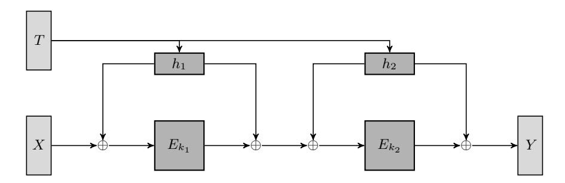
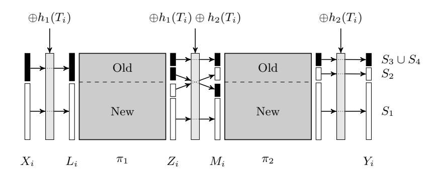
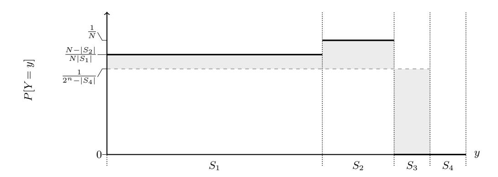
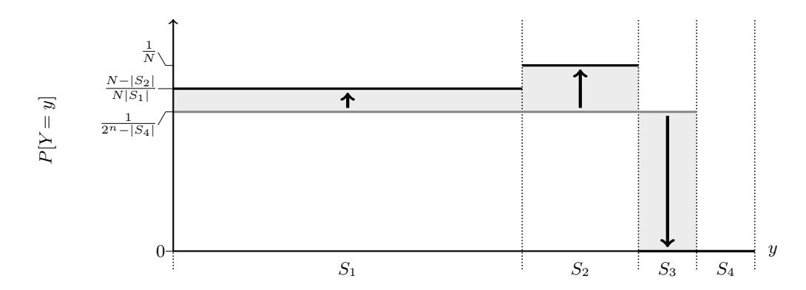
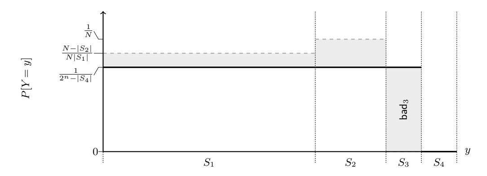
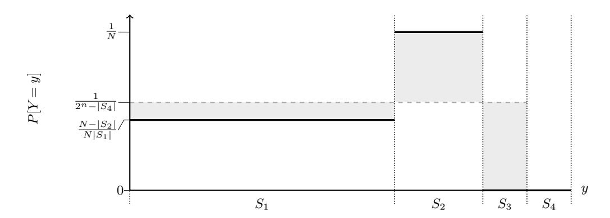
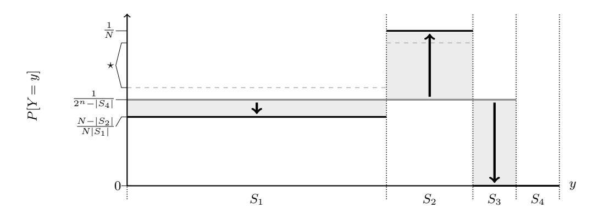
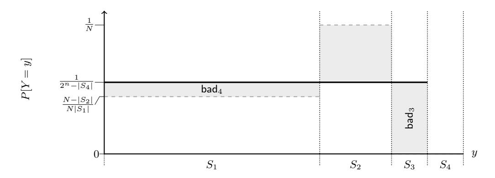

# A Note on the CLRW2 Tweakable Block Cipher Construction

#### Gordon Procter

Information Security Group, Royal Holloway, University of London gordon.procter.2011@rhul.ac.uk

**Abstract.** In this note, we describe an error in the proof for CLRW2 given by Landecker et al. in their paper at CRYPTO 2012 on the beyond-birthday-bound security for tweakable block ciphers. We are able to resolve the issue, give a new bound for the security of CLRW2, and identify a potential limitation of this proof technique when looking to extend the scheme to provide asymptotic security.

#### 1 Introduction

Tweakable block ciphers were formalised by Liskov, Rivest, and Wagner at CRYPTO 2002 [18]. A tweakable block cipher is a block cipher that admits an additional input (the tweak) to introduce extra variability at the message-block level, in the same way that a nonce or IV introduces variability at the message level. The Hasty Pudding Cipher [23] and Mercy [7] are early examples of ciphers that natively support a tweak; in the case of the Hasty Pudding Cipher, this was called Spice. The tweak may be public and, informally, the security aim is that, for a single key, the permutations indexed by the tweaks are independent; appropriate security notions are defined more formally in Section 2.2.

Liskov et al. [18] describe the syntax and security requirements for tweakable block ciphers and describe two methods for building a tweakable block cipher from a standard block cipher. They also give a method to construct a strong tweakable block cipher<sup>1</sup> from a standard block cipher.

Several tweakable block ciphers have been proposed including Goldenberg et al.'s work on tweaking Luby-Rackoff ciphers [9]; Rogaway's XE and XEX modes [22], which are closely related to the OCB mode of operation [14]; and Threefish [8], which forms part of the hash function Skein [8].

Many block-cipher-based encryption and authentication schemes are secure up to the birthday bound, i.e. provided that fewer than  $2^{\frac{n}{2}}$  queries are made, where n is the width of the block cipher (in bits). Beyond this point, one would expect a collision in the input to the block cipher to occur and for this to perhaps leak some information or simplify forgery attempts (as described in, for example, [1,3,4,20]). Several works have studied the security of schemes beyond the birthday bound (for examples, see [10,12]); one related question is how to acheive beyond-birthday-bound security for tweakable block ciphers.

At FSE 2009, Minematsu [21] suggested a method to build a 2n-bit tweakable block cipher that provides  $\mathcal{O}(2^{\frac{n+m}{2}})$  security from an n-bit block cipher (where m is the size of the tweak). This scheme has a Luby-Rackoff or Feistel structure, but has the disadvantage of only supporting short tweaks and requiring per-invocation block-cipher rekeying which makes changing the tweak computationally expensive.

At CRYPTO 2012 Landecker, Shrimpton, and Terashima [16] continued the study of tweakable block ciphers. Their paper has two main contributions: specifying CLRW2, a tweakable block cipher construction that remains secure beyond the birthday bound (up to approximately

<span id="page-0-0"></span><sup>&</sup>lt;sup>1</sup> Informally, a strong tweakable block cipher is one that remains secure when the adversary is given also access to a decryption oracle.

2 2n <sup>3</sup> queries); and giving a proof that TBC-MAC (the analogue of CBC-MAC defined in terms of tweakable block ciphers) is both a PRF and unforgeable. CLRW2 allows arbitrarily long tweaks and does not require excessive rekeying of the block cipher.

The CLRW2 construction was extended by Lampe and Seurin at FSE 2013 [\[15\]](#page-11-12) who consider longer chains of the LRW2 construction and are able to show (asymptotically in the number of rounds, using a coupling argument) that this provides greater security further beyond the birthday bound than the CLRW2 construction. Their bounds agree with Landecker et al.'s bound in the case of non-adaptive CPA adversaries and they prove a weaker bound for CCA adversaries; they conjecture that the bound proved for non-adaptive CPA adversaries also holds for CCA adversaries.

#### Contributions

This is an early draft in which we identify a flaw in the proof given by Landecker et al. for CLRW2 [\[16,](#page-11-11)[17\]](#page-11-13) and are able to resolve it. We describe modifications that correct the proof and give new bounds for the security of CLRW2. We also identify a potential issue which may prevent this proof technique being used to extend these results asymptotically, although this issue does not appear to affect Lampe and Seurin's results.

Landecker et al. have independently identified and corrected the error in their proof [\[24\]](#page-11-14); they correct the proof using a neat coupling argument which results in a tighter bound.

### Structure

This note is structured as follows: In Section [2,](#page-1-1) we introduce the notation, syntax, and security models used in this note; in Section [3,](#page-2-0) we give a brief summary of Landecker et al.'s scheme and corresponding proof; in Section [4,](#page-5-0) we describe and demonstrate the error that we have identified in the proof; in Section [5,](#page-7-0) we give one possible method to fix this error and derive new bounds for the security of CLRW2; and Section [6](#page-9-0) contains a description of some issues that may prevent this proof technique being extended asymptotically.

## <span id="page-1-1"></span>2 Preliminaries

## 2.1 Notation

For a set X , we write x \$← X to represent an element x being uniformly sampled from X . For a bitstring x ∈ {0, 1} <sup>∗</sup> we use |x| to denote its length. We use ξ(p) to represent a Bernoulli random variable that is 1 with probability p and 0 with probability 1 − p. For a set S ⊆ {0, 1} <sup>n</sup> and an element x ∈ {0, 1} <sup>n</sup> we define S ⊕ x = {s ⊕ x : s ∈ S}.

We follow the code-based game paradigm of Bellare and Rogaway [\[5\]](#page-10-3). We will use X<sup>i</sup> to denote plaintext input to a tweakable block cipher and Y<sup>i</sup> for ciphertext output. Queries made by an adversary and the value of random variables related to those queries are be indexed by a counter i. In games, all boolean flags are initialised to false and arrays are initially undefined at every point.

## <span id="page-1-0"></span>2.2 Block Cipher Syntax and Security

A block cipher is a family of functions: E : K × {0, 1} <sup>n</sup> → {0, 1} n , where K is the keyspace. We require that E(k, ·) is a permutation on {0, 1} n for every choice of key k. We will often denote E(k, ·) by Ek(·) and the inverse of this permutation by E −1 k (·).

We follow Bellare, Kilian, and Rogaway [\[2\]](#page-10-4) and say that a block cipher is secure if it is a pseudo-random permutation family (PRP). A pseudo-random permutation family is a set of permutations  $\{E_k|k\in\mathcal{K}\}$  that is indistinguishable from a random permutation family  $\Pi$  also indexed by elements of  $\mathcal{K}$ . A strong pseudo-random permutation family (SPRP) is a pseudo-random permutation family that remains indistinguishable from a random permutation family when an adversary is also given access to either a decryption oracle, or to the random permutation's inverse.

Consider an adversary A and define their SPRP advantage against E as

$$\mathrm{Adv}_E^{\mathrm{sprp}}(\mathcal{A}) = \left| \Pr[1 \leftarrow \mathcal{A}^{(E_k, E_k^{-1})}] - \Pr[1 \leftarrow \mathcal{A}^{(\pi, \pi^{-1})}] \right|$$

where  $k \stackrel{\$}{\leftarrow} \mathcal{K}$  and  $\pi \stackrel{\$}{\leftarrow} \Pi$ . Define  $\mathrm{Adv}_E^{\mathrm{sprp}}(q,t)$  to be the maximum advantage that can be realised by an adversary asking no more than q queries and running in time at most t. We say that E is a strong pseudo-random permutation if  $\mathrm{Adv}_E^{\mathrm{sprp}}(q,t)$  is sufficiently small.

A tweakable block cipher is a family of functions:  $\widetilde{E}: \mathcal{K} \times \mathcal{T} \times \{0,1\}^n \to \{0,1\}^n$ , where  $\mathcal{K}$  is the keyspace and  $\mathcal{T}$  is the tweakspace. We require that, for every  $k \in \mathcal{K}$  and  $T_i \in \mathcal{T}$ ,  $\widetilde{E}_k(T_i, \cdot)$  is a permutation on  $\{0,1\}^n$  and we denote the inverse of this permutation by  $\widetilde{E}_k^{-1}(T_i, \cdot)$ . We remark that in the case of CLRW2, a tweakable block cipher key includes two keys for the underlying block cipher and two keys for the universal hash function family, i.e.  $k = (k_1, H_1, k_2, H_2)$ .

We use the definition of tweakable block cipher security given by Liskov et al. [18,19]. A secure tweakable block cipher is one that is indistinguishable from a tweaked random permutation family  $\widetilde{H}$ , where  $\widetilde{H}$  is a set of random permutations on  $\{0,1\}^n$  indexed by elements of  $\mathcal{K} \times \mathcal{T}$ . A strong tweakable block cipher is one that is indistinguishable from a tweaked random permutation family when an adversary is given either access to encryption and decryption oracles for the tweakable block cipher or access to a family of tweaked random permutations and their inverses. In the definition of both tweakable block ciphers and strong tweakable block ciphers, the adversary is able to choose both the input and the tweak for each query.

Consider an adversary A and define their tweakable-SPRP advantage against  $\widetilde{E}$  as

$$\operatorname{Adv}_{\widetilde{E}}^{\widetilde{\operatorname{sprp}}}(\mathcal{A}) = \left| \Pr[1 \leftarrow \mathcal{A}^{(\widetilde{E}_k, \widetilde{E}_k^{-1})}] - \Pr[1 \leftarrow \mathcal{A}^{(\widetilde{\pi}, \widetilde{\pi}^{-1})}] \right|$$

where  $k \stackrel{\$}{\leftarrow} \mathcal{K}$  and  $\widetilde{\pi} = \{\pi(k, T_i, \cdot) \in \widetilde{\Pi} : T_i \in \mathcal{T}\}$ . Define  $\operatorname{Adv}_{\widetilde{E}}^{\widetilde{\operatorname{sprp}}}(q, t)$  to be the maximum advantage that can be realised by an adversary making no more than q queries and running in time at most t. We say that  $\widetilde{E}$  is a strong tweakable block cipher if  $\operatorname{Adv}_{\widetilde{E}}^{\widetilde{\operatorname{sprp}}}(q, t)$  is sufficiently small.

#### 2.3 Universal Hash Functions

A family of hash functions will be denoted  $\mathcal{H} = \{h_H : \{0,1\}^* \to \{0,1\}^n \mid H \in \mathcal{K}_{\mathcal{H}}\}$  with each hash function  $h_H$  indexed by a key  $H \in \mathcal{K}_{\mathcal{H}}$ . For simplicity and clarity, we will abbreviate  $h_{H_j}$  to  $h_j$ .

A family of hash functions is said to be  $\epsilon$ -almost XOR universal [13] if for every  $M, M' \in \{0,1\}^*$  with  $M \neq M'$  and for every  $c \in \{0,1\}^n$ ,  $\Pr_{H \in \mathcal{K}_{\mathcal{H}}}[h_H(M) \oplus h_H(M') = c] < \epsilon$ . Throughout this paper  $\epsilon$ -almost XOR universal will be abbreviated to  $\epsilon$ -AXU.

### <span id="page-2-0"></span>3 Description of the CLRW2 Tweakable Block Cipher Construction

The scheme proposed by Landecker et al. [16] combines an  $\epsilon$ -AXU hash function and a block cipher. The ciphertext  $Y_i$  is computed from plaintext  $X_i$  using key  $k = (k_1, H_1, k_2, H_2)$  and tweak  $T_i$  as follows:

$$Y_i = E_{k_2} (E_{k_1}(X_i \oplus h_1(T_i)) \oplus h_1(T_i) \oplus h_2(T_i)) \oplus h_2(T_i)$$



<span id="page-3-0"></span>Fig. 1. The CLRW2 tweakable block cipher construction.

This construction is illustrated in Figure [1.](#page-3-0) The intuition behind the security of CLRW2 is that an adversary can only obtain a 'birthday-bound-style' advantage by causing a collision at both inputs to the block cipher The reduction given by Landecker et al. (which relies on the SPRP security of the block cipher to show the strong tweakable block cipher security of CLRW2) proceeds via a series of games. The aim of these games is to show that the output of CLRW2 is close to that of an ideal tweakable block cipher, in the absence of a query that causes a collision at both block cipher inputs and that the likelihood of such a query is sufficiently low.

#### 3.1 Additional Notation

We largely follow the notation used by Landecker et al. [\[16,](#page-11-11)[17\]](#page-11-13) to avoid introducing confusion.

Throughout this paper, we will lazy-sample random permutations instead of defining the permutation up front. When referring to the domain and range of a permutation π : {0, 1} <sup>n</sup> → {0, 1} n , we will use Domfull(π) and Rngfull(π) to denote the set {0, 1} n in order to make clear the context that this set relates to. When lazy-sampling a permutation π : {0, 1} <sup>n</sup> → {0, 1} n we will use the sets Domlazy(π) ⊆ Domfull(π) = {0, 1} <sup>n</sup> and Rnglazy(π) ⊆ Rngfull(π) = {0, 1} n to keep track of which values have been defined in the domain and range (respectively) of π. We will often drop the subscript for the sets Domlazy(π) and Rnglazy(π) provided that the meaning is clear. The 'lazy' sets have an implicit query index because they are only defined relative to the previous queries and random choices within them.

We use Y<sup>i</sup> = {0, 1} <sup>n</sup> \ {Y<sup>j</sup> : j < i and T<sup>j</sup> = Ti} and Y<sup>i</sup> = {0, 1} <sup>n</sup> \ Y<sup>i</sup> . That is, if Y<sup>i</sup> ∈ Y<sup>i</sup> then Yi is not a possible output from an ideal tweakable block cipher given the output from previous queries (recalling that <sup>E</sup><sup>e</sup> (k, T<sup>i</sup> , ·) is a permutation). Hence, Y<sup>i</sup> is the set of possible output values from an ideal tweakable block cipher.

We define the sets S<sup>j</sup> as they are defined in Landecker et al.'s paper and present them graphically in Figure [2.](#page-4-0) These sets partition {0, 1} n for a particular input (X<sup>i</sup> , Ti) according to the whether the corresponding inputs and outputs of each permutation have already been defined. As above, these sets have an implicit query index.

$$\begin{split} S_1 &= \{Y_i \in \mathcal{Y}_i : Y_i \oplus h_2(T_i) \notin \mathsf{Rng}(\pi_2)\} \\ S_2 &= \{Y_i \in \mathcal{Y}_i : Y_i \oplus h_2(T_i) \in \mathsf{Rng}(\pi_2) \land \pi_2^{-1}(Y_i \oplus h_2(T_i)) \oplus h_1(T_i) \oplus h_2(T_i) \notin \mathsf{Rng}(\pi_1)\} \\ S_3 &= \{Y_i \in \mathcal{Y}_i : Y_i \oplus h_2(T_i) \in \mathsf{Rng}(\pi_2) \land \pi_2^{-1}(Y_i \oplus h_2(T_i)) \oplus h_1(T_i) \oplus h_2(T_i) \in \mathsf{Rng}(\pi_1)\} \\ S_4 &= \{Y_i \in \overline{\mathcal{Y}_i}\} \end{split}$$

That is, S<sup>1</sup> is the set of output values that correspond to undefined outputs from π<sup>2</sup> and S<sup>2</sup> is the set of output values corresponding to defined outputs from π2, but for which the output of π<sup>1</sup> is undefined. The set S<sup>3</sup> contains output values for which the all inputs and outputs to the block cipher are defined. Because we only consider these sets when L<sup>i</sup> ∈/ Rng(π1), these



Fig. 2. An illustration of the definition for sets Si. The domain and range of each permutation are divided into two sets: the input/output pairs that are 'Old' (in Dom(π<sup>j</sup> ) and Rng(π<sup>j</sup> )), shown above the dashed line; and the points that are 'New' (in Dom(π<sup>j</sup> ) and Rng(π<sup>j</sup> )), shown below the dashed line. In the case that L<sup>i</sup> ∈/ Dom(π1), any value corresponding to a black box in the above diagram is impossible.

<span id="page-4-0"></span>output values are inconsistent with the responses to previous queries. Finally, S<sup>4</sup> = Y<sup>i</sup> is the set of values that are not possible for either an ideal tweakable block cipher or the CLRW2 construction; responding to a query with an element of this set would violate the requirement for each <sup>E</sup><sup>e</sup> (k, T<sup>i</sup> , ·) to be a permutation.

At a first glance, S<sup>3</sup> is appears to be the difference between CLRW2 and an ideal tweakable block cipher: elements in S<sup>4</sup> are not possible in either case; elements in S<sup>1</sup> and S<sup>2</sup> are possible in both cases; while elements in S<sup>3</sup> are not excluded from the output of an ideal tweakable block cipher but are impossible if CLRW2 is used. This informal summary does not give the full detail – if the situation were this simple, the original proof would be correct.

We use pT BC(Yi) to denote the probability that Y<sup>i</sup> is the output of the ideal tweakable block cipher and pG3(Yi) for the probability that Y<sup>i</sup> is the output of the intermediate cipher defined in Game 3 of the proof; these probabilities are both conditioned on all previous queries and responses.

## 3.2 Overview of Proof

We give a brief overview of Landecker et al.'s proof below but refer to the original papers [\[16](#page-11-11)[,17\]](#page-11-13) for the full details.

Game 0 defines the scheme when it is instantiated with a particular block cipher and is given in Figure [3,](#page-4-1) to introduce the random variables corresponding to inputs and outputs to the random permutations in later games.

```
Game 0
1: procedure Ee (T, X)
2: i ← i + 1; Xi ← X; Ti ← T
3: Li ← Xi ⊕ h1(Ti)
4: Zi ← Ek1
              (Li)
5: Mi ← Zi ⊕ h1(Ti) ⊕ h2(Ti)
6: Yi ← Ek2
              (Mi) ⊕ h2(Ti)
```

<span id="page-4-1"></span>return Y<sup>i</sup>

Fig. 3. Game 0 defines the scheme when it is instantiated with a specific block cipher. It is included here to introduce the random variables corresponding to inputs and outputs to the random permutations in later games.

Games 1 to 3 consider the case in which there is a collision at the input to the first block cipher. The conclusion of this analysis is that in the absence of a collision at both block ciphers

on the same query, the output of CLRW2 is indistinguishable from an ideal tweakable block cipher and that the probability of two block cipher collisions being caused by the same query is sufficiently small that the scheme remains secure up to approximately  $2^{\frac{2n}{3}}$  queries.

In Game 1, the block cipher is replaced with a random permutation, which is lazy-sampled. The security of this scheme relies on the assumption that the block cipher used to instantiate the scheme is a strong pseudorandom permutation and the distinguishing advantage between Game 0 and Game 1 is bounded above by  $2\text{Adv}_E^{\text{sprp}}(\mathcal{A})$ .

Between Games 1 and 3, the only changes to the definition of these games are in section of code that is executed when the image of  $L_i$  under  $\pi_1$  has already been defined. The differences between these games are as follows. In Game 1, the existing definition of  $\pi_2(M_i)$  is used. In Game 2,  $Y_i$  is sampled from  $\mathcal{Y}_i$  (the set of possible values) and this definition is checked to ensure that it does not contradict any existing definition of  $\pi_2(M_i)$  or  $\pi_2^{-1}(Y_i \oplus h_2(T_i))$ . If the sampling of  $Y_i$  from  $\mathcal{Y}_i$  does cause a contradiction, one of  $\mathsf{bad}_1$  and  $\mathsf{bad}_2$  is set to true and  $Y_i$  is redefined. Game 3 is identical to Game 2, except that in  $Y_i$  is never redefined in Game 4, even if a  $\mathsf{bad}$  flag is set to true. The difference between Game 1 and Game 2 is purely syntactic; the distribution of all random variables in the two games are identical. The distributions of all random variables in Games 2 and 3 are identical unless either  $\mathsf{bad}_1$  or  $\mathsf{bad}_2$  is set to true.

Games 4 to 6 address the case in which there is no first round collision; it is in this case that we have identified the problem with the proof. In these games, no changes are made to the code that is executed when  $\pi_1(L_i)$  is already defined.

Between Game 3 and Game 4, the order in which  $Z_i$  and  $Y_i$  are sampled is changed, however the joint distribution is not changed. Between Games 4 and 5, the method used to sample  $Z_i$ and  $Y_i$  is changed, with the aim that the final joint distribution is unchanged. We will see that this aim is not achieved and that this is where the error in the proof occurs.

Game 5 and Game 6 are identical unless it is necessary to redefine  $Y_i$ . If it is necessary to redefine  $Y_i$  in Game 5, then  $\mathsf{bad}_3$  is set to true and so these two games are identical until  $\mathsf{bad}$ , in a similar way to Game 2 and Game 3. Game 6 and Game 7 are functionally identical and Game 7 realises an ideal tweakable block cipher.

Game 8 is essentially identical to Game 7, but gives the adversary control over the  $Y_i$  values. The motivation for this step is that this makes it no harder for an adversary to trigger any of the bad events, but makes it easier to reason about the probability of a bad event occurring.

#### <span id="page-5-0"></span>4 The Error in the Proof

#### 4.1 Games 4 and 5 are not Identical

In the proof of security given for CLRW2 [16,17], Landecker et al. assert that the output distributions of Games 4 and 5 are identical. However, this is only the case if  $p_{G3}(Y_i) - p_{TBC}(Y_i)$  is non-negative for  $Y_i \in S_1 \cup S_2$ . This is because the resampling step in Game 5 (at Lines 618-9) only produces an identical distribution to that of Game 4 if  $p_{G3}(Y_i) \ge p_{TBC}(Y_i)$  for  $Y_i \in S_1 \cup S_2$ .

It is possible for a series of queries to result in  $p_{G3}(Y_i) - p_{TBC}(Y_i)$  being negative for all  $Y_i \in S_1$ . This results in a contradiction to the claim that the output distributions of Games 4 and 5 are always identical.

In Section 5 we describe one method of modifying Games 5-8 to fix this issue with the proof. We redefine  $\Delta_i = \sum_{Y_i \in S_i} p_{G3}(Y_i) - p_{TBC}(Y_i)$  (without the modulus signs from Landecker et al.'s definition) and note that  $|\Delta_i| = \sum_{Y_i \in S_i} |p_{G3}(Y_i) - p_{TBC}(Y_i)|$  because for a given set  $S_j$  either  $p_{G3}(Y_i) - p_{TBC}(Y_i) \ge 0$  for every  $Y_i$  in  $S_j$  or  $p_{G3}(Y_i) - p_{TBC}(Y_i) < 0$  for every  $Y_i$  in  $S_j$ . Using our definition,  $|\Delta_j|$  corresponds precisely with Landecker et al.'s definition of  $\Delta_j$ .

We briefly describe the differences between the sampling methods employed when  $L_i$  is new in the relevant games. The resulting probability distributions are illustrated in Figures 7 to 9.

In Game 3,  $Z_i$  is chosen uniformly at random from  $\overline{\mathsf{Dom}(\pi_1)}$  and  $Y_i$  is defined to be consistent with this choice of  $Z_i$ . In Game 4, an appropriately weighted coin is tossed and  $Y_i$  is chosen from either  $S_1$  or  $S_2$  so that the distributions of  $Z_i$  and  $Y_i$  are identical to the distribution in Game 3. In Game 5,  $Y_i$  is chosen uniformly from  $\mathcal{Y}_i$  and if  $Y_i$  is in  $S_3$  then it is resampled, from either  $S_1$  or  $S_2$ .

When  $Y_i$  is resampled in Game 5, the probability that it is chosen in  $S_2$  is  $\frac{|\Delta_2|}{|\Delta_1|+|\Delta_2|}$ . This probability is used because if  $|\Delta_1|+|\Delta_2|=|\Delta_3|$  then the distribution of  $Y_i$  does not change between Games 4 and 5 [17, p. 9]. However, if  $p_{G3}(Y_i)-p_{TBC}(Y_i)<0$  then  $|\Delta_2|=|\Delta_1|+|\Delta_3|$ , so  $|\Delta_1|+|\Delta_2|>|\Delta_3|$  and the distribution of  $Y_i$  does change.

In fact, the difference between the distributions in Games 4 and 5 is exaggerated by the method used by Landecker et al. to resample from  $S_1 \cup S_2$  if  $Y_i \in S_3$ , as illustrated in Figure 11. In the case that  $p_{G3}(Y_i) - p_{TBC}(Y_i) < 0$  for  $Y_i \in S_1$ , the desired difference between the distributions in Game 4 and Game 5 for  $Y_i \in S_1$  is  $-|\Delta_1|$ , i.e.

$$\sum_{Y_i \in S_1} p_{G3}(Y_i) = \sum_{Y_i \in S_1} p_{TBC}(Y_i) - |\Delta_1|$$

but using the sampling method described, this increases this to  $|\Delta_1| \cdot \frac{|\Delta_3|}{|\Delta_1| + |\Delta_2|}$ , so that

$$\sum_{Y_i \in S_1} p_{G3}(Y_i) = \sum_{Y_i \in S_1} p_{TBC}(Y_i) + |\Delta_1| \cdot \frac{|\Delta_3|}{|\Delta_1| + |\Delta_2|}.$$

Similarly, the difference for  $Y_i \in S_2$  is decreased from  $|\Delta_2|$  to  $|\Delta_2| \cdot \frac{|\Delta_3|}{|\Delta_1| + |\Delta_2|}$

## 4.2 How to make $p_{G3}(Y_i) - p_{TBC}(Y_i) < 0$

The proof given by Landecker et al. [16,17] is correct provided that  $p_{G3}(Y_i) - p_{TBC}(Y_i) \ge 0$  when  $Y_i \in S_1 \cup S_2$ . We will call the situation in which  $p_{G3}(Y_i) - p_{TBC}(Y_i) < 0$  for some  $Y_i \in S_i \cup S_2$  an *inversion*. To demonstrate an inversion, first recall that:

$$p_{TBC}(Y_i) = \frac{1}{2^n - |S_4|} \text{ for } Y_i \notin S_4,$$

$$p_{G3}(Y_i) = \frac{N - |S_2|}{N|S_1|} \text{ for } Y_i \in S_1, \text{ and}$$

$$p_{G3}(Y_i) = \frac{1}{N} \text{ for } Y_i \in S_2,$$

where  $N = |\overline{\mathsf{Dom}(\pi_1)}|$ .

 $Y_i \in S_1$  We consider the possibility of an inversion occurring for  $Y_i \in S_1$  and show that an adversary can force an inversion to happen for  $Y_i$  in  $S_1$  with high probability. In this case, an inversion occurs when

$$\frac{1}{2^n - |S_4|} = p_{TBC}(Y_i) > p_{G3}(Y_i) = \frac{N - |S_2|}{N|S_1|}$$

Suppose that the adversary asks a number of queries so that  $|\mathsf{Dom}(\pi_1)| = a$  and  $|\mathsf{Dom}(\pi_2)| = b$ , with no restrictions on how  $X_i$  and  $T_i$  are chosen. Then, one way that an inversion can occur with high probability is if: the adversary uses a new tweak for the next query;  $L_i$  is new; and for every  $Z_i \in \mathsf{Rng}(\pi_1)$ ,  $Z_i \oplus h_1(T_i) \oplus h_2(T_i) \in \overline{\mathsf{Dom}(\pi_2)}$ .

In this case:

$$N = 2^n - a$$
,  $|S_1| = 2^n - b$ ,  $|S_2| = b$ , and  $|S_3| = |S_4| = 0$ .

Starting with the observation that ab > 0, the following statements are equivalent:

$$ab > 0$$

$$2^{2n} - (a+b)2^n + ab > 2^{2n} - (a+b)2^n$$

$$(2^n - a)(2^n - b) > 2^n(2^n - a - b)$$

$$\frac{1}{2^n} > \frac{2^n - a - b}{(2^n - a)(2^n - b)}$$

$$\frac{1}{2^n - |S_4|} > \frac{N - |S_2|}{N|S_1|}$$

$$p_{TBC}(Y_i) > p_{G3}(Y_i)$$

which is the condition for an inversion.

This situation can occur and indeed it is easy for an adversary to force this event to happen. If  $T_1 \neq T_2$  then an inversion occurs on the second query (where a = b = 1) with probability  $1 - \epsilon \approx \frac{2^n - 1}{2^n}$ , which is the probability that  $h_j(T_1) \neq h_j(T_2)$  when  $T_1 \neq T_2$  (this probability is conditioned on the event  $L_i \in \overline{\mathsf{Dom}(\pi_1)}$  having occurred).

 $Y_i \in S_2$  We also consider the possibility of an inversion occurring for  $Y_i \in S_2$ . For an inversion to occur we need

$$\frac{1}{2^n - |S_4|} = p_{TBC}(Y_i) > p_{G3}(Y_i) = \frac{1}{N}$$

Now note that

$$2^n - |S_4| \ge |S_1| + |S_2| \ge N$$

and so

$$\frac{1}{2^n - |S_4|} \le \frac{1}{|S_1| + |S_2|} \le \frac{1}{N}$$

Therefore, for  $Y_i \in S_2$ , there is no situation in which  $p_{TBC}(Y_i) \geq p_{G3}(Y_i)$ .

A Minor Issue with Landecker et al.'s Graph We also make the minor remark that the graph given by Landecker et al. [16, Fig.3] shows  $p_{G3}(Y_1) \ge p_{G3}(Y_2)$ , where  $Y_1 \in S_1$  and  $Y_2 \in S_2$ , when in fact this situation can never occur as  $N - |S_2|$  is never any larger than  $|S_1|$  and

$$|N - |S_2| \le |S_1| \Leftrightarrow \frac{N - |S_2|}{|S_1|} \le 1 \Leftrightarrow \frac{N - |S_2|}{N|S_1|} \le \frac{1}{N} \Leftrightarrow p_{G3}(Y_1) \le p_{G3}(Y_2).$$

#### <span id="page-7-0"></span>5 How to Fix Landecker et al.'s Proof

The proof given by Landecker et al. can be fixed by modifying Games 5 to 8. The strategy we have adopted is to not change the distribution of  $Y_i$  between Games 4 and 5, then to bound the distance between the distributions that result from an ideal tweakable block cipher and from Game 5. This is the same strategy followed by Landecker et al. but we are careful to ensure that the distribution of  $Y_i$  does not change between Games 4 and 5 when  $p_{G3}(Y_i) - p_{TBC}(Y_i) < 0$ . This requires us to reduce the probability of  $Y_i$  being sampled from  $S_1$  when  $\Delta_1 < 0$  in Game 5; we do this naïvely by tossing an appropriately weighted coin to decide whether to resample

 $Y_i$  from  $S_2$ . We add conditional branches to differentiate between the cases  $\Delta_1 \geq 0$  and  $\Delta_1 < 0$ ; this is a simple approach, but appears to work well and we lose only a small factor in the bound.

In Appendix A, we give the revised games (Figures 4, 5, and 6) and graphically represent the probability distributions realised by each of these games (Figures 7, 8, 9, 10, 11, and 12). We have only specified the encryption algorithm for each of game; it is straightforward to derive the corresponding decryption algorithms.

The distributions of all random variables in Games 4 and 5' are identical. Games 5' and 6' are identical unless either bad<sub>3</sub> or bad<sub>4</sub> gets set to true. The distributions of random varibles in Games 6' and 7' are identical, with Game 7' simplifying some of the program flow. Game 8' gives the adversary control over  $Y_i$  values, so the bad flags can be set at least as easily as they can in Game 7'. We note that Game 8 and Game 8' are identical except for the addition of lines 14 to 17, so a large majority of the original analysis still applies.

Landecker et al. have independently identified an alternative method to correct the error in their proof [24], using a coupling argument which results in a tighter bound.

#### <span id="page-8-0"></span>5.1 A Bound on $\Delta_1$

To bound the advantage an adversary gains when we change from Game 5' to Game 6', we need to bound  $|\Delta_1| \frac{(2^n - |S_4|)}{|S_1|}$  in the case that  $\Delta_1 < 0$ . By noting that

$$N \ge 2^n - q$$
,  $|S_1| \ge 2^n - q$ ,  $|S_2| \le q$ ,  $|S_3| \ge 0$ , and  $|S_4| \ge 0$

we can bound  $|\Delta_1|$  and  $|\Delta_1| \cdot \frac{(2^n - |S_4|)}{|S_1|}$ :

$$|\Delta_1| \le \frac{q^2}{2^n(2^n - q)}$$
 and  $|\Delta_1| \cdot \frac{(2^n - |S_4|)}{|S_1|} \le \frac{q^2}{(2^n - q)^2}$

More details are given in Appendix B. This bound is tight, in the sense that it is possible for an adversary to ask a series of q queries and for  $|\Delta_1| \cdot \frac{(2^n - |S_4|)}{|S_1|}$  to be as large as described by this bound. For this to occur we require that  $|S_4| = |S_3| = 0$ ,  $|S_2| = q$ , and  $N = 2^n - q$ .

We also need to compare this to  $\beta_1 + \Pr[Q]$  as calculated by Landecker et al., who show that  $\beta_1 + \Pr[Q] \le \frac{2q^3\hat{\epsilon}^2}{1-q^3\hat{\epsilon}^2}.$ Now, note that  $\frac{1}{2^n-q} \le \frac{1}{2^n-2q} \le \hat{\epsilon}$  and that  $1-q^3\hat{\epsilon}^2 \le 1$ . So

$$\frac{q^2}{(2^n - q)^2} \le q^2 \hat{\epsilon}^2 \le \frac{q^3 \hat{\epsilon}^2}{1 - q^3 \hat{\epsilon}^2}$$

and we can see that

$$\Pr\left[\mathcal{A}^{G8'}:\mathsf{bad}_4\right] \leq \frac{q^2}{(2^n-q)^2} \leq q^3 \hat{\epsilon}^2 \leq \frac{q^3 \hat{\epsilon}^2}{1-q^3 \hat{\epsilon}^2}.$$

#### Game Hopping Probabilities

Recalling Landecker et al.'s observation [16,17] that

$$2\Pr\left[\mathcal{A}^{G8'}:\mathsf{bad}_3\right]+\Pr\left[\mathcal{A}^{G8'}:\mathsf{bad}_1\vee\mathsf{bad}_2\right]\leq \frac{6q^3\hat{\epsilon}^2}{1-q^3\hat{\epsilon}^2},$$

we are able to compute the adversary's advantage, using the Fundamental Lemma of Game Playing [5]:

$$\begin{split} \Pr\left[\mathcal{A}^{G1} \to 1\right] &\leq \Pr\left[\mathcal{A}^{G4} \to 1\right] + \Pr\left[\mathcal{A}^{G4} : \mathsf{bad}_1 \lor \mathsf{bad}_2\right] \\ &\leq \Pr\left[\mathcal{A}^{G5'} \to 1\right] + \Pr\left[\mathcal{A}^{G5'} : \mathsf{bad}_1 \lor \mathsf{bad}_2\right] \\ &\leq \Pr\left[\mathcal{A}^{G6'} \to 1 \land \neg(\mathsf{bad}_3 \lor \mathsf{bad}_4)\right] + \Pr\left[\mathcal{A}^{G6'} \to 1 \land (\mathsf{bad}_3 \lor \mathsf{bad}_4)\right] \\ &\quad + \Pr\left[\mathcal{A}^{G6'} : (\mathsf{bad}_1 \lor \mathsf{bad}_2) \land (\mathsf{bad}_3 \lor \mathsf{bad}_4)\right] \\ &\quad + \Pr\left[\mathcal{A}^{G6'} : (\mathsf{bad}_1 \lor \mathsf{bad}_2) \land \neg(\mathsf{bad}_3 \lor \mathsf{bad}_4)\right] \\ &\leq \Pr\left[\mathcal{A}^{G6'} \to 1\right] + 2\Pr\left[\mathcal{A}^{G6'} : \mathsf{bad}_3 \lor \mathsf{bad}_4\right] + \Pr\left[\mathcal{A}^{G6'} : \mathsf{bad}_1 \lor \mathsf{bad}_2\right] \\ &\leq \Pr\left[\mathcal{A}^{(\widetilde{n},\widetilde{n}^{-1})} \to 1\right] + 2\Pr\left[\mathcal{A}^{G8'} : \mathsf{bad}_3\right] + 2\Pr\left[\mathcal{A}^{G8'} : \mathsf{bad}_4\right] \\ &\quad + \Pr\left[\mathcal{A}^{G8'} : \mathsf{bad}_1 \lor \mathsf{bad}_2\right] \\ &\leq \Pr\left[\mathcal{A}^{(\widetilde{n},\widetilde{n}^{-1})} \to 1\right] + \frac{6q^3\hat{\epsilon}^2}{1-q^3\hat{\epsilon}^2} + 2\frac{q^2}{(2^n-q)^2} \\ &\leq \Pr\left[\mathcal{A}^{(\widetilde{n},\widetilde{n}^{-1})} \to 1\right] + \frac{8q^3\hat{\epsilon}^2}{1-q^3\hat{\epsilon}^2} \end{split}$$

So, there is an adversary  $\mathcal{B}$  against the SPRP security of E, such that:

$$\operatorname{Adv}_{\widetilde{E}}^{\widetilde{\operatorname{sprp}}}(\mathcal{A}) \leq \operatorname{Adv}_{E}^{\operatorname{sprp}}(\mathcal{B}) + \frac{8q^3\hat{\epsilon}^2}{1 - q^3\hat{\epsilon}^2}.$$

This is in contrast to the original result, which concludes that there is an adversary  $\mathcal{B}$  against the SPRP security of E, such that:

$$\operatorname{Adv}_{\widetilde{E}}^{\widetilde{\operatorname{sprp}}}(\mathcal{A}) \leq \operatorname{Adv}_{E}^{\operatorname{sprp}}(\mathcal{B}) + \frac{6q^3\hat{\epsilon}^2}{1 - q^3\hat{\epsilon}^2}.$$

#### <span id="page-9-0"></span>6 A Limitation of this Proof Technique

A natural extension of the work of Landecker et al. [16] is to consider longer chains of the LRW2 construction, as Lampe and Seurin have done at FSE 2013 [15]. The naïve approach to proving results in this case, which we emphasise is not the approach taken by Lampe and Seurin, would be to mimic Landecker et al.'s proof but to increase the number of sets  $S_i$  to describe where the last non-colliding input to a permutation occurs. This technique does not seem to succeed in the presence of the errors described in this note. A second remark about this approach is that it fundamentally depends on the ability to sample from a set  $\overline{\text{Rng}}_{\text{lazy}}(\pi_i) \cap (\overline{\text{Dom}}_{\text{lazy}}(\pi_{i+1}) \oplus h_i(T_i) \oplus h_{i+1}(T_i))$ . If this set is ever empty, it will be possible for an adversary to make a query that cannot be answered using the method described and a different proof method will be required. If this set is ever empty, it will be possible for an adversary to make a query that cannot be answered using the method described and a different proof method will be required.

We bound the number of queries that may be asked before the sampling method described above fails by  $q < 2^{n-1}$ . We emphasise that this does not constitute an error in Landecker et al.'s proof and does not appear to be an issue in Lampe and Seurin's work [15], it simply prevents Landecker et al.'s technique being naïvely extended asymptotically.

This bound is obtained as follows: Note that for every j,  $|\mathsf{Dom}_{\mathsf{lazy}}(\pi_j)| = |\mathsf{Rng}_{\mathsf{lazy}}(\pi_j)|$  after every query and, for every tweak,  $h_j(T_i) \oplus h_{j+1}(T_i)$  defines a perfect matching  $\{0,1\}^n \to \{0,1\}^n$

(representing Rngfull(π<sup>j</sup> ) and Domfull(πj+1)). Suppose that we remove (up to) two edges from every matching when answering each query: one edges that matches the output of π<sup>j</sup> and one edge matching the input to πj+1. Then it is possible to respond to any later query, as long as every matching has at least one edge remaining. If there is a matching with no remaining edges, then there is a tweak for which Rnglazy(π<sup>j</sup> ) ∩ (Domlazy(πj+1) ⊕ h<sup>j</sup> (Ti) ⊕ hj+1(Ti)) is empty and an input value X<sup>i</sup> such that X<sup>i</sup> ⊕h1(Ti) ∈/ Domlazy(π1). If there is a matching with no remaining edges, then there is a tweak for which Rnglazy(π<sup>j</sup> )∩(Domlazy(πj+1)⊕h<sup>j</sup> (Ti)⊕hj+1(Ti)) is empty and an input value X<sup>i</sup> such that X<sup>i</sup> ⊕ h1(Ti) ∈/ Domlazy(π1).

We can guarantee that Rnglazy(π<sup>j</sup> ) ∩ (Domlazy(πj+1) ⊕ h<sup>j</sup> (Ti) ⊕ hj+1(Ti)) is not empty for every i and j, provided that q < 2 n−1 . While it may remain possible to sample from this set beyond this bound, it is not guaranteed and depends on both the adversary's queries and the random choices in the lazy sampling of the functions.

This does not cause a problem until n − 1 block ciphers are chained together because up to that point security is only provided for q < 2 n−1 . However if n − 1 block ciphers are chained together using the CLRW2 construction, then this issue can occur and it may not be possible to respond to queries using this method.

## 7 Discussion and Conclusions

We have shown that a minor error exists in the proof given for the tweakable block cipher CLRW2 [\[16,](#page-11-11)[17\]](#page-11-13). Fortunately it is possible for this error to be corrected and the scheme still provides a similar level of security.

We also identify a potential limitation to extending this result asymptotically, by bounding the number of queries that can be made before it may be impossible to use Landecker et al.'s sampling method. We emphasise that this does not constitute an error in Landecker et al.'s proof and does not appear to be an issue in Lampe and Seurin's work; it simply prevents Landecker et al.'s technique being na¨ıvely extended asymptotically.

Recently, flaws have been found in the proofs for two high-profile ciphers: GCM [\[11\]](#page-11-17) and XCB [\[6\]](#page-10-5). In order for the community to have faith in the proofs given for schemes, it is important that security proofs are correct and any errors are removed. The factor lost by correcting the bound in this case is significantly smaller than for these errors, however it remains important that any errors in a security reduction are removed.

## References

- <span id="page-10-0"></span>1. M. Bellare, A. Desai, E. Jokipii, and P. Rogaway. A concrete security treatment of symmetric encryption. In Foundations of Computer Science, 1997. Proceedings., 38th Annual Symposium on, pages 394–403, Oct 1997.
- <span id="page-10-4"></span>2. Mihir Bellare, Joe Kilian, and Phillip Rogaway. The security of cipher block chaining. In Yvo G. Desmedt, editor, Advances in Cryptology CRYPTO 94, volume 839 of Lecture Notes in Computer Science, pages 341–358. Springer Berlin Heidelberg, 1994.
- <span id="page-10-1"></span>3. Mihir Bellare, Ted Krovetz, and Phillip Rogaway. Luby-Rackoff backwards: Increasing security by making block ciphers non-invertible. In Kaisa Nyberg, editor, Advances in Cryptology EUROCRYPT'98, volume 1403 of Lecture Notes in Computer Science, pages 266–280. Springer Berlin Heidelberg, 1998.
- <span id="page-10-2"></span>4. Mihir Bellare, Krzysztof Pietrzak, and Phillip Rogaway. Improved Security Analyses for CBC MACs. In Victor Shoup, editor, Advances in Cryptology CRYPTO 2005, volume 3621 of Lecture Notes in Computer Science, pages 527–545. Springer Berlin Heidelberg, 2005.
- <span id="page-10-3"></span>5. Mihir Bellare and Phillip Rogaway. The Security of Triple Encryption and a Framework for Code-Based Game-Playing Proofs. In Serge Vaudenay, editor, Advances in Cryptology - EUROCRYPT 2006, volume 4004 of Lecture Notes in Computer Science, pages 409–426. Springer Berlin Heidelberg, 2006.
- <span id="page-10-5"></span>6. Debrup Chakraborty, Vicente Hernandez-Jimenez, and Palash Sarkar. Another Look at XCB. Cryptology ePrint Archive, Report 2013/823, 2013.

- <span id="page-11-2"></span>7. Paul Crowley. Mercy: A Fast Large Block Cipher for Disk Sector Encryption. In Gerhard Goos, Juris Hartmanis, Jan Leeuwen, and Bruce Schneier, editors, Fast Software Encryption, volume 1978 of Lecture Notes in Computer Science, pages 49–63. Springer Berlin Heidelberg, 2001.
- <span id="page-11-6"></span>8. Niels Ferguson, Stefan Lucks, Bruce Schneier, Doug Whiting, Mihir Bellare, Tadayoshi Kohno, Jon Callas, and Jesse Walker. The Skein Hash Function Family. [http://www.skein-hash.info/sites/default/](http://www.skein-hash.info/sites/default/files/skein1.3.pdf) [files/skein1.3.pdf](http://www.skein-hash.info/sites/default/files/skein1.3.pdf), 2010.
- <span id="page-11-3"></span>9. David Goldenberg, Susan Hohenberger, Moses Liskov, Elizabeth Crump Schwartz, and Hakan Seyalioglu. On Tweaking Luby-Rackoff Blockciphers. In Kaoru Kurosawa, editor, Advances in Cryptology ASIACRYPT 2007, volume 4833 of Lecture Notes in Computer Science, pages 342–356. Springer Berlin Heidelberg, 2007.
- <span id="page-11-8"></span>10. Tetsu Iwata. New Blockcipher Modes of Operation with Beyond the Birthday Bound Security. In Matthew Robshaw, editor, Fast Software Encryption, volume 4047 of Lecture Notes in Computer Science, pages 310– 327. Springer Berlin Heidelberg, 2006.
- <span id="page-11-17"></span>11. Tetsu Iwata, Keisuke Ohashi, and Kazuhiko Minematsu. Breaking and Repairing GCM Security Proofs. In Reihaneh Safavi-Naini and Ran Canetti, editors, Advances in Cryptology CRYPTO 2012, volume 7417 of Lecture Notes in Computer Science, pages 31–49. Springer Berlin Heidelberg, 2012.
- <span id="page-11-9"></span>12. A. Joux. On the security of blockwise secure modes of operation beyond the birthday bound. Information Theory, IEEE Transactions on, 56(3):1239–1246, March 2010.
- <span id="page-11-16"></span>13. Hugo Krawczyk. LFSR-based Hashing and Authentication. In Yvo G. Desmedt, editor, Advances in Cryptology CRYPTO 4, volume 839 of Lecture Notes in Computer Science, pages 129–139. Springer Berlin Heidelberg, 1994.
- <span id="page-11-5"></span>14. Ted Krovetz and Phillip Rogaway. The Software Performance of Authenticated-Encryption Modes. In Antoine Joux, editor, Fast Software Encryption, volume 6733 of Lecture Notes in Computer Science, pages 306–327. Springer Berlin Heidelberg, 2011.
- <span id="page-11-12"></span>15. Rodolphe Lampe and Yannick Seurin. Tweakable Blockciphers with Asymptotically Optimal Security. Fast Software Encryption 2013 (to appear).
- <span id="page-11-11"></span>16. Will Landecker, Thomas Shrimpton, and R. Seth Terashima. Tweakable Blockciphers with Beyond Birthday-Bound Security. In Reihaneh Safavi-Naini and Ran Canetti, editors, Advances in Cryptology, CRYPTO 2012, volume 7417 of Lecture Notes in Computer Science, pages 14–30. Springer Berlin Heidelberg, 2012.
- <span id="page-11-13"></span>17. Will Landecker, Thomas Shrimpton, and R. Seth Terashima. Tweakable Blockciphers with Beyond Birthday-Bound Security. Cryptology ePrint Archive, Report 2012/450, 2012. Version 20120808:065419.
- <span id="page-11-0"></span>18. Moses Liskov, Ronald L. Rivest, and David Wagner. Tweakable Block Ciphers. In Moti Yung, editor, Advances in Cryptology, CRYPTO 2002, volume 2442 of Lecture Notes in Computer Science, pages 31–46. Springer Berlin Heidelberg, 2002.
- <span id="page-11-15"></span>19. Moses Liskov, Ronald L. Rivest, and David Wagner. Tweakable Block Ciphers. Journal of Cryptology, 24(3):588–613, 2011.
- <span id="page-11-7"></span>20. David McGrew. Impossible plaintext cryptanalysis and probable-plaintext collision attacks of 64-bit block cipher modes. Cryptology ePrint Archive, Report 2013/623, 2013.
- <span id="page-11-10"></span>21. Kazuhiko Minematsu. Beyond-Birthday-Bound Security Based on Tweakable Block Cipher. In Orr Dunkelman, editor, Fast Software Encryption, volume 5665 of Lecture Notes in Computer Science, pages 308–326. Springer Berlin Heidelberg, 2009.
- <span id="page-11-4"></span>22. Phillip Rogaway. Efficient Instantiations of Tweakable Blockciphers and Refinements to Modes OCB and PMAC. In Pil Joong Lee, editor, Advances in Cryptology - ASIACRYPT 2004, volume 3329 of Lecture Notes in Computer Science, pages 16–31. Springer Berlin Heidelberg, 2004.
- <span id="page-11-1"></span>23. Rich Schroeppel. Hasty Pudding Cipher Specification. [http://web.archive.org/web/](http://web.archive.org/web/20070206162154/http://www.cs.arizona.edu/people/rcs/hpc/hpc-spec) [20070206162154/http://www.cs.arizona.edu/people/rcs/hpc/hpc-spec](http://web.archive.org/web/20070206162154/http://www.cs.arizona.edu/people/rcs/hpc/hpc-spec), 1999.
- <span id="page-11-14"></span>24. Thomas Shrimpton and R. Seth Terashima. personal communication, Jan 2014.

## <span id="page-12-0"></span>Appendix A More Details on the Fix for the Proof

```
Game 50
       , 60
1: procedure Ee (T, X)
2: i ← i + 1; Xi ← X; Ti ← T
3: Li ← Xi ⊕ h1(Ti)
4: if Li ∈ Dom(π1) then
5: Mi ← π1(Li) ⊕ h1(Ti) ⊕ h2(Ti)
6: Yi
         $← Yi
7: if Mi ∈ Dom(π2) then
8: bad1 ← true
9: else if Yi ⊕ h2(Ti) ∈ Rng(π2) then
10: bad2 ← true
11: π2(Mi) ← Yi ⊕ h2(Ti)
12: else
13: Yi
         $← Yi
14: if ∆1 ≥ 0 then
15: if Yi ∈ S1 then
16: Vi ← 0
17: else if Yi ∈ S2 then
18: Vi ← 1
19: else if Yi ∈ S3 then
20: bad3 ← true
21: Vi
               $
               ← ξ(
                    |∆2|
                  |∆1|+|∆2|
                        )
22: Zi ← π
                 −1
                 2
                   (Yi ⊕ h2(Ti)) ⊕ h1(Ti) ⊕ h2(Ti)
23: if Vi = 1 then
24: Yi
                 $
                ← S2
25: else if Vi = 0 then
26: Yi
                 $
                ← S1
27: else if ∆1 < 0 then
28: if Yi ∈ S3 then
29: bad3 ← true
30: Yi
               $
              ← S2
31: if Yi ∈ S1 then
32: Vi ← 0
33: Ui
               $
              ← ξ(
                  |∆1|(2n−|S4|)
                     |S1|
                          )
34: if Ui = 1 then
35: bad4 ← true
36: Yi
                 $
                 ← S2
37: if Yi ∈ S2 then
38: Vi ← 1
39: if Yi ∈ S2 then
40: Zi ← π
               −1
               2
                (Yi ⊕ h2(Ti)) ⊕ h2(Ti) ⊕ h1(Ti)
41: else if Yi ∈ S1 then
42: Zi
            $
            ← Rng(π1) \ (Dom(π2) ⊕ h2(Ti) ⊕ h1(Ti)
43: π2(Zi ⊕ h1(Ti) ⊕ h2(Ti)) ← Yi ⊕ h2(Ti)
44: π1(Li) ← Zi
45: Mi ← π1(Li) ⊕ h1(Ti) ⊕ h2(Ti)
     return Yi
```

<span id="page-12-1"></span>Fig. 4. Between Game 4 and Game 5<sup>0</sup> , the order in which V<sup>i</sup> and Y<sup>i</sup> are sampled is reversed. Game 5<sup>0</sup> is identical to Game 5 and Game 6<sup>0</sup> is identical to Game 6, except for the addition of lines [27](#page-12-0) to [38.](#page-12-0) Game 6<sup>0</sup> is identical to Game 5<sup>0</sup> until one of bad<sup>3</sup> or bad<sup>4</sup> is set to true.

```
Game 70
1: procedure Ee (T, X)
2: i ← i + 1; Xi ← X; Ti ← T
3: Yi
       $← Yi
4: Li ← Xi ⊕ h1(Ti)
5: if Li ∈ Dom(π1) then
6: Mi ← π1(Li) ⊕ h1(Ti) ⊕ h2(Ti)
7: if Mi ∈ Dom(π2) then
8: bad1 ← true
9: else if Yi ⊕ h2(Ti) ∈ Rng(π2) then
10: bad2 ← true
11: π2(Mi) ← Yi ⊕ h2(Ti)
12: else
13: if Yi ∈ S1 then
14: Vi ← 0
15: if ∆1 < 0 then
16: Ui
                $
               ← ξ(
                   |∆1|(2n−|S4|)
                       |S1|
                             )
17: if Ui = 1 then
18: bad4 ← true
19: else if Yi ∈ S2 then
20: Vi ← 1
21: else if Yi ∈ S3 then
22: bad3 ← true
23: Zi ← π
                −1
                2
                  (Yi ⊕ h2(Ti)) ⊕ h1(Ti) ⊕ h2(Ti)
24: if Vi = 1 then
25: Zi ← π
                −1
                2
                  (Yi ⊕ h2(Ti)) ⊕ h2(Ti) ⊕ h1(Ti)
26: else if Vi = 0 then
27: Zi
             $
             ← Rng(π1) \ (Dom(π2) ⊕ h2(Ti) ⊕ h1(Ti))
28: π2(Zi ⊕ h1(Ti) ⊕ h2(Ti)) ← Yi ⊕ h2(Ti)
29: π1(Li) ← Zi
30: Mi ← π1(Li) ⊕ h1(Ti) ⊕ h2(Ti)
     return Yi
```

<span id="page-13-0"></span>Fig. 5. The distributions of random variables in Games 6<sup>0</sup> and 7<sup>0</sup> are identical, with Game 7<sup>0</sup> simplifying some of the program flow. Game 7<sup>0</sup> is identical to Game 7, except for the addition of lines [15](#page-12-1) to [18.](#page-12-1)

```
\mathrm{Game}\ 8'
  1: procedure \widetilde{E}(T, X, Y)
              i \leftarrow i+1; X_i \leftarrow X; T_i \leftarrow T
 2:
              Y_i \leftarrow Y
 3:
 4:
              L_i \leftarrow X_i \oplus h_1(T_i)
 5:
              if L_i \in \mathsf{Dom}(\pi_1) then
                    M_i \leftarrow \pi_1(L_i) \oplus h_1(T_i) \oplus h_2(T_i)
  6:
 7:
                    if M_i \in \mathsf{Dom}(\pi_2) then
 8:
                           \mathsf{bad}_1 \leftarrow \mathsf{true}
 9:
                    else if Y_i \oplus h_2(T_i) \in \mathsf{Rng}(\pi_2) then
10:
                            \mathsf{bad}_2 \leftarrow \mathsf{true}
                            \pi_2(M_i) \leftarrow Y_i \oplus h_2(T_i)
11:
12:
              else
13:
                     if Y_i \in S_1 then
                           if \Delta_1 < 0 then
U_i \overset{\$}{\leftarrow} \xi(\frac{|\Delta_1|(2^n - |S_4|)}{|S_1|})\nif U_i = 1 then
14:
15:
16:
17:
                                        \mathsf{bad}_4 \leftarrow \mathsf{true}
                            Z_i \stackrel{\$}{\leftarrow} \overline{\mathsf{Rng}(\pi_1)} \setminus (\mathsf{Dom}(\pi_2) \oplus h_2(T_i) \oplus h_1(T_i)
18:
19:
                            \pi_2(Z_i \oplus h_1(T_i) \oplus h_2(T_i)) \leftarrow Y_i \oplus h_2(T_i)
20:
                     else if Y_i \in S_2 then
                            Z_i \leftarrow \pi_2^{-1}(Y_i \oplus h_2(T_i)) \oplus h_1(T_i) \oplus h_2(T_i)
21:
22:
                     else if Y_i \in S_3 then
23:
                            \mathsf{bad}_3 \leftarrow \mathsf{true}
                            Z_i \leftarrow \pi_2^{-1}(Y_i \oplus h_2(T_i)) \oplus h_1(T_i) \oplus h_2(T_i)
24:
25:
                     \pi_1(L_i) \leftarrow Z_i
             M_i \leftarrow \pi_1(L_i) \oplus h_1(T_i) \oplus h_2(T_i) return Y_i
26:
```

<span id="page-14-0"></span>**Fig. 6.** Game 8' gives the adversary control over  $Y_i$  values, so the 'bad flags' can be set at least as easily as they can in Game 7'. Game 8' is identical to Game 8, except for the addition of lines 14 to 17.



<span id="page-15-0"></span>Fig. 7. Game 4, when ∆<sup>1</sup> ≥ 0. The output of CLRW2 is denoted by solid, black lines. The dashed line indicates the behaviour of an ideal tweakable block cipher. The shaded areas correspond to the ∆is We do not need to redefine Game 4 when ∆<sup>1</sup> ≥ 0.



<span id="page-15-2"></span>Fig. 8. Game 5, when ∆<sup>1</sup> ≥ 0. The solid, grey line denotes the distribution from which the output is initially sampled; this is the output distribution according to an ideal tweakable block cipher. The output is resampled according to the bold arrows. The solid, black lines represents the final distribution, which is identical to that of Game 4. Game 5 is identical to Game 5<sup>0</sup> when ∆<sup>1</sup> ≥ 0.



<span id="page-15-1"></span>Fig. 9. Game 6, when ∆<sup>1</sup> ≥ 0. The solid, black line denotes the distribution of CLRW2 in Game 6, which coincides with the distribution of outputs from an ideal tweakable block cipher. bad<sup>3</sup> is set to true if the output is sampled from the labelled region. The dashed line indicates the behaviour of an CLRW2 in previous games; Game 6 is identical to Game 5 unless bad<sup>3</sup> is set to true. Game 6 is identical to Game 6<sup>0</sup> when ∆<sup>1</sup> ≥ 0.



<span id="page-16-1"></span>Fig. 10. Game 4, when ∆<sup>1</sup> < 0. The output of CLRW2 is denoted by solid, black lines. The dashed line indicates the behaviour of an ideal tweakable block cipher. We do not need to redefine Game 4 when ∆<sup>1</sup> < 0.



<span id="page-16-0"></span>Fig. 11. Game 5<sup>0</sup> , when ∆<sup>1</sup> < 0. The solid, grey line denotes the distribution from which the output is initially sampled; this is the output distribution according to an ideal tweakable block cipher. The output is resampled according to the bold arrows. The solid, black lines represents the final distribution, which is identical to that of Game 4. The dashed lines labelled by ? indicate the incorrect probabilities realised in Game 5 from Landecker et al.'s paper if ∆<sup>1</sup> < 0.



<span id="page-16-2"></span>Fig. 12. Game 6<sup>0</sup> , when ∆<sup>1</sup> < 0. The solid, black line denotes the distribution of CLRW2 in Game 6, which coincides with the distribution of outputs from an ideal tweakable block cipher. bad<sup>3</sup> and bad<sup>4</sup> are set to true if the output is sampled from the respectively labelled regions. The dashed line indicates the behaviour of an CLRW2 in previous games; Game 6<sup>0</sup> is identical to Game 5<sup>0</sup> unless bad<sup>3</sup> or bad<sup>4</sup> is set to true.

# <span id="page-17-0"></span>Appendix B Bounding ∆<sup>1</sup>

As described in Section [5.1,](#page-8-0) we can bound |∆1| in the case that ∆<sup>1</sup> < 0 as follows:

$$|\Delta_{1}| = \frac{|S_{1}|}{2^{n} - |S_{4}|} - \frac{N - |S_{2}|}{N}$$

$$= \frac{|S_{1}|}{2^{n} - |S_{4}|} - 1 + \frac{|S_{2}|}{N}$$

$$= \frac{|S_{1}| - (2^{n} - |S_{4}|)}{2^{n} - |S_{4}|} + \frac{|S_{2}|}{N}$$

$$= \frac{-|S_{2}| - |S_{3}|}{2^{n} - |S_{4}|} + \frac{|S_{2}|}{N}$$

$$\leq -\frac{|S_{2}| + |S_{3}|}{2^{n}} + \frac{|S_{2}|}{N}$$

$$= |S_{2}| \left(\frac{1}{N} - \frac{1}{2^{n}}\right) - \frac{|S_{3}|}{2^{n}}$$

$$\leq |S_{2}| \left(\frac{1}{N} - \frac{1}{2^{n}}\right)$$

$$\leq q \left(\frac{1}{N} - \frac{1}{2^{n}}\right)$$

$$\leq q \left(\frac{1}{2^{n} - q} - \frac{1}{2^{n}}\right)$$

$$= \frac{q^{2}}{2^{n}(2^{n} - q)}$$

So:

$$|\Delta_1| \cdot \frac{(2^n - |S_4|)}{|S_1|} \le \frac{q^2}{2^n (2^n - q)} \cdot \frac{(2^n - |S_4|)}{|S_1|}$$

$$\le \frac{q^2}{2^n (2^n - q)} \cdot \frac{2^n}{(2^n - q)}$$

$$= \frac{q^2}{(2^n - q)^2}$$