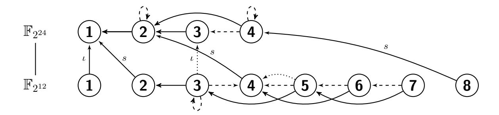

# Breaking '128-bit Secure' Supersingular Binary Curves?

(or how to solve discrete logarithms in F24·<sup>1223</sup> and F212·367)

Robert Granger<sup>1</sup> , Thorsten Kleinjung<sup>1</sup> , and Jens Zumbr¨agel<sup>2</sup>

<sup>1</sup> Laboratory for Cryptologic Algorithms, EPFL, Switzerland 2 Institute of Algebra, TU Dresden, Germany robbiegranger@gmail.com, thorsten.kleinjung@epfl.ch, jens.zumbragel@ucd.ie

Abstract. In late 2012 and early 2013 the discrete logarithm problem (DLP) in finite fields of small characteristic underwent a dramatic series of breakthroughs, culminating in a heuristic quasipolynomial time algorithm, due to Barbulescu, Gaudry, Joux and Thom´e. Using these developments, Adj, Menezes, Oliveira and Rodr´ıguez-Henr´ıquez analysed the concrete security of the DLP, as it arises from pairings on (the Jacobians of) various genus one and two supersingular curves in the literature, which were originally thought to be 128-bit secure. In particular, they suggested that the new algorithms have no impact on the security of a genus one curve over F2<sup>1223</sup> , and reduce the security of a genus two curve over F2<sup>367</sup> to 94.6 bits. In this paper we propose a new field representation and efficient general descent principles which together make the new techniques far more practical. Indeed, at the '128-bit security level' our analysis shows that the aforementioned genus one curve has approximately 59 bits of security, and we report a total break of the genus two curve.

Keywords: Discrete logarithm problem, finite fields, supersingular binary curves, pairings

# 1 Introduction

The role of small characteristic supersingular curves in cryptography has been a varied and an interesting one. Having been eschewed by the cryptographic community for succumbing spectacularly to the subexponential MOV attack in 1993 [40], which maps the DLP from an elliptic curve (or more generally, the Jacobian of a higher genus curve) to the DLP in a small degree extension of the base field of the curve, they made a remarkable comeback with the advent of pairing-based cryptography in 2001 [42, 31, 9]. In particular, for the latter it was reasoned that the existence of a subexponential attack on the DLP does not ipso facto warrant their complete exclusion; rather, provided that the finite field DLP into which the elliptic curve DLP embeds is sufficiently hard, this state of affairs would be acceptable.

Neglecting the possible existence of native attacks arising from the supersingularity of these curves, much research effort has been expended in making instantiations of the required cryptographic operations on such curves as efficient as possible [6, 17, 14, 28, 27, 5, 30, 7, 11, 18, 3, 1], to name but a few, with the associated security levels having been estimated using Coppersmith's algorithm from 1984 [12, 39]. Alas, a series of dramatic breakthrough results for the DLP in finite fields of small characteristic have potentially rendered all of these efforts in vain.

The first of these results was due to Joux, in December 2012, and consisted of a more efficient method — dubbed 'pinpointing' — to obtain relations between factor base elements [32]. For medium-sized base fields, this technique has heuristic complexity as low as L(1/3, 2 1/3 ) ≈ L(1/3, 1.260)† , where as usual L(α, c) = LQ(α, c) = exp((c + o(1))(log Q) <sup>α</sup>(log log Q) <sup>1</sup>−α), with

<sup>?</sup> The second author acknowledges the support of the Swiss National Science Foundation, via grant numbers 206021-128727 and 200020-132160, while the third author acknowledges the support of the Irish Research Council, grant number ELEVATEPD/2013/82.

<sup>†</sup> The original paper states a complexity of L(1/3,(8/9)<sup>1</sup>/<sup>3</sup> ) ≈ L(1/3, 0.961); however, on foot of recent communications the constant should be as stated.

Q the cardinality of the field. This improved upon the previous best complexity of  $L(1/3,3^{1/3}) \approx L(1/3,1.442)$  due to Joux and Lercier [37]. Using this technique Joux solved example DLPs in fields of bitlength 1175 and 1425, both with prime base fields.

Then in February 2013, Göloğlu, Granger, McGuire and Zumbrägel used a specialisation of the Joux-Lercier doubly-rational function field sieve (FFS) variant [37], in order to exploit a well-known family of 'splitting polynomials', i.e., polynomials which split completely over the base field [19]. For fields of the form  $\mathbb{F}_{q^{kn}}$  with  $k \geq 3$  fixed (k = 2 is even simpler) and  $n \approx dq$  for a fixed integer  $d \geq 1$ , they showed that for binary (and more generally small characteristic) fields, relation generation for degree one elements runs in heuristic polynomial time, as does finding the logarithms of degree two elements (if  $q^k$  can be written as  $q'^{k'}$  for  $k' \geq 4$ ), once degree one logarithms are known. For medium-sized base fields of small characteristic a heuristic complexity as low as  $L(1/3, (4/9)^{1/3}) \approx L(1/3, 0.763)$  was attained; this approach was demonstrated via the solution of example DLPs in the fields  $\mathbb{F}_{2^{1971}}$  [21] and  $\mathbb{F}_{2^{3164}}$ .

After the initial publication of [19], Joux released a preprint [33] detailing an algorithm for solving the discrete logarithm problem for fields of the form  $\mathbb{F}_{q^{2n}}$ , with  $n \leq q+d$  for some very small d, which was used to solve a DLP in  $\mathbb{F}_{2^{1778}}$  [34] and later in  $\mathbb{F}_{2^{4080}}$  [35]. For  $n \approx q$  this algorithm has heuristic complexity L(1/4+o(1),c) for some undetermined c, and also has a heuristic polynomial time relation generation method, similar in principle to that in [19]. While the degree two element elimination method in [19] is arguably superior – since elements can be eliminated on the fly – for other small degrees Joux's elimination method is faster, resulting in the stated complexity.

In April 2013 Göloğlu *et al.* combined their approach with Joux's to solve an example DLP in the field  $\mathbb{F}_{2^{6120}}$  [22] and later demonstrated that Joux's algorithm can be tweaked to have heuristic complexity L(1/4,c) [20], where c can be as low as  $(\omega/8)^{1/4}$  [24], with  $\omega$  the linear algebra constant, i.e., the exponent of matrix multiplication. Then in May 2013, Joux announced the solution of a DLP in the field  $\mathbb{F}_{2^{6168}}$  [36].

Most recently, in June 2013, Barbulescu, Gaudry, Joux and Thomé announced a quasi-polynomial time for solving the DLP [4], for fields  $\mathbb{F}_{q^{kn}}$  with  $k \geq 2$  fixed and  $n \leq q+d$  with d very small, which for  $n \approx q$  has heuristic complexity

$$(\log q^{kn})^{O(\log\log q^{kn})}. (1)$$

Since (1) is smaller than  $L(\alpha, c)$  for any  $\alpha > 0$ , it is asymptotically the most efficient algorithm known for solving the DLP in finite fields of small characteristic, which can always be embedded into a field of the required form. Interestingly, the algorithmic ingredients and analysis of this algorithm are much simpler than for Joux's L(1/4 + o(1), c) algorithm.

Taken all together, one would expect the above developments to have a substantial impact on the security of small characteristic parameters appearing in the pairing-based cryptography literature. However, all of the record DLP computations mentioned above used Kummer or twisted Kummer extensions (those with n dividing  $q^k \mp 1$ ), which allow for a reduction in the size of the factor base by a factor of kn and make the descent phase for individual logarithms relatively easy. While such parameters are preferable for setting records (most recently in  $\mathbb{F}_{2^{9234}}$  [26]), none of the parameters featured in the literature are of this form, and so it is not a priori clear whether the new techniques weaken existing pairing-based protocol parameters.

A recent paper by Adj, Menezes, Oliveira and Rodríguez-Henríquez has begun to address this very issue [2]. Using the time required to compute a single multiplication modulo the cardinality of the relevant prime order subgroup as their basic unit of time, which we denote by  $M_r$ , they showed that the DLP in the field  $\mathbb{F}_{3^{6\cdot509}}$  costs at most  $2^{73.7}$   $M_r$ . One can arguably interpret this

result to mean that this field has 73.7 bits of security† . This significantly reduces the intended security level of 128 bits (or 111 bits as estimated by Shinohara et al. [43], or 102.7 bits for the Joux-Lercier FFS variant with pinpointing, as estimated in [2]). An interesting feature of their analysis is that during the descent phase, some elimination steps are performed using the method from the quasi-polynomial time algorithm of Barbulescu et al., when one might have expected these steps to only come into play at much higher bitlengths, due to the high arity of the arising descent nodes.

In the context of binary fields, Adj et al. considered in detail the DLP in the field F<sup>2</sup> <sup>12</sup>·<sup>367</sup> , which arises via a pairing from the DLP on the Jacobian of a supersingular genus two curve over F<sup>2</sup> <sup>367</sup> , first proposed in [3], with embedding degree 12. Using all of the available techniques they provided an upper bound of 294.<sup>6</sup> M<sup>r</sup> for the cost of breaking the DLP in the embedding field, which is some way below the intended 128-bit security level. In their conclusion Adj et al. also suggest that a commonly implemented genus one supersingular curve over F<sup>2</sup> <sup>1223</sup> with embedding degree 4 [30, 7, 11, 18, 1], is not weakened by the new algorithmic advances, i.e., its security remains very close to 128 bits.

In this work we show that the above security estimates were incredibly optimistic. Our techniques and results are summarised as follows.

- Field representation: We introduce a new field representation that can have a profound effect on the resulting complexity of the new algorithms. In particular it permits the use of a smaller q than before, which not only speeds up the computation of factor base logarithms, but also the descent (both classical and new).
- Exploit subfield membership: During the descent phase we apply a principle of parsimony, by which one should always try to eliminate an element in the target field, and only when this is not possible should one embed it into an extension field. So although the very small degree logarithms may be computed over a larger field, the descent cost is greatly reduced relative to solving a DLP in the larger field.
- Further descent tricks: The above principle also means that elements can automatically be rewritten in terms of elements of smaller degree, via factorisation over a larger field, and that elements can be eliminated via Joux's Gr¨obner basis computation method [33] with k = 1, rather than k > 1, which increases its degree of applicability.
- '128-bit secure' genus one DLP: We show that the DLP in F<sup>2</sup> <sup>4</sup>·<sup>1223</sup> can be solved in approximately 2<sup>40</sup> s, or 2<sup>59</sup> Mr, with r a 1221-bit prime.
- '128-bit secure' genus two DLP: We report a total break of the DLP in F<sup>2</sup> <sup>12</sup>·<sup>367</sup> (announced in [25]), which took about 52240 core-hours.
- L(1/4, c) technique only: Interestingly, using our approach the elimination steps `a la Barbulesu et al. [4] were not necessary for the above estimate and break.

The rest of the paper is organised as follows. In §2 we describe our field representation and our target fields. In §3 we present the corresponding polynomial time relation generation method for degree one elements and degree two elements (although we do not need the latter for the fields targeted in the present paper), as well as how to apply Joux's small degree elimination method [33] with the new representation. We then apply these and other techniques to F<sup>2</sup> 4·1223 in §4 and to F<sup>2</sup> <sup>12</sup>·<sup>367</sup> in §5 . Finally, we conclude in §6.

<sup>†</sup> The notion of bit security is quite fuzzy; for the elliptic curve DLP it is usually intended to mean the logarithm to the base 2 of the expected number of group operations, however for the finite field DLP different authors have used different units, perhaps because the cost of various constituent algorithms must be amortised into a single cost measure. In this work we time everything in seconds, while to achieve a comparison with [2] we convert to Mr.

#### 2 Field Representation and Target Fields

In this section we introduce our new field representation and the fields whose DLP security we will address. This representation, as well as some preliminary security estimates, were initially presented in [23].

### 2.1 Field Representation

Although we focus on binary fields in this paper, for the purposes of generality, in this section we allow for extension fields of arbitrary characteristic. Hence let  $q = p^l$  for some prime p, and let  $\mathbb{K} = \mathbb{F}_{q^{kn}}$  be the field under consideration, with  $k \geq 1$ .

We choose a positive integer  $d_h$  such that  $n \leq qd_h + 1$ , and then choose  $h_0, h_1 \in \mathbb{F}_{q^k}[X]$  with  $\max\{\deg(h_0), \deg(h_1)\} = d_h$  such that

$$h_1(X^q)X - h_0(X^q) \equiv 0 \pmod{I(X)},\tag{2}$$

where I(X) is an irreducible degree n polynomial in  $\mathbb{F}_{q^k}[X]$ . Then  $\mathbb{K} = \mathbb{F}_{q^k}[X]/(I(X))$ . Denoting by x a root of I(X), we introduce the auxiliary variable  $y = x^q$ , so that one has two isomorphic representations of  $\mathbb{K}$ , namely  $\mathbb{F}_{q^k}(x)$  and  $\mathbb{F}_{q^k}(y)$ , with  $\sigma : \mathbb{F}_{q^k}(y) \to \mathbb{F}_{q^k}(x) : y \mapsto x^q$ . To establish the inverse isomorphism, note that by (2) in  $\mathbb{K}$  we have  $h_1(y)x - h_0(y) = 0$ , and hence  $\sigma^{-1} : \mathbb{F}_{q^k}(x) \to \mathbb{F}_{q^k}(y) : x \mapsto h_0(y)/h_1(y)$ .

The knowledgeable reader will have observed that our representation is a synthesis of two other useful representations: the one used by Joux [33], in which one searches for a degree n factor I(X) of  $h_1(X)X^q - h_0(X)$ ; and the one used by Göloğlu  $et\ al.$  [19, 20], in which one searches for a degree n factor I(X) of  $X - h_0(X^q)$ . The problem with the former is that it constrains n to be approximately q. The problem with the latter is that the polynomial  $X - h_0(X^q)$  is insufficiently general to represent all degrees n up to  $qd_h$ . By changing the coefficient of X in the latter from 1 to  $h_1(X^q)$ , we greatly increase the probability of overcoming the second problem, thus combining the higher degree coverage of Joux's representation with the higher degree possibilities of [19, 20].

The raison d'être of using this representation rather than Joux's representation is that for a given n, by choosing  $d_h > 1$ , one may use a smaller q. So why is this useful? Well, since the complexity of the new descent methods is typically a function of q, then subject to the satisfaction of certain constraints, one may use a smaller q, thus reducing the complexity of solving the DLP. This observation was our motivation for choosing field representations of the above form.

Another advantage of having an  $h_1$  coefficient (which also applies to Joux's representation) is that it increases the chance of there being a suitable  $(h_1, h_0)$  pair with coefficients defined over a proper subfield of  $\mathbb{F}_{q^k}$ , which then permits one to apply the factor base reduction technique of [37], see §4 and §5.

#### 2.2 Target Fields

For  $i \in \{0,1\}$  let  $E_i/\mathbb{F}_{2^p}: Y^2+Y=X^3+X+i$ . These elliptic curves are supersingular and can have prime or nearly prime order only for p prime, and have embedding degree 4 [16, 6, 17]. We focus on the curve

$$E_0/\mathbb{F}_{2^{1223}}: Y^2 + Y = X^3 + X,\tag{3}$$

which has a prime order subgroup of cardinality  $r_1 = (2^{1223} + 2^{612} + 1)/5$ , of bitlength 1221. This curve was initially proposed for 128-bit secure protocols [30] and has enjoyed several optimised

implementations [7, 11, 1, 18]. Many smaller p have also been proposed in the literature (see [5, 16], for instance), and are clearly weaker.

For  $i \in \{0,1\}$  let  $H_i/\mathbb{F}_{2^p}: Y^2+Y=X^5+X^3+i$ . These genus two hyperelliptic curves are supersingular and can have a nearly prime order Jacobian only for p prime (note that 13 is always a factor of  $\#\mathrm{Jac}_{H_0}(\mathbb{F}_{2^p})$ , since  $\#\mathrm{Jac}_{H_0}(\mathbb{F}_2)=13$ ), and have embedding degree 12 [5, 16]. We focus on the curve

$$H_0/\mathbb{F}_{2^{367}}: Y^2 + Y = X^5 + X^3, \tag{4}$$

with  $\#\text{Jac}_{H}(\mathbb{F}_{2^{367}}) = 13 \cdot 7170258097 \cdot r_{2}$ , and  $r_{2} = (2^{734} + 2^{551} + 2^{367} + 2^{184} + 1)/(13 \cdot 7170258097)$  is a 698-bit prime, since this was proposed for 128-bit secure protocols [3], and whose security was analysed in depth by Adj *et al.* in [2].

### 3 Computing the Logarithms of Small Degree Elements

In this section we adapt the polynomial time relation generation method from [19] and Joux's small degree elimination method [33] to the new field representation as detailed in §2.1. Note that henceforth, we shall refer to elements of  $\mathbb{F}_{q^{kn}} = \mathbb{F}_{q^k}[X]/(I(X))$  as field elements or as polynomials, as appropriate, and thus use x and X (and y and Y) interchangeably. We therefore freely apply polynomial ring concepts, such as degree, factorisation and smoothness, to field elements.

In order to compute discrete logarithms in our target fields we apply the usual index calculus method. It consists of a precomputation phase in which by means of (sparse) linear algebra techniques one obtains the logarithms of the factor base elements, which will consist of the low degree irreducible polynomials. Afterwards, in the individual logarithm phase, one applies procedures to recursively rewrite each element as a product of elements of smaller degree, in this way building up a descent tree, which has the target element as its root and factor base elements as its leaves. This proceeds in several stages, starting with a continued fraction descent of the target element, followed by a special-Q lattice descent (referred to as degree-balanced classical descent, see [19]), and finally using Joux's Gröbner basis descent [33] for the lower degree elements. Details of the continued fraction and classical descent steps are given in §4, while in this section we provide details of how to find the logarithms of elements of small degree.

We now describe how the logarithms of degree one and two elements (when needed) are to be computed. We use the relation generation method from [19], rather than Joux's method [33], since it automatically avoids duplicate relations. For  $k \geq 2$  we first precompute the set  $\mathcal{S}_k$ , where

$$\mathcal{S}_k = \{(a, b, c) \in (\mathbb{F}_{q^k})^3 \mid X^{q+1} + aX^q + bX + c \text{ splits completely over } \mathbb{F}_{q^k}\}.$$

For k=2, this set of triples is parameterised by  $(a,a^q,\mathbb{F}_q\ni c\neq a^{q+1})$ , of which there are precisely  $q^3-q^2$  elements. For  $k\geq 3$ ,  $\mathcal{S}_k$  can also be computed very efficiently, as follows. Assuming  $c\neq ab$  and  $b\neq a^q$ , the polynomial  $X^{q+1}+aX^q+bX+c$  may be transformed (up to a scalar factor) into the polynomial  $f_B(\overline{X})=\overline{X}^{q+1}+B\overline{X}+B$ , where  $B=\frac{(b-a^q)^{q+1}}{(c-ab)^q}$ , and  $X=\frac{c-ab}{b-a^q}\overline{X}-a$ . The set  $\mathcal{L}$  of  $B\in\mathbb{F}_{q^k}$  for which  $f_B$  splits completely over  $\mathbb{F}_{q^k}$  can be computed by simply testing for each such B whether this occurs, and there are precisely  $(q^{k-1}-1)/(q^2-1)$  such B if k is odd, and  $(q^{k-1}-q)/(q^2-1)$  such B if k is even [8]. Then for any (a,b) such that  $b\neq a^q$  and for each  $B\in\mathcal{L}$ , we compute via  $B=\frac{(b-a^q)^{q+1}}{(c-ab)^q}$  the corresponding (unique)  $c\in\mathbb{F}_{q^k}$ , which thus ensures that  $(a,b,c)\in\mathcal{S}_k$ . Note that in all cases we have  $|\mathcal{S}_k|\approx q^{3k-3}$ .

#### 3.1 Degree 1 Logarithms

We define the factor base  $\mathcal{B}_1$  to be the set of linear elements in x, i.e.,  $\mathcal{B}_1 = \{x - a \mid a \in \mathbb{F}_{q^k}\}$ . Observe that the elements linear in y are each expressible in  $\mathcal{B}_1$ , since  $(y - a) = (x - a^{1/q})^q$ .

As in [37, 19, 20], the basic idea is to consider elements of the form xy + ay + bx + c with  $(a, b, c) \in \mathcal{S}_k$ . The above two field isomorphisms induce the following equality in  $\mathbb{K}$ :

$$x^{q+1} + ax^q + bx + c = \frac{1}{h_1(y)} (yh_0(y) + ayh_1(y) + bh_0(y) + ch_1(y)).$$
 (5)

When the r.h.s. of (5) also splits completely over  $\mathbb{F}_{q^k}$ , one obtains a relation between elements of  $\mathcal{B}_1$  and the logarithm of  $h_1(y)$ . One can either adjoin  $h_1(y)$  to the factor base, or simply use an  $h_1(y)$  which splits completely over  $\mathbb{F}_{q^k}$ .

We assume that for each  $(a, b, c) \in \hat{S}_k$  that the r.h.s. of (5) – which has degree  $d_h + 1$  – splits completely over  $\mathbb{F}_{q^k}$  with probability  $1/(d_h + 1)!$ . Hence in order for there to be sufficiently many relations we require that

$$\frac{q^{3k-3}}{(d_h+1)!} > q^k$$
, or equivalently  $q^{2k-3} > (d_h+1)!$ . (6)

When this holds, the expected cost of relation generation is  $(d_h + 1)! \cdot q^k \cdot S_{q^k}(1, d_h + 1)$ , where  $S_{q^k}(m, n)$  denotes the cost of testing whether a degree n polynomial is m-smooth, i.e., has all of its irreducible factors of degree  $\leq m$ , see Appendix B. The cost of solving the resulting linear system using sparse linear algebra techniques is  $O(q^{2k+1})$  arithmetic operations modulo the order r subgroup in which one is working.

### 3.2 Degree 2 Logarithms

For degree two logarithms, there are several options. The simplest is to apply the degree one method over a quadratic extension of  $\mathbb{F}_{q^k}$ , but in general (without any factor base automorphisms) this will cost  $O(q^{4k+1})$  modular arithmetic operations. If  $k \geq 4$  then subject to a condition on q, k and  $d_h$ , it is possible to find the logarithms of irreducible degree two elements on the fly, using the techniques of [19, 20]. In fact, for the DLP in  $\mathbb{F}_{2^{12\cdot367}}$  we use both of these approaches, but for different base fields, see §5.

Although not used in the present paper, for completeness we include here the analogue in our field representation of Joux's approach [33]. Since this approach forms the basis of the higher degree elimination steps in the quasi-polynomial time algorithm of Barbulescu *et al.*, its analogue in our field representation should be clear.

We define  $\mathcal{B}_{2,u}$  to be the set of irreducible elements of  $\mathbb{F}_{q^k}[X]$  of the form  $X^2 + uX + v$ . For each  $u \in \mathbb{F}_{q^k}$  one expects there to be about  $q^k/2$  such elements<sup>†</sup>. As in [33], for each  $u \in \mathbb{F}_{q^k}$  we find the logarithms of all the elements of  $\mathcal{B}_{2,u}$  simultaneously. To do so, consider (5) but with x on the l.h.s. replaced with  $Q = x^2 + ux$ . Using the field isomorphisms we have that  $Q^{q+1} + aQ^q + bQ + c$  is equal to

$$\begin{split} &(y^2+u^qy)((h_0(y)/h_1(y))^2+u(h_0(y)/h_1(y)))+a(y^2+u^qy)+b((h_0(y)/h_1(y))^2+u(h_0(y)/h_1(y)))+c\\ &=\frac{1}{h_1(y)^2}\big((y^2+u^qy)(h_0(y)^2+uh_0(y)h_1(y))+a(y^2+u^qy)h_1(y)^2+b(h_0(y)^2+uh_0(y)h_1(y))+ch_1(y)^2\big). \end{split}$$

The degree of the r.h.s. is  $2(d_h + 1)$ , and when it splits completely over  $\mathbb{F}_{q^k}$  we have a relation between elements of  $\mathcal{B}_{2,u}$  and degree one elements, whose logarithms are presumed known, which we assume occurs with probability  $1/(2(d_h+1))!$ . Hence in order for there to be sufficiently many relations we require that

$$\frac{q^{3k-3}}{(2(d_h+1))!} > \frac{q^k}{2}, \text{ or equivalently } q^{2k-3} > (2(d_h+1))!/2.$$
 (7)

<sup>&</sup>lt;sup>†</sup> For binary fields there are precisely  $q^k/2$  irreducibles, since  $X^2 + uX + v$  is irreducible if and only if  $\text{Tr}_{\mathbb{F}_{q^k}/\mathbb{F}_2}(v/u^2) = 1$ .

Observe that (7) implies (6). When this holds, the expected cost of relation generation is  $(2(d_h+1))! \cdot q^k \cdot S_{q^k}(1,2(d_h+1))/2$ . The cost of solving the resulting linear system using sparse linear algebra techniques is again  $O(q^{2k+1})$  modular arithmetic operations, where now both the number of variables and the average weight is halved relative to the degree one case. Since there are  $q^k$  such u, the total expected cost of this stage is  $O(q^{3k+1})$  modular arithmetic operations, which may of course be parallelised.

### 3.3 Joux's Small Degree Elimination with the New Representation

As in [33], let Q be a degree  $d_Q$  element to be eliminated, let  $F(X) = \sum_{i=0}^{d_F} f_i X^i, G(X) = \sum_{j=0}^{d_G} g_j X^j \in \mathbb{F}_{q^k}[X]$  with  $d_F + d_G + 2 \ge d_Q$ , and assume without loss of generality  $d_F \ge d_G$ . Consider the following expression:

$$G(X) \prod_{\alpha \in \mathbb{F}_q} (F(X) - \alpha G(X)) = F(X)^q G(X) - F(X)G(X)^q$$
(8)

The l.h.s. is  $\max(d_F, d_G)$ -smooth. The r.h.s. can be expressed modulo  $h_1(X^q)X - h_0(X^q)$  in terms of  $Y = X^q$  as a quotient of polynomials of relatively low degree by using

$$F(X)^q = \sum_{i=0}^{d_F} f_i^q Y^i, \ G(X)^q = \sum_{j=0}^{d_G} g_j^q Y^j \text{ and } X \equiv \frac{h_0(Y)}{h_1(Y)}.$$

Then the numerator of the r.h.s. becomes

$$\left(\sum_{i=0}^{d_F} f_i^q Y^i\right) \left(\sum_{j=0}^{d_G} g_j^q h_0(Y)^j h_1(Y)^{d_F - j}\right) - \left(\sum_{i=0}^{d_F} f_i^q h_0(Y)^i h_1(Y)^{d_F - i}\right) \left(\sum_{j=0}^{d_G} g_j^q Y^j\right). \tag{9}$$

Setting (9) to be 0 modulo Q(Y) gives a system of  $d_Q$  equations over  $\mathbb{F}_{q^k}$  in the  $d_F + d_G + 2$  variables  $f_0, \ldots, f_{d_F}, g_0, \ldots, g_{d_G}$ . By choosing a basis for  $\mathbb{F}_{q^k}$  over  $\mathbb{F}_q$  and expressing each of the  $d_F + d_G + 2$  variables  $f_0, \ldots, f_{d_F}, g_0, \ldots, g_{d_G}$  in this basis, this system becomes a bilinear quadratic system<sup>†</sup> of  $kd_Q$  equations in  $(d_F + d_G + 2)k$  variables. To find solutions to this system, one can specialise  $(d_F + d_G + 2 - d_Q)k$  of the variables in order to make the resulting system generically zero-dimensional while keeping its bilinearity, and then compute the corresponding Gröbner basis, which may have no solution, or a small number of solutions. For each solution, one checks whether (9) divided by Q(Y) is  $(d_Q - 1)$ -smooth: if so then Q has successfully been rewritten as a product of elements of smaller degree; if no solutions give a  $(d_Q - 1)$ -smooth cofactor, then one begins again with another specialisation.

The degree of the cofactor of Q(Y) is upper bounded by  $d_F(1+d_h)-d_Q$ , so assuming that it behaves as a uniformly chosen polynomial of such a degree one can calculate the probability  $\rho$  that it is  $(d_Q-1)$ -smooth using standard combinatorial techniques.

Generally, in order for Q to be eliminable by this method with good probability, the number of solutions to the initial bilinear system must be greater than  $1/\rho$ . To estimate the number of solutions, consider the action of  $\mathrm{Gl}_2(\mathbb{F}_{q^k})$  on the set of pairs (F,G). The subgroups  $\mathrm{Gl}_2(\mathbb{F}_q)$  and  $\mathbb{F}_{q^k}^{\times}$  (via diagonal embedding) both act trivially on the set of relations, modulo multiplication by elements in  $\mathbb{F}_{q^k}^{\times}$ . Assuming that the set of (F,G) quotiented out by the action of the compositum of these subgroups (which has cardinality  $\approx q^{k+3}$ ), generates distinct relations, one must satisfy the condition

$$q^{(d_F + d_G + 1 - d_Q)k - 3} > 1/\rho . (10)$$

Note that while (10) is preferable for an easy descent, one may yet violate it and still successfully eliminate elements by using various tactics, as demonstrated in §5.

<sup>&</sup>lt;sup>†</sup> The bilinearity makes finding solutions to this system easier [45], and is essential for the complexity analysis in [33] and its variant in [20].

### 4 Concrete Security Analysis of $\mathbb{F}_{2^{4\cdot 1223}}$

In this section we focus on the DLP in the 1221-bit prime order  $r_1$  subgroup of  $\mathbb{F}_{2^{4\cdot1223}}^{\times}$ , which arises from the MOV attack applied to the genus one supersingular curve (3). By embedding  $\mathbb{F}_{2^{4\cdot1223}}$  into its degree two extension  $\mathbb{F}_{2^{8\cdot1223}} = \mathbb{F}_{2^{9784}}$  we show that, after a precomputation taking approximately  $2^{40}$  s, individual discrete logarithms can be computed in less than  $2^{34}$  s.

### 4.1 Setup

We consider the field  $\mathbb{F}_{2^{8\cdot 1223}} = \mathbb{F}_{q^n}$  with  $q = 2^8$  and n = 1223 given by the irreducible factor of degree n of  $h_1(X^q)X - h_0(X^q)$ , with

$$h_0 = X^5 + tX^4 + tX^3 + X^2 + tX + t$$
,  $h_1 = X^5 + X^4 + X^3 + X^2 + X + t$ ,

where t is an element of  $\mathbb{F}_{2^2} \setminus \mathbb{F}_2$ . Note that the field of definition of this representation is  $\mathbb{F}_{2^2}$ . Since the target element is contained in the subfield  $\mathbb{F}_{2^{4\cdot 1223}}$ , we begin the classical descent over  $\mathbb{F}_{2^4}$ , we switch to  $\mathbb{F}_q = \mathbb{F}_{2^8}$ , i.e., k = 1, for the Gröbner basis descent, and, as explained below, we work over  $\mathbb{F}_{q^k}$  with either k = 1 or a few k > 1 to obtain the logarithms of all factor base elements.

### 4.2 Linear Algebra Cost Estimate

In this precomputation we obtain the logarithms of all elements of degree at most four over  $\mathbb{F}_q$ . Since the degree 1223 extension is defined over  $\mathbb{F}_{2^2}$  in our field representation, by the action of the Galois group  $\operatorname{Gal}(\mathbb{F}_q/\mathbb{F}_{2^2})$  on the factor base, the number of irreducible elements of degree j whose logarithms are to be computed can be reduced to about  $2^{8j}/(4j)$  for  $j \in \{1, 2, 3, 4\}$ .

One way to obtain the logarithms of these elements is to carry out the degree 1 relation generation method from §3.1, together with the elementary observation that an irreducible polynomial of degree k over  $\mathbb{F}_q$  splits completely over  $\mathbb{F}_{q^k}$ . First, computing degree one logarithms over  $\mathbb{F}_{q^3}$  gives the logarithms of irreducible elements of degrees one and three over  $\mathbb{F}_q$ . Similarly, computing degree one logarithms over  $\mathbb{F}_{q^4}$  gives the logarithms of irreducible elements of degrees one, two, and four over  $\mathbb{F}_q$ . The main computational cost consists in solving the latter system arising from  $\mathbb{F}_{q^4}$ , which has size  $2^{28}$  and an average row weight of 256.

However, we propose to reduce the cost of finding these logarithms by using k=1 only, in the following easy way. Consider §3.3, and observe that for each polynomial pair (F,G) of degree at most d, one obtains a relation between elements of degree at most d when the numerator of the r.h.s. is d-smooth (ignoring factors of  $h_1$ ). Note that we are not setting the r.h.s. numerator to be zero modulo Q or computing any Gröbner bases. Up to the action of  $\mathrm{Gl}_2(\mathbb{F}_q)$  (which gives equivalent relations) there are about  $q^{2d-2}$  such polynomial pairs. Hence, for  $d \geq 3$  there are more relations than elements if the smoothness probability of the r.h.s. is sufficiently high. Notice that k=1 implies that the r.h.s. is divisible by  $h_1(Y)Y - h_0(Y)$ , thus increasing its smoothness probability and resulting in enough relations for d=3 and for d=4. After having solved the much smaller system for d=3 we know the logarithms of all elements up to degree three, so that the average row weight for the system for d=4 can be reduced to about  $\frac{1}{4} \cdot 256 = 64$  (irreducible degree four polynomials on the l.h.s.). As above the size of this system is  $2^{28}$ .

The cost for generating the linear systems is negligible compared to the linear algebra cost. For estimating the latter cost we consider Lanczos' algorithm to solve a sparse  $N \times N$ ,  $N = 2^{28}$ , linear system with average row weight W = 64. As noted in [41,20] this algorithm can be implemented such that

$$N^{2} (2 W ADD + 2 SQR + 3 MULMOD)$$
(11)

operations are used. On our benchmark system, an AMD Opteron 6168 processor at 1.9 GHz, using [29] our implementation of these operations took 62 ns, 467 ns and 1853 ns for an ADD, a SQR and a MULMOD, respectively, resulting in a linear algebra cost of  $2^{40}$  s.

As in [2], the above estimate ignores communication costs and other possible slowdowns which may arise in practice. An alternative estimate can be obtained by considering a problem of a similar size over  $\mathbb{F}_2$  and extrapolating from [38]. This gives an estimated time of  $2^{42}$  s, or for newer hardware slightly less. Note that this computation was carried out using the block Wiedemann algorithm [13], which we recommend in practice because it allows one to distribute the main part of the computation. For the sake of a fair comparison with [2] we use the former estimate of  $2^{40}$  s.

#### 4.3 Descent Cost Estimate

We assume that the logarithms of elements up to degree four are known, and that computing these logarithms with a lookup table is free.

**Small Degree Descent.** We have implemented the small degree descent of §3.3 in Magma [10] V2.20-1, using Faugere's F4 algorithm [15]. For each degree from 5 to 15, on the same AMD Opteron 6168 processor we timed the Gröbner basis computation between 10<sup>6</sup> and 100 times, depending on the degree. Then using a bottom-up recursive strategy we estimated the following average running times in seconds for a full logarithm computation, which we present to two significant figures:

$$C[5,\ldots,15] = [\ 0.038\ ,\ 2.1\ ,\ 2.1\ ,\ 93\ ,\ 95\ ,\ 180\ ,\ 190\ ,\ 3200\ ,\ 3500\ ,\ 6300\ ,\ 11000\ ]\ .$$

**Degree-Balanced Classical Descent.** From now on, we make the conservative assumption that a degree n polynomial which is m-smooth, is a product of n/m degree m polynomials. In practice the descent cost will be lower than this, however, the linear algebra cost is dominating, so this issue is inconsequential for our security estimate. The algorithms we used for smoothness testing are detailed in Appendix B.

For a classical descent step with degree balancing we consider polynomials  $P(X^{2^a}, Y) \in \mathbb{F}_q[X, Y]$  for a suitably chosen integer  $0 \le a \le 8$ . It is advantageous to choose P such that its degree in one variable is one; let d be the degree in the other variable. In the case  $\deg_{X^{2^a}}(P) = 1$ , i.e.,  $P = v_1(Y)X^{2^a} + v_0(Y)$ ,  $\deg v_i \le d$ , this gives rise to the relation

$$L_v^{2^a} = \left(\frac{R_v}{h_1(X)^{2^a}}\right)^{2^8} \quad \text{where} \quad L_v = \tilde{v}_1(X^{2^{8-a}})X + \tilde{v}_0(X^{2^{8-a}}), \\ R_v = v_1(X)h_0(X)^{2^a} + v_0(X)h_1(X)^{2^a}$$

in  $\mathbb{F}_q[X]/(h_1(X^q)X - h_0(X^q))$  with  $\deg L_v \leq 2^{8-a}d + 1$ ,  $\deg R_v \leq d + 5 \cdot 2^a$ , and  $\tilde{v}_i$  being  $v_i$  with its coefficients powered by  $2^{8-a}$ , for i = 0, 1. Similarly, in the case  $\deg_Y(P) = 1$ , i.e.,  $P = w_1(X^{2^a})Y + w_0(X^{2^a})$ ,  $\deg w_i \leq d$ , we have the relation

$$L_w^{2^a} = \left(\frac{R_w}{h_1(X)^{2^a d}}\right)^{2^8} \quad \text{where} \quad L_w = \tilde{w}_1(X)X^{2^{8-a}} + \tilde{w}_0(X), \\ R_w = h_1(X)^{2^a d} \left(w_1\left(\left(\frac{h_0(X)}{h_1(X)}\right)^{2^a}\right)X + w_0\left(\left(\frac{h_0(X)}{h_1(X)}\right)^{2^a}\right)\right)$$

with deg  $L_w \leq d + 2^{8-a}$ , deg  $R_w \leq 5 \cdot 2^a d + 1$  and again  $\tilde{w}_i$  being  $w_i$  with its coefficients powered by  $2^{8-a}$ , for i = 0, 1.

The polynomials  $v_i$  (respectively  $w_i$ ) are chosen in such a way that either the l.h.s. or the r.h.s. is divisible by a polynomial Q(X) of degree  $d_Q$ . Gaussian reduction provides a lattice basis  $(u_0, u_1), (u'_0, u'_1)$  such that the polynomial pairs satisfying the divisibility condition above are

given by  $ru_i + su_i'$  for i = 0, 1, where  $r, s \in \mathbb{F}_q[X]$ . For nearly all polynomials Q it is possible to choose a lattice basis of polynomials with degree  $\approx d_Q/2$  which we will assume for all Q appearing in the analysis; extreme cases can be avoided by look-ahead or backtracking techniques. Notice that a polynomial Q over  $\mathbb{F}_{2^4} \subset \mathbb{F}_q$  can be rewritten as a product of polynomials which are also over  $\mathbb{F}_{2^4}$ , by choosing the basis as well as r and s to be over  $\mathbb{F}_{2^4}$ . This will be done in all steps of the classical descent. The polynomials r and s are chosen to be of degree four, resulting in  $2^{36}$  possible pairs (multiplying both by a common non-zero constant gives the same relation).

In the final step of the classical eliminations (from degree 26 to 15) we relax the criterion that the l.h.s. and r.h.s. are 15-smooth, allowing also irreducibles of even degree up to degree 30, since these can each be split over  $\mathbb{F}_q$  into two polynomials of half the degree, thereby increasing the smoothness probabilities. Admittedly, if we follow our worst-case analysis stipulation that all polynomials at this step have degree 26, then one could immediately split each of them into two degree 13 polynomials. However, in practice one will encounter polynomials of all degrees  $\leq$  26 and we therefore carry out the analysis without using the splitting shortcut, which will still provide an overestimate of the cost of this step.

In the following we will state the logarithmic cost (in seconds) of a classical descent step as  $c_l + c_r + c_s$ , where  $2^{c_l}$  and  $2^{c_r}$  denote the number of trials to get the left hand side and the right hand side m-smooth, and  $2^{c_s}$  s is the time required for the corresponding smoothness test. See Table 1 for the smoothness timings that we benchmarked on the AMD Opteron 6168 processor.

- $\mathbf{d_Q} = \mathbf{26}$  to  $\mathbf{m} = \mathbf{15}$ : We choose  $\deg_{X^{2^a}} P = 1$ , a = 5, Q on the right, and we have d = 17,  $(\deg(L_v), \deg(R_v)) = (137, 151)$ , and logarithmic cost 13.4 + 15.6 9.0, hence  $2^{20.0}$  s; the expected number of factors is 19.2, so the subsequent cost will be less than  $2^{17.7}$  s. Note that, as explained above, we use the splitting shortcut for irreducibles of even degree up to 30, resulting in the higher than expected smoothness probabilities.
- $\mathbf{d_Q} = \mathbf{36}$  to  $\mathbf{m} = \mathbf{26}$ : We choose  $\deg_{X^{2^a}} P = 1$ , a = 5, Q on the right, and we have d = 22,  $(\deg(L_v), \deg(R_v)) = (177, 146)$ , and logarithmic cost 18.7 + 13.6 9.0, hence  $2^{23.3}$  s; the expected number of factors is 12.4, so the subsequent cost will be less than  $2^{23.9}$  s.
- $\mathbf{d_Q} = \mathbf{94}$  to  $\mathbf{m} = \mathbf{36}$ : We choose  $\deg_Y P = 1$ , a = 0, Q on the left, and we have d = 51,  $(\deg(L_w), \deg(R_w)) = (213, 256)$ , and logarithmic cost 15.0 + 20.3 7.5, hence  $2^{27.8}$  s; the expected number of factors is 13.0, so the subsequent cost will be less than  $2^{28.4}$  s.

**Table 1.** Timings for testing a degree n polynomial over  $\mathbb{F}_{2^4}$  for m-smoothness.

| n                 | $\mid m \mid$ | time                                 |
|-------------------|---------------|--------------------------------------|
| 137               | 30 26         | $1.9\mathrm{ms}$<br>$1.9\mathrm{ms}$ |
| $\frac{146}{213}$ | 36            | $5.1\mathrm{ms}$                     |
| 611               | 94            | $94\mathrm{ms}$                      |

Continued Fraction Descent. For the continued fraction descent we multiply the target element by random powers of the generator and express the product as a ratio of two polynomials of degree at most 611. For each such expression we test if both the numerator and the denominator are 94-smooth. The logarithmic cost here is 17.7 + 17.7 - 3.4, hence the cost is  $2^{32.0}$  s. The expected number of degree 94 factors on both sides will be 13, so the subsequent cost will be less than  $2^{32.8}$  s.

**Total Descent Cost** The cost for computing an individual logarithm is therefore upper-bounded by  $2^{32.0}$  s +  $2^{32.8}$  s <  $2^{34}$  s.

### 4.4 Summary

The main cost in our analysis is the linear algebra computation which takes about  $2^{40}$  s, with the individual logarithm stage being considerably faster. In order to compare with the estimate in [2], we write the main cost in terms of  $M_r$  which gives  $2^{59}$   $M_r$ , and thus an improvement by a factor of  $2^{69}$ . Nevertheless, solving a system of cardinality  $2^{28}$  is still a formidable challenge, but perhaps not so much for a well-funded adversary. For completeness we note that if one wants to avoid a linear algebra step of this size, then one can work over different fields, e.g., with  $q = 2^{10}$  and k = 2, or  $q = 2^{12}$  and k = 1. However, while this allows a partitioning of the linear algebra into smaller steps as described in §3.2 but at a slightly higher cost, the resulting descent cost is expected to be significantly higher.

### 5 Solving the DLP in $\mathbb{F}_{2^{12\cdot 367}}$

In this section we present the details of our solution of a DLP in the 698-bit prime order  $r_2$  subgroup of  $\mathbb{F}_{2^{12\cdot367}}^{\times} = \mathbb{F}_{2^{4404}}^{\times}$ , which arises from the MOV attack applied to the Jacobian of the genus two supersingular curve (4). Magma verification code is provided in Appendix A. Note that the prime order elliptic curve  $E_1/\mathbb{F}_{2^{367}}: Y^2 + Y = X^3 + X + 1$  with embedding degree 4 also embeds into  $\mathbb{F}_{2^{4404}}$ , so that logarithms on this curve could have easily been computed as well.

### 5.1 Setup

To compute the target logarithm, as stated in §1 we applied a principle of parsimony, namely, we tried to solve all intermediate logarithms in  $\mathbb{F}_{2^{12\cdot367}}$ , considered as a degree 367 extension of  $\mathbb{F}_{2^{12}}$ , and only when this was not possible did we embed elements into the extension field  $\mathbb{F}_{2^{24\cdot367}}$  (by extending the base field to  $\mathbb{F}_{2^{24}}$ ) and solve them there.

All of the classical descent down to degree 8 was carried out over  $\mathbb{F}_{2^{12\cdot367}}$ , which we formed as the compositum of the following two extension fields. We defined  $\mathbb{F}_{2^{12}}$  using the irreducible polynomial  $U^{12}+U^3+1$  over  $\mathbb{F}_2$ , and defined  $\mathbb{F}_{2^{367}}$  over  $\mathbb{F}_2$  using the degree 367 irreducible factor of  $h_1(X^{64})X - h_0(X^{64})$ , where  $h_1 = X^5 + X^3 + X + 1$ , and  $h_0 = X^6 + X^4 + X^2 + X + 1$ . Let u and x be roots of the extension defining polynomials in U and X respectively, and let  $c = (2^{4404} - 1)/r_2$ . Then  $g = x + u^7$  is a generator of  $\mathbb{F}_{2^{4404}}^{\times}$  and  $\bar{g} = g^c$  is a generator of the subgroup of order  $r_2$ . As usual, our target element was chosen to be  $\bar{x}_{\pi} = x_{\pi}^c$  where

$$x_{\pi} = \sum_{i=0}^{4403} (\lfloor \pi \cdot 2^{i+1} \rfloor \mod 2) \cdot u^{11 - (i \mod 12)} \cdot x^{\lfloor i/12 \rfloor}.$$

The remaining logarithms were computed using a combination of tactics, over  $\mathbb{F}_{2^{12}}$  when possible, and over  $\mathbb{F}_{2^{24}}$  when not. These fields were constructed as degree 2 and 4 extensions of  $\mathbb{F}_{2^6}$ , respectively. To define  $\mathbb{F}_{2^6}$  we used the irreducible polynomial  $T^6+T+1$ . We then defined  $\mathbb{F}_{2^{12}}$  using the irreducible polynomial  $V^2+tV+1$  over  $\mathbb{F}_{2^6}$ , and  $\mathbb{F}_{2^{24}}$  using the irreducible polynomial  $W^4+W^3+W^2+t^3$  over  $\mathbb{F}_{2^6}$ .

#### 5.2 Degree 1 Logarithms

It was not possible to find enough relations for degree 1 elements over  $\mathbb{F}_{2^{12}}$ , so in accordance with our stated principle, we extended the base field to  $\mathbb{F}_{2^{24}}$  to compute the logarithms of all  $2^{24}$  degree 1 elements. We used the polynomial time relation generation from §3.1, which took 47 hours. This relative sluggishness was due to the r.h.s. having degree  $d_h + 1 = 7$ , which must split over  $\mathbb{F}_{2^{24}}$ . However, this was faster by a factor of 24 than it would have been otherwise, thanks to  $h_0$  and  $h_1$  being defined over  $\mathbb{F}_2$ . This allowed us to use the technique from [37] to reduce the size of the factor base via the automorphism  $(x+a) \mapsto (x+a)^{2^{367}}$ , which fixes x but has order 24 on all non-subfield elements of  $\mathbb{F}_{2^{24}}$ , since  $367 \equiv 7 \mod 24$  and  $\gcd(7, 24) = 1$ . This reduced the factor base size to 699252 elements, which was solved in 4896 core hours on a 24 core cluster using Lanczos' algorithm, approximately  $24^2$  times faster than if we had not used the automorphisms.

#### 5.3 Individual Logarithm

We performed the standard continued fraction initial split followed by degree-balanced classical descent as in §4.3, using Magma [10] and NTL [44], to reduce the target element to an 8-smooth product in 641 and 38224 core hours respectively. The most interesting part of the descent was the elimination of the elements of degree up to 8 over  $\mathbb{F}_{2^{12}}$  into elements of degree one over  $\mathbb{F}_{2^{24}}$ , which we detail below. This phase was completed using Magma and took a further 8432 core hours. However, we think that the combined time of the classical and non-classical parts could be reduced significantly via a backwards-induction analysis of the elimination times of each degree.

Small Degree Elimination As stated above we used several tactics to achieve these eliminations. The first was the splitting of an element of even degree over  $\mathbb{F}_{2^{12}}$  into two elements of half the degree (which had the same logarithm modulo  $r_2$ ) over the larger field. This automatically provided the logarithms of all degree 2 elements over  $\mathbb{F}_{2^{12}}$ . Similarly elements of degree 4 and 8 over  $\mathbb{F}_{2^{12}}$  were rewritten as elements of degree 2 and 4 over  $\mathbb{F}_{2^{24}}$ , while we found that degree 6 elements were eliminable more efficiently by initially continuing the descent over  $\mathbb{F}_{2^{12}}$ , as with degree 5 and 7 elements.

The second tactic was the application of Joux's Gröbner basis elimination method from §3.3 to elements over  $\mathbb{F}_{2^{12}}$ , as well as elements over  $\mathbb{F}_{2^{24}}$ . However, in many cases condition (10) was violated, in which case we had to employ various recursive strategies in order to eliminate elements. In particular, elements of the same degree were allowed on the r.h.s. of relations, and we then attempted to eliminate these using the same (recursive) strategy. For degree 3 elements over  $\mathbb{F}_{2^{12}}$ , we even allowed degree 4 elements to feature on the r.h.s. of relations, since these were eliminable via the factorisation into degree 2 elements over  $\mathbb{F}_{2^{24}}$ .

In Figure 1 we provide a flow chart for the elimination of elements of degree up to 8 over  $\mathbb{F}_{2^{12}}$ , and for the supporting elimination of elements of degree up to 4 over  $\mathbb{F}_{2^{24}}$ . Nearly all of the arrows in Figure 1 were necessary for these field parameters (the exceptions being that for degrees 4 and 8 over  $\mathbb{F}_{2^{12}}$  we could have initially continued the descent along the bottom row, but this would have been slower). The reason this 'non-linear' descent arises is due to q being so small, and  $d_H$  being relatively large, which increases the degree of the r.h.s. cofactors, thus decreasing the smoothness probability. Indeed these tactics were only borderline applicable for these parameters; if  $h_0$  or  $h_1$  had degree any larger than 6 then not only would most of the descent have been much harder, but it seems that one would be forced to compute the logarithms of degree 2 elements over  $\mathbb{F}_{2^{24}}$  using Joux's linear system method from §3.2, greatly increasing



Fig. 1. This diagram depicts the set of strategies employed to eliminate elements over  $\mathbb{F}_{2^{12}}$  of degree up to 8. The encircled numbers represent the degrees of elements over  $\mathbb{F}_{2^{12}}$  on the bottom row, and over  $\mathbb{F}_{2^{24}}$  on the top row. The arrows indicate how an element of a given degree is rewritten as a product of elements of other degrees, possibly over the larger field. Unadorned solid arrows indicate the maximum degree of elements obtained on the l.h.s. of the Gröbner basis elimination method; likewise dashed arrows indicate the degrees of elements obtained on the r.h.s. of the Gröbner basis elimination method, when these are greater than those obtained on the l.h.s. Dotted arrows indicate a fall-back strategy when the initial strategy fails. An s indicates that the element is to be split over the larger field into two elements of half the degree. An  $\iota$  indicates that an element is promoted to the larger field. Finally, a loop indicates that one must use a recursive strategy in which further instances of the elimination in question must be solved in order to eliminate the element in question.

the required number of core hours. As it was, we were able to eliminate degree 2 elements over  $\mathbb{F}_{2^{24}}$  on the fly, as we describe explicitly below.

Finally, we note that our descent strategy is considerably faster than the alternative of embedding the DLP into  $\mathbb{F}_{2^{24\cdot367}}$  and performing a full descent in this field, even with the elimination on the fly of degree 2 elements over  $\mathbb{F}_{2^{24}}$ , since much of the resulting computation would constitute superfluous effort for the task in hand.

**Degree 2 Elimination over**  $\mathbb{F}_{2^{24}}$  Let Q(Y) be a degree two element which is to be eliminated, i.e., written as a product of degree one elements. As in [19, 20] we first precompute the set of 64 elements  $B \in \mathbb{F}_{2^{24}}$  such that the polynomial  $f_B(X) = X^{65} + BX + B$  splits completely over  $\mathbb{F}_{2^{24}}$  (in fact these B's happen to be in  $\mathbb{F}_{2^{12}}$ , but this is not relevant to the method). We then find a Gaussian-reduced basis of the lattice  $L_{Q(Y)}$  defined by

$$L_{Q(Y)} = \{(w_0(Y), w_1(Y)) \in \mathbb{F}_{2^{24}}[Y]^2 : w_0(Y) \, h_0(Y) + w_1(Y) \, h_1(Y) \equiv 0 \pmod{Q(Y)} \} \, .$$

Such a basis has the form  $(u_0, Y + u_1), (Y + v_0, v_1)$ , with  $u_i, v_i \in \mathbb{F}_{2^{24}}$ , except in rare cases, see Remark 1. For  $s \in \mathbb{F}_{2^{24}}$  we obtain lattice elements  $(w_0(Y), w_1(Y)) = (Y + v_0 + su_0, sY + v_1 + su_1)$ .

Using the transformation detailed in §3, for each  $B \in \mathbb{F}_{2^{24}}$  such that  $f_B$  splits completely over  $\mathbb{F}_{2^{24}}$  we perform a Gröbner basis computation to find the set of  $s \in \mathbb{F}_{2^{24}}$  that satisfy

$$B = \frac{(s^{64} + u_0 s + v_0)^{65}}{(u_0 s^2 + (u_1 + v_0) s + v_1)^{64}},$$

by first expressing s in a  $\mathbb{F}_{2^{24}}/\mathbb{F}_{2^6}$  basis, which results in a quadratic system in 4 variables. This ensures that the l.h.s. splits completely over  $\mathbb{F}_{2^{24}}$ . For each such s we check whether the r.h.s. cofactor of Q(Y), which has degree 5, is 1-smooth. If this occurs, we have successfully eliminated Q(Y).

However, one expects on average just one s per B, and so the probability of Q(Y) being eliminated in this way is  $1-(1-1/5!)^{64} \approx 0.415$ , which was borne out in practice to two decimal places. Hence, we adopted a recursive strategy in which we stored all of the r.h.s. cofactors whose factorisation degrees had the form (1,1,1,2) (denoted type 1), or (1,2,2) (denoted type

2). Then for each type 1 cofactor we checked to see if the degree 2 factor was eliminable by the above method. If none were eliminable we stored every type 1 cofactor of each degree 2 irreducible occurring in the list of type 1 cofactors of Q(Y). If none of these were eliminable (which occurred with probability just 0.003), then we reverted to the type 2 cofactors, and adopted the same strategy just specified for each of the degree 2 irreducible factors. Overall, we expected our strategy to fail about once in every  $6 \cdot 10^6$  such Q(Y). This happened just once during our descent, and so we multiplied this Q(Y) by a random linear polynomial over  $\mathbb{F}_{2^{24}}$  and performed a degree 3 elimination, which necessitates an estimated 32 degree 2 polynomials being simultaneously eliminable by the above method, which thanks to the high probability of elimination, will very likely be successful for any linear multiplier.

### 5.4 Summary

Finally, after a total of approximately 52240 core hours (or  $2^{48}~M_{r_2}$ ), we found that  $\bar{x}_{\pi} = \bar{g}^{\log}$ , with  $\log =$

 $40932089202142351640934477339007025637256140979451423541922853874473604\\39015351684721408233687689563902511062230980145272871017382542826764695\\59843114767895545475795766475848754227211594761182312814017076893242 \ .$

Remark 1. During the descent, we encountered several polynomials Q(Y) that were apparently not eliminable via the Gröbner basis method. We discovered that they were all factors of  $h_1(Y) \cdot c + h_0(Y)$  for  $c \in \mathbb{F}_{2^{12}}$  or  $\mathbb{F}_{2^{24}}$ , and hence  $h_0(Y)/h_1(Y) \equiv c \pmod{Q(Y)}$ . This implies that (9) is equal to  $F(c)G^{(q)}(Y) + F^{(q)}(Y)G(c)$  modulo Q(Y), where  $G^{(q)}$  denotes the Frobenius twisted G and similarly for  $F^{(q)}$ . This cannot become 0 modulo Q(Y) if the degrees of F and G are smaller than the degree of F0, unless F1 and F2 are both constants. However, thanks to the field representation, finding the logarithm of these Q(Y) turns out to be easy. In particular, if  $h_1(Y) \cdot c + h_0(Y) = Q(Y) \cdot R(Y)$  then  $P(Y) = h_1(Y) \cdot ((h_0/h_1)(Y) + c)/R(Y) = h_1(Y) \cdot (X + c)/R(Y)$ , and thus modulo  $P(Y) = h_1(Y) \cdot (h_0(Y)) = h_1(Y) \cdot (h_0(Y)) = h_1(Y) \cdot (h_0(Y)) = h_1(Y) \cdot (h_0(Y)) = h_1(Y) \cdot (h_0(Y)) = h_1(Y) \cdot (h_0(Y)) = h_1(Y) \cdot (h_0(Y)) = h_1(Y) \cdot (h_0(Y)) = h_1(Y) \cdot (h_0(Y)) = h_1(Y) \cdot (h_0(Y)) = h_1(Y) \cdot (h_0(Y)) = h_1(Y) \cdot (h_0(Y)) = h_1(Y) \cdot (h_0(Y)) = h_1(Y) \cdot (h_0(Y)) = h_1(Y) \cdot (h_0(Y)) = h_1(Y) \cdot (h_0(Y)) = h_1(Y) \cdot (h_0(Y)) = h_1(Y) \cdot (h_0(Y)) = h_1(Y) \cdot (h_0(Y)) = h_1(Y) \cdot (h_0(Y)) = h_1(Y) \cdot (h_0(Y)) = h_1(Y) \cdot (h_0(Y)) = h_1(Y) \cdot (h_0(Y)) = h_1(Y) \cdot (h_0(Y)) = h_1(Y) \cdot (h_0(Y)) = h_1(Y) \cdot (h_0(Y)) = h_1(Y) \cdot (h_0(Y)) = h_1(Y) \cdot (h_0(Y)) = h_1(Y) \cdot (h_0(Y)) = h_1(Y) \cdot (h_0(Y)) = h_1(Y) \cdot (h_0(Y)) = h_1(Y) \cdot (h_0(Y)) = h_1(Y) \cdot (h_0(Y)) = h_1(Y) \cdot (h_0(Y)) = h_1(Y) \cdot (h_0(Y)) = h_1(Y) \cdot (h_0(Y)) = h_1(Y) \cdot (h_0(Y)) = h_1(Y) \cdot (h_0(Y)) = h_1(Y) \cdot (h_0(Y)) = h_1(Y) \cdot (h_0(Y)) = h_1(Y) \cdot (h_0(Y)) = h_1(Y) \cdot (h_0(Y)) = h_1(Y) \cdot (h_0(Y)) = h_1(Y) \cdot (h_0(Y)) = h_1(Y) \cdot (h_0(Y)) = h_1(Y) \cdot (h_0(Y)) = h_1(Y) \cdot (h_0(Y)) = h_1(Y) \cdot (h_0(Y)) = h_1(Y) \cdot (h_0(Y)) = h_1(Y) \cdot (h_0(Y)) = h_1(Y) \cdot (h_0(Y)) = h_1(Y) \cdot (h_0(Y)) = h_1(Y) \cdot (h_0(Y)) = h_1(Y) \cdot (h_0(Y)) = h_1(Y) \cdot (h_0(Y)) = h_1(Y) \cdot (h_0(Y)) = h_1(Y) \cdot (h_0(Y)) = h_1(Y) \cdot (h_0(Y)) = h_1(Y) \cdot (h_0(Y)) = h_1(Y) \cdot (h_0(Y))$

#### 6 Conclusion

We have introduced a new field representation and efficient descent principles which together make the recent DLP advances far more practical. As example demonstrations, we have applied these techniques to two binary fields of central interest to pairing-based cryptography, namely  $\mathbb{F}_{2^{4\cdot1223}}$  and  $\mathbb{F}_{2^{12\cdot367}}$ , which arise as the embedding fields of (the Jacobians of) a genus one and a genus two supersingular curve, respectively. When initially proposed, these fields were believed to be 128-bit secure, and even in light of the recent DLP advances, were believed to be 128-bit and 94.6-bit secure. On the contrary, our analysis indicates that the former field has approximately 59 bits of security and we have implemented a total break of the latter.

### References

1. Jithra Adikari, M. Anwar Hasan, and Christophe Nègre. Towards faster and greener cryptoprocessor for eta pairing on supersingular elliptic curve over  $\mathbb{F}_{2^{1223}}$ . In Selected Areas in Cryptography—SAC 2012, volume 7707 of LNCS, pages 166–183. Springer, 2012.

- 2. Gora Adj, Alfred Menezes, Thomaz Oliveira, and Francisco Rodr´ıguez-Henr´ıquez. Weakness of F36·<sup>509</sup> for discrete logarithm cryptography. In Pairing-based Cryptography—Pairing 2013, volume 8365 of LNCS, pages 20–44. Springer, 2013.
- 3. Diego F. Aranha, Jean-Luc Beuchat, J´er´emie Detrey, and Nicolas Estibals. Optimal eta pairing on supersingular genus-2 binary hyperelliptic curves. In Topics in Cryptology—CT-RSA 2012, volume 7178 of LNCS, pages 98–115. Springer, 2012.
- 4. Razvan Barbulescu, Pierrick Gaudry, Antoine Joux, and Emmanuel Thom´e. A heuristic quasi-polynomial algorithm for discrete logarithm in finite fields of small characteristic. In Advances in Cryptology— EUROCRYPT 2014, volume 8441 of LNCS, pages 1–16. Springer, 2014.
- 5. Paulo S. L. M. Barreto, Steven D. Galbraith, Colm O' H´eigeartaigh, and Michael Scott. Efficient pairing ´ computation on supersingular abelian varieties. Des. Codes Cryptography, 42(3):239–271, March 2007.
- 6. Paulo S. L. M. Barreto, Hae Yong Kim, Ben Lynn, and Michael Scott. Efficient algorithms for pairing-based cryptosystems. In Advances in Cryptology—CRYPTO 2002, volume 2442 of LNCS, pages 354–368. Springer, 2002.
- 7. Jean-Luc Beuchat, Emmanuel L´opez-Trejo, Luis Mart´ınez-Ramos, Shigeo Mitsunari, and Francisco Rodr´ıguez-Henr´ıquez. Multi-core implementation of the Tate pairing over supersingular elliptic curves. In Cryptology and Network Security—CANS 2009, volume 5888 of LNCS, pages 413–432. Springer, 2009.
- 8. Antonia W. Bluher. On x <sup>q</sup>+1 + ax + b. Finite Fields and Their Applications, 10(3):285–305, 2004.
- 9. Dan Boneh and Matt Franklin. Identity-based encryption from the Weil pairing. In Advances in Cryptology— CRYPTO 2001, volume 2139 of LNCS, pages 213–229. Springer, 2001.
- 10. Wieb Bosma, John Cannon, and Catherine Playoust. The Magma algebra system. I. The user language. J. Symbolic Comput., 24(3-4):235–265, 1997.
- 11. Sanjit Chatterjee, Darrel Hankerson, and Alfred Menezes. On the efficiency and security of pairing-based protocols in the type 1 and type 4 settings. In Arithmetic of Finite Fields, volume 6087 of LNCS, pages 114–134. Springer, 2010.
- 12. Don Coppersmith. Fast evaluation of logarithms in fields of characteristic two. IEEE Transactions on Information Theory, 30(4):587–593, 1984.
- 13. Don Coppersmith. Solving homogeneous linear equations over GF(2) via block Wiedemann algorithm. Mathematics of Computation, 62(205):333–350, 1994.
- 14. Iwan Duursma and Hyang-Sook Lee. Tate pairing implementation for hyperelliptic curves y <sup>2</sup> = x <sup>p</sup> − x + d. In Advances in Cryptology—ASIACRYPT 2003, volume 2894 of LNCS, pages 111–123. Springer, 2003.
- 15. Jean-Charles Faug`ere. A new efficient algorithm for computing Gr¨obner bases (F4). J. Pure Appl. Algebra, 139(1-3):61–88, 1999.
- 16. Steven D. Galbraith. Supersingular curves in cryptography. In Advances in Cryptology—ASIACRYPT 2001, volume 2248 of LNCS, pages 495–513. Springer, 2001.
- 17. Steven D. Galbraith, Keith Harrison, and David Soldera. Implementing the Tate pairing. In Algorithmic Number Theory—ANTS-V, volume 2369 of LNCS, pages 324–337. Springer, 2002.
- 18. Santosh Ghosh, Dipanwita Roychowdhury, and Abhijit Das. High speed cryptoprocessor for η<sup>t</sup> pairing on 128-bit secure supersingular elliptic curves over characteristic two fields. In Cryptographic Hardware and Embedded Systems—CHES 2011, volume 6917 of LNCS, pages 442–458. Springer, 2011.
- 19. Faruk G¨olo˘glu, Robert Granger, Gary McGuire, and Jens Zumbr¨agel. On the function field sieve and the impact of higher splitting probabilities: Application to discrete logarithms in F2<sup>1971</sup> and F2<sup>3164</sup> . In Advances in Cryptology—CRYPTO 2013, volume 8043 of LNCS, pages 109–128. Springer, 2013.
- 20. Faruk G¨olo˘glu, Robert Granger, Gary McGuire, and Jens Zumbr¨agel. Solving a 6120-bit DLP on a desktop computer. In Selected Areas in Cryptography—SAC 2013, volume 8282 of LNCS, pages 136–152. Springer, 2014.
- 21. Faruk G¨olo˘glu, Robert Granger, Gary McGuire, and Jens Zumbr¨agel. Discrete Logarithms in GF(2<sup>1971</sup>). NMBRTHRY list, 19/2/2013.
- 22. Faruk G¨olo˘glu, Robert Granger, Gary McGuire, and Jens Zumbr¨agel. Discrete Logarithms in GF(2<sup>6120</sup>). NMBRTHRY list, 11/4/2013.
- 23. Robert Granger. On the function field sieve and the impact of higher splitting probabilities, 2013. Presentation at the 17th Workshop on Elliptic Curve Cryptography, 16/9/2013.
- 24. Robert Granger. Solving a 6120-bit DLP on a desktop computer, 2013. Presentation at Selected Areas in Cryptography 2013, 15/8/2013.
- 25. Robert Granger, Thorsten Kleinjung, and Jens Zumbr¨agel. Discrete logarithms in the Jacobian of a genus 2 supersingular curve over GF(2<sup>367</sup>). NMBRTHRY list, 30/1/2014.
- 26. Robert Granger, Thorsten Kleinjung, and Jens Zumbr¨agel. Discrete Logarithms in GF(2<sup>9234</sup>). NMBRTHRY list, 31/1/2014.
- 27. Robert Granger, Dan Page, and Martijn Stam. Hardware and software normal basis arithmetic for pairingbased cryptography in characteristic three. IEEE Trans. Computers, 54(7):852–860, 2005.
- 28. Robert Granger, Dan Page, and Martijn Stam. On small characteristic algebraic tori in pairing-based cryptography. LMS J. Comput. Math., 9:64–85, 2006.

- 29. Torbjörn Granlund and the GMP development team. GNU MP: The GNU Multiple Precision Arithmetic Library, 5.0.5 edition, 2012. http://gmplib.org/.
- 30. Darrel Hankerson, Alfred Menezes, and Michael Scott. Software implementation of pairings. In *Identity-Based Cryptography*, vol. 2, Cryptology and Information Security, pages 188–206. IOS Press, 2008.
- 31. Antoine Joux. A one round protocol for tripartite Diffie-Hellman. In *Algorithmic Number Theory—ANTS-VI*, volume 1838 of *Lecture Notes in Comput. Sci.*, pages 385–393. Springer, 2000.
- 32. Antoine Joux. Faster index calculus for the medium prime case. Application to 1175-bit and 1425-bit finite fields. In *Advances in Cryptology—EUROCRYPT 2013*, volume 7881 of *LNCS*, pages 177–193. Springer, 2013.
- 33. Antoine Joux. A new index calculus algorithm with complexity L(1/4 + o(1)) in very small characteristic. In Selected Areas in Cryptography—SAC 2013, volume 8282 of LNCS, pages 355–379. Springer, 2014.
- 34. Antoine Joux. Discrete Logarithms in  $GF(2^{1778})$ . NMBRTHRY list, 11/2/2013.
- 35. Antoine Joux. Discrete Logarithms in  $GF(2^{4080})$ . NMBRTHRY list, 22/3/2013.
- 36. Antoine Joux. Discrete Logarithms in  $GF(2^{6168})$ . NMBRTHRY list, 21/5/2013.
- 37. Antoine Joux and Reynald Lercier. The function field sieve in the medium prime case. In *Advances in Cryptology—EUROCRYPT 2006*, volume 4004 of *LNCS*, pages 254–270. Springer, 2006.
- 38. Thorsten Kleinjung, Kazumaro Aoki, Jens Franke, Arjen K. Lenstra, Emmanuel Thomé, Joppe W. Bos, Pierrick Gaudry, Alexander Kruppa, Peter L. Montgomery, Dag Arne Osvik, Herman J. J. te Riele, Andrey Timofeev, and Paul Zimmermann. Factorization of a 768-bit RSA modulus. In *Advances in Cryptology—CRYPTO 2010*, volume 6223 of *LNCS*, pages 333–350. Springer, 2010.
- 39. Arjen K. Lenstra. Unbelievable security: Matching AES security using public key systems. In *Advances in Cryptology—ASIACRYPT 2001*, volume 2248 of *LNCS*, pages 67–86. Springer, 2001.
- 40. Alfred J. Menezes, Tatsuaki Okamoto, and Scott A. Vanstone. Reducing elliptic curve logarithms to logarithms in a finite field. *IEEE Trans. Inform. Theory*, 39(5):1639–1646, 1993.
- 41. Ilya Popovyan. Efficient parallelization of lanczos type algorithms. Cryptology ePrint Archive, Report 2011/416, 2011. http://eprint.iacr.org/.
- 42. Ryuichi Sakai, Shigeo Mitsunari, and Masao Kasahara. Cryptographic schemes based on pairing over elliptic curve. *IEIC Technical Report*, 101(214):75–80, 2001.
- 43. Naoyuki Shinohara, Takeshi Shimoyama, Takuya Hayashi, and Tsuyoshi Takagi. Key length estimation of pairing-based cryptosystems using  $\eta_t$  pairing. In *Information Security Practice and Experience*, volume 7232 of *LNCS*, pages 228–244. Springer, 2012.
- 44. Victor Shoup. NTL: A library for doing number theory, 5.5.2 edition, 2009. http://www.shoup.net/ntl/.
- 45. Pierre-Jean Spaenlehauer. Solving multihomogeneous and determinantal systems algorithms complexity applications. Ph.D. thesis, Université Pierre et Marie Curie (UPMC), 2012.

### Appendix A

The following Magma script verifies the solution of the chosen DLP in the order  $r_2$  subgroup of  $\mathbb{F}_{2^{12}\cdot 367}^{\times}$ :

```
// Field setup
F2 := GF(2);
F2U<U> := PolynomialRing(F2);
F2_12<u> := ext< F2 | U^12 + U^3 + 1>;
F2_12X<X> := PolynomialRing(F2_12);
modulus := (2^734 + 2^551 + 2^367 + 2^184 + 1) div (13 * 7170258097);
cofactor := (2^4404 - 1) div modulus;
h1 := X^5 + X^3 + X + 1;
h0 := X^6 + X^4 + X^2 + X + 1;
temp1 := Evaluate(h1, X^64) * X + Evaluate(h0, X^64);
temp2 := X^17 + X^15 + X^14 + X^13 + X^12 + X^11 + X^10 + X^6 + 1;
polyx := temp1 div temp2;
Fqx<x> := ext< F2_12 \mid polyx >;
// This is a generator for the entire multiplicative group of GF(2^4404).
g := x + u^7;
// Generate the target element.
```

```
pi := Pi(RealField(1500));
xpi := &+[ (Floor(pi * 2^(i+1)) mod 2) * u^(11-(i mod 12)) * x^(i div 12) : i in [0..4403]];
```

 $\label{eq:log:series} \log := 4093208920214235164093447733900702563725614097945142354192285387447 \\ 36043901535168472140823368768956390251106223098014527287101738254282676469 \\ 559843114767895545475795766475848754227211594761182312814017076893242;$

// If the following is true, then verification was successful
(g^cofactor)^log eq xpi^cofactor;

### Appendix B

This section provides the algorithmic details of the smoothness testing function used in §4 and §5. Given a polynomial f(X) of degree n over  $\mathbb{F}_q$ , in order to test its m-smoothness we compute

$$t(X) := f'(X) \prod_{\lfloor m/2 \rfloor + 1}^{m} (X^{q^i} - X) \mod f$$
.

Let R be the quotient ring  $\mathbb{F}_q[X]/\langle f \rangle$  (so that  $R \cong \mathbb{F}_q^n$  as vector spaces), and denote a residue class in R by [a(X)]. A multiplication in R can be computed using  $2n^2$   $\mathbb{F}_q$ -multiplications. In order to obtain the above product our main task is to compute  $[X^{q^i}]$  for  $i \in \{\lfloor m/2 \rfloor + 1, \ldots, m\}$ , after which we can compute t(X) using  $\lceil m/2 \rceil$  R-multiplications.

# How to Compute a Power $[X^{p^{rs}}]$

First we explain a method how to obtain a general power  $[X^{p^{rs}}]$ , where p is the characteristic of  $\mathbb{F}_q$ . We precompute  $[X^{p^r}], [X^{2p^r}], \ldots, [X^{(n-1)p^r}]$  by consecutively multiplying by [X] (i.e., shifting). This requires  $(n-1)(p^r-1)$  shifts, each using n  $\mathbb{F}_q$ -multiplications, so less than  $n^2p^r$   $\mathbb{F}_q$ -multiplications in total.

With this precomputation we then can compute  $p^r$ -powering in R, i.e., one application of the map  $\varphi: R \to R$ ,  $\alpha \to \alpha^{p^r}$ , in the following way:

$$\left[\sum_{i=0}^{n-1} a_i X^i\right]^{p^r} = \sum_{i=0}^{n-1} a_i^{p^r} \left[X^{ip^r}\right]$$

This requires n  $p^r$ -powering operations in  $\mathbb{F}_q$  (which we ignore) and n scalar multiplications in R, hence  $n^2$   $\mathbb{F}_q$ -multiplications. Finally, we compute the powers  $[X^{p^{ri}}]$  by repeatedly applying the map  $\varphi$ , i.e.,  $[X^{p^{ri}}] = \varphi^i([X]) = \varphi^{i-1}([X^{p^r}])$ , for  $i \in \{2, \ldots, s\}$ , which requires (s-1)  $p^r$ -powerings in R. Altogether we can compute  $[X^{p^{rs}}]$  in less than  $n^2(p^r + s)$   $\mathbb{F}_q$ -operations.

For an alternative method of computing  $[X^{p^r}], [X^{2p^r}], \ldots, [X^{(n-1)p^r}]$  we assume that  $[X^{p^r}]$  is already known. First, by multiplying by [X] we obtain  $[X^{p^r+1}], [X^{p^r+2}], \ldots, [X^{p^r+(n-1)}]$  using (n-1) shifts, hence less than  $n^2$   $\mathbb{F}_q$ -multiplications. With this we can compute a multiplication by  $X^{p^r}$ , i.e.,

$$\left[\sum_{i=0}^{n-1} a_i X^i\right] \cdot [X^{p^r}] = \sum_{i=0}^{n-1} a_i [X^{p^r+i}],$$

using  $n^2$   $\mathbb{F}_q$ -multiplications. We apply this multiplication map repeatedly in order to compute  $[X^{p^r}], [X^{2p^r}], \dots, [X^{(n-1)p^r}]$ ; instead of  $n^2p^r$   $\mathbb{F}_q$ -multiplications, this method requires  $n^3$   $\mathbb{F}_q$ -multiplications.

## Computing the Powers $[X^{q^i}]$

We outline two strategies to compute the powers  $[X^{q^i}]$  for  $i \in \{1, ..., m\}$ .

Strategy 1 Write  $q = (p^r)^s = p^{rs}$ . As in the method outlined above we do a precomputation in order to represent the  $p^r$ -powering map in R. We then apply this map repeatedly in order to compute  $[X^{p^{rj}}]$  for  $j \in \{2, \ldots, sm\}$ , and obtain this way the powers  $[X^{q^i}] = [X^{p^{rsi}}]$ .

This method requires about  $n^2(p^r + sm)$   $\mathbb{F}_q$ -multiplications.

Strategy 2 First we compute  $[X^q]$  by writing  $q = p^{rs}$  and using the above method, which requires  $n^2(p^r + s)$   $\mathbb{F}_q$ -multiplications. With this we can use the alternative method outlined above for precomputing the q-powering map in R; here we let s = 1, i.e.,  $q = p^r$ . We then apply this map repeatedly to obtain the powers  $[X^{q^i}]$ . This method requires about  $n^2(p^r + s + n + m)$   $\mathbb{F}_q$ -multiplications, and corresponds to the smoothness test in the Adj et al. paper; but the version here has an improved running time (the previous one was  $n^2(2n+m+4\log q)$   $\mathbb{F}_q$ -multiplications).

### Examples

In the case  $q=2^8$  the running time (in  $\mathbb{F}_q$ -multiplications) using Strategy 1 and s=2 is  $n^2(16+2m)$ , while using Strategy 2 and s=4 it is  $n^2(8+n+m)$ . When  $q=2^4$  the running time using Strategy 1 and s=1 is  $n^2(16+m)$ , and using Strategy 2 and s=2 is  $n^2(6+n+m)$ . Hence, for typical values of n and m we prefer and implement Strategy 1. For example, if  $q=2^4$ , n=611, m=94 (see §4.3) we need  $110n^2$   $\mathbb{F}_q$ -multiplications.

Remark 2. Recall that in either case, in order to obtain t(X) and thus to complete the smoothness test, we have to consider the final  $\lceil m/2 \rceil$  R-multiplications. This requires an additional cost of about  $n^2m$   $\mathbb{F}_q$ -multiplications.