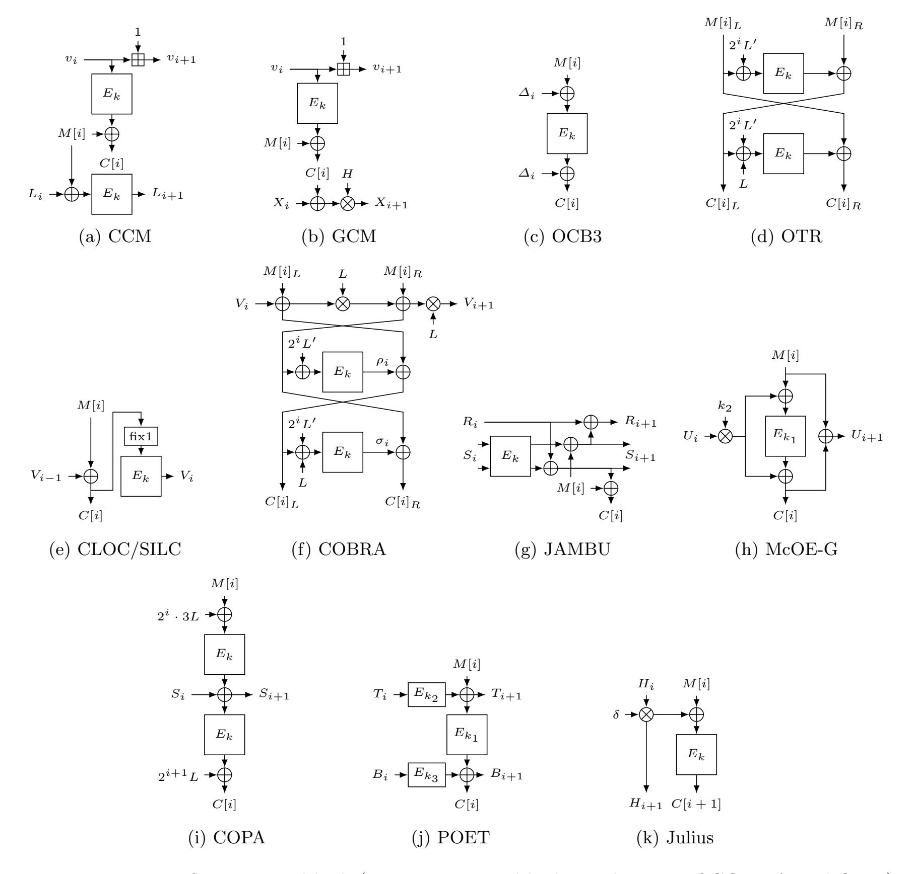
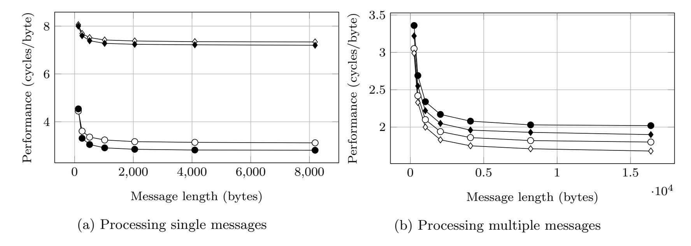
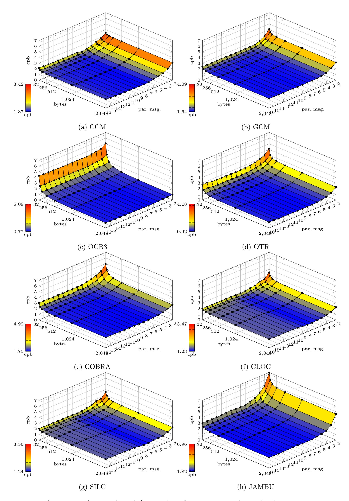
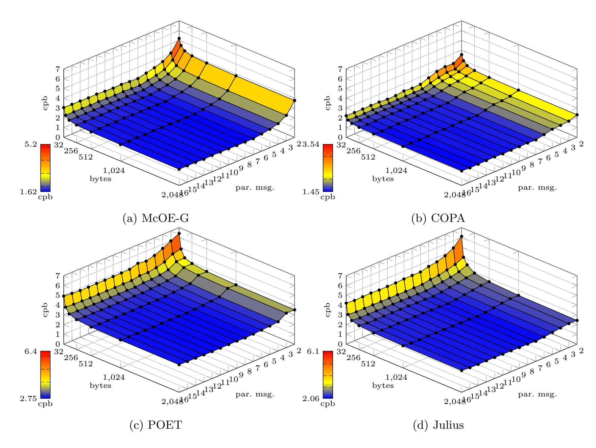

{0}------------------------------------------------

# AES-Based Authenticated Encryption Modes in Parallel High-Performance Software

Andrey Bogdanov and Martin M. Lauridsen and Elmar Tischhauser

Department of Applied Mathematics and Computer Science Technical University of Denmark, Denmark {anbog,mmeh,ewti}@dtu.dk

Abstract. Authenticated encryption (AE) has recently gained renewed interest due to the ongoing CAESAR competition. This paper deals with the performance of block cipher modes of operation for AE in parallel software. We consider the example of the AES on Intel's new Haswell microarchitecture that has improved instructions for AES and finite field multiplication. As opposed to most previous high-performance software implementations of operation modes – that have considered the encryption of single messages – we propose to process multiple messages in parallel. We demonstrate that this message scheduling is of significant advantage for most modes. As a baseline for longer messages, the performance of AES-CBC encryption on a single core increases by factor 6.8 when adopting this approach.

For the first time, we report optimized AES-NI implementations of the novel AE modes OTR, CLOC, COBRA, SILC, McOE-G, POET and Julius – both with single and multiple messages. For almost all AE modes considered, we obtain a consistent speed-up when processing multiple messages in parallel. Notably, among the nonce-based modes, CCM, CLOC and SILC get by factor 3.7 faster, achieving a performance comparable to GCM (the latter, however, possessing classes of weak keys), with OCB3 still performing at only 0.77 cpb. Among the nonce-misuse resistant modes, McOE-G receives a speed-up by more than factor 4 with a performance of about 1.62 cpb, with COPA consistently performing best at 1.45 cpb.

Keywords. Authenticated encryption, AES-NI, pclmulqdq, Haswell, COBRA, COPA, GCM, McOE-G, OCB3, OTR, POET

### 1 Introduction

An authenticated encryption (AE) scheme is a secret-key cryptographic primitive which combines encryption and authentication. Since around 2000, interest in such schemes has been on the rise. Many designs have been proposed, and more are joining the ranks with the ongoing CAESAR<sup>1</sup> competition [1], which is a move towards selecting a portfolio of AE schemes that should improve upon the state of the art.

Arguably the most common way of constructing an AE scheme is a mode of operation for a block cipher [2, 6, 7, 10, 11, 14, 28, 29, 31, 34–36, 38]. Other approaches include e.g. the hash function based Hash-CFB [16] or the permutation-based SpongeWrap [9] and APE [5]. When realizing an AE mode of operation in practice using a block cipher, the tried-and-true choice of the underlying primitive naturally falls upon the AES. Indeed, GCM instantiated with the AES is one such example which is widely used in e.g. TLS 1.2 [12] and included into e.g. the NSA Suite B Cryptography [3].

As authenticated encryption usually deals with processing bulk data, performance is of paramount importance for any AE scheme, and especially a standardized one. With AES being deployed in numerous cryptographic schemes and protocols on the Internet, Intel launched in 2011 their Westmere microarchitecture which, for the first time, implemented dedicated

<sup>1</sup> Competition for Authenticated Encryption: Security, Applicability, and Robustness

{1}------------------------------------------------

instructions for AES encryption and decryption as well as for multiplication in the finite field needed by GCM. Since, also AMD has introduced such instructions in its processor series. The newest Haswell microarchitecture by Intel introduced in 2013 has improved upon the efficiency of these instructions.

This paper deals with the performance of AES-based modes of operation for authenticated encryption on Intel Haswell.

### Our Contributions. Our contributions are as follows:

- Parallel processing of multiple messages: Communication devices of high-speed links are likely to process many messages at the same time. Indeed, on the Internet, the bulk of data is transmitted in packets of sizes between 1 and 2 KB. While most previous implementations of block cipher modes consider processing a single message, we propose to process several messages in parallel, which reflects this reality. This is very beneficial when using an inherently sequential mode, but also brings advantages for many parallel modes. While this type of message processing was briefly discussed in the paper proposing ALE [11], the consideration was limited to a single dedicated AE scheme based on AES components. In this work, for the first time, we deal with a variety of AE modes of operation in this setting (see Section 3).
- Speeding up AES-CBC encryption by factor 6.8: Whereas CBC decryption is essentially parallel, CBC encryption is serial. We show (see Section 3.3) that when several messages are processed simultaneously, this parallelism can be exploited by the implementation to obtain an AES-CBC encryption with AES-NI on Intel Haswell at 0.63 cycles per byte (cpb) for messages of 2048 bytes. This constitutes a ×6.8 speed-up which is an interesting show-case for the parallel processing of multiple messages.
- First AES-NI/Haswell implementations of new AE modes: We provide AES-NI implementations both of recent nonce-based modes such as OTR, CLOC and SILC and of novel nonce-misuse resistant modes such as McOE-G, COBRA, POET and Julius. We also present the first Haswell performance figures for CCM, OCB3 and COPA that have previously been implemented with AES-NI only on older platforms such as Sandy Bridge and Ivy Bridge. After the discussion of Haswell's AES-NI and binary field multiplication in Section 4, we present our new implementation results in Section 5.
- AE modes of choice: We provide a comprehensive performance study of both noncebased and nonce-misuse resistant AE modes of operation both in the single and multiple message setting. Our study shows that when processing single messages in the noncebased setting, OCB3 is the fastest with its 0.81 cpb, only outperformed by OTR for very short messages. For the nonce-misuse resistance modes, COPA outperforms all others at any message length. When considering multiple messages, among the nonce-based modes, CCM, CLOC and SILC get a factor 3.7 speed-up, at about 1.4 cpb being close to GCM (the latter, however, possessing classes of weak keys), with OCB3 still performing best at 0.77 cpb. Among the nonce-misuse resistant modes, McOE-G receives a speed-up of factor more than 4 to 1.62 cpb, with COPA again performing best at 1.45 cpb. See Section 5.3 for a discussion.

### 2 Authenticated Encryption Modes

We split up our consideration into two categories: (i) the nonce-misuse resistant AE modes, i.e. modes that maintain authenticity and privacy up a common message prefix even when 

{2}------------------------------------------------

the nonce is repeated and (ii) the nonce-based AE modes which either lose authenticity, privacy or both when nonces are repeated. The modes we consider in the former camp are McOE-G, COPA, POET and Julius, while the nonce-based modes considered are CCM, GCM, OCB3, OTR, CLOC, COBRA, JAMBU and SILC. Table 1 gives a comparison of the modes considered in this work. The price to pay for a mode to be nonce-misuse resistant includes extra computation, a higher serialization degree, or both. One of the fundamental questions we answer in this work is how much one has to pay, in terms of performance, to maintain security when repeating nonces.

Table 1: Overview of the AE modes considered in this paper. The k column indicates whether a mode is parallelizable. The "E−<sup>1</sup> -free" column indicates whether a mode needs the inverse of the underlying block cipher in decryption/verification. The "E" and "M" columns give the number of calls, per message block, to the underlying block cipher and multiplications in GF(2<sup>n</sup> ), respectively.

|                                 | Ref. | Year | k   | −1<br>E<br>-free | E | M | Description                                      |
|---------------------------------|------|------|-----|------------------|---|---|--------------------------------------------------|
| Nonce-based AE modes            |      |      |     |                  |   |   |                                                  |
| CCM                             | [36] | 2002 | –   | yes              | 2 | – | CTR encryption, CBC-MAC authentication           |
| GCM                             | [29] | 2004 | yes | yes              | 1 | 1 | CTR mode with chain of multiplications           |
| OCB3                            | [28] | 2010 | yes | –                | 1 | – | Xor-encrypt-Xor (XEX) construction with doubling |
| OTR                             | [31] | 2013 | yes | yes              | 1 | – | Two-block Feistel structure                      |
| CLOC                            | [24] | 2014 | –   | yes              | 1 | – | CFB mode with low overhead                       |
| COBRA                           | [7]  | 2014 | yes | yes              | 1 | 1 | Combining OTR with chain of multiplications      |
| JAMBU                           | [37] | 2014 | –   | yes              | 1 | – | AES in stream mode, lightweight                  |
| SILC                            | [25] | 2014 | –   | yes              | 1 | – | CLOC with smaller hardware footprint             |
| Nonce-misuse resistant AE modes |      |      |     |                  |   |   |                                                  |
| McOE-G                          | [13] | 2011 | –   | –                | 1 | 1 | Serial multiplication-encryption chain           |
| COPA                            | [6]  | 2013 | yes | –                | 2 | – | Two-round XEX                                    |
| POET                            | [2]  | 2014 | yes | –                | 3 | – | XEX with two AXU (full AES-128 call) chains      |
| Julius                          | [8]  | 2014 | –   | –                | 1 | 2 | SIV with polynomial hashing                      |

In the following, we will briefly describe the specifications of the considered AE modes. We clarify that for COBRA we refer to the FSE 2014 version with its reduced security claims (compared to the withdrawn CAESAR candidate); with POET we refer to the version where the universal hashing is implemented as full AES-128 (thus forming a mode of operation); with Julius, we mean the CAESAR candidate regular Julius-ECB.

#### 2.1 Specifications of AE modes

Here, we briefly give specifications of the twelve AE modes of Table 1. We use the notation that M and C are arrays of message and ciphertext, respectively. We use M[i] and C[i] to denote the ith block of these arrays with 1 ≤ i ≤ m. Exceptions are COBRA and OTR where we define a block as twice the block size of the underlying block cipher, and we let (M[i]<sup>L</sup> k M[i]R) and (C[i]<sup>L</sup> k C[i]R) denote the ith block of message and ciphertext, respectively. We use E<sup>k</sup> to denote the encryption with the underlying block cipher using master key k and let N denote the nonce. Multiplications (denoted ⊗) and additions (denoted ⊕) are done in what we call the GCM finite field GF(2128) = GF(2)[x]/x<sup>128</sup> + x <sup>7</sup> + x <sup>2</sup> + x + 1. Where applicable, we let A denote the output pre-processing associated data.

{3}------------------------------------------------

- **CCM.** The CCM mode (Counter with CBC-MAC, see Figure 1a) is a design by Ferguson et al. [36]. It is a part of IEEE 802.11i (as a variant), IPsec [22] and TLS 1.2 [12]. Initially,  $L_1 = \mathcal{A}$  and  $v_1$  depends on the nonce N ( $v_i$  is a counter incremented once per block). The tag is computed as  $T = E_k(N) \oplus L_{m+1}$ .
- **GCM.** GCM (Galois/Counter Mode, see Figure 1b) is a design by McGrew and Viega [29]. At the time of writing, it is the most widely used authenticated encryption scheme, and is included in a range of specifications, including TLS 1.2 [12] and NSA Suite B Cryptography [3]. Initially,  $v_1 = 1$  ( $v_i$  is a counter incremented once per block) and  $X_1 = \mathcal{A} \cdot H$ , where  $H = E_k(0)$ . The tag is computed as  $T = E_k(0) \oplus H(X_{m+1} \oplus len(A) || m)$  where len(A) is the length of associated data.
- **OCB3.** OCB3 (see Figure 1c) is a mode by Krovetz and Rogaway [28]. It uses a table-based approach of pre-computing values  $L_j = 2L_{j-1}, j \geq 1$ , where  $L_0 = 4E_k(0)$ . Initially,  $\Delta_1 = Init(N) \oplus L_0$  where Init(N) is a nonce-derived value, and  $\Delta_i = L_{ntz(i)} \oplus \Delta_{i-1}$  for i > 1. The ntz(i) function returns the number of trailing zeroes in the binary representation of i. The tag is computed as  $T = E_k(\Sigma \oplus \Delta_{m+1}) \oplus \mathcal{A}$ , where  $\Sigma = \bigoplus_{i=1}^m M[i]$ .
- **OTR.** The OTR mode is a design by Minematsu [31]. It uses a Feistel scheme for two consecutive blocks, but in OTR their processing is completely independent of two other consecutive blocks (see Figure 1d), allowing for good parallelization. We assume the number of blocks is a multiple of two. Under this assumption, the last two blocks of ciphertext are swapped (not shown in figure). Values used are  $L = E_k(N)$  and L' = 4L. The tag os computed as  $T = \mathcal{A} \oplus E_k(\Sigma \oplus 3 \cdot 2^{m/2-1}L')$ , where  $\Sigma = \bigoplus_{i=2,i \text{ even}}^m M[i] \oplus Z$  and Z is the output of the top encryption in the Feistel branch of the last two blocks.
- **CLOC.** CLOC is a design from FSE 2014 by Iwata et al. [24]. Essentially, the design is a modified CFB mode which aims to minimize overhead. The encryption of a block is shown in Figure 1e, where  $V_0 = E_k(\mathcal{A})$ . The "fix1" function sets the most significant bit of the input to 1. The tag is computed by a PRF which does a second pass over the ciphertext with  $V_0$  as a seed. For the details, see [24].
- **COBRA.** COBRA is a mode proposed by Andreeva et al. at FSE 2014 [7]. Similarly to OTR, it operates on two consecutive blocks in a Feistel scheme after the mixing with a chaining value V (see Figure 1f). For simplicity, COBRA is defined for an even number of blocks. Values used are  $V_0 = L^2 \oplus N \cdot L$ ,  $L = E_k(1)$  and L' = 4L. The tag is computed as  $T = E_k(E_k(\Sigma \oplus 3(2^2L' \oplus L)) \oplus N \oplus \mathcal{A} \oplus 3^2(2^2L' \oplus L))$ , where  $\Sigma = \bigoplus_{i=1}^m \sigma_i \oplus \rho_i$ .
- **JAMBU.** JAMBU is a design by Wu and Huang which was submitted to the CAESAR competition. The mode works on a state of three 64-bit values, two of which are concatenated and encrypted with AES-128. Message and ciphertext blocks are 64 bits, and the encryption of one block is shown in Figure 1g. Initially, we have  $L = E_k(N)$ ,  $R_0 = msb_{64}(L)$  and  $S_0 = (R_0||lsb_{64}(L) \oplus 5)$  where  $msb_{\ell}(X)$  and  $lsb_{\ell}(X)$  return the  $\ell$  most, respectively least significant bits of X. For the tag generation, see the submission document [37].
- **SILC.** SILC is another design by Iwata et al. [25] which was submitted to the CAESAR competition. SILC is very similar to CLOC in its design, but is more optimized towards small implementation footprint in hardware. Blocks are processed in the same way as CLOC (see Figure 1e), but the tag is generated in a slightly different way. For the details, see [25].

{4}------------------------------------------------

**McOE-G.** The McOE-G mode [14] (see Figure 1h) is a member of the McOE family [13] by Fleischmann et al. from FSE 2012. The mode uses two keys,  $k_1$  and  $k_2$ ; one for encryption and one for multiplication. Initially,  $U_1 = \tau \oplus N$ , where  $\tau = E_k(N \oplus \mathcal{A}) \oplus \mathcal{A}$ . The tag is generated as  $T = E_{k_1}(\tau \oplus (U_{m+1} \otimes k_2)) \oplus (U_{m+1} \otimes k_2)$ .

**COPA.** COPA (see Figure 1i) is a design by Andreeva et al. from Asiacrypt 2013 [6]. Values used are  $S_0 = \mathcal{A} \oplus L$  and  $L = E_k(0)$ . The tag is generated as  $T = E_k(E_k(\Sigma \oplus 2^{m-1}3^2L) \oplus S_{m+1})$ , where  $\Sigma = \bigoplus_{i=1}^m M[i]$ .

**POET.** This mode (see Figure 1j) is a design by Abed et al. presented at FSE 2014 [2]. It keeps two running chaining values which we denote T and B, and uses these with the XEX paradigm by Rogaway. The mode uses three keys. The top and bottom hashing  $H_{k_j}$ ,  $j \in \{2,3\}$ , and can be either multiplication by the key or encryption for four or ten rounds in the case of AES-128. For the purpose of our benchmarking, we consider for POET only the hash being multiplication in  $GF(2^{128})$ . Initially,  $T_0 = B_0 = 1$ . The tag is computed as  $T = E_{k_1}(\tau \oplus T_{m+1}) \oplus B_{m+1}$  where  $\tau = E_{k_1}(A_T \oplus N) \oplus A_B$ . Here  $A_T$  and  $A_B$  the top and bottom parts of A. We do not consider the other two variants of POET in this work: While using the 4-round AES instead of the multiplication is not a mode of operation, using the entire AES for hashing results in 3 block cipher calls per block of bulk data, which is considered rather inefficient.

**Julius.** The Julius design is a candidate in the CAESAR competition by Bahack [8]. It contains various proposals, and here we focus on the regular Julius-ECB. The scheme is two-pass, in the sense that one first uses the message in a chain of multiplications by a value  $\delta = E_k(0)$  to generated a hashing key  $\mu$  (see [8] for the details). This hashing key is then used in a series of multiplication by  $\delta$  to mask the message blocks before encrypting them to obtain the ciphertext blocks. See Figure 1k for an illustration, where M[0] := 0 and  $H_0 := \mu \delta^{-1}$ . The tag is simply equal to the first ciphertext block.

### 3 Simultaneous Processing of Multiple Messages

#### 3.1 Motivation

A substantial number of block cipher modes of operation for (authenticated) encryption are inherently serial in nature. This includes the classic CBC and CCM modes. Also, more recent designs essentially owe their sequential nature to design goals, e.g allowing lightweight implementations or achieving stricter notions of security, for instance not requiring a nonce for security (or allowing its reuse). Examples include ALE [11], APE [5], CLOC [24] the McOE family of algorithms [13, 14], and some variants of POET [2].

While being able to perform well in other environments, such algorithms cannot benefit from the available pipelining opportunities on contemporary general-purpose CPUs. For instance, as detailed in Section 4, the AES-NI encryption instructions on Intel's recent Haswell architecture feature a high throughput of 1, but a relatively high latency of 7 cycles. Modes of operation that need to process data serially will invariably be penalized in such environments.

Furthermore, even if designed with parallelizability in mind, (authenticated) modes of operation for block ciphers typically achieve their best performance when operating on somewhat longer messages, often due to the simple fact that these diminish the impact of potentially

{5}------------------------------------------------



Fig. 1: Processing of a message block (or two message blocks in the case of COBRA and OTR) for the AE modes benchmarked in this work

costly initialization phases and tag generation. Equally importantly, only longer messages allow high-performance software implementations to make full use of the available pipelining opportunities [4, 18, 28, 30].

In practice, however, one rarely encounters messages which allow to achieve the maximum performance of an algorithm. Recent studies on packet sizes on the Internet demonstrate that they basically follow a bimodal distribution [27,32,33]: 44% of packets are between 40 and 100 bytes long and 37% are between 1400 and 1500 bytes in size. First, this emphasizes the importance of good performance for messages up to around 2 KB, as opposed to longer messages. Second, when looking at the weighted distribution, this implies that the vast majority of data is actually transmitted in packets of medium size between 1 and 2 KB. Considering the first mode of the distribution, we observe that many of the very small packets of Internet traffic 

{6}------------------------------------------------

comprise TCP ACKs (which are typically not encrypted), and that the use of authentication and encryption layers such as TLS or IPsec incurs overhead significant enough to blow up a payload of 1 byte to a 124 byte packet [23]. It is therefore this range of message sizes (128 to 2048 bytes) that authenticated modes of encryption should excel at processing.

# 3.2 Multiple Message Processing

It follows from the above discussion that the standard approach of considering one message at a time, while arguably optimizing message processing latency, cannot always generate optimal throughput in high-performance software implementations in most practically relevant scenarios. This is not surprising for the inherently sequential modes, but even when employing a parallelizable design, the prevailing distribution of message lengths makes it hard to achieve the best performance.

In order to remedy this, we propose to consider the scheduling of multiple messages in parallel already in the implementation of the algorithm itself, as opposed to considering it as a (single-message) black box to the message scheduler. This opens up possibilities of increasing the performance in the cases of both sequential modes and the availability of multiple shorter or medium-size messages. In the first case, the performance penalty of serial execution can potentially be hidden by filling the pipeline with a sufficient number of operations on independent data. In the second case, there is a potential of increasing performance by keeping the pipeline filled also for the overhead operations such as block cipher or multiplication calls during initialization or tag generation. Note that while in this paper we consider the processing of multiple messages on a single core, the multiple message approach naturally extends to multi-core settings.

Conceptually, the transition of a single message to a multiple message implementation can be viewed as similar to the transition from a straightforward to a bit-sliced implementation approach. We also note that typically, many messages belonging to the same communication session will be encrypted under the same key (but with different nonces in case of a noncebased mode). This idea has been introduced in the performance study of the dedicated AE algorithm ALE [11], without however being explored in its full generality.

Note that while multiple message processing has the potential to increase the throughput of an implementation, it can also increase its latency (see also Section 3.4). The amount of parallelism therefore has to be chosen carefully and with the required application profile in mind.

### 3.3 Speeding Up AES-CBC Encryption

The CBC mode of operation is one of the most widely employed ones, being used in virtually any protocol suite (SSH, TLS, IPsec, . . . ). While CBC encryption is strictly sequential, CBC decryption can be parallelized [4]. Here, we demonstrate that significant speed-ups are possible for CBC encryption when processing multiple messages in parallel. Our sample target platform is Intel's Haswell architecture with AES-NI instructions, though the approach also works for other recent microarchitectures including Intel's Westmere, Sandy Bridge, and Ivy Bridge.

The implementation is as follows: Each step of the CBC encryption algorithm is executed for every message before continuing with the next step, thus allowing pipelining of the otherwise serial operations. We summarize the performance results for various choices for the

{7}------------------------------------------------

Table 2: Performance of CBC encryption (cpb) and relative speed-up when processing multiple messages (2048 bytes)

|                              |               | multiple messages (# msgs.) |               |               |   |   |                       |                       |
|------------------------------|---------------|-----------------------------|---------------|---------------|---|---|-----------------------|-----------------------|
|                              | single msg.   | 2                           | 3             | 4             | 5 | 6 | 7                     | 8                     |
| AES-CBC<br>Relative speed-up | 4.28<br>×1.00 | $2.15 \times 1.99$          | 1.43<br>×2.99 | 1.08<br>×3.96 |   |   | $0.64 \\ \times 6.69$ | $0.63 \\ \times 6.79$ |

number of multiple messages in Table 2. Along the performance data, we list the relative speed-up compared to a single-message implementation for each level of parallelism.

We observe that speed-ups of up to  $\times 6.79$  are possible using 8 multiple messages. Since on Haswell, the theoretical limit is 7 by the latency of aesenc (see Section 4.2), this speed-up of CBC encryption can be considered almost optimal.

Note that the speed-ups reported in [4] require the use of very long messages (32 KB), while the speed-ups of Table 2 are achieved at a realistic message size of 2 KB. Experiments show that similar speed-ups can be achieved in the multiple message setting for shorter messages as well.

#### 3.4 Latency, Throughput and Other Considerations for Multiple Messages

Latency vs. throughput. A point worth discussing is the loss in latency we have to pay for the multiple message processing. Since the speed-up is limited by the parallelization level, we can at most hope for the same latency as in the single-message case. Table 2 shows that this is actually achieved for 2 to 4 parallel messages: Setting |M| = 2048, instead of waiting  $4.28 \cdot |M|$  cycles in the single-message case, we have a latency of either  $2.15 \cdot 2 = 4.3 |M|$ ,  $1.43 \cdot 3 = 4.29 |M|$  or  $1.08 \cdot 4 = 4.32 |M|$  cycles, respectively. Starting from 5 messages, the latency slightly increases with the throughput, however remaining at a manageable level even for 8 messages, where it is only around 18% higher than in the single-message case. This has to be contrasted (and, depending on the application, weighed against) the significant 6.8 times speed-up in throughput. Finally, we note that this technique also allows accelerating the computation of CBC-MAC by the same factors and therefore serves as a basis to speed up CCM in the multiple message setting.

Different message lengths. In real applications, it is likely that messages of different lengths will occur. While it will often be possible to schedule them according to approximate size, the overhead induced by scheduling decisions would be too significant for such an algorithm to be included as part of core cryptographic primitives (as considered in this paper). However, often different packet lengths are less of a problem than it might seem. Assuming an AE mode obtains a linear speedup with the parallelism level P, an assumption which is not too optimistic as seen in Table 2, the latency when processing P messages is at most the same as processing single messages. Indeed, if the performance for a single message is  $\tau$  cpb, and one processes two messages of length k and k+l in parallel, the latency is  $\frac{\tau}{2} \cdot 2(k+l) = \tau(k+l)$  cycles versus  $\tau k + \tau(k+l)$  cycles when processing single messages. This implies that already very approximate scheduling according to message/packet size will yield good results.

{8}------------------------------------------------

# 4 Optimizing for Intel's Haswell Microarchitecture

In this section, we describe some of the optimization techniques and architecture features that were used for our implementations on Haswell.

### 4.1 General considerations: AVX and AVX2 instructions

In our Haswell-optimized AE scheme implementations we make heavy use of Intel AVX (Advanced Vector Extensions) which has been present in Intel processors since Sandy Bridge. AVX can be considered as an extension of the SSE+<sup>2</sup> streaming SIMD instructions operating on 128-bit xmm0 through xmm15 registers.

While AVX and AVX2, the latter which appears first on Intel's Haswell processor, brings mainly support for 256-bit wide registers to the table, this is not immediately useful in implementing an AES-based AE scheme, as the AES-NI instructions as well as the pclmulqdq instruction support only the use of 128-bit xmm registers. However, a feature of AVX that we use extensively is the three-operand enhancement, due to the VEX coding scheme, of legacy two-operand SSE2 instructions. This means that, in a single instruction, one can nondestructively perform vector bit operations on two operands and store the result in a third operand, rather than overwriting one of the inputs, i.e. one can do c = a ⊕ b rather than a = a ⊕ b. This eliminates overhead associated with mov operations required when overwriting an operand is not acceptable. With AVX, three-operand versions of the AES-NI and pclmulqdq instructions are also available, all prefixed with a v, e.g. the instruction for one round of AES-128 is vaesenc xmm1, xmm2, xmm3/m128.

A further Haswell feature worth taking into account is the increased throughput for logical instructions such as vpxor/vpand/vpor on AVX registers: While the latency remains at one cycle, now up to 3 such instructions can be scheduled simultaneously. Notable exceptions are algorithms heavily relying on mixed 64/128 bit logical operations such as JAMBU, for which the inclusion of a fourth 64-bit ALU implies that such algorithms will actually benefit from frequent conversion to 64-bit arithmetic via vpextrq/vpinsrq rather than artificial extension of 64-bit operands to 128 bits for operation on the AVX registers.

On Haswell, the improved memory controller allows two simultaneous 16-byte aligned moves vmovdqa from registers to memory, with a latency of one cycle. This implies that on Haswell, the comparatively large latency of cryptographic instructions such as vaesenc or pclmulqdq allows the implementor to "hide" more memory accesses to the stack when larger internal state of the algorithm leads to to register shortage. This also benefits the generally larger working sets induced by the multiple message strategy described in Sect. 3.

#### 4.2 Improved AES instructions

AES being the block cipher of choice in modern systems, it is supported by virtually any new protocol using block ciphers. Accordingly, Intel proposed and implemented since their 2010 Westmere microarchitecture, special instructions for fast AES encryption and decryption [17]. The AES New Instruction Set, or AES-NI for short, comprises six CPU instructions: aesenc (one round of AES), aesenclast (last round of AES), their decryption equivalents aesdec and aesdeclast, aesimc (inverse MixColumns) and aeskeygenassist for a faster key scheduling.

<sup>2</sup> i.e. SSE, SSE2, etc.

{9}------------------------------------------------

The instructions do not only offer better performance, but security as well, leaking no timing information.

AES-NI is supported in a subset of Westmere, Sandy Bridge, Ivy Bridge and Haswell microarchitectures. A range of AMD processors also support the instructions under the name AES Instructions, including processors in the Bulldozer, Piledriver and Jaguar series [21]. In Haswell, the AES-NI encryption and decryption instructions had their latency improved from 8 cycles on Sandy and Ivy Bridge, down to 7 cycles [20]. This especially benefits serial implementations such as AES-CBC, CCM, McOE-G, CLOC, SILC, and JAMBU. Furthermore, the throughput has been optimized a bit, which allows for better performance in parallel. Table 3 gives an overview of the latencies and inverse throughputs measured on our test machine (Core i5-4300U). The data was obtained using the test suite of Fog [15].

Table 3: Experimental latency (L) and inverse throughput (T −1 ) of AES-NI and pclmulqdq instructions on Intel's Haswell microarchitecture. .

| Instruction                                  | L                | T −1             | Instruction                            | L             | T −1        |
|----------------------------------------------|------------------|------------------|----------------------------------------|---------------|-------------|
| aesenc<br>aesdec<br>aesenclast<br>aesdeclast | 7<br>7<br>7<br>7 | 1<br>1<br>1<br>1 | aesimc<br>aeskeygenassist<br>pclmulqdq | 14<br>10<br>7 | 2<br>8<br>2 |

# 4.3 Improvements for Multiplication in GF(2128)

The pclmulqdq instruction was introduced by Intel along with the AES-NI instructions [19], but is not part of AES-NI itself. The instruction takes two 128-bit inputs and a byte input imm8, and performs carry-less multiplication of a combination of one 64-bit half of each operand. The choice of halves of the two operands to be multiplied is determined by the value of bits 4 and 0 of imm8.

Most practically used AE modes using multiplication in a finite field use block lengths of 128 bits. As a consequence the finite fields multiplications are in GF(2128). As the particular choice of finite field does not influence the security proofs, modes use the tried-and-true GCM finite field. For our performance study, we have used two different implementation approaches for finite field multiplication (gfmul). The first implementation, which we refer to as the classical method, was introduced in Intel's white paper [19]. It applies pclmulqdq three times in a carry-less Karatsuba multiplication followed by modular reduction. The second implementation variant, which we refer to as the Haswell-optimized method, was proposed by Gueron [18] with the goal of leveraging the improved pclmulqdq performance on Haswell to trade many shifts and XORs for one more multiplication. This is motivated by the improvements in both latency (7 versus 14 cycles) and inverse throughput (2 versus 8 cycles) on Haswell [20].

In modes where the output of a multiplication over GF(2128) is not directly used, other than as a part of a chain combined using addition, the aggregated reduction method by Jankowski and Laurent [26] can be used to gain speed-ups. This method uses the inductive definitions of chaining values combined with the distributivity law for the finite field to postpone modular reduction at the cost of storing powers of an operand. Among the modes we benchmark in this work, the aggregated reduction method is applicable only to GCM and Julius. We therefore use aggregated reduction for these two modes, but apply the general gfmul implementations to the other modes.

{10}------------------------------------------------

# 4.4 Classical Versus Haswell GF(2128) Multiplication

Here we compare the classical and Haswell-optimized methods of multiplication in GF(2128) described in Section 4.3. We compare the performance of those AE modes that use full GF(2128) multiplications (as opposed to aggregated reduction): McOE-G and COBRA, when instantiated using the two different multiplication algorithms. Figure 2 shows that when processing a single message, the classical implementation of gfmul performs better than the Haswell-optimized method, while the situation is reversed when processing multiple messages in parallel.



Fig. 2: Performance of McOE-G (diamond mark) and COBRA (circle mark) with single messages (left) and 8 multiple messages (right). For both plots, the filled marks are performances using the classical gfmul implementation and the hollow marks are using the Haswell-optimized gfmul implementation.

Given the speed-up of pclmulqdq on Haswell, this may seem somewhat counter-intuitive at first. We observe, however, that McOE-G and COBRA basically make sequential use of multiplications, which precludes utilizing the pipeline for single message implementations. In this case, the still substantial latency of pclmulqdq is enough to offset the gains by replacing several other instructions for the reduction. This is different in the multiple message case, where the availability of independent data allows our implementations to make more efficient use of the pipeline, leading to superior results over the classical multiplication method.

# 4.5 Haswell-optimized Doubling in GF(2128)

The doubling operation in GF(2128) is commonly used in AE schemes, and indeed among the schemes we benchmark, it is used by OCB3, OTR, COPA and COBRA. Doubling in this field consists of left shifting the input by one bit and doing a conditional XOR of a reduction polynomial if the MSB of the input equals one. Neither SSE+ nor AVX provide an instruction to shift a whole xmm register bitwise or directly test just its MSB. These functions have therefore to be emulated with other operations, opening up a number of implementation choices.

We emulate a left shift by one bit by the following procedure, which is optimal with regard to the number of instructions and cycles: Given an input v, the value 2v ∈ GF(2128) is computed as in Listing 1.1. Consider v = (vLkvR) where v<sup>L</sup> and v<sup>R</sup> are 64-bit values. In line 3 we set v<sup>1</sup> = (v<sup>L</sup> 1kv<sup>R</sup> 1) and lines 4 and 5 set first v<sup>2</sup> = (vRk0) and then 

{11}------------------------------------------------

v<sup>2</sup> = ((v<sup>R</sup> 63)k0). As such, we have v 1 = v<sup>1</sup> | v2. This leaves us with a number of possibilities when implementing the branching of line 6, which can be categorized as (i) extracting parts from v and testing, (ii) AVX variants of the test instruction, (iii) extracting a mask with the MSB of each part of v and (iv) comparing against 10 · · · 0<sup>2</sup> (called MSB MASK in Listing 1.1 and RP is the reduction constant) and then extracting from the comparison result. Some of these approaches again leave several possibilities regarding the number of bits extracted, etc.

Interestingly, the approach taken to check the MSB of v has a great impact on the doubling performance. This is illustrated by Table 3a where we give performance of the doubling operation using various combinations of approaches to checking the MSB of v. The numbers are obtained by averaging over 10<sup>8</sup> experiments. Surprisingly, we see that there is a significant speedup, about a factor ×3, when using comparison with MSB MASK combined with extraction, over the other methods. Thus, we suggest to use this approach, where line 6 can be implemented as if ( mm extract epi8( mm cmpgt epi8(MSB MASK, v), 15) == 0).

```
Listing (1.1) Doubling in GF(2128)
 1 m 1 2 8i xtime ( m 1 2 8i v ) {
 2 m 1 2 8i v1 , v2 ;
 3 v1 = m m s l l i e p i 6 4 ( v , 1 ) ;
 4 v2 = m m s l l i s i 1 2 8 ( v , 8 ) ;
 5 v2 = mm s rli e pi 6 4 ( v2 , 6 3 ) ;
 6 i f (msb o f v == 1 )
 7 return mm x o r si 1 2 8 ( mm o r si 1 2 8 ( v1 , v2 ) ,RP)
              ;
 8 e l s e
 9 return mm o r si 1 2 8 ( v1 , v2 ) ;
10 }
```

(a) Performance of doubling with different approaches to MSB testing

|     | Approach               | Cycles |
|-----|------------------------|--------|
| (i) | Extraction             | 15.4   |
|     | (ii) Test              | 15.4   |
|     | (iii) MSB mask         | 16.7   |
|     | (iv) Compare + extract | 5.6    |

### 5 Results

In this section we present the results of our performance study of the twelve AE modes of operation considered in this paper.

#### 5.1 The Setting

In our benchmarking, we consider all combinations of messages sizes from 128 to 2048 bytes, single messages, and from 2 to 16 multiple messages. All measurements were taken on a single core of an Intel Core i5-4300U CPU at 1900 MHz. For each combination of parameters, the performance was determined as the median of 91 averaged timings of 200 measurements each. This method has also been used by Krovetz and Rogaway in their benchmarking of authenticated encryption modes in [28].

For our performance measurements, we are interested in the performance of the various AE modes during their bulk processing of message blocks, i.e. during the encryption phase. To that end, we do not measure the time spent on processing associated data. As some schemes can have a significant overhead when computing authentication tags for short messages, we do include this phase in the measurements as well. As a baseline, and for a perspective on the induced overhead, we summarize the performance of non-authenticated modes of operation of the AES in Table 4c.

{12}------------------------------------------------

Table 4: Performance comparison (in cycles/byte) of AE modes on various message lengths in the single and multiple message settings. For multiple messages, data is shown for the optimal number of multiple messages processed in parallel for each message length and AE mode.

(b) Nonce-misuse resistant AE modes

|       |         |      | Message length (bytes) |                   |      |      |              |                                                 |              | Message length (bytes)  |                   |              |              |
|-------|---------|------|------------------------|-------------------|------|------|--------------|-------------------------------------------------|--------------|-------------------------|-------------------|--------------|--------------|
| Mode  |         | 128  | 256                    | 512               | 1024 | 2048 | Mode         |                                                 | 128          | 256                     | 512               | 1024         | 2048         |
|       |         |      |                        | single message    |      |      |              |                                                 |              |                         | single message    |              |              |
| CCM   |         | 5.35 | 5.19                   | 5.14              | 5.11 | 5.10 | McOE-G       |                                                 | 7.77         | 7.36                    | 7.17              | 7.07         | 7.02         |
| GCM   |         | 2.09 | 1.61                   | 1.34              | 1.20 | 1.14 | COPA         |                                                 | 3.37         | 2.64                    | 2.27              | 2.08         | 1.88         |
| OCB3  |         | 2.19 | 1.43                   | 1.06              | 0.87 | 0.81 | POET         |                                                 | 5.30         | 4.93                    | 4.75              | 4.68         | 4.62         |
| OTR   |         | 2.97 | 1.34                   | 1.13              | 1.02 | 0.96 | Julius       |                                                 | 4.18         | 4.69                    | 3.24              | 3.08         | 3.03         |
| CLOC  |         | 4.50 | 4.46                   | 4.44              | 4.46 | 4.44 |              |                                                 |              |                         |                   |              |              |
| COBRA |         | 4.41 | 3.21                   | 2.96              | 2.83 | 2.77 |              | # msgs.                                         |              |                         | multiple messages |              |              |
| JAMBU |         | 9.33 | 9.09                   | 8.97              | 8.94 | 8.88 | McOE-G       | 7                                               | 1.91         | 1.76                    | 1.68              | 1.64         | 1.62         |
| SILC  |         | 4.57 | 4.54                   | 4.52              | 4.51 | 4.50 | COPA<br>POET | 15<br>8                                         | 1.62<br>3.24 | 1.53<br>2.98            | 1.48<br>2.86      | 1.46<br>2.79 | 1.45<br>2.75 |
|       | # msgs. |      |                        | multiple messages |      |      | Julius       | 7                                               | 2.53         | 2.27                    | 2.16              | 2.09         | 2.06         |
| CCM   | 8       | 1.51 | 1.44                   | 1.40              | 1.38 | 1.37 |              |                                                 |              |                         |                   |              |              |
| GCM   | 13      | 1.81 | 1.72                   | 1.68              | 1.65 | 1.64 |              |                                                 |              |                         |                   |              |              |
| OCB3  | 7       | 1.59 | 1.16                   | 0.94              | 0.83 | 0.77 |              | (c) Baseline performance for long messages (2K) |              |                         |                   |              |              |
| OTR   | 8       | 1.28 | 1.08                   | 0.98              | 0.94 | 0.92 | Mode         | Single msg.                                     |              | Multiple msg. (# msgs.) |                   |              |              |
| CLOC  | 7       | 1.40 | 1.31                   | 1.26              | 1.24 | 1.23 |              |                                                 |              |                         |                   |              |              |
| COBRA | 8       | 2.04 | 1.88                   | 1.80              | 1.76 | 1.75 | AES-ECB      | 0.63                                            |              |                         | 0.63              | (8)          |              |
| JAMBU | 14      | 2.14 | 1.98                   | 1.89              | 1.85 | 1.82 | AES-CTR      | 0.74                                            |              |                         | 0.75              | (8)          |              |
| SILC  | 7       | 1.43 | 1.33                   | 1.28              | 1.25 | 1.24 | AES-CBC      | 4.28                                            |              |                         | 0.63              | (8)          |              |

# 5.2 Performance Measurements

Table 4 lists the results of performance measurements of the various AE modes for different message lengths in the single and multiple message settings.

In order to better evaluate the performance speed-ups (or reductions) obtained in the multiple message setting as opposed to processing single messages, the ratios of single to multiple message processing are shown in Table 5 for each of the parameters. Note that numbers greater than 1 indicate a speed-up for multiple messages, while values smaller than 1 indicate a reduction in performance in comparison to the single message case.

The dependency of the performance in the multiple message case on the individual parameters is further detailed in Figures 4 and 5. The horizontal lines in the color key of both figures indicate the integer values in the interval.

# 5.3 Discussion

Best performance characteristics. From Table 4, it becomes apparent that for each message length, the optimal choice in terms of performance is a mode in the multiple message setting. In the nonce-based setting, for everything but very short messages, OCB3 performs best, with slight advantages over its own single message performance. For short messages (128 and 256 bytes), OTR outperforms OCB3 in the multiple message setting. For the noncemisuse resistant modes, COPA provides the best performance over all message lengths, both with single and multiple messages.

{13}------------------------------------------------

Table 5: Ratios of single- to multiple message performance of AE modes for various message lengths, giving the speed-up obtained by processing multiple messages in parallel

#### (a) Nonce-based AE modes

#### (b) Nonce-misuse resistant AE modes

|       | Message length (bytes) |       |       |       |       |  |  |  |  |  |
|-------|------------------------|-------|-------|-------|-------|--|--|--|--|--|
| Mode  | 128                    | 256   | 512   | 1024  | 2048  |  |  |  |  |  |
| CCM   | ×3.54                  | ×3.60 | ×3.67 | ×3.70 | ×3.72 |  |  |  |  |  |
| GCM   | ×1.15                  | ×0.94 | ×0.80 | ×0.73 | ×0.70 |  |  |  |  |  |
| OCB3  | ×1.38                  | ×1.23 | ×1.13 | ×1.05 | ×1.05 |  |  |  |  |  |
| OTR   | ×2.32                  | ×1.24 | ×1.15 | ×1.09 | ×1.04 |  |  |  |  |  |
| CLOC  | ×3.21                  | ×3.40 | ×3.52 | ×3.60 | ×3.61 |  |  |  |  |  |
| COBRA | ×2.16                  | ×1.71 | ×1.64 | ×1.61 | ×1.58 |  |  |  |  |  |
| JAMBU | ×4.36                  | ×4.59 | ×4.75 | ×4.83 | ×4.88 |  |  |  |  |  |
| SILC  | ×3.20                  | ×3.41 | ×3.53 | ×3.61 | ×3.63 |  |  |  |  |  |

|        | Message length (bytes) |       |       |       |       |  |  |  |  |  |
|--------|------------------------|-------|-------|-------|-------|--|--|--|--|--|
| Mode   | 128                    | 256   | 512   | 1024  | 2048  |  |  |  |  |  |
| McOE-G | ×4.07                  | ×4.18 | ×4.27 | ×4.31 | ×4.33 |  |  |  |  |  |
| COPA   | ×2.08                  | ×1.73 | ×1.53 | ×1.42 | ×1.30 |  |  |  |  |  |
| POET   | ×1.64                  | ×1.65 | ×1.66 | ×1.68 | ×1.45 |  |  |  |  |  |
| Julius | ×1.65                  | ×2.07 | ×1.50 | ×1.47 | ×1.47 |  |  |  |  |  |

Benefits of multiple message processing. For almost all AE modes considered, we obtain a consistent speed-up when processing multiple messages at the same time (see Table 5). This effect is strongest for the inherently serial modes CCM, CLOC, SILC, JAMBU and McOE-G, which receive speed-ups between ×3.5 and ×4.8, notably rather consistent for both short and long messages. Interestingly, also most of the parallelizable modes (OCB3, OTR, COBRA, COPA and POET) benefit from multiple message processing. This can be explained by the ability of multiple message processing to essentially parallelize all operations, including initialization and tag generation (note that the speed-up usually reduces somewhat with the message length). For the modes using finite field multiplication, this effect is further amplified by the ability to hide the substantial latency of pclmulqdq by filling its pipeline also for otherwise serial multiplications. GCM with its special polynomial hash evaluation allowing aggregate reduction provides the exception to the rule, while the similar two-pass scheme Julius still receives a speed-up.

Impact of working set sizes. We also note from Table 4 that most modes achieve their best speed-up in the multiple messages scenario for around 7-8 multiple messages, with GCM, JAMBU and COPA being the exceptions at 13, 14 and 15, respectively. A closer inspection of Figures 4 and 5 reveals that the GCM performance is actually quite stable from 7 till 13 multiple messages, starting from when the increased pressure on the available AVX registers starts to influence the results. COPA is a different case, though, with its two block cipher calls per message block explaining its preference for about twice as many available messages than the pipeline length. The experimental results also confirm the intuition of Section 4.1 that Haswell's improved memory interface can handle fairly large working set sizes efficiently by hiding the stack access latency between the cryptographic operations. This allows more multiple messages to be processed faster despite the increased register pressure, basically until the number of moves exceeds the latency of the other operations, or ultimately the limits of the Level-1 cache are reached.

{14}------------------------------------------------



Fig. 4: Performance of nonce-based AE modes of operation in the multiple-message setting

{15}------------------------------------------------



Fig. 5: Performance of nonce-misuse resistant AE modes of operation in the multiple-message setting

### 6 Conclusion

In this paper, we have discussed the performance of (authenticated) modes of operation for block ciphers using the AES on Intel's recent Haswell architecture.

As a general technique to speed up both inherently sequential modes and to the scenario of having many but shorter messages, we propose the scheduling of multiple messages in parallel already in the implementation of the algorithm itself. This leads to significant speedups for serial modes, but also to considerable improvements for parallelizable modes. Applied to modes such as CBC, CCM, CLOC, SILC, JAMBU and McOE-G, we obtain speed-ups of factors  $\times 3.6$  to  $\times 6.8$ .

Providing the first optimized AES-NI implementations of the recent AE modes OTR, CLOC, COBRA, SILC, McOE-G, POET and Julius, we perform a comprehensive performance study of both nonce-based and nonce-misuse resistant modes on a wide range of parameters. Our study indicates that processing multiple messages is almost always beneficial, even for parallelizable modes. Overall, among the nonce-based modes we analyze, OTR performs best for short and OCB3 for longer messages; among the nonce-misuse resistant modes, COPA performs best for all message lengths.

{16}------------------------------------------------

# References

- 1. Cryptographic Competitions. Accessed on February 17, 2014. http://competitions.cr.yp.to/caesar. html.
- 2. Farzaneh Abed, Scott Fluhrer, Christian Forler, Eik List, Stefan Lucks, David McGrew, and Jakob Wenzel. Pipelineable On-Line Encryption. In FSE, 2014.
- 3. National Security Agency. NSA Suite B Cryptography. Accessed on February 17, 2014. http://www.nsa. gov/ia/programs/suiteb\_cryptography/, February 2014.
- 4. Kahraman Akdemir, Martin Dixon, Wajdi Feghali, Patrick Fay, Vinodh Gopal, Jim Guilford, Erdinc Ozturk, Gil Wolrich, and Ronen Zohar. Breakthrough AES Performance with Intel AES New Instructions. Intel Corporation, 2010.
- 5. Elena Andreeva, Begl Bilgin, Andrey Bogdanov, Atul Luykx, Bart Mennink, Nicky Mouha, and Kan Yasuda. APE: Authenticated Permutation-Based Encryption for Lightweight Cryptography. In FSE, 2014.
- 6. Elena Andreeva, Andrey Bogdanov, Atul Luykx, Bart Mennink, Elmar Tischhauser, and Kan Yasuda. Parallelizable and Authenticated Online Ciphers. In ASIACRYPT, pages 424–443, 2013.
- 7. Elena Andreeva, Atul Luykx, Bart Mennink, and Kan Yasuda. COBRA: A Parallelizable Authenticated Online Cipher Without Block Cipher Inverse. In FSE, 2014.
- 8. Lear Bahack. Julius: Secure Mode of Operation for Authenticated Encryption Based on ECB and Finite Field Multiplications.
- 9. Guido Bertoni, Joan Daemen, Michael Peeters, and Gilles Van Assche. Duplexing the Sponge: Single-Pass Authenticated Encryption and Other Applications. In Selected Areas in Cryptography, pages 320–337, 2011.
- 10. Begl Bilgin, Andrey Bogdanov, Miroslav Knezevic, Florian Mendel, and Qingju Wang. Fides: Lightweight Authenticated Cipher with Side-Channel Resistance for Constrained Hardware. In CHES, pages 142–158, 2013.
- 11. Andrey Bogdanov, Florian Mendel, Francesco Regazzoni, Vincent Rijmen, and Elmar Tischhauser. ALE: AES-based Lightweight Authenticated Encryption. In FSE, 2013.
- 12. T. Dierks and E. Rescorla. The Transport Layer Security (TLS) Protocol Version 1.2. RFC 5246 (Proposed Standard), August 2008. Updated by RFCs 5746, 5878, 6176.
- 13. Ewan Fleischmann, Christian Forler, and Stefan Lucks. McOE: A Family of Almost Foolproof On-Line Authenticated Encryption Schemes. In FSE, 2012.
- 14. Ewan Fleischmann, Christian Forler, Stefan Lucks, and Jakob Wenzel. McOE: A Family of Almost Foolproof On-Line Authenticated Encryption Schemes. Cryptology ePrint Archive, Report 2011/644, 2011. http://eprint.iacr.org/.
- 15. Agner Fog. Software Optimization Resources. Accessed on February 17, 2014. http://www.agner.org/ optimize/, February 2014.
- 16. Christian Forler, Stefan Lucks, David McGrew, and Jakob Wenzel. Presented at DIAC 2012. Hash-CFB. July 2012.
- 17. Shay Gueron. Intel Advanced Encryption Standard (AES) New Instructions Set. Intel Corporation, 2010.
- 18. Shay Gueron. AES-GCM software performance on the current high end CPUs as a performance baseline for CAESAR. In DIAC 2013: Directions in Authenticated Ciphers, 2013.
- 19. Shay Gueron and Michael E. Kounavis. Intel Carry-Less Multiplication Instruction and its Usage for Computing the GCM Mode. Intel Corporation, 2010.
- 20. Sean Gulley and Vinodh Gopal. Haswell Cryptographic Performance. Intel Corporation, 2013.
- 21. Brent Hollingsworth. New "Bulldozer" and "Piledriver" Instructions. Advanced Micro Devices, Inc., 2012.
- 22. R. Housley. Using Advanced Encryption Standard (AES) CCM Mode with IPsec Encapsulating Security Payload (ESP). RFC 4309 (Proposed Standard), December 2005.
- 23. Steven Iveson. IPSec Bandwidth Overhead Using AES. Accessed on February 17, 2014. http: //packetpushers.net/ipsec-bandwidth-overhead-using-aes/, October 2013.
- 24. Tetsu Iwata, Kazuhiko Minematsu, Jian Guo, and Sumio Morioka. CLOC: Authenticated Encryption for Short Input. In FSE, 2014.
- 25. Tetsu Iwata, Kazuhiko Minematsu, Jian Guo, Sumio Morioka, and Eita Kobayashi. SILC: SImple Lightweight CFB.
- 26. Krzysztof Jankowski and Pierre Laurent. Packed AES-GCM Algorithm Suitable for AES/PCLMULQDQ Instructions. pages 135–138, 2011.
- 27. Wolfgang John and Sven Tafvelin. Analysis of internet backbone traffic and header anomalies observed. In Internet Measurement Comference, pages 111–116, 2007.

{17}------------------------------------------------

- 28. Ted Krovetz and Phillip Rogaway. The Software Performance of Authenticated-Encryption Modes. In FSE, 2011.
- 29. David A. McGrew and John Viega. The Galois/Counter Mode of Operation (GCM).
- 30. David A. McGrew and John Viega. The Security and Performance of the Galois/Counter Mode (GCM) of Operation. In INDOCRYPT, pages 343–355, 2004.
- 31. Kazuhiko Minematsu. Parallelizable Rate-1 Authenticated Encryption from Pseudorandom Functions. In EUROCRYPT, pages 275–292, 2014.
- 32. David Murray and Terry Koziniec. The state of enterprise network traffic in 2012. In Communications (APCC), 2012 18th Asia-Pacific Conference on, pages 179–184. IEEE, 2012.
- 33. Kostas Pentikousis and Hussein G. Badr. Quantifying the deployment of TCP options a comparative study. pages 647–649, 2004.
- 34. Phillip Rogaway. Efficient Instantiations of Tweakable Blockciphers and Refinements to Modes OCB and PMAC. In ASIACRYPT, pages 16–31, 2004.
- 35. Phillip Rogaway, Mihir Bellare, John Black, and Ted Krovetz. OCB: A Block-cipher Mode of Operation for Efficient Authenticated Encryption. In ACM Conference on Computer and Communications Security, pages 196–205, 2001.
- 36. Doug Whiting, Russ Housley, and Niels Ferguson. Counter with CBC-MAC (CCM), 2003.
- 37. Hongjun Wu and Tao Huang. JAMBU Lightweight Authenticated Encryption Mode and AES-JAMBU.
- 38. Hongjun Wu and Bart Preneel. Aegis: A fast authenticated encryption algorithm. In Tanja Lange, Kristin Lauter, and Petr Lisonek, editors, Selected Areas in Cryptography, volume 8282 of Lecture Notes in Computer Science, pages 185–201. Springer, 2013.