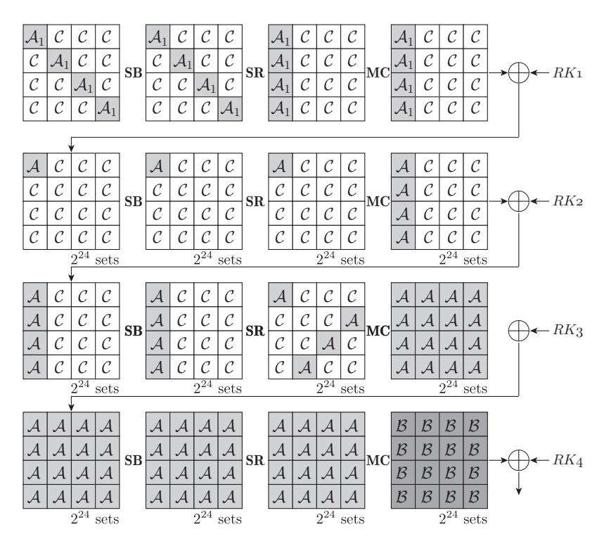
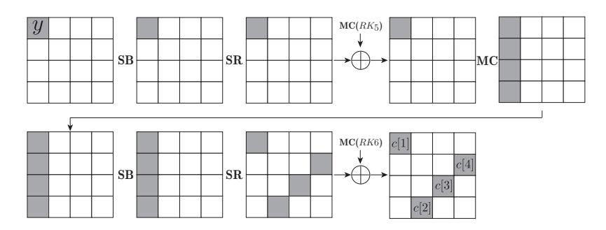
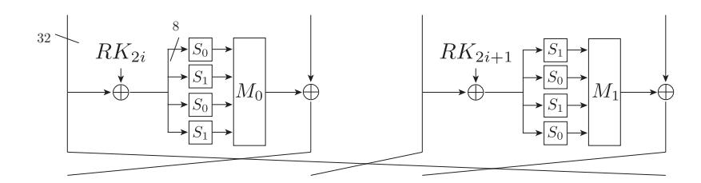
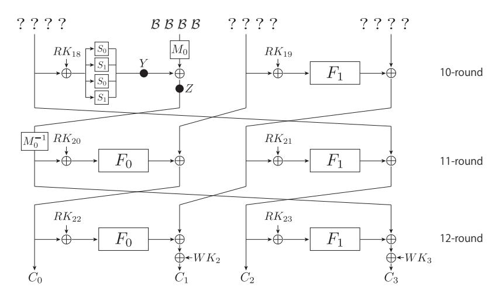

# FFT-Based Key Recovery for the Integral Attack

## Yosuke Todo

NTT Secure Platform Laboratories

Abstract. The integral attack is one of the most powerful attack against block ciphers. In this paper, we propose two new techniques for the integral attack, the FFT technique and the key concealment technique. The FFT technique is useful for the integral attack with enormous chosen plaintexts. As the previous result using FFT, Collard et al. showed a new technique which reduces the complexity for the linear attack. In this paper, we review the result of Collard et al. to estimate the complexity in detail, and we show the complexity can be estimated from the number of times using the addition of integers. Moreover, we show that attacks using FFT can be applied to the integral attack. As applications, we show integral attacks against AES and CLEFIA. For AES, we show that 6-round AES can be attacked with about 251.7 additions. For CLEFIA, we show that 12-round CLEFIA can be attacked with about 2 86.9 additions.

Keywords: Block cipher, Integral attack, Fast Fourier Transform, AES, CLEFIA

# 1 Introduction

Block ciphers have round functions which are key-dependent nonlinear bijective functions, and block ciphers are constructed by performing round functions iteratively. The integral attack is one of the most powerful attack against block ciphers, and it was firstly proposed by Daemen et al. to evaluate the security of Square [4]. Thereafter, Knudsen and Wagner formulated the attack of Daemen et al. as the integral attack [8]. The integral attack consists of the distinguisher and the key recovery. For the distinguisher, we prepare N chosen plaintexts, and get N corresponding R-round intermediate texts which are calculated from plaintexts by encrypting R rounds. When the block cipher has the R-round integral distinguisher, we can distinguish the XOR of N intermediate texts from that of N random texts. In order to create the distinguisher, we often use three integral properties, the All(A)-property, the Balance(B)-property and the Constant(C)-property. We attack R + r-round block ciphers by using the R-round integral distinguisher. We first prepare chosen plaintexts for the integral distinguisher, and get corresponding ciphertexts. Next we recover Rround intermediate texts by guessing round keys used in the last r rounds. If the guessing key is wrong, intermediate texts behave as random texts. On the other hand, if the guessing key is correct, intermediate texts have the integral property. Then we can recover the correct round key.

Several improving techniques for the integral attack have been proposed. In particular, there exist improving techniques for the key recovery, e.g., the partial-sum technique [6] and the meetin-the-middle (MITM) technique [13]. The partial-sum technique was proposed by Ferguson et al. in 2000. Generally, the integral attack uses enormous chosen plaintexts. For instance, when the integral attack uses 2n chosen plaintexts and recovers the k-bit key, it needs 2k+n time complexity. We can reduces the complexity by using the partial-sum technique in which we partially compute the sum by guessing each key one after another. Ferguson et al. applied the technique to AES [11], and showed that 6-round AES is attacked with 6 × 2 50 S-box lookups. The MITM technique was proposed by Sasaki et al. in 2012. By using this technique, we can reduce the complexity of the integral attack against several Feistel ciphers. Now we evaluate L(x ⊕ y) = 0, where x and y are

Table 1. The comparison of attack results.

| Target cipher # round Data |    |                  | Time                        | Techniques                        | Reference |
|----------------------------|----|------------------|-----------------------------|-----------------------------------|-----------|
| AES                        | 6  | 32 CP 6 × 2   | 50 S-box lookups 6 × 2   | Integral (Partial-sum)            | [6]       |
| AES                        | 6  | 32CP 6 × 2    | 51.7 2 additions      | Integral (FFT)                    | Sect. 3.4 |
| CLEFIA                     | 12 | 112 CP 13 × 2 | 106 S-box lookups 13 × 2 | Integral (MITM, Partial-sum) [13] |           |
| CLEFIA                     | 12 | 112 CP 5 × 2  | 86.9 2 additions      | Integral (MITM, FFT)              | Sect. 3.5 |

calculated from ciphertexts by guessing keys. In the MITM technique, we first calculate L L x and y independently, and search keys satisfying Lx = Ly by using the analysis such as the MITM attack [5]. As a result, Sasaki et al. improved integral attacks against LBlock [15], HIGHT [7] and CLEFIA [14].

### 1.1 Our contributions

In this paper, we propose new improving techniques for the integral attack, the FFT technique. By using this techniques, we improve integral attacks against AES and CLEFIA. Table 1 shows the comparison of previous and our attacks.

The FFT technique is useful for the integral attack with enormous chosen plaintexts, then the reason to introduce this technique is similar to the reason to introduce the partial-sum technique. However applications of two techniques are a little different, and we discuss the difference in Sect. 3.6. As previous attacks using FFT, there exist two results. First Collard et al. proposed the linear attack using FFT in 2007 [3]. Next Bogdanov et al. proposed the zero correlation attack using FFT in 2013 [2]. In this paper, we review the result of Collard et al. to estimate the complexity in detail. First we use the Fast Walsh-Hadamard Transform instead of FFT. As a result, we show that the complexity can be estimated from the number of times using the addition of integers. The bit length of the addition is at most a double key length, e.g., the bit length of the addition is 256-bit when the bit length of the guessing key is 128-bit. We assume that the complexity of one addition is almost the same as that of one S-box lookup. Moreover, we show that FFT can be applied to the integral attack.

As the application, we first show the integral attack against AES. When we use the FFT technique, 6-round AES can be attacked with about 251.7 additions1 . We next show the integral attack against 12-round CLEFIA. When we use both the FFT technique and the MITM technique, 12-round CLEFIA can be attacked with about 286.9 additions. Then we improve integral attacks against 6-round AES and 12-round CLEFIA.

## 2 Integral Attack

#### 2.1 Integral Distinguisher

We define three major integral properties as follows:

- A-property : all values appear exactly the same number in the set of texts.
- B-property : the XOR of all texts in the set is 0.

1 In [6], Ferguson et al. showed the integral attack against 7-round AES. The complexity of the attack is derived from the preparation of adaptive chosen plaintexts. Then there is no change in the complexity of the integral attack against 7-round AES even if we use the FFT technique.

Fig. 1. The 4-round integral distinguisher of AES.

 $-\mathcal{C}$ -property: the value is fixed to a constant for all texts in the set.

We construct the integral distinguisher by using integral properties. For instance, Fig. 1 shows the 4-round integral distinguisher of AES. In the 1-st round, four values have  $\mathcal{A}_1$ -property, where the concatenation of their four values also have  $\mathcal{A}$ -property. In the distinguisher, we use  $2^{32}$  chosen plaintexts, and the each byte after encrypting 4 rounds has  $\mathcal{B}$ -property.

#### 2.2 Key Recovery

We can recover the key by using the integral distinguisher. For instance, Fig. 2 shows the key recover of the integral attack against 6-round AES. Now we have  $2^{32}$  ciphertexts of 6-round AES, and we know that the value y has  $\mathcal{B}$ -property. Let c[j] be byte data in ciphertexts as Fig. 2, and  $c_n$  denotes the n-th ciphertext. Then the XOR of y is calculated from  $2^{32}$  ciphertexts as follows:

$$\bigoplus_{n=1}^{2^{32}} S_5 \left( S_1(c_n[1] \oplus k_1) \oplus S_2(c_n[2] \oplus k_2) \oplus S_3(c_n[3] \oplus k_3) \oplus S_4(c_n[4] \oplus k_4) \oplus k_5 \right) = 0, \tag{1}$$

where  $S_1, S_2, \ldots, S_5$  are S-boxes, each of which consists of an inverse AES S-box and a multiplication by a field element from the inverse AES MDS matrix. Moreover  $k_1, k_2, k_3$  and  $k_4$  are calculated from  $RK_6$  and  $k_5$  is calculated from  $RK_5$ , then the bit length of guessing key is 40-bit. The analysis takes about  $2^{32+40} = 2^{70}$  time complexity with the straightforward method. However we can reduce the complexity by using the partial-sum technique. In the partial-sum technique, we partially compute the sum by guessing each key one after another. Ferguson *et al.* showed that the analysis takes only  $2^{50}$  S-box lookups.

Fig. 2. The integral attack against 6-round AES.

## 3 FFT Technique

In this section, we show a new technique for the integral attack, the FFT technique. In Sect. 3.1, we show the previous attack using FFT which was proposed by Collard et al. in 2007. Their attack can reduce the complexity of the linear attack, but "the complexity 1" of their attack is difficult from that of classical attacks. In classical attacks, we estimate the complexity from the number of times using S-box lookups or encryptions. However, in the attack using FFT, we estimate the complexity from the computational complexity of FFT. Then we can not compare classical attacks and attacks using FFT simply. In Sect. 3.2, we review the result of Collard et al. to estimate the complexity in detail. As a result, we show how to compare two attacks. In Sect. 3.3, we show that attacks using FFT can be applied to the integral attack. As applications, we show integral attacks against AES and CLEFIA in Sect. 3.4 and Sect. 3.5, respectively. Finally we compare the FFT technique and the partial-sum technique in Sect. 3.6.

#### 3.1 Previous Works about FFT

As the previous attack using FFT, Collard *et al.* showed a linear attack using FFT in 2007. In the key recovery of the linear attack [10], for any k-bit key rk, we often evaluate the following equation:

$$\sum_{n=1}^{N} f(c_n \oplus rk), \tag{2}$$

where  $f: \mathbb{F}_2^k \to \mathbb{F}_2$  be a boolean function. We have N ciphertexts  $c_1, c_2, \ldots, c_N$ , and the boolean function f is generated from the linear approximate equation. The evaluation of Eq. (2) takes  $N2^k$  time complexity with the straightforward method, and the size of N is generally enormous (i.e.  $N > 2^k$ ). Collard *et al.* showed that the evaluation of Eq. (2) takes about  $3k2^k$  time complexity by using FFT.

First we create two k-dimensional vectors v and w, where v is generated from the boolean function f and w is generated from the set of ciphertexts as follows:

$$v_i = f(i),$$

 $w_i = \#\{1 \le n \le N | c_n = i\}.$

Next we calculate a k-dimensional vector u from v and w as follows:

$$\begin{bmatrix} u_0 \\ u_1 \\ u_2 \\ \vdots \\ u_{2^{k}-1} \end{bmatrix} = \begin{bmatrix} v_0 & v_1 & v_2 & \cdots & v_{2^{k}-1} \\ v_1 & v_0 & v_3 & \cdots & v_{2^{k}-2} \\ v_2 & v_3 & v_0 & \cdots & v_{2^{k}-3} \\ \vdots & \vdots & \vdots & \ddots & \vdots \\ v_{2^{k}-1} & v_{2^{k}-2} & v_{2^{k}-3} & \cdots & v_0 \end{bmatrix} \begin{bmatrix} w_0 \\ w_1 \\ w_2 \\ \vdots \\ w_{2^{k}-1} \end{bmatrix}.$$
(3)

Then  $u_{rk}$  is the same as the result of Eq. (2). Now we want to calculate Eq. (3) fast, then Collard et al. paid attention to the structure of the matrix and showed that Eq. (3) can be calculated fast by using FFT. We first calculate k-dimensional vectors  $\hat{v}$  and  $\hat{w}$  from v and w by using FFT, respectively. Next we calculate a k-dimensional vector  $\hat{u}$  that  $\hat{u}_i$  is calculated from  $\hat{v}_i \times \hat{w}_i$ . Finally we calculate a k-dimensional vector u from  $\hat{u}$  by using the inverse FFT (IFFT). Each complexity of FFT and IFFT is  $k2^k$ . We calculate two FFTs and one IFFT to calculate u. Then the total complexity is  $3k2^k$ .

## 3.2 Evaluation of the Complexity

We review the result of Collard *et al.* to estimate the complexity in detail. As a result, we show that the complexity can be estimated from the number of times using the addition of integers when we use the Fast Walsh-Hadamard Transform (FWHT) instead of FFT. Now we express Eq. (3) as  $u = \mathbf{V} \times w$  simply. First we create four  $2^{k-1}$ -dimensional block matrices  $V_{1,1}$ ,  $V_{1,2}$ ,  $V_{2,1}$  and  $V_{2,2}$  as follows:

$$\boldsymbol{V} = \begin{bmatrix} \boldsymbol{V}_{1,1} & \boldsymbol{V}_{1,2} \ \boldsymbol{V}_{2,1} & \boldsymbol{V}_{2,2} \end{bmatrix},$$

where  $V_{1,1} = V_{2,2}$  and  $V_{1,2} = V_{2,1}$  are satisfied. From the diagonalization of  $\mathbf{V}$ , we have

$$\boldsymbol{V} = \begin{bmatrix} \boldsymbol{V}_{1,1} & \boldsymbol{V}_{1,2} \\ \boldsymbol{V}_{1,2} & \boldsymbol{V}_{1,1} \end{bmatrix} = \frac{1}{2} \begin{bmatrix} \boldsymbol{I} & \boldsymbol{I} \\ \boldsymbol{I} - \boldsymbol{I} \end{bmatrix} \begin{bmatrix} \boldsymbol{V}_{1,1} + \boldsymbol{V}_{1,2} & \boldsymbol{0} \\ \boldsymbol{0} & \boldsymbol{V}_{1,1} - \boldsymbol{V}_{1,2} \end{bmatrix} \begin{bmatrix} \boldsymbol{I} & \boldsymbol{I} \\ \boldsymbol{I} - \boldsymbol{I} \end{bmatrix}.$$

Since structures of  $V_{1,1} + V_{1,2}$  and  $V_{1,1} - V_{1,2}$  are the same as that of V, we can get the following equation:

$$V = \frac{1}{2^k} \times H_{2^k} \times \operatorname{diag}(H_{2^k}v) \times H_{2^k},$$

where  $H_{2^k}$  is the  $2^k$ -dimensional walsh matrix. Then we can express Eq. (3) as follows:

$$u = \boldsymbol{V} \times w = \frac{1}{2^k} \boldsymbol{H}_{2^k} \times \operatorname{diag}(\boldsymbol{H}_{2^k} v) \times \boldsymbol{H}_{2^k} w.$$

Then the procedure to calculate u is as follows:

- 1. We calculate  $\hat{v} = \mathbf{H}_{2k}v$ . Then we can express Eq. (3) as  $u = \frac{1}{2^k}\mathbf{H}_{2^k} \times \operatorname{diag}(\hat{v}) \times \mathbf{H}_{2^k}w$ .
- 2. We calculate  $\hat{w} = \mathbf{H}_{2k}w$ . Then we can express Eq. (3) as  $u = \frac{1}{2^k}\mathbf{H}_{2^k} \times \operatorname{diag}(\hat{v})\hat{w}$ .
- 3. We calculate  $\hat{u}$  that  $\hat{u}_i$  is calculated from  $\hat{v}_i \times \hat{w}$ . Then we can express Eq. (3) as  $u = \frac{1}{2^k} \mathbf{H}_{2^k} \hat{u}$ .
- 4. We calculate  $u = \frac{1}{2^k} \mathbf{H}_{2k} \hat{u}$ .

In the 1-st, 2-nd and 3-rd steps, we calculate the multiplication of the walsh matrix using FWHT. We can calculate FWHT with k2 k additions. Moreover we can calculate the division of a power of 2 fast. Then each complexity of the 1-st, 2-nd and 4-th step is k2 k additions. In the 3-rd step, we calculate 2k multiplications of k-bit integers, and we think that the complexity is equal to the complexity of k additions. Then the complexity of the 3-rd step is k2 k additions. Therefore the detailed complexity for attack using FFT is 4k2 k additions. It is difficult to compare the complexity of one addition and that of one S-box lookup simply. However, the bit length of the addition is at most a double key length, then we assume that the complexity of one addition is almost the same as that of one S-box lookup. Hereafter we do not distinguish FFT with FWHT, and FFT represents FWHT.

#### 3.3 How to Apply FFT to the Integral Attack

We can apply FFT to other attack. Bogdanov et al. showed a zero correlation attack using FFT in 2013 [2]. In this paper, we show that FFT can be applied to the integral attack. We assume the key recovery using B-property, namely, the key recovery can be expressed in the following equation:

$$\bigoplus_{n=1}^{N} F_{rk_2}(F(c_n \oplus rk_1)) = 0,$$

where F is a function from F k1 2 to F k1 2 , Frk2 is a function from F k1 2 to F ` 2 depending on rk2. rk1 denotes the k1-bit key and rk2 denotes the k2-bit key. This equation is always satisfied when rk1 and rk2 are correct. However the probability satisfying this equation is 2−` when rk1 and rk2 are wrong.

To apply FFT, the summation must be calculated on integers. Then we have the following equation:

$$\left(\sum_{n=1}^{N} F_{rk_2}^{(j)}(F(c_n \oplus rk_1))\right) = 0 \mod 2,\tag{4}$$

where F (j) rk2 is a boolean function whose output is the j-th bit of Frk2 . The probability satisfying this equation is 2−1 when rk1 and rk2 are wrong. We evaluate Eq.(4) by using FFT. Our analysis consists of 3 steps, the circuit evaluation step, the ciphertexts evaluation step and the key recovery step.

- The circuit evaluation step. We evaluate the circuit, namely, we create v and calculate ˆv using FFT. This step does not depend on sets of ciphertexts and the key, then we can execute this step in advance.
- The ciphertexts evaluation step. We evaluate sets of ciphertexts, namely, we create w and calculate ˆw using FFT.
- The key recovery step. We calculate ˆu from ˆv and ˆw, and calculate u using FFT. Finally we recover the key from u.

Roughly, we can estimate that the complexity to execute the FFT technique is ` × k1 × 2 k1+k2 , but the estimation of the detailed complexity is complicated. For integral attacks against AES and CLEFIA, we estimate the detailed complexity in Sect. 3.4 and Sect. 3.5.

#### 3.4 Application to AES

**Apply the FFT Technique** We apply the FFT technique to the key recovery of 6-round AES. Since the summation must be calculated on integers, we transform Eq. 1 to the following equation:

$$\sum_{n=1}^{2^{32}} S_5^{(i)} \left( S_1(c_n[1] \oplus k_1) \oplus S_2(c_n[2] \oplus k_2) \oplus S_3(c_n[3] \oplus k_3) \oplus S_4(c_n[4] \oplus k_4) \oplus k_5 \right)$$

$$= \sum_{n=1}^{2^{32}} F_{k_5}^{(i)} \left( F(c_n \oplus k_1 || k_2 || k_3 || k_4) \right),$$

where F is a function from  $\mathbb{F}_2^{32}$  to  $\mathbb{F}_2^{32}$ , and  $F_{rk_5}$  is a function from  $\mathbb{F}_2^{32}$  to  $\mathbb{F}_2^{8}$  depending on  $k_5$ . Since the output of  $F_{k_5}$  is an 8-bit, i is chosen from  $1, 2, \dots 8$ .

The circuit evaluation step We first create a  $2^8 \times 2^{32}$ -dimensional vector T. For any  $k_5$ ,  $T_{k_5}$  is created as follows:

$$T_{k_5} = [F_{k_5}(F(0)), F_{k_5}(F(1)), \dots, F_{k_5}(F(2^{32} - 1))].$$

Moreover, we create  $2^{32}$ -dimensional vectors  $v^{(i)}$  from  $T_{k_5}$  as follows:

$$v_{k_5}^{(i)} = [T_{k_5,0}^{(i)}, T_{k_5,1}^{(i)}, \dots, T_{k_5,2^{32}-1}^{(i)}],$$

where  $T_{k_5,j}^{(i)}$  denotes *i*-th bit of  $T_{k_5,j}$ . Finally we calculate  $\hat{v}_{k_5}^{(i)}$  for any  $k_5$  and any *i* by using FFT. The dominant complexity of this step is a calculation of FFT. Since  $k_5$  is an 8-bit and *i* is chosen from  $1, 2, \ldots, 8$ , the complexity is  $2^8 \times 8 \times 32 \times 2^{32} = 2^{48}$  additions.

The ciphertexts evaluation step We count how many times each value of 4-byte c appears, and create a  $2^{32}$ -dimensional vector w. When the number of c satisfying c = j is even,  $w_j$  is 0. When the number of c satisfying c = j is odd,  $w_j$  is 1. Next we calculate  $\hat{w}$  by using FFT. The complexity of this step is  $32 \times 2^{32} = 2^{37}$  additions, and it is negligible.

The key recovery step We calculate  $2^{32}$ -dimensional vectors  $\hat{u}_{k_5}^{(i)}$  from  $\hat{v}_{k_5}^{(i)}$  and  $\hat{w}$ . Next we calculate  $u_{k_5}^{(i)}$  by using FFT. When  $k_5$  is correct,  $u_{k_5}^{(i)}[k_1||k_2||k_3||k_4]=0$  mod 2 holds for all i. Since  $k_5$  is an 8-bit key and i is chosen from  $1,2,\ldots,8$ , the complexity to calculate  $\hat{u}$  is  $2^8\times8\times2^{32}$  32-bit multiplications (=  $2^{48}$  additions). Moreover the complexity to calculate u is  $2^8\times8\times32\times2^{32}=2^{48}$  additions. Then the complexity of this step is  $2^{49}$  additions.

The total complexity Ferguson *et al.* used 6 sets to recover 5 keys. We also use 6 sets. Since the circuit evaluation step does not depend on sets of ciphertexts and the key, we repeat the ciphertexts evaluation step and the key recovery step 6 times. Then the total complexity is about  $2^{48} + 6 \times 2^{49} \approx 2^{51.7}$  additions.

Fig. 3. The round function of CLEFIA.

#### 3.5 Application to CLEFIA

**CLEFIA** CLEFIA is a 128-bit block cipher which was proposed by Shirai *et al.* in 2007, and it has the 4-branch generalized Feistel network. CLEFIA is adopted as an ISO standard. The round function is defined as Fig. 3, and an *i*-round intermediate text is calculated from an i-1-round intermediate text,  $RK_{2i-2}$  and  $RK_{2i-1}$ . For the 128-bit security version, the number of round is 18.

In the proposal of CLEFIA, Shirai et al. showed that CLEFIA has an 8-round integral distinguisher [1]. Next, Li et al. showed that CLEFIA has a 9-round integral distinguisher [9] which needs  $2^{112}$  chosen plaintexts. Moreover they showed that the integral attack can attack 12-round CLEFIA. Sasaki and Wang showed the MITM technique and improved the complexity for the attack against 12-round CLEFIA to  $13 \times 2^{106}$  S-box lookups.

**Apply the FFT Technique** We show the integral attack using FFT against 12-round CLEFIA. First we define several values and functions. Let  $C_1$ ,  $C_2$ ,  $C_3$  and  $C_4$  be ciphertexts and each value is a 32-bit (see Fig. 4). For any 32-bit data X, X[i] denotes the i-th byte of X, namely, X = X[1]||X[2]||X[3]||X[4]. We define function  $f_i: \mathbb{F}_2^{32} \to \mathbb{F}_2^8$  and  $m_i: \mathbb{F}_2^{32} \to \mathbb{F}_2^8$  as follows:

$$F_1(X) = f_1(X) \| f_2(X) \| f_3(X) \| f_4(X),$$

$$M_0^{-1}(X) = m_1(X) \| m_2(X) \| m_3(X) \| m_4(X).$$

For any function f, we define a boolean function  $f^{(i)}(X)$  whose output is calculated from i-th bit of f(X). For any data x,  $x^{(i)}$  denotes the i-th bit of x.

Our attack uses the 9-round integral distinguisher where the 2-nd branch of the 9-round intermediate text has  $\mathcal{B}$ -property. First we apply the MITM technique. We move the position of  $M_0$  in 10-round  $F_0$  as Fig. 4. From the distinguisher, we have  $\bigoplus Y = \bigoplus Z$ , and each 1-st byte is calculated as follows:

$$\bigoplus Y[1] = \bigoplus S_0(f_1(F_0(C_0 \oplus RK_{22}) \oplus C_1 \oplus RK_{21} \oplus WK_2) \oplus C_2[1] \oplus RK_{18}[1]),$$

$$\bigoplus Z[1] = \bigoplus m_1(F_1(C_2 \oplus RK_{23}) \oplus C_3).$$

 $\bigoplus Y[1] = \bigoplus Z[1]$  is satisfied for correct  $RK_{18}$ ,  $RK_{21} \oplus WK_2$ ,  $RK_{22}$  and  $RK_{23}$ . The probability satisfying  $\bigoplus Y[1] = \bigoplus Z[1]$  is  $2^{-8}$  for wrong keys, and we can discard wrong keys fast by using the MITM technique.

In order to apply the FFT technique, we transform the above equation to the following equation:

$$\sum Y[1]^{(i)} = \sum S_0^{(i)}(f_1(F_0(C_0 \oplus RK_{22}) \oplus C_1 \oplus RK_{21} \oplus WK_2) \oplus C_2[1] \oplus RK_{18}[1]),$$

$$\sum Z[1]^{(i)} = \sum m_1^{(i)}(F_1(C_2 \oplus RK_{23}) \oplus C_3).$$

Fig. 4. The key recovery of 12-round CLEFIA.

For correct  $RK_{18}$ ,  $RK_{21} \oplus WK_2$ ,  $RK_{22}$  and  $RK_{23}$ ,  $\sum Y[1]^{(i)} = \sum Z[1]^{(i)}$  (mod 2) is satisfied for all i. The probability satisfying  $\sum Y[1]^{(i)} = \sum Z[1]^{(i)}$  (mod 2) is  $2^{-1}$  for wrong keys, and we can discard wrong keys fast by using the MITM technique. Similarly we can discard wrong keys by using equations which are created from (Y[2], Z[2]), (Y[3], Z[3]) and (Y[4], Z[4]).

The circuit evaluation step We first create a  $2^{72}$ -dimensional vector T and a  $2^{32}$ -dimensional vector T' as follows:

$$T = [S_0(f_1(F_0(0) \oplus 0) \oplus 0), S_0(f_1(F_0(0) \oplus 0) \oplus 1), \dots, S_0(f_1(F_0(2^{32} - 1) \oplus 2^{32} - 1) \oplus 2^8 - 1)],$$

$$T' = [F_1(0), F_1(1), \dots, F_1(2^{32} - 1)].$$

Next we create  $2^{72}$ -dimensional vectors  $v_i$  and  $2^{32}$ -dimensional vectors  $v'^{(i)}$  as follows:

$$v^{(i)} = [T_0^{(i)}, T_1^{(i)}, \dots, T_{2^{72}-1}^{(i)}], \quad v'^{(i)} = [T_0'^{(i)}, T_1'^{(i)}, \dots, T_{2^{32}-1}'^{(i)}].$$

Finally we calculate  $\hat{v}^{(i)}$  and  $\hat{v}'^{(i)}$  by using FFT. The complexity to calculate  $\hat{v}^{(i)}$  is  $8\times72\times2^{72}\approx2^{81.2}$  additions because i is chosen from  $1,2,\ldots,8$ . The complexity to calculate  $\hat{v}'^{(i)}$  is  $8\times32\times2^{32}$  additions, and it is negligible. Similarly we calculate  $\hat{v}^{(i)}$  and  $\hat{v}'^{(i)}$  which are created from (Y[2],Z[2]), (Y[3],Z[3]) and (Y[4],Z[4]), then the total complexity is  $4\times2^{81.2}=2^{83.2}$  additions.

The ciphertexts evaluation step We count how many times each value of 9-byte tuple  $(C_0, C_1, C_2[1])$  appears, and create a  $2^{72}$ -dimensional vector w. Similarly we count how many times each value of 4-byte  $C_2$  appears, and create a  $2^{32}$ -dimensional vector w'. Moreover we calculate  $\bigoplus m_1(C_3)$ . Next we calculate  $\hat{w}$  and  $\hat{w}'$  by using FFT. The complexity to calculate  $\hat{w}$  is  $72 \times 2^{72} \approx 2^{78.2}$  additions. The complexity to calculate  $\hat{w}'$  is  $32 \times 2^{32}$  additions, and it is negligible. Similarly we calculate  $\hat{w}$  and  $\hat{w}'$  which are created from (Y[2], Z[2]), (Y[3], Z[3]) and (Y[4], Z[4]), then the total complexity is  $4 \times 2^{78.2} = 2^{80.2}$  additions.

The key recovery step We calculate  $2^{72}$ -dimensional vectors  $\hat{u}^{(i)}$  from  $\hat{v}^{(i)}$  and  $\hat{w}$ , and calculate  $u^{(i)}$  by using FFT. Next we calculate  $2^{32}$ -dimensional vectors  $\hat{u}'^{(i)}$  from  $\hat{v}'^{(i)}$  and  $\hat{w}'$ , and calculate

 $u^{\prime(i)}$  by using FFT. For the correct RK18, RK21, RK22 and RK23,

$$u^{(i)}[RK22||RK21||RK18[1]] = u'^{(i)}[RK23] + \bigoplus m_1^{(i)}(C_3) \mod 2$$
 (5)

is satisfied for all i. However for wrong keys, the probability satisfying Eq.(5) is  $2^{-1}$ . Since i is chosen from 1, 2, ..., 8, the complexity to calculate  $\hat{u}^{(i)}$  is  $8 \times 2^{72}$  72-bit multiplications ( $\approx 2^{81.2}$  additions). The complexity to calculate  $u^{(i)}$  is  $8 \times 72 \times 2^{72} \approx 2^{81.2}$  additions. Since the complexity for other operations is negligible, the complexity to evaluate Eq.(5) is about  $2^{82.2}$  additions. Similarly we discard wrong keys by evaluating Eq.(5) which is created from (Y[2], Z[2]), (Y[3], Z[3]) and (Y[4], Z[4]). Then the total complexity is  $4 \times 2^{82.2} = 2^{84.4}$  additions.

The total complexity By using one set, the probability that wrong keys remain is  $2^{-32}$  because Y and Z are a 32-bit. In order to recover the 128-bit key RK18,  $RK21 \oplus WK_2$ , RK22 and RK23, we use 5 sets. Since the circuit evaluation step does not depend on sets of ciphertexts and the key, we repeat the ciphertexts evaluation step and the key recovery step 5 times. Then the total complexity is about  $2^{83.2} + 5(2^{80.2} + 2^{84.4}) \approx 2^{86.9}$  additions.

#### 3.6 Comparison between FFT Technique and Partial-sum Technique

We compare the partial-sum technique and the FFT technique. In the partial-sum technique, we estimate the complexity from the number of times using S-box lookups, and we must access random access memories. On the other hand, in the FFT technique, we estimate the complexity from the number of additions, and we access mainly sequential access memories. Since the access to sequential access memories is more efficient than that to random access memories, we think that the FFT technique is more efficient than the partial-sum technique if the complexity is the same. However we have an open problem about the FFT technique. Since round keys of block ciphers are calculated from the secret key, we can know some bits of round keys when we guess some bits of the secret key. In the partial-sum technique, attackers can exploit the property and reduce the complexity efficiently. For instance, the integral attack against 22-round LBlock exploits this property [12]. On the other hand, in the FFT technique, we do not know how to exploit this property.

#### 4 Conclusion

In this paper, we show new techniques for the integral attack, the FFT technique. This technique is useful for the integral attack with enormous chosen texts. In order to estimate the complexity of the FFT technique, we review the Collard's paper. Then we show the complexity can be estimated from the number of times using the addition of integers. As applications, we show that 4-round AES can be attacked with  $2^{51.7}$  additions, and 12-round CLEFIA can be attacked with  $2^{86.9}$  additions.

#### References

- 1. The 128-bit Blockcipher CLEFIA Security and Performance Evaluations. Sony Corporation (2007)
- 2. Bogdanov, A., Geng, H., Wang, M., Wen, L., Collard, B.: Zero-Correlation Linear Cryptanalysis with FFT and Improved Attacks on ISO Standards Camellia and CLEFIA. In: SAC (2013)
- 3. Collard, B., Standaert, F.X., Quisquater, J.J.: Improving the Time Complexity of Matsui's Linear Cryptanalysis. In: ICISC. LNCS, vol. 4817, pp. 77–88 (2007)

- 4. Daemen, J., Knudsen, L.R., Rijmen, V.: The Block Cipher Square. In: FSE. LNCS, vol. 1267, pp. 149–165 (1997)
- 5. Diffie, W., Hellman, M.E.: Exhaustive cryptanalysis of the NBS Data Encryption Standard. Computer 10, 74–84 (1977)
- 6. Ferguson, N., Kelsey, J., Lucks, S., Schneier, B., Stay, M., Wagner, D., Whiting, D.: Improved Cryptanalysis of Rijndael. In: FSE. LNCS, vol. 1978, pp. 213–230 (2000)
- 7. Hong, D., Sung, J., Hong, S., Lim, J., Lee, S., Koo, B., Lee, C., Chang, D., Lee, J., Jeong, K., Kim, H., Kim, J., Chee, S.: HIGHT: A New Block Cipher Suitable for Low-Resource Device. In: CHES. LNCS, vol. 4249, pp. 46–59 (2006)
- 8. Knudsen, L.R., Wagner, D.: Integral Cryptanalysis. In: FSE. LNCS, vol. 2365, pp. 112–127 (2002)
- 9. Li, Y., Wu, W., Zhang, L.: Improved Integral Attacks on Reduced-Round CLEFIA Block Cipher. In: WISA. LNCS, vol. 7115, pp. 28–39 (2011)
- 10. Matsui, M.: Linear Cryptoanalysis Method for DES Cipher. In: EUROCRYPT. LNCS, vol. 765, pp. 386–397 (1993)
- 11. National Institute of Standards and Technology: Specification for the ADVANCED ENCRYPTION STANDARD (AES). Federal Information Processing Standards Publication 197 (2001)
- 12. Sasaki, Y., Wang, L.: Comprehensive Study of Integral Analysis on 22-Round LBlock. In: ICISC. LNCS, vol. 7839, pp. 156–169 (2012a)
- 13. Sasaki, Y., Wang, L.: Meet-in-the-Middle Technique for Integral Attacks against Feistel Ciphers. In: SAC. LNCS, vol. 7707, pp. 234–251 (2012b)
- 14. Shirai, T., Shibutani, K., Akishita, T., Moriai, S., Iwata, T.: The 128-Bit Blockcipher CLEFIA (Extended Abstract). In: FSE. LNCS, vol. 4593, pp. 181–195 (2007)
- 15. Wu, W., Zhang, L.: LBlock: A Lightweight Block Cipher. In: ACNS. LNCS, vol. 6715, pp. 327–344 (2011)