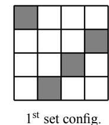
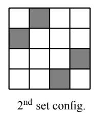
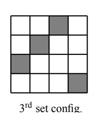
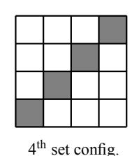
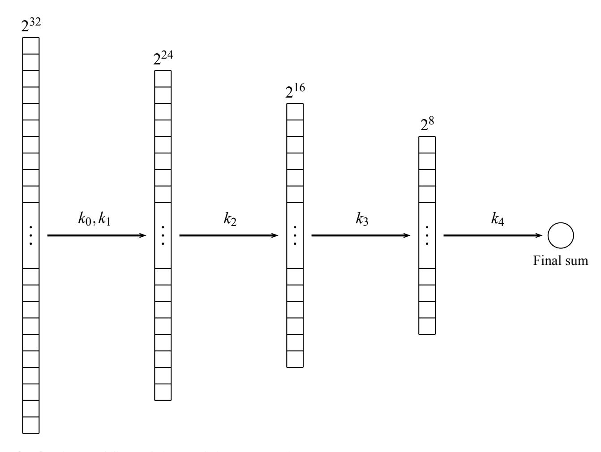
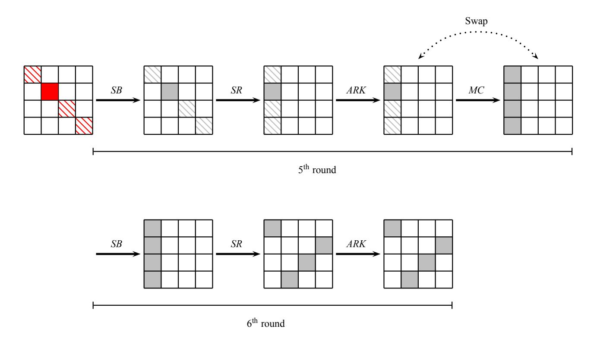

{0}------------------------------------------------

# Implementation and Improvement of the Partial Sum Attack on 6-round AES

Francesco Alda, Riccardo Aragona, Lorenzo Nicolodi, and Massimiliano Sala `

Abstract The Partial Sum Attack is one of the most powerful attacks, independent of the key schedule, developed in the last 15 years against reduced-round versions of AES. In this paper, we introduce a slight improvement to the basic attack which lowers the number of chosen plaintexts needed to successfully mount it. Our version of the attack on 6-round AES can be carried out completely in practice, as we demonstrate providing a full implementation. We also detail the structure of our implementation, showing the performances we achieve.

# 1 Introduction

The research on the cryptanalysis of block ciphers partly deals with studying and proposing attacks on their reduced-round versions. Results on reduced versions are very interesting, since they help to better understand the behavior of a cipher, pointing out weaknesses in its structure which can eventually lead to attacks on the full version or characterize the security margin of the cipher.

In 2000, Ferguson et al. [5] introduced one of the most effective attacks, independent of the key schedule, developed in the last 15 years against reduced-round

Francesco Alda`

Horst Gortz Institute for IT Security and Faculty of Mathematics, Ruhr-Universit ¨ at Bochum, Uni- ¨ versitatsstraße 150, 44801 Bochum, Germany, e-mail: francesco.alda@rub.de ¨

Riccardo Aragona

Department of Mathematics, University of Trento, via Sommarive 14, 38123 Povo (Trento), Italy, e-mail: riccardo.aragona@unitn.it

Lorenzo Nicolodi

Independent researcher, e-mail: lo@hidden-bits.com

Massimiliano Sala

Department of Mathematics, University of Trento, via Sommarive 14, 38123 Povo (Trento), Italy, e-mail: maxsalacodes@gmail.com

{1}------------------------------------------------

versions of the Advanced Encryption Standard [3, 4], the *Partial Sum Attack*. Specifically, they developed attacks against AES reduced to 6, 7 and 8 rounds. The attack on 6-round is particularly powerful and its complexity is in the range which is referred to as practicable in the literature. It improves a previous attack which was first described in [3]. The latter is based on *integral cryptanalysis*, a general technique which is applicable to a large class of SPN block ciphers. This technique was originally designed by Lars Knudsen in the paper presenting the block cipher Square [2], as a specific attack against its byte-oriented structure. This is the reason why this class of attacks is commonly known as *Square Attack*. Since AES inherits many properties from Square, this attack can be easily extended to reduced-round versions of the Advanced Encryption Standard.

In this paper, we introduce a slight theoretical improvement to the Partial Sum Attack on 6-round AES which lowers the number of chosen plaintexts needed to successfully mount it, and we describe the structure of our full implementation. After examining the literature which was developed after the publication of [5], we are not aware of any effective implementation of this attack. Therefore, we strongly believe that our implementation is the very first and, mostly, we show that it is completely practicable. Moreover, we believe that our effort allows a deeper understanding of the attack workflow and can point out some other weaknesses neither discovered nor exploited so far.

We would like to underline that a remark similar to the observation which our improvement is based on can be found in [12], although we achieved this result independently. Nevertheless, we believe that our analysis is more careful and detailed. In fact, the hypotheses which lead to this theoretical result are inherently strong, since they require the reduced-round cipher to "behave" like a random permutation. However, the attack we are dealing with strongly exploits the fact that AES can be easily distinguished from a random permutation. Therefore, it was not clear *a priori* whether these properties, or a good approximation of them, were actually satisfied in a real scenario. Thanks to our implementation which exploits the aforementioned improvement, we investigated these assumptions and explored how well the theoretical model describes an actual execution of the attack. In particular, the experimental results show that the number of false positives obtained closely matches that which was expected from the theoretical analysis. For a detailed explanation, we refer to Section 3.2.

The rest of the paper is organized as follows: in Section 2, we briefly introduce the Square Attack and its extensions and we subsequently describe the Partial Sum Attack in detail. In Section 3, we present our main results. First, we explain our slight theoretical improvement, pointing out the issues that its implementation involves. We then detail our implementation and provide the results of our computations. In particular, we achieved to recover a full 6-round key in less than 12 days with 25 cores.

{2}------------------------------------------------

#### 2 Preliminaries

We recall that the encryption process of AES-128, -192 and -256 consists of an initial key addition followed by the application of 10, 12 and 14 round transformations, respectively. The initial key addition and every round transformation take as input an intermediate result, called the *state*, and a round key which is derived from the cipher key through the key schedule. The state is always treated as a  $4 \times 4$  matrix whose coefficients belong to  $\mathbb{F}_{28}$ . The output of any round is another state. The round transformation is a sequence of four processing steps: SubBytes, ShiftRows, MixColumns and AddRoundKey. The SubBytes (SB) step is the only non-linear transformation of the cipher. It is an invertible byte substitution that operates independently on each byte of the state, according to an S-box. The S-box, which is henceforth indicated as  $\gamma$ , consists of the multiplicative patched inversion over  $\mathbb{F}_{2^8}$ , followed by an invertible affine transformation. The ShiftRows (SR) step is a byte transposition that cyclically shifts the rows of the state over different offsets. Specifically, let  $s_{i,j}$  and  $s'_{i,j}$  be the state bytes in position (i, j) before and after the ShiftRows transformation, respectively. Then  $s'_{i,j} = s_{i,(j+i) \mod 4}$  for  $i, j \in \{0, 1, 2, 3\}$ . The *MixColumns (MC)* step is a linear transformation which operates on the state column-by-column, treating each column as a polynomial over  $\mathbb{F}_{2^8}[x]$ . This polynomial is then multiplied modulo  $x^4 + 1$  with the fixed polynomial  $m(x) = (\alpha + 1)x^3 + x^2 + x + \alpha$ , where  $\alpha \in \mathbb{F}_{2^8}$  is such that  $\alpha^8 = \alpha^4 + \alpha^3 + \alpha + 1$ . Finally, in the AddRoundKey (ARK) transformation, the state is bitwise XORed with the corresponding round key. By  $SubBytes^{-1}$ , ShiftRows<sup>-1</sup>, MixColumns<sup>-1</sup> and AddRoundKey<sup>-1</sup>, we denote the inverses of the aforementioned steps. The final round differs from the others since the MixColumns step is removed. For further details on the structure of AES, we refer to [3, 4].

In the following sections, we first give an overview on the Square Attack on 4-round AES and we briefly introduce its extensions. We then describe the Partial Sum Attack in detail.

### 2.1 Square Attack

The Square Attack is a chosen plaintext attack, which is independent of the specific choices of the S-box of the *SubBytes* function, the multiplication polynomial of the *MixColumns* transformation and the key schedule. For the sake of clarity, however, we will often refer to the specific parameters used in AES.

In order to explain how this attack can be performed, we first introduce the following definition.

**Definition 1.** A  $\Delta$ -set is a set of 256 AES states that differ in one of the state bytes (called *active* byte) and are equal in the other state bytes (called *passive* bytes). In other words, if U is a  $\Delta$ -set, for every  $x, y \in U$  we have

{3}------------------------------------------------

$$\begin{cases} x_{i,j} \neq y_{i,j} & \text{if } (i,j) \text{ is active} \\ x_{i,j} = y_{i,j} & \text{if } (i,j) \text{ is passive} \end{cases}$$

where  $i, j \in \{0, 1, 2, 3\}$ .

As it is explained in [4], the Square Attack on 4-round AES is heavily based on the following property.

**Proposition 1.** Let  $b_{i,j}^{(l)}$  be the byte in position (i,j),  $i,j \in \{0,1,2,3\}$ , of the  $l^{th}$  state of a  $\Delta$ -set after three rounds. Then

$$\sum_{l=1}^{256} b_{i,j}^{(l)} = 0. (1)$$

In other words, the states at the end of the third round are *balanced*, i.e. all bytes at the input of the fourth round sum to zero. Note that the initial key addition is implicitly assumed and not counted in the number of rounds.

Let us consider a 4-round reduced AES, in which the fourth round is a final round, i.e. it does not include MixColumns. This implies that every byte of the ciphertext only depends on one byte of the input of the fourth round. The Square Attack on 4-round AES can then be mounted as follows. For any  $l^{th}$  state of a  $\Delta$ -set,  $1 \le l \le 256$ , let  $c_{i,j}^{(l)}$ , where  $i, j \in \{0,1,2,3\}$ , be the ciphertext byte in position (i,j). Let  $k_{i,j}^{(4)}$  be a guess for the byte in position (i,j) of the  $4^{th}$  round key (which is the last key used). For any (i,j), if the value of  $k_{i,j}^{(4)}$  is correct, the following equation holds:

$$\sum_{l=1}^{256} \gamma^{-1} \left( c_{i,j}^{(l)} + k_{i,j}^{(4)} \right) = \sum_{l=1}^{256} b_{i,(j+i) \bmod 4}^{(l)} = 0, \tag{2}$$

where  $b_{i,j}^{(l)}$  is the byte in position (i,j) of the  $l^{\text{th}}$  state of a  $\Delta$ -set after the application of three rounds, and  $\gamma^{-1}$  is the S-box of  $SubBytes^{-1}$ .

If Equation (2) does not hold, the assumed value for the key byte must be wrong. This check is expected to eliminate all wrong key bytes, except for one value that could satisfy (2) by chance. To be more precise, the following result holds.

**Proposition 2.** If  $(X^{(l)})_{1 \le l \le 256}$  is a sequence of independent uniformly distributed random variables with values in  $\mathbb{F}_{2^8}$ , then the probability

$$\mathbb{P}\left[\sum_{l=1}^{256} X^{(l)} = 0\right] = 2^{-8}.$$

*Proof.* Let X and Y be two discrete independent random variables, with density functions  $f_1(x)$  and  $f_2(x)$  respectively. The convolution  $f_3(x) = [f_1 * f_2](x) = \sum_y f_1(y) f_2(x-y)$  is the density function of the random variable Z = X + Y. Since X and Y take values in  $\mathbb{F}_{2^8}$ , their sum Z takes values in  $\mathbb{F}_{2^8}$  too. Therefore, the density function of Z is an uniformly distributed random variable, since it is the circular

{4}------------------------------------------------

convolution of two independent uniformly distributed random variables. This result can be easily extended to the sum of an arbitrary number of random variables.

Before proceeding with the analysis of the attack, we would like to stress that the hypotheses of Proposition 2 are inherently strong. In particular, the bytes of the state at the end of the  $3^{\rm rd}$  round are assumed to be independent and uniformly distributed. Although these are natural assumptions for modeling the attack, it is not clear a priori whether they hold even in practice. We thus performed some tests which aimed to estimate the probability to obtain a zero sum for a random set of 256 plaintexts and for a  $\Delta$ -set at the end of the  $3^{\rm rd}$  round. The values reported in Table 1 were obtained by averaging the estimates we collected using  $2 \cdot 10^4$  random sets and  $2 \cdot 10^4$  different  $\Delta$ -sets, encrypted through an equal number of random keys, respectively.

**Table 1** Estimated probability to obtain a zero sum for a random set of plaintexts and for a  $\Delta$ -set at the end of the  $3^{rd}$  round. Number of trials:  $2 \cdot 10^4$ 

| Random set | $\Delta$ -set |
|------------|---------------|
| 0.003904   | 0.007794      |

As Table 1 shows, the tests we performed give evidence that Proposition 2 well describes the behavior of the cipher even at the end of the  $3^{rd}$  round. As expected, for a random set of 256 plaintexts there exists (on average) only one value which satisfies Equation (2) by chance. In the case of a  $\Delta$ -set, the estimate is roughly 1/128, since both the correct key byte and another random value satisfy (2).

Since checking Equation (2) for a single  $\Delta$ -set is expected to leave only 1 over 256 of the wrong key assumptions as a possible candidate, the 4<sup>th</sup> round key can be found with a sufficiently large confidence using two different  $\Delta$ -sets. Henceforth, this crosscheck will be referred to as *verification step*.

All in all, two  $\Delta$ -sets have to be used, and all 16 bytes of the 4<sup>th</sup> round key need to be recovered. Therefore, the working factor consists of 2<sup>9</sup> encryptions and 2<sup>9</sup> · 2<sup>4</sup> = 2<sup>13</sup> evaluations of Equation (2).

In [4], Daemen et al. describe how this attack can be extended adding one round at the end or one round at the beginning. Combining the basic attack on 4 rounds with both extensions yields the Square Attack on 6-round AES. We can sketch this attack as follows. For the extension by one round at the end, the attacker has to perform a partial decryption of two rounds instead of only one, implying that four more bytes of the final round key need to be guessed. The idea for the extension by one round at the beginning consists of choosing a set of 256 plaintexts which, at the end of the first round, results in a  $\Delta$ -set with a single active byte. This requires to guess four bytes of the initial round key  $k^{(0)}$ . We refer to [4] for further details on these two extensions. In both cases, we need to guess five key bytes instead of one. By combining these two methods, nine bytes need to be guessed.

{5}------------------------------------------------

# 2.2 Partial Sum Attack

Without considering the verification steps, the Square Attack on 6-round AES requires the storage of 2<sup>32</sup> chosen plaintexts and the corresponding ciphertexts. Moreover,  $(2^8)^9 = 2^{72}$  steps are needed for guessing nine key bytes, when it is applied to only recover 4 bytes of the 6th round key. Therefore, it is completely out of reach for current computing resources.

The Partial Sum Attack [5] significantly improves the Square Attack on 6-round AES. Ferguson et al. introduced two main ideas. First, instead of guessing four bytes of the initial round key  $k^{(0)}$ , one can use  $2^{32}$  plaintexts such that one column of the states at the input of MixColumns of the first round ranges over all possible values of  $(\mathbb{F}_{2^8})^4$  and all other bytes are constant. Throughout the rest of the paper, we denote by  $\bar{\Delta}$ -set such a group of  $2^{32}$  plaintexts. For any value of the initial round key, the corresponding ciphertexts consist of 2<sup>24</sup> groups of 2<sup>8</sup> encryptions that vary in a single active byte at the end of the first round. In fact, imposing a particular linear combination which ranges over all possible values of  $\mathbb{F}_{2^8}$  and three other linear combinations which are constant for all 256 states, we can uniquely determine a set of plaintexts which results in a  $\Delta$ -set with a single active byte at the end of the first round. In particular, one has  $2^{24}$  ways to choose the values for these three linear combinations.

Therefore, all an attacker has to do is guess four bytes of the 6<sup>th</sup> round key and one byte of the 5th round key, perform a partial decryption to a single state byte at the end of the 4<sup>th</sup> round, sum this value over all 2<sup>32</sup> encryptions, and check whether the result is zero. Compared to the Square Attack on 6 rounds, the attacker needs to guess 40 bits instead of 72.

The further idea behind the improvement introduced by Ferguson et al. consists in organizing the partial decryption on partial sums. In order to properly understand what partial sums are and how one can use them, we introduce the following notation, where the pair (i, j) is used to denote the state entry (with  $i, j \in \{0, 1, 2, 3\}$ ), and the index l (with  $1 \le l \le 2^{32}$ ) denotes the  $l^{\text{th}}$  element of a  $\bar{\Delta}$ -set:

```
is a byte at the end of the 4<sup>th</sup> round;
```

 $b_{i,j}^{(l)} \\ a_{i,j}^{(l)}$ is a byte of the state at the 5<sup>th</sup> round before the application of *MixColumns*;

 $a_s^{(l)}$ is the  $s^{th}$  column of the  $l^{th}$  state at the  $5^{th}$  round before the application of *MixColumns*. Thus  $a_j^{(l)} = \left(a_{0,j}^{(l)}, a_{1,j}^{(l)}, a_{2,j}^{(l)}, a_{3,j}^{(l)}\right)^\top$ ;

is a byte at the end of the 6<sup>th</sup> round, which we refer to as the ciphertext byte;  $c_{i,j}^{(l)}$ 

is the  $h^{\text{th}}$  round key and  $\bar{k}^{(h)} = MixColumns^{-1}(k^{(h)})$ ;  $k^{(\tilde{h})}$ 

 $\bar{k}_{i,i}^{(h)}$ is a byte of  $\bar{k}^{(h)}$ .

It is easy to show that, in order to compute the partial decryption to a state byte at the end of the 4<sup>th</sup> round, we need to consider four bytes in each ciphertext and guess the corresponding bytes of the 6<sup>th</sup> round key, according to one of the configurations shown in Figure 1. Observe that each configuration has exactly one byte per state row and one byte per state column.

{6}------------------------------------------------









**Fig. 1** The set of 4 bytes of the 6<sup>th</sup> round key (resp. ciphertexts) for the Partial Sum Attack on 6-round AES

In the following computations, with abuse of notation, we denote by Mix- $Columns^{-1}$  and  $SubBytes^{-1}$  the inverse of MixColumns and SubBytes applied to a single column of the state. The relations between the  $a^{(l)}$ 's, the  $c^{(l)}$ 's and the  $k^{(h)}$ 's are easily established:

$$a_{j}^{(l)} = \begin{bmatrix} a_{0,j}^{(l)} \\ a_{1,j}^{(l)} \\ a_{2,j}^{(l)} \\ a_{3,j}^{(l)} \end{bmatrix} = \textit{MixColumns}^{-1} \left( \textit{SubBytes}^{-1} \begin{pmatrix} c_{0,j}^{(l)} + k_{0,j}^{(6)} \\ c_{1,(j-1) \bmod 4}^{(l)} + k_{1,(j-1) \bmod 4}^{(6)} \\ c_{2,(j-2) \bmod 4}^{(l)} + k_{2,(j-2) \bmod 4}^{(6)} \\ c_{3,(j-3) \bmod 4}^{(l)} + k_{3,(j-3) \bmod 4}^{(6)} \end{pmatrix} \right),$$

where  $j \in \{0,1,2,3\}$ . When j is understood, we will remove it; for example we denote

$$\boldsymbol{\xi}^{(l)} = \begin{bmatrix} \boldsymbol{\xi}_0^{(l)} \\ \boldsymbol{\xi}_1^{(l)} \\ \boldsymbol{\xi}_2^{(l)} \\ \boldsymbol{\xi}_3^{(l)} \end{bmatrix} := SubBytes^{-1} \begin{pmatrix} c_{0,j}^{(l)} + k_{0,j}^{(6)} \\ c_{1,(j-1) \bmod 4}^{(l)} + k_{1,(j-1) \bmod 4}^{(6)} \\ c_{2,(j-2) \bmod 4}^{(l)} + k_{2,(j-2) \bmod 4}^{(6)} \\ c_{3,(j-3) \bmod 4}^{(l)} + k_{3,(j-3) \bmod 4}^{(6)} \end{pmatrix},$$

for  $1 \le l \le 2^{32}$ . Let *N* be the byte matrix of *MixColumns*<sup>-1</sup>. Working out the product, we have

$$a_{j}^{(l)} = \begin{bmatrix} N_{0} \cdot \xi_{0}^{(l)} + N_{1} \cdot \xi_{1}^{(l)} + N_{2} \cdot \xi_{2}^{(l)} + N_{3} \cdot \xi_{3}^{(l)} \\ N_{3} \cdot \xi_{0}^{(l)} + N_{0} \cdot \xi_{1}^{(l)} + N_{1} \cdot \xi_{2}^{(l)} + N_{2} \cdot \xi_{3}^{(l)} \\ N_{2} \cdot \xi_{0}^{(l)} + N_{3} \cdot \xi_{1}^{(l)} + N_{0} \cdot \xi_{2}^{(l)} + N_{1} \cdot \xi_{3}^{(l)} \\ N_{1} \cdot \xi_{0}^{(l)} + N_{2} \cdot \xi_{1}^{(l)} + N_{3} \cdot \xi_{2}^{(l)} + N_{0} \cdot \xi_{3}^{(l)} \end{bmatrix},$$

where, in the specific case of AES (see Section 2),

$$N_0 = \alpha^3 + \alpha^2 + \alpha$$

$$N_1 = \alpha^3 + \alpha + 1$$

$$N_2 = \alpha^3 + \alpha^2 + 1$$

$$N_3 = \alpha^3 + 1$$

Thus we can compute a state byte at the end of the 4<sup>th</sup> round as follows:

{7}------------------------------------------------

$$b_{i,(j+i) \bmod 4}^{(l)} = \gamma^{-1} \left( a_{i,j}^{(l)} + \bar{k}_{i,j}^{(5)} \right), \tag{3}$$

where  $i \in \{0,1,2,3\}$  and  $\gamma^{-1}$  is the S-box of  $SubBytes^{-1}$ , as usual. Observe that in (3)  $\gamma^{-1}$  is applied to  $a_{i,j}^{(l)} + \bar{k}_{i,j}^{(5)}$  rather than to  $a_{i,j}^{(l)} + k_{i,j}^{(5)}$ . The latter would be wrong, since  $k_{i,j}^{(5)}$  is added *after* the application of MixColumns.

In order to identify a possible right guess, we have to check if  $\sum_{l=1}^{2^{32}} b_{i,(j+i) \mod 4}^{(l)} = 0$ . This sum can be expressed as

$$\sum_{l=1}^{2^{32}} \gamma^{-1} \left( N_{-i} \cdot \xi_0^{(l)} + N_{1-i} \cdot \xi_1^{(l)} + N_{2-i} \cdot \xi_2^{(l)} + N_{3-i} \cdot \xi_3^{(l)} + \bar{k}_{i,j}^{(5)} \right), \tag{4}$$

where the indices -i, 1-i, 2-i, 3-i are all meant to be reduced modulo 4, giving a remainder in  $\{0,1,2,3\}$ .

If we trivially execute this summation, given  $2^{32}$  ciphertexts and  $2^{40}$  possible key guesses, we have to sum  $2^{72}$  different values, which does not significantly improve the basic Square Attack. As it is pointed out in [5], Expression (4) can be organized in a more efficient manner. Once the row i is fixed, for each  $t \in \{0,1,2,3\}$ , it is possible to associate a partial sum  $x_t^{(l)}$  to each set  $\{\xi_0^{(l)}, \dots, \xi_t^{(l)}\}$ , defined as follows:

$$x_t^{(l)} := \sum_{z=0}^t N_{z-i} \cdot \xi_z^{(l)}.$$

In particular,

$$x_2^{(l)} = x_1^{(l)} + N_{2-i}\xi_2^{(l)}$$
 and  $x_3^{(l)} = x_2^{(l)} + N_{3-i}\xi_3^{(l)}$ .

In order to simplify the notation, let  $(c_0^{(l)}, c_1^{(l)}, c_2^{(l)}, c_3^{(l)})$  be the 4-tuple formed by the  $l^{\text{th}}$  ciphertext's bytes, extracted according to one of the configurations described above. Guessing the key values and using the partial sums, we can define the following maps

$$(c_0^{(l)}, c_1^{(l)}, c_2^{(l)}, c_3^{(l)}) \longmapsto (x_1^{(l)}, c_2^{(l)}, c_3^{(l)}) \longmapsto (x_2^{(l)}, c_3^{(l)}) \longmapsto x_3^{(l)}.$$

Using a similar notation, let  $(k_0, k_1, k_2, k_3)$  be four values for the 6<sup>th</sup> round key, which we want to guess, arranged in the same configuration chosen for the ciphertexts, and let  $k_4$  be a guess for the 5<sup>th</sup> round key byte  $\bar{k}_{i,j}^{(5)}$ . The Partial Sum Attack is organized as follows.

- We start with the list of  $2^{32}$  4-tuples  $(c_0^{(l)}, c_1^{(l)}, c_2^{(l)}, c_3^{(l)})$ . Guessing  $k_0$  and  $k_1$ , we can compute each triple  $(x_1^{(l)}, c_2^{(l)}, c_3^{(l)})$ .
- We then guess  $k_2$ , and compute each pair  $(x_2^{(l)}, c_3^{(l)})$ .
- Similarly, we guess  $k_3$ , and compute each value of  $x_3^{(l)}$ .
- Finally, guessing the value of  $k_4$ , we can compute Expression (4) and check whether the result is zero.

{8}------------------------------------------------

## 2.3 Complexity

In the first phase one guesses 2 bytes and processes  $2^{32}$  ciphertexts bytes. For each choice of  $k_0$  and  $k_1$ , one more byte has to be guessed, but only  $2^{24}$  triples have to be processed. In the third phase,  $k_3$  has to be guessed but one has only to process  $2^{16}$  pairs. This holds similarly for the other two phases. Summing up all the contributions, we obtain that  $2^{50}$  operations are required for a single  $\bar{\Delta}$ -set of  $2^{32}$  elements.

## 3 Implementation and improvement

The results described in this work started from Aldà's Master's thesis [1], where he developed a C++ code of the Partial Sum Attack and introduced (independently of [12]) the improvement specified in Section 3.2.

## 3.1 High-level scheme of the implementation

To the best of our knowledge, this is the very first implementation of the Partial Sum Attack on 6-round AES. In this section, we explain the main ideas and principles we used in our implementation. We refer to Section 3.3 for further technical details on our implementation.

As it is displayed in Figure 2, the steps involved in the attack are very simple. At the beginning of the attack, a  $\bar{\Delta}$ -set with  $2^{32}$  elements has to be encrypted. In this way, we can obtain and store the 4-tuples  $(c_0^{(l)}, c_1^{(l)}, c_2^{(l)}, c_3^{(l)})$ , formed by the  $l^{\text{th}}$  ciphertext's bytes, extracted according to one of the configurations described in Section 2.2. Extending the idea introduced in [5], it is sufficient to count how often each 4-tuple appears during the computation. As there are only  $2^{32}$  possible 4-tuples, we do not have to store all  $(c_0^{(l)}, c_1^{(l)}, c_2^{(l)}, c_3^{(l)})$  values. Since Expression (4) has to be computed in a field of characteristic 2, it suffices to count modulo 2. In fact, only the summands which appear an odd number of times give a non-zero contribution. Hence, a single bit suffices for each count and it is possible to store our list of 4-tuples in a  $2^{32}$ -bit vector. Therefore, the space requirement for  $2^{32}$  counters is just  $2^{32}$  bits, which correspond to 0.5GB.

We then start a loop over  $2^{16}$  possible values of  $k_0, k_1$ . For each pair  $(k_0, k_1)$ , we compute the partial sums  $x_1^{(l)}$  and store the triples  $(x_1^{(l)}, c_2^{(l)}, c_3^{(l)})$ . Using the same rationale, it suffices to count the parity of times each triple occurs. Again, we store all parities in a  $2^{24}$ -bit vector. Moreover, we observe that, using an appropriate sorting, it suffices to compute the value  $x_1^{(l)}$  every  $2^{16}$  elements: in fact, this value only depends on  $c_0^{(l)}, c_1^{(l)}, k_0$  and  $k_1$ . Thus, if  $1 \le l, h \le 2^{32}$ , we have

{9}------------------------------------------------



Fig. 2 The workflow of the Partial Sum Attack

$$\begin{cases} c_0^{(l)} = c_0^{(h)} \\ c_1^{(l)} = c_1^{(h)} \implies x_1^{(l)} = x_1^{(h)}. \end{cases}$$

This observation significantly reduces the number of computations involved in this step, allowing entire blocks of bits to be updated at the price of very few calculations (see Section 3.3 for further details).

The same ideas can be similarly applied to the second step. For each value  $k_2$ , one computes the partial sums  $x_2^{(l)}$ , counts the parity of times each pair  $(x_2^{(l)}, c_3^{(l)})$  occurs and stores it in a  $2^{16}$ -bit vector. As before, it suffices to compute the value  $x_2^{(l)}$  every  $2^8$  elements: in fact, this value only depends on  $x_1^{(l)}, c_2^{(l)}$  and  $k_2$ .

In the third step, for each value  $k_3$ , we compute the partial sums  $x_3^{(l)}$ , count how many times each  $x_3^{(l)}$  occurs and store its parity in a  $2^8$ -bit vector. Unlike the previous steps, this must be done scanning every entry of the  $2^{16}$ -bit vector, since both  $x_2^{(l)}$  and  $c_3^{(l)}$  must be used in the computation of  $x_3^{(l)}$ . Finally, looping over the value  $k_4$ , it is possible to compute the final sum and check whether the result is zero.

As it was explained for the Square Attack, checking this sum for a single  $\Delta$ -set is expected to eliminate 255 of the wrong key assumptions  $(k_0, k_1, k_2, k_3, k_4)$ . It is therefore necessary to verify their correctness using different  $\bar{\Delta}$ -sets (*verification steps*). At each positive verification, the key space is reduced by a factor  $2^{-8}$ . Apparently, this implies that 6 different  $\bar{\Delta}$ -sets (or more) are needed to find the correct 5-tuple

{10}------------------------------------------------

 $(k_0, k_1, k_2, k_3, k_4)$  with overwhelming probability. This result can be improved, as it is explained in the following section.

## 3.2 Improvement

As it was already underlined, when it was published, the Partial Sum Attack represented one of the best cryptanalytic results on reduced-round versions of the Advanced Encryption Standard. After its publication, many other researchers worked on the integral cryptanalysis of Rijndael (and its specification AES), finding new extensions or improvements for this class of attacks (see for example [7, 9, 12]). Our approach started from performing a full implementation of the attack as it is described in Section 3.1, trying to understand where some other potentialities could be exploited.

In the original paper [5], it is claimed that at least 6 sets of  $2^{32}$  plaintexts, which form a  $\bar{\Delta}$ -set, are necessary in order to find the correct 5-tuple  $(k_0, k_1, k_2, k_3, k_4)$ . However, we observed that only two  $\bar{\Delta}$ -sets suffices to determine the correct 4-tuple  $(k_0, k_1, k_2, k_3)$  with high probability. In fact, fixing one configuration according to which the ciphertexts bytes  $(c_0^{(l)}, c_1^{(l)}, c_2^{(l)}, c_3^{(l)})$  are extracted, one can compute the sum in four different state bytes at the end of the 4<sup>th</sup> round (we can choose  $i \in \{0, 1, 2, 3\}$  in Equation (3)). We provide a visual example in Figure 3.



**Fig. 3** The state bytes at the end of the 4<sup>th</sup> round (in red) which can be computed for a configuration according to which the ciphertexts bytes  $(c_0^{(l)}, c_1^{(l)}, c_2^{(l)}, c_3^{(l)})$ , for  $1 \le l \le 2^{32}$ , are extracted

If we consider each sum as independent and make use of Proposition 2, using only two  $\bar{\Delta}$ -sets, the probability that for a 4-tuple  $(k_0, k_1, k_2, k_3)$  there exists for each

{11}------------------------------------------------

row a value  $k_4$  which gives a zero sum for both  $\bar{\Delta}$ -sets is  $(1/256)^8$ . Note that the bytes of the 5<sup>th</sup> round key, which produce zero sums, may be different for each row, but, as for  $(k_0, k_1, k_2, k_3)$ , their correctness should follow by the crosschecking between the two  $\bar{\Delta}$ -sets. Therefore, checking the value of the sum on four rows at the end of the 4<sup>th</sup> round is expected to determine, with sufficiently high confidence, the correct 4-tuple  $(k_0, k_1, k_2, k_3)$ . More specifically, only one false positive  $(k_0, k_1, k_2, k_3)$  is expected to survive to all verification steps.

The hypothesis which this result is mainly based on consists of considering the sums on four rows as independent. As pointed out in Section 2.1, there is no certainty that this assumption holds perfectly in practice. Intuitively, even though the bytes involved in the sums belong to the same state and their correlation is hence nonzero, the diffusion and confusion introduced by the round transformations should make it negligible after few rounds. The experimental results we performed using our implementation (which exploits the aforementioned improvement) show that using only two  $\bar{\Delta}$ -sets and computing the sum on four rows do not eliminate all wrong guesses, as we expected. In particular, besides the correct 4-tuple, we obtained on average one false positive, independently of the configuration chosen. Although more tests are needed in order to provide a better estimate, our results already indicate that the probability of false positive closely matches the expected one. Moreover, we believe that future analyses in this direction could point out further properties of the cipher, which may lead to other improvements of the attack.

All in all, we observed that the number of chosen plaintexts which are necessary in order to mount the attack (with high confidence) can be reduced from  $6 \bar{\Delta}$ -sets of  $2^{32}$  elements to only 2. In order to lower the probability of false positives (but still enhancing the basic attack described in [5]), we also performed some attacks using  $3 \bar{\Delta}$ -sets, checking the sum on four rows at the end of the  $4^{th}$  round. As expected, in this setting we did not observe any false positive.

Although we reached this conclusion independently, we would like to point out that a remark similar to our observation can be found in [12]. As already observed, we believe that our analysis is more careful and detailed, since we supported the applicability of the hypotheses which this result is based on by means of experimental analyses on AES. Specifically, we provided a full implementation which strongly exploits the aforementioned improvement, and the results we obtained running the attack showed that the number of false positives closely matches the one which was expected from the theoretical analysis.

Among other speed-ups we introduced, this improvement allowed us to achieve optimal performances, showing the complete practicability of the attack, as it will be presented in the following section.

#### 3.3 Implementation's details

First of all, we ported Aldà's code [1] to C, to reduce the overhead of C++ abstractions, which are useful but not essential for this kind of application. During

{12}------------------------------------------------

this phase, we decided to map every Boolean vector's element to a bit inside an unsigned char's array. On one hand, this process forced us to create some ancillary functions to toggle and mask bits as necessary but, on the other hand, it had the side effect of accelerating some functions where shifting and masking were required, because we did it byte by byte, instead of bit by bit. Moreover, it allowed us to save space and time while writing and reading the encrypted arrays to and from the disk, storing every 2<sup>32</sup> array in a 512MB file and saving time while testing the attack. After completing the porting and introducing the new memory management concepts, we started focusing on how the memory management operations could be accelerated and we ended up managing every group of 8 unsigned char array elements as an unsigned long long int array, where possible. This allowed us to deal with the allocated memory as a set of 64 bit blocks, reducing the time needed to complete, for example, some XOR operations between these arrays. The resulting implementation was satisfactory.

We also decided to allow the parallelization of the attack on multiple core systems and, for this purpose, we needed to exchange information between each process. We chose OpenMPI [6, 8] because we appreciated its documentation and the maturity of the open source project supporting it. Porting the code from a linear to a parallel paradigm presented no real difficulties because the attack is mainly composed by loops, repeated for values from 0 to 255, so we decided to execute the 5 most inner loops on each worker (a worker is a parallel process running the attack), assigning to each of them a range of values of *k*<sup>0</sup> to go through in the outer of these 5 loops. Moreover, we shared the encrypted vectors, using NFSv4, on every system running the attack and using the same share storage to save the guessed partial keys and to check the status of the attack from each worker.

Our code works as follows. The master process coordinating the attack distributes the values to each worker using the Round-Robin algorithm [11] and then waits for replies from each of them. After finishing the attack with one of the assigned values, every worker reports the result to the master, if successful. If the attack with that value was not successful, the worker checks the shared storage looking if the current partial key has been guessed and, if so, it stops the attack, otherwise it starts the attack with the next assigned value.

To retrieve the whole 16-byte key, the attack has to be run 4 times, according to the four configurations shown in Figure 1. The master writes 4 files that contain the partial keys guessed, and it also writes the whole key in another file when the attack is completed for every configuration.

The final outcome of this effort was interesting in terms of memory and time used. The attacks have been launched on 6 desktop PC, with 4 cores (Intel Pentium CPU G640 @2.80GHz) and 8GB of RAM each, using 25 processes. The first process coordinated the attacks, while the remaining 24 workers actually performed the attacks. The results we obtained are summarized in Table 2.

From these experimental results, we can note that the attacks which use 3 ∆¯ sets are generally slightly faster, though they obviously require more memory to be performed. This is not too surprising, since using only 2 ∆¯-sets triggers more verification steps on different rows (as observed in Section 3.2, there are more wrong

{13}------------------------------------------------

Table 2 Experimental results obtained running our implementation of the Partial Sum Attack on 6-round AES. The keys were chosen according to the example vectors provided in [10]

| Number of ∆¯-sets | Average time (days) | Memory (GB) |
|-------------------|---------------------|-------------|
| 2                 | 12.1                | 1.028       |
| 3                 | 11.5                | 1.542       |

key candidates which give a zero sum on a fixed row), which are time consuming operations in our current implementation.

Based on the results of Table 2, we estimate that, on average, the 128-bit 6th round key can be retrieved in 25.8 hours using 256 workers.

The source code of our implementation of the Partial Sum Attack is available on http://tdsoc.org.

Acknowledgements Most of the results shown in this work were developed in the first author's Master's thesis and he would like to thank the other authors, especially his supervisor (the last author). For interesting discussions, the authors would like to thank Anna Rimoldi.

# References

- 1. Alda, F.: The Partial Sum Attack on 6-round reduced AES: implementation and improvement. ` Master's thesis (laurea magistrale), University of Trento, Department of Mathematics (2013)
- 2. Daemen, J., Knudsen, L., Rijmen, V.: The block cipher Square. In: Fast Software Encryption. pp. 149–165. Springer (1997)
- 3. Daemen, J., Rijmen, V.: AES proposal: Rijndael. In: First Advanced Encryption Standard (AES) Conference (1998)
- 4. Daemen, J., Rijmen, V.: The design of Rijndael. Information Security and Cryptography, Springer-Verlag, Berlin (2002), AES - the Advanced Encryption Standard
- 5. Ferguson, N., Kelsey, J., Lucks, S., Schneier, B., Stay, M., Wagner, D., Whiting, D.: Improved cryptanalysis of Rijndael. In: Fast software encryption. pp. 213–230. Springer (2001)
- 6. Gabriel, E., Fagg, G.E., Bosilca, G., Angskun, T., Dongarra, J.J., Squyres, J.M., Sahay, V., Kambadur, P., Barrett, B., Lumsdaine, A., Castain, R.H., Daniel, D.J., Graham, R.L., Woodall, T.S.: Open MPI: Goals, concept, and design of a next generation MPI implementation. LNCS, vol. 3241, pp. 97–104. Springer (2004)
- 7. Galice, S., Minier, M.: Improving integral attacks against Rijndael-256 up to 9 rounds. In: Progress in Cryptology–AFRICACRYPT 2008, pp. 1–15. Springer (2008)
- 8. Graham, R.L., Woodall, T.S., Squyres, J.M.: Open MPI: A flexible high performance MPI. LNCS, vol. 3911, pp. 228–239. Springer (2006)
- 9. Li, Y.J., Wu, W.L.: Improved integral attacks on Rijndael. Journal of Information Science and Engineering 27(6), 2031–2045 (2011)
- 10. Pub, N.F.: 197: Advanced encryption standard (AES). vol. 197, pp. 441–0311 (2001)
- 11. Silberschatz, A., Galvin, P.B., Gagne, G.: Operating System Concepts. John Wiley & Sons (2008)
- 12. Tunstall, M.: Improved "partial sums"-based square attack on AES. In: International Conference on Security and Cryptography - SECRYPT 2012. pp. 25–34. INSTICC Press (2012)