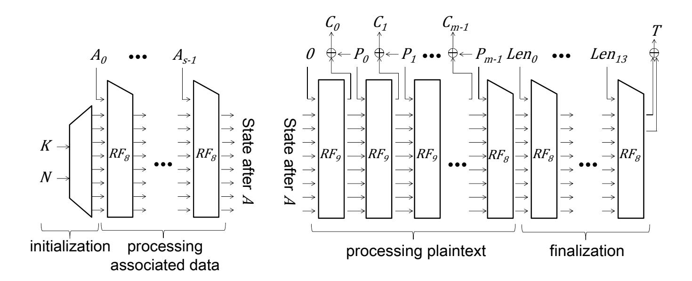
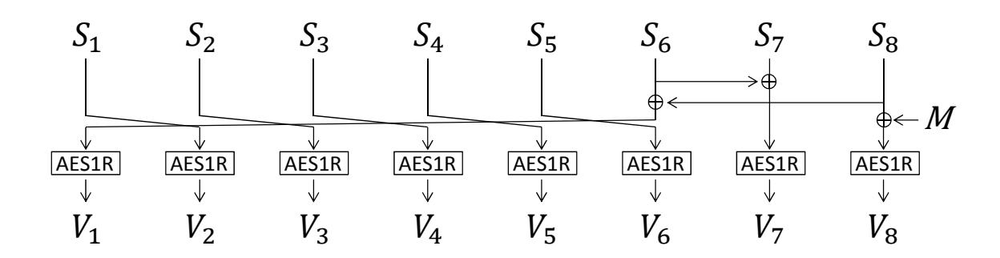
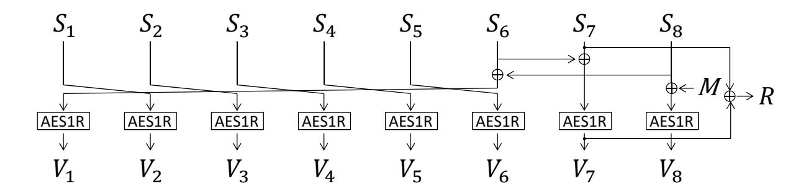
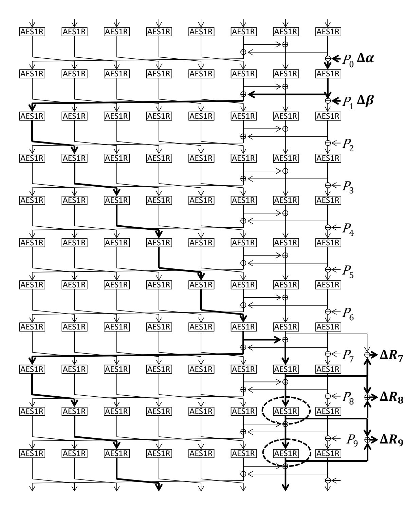
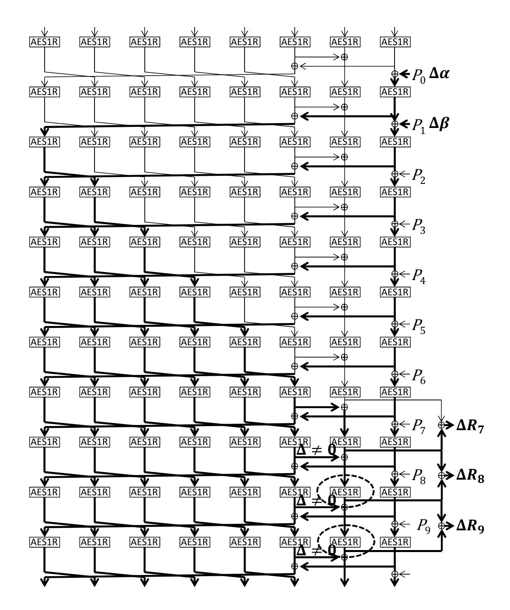
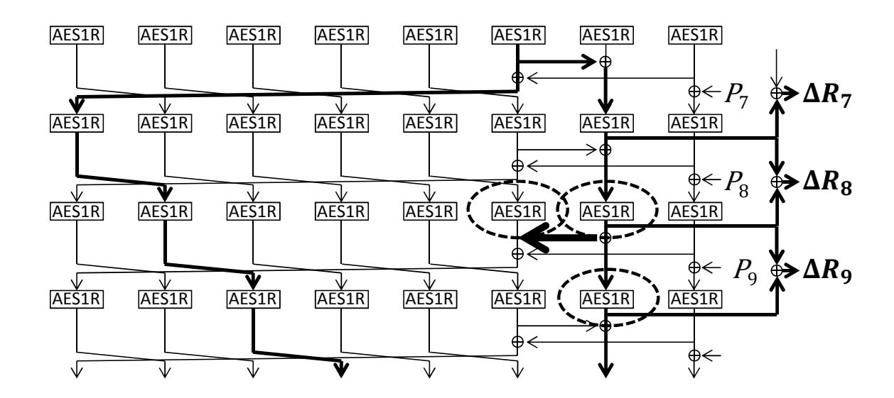

{0}------------------------------------------------

# A Practical Universal Forgery Attack against PAES-8

Yu Sasaki and Lei Wang

NTT Secure Platform Laboratories, Japan sasaki.yu@lab.ntt.co.jp Nanyang Technological University, Singapore Wang.Lei@ntu.edu.sg

Abstract. PAES is an authenticated encryption scheme designed by Ye et al., and submitted to the CAESAR competition. The designers claim that PAES-8, which is one of the designs of the PAES-family, provides 128-bit security in the nonce misuse model. In this note, we show our forgery attack against PAES-8. Our attack works in the nonce misuse model. The attack exploits the slow propagation of message differences. The attack is very close to the universal forgery attack. As long as the target message is not too short, e.g. more than 10 blocks (160 bytes), a tag is forged only with 2<sup>11</sup> encryption oracle calls, 2<sup>11</sup> computational cost, and negligible memory.

Key words: PAES-8, Universal Forgery Attack, Nonce Misuse

## 1 Specification of PAES-8

PAES-8 is one of the designs of the PAES-family designed by Ye et al. [1]. It exploits the AES round function that consists of three operations SubBytes, ShiftRows, and MixColumns. PAES-8 encryption function takes a 128-bit key K, a 128-bit nonce N, variable length associated data A, and variable length plaintext P as input, and outputs the corresponding ciphertext C and a 128-bit tag T.

The encryption function consists of 4 parts: initialization, processing associated data, processing plaintext, and finalization, which are computed in this order. The computation structure is illustrated in Fig. 1 and Fig. 2, where the bit size of each arrow line in those figures is 128 bits. In PAES-8, the state consists of eight 128-bit values, or eight AES states. 128-bit values are called "blocks" in PAES.

Initialization. In the initialization part, a 128-bit key K and a 128-bit nonce N are mixed and expanded to 1024-bit internal state. We omit the details due to the irrelevance to our attack.

{1}------------------------------------------------



Fig. 1. Initialization and Associated Data Processing

Fig. 2. Plaintext Processing and Finalization

**Processing Associated Data.** The associated data A is first padded to a multiple of 128 bits  $(A_0, A_1, \ldots, A_{s-1})$ , and then processed block by block with the round function  $RF^1$ . The round function  $RF^1$  of PAES-8 generally takes an 9-block (or 1152-bit) value as input, of which 1024 bits are for the previous internal state value and 128 bits are for processing other data. The output of  $RF^1$  is either an 8-block value (updated internal state) or an 9-block value (updated internal state and 1-block key stream). We denote the round function by  $RF_8^1$  when the output size is 8 blocks, and by  $RF_9^1$  when the output size is 9 blocks.

In  $RF_8^1$ , an 8-block internal state value is split into eight 1-block variable  $S_1, S_2, \ldots, S_8$ . Let M be another 1-block input value. Then, the updated state value  $V_1, V_2, \ldots, V_8$  are computed as follows, which is also illustrated in Fig. 3.

```
V_1 \leftarrow \mathtt{AES1R}(S_6 \oplus S_8), \qquad V_5 \leftarrow \mathtt{AES1R}(S_4), \ V_2 \leftarrow \mathtt{AES1R}(S_1), \qquad V_6 \leftarrow \mathtt{AES1R}(S_5), \ V_3 \leftarrow \mathtt{AES1R}(S_2), \qquad V_7 \leftarrow \mathtt{AES1R}(S_7 \oplus S_6), \ V_4 \leftarrow \mathtt{AES1R}(S_3), \qquad V_8 \leftarrow \mathtt{AES1R}(S_8 \oplus M),
```

where AES1R applies the AES round function.

Finally, by taking the 8-block state value after the initialization, state, as input, the associated data is processed by computing  $RF_8^1(state, A_i)$  for  $i = 0, 1, \ldots, s-1$ .

**Processing Plaintext.** The plaintext P is first padded to a multiple of 128 bits  $(P_0, P_1, \ldots, P_{m-1})$ , and then processed block by block with the round function  $RF_9^1$ .  $RF_9^1$  is almost the same as  $RF_8^1$ . The only difference is that it produces another 1-block output value r by  $r \leftarrow S_7 \oplus V_7$ . The computation of  $RF_9^1$  is illustrated in Fig. 4. The additional 1-block output value r is used as a key

{2}------------------------------------------------



Fig. 3. Round function with 8-block output AES1R stands for the AES round function.



Fig. 4. Round function with 9-block output

stream. Namely, the ciphertext block  $C_i$  for the plaintext block  $P_i$  is computed by  $C_i \leftarrow P_i \oplus r$ . Finally, by taking the 8-block state value after the associated data processing, state, as input, the plaintext is processed by computing as follows:

$$state \leftarrow RF_8^1(state, 0),$$

$$\text{for } i = 0 \text{ to } m - 1$$

$$(state, r_i) \leftarrow RF_9^1(state, P_i),$$

$$C_i \leftarrow P_i \oplus r_i.$$

**Finalization.** In the finalization, the state is updated by using the bit length of the associated data |A| and the bit length of the plaintext |P|. However, the state updating function is different from  $RF_8^1$  and  $RF_9^1$ . In short, the internal state  $S_1, S_2, \ldots, S_8$  is updated by using the public function and the public input values |A| or |P|. Finally, the 128-bit tag T is computed as  $S_7 \oplus S_8$ . We omit the details due to the irrelevance to our attack.

Claimed Security of PAES-8. The claimed security of PAES-8 is given in Table 1. In particular, 128-bit security is claimed for the integrity in the nonce-misuse model.

## 2 Practical Universal Forgery Attack against PAES-8

In this section, we show a universal forgery attack against PAES-8 in the noncemisuse model, which only requires a small complexity.

{3}------------------------------------------------

Table 1. Bits of security goals in PAES-8[1]

| Goal                                    | Nonce-respecting Model Nonce-repeating Model |     |
|-----------------------------------------|----------------------------------------------|-----|
| confidentiality for the plaintext       | 128                                          | /   |
| integrity for the plaintext             | 128                                          | 128 |
| integrity for the associated data       | 128                                          | 128 |
| integrity for the public message number | 128                                          | 128 |

#### 2.1 Slow Diffusion of Message Difference in PAES-8

The core of our observation is as follows.

- 1. Injecting a difference in subsequent two plaintext blocks so that they cancel each other with high probability.
- 2. If they cancel each other, only 1 block has the difference for 8 rounds as shown in Fig. 5. Then, the input and output differences of the 1 AES round function can be recovered from the key stream, which leads to the significant information about the internal state.

Note that the designers also mentioned the 8-round differential propagation [1, Figure 4.3]. The designers point out the difficulty to control the differential propagation over 8 AES rounds, while our attack uses the trail in a completely different way.

#### 2.2 Message Structure

Our attack is very close to the universal forgery attack. However, because the attack requires to observe the ciphertext difference caused by the plaintext difference, the plaintext cannot be too short. The attack can forge the tag of any message as long as its block size is greater than or equal to 15 blocks, or 240 bytes. Note that there is no restriction for the associated data.

#### 2.3 Attack Details

Suppose that the target plaintext to forge is long enough. The attack mainly analyzes the first 13 blocks of the target denoted by P0kP1k · · · kP12. The attacker queries the first 13 blocks to the encryption oracle and obtains the corresponding ciphertext blocks. Then, the key stream value is recovered from the plaintext and the ciphertext. Note that the tag value is never used in this attack. The attacker aims to fully recover the internal state for this message. Once the internal state is fully recovered, the remaining computation can be computed offline. Hence, the attacker can compute the tag for the original target offline.

{4}------------------------------------------------



**Fig. 5.** Differential Propagation When  $\Delta \alpha$  and  $\Delta \beta$  Cancel Each Other

Choosing Plaintext Differences  $\Delta \alpha$  and  $\Delta \beta$ . The attacker generates the difference  $\Delta \alpha$  on  $P_0$  and  $\Delta \beta$  on  $P_1$ . The attacker wants to cancel the impact of  $\Delta \alpha$  with  $\Delta \beta$  to avoid activating state  $S_8$ . Thus,  $\Delta \alpha$  and  $\Delta \beta$  are chosen so that the cancellation can occur with high probability. To be more precise,  $\Delta \alpha$  should have only 1 active byte. Let  $\alpha$  and  $\beta$  be the 1-byte input and output difference of the S-box, respectively, in which  $\alpha$  changes to  $\beta$  with probability  $2^{-6}$ . Then,  $\Delta \alpha$  and  $\Delta \beta$  are written as follows.

```
\begin{split} & \Delta\alpha = (\alpha, 0, 0, 0, \ 0, 0, 0, 0, 0, 0, 0, 0, 0, 0, 0, 0, 0,
```

 $\Delta \alpha$  will change to  $\Delta \beta$  with probability  $2^{-6}$ .

{5}------------------------------------------------

Detecting the Cancellation between ∆α and ∆β. The attacker can detect whether or not AES1R(∆α) and ∆β cancel each other by observing the key stream after 8 rounds. The differential propagation when the cancellation occurs is shown in Fig. 5.

From the computation structure, ∆R<sup>7</sup> becomes ∆R<sup>8</sup> ⊕ ∆R<sup>7</sup> by AES1R operation. Moreover, each byte difference of ∆R<sup>7</sup> becomes the corresponding byte difference of ShiftRows<sup>−</sup><sup>1</sup> ◦ MixColumns<sup>−</sup><sup>1</sup> (∆R<sup>8</sup> ⊕ ∆R7) through S-box. If the cancellation occurs, the differential propagation through S-box will be always possible one.

On the other hand, suppose that AES1R(∆α) and ∆β do not cancel each other. Then, the differential propagation becomes as shown in Fig. 6. In this case, ∆R<sup>7</sup> is XORed with an unknown random difference from S6, and thus impossible differential propagation from ∆R<sup>7</sup> to ShiftRows<sup>−</sup><sup>1</sup> ◦MixColumns<sup>−</sup><sup>1</sup> (∆R8⊕∆R7) may be observed.

Note that a randomly given two differences are impossible difference for the Sbox operation with probability about 2<sup>−</sup><sup>1</sup> . Thus, the probability to be a possible differential propagation in all bytes is 2<sup>−</sup><sup>16</sup>, which is small enough to detect the cancellation with probability 2<sup>−</sup><sup>6</sup> . Also note that the same distinguishing method can be applied to 4 subsequent rounds, in total 5 rounds. Thus the probability to be a possible differential propagation becomes 2<sup>−</sup><sup>80</sup> .

To be more precise, the procedure is as follows.

- 1. Query the first 13 plaintext blocks of the target (P0kP1k · · · kP12), and obtains the key stream R7, R8, · · · , R12.
- 2. FOR i = 1 to 2<sup>7</sup> DO
- 3. Choose a 1-byte difference α<sup>i</sup> and obtain the corresponding β<sup>i</sup> .
- 4. Query (P0⊕αikP1⊕βik · · · kP12) and obtain the key stream R7<sup>i</sup> , R8<sup>i</sup> , · · · , R12<sup>i</sup> .
- 5. Check if R7⊕R7<sup>i</sup> can produce R7⊕R7i⊕R8⊕R8<sup>i</sup> by the AES1R operation.
- 6. Check the same property for additional 4 rounds.
- 7. Pick up the pair that passes all the above checks.
- 8. END FOR

In the end, two pairs that follow the differential propagation in Fig. 5 are obtained. Note that, if the attacker unluckily cannot obtain 2 pairs even with trying all choices of α, β with differential probability 2<sup>−</sup><sup>6</sup> , then α and β can be chosen from 2<sup>−</sup><sup>7</sup> differential propagation of the S-box.

Recovering S<sup>7</sup> and S8. From the knowledge of the input and output differences of the S-box, the attacker can recover the state value for processing (P0kP1k · · · kP12). This can be applied to 1 active byte of S<sup>8</sup> right after inserting P<sup>0</sup> and all bytes of S<sup>7</sup> in 5 rounds where the differential propagation is confirmed. The candidate values can be reduced to at most 4 choices for each S-box per pair. Therefore, by analyzing two pairs, the internal state value is uniquely detected.

To recover the all bytes in S8, the same analysis needs to be repeated 16 times with changing active byte positions. Hence, the analysis requires 16 times

{6}------------------------------------------------



**Fig. 6.** Differential Propagation When  $\Delta \alpha$  and  $\Delta \beta$  Do Not Cancel

of the cost for a fixed byte position.  $S_8$  is never affected from  $S_1, S_2, \ldots, S_7$ . Hence, once  $S_8$  is recovered,  $S_8$  in all rounds can be recovered.

Recovering  $S_1$  to  $S_6$  and Forging Tag. The internal state  $S_3$  to  $S_6$  for the block processing  $P_8$  are easily recovered from the recovered value of  $S_7$ . The procedure to recover  $S_6$  is explained in Fig. 7.

From the knowledge of  $\Delta R_7$  and  $\Delta R_8$ , the internal state of  $S_7$  is recovered and from the knowledge of  $\Delta R_8$  and  $\Delta R_9$ , the internal state of  $S_7$  after 1 round is recovered. By taking XOR of the recovered state values, the internal state of  $S_6$  is recovered. In Fig. 7, the recovered variables are stressed by dashed circles.

{7}------------------------------------------------



Fig. 7. Internal State Recovery of S<sup>6</sup>

The attacker can observe up to ∆R12, and thus the state value for S3, S4, S5, and S<sup>6</sup> can be recovered.

To recover the internal state S<sup>1</sup> and S2, we simply iterate the attack by shifting the attacked rounds by 2 rounds. Namely, we use the first 15 blocks of the target message and the plaintext differences are generated in P<sup>2</sup> and P3. Because the internal state S<sup>8</sup> is already recovered in all rounds, we can choose the proper pair of ∆α and ∆β easily. Therefore, the cost to recover S<sup>1</sup> and S<sup>2</sup> is negligible. Finally, all state values are recovered.

Once all the internal state is recovered, the remaining computations including the tag generation is public. Therefore, the attacker can simulate the tag value of the target message offline, and succeeds in the universal forgery attack.

Complexity Evaluation. For each active byte position, the attack requires to find two pairs that satisfies the differential propagation in Fig. 5. Therefore, the attack requires 16×2×2 <sup>6</sup> = 2<sup>11</sup> encryption oracle calls. The computational cost is also 2<sup>11</sup>. Because each pair can be analyzed one after another, the memory complexity is negligible.

## 3 Concluding Remarks

In this note, we proposed a practical universal forgery attack against PAES-8 in the nonce-misuse model. Our attack can forge a tag of any message that is longer than or equal to 15 blocks with 2<sup>11</sup> encryption oracle calls, 2<sup>11</sup> computational cost, and negligible memory. The attack clearly breaks the security claim of PAES-8, i.e. 128-bit security for integrity in the nonce-misuse model.

## References

1. Dingfeng Ye, Peng Wang, Lei Hu, Liping Wang, Yonghong Xie, Siwei Sun, and Ping Wang. PAES v1. Submitted to the CAESAR competition, March 2014.