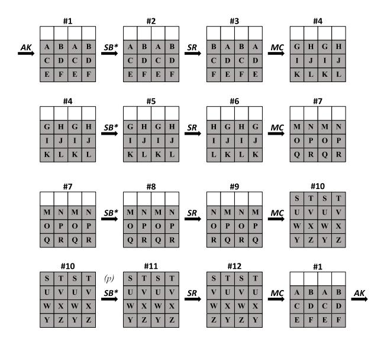
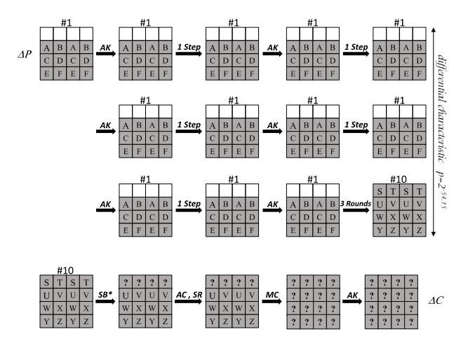

# Total Break of Zorro using Linear and Differential Attacks

Shahram Rasoolzadeh1,2 , Zahra Ahmadian1,2 , Mahmoud Salmasizadeh2 , and Mohammad Reza Aref1

1 Information Systems and Security Lab (ISSL), Department of Electrical Engineering, 2 Electronic Research Institute, Sharif University of Technology, Tehran, Iran {sh rasoolzadeh,ahmadian}@ee.sharif.edu,{salmasi,aref}@sharif.edu

Abstract. An AES-like lightweight block cipher, namely Zorro, was proposed in CHES 2013. While it has a 16-byte state, it uses only 4 S-Boxes per round. This weak nonlinearity was widely criticized, insofar as it has been directly exploited in all the attacks on Zorro reported by now, including the weak key, reduced round, and even full round attacks. In this paper, using some properties discovered by Wang et al., we present new differential and linear attacks on Zorro, both of which recover the full secret key with practical complexities. These attacks are based on very efficient distinguishers that have only two active S-Boxes per four rounds. The time complexity of our differential and linear attacks are 2 56.76 and 245.50 and the data complexity are 256.73 chosen plaintexts and 245.44 known plaintexts, respectively. The results clearly show that the block cipher Zorro does not have enough security against differential and linear attacks.

Keywords: Zorro, Differential Attack, Linear Attack, Lightweight Block Cipher.

# 1 Introduction

Block ciphers are the most widely-studied primitives in the area of symmetric cryptography. Among the different types of attacks, differential cryptanalysis [\[1\]](#page-12-0) and linear cryptanalysis [\[2\]](#page-12-1) can be regarded as two of the oldest and most important statistical methods to analyse the security of the block ciphers.

Zorro is a newly proposed lightweight block cipher whose design is based on AES [\[3\]](#page-12-2). It is basically designed with the aim of increasing the resistance against side-channel attacks while still remaining a lightweight block cipher. In spite of its 16-byte state, the SubByte layer of Zorro uses only 4 similar S-Boxes in the first row, which are different from AES S-Boxes. Similar to LED-64 [\[4\]](#page-12-3), key addition layer in Zorro is applied only after each four rounds. Instead, an Add Constant layer is used in every rounds with round-dependent constants. Besides, Shift Row and Mix Column layers are exactly the same as AES ones.

For both differential and linear cryptanalysis, designers of Zorro have evaluated the security of the cipher and found a balance between the number of inactive S-Boxes and the number of freedom degrees for differential or linear paths. The designers concluded that 14 and 16 rounds are upper bounds for any non-trivial differential or linear characteristics, respectively. Furthermore, they show that in the single key model of Zorro, a 12 round meet-in-the-middle attack is the most powerful attack. Therefore, for reaching the security margins they choose 24 rounds for Zorro [\[3\]](#page-12-2).

#### 1.1 Related work

The bold idea in designing Zorro was using the partial nonlinear layers: only 4 S-Boxes for a 16-byte state. That's why Zorro has attracted the attentions of many cryptanalysts during the past year which result in some attacks even on the full version of the cipher. The first one, proposed by Guo et al., is a key recovery attack on the full-round version of the algorithm, but it works only for 2 64 weak keys of the whole key space 2128 [\[5\]](#page-12-4). This attack exploits this unique property of Zorro twice in a two-stage attack: finding an equivalent description that does not have constants in the rounds, and then, launching an internal differential attack.

In the next attack, Wang et al. presented a differential key recovery attack and a linear distinguisher for full-round Zorro [\[6\]](#page-12-5). They observed an interesting property for the Zorro's Mix Column: the forth power of the mix column matrix is equal to the identity matrix. Using this property of Zorro along with its weak nonlinearity, they found differential and linear distinguishers for Zorro in which only four S-Boxes are activated per four rounds. The resulted differential cryptanalysis can recover the randomly chosen key with a time complexity of 2108 and data complexity of 2112.4 chosen plaintexts, and linear distinguisher use 2105.3 known plaintexts to successfully distinguish it from the random permutation.

Also, Soleimany proposed a probabilistic variation of slide attack and applied it to 16 rounds of Zorro (out of 24 rounds) [\[7\]](#page-13-0). This attack challenges the key schedule approach in Zorro (and also LED [\[4\]](#page-12-3)) in which all subkeys are equal to the master key of the algorithm, and this similarity is compensated by use of round-dependent constants. Probabilistic slide attack shows that this strategy does not necessarily make the cipher secure against the self-similarity attacks. Their attack requires 2123.62 known plaintexts with the time complexity of 2123.8 encryption or 2121.59 known plaintexts with time complexity of 2124.23 encryption.

Finally, Bar-On et al. briefly reported their new results on Zorro in FSE 2014 rump session which is an improvement of Wang's differential and linear attacks [\[8\]](#page-13-1). As they stated, the gain of their attack is not in the probability of distinguishers since the new distinguishers still have two active S-Boxes per two rounds (i.e. one S-Box per round in average which is similar to that of Wang's attack). Instead, they achieved some improvements in the key recovery phase. Consequently, a differential attack with time and data complexity of 298 and 2 95, and a linear attack with time and data complexity of 288 and 283.3 can be obtained. As we explain more in the next subsection, they could improve their work further and achieved more efficient distinguishers.

#### 1.2 Our contributions

In this paper, we break the full-round version of Zorro by using differential and linear cryptanalyses. We propose very efficient iterated differential characteristics and linear trails that have only two active S-Boxes per four rounds. Using the 23, 22 and 21-round differential characteristics and linear trails, we can propose key recovery attacks for any randomly chosen secret key of full-round Zorro. Differential cryptanalysis has a time complexity of 256.76 full round encryption and data complexity of 256.73 chosen plaintexts. Also linear cryptanalysis has a time complexity of 245.50 full round encryption and data complexity of 245.44 known plaintexts. Also, the memory complexity of differential cryptanalysis is 12 blocks while for linear cryptanalysis is 217.34. Table [1](#page-2-0) summarizes the complexities of existing attacks and ours. Our results show that the theoretical security of the full-round Zorro evaluated by designers does not hold up in practice.

Very recently, some days after that we archived our results on IACR ePrint Archive, Bar-On et al. published their improved attacks on Zorro in IACR ePrint Archive [\[9\]](#page-13-2), that made use of different differential characteristics and linear trails from what they previously announced in FSE 2014 Rump session. It must be mentioned that their linear attack has same time, data and memory complexities as ours, because of using the same linear trails and same key recovery method. Also, their differential attack uses the same differential characteristics as ours. But, by using an improved key recovery method, their differential attack has better time and data complexities.

| Attack Type            | Rounds attacked Time |             | Data            | Memory    | Ref.   |
|------------------------|----------------------|-------------|-----------------|-----------|--------|
| Differential           | Full-round*          | 54.3 2   | 54.3 2 CP | 54.3 2 | [5]    |
| Statistical Slide      | 16 (out of 24)       | 123.8 2  | 123.6 CP 2   | –         | [7]    |
| Statistical Slide      | 16 (out of 24)       | 124.2 2  | 121.6 CP 2   | –         | [7]    |
| Linear (Distinguisher) | Full-round           | 105.3 2  | 105.3 CP 2   | –         | [6]    |
| Differential           | Full-round           | 108 2    | 112.4 CP 2   | 32 2   | [6]    |
| Differential           | Full-round           | 98 2     | 95 2 CP   | –         | [8]    |
| Linear                 | Full-round           | 88 2     | 83.3 2 KP | 80 2   | [8]    |
| Differential           | Full-round           | 56.8 2 2 | 56.7 CP         | 12        | Sec. 3 |
| Linear                 | Full-round           | 45.5 2 2 | 45.4 KP         | 15.3 2 | Sec. 4 |
| Differential           | Full-round           | 45.4 2   | 44.4 2 CP | 19** 2 | [9]    |
| Linear                 | Full-round           | 45 2     | 45 2 CP   | 17 2   | [9]    |

Table 1. Summary of cryptanalytic results on Zorro

\* This attack works only for 264 keys of the whole key space 2128

\*\* The memory complexity is estimated 210 in [\[9\]](#page-13-2). However, they need to save DDT with its inputs for every index in searching level for key recovery method.

CP: Chosen Plaintext, KP: Known Plaintext.

# 1.3 Outline

This paper is organized as follows: Section [2](#page-3-1) presents a brief description of Zorro. Section [3](#page-3-0) represents the outline of the differential attack on full-round Zorro with all details and evaluates its complexities. Furthermore, the outline and details of linear attack and evaluation of its complexities are presented in Section [4.](#page-8-0) Section [5](#page-12-6) includes results of our practical attacks to reduced-round Zorro. Finally, Section [6](#page-12-7) concludes this paper.

# 2 A Brief Description of Zorro

The block cipher Zorro has a 128-bit key and a 128-bit block size. It has 24 rounds which is divided into 6 steps of 4 rounds each.

As in AES, the internal state in Zorro is a 4×4 matrix of bytes, and every round consists of four transformations:

- 1. SB∗ is the S-Box layer where 4 similar S-Boxes, which are different from AES S-Boxes, are applied to the 4 bytes of the first row in the state matrix.
- 2. AC is adding (xoring) the round constant to the state matrix. Specifically, in round i, the four constants (i, i, i, i 3) are xored to the four bytes of the first row of state matrix. By we mean left shift.
- 3. SR is similar to AES ShiftRow.
- 4. MC is similar to AES MixColumn.

The key schedule of Zorro is similar to that of LED block cipher [\[4\]](#page-12-3). Before the first and after each step (i.e. each four rounds), the master key is xored to the state.

Since only 4 S-Boxes are applied to the first row in each round, combined with this feature of MC matrix, iterated differential characteristics and linear trails are found for one step of Zorro.

# 3 Differential Cryptanalysis

In this section, we first find some iterated differential characteristics for one step of Zorro which have a high probability. The independence of round functions is a conventional assumption in differential (and linear) cryptanalysis of block ciphers [\[1,](#page-12-0)[2\]](#page-12-1). For Zorro, the secret key is xored to the state every four rounds. Furthermore, 4 rounds of Zorro can be seen as a step that has no constants in the rounds, if we add one constant to the input and one to the output of the step [\[5\]](#page-12-4). Thus the assumption that the step functions are independent is more rational and realistic than the one that the round functions are independent. Using this assumption, we will construct three groups of distinguishers for 23, 22 and 21 rounds of Zorro. The first distinguisher is used in the first phase of the key recovery attack to reduce the key space of 2128 to 296. Having recovered 32 linear relations between bits of the key in the first phase, we use the second and third distinguishers in the next two phases to recover more relations. Finally, the remaining candidates of key can be retrieved by an exhaustive search.

#### 3.1 Iterated Differential Characteristic

Our strategy to find an efficient iterated differential characteristic for one step of Zorro with the minimum number of active S-Boxes is to exploit the maximum flexibility in the input difference. This is as follows:

- Set the difference of the first row equal to zero to prevent the S-Boxes of the first round being active.
- Set the differences of the third and fourth columns equal to that of the first and second ones, respectively. This bypasses the influence of SR transformation for a 4-round Zorro.
- Do not impose any more conditions on the remaining six bytes now and let their dependency be utilized in minimizing the number of active S-Boxes in the next rounds.

We can extend this input difference to four rounds with only two active S-Boxes as shown in Fig. [1.](#page-4-0) In this figure the AC transformation is omitted since it does not have any affect on the differentials. The active S-Boxes are shown in gray whose difference value is written inside. For attaining such a differential characteristic, some conditions in MC transformations between states (#3, #4), (#6, #7), (#12, #1), as well as two conditions for SB∗ transformation between states (#10, #11) must be satisfied. All these conditions are presented in detail in Appendix [B](#page-13-3) which result in the following representation of all the variables based on A and B.

Fig. 1. Iterated differential characteristic of one step of Zorro

$$\begin{array}{llllllllllllllllllllllllllllllllllll$$

Now let's focus on the  $SB^*$  transformation of the fourth round. We need that for all the four active S-Boxes, each output difference equals its own input difference. Suppose this happens with the probability of p. We will try to maximize p. Also, we still have 2 degrees of freedom, A and B. So we can set one of S or T to zero and confine the number of active S-Boxes to two, per four rounds. Let

$$\begin{cases} S = 0 \Rightarrow B = 5A \\ or \\ T = 0 \Rightarrow A = 5B \end{cases}$$
 (2)

Hence, for the best probability of the proposed 4-round differential characteristic

$$P_{4r} = \max_{1 \le x \le 255} \Pr\{\Delta_{input} = x \to \Delta_{output} = x\}^2$$
 (3)

According to DDT of S-Box, the maximum probability is equal to  $P_{4r} = (\frac{6}{256})^2 = 2^{-10.83}$  and there are three choices for x to achieve this value. Considering the two cases of S=0 or T=0, there would be, in total, six options for the input difference to construct a differential characteristic with this maximum probability. These six differential characteristics are listed in Table 2, in which every row shows the difference values  $A, \ldots, Z$  corresponding to one characteristic. Furthermore, we can replace the difference of state #1 by that of #4, #7 or #10, to get new sets of iterated differential characteristics.

Table 2. Six iterated differential characteristics for one step

| No. | A   | В   | С   | D   | E   | F   | G   | Н   | I   | J   | K   | L   | M   |
|-----|-----|-----|-----|-----|-----|-----|-----|-----|-----|-----|-----|-----|-----|
| 1   | 136 | 158 | 22  | 22  | 149 | 175 | 178 | 164 | 88  | 0   | 205 | 178 | 20  |
| 2   | 158 | 136 | 22  | 22  | 175 | 149 | 164 | 178 | 0   | 88  | 178 | 205 | 178 |
| 3   | 92  | 55  | 107 | 107 | 143 | 50  | 225 | 138 | 183 | 0   | 56  | 225 | 255 |
| 4   | 55  | 92  | 107 | 107 | 50  | 143 | 138 | 225 | 0   | 183 | 225 | 56  | 225 |
| 5   | 22  | 78  | 88  | 88  | 98  | 138 | 254 | 166 | 123 | 0   | 25  | 254 | 80  |
| 6   | 78  | 22  | 88  | 88  | 138 | 98  | 166 | 254 | 0   | 123 | 254 | 25  | 254 |
|     |     |     |     |     |     |     |     |     |     |     |     |     |     |
| No. | N   | 0   | Р   | Q   | R   | S   | Т   | U   | V   | W   | X   | Y   | Z   |
| 1   | 178 | 254 | 254 | 185 | 51  | 0   | 123 | 85  | 136 | 0   | 35  | 42  | 131 |
| 2   | 20  | 254 | 254 | 51  | 185 | 123 | 0   | 136 | 85  | 35  | 0   | 131 | 42  |
| 3   | 225 | 169 | 169 | 89  | 145 | 0   | 234 | 168 | 92  | 0   | 93  | 113 | 228 |
| 4   | 255 | 169 | 169 | 145 | 89  | 234 | 0   | 92  | 168 | 93  | 0   | 228 | 113 |
| 5   | 254 | 213 | 213 | 210 | 204 | 0   | 247 | 79  | 22  | 0   | 140 | 168 | 58  |
| 6   | 80  | 213 | 213 | 204 | 210 | 247 | 0   | 22  | 79  | 140 | 0   | 58  | 168 |

#### 3.2 Key recovery

The full key recovery attack on full-round Zorro proceeds in three phase. In first and second phases, we recover 32, and in third phase, we recover only 16 linear relations between bits of the secret key.

Phase 1. Recovering 32 Relations Between Bits of Key. Using each of the six 4-round iterated differentials introduced in Table [2,](#page-5-0) we can construct a 23-round (= 5 steps + 3 rounds) differential characteristics with probability of

$$P_{23r} = (P_{4r})^5 \times P_{3r} = 2^{-10.83 \times 5} \times 1 = 2^{-54.15}$$
(4)

Note that the last three rounds of this characteristics have no cost in probability, i.e. P3r = 1. Since P23r is too far from that of a Pseudo Random Permutation (2−128), such a 23-round distinguisher can be successfully used to distinguish the correct key from the wrong key in a 24-round attack.

In the following, we explain a key recovery attack on full round Zorro which extracts 32 bits information of the secret key K. Similar to [\[1,](#page-12-0)[6\]](#page-12-5), a structural attack which merges three differential characteristics simultaneously requires less data here. We also change the order of MC and AK in the last round where the equivalent key K0 = MC−1 (K) is added before MC. In fact, this attack recovers 32 bits of the first row of K0 , each of which is a linear function of K, in two procedures: In the first one, we find exact value of the second and fourth bytes of first row by using iterated differential characteristics respected to No. 1, 3 and 5 of Table [2;](#page-5-0) In the other one, exact value of the first and third bytes are recovered respected to No. 2, 4 and 6 of Table [2.](#page-5-0) At the end, we will come up with 296 key candidates for the whole 128-bit key.

Fig. 2. Differential characteristics on 23-round Zorro

#### Step 1. Choosing the Plaintext Pairs

Our Attack is a structural chosen plaintext attack, where we choose structures with  $2^3$  plaintexts according to differential characteristics respected to No. 1, 3 and 5 of Table 2, and all the plaintexts in every structure are queried from the encryption oracle to get the corresponding ciphertexts.

For having at least one correct differential pair we must have normally  $p^{-1}$  differential pairs. But in this attack, determining exact value of relation between key bits needs two correct differential pairs. So we must have  $2 \times p^{-1}$  differential pairs which is equal to  $\frac{1}{12} \times 2 \times p^{-1} = \frac{1}{6} \times p^{-1}$  structures containing  $2^3 \times \frac{1}{6} \times p^{-1} = \frac{4}{3} \times p^{-1}$  plaintexts. The precise relation between number of structures and number of differential pairs can be found in Appendix A.

## Step 2. Filtering the Ciphertext Pairs

Partially decrypt all the ciphertext pairs generated in Step 1 to get their corresponding difference in the output of  $SB^*$  of round 24. Keep only those pairs that satisfy the condition in the three lowest row of #10 as well as the two zero differences in the first row (see Fig. 2). After this filtering only a fraction of  $2^{-112}$  wrong differential pairs remains, while we have only  $2^{55.15}$  pairs. So, only 2 correct differential pairs remain which can be used to distinguish the right key from the wrong keys.

#### **Step 3.** Recovering 16 bits of K'

Guess the two bytes of the first row of K' corresponding to those two active S-Boxes, and partially decrypt the remaining pairs to get their differences in the first row of the input of round 24. As we have 2 correct differential pairs, we can determine the exact value of these 16 bits.

A similar procedure can be repeated for the other two active S-Boxes to find the other two bytes in the first row.

Phases 2 & 3. Recovering the 96 Remaining Key Bits. If we replace the state of #1 by #4 or #7 in Fig. 1, we will come up with another 6 iterated differential characteristics, which can be used to construct 22 or 21-round differential characteristics with the same probability of  $P_{22r} = P_{21r} = 2^{-54.15}$ .

The steps of Phase 2 are similar to that of Phase 1 with two minor differences: In Step 2, the ciphertext differences are filtered in two levels: First in round 24, before MC transformation, which 6 Bytes must be a constant. And the second, after partial decrypting round 24 using the 32 bits of K' retrieved in Phase 1, that 8 bytes must be constant. Also, in Step 3, We need to guess 16 bits of K'', where  $K'' = MC^{-1}(SR^{-1}(K')$  with all bits 0 in the first row)).

In this phase, we partially decrypt all the ciphertexts in the structure for one round. But in AC layer of round 24, in addition to round constant, we add bit-wisely the first row of K' which was found in Phase 1, and continue the rest of the attack similar to Phase 1. We guess all the  $2^{16}$  keys involved in active S-Boxes, and repeat this procedure once more to get the other 16 key bits. So, we can finally find 32 bits of the first row of K''.

But in Phase 3, we make use of 21-round differentials and find some values for only 16 bits of K''', where  $K''' = MC^{-1}(SR^{-1}(K''))$  with all bits 0 in the

first row)). In this phase we only need one correct differential pair and only for 2 bytes, it is because of time complexity that be the minimum one. According to DDT of Zorro, there will be only about 6.6 accepted values for this 16 bits. We do similar to Phase 2, except that at first all the ciphertexts in the structure are partially decrypted for one rounds, and in AC layers, in addition to round constant, we add the first row of K' in round 23, and the first row of K'' in round 22

Finally, by using the information retrieved from K', K'' and K''', we end up with only  $6.6 \times 2^{48}$  candidates for the 128-bit secret key K. With an exhaustive search on these candidate key, we can find the whole 128 bits of secret key.

#### 3.3 Complexities

#### 1. Data Complexity

In Phases 1 and 2 we use two times  $\frac{4}{3} \times p^{-1}$  plaintexts and their corresponding ciphertexts. But, in Phase 3 we use one time  $\frac{2}{3} \times p^{-1}$  plaintext and ciphertext pairs. So, data complexity of our attack will be:

$$D = \frac{2}{3} \times p^{-1} \times (2 \times 2 + 2 \times 2 + 1) = 6 \times p^{-1} = 2^{56.73}$$

#### 2. Time Complexity

As most time of a round is used on its  $SB^*$  transformation, we don't calculate the MC transformations in filtering steps. Therefore computation time of Phases 1 and 2 are only in step 1 for producing ciphertexts. But in Phase 3 we must partially decrypt all ciphertexts for one round. And finally, we must check all remaining key candidates. Hence, time complexity will be:

$$T = D + \frac{1}{24} \times \frac{2}{3} \times p^{-1} + 6.6 \times 2^{48} = 2^{56.76}$$

#### 3. Memory Complexity

The memory required for attack is negligible that contains  $2^3$  blocks for saving one structure, 3 blocks for saving 3 states of state #10 in Fig. 1 and 16 bytes for saving S-Box which at all is equal to 12 blocks of 128 bits.

#### 4 Linear Cryptanalysis

The procedure of linear attack is very similar to that of differential attack, presented in Section 3. We first try to find iterated linear trails with a high correlation for one step of the algorithm. Then we make use of this trail to construct 23, 22 and 21-round linear distinguishers, which are used for a key recovery attack on the full-round Zorro.

#### 4.1 Iterated Linear Trail

Same as the way of finding iterated differential characteristics in Section 3.1, we can find iterated linear trails for Zorro. There exists some iterated linear trials for one step of Zorro whose patterns are identical to that of differential characteristics given in Fig. 1, where the gray bytes are the ones with a non-zero mask. For satisfying conditions of MC transformation between states of (#3, #4), (#6, #7) and (#12, #1), we use 3 lemmas about the correlation matrixes of boolean functions in [10]. All these conditions are presented in detail in Appendix C which result in the following representation of all the variables based on Q and R.

$$\begin{array}{llllllllllllllllllllllllllllllllllll$$

The only nonlinear parts involved in this trail are the active S-Boxes of state #10 that the absolute correlation supposed to be |c|. Again, we have 2 degrees of freedom, Q and R to maximize |c|. So we can set one of S or T to zero.

$$\begin{cases} S = 0 \Rightarrow R = 5Q \\ or \\ T = 0 \Rightarrow Q = 5R \end{cases}$$
 (6)

which in two cases yields

$$|c_{4r}| = \max_{1 \le x \le 255} C(\Gamma_{input} = x, \Gamma_{output} = x)^2.$$

$$(7)$$

Which  $\Gamma$  is the linear mask for one byte. After searching the LAT of Zorro S-box, the largest linear correlation occurs when x=136. With this setting the absolute of the corresponding correlation would be  $|c_{4r}| = (\frac{28}{128})^2 \simeq 2^{-4.39}$ . Also, we can find new linear trails with the same correlation, if we change the relative location of #1 with #4, #7 or #10. In Table , each row shows the mask values  $A, \ldots, Z$  corresponding to one of the above-mentioned linear trail.

Table 3. Two iterated linear trails for one step

| No. | Α  | В   | С   | D   | E   | F   | G   | Н   | Ι | J  | K   | L   | M   |
|-----|----|-----|-----|-----|-----|-----|-----|-----|---|----|-----|-----|-----|
|     |    |     |     |     |     |     |     |     |   |    |     |     | 160 |
| 2   | 97 | 177 | 227 | 227 | 126 | 191 | 126 | 130 | 0 | 34 | 251 | 126 | 52  |

| No. | N   | О   | Р   | Q   | R   | S   | Т   | U  | V  | W   | X   | Y   | Z   |
|-----|-----|-----|-----|-----|-----|-----|-----|----|----|-----|-----|-----|-----|
| 1   | 52  | 133 | 133 | 234 | 234 | 0   | 136 | 95 | 37 | 0   | 170 | 163 | 234 |
| 2   | 152 | 133 | 133 | 234 | 234 | 136 | 0   | 37 | 95 | 170 | 0   | 234 | 163 |

#### 4.2 Key recovery

Similar to that of differential attack, the full key recovery attack on full-round Zorro proceeds in three phase. In each phases, we recover 32 linear relations between bits of the of secret key.

Phase 1. Recovering the 32 Bits of Key. Using each of the two 4-round iterated linear trails in Table [3,](#page-9-0) we can construct a 23-round (= 5 steps + 3 rounds) linear trail with the correlation of

$$|c_{23r}| = |c_{4r}|^5 \times |c_{3r}| = 2^{-4.39 \times 5} = 2^{-21.93}$$
 (8)

This 23-round linear trail is similar to the 23-round differential characteristic given in Fig. [2.](#page-6-0) Since |c23r| is much larger than that of a Pseudo Random Permutation, |cP RP | = 0, such a 23-round distinguisher can be successfully used to distinguish the correct key from the wrong key in a 24-round attack.

In the following, we explain a key recovery attack on full round Zorro which extracts 32 bits of the first row of K0 , in two parallel procedures: First, we find the second and fourth bytes of the first row of K0 by using iterated linear trails respected to No. 1 of Table [3.](#page-9-0) Then, first and third bytes of key respected to No. 2 of Table [3](#page-9-0) gets found.

With the assumption that the secret key is randomly chosen from the whole key space, the amount of plaintext/ciphertext pairs required for this attack would be |c23r| −2 = 243.85 as discussed in [\[2\]](#page-12-1). The steps of this phase of attack are as follows:

#### Step 1. Data Collection

Ask the corresponding ciphertexts 243.85 of randomly generated plaintexts from the encryption oracle.

#### Step 2. Data Processing

Compute

$$\alpha = \Gamma_{\#1} \cdot P \oplus \Gamma_{\#10,rows\ 2,3,4} \cdot C'_{rows\ 2,3,4} \tag{9}$$

where P is the plaintext, C 0 is the one-round partially decrypted ciphertext, · represent the dot product, and Γ#n is the linear mask for state #n in No.1 linear trail given in Table [3.](#page-9-0)

## Step 3. Checking the second and fourth bytes of K0

Guess the second and fourth bytes of K0 , partially decrypt the ciphertext to get the first row of C 0 for every 216 guesses. Compute

$$\beta = \Gamma_{\#10,row\ 1} \cdot C'_{row\ 1} \tag{10}$$

## Step 4. Checking the first and third bytes of K0

Repeat Steps 2 and 3 for these two bytes of key.

At the end of this procedure, all the four bytes of K0 's first row are introduced. In Step 3 we use a matrix with size of 256 × 256, and index of (i, j) matrix shows the sum of mask for S-Box input which its output equals to bit-wisely sum of i and j. For each active S-Box we take the x-th row of the matrix, that x is equal to output of S-Box in partially decrypted ciphertext. We have only two active S-Boxes, So first arrow is for 8 bits of key for the first active S-Box and the second arrow is for 8 bits of key for the second active S-Box. In each arrow j'th bit shows sum of mask for S-Box input which output is j bit-wisely added to partially decrypted ciphertext. With this method we can check for all 216 keys, whether β equals to α or not, with a negligible time for each pliantext/ciphertext pairs.

Phases 2 & 3. Recovering the 96 Remaining Key Bits. Look like full-key recovery attack in Phase 2 and 3 of differential cryptanalysis, we use 22 and 21-round linear distinguishers with c22r = c21r = 2−21.93 which works with an amount of 243.85 known plaintexts. Except that at Phase 2 and 3, using found key bits we must partially decrypt ciphertext for one and two rounds, respectively. After reducing the key candidates to 232, we do a exhaustive search on the key candidates to get the secret key.

#### Complexities

#### 1. Data Complexity

As mentioned before, for each phase we need about 243.85 known plaintexts. So data complexity of linear attack will be:

$$D = 3 \times |c_{23r}|^2 = 2^{45.44}$$

## 2. Time Complexity

We actually separated Steps 2 and 3 to avoid some unnecessary repetitions in attack computations in practice. Though this two steps have a negligible time in total, compared to Step 1 which must produce ciphertext for a random plaintext. Also in Phase 2 and 3 we need to partially decrypt the ciphertexts. So, time complexity for any of this phases equals to:

$$T = |c_{23r}|^2 \times (1 + 1 + \frac{1}{24} + 1 + \frac{2}{24}) = |c_{23r}|^2 \times \frac{25}{8} = 2^{45.50}$$

#### 3. Memory Complexity

Since the procedure of recovering the two 16 bits of first row of K0 are performed in parallel, it is necessary to have enough memory for each 2×2 16 keys (5 bytes are enough for a counter), which is independent of number of datas. Another memory complexity is to saving 256 × 256 bits matrices. All needed memory is equal to 215.34 blocks of 128 bits.

All in all, the time, data and memory complexity for the proposed key recovery attack on full-round Zorro are 245.44 , 2 45.44, and 217, respectively.

# 5 Practical Results

We have experimentally verified the efficiency of the proposed attacks by simulating some variants by a C++ code. As described in Sections [3](#page-3-0) and [4,](#page-8-0) the complete key is recovered in 3 phases, in each phase we find some linear equations, and then find the right key from remaining candidates with an exhaustive search. We precisely implemented the 3 phases of the attack, excluding the exhaustive search of the last remaining candidates.

In particular, this attack can be well regarded as the first successful practical attack on full-round Zorro. We used a PC with an Intel(R) Core(TM) i7 CPU Q740 at 1.73GHz, and with 4GB of RAM. Our results show that the proposed attack on 12 and 16 round-reduced variants of Zorro works and recovers the correct key as expected theoretically.

# 6 Conclusions

In this paper, we presented an approach to break the full-round version of Zorro by using differential and linear cryptanalysis with practical complexities. These attacks works for all the key space and make use of 23, 22 and 21-round differential characteristics or linear trails. While differential cryptanalysis has a time complexity of 256.76 full round encryption and data complexity of 256.73 chosen plaintexts, linear cryptanalysis has a time complexity of 245.44 full round encryption and data complexity of 245.50 known plaintexts. Some reduced-round variants of both attacks have been simulated which absolutely validates the theoretically estimated complexities.

As far as we know, this is the first practical attack on full-round Zorro which along with the previous cryptanalyses shows that the partial nonlinearity in the design of Zorro has obviously sacrificed the security for efficiency.

# References

- 1. E. Biham and A. Shamir. "Differential cryptanalysis of DES-like cryptosystems". Advances in Cryptology - CRYPTO 1990, LNCS, vol. 537, pp. 2–21. Springer, 1991.
- 2. M. Matsui. "Linear cryptanalysis method for DES cipher". Advances in Cryptology - EUROCRYPT 1993, LNCS, vol. 765, pp. 386–397. Springer, 1994.
- 3. B. G´erard, V. Grosso, M. Naya-Plasencia, and F.-X. Standaert. "Block ciphers that are easier to mask: How far can we go?". Cryptographic Hardware and Embedded Systems (CHES) 2013, LNCS, vol. 8086, pp. 383–399. Springer, 2013.
- 4. J. Guo, T. Peyrin, A. Poschmann, and M. Robshaw. "The LED block cipher". Cryptographic Hardware and Embedded Systems (CHES) 2011, LNCS, vol. 6917, pp. 326–341. Springer, 2011.
- 5. J. Guo, I. Nikoli´c, T. Peyrin, and L. Wang. "Cryptanalysis of Zorro". Cryptology ePrint Archive, Report 2013/713, 2013.
- 6. Y. Wang, W. Wu, Z. Guo, and X. Yu. "Differential Cryptanalysis and Linear Distinguisher of Full-Round Zorro". Cryptology ePrint Archive, Report 2013/713, 2013.

- 7. H. Soleimany. "Probabilistic Slide Cryptanalysis and Its Applications to LED-64 and Zorro". In the proceeding of the 21st International Workshop on Fast Software Encryption (FSE) 2014.
- 8. A. Bar-On, I. Dinur, O. Dunkelman, N. Keller, V. Lallemand, M. Naya-Plasencia, B. Tsaban, and A. Shamir. "New Results on Zorro". In the rump session of the 21st International Workshop on Fast Software Encryption (FSE) 2014. [http://](http://fse.2014.rump.cr.yp.to/) [fse.2014.rump.cr.yp.to/](http://fse.2014.rump.cr.yp.to/)
- 9. A. Bar-On, I. Dinur, O. Dunkelman, V. Lallemand, and B. Tsaban. "Improved Analysis of Zorro-Like Ciphers". Cryptology ePrint Archive, Report 2014/228, 2014.
- 10. J. Daemen and V. Rijmen. "The Design of Rijndael". Springer-Verlag New York, Inc., Secaucus, NJ, USA, 2002.

# A Structural Chosen Plaintext

Assume that we have x differential characteristics and we are going to choose minimum number of plaintexts that provide enough pairs for these x differential characteristics. Let's define a graph in which the vertexes are the plaintexts and the edges are the valid differential pairs. For any node we have x edges and the number of nodes are 2x . So, we have x × 2 x−1 differential plaintext pairs, in total. Thus, the ratio of the chosen plaintexts to the differential plaintext pairs in a structure is 2 x . This method is an extension of what was proposed in [\[1\]](#page-12-0) for generating data.

# B Differential Characteristic Conditions

The conditions that must be satisfied for the differential characteristic are formulated as below. The condition for MC transformation between states (#3, #4) results:

$$\begin{cases} E = 3A \oplus D \\ F = 3B \oplus C \end{cases} \Rightarrow \begin{cases} G = B \oplus 2C & , H = A \oplus 2D \\ I = 4B \oplus C & , J = 4A \oplus D \\ K = 7B \oplus 3C & , L = 7A \oplus 3D \end{cases}$$
(11)

The condition for MC transformation between states (#6, #7) results:

$$\begin{cases} \mathbf{K} = 3\mathbf{G} \oplus \mathbf{J} \\ \mathbf{L} = 3\mathbf{H} \oplus \mathbf{I} \end{cases} \Rightarrow \begin{cases} \mathbf{M} = \mathbf{H} \oplus 2\mathbf{I} &, \quad \mathbf{N} = \mathbf{G} \oplus 2\mathbf{J} \\ \mathbf{O} = 4\mathbf{H} \oplus \mathbf{I} &, \quad \mathbf{P} = 4\mathbf{G} \oplus \mathbf{J} \\ \mathbf{Q} = 7\mathbf{H} \oplus 3\mathbf{I} &, \quad \mathbf{R} = 7\mathbf{G} \oplus 3\mathbf{J} \end{cases}$$
(12)

Also after MC transformation between states (#9, #10), we have:

$$\begin{split} S &= 3N \oplus O \oplus R &, T &= 3M \oplus P \oplus Q \\ U &= 2N \oplus 3O \oplus R &, V &= 2M \oplus 3P \oplus Q \\ W &= N \oplus 2O \oplus 3R &, X &= M \oplus 2P \oplus 3Q \\ Y &= N \oplus O \oplus 2R &, Z &= M \oplus P \oplus 2Q \end{split} \tag{13}$$

Hence, after combining mentioned conditions with each other and some simplifications, we can represent all the variables based on A and B:

$$\begin{array}{llllllllllllllllllllllllllllllllllll$$

Using equations in [\(14\)](#page-14-1) we see that condition for MC transformation between states (#12, #1) are automatically satisfied.

# C Linear Trail Conditions

The conditions that must be satisfied for the linear trail are formulated as below. The condition for MC transformation between states (#3, #4) results:

$$\begin{cases} G = I \oplus 3K \\ H = J \oplus 3L \end{cases} \Rightarrow \begin{cases} A = 3J \oplus 7L , B = 3I \oplus 7K \\ C = I \oplus 4K , D = J \oplus 4L \\ E = 2J \oplus L , F = 2I \oplus K \end{cases}$$
(15)

The condition for MC transformation between states (#6, #7) results:

$$\begin{cases}
M = O \oplus 3Q \\
N = P \oplus 3R
\end{cases} \Rightarrow
\begin{cases}
G = 3P \oplus 7R , H = 3O \oplus 7Q \\
I = O \oplus 4Q , J = P \oplus 4R \\
K = 2P \oplus R , L = 2O \oplus Q
\end{cases}$$
(16)

Also after MC transformation between states (#9, #10), we have:

$$\begin{cases}
W = 2S \oplus U \oplus 3Y \\
X = 2T \oplus V \oplus 3Z
\end{cases}
\Rightarrow
\begin{cases}
M = T \oplus 3V \oplus 2Z , N = S \oplus 3U \oplus 2Y \\
O = 5S \oplus U \oplus 7Y , P = 5T \oplus V \oplus 7Z \\
Q = 7T \oplus 2V \oplus 7Z , R = 7S \oplus 2U \oplus 7Y
\end{cases}$$
(17)

Hence, after combining mentioned conditions with each other and some simplifications, we can represent all the variables based on Q and R:

$$\begin{array}{llllllllllllllllllllllllllllllllllll$$

Using equations in [\(18\)](#page-14-2) we see that condition for MC transformation between states (#12, #1) are automatically satisfied.