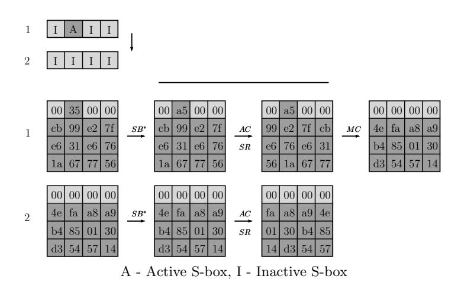
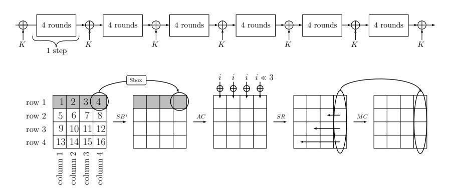
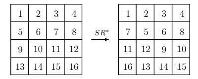
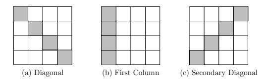
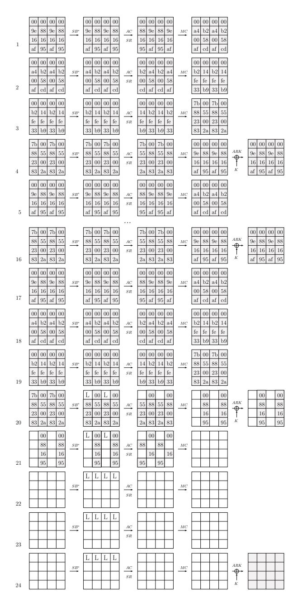
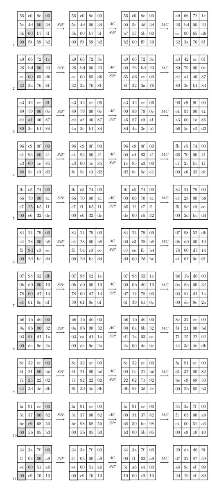

## Cryptanalysis of SP Networks with Partial Non-Linear Layers

Achiya Bar-On1 , Itai Dinur2 , Orr Dunkelman3,5,∗ , Virginie Lallemand4,† , Nathan Keller1,5,‡ , and Boaz Tsaban1

1 Department of Mathematics, Bar-Ilan University, Israel 2 D´epartement d'Informatique, Ecole Normale Sup´erieure, Paris, France ´ 3 Computer Science Department, University of Haifa, Israel 4 Inria, France

Abstract. Design of SP networks in which the non-linear layer is applied to only a part of the state in each round was suggested by G´erard et al. at CHES 2013. Besides performance advantage on certain platforms, such a design allows for more efficient masking techniques that can mitigate side-channel attacks with a small performance overhead. In this paper we present generic techniques for differential and linear cryptanalysis of SP networks with partial non-linear layers, including an automated characteristic search tool and dedicated key-recovery algorithms. Our techniques can be used both for cryptanalysis of such schemes and for proving their security with respect to basic differential and linear cryptanalysis, succeeding where previous automated analysis tools seem to fail.

We first apply our techniques to the block cipher Zorro (designed by G´erard et al. following their methodology), obtaining practical attacks on the cipher which where fully simulated on a single desktop PC in a few days. Then, we propose a mild change to Zorro, and formally prove its security against basic differential and linear cryptanalysis. We conclude that there is no inherent flaw in the design strategy of G´erard et al., and it can be used in future designs, where our tools should prove useful.

Keywords: Block cipher, Lightweight, Zorro, differential cryptanalysis, linear cryptanalysis.

### 1 Introduction

Most block ciphers are either SP networks that apply linear and non-linear layers to the entire state in every encryption round, or (generalized) Feistel structures that apply partial linear and non-linear layers in every round. In the CHES 2013

5 Computer Science department, The Weizmann Institute, Rehovot, Israel

∗The third author was supported in part by the German-Israeli Foundation for Scientific Research and Development through grant No. 2282-2222.6/2011.

†The fourth author was partially supported by the French Agence Nationale de la Recherche through the BLOC project under Contract ANR-11-INS-011.

‡The fifth author was supported by the Alon Fellowship.

paper [9], G´erard et al. suggested a compromise between the two common block cipher designs – an SP network in which the non-linear layer is applied to only a part of the state in every round. Such partial non-linear SP networks (which we call PSP networks) contain a wide range of possible concrete schemes that were not considered so far, some of which have performance advantage on certain platforms. More importantly, PSP networks allow for more efficient masking techniques, capable of thwarting side-channel attacks with a small performance overhead.

As a concrete instantiation of their methodology, G´erard et al. designed Zorro, a 128-bit lightweight block cipher. Zorro has an unconventional structure, as it applies a sequence of 24 AES-like rounds, with a partial S-box layer in each round, containing only 4 out of the possible 16 S-boxes. Since previous tools that were developed in order to formally prove the security of block ciphers against standard differential and linear cryptanalysis (such as the widetrail strategy used for AES) do not apply to PSP networks such as Zorro, the authors replaced the formal proof for Zorro by a heuristic argument. Unfortunately, the heuristic argument turned out to be insufficient, as Wang et al. [16] found iterative differential and linear characteristics that were missed by the heuristic and used them to break full Zorro with complexity of 2112 .

In this paper, we propose efficient algorithms for differential and linear cryptanalysis of PSP networks. These algorithms allow us to fully evaluate the security of such constructions against standard differential and linear cryptanalysis. In some cases, we can compute tight upper bounds on the probability of differential and linear characteristics, thus offering formal proofs which are expected from any proposal of a modern block cipher.

Our most useful tool is a generic differential/linear characteristic search algorithm, allowing us to search for the best differential/linear characteristics for many rounds with a practical time complexity. A complementary tool is an efficient key recovery technique for differential and linear attacks, making use of the partial S-box layers to analyze more rounds at the end of the cipher with no increase in the attack's complexity.

### 1.1 Our New Automated Characteristic Search Tool

The starting point of our characteristic search algorithm is the algorithm of Biryukov and Nikolic [2] (along with several related algorithms, starting from Matsui's classical algorithm [12] and more recent ones [3, 13]), which is based on a compact representation of differential characteristics, that we call a pattern. At its most basic form, a pattern describes for each byte (or nibble) of the cipher's state, whether it is active (namely, it has a non-zero input difference) or inactive.1

Patterns allow the algorithm to group together and simultaneously analyze many characteristics for a given number of the cipher's rounds. The algorithm

1For example, the 16 bytes of the 128-bit AES state can be described by a pattern of only 16 bits.

outputs only patterns that contain the smallest number of active S-boxes, and thus correspond to high probability characteristics. However, depending on the analyzed cipher, not all possible patterns are valid, as there are patterns not followed by any actual characteristic.2 Thus, in order to provide meaningful results, a characteristic search algorithm has to ensure that it only outputs valid patterns.

Previous search algorithms [2, 3, 12, 13] indeed made sure that their output patterns were valid. This was done using local consistency checks, separately ensuring that for each of the r rounds of a pattern, there exist characteristics that satisfy the transitions of the round3 (i.e., conform to the 1-round pattern). For standard block ciphers, ensuring that an r-round pattern is locally valid (in the sense described above) also implies that it is globally valid, namely, there exists an actual r-round characteristic that simultaneously satisfies all the transitions of the r rounds.

Unlike standard block ciphers, for PSP networks there exist many locally valid patterns which are not globally valid over several rounds. In order to demonstrate this, consider a 4-round AES-like cipher with 4 S-boxes in each round (such as 4-round Zorro). The cipher contains a total of 4 · 4 = 16 S-boxes, and a larger number of 12 · 4 = 48 state bytes that do not go through an S-box in these rounds. It is easy to see that the cipher has a large number of locally valid patterns in which all the 16 S-boxes are inactive, as in each round, there are many valid active/inactive possibilities for the 12 bytes that do not go through an S-box. Consequently, when applying previous algorithms (such as [2]) to this cipher, we obtain many patterns in which all the 16 S-boxes are inactive, containing a huge number of possible 4-round characteristics with probability 1. However, as we show next, it is likely that none of these characteristics is globally valid, rendering previous algorithms ineffective for this (seemingly simple) PSP network.

At a high level, the reason that it is likely that there exists no characteristic in which all the 16 S-boxes are inactive, is that each inactive S-box forces the input difference to 0, imposing a constraint on the characteristic. Thus, for the 4-round cipher, we have 16 such constraints, whereas the number of available degrees of freedom to choose the input difference at the first round is also 16. Consequently, we have the same number of constraints and degrees of freedom, and it is probable that the constraints cannot be simultaneously satisfied (which is indeed the case for 4-round Zorro, as shown in [9]).

In order to take into account global constraints, we group characteristics according to patterns similarly to previous algorithms. However, unlike previous algorithms, our patterns do not contain information about the full state, but only about the activity/inactivity of the bytes that go through S-boxes. Then, we observe that all the constraints imposed on a characteristic that follows such

2For example, if the input to an AES round contains 1 active byte, then its output contains exactly 4 active bytes, and all other patterns are automatically invalid.

3The algorithm of [3] is a bit different, as a characteristic is broken down into groups of 3 consecutive rounds.

a pattern can be described by a set of linear equations. This observation allows us to group together and efficiently analyze, many characteristics which reside in a subspace, defined according to subtle linear constraints imposed by the cipher's linear layer.

Previous related automated search tools of [2, 3, 12, 13] mostly employed method of dynamic programming and mixed integer-linear programming. On the other hand, our characteristic search algorithm, as well as our key recovery algorithms, is mostly based on linearization techniques, which combine in a novel way methods from simple linear algebra and combinatorics, and may be of independent interest. These techniques exploit the small number of S-boxes in the non-linear layers of the cipher in order to "linearize" sequences of rounds, thus making it possible to analyze many rounds efficiently. We stress that while we focus in this paper on PSP networks, our algorithms can potentially offer new insights on the security of other designs that apply a non-linear function to only a part of the state in each round, such as (generalized) Feistel constructions and stream ciphers.

### 1.2 Main Application of the New Tool: Studying the Security of the PSP Network Design Methodology

As a first demonstration of our techniques, we apply them to the block cipher Zorro, improving the complexity of the previously best attack from 2112 to a practical 245. Our attack was fully simulated several times on a standard desktop PC over several days. This is a rare case in which an attack on a modern block cipher is fully simulated in practice.

More significantly, we address the general question of whether the attacks on Zorro indicate a structural flaw in its design methodology, or are merely a result of an unlucky combination of components. Our conclusion is that indeed the methodology of building PSP networks based on AES in a straightforward way is flawed, and should not be reused. The structural weakness in this methodology is due to a subtle inter-relation between the ShiftRows and MixColumns operations of AES, that may need to be taken into consideration in future designs, especially in light of the common practice of using part of the AES components as building blocks.

Finally, we address an even more general question of whether the basic PSP network design methodology is flawed, or it can potentially be reused in future designs. This question is investigated by analyzing a PSP network that slightly deviates from the AES design strategy, having a lightly modified ShiftRows mapping. We analyze this scheme using our characteristic search tool and formally prove its resistance to standard differential and linear cryptanalysis (as expected from modern block ciphers). Thus, as the most important application of our tools, we answer the main question posed by this paper, concluding that PSP networks are not inherently flawed, and can be reused (with caution) to build secure block ciphers.

#### 1.3 Organization of the Paper

We start by presenting our generic characteristic search algorithms for PSP networks in Section 2. Our generic key recovery algorithms for differential and linear attacks are given in Sections 3 and 4, respectively. In Section 5, we use our algorithms to attack Zorro. Finally, we study the problem of designing secure PSP networks in Section 6 and conclude in Section 7.

### 2 Generic High-Probability Characteristic Search Algorithm for PSP Networks

In this section we present a novel and efficient high-probability characteristic search algorithm for SP networks with partial non-linear layers. The search algorithm is only presented for differential characteristics, but we note that the algorithm for linear characteristics is very similar. As the algorithm is somewhat involved, we first describe it at a high-level and then present it in detail. Finally, we describe an optimization which is very useful in practice.

For ease of exposition, we describe the algorithm on the example of an AESlike cipher, in which a 128-bit state is represented as a 4-by-4 matrix of bytes, and the S-boxes (which are the only non-linear operation) act on some of the bytes in each round. The number of S-boxes in each round is denoted by t (e.g., t = 16 for AES and t = 4 for Zorro). Hence, we shall concentrate on a PSP that contains the following parts:

- S-box layer The S-box layer is applied to t out of the 16 state bytes. The S-boxes are all invertible.
- Linear layer The linear layer L is applied to the state. We do not assume anything in particular concerning the structure of L (as long as it is invertible).
- Key addition layer XORing the subkey into the state.

As common in AES-like ciphers, we shall assume that there is one key addition layer before the first round (it does not affect our results whatsoever), and one can have in the last round a different linear layer (our described attacks and algorithms are trivially extended to cases where each round has its own linear layer).

Inspired by [2], we define the pattern of a differential (or a linear) characteristic to be a description of the activity for each of its spanned S-boxes (see Figure 1). Namely, a pattern is a function that specifies for each S-box spanned by the characteristic whether it is active (i.e., has a non-zero input difference) or not. We note that while [2] defines a pattern over the full bytes (S-boxes) of a state, we define it only over the bytes that are covered by S-boxes.

#### 2.1 An Overview of the Algorithm

Our algorithm is based on two observations:

Fig. 1. A 2-Round Pattern and a Differential Characteristic that Follows it

- 1. The number of possible patterns is small. We observe that if there are only a few S-boxes in each round (i.e., if t is small), then even for a relatively large number r of rounds, the number of possible patterns of r-round characteristics with a small number of active S-boxes is rather small. Specifically, since r rounds contain only tr S-boxes, the number of r-round patterns with at most a active S-boxes is at most  $\binom{tr}{\leq a} \triangleq \sum_{i=0}^{a} \binom{tr}{i}$ . For reasonably small values of t, r and a, this number is quite small, and we can iterate all of them. For example, for t=4, t=9 and t=4, there are only  $\binom{36}{\leq 4} \approx 2^{17}$  distinct patterns.
- 2. All characteristics following a fixed pattern can be enumerated efficiently. We observe that once we fix a pattern (i.e., fix the active and inactive S-boxes), we can typically calculate the actual characteristics that follow this pattern in an efficient way. This is the result of the fact that once the activity/inactivity of each S-box is determined, all the possible characteristics reside in a restricted linear subspace that can be easily calculated using linear algebra.

Specifically, we denote the input difference of the characteristic by 128 variables, and "linearize" the chain of intermediate encryption differences by adding 8 new variables each time 8 state bits enter an active S-box. Since the active S-boxes are the only non-linear operations in the encryption process, all intermediate differences can be described as linear combinations of at most 128 + 8a variables. On the other hand, each inactive S-box in the pattern restricts the intermediate difference at the input of the S-box to zero, giving rise to 8 linear equations in the state variables. As there are at least rt - a inactive S-boxes, we obtain a system containing at least 8(rt - a) lin-

ear equations in at most 128 + 8a variables, which can be efficiently solved.4 For a sufficiently small a (compared to rt, i.e., when most of the S-boxes are inactive), the expected dimension of the subspace in which the possible characteristics reside is small.

After calculating the linear subspace of all possible characteristics, we apply a post-filtering phase that enumerates the elements of the subspace, and filters out characteristics in which the active S-box transitions are impossible (according to the difference distribution table of the S-box).5 Given that the dimension of the subspace is small enough, we can efficiently post-filter its elements, and thus output all the possible characteristics for the given pattern.

Combining the two observations, when t, r and a are not too large, we can efficiently enumerate all the possible r-round differential characteristics with at most a active S-boxes. The analysis of the algorithm, presented in the next subsection, shows that the complexity of the algorithm is proportional to tr ≤a , given that the output size (i.e., the number of possible characteristics) is not too large.6 As a result, the algorithm is practical for a surprisingly wide choice of parameters (e.g., for t = 4 as in Zorro, r = 10 rounds and at most a = 10 active S-boxes, its complexity is still below 232).

### 2.2 Detailed Description of the Algorithm

We fix the global parameters t, r, a. The algorithm iterates over the tr ≤a distinct differential patterns, and for each of them, applies the two-step pattern analysis algorithm described below.

Calculating the Linear Subspace of a Pattern We maintain a symbolic representation of the 128-bit state difference at round i, STi , using 128 linear combinations. Each linear combination is initialized with a 1-bit variable, representing the corresponding unknown state difference bit in the first round ∆(X0) (before the first S-box layer). Additionally, we allocate a linear equation system Ei (which is empty at first), that describes linear constraints on the characteristic, which are imposed by the inactive S-boxes. At the end of the algorithm (after the final round, r), the subspace of all the possible characteristics is described by the null-space of Er.

The following round-linearization algorithm describes how we extend STi and Ei to STi+1 and Ei+1, according to the activity pattern of the S-boxes in round i + 1 (starting from round i = 0).

4Note that some of the equations may be linearly dependent; this depends on the exact structure of the linear transformation.

5Note that the solution of the linear equations yields all the intermediate differences, and in particular, the input and output differences of the active S-boxes.

6As we are mainly interested in characteristics with the smallest number of active S-boxes, their number is typically not very large, and thus it is reasonable to assume that the output size is small.

### Extending Linearization by 1 Round:

- 1. Allocate and initialize STi+1 ← STi , Ei+1 ← Ei .
- 2. For each S-box S of round i:
  - (a) If S is inactive according to the pattern of round i, add 8 equations to the system Ei+1, that equate the corresponding 8 bits in STi+1 to zero. If the dimension of the null-space of Ei+1 is 0 (i.e., there is no non-zero solution to the system, and thus no matching characteristic), return STi+1 and Ei+1 as NULL, and exit.
  - (b) If S is active according to the pattern of round i, replace the corresponding 8 linear combinations in STi+1 with the newly allocated variables.
- 3. Set STi+1 ← L(STi+1), i.e., update the symbolic state STi+1 according to the linear function of the cipher, L.

Given a pattern, the linear subspace of all possible characteristics for r rounds is calculated with the following algorithm:

### Calculate Linear Subspace:

- 1. Initialize ST0 with 128 new variables, and E0 with an empty set of equations.
- 2. For i = 0 to i = r − 1, run the extension algorithm for round i + 1, calculating STi+1 and Ei+1. If they are NULL, return NULL and exit.
- 3. Output a basis B for all the possible characteristics of the pattern using the null space of Er. This basis is represented as a set of b free (unconstrained) linear variables, and linear combinations of these variables, as follows: the 128 linear combinations of the initial state ST0, and the 16 · a linear combinations of all the inputs/outputs of the a active S-box transitions (according to the pattern).

Post-Filtering the Linear Subspace of a Pattern Once we obtain a basis B for all the possible characteristics of the pattern, we apply a simple post-filtering algorithm.

- 1. For each of the 2b possible values of the free variables:
  - (a) For each active S-box transition:
    - i. Calculate the actual input/output for the S-box transition by plugging in the values of the free variables.
    - ii. Check in the difference distribution table of the cipher whether the differential transition is possible, and if not, go back to Step 1.
  - (b) Output the full characteristic according to the current value of the free variables.

We note that it is possible to optimize the post filtering in various situations by choosing the free variables to be input/output bits of a restricted set of Sboxes. This enables us to iterate in advance only over the input/output difference transitions that are possible according to the difference distribution table of these S-boxes. The optimization can be particularly useful when the filtered linear subspace is of a relatively large dimension (and thus, we have less restrictions on the choice of free variables).

Complexity Analysis Let T(node) be the average complexity of evaluating a node in the recursive tree, without iterating and post-filtering the solutions. As the number of evaluated nodes is proportional to tr ≤a , the complexity of the algorithm can be estimated by the formula tr ≤a · T(node) + SOL, where SOL is the total number of solutions that we need to post-filter.7 Since we cannot determine in advance the value of SOL, we will estimate it according to the total number of characteristics which remain after post-filtering (i.e., the actual output size), which we denote by OUT.

In order to relate SOL and OUT, we note that an arbitrary input-output transition for an S-box is possible with probability of (at least) about 2−1.5 (this is true for the Zorro S-box, and for the AES S-box, the probability is even closer to 2−1 ), and thus if we have at most a active S-boxes, then we expect that OUT ≥ SOL· 2 −1.5a , or SOL ≤ OUT · 2 1.5a . Consequently, the time complexity of the algorithm can be upper bounded by tr ≤a · T(Node) + OUT · 2 1.5a . Assuming that the output size OUT is not too big, the complexity of the algorithm is proportional to tr ≤a .

### 2.3 Optimized Search Algorithm Using Pattern-Prefix Search

In this section we describe an optimization of the characteristic search algorithm, which is based on the observation that we can analyze together many common patterns with the same prefix. This allows us to dispose of all the patterns whose common prefix is not possible (instead of analyzing and disposing each one separately). In addition, this algorithm reduces the average amount of work (mostly linear algebra) performed for each pattern. We note that we cannot provide an improved theoretical analysis for this algorithm. However, this algorithm appears to give a significant advantage over the basic algorithm in practice.

The algorithm P P S (Pattern-Prefix Search) iterates over the tree of possible prefixes of patterns using the DF S (Depth First Search) algorithm. The global parameters of P P S are the number of rounds to analyze, r, the number of S-boxes in each round, t, and the maximal number of active S-boxes, a. The parameters which are passed to each node of the tree are: the round number i, the current S-box index in the round s ∈ {0, 1, . . . , t − 1}, the current number of active S-boxes in the prefix, ca, and STi , Ei (as in the standard patternanalysis algorithm). Thus, the P P S algorithm is initially called with parameters

7As post-filtering a solution is very simple, we assume it can be done in unit time.

P P S(i, s, ca, ST0, E0), where i = 0, s = 0, ca = 0, ST0 is initialized with 128 new variables and E0 is an empty set of equations.

#### P P S(i, s, ca, STi , Ei):

- 1. If i = r (i.e., we finished iterating over all the S-boxes of the pattern), then the r-round pattern is fully determined by the path to the root of the tree. Thus, calculate the basis B for all the possible characteristics of the pattern (using Er). Finally, post-filter the characteristics (as in the pattern-analysis algorithm), and return them.
- 2. Allocate a node n1 for the case that S-box with index s in round i is inactive (duplicating the current STi , Ei): For this node, add 8 equations to the system Ei , which equate the corresponding 8 bits in STi to zero. Denote the (yet undetermined) output set of this node as OUT1.
  - If the dimension of the null-space of Ei is 0 (i.e., there is no non-zero solution to the system, and thus no matching characteristic), delete this node and set OUT1 = ∅.
  - Otherwise, the dimension of the null-space is greater than 0. If s = t − 1 (i.e., we finished iterating over all the S-boxes of the current round i), then set STi+1 = L(STi) (i.e., update the symbolic state STi+1 according to the linear function of the cipher, L), also set Ei+1 = Ei . Recursively call P P S(i + 1, 0, ca, STi+1, Ei+1) and set OUT1 according to the returned output.
  - Otherwise, the dimension of the null-space is greater than 0, and s < t − 1. Recursively call P P S(i, s + 1, ca, STi , Ei) and set OUT1 according to the returned output.
- 3. If ca = a (i.e., we have reached the maximum number of active S-boxes), return OUT1.
- 4. Otherwise (ca < a) allocate a node n2 for the case that S-box with index s in round i is active (duplicating the current STi , Ei): For this node, replace the corresponding 8 linear combinations in STi with newly allocated variables. Denote the (yet undetermined) output set for this node as OUT2.
  - If s = t−1 (i.e., we finished iterating over all the S-boxes of the current round i), then set STi+1 = L(STi) and Ei+1 = Ei . Recursively call P P S(i + 1, 0, ca + 1, STi+1, Ei+1) and set OUT2 according to the returned output.
  - Otherwise, s < t − 1. Recursively call P P S(i, s + 1, ca + 1, STi , Ei) and set OUT2 according to the returned output.
- 5. Return OUT1 S OUT2.

### 3 Generic Key-Recovery Algorithm for Differential Attacks on PSP Networks

In this section we present a key recovery algorithm for differential attacks exploiting the small number t of S-boxes in each round of the cipher. As in Section 2, we describe the algorithm on the example of an AES-like cipher, in which a 128-bit state is represented as a 4-by-4 matrix of bytes, and the S-boxes (which are the only non-linear operation) act on t bytes in each round. We show that given an r-round differential characteristic with probability p, one can attack r + b16/tc rounds (i.e., b16/tc rounds in addition to the characteristic) with data and time complexity of only about 2 · p −1 , using negligible memory. First, we present an overview of the algorithm, and then we give a more detailed description.

### 3.1 An Overview of the Algorithm

For sake of simplicity, we assume that t divides 16, but the algorithm can be easily adapted to any value of t. We denote the intermediate difference of the characteristic after i rounds by ∆i , and thus the characteristic determines ∆i for i ∈ {0, 1, . . . , r}. The algorithm requires the encryption of p −1 plaintext pairs with input difference ∆0, and thus we expect that at least one of them is a right pair (i.e., follows the characteristic) with high probability. However, since we only have the output after r + 16/t rounds, there are no obvious filtering conditions on the ciphertext pair, and a trivial differential attack would fail to distinguish between right and wrong pairs.

In order to work around this problem, we first note that given the actual values at the output of round r + 16/t, there is, on average, only one 128-bit key that leads to the fixed difference of ∆r. 8 In this attack, we efficiently find the key suggestion (or suggestions in general) for each of the p −1 ciphertext pairs, and then we perform a trial encryption in order to test whether it is the correct key. Hence, we show that instead of determining the right pair, it is sufficient to efficiently attach a candidate key to each pair.

Our strategy resembles "Attack-C" of Albrecht and Cid [1]. In Attack-C, the adversary tests suggestions for the key, obtained by solving non-linear equations constructed using the fixed final difference of the characteristic and each of the ciphertexts pairs. In our case, we use a similar strategy, but without directly solving any non-linear equation. Instead, we use a linearization technique similar to the technique used in our search algorithm to determine the candidate key efficiently by solving two systems of linear equations.

The algorithm first "linearizes" the last 16/t rounds by expressing the output difference ∆r+16/t as a linear combination of the fixed difference ∆r and some auxiliary variables. We start with the difference ∆r and examine its evolution through round r + 1. Since there are t S-boxes in round r + 1, after the S-box

8When partially decrypting the two ciphertexts through the last 16/t rounds until round r with a random key, their intermediate difference is equal to ∆r with probability 2 −128 .

layer there are (at most) 8t unknown bits. Hence, we add 8t variables to denote this difference so that ∆r+1 can be expressed as a linear combination of ∆r and these 8t variables.9 We continue through rounds r + 2, r + 3, . . . , r + 16/t, and finally we obtain a representation of ∆r+16/t as a linear combination of ∆r and 8t·(16/t) = 128 variables. Note that this procedure does not depend on the actual ciphertexts, and can be performed during preprocessing. After obtaining the p −1 ciphertext pairs, we plug the output difference ∆r+16/t into the system of equations, find all the 128 intermediate variables, and thus all intermediate differences ∆r+1, . . . , ∆r+16/t−1.

After the differential sequence is determined, we can efficiently obtain the corresponding key suggestions to test. This is due to the fact that the determined differential transitions for the (16/t)·t = 16 S-boxes give us the actual possible transition values (as each input/output difference suggests on average a single actual value). Assuming that the subkeys are interleaved with the state by a XOR operation (as in most SP networks), this gives 128 linear equations in the subkey bits, which are usually sufficient to recover the key easily.10

We note that the number of additional rounds can be further increased from 16/t if the differential characteristic is chosen such that its output difference ∆r forces some S-boxes in the next rounds to be inactive. In such a case, the number of auxiliary variables in the linearization stage is decreased, and thus, more rounds can be covered by 128 auxiliary variables. As will be shown in Section 5, this is the case in our attack on Zorro, where the r-round characteristic is chosen such that out of the 8 S-boxes in rounds (r + 1) and (r + 2), only four are active. As a result, rather than attacking r + 16/4 = r + 4 rounds, we are able to break r + 5 rounds with the same complexity.

The full details of the algorithm are given below. Its data complexity is 2 · p −1 chosen plaintexts and its time complexity is a bit more than 2 · p −1 (and is estimated as 4 · p −1 ), since the analysis of each encrypted pair is very efficient (it essentially involves solving two small sets of linear equations). The algorithm requires negligible memory to store two small matrices.

#### 3.2 A Detailed Description of the Algorithm

In order to avoid abundance of variables, we assume that the number of S-boxes in each round is t = 4 (as in Zorro), and thus the attack targets r + 4 rounds. The algorithm can be easily adapted to any value of t.

The Main Key-Recovery Algorithm The algorithm makes use of two auxiliary matrices, A1 and A2, that are independent of the actual key and data, and are computed during preprocessing (to be described below).

9Note that unlike the characteristic search algorithm, there is no need for 128 initial variables, since the "initial" difference ∆r is fixed.

10If the key schedule is linear (as in Zorro), this can be done instantly by solving a system of linear equations. For more complex key schedules like that of AES, the key can typically be easily recovered by a guess-and-determine procedure.

- Given the 96×128 matrix A1, and ∆r+4, the 96-bit vector A1 · ∆r+4 describes all the 12 · 8 = 96 unknown output differences for the S-boxes of rounds r+1, r + 2 and r + 3. Note that once the output differences of these 12 S-boxes are known, computing the full ∆r+1, ∆r+2 and ∆r+3 can be done by simple linear algebra.
- Given the 128 × (128 + 256) matrix A2, and a (128 + 256)-bit vector v (comprised of the 128-bit ciphertext, and 2 ·(32 · 4) = 256-bit input-output values of all the S-boxes of the last 4 rounds), the product A2 · v gives a suggestion of the 128-bit key K.

The full algorithm is as follows:

- 1. Compute the matrices A1 and A2 (as described below).
- 2. Ask for the encryptions of p −1 plaintext pairs with input difference ∆0. For each pair (P, C) and (P 0 , C0 ):
  - (a) Compute ∆r+4 = C ⊕C 0 , and then calculate A1 · ∆r+4. This allows to compute the input-output differences of the 16 S-boxes in rounds r + 1, r + 2, r + 3, r + 4.
  - (b) Check for each of the 16 S-boxes, whether the input-output difference transitions are possible according to the difference distribution table. If any of them is impossible, discard this pair and analyze the next pair by going back to Step 2.
  - (c) Compute according to the difference distribution table, a list of vectors List, containing 2 ·(32 · 4) = 256-bit vectors, specifying all the possible input-output values of all the 16 S-boxes of the last 4 rounds.
  - (d) For each 256-bit vector in List, denoted by w:
    - i. Denote by v the (128+ 256)-bit vector, comprised of the 128-bit ciphertext C, and the 256-bit vector w (specifying the inputoutput values for all the S-boxes of the last 4 rounds). Obtain a suggestion for the key K by computing product A2 · v.
    - ii. Test the key using a trial encryption, and if it succeeds, return it.

Complexity Analysis The data complexity of the attack is 2 · p −1 chosen plaintexts. For each plaintext-ciphertext pair, we perform some simple linear algebra operations, whose complexity is generally proportional to a full cipher evaluation.11 As noted in the beginning of this section, we expect to test only 1 key per plaintext pair, and thus we can estimate the time complexity of the attack to be slightly higher than 2 · p −1 cipher evaluations (given that the preprocessing complexity is negligible compared to p −1 ).

The memory complexity of the attack is less than 210 words of 128 bits, required in order to store A1 and A2. Note that the elements of List can be generated "on-the-fly", and we do not need to store them.

11We can further reduce the complexity of the linear algebra using various low-level techniques (e.g., by using Gray-Codes), but these are out of the scope of this paper.

Calculating the Differential Transitions From the Output Difference This preprocessing algorithm is given as input ∆r (which is known from the characteristic) and computes the 96 × 128 matrix A1 defined above. The algorithm symbolically maintains the state difference of round i (∆i), denoted by STi (which is initialized for i = r with the known ∆r).

- 1. For each round i ∈ {r, r + 1, r + 2, r + 3}:
  - (a) Given STi , compute STi+1 by allocating 4 · 8 = 32 new linear variables for the output of the 4 S-boxes of round i+1, and then symbolically applying the linear layer L, obtaining STi+1 = L(STi) (i.e., a symbolic representation of ∆i+1).
- 2. Given the 128 computed symbolic expressions STr+4 (as functions of a total of 4 · 32 = 128 linear variables), invert the 128 × 128 matrix. This gives a matrix which calculates the S-box output differences of rounds r + 1, r + 2 and r + 3 (and r + 4) as functions of ∆r+4 (note that we do not actually need to allocate the 32 variables for ∆r+4 in order to compute this matrix). Denote by A1 the first 96 rows of this matrix (calculating the S-box output differences of rounds r + 1, r + 2 and r + 3).

### Calculating the Key From the Ciphertext and S-box Transition Values

This preprocessing algorithm computes the 128 × (128 + 256) matrix A2 defined above. The algorithm first symbolically describes all the (32 · 4) = 128 S-box output values in the decryption process of a (symbolic) ciphertext C, as linear combinations of the 128 variables of C, the 128 variables of K, and the (32 · 4) = 128 input values of all the intermediate S-boxes. This is done by iteratively computing the symbolic description of the values obtained in the decryption process of C through rounds r + 4, r + 3, r + 2, r + 1 (from the decryption side), and expressing for each round, the outputs of the S-box transitions as linear combinations of the previous variables. Finally, the algorithm performs Gaussian elimination to express the 128 variables of the key as linear combinations in terms of the other 128 + 256 variables, giving the matrix A2.

As the idea of this algorithm is very similar to the one of the previous algorithm (which computes A1), we do not give its full description in this paper.

### 4 Key-Recovery Algorithm for Linear Attacks on PSP Networks

In this section we present a key recovery algorithm for linear attacks exploiting the small number t of S-boxes in each round. We show that given an r-round linear characteristic with bias q, one can attack r + ` rounds (i.e., ` rounds in addition to the characteristic) with data complexity12 of c · q −2 , time complexity of q −2 + t` · 2 8t`+8 , and memory complexity of min(c · q −2 , 2 8t`). As in

12The value of c is determined by the amount of recovered subkey material and the desired success rate according to the formula suggested by Sel¸cuk in [15] or its

the differential case, the algorithm is based on linearization of the rounds after the characteristic. An additional tool used here is a variant of the *partial sums* technique introduced by Ferguson et al. [8].

**A 1-round attack** For sake of clarity, we first present the algorithm in the case of  $\ell=1$ . Thus, we want to attack r+1 rounds exploiting an r-round linear characteristic. We denote the mask of the characteristic after i rounds by  $\Omega_i$ , determining  $\Omega_i$  for  $i \in \{0,1,\ldots,r\}$ . The algorithm works by asking for the encryptions of  $c \cdot q^{-2}$  arbitrary plaintexts, and thus we expect to obtain a strong linear distinguisher after r rounds.

Obviously, the naive attack (guessing the last subkey and checking whether the linear relation holds) is worse than exhaustive key search for a 128-bit cipher, since the last round subkey consists of 128 bits. A better approach is to exchange the order of operations in the final round, such that the final key addition is performed right after the S-box layer, and the final linear layer becomes the last operation in the encryption process. This can be done by replacing the final round subkey with an equivalent key.13 As a result, in order to compute  $\Omega_r \cdot X_r$ , where  $X_r$  denotes the state after round r, it is sufficient to guess only the 8t equivalent subkey bits that affect the S-boxes of the last round. Thus, the attack complexity is reduced to  $2^{8t} \cdot q^{-2}$ .

The next optimization is useful when  $c \cdot q^{-2} > 2^{8t}$  (as in the case of Zorro). We write  $\Omega_r = \Omega_{8t} \oplus \Omega_{128-8t}$ , namely, we divide the mask  $\Omega_r$  between two masks — one that affects only the 8t bits in the S-boxes, and all the rest (as a result  $\Omega_{8t} \cdot \Omega_{128-t} = 0$ ). If two "ciphertexts" (i.e., partially decrypted ciphertexts through the linear layer L, which in the case of AES is composed of MC and SR) have the same value in the bits masked by  $\Omega_{8t}$ , then for any key guess, they yield the same value for  $\Omega_{8t} \cdot X_r$ . Hence, we count for each of the 8t bits that enter the S-box, how many times they were suggested (if  $\Omega_0 \cdot P \oplus \Omega_{128-8t} \cdot X_r = 0$ , we increment the counter corresponding to the 8t bits, and if  $\Omega_0 \cdot P \oplus \Omega_{128-8t} \cdot X_r = 1$ , we decrement this counter). After counting how many times an 8t-bit value is suggested (again, compensating for the difference in the values of  $\Omega_0 \cdot P \oplus \Omega_{128-8t} \cdot X_r$ ), we can analyze the 8t-bit value itself, and just increment/decrement the observed bias by the value of its corresponding counter. The resulting attack algorithm is as follows:

- 1. Initialize  $2^{8t}$  counters to zero.
- 2. Collect  $c \cdot q^{-2}$  plaintext/ciphertext pairs  $(P_i, C_i)$ .
- 3. For each ciphertext  $C_i$ , compute  $Z_i = L^{-1}(C_i)$ .
- 4. For each pair  $(P_i, Z_i)$ :

refinements from [4]. For example, for t=4 (32-bit subkey) and success rate of 84%, we need to fix c=3.7. For the full 128-bit key and success rate of 78.8% we need to fix c=7.

&lt;sup>13This procedure is common in attacks on AES, where the equivalent key is defined by  $\tilde{K} = SR^{-1}(MC^{-1}(K))$ , or in our notations  $\tilde{K} = L^{-1}(K)$ .

- If  $\Omega_0 \cdot P \oplus \Omega_{128-8t} \cdot Z_i = 0$ , increment the counter corresponding to the value of the 8t bits of  $Z_i$ .
- Else, decrement the counter corresponding to the value of the 8t bits of  $Z_i$ .
- 5. For all 8t key bits guess:
  - (a) Initialize a bias counter to 0.
  - (b) For any value of the 8t bits masked by  $\Omega_{8t}$ , use the guess of the key bits to evaluate  $\Omega_{8t} \cdot X_r$ .
  - (c) If  $\Omega_{8t} \cdot X_r = 0$ , add to the bias counter, the counter associated with the 8t "ciphertext" bits, otherwise, decrement by the same value.
  - (d) Output the key with the maximal bias from 0.

The advantage of this approach over the previous one is that the expensive partial decryption step is done only  $2^{8t}$  times, rather than  $c \cdot q^{-2}$  times. The time complexity of the algorithm is  $c \cdot q^{-2} + 2^{2 \cdot 8t}$ , and its memory complexity is  $\min(c \cdot q^{-2}, 2^{8t})$ .

The algorithm can be further refined by dividing the key guessing procedure into t steps using the partial-sum technique. In the first step, we guess only the 8 subkey bits corresponding to a single S-box and partially decrypt only through this S-box, summing over the relevant counters. After this step, there are only  $2^{8(t-1)}$  possible values (for the 8(t-1) bits, as the 8 bits corresponding to the "guessed" S-box are merged into a single entry). This process can be repeated for the next 8 subkey bits, until all 8t equivalent subkey bits are guessed. As the complexity of each of these stages is  $2^{8t+8}$  operations, the overall time complexity of the attack becomes  $c \cdot q^{-2} + t2^{8t+8}$  operations. The memory complexity remains  $\min(c \cdot q^{-2}, 2^{8t})$ .

Finally, we note that when the key addition layer is composed of XOR, we can optimize the parity evaluations by applying the algorithm of [5]. This algorithm, based on Fast Fourier Transform, allows computing the biases of all combinations of values and keys for a single S-box in time  $3 \cdot 8 \cdot 2^8 = 2^{12.6}$  rather than  $2^{16}$  as in a straightforward implementation. Hence, the time complexity of our attack becomes  $c \cdot q^{-2} + t2^{8t+4.6}$ .

An  $\ell$ -round attack In order to extend the attack to  $r + \ell$  rounds, we linearize the last  $\ell$  encryption rounds. Namely, we represent the bits of the state  $X_r$  as a linear function of the ciphertext bits and  $8t\ell$  auxiliary variables (similarly to the differential attack, we add 8 variables each time an active S-box is encountered). As in the case  $\ell = 1$ , we observe that if two partially decrypted ciphertexts agree on  $8t\ell$  bits, then they agree also on  $\Omega_r \cdot X_r$ . Hence, we can group the ciphertexts into  $2^{8t\ell}$  sets according to the values of these bits, and execute the same algorithm as in the case of  $\ell = 1$ .

The complexity of the attack is  $D=c\cdot q^{-2}$  known plaintexts,  $M=\min(c\cdot q^{-2},2^{8t\ell})$  128-bit memory blocks, and  $T=c\cdot q^{-2}+t\ell\cdot 2^{8t\ell+4.6}$  operations, where each operation is less than a single round decryption.

We note that the complexity of the attack can be further reduced if the linear characteristic is chosen in such a way that only t' of the active S-boxes in

round r+1 affect the output mask  $\Omega_r \cdot X_r$ . In such a case, the number of sets to which we group the ciphertexts is reduced to  $2^{8((\ell-1)t+t')}$ , and the attack's complexity is reduced accordingly. As described in Appendix A, this is the case in our linear attack on Zorro, where only 2 of the 4 active S-boxes in the last round affect the output mask. This also changes the memory complexity to  $M = \min(c \cdot q^{-2}, 2^{8t(\ell-1)+8t'})$ .

### 5 Practical Cryptanalysis of the Full Zorro

In this section we apply our generic algorithms to the lightweight block cipher Zorro.

#### 5.1 Description of Zorro

Zorro is an AES-based 128-bit lightweight block cipher proposed by Gérard et al. at CHES 2013 [9]. The cipher executes 24 AES-like rounds, where the key schedule simply adds the 128-bit master key every four rounds, as shown at the top of Figure 2.

Each Zorro round is made of four AES-like operations, namely  $SB^*$ , AC, SR and MC (see the bottom of Figure 2). SR and MC are exactly the same as the ones used in AES, whereas AC for round i adds the four constants  $(i,i,i,i\ll 3)$  to the 4 bytes of the first row. The main difference of Zorro from the AES is its non-linear operation  $SB^*$ , which contains only 4 S-boxes (instead of 16), located in the first row of the state matrix. Moreover, the actual  $8\times 8$  S-box is different than the one used in AES. However, as the S-box implantation has only a limited effect on our results, we refer the interested reader to the design document [9] for its specification.

Fig. 2. The Key Schedule and Round Function of Zorro

Summary of Attacks on Zorro Table 1 summarizes the previously published and our new attacks on full Zorro.14 We note that although the (independent and concurrent) work of Rasoolzadeh et al. [14] exploited the same characteristics as we do (that were found by them manually), their attack complexities are higher by a factor of 212, due to the use of inferior attack techniques.

| Source   | Time         | Data          | Memory     | Technique    |
|----------|--------------|---------------|------------|--------------|
| [16]     | 112†† 2   | 112 CP 2   | negligible | Differential |
| [14] † ≈ | 55 †† 2 2 | 55.12 CP      | 17 2    | Differential |
| [14] †   | 57.85 2   | 45.44 KP 2 | 17 2    | Linear       |
| Sec. 5.2 | 45 2      | 41.5 CP 2  | 10 2    | Differential |
| App. A   | 45 2      | 45 KP 2    | 17 2    | Linear       |

KP - Known plaintext, CP - Chosen plaintext

Table 1. Previous, Independent and New Key-Recovery Attacks on Full Zorro

#### 5.2 Differential Cryptanalysis of Full Zorro

In order to mount a differential attack on Zorro, we first apply the differential characteristic search algorithm of Section 2.2, and then use the key recovery technique of Section 3.

Differential Characteristic Search We applied the differential search algorithm of Section 2.2 to the full Zorro. The highest probability characteristic for Zorro (for more than 7 rounds) is obtained by concatenating several instances of the 4-round iterative characteristic described15 in Figure 5 (given in the appendix). In fact, there are 5 additional linearly-dependent variants (over GF(28 )) of the presented characteristic with the same probability.

Key Recovery for the Differential Attack In order to exploit the characteristic in an attack, we extend it up to round 19 (see Figure 5). The resulting 19-round characteristic has 8 active S-boxes in total, and has probability of

† The results were obtained concurrently and independently of ours.

†† The reported time complexities of [14, 16] are lower. However, in order to calculate the time complexity, we take into account the time required for generating the data.

14The table does not include the results of [10], which attack a weak-key class.

15We note that similar iterative characteristics were independently found in [14].

(6/256)8 ≈ 2 −43. We used the optimized version of our characteristic search tool (pattern-prefix search) to prove that it is the highest probability characteristic for the full 19 rounds.

A straightforward application of the algorithm presented in Section 3 can be used to attack 19 + 16/4 = 23 rounds. However, as mentioned in Section 3, more rounds can be attacked if the characteristic is chosen such that several S-boxes after the characteristic are inactive, and this is the case here. First, we observe that the state difference after 19 rounds (i.e., the output difference of the characteristic) contains 2 inactive S-boxes (see Figure 5). Furthermore, we can exploit the specific super S-box structure of Zorro (and of AES-based designs in general), and extend the characteristic with 2 additional inactive S-boxes in round 20 (see Figure 5). Thus, we have a total of 16 active S-boxes in the last 5 rounds (similarly to 4 fully active Zorro rounds), allowing to attack 5 rounds in addition to the 19 rounds of the characteristic.

According to Section 3, as the 19-round characteristic has a probability of about p = 2−43, the data complexity of the attack is about 2 · p −1 = 244 chosen plaintexts, its time complexity is about 245, and its memory complexity is less than 210 .

We can reduce the data complexity of the attack by a factor of 6 by using structures that exploit all the 6 characteristics of probability p = 2−43. This is a common technique in differential cryptanalysis, and was used (for example) in [16]. Each structure we use is an affine subspace of dimension 6, which is constructed from an arbitrary plaintext, by XORing to it all the 26 linear combinations (over GF(2)) of the 6 initial differences of the characteristics of probability p = 2−43. Thus, the data complexity is reduced by a factor of 6 to about 241.5 . The time complexity remains the same, and the memory complexity remains very small (as each structure contains only 26 elements).

Attack Simulation The differential attack presented in this section was implemented and fully simulated 11 times on a single desktop PC, each simulation running for (up to) several days (the fastest took less than 8 hours, whereas the longest took about 235.5 hours). Table 2 describes the average results of the simulations, which are very close to the theoretical prediction. More detailed results are given in Table 6 (in the appendix).

| Result                |       | Plaintexts Structures                 | Pairs | Keys  |
|-----------------------|-------|---------------------------------------|-------|-------|
|                       |       | Encrypted Analyzed Analyzed Suggested |       |       |
| Theory                | 41.5  | 35.5                                  | 43    | 43    |
|                       | 2     | 2                                     | 2     | 2     |
| Simulations (Average) | 41.49 | 35.49                                 | 43.07 | 43.07 |
|                       | 2     | 2                                     | 2     | 2     |

Table 2. Average Simulation Results of Differential Attack on Full Zorro (Versus Theoretical Estimate)

### 6 Design of Secure PSP Networks

In this section, we show that the weakness of Zorro is not inherently present in all PSP networks. We demonstrate this by designing a mild modification of Zorro that is provably secure against basic differential and linear attacks (such as those that broke the original Zorro). Finally, we discuss how to choose the parameter t (i.e., the number of S-boxes in each round) in PSP networks.

In order to quantify what we consider to be a "good" PSP network with respect to resistance against basic differential and linear attacks, we estimate the minimal number a of active S-boxes in an r-round characteristic for a very strong PSP network. Our model constructs an idealized PSP network by choosing the layer of each round uniformly at random from the space of invertible linear mappings, and it is therefore expected to provide very fast diffusion.

As described in Section 2, an r-round characteristic with a active S-boxes gives rise to a system of 8(tr − a) linear equations in 8(16 + a) variables (using the notations of Section 2). Based on our randomness assumption, we expect a solution when 8(16 + a) ≥ 8(tr − a), or equivalently, a ≥ (t· r − 16)/2. Namely, an r-round characteristic for an idealized PSP network is expected to have at least (t· r − 16)/2 active S-boxes.16 We note that this inequality is somewhat oversimplified, as it does not take into account the fact that we have many possible patterns, whereas we are looking for only one valid characteristic. On the other hand, depending on the actual S-box, not all solutions are valid for a given cipher. As these two considerations have opposite effects on a, and their total effect seems relatively small for large values of r, we consider the formula a ≥ (t· r − 16)/2 to be a reasonable measure for a "good" PSP Network. As an extreme case, consider AES for which t = 16. Plugging r = 4 into the formula, we estimate that 4-round AES can be designed to have at least a ≥ (16 · 4−16)/2 = 24 active S-boxes in any characteristic. Indeed, it is known that the minimal number of active S-boxes in a 4-round characteristic of AES is 25 (see [6]), and thus our estimate is very close in this case.

#### 6.1 Analysis of a Concrete PSP Network

We now construct a PSP Network which (roughly) satisfies the formula a ≥ (t· r − 16)/2 for large values of r, thus providing significantly better resistance against basic differential and linear attacks compared to Zorro. According to Appendix B, in order to avoid the weakness of Zorro, our scheme has to deviate from the AES-based design strategy. More specifically, this appendix shows that any AES-based PSP network (with small t) is likely to have 4-round iterative characteristics with a high probably. The reason for the inherent weakness of AES-based PSP networks is subtle and is detailed in Appendix B. Very roughly, this weakness stems from the combination of the two properties below:

16This formula is somewhat more conservative (from the point of view of the designer) compared to the one obtained in [9], that seems to underestimate the number of degrees of freedom available in the construction of the characteristic, thus obtaining larger values of a.

- 1. Any MDS circulant MixColumn matrix, MC, raised to the power of 4 (i.e.,  $(MC)^4$ ) has a large space of eigenvectors ("almost fixed-points") that satisfy  $MC^4(x) = \alpha x$  for an appropriately chosen eigenvalue scalar  $\alpha$ .
- 2. The order of ShiftRows is 4 (i.e.,  $(SR)^4$  is the identity).

Therefore, in order to avoid the high probability 4-round iterative characteristics of the type shown in Figure 5, our scheme has to deviate from the AES design strategy by changing at least one of the two properties above. In our tweaked scheme, we slightly change the ShiftRows operation such that its order is greater than 4, as described below. Furthermore, in order to avoid additional types of iterative characteristics (namely, characteristics presented in [16], which are independent of ShiftRows), we also change the locations of the S-boxes, and place them on the diagonal instead of the first row.

The modified variant of ShiftRows (denoted as  $SR^*$ ) is described in Figure 3 and works as follows: The action of  $SR^*$  on rows 1,3 and 4 is the same as in the original ShiftRows. On the other hand, only the first 3 bytes of row 2 are cyclically rotated by 1 (whereas the 4'th byte remains unchanged at its position), and it is easy to see that the order of  $SR^*$  is  $3 \cdot 4 = 12$ . We note that this modified variant provides slightly weaker local diffusion compared to AES-based designs. However, we now show that globally, this modification significantly strengthens the resistance of the scheme against standard differential and linear attacks.

Fig. 3. Modified ShiftRows

We first consider 11 rounds of the tweaked scheme and estimate its strength in our ideal model by plugging t=4 and r=11 into the formula  $a \ge (t \cdot r-16)/2$ , obtaining  $a \ge (4 \cdot 11-16)/2=14$ . However, a more careful analysis reveals that there are many possible 11-round patterns with 13 active S-boxes  $\binom{11\cdot 4}{13} > 2^{35}$ , each giving rise to a system with  $8 \cdot (16+13) = 8 \cdot 29$  variables and  $8 \cdot (44-13) = 8 \cdot 31$  equations, which has a solution with non-negligible probability of  $2^{8 \cdot (29-31)} = 2^{-16}$ . Therefore, 13-round characteristics can also be expected, slightly deviating from the generic formula when we do not consider post-filtering according to the cipher's S-box.

Using the characteristic search tool presented in Section 2, we were able to prove that there exists no characteristic (or linear mask) with at most 12 active S-boxes (regardless of the cipher's specific S-box). Considering 13 active

S-boxes, there exist only a few dozens of possible characteristics for the cipher. Consequently, the behavior of the 11-round scheme closely matches our ideal one, and we conclude that it has no particular weakness against standard differential and linear cryptanalysis.

A more comprehensive differential analysis17 of the 11-round cipher reveals that none of the characteristics with 13 active S-boxes satisfies the restrictions imposed by the 13 transitions through the Zorro S-box. This is expected, as the number of possible characteristics is small, and implies that our generic formula  $a \geq (t \cdot r - 16)/2$  predicted the exact value of a = 14 in this case. Indeed, we were able to find about  $2^{32}$  11-round characteristics with 14 active S-boxes using our tool. When considering the specific Zorro S-box for post-filtering these solutions, about  $2^{22}$  valid 14-round differential characteristics remain. The highest-probability differential characteristic with 14 active S-boxes is described in Figure 6 (in the appendix), having probability of about  $2^{-86.8}$ . Since the highest differential transition probability for the Zorro S-box is about  $2^{-4.7}$ , this proves that the best 11-round characteristic has probability of at most  $\min(2^{-86.8}, 2^{15 \cdot (-4.7)}) = 2^{-70.5}$ . Consequently, the best characteristic for 22 rounds of the cipher has probability of at most  $2^{-70.5 \cdot 2} = 2^{-141}$  (note that for the stronger AES S-box, the bound is even lower).

For 12 rounds of the cipher, we were able to prove that there exists no characteristic (or mask) with at most 14 active S-boxes. However, we did not run the tool for more than 14 active S-boxes, as this is too time-consuming for a standard desktop PC. Of course, it would be interesting to further optimize the search tool and efficiently analyze more rounds. Nevertheless, even in their current state, our results are sufficient for demonstrating that the security of our modified Zorro variant with respect to standard differential and linear attacks is close to that of an idealized PSP network with the same parameters. Indeed, according to the formula  $a \ge (t \cdot r - 16)/2$ , the bound of at least a = 30 active S-boxes (or a differential characteristic probability bound of  $2^{-141}$ ) should be obtained for r = 19 rounds. Thus, the gap between the expected behavior of the scheme and what we can prove, is only 3 rounds for a probability bound as low as  $2^{-141}$ , and if we consider the stronger AES S-box (for which the probability bound of  $2^{-141}$  can be obtained with only 24 active S-boxes), this gap is even smaller.

# 6.2 How to Choose the Number of S-boxes in Each Round in PSP Networks?

We now use the insight gained in this paper to revisit one of the main questions posed in [9], namely: for a PSP network, what is the value of t that offers security

&lt;sup>17The linear analysis is very similar, and we omit it from this paper.

&lt;sup>18One could try to incorporate dynamic programming techniques into our tool, similarly to the algorithms of [2, 3]. However, this seems far from straightforward, as concatenating two patterns requires the relatively complex operation of intersecting their corresponding linear subspaces.

with the minimal number of S-boxes? In [9], it was concluded that for 128-bit ciphers with 8-bit S-boxes, the optimal value is t = 4, when considering security against standard differential and linear cryptanalysis. However, our formula a ≥ (t· r−16)/2 shows that the total number of S-boxes in the scheme, t· r, required to guarantee that a of them are active (and thus to obtain a bound on the characteristic probability) is fixed to (2 · a) + 16, regardless of the value of t. Furthermore, according to Sections 3 and 4, the number of S-boxes that need to be added at the end of the cipher is fixed as well (e.g., to about 16 for differential attacks), and is independent of t.

Since it is possible to use t = 16 as in AES, this seems to question the effectiveness of PSP networks in thwarting side-channel attacks via masking techniques. Indeed, when considering resistance against standard differential and linear cryptanalysis, it seems that there is no gain in using partial non-linear layers. However, we still claim that the combination of partial non-linear layers with strong linear layers has an advantage, when taking into consideration other types of attacks.

In order to demonstrate this potential advantage, we consider AES-128, where 4 rounds are sufficient for assuring that any characteristic has probability lower than 2−128. Despite its strength against differential and linear cryptanalysis, 4-round AES-128 is an extremely weak cipher due to strong structural properties, and can be broken in 210 chosen plaintexts and time (see [8]). In fact, as the best attacks on AES-128 can break 7 rounds (e.g., see [7]), one has to (at least) double the number of rounds to 8 (and double the number of S-boxes to 16 · 8 = 128) in order to obtain a secure cipher.

PSP networks, on the other hand, employ many strong linear layers through more rounds, and thus seem to better mitigate structural attacks. Consequently, one could build a secure PSP network where the number of S-boxes is closer (compared to AES) to the bound (2 · a) + 16.

Finally, we note that (generalized) Feistel structures employ only partial linear layers, and therefore may require many more than (2 · a)+16 S-boxes to resist standard differential and linear cryptanalysis. Furthermore, due to the partial linear layers, some Feistel structures are particularly vulnerable to structural attacks such as impossible differential cryptanalysis.

We conclude that PSP networks may allow for more efficient masking techniques to mitigate side-channel attacks. However, the optimal choice of the number of S-boxes in each round has to be made for each specific design separately, after evaluating its security against a broad class of attacks, which are out of the context of this paper.

### 7 Conclusions

In this paper, we introduced new algorithms for differential and linear cryptanalysis of PSP networks. Using these algorithms, we were able to devise and fully simulate a practical attack against the block cipher Zorro. We then closely examined PSP networks, and concluded that they should not be based directly on the AES design strategy. Finally, we designed and analyzed a tweak of Zorro and used it to show that PSP networks do not have an inherent flaw. We do not formally propose to use this tweak, as this would require defining its concrete number of rounds and performing full analysis against many types of known attacks. Nevertheless, we believe that our tweak may provide a good starting point for building future designs. Alternatively, one can think of building PSP networks based on bit-oriented design strategies, such as the one used for the block cipher Serpent. Regardless of concrete design strategies, we believe that the tools developed in this paper will be useful in future PSP network design and analysis.

### References

- 1. Albrecht, M.R., Cid, C.: Algebraic Techniques in Differential Cryptanalysis. In: Dunkelman, O. (ed.) FSE. Lecture Notes in Computer Science, vol. 5665, pp. 193– 208. Springer (2009)
- 2. Biryukov, A., Nikolic, I.: Automatic Search for Related-Key Differential Characteristics in Byte-Oriented Block Ciphers: Application to AES, Camellia, Khazad and Others. In: Gilbert, H. (ed.) EUROCRYPT. Lecture Notes in Computer Science, vol. 6110, pp. 322–344. Springer (2010)
- 3. Biryukov, A., Nikolic, I.: Search for Related-Key Differential Characteristics in DES-Like Ciphers. In: Joux, A. (ed.) Fast Software Encryption - 18th International Workshop, FSE 2011, Lyngby, Denmark, February 13-16, 2011, Revised Selected Papers. Lecture Notes in Computer Science, vol. 6733, pp. 18–34. Springer (2011), http://dx.doi.org/10.1007/978-3-642-21702-9\_2
- 4. Bogdanov, A., Tischhauser, E.: On the Wrong Key Randomisation and Key Equivalence Hypotheses in Matsui's Algorithm 2. In: FSE (2013), to appear in Lecture Notes in Computer Science
- 5. Collard, B., Standaert, F.X., Quisquater, J.J.: Improving the Time Complexity of Matsui's Linear Cryptanalysis. In: Nam, K.H., Rhee, G. (eds.) ICISC. Lecture Notes in Computer Science, vol. 4817, pp. 77–88. Springer (2007)
- 6. Daemen, J., Rijmen, V.: The Design of Rijndael: AES The Advanced Encryption Standard. Information Security and Cryptography, Springer (2002), http://dx. doi.org/10.1007/978-3-662-04722-4
- 7. Derbez, P., Fouque, P., Jean, J.: Improved Key Recovery Attacks on Reduced-Round AES in the Single-Key Setting. In: Johansson, T., Nguyen, P.Q. (eds.) Advances in Cryptology - EUROCRYPT 2013, 32nd Annual International Conference on the Theory and Applications of Cryptographic Techniques, Athens, Greece, May 26-30, 2013. Proceedings. Lecture Notes in Computer Science, vol. 7881, pp. 371–387. Springer (2013), http://dx.doi.org/10.1007/978-3-642-38348-9\_23
- 8. Ferguson, N., Kelsey, J., Lucks, S., Schneier, B., Stay, M., Wagner, D., Whiting, D.: Improved Cryptanalysis of Rijndael. In: Schneier, B. (ed.) FSE. Lecture Notes in Computer Science, vol. 1978, pp. 213–230. Springer (2000)
- 9. G´erard, B., Grosso, V., Naya-Plasencia, M., Standaert, F.X.: Block Ciphers That Are Easier to Mask: How Far Can We Go? In: Bertoni, G., Coron, J.S. (eds.) CHES. Lecture Notes in Computer Science, vol. 8086, pp. 383–399. Springer (2013)
- 10. Guo, J., Nikolic, I., Peyrin, T., Wang, L.: Cryptanalysis of Zorro. Cryptology ePrint Archive, Report 2013/713 (2013), http://eprint.iacr.org/

- Le, T.V., Sparr, R., Wernsdorf, R., Desmedt, Y.: Complementation-Like and Cyclic Properties of AES Round Functions. In: Dobbertin, H., Rijmen, V., Sowa, A. (eds.) AES Conference. Lecture Notes in Computer Science, vol. 3373, pp. 128– 141. Springer (2004)
- 12. Matsui, M.: On Correlation Between the Order of S-boxes and the Strength of DES. In: Santis, A.D. (ed.) Advances in Cryptology EUROCRYPT '94, Workshop on the Theory and Application of Cryptographic Techniques, Perugia, Italy, May 9-12, 1994, Proceedings. Lecture Notes in Computer Science, vol. 950, pp. 366–375. Springer (1994), http://dx.doi.org/10.1007/BFb0053451
- Mouha, N., Wang, Q., Gu, D., Preneel, B.: Differential and Linear Cryptanalysis Using Mixed-Integer Linear Programming. In: Wu, C., Yung, M., Lin, D. (eds.) Information Security and Cryptology - 7th International Conference, Inscrypt 2011, Beijing, China, November 30 - December 3, 2011. Revised Selected Papers. Lecture Notes in Computer Science, vol. 7537, pp. 57–76. Springer (2011), http://dx.doi. org/10.1007/978-3-642-34704-7\_5
- Rasoolzadeh, S., Ahmadian, Z., Salmasizadeh, M., Aref, M.R.: Total Break of Zorro using Linear and Differential Attacks. ISeCure, The ISC International Journal of Information Security 6(1), 23–34 (2014)
- Selçuk, A.A.: On Probability of Success in Linear and Differential Cryptanalysis.
  J. Cryptology 21(1), 131–147 (2008)
- Wang, Y., Wu, W., Guo, Z., Yu, X.: Differential Cryptanalysis and Linear Distinguisher of Full-Round Zorro. In: Boureanu, I., Owesarski, P., Vaudenay, S. (eds.) Applied Cryptography and Network Security 12th International Conference, ACNS 2014, Lausanne, Switzerland, June 10-13, 2014. Proceedings. Lecture Notes in Computer Science, vol. 8479, pp. 308-323. Springer (2014), http://dx.doi.org/10.1007/978-3-319-07536-5\_19

### A Details of the Linear Cryptanalysis of Full Zorro

In this section, we describe our linear attack on full Zorro.

Linear Characteristic Search We applied the linear characteristic search algorithm of Section 2 to 23-round Zorro. Similarly to the differential case, the best characteristics are concatenations of 4-round iterative linear characteristics. These characteristics can be viewed as counterparts of the differential ones, and follow a similar representation as in Figure 5. The resulting 23-round linear characteristic has 10 active S-boxes, and thus has a bias of  $q = (56/256)^{10} \approx 2^{-22}$ . As in the differential case, we used our characteristic search tool to prove that it is the best linear characteristic for 23 rounds.

Key Recovery for the Linear Attack Using the algorithm of Section 4, we can attack 23+1=24 rounds with data complexity of  $2^{44}$  known plaintexts, time complexity of  $2^{44}+2^{2\cdot 8+9}\approx 2^{44}$  encryptions, and memory complexity of  $\min(2^{44},2^{2\cdot 8+1})=2^{17}$  32-bit words. 19 The attack recovers 2 bytes of equivalent

 $^{19}$ Note that since there are only two active S-boxes in round 24 that affect the output bias of the characteristic, the memory complexity is  $2^{17}$ , and not  $2^{33}$  as it would be in the worst case.

key K˜ = SR−1 (MC−1 (K)) (i.e., the two bytes used in the "active" S-boxes in round 24), which is the result of exchanging the order of the final key addition and linear operations SR and MC.

In order to recover additional 2 bytes of K˜ , we can simultaneously and independently (using the same data) exploit the variant of the same linear characteristic, in which the 2 columns are swapped. Furthermore, we can simultaneously exploit another variant of the iterative characteristic which spans rounds 2–24 (with the active S-boxes in round 2), and apply the key recovery on the encryption side. This allows us to recover 2 bytes of K, and additional 2 bytes can be simultaneously recovered by swapping the columns in the last characteristic. As the time complexity bottleneck in all of these 4 simultaneous attacks is the actual collection of data, the total time complexity of recovering the 8 bytes of key material remains about 244, and the memory complexity is less than 4 · 2 (2 · 8)+1 = 219 words of 32 bits, or 217 words of 128 bits.

After determining the 8 bytes of key material used in rounds 1 and 24 which contribute to all non-linear operations, we can "peel off" this non-linearity and apply the same ideas to the inner rounds 2 and 23 in order to recover the 8 additional (linear combinations of) key bytes, which contribute to the non-linearity in these rounds. This is done by exploiting the iterative characteristics in which the active S-boxes are in round 2, and in round 23. However, due to the dependency of the inner-round attacks on the previously recovered 8 bytes, it is not obvious how to perform these attacks simultaneously, and thus (in order to avoid the large memory overhead of storing the original data) we can request additional 2 44 known plaintexts in order to recover the rest of the key. This leads to an attack that uses 245 known plaintexts, runs in 245 time, and requires memory of about 217 words of 128 bits.

### B Analysis of PSP Networks Based on AES

In this section, we show that the high probability iterative differential and linear characteristics for Zorro are likely to appear in any AES-based PSP Network (although perhaps with lower probabilities).

In the specific case of Zorro, there are extremely high-probability characteristics with only 2 active S-boxes every 4 rounds (for comparison, the heuristic presented in [9] suggested that any 14-round characteristic has at least 24 Sboxes). We analyze these characteristics and show that they exist due to a subtle inter-relation between the MixColumns and ShiftRows operations of AES, used as components of Zorro. Following this analysis, we propose two changes to the design of Zorro that can potentially mitigate the high-probability (or high-bias) characteristics while maintaining the AES-like design. The first modification is replacing the MixColumns operation with multiplication with another circulant matrix (we do not consider non-circulant matrices, as these increase the footprint of the implementation). The second modification is changing the positions of the S-boxes, while maintaining 4 S-boxes in each round. Finally, we analyze several of the modified variants using our generic tool. For some of these variants, the probability of the iterative characteristics is reduced, but their probability is still higher than expected from a reasonable design, indicating an inherent weakness of AES-based PSP Networks.

### B.1 Analysis of the High-Probability and High-Bias Characteristics of Zorro

For ease of explanation, we concentrate on the high-probability differential characteristics. The analysis of the high-bias linear characteristics is similar. The highest-probability characteristics of 4-round Zorro (such as the one of Figure 5) share several properties:

- 1. They are iterative (in cycles of 4 rounds).
- 2. They have a two-column symmetry, i.e., the difference in the first two columns are equal to the differences in the last two columns.
- 3. All S-box transitions in the characteristics are of the form x → x. 20

Property (3) simplifies the analysis of the characteristics, as it implies that the S-boxes can be neglected (all having "fixed-point" transitions). Thus, for the sake of this analysis we can consider a modified variant of Zorro, in which the only operations in each round are SR and MC (note that AK and AC have no effect on the difference propagation).

Property (1) implies that for the input difference of the characteristic ∆0, we have (MC ◦ SR)4 (∆0) = ∆0. Since both MC and SR are linear operations on the 4-by-4 state matrix, they can be represented as 16-by-16 matrices over the finite field GF(28 ) (whose elements represent the bytes of the state). Hence, in order to find all characteristics satisfying properties (1) and (3), we can simply compute the eigenvectors of the matrix representing the operation (MC ◦ SR)4 that correspond to the eigenvalue 1. We performed this computation, and found that there are surprisingly many such vectors with a well-defined structure.

Proposition 1. The state matrices ∆0 satisfying the equation (MC ◦ SR)4 (∆0) = ∆0 are exactly all state matrices in which the last two columns are equal to the first two columns.

The proposition shows that among 4-round characteristics satisfying property (3), properties (1) and (2) are equivalent.

The abundance of characteristics satisfying all the three properties appears to explain the unexpectedly high probability of the best characteristic. The explanation is based on a few simple observations:

20We note that the idea of considering iterative 4-round characteristics in which all S-box transitions are of the form x → x was used in the first attack on full Zorro presented by Wang et al. [16]. To avoid the effects of SR, Wang et al. considered fully symmetric states in which all four columns are equal. This appears to give less flexibility than two-column symmetric states, which allows us to obtain characteristics with a higher probability.

- 1. Both MC and SR preserve the two-column symmetry property (this observation was first made in [11] and was already used in several attacks on AESbased primitives), Thus, for any characteristic satisfying (1),(2) and (3), all the intermediate state differences satisfy the symmetry property.
- 2. As a result from the previous observation, and since the locations of the Sboxes are also two-column symmetric, if the 4-round characteristic has a zero input difference in k of the 8 S-boxes in the left two columns over 4 rounds, it must have a zero input difference also in the k corresponding S-boxes in the right two columns.
- 3. The number of characteristics satisfying (1),(2), and (3) is 264 (this is the number of two-column symmetric states).
- 4. If the S-boxes are neglected, then each condition of the form "The input difference to a specific S-box in some round is zero" can be translated to 8 linear equations in the bits of the input difference.

Using these observations, we can easily construct iterative 4-round characteristics with only two active S-boxes. We take the input difference to be one of the 264 two-column symmetric differences. We then require that the input difference to 7 of the 8 active S-boxes in the left two columns is zero. This requirement is translated to 56 linear equations in the input bits of the characteristic, and we can easily solve them and find the linear subspace of size 28 of characteristics satisfying them. These characteristics have only a single active S-box in the left two columns, and thus only a single active S-box in the right two columns, a total of two active S-boxes for four rounds.

Summarizing the above discussion, the unexpectedly high probability of the best differential results from a combination of three factors:

- 1. The huge number (264) of fixed-points in the21 function (MC SR)4 .
- 2. The fact that these fixed-points are all of a two-columns symmetric structure that is preserved by both MC and SR.
- 3. The two-columns symmetric location of the S-boxes.

Based on this understanding, we consider modifications of Zorro, that mitigate one or more of these three factors.

#### B.2 Analysis of Modifications of Zorro

In this section, we study slightly modified variants of Zorro, aiming to increase its resistance to differential and linear cryptanalysis. As in this section we adhere to the Zorro and AES design criterions, we do not consider changing the S-box (as it was designed in a special way to allow efficient masking), nor replacing MC with a non-circulant matrix (as this increases the footprint of the implementation). Instead, we consider two modifications:

21Note that the large number of fixed-points in (MC ◦ SR)4 can be explained, as it can be shown that it is an involution, and such functions are expected to have a large number of fixed-points.

- 1. Replacing the circulant matrix used in MC.
- 2. Changing the locations of the S-boxes (while maintaining four active S-boxes in each round).

The motivation behind these two modifications is that changing the circulant matrix can mitigate factors (1) and (2) above, while changing the location of the S-boxes mitigates factor (3) above.

Replacing the Circulant Matrix of MixColumns We first performed a mathematical analysis of the properties of the transformation (MC0 ◦ SR)4 where MC0 denotes the application of an arbitrary circulant matrix M0 to each column in parallel. The analysis, presented in subsection B.3, shows that all two-column symmetric state matrices are eigenvectors of this transformation for any circulant matrix M0 . Unlike the case of Zorro, for a general circulant matrix the eigenvalue is α = (a 4 0 + a 4 1 + a 4 2 + a 4 3 ), where (a0, a1, a2, a3) is the first row of the matrix M0 . Hence, if the matrix is chosen such that α 6= 1, we can assure that the two-column symmetric state matrices are not fixed-points of (MC0 ◦ SR)4 , but are rather multiplied by a constant. In such a case, one may still construct an almost-iterative 4-round characteristic with only two active S-boxes, starting with a two-columns symmetric state and using x → x transitions in all S-boxes. However, since the values of x used in the differential transitions are changed in every "iteration", the overall probability of the characteristic is reduced, since not all of them can be optimized simultaneously. This particularly affects the linear characteristics, where there exists only a single value of x for which the transition x → x has a large bias of 56/256. For the original Zorro, the linear characteristic can be chosen such that in all active S-boxes, the transition has the maximal bias of 56/256. If the circular matrix is changed, then the bias can be taken to be maximal only in one iteration, while in other transitions the bias is significantly smaller.

We summarize in Tables 3 and 4 the maximal, median, and minimal values of the probability of the best differential for 19 rounds, and the bias of the best linear characteristic for 23 rounds, respectively, as a function of α, along with the complexities of attacks on modified Zorro based on these characteristics. We note that there are two values of α for which no differential characteristic exists, due to properties of the S-box. Linear characteristic exists for all values of α.

We conclude that while replacing MixColumns with another circulant matrix can increase the security of Zorro without any performance overhead, the resulting security, especially against differential attacks, is still very weak.

Changing the Location of the S-boxes From the analysis presented above, it is clear that changing the location of the S-boxes to a location that is not two-column symmetric may increase the number of active S-boxes in 4-round iterative characteristics. Indeed, as fixing the input difference of S-boxes in the left two columns to zero does not assure zero difference in the S-boxes in the right two columns (since the S-boxes are no longer in symmetric positions), the

|                   | α | x | pD(α)    | Complexity |         |            |
|-------------------|---|---|----------|------------|---------|------------|
|                   |   |   |          | Data       | Time    | Memory     |
| Maximal 0x01 0x7B |   |   | −43 2 | 44 2    | 45 2 | negligible |
| Median 0x96 0x71  |   |   | −53 2 | 54 2    | 55 2 | negligible |
| Minimal 0x16 0x09 |   |   | −56 2 | 57 2    | 58 2 | negligible |

x denotes the non-zero transition in the first step of the characteristics.

The minimal does not list the two α's for which pD(α) = 0.

Table 3. Differential Attacks on Modified Zorro (Different Matrix)

|                     | α | x           | pL(α)    | Complexity |         |              |
|---------------------|---|-------------|----------|------------|---------|--------------|
|                     |   |             |          | Data       | Time    | Memory       |
| Maximal 0x01 0x88   |   |             | −23 2 | 46 2    | 46 2 | 17 bits 2 |
| Median              |   | 0x38 0xDD 2 | −36      | 72 2    | 72 2 | 17 2      |
| Minimal 0xF7 0xBE 2 |   |             | −39.5    | 79 2    | 79 2 | 17 2      |

x denotes the non-zero transition in the first step of the characteristics.

Table 4. Linear Attacks on Modified Zorro (Different Matrix)

characteristic is expected to contain more active S-boxes. Based on this motivation, we investigated three modified variants of Zorro with asymmetric positions of S-boxes, and applied to them our generic characteristic search algorithm. The variants are presented in Figure 4. We list in Table 5 the probabilities of the best 4-round iterative characteristics we could find in each of these three variants.

Fig. 4. Non-Symmetric S-boxes Positions Studied

For all these three variants, the probabilities of the iterative characteristics are significantly reduced compared to Zorro. However, they still posses the inherent weakness of AES-based PSP Networks. For example, for each of the variants, there are 11-round characteristics with only 11 active S-boxes (obtained by

|                    | Differential | Linear       |
|--------------------|--------------|--------------|
| Main diagonal      | $2^{-32}$    | $2^{-11.96}$ |
| First column       | $2^{-33}$    | $2^{-11.96}$ |
| Secondary diagonal | $2^{-32}$    | $2^{-14.16}$ |

**Table 5.** Maximal Probabilities of 1-Step Iterative Characteristics (Non-symmetric Positions)

concatenations of the 4-round characteristics). On the other hand, by slightly deviating for the AES design strategy, we can easily construct designs in which the number of active S-boxes for 11 rounds is at least 14 (as shown in Section 6).

#### **B.3** Analysis of Circulant Matrices

In this section we present the proofs of the properties of circulant matrices we use in Section B.2.

We start with a property of circulant matrices over any field  $\mathbb{F}$  with  $\operatorname{char}(\mathbb{F})=2.$

**Lemma 1.** Let  $\mathbb{F}$  be a field with  $\operatorname{char}(\mathbb{F}) = 2$ . Let

$$M = \begin{pmatrix} a_0 & a_3 & a_2 & a_1 \\ a_1 & a_0 & a_3 & a_2 \\ a_2 & a_1 & a_0 & a_3 \\ a_3 & a_2 & a_1 & a_0 \end{pmatrix} \in \mathbb{F}^{4 \times 4},$$

be a circulant matrix. Then, the matrix  $M^4$  is the scalar matrix  $\alpha I$  for  $\alpha = (a_0^4 + a_1^4 + a_2^4 + a_3^4)$ .

Proof. Let  $T\colon \mathbb{F}_3[x]\to \mathbb{F}_3[x]$  be the linear map defined as  $T(g(x))=f(x)\cdot g(x)$  (mod  $x^4+1$ ), where  $f(x)=a_0+a_1x+a_2x^2+a_3x^3$  is fixed. It is easy to check that M is the transformation matrix of T in the standard base  $B=\{1,x,x^2,x^3\}$  (i.e.,  $M=[T]_B=[T]$ ). Therefore,  $M^4=[T]^4=[T^4]$ , and as  $\operatorname{char}(\mathbb{F})=2$ , it is easy to see that  $f^4(x)=(a_0+a_1x+a_2x^2+a_3x^3)^4=a_0^4+a_1^4+a_2^4+a_3^4$  (mod  $x^4+1$ ). Denoting  $\alpha=a_0^4+a_1^4+a_2^4+a_3^4$ ,  $T^4(g(x))=\alpha g(x)$  (mod  $x^4+1$ ) and  $M^4=[T^4]=\alpha I$ .

**Definition 1.** Let  $M \in \mathbb{F}^{4\times 4}$  be a circulant matrix. The scalar of M is the scalar  $\alpha$  such that  $M^4 = \alpha I$ .

The following observation (originally suggested in [11]) relates to SR, and was actually used in the characteristic suggested in Figure 5:

Observation 1 ([11]) In a 4-by-4 state matrix where the first two columns equal to the last two columns, the SR operation does not alter this property. Namely,

|   | a | e | a | e |    | a | e | a | e |
|---|---|---|---|---|----|---|---|---|---|
| I | b | f | b | f | SR | f | b | f | b |
| Ī | c | g | c | g |    | c | g | c | g |
| Ī | d | h | d | h |    | h | d | h | d |

As can be seen, in this structure SR can be treated as an operation on two columns. We denote this operation as SR2, which operates as follows:

| a | e |     | a | e |
|---|---|-----|---|---|
| b | f | SR2 | f | b |
| c | g |     | c | g |
| d | h |     | h | d |

**Lemma 2.** Let  $\mathbb{F}$  be a field with  $\operatorname{char}(\mathbb{F}) = 2$ , and let  $M \in \mathbb{F}^{4 \times 4}$  be a circulant matrix (as defined in Lemma 1). Define  $\operatorname{MC}$ ,  $\operatorname{SR2} \colon \mathbb{F}^{4 \times 2} \to \mathbb{F}^{4 \times 2}$  by  $\operatorname{MC}(A) = M \cdot A$ , and  $\operatorname{SR2}$  as above. Then  $(\operatorname{MC} \circ \operatorname{SR2})^4 = \alpha I$  where  $\alpha$  is the scalar of M.

*Proof.* We consider a matrix in  $\mathbb{F}^{4\times 2}$  as a vector in  $\mathbb{F}^8$  by placing the second column below the first one. In this representation, the transformation matrices of MC and SR2 (in the standard base of  $\mathbb{F}^8$ ) are

$$\tilde{M} = M \oplus M = \begin{pmatrix} M & 0 \\ 0 & M \end{pmatrix}$$

and

$$S = \begin{pmatrix} 1 & 0 & 0 & 0 & 0 & 0 & 0 \\ 0 & 0 & 0 & 0$$

respectively. By a computer symbolic calculation,  $(\tilde{M}\cdot S)^4=(a_0^4+a_1^4+a_2^4+a_3^4)I$ . By Lemma 1,  $M^4=(a_0^4+a_1^4+a_2^4+a_3^4)I$ .  $\square$

| Simulation         |       | Plaintexts Structures                 | Pairs | Keys  |
|--------------------|-------|---------------------------------------|-------|-------|
|                    |       | Encrypted Analyzed Analyzed Suggested |       |       |
| Theory             | 41.5  | 35.5                                  | 43    | 43    |
|                    | 2     | 2                                     | 2     | 2     |
| Simulation Average | 41.49 | 35.49                                 | 43.07 | 43.07 |
|                    | 2     | 2                                     | 2     | 2     |
| 1                  | 38.30 | 32.30                                 | 39.89 | 39.84 |
|                    | 2     | 2                                     | 2     | 2     |
| 2                  | 38.50 | 32.50                                 | 40.08 | 40.06 |
|                    | 2     | 2                                     | 2     | 2     |
| 3                  | 38.56 | 32.56                                 | 40.14 | 40.10 |
|                    | 2     | 2                                     | 2     | 2     |
| 4                  | 38.77 | 32.77                                 | 40.35 | 40.34 |
|                    | 2     | 2                                     | 2     | 2     |
| 5                  | 38.86 | 32.86                                 | 40.44 | 40.44 |
|                    | 2     | 2                                     | 2     | 2     |
| 6                  | 39.12 | 33.12                                 | 40.70 | 40.69 |
|                    | 2     | 2                                     | 2     | 2     |
| 7                  | 40.59 | 34.59                                 | 42.17 | 42.22 |
|                    | 2     | 2                                     | 2     | 2     |
| 8                  | 40.83 | 34.83                                 | 42.41 | 42.43 |
|                    | 2     | 2                                     | 2     | 2     |
| 9                  | 42.90 | 36.90                                 | 44.49 | 44.47 |
|                    | 2     | 2                                     | 2     | 2     |
| 10                 | 43.07 | 37.07                                 | 44.66 | 44.67 |
|                    | 2     | 2                                     | 2     | 2     |
| 11                 | 43.21 | 37.21                                 | 44.79 | 44.79 |
|                    | 2     | 2                                     | 2     | 2     |

Table 6. Simulation Results of Differential Attack on Full Zorro (Versus Theoretical Estimate)

The output differences of the 16 S-boxes marked with L are initially unknown. They are linearized and recovered according to Section 3, leading to an efficient key recovery.

 ${\bf Fig.\,5.}$  Differential Attack on Full Zorro

 $\textbf{Fig. 6.} \ \, \textbf{Best 11-round Characteristic with 14 Active S-boxes for the Tweaked PSP} \\ \ \, \textbf{Network} \\ \ \, \textbf{Network} \\ \ \, \textbf{Active S-boxes for the Tweaked PSP} \\ \ \, \textbf{Network} \\ \ \, \textbf{Network} \\ \ \, \textbf{Network} \\ \ \, \textbf{Network} \\ \ \, \textbf{Network} \\ \ \, \textbf{Network} \\ \ \, \textbf{Network} \\ \ \, \textbf{Network} \\ \ \, \textbf{Network} \\ \ \, \textbf{Network} \\ \ \, \textbf{Network} \\ \ \, \textbf{Network} \\ \ \, \textbf{Network} \\ \ \, \textbf{Network} \\ \ \, \textbf{Network} \\ \ \, \textbf{Network} \\ \ \, \textbf{Network} \\ \ \, \textbf{Network} \\ \ \, \textbf{Network} \\ \ \, \textbf{Network} \\ \ \, \textbf{Network} \\ \ \, \textbf{Network} \\ \ \, \textbf{Network} \\ \ \, \textbf{Network} \\ \ \, \textbf{Network} \\ \ \, \textbf{Network} \\ \ \, \textbf{Network} \\ \ \, \textbf{Network} \\ \ \, \textbf{Network} \\ \ \, \textbf{Network} \\ \ \, \textbf{Network} \\ \ \, \textbf{Network} \\ \ \, \textbf{Network} \\ \ \, \textbf{Network} \\ \ \, \textbf{Network} \\ \ \, \textbf{Network} \\ \ \, \textbf{Network} \\ \ \, \textbf{Network} \\ \ \, \textbf{Network} \\ \ \, \textbf{Network} \\ \ \, \textbf{Network} \\ \ \, \textbf{Network} \\ \ \, \textbf{Network} \\ \ \, \textbf{Network} \\ \ \, \textbf{Network} \\ \ \, \textbf{Network} \\ \ \, \textbf{Network} \\ \ \, \textbf{Network} \\ \ \, \textbf{Network} \\ \ \, \textbf{Network} \\ \ \, \textbf{Network} \\ \ \, \textbf{Network} \\ \ \, \textbf{Network} \\ \ \, \textbf{Network} \\ \ \, \textbf{Network} \\ \ \, \textbf{Network} \\ \ \, \textbf{Network} \\ \ \, \textbf{Network} \\ \ \, \textbf{Network} \\ \ \, \textbf{Network} \\ \ \, \textbf{Network} \\ \ \, \textbf{Network} \\ \ \, \textbf{Network} \\ \ \, \textbf{Network} \\ \ \, \textbf{Network} \\ \ \, \textbf{Network} \\ \ \, \textbf{Network} \\ \ \, \textbf{Network} \\ \ \, \textbf{Network} \\ \ \, \textbf{Network} \\ \ \, \textbf{Network} \\ \ \, \textbf{Network} \\ \ \, \textbf{Network} \\ \ \, \textbf{Network} \\ \ \, \textbf{Network} \\ \ \, \textbf{Network} \\ \ \, \textbf{Network} \\ \ \, \textbf{Network} \\ \ \, \textbf{Network} \\ \ \, \textbf{Network} \\ \ \, \textbf{Network} \\ \ \, \textbf{Network} \\ \ \, \textbf{Network} \\ \ \, \textbf{Network} \\ \ \, \textbf{Network} \\ \ \, \textbf{Network} \\ \ \, \textbf{Network} \\ \ \, \textbf{Network} \\ \ \, \textbf{Network} \\ \ \, \textbf{Network} \\ \ \, \textbf{Network} \\ \ \, \textbf{Network} \\ \ \, \textbf{Network} \\ \ \, \textbf{Network} \\ \ \, \textbf{Network} \\ \ \, \textbf{Network} \\ \ \, \textbf{Network} \\ \ \, \textbf{Network} \\ \ \, \textbf{Network} \\ \ \, \textbf{Network} \\ \ \, \textbf{Network} \\ \ \, \textbf{Network} \\ \ \, \textbf{Network} \\ \ \, \textbf{Network}$