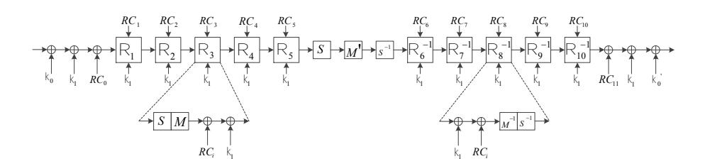

# Toward Practical Homomorphic Evaluation of Block Ciphers Using Prince

Yarkın Dor¨oz, Aria Shahverdi, Thomas Eisenbarth, and Berk Sunar

Worcester Polytechnic Institute {ydoroz,ashahverdi,teisenbarth,sunar}@wpi.edu

Abstract. We present the homomorphic evaluation of the Prince block cipher. Our leveled implementation is based on a generalization of NTRU. We are motivated by the drastic bandwidth savings that may be achieved by scheme conversion. To unlock this advantage we turn to lightweight ciphers such as Prince. These ciphers were designed from scratch to yield fast and compact implementations on resource-constrained embedded platforms. We show that some of these ciphers have the potential to enable near practical homomorphic evaluation of block ciphers. Indeed, our analysis shows that Prince can be implemented using only a 24 level deep circuit. Using an NTRU based implementation we achieve an evaluation time of 3.3 seconds per Prince block – one and two orders of magnitude improvement over homomorphic AES implementations achieved using NTRU, and BGV-style homomorphic encryption libraries, respectively.

Keywords: Homomorphic encryption, NTRU, Prince, lightweight block ciphers.

## 1 Introduction

An encryption scheme is fully homomorphic (FHE scheme) if it permits the efficient evaluation of any boolean circuit or arithmetic function on ciphertexts [\[1\]](#page-10-0). Gentry proposed the first FHE scheme [\[2,](#page-10-1) [3\]](#page-10-2) based on lattices that supports addition and multiplication circuits for arbitrary depth. Since addition and multiplication on any non-trivial ring give us a universal set of logic gates, this scheme – if made efficient – allows one to employ any untrusted computing resources without risk of revealing sensitive data. In [\[4\]](#page-10-3), van Dijk, et al., proposed a FHE scheme based on integers. In 2010, Gentry and Halevi [\[5\]](#page-10-4) presented a variant of Gentry's FHE; this publication introduced a number of optimizations as well as the first actual FHE implementation. For other optimizations see also [\[6–](#page-10-5)[8\]](#page-10-6). Although these earlier schemes have achieved full homomorphism, there is a serious bottleneck that prevents deployment.

To address this problem, some newer FHE schemes were proposed in recent years. In [\[9\]](#page-10-7), Brakerski, Gentry and Vaikuntanathan proposed a new FHE scheme (BGV) based on LWE problems. Instead of re-encryption, this new scheme uses other lightweight methods to refresh ciphertexts. These methods cannot thoroughly refresh ciphertexts (as re-encryption does), but they limit noise growth so that the scheme can evaluate much deeper circuits. The re-encryption process is then reserved as an optimization only for extremely complicated circuits instead of a necessity for the majority of practical circuits. Gentry, Halevi and Smart [\[8\]](#page-10-6) proposed a customized LWE-based FHE scheme tailored to achieve efficient evaluation of the AES cipher without bootstrapping. Their implementation is highly customized to evaluate AES efficiently and makes use of batching [\[7\]](#page-10-8), key and modulus switching techniques [\[9\]](#page-10-7). Their byte-sliced and SIMD implementations take about 5 minutes and 40 minutes, respectively, to evaluate an AES block.

In [\[10\]](#page-10-9), Alt-L´opez, Tromer and Vaikuntanathan adopted this idea to Stehl´e and Steinfeld's generalized NTRU scheme [\[11\]](#page-10-10) and developed an FHE scheme (ATV) that supports inputs from multiple public keys. Bos et al. [\[12\]](#page-10-11) presented a leveled FHE scheme and its implementation derived from ATV. The ATV scheme is modified by adopting a tensor product technique introduced by Brakerski [\[14\]](#page-11-0) such that the security depends only on standard lattice assumptions (and no longer on the decisional small polynomial ratio assumption). Furthermore, modulus switching is no longer needed due to the reduced noise growth. Lastly, the authors advocate use of the Chinese Remainder Theorem on the message space to improve the flexibility of the scheme. In [\[15\]](#page-11-1) Dor¨oz, Hu and Sunar propose another implementation based on the ATV scheme [\[10\]](#page-10-9). Similar to earlier proposals the implementation is batched, bit-sliced and features modulus switching techniques. The authors also introduce a specialization of the modulus to reduce the public key size and thereby memory required during evaluation. The scheme is generic, i.e. not customized to efficiently evaluate any specific class of circuits such as AES. When used to evaluate an AES block the implementation performs one order of magnitude faster than the implementation of [\[8\]](#page-10-6).

More recent FHE schemes displayed significant improvements over earlier constructions in both time complexity and in ciphertext size. Nevertheless, both latency and message expansion rates remain roughly two orders of magnitude higher than those of traditional public-key schemes. This rapid emergence of a diverse set of homomorphic encryption schemes has brought with it the need to transform one ciphertext into another. Bootstrapping [\[2\]](#page-10-1), relinearization [\[16\]](#page-11-2), and modulus reduction [\[9,](#page-10-7) [16\]](#page-11-2) are tools of this form, allowing someone other than the holder of the original private key to transform one encryption into one or more encryptions using the same scheme and (typically) a different key and/or different parameters. One important type of ciphertext transformation was introduced by Brakerski and Vaikuntanathan. In [\[16,](#page-11-2) Sec. 1.1], the technique of relinearization is introduced as a way to re-encrypt quadratic polynomials as linear polynomials under a new key, thereby making their security argument independent of lattice assumptions and dependent only on a standard LWE hardness assumption.

Lauter, Naehrig and Vaikuntanathan [\[17\]](#page-11-3) discuss tools for making somewhat homomorphic encryption schemes more practical including scheme conversion. First, they present two natural options for encryption of integers and demonstrate the versatility afforded by efficient transforms between bitwise representation and integer representation with a larger modulus. The authors of [\[17\]](#page-11-3) also use this conversion idea to facilitate efficient communication with a cloud server. If cloud computations are to be performed with a FHE scheme, data can be uploaded to the server under a more compact scheme such as AES provided it has a relatively simple decryption circuit. If computations on ciphertexts are to be carried out, the decryption circuit of the target scheme is evaluated homomorphically to re-encrypt this data under the FHE. The result of these computations is a collection of very large ciphertexts and, at present, no method is known to transform these back to AES encryptions. But Lauter et al. observe that the dimension reduction technique of Brakerski and Vaikuntanathan [\[16\]](#page-11-2) is useful here to reduce the ciphertext size (i.e., the overall FHE is the same, but the parameters are smaller, prohibiting further computation) before transmitting the results back to the client. In [\[17\]](#page-11-3), efficient implementation is left as an important open problem.

Motivated by this need, we propose the use of lightweight block ciphers to facilitate efficient conversion. As a research area lightweight block ciphers [\[18\]](#page-11-4) emerged from the proliferation of severely constrained embedded and mobile computing applications such as RFIDs, sensor network nodes etc. Such applications demand cryptographic primitives that can be computed with very little power in compact chips. Driven by this strong need, a new class of lightweight block ciphers were designed from scratch with security and implementation efficiency in mind. Here we exploit the synergy between block ciphers designed for constrained environments and the efficiency bottleneck of homomorphic encryption schemes to achieve efficient homomorphic evaluation of a block cipher.

### Our Contribution. In this work,

- we present a survey of lightweight block ciphers. We show that some lightweight block ciphers are more suitable than others. In contrast some lightweight ciphers have worse homomorphic evaluation performance than traditional block ciphers, e.g. AES since our metric (circuit depth) is related to but different than the metrics used in the construction of lightweight ciphers.
- we present a leveled homomorphic implementation of the Prince cipher. Our implementation makes use of the NTRU based library developed by Dor¨oz, Hu and Sunar [\[15\]](#page-11-1). Specifically, we optimize the Prince cipher for shallow circuit implementation, and based on the depth characteristics, chose optimal but secure parameters for the library to evaluate Prince efficiently. With the chosen parameters, the batched implementation evaluates 1024 blocks in 57 minutes, with 3.3 seconds per block amortization.
- more broadly, we motivate the study of lightweight block cipher design for homomorphic evaluation bringing a new metric, i.e. circuit depth, to the attention of block cipher designers.

### 2 Background

### 2.1 The ATV-FHE Scheme

NTRU based FHE schemes present a viable alternative to the currently dominant BGV style constructions. We follow the methodology proposed in [\[15\]](#page-11-1) by Dor¨oz et al. which builds on the NTRU based homomorphic encryption scheme (ATV) by Alt-López, Tromer and Vaikuntanathan [10]. The ATV scheme uses a variant of NTRU proposed by Stehlé and Steinfeld [11] to develop a leveled multi-key FHE that features a new operation named relinearization. The authors note that although the transformation to a fully homomorphic system deteriorates the efficiency, their construction is a leading candidate for a practical FHE scheme.

We next briefly outline the single key version of the ATV scheme. All operations are performed in  $\mathbf{R}_q = \mathbb{Z}_q[x]/\langle x^n+1\rangle$  where n represents the lattice dimension and q is the prime modulus. A polynomial is B-bounded if all of its coefficients lie in [-B,B]. In the primitives we often sample "small" polynomials  $f \in \mathbf{R}$  such that f is B-bounded. The error distribution  $\chi$  is the truncated discrete Gaussian distribution  $\mathbb{D}_{\mathbb{Z}^n,r}$  for standard deviation r>0. A sample from this distribution is a  $r\sqrt{n}$ -bounded polynomial  $e \in \mathbb{R}$ . For a detailed treatment of the discrete Gaussian distribution see [19]. With these definitions we are now ready to outline the primitives of the public key encryption scheme:

**KeyGen** We choose a decreasing sequence of primes  $q_0 > q_1 > \cdots > q_d$  and a polynomial  $\phi(x) = x^n + 1$ . For each i, we sample  $u^{(i)}$  and  $g^{(i)}$  from distribution  $\chi$ , set  $f^{(i)} = 2u^{(i)} + 1$  and  $h^{(i)} = 2g^{(i)} \left(f^{(i)}\right)^{-1}$  in ring  $R_{q_i} = \mathbb{Z}_{q_i}[x]/\langle \phi(x) \rangle$  (If  $f^{(i)}$  is not invertible, re-sample). We then sample, for  $i = 0, \ldots, d$  and for  $\tau = 0, \ldots, \lfloor \log q_i \rfloor, s_{\tau}^{(i)}$  and  $e_{\tau}^{(i)}$  from  $\chi$  and publish evaluation  $\exp\left\{\zeta_{\tau}^{(i)}(x)\right\}_{\tau}^{i}$  where  $\zeta_{\tau}^{(i)}(x) = h^{(i)}s_{\tau}^{(i)} + 2e_{\tau}^{(i)} + 2^{\tau} \left(f^{(i-1)}\right)^{2}$  in  $R_{q_{i-1}}$ .

**Encrypt** To encrypt a bit  $b \in \{0,1\}$  with a public key  $(h^{(0)}, q_0)$ , Encrypt first generates random samples s and e from  $\chi$  and sets  $c^{(0)} = h^{(0)}s + 2e + b$ , a polynomial in  $R_{q_0}$ .

**Decrypt** To decrypt the ciphertext c with the corresponding private key  $f^{(i)}$ , Decrypt multiplies the ciphertext and the private key in  $R_{q_i}$  then compute the message by modulo two:  $m = c^{(i)} f^{(i)} \pmod{2}$

**Eval** We assume we are computing a leveled circuit with gates alternating between XOR and AND. Arithmetic operations are performed directly on ciphertexts as follows: Suppose  $c_1^{(0)} = \mathsf{Encrypt}(b_1)$  and  $c_2^{(0)} = \mathsf{Encrypt}(b_2)$ . Then XOR is effected by simply adding ciphertexts:  $\mathsf{Encrypt}(b_1+b_2) = c_1^{(0)} + c_2^{(0)}$ . Polynomial multiplication incurs a much greater growth in the noise, so each multiplication step is followed by a modulus switching. First, we compute  $\tilde{c}^{(0)}(x) = c_1^{(0)} \cdot c_2^{(0)} \pmod{\phi(x)}$  and then perform Relinearization, as described below, to obtain  $\tilde{c}^{(1)}(x)$  followed by modulus switching  $\mathsf{Encrypt}(b_1 \cdot b_2) = \lfloor \frac{q_1}{q_0} \tilde{c}^{(1)}(x) \rceil_2$  where the subscript 2 on the rounding operator indicates that we round up or down in order to make all coefficients equal modulo 2. The same process holds for evaluating with *i*th level ciphertexts, e.g. computing  $\tilde{c}^{(i)}(x)$  from  $c_1^{(i-1)}$  and  $c_2^{(i-1)}$ .

In addition to the primitives [10] defines another operation named **Relinearization** that computes  $\tilde{c}^{(i)}(x)$  from  $\tilde{c}^{(i-1)}(x)$  extending  $\tilde{c}^{(i-1)}(x)$  as a linear combination of 1-bounded polynomials  $\tilde{c}^{(i-1)}(x) = \sum_{\tau} 2^{\tau} \tilde{c}_{\tau}^{(i-1)}(x)$  where  $\tilde{c}_{\tau}^{(i-1)}(x)$  takes its coefficients from  $\{0,1\}$ . Also define  $\tilde{c}^{(i)}(x) = \sum_{\tau} \zeta_{\tau}^{(i)}(x) \tilde{c}_{\tau}^{(i-1)}(x)$  in  $R_{q_i}$ .

Note that by augmenting the public key with the evaluation keys  $\zeta_{\tau}^{(i)}(x)$ , i.e. encrypted shifted versions of  $f^2$ , it becomes possible to homomorphically evaluate the product of c with the encrypted  $f^2$  using a shallow circuit of only additions. The authors propose the use of relinearization (with modulus switching) after both addition and multiplication operations and define evaluation key parameters accordingly. To relinearize after additions, we need shifted versions of the secret key f encrypted with respect to the new modulus, whereas for after multiplications, we need the same but of  $f^2$  instead.

### 2.2 The DHS FHE Library

Doröz, Hu and Sunar (DHS) [15] proposed a customized leveled implementation of the ATV FHE scheme. The code is written in C++ and relies on the library functions provided by NTL software package linked with GMP. The implementation introduces a number of optimizations, including a modulus specialization technique to reduce the public key size. The main features of the DHS implementation are as follows:

- The arithmetic is performed over  $R_q = \mathbb{Z}_q[x]/\langle \Psi_m(x)\rangle$  where the modulus q takes the special form  $q = p^k$  and p > 2 is a prime, and  $\Psi_m(x)$  denotes the  $m^{th}$  cyclotomic polynomial and  $n = \varphi(m) = \deg(\Psi)$ . Noise vectors are chosen from the discrete Gaussian noise distribution  $\chi$  [19].
- Circuit evaluation is divided into levels by the multiplication (AND) operations. Modulus switching is implemented at the end of each level. Since the moduli are special:  $q=p^k$ , after every multiplication first relinearization is performed which is then followed by modulus switching. Due to the special structure, the public key in one level can also be promoted to the next level via modular reduction. For instance, to evaluate a depth d circuit, the scheme uses the public key in the first level defined over  $q_0=p^d$  which is then promoted to the following levels that use  $q_1=p^{d-1}, q_2=p^{d-2}, \ldots, q_{d-1}=p$  by on-the-fly modular reduction with the new modulus, significantly reducing the memory requirement.
- The authors analyze the noise growth during circuit evaluation and determined that to keep the noise stable over the levels of the evaluation one needs to cut after each relinearization by

$$\log(p) \approx \log \left( \epsilon [an(6B^2 + 2B)\log(aq_0) + n^{3/2}(2B + 1)^2 B^2] \right)$$

bits where  $\epsilon$  is small constant chosen to minimize the error probability, B=2 from the  $\chi$  distribution, and a represents the maximum number of ciphertexts summed before multiplication in each level. Also note that in instantiation we fix  $\chi$  to choose from  $\{-1,0,1\}$  with probabilities  $\{0.25,0.5,0.25\}$ , respectively.

– The implementation is bit-sliced and uses the batching technique proposed by Smart and Vercauteren [6,7] (see also [8]). For this the modulus polynomial  $\Psi_m(x)$  is factorized over  $\mathbb{F}_2$  into equal degree polynomials  $F_i(x)$  which define the message slots in which message bits are embedded using the Chinese Remainder Theorem. Therefore, the number of message slots is found as  $\ell = \varphi(m)/t$  where  $\deg(F_i(x)) = t$  may be determined by finding the smallest integer d such that  $m|(2^t - 1)$ .

The ATV library contains 5 main operations; KEYGEN, ENCRYPTION, DECRYPTION, MODULUS SWITCH and RELINEARIZATION. The most critical operation for circuit evaluation is RELINEARIZATION. The other operations have negligible effect on the run time.

The authors also implement the 128-bit AES circuit to compare the performance of their scheme to the earlier AES implementation by Gentry, Halevi and Smart [8]. The implementation manages to evaluate the 10 round AES circuit in 31 hours with 2048 message slots with a 55 sec per AES block evaluation time making it 48 times faster than the generic SIMD implementation, 6 times faster than the AES customized byte-sliced implementation by Gentry, Halevi and Smart.

### 2.3 A Lightweight Block Cipher: Prince

Several lightweight block ciphers have been proposed with the goal of permitting a compact hardware implementation or good performance at small memory footprint in software. Examples include ciphers like Present, KATAN, TEA, HIGHT, etc. An overview of implementation properties can be found in [20]. Among these, Prince is a lightweight block cipher that has been optimized for low latency and a small hardware footprint [21]. It features a 64-bit block size, 128-bit key size. Prince implements a substitution-permutation network which iterates for 12 rounds. The round function is AES-like and operates on a 4 by 4 array of nibbles, with 4-bit S-boxes, shift rows and mix columns operations. The round key remains constant, but is augmented with a 64-bit round constant to ensure variation between rounds. An interesting feature of Prince is the inflective property: encryption and decryption only differ in the round key, i.e. decryption can use the same implementation as encryption, only the round key needs to be modified. Figure 1 shows the structure of the Prince cipher. To implement

Fig. 1. The Prince cipher

Prince, the following operations have to be realized:

- **Key Schedule** The 128-bit key is split into two parts  $k_0$  and  $k_1$ .  $k_0$  is used to generate another key  $k'_0 = (k_0 >>> 1) \oplus (k_0 >>> 63)$ . The keys  $k_0$  and  $k'_0$  are used as pre- and post-whitening keys, i.e. are XOR-added to the state before and after all round functions are performed. The round key  $k_1$  is the same for all rounds and is also XOR-added during the key addition phase.
- Round Constant Addition Prince defines different round constants  $RC_i$  for each round. A noteworthy property of the round constants is that  $RC_i \oplus RC_{11-i} = \alpha$  for  $0 \le i \le 11$ , with  $\alpha = \text{c0ac29b7c97c50dd}$ . The round constant addition is a binary addition, just as the round key addition. Both operations can be merged.
- **S—box** The S—box layer uses a mapping of 4-bit to 4-bit, as defined in the following table. The S—box is the only operation of Prince that is not linear

|   | i    | 0 | 1 | 2 | 3 | 4 | 5 | 6 | 7 | 8 | 9 | Α | В | $\overline{\mathbf{C}}$ | D | Е | F |
|---|------|---|---|---|---|---|---|---|---|---|---|---|---|-------------------------|---|---|---|
| 1 | S[i] | В | F | 3 | 2 | Α | С | 9 | 1 | 6 | 7 | 8 | 0 | Ε                       | 5 | D | 4 |

in the bits, and hence needs costly AND operations (or binary multiplication) for its implementation. While other S-boxes are possible for Prince, we chose to use the original S-box, since the maximum depth of multiplication is already optimal for the standard S-box. More details on how we implemented the S-box is given in Section 3.2.

Linear Layer The linear layer consists of two parts: a shift rows which is similar to the shift rows used in AES and simply changes the order of the nibbles. Hence, it is a free operation in a bit-oriented implementation. The mix columns equivalent XOR-adds three input bits to compute one output bit in such a way that the operation is invertible. Again, this operation is linear and easily implementable.

All operations also need an implementation of their inverse, as the last six rounds use the inverse operations.

#### 3 NTRU based Homomorphic Evaluation

In this section we describe our implementation in detail. Specifically, we first present a study of the depth characteristics of popular lightweight block ciphers among which we identify the Prince cipher as the most promising for homomorphic evaluation. Later we present in detail a shallow circuit implementation of Prince. In what follows, we select optimal parameters for the Doröz et al. [15] leveled ATV FHE implementation to support evaluation of the Prince circuit.

#### 3.1 Picking a Lightweight Block Cipher

We are looking for any cipher that provides efficient encryption while permitting a *shallow* circuit implementation, i.e. the number of consecutive multiplication

levels should be minimized. Therefore we turn our attention to lightweight block ciphers [\[22\]](#page-11-8). There are two main factors that increase the number of consecutive multiplications: The size and complexity of the S–boxes, as higher non-linearity usually results in higher-degree terms, i.e. an increased number of consecutive binary multiplications. PRESENT [\[18\]](#page-11-4), for example, has very simple S–boxes, resulting in a shallow circuit for each individual S–box. Another important factor is the number of rounds, where PRESENT is less optimal due to the rather high number of rounds. Prince, a recently proposed block cipher [\[21\]](#page-11-7), has roughly the same complexity for the S–boxes, but has only 12 rounds which make it a much more efficient choice for our purposes. The more complex linear layer is not a problem, since it does not introduce new binary multiplications. We present an overview of the complexity of different lightweight ciphers in Table [1.](#page-7-0)

Table 1. Comparison of the complexity of common lightweight block ciphers in number of rounds, algebraic degree of the S–box function, algebraic degree of a round excluding the S–box, per round and total number of multiplicative levels.

|                           |          |       | Algebraic Degree | Total Depth |                       |  |
|---------------------------|----------|-------|------------------|-------------|-----------------------|--|
| Cipher                    | # Rounds | S–box | Rem. Round       |             | Per Round Full Cipher |  |
| AES-128 [23]              | 10       | 8     | 0                | 3           | 30                    |  |
| Present [18]              | 31       | 4     | 0                | 2           | 62                    |  |
| Prince [21]               | 12       | 4     | 0                | 2           | 24                    |  |
| HIGHT [24]                | 32       | N/A   | 8                | 3           | 96                    |  |
| SEA96,8 [25]           | 93       | 3     | 8                | 4           | 372                   |  |
| KATAN-64 [26]             | 254      | N/A   | 1                | 1           | 254                   |  |
| Simon-64/96 (64/128) [27] | 42 (44)  | N/A   | 1                | 1           | 42 (44)               |  |

Note that the cipher depth is almost fully determined by the consecutive levels of binary AND-statements. The two software-oriented ciphers, namely SEA and HIGHT, feature Feistel-structure and a high number of rounds. The number of rounds, together with the Feistel structure, results in a high depth circuit, making them a bad choice for our purposes. Furthermore, additions mod 2n add significant depth due to high nonlinearity for the most significant output bits. While there are [\[12,](#page-10-11) [13\]](#page-10-12) FHE implementations capable of evaluating integer operations they do not support mixing of integer and bit-oriented operations as required by most block ciphers. Hence, the hardware-oriented ciphers such as Present and Prince seem more appropriate. Certain possible cipher-specific optimizations are likely missed in the table. Katan, for example, allows the evaluation of a few rounds in parallel, since independent bits are processed in consecutive rounds. We did not explore this further due to the big starting disadvantage in the number of rounds. It can be seen that AES already offers quite a low depth, due to the low number of rounds. In practice, the depth 30 implementation of AES is not attainable since the number of multiplications grows significantly. Instead at best a depth 40 implementation is used in practice [\[15\]](#page-11-1). Either way, the Prince cipher offers a significant improvement over AES.

### 3.2 Prince as a Shallow Circuit

As described in Section 2.3, Prince can be implemented in a way that every operation is done on a single bit. Consecutive AND operations are costly in the ATV FHE scheme so it is a necessity to prevent them as much as possible. The only part of Prince that is nonlinear is the S–box layer. To determine an optimal representation of the S–box, we use Mathematica to obtain the Algebraic Normal Form (ANF), which represents all equations only in terms of XOR or AND statements. The following table gives the resulting ANF representation of the Prince S–box S(A, B, C, D) = (S0, S1, S2, S3). According to the table

| S0 | A ⊕ C ⊕ AB ⊕ BC ⊕ ABD ⊕ ACD ⊕ BCD ⊕ 1 |
|----|---------------------------------------|
| S1 | A ⊕ D ⊕ AC ⊕ AD ⊕ CD ⊕ ABC ⊕ ACD      |
| S2 | AC ⊕ BC ⊕ BD ⊕ ABC ⊕ BCD ⊕ 1          |
| S3 | A ⊕ B ⊕ AB ⊕ AD ⊕ BC ⊕ CD ⊕ BCD ⊕ 1   |

the S–box requires 28 AND-operations. Further optimization, making use of efficient reuse of intermediate terms, enables a significant reduction of two-input AND operations. The values for AB, AC, AD, BC, BD, CD can simply be stored and used whenever it is necessary instead of recalculating them every time. There exist four more terms in the formula that can be saved and used again; these values are ABD, ABC, ACD, BCD. To be more efficient, for calculating the first two terms and the next two terms we will use the saved value AB and CD, respectively. The resulting depth of the multiplication is 2 i.e. one for calculating terms such as AB and one for calculating terms such as ABD. Hence the total number of ANDs for S–box would be 10—much less than by straight implementation of the ANF. The same procedure is applied to optimize the implementation of the inverse S–box.

#### 3.3 Parameter Selection for the ATV FHE

We follow the parameter selection process of [\[15\]](#page-11-1) for our ATV Prince implementation. In Table [2](#page-9-0) we summarize the chosen parameters for Prince and AES. Clearly, the 24 levels of Prince give us an advantage over the 40 level AES in selecting smaller parameters: The polynomial degree of Prince is half the size of AES with n = 16384. The per level cutting rate is log (p) = 20 bits, better than expected than the noise analysis in [\[15\]](#page-11-1) predicts. The reason is simple; the Prince S–box has AND operations with three gates, e.g. A · B · C, and therefore in the second level two polynomials with different noise levels are multiplied, whereas [\[15\]](#page-11-1) assumes the product inputs bear the same level of noise. With log (p) = 20, the modulus may be chosen as log(q0) = 500 which is less than half

Table 2. Parameters for the AES [\[15\]](#page-11-1) and our Prince implementations.

|                | n     | log(q0) | δ      | Levels |    | log(p) Message Slots |
|----------------|-------|---------|--------|--------|----|----------------------|
| AES [15] 32768 |       | 1271    | 1.0067 | 40     | 31 | 2048                 |
| Prince         | 16384 | 500     | 1.0052 | 24     | 20 | 1024                 |

as long as the AES modulus, i.e. 1271-bits used in [\[15\]](#page-11-1). With n = 16384 and log (q0), our Hermite factor is δ = 1.0052. This gives us a 130-bit security level, which actually exceeds the security claims of Prince. The only disadvantage of our Prince evaluation is that we have fewer message slots, exactly half of those of the AES evaluation.

# 4 Implementation Results

We ran our implementation on a single thread on Intel Core i7 3770K running 3.5 Ghz with 32 GBytes of memory. The most expensive Prince operation is the evaluation of the S–box circuit, since it is the only operation that contains multiplications and therefore requires Relinearization. The S–box is evaluated using 6 Relinearizations, resulting in 1,152 Relinearizations for the entire evaluation. The execution completes in 57 minutes compared to 31 hours [\[15\]](#page-11-1) and 36 hours [\[8\]](#page-10-6) for AES. This shows about ×30 speedup. A block of Prince encryption takes 3.3 seconds compared to 55 seconds for AES blocks. Another significant advantage of Prince is that at 1 Gbytes the public key is much smaller. Therefore we can run our implementations on standard machines.

Table 3. Performance comparison of Prince against AES implementations.

|                     | Total Time | #Blocks | Per Block | PK Size |
|---------------------|------------|---------|-----------|---------|
|                     |            |         | seconds   | GBytes  |
| AES [15]            | 31 hours   | 2048    | 55        | 13.1    |
| AES-Byte Sliced [8] | 65 hours   | 720     | 300       | n/a     |
| AES-SIMD Sliced [8] | 36 hours   | 54      | 2400      | n/a     |
| Prince (Ours)       | 57 minutes | 1024    | 3.3       | 1.0     |

### 5 Conclusion

We presented a customized implementation of the lightweight block cipher Prince using a leveled fully homomorphic encryption scheme based on NTRU. For this we surveyed lightweight block ciphers and analyzed them with respect to a new metric: circuit depth. Our analysis determined that the Prince block cipher is the most suitable for homomorphic evaluation as it can be implemented using only a depth 24 circuit. Using the recently proposed ATV library [\[15\]](#page-11-1) we developed an optimized shallow circuit implementation of Prince, which yielded an amortized 3.3 seconds per block evaluation running time, one to two orders of magnitude faster than previous homomorphic AES evaluation proposals [\[8,](#page-10-6) [15\]](#page-11-1).

With this work, we presented a near practical block cipher implementation that could be used for scheme conversion [\[17\]](#page-11-3). We also aim to further motivate research in the field of lightweight cryptography under the new shallow circuit or circuit depth metric.

# Acknowledgments

Funding for this research was in part provided by the US National Science Foundation CNS Awards #1117590, #1319130, and #1261399.

### References

- 1. Rivest, R.L., Adleman, L., Dertouzos, M.L.: "On data banks and privacy homomorphisms." In: Foundations of Secure Computation, 1978.
- 2. Gentry, C.: "Fully homomorphic encryption using ideal lattices." Symposium on the Theory of Computing (STOC), 2009, pp. 169-178.
- 3. Gentry, C.: A Fully Homomorphic Encryption Scheme. Ph.D. thesis, Department of Computer Science, Stanford University, 2009.
- 4. Van Dijk, M., Gentry, C., Halevi, S., Vaikuntanathan, V.: "Fully homomorphic encryption over the integers." Advances in Cryptology–EUROCRYPT 2010 (2010): 24-4
- 5. Gentry, C., Halevi, S.: "Implementing Gentry's fully-homomorphic encryption scheme," Advances in Cryptology–EUROCRYPT 2011, pp. 129–148, 2011.
- 6. Gentry, C., Halevi, S., Smart, N.P.: "Fully homomorphic encryption with polylog overhead." Manuscript, 2011.
- 7. Smart, N.P., Vercauteren, F.: "Fully homomorphic SIMD operations." Manuscript at http://eprint.iacr.org/2011/133, 2011.
- 8. Gentry, C., Halevi, S., Smart, N.P.: "Homomorphic evaluation of the AES circuit." Advances in Cryptology - CRYPTO 2012, 850-8, 2012.
- 9. Brakerski, Z., Gentry, C., Vaikuntanathan, V.: "Fully homomorphic encryption without bootstrapping." Innovations in Theoretical Computer Science, ITCS 309– 325, 2012.
- 10. Alt-L´opez, A., Tromer E., Vaikuntanathan, V.: "On-the-fly multiparty computation on the cloud via multikey fully homomorphic encryption." In: Proc. of the 44th STOC, pp. 1219-1234. ACM, 2012.
- 11. Stehl´e, D., Steinfeld, R.: "Making NTRU as secure as worst-case problems over ideal lattices." Advances in Cryptology – EUROCRYPT '11 27–4, 2011.
- 12. Bos, J.W., Lauter, K., Loftus, J., Naehrig, M.: "Improved Security for a Ring-Based Fully Homomorphic Encryption Scheme". In LNCS PQCrypto 2013. pp. 45–64. Springer, 2013.
- 13. Coron, J.S., Naccache, D., Tibouchi, M.: "Public key compression and modulus switching for fully homomorphic encryption over the integers." Advances in Cryptology-EUROCRYPT 2012. Springer Berlin Heidelberg, 2012. 446-464.

- 14. Brakerski, Z.: "Fully Homomorphic Encryption without Modulus Switching from Classical GapSVP". In Advances in Cryptology – CRYPTO 2012, Springer LNCS Volume 7417, 2012, pp 868-886.
- 15. Dor¨oz, Y., Hu, Y., Sunar, B.: "Homomorphic AES Evaluation using NTRU", IACR ePrint Archive. Technical Report 2014/039 January 2014. URL: http://eprint.iacr.org/2014/039.pdf
- 16. Brakerski, Z., Vaikuntanathan, V.: "Efficient fully homomorphic encryption from (standard) LWE." Foundations of Computer Science (FOCS), 2011 IEEE 52nd Annual Symposium on. IEEE, 2011.
- 17. Lauter, K., Naehrig, M., Vaikuntanathan, V.: "Can homomorphic encryption be practical?" In: Proceedings of the 3rd ACM CCSW (Cloud Computing Security Workshop) ACM, 2011.
- 18. Bogdanov, A., Knudsen, L.R., Leander, G., Paar, C., Poschmann, A., Robshaw, M.J.B., Seurin, Y., Vikkelsoe, C.: "PRESENT: An Ultra-Lightweight Block Cipher". Cryptographic Hardware and Embedded Systems - CHES 2007, LNCS vol 4727, 2007, pp 450–466.
- 19. Micciancio, D., Regev, O.: "Worst-case to average-case reductions based on gaussian measures". SIAM J. Comput., 37(1):267?302, 2007.
- 20. Eisenbarth, T., Gong, Z., G¨uneysu, T., Heyse, S., Indesteege, S., Kerckhof, S., Koeune, F., Nad, T., Plos, T., Regazzoni, F., Standaert, F.X., Oldeneel tot Oldenzeel, L.: "Compact implementation and performance evaluation of block ciphers in tiny devices". Progress in Cryptology - AFRICACRYPT 2012, vol 7374 of LNCS, pages 172–187, 2012.
- 21. Borghoff, J., Canteaut, A., G¨uneysu, T., Kavun, E.B., Knezevic, M., Knudsen, L.R., Leander, G., Nikov, V., Paar, C., Rechberger, C., Rombouts, P., Thomsen, S.S., Yalcin, T.: "Prince – a low-latency block cipher for pervasive computing applications". In Progress in Cryptology - ASIACRYPT 2012, pages 208–225.
- 22. Eisenbarth, T., Paar, C., Poschmann, A., Kumar, S., Uhsadel, L.: "A Survey of Lightweight-Cryptography Implementations". In Design & Test of Computers, IEEE , vol.24, no.6, pp.522,533, 2007.
- 23. Daemen, J., Rijmen, V.: The design of Rijndael: AES-the advanced encryption standard. Springer, 2002.
- 24. Hong, D., Sung, J., Hong, S., Lim, J., Lee, S., Koo, B., Lee, C., Chang, D., Lee, J., Jeong, K., Kim, H., Kim, J., Chee, S.: "HIGHT: A New Block Cipher Suitable for Low-Resource Device". Cryptographic Hardware and Embedded Systems - CHES 2006, vol 4249 of LNCS, pages 46-59. Springer, 2006.
- 25. Standaert, F.X., Piret, G., Gershenfeld, N., Quisquater, J.J.: "SEA: A Scalable Encryption Algorithm for Small Embedded Applications". CARDIS 2006, vol 3928 of LNCS, pages 222-236. Springer, 2006.
- 26. Canniere, C.D., Dunkelman, O., Knezevic, M.: "KATAN and KTANTAN - A Family of Small and Efficient Hardware-Oriented Block Ciphers". Cryptographic Hardware and Embedded Systems - CHES 2009, vol 5747 of LNCS, pages 272-288. Springer, 2009.
- 27. Canniere, C.D., Dunkelman, O., Knezevic, M.: "The SIMON and SPECK Families of Lightweight Block Ciphers". Cryptology ePrint Archive, Report 2013/404, 2013. <http://eprint.iacr.org/>.