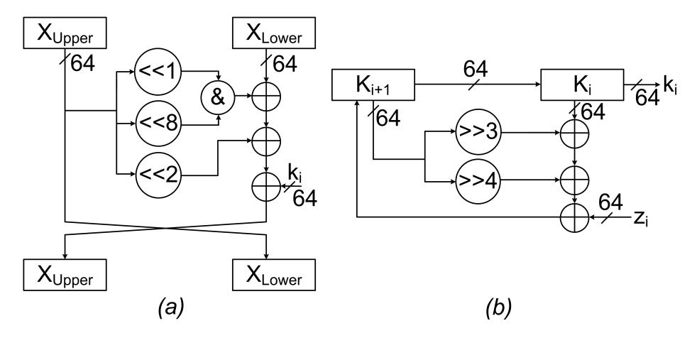
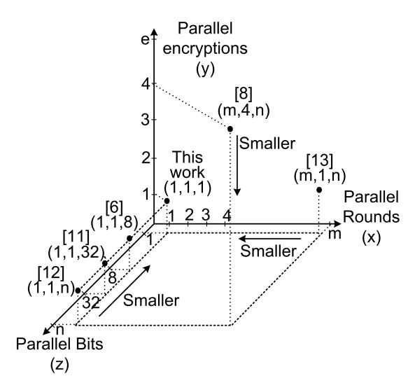
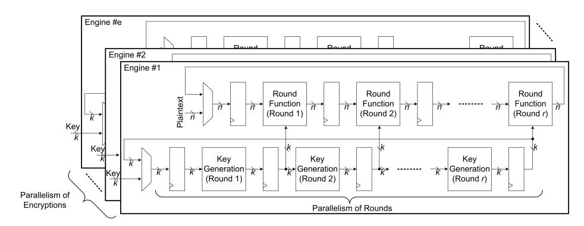
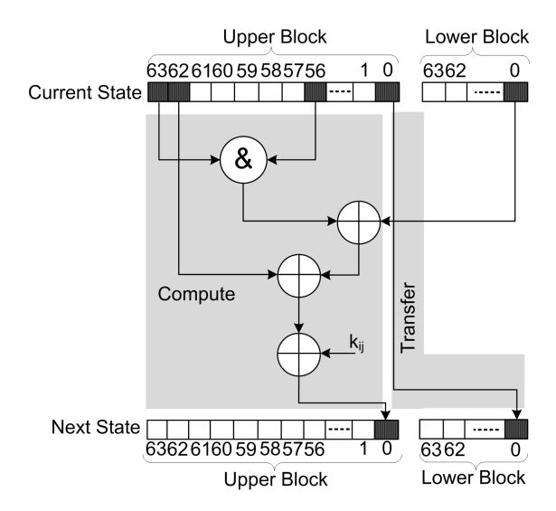
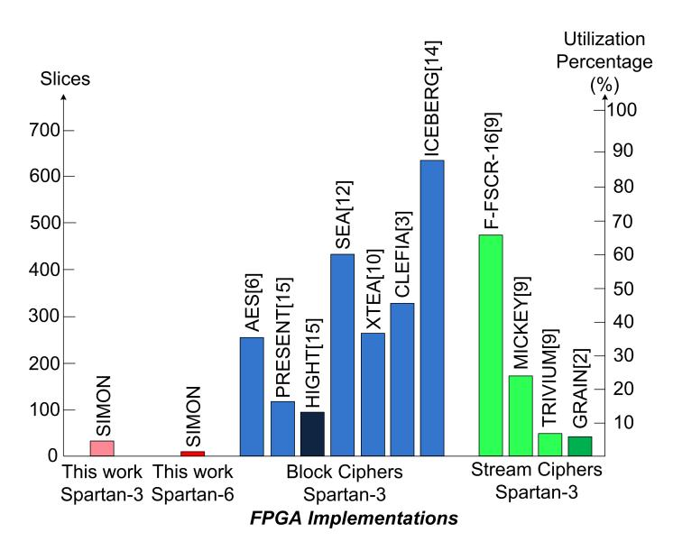

# SIMON Says, Break the Area Records for Symmetric Key Block Ciphers on FPGAs

Aydin Aysu, Ege Gulcan, and Patrick Schaumont

Secure Embedded Systems Center for Embedded Systems for Critical Applications Bradley Department of ECE Virginia Tech, Blacksburg, VA 24061, USA {aydinay,egulcan,schaum}@vt.edu

Abstract. While AES is extensively in use in a number of applications, its area cost limits its deployment in resource constrained platforms. In this paper, we have implemented SIMON, a recent promising low-cost alternative of AES on reconfigurable platforms. The Feistel network, the construction of the round function and the key generation of SIMON, enables bit-serial hardware architectures which can significantly reduce the cost. Moreover, encryption and decryption can be done using the same hardware. The results show that with an equivalent security level, SIMON is 86% smaller than AES, 70% smaller than PRESENT (a standardized low-cost AES alternative), and its smallest hardware architecture only costs 36 slices (72 LUTs, 30 registers). To our best knowledge, this work sets the new area records as we propose the hardware architecture of the smallest block cipher ever published on FPGAs at 128-bit level of security. Therefore, SIMON is a strong alternative to AES for low-cost FPGA based applications.1

Keywords: Block Ciphers, Light-Weight Cryptography, FPGA Implementation, SIMON.

### 1 Introduction

To implement security in embedded systems, we rely heavily on block ciphers and utilize them in security protocols [5] to store critical information [7], to authenticate identities [4], even to generate pseudo-random numbers [11]. The most popular block cipher is Rijndael which serves as the Advanced Encryption Standard (AES). AES is extensively used and it constitutes the core of many security systems.

The cost of AES limits its deployment for resource-constrained reconfigurable embedded system platforms. To address this, several different light-weight block ciphers have been proposed. These block ciphers try to reduce the area cost of

1 This is a preprint version of our paper that will be published at the upcoming issue of the IEEE Embedded Systems Letters. This research was supported in part by the National Science Foundation grant no 1115839.

AES. PRESENT [15], XTEA [10], ICEBERG [14], SEA [12], HIGHT [15] and CLEFIA [3] are among the implementations on FPGA that aim to achieve a light-weight block cipher.

Recently, NSA published two families of block ciphers, SIMON and SPECK, that can be very promising alternatives to AES for low-cost applications [1]. SI-MON is tuned for efficient hardware implementations and SPECK is tuned for efficient software realizations. The authors argue that their ASIC implementation is the smallest available. Moreover, the authors also report that they have used a bit-serialized implementation, but there are no further details about the hardware architecture, other than the implementation results. To find out the FPGA resource utilization, we have implemented SIMON, the hardware optimized block cipher, and we also give details of our low-cost bit-serialized hardware architecture. Our results showed that SIMON can break area records for block ciphers on FPGAs. We also show that our implementation is smaller than previously published stream cipher implementations.

To put the area cost in perspective, the smallest Spartan-3 FPGA has 768 slices while the smallest AES design costs 264 equivalent slices (124 slices and 2 BRAMs) [6] which constitutes to 34% of its area. That leaves the remaining 66% of available resources to be utilized for other purposes. Our SIMON block cipher implementation provides the same level of security as AES, but only uses 36 slices, which constitutes to 4.7% of the overall area.

The rest of the paper is organized as follows. Section 2 gives a brief overview of SIMON. Section 3 explores the dimensions of parallelism and discuss the details of the low-cost bit-serialized hardware architecture. Section 4 shows the implementation results and its comparison to previous work. Section 5 concludes the paper.

### 2 SIMON: Feistel Based Low-Cost Block Cipher

In this work, we will focus on the 128/128 configuration of SIMON which has a security level equivalent to AES-128. This configuration uses 128-bit input plaintext and 128-bit key to generate 128-bit ciphertext in 68 rounds. The readers can refer to [1] for further details of this algorithm.

Figure 1 (a) shows the round operation of SIMON. The round function performs logic operations on the most significant 64-bits (the upper half block) and the result is XOR-ed with the least significant 64-bits (the lower half block) and the 64-bit round key ki . At the end of each round, the contents of the upper block is transferred to the lower block as the new generated values are written back into the upper block. The full SIMON round operation consists of three 64-bit shift operators (shift left one, shift left two, and shift left eight) three 64-bit XOR operators and one 64-bit AND operator. Figure 1 (b) shows the key generation of SIMON. The key generation function performs logic operations on the most significant 64-bits and the result is XOR-ed with the least significant 64-bits and the 64-bit round constant zi . The round constant is a design-time constant value that is uniquely tuned for each configuration. The full key gener-

Fig. 1: (a) Feistel round and (b) key generation of SIMON for the 128/128 configuration

ation consist of two 64-bit shift operators (shift right three and shift right four) and three 64-bit XOR operators.

### 3 Hardware Implementation

In this section, we will first define the dimensions of parallelism for block ciphers. Then, we will show how to bit-serialize SIMON and how to efficiently map it on FPGA resources.

#### 3.1 Dimensions of parallelism

In the design space of block ciphers, several parallelism dimensions exist and a designer can opt for different parallelism choices within each dimension. Fig. 2 illustrates a 3-d representation of these dimensions where x,y and z axis respectively stands for the dimensions of parallelism for rounds, encryptions, and bits. We also show several example designs from the literature and this work. In the first dimension, shown in z axis, while computing a round operation, inputs of the operators of the round function can be at any length between one-bit to n-bits, where n is the block-length. If the operands are one-bit, we call the resulting implementation a bit-serialized architecture. In the second dimension, shown in x axis, we can parallelize the number of round operations. This number can range from one round to m-rounds, where m is the total number of rounds required to complete the block cipher. In the third dimension, shown in y axis, we can have multiple copies of the encryption engine. Depending on our target throughput, we can use one copy to e-copies of the encryption engine where e is the maximum number of copies we can fit into our FPGA.

Fig. 2: Representation for the dimensions of parallelism with several example designs. Each design is presented respectively with x,y, and z coordinates

Depending on the parallelism choices at each dimension, the processing capability of the hardware implementation can range from n-parallel encryptions per clock cycle to one-bit of one round of one encryption per clock cycle. We will give brief descriptions of these choices and their effect on throughput and cost, but for the scope of this paper, we only will investigate the hardware architecture for bit-serialized implementations.

Parallelism of Encryptions Parallelizing the encryption engine is useful, if there is enough space on the FPGA and the target throughput is not met. Henzen et al. uses 4 AES engines in parallel in AES-GCM mode to achieve the target throughput of 100Gbps [8]. These architectures are suitable for high-cost, high-throughput applications like quantum-key distribution to reach the utmost performance where the cost is not the primary factor. Fig. 3 shows the block diagram of such hardware architectures that consists of e parallel engines. If the throughput of one engine is t encryptions per clock cycle, then the throughput of e parallel engines is t × e encryptions per clock cycle.

Parallelism of Rounds Within an encryption engine, the parallelism choice ranges from a single round operation per clock cycle, up to m-rounds in parallel. Fig. 3 shows the block diagram of such hardware architectures that consist of r parallel rounds. If we select to implement more than a single round in parallel, we first unroll the round functions and associated key generations, then we map each unrolled round operation (together with the corresponding key generation) to a hardware block, pipeline all blocks and set them to run at the same time.

Fig. 3: Generic block diagram for the parallelism of encryptions and rounds.

Therefore, at each pipeline stage, we can encrypt an outstanding message. If we use r-parallel blocks of round operation and if the corresponding key generation and the cipher requires m-rounds, these implementations can achieve a throughput of  $\frac{r}{m}$  ciphertext per clock cycle. Using such an architecture with m parallel round operations, we can achieve a throughput of one ciphertext per clock cycle per engine. Qu et~al. shows that unrolling all round operations of the AES hardware could increase the throughput to  $73.7 \,\mathrm{Gb/s}$ , while using 22994 slices on a Virtex-5 FPGA [13].

**Parallelism of Bits** Within a round operation, inputs of an operator can be one-bit up to n-bits where n is the block size. Using these operators, if we can process b-bits in one clock cycle, the computation of one round takes  $\frac{n}{b}$ -cycles. The parallelism choice of bits can have a significant impact on the cost of the resulting architecture.

Low-cost hardware architectures are our topic of interest. These architectures are used in resource critical applications where the performance is of secondary importance. Therefore, the challenge is being able to implement the functionality of the block cipher by using the least possible amount of resources. In order to minimize the cost, we used a bit-serialized architecture in which inputs of all operators are one bit. To implement SIMON in a bit-serialized fashion, we have to first bit-serialize the round function and key generation.

Fig. 4 shows the details for bit-serialization of the SIMON round. The bits processed at the first clock cycles are also highlighted. The round operation has two components, compute and transfer. Compute requires reading three single-bits from the upper block, one bit from the lower block, and performing logic operations on them using also a single-key bit. Transfer writes the output bit of compute into the upper block of the next state, and transmits one bit from the upper block of the current state to the lower block of the next state.

Fig. 4: Bit-serialized SIMON round function. kij stands for the key bit for the i − th round and j − th bit of the state.

#### 3.2 Hardware Architecture

FPGA resources are well suited to bit-serialized implementations. LUTs can be efficiently configured as bit-serial memory elements that can support these hardware architectures. On Spartan-3 FPGAs we can configure some LUTs to act as a 16x1 FIFO. On Spartan-6 FPGAs, due to the increased size of LUT inputs, we can configure each LUT to act as a 32x1 FIFO.

FIFO based implementations in general can reduce the control cost because they do not need address generation circuitry, they are intrinsically addressed and we only have to control their one-bit input and output. Moreover, because we can both read from and write into a FIFO at the same clock cycle, we can overlap compute and transfer operations, and complete a round operation in 64 clock cycles.

Fig. 5 shows the details of our FIFO based hardware architecture for round operation. The shift operator causes a challenge for bit-serialized architectures due to its circular access pattern. For example, bit #56,#62,#63 are required from upper-block to calculate the result of bit #0. However, the result of bit #0 will only be used at the next round as bit #56,#62, and #0 are required to calculate the value of bit #1.

Fig. 6 gives the detailed schedule of the FIFO based round operation. To enable the one bit per clock cycle processing, four input bits of the LUT are read at the same clock cycle. On these bits, LUT performs the logic operations of SIMON round function. The 64-bit upper block is stored in 8 shift registers to enable parallel access, followed by a 56x1 sized FIFO. In order to eliminate the bubbles of scheduling that occur at the beginning of each round, we implement

Fig. 5: Block diagram of round operation for the bit-serialized architecture.

| Clock Cycle Input  |                            | cc2                       | <b> </b> - | cc8                     | сс9                     |           | cc65                       | cc66                      |           | сс72                    | сс73                    | <u></u>   |
|--------------------------|----------------------------|---------------------------|------------|-------------------------|-------------------------|-----------|----------------------------|---------------------------|-----------|-------------------------|-------------------------|-----------|
| FIFO_1                   | SRU out                 | SRU out                |            | SRU out              | SRD out              |           | SRD out                 | SRD out                |           | SRD out              | SRU out              |           |
| FIFO_2                   | FIFO_1 out              | FIFO_1 out             | <b></b> .  | FIFO_1 out           | FIFO_1 out           | <b></b> . | FIFO_1 out              | FIFO_1 out             | <b></b> - | FIFO_1 out           | FIFO_1 out           | <u></u> . |
| SRU                      | FIFO_1 out              | FIFO_1 out             |            | FIFO_1 out           | FIFO_1 out           |           | LUT out                 | LUT out                |           | LUT out              | LUT out              |           |
| SRD                      | LUT out                 | LUT out                |            | LUT out              | LUT out              |           | FIFO_1 out              | FIFO_1 out             |           | FIFO_1 out           | FIFO_1 out           |           |
| LUT (input bits)      | 56,62 63,0 1 | 57,63 0,1 1 |            | 0,1 2,7 1 | 1,2 3,8 l |           | 56,62 63,0 1 | 57,63 0,1 1 |           | 0,1 2,7 l | 1,2 3,8 l |           |
| LUT (input source) | SRU                        | SRU                       |            | SRU                     | SRU                     |           | SRD                        | SRD                       |           | SRD                     | SRD                     |           |

Fig. 6: Schedule of the bit-serialized architecture. The superscript l refers to a bit in the lower block.

two ping-pong register sets, each consisting of 8 registers. At even rounds, the output of the LUT is written into the lower shift registers (SRD), and at odd rounds, it is written into the upper shift registers (SRU). Similarly, to enable circular access pattern, at even rounds the output of the FIFO is written back into the SRU and at odd rounds it is written back into the SRD. FIFO 2 input is connected to FIF0 1 output to perform transfer operation.

The implementation of the key generation uses the operating principle of the round function, but, this time we have to use right-shifted values at the inputs of LUT. Therefore, the registers are placed after the FIFO.

### 4 Implementation Results

The proposed hardware architecture is implemented in Verilog HDL. The Verilog HDL RTL codes are synthesized to the Spartan-6 slx4 FPGA with a speed grade of -3 and the Spartan-3 s50 FPGA with a speed grade of -5, using XST. The

Fig. 7: Implementation results of SIMON and comparison with the previous work on low-cost block cipher and stream cipher implementations

resulting netlists are placed to the same FPGA using Planahead and routed in ISE 14.6. We observed that custom back-end engineering efforts are required to achieve the minimum cost because tool automation tends to minimize LUT count and increase the number of utilized slices. However, the ultimate reported area cost of an IP-block is the number of utilized slices. Therefore, to achieve the lowest cost, we had to hand-pick our design elements using Planahead.

To make a fair comparison with the earlier work, we target a commonly used FPGA, but we also map our implementation on the lowest-cost Spartan-6 FPGA to show the cost on recent low-cost FPGA platforms. Fig. 7 gives the implementation results and its comparison to previous work. The proposed bitserialized implementation is the smallest ever reported in the literature. The area result of the closest block cipher is HIGHT, and it uses 91 slices whereas our implementation costs 36 slices. The proposed hardware architecture is also smaller than all published low-cost stream ciphers [9], [2]. With the same security level of 128-bits, the cost of the smallest stream cipher is GRAIN [2], and it uses 48 slices. The proposed hardware architecture of SIMON is 86% smaller than AES, 60% smaller than the closest block cipher and even 25% smaller than the closest stream cipher. We believe that this paper sets the new area records for block cipher implementations on FPGAs.

Table 1 shows the area/performance trade-off for our design. The systematic exploration of parallelism yields a trade-off in performance of a factor of 109 times for a variation in area of 21 times. These factors are much larger than

Table 1: SIMON — Area vs. Throughput

| Design    | Area    | Max. Frequecny Throughput |        |
|-----------|---------|---------------------------|--------|
| (x,y,z)   | (Slice) | (MHz)                     | (Mbps) |
| (1,1,1)   | 36      | 136                       | 3.6    |
| (1,1,128) | 399     | 135                       | 216.8  |
| (1,2,128) | 766     | 135                       | 392.4  |

what can be obtained from typical automatic design space exploration using FPGA tools, and it motivates our approach.

We show that Feistel ciphers, compared to S-P ciphers, suit better to low-cost FPGA architectures. S-P Network uses S-boxes and they can not be efficiently serialized beyond the operand size of an S-box. Thus, bit-serial architectures are not feasible for them. However, Feistel ciphers are easily bit-serialized. FIFOs can be efficiently realized using LUTs, making FPGAs well-adjusted for bit-serialized implementations.

We generally expect to achieve higher throughputs for the same architecture as we move towards smaller technology nodes. We also expect our circuit area to shrink. However, due to the increase in the size of LUT-input from four bits to six bits, the total number of LUTs also significantly reduce. Our implementation results showed that when we move from Spartan-3 to Spartan-6 FPGAs, the LUT count reduces from 72 to 40, resulting in an area reduction of 45%. If the input bits of the LUT grows further in future technology nodes, we can also expect to have lower LUT count for the same design.

### 5 Conclusion

We have presented a low-cost, bit-serialized architecture for the FPGA implementation of the block cipher SIMON. Our implementation sets the new area records for block cipher implementations. Moreover, the proposed architecture is even smaller than stream ciphers. Bit-serialized implementation of SIMON cost 36 slices on a Spartan-3 FPGA and 13 slices on a Spartan-6 FPGA. SIMON claims to have approximately a 50% of area reduction over AES for its ASIC implementation, we have shown that with a reduction of 86%, SIMON is an even stronger alternative to AES for low-cost FPGA applications.

## References

- 1. Beaulieu, R., Shors, D., Smith, J., Treatman-Clark, S., Weeks, B., Wingers, L.: The simon and speck families of lightweight block ciphers (2013)
- 2. Bulens, P., Kalach, K., Standaert, F.X., Quisquater, J.J.: Fpga implementations of estream phase-2 focus candidates with hardware profile. In: State of the Art of Stream Ciphers Workshop, SASC 2007, Bochum, Germany (Jan 2007)

- 3. Chaves, R.: Compact clefia implementation on fpgas. In: Athanas, P., Pnevmatikatos, D., Sklavos, N. (eds.) Embedded Systems Design with FP-GAs, pp. 225–243. Springer New York (2013), http://dx.doi.org/10.1007/ 978-1-4614-1362-2\_10
- 4. Feldhofer, M.: An authentication protocol in a security layer for rfid smart tags. In: Electrotechnical Conference, 2004. MELECON 2004. Proceedings of the 12th IEEE Mediterranean. pp. 759–762 (2004)
- 5. Feldhofer, M., Dominikus, S., Wolkerstorfer, J.: Strong authentication for rfid systems using the aes algorithm. In: Cryptographic Hardware and Embedded Systems CHES 2004, Lecture Notes in Computer Science, vol. 3156, pp. 357–370. Springer Berlin Heidelberg (2004)
- 6. Good, T., Benaissa, M.: Aes on fpga from the fastest to the smallest. In: Rao, J., Sunar, B. (eds.) Cryptographic Hardware and Embedded Systems CHES 2005, Lecture Notes in Computer Science, vol. 3659, pp. 427–440. Springer Berlin Heidelberg (2005)
- 7. Hembroff, G., Muftic, S.: Samson: Secure access for medical smart cards over networks. In: World of Wireless Mobile and Multimedia Networks, 2010 IEEE International Symposium on a. pp. 1–6 (2010)
- 8. Henzen, L., Fichtner, W.: Fpga parallel-pipelined aes-gcm core for 100g ethernet applications. In: ESSCIRC, 2010 Proceedings of the. pp. 202–205 (2010)
- 9. Hwang, D., Chaney, M., Karanam, S., Ton, N., Gaj, K.: Comparison of FPGAtargeted hardware implementations of eSTREAM stream cipher candidates. In: State of the Art of Stream Ciphers Workshop, SASC 2008, Lausanne, Switzerland. pp. 151–162 (Feb 2008)
- 10. Kaps, J.P.: Chai-tea, cryptographic hardware implementations of xtea. In: Chowdhury, D., Rijmen, V., Das, A. (eds.) Progress in Cryptology - INDOCRYPT 2008, Lecture Notes in Computer Science, vol. 5365, pp. 363–375. Springer Berlin Heidelberg (2008)
- 11. Laue, R., Kelm, O., Schipp, S., Shoufan, A., Huss, S.: Compact aes-based architecture for symmetric encryption, hash function, and random number generation. In: Field Programmable Logic and Applications, 2007. FPL 2007. International Conference on. pp. 480–484 (2007)
- 12. Mace, F., Standaert, F.X., Quisquater, J.J.: Fpga implementation(s) of a scalable encryption algorithm. Very Large Scale Integration (VLSI) Systems, IEEE Transactions on 16(2), 212–216 (2008)
- 13. Qu, S., Shou, G., Hu, Y., Guo, Z., Qian, Z.: High throughput, pipelined implementation of aes on fpga. In: Information Engineering and Electronic Commerce, 2009. IEEC '09. International Symposium on. pp. 542–545 (2009)
- 14. Standaert, F.X., Piret, G., Rouvroy, G., Quisquater, J.J.: Fpga implementations of the iceberg block cipher. In: Information Technology: Coding and Computing, 2005. ITCC 2005. International Conference on. vol. 1, pp. 556–561 Vol. 1 (2005)
- 15. Yalla, P., Kaps, J.: Lightweight cryptography for fpgas. In: Reconfigurable Computing and FPGAs, 2009. ReConFig '09. International Conference on. pp. 225–230 (2009)