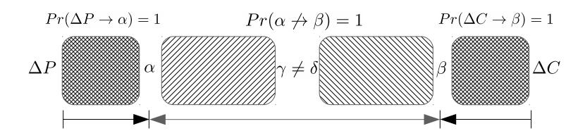
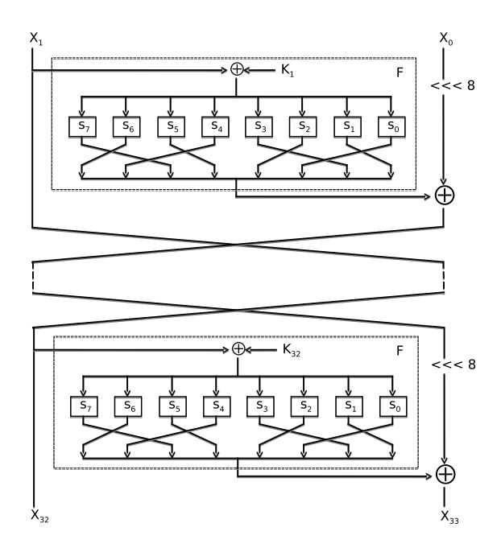
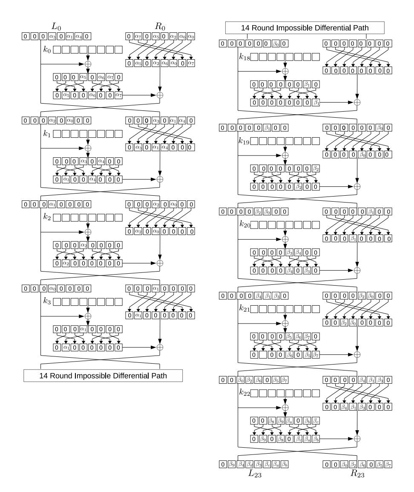

# Impossible differential cryptanalysis of LBlock with concrete investigation of key scheduling algorithm

Jiageng Chen, Yuichi Futa, Atsuko Miyaji, and Chunhua Su

School of Information Science, Japan Advanced Institute of Science and Technology, 1-1 Asahidai, Nomi, Ishikawa 923-1292, Japan {jg-chen, futa, miyaji, chsu}@jaist.ac.jp

Abstract. Impossible differential cryptanalysis has been proved to be one of the most powerful techniques to attack block ciphers. Based on the impossible differential paths, we can usually add several rounds before or after to launch the key recovery attack. Impossible differential cryptanalysis is powerful not only because the number of rounds it can break is very competitive compared to other attacks, but also unlike differential attacks which are statistical attacks in the essential, impossible differential analysis does not require many statistical assumptions. In this paper, we investigate the key recovery attack part of the impossible differential cryptanalysis. We point out that when taking the (non-linear) key scheduling algorithm into consideration, we can further derive the redundancy among the subkeys, and thus can filter the wrong key at a rather early stage. This can help us control the time complexity and increase the number of rounds we can attack. As an application, we analyze recently proposed lightweight block cipher LBlock, and as a result, we can break 23 rounds with complexity 2<sup>77</sup>.<sup>4</sup> encryptions without using the whole code block, which is by far the best attack against this cipher.

Keywords: Impossible differential cryptanalysis, key recovery attack, key scheduling algorithm, LBlock

## 1 Introduction

Block ciphers have been investigated for quite a long time, and a lot of powerful methods have been proposed such as differential attack [2], boomerang attack [23], linear attack [16], integral attack [13], meet in the middle attack [5], and so on. Among these techniques, impossible differential cryptanalysis is one of the most powerful attack against block ciphers, especially block cipher with Feistel and General Feistel structures are especially considered to be weak for impossible differential attack as demonstrated in [8] and [22]. Since the technique was first published in [1], a lot of ciphers have been carefully investigated by impossible differential attack, which has become a standard default routine when evaluating newly proposed ciphers. Different from differential attack which searches for the right key with the most high probability, impossible differential attack searches the right key by discarding the wrong ones, and the process makes sure that the right key will never be wrongly discarded. Thus compared with the differential attack which has to makes the wrong key randomization hypothesis [3], impossible differential attack provides much more guarantee on the cryptanalysis result we get. Thus if similar results (from the point view of data complexity, computational complexity and the number of rounds) are derived, we should prefer impossible differential cryptanalysis. Like in differential attack we need to first find good differential path holding with high probability, we need to find an impossible differential path, which from the name indicating, should not be existed with probability one. Since there is no probability involved compared with differential attack, good path here means the path that can cover long rounds. There are a lot of researches on how to find such path such as [11]. Generally speaking, finding impossible differential path is a relatively easier job than finding differential path, since at present, the gap between the theory and practice for finding the best differential path is still large. In this paper, we would like to focus on the key recovery part. Previously, this part was done trivially by directly recover the subkey involved in the beginning or the end of the impossible differential path. We show in this paper that we can further optimize this step by considering the key scheduling algorithm instead of considering the subkey as independent key bits. By investigating the key scheduling algorithm carefully, we could reveal the relationship between the subkey bits guessed in the first rounds and last rounds, then the redundancy can help us to discard the key at an early stage efficiently.

Lightweight block ciphers have attracted much of the research attention due to the low computational cost in both hardware and software implementation which is suitable for resource-restricted devices such as RFID tags. The security margin they provide, although reduced compared with the traditional block ciphers, is considered to be reasonable given the cost of information being protected. Generally speaking, key size is usually chosen to be 80 bits, while the popular versions of block size are 32, 48 and 64 bits. The first famous block cipher that was widely considered to be lightweight is PRESENT [4]. After that, many lightweight block ciphers have been proposed such as KATAN/KTANTAN family [6], TWINE [21], PRINTcipher [12], LBlock [26] and so on. Compared with AES which was selected through competitions, lightweight block ciphers get started only recently, and the lack of enough cryptanalysis will prevent those ciphers from being adopted by the industrial world. In this paper, we target one of the recent proposed cipher LBlock which has not been analyzed thoroughly.

In ACNS2011, LBlock [26] was proposed as a lightweight block which targets fast hardware and software implementation. It is designed using 32-round Feistel structure with 64-bit block size and 80-bit key size. In the original paper, the authors gave several attacks against LBlock, among which the impossible differential attack is the best one that can attack 20 rounds. Since, it attracted many analysises using techniques such as differential attack, boomerang attack, integral attack, zero-correlation linear attack, and so on. Among them, impossible differential attack is one of the best attack which can penetrate the largest number of rounds. We summarize the latest analysis results in the following tables along with ours.

Table 1. Single key scenario attacks against LBlock

| # | Round | Methods                        | Time Complexity | 1 0           | Source |
|---|-------|--------------------------------|-----------------|---------------|--------|
|   | 21    | Integral Attack                | $2^{62.3}$      | $2^{62.3}$    | [18]   |
|   | 22    | Integral Attack                | $2^{2^{70}}$    | $2^{61}$      | [19]   |
|   | 22    | Zero-Correlation Linear        | $2^{71.3}$      | $2^{62.1}$    | [20]   |
|   | 20    | Impossible Differential Attack |                 | $2^{63}$      | [26]   |
|   | 21    | Impossible Differential Attack |                 | $2^{62.5}$    | [14]   |
|   | 22    | Impossible Differential Attack |                 | $2^{58}$      | [10]   |
|   | 23    | Impossible Differential Attack |                 | $2^{57}$      | Ours   |
|   | 13    | Differential Attack            | $2^{42.08}$     | not mentioned | [15]   |
|   | 17    | Differential Attack            | $2^{67.52}$     | $2^{59.75}$   | [7]    |
|   | 18    | Boomerang Attack               | $2^{70.84}$     | $2^{63.27}$   | [7]    |
|   | 22    | Impossible Differential Attack | $2^{70}$        | $2^{58}$      | [17]   |
|   |       | (Related-Key)                  |                 |               |        |
|   | 23    | Impossible Differential Attack | $2^{78.3}$      | $2^{61.4}$    | [24]   |
|   |       | (Related-Key)                  |                 |               |        |

This paper is organized as follows. In Section 2, we first give short introduction on impossible differential attack, and then propose an improved version based on the key scheduling algorithm. Section 3 provides main notations and specifications of LBlock. Section 4 gives the concrete attacks against 23 rounds of LBlock and followed by the conclusion in Section 5.

## 2 Impossible differential attack considering key scheduling algorithm

#### 2.1 Impossible differential attack

Before the key recovery steps, we will first need a good impossible differential characteristic which covers as many rounds as possible. Usually, this kind of impossible differential characteristic can be built by miss-in-the-middle method. For a truncated input differential  $\alpha$ , try to find an output differential  $\gamma$  where  $Pr(\alpha \to \gamma) = 1$  in the forward direction. In the same way, find a backward differential path  $\beta \to \delta$  with probability 1. If  $\gamma \neq \delta$ , then  $Pr(\alpha \to \beta) = 1$ . Now based on this impossible differential path, we add some rounds at the beginning and the end of the path to compute the truncated input and output differential  $\Delta P$  and  $\Delta C$ . Suppose the subkeys used during rounds covered by paths  $\Delta P \to \alpha$  and  $\Delta C \to \beta$  are defined to be  $k_f$  and  $k_b$ , then we try to guess the subkey bits  $k_f, k_b$  (or the corresponding extended key bits) to test that given the plaintext and ciphertext pairs following input and output differentials  $(\Delta P, \Delta C)$ , whether

the guessed key bits can be satisfied. If so, then it can be eliminated from the key space. By testing the key space using a large mount of message pairs, the right key is expected to be remained. The general framework is depicted in Figure 1.



Fig. 1. Impossible Differential Cryptanalysis

To launch a successful impossible differential attack, we wish that both impossible differential characteristic and key recovery rounds can be long so that the total number of rounds we can attack may be increased. There are many previous researches dealing with how to build good impossible differential characteristics such as [11]. Unlike differential path, the space left to be improved seems to be little regarding the impossible differential path. Thus investigating the key recovery in detail may provide us with some further advantages which is only generally studied previously.

#### 2.2 Our improvement by investigating key scheduling algorithm

Let's suppose before and after the impossible differential path, we add  $r_f$  rounds and  $r_b$  rounds. Denote the number of subkey bits involved in the  $r_f$  and  $r_b$  rounds to be  $\#SK_f$  and  $\#SK_b$ , which are the key bits that are required when computing from difference  $\Delta P$  ( $\Delta C$ ) to  $\alpha$  ( $\beta$ ). The traditional way to proceed key recovery phase is to find for each of the  $\#SK_f + \#SK_b$  subkey candidate, a set of plaintext and ciphertext pairs that can satisfy the impossible differential path. Let's suppose that for each of the  $\#SK_f + \#SK_b$  key candidates, we have N pairs before satisfying the last x-bit condition of the impossible differential path, and denote the probability to be  $Pr_x$ . Then the probability for the subkey candidate to remain is  $Pr_x = (1-2^{-x})^N$ . Thus the number of remaining key candidate is  $2^{\#SK_f + \#SK_b} \times (1 - 2^{-x})^N$ , which should be less than the  $2^{\#SK_f + \#SK_b}$ . Many of the previous researches on impossible differential attack assumes that  $\#SK_f + \#SK_b$  is less than the total master key length. In that case, we can filter either  $SK_f$  or  $SK_b$  to a relatively small amount of number, then brute force the rest of the consecutive key bits related to  $SK_f$  or  $SK_b$ . The problem here is that  $SK_f$  and  $SK_b$  are definitely not independent subkeys. Key scheduling algorithm of the block cipher will take a master key as a starting point and generate subkeys for each round from the master key bits. Usually, the subkey generation will go through nonlinear operation such S-Box or modular addition, etc. Recent lightweight block ciphers even simplify it by just reusing the master

key in different rounds such as TEA(XTEA) [25] and LED [9], or only linear operation such as KATAN family [6]. If we can exploit the relation between SK<sup>f</sup> and SKb, we can reduce the number of total key candidate, and further extend the number of rounds we can attack, since we do not need 2#SKf+#SK<sup>b</sup> to be less than the total master key bits. The simple reusing or only linear key scheduling algorithm is relatively easy to analyze. Here we focus on the non-linear key scheduling algorithm which is widely deployed, and at the same time it is not as trivial to analyze as the case of linear key scheduling algorithm. We propose to proceed the key recovery phase in the following steps:

- 1. Given the plaintext and ciphertext differences and the first round conditions, make a structure of plaintext and ciphertext pairs which satisfy the input and output difference as well as the first round conditions for each of the first round subkeys that are required to be guessed.
- 2. Guess the subkey bits in either r<sup>f</sup> or r<sup>b</sup> and filter the wrong pairs after each condition checking.
- 3. For each guessed subkey bit, propagate it forwards or backwards respectively (which depend on r<sup>f</sup> or rb) to subkeys in each of the following rounds until it faces nonlinear operation where more unknown information bits are required to keep going.
- 4. Resolve the subkey conflicting. If we find that part of input or output of the nonlinear function are known, then guess the rest of unknown bits to derive the corresponding input or output. If part of the input or output are already known due to step two, then we get a conflict and the total number of guessed key candidates can be decreased. Then go to step 2 until no more conflicts can be resolved.
- 5. Finally for each guessed subkey, filter it according to the remaining pairs. After that, we need to map the subkey which are distributed in different rounds to one round, and apply brute force search to recover the rest of the key bits that have not been guessed. Then we know all the consecutive key bits which has the same length as the master key length, and can easily recover the master key.

The biggest difference from the previous researches is step 4. Previously, only plaintext and ciphertext pairs get filtered after each subkey guess. Here if we can also filter the key candidates at an early stage, then we gain an advantage at both computational complexity and the number of rounds we can attack. Just consider the situation where in order to check t-bit condition, we need to guess sbit subkey where s is much more larger than t. This can be the case for checking the conditions in rounds close to the input or output of the impossible differential path, where many subkeys are involved in computing the internal state. The complexity is computed as the multiplication of the number of guessed key bits and the remaining pairs. It is highly possible that the number of guessed key bits grows so quickly that the total complexity is larger than brute force searching the master key. By reducing the key candidates at the same time as filtering plaintext and ciphertext pairs, we can control and optimize the total complexity.

#### Notations and LBlock 3

#### Notations

We summarize the notations here that will be used in the analysis.

- $-L_r, R_r$ : the left and right internal state of round r starting from 0.
- $-L_{r,[i]}, R_{r,[i]}$ : the i-th nibble of  $L_r$  and  $R_r$ .  $-\Delta L_{i,[j]}, \Delta R_{i,[j]}$ : the difference of *i*-th nibble of  $L_r$  and  $R_r$ .
- $-\alpha_i$ : differences specified in the rounds before the impossible differential path.
- $-\beta_i$ : differences specified in the rounds after the impossible differential path.
- $K_i$ : The corresponding 80-bit master key used in round i.
- $-k_i$ : 32-bit subkey used in round i.
- $-k_{i,[i\sim j]}$ : i-th bit to j-th bit of subkey  $k_i$ . i and j are denoted according to the whole 80-bit index instead of 32-bit index. Assuming  $k_0 = [k_{0,48}, k_{0,49}, ..., k_{0,79}]$ .

#### 3.2 LBlock

LBlock consists of a 32-round variant Feistel network with 64-bit block size and 80-bit key size. The encryption algorithm works as follows:

1. For
$$i = 2, 3, ..., 33$$
, do  $X_i = F(X_{i-1}, K_{i-1}) \oplus (X_{i-2} <<< 8)$

2. Ciphertext is  $C = X_{32} || X_{33}$

Here round function F contains a S-Box layer and a diffusion layer which are denoted as S and P.

$$F: \{0,1\}^{32} \times \{0,1\}^{32} \to \{0,1\}^{32}, (X,K_i) \to P(S(X \oplus K_i))$$

There are eight 4-bit S-Boxes for each of the nibbles. Suppose the input and output of the S-box are Y and Z. The S layer can be denoted as

$$\begin{split} Y &= Y_7 ||Y_6||Y_5||Y_4||Y_3||Y_2||Y_1||Y_0 \rightarrow Z = Z_7 ||Z_6||Z_5||Z_4||Z_3||Z_2||Z_1||Z_0 \\ Z_7 &= s_7(Y_7), Z_6 = s_6(Y_6), Z_5 = s_5(Y_5), Z_4 = s_4(Y_4), Z_3 = s_3(Y_3), \\ Z_2 &= s_2(Y_2), Z_1 = s_1(Y_1), Z_0 = s_0(Y_0) \end{split}$$

For diffusion layer with the input and output of the layer being Z and U, it can be denoted as:

$$U_7 = Z_6, U_6 = Z_4, U_5 = Z_7, U_4 = Z_5, U_3 = Z_2, U_2 = Z_0, U_1 = Z_3, U_0 = Z_1$$

All the above details are concluded in Figure 2. Since take advantage of key scheduling algorithm, we also give the description here. 80-bit master K is denoted as  $K = [k_{79}, k_{78}, ..., k_0]$ . Set the first round key to be  $k_0 = [k_{79}, ..., k_{48}]$ . Then for each of the subkey used in the following round, we do the following updating process before outputting the leftmost 32 bits of K.

- 1. K = K <<< 29
- 2.  $[k_{79},...,k_{76}] = S_9[k_{79},...,k_{76}], [k_{75},...,k_{72}] = S_9[k_{75},...,k_{72}]$ 3.  $[k_{50},...,k_{46}] \oplus [i]_2$

Step 2 is the main non-linear operation we will need to consider in detail, and we do not care about step 3.



Fig. 2. LBlock

### 4 Impossible differential attack on 23 rounds of LBlock

We take advantage of the 14 round impossible differential path (00000000,000\*  $(0000) \neq (000000 * 0,00000000)$ , which is also used in [10]. Now we add four rounds before and five rounds after to attack in total 23 rounds of LBlock. Since the differential property is rather symmetric, we could also attack in the five rounds before and four rounds after pattern. Here for the simplicity, we only demonstrate the first one. Figure 3 demonstrates the differential path for the first four and the last five rounds. Our first task is to collect the plaintext and ciphertext pairs that could be used to launch the attack. By propagating the input and output impossible differential in the backward and forward directions, we can get part of the differences of the plaintext and ciphertext pairs. Usually, we first collect pairs that satisfy the plaintext difference, and then filter the pairs according to the ciphertext difference. However, this approach is time consuming since it first needs to collect a huge amount of data to start with. Here we propose to construct plaintext and ciphertext pairs using conditional impossible differential, which will help to bypass the plaintext and ciphertext difference conditions as well as the first round conditions free of cost.

First let's fix plaintext  $L_{0,[0,3,5\sim7]}$  to be some random value in  $F_2^4$ .  $L_{0,[1,2,4]}$  take all the 16 values and we get  $2^{12}$  plaintexts. Now for each  $k_{0,[1,2,4]}$ , compute  $R_{0,1}=S_2(L_{0,2}\oplus k_{0,2}),\,R_{0,4}=S_4(L_{0,4}\oplus k_{0,4})$  and  $R_{0,6}=S_1(L_{0,1}\oplus k_{0,1})$ . Take all the 16 values for  $R_{0,[0,2]}$ , then we have  $2^{12}\times 2^8=2^{20}$  plaintexts for each of the 12-



**Fig. 3.** Differential path for the first four rounds (left side) and last five rounds (right side).  $\alpha_i$  and  $\beta_i$  denote some non-zero 4-bit difference.

bit subkey  $k_{0,[1,2,4]}$ . Any pair taken from them will satisfy the plaintext difference and first round conditions. Now query the corresponding ciphertexts and sort the data according to  $L_{23,7}$ ,  $R_{23,[2,6,7]}$  where there are no output difference. Then we can directly generate  $2^{20\times 2-1}\times 2^{-4\times 4}=2^{23}$  pairs for each of the 12-bit subkey. Actually, we can further filter the pairs before guessing any key bits. It is based on the following observation.

**Theorem 1.** For every S-Box, each input difference leads to average 6.06 possible output differences. And given each possible input and output pair, there are on average  $2^{1.4}$  legal key candidates.

So if both input and output differences to an S-box are known, we know part of them are illegal and can be filtered immediately. By investigating the first four and last five rounds, we conclude the following 12 conditions, and from them we are able to filter part of the plaintext and ciphertext pairs.

```
\begin{array}{l} - \  \, \mathbf{Round} \  \, \mathbf{1:} \  \, \alpha_0 \to \alpha_4, \  \, \alpha_2 \to \alpha_3. \\ - \  \, \mathbf{Round} \  \, \mathbf{2:} \  \, \alpha_1 \to \alpha_2. \\ - \  \, \mathbf{Round} \  \, \mathbf{3:} \  \, \alpha_0 \to \alpha_1. \\ - \  \, \mathbf{Round} \  \, \mathbf{20:} \  \, \beta_0 \to \beta_3, \  \, \beta_2 \to \beta_4. \\ - \  \, \mathbf{Round} \  \, \mathbf{21:} \  \, \beta_3 \to \beta_7, \  \, \beta_4 \to \beta_5. \\ - \  \, \mathbf{Round} \  \, \mathbf{22:} \  \, \beta_7 \to \beta_c, \  \, \beta_5 \to \beta_b, \  \, \beta_6 \to \beta_a, \  \, \beta_2 \to \beta_7. \end{array}
```

Note that all the above differences  $\alpha$  and  $\beta$  appear in the plaintext and ciphertext difference, and that's why we can use the above condition to further filter the legal pairs by a very quick table lookup. Each of the above condition will allow one pair to pass with probability  $\frac{6.06}{16} = 2^{-1.4}$ . Thus there remains  $2^{23-1.4\times12} = 2^{6.2}$  pairs. Let's suppose these  $2^{6.2}$  pairs form one structure, and we can build similar structures by taking one of the following procedures. (1). changing the fixed values of  $L_{0,[0,3,5\sim7]}$ ,  $R_{0,[3,5,7]}$ . (2), changing the values of  $R_{0,[1,4,6]}$  by xoring a constant in  $F_2^4$ . We can do (1) since we have not chosen those values yet. For the case of (2), we can explain in this way: in the previous construction, we actually require for example  $R_{0,1} = S_2(L_{0,2} \oplus k_{0,2})$  and  $R'_{0,1} =$  $S_2(L_{0,2}' \oplus k_{0,2})$ . Thus of course  $R_{0,1} \oplus R_{0,1}' = S_2(L_{0,2} \oplus k_{0,2}) \oplus S_2(L_{0,2}' \oplus k_{0,2})$ . However, this equation still hold if we add a constant C to both  $R_{0,1}$  and  $R'_{0,1}$ . Remember we only need conditions on differences not the exact values. Another point here is that the plaintexts by adding the constant C for one subkey actually has been obtained by another subkey. In other words, the total data complexity will not increase, and many plaintexts can be shared among different subkeys. As a result, we can maximumly build  $2^{12+4\times8}=2^{44}$  structures for each of the subkey  $k_{0,[1,2,4]}$ . Suppose we take n structures, then for each of the subkey  $k_{0,[1,2,4]}$ , we have  $2^{n+6.2}$  legal pairs, and the data complexity is  $2^{n+20}$ .

### Key recovery.

The key scheduling algorithm of LBlock is designed in a stream cipher way. At each round, 8-bit subkey go through non-linear S-Box. It is easy to see that as long as the consecutive 80-bit subkey can be recovered, we can easily recover the master key. We start by guessing the subkey bits used in the first four and last five rounds. And by taking advantage of the key scheduling algorithm, we finally map the guessed key bits to the consecutive 80-bit key at round 18. Impossible differential analysis will allow us to reduce the key space, and we brute force search the rest of the space to target the correct key candidate. We investigate round by round as follows.

#### Round 22.

There are  $4 \times 4$  bit conditions to satisfy at round 22. First let's check the condition  $\Delta R_{22,0} = 0$ , which involves guessing  $k_{22,[50\sim53]}$ , the remaining pairs is  $2^{n+6.2-2.6} = 2^{n+3.6}$  since we have already filtered  $2^{1.4}$  pairs in the data collection phase. We proceed in the similar way for other 4-bit conditions and we will not explain them again. The complexity is around  $2 \times 2^{12+4} \times 2^{n+6.2} \times \frac{1}{8 \times 23} \approx 2^{n+15.68}$  23-round encryptions. Then we do key filtering by using key schedule algorithm. Guess  $k_{22,[54\sim57]}$ , then by tracing back the key scheduling algorithm, we know  $k_{8,[52\sim57]}$  after shifting operation, and  $k_{9,[52\sim55]}$ . Guess  $k_{8,[51,58]}$  so that the 8-bit input to the two S-Boxes are known. Thus we have a 4-bit filtering condition from  $k_{9,[52\sim55]}$ , which leaves  $2^{12+4+2} \times 2^{-4} = 2^{14}$  keys. Guess  $k_{19,[59]}$ , then we have 2-bit filtering condition between  $k_{19}$  and  $k_{20}$ . Thus the number of remaining keys become  $2^{14+1-2} = 2^{13}$ .

For the second 4-bit condition ( $\Delta R_{22,6} = 0$ ), we need to guess  $k_{22,[54\sim57]}$ , which is already known by computing backward from the known subkey bits. The remaining pairs becomes  $2^{n+3.6-2.6} = 2^{n+1}$ . It takes  $2\times2^{13}\times2^{n+3.6}\times\frac{1}{8\times23} = 2^{n+10.10}$  23 round encryptions.

For the third 4-bit condition ( $\Delta R_{22,7}=0$ ), we need to guess  $k_{22,[62\sim65]}$ . The legal number of pairs decreases to  $2^{n+1}\times 2^{-2.6}=2^{n-1.6}$ . It takes  $2\times 2^{13+4}\times 2^{n+1}\times \frac{1}{8\times 23}=2^{n+11.48}$  23 round encryptions.

Before the fourth condition, we perform key filtering process. Guess  $k_{22,[66\sim69]}$  and  $k_{6,[22]}$ , by computing backwards, we find  $k_{5,64}$  and  $k_{2,[65\sim67]}$  have already been guessed, which result in a 4-bit condition. Thus there remains  $2^{17}\times2^{5}\times2^{-4}=2^{18}$  key candidates. Then proceed the fourth condition checking ( $\Delta R_{22,4}=0$ ). There remains  $2^{n-1.6-2.6}=2^{n-4.2}$ , and it takes  $2\times2^{18}\times2^{n-1.6}\times\frac{1}{8\times23}=2^{n+9.88}$  23 round encryptions. After processing round 23, we can further reduce the key candidates. Guess  $k_{17,[60,61]}$ , we can compute  $k_{16,[62]}$  and  $k_{5,[58,59]}$ , which are already known. Then the key candidates are reduced to  $2^{18+2-3}=2^{17}$ .

#### Round 21.

Round 21 has  $4\times 3-1.4\times 2=9.2$  bits conditions to satisfy. For each of the conditions, we only list the key bits that are required to be guessed, while ignore the ones which are already known. For checking condition  $\Delta R_{21,6}=0$ , we need to guess  $k_{21,[79,0\sim2]}$ . The remaining pairs is  $2^{n-4.2}\times 2^{-2.6}=2^{n-6.8}$ . It takes  $2\times 2^{17+4}\times 2^{n-4.2}\times \frac{2}{8\times 23}=2^{n+11.28}$  23 round encryptions.

To check condition  $\Delta R_{21,1}=0$ , we need to guess  $k_{22,[70\sim73]}, k_{21,[7\sim10]}$ . Notice that this condition is not pre-filtered at the data collection phase, so we have a 4-bit condition here. Thus there remains  $2^{n-6.8}\times 2^{-4}=2^{n-10.8}$  legal pairs. It takes  $2\times 2^{21+8}\times 2^{n-6.8}\times \frac{2}{8\times 23}=2^{n+16.68}$  23 round encryptions.

For the last condition  $\Delta R_{21,7} = 0$  in round 21, we guess  $k_{21,[78]}$  and  $k_{21,[11\sim 14]}$ . The number of pairs get remained is  $2^{n-10.8} \times 2^{-2.6} = 2^{n-13.4}$ . It takes  $2 \times 2^{29+5} \times 2^{n-10.8} \times \frac{2}{8\times 23} = 2^{n+17.68}$  23 round encryptions.

#### Round 1.

After processing Round 21, we go back to the first five rounds to proceed round 1. There are in total two 4-bit conditions in Round 1 and both of them have been pre-filtered and thus only  $2\times 2.6=5.2$  bit conditions remained. Let's guess  $k_{0,[48\sim50]}$ ,  $k_{1,[27\sim30]}$  and  $k_{0,[47]}$ , then according to key scheduling

algorithm, we can derive  $k_{12,[50,51]}$ , which are known already. So we first filter the key candidates to leave  $2^{34+8-2}=2^{40}$  key candidates. Then we proceed checking condition  $\Delta R_{1,1}=0$ . We have  $2^{n-13.4}\times 2^{-2.6}=2^{n-16}$  pairs remaining, and it takes  $2\times 2^{40}\times 2^{n-13.4}\times \frac{2}{8\times 23}=2^{n+21.10}$  23 round encryptions.

To check the other condition  $\Delta R_{1,4} = 0$ , we need to guess  $k_{1,[35\sim38]}$ . Thus the remaining pairs become  $2^{n-16} \times 2^{-2.6} = 2^{n-18.6}$ , and it takes  $2 \times 2^{40+4} \times 2^{n-16} \times \frac{2}{8\times23} = 2^{n+22.48}$  23 round encryptions.

## Round 20 (Condition 1).

For round 20, there are two 4-bit conditions, and we choose to proceed only one  $\Delta R_{20,1}=0$  first and check the other one after proceeding round 2. By doing so, we can control the computational complexity in a mild way by taking advantage of the key scheduling algorithm. To check  $\Delta R_{20,1}=0$ , we will have to guess 12-bit key  $k_{20,[36\sim39]},\ k_{21,[19\sim22]}$  and  $k_{22,[74\sim77]}$ . After checking 2.6-bit filtering condition, there remains  $2^{n-18.6}\times 2^{-2.6}=2^{n-21.2}$  pairs. It takes  $2\times 2^{44+12}\times 2^{n-18.6}\times \frac{3}{8\times23}=2^{n+32.46}$  23 round encryptions.

#### Round 2.

Since the computational complexity is relatively high, by proceeding round 2, we wish to obtain more key bits information than what we actually guessed. First guess  $k_{0,[77\sim79]}$  and  $k_{10,[0]}$ , then we can derive  $k_{11,[0,77,79]}$  which leaves  $2^{56+4-3}=2^{57}$  key candidates. Guess  $k_{1,[39\sim42]}$  and  $k_{14,[40]}$ , we can derive  $k_{15,[38,39]}$  (known), which leaves  $2^{57+5-2}=2^{60}$  key candidates. Guess  $k_{2,[6\sim9]}$ ,  $k_{4,[10]}$  and  $k_{15,[11]}$ , derive  $k_{16,[9\sim11]}$  (known), which result in  $2^{60+6-3}=2^{63}$  key candidates. Now we know all the subkey bits in order to check  $\Delta R_{2,4}=0$ . There remains  $2^{n-21.2}\times 2^{-2.6}=2^{n-23.8}$  pairs, and it takes  $2\times 2^{63}\times 2^{n-21.2}\times \frac{3}{8\times23}=2^{n+36.86}$  23 round encryptions to test.

### Round 20 (Condition 2).

Now let's check the second condition  $\Delta R_{20,7}=0$  of round 20. First guess  $k_{20,[41\sim43]}$  and  $k_{15,[44]}$ , then we derive  $k_{3,[40\sim42]}$  which are known. Key candidates becomes  $2^{63+4-3}=2^{64}$ . Then guess  $k_{21,[27\sim30]}$  and  $k_{10,[26]}$ , derive  $k_{9,[27,28]}$  which are also known. There remains  $2^{64+5-2}=2^{67}$  key candidates. To filter 2.6-bit condition, the remaining pairs become  $2^{n-23.8}\times 2^{-2.6}=2^{n-26.4}$ . It takes  $2\times 2^{67}\times 2^{n-23.8}\times \frac{3}{8\times23}=2^{n+38.26}$  23 round encryptions to test.

#### Round 3.

Check the condition  $\Delta R_{3,4}=0$  in round 3 which is the last round before the IDC path. We need to guess 8-bit of  $k_0$ , 8-bit of  $k_1$ , 4-bit of  $k_2$  and 4-bit of  $k_3$ . However, most of the subkey bits are already known, which remains only  $k_{2,[11\sim13]}$  to guess. Guess  $k_{2,[11\sim13]}$  along with  $k_{4,[14]}$ , then derive the already known bit  $k_{5,[11]}$ . Guess  $k_{15,[15]}$  and derive the known bits  $k_{16,[12\sim14]}$ . Then the number of key candidates becomes  $2^{67+4+1-1-3}=2^{68}$ . The remaining legal pairs become  $2^{n-26.4}\times 2^{-2.6}=2^{n-29}$ , and it takes  $2\times 2^{68}\times 2^{n-26.4}\times \frac{4}{8\times 23}=2^{n+37.08}$  23 round encryptions to test.

**Round 19.** One 4-bit condition  $\Delta R_{19,0}=0$  in round 19 requires to guess only  $k_{20,[31]}$  while other bits are known at present. Notice that the condition has not been pre-filtered, thus there remains  $2^{n-29}\times 2^{-4}=2^{n-33}$  pairs. The computational complexity is  $2\times 2^{69}\times 2^{n-29}\times \frac{4}{8\times 23}=2^{n+35.48}$  23 round encryptions.

#### Round 18.

If the guessed key passed the 4-bit condition in round 18, it must be a wrong key and can be discarded from the key candidate list. Guess  $k_{21,[23\sim26]}$  which are the only bits needed for checking condition  $\Delta R_{18,7}=0$ . We can derive  $k_{20,[26]}$  which is known. Thus up to now, we have guessed in total  $2^{69+4-1}=2^{72}$  subkey bits which exists in different rounds. We want to target the 80-bit master key  $K_{18}$  at round 18. However, at present we only know 63-bit of  $K_{18}$ , which is not yet enough. Before filtering the 72-bit subkey, let's merge the key bits first. Guess  $K_{18,[32\sim35]}$ , then we can derive  $k_{17,[37]}$  and  $k_{6,[29,30,35,36]}$ , which are known. Now the guessed number of key candidates become  $2^{72+4-5}=2^{71}$ . Further guess  $K_{19,[3\sim6]}$ , derive  $k_{18,[8]}$  and  $k_{7,[6,7]}$  which are known and the guessed key candidates finally shrink down to  $2^{71+4-3}=2^{72}$ , and we have known 74-bit of  $K_{18}$ . Finally we can check the last condition to filter these  $2^{72}$  key candidates. There remains  $2^{72}\times(1-2^{-4})^{2^{n-33}}$  keys. For each of the remaining keys, we brute force search the remaining 6-bit of  $K_{18}$ . Thus the complexity of this step can be computed as  $2\times2^{72}\times(1+(1-2^{-4})+\cdots+(1-2^{-4})^{2^{n-33}-1})\times\frac{6}{8\times23}+2^{72}\times(1-2^{-4})^{2^{n-33}}\times2^6$ .

### Complexity.

Since we put the number of structures (data complexity) in the computational complexity as a variable, we can always take the balance between the data complexity and computational complexity. For example let's take n=37, then the data complexity will be  $2^{57}$  which is less than the whole code block. Computational complexity is computed by adding all the cost in each of the steps. As a result, we get  $2^{37+15.68}+2^{37+10.10}+2^{37+11.48}+2^{37+9.88}+2^{37+11.28}+2^{37+16.68}+2^{37+21.10}+2^{37+22.48}+2^{37+32.46}+2^{37+36.86}+2^{37+38.26}+2^{37+35.48}+2^{71.37}+2^{76.51}\approx 2^{77.4}$  23 rounds encryptions.

#### 5 Conclusion

In this paper, we investigate the impossible differential attack by considering the key scheduling algorithm. Previous works usually treat the subkey used in the first and last rounds to be independent ones. But in fact the subkey bits are not independent and are generated by key scheduling algorithm. It is rather easy to observe the relation when the key scheduling algorithm just simply reuses the master key bits such as XTEA, etc, however, we point out that even the key scheduling algorithm involves non-linear operations such as S-Box, we can still exploit the relation which can be used to reduce the time complexity to improve the number of rounds we can attack. As an application, we investigate LBlock and achieve attacking 23 rounds in single key model without using the whole code block, which is the best single key attack so far.

### References

1. Eli Biham, Alex Biryukov, and Adi Shamir. Cryptanalysis of skipjack reduced to 31 rounds using impossible differentials. In Jacques Stern, editor,  $Advances\ in$

- Cryptology EUROCRYPT 99, volume 1592 of Lecture Notes in Computer Science, pages 12–23. Springer Berlin Heidelberg, 1999.
- 2. Eli Biham and Adi Shamir. Differential cryptanalysis of des-like cryptosystems. In AlfredJ. Menezes and ScottA. Vanstone, editors, Advances in Cryptology-CRYPT0 90, volume 537 of Lecture Notes in Computer Science, pages 2–21. Springer Berlin Heidelberg, 1991.
- 3. Cline Blondeau, Benot Grard, and Kaisa Nyberg. Multiple differential cryptanalysis using llr and 2 statistics. In Ivan Visconti and Roberto Prisco, editors, Security and Cryptography for Networks, volume 7485 of Lecture Notes in Computer Science, pages 343–360. Springer Berlin Heidelberg, 2012.
- 4. A. Bogdanov, L.R. Knudsen, G. Leander, C. Paar, A. Poschmann, M.J.B. Robshaw, Y. Seurin, and C. Vikkelsoe. Present: An ultra-lightweight block cipher. In Pascal Paillier and Ingrid Verbauwhede, editors, Cryptographic Hardware and Embedded Systems - CHES 2007, volume 4727 of Lecture Notes in Computer Science, pages 450–466. Springer Berlin Heidelberg, 2007.
- 5. Andrey Bogdanov and Christian Rechberger. A 3-subset meet-in-the-middle attack: Cryptanalysis of the lightweight block cipher ktantan. In Alex Biryukov, Guang Gong, and DouglasR. Stinson, editors, Selected Areas in Cryptography, volume 6544 of Lecture Notes in Computer Science, pages 229–240. Springer Berlin Heidelberg, 2011.
- 6. Christophe Cannire, Orr Dunkelman, and Miroslav Kneevi. Katan and ktantan a family of small and efficient hardware-oriented block ciphers. In Christophe Clavier and Kris Gaj, editors, Cryptographic Hardware and Embedded Systems - CHES 2009, volume 5747 of Lecture Notes in Computer Science, pages 272–288. Springer Berlin Heidelberg, 2009.
- 7. Jiageng Chen and Atsuko Miyaji. Differential cryptanalysis and boomerang cryptanalysis of lblock. In Alfredo Cuzzocrea, Christian Kittl, DimitrisE. Simos, Edgar Weippl, and Lida Xu, editors, Security Engineering and Intelligence Informatics, volume 8128 of Lecture Notes in Computer Science, pages 1–15. Springer Berlin Heidelberg, 2013.
- 8. Jiazhe Chen, Keting Jia, Hongbo Yu, and Xiaoyun Wang. New impossible differential attacks of reduced-round camellia-192 and camellia-256. In Udaya Parampalli and Philip Hawkes, editors, Information Security and Privacy, volume 6812 of Lecture Notes in Computer Science, pages 16–33. Springer Berlin Heidelberg, 2011.
- 9. Jian Guo, Thomas Peyrin, Axel Poschmann, and Matt Robshaw. The led block cipher. In Bart Preneel and Tsuyoshi Takagi, editors, Cryptographic Hardware and Embedded Systems CHES 2011, volume 6917 of Lecture Notes in Computer Science, pages 326–341. Springer Berlin Heidelberg, 2011.
- 10. Ferhat Karako, Hseyin Demirci, and A.Emre Harmanc. Impossible differential cryptanalysis of reduced-round lblock. In Ioannis Askoxylakis, HenrichC. Phls, and Joachim Posegga, editors, Information Security Theory and Practice. Security, Privacy and Trust in Computing Systems and Ambient Intelligent Ecosystems, volume 7322 of Lecture Notes in Computer Science, pages 179–188. Springer Berlin Heidelberg, 2012.
- 11. Jongsung Kim, Seokhie Hong, Jaechul Sung, Sangjin Lee, Jongin Lim, and Soohak Sung. Impossible differential cryptanalysis for block cipher structures. In Thomas Johansson and Subhamoy Maitra, editors, Progress in Cryptology - INDOCRYPT 2003, volume 2904 of Lecture Notes in Computer Science, pages 82–96. Springer Berlin Heidelberg, 2003.

- 12. Lars Knudsen, Gregor Leander, Axel Poschmann, and MatthewJ.B. Robshaw. Printcipher: A block cipher for ic-printing. In Stefan Mangard and Franois-Xavier Standaert, editors, Cryptographic Hardware and Embedded Systems, CHES 2010, volume 6225 of Lecture Notes in Computer Science, pages 16–32. Springer Berlin Heidelberg, 2010.
- 13. Lars Knudsen and David Wagner. Integral cryptanalysis. In Joan Daemen and Vincent Rijmen, editors, Fast Software Encryption, volume 2365 of Lecture Notes in Computer Science, pages 112–127. Springer Berlin Heidelberg, 2002.
- 14. Ya Liu, Dawu Gu, Zhiqiang Liu, and Wei Li. Impossible differential attacks on reduced-round lblock. In MarkD. Ryan, Ben Smyth, and Guilin Wang, editors, Information Security Practice and Experience, volume 7232 of Lecture Notes in Computer Science, pages 97–108. Springer Berlin Heidelberg, 2012.
- 15. Minier. Marine and Maria Naya-Plasencia. Some preliminary studies on the differential behavior of te lightweight block cipher LBlock. In ECRYPT Workshop on Lightweight Cryptography, pages 35–48, 2011.
- 16. Mitsuru Matsui. Linear cryptanalysis method for des cipher. In Tor Helleseth, editor, Advances in Cryptology EUROCRYPT 93, volume 765 of Lecture Notes in Computer Science, pages 386–397. Springer Berlin Heidelberg, 1994.
- 17. Marine Minier and Maria Naya-Plasencia. A related key impossible differential attack against 22 rounds of the lightweight block cipher lblock. volume 112, pages 624–629, Amsterdam, The Netherlands, The Netherlands, August 2012. Elsevier North-Holland, Inc.
- 18. Yu Sasaki and Lei Wang. Comprehensive study of integral analysis on 22-round lblock. In Taekyoung Kwon, Mun-Kyu Lee, and Daesung Kwon, editors, Information Security and Cryptology ICISC 2012, volume 7839 of Lecture Notes in Computer Science, pages 156–169. Springer Berlin Heidelberg, 2013.
- 19. Yu Sasaki and Lei Wang. Meet-in-the-middle technique for integral attacks against feistel ciphers. In LarsR. Knudsen and Huapeng Wu, editors, Selected Areas in Cryptography, volume 7707 of Lecture Notes in Computer Science, pages 234–251. Springer Berlin Heidelberg, 2013.
- 20. Hadi Soleimany and Kaisa Nyberg. Zero-correlation linear cryptanalysis of reduced-round lblock. volume 2012, page 570, 2012.
- 21. Tomoyasu Suzaki, Kazuhiko Minematsu, Sumio Morioka, and Eita Kobayashi. twine: A lightweight block cipher for multiple platforms. In LarsR. Knudsen and Huapeng Wu, editors, Selected Areas in Cryptography, volume 7707 of Lecture Notes in Computer Science, pages 339–354. Springer Berlin Heidelberg, 2013.
- 22. Yukiyasu Tsunoo, Etsuko Tsujihara, Maki Shigeri, Teruo Saito, Tomoyasu Suzaki, and Hiroyasu Kubo. Impossible differential cryptanalysis of clefia. In Kaisa Nyberg, editor, Fast Software Encryption, volume 5086 of Lecture Notes in Computer Science, pages 398–411. Springer Berlin Heidelberg, 2008.
- 23. David Wagner. The boomerang attack. In Lars Knudsen, editor, Fast Software Encryption, volume 1636 of Lecture Notes in Computer Science, pages 156–170. Springer Berlin Heidelberg, 1999.
- 24. Long Wen, Mei-Qin Wang, and Jing-Yuan Zhao. Related-key impossible differential attack on reduced-round lblock. Journal of Computer Science and Technology, 29(1):165–176, 2014.
- 25. David J Wheeler and Roger M Needham. Tea, a tiny encryption algorithm. In Fast Software Encryption, pages 363–366. Springer, 1995.
- 26. Wenling Wu and Lei Zhang. Lblock: A lightweight block cipher. In Javier Lopez and Gene Tsudik, editors, Applied Cryptography and Network Security, volume

6715 of Lecture Notes in Computer Science, pages 327–344. Springer Berlin Heidelberg, 2011.