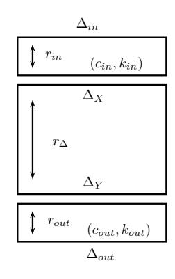
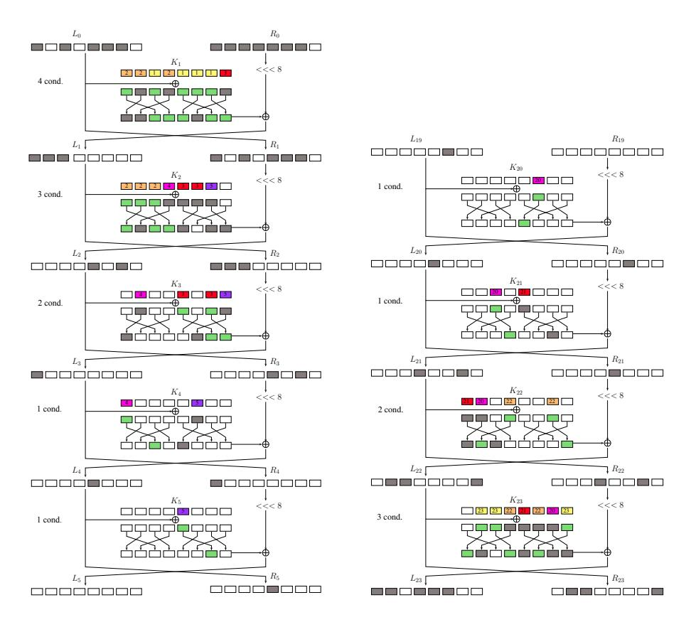
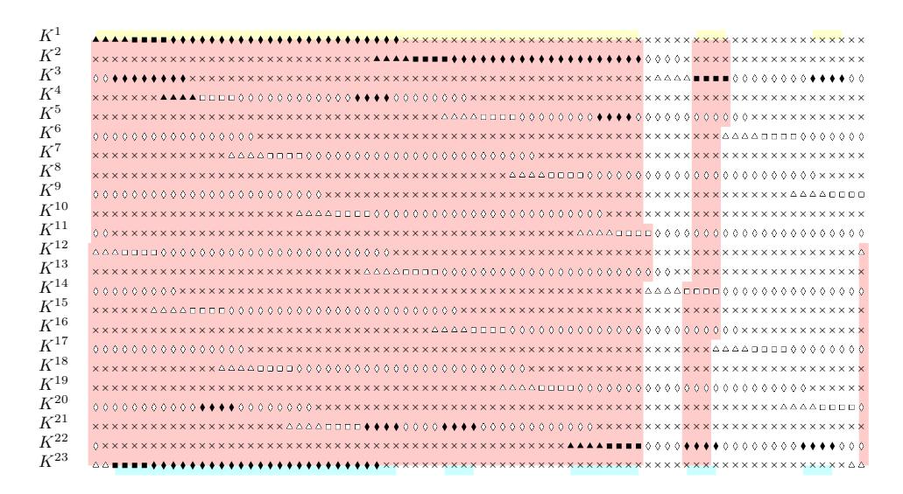
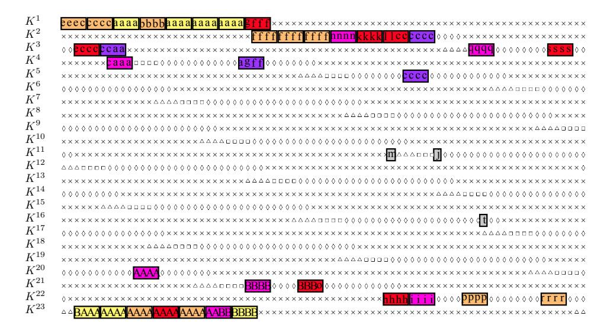
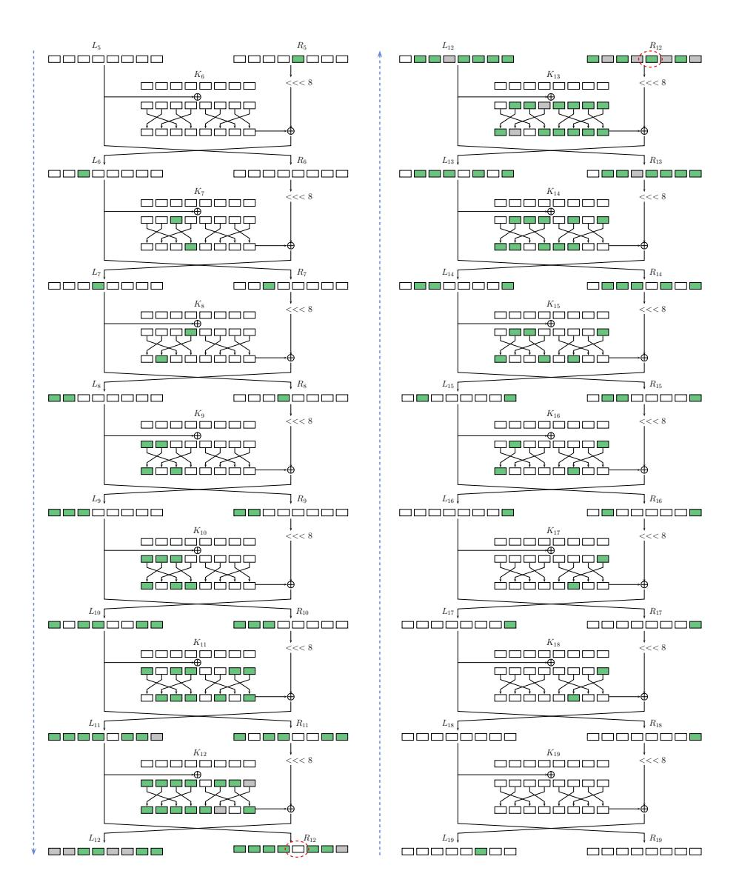

# Improved Impossible Differential Attacks against Round-Reduced LBlock

Christina Boura<sup>1</sup> , Marine Minier<sup>2</sup> , Mar´ıa Naya-Plasencia<sup>3</sup> , and Valentin Suder<sup>3</sup>

> <sup>1</sup> University of Versailles, France 2 INSA Lyon, France 3 Inria, France

Abstract. Impossible differential attacks are among the most powerful forms of cryptanalysis against block ciphers. We present in this paper an in-depth complexity analysis of these attacks. We show an unified way to mount such attacks and provide generic formulas for estimating their time and data complexities. LBlock is a well studied lightweight block cipher with respect to impossible differential attacks. While previous single-key cryptanalysis reached up to 22 rounds, by applying our method we are able to break 23 rounds with time complexity 2 <sup>75</sup>.<sup>36</sup> and data complexity 2<sup>59</sup>. Other time/data trade-offs are equally possible. This is to our knowledge the best (non-exhaustive search like) cryptanalysis of this function in the single-key model.

Keywords. block ciphers, impossible differential attacks, LBlock.

# 1 Introduction

The differential attack introduced in [5] has shown to be one of the most powerful attacks against symmetric cryptosystems. Its main idea relies on exploiting differential paths that have a higher probability to occur than a differential path chosen at random. A variant of differential cryptanalysis is the impossible differential cryptanalysis, introduced independently by Knudsen [11] and by Biham et. al [4] and where one searches for differential paths that have probability zero to occur. In the concept of this attack, some rounds are added at the beginning and at the end of the impossible path, and if a trial key partially decrypts a given pair to the impossible differential, then this key certainly cannot be the right one and is thus rejected. The goal is to repeat this procedure in order to remove as many keys as possible and to reduce consequently the candidate key space.

Impossible differential attacks have been extensively applied against many block ciphers and hash functions. Some examples are the 31-round attack against Skipjack [4], an application on the SHA-3 finalist Skein [3], attacks on reduced round Camellia [22, 13] and many more. These attacks seem to work particularly well for the case of Feistel ciphers, as the relatively slow diffusion of these schemes, permits the construction of long impossible differential paths. Due to the high technicality, the analysis of the time complexity and the necessary data is a point that is very often not treated in an optimal way, as for example in [9, 12, 2, 1].

LBlock [21] is a lightweight block cipher designed by Wu and Zhang in 2011. It is an iterated construction that can be seen as a variant of a Feistel network. LBlock has received the attention of many researchers and has been the target of numerous analyses. The best known attack achieves 22 rounds using impossible differential cryptanalysis. In this paper we show how to reach 23 rounds by equally applying impossible differential attacks.

The rest of the paper is organized as follows. Section 2 describes a general framework for impossible differential attacks and an analysis of their complexity. Section 3 describes LBlock and the detailed analysis of one of the attacks, while providing other possible trade-offs.

# 2 Impossible Differential Attacks and Complexity analysis

In this section we provide a generic and optimized framework for mounting impossible differential attacks.

The basic principle behind an impossible differential attack consists of two main steps. The first one relies on the discovery of an impossible differential path, while the second consists in adding

input and output rounds that will be used for discarding some key candidates. We start our analysis by presenting the notations that will be used to describe our method.



- $\Delta_X$ ,  $\Delta_Y$ : input (resp. output) differences of the impossible differential path.
- $r_{\Delta}$ : number of rounds of the impossible differential path.
- $\Delta_{in}$ ,  $\Delta_{out}$ : input (resp. output) truncated differences of the cipher.
- $r_{in}$ : number of rounds of the differential path $(\Delta_X, \Delta_{in})$ .
- $r_{out}$ : number of rounds of the differential path $(\Delta_Y, \Delta_{out})$ .

The differential  $(\Delta_X \to \Delta_{in})$  (resp.  $(\Delta_Y \to \Delta_{out})$ ) occurs with probability 1 while the differential  $(\Delta_{in} \to \Delta_X)$  (resp.  $(\Delta_{out} \to \Delta_Y)$ ) is verified with probability  $\frac{1}{2^{c_{in}}}$  (resp.  $\frac{1}{2^{c_{out}}}$ ), where  $c_{in}$  (resp.  $c_{out}$ ) is the number of bit-conditions that have to be verified in order to obtain  $\Delta_X$  from  $\Delta_{in}$  (resp.  $\Delta_Y$  from  $\Delta_{out}$ ).

Before describing the scenario of the attack, we start by introducing the following definition.

Information key bits. We will call information key bits of a set  $k_j$  and denote by  $|k_j|$ , the minimal number of subkey bits (coming possibly from different subkeys of the cipher) that have to be determined in order to completely recover the set  $k_j$  of all the subkey bits involved in an attack.

#### 2.1 Scenario

Suppose that we deal with a permutation of size n parametrized by a key K of size |K|. The impossible differential attack on  $(r_{in} + r_{\Delta} + r_{out})$  rounds of this parametrized permutation can then be divided into three parts:

- First consider that the impossible differential path is placed between the rounds  $(r_{in} + 1)$  and  $(r_{in} + r_{\Delta})$ . This impossible differential path implies that it is not possible, from an input difference  $\Delta_X$  at round  $(r_{in} + 1)$ , to get to an output difference  $\Delta_Y$  at the end of round  $(r_{in} + r_{\Delta})$ . The objective is then, for each given pair of inputs (or outputs), to discard the keys that would generate a difference  $\Delta_X$  at the beginning of round  $(r_{in} + 1)$  and at the same time, a difference  $\Delta_Y$  at the output of round  $(r_{in} + r_{\Delta})$ . We want to have enough pairs so that the number of non-discarded keys is significantly lower than the a priori total number of candidates.
- The first  $r_{in}$  rounds have a truncated input difference in  $\Delta_{in}$  and an output difference  $\Delta_X$ , which is the input of the impossible differential path. There are  $c_{in}$  bit-conditions that need to be verified so that from  $\Delta_{in}$  we generate  $\Delta_X$ , and  $|k_{in}|$  information key bits intervening.
- The last  $r_{out}$  rounds have a truncated output difference in  $\Delta_{out}$  and an input difference  $\Delta_Y$ , which is the output of the impossible differential path. There are  $c_{out}$  bit-conditions that need to be verified so that from  $\Delta_{out}$  we generate  $\Delta_Y$  in the backward direction, and  $|k_{out}|$  information key bits intervening.

The probability that, for a given key, a pair of inputs with differences  $(\Delta_{in}, \Delta_{out})$  verifies all the bit-conditions is  $2^{-(c_{in}+c_{out})}$ . In other words, this is the probability that for a pair of inputs having a difference  $\Delta_{in}$  and an output difference  $\Delta_{out}$ , a key from the possible key set is discarded. Then, we need an amount of input (or output) pairs N such that the probability for a trial key to be kept in the possible key set is as small as possible. This probability is equal to  $P = (1 - 2^{-(c_{in}+c_{out})})^N$ . If our goal is to be left at the end with only the correct key, then as we will try in total  $2^{|k_{in}\cup k_{out}|}$  keys, we should choose N such that

$$P = (1 - 2^{-(c_{in} + c_{out})})^N < \frac{1}{2^{|k_{in} \cup k_{out}|}}.$$

This approach for choosing N is the one generally used by default. In this work we propose a different approach, that can help reducing the number of pairs used in the attack and establishing better trade-offs between the data and the time complexity. More precisely, we permit smaller values of N. By proceeding like this, we will be probably left with more that one key in our candidate key set and we will need to proceed to an exhaustive search among the remaining candidates, but the total time complexity of the attack will be very probably lower. In practice, we will start with values of N such that  $P < \frac{1}{2}$  so to reduce the exhaustive search by at least one bit. The smaller value of N verifying

 $P = (1 - 2^{-(c_{in} + c_{out})})^N < \frac{1}{2}$

is approximately  $N = 2^{c_{in} + c_{out}}$ .

The N pairs that we consider, following our definition, are pairs that verify the input and output truncated differentials. However, in most of the attacks, once one such pair has been obtained, we can also check, without the need to guess any key bits, if some conditions can be verified, or if there exists an impossibility. An example of such a situation is when the input and output differences to an active Sbox have already been fixed (case of LBlock), or when the key bits do not intervene in the first or last round conditions. We have not included in this generic analysis any of these additional sievings that could help reducing the number of needed pairs, while increasing the number of keys passing the conditions, as this is an issue difficult to treat in a generic way. However, as generalizing such attacks rests our main aim, we will show that it is actually easy to include this improvement in the cost of what we will call  $C_{Key}$ , which is the average cost, for a given pair among the N pairs, to test the candidate keys.

We provide now a generic solution for determining the cost of obtaining such N pairs. To the best of our knowledge, this is the first known generic solution to this problem.

#### 2.2 Finding N pairs verifying a given truncated differential

From the limited birthday problem [7] (and slightly corrected here), we know that the cost of finding one pair verifying the input and output differences costs:

$$C_1 = \max \left\{ \min_{\Delta \in \{\Delta_{in}, \Delta_{out}\}} \left\{ \sqrt{2^{n+1-|\Delta|}} \right\}, 2^{n+1-(|\Delta_{in}|+|\Delta_{out}|)} \right\}.$$

A direct way to treat the problem of determining the cost of finding N solutions would be to compute it as  $N \times C_1$ . However, by computing the cost in this way we might be wasting some structures and therefore this solution is not optimal. We propose here for the first time, an optimal generic expression for the cost of obtaining N pairs verifying an input truncated difference in  $\Delta_{in}$ and a truncated output difference in  $\Delta_{out}$ . In practice, we are searching to determine the number of inputs, say  $2^x$ , that will be necessary to construct the N pairs.

We distinguish two cases depending on the dimension of the input space,  $|\Delta_{in}|$  and of the output space,  $|\Delta_{out}|$  compared to the number of pairs N we need to construct:

- If  $N \leq \frac{2^{|\Delta_{in}|}2^{|\Delta_{in}|-1}}{9^{n-|\Delta_{out}|}}$ , this means that  $|\Delta_{in}|$  is large enough to allow us to build  $2^x$  inputs belonging to the same structure  $(2^x \leq 2^{|\Delta_{in}|})$ . Therefore  $N = \frac{2^x 2^{x-1}}{2^{n-|\Delta_{out}|}}$ , which means that we

need  $2^x = \sqrt{N2^{n-|\Delta_{out}|+1}}$  inputs. - Otherwise, if  $N > \frac{2^{|\Delta_{in}|}2^{|\Delta_{in}|-1}}{2^{n-|\Delta_{out}|}}$  which means that  $|\Delta_{in}|$  is not large enough, we will need to

consider  $2^y$  structures of size  $2^{|\Delta_{in}|}$  in a way that  $N = 2^y \frac{2^{|\Delta_{in}|} 2^{|\Delta_{in}|} - 1}{2^{n-|\Delta_{out}|}}$ . The number of inputs is in this case given by:

 $2^{x} - 2^{y} 2^{|\Delta_{in}|} - N 2^{n-|\Delta_{out}|-|\Delta_{in}|+1}$

By taking all of this into account together with the fact that we are dealing with a permutation (having thus a symmetry in both directions) and by considering the attacker to be able to chose the ciphertexts as well as the plaintexts, we can conclude that the cost of obtaining the N pairs will be:

$$C_N = \max \left\{ \min_{\Delta \in \{\Delta_{in}, \Delta_{out}\}} \left\{ \sqrt{N2^{n+1-|\Delta|}} \right\}, N2^{n+1-|\Delta_{in}|-|\Delta_{out}|} \right\}.$$
 (1)

This cost represents the amount of data needed for the attack. Obviously, as the size of the state is equal to n, we need that:

$$C_N \leq 2^n$$
.

These conditions are not verified in several cases from [2], which invalidates the corresponding attacks.

### 2.3 Time and memory complexity

We are going to detail now the computation of the time complexity of the attack. For this, we will need to briefly recall the attack procedure.

By following the early abort technique [14], the attack consists in storing the N pairs and testing out step by step the key candidates, by reducing at each time the size of the remaining possible pairs.

The complexity is then determined by 1) the cost of obtaining N pairs, 2) the number of pairs to test multiplied by the average cost of testing the candidate keys per pair and 3) the cost of testing the remaining key candidates and recovering the whole key. From this and by taking into account the cost of one encryption (CE) as well as the relative cost of partial encryption for the key guessing phase (CE<sup>0</sup> ) we conclude that the time complexity of the attack is

$$T_{comp} = \left(C_N + N(C_{Key}C_{E'} + 1) + 2^{|K|}P\right)C_E,\tag{2}$$

where the last term is a simplification of 2<sup>|</sup>K|−|kin∪kout<sup>|</sup>P2 |kin∪kout| . Obviously, as we want the attack complexity to be smaller than the exhaustive search complexity, the above quantity should be smaller than 2<sup>|</sup>K<sup>|</sup>CE.

It must be noted here that the value of Ckey depends on the cipher structure and its computation is a delicate task that closely depends on the attack parameters. For this reason it can only be computed once all parameters are known. Therefore, in order to be able to compute the time complexity of the attack in an automated way, we will provide a tight approximation of Ckey by |kin∪kout| 2 cin+cout . In most of the cases, as in the examples of the applications that we will detail in the following sections, this expression is a very tight upper bound of Ckey. In the same way, the precise computation of CE<sup>0</sup> (that is always smaller than 1) can only be done once the attack parameters are known. So for automating the procedure, we can approximate the time complexity of the attack by

$$T'_{comp} = \left(C_N + N\left(\frac{2^{|k_{in} \cup k_{out}|}}{2^{c_{in} + c_{out}}}C_{E'} + 1\right) + 2^{|K|}P\right)C_E.$$
(3)

Due to the additional free sieving of the first and last rounds pointed out at the end of Section 2.1, we note that Formula (3) is a very tight upper bound of Formula (2).

By using the early abort technique [14], the only elements that need to be stored are the N pairs. Therefore, the memory complexity of the attack is determined by storing N <sup>4</sup> .

# 3 Application to LBlock

LBlock is a lightweight block cipher designed by Wu and Zhang in 2011 [21]. It is an iterated construction that can be seen as a variant of a Feistel network. The total number of iterations is equal to 32. The cipher operates on a 64-bit state and encrypts messages by using a 80-bit key.

We start by providing a short description of the algorithm specifications. For a more complete description one can refer to [21].

<sup>4</sup> If N > 2 <sup>|</sup>kin∪kout<sup>|</sup> we could store the discarded key candidates instead, but in practice this is rarely the case. We can though consider a memory complexity of min{N, 2 |kin∪kout| }.

#### 3.1 Description of LBlock

Encryption algorithm. Denote by  $P = L_0|R_0$  a 64-bit plaintext, where  $L_0$  and  $R_0$  are 32-bit vectors. The encryption procedure is as follows.

```
- For i = 1, 2, ..., 31 do

• R_i = L_{i-1}

• L_i = F(L_{i-1}, K_i) \oplus (R_{i-1} \ll 8).

- L_{32} = L_{31}

- R_{32} = F(L_{31}, K_{32}) \oplus (R_{31} \ll 8).

- Output the ciphertext C = L_{32}|R_{32}.
```

Round function F. A round of LBlock is depicted in Figure 1. The round function F can be divided into three steps. First, the 32-bit subkey  $K_i$  is added to  $L_{i-1}$  by a simple XOR. Then, a nonlinear layer applies to the result. This nonlinear layer consists of the application nibble by nibble of eight different 4-bit Sboxes  $S_0, \ldots, S_7$ . The description of these Sboxes can be found in [21]. Finally, the resulting nibbles are permuted as seen in Figure 1.


Fig. 1. A round of LBlock

The key schedule of LBlock can be found in Appendix A. Equally, a description of previous cryptanalysis results for this cipher is given in Appendix B.

We are going to describe now an attack against 23 rounds of LBlock. To our knowledge, this is so far the best known attack against this cipher. We will equally present improved attacks of the ones published so far on 22 rounds.

#### 3.2 Impossible Differential Attack on 23 rounds of LBlock

We start by providing the parameters of the attack that we obtained by applying Algorithm 1 to LBlock. It has to be noted that these parameters are not the only ones that lead to a valid attack on 23-round LBlock. Several different configurations lead to attacks having a similar time complexity.

The 14-round impossible differential path used for this attack is

```
(00000000,0000\alpha000) \xrightarrow{14r} (00000\beta00,00000000).
```

This path is placed between the rounds 5 and 19 of the cipher. It is different from both paths used to attack 21 and 22 rounds of LBlock in [9] and can be visualized in Appendix C.

We were able then to extend this impossible differential path adding  $r_{in} = 5$  rounds to the input and  $r_{out} = 4$  rounds to the output and attack the first 23 rounds of the cipher. As can be seen in Figure 2, the number of input bit-conditions is  $c_{in} = 4 \times 11 = 44$  and the number of output bit-conditions  $c_{out} = 4 \times 7 = 28$ . In the same way,  $\Delta_{in} = (*0 * 0 * * * 0, * * * * * * * * * 0)$  with  $|\Delta_{in}| = 12 \times 4 = 48$  and  $\Delta_{out} = (* * 0 * * * 0, 0 * * 0000*)$  with  $|\Delta_{out}| = 8 \times 4 = 32$ .

In the general case, estimating the size of  $|k_{in} \cup k_{out}|$  is a delicate task and different approaches can be used. A straightforward one is to express the key-bits involved with regard to a subkey of the cipher. However, this approach for LBlock results in a non-optimal approximation of the number of information key-bits. For this reason, we describe next an alternative method for evaluating  $|k_{in} \cup k_{out}|$  for our attack.

#### Algorithm 1

```
Require: An impossible differential path (\Delta_X \nrightarrow \Delta_Y).
Ensure: A set of solutions \mathcal{L}_{sol} formed by the parameters (r_{in}, r_{out}, c_{in}, c_{out}, \Delta_{in}, \Delta_{out}, c_{out}, \Delta_{in}, c_{out}, c_{out}, c_{out}, c_{out}, c_{out}, c_{out}, c_{out}, c_{out}, c_{out}, c_{out}, c_{out}, c_{out}, c_{out}, c_{out}, c_{out}, c_{out}, c_{out}, c_{out}, c_{out}, c_{out}, c_{out}, c_{out}, c_{out}, c_{out}, c_{out}, c_{out}, c_{out}, c_{out}, c_{out}, c_{out}, c_{out}, c_{out}, c_{out}, c_{out}, c_{out}, c_{out}, c_{out}, c_{out}, c_{out}, c_{out}, c_{out}, c_{out}, c_{out}, c_{out}, c_{out}, c_{out}, c_{out}, c_{out}, c_{out}, c_{out}, c_{out}, c_{out}, c_{out}, c_{out}, c_{out}, c_{out}, c_{out}, c_{out}, c_{out}, c_{out}, c_{out}, c_{out}, c_{out}, c_{out}, c_{out}, c_{out}, c_{out}, c_{out}, c_{out}, c_{out}, c_{out}, c_{out}, c_{out}, c_{out}, c_{out}, c_{out}, c_{out}, c_{out}, c_{out}, c_{out}, c_{out}, c_{out}, c_{out}, c_{out}, c_{out}, c_{out}, c_{out}, c_{out}, c_{out}, c_{out}, c_{out}, c_{out}, c_{out}, c_{out}, c_{out}, c_{out}, c_{out}, c_{out}, c_{out}, c_{out}, c_{out}, c_{out}, c_{out}, c_{out}, c_{out}, c_{out}, c_{out}, c_{out}, c_{out}, c_{out}, c_{out}, c_{out}, c_{out}, c_{out}, c_{out}, c_{out}, c_{out}, c_{out}, c_{out}, c_{out}, c_{out}, c_{out}, c_{out}, c_{out}, c_{out}, c_{out}, c_{out}, c_{out}, c_{out}, c_{out}, c_{out}, c_{out}, c_{out}, c_{out}, c_{out}, c_{out}, c_{out}, c_{out}, c_{out}, c_{out}, c_{out}, c_{out}, c_{out}, c_{out}, c_{out}, c_{out}, c_{out}, c_{out}, c_{out}, c_{out}, c_{out}, c_{out}, c_{out}, c_{out}, c_{out}, c_{out}, c_{out}, c_{out}, c_{out}, c_{out}, c_{out}, c_{out}, c_{out}, c_{out}, c_{out}, c_{out}, c_{out}, c_{out}, c_{out}, c_{out}, c_{out}, c_{out}, c_{out}, c_{out}, c_{out}, c_{out}, c_{out}, c_{out}, c_{out}, c_{out}, c_{out}, c_{out}, c_{out}, c_{out}, c_{out}, c_{out}, c_{out}, c_{out}, c_{out}, c_{out}, c_{out}, c_{out}, c_{out}, c_{out}, c_{out}, c_{out}, c_{out}, c_{out}, c_{out}, c_{out}, c_{out}, c_{out}, c_{out}, c_{out}, c_{out}, c_{out}, c_{out}, c_{out}, c_{out}, c_{out}, c_{out}, c_{out},
                    |k_{in} \cup k_{out}|, N, C_N, T'_{comp}) corresponding to a valid attack.
    1: for all possible r_{in} do
    2:
                               for all possible r_{out} do
    3:
                                            Determine |k_{in} \cup k_{out}|, c_{in}, c_{out}, C_{E'}, \Delta_{in} \text{ and } \Delta_{out}.
                                            N \leftarrow 2^{c_{in} + \dot{c}_{out}}.
    4:
                                            while C_N \leq 2^n do
    5:
                                                        T_{comp}' \leftarrow C_N + N(2^{|k_{in} \cup k_{out}| - (c_{in} + c_{out})} C_{E'} + 1) + 2^{|K|} P.
    6:
                                                         if T_{comp}^{'} < 2^{|K|}, then
    7:
    8:
                                                                     Add parameters to \mathcal{L}_{sol}.
    9:
                                                         end if
10:
                                                         Increase N.
                                            end while
11:
                                end for
12.
13: end for
14: return L
```



Fig. 2. The initial rounds (on the left) and the final rounds (on the right). Different colors stand for the round that these key-bits intervene.

**Determining**  $|k_{in} \cup k_{out}|$  We describe here a method to determine the information key-bits with respect to the key schedule of LBlock. This method helps at minimizing, for the case of LBlock, the total number of key-bits to guess, compared to just expressing  $k_{in} \cup k_{out}$  with respect to a subkey of the cipher. However, this technique, even if only applied to LBlock here, could be possibly adapted to ciphers having a similar key schedule, as it is for example the case of the block ciphers PRESENT [6] and MIBS [8].

First, remark that due to LBlock's key schedule structure, the bits of the extended subkeys  $K^i$  and  $K^{i+1}$  are related by a rotation of 29 bits to the left. Indeed, if we know the value of a key-bit in

a given position of  $K^i$ , then we equally know the value of the key-bit in this position rotated by 29 to the right of  $K^{i+1}$  as long as this bit is not involved in an Sbox operation during the computation of  $K^{i+1}$  from  $K^i$ .

We visualize the key schedule of LBlock in the way depicted in Figure 3. In this figure, each



Fig. 3. Representation of LBlock's key schedule. Each line represents one different subkey with respect to the 80-bit master key.

symbol of a row (square, triangle, diamond and cross) is a bit of  $K^i$ , i = 1, ..., 32. The least significant bit is represented by the rightmost symbol of each row. The 32 bits of each subkey  $K_i$  are denoted by either a triangle, a square or a diamond. Squares and triangles determine the position of Sboxes  $S_9$  (resp.  $S_8$ ) through the key schedule. The bold symbols stand for the subkey nibbles involved in our attack. In this representation, two bits in a given column are the same (up to a known constant addition) if there is no Sbox involved between them. We assume that if we want to know the value of the key bits at the output of an Sbox, we have to know all the input key bits to this Sbox.

In order to correctly estimate the information key-bits of  $k_{in} \cup k_{out}$  and determine a good evaluation of  $|k_{in} \cup k_{out}|$ , we will proceed as follows. The first step is to find the information key-bits of the key-bits involved in the first and the last rounds separately. This step can be done easily, as when considering only the first or the last rounds, nearly no Sbox is involved, and the key-bits at the same positions with respect to the master key have a one-to-one correspondence.

We can express the information key-bits of both first rounds and last rounds with the help of one subkey in the first rounds and one subkey in the last rounds respectively that minimizes the number of bits involved. There are various possible equivalent choices for these subkeys. We will call block of information key-bits a set of consecutive bits of the subkey used for expressing the information key-bits of the first rounds (resp. the last rounds). As seen in Figure 3, with the parameters of our attack, there exist 3 such blocks in the first rounds (the yellow ones) and 5 blocks in the last rounds (the blue ones). For each block of the first rounds (resp. last rounds), we look for the number of information key-bits in the last rounds (resp. first rounds) that can be recovered. Then, we choose the configuration of blocks that lead to the smallest number of involved bits. However, some decisions have to be taken. More precisely, each time we meet an Sbox without knowing all the input bits, we can either guess the missing bits or drop the involved known bits. This choice depends on the key-bits involved that we want to recover.

We will now apply this procedure to our attack. For instance, we can see in Figure 3 that from the first yellow block on the left (of size 57 bits), by guessing one more bit of  $K^{11}$  and one more bit of  $K^{12}$ , we can express all but 2 key nibbles involved in the last rounds. We repeat the same approach for each combination of blocks in the forward and the backward direction. Finally, for the key nibbles involved, the configuration of blocks minimizing the number of bits to guess is depicted

in Figure 3. A red path denotes the key-bits we can recover from a block of information key-bits in the first rounds (yellow blocks). Remark that sometimes it is not worth matching the information key-bits in the first and the last rounds, as it is the case for the nibbles on the right, i.e. it is less expensive to just guess both nibbles independently than to try to obtain a connection. Then the number of information key-bits we will need in our attack is evaluated block by block as follows:

- 57 bits from  $K^1$ , 1 bit from  $K^{11}$  (at position 72) and 1 bit from  $K^{12}$  (at position 79)
- 1 nibble from  $K^1$ , 1 bit from  $K^{14}$  (at position 75) and 1 bit from  $K^{22}$  (at position 13)
- -1 nibble from  $K^1$
- -1 nibble from  $K^{22}$ .

In this way, the number of information key-bits we obtain is 73.

**Determining**  $C_{Key}$ . The issue now is to determine how much will it cost us to retrieve, for each one of the N pairs, the keys that must not be discarded. The average cost of this step is the parameter  $C_{key}$ .

In [9], a gradual algorithm is proposed where the possibilities for the subkey bits are tested and discarded in order. Still, this method is quite expensive, having a cost of about  $C_{key} = 2^{27}$  operations. Here, we propose a method for finding the key candidates that will have  $C_{key} \approx 2$ . Figure 4 will be used in our explanation to determine which key-bits we are referring to at each step.



Fig. 4. Representation of the subkeys as used for determining  $C_{key}$ . Each line represents one different subkey with respect to the 80-bit master key. Different colors stand for the round that these key-bits intervene. Subkey-bits are denoted with letters to ease the explanation.

Average probability of a differential transition. Our first action was to have a look at LBlock Sboxes difference tables. For the matter that occupies us, they are all equivalent. We counted the number of possible difference transitions, including the possibility of having zero difference. We have to do this as, amongst the N pairs recovered, we have forced the truncated difference, but we have not assured yet that all the nibbles in the truncated difference are actually active. There are 96 out of 256 possible transitions. That means that if we fix a difference in the input and a difference in the output of an Sbox, we have a probability of  $96/256 \approx 2^{-1.41}$  that this one is a valid transition through the Sbox. For each valid differential transition, we have on average  $\frac{15 \cdot 16}{96} \approx 2^{1.32}$  values that verify it.

Preliminary sieving of pairs. A similar idea was exploited in [18], however we provide here a method with an optimized complexity. When obtaining one out of the N pairs with the wanted truncated differential, we can easily verify that the input and output differences of several active Sboxes from the first and the last round paths are already completely determined. This is the case for the 4 active Sboxes of round 1, the 2 out of the 3 active Sboxes in round 2, the 2 Sboxes of round 3, and the 3, 2, 1 and 1 active Sboxes of rounds 23, 22, 21 and 10 respectively. This means that all the pairs that have incompatible difference transitions in this 15 already determined ones, will never produce the impossible differential path, and it is not worth trying them.

Therefore, we will only have  $N \cdot 2^{-1.41 \cdot 15} = N \cdot 2^{-21.22}$  remaining pairs to treat. For each of the already fixed valid transitions, we know that there exist, on average,  $2^{1.32}$  values that make the transition possible.

We show now how to perform, for each one of these remaining pairs, a step by step determination of the associated partial subkeys to discard or to retain.

Step by step determination of remaining possible subkeys.

- For each one of the  $N2^{-21.22}$  pairs, we guess the bits from Figure 4 denoted by a, b and c, that is  $N2^{-21.22}2^{5.28}2^42^5 = N2^{-6.94}$  remaining sets of pairs and partial subkeys with some bits already determined. The bits with an a correspond to the 4 nibbles of the subkey that will directly intervene in the 4 active Sboxes of the first round. This is why we only have  $2^{1.32 \cdot 4} = 2^{5.28}$  possibilities for the 16 a-bits, while we have to completely guess the b- and the c-bits. With this, all the A-bits are determined.
- Each one of the two nibbles from the A-part in yellow have  $2^{1.32}$  possible values, as they are directly involved in the active Sboxes of the 23rd round. But we have a probability of  $2^{-7}$  of this values being correct, as the A-bits have already been determined in the previous step. Therefore, we have  $N2^{-6.94}2^{1.32 \cdot 2}2^{-7} = N2^{-11.3}$  remaining sets.
- We try next all the possibilities for the e-bits: we have  $N2^{-11.3}2^3 = N2^{-8.3}$  remaining ones.
- We guess the possible values for the f-bits. As all the b-, c- and e-bits are already determined, we know the values and differences at the input of the three active Sboxes of round 2 but for the values of the subkey of round 2. Out of these three active Sboxes, we could already check for two of them, during the preliminary sieving, if their differences could be a valid transition. But this is not the case for the third one. For the two Sboxes with already correct differences, we have  $2^{1.32}$  possible values per involved nibble in f. For the other Sbox there is a probability of  $2^{-1.41}$  of having a valid transition, and when this is the case, we have  $2^{1.32}$  possible values. This means that on average we will have  $2^{-0.09}$  possible values for this nibble. We obtain  $N2^{-8.3+1.32\cdot 2-0.09} = N2^{-5.75}$ . We also guess the g-bit, and obtain  $N2^{-4.75}$  remaining sets. With this, all the B-bits are determined.
- From the *B*-bits, the yellow nibble that affects directly the third active Sbox of round 23 has been determined, but there only existed  $2^{1.32}$  possible values for it, so we will only keep  $N2^{-4.75+1.32-4} = N2^{-7.43}$  sets.
- We consider the  $2^{1.32}$  possible values for the p-nibble and for the r-nibble. Next, we guess the h-bits. With them, all the subkey nibbles involved in the active Sbox of round 21 except of the o-bits, have been determined. As we had already checked that the difference transition was a correct one during the preliminary sieving, we have also determined the  $2^{1.32}$  possible values for the nibble formed by the B- and o-bits, and they already have 3 bits determined by the upper part, so we will keep:  $N2^{-7.43}2^{2\cdot 1.32}2^42^{1.32}2^{-3} = N2^{-2.47}$ . Note that the o-bit has also been determined.
- In a similar way, we only have  $2^{1.32}$  possible values for the nibble with the *i*-bits:  $N2^{-2.47+1.32} = N2^{-1.15}$ .
- We guess the bit at position j, and with this we are able to determine both C-nibbles. Both these C-nibbles affect the same active Sbox at round 5, which is not one of the Sboxes used in the preliminary sieving. As everything involving this Sbox has been determined, we have a probability of  $2^{-4}$  of verifying the 4-bit condition of the Sbox:  $N2^{-4.15}$ .
- Next, we guess the k-bits, for which we have  $2^{1.32}$  possibilities. We also guess the 2 l-bits, and for which of them we have a condition on one bit at position m of being verified:  $N2^{-4.15+1.32+2-1} = N2^{-1.83}$ .

- We guess the four bits from n, and we verify the 1-bit conditions at o and at the left most h-bit. We have again  $2^{-0.09}$  possibilities for q. We guess the bit t (2), which imposes conditions on 3 bits of q:  $N2^{-1.83}2^{4-2}2^{-0.09}2^{1-3} = N2^{-1.92}$ .
- We consider the  $2^{1.32}$  possibilities for the s-nibble, obtaining finally  $N2^{-0.6}$  combinations of (pair, partial subkey) as possible candidates.

The complexity of the previous procedure, determines now  $C_{key}$ :

$$C_{key} = 2^{-6.94} + 2^{-11.3} + 2^{-8.3} + 2^{-5.75} + 2^{-7.43} + 2^{-2.47} + 2^{-1.15} + 2^{-4.15} + 2^{-1.83} + 2^{-1.92} + 2^{-0.6} = 1.92$$

Complexity of the Attack We briefly recall in Figure 5 the parameters of our attack on 23 rounds.

|                 | $\Delta_{in}$    | (*0      | * 0 *     | * * *        | 0,*      | * * *     | * * *0    | $\Delta_X$              | $(00000000,0000\alpha000)$ |                           |
|-----------------|------------------|----------|-----------|--------------|----------|-----------|-----------|-------------------------|----------------------------|---------------------------|
|                 | $\Delta_{out}$   | (*       | * 0 *     | * *          | 00,0     | 0**0      | 0000*)    |                         | $\Delta_Y$                 | $(00000\beta00,00000000)$ |
| $ \Delta_{in} $ | $ \Delta_{out} $ | $r_{in}$ | $r_{out}$ | $r_{\Delta}$ | $c_{in}$ | $c_{out}$ | $C_{key}$ | $ k_{in} \cup k_{out} $ |                            |                           |
| 48              | 32               | 5        | 4         | 14           | 44       | 28        | 1.92      | 73                      |                            |                           |

Fig. 5. Parameters of our impossible differential cryptanalysis of 23-round LBlock.

Notice that in this attack, we approximate the relative cost of partial encryption for the key guessing phase as the ratio between the active Sboxes during the differentials and the total number of Sboxes during an encryption. Therefore,  $C_{E'} = \frac{36}{8 \cdot 23} = 2^{0.65}$ . The trade-offs between data, memory and time complexity for this attack can now be seen in the rightmost table of Figure 6.

|        | N        |                          |          | Memory   |        | N        |                          |          | Memory   |
|--------|----------|--------------------------|----------|----------|--------|----------|--------------------------|----------|----------|
|        | $2^{56}$ | $2^{78.56}C_E$           | $2^{57}$ | $2^{56}$ |        | $2^{72}$ | $2^{78.58}C_E$           | $2^{57}$ | $2^{72}$ |
| 22     | $2^{57}$ | $2^{77.12}C_E$           | $2^{58}$ | $2^{57}$ | 23     | $2^{73}$ | $2^{77.22}C_E$           | $2^{58}$ | $2^{73}$ |
| rounds | $2^{58}$ | $2^{74.32}C_E$           | $2^{59}$ | $2^{58}$ | rounds | $2^{74}$ | $2^{75.36} \mathrm{C_E}$ | $2^{59}$ | $2^{74}$ |
|        | $2^{59}$ | $2^{71.53} \mathrm{C_E}$ | $2^{60}$ | $2^{59}$ |        | $2^{75}$ | $2^{75.49}C_E$           | $2^{60}$ | $2^{75}$ |
|        | $2^{60}$ | $2^{72.35}C_E$           | $2^{61}$ | $2^{60}$ |        | $2^{76}$ | $2^{76.48}C_E$           | $2^{61}$ | $2^{76}$ |
|        | $2^{61}$ | $2^{73.35}C_E$           | $2^{62}$ | $2^{61}$ |        | $2^{77}$ | $2^{77.48}C_E$           | $2^{62}$ | $2^{77}$ |
|        | $2^{62}$ | $2^{74.35}C_E$           | $2^{63}$ | $2^{62}$ |        | $2^{78}$ | $2^{78.48}C_E$           | $2^{63}$ | $2^{78}$ |
|        | $2^{63}$ | $2^{75.35}C_E$           | $2^{64}$ | $2^{63}$ |        | $2^{79}$ | $2^{79.48}C_E$           | $2^{64}$ | $2^{79}$ |

Fig. 6. Data-memory-time trade-offs for the attacks on 22 and 23 rounds of LBlock.

#### 3.3 Improvement of the Impossible Differential Cryptanalysis of 22-round LBlock

We give in this section the data, memory and time complexities that we obtained for an impossible differential attack on 22 rounds of LBlock. The parameters of our attack are depicted in Figure 7, while the obtained data, memory and time complexities can be found in the table on the left of Figure 6. It can be seen that our method can efficiently improve the complexities of the previous attack on 22-round LBlock, provided in [9] (see Table 1).

Notice that, similarly to the previous section, we approximate the relative cost of partial encryption for the key guessing phase as the ratio between the active Sboxes during the differentials and the total number of active Sboxes during an encryption. Therefore,  $C_{E'} = \frac{36}{8 \cdot 22} = \frac{36}{176}$ .

| Z | $\Delta_{in}$                          | (***000          | 000, | *0* | 0 * > | * * 0 | ) [. | $\Delta_X$ (     | 000000                  | $00,0000\alpha000$      |
|---|----------------------------------------|------------------|------|-----|-------|-------|------|------------------|-------------------------|-------------------------|
| 4 | $\Delta_{out}   (**0***00,0**0000*)  $ |                  |      |     |       |       | ) [. | $\Delta_Y$ (     | 00000£                  | 800,00000000            |
|   | $ \Delta_{in} $                        | $ \Delta_{out} $ |      |     |       |       |      |                  |                         | $ k_{in} \cup k_{out} $ |
|   | 32                                     | 32               | 4    | 4   | 14    | 28    | 28   | $\frac{28}{176}$ | $\frac{2^{71}}{2^{56}}$ | 71                      |

Fig. 7. Parameters of our impossible differential cryptanalysis of 22-round LBlock.

#### 4 Conclusion

We have applied the generalized impossible differential attack to the lightweight block cipher LBlock. We have improved the complexity of the previously best known attack on 22 rounds, and we have provided for the first time, an attack on 23 out of the 32 total rounds of the cipher.

## References

- 1. F. Abed, E. List, S. Lucks, and J. Wenzel. Differential and Linear Cryptanalysis of Reduced-Round Simon. Cryptology ePrint Archive, Report 2013/526, 2013.
- 2. H. A. Alkhzaimi and M. M. Lauridsen. Cryptanalysis of the SIMON Family of Block Ciphers. Cryptology ePrint Archive, Report 2013/543, 2013.
- 3. J-P. Aumasson, Ç. Çalik, W. Meier, O. Özen, R. C.-W. Phan, and K. Varici. Improved Cryptanalysis of Skein. In *ASIACRYPT 2009*, volume 5912 of *LNCS*, pages 542–559. Springer, 2009.
- 4. E. Biham, A. Biryukov, and A. Shamir. Cryptanalysis of Skipjack Reduced to 31 Rounds Using Impossible Differentials. In *EUROCRYPT 1999*, volume 1592 of *LNCS*, pages 12–23. Springer, 1999.
- 5. E. Biham and A. Shamir. Differential Cryptanalysis of DES-like Cryptosystems. In *CRYPTO 1990*, volume 537 of *LNCS*, pages 2–21. Springer, 1990.
- 6. A. Bogdanov, L. R. Knudsen, G. Leander, C. Paar, A. Poschmann, M. J. B. Robshaw, Y. Seurin, and C. Vikkelsoe. PRESENT: An Ultra-Lightweight Block Cipher. In *CHES 2007*, volume 4727 of *LNCS*, pages 450–466. Springer, 2007.
- 7. H. Gilbert and T. Peyrin. Super-Sbox Cryptanalysis: Improved Attacks for AES-Like Permutations. In FSE 2010, volume 6147 of LNCS, pages 365–383. Springer, 2010.
- 8. M. Izadi, B. Sadeghiyan, S. S. Sadeghian, and H. Arabnezhad Khanooki. MIBS: A New Lightweight Block Cipher. In *CANS 2009*, volume 5888 of *LNCS*, pages 334–348. Springer, 2009.
- 9. F. Karakoç, H. Demirci, and A. E. Harmanci. Impossible Differential Cryptanalysis of Reduced-Round LBlock. In WISTP 2012, volume 7322 of LNCS, pages 179–188. Springer, 2012.
- 10. F. Karakoç, H. Demirci, and A. E. Harmanci. Biclique cryptanalysis of LBlock and TWINE. *Inf. Process. Lett.*, 113(12):423–429, 2013.
- 11. L. R. Knudsen. DEAL A 128-bit cipher. Technical Report, Department of Informatics, University of Bergen, Norway, 1998.
- 12. Y. Liu, D. Gu, Z. Liu, and W. Li. Impossible Differential Attacks on Reduced-Round LBlock. In ISPEC 2012, volume 7232 of LNCS, pages 97–108. Springer, 2012.
- 13. Y. Liu, L. Li, D. Gu, X. Wang, Z. Liu, J. Chen, and W. Li. New Observations on Impossible Differential Cryptanalysis of Reduced-Round Camellia. In *FSE 2012*, volume 7549 of *LNCS*, pages 90–109. Springer, 2012.
- 14. J. Lu, J. Kim, N. Keller, and O. Dunkelman. Improving the Efficiency of Impossible Differential Cryptanalysis of Reduced Camellia and MISTY1. In *CT-RSA*, volume 4964 of *LNCS*, pages 370–386. Springer, 2008.
- 15. M. Minier and M. Naya-Plasencia. A Related Key Impossible Differential Attack Against 22 Rounds of the Lightweight Block Cipher LBlock. *Inf. Process. Lett.*, 112(16):624–629, 2012.
- 16. Y. Sasaki and L. Wang. Comprehensive Study of Integral Analysis on 22-Round LBlock. In *ICISC* 2012, volume 7839 of *LNCS*, pages 156–169. Springer, 2012.
- 17. H. Soleimany and K. Nyberg. Zero-Correlation Linear Cryptanalysis of Reduced-Round LBlock. In *International Workshop on Coding and Cryptography-WCC 2013*, 2013.
- 18. T. Suzaki, K. Minematsu, S. Morioka, and E. Kobayashi. TWINE: A Lightweight Block Cipher for Multiple Platforms. In *Selected Areas in Cryptography-SAC 2012*, volume 7707 of *LNCS*, pages 339–354. Springer, 2012.
- 19. Y. Wang, W. Wu, X. Yu, and L. Zhang. Security on LBlock against Biclique Cryptanalysis. In WISA 2012, volume 7690 of LNCS, pages 1–14. Springer, 2012.
- L. Wen, M. Wang, and J. Zhao. Related-Key Impossible Differential Attack on Reduced-Round LBlock. J. Comput. Sci. Technol., 29(1):165–176, 2014.

- W. Wu and L. Zhang. LBlock: A Lightweight Block Cipher. In ACNS 2011, volume 6715 of LNCS, pages 327–344. Springer, 2011.
- W. Wu, L. Zhang, and W. Zhang. Improved Impossible Differential Cryptanalysis of Reduced-Round Camellia. In Selected Areas in Cryptography-SAC 2009, volume 5381 of LNCS, pages 442–456. Springer, 2008.

#### A Key schedule of LBlock

Denote by K the master key of the encryption. We will call the generated vectors  $K^i$ , i = 1, ..., 32, extended subkeys. Then, the 32 subkeys  $K_i$ ,  $1 \le i \le 32$  are derived from K as follows.

- $-K^{1} = K$   $-K_{1} = K[79, ..., 48]$  For i = 2, ..., 32 do  $\bullet K^{i} = K^{i-1} \ll 29$
  - $K^{i}[79, \dots, 76] = S_{9}[K^{i}[79, \dots, 76]]$
  - $K^{i}[75,...,70] = S_{9}[K^{i}[75,...,70]]$
  - $K^{i}[50,\ldots,46]=K^{i}[50,\ldots,46]\oplus[i-1]_2$ , where  $[i-1]_2$  is the binary representation of i-1.
  - $K_i = K^i[79, \dots, 48]$

# B Previous cryptanalysis of LBlock

LBlock has received the attention of many researchers and it has been the target of numerous analyses. Different techniques, such as differential cryptanalysis, impossible differential cryptanalysis (in the single and related key models), integral and zero-correlation cryptanalysis have been applied to break reduced-round versions of the cipher [21, 12, 9, 15, 16, 19, 10, 17, 20]. The maximum number of rounds achieved by all these attacks in the single key is 22. The previous results concerning impossible differential crypanalysis of LBlock can be found in Table 1.

| Model       | # rounds | Time complexity | Data complexity     | Reference |
|-------------|----------|-----------------|---------------------|-----------|
| Single-key  | 20       | $2^{72.7}$      | $2^{63}$ CP         | [21]      |
| Single-key  | 21       | $2^{73.7}$      | $2^{62.5} CP$       | [12]      |
| Single-key  | 21       | $2^{69.5}$      | $2^{63} \text{ CP}$ | [9]       |
| Single-key  | 22       | $2^{79.28}$     | $2^{58}$ CP         | [9]       |
| Related-key | 22       | $2^{70}$        | $2^{47}$ RKCP       | [15]      |
| Related-key | 23       | $2^{78.3}$      | $2^{61.4}$ RKCP     | [20]      |

Table 1. Previous impossible differential cryptanalysis results on LBlock

#### C Impossible differential path for the 23-round of LBlock

We give here the impossible differential path that has been used to attack 23 rounds of LBlock. The green color stands for nibbles that have a truncated difference with probability 1 (active nibbles), while white symbolizes nibbles that do not have a difference (passive nibbles). Finally, we represent by grey the nibbles for which we do not know whether they are active or passive. This 14-round impossible differential path combines two paths of probability 1 for which an impossibility occurs after 7 rounds. The nibble for which the impossibility occurs is the fourth nibble from the left of  $L_{12}$ .



Fig. 8. 14-round impossible differential path used in the 23-round attack against LBlock.