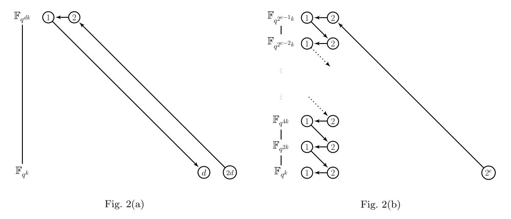

# On the Powers of 2

Robert Granger1 , Thorsten Kleinjung1? , and Jens Zumbr¨agel2??

1 Laboratory for Cryptologic Algorithms, EPFL, Switzerland 2 Institute of Algebra, TU Dresden, Germany robbiegranger@gmail.com, thorsten.kleinjung@epfl.ch, jens.zumbragel@ucd.ie

Abstract. In 2013 the function field sieve algorithm for computing discrete logarithms in finite fields of small characteristic underwent a series of dramatic improvements, culminating in the first heuristic quasi-polynomial time algorithm, due to Barbulescu, Gaudry, Joux and Thom´e. In this article we present an alternative descent method which is built entirely from the on-the-fly degree two elimination method of G¨olo˘glu, Granger, McGuire and Zumbr¨agel. This also results in a heuristic quasi-polynomial time algorithm, for which the descent does not require any relation gathering or linear algebra eliminations and interestingly, does not require any smoothness assumptions about non-uniformly distributed polynomials. These properties make the new descent method readily applicable at currently viable bitlengths and better suited to theoretical analysis.

Keywords: discrete logarithm problem, finite fields, quasi-polynomial time algorithm

## 1 Introduction

The discrete logarithm problem (DLP) in finite fields has been studied for over a century and has been of immense importance to public key cryptography ever since its inception in 1976 [7]. After very little progress in the field for nearly three decades, in 2013 a series of algorithmic breakthroughs occurred which demonstrated that for small to medium characteristic fields, the DLP is far easier than originally believed.

In particular, in February 2013, G¨olo˘glu, Granger, McGuire and Zumbr¨agel showed that for binary (and more generally small characteristic) fields of a certain form, relation generation for degree one elements runs in heuristic polynomial time, as does finding the logarithms of degree two elements, once degree one logarithms have been computed [8]. Joux then showed that for fields of a similar form the individual logarithm phase can be completed with heuristic complexity L(1/4 + o(1))† , which was a major improvement over all previous algorithms, which had L(1/3) complexity [13].

Most recently, in June 2013 and for fields of the same form and of bitlength l, Barbulescu, Gaudry, Joux and Thom´e announced a quasi-polynomial time algorithm (referred to hereafter as the QPA) for solving the DLP [2] which has heuristic complexity

$$l^{O(\log l)}. (1)$$

Since (1) is smaller than L(α) for any α > 0, it is asymptotically the most efficient algorithm known for solving the DLP in finite fields of small characteristic.

The degree one relation generation method of [13] runs in heuristic polynomial time and is essentially isomorphic to that in [8]. However, for degree two elimination, the approaches of Joux and G¨olo˘glu et al. differ. While Joux proposed to find the logarithms of all degree two elements via many applications of what may be viewed as the QPA elimination step, the degree two element elimination method in [8] is arguably superior, since it eliminates them on the fly, i.e., almost instantly, thanks to the technique not needing to gather any relations or perform

? Supported by the Swiss National Science Foundation via grant number 200020-132160.

?? Supported by the Irish Research Council via grant number ELEVATEPD/2013/82.

† As usual, we have L(α, c) = LQ(α, c) = exp((c + o(1))(log Q) α (log log Q) 1−α ), with Q the cardinality of the field. For simplicity, we sometimes suppress the subscript, the constant c, or both.

any linear algebra eliminations. This difference in techniques partly explains the surprisingly low running times for the example discrete logarithm computations performed in  $\mathbb{F}_{2^{6120}}$  [9] and  $\mathbb{F}_{2^{4404}}$  [10].

The present paper revisits this on-the-fly degree two elimination method, with a view to extending it to all degrees so that one obtains the same dramatic speed-up relative to the QPA elimination steps. However, due to the nature of our extension of the on-the-fly degree two elimination method, the technique we present here applies only to elements of even degree. For the purpose of building a fully functional DLP algorithm, this is not a problem, since one can use a Dirichlet-type theorem due to Wan [14, Thm. 5.1] to ensure that target elements are initially irreducible and of degree a power of 2, and then apply the elimination step recursively to obtain a quasi-polynomial time algorithm.

Interestingly, our new descent does not require any smoothness assumptions about non-uniformly distributed polynomials, in contrast to all previous index calculus algorithms. Furthermore, it is easy to show that such assumptions can also be removed from the degree one relation generation, thus simplifying the set of assumptions that are needed for heuristic complexity analyses. Note that while smoothness assumptions can be tested and verified for example parameters, it is entirely feasible that for certain 'corner cases', i.e., for specific field representations and elements to be eliminated, they are simply wrong. To take an example, the polynomials considered in [8] have an exponentially larger probability of splitting than do uniformly chosen polynomials of the same degree, and there may well be theoretical obstructions preventing other polynomials from being sufficiently smooth during an elimination step of the QPA. Hence the removal of smoothness assumptions builds confidence in our ability to compute discrete logarithms in small characteristic fields in quasi-polynomial time.

With the above being said, our elimination method does however make use of a heuristic which was implicitly already used in [8,9], relating to the number of points on a special family of curves. The form of this heuristic is such that it is readily amenable to analysis; indeed, we prove it in sufficient generality for our purposes. Our algorithm therefore relies on only two heuristics; the first relates to the existence of irreducible polynomials of a given form, while the second is that the aforementioned polynomial time algorithm for computing factor base logarithms works.

The rest of the paper is structured as follows. Section 2 contains a brief overview of the function field sieve (FFS) including most of its recent improvements, from a unifying perspective. However, the on-the-fly degree two elimination method is reserved for Section 3, which contains the new algorithm. The underlying heuristics and applicability of the algorithm are discussed in Section 4, with the elimination of the aforementioned heuristic deferred until the appendix. We conclude in Section 5.

#### 2 Overview of the Function Field Sieve

In this section we briefly review the classical FFS and describe some of the new techniques. The knowledgeable reader may omit this section, having familiarised themself with the notation via a brief look at Fig. 1.

Let p be a prime and let  $\mathbb{F}_{p^l}$  be the underlying finite field of the DLP to be solved. Let q be a power of p, let  $k \geq 1$ , and let  $n \geq 1$  such that the DLP can be embedded into  $\mathbb{F}_{q^{kn}}$ , i.e.,  $p^l \mid q^{kn}$ . A relation in  $\mathbb{F}_{q^{kn}}$  is an equality of products of elements in  $\mathbb{F}_{q^{kn}}^{\times}$ , or, equivalently, a linear combination of logarithms of elements in  $\mathbb{F}_{q^{kn}}^{\times}$  whose sum is zero. All variants of the FFS rely on the following basic method for obtaining relations. Let  $R = \mathbb{F}_{q^k}[X,Y]$  and let  $f_1, f_2 \in R$  be two irreducible polynomials such that  $R_{12} = R/(f_1, f_2)$  is a finite ring surjecting onto the target field  $\mathbb{F}_{q^{kn}}$ . Furthermore, for i = 1, 2, let  $R_i = \mathbb{F}_{q^k}[X,Y]/(f_i)$  and  $Z_i \in R$  such that the quotient field  $\mathrm{Quot}(R_i)$  is a finite extension of the rational function field  $\mathrm{Quot}(Q_i)$  where  $Q_i = \mathbb{F}_{q^k}[Z_i]$ . This is summarised in Figure 1.

Fig. 1: Setup for the FFS  $R = \mathbb{F}_{q^k}[X,Y]$   $R_1 = \mathbb{F}_{q^k}[X,Y]/(f_1)$   $\mathbb{F}_{q^k}[X,Y]/(f_2) = R$   $Q_1 = \mathbb{F}_{q^k}[Z_1]$   $\varphi_2$   $\mathbb{F}_{q^k}[Z_2] = Q_2$   $\mathbb{F}_{q^k}[X,Y]/(f_1,f_2)$   $\downarrow \pi$

Via the  $\pi$ ,  $\varphi_1$  and  $\varphi_2$  logarithms in  $\mathbb{F}_{q^{kn}}^{\times}$  can be extended to a notion of logarithms in  $R_i \setminus (\pi \circ \varphi_i)^{-1}(0)$ , i = 1, 2. Therefore, relations can also be viewed as linear combinations of logarithms of elements in  $R_1$  and in  $R_2$  whose sum is zero. It is always implicitly assumed that all logarithms are defined, i.e., that the sets  $(\pi \circ \varphi_i)^{-1}(0)$ , i = 1, 2, are avoided.

A polynomial  $P \in R$  gives rise to a relation by decomposing  $P \mod f_i$  in  $R_i$  for i = 1 and i = 2 (and mapping down to  $R_{12}$  or  $\mathbb{F}_{q^{kn}}$  if desired). Sufficiently many non-trivial relations amongst elements of a set of bounded size allow one to compute logarithms in this set. If the multiplicative closure of such a set is  $\mathbb{F}_{q^{kn}}^{\times}$ , arbitrary logarithms can be computed by expressing an element as a product of elements of this set. This is done by following a descent strategy in which elements, called special-Q, are recursively rewritten as 'easier' elements using relations as above.

In the classical FFS the polynomials  $f_1, f_2$  are chosen such that their degrees are as low as possible, typically of the form  $f_1 = Y - a(X)$ ,  $f_2 = \sum_{j=0}^d b_j(X)Y^j$  with  $\deg_X(a) = e$ ,  $\deg_X(b_j) < e$  and de > n, and  $Z_1 = Z_2 = X$  so that the extensions  $\operatorname{Quot}(R_i)/\operatorname{Quot}(Q_i)$ , i = 1, 2, are of degree 1 and degree d, respectively. By choosing P as a low-degree polynomial, the degrees of the norms  $N_{\operatorname{Quot}(R_i)/\operatorname{Quot}(Q_i)}(P \mod f_i)$ , i = 1, 2, are not too big and therefore the chance of both norms splitting into low-degree polynomials is sufficiently high. With judiciously selected parameters this gives a heuristic running time of L(1/3).

The main difference between the classical FFS and the recent variations [8, 12, 2] is where the relation generation begins. In the recent variations a product of low-degree polynomials  $\tilde{P} = \prod \tilde{P}_j$  in  $R_1$  is constructed in such a way that it can be lifted to a low-degree polynomial  $P \in R$  and such that its reduction  $P \mod f_2$  is of sufficiently low degree, where by low degree we mean that the norm has low degree. This can be achieved by choosing q in the order of n,  $f_1 = Y - X^q$  and  $f_2$  of low degree. Then  $R_1 = \mathbb{F}_{q^k}[X]$  and low-degree polynomials  $F, G \in R_1$  give rise to relations via

$$\tilde{P} = F^q G - F G^q = G \prod_{\alpha \in \mathbb{F}_q} (F - \alpha G) = \prod \tilde{P}_j$$
 (2)

since  $F^q$  (resp.  $G^q$ ) can be expressed as a degree  $\deg F$  (resp.  $\deg G$ ) polynomial in Y, and thus  $\tilde{P}$  can be lifted to a low-degree polynomial P (another way to obtain relations will be described below). This yields a heuristic polynomial time algorithm for finding relations between elements of  $\mathbb{F}_{q^{kn}}$  that are, via  $\varphi_1$  and  $\pi$ , images of polynomials of bounded degree.

In the descent phase it is advantageous to choose  $f_2$  such that its degree in X or in Y is one (cf. [10] and [12] respectively), which implies that  $Quot(R_2) = Quot(Q_2)$  with  $Z_2 = Y$  or  $Z_2 = X$ , respectively. More precisely, writing  $f_2 = h_1 X - h_0$  or  $f_2 = h_1 Y - h_0$  respectively,

with  $h_i \in Q_2$ , i = 0, 1, implies  $R_2 = \mathbb{F}_{q^k}[Z_2][\frac{1}{h_1}]$ . Up to the logarithm of  $h_1$ , the logarithm of a polynomial of  $R_1$  can be related to the logarithm of a corresponding polynomial in  $R_2$  (the same polynomial for  $Z_2 = X$  and a Frobenius twist for  $Z_2 = Y$ ) which allows one to view a special-Q (the element to be eliminated) as coming from  $R_1$  or from  $R_2$ . In the latter case, the condition that a polynomial  $Q \in R_2$ , a lift of the special-Q element, divides  $P \mod f_2$  for a P arising via (2), can be expressed as a bilinear quadratic system which gives, for appropriate parameter choices, an algorithm with heuristic running time L(1/4 + o(1)).

In the other case, namely the special-Q element being lifted to  $Q \in R_1$ , a certain set of polynomials in  $R_1$  containing Q is chosen in such a way that pairs F, G from this set generate via (2) sufficiently many relations with  $P \mod f_2$  splitting into polynomials of sufficiently low degree. Solving a linear system of equations then expresses the logarithm of the special-Q element as a linear combination of logarithms of polynomials in  $R_2$  of sufficiently low degree (and  $h_1$ ), resulting in the heuristic QPA.

Actually, the relations in the QPA (and in [12]) are generated in a slightly different manner by applying linear fractional transformations to the polynomial  $A = X^q - X = \prod_{\alpha \in \mathbb{F}_q} (X - \alpha)$ . The subgroup  $\mathrm{PGl}_2(\mathbb{F}_q) \subset \mathrm{PGl}_2(\mathbb{F}_{q^k})$  is the largest subgroup fixing this polynomial, so that the action of  $\mathrm{PGl}_2(\mathbb{F}_{q^k})/\mathrm{PGl}_2(\mathbb{F}_q)$  on A produces  $\frac{q^{3k}-q^k}{q^3-q}$  polynomials, each splitting into linear polynomials and whose only non-zero terms correspond to the monomials  $X^{q+1}$ ,  $X^q$ , X and 1.

## 3 The New QPA

In this section we describe a new QPA that relies on three heuristics, which are summarised at the very end of this section and discussed in the next. To make use of all the tools described in the previous section it is necessary to find suitable parameters q, k, n and  $f_2$  satisfying some conditions. Here the following choice is made. For simplicity let k = 4, although the following works with the necessary modifications† for  $k \in \{1, 2, 3\}$  as well, and with no modifications for k > 4. Let q be the smallest power of p larger than l, and n = l and  $f_2 = h_1 X - h_0$  with  $h_i \in \mathbb{F}_{q^k}[Y]$  of degree at most two for i = 0, 1, which we do for several reasons, cf. Section 4.1.

Heuristically there exist polynomials  $h_0, h_1$  as above such that  $h_1(X^q)X - h_0(X^q)$  has an irreducible factor of degree n, i.e., such that  $R_{12} = \mathbb{F}_{q^k}[X,Y]/(f_1,f_2)$  surjects onto  $\mathbb{F}_{q^{kn}}$ . This implies  $R_1 = \mathbb{F}_{q^k}[X]$  and  $R_2 = \mathbb{F}_{q^k}[Y][\frac{1}{h_1}]$ . Since the logarithm of  $h_1$  will appear in almost every relation and  $h_1$  is of degree at most two, it is assumed that this logarithm is known, e.g., by the polynomial time algorithm, and for the sake of simplicity it will be suppressed in the following description. The existence of these parameters is the first heuristic assumption. A similar choice is  $f_2 = \tilde{h}_1 Y - \tilde{h}_0$  with  $\tilde{h}_i \in \mathbb{F}_{q^k}[X]$  for which the following considerations can be translated easily.

#### 3.1 Review of on-the-fly degree two elimination

In this subsection we recall the on-the-fly degree two elimination method from [8] and the minor modification from [9], but adjusted for the present framework. Throughout we assume  $k \geq 4$ . In [3] the affine portion of the set of polynomials obtained as linear fractional transformations of  $X^q - X$  is parameterised as follows. Let  $\mathcal{B}$  be the set of  $B \in \mathbb{F}_{q^k}$  such that the polynomial  $X^{q+1} - BX + B$  splits completely over  $\mathbb{F}_{q^k}$ . The cardinality of this set is approximately  $q^{k-3}$  [3, Lemma 4.4]. Scaling and translating these polynomials means that all the polynomials  $X^{q+1} + aX^q + bX + c$  with  $c \neq ab$ ,  $b \neq a^q$  and  $B = \frac{(b-a^q)^{q+1}}{(c-ab)^q}$  split completely over  $\mathbb{F}_{q^k}$  whenever  $B \in \mathcal{B}$ . Using an elementary extension of [11, Theorem 5] the set  $\mathcal{B}$  can be characterised as the image

&lt;sup>† In particular, one should compute the logarithms of all elements up to degree  $\lceil 4/k \rceil$  (which for k=1 can be achieved using the method detailed in Section 4.2 of  $\lceil 10 \rceil$ ), and therefore potentially shorten the descent slightly.

of  $\mathbb{F}_{q^k} \setminus \mathbb{F}_{q^2}$  under the map

$$u \mapsto \frac{(u - u^{q^2})^{q+1}}{(u - u^q)^{q^2 + 1}}.$$
 (3)

Let Q (viewed as polynomial in  $R_2$ ) be a quadratic polynomial to be eliminated and let  $L_Q \subset \mathbb{F}_{q^k}[Y]^2$  be the lattice defined by

$$L_Q = \{ (w_0, w_1) \in \mathbb{F}_{q^k}[Y]^2 \mid w_0 h_0 + w_1 h_1 \equiv 0 \pmod{Q} \}.$$
(4)

If Q divides  $w_0h_0 + w_1h_1 \neq 0$  for  $w_0, w_1 \in \mathbb{F}_{q^k}$ , then  $Q = w(w_0h_0 + w_1h_1)$  for  $w \in \mathbb{F}_{q^k}^{\times}$  since the degree on the right hand side is at most two. In this case the relation generated from  $P = w_0X + w_1 \in R$  relates the logarithm of Q with the logarithm of  $w_0X + w_1 \in R_1$  (and the logarithm of  $h_1$ ).

In the other case  $L_Q$  has a basis of the form  $(u_0, Y + u_1), (Y + v_0, v_1)$  with  $u_i, v_i \in \mathbb{F}_{q^k}$ . Since the polynomial P = XY + aY + bX + c maps to  $\frac{1}{h_1}((Y + b)h_0 + (aY + c)h_1)$  in  $R_2$ , Q divides  $P \mod f_2$  if and only if  $(Y + b, aY + c) \in L_Q$ . Note that the numerator of  $P \mod f_2$  is of degree at most three, thus it can at worst contain a linear factor besides Q. If the triple (a, b, c) also satisfies  $c \neq ab$ ,  $b \neq a^q$  and  $\frac{(b-a^q)^{q+1}}{(c-ab)^q} \in \mathcal{B}$ , then  $P \mod f_1$  splits into linear factors and the logarithm of Q has been rewritten in terms of logarithms of linear polynomials.

Algorithmically, a triple (a, b, c) satisfying all conditions can be found in several ways. Choosing a  $B \in \mathcal{B}$ , considering  $(Y + b, aY + c) = a(u_0, Y + u_1) + (Y + v_0, v_1)$  and rewriting b and c gives the condition

$$B = \frac{(-a^q + u_0 a + v_0)^{q+1}}{(-u_0 a^2 + (-v_0 + u_1)a + v_1)^q}.$$
 (5)

By expressing a in an  $\mathbb{F}_{q^k}/\mathbb{F}_q$  basis, this results in a quadratic system in k variables [9]. Using a Gröbner basis algorithm the running time is exponential in k. Alternatively, and this is the key observation for the present work, equation (5) can be considered as a polynomial of degree  $q^2 + q$  in a whose roots can be found in polynomial time in q and in k [8]. One can also check for random (a, b, c) such that the lattice condition holds, whether  $X^{q+1} + aX^q + bX + c$  splits into linear polynomials, which happens with probability  $q^{-3}$ . This is also polynomial time in q and in k.

These degree 2 elimination methods will fail when Q divides  $h_1^q Y - h_0^q$ , because this would imply that the polynomial  $X^{q+1} + aX^q + bX + c$  is divisible by  $Q^{(1/q)}(X)$ , where the coefficients of  $Q^{(1/q)}$  are those of Q powered by 1/q, a problem first discussed in [5]. Such polynomials Q or their roots will be called traps of level 0. Similarly, these degree 2 elimination methods might also fail when Q divides  $h_1Y^{q^{k-1}} - h_0$  which will be discussed in the appendix. In this case such polynomials Q or their roots will be called traps of level k. Except for these very few cases, heuristically, each of these trials succeeds with high probability (cf. Heuristic 2), and since the cardinality of  $\mathcal{B}$  is at least q for  $k \geq 4$ , this elimination method succeeds with overwhelming probability.

## 3.2 The basic building block – degree 2d elimination

The on-the-fly degree two elimination method can be transformed into an elimination method for irreducible even degree polynomials. Let  $\mathcal{T}$  be the set of trap roots, i.e., the set of roots of  $h_1Y^{q^{kd-1}} - h_0$  for all d > 0 and of  $h_1^qY - h_0^q$  minus the set of roots of the irreducible field-defining polynomial of degree n. A polynomial in  $R_2$  is said to be bad if it has a root in  $\mathcal{T}$ ; a polynomial in  $R_1$  is said to be bad if it is bad when viewed as polynomial in  $R_2$  or, equivalently, if it has a root r with  $r^q \in \mathcal{T}$ . The same definitions are used when the base field of  $R_1$  and  $R_2$  is extended. A polynomial which is not bad is said to be good. We now state and prove the following.

Claim 1: Let  $Q \in R_2$  be an irreducible good polynomial of degree 2d with  $d \geq 1$ . Then the logarithm of Q can be rewritten as a linear combination of at most q+2 logarithms of irreducible polynomials of degrees dividing d, in a running time polynomial in q and in d.

Over the extension  $\mathbb{F}_{q^{kd}}$  the polynomial Q splits into d (irreducible) quadratic polynomials; let Q' be one of them. Applying the on-the-fly degree two elimination method over  $\mathbb{F}_{q^{kd}}$  instead of  $\mathbb{F}_{q^k}$  gives a polynomial  $P' \in \mathbb{F}_{q^{kd}}[X,Y]$  such that  $P' \mod f_1$  splits into a product of at most q+1 polynomials of degree one over  $\mathbb{F}_{q^{kd}}$  and such that  $(P' \mod f_2)h_1$  is a product of Q' and a polynomial of degree at most one. Let P be the product of all conjugates of P' under  $\mathrm{Gal}(\mathbb{F}_{q^{kd}}/\mathbb{F}_{q^k})$ . Since the product of all conjugates of a linear polynomial under  $\mathrm{Gal}(\mathbb{F}_{q^{kd}}/\mathbb{F}_{q^k})$  is the  $d_1$ -th power of an irreducible degree  $d_2$  polynomial for  $d_1$  and  $d_2$  satisfying  $d_1d_2 = d$ , the rewriting assertion of the claim follows.

The three steps of this method – computing Q', the on-the-fly degree two elimination (when the second or third approach listed above for solving (5) is used), and the computation of the polynomial norms – all have running time polynomial in q and in d, which proves the running time assertion of the claim.

Note that the irreducible polynomials of degree dividing d might be bad. This can be avoided by finding sufficiently many different eliminations of Q' and will be further discussed in the appendix.

## 3.3 Assembling the algorithm

Recursively applying the basic building block it is possible to express the logarithm of an good irreducible polynomial of degree  $2^e$ ,  $e \ge 1$ , in terms of at most  $(q+2)^e$  logarithms of linear polynomials. The final step of this recursion, namely expressing up to  $(q+2)^{e-1}$  logarithms of polynomials of degree 2, dominates the running time which is thus upper bounded by  $(q+2)^e$  times a polynomial in q.

Finally, note that the logarithms of linear polynomials can be obtained by the polynomial time algorithm (cf. Heuristic 3), and that an element in  $R_{12}$  can be lifted to an irreducible good polynomial of degree  $2^e$  for  $2^e > 4n$ . In fact, with this choice the probability of irreducibility for a random lift is lower bounded by  $2^{-e-1}$  which follows from the effective Dirichlet-type theorem on irreducibles in arithmetic progressions [14, Thm. 5.1], while the goodness follows from a bound on the number of trap roots, see A.1. Summarising, the new QPA proceeds as follows:

## The New QPA

 $\overline{\text{INPUT: } \mathbb{F}_{p^l}, \, g \in \mathbb{F}_{p^l}^{\times} \text{ and } h \in \langle g \rangle}$

- 1. Set q to be the smallest power of p larger than l, set k=4 and set n=l. Find  $h_0, h_1 \in R$  such that  $h_1(X^q)X h_0(X^q)$  has an irreducible factor of degree n. Denote by t a lift to  $R_{12}$  of the target element in the DLP (for computing  $\log_g h$  in  $\mathbb{F}_{p^l}$  the algorithm is applied twice, for a lift of g and for a lift of h).
- 2. Choose e such that  $2^e > 4n$  and search for an irreducible polynomial  $T \in R_1$  of degree  $2^e$  with  $\varphi_1(T) = t$ .
- 3. Using the basic building block recursively, rewrite the logarithm of T as a linear combination of logarithms of linear polynomials.
- 4. Using the heuristic polynomial time algorithm find the logarithms of all linear polynomials.

## OUTPUT: $\log_a h$

Note that during an elimination step, one need not use the basic building block as stated, which takes the norms of the linear polynomials produced back down to  $\mathbb{F}_{q^k}$ . Instead, one need only take their norms to a subfield of index 2, thus becoming quadratic polynomials, and then recurse, as depicted in Figure 2.

Fig. 2: Elimination of irreducible polynomials of even degree (Fig. 2(a)) and of degree a power of 2 (Fig. 2(b)). The arrow directions  $\nwarrow$ ,  $\leftarrow$  and  $\searrow$  indicate factorisation, degree 2 elimination and taking a norm with respect to the indicated subfield, respectively.

We now formally list the heuristics used.

**Heuristic 1.** Given a prime p and an integer l, for q the smallest power of p which is greater than l, and for an integer k = O(1), there exist polynomials  $h_0, h_1 \in \mathbb{F}_{q^k}[X]$  of degree at most two such that  $h_1(X^q)X - h_0(X^q)$  has an irreducible factor of degree l (or the equivalent for  $h_1(X)X^q - h_0(X)$ ).

**Heuristic 2.** With the parameters as in Heuristic 1 the following holds. Let  $d \geq 1$  be an integer such that  $kd \geq 4$ , let  $Q \in \mathbb{F}_{q^{kd}}[X]$  be an irreducible quadratic good polynomial such that Q does not divide  $w_0h_0 + w_1h_1 \neq 0$  for  $w_0, w_1 \in \mathbb{F}_{q^{kd}}$ , and let  $(u_0, Y + u_1), (Y + v_0, v_1)$  be a basis of the lattice  $L_Q$  in (4). Then the number of solutions  $(a, B) \in \mathbb{F}_{q^{kd}} \times \mathcal{B}$  of (5) resulting in good descendents is lower bounded by the maximum of  $q^{kd-3}$  divided by a polynomial in q of bounded degree, and 1.

**Heuristic 3.** There exists a polynomial time algorithm for obtaining the logarithms of polynomials of bounded degree using the parameters from Heuristic 1.

Putting these together we have the following theorem.

**Theorem 1.** Subject to Heuristics 1,2 and 3, the running time of the new QPA is quasi-polynomial, namely

 $q^{\log_2 q + O(1)}$

Note that when  $q = L_{q^k}(\alpha)$  with  $0 < \alpha \le 1/3$ , one obtains precisely the same complexities as presented in [2]. Also note that subject to a heuristic regarding the smoothness properties of non-uniformly distributed polynomials, the QPA of Barbulescu *et al.* achieves a slightly better asymptotic complexity, namely  $q^{O(\log q/\log \log q)}$ , as a result of a slightly more rapid descent.

We now state a slight relaxation of Heuristic 2 which is proven in the appendix.

**Theorem 2.** With the parameters as in Heuristic 1 the following holds for q > 61 and not a power of 4. Let d be an integer such that  $kd \ge 18$ , let  $Q \in \mathbb{F}_{q^{kd}}[X]$  be an irreducible quadratic good polynomial such that Q does not divide  $w_0h_0 + w_1h_1 \ne 0$  for  $w_0, w_1 \in \mathbb{F}_{q^{kd}}$ , and let  $(u_0, Y + u_1), (Y + v_0, v_1)$  be a basis of the lattice  $L_Q$  in (4). Then the number of solutions  $(a, B) \in \mathbb{F}_{q^{kd}} \times \mathcal{B}$  of (5) resulting in good descendents is lower bounded by  $q^{kd-8}$ .

In order to satisfy these conditions on q one can use the following minutely-changed variant of Heuristic 1.

**Heuristic 1'.** Given a prime p and an integer l, for q the smallest power of p which is greater than  $\max(l,61)$  and not a power of 4, and for an integer k=O(1), there exist polynomials  $h_0, h_1 \in \mathbb{F}_{q^k}[X]$  of degree at most two such that  $h_1(X^q)X - h_0(X^q)$  has an irreducible factor of degree l (or the equivalent for  $h_1(X)X^q - h_0(X)$ ).

Thanks to Theorem 2, the running time in Theorem 1 holds subject to Heuristics 1' and 3 (or 1 and 3 if q > 61 and not a power of 4). Furthermore, if one balances the costs of the descent and the computation of the low-degree polynomials, or observes that the number of leaves eventually exceeds the number of irreducibles of that degree, then the running time in Theorem 1 can be replaced with

$$q^{\log_2 q - (1-\epsilon)\log_2\log_2 q}$$

for any  $\epsilon > 0$  and q sufficiently large.

#### 4 Discussion

We now discuss the remaining heuristics and reflect upon the possible practical impact of the new descent.

#### 4.1 Heuristics

First observe that the descent does not require any smoothness assumptions about non-uniformly distributed polynomials. Moreover, we can even avoid its implicit invocation in Heuristic 3 by performing the on-the-fly degree two elimination for many reducible degree two elements, thus producing relations containing only degree one elements.

Two of the heuristics, namely the first and the third, underlie to a greater or lesser extent all other recent finite field discrete logarithm algorithms. Therefore most of the comments in previous papers apply here as well and are not repeated.

One difference of Heuristic 1 to the corresponding heuristic in other methods is that here it is essential for a theoretical analysis that the degrees of  $h_0$  and  $h_1$  are at most two. Indeed, if the degree of one of the polynomials were at least four, the degree 2 elimination method might fail in the case that Q divides  $w_0h_0 + w_1h_1$  for some  $w_0, w_1 \in \mathbb{F}_{q^k}$ . In particular, if  $w_0h_0 + w_1h_1$  is of degree 4 and splits into  $Q \cdot Q'$  with another irreducible quadratic polynomial Q', the method would eliminate Q into Q' and Q' into Q. In the case that the maximum of the degrees of  $h_0$  and  $h_1$  is three, the degree 2 elimination method works in the special case but becomes harder to analyse in the general case since the numerator of P mod  $f_2$  is in general of degree 4 and must split into Q and a product of linear polynomials.

#### 4.2 Practical considerations

In practice, it is not advisable to apply the algorithm as stated. On the contrary, it is advantageous to pick only the best parts and combine them with the best parts of other algorithms. The main ingredient of this algorithm is the fast reduction of irreducible even degree polynomials into polynomials of half the degree and the ensuing preference for degrees that are divisible by powers of two.

Assuming the current state of the art without this algorithm, the best strategy for the descent seems to be the following. At the beginning a continued fraction split and degree-balanced classical descent are used. Depending on the size of the problem the steps from QPA are used, followed by Gröbner basis descent until the degrees are small enough to be tabulated by the polynomial time algorithm. The new algorithm can change this strategy at three points. Firstly, and especially if no QPA steps are used, the classical descent must take into account that the subsequent cost for even degree polynomials will drop (and drop more for degrees divisible by 4 etc.). Secondly, in the QPA stage some splittings of even degree polynomials will be more

efficient using the new QPA steps; the exact extent is unclear in practice because of the limited experience with QPA so far. The cross-over from QPA to new QPA elimination steps will entail a polynomial to be eliminated being rewritten as a product of irreducible polynomials whose degrees are of the form d · 2 i with odd d which are eliminable by Gr¨obner basis descent. Thirdly, in the Gr¨obner basis stage many descent steps for even degree can be replaced by the new QPA steps; this has already been verified with our Magma experiments at currently viable bitlengths. Of course, determining cross-over points between the various descent strategies for a given field requires extensive experimentation and optimisation, and is beyond the scope of the present article.

## 5 Conclusion

We have presented a new quasi-polynomial time descent method for small characteristic discrete logarithms built from a very simple building block, namely on-the-fly degree two element elimination. This eliminates one of the commonly-used heuristics in DLP algorithms, namely the smoothness assumptions regarding non-uniformly distributed polynomials, which therefore makes a heuristic-free quasi-polynomial algorithm a realistic possibility and a worthwhile goal for future research.

## References

- 1. Yves Aubry and Marc Perret: A Weil theorem for singular curves, In: Pellikaan/Perret/Vladut (eds.), Arithmetic, Geometry and Coding Theory, 1996.
- 2. Razvan Barbulescu, Pierrick Gaudry, Antoine Joux, and Emmanuel Thom´e: A heuristic quasi-polynomial algorithm for discrete logarithm in finite fields of small characteristic, Advances in Cryptology - EUROCRYPT 2014, To appear, 2014.
- 3. Antonia W. Bluher: On x q+1 + ax + b, Finite Fields and Their Applications, 10(3), pp 285–305, 2004.
- 4. Peter J. Cameron, G. R. Omidi, and Behruz Tayfeh-Rezaie: 3-Designs from PGL(2, q), Electr. J. Comb., 13(1), 2006.
- 5. Qi Cheng, Daqing Wan, and Jincheng Zhuang: Traps to the BGJT-Algorithm for Discrete Logarithms, CoRR, abs/1310.5124, 2013.
- 6. Leonard E. Dickson: Linear groups, with an exposition of the Galois field theory, Teubner, 1901.
- 7. Whitfield Diffie and Martin E. Hellman: New directions in cryptography, IEEE Transactions on Information Theory, 22(6), pp 644–654, 1976.
- 8. Faruk G¨olo˘glu, Robert Granger, Gary McGuire, and Jens Zumbr¨agel: On the Function Field Sieve and the Impact of Higher Splitting Probabilities: Application to Discrete Logarithms in F21971 and F23164 , In: Ran Canetti and Juan Garay (eds.), CRYPTO 2013, volume 8043 of LNCS, pp 109–128, 2013.
- 9. Faruk G¨olo˘glu, Robert Granger, Gary McGuire, and Jens Zumbr¨agel: Solving a 6120-bit DLP on a Desktop Computer, In: SAC 2013, volume 8282 of LNCS, 2013.
- 10. Robert Granger, Thorsten Kleinjung, and Jens Zumbr¨agel: Breaking '128-bit Secure' Supersingular Binary Curves (or how to solve discrete logarithms in F24·1223 and F212·367 ), Cryptology ePrint Archive, Report 2014/119, 2014, http://eprint.iacr.org/.
- 11. Tor Helleseth and Alexander Kholosha: x 2 l+1 + x + a and related affine polynomials over GF(2k ), Cryptogr. Commun., 2(1), pp 85–109, 2010.
- 12. Antoine Joux: Faster index calculus for the medium prime case. Application to 1175-bit and 1425-bit finite fields, In: Thomas Johansson and Phong Q. Nguyen (eds.), EUROCRYPT 2013, volume 7881 of LNCS, pp 177–193, 2013.
- 13. Antoine Joux: A new index calculus algorithm with complexity L(1/4 + o(1)) in very small characteristic, Cryptology ePrint Archive, Report 2013/095, 2013, http://eprint.iacr.org/.
- 14. Daqing Wan: Generators and irreducible polynomials over finite fields, Math. Comp., 66, pp 1195–1212, 1997.

## A Proof of Theorem 2

## A.1 Notation and statement of supporting results

Let K = Fq kd with kd ≥ 18, let L = Fq 2kd be its quadratic extension, and let Q be a quadratic polynomial in K[Y ] such that (u0, Y + u1),(Y + v0, v1) is a basis of its associated lattice LQ.

By the characterisation of the set B in (3), in order to eliminate a good polynomial Q, we need to find a (a, u) ∈ K × (K \ Fq 2 ) satisfying

$$(u - u^{q^2})^{q+1}(-u_0a^2 + (-v_0 + u_1)a + v_1)^q - (u - u^q)^{q^2+1}(-a^q + u_0a + v_0)^{q+1} = 0.$$

The two terms have a common factor (u − u q ) q+1 which motivates the following definitions. Let α = −u0, β = u1 − v0, γ = v1 and δ = −v0 with α, β, γ, δ ∈ K, as well as

$$D = \frac{U^{q^2} - U}{U^q - U} = \prod_{\epsilon \in \mathbb{F}_{q^2} \backslash \mathbb{F}_q} (U - \epsilon),$$

$$E = U^q - U = \prod_{\epsilon \in \mathbb{F}_q} (U - \epsilon),$$

$$F = \alpha A^2 + \beta A + \gamma = \alpha (A - \rho_1)(A - \rho_2) \text{ with } \rho_1, \rho_2 \in L \text{ (or } F = \beta (A - \rho_1) \text{ or } F = \gamma),$$

$$G = A^q + \alpha A + \delta$$
 and

$$P = D^{q+1}F^q - E^{q^2 - q}G^{q+1} \in K[A, U].$$

The curve C is defined by P = 0 and we are interested in the number of (affine) points (a, u) ∈ C(K) with u /∈ Fq 2 . More precisely, we want to prove

Theorem 3. Let q > 61 be a prime power which is not a power of 4. If the following conditions hold:

(\*)
$$\deg(F) = 2 \quad and \quad \rho_1, \rho_2 \notin K$$

$$(**) \quad \rho_1^q + \alpha \rho_2 + \delta \neq 0$$

$$(***) \quad \rho_1^q + \alpha \rho_1 + \delta \neq 0$$

then there are at least q kd−1 pairs (a, u) ∈ K × (K \ Fq 2 ) satisfying P(a, u) = 0.

The relation of the three conditions to the quadratic polynomial Q as well as properties of traps are described in the following propositions

Proposition 1. If condition (∗) is not satisfied, the curve arose from a reducible quadratic polynomial Q.

If condition (∗) holds, but condition (∗∗) is not satisfied, the quadratic polynomial Q divides h q 1Y − h q 0 , i.e., Q is a bad polynomial (trap of level 0).

If condition (∗) holds, but condition (∗∗∗) is not satisfied, the quadratic polynomial Q divides h1Y q kd−1 − h0, i.e., Q is a bad polynomial (trap of level kd).

Proposition 2. There are at most q d 0 traps of level d 0 for d 0 > 0 and at most 2q + 1 traps of level 0.

Let Q be irreducible and let (a, u),(a 0 , u0 ) ∈ K × (K \ Fq 2 ) be two solutions of P = 0 with a 6= a 0 , corresponding to the polynomials Pa = XY +aY +bX +c and Pa 0 = XY +a 0Y +b 0X +c 0 , respectively. Then Pa mod f1 and Pa 0 mod f1 have no common roots. Furthermore, the common roots of Pa mod f2 and Pa 0 mod f2 are precisely the roots of Q.

Firstly observe that the first statement of Proposition 2 ensures that one may find an initial irreducible polynomial of degree 2e which is good, since the number of traps (< q2 e−1 ) is much smaller than the number (> q2 e−n2 −e−1 ) of irreducibles produced by the Dirichlet-type theorem [14, Thm. 5.1].

In the case that q > 61 is not a power of 4 Theorem 2 follows from the theorem and the propositions as follows. By Proposition 1 an irreducible quadratic good polynomial Q satisfies the three conditions of Theorem 3. Since the map (3) is q 3 − q : 1 on K \ Fq 2 , there are at least q kd−4 solutions (a, B) of (5). These solutions contain at least q kd−7 different values a since degA(P) = q 2 + q < q3 . By Proposition 2 the set of traps of level dividing kd 2 and of traps of level 0 has cardinality at most 2q kd 2 . By the second assertion of this proposition a trap root can appear in Pa mod fj for at most two values a, at most once for j = 1 and at most once for j = 2. Hence there are at most 4q kd 2 < qkd−8 values a for which a trap root appears in Pa mod fj , j = 1, 2. Thus there are at least q kd−8 different values a for which a solution (a, B) leads to an elimination into logarithms of good polynomials. This reduces the proof of Theorem 2 for q > 61, not a power of 4, to proving Theorem 3 and the two propositions above.

Remark: In the proof only a weaker form of condition (∗) is needed, so that the theorem can also be applied to reducible quadratic polynomials Q satisfying some conditions. If needed, this can be carved out of the proof.

## A.2 Outline of the proof method

The main step of the proof of the theorem consists in showing that, subject to conditions (∗), (∗∗), and (∗∗∗), there exists an absolutely irreducible factor P1 of P that lies already in K[A, U]. Since the (total) degree of P1 is at most q 3 +q, restricting to the component of the curve defined by P1 and using the Weil bound for possibly singular plane curves gives a lower bound on the cardinality of C(K) which is large enough to prove the theorem after accounting for projective points and points with second coordinate in Fq 2 . This argument is given in the next subsection before dealing with the more involved main step.

For proving the main step the action of PGl2(Fq) on the variable U is considered. An absolutely irreducible factor P1 of P is stabilised by a subgroup S1 ⊂ PGl2(Fq) satisfying some conditions. The first step is to show that, after possibly switching to another absolutely irreducible factor, there are only a few cases for the subgroup. Then for each case it is shown that the factor is defined over K[A, U] or that one of the conditions on the parameters is not satisfied.

Proving the propositions will be done in the final subsection.

## A.3 Weil bound

Corollary 2.5 of [1] shows that for an absolutely irreducible plane curve C of degree d 0

$$|\#C(K) - q^{kd} - 1| \le (d' - 1)(d' - 2)q^{\frac{kd}{2}}$$

holds. Since degA(P) = q 2 + q there are at most q 4 + q 3 affine points with u ∈ Fq 2 . The number of points at infinity is at most d 0 = q 3 + q 2 < q4 . Denoting by C(K)e the set of affine points in C(K) with second coordinate u 6∈ Fq 2 one obtains

$$|\#C(K)| > q^{kd} - (q^4 + q^3) - d' - (d'^2 - 2)q^{\frac{kd}{2}} > q^{kd} - q^{\frac{kd}{2} + 8} \ge q^{kd - 1}$$

since kd ≥ 18, thus proving the theorem if there exists an absolutely irreducible factor defined over K[A, U].

## A.4 PGl2 action

Here the following convention for the action of  $\operatorname{PGl}_2(\mathbb{F}_q)$  on  $\mathbb{P}^1$  and on polynomials is used. A matrix  $\begin{pmatrix} a & b \\ c & d \end{pmatrix} \in \operatorname{PGl}_2(\mathbb{F}_q)$  acts on  $\mathbb{P}^1(M)$ , M an arbitrary field containing  $\mathbb{F}_q$ , by  $(x_0 : x_1) \mapsto \begin{pmatrix} a & b \\ c & d \end{pmatrix}(x_0 : x_1) = (ax_0 + bx_1 : cx_0 + dx_1)$  or, via  $\mathbb{P}^1(M) = M \cup \{\infty\}$ , by  $x \mapsto \frac{ax+b}{cx+d}$ . This is an action on the left, i.e., for  $\sigma, \tau \in \operatorname{PGl}_2(\mathbb{F}_q)$  and  $x \in \mathbb{P}^1(M)$  the following holds:  $\sigma(\tau(x)) = (\sigma\tau)(x)$ . On a homogeneous polynomial H in the variables  $(X_0 : X_1)$  the action of  $\sigma = \begin{pmatrix} a & b \\ c & d \end{pmatrix}$  is given by  $H^{\sigma}(X_0 : X_1) = H(aX_0 + bX_1 : cX_0 + dX_1)$ . This is an action on the right, satisfying  $H^{(\sigma\tau)} = (H^{\sigma})^{\tau}$ . In the following we will usually use this action on the dehomogenised polynomials given by  $H^{\sigma}(X) = H(\frac{aX+b}{cX+d})$ , clearing denominators in the appropriate way.

The polynomial  $P \in (K[A])[U]$  is invariant under  $\operatorname{PGl}_2(\mathbb{F}_q)$  acting on the variable U; this can be checked by considering the actions of  $\begin{pmatrix} 1 & b \\ 0 & 1 \end{pmatrix}$ ,  $\begin{pmatrix} a & 0 \\ 0 & 1 \end{pmatrix}$  and  $\begin{pmatrix} 0 & 1 \\ 1 & 0 \end{pmatrix}$ , and noticing that  $\operatorname{PGl}_2(\mathbb{F}_q)$  is generated by these matrices. Let

$$P = s \prod_{i=1}^{g} P_{i} \qquad P_{i} \in (\overline{K}[A])[U], s \in \overline{K}[A]$$

be the decomposition of P in  $(\overline{K}[A])[U]$  into irreducible factors  $P_i$  and possibly reducible s. Notice that s must divide  $F^q$  and  $G^{q+1}$ , hence it divides a power of  $\gcd(F,G)$ . Condition (\*) implies that  $\gcd(F,G)$  is either constant or of degree two. In the latter case  $\rho_1$  is a root of G contradicting condition (\*\*\*). Therefore one can assume that  $s \in \overline{K}$  is a constant.

Let

$$P = F^q \prod_{i=1}^{q^3 - q} (U - r_i) \qquad r_i \in \overline{K(A)}$$

be the decomposition of P in  $\overline{K(A)}[U]$ . Then  $\operatorname{PGl}_2(\mathbb{F}_q)$  permutes the set  $\{r_i\}$  and, since fixed points of  $\operatorname{PGl}_2(\mathbb{F}_q)$  lie in  $\mathbb{F}_{q^2}$  but  $r_i \notin \mathbb{F}_{q^2}$ , the action is free. Since  $\#\operatorname{PGl}_2(\mathbb{F}_q) = q^3 - q$  the action is transitive.

Therefore the action on the decomposition over  $\overline{K}[A,U]$  is also transitive (adjusting the  $P_i$  by scalars in  $\overline{K}[A]$  if necessary). Denoting by  $S_i \subset \operatorname{PGl}_2(\mathbb{F}_q)$  the stabiliser of  $P_i$  it follows that all  $S_i$  are conjugates of each other, thus they have the same cardinality and hence  $q^3 - q = g \cdot \#S_i$ . Moreover the degree of  $P_i$  in U is constant, namely  $\#S_i$ , and also the degree of  $P_i$  in A is constant, thus  $g \mid q^2 + q = \deg_A(P)$ . In particular,  $q - 1 \mid \#S_i$ .

## A.5 Subgroups of PGl2

The classification of subgroups of  $\operatorname{PSl}_2(\mathbb{F}_q)$  is well known [6] and allows to determine all subgroups of  $\operatorname{PGl}_2(\mathbb{F}_q)$  [4]. Since  $\#S_i$  is divisible by q-1 (in particular  $\#S_i>60$ ), only the following subgroups are of interest (per conjugation class only one subgroup is listed):

- 1. the cyclic group  $\begin{pmatrix} * & 0 \\ 0 & 1 \end{pmatrix}$  of order q 1,
- 2. the dihedral group  $\binom{*\ 0}{0\ 1} \cup \binom{0\ 1}{*\ 0}$  of order 2(q-1) as well as, in odd characteristic, its two dihedral subgroups

$$\left\{ \begin{pmatrix} a & 0 \\ 0 & 1 \end{pmatrix} \mid a \neq 0 \text{ a square} \right\} \cup \left\{ \begin{pmatrix} 0 & 1 \\ c & 0 \end{pmatrix} \mid c \neq 0 \text{ a square} \right\} \quad \text{and} \quad a \neq 0 \text{ a square}$$

$$\left\{ \begin{pmatrix} a & 0 \\ 0 & 1 \end{pmatrix} \mid a \neq 0 \text{ a square} \right\} \cup \left\{ \begin{pmatrix} 0 & 1 \\ c & 0 \end{pmatrix} \mid c \text{ not a square} \right\},$$

- both of order q-1,
  3. the Borel subgroup  $\binom{*\ *}{0\ 1}$  of order  $q^2-q$ ,
- 4. if q is odd,  $PSl_2(\mathbb{F}_q)$  of index 2,
- 5. if  $q = q'^2$  is a square,  $\operatorname{PGl}_2(\mathbb{F}_{q'})$  of order  $q'^3 q' = q'(q-1)$ , and
- 6.  $\operatorname{PGl}_2(\mathbb{F}_q)$ .

In the last case P is absolutely irreducible, thus it remains to investigate the first five cases which will be done in the next subsection.

Remark: The condition q > 61 rules out some small subgroups as  $A_4$ ,  $S_4$ , and  $A_5$ . In many of the finitely many cases  $q \leq 61$  the proof of the theorem also works (e.g., q not a square and  $q-1 \nmid 120$ ). The condition of q not being a power of even exponent of 2 eliminates the fifth case in characteristic 2; removing this condition would be of some interest.

#### The individual cases A.6

Since the stabilisers  $S_i$  are conjugates of each other, one can assume without loss of generality that  $S_1$  is one of the explicit subgroups given in the previous subsection. Then the polynomial  $P_1$  is invariant under certain transformations of U, so that  $P_1$  and P can be rewritten in terms of another variable as stated in the following.

If a polynomial (in the variable U) is invariant under  $U \mapsto aU$ ,  $a \in \mathbb{F}_a^{\times}$ , it can be considered as a polynomial in the variable  $V = U^{q-1}$ . For the polynomials D and  $E^{q-1}$  one obtains

$$D = \frac{V^{q+1} - 1}{V - 1}$$
 and  $E^{q-1} = V(V - 1)^{q-1}$ .

Similarly, in the case of odd q, if a polynomial is invariant under  $U \mapsto aU$  for all squares  $a \in \mathbb{F}_q^{\times}$ , it can be rewritten in the variable  $V' = U^{\frac{q-1}{2}}$ . For D and  $E^{q-1}$  this gives

$$D = \frac{V'^{2q+2} - 1}{V'^2 - 1} \quad \text{and} \quad E^{q-1} = V'^2 (V'^2 - 1)^{q-1}.$$

If a polynomial is invariant under  $U \mapsto U + b$ ,  $b \in \mathbb{F}_q$ , it can be considered as a polynomial in  $\tilde{V} = U^q - U$  which gives

$$D = \tilde{V}^{q-1} + 1$$
 and  $E^{q-1} = \tilde{V}^{q-1}$ .

Combining the above yields that a polynomial which is invariant under both  $U \mapsto aU$ ,  $a \in \mathbb{F}_q^{\times}$ , and  $U \mapsto U + b$ ,  $b \in \mathbb{F}_q$ , can be considered as a polynomial in  $W = \tilde{V}^{q-1} = (U^q - U)^{q-1}$ . For D and  $E^{q-1}$  one obtains

$$D = W + 1$$
 and  $E^{q-1} = W$ .

This is now applied to the various cases for  $S_1$ .

The cyclic case Rewriting P and  $P_1$  in terms of  $V = U^{q-1}$  one obtains

$$P = \left(\frac{V^{q+1} - 1}{V - 1}\right)^{q+1} F^q - V^q (V - 1)^{q^2 - q} G^{q+1}$$

and  $\deg_V(P_1) = 1$ , i.e.,  $P_1 = p_1 V - p_0$  with  $p_i \in \overline{K}[A]$ ,  $\gcd(p_0, p_1) = 1$ ,  $\max(\deg(p_0), \deg(p_1)) = 1$ and it can be assumed that  $p_0$  is monic.

The divisibility  $P_1 \mid P$  transforms into the following polynomial identity in  $\overline{K}[A]$ :

$$\left(\frac{p_0^{q+1} - p_1^{q+1}}{p_0 - p_1}\right)^{q+1} F^q = p_1^q p_0^q (p_0 - p_1)^{q^2 - q} G^{q+1}.$$

The degree of the first factor on the left hand side is either  $q^2+q$  or  $q^2-1$  (if  $p_0-\zeta p_1$  is constant for some  $\zeta \in \mu_{q+1}(\mathbb{F}_{q^2}) \setminus \{1\}$ ). Since the degrees of the other factors are all divisible by q, the latter case is impossible. By condition (\*) one gets  $\deg(F^q) = 2q$ . Furthermore,  $\deg((p_0p_1)^q) \in \{q, 2q\}$ ,  $\deg((p_0-p_1)^{q^2-q}) \in \{0, q^2-q\}$  and  $\deg(G^{q+1}) = q^2+q$  which implies  $\deg(p_0-p_1) = 0$ ,  $\deg(p_0) = \deg(p_1) = 1$  since q > 2.

Let  $p_0 - p_1 = c_1 \in \overline{K}$ ; in the following  $c_i$  will be some constants in  $\overline{K}$ . Since the first factor on the left hand side is co-prime to  $p_0p_1$ , it follows

$$\frac{p_0^{q+1} - p_1^{q+1}}{p_0 - p_1} = c_2 G, \quad F = c_3 p_0 p_1 \quad \text{and} \quad c_2^{q+1} c_3^q = c_1^{q^2 - q}.$$

Exchanging  $\rho_1$  and  $\rho_2$ , if needed, one obtains

$$p_0 = A - \rho_1$$
,  $p_1 = A - \rho_2$ ,  $c_3 = \alpha$  and  $c_1 = \rho_2 - \rho_1$ .

Considering the coefficient of  $A^q$  in the equation for G gives  $c_2 = 1$  and evaluating this equation at  $A = \rho_2$  gives

$$\rho_1^q + \alpha \rho_2 + \delta = 0.$$

This means that condition (\*\*) does not hold.

The dihedral cases The case of the dihedral group of order 2(q-1) is considered first. Then, as above, P and  $P_1$  can be expressed in terms of V, and, since P and  $P_1$  are also invariant under  $V \mapsto \frac{1}{V}$ , they can be expressed in terms of  $W_+ = V + \frac{1}{V}$ . This gives  $\deg_{W_+}(P_1) = 1$  and with  $\mathcal{Z} = \mu_{q+1}(\mathbb{F}_{q^2}) \setminus \{1\}$

$$D^{q+1}V^{-\frac{q^2+q}{2}} = \prod_{\zeta \in \mathcal{Z}} (W_+ - (\zeta + \zeta^q))^{\frac{q+1}{2}}$$
 and

$$PV^{-\frac{q^2+q}{2}} = \left(\prod_{\zeta \in \mathcal{Z}} (W_+ - (\zeta + \zeta^q))^{\frac{q+1}{2}}\right) F^q - (W_+ - 2)^{\frac{q^2-q}{2}} G^{q+1}.$$

In characteristic 2 each factor of the product over  $\mathcal{Z}$  appears twice, thus justifying their exponent  $\frac{q+1}{2}$ .

By writing  $P_1 = p_1W_+ - p_0$ , with  $p_i \in \overline{K}[A]$ ,  $gcd(p_0, p_1) = 1$ ,  $max(deg(p_0), deg(p_1)) = 2$  and  $p_0$  being monic, the divisibility  $P_1 \mid P$  transforms into the following polynomial identity in  $\overline{K}[A]$ :

$$\left(\prod_{\zeta \in \mathcal{Z}} (p_0 - (\zeta + \zeta^q)p_1)^{\frac{q+1}{2}}\right) F^q = p_1^q (p_0 - 2p_1)^{\frac{q^2 - q}{2}} G^{q+1}.$$

Again the degree of the first factor on the left hand side must be divisible by q (respectively,  $\frac{q}{2}$  in characteristic 2), and since  $p_0 - (\zeta + \zeta^q)p_1$  can be constant or linear for at most one sum  $\zeta + \zeta^q$ , the degree of the first factor must be  $q^2 + q$  for q > 4. Also the degree of  $p_0 - 2p_1$  must be zero since q > 2 and thus the degree of  $p_1$  is 2, as well as the degree of F.

In even characteristic  $p_0 - 2p_1 = p_0$  is a constant, thus  $p_0 = 1$  ( $p_0$  is monic). The involution  $\zeta \mapsto \zeta^q = \zeta^{-1}$  on  $\mathcal{Z}$  has no fixed points, and, denoting by  $\mathcal{Z}_2$  a set of representatives of  $\mathcal{Z}$  modulo the involution, one obtains

$$\prod_{\zeta \in \mathcal{Z}_2} (1 - (\zeta + \zeta^q) p_1) = c_1 G, \quad F = c_2 p_1 \quad \text{and} \quad c_1^{q+1} c_2^q = 1.$$

Modulo F one gets  $F \mid c_1G - 1$  which implies  $c_1 \in K$ . Thus  $c_2 \in K$ ,  $p_1 \in K[A]$  and therefore  $P_1 \in K[A, U]$ .

In odd characteristic the factor corresponding to  $\zeta = -1$ , namely  $(p_0 + 2p_1)^{\frac{q+1}{2}}$ , is co-prime to the other factors in the product and co-prime to  $p_1(p_0 - 2p_1)$ . Hence  $p_0 + 2p_1$  must be a square and its square root must divide G. Moreover, one gets  $F = c_1p_1$ . Since  $p_0 - 2p_1 = c_2$  is a constant and  $p_0$  is monic, one gets  $c_1 = 2\alpha$ , implying  $p_1 \in K[A]$ . Since  $p_0 + 2p_1 = 4p_1 + c_2$  is a square, its discriminant is zero, thus  $c_2 \in K$  and hence  $P_1 \in K[A, U]$ .

If  $S_1$  is one of the two dihedral subgroups of order q-1 (which implies that q is odd), the argumentation is similar. The polynomials P and  $P_1$  are expressed in terms of  $V' = U^{\frac{q-1}{2}}$  and then, since  $U \mapsto \frac{1}{cU}$  becomes  $V' \mapsto c^{-\frac{q-1}{2}} \frac{1}{V'}$  with  $c^{-\frac{q-1}{2}} = \pm 1$ , in terms of  $W'_+ = V' + \frac{1}{V'}$  or  $W'_- = V' - \frac{1}{V'}$ , respectively. In the first case P is rewritten as

$$PV'^{-(q^2+q)} = \left(\prod_{\zeta \in \mathcal{Z}'} (W'_+ - (\zeta + \zeta^{-1}))^{\frac{q+1}{2}}\right) F^q - (W'_+ - 2)^{\frac{q^2-q}{2}} (W'_+ + 2)^{\frac{q^2-q}{2}} G^{q+1}$$

where  $\mathcal{Z}' = \mu_{2(q+1)}(\mathbb{F}_{q^2}) \setminus \{\pm 1\}$ . By setting  $P_1 = p_1 W'_+ - p_0$  with  $p_i \in \overline{K}[A]$ ,  $\gcd(p_0, p_1) = 1$ ,  $\max(\deg(p_0), \deg(p_1)) = 1$  and  $p_0$  being monic, one obtains

$$\left(\prod_{\zeta \in \mathcal{Z}'} (p_0 - (\zeta + \zeta^{-1})p_1)^{\frac{q+1}{2}}\right) F^q = p_1^{2q} (p_0 - 2p_1)^{\frac{q^2 - q}{2}} (p_0 + 2p_1)^{\frac{q^2 - q}{2}} G^{q+1}.$$

Since one of  $p_0 \pm 2p_1$  is not constant, the degree of the right hand side exceeds the degree of the left hand side for q > 5 which is a contradiction.

In the second case P is rewritten as

$$PV'^{-(q^2+q)} = \left(\prod_{\zeta \in \mathcal{Z}'} (W'_{-} - (\zeta - \zeta^{-1}))^{\frac{q+1}{2}}\right) F^q - W'^{q^2-q}_{-} G^{q+1}$$

and by setting  $P_1 = p_1 W'_- - p_0$  with  $p_i \in \overline{K}[A]$ ,  $\gcd(p_0, p_1) = 1$ ,  $\max(\deg(p_0), \deg(p_1)) = 1$  and  $p_0$  being monic, one obtains

$$\left(\prod_{\zeta \in \mathcal{Z}'} (p_0 - (\zeta - \zeta^{-1})p_1)^{\frac{q+1}{2}}\right) F^q = p_1^{2q} p_0^{q^2 - q} G^{q+1}.$$

Considering the degrees for q > 5 it follows that  $p_0$  must be constant and hence  $p_1$  is of degree one. Since  $p_1$  is co-prime to the first factor on the left hand side, it must divide  $F^q$  which implies  $\rho_1 = \rho_2 \in K$ . Thus condition (\*) does not hold.

The Borel case In this case, rewriting P and  $P_1$  in terms of  $W = (U^q - U)^{q-1}$  gives

$$P = (W+1)^{q+1}F^q - W^qG^{q+1}$$

and  $\deg_W(P_1) = 1$ ,  $P_1 = p_1W - p_0$ , with  $p_i \in \overline{K}[A]$ ,  $\gcd(p_0, p_1) = 1$ ,  $\max(\deg(p_0), \deg(p_1)) = q$  and  $p_1$  being monic. Then the divisibility  $P_1 \mid P$  transforms into the following polynomial identity in  $\overline{K}[A]$ :

$$(p_0 + p_1)^{q+1} F^q = p_1 p_0^q G^{q+1}.$$

From  $\deg(G^{q+1}) = q^2 + q$ ,  $\deg(p_1p_0^q) \ge q$  and  $\deg(F^q) \le 2q$  it follows that the degree of  $p_0 + p_1$  must be q. This implies  $\deg(F^q) = \deg(p_1p_0^q)$ , thus  $\deg(p_0) \le 2$  and therefore  $\deg(p_1) = q$ ,  $\deg(p_0) \le 1$  since q > 2.

Since  $p_0 + p_1$  is co-prime to  $p_0p_1$ , it follows

$$p_0 + p_1 = c_1 G$$
,  $p_1 = \tilde{p}^q$ ,  $F = c_2 \tilde{p} p_0$  and  $c_1^{q+1} c_2^q = 1$

for a monic linear polynomial  $\tilde{p} \in \overline{K}[A]$ .

Exchanging  $\rho_1$  and  $\rho_2$ , if needed, one obtains

$$\tilde{p} = A - \rho_1$$
,  $p_0 = c_3(A - \rho_2)$ ,  $c_1 = 1$ ,  $c_2 = 1$  and  $c_3 = \alpha$ .

Evaluating  $p_0 + p_1 = G$  at A = 0 gives

$$\rho_1^q + \alpha \rho_2 + \delta = 0.$$

This means that condition (\*\*) does not hold.

The PSl2 case This case can only occur for odd q, and then P splits as  $P = sP_1P_2$  with a scalar  $s \in \overline{K}$ . The map  $U \mapsto aU$  for a non-square  $a \in \mathbb{F}_q$  exchanges  $P_1$  and  $P_2$ . Since  $\mathrm{PSl}_2(\mathbb{F}_q)$  is a normal subgroup of  $\mathrm{PGl}_2(\mathbb{F}_q)$ ,  $P_2$  is invariant under  $\mathrm{PSl}_2(\mathbb{F}_q)$  as well. By rewriting P in terms of  $W' = (U^q - U)^{\frac{q-1}{2}}$  one obtains

$$P = (W'^{2} + 1)^{q+1}F^{q} - W'^{2q}G^{q+1} = sP_{1}(W')P_{1}(-W').$$

Denoting by  $p_0 \in \overline{K}[A]$  the constant coefficient of  $P_1 \in (\overline{K}[A])[W']$  this becomes modulo W'

$$F^{q} = sp_{0}^{2}$$

which implies  $\rho_1 = \rho_2 \in K$ . Hence condition (\*) does not hold.

The case  $\operatorname{PGl}_2(\mathbb{F}_{q'})$  Since  $\operatorname{PGl}_2(\mathbb{F}_{q'}) \subset \operatorname{PSl}_2(\mathbb{F}_q)$  in odd characteristic, one can reduce this case to the previous case as follows.

Let  $I_1 \subset \{1, ..., g\}$  be the subset of i such that  $S_i$  is a conjugate of  $S_1$  by an element in  $\mathrm{PSl}_2(\mathbb{F}_q)$ , and let  $I_2 = \{1, ..., g\} \setminus I_1$ . These two sets correspond to the two orbits of the action of  $\mathrm{PSl}_2(\mathbb{F}_q)$  on the  $S_i$  (or  $P_i$ ). Both orbits contain  $\#I_1 = \#I_2 = \frac{g}{2}$  elements and an element in  $\mathrm{PGl}_2(\mathbb{F}_q) \setminus \mathrm{PSl}_2(\mathbb{F}_q)$  transfers one orbit into the other.

Let  $\tilde{P}_j = \prod_{i \in I_j} P_i$ , j = 1, 2, then P splits as  $P = s\tilde{P}_1\tilde{P}_2$ ,  $s \in \overline{K}$ , and both  $\tilde{P}_j$ , j = 1, 2, are invariant under  $\mathrm{PSl}_2(\mathbb{F}_q)$ . Notice that the absolute irreducibility of  $P_1$  and  $P_2$  was not used in the argument in the  $\mathrm{PSl}_2$  case.

#### A.7 Traps

In the following the propositions are proven.

Let  $(u_0, Y + u_1), (Y + v_0, v_1)$  be the basis for a lattice  $L_Q$  (the case that no basis of these degrees exists is handled separately in the algorithm and need not be considered here). Then  $Q = (Y + u_1)(Y + v_0) - u_0v_1$ , and by definition of  $L_Q$  the pair  $(h_0, h_1)$  must be in the dual lattice† given by the basis  $(Y + u_1, -u_0), (-v_1, Y + v_0)$ .

Using  $u_1 = \beta - \delta$  one computes for  $\rho \in \overline{K}$

$$Q(\delta + \alpha \rho) = (\alpha \rho + \beta)(\alpha \rho) + \alpha \gamma = \alpha(\alpha \rho^2 + \beta \rho + \gamma) = \alpha F(\rho)$$

which gives the following useful

**Observation:** Let  $\rho$  be a root of F, then  $\delta + \alpha \rho$  is a root of Q.

 $^{\dagger}$  Actually, this is the dual lattice scaled by Q.

Indeed, if F has a root in K then so has Q, proving the assertion concerning condition (\*) in Proposition 1.

For the assertions concerning conditions (\*\*) and (\*\*\*) assume that  $\rho_1, \rho_2 \in L \setminus K$  and that

$$\rho_1^q + \alpha \rho_j + \delta = 0$$

holds for j=1 or j=2. By the observation  $-\rho_1^q=\alpha\rho_j+\delta$  is a root of Q, thus  $-\rho_i^q$ , i=1,2, are the two roots of Q (considered as polynomial on the right hand side; on the left hand side the roots are  $-\rho_i$ ).

First consider the case j=2, i.e., condition (\*\*). To show that  $-\rho_i$ , i=1,2, are roots of  $h_1(X^q)X - h_0(X^q)$  it is sufficient to show this for the basis of the dual lattice of  $L_Q$  given above. For  $(Y+u_1,-u_0)$  one computes:

$$u_0\rho_1 - (-\rho_1^q + u_1) = -\alpha\rho_1 + \rho_1^q - \beta + \delta = -\alpha\rho_1 - \alpha\rho_2 - \beta = 0$$

and for  $(-v_1, Y + v_0)$

$$(-\rho_1^q + v_0)(-\rho_1) + v_1 = -(-\rho_1^q - \delta)\rho_1 + \gamma = -\alpha\rho_2\rho_1 + \gamma = 0.$$

Therefore  $h_1(X^q)X - h_0(X^q)$  is divisible by  $Q^{(1/q)}(X)$  and Q is a trap of level 0.

In the case j=1 an analogous calculation shows that  $-\rho_i^q$ , i=1,2, are roots of  $h_1Y^{q^{kd-1}}-h_0$ , namely for  $(Y+u_1,-u_0)$

$$u_0 \rho_1^{q^{kd}} - (-\rho_1^q + u_1) = -\alpha \rho_2 + \rho_1^q - \beta + \delta = -\alpha \rho_2 - \alpha \rho_1 - \beta = 0$$

and for  $(-v_1, Y + v_0)$

$$(-\rho_1^q + v_0)(-\rho_1^{q^{kd}}) + v_1 = -(-\rho_1^q - \delta)\rho_2 + \gamma = -\alpha\rho_1\rho_2 + \gamma = 0.$$

Therefore  $h_1Y^{q^{kd-1}} - h_0$  is divisible by Q, hence Q is a trap of level kd. This finishes the proof of Proposition 1.

The assertion in Proposition 2 about the number of traps follows easily from considering the degrees of  $h_1Y^{q^{d'-1}} - h_0$  and  $h_1^qY - h_0$ .

For the other assertion, note that a solution (a, B) gives rise to the polynomial  $\mathcal{P}_a = a(u_0X + (Y + u_1)) + ((Y + v_0)X + v_1)$ . If, for j = 1 or j = 2,  $\rho$  is a root of  $\mathcal{P}_a$  mod  $f_j$  for two different values of a, then  $\rho$  is a root of  $u_0X + (Y + u_1)$  mod  $f_j$  and of  $(Y + v_0)X + v_1$  mod  $f_j$ . In the case j = 1 the polynomial  $\mathcal{P}_a$  mod  $f_1$  splits completely, hence  $\rho \in K$ , and  $\rho$  is also a root of

$$X(u_0X + (Y + u_1)) - (Y + v_0)X - v_1 \mod f_1 = u_0X^2 + (u_1 - v_0)X - v_1 = -F(-X),$$

contradicting the irreducibility of Q. In the other case  $\rho$  is a root of any  $w_0X + w_1 \mod f_2$  with  $(w_0, w_1) \in L_Q$ . For  $w_0 = Q, w_1 = 0$  and for  $w_0 = 0, w_1 = Q$  one obtains that  $\rho$  is a root of  $Qh_0$  and of  $Qh_1$ , respectively. Since  $h_0$  and  $h_1$  are co-prime,  $\rho$  is a root of Q, completing the proof of Proposition 2.

Remark: For the sake of simplicity the definition of traps of level d'>0 was extended to some polynomials that can be eliminated by the basic building block. However, if d' is even, a trap polynomial  $Q=(Y+\rho_1^q)(Y+\rho_2^q)\in\mathbb{F}_{q^{d'}}[Y],\ \rho_1,\rho_2\in\mathbb{F}_{q^{2d'}}\setminus\mathbb{F}_{q^{d'}},\ \text{cannot be eliminated}$  via the basic building block. Assuming the contrary, let  $\mathcal{P}_a=XY+aY+bX+c\in\mathbb{F}_{q^{d'}}[X,Y]$  be a polynomial that gives rise to an elimination. Then  $\mathcal{P}_a \mod f_1=X^{q+1}+aX^q+bX+c$  splits into q+1 distinct linear factors over  $\mathbb{F}_{q^{d'}}$ . Since it divides  $X^{q^{d'}}-X$ , the polynomial  $X^{q+q^{d'}}+aX^q+bX^{q^{d'}}+c$  has at least q+1 distinct roots in  $\mathbb{F}_{q^{d'}}$ , so its q-th root

$$\tilde{\mathcal{P}} = X^{q^{d'-1}+1} + \tilde{b}X^{q^{d'-1}} + \tilde{a}X + \tilde{c}$$

also has at least q+1 distinct roots in  $\mathbb{F}_{q^{d'}}$ . Hence  $\tilde{\mathcal{P}}$  splits completely over  $\mathbb{F}_{q^{d'}(d'-1)}$ . Furthermore Q divides  $(Y+b)h_0+(aY+c)h_1$  and  $h_1Y^{q^{d'-1}}-h_0$ , so Q divides  $Y^{q^{d'-1}+1}+bY^{q^{d'-1}}+aY+c$  and the latter polynomial has the roots  $-\rho_i^q$ , i=1,2. Therefore  $\tilde{P}$  has the roots  $-\rho_i$ , i=1,2. For even d' this is a contradiction since  $\mathbb{F}_{q^{2d'}}$  is not a subfield of  $\mathbb{F}_{q^{d'}(d'-1)}$ . This shows that such Q cannot be eliminated via the basic building block.

For the other representation, namely  $f_2 = \tilde{h}_1 Y - \tilde{h}_0$  with  $\tilde{h}_i \in \mathbb{F}_{q^k}[X]$ , the trap avoidance arguments follow *mutatis mutandis*.