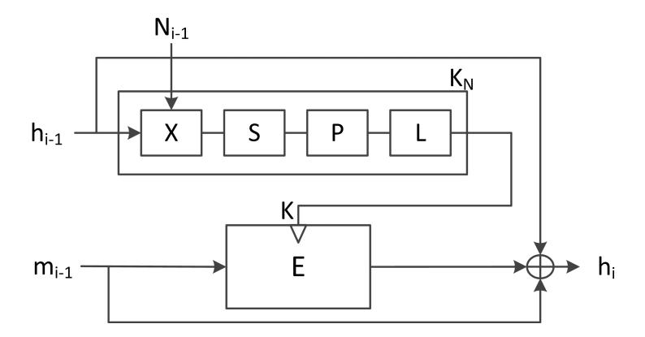
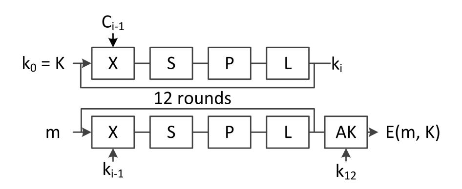
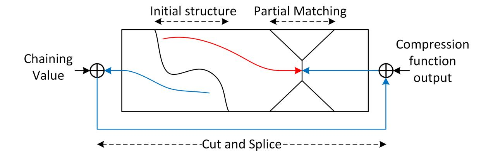
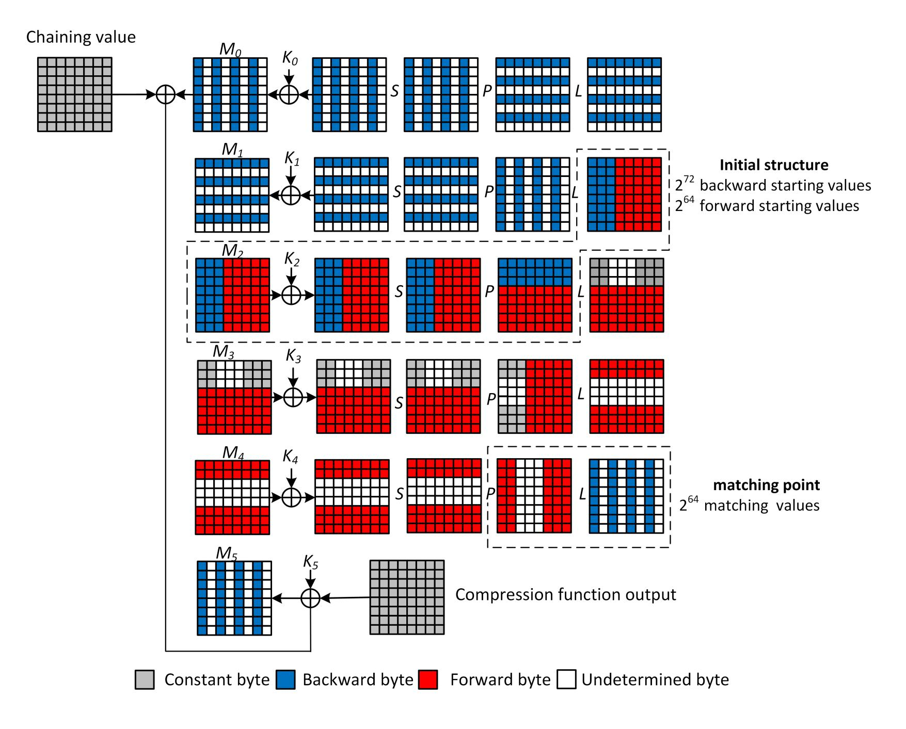
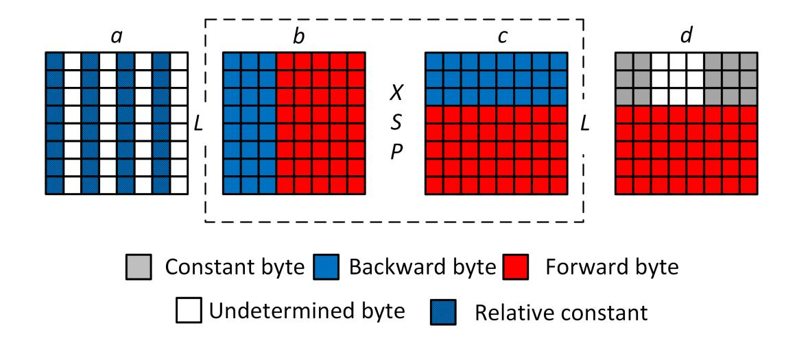
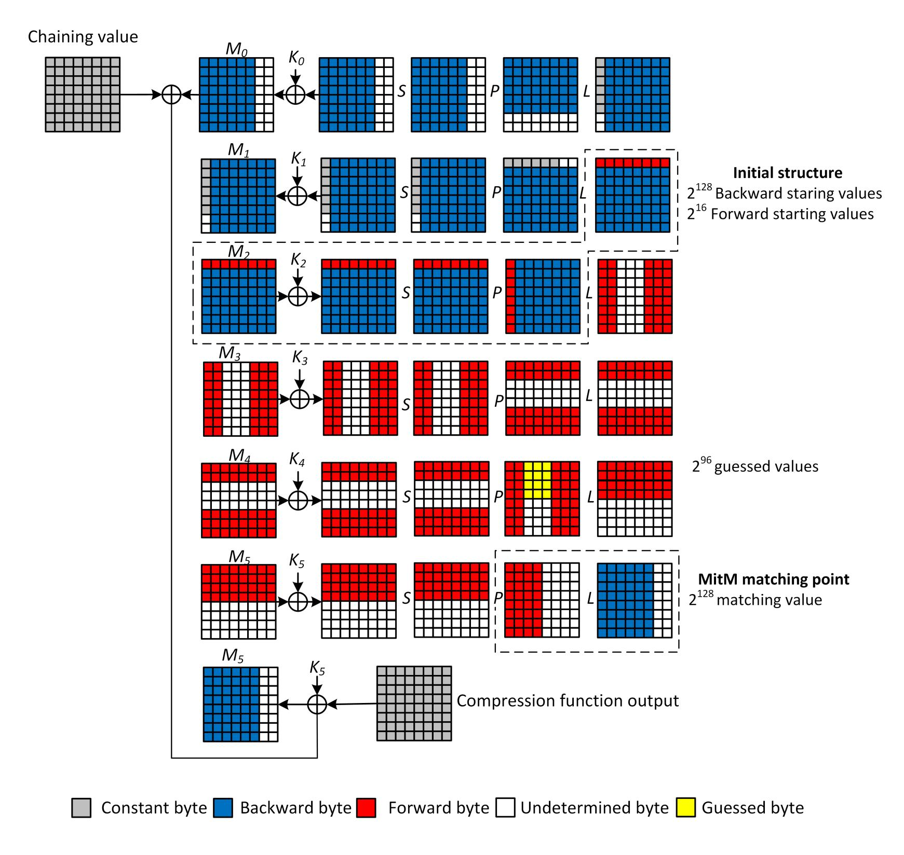
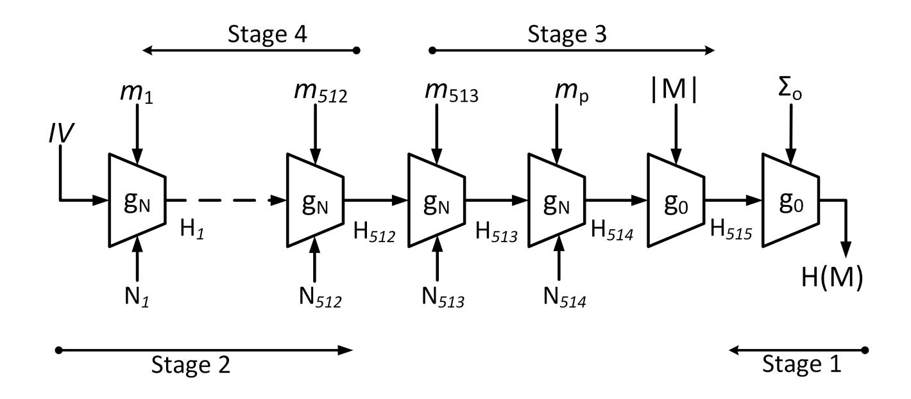

{0}------------------------------------------------

# **Preimage attacks on Reduced-round Stribog**

Riham AlTawy and Amr M. Youssef

Concordia Institute for Information Systems Engineering, Concordia University, Montr´eal, Qu´ebec, Canada

**Abstract.** In August 2012, the Stribog hash function was selected as the new Russian cryptographic hash standard (GOST R 34.11-2012). Stribog employs twelve rounds of an AES-based compression function operating in Miyaguchi-Preneel mode. In this paper, we investigate the preimage resistance of the Stribog hash function. Specifically, we apply a meet in the middle preimage attack on the compression function which allows us to obtain a 5-round pseudo preimage for a given compression function output with time complexity of 2448 and memory complexity of 264. Additionally, we adopt a guess and determine approach to obtain a 6-round chunk separation that balances the available degrees of freedom and the guess size. The proposed chunk separation allows us to attack 6 out of 12 rounds with time and memory complexities of 2496 and 2112, respectively. Finally, employing 2*t* multicollision, we show that preimages of the 5 and 6-round reduced hash function can be generated with time complexity of 2481 and 2505, respectively. The two preimage attacks have equal memory complexity of 2256 .

**Keywords:** Cryptanalysis, Hash functions, Meet in the middle, Preimage attack, GOST R 34.11-2012, Stribog.

#### **1 Introduction**

The attacks by Wang *et al.* on MD5 [23] and SHA-1 [22] followed by the SHA-3 competition [18] have led to a flurry in the area of hash function cryptanalysis. The primary targets of these attacks are the Add-Rotate-Xor (ARX) based hash functions where one can find differential patterns that propagate with acceptable probabilities. Additionally, using message modification techniques, significant complexity reduction is achieved. Consequently, during the SHA-3 competition, different design concepts were introduced, out of which are the Advanced Encryption Standard (AES) based designs that are known for their resistance to standard differential attacks due to the wide trail strategy. The ISO standard Whirlpool [19], the SHA-3 finalist Grøstl [7], and the new Russian hash standard Stribog [1] are among the proposed AES-based hash functions.

Stribog was proposed in 2010 [13]. It has an output length of 512/256-bit. The compression function employs a 12-round AES-like cipher with 8*×*8-byte internal state preceded with one round of nonlinear whitening of the chaining value. The compression function operates in Miyaguchi-Preneel (MP) mode and is plugged in Merkle-Damg˚ard domain extender with a finalization step [1]. Stribog officially replaces the previous standard GOST R 34.11-94 which has been theoretically broken in [16, 15] and recently analyzed in [14]. Early works related to the cryptanalysis of Stribog have been introduced in [2, 3] and [11].

{1}------------------------------------------------

Following the work of Lai and Massey [12], the meet in the middle (MitM) preimage attack [6] was proposed by Aoki and Sasaki. The main idea of the proposed technique is to divide the attacked rounds into two independent executions such that each execution is affected by a different set of inputs. The outputs of the two executions meet at a matching point where a solution is selected to satisfy both executions. The MitM preimage attack has been applied to MD4 [6, 8], MD5 [6], HAS-160 [9], and all functions of the SHA family [5, 4, 8]. The attack exploits the fact that all the previously mentioned functions are ARX-based and operate in the Davis-Mayer (DM) mode, where the state is initialized by the chaining value and some of the expanded message blocks are used independently each round. Thus, one can determine which message blocks affect each execution for the MitM attack. However, several AES-based hash functions operate in the Miyaguchi-Preneel mode, where the input message is fed to the initial state which undergoes a chain of successive transformations. Consequently, the process of separating independent executions becomes relatively more complicated.

In FSE 2011, Sasaki proposed the first MitM preimage attack on several AES hashing modes [20]. In the same work, a 5-round pseudo preimage attack on the compression function of Whirlpool was presented and used for a second preimage attack on the whole hash function. Afterwards, Wu *et al.* applied the MitM preimage attack on Grøstl [24] and used a time-memory trade off approach to improve the time complexity of the 5 round attack on the Whirlpool compression function. Lastly, a pseudo preimage attack on the 6-round Whirlpool compression function and a memoryless preimage attack on the reduced hash function were proposed in [21].

In this work, we investigate the security of Stribog and its compression function, assessing their resistance to the MitM preimage attacks. We present a pseudo preimage attack on the compression function reduced to 5 out of 12 rounds by employing the partial matching and initial structure concepts [20]. In particular, we present an execution separation for the compression function that balances the degrees of freedom in both execution directions with their corresponding matching probability [24]. Furthermore, we extend the attack by one round using the guess and determine approach [21], which allows us to guess parts of the state that belongs to one execution. The proposed 6-round chunk separation maximizes the overall complexity of the attack by balancing the adopted degrees of freedom and the guess size. Finally, we show how to generate preimages of the Stribog hash function using the presented pseudo preimage attacks on the compression function. In Table 1, we provide a summary of the current cryptanalytic results on the Stribog hash function.

The rest of the paper is organized as follows. In the next section, the specification of the Stribog hash function along with the notation used throughout the paper are provided. A brief overview of the MitM preimage attack and the used approaches are given in Section 3. Afterwards, in Sections 4 and 5, we provide detailed description of the attacks and their corresponding complexity. In Section 6, we show how preimages

{2}------------------------------------------------

| Target               | #Rounds | Time      | Memory    | Data                | Attack                                                                                | Reference |
|----------------------|---------|-----------|-----------|---------------------|---------------------------------------------------------------------------------------|-----------|
| Internal cipher      | 5       | $2^8$     | $2^{8}$   | -                   | Free-start collision                                                                  | [2]       |
|                      | 8       | $2^{64}$  | $2^8$     | _                   | riec-start comsion                                                                    |           |
| Internal permutation | 6.5     | $2^{64}$  | -         | $2^{64} \text{ MS}$ | Integral                                                                              | [3]       |
|                      | 7.5     | $2^{120}$ | -         | $2^{120}$ MS        | distinguisher                                                                         |           |
| Compression function | 7.75    | $2^{184}$ | $2^8$     | -                   | Semi free-start                                                                       |           |
|                      | 4.75    | $2^{8}$   | _         | _                   | collision                                                                             |           |
|                      | 7.75    | $2^{72}$  | $2^{8}$   | -                   |                                                                                       | [2]       |
|                      | 8.75    | $2^{128}$ | $2^8$     | _                   | Semi free-start near                                                                  |           |
|                      | 9.75    | $2^{184}$ | $2^8$     | -                   | collision                                                                             |           |
|                      | 5       | $2^{448}$ | $2^{64}$  | -                   | Pseudo preimage                                                                       | Sec. 4    |
|                      | 6       | $2^{496}$ | $2^{112}$ | -                   |                                                                                       | Sec. 5    |
|                      | 6       | $2^{64}$  | -         | $2^{64} \text{ MS}$ | Integral                                                                              | [3]       |
|                      | 7       | $2^{120}$ | -         | $2^{120}$ MS        | $\begin{array}{c} \operatorname{mtegral} \\ \operatorname{distinguisher} \end{array}$ | [9]       |
| Hash function        | 5       | $2^{481}$ | $2^{256}$ | -                   | Preimage                                                                              | Sec. 6    |
|                      | 6       | $2^{505}$ | $2^{256}$ | _                   |                                                                                       |           |

Table 1. Summary of the current cryptanalytic results on Stribog. MS: middle states

of the hash function are generated using the attacks presented in Sections 4 and 5. Finally, the paper is concluded and a short discussion is provided in Section 7.

## 2 Specification of Stribog

Stribog outputs a 512 or 256-bit hash value, where half the last state is truncated when adopting the 256-bit output. The standard specifies two different IVs to be used with the two output lengths. The function can process messages of length up to  $2^{512} - 1$ . The compression function iterates over 12 rounds of an AES-like cipher with an  $8 \times 8$  byte internal state and a final round of key mixing. The compression function operates in Miyaguchi-Preneel mode and is plugged in Merkle-Damgård domain extender with a finalization step. The input message M is padded into a multiple of 512 bits by

**Fig. 1.** Stribog's compression function  $g_N$ 

appending one followed by zeros. The message length for MD-strengthening is further

{3}------------------------------------------------

included as an extra separate block, followed by a block of a checksum evaluated by the modulo 2512 addition of all message blocks as a finalization step. More precisely, let *n* = *⌊ |M|* 512 *⌋* and the input message *M* = *x∥mn∥..∥m*1*∥m*0, where *|M|* is length of *M*, and *x* is an un-complete or an empty block. The message is padded as follows: let *mn*+1 = 0511*−|x|∥*1*∥x*, then the padded message *M* = *mn*+1*∥mn∥..∥m*1*∥m*0. Let ∑ = *mn*+1 +*..*+*m*1 +*m*0. The compression function *gN* is fed with three inputs: the chaining value *hi−*1, a message block *mi−*1, and the counter of bits hashed so far *Ni−*1 = 512 *× i*. (see Figure 1). Let *hi* be a 512-bit chaining variable. The first state is loaded with the initial value *IV* and assigned to *h*0. The hash value of *M* is computed as follows:

$$h_i \leftarrow g_N(h_{i-1}, m_{i-1}, N_{i-1}) \text{ for } i = 1, 2, ..., n+2$$
  
 $h_{n+3} \leftarrow g_0(h_{n+2}, |M|, 0)$   
 $h(M) \leftarrow g_0(h_{n+3}, \sum_{i=1}^{n} 0_i),$ 

where *h*(*M*) is the hash value of *M*, and *g*0 is *gN* with *N* = 0. As depicted in Figure 1, the compression function *gN* consists of:

- **–** *KN* : a nonlinear whitening round of the chaining value. It takes a 512-bit chaining variable *hi−*1 and a counter of the bits hashed so far *Ni−*1 and outputs a 512-bit key *K*.
- **–** *E*: an AES-based cipher that iterates over the message for 12 rounds in addition to a finalization key mixing round. The cipher *E* takes a 512-bit key *K* and a 512-bit message block *m* as a plaintext. As shown in Figure 2, it consists of two similar parallel flows for the state update and the key scheduling.

**Fig. 2.** The internal block cipher (E)

Both *KN* and *E* operate on an 8 *×* 8 byte key state *K*. *E* updates an additional 8 *×* 8 byte message state *M*. In one round, a given state is updated by the following sequence of transformations:

- **–** AddKey(X): XOR with either a round key, a constant, or the counter of bits hashed so far (N).
- **–** SubBytes (S): A nonlinear byte bijective mapping.
- **–** Transposition (P): Byte permutation.

{4}------------------------------------------------

**–** Linear Transformation (L): Row multiplication by an MDS matrix in GF(2).

Initially, state *K* is loaded with the chaining value *hi−*1 and updated by *KN* as follows:

$$k_0 = L \circ P \circ S \circ X[N_{i-1}](K).$$

Now *K* contains the key *k*0 to be used by the cipher *E*. The message state *M* is initially loaded with the message block *m* and *E*(*k*0*, m*) runs the key scheduling function on state *K* to generate 12 round keys *k*1*, k*2*, .., k*12 as follows:

$$k_i = L \circ P \circ S \circ X[C_{i-1}](k_{i-1}), \text{ for } i = 1, 2, ..., 12,$$

where *Ci−*1 is the *i th* round constant. The state *M* is updated as follows:

$$M_i = L \circ P \circ S \circ X[k_{i-1}](M_{i-1}), \text{ for } i = 1, 2, ..., 12.$$

The final round output is given by *E*(*k*0*, m*) = *M*12 *⊕ k*12. The output of *gN* in the Miyaguchi-Preneel mode is *E*(*KN* (*hi−*1*, Ni−*1)*, mi−*1) *⊕ mi−*1 *⊕ hi−*1 as shown in Figure 1. For further details, the reader is referred to [1].

#### **2.1 Notation**

Let *M* and *K* be (8 *×* 8)-byte states denoting the message and key state, respectively. The following notation will be used throughout the paper:

- **–** *Mi* : The message state at the beginning of round *i*.
- **–** *MU i* : The message state after the *U* transformation at round *i*, where *U ∈ X, S, P, L*.
- **–** *Mi* [*r*, *c*]: A byte at row *r* and column *c* of state *Mi* .
- **–** *Mi* [row *r*]: Eight bytes located at row *r* of *Mi* state.
- **–** *Mi* [col *c*]: Eight bytes located at column *c* of *Mi* state.

Same notation applies to *K*.

# **3 MitM preimage attacks on AES-based hash functions**

The first preimage attack on AES-based hash functions [20] was proposed for the cryptanalysis of the AES cipher operating in several hashing modes. It is a meet in the middle attack where the attacked rounds are divided at a given round (starting point) into two independent executions called the forward and backward chunks. To maintain the independence constraint, each chunk must be influenced by a different set of inputs. These set of inputs are often called the chunk neutral bytes, e.g., if a change in a given byte affects the forward chunk only, then this byte is known as a forward neutral byte, and consequently, it is a forward degree of freedom as well. Accordingly, the degree of freedom for each execution direction is the number of independent starting values for each execution. Hence, the output of the forward and the backward executions can be independently calculated and stored. Similar to all MitM attacks, the two separated chunks 

{5}------------------------------------------------

must meet at a common round (matching point) for matching a solution from both the forward and backward directions that satisfies both executions. This is accomplished by adopting the cut and splice technique [6] that employs the mode of operation of the hash functions which chains the input and output states through feedforwarding. More precisely, this technique regards the first and last states as successive rounds. Subsequently, the whole attacked rounds behave in a cyclic manner and one can find a common matching point between the forward and backward executions and one can also select any starting point.

Improvements to this attack aim to stretch the starting and matching points over more than one round state and hence extend the number of the overall attacked rounds. Specifically, the initial structure approach [20] provides the means for the starting point to cover a few successive transformations where bytes in the states belong to both the forward and backward chunks. Although, neutral bytes of both chunks are shared within the initial structure, independence of both executions is achieved in the rounds at the edges of the initial structure. Additionally, the partial matching technique [6] allows only parts of the state to be matched at the matching point. This method is used to extend the matching point further and makes use of the fact that round transformations may update only parts of the state. Thus the remaining unchanged parts can be used for matching. This approach is highly successful in ARX-based hash functions which are characterized by the slow diffusion of their round update functions and so some state variables remain independent in one direction while execution is in the opposite direction. The unaffected parts of the states at each chunk are used for partial matching at the matching point. However, in AES-based hash functions, full diffusion is achieved after two rounds and this approach can be used to extend the matching point of two states for a limited number of transformations. Once a partial match is found, the inputs of both chunks that resulted in the matched values are selected and used to evaluate the remaining undetermined parts of the state at the matching point to check for a full state match. Figure 3 illustrates the MitM preimage attack approaches when a hash function operates in the Miyaguchi-Preneel mode. The red and blue arrows denote the forward and backward executions on the message state, respectively.

**Fig. 3.** MitM preimage attack techniques for hash functions operating in MP mode.

{6}------------------------------------------------

In what follows, we apply the techniques discussed in this section to derive a 5-round pseudo preimage attack on the Stribog compression function.

#### **4 5-round pseudo preimage of the compression function**

For a compression function *CF* that operates on a chaining value *h* and a message block *m*, a preimage attack is defined as follows: given *h* and *x*, where *x* is the compression function output, find *m* such that *CF*(*h, m*) = *x*. However, in a pseudo preimage attack, only *x* is given and we must find *h* and *m* such that *CF*(*h, m*) = *x*. Generally, pseudo preimages of the compression function of some narrow pipe constructions are important because they can be turned to preimages of the hash function with little cost [17]. As for Stribog, the impact of the pseudo preimage attacks on its compression function is demonstrated in Section 6, where we combine these attacks with 2*t* multicollision to produce preimages for the hash function. Pseudo preimage attacks are adopted when the compression function operates in Davis-Mayer mode where the first state is initialized by the chaining value. Subsequently, using the cut and splice technique enforces changes in the first state through the feedforward. Additionally, the initial phase of MitM preimage attack usually produces pseudo preimages when the function operates in the Miyaguchi-Preneel mode and the complexity of finding a preimage is higher than the available bits that can be chosen freely in the message. Consequently, the chaining value is utilized as a source of randomization to satisfy the number of multiple restarts required by the attack. As a result, we end up with a pseudo preimage rather than a preimage of the compression function output.

The attack on the compression function starts by chunk separation. Specifically, we divide five rounds of Stribog execution into a forward chunk and a backward chunk around a starting point (initial structure). The adopted chunk separation is shown in Figure 4. The forward chunk starts at *M*3 and ends at *MP* 4 which is the input state to the matching point. The backward chunk starts at *MP* 1 and ends after the feedforward at *ML* 4 which is the output state of the matching point. The red bytes are the neutral bytes for the forward chunk and after choosing them in the initial structure, all other red bytes can be independently calculated. White bytes in the forward chunk are the ones whose values depend on the neutral bytes of the backward chunk which are the blue bytes in the initial structure. Accordingly, their values are undetermined, these bytes cannot be evaluated until a partial match is found. Same rationale applies to the backward chunk and the blue bytes. Grey bytes are constants which are either given (compression function output) or chosen (chaining value and constants in the initial structure).

In the initial structure, we try to balance the degrees of freedom in each direction and the number of known bytes at the end of each chunk. The degrees of freedom in both directions should produce candidate pairs at the matching point to satisfy the matching probability. More precisely, to minimize the complexity, the total degrees of freedom in

{7}------------------------------------------------

**Fig. 4.** Chunk separation for a 5-round MitM preimage attack on Stribog compression function.

both chunks must be greater than the matching size. For further clarification, we first explain the idea behind the initial structure. The main point is to choose several bytes as neutral bytes so that the number of output bytes of the *L* and *L −*1 transformations at the start of each chunk that are constant or relatively constant is maximized. A relatively constant byte is a byte whose value is affected by the degrees of freedom in one execution direction but remains constant from the opposite execution perspective. The initial structure for the 5-round MitM preimage attack on the compression function of Stribog is shown in Figure 5. We start by randomly choosing the five constant bytes in *d*[row 0] and then determine the values of blue bytes in *c*[row 0] so that after applying *L* on *c*[row 0], we maintain the chosen five constants. Since we need five constant bytes in *d*[row 0], we only need five free variables in *c*[row 0] to solve a system of five equations when the other three bytes are fixed. Accordingly, for any of the first three rows in state *c*, we can randomly choose any three blue bytes and compute the remaining five so that the output of *L* maintains the previously chosen five constants at *d*[row 0]. To this end, we have nine free blue bytes (three for each row in state *c*). Thus the backward degrees of freedom is 272 which means that we can start the backward execution by 272 different starting values and hence 272 different output values at the matching point *ML* 4 . Simi-

{8}------------------------------------------------

Fig. 5. Initial structure for the 5-round attack on the Stribog compression function.

larly, we choose 32 constants in state a and for each row in state b we randomly choose one red byte and compute the other four bytes such that, after the  $L^{-1}$  transformation, we get the predetermined constants at each row in a. However, the value of the four shaded blue bytes in each row of state a depends also on the three blue bytes in the rows of state b. We call these bytes relative constants because their final values cannot be determined until the backward execution starts and these values are different for each execution iteration. Specifically, their final values are the predetermined constants XORed with the corresponding blue bytes multiplied by the  $L^{-1}$  coefficients. In the sequel, we have eight free bytes (one for each row in b) which means  $2^{64}$  forward degrees of freedom to start the forward execution and hence  $2^{64}$  different input values to the matching point  $M_4^P$ .

At the matching point, we match results at  $M_4^P$  from the forward chunk with the values at  $M_4^L$  from the backward chunk through the L transformation. As depicted in Figure 4 at the matching point, five bytes are known from the forward computation and four bytes are known from the backward computation in each row. As a result, we can form four linear equations using three unknowns and match the resulting forward and backward values through the remaining equation. More precisely, we use the following equation to compute a given output row y through the linear transformation L given an input row x.

$$\left[ x_7 \ x_6 \ \overline{x_5} \ \overline{x_4} \ \overline{x_3} \ x_2 \ x_1 \ x_0 \right] \begin{bmatrix} l_{0,7} \ l_{0,6} \ l_{0,5} \ l_{0,4} \ l_{0,3} \ l_{0,2} \ l_{0,1} \ l_{0,0} \\ l_{1,7} \ l_{1,6} \ l_{1,5} \ l_{1,4} \ l_{1,3} \ l_{1,2} \ l_{1,1} \ l_{1,0} \\ l_{2,7} \ l_{2,6} \ l_{2,5} \ l_{2,4} \ l_{2,3} \ l_{2,2} \ l_{2,1} \ l_{2,0} \\ l_{3,7} \ l_{3,6} \ l_{3,5} \ l_{3,4} \ l_{3,3} \ l_{3,2} \ l_{3,1} \ l_{3,0} \\ l_{4,7} \ l_{4,6} \ l_{4,5} \ l_{4,4} \ l_{4,3} \ l_{4,2} \ l_{4,1} \ l_{4,0} \\ l_{5,7} \ l_{5,6} \ l_{5,5} \ l_{5,4} \ l_{5,3} \ l_{5,2} \ l_{5,1} \ l_{5,0} \\ l_{6,7} \ l_{6,6} \ l_{6,5} \ l_{6,4} \ l_{6,3} \ l_{6,2} \ l_{6,1} \ l_{6,0} \\ l_{7,7} \ l_{7,6} \ l_{7,5} \ l_{7,4} \ l_{7,3} \ l_{7,2} \ l_{7,1} \ l_{7,0} \end{bmatrix} = \left[ y_7 \ \overline{y_6} \ y_5 \ \overline{y_4} \ y_3 \ \overline{y_2} \ y_1 \ \overline{y_0} \right]$$

In the above equation, the overline denotes the unknown bytes at a given row. More precisely, the input contains the unknown bytes  $x_5$ ,  $x_4$ , and  $x_3$  and the corresponding

{9}------------------------------------------------

output contains the known bytes  $y_7$ ,  $y_5$ ,  $y_3$ , and  $y_1$ . Accordingly, given the  $GF(2^8)$  equivalent of the Stribog binary matrix [11], we can form the following equations:

$$y_7 = t_7^{in} \oplus x_5 \cdot l_{2,7} \oplus x_4 \cdot l_{3,7} \oplus x_3 \cdot l_{4,7} \tag{1}$$

$$y_5 = t_5^{in} \oplus x_5 \cdot l_{2,5} \oplus x_4 \cdot l_{3,5} \oplus x_3 \cdot l_{4,5} \tag{2}$$

$$y_3 = t_3^{in} \oplus x_5 \cdot l_{2,3} \oplus x_4 \cdot l_{3,3} \oplus x_3 \cdot l_{4,3} \tag{3}$$

$$y_1 = t_1^{in} \oplus x_5 \cdot l_{2,1} \oplus x_4 \cdot l_{3,1} \oplus x_3 \cdot l_{4,1}, \tag{4}$$

where  $t_i^{in}$  is the total of the known input bytes in the  $i^{th}$  row multiplied by their corresponding matrix coefficients. To this end, we calculate  $x_5$ ,  $x_4$ , and  $x_3$  from equations 1, 2, and 3 and substitute their values in equation 4. Consequently, the two sides of equation 4 are all known from both input and output directions. Hence, the matching size per row is one byte and hence the matching probability for the whole state is  $2^{-64}$ . The choice of the number forward and backward values directly affects the matching probability as their number determines the number of red and blue bytes at a given row at the matching point. If the number of blue and red bytes are not properly chosen at the initial structure, one might have no value to match at the matching point. In other words, we cannot have a MitM matching value if the total number of red and blue bytes in a given row at the matching point is less than or equal to eight. The attack can be summarized as follows:

- 1. Randomly choose the chaining value and the constants at the initial structure.
- 2. For each forward starting value  $fw_i$  in the  $2^{64}$  forward starting values at  $M_2$ , compute the forward matching value  $fm_i$  at  $M_4^P$  and store  $(fw_i, fm_i)$  in a lookup table T.
- 3. For each backward starting value  $bw_j$  in the  $2^{72}$  backward starting values in  $M_2^P$  compute the backward matching value  $bm_j$  at  $M_4^L$  and check if there exists an  $fm_i = bm_j$  in T. If found, then a partial match exists and the full match should be checked using the matched starting points  $fw_i$  and  $bw_i$ . If a full match exists, then output the chaining value and the message  $M_0$ , else go to step 1.

The complexity of the MitM preimage attack is given by  $2^n(2^{-r}+2^{-b}+2^{-m})$ , where n is the state size and r, b, and m are the forward, backward, and matching bit sizes, respectively [24]. The choice of these parameters should minimize the complexity and this can be achieved by keeping r, b and m, as close as possible. In the chunk separation shown in Figure 4, r=64, b=72, and m=64. To further explain the complexity of the attack, we consider the attack procedure. After step 2, we have  $2^{64}$  forward matching values and we need  $2^{64}$  memory to store them. At the end of step 3, we have  $2^{72}$  backward matching values. Accordingly, we get  $2^{64+72}=2^{136}$  partial matching candidate pairs. Since the probability of a partial match is  $2^{-64}$ , we expect  $2^{72}$  partially matching pairs. The probability that a partial match results in a full match is  $2^{64-512}=2^{-448}$ . Consequently, the expected number of fully matching pairs is  $2^{-376}$ . Thus we need to repeat the attack  $2^{376}$  times to get a fully matching pair. The time complexity for one repetition of the attack is  $2^{64}$  for the forward computation,  $2^{72}$  for the backward computation, and  $2^{72}$  to check that partially matching pairs fully match. Consequently, the overall complexity of the attack is  $2^{376}(2^{64}+2^{72}+2^{72}) \approx 2^{448}$  time and  $2^{64}$  memory

{10}------------------------------------------------

#### **5 Extending the attack to 6-rounds**

The previous 5-round attack cannot be extended to 6-rounds because at the end of each chunk execution the state has undetermined bytes at each row. Consequently, applying the linear transformation *L* to such state results in a fully undetermined state and no matching can be achieved. A guess and determine approach [21] can be used in one direction to guess the undetermined bytes in some rows. Thus we have some known state rows after the linear transformation *L*. The proposed chunk separation for the 6-round MitM attack is shown in Figure 6. In order to be able extend the attack by one extra round, we guess the twelve undetermined bytes (yellow bytes) in state *MP* 4 . As a result, we can reach state *MP* 5 with four determined columns where matching takes place.

**Fig. 6.** Chunk separation for a 6-round MitM preimage attack on Stribog compression function.

{11}------------------------------------------------

Our choice of the separation and guessed parameters is based on our analysis of the attack complexity and enumerating several values. Our main objective is to maximize the attack probability by carefully selecting the forward, backward, and guessed bit values. We aim to maximize the number of forward bits and keep the backward and the matching number of bits larger than the number of guessed bits and as close as possible. For our attack, the chosen forward, backward, and guessed bit sizes are 16, 128, and 96, respectively. Setting these parameters fixes the matching bit size which is equal to 128. In what follows, we give the attack procedure and complexity based on the above chosen parameters:

- 1. Randomly choose the chaining value and the constants the initial structure.
- 2. For each forward starting value *fwi* and guessed value *gi* in the 216 forward starting values and the 296 guessed values, compute the forward matching value *fmi* at *MP* 5 and store (*fwi , gi , fmi*) in a lookup table *T*.
- 3. For each backward starting value *bwj* in the 2128 backward starting values, compute the backward matching value *bmj* at *ML* 5 and check if there exists an *fmi* = *bmj* in *T*. If found, then a partial match exists and the full match should be checked using the matched forward, guessed, and backwards values *fwi* , *gi* , and *bwi* . If a full match exists, then output the chaining value and the message *M*0, else go to step 1.

After step 2, we have 216+96 = 2112 forward matching values which need 2112 memory for the look up table. At the end of step 3, we have 2128 backward matching values. Accordingly, we get 2112+128 = 2240 partial matching candidate pairs. Since the probability of a partial match is 2*−*128 and the probability of a correct guess is 2*−*96, we expect 2240*−*128*−*96 = 216 correctly guessed partially matching pairs. The probability that a partial match is a full match is 2*−*384. Consequently, the expected number of fully matching pairs is 2*−*368 and hence we need to repeat the attack 2368 times to get a full match. The time complexity for one repetition is 2112 for the forward computation, 2 128 for the backward computation, and 216 to check that partially matching pairs fully match. The overall complexity of the attack is 2368(2112 + 2128 + 216) *≈* 2 496 time and 2 112 memory.

# **6 Preimage of the Stribog hash function**

In this section, we show how the previously presented pseudo preimage attacks on the Stribog compression function are utilized to produce preimages for the whole hash function. Stribog has a finalization step which is the last compression function call in the hash function. In this step, the compression function operates on the modular addition of the previously processed message blocks. At first instance, this may seem to limit the ability of turning a pseudo preimage of the compression function to a hash function preimage because inverting the last compression function call returns the sum of the message blocks and thus constraints their values. However, a preimage of the hash function can be found when we consider a large set of long messages that produce different sums and a set pseudo preimage attacks on the last compression function call. 

{12}------------------------------------------------

Hence, another MitM attack can be performed on both sets to find the message that corresponds to the retrieved sum [15]. As depicted in Figure 7, the attack is divided into four stages:

Fig. 7. Preimage attack on the Stribog hash function.

- 1. Given the hash function output H(M), we produce  $2^p$  pseudo preimages for the last compression function call. The output of this step is  $2^p$  pairs of the last chaining value and the message sum  $(H_{515}, \sum_o)$ . We store these results in a table T.
- 2. In this stage, we construct a large set of equal length messages such that all of them collide at  $H_{512}$ . This structure is called a multicollision of length 512 [10]. More precisely, a multicollisison of length t is a set of  $2^t$  messages where each message consists of exactly t block and every application of the compression function results in the same chaining value. Consequently, all the  $2^t$  messages lead to the same  $H_t$  value. Building a mulitcollision of length t is done with time complexity of  $t \cdot 2^{n/2}$  and memory complexity of  $t \cdot 2 \cdot n$  to store t 2-message blocks, where n is the state size. In our case, we build  $2^{512}$  multicollision, i.e.,  $M_i = m_1^j || m_2^j || ... || m_{512}^j$ , where  $i \in \{1, ..., 2^{512}\}$  and  $j \in \{1, 2\}$  such that all the  $M_i's$  lead to the same  $H_{512}$ . To this end, we have  $2^{512}$  different massages stored in  $512 \cdot 2 \cdot 512 = 2^{19}$  memory and hence  $2^{512}$  candidate sums  $\sum_{M_i}$ .
- 3. At this point, we try to connect the results of stages 1 and 2 using the freedom of choosing  $m_{513}$ . Specifically, since we are using messages of 513 complete blocks, then both the padding block  $m_p$  and the length block |M| are known constants. We also have one known value of  $H_{512}$  produced from the previous stage. In the sequel, we randomly choose  $m_{513}^*$ , compute  $H_{515}^*$  and check if it exists in T. As T contains  $2^p$  entries, it is expected to find a match after  $2^{512-p}$  evaluations of the following three compression function calls:

$$H_{513} = g_N(H_{512}, m_{513}^*, N_{513})$$

$$H_{514} = g_N(H_{513}, m_p, N_{514})$$

$$H_{515}^* = g_0(H_{514}, |M|)$$

{13}------------------------------------------------

- Once a matching  $H_{515}$  value is found in T, the corresponding  $\sum_{o}$  is fixed as well. Hence the desired sum at the output of the multicollision  $\sum_{M_i}$  is equal to  $\sum_{o} -m_p m_{513}$ .
- 4. At the last stage of the attack, we try to find a message  $M_i$  out of the  $2^{512}$  messages generated in stage 2 that has a sum equal to the sum  $\sum_{M_i}$  acquired at the previous stage. This can be achieved by a meet in the middle attack. More precisely, we first calculate all the  $2^{256}$  sums of the first half of all the  $2^{256}$  messages  $\sum_{M_1} = m_1^j + m_2^j + ... + m_{256}^j$  and we store them in a table. Afterwards, for each second half message we compute the sum  $\sum_{M_2} = m_{266}^j + m_{267}^j + ... + m_{512}^j$  and check if  $\sum_{M_i} \sum_{M_2}$  is in the table. It is expected to find a match after  $2^{256}$  checks. Once a match is found, the concatenation of the two message halves that correspond to the matching sums and  $m_{513}$  is the preimage of the given H(M).

The time complexity of the attack is evaluated as follows: we need  $2^P \times$  (complexity of pseudo preimage attack) in stage 1,  $512 \times 2^{256}$  to build the multicollision at stage 2,  $2^{512-p}$  evaluations of three compression function calls at stage 3, and finally  $2^{256}$  for the MitM attack in stage 4. The memory complexity for the four stages is as follows:  $2^p$  2-states to store the pseudo preimages in stage 1, 512 2-message blocks for the multicollision, and  $2^{256}$  for the MitM table in stage 4. Since the time complexity is highly influenced by p, so we have chosen p=32 for the 5-round attack and p=8 for the 6-round attack to obtain the maximum gain. Accordingly, preimages for 5-round Stribog hash function can be produced with a time complexity of  $2^{32+448} + 2^{9+256} + 2^{512-32} \times 3 + 2^{256} \approx 2^{481}$ . The time complexity for the 6-round attack is  $2^{8+496} + 2^{9+256} + 2^{512-8} \times 3 + 2^{256} \approx 2^{505}$ , both attacks have a similar memory complexity of  $2^{256}$  dominated by the MitM attack in stage 4.

#### 7 Conclusion and Discussion

In this paper, we have analyzed Stribog and its compression function with respect to preimage attacks. We have shown that with a carefully balanced chunk separation, pseudo preimages for the 5-round reduced compression function are generated with time complexity of  $2^{448}$  and memory complexity of  $2^{64}$ . Additionally, we have adopted a guess and determine technique to obtain a 6-round chunk separation that maximizes the forward degrees of freedom and balances the backward and the guess bit sizes. As a result, we were able to extend the 5-round attack by one more round with time complexity of  $2^{496}$  and memory complexity of  $2^{112}$ . Finally, using  $2^{512}$  multicollision and another MitM attack, the compression function pseudo preimage attacks are used to produce 5 and 6-round hash function preimages with time complexity of  $2^{481}$  and  $2^{505}$ , respectively. The two preimage attacks have equal memory complexity of  $2^{256}$ .

It should be noted that the Stribog compression function key whitening round  $K_N$  enhances its resistance to certain attacks. Specifically, the attacks that require similar diffusion of the executions of both the message and the chaining value. The guess and

{14}------------------------------------------------

determine approach is more effective in reducing the complexity when similar chunk separation is performed on the key of the internal cipher to provide additional starting values in both directions [21]. However, key separation cannot be achieved because Stribog has an initial nonlinear whitening round that deviates the chaining value (key) from the message by one round. Hence, even if we were able to start from the middle and separate the chaining value execution, we lose all information when we get to the input chaining value because of the wide trail effect. Similar observation has been noted in [2], where the effect of the additional nonlinear round on finding free-start collision has been discussed. Finally, we know that the presented results do not directly impact the practical security of the Stribog hash function. However, they are forward steps in the public cryptanalysis of this new Russian standard that will likely be included in future suites and protocols.

## **References**

- 1. The National Hash Standard of the Russian Federation GOST R 34.11-2012. Russian Federal Agency on Technical Regulation and Metrology report, 2012. https://www.tc26.ru/en/GOSTR3411- 2012/GOST R 34 112012 eng.pdf.
- 2. AlTawy, R., Kircanski, A., and Youssef, A. M. Rebound attacks on Stribog. In *ICISC* (2013). Available at: http://eprint.iacr.org/2013/539.pdf.
- 3. AlTawy, R., and Youssef, A. M. Integral distinguishers for reduced-round stribog. Cryptology ePrint Archive, Report 2013/648, 2013. http://eprint.iacr.org/2013/648.pdf.
- 4. Aoki, K., Guo, J., Matusiewicz, K., Sasaki, Y., and Wang, L. Preimages for step-reduced SHA-2. In *ASIACRYPT* (2009), M. Matsui, Ed., vol. 5912 of *Lecture Notes in Computer Science*, Springer, pp. 578–597.
- 5. Aoki, K., and Sasaki, Y. Meet-in-the-middle preimage attacks against reduced SHA-0 and SHA-1. In *CRYPTO* (2009), S. Halevi, Ed., vol. 5677 of *Lecture Notes in Computer Science*, Springer, pp. 70–89.
- 6. Aoki, K., and Sasaki, Y. Preimage attacks on one-block MD4, 63-step MD5 and more. In *SAC* (2009), R. M. Avanzi, L. Keliher, and F. Sica, Eds., vol. 5381 of *Lecture Notes in Computer Science*, Springer, pp. 103–119.
- 7. Gauravaram, P., Knudsen, L. R., Matusiewicz, K., Mendel, F., Rechberger, C., Schlaffer, M., ¨ and Thomsen, S. S. Grøstl a SHA-3 candidate. *NIST submission* (2008).
- 8. Guo, J., Ling, S., Rechberger, C., and Wang, H. Advanced meet-in-the-middle preimage attacks: First results on full Tiger, and improved results on MD4 and SHA-2. In *ASIACRYPT* (2010), M. Abe, Ed., vol. 6477 of *Lecture Notes in Computer Science*, Springer, pp. 56–75.
- 9. Hong, D., Koo, B., and Sasaki, Y. Improved preimage attack for 68-step HAS-160. In *ICISC* (2009), D. Lee and S. Hong, Eds., vol. 5984 of *Lecture Notes in Computer Science*, Springer, pp. 332–348.
- 10. Joux, A. Multicollisions in iterated hash functions. application to cascaded constructions. In *CRYPTO* (2004), M. Franklin, Ed., vol. 3152 of *Lecture Notes in Computer Science*, Springer, pp. 306–316.
- 11. Kazymyrov, O., and Kazymyrova, V. Algebraic aspects of the russian hash standard GOST R 34.11- 2012. In *CTCrypt* (2013), pp. 160–176. Available at: http://eprint.iacr.org/2013/556.
- 12. Lai, X., and Massey, J. Hash function based on block ciphers. In *EUROCRYPT* (1992), R. A. Rueppel, Ed., vol. 658 of *Lecture Notes in Computer Science*, Springer, pp. 55–70.
- 13. Matyukhin, D., Rudskoy, V., and Shishkin, V. A perspective hashing algorithm. In *RusCrypto* (2010). *(In Russian)*.
- 14. Matyukhin, D., and Shishkin, V. Some methods of hash functions analysis with application to the GOST P 34.11-94 algorithm. *Mat. Vopr. Kriptogr 3* (2012), 71–89. *(In Russian)*.
- 15. Mendel, F., Pramstaller, N., and Rechberger, C. A (second) preimage attack on the GOST hash function. In *FSE* (2008), K. Nyberg, Ed., vol. 5086 of *Lecture Notes in Computer Science*, Springer, pp. 224–234.
- 16. Mendel, F., Pramstaller, N., Rechberger, C., Kontak, M., and Szmidt, J. Cryptanalysis of the GOST hash function. In *CRYPTO* (2008), D. Wagner, Ed., vol. 5157 of *Lecture Notes in Computer Science*, Springer, pp. 162–178.

{15}------------------------------------------------

- 17. Menezes, A. J., Van Oorschot, P. C., and Vanstone, S. A. *Handbook of applied cryptography*. CRC press, 2010.
- 18. NIST. Announcing request for candidate algorithm nominations for a new cryptographic hash algorithm (SHA-3) family. In *Federal Register* (November 2007), vol. 72(212). Available at: http://csrc.nist.gov/groups/ST/hash/documents/FR Notice Nov07.pdf.
- 19. Rijmen, V., and Barreto, P. S. L. M. The Whirlpool hashing function. *NISSIE submission* (2000).
- 20. Sasaki, Y. Meet-in-the-middle preimage attacks on AES hashing modes and an application to Whirlpool. In *FSE* (2011), A. Joux, Ed., vol. 6733 of *Lecture Notes in Computer Science*, Springer, pp. 378–396.
- 21. Sasaki, Y., Wang, L., Wu, S., and Wu, W. Investigating fundamental security requirements on Whirlpool: Improved preimage and collision attacks. In *ASIACRYPT* (2012), X. Wang and K. Sako, Eds., vol. 7658 of *Lecture Notes in Computer Science*, Springer, pp. 562–579.
- 22. Wang, X., Yin, Y. L., and Yu, H. Finding collisions in the full SHA-1. In *CRYPTO* (2005), V. Shoup, Ed., vol. 3621 of *Lecture Notes in Computer Science*, Springer, pp. 17–36.
- 23. Wang, X., and Yu, H. How to break MD5 and other hash functions. In *EUROCRYPT* (2005), R. Cramer, Ed., vol. 3494 of *Lecture Notes in Computer Science*, Springer, pp. 19–35.
- 24. Wu, S., Feng, D., Wu, W., Guo, J., Dong, L., and Zou, J. (Pseudo) preimage attack on roundreduced Grøstl hash function and others. In *FSE* (2012), A. Canteaut, Ed., vol. 7549 of *Lecture Notes in Computer Science*, Springer, pp. 127–145.