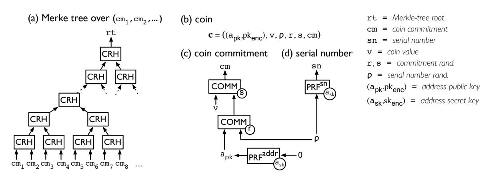
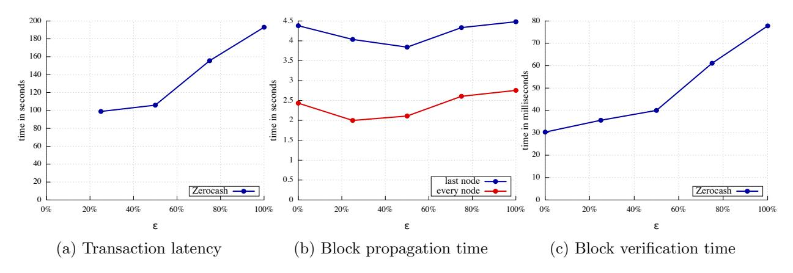

# Zerocash: Decentralized Anonymous Payments from Bitcoin (extended version)

Eli Ben-Sasson<sup>∗</sup> Alessandro Chiesa† Christina Garman‡ Matthew Green‡ Ian Miers‡ Eran Tromer§ Madars Virza† May 18, 2014

#### Abstract

Bitcoin is the first digital currency to see widespread adoption. Although payments are conducted between pseudonyms, Bitcoin cannot offer strong privacy guarantees: payment transactions are recorded in a public decentralized ledger, from which much information can be deduced. Zerocoin (Miers et al., IEEE S&P 2013) tackles some of these privacy issues by unlinking transactions from the payment's origin. Yet it still reveals payment destinations and amounts, and is limited in functionality.

In this paper, we construct a full-fledged ledger-based digital currency with strong privacy guarantees. Our results leverage recent advances in zero-knowledge Succinct Non-interactive ARguments of Knowledge (zk-SNARKs).

We formulate and construct decentralized anonymous payment schemes (DAP schemes). A DAP scheme lets users pay each other directly and privately: the corresponding transaction hides the payment's origin, destination, and amount. We provide formal definitions and proofs of the construction's security.

We then build Zerocash, a practical instantiation of our DAP scheme construction. In Zerocash, transactions are less than 1 kB and take under 6 ms to verify — orders of magnitude more efficient than the less-anonymous Zerocoin and competitive with plain Bitcoin.

Keywords: Bitcoin, decentralized electronic cash, zero-knowledge proofs

<sup>∗</sup>Technion, eli@cs.technion.ac.il

<sup>†</sup>MIT, {alexch, madars}@mit.edu

Johns Hopkins University, {cgarman, imiers, mgreen}@cs.jhu.edu

<sup>§</sup>Tel Aviv University, tromer@cs.tau.ac.il

## Contents

| 1 | Introduction<br>1.1<br>zk-SNARKs<br>1.2<br>Centralized anonymous payment systems<br><br>1.3<br>Decentralized anonymous payment schemes<br><br>1.4<br>Zerocash<br>1.5<br>Paper organization                                                                                   | 3<br>4<br>5<br>5<br>9<br>10 |
|---|------------------------------------------------------------------------------------------------------------------------------------------------------------------------------------------------------------------------------------------------------------------------------|-----------------------------|
| 2 | Background on zk-SNARKs<br>2.1<br>Informal definition<br><br>2.2<br>Comparison with NIZKs<br>2.3<br>Known constructions and security<br><br>2.4<br>zk-SNARK implementations                                                                                                  | 10<br>10<br>11<br>12<br>12  |
| 3 | Definition of a decentralized anonymous payment scheme<br>3.1<br>Data structures<br>3.2<br>Algorithms<br><br>3.3<br>Completeness<br>3.4<br>Security                                                                                                                          | 13<br>13<br>14<br>16<br>16  |
| 4 | Construction of a decentralized anonymous payment scheme<br>4.1<br>Cryptographic building blocks<br>4.2<br>zk-SNARKs for pouring coins<br>4.3<br>Algorithm constructions<br>4.4<br>Completeness and security                                                                 | 18<br>18<br>19<br>20<br>20  |
| 5 | Zerocash<br>5.1<br>Instantiation of building blocks<br>5.2<br>Arithmetic circuit for pouring coins                                                                                                                                                                           | 20<br>22<br>23              |
| 6 | Integration with existing ledger-based currencies<br>6.1<br>Integration by replacing the base currency<br>6.2<br>Integration by hybrid currency<br><br>6.3<br>Extending the Bitcoin protocol to support the combined semantics<br>6.4<br>Additional anonymity considerations | 26<br>26<br>26<br>28<br>28  |
| 7 | Experiments<br>7.1<br>Performance of zk-SNARKs for pouring coins<br>7.2<br>Performance of Zerocash algorithms<br><br>7.3<br>Large-scale network simulation<br>                                                                                                               | 28<br>29<br>29<br>30        |
| 8 | Optimizations and extensions<br>8.1<br>Everlasting anonymity<br>8.2<br>Fast block propagation<br>8.3<br>Improved storage requirements<br>                                                                                                                                    | 33<br>33<br>34<br>34        |
| 9 | Concurrent work                                                                                                                                                                                                                                                              | 36                          |
|   | 10 Conclusion                                                                                                                                                                                                                                                                | 36                          |
|   | Acknowledgments                                                                                                                                                                                                                                                              | 37                          |
|   | A Overview of Bitcoin and Zerocoin<br>A.1<br>Bitcoin<br>A.2<br>Zerocoin                                                                                                                                                                                                      | 38<br>38<br>38              |
|   | B Completeness of DAP schemes                                                                                                                                                                                                                                                | 39                          |
|   | C Security of DAP schemes<br>C.1<br>Ledger indistinguishability<br>C.2<br>Transaction non-malleability<br><br>C.3<br>Balance<br>                                                                                                                                             | 40<br>41<br>42<br>43        |
|   | D Proof of Theorem 4.1<br>D.1<br>Proof of ledger indistinguishability<br><br>D.2<br>Proof of transaction non-malleability<br>D.3<br>Proof of balance<br>                                                                                                                     | 44<br>44<br>48<br>51        |
|   | References                                                                                                                                                                                                                                                                   | 54                          |

## <span id="page-2-0"></span>1 Introduction

Bitcoin is the first digital currency to achieve widespread adoption. The currency owes its rise in part to the fact that, unlike traditional e-cash schemes [\[Cha82,](#page-53-1) [CHL05,](#page-53-2) [ST99\]](#page-55-0), it requires no trusted parties. Instead of appointing a central bank, Bitcoin uses a distributed ledger known as the block chain to store transactions carried out between users. Because the block chain is massively replicated by mutually-distrustful peers, the information it contains is public.

While users may employ many identities (or pseudonyms) to enhance their privacy, an increasing body of research shows that anyone can de-anonymize Bitcoin by using information in the block chain [\[RM11,](#page-55-1) [BBSU12,](#page-53-3) [RS12,](#page-55-2) [MPJ](#page-54-0)+13], such as the structure of the transaction graph as well as the value and dates of transactions. As a result, Bitcoin fails to offer even a modicum of the privacy provided by traditional payment systems, let alone the robust privacy of anonymous e-cash schemes.

While Bitcoin is not anonymous itself, those with sufficient motivation can obfuscate their transaction history with the help of mixes (also known as laundries or tumblers). A mix allows users to entrust a set of coins to a pool operated by a central party and then, after some interval, retrieve different coins (with the same total value) from the pool. However, mixes suffer from three limitations: (i) the delay to reclaim coins must be large to allow enough coins to be mixed in; (ii) the mix operator can trace coins; and (iii) the mix operator may steal coins.[1](#page-2-1) For users with "something to hide", these risks may be acceptable. But typical legitimate users (1) wish to keep their spending habits private from their peers, (2) are risk-averse and do not wish to expend continual effort in protecting their privacy, and (3) are often not sufficiently aware that their privacy has been compromised.

To protect their privacy, users thus need an instant, risk-free, and, most importantly, automatic guarantee that data revealing their spending habits and account balances is not publicly accessible by their neighbors, co-workers, and the merchants with whom they do business. Anonymous transactions also ensure that the market value of a coin is independent of its history, thus ensuring that legitimate users' coins remain fungible. [2](#page-2-2)

Zerocoin: a decentralized mix. Miers et al. [\[MGGR13\]](#page-54-1) proposed Zerocoin, which extends Bitcoin to provide strong anonymity guarantees. Like many e-cash protocols (e.g., [\[CHL05\]](#page-53-2)), Zerocoin employs zero-knowledge proofs to prevent transaction graph analyses. Unlike earlier practical e-cash protocols, however, Zerocoin does not rely on digital signatures to validate coins, nor does it require a central bank to prevent double spending. Instead, Zerocoin authenticates coins by proving, in zero-knowledge, that they belong to a public list of valid coins (which can be maintained on the block chain). Yet rather than a full-fledged anonymous currency, Zerocoin is a decentralized mix, where users may periodically "wash" their bitcoins via the Zerocoin protocol. Routine day-to-day transactions must be conducted via Bitcoin, due to reasons that we now review.

The first reason is performance. Redeeming zerocoins requires double-discrete-logarithm proofs of knowledge, which have size that exceeds 45 kB and require 450 ms to verify (at the 128-bit security level).[3](#page-2-3) These proofs must be broadcast through the network, verified by every node, and permanently stored in the ledger. The entailed costs are higher, by orders of magnitude, than those in Bitcoin and can seriously tax a Bitcoin network operating at normal scale.

<span id="page-2-1"></span><sup>1</sup>CoinJoin [\[Max13\]](#page-54-2), an alternative proposal, replaces the central party of a mix with multi-signature transactions that involve many collaborating Bitcoin users. CoinJoin can thus only mix small volumes of coins amongst users who are currently online, is prone to denial-of-service attacks by third parties, and requires effort to find mixing partners.

<span id="page-2-2"></span><sup>2</sup>While the methods we detail in this paper accomplish this, the same techniques open the door for privacy-preserving accountability and oversight (see Section [10\)](#page-35-1).

<span id="page-2-3"></span><sup>3</sup>These published numbers [\[MGGR13\]](#page-54-1) actually use a mix of parameters at both 128-bit and 80-bit security for different components of the construction. The cost is higher if all parameters are instantiated at 128-bit security.

The second reason is functionality. While Zerocoin constitutes a basic e-cash scheme, it lacks critical features required of full-fledged anonymous payments. First, Zerocoin uses coins of fixed denomination: it does not support payments of exact values, nor does it provide a means to give change following a transaction (i.e., divide coins). Second, Zerocoin has no mechanism for one user to pay another one directly in "zerocoins". And third, while Zerocoin provides anonymity by unlinking a payment transaction from its origin address, it does not hide the amount or other metadata about transactions occurring on the network.

Our contribution. Addressing this challenge, this work offers two main contributions.

- (1) We introduce the notion of a decentralized anonymous payment scheme, which formally captures the functionality and security guarantees of a full-fledged decentralized electronic currency with strong anonymity guarantees. We provide a construction of this primitive and prove its security under specific cryptographic assumptions. The construction leverages recent advances in the area of zero-knowledge proofs. Specifically, it uses zero-knowledge Succinct Non-interactive Arguments of Knowledge (zk-SNARKs) [Gro10, Lip12, BCI<sup>+</sup>13, GGPR13, PGHR13, BCG<sup>+</sup>13, Lip13, BCTV14].
- (2) We implement the above primitive, via a system that we call **Zerocash**. Our system (at 128 bits of security):
- reduces the size of transactions spending a coin to under 1 kB (an improvement of over 97.7%);
- reduces the spend-transaction verification time to under 6 ms (an improvement of over 98.6%);
- allows for anonymous transactions of variable amounts;
- hides transaction amounts and the values of coins held by users; and
- allows for payments to be made directly to a user's fixed address (without user interaction).

To validate our system, we measured its performance and established feasibility by conducting experiments in a test network of 1000 nodes (approximately  $\frac{1}{16}$  of the unique IPs in the Bitcoin network and  $\frac{1}{3}$  of the nodes reachable at any given time [DW13]). This inspires confidence that Zerocash can be deployed as a fork of Bitcoin and operate at the same scale. Thus, due to its substantially improved functionality and performance, Zerocash makes it possible to entirely replace traditional Bitcoin payments with anonymous alternatives.

**Concurrent work.** The idea of using zk-SNARKs in the Bitcoin setting was first presented by one of the authors at Bitcoin 2013 [Ben13]. In concurrent work, Danezis et al. [DFKP13] suggest using zk-SNARKs to reduce proof size and verification time in Zerocoin; see Section 9 for a comparison.

### <span id="page-3-0"></span>1.1 zk-SNARKs

A zk-SNARK is an efficient variant of a zero-knowledge proof of knowledge [GMR89], which we first informally describe via an example. Suppose Alice wishes to prove to Bob the statement "I (Alice) own 30 bitcoins". A simple method for Alice to do so is to point to 30 coins on the block chain and, for each of them, sign a message ("hello, world") using the secret key that controls that coin. Alas, this method leaks knowledge to Bob, by identifying which coins are Alice's. A zero-knowledge proof of knowledge allows Alice to achieve the same goal, while revealing no information to Bob (beyond the fact that she knows some secret keys that control 30 coins). Crucially, such proofs can be obtained for any statement that can be verified to be true by use of an efficient computation involving auxiliary inputs such as trapdoors and passwords (such statements are called "NP statements").

We now sketch in more technical terms the definition of a zk-SNARK; see Section 2 for more details. A zk-SNARK is a non-interactive zero-knowledge proof of knowledge that is *succinct*, i.e., for which proofs are very short and easy to verify. More precisely, let  $\mathcal{L}$  be an NP language, and let C be a nondeterministic decision circuit for  $\mathcal{L}$  on a given instance size n. A zk-SNARK can be used

to prove and verify membership in L, for instances of size n, as follows. After taking C as input, a trusted party conducts a one-time setup phase that results in two public keys: a proving key pk and a verification key vk. The proving key pk enables any (untrusted) prover to produce a proof π attesting to the fact that x ∈ L, for an instance x (of size n) of his choice. The non-interactive proof π is zero knowledge and a proof of knowledge. Anyone can use the verification key vk to verify the proof π; in particular zk-SNARK proofs are publicly verifiable: anyone can verify π, without ever having to interact with the prover who generated π. Succinctness requires that (for a given security level) π has constant size and can be verified in time that is linear in |x| (rather than linear in |C|).

## <span id="page-4-0"></span>1.2 Centralized anonymous payment systems

Before describing our new decentralized payment system, we put it in context by recalling two pre-Bitcoin payment schemes, both of which relied on a bank, acting as a central trusted party.

Anonymous e-cash. Chaum [\[Cha82\]](#page-53-1) first obtained anonymous e-cash. In Chaum's scheme, the minting of a coin involves both a user, Alice, and the bank: to mint a coin of a given value v, Alice first selects a random secret serial number sn (unknown to the bank); then, the bank, after deducting v from Alice's balance, signs sn via a blind signature. Afterwards, if Alice wants to transfer her coin to Bob, she reveals sn to him and proves that sn was signed by the bank; during this transfer, Bob (or the bank) cannot deduce Alice's identity from the revealed information. Double-spending is prevented because the bank will not honor a coin with a previously-seen serial number.

Unforgeable e-cash. One problem with Chaum's scheme is that coins can be forged if the bank's secret key is compromised. Sander and Ta-Shma [\[ST99\]](#page-55-0) addressed this, as follows. The bank maintains a public Merkle tree of "coin commitments", and users periodically retrieve its root rt; in particular, the bank maintains no secrets. When Alice requests a coin (of unit value), she picks a random serial number sn and auxiliary string r, and then sends cm := CRH(snkr) to the bank, where CRH is a collision-resistant hash; the bank deducts the appropriate amount from Alice's balance and then records cm as a leaf in the Merkle tree. Afterwards, to pay Bob, Alice sends him sn along with a zero-knowledge proof of knowledge π of the following NP statement: "there exists r such that CRH(snkr) is a leaf in a Merkle tree with root rt". In other words, Alice can convince Bob that sn is the serial number contained in some coin commitment in the Merkle tree; but the zero-knowledge property prevents Bob from learning information about which coin commitment is Alice's, thereby protecting Alice's identity. Later, Bob can "cash out" Alice's coin by showing sn and π to the bank.[4](#page-4-2)

Moving to a fungible anonymous decentralized system. In this paper, like [\[ST99\]](#page-55-0), we hash a coin's serial number and use Merkle trees to compactly represent the set of minted coins. Unlike [\[ST99\]](#page-55-0), we also ensure the privacy of a coin's value and support transactions that split and merge coins, thus achieving (and implementing) a new kind of fully-fungible and divisible payment scheme. As in Bitcoin (and in stark contrast to previous e-cash schemes), we do not rely on a trusted bank. Therefore, we require a new set of definitions and protocols, designed to protect Alice's anonymity while preventing her from falsely increasing her balance under the veil of her boosted privacy. An informal description of our payment scheme follows.

### <span id="page-4-1"></span>1.3 Decentralized anonymous payment schemes

We construct a decentralized anonymous payment (DAP) scheme, which is a decentralized e-cash scheme that allows direct anonymous payments of any amount. See Section [3](#page-12-0) for a formal definition.

<span id="page-4-2"></span><sup>4</sup>We omit details about how the bank can identify Alice in the event that she double spends her coin.

Here, we outline our construction in six incremental steps; the construction details are in Section [4.](#page-17-0)

Our construction functions on top of any ledger-based base currency, such as Bitcoin. At any given time, a unique valid snapshot of the currency's ledger is available to all users. The ledger is a sequence of transactions and is append-only. Transactions include both the underlying currency's transactions, as well as new transactions introduced by our construction. For concreteness, we focus the discussion below on Bitcoin (though later definitions and constructions are stated abstractly). We assume familiarity with Bitcoin [\[Nak09\]](#page-54-10) and Zerocoin [\[MGGR13\]](#page-54-1); both are reviewed in Appendix [A.](#page-37-0)

Step 1: user anonymity with fixed-value coins. We first describe a simplified construction, in which all coins have the same value of, e.g., 1 BTC. This construction, similar to the Zerocoin protocol, shows how to hide a payment's origin. In terms of tools, we make use of zk-SNARKs (recalled above) and a commitment scheme. Let COMM denote a statistically-hiding non-interactive commitment scheme (i.e., given randomness r and message m, the commitment is c := COMMr(m); subsequently, c is opened by revealing r and m, and one can verify that COMMr(m) equals c).

In the simplified construction, a new coin c is minted as follows: a user u samples a random serial number sn and a trapdoor r, computes a coin commitment cm := COMMr(sn), and sets c := (r,sn, cm). A corresponding mint transaction txMint, containing cm (but not sn or r), is sent to the ledger; txMint is appended to the ledger only if u has paid 1 BTC to a backing escrow pool (e.g., the 1 BTC may be paid via plaintext information encoded in txMint). Mint transactions are thus certificates of deposit, deriving their value from the backing pool.

Subsequently, letting CMList denote the list of all coin commitments on the ledger, u may spend c by posting a spend transaction txSpend that contains (i) the coin's serial number sn; and (ii) a zk-SNARK proof π of the NP statement "I know r such that COMMr(sn) appears in the list CMList of coin commitments". Assuming that sn does not already appear on the ledger (as part of a past spend transaction), u can redeem the deposited amount of 1 BTC, which u can either keep, transfer to someone else, or mint a new coin. (If sn does already appear on the ledger, this is considered double spending, and the transaction is discarded.)

User anonymity is achieved because the proof π is zero-knowledge: while sn is revealed, no information about r is, and finding which of the numerous commitments in CMList corresponds to a particular spend transaction txSpend is equivalent to inverting f(x) := COMMx(sn), which is assumed to be infeasible. Thus, the origin of the payment is anonymous.

Step 2: compressing the list of coin commitments. In the above NP statement, CMList is specified explicitly as a list of coin commitments. This naive representation severely limits scalability because the time and space complexity of most protocol algorithms (e.g., the proof verification algorithm) grow linearly with CMList. Moreover, coin commitments corresponding to already-spent coins cannot be dropped from CMList to reduce costs, since they cannot be identified (due to the same zero-knowledge property that provides anonymity).

As in [\[ST99\]](#page-55-0), we rely on a collision-resistant function CRH to avoid an explicit representation of CMList. We maintain an efficiently-updatable append-only CRH-based Merkle tree Tree(CMList) over the (growing) list CMList and let rt denote the root of Tree(CMList). It is well-known that rt can be updated to account for the insertion of new leaves with time and space proportional to just the tree depth. Hence, the time and space complexity is reduced from linear in the size of CMList to logarithmic. With this in mind, we modify the NP statement to the following one: "I know r such that COMMr(sn) appears as a leaf in a CRH-based Merkle tree whose root is rt". Compared with the naive data structure for CMList, this modification increases exponentially the size of CMList that a given zk-SNARK implementation can support. (Concretely: using Merkle trees of depth 64, Zerocash supports 2<sup>64</sup> coins.)

Step 3: extending coins for direct anonymous payments. So far, the coin commitment

cm of a coin c is a commitment to the coin's serial number sn. However, this creates a problem when transferring  $\mathbf{c}$  to another user. Indeed, suppose that a user  $u_A$  created  $\mathbf{c}$ , and  $u_A$  sends  $\mathbf{c}$  to another user  $u_B$ . First, since  $u_A$  knows sn, the spending of c by  $u_B$  is both non-anonymous (since  $u_A$  sees when **c** is spent, by recognizing sn) and risky (since  $u_A$  could still spend **c** first). Thus,  $u_B$ must immediately spend  $\mathbf{c}$  and mint a new coin  $\mathbf{c}'$  to protect himself. Second, if  $u_A$  in fact wants to transfer to  $u_B$ , e.g., 100 BTC, then doing so is both unwieldy (since it requires 100 transfers) and non-anonymous (since the amount of the transfer is leaked). And third, transfers in amounts that are not multiples of 1 BTC (the fixed value of a coin) are not supported. Thus, the simplified construction described is inadequate as a payment scheme.

We address this by modifying the derivation of a coin commitment, and using pseudorandom functions to target payments and to derive serial numbers, as follows. We use three pseudorandom functions (derived from a single one). For a seed x, these are denoted  $\mathsf{PRF}^{\mathrm{addr}}_x(\cdot)$ ,  $\mathsf{PRF}^{\mathrm{sn}}_x(\cdot)$ , and  $\mathsf{PRF}^{\mathrm{pk}}_{x}(\cdot)$ . We assume that  $\mathsf{PRF}^{\mathrm{sn}}$  is moreover collision-resistant.

To provide targets for payments, we use addresses: each user u generates an address key pair  $(a_{\mathsf{pk}}, a_{\mathsf{sk}})$ , the address public key and address private key respectively. The coins of u contain the value  $a_{pk}$  and can be spent only with knowledge of  $a_{sk}$ . A key pair  $(a_{pk}, a_{sk})$  is sampled by selecting a random seed  $a_{sk}$  and setting  $a_{pk} := \mathsf{PRF}^{\mathrm{addr}}_{a_{sk}}(0)$ . A user can generate and use any number of address key pairs.

Next, we redesign minting to allow for greater functionality. To mint a coin c of a desired value v, the user u first samples  $\rho$ , which is a secret value that determines the coin's serial number as  $\operatorname{sn} := \operatorname{PRF}_{a_{\mathsf{sk}}}^{\operatorname{sn}}(\rho)$ . Then, u commits to the tuple  $(a_{\mathsf{pk}}, v, \rho)$  in two phases: (a) u computes  $k := \mathsf{COMM}_r(a_{\mathsf{pk}} \| \rho)$  for a random r; and then (b) u computes  $\mathsf{cm} := \mathsf{COMM}_s(v \| k)$  for a random s. The minting results in a coin  $\mathbf{c} := (a_{\mathsf{pk}}, v, \rho, r, s, \mathsf{cm})$  and a mint transaction  $\mathsf{tx}_{\mathsf{Mint}} := (v, k, s, \mathsf{cm})$ . Crucially, due to the nested commitment, anyone can verify that cm in tx<sub>Mint</sub> is a coin commitment of a coin of value v (by checking that  $COMM_s(v||k)$  equals cm) but cannot discern the owner (by learning the address key  $a_{pk}$ ) or serial number (derived from  $\rho$ ) because these are hidden in k. As before,  $tx_{Mint}$  is accepted by the ledger only if u deposits the correct amount, in this case v BTC.

Coins are spent using the *pour* operation, which takes a set of input coins, to be consumed, and "pours" their value into a set of fresh output coins — such that the total value of output coins equals the total value of the input coins. Suppose that u, with address key pair  $(a_{\sf pk}^{\sf old}, a_{\sf sk}^{\sf old})$ , wishes to consume his coin  $\mathbf{c}^{\mathsf{old}} = (a_{\mathsf{pk}}^{\mathsf{old}}, v^{\mathsf{old}}, \rho^{\mathsf{old}}, r^{\mathsf{old}}, s^{\mathsf{old}}, \mathsf{cm}^{\mathsf{old}})$  and produce two new coins  $\mathbf{c}_1^{\mathsf{new}}$  and  $\mathbf{c}_2^{\mathsf{new}}$ , with total value  $v_1^{\text{new}} + v_2^{\text{new}} = v^{\text{old}}$ , respectively targeted at address public keys  $a_{\text{pk},1}^{\text{new}}$  and  $a_{\text{pk},2}^{\text{new}}$ . (The addresses  $a_{\mathsf{pk},1}^{\mathsf{new}}$  and  $a_{\mathsf{pk},2}^{\mathsf{new}}$  may belong to u or to some other user.) The user u, for each  $i \in \{1,2\}$ , proceeds as follows: (i) u samples serial number randomness  $\rho_i^{\mathsf{new}}$ ; (ii) u computes  $k_i^{\mathsf{new}} := \mathsf{COMM}_{r_i^{\mathsf{new}}}(a_{\mathsf{pk},i}^{\mathsf{new}} \| \rho_i^{\mathsf{new}})$  for a random  $r_i^{\mathsf{new}}$ ; and (iii) u computes  $\mathsf{cm}_i^{\mathsf{new}} := \mathsf{COMM}_{s_i^{\mathsf{new}}}(v_i^{\mathsf{new}} \| k_i^{\mathsf{new}})$  for a random  $s_i^{\mathsf{new}}$ .

This yields the coins  $\mathbf{c}_1^{\mathsf{new}} := (a_{\mathsf{pk},1}^{\mathsf{new}}, v_1^{\mathsf{new}}, \rho_1^{\mathsf{new}}, r_1^{\mathsf{new}}, s_1^{\mathsf{new}}, \mathsf{cm}_1^{\mathsf{new}})$  and  $\mathbf{c}_2^{\mathsf{new}} := (a_{\mathsf{pk},2}^{\mathsf{new}}, v_2^{\mathsf{new}}, \rho_2^{\mathsf{new}}, s_1^{\mathsf{new}}, s_1^{\mathsf{new}}, s_1^{\mathsf{new}}, s_1^{\mathsf{new}}, s_1^{\mathsf{new}}, s_1^{\mathsf{new}}, s_1^{\mathsf{new}}, s_1^{\mathsf{new}}, s_1^{\mathsf{new}}, s_1^{\mathsf{new}}, s_1^{\mathsf{new}}, s_1^{\mathsf{new}}, s_1^{\mathsf{new}}, s_1^{\mathsf{new}}, s_1^{\mathsf{new}}, s_1^{\mathsf{new}}, s_1^{\mathsf{new}}, s_1^{\mathsf{new}}, s_1^{\mathsf{new}}, s_1^{\mathsf{new}}, s_1^{\mathsf{new}}, s_1^{\mathsf{new}}, s_1^{\mathsf{new}}, s_1^{\mathsf{new}}, s_1^{\mathsf{new}}, s_1^{\mathsf{new}}, s_1^{\mathsf{new}}, s_1^{\mathsf{new}}, s_1^{\mathsf{new}}, s_1^{\mathsf{new}}, s_1^{\mathsf{new}}, s_1^{\mathsf{new}}, s_1^{\mathsf{new}}, s_1^{\mathsf{new}}, s_1^{\mathsf{new}}, s_1^{\mathsf{new}}, s_1^{\mathsf{new}}, s_1^{\mathsf{new}}, s_1^{\mathsf{new}}, s_1^{\mathsf{new}}, s_1^{\mathsf{new}}, s_1^{\mathsf{new}}, s_1^{\mathsf{new}}, s_1^{\mathsf{new}}, s_1^{\mathsf{new}}, s_1^{\mathsf{new}}, s_1^{\mathsf{new}}, s_1^{\mathsf{new}}, s_1^{\mathsf{new}}, s_1^{\mathsf{new}}, s_1^{\mathsf{new}}, s_1^{\mathsf{new}}, s_1^{\mathsf{new}}, s_1^{\mathsf{new}}, s_1^{\mathsf{new}}, s_1^{\mathsf{new}}, s_1^{\mathsf{new}}, s_1^{\mathsf{new}}, s_1^{\mathsf{new}}, s_1^{\mathsf{new}}, s_1^{\mathsf{new}}, s_1^{\mathsf{new}}, s_1^{\mathsf{new}}, s_1^{\mathsf{new}}, s_1^{\mathsf{new}}, s_1^{\mathsf{new}}, s_1^{\mathsf{new}}, s_1^{\mathsf{new}}, s_1^{\mathsf{new}}, s_1^{\mathsf{new}}, s_1^{\mathsf{new}}, s_1^{\mathsf{new}}, s_1^{\mathsf{new}}, s_1^{\mathsf{new}}, s_1^{\mathsf{new}}, s_1^{\mathsf{new}}, s_1^{\mathsf{new}}, s_1^{\mathsf{new}}, s_1^{\mathsf{new}}, s_1^{\mathsf{new}}, s_1^{\mathsf{new}}, s_1^{\mathsf{new}}, s_1^{\mathsf{new}}, s_1^{\mathsf{new}}, s_1^{\mathsf{new}}, s_1^{\mathsf{new}}, s_1^{\mathsf{new}}, s_1^{\mathsf{new}}, s_1^{\mathsf{new}}, s_1^{\mathsf{new}}, s_1^{\mathsf{new}}, s_1^{\mathsf{new}}, s_1^{\mathsf{new}}, s_1^{\mathsf{new}}, s_1^{\mathsf{new}}, s_1^{\mathsf{new}}, s_1^{\mathsf{new}}, s_1^{\mathsf{new}}, s_1^{\mathsf{new}}, s_1^{\mathsf{new}}, s_1^{\mathsf{new}}, s_1^{\mathsf{new}}, s_1^{\mathsf{new}}, s_1^{\mathsf{new}}, s_1^{\mathsf{new}}, s_1^{\mathsf{new}}, s_1^{\mathsf{new}}, s_1^{\mathsf{new}},$

 $r_2^{\text{new}}, s_2^{\text{new}}, \text{cm}_2^{\text{new}}$ ). Next, u produces a zk-SNARK proof  $\pi_{\text{POUR}}$  for the following NP statement, which we call POUR:

"Given the Merkle-tree root rt, serial number snold, and coin commitments cm<sub>1</sub><sup>new</sup>, cm<sub>2</sub><sup>new</sup>, I know coins  $\mathbf{c}^{\mathsf{old}}, \mathbf{c}_1^{\mathsf{new}}, \mathbf{c}_2^{\mathsf{new}}$ , and address secret key  $a_{\mathsf{sk}}^{\mathsf{old}}$  such that:

- The coins are well-formed: for  $\mathbf{c}^{\text{old}}$  it holds that  $k^{\text{old}} = \text{COMM}_{r^{\text{old}}}(a_{\text{nk}}^{\text{old}} || \rho^{\text{old}})$  and  $\text{cm}^{\text{old}} = \text{coins}$  $\begin{array}{l} \mathsf{COMM}_{s^{\mathsf{old}}}(v^{\mathsf{old}} \| k^{\mathsf{old}}); \ and \ similarly \ for \ \mathbf{c}_1^{\mathsf{new}} \ and \ \mathbf{c}_2^{\mathsf{new}}. \\ \bullet \ The \ address \ secret \ key \ matches \ the \ public \ key: \ a_{\mathsf{pk}}^{\mathsf{old}} = \mathsf{PRF}_{a_{\mathsf{sk}}^{\mathsf{old}}}^{\mathsf{addr}}(0). \end{array}$
- The serial number is computed correctly:  $\operatorname{sn}^{\operatorname{old}} := \operatorname{PRF}^{\operatorname{sn}}_{a^{\operatorname{old}}}(\rho^{\widehat{\operatorname{old}}})$ .
- The coin commitment cmold appears as a leaf of a Merkle-tree with root rt.
- The values add up:  $v_1^{\text{new}} + v_2^{\text{new}} = v^{\text{old}}$ ."

A resulting pour transaction  $tx_{Pour} := (rt, sn^{old}, cm_1^{new}, cm_2^{new}, \pi_{POUR})$  is appended to the ledger. (As before, the transaction is rejected if the serial number sn appears in a previous transaction.)

Now suppose that u does not know, say, the address secret key  $a_{\mathsf{sk},1}^{\mathsf{new}}$  that is associated with the public key  $a_{\mathsf{pk},1}^{\mathsf{new}}$ . Then, u cannot spend  $\mathbf{c}_1^{\mathsf{new}}$  because he cannot provide  $a_{\mathsf{sk},1}^{\mathsf{new}}$  as part of the witness of a subsequent pour operation. Furthermore, when a user who knows  $a_{\mathsf{sk},1}^{\mathsf{new}}$  does spend  $\mathbf{c}_1^{\mathsf{new}}$ , the user u cannot track it, because he knows no information about its revealed serial number, which is  $\mathsf{sn}_1^{\mathsf{new}} := \mathsf{PRF}_{a_{\mathsf{sk},1}^{\mathsf{new}}}^{\mathsf{sn}}(\rho_1^{\mathsf{new}})$ .

Also observe that  $tx_{Pour}$  reveals no information about how the value of the consumed coin was divided among the two new fresh coins, nor which coin commitment corresponds to the consumed coin, nor the address public keys to which the two new fresh coins are targeted. The payment was conducted in full anonymity.

More generally, a user may pour  $N^{\mathsf{old}} \geq 0$  coins into  $N^{\mathsf{new}} \geq 0$  coins. For simplicity we consider the case  $N^{\mathsf{old}} = N^{\mathsf{new}} = 2$ , without loss of generality. Indeed, for  $N^{\mathsf{old}} < 2$ , the user can mint a coin with value 0 and then provide it as a "null" input, and for  $N^{\mathsf{new}} < 2$ , the user can create (and discard) a new coin with value 0. For  $N^{\mathsf{old}} > 2$  or  $N^{\mathsf{new}} > 2$ , the user can compose  $\log N^{\mathsf{old}} + \log N^{\mathsf{new}}$  of the 2-input/2-output pours.

Step 4: sending coins. Suppose that  $a_{\mathsf{pk},1}^{\mathsf{new}}$  is the address public key of  $u_1$ . In order to allow  $u_1$  to actually spend the new coin  $\mathbf{c}_1^{\mathsf{new}}$  produced above, u must somehow send the secret values in  $\mathbf{c}_1^{\mathsf{new}}$  to  $u_1$ . One way is for u to send  $u_1$  a private message, but the requisite private communication channel necessitates additional infrastructure or assumptions. We avoid this "out-of-band" channel and instead build this capability directly into our construction by leveraging the ledger as follows.

We modify the structure of an address key pair. Each user now has a key pair  $(\mathsf{addr}_{\mathsf{pk}}, \mathsf{addr}_{\mathsf{sk}})$ , where  $\mathsf{addr}_{\mathsf{pk}} = (a_{\mathsf{pk}}, \mathsf{pk}_{\mathsf{enc}})$  and  $\mathsf{addr}_{\mathsf{sk}} = (a_{\mathsf{sk}}, \mathsf{sk}_{\mathsf{enc}})$ . The values  $(a_{\mathsf{pk}}, a_{\mathsf{sk}})$  are generated as before. In addition,  $(\mathsf{pk}_{\mathsf{enc}}, \mathsf{sk}_{\mathsf{enc}})$  is a key pair for a *key-private encryption scheme* [BBDP01].

Then, u computes the ciphertext  $\mathbf{C}_1$  that is the encryption of the plaintext  $(v_1^{\mathsf{new}}, \rho_1^{\mathsf{new}}, r_1^{\mathsf{new}}, s_1^{\mathsf{new}})$ , under  $\mathsf{pk}_{\mathsf{enc},1}^{\mathsf{new}}$  (which is part of  $u_1$ 's address public key  $\mathsf{addr}_{\mathsf{sk},1}^{\mathsf{new}}$ ), and includes  $\mathbf{C}_1$  in the pour transaction  $\mathsf{tx}_{\mathsf{Pour}}$ . The user  $u_1$  can then find and decrypt this message (using his  $\mathsf{sk}_{\mathsf{enc},1}^{\mathsf{new}}$ ) by scanning the pour transactions on the public ledger. Again, note that adding  $\mathbf{C}_1$  to  $\mathsf{tx}_{\mathsf{Pour}}$  leaks neither paid amounts, nor target addresses due to the key-private property of the encryption scheme. (The user u does the same with  $\mathbf{c}_2^{\mathsf{new}}$  and includes a corresponding ciphertext  $\mathbf{C}_2$  in  $\mathsf{tx}_{\mathsf{Pour}}$ .)

Step 5: public outputs. The construction so far allows users to mint, merge, and split coins. But how can a user redeem one of his coins, i.e., convert it back to the base currency (Bitcoin)? For this, we modify the pour operation to include a public output. When spending a coin, the user u also specifies a nonnegative  $v_{\text{pub}}$  and a transaction string info  $\in \{0,1\}^*$ . The balance equation in the NP statement POUR is changed accordingly: " $v_1^{\text{new}} + v_2^{\text{new}} + v_{\text{pub}} = v^{\text{old}}$ ". Thus, of the input value  $v^{\text{old}}$ , a part  $v_{\text{pub}}$  is publicly declared, and its target is specified, somehow, by the string info. The string info can be used to specify the destination of these redeemed funds (e.g., a Bitcoin wallet public key). Both  $v_{\text{pub}}$  and info are now included in the resulting pour transaction  $\mathsf{tx}_{\mathsf{Pour}}$ . (The public output is optional, as the user u can set  $v_{\mathsf{pub}} = 0$ .)

Step 6: non-malleability. To prevent malleability attacks on a pour transaction  $tx_{Pour}$  (e.g., embezzlement by re-targeting the public output of the pour by modifying info), we further modify the NP statement POUR and use digital signatures. Specifically, during the pour operation, the user u (i) samples a key pair  $(pk_{sig}, sk_{sig})$  for a one-time signature scheme; (ii) computes  $h_{Sig} := CRH(pk_{sig})$ ; (iii) computes the two values  $h_1 := PRF_{a_{sk,1}^{old}}^{pk}(h_{Sig})$  and  $h_2 := PRF_{a_{sk,2}^{old}}^{pk}(h_{Sig})$ , which act as MACs to

<span id="page-7-0"></span> $<sup>^5</sup>$ These public outputs can be considered as an "input" to a Bitcoin-style transaction, where the string info contains the Bitcoin output scripts. This mechanism also allows us to support Bitcoin's public transaction fees.

"tie"  $h_{\mathsf{Sig}}$  to both address secret keys; (iv) modifies POUR to include the three values  $h_{\mathsf{Sig}}$ ,  $h_1$ ,  $h_2$  and prove that the latter two are computed correctly; and (v) uses  $\mathsf{sk}_{\mathsf{sig}}$  to sign every value associated with the pour operation, thus obtaining a signature  $\sigma$ , which is included, along with  $\mathsf{pk}_{\mathsf{sig}}$ , in  $\mathsf{tx}_{\mathsf{Pour}}$ . Since the  $a_{\mathsf{sk},i}^{\mathsf{old}}$  are secret, and with high probability  $h_{\mathsf{Sig}}$  changes for each pour transaction, the values  $h_1, h_2$  are unpredictable. Moreover, the signature on the NP statement (and other values) binds all of these together, as argued in more detail in Appendix C and Appendix D.

This ends the outline of the construction, which is summarized in part in Figure 1. We conclude by noting that, due to the zk-SNARK, our construction requires a one-time trusted setup of public parameters. The soundness of the proofs depends on this trust, though anonymity continues to hold even if the setup is corrupted by a malicious party.

<span id="page-8-1"></span>

Figure 1: (a) Illustration of the CRH-based Merkle tree over the list CMList of coin commitments. (b) A coin c. (c) Illustration of the structure of a coin commitment cm. (d) Illustration of the structure of a coin serial number sn.

#### <span id="page-8-0"></span>1.4 Zerocash

We outline Zerocash, a concrete implementation, at 128 bits of security, of our DAP scheme construction; see Section 5 for details. Zerocash entails carefully instantiating the cryptographic ingredients of the construction to ensure that the zk-SNARK, the "heaviest" component, is efficient enough in practice. In the construction, the zk-SNARK is used to prove/verify a specific NP statement: POUR. While zk-SNARKs are asymptotically efficient, their concrete efficiency depends on the arithmetic circuit C that is used to decide the NP statement. Thus, we seek instantiations for which we can design a relatively small arithmetic circuit  $C_{\text{POUR}}$  for verifying the NP statement POUR

Our approach is to instantiate all of the necessary cryptographic ingredients (commitment schemes, pseudorandom functions, and collision-resistant hashing) based on SHA256. We first design a hand-optimized circuit for verifying SHA256 computations (or, more precisely, its compression function, which suffices for our purposes).<sup>6</sup> Then, we use this circuit to construct  $C_{POUR}$ , which verifies all the necessary checks for satisfying the NP statement  $C_{POUR}$ .

This, along with judicious parameter choices, and a state-of-the-art implementation of a zk-SNARK for arithmetic circuits [BCTV14] (see Section 2.4), results in a zk-SNARK prover

<span id="page-8-2"></span><sup>&</sup>lt;sup>6</sup>Alternatively, we could have opted to rely on the circuit generators [PGHR13, BCG<sup>+</sup>13, BCTV14], which support various classes of C programs, by writing C code expressing the POUR checks. However, as discussed later, these generic approaches are more expensive than our hand-optimized construction.

running time of a few minutes and zk-SNARK verifier running time of a few milliseconds. This allows the DAP scheme implementation to be practical for deployment, as our experiments show.

Zerocash can be integrated into Bitcoin or forks of it (commonly referred to as "altcoins"); we later describe how this is done.

### <span id="page-9-0"></span>1.5 Paper organization

The remainder of this paper is organized as follows. Section 2 provides background on zk-SNARKs. We define DAP schemes in Section 3, and our construction thereof in Section 4. Section 5 discusses the concrete instantiation in Zerocash. Section 6 describes the integration of Zerocash into existing ledger-based currencies. Section 7 provides microbenchmarks for our prototype implementation, as well as results based on full-network simulations. Section 8 describes optimizations. We discuss concurrent work in Section 9 and summarize our contributions and future directions in Section 10.

## <span id="page-9-1"></span>2 Background on zk-SNARKs

The main cryptographic primitive used in this paper is a special kind of Succinct Non-interactive ARgument of Knowledge (SNARK). Concretely, we use a publicly-verifiable preprocessing zero-knowledge SNARK, or zk-SNARK for short. In this section we provide basic background on zk-SNARKs, provide an informal definition, compare zk-SNARKs with the more familiar notion of NIZKs, and recall known constructions and implementations.

### <span id="page-9-2"></span>2.1 Informal definition

We informally define zk-SNARKs for arithmetic circuit satisfiability. We refer the reader to, e.g., [BCI<sup>+</sup>13] for a formal definition.

For a field  $\mathbb{F}$ , an  $\mathbb{F}$ -arithmetic circuit takes inputs that are elements in  $\mathbb{F}$ , and its gates output elements in  $\mathbb{F}$ . We naturally associate a circuit with the function it computes. To model nondeterminism we consider circuits that have an input  $x \in \mathbb{F}^n$  and an auxiliary input  $a \in \mathbb{F}^h$ , called a witness. The circuits we consider only have bilinear gates.<sup>7</sup> Arithmetic circuit satisfiability is defined analogously to the boolean case, as follows.

**Definition 2.1.** The arithmetic circuit satisfiability problem of an  $\mathbb{F}$ -arithmetic circuit  $C \colon \mathbb{F}^n \times \mathbb{F}^h \to \mathbb{F}^l$  is captured by the relation  $\mathcal{R}_C = \{(x, a) \in \mathbb{F}^n \times \mathbb{F}^h \colon C(x, a) = 0^l\}$ ; its language is  $\mathcal{L}_C = \{x \in \mathbb{F}^n : \exists a \in \mathbb{F}^h \text{ s.t. } C(x, a) = 0^l\}.$

Given a field  $\mathbb{F}$ , a (publicly-verifiable preprocessing) **zk-SNARK** for  $\mathbb{F}$ -arithmetic circuit satisfiability is a triple of polynomial-time algorithms (KeyGen, Prove, Verify):

- KeyGen( $1^{\lambda}$ , C)  $\rightarrow$  (pk, vk). On input a security parameter  $\lambda$  (presented in unary) and an  $\mathbb{F}$ -arithmetic circuit C, the *key generator* KeyGen probabilistically samples a *proving key* pk and a *verification key* vk. Both keys are published as public parameters and can be used, any number of times, to prove/verify membership in  $\mathcal{L}_C$ .
- Prove(pk, x, a)  $\to \pi$ . On input a proving key pk and any  $(x, a) \in \mathcal{R}_C$ , the prover Prove outputs a non-interactive proof  $\pi$  for the statement  $x \in \mathcal{L}_C$ .

<span id="page-9-3"></span><sup>&</sup>lt;sup>7</sup>A gate with inputs  $y_1, \ldots, y_m \in \mathbb{F}$  is *bilinear* if the output is  $\langle \vec{a}, (1, y_1, \ldots, y_m) \rangle \cdot \langle \vec{b}, (1, y_1, \ldots, y_m) \rangle$  for some  $\vec{a}, \vec{b} \in \mathbb{F}^{m+1}$ . These include addition, multiplication, negation, and constant gates.

• Verify(vk,  $x, \pi$ )  $\to b$ . On input a verification key vk, an input x, and a proof  $\pi$ , the verifier Verify outputs b = 1 if he is convinced that  $x \in \mathcal{L}_C$ .

A zk-SNARK satisfies the following properties.

**Completeness.** For every security parameter  $\lambda$ , any  $\mathbb{F}$ -arithmetic circuit C, and any  $(x, a) \in \mathcal{R}_C$ , the honest prover can convince the verifier. Namely, b = 1 with probability  $1 - \text{negl}(\lambda)$  in the following experiment:  $(\mathsf{pk}, \mathsf{vk}) \leftarrow \mathsf{KeyGen}(1^{\lambda}, C)$ ;  $\pi \leftarrow \mathsf{Prove}(\mathsf{pk}, x, a)$ ;  $b \leftarrow \mathsf{Verify}(\mathsf{vk}, x, \pi)$ .

**Succinctness.** An honestly-generated proof  $\pi$  has  $O_{\lambda}(1)$  bits and  $\mathsf{Verify}(\mathsf{vk}, x, \pi)$  runs in time  $O_{\lambda}(|x|)$ . (Here,  $O_{\lambda}$  hides a fixed polynomial factor in  $\lambda$ .)

**Proof of knowledge (and soundness).** If the verifier accepts a proof output by a bounded prover, then the prover "knows" a witness for the given instance. (In particular, soundness holds against bounded provers.) Namely, for every poly( $\lambda$ )-size adversary  $\mathcal{A}$ , there is a poly( $\lambda$ )-size extractor  $\mathcal{E}$  such that  $\mathsf{Verify}(\mathsf{vk}, x, \pi) = 1$  and  $(x, a) \notin \mathcal{R}_C$  with probability  $\mathsf{negl}(\lambda)$  in the following experiment:  $(\mathsf{pk}, \mathsf{vk}) \leftarrow \mathsf{KeyGen}(1^{\lambda}, C)$ ;  $(x, \pi) \leftarrow \mathcal{A}(\mathsf{pk}, \mathsf{vk})$ ;  $a \leftarrow \mathcal{E}(\mathsf{pk}, \mathsf{vk})$ .

**Perfect zero knowledge.** An honestly-generated proof is perfect zero knowledge.<sup>8</sup> Namely, there is a polynomial-time simulator  $\mathsf{Sim}$  such that for all stateful distinguishers  $\mathcal{D}$  the following two probabilities are equal:

$$\Pr\left[\begin{array}{c|c} (x,a) \in \mathcal{R}_C \\ \mathcal{D}(\pi) = 1 \end{array} \middle| \begin{array}{c} (\mathsf{pk},\mathsf{vk}) \leftarrow \mathsf{KeyGen}(1^\lambda,C) \\ (x,a) \leftarrow \mathcal{D}(\mathsf{pk},\mathsf{vk}) \\ \pi \leftarrow \mathsf{Prove}(\mathsf{pk},x,a) \end{array} \right] \quad \text{and} \quad \Pr\left[\begin{array}{c|c} (x,a) \in \mathcal{R}_C \\ \mathcal{D}(\pi) = 1 \end{array} \middle| \begin{array}{c} (\mathsf{pk},\mathsf{vk},\mathsf{trap}) \leftarrow \mathsf{Sim}(1^\lambda,C) \\ (x,a) \leftarrow \mathcal{D}(\mathsf{pk},\mathsf{vk}) \\ \pi \leftarrow \mathsf{Sim}(\mathsf{trap},x) \end{array} \right] \ .$$

(the probability that  $\mathcal{D}(\pi) = 1$  on an honest proof)

(the probability that  $\mathcal{D}(\pi) = 1$  on a simulated proof)

**Remark.** Both proof of knowledge and zero knowledge are essential to the use of zk-SNARKs in this paper. Indeed, we consider circuits C that verify assertions about cryptographic primitives (such as using a knowledge of SHA256 pre-image as a binding commitment). Thus it *does not suffice* to merely know that, for a given input x, a witness for  $x \in \mathcal{L}_C$  exists. Instead, proof of knowledge ensures that a witness can be efficiently found (by extracting it from the prover) whenever the verifier accepts a proof. As for zero knowledge, it ensures that a proof leaks no information about the witness, beyond the fact that  $x \in \mathcal{L}_C$ .

**Remark.** In the security proofs (see Appendix D), we deal with provers producing a vector of inputs  $\vec{x}$  together with a vector of corresponding proofs  $\vec{\pi}$ . In such cases, it is convenient to use an extractor that can extract a vector of witnesses  $\vec{a}$  containing a valid witness for each valid proof. This "multi-instance" extraction follows from the "single-instance" one described above [BCCT12, BCCT13]. Namely, if (KeyGen, Prove, Verify) is a zk-SNARK, then for any poly( $\lambda$ )-size prover adversary  $\mathcal A$  there exists a poly( $\lambda$ )-size extractor  $\mathcal E$  such that

$$\Pr\left[\begin{array}{ll} \exists \ i \ \text{ s.t. } & \mathsf{Verify}(\mathsf{vk}, x_i, \pi_i) = 1 \\ (x_i, a_i) \notin \mathcal{R}_C \end{array} \right| \begin{array}{c} (\mathsf{pk}, \mathsf{vk}) \leftarrow \mathsf{KeyGen}(1^\lambda, C) \\ (\vec{x}, \vec{\pi}) \leftarrow \mathcal{A}(\mathsf{pk}, \mathsf{vk}) \\ \vec{a} \leftarrow \mathcal{E}(\mathsf{pk}, \mathsf{vk}) \end{array} \right] \leq \operatorname{negl}(\lambda) \ .$$

#### <span id="page-10-0"></span>2.2 Comparison with NIZKs

zk-SNARKs are related to a familiar cryptographic primitive: non-interactive zero-knowledge proofs of knowledge (NIZKs). Both zk-SNARKs and NIZKs require a one-time trusted setup of public

<span id="page-10-1"></span><sup>&</sup>lt;sup>8</sup>While most zk-SNARK descriptions in the literature only mention statistical zero knowledge, all zk-SNARK constructions can be made perfect zero knowledge by allowing for a negligible error probability in completeness.

parameters (proving and verification keys for zk-SNARKs, and a common reference string for NIZKs). Both provide the same guarantees of completeness, proof of knowledge, and zero knowledge. The difference lies in efficiency guarantees. In a NIZK, the proof length and verification time depend on the NP language being proved. For instance, for the language of circuit satisfiability, the proof length and verification time in [\[GOS06b,](#page-54-11) [GOS06a\]](#page-54-12) are linear in the circuit size. Conversely, in a zk-SNARK, proof length depends only on the security parameter, and verification time depends only on the instance size (and security parameter) but not on the circuit or witness size.

Thus, zk-SNARKs can be thought of as "succinct NIZKs", having short proofs and fast verification times. Succinctness comes with a caveat: known zk-SNARK constructions rely on stronger assumptions than NIZKs do (see below).

## <span id="page-11-0"></span>2.3 Known constructions and security

There are many zk-SNARK constructions in the literature [\[Gro10,](#page-54-3) [Lip12,](#page-54-4) [BCI](#page-53-4)+13, [GGPR13,](#page-54-5) [PGHR13,](#page-55-3) [BCG](#page-53-5)+13, [Lip13,](#page-54-6) [BCTV14\]](#page-53-6). We are interested in zk-SNARKs for arithmetic circuit satisfiability, and the most efficient ones for this language are based on quadratic arithmetic programs [\[GGPR13,](#page-54-5) [BCI](#page-53-4)+13, [PGHR13,](#page-55-3) [BCG](#page-53-5)+13, [BCTV14\]](#page-53-6); such constructions provide a lineartime KeyGen, quasilinear-time Prove, and linear-time Verify.

Security of zk-SNARKs is based on knowledge-of-exponent assumptions and variants of Diffie– Hellman assumptions in bilinear groups [\[Gro10,](#page-54-3) [BB04,](#page-53-11) [Gen04\]](#page-54-13). While knowledge-of-exponent assumptions are fairly strong, there is evidence that such assumptions may be inherent for constructing zk-SNARKs [\[GW11,](#page-54-14) [BCCT12\]](#page-53-9).

Remark (fully-succinct zk-SNARKs). The key generator KeyGen takes a circuit C as input. Thus, KeyGen's running time is at least linear in the size of the circuit C. One could require KeyGen to not have to take C as input, and have its output keys work for all (polynomial-size) circuits C. In such a case, KeyGen's running time would be independent of C. A zk-SNARK satisfying this stronger property is fully succinct. Theoretical constructions of fully-succinct zk-SNARKs are known, based on various cryptographic assumptions [\[Mic00,](#page-54-15) [Val08,](#page-55-4) [BCCT13\]](#page-53-10). Despite achieving essentially-optimal asymptotics [\[BFLS91,](#page-53-12) [BGH](#page-53-13)+05, [BCGT13b,](#page-53-14) [BCGT13a,](#page-53-15) [BCCT13\]](#page-53-10) no implementations of them have been reported in the literature to date.

### <span id="page-11-1"></span>2.4 zk-SNARK implementations

There are three published implementations of zk-SNARKs: (i) Parno et al. [\[PGHR13\]](#page-55-3) present an implementation of zk-SNARKs for programs having no data dependencies;[9](#page-11-2) (ii) Ben-Sasson et al. [\[BCG](#page-53-5)+13] present an implementation of zk-SNARKs for arbitrary programs (with data dependencies); and (iii) Ben-Sasson et al. [\[BCTV14\]](#page-53-6) present an implementation of zk-SNARKs that supports programs that modify their own code (e.g., for runtime code generation); their implementation also reduces costs for programs of larger size and allows for universal key pairs.

Each of the works above also achieves zk-SNARKs for arithmetic circuit satisfiability as a stepping stone towards their respective higher-level efforts. In this paper we are only interested in a zk-SNARK for arithmetic circuit satisfiability, and we rely on the implementation of [\[BCTV14\]](#page-53-6) for such a zk-SNARK. [10](#page-11-3) The implementation in [\[BCTV14\]](#page-53-6) is itself based on the protocol of Parno et al. [\[PGHR13\]](#page-55-3). We thus refer the interested reader to [\[PGHR13\]](#page-55-3) for details of the protocol, its

<span id="page-11-2"></span><sup>9</sup>They only support programs where array indices are restricted to be known compile-time constants; similarly, loop iteration counts (or at least upper bounds to these) must be known at compile time.

<span id="page-11-3"></span><sup>10</sup>In [\[BCTV14\]](#page-53-6), one optimization to the verifier's runtime requires preprocessing the verification key vk; for simplicity, we do not use this optimization.

intuition, and its proof of security; and to [BCTV14] for the implementation and its performance. In terms of concrete parameters, the implementation of [BCTV14] provides 128 bits of security, and the field  $\mathbb{F}$  is of a 256-bit prime order p.

## <span id="page-12-0"></span>3 Definition of a decentralized anonymous payment scheme

We introduce the notion of a decentralized anonymous payment scheme (DAP scheme), extending the notion of decentralized e-cash [MGGR13]. Later, in Section 4, we provide a construction.

### <span id="page-12-1"></span>3.1 Data structures

We begin by describing, and giving intuition about, the data structures used by a DAP scheme. The algorithms that use and produce these data structures are introduced in Section 3.2.

**Basecoin ledger.** Our protocol is applied on top of a ledger-based base currency such as Bitcoin; for generality we refer to this base currency as *Basecoin*. At any given time T, all users have access to  $L_T$ , the *ledger* at time T, which is a sequence of *transactions*. The ledger is append-only (i.e., T < T' implies that  $L_T$  is a prefix of  $L_{T'}$ ). The transactions in the ledger include both Basecoin transactions as well as two new transaction types described below.

**Public parameters.** A list of *public parameters* **pp** is available to all users in the system. These are generated by a trusted party at the "start of time" and are used by the system's algorithms.

**Addresses.** Each user generates at least one *address key pair* ( $\mathsf{addr}_{\mathsf{pk}}$ ,  $\mathsf{addr}_{\mathsf{sk}}$ ). The public key  $\mathsf{addr}_{\mathsf{pk}}$  is published and enables others to direct payments to the user. The secret key  $\mathsf{addr}_{\mathsf{sk}}$  is used to receive payments sent to  $\mathsf{addr}_{\mathsf{pk}}$ . A user may generate any number of address key pairs.

Coins. A coin is a data object c, to which we associate the following.

- A coin commitment, denoted cm(c): a string that appears on the ledger once c is minted.
- A coin value, denoted  $v(\mathbf{c})$ : the denomination of  $\mathbf{c}$ , as measured in basecoins, as an integer between 0 and a maximum value  $v_{\text{max}}$  (which is a system parameter).
- A coin serial number, denoted sn(c): a unique string associated with c, used to prevent double spending.
- $\bullet$  A  $\mathit{coin}$   $\mathit{address},$  denoted  $\mathsf{addr}_{\mathsf{pk}}(\mathbf{c}):$  an address public key, representing who owns  $\mathbf{c}.$

Any other quantities associated with a coin  $\mathbf{c}$  (e.g., various trapdoors) are implementation details.

**New transactions.** Besides Basecoin transactions, there are two new types of transactions.

- Mint transactions. A mint transaction  $\mathsf{tx}_{\mathsf{Mint}}$  is a tuple  $(\mathsf{cm}, v, *)$ , where  $\mathsf{cm}$  is a coin commitment, v is a coin value, and \* denotes other (implementation-dependent) information. The transaction  $\mathsf{tx}_{\mathsf{Mint}}$  records that a coin  $\mathbf{c}$  with coin commitment  $\mathsf{cm}$  and value v has been minted.
- Pour transactions. A pour transaction  $\mathsf{tx}_{\mathsf{Pour}}$  is a tuple  $(\mathsf{rt}, \mathsf{sn}_1^{\mathsf{old}}, \mathsf{sn}_2^{\mathsf{old}}, \mathsf{cm}_1^{\mathsf{new}}, \mathsf{cm}_2^{\mathsf{new}}, v_{\mathsf{pub}}, \mathsf{info}, *)$ , where  $\mathsf{rt}$  is a root of a Merkle tree,  $\mathsf{sn}_1^{\mathsf{old}}, \mathsf{sn}_2^{\mathsf{old}}$  are two coin serial numbers,  $\mathsf{cm}_1^{\mathsf{new}}, \mathsf{cm}_2^{\mathsf{new}}$  are two coin commitments,  $v_{\mathsf{pub}}$  is a coin value, info is an arbitrary string, and \* denotes other (implementation-dependent) information. The transaction  $\mathsf{tx}_{\mathsf{Pour}}$  records the pouring of two input (and now consumed) coins  $\mathsf{c}_1^{\mathsf{old}}, \mathsf{c}_2^{\mathsf{old}}$ , with respective serial numbers  $\mathsf{sn}_1^{\mathsf{old}}, \mathsf{sn}_2^{\mathsf{old}}$ , into two new output coins  $\mathsf{c}_1^{\mathsf{new}}, \mathsf{c}_2^{\mathsf{new}}$ , with respective coin commitments  $\mathsf{cm}_1^{\mathsf{new}}, \mathsf{cm}_2^{\mathsf{new}}$ , as well as a public output  $v_{\mathsf{pub}}$  (which may be zero). Furthermore,  $\mathsf{tx}_{\mathsf{Pour}}$  also records an information string info (perhaps containing information on who is the recipient of  $v_{\mathsf{pub}}$  basecoins) and that, when this transaction was made, the root of the Merkle tree over coin commitments was  $\mathsf{rt}$  (see below).

<span id="page-12-2"></span><sup>&</sup>lt;sup>11</sup>In reality, the Basecoin ledger (such as the one of Bitcoin) is not perfect and may incur temporary inconsistencies. In this respect our construction is as good as the underlying ledger. We discuss the effects of this on anonymity and mitigations in Section 6.4.

Commitments of minted coins and serial numbers of spent coins. For any given time T,

- CMList<sub>T</sub> denotes the list of all coin commitments appearing in mint and pour transactions in  $L_T$ ;
- $\mathsf{SNList}_T$  denotes the list of all serial numbers appearing in pour transactions in  $L_T$ .

While both of these lists can be deduced from  $L_T$ , it will be convenient to think about them as separate (as, in practice, these may be separately maintained for efficiency reasons; cf. Section 8.3).

Merkle tree over commitments. For any given time T,  $\mathsf{Tree}_T$  denotes a Merkle tree over  $\mathsf{CMList}_T$  and  $\mathsf{rt}_T$  its root. Moreover, the function  $\mathsf{Path}_T(\mathsf{cm})$  gives the authentication path from a coin commitment  $\mathsf{cm}$  appearing in  $\mathsf{CMList}_T$  to the root of  $\mathsf{Tree}_T$ . For convenience, we assume that  $L_T$  also stores  $\mathsf{rt}_{T'}$  for all  $T' \leq T$  (i.e., it stores all past Merkle tree roots).

## <span id="page-13-0"></span>3.2 Algorithms

A DAP scheme  $\Pi$  is a tuple of polynomial-time algorithms

 $(\mathsf{Setup}, \mathsf{CreateAddress}, \mathsf{Mint}, \mathsf{Pour}, \mathsf{VerifyTransaction}, \mathsf{Receive})$

with the following syntax and semantics.

System setup. The algorithm Setup generates a list of public parameters:

## Setup

- $\bullet$  inputs: security parameter  $\lambda$
- OUTPUTS: public parameters pp

The algorithm Setup is executed by a trusted party. The resulting public parameters pp are published and made available to all parties (e.g., by embedding them into the protocol's implementation). The setup is done *only once*; afterwards, no trusted party is needed, and no global secrets or trapdoors are kept.

Creating payment addresses. The algorithm CreateAddress generates a new address key pair:

#### CreateAddress

- INPUTS: public parameters pp
- OUTPUTS: address key pair (addr<sub>pk</sub>, addr<sub>sk</sub>)

Each user generates at least one address key pair  $(addr_{pk}, addr_{sk})$  in order to receive coins. The public key  $addr_{pk}$  is published, while the secret key  $addr_{sk}$  is used to redeem coins sent to  $addr_{pk}$ . A user may generate any number of address key pairs; doing so does not require any interaction.

Minting coins. The algorithm Mint generates a coin (of a given value) and a mint transaction:

#### Mint

- INPUTS:
  - public parameters pp
  - coin value  $v \in \{0, 1, \dots, v_{\mathsf{max}}\}$
  - destination address public key addr<sub>pk</sub>
- $\bullet$  OUTPUTS: coin  ${\bf c}$  and mint transaction  ${\sf tx}_{\sf Mint}$

A system parameter,  $v_{\text{max}}$ , caps the value of any single coin. The output coin  $\mathbf{c}$  has value v and coin address  $\mathsf{addr}_{\mathsf{pk}}$ ; the output mint transaction  $\mathsf{tx}_{\mathsf{Mint}}$  equals  $(\mathsf{cm}, v, *)$ , where  $\mathsf{cm}$  is the coin commitment of  $\mathbf{c}$ .

<span id="page-13-1"></span><sup>&</sup>lt;sup>12</sup>While we refer to Mekle trees for simplicity, it is straightforward to extend the definition to allow other data structures representing sets with fast insertion and efficient proofs of membership.

**Pouring coins.** The **Pour** algorithm transfers value from input coins into new output coins, marking the input coins as consumed. Moreover, a fraction of the input value may be publicly revealed. Pouring allows users to subdivide coins into smaller denominations, merge coins, and transfer ownership of anonymous coins, or make public payments.<sup>13</sup>

#### Pour

- INPUTS:
  - public parameters pp
  - the Merkle root rt
  - old coins  $\mathbf{c}_1^{\mathsf{old}}, \mathbf{c}_2^{\mathsf{old}}$
  - old addresses secret keys addrold, addrold sk.1,
  - authentication path  $\mathsf{path}_1$  from commitment  $\mathsf{cm}(\mathbf{c}_1^\mathsf{old})$  to root rt, authentication path  $\mathsf{path}_2$  from commitment  $\mathsf{cm}(\mathbf{c}_2^\mathsf{old})$  to root rt
  - new values  $v_1^{\mathsf{new}}, v_2^{\mathsf{new}}$
  - new addresses public keys addr<sup>new</sup><sub>pk,1</sub>, addr<sup>new</sup><sub>pk,2</sub>
  - public value  $v_{\sf pub}$
  - transaction string info
- OUTPUTS: new coins  $\mathbf{c}_1^{\mathsf{new}}, \mathbf{c}_2^{\mathsf{new}}$  and pour transaction  $\mathsf{tx}_{\mathsf{Pour}}$

Thus, the Pour algorithm takes as input two distinct input coins  $\mathbf{c}_1^{\mathsf{old}}$ ,  $\mathbf{c}_2^{\mathsf{old}}$ , along with corresponding address secret keys  $\mathsf{addr}_{\mathsf{sk},1}^{\mathsf{old}}$ ,  $\mathsf{addr}_{\mathsf{sk},2}^{\mathsf{old}}$  (required to redeem the two input coins). To ensure that  $\mathbf{c}_1^{\mathsf{old}}$ ,  $\mathbf{c}_2^{\mathsf{old}}$  have been previously minted, the Pour algorithm also takes as input the Merkle root rt (allegedly, equal to the root of Merkle tree over all coin commitments so far), along with two authentication paths  $\mathsf{path}_1$ ,  $\mathsf{path}_2$  for the two coin commitments  $\mathsf{cm}(\mathbf{c}_1^{\mathsf{old}})$ ,  $\mathsf{cm}(\mathbf{c}_2^{\mathsf{old}})$ . Two input values  $v_1^{\mathsf{new}}$ ,  $v_2^{\mathsf{new}}$  specify the values of two new anonymous coins  $\mathbf{c}_1^{\mathsf{new}}$ ,  $\mathbf{c}_2^{\mathsf{new}}$  to be generated, and two input address public keys  $\mathsf{addr}_{\mathsf{pk},1}^{\mathsf{new}}$ ,  $\mathsf{addr}_{\mathsf{pk},2}^{\mathsf{new}}$  specify the recipients of  $\mathbf{c}_1^{\mathsf{new}}$ ,  $\mathbf{c}_2^{\mathsf{new}}$ . A third value,  $v_{\mathsf{pub}}$ , specifies the amount to be publicly spent (e.g., to redeem coins or pay transaction fees). The sum of output values  $v_1^{\mathsf{new}} + v_2^{\mathsf{new}} + v_{\mathsf{pub}}$  must be equal to the sum of the values of the input coins (and cannot exceed  $v_{\mathsf{max}}$ ). Finally, the Pour algorithm also receives an arbitrary string info, which is bound into the output pour transaction  $\mathsf{tx}_{\mathsf{Pour}}$ .

The Pour algorithm outputs two new coins  $\mathbf{c}_1^{\mathsf{new}}$ ,  $\mathbf{c}_2^{\mathsf{new}}$  and a pour transaction  $\mathsf{tx}_{\mathsf{Pour}}$ . The transaction  $\mathsf{tx}_{\mathsf{Pour}}$  equals  $(\mathsf{rt}, \mathsf{sn}_2^{\mathsf{old}}, \mathsf{cm}_1^{\mathsf{new}}, \mathsf{cm}_2^{\mathsf{new}}, \mathsf{v}_{\mathsf{pub}}, \mathsf{info}, *)$ , where  $\mathsf{cm}_1^{\mathsf{new}}, \mathsf{cm}_2^{\mathsf{new}}$  are the two coin commitments of the two output coins, and \* denotes other (implementation-dependent) information. Crucially,  $\mathsf{tx}_{\mathsf{Pour}}$  reveals only one value, the public value  $v_{\mathsf{pub}}$  (which may be zero); it does not reveal the payment addresses or values of the old or new coins.

Verifying transactions. The algorithm VerifyTransaction checks the validity of a transaction:

#### VerifyTransaction

- INPUTS:
  - public parameters pp
  - a (mint or pour) transaction tx
  - the current ledger L
- $\bullet$  OUTPUTS: bit b, equals 1 iff the transaction is valid

Both mint and pour transactions must be verified before being considered well-formed. In practice, transactions can be verified by the nodes in the distributed system maintaining the ledger, as well

<span id="page-14-0"></span> $<sup>^{13}</sup>$ We consider pours with 2 inputs and 2 outputs, for simplicity and (as discussed in Section 1.3) without loss of generality.

as by users who rely on these transactions.

Receiving coins. The algorithm Receive scans the ledger and retrieves unspent coins paid to a particular user address:

### Receive

- inputs:
  - recipient address key pair (addrpk, addrsk)
  - the current ledger L
- outputs: set of (unspent) received coins

When a user with address key pair (addrpk, addrsk) wishes to receive payments sent to addrpk, he uses the Receive algorithm to scan the ledger. For each payment to addrpk appearing in the ledger, Receive outputs the corresponding coins whose serial numbers do not appear on the ledger L. Coins received in this way may be spent, just like minted coins, using the Pour algorithm. (We only require Receive to detect coins paid to addrpk via the Pour algorithm and not also detect coins minted by the user himself.)

Next, we describe completeness (Section [3.3\)](#page-15-0) and security (Section [3.4\)](#page-15-1).

## <span id="page-15-0"></span>3.3 Completeness

Completeness of a DAP scheme requires that unspent coins can be spent. More precisely, consider a ledger sampler S outputting a ledger L. If c<sup>1</sup> and c<sup>2</sup> are two coins whose coin commitments appear in (valid) transactions on L, but their serial numbers do not appear in L, then c<sup>1</sup> and c<sup>2</sup> can be spent using Pour. Namely, running Pour results in a pour transaction txPour that VerifyTransaction accepts, and the new coins can be received by the intended recipients (by using Receive); moreover, txPour correctly records the intended vpub and transaction string info. This property is formalized via an incompleteness experiment INCOMP.

<span id="page-15-2"></span>Definition 3.1. A DAP scheme Π = (Setup, CreateAddress, Mint, Pour, VerifyTransaction, Receive) is complete if no polynomial-size ledger sampler S wins INCOMP with more than negligible probability. (See Appendix [B](#page-38-0) for details.)

### <span id="page-15-1"></span>3.4 Security

Security of a DAP scheme is characterized by three properties, which we call ledger indistinguishability, transaction non-malleability, and balance.

<span id="page-15-3"></span>Definition 3.2. A DAP scheme Π = (Setup, CreateAddress, Mint, Pour, VerifyTransaction, Receive) is secure if it satisfies ledger indistinguishability, transaction non-malleability, and balance.

Below, we provide an informal overview of each property, and defer formal definitions to Appendix [C.](#page-39-0)

Each property is formalized as a game between an adversary A and a challenger C. In each game, the behavior of honest parties is realized via a DAP scheme oracle ODAP, which maintains a ledger L and provides an interface for executing CreateAddress, Mint, Pour and Receive algorithms for honest parties. To elicit behavior from honest parties, A passes a query to C, which (after sanity checks) proxies the query to ODAP. For each query that requests an honest party to perform an action, A specifies identities of previous transactions and the input values, and learns the resulting transaction, but not any of the secrets or trapdoors involved in producing that transaction. The oracle ODAP also provides an Insert query that allows A to directly add aribtrary transactions to the ledger L. **Ledger indistinguishability.** This property captures the requirement that the ledger reveals no new information to the adversary beyond the publicly-revealed information (values of minted coins, public values, information strings, total number of transactions, etc.), even when the adversary can adaptively induce honest parties to perform DAP operations of his choice. That is, no bounded adversary  $\mathcal{A}$  can distinguish between two ledgers  $L_0$  and  $L_1$ , constructed by  $\mathcal{A}$  using queries to two DAP scheme oracles, when the queries to the two oracles are *publicly consistent*: they have matching type and are identical in terms of publicly-revealed information and the information related to addresses controlled by  $\mathcal{A}$ .

Ledger indistinguishability is formalized by an experiment L-IND that proceeds as follows. First, a challenger samples a random bit b and initializes two DAP scheme oracles  $\mathcal{O}_0^{\mathsf{DAP}}$  and  $\mathcal{O}_1^{\mathsf{DAP}}$ , maintaining ledgers  $L_0$  and  $L_1$ . Throughout, the challenger allows  $\mathcal{A}$  to issue queries to  $\mathcal{O}_0^{\mathsf{DAP}}$  and  $\mathcal{O}_1^{\mathsf{DAP}}$ , thus controlling the behavior of honest parties on  $L_0$  and  $L_1$ . The challenger provides the adversary with the view of both ledgers, but in randomized order:  $L_{\mathsf{Left}} := L_b$  and  $L_{\mathsf{Right}} := L_{1-b}$ . The adversary's goal is to distinguish whether the view he sees corresponds to  $(L_{\mathsf{Left}}, L_{\mathsf{Right}}) = (L_0, L_1)$ , i.e. b = 0, or to  $(L_{\mathsf{Left}}, L_{\mathsf{Right}}) = (L_1, L_0)$ , i.e. b = 1.

At each round of the experiment, the adversary issues queries in pairs Q, Q' of matching query type. If the query type is **CreateAddress**, then the same address is generated at both oracles. If it is to **Mint**, **Pour** or **Receive**, then Q is forwarded to  $L_0$  and Q' to  $L_1$ ; for **Insert** queries, query Q is forwarded to  $L_{\text{Left}}$  and Q' is forwarded to  $L_{\text{Right}}$ . The adversary's queries are restricted in the sense that they must maintain the *public consistency* of the two ledgers. For example, the public values for **Pour** queries must be the same, as well as minted amounts for **Mint** queries.

At the conclusion of the experiment,  $\mathcal{A}$  outputs a guess b', and wins when b = b'. Ledger indistinguishability requires that  $\mathcal{A}$  wins L-IND with probability at most negligibly greater than 1/2. **Transaction non-malleability.** This property requires that no bounded adversary  $\mathcal{A}$  can alter any of the data stored within a (valid) pour transaction  $\mathsf{tx}_{\mathsf{Pour}}$ . This transaction non-malleability prevents malicious attackers from modifying others' transactions before they are added to the ledger (e.g., by re-targeting the Basecoin public output of a pour transaction).

Transaction non-malleability is formalized by an experiment TR-NM, in which  $\mathcal{A}$  adaptively interacts with a DAP scheme oracle  $\mathcal{O}^{\mathsf{DAP}}$  and then outputs a pour transaction  $\mathsf{tx}^*$ . Letting  $\mathcal{T}$  denote the set of pour transactions returned by  $\mathcal{O}^{\mathsf{DAP}}$ , and L denote the final ledger,  $\mathcal{A}$  wins the game if there exists  $\mathsf{tx} \in \mathcal{T}$ , such that (i)  $\mathsf{tx}^* \neq \mathsf{tx}$ ; (ii)  $\mathsf{tx}^*$  reveals a serial number contained in  $\mathsf{tx}$ ; and (iii) both  $\mathsf{tx}$  and  $\mathsf{tx}^*$  are valid with respect to the ledger L' containing all transactions preceding  $\mathsf{tx}$  on L. In other words,  $\mathcal{A}$  wins the game if  $\mathsf{tx}^*$  manages to modify some previous pour transaction to spend the same coin in a different way.

Transaction non-malleability requires that  $\mathcal{A}$  wins TR-NM with only negligible probability. (Note that  $\mathcal{A}$  can of course produce valid pour transactions that are unrelated to those in  $\mathcal{T}$ ; the condition that  $\mathsf{tx}^*$  reveals a serial number of a previously-spent coin captures non-malleability.)

**Balance.** This property requires that no bounded adversary  $\mathcal{A}$  can own more money than what he minted or received via payments from others.

Balance is formalized by an experiment BAL, in which  $\mathcal{A}$  adaptively interacts with a DAP scheme oracle  $\mathcal{O}^{\mathsf{DAP}}$  and then outputs a set of coins  $S_{\mathsf{coin}}$ . Letting ADDR be set of addresses returned by **CreateAddress** queries (i.e., addresses of "honest" users),  $\mathcal{A}$  wins the game if the total value he can spend or has spent (either as coins or Basecoin public outputs) is greater than the value he has minted or received. That is,  $\mathcal{A}$  wins if  $v_{\mathsf{Unspent}} + v_{\mathsf{Basecoin}} + v_{\mathcal{A} \to \mathsf{ADDR}} > v_{\mathsf{Mint}} + v_{\mathsf{ADDR} \to \mathcal{A}}$  where: (i)  $v_{\mathsf{Unspent}}$  is the total value of unspent coins in  $S_{\mathsf{coin}}$ ; (ii)  $v_{\mathsf{Basecoin}}$  is the total value of public outputs placed by  $\mathcal{A}$  on the ledger; (iii)  $v_{\mathsf{Mint}}$  is the total value of payments received by  $\mathcal{A}$  from addresses in ADDR; (v)  $v_{\mathcal{A} \to \mathsf{ADDR}}$  is the total value

of payments sent by  $\mathcal{A}$  to addresses in ADDR.

Balance requires that A wins BAL with only negligible probability.

## <span id="page-17-0"></span>4 Construction of a decentralized anonymous payment scheme

We show how to construct a DAP scheme (introduced in Section 3) using zk-SNARKs and other building blocks. Later, in Section 5, we give a concrete instantiation of this construction.

## <span id="page-17-1"></span>4.1 Cryptographic building blocks

We first introduce notation for the standard cryptographic building blocks that we use. We assume familiarity with the definitions of these building blocks; for more details, see, e.g., [KL07]. Throughout,  $\lambda$  denotes the security parameter.

Collision-resistant hashing. We use a collision-resistant hash function CRH:  $\{0,1\}^* \to \{0,1\}^{O(\lambda)}$ .

**Pseudorandom functions.** We use a pseudorandom function family  $\mathsf{PRF} = \{\mathsf{PRF}_x \colon \{0,1\}^* \to \{0,1\}^{O(\lambda)}\}_x$  where x denotes the seed. From  $\mathsf{PRF}_x$ , we derive three "non-overlapping" pseudorandom functions, chosen arbitrarily as  $\mathsf{PRF}_x^{\mathrm{addr}}(z) := \mathsf{PRF}_x(00\|z)$ ,  $\mathsf{PRF}_x^{\mathrm{sn}}(z) := \mathsf{PRF}_x(01\|z)$ ,  $\mathsf{PRF}_x^{\mathrm{pk}}(z) := \mathsf{PRF}_x(10\|z)$ . Furthermore, we assume that  $\mathsf{PRF}_x^{\mathrm{sn}}$  is also collision resistant, in the sense that it is infeasible to find  $(x,z) \neq (x',z')$  such that  $\mathsf{PRF}_x^{\mathrm{sn}}(z) = \mathsf{PRF}_{x'}^{\mathrm{sn}}(z')$ .

Statistically-hiding commitments. We use a commitment scheme COMM where the binding property holds computationally, while the hiding property holds statistically. It is denoted  $\{\mathsf{COMM}_x\colon \{0,1\}^* \to \{0,1\}^{O(\lambda)}\}_x$  where x denotes the commitment trapdoor. Namely, to reveal a commitment cm to a value z, it suffices to provide z and the trapdoor x; then one can check that  $\mathsf{cm} = \mathsf{COMM}_x(z)$ .

One-time strongly-unforgeable digital signatures. We use a digital signature scheme  $Sig = (\mathcal{G}_{sig}, \mathcal{K}_{sig}, \mathcal{S}_{sig}, \mathcal{V}_{sig})$  that works as follows.

- $\mathcal{G}_{sig}(1^{\lambda}) \to pp_{sig}$ . Given a security parameter  $\lambda$  (presented in unary),  $\mathcal{G}_{sig}$  samples public parameters  $pp_{sig}$  for the encryption scheme.
- $\mathcal{K}_{sig}(pp_{sig}) \to (pk_{sig}, sk_{sig})$ . Given public parameters  $pp_{sig}$ ,  $\mathcal{K}_{sig}$  samples a public key and a secret key for a single user.
- $S_{\text{sig}}(\mathsf{sk}_{\mathsf{sig}}, m) \to \sigma$ . Given a secret key  $\mathsf{sk}_{\mathsf{sig}}$  and a message m,  $S_{\mathsf{sig}}$  signs m to obtain a signature  $\sigma$ .
- $\mathcal{V}_{\text{sig}}(\mathsf{pk}_{\mathsf{sig}}, m, \sigma) \to b$ . Given a public key  $\mathsf{pk}_{\mathsf{sig}}$ , message m, and signature  $\sigma$ ,  $\mathcal{V}_{\mathsf{sig}}$  outputs b = 1 if the signature  $\sigma$  is valid for message m; else it outputs b = 0.

The signature scheme Sig satisfies the security property of *one-time strong unforgeability against chosen-message attacks* (SUF-1CMA security).

**Key-private public-key encryption.** We use a public-key encryption scheme  $Enc = (\mathcal{G}_{enc}, \mathcal{K}_{enc}, \mathcal{E}_{enc}, \mathcal{D}_{enc})$  that works as follows.

- $\mathcal{G}_{enc}(1^{\lambda}) \to pp_{enc}$ . Given a security parameter  $\lambda$  (presented in unary),  $\mathcal{G}_{enc}$  samples public parameters  $pp_{enc}$  for the encryption scheme.
- $\mathcal{K}_{enc}(pp_{enc}) \to (pk_{enc}, sk_{enc})$ . Given public parameters  $pp_{enc}$ ,  $\mathcal{K}_{enc}$  samples a public key and a secret key for a single user.
- $\mathcal{E}_{enc}(\mathsf{pk}_{enc}, m) \to c$ . Given a public key  $\mathsf{pk}_{enc}$  and a message m,  $\mathcal{E}_{enc}$  encrypts m to obtain a ciphertext c.
- $\mathcal{D}_{\mathsf{enc}}(\mathsf{sk}_{\mathsf{enc}}, c) \to m$ . Given a secret key  $\mathsf{sk}_{\mathsf{enc}}$  and a ciphertext c,  $\mathcal{D}_{\mathsf{enc}}$  decrypts c to produce a message m (or  $\bot$  if decryption fails).

The encryption scheme Enc satisfies two security properties: (i) ciphertext indistinguishability under chosen-ciphertext attack (IND-CCA security); and (ii) key indistinguishability under chosen-ciphertext

attack (IK-CCA security). While the first property is standard, the second is less known; informally, IK-CCA requires that ciphertexts cannot be linked to the public key used to encrypt them, or to other ciphertexts encrypted with the same public key. For definitions, we refer the reader to [BBDP01].

## <span id="page-18-0"></span>4.2 zk-SNARKs for pouring coins

As outlined in Section 1.3, our construction invokes a zk-SNARK for a specific NP statement, POUR, which we now define. We first recall the context motivating POUR. When a user u pours "old" coins  $\mathbf{c}_1^{\mathsf{old}}$ ,  $\mathbf{c}_2^{\mathsf{old}}$  into new coins  $\mathbf{c}_1^{\mathsf{new}}$ ,  $\mathbf{c}_2^{\mathsf{new}}$ , a corresponding pour transaction

$$\mathsf{tx}_{\mathsf{Pour}} = (\mathsf{rt}, \mathsf{sn}_1^{\mathsf{old}}, \mathsf{sn}_2^{\mathsf{old}}, \mathsf{cm}_1^{\mathsf{new}}, \mathsf{cm}_2^{\mathsf{new}}, v_{\mathsf{pub}}, \mathsf{info}, *)$$

is generated. In our construction, we need to provide evidence in "\*" that various conditions were respected by the pour operation. Concretely,  $\mathsf{tx}_{\mathsf{Pour}}$  should demonstrate that (i) u owns  $\mathbf{c}_1^{\mathsf{old}}, \mathbf{c}_2^{\mathsf{old}}$ ; (ii) coin commitments for  $\mathbf{c}_1^{\mathsf{old}}, \mathbf{c}_2^{\mathsf{old}}$  appear somewhere on the ledger; (iii) the revealed serial numbers  $\mathsf{sn}_1^{\mathsf{old}}, \mathsf{sn}_2^{\mathsf{old}}$  are of  $\mathbf{c}_1^{\mathsf{old}}, \mathbf{c}_2^{\mathsf{old}}$ ; (iv) the revealed coin commitments  $\mathsf{cm}_1^{\mathsf{new}}, \mathsf{cm}_2^{\mathsf{new}}$  are of  $\mathbf{c}_1^{\mathsf{new}}, \mathbf{c}_2^{\mathsf{new}}$ ; (v) balance is preserved. Our construction achieves this by including a  $\mathsf{zk}$ -SNARK proof  $\pi_{\mathsf{POUR}}$  for the statement POUR which checks the above invariants (as well as others needed for non-malleability).

The statement POUR. Concretely, the NP statement POUR is defined as follows.

- Instances are of the form  $x = (\mathsf{rt}, \mathsf{sn}_1^{\mathsf{old}}, \mathsf{sn}_2^{\mathsf{old}}, \mathsf{cm}_1^{\mathsf{new}}, \mathsf{cm}_2^{\mathsf{new}}, v_{\mathsf{pub}}, h_{\mathsf{Sig}}, h_1, h_2)$ . Thus, an instance x specifies a root rt for a CRH-based Merkle tree (over the list of commitments so far), the two serial numbers of the consumed coins, two coin commitments for the two new coins, a public value, and fields  $h_{\mathsf{Sig}}, h_1, h_2$  used for non-malleability.
- Witnesses are of the form  $a=(\mathsf{path}_1,\mathsf{path}_2,\mathbf{c}_1^{\mathsf{old}},\mathbf{c}_2^{\mathsf{old}},\mathsf{addr}_{\mathsf{sk},1}^{\mathsf{old}},\mathsf{addr}_{\mathsf{sk},2}^{\mathsf{old}},\mathbf{c}_1^{\mathsf{new}},\mathbf{c}_2^{\mathsf{new}})$  where, for each  $i\in\{1,2\}$ :

```
\begin{split} \mathbf{c}_i^{\text{old}} &= (\text{addr}_{\text{pk},i}^{\text{old}}, v_i^{\text{old}}, \rho_i^{\text{old}}, r_i^{\text{old}}, s_i^{\text{old}}, \text{cm}_i^{\text{old}}) \ , \\ \mathbf{c}_i^{\text{new}} &= (\text{addr}_{\text{pk},i}^{\text{new}}, v_i^{\text{new}}, \rho_i^{\text{new}}, r_i^{\text{new}}, s_i^{\text{new}}, \text{cm}_i^{\text{new}}) \ \text{for the same cm}_i^{\text{new}} \ \text{as in } x, \\ \text{addr}_{\text{pk},i}^{\text{old}} &= (a_{\text{pk},i}^{\text{old}}, \text{pk}_{\text{enc},i}^{\text{old}}) \ , \\ \text{addr}_{\text{pk},i}^{\text{new}} &= (a_{\text{pk},i}^{\text{new}}, \text{pk}_{\text{enc},i}^{\text{new}}) \ , \\ \text{addr}_{\text{sk},i}^{\text{old}} &= (a_{\text{sk},i}^{\text{old}}, \text{sk}_{\text{enc},i}^{\text{old}}) \ . \end{split}
```

Thus, a witness a specifies authentication paths for the two new coin commitments, the entirety of coin information about both the old and new coins, and address secret keys for the old coins.

Given a POUR instance x, a witness a is valid for x if the following holds:

- 1. For each  $i \in \{1, 2\}$ :
  - (a) The coin commitment  $\mathsf{cm}_i^{\mathsf{old}}$  of  $\mathbf{c}_i^{\mathsf{old}}$  appears on the ledger, i.e.,  $\mathsf{path}_i$  is a valid authentication path for leaf  $\mathsf{cm}_i^{\mathsf{old}}$  with respect to root rt, in a CRH-based Merkle tree.
  - (b) The address secret key  $a_{\mathsf{sk},i}^{\mathsf{old}}$  matches the address public key of  $\mathbf{c}_{i}^{\mathsf{old}}$ , i.e.,  $a_{\mathsf{pk},i}^{\mathsf{old}} = \mathsf{PRF}_{a_{\mathsf{sk},i}^{\mathsf{old}}}^{\mathsf{addr}}(0)$ .
  - (c) The serial number  $\mathsf{sn}_i^\mathsf{old}$  of  $\mathbf{c}_i^\mathsf{old}$  is computed correctly, i.e.,  $\mathsf{sn}_i^\mathsf{old} = \mathsf{PRF}_{a_i^\mathsf{old}}^\mathsf{sn}(\rho_i^\mathsf{old})$ .
  - $\text{(d) The coin } \mathbf{c}_i^{\mathsf{old}} \text{ is well-formed, i.e., } \mathbf{cm}_i^{\mathsf{old}} = \mathsf{COMM}_{s_i^{\mathsf{old}}}(\mathsf{COMM}_{r_i^{\mathsf{old}}}(a_{\mathsf{pk},i}^{\mathsf{old}} \| \rho_i^{\mathsf{old}}) \| v_i^{\mathsf{old}}).$
  - (e) The coin  $\mathbf{c}_i^{\mathsf{new}}$  is well-formed, i.e.,  $\mathsf{cm}_i^{\mathsf{new}} = \mathsf{COMM}_{s_i^{\mathsf{new}}}(\mathsf{COMM}_{r_i^{\mathsf{new}}}(a_{\mathsf{pk},i}^{\mathsf{new}} \| \rho_i^{\mathsf{new}}) \| v_i^{\mathsf{new}})$
  - (f) The address secret key  $a_{\mathsf{sk},i}^{\mathsf{old}}$  ties  $h_{\mathsf{Sig}}$  to  $h_i$ , i.e.,  $h_i = \mathsf{PRF}^{\mathsf{pk}}_{a_{\mathsf{sk},i}^{\mathsf{old}}}(i\|h_{\mathsf{Sig}})$ .

2. Balance is preserved: v new <sup>1</sup> + v new <sup>2</sup> + vpub = v old <sup>1</sup> + v old 2 (with v old 1 , vold <sup>2</sup> ≥ 0 and v old <sup>1</sup> + v old <sup>2</sup> ≤ vmax).

Recall that in this paper zk-SNARKs are relative to the language of arithmetic circuit satisfiability (see Section [2\)](#page-9-1); thus, we express the checks in POUR via an arithmetic circuit, denoted CPOUR. In particular, the depth dtree of the Merkle tree needs to be hardcoded in CPOUR, and we thus make it a parameter of our construction (see below); the maximum number of supported coins is then 2dtree .

## <span id="page-19-0"></span>4.3 Algorithm constructions

We proceed to describe the construction of the DAP scheme Π = (Setup, CreateAddress, Mint, Pour, VerifyTransaction, Receive) whose intuition was given in Section [1.3.](#page-4-1) Figure [2](#page-20-0) gives the pseudocode for each one of the six algorithms in Π, in terms of the building blocks introduced in Section [4.1](#page-17-1) and Section [4.2.](#page-18-0) In the construction, we hardcode two quantities: the maximum value of a coin, vmax, and the depth of the Merkle tree, dtree.

## <span id="page-19-1"></span>4.4 Completeness and security

<span id="page-19-3"></span>Our main theorem states that the above construction is indeed a DAP scheme.

Theorem 4.1. The tuple Π = (Setup, CreateAddress, Mint, Pour, VerifyTransaction, Receive), as defined in Section [4.3,](#page-19-0) is a complete (cf. Definition [3.1\)](#page-15-2) and secure (cf. Definition [3.2\)](#page-15-3) DAP scheme.

We provide a proof of Theorem [4.1](#page-19-3) in Appendix [D.](#page-43-0) We note that our construction can be modified to yield statistical (i.e., everlasting) anonymity; see the discussion in Section [8.1.](#page-32-1)

Remark (trusted setup). Security of Π relies on a trusted party running Setup to generate the public parameters (once and for all). This trust is needed for the transaction non-malleability and balance properties but not for ledger indistinguishability. Thus, even if a powerful espionage agency were to corrupt the setup, anonymity will still be maintained. Moreover, if one wishes to mitigate the trust requirements of this step, one can conduct the computation of Setup using secure multiparty computation techniques; we leave this to future work.

Remark (use of pp). According to the definition of a DAP scheme (see Section [3\)](#page-12-0), the public parameters pp are given as input to each one of the six algorithms; this is also how we presented our construction in Figure [2.](#page-20-0) However, in our construction, the public parameters pp equal a tuple (pkPOUR, vkPOUR, ppenc, ppsig), and not every algorithm needs every component of pp. Concretely, CreateAddress only needs ppenc; Mint only the security parameter λ; Pour only pkPOUR and ppsig; VerifyTransaction only vkPOUR; and Receive only λ. In particular, since we rely on zk-SNARKs to prove/verify POUR, pkPOUR is of constant, but large, size, and is only required by Pour. All other components of pp are of small constant size.

Remark (checking received coins in ledger). The algorithm Receive tests whether the serial number of a received coin already appears on the ledger, in order not to output coins that the user has already received and spent by himself. Other users are, in any case, unable to spend coins addressed to this user.

## <span id="page-19-2"></span>5 Zerocash

We describe a concrete instantiation of a DAP scheme; this instantiation forms the basis of Zerocash. Later, in Section [6,](#page-25-0) we discuss how Zerocash can be integrated with existing ledger-based currencies.

#### <span id="page-20-0"></span>Setup

- INPUTS: security parameter  $\lambda$
- OUTPUTS: public parameters pp
- 1. Construct  $C_{POUR}$  for POUR at security  $\lambda$ .
- 2. Compute  $(\mathsf{pk}_{\mathsf{POUR}}, \mathsf{vk}_{\mathsf{POUR}}) := \mathsf{KeyGen}(1^{\lambda}, C_{\mathsf{POUR}}).$
- 3. Compute  $pp_{enc} := \mathcal{G}_{enc}(1^{\lambda})$ .
- 4. Compute  $pp_{sig} := \mathcal{G}_{sig}(1^{\lambda})$ .
- $5. \ \operatorname{Set} \ \mathsf{pp} := (\mathsf{pk}_{\mathtt{POUR}}, \mathsf{vk}_{\mathtt{POUR}}, \mathsf{pp}_{\mathsf{enc}}, \mathsf{pp}_{\mathsf{sig}}).$
- 6. Output pp.

#### CreateAddress

- INPUTS: public parameters pp
- OUTPUTS: address key pair (addr<sub>pk</sub>, addr<sub>sk</sub>)
- 1. Compute  $(pk_{enc}, sk_{enc}) := \mathcal{K}_{enc}(pp_{enc})$ .
- 2. Randomly sample a  $PRF^{addr}$  seed  $a_{sk}$ .
- 3. Compute  $a_{pk} = \mathsf{PRF}^{\mathrm{addr}}_{a_{sk}}(0)$ .
- 4. Set  $\operatorname{\mathsf{addr}}_{\mathsf{pk}} := (a_{\mathsf{pk}}, \mathsf{pk}_{\mathsf{enc}}).$
- 5. Set  $addr_{sk} := (a_{sk}, sk_{enc})$ .
- 6. Output (addr<sub>pk</sub>, addr<sub>sk</sub>).

#### Mint

- INPUTS:
  - public parameters pp
  - coin value  $v \in \{0, 1, \dots, v_{\mathsf{max}}\}$
  - destination address public key addr<sub>pk</sub>
- OUTPUTS: coin c and mint transaction  $tx_{Mint}$
- 1. Parse  $addr_{pk}$  as  $(a_{pk}, pk_{enc})$ .
- 2. Randomly sample a  $\mathsf{PRF}^{\mathsf{sn}}$  seed  $\rho$ .
- 3. Randomly sample two COMM trapdoors r, s.
- 4. Compute  $k := \mathsf{COMM}_r(a_{\mathsf{pk}} || \rho)$ .
- 5. Compute cm :=  $COMM_s(v||k)$ .
- 6. Set  $\mathbf{c} := (\mathsf{addr}_{\mathsf{pk}}, v, \rho, r, s, \mathsf{cm}).$
- 7. Set  $tx_{Mint} := (cm, v, *)$ , where \* := (k, s).
- 8. Output  $\mathbf{c}$  and  $\mathsf{tx}_{\mathsf{Mint}}$ .

#### **VerifyTransaction**

- INPUTS:
  - public parameters pp
  - a (mint or pour) transaction tx
  - the current ledger L
- OUTPUTS: bit b, equals 1 iff the transaction is valid
- 1. If given a mint transaction  $tx = tx_{Mint}$ :
  - (a) Parse  $\mathsf{tx}_{\mathsf{Mint}}$  as  $(\mathsf{cm}, v, *)$ , and \* as (k, s).
  - (b) Set  $cm' := COMM_s(v||k)$ .
  - (c) Output b := 1 if cm = cm', else output b := 0.
- 2. If given a pour transaction  $tx = tx_{Pour}$ :
  - (a) Parse  $\mathsf{tx}_{\mathsf{Pour}}$  as  $(\mathsf{rt}, \mathsf{sn}_1^{\mathsf{old}}, \mathsf{sn}_2^{\mathsf{old}}, \mathsf{cm}_1^{\mathsf{new}}, \mathsf{cm}_2^{\mathsf{new}}, v_{\mathsf{pub}}, \mathsf{info}, *)$ , and \* as  $(\mathsf{pk}_{\mathsf{sig}}, h_1, h_2, \pi_{\mathtt{POUR}}, \mathbf{C}_1, \mathbf{C}_2, \sigma)$ .
  - (b) If  $\operatorname{sn_1^{old}}$  or  $\operatorname{sn_2^{old}}$  appears on L (or  $\operatorname{sn_1^{old}} = \operatorname{sn_2^{old}}$ ), output b := 0.
  - (c) If the Merkle root rt does not appear on L, output b := 0.
  - (d) Compute  $h_{Sig} := CRH(pk_{sig})$ .
  - (e) Set  $x := (\mathsf{rt}, \mathsf{sn}_1^{\mathsf{old}}, \mathsf{sn}_2^{\mathsf{old}}, \mathsf{cm}_1^{\mathsf{new}}, \mathsf{cm}_2^{\mathsf{new}}, v_{\mathsf{pub}}, h_{\mathsf{Sig}}, h_1, h_2).$
  - (f) Set  $m := (x, \pi_{POUR}, info, \mathbf{C}_1, \mathbf{C}_2)$ .
  - (g) Compute  $b := \mathcal{V}_{sig}(\mathsf{pk}_{sig}, m, \sigma)$ .
  - (h) Compute  $b' := \mathsf{Verify}(\mathsf{vk}_{\mathsf{POUR}}, x, \pi_{\mathsf{POUR}})$ , and output  $b \wedge b'$ .

#### Pour

- INPUTS:
  - public parameters pp
  - the Merkle root rt
  - old coins  $\mathbf{c}_1^{\mathsf{old}}, \mathbf{c}_2^{\mathsf{old}}$
  - old addresses secret keys addr<sub>sk,1</sub>, addr<sub>sk,2</sub>
  - path  $path_1$  from commitment  $cm(c_1^{old})$  to root rt, path  $\mathsf{path}_2$  from commitment  $\mathsf{cm}(\mathbf{c}_2^{\mathsf{old}})$  to root  $\mathsf{rt}$
  - new values  $v_1^{\text{new}}, v_2^{\text{new}}$
  - new addresses public keys  $addr_{pk,1}^{new}$ ,  $addr_{pk,2}^{new}$
  - public value v<sub>pub</sub>
  - transaction string info
- $\bullet$  OUTPUTS: new coins  ${\bf c}_1^{\sf new}, {\bf c}_2^{\sf new}$  and pour transaction  ${\sf tx}_{\sf Pour}$
- 1. For each  $i \in \{1, 2\}$ :
  - (a) Parse  $\mathbf{c}_i^{\text{old}}$  as  $(\text{addr}_{\text{pk},i}^{\text{old}}, v_i^{\text{old}}, \rho_i^{\text{old}}, r_i^{\text{old}}, s_i^{\text{old}}, \text{cm}_i^{\text{old}})$ .
  - (b) Parse  $\operatorname{\mathsf{addr}}^{\operatorname{\mathsf{old}}}_{\operatorname{\mathsf{sk}},i}$  as  $(a^{\operatorname{\mathsf{old}}}_{\operatorname{\mathsf{sk}},i},\operatorname{\mathsf{sk}}^{\operatorname{\mathsf{old}}}_{\operatorname{\mathsf{enc}},i})$ .
  - (c) Compute  $\mathsf{sn}_i^\mathsf{old} := \mathsf{PRF}^\mathsf{sn}_{a^\mathsf{old}} \left( \rho_i^\mathsf{old} \right)$
  - (d) Parse  $\mathsf{addr}_{\mathsf{pk},i}^{\mathsf{new}}$  as  $(a_{\mathsf{pk},i}^{\mathsf{new}},\mathsf{pk}_{\mathsf{enc},i}^{\mathsf{new}})$ .
  - (e) Randomly sample a PRF<sup>sn</sup> seed  $\rho_i^{\text{new}}$ .
  - (f) Randomly sample two COMM trapdoors  $r_i^{\text{new}}$ ,  $s_i^{\text{new}}$ .

  - (g) Compute  $k_i^{\text{new}} := \mathsf{COMM}_{r_i^{\text{new}}}(a_{\mathsf{pk},i}^{\text{new}} | \rho_i^{\text{new}}).$ (h) Compute  $\mathsf{cm}_i^{\text{new}} := \mathsf{COMM}_{s_i^{\text{new}}}(v_i^{\text{new}} | k_i^{\text{new}}).$ (i) Set  $\mathbf{c}_i^{\text{new}} := (\mathsf{addr}_{\mathsf{pk},i}^{\text{new}}, v_i^{\text{new}}, \rho_i^{\text{new}}, r_i^{\text{new}}, s_i^{\text{new}}, \mathsf{cm}_i^{\text{new}}).$ (j) Set  $\mathbf{C}_i := \mathcal{E}_{\mathsf{enc}}(\mathsf{pk}_{\mathsf{enc},i}^{\text{new}}, (v_i^{\text{new}}, \rho_i^{\text{new}}, r_i^{\text{new}}, s_i^{\text{new}}).$
- 2. Generate  $(pk_{sig}, sk_{sig}) := \mathcal{K}_{sig}(pp_{sig})$ .
- 3. Compute  $h_{Sig} := CRH(pk_{sig})$ .
- 4. Compute  $h_1 := \mathsf{PRF}^{\mathsf{pk}}_{a^{\mathsf{old}}}(1 \| h_{\mathsf{Sig}})$  and  $h_2 := \mathsf{PRF}^{\mathsf{pk}}_{a^{\mathsf{old}}}(2 \| h_{\mathsf{Sig}})$
- $\begin{array}{l} 5. \hspace{0.1cm} \mathrm{Set} \hspace{0.1cm} x := (\mathsf{rt}, \mathsf{sn}_1^{\mathsf{old}}, \mathsf{sn}_2^{\mathsf{old}}, \mathsf{cm}_1^{\mathsf{new}}, \mathsf{cm}_2^{\mathsf{new}}, v_{\mathsf{pub}}, h_{\mathsf{Sig}}, h_1, h_2). \\ 6. \hspace{0.1cm} \mathrm{Set} \hspace{0.1cm} a := (\mathsf{path}_1, \mathsf{path}_2, \mathbf{c}_1^{\mathsf{old}}, \mathbf{c}_2^{\mathsf{old}}, \mathsf{addr}_{\mathsf{sk},1}^{\mathsf{old}}, \mathsf{addr}_{\mathsf{sk},2}^{\mathsf{old}}, \mathbf{c}_1^{\mathsf{new}}, \mathbf{c}_2^{\mathsf{new}}). \end{array}$
- 7. Compute  $\pi_{\mathtt{POUR}} := \mathsf{Prove}(\mathsf{pk}_{\mathtt{POUR}}, x, a)$ .
- 8. Set  $m := (x, \pi_{POUR}, info, \mathbf{C}_1, \mathbf{C}_2)$ .
- 9. Compute  $\sigma := \mathcal{S}_{sig}(sk_{sig}, m)$ .
- $10. \ \, \mathbf{Set} \ \, \mathsf{tx}_{\mathsf{Pour}} := (\mathsf{rt}, \mathsf{sn}_1^{\mathsf{old}}, \mathsf{sn}_2^{\mathsf{old}}, \mathsf{cm}_1^{\mathsf{new}}, \mathsf{cm}_2^{\mathsf{new}}, v_{\mathsf{pub}}, \mathsf{info}, \ast), \, \mathsf{where}$  $* := (\mathsf{pk}_{\mathsf{sig}}, h_1, h_2, \pi_{\mathsf{POUR}}, \mathbf{C}_1, \mathbf{C}_2, \sigma).$
- 11. Output  $\mathbf{c}_1^{\mathsf{new}}, \mathbf{c}_2^{\mathsf{new}}$  and  $\mathsf{tx}_{\mathsf{Pour}}$ .

#### Receive

- INPUTS:
  - public parameters pp
  - recipient address key pair (addr<sub>pk</sub>, addr<sub>sk</sub>)
  - the current ledger L
- OUTPUTS: set of received coins
- 1. Parse  $addr_{pk}$  as  $(a_{pk}, pk_{enc})$ .
- 2. Parse  $addr_{sk}$  as  $(a_{sk}, sk_{enc})$ .
- 3. For each Pour transaction  $tx_{Pour}$  on the ledger:
  - (a) Parse  $\mathsf{tx}_{\mathsf{Pour}}$  as  $(\mathsf{rt}, \mathsf{sn}_1^{\mathsf{old}}, \mathsf{sn}_2^{\mathsf{old}}, \mathsf{cm}_1^{\mathsf{new}}, \mathsf{cm}_2^{\mathsf{new}}, v_{\mathsf{pub}}, \mathsf{info}, *)$ , and \* as  $(pk_{sig}, h_1, h_2, \pi_{POUR}, \mathbf{C}_1, \mathbf{C}_2, \sigma)$ .
  - (b) For each  $i \in \{1, 2\}$ :
    - i. Compute  $(v_i, \rho_i, r_i, s_i) := \mathcal{D}_{enc}(\mathsf{sk}_{enc}, \mathbf{C}_i)$ .
    - ii. If  $\mathcal{D}_{enc}$ 's output is not  $\perp$ , verify that:
      - $\mathsf{cm}_i^{\mathsf{new}} \text{ equals } \mathsf{COMM}_{s_i}(v_i \| \mathsf{COMM}_{r_i}(a_{\mathsf{pk}} \| \rho_i));$
      - $\operatorname{sn}_i := \operatorname{PRF}_{a_{\operatorname{sk}}}^{\operatorname{sn}}(\rho_i)$  does not appear on L.
    - iii. If both checks succeed, output  $\mathbf{c}_i := (\mathsf{addr}_{\mathsf{pk}}, v_i, \rho_i, r_i, s_i, \mathsf{cm}_i^{\mathsf{new}}).$

#### <span id="page-21-0"></span>Instantiation of building blocks

We instantiate the DAP scheme construction from Section 4 (see Figure 2), aiming at a level of security of 128 bits. Doing so requires concrete choices, described next.

CRH, PRF, COMM from SHA256. Let  $\mathcal{H}$  be the SHA256 compression function, which maps a 512-bit input to a 256-bit output. We mostly rely on  $\mathcal{H}$ , rather than the "full" hash, since this suffices for our fixed-size single-block inputs, and it simplifies the construction of  $C_{POUR}$  (see Section 5.2). We instantiate CRH, PRF, COMM via  $\mathcal{H}$  (under suitable assumptions on  $\mathcal{H}$ ).

First, we instantiate the collision-resistant function CRH as  $\mathcal{H}(z)$  for  $z \in \{0,1\}^{512}$ ; this function compresses "two-to-one", so it can be used to construct binary Merkle trees. 14

Next, we instantiate the pseudorandom function  $\mathsf{PRF}_x(z)$  as  $\mathcal{H}(x||z)$ , with  $x \in \{0,1\}^{256}$  as the seed, and  $z \in \{0,1\}^{256}$  as the input.<sup>15</sup> Thus, the derived functions are:

$$\mathsf{PRF}^{\mathrm{addr}}_x(z) := \mathcal{H}(x\|00\|z)\,, \quad \mathsf{PRF}^{\mathrm{sn}}_x(z) := \mathcal{H}(x\|01\|z)\,, \quad \mathsf{PRF}^{\mathrm{pk}}_x(z) := \mathcal{H}(x\|10\|z)\,,$$

with  $x \in \{0, 1\}^{256}$  and  $z \in \{0, 1\}^{254}$ .

As for the commitment scheme COMM, we only use it in the following pattern:

$$k := \mathsf{COMM}_r(a_{\mathsf{pk}} \| \rho) \enspace ,$$

$$\mathsf{cm} := \mathsf{COMM}_s(v \| k) \enspace .$$

Due to our instantiation of PRF,  $a_{pk}$  is 256 bits. So we can set  $\rho$  also to 256 bits and r to 256 + 128 = 384 bits; then we can compute

$$k := \mathsf{COMM}_r(a_{\mathsf{pk}} \| \rho)$$
 as  $\mathcal{H}(r \| [\mathcal{H}(a_{\mathsf{pk}} \| \rho)]_{128})$ .

Above,  $[\cdot]_{128}$  denotes that we are truncating the 256-bit string to 128 bits (say, by dropping leastsignificant bits, as in our implementation). Heuristically, for any string  $z \in \{0,1\}^{128}$ , the distribution induced by  $\mathcal{H}(r||z)$  is  $2^{-128}$ -close to uniform, and this forms the basis of the statistically-hiding property. For computing cm, we set coin values to be 64-bit integers (so that, in particular,  $v_{\text{max}} = 2^{64} - 1$  in our implementation), and then compute

$$\mathsf{cm} := \mathsf{COMM}_s(v \| k) \quad \text{as} \quad \mathcal{H}(k \| 0^{192} \| v) \ .$$

Noticeably, above we are *ignoring* the commitment randomness s. The reason is that we already know that k, being the output of a statistically-hiding commitment, can serve as randomness for the next commitment scheme.

Instantiating the NP statement POUR. The above choices imply a concrete instantiation of the NP statement POUR (see Section 4.2). Specifically, in our implementation, POUR checks that the following holds, for each  $i \in \{1, 2\}$ :

- path<sub>i</sub> is an authentication path for leaf cm<sub>i</sub><sup>old</sup> with respect to root rt, in a CRH-based Merkle tree;
- $\bullet \ a_{\mathsf{pk},i}^{\mathsf{old}} = \mathcal{H}(a_{\mathsf{sk},i}^{\mathsf{old}} \| 0^{256});$
- $$\begin{split} & \bullet \quad \text{sn}_i^{\text{old}} = \mathcal{H}(a_{\text{sk},i}^{\text{old}} \| 01 \| [\rho_i^{\text{old}}]_{254}); \\ & \bullet \quad \text{cm}_i^{\text{old}} = \mathcal{H}(\mathcal{H}(r_i^{\text{old}} \| [\mathcal{H}(a_{\text{pk},i}^{\text{old}} \| \rho_i^{\text{old}})]_{128}) \| 0^{192} \| v_i^{\text{old}}); \end{split}$$

<span id="page-21-1"></span> $<sup>^{14}</sup>$ A single exception: we still compute  $h_{\mathsf{Sig}}$  according to the full hash SHA256, rather than its compression function, because there is no need for this computation to be verified by  $C_{\mathtt{POUR}}$ .

<span id="page-21-2"></span><sup>&</sup>lt;sup>15</sup>This assumption is reminiscent of previous works analyzing the security of hash-based constructions (e.g., [Bel06]). However in this work we assume that a portion of the compression function is the seed for the pseudorandom function, rather than using the chaining variable as in [Bel06].

- $\bullet \ \operatorname{cm}_i^{\mathsf{new}} = \mathcal{H}(\mathcal{H}(r_i^{\mathsf{new}} \| [\mathcal{H}(a_{\mathsf{pk},i}^{\mathsf{new}} \| \rho_i^{\mathsf{new}})]_{128}) \| 0^{192} \| v_i^{\mathsf{new}}); \ \operatorname{and}$
- $h_i = \mathcal{H}(a_{\mathsf{sk},i}^{\mathsf{old}} || 10 || b_i || [h_{\mathsf{Sig}}]_{253})$  where  $b_1 := 0$  and  $b_2 := 1$ .

Moreover, POUR checks that  $v_1^{\mathsf{new}} + v_2^{\mathsf{new}} + v_{\mathsf{pub}} = v_1^{\mathsf{old}} + v_2^{\mathsf{old}}$ , with  $v_1^{\mathsf{old}}, v_2^{\mathsf{old}} \geq 0$  and  $v_1^{\mathsf{old}} + v_2^{\mathsf{old}} < 2^{64}$ . Finally, as mentioned, in order for  $C_{\mathsf{POUR}}$  to be well-defined, we need to fix a Merkle-tree depth  $d_{\mathsf{tree}}$ . In our implementation, we fix  $d_{\mathsf{tree}} = 64$ , and thus support up to  $2^{64}$  coins.

Instantiating Sig. For the signature scheme Sig, we use ECDSA to retain consistency and compatibility with the existing bitcoind source code. However, standard ECDSA is malleable: both (r, s) and (r, -s) verify as valid signatures. We use a non-malleable variant, where s is restricted to the "lower half" of field elements. While we are not aware of a formal SUF-1CMA proof for this variant, its use is consistent with proposals to resolve Bitcoin transaction malleability [Wui14]. <sup>16</sup>

**Instantiating Enc.** For the encryption scheme Enc, we use the key-private Elliptic-Curve Integrated Encryption Scheme (ECIES) [Cer00]; it is one of the few standardized key-private encryption schemes with available implementations.

## <span id="page-22-0"></span>5.2 Arithmetic circuit for pouring coins

Our DAP scheme construction from Section 4 (see Figure 2) also requires zk-SNARKs relative to the NP statement POUR. These are obtained by invoking a zk-SNARK for arithmetic circuit satisfiability (see Section 2.4) on an arithmetic circuit  $C_{\text{POUR}}$ , which verifies the NP statement POUR. In our instantiation, we rely on the implementation of [BCTV14] for the basic zk-SNARK (see Section 2.4), and apply it to the circuit  $C_{\text{POUR}}$  whose construction is described next.

### 5.2.1 An arithmetic circuit for verifying SHA256's compression function

The vast majority of the "verification work" in POUR is verifying computations of  $\mathcal{H}$ , the compression function of SHA256 (see Section 5.1). Thus, we begin by discussing our construction of an arithmetic circuit  $C_{\mathcal{H}}$  for verifying SHA256 computations. Later, in Section 5.2.2, we discuss the construction of  $C_{\text{POUR}}$ , given the circuit  $C_{\mathcal{H}}$ .

We wish to construct an arithmetic circuit  $C_{\mathcal{H}}$  such that, for every 256-bit digest h and 512-bit input z,  $(h, z) \in \mathcal{R}_{C_{\mathcal{H}}}$  if and only if  $h = \mathcal{H}(z)$ . Naturally, our goal is to minimize the size of  $C_{\mathcal{H}}$ . Our high-level strategy is to construct  $C_{\mathcal{H}}$ , piece by piece, by closely following the SHA256 official specification [Nat12]. For each subcomputation of SHA256, we use nondeterminism and field operations to verify the subcomputation using as few gates as possible.

Overview of SHA256's compression function. The primitive unit in SHA256 is a 32-bit word. All subcomputations are simple word operations: three bitwise operations (and, or, xor), shift-right, rotate-right, and addition modulo  $2^{32}$ . The compression function internally has a state of 8 words, initialized to a fixed value, and then transformed in 64 successive rounds by following the 64-word message schedule (deduced from the input z). The 256-bit output is the concatenation of the 8 words of the final state.

**Representing a state.** We find that, for each word operation (except for addition modulo  $2^{32}$ ), it is more efficient to verify the operation when its inputs are represented as separate wires, each carrying a bit. Thus,  $C_{\mathcal{H}}$  maintains the 8-word state as 256 individual wires, and the 64-word message schedule as  $64 \cdot 32$  wires.

**Addition modulo 32.** To verify addition modulo  $2^{32}$  we use techniques employed in previous work [PGHR13, BCG<sup>+</sup>13, BCTV14]. Given two words A and B, we compute  $\alpha := \sum_{i=0}^{31} 2^i (A_i + B_i)$ .

<span id="page-22-1"></span><sup>&</sup>lt;sup>16</sup>In practice, one might replace this ECDSA variant with an EC-Schnorr signature satisfying SUF-1CMA security with proper encoding of EC group elements; the performance would be similar.

Because  $\mathbb{F}$  has characteristic larger than  $2^{33}$ , there is no wrap around; thus, field addition coincides with integer addition. We then make a non-deterministic guess for the 33 bits  $\alpha_i$  of  $\alpha$  (including carry), and enforce consistency by requiring that  $\alpha = \sum_{i=0}^{32} 2^i \alpha_i$ . To ensure that each  $\alpha_i \in \{0,1\}$ , we use a 33-gate subcircuit computing  $\alpha_i(\alpha_i - 1)$ , all of which must be 0 for the subcircuit to be satisfiable. Overall, verifying addition modulo  $2^{32}$  only requires 34 gates. This approach extends in a straightforward way to summation of more than two terms.

Verifying the SHA256 message schedule. The first 16 words  $W_i$  of the message schedule are the 16 words of the 512-bit input z. The remaining 48 words are computed as  $W_t := \sigma_1(W_{t-2}) + W_{t-7} + \sigma_0(W_{t-15}) + W_{t-16}$ , where  $\sigma_0(W) := \mathsf{rotr}_7(W) \oplus \mathsf{rotr}_{18}(W) \oplus \mathsf{shr}_3(W)$  and  $\sigma_1$  has the same structure but different rotation and shift constants.

The rotation and shift amounts are constants, so rotates and shifts can be achieved by suitable wiring to previously computed bits (or the constant 0 for high-order bits in shr). Thus, since the XOR of 3 bits can be computed using 2 gates, both  $\sigma_0$  and  $\sigma_1$  can be computed in 64 gates. We then compute (or more precisely, guess and verify) the addition modulo  $2^{32}$  of the four terms.

Verifying the SHA256 round function. The round function modifies the 8-word state by changing two of its words and then permuting the 8-word result.

Each of the two modified words is a sum modulo  $2^{32}$  of (i) round-specific constant words  $K_t$ ; (ii) message schedule words  $W_t$ ; and (iii) words obtained by applying simple functions to state words. Two of those functions are bitwise majority (Maj $(A, B, C)_i = 0$  if  $A_i + B_i + C_i \le 1$  else 1) and bitwise choice (Ch $(A, B, C)_i = B_i$  if  $A_i = 1$ , else  $C_i$ ). We verify correct computation of Maj using 2 gates per output bit, and Ch with 1.

Then, instead of copying 6 unchanged state words to obtain the permuted result, we make the permutation implicit in the circuit's wiring, by using output wires of previous sub-computations (sometimes reaching 4 round functions back) as input wires to the current sub-computation.

<span id="page-23-0"></span>**Performance.** Overall, we obtain an arithmetic circuit  $C_{\mathcal{H}}$  for verifying SHA256's compression function with less than 30 000 arithmetic gates. See Figure 3 for a breakdown of gate counts.

| Gate count for   | Gate count for $C_{\mathcal{H}}$ |  |  |  |
|------------------|----------------------------------|--|--|--|
| Message schedule | 8032                             |  |  |  |
| All rounds       | 19584                            |  |  |  |
| 1 round (of 64)  | 306                              |  |  |  |
| Finalize         | 288                              |  |  |  |
| Total            | 27904                            |  |  |  |

Figure 3: Size of circuit  $C_{\mathcal{H}}$  for SHA256's compression function.

Comparison with generic approaches. We constructed the circuit  $C_{\mathcal{H}}$  from scratch. We could have instead opted for more generic approaches: implement SHA256's compression function in a higher-level language, and use a circuit generator to obtain a corresponding circuit. However, generic approaches are significantly more expensive for our application, as we now explain.

Starting from the SHA256 implementation in PolarSSL (a popular cryptographic library) [Pol13], it is fairly straightforward to write a C program for computing  $\mathcal{H}$ . We wrote such a program, and gave it as input to the circuit generator of [PGHR13]. The output circuit had 58160 gates, more than twice larger than our hand-optimized circuit.

Alternatively, we also compiled the same C program to TinyRAM, which is the architecture supported in [BCG<sup>+</sup>13]; we obtained a 5371-instruction assembly code that takes 5704 cycles to execute on TinyRAM. We could then invoke the circuit generator in [BCG<sup>+</sup>13] when given this TinyRAM program and time bound. However, each TinyRAM cycle costs  $\approx 1000$  gates, so the resulting circuit would have at least  $5.7 \cdot 10^6$  gates, i.e., over 190 times larger than our circuit. A

similar computation holds for the circuit generator in [BCTV14], which supports an even more flexible architecture.

Thus, overall, we are indeed much better off constructing  $C_{\mathcal{H}}$  from scratch. Of course, this is not surprising, because a SHA256 computation is almost a "circuit computation": it does not make use of complex program flow, accesses to memory, and so on. Thus, relying on machinery developed to support much richer classes of programs does not pay off.

#### <span id="page-24-0"></span>5.2.2 Arithmetic circuit for POUR

The NP statement POUR requires verifying membership in a Merkle tree based on  $\mathcal{H}$ , a few additional invocations of  $\mathcal{H}$ , and integer addition and comparison. We construct the circuit  $C_{\text{POUR}}$  for POUR by combining various subcircuits verifying each of these. There remains to to discuss the subcircuits for verifying membership in a Merkle tree (using the aforementioned subcircuit  $C_{\mathcal{H}}$  for verifying invocations of  $\mathcal{H}$ ), and integer addition and comparison.

Merkle tree membership. We need to construct an arithmetic circuit that, given a root rt, authentication path path, and coin commitment cm, is satisfied if and only if path is a valid authentication path for the leaf cm with respect to the root rt. The authentication path path includes, for each layer i, an auxiliary hash value  $h_i$  and a bit  $r_i$  specifying whether  $h_i$  was the left  $(r_i = 0)$  or the right  $(r_i = 1)$  child of the parent node. We then check membership in the Merkle tree by verifying invocations of  $\mathcal{H}$ , bottom-up. Namely, for d = 64, we set  $k_{d-1} = \text{cm}$ ; then, for each  $i = d - 1, \ldots, 1$ , we set  $B_i = h_i || k_i$  if  $r_i = 0$  else  $k_i || h_i$ , and compute  $k_{i-1} = \mathcal{H}(B_i)$ . Finally we check that the root  $k_0$  matches the given root rt.

**Integer addition.** We need to construct an arithmetic circuit that, given 64-bit integers A, B, C (presented as binary strings), is satisfied if and only if C = A + B over the integers. Again relying on the fact that  $\mathbb{F}$ 's characteristic is sufficiently large, we do so by checking that  $\sum_{i=0}^{63} 2^i c_i = \sum_{i=0}^{63} 2^i (b_i + a_i)$  over  $\mathbb{F}$ ; this is enough, because there is no wrap around.

Integer comparison. We need to construct an arithmetic circuit that, given two 64-bit integers A, B (represented in binary), is satisfied if and only if A+B fits in 64 bits (i.e.  $A+B<2^{64}$ ). We do so by checking that  $\sum_{i=0}^{63} 2^i(b_i+a_i) = \sum_{i=0}^{63} c_i$  for some  $c_i \in \{0,1\}$ . Indeed, if  $A+B<2^{64}$  then it suffices to take  $c_i$  as the binary representation of A+B. However, if  $A+B \geq 2^{64}$  then no choice of  $c_i$  can satisfy the constraint as  $\sum_{i=0}^{63} c_i \leq 2^{64} - 1$ . Overall, this requires 65 gates (1 gate for the equality check, and 64 gates for ensuring that  $c_0, \ldots, c_{63}$  are boolean).

<span id="page-24-1"></span>Overall circuit sizes. See Figure 4 for the size of  $C_{POUR}$ . More than 99% of the gates are devoted to verifying invocations of  $\mathcal{H}$ .

| Gate count for $C_{\mathtt{POUR}}$                                                                       |                  |  |
|----------------------------------------------------------------------------------------------------------|------------------|--|
| Ensure cm <sub>1</sub> <sup>old</sup> is in Merkle tree                                                  | 1802304          |  |
| (1 layer out of 64)                                                                                      | (28161)          |  |
| Ensure cm <sub>2</sub> <sup>old</sup> is in Merkle tree                                                  | 1802304          |  |
| (1 layer out of 64)                                                                                      | (28161)          |  |
| Check computation of $sn_1^{old}, sn_2^{old}$                                                            | $2 \times 27904$ |  |
| Check computation of $a_{pk,1}^{old}, a_{pk,2}^{old}$                                                    | $2 \times 27904$ |  |
| Check computation of $cm_1^{old}, cm_2^{old}, cm_1^{new}, cm_2^{new}$                                    | $4 \times 83712$ |  |
| Check computation of $h_1, h_2$                                                                          | $2 \times 27904$ |  |
| Ensure that $v_1^{\text{new}} + v_2^{\text{new}} + v_{\text{pub}} = v_1^{\text{old}} + v_2^{\text{old}}$ | 1                |  |
| Ensure that $v_1^{\text{old}} + v_2^{\text{old}} < 2^{64}$                                               | 65               |  |
| Miscellaneous                                                                                            | 2384             |  |
| Total                                                                                                    | 4 109 330        |  |

Figure 4: Size of the circuit  $C_{POUR}$ , which verifies the statement POUR.

## <span id="page-25-0"></span>6 Integration with existing ledger-based currencies

Zerocash can be deployed atop any ledger (even one maintained by a central bank). Here, we briefly detail integration with the Bitcoin protocol. Unless explicitly stated otherwise, in the following section when referring to Bitcoin, and its unit of account bitcoin (plural bitcoins), we mean the underlying protocol and software, not the currency system. (The discussion holds, with little or no modification, for many forks of Bitcoin, also known as "altcoins", such as Litecoin.)

By introducing new transaction types and payment semantics, Zerocash breaks compatibility with the Bitcoin network. While Zerocash could be integrated into Bitcoin (the actual currency and its supporting software) via a "flag day" where a super-majority of Bitcoin miners simultaneously adopt the new software, we neither expect nor advise such integration in the near future and suggest using Zerocash in a separate altcoin.

Integrating Zerocash into Bitcoin consists of adding a new transaction type, Zerocash transactions, and modifying the protocol and software to invoke Zerocash's DAP interface to create and verify these transactions. There are at least two possible approaches to this integration. The first approach replaces all bitcoins with zerocoins, making all transactions anonymous at the cost of losing any additional Bitcoin functionality provided by, e.g., the Bitcoin scripting language (see Section [6.1\)](#page-25-1). The second approach maintains this functionality, adding a parallel Zerocash currency, zerocoin, which can be converted to and from bitcoin at a one-to-one rate (see Section [6.2\)](#page-25-2). Options for protocol-level modifications for the later approach are discussed in Section [6.3;](#page-27-0) the former can be readily inferred. In Section [6.4](#page-27-1) we discuss anonymizing the network layer of Bitcoin and anonymity safeguards.

## <span id="page-25-1"></span>6.1 Integration by replacing the base currency

One approach is to alter the underlying system so that all monetary transactions are done using Zerocash, i.e., by invoking the DAP interface and writing/reading the associated transactions in the distributed ledger.

As seen in Section [3,](#page-12-0) this suffices to offer the core functionality of payments, minting, merging, splitting, etc., while assuring users that all transactions using this currency are anonymous. However, this has several drawbacks: (1) All pour transactions incur the cost of generating a zk-SNARK proof. (2) If Bitcoin supports additional features, such as a scripting language for specifying conditions for claiming bitcoins (as in Bitcoin), then these features are lost.[17](#page-25-3) (3) Bitcoin allows the flexibility of spending unconfirmed transactions; instead, with a Zerocash-only Bitcoin, this flexibility is lost: transactions must be confirmed before they can be spent. (And this imposes a minimal delay between receiving funds and spending them.)

### <span id="page-25-2"></span>6.2 Integration by hybrid currency

A different approach is to extend Bitcoin with a parallel, anonymized currency of "zerocoins", existing alongside bitcoins, using the same ledger, and with the ability to convert freely between the two. The behavior and functionality of regular bitcoins is unaltered; in particular, they may support functionality such as scripting.

In this approach, the Bitcoin ledger consists of Bitcoin-style transactions, containing inputs and outputs [\[Nak09\]](#page-54-10). Each input is either a pointer to an output of a previous transaction (as in plain Bitcoin), or a Zerocash pour transaction (which contributes its public value, vpub, of bitcoins to this transaction). Outputs are either an amount and destination public address/script (as in plain

<span id="page-25-3"></span><sup>17</sup>However, in principle POUR could be extended to include a scripting language interpreter.

Bitcoin), or a Zerocash mint transaction (which consumes the input bitcoins to produce zerocoins). The usual invariant over bitcoins is maintained and checked in plain view: the sum of bitcoin inputs (including pours' vpub) must be at least the sum of bitcoin outputs (including mints' v), and any difference is offered as a transaction fee. However, the accounting for zerocoins consumed and produced is done separately and implicitly by the DAP scheme.

The life cycle of a zerocoin is as follows.

Creating new zerocoins. A mint transaction consumes v worth of bitcoins as inputs, and outputs coin commitment worth v zerocoins. The v bitcoins are effectively destroyed, in exchange for the newly-minted zerocoins.

Spending zerocoins. Zerocoins can then be transferred, split, and merged into other zerocoins arbitrarily, via pour transactions which, instead of explicit inputs, include zero-knowledge proofs that such inputs exist. Pour transactions may optionally reveal a non-zero public output vpub. This is either left unclaimed as a transaction fee,[18](#page-26-0) placed into a standard Bitcoin transaction output (e.g., one paying to a public key) or consumed by a mint transaction. Thus, vpub bitcoins are created ex nihilo (similarly to how coinbase transactions produce bitcoin outputs as mining reward), in exchange for destroying that amount of zerocoins. The Bitcoin outputs must be included in the transaction string info, which is included as part of a pour transaction; transaction non-malleability ensures that all this information is bound together.

Spending multiple zerocoins. To allow for pours to span more than two input and output coins, txPour structures may be chained together within one transaction by marking some output coin commitments as intermediates and having subsequent pours in the same transaction constructed relative to an ephemeral Merkle tree consisting of only the intermediates commitments. For example, a transaction might accept four input coins, with the first two Pour operations combining two of the inputs to produce an intermediate commitment each and a final Pour combining the two intermediate commitments into a final output new coin. Since the intermediate results are consumed instantly within the transaction, they need not be recorded in the global Merkle tree or have their serial numbers marked as spent.

Transaction fees. Collecting transaction fees is done as usual, via a coinbase transaction added to each block, which pays as mining reward the difference between the total inputs (bitcoin and pours' vpub) and total outputs (bitcoin and mints' v) in this block. Payment is either in bitcoins or in newly-minted zerocoins (via a Mint).

Validation and block generation. All transactions are verified via VerifyTransaction when they are received by a node. Any plain Bitcoin inputs and outputs are processed as usual, and any Zerocash inputs and outputs are checked using VerifyTransaction with the entire Bitcoin transaction fed in as info for authentication. Once these transactions are assembled into a candidate block, each transaction needs to be verified again to ensure its serial number has not become spent or its Merkle root invalid. If these checks pass, the set of new coin commitments and spent serial numbers output by the included transactions are added to the global sets, and the new Merkle root and a digest of the serial number list is stored in the new block.[19](#page-26-1) Embedding this data simplifies statekeeping and allows nodes to readily verify they have the correct coin list and serial number list. Upon receiving a candidate block, nodes validate the block is formed correctly with respect to the above procedure.

Receiving payments. In order to receive payments to an address, users may scan the block chain by running the Receive on every pour transaction. Alternatively they may receive coin information

<span id="page-26-0"></span><sup>18</sup>Since transaction fees may potentially be claimed by any node in the network, they represent the sole zerocoin output that cannot be hidden from public view even in a Zerocash-only system.

<span id="page-26-1"></span><sup>19</sup>This can be stored in the coinbase transaction, as certain other data currently is, or in a new field in the block header.

via some out-of-band mechanism (e.g., via encrypted email). The former process is nearly identical to the one proposed for "stealth addresses" for Bitcoin. In the worst case, scanning the block chain requires a trial decryption of every ciphertext C. We expect many scenarios to provide explicit notification, e.g., in interactive purchases where a communication channel already exists from the payer to the payee. (Implementations may opt to drop the receive mechanism entirely, and require out-of-band notification, in order to avoid storing the ciphertexts in the block chain.)

### <span id="page-27-0"></span>6.3 Extending the Bitcoin protocol to support the combined semantics

While the section above describes the life-cycle of a zerocoin and semantics of the system, there remains the question of how transactions acquire the above necessary semantics. Two implementation approaches are possible, with different engineering tradeoffs.

The first approach is to extend the protocol and its implementation with hard-coded validation of Zerocash transactions, reading them from new, designated fields in transactions and running VerifyTransaction. In this case the zk-SNARK itself effectively replaces the scripting language for Zerocash transactions.

The second approach is to extend Bitcoin's scripting language by adding an opcode that invokes VerifyTransaction, with the requisite arguments embeded alongside the opcode script. Such transactions must be exempt from the requirement they reference an input (as they are Zerocash transactions are self-contained), and, like coinbase transactions, be able to create bitcoins ex nihilo (to account for vpub). Moreover, while VerifyTransaction is run at the standard point in the Bitcoin transaction processing flow for evaluating scripts, the coin commitments and spent serial numbers are not actually added to CMList (resp., SNList) until their containing block is accepted (i.e., merely verifying a transaction does not have side effects).

## <span id="page-27-1"></span>6.4 Additional anonymity considerations

Zerocash only anonymizes the transaction ledger. Network traffic used to announce transactions, retrieve blocks, and contact merchants still leaks identifying information (e.g., IP addresses). Thus users need some anonymity network to safely use Zerocash. The most obvious way to do this is via Tor [\[DMS04\]](#page-54-18). Given that Zerocash transactions are not low latency themselves, Mixnets (e.g., Mixminion [\[DDM03\]](#page-53-18)) are also a viable way to add anonymity (and one that, unlike Tor, is not as vulnerable to traffic analysis). Using mixnets that provide email-like functionality has the added benefit of providing an out-of-band notification mechanism that can replace Receive.

Additionally, although in theory all users have a single view of the block chain, a powerful attacker could potentially fabricate an additional block solely for a targeted user. Spending any coins with respect to the updated Merkle tree in this "poison-pill" block will uniquely identify the targeted user. To mitigate such attacks, users should check with trusted peers their view of the block chain and, for sensitive transactions, only spend coins relative to blocks further back in the ledger (since creating the illusion for multiple blocks is far harder).

# <span id="page-27-2"></span>7 Experiments

To measure the performance of Zerocash, we ran several experiments. First, we benchmarked the performance of the zk-SNARK for the NP statement POUR (Section [7.1\)](#page-28-0) and of the six DAP scheme algorithms (Section [7.2\)](#page-28-1). Second, we studied the impact of a higher block verification time via a simulation of a Bitcoin network (Section [7.3\)](#page-29-0).

### <span id="page-28-0"></span>7.1 Performance of zk-SNARKs for pouring coins

Our zk-SNARK for the NP statement POUR is obtained by constructing an arithmetic circuit CPOUR for verifying POUR, and then invoking the generic implementation of zk-SNARK for arithmetic circuit satisfiability of [\[BCTV14\]](#page-53-6) (see Section [2.4\)](#page-11-1). The arithmetic circuit CPOUR is built from scratch and hand-optimized to exploit nondeterministic verification and the large field characteristic (see Section [5.2\)](#page-22-0) .

Figure [5](#page-28-2) reports performance characteristics of the resulting zk-SNARK for POUR. This includes three settings: single-thread performance on a laptop machine; and single-thread and multi-thread performance on a desktop machine. (The time measurements are the average of 10 runs, with standard deviation under 2.5%.) For instance, with single-thread code on the laptop machine, we obtain that:

- Key generation takes 7 min 48 s, and results in a proving key pkPOUR of 896 MiB and a verification key vkPOUR of 749 B. This is performed only once, as part of the Setup algorithm.
- Producing a proof πPOUR requires about 3 minutes; proofs have a constant size of 288 B. Proof generation is a subroutine of the Pour algorithm, and the resulting proof is included in the corresponding pour transaction.
- <span id="page-28-2"></span>• A proof πPOUR can be verified in only 8.5 ms. Proof verification is a subroutine of the VerifyTransaction algorithm, when it is given as input a pour transaction to verify.

|        |                  | Intel         | Intel        |            |  |
|--------|------------------|---------------|--------------|------------|--|
|        |                  | Core i7-2620M | Core i7-4770 |            |  |
|        |                  | @ 2.70GHz     | @ 3.40GHz    |            |  |
|        |                  | 12GB of RAM   | 16GB of RAM  |            |  |
|        |                  | 1 thread      | 1 thread     | 4 threads  |  |
| KeyGen | Time             | 7 min 48 s    | 5 min 11 s   | 1 min 47 s |  |
|        | Proving key      |               |              | 896 MiB    |  |
|        | Verification key |               |              | 749 B      |  |
| Prove  | Time             | 2 min 55 s    | 1 min 59 s   | 46 s       |  |
|        | Proof            |               | 288 B        |            |  |
| Verify | Time             | 8.5 ms        | 5.4 ms       |            |  |

Figure 5: Performance of our zk-SNARK for the NP statement POUR. (N = 10, σ ≤ 2.5%)

### <span id="page-28-1"></span>7.2 Performance of Zerocash algorithms

In Figure [6](#page-30-0) we report performance characteristics for each of the six DAP scheme algorithms in our implementation (single-thread on our desktop machine). For VerifyTransaction, we separately report the cost of verifying mint and pour transactions and, in the latter case, we exclude the cost of scanning L (e.g., to check if a serial number is duplicate);[20](#page-28-3) for the case of Receive, we report the cost to process a given pour transaction in L.

We obtain that:

- Setup takes about 5 minutes to run; its running time is dominated by the running time of KeyGen on CPOUR. (Either way, Setup is run only once.) The size of the resulting public parameters pp is dominated by the size of pkPOUR.
- CreateAddress takes 326.0 ms to run. The size of the resulting address key pair is just a few hundred bytes.

<span id="page-28-3"></span><sup>20</sup>Naturally, if SNList has 2<sup>64</sup> serial numbers (the maximum possible in our implementation), then scanning is very expensive! However, we do not expect that a system like Zerocash will grow to 2<sup>64</sup> transactions. Still, such a system may grow to the point that scanning SNList is too expensive. We detail possible mitigations to this in Section [8.3.2.](#page-34-0)

- Mint takes 23 µs to run. It results in a coin of size 463 B and mint transaction of size 72 B.
- Pour takes about 2 minutes to run. Besides Setup, it is the only "expensive" algorithm to run; as expected, its running time is dominated by the running time of Prove. For a transaction string info, it results in (two new coins and) a pour transaction of size 996 B + |info|.
- VerifyTransaction takes 8.3 µs to verify a mint transaction and 5.7 ms to verify a pour transaction; the latter's time is dominated by that of Verify, which checks the zk-SNARK proof πPOUR.
- Receive takes 1.6 ms per pour transaction.

Note that the above numbers do not include the costs of maintaining the Merkle tree because doing so is not the responsibility of the DAP scheme algorithms. Nevertheless, these additional costs are not large: (i) each update of the root of the CRH-based Merkle tree only requires dtree invocations of CRH, and (ii) an authentication path consists of only dtree digests of CRH. In our implementation, where CRH = H (the SHA256 compression function) and dtree = 64, each update requires 64 invocations of H and an authentication path requires 64 · 32 B = 2 KiB of storage.

Remark. If one does not want to rely on the ledger to communicate coins, via the ciphertexts C1, C2, and instead rely instead on some out-of-band mechanism (e.g., encrypted email), then the Receive algorithm is not needed, and moreover, many of the aforementioned sizes decrease because some pieces of data are not needed anymore; we denoted these pieces of data with "?" in Figure [6.](#page-30-0) (E.g., the size of an address key pair is reduced to only 64 B, and the size of a coin to only 120 B.)

### <span id="page-29-0"></span>7.3 Large-scale network simulation

Because Bitcoin mining typically takes place on dedicated GPUs or ASICs, the CPU resources to execute the DAP scheme algorithms are often of minimal consequence to network performance. There is one potential exception to this rule: the VerifyTransaction algorithm must be run by all of the network nodes in the course of routine transaction validation. The time it takes to perform this verification may have significant impact on network performance.

In the Zerocash implementation (as in Bitcoin), every Zerocash transaction is verified at each hop as it is forwarded though the network and, potentially, again when blocks containing the transaction are verified. Verifying a block consists of checking the proof of work and validating the contained transactions. Thus Zerocash transactions may take longer to spread though the network and blocks containing Zerocash transactions may take longer to verify. While we are concerned with the first issue, the potential impact of the second issue is cause for greater concern. This is because Zerocash transactions cannot be spent until they make it onto the ledger.

Because blocks are also verified at each hop before they are forwarded through the network, delays in block verification slow down the propagation of new blocks through the network. This causes nodes to waste CPU-cycles mining on out-of-date blocks, reducing the computational power of the network and making it easier to mount a "51% attack" (dishonest majority of miners) on the distributed ledger.

It is a priori unclear whether this potential issue is a real concern. Bitcoin caches transaction verifications, so a transaction that was already verified when it propagated through the network need not be verified again when it is seen in a block. The unknown is what percentage of transactions in a block are actually in any given node's cache. We thus conduct a simulation of the Bitcoin network to investigate both the time it takes Zerocash transactions to make it onto the ledger and establish the effects of Zerocash transactions on block verification and propagation. We find that Zerocash transactions can be spent reasonably quickly and that the effects of increased block validation time are minimal.

<span id="page-30-0"></span>

|                   |                                                                         | Intel                     |
|-------------------|-------------------------------------------------------------------------|---------------------------|
|                   |                                                                         | Core i7-4770              |
|                   |                                                                         | @ 3.40GHz                 |
|                   |                                                                         | 16GB of RAM               |
|                   |                                                                         | 1 thread                  |
| Setup             | Time                                                                    | $5 \min 17  \mathrm{s}$   |
|                   | Size of pp                                                              | 896 MiB                   |
|                   | size of pk <sub>POUR</sub>                                              | 896 MiB                   |
|                   | size of vk <sub>POUR</sub>                                              | 749 B                     |
| 1                 | ★ size of pp <sub>enc</sub>                                             | 0 B                       |
| İ                 | size of pp <sub>sig</sub>                                               | 0 B                       |
| CreateAddress     | Time                                                                    | $326.0\mathrm{ms}$        |
|                   | Size of addr <sub>pk</sub>                                              | 343 B                     |
|                   | size of $a_{pk}$                                                        | 32 B                      |
|                   | ★ size of pk <sub>enc</sub>                                             | 311 B                     |
|                   | Size of addr <sub>sk</sub>                                              | 319 B                     |
|                   | size of $a_{sk}$                                                        | 32 B                      |
|                   | ★ size of sk <sub>enc</sub>                                             | 287 B                     |
| Mint              | Time                                                                    | 23 μs                     |
|                   | Size of coin c                                                          | 463 B                     |
|                   | size of addr <sub>pk</sub>                                              | 343 B                     |
|                   | size of $v$                                                             | 8 B                       |
|                   | size of $\rho$                                                          | 32 B                      |
|                   | size of $r$                                                             | 48 B                      |
|                   | size of $s$                                                             | 0 B                       |
|                   | size of cm                                                              | $32\mathrm{B}$            |
|                   | Size of tx <sub>Mint</sub>                                              | 72 B                      |
|                   | size of cm                                                              | $32\mathrm{B}$            |
|                   | size of $v$                                                             | 8 B                       |
|                   | size of $k$                                                             | $32\mathrm{B}$            |
|                   | size of $s$                                                             | 0 B                       |
| Pour              | Time                                                                    | $2 \min 2.01 \mathrm{s}$  |
|                   | Size of tx <sub>Pour</sub>                                              | $996\mathrm{B} +  info $  |
|                   | size of rt                                                              | 32 B                      |
|                   | size of sn <sup>old</sup> , sn <sup>old</sup>                           | $2 \times 32 \mathrm{B}$  |
|                   | size of cm <sub>1</sub> <sup>new</sup> , cm <sub>2</sub> <sup>new</sup> | $2 \times 32 \mathrm{B}$  |
|                   | size of $v_{pub}$                                                       | 8 B                       |
|                   | size of info                                                            | info                      |
|                   | size of pk <sub>sig</sub>                                               | 66 B                      |
|                   | size of $h_1, h_2$                                                      | $2 \times 32 \mathrm{B}$  |
|                   | size of $\pi_{POUR}$                                                    | 288 B                     |
|                   | $\star$ size of $\mathbf{C}_1, \mathbf{C}_2$                            | $2 \times 173 \mathrm{B}$ |
|                   | size of $\sigma$                                                        | 64 B                      |
| VerifyTransaction | Time for mint tx                                                        | 8.3 µs                    |
| •                 | Time for pour $tx$ (excludes $L$ scan)                                  | $5.7\mathrm{ms}$          |
| Receive           | Time (per pour tx)                                                      | $1.6\mathrm{ms}$          |
|                   | \1 1 /                                                                  | 1                         |

Figure 6: Performance of Zerocash algorithms. Above, we report the sizes of  $pp_{enc}$  and  $pp_{sig}$  as 0 B, because these parameters are "hardcoded" in the libraries we rely on for Enc and Sig. (N=10 with  $\sigma \leq 2.5\%$  for all except that, due to variability at short timescales,  $\sigma(\mathsf{Mint}) \leq 3.3\,\mu\mathrm{s}$  and  $\sigma(\mathsf{VerifyTransaction}) \leq 1.9\,\mu\mathrm{s}$ )

**Simulation design.** Because Zerocash requires breaking changes to the Bitcoin protocol, we cannot test our protocol in the live Bitcoin network or even in the dedicated testnet. We must run our own private testnet. For efficiency and cost reasons, we would like to run as many Bitcoin nodes as possible on the least amount of hardware. This raises two issues. First, reducing the proof of work to practical levels while still preserving a realistic rate of new blocks is difficult (especially on

virtualized hardware with variable performance). Second, the overhead of zk-SNARK verification prevents us from running many Bitcoin nodes on one virtualized server.

The frequency of new blocks can be modeled as a Poisson process with a mean of Λblock seconds.[21](#page-31-0) To generate blocks stochastically, we modify bitcoind to fix its block difficulty at a trivial level [22](#page-31-1) and run a Poisson process, on the simulation control server, which trivially mines a block on a randomly selected node. This preserves the distribution of blocks, without the computational overhead of a real proof of work. Another Poisson process triggering mechanism, with a different mean Λtx, introduces new transactions at random network nodes.

To differentiate which transactions represent normal Bitcoin expenditures versus which contain Zerocash pour transactions, simulated Zerocash transactions pay a unique amount of bitcoins (we set this value arbitrarily at 7 BTC). If a transaction's output matches this preset value, and it is not in verification cache, then our modified Bitcoin client inserts a 10 ms delay simulating the runtime of VerifyTransaction. [23](#page-31-2) Otherwise transactions are processed as specified by the Bitcoin protocol. We vary the amount of simulated Zerocash traffic by varying the number of transactions with this particular output amount. This minimizes code changes and estimates only the generic impact of verification delays and not of any specific implementation choice.

Methodology. Recent research [\[DW13\]](#page-54-7) suggests that the Bitcoin network contains 16,000 distinct nodes though most are likely no longer participating: approximately 3,500 are reachable at any given time. Each node has an average of 32 open connections to randomly selected peers. As of November 2013, the peak observed transaction rate for Bitcoin is slightly under one transaction per second [\[Lee13\]](#page-54-19).

In our simulation, we use a 1000-node network in which each node has an average of 32 peers, transactions are generated with a mean of Λtx = 1 s, a duration of 1 hour, and a variable percentage of Zerocash traffic. To allow for faster experiments, instead of generating a block every 10 minutes as in Bitcoin, we create blocks at an average of every Λblock = 150 s (as in Litecoin, a popular altcoin).

We run our simulation for different traffic mixes, where indicates the percentage of Zerocash transactions and ∈ {0%, 25%, 50%, 75%, 100%}. Each simulation is run on 200 Amazon EC2 general-purpose m1.medium instances, in one region on a 10.10./16 private network. On each instance, we deploy 5 instances of bitcoind. [24](#page-31-3)

Results. Transactions are triggered by a blocking function call on the simulation control node that must connect to a random node and wait for it to complete sending a transaction. Because the Poisson process modeling transactions generates delays between such calls and not between the exact points when the node actuals sends the transactions, the actual transaction rate is skewed. In our experiments the real transaction rate shifts away from our target of one per second to an average of one every 1.4 seconds.

In Figure [7](#page-32-2) we plot three metrics for ∈ {0%, 25%, 50%, 75%, 100%}. Each is the average defined over the data from the entire run of the simulation for a given (i.e., they include multiple transactions and blocks).[25](#page-31-4) Transaction latency is the interval between a transaction's creation and

<span id="page-31-0"></span><sup>21</sup>Since computational power is added to the Bitcoin network faster than the 2-week difficulty adjustment period, the frequency of block generation is actually skewed. As our experiments run for at most an hour, we ignore this.

<span id="page-31-1"></span><sup>22</sup>These code modifications have been rendered moot by the subsequent inclusion of a "regtest" mode in Bitcoin 0.9 that allows for precisely this type of behavior and block generation on command. At the time of our experiments, this feature was not available in a stable release. Future work should use this feature.

<span id="page-31-2"></span><sup>23</sup>We used a generous delay of 10 ms (higher than the time reported in Figure [6\)](#page-30-0) to leave room for machines slower than our desktop machine.

<span id="page-31-3"></span><sup>24</sup>Higher densities of nodes per VM resulted in issues initializing all of the bitcoind instances on boot.

<span id="page-31-4"></span><sup>25</sup>Because our simulated Bitcoin nodes ran on shared EC2 instances, they were subject to variable external load,

its inclusion in a block. *Block propagation time* comes in two flavors: (1) the average time for a new block to reach a node computed over the times for all nodes, and (2) the same average computed over only the last node to see the block.

Block verification time is the average time, over all nodes, required to verify a block. If verification caching was not effective, we would expect to see a marked increase in both block verification time and propagation time. Since blocks occur on average every 150 s, and we expect approximately one transaction each second, we should see  $150 \times 10 \,\mathrm{ms} = 1500 \,\mathrm{ms}$  of delay if all transactions were non-cached Zerocash transactions. Instead, we see worst case 80 ms and conclude caching is effective. This results in a negligible effect on block propagation (likely because network operations dominate).

The time needed for a transaction to be confirmed, and hence spendable, is roughly 190 s. For slower block generation rates (e.g., Bitcoin's block every 10 minutes) this should mean users must wait only one block before spending received transactions.

<span id="page-32-2"></span>

Figure 7: The average values of the three metrics we study, as a function of  $\epsilon$ , the percentage of transactions that are Zerocash transactions. Note that, in (a), latency is undefined when  $\epsilon = 0$  and hence omitted.

# <span id="page-32-0"></span>8 Optimizations and extensions

We outline several optimizations and extensions to Zerocash: everlasting anonymity (Section 8.1), faster block propagation (Section 8.2), and improved storage requirements (Section 8.3).

#### <span id="page-32-1"></span>8.1 Everlasting anonymity

Since transactions may persist virtually forever on the ledger, users may wish to ensure the anonymity of their transactions also lasts forever, even if particular primitives are eventually broken (by cryptanalytic breakthrough, engineering progress, or quantum computers). As we now explain, the DAP scheme construction described in Section 4 is only computationally private, but can be modified to achieve *everlasting anonymity*.

Recall that every Pour operation publishes a pour transaction  $\mathsf{tx}_{\mathsf{Pour}} = (\mathsf{rt}, \mathsf{sn}_1^{\mathsf{old}}, \mathsf{sn}_2^{\mathsf{old}}, \mathsf{cm}_1^{\mathsf{new}}, \mathsf{cm}_2^{\mathsf{new}}, v_{\mathsf{pub}}, \mathsf{info}, *), \text{ where } * = (\mathsf{pk}_{\mathsf{sig}}, h_1, h_2, \pi_{\mathsf{POUR}}, \mathbf{C}_1, \mathbf{C}_2, \sigma) \text{ and } \mathbf{C}_i = \mathcal{E}_{\mathsf{enc}}(\mathsf{pk}_{\mathsf{enc},i}^{\mathsf{new}}, (v_i^{\mathsf{new}}, \rho_i^{\mathsf{new}}, r_i^{\mathsf{new}}, s_i^{\mathsf{new}})).$  Observe that:

limiting the benchmark precision. Still, it clearly demonstrates that the mild additional delay does not cause catastrophic network effects.

- Since  $h_{\mathsf{Sig}} = \mathsf{CRH}(\mathsf{pk}_{\mathsf{sig}})$  and  $h_i = \mathsf{PRF}^{\mathsf{pk}}_{a^{\mathsf{old}}_{\mathsf{sk},i}}(h_{\mathsf{Sig}})$ , an unbounded adversary  $\mathcal{A}$  can iterate over all x until  $\mathsf{PRF}^{\mathsf{pk}}_x(h_{\mathsf{Sig}})$  equals  $h_i$ ; with overwhelming probability, there is only one such x, in which case it equals  $a^{\mathsf{old}}_{\mathsf{sk},i}$ . Thus,  $\mathcal{A}$  learns  $a^{\mathsf{old}}_{\mathsf{sk},i}$ , and hence  $a^{\mathsf{old}}_{\mathsf{pk},i} := \mathsf{PRF}^{\mathsf{addr}}_{a^{\mathsf{old}}_{\mathsf{sk},i}}(0)$ . This identifies the sender.
- An unbounded  $\mathcal{A}$  can also decrypt  $\mathbf{C}_i$ , so to learn  $(v_i^{\mathsf{new}}, \rho_i^{\mathsf{new}}, r_i^{\mathsf{new}}, s_i^{\mathsf{new}})$ ; then,  $\mathcal{A}$  can try all possible x until  $\mathsf{COMM}_{s_i^{\mathsf{new}}}(v_i^{\mathsf{new}} \| \mathsf{COMM}_{r_i^{\mathsf{new}}}(\mathsf{PRF}_x^{\mathsf{addr}}(0) \| \rho_i^{\mathsf{new}}))$  equals  $\mathsf{cm}_i^{\mathsf{new}}$ ; with overwhelming probability, there is only one such x, in which case it equals  $a_{\mathsf{sk},i}^{\mathsf{new}}$ . This identifies the recipient.

The above attacks can be prevented as follows. First, every sender must use any given address only once (for receiving or sending coins): after receiving a coin  $\mathbf{c}$ , a user u should immediately generate a new address and pour  $\mathbf{c}$  into a fresh one  $\mathbf{c}'$  relative to the new address; only afterwards can u spend the coin. Second, a user should not put any data in a ciphertext  $\mathbf{C}_i$  to communicate a coin's information, but must instead use some (informationally-secure) out-of-band channel to do so. With these modifications (and recalling that COMM is statistically hiding and  $\pi_{POUR}$  is a perfect-zero-knowledge proof), one can verify that the pour transaction  $\operatorname{tx}_{Pour}$  is statistically hiding i.e., leaks no information even to unbounded adversaries.

## <span id="page-33-0"></span>8.2 Fast block propagation

As mentioned in Section 7.3, the higher block-verification time of Zerocash compared to, e.g., Bitcoin does not affect much block propagation. Even so, we note a simple modification that further mitigates concerns. Upon receiving a block, a node validates the proof of work and (optionally) transactions other than mint and pour, and then forward the block right away. Only afterwards, the node executes VerifyTransaction on any mint/pour transactions, before accepting it for use in transacting. Thus, blocks are still validated by every node (so the security properties are unhampered), and propagation delays in the broadcast of blocks are reduced.

In principle, this opens the possibility of a denial-of-service attack, in which the network is spammed with invalid blocks which pass the proof-of-work check but contain invalid mint or pour transactions. However, this attack appears unrealistic given the enormous (by design) cost of creating blocks passing the proof-of-work check.

#### <span id="page-33-1"></span>8.3 Improved storage requirements

Beyond the ledger L, users need to maintain two lists: CMList, the list of all coin commitments, and SNList, the list of all serial numbers of spent coins (see Section 3.1). In our construction, CMList is required to deduce authentication paths to create new pour transactions (via Pour), while SNList is used to verify pour transactions (via VerifyTransaction). As the ledger grows, both CMList and SNList grow in size, and can eventually impose substantial storage requirements (though both are derived from, and smaller than, the block chain per se). We now explain how these storage requirements can be mitigated, by relying on smaller representations of CMList and SNList that suffice within our construction.

#### <span id="page-33-3"></span>8.3.1 Supporting many coin commitments

To execute the Pour algorithm to spend a coin  $\mathbf{c}$ , a user u needs to provide an authentication path from  $\mathbf{c}$ 's coin commitment to rt, the Merkle-tree root over CMList. If we make the following protocol modifications, u does not need all of CMList to compute this authentication path.

<span id="page-33-2"></span><sup>&</sup>lt;sup>26</sup>As for mint transactions, one can verify that they are already statistically hiding, without any modifications.

In each block B of transactions, we store the Merkle-tree path path<sup>B</sup> from the first coin commitment in B to the root rt<sup>B</sup> of the Merkle tree over CMList when the last block in the ledger is B. (In Zerocash, the additional per-block storage cost to store this information is only 2 KiB.)

Note that, given a block B and its successor block B<sup>0</sup> , the corresponding authentication paths path<sup>B</sup> and pathB<sup>0</sup> can be easily checked for consistency as follows. Let CMList<sup>B</sup> and CMListB<sup>0</sup> be the two lists of coin commitments corresponding to the two ledgers ending in block B and B<sup>0</sup> respectively; since CMList<sup>B</sup> (i.e., coin commitments to "to the left" of pathB) is a prefix of CMListB<sup>0</sup>, pathB<sup>0</sup> can be computed from path<sup>B</sup> and B in time O(|B|dtree), where dtree is the tree depth.

When the user u first receives (or mints) the coin c, and its coin commitment is included in a block B, u immediately computes pathB, by using the predecessor block and its authentication path. Afterwards, each time a new block is added to the ledger, u obtains a new path for c by using the new block and the old path for c. Thus, u only needs to act each time a new block is added, and each such update costs O(dtree) per transaction in the block.

Overall, u incurs a storage requirement of only O(dtree) for each coin he owns, and does not need to store CMList anymore.

## <span id="page-34-0"></span>8.3.2 Supporting many spent serial numbers

To execute the VerifyTransaction algorithm on a pour transaction txPour, a user u needs access to SNList (in order to check for duplicate serial numbers). Note, in Bitcoin, nodes need to maintain only the list of unspent transaction outputs, which is pruned as outputs are spent. In a DAP scheme, in contrast, nodes have to maintain SNList, which is a list that always grows. We now explain how to mitigate this storage requirement, in three incremental steps.

- Step 1. The first step is to build a Merkle tree over SNList so to allow easy-to-verify non-membership proofs for SNList; this can be done by letting the leaves of the Merkle tree be the intervals of unspent serial numbers. Then, given the root rt of such tree, a serial number sn claimed to be unspent, and an authentication path path for an interval I, the user can check that path is valid for rt and that sn lies in I; the root rt and path path would be part of the pour transaction txPour to be verified. The problem with this approach, however, is that generating path (and also updating rt) requires knowledge of all of SNList.
- Step 2. Next, instead of maintaining SNList in a single Merkle tree, we divide SNList, maintaining its chronological order, into sublists of serial numbers SNList0, SNList1, . . . and build a Merkle tree over the intervals induced by each sublist (i.e., apply Step 1 to each sublist). This modification implies a corresponding modification for the auxiliary information stored in a pour transaction that allows VerifyTransaction to check it. Now, however, producing such auxiliary information is less expensive. Indeed, a user with a coin c should maintain a list of authentication paths pathc,<sup>0</sup> , pathc,<sup>1</sup> , . . . (one for each sublist). Only the last path, corresponding to the active sublist, needs to be updated when a serial number is added; the other sublists and authentication paths remain unchanged (and these old sublists can in fact be discarded). When the user spends the coin, he can simply include these paths in the pour transaction. While updating these paths is an efficient operation, computing the initial paths for c is not, as it still requires the full set of sublists.
- Step 3. To enable users to avoid the initial cost of computing paths for a new coin, we proceed as follows. First, a coin c is extended to contain a time stamp T<sup>c</sup> corresponding to when c is created (minted or poured into); the coin's commitment is modified to depend on the timestamp, and the timestamp is included in the clear within the transaction that creates the coin. Then, a user, upon spending c, produces a zk-SNARK for the following NP statement: "for each Merkle-tree root created (or updated) after T<sup>c</sup> there is an interval and an authentication path for that interval

such that the serial number of c is in that interval". Depending on the number of Merkle trees in such an NP statement, such proofs may already be more efficient to produce, compared to the naive (Step 1) solution, using existing zk-SNARK implementations.

## <span id="page-35-0"></span>9 Concurrent work

Danezis et al. [\[DFKP13\]](#page-54-8) suggest using zk-SNARKs to reduce proof size and verification time in Zerocoin. Our work differs from [\[DFKP13\]](#page-54-8) in both supported functionality and scalability.

First, [\[DFKP13\]](#page-54-8)'s protocol, like Zerocoin, only supports fixed-value coins, and is best viewed as a decentralized mix. Instead, we define, construct, and implement a full-fledged decentralized electronic currency, which provides anonymous payments of any amount.

Second, in [\[DFKP13\]](#page-54-8), the complexity of the zk-SNARK generator, prover, and verifier all scale superlinearly in the number of coins, because their arithmetic circuit computes, explicitly, a product over all coins. In particular, the number of coins "mixed together" for anonymity cannot be large. Instead, in our construction, the respective complexities are polylogarithmic, polylogarithmic, and constant in the number of coins; our approach supports a practically-unbounded number of coins.

While we do not rely on Pedersen commitments, our approach also yields statistical (i.e., everlasting) anonymity; see the discussion in Section [8.1.](#page-32-1)

## <span id="page-35-1"></span>10 Conclusion

Decentralized currencies should ensure a user's privacy from his peers when conducting legitimate financial transactions. Zerocash provides such privacy protection, by hiding user identities, transaction amounts, and account balances from public view. This, however, may be criticized for hampering accountability, regulation, and oversight. Yet Zerocash need not be limited to enforcing the basic monetary invariants of a currency system. The underlying zk-SNARK cryptographic proof machinery is flexible enough to support a wide range of policies. It can, for example, let a user prove that he paid his due taxes on all transactions without revealing those transactions, their amounts, or even the amount of taxes paid. As long as the policy can be specified by efficient nondeterministic computation using NP statements, it can (in principle) be enforced using zk-SNARKs, and added to Zerocash. This can enable automated, privacy-preserving verification and enforcement of a wide range of compliance and regulatory policies that would otherwise be invasive to check directly or might be bypassed by corrupt authorities. This raises research, policy, and engineering questions regarding which such policies are desirable and practically realizable.

Another research question is what new functionality can be realized by augmenting the capabilities already present in Bitcoin's scripting language with zk-SNARKs that allow fast verification of expressive statements.

## <span id="page-36-0"></span>Acknowledgments

We thank Amazon for their assistance and kind donation of EC2 resources, and Gregory Maxwell for his advice regarding the Bitcoin codebase. We thank Iddo Ben-Tov and the SCIPR Lab members — Daniel Genkin, Lior Greenblatt, Shaul Kfir, Gil Timnat, and Michael Riabzev — for inspiring discussions. We thank Sharon Kessler for editorial advice.

This work was supported by: Amazon.com through an AWS in Education research grant; the Broadcom Foundation and Tel Aviv University Authentication Initiative; the Center for Science of Information (CSoI), an NSF Science and Technology Center, under grant agreement CCF-0939370; the Check Point Institute for Information Security; the U.S. Defense Advanced Research Projects Agency (DARPA) and the Air Force Research Laboratory (AFRL) under contract FA8750-11-2-0211; the European Community's Seventh Framework Programme (FP7/2007-2013) under grant agreement number 240258; the Israeli Centers of Research Excellence I-CORE program (center 4/11); the Israeli Ministry of Science and Technology; the Office of Naval Research under contract N00014-11-1-0470; the Simons Foundation, with a Simons Award for Graduate Students in Theoretical Computer Science; and the Skolkovo Foundation with agreement dated 10/26/2011.

The views expressed are those of the authors and do not reflect the official policy or position of the Department of Defense or the U.S. Government.

## <span id="page-37-0"></span>A Overview of Bitcoin and Zerocoin

We provide an overview of the Bitcoin and Zerocoin protocols. For more details, we refer the reader to Nakamoto [\[Nak09\]](#page-54-10) and Miers et al. [\[MGGR13\]](#page-54-1) respectively.

## <span id="page-37-1"></span>A.1 Bitcoin

Bitcoin [\[Nak09\]](#page-54-10) is a decentralized currency operated by a collection of mutually-distrusting peers. It consists of three basic components: (i) a peer-to-peer network for broadcasting new transactions; (ii) semantics for identifying and validating new transactions; and (iii) a protocol for maintaining a decentralized ledger, known as the block chain, that stores the history of all valid transactions so far.

Identities in Bitcoin are represented via ECDSA public keys. Each user u generates an ECDSA key pair (vku,sku) and, to receive payments, publishes the verification key vk<sup>u</sup> (or its hash) as an address. (In fact, there is no limit to the number of addresses that an individual user may possess.)

Transactions. A transaction tx represents a payment from a list of input transactions to a list of output recipients. More precisely, tx is specified by a list {Ij}<sup>j</sup> of inputs and a list {Oj}<sup>j</sup> of outputs. Each output O<sup>j</sup> specifies a value v<sup>j</sup> , denominated in Satoshi (10<sup>9</sup> Satoshi amounts to 1 bitcoin), and a recipient specification r<sup>j</sup> , called ScriptPubKey. The specification r<sup>j</sup> is given in Bitcoin script, a stack-based non-Turing-complete language similar to Forth, and specifies the identity of the recipient of the v<sup>j</sup> Satoshi. Each input I<sup>j</sup> references an output of a previous transaction tx<sup>j</sup> : the reference is specified by a tuple (h<sup>j</sup> , k<sup>j</sup> , σ<sup>j</sup> ), where h<sup>j</sup> is the hash of tx<sup>j</sup> , k<sup>j</sup> is an index specifying which output of tx<sup>j</sup> is referenced, and σ<sup>j</sup> , called ScriptSig, is a an input satisfying the ScriptPubKey of the k<sup>j</sup> -th output of tx<sup>j</sup> . Typically, the ScriptPubKey specifies a public key that must sign the transaction spending the output and σ<sup>j</sup> contains such a signature, hence their names. Inputs can only be claimed by one transaction to prevent double spending.

The total number of bitcoins output by a transaction, P j v<sup>j</sup> , cannot exceed the total value of the referenced outputs. Any difference between these two quantities is claimed as a transaction fee (see below). Thus, any unspent inputs to a transaction become a fee, and transactions typically have at least two outputs: one to the payment's recipient and one back to the sender as "change".

The block chain. Transactions are broadcast in the Bitcoin peer-to-peer network, but are considered valid only once they have been added to the the block chain. To assemble the block chain, miners (usually but not necessarily, network nodes) collect transactions from the Bitcoin network and bundle them into blocks. Miners then compete for the opportunity to append their own candidate block B to the block chain by searching for a string s such that the integer specified by SHA256(SHA256(Bks)) is below some threshold. To incentivize block creation, miners receive a protocol-specified reward (currently 25 BTC) for adding a new block and, moreover, receive per-transaction fees (whose value is specified by the transaction's creator).

The proof of work protects a block against tampering and also ensures that meaningful computational resources were devoted to finding it. This prevents a sybil attack since all the sybils share the same total computational resources (e.g., the server they are virtualized on). Bitcoin assumes that provided more than half the computational work is held by honest nodes, the block-chain is secure. (Though recent work [\[ES13\]](#page-54-20) has suggested that the threshold may be larger than 50%.)

### <span id="page-37-2"></span>A.2 Zerocoin

Zerocoin extends Bitcoin by creating two new transaction types: mint and spend. A mint transaction allows a user to exchange a quantity of bitcoins for the right to mint a new zerocoin. Each zerocoin consists of a digital commitment cm to a random serial number sn. At a later point, a (potentially different) user may issue a spend transaction containing a destination identity, the serial number sn, and a non-interactive zero-knowledge proof for the NP statement "I know secret cm and r such that (i) cm can be opened to sn with commitment randomness r, and (ii) cm was previously minted at some point in the past". Crucially, the proof, being zero knowledge, does not link the spend transaction to any particular mint transaction (among all mint transactions so far). If the proof verifies correctly and the serial number has not been spent previously, the protocol semantics transfer a corresponding amount of bitcoins to the destination address. In this fashion, Zerocoin functions as a decentralized mix.

Zerocoin uses Pedersen commitments over a prime field  $\mathbb{F}_p$ , i.e.,  $\mathsf{cm} := g^{\mathsf{sn}} h^r$ , for random generators g,h of a subgroup of  $\mathbb{F}_p^*$ . The corresponding zero-knowledge proofs are constructed by first accumulating (via the Strong-RSA accumulator of [CL01]) the set of commitments of all minted zerocoins, and then proving knowledge of the corresponding commitment randomness and membership in this set. For technical reasons, the proof requires a double-discrete-logarithm (DDL) Fiat-Shamir proof of size  $\approx |p|\lambda$ , where  $\lambda$  is the security parameter. In practice, the size of these proofs exceeds 45 kB at the 128-bit security level, and require 450 ms or more to verify.

Also note that, in Zerocoin, computing the witness for the accumulator requires access to the *entire* set of commitments so far (though the witness can be incrementally updated for each insertion). This technique supports an unlimited number of coins. In contrast, our construction places a cap N on the number of coins (in our implementation,  $N=2^{64}$ ) but needs only  $\log N$  updates to issue N new coins (and these updates can be efficiently batched, cf. Section 8.3.1).

## <span id="page-38-0"></span>B Completeness of DAP schemes

A DAP scheme  $\Pi = (\mathsf{Setup}, \mathsf{CreateAddress}, \mathsf{Mint}, \mathsf{Pour}, \mathsf{VerifyTransaction}, \mathsf{Receive})$  is **complete** if no polynomial-size ledger sampler  $\mathcal S$  can win the incompleteness experiment with more than negligible probability. In Section 3.4 we informally described this property; we now formally define it.

**Definition B.1.** Let  $\Pi = (\mathsf{Setup}, \mathsf{CreateAddress}, \mathsf{Mint}, \mathsf{Pour}, \mathsf{VerifyTransaction}, \mathsf{Receive})$  be a (candidate) DAP scheme. We say that  $\Pi$  is **complete** if, for every  $\mathsf{poly}(\lambda)$ -size ledger sampler  $\mathcal S$  and sufficiently large  $\lambda$ ,

$$\mathsf{Adv}^{\mathsf{INCOMP}}_{\Pi,\mathcal{S}}(\lambda) < \mathrm{negl}(\lambda) \ ,$$

where  $\mathsf{Adv}_{\Pi,\mathcal{S}}^{\mathsf{INCOMP}}(\lambda) := \Pr[\mathsf{INCOMP}(\Pi,\mathcal{S},\lambda) = 1]$  is  $\mathcal{S}$ 's advantage in the incompleteness experiment.

We now describe the incompleteness experiment mentioned above. Given a (candidate) DAP scheme  $\Pi$ , a ledger sampler  $\mathcal{S}$ , and a security parameter  $\lambda$ , the (probabilistic) experiment INCOMP( $\Pi$ ,  $\mathcal{S}$ ,  $\lambda$ ) consists of an interaction between  $\mathcal{S}$  and a challenger  $\mathcal{C}$ , terminating with a binary output by  $\mathcal{C}$ .

At the beginning of the experiment,  $\mathcal{C}$  samples  $\mathsf{pp} \leftarrow \mathsf{Setup}(1^\lambda)$  and sends  $\mathsf{pp}$  to  $\mathcal{S}$ . Then,  $\mathcal{S}$  sends  $\mathcal{C}$  a ledger, two coins to be spent, and parameters for a pour transaction; more precisely,  $\mathcal{S}$  sends (1) a ledger L; (2) two coins  $\mathbf{c}_1^{\mathsf{old}}$ ,  $\mathbf{c}_2^{\mathsf{old}}$ ; (3) two address secret keys  $\mathsf{addr}_{\mathsf{sk},1}^{\mathsf{old}}$ ,  $\mathsf{addr}_{\mathsf{sk},2}^{\mathsf{old}}$ ; (4) two values  $v_1^{\mathsf{new}}$ ,  $v_2^{\mathsf{new}}$ ; (5) new address key pairs  $(\mathsf{addr}_{\mathsf{pk},1}^{\mathsf{new}}, \mathsf{addr}_{\mathsf{sk},1}^{\mathsf{new}})$ ,  $(\mathsf{addr}_{\mathsf{pk},2}^{\mathsf{new}}, \mathsf{addr}_{\mathsf{sk},2}^{\mathsf{new}})$ ; (6) a public value  $v_{\mathsf{pub}}$ ; and (7) a transaction string info. Afterwards,  $\mathcal{C}$  performs various checks on  $\mathcal{S}$ 's message.

Concretely,  $\mathcal{C}$  first checks that  $\mathbf{c}_1^{\mathsf{old}}$  and  $\mathbf{c}_2^{\mathsf{old}}$  are valid unspent coins, i.e., checks that: (i)  $\mathbf{c}_1^{\mathsf{old}}$  and  $\mathbf{c}_2^{\mathsf{old}}$  are well-formed; (ii) their coin commitments  $\mathsf{cm}_1^{\mathsf{old}}$  and  $\mathsf{cm}_2^{\mathsf{old}}$  appear in (valid) transactions on L; (iii) their serial numbers  $\mathsf{sn}_1^{\mathsf{old}}$  and  $\mathsf{sn}_2^{\mathsf{old}}$  do not appear in (valid) transactions on L. Next,  $\mathcal{C}$  checks that  $v_1^{\mathsf{new}} + v_2^{\mathsf{new}} + v_{\mathsf{pub}} = v_1^{\mathsf{old}} + v_2^{\mathsf{old}}$  (i.e., the values suggested by  $\mathcal{S}$  preserve balance) and  $v_1^{\mathsf{old}} + v_2^{\mathsf{old}} \leq v_{\mathsf{max}}$  (i.e., the maximum value is not exceeded). If any of these checks fail,  $\mathcal{C}$  aborts and outputs 0.

Otherwise, C computes rt, the Merkle-tree root over all coin commitments in L (appearing in valid transactions), and, for  $i \in \{1, 2, \}$ ,  $\mathsf{path}_i$ , the authentication path from commitment  $\mathsf{cm}_i^{\mathsf{old}}$  to the root rt. Then, C attempts to spend  $\mathbf{c}_1^{\mathsf{old}}$ ,  $\mathbf{c}_2^{\mathsf{old}}$  as instructed by S:

$$(\mathbf{c}_1^{\mathsf{new}}, \mathbf{c}_2^{\mathsf{new}}, \mathsf{tx}_{\mathsf{Pour}}) \leftarrow \mathsf{Pour}(\mathsf{pp}, \mathsf{rt}, \mathbf{c}_1^{\mathsf{old}}, \mathbf{c}_2^{\mathsf{old}}, \mathsf{addr}_{\mathsf{sk}, 1}^{\mathsf{old}}, \mathsf{addr}_{\mathsf{sk}, 2}^{\mathsf{old}}, \mathsf{path}_1, \mathsf{path}_2, v_1^{\mathsf{new}}, v_2^{\mathsf{new}}, \mathsf{addr}_{\mathsf{pk}, 1}^{\mathsf{new}}, \mathsf{addr}_{\mathsf{pk}, 2}^{\mathsf{new}}, \mathsf{info}) \ .$$

Finally, C outputs 1 if and only if any of the following conditions hold:

- $\mathsf{tx}_{\mathsf{Pour}} \neq (\mathsf{rt}, \mathsf{sn}_1^{\mathsf{old}}, \mathsf{sn}_2^{\mathsf{old}}, \mathsf{cm}_1^{\mathsf{new}}, \mathsf{cm}_2^{\mathsf{new}}, v_{\mathsf{pub}}, \mathsf{info}, *)$ , where  $\mathsf{cm}_1^{\mathsf{new}}, \mathsf{cm}_2^{\mathsf{new}}$  are the coin commitments of  $\mathbf{c}_1^{\mathsf{new}}, \mathbf{c}_2^{\mathsf{new}}$ ; OR
- $\mathsf{tx}_{\mathsf{Pour}}$  is not valid, i.e.,  $\mathsf{VerifyTransaction}(\mathsf{pp}, \mathsf{tx}_{\mathsf{Pour}}, L)$  outputs 0; OR
- for some  $i \in \{1, 2\}$ , the coin  $\mathbf{c}_i^{\mathsf{new}}$  is not returned by Receive(pp, (addr\_{\mathsf{pk},i}^{\mathsf{new}}, \mathsf{addr}\_{\mathsf{sk},i}^{\mathsf{new}}), L'), where L' is the ledger obtained by appending  $\mathsf{tx}_{\mathsf{Pour}}$  to L.

**Remark.** There is no need for the challenger  $\mathcal{C}$  check that, in turn, both  $\mathbf{c}_1^{\mathsf{new}}$  and  $\mathbf{c}_2^{\mathsf{new}}$  are spendable, because this follows by induction. Namely, if  $\mathbf{c}_1^{\mathsf{new}}$ ,  $\mathbf{c}_2^{\mathsf{new}}$  were not spendable, a different sampler  $\mathcal{S}'$  (that simulates  $\mathcal{S}$  and then computes and outputs  $\mathbf{c}_1^{\mathsf{new}}$  and  $\mathbf{c}_2^{\mathsf{new}}$ ) would provide a counterexample to the above definition.

## <span id="page-39-0"></span>C Security of DAP schemes

A DAP scheme  $\Pi = (\text{Setup, CreateAddress, Mint, Pour, VerifyTransaction, Receive})$  is secure if it satisfies ledger indistinguishability, transaction non-malleability, and balance. (See Definition 3.2.) In Section 3.4 we informally described these three properties; we now formally define them.

Each of the definitions employs an experiment involving a (stateful) DAP oracle  $\mathcal{O}^{\mathsf{DAP}}$  that receives and answers queries from an adversary  $\mathcal{A}$  (proxied via a challenger  $\mathcal{C}$ , which performs the experiment-specific sanity checks). Below, we first describe how  $\mathcal{O}^{\mathsf{DAP}}$  works.

The oracle  $\mathcal{O}^{\mathsf{DAP}}$  is initialized by a list of public parameters  $\mathsf{pp}$  and maintains state. Internally,  $\mathcal{O}^{\mathsf{DAP}}$  stores: (i) L, a ledger; (ii) ADDR, a set of address key pairs; (iii) COIN, a set of coins. All of L, ADDR, COIN start out empty. The oracle  $\mathcal{O}^{\mathsf{DAP}}$  accepts different types of queries, and each query causes different updates to L, ADDR, COIN and outputs. We now describe each type of query Q.

#### • Q = (CreateAddress)

- 1. Compute  $(addr_{pk}, addr_{sk}) := CreateAddress(pp)$ .
- 2. Add the address key pair (addr<sub>pk</sub>, addr<sub>sk</sub>) to ADDR.
- 3. Output the address public key addr<sub>pk</sub>.

The ledger L and coin set COIN remain unchanged.

- $Q = (\mathbf{Mint}, v, \mathsf{addr}_{\mathsf{pk}})$
  - 1. Compute  $(\mathbf{c}, \mathsf{tx}_{\mathsf{Mint}}) := \mathsf{Mint}(\mathsf{pp}, v, \mathsf{addr}_{\mathsf{pk}}).$
  - 2. Add the coin  $\mathbf{c}$  to COIN.
  - 3. Add the mint transaction  $tx_{Mint}$  to L.
  - 4. Output  $\perp$ .

The address set ADDR remains unchanged.

- $\bullet \ \ Q = (\mathbf{Pour}, \mathsf{idx}^{\mathsf{old}}_1, \mathsf{idx}^{\mathsf{old}}_2, \mathsf{addr}^{\mathsf{old}}_{\mathsf{pk}, 1}, \mathsf{addr}^{\mathsf{old}}_{\mathsf{pk}, 2}, \mathsf{info}, v_1^{\mathsf{new}}, v_2^{\mathsf{new}}, \mathsf{addr}^{\mathsf{new}}_{\mathsf{pk}, 1}, \mathsf{addr}^{\mathsf{new}}_{\mathsf{pk}, 2}, v_{\mathsf{pub}})$
  - 1. Compute rt, the root of a Merkle tree over all coin commitments in L.
  - 2. For each  $i \in \{1, 2\}$ :
    - (a) Let  $cm_i^{old}$  be the  $idx_i^{old}$ -th coin commitment in L.

- (b) Let  $tx_i$  be the mint/pour transaction in L that contains  $cm_i^{old}$ .
- (c) Let  $\mathbf{c}_{i}^{\text{old}}$  be the first coin in COIN with coin commitment  $\mathsf{cm}_{i}^{\text{old}}$ . (d) Let  $(\mathsf{addr}_{\mathsf{pk},i}^{\mathsf{old}},\mathsf{addr}_{\mathsf{sk},i}^{\mathsf{old}})$  be the first key pair in ADDR with  $\mathsf{addr}_{\mathsf{pk},i}^{\mathsf{old}}$  being  $\mathbf{c}_{i}^{\mathsf{old}}$ 's address.
- (e) Compute  $\mathsf{path}_i$ , the authentication path from  $\mathsf{cm}_i^\mathsf{old}$  to rt.
- 3. Compute  $(\mathbf{c}_1^{\mathsf{new}}, \mathbf{c}_2^{\mathsf{new}}, \mathsf{tx}_{\mathsf{Pour}}) := \mathsf{Pour}(\mathsf{pp}, \mathsf{rt}, \mathbf{c}_1^{\mathsf{old}}, \mathbf{c}_2^{\mathsf{old}}, \mathsf{addr}_{\mathsf{sk},1}^{\mathsf{old}}, \mathsf{addr}_{\mathsf{sk},2}^{\mathsf{old}}, \mathsf{path}_1, \mathsf{path}_2, v_1^{\mathsf{new}}, v_2^{\mathsf{new}}, \mathsf{addr}_{\mathsf{pk},1}^{\mathsf{new}}, \mathsf{addr}_{\mathsf{pk},2}^{\mathsf{new}}, v_{\mathsf{pub}}, \mathsf{info}).$
- 4. Verify that VerifyTransaction(pp,  $tx_{Pour}, L$ ) outputs 1.
- 5. Add the coin  $\mathbf{c}_1^{\mathsf{new}}$  to COIN.
- 6. Add the coin  $\mathbf{c}_2^{\mathsf{new}}$  to COIN.
- 7. Add the pour transaction  $tx_{Pour}$  to L.
- 8. Output  $\perp$ .

If any of the above operations fail, the output is  $\perp$  (and L, ADDR, COIN remain unchanged).

## • $Q = (\mathbf{Receive}, \mathsf{addr}_{\mathsf{pk}})$

- 1. Look up (addr<sub>pk</sub>, addr<sub>sk</sub>) in ADDR. (If no such key pair is found, abort.)
- 2. Compute  $(\mathbf{c}_1, \dots, \mathbf{c}_n) \leftarrow \mathsf{Receive}(\mathsf{pp}, (\mathsf{addr}_{\mathsf{pk}}, \mathsf{addr}_{\mathsf{sk}}), L)$ .
- 3. Add  $\mathbf{c}_1, \ldots, \mathbf{c}_n$  to COIN.
- 4. Output  $(cm_1, \ldots, cm_n)$ , the corresponding coin commitments.

The ledger L and address set ADDR remain unchanged.

### • $Q = (\mathbf{Insert}, \mathsf{tx})$

- 1. Verify that VerifyTransaction(pp, tx, L) outputs 1. (Else, abort.)
- 2. Add the mint/pour transaction tx to L.
- 3. Run Receive for all addresses addr<sub>pk</sub> in ADDR; this updates the COIN with any coins that might have been sent to honest parties via tx.
- 4. Output  $\perp$ .

The address set ADDR remains unchanged.

**Remark.** The oracle  $\mathcal{O}^{\mathsf{DAP}}$  provides  $\mathcal{A}$  with two ways to cause a pour transaction to be added to L. If A has already obtained address public keys  $\mathsf{addr}_{\mathsf{pk},1}$  and  $\mathsf{addr}_{\mathsf{pk},2}$  (via previous  $\mathsf{CreateAddress}$ queries), then A can use a **Pour** query to elicit a pour transaction  $tx_{Pour}$  (despite not knowing address secret keys  $addr_{sk,1}$ ,  $addr_{sk,2}$  corresponding to  $addr_{pk,1}$ ,  $addr_{pk,2}$ ). Alternatively, if A has himself generated both address public keys, then  $\mathcal{A}$  knows corresponding address secret keys, and can invoke Pour "in his head" to obtain a pour transaction  $tx_{Pour}$ , which he can add to L by using an Insert query. In the first case, both addresses belong to honest users; in the second, both to A.

But what about pour transactions where one address belongs to an honest user and one to A? Such pour transactions might arise from MPC computations (e.g., to make matching donations). The ledger oracle  $\mathcal{O}^{\mathsf{DAP}}$ , as defined above, does not support such queries. While extending the definition is straightforward, for simplicity we leave handling such queries to future work.

#### <span id="page-40-0"></span>C.1Ledger indistinguishability

Ledger indistinguishability is characterized by an experiment L-IND, which involves a polynomial-size adversary  $\mathcal{A}$  attempting to break a given (candidate) DAP scheme.

**Definition C.1.** Let  $\Pi = (Setup, CreateAddress, Mint, Pour, VerifyTransaction, Receive) be a (candi$ date) DAP scheme. We say that  $\Pi$  is L-IND secure if, for every poly( $\lambda$ )-size adversary  $\mathcal{A}$  and sufficiently large  $\lambda$ ,

$$\mathsf{Adv}^{\mathsf{L-IND}}_{\Pi,\mathcal{A}}(\lambda) < \mathrm{negl}(\lambda)$$
,

where  $\mathsf{Adv}_{\Pi,A}^{\mathsf{L-IND}}(\lambda) := 2 \cdot \Pr[\mathsf{L-IND}(\Pi,\mathcal{A},\lambda) = 1] - 1$  is  $\mathcal{A}$ 's advantage in the  $\mathsf{L-IND}$  experiment.

We now describe the L-IND experiment mentioned above. Given a (candidate) DAP scheme  $\Pi$ , adversary  $\mathcal{A}$ , and security parameter  $\lambda$ , the (probabilistic) experiment L-IND( $\Pi$ ,  $\mathcal{A}$ ,  $\lambda$ ) consists of an interaction between  $\mathcal{A}$  and a challenger  $\mathcal{C}$ , terminating with a binary output by  $\mathcal{C}$ .

At the beginning of the experiment,  $\mathcal{C}$  samples  $b \in \{0,1\}$  at random, samples  $\mathsf{pp} \leftarrow \mathsf{Setup}(1^{\lambda})$ , and sends  $\mathsf{pp}$  to  $\mathcal{A}$ ; next,  $\mathcal{C}$  initializes (using  $\mathsf{pp}$ ) two separate DAP oracles  $\mathcal{O}_0^{\mathsf{DAP}}$  and  $\mathcal{O}_1^{\mathsf{DAP}}$  (i.e., the two oracles have separate ledgers and internal tables).

The experiment proceeds in steps and, at each step,  $\mathcal{C}$  provides to  $\mathcal{A}$  two ledgers  $(L_{\mathsf{Left}}, L_{\mathsf{Right}})$ , where  $L_{\mathsf{Left}} := L_b$  is the current ledger in  $\mathcal{O}_b^{\mathsf{DAP}}$  and  $L_{\mathsf{Right}} := L_{1-b}$  the one in  $\mathcal{O}_{1-b}^{\mathsf{DAP}}$ ; then  $\mathcal{A}$  sends to  $\mathcal{C}$  a pair of queries (Q, Q'), which must be of the *same* type (i.e., one of **CreateAddress**, **Mint**, **Pour**, **Receive**, **Insert**). The challenger  $\mathcal{C}$  acts differently depending on the query type, as follows.

- If the query type is **Insert**, C forwards Q to  $\mathcal{O}_b^{\mathsf{DAP}}$ , and Q' to  $\mathcal{O}_{1-b}^{\mathsf{DAP}}$ . This allows A to insert his own transactions directly in  $L_{\mathsf{Left}}$  and  $L_{\mathsf{Right}}$ .
- For any other query type, C first ensures that Q, Q' are publicly consistent (see below) and then forwards Q to  $\mathcal{O}_0^{\mathsf{DAP}}$ , and Q' to  $\mathcal{O}_1^{\mathsf{DAP}}$ ; letting  $(a_0, a_1)$  be the two oracle answers, C replies to A with  $(a_b, a_{1-b})$ . This allows A to elicit behavior from honest users. However note that A does not know the bit b, and hence the mapping between  $(L_{\mathsf{Left}}, L_{\mathsf{Right}})$  and  $(L_0, L_1)$ ; in other words, A does not know if he elicits behavior on  $(L_0, L_1)$  or on  $(L_1, L_0)$ .

At the end of the experiment,  $\mathcal{A}$  sends  $\mathcal{C}$  a guess  $b' \in \{0,1\}$ . If b = b',  $\mathcal{C}$  outputs 1; else,  $\mathcal{C}$  outputs 0.

**Public consistency.** As mentioned above,  $\mathcal{A}$  sends  $\mathcal{C}$  pairs of queries (Q, Q'), which must be of the same type and publicly consistent, a property that we now define. If Q, Q' are both of type **CreateAddress** or **Receive**, then they are always publicly consistent. In the special case of **CreateAddress** we require that both oracles generate the same address. If they are both of type **Mint**, then the minted value in Q must equal that in Q'. Finally, if they are both of type **Pour**, the following restrictions apply.

First, Q, Q' must be individually well-formed; namely, (i) the coin commitments referenced by Q (via the two indices  $\mathrm{id} \mathsf{x}_1^{\mathsf{old}}, \mathrm{id} \mathsf{x}_2^{\mathsf{old}}$ ) must correspond to coins  $\mathbf{c}_1^{\mathsf{old}}, \mathbf{c}_2^{\mathsf{old}}$  that appear in the ledger oracle's coin table COIN; (ii) the two coins  $\mathbf{c}_1^{\mathsf{old}}, \mathbf{c}_2^{\mathsf{old}}$  must be unspent (i.e. their serial numbers must not appear in a valid pour transactions on the corresponding oracle's ledger); (iii) the address public keys specified in Q must match those in  $\mathbf{c}_1^{\mathsf{old}}, \mathbf{c}_2^{\mathsf{old}}$ ; and (iv) the balance equation must hold (i.e.,  $v_1^{\mathsf{new}} + v_2^{\mathsf{new}} + v_{\mathsf{pub}} = v_1^{\mathsf{old}} + v_2^{\mathsf{old}}$ ).

Furthermore, Q, Q' must be jointly consistent with respect to public information and  $\mathcal{A}$ 's view; namely: (i) the public values in Q and Q' must equal; (ii) the transaction strings in Q and Q' must equal; (iii) for each  $i \in \{1,2\}$ , if the i-th recipient addresses in Q is not in ADDR (i.e., belongs to  $\mathcal{A}$ ) then  $v_i^{\mathsf{new}}$  in  $both \ Q$  and Q' must equal (and vice versa for Q'); and (iv) for each  $i \in \{1,2\}$ , if the i-th index in Q references (in  $L_0$ ) a coin commitment contained in a transaction that was posted via an **Insert** query, then the corresponding index in Q' must reference (in  $L_1$ ) a coin commitment that also appears in a transaction posted via an **Insert** query and, moreover,  $v_i^{\mathsf{old}}$  in  $both \ Q$  and Q' must equal (and vice versa for Q'). The challenger  $\mathcal{C}$  learns  $v_i^{\mathsf{old}}$  by looking-up the corresponding coin  $\mathbf{c}_i^{\mathsf{old}}$  in the oracle's coin set COIN. (v) for each  $i \in \{1,2\}$  if the i-th index in Q must not reference a coin that has previously been spent.

#### <span id="page-41-0"></span>C.2 Transaction non-malleability

Transaction non-mall eability is characterized by an experiment TR-NM, which involves a polynomialsize adversary  $\mathcal{A}$  attempting to break a given (candidate) DAP scheme. Definition C.2. Let Π = (Setup, CreateAddress, Mint, Pour, VerifyTransaction, Receive) be a (candidate) DAP scheme. We say that Π is TR-NM secure if, for every poly(λ)-size adversary A and sufficiently large λ,

$$\mathsf{Adv}_{\Pi,\mathcal{A}}^{\mathsf{TR}\text{-}\mathsf{NM}}(\lambda) < \mathrm{negl}(\lambda) \enspace,$$

where AdvTR-NM <sup>Π</sup>,<sup>A</sup> (λ) := Pr[TR-NM(Π, A, λ) = 1] is A's advantage in the TR-NM experiment.

We now describe the TR-NM experiment mentioned above. Given a (candidate) DAP scheme Π, adversary A, and security parameter λ, the (probabilistic) experiment TR-NM(Π, A, λ) consists of an interaction between A and a challenger C, terminating with a binary output by C.

At the beginning of the experiment, C samples pp ← Setup(1<sup>λ</sup> ) and sends pp to A; next, C initializes a DAP oracle ODAP with pp and allows A to issue queries to ODAP. At the end of the experiment, A sends C a pour transaction tx<sup>∗</sup> , and C outputs 1 if and only if the following conditions hold. Letting T be the set of pour transactions generated by ODAP in response to Pour queries, there exists tx ∈ T such that: (i) tx<sup>∗</sup> =6 tx; (ii) VerifyTransaction(pp,tx<sup>∗</sup> , L<sup>0</sup> ) = 1, where L 0 is the portion of the ledger preceding tx; [27](#page-42-1) and (iii) a serial number revealed in tx<sup>∗</sup> is also revealed in tx.

## <span id="page-42-0"></span>C.3 Balance

Balance is characterized by an experiment BAL, which involves a polynomial-size adversary A attempting to break a given (candidate) DAP scheme.

Definition C.3. Let Π = (Setup, CreateAddress, Mint, Pour, VerifyTransaction, Receive) be a (candidate) DAP scheme. We say that Π is BAL secure if, for every poly(λ)-size adversary A and sufficiently large λ,

$$\mathsf{Adv}^{\mathsf{BAL}}_{\Pi,\mathcal{A}}(\lambda) < \mathrm{negl}(\lambda)$$
,

where AdvBAL <sup>Π</sup>,A(λ) := Pr[BAL(Π, A, λ) = 1] is A's advantage in the BAL experiment.

We now describe the BAL experiment mentioned above. Given a (candidate) DAP scheme Π, adversary A, and security parameter λ, the (probabilistic) experiment BAL(Π, A, λ) consists of an interaction between A and a challenger C, terminating with a binary output by C.

At the beginning of the experiment, C samples pp ← Setup(1<sup>λ</sup> ), and sends pp to A; next, C (using pp) initializes a DAP oracle ODAP and allows A to issue queries to ODAP. At the conclusion of the experiment, A sends C a set of coins Scoin. Recalling that ADDR is the set of addresses returned by CreateAddress queries (i.e., addresses of "honest" users), C computes the following five quantities.

- vUnspent, the total value of all spendable coins in Scoin. The challenger C can check if a coin c ∈ Scoin is spendable as follows: mint a fresh coin c <sup>0</sup> of value 0 (via a Mint query) and check if a corresponding Pour query consuming c, c <sup>0</sup> yields a pour transaction txPour that is valid.
- vMint, the total value of all coins minted by A. To compute vMint, the challenger C sums up the values of all coins that (i) were minted via Mint queries using addresses not in ADDR, or (ii) whose mint transactions were directly placed on the ledger via Insert queries.
- vADDR→A, the total value payments received by A from addresses in ADDR. To compute vADDR→A, the challenger C looks up all pour transactions placed on the ledger via Pour queries and sums up the values that were transferred to addresses not in ADDR.

<span id="page-42-1"></span><sup>27</sup>That is, L 0 is the longest ledger prefix that can be used to spend at least one of the coins spent in tx.

- $v_{\mathcal{A}\to\mathsf{ADDR}}$ , the total value of payments sent by  $\mathcal{A}$  to addresses in ADDR. To compute  $v_{\mathcal{A}\to\mathsf{ADDR}}$ , the challenger  $\mathcal{C}$  first deduces the set  $S'\subseteq\mathsf{COIN}$  of all coins received by honest parties and then sums up the values of coins in S'. (Note that  $\mathcal{C}$  can compute S' by selecting all coins in COIN that are both tied to an address in ADDR and arose from transactions placed on the ledger by Insert queries.)
- $v_{\mathsf{Basecoin}}$ , the total value of public outputs placed by  $\mathcal{A}$  on the ledger. To compute  $v_{\mathsf{Basecoin}}$ , the challenger  $\mathcal{C}$  looks up all pour transactions placed on the ledger by **Insert** and sums up the corresponding  $v_{\mathsf{pub}}$  values.

At the end of the experiment, C outputs 1 if  $v_{\mathsf{Unspent}} + v_{\mathsf{Basecoin}} + v_{\mathcal{A} \to \mathsf{ADDR}} > v_{\mathsf{Mint}} + v_{\mathsf{ADDR} \to \mathcal{A}}$ ; else, C outputs 0.

**Remark.** There are two methods for  $\mathcal{A}$  to spend more public-output money than he owns: (i) by directly inserting transactions on the ledger, and (ii) by asking honest parties to create such transactions. The first method is accounted for in the computation of  $v_{\mathsf{Basecoin}}$ , while the second method is accounted for in the computation of  $v_{\mathcal{A}\to\mathsf{ADDR}}$  (since  $\mathcal{A}$  must first pay the honest party).

## <span id="page-43-0"></span>D Proof of Theorem 4.1

We prove Theorem 4.1. We omit a formal proof of the completeness claim; one can verify that the DAP scheme's completeness follows, in a straightforward way, from the completeness of the construction's building blocks. Next, we argue security via three separate proofs, respectively showing that our construction satisfies (i) ledger indistinguishability, (ii) transaction non-malleability, and (iii) balance.

## <span id="page-43-1"></span>D.1 Proof of ledger indistinguishability

We describe a simulation  $\mathcal{D}_{\mathsf{sim}}$  in which the adversary  $\mathcal{A}$  interacts with a challenger  $\mathcal{C}$ , as in the L-IND experiment. However  $\mathcal{D}_{\mathsf{sim}}$  differs from the L-IND experiment in a critical way: all answers sent to  $\mathcal{A}$  are computed *independently* of the bit b, so that  $\mathcal{A}$ 's advantage in  $\mathcal{D}_{\mathsf{sim}}$  is 0. The remainder of the proof is devoted to showing that  $\mathsf{Adv}^{\mathsf{L-IND}}_{\Pi,\mathcal{A}}(\lambda)$  (i.e.,  $\mathcal{A}$ 's advantage in the L-IND experiment) is at most negligibly different than  $\mathcal{A}$ 's advantage in  $\mathcal{D}_{\mathsf{sim}}$ .

The simulation. The simulation  $\mathcal{D}_{\mathsf{sim}}$  works as follows. First, after sampling  $b \in \{0, 1\}$  at random,  $\mathcal{C}$  samples  $\mathsf{pp} \leftarrow \mathsf{Setup}(1^{\lambda})$ , with the following modification: the zk-SNARK keys are generated as  $(\mathsf{pk}_{\mathsf{POUR}}, \mathsf{vk}_{\mathsf{POUR}}, \mathsf{trap}) \leftarrow \mathsf{Sim}(1^{\lambda}, C_{\mathsf{POUR}})$ , to obtain the zero-knowledge trapdoor trap. Then, as in the L-IND experiment,  $\mathcal{C}$  sends  $\mathsf{pp}$  to  $\mathcal{A}$ , and then initializes two separate DAP oracles  $\mathcal{O}_0^{\mathsf{DAP}}$  and  $\mathcal{O}_1^{\mathsf{DAP}}$ .

Afterwards, as in L-IND,  $\mathcal{D}_{sim}$  proceeds in steps and, at each step,  $\mathcal{C}$  provides to  $\mathcal{A}$  two ledgers  $(L_{Left}, L_{Right})$ , where  $L_{Left} := L_b$  is the current ledger in  $\mathcal{O}_b^{DAP}$  and  $L_{Right} := L_{1-b}$  the one in  $\mathcal{O}_{1-b}^{DAP}$ ; then  $\mathcal{A}$  sends to  $\mathcal{C}$  a message (Q, Q'), which consist of two (publicly-consistent) queries of the same type. The challenger  $\mathcal{C}$  acts differently depending on the query type, as follows.

• Answering CreateAddress queries. In this case, Q = Q' = CreateAddress.

To answer Q, C behaves as in L-IND, except for the following modification: after obtaining  $(\mathsf{addr}_{\mathsf{pk}}, \mathsf{addr}_{\mathsf{sk}}) \leftarrow \mathsf{CreateAddress}(\mathsf{pp})$ , C replaces  $a_{\mathsf{pk}}$  in  $\mathsf{addr}_{\mathsf{pk}}$  with a random string of the appropriate length; then, C stores  $\mathsf{addr}_{\mathsf{sk}}$  in a table and returns  $\mathsf{addr}_{\mathsf{pk}}$  to A.

Afterwards,  $\mathcal{C}$  does the same for Q'.

• Answering Mint queries. In this case,  $Q = (\mathbf{Mint}, v, \mathsf{addr}_{\mathsf{pk}})$  and  $Q' = (\mathbf{Mint}, v, \mathsf{addr}'_{\mathsf{pk}})$ .

To answer Q, C behaves as in L-IND, except for the following modification: the Mint algorithm computes the commitment k as  $\mathsf{COMM}_r(\tau\|\rho)$ , for a random string  $\tau$  of the appropriate length, instead of as  $\mathsf{COMM}_r(a_{\mathsf{pk}}\|\rho)$ , where  $a_{\mathsf{pk}}$  is the value specified in  $\mathsf{addr}_{\mathsf{pk}}$ .

Afterwards, C does the same for Q'.

• Answering Pour queries. In this case, Q and Q' both have the form (Pour, cm<sub>1</sub><sup>old</sup>, cm<sub>2</sub><sup>old</sup>, addr<sub>pk,1</sub><sup>old</sup>, addr<sub>pk,2</sub><sup>old</sup>, info,  $v_1^{\text{new}}$ ,  $v_2^{\text{new}}$ , addr<sub>pk,2</sub><sup>new</sup>,  $v_{\text{pub}}^{\text{new}}$ ).

To answer Q, C modifies the way some values are computed:

- 1. Compute  $\mathsf{rt}_i$  by accumulating all of the valid coin commitments on  $L_i$ .
- 2. Set  $v_{\sf pub}$  and info to the corresponding input values.
- 3. For each  $j \in \{1, 2\}$ :
  - (a) Sample a uniformly random  $sn_i^{old}$ .
  - (b) If  $\mathsf{addr}_{\mathsf{pk},j}^{\mathsf{new}}$  is an address generated by a previous query to  $\mathsf{CreateAddress}$ , (i) sample a coin commitment  $\mathsf{cm}_{j}^{\mathsf{new}}$  on a random input, (ii) run  $\mathcal{K}_{\mathsf{enc}}(\mathsf{pp}_{\mathsf{enc}}) \to (\mathsf{pk}_{\mathsf{enc}}, \mathsf{sk}_{\mathsf{enc}})$  and compute  $\mathsf{C}_{j}^{\mathsf{new}} := \mathcal{E}_{\mathsf{enc}}(\mathsf{pk}_{\mathsf{enc}}, r)$  for a random r of suitable length.
  - (c) Otherwise, calculate  $(cm_i^{new}, C_i^{new})$  as in the Pour algorithm.<sup>28</sup>
- 4. Set  $h_1$  and  $h_2$  to be random strings of the appropriate length.
- 5. Compute all remaining values as in the Pour algorithm
- 6. The pour proof is computed as  $\pi_{POUR} := Sim(trap, x)$ , where  $x := (rt, sn_1^{old}, sn_2^{old}, cm_1^{new}, cm_2^{new}, v_{pub}, h_1, h_2)$ . Afterwards, C does the same for Q'.
- Answering Receive queries. In this case,  $Q = (\mathbf{Receive}, \mathsf{addr}_{\mathsf{pk}})$  and  $Q' = (\mathbf{Receive}, \mathsf{addr}'_{\mathsf{pk}})$ . The answer to each query proceeds as in the L-IND experiment.
- Answering Insert queries. In this case, Q = (Insert, tx) and Q = (Insert, tx'). The answer to each query proceeds as in the L-IND experiment.

In each of the above cases, the response to  $\mathcal{A}$  is computed independently of the bit b. Thus, when  $\mathcal{A}$  outputs a guess b', it must be the case that  $\Pr[b=b']=1/2$ , i.e.,  $\mathcal{A}$ 's advantage in  $\partial_{\mathsf{sim}}$  is 0.

Proof that the simulation is indistinguishable from the real experiment. We now describe a sequence of hybrid experiments  $(\partial_{\text{real}}, \partial_1, \partial_2, \partial_3, \partial_{\text{sim}})$  in each of which a challenger  $\mathcal{C}$  conducts a modification of the L-IND experiment with  $\mathcal{A}$ . We define  $\partial_{\text{real}}$  to be the original L-IND experiment, and  $\partial_{\text{sim}}$  to be the simulation described above.

With a slight abuse of notation, given experiment  $\supset$ , we define  $Adv^{\supset}$  to be the absolute value of the difference between (i) the L-IND advantage of  $\mathcal{A}$  in  $\supset$  and (ii) the L-IND advantage of  $\mathcal{A}$  in  $\supset$ <sub>real</sub>. Also, let

- $q_{CA}$  be the total number of CreateAddress queries issued by A,
- $q_{\mathbf{P}}$  be the total number of **Pour** queries issued by  $\mathcal{A}$ , and
- $q_{\mathbf{M}}$  be the total number of **Mint** queries issued by  $\mathcal{A}$ .

Finally, define  $Adv^{Enc}$  to be  $\mathcal{A}$ 's advantage in Enc's IND-CCA and IK-CCA experiments,  $Adv^{PRF}$  to be  $\mathcal{A}$ 's advantage in distinguishing the pseudorandom function PRF from a random one, and  $Adv^{COMM}$  to be  $\mathcal{A}$ 's advantage against the hiding property of COMM.

We now describe each of the hybrid experiments.

<span id="page-44-0"></span>Note that by the restrictions of the experiment, the value  $v_i^{\mathsf{new}}$  is identical between  $Q_{\mathsf{Left}}$  and  $Q_{\mathsf{Right}}$ .

- Experiment  $\partial_1$ . The experiment  $\partial_1$  modifies  $\partial_{\text{real}}$  by simulating the zk-SNARKs. More precisely, we modify  $\partial_{\text{real}}$  so that  $\mathcal{C}$  simulates each zk-SNARK proof, as follows. At the beginning of the experiment, instead of invoking  $\text{KeyGen}(1^{\lambda}, C_{\text{POUR}})$ ,  $\mathcal{C}$  invokes  $\text{Sim}(1^{\lambda}, C_{\text{POUR}})$  and obtains  $(\text{pk}_{\text{POUR}}, \text{vk}_{\text{POUR}}, \text{trap})$ . At each subsequent invocation of the Pour algorithm,  $\mathcal{C}$  computes  $\pi_{\text{POUR}} \leftarrow \text{Sim}(\text{trap}, x)$ , without using any witnesses, instead of using Prove. Since the zk-SNARK system is perfect zero knowledge, the distribution of the simulated  $\pi_{\text{POUR}}$  is identical to that of the proofs computed in  $\partial_{\text{real}}$ . Hence  $\text{Adv}^{\partial_1} = 0$ .
- Experiment  $\supset_2$ . The experiment  $\supset_2$  modifies  $\supset_1$  by replacing the ciphertexts in a pour transaction by encryptions of random strings. More precisely, we modify  $\supset_1$  so that, each time  $\mathcal{A}$  issues a **Pour** query where one of the output addresses (addr\_{pk,1}^{new}, addr\_{pk,2}^{new}) is in the set of addresses previously generated by a **CreateAddress** query, the two ciphertexts  $\mathbf{C}_1^{new}$ ,  $\mathbf{C}_2^{new}$  are generated as follows: (i) (pk\_enc, sk\_enc)  $\leftarrow \mathcal{K}_{enc}(pp_{enc})$ ; (ii) for each  $j \in \{1, 2\}$ ,  $\mathbf{C}_j^{new} := \mathcal{E}_{enc}(pk_{enc,j}^{new}, r)$  where r is a message sampled uniformly from the plaintext space of the encryption scheme. By Lemma D.1 (see below),  $|\mathsf{Adv}^{\supset_2} \mathsf{Adv}^{\supset_1}| \leq 4 \cdot q_{\mathbf{P}} \cdot \mathsf{Adv}^{\mathsf{Enc}}$ .
- Experiment  $\partial_3$ . The experiment  $\partial_3$  modifies  $\partial_2$  by replacing all PRF-generated values with random strings. More precisely, we modify  $\partial_2$  so that:
  - each time  $\mathcal{A}$  issues a **CreateAddress** query, the value  $a_{pk}$  within the returned  $\mathsf{addr}_{pk}$  is substituted with a random string of the same length;
  - each time  $\mathcal{A}$  issues a **Pour** query, each of the serial numbers  $\mathsf{sn}_1^{\mathsf{old}}$ ,  $\mathsf{sn}_2^{\mathsf{old}}$  in  $\mathsf{tx}_{\mathsf{Pour}}$  is substituted with a random string of the same length, and  $h_{\mathsf{info}}$  with a random string of the same length.

By Lemma D.2 (see below),  $|\mathsf{Adv}^{\circlearrowleft_3} - \mathsf{Adv}^{\circlearrowleft_2}| \leq q_{\mathbf{CA}} \cdot \mathsf{Adv}^{\mathsf{PRF}}$ .

- Experiment  $\partial_{sim}$ . The experiment  $\partial_{sim}$  is already described above. For comparison, we explain how it differs from  $\partial_3$ : the coin commitments are replaced with commitments to random inputs. More precisely, we modify  $\partial_3$  so that:
  - each time  $\mathcal{A}$  issues a **Mint** query, the coin commitment cm in  $tx_{\mathsf{Mint}}$  is substituted with a commitment to a random input; and
  - each time  $\mathcal{A}$  issues a **Pour** query, then, for each  $j \in \{1, 2\}$ , if the output address  $\mathsf{addr}^{\mathsf{new}}_{\mathsf{pk}, j}$  is in the set of addresses previously generated by an  $\mathsf{CreateAddress}$  query,  $\mathsf{cm}^{\mathsf{new}}_j$  is substituted with a commitment to a random input.

By Lemma D.3 (see below),  $|\mathsf{Adv}^{\partial_{\mathsf{sim}}} - \mathsf{Adv}^{\partial_{3}}| \leq (q_{\mathbf{M}} + 4 \cdot q_{\mathbf{P}}) \cdot \mathsf{Adv}^{\mathsf{COMM}}$ .

As argued above, the responses provided to  $\mathcal{A}$  in  $\partial_{\mathsf{sim}}$  are independent of the bit b, so that  $\mathsf{Adv}^{\partial_{\mathsf{sim}}} = 0$ . Then, by summing over  $\mathcal{A}$ 's advantages in the hybrid experiments, we can bound  $\mathcal{A}$ 's advantage in  $\partial_{\mathsf{real}}$  by

$$\mathsf{Adv}^{\mathsf{L-IND}}_{\Pi,\mathcal{A}}(\lambda) \leq 4 \cdot q_{\mathbf{P}} \cdot \mathsf{Adv}^{\mathsf{Enc}} + q_{\mathbf{C}\mathbf{A}} \cdot \mathsf{Adv}^{\mathsf{PRF}} + (q_{\mathbf{M}} + 4 \cdot q_{\mathbf{P}}) \cdot \mathsf{Adv}^{\mathsf{COMM}}$$

which is negligible in  $\lambda$ . This concludes the proof of ledger indistinguishability. Below, we sketch proofs for the lemmas used above (Lemma D.1, Lemma D.2, and Lemma D.3).

<span id="page-45-0"></span>**Lemma D.1.** Let Adv<sup>Enc</sup> be the maximum of:

- A's advantage in the IND-CCA experiment against the encryption scheme Enc, and
- A's advantage in the IK-CCA experiment against the encryption scheme Enc.

Then after  $q_{\mathbf{P}}$  **Pour** queries,  $|\mathsf{Adv}^{\partial_2} - \mathsf{Adv}^{\partial_1}| \leq 4 \cdot q_{\mathbf{P}} \cdot \mathsf{Adv}^{\mathsf{Enc}}$ .

Proof sketch. Define  $\epsilon := \mathsf{Adv}^{\partial_2} - \mathsf{Adv}^{\partial_1}$ . Using  $\mathcal{A}$ , we first show how to construct a solver with advantage  $\geq \frac{\epsilon}{2 \cdot q_{\mathbf{P}}}$  in the IK-CCA or IND-CCA experiments. We use a hybrid  $\mathbf{H}$ , intermediate between  $\partial_1$  and  $\partial_2$ ; concretely,  $\mathbf{H}$  modifies  $\partial_1$  so that each ciphertext (where the corresponding public key appears in the set generated by a **CreateAddress** query) is replaced with the encryption of the same plaintext, but under a new, random public key generated via the  $\mathcal{K}_{\mathsf{enc}}$  algorithm. (For comparison,  $\partial_2$  modifies  $\mathbf{H}$  so that each plaintext is replaced with a random plaintext drawn from the plaintext space.) We now argue that  $\mathcal{A}$ 's advantage in distinguishing  $\mathbf{H}$  and  $\partial_1$  is at most  $2 \cdot q_{\mathbf{P}} \cdot \mathsf{Adv}^{\mathsf{Enc}}$ , and so is for distinguishing  $\partial_2$  and  $\mathbf{H}$ . Overall, we deduce that  $|\mathsf{Adv}^{\partial_2} - \mathsf{Adv}^{\partial_1}| \leq 4 \cdot q_{\mathbf{P}} \cdot \mathsf{Adv}^{\mathsf{Enc}}$ .

First, we discuss  $\mathbf{H}$  and  $\partial_1$ . For some  $j \in \{1, \dots, q_{\mathbf{CA}}\}$ , when  $\mathcal{A}$  makes the j-th query of the form  $\mathbf{CreateAddress}$ , query the IK-CCA challenger to obtain two public keys  $(\mathsf{pk}_{\mathsf{enc},0}, \mathsf{pk}_{\mathsf{enc},1})$  and return  $\mathsf{pk}_{\mathsf{enc}} := \mathsf{pk}_{\mathsf{enc},0}$  in the response to  $\mathcal{A}$ . At the time  $\mathcal{A}$  issues a  $\mathbf{Pour}$  query that results in the i-th ciphertext  $\mathbf{C}_i$  being encrypted under  $\mathsf{pk}_{\mathsf{enc}}$ , query the IK-CCA challenger on the corresponding plaintext m and receive  $\mathbf{C}^* = \mathcal{E}_{\mathsf{enc}}(\mathsf{pk}_{\mathsf{enc},\bar{b}}, m)$  where  $\bar{b}$  is the bit chosen by the IK-CCA challenger. Substitute  $\mathbf{C}_i := \mathbf{C}^*$  and write the resulting  $\mathsf{tx}_{\mathsf{Pour}}$  to the Ledger. When  $\mathcal{A}$  outputs b' we return this guess as our guess in the IK-CCA experiment. We note that when  $\bar{b} = 0$  then  $\mathcal{A}$ 's view of the interaction is distributed identically to that of  $\partial_1$ , and when  $\bar{b}$  is 1 then  $\mathcal{A}$ 's view represents an intermediate hybrid where one key has been substituted. By a standard hybrid argument over each of the  $2 \cdot q_{\mathbf{P}}$  ciphertexts, we note that over the random coins of the experiment, our solver must succeed in the IK-CCA experiment with advantage  $\geq \frac{\epsilon}{2 \cdot q_{\mathbf{P}}}$ . If we assume a maximum adversarial advantage  $\mathsf{Adv}^{\mathsf{Enc}}$  against the IK-CCA experiment for the encryption scheme, then we get that  $|\mathsf{Adv}^{\mathsf{H}} - \mathsf{Adv}^{\partial_2}| \leq 2 \cdot q_{\mathbf{P}} \cdot \mathsf{Adv}^{\mathsf{Enc}}$ .

Next, we discuss  $\partial_2$  and  $\mathbf{H}$ ; the argument is similar to the above one. This time, rather than replacing the key used to encrypt, we replace the plaintext with a random message drawn from the plaintext space; this final distribution is the same as in  $\partial_2$ . We omit the formal description of the resulting IND-CCA solver (which essentially follows the pattern above), and simply note that  $|\mathsf{Adv}^{\partial_2} - \mathsf{Adv}^{\mathbf{H}}| \leq 2 \cdot q_{\mathbf{P}} \cdot \mathsf{Adv}^{\mathsf{Enc}}$ .  $\square$

<span id="page-46-0"></span>**Lemma D.2.** Let  $Adv^{PRF}$  be  $\mathcal{A}$ 's advantage in distinguishing the pseudorandom function PRF from a random function. Then, after  $q_{\mathbf{CA}}$  CreateAddress queries,  $|Adv^{\partial_3} - Adv^{\partial_2}| \leq q_{\mathbf{CA}} \cdot Adv^{\mathsf{PRF}}$ .

*Proof sketch.* We first describe a hybrid  $\mathbf{H}$ , intermediate between  $\mathfrak{D}_2$  and  $\mathfrak{D}_3$ , in which all values computed using the first (rather than all) oracle-generated key  $a_{\mathsf{sk}}$  are replaced with random strings. Then, we show that  $\mathcal{A}$ 's advantage in distinguishing between  $\mathbf{H}$  and  $\mathfrak{D}_2$  is at most  $\mathsf{Adv}^{\mathsf{PRF}}$ . Finally, we extend the argument to all  $q_{\mathsf{CA}}$  oracle-generated keys (corresponding to what happens in  $\mathfrak{D}_3$ ).

We now describe **H**. On receiving  $\mathcal{A}$ 's first **CreateAddress** query, replace the public address  $\mathsf{addr}_{\mathsf{pk}} = (a_{\mathsf{pk}}, \mathsf{pk}_{\mathsf{enc}})$  with  $\mathsf{addr}_{\mathsf{pk}} = (\tau, \mathsf{pk}_{\mathsf{enc}})$  where  $\tau$  is a random string of the appropriate length. On each subsequent **Pour** query, for each  $i \in \{1, 2\}$ , if  $\mathsf{addr}_{\mathsf{pk},i}^{\mathsf{old}} = \mathsf{addr}_{\mathsf{pk}}$  then:

- 1. in the output  $tx_{Pour}$ , replace  $sn_i^{old}$  with a random string of appropriate length;
- 2. in the output  $tx_{Pour}$ , replace each of  $h_1, h_2$  with a random string of appropriate length.
- 3. simulate the zk-SNARK proof  $\pi_{POUR}$  for the new transaction.

Note that the above modifications do not affect the computation of the zk-SNARK proof  $\pi_{POUR}$ , because  $\pi_{POUR}$  is simulated with the help of a trapdoor.

We now argue that  $\mathcal{A}$ 's advantage in distinguishing between  $\mathbf{H}$  and  $\mathcal{D}_2$  is at most  $\mathsf{Adv}^\mathsf{PRF}$ . Let  $a_\mathsf{sk}$  be the random, secret seed for  $\mathsf{PRF}$  generated by the oracle in answering the first  $\mathsf{CreateAddress}$  query. In  $\mathcal{D}_2$  (as in  $\mathcal{D}_\mathsf{real}$ ):

- $a_{\mathsf{pk}} := \mathsf{PRF}^{\mathrm{addr}}_{a_{\mathsf{sk}}}(0);$
- for each  $i \in \{1, 2\}$ ,  $\mathsf{sn}_i := \mathsf{PRF}^{\mathsf{sn}}_{a_{\mathsf{sk}}}(\rho)$  for a random (and not previously used)  $\rho$

• for each  $i \in \{1,2\}$ ,  $h_i := \mathsf{PRF}^{\mathsf{pk}}_{a_{\mathsf{sk}}}(i\|h_{\mathsf{Sig}})$  and, with overwhelming probability,  $h_{\mathsf{Sig}}$  is unique. Moreover, each of  $\mathsf{PRF}^{\mathsf{addr}}_{a_{\mathsf{sk}}}, \mathsf{PRF}^{\mathsf{pk}}_{a_{\mathsf{sk}}}$  are constructed from  $\mathsf{PRF}_{a_{\mathsf{sk}}}$  as specified in Section 4.1. Note that, with overwhelming probability, no two calls to  $\mathsf{PRF}_{a_{\mathsf{sk}}}$  are made on the same input. First, even identical inputs passed to  $\mathsf{PRF}^{\mathsf{addr}}_{a_{\mathsf{sk}}}, \mathsf{PRF}^{\mathsf{pk}}_{a_{\mathsf{sk}}}$  produce different underlying calls to  $\mathsf{PRF}_{a_{\mathsf{sk}}}^{\mathsf{sn}}$ . Second, within each construction, there is exactly one call to  $\mathsf{PRF}^{\mathsf{addr}}_{a_{\mathsf{sk}}}$ , and the calls to  $\mathsf{PRF}^{\mathsf{sn}}_{a_{\mathsf{sk}}}$  are each by definition unique. Finally, with overwhelming probability, the calls to  $\mathsf{PRF}^{\mathsf{pk}}_{a_{\mathsf{sk}}}$  from different transactions each reference a distinct digest  $h_{\mathsf{Sig}}$ , and, within a given transaction, the two calls each begin with a distinct prefix.

Now let  $\mathcal{O}$  be an oracle that implements either  $\mathsf{PRF}_{a_{\mathsf{sk}}}$  or a random function. We show that if  $\mathcal{A}$  distinguishes  $\mathbf{H}$  from  $\mathcal{O}_2$  with probability  $\epsilon$ , then we can construct a distinguisher for the two cases of  $\mathcal{O}$ . In either case we use  $\mathcal{O}$  to generate all values computed using  $\mathsf{PRF}^{\mathsf{addr}}_{a_{\mathsf{sk}}}$ ,  $\mathsf{PRF}^{\mathsf{pk}}_{a_{\mathsf{sk}}}$ ,  $\mathsf{PRF}^{\mathsf{pk}}_{a_{\mathsf{sk}}}$ , the distribution of the experiment is identical to  $\mathcal{O}_2$ ; instead, when  $\mathcal{O}$  implements a random function, the distribution of the experiment is identical to  $\mathbf{H}$ . Thus,  $\mathcal{A}$ 's advantage is at most  $\mathsf{Adv}^{\mathsf{PRF}}$ .

Finally, by a standard hybrid argument, we extend the above to all  $q_{\mathbf{CA}}$  oracle-generated addresses; then,  $\mathcal{A}$ 's differential distinguishing advantage is at most  $q_{\mathbf{CA}} \cdot \mathsf{Adv}^{\mathsf{PRF}}$ . Because this final hybrid is equal to  $\partial_3$ , we deduce that  $|\mathsf{Adv}^{\partial_3} - \mathsf{Adv}^{\partial_2}| \leq q_{\mathbf{CA}} \cdot \mathsf{Adv}^{\mathsf{PRF}}$ .  $\square$

<span id="page-47-1"></span>**Lemma D.3.** Let  $\mathsf{Adv}^\mathsf{COMM}$  be  $\mathcal{A}$ 's advantage against the hiding property of  $\mathsf{COMM}$ . After  $q_{\mathbf{M}}$  Mint queries and  $q_{\mathbf{P}}$  Pour queries,  $|\mathsf{Adv}^{\circlearrowleft_\mathsf{sim}} - \mathsf{Adv}^{\circlearrowleft_\mathsf{3}}| \leq (q_{\mathbf{M}} + 4 \cdot q_{\mathbf{P}}) \cdot \mathsf{Adv}^\mathsf{COMM}$ .

*Proof sketch.* We only provide a short sketch, because the structure of the argument is similar to the one used to prove Lemma D.2 above.

For the first **Mint** or **Pour** query, replace the "internal" commitment  $k := \mathsf{COMM}_r(a_{\mathsf{pk}} \| \rho)$  with a random string of the appropriate length. Since  $\rho$  is random (and unique), then  $\mathcal{A}$ 's advantage in distinguishing this modified experiment from  $\partial_2$  is at most  $\mathsf{Adv}^{\mathsf{COMM}}$ . Then, if we similarly modify all  $q_{\mathbf{M}}$  **Mint** queries and all  $q_{\mathbf{P}}$  **Pour** queries, by replacing the resulting  $q_{\mathbf{M}} + 2 \cdot q_{\mathbf{P}}$  internal commitments with random strings, we can bound  $\mathcal{A}$ 's advantage by  $(q_{\mathbf{M}} + 2 \cdot q_{\mathbf{P}}) \cdot \mathsf{Adv}^{\mathsf{COMM}}$ .

Next, in a similar vein, if replace the coin commitment in the first **Pour** with a commitment to a random value, then  $\mathcal{A}$ 's advantage in distinguishing this modified experiment from the above one is at most  $\mathsf{Adv}^\mathsf{COMM}$ . Then, if we similarly modify all  $q_\mathbf{P}$  **Pour** queries, by replacing the resulting  $2 \cdot q_\mathbf{P}$  coin commitments with random strings, we obtain the experiment  $\partial_{\mathsf{sim}}$ , and deduce that  $|\mathsf{Adv}^{\partial_{\mathsf{sim}}} - \mathsf{Adv}^{\partial_3}| \leq (q_\mathbf{M} + 4 \cdot q_\mathbf{P}) \cdot \mathsf{Adv}^\mathsf{COMM}$ .  $\square$

### <span id="page-47-0"></span>D.2 Proof of transaction non-malleability

Letting  $\mathcal{T}$  be the set of pour transactions generated by  $\mathcal{O}^{\mathsf{DAP}}$  in response to **Pour** queries, recall that  $\mathcal{A}$  wins the TR-NM experiment whenever it outputs  $\mathsf{tx}^*$  such that there exists  $\mathsf{tx}' \in \mathcal{T}$  such that: (i)  $\mathsf{tx}^* \neq \mathsf{tx}'$ ; (ii) VerifyTransaction( $\mathsf{pp}$ ,  $\mathsf{tx}^*$ , L') = 1, where L' is the portion of the ledger preceding  $\mathsf{tx}'$ ; and (iii) a serial number revealed in  $\mathsf{tx}^*$  is also revealed in  $\mathsf{tx}'$ . Being a pour transaction,  $\mathsf{tx}^*$  has the form ( $\mathsf{rt}$ ,  $\mathsf{sn}_1^{\mathsf{old}}$ ,  $\mathsf{sn}_2^{\mathsf{old}}$ ,  $\mathsf{cm}_1^{\mathsf{new}}$ ,  $\mathsf{cm}_2^{\mathsf{new}}$ ,  $v_{\mathsf{pub}}$ ,  $\mathsf{info}$ , \*), where \* := ( $\mathsf{pk}_{\mathsf{sig}}$ ,  $h_1, h_2, \pi_{\mathsf{POUR}}$ ,  $\mathbf{C}_1$ ,  $\mathbf{C}_2$ ,  $\sigma$ ); set  $h_{\mathsf{Sig}} := \mathsf{CRH}(\mathsf{pk}_{\mathsf{sig}})$ . Let  $\mathsf{pk}'_{\mathsf{sig}}$  be the corresponding public key in  $\mathsf{tx}'$  and set  $h'_{\mathsf{Sig}} := \mathsf{CRH}(\mathsf{pk}'_{\mathsf{sig}})$ .

Define  $\epsilon := \mathsf{Adv}_{\Pi,\mathcal{A}}^{\mathsf{TR-NM}}(\lambda)$ , and let  $\mathcal{Q}_{\mathbf{CA}} = \{a_{\mathsf{sk},1},\ldots,a_{\mathsf{sk},q_{\mathbf{CA}}}\}$  be the set of internal address keys created by  $\mathcal{C}$  in response to  $\mathcal{A}$ 's **CreateAddress** queries. Let  $\mathcal{Q}_{\mathbf{P}} = (\mathsf{pk}_{\mathsf{sig},1},\ldots,\mathsf{pk}_{\mathsf{sig},q_{\mathbf{P}}})$  be the set of signature public keys created by  $\mathcal{C}$  in response to  $\mathcal{A}$ 's **Pour** queries. We decompose the event in which  $\mathcal{A}$  wins into the following four disjoint events.

 $\bullet \ \mathrm{EVENT}_{sig} \colon \mathcal{A} \ \mathrm{wins}, \ \mathrm{and} \ \mathrm{there} \ \mathrm{is} \ pk_{sig}'' \in \mathcal{Q}_{\mathbf{P}} \ \mathrm{such} \ \mathrm{that} \ pk_{sig} = pk_{sig}''.$

- EVENT<sub>col</sub>:  $\mathcal{A}$  wins, the above event does not occur, and there is  $\mathsf{pk}''_{\mathsf{sig}} \in \mathcal{Q}_{\mathbf{P}}$  such that  $h_{\mathsf{Sig}} = \mathsf{CRH}(\mathsf{pk}''_{\mathsf{sig}})$ .
- EVENT<sub>mac</sub>:  $\mathcal{A}$  wins, the above two events do not occur, and  $h_i = \mathsf{PRF}_a^{\mathsf{pk}}(i \| h_{\mathsf{Sig}})$  for some  $i \in \{1, 2\}$  and  $a \in \mathcal{Q}_{\mathsf{CA}}$ .
- EVENT<sub>key</sub>:  $\mathcal{A}$  wins, the above three events do not occur, and  $h_i \neq \mathsf{PRF}_a^{\mathsf{pk}}(i \| h_{\mathsf{Sig}})$  for all  $i \in \{1, 2\}$  and  $a \in \mathcal{Q}_{\mathsf{CA}}$ .

Clearly,  $\epsilon = \Pr[\text{EVENT}_{\mathsf{sig}}] + \Pr[\text{EVENT}_{\mathsf{col}}] + \Pr[\text{EVENT}_{\mathsf{key}}] + \Pr[\text{EVENT}_{\mathsf{mac}}]$ . Hence, to show that  $\epsilon$  is negligible in  $\lambda$ , it suffices to argue that each of these probabilities is negligible in  $\lambda$ .

Bounding the probability of Event<sub>sig</sub>. Define  $\epsilon_1 := \Pr[\text{EVENT}_{\text{sig}}]$ . Let  $\sigma$  be the signature in tx\*, and  $\sigma''$  be the signature in the first pour transaction tx''  $\in \mathcal{T}$  that contains  $\mathsf{pk}''_{\mathsf{sig}}$ . When  $\text{EVENT}_{\mathsf{sig}}$  occurs, since  $\mathsf{pk}''_{\mathsf{sig}}$ , the two signatures are with respect to the same public key. Moreover, since tx\* is valid,  $\mathcal{V}_{\mathsf{sig}}(\mathsf{pk}_{\mathsf{sig}}, m, \sigma) = 1$  where m is everything in tx\* but for  $\sigma$ . Let m'' consist of all elements in tx'' but for  $\sigma''$ . Observe that whenever tx\*  $\neq$  tx'' we also have  $(m, \sigma) \neq (m'', \sigma'')$ . We use this fact below to show that  $\mathcal{A}$  forges a signature with non-negligible probability.

First, we argue that, conditioned on EVENT<sub>sig</sub>,  $tx^* \neq tx''$  with overwhelming probability; we do so by way of contradiction. First, since  $\mathcal{A}$  wins, by definition there is  $tx' \in \mathcal{T}$  such that  $tx^* \neq tx'$  and yet each of  $tx^*$  and tx' share one serial number. Therefore: (i)  $tx^* \neq tx'$ ; and (ii) if  $tx^* = tx''$  then tx'' and tx' also share a serial number. However the probability that tx' and tx'' share a serial number is bounded by the probability  $\tilde{p}$  that  $\mathcal{T}$  contains two transactions that share the same serial number. Because each serial number is computed as  $\mathsf{PRF}^{\mathsf{sn}}_{a_{\mathsf{sk}}}(\rho)$ , where  $\rho$  is random,  $\tilde{p}$  is negligible. We conclude that  $tx^* \neq tx''$  with all but negligible probability.

Next, we describe an algorithm  $\mathcal{B}$ , which uses  $\mathcal{A}$  as a subroutine, that wins the SUF-1CMA game against Sig with probability  $\epsilon_1/q_{\mathbf{P}}$ . After receiving a verification key  $\mathsf{pk}''_{\mathsf{sig}}$  from the SUF-1CMA challenger, the algorithm  $\mathcal{B}$  performs the following steps.

- 1.  $\mathcal{B}$  selects a random index  $j \leftarrow \{1, \dots, q_{\mathbf{P}}\}.$
- 2.  $\mathcal{B}$  conducts the TR-NM experiment with  $\mathcal{A}$ , except that, when  $\mathcal{A}$  issues the j-th **Pour** query,  $\mathcal{B}$  executes Pour as usual, but modifies the resulting pour transaction  $\mathsf{tx''}$  as follows: (i) it substitutes  $\mathsf{pk''}_{\mathsf{sig}}$  for the signature public key in  $\mathsf{tx''}$ ; (ii) it queries the SUF-1CMA challenger to obtain  $\sigma''$  on the appropriate message m''; and (iii) it substitutes  $\sigma''$  for the signature in  $\mathsf{tx''}$ .
- 3. When  $\mathcal A$  outputs  $\mathsf{tx}^*,\,\mathcal B$  looks into  $\mathsf{tx}^*$  to obtain  $\mathsf{pk}_{\mathsf{sig}},\,m,$  and  $\sigma.$
- 4. If  $pk_{sig} \neq pk_{sig}''$  then  $\mathcal{B}$  aborts; otherwise  $\mathcal{B}$  outputs  $(m, \sigma)$  as a forgery for Sig.

Note that tx'' has the same distribution has an "untampered" pour transaction; thus, all transactions returned to  $\mathcal{A}$  are distributed as in the TR-NM experiment. Since the index j is selected at random,  $\mathcal{B}$  succeeds in the experiment with probability at least  $\epsilon_1/q_{\mathbf{P}}$ . Because Sig is SUF-1CMA,  $\epsilon_1$  must be negligible in  $\lambda$ .

Bounding the probability of Event<sub>col</sub>. Define  $\epsilon_2 := \Pr \left[ \text{EVENT}_{\text{col}} \right]$ . When EVENT<sub>col</sub> occurs,  $\mathcal{A}$  receives a transaction tx' containing a public key  $\mathsf{pk}''_{\mathsf{sig}}$ , and subsequently outputs a transaction tx\* containing a public key  $\mathsf{pk}_{\mathsf{sig}}$  such that (i)  $\mathsf{pk}_{\mathsf{sig}} \neq \mathsf{pk}''_{\mathsf{sig}}$ , but (ii)  $\mathsf{CRH}(\mathsf{pk}_{\mathsf{sig}}) = \mathsf{CRH}(\mathsf{pk}'_{\mathsf{sig}})$ . In particular,  $\mathcal{A}$  finds collisions for CRH with probability  $\epsilon_2$ . Because CRH is collision resistant,  $\epsilon_2$  must be negligible in  $\lambda$ .

Bounding the probability of Event<sub>mac</sub>. Define  $\epsilon_3 := \Pr[\text{EVENT}_{\text{mac}}]$ . We first define an experiment  $\partial_1$ , which modifies the TR-NM experiment as follows. When  $\mathcal{C}$  samples  $pp \leftarrow \text{Setup}(1^{\lambda})$ , the sub-call to  $(pk_{POUR}, vk_{POUR}) \leftarrow \text{KeyGen}(1^{\lambda}, C_{POUR})$  is replaced by  $(pk_{POUR}, vk_{POUR}, trap) \leftarrow \text{Sim}(1^{\lambda}, C_{POUR})$ , so to obtain the zero-knowledge trapdoor trap. Afterwards, each time  $\mathcal{A}$  issues a **Pour** query,  $\mathcal{C}$  replaces the zk-SNARK proof in the resulting pour transaction with a simulated proof, obtained by running Sim(trap, x) for an appropriate input x. Because the zk-SNARK is perfect zero knowledge,  $\Pr[\text{EVENT}_{\text{mac}}] = \epsilon_3$  in the  $\partial_1$  experiment as well.

Assume by way of contradiction that  $\epsilon_3$  is non-negligible. We now show how to construct an attacker  $\mathcal{B}$ , which uses  $\mathcal{A}$  as a subroutine, that distinguishes PRF from a random function RAND with non-negligible probability. The algorithm  $\mathcal{B}$ , which has access either to  $\mathcal{O} = \mathsf{PRF}$  or  $\mathcal{O} = \mathsf{RAND}$ , "interfaces" between  $\mathcal{A}$  and  $\mathcal{C}$  in the experiment  $\partial_1$  above, as follows.

- 1. First,  $\mathcal{B}$  selects a random index  $j \leftarrow \{1, \dots, q_{\mathbf{CA}}\}$ , which identifies  $a_{\mathsf{sk},j} \in \mathcal{Q}_{\mathbf{CA}}$ .
- 2. Next,  $\mathcal{B}$  uses the oracle  $\mathcal{O}$  instead of  $\mathsf{PRF}_{a_{\mathsf{sk},j}}$ , i.e., anytime a value needs to be computed depending on  $\mathsf{PRF}_{a_{\mathsf{sk},j}}(z)$ , for some z,  $\mathcal{O}(z)$  is used instead. (For instance, the public address key  $a_{\mathsf{pk},j}$  is one such value.)
- 3. Finally, after A outputs  $tx^*$ :
  - (a) if  $\mathcal{O}$  has been previously evaluated the expression "PRF $_{a_{\mathsf{sk},j}}^{\mathsf{pk}}(i\|h_{\mathsf{Sig}})$ " using  $\mathcal{O}$ ,  $\mathcal{B}$  aborts and outputs 1;
  - (b) otherwise,  $\mathcal{B}$  evaluates the expression "PRF $_{a_{\mathsf{sk},j}}^{\mathsf{pk}}(i\|h_{\mathsf{Sig}})$ " by using  $\mathcal{O}$ ; if the result equals  $h_i$ ,  $\mathcal{B}$  outputs 1, else it outputs 0.

Conducting the above strategy does not require knowledge of  $a_{\mathsf{sk},j}$  because, having the simulation trapdoor,  $\mathcal{B}$  does not need witnesses to generate (valid) zk-SNARK proofs.

We now argue that  $|\Pr[\mathcal{B}^{\mathsf{PRF}}(1^{\lambda}) = 1] - \Pr[\mathcal{B}^{\mathsf{RAND}}(1^{\lambda}) = 1]|$  is non-negligible.

• Case 1:  $\mathcal{O} = \mathsf{RAND}$ . Observe that:

$$\Pr\left[\mathcal{B}^{\mathsf{RAND}}(1^{\lambda}) = 1 \mid \mathcal{B}^{\mathsf{RAND}}(1^{\lambda}) \text{ does not abort }\right] = 2^{-\omega} \ .$$

where  $\omega$  is the output length of PRF. Hence:

$$\Pr\left[\mathcal{B}^{\mathsf{RAND}}(1^{\lambda}) = 1\right] = \left(1 - \Pr\left[\mathcal{B}^{\mathsf{RAND}}(1^{\lambda}) \text{ aborts}\right]\right) \cdot 2^{-\omega} + \Pr\left[\mathcal{B}^{\mathsf{RAND}}(1^{\lambda}) \text{ aborts}\right].$$

• Case 2:  $\mathcal{O} = \mathsf{PRF}$ . In this case the distribution of the simulation is identical to that of  $\mathfrak{O}_1$ , and  $\mathcal{B}$  has set  $a_{\mathsf{sk},j}$  equal to the seed used by  $\mathcal{O}$ . Recall that, when  $\mathsf{EVENT}_{\mathsf{mac}}$  holds,  $h_i = \mathsf{PRF}_a^{\mathsf{pk}}(i\|h_{\mathsf{Sig}})$  for some  $a \in \mathcal{Q}_{\mathbf{CA}}$ . Since  $\mathcal{A}$ 's view of the experiment is independent of j, the probability that  $a = a_{\mathsf{sk},j}$  is at least  $1/q_{\mathsf{CA}}$ , and the probability that  $h_i = \mathsf{PRF}_{a_{\mathsf{sk},j}}^{\mathsf{pk}}(i\|h_{\mathsf{Sig}})$  is at least  $\epsilon_3/q_{\mathsf{CA}}$ . Hence:

$$\Pr\left[\mathcal{B}^{\mathsf{PRF}}(1^{\lambda}) = 1 \mid \mathcal{B}^{\mathsf{PRF}}(1^{\lambda}) \text{ does not abort }\right] = \epsilon_3/q_{\mathbf{CA}}.$$

Thus:

$$\Pr\left[\mathcal{B}^{\mathsf{PRF}}(1^{\lambda}) = 1\right] = \left(1 - \Pr\left[\mathcal{B}^{\mathsf{PRF}}(1^{\lambda}) \text{ aborts}\right]\right) \cdot \epsilon_3/q_{\mathbf{CA}} + \Pr\left[\mathcal{B}^{\mathsf{PRF}}(1^{\lambda}) \text{ aborts}\right].$$

Clearly,  $2^{-\omega}$  is negligible; moreover, if  $\epsilon_3$  is non-negligible, then so is  $|\epsilon_3/q_{\mathbf{CA}}|$ . Thus, to show that  $|\Pr[\mathcal{B}^{\mathsf{PRF}}(1^{\lambda}) = 1] - \Pr[\mathcal{B}^{\mathsf{RAND}}(1^{\lambda}) = 1]|$  is non-negligible, it suffices to show that each of  $\Pr[\mathcal{B}^{\mathsf{RAND}}(1^{\lambda})]$  aborts and  $\Pr[\mathcal{B}^{\mathsf{PRF}}(1^{\lambda})]$  aborts is negligible.

To do so, recall that  $\mathcal{B}$  aborts if and only if it has previously evaluated the expression "PRF $_{a_{\mathsf{sk},j}}^{\mathsf{pk}}(i\|h_{\mathsf{Sig}})$ " using  $\mathcal{O}$  prior to receiving  $\mathcal{A}$ 's output. First note that  $\mathcal{B}$ 's only calls to  $\mathcal{O}$  occur when it evaluates the functions PRF $_{\mathsf{add}}^{\mathsf{pk}}$ , PRF $_{\mathsf{sn}}^{\mathsf{pk}}$  and PRF $_{\mathsf{ask},j}^{\mathsf{pk}}(i\|h_{\mathsf{Sig}})$  using any calls to of these functions it is not possible to evaluate the expression PRF $_{\mathsf{ask},j}^{\mathsf{pk}}(i\|h_{\mathsf{Sig}})$  using any calls to PRF $_{\mathsf{ask},j}^{\mathsf{pk}}(i\|h_{\mathsf{Sig}})$ . Thus  $\mathcal{B}$  aborts if and only if it has previously queried PRF $_{\mathsf{pk}}^{\mathsf{pk}}$  on the expression PRF $_{\mathsf{ask},j}^{\mathsf{pk}}(i\|h_{\mathsf{Sig}})$ . However it is easy to see that this cannot happen under the conditions of EVENT $_{\mathsf{mac}}$ , since such a query would imply the condition EVENT $_{\mathsf{sig}}$  or EVENT $_{\mathsf{col}}$ , each of which is excluded by EVENT $_{\mathsf{mac}}$ . Hence the probability of either condition occurring is 0.

Bounding the probability of Event<sub>key</sub>. Define  $\epsilon_4 := \Pr[\text{EVENT}_{\text{key}}]$ , and let  $\mathcal{E}$  be the zk-SNARK extractor for A. Assume by way of contradiction that  $\epsilon_4$  is non-negligible. We construct an algorithm  $\mathcal{B}$  that finds collisions for PRF<sup>sn</sup> with non-negligible probability (contradicting the fact that PRF<sup>sn</sup> is collision resistant). The algorithm  $\mathcal{B}$  works as follows.

- 1. Run  $\mathcal{A}$  (simulating its interaction with the challenger  $\mathcal{C}$ ) to obtain  $\mathsf{tx}^*$ .
- 2. Run  $\mathcal{E}(\mathsf{pk}_{\mathsf{POUR}}, \mathsf{vk}_{\mathsf{POUR}})$  to obtain a witness a for the zk-SNARK proof  $\pi_{\mathsf{POUR}}$  in  $\mathsf{tx}^*$ .
- 3. If a is not a valid witness for the instance  $x := (\mathsf{rt}, \mathsf{sn}_1^{\mathsf{old}}, \mathsf{sn}_2^{\mathsf{old}}, \mathsf{cm}_1^{\mathsf{new}}, \mathsf{cm}_2^{\mathsf{new}}, v_{\mathsf{pub}}, h_{\mathsf{Sig}}, h_1, h_2),$ abort and output 0.

- 4. Parse a as  $(\mathsf{path}_1, \mathsf{path}_2, \mathbf{c}_1^{\mathsf{old}}, \mathbf{c}_2^{\mathsf{old}}, \mathsf{addr}_{\mathsf{sk},1}^{\mathsf{old}}, \mathsf{addr}_{\mathsf{sk},2}^{\mathsf{old}}, \mathbf{c}_1^{\mathsf{new}}, \mathbf{c}_2^{\mathsf{new}})$ .

  5. For each  $i \in \{1, 2\}$ , parse  $\mathbf{c}_i^{\mathsf{old}}$  as  $(\mathsf{addr}_{\mathsf{pk},i}^{\mathsf{old}}, v_i^{\mathsf{old}}, \rho_i^{\mathsf{old}}, r_i^{\mathsf{old}}, s_i^{\mathsf{old}}, \mathsf{cm}_i^{\mathsf{old}})$ .

  6. For each  $i \in \{1, 2\}$ , parse  $\mathsf{addr}_{\mathsf{sk},i}^{\mathsf{old}}$  as  $(a_{\mathsf{sk},i}^{\mathsf{old}}, \mathsf{sk}_{\mathsf{enc},i}^{\mathsf{old}})$ .

  (Note that, since a is a valid witness,  $\mathsf{sn}_i^{\mathsf{old}} = \mathsf{PRF}_{a_{\mathsf{sk},i}^{\mathsf{old}}}^{\mathsf{sold}}(\rho_i^{\mathsf{old}})$  for all  $i \in \{1, 2\}$ .)
- 7. For each  $i \in \{1, 2\}$ :
  - (a) Look for a pour transaction  $tx \in \mathcal{T}$  that contains  $sn_i^{old}$ .
  - (b) If one tx is found, let  $\overline{a_{\mathsf{sk}}}$  and  $\overline{\rho}$  be the seed and input used to compute  $\mathsf{sn}_i^{\mathsf{old}}$  in tx; thus,  $\mathsf{sn}_i^{\mathsf{old}} = \mathsf{PRF}^{\mathrm{sn}}_{\overline{a_{\mathsf{sk}}}}(\overline{\rho})$ . If  $a_{\mathsf{sk},i}^{\mathsf{old}} \neq \overline{a_{\mathsf{sk}}}$ , output  $\left((a_{\mathsf{sk},i}^{\mathsf{old}}, \rho_i^{\mathsf{old}}), (\overline{a_{\mathsf{sk}}}, \overline{\rho})\right)$  as a collision for  $\mathsf{PRF}^{\mathrm{sn}}$ .

Note that, whenever Event<sub>kev</sub> holds:

- the proof  $\pi_{POUR}$  is valid and, with all but negligible probability, the witness a is valid;
- the serial number  $\mathsf{sn}_1^{\mathsf{old}}$  or  $\mathsf{sn}_2^{\mathsf{old}}$  appears in some previous pour transaction in  $\mathcal{T}$ ;
- whenever a is valid, it holds that  $h_1 = \mathsf{PRF}^{\mathsf{pk}}_{a_{\mathsf{sk}}^{\mathsf{old}}}(h_{\mathsf{Sig}})$  and  $h_2 = \mathsf{PRF}^{\mathsf{pk}}_{a_{\mathsf{sk}}^{\mathsf{old}}}(h_{\mathsf{Sig}})$ , so that it cannot be that  $a_{\mathsf{sk},2}^{\mathsf{old}} = a_{\mathsf{sk},2}^{\mathsf{old}} = \overline{a_{\mathsf{sk}}}$  (as this contradicts the conditions of the event EVENT<sub>key</sub>). Overall, we conclude that  $\mathcal{B}$  finds a collision for PRF<sup>sn</sup> with probability  $\epsilon_4 - \text{negl}(\lambda)$ .

#### <span id="page-50-0"></span>Proof of balance D.3

Define  $\epsilon := \mathsf{Adv}^{\mathsf{BAL}}_{\Pi,\mathcal{A}}(\lambda)$ ; our goal is to show that  $\epsilon$  is negligible in  $\lambda$ . Recall that ADDR is the set of addresses returned by A's CreateAddress queries.

Augmenting the ledger with witnesses. We modify the BAL experiment in a way that does not affect  $\mathcal{A}$ 's view: the challenger  $\mathcal{C}$  computes, for each pour transaction  $\mathsf{tx}_{\mathsf{Pour}}$  on the ledger L(maintained by the oracle  $\mathcal{O}^{\mathsf{DAP}}$ ), a witness  $a = (\mathsf{path}_1, \mathsf{path}_2, \mathbf{c}_1^{\mathsf{old}}, \mathbf{c}_2^{\mathsf{old}}, \mathsf{addr}^{\mathsf{old}}_{\mathsf{sk},1}, \mathsf{addr}^{\mathsf{old}}_{\mathsf{sk},2}, \mathbf{c}_1^{\mathsf{new}}, \mathbf{c}_2^{\mathsf{new}})$ for the zk-SNARK instance  $x=(\mathsf{rt},\mathsf{sn}_1^\mathsf{old},\mathsf{sn}_2^\mathsf{old},\mathsf{cm}_1^\mathsf{new},\mathsf{cm}_2^\mathsf{new},v_\mathsf{pub},h_\mathsf{Sig},h_1,h_2)$  corresponding to  $\mathsf{tx}_{\mathsf{Pour}}$ . In this way,  $\mathcal{C}$  obtains an augmented ledger  $(L, \vec{a})$ , where  $a_i$  is a witness for the zk-SNARK instance  $x_i$  of the i-th pour transaction in L. Note that we can parse  $(L, \vec{a})$  as a list of matched pairs  $(tx_{Pour}, a)$  where  $tx_{Pour}$  is a pour transaction in L and a is its corresponding witness.

The discussion below is relative to the above modification of the BAL experiment.

<span id="page-50-2"></span>**Balanced ledgers.** We say that an augmented ledger  $(L, \vec{a})$  is balanced if the following holds.

- I. Each  $(tx_{Pour}, a)$  in  $(L, \vec{a})$  contains openings (i.e., decommitments) of two distinct coin commitments  $cm_1^{old}$  and  $cm_2^{old}$ ; also, each  $cm_i^{old}$  is the output coin commitment of a pour or mint transaction that precedes  $tx_{Pour}$  on L.
- <span id="page-50-3"></span>II. No two  $(\mathsf{tx}_{\mathsf{Pour}}, a)$  and  $(a', \mathsf{tx}'_{\mathsf{Pour}})$  in  $(L, \vec{a})$  contain openings of the same coin commitment.

<span id="page-50-1"></span><sup>&</sup>lt;sup>29</sup> Concretely, for pour transactions in L not inserted by  $\mathcal{A}$ ,  $\mathcal{C}$  simply retains the witness a internally used by  $\mathcal{O}^{\mathsf{DAP}}$ to generate the transaction. As for the (valid) pour transactions inserted by A, C uses the zk-SNARK multi-instance knowledge extractor corresponding to A; see Section 2.1. (If knowledge extraction fails, C aborts and outputs 1. However, this only happens with negligible probability.)

- <span id="page-51-0"></span>III. Each  $(\mathsf{tx}_{\mathsf{Pour}}, a)$  in  $(L, \vec{a})$  contains openings of  $\mathsf{cm}_1^{\mathsf{old}}, \mathsf{cm}_2^{\mathsf{old}}, \mathsf{cm}_1^{\mathsf{new}}, \mathsf{cm}_2^{\mathsf{new}}$  to values  $v_1^{\mathsf{old}}, v_2^{\mathsf{old}}, v_1^{\mathsf{old}}, v_2^{\mathsf{old}}, v_2^{\mathsf{old}}, v_2^{\mathsf{old}}, v_2^{\mathsf{old}}, v_2^{\mathsf{old}}, v_2^{\mathsf{old}}, v_2^{\mathsf{old}}, v_2^{\mathsf{old}}, v_2^{\mathsf{old}}, v_2^{\mathsf{old}}, v_2^{\mathsf{old}}, v_2^{\mathsf{old}}, v_2^{\mathsf{old}}, v_2^{\mathsf{old}}, v_2^{\mathsf{old}}, v_2^{\mathsf{old}}, v_2^{\mathsf{old}}, v_2^{\mathsf{old}}, v_2^{\mathsf{old}}, v_2^{\mathsf{old}}, v_2^{\mathsf{old}}, v_2^{\mathsf{old}}, v_2^{\mathsf{old}}, v_2^{\mathsf{old}}, v_2^{\mathsf{old}}, v_2^{\mathsf{old}}, v_2^{\mathsf{old}}, v_2^{\mathsf{old}}, v_2^{\mathsf{old}}, v_2^{\mathsf{old}}, v_2^{\mathsf{old}}, v_2^{\mathsf{old}}, v_2^{\mathsf{old}}, v_2^{\mathsf{old}}, v_2^{\mathsf{old}}, v_2^{\mathsf{old}}, v_2^{\mathsf{old}}, v_2^{\mathsf{old}}, v_2^{\mathsf{old}}, v_2^{\mathsf{old}}, v_2^{\mathsf{old}}, v_2^{\mathsf{old}}, v_2^{\mathsf{old}}, v_2^{\mathsf{old}}, v_2^{\mathsf{old}}, v_2^{\mathsf{old}}, v_2^{\mathsf{old}}, v_2^{\mathsf{old}}, v_2^{\mathsf{old}}, v_2^{\mathsf{old}}, v_2^{\mathsf{old}}, v_2^{\mathsf{old}}, v_2^{\mathsf{old}}, v_2^{\mathsf{old}}, v_2^{\mathsf{old}}, v_2^{\mathsf{old}}, v_2^{\mathsf{old}}, v_2^{\mathsf{old}}, v_2^{\mathsf{old}}, v_2^{\mathsf{old}}, v_2^{\mathsf{old}}, v_2^{\mathsf{old}}, v_2^{\mathsf{old}}, v_2^{\mathsf{old}}, v_2^{\mathsf{old}}, v_2^{\mathsf{old}}, v_2^{\mathsf{old}}, v_2^{\mathsf{old}}, v_2^{\mathsf{old}}, v_2^{\mathsf{old}}, v_2^{\mathsf{old}}, v_2^{\mathsf{old}}, v_2^{\mathsf{old}}, v_2^{\mathsf{old}}, v_2^{\mathsf{old}}, v_2^{\mathsf{old}}, v_2^{\mathsf{old}}, v_2^{\mathsf{old}}, v_2^{\mathsf{old}}, v_2^{\mathsf{old}}, v_2^{\mathsf{old}}, v_2^{\mathsf{old}}, v_2^{\mathsf{old}}, v_2^{\mathsf{old}}, v_2^{\mathsf{old}}, v_2^{\mathsf{old}}, v_2^{\mathsf{old}}, v_2^{\mathsf{old}}, v_2^{\mathsf{old}}, v_2^{\mathsf{old}}, v_2^{\mathsf{old}}, v_2^{\mathsf{old}}, v_2^{\mathsf{old}}, v_2^{\mathsf{old}}, v_2^{\mathsf{old}}, v_2^{\mathsf{old}}, v_2^{\mathsf{old}}, v_2^{\mathsf{old}}, v_2^{\mathsf{old}}, v_2^{\mathsf{old}}, v_2^{\mathsf{old}}, v_2^{\mathsf{old}}, v_2^{\mathsf{old}}, v_2^{\mathsf{old}}, v_2^{\mathsf{old}}, v_2^{\mathsf{old}}, v_2^{\mathsf{old}}, v_2^{\mathsf{old}}, v_2^{\mathsf{old}}, v_2^{\mathsf{old}}, v_2^{\mathsf{old}}, v_2^{\mathsf{old}}, v_2^{\mathsf{old}}, v_2^{\mathsf{old}}, v_2^{\mathsf{old}}, v_2^{\mathsf{old}}, v_2^{\mathsf{old}}, v_2^{\mathsf{old}}, v_2^{\mathsf{old}}, v_2^{\mathsf{old}}, v_2^{\mathsf{old}}, v_2^{\mathsf{old}}, v_2^{\mathsf{old}}, v_2^{\mathsf{old}}, v_2^{\mathsf{old}}, v_2^{\mathsf{old}}, v_2^{\mathsf{old}}, v_2^{\mathsf{old}}, v_2^{\mathsf{old}}, v_2^{\mathsf{old}}, v_2^{\mathsf{old}}, v_2^{\mathsf{old}}, v_$
- <span id="page-51-1"></span>IV. For each  $(\mathsf{tx}_{\mathsf{Pour}}, a)$  in  $(L, \vec{a})$  and for each  $i \in \{1, 2\}$ , the following conditions hold:
  - (a) If  $\mathsf{cm}_i^{\mathsf{old}}$  is also the output of a mint transaction  $\mathsf{tx}_{\mathsf{Mint}}$  on L, then the public value v in  $\mathsf{tx}_{\mathsf{Mint}}$  is equal to  $v_i^{\mathsf{old}}$ .
  - (b) If  $\mathsf{cm}_i^{\mathsf{old}}$  is also the output of a pour transaction  $\mathsf{tx}_{\mathsf{Pour}}'$  on L, then its witness a' contains an opening of  $\mathsf{cm}_i^{\mathsf{old}}$  to a value v' that is equal to  $v_i^{\mathsf{old}}$ .
- <span id="page-51-2"></span>V. For each  $(\mathsf{tx}_{\mathsf{Pour}}, a)$  in  $(L, \vec{a})$ , where  $\mathsf{tx}_{\mathsf{Pour}}$  was inserted by  $\mathcal{A}$ , it holds that, for each  $i \in \{1, 2\}$ , if  $\mathsf{cm}_i^{\mathsf{old}}$  is the output of an earlier mint or pour transaction  $\mathsf{tx}'$ , then the public address of the i-th output of  $\mathsf{tx}'$  is not contained in ADDR.

Intuitively, the above conditions ensure that, in L,  $\mathcal{A}$  did not spend money that was not previously minted, or paid to an address under  $\mathcal{A}$ 's control. Concretely, one can prove by induction that if  $(L, \vec{a})$  is balanced then  $v_{\mathsf{Unspent}} + v_{\mathsf{Basecoin}} + v_{\mathcal{A} \to \mathsf{ADDR}} > v_{\mathsf{Mint}} + v_{\mathsf{ADDR} \to \mathcal{A}}$ .

In light of the above, it suffices to argue that the augmented ledger induced by the (modified) BAL experiment is balanced with all but negligible probability. Suppose, by way of contradiction, that is is not the case:  $\mathcal{A}$  induces, with non-negligible probability, an augmented ledger  $(L, \vec{a})$  that is not balanced. We distinguish between five cases, corresponding to which one of the above conditions does not hold with non-negligible probability. In each case, we show how to reach a contradiction, concluding the proof.

 $\mathcal{A}$  violates Condition I. Suppose that  $\Pr\left[\mathcal{A} \text{ wins but violates Condition I}\right]$  is non-negligible. By construction of  $\mathcal{O}^{\mathsf{DAP}}$ , every  $(\mathsf{tx}_{\mathsf{Pour}}, a)$  in  $(L, \vec{a})$  for which  $\mathsf{tx}_{\mathsf{Pour}}$  was not inserted by  $\mathcal{A}$  satisfies Condition I; thus, the violation can only originate from a pair  $(\mathsf{tx}_{\mathsf{Pour}}, a)$  in  $(L, \vec{a})$  for which  $\mathsf{tx}_{\mathsf{Pour}}$  was inserted by  $\mathcal{A}$  and such that: (i)  $\mathsf{cm}_1^{\mathsf{old}} = \mathsf{cm}_2^{\mathsf{old}}$ ; or (ii) there is  $i \in \{1, 2\}$  such that  $\mathsf{cm}_i^{\mathsf{old}}$  has no corresponding output coin commitment in any pour or mint transaction that precedes  $\mathsf{tx}_{\mathsf{Pour}}$  on L. Observe that the validity of  $\mathsf{tx}_{\mathsf{Pour}}$  implies that:

- The two serial numbers  $\mathsf{sn}_1^\mathsf{old}$  and  $\mathsf{sn}_2^\mathsf{old}$  are distinct. Moreover, recalling that each  $\mathsf{sn}_i^\mathsf{old}$  equals  $\mathsf{PRF}^\mathsf{sn}_{a_{\mathsf{sk},i}^\mathsf{old}}(\rho_i^\mathsf{old})$ , this also implies that  $(a_{\mathsf{sk},1}^\mathsf{old}, \rho_1^\mathsf{old}) \neq (a_{\mathsf{sk},2}^\mathsf{old}, \rho_2^\mathsf{old})$ .
- The witness a contains two valid authentication paths  $\mathsf{path}_1, \mathsf{path}_2$  for a Merkle tree constructed using only coin commitments of transactions preceding  $\mathsf{tx}_\mathsf{Pour}$  in L.

In either (i) or (ii), we reach a contradiction. Indeed:

- (i) If  $\mathsf{cm}_1^{\mathsf{old}} = \mathsf{cm}_2^{\mathsf{old}}$ , then the fact that  $\mathsf{sn}_1^{\mathsf{old}} \neq \mathsf{sn}_2^{\mathsf{old}}$  implies that the witness a contains two distinct openings of  $\mathsf{cm}_1^{\mathsf{old}}$  (the first opening contains  $(a_{\mathsf{sk},1}^{\mathsf{old}}, \rho_1^{\mathsf{old}})$ , while the second opening contains  $(a_{\mathsf{sk},2}^{\mathsf{old}}, \rho_2^{\mathsf{old}})$ ). This violates the binding property of the commitment scheme COMM.
- (ii) If there is  $i \in \{1, 2\}$  such that  $\mathsf{cm}_i^{\mathsf{old}}$  does not previously appear in L, then  $\mathsf{path}_i$  is an invalid authentication path, and thus yields a collision in the function CRH. This violates the collision resistance of CRH.

 $\mathcal{A}$  violates Condition II. Suppose that  $\Pr[\mathcal{A} \text{ wins but violates Condition II}]$  is non-negligible. Observe that, when Condition II is violated, L contains two pour transactions  $\mathsf{tx}_{\mathsf{Pour}}, \mathsf{tx}'_{\mathsf{Pour}}$  spending the same coin commitment  $\mathsf{cm}$ , and revealing two serial numbers  $\mathsf{sn}$  and  $\mathsf{sn}'$ . Since  $\mathsf{tx}_{\mathsf{Pour}}, \mathsf{tx}'_{\mathsf{Pour}}$  are valid, it must be the case that  $\mathsf{sn} \neq \mathsf{sn}'$ . However (as argued already above), if both transactions spend  $\mathsf{cm}$  but produce different serial numbers, then the corresponding witnesses a, a' contain different openings of  $\mathsf{cm}$ . This contradicts the binding property of the commitment scheme COMM.

 $\mathcal{A}$  violates Condition III. Suppose that  $\Pr\left[\mathcal{A} \text{ wins but violates Condition III}\right]$  is non-negligible. In this case, the contradiction is immediate: whenever Condition III is violated, the equation

 $v_1^{\sf old} + v_2^{\sf old} = v_1^{\sf new} + v_2^{\sf new} + v_{\sf pub}$  does not hold, and thus, by construction of the statement POUR, the soundness of the zk-SNARK is violated as well.

 $\mathcal{A}$  violates Condition IV. Suppose that  $\Pr[\mathcal{A} \text{ wins but violates Condition IV}]$  is non-negligible. Observe that, when Condition IV is violated, L contains:

- a pour transaction  $tx_{Pour}$  in which a coin commitment  $cm^{old}$  is opened to a value  $v^{old}$ ; and also
- a (mint or pour) transaction tx' that opens  $cm^{old}$  to a value v' different from  $v^{old}$ . This contradicts the binding property of the commitment scheme COMM.

 $\mathcal{A}$  violates Condition V. Suppose that  $\Pr\left[\mathcal{A} \text{ wins but violates Condition V}\right]$  is non-negligible. Observe that, when Condition V is violated, L contains an inserted pour transaction  $\mathsf{tx}_{\mathsf{Pour}}$  that spends the output of a previous transaction  $\mathsf{tx'}$  whose public address  $\mathsf{addr}_{\mathsf{pk}} = (a_{\mathsf{pk}}, \mathsf{pk}_{\mathsf{enc}})$  lies in ADDR; moreover, the witness associated to  $\mathsf{tx'}$  contains  $a_{\mathsf{sk}}$  such that  $a_{\mathsf{pk}} = \mathsf{PRF}^{\mathsf{addr}}_{a_{\mathsf{sk}}}(0)$ . We omit the full argument, but one can verify that, in this case, we can construct a new adversary  $\mathcal{B}$  that uses  $\mathcal{A}$  to distinguish, with non-negligible probability,  $\mathsf{PRF}$  from a random function.

## <span id="page-53-0"></span>References

- <span id="page-53-11"></span>[BB04] Dan Boneh and Xavier Boyen. Secure identity based encryption without random oracles. In Proceedings of the 24th Annual International Cryptology Conference, CRYPTO '04, pages 443–459, 2004.
- <span id="page-53-8"></span>[BBDP01] Mihir Bellare, Alexandra Boldyreva, Anand Desai, and David Pointcheval. Key-privacy in publickey encryption. In Proceedings of the 7th International Conference on the Theory and Application of Cryptology and Information Security, ASIACRYPT '01, pages 566–582, 2001.
- <span id="page-53-3"></span>[BBSU12] Simon Barber, Xavier Boyen, Elaine Shi, and Ersin Uzun. Bitter to better - how to make Bitcoin a better currency. In Proceedings of the 16th International Conference on Financial Cryptography and Data Security, FC '12, pages 399–414, 2012.
- <span id="page-53-9"></span>[BCCT12] Nir Bitansky, Ran Canetti, Alessandro Chiesa, and Eran Tromer. From extractable collision resistance to succinct non-interactive arguments of knowledge, and back again. In Proceedings of the 3rd Innovations in Theoretical Computer Science Conference, ITCS '12, pages 326–349, 2012.
- <span id="page-53-10"></span>[BCCT13] Nir Bitansky, Ran Canetti, Alessandro Chiesa, and Eran Tromer. Recursive composition and bootstrapping for SNARKs and proof-carrying data. In Proceedings of the 45th ACM Symposium on the Theory of Computing, STOC '13, pages 111–120, 2013.
- <span id="page-53-5"></span>[BCG<sup>+</sup>13] Eli Ben-Sasson, Alessandro Chiesa, Daniel Genkin, Eran Tromer, and Madars Virza. SNARKs for C: verifying program executions succinctly and in zero knowledge. In Proceedings of the 33rd Annual International Cryptology Conference, CRYPTO '13, pages 90–108, 2013.
- <span id="page-53-15"></span>[BCGT13a] Eli Ben-Sasson, Alessandro Chiesa, Daniel Genkin, and Eran Tromer. Fast reductions from RAMs to delegatable succinct constraint satisfaction problems. In Proceedings of the 4th Innovations in Theoretical Computer Science Conference, ITCS '13, pages 401–414, 2013.
- <span id="page-53-14"></span>[BCGT13b] Eli Ben-Sasson, Alessandro Chiesa, Daniel Genkin, and Eran Tromer. On the concrete efficiency of probabilistically-checkable proofs. In Proceedings of the 45th ACM Symposium on the Theory of Computing, STOC '13, pages 585–594, 2013.
- <span id="page-53-4"></span>[BCI<sup>+</sup>13] Nir Bitansky, Alessandro Chiesa, Yuval Ishai, Rafail Ostrovsky, and Omer Paneth. Succinct noninteractive arguments via linear interactive proofs. In Proceedings of the 10th Theory of Cryptography Conference, TCC '13, pages 315–333, 2013.
- <span id="page-53-6"></span>[BCTV14] Eli Ben-Sasson, Alessandro Chiesa, Eran Tromer, and Madars Virza. Succinct non-interactive zero knowledge for a von Neumann architecture. In Proceedings of the 23rd USENIX Security Symposium, Security '14, pages ???–???, 2014. Available at <http://eprint.iacr.org/2013/879>.
- <span id="page-53-16"></span>[Bel06] Mihir Bellare. New proofs for NMAC and HMAC: security without collision-resistance. In Proceedings of the 26th Annual International Conference on Advances in Cryptology, CRYPTO '06, pages 602–619, 2006.
- <span id="page-53-7"></span>[Ben13] Eli Ben-Sasson. Universal and affordable computational integrity, May 2013. Bitcoin 2013: The Future of Payments. URL: <http://www.youtube.com/watch?v=YRcPReUpkcU&feature=youtu.be&t=26m6s>.
- <span id="page-53-12"></span>[BFLS91] L´aszl´o Babai, Lance Fortnow, Leonid A. Levin, and Mario Szegedy. Checking computations in polylogarithmic time. In Proceedings of the 23rd Annual ACM Symposium on Theory of Computing, STOC '91, pages 21–32, 1991.
- <span id="page-53-13"></span>[BGH<sup>+</sup>05] Eli Ben-Sasson, Oded Goldreich, Prahladh Harsha, Madhu Sudan, and Salil Vadhan. Short PCPs verifiable in polylogarithmic time. In Proceedings of the 20th Annual IEEE Conference on Computational Complexity, CCC '05, pages 120–134, 2005.
- <span id="page-53-17"></span>[Cer00] Certicom Research. SEC 1: Elliptic curve cryptography, 2000. URL: [http://www.secg.org/collateral/](http://www.secg.org/collateral/sec1_final.pdf) [sec1\\_final.pdf](http://www.secg.org/collateral/sec1_final.pdf).
- <span id="page-53-1"></span>[Cha82] David Chaum. Blind signatures for untraceable payments. In Proceedings of the 2nd Annual International Cryptology Conference, CRYPTO '82, pages 199–203, 1982.
- <span id="page-53-2"></span>[CHL05] Jan Camenisch, Susan Hohenberger, and Anna Lysyanskaya. Compact e-cash. In Proceedings of the 24th Annual International Conference on Theory and Applications of Cryptographic Techniques, EUROCRYPT '05, pages 302–321, 2005.
- <span id="page-53-19"></span>[CL01] Jan Camenisch and Anna Lysyanskaya. An efficient system for non-transferable anonymous credentials with optional anonymity revocation. In Proceedings of the 20th Annual International Conference on Theory and Application of Cryptographic Techniques, EUROCRYPT '01, pages 93–118, 2001.
- <span id="page-53-18"></span>[DDM03] George Danezis, Roger Dingledine, and Nick Mathewson. Mixminion: Design of a type III anonymous remailer protocol. In Proceedings of the 2003 IEEE Symposium on Security and Privacy, SP '03, pages 2–15, 2003.

- <span id="page-54-8"></span>[DFKP13] George Danezis, Cedric Fournet, Markulf Kohlweiss, and Bryan Parno. Pinocchio Coin: building Zerocoin from a succinct pairing-based proof system. In Proceedings of the 2013 Workshop on Language Support for Privacy Enhancing Technologies, PETShop '13, 2013. URL: [http://www0.cs.ucl.ac.uk/staff/G.](http://www0.cs.ucl.ac.uk/staff/G.Danezis/papers/DanezisFournetKohlweissParno13.pdf) [Danezis/papers/DanezisFournetKohlweissParno13.pdf](http://www0.cs.ucl.ac.uk/staff/G.Danezis/papers/DanezisFournetKohlweissParno13.pdf).
- <span id="page-54-18"></span>[DMS04] Roger Dingledine, Nick Mathewson, and Paul Syverson. Tor: the second-generation onion router. In Proceedings of the 13th USENIX Security Symposium, Security '04, pages 21–21, 2004.
- <span id="page-54-7"></span>[DW13] Christian Decker and Roger Wattenhofer. Information propagation in the Bitcoin network. In Proceedings of the 13th IEEE International Conference on Peer-to-Peer Computing, P2P '13, pages 1–10, 2013.
- <span id="page-54-20"></span>[ES13] Ittay Eyal and Emin G¨un Sirer. Majority is not enough: Bitcoin mining is vulnerable, 2013.
- <span id="page-54-13"></span>[Gen04] Rosario Gennaro. Multi-trapdoor commitments and their applications to proofs of knowledge secure under concurrent man-in-the-middle attacks. In Proceedings of the 24th Annual International Cryptology Conference, CRYPTO '04, pages 220–236, 2004.
- <span id="page-54-5"></span>[GGPR13] Rosario Gennaro, Craig Gentry, Bryan Parno, and Mariana Raykova. Quadratic span programs and succinct NIZKs without PCPs. In Proceedings of the 32nd Annual International Conference on Theory and Application of Cryptographic Techniques, EUROCRYPT '13, pages 626–645, 2013.
- <span id="page-54-9"></span>[GMR89] Shafi Goldwasser, Silvio Micali, and Charles Rackoff. The knowledge complexity of interactive proof systems. SIAM Journal on Computing, 18(1):186–208, 1989. Preliminary version appeared in STOC '85.
- <span id="page-54-12"></span>[GOS06a] Jens Groth, Rafail Ostrovsky, and Amit Sahai. Non-interactive Zaps and new techniques for NIZK. In Proceedings of the 26th Annual International Conference on Advances in Cryptology, CRYPTO '06, pages 97–111, 2006.
- <span id="page-54-11"></span>[GOS06b] Jens Groth, Rafail Ostrovsky, and Amit Sahai. Perfect non-interactive zero knowledge for NP. In Proceedings of the 25th Annual International Conference on Advances in Cryptology, EUROCRYPT '06, pages 339–358, 2006.
- <span id="page-54-3"></span>[Gro10] Jens Groth. Short pairing-based non-interactive zero-knowledge arguments. In Proceedings of the 16th International Conference on the Theory and Application of Cryptology and Information Security, ASIACRYPT '10, pages 321–340, 2010.
- <span id="page-54-14"></span>[GW11] Craig Gentry and Daniel Wichs. Separating succinct non-interactive arguments from all falsifiable assumptions. In Proceedings of the 43rd Annual ACM Symposium on Theory of Computing, STOC '11, pages 99–108, 2011.
- <span id="page-54-16"></span>[KL07] Jonathan Katz and Yehuda Lindell. Introduction to Modern Cryptography. Chapman & Hall/CRC, 2007.
- <span id="page-54-19"></span>[Lee13] Timothy B. Lee. Bitcoin needs to scale by a factor of 1000 to compete with Visa. here's how to do it. The Washington Post (<http://www.washingtonpost.com>), November 2013.
- <span id="page-54-4"></span>[Lip12] Helger Lipmaa. Progression-free sets and sublinear pairing-based non-interactive zero-knowledge arguments. In Proceedings of the 9th Theory of Cryptography Conference on Theory of Cryptography, TCC '12, pages 169–189, 2012.
- <span id="page-54-6"></span>[Lip13] Helger Lipmaa. Succinct non-interactive zero knowledge arguments from span programs and linear error-correcting codes. In Proceedings of the 19th International Conference on the Theory and Application of Cryptology and Information Security, ASIACRYPT '13, pages 41–60, 2013.
- <span id="page-54-2"></span>[Max13] Greg Maxwell. CoinJoin: Bitcoin privacy for the real world, August 2013. Bitcoin Forum. URL: <https://bitcointalk.org/index.php?topic=279249.0>.
- <span id="page-54-1"></span>[MGGR13] Ian Miers, Christina Garman, Matthew Green, and Aviel D. Rubin. Zerocoin: Anonymous distributed e-cash from bitcoin. In Proceedings of the 2013 IEEE Symposium on Security and Privacy, SP '13, pages 397–411, 2013.
- <span id="page-54-15"></span>[Mic00] Silvio Micali. Computationally sound proofs. SIAM Journal on Computing, 30(4):1253–1298, 2000. Preliminary version appeared in FOCS '94.
- <span id="page-54-0"></span>[MPJ<sup>+</sup>13] Sarah Meiklejohn, Marjori Pomarole, Grant Jordan, Kirill Levchenko, Damon McCoy, Geoffrey M. Voelker, and Stefan Savage. A fistful of Bitcoins: Characterizing payments among men with no names. In Proceedings of the 2013 Conference on Internet Measurement Conference, IMC '13, pages 127–140, 2013.
- <span id="page-54-10"></span>[Nak09] Satoshi Nakamoto. Bitcoin: a peer-to-peer electronic cash system, 2009. URL: [http://www.bitcoin.](http://www.bitcoin.org/bitcoin.pdf) [org/bitcoin.pdf](http://www.bitcoin.org/bitcoin.pdf).
- <span id="page-54-17"></span>[Nat12] National Institute of Standards and Technology. FIPS PUB 180-4: Secure Hash Standard. [http:](http://csrc.nist.gov/publications/PubsFIPS.html) [//csrc.nist.gov/publications/PubsFIPS.html](http://csrc.nist.gov/publications/PubsFIPS.html), 2012.

- <span id="page-55-3"></span>[PGHR13] Bryan Parno, Craig Gentry, Jon Howell, and Mariana Raykova. Pinocchio: nearly practical verifiable computation. In Proceedings of the 34th IEEE Symposium on Security and Privacy, Oakland '13, pages 238–252, 2013.
- <span id="page-55-6"></span>[Pol13] PolarSSL. PolarSSL. <http://polarssl.org>, Oct 2013.
- <span id="page-55-1"></span>[RM11] Fergal Reid and Harrigan Martin. An analysis of anonymity in the Bitcoin system. In Proceedings of the 3rd IEEE International Conference on Privacy, Security, Risk and Trust and on Social Computing, SocialCom/PASSAT '11, pages 1318–1326, 2011.
- <span id="page-55-2"></span>[RS12] Dorit Ron and Adi Shamir. Quantitative analysis of the full Bitcoin transaction graph. Cryptology ePrint Archive, Report 2012/584, 2012.
- <span id="page-55-0"></span>[ST99] Tomas Sander and Amnon Ta-Shma. Auditable, anonymous electronic cash. In Proceedings of the 19th Annual International Cryptology Conference on Advances in Cryptology, CRYPTO '99, pages 555–572, 1999.
- <span id="page-55-4"></span>[Val08] Paul Valiant. Incrementally verifiable computation or proofs of knowledge imply time/space efficiency. In Proceedings of the 5th Theory of Cryptography Conference, TCC '08, pages 1–18, 2008.
- <span id="page-55-5"></span>[Wui14] Pieter Wuille. Proposed BIP for dealing with malleability. Available at [https://gist.github.com/](https://gist.github.com/sipa/8907691) [sipa/8907691](https://gist.github.com/sipa/8907691), 2014.