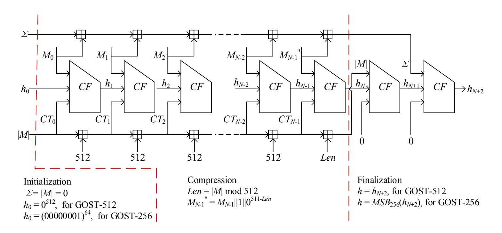
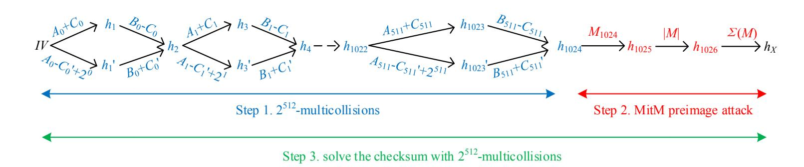
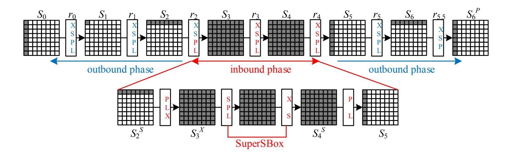
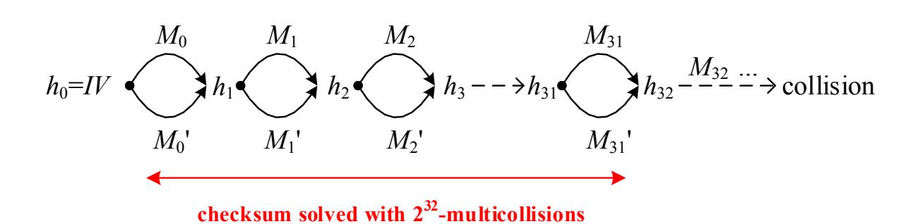
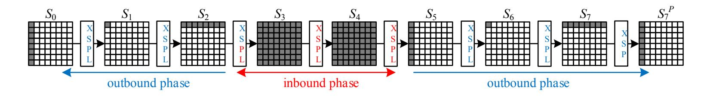
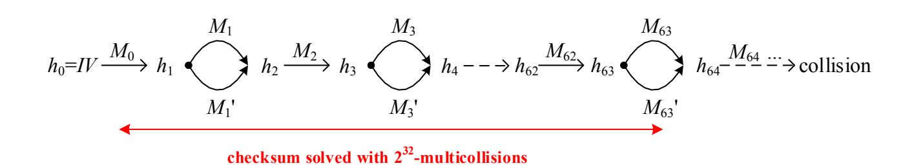
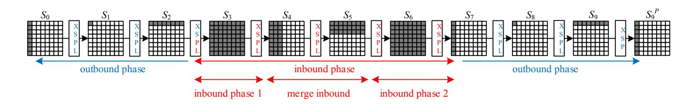
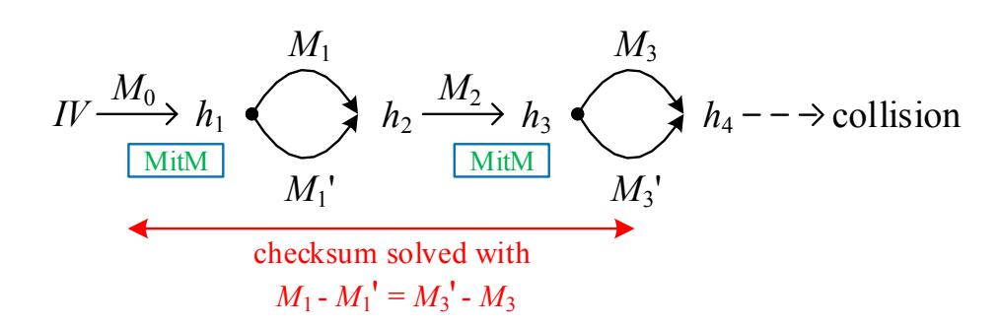
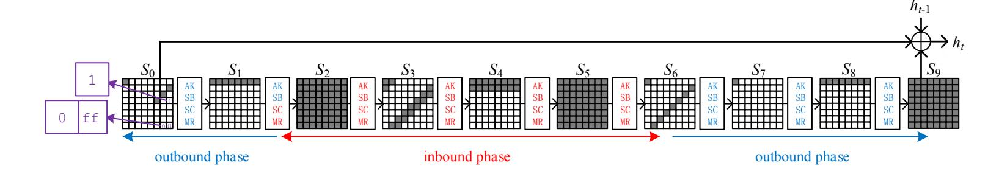
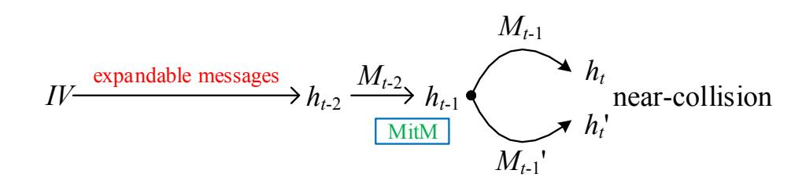

{0}------------------------------------------------

# Improved Cryptanalysis on Reduced-Round GOST and Whirlpool Hash Function (Full Version)?

Bingke Ma1,2,3 , Bao Li1,2 , Ronglin Hao1,2,4 , and Xiaoqian Li1,2,3

1State Key Laboratory of Information Security, Institute of Information Engineering, Chinese Academy of Sciences, Beijing, 100093, China 2Data Assurance and Communication Security Research Center, Chinese Academy of Sciences, Beijing, 100093, China {bkma,lb,xqli}@is.ac.cn 3University of Chinese Academy of Sciences, Beijing, China 4Department of Electronic Engineering and Information Science, University of Science and Technology of China, Hefei, 230027, China haorl@mail.ustc.edu.cn

Abstract. The GOST hash function family has served as the new Russian national hash standard (GOST R 34.11-2012) since January 1, 2013, and it has two members, i.e., GOST-256 and GOST-512 which correspond to two different output lengths. Most of the previous analyses of GOST emphasize on the compression function rather than the hash function. In this paper, we focus on security properties of GOST under the hash function setting. First we give two improved preimage attacks on 6-round GOST-512 compared with the previous preimage attack, i.e., a time-reduced attack with the same memory requirements and a memoryless attack with almost identical time. Then we improve the best collision attack on reduced GOST-256 (resp. GOST-512) from 5 rounds to 6.5 (resp. 7.5) rounds. Finally, we construct a limited-birthday distinguisher on 9.5-round GOST using the limited-birthday distinguisher on hash functions proposed at ASIACRYPT 2013. An essential technique used in our distinguisher is the carefully chosen differential trail, which can further exploit freedom degrees in the inbound phase when launching rebound attacks on the GOST compression function. This technique helps us to reduce the time complexity of the distinguisher significantly. We apply this strategy to Whirlpool, an ISO standardized hash function, as well. As a result, we construct a limited-birthday distinguisher on 9-round Whirlpool out of 10 rounds, and reduce the time complexity of the previous 7-round distinguisher. To the best of our knowledge, all of our results are the best cryptanalytic results on GOST and Whirlpool in terms of the number of rounds analyzed under the hash function setting.

Keywords: hash function, GOST, Whirlpool, multicollision, preimage, collision, limitedbirthday distinguisher

### 1 Introduction

A hash function takes a message of arbitrary length and produces a bit string of fixed length. For a hash function, three classical security notions are mainly considered: collision resistance, second preimage resistance, and preimage resistance. Many nowaday hash functions divide messages into many blocks and process each block with a compression function iteratively, such as the Merkle-Damg˚ard [\[5,](#page-17-0)[24\]](#page-18-0) based hash functions. Security properties of the underlying compression functions are also considered by cryptanalysts, and sometimes they do have impacts on the security properties of the hash functions.

? This article is the full version of the paper published at ACNS 2014.

{1}------------------------------------------------

An example was shown in a recent work [\[13\]](#page-17-1) by Iwamoto et al., in which a semi-freestart collision attack on the compression function can be turned into a limited-birthday distinguisher on the hash function.

The old GOST R 34.11-94 hash function [\[10\]](#page-17-2) was theoretically broken in 2008 [\[20](#page-17-3)[,21\]](#page-18-1). As a consequence, the new GOST R 34.11-2012 hash function [\[6,](#page-17-4)[11,](#page-17-5)[15\]](#page-17-6) has replaced GOST R 34.11-94 as the new Russian national hash standard since January 1, 2013. GOST R 34.11-2012 shares a lot of its structure with the broken GOST R 34.11-94, while its internal compression function is very similar to the one of the ISO standardized hash function Whirlpool [\[3,](#page-17-7)[12\]](#page-17-8). The main differences between GOST and Whirlpool are the number of rounds and the transposition operations.

Several cryptanalytic results [\[1](#page-17-9)[,2,](#page-17-10)[29\]](#page-18-2) have been presented for the new GOST hash function, but most of them only focus on the GOST compression function rather than the hash function, except for a recent work by Zou et al. [\[31\]](#page-18-3). They presented collision attacks on 5 rounds of all variants of GOST and a preimage attack on 6-round GOST-512 out of 12 rounds. For Whirlpool, there are several cryptanalytic results concerning the compression function [\[22](#page-18-4)[,18](#page-17-11)[,19](#page-17-12)[,28\]](#page-18-5). While at the hash function level, the best collision [\[19\]](#page-17-12) and preimage [\[28\]](#page-18-5) attacks only reach 5.5 and 6 rounds out of 10 rounds, and a 7-round limited-birthday distinguisher on Whirlpool was given in [\[13\]](#page-17-1) recently.

Our Contributions. In this paper, we look into the similarities and differences of GOST and Whirlpool, and improve previous attacks on GOST and Whirlpool under the hash function setting. First we give two improved preimage attacks on 6-round GOST-512 compared to [\[31\]](#page-18-3), i.e., a time-reduced attack with the same memory requirements and a memoryless attack with almost identical time. Then by discovering the weakness of the transposition operation of GOST, we present a 6.5-round collision attack on GOST-256 and a 7.5-round attack on GOST-512, while previous results only reach 5 rounds. Finally, we construct a limited-birthday distinguisher [\[13\]](#page-17-1) on 9.5-round GOST. A very essential part of our distinguisher is the carefully chosen truncated differential trail, which reduces the time complexity of the distinguisher significantly. We apply similar strategy to Whirlpool, and achieve a 9-round limited-birthday distinguisher. The time complexity of the previous 7-round distinguisher [\[13\]](#page-17-1) is reduced as well. As far as we know, these are the best results on GOST and Whirlpool in terms of the number of rounds analyzed under the hash function setting. Our results and some representative previous works are summarized in Table [1.](#page-2-0)

The rest of this paper is organized as follows: In Section 2, we give brief description of the GOST hash function and the tools used in this paper. In Section 3, we present improved preimage attacks on 6-round GOST-512. In Section 4, we show collision attacks on both GOST variants. In Section 5, limited-birthday distinguishers on reduced-round GOST and Whirlpool are given. We conclude and summarize the paper in Section 6.

### 2 Preliminaries

#### 2.1 The GOST Hash Function

The GOST hash function takes any message up to 2512 bits as input, and outputs a 256- or 512-bit hash value, i.e., GOST-256 and GOST-512. GOST-512 and GOST-256 are almost

{2}------------------------------------------------

| Target                  | Attack Type                    | Rounds | Time      | Memory    | Ideal     | Reference   |
|-------------------------|--------------------------------|--------|-----------|-----------|-----------|-------------|
| GOST-256                | Collision Attack               | 5      | $2^{122}$ | $2^{64}$  | $2^{128}$ | [31]        |
| (12 Rounds)             |                                | 6.5    | $2^{125}$ | $2^{64}$  |           | Section 4.1 |
| GOST-512 (12 Rounds) | Preimage Attack                | 6      | $2^{505}$ | $2^{64}$  | $2^{512}$ | [31]        |
|                         |                                | 6      | $2^{496}$ | $2^{64}$  |           | Section 3   |
|                         |                                | 6      | $2^{504}$ | $2^{11}$  |           | Section 3   |
|                         | Collision Attack               | 5      | $2^{122}$ | $2^{64}$  | $2^{256}$ | [31]        |
|                         |                                | 7.5    | $2^{181}$ | $2^{64}$  |           | Section 4.2 |
|                         | Limited-birthday               | 9.5    | $2^{441}$ | $2^{136}$ | $2^{449}$ | Section 5.1 |
|                         | Distinguisher                  |        |           |           |           |             |
| Whirlpool (10 Rounds)   | Collision Attack               | 5.5    | $2^{120}$ | $2^{64}$  | $2^{256}$ | [19]        |
|                         | Preimage Attack                | 6      | $2^{481}$ | $2^{256}$ | $2^{512}$ | [28]        |
|                         | Limited-birthday Distinguisher | 7      | $2^{440}$ | $2^{128}$ | $2^{505}$ | [13]        |
|                         |                                | 7.5    | $2^{368}$ | $2^{144}$ | $2^{497}$ | Section 5.2 |
|                         |                                | 9      | $2^{354}$ | $2^{158}$ | $2^{385}$ | Section 5.2 |

Table 1. Comparison of Previous and Our Results on GOST and Whirlpool

the same, except that they have different initial values, and GOST-256 truncates the final 512-bit chaining value into a 256-bit digest. As depicted in Fig. 1, the GOST hash function family adopts the Merkle-Damgård structure with a unique output transformation. The hash computation contains three stages. Before we give specific descriptions of each stage, we define several notations.

A||B| The concatenation of two bit strings A and B.

M The input message, which is divided into 512-bit blocks.

 $M_i$  The *i*-th 512-bit message block of M.

|M| The bit length of M.

Len The bit length of the last message block of M.

 $\Sigma$  The 512-bit checksum of all message blocks.

CF The compression function.

 $h_i$  The *i*-th 512-bit chaining variable.

 $CT_i$  The *i*-th 512-bit counter which denotes the total message bits processed before the *i*-th CF call.

In the initialization stage, M is padded into a multiple of 512 bits, i.e.,  $M||1||0^*$  is the padded message, which is then divided into N 512-bit blocks  $M_0||M_1||...||M_{N-1}$ .  $h_0$  is assigned to the predefined IV of GOST-256 or GOST-512. |M|,  $\Sigma$  and  $CT_0$  are assigned to 0. In the compression stage, each block  $M_i$  is processed iteratively, i.e.,  $h_{i+1} = CF(h_i, M_i, CT_i)$  for i = 0, 1, ..., N-1. After each compression function computation,  $|M|, \Sigma$  and  $CT_{i+1}$  are updated accordingly. In the finalization stage, the immediate chaining value of the last message block  $h_N$  goes through the output transformation, i.e.,  $h_{N+1} = CF(h_N, |M|, 0)$ ,  $h_{N+2} = CF(h_{N+1}, \Sigma, 0)$ . For GOST-256 (resp. GOST-512),  $MSB_{256}(h_{N+2})$  (resp.  $h_{N+2}$ ) is the hash value of M.

The compression function  $CF(h_i, M_i, CT_i)$  can be seen as an AES-like block cipher  $E_K$  used in a Miyaguchi-Preneel-like mode, i.e.,  $CF(h_i, M_i, CT_i) = E_{h_i \oplus CT_i}(M_i) \oplus M_i \oplus h_i$ . As for the block cipher  $E_K$ , a 512-bit internal state is denoted as an  $8 \times 8$  byte matrix. For the key schedule part,  $h_i \oplus CT_i$  is assigned as the key K, then  $K_0$  is computed from

{3}------------------------------------------------

#### 4 B. Ma et al.

Fig. 1. Three Stages of the GOST Hash Function

K as follows:

$$K_0 = L \circ P \circ S(K)$$

The round keys  $K_1, K_2, ..., K_{12}$  are generated as follows:

$$K_{j+1} = L \circ P \circ S \circ XC(K_j) \text{ for } j = 0, 1, 2, ...11,$$

where  $K_{12}$  is used as the post-whitening key:

- AddRoundConstant(XC): XOR a 512-bit constant predefined by the designers.
- SubBytes(S): process each byte of the state through the SBox layer.
- **Transposition(P):** transpose the k-th column of the state matrix to be the k-th row for k = 0, 1, 2, ..., 7, *i.e.*, transposition of the state matrix.
- MixRows(L): multiply each row of the state matrix by an MDS matrix.

For the data processing part,  $M_i$  is the plaintext, and is assigned to the initial state  $S_0$ . Then the state is updated 12 times with the round function as follows:

$$S_{j+1} = L \circ P \circ S \circ X(S_j), \text{ for } j = 0, 1, 2, ... 11,$$

where  $\mathbf{AddRoundKey}(\mathbf{X})$  XOR the state with the round key  $K_j$ . Finally, the ciphertext  $E_K(M_i)$  is computed with  $S_{12} \oplus K_{12}$ .

**Notations.** The round indexes of GOST are denoted with  $r_0, r_1, r_2, ..., r_{11}$ . The input state of round  $r_j$  is denoted as  $S_j$ , and  $S_j^X$ ,  $S_j^S$ ,  $S_j^P$ ,  $S_j^L$  denote the corresponding state after the **X**, **S**, **P**, **L** operation of round  $r_j$  respectively, *i.e.*,  $S_{j+1} = S_j^L$ .

#### 2.2 The Multicollision Attack and Its Applications

The t-multicollisions are t-tuples of messages which all hash to the same value. In [14], Joux gave the multicollision attack on iterated hash functions. He shows that constructing  $2^t$ -collisions costs only t times as much as building ordinary 2-collisions.

The multicollision attack has been used in many occasions. A variant of the multicollision attacks, known as the expandable messages [16], was applied in second preimage attacks. Moreover, the expandable messages were also used to construct long preimages

{4}------------------------------------------------

[30,28]. Another application of the multicollision attacks was given in [8] to attack Merkle-Damgård-like hash functions with linear-XOR or additive checksum operations.

#### 2.3 Limited-birthday Distinguisher on Hash Functions

The limited-birthday problem was first proposed by Gilbert and Peyrin in [9], and they also presented a generic procedure to solve this problem. In [13], Iwamoto et al. proved that the generic attack given in [9] is actually the best generic attack possible. Moreover, they proposed a new generic distinguisher for Merkle-Damgård-like hash functions based on the limited-birthday problem. Now we give brief descriptions of the limited-birthday problem for hash functions and the new distinguisher derived.

**The Limited-birthday Problem.** [13] "Let h be an n-bit output hash function, and process any input messages of fixed size, m bits where  $m \ge n$ . Let IN be a set of admissible input differences and OUT be a set of admissible output differences, with the property that IN and OUT are closed sets with respect to  $\oplus^1$ . Then for the limited-birthday problem, the goal of the adversary is to generate a message pair (M, M'), such that  $M \oplus M' \in IN$  and  $h(M) \oplus h(M') \in OUT$ " for a randomly chosen instance of h."

Note that IN and OUT can be freely chosen by the adversary, let  $2^I$  and  $2^O$  denote the sizes of IN and OUT respectively, it is proved in [13] that the lower bound of the time complexity of the limited-birthday problem for a one-way function is

$$max\{2^{\frac{n-O+1}{2}}, 2^{n-I-O+1}\}.$$

The Limited-birthday Distinguisher on Hash Functions. Let h be an n-bit hash function which iteratively calls CF to process each fixed length message block, where CF is a compression function which takes an m-bit message and a k-bit  $(k \ge n)$  chaining variable as inputs, and outputs a k-bit chaining value. A semi-free-start collision for CF is a pair ((CV, M), (CV, M')) with  $M \ne M'$  and a freely chosen CV, such that CF(CV, M) = CF(CV, M'). Assume that the adversary is able to find  $2^s$  distinct semi-free-start collisions of CF in  $2^c$  time, with  $s \le k/2$  and  $s \le c$ . IN corresponds to the set of all possible differences for all the colliding messages, a limited-distinguisher on h can be derived as follows:

- 1. Generate  $2^s$  semi-free-start collisions  $\{(CV_j, M_j), (CV_j, M'_j)\}$  on CF with  $2^c$  operations, and store all  $2^s$   $CV_j$  values in a list  $TL_1$ .
- 2. From IV, pick  $2^{k-s}$  random message blocks  $\{M_i\}$ , and compute the corresponding chaining values  $\{h_i\}$ .
- 3. For each  $h_i$ , check whether it is in the list  $TL_1$ . If so, the message couple  $((M_i||M_j), (M_i||M_j'))$  is a collision pair of the hash function.

The above procedure needs  $2^c + 2^{k-s}$  computations. The adversary outputs the collision couple, whose input difference mask lies in a space IN of size  $2^I$ , and output difference mask lies in a space OUT of size 1 (due to the collision). The limited-birthday problem tells us that this should require  $max\{2^{n/2}, 2^{n-I+1}\}$  queries in the ideal case. Since  $2^c + 2^{k-s} \ge 1$ 

The  $\oplus$  operation can be replaced by any other group operation, we use  $\oplus$  for a simple specification.

{5}------------------------------------------------

 $2^s + 2^{k-s} \ge 2^{k/2} \ge 2^{n/2}$ , the above procedures can be seen as a valid distinguisher if and only if

$$2^c + 2^{k-s} < 2^{n-I+1}.$$

It is also described in [13] that one can even derive a valid limited-birthday distinguisher from a semi-free-start near-collision attack, when the near-collision is located in the last message block and padding can be satisfied.

### 3 Improved Preimage Attack on 6-Round GOST-512

In this section, we improve the preimage attack on 6-round GOST-512 in [31]. First we reduce the time complexity from  $2^{505}$  to  $2^{496}$  by removing the unnecessary Meet-in-the-Middle (MitM) step. Then we show a memoryless attack with time complexity  $2^{504}$ . Moreover, by using the technique in [8] to build more complicate multicollisions, we deal with the checksum straightforwardly with success probability 1 while Zou's attack deals with it probabilisticly. Before describing our attacks, we clarify that a single compression function computation (resp. a 512-bit storage which is the bit size of the state) is used as the basic unit of time (resp. memory) in this paper.

The MitM preimage attack on GOST-like compression functions has been well studied [27,30,28,31], thus we use the results without providing more details. As depicted in Fig. 2, our preimage attack is divided into three steps. The specific procedures of each step are described as follows:

Fig. 2. 3 Steps of the Preimage Attacks on 6-round GOST-512

**Step 1.** From IV, use the technique of [8] to build  $2^{512}$ -multicollisions. The exact steps are as follows:

- 1. Let  $h_0 = IV$ .
- 2. For i = 0 to 511:
  - (a) Let  $A_i, B_i$  be two random blocks.
  - (b) For j = 0 to  $2^{256} 1$ :
    - i.  $X[j] = (A_i + j)||(B_i j).$
    - ii.  $X'[j] = (A_i j + 2^i)||(B_i + j).$
    - iii. Let  $Y_i[j]$  denote immediate hash value of X[j] from  $h_{2i}$ , store it in the list  $Y_i$ .
    - iv. Let  $Y_i'[j]$  denote immediate hash value of X'[j] from  $h_{2i}$ , store it in the list  $Y_i'$ .
  - (c) Search for a collision in  $Y_i$  and  $Y'_i$ . Let  $M_{2i}||M_{2i+1} = (A_i + C_i)||(B_i C_i)$  and  $M'_{2i}||M'_{2i+1} = (A_i C'_i + 2^i)||(B_i + C'_i)|$  denote the collision pair, and  $h_{2(i+1)}$  denote the collision hash value.

{6}------------------------------------------------

In the end,  $h_{1024}$  is the hash value of the  $2^{512}$ -multicollisions.

**Step 2.** We randomly choose the value of an additional message block  $M_{1024}$ , and make sure  $M_{1024}$  satisfy padding. Without loss of generality, we fix the last bit of  $M_{1024}$  to '1', then the bit length of the message can be denoted as  $|M| = 1024 \times 512 + 511 = 524799$ . From  $h_{1024}$ , we compute the immediate chaining value  $h_{1026}$  with  $M_{1024}$  and |M|. Suppose that  $h_X$  is the target value. We find a preimage  $\Sigma(M)$  using the MitM preimage attack with a probability  $1 - e^{-1}$ . If no candidate for  $\Sigma(M)$  is found, we just choose another value of  $M_{1024}$  and repeat Step 2.

**Step 3.** Step 2 will eventually succeed, thus we get the checksum value  $\Sigma(M)$ , and need to find a combination of the first 1025 message blocks to satisfy  $\Sigma(M)$ . This problem has already been well studied in [8], and the exact steps are as follows:

- 1. Let  $CCS = h_X M_{1024}$  denote the checksum which is desired.
- 2. Compute  $Q = \sum_{i=0}^{511} (A_i + B_i)$ . 3. Compute  $D = CCS Q = \sum_{i=0}^{511} k_i 2^i$ , the  $k_i$  sequence is the binary representation of D.
- 4. Set M to an empty message.
- 5. For i = 0 to 511:
  - (a) If  $k_i = 0$ , then  $M = M||M_{2i}||M_{2i+1}$ .
  - (b) Else  $M = M||M'_{2i}||M'_{2i+1}$ .
- 6.  $M = M||M_{1024}$ .

At the end of this phase, M contains a sequence of 1025 blocks which corresponds to the desired checksum. Thus M is a preimage of  $h_X$ .

Memoryless Collision Search. In Step 1, we need to launch the collision search 512 times, and a common birthday attack would require  $2^{256}$  memory. Thanks to the memoryless MitM (collision) attacks2 [26,25] [23, Remark 9.93], the memory requirement can be reduced to  $2^{11}$  (since the collision pairs and the immediate hash values need to be stored). The specific steps for each collision search are as follows:

- 1. Denote  $h_{2i}$  as the initial hash value of the *i*-th collision search.
- 2. Randomly choose two message blocks  $A_i, B_i$ .
- 3. Let  $s_0$  denote the immediate hash value of  $A_i||B_i$  from  $h_{2i}$ .
- 4. For j = 0 to  $2^{256}$ 
  - (a) If the least significant bit of  $s_j$  is 0, compute  $s_{j+1}$ , which is the immediate hash value of  $(A_i + s_j)||(B_i - s_j)$  from  $h_{2i}$ .
  - (b) Else compute  $s_{j+1}$ , which is the immediate hash value of  $(A_i s_j + 2^i)||(B_i + s_j)||$ from  $h_{2i}$ .

Finally, the attacker detects the cycle of the above procedure, and finds intersection point of the cycle. We denote  $s_{\alpha}$  and  $s_{\beta}$  as the two points before the intersection point. If the least significant bit of  $s_{\alpha}$  and  $s_{\beta}$  are distinct, without loss of generality, we suppose the least significant bit of  $s_{\alpha}$  is 0 and the least significant bit of  $s_{\beta}$  is 1, then  $(A_i + s_{\alpha}) || (B_i - s_{\alpha})$ and  $(A_i - s_\beta + 2^i)||(B_i + s_\beta)|$  are the collision message blocks desired. The time complexity

&lt;sup>2 The memoryless attacks are based on cycle detection techniques such as Floyd's cycle-finding algorithm [7] or Brent's algorithm [4].

{7}------------------------------------------------

is at most 23 times[3](#page-7-0) more than the generic birthday attack. Thus we need a total 1024 × 2 3 × 2 256 = 2269 compression function computations and 211 memory to generate the 2 512-multicollisions.

Memoryless Meet-in-the-Middle Preimage Attack. The memoryless MitM preimage attack, explored by Khovratovich et al. in [\[17\]](#page-17-19), is based on the classical memoryless MitM technique [\[25\]](#page-18-9). Similar to the memoryless MitM preimage attack on Whirlpool in [\[28\]](#page-18-5), we can launch a memoryless MitM preimage attack on the GOST compression function with 2504 computations. Please refer to [\[28,](#page-18-5)[31\]](#page-18-3) for more details.

Now we consider the overall complexity of our attack. Step 1 can be done with 2269 compression function calls and 211 memory. As for step 2, we need 2496 time and 264 memory to minimize the time complexity or 2504 time to launch the memoryless attack. There are only a few simple operations in step 3, both time and memory are negligible. So it takes 2496 time and 264 memory or 2504 time and 211 memory to find a single preimage of 6-round GOST-512.

Remarks. An improved preimage attack on the compression function of GOST is likely to work for the preimage attack on the hash function using the generic procedures above.

### 4 Improved Collision Attacks on Reduced-Round GOST

As far as we know, the 5-round attacks [\[31\]](#page-18-3) are the best collision attacks on GOST-256 and GOST-512 in terms of rounds attacked. In this section, we present improved collision attacks on both variants of GOST. The improved collision attacks mainly come from a direct observation of the transposition operation of GOST. First, we describe a collision attack on 6.5-round GOST-256. Then by further exploiting freedom degrees in the chaining values, we present a collision attack on 7.5-round GOST-512.

### 4.1 Collision Attack on 6.5-Round GOST-256

We first show collision attack on the compression function of GOST-256 by using the rebound attack [\[22\]](#page-18-4) and the SuperSBox technique [\[9](#page-17-16)[,18\]](#page-17-11). Then we show how to convert it to a collision attack on the GOST-256 hash function.

Attack on the Compression Function. The truncated differential trail used in our attack is depicted in Fig. [3.](#page-8-0) Since the transposition operation P has the involution property, the active columns of S0 and S P 6 will both locate at the first column. Thus, if they cancel each other, we would achieve a collision attack on the compression function. Note that the involution property of P is originally exploited in [\[29\]](#page-18-2), and will also be used in our later analyses. The whole attack can be divided into the inbound phase (in red), and the outbound phase (in blue). In the following part we describe each phase in detail.

3 The success possibility is 1/2, and using Brent's algorithm [\[4\]](#page-17-18) to detect the cycle and find the intersection point costs at most 22 times more than the generic birthday attack.

{8}------------------------------------------------

Fig. 3. Collision Attack on 6.5-Round GOST-256 Compression Function

**Inbound Phase.** We need to find two states which follow the two middle rounds from  $S_2^S$  to  $S_5$ . It can be summarized as follows.

- 1. We start from picking a random nonzero difference of  $S_2^S$  at the 8-byte active positions indicated in Fig. 3. Since all the operations between  $S_2^S$  and  $S_3^X$  are linear, we can propagate the difference forwards to  $S_3^X$ . The states between  $S_3^X$  and  $S_4^S$  can be seen as eight parallel SuperSBoxes, and the input to each SuperSBox is the corresponding row of  $S_3^X$ . For each SuperSBox, we enumerate all  $2^{64}$  pairs of inputs according to the difference of  $S_3^X$ , and calculate the corresponding output differences of the SuperSBox. Store all the output differences and corresponding pairs of values in a table for each SuperSBox. This step requires  $2^{64}$  time and  $2^{64}$  memory.
- 2. Pick a random nonzero difference of  $S_5$  at the 8-byte active positions, and propagate the difference backwards to  $S_4^S$ . Note that this can be repeated for all  $255 = 2^8 1$  nonzero differences of each active byte in each row independently.
- 3. Now we have to connect the states  $S_3^X$  and  $S_4^S$  such that the differential trail holds, and this can be done for each row independently. For each SuperSBox, we search the corresponding difference of  $S_4^S$  in the table built in step 1. Since we have  $2^{64}$  values in each table, and we need to match a 64-bit difference value, the expected number of solutions is 1.
- 4. We can repeat step 2 and step 3 with another nonzero difference of  $S_5$ . After enumerating all  $2^{64}$  differences of  $S_5$ , we expect to get  $2^{64}$  solutions. Combining with the complexity of step 1, the above procedures require  $2^{64}$  time and  $2^{64}$  memory to generate  $2^{64}$  solutions. In other words, the expected time needed to get one solution is only 1.

If the number of solutions of the inbound phase is insufficient, we can repeat step 1-4 with another difference of  $S_2^S$ . Since there are  $2^{64}$  differences for  $S_2^S$ , we can generate at most  $2^{64+64} = 2^{128}$  solutions for the inbound phase.

**Outbound Phase.** We use the solutions of the inbound phase and propagate them forwards and backwards. The outbound phase has one  $8 \to 1$  transition, and we need to match a 64-bit difference between  $S_0$  and  $S_6^P$ , so it requires  $2^{56+64} = 2^{120}$  computations to find one collision for the 6.5-round compression function.

{9}------------------------------------------------

Impact of the DDT of the GOST SBox. The DDT (Difference Distribution Table) of the SBox is the core of the rebound attack. The SBox of GOST is not as balanced as the AES SBox. In fact, its maximal differential probability reaches  $2^{-5}$  while the one of the AES SBox is  $2^{-6}$ . Thus, the matching probability of the GOST SBox is lower than the AES SBox, which might introduce some small biases. However, as discussed in [28], the DDT has no impacts on the expected number of solutions for a random difference pair of an SBox. Hence, the time complexity is not increased if we need to find many solutions from the inbound phase.

Attack on the Hash Function. Similar to the technique of [31], we extend the attack on the compression function to the hash function. Since we aim to construct two collision messages with identical length, we only need to deal with the final checksums. As depicted in Fig. 4, we first build  $2^{32}$ -multicollisions, then find two message chains with an identical checksum. The exact steps are as follows:

Fig. 4. Collision Attack on 6.5-round GOST-256

- 1. Start from the initial value  $h_0 = IV$ : For j = 0 to 31,
  - Find two messages  $M_j$  and  $M'_j$  using the compression function collision attack above, such that  $CF(h_j, M_j) = CF(h_j, M'_j)$ , and let  $h_{j+1} = CF(h_j, M_j)$ . Notice that  $(M_j, M'_j)$  differs only in the first column.
- 2. After step 1, we build  $2^{32}$ -multicollisions from  $h_0$  to  $h_{32}$ . Since each collision pair only differs in the first column, besides the identical parts of the  $2^{32}$ -multicollisions always have identical sums including carries, the difference of their checksums lies in a space whose size is at most  $2^{64}$ . We can generate  $2^{32}$  checksums with the  $2^{32}$ -multicollisions. According to the birthday paradox, we expect to find one collision among these checksums. Then we append any identical message blocks which satisfy padding, and finally construct a collision on the GOST-256 hash function.

In the above procedures, collision attack on the compression function is repeated 32 times, so the overall time complexity of the collision attack on GOST-256 is  $32 \times 2^{120} = 2^{125}$  which is lower than the birthday bound  $2^{128}$ . The memory requirement stays  $2^{64}$  due to the SuperSBox technique.

### 4.2 Collision Attack on 7.5-Round GOST-512

The collision attack on GOST-256 can be directly applied to GOST-512 with the same complexity, but in this part we show how to extend one more round for GOST-512. The

{10}------------------------------------------------

differential trail of the 7.5-round attack on the compression function is depicted in Fig. 5. Again the inbound phase can provide at most  $2^{128}$  solutions with  $2^{128}$  time and  $2^{64}$  memory. But there are two  $8 \to 1$  transitions in the outbound phase, and we need to match a 64-bit difference between  $S_0$  and  $S_7^P$  in order to get a collision, thus we need at least  $2^{56+56+64} = 2^{176}$  solutions from the inbound phase. The freedom degree of the inbound phase is obviously insufficient, and the attack will only succeed with a very low probability  $2^{128-176} = 2^{-48}$ .

Fig. 5. Collision Attack on 7.5-round GOST-512 Compression Function

Luckily, we can exploit more freedom degrees by choosing different chaining values as depicted in Fig. 6. More precisely, we launch a two-block attack on the compression function. First, from a chaining value  $h_{2i}$ , we randomly choose a message block  $M_{2i}$  and compute the corresponding chaining variable  $h_{2i+1}$ . Then we launch the rebound attack with the value of  $h_{2i+1}$  and check if a collision pair  $(M_{2i+1}, M'_{2i+1})$  is obtained. If no collision is achieved, we choose another value for  $M_{2i}$  and repeat this procedure. Since the collision attack succeeds with probability  $2^{-48}$ , we expect to get one collision after we randomly choose  $2^{48}$  different values for  $M_{2i}$ . Hence, the rebound attack needs to be repeated  $2^{48}$  times, and the time and memory required are  $2^{48+128} = 2^{176}$  and  $2^{64}$  respectively.

Fig. 6. Collision Attack on 7.5-round GOST-512

As depicted in Fig. 6, we build  $2^{32}$ -multicollisions by repeating the compression function attack 32 times. According to the birthday paradox, we expect to get two messages with identical checksum from the  $2^{32}$ -multicollisions, and derive a collision for the GOST-512 hash function. Thus the time complexity is  $32 \times 2^{176} = 2^{181}$ , while the memory requirement remains  $2^{64}$ . Note that when the same strategy is applied to GOST-256, the time complexity is beyond the birthday attack bound  $2^{128}$ .

# 5 Limited-Birthday Distinguishers on GOST-512 and Whirlpool

In this section, we build limited-birthday distinguishers for reduced-round GOST-512 and Whirlpool. It is indicated in [13] that if a better balance is achieved between the total num-

{11}------------------------------------------------

ber of semi-free-start collisions one can generate and the average complexity to generate one collision, a better limited-birthday distinguisher can be derived. Therefore, we try to achieve a better balance between attack parameters by choosing the differential trails used in the inbound phase carefully. This is actually a very essential idea of our distinguishers. We launch a 9.5-round semi-free-start collision attack on GOST-512 compression function with a differential trail, which is different from previous trails for collision-like attacks. As a result, we build a valid limited-birthday distinguisher on 9.5-round GOST-512. The very same strategy can be applied to Whirlpool as well. With the expandable messages [16], we are able to convert a semi-free-start near-collision attack on 9-round Whirlpool compression function into a valid distinguisher for 9-round Whirlpool hash function. We also reduce the time complexity of the previous distinguisher on 7-round Whirlpool [13].

#### 5.1 Limited-Birthday Distinguisher on 9.5-Round GOST-512

Semi-free-start Collision Attack on the GOST Compression Function. The differential trail used in the 9.5-round semi-free-start collision attack on the GOST-512 compression function conforms to the following form:

$$8 \xrightarrow{r_0} 1 \xrightarrow{r_1} 8 \xrightarrow{r_2} 64 \xrightarrow{r_3} 8x \xrightarrow{r_4} 8x \xrightarrow{r_5} 64 \xrightarrow{r_6} 8 \xrightarrow{r_7} 1 \xrightarrow{r_8} 8 \xrightarrow{r_{8.5}} 8$$

where x = 1, 2, ..., 8 and denotes the number of active rows (columns) in the middle rounds. Fig. 7 depicts the trail when x = 3. Suppose there are 8x active bytes in the middle parts of the trail, we describe the attack in detail.

Fig. 7. Semi-free-start Collision Attack on 9.5-Round GOST-512 Compression Function

**Inbound Phase.** We aim to connect both differences and actual values between  $S_2^S$  and  $S_7$ . The inbound phase is divided into two subinbound phases, and the merge inbound phase merges the two subinbound phases.

- 1. **Phase 1.** We find states connecting  $S_3^X$  and  $S_4$ .
  - (a) We start with a random difference of  $S_4$ , and propagate the difference backwards to  $S_3^S$ .
  - (b) Choose a random difference of  $S_2^S$ . Since all the operations between  $S_2^S$  and  $S_3^X$  are linear, we can propagate the difference forwards to  $S_3^X$ , and match it with the difference of step 1(a) through the SBox layer. Notice the match can be done for each row independently. We have 255 different values for each active byte  $S_2^S$ , and expect to get one difference match and each match provides  $2^8$  solutions. So it takes  $2^9$  operations to find  $2^8$  solutions of  $S_3^X$  and  $S_4$  for each row. After enumerating all  $2^{64}$  differences of  $S_2^S$  for each row independently, we expect to get  $2^{64}$  solutions in  $2^9$  computations.

{12}------------------------------------------------

- 2. Subinbound Phase 2. We find states connecting  $S_6^X$  and  $S_7$ .
  - (a) Start with a random difference of  $S_5^S$ . Since all the operations between  $S_5^S$  and  $S_6^X$  are linear, we can propagate the difference forwards to  $S_6^X$ .
  - (b) Choose a random difference of  $S_7$  and propagate the difference backwards to  $S_6^S$ , match it with the difference of step 2(a) through the SBox layer. Again, we expect to get  $2^{64}$  solutions of  $S_6^X$  and  $S_7$  after enumerating all  $2^{64}$  differences of  $S_7$  in  $2^9$  computations.
- 3. Merge Inbounds. We need to connect the actual values of  $S_4$  and  $S_6^X$  obtained from the two subinbound phases. That is, we need to find solutions for the following equation using the freedom degrees of the key:

$$L \circ P \circ S(L \circ P \circ S(S_4 \oplus K_4) \oplus K_5) \oplus K_6 = S_6^X, \tag{1}$$

where  $K_4, K_5 = L \circ P \circ S(K_4 \oplus C_4), K_6 = L \circ P \circ S(K_5 \oplus C_5)$  denote the round keys, and  $C_4, C_5$  denote the round constants in the key schedule. Equation (1) can be rewritten as:

$$S(L \circ P \circ S(S_4 \oplus K_4) \oplus K_5) \oplus S(K_5 \oplus C_5) = P^{-1} \circ L^{-1}(S_6^X).$$
 (2)

Notice equation (2) can be solved column by column independently. We denote the left half and the right half of equation (2) with  $V_L$  and  $V_R$  respectively. The merge inbounds phase is then as follows:

- (a) Enumerate all  $2^{64}$  values of each column of  $S_4$  and all  $2^{64}$  values of the corresponding column of  $K_4$ , propagate forwards to get the corresponding values of  $V_L$ . Store all the pairs in tables and sort them by the value of  $S_4||V_L$ . The size of the tables is  $2^{128}$ . This step requires  $2^{128}$  time and  $2^{128}$  memory, and the precomputed tables can be reused in later attacks. Notice that we omit the precomputation part in the complexity analysis of our distinguishers, since the precomputation part is not the dominated part.
- (b) For each pair  $(S_4, S_6^X)$ , we compute the value of  $V_R$  with  $S_6^X$  and check whether  $S_4||V_R$  is in the tables built in step 3(a). Notice that  $K_4$  provides  $2^{64}$  freedom degrees per column in the matching part. For each active column of  $S_4$ , we need to match two 64-bit values with probability  $2^{64-128} = 2^{-64}$ . For each non-active column, we need to match one 64-bit value and expect to find one match. Hence, if there are x active columns in  $S_4$ , the matching probability is  $2^{-64x}$ . Notice that we have generated  $2^{64}$  pairs of  $S_4$  in step 1, and  $2^{64}$  pairs of  $S_6^X$  in step 2, thus we expect to get  $2^{64+64-64x} = 2^{64(2-x)}$  solutions. This step requires  $2^{64}$  table lookups, and the average complexity to find one solution is  $2^{64-64(2-x)} = 2^{64(x-1)}$ .
- (c) After we connect the values of  $S_4$  and  $S_6^X$  for each column of  $S_4$  independently, we propagate both forwards and backwards to  $S_2^S$  and  $S_7$ , thus derive a solution for the inbound phase.
- 4. If the solutions of the inbound phase are not enough, we can repeat the above steps from step 1(a) with another difference of  $S_4$ . If the solutions are still insufficient, we can repeat the above steps from step 2(a) with another difference of  $S_5^S$ . Since there are x active columns in  $S_4$  and x active rows in  $S_5^S$ , we can repeat the above steps  $2^{64(x+x)} = 2^{128x}$  times. Each time we obtain  $2^{64(2-x)}$  solutions with  $2^{64}$  time. So the maximum number of solutions we can generate is  $2^{128x+64(2-x)} = 2^{128+64x}$ . The average complexity to find one solution remains  $2^{64(x-1)}$ .

{13}------------------------------------------------

**Outbound Phase.** The outbound phase has two  $8 \to 1$  transitions, and we need to match a 64-bit difference, so it requires  $2^{56 \times 2 + 64} = 2^{176}$  computations to find one collision for the 9.5-round compression function.

Combining the results of the inbound phase and the outbound phase together, we deduce that we can generate at most  $2^{128+64x-176} = 2^{64x-48}$  semi-free-start collisions, and the average complexity to find one collision is  $2^{64(x-1)+176} = 2^{64x+112}$ .

The Limited-Birthday Distinguisher on 9.5-Round GOST-512. In order to apply the limited-birthday distinguisher on GOST-like hash functions, we have to deal with the message checksums, *i.e.*, we need to find two message chains with identical length and checksum. As depicted in Fig. 8, we can solve this problem with two MitM procedures. The specific steps are as follows:

Fig. 8. Limited-Birthday Distinguisher on 9.5-Round GOST-512

- 1. We find  $2^y$  semi-free-start collisions, and store the corresponding chaining variables  $h_{1,i}$  and message pairs  $(M_{1,i}, M'_{1,i})$  in a table  $TL_1$ . Notice there are only 8 active bytes in the colliding pairs, thus the difference of the colliding pairs lies in a space whose size is at most  $2^{64}$ .
- 2. Start from IV, randomly choose  $2^{512-y}$  different values of  $M_{0,j}$ , and compute the corresponding chaining value  $h'_{1,j}$ , check whether it is in  $TL_1$ . There is a high probability that we can find a match. We denote the corresponding message pairs as  $((M_0||M_1), (M_0||M'_1))$ , and the immediate hash value as  $h_2$ .
- 3. Find all entries in  $TL_1$  which satisfy  $M_k M'_k = M'_1 M_1$ , and store all  $(M_k, M'_k)$  pairs in a table  $TL_2$ . The equation holds with a probability  $2^{-64}$ , since the difference space of the colliding pairs is at most  $2^{64}$ . There are  $2^y$  entries in  $TL_1$ , so the expected number of entries in  $TL_2$  is  $2^{y-64}$ .
- 4. Start from  $h_2$ , randomly choose  $2^{512-(y-64)}$  different values of  $M_{2,j}$ , and compute the corresponding chaining value  $h'_{2,j}$ , check whether it is in  $TL_2$ . There is a high probability that we can find a match. We denote the corresponding message pairs as  $((M_2||M_3), (M_2||M'_3))$ , and the immediate hash value as  $h_4$ .
- 5. Since  $M_1 M_1' = M_3' M_3$ , if we append any identical messages which satisfy padding to the message pairs  $((M_0||M_1||M_2||M_3), (M_0||M_1'||M_2||M_3'))$ , we get a collision pair of the hash function.

Suppose the time needed to find one semi-free-start collision is  $2^{T_1}$ , then the time complexity of the above procedure is

$$T = 2^{y+T_1} + 2^{512-y} + 2^{512-(y-64)} = 2^{y+T_1} + 2^{512-y} + 2^{576-y}.$$

{14}------------------------------------------------

Although there are two different positions in the two message chains, i.e.,  $(M_1, M_3)$  and  $(M'_1, M'_3)$ , but their values are restrained by  $M_1 - M'_1 = M'_3 - M_3$ , so we know that  $2^I = 2^{64}$ , and  $2^O = 1$ . For an ideal one-way function, find two such messages would require  $2^{n-I-O+1} = 2^{449}$  computations. If  $T < 2^{449}$ , the above procedure can be seen as a valid distinguisher on 9.5-round GOST-512.

As we mentioned above, the average time complexity to find one semi-free-start collision is  $2^{T_1} = 2^{64x+112}$ , and we can generate at most  $2^{N_1} = 2^{64x-48}$  semi-free-start collisions. Now we show how to choose the values of y and  $T_1$  which minimize the time complexity.

Two different occasions need to be considered. In the first occasion, if we can generate enough collisions, we can balance T by letting  $y + T_1 = 576 - y$ , i.e.,  $y = (576 - T_1)/2 = 232 - 32x$ . In this occasion, we need to ensure  $N_1 \geq y$ . Since both  $T_1$  and  $N_1$  can be denoted with x, we solve this inequality and get that x > 2. Then T can be rewritten as:

$$T = 2^{y+T_1+1} = 2^{232-32x+64x+112+1} = 2^{345+32x}, \text{ for } x = 3, 4, 5, 6, 7, 8.$$

On the other hand, when  $x \leq 2$ , we can't generate enough collisions, so T is dominated by  $2^{576-y}$  and we need to find all the semi-free-start collisions in order to maximize y. In this occasion, we find all the collisions, *i.e.*, let  $y = N_1 = 64x - 48$ , then T can be rewritten as:

$$T = 2^{576-y} = 2^{576-64x+48} = 2^{624-64x}, \text{ for } x = 1, 2.$$

Finally, we consider both occasions, and find out that the lowest complexity is  $2^{441}$  when x = 3. Notice  $2^{441} < 2^{449}$ , thus we build a valid limited-birthday distinguisher on 9.5-round GOST-512. Since we need to store all the collision pairs, the memory requirement is  $2^y = 2^{136}$ .

#### 5.2 Limited-Birthday Distinguishers on Reduced-Round Whirlpool

Whirlpool is an ISO standardized hash function [3,12] which takes any messages less than  $2^{256}$  bits as inputs, and outputs a 512-bit hash value. Due to the space limit, we refer to [3] for the specification of Whirlpool. A 7-round limited-birthday distinguisher on Whirlpool was given in [13]. Since the compression function of Whirlpool and GOST are similar, our strategy to exploit more freedom degrees when attacking the compression function can be applied to Whirlpool as well. As a result, we present improved distinguishers on reduced-round Whirlpool.

Limited-Birthday Distinguisher on 9-Round Whirlpool. Our first result is a 9-round distinguisher based on a 9-round semi-free-start near-collision attack on the compression function4. The differential trail used is depicted in Fig. 9, and the trail conforms to the following form:

$$4 \xrightarrow{r_0} 8 \xrightarrow{r_1} 64 \xrightarrow{r_2} 8x \xrightarrow{r_3} 8x \xrightarrow{r_4} 64 \xrightarrow{r_5} 8 \xrightarrow{r_6} 1 \xrightarrow{r_7} 8 \xrightarrow{r_8} 64$$

Since the near-collision property does not propagate with appending messages, the near-collision should be located at the last block, and we need to deal with the padding. There are several issues needed to be illustrated. First, we fix the last 9 bits of  $S_0$  to 0xff and the 256-th bit of  $S_0$  to '1' such that the padding of Whirlpool is satisfied. This is a 10-bit

&lt;sup>4 The attack is not an actual near-collision attack, but since the output difference lies in a relatively small subspace just as near-collisions do, we use the near-collision notation.

{15}------------------------------------------------

Fig. 9. Semi-free-start Near-Collision Attack on 9-round Whirlpool Compression Function

condition and happens with probability  $2^{-10}$ . Then, there are four active bytes of  $S_0$  since we aim to maximize the probability of the outbound phase. In the meantime, there can not be any active bytes in the padding part, because we need to find two near-collision messages with identical length.

The inbound phase is almost the same, the maximum number of solutions we can generate is  $2^{128+64x}$ . The average complexity to find one solution for the inbound phase is  $2^{64(x-1)}$ . There are one  $8 \to 1$  transition and one  $8 \to 4$  transition in the outbound phase, thus the probability of the outbound phase is  $2^{-(32+56)} = 2^{-88}$ . Hence, the maximum number of near-collisions we can generate is  $2^{N_1} = 2^{128+64x-88} = 2^{64x+40}$ , and the average complexity to generate one collision is  $2^{T_1} = 2^{64x-64+88} = 2^{64x+24}$ .

For Whirlpool, the last 256 bits of the message padding denote the bit length of the message, thus the possible block length of the near-collision pair may vary from 1 to  $2^{247}$ , and it can not be predefined due to the MitM procedure of the distinguisher. We solve this issue with expandable messages [16]. As depicted in Fig. 10, the specific procedure to build the distinguisher is as follows:

Fig. 10. Limited-Birthday Distinguisher on 9-Round Whirlpool

- 1. From IV, build  $(247, 247 + 2^{247} 1)$  expandable messages, and we denote the final chaining value of the expandable messages with  $h_{t-2}$ . This requires  $2^{247} + 247 \times 2^{256+1} \approx 2^{265}$  computations. Notice memoryless collision search can be used to build the expandable messages, and the time complexity doesn't increase significantly.
- 2. We construct  $2^y$  semi-free-start near-collisions. Among them about  $2^{y-10}$  will satisfy the 10-bit conditions of the padding, we store the  $2^{y-10}$  corresponding chaining variables  $h_{t-1,i}$  and message pairs  $(M_{t-1,i}, M'_{t-1,i})$  in a table  $TL_1$ .
- 3. Start from  $h_{t-2}$ , randomly choose  $2^{512-(y-10)}$  different values of  $M_{t-2,j}$ , and compute the corresponding chaining value  $h'_{t-1,j}$ , check whether it is in  $TL_1$ . There is a high probability that we can find a match. We denote the corresponding message pairs as  $((M_{t-2}||M_{t-1}), (M_{t-2}||M'_{t-1}))$ .

{16}------------------------------------------------

4. We can derive the block length of the message from the last 256 bits of  $M_{t-1}$  and  $M'_{t-1}$ . If the block length of the message lies in the range  $(247 + 2, 247 + 2^{247} - 1 + 2)^5$ , we choose corresponding messages from the expandable messages. Otherwise, if the block length of the message lies in the range (1, 248), we repeat step 3, this occasion happens with a very low probability.

The above procedure requires  $T = 2^{265} + 2^{y+T_1} + 2^{512-(y-10)}$  operations and  $2^{y-10}$  memory, and we are faced with two occasions again. When the number of collisions is sufficient to achieve balance, T can be rewritten as

$$T = 2^{274+32x}$$
, for  $x = 3, 4, 5, 6, 7, 8$ .

When the number of collisions is not enough, T can be rewritten as

$$T = 2^{482-64x}$$
, for  $x = 1, 2$ .

Finally, the time complexity is minimized to  $2^{354}$  computations when x=2.

As depicted in Fig. 9, there are 4 active bytes in  $S_0$ , thus the difference of  $S_0$  lies in a subspace whose size  $2^I$  is at most  $2^{32}$ . The difference of  $S_0$  lies in a subspace whose size is at most  $2^{64}$ . Due to the Miyaguchi-Preneel mode, the hash value difference lies in a subspace whose size  $2^O$  is at most  $2^{64+32} = 2^{96}$ . Hence, for an ideal one-way function, find two such messages would require  $2^{n-I-O+1} = 2^{512-32-96+1} = 2^{385}$  computations. Thus we build a valid distinguisher on 9-round Whirlpool with  $2^{354}$  time and  $2^{158}$  memory (the near-collisions need to be stored).

Improved Limited-Birthday Distinguisher on 7.5-round Whirlpool. Our second result is an improved 7.5-round distinguisher based on the following 7.5-round semi-free-start collision differential trail:

$$2 \xrightarrow{r_0} 8 \xrightarrow{r_1} 64 \xrightarrow{r_2} 8x \xrightarrow{r_3} 8x \xrightarrow{r_4} 64 \xrightarrow{r_5} 8 \xrightarrow{r_6} 2 \xrightarrow{r_{6.5}} 2$$

We find out that when x = 2, the time complexity is minimized. It takes  $2^{368}$  time and  $2^{144}$  memory to find two messages corresponding to the limited-birthday problem, while for an ideal one-way function it would require  $2^{497}$  computations.

#### 6 Conclusion

In this paper, we have first investigated fundamental security requirements of reduced-round GOST, including improved preimage attacks on GOST-512 and improved collision attacks on both GOST-256 and GOST-512. Then, using the newly proposed limited-birthday distinguisher on hash functions, we construct a 9.5-round distinguisher on GOST-512 by choosing the differential trail discreetly. Finally, we apply this strategy to Whirlpool, and achieve a new 9-round distinguisher. We also reduce the time complexity of the previous 7-round distinguisher. As far as we know, all of our results are the best cryptanalytic results on GOST and Whirlpool in terms of the number of rounds analyzed under the hash function setting.

A notable implication of our collision attack and distinguisher on GOST is the importance of a proper transposition operation such as the AES ShiftRow. More attention is paid to construct secure SBoxes or MDS matrices in designing AES-like primitives, but a

The +2 is from the fact that  $M_{t-2}$  and  $M_{t-1}$  are two additional blocks after the expandable message.

{17}------------------------------------------------

misbehaviour of a transposition operation might bring security problems. As in the GOST case, the transposition operation which transposes the state matrix seems not an optimal selection to achieve transposition, since compared to the ShiftColumn operation of Whirlpool, the transposition operation of GOST facilitates our collision and distinguisher attacks with more rounds.

Acknowledgements. We would like to thank the anonymous reviewers of ACNS 2014 for their valuable comments and suggestions.

# References

- 1. AlTawy, R., Kircanski, A., Youssef, A.M.: Rebound Attacks on Stribog. In: ICISC 2013. LNCS, Springer (to appear, 2013)
- 2. AlTawy, R., Kircanski, A., Youssef, A.M.: Rebound Attacks on Stribog. Cryptology ePrint Archive, Report 2013/539 (2013) <http://eprint.iacr.org/2013/539.pdf>
- 3. Barreto, P., Rijmen, V.: The Whirlpool Hashing Function. Submitted to NESSIE (2000) [http://www.](http://www.larc.usp.br/~pbarreto/WhirlpoolPage.html) [larc.usp.br/~pbarreto/WhirlpoolPage.html](http://www.larc.usp.br/~pbarreto/WhirlpoolPage.html)
- 4. Brent, R.P.: An Improved Monte Carlo Factorization Algorithm. BIT Numerical Mathematics 20(2), 176-184 (1980)
- 5. Damg˚ard, I.: A Design Principle for Hash Functions. In: Brassard, G. (ed.) CRYPTO 1989. LNCS, vol. 435, pp. 416-427. Springer, New York (1990)
- 6. Dolmatov, V., Degtyarev, A.: GOST R 34.11-2012 Hash Function. (2013)
- 7. Floyd, R.W.: Nondeterministic Algorithms. J. ACM 14(4), 636-644 (October 1967)
- 8. Gauravaram, P., Kelsey, J.: Linear-XOR and Additive Checksums Don't Protect Damg˚ard-Merkle Hashes from Generic Attacks. In: Malkin, T. (ed.) CT-RSA 2008. LNCS, vol. 4964, pp. 36-51. Springer, Heidelberg (2008)
- 9. Gilbert, H., Peyrin, T.: Super-Sbox Cryptanalysis: Improved Attacks for AES-like Permutations. In: Hong, S., Iwata, T. (eds.) FSE 2010. LNCS, vol. 6147, pp. 365-383. Springer, Heidelberg (2010)
- 10. Information Protection and Special Communications of the Federal Security Service of the Russian Federation: GOST R 34.11-94, Information Technology Cryptographic Data Security Hashing Function. (1994) (in Russian)
- 11. Information Protection and Special Communications of the Federal Security Service of the Russian Federation: GOST R 34.11-2012, Information Technology Cryptographic Data Security Hashing Function. (2012) [https://www.tc26.ru/en/GOSTR3411-2012/GOST\\_R\\_34\\_11-2012\\_eng.pdf](https://www.tc26.ru/en/GOSTR3411-2012/GOST_R_34_11-2012_eng.pdf)
- 12. International Organization for Standardization: "ISO/IEC 10118-3:2004: Information technology - Security techniques - Hash-functions - Part 3: Dedicated hash-functions". (2004)
- 13. Iwamoto, M., Peyrin, T., Sasaki, Y.: Limited-Birthday Distinguishers for Hash Functions. In: Sako, K., Sarkar, P. (eds.) ASIACRYPT 2013. LNCS, vol. 8270, pp. 504-523. Springer, Heidelberg (2013)
- 14. Joux, A.: Multicollisions in Iterated Hash Functions. Application to Cascaded Constructions. In: Franklin, M. (ed.) CRYPTO 2004. LNCS, vol. 3152, pp. 306-316. Springer, Heidelberg (2004)
- 15. Kazymyrov, O., Kazymyrova, V.: Algebraic Aspects of the Russian Hash Standard GOST R 34.11- 2012. Cryptology ePrint Archive, Report 2013/556 (2013) <http://eprint.iacr.org/2013/556.pdf>
- 16. Kelsey, J., Schneier, B.: Second Preimages on n-bit Hash Functions for Much Less than 2n Work. In: Cramer, R. (ed.) EUROCRYPT 2005. LNCS, vol. 3494, pp. 474-490. Springer, Heidelberg (2005)
- 17. Khovratovich, D., Nikoli, I., Weinmann, R.P.: Meet-in-the-Middle Attacks on SHA-3 Candidates. In: Dunkelman, O. (ed.) FSE 2009. LNCS, vol. 5665, pp. 228-245. Springer, Heidelberg (2009)
- 18. Lamberger, M., Mendel, F., Rechberger, C., Rijmen, V., Schl¨affer, M.: Rebound Distinguishers: Results on the Full Whirlpool Compression Function. In: Matsui, M. (ed.) ASIACRYPT 2009. LNCS, vol. 5912, pp. 126-143. Springer, Heidelberg (2009)
- 19. Lamberger, M., Mendel, F., Schl¨affer, M., Rechberger, C., Rijmen, V.: The Rebound Attack and Subspace Distinguishers: Application to Whirlpool. J. Cryptology, pp. 1-40. Springer, US (published online, 2013)
- 20. Mendel, F., Pramstaller, N., Rechberger, C.: A (Second) Preimage Attack on the GOST Hash Function. In: Nyberg, K. (ed.) FSE 2008. LNCS, vol. 5086, pp. 224-234. Springer, Heidelberg (2008)

{18}------------------------------------------------

- 21. Mendel, F., Pramstaller, N., Rechberger, C., Kontak, M., Szmidt, J.: Cryptanalysis of the GOST Hash Function. In: Wagner, D. (ed.) CRYPTO 2008. LNCS, vol. 5157, pp. 162-178. Springer, Heidelberg (2008)
- 22. Mendel, F., Rechberger, C., Schl¨affer, M., Thomsen, S.: The Rebound Attack: Cryptanalysis of Reduced Whirlpool and Grøstl. In: Dunkelman, O. (ed.) FSE 2009. LNCS, vol. 5665, pp. 260-276. Springer, Heidelberg (2009)
- 23. Menezes, A.J., Van Oorschot, P.C., Vanstone, S.A.: Handbook of Applied Cryptography. CRC press (2010)
- 24. Merkle, R.: One Way Hash Functions and DES. In: Brassard, G. (ed.) CRYPTO 1989. LNCS, vol. 435, pp. 428-446. Springer, New York (1990)
- 25. Morita, H., Ohta, K., Miyaguchi, S.: A Switching Closure Test to Analyze Cryptosystems. In: Feigenbaum, J. (ed.) CRYPTO 1991. LNCS, vol. 576, pp. 183-193. Springer, Heidelberg (1992)
- 26. Quisquater, J.J., Delescaille, J.P.: How Easy is Collision Search. New Results and Applications to DES. In: Quisquater, J.J., Vandewalle, J. (eds.) EUROCRYPT 1989. LNCS, vol. 434, pp. 429-434. Springer, Heidelberg (1990)
- 27. Sasaki, Y.: Meet-in-the-Middle Preimage Attacks on AES Hashing Modes and an Application to Whirlpool. In: Joux, A. (ed.) FSE 2011. LNCS, vol. 6733, pp. 378-396. Springer, Heidelberg (2011)
- 28. Sasaki, Y., Wang, L., Wu, S., Wu, W.: Investigating Fundamental Security Requirements on Whirlpool: Improved Preimage and Collision Attacks. In: Wang, X., Sako, K. (eds.) ASIACRYPT 2012. LNCS, vol. 7658, pp. 562-579. Springer, Heidelberg (2012)
- 29. Wang, Z., Yu, H., Wang, X.: Cryptanalysis of GOST R Hash Function. Cryptology ePrint Archive, Report 2013/584 (2013) <http://eprint.iacr.org/2013/584.pdf>
- 30. Wu, S., Feng, D., Wu, W., Guo, J., Dong, L., Zou, J.: (Pseudo) Preimage Attack on Round-Reduced Grøstl Hash Function and Others. In: Canteaut, A. (ed.) FSE 2012. LNCS, vol. 7549, pp. 127-145. Springer, Heidelberg (2012)
- 31. Zou, J., Wu, W., Wu, S.: Cryptanalysis of the Round-Reduced GOST Hash Function. In: Inscrypt 2013. LNCS, Springer (to appear, 2013)