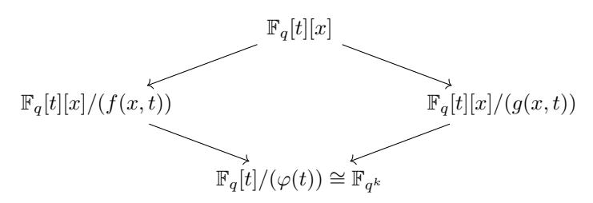
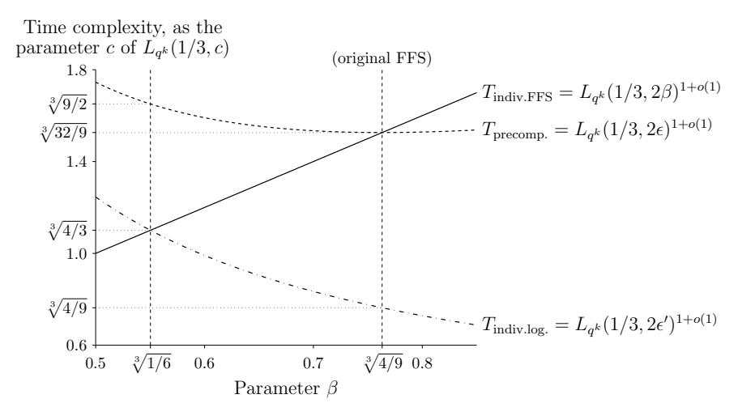
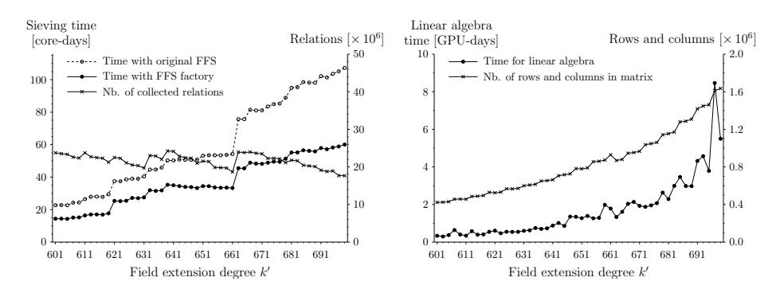

## FFS Factory:

# Adapting Coppersmith's "Factorization Factory" to the Function Field Sieve

Jérémie Detrey

CARAMEL project-team, LORIA, INRIA / CNRS / Université de Lorraine, Campus Scientifique, BP 239, 54506 Vandœuvre-lès-Nancy Cedex, France <Jeremie.Detrey@loria.fr>

Abstract. In 1993, Coppersmith introduced the "factorization factory" approach as a means to speed up the Number Field Sieve algorithm (NFS) when factoring batches of integers of similar size: at the expense of a large precomputation whose cost is amortized when considering sufficiently many integers to factor, the complexity of each individual factorization can then be lowered.

We suggest here to extend this idea to the computation of discrete logarithms in finite fields of small characteristic using the Function Field Sieve (FFS), thus referring to this approach as the "FFS factory". In this paper, the benefits of the proposed technique are established thanks to both a theoretical complexity analysis along with a practical experiment in which we solved the discrete logarithm problem in fifty different binary fields of sizes ranging from 601 to 699 bits.

Keywords: Discrete logarithm, Function field sieve, Cryptanalysis

## 1 Introduction

Initially introduced in 1994 by Adleman [\[2\]](#page-14-0), the Function Field Sieve (FFS) has been for almost twenty years the most efficient algorithm known for computing discrete logarithms in the multiplicative subgroup of finite fields Fq k , with a subexponential asymptotic complexity of Lq k (1/3, p3 32/9)1+o(1), where the notation Lq k designates the usual function

$$L_N(\alpha,c) = \exp\left(c(\log N)^\alpha(\log\log N)^{1-\alpha}\right), \quad \text{with } 0 \le \alpha \le 1 \text{ and } c > 0.$$

However, the year 2013 was marked by several successive major theoretical improvements on this algorithm by Göloğlu et al. [\[14\]](#page-15-0), Joux [\[23\]](#page-15-1), and finally Barbulescu et al. [\[8\]](#page-14-1), which eventually brought the asymptotic complexity of solving the discrete logarithm problem over fields of small characteristic down to quasi-polynomial time. These breakthroughs were accompanied by many computations of discrete logarithms in record-sized binary and ternary fields [\[20,](#page-15-2)[14](#page-15-0)[,21,](#page-15-3)[15,](#page-15-4)[22,](#page-15-5)[16,](#page-15-6)[1\]](#page-14-2). Nevertheless, finding the exact crossing point between FFS and these recent algorithms, especially when it comes to fields of prime extension degrees, is still an active research topic [\[5\]](#page-14-3).

Furthermore, software implementations of FFS (or at least of the descent step) are now publicly available, either as standalone software packages such as in the cado-nfs distribution [\[4\]](#page-14-4), or as part of computer algebra systems such as Magma [\[10\]](#page-14-5). Therefore, providing such software with the precomputed discrete logarithms of factor bases for various finite fields should definitely make their job easier when computing individual logarithms in these fields. For instance, the release notes of Magma V2.20 state that "The database of logarithms is continually being extended and now includes data for larger fields. In particular, the fields GF(2d ) are now covered for all prime degree d ≤ 509 and most degrees up to 500" [\[9\]](#page-14-6).

Bearing in mind this motivation of computing discrete logarithms in several finite fields, we propose in this paper the so-called "FFS factory", whose key idea is to share as much of the computation as possible amongst the considered finite fields in order to decrease the overall computation cost when compared to running as many independent instances of FFS.

This approach is directly inspired from Coppersmith's "factorization factory" [\[12\]](#page-14-7), which can be used to accelerate the factorization of many integers of the same size using the Number Field Sieve (NFS), thus bringing the original complexity of NFS from LN (1/3, 1.923)1+o(1) down to LN (1/3, 1.639)1+o(1) for each integer N to be factored. A similar modification of NFS, known as the "discrete logarithm factory", was later presented by Barbulescu in order to batch discrete logarithm computations over finite fields of large characteristic [\[6,](#page-14-8) Section 7.2].

However, since both of the above cases are based on NFS, they can only share the computations on the so-called rational side of the algorithm. What we propose here is to leverage the fact that the polynomial selection is far less constrained in the FFS setting in order to share the computations on the algebraic side instead. It is to be noted that this idea was first suggested by Kleinjung in the context of factoring using the Special Number Field Sieve (SNFS) [\[24\]](#page-15-7), which is in many ways quite similar to FFS.

Roadmap. This paper is organized as follows. After a presentation on the Function Field Sieve in Section [2,](#page-2-0) with a special emphasis on its complexity analysis, Section [3](#page-7-0) details the algorithmic and complexity aspects of the proposed FFS factory approach before discussing its applicability. A practical experiment, involving the computation of discrete logarithms in 50 binary finite fields of size between 601 and 699 bits, is then presented in Section [4,](#page-11-0) before some concluding remarks in Section [5.](#page-13-0)

#### 2 Remainder on the Function Field Sieve

In the following, we let q be a prime power and k a positive integer, and assume that we want to compute discrete logarithms in the multiplicative subgroup of the finite field  $\mathbb{F}_{q^k}$ . In other words, for any two elements g and  $h \in \mathbb{F}_{q^k}^{\times}$ , with g primitive, we want to find the integer  $\lambda \in \mathbb{Z}/(q^k-1)\mathbb{Z}$  such that  $h=g^{\lambda}$ .

Note that, in order to fall into the domain of applicability of FFS, we further require that  $q = L_{q^k}(\alpha, c)$  with  $0 \le \alpha < 1/3$  and c > 0. In practice, q will usually be a small prime (such as 2) or a small power thereof.

As the Function Field Sieve belongs to the family of *index calculus* algorithms for computing discrete logarithms, it follows the same basic three steps:

- The relation collection step, whose goal is to find many multiplicative equalities, or relations, involving only elements from a predefined subset of  $\mathbb{F}_{q^k}$ , called the factor base. Taking the logarithm, each such relation becomes a linear equation modulo  $q^k-1$ , whose unknowns are the discrete logarithms of the factor base elements.
- The linear algebra step, which solves the linear system once enough such relations have been found, and therefore recovers the value of the discrete logarithms of the factor base elements.
- The individual logarithm step, which computes the discrete logarithm of an arbitrary element  $h \in \mathbb{F}_{q^k}^{\times}$  by finding a multiplicative relation involving only h and factor base elements.

Further details on how these three tasks are achieved in FFS are given in the following paragraphs, before a careful complexity analysis in Section 2.4. However, we do not claim here to give an exhaustive nor comprehensive description of FFS, but rather to focus on a few key points which will prove useful in the rest of this paper. For more information on this topic, we refer the interested reader to the original theoretical foundations of FFS by Adleman and Adleman & Huang [2,3] along with the later improvements by Matsumoto and Joux & Lercier [26,19].

#### 2.1 Relation collection

commutative:

Let d > 1 be an integer, and let  $f(x,t) \in \mathbb{F}_q[t][x]$  be a monic, bivariate polynomial of degree d in x. Note that, for our purposes, the degree in t of f can be made as small as possible1. Let now  $g(x,t) \in \mathbb{F}_q[t][x]$  be a linear polynomial such that its resultant in x with f has an irreducible factor  $\varphi(t)$  of degree k. Since, by construction, f has coefficients of small degree in t, this implies that  $\deg_t g \approx k/d$ .

In the following, we denote by  $F(X,Y,t) = Y^d \cdot f(X/Y,t)$  and  $G(X,Y,t) = Y \cdot g(X/Y,t)$  the homogenizations in x of the polynomials f and g, respectively. Given the above choice of polynomials, the target finite field  $\mathbb{F}_{q^k}$  is therefore isomorphic to the extension field  $\mathbb{F}_q[t]/(\varphi(t))$ , and the following diagram is

&lt;sup>1 Selecting good polynomials for FFS is a non-trivial task, but it does not fall into the scope of this paper. For more details about this point, please refer to [7].

The core idea behind the relation collection step in FFS, also known as the sieving step, is to consider elements of Fq[t][x] and to map them down to Fq k through both sides of the diagram, factoring the corresponding principal ideals in the ring of integers of the function fields Fq(t)[x]/(f(x, t)) and Fq(t)[x]/(g(x, t)) along the way.

In this sieving step, we then consider all the pairs of polynomials (r(t), s(t)) ∈ (Fq[t])2 where r is monic and both are of degree at most e, where e is a parameter called the sieving bound. Given a second parameter b, referred to as the smoothness bound, we then push each polynomial r(t) − s(t)x ∈ Fq[t][x] through the above diagram, and try to factor the corresponding principal ideals in the ring of integers of the function fields Fq(t)[x]/(f(x, t)) and Fq(t)[x]/(g(x, t)) as products of prime ideals whose norms are of degree at most b. If such a factorization succeeds on both sides, then the pair (r, s) is called doubly-b-smooth. Mapping both factorizations to Fq k thanks to the two lower maps of the diagram then yields a relation, that is a multiplicative equality between elements of the factor base, which is defined as the set of those elements of Fq k that correspond to prime ideals whose norms have degree at most b in the function fields above.

On the left-hand side of the diagram (also known as the algebraic side), the principal ideal corresponding to an element r(t) − s(t)x factors as a product of prime ideals whose norms have degree at most b in the ring of integers of the function field Fq(t)[x]/(f(x, t)) if and only if the norm of this principal ideal itself factors as a product of irreducible polynomials of degree at most b. The same obviously holds for the right-hand side as well (also known as the rational side). Therefore, checking if a pair (r, s) from the sieving domain if doubly-b-smooth is tantamount to checking if the norms of the corresponding principal ideals, namely the polynomials F(r, s, t) and G(r, s, t) ∈ Fq[t], both factor as products of irreducible polynomials of degree at most b.

Therefore, collecting relations in FFS is just a matter of enumerating all pairs (r, s) in the sieving domain, computing their norms F(r, s, t) and G(r, s, t), and marking each of them as a valid relation if both norms are indeed b-smooth. Of course, the parameters d, e and b should be carefully chosen so that this step finds enough relations in order to solve the corresponding linear system.

### 2.2 Linear algebra

All the relations collected in the previous step form a large linear system modulo q k − 1, the order of the multiplicative subgroup of Fq k . However, this linear system is very sparse, thus allowing for efficient methods such as Lanczos' or Wiedemann's algorithms [25]: given a sparse matrix of N rows and columns, with an average of  $\omega$  non-zero coefficients per row, such algorithms can indeed solve the corresponding linear system in time  $O(\omega N^2)$ , which is more efficient than classical Gaussian elimination algorithms running in  $O(N^3)$ .

#### 2.3 Individual logarithms

Let h be an arbitrary element of  $\mathbb{F}_{q^k}^{\times}$ . Since  $\mathbb{F}_{q^k} \cong \mathbb{F}_q[t]/(\varphi(t))$ , h can be seen as a polynomial in t of degree less than k. The discrete logarithm of h then can be computed in two main steps:

- The *smoothing* step, in which one tries to find an element of the factor base, whose norm we denote as  $\theta(t)$ , along with an exponent m such that the polynomial  $\theta(t)^m h(t) \mod \varphi(t)$  is  $b_0$ -smooth, with  $b_0 = \sqrt{kb}$ .
- The special-q descent: given a prime ideal  $\mathfrak{q}$  (on either the algebraic or the rational side of the diagram) whose norm is of degree  $d_{\mathfrak{q}}$ , with  $b < d_{\mathfrak{q}} \leq b_0$ , we denote by  $\Lambda_{\mathfrak{q}}$  the set of (r,s) pairs in  $(\mathbb{F}_q[t])^2$  such that the principal ideal corresponding to r(t) s(t)x (on the same side of the diagram) is divisible by  $\mathfrak{q}$ . It can be remarked that  $\Lambda_{\mathfrak{q}}$  forms an  $\mathbb{F}_q[t]$ -lattice of dimension 2. A basis of  $\Lambda_{\mathfrak{q}}$  is then obtained thanks to Gaussian lattice reduction, which yields two vectors  $(r_1(t), s_1(t))$  and  $(r_2(t), s_2(t))$ , the degree of whose coefficients  $r_1, s_1, r_2$  and  $s_2$  is approximately  $d_{\mathfrak{q}}/2$ .

Similarly to the sieving phase, we fix a parameter e' and enumerate all pairs of polynomials  $(i(t),j(t))\in (\mathbb{F}_q[t])^2$  where i is monic and both are of degree at most e'. For each such pair, we then consider the element  $(ir_1+jr_2,is_1+js_2)\in A_{\mathfrak{q}}$  and try to factor the corresponding norms  $F(ir_1+jr_2,is_1+js_2,t)$  and  $G(ir_1+jr_2,is_1+js_2,t)$  as products of irreducible polynomials of degree at most b', with the smoothness bound  $b'=\lambda d_{\mathfrak{q}}$  and the descent parameter  $\lambda<1$ . One such doubly-b'-smooth pair will then give us a linear relation between the discrete logarithm of  $\mathfrak{q}$  and that of several prime ideals whose norms have degree at most b'.

We finally iterate the process recursively until we end up considering only prime ideals whose norms have degree at most b, that is, elements of the factor base, whose discrete logarithms were already computed in the linear algebra step.

#### 2.4 Complexity analysis

In order to lay the groundwork for the study of the proposed FFS factory algorithm in Section 3.2, we recall here the complexity analysis of the Function Field Sieve presented in the previous subsections, following the notations of Barbulescu [6, Section 7.5], which are also that of Coppersmith [12] in the case of the Number Field Sieve.

To that intent, let us first introduce the positive constants  $\delta$ ,  $\varepsilon$ , and  $\beta$  so as to define the degree d of f(x,t), the sieving bound e, and the smoothness bound

b as follows:

$$d = \delta \left( \frac{k \log q}{\log k} \right)^{1/3}, \quad e = \varepsilon \frac{k^{1/3} (\log k)^{2/3}}{(\log q)^{2/3}}, \quad \text{and} \quad b = \beta \frac{k^{1/3} (\log k)^{2/3}}{(\log q)^{2/3}}.$$

Sieving and linear algebra. Given a pair (r, s) of polynomials in the sieving range (i.e., both of degree at most e and r monic), we then denote by Pf and Pg the probabilities that the corresponding norms F(r, s, t) and G(r, s, t) are b-smooth, respectively. The degrees of these norms can be bounded by

$$\deg F(r,s,t) \leq \deg_t f + de \approx de = \delta \varepsilon \frac{k^{2/3} (\log k)^{1/3}}{(\log q)^{1/3}} \qquad \qquad (\text{since } f \text{ has small coefficients}) \text{ and } \deg G(r,s,t) \leq \deg_t g + e \approx k/d = \frac{1}{\delta} \frac{k^{2/3} (\log k)^{1/3}}{(\log q)^{1/3}} \qquad (\text{since } \deg_t g \approx k/d \text{ dominates } e).$$

Assuming that these norms behave like random polynomials of the same degree, following [\[27\]](#page-15-11), we then estimate the probabilities that they are b-smooth as

$$P_f = u^{-u(1+o(1))} \quad \text{where } u = \frac{\deg F(r,s,t)}{b} \approx de/b = \frac{\delta \varepsilon}{\beta} \left(\frac{k \log q}{\log k}\right)^{1/3} \text{ and }$$

$$P_g = v^{-v(1+o(1))} \quad \text{where } v = \frac{\deg G(r,s,t)}{b} \approx k/db = \frac{1}{\delta \beta} \left(\frac{k \log q}{\log k}\right)^{1/3},$$

which we rewrite as
$$P_f = L_{q^k}(1/3, \frac{\delta \varepsilon}{3\beta})^{-1+o(1)}$$
 and  $P_g = L_{q^k}(1/3, \frac{1}{3\delta\beta})^{-1+o(1)}$ .

Since the sieving domain comprises q 2e+1 = Lq k (1/3, 2ε) 1+o(1) such pairs (r, s), the expected total number of relations collected by the sieving step is therefore q 2e+1PfPg. However, in order to be able to solve the corresponding linear system, we require at least as many relations as there are elements in the factor base, whose cardinality is less than 2q b = Lq k (1/3, β) 1+o(1). Consequently, we impose that

$$q^{2e+1}P_fP_g \ge (2q^b)^{1+o(1)}$$
 or, equivalently, that  $2\varepsilon - \frac{\delta\varepsilon}{3\beta} - \frac{1}{3\delta\beta} = \beta$ .

Solving in ε, and additionally requiring that δ < 6β, we finally obtain the following constraint on the sieving bound:

$$\varepsilon \ge \frac{3\delta\beta^2 + 1}{\delta(6\beta - \delta)}.\tag{1}$$

Furthermore, since the degrees of the norms F(r, s, t) and G(r, s, t) are polynomial in log(q k ), checking if they are b-smooth can be done in polynomial time, and the number of non-zero coefficients in the corresponding row of the matrix in the linear algebra step will also be polynomial in log(q k ). Therefore, as FFS falls into the Lq k (1/3, ·) sub-exponential complexity range, we can ignore these polynomial terms and obtain the following time complexities:

$$T_{\text{sieving}} = (q^{2e+1})^{1+o(1)} = L_{q^k}(1/3, 2\varepsilon)^{1+o(1)}$$
 and  $T_{\text{lin.algebra}} = (2q^b)^{2+o(1)} = L_{q^k}(1/3, 2\beta)^{1+o(1)}$ .

These two steps being the most expensive ones in FFS, balancing their computational cost is key to minimize the overall complexity of the algorithm. We therefore impose the further constraint that e = b or, equivalently, that  $\varepsilon = \beta$ . Under that condition, (1) can be rewritten as a quadratic inequation in  $\delta$ , namely  $\varepsilon \delta^2 - 3\varepsilon^2 \delta + 1 \leq 0$ , which admits a positive solution  $\delta$  if and only if  $\varepsilon \geq \sqrt[3]{4/9}$ .

Consequently, setting the constants  $\varepsilon = \beta = \sqrt[3]{4/9}$ , we obtain  $\delta = \sqrt[3]{3/2}$  and, finally, the overall complexity of FFS as

$$T_{\mathrm{FFS}} = L_{q^k}(1/3, 2\varepsilon)^{1+o(1)} = L_{q^k}(1/3, \sqrt[3]{32/9})^{1+o(1)}.$$

Individual logarithms. We follow here the reasoning of [6, Section 7.3] and adapt it to the FFS setting. It can be shown that the most expensive step in the computation of individual logarithms is the special- $\mathfrak q$  descent when the degree  $d_{\mathfrak q}$  of the norm of the prime ideal  $\mathfrak q$  is closest to b. In order to evaluate the complexity of this step, we consider here an ideal  $\mathfrak q$  whose norm has degree  $d_{\mathfrak q}$  of the form

$$d_{\mathfrak{q}} = \gamma \frac{k^{1/3} (\log k)^{2/3}}{(\log q)^{2/3}}, \text{ with } \gamma > \beta.$$

Recall that, in that case, we consider the norms corresponding to pairs of polynomials of the form  $(ir_1+jr_2,is_1+js_2)\in \Lambda_{\mathfrak{q}}\subset (\mathbb{F}_q[t])^2$ , with the polynomials i and j of degree at most e', i monic, and where the coefficients  $r_1$ ,  $r_2$ ,  $s_1$ , and  $s_2$  of the basis vectors all have degree around  $d_{\mathfrak{q}}/2$ . The degrees of these norms can therefore be bounded by

$$\deg F(ir_1 + jr_2, is_1 + js_2, t) \lesssim \deg_t f + d(e' + d_{\mathfrak{q}}/2) \approx d(e' + d_{\mathfrak{q}}/2) \quad \text{and} \quad \deg G(ir_1 + jr_2, is_1 + js_2, t) \lesssim \deg_t g + (e' + d_{\mathfrak{q}}/2) \approx k/d.$$

Denoting by  $\varepsilon'$  the positive parameter such that  $e'=\varepsilon'\frac{k^{1/3}(\log k)^{2/3}}{(\log q)^{2/3}}$ , the probabilities that these two norms are b'-smooth, for  $b'=\lambda d_{\mathfrak{q}}$ , are then given by  $P'_f=L_{q^k}(1/3,\frac{\delta\varepsilon'}{3\lambda\gamma}+\frac{\delta}{6\lambda})^{-1+o(1)}$  and  $P'_g=L_{q^k}(1/3,\frac{1}{3\delta\lambda\gamma})^{-1+o(1)}$ , respectively. Furthermore, since there is no point in taking a smoothness bound b' for the descent lower than the sieving smoothness bound b, we can assume that  $b'=\lambda d_{\mathfrak{q}}\geq b$ , whence  $\lambda\gamma\geq\beta$ .

Consequently, the overall probability to find one doubly-b'-smooth relation in this descent step when considering all (i, j) pairs can be bounded by

$$q^{2e'+1}P_f'P_g' \geq L_{q^k} \left(1/3, 2\varepsilon' - \frac{\delta\varepsilon'}{3\beta} - \frac{\delta}{6\lambda} - \frac{1}{3\delta\beta}\right)^{1+o(1)}.$$

Since we require this probability to be non-negligible so that at least one such relation can actually be found, we end up with the following condition on  $\varepsilon'$ :

$$\varepsilon' \ge \frac{\delta^2 \beta / (2\lambda) + 1}{\delta(6\beta - \delta)}.\tag{2}$$

8

Plugging in the values for  $\beta$  and  $\delta$  found previously and, following [6], taking for  $\lambda$  a constant close but not equal to 1, such as 0.999, allows us to choose  $\varepsilon' = \sqrt[3]{1/18}$ . The cost for this special- $\mathfrak{q}$  descent step is then

$$(q^{2e'+1})^{1+o(1)} = L_{q^k}(1/3, 2\varepsilon')^{1+o(1)} = L_{q^k}(1/3, \sqrt[3]{4/9})^{1+o(1)}.$$

Finally, considering the tree formed by the recursive calls in the descent process, one can check that the arity of each node is less than 2k (since special- $\mathfrak{q}$  descent will produce less than 2k new prime ideals), while the total depth of the tree is given by  $w = \log_{\lambda}(b/b_0) = O(\log k)$ . Therefore, the total number of nodes in the tree is in  $O(\exp((\log k)^2))$ , which is polynomial in  $\log(q^k)$ . Consequently, ignoring the polynomial terms, the overall time complexity for computing an individual logarithm is the same as the complexity of a single special- $\mathfrak{q}$  descent step, namely

 $T_{\text{indiv.log.}} = L_{q^k} (1/3, \sqrt[3]{4/9})^{1+o(1)}.$

#### 3 The FFS factory

The main contribution of this paper is based on the observation that, in the Function Field Sieve, a same polynomial  $f(x,t) \in \mathbb{F}_q[t][x]$  can be used to compute discrete logarithms in several finite fields of approximately the same size. Therefore, in a setting where one wants to compute discrete logarithms in many different finite fields of close enough sizes, it is possible to use a single polynomial f for all these fields and share the computations on the algebraic side of the FFS algorithm.

#### 3.1 Batching FFS computations

Let us now assume that we want to compute discrete logarithms in several finite fields  $\mathbb{F}_{q^{k'}}$ , with  $k' \leq k$  and q a prime power such that  $q = L_{q^k}(\alpha, c)$  with  $0 \leq \alpha < 1/3$  and c > 0.

The idea here is to split the relation collection step into two parts:

- An precomputation step, which is performed only once, and which exclusively focuses on the algebraic (i.e., left-hand) side of the FFS commutative diagram. In this step, we select a good polynomial  $f(x,t) \in \mathbb{F}_q[t][x]$  of degree d, and find all pairs (r,s) in the sieving domain which are b-smooth on the algebraic side. These pairs are then stored into a large file, where they can be reused later.
- An individual sieving step, which is performed for each target field  $\mathbb{F}_{q^{k'}}$ . Here, a linear polynomial g(x,t) is first chosen so that its resultant in x with f has an irreducible factor of degree k'. The previously computed file is then read, and each pair (r,s) in this file is checked for b-smoothness on the rational (i.e. right-hand) side.

Once the individual sieving step is completed for a given finite field  $\mathbb{F}_{q^{k'}}$ , the remaining linear algebra and individual logarithm steps can be performed for this field just as in the original FFS algorithm.

#### 3.2 Complexity analysis

Since the first part of the relation collection step is now shared between several discrete logarithm computations, the optimal values for the parameters b, d, and e will differ from the ones in the original FFS. In order to find these new values, we build upon the complexity analysis of FFS detailed in Section [2.4.](#page-4-0)

Relation collection and linear algebra. First of all, one has to remark that, with respect to the parameters b, d, and e, the degrees of the polynomials f and g, the sieving domain and the factor base are the same as in the original FFS. In other words, the sieving domain still comprises q 2e+1 = Lq k (1/3, 2ε) 1+o(1) pairs of polynomials (r, s), the cardinality of the factor base is still less that 2q b = Lq k (1/3, β) 1+o(1), and the degrees of the norms F(r, s, t) and G(r, s, t) are still bounded by de and k/d, respectively.

Consequently, the condition q 2e+1PfPg = (2q b ) 1+o(1) which ensures that enough relations are collected in order to solve the corresponding linear system imposes the exact same constraint on ε:

$$\varepsilon \ge \frac{3\delta\beta^2 + 1}{\delta(6\beta - \delta)}, \text{ with } \delta < 6\beta.$$
 (1)

We now consider the costs of the various steps involved in the FFS factory. Note however that the actual values of the constants β, δ, and ε will be determined later.

First of all, as the precomputation step requires to enumerate all pairs (r, s) of the sieving domain, its complexity is

$$T_{\text{precomp.}} = (q^{2e+1})^{1+o(1)} = L_{q^k}(1/3, 2\varepsilon)^{1+o(1)}.$$

Furthermore, since each pair (r, s) has probability Pf to be b-smooth on the algebraic side, the number of such b-smooth pairs written to the file in this precomputation step is then

$$N_{\rm precomp.} = q^{2e+1} P_f = L_{q^k} \left( 1/3, 2\varepsilon - \frac{\delta \varepsilon}{3\beta} \right)^{1+o(1)}.$$

Then, for each target field, we need to perform the corresponding individual sieving step, which entails going through all the precomputed pair (r, s) and checking whether each of them is b-smooth on the rational side. Since this check can be done in polynomial time, the actual complexity of this step is then Tindiv.sieving = Nprecomp..

The linear algebra step, which also has to be performed for each target field, still has complexity quadratic in the size of the factor base, as in the original FFS:

$$T_{\text{lin.algebra}} = (2q^b)^{2+o(1)} = L_{q^k}(1/3, 2\beta)^{1+o(1)}.$$

Finally, we denote by Tindiv.FFS = Tindiv.sieving + Tlin.algebra the overall time complexity of the specific computations required for each target field.

Individual logarithms. In a similar way as for the sieving constraint on  $\varepsilon$ , one can easily see that computing a special- $\mathfrak{q}$  descent step in a target field  $\mathbb{F}_{q^{k'}}$  entails exactly the same constraint on the parameter  $\varepsilon'$  of the sieving region as in the case of the original FFS:

$$\varepsilon' \ge \frac{\delta^2 \beta / (2\lambda) + 1}{\delta(6\beta - \delta)}.\tag{2}$$

Furthermore, the cost of an individual logarithm in this field will also be

$$T_{\text{indiv.log.}} = L_{q^k} (1/3, 2\varepsilon')^{1+o(1)}.$$

Balancing the complexities. Assuming that the precomputation step is done once and for all, we only need to balance the cost of the individual sieving and linear algebra steps for each target field. Setting  $q^{2e+1}P_f = (2q^b)^{2+o(1)}$  and using the constraint (1) on  $\varepsilon$ , we obtain the condition  $\delta \geq 1/(3\beta^2)$ , which in turn imposes that  $\beta > \sqrt[3]{1/18}$ , since (1) also requires that  $\delta < 6\beta$ .

In fact, it can be shown that, for any  $\lambda < 1$ , the quantity

$$\varepsilon' - \beta \ge \frac{\delta^2 \beta / (2\lambda) + 1}{\delta(6\beta - \delta)} - \beta \ge \frac{3\beta \delta^2 - 12\beta^2 \delta + 2}{2\delta(6\beta - \delta)}$$

is always positive when  $\sqrt[3]{1/18} < \beta < \sqrt[3]{1/6}$ . Consequently, if one takes  $\beta$  in that interval, then the cost of computing an individual logarithm in a target field  $\mathbb{F}_{q^{k'}}$  will dominate that of the linear algebra step in the same field. The intuitive explanation is that, in such a case, the factor base is too small and the descent is thus much harder. It is therefore useless to consider values of  $\beta$  below  $\sqrt[3]{1/6}$ . Similarly, considering values of  $\beta$  larger that  $\sqrt[3]{4/9}$  is also useless, as such values will yield complexities larger than that of the original FFS algorithm, thus defeating the purpose of the FFS factory approach.

In the following, we denote by  $\varepsilon_0$  the lower bound on  $\varepsilon$  given by (1):

$$\varepsilon_0(\beta, \delta) = \frac{3\delta\beta^2 + 1}{\delta(6\beta - \delta)}.$$

We first study the behavior of  $\varepsilon_0$  with respect to  $\delta$ , in the range  $1/(3\beta^2) \leq \delta < 6\beta$ , for a fixed value of  $\sqrt[3]{1/6} < \beta \leq \sqrt[3]{4/9}$ . Taking the partial derivative of  $\varepsilon_0$  with respect to  $\delta$  then gives

$$\frac{\partial \varepsilon_0}{\partial \delta}(\beta,\delta) = \frac{3\beta^2\delta^2 + 2\delta - 6\beta}{\delta^2(6\beta - \delta)^2},$$

which is negative when  $1/(3\beta^2) \leq \delta < \delta_0(\beta)$  and positive when  $\delta_0(\beta) < \delta < 6\beta$ , with  $\delta_0(\beta) = (\xi(\beta) - 1)/(3\beta^2)$  and  $\xi(\beta) = \sqrt{18\beta^3 + 1}$ . Hence, in order to minimize  $\varepsilon_0$ , we define  $\tilde{\varepsilon}_0(\beta) = \varepsilon_0(\beta, \delta_0(\beta))$ . This function and its derivative with respect to  $\beta$  are then given by

$$\tilde{\varepsilon}_0(\beta) = \varepsilon_0(\beta, \delta_0(\beta)) = \left(\frac{3\beta^2}{\xi(\beta) - 1}\right)^2 \quad \text{and} \quad \frac{d\tilde{\varepsilon}_0}{d\beta}(\beta) = \frac{9\beta^3 \left(\xi(\beta)^2 - 4\xi(\beta) + 3\right)}{\xi(\beta)(\xi(\beta) - 1)^3},$$

respectively. The latter shows that  $\tilde{\varepsilon}_0$  is a strictly decreasing function of  $\beta$  on the whole interval  $\sqrt[3]{1/6} < \beta < \sqrt[3]{4/9}$ , its derivative vanishing at  $\beta = \sqrt[3]{4/9}$ .

Similarly, fixing  $\delta = \delta_0(\beta)$  in constraint (2) for individual logarithms gives the following lower bound on the parameter  $\varepsilon'$ :

$$\varepsilon' \ge \frac{\beta}{2\xi(\beta)} \left( \frac{1}{\lambda} + \frac{\xi(\beta) + 1}{\xi(\beta) - 1} \right),$$

which becomes  $\varepsilon' \geq \beta/(\xi(\beta) - 1)$  when  $\lambda$  is chosen to be almost equal to 1.

One can remark that, when taking  $\beta = \sqrt[3]{4/9}$ , we end up with the exact same complexity as the original FFS algorithm:

$$\begin{split} T_{\text{precomp.}} &= T_{\text{indiv.FFS}} = L_{q^k} (1/3, \sqrt[3]{32/9})^{1+o(1)} \quad \text{and} \\ &T_{\text{indiv.log.}} = L_{q^k} (1/3, \sqrt[3]{4/9})^{1+o(1)}. \end{split}$$

#### 3.3 Discussion

From the previous analysis, taking the parameters  $\varepsilon = \tilde{\varepsilon}_0(\beta)$  and  $\varepsilon' = \beta/(\xi(\beta) - 1)$ , one can use  $\beta$  in order to adjust the tradeoff between the cost of the precomputation step and that of the individual sieving/linear algebra steps, depending on how many target fields  $\mathbb{F}_{q^{k'}}$  are considered.

Indeed, if one wants to compute discrete logarithms in many different finite fields, taking a lower value for  $\beta$  will increase the precomputation time, while decreasing the individual cost for each target field. This can be seen in Figure 1, in which the costs  $T_{\rm precomp.}$ ,  $T_{\rm indiv.FFS}$ , and  $T_{\rm indiv.log.}$  are given as functions of  $\beta$ .

**Fig. 1.** Costs of the various steps in the FFS factory, as functions of  $\beta$ , and expressed as the parameter c which appears in their complexity when written as  $L_{q^k}(1/3,c)$ .

Of course, mitigating the extra cost of the precomputation step requires that enough target fields are considered. In fact, the number N of distinct finite fields in which to compute discrete logarithms should be of the form  $N=L_{q^k}(1/3,\nu)^{1+o(1)}$ , with  $\nu>0$ , in order to be able to amortize the precomputation cost. For instance, while  $\beta=\sqrt[3]{4/9}$  corresponds to the original FFS algorithm and can therefore be used even for a single target field, on the other hand, setting  $\beta=\sqrt[3]{1/6}$  requires that  $N\geq T_{\rm FFS}/T_{\rm precomp.}$  or, in other words, that  $\nu\geq\sqrt[3]{9/2}-\sqrt[3]{32/9}\approx0.125$ . In that case, we have the following complexity estimates:

$$\begin{split} T_{\text{precomp.}} &= L_{q^k} (1/3, \sqrt[3]{9/2})^{1+o(1)} \quad \text{and} \\ T_{\text{indiv.FFS}} &= T_{\text{indiv.log}} = L_{q^k} (1/3, \sqrt[3]{4/3})^{1+o(1)}. \end{split}$$

However, since the finite fields of a given size  $q^{k'}$  are all isomorphic, and that this isomorphism is computable in polynomial time, there is absolutely no point in applying the FFS factory to more than one field of each size. As there are only a polynomial number of distinct finite fields  $\mathbb{F}_{q^{k'}}$  with  $k' \leq k$ , there is no way for N to be in the  $L_{q^k}(1/3,\cdot)$  complexity range as k grows. On first sight, this renders the whole FFS factory approach useless, at least asymptotically.

However, this criticism might be mitigated as, since 2013, it is known that FFS, asymptotically speaking, is no longer the most efficient algorithm known for computing discrete logarithms in finite fields of small characteristic [23,14,8]. Even though the exact crossing point between FFS and these asymptotically faster algorithms is not known yet, recent experiments show that computing discrete logarithms using FFS still makes sense for finite fields  $\mathbb{F}_{q^k}$  of size  $\log_2(q^k)$  up to around 1000 bits [5]. It turns out that, for fields of that size, the quantity  $L_{q^k}(1/3,\nu)$  amounts to at most a few dozens when  $\nu \leq \sqrt[3]{9/2} - \sqrt[3]{32/9}$ . Therefore, in this case, the number N of finite fields to consider for the FFS factory to be better than N independent instances of the original FFS is roughly of the same order of magnitude and is thus totally manageable in practice, as shown by the experiment presented in Section 4.

## 4 Practical experiment

In order to assess the applicability and the impact of the proposed FFS factory approach, we have implemented this algorithm and used it to compute discrete logarithms in the 50 binary finite fields  $\mathbb{F}_{2^{k'}}$  for all odd values of k' between 601 and 699 (inclusive), which fall slightly below the current size records for FFS [17,5].

Software implementation. Our implementation of the FFS factory is based on the C implementation of FFS which is freely available as part of the cado-nfs software suite [4]. Since some of the steps in the FFS factory are identical to those of the original FFS, we were able to directly reuse various part of cado-nfs for our computation, such as the polynomial selection [7], the filtering utilities

(which prepare the matrix before the linear algebra) [11], or the GPU-based linear algebra implementation [18].

However, the relation collection step had to be modified so as to match the FFS factory algorithm. In the cado-nfs implementation of FFS, this step is directly based on the implementation described by Detrey *et al.* in [13] which, among other techniques, uses

- special- $\mathfrak{q}$  sieving, which ensure that large prime ideals  $\mathfrak{q}$  (on either the algebraic or the rational side) appear in the relations, thus increasing the smoothness probabilities; and
- lattice sieving, which, in a somewhat similar way to the sieve of Eratosthenes, allows one to quickly find all pairs (r, s) which are divisible by small prime ideals (on both sides), and to actually check for smoothness only those pairs which are divisible by sufficiently many of these small prime ideals, since they will then have higher chances of being b-smooth.

In order for this program to follow the FFS factory approach, we have modified it to support several polynomials (and therefore several target fields) on the rational side at the same time, thus sharing the (pre)computations for the algebraic side amongst all target fields. We have also disabled both the special- $\mathfrak q$  sieving and the lattice sieving on the rational side, but kept these techniques for the algebraic side so as to maintain the running time of the precomputation step as low as possible.

All in all, adding support for the FFS factory mostly entailed minute changes in the cado-nfs software. It is therefore planned that these changes eventually make their way into the official code base of cado-nfs, and that the FFS factory becomes available in future releases.

**Experimental setup and results.** In order to compute discrete logarithms in all finite fields  $\mathbb{F}_{2^{k'}}$ , with k' odd and between 601 and 699, using the proposed FFS factory, we used the same degree-6 polynomial f(x,t) for the algebraic side that was used for the discrete logarithm computation in  $\mathbb{F}_{2809}^{\times}$  [5]:

$$f(x,t) = x^6 + 0x7x^5 + 0x6bx^3 + 0x1abx^2 + 0x326x + 0x19b3.$$

Note that we also considered using a degree-5 polynomial, but none were found in the polynomial selection step that were as good as the one above for the considered finite fields.

Sieving was performed using the implementation described above on Intel Xeon E5-2650 CPUs running at 2.0 GHz. The smoothness bound was fixed to b=26, and we lattice-sieved on the algebraic side all prime ideals whose norm had degree at most 20. We sieved for special- $\mathfrak{q}$ 's of norm starting at degree 21 and increasing until enough relations were found. As soon as sufficiently many relations were collected for a given target field, we stopped sieving for this field. Sieving timings and the number of collected relations for each target field are reported in Figure 2 (left).

It is to be noted that the precomputation step required 38.2 core-days, and that the 50 individual sieving steps took a total of 1788.6 core-days. If we had used the original FFS instead, we estimate that this computation would have required about 2991.3 core-days to produce a similar set of relations. Therefore, the FFS factory induced a speedup of 39 % on the overall computation time, that is, a saving of almost 3.2 core-years on an 8.2-core-year computation.

**Fig. 2.** Timings for the relation collection step on each target field  $\mathbb{F}_{q^{k'}}$ , for both the original FFS (estimated) and the FFS factory, along with the number of collected relations (left). Timings for the linear algebra step on each target field, along with the number of rows and columns of the corresponding matrix (right).

As mentioned previously, we used Jeljeli's GPU implementation of the block Wiedemann algorithm for the linear algebra step [18]. Timings on Nvidia GTX 680 graphics cards, along with the dimension of the corresponding matrices (whose density was set to an average of 100 non-zero coefficients per row), are given in Figure 2 (right). This computation represents a total running time of 83.8 GPU-days.

#### 5 Conclusion

In this paper, we have presented an adaptation of Coppersmith's "factorization factory" idea to the case of the Function Field Sieve for batching discrete logarithm computations in several finite fields of small characteristic. Along with a careful complexity analysis showing that this approach can be leveraged in practice to decrease the total computation time when enough target fields are considered, we also presented a working implementation of this algorithm based on the FFS implementation of cado-nfs. This implementation was used in a full-scale experiment in order to validate our analysis, thus solving the discrete logarithm problem in all the binary finite fields  $\mathbb{F}_{2^{k'}}$  of odd extension degree k' and of size from 601 to 699 bits. For this experiment, the observed speedup against the original FFS algorithm was 39 %.

Even though the days of FFS are now numbered, it is far from obsolete yet, especially for finite fields of (almost) prime extension degrees and of size around or below 1000 bits. Future works include polishing the FFS factory implementation so that it can be published as part of the cado-nfs suite and, more importantly, using this approach to (pre)compute discrete logarithms in as many binary (or ternary) finite fields as possible so as to complete the database of factor bases in computer algebra systems such as Magma or Sage. Even though such computations need to be done only once, they still represent a huge endeavor when large field sizes are targeted.

## References

- 1. Adj, G., Menezes, A., Oliveira, T., Rodríguez-Henríquez, F.: Computing discrete logarithms in F36·137 and F36·163 using Magma (2014), Cryptology ePrint Archive, report 2014/057
- 2. Adleman, L.M.: The function field sieve. In: Adleman, L.M., Huang, M.D.A. (eds.) Algorithmic Number Theory – ANTS-I. Lecture Notes in Computer Science, vol. 877, pp. 108–121. Springer–Verlag (1994)
- 3. Adleman, L.M., Huang, M.D.A.: Function field sieve method for discrete logarithms over finite fields. Information and Computation 151(1–2), 5–16 (1999)
- 4. Bai, S., Bouvier, C., Filbois, A., Gaudry, P., Imbert, L., Kruppa, A., Morain, F., Thomé, E., Zimmermann, P.: cado-nfs, an implementation of the Number Field Sieve algorithm, release 2.0, available from <http://cado-nfs.gforge.inria.fr/>
- 5. Barbulescu, R., Bouvier, C., Detrey, J., Gaudry, P., Jeljeli, H., Thomé, E., Videau, M., Zimmermann, P.: Discrete logarithm in GF(2809) with FFS. In: Krawczyk, H. (ed.) Public-Key Cryptography – PKC 2014. Lecture Notes in Computer Science, vol. 8383, pp. 221–238. Springer–Verlag (2014)
- 6. Barbulescu, R.: Algorithms of discrete logarithm in finite fields. Ph.D. thesis, Université de Lorraine (2013), available at [http://tel.archives-ouvertes.fr/](http://tel.archives-ouvertes.fr/tel-00925228) [tel-00925228](http://tel.archives-ouvertes.fr/tel-00925228)
- 7. Barbulescu, R.: Selecting polynomials for the Function Field Sieve (2013), preprint, 23 pages, available at <http://hal.inria.fr/hal-00798386>
- 8. Barbulescu, R., Gaudry, P., Joux, A., Thomé, E.: A quasi-polynomial algorithm for discrete logarithm in finite fields of small characteristic. In: Nguyen, P.Q., Oswald, E. (eds.) Advances in Cryptology – EUROCRYPT 2014. Lecture Notes in Computer Science, vol. 8441, pp. 1–16. Springer–Verlag (2014)
- 9. Bosma, W., Cannon, J.J., Fieker, C., Steel, A.: Summary of new features in Magma V2.20. Available at [http://magma.maths.usyd.edu.au/magma/releasenotes/2/](http://magma.maths.usyd.edu.au/magma/releasenotes/2/20/) [20/](http://magma.maths.usyd.edu.au/magma/releasenotes/2/20/) (Dec 2013)
- 10. Bosma, W., Cannon, J.J., Playoust, C.: The Magma algebra system. I. The user language. Journal of Symbolic Computation 24(3-4), 235–265 (1997)
- 11. Bouvier, C.: The filtering step of discrete logarithm and integer factorization algorithms (2013), preprint, 22 pages, available at [http://hal.inria.fr/](http://hal.inria.fr/hal-00734654) [hal-00734654](http://hal.inria.fr/hal-00734654)
- 12. Coppersmith, D.: Modifications to the Number Field Sieve. Journal of Cryptology 6(3), 169–180 (1993)
- 13. Detrey, J., Gaudry, P., Videau, M.: Relation collection for the Function Field Sieve. In: Nannarelli, A., Seidel, P.M., Tang, P.T.P. (eds.) IEEE Symposium on Computer Arithmetic – ARITH-21. pp. 201–210. IEEE (2013)

- 14. Göloğlu, F., Granger, R., McGuire, G., Zumbrägel, J.: On the function field sieve and the impact of higher splitting probabilities. In: Canetti, R., Garay, J.A. (eds.) Advances in Cryptology – CRYPTO 2013. Lecture Notes in Computer Science, vol. 8043, pp. 109–128. Springer–Verlag (2013)
- 15. Göloğlu, F., Granger, R., McGuire, G., Zumbrägel, J.: Solving a 6120-bit DLP on a desktop computer. In: Lange, T., Lauter, K., Lisoněk, P. (eds.) Selected Areas in Cryptography – SAC 2013. Lecture Notes in Computer Science, vol. 8282, pp. 136–152. Springer–Verlag (2014)
- 16. Granger, R., Kleinjung, T., Zumbrägel, J.: Discrete logarithms in GF(29234). Email to the NMBRTHRY mailing list, [http://listserv.nodak.edu/archives/](http://listserv.nodak.edu/archives/nmbrthry.html) [nmbrthry.html](http://listserv.nodak.edu/archives/nmbrthry.html) (Jan 2014)
- 17. Hayashi, T., Shimoyama, T., Shinohara, N., Takagi, T.: Breaking pairing-based cryptosystems using ηT pairing over GF(397). In: Wang, X., Sako, K. (eds.) Advances in Cryptology – ASIACRYPT 2012. Lecture Notes in Computer Science, vol. 7658, pp. 43–60. Springer–Verlag (2012)
- 18. Jeljeli, H.: Accelerating iterative SpMV for Discrete Logarithm Problem using GPUs (2013), preprint, 11 pages, available at [http://hal.inria.fr/](http://hal.inria.fr/hal-00734975) [hal-00734975](http://hal.inria.fr/hal-00734975)
- 19. Joux, A., Lercier, R.: The function field sieve is quite special. In: Fieker, C., Kohel, D.R. (eds.) Algorithmic Number Theory – ANTS-V. Lecture Notes in Computer Science, vol. 2369, pp. 431–445. Springer–Verlag (2002)
- 20. Joux, A.: Discrete logarithms in GF(21778). E-mail to the NMBRTHRY mailing list, <http://listserv.nodak.edu/archives/nmbrthry.html> (Feb 2013)
- 21. Joux, A.: Discrete logarithms in GF(24080). E-mail to the NMBRTHRY mailing list, <http://listserv.nodak.edu/archives/nmbrthry.html> (Mar 2013)
- 22. Joux, A.: Discrete logarithms in GF(26168) [= GF((2257) 24)]. E-mail to the NM-BRTHRY mailing list, <http://listserv.nodak.edu/archives/nmbrthry.html> (May 2013)
- 23. Joux, A.: A new index calculus algorithm with complexity L(1/4 + o(1)) in very small characteristic. In: Lange, T., Lauter, K., Lisoněk, P. (eds.) Selected Areas in Cryptography – SAC 2013. Lecture Notes in Computer Science, vol. 8282, pp. 355–379. Springer–Verlag (2014)
- 24. Kleinjung, T.: private communication (2012)
- 25. LaMacchia, B.A., Odlyzko, A.M.: Solving large sparse linear systems over finite fields. In: Menezes, A.J., Vanstone, S.A. (eds.) Advances in Cryptology – CRYPTO '90. Lecture Notes in Computer Science, vol. 537, pp. 109–133. Springer–Verlag (1990)
- 26. Matsumoto, R.: Using Cab curves in the function field sieve. IEICE Transactions on Fundamentals of Electronics, Communications and Computer Sciences E82-A(3), 551–552 (1999)
- 27. Panario, D., Gourdon, X., Flajolet, P.: An analytic approach to smooth polynomials over finite fields. In: Buhler, J.P. (ed.) Algorithmic Number Theory – ANTS-III. Lecture Notes in Computer Science, vol. 1423, pp. 226–236. Springer–Verlag (1998)