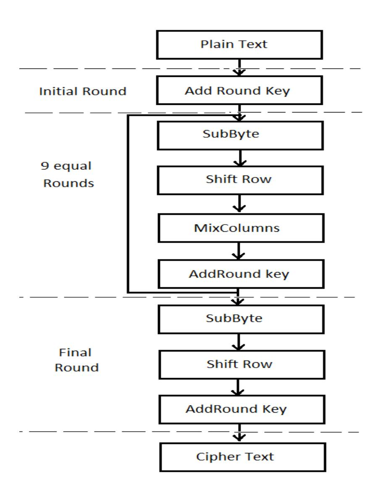
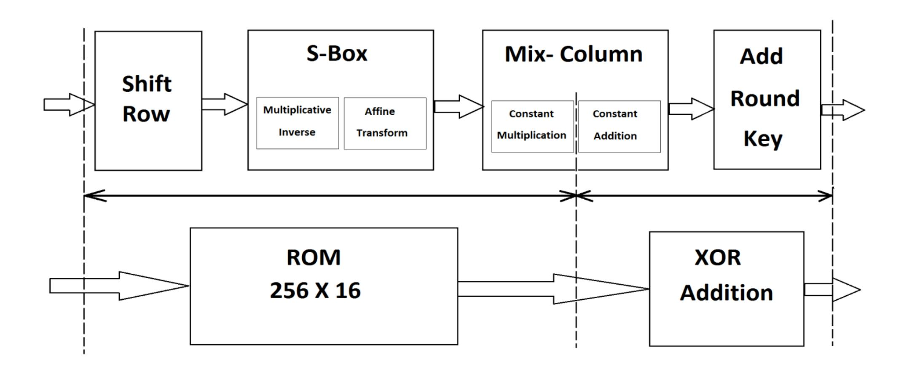
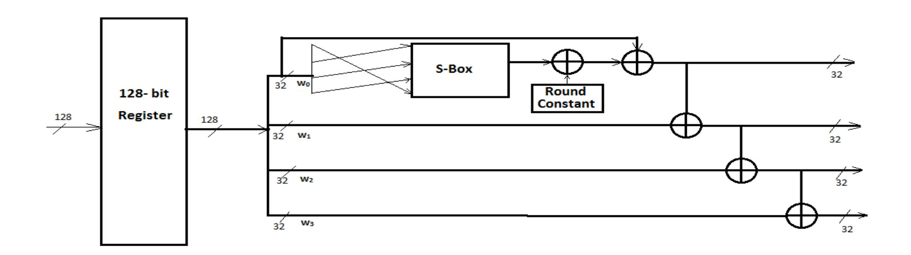
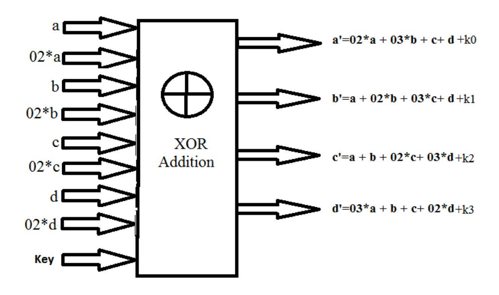
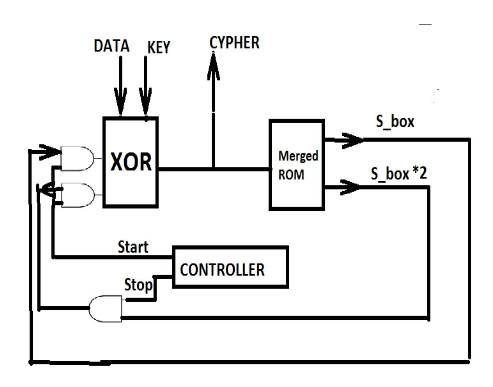
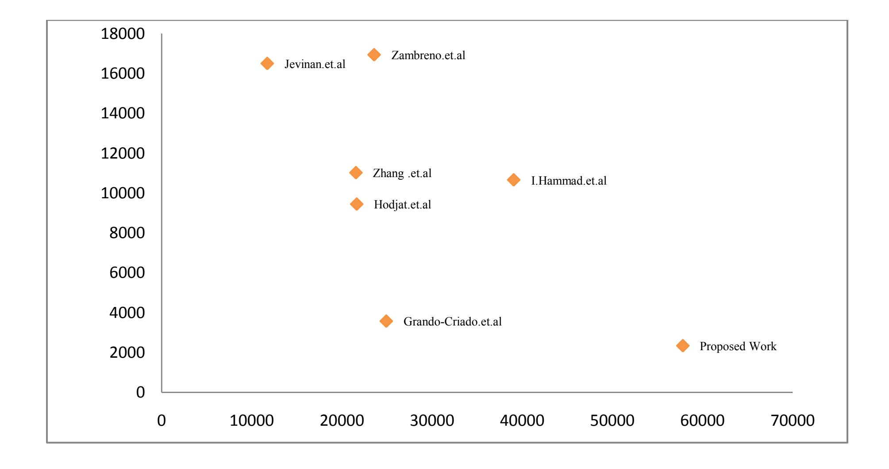

{0}------------------------------------------------

# **Optimized Architecture for AES**

*Abhijith P. S, Dr. Manish Goswami, S. Tadi, Kamal Pandey* 

Department of Microelectronics, IIIT-Alllahabad, Devghat Jhalwa Allahabad,U.P India.

Abstract—This paper presents a highly optimized architecture for Advanced Encryption Standard (AES) by dividing and merging (combining) different sub operations in AES algorithm. The proposed architecture uses ten levels of pipelining to achieve higher throughput and uses Block-RAM utility to reduce slice utilization which subsequently increases the efficiency. It achieves the data stream of 57 Gbps at 451 MHz working frequency and obtains 36% improvement in efficiency to the best known similar design throughput per area (Throughput/Area) and 35% smaller in slice area. This architecture can easily be embedded with other modules because of significantly reduced slice utilization.

*Index Terms*—Advanced Encryption Standard (AES), Composite Field Arithmetic, Field Programmable Gate Array (FPGA)

### I. INTRODUCTION

ryptography plays a very important role in electronics, computers, communication system design applications. Communication and transfer of data invariably necessitates the use of encryption. Since sending and reception of data is vulnerable to outside attack, data protection through encryption/decryption is critically important. Cryptography is referred to the translation of data in to a secret code (Encryption) and subsequently secret code back to data (Decryption) for security purpose. It is used not only for military applications but also in many civilian applications like E-commerce, Mobile network, Automatic Teller Machine (ATM) etc [9]. To offer secure transmission and storage of data, many cryptographic algorithms were proposed such as Data Encryption Standard (DES), the Elliptic Curve Cryptography (ECC), Advanced Encryption Standard (AES) and many more.In 1999 National Institute of Standard and Technology (NIST) issued a new version for DES algorithm called 3DES. This algorithm provided more security than any other cryptographic algorithm and hence considered as appropriate choice for the next decade. Due to the principle disadvantage sluggish in software implementation for 3DES, NIST issued a call for proposal for new Advanced Encryption Standard. NIST completed the evaluation and selected Rijndael algorithm as AES algorithm. The AES is published as FIPS 197 [1]. Rijndael was put forth by two cryptographers from Belgium Dr. Joan Daemen and Dr. Vincent Rejmen. AES define key size of 128, 192 and 256 bits for 10,12 and 14 rounds respectively with a fixed plain text size of 128 bits. The AES algorithm is a symmetric block cipher with low complexity and high security level [13]. C

There are software and hardware approaches to implement cryptographic AES algorithm. While the software implementation is more vulnerable to outside attacks, the latter is a wise choice in terms of speed of operation and security. But the hardware implementation strategy varies according to the need. In ecommerce servers, higher speed of operation is required while in RFIDs, mobile phones and Wi-Fi networks the concern is towards lesser area, low power dissipation and higher throughput respectively. The designing and hardware implementation of such system is therefore a challenging task.

{1}------------------------------------------------

There are three type of architecture for AES hardware.

- 1. Looping architecture
- 2. Fully unrolled pipelined architecture and
- 3. Deep sub pipelined fully unrolled architecture.

While the looping architecture uses feedback of data for each round and is implemented by Gaj [3], the fully unrolled pipelined architecture uses pipeline registers in the time unrolled stages of AES and is implemented by Saggese et al. [8]. Deep sub pipelined fully unrolled architecture is done by further dividing each stage by pipeline registers and is implemented by I Hammad et al. [10].

Research has also been done on efficient utilization of area and speed(defined as frequency and calculated as inverse of delay) in hardware. The work presented by K. Gaj [3], Good and Benaissa [2] and Rouvroy et al. [4] deals with efficient utilization on area (slice utilization) while the work on higher throughput design based on composite field arithmetic GF(22 ) 4 and using sub-pipelined loop unrolled architecture has been presented by Grando et al. [5], Jarvinen, Tommiska and Skytta [6] and Zhang and Parhi[7] respectively. Saggase et al. [8] has also proposed unrolling, tiling and pipelining transformations to compromise between slice utilization and speed of operation. Attempts have also been made to achieve simultaneously higher throughput and reduced area by I. Hammad, Sankary and E. E. Masry [10] which used deep sub pipelining. However due to absence of Block RAM utility, the design results in more slice utilization. The higher slice utilization of sub-pipelined architecture makes it impossible to embed with larger application module even though they have higher throughput. AES modules are usually not stand alone and are generally embedded with larger application which demands lesser area for such modules.

The work done in this paper includes the study of mathematical model of AES algorithm, analysis of different implementation strategies of AES architecture and there by formulation of an AES architecture for higher throughput and lesser hardware utilization targeting Field Programmable Gate Array (FPGA). The proposed work suggests a new loop unrolled architecture which effectively utilizes Block-RAM and uses merging of different operations of AES which subsequently results in less slice utility and higher throughput respectively. The proposed architecture results in higher efficiency (Mbps/Area) among existing ones [5-8], [10], [14-15] and can therefore be used in large variety of applications.

Rest of the paper is organized as follows. Section II briefly explains AES algorithm for 128 bit key length. Mathematical formulation and proof of proposed work with Galois field (GF) arithmetic is explained in Section III. Section IV explains the architecture of encryption, key expansion and looping AES structure with main emphasis on merging techniques. Section V presents the results and comparison with other proposed architecture while Section VI concludes the proposed work.

### II. AES ALGORITHM

Substitution-permutation network is the design principle of AES which has a fixed block size of 128 bit and key size of 128, 192 and 256 bits with 10, 12 and 14 rounds of encryption respectively [1]. This particular work uses 128 bit key for 10 rounds (excluding initial add round key) of encryption. First and last round of algorithm are different while all other rounds are same. Encryption and decryption operates 16 byte of data as [4\*4] array named as state arrays.While the encryption round consists of four main steps viz, shift row, substitution of bytes, mix column and add round key, the decryption round consists of

{2}------------------------------------------------

inverse operations of encryption. Shift row operation shifts byte of first, second and third rows of state matrix to left by an offset of 1, 2, and 3 respectively.

However Shift Row operation is not necessarily the first step of AES iteration. It can be interchanged with byte substitution operation without affecting the results. This operation helps AES block cipher to become four dependent block ciphers. Each byte of state matrix is replaced by corresponding S-Box entry in substitution byte step. This operation is highly nonlinear transformation and maps input state matrix to highly nonlinear set of output state matrix. Mix column operation multiplies fixed matrix with state matrix in GF(28 ) while add round key operation adds state matrix with key in GF(28 ). The key expansion module of AES algorithm generates all round key from key inputs and starts by taking substitution of first four byte of data followed by cyclic rotation and addition of round constants. The result obtained is added to first four byte of previous key input to get first four byte of new key. It is then added to second row of input key byte to get second row of new key and so on. The AES steps are shown in Fig. 1.

Fig. 1 AES Steps

## III. MATHEMATICAL BACKGROUND OF MERGING

Merging is done by dividing and combining four main steps in AES algorithm. Merging is done by combining substitution of byte and Galois multiplication of mix column operation. The mathematical proof shows that there will be a unique output for each input by combining such operations. Merging is important as at result inefficient utilization of hardware

In AES, substitution of byte has two sub operations called multiplicative inverse and affine transformation. Finding multiplicative inverse is based on extended Euclidian algorithm [12], according to which for every polynomial P(x) there exists two polynomials Q(x) and Z(x) such that

{3}------------------------------------------------

$$(P(x) \times Q(x)) \bmod Z(x) = 1 \tag{1}$$

where P(x) and Q(x) are multiplicative inverse of each other in  $GF(2^8)$  and Z(x) is irreducible polynomial defined by Eq. 2.

$$Z(x) = x^8 + x^4 + x^3 + x + 1 \tag{2}$$

where r=x+1 is the generator in this field. On referring to [11] if

$$Q(x)=r^{N}$$
 (3)

then

$$P(x)^{-1} = r^{256-N}$$
 (4)

From Eq. 4 and Eq. 1, it is obvious that there exist a unique  $P(x)^{-1}$  for each input Q(x). Again if we take Affine transform of  $P(x)^{-1}$  which is given in [12], then

$$AT(z) = A * z + C \tag{5}$$

where 'A' and 'C' is given as Eq. 6 and Eq. 7 respectively

$$A = \begin{bmatrix} 1 & 1 & 1 & 1 & 1 & 0 & 0 & 0 \\ 0 & 1 & 1 & 1 & 1 & 0 & 0 & 0 \\ 0 & 0 & 1 & 1 & 1 & 1 & 1 & 0 \\ 0 & 0 & 0 & 1 & 1 & 1 & 1 & 1 \\ 1 & 0 & 0 & 0 & 1 & 1 & 1 & 1 \\ 1 & 1 & 0 & 0 & 0 & 1 & 1 & 1 \\ 1 & 1 & 1 & 0 & 0 & 0 & 0 & 1 \end{bmatrix}$$

$$(6)$$

$$C = \begin{bmatrix} 0 \\ 1 \\ 1 \\ 0 \\ 0 \\ 0 \\ 1 \\ 1 \end{bmatrix} \tag{7}$$

Since both A and C are constant, Affine transform will be unique for any input. On combining Eq. 1 and Eq. 5 we get

$$AT(x) = A * (Q(x) * mod(Z(x)) + C$$
(8)

From Eq. 8 for each P(x) there exist a unique substitution.

Similarly the mix column operation of AES consisting of two operations of Galois multiplication and

{4}------------------------------------------------

Galois addition can be represented as:

$$\begin{bmatrix} a' \\ b' \\ c' \\ d' \end{bmatrix} = \begin{bmatrix} 02 & 03 & 01 & 01 \\ 01 & 02 & 03 & 01 \\ 01 & 01 & 02 & 03 \\ 03 & 02 & 01 & 01 \end{bmatrix} * \begin{bmatrix} a \\ b \\ c \\ d \end{bmatrix} (9)$$

which on expansion yields

$$a' = 02 * a + 03 * b + 01 * c + 01 * d$$
(10)

$$b' = 01 * a + 02 * b + 03 * c + 01 * d \tag{11}$$

$$c' = 01 * a + 01 * b + 02 * c + 03 * d$$
(12)

$$d' = 03 * a + 01 * b + 01 * c + 02 * d$$
(13)

To calculate Eq. 10, Eq. 11, Eq. 12 and Eq. 13, each byte should be multiplied by constant values of 02, 03 and 01 in GF(28 ) respectively. From Eq. 8 we get,

$$02 * a = 02 * (A * (Q(x) * mod(Z(x)) + C)$$
(14)

$$03 * a = 03 * (A * (Q(x) * mod(Z(x)) + C)$$
(15)

$$01 * a = (A * (Q(x) * mod(Z(x)) + C)$$
(16)

From Eq. 14, Eq. 15 and Eq. 16 it can be proved that for each input byte we can calculate three unique output bytes. It can be shown in GF(28 ) that

$$03 * a = (02 * a) + (01 * a) \tag{17}$$

From Eq. 14, Eq. 16 and Eq. 17, it can be shown that for each input byte we can make 256×16 ROM so that it can calculate output of substitution and Galois multiplication merged together. Since second part of mix column operation is addition, it can be merged with add round key step which is also a Galois addition to yield

$$P1(x) = a' + k1 (18)$$

Hence together from Eq. 8, Eq. 14, Eq. 16 and Eq. 18, it can be concluded that entire AES algorithm can be divided and merged to only following two operations

- 1. 256×16 ROM which combine S-Box and Galois multiplication of mix column step and
- 2. XOR addition which combine GF(28 ) addition of round key and mix column.

{5}------------------------------------------------

### IV. AES PROPOSED ARCHITECTURE

### A. *Encryption Module*

The proposed architecture for AES is shown in Fig. 2 which divides and merges different steps in AES algorithm. Each stage of AES is implemented by a ROM and XOR gates where ROM itself act like pipeline stage (there is no additional pipeline registers introduced). Ten levels of pipeline are introduced to fully unrolled AES architecture.

Shift row, substitution of byte and constant Galois multiplication is merged together in 256×16 ROM. For each input byte, 28 combinations are possible for S-box output byte. Since we have merged Galois constant multiplication of 02 and 01, there will two bytes of output for ROM which can further be easily mapped in to Block-RAM utility of FPGA and thus we get a considerably reduction in slice utilization of FPGA.

Second part of mix column operation is Galois addition. As add round key operation is also performing Galois addition, hence both Galois additions are merged together in the proposed architecture for higher efficiency.

The shift row operation (constant shift of bytes) is implemented by shifting of connection(as the shift is fixed for all rounds, port mapping is done according to the required shift) from add round key to ROM for saving hardware.

As a result in the proposed work there is no hardware overhead for shift row operation and is an added advantage.

Fig.2 Proposed Architecture (Merging of Operations)

{6}------------------------------------------------

Fig.3 Key Expansion Unit

### B. *Key Expansion*

The key expansion unit is fully unrolled and has ten levels of pipeline stages. The architecture of key expansion unit is shown in Fig. 3 where 128 bit register is used for pipelining of each stage. First 32 bit of register output is shifted on its path by port mapping according to the shift and then the shifted bits are passed to S-Box which is later added with a constant (different for different stages). However instead of using 8 bit XOR addition which occupies more area/hardware, the proposed design uses NOT gates in respective lines as presented in Table. I. This results in saving considerable amount of area.

Table I. Replacement of 8 bit XOR with NOT gate.

| Stage | Constant to be added (hex) | S-Box output line to be inverted |
|-------|-------------------------------------|-------------------------------------------------|
| 1     | 01                                  | S-Box output [24]                               |
| 2     | 02                                  | S-Box output [25]                               |
| 3     | 04                                  | S-Box output [26]                               |
| 4     | 08                                  | S-Box output [27]                               |
| 5     | 10                                  | S-Box output [28]                               |
| 6     | 20                                  | S-Box output [29]                               |

{7}------------------------------------------------

| 7  | 40 | S-Box output [30] |
|----|----|-------------------|
| 8  | 80 | S-Box output [31] |
| 9  | 1A | S-Box output[28], |
|    |    | S-Box output[27], |
|    |    | S-Box output[25], |
|    |    | S-Box output [24] |
| 10 | 36 | S-Box output[29], |
|    |    | S-Box output[28], |
|    |    | S-Box output[26], |
|    |    | S-Box output [25] |

There are four 32-bit XOR adders at the end of each stage to calculate each round keys. Previous round key is passed to next round key register.

# C. *Merged ROM*

Here shift-row, S-box and constant multiplication of mix-column (as can be seen from Fig. 2) are merged together in a ROM which has two bytes of output. The first byte is S-Box output (01\*a/ 01\*b/01\*c/01\*d) and the second byte is S-box output multiplied by 02 (02\*a/02\*b/02\*c/02\*d). The constant multiplication of 03 (03\*a/ 03\*b/03\*c/03\*d) is given by XOR addition of two output bytes as mentioned above (say c=01\*a +02\* b). This XOR addition is merged with Key addition and such a merging saves 256 byte ROM memory space.

### D. *Merged Addition*

For any column of state matrix say a, b, c and d we have (02\*a), a, (02\*b), b, (02\*c), c and (o2\*d), d as ROM outputs. The merging of mix column addition along with key addition avoids redundant logic levels which in turn results in increase of throughput. Further the merging of addition has an added advantage. In designing iterative architecture as the controller became simpler, the design merges two levels of addition (mix column addition and key addition) into one single level of addition operation.The XOR merged addition operation is shown in Fig. 4.

{8}------------------------------------------------

Fig. 4 Merged Additions

## *E. Iterative AES Core Design with Merging*

The iterative AES IP using merging technique is done for targeting the application which demands lesser area utilization. However this iterative AES have lesser throughput and there is a Latency of 10 clock cycles but such approach has considerably reduced area utilization. The iterative architecture uses 3 parts

- 1. Merged ROM
- 2. Merged Galois addition unit
- 3. Controller

The loop architecture is shown in Fig. 5. It uses 4 bit counter as controller unit which generates control signals and controls the function of each stage of AES algorithm. The controller complexity is reduced in iterative architecture as different operations are merged together. The controller controls looping and skips Mix column operation for the last round. The skipping of Mix column is wisely designed by stopping S-box8\*2.However here even though the throughput is reduced by latency of 10 clock cycles, the merging technique has improved the efficiency with lesser area utilization.

{9}------------------------------------------------

Fig. 5 Loop Architecture with Merging

### V. RESULTS

The proposed design is implemented with Verilog HDL and is simulated and synthesized using Xilinx ISE 13.1. The design is ported to Virtex-2 XC2V-6000-6 and Virtex-5XCVLX110T FPGA. Each Block RAM is considered equivalent to 128 slices in efficiency calculation and the proposed work achieves 36.5 % improvement in efficiency as compared with previous high efficient implementations. Moreover the proposed architecture uses only 2342 slices and achieved a throughput of 57.81 Gbps. With effective utilization of Block RAM design, the proposed work also achieved more speed than that of sub pipelined implementations [19-20].This configuration can therefore be used in many applications [21, 22] and has the potential to replace many previously suggested AES core [16-18]. The design is also compared with previous loop unrolled and iterative architectures. Table II presents the comparison of loop unrolled pipelined architecture with other implementations while the second comparison shown in Table III compares iterative architecture of AES core with other implementations of its class. The latter one is mainly targeted for application which requires very less slice utilization for implementation. With merging and time rolling we achieved sufficiently low slice utilization with comparatively high throughput. The table reveals that the proposed architecture is able to achieve lesser slice utilization and higher speed as compared to previous architectures. Finally Table IV shows slice utilization vs throughput graph of proposed work with other candidates design. The Throughput is calculated by Eq.19.

Throughput = (number of bits)\*(clock frequency)/(number of output per cycle) (19)

{10}------------------------------------------------

Table II Comparison of Loop Unrolled Pipelined Architecture with Previous Work

| Design            | Device     | Frequency (MHz) | Throughp ut (Mbps) | Slices | BRA M | Efficiency (Mbps/Are a) |
|-------------------|------------|--------------------|--------------------------|--------|----------|-------------------------------|
| Granado-Criado[5] | XC2v6000-6 | 194.7              | 24920                    | 3576   | 80       | 1.804                         |
| Saggase[8]        | XC2v6000-8 | 158                | 20300                    | 5810   | 100      | 1.09                          |
| IssamHammad [10]  | XC2v6000-6 | 305.1              | 39053                    | 10662  | 0        | 3.663                         |
| Proposed work     | XC2v6000-6 | 451.67             | 57813                    | 2342   | 72       | 5.001                         |

Table III Comparison of Iterative Architecture of AES core with Previous Work#

| Design     | Device          | Frequency (MHz) | Throughp ut (Mbps) | Slices | BRA M | Efficiency (Mbps/Are a) |
|------------|-----------------|--------------------|--------------------------|--------|----------|-------------------------------|
| Gaj[3]     | XCV –1000e 8 | 129.2              | 166                      | 222    | 3        | .75                           |
| Roveroy[4] | XCV -1000e 8 | 123                | 358                      | 146    | 3        | 2.45                          |

{11}------------------------------------------------

| Proposed work | XC2v6000-6 | 499.5 | 3196 | 202 | 8 | 2.60 |
|---------------|------------|-------|------|-----|---|------|
|---------------|------------|-------|------|-----|---|------|

#

Although the targeted device is different but still the frequency achieved in the proposed work is higher. The iterative implementation from Gaj &Roveroy have been mapped on the same FPGA where the proposed implementation is tested but still the proposed design achieves higher frequency and efficiency.

Table IV Slice Utilization vs Throughput Graph of Proposed Work with Other Candidates Design

### VI. CONCLUSION

Thorough analysis of AES algorithm leads to a technique of hardware reduction by relocating and merging different operation in AES algorithm. New hardware implementation strategy achieved an efficiency increase of 36% as compared to previous implementation. AES IP in most of the cases is not a standalone system and is usually embedded with large variety of application which itself consume area and power, hence it is desirable to have lesser area for AES IP. Simultaneously reducing the area and increasing throughput will allow the AES IP to be embedded with large variety of application. On the other hand some application such as key passes password safe demands lesser area implementations (since AES is embedded with other larger modules) and the proposed work with looping architecture is best suited for these applications.

{12}------------------------------------------------

### VII Acknowledgment

The authors would like to thank Dr. M. D. Tiwari and Prof. M Radhakrishna for their valuable support and suggestions.

### VIII REFERENCES

- 1. FIPS Pub. 197, ―Advanced Encryption Standard (AES),‖ NIST, U.S. Department of Commerce, November26, 2001.<http://csrc.nist.gov/publications/fips/fips197/fips-197.pdf>
- 2. T. Good and M. Benaissa, ―Very Small FPGA Application-Specific Instruction Processor for AES‖, *IEEE Trans. Circ. Sys. I*, Vol. 53, No. 7, July 2006.
- 3. K. Gaj., ―Very Compact FPGA Implementation of the AES Algorithm,‖ in *Proc. Int. Work. CHES* 2003, No. 2779, pp. 319-333, 2003.
- 4. G. Rouvroy, F. X. Standaert, J. J. Quisquater, and J. Legat,―Compact and Efficient Encryption/Decryption Module for FPGA Implementation of the AES Rijndael Very Well Suited for Small Embedded Applications‖, in *Proc. Int. Conf. Cod. Comp., Vol*. 2, pp.583-587, 2004.
- 5. J. M. Granado-Criado, M. A. Vega-Rodriguez, J. M. Sanchez-Perez, and J. A. G'omez-Pulido, ―A new methodology to implement the AES algorithm using partial and dynamic reconfiguration,‖ *Integr. VLSI J*., vol. 43, pp. 72–80, 2010.
- 6. K. U. Jarvinen, M. T. Tommiska, and J. O. Skytta, ―A Fully Pipelined Memoryless 17.8 Gbps AES-128 Encryptor‖, in *Proc. ACM/SIGDA Int. Symposium on FPGA*, pp. 207–215, 2003.
- 7. X. Zhang and K. K Parhi, ―High-speed VLSI Architecture for the AES Algorithm‖, *IEEE Transactions on Very Large Scale Integration (VLSI) System.*, Vol.12, No. 9, pp. 957–967, 2004.
- 8. G. P. Saggese, A. Mazzeo, N. Mazzocca, and A. G. M. Strollo, ―An FPGA-based Performance Analysis of the Unrolling, Tiling, and Pipelining of the AES algorithm,‖ in *Proc. FPL*, pp. 292– 302, 2003.
- 9. Abhitjith et al., ―High Performance Hardware Implementation of AES Using Minimal Resources,‖ in *Proc. IEEE* Int. Conf. Intelligent Syst. Sig. Processing*,* pp. 338-343, 2013.
- 10. I. Hammad, K. E. Sankary, and E. E. Masry, ―High Speed AES Encryptor with Efficient Merging Techniques,‖ *IEEE Embedded Systems letters*, Vol. 2, No. 3, pp. 67-71, 2010.
- 11. T. H. Cormen, C. E. Leiserson, R. L. Rivest, and C. Stein, ―Greatest common divisor,‖ in *Introduction to Algorithms*, 2nd ed., MIT Press and McGraw-Hill, 2001, pp. 859–861.
- 12. J. Daemen, and R. Vincent, ―The Design of Rijndael‖ -The Advanced Encryption Standard, 2002, Springer.
- 13. P. C. Liu et al., ―A 2.97 Gb/s DPA-Resistant AES Engine with Self-Generated Random Sequence‖, in *Proc.ESSCIRC,* pp. 71 – 74, 2011.
- 14. J. Zambreno, D. Nguyen, and A. Choudhary, ―Exploring Area/Delay Tradeoffs in an AES FPGA Implementation,‖ in proc. *FPL*, 2004, pp. 575-585.
- 15. A. Hodjat and I. Verbauwhede, ―A 21.54 Gbits/s fully pipelinedAES processor on FPGA,‖ in *Proc. IEEE Symp*. *Field Progg. Cust. Comp.* pp. 308–309, 2004.
- 16. V. Fischer, and M. Drutarovsk, ―Two Methods of Rijndael Implementation in Reconfigurable Hardware‖, *Cryptographic Hardware and Embedded Systems,* CHES, pp. 77-92,2001.
- 17. R. Ward, and T. Molteno, ―Efficient hardware calculation of inverses inGF(28 )‖, in proc.*ENZCon* 2003.

{13}------------------------------------------------

- 18. M. Morii, and M. Kasahara: ―Efficient construction of gate circuit for computing multiplicative inverses over GF(2m )‖,*Trans. IEICE*, Vol. 72, No. 1, pp. 37– 42, 1989.
  - I. Verbauwhede, P. Schaumont, and H. Kuo, ―Design and performance testing of a 2.29-GB/s Rijndael processor‖,*IEEEJ.Solid State Circ*.Vol.38,No.3.pp. 569-572, 2003.
- 19. T.F. Lin, C.T. S. Huang, and C.W. Wu, ―A high-throughput low-cost AES cipher chip‖, *IEEE Asia-Pacific Conf. ASIC*, pp. 85-88, 2002.
- 20. U. Mayer, C. Oelsner, and T. Kohler, ―Evaluation of different Rijndael implementations for high end servers‖, *IEEE Int. Symp. Circ. Syst. ISCAS*, pp. 348-351, 2002.
- 21. S. Ravi, A. Raghunathan, and N. Potlapally, ―Securing Wireless Data: System Architecture Challenges‖, in *Proc. of International Conference on System Synthesis*, 2002.

{14}------------------------------------------------

