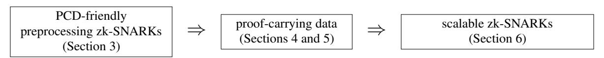
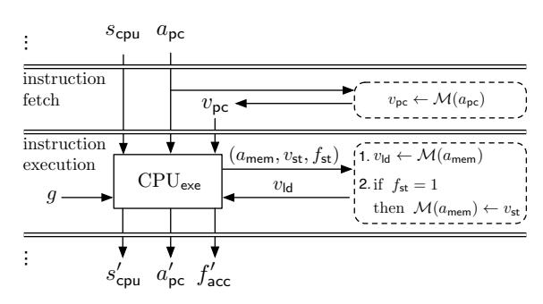

# <span id="page-0-0"></span>Scalable Zero Knowledge via Cycles of Elliptic Curves

(extended version)

Eli Ben-Sasson

Alessandro Chiesa

eli@cs.technion.ac.il

alexch@mit.edu

Technion

MIT

Eran Tromer

Madars Virza

tromer@cs.tau.ac.il

madars@mit.edu MIT

Tel Aviv University

September 18, 2016

#### Abstract

Non-interactive zero-knowledge proofs of knowledge for general NP statements are a powerful cryptographic primitive, both in theory and in practical applications. Recently, much research has focused on achieving an additional property, *succinctness*, requiring the proof to be very short and easy to verify. Such proof systems are known as *zero-knowledge succinct non-interactive arguments of knowledge* (zk-SNARKs), and are desired when communication is expensive, or the verifier is computationally weak.

Existing zk-SNARK implementations have severe scalability limitations, in terms of space complexity as a function of the size of the computation being proved (e.g., running time of the NP statement's decision program). First, the size of the proving key is quasilinear in the upper bound on the computation size. Second, producing a proof requires "writing down" all intermediate values of the entire computation, and then conducting global operations such as FFTs.

The bootstrapping technique of Bitansky et al. (STOC '13), following Valiant (TCC '08), offers an approach to scalability, by recursively composing proofs: proving statements about acceptance of the proof system's own verifier (and correctness of the program's latest step). Alas, recursive composition of known zk-SNARKs has never been realized in practice, due to enormous computational cost.

Using new elliptic-curve cryptographic techniques, and methods for exploiting the proof systems' field structure and nondeterminism, we achieve the first zk-SNARK implementation that practically achieves recursive proof composition. Our zk-SNARK implementation runs random-access machine programs and produces proofs of their correct execution, on today's hardware, for any program running time. It takes constant time to generate the keys that support *all* computation sizes. Subsequently, the proving process only incurs a constant multiplicative overhead compared to the original computation's time, and an essentially-constant additive overhead in memory. Thus, our zk-SNARK implementation is the first to have a well-defined, albeit low, clock rate of "verified instructions per second".

Keywords: computationally-sound proofs, proof-carrying data, zero knowledge, elliptic curves

# Contents

| 1 | Introduction                                                         | 3  |
|---|----------------------------------------------------------------------|----|
|   | 1.1<br>Scalability limitations of prior zk-SNARK implementations<br> | 3  |
|   | 1.2<br>What we know from theory<br>                                  | 4  |
|   | 1.3<br>Contributions<br>                                             | 4  |
|   | 1.4<br>Summary of challenges and techniques                          | 5  |
|   | 1.5<br>Follow-up work<br>                                            | 7  |
|   | 1.6<br>Roadmap                                                       | 7  |
|   |                                                                      |    |
| 2 | Preliminaries                                                        | 7  |
|   | 2.1<br>Preprocessing zk-SNARKs for arithmetic circuits               | 7  |
|   | 2.2<br>Proof-carrying data<br>                                       | 7  |
|   | 2.3<br>The bootstrapping approach                                    | 8  |
| 3 | PCD-friendly preprocessing zk-SNARKs                                 | 9  |
|   | 3.1<br>PCD-friendly cycles of elliptic curves                        | 9  |
|   | 3.2<br>Two-cycles based on MNT curves                                | 10 |
|   | 3.3<br>A matched pair of preprocessing zk-SNARKs                     | 12 |
|   | A higher-security 2-cycle<br>3.4<br>                                 | 13 |
|   |                                                                      |    |
| 4 | Proof-carrying data from PCD-friendly zk-SNARKs                      | 14 |
|   | 4.1<br>Intuition                                                     | 14 |
|   | 4.2<br>Construction                                                  | 16 |
|   | 4.3<br>Security<br>                                                  | 17 |
|   |                                                                      |    |
| 5 | Constructions of arithmetic circuits                                 | 19 |
|   | 5.1<br>Arithmetic circuits for zk-SNARK verifiers                    | 19 |
|   | 5.2<br>Arithmetic circuits for collision-resistant hashing           | 20 |
| 6 | Scalable zk-SNARKs                                                   | 21 |
|   | 6.1<br>Specifying a machine<br>                                      | 21 |
|   | 6.2<br>Construction summary                                          | 22 |
|   | 6.3<br>Arithmetic circuits for secure loads and stores<br>           | 23 |
|   | 6.4<br>The RAM compliance predicate                                  | 24 |
|   |                                                                      |    |
|   | 6.5<br>The new zk-SNARK construction                                 | 27 |
| 7 | Evaluation on vnTinyRAM                                              | 29 |
| 8 | Open problems                                                        | 31 |
|   |                                                                      |    |
|   | Acknowledgments                                                      | 31 |
| A | Computation models                                                   | 32 |
|   | A.1<br>Arithmetic circuits                                           | 32 |
|   |                                                                      |    |
|   | A.2<br>Random-access machines                                        | 32 |
|   | A.3<br>The architecture vnTinyRAM                                    | 33 |
| B | Pairings and elliptic curves                                         | 34 |
|   | B.1<br>Pairings<br>                                                  | 34 |
|   | B.2<br>Elliptic curves                                               | 34 |
|   |                                                                      |    |
| C | Preprocessing zk-SNARKs for arithmetic circuit satisfiability        | 36 |
|   | C.1<br>Known constructions and security                              | 37 |
|   | C.2<br>Instantiations via elliptic curves                            | 37 |
|   | C.3<br>The zk-SNARK verifier protocol<br>                            | 38 |
| D | Proof-carrying data for arithmetic compliance predicates             | 40 |
|   |                                                                      |    |
| E | Scalable zk-SNARKs for random-access machines                        | 42 |
|   | E.1<br>Known constructions and security                              | 43 |
|   |                                                                      |    |
|   | References                                                           | 44 |

2

# <span id="page-2-0"></span>1 Introduction

Non-interactive zero-knowledge proofs of knowledge [\[BFM88,](#page-43-1) [NY90,](#page-46-0) [BDSMP91\]](#page-43-2) are a powerful tool, studied extensively both in theoretical and applied cryptography. Recently, much research has focused on achieving an additional property, *succinctness*, that requires the proof to be very short and easy to verify. A proof system with this additional property is called a *zero-knowledge Succinct Non-interactive ARgument of Knowledge* (zk-SNARK). Because succinctness is a desirable, sometimes critical, property in numerous security applications, prior work has investigated zk-SNARK implementations. Unfortunately, all implementations to date suffer from severe scalability limitations, due to high space complexity, as we now explain.

# <span id="page-2-1"></span>1.1 Scalability limitations of prior zk-SNARK implementations

Expensive preprocessing. As in any non-interactive zero-knowledge proof, a zk-SNARK requires a onetime trusted setup of public parameters: a *key generator* samples a proving key (used to generate proofs) and a verification key (used to check proofs); the key pair is then published as the proof system's parameters.

Most zk-SNARK constructions [\[Gro10,](#page-45-0) [Lip12,](#page-46-1) [BCIOP13,](#page-43-3) [GGPR13,](#page-45-1) [PGHR13,](#page-46-2) [BCGTV13a,](#page-43-4) [Lip13,](#page-46-3) [BCTV14,](#page-43-5) [Lip14,](#page-46-4) [KPPS](#page-45-2)+14, [ZPK14,](#page-48-0) [DFGK14,](#page-45-3) [WSRBW15,](#page-48-1) [BBFR15\]](#page-43-6), including published implementations [\[PGHR13,](#page-46-2) [BCGTV13a,](#page-43-4) [BCTV14,](#page-43-5) [KPPS](#page-45-2)+14, [ZPK14,](#page-48-0) [WSRBW15,](#page-48-1) [BBFR15\]](#page-43-6), require *expensive preprocessing* during key generation. The key generator takes as input an upper bound on the computation size, e.g., an explicit NP decision circuit C output by a *circuit generator*; then, the key generator's space complexity, as well as the size of the output proving key, depends at least linearly on this upper bound. Essentially, the circuit C is explicitly laid out and encoded so as to produce the proof system's parameters.

One way to mitigate the costs of expensive preprocessing is to make C universal, i.e., design C so that it can handle more than one choice of program [\[BCTV14\]](#page-43-5). Yet, C *still* depends on upper bounds on the program size and number of execution steps. Moreover, even if key generation is carried out only once per circuit C, the resulting large proving key must be stored, and accessed, *each time a proof is generated*. Prior implementations of zk-SNARKs quickly become space-bound already for modest computation sizes, e.g., with proving keys of over 4 GB for circuits of only 16 million gates [\[BCTV14\]](#page-43-5).[1](#page-0-0)

Thus, expensive preprocessing severely limits scalability of a zk-SNARK.

Space-intensive proof generation. Related in part to the aforementioned expensive preprocessing, the prover in all published zk-SNARK implementations has large space complexity. Essentially, the proving process requires writing down the *entire* computation (e.g., the evaluation of the circuit C) all at once, and then conduct a global computation (such as Fast Fourier transforms, or multi-exponentiations) based on it. In particular, if C expresses the execution of a program, then proving requires writing down the full trace of intermediate states throughout the program execution.

Tradeoffs are possible, using block-wise versions of the global algorithms, and repeating the computation to reproduce segments of the trace. These decrease the prover's space complexity but significantly increase its time complexity, and thus do not adequately address scalability.

Remark 1.1. Even when relaxing the goal (allowing interaction, "theorem batching", or non-zero-knowledge proofs), all published implementations of proof systems for outsourcing NP computations [\[SBW11,](#page-47-0) [SMBW12,](#page-47-1) [SVPB](#page-47-2)+12, [SBVB](#page-47-3)+13, [BFRS](#page-44-0)+13] also suffer from both of the above scalability limitations. (In contrast, when outsourcing P computations, there are implementations without expensive preprocessing: [\[CMT12,](#page-44-1) [TRMP12,](#page-47-4) [Tha13\]](#page-47-5) consider low-depth circuits, and [\[CRR11\]](#page-44-2) consider outsourcing to multiple provers at least one of which is honest.)

<sup>1</sup>Even worse, the reported numbers are for "data at rest": the proving key consists of a list of elliptic-curve points, which are *compressed* when not in use. However, when the prover uses the proving key to produce a proof, the points are uncompressed (and represented via projective or Jacobian coordinates), and take about three times as much space in memory.

### <span id="page-3-0"></span>1.2 What we know from theory

Ideally, we would like to implement a zk-SNARK that does not suffer from either of the scalability limitations mentioned in the previous section, i.e., a zk-SNARK where:

- Key generation is *cheap* (i.e., its running time only depends on the security parameter) and *suffices for all computations* (of polynomial size). Such a zk-SNARK is called fully succinct.
- Proof generation is carried out *incrementally*, alongside the original computation, by updating, at each step, a proof of correctness of the computation so far. Such a zk-SNARK is called incrementally computable. Work in cryptography tells us that the above properties can be achieved in theoretical zk-SNARK constructions. Namely, building on the work of Valiant on incrementally-verifiable computation [\[Val08\]](#page-47-6) and the work of Chiesa and Tromer on proof-carrying data [\[CT10,](#page-44-3) [CT12\]](#page-44-4), Bitansky et al. [\[BCCT13\]](#page-43-7) showed how to construct zk-SNARKs that are fully-succinct and incrementally-computable.

Concretely, the approach of [\[BCCT13\]](#page-43-7) consists of a transformation that takes as input a *preprocessing* zk-SNARK (such as one from existing implementations), and *bootstraps* it, via recursive proof composition, into a new zk-SNARK that is fully-succinct and incrementally-computable. In recursive proof composition, a prover produces a proof about an NP statement that, among other checks, also ensures the accepting computation of the proof system's own verifier. In a zk-SNARK, proof verification is asymptotically cheaper than merely verifying the corresponding NP statement; so recursive proof composition is viable, in theory. In practice, however, this step introduces concretely enormous costs: even if zk-SNARK verifiers can be executed in just a few milliseconds on a modern desktop [\[PGHR13,](#page-46-2) [BCTV14\]](#page-43-5), zk-SNARK verifiers still take millions of machine cycles to execute. Hence, known zk-SNARK implementations cannot achieve *even one step* of recursive proof composition in practical time. Thus, whether recursive proof composition can be realized in practice, with any reasonable efficiency, has so far remained an intriguing open question.

Remark 1.2 (PCPs). Suitably instantiating Micali's "computationally-sound proofs" [\[Mic00\]](#page-46-5) yields fullysuccinct zk-SNARKs. However, it is not known how to also achieve incremental computation with this approach (without also invoking the aforementioned approach of Bitansky et al. [\[BCCT13\]](#page-43-7)). Indeed, [\[Mic00\]](#page-46-5) requires probabilistically-checkable proofs (PCPs) [\[BFLS91\]](#page-43-8), where one can achieve a prover that runs in quasilinear-time [\[BCGT13b\]](#page-43-9), but only by requiring space-intensive computations — again due to the need to write down the entire computation and conducting global operations on it.

# <span id="page-3-1"></span>1.3 Contributions

We present the first prototype implementation that practically achieves recursive composition of zk-SNARKs. This enables us to achieve the following results:

(i) Scalable zk-SNARKs. We present the first implementation of a zk-SNARK that is fully succinct and incrementally computable. Our implementation follows the approach of Bitansky et al. [\[BCCT13\]](#page-43-7).

Our zk-SNARK works for proving/verifying computations on a general notion of random-access machine. The key generator takes as input a *machine specification*, consisting of settings for random-access memory (number of addresses and number of bits at each address) and a CPU circuit, defining the machine's behavior. The keys sampled by the key generator support proving/verifying computations, of any polynomial length, on this machine. Thus, our zk-SNARK implementation directly supports many architectures (e.g., floating-point processors, SIMD-based processors, etc.) — one only needs to specify memory settings and a CPU circuit.

Compared to the original machine computation, our zk-SNARK only imposes a constant multiplicative overhead in time and an essentially-constant additive overhead in space. Indeed, the proving process steps through the machine's computation, each time producing a new proof that the computation is correct so far, by relying on the prior proof; each proof asserts the satisfiability of a constant-size circuit, and requires few resources in time and space to produce. Our zk-SNARK scales, on today's hardware, to any computation size.

- (ii) **Proof-carrying data.** The main tool in [BCCT13]'s approach is *proof-carrying data* (PCD) [CT10, CT12], a cryptographic primitive that encapsulates the security guarantees provided by recursive proof composition. Thus, as a stepping stone towards the aforementioned zk-SNARK implementation, we also achieve the first implementation of PCD, for arithmetic circuits.
- (iii) Evaluation on vnTinyRAM. We evaluate our zk-SNARK on a specific choice of random-access machine: vnTinyRAM, a simple RISC von Neumann architecture that is supported by the most recent preprocessing zk-SNARK implementation [BCTV14]. The evaluation confirms our expectations that our approach is slower for small computations but achieves scalability to large computations.

We evaluated our prototype on 16-bit and 32-bit vnTinyRAM with 16 registers (as in [BCTV14]). For instance, for 32-bit vnTinyRAM, our prototype incrementally proves correct program execution at the cost of 26.2 seconds per program step, using a  $55\,\mathrm{MB}$  proving key and  $993\,\mathrm{MB}$  of additional memory. In contrast, for a T-step program, the system of [BCTV14] requires roughly  $0.05 \cdot T$  seconds, provided that roughly  $3.1 \cdot T\,\mathrm{MB}$  of main memory are available. Thus for T > 321 our system is more space-efficient, and the savings in space continue to grow as T increases. (These numbers are for an 80-bit security level.)

**The road ahead.** Obtaining scalable zk-SNARKs is but one application of PCD. More generally, PCD enables efficient "distributed theorem proving", which has applications ranging from securing the IT supply chain, to information flow control, and to distributed programming-language semantics [CT10, CT12, CTV13]. Now that a first prototype of PCD has been achieved, these applications are waiting to be explored in practice.

**Remark 1.3** (parametrization). In this work we describe a concrete implementation of a cryptographic system, whose efficiency scales with the security parameter and other quantities (e.g., wordsize of a machine, size of random-access memory, and so on). Since we make several concrete choices (e.g., fixing the security level at 80 bits, fixing vnTinyRAM's wordsize to 16 or 32 bits as in [BCTV14]) many asymptotic dependencies "collapse" to constants. We focus on scalability as a function of the computation size, i.e., the number of steps and amount of memory in the original program's execution on the concrete random-access machine.

#### <span id="page-4-0"></span>1.4 Summary of challenges and techniques

As we recall in Section 2, bootstrapping zk-SNARKs involves two main ingredients: a collision-resistant hash function and a preprocessing zk-SNARK. Practical implementations of both ingredients exist. So one may conclude that "practical bootstrapping" is merely a matter of stitching together implementations of these two ingredients. As we now explain, this conclusion is mistaken, because bootstrapping a zk-SNARK in practice poses several challenges that must be tackled in order to obtain any reasonable efficiency.

Common theme: leverage field structure. The techniques that we employ to overcome efficiency barriers leverage the fact that the "native" NP language whose membership is proved/verified by the zk-SNARK is the satisfiability of  $\mathbb{F}$ -arithmetic circuits, for a certain finite field  $\mathbb{F}$ . While any NP statement can be reduced to  $\mathbb{F}$ -arithmetic circuits, the proof system is most efficient for statements expressible as  $\mathbb{F}$ -arithmetic circuits of small size. Prior work only partially leveraged this fact, by using circuits that conduct large-integer arithmetic or "pack" bits into field elements for non-bitwise checks (e.g., equality) [PGHR13, BCGTV13a, BFRS<sup>+</sup>13, BCTV14]. In this paper, we go further and, for improved efficiency, use circuits that conduct *field operations*.

#### 1.4.1 Challenge: how to efficiently "close the loop"?

By far the most prominent challenge is efficiently "closing the loop". In the bootstrapping approach, each step requires proving a statement that (i) verifies the validity of previous zk-SNARK proofs; and (ii) checks another execution step. For recursive composition, this statement needs to be expressed as an  $\mathbb{F}$ -arithmetic circuit  $C_{pcd}$ , so that it can be proved using the very same zk-SNARK. In particular, we need to *implement the verifier* V as an  $\mathbb{F}$ -arithmetic circuit  $C_V$  (a subcircuit of  $C_{pcd}$ ).

In principle, constructing  $C_V$  is possible, because circuits are a universal model of computation. And not just in principle: much research has been devoted to improve the efficiency and functionality of circuit generators in practice [SVPB+12, BCGT13a, SBVB+13, PGHR13, BCGTV13a, BCTV14]. Hence, a reasonable approach to construct  $C_V$  is to apply a suitable circuit generator to a suitable software implementation of V.

However, such an approach is likely to be inefficient. Circuit generators strive to support complex program computations, by providing ways to efficiently handle data-dependent control flow, memory accesses, and so on. Instead, verifiers in preprocessing zk-SNARK constructions are "circuit-like" programs, consisting of few pairing-based arithmetic checks that do not use complex data-dependent control flow or memory accesses.

Thus, we want to avoid circuit generators, and somehow directly construct  $C_V$  so that its size is not huge. As we shall explain (see Section 3), this is not merely a programmatic difficulty, but there are *mathematical obstructions* to constructing  $C_V$  efficiently.

Main technique: PCD-friendly cycles of elliptic curves. In our underlying preprocessing zk-SNARK, the verifier V consists mainly of operations in an elliptic curve over a field  $\mathbb{F}'$ , and is thus expressed, most efficiently, as a  $\mathbb{F}'$ -arithmetic circuit. We observe that if this field  $\mathbb{F}'$  is the same as the aforementioned native field  $\mathbb{F}$  of the zk-SNARK's statement, then recursive composition can be orders of magnitude more efficient than otherwise. Unfortunately, as we shall explain, the "field matching"  $\mathbb{F} = \mathbb{F}'$  is mathematically impossible.

In contrast, we show how to circumvent this obstruction by using multiple, suitably-chosen elliptic curves, that lie on a *PCD-friendly cycle*. For example, a PCD-friendly 2-cycle consists of two curves such that the (prime) size of the base field of one curve equals the group order of the other curve, and vice versa. Our implementation uses a PCD-friendly cycle of elliptic curves (found at a great computational expense) to attain zk-SNARKs that are *tailored* for recursive proof composition.

Additional technique: nondeterministic verification of pairings. The zk-SNARK verifier involves, more specifically, several pairing-based checks over its elliptic curve. Yet, each pairing evaluation is very expensive, if not carefully performed. To further improve efficiency, we exploit the fact that the zk-SNARK supports NP statements, and provide a hand-optimized circuit implementation of the zk-SNARK verifier that leverages nondeterminism for improved efficiency. For instance, in our construction, we make heavy use of *affine* coordinates for both curve arithmetic and divisor evaluations [LMN10], because these are particularly efficient to *verify* (as opposed to *computing*, for which projective or Jacobian coordinates are known to be faster).

#### <span id="page-5-0"></span>1.4.2 Challenge: how to efficiently verify collision-resistant hashing?

Bootstrapping zk-SNARKs uses, at multiple places, a collision-resistant hash function H and an arithmetic circuit  $C_H$  for verifying computations of H. If not performed efficiently, this would be another bottleneck.

For instance, the aforementioned circuit  $C_{pcd}$ , besides verifying prior zk-SNARK proofs, is also tasked with verifying one step of machine execution. This involves not only checking the CPU execution but also the validity of loads and stores to random-access memory, done via memory-checking techniques based on Merkle trees [BEGKN91, BCGT13a]. Thus  $C_{pcd}$  also needs to have a subcircuit to check Merkle-tree authentication paths. Constructing such circuits is straightforward, given a circuit  $C_H$  for verifying computations of H. But the main question here is how to pick H so that  $C_H$  can be small. Indeed, if random-access memory consists of A addresses, then checking an authentication path requires at least  $\lceil \log A \rceil \cdot |C_H|$  gates. If  $C_H$  is large, this subcircuit dwarfs the CPU, and "wastes" most of the size of  $C_{pcd}$  for a single load/store.

Merely picking some standard choice of hash function H (e.g., SHA-256 or Keccak) yields  $C_H$  with tens of thousands of gates [PGHR13, BCGG<sup>+</sup>14], making hash verifications very expensive. Is this inherent?

**Additional technique: field-specific hashes.** We select a hash H that is tailored to efficient verification in the field  $\mathbb{F}$ . In our setting,  $\mathbb{F}$  has prime order p, so its additive group is isomorphic to  $\mathbb{Z}_p$ . Thus, a natural approach is to let H be a *modular subset-sum* function over  $\mathbb{Z}_p$ . For suitable parameter choices and for random coefficients, subset-sum functions are collision-resistant [Ajt96, GGH96]. In this paper we base all

of our collision-resistant hashing on suitable subset sums, and thereby greatly reduce the burden of hashing.<sup>2</sup>

### <span id="page-6-0"></span>1.5 Follow-up work

Since the publication of the conference version of this work in CRYPTO 2014, there has been follow-up research building on it. Chiesa et al. [CTV15] extend and then apply PCD to construct zero-knowledge proofs for a class of cluster computations in which the proving process is itself a cluster computation. Costello et al. [CFHK+15] build on our idea of obtaining bounded recursive proof composition, using PCD-friendly *chains* of elliptic curves found via the Cocks–Pinch method (see Remark 3.2 and Footnote 8), in order to construct a zk-SNARK that is inbetween a preprocessing zk-SNARK and a fully-succinct one.

# <span id="page-6-1"></span>1.6 Roadmap

The rest of this paper is organized as follows. In Section 2 we recall the main ideas of [BCCT13]'s approach. Then we discuss our construction in more detail, in the following three steps:



In Section 7, we evaluate our system on the machine vnTinyRAM. In Section 8, we discuss open problems.

### <span id="page-6-2"></span>2 Preliminaries

We give here the essential definitions needed for the technical discussions in the body of the paper; more detailed definitions can be found in the appendices (where some definitions are taken verbatim from [BCTV14]).

We denote by  $\mathbb{F}$  a field, and by  $\mathbb{F}_n$  the field of size n. Throughout, we assume familiarity with finite fields; for background on these, see the book of Lidl and Niederreiter [LN97].

# <span id="page-6-3"></span>2.1 Preprocessing zk-SNARKs for arithmetic circuits

Given a field  $\mathbb{F}$ , the *circuit satisfaction problem* of an  $\mathbb{F}$ -arithmetic circuit  $C \colon \mathbb{F}^n \times \mathbb{F}^h \to \mathbb{F}^l$  is defined by the relation  $\mathcal{R}_C = \{(x,a) \in \mathbb{F}^n \times \mathbb{F}^h : C(x,a) = 0^l\}$ ; its language is  $\mathcal{L}_C = \{x \in \mathbb{F}^n : \exists \ a \in \mathbb{F}^h, \ C(x,a) = 0^l\}$ .

A **preprocessing zk-SNARK** for  $\mathbb F$ -arithmetic circuit satisfiability (see, e.g., [BCIOP13]) is a triple of polynomial-time algorithms (G,P,V), called *key generator*, *prover*, and *verifier*. The key generator G, given a security parameter  $\lambda$  and an  $\mathbb F$ -arithmetic circuit  $C\colon \mathbb F^n\times \mathbb F^h\to \mathbb F^l$ , samples a *proving key* pk and a *verification key* vk; these are the proof system's public parameters, which need to be generated only once per circuit. After that, anyone can use pk to generate non-interactive proofs for the language  $\mathcal L_C$ , and anyone can use the vk to check these proofs. Namely, given pk and any  $(x,a)\in \mathcal R_C$ , the honest prover  $P(\operatorname{pk},x,a)$  produces a proof  $\pi$  attesting that  $x\in \mathcal L_C$ ; the verifier  $V(\operatorname{vk},x,\pi)$  checks that  $\pi$  is a valid proof for  $x\in \mathcal L_C$ . A proof  $\pi$  is a proof of knowledge, as well as a (statistical) zero-knowledge proof. The succinctness property requires that  $\pi$  has length  $O_\lambda(1)$  and V runs in time  $O_\lambda(|x|)$ , where  $O_\lambda$  hides a (fixed) polynomial in  $\lambda$ .

See Appendix C for details.

## <span id="page-6-4"></span>2.2 Proof-carrying data

Proof-carrying data (PCD) [CT10, CT12] is a cryptographic primitive that encapsulates the security guarantees obtainable via recursive composition of proofs. Since recursive proof composition naturally involves multiple (physical or virtual) parties, PCD is phrased in the language of a dynamically-evolving *distributed computation*

<sup>&</sup>lt;sup>2</sup>We note that subset-sum functions were also used in [BFRS<sup>+</sup>13], but, crucially, they were *not* tailored to the field. This is a key difference in usage and efficiency. (E.g., our hash function can be verified in  $\leq 300$  gates, while [BFRS<sup>+</sup>13] report 13,000.)

among mutually-untrusting computing nodes, who perform local computations, based on local data and previous messages, and then produce output messages. Given a *compliance predicate*  $\Pi$  to express local checks, the goal of PCD is to ensure that any given message z in the distributed computation is  $\Pi$ -compliant, i.e., is consistent with a history in which each node's local computation satisfies  $\Pi$ . This formulation includes as special cases incrementally-verifiable computation [Val08] and targeted malleability [BSW12].

Concretely, a proof-carrying data (PCD) system is a triple of polynomial-time algorithms  $(\mathbb{G}, \mathbb{P}, \mathbb{V})$ , called *key generator*, *prover*, and *verifier*. The key generator  $\mathbb{G}$  is given as input a predicate  $\Pi$  (specified as an arithmetic circuit), and outputs a proving key pk and a verification key vk; these keys allow anyone to prove/verify that a piece of data z is  $\Pi$ -compliant. This is achieved by attaching a short and easy-to-verify proof to each piece of data. Namely, given pk, received messages  $\vec{z}_{\text{in}}$  with proofs  $\vec{\pi}_{\text{in}}$ , local data  $z_{\text{loc}}$ , and a claimed outgoing message z,  $\mathbb{P}$  computes a new proof  $\pi$  to attach to z, which attests that z is  $\Pi$ -compliant; the verifier  $\mathbb{V}(\mathsf{vk}, z, \pi)$  verifies that z is  $\Pi$ -compliant. A proof  $\pi$  is a proof of knowledge, as well as a (statistical) zero-knowledge proof; succinctness requires that  $\pi$  has length  $O_{\lambda}(1)$  and  $\mathbb{V}$  runs in time  $O_{\lambda}(|z|)$ .

Finally, note that since  $\Pi$  is expressed as an  $\mathbb{F}$ -arithmetic circuit for a given field  $\mathbb{F}$ , the size of messages and local data are fixed; we denote these sizes by  $n_{\mathsf{msg}}, n_{\mathsf{loc}} \in \mathbb{N}$ . Similarly, the number of input messages is also fixed; we call this the arity, and denote it by  $s \in \mathbb{N}$ . Moreover, for convenience,  $\Pi$  also takes as input a flag  $b_{\mathsf{base}} \in \{0,1\}$  denoting whether the node has no predecessors (i.e.,  $b_{\mathsf{base}}$  is a "base-case" flag). Overall,  $\Pi$  takes an input  $(z, z_{\mathsf{loc}}, \vec{z}_{\mathsf{in}}, b_{\mathsf{base}}) \in \mathbb{F}^{n_{\mathsf{msg}}} \times \mathbb{F}^{n_{\mathsf{loc}}} \times \mathbb{F}^{s \cdot n_{\mathsf{msg}}} \times \mathbb{F}$ .

See Appendix D for details.

# <span id="page-7-0"></span>2.3 The bootstrapping approach

Our implementation follows [BCCT13], which we now review. The approach consists of a transformation that, on input a preprocessing zk-SNARK and a collision-resistant hash function, outputs a scalable zk-SNARK. Thus, the input zk-SNARK is *bootstrapped* into one with improved scalability properties.

So fix a preprocessing zk-SNARK (G, P, V) and collision-resistant function H. The goal is to construct a fully-succinct incrementally-computable zk-SNARK  $(G^{\star}, P^{\star}, V^{\star})$  for proving/verifying the correct execution on a given random-access machine  $\mathbf{M}$ . Informally, we describe the transformation in four steps.

**Step 1: from zk-SNARKs to PCD.** The first step, independent of M, is to construct a PCD system  $(\mathbb{G}, \mathbb{P}, \mathbb{V})$ , by using the zk-SNARK (G, P, V). This step involves recursive composition of zk-SNARK proofs.

Step 2: delegate the machine's memory. The second step is to reduce the footprint of the machine M, by delegating its random-access memory to an untrusted storage, via standard memory-checking techniques based on Merkle trees [BEGKN91, BCGT13a]. We thus modify M so that its "CPU" receives values loaded from memory as nondeterministic guesses, along with corresponding authentication paths that are checked against the root of a Merkle tree based on the hash function H. Thus, the entire state of M only consists of a (short) CPU state, and a (short) root of the Merkle tree that "summarizes" memory.<sup>3</sup>

Step 3: design a predicate  $\Pi_{\mathbf{M},H}$  for step-wise verification. The third step is to design a compliance predicate  $\Pi_{\mathbf{M},H}$  that ensures that the only  $\Pi_{\mathbf{M},H}$ -compliant messages z are the ones that result from the correct execution of the (modified) machine  $\mathbf{M}$ , one step at a time; this is analogous to the notion of incremental computation [Val08]. Crucially, because  $\Pi_{\mathbf{M},H}$  is only asked to verify one step of execution at a time, we can implement  $\Pi_{\mathbf{M},H}$ 's requisite checks with a circuit of merely constant size.

Step 4: construct new proof system. The new zk-SNARK  $(G^*, P^*, V^*)$  is constructed as follows. The new key generator  $G^*$  is set to the PCD generator  $\mathbb G$  invoked on  $\Pi_{\mathbf M,H}$ . The new prover  $P^*$  uses the PCD prover  $\mathbb P$  to prove correct execution of  $\mathbf M$ , one step at a time and conducting the incremental distributed

<sup>&</sup>lt;sup>3</sup> Similarly to [BCCT13] and our realization thereof, Braun et al. [BFRS<sup>+</sup>13] leverage memory-checking techniques based on Merkle trees [BEGKN91] for the purpose of enabling a circuit to "securely" load from and store to an untrusted storage. However, the systems' goals (delegation of MapReduce computations via a 2-move protocol) and techniques are different (cf. Footnote 2).

computation "in his head". The new verifier  $V^*$  simply uses the PCD verifier  $\mathbb{V}$  to verify  $\Pi_{\mathbf{M},H}$ -compliance. In sum, since  $\Pi_{\mathbf{M},H}$  is small and suffices for all computations, the new zk-SNARK is scalable: it is fully succinct; moreover, because the new prover computes a proof for each new step based on the previous one, it is also incrementally computable. (See Appendix E for definitions of these properties.)

Our goal is to realize the above approach in a practical implementation.

**Security of recursive proof composition.** Security in [BCCT13] is proved by using the *proof-of-knowledge property* of zk-SNARKs; we refer the interested reader to [BCCT13] for details. One aspect that must be addressed from a theoretical standpoint is the *depth* of composition. Depending on assumption strength, one may have to recursively compose proofs in "proof trees above the message chain", rather than along the chain. From a practical perspective we make the heuristic assumption that depth of composition does not affect security of the zk-SNARK, because no evidence suggests otherwise for the constructions that we use.

# <span id="page-8-0"></span>3 PCD-friendly preprocessing zk-SNARKs

We first construct preprocessing zk-SNARKs that are tailored for efficient recursive composition of proofs. Later, in Section 5, we discuss how we use such zk-SNARKs to construct a PCD system.

# <span id="page-8-1"></span>3.1 PCD-friendly cycles of elliptic curves

Let  $\mathbb{F}$  be a finite field, and (G,P,V) a preprocessing zk-SNARK for  $\mathbb{F}$ -arithmetic satisfiability. The idea of recursive proof composition is to prove/verify satisfiability of an  $\mathbb{F}$ -arithmetic circuit  $C_{pcd}$  that checks the validity of previous proofs (among other things). Thus, we need to implement the verifier V as an  $\mathbb{F}$ -arithmetic circuit  $C_V$ , to be used as a sub-circuit of  $C_{pcd}$ .

How to write  $C_V$  depends on the algorithm of V, which in turn depends on which elliptic curve is used to instantiate the pairing-based zk-SNARK. For prime r, in order to prove statements about  $\mathbb{F}_r$ -arithmetic circuit satisfiability, one instantiates (G, P, V) using an elliptic curve E defined over some finite field  $\mathbb{F}_q$ , where the group  $E(\mathbb{F}_q)$  of  $\mathbb{F}_q$ -rational points has order  $r=\#E(\mathbb{F}_q)$  (or, more generally, r divides  $\#E(\mathbb{F}_q)$ ). Then, all of V's arithmetic computations are over  $\mathbb{F}_q$ , or extensions of  $\mathbb{F}_q$  up to degree k, where k is the embedding degree of E with respect to r (i.e., the smallest integer k such that r divides  $q^k-1$ ). (See Appendix C.2.)

We motivate our approach by first describing two "failed attempts".

Attempt #1: pick curve with q = r. Ideally, we would like to select a curve E with q = r, so that V's arithmetic is over the *same field* for which V's native NP language is defined. Unfortunately, this cannot happen: the condition that E has embedding degree k with respect to r implies that r divides  $q^k - 1$ , which implies that  $q \neq r$ . The same implication holds even if  $E(\mathbb{F}_q)$  has a non-prime order n and the prime r (with respect to which k is defined) only divides n. So, while appealing, this idea cannot even be instantiated.<sup>4</sup>

Attempt #2: long arithmetic. Since we are stuck with  $q \neq r$ , we may consider doing "long arithmetic": simulating  $\mathbb{F}_q$  operations via  $\mathbb{F}_r$  operations, by working with bit chunks to perform integer arithmetic, and modding out by q when needed. Alas, having to work at the "bit level" implies a blowup on the order of  $\log q$  compared to native arithmetic. So, while this approach can at least be instantiated, it is very expensive.<sup>5</sup>

Our approach: cycle through multiple curves. We formulate, and instantiate, a new property for elliptic curves that enables us to completely circumvent long arithmetic, even with  $q \neq r$ . In short, our idea is to base recursive proof composition, not on a single zk-SNARK, but on *multiple* zk-SNARKs, each instantiated on a different elliptic curve, that *jointly* satisfy a special property.

<sup>&</sup>lt;sup>4</sup>Besides, the condition  $q = \#E(\mathbb{F}_q)$  is undesirable even when not ruled out (e.g., when  $k = \infty$ ): on such curves, known as *anomalous*, discrete logarithms can be computed in polynomial time via the SSSA attack [Sem98, Sma99, SA98].

<sup>&</sup>lt;sup>5</sup>Showing that it is *provably* expensive requires stronger circuit lower bounds than currently known [Raz87, Smo87, GLS09].

For the simplest case, suppose we have two primes  $q_{\alpha}$  and  $q_{\beta}$ , and elliptic curves  $E_{\alpha}/\mathbb{F}_{q_{\alpha}}$  and  $E_{\beta}/\mathbb{F}_{q_{\beta}}$  such that  $q_{\alpha}=\#E_{\beta}(\mathbb{F}_{q_{\beta}})$  and  $q_{\beta}=\#E_{\alpha}(\mathbb{F}_{q_{\alpha}})$ , i.e., the size of the base field of one curve equals the group order of the other curve, and vice versa. We then construct two preprocessing zk-SNARKs  $(G_{\alpha},P_{\alpha},V_{\alpha})$  and  $(G_{\beta},P_{\beta},V_{\beta})$ , respectively instantiated on the two curves  $E_{\alpha}/\mathbb{F}_{q_{\alpha}}$  and  $E_{\beta}/\mathbb{F}_{q_{\beta}}$ .

Now note that  $(G_{\alpha}, P_{\alpha}, V_{\alpha})$  works for  $\mathbb{F}_{q_{\beta}}$ -arithmetic circuit satisfiability, but all of  $V_{\alpha}$ 's arithmetic computations are over  $\mathbb{F}_{q_{\alpha}}$  (or extensions thereof); while  $(G_{\beta}, P_{\beta}, V_{\beta})$  works for  $\mathbb{F}_{q_{\alpha}}$ -arithmetic circuits, but  $V_{\beta}$ 's arithmetic computations are over  $\mathbb{F}_{q_{\beta}}$  (or extensions thereof). Instead of having each zk-SNARK handle statements about its own verifier, as in the prior attempts (i.e., writing  $V_{\alpha}$  as a  $\mathbb{F}_{q_{\beta}}$ -arithmetic circuit, or  $V_{\beta}$  as a  $\mathbb{F}_{q_{\alpha}}$ -arithmetic circuit), we instead let each zk-SNARK handle statements about the verifier of the other zk-SNARK. That is, we write  $V_{\alpha}$  as a  $\mathbb{F}_{q_{\alpha}}$ -arithmetic circuit  $C_{V_{\alpha}}$ , and  $V_{\beta}$  as a  $\mathbb{F}_{q_{\beta}}$ -arithmetic circuit  $C_{V_{\beta}}$ .

We can then perform recursive proof composition by *alternating* between the two proof systems. Roughly, one can use  $P_{\alpha}$  to prove successful verification of a proof by  $C_{V_{\beta}}$  and, conversely,  $P_{\beta}$  to prove successful verification of a proof by  $C_{V_{\alpha}}$ . Doing so in alternation ensures that fields "match up", and no long arithmetic is needed. (This sketch omits key technical details; see Section 4.)

Since  $E_{\alpha}$  and  $E_{\beta}$  facilitate constructing PCD, we say that  $(E_{\alpha}, E_{\beta})$  is a *PCD-friendly 2-cycle of elliptic curves*. More generally, the idea extends to cycling through  $\ell$  curves satisfying this definition:

<span id="page-9-2"></span>**Definition 3.1.** Let  $E_0, \ldots, E_{\ell-1}$  be elliptic curves, respectively defined over finite fields  $\mathbb{F}_{q_0}, \ldots, \mathbb{F}_{q_{\ell-1}}$ , with each  $q_i$  a prime. We say that  $(E_0, \ldots, E_{\ell-1})$  is a **PCD-friendly cycle** of length  $\ell$  if each  $E_i$  is pairing friendly and, moreover,  $\forall i \in \{0, \ldots, \ell-1\}, \ q_i = \#E_{i+1 \mod \ell}(\mathbb{F}_{q_{i+1} \mod \ell})$ .

To our knowledge this notion has not been explicitly sought before.<sup>6</sup> Though, fortunately, a family that satisfies this notion is already known, as discussed in the next subsection.

<span id="page-9-1"></span>**Remark 3.2** (relaxation). One can relax Definition 3.1 to require a weaker, but still useful, condition: for each  $i \in \{0, \dots, \ell-1\}$ ,  $q_i$  divides  $\#E(\mathbb{F}_{i+1 \bmod \ell})$ . Even if weaker, this condition is *still* very strong. For instance, it implies that each curve  $E_i$  has  $\rho$ -value  $\approx 1$ , i.e., that each  $E_i$  has near-prime order. Constructing pairing-friendly curves with such good  $\rho$ -values is challenging even without the cycle condition!

Hence, generic methods such as Cocks–Pinch [CP01] and Dupont–Enge–Morain [DEM05], which yield (with high probability) curves with  $\rho$ -values > 1 (specifically,  $\approx 2$ ), cannot be used to construct PCD-friendly cycles.<sup>8</sup> This also applies to generalizations of the Cocks–Pinch method [BLS03, BW05, SB06] that improve the  $\rho$ -value to be  $1 < \rho < 2$ . In this work we do not investigate the above relaxation because, we can fulfill Definition 3.1 with  $\ell = 2$ , the minimal length possible.

#### <span id="page-9-0"></span>3.2 Two-cycles based on MNT curves

We construct pairs of elliptic curves,  $E_4$  and  $E_6$ , that form PCD-friendly 2-cycles  $(E_4, E_6)$ . These are MNT curves [MNT01] of embedding degrees 4 and 6. Our construction also ensures that  $E_4$  and  $E_6$  are sufficiently 2-adic (see below), a desirable property for efficient implementations of preprocessing zk-SNARKs.

<sup>&</sup>lt;sup>6</sup>Definition 3.1 is reminiscent, but different from, the notion of an *aliquot cycle* of elliptic curves by Silverman and Stange [SS11]. An aliquot cycle considers a *single* curve (over  $\mathbb Q$ ) reduced at  $\ell$  primes, rather than  $\ell$  curves, and does not require pairing-friendliness.

<sup>7</sup>For each  $i \in \{0, \dots, \ell-1\}$ , the condition that  $q_{i-1}$  divides # $E(\mathbb F_i)$  implies, via the Hasse bound, that  $h_i q_{i-1} \leq q_i \cdot (1+2/\sqrt{q_i})$  for some cofactor  $h_i \in \mathbb N$ ; hence  $\log q_{i-1} \leq \log q_i + \log(1+2/\sqrt{q_i}) - \log h_i$ , and thus  $\frac{\log q_{i-1}}{\log q_i} \leq 1 + \frac{\log(1+2/\sqrt{q_i})}{\log q_i} \leq 1 + \frac{2}{\sqrt{q_i}\log q_i} = 1 + a_i$  for  $a_i := \frac{2}{\sqrt{q_i}\log q_i}$ . Note that each  $a_i$  is exponentially small. Therefore, for each  $i \in \{0, \dots, \ell-1\}$ , we can upper bound the  $\rho$ -value of  $E_i$ , equal to  $\frac{\log q_i}{\log q_{i-1}}$ , as follows:  $\frac{\log q_i}{\log q_{i-1}} = \prod_{j \neq i} \frac{\log q_{j-1}}{\log q_j} \leq \prod_{j \neq i} (1 + a_j) = 1 + \sum_{j \neq i} a_j + \prod_{j \neq i} a_j$ . In sum, the  $\rho$ -value of  $E_i$  is upper bounded by  $1 + \epsilon_i$ , where the quantity  $\epsilon_i := \sum_{j \neq i} a_j + \prod_{j \neq i} a_j$  is exponentially small.

<sup>&</sup>lt;sup>8</sup> At best, such methods can be used to construct PCD-friendly "chains", which can be used to reduce the space complexity of preprocessing zk-SNARKs via a limited application of recursive proof composition. But the large  $\rho$ -values would imply that each recursive composition roughly doubles the cost of the zk-SNARK so that long chains do not seem to be advantageous.

MNT curves and the KT correspondence. Miyaji, Nakabayashi, and Takano [MNT01] characterized prime-order elliptic curves with embedding degrees k=3,4,6; such curves are now known as MNT curves. Given an elliptic curve E defined over a prime field  $\mathbb{F}_q$ , they gave necessary and sufficient conditions on the pair (q,t), where t is the trace of E over  $\mathbb{F}_q$ , for E to have embedding degree k=3,4,6. We refer to an MNT curve with embedding degree k as an MNTk curve. Karabina and Teske [KT08] proved an explicit 1-to-1 correspondence between MNT4 and MNT6 curves:

**Theorem 3.3** ([KT08]). Let r, q > 64 be primes. Then the following two conditions are equivalent:

- 1. r and q represent an elliptic curve  $E_4/\mathbb{F}_q$  with embedding degree k=4 and  $r=\#E(\mathbb{F}_q)$ ;
- 2. r and q represent an elliptic curve  $E_6/\mathbb{F}_r$  with embedding degree k=6 and  $q=\#E(\mathbb{F}_r)$ .

### PCD-friendly 2-cycles on MNT curves. The above theorem implies that:

Each MNT6 curve lies on a PCD-friendly 2-cycle with the corresponding MNT4 curve (and vice versa).

Thus, a PCD-friendly 2-cycle can be obtained by constructing an MNT4 curve and its corresponding MNT6 curve. Next, we explain at high level how this can be done.

**Constructing PCD-friendly 2-cycles.** First, we recall the only known method to construct MNTk curves [MNT01]. It consists of two steps:

- Step I: curve discovery. Find suitable  $(q,t) \in \mathbb{N}^2$  such that there exists an ordinary elliptic curve  $E/\mathbb{F}_q$  of prime order r := q+1-t and embedding degree k.
- Step II: curve construction. Starting from (q, t), use the Complex-Multiplication method (CM method) [AM93] to compute the equation of E over  $\mathbb{F}_q$ .

The complexity of Step II depends on the discriminant D of E, which is the square-free part of  $4q-t^2$ . At present, the CM method is feasible for discriminants D up to size  $10^{16}$  [Sut12]. Thus, Step I is conducted in a way that results in candidate parameters (q,t) inducing relatively-small discriminants, to aid Step II. (Instead, "most" (q,t) induce a discriminant D of size  $\sqrt{q}$ , which is too large to handle.) Concretely, [MNT01] derived, for  $k \in \{3,4,6\}$  and discriminant D, Pell-type equations whose solutions yield candidate parameters (q,t) for MNTk curves  $E/\mathbb{F}_q$  of trace t and discriminant t. So Step I can be performed by iteratively solving the MNTk Pell-type equation, for increasing discriminant size, until a suitable (q,t) is found.

The above strategy can be extended, in a straightforward way, to construct PCD-friendly 2-cycles. First perform Step I to obtain suitable parameters  $(q_4,t_4)$  for an MNT4 curve  $E_4/\mathbb{F}_{q_4}$ ; the parameters  $(q_6,t_6)$  for the corresponding MNT6 curve  $E_6/\mathbb{F}_{q_6}$  are  $q_6:=q_4+1-t_4$  and  $t_6:=2-t_4$ . Then perform Step II for  $(q_4,t_4)$  to compute the equation of  $E_4$ , and then also for  $(q_6,t_6)$  to compute that of  $E_6$ . The complexity in both cases is the same: one can verify that  $E_4$  and  $E_6$  have the same discriminant. The two curves  $E_4$  and  $E_6$  form a PCD-friendly 2-cycle  $(E_4,E_6)$ .

**Suitable cycle parameters.** We now explain what "suitable  $(q_4, t_4)$ " means in our context, by specifying a list of additional properties that we wish a PCD-friendly cycle to satisfy.

- Bit lengths. In a 2-cycle  $(E_4, E_6)$ , the curve  $E_4$  is "less secure" than  $E_6$ , because  $E_4$  has embedding degree 4 while  $E_6$  has embedding degree 6. Thus, we use  $E_4$  to set lower bounds on bit lengths. Since we aim at a security level of 80 bits, we need  $r_4 \ge 2^{160}$  and  $q_4 \ge 2^{240}$  (so that  $\sqrt{r_4} \ge 2^{80}$  and  $q_4^4 \ge 2^{960}$  [FST10]). Since  $\log r_4 \approx \log q_4$  for MNT4 curves, we only need to ensure that  $q_4$  has at least 240 bits.
- Towering friendliness. We restrict our focus to moduli  $q_4$  and  $q_6$  that are towering friendly (i.e., congruent to 1 modulo 6) [BS10]; this improves the efficiency of arithmetic in  $\mathbb{F}_{q_4}^4$  and  $\mathbb{F}_{q_6}^6$  (and their subfields).

<sup>&</sup>lt;sup>9</sup>Alas, since  $E_4$  has a low embedding degree, the ECDLP in  $E(\mathbb{F}_{q_4})$  and DLP in  $\mathbb{F}_{q_4}^4$  are "unbalanced": the former provides 120 bits of security, while the latter only 80. Moreover, the same is true for  $E_6$ : the ECDLP in  $E(\mathbb{F}_{q_6})$  provides 120 bits of security, while the DLP in  $\mathbb{F}_{q_4}^6$  only 80. Finding PCD-friendly cycles without these inefficiencies is an open problem (see Section 8).

• 2-adicity. As discussed in [BCGTV13a, BCTV14], if a pairing-based preprocessing zk-SNARK (G, P, V) is instantiated with an elliptic curve  $E/\mathbb{F}_q$  of prime order r (or with  $\#E(\mathbb{F}_q)$  divisible by a prime r), it is important, for efficiency reasons, that r-1 is divisible by a large power of 2, i.e.,  $\nu_2(r-1)$  is large. (Recall that  $\nu_2(n)$ , the 2-adic order of n, is the largest power of 2 dividing n.) Concretely, if G is invoked on an  $\mathbb{F}_r$ -arithmetic circuit C, it is important that  $\nu_2(r-1) \geq \lceil \log |C| \rceil$ . We call  $\nu_2(r-1)$  the 2-adic order of E, or the 2-adicity of E. (See Appendix C.2 for more details.)

So let  $\ell_4$  and  $\ell_6$  be the target values for  $\nu_2(r_4-1)$  and  $\nu_2(r_6-1)$ . One can verify that, for any MNT-based PCD-friendly 2-cycle  $(E_4,E_6)$ , it holds that  $\nu_2(r_4-1)=2\cdot\nu_2(r_6-1)$ ; in other words,  $E_4$  is always "twice as 2-adic" as  $E_6$ . Thus, to achieve the target 2-adic orders, it suffices to ensure that  $\nu_2(r_4-1)\geq \max\{\ell_4,2\ell_6\}$  (where, as before,  $r_4:=q_4+1-t_4$ ). As we shall see (in Section 5), in this paper it will suffice to take  $\nu_2(r_4-1)\geq 34$ .

Of the above properties, the most restrictive one is 2-adicity, because it requires seeing enough curves until, "by sheer statistics", one finds  $(q_4,t_4)$  with a high-enough value for  $\nu_2(r_4-1)$ . Collecting enough samples is costly because, as discriminant size increases, the density of MNT curves decreases: empirically, one finds that the number MNT curves with discriminant  $D \leq N$  is (approximately) less than  $\sqrt{N}$  [KT08].

An extensive computation for a suitable cycle. Overall, finding and constructing a suitable cycle required a substantial computational effort.

- Cycle discovery. In order to find suitable parameters for a cycle, we explored a large space: all discriminants up to  $1.1 \cdot 10^{15}$ , requiring about 610,000 core-hours on a large cluster of modern x86 servers. Our search algorithm is a modification of [KT08, Algorithm 3]. Among all the 2-cycles that we found, we selected parameters  $(q_4, t_4)$  and  $(q_6, t_6)$  for a 2-cycle  $(E_4, E_6)$  of curves such that: (i)  $q_4, q_6$  each have 298 bits; (ii)  $q_4, q_6$  are towering friendly; and (iii)  $\nu_2(r_4 1) = 34$  and  $\nu_2(r_6 1) = 17$ . The bit length of  $q_4, q_6$  is higher than the lower bound of 240; we entail this cost so to pick a rare cycle with high 2-adicity, which helps the zk-SNARK's efficiency more than the slowdown incurred by the higher bit length.
- Cycle construction. Both  $E_4$  and  $E_6$  have discriminant 614144978799019, whose size requires state-of-the-art techniques in the CM method [Sut11, ES10, Sut12] in order to explicitly construct the curves. Below, we report the parameters and equations for the 2-cycle  $(E_4, E_6)$  that we selected.

```
\begin{split} E_4/\mathbb{F}_{q_4}: y^2 &= x^3 + A_4x + B_4 \text{ where} \\ A_4 &= 2, \\ B_4 &= 423894536526684178289416011533888240029318103673896002803341544124054745019340795360841685, \\ q_4 &= 475922286169261325753349249653048451545124879242694725395555128576210262817955800483758081. \end{split}
```

$$E_6/\mathbb{F}_{q_6}: y^2 = x^3 + A_6x + B_6$$
 where  $A_6 = 11$ .

 $B_6 = 106700080510851735677967319632585352256454251201367587890185989362936000262606668469523074, \\ q_6 = 475922286169261325753349249653048451545124878552823515553267735739164647307408490559963137.$

**Security.** One may wonder if curves lying on PCD-friendly cycles are weak (e.g., in terms of DL hardness). Yet, MNT4 and MNT6 curves of suitable parameters are widely believed to be secure, and they *all* fall in PCD-friendly 2-cycles. The additional requirement of high 2-adicity is not known to cause weakness either.

### <span id="page-11-0"></span>3.3 A matched pair of preprocessing zk-SNARKs

Based on the PCD-friendly cycle  $(E_4, E_6)$ , we designed and constructed two preprocessing zk-SNARKs for arithmetic circuit satisfiability:  $(G_4, P_4, V_4)$  based on the curve  $E_4$ , and  $(G_6, P_6, V_6)$  on  $E_6$ . The software

<sup>&</sup>lt;sup>10</sup>The authors are grateful to Andrew V. Sutherland for generous help in running the CM method on such a large discriminant.

implementation follows [\[BCTV14\]](#page-43-5), the fastest preprocessing zk-SNARK implementation for circuits at the time of writing. We thus adapt the techniques in [\[BCTV14\]](#page-43-5) to our algebraic setting, which consists of the two MNT curves E<sup>4</sup> and E6, and achieve efficient implementations of (G4, P4, V4) and (G6, P6, V6).

The implementation itself entails many algorithmic and engineering details, and we refer the reader to [\[BCTV14\]](#page-43-5) for a discussion of these techniques. We only provide a high-level efficiency comparison between the preprocessing zk-SNARK of [\[BCTV14\]](#page-43-5) based on Edwards curves (also at 80-bit security), and our implementations of (G4, P4, V4) and (G6, P6, V6); see Figure [1.](#page-12-1) Our implementation is slower, because of two main reasons: (i) MNT curves do not enjoy advantageous properties that Edwards curves do; and (ii) the modulus sizes are larger (298 bits in our case vs. 180 bits in [\[BCTV14\]](#page-43-5)). On the other hand, the fact that MNT curves lie on a PCD-friendly 2-cycle is crucial for the PCD construction described next.

|               | 80 bits of security |              |              |
|---------------|---------------------|--------------|--------------|
|               | (GEd, PEd, VEd)     | (G4, P4, V4) | (G6, P6, V6) |
| Key generator | 12.4 s              | 33.9 s       | 48.8 s       |
| Prover        | 13.0 s              | 36.5 s       | 49.4 s       |
| Verifier      | 4.4 ms              | 9.1 ms       | 16.7 ms      |
| Proof size    | 230 B               | 337 B        | 374 B        |

<span id="page-12-1"></span>Figure 1: Comparison of (GEd, PEd, VEd), (G4, P4, V4), and (G6, P6, V6), on a circuit C with 2 <sup>17</sup> gates and inputs of 10 field elements. The size of C was chosen so that the 2-adicity of each zk-SNARK's curve is high enough (i.e., ν2(r<sup>i</sup> − 1) ≥ 17 for i = Ed, 4, 6). The experiment was conducted on our benchmarking machine (described in Section [7\)](#page-28-0), running in single-thread mode. (The reported times are the average of 10 experiments, with standard deviation less than 1%.)

# <span id="page-12-0"></span>3.4 A higher-security 2-cycle

We also found and constructed a 2-cycle with higher security, by (significantly) increasing the modulus. This 2-cycle can be used in place of the previous 2-cycle, albeit with moderate performance overheads.

$$E_4/\mathbb{F}_{q_4}: y^2 = x^3 + A_4x + B_4$$
 where  $A_4 = 2$ ,

B<sup>4</sup> = 0x01373684A8C9DCAE7A016AC5D7748D3313CD8E39051C596560835DF0C9E50A5B59B882A92C78 DC537E51A16703EC9855C77F C3D8BB21C8D68BB8CF B9DB4B8C8F BA773111C36C8B1B4E8F1ECE 940EF9EAAD265458E06372009C9A0491678EF4,

q<sup>4</sup> = 0x01C4C62D92C41110229022EEE2CDADB7F997505B8F AF ED5EB7E8F96C97D87307F DB925E8A 0ED8D99D124D9A15AF79DB117E776F218059DB80F0DA5CB537E38685ACCE9767254A4638810719AC4 25F0E39D54522CDD119F5E9063DE245E8001.

$$E_6/\mathbb{F}_{q_6}: y^2 = x^3 + A_6x + B_6$$
 where  $A_6 = 11$ ,

B<sup>6</sup> = 0x7DA285E70863C79D56446237CE2E1468D14AE9BB64B2BB01B10E60A5D5DF E0A25714B798599 3F62F03B22A9A3C737A1A1E0F CF2C43D7BF847957C34CCA1E3585F9A80A95F401867C4E80F4747F D E5ABA7505BA6F CF2485540B13DF C8468A,

q<sup>6</sup> = 0x01C4C62D92C41110229022EEE2CDADB7F997505B8F AF ED5EB7E8F96C97D87307F DB925E8A 0ED8D99D124D9A15AF79DB26C5C28C859A99B3EEBCA9429212636B9DF F97634993AA4D6C381BC3F 0057974EA099170F A13A4F D90776E240000001.

# <span id="page-13-0"></span>4 Proof-carrying data from PCD-friendly zk-SNARKs

In Section 3 we formulated, and instantiated, PCD-friendly cycles of elliptic curves (see Definition 3.1); this notion was motivated by efficiency considerations arising when recursively composing zk-SNARK proofs. Roughly, given two zk-SNARKs based on elliptic curves forming a PCD-friendly 2-cycle, one can alternate between the two proof systems, and the 2-cycle property ensures that fields "match up" at each recursive verification, allowing for an efficient circuit implementation of the verifier of both proof systems.

The discussion so far, however, is only a sketch of the approach and omits key technical details. We now spell out these by describing how to construct a PCD system, given the two zk-SNARKs. So let  $(E_{\alpha}, E_{\beta})$  be a PCD-friendly 2-cycle of elliptic curves, and let  $(G_{\alpha}, P_{\alpha}, V_{\alpha})$  and  $(G_{\beta}, P_{\beta}, V_{\beta})$  be two preprocessing zk-SNARKs respectively instantiated with the two elliptic curves  $E_{\alpha}/\mathbb{F}_{q_{\alpha}}$  and  $E_{\beta}/\mathbb{F}_{q_{\beta}}$ . Note that:

- $(G_{\alpha}, P_{\alpha}, V_{\alpha})$  works for  $\mathbb{F}_{r_{\alpha}}$ -arithmetic circuit satisfiability, while  $V_{\alpha}$ 's computations are over  $\mathbb{F}_{q_{\alpha}}$ ; and
- $(G_{\beta}, P_{\beta}, V_{\beta})$  works for  $\mathbb{F}_{r_{\beta}}$ -arithmetic circuit satisfiability, while  $V_{\beta}$ 's computations are over  $\mathbb{F}_{q_{\beta}}$ . Due to the 2-cycle property,  $\mathbb{F}_{r_{\alpha}}$  equals  $\mathbb{F}_{q_{\beta}}$ , and  $\mathbb{F}_{r_{\beta}}$  equals  $\mathbb{F}_{q_{\alpha}}$ . Our goal is to use  $(G_{\alpha}, P_{\alpha}, V_{\alpha})$  and  $(G_{\beta}, P_{\beta}, V_{\beta})$ , along with other ingredients, to construct a PCD system  $(\mathbb{G}, \mathbb{P}, \mathbb{V})$ .

**Remark 4.1** (longer cycles). As we have PCD-friendly cycles of length  $\ell=2$ , the PCD construction described in this section (including our code) is specialized to this case. One can extend the construction to work with (preprocessing zk-SNARKs based on) PCD-friendly cycles of length  $\ell>2$ .

#### <span id="page-13-1"></span>4.1 Intuition

We begin by giving the intuition behind our construction of the PCD generator  $\mathbb{G}$ , prover  $\mathbb{P}$ , and verifier  $\mathbb{V}$ . For simplicity, for now, we focus on the case where each node receives a single input message (i.e., the special case of "message chains" having arity s=1).

**Starting point.** A natural first attempt is to construct two arithmetic circuits,  $C_{\mathsf{pcd},\alpha}$  over  $\mathbb{F}_{r_{\alpha}}$  and  $C_{\mathsf{pcd},\beta}$  over  $\mathbb{F}_{r_{\beta}}$ , that, for a given compliance predicate  $\Pi$ , work as follows.

```
\begin{array}{lll} \frac{C_{\mathrm{pcd},\alpha}(x,a)}{1. \ \ \mathrm{Parse \ the \ input} \ x \ \mathrm{as} \ (\mathsf{vk}_\alpha,\mathsf{vk}_\beta,z).} & \frac{C_{\mathrm{pcd},\beta}(x,a)}{1. \ \ \mathrm{Parse \ the \ input} \ x \ \mathrm{as} \ (\mathsf{vk}_\alpha,\mathsf{vk}_\beta,z).} \\ 2. \ \ \mathrm{Parse \ the \ witness} \ a \ \mathrm{as} \ (z_{\mathrm{loc}},z_{\mathrm{in}},\pi_{\mathrm{in}}). \\ 3. \ \ \mathrm{If} \ \pi_{\mathrm{in}} = 0 \ (\mathrm{base \ case}), \, \mathrm{set} \ b_{\mathrm{base}} := 1. \\ 4. \ \ \mathrm{If} \ \pi_{\mathrm{in}} \neq 0 \ (\mathrm{not \ base \ case}), \, \mathrm{set} \ b_{\mathrm{base}} := 0 \ \mathrm{and} \\ \ \ \ \mathrm{check \ that} \ V_\beta \big(\mathsf{vk}_\beta, \big(\mathsf{vk}_\alpha, \mathsf{vk}_\beta, z_{\mathrm{in}}\big), \pi_{\mathrm{in}}\big) \ \mathrm{accepts}. \\ 5. \ \ \mathrm{Check \ that} \ \Pi(z, z_{\mathrm{loc}}, z_{\mathrm{in}}, b_{\mathrm{base}}) = 0. \\ \end{array}
```

In other words,  $C_{\mathsf{pcd},\alpha}$  checks  $\Pi$ -compliance at a node and also verifies a previous proof, relative to  $V_{\beta}$ ; while  $C_{\mathsf{pcd},\beta}$  does the same, but verifies a previous proof relative to  $V_{\alpha}$ . Also note that the input x, but not the witness a (over which we have no control), specifies the choice of verification keys.

More precisely, on input  $\Pi$ , the PCD generator  $\mathbb G$  would work as follows: (i) construct  $C_{\mathsf{pcd},\alpha}$  and  $C_{\mathsf{pcd},\beta}$  from  $\Pi$ ; (ii) sample two key pairs,  $(\mathsf{pk}_\alpha,\mathsf{vk}_\alpha) \leftarrow G_4(C_{\mathsf{pcd},\alpha})$  and  $(\mathsf{pk}_\beta,\mathsf{vk}_\beta) \leftarrow G_6(C_{\mathsf{pcd},\beta})$ ; and (iii) output  $\mathsf{pk} := (\mathsf{pk}_\alpha,\mathsf{pk}_\beta,\mathsf{vk}_\alpha,\mathsf{vk}_\beta)$  and  $\mathsf{vk} := (\mathsf{vk}_\alpha,\mathsf{vk}_\beta)$ . On input proving key  $\mathsf{pk}$ , outgoing message z, local data  $z_{\mathsf{loc}}$ , and incoming message  $z_{\mathsf{in}}$ , the PCD prover  $\mathbb P$  would invoke  $P_\alpha(\mathsf{pk}_\alpha,x,a)$  if  $\pi_{\mathsf{in}}$  is relative to  $V_\beta$  or  $P_\beta(\mathsf{pk}_\beta,x,a)$  if  $\pi_{\mathsf{in}}$  is relative to  $V_\alpha$ , where  $x := (\mathsf{vk}_\alpha,\mathsf{vk}_\beta,z)$  and  $a := (z_{\mathsf{loc}},z_{\mathsf{in}},\pi_{\mathsf{in}})$ . Finally, on input verification key  $\mathsf{vk}$ , message z, and proof  $\pi$ , the PCD verifier  $\mathbb V$  would either invoke  $V_\alpha(\mathsf{vk}_\alpha,x,\pi)$  or  $V_\beta(\mathsf{vk}_\beta,x,\pi)$ , where  $x := (\mathsf{vk}_\alpha,\mathsf{vk}_\beta,z)$ .

However, the above simple sketch suffers from two main problems, which we now describe.

**Problem #1.** The compliance predicate  $\Pi$  is an arithmetic circuit. However, should  $\Pi$  be defined over  $\mathbb{F}_{r_{\alpha}}$  or  $\mathbb{F}_{r_{\beta}}$ ? If  $\Pi$  is defined over  $\mathbb{F}_{r_{\alpha}}$ , then the  $\mathbb{F}_{r_{\beta}}$ -arithmetic circuit  $C_{\mathsf{pcd},\beta}$  will be very inefficient, because it has to evaluate  $\Pi$  over the "wrong" field; conversely, if  $\Pi$  is defined over  $\mathbb{F}_{r_{\beta}}$ , then  $C_{\mathsf{pcd},\alpha}$  will be very inefficient.

**Problem #2.** In known preprocessing zk-SNARK constructions, including the one underlying  $(G_{\alpha}, P_{\alpha}, V_{\alpha})$  and  $(G_{\beta}, P_{\beta}, V_{\beta})$ , a verification key has length  $\ell(n) > n$ , where n is the size of the input to the circuit with respect to which the key was created. Thus, it is not possible to obtain either  $\mathsf{vk}_{\alpha}$  or  $\mathsf{vk}_{\beta}$  that works for inputs of the form  $x = (\mathsf{vk}_{\alpha}, \mathsf{vk}_{\beta}, z)$ .

Our solution (at high level). To address the first problem, we simply "pick one side": only one of  $C_{\mathsf{pcd},\alpha}$  and  $C_{\mathsf{pcd},\beta}$  evaluates  $\Pi$ , while the other circuit merely enables the PCD prover to translate a proof relative to one zk-SNARK verifier to one relative to the other zk-SNARK verifier. Arbitrarily, we pick  $C_{\mathsf{pcd},\alpha}$  to be the one that evaluates  $\Pi$ ; in particular,  $\Pi$  will be an  $\mathbb{F}_{r_{\alpha}}$ -arithmetic circuit. (The choice of  $C_{\mathsf{pcd},\alpha}$  is without loss of generality, since we can always relabel: if  $(E_{\alpha}, E_{\beta})$  is PCD-friendly 2-cycle, so is  $(E_{\beta}, E_{\alpha})$ .)

To address the second problem, the ideal solution is to simply hardcode  $\mathsf{vk}_\beta$  in  $C_{\mathsf{pcd},\alpha}$  and  $\mathsf{vk}_\alpha$  in  $C_{\mathsf{pcd},\beta}$  (and let an input x consist only of a message z). However, this is not possible:  $\mathsf{vk}_\beta$  depends on  $C_{\mathsf{pcd},\beta}$ , while  $\mathsf{vk}_\alpha$  depends on  $C_{\mathsf{pcd},\alpha}$  (i.e., there is a circular dependency). We thus proceed as follows. We hardcode  $\mathsf{vk}_\alpha$  in  $C_{\mathsf{pcd},\beta}$ . Then, for  $\mathsf{vk}_\beta$ , we rely on collision-resistant hashing. Namely, inputs x have the form  $(\chi_\beta,z)$  where, allegedly,  $\chi_\beta$  is the hash of  $\mathsf{vk}_\beta$ . We modify  $C_{\mathsf{pcd},\alpha}$  to check that this holds:  $C_{\mathsf{pcd},\alpha}$ 's witness is extended to (allegedly) contain  $\mathsf{vk}_\beta$  and then  $C_{\mathsf{pcd},\alpha}$  checks that  $H_\alpha(\mathsf{vk}_\beta) = \chi_\beta$ , where  $H_\alpha \colon \{0,1\}^{m_{H,\alpha}} \to \mathbb{F}^{d_{H,\alpha}}_{r_\alpha}$  is a suitable collision-resistant hash function.

The above modifications to  $C_{\mathsf{pcd},\alpha}$  and  $C_{\mathsf{pcd},\beta}$  yield the following construction.

```
\begin{array}{l} \frac{C_{\mathrm{pcd},\alpha}(x,a)}{1. \text{ Parse the input } x \text{ as } (\chi_{\beta},z).} \\ 2. \text{ Parse the witness } a \text{ as } (\mathsf{vk}_{\beta},z_{\mathsf{loc}},z_{\mathsf{in}},\pi_{\mathsf{in}}). \\ 3. \text{ Check that } H_{\alpha}(\mathsf{vk}_{\beta}) = \chi_{\beta}. \\ 4. \text{ If } \pi_{\mathsf{in}} = 0 \text{ (base case), set } b_{\mathsf{base}} := 1. \\ 5. \text{ If } \pi_{\mathsf{in}} \neq 0 \text{ (not base case), set } b_{\mathsf{base}} := 0 \text{ and } \\ \text{ check that } V_{\beta}(\mathsf{vk}_{\beta},(\chi_{\beta},z_{\mathsf{in}}),\pi_{\mathsf{in}}) \text{ accepts.} \\ 6. \text{ Check that } \Pi(z,z_{\mathsf{loc}},z_{\mathsf{in}},b_{\mathsf{base}}) = 0. \\ \end{array}
```

Unfortunately, while the above two fixes make  $C_{\mathsf{pcd},\alpha}$  and  $C_{\mathsf{pcd},\beta}$  well-defined, the use of hashing makes  $C_{\mathsf{pcd},\alpha}$  large, as we now explain. The verification key  $\mathsf{vk}_\beta$  consists of various points on the elliptic curve  $E_\beta/\mathbb{F}_{q_\beta}$  (or a twist of it). Recalling that  $\mathbb{F}_{q_\beta}$  equals  $\mathbb{F}_{r_\alpha}$  (the field of definition of  $C_{\mathsf{pcd},\alpha}$ ), we represent  $\mathsf{vk}_\beta$  as a list of elements of  $\mathbb{F}_{q_\beta}$ , because the (circuit implementing the) verifier  $V_\beta$  uses  $\mathsf{vk}_\beta$  for computations in  $\mathbb{F}_{q_\beta}$ . Unfortunately,  $H_\alpha$  only accepts binary strings as input, and the translation from  $\mathsf{vk}_\beta$  to its binary representation incurs a  $\log q_\beta$  blow up — a nontrivial cost. We do not know how to eliminate this cost.  $^{12}$

Thus, instead, we further modify  $C_{\mathsf{pcd},\alpha}$  and  $C_{\mathsf{pcd},\beta}$  to shorten  $\mathsf{vk}_\beta$ . Indeed, if  $C_{\mathsf{pcd},\beta}$  accepts inputs of n elements in  $\mathbb{F}_{r_\beta}$ , then  $\mathsf{vk}_\beta$  consists of  $\ell_{\mathsf{vk},\beta}(n)$  elements in  $\mathbb{F}_{q_\beta}$ ; hence, we seek to reduce n. To do so, instead of working with messages of the form  $x=(\chi_\beta,z)$ , we work with messages of the form  $x=(\chi_\beta)$ , by also hashing z along with  $\mathsf{vk}_\beta$  (both of which are now supplied in the witness), as follows.

```
\begin{array}{l} \frac{C_{\mathsf{pcd},\alpha}(x,a)}{1. \text{ Parse the input } x \text{ as } (\chi_{\beta}).} \\ 2. \text{ Parse the witness } a \text{ as } (\mathsf{vk}_{\beta},z,z_{\mathsf{loc}},z_{\mathsf{in}},\pi_{\mathsf{in}}).} \\ 3. \text{ Check that } H_{\alpha}(\mathsf{vk}_{\beta}\|z) = \chi_{\beta}.} \\ 4. \text{ If } \pi_{\mathsf{in}} = 0 \text{ (base case), set } b_{\mathsf{base}} := 1.} \\ 5. \text{ If } \pi_{\mathsf{in}} \neq 0 \text{ (not base case), set } b_{\mathsf{base}} := 0 \text{ and } \\ \text{ check that } V_{\beta}(\mathsf{vk}_{\beta},H_{\alpha}(\mathsf{vk}_{\beta}\|z_{\mathsf{in}}),\pi_{\mathsf{in}}) \text{ accepts.}} \\ 6. \text{ Check that } \Pi(z,z_{\mathsf{loc}},z_{\mathsf{in}},b_{\mathsf{base}}) = 0.} \\ \end{array}
```

<sup>&</sup>lt;sup>11</sup>Alternatively, we could restrict  $\Pi$  to be a boolean circuit, so that it can be easily evaluated by  $C_{pcd,\alpha}$  and  $C_{pcd,\beta}$ . But this foregoes  $\Pi$ 's ability to conduct field operations in large prime fields. Thus, it is more efficient to "give up" on  $C_{pcd,\beta}$ , and only let  $C_{pcd,\alpha}$  evaluate  $\Pi$ , and retain the expressive power of arithmetic circuits. (Other alternatives are possible, but we do not explore them.)

<sup>&</sup>lt;sup>12</sup>As explained in Section 5.2, we are not aware of a collision-resistant hash function  $\hat{H}_{\alpha}$ , which can be easily verified over  $\mathbb{F}_{r_{\alpha}}$ , that accepts inputs represented as strings of elements in  $\mathbb{F}_{r_{\alpha}}$ . So, we are "stuck" with binary inputs.

**Further details.** The above discussion omits various technical details and optimizations.

For instance, thus far we have ignored the fact that, while  $C_{\mathsf{pcd},\alpha}$  expects inputs over  $\mathbb{F}_{r_{\alpha}}$ ,  $C_{\mathsf{pcd},\beta}$  expects inputs over  $\mathbb{F}_{r_{\beta}}$ . Since  $x = \chi_{\beta}$  lies in  $\mathbb{F}_{r_{\alpha}}^{d_{H,\alpha}}$  (as it is the output of  $H_{\alpha}$ ), we cannot use the same representation of it for both  $C_{\mathsf{pcd},\alpha}$  and  $C_{\mathsf{pcd},\beta}$ ; instead, we need two representations:  $x_{\alpha} \in \mathbb{F}_{r_{\alpha}}^{n_{\alpha}}$  for  $C_{\mathsf{pcd},\alpha}$ , and  $x_{\beta} \in \mathbb{F}_{r_{\beta}}^{n_{\beta}}$ for  $C_{\mathsf{pcd},\beta}$ . Naturally, for the first, we can set  $n_{\alpha} := d_{H,\alpha}$ , and let  $x_{\alpha} := \chi_{\beta}$ . For the second, merely letting  $x_{\beta}$  be the list of  $n_{\alpha} \cdot \lceil \log r_{\alpha} \rceil$  bits in  $\chi_{\beta}$  is *not* efficient: it would cause  $\mathsf{vk}_{\beta}$  to have length  $\ell_{\mathsf{vk},\beta}(n_{\alpha} \cdot \lceil \log r_{\alpha} \rceil)$ . Instead, we let  $x_{\beta}$  store these bits into as few elements of  $\mathbb{F}_{r_{\beta}}$  as possible; specifically,  $n_{\beta} := \lceil \frac{n_{\alpha} \cdot \lceil \log r_{\alpha} \rceil}{\lceil \log r_{\beta} \rceil} \rceil$  of

- $S_{\alpha \to \beta} \colon \mathbb{F}_{r_{\alpha}}^{n_{\alpha}} \to \mathbb{F}_{r_{\alpha}}^{n_{\beta} \cdot \lceil \log r_{\beta} \rceil}$  denote the function that maps  $x_{\alpha}$  to (the binary representation of)  $x_{\beta}$ ; and  $S_{\alpha \leftarrow \beta} \colon \mathbb{F}_{r_{\beta}}^{n_{\beta}} \to \mathbb{F}_{r_{\beta}}^{n_{\alpha} \cdot \lceil \log r_{\alpha} \rceil}$  denote the function that maps  $x_{\beta}$  back to (the binary representation of)  $x_{\alpha}$ . The above implies that we need to further modify  $C_{\mathsf{pcd},\alpha}$  and  $C_{\mathsf{pcd},\beta}$ , and include explicit subcircuits  $C_{S,\alpha\to\beta}$ and  $C_{S,\alpha\leftarrow\beta}$  to carry out these "type conversions"; both of these circuits are simple to construct, and have size  $|C_{S,\alpha\to\beta}| = |C_{S,\alpha\leftarrow\beta}| = n_\alpha \cdot \lceil \log r_\alpha \rceil$ .

Moreover, we leverage precomputation techniques [BCTV14]. A zk-SNARK verifier V can be viewed as two functions; an "offline" function  $V^{\text{offline}}$  that, given the verification key vk, computes a processed verification key pvk; and an "online" function  $V^{\text{online}}$  that, given pvk, an input x, and proof  $\pi$ , computes the decision bit. (I.e.,  $V(\mathsf{vk}, x, \pi) := V^{\text{online}}(V^{\text{offline}}(\mathsf{vk}), x, \pi)$ .) Precomputation offers a tradeoff: while  $V^{\text{online}}$ is cheaper to compute than V, pvk is larger than vk (in each case, the difference is an additive constant). In our setting, it turns out that it pays off to use precomputation techniques only in  $C_{pcd,\beta}$  but not in  $C_{pcd,\alpha}$ .

We address all the details in the next subsection, where we give the construction of the PCD system.

#### <span id="page-15-0"></span>Construction

We now describe in more detail our construction of the PCD generator  $\mathbb{G}$ , prover  $\mathbb{P}$ , and verifier  $\mathbb{V}$ . Throughout, we fix a message size  $n_{\mathsf{msg}} \in \mathbb{N}$ , local-data size  $n_{\mathsf{loc}} \in \mathbb{N}$ , and arity  $s \in \mathbb{N}$ . The construction will then work for  $\mathbb{F}_{r_{\alpha}}$ -arithmetic compliance predicates  $\Pi \colon \mathbb{F}_{r_{\alpha}}^{n_{\text{msg}}} \times \mathbb{F}_{r_{\alpha}}^{n_{\text{loc}}} \times \mathbb{F}_{r_{\alpha}}^{s \cdot n_{\text{msg}}} \times \mathbb{F}_{r_{\alpha}} \to \mathbb{F}_{r_{\alpha}}^{l}$  (i.e., for message size  $n_{\text{msg}}$ , local-data size  $n_{\text{loc}}$ , arity s, and some output size  $l \in \mathbb{N}$ ). In terms of ingredients, we make use of the following arithmetic circuits:

- An  $\mathbb{F}_{r_{\alpha}}$ -arithmetic circuit  $C_{H,\alpha}$ , implementing a collision-resistant function  $H_{\alpha} \colon \{0,1\}^{m_{H,\alpha}} \to \mathbb{F}_{r_{\alpha}}^{d_{H,\alpha}}$  such that  $m_{H,\alpha} \geq \left(\ell_{\mathsf{vk},\beta}(n_{\beta}) + n_{\mathsf{msg}}\right) \cdot \lceil \log r_{\alpha} \rceil$ , where  $n_{\alpha} := d_{H,\alpha}$  and  $n_{\beta} := \lceil \frac{n_{\alpha} \cdot \lceil \log r_{\alpha} \rceil}{\lceil \log r_{\beta} \rceil} \rceil$ .
- An  $\mathbb{F}_{r_{\alpha}}$ -arithmetic circuit  $C_{S,\alpha \to \beta}$ , implementing  $S_{\alpha \to \beta} \colon \mathbb{F}_{r_{\alpha}}^{n_{\alpha}} \to \mathbb{F}_{r_{\alpha}}^{n_{\beta} \cdot \lceil \log r_{\beta} \rceil}$ . An  $\mathbb{F}_{r_{\beta}}$ -arithmetic circuit  $C_{S,\alpha \leftarrow \beta}$ , implementing  $S_{\alpha \leftarrow \beta} \colon \mathbb{F}_{r_{\beta}}^{n_{\beta}} \to \mathbb{F}_{r_{\beta}}^{n_{\alpha} \cdot \lceil \log r_{\alpha} \rceil}$ .
- An  $\mathbb{F}_{r_{\alpha}}$ -arithmetic circuit  $C_{V,\alpha}^{\text{online}}$ , implementing  $V_{\alpha}^{\text{online}}$  for inputs of  $n_{\alpha}$  elements in  $\mathbb{F}_{r_{\alpha}}$ ; an input  $x_{\alpha} \in \mathbb{F}_{r_{\alpha}}^{n_{\alpha}}$ is given to  $C_{V,\alpha}^{\text{online}}$  as a string of  $n_{\alpha} \cdot \lceil \log r_{\alpha} \rceil$  elements in  $\mathbb{F}_{r_{\beta}}$ , each carrying a bit of  $x_{\alpha}$ .
- An  $\mathbb{F}_{r_{\alpha}}$ -arithmetic circuit  $C_{V,\beta}$ , implementing  $V_{\beta}$  for inputs of  $n_{\beta}$  elements in  $\mathbb{F}_{r_{\beta}}$ ; an input  $x_{\beta} \in \mathbb{F}_{r_{\beta}}^{n_{\beta}}$  is given to  $C_{V,\beta}$  as a string of  $n_{\beta} \cdot \lceil \log r_{\beta} \rceil$  elements in  $\mathbb{F}_{r_{\alpha}}$ , each carrying a bit of  $x_{\beta}$ .

For now we take the above circuits as given; later, in Section 5 we discuss our concrete instantiations of them. Also, we generically denote by bits<sub>\alpha</sub> a function that, given an input y in  $\mathbb{F}_{r_{\alpha}}^{\ell}$  (for some  $\ell$ ), outputs y's binary representation; the corresponding  $\mathbb{F}_{r_{\alpha}}$ -arithmetic circuit is denoted  $C_{\mathsf{bits},\alpha}$ , and has  $\ell \cdot \lceil \log r_{\alpha} \rceil$  gates.<sup>13</sup>

For reference, pseudocode for the triple  $(\mathbb{G}, \mathbb{P}, \mathbb{V})$  is given in Figure 2.

<sup>&</sup>lt;sup>13</sup>More precisely, for each  $\mathbb{F}_{r_{\alpha}}$ -element  $y_i$  in the vector y, bits<sub> $\alpha$ </sub> outputs bits  $b_1, \ldots, b_{\lceil \log r_{\alpha} \rceil}$  such that  $\sum_{j=0}^{\lceil \log r_{\alpha} \rceil - 1} b_j 2^j = y_i$ , where arithmetic is conducted over  $\mathbb{F}_{r_{\alpha}}$ . Due to wrap around, some elements in  $\mathbb{F}_{r_{\alpha}}$  have two such representations; if so, bits<sub>\alpha</sub> outputs the lexicographically-first one. None the less, we construct  $C_{\mathsf{bits},\alpha}$  to only check for either of these two representations, because: (i) discriminating between representations costs an additional  $\ell \cdot \lceil \log r_{\alpha} \rceil$  gates; and (ii) doing so does not affect completeness or soundness of our construction.

The PCD generator. The PCD generator  $\mathbb G$  takes as input an  $\mathbb F_{r_\alpha}$ -arithmetic compliance predicate  $\Pi$ , and outputs a key pair (pk, vk) for proving/verifying  $\Pi$ -compliance. The PCD generator works as follows: (i) it uses  $C_{H,\alpha}, C_{S,\alpha\to\beta}, C_{V,\beta}, \Pi$  to construct the circuit  $C_{\mathrm{pcd},\alpha}$ ; (ii) it samples a key pair, (pk $_\alpha$ , vk $_\alpha$ )  $\leftarrow G_4(C_{\mathrm{pcd},\alpha})$ ; (iii) it uses vk $_\alpha$ ,  $C_{S,\alpha\leftarrow\beta}$ ,  $C_{V,\alpha}^{\mathrm{online}}$  to construct the other circuit  $C_{\mathrm{pcd},\beta}$ ; (iv) it samples another key pair, (pk $_\beta$ , vk $_\beta$ )  $\leftarrow G_6(C_{\mathrm{pcd},\beta})$ ; and (v) it outputs pk := (pk $_\alpha$ , pk $_\beta$ , vk $_\alpha$ , vk $_\beta$ ) and vk := (vk $_\alpha$ , vk $_\beta$ ).

We now describe  $C_{\mathsf{pcd},\alpha}$  and  $C_{\mathsf{pcd},\beta}$ . The circuit  $C_{\mathsf{pcd},\beta}$  acts as a "proof converter": it takes an input  $x_\beta \in \mathbb{F}^{n_\beta}_{r_\beta}$  and a witness  $a_\beta \in \mathbb{F}^{h_\beta}_{r_\beta}$ , parses  $a_\beta$  as a zk-SNARK proof  $\pi_\alpha$  for  $V_\alpha$ , and simply checks that  $C^{\text{online}}_{V,\alpha} \big( \mathsf{vk}_\alpha, C_{S,\alpha \leftarrow \beta}(x_\beta), \pi_\alpha \big) = 1$ . (The verification key  $\mathsf{vk}_\alpha$  is hardcoded in  $C_{\mathsf{pcd},\beta}$ .)

In contrast, the circuit  $C_{\mathsf{pcd},\alpha}$  verifies  $\Pi$ -compliance: it takes an input  $x_{\alpha} \in \mathbb{F}^{n_{\alpha}}_{r_{\alpha}}$  and a witness  $a_{\alpha} \in \mathbb{F}^{h_{\alpha}}_{r_{\alpha}}$ , parses  $a_{\alpha}$  as  $(\mathsf{vk}_{\beta}, z, z_{\mathsf{loc}}, \vec{z}_{\mathsf{in}}, b_{\mathsf{base}}, \vec{\pi}_{\mathsf{in}}, b_{\mathsf{res}})$ , and verifies that  $x_{\alpha} = C_{H,\alpha}(C_{\mathsf{bits},\alpha}(\mathsf{vk}_{\beta}) \| C_{\mathsf{bits},\alpha}(z))$  and that  $\Pi(z, z_{\mathsf{loc}}, \vec{z}_{\mathsf{in}}, b_{\mathsf{base}}) = 0$ . Moreover, if  $b_{\mathsf{base}} = 0$  (not the base case),  $C_{\mathsf{pcd},\alpha}$  also recursively verifies  $\Pi$ -compliance of previous messages: for each corresponding pair  $(z_{\mathsf{in}}, \pi_{\mathsf{in}})$  in  $(\vec{z}_{\mathsf{in}}, \vec{\pi}_{\mathsf{in}})$ , it verifies that  $C_{V,\beta}(\mathsf{vk}_{\beta}, x_{\mathsf{in},\beta}, \pi_{\mathsf{in}}) = 1$  where  $x_{\mathsf{in},\beta} = C_{S,\alpha \to \beta}(C_{H,\alpha}(C_{\mathsf{bits},\alpha}(\mathsf{vk}_{\beta}) \| C_{\mathsf{bits},\alpha}(z_{\mathsf{in}})))$ .

See Figure 2 for details. Overall, the two circuits have the following sizes:

<span id="page-16-1"></span>
$$\begin{aligned} |C_{\mathsf{pcd},\alpha}| &\approx \left(\ell_{\mathsf{vk},\beta}(n_\beta) + (1+s)n_{\mathsf{msg}}\right) \cdot \lceil \log r_\alpha \rceil + |C_{H,\alpha}| + |\Pi| + s \cdot \left(|C_{H,\alpha}| + |C_{S,\alpha \to \beta}| + |C_{V,\beta}|\right) \;, \\ |C_{\mathsf{pcd},\beta}| &\approx |C_{S,\alpha \leftarrow \beta}| + |C_{V,\alpha}^{\mathrm{online}}| \;. \end{aligned} \tag{1}$$

The PCD prover. The PCD prover  $\mathbb{P}$  takes as input a proving key pk, outgoing message z, local data  $z_{loc}$ , and incoming messages  $\vec{z}_{in}$ ; when not in the base case, it also takes as input proofs  $\vec{\pi}_{in}$ , each attesting that a message in  $\vec{z}_{in}$  is  $\Pi$ -compliant. The PCD prover outputs a proof  $\pi$  attesting to the fact that z is  $\Pi$ -compliant.

At high level, the PCD prover performs not one, but two, steps of recursive composition, "going around the PCD-friendly 2-cycle". The first step is relative to  $C_{\mathsf{pcd},\alpha}$  and checks  $\Pi$ -compliance; the second step is relative to  $C_{\mathsf{pcd},\beta}$  and merely converts the proof produced by the first step to the other verifier. More precisely, the PCD prover constructs  $x_\alpha := H_\alpha(\mathsf{bits}_\alpha(\mathsf{vk}_\beta) \| \mathsf{bits}_\alpha(z)) \in \mathbb{F}_{r_\alpha}^{n_\alpha}$  and then uses  $P_\alpha$  to produce a proof  $\pi_\alpha$  attesting that  $x_\alpha \in \mathcal{L}_{C_{\mathsf{pcd},\alpha}}$ . In the base case,  $C_{\mathsf{pcd},\alpha}$  only verifies that  $\Pi(z, z_{\mathsf{loc}}, \vec{z}_{\mathsf{in}}, 1) = 0$ ; but, when previous proofs  $\vec{\pi}_{\mathsf{in}}$  are supplied,  $C_{\mathsf{pcd},\alpha}$  verifies instead that  $\Pi(z, z_{\mathsf{loc}}, \vec{z}_{\mathsf{in}}, 0) = 0$  and, for each pair  $(z_{\mathsf{in}}, \pi_{\mathsf{in}})$ , that  $V_\beta(\mathsf{vk}_\beta, x_{\beta,\mathsf{in}}, \pi_{\mathsf{in}}) = 1$  where  $x_{\beta,\mathsf{in}} := S_{\alpha \to \beta}(H_\alpha(\mathsf{bits}_\alpha(\mathsf{vk}_\beta) \| \mathsf{bits}_\alpha(z_{\mathsf{in}}))) \in \mathbb{F}_{r_\beta}^{n_\beta}$ . Next, the PCD prover uses  $P_\beta$  to convert  $\pi_\alpha$  into a proof  $\pi$  attesting that  $x_\beta \in \mathcal{L}_{C_{\mathsf{pcd},\beta}}$ , where  $x_\beta := S_{\alpha \to \beta}(x_\alpha) \in \mathbb{F}_{r_\beta}^{n_\beta}$ ; this is merely a translation because  $C_{\mathsf{pcd},\beta}$  only verifies that  $\pi_\alpha$  is valid. The proof  $\pi$  is  $\mathbb{P}$ 's output.

**The PCD verifier.** The PCD verifier  $\mathbb V$  takes as input a verification key vk, message z, and proof  $\pi$ . Proofs relative to  $(G_{\alpha}, P_{\alpha}, V_{\alpha})$  are never "seen" outside the PCD prover, because the prover converts them to proofs relative to  $(G_{\beta}, P_{\beta}, V_{\beta})$ . Hence, the proof  $\pi$  is relative to  $(G_{\beta}, P_{\beta}, V_{\beta})$ , and the PCD verifier checks that z is  $\Pi$ -compliant by checking that  $V_{\beta}(\mathsf{vk}_{\beta}, x_{\beta}, \pi) = 1$ , where  $x_{\beta} := S_{\alpha \to \beta}(H_{\alpha}(\mathsf{bits}_{\alpha}(\mathsf{vk}_{\beta}) || \mathsf{bits}_{\alpha}(z))) \in \mathbb{F}_{r_{\beta}}^{n_{\beta}}$ .

#### <span id="page-16-0"></span>4.3 Security

The intuition for the security of  $(\mathbb{G},\mathbb{P},\mathbb{V})$  is straightforward. Suppose that a malicious polynomial-size prover  $\tilde{P}$  outputs a message z and proof  $\pi$  that are accepted by the PCD verifier  $\mathbb{V}$ . Our goal is to deduce that z is  $\Pi$ -compliant. By construction of  $\mathbb{V}$ , we deduce that  $S_{\alpha \to \beta}(H_{\alpha}(\mathrm{bits}_{\alpha}(\mathsf{vk}_{\beta})\|\mathrm{bits}_{\alpha}(z))) \in \mathcal{L}_{C_{\mathrm{pcd},\beta}}$ . In turn, by construction of  $C_{\mathrm{pcd},\beta}$ , we deduce that  $H_{\alpha}(\mathrm{bits}_{\alpha}(\mathsf{vk}_{\beta})\|\mathrm{bits}_{\alpha}(z)) \in \mathcal{L}_{C_{\mathrm{pcd},\alpha}}$ . In turn, by construction of  $C_{\mathrm{pcd},\alpha}$ , we deduce that there is local data  $z_{\mathrm{loc}}$  and previous messages  $\vec{z}_{\mathrm{in}}$  such that one of the following holds: (i)  $\Pi(z,z_{\mathrm{loc}},\vec{z}_{\mathrm{in}},1)=0$ , which is the base case; or (ii)  $\Pi(z,z_{\mathrm{loc}},\vec{z}_{\mathrm{in}},0)=0$  and, for each incoming message  $z_{\mathrm{in}}$ ,  $S_{\alpha\to\beta}(H_{\alpha}(\mathrm{bits}_{\alpha}(\mathrm{vk}_{\beta})\|\mathrm{bits}_{\alpha}(z_{\mathrm{in}})))\in\mathcal{L}_{C_{\mathrm{pcd},\beta}}$  (and thus, by induction, that each  $z_{\mathrm{in}}$  is  $\Pi$ -compliant). In either case, we conclude that z is  $\Pi$ -compliant.

The above argument can be formalized by using the *proof-of-knowledge property* of zk-SNARKs. Yet, as explained in Section 2.3, a formal argument lies beyond the scope of this paper, which instead focuses on practical aspects of PCD systems; see [BCCT13] for more details.

### <span id="page-17-0"></span> $\mathsf{MakePCDCircuitA}(C_{H,\alpha}, C_{S,\alpha \to \beta}, C_{V,\beta}, \Pi)$

Output the  $\mathbb{F}_{r_{\alpha}}$ -arithmetic circuit  $C_{\mathsf{pcd},\alpha}$  that, given input  $x_{\alpha} \in \mathbb{F}_{r_{\alpha}}^{n_{\alpha}}$  and witness  $a_{\alpha} \in \mathbb{F}_{r_{\alpha}}^{h_{\alpha}}$ , works as follows:

- 1. Parse  $a_{\alpha}$  as  $(\mathsf{vk}_{\beta}, z, z_{\mathsf{loc}}, \vec{z}_{\mathsf{in}}, b_{\mathsf{base}}, \vec{\pi}_{\mathsf{in}}, b_{\mathsf{res}})$ .
- 2. Compute  $\sigma_{\mathsf{vk},\beta} := C_{\mathsf{bits},\alpha}(\mathsf{vk}_{\beta})$ .
- 3. Check that  $x_{\alpha} = C_{H,\alpha}(\sigma_{\mathsf{vk},\beta} || C_{\mathsf{bits},\alpha}(z))$ .
- 4. Check that  $\Pi(z, z_{loc}, \vec{z}_{in}, b_{base}) = 0$ .
- 5. For each  $(z_{in}, \pi_{in}) \in (\vec{z}_{in}, \vec{\pi}_{in})$ :
  - (a) Compute  $x_{\mathsf{in},\alpha} := C_{H,\alpha}(\sigma_{\mathsf{vk},\beta} \| C_{\mathsf{bits},\alpha}(z_{\mathsf{in}})) \in \mathbb{F}_{r_{\alpha}}^{n_{\alpha}}$ .
  - (b) Compute  $x_{\mathsf{in},\beta} := C_{S,\alpha\to\beta}(x_{\mathsf{in},\alpha}) \in \mathbb{F}_{r_{\alpha}}^{n_{\beta} \cdot \lceil \log r_{\beta} \rceil}$ .
  - (c) Check that  $C_{V,\beta}(\mathsf{vk}_\beta, x_{\mathsf{in},\beta}, \pi_{\mathsf{in}}) = b_{\mathsf{res}}$ .
- 6. Check that  $b_{\mathsf{base}}, b_{\mathsf{res}} \in \{0, 1\}$  and  $(1 b_{\mathsf{base}})(1 b_{\mathsf{res}}) = 0$ .

### $\mathsf{MakePCDCircuitB}(\mathsf{pvk}_{\alpha}, C_{S, \alpha \leftarrow \beta}, C_{V, \alpha}^{\mathrm{online}})$

Output the  $\mathbb{F}_{r_{\beta}}$ -arithmetic circuit  $C_{\mathsf{pcd},\beta}$  that, given input  $x_{\beta} \in \mathbb{F}_{r_{\beta}}^{n_{\beta}}$  and witness  $a_{\beta} \in \mathbb{F}_{r_{\beta}}^{h_{\beta}}$ , works as follows:

- 1. Parse  $a_{\beta}$  as a zk-SNARK proof  $\pi_{\alpha}$ .
- 2. Compute  $x_{\alpha} := C_{S,\alpha \leftarrow \beta}(x_{\beta}) \in \mathbb{F}_{r_{\beta}}^{n_{\alpha} \cdot \lceil \log r_{\alpha} \rceil}$ .
- 3. Check that  $C_{V,\alpha}^{\text{online}}(\operatorname{pvk}_{\alpha}, x_{\alpha}, \pi_{\alpha}) = 1$ .

PARAMETERS. Message size  $n_{\mathsf{msg}} \in \mathbb{N}$ , local-data size  $n_{\mathsf{loc}} \in \mathbb{N}$ , and arity  $s \in \mathbb{N}$ .

#### **PCD** generator **G**

- INPUTS: a compliance predicate  $\Pi \colon \mathbb{F}^{n_{\mathsf{msg}}}_{r_{\alpha}} \times \mathbb{F}^{n_{\mathsf{loc}}}_{r_{\alpha}} \times \mathbb{F}^{s \cdot n_{\mathsf{msg}}}_{r_{\alpha}} \times \mathbb{F}_{r_{\alpha}} \to \mathbb{F}^{l}_{r_{\alpha}}$  (for some  $l \in \mathbb{N}$ )
- OUTPUTS: proving key pk and verification key vk
- 1. Set  $n_{\alpha} := d_{H,\alpha}$  and  $n_{\beta} := \lceil \frac{n_{\alpha} \cdot \lceil \log r_{\alpha} \rceil}{\lceil \log r_{\beta} \rceil} \rceil$ .
- 2. Construct  $C_{H,\alpha}$ , the  $\mathbb{F}_{r_{\alpha}}$ -arithmetic circuit implementing  $H_{\alpha} \colon \{0,1\}^{m_{H,\alpha}} \to \mathbb{F}_{r_{\alpha}}^{d_{H,\alpha}}$ .
- 3. Construct  $C_{S,\alpha\to\beta}$ , the  $\mathbb{F}_{r_\alpha}$ -arithmetic circuit implementing  $S_{\alpha\to\beta}\colon \mathbb{F}_{r_\alpha}^{n_\alpha}\to \mathbb{F}_{r_\alpha}^{n_\beta\lceil\log r_\beta\rceil}$
- 4. Construct  $C_{S,\alpha\leftarrow\beta}$ , the  $\mathbb{F}_{r_{\beta}}$ -arithmetic circuit implementing  $S_{\alpha\leftarrow\beta}\colon \mathbb{F}_{r_{\beta}}^{n_{\beta}}\to \mathbb{F}_{r_{\beta}}^{n_{\alpha}\cdot\lceil\log r_{\alpha}\rceil}$ .
- 5. Construct  $C_{V,\beta}$ , the  $\mathbb{F}_{r_{\alpha}}$ -arithmetic circuit implementing  $V_{\beta}$  for inputs of  $n_{\beta}$  elements in  $\mathbb{F}_{r_{\beta}}$ .
- 6. Construct  $C_{V,\alpha}^{\text{online}}$ , the  $\mathbb{F}_{r_{\beta}}$ -arithmetic circuit implementing  $V_{\alpha}^{\text{online}}$  for inputs of  $n_{\alpha}$  elements in  $\mathbb{F}_{r_{\alpha}}$ .
- 7. Compute  $C_{\mathsf{pcd},\alpha} := \mathsf{MakePCDCircuitA}(C_{H,\alpha}, C_{S,\alpha \to \beta}, C_{V,\beta}, \Pi)$ .
- 8. Compute  $(\mathsf{pk}_{\alpha}, \mathsf{vk}_{\alpha}) := G_{\alpha}(C_{\mathsf{pcd}, \alpha})$ .
- 9. Compute  $\operatorname{pvk}_{\alpha} := V_{\alpha}^{\operatorname{offline}}(\operatorname{vk}_{\alpha}).$
- 10. Compute  $C_{\mathsf{pcd},\beta} := \mathsf{MakePCDCircuitB}(\mathsf{pvk}_{\alpha}, C_{S,\alpha \leftarrow \beta}, C_{V,\alpha}^{\mathrm{online}})$ .
- 11. Compute  $(\mathsf{pk}_{\beta}, \mathsf{vk}_{\beta}) := G_{\beta}(C_{\mathsf{pcd},\beta})$ .
- 12. Set  $pk := (pk_{\alpha}, pk_{\beta}, vk_{\alpha}, vk_{\beta})$  and  $vk := (vk_{\alpha}, vk_{\beta})$ .
- 13. Output (pk, vk).

#### PCD prover $\mathbb{P}$

- INPUTS:
  - proving key pk
  - outgoing message  $z \in \mathbb{F}^{n_{\mathrm{msg}}}_{r_{\alpha}}$
  - local data  $z_{\text{loc}} \in \mathbb{F}_{r_{\alpha}}^{n_{\text{loc}}}$
  - incoming messages  $\vec{z}_{\text{in}} \in \mathbb{F}_{r_{\alpha}}^{s \cdot n_{\text{msg}}}$
  - previous proofs  $\vec{\pi}_{in}$  ( $\vec{\pi}_{in} = \bot$  in the base case, as there is no previous proofs)
- OUTPUTS: proof  $\pi$  for the outgoing message z
- 1. Compute  $x_{\alpha} := H_{\alpha}(\mathsf{bits}_{\alpha}(\mathsf{vk}_{\beta}) \| \mathsf{bits}_{\alpha}(z)) \in \mathbb{F}_{r_{\alpha}}^{n_{\alpha}}$  and  $x_{\beta} := S_{\alpha \to \beta}(x_{\alpha}) \in \mathbb{F}_{r_{\alpha}}^{n_{\beta} \cdot \lceil \log r_{\beta} \rceil}$ , and parse  $x_{\beta}$  as lying in  $\mathbb{F}_{r_{\beta}}^{n_{\beta}}$
- 2. If base case (i.e.,  $\vec{\pi}_{in} = \bot$ ), then set  $a_{\alpha} := (\mathsf{vk}_{\beta}, z, z_{\mathsf{loc}}, \vec{z}_{\mathsf{in}}, 1, *, *)$ , where \* is any assignment (of the correct length).
- 3. If not base case (i.e.,  $\vec{\pi}_{in} \neq \bot$ ), then set  $a_{\alpha} := (vk_{\beta}, z, z_{loc}, \vec{z}_{in}, 0, \vec{\pi}_{in}, 1)$ .
- 4. Compute  $\pi_{\alpha} := P_{\alpha}(\mathsf{pk}_{\alpha}, x_{\alpha}, a_{\alpha}).$
- 5. Set  $a_{\beta} := (\pi_{\alpha})$ .
- 6. Compute  $\pi := P_{\beta}(\mathsf{pk}_{\beta}, x_{\beta}, a_{\beta})$ .
- 7. Output  $\pi$ .

#### PCD verifier $\mathbb{V}$

- INPUTS: verification key vk, message  $z \in \mathbb{F}^{n_{\text{msg}}}_{r_{\alpha}}$ , and proof  $\pi$
- OUTPUTS: decision bit
- 1. Compute  $x_{\alpha}:=H_{\alpha}(\mathsf{bits}_{\alpha}(\mathsf{vk}_{\beta})\|\mathsf{bits}_{\alpha}(z))\in \mathbb{F}_{r_{\alpha}}^{n_{\alpha}}$  and  $x_{\beta}:=S_{\alpha\to\beta}(x_{\alpha})\in \mathbb{F}_{r_{\alpha}}^{n_{\beta}\cdot\lceil\log r_{\beta}\rceil}$ , and parse  $x_{\beta}$  as lying in  $\mathbb{F}_{r_{\beta}}^{n_{\beta}}$ .
- 2. Compute  $b := V_{\beta}(\mathsf{vk}_{\beta}, x_{\beta}, \pi)$  and output b.

Figure 2: Construction of a PCD system from two PCD-friendly preprocessing zk-SNARKs, along with other arithmetic circuits.

## <span id="page-18-0"></span>5 Constructions of arithmetic circuits

In Section 4 we gave a construction of a PCD system  $(\mathbb{G}, \mathbb{P}, \mathbb{V})$  in terms of two preprocessing zk-SNARKs, based on a PCD-friendly 2-cycle  $(E_{\alpha}, E_{\beta})$ , and various arithmetic circuits. We now discuss concrete implementations of these arithmetic circuits, which determine the sizes of  $C_{pcd,\alpha}$  and  $C_{pcd,\beta}$  (see Equation 1).

In our code implementation,  $(E_{\alpha}, E_{\beta})$  equals  $(E_4, E_6)$ , a specific 2-cycle based on MNT curves of embedding degree 4 and 6, selected to have high 2-adicity (see Section 3.2). Thus, in the text below, " $\alpha = 4$  and  $\beta = 6$ ". We obtain the following efficiency for the two circuits  $C_{\text{pcd},4}$  and  $C_{\text{pcd},6}$ .

<span id="page-18-4"></span>**Lemma 5.1** (informal). Let  $\Pi: \mathbb{F}_{r_4}^{n_{\mathsf{msg}}} \times \mathbb{F}_{r_4}^{n_{\mathsf{loc}}} \times \mathbb{F}_{r_4}^{s \cdot n_{\mathsf{msg}}} \times \mathbb{F}_{r_4} \to \mathbb{F}_{r_4}^l$  be an  $\mathbb{F}_{r_4}$ -arithmetic compliance predicate for message size  $n_{\mathsf{msg}}$ , local-data size  $n_{\mathsf{loc}}$ , arity s (and some output size l). The  $\mathbb{F}_{r_4}$ -arithmetic circuit  $C_{\mathsf{pcd},6}$  have the following number of gates.

| Gate count for $C_{pcd,4}$        |                                          |  |
|-----------------------------------|------------------------------------------|--|
| booleanity checks                 | $11920 + (1+s) \cdot n_{msg} \cdot 298$  |  |
| $(1+s)$ copies of $C_{H,6}$       | $(1+s)\times 1$                          |  |
| s copies of $C_{S,4\leftarrow6}$  | $s \times 298$                           |  |
| s copies of $C_{V,6}$ for $n_6=2$ | $s \times 89113$                         |  |
| П                                 | $ \Pi $                                  |  |
| misc.                             | 4                                        |  |
| Total                             | $ \Pi  + s \cdot 89412$                  |  |
|                                   | $+(1+s) \cdot n_{msg} \cdot 298 + 11925$ |  |

<span id="page-18-2"></span>

| Gate count for $C_{pcd,6}$                                   |              |  |
|--------------------------------------------------------------|--------------|--|
| $C_{S,4\leftarrow 6}$ $C_{V,4}^{\text{conline}}$ for $n_4=1$ | 298<br>31729 |  |
| Total                                                        | 32027        |  |

Next, we discuss the various subcircuits: for the zk-SNARK verifiers and for collision-resistant hashing.

<span id="page-18-3"></span>Remark 5.2. We selected the PCD-friendly 2-cycle  $(E_4, E_6)$  to have high 2-adicity: it has  $\nu_2(r_4-1)=34$  and  $\nu_2(r_6-1)=17$ . These values are not accidental, but were chosen so that the 2-cycle  $(E_4, E_6)$  suffices for "essentially all practical uses" of our PCD system. Specifically, recall that we would like, for efficiency reasons, that (i)  $\nu_2(r_4-1) \geq \lceil \log |C_{\mathsf{pcd},4}| \rceil$  and (ii)  $\nu_2(r_6-1) \geq \lceil \log |C_{\mathsf{pcd},6}| \rceil$  (see Section 3.2 and Appendix C.2). First, since  $\lceil \log |C_{\mathsf{pcd},6}| \rceil = 15$ , Condition (ii) holds always. As for Condition (i), it depends on  $\Pi$ ; however, since  $\nu_2(r_4-1)=34$  is so large, it is not a limitation for practically-feasible choices of  $\Pi$ . 15

#### <span id="page-18-1"></span>5.1 Arithmetic circuits for zk-SNARK verifiers

We seek arithmetic circuits for the two zk-SNARK verifiers: an  $\mathbb{F}_{r_6}$ -arithmetic circuit  $C_{V,4}$  implementing  $V_4$  and an  $\mathbb{F}_{r_4}$ -arithmetic circuit  $C_{V,6}$  implementing  $V_6$ . Note the field characteristics:  $V_4$ 's arithmetic operations are over  $\mathbb{F}_{q_4}$  (which is equal to  $\mathbb{F}_{r_4}$ ) and  $V_6$ 's operations are over  $\mathbb{F}_{q_6}$  (which is equal to  $\mathbb{F}_{r_4}$ ).

We design and construct  $C_{V,4}$  and  $C_{V,6}$ , each consisting of two subcircuits for the "offline" and "online" parts of the verifier (see Section 4.1), and achieve the following efficiency:

**Lemma 5.3** (informal). Let  $n, l \in \mathbb{N}$ .

• There is an  $\mathbb{F}_{q_4}$ -arithmetic circuit  $C_{V,4}$  with size

$$(10 \cdot l - 4) \cdot n + 43,767$$

that implements  $V_4$  for all inputs  $x \in \mathbb{F}^n_{r_4}$  such that each  $x_i$  has at most l bits. (Naturally,  $l \leq \lceil \log r_4 \rceil$ .) Moreover,  $C_{V,4}$  consists of two subcircuits,  $C_{V,4}^{\text{offline}}$  and  $C_{V,4}^{\text{offline}}$ , implementing  $V_4^{\text{offline}}$  and  $V_4^{\text{offline}}$ , with sizes

$$12270$$
 and  $(10 \cdot l - 4) \cdot n + 31,497$ .

<sup>&</sup>lt;sup>14</sup>The choice  $(E_{\alpha}, E_{\beta}) = (E_4, E_6)$ , rather than  $(E_{\alpha}, E_{\beta}) = (E_6, E_4)$ , is intentional. We expect  $C_{\text{pcd},\alpha}$  to be larger than  $C_{\text{pcd},\beta}$  (due to a larger number of checks), so that  $E_{\alpha}$  should be the curve with the higher 2-adicity. In this case,  $E_4$  is twice as 2-adic as  $E_6$ .

<sup>&</sup>lt;sup>15</sup>More precisely, if we take  $|\Pi| + s \cdot 89412$  to be the leading terms in  $|C_{pcd,4}|$  (which we expect to be the case), we obtain that  $\log(|\Pi| + s \cdot 89412) \le 1 + \max\{\log|\Pi|, 17 + \log s\}$ , which is likely to be well below 34.

• There is an  $\mathbb{F}_{q_6}$ -arithmetic circuit  $C_{V,6}$  with size

$$(10 \cdot l - 4) \cdot n + 83{,}181$$

that implements  $V_6$  for all inputs  $x \in \mathbb{F}_{r_6}^n$  such that each  $x_i$  has at most l bits. (Naturally,  $l \leq \lceil \log r_6 \rceil$ .) Moreover,  $C_{V,6}$  consists of two subcircuits,  $C_{V,6}^{\text{offline}}$  and  $C_{V,6}^{\text{online}}$ , implementing  $V_6^{\text{offline}}$  and  $V_6^{\text{online}}$ , with sizes

$$23325$$
 and  $(10 \cdot l - 4) \cdot n + 59,856$ .

(In,  $C_{\mathsf{pcd},4}$  and  $C_{\mathsf{pcd},6}$ , we set  $(n,l) = (2, \lfloor \log r_6 \rfloor)$  and  $(n,l) = (1, \lceil \log r_4 \rceil)$  for  $C_{V,6}$  and  $C_{V,4}$ , respectively. Also, in Lemma 5.1, the reported size for  $C_{V,4}^{\mathrm{online}}$  is even smaller than  $(10 \cdot \lceil \log r_4 \rceil - 4) \cdot 1 + 31,497$  because we hardcode the processed verification key  $\mathsf{pvk}_4$  into  $C_{V,4}^{\mathrm{online}}$ , which provides additional savings.)

The zk-SNARK verifier protocol. The protocol of the zk-SNARK verifier V (recalled in Appendix C.3) consists of two parts: (a) use the verification key vk and input  $\vec{x} \in \mathbb{F}_r^n$  to compute an element  $vk_{\vec{x}} \in \mathbb{G}_1$ ; and (b) use the verification key vk, element  $vk_{\vec{x}}$ , and proof  $\pi$ , to compute 12 pairings for the required checks.

**Prior techniques for fast program execution of** V**.** The first part of V requires O(n) scalar multiplications in  $\mathbb{G}_1$ , and can be efficiently performed via a suitable choice of variable-base multi-scalar multiplication techniques. The second part dominates V's efficiency for small n, and an efficient implementation is algorithmically more complex. Ben-Sasson at al. [BCTV14] address this second part by (i) obtaining optimized implementations of sub-components of a pairing, and then (ii) combining these in a way that is tailored to V's protocol. In short, after breaking a pairing into its two main parts, the *Miller loop* and the *final exponentiation*, and implementing both (using optimal pairings [Ver10] and other methods [SBCDPK09, GS10, KKC13]), they apply precomputation techniques to the verification key [GHS02, BLS03, Sc007] and share subcomputations of the Miller loop and final exponentiations across V's different pairing evaluations [Sol03, Sc005, GS06, Sc007].

Our techniques for fast circuit verification of V. The high-level structure of our construction of  $C_{V,4}$  and  $C_{V,6}$  mirrors that of our software implementation of  $V_4$  and  $V_6$ , itself based on techniques from [BCTV14]. Namely, both  $C_{V,4}$  and  $C_{V,6}$  also break an (optimal) pairing into a Miller loop and final exponentiation, and combine these components in a way that is tailored to the verifier protocol.

However, our construction differs in how these two components are implemented, especially with regard to the Miller loop. This is because, in our setting, two main operations come "for free": (a) field operations over the circuit's field, and (b) nondeterministic guessing (i.e., auxiliary advice). In particular, *field divisions cost the same as field multiplications* (since we can guess the answer and check it).

Traditional software implementions go to great lengths to avoid expensive field divisions (e.g., by use of projective coordinates instead of affine ones, and in "addition" and "doubling" steps in the Miller loop). By contrast, both  $C_{V,4}$  and  $C_{V,6}$  perform the Miller loop by using *affine* coordinates for both curve arithmetic and divisor evaluations [LMN10], which can be done very efficiently by nondeterministic arithmetic circuits.

Moreover, sharing Miller loop subcomputation traditionally only applies to products of pairings, of which there are only two in the verifier. Instead, in our setting, such techniques extend to *ratios of products* of pairings, and can thus be applied to *every* pairing check in the verifier, to further improve efficiency.

Overall, in our software implementation, the number of field multiplications used to *compute* the checks of  $V_4$ ,  $V_6$  is  $3.8 \times, 3.2 \times$  more than the number of those used by  $C_{V,4}$ ,  $C_{V,6}$  to *verify* them, respectively.

#### <span id="page-19-0"></span>5.2 Arithmetic circuits for collision-resistant hashing

We also require arithmetic circuits for hashing: an  $\mathbb{F}_{r_4}$ -arithmetic circuit  $C_{H,4}$  for a collision-resistant function  $H_4\colon\{0,1\}^{m_{H,4}}\to\mathbb{F}^{d_{H,4}}_{r_4}$  such that  $m_{H,4}\geq \left(\ell_{\mathsf{vk},6}(\lceil\frac{d_{H,4}\cdot\lceil\log r_4\rceil}{\lfloor\log r_6\rfloor}\rceil)+n_{\mathsf{msg}}\right)\cdot\lceil\log r_4\rceil;$  indeed,  $C_{\mathsf{pcd},\alpha}$  uses  $H_4$  to hash (the binary representation of) both the verification key  $\mathsf{vk}_6$  and a message z.

We base collision-resistant hashing on subset-sum functions [Ajt96, GGH96], chosen to have an especially compact representation as arithmetic circuits over the zk-SNARK's "native field".

**Subset sums.** For  $p,d,m\in\mathbb{N}$  with p prime and  $M\in\mathbb{Z}_p^{d\times m}$ , the subset-sum function  $H_M\colon\{0,1\}^m\to\mathbb{Z}_p^d$  maps an m-bit string x to  $\sum_{i=1}^m x_i M(i)$ , where M(i) is the i-th column of M.<sup>16</sup> Designing and constructing an  $\mathbb{F}_p$ -arithmetic circuit that verifies  $H_M$  is straightforward, and only requires d gates (the j-th gate computes the j-th linear combination). The entries of M should be drawn at random. (To remove suspicion of trapdoors, M can be chosen, e.g., according to the digits of  $\pi$ .)

**Parameters.** We set  $H_4 := H_{M_4}$  for a random matrix  $M_4 \in \mathbb{Z}_{r_4}^{d_{H,4} \times m_{H,4}}$  and integers  $d_{H,4}, m_{H,4} \in \mathbb{N}$ . We have fixed the prime of the subset sum to be  $r_4$ ; this ensures that  $C_{H,4}$ , which is defined over  $\mathbb{F}_{r_4}$ , works over the correct ring, and only requires  $d_{H,4}$  gates. Next, for any given dimension  $d_{H,4}$  and PCD message length  $n_{\text{msg}}$ , we set the input length to  $m_{H,4} := \left(\ell_{\text{vk},6}(\lceil \frac{d_{H,4} \cdot \lceil \log r_4 \rceil}{\lceil \log r_6 \rceil} \rceil) + n_{\text{msg}}\right) \cdot \lceil \log r_4 \rceil$ , to ensure the aforementioned condition on the input and output lengths. There remains to fix the output length  $d_{H,4}$ . This is delicate, because it affects security (and recall we aim at 80-bit security). Since  $r_4$  is a 298-bit prime, it appears heuristically sufficient to fix  $d_{H,4} = 1$  [JJ98]. In particular, this yields  $|C_{H,4}| = 1$ .

Remark 5.4 (boolean input). Ideally, we would like a collision-resistant function whose "natural" domain is strings of  $\mathbb{F}_{r_4}$ -elements, rather than strings of bits (as in subset-sum functions). Indeed, converting a string  $x \in \mathbb{F}_p^m$  to its binary representation  $s \in \{0,1\}^{m \cdot \lceil \log p \rceil}$  (in order to "prepare" the function's input) costs  $m \cdot \lceil \log p \rceil$  gates, which is a nontrivial contribution to the size of  $C_{\text{pcd},\alpha}$  unless one keeps m quite small (see Section 4). While a subset-sum function  $H_M : \{0,1\}^m \to \mathbb{Z}_p^d$  continues to remain collision-resistant even for domains consisting of "small-norm" vectors (of which binary strings are a special case),  $H_M$  is not collision-resistant (or even one-way) when the domain is enlarged to include all elements in  $\mathbb{Z}_p^m$  (simply because, being a linear function, it can be efficiently inverted). It is an open question whether the cost of converting to binary strings can be avoided, via some other choice of hash function.

#### <span id="page-20-0"></span>6 Scalable zk-SNARKs

Having constructed a PCD system (see Section 4 and Section 5), we use it to obtain a new zk-SNARK that is *scalable* (i.e., fully succinct and incrementally computable).

#### <span id="page-20-1"></span>6.1 Specifying a machine

A notable feature of our zk-SNARK is generality: it can prove/verify correctness of executions on any given random-access machine M, specified by a memory configuration and a corresponding CPU circuit. For instance, M may encode a floating-point-arithmetic processor for running quantitative analysis programs; or, M may encode a SIMD-based architecture for running multimedia programs.

**Parameters.** More precisely, a machine M is specified by a tuple  $(A, W, N, CPU_{exe}, CPU_{ver})$  where:

- $A, W \in \mathbb{N}$  specify that (random-access) memory contains A addresses each storing W bits, i.e., that memory is a function  $\mathcal{M}: [A] \to \{0,1\}^W$ ;
- $N \in \mathbb{N}$  specifies the length, in bits, of a CPU state;
- CPU<sub>exe</sub> is a (stateful) function for *executing* the CPU;
- CPU<sub>ver</sub> is an F-arithmetic circuit for *verifying* the CPU's execution.

We now elaborate on the above parameters. For more details, see Appendix A.2.

<sup>&</sup>lt;sup>16</sup>We do not require the hash function to be universal, so we do not need to add a random vector to the subset sum.

<sup>&</sup>lt;sup>17</sup>Recent works [LM06, PR06, LMPR08, ADLM<sup>+</sup>08, BLPRS13] use a small modulus and larger dimension, but our "native" modulus is already a large one.

**Execution on M.** A computation on M proceeds in steps, as determined by  $\mathrm{CPU}_{\mathsf{exe}}$ , which can be thought of as M's "processor": step after step,  $\mathrm{CPU}_{\mathsf{exe}}$  takes the previous state and instruction (and its address), executes the instruction, communicates with random-access memory, and produces the next state and instruction address. More precisely, each step consists of two phases:

- Instruction fetch. Given the current CPU state  $s_{cpu} \in \{0,1\}^N$  and address  $a_{pc} \in [A]$  of the instruction to be executed, the new instruction to be executed is fetched:  $v_{pc} := \mathcal{M}(a_{pc}) \in \{0,1\}^W$ .
- Instruction execution. For an auxiliary input  $g \in \{0,1\}^W$ ,  $CPU_{\text{exe}}$  receives  $(s_{\text{cpu}}, a_{\text{pc}}, v_{\text{pc}}, g)$  and outputs  $(a_{\text{mem}}, v_{\text{st}}, f_{\text{st}})$ , where  $a_{\text{mem}} \in [A]$  is an address,  $v_{\text{st}} \in \{0,1\}^W$  a value, and  $f_{\text{st}} \in \{0,1\}$  a store flag Afterwards,  $CPU_{\text{exe}}$  receives  $v_{\text{Id}} := \mathcal{M}(a_{\text{mem}}) \in \{0,1\}^W$  (i.e., the value at the address) and outputs a new CPU state  $s'_{\text{cpu}} \in \{0,1\}^N$ , an address  $a'_{\text{pc}} \in [A]$  for the next instruction, and a flag  $f'_{\text{acc}} \in \{0,1\}$  denoting whether the machine has accepted. Meanwhile, if a store was requested, it is performed: if  $f_{\text{st}} = 1$  then  $\mathcal{M}(a_{\text{mem}}) := v_{\text{st}}$ . Finally, at the end of every step,  $CPU_{\text{exe}}$ 's state is reset.

See Figure 3 for a diagram of these two phases.

**Verification of the CPU.** The circuit  $CPU_{\text{ver}}$  verifies the correct input/output relationship of  $CPU_{\text{exe}}$  (but *not* memory consistency). In other words  $CPU_{\text{exe}}$  satisfies the following property:

```
Fix s_{\sf cpu}, s'_{\sf cpu} \in \{0,1\}^N, a_{\sf pc}, a_{\sf mem}, a'_{\sf pc} \in [A], v_{\sf pc}, v_{\sf st}, v_{\sf ld}, g \in \{0,1\}^W, f_{\sf st}, f'_{\sf acc} \in \{0,1\}, and let x_{\sf ver} be the concatenation of all these. There is a witness a_{\sf ver} such that {\sf CPU}_{\sf ver}(x_{\sf ver}, a_{\sf ver}) = 0 iff (a_{\sf mem}, v_{\sf st}, f_{\sf st}) \leftarrow {\sf CPU}_{\sf exe}(s_{\sf cpu}, a_{\sf pc}, v_{\sf pc}, g) and, afterwards, (s'_{\sf cpu}, a'_{\sf pc}, f'_{\sf acc}) \leftarrow {\sf CPU}_{\sf exe}(v_{\sf ld}). Moreover, a_{\sf ver} can be efficiently computed from x_{\sf ver}.
```

<span id="page-21-1"></span>While we do not care about how the function  $CPU_{\text{exe}}$  is specified (e.g., it can be a computed program),  $CPU_{\text{ver}}$  must be an arithmetic circuit; if  $CPU_{\text{ver}}$  is defined over  $\mathbb{F}$ , we say that  $\mathbf{M}$  has *verification over*  $\mathbb{F}$ .



Figure 3: The two phases in one step of execution of a random-access machine M.

### <span id="page-21-0"></span>**6.2** Construction summary

The construction of the new zk-SNARK consists of the following transformation:

 The transformation's outline is as follows (see Section 2.3). First, given  $\mathbf{M}$ , we design a compliance predicate  $\Pi_{\mathbf{M},H}$  for the incremental verification of  $\mathbf{M}$ 's execution, when its random-access memory  $\mathcal{M}$  is delegated via memory-checking techniques based on a collision-resistant hash H [BEGKN91, BCGT13a]. Then, we use the PCD system  $(\mathbb{G},\mathbb{P},\mathbb{V})$  to enforce the compliance predicate  $\Pi_{\mathbf{M},H}$ , and thereby construct the algorithms zk-SNARK  $(G^\star,P^\star,V^\star)$  of the new zk-SNARK, which is fully-succinct and incrementally-computable.

For the first part, we again use field-specific subset-sum functions for constructing circuits that verify authentication paths (Section 6.3), and then combine these, together with M's CPU circuit, to construct  $\Pi_{\mathbf{M},H}$  (Section 6.4). For the second part, the construction of the new zk-SNARK's three algorithms is fairly straightforward in light of previous work, and we include its details for completeness (Section 6.5).

Later, in Section 7, we evaluate our scalable zk-SNARK when the machine M equals vnTinyRAM.

#### <span id="page-22-0"></span>6.3 Arithmetic circuits for secure loads and stores

We construct arithmetic circuits for checking loads/stores of an untrusted random-access memory, relative to a (trusted) root of a Merkle tree over the memory; this task is known as *memory checking* (see Remark 6.1).

Let  $A, W \in \mathbb{N}$  specify that memory contains A addresses each storing W bits, i.e., that memory is a function  $\mathcal{M} \colon [A] \to \{0,1\}^W$ . Let  $H \colon \{0,1\}^m \to \{0,1\}^\ell$  be a collision-resistant function suitable for building binary Merkle trees over  $\mathcal{M}$  (i.e.,  $m \geq W$  and  $m/\ell \geq 2$ ); we say that H is (A, W)-good. For a field  $\mathbb{F}$ , let  $C_H$  be an  $\mathbb{F}$ -arithmetic circuit that verifies H; we construct the following two  $\mathbb{F}$ -arithmetic circuits.

Secure load. A secure-load circuit  $C_{\mathsf{SecLd}}$  that, for a given address a, checks the validity of a loaded value v against a Merkle-tree root  $\rho$ . More precisely, the circuit  $C_{\mathsf{SecLd}}$  satisfies the following property: for any root  $\rho \in \{0,1\}^\ell$ , address  $a \in [A]$ , value  $v \in \{0,1\}^W$ , and authentication path  $\mathbf{p} \in \{0,1\}^{W+(\lceil \log A \rceil - 1)\ell}$ ,  $C_{\mathsf{SecLd}}(\rho,a,v,\mathbf{p})=0$  if and only if  $\mathbf{p}$  is a valid authentication path for the value v as the a-th leaf in a Merkle tree of root  $\rho$ . One can verify that the size of such a circuit is  $\lceil \log A \rceil \cdot (|C_H| + 2\ell)$ , because the check can be performed via  $\lceil \log A \rceil$  invocations of H plus  $2\ell$  gates per level.  $^{18}$

Secure load-then-store. A secure-load-then-store circuit  $C_{\mathsf{SecLdSt}}$  that, for a given address a, checks: (i) the validity of a loaded value  $v_{\mathsf{Id}}$  against a Merkle-tree root  $\rho$ ; and (ii) the validity of storing  $v_{\mathsf{st}}$ , to the same address, against a (possibly different) Merkle-tree root  $\rho'$ . More precisely, the circuit  $C_{\mathsf{SecLdSt}}$  satisfies the following property: for any two roots  $\rho, \rho' \in \{0, 1\}^{\ell}$ , address  $a \in [A]$ , two values  $v_{\mathsf{Id}}, v_{\mathsf{st}} \in \{0, 1\}^{W}$ , and authentication path  $\mathbf{p} \in \{0, 1\}^{W+(\lceil \log A \rceil - 1)\ell}$ ,  $C_{\mathsf{SecLdSt}}(\rho, \rho', a, v_{\mathsf{Id}}, v_{\mathsf{st}}, \mathbf{p}) = 0$  if and only if:

- p is a valid authentication path for the value  $v_{ld}$  as the a-th leaf in a Merkle tree of root  $\rho$ , AND
- $\mathbf{p}$  is a valid authentication path for the value  $v_{\text{st}}$  as the a-th leaf in a Merkle tree of root  $\rho'$ . One can verify that the size of such a circuit is  $\lceil \log A \rceil \cdot (2|C_H| + 4\ell)$ .

**Instantiation with subset-sum functions.** We are left to choose the function H and construct  $C_H$ , required to obtain the two circuits  $C_{SecLd}$  and  $C_{SecLdSt}$ .

As in Section 5.2, subset-sum functions are a natural candidate, for efficiency considerations. Namely, since  $\mathbb{F}$  has prime order p, its additive group is isomorphic to  $\mathbb{Z}_p$ ; hence, for  $M \in \mathbb{Z}_p^{d \times m}$ , the subset-sum function  $H_M \colon \{0,1\}^m \to \mathbb{Z}_p^d$  can be computed with only d gates over  $\mathbb{F}$ .

Unlike Section 5.2, however, both  $C_{\mathsf{SecLd}}$  and  $C_{\mathsf{SecLdSt}}$  require H's outputs to be inputs to other invocations of H. Thus, here we treat a subset-sum function as having binary output:  $H_M \colon \{0,1\}^m \to \{0,1\}^\ell$  where  $\ell := d \cdot \lceil \log p \rceil$ . Doing so requires additional gates, summing up to a total of  $d + \ell = d \cdot (1 + \lceil \log p \rceil)$  gates over  $\mathbb F$  to compute  $H_M$ . Moreover, the condition on input length is different: here we need to ensure that the function is (A, W)-good, which requires that  $m \ge \max\{W, 2\ell\} = \max\{W, 2d\lceil \log p \rceil\}$ .

Overall, if we set  $H := H_M$  (for a random M), we can achieve circuit sizes that are:

<sup>&</sup>lt;sup>18</sup>Specifically, in the *i*-th level,  $\ell$  gates ensure booleanity of the *i*-th chunk of the authentication path **p**, while another  $\ell$  gates prepare the correct input to the next invocation of H, depending on the *i*-th address bit.

$$|C_{\mathsf{SecLd}}| = \lceil \log A \rceil \cdot d \cdot (1 + 3\lceil \log p \rceil)$$
 and  $|C_{\mathsf{SecLdSt}}| = \lceil \log A \rceil \cdot d \cdot (2 + 6\lceil \log p \rceil)$ .

In terms of concrete numbers, recalling from Section 5.2 that d=1 and  $\lceil \log p \rceil = 298$ , we get that

$$|C_{\mathsf{SecLd}}| = \lceil \log A \rceil \cdot 895 \text{ and } |C_{\mathsf{SecLdSt}}| = \lceil \log A \rceil \cdot 1{,}790.$$

<span id="page-23-1"></span>**Remark 6.1** (memory checking). *Memory checking* was introduced by Blum et al. [BEGKN91]; they showed how to use Merkle hashing to delegate a machine's memory to an untrusted storage, and dynamically verify its consistency using only a small  $poly(\lambda)$ -size "trusted" memory.

Blum et al. instantiated Merkle hashing with *universal one-way hash functions* [NY89, Rom90]. Yet, in general, a machine's computation includes a "nondeterministic component", e.g., an auxiliary input. In such a case (as in this paper), Merkle hashing must be based on hash functions that are *collision resistant*.

Memory checking techniques have found numerous practical applications for securing untrusted storages [MVS00, MS01, GSCvDD03, GSMB03, KRSWF03]. Ben-Sasson et al. [BCGT13a] suggested that verification of memory via Merkle hashing can be a useful computational alternative to the information-theoretic use of nondeterministic routing for efficient circuit generators. For instance, the recent circuit generator of Braun et al. [BFRS+13] uses memory checking to verify accesses to an untrusted storage.

# <span id="page-23-0"></span>**6.4** The RAM compliance predicate

Given a random-access machine M and a (suitable) collision-resistant function H, we construct a compliance predicate  $\Pi_{M,H}$  that checks a step of execution of M. The transformation is:

$$\begin{array}{|c|c|c|c|c|c|c|c|c|c|c|c|c|c|c|c|c|c|c$$

Briefly, a message z for  $\Pi_{\mathbf{M},H}$  encodes a short representation of  $\mathbf{M}$ 's state at a given time step. Then, at a node with input message  $z_{\text{in}}$  and output message  $z_{\text{out}}$ , the compliance predicate  $\Pi_{\mathbf{M},H}$  checks that the transition from the state in  $z_{\text{in}}$  to the state in  $z_{\text{out}}$  is a valid transition of the machine  $\mathbf{M}$ .

Below, we make this plan more concrete by describing the format of messages and local data for  $\Pi_{M,H}$ , and by describing the checks performed by  $\Pi_{M,H}$ . See Figure 5 for details (and Appendix A.2 as reference).

Format of messages. A message z summarizes M's entire state at a given time t, by storing the following:

- a timestamp t, denoting how many computation steps have occurred;
- a root  $\rho$  of a Merkle tree of random-access memory (after t computation steps);
- a CPU state  $s_{cpu}$  (after t computation steps); and
- $\bullet$  a flag  $f_{\sf acc}$  denoting whether the machine has accepted (after t computation steps).

Furthermore, z also stores  $\rho_0$ , the root of a Merkle tree over initial memory, so to "remember" M's input. Note that a message z is short because the large memory is "summarized" by the short root of a Merkle tree.

**Format of local data.** Now consider a node with input message  $z_{in}$  and output message  $z_{out}$ . The goal of  $\Pi_{\mathbf{M},H}$  is to verify  $\mathbf{M}$ 's transition from  $z_{in}$  to  $z_{out}$ , using two main tools:

- CPU<sub>ver</sub> for checking CPU transitions, *given* consistent memory accesses ("what you store is what you get");
- $\bullet$   $C_{\mathsf{SecLd}}$  and  $C_{\mathsf{SecLdSt}}$  for checking memory accesses.

Thus, in the local data  $z_{\text{loc}}$  provided at a node, we store whatever auxiliary information is needed by  $\Pi_{\mathbf{M},H}$  to evaluate  $\mathrm{CPU}_{\text{ver}}$  (e.g., requested memory addresses, memory values, flags, etc.) and  $C_{\text{SecLd}}$  and  $C_{\text{SecLdSt}}$  (e.g., addresses, values, and authentication paths). Furthermore,  $z_{\text{loc}}$  includes a flag  $f_{\text{halt}}$  specifying whether the computation should halt or not (as, in such a case,  $\Pi_{\mathbf{M},H}$  will perform a different set of checks).

Construction. The compliance predicate  $\Pi_{\mathbf{M},H}$  takes an input  $(z_{\mathsf{out}}, z_{\mathsf{loc}}, z_{\mathsf{in}}, b_{\mathsf{base}})$ , where  $z_{\mathsf{out}}$  is the outgoing message,  $z_{\mathsf{loc}}$  the local data,  $z_{\mathsf{in}}$  the incoming message, and  $b_{\mathsf{base}}$  the base-case flag, and must verify  $\mathbf{M}$ 's transition from  $z_{\mathsf{in}}$  to  $z_{\mathsf{out}}$ . (Thus,  $\Pi_{\mathbf{M},H}$  has arity s=1.) Our construction of  $\Pi_{\mathbf{M},H}$  goes as follows.

In the base case (i.e.,  $b_{\mathsf{base}} = 1$ ),  $\Pi_{\mathbf{M},H}$  ensures that  $z_{\mathsf{in}}$  is correctly initialized: its timestamp, CPU state, instruction address, accept flag should all be set to zero;  $\Pi_{\mathbf{M},H}$  also checks that the root of the Merkle tree of memory is equal to that of the Merkle tree of initial memory.

Moreover, regardless of base case or not,  $\Pi_{M,H}$  always checks that the root of the Merkle tree of initial memory is preserved from  $z_{\text{in}}$  to  $z_{\text{out}}$ , in order to not "forget" what the initial state of the machine was.

When the computation does not halt (i.e.,  $f_{\mathsf{halt}} = 0$ ),  $\Pi_{\mathbf{M},H}$  checks that the timestamp is incremented by 1 and that  $\mathrm{CPU}_{\mathsf{ver}}$  (on the appropriate inputs) accepts; furthermore, it uses  $C_{\mathsf{SecLd}}$  to check that the instruction was correctly loaded and  $C_{\mathsf{SecLdSt}}$  to check that the memory access (a load or a store) was correctly performed.

When the computation does halt (i.e.,  $f_{halt} = 1$ ),  $\Pi_{M,H}$  first of all ensures that the computation has in fact accepted so far; then it clears out the root of the Merkle tree over memory and the CPU state (as these may leak information about the private auxiliary input) and ensures that the time step in  $z_{out}$  is at least as large as the number of steps so far. (Again for privacy reasons,  $\Pi_{M,H}$  does not force  $z_{out}$  to carry the exact number of computation steps, but only a number that is at least that much.)

Overall, the above checks suffice for  $\Pi_{\mathbf{M},H}$  to ensure that any  $\Pi_{\mathbf{M},H}$ -compliant distributed computation corresponds to correctly initializing, stepping through, and halting an accepting computation of  $\mathbf{M}$ .

**Efficiency.** By implementing  $\Pi_{\mathbf{M},H}$  as an  $\mathbb{F}$ -arithmetic circuit, we obtain the following efficiency:

$$|\Pi_{\mathbf{M},H}| = |\mathrm{CPU}_{\mathsf{ver}}| + |C_{\mathsf{SecLd}}| + |C_{\mathsf{SecLdSt}}| + \varepsilon$$
,

where  $\varepsilon$  is a "small but ugly" term, depending on  $d, N, \mathbb{F}$ , that can be upper bounded as follows

$$\varepsilon \leq 2 \cdot \left(301 + 4N + 2\ell + \left\lceil \frac{301 + 4N + 2\ell}{\lfloor \log |\mathbb{F}| \rfloor} \right\rceil \right) + 24 \left\lceil \frac{N}{\lfloor \log |\mathbb{F}| \rfloor} \right\rceil + 2N + 12 \left\lceil \frac{\ell}{\lfloor \log |\mathbb{F}| \rfloor} \right\rceil + \ell + 10 \enspace .$$

Crucially,  $|\Pi_{\mathbf{M},H}|$  only depends (nicely) on  $\mathbf{M}$  and H, but is independent of the computation length on  $\mathbf{M}$ : the term  $|\mathrm{CPU}_{\mathsf{ver}}|$  is the cost of verifying  $\mathbf{M}$ 's CPU (and depends on "how complex" is the CPU); while the term  $|C_{\mathsf{SecLd}}| + |C_{\mathsf{SecLdSt}}| = \lceil \log A \rceil \cdot d \cdot (3 + 9 \lceil \log p \rceil)$  is the per-cycle cost to ensure memory consistency via collision-resistant hashing (see Section 6.3).

<span id="page-24-0"></span>In Section 7, we consider the case when M equals vnTinyRAM (a simple RISC von Neumann machine), with wordsizes  $w \in \{16,32\}$  and k=16 registers. In Figure 4 we report, for these cases, the size of  $\Pi_{\mathbf{M},H}$ , its sub-circuits, and the resulting PCD circuits  $C_{\mathsf{pcd},4}$  and  $C_{\mathsf{pcd},6}$  (which affect the PCD system's efficiency).

|                        | 16-bit vnTinyRAM | 32-bit vnTinyRAM |
|------------------------|------------------|------------------|
|                        | (w,k) = (16,16)  | (w,k) = (32,16)  |
| CPU <sub>ver</sub>     | 766              | 1,108            |
| $ C_{SecLd} $          | 12,530           | 25,955           |
| $ C_{SecLdSt} $        | 25,060           | 51,910           |
| ε                      | 3501             | 4867             |
| $ \Pi_{\mathbf{M},H} $ | 41,857           | 83,840           |
|                        | 146 174          | 100.240          |
| $ C_{pcd,4} $          | 146,174          | 189,349          |
| $ C_{pcd,6} $          | 32,027           | 32,027           |

Figure 4: Sizes of the compliance predicate  $\Pi_{M,H}$  (and its sub-circuits) and the corresponding PCD circuits, for 16-bit and 32-bit vnTinyRAM.

**Remark 6.2.** The per-cycle cost of ensuring memory consistency via collision-resistant hashing (i.e.,  $|C_{\mathsf{SecLd}}| + |C_{\mathsf{SecLdSt}}|$ ) is typically much larger than that incurred when using nondeterministic routing (in [BCTV14], it is less than 1000). However, collision-resistant hashing ultimately enables scalability, whereas nondeterministic routing is not known to be useful for scalability (also see Section 8).

In particular, while in Section 7 we focus on the case  $\mathbf{M} = \text{vnTinyRAM}$ , for which  $|\mathrm{CPU}_{\text{ver}}| \approx 10^3$ , we could have chosen more complex machines. Indeed, even if  $\mathrm{CPU}_{\text{ver}}$  had a few tens of thousands of gates, the size of  $\Pi_{\mathbf{M},H}$  would remain on the order of  $10^5$  gates. In other words, our scalable zk-SNARK can accommodate much more complex machines at a relatively small additional cost.

<span id="page-25-0"></span>Format of messages for  $\Pi_{M,H}$ . A message z for the compliance predicate  $\Pi_{M,H}$  is a tuple

```
z = (\rho_0, t, \rho, s_{\text{cpu}}, f_{\text{acc}})
where:
• \rho_0 \in \{0,1\}^{\ell} is an output of H; allegedly, it is the root of a Merkle tree whose leaves are a program \mathcal{P} (i.e., initial memory).
• t \in \{0,1\}^{300} is a timestamp; allegedly, it is the number of computation steps so far.
   (For concreteness, we bound all computations to 2^{300} steps, which is big enough to accommodate computations in the foreseeable future.)
• \rho \in \{0,1\}^{\ell} is an output of H; allegedly, it is the root of a Merkle tree whose leaves are \mathcal{M}_t (memory after t steps).
• s_{cpu} \in \{0,1\}^N is a CPU state; allegedly, it is the machine's CPU state after t steps of computation.
• f_{acc} \in \{0,1\} is a flag which denotes whether the machine has accepted so far or not.
The length n_{\text{msg}} of a message is equal to 2\ell + 300 + N + 1.
Format of local data for \Pi_{M,H}. Local data z_{loc} for the compliance predicate \Pi_{M,H} is a tuple
                                            z_{\rm loc} = (a_{\rm pc}, a_{\rm mem}, a_{\rm pc}', v_{\rm pc}, v_{\rm st}, v_{\rm ld}, g, f_{\rm st}, f_{\rm halt}, a_{\rm ver}, \mathbf{p}_{\rm pc}, \mathbf{p}_{\rm mem})
where:
• a_{pc}, a_{mem}, a'_{pc} \in [A] are memory addresses.
• v_{\text{pc}}, v_{\text{st}}, v_{\text{Id}} \in \{0, 1\}^W are memory values.
• g \in \{0,1\}^W is a non-deterministic guess.
• f_{st}, f_{halt} \in \{0, 1\} are flags.
• a_{\text{ver}} is a witness for the \mathbb{F}-arithmetic circuit CPU_{\text{ver}}.
• \mathbf{p}_{pc}, \mathbf{p}_{mem} \in \{0,1\}^{W+(\lceil \log A \rceil - 1)\ell} are authentication paths for Merkle trees over memory.
The length n_{loc} of local data is equal to (3+2\ell) \cdot \lceil \log A \rceil + 6W + 2 - 2\ell + |a_{ver}|.
Compliance predicate \Pi_{M,H}.
• INPUTS:
   - output PCD message z_{\text{out}} = (\rho'_0, t', \rho', s'_{\text{cpu}}, f'_{\text{acc}}) \in \{0, 1\}^{n_{\text{msg}}}
   - local data z_{\text{loc}} = (a_{\text{pc}}, a_{\text{mem}}, a'_{\text{pc}}, v_{\text{pc}}, v_{\text{st}}, v_{\text{ld}}, g, f_{\text{st}}, f_{\text{halt}}, a_{\text{ver}}, \mathbf{p}_{\text{pc}}, \mathbf{p}_{\text{mem}}) \in \{0, 1\}^{n_{\text{loc}}}
   - input PCD message z_{in} = (\rho_0, t, \rho, s_{cpu}, f_{acc}) \in \{0, 1\}^{n_{msg}}
   - base case flag b_{\mathsf{base}} \in \{0, 1\}
• OUTPUTS: 0 iff all checks passed
1. If b_{\text{base}} = 1 (i.e., base case):
      (a) Check that t=0, s_{\text{cpu}}=0^N, a_{\text{pc}}=0, f_{\text{acc}}=0.
     (b) Check that the root of the Merkle tree of current memory is correctly initialized: \rho' = \rho_0.
2. Check that the root of the Merkle tree of initial memory is copied over: \rho'_0 = \rho_0.
3. If f_{halt} = 0 (i.e., do not halt):
      (a) Check that the timestamp is incremented: t' = t + 1.
      (b) Set x_{\mathsf{ver}} := (s_{\mathsf{cpu}}, s'_{\mathsf{cpu}}, a_{\mathsf{pc}}, a_{\mathsf{mem}}, a'_{\mathsf{pc}}, v_{\mathsf{pc}}, v_{\mathsf{st}}, v_{\mathsf{ld}}, g, f_{\mathsf{st}}, f'_{\mathsf{acc}}) and check that \mathrm{CPU}_{\mathsf{ver}}(x_{\mathsf{ver}}, a_{\mathsf{ver}}) = 0 .
      (c) Check that the instruction is correctly loaded: C_{\rm SecLd}(\rho,a_{\rm pc},v_{\rm pc},{\bf p}_{\rm pc})=0 .
      (d) If f_{st} = 0 (i.e., no store), then check that v_{ld} = v_{st}.
      (e) Check that the load-then-store is correct: C_{\text{SecLdSt}}(\rho, \rho', a_{\text{mem}}, v_{\text{ld}}, v_{\text{st}}, \mathbf{p}_{\text{mem}}) = 0.
4. If f_{halt} = 1 (i.e., do halt):
      (a) Check that the machine has accepted: f_{\rm acc}=1 .
      (b) Check that the root and the CPU state have been cleared: \rho' = 0^{\ell}, s'_{\text{cpu}} = 0^{N}.
      (c) Check that the timestamp is not less than the computation time: t' \geq t.
      (d) Check that the accept flag is copied over: f'_{acc} = f_{acc}.
```

Figure 5: Construction of the compliance predicate  $\Pi_{M,H}$  from M and H.

#### <span id="page-26-0"></span>6.5 The new zk-SNARK construction

We now explain how to use a PCD system  $(\mathbb{G}, \mathbb{P}, \mathbb{V})$ , invoked on  $\Pi_{\mathbf{M}, H}$ , to construct a scalable zk-SNARK for random-access machines; see Figure 6 for the construction's pseudocode.

Construction of  $G^*$ . The key generator  $G^*$  takes a random-access machine  $\mathbf{M}$  as input, and must output a key pair that enables anyone to prove/verify correctness of computations on  $\mathbf{M}$ . Recall that the PCD generator  $\mathbb{G}$  expects as input an  $\mathbb{F}$ -arithmetic compliance predicate. Thus,  $G^*$  constructs the  $\mathbb{F}$ -arithmetic compliance predicate  $\Pi_{\mathbf{M},H}$ , for a suitable choice of collision-resistant function H; it invokes  $\mathbb{G}$  on  $\Pi_{\mathbf{M},H}$  to generate a key pair  $(\mathsf{pk}_{\mathsf{pcd}}, \mathsf{vk}_{\mathsf{pcd}})$ ; and, finally, it outputs  $(\mathsf{pk}, \mathsf{vk})$  where  $\mathsf{pk} := (\mathbf{M}, H, \mathsf{pk}_{\mathsf{pcd}})$  and  $\mathsf{vk} := (\mathbf{M}, H, \mathsf{vk}_{\mathsf{pcd}})$ .

More precisely, the key pair (pk, vk) allows to prove/verify membership of instances in the language  $\mathcal{L}_{\mathbf{M}}$  of accepting computations on  $\mathbf{M}$ , i.e., the language consisting of pairs  $(\mathcal{P},T)$  such that: (i)  $\mathcal{P}$  is a program for  $\mathbf{M}$  (a program is just an initial memory state); (ii) T is a time bound; (iii) there exists an auxiliary input  $\mathcal{G}$  such that  $\mathbf{M}(\mathcal{P};\mathcal{G})$  accepts in at most T steps. (See Definition A.2 for a more formal discussion of  $\mathcal{L}_{\mathbf{M}}$ .)

Construction of  $P^*$ . The prover  $P^*$  takes as input a proving key pk, program  $\mathcal{P}$ , time bound T, and auxiliary input  $\mathcal{G}$ , and must output a proof  $\pi$  for the claim " $(\mathcal{P},T)\in\mathcal{L}_{\mathbf{M}}$ ". Recall that the PCD prover  $\mathbb{P}$  expects as input a proving key  $\operatorname{pk}_{\operatorname{pcd}}$ , output message z, local data  $z_{\operatorname{loc}}$ , input message  $z_{\operatorname{in}}$ , and (in the non-base case) also a corresponding proof  $\pi_{\operatorname{in}}$ . Thus,  $P^*$  steps through the computation of  $\mathbf{M}$  on  $\mathcal{P}$ , at each step generating a new message and proof, by using a previous message and proof; throughout,  $P^*$  maintains a Merkle tree over random-access memory. Concretely, at each step,  $P^*$  executes the CPU of  $\mathbf{M}$ , handles any memory loads or stores, and prepares the necessary  $\Pi_{\mathbf{M},H}$ -compliant inputs for  $\mathbb{P}$  in order to compute the next proof; and then it continues to the next step. After T steps of computation,  $P^*$  produces a final proof, relative to a specially-constructed message  $z_{\operatorname{fin}}$ , which clears from a message all but essential information (so not to compromise zero knowledge), and outputs the final proof.

Construction of  $V^*$ . The verifier  $V^*$  takes as input a verification key vk, program  $\mathcal{P}$ , time bound T, and proof  $\pi$ , and must output a bit indicating whether  $\pi$  is a convincing proof for the claim " $(\mathcal{P},T)\in\mathcal{L}_{\mathbf{M}}$ ". Recall that the PCD verifier  $\mathbb{V}$  expects as input a verification key vk<sub>pcd</sub>, message z, and proof  $\pi$ . Thus,  $V^*$  constructs a message z, corresponding to a "halted and accepted" computation of  $\mathbf{M}$  on  $\mathcal{P}$  (cf. the construction of  $\Pi_{\mathbf{M},H}$ ), and then accepts if and only if  $\mathbb{V}(\mathsf{pk}_{\mathsf{pcd}},z,\pi)$  does.

Preparing the message z requires computing the root  $\rho_0$  of a Merkle tree over the program  $\mathcal{P}$ . In fact, computing  $\rho_0$  can be done even before receiving the proof  $\pi$ , as it only requires knowledge of H and  $\mathcal{P}$ .

**Security.** Suppose that  $V^*$  accepts a proof  $\pi$  for an instance  $(\mathcal{P},T)$ . Then the PCD verifier  $\mathbb{V}$  accepted  $\pi$  for a message z, constructed from  $\mathcal{P}$  and T, that corresponds to a "halted and accepted" computation. By construction of the compliance predicate  $\Pi_{\mathbf{M},H}$  and the security of  $\mathbb{V}$ , we deduce that  $(\mathcal{P},T)\in\mathcal{L}_{\mathbf{M}}$ . (And proof of knowledge is inherited from the proof of knowledge of the PCD system.)

**Scalability.** From the above description (and the pseudocode in Figure 6), one can verify that  $(G^*, P^*, V^*)$  is both fully succinct and incrementally computable.

<sup>&</sup>lt;sup>19</sup>Of course, to perform this step in time  $O(|\mathcal{P}|)$ , one should not explicitly build a Merkle tree over all of memory, but instead build the Merkle tree by considering only the *non-zero* memory entries specified by  $\mathcal{P}$ .

```
New zk-SNARK generator G
                                ?
 • INPUTS: a random-access machine M = (A, W, N, CPUexe, CPUver) with verification over F
 • OUTPUTS: proving key pk and verification key vk
 1. Select any (A, W)-good collision-resistant hash function H.
 2. Construct CH, an F-arithmetic circuit implementing H.
 3. Use M and CH to construct the compliance predicate ΠM,H.
 4. Compute (pkpcd, vkpcd) := G(ΠM,H).
 5. Set pk := (M, H, pkpcd) and vk := (M, H, vkpcd).
 6. Output (pk, vk).
 New zk-SNARK prover P
                             ?
 • INPUTS: proving key pk, program P, time bound T, and auxiliary input G = (g0, g1, . . . , gT −1)
 • OUTPUTS: proof π for the instance (P, T)
 1. Use H to compute ρ0, the root of the Merkle tree over P.
 2. Initialize memory to the given program: M0 := P.
 3. Initialize the CPU state and instruction address to zero: scpu,0 := 0N and apc,0 := 0.
 4. Initialize the first message: zmsg,0 := (ρ0, 0, ρ0, scpu,0, 0).
 5. Initialize the first proof to empty: π0 := ⊥.
 6. For i = 0, . . . , T − 1, compute the next message zmsg,i+1 and proof πi+1 as follows:
     (a) Give CPUexe
         • the current CPU state (scpu,i ∈ {0, 1}
                                                  N ),
         • address of the instruction to be executed (apc,i ∈ [A]),
         • instruction to be executed (vpc,i := Mi(apc,i) ∈ {0, 1}
                                                                    W ), and
         • guess (gi ∈ {0, 1}
                               W ).
     (b) Get from CPUexe
         • an address (amem,i ∈ [A]),
         • value (vst,i ∈ {0, 1}
                                 W ), and
         • store flag (fst,i ∈ {0, 1}).
     (c) Give CPUexe the value at the address (vld,i := Mi(amem,i) ∈ {0, 1}
                                                                               W ).
     (d) Set Mi+1 to equal Mi; if a store was requested (i.e., fst,i = 1), do it (i.e., Mi+1(amem,i) := vst,i).
     (e) Compute ρi+1 (the root of the Merkle tree over Mi+1) from ρi.
     (f) Get from CPUexe
         • a new CPU state (scpu,i+1 ∈ {0, 1}
                                                N ),
         • an address for the next instruction (apc,i+1 ∈ [A]), and
         • a flag denoting whether the machine has accepted (facc,i+1 ∈ {0, 1}).
         Reset CPUexe's state.
     (g) Create the next message: zmsg,i+1 := (ρ0, i + 1, ρi+1, scpu,i+1, facc,i+1).
     (h) Deduce aver from xver := (scpu,i, scpu,i+1, apc,i, amem,i, apc,i+1, vpc,i, vst,i, vld,i, gi, fst,i, facc,i+1).
     (i) Let ppc,i (resp., pmem,i) be the authentication path for address apc,i (resp., amem,i) in Mi.
     (j) Create local data: zloc,i+1 := (apc,i, amem,i, apc,i+1, vpc,i, vst,i, vld,i, gi, facc,i+1, 0, aver, ppc,i, pmem,i).
     (k) Compute the next proof: πi+1 := P(pkpcd, zmsg,i+1, zloc,i+1, zi, πi).
 7. Prepare the final message: zmsg,fin := (ρ0, T, 0
                                                   `
                                                    , 0
                                                       N , 1).
 8. Prepare the final local data: zloc,fin := (∗, ∗, ∗, ∗, ∗, ∗, ∗, ∗, 1, ∗, ∗, ∗), where ∗ can be set to anything of the right length.
 9. Compute the final proof: π := P(pkpcd, zmsg,fin, zloc,fin, zT , πT ).
10. Output π.
 New zk-SNARK verifier V
                             ?
 • INPUTS: verification key vk, program P, time bound T, and proof π
 • OUTPUTS: decision bit
 1. Use H to compute ρ0, the root of the Merkle tree over P. (This can also be done beforehand.)
 2. Construct the message z := (ρ0, T, 0
                                          `
                                           , 0
                                             N , 1).
 3. Accept if and only if V(vkpcd, z, π) = 1.
```

Figure 6: Construction of a scalable zk-SNARK for random-access machines.

# <span id="page-28-0"></span>7 Evaluation on vnTinyRAM

We evaluate our scalable zk-SNARK when the given random-access machine M equals vnTinyRAM, a simple RISC von Neumann architecture [BCTV14, BCGTV13b]. For comparison, we also compare [BCTV14]'s preprocessing zk-SNARK (which also supports vnTinyRAM) with our scalable zk-SNARK.

We ran our experiments on a desktop PC with a 3.40 GHz Intel Core i7-4770 CPU and 16 GB of RAM available. Unless otherwise specified, all times are in single-thread mode; as for our multi-core experiments, we enabled one thread for each of the CPU's 4 cores (for a total of 4 threads).

**Recalling** vnTinyRAM. The architecture vnTinyRAM is parametrized by the *word size*, denoted w, and the *number of registers*, denoted k. In terms of instructions, vnTinyRAM includes load and store instructions for accessing random-access memory (in byte or word blocks), as well as simple integer, shift, logical, compare, move, and jump instructions. Thus, vnTinyRAM can efficiently implement control flow, loops, subroutines, recursion, and so on. Complex instructions (e.g., floating-point arithmetic) are not directly supported and can be implemented "in software". See Appendix A.3 for how vnTinyRAM can be expressed in our random-access machine formalism (i.e., given w, k, how to construct M to express w-bit vnTinyRAM with k registers).

Costs on vnTinyRAM. The performance of our zk-SNARK  $(G^*, P^*, V^*)$  on vnTinyRAM is easy to characterize, because it is determined by few quantities. For the key generator  $G^*$ , the relevant quantities are:

- the constant time and space complexity of  $G^*$ , when given as input a description of vnTinyRAM; and
- the constant sizes of the generated proving key pk and verification key vk.

For the proving algorithm  $P^*$ , which proceeds step by step alongside the original computation, they are:

- the constant time necessary to incrementally compute the new (constant-size) proof at each step; and
- the constant space needed to compute the new proof (on top of the space needed by the original program). Finally, the verifier  $V^*$  takes as input a program  $\mathcal P$  and a time bound T, and runs in time  $O(|\mathcal P| + \log T)$ ; in our implementation, we fix  $T \leq 2^{300}$  (plenty enough), so that  $V^*$  runs in time  $O(|\mathcal P|)$ .

In Figure 7, we report our measurements for two settings of vnTinyRAM: (w,k)=(16,16) and (w,k)=(32,16), i.e., 16-bit and 32-bit vnTinyRAM with 16 registers. (The same settings as in [BCTV14].)

**Comparison with [BCTV14].** In Figure 8, we compare the efficiency of [BCTV14]'s preprocessing zk-SNARK and our scalable zk-SNARK, for a (random) program  $\mathcal{P}$  of  $10^4$  instructions, as a function of T (the number of vnTinyRAM computation steps).

The (approximate) asymptotic efficiency for [BCTV14] was obtained by linearly interpolating [BCTV14]'s measurements (which were collected on a machine with similar characteristics as our benchmarking machine). As for our measurements, we use the relevant numbers from Figure 7.

**Conclusion.** Our experiments demonstrate that, as expected, our approach is slower for small computations but, on the other hand, offers scalability to large computations by avoiding any space-intensive computations. Indeed, [BCTV14] (as well as other preprocessing zk-SNARK implementations [PGHR13, BCGTV13a])

require space-intensive computations to maintain their efficiency. As T grows, such approaches simply run out of memory, and must resort to "computing in blocks", sacrificing time complexity.<sup>21</sup>

In contrast, our zk-SNARK, while requiring more time per execution step, merely requires a constant amount of memory to prove any number of execution steps. In particular, our zk-SNARK becomes more space-efficient than [BCTV14]'s zk-SNARK when T>422 for 16-bit vnTinyRAM, and when T>321 for 32-bit vnTinyRAM; moreover, these savings in space grow unbounded as T increases.

<sup>&</sup>lt;sup>20</sup>The prover also needs to store the Merkle tree's intermediate hashes, which incurs a linear overhead in the program's space complexity. Since this overhead is small, and can even be reduced by saving only the high levels of the Merkle tree (and recomputing, "on demand", the local neighborhood of accessed leaves), we focus on the fixed additive overhead needed to generate the proof.

<sup>&</sup>lt;sup>21</sup>Extending known preprocessing zk-SNARK implementations with block-computing techniques, and precisely quantifying their cost, remains a challenging open question that we leave to future work.

| 16-bit vnTinyRAM  | 32-bit vnTinyRAM  |
|-------------------|-------------------|
| (w, k) = (16, 16) | (w, k) = (32, 16) |

#### key generator G?

<span id="page-29-0"></span>

|         | TIME     |                      |                       |          |
|---------|----------|----------------------|-----------------------|----------|
|         | 1 thread | 4 threads            | 1 thread<br>4 threads |          |
| total   | 33.8 s   | 12.9 s<br>42.0 s     |                       | 15.5 s   |
|         | SPACE    |                      |                       |          |
| memory  | 861 MB   | 1,125 MB<br>1,068 MB |                       | 1,343 MB |
| pk size | 43 MB    |                      |                       | 55 MB    |
| vk size |          | 1.3 kB               | 1.3 kB                |          |

#### prover P ?

|          | TIME     |                       |        |           |
|----------|----------|-----------------------|--------|-----------|
|          | 1 thread | 4 threads<br>1 thread |        | 4 threads |
| per step | 24.2 s   | 8.3 s                 | 26.2 s | 9.0 s     |
|          | SPACE    |                       |        |           |
| memory   | 800 MB   | 1,063 MB              | 993 MB | 1,268 MB  |
| proof    |          | 374 B                 | 374 B  |           |

#### verifier V ?

|            | TIME                      |                           |  |  |  |  |
|------------|---------------------------|---------------------------|--|--|--|--|
| P  = 10    | 23.2 ms                   | 23.9 ms                   |  |  |  |  |
| P  = 102   | 23.7 ms                   | 24.5 ms                   |  |  |  |  |
| P  = 103   | 29.8 ms                   | 30.8 ms                   |  |  |  |  |
| P  = 104   | 90.9 ms                   | 94.2 ms                   |  |  |  |  |
| in general | ≈ (23.08 + 0.00676 P ) ms | ≈ (23.78 + 0.00702 P ) ms |  |  |  |  |

Figure 7: Performance of our scalable zk-SNARK on 16-bit and 32-bit vnTinyRAM. (The reported times are the average of 20 experiments, with standard deviation less than 1%.)

<span id="page-29-1"></span>

|                   |           | key generator |            | key sizes  |         | prover     |            | verifier |
|-------------------|-----------|---------------|------------|------------|---------|------------|------------|----------|
|                   |           | TIME          | SPACE      | pk         | vk      | TIME       | SPACE      | TIME     |
| 16-bit vnTinyRAM  | [BCTV14]  | 0.08 · T s    | 1.8 · T MB | 0.3 · T MB | 40.4 kB | 0.04 · T s | 1.9 · T MB | 24.2 ms  |
| (w, k) = (16, 16) | this work | 33.8 s        | 861 MB     | 43 MB      | 1.3 kB  | 24.2 · T s | 800 MB     | 90.9 ms  |
| 32-bit vnTinyRAM  | [BCTV14]  | 0.13 · T s    | 3.1 · T MB | 0.4 · T MB | 80.3 kB | 0.05 · T s | 3.1 · T MB | 41.0 ms  |
| (w, k) = (32, 16) | this work | 42.0 s        | 1,068 MB   | 55 MB      | 1.3 kB  | 26.2 · T s | 993 MB     | 94.2 ms  |

Figure 8: Comparison between [\[BCTV14\]](#page-43-5)'s preprocessing zk-SNARK and our scalable zk-SNARK.

**VIPS.** Finally, being scalable, our zk-SNARK implementation is the first to achieve a well-defined clock rate of *verified instructions per second* (VIPS). For vnTinyRAM, we obtain the following VIPS values:

|           | 16-bit vnTinyRAM          | 32-bit vnTinyRAM          |  |  |
|-----------|---------------------------|---------------------------|--|--|
|           | (w,k) = (16,16)           | (w,k) = (32,16)           |  |  |
| 1 thread  | $VIPS = \frac{1}{24.2}Hz$ | $VIPS = \frac{1}{26.2}Hz$ |  |  |
| 4 threads | $VIPS = \frac{1}{8.3}Hz$  | $VIPS = \frac{1}{9.0}Hz$  |  |  |

While perhaps too slow for most applications, our prototype empirically demonstrates the feasibility of the bootstrapping approach as a way to achieve scalability of zk-SNARKs and, more generally, to achieve the rich functionality of proof-carrying data.

# <span id="page-30-0"></span>8 Open problems

**Higher clock rate.** There are ample opportunities for improving the clock rate of "verified instructions per second". Besides potential improvements in the cryptographic protocol and elliptic curves, there is also an engineering challenge. In particular, the algorithms are highly amenable to parallelism and hardware support. Since each step of proof generation in our zk-SNARK is a *constant-size* operation, it could even be carefully optimized and wholly implemented in a fixed-sized, general-purpose "proving processor" hardware.

Other PCD-friendly cycles. The PCD-friendly 2-cycle proposed in this paper facilitates a great improvement in the efficiency of recursively composing pairing-based zk-SNARKs. Do there exist any other PCD-friendly 2-cycles, not based on MNT curves? Or cycles of length greater than 2? Are these easier to find, achieve smaller bit size and higher 2-adicity, or admit faster nondeterministic pairing verification? Investigating these questions may lead to further efficiency improvements to recursive proof composition. Another consideration is that, with MNT-based PCD-friendly cycles, increasing the security level is costly, since one of the curves has low embedding degree (k = 4, for which 128-bit security requires  $q_4 \ge 2^{750}$  [FST10]).

Alternative zk-SNARKs constructions. What are the advantages or disadvantages of pairing-based zk-SNARKs in which the pairing is not instantiated via a pairing-friendly elliptic curve, but instead via lattice techniques [GGH13]? Moreover, are there preprocessing zk-SNARKs that are not based on pairings? (E.g., can they be based on groups without bilinear maps?)

# <span id="page-30-1"></span>Acknowledgments

We thank Andrew V. Sutherland for generous help in running the CM method on elliptic curves with large discriminants. We thank Damien Stehlé and Daniele Micciancio for discussions about the security of subset-sum functions. We thank Koray Karabina for answering questions about algorithms in [KT08].

This work was supported by: the Broadcom Foundation and Tel Aviv University Authentication Initiative; the Center for Science of Information (CSoI), an NSF Science and Technology Center, under grant agreement CCF-0939370; the Check Point Institute for Information Security; the European Community's Seventh Framework Programme (FP7/2007-2013) under grant agreement number 240258; the Israeli Centers of Research Excellence I-CORE program (center 4/11); the Israeli Ministry of Science and Technology; the Leona M. & Harry B. Helmsley Charitable Trust; the Simons Foundation, with a Simons Award for Graduate Students in Theoretical Computer Science; and the Skolkovo Foundation with agreement dated 10/26/2011.

# <span id="page-31-0"></span>**A** Computation models

We introduce notions and notations for two computation models used in this paper: *arithmetic circuits* (see Appendix A.1) and *random-access machines* (see Appendix A.2).

### <span id="page-31-1"></span>A.1 Arithmetic circuits

We work with circuits that are not boolean but *arithmetic*. Given a field  $\mathbb{F}$ , an  $\mathbb{F}$ -arithmetic circuit takes inputs that are elements in  $\mathbb{F}$ , and its gates output elements in  $\mathbb{F}$ . We naturally associate a circuit with the function it computes. The circuits we consider only have *bilinear gates*, <sup>22</sup> and a circuit's *size* is defined as the number of gates. To model nondeterminism we consider circuits with an *input*  $x \in \mathbb{F}^n$  and an auxiliary input  $a \in \mathbb{F}^h$ , called a *witness*. Arithmetic circuit satisfiability is analogous to the boolean case, as follows.

**Definition A.1.** Let  $n, h, l \in \mathbb{N}$  respectively denote the input, witness, and output size. The **circuit satisfaction problem** of an  $\mathbb{F}$ -arithmetic circuit  $C \colon \mathbb{F}^n \times \mathbb{F}^h \to \mathbb{F}^l$  (with bilinear gates) is defined by the relation  $\mathcal{R}_C = \{(x, a) \in \mathbb{F}^n \times \mathbb{F}^h : C(x, a) = 0^l\}$ ; its language is  $\mathcal{L}_C = \{x \in \mathbb{F}^n : \exists a \in \mathbb{F}^h, C(x, a) = 0^l\}$ .

At times, we also write C(x,a)=0 to mean  $C(x,a)=0^l$  for an unspecified l. All the arithmetic circuits we consider are over fields  $\mathbb{F}_p$  with p prime (that is at most exponential in the security parameter  $\lambda$ ).

### <span id="page-31-2"></span>A.2 Random-access machines

There are many possible definitions of *random-access machines* [CR72, AV77]. Here we formulate a concrete, yet relatively flexible, definition that suffices for the purposes of this paper. Informally, a machine is specified by a configuration for random-access memory (number of addresses, and number of bits stored at each address) and a CPU. At each step, the CPU gets the current state and the next instruction from memory; executes the instruction; communicates with memory (by storing or loading data); and then outputs the next state and the address for the next instruction. (Thus, random-access memory contains both program and data.)

More precisely, a (non-deterministic) **random-access machine** with verification over a finite field  $\mathbb{F}$  is a tuple  $\mathbf{M} = (A, W, N, \mathrm{CPU}_{\mathsf{exe}}, \mathrm{CPU}_{\mathsf{ver}})$  where:

- $A, W \in \mathbb{N}$  specify that (random-access) memory  $\mathcal{M}$  contains A addresses each storing W bits (i.e., that memory is a function  $\mathcal{M}: [A] \to \{0,1\}^W$ ).
- $N \in \mathbb{N}$  specifies the length, in bits, of a CPU state.
- $\bullet~{\rm CPU}_{\rm exe}$  is a (stateful) function for  $\it executing$  the CPU (see below).
- CPU<sub>ver</sub> is an F-arithmetic circuit for *verifying* the CPU's execution (see below).

The machine M takes as input a program  $\mathcal{P}$  and an auxiliary input  $\mathcal{G}$ , and computes on them. More precisely:

- A **program** for M is a function  $\mathcal{P}: [A] \to \{0,1\}^W$  that specifies the initial memory contents. The program  $\mathcal{P}$  is typically represented in sparse form, by listing the (few) addresses and values for non-zero memory entries, which may store any code and data to the machine.
- An auxiliary input for M is a sequence  $\mathcal{G} = (g_0, g_1, g_2, \dots)$ . Each  $g_i$  consists of W bits and is accessed at the *i*-th computation step. The auxiliary input is treated as a *nondeterministic guess*.

Then, the **computation** of **M** on program  $\mathcal{P}$  and auxiliary input  $\mathcal{G}$ , denoted  $\mathbf{M}(\mathcal{P};\mathcal{G})$ , proceeds as follows. Initialize the CPU state and instruction address to zero:  $s_{\mathsf{cpu},0} := 0^N$ ,  $a_{\mathsf{pc},0} := 0$ . Next, for  $i = 0, 1, 2 \ldots$ :

- 1. CPU<sub>exe</sub> is given the current CPU state  $(s_{\text{cpu},i} \in \{0,1\}^N)$ , address of the instruction to be executed  $(a_{\text{pc},i} \in [A])$ , instruction to be executed  $(v_{\text{pc},i} := \mathcal{M}_i(a_{\text{pc},i}) \in \{0,1\}^W)$ , and guess  $(g_i \in \{0,1\}^W)$ .
- 2.  $CPU_{exe}$  outputs an address  $(a_{mem,i} \in [A])$ , a value  $(v_{st,i} \in \{0,1\}^W)$ , and a store flag  $(f_{st,i} \in \{0,1\})$ .

<sup>22</sup>A gate with inputs  $x_1, \ldots, x_m \in \mathbb{F}$  is *bilinear* if the output is  $(\alpha_0 + \sum_{i=1}^m \alpha_i x_i) \cdot (\beta_0 + \sum_{i=1}^m \beta_i x_i)$  for some  $\alpha, \beta \in \mathbb{F}^{m+1}$ . In particular, these include addition, multiplication, and constant gates.

- 3. CPU<sub>exe</sub> is given the value at the address  $(v_{\mathsf{Id},i} := \mathcal{M}_i(a_{\mathsf{mem},i}) \in \{0,1\}^W)$ . Set  $\mathcal{M}_{i+1}$  equal to  $\mathcal{M}_i$ ; if a store was requested (i.e.,  $f_{\mathsf{st},i} = 1$ ), do it (i.e.,  $\mathcal{M}_{i+1}(a_{\mathsf{mem},i}) := v_{\mathsf{st},i}$ ).
- 4. CPU<sub>exe</sub> outputs a new CPU state  $(s_{\text{cpu},i+1} \in \{0,1\}^N)$ , an address for the next instruction  $(a_{\text{pc},i+1} \in [A])$ , and a flag denoting whether the machine has accepted  $(f_{\text{acc},i+1} \in \{0,1\})$ . CPU<sub>exe</sub>'s state is reset.

Thus  $CPU_{\text{exe}}$  can be thought of as M's "processor": step after step,  $CPU_{\text{exe}}$  takes the previous state and instruction (and its address), executes the instruction, communicates with random-access memory, and produces the next state and instruction address. In contrast,  $CPU_{\text{ver}}$  is a predicate that verifies the correct input/output relationship of  $CPU_{\text{exe}}$ . In other words  $CPU_{\text{exe}}$  satisfies the following property:

```
Fix s_{\sf cpu}, s'_{\sf cpu} \in \{0,1\}^N, a_{\sf pc}, a_{\sf mem}, a'_{\sf pc} \in [A], v_{\sf pc}, v_{\sf st}, v_{\sf ld}, g \in \{0,1\}^W, f_{\sf st}, f'_{\sf acc} \in \{0,1\}, and let x_{\sf ver} be the concatenation of all these. There is a witness a_{\sf ver} such that {\sf CPU}_{\sf ver}(x_{\sf ver}, a_{\sf ver}) = 0 iff (a_{\sf mem}, v_{\sf st}, f_{\sf st}) \leftarrow {\sf CPU}_{\sf exe}(s_{\sf cpu}, a_{\sf pc}, v_{\sf pc}, g) and, afterwards, (s'_{\sf cpu}, a'_{\sf pc}, f'_{\sf acc}) \leftarrow {\sf CPU}_{\sf exe}(v_{\sf ld}). Moreover, a_{\sf ver} can be efficiently computed from x_{\sf ver}.
```

Of course,  $CPU_{ver}$  may simply internally execute  $CPU_{exe}$  to perform its verification; but, having access to additional advice  $a_{ver}$ ,  $CPU_{ver}$  may instead perform "smarter", and more efficient, checks.

We are not concerned about how the function  $CPU_{\text{exe}}$  is specified (e.g., it can be a computed program), but  $CPU_{\text{ver}}$  must be specified as an  $\mathbb{F}$ -arithmetic circuit (for an appropriate  $\mathbb{F}$  that we will discuss).

The language of accepting computations. We define the language of accepting computations on M. A program  $\mathcal{P}$  is treated as "given", while the auxiliary input  $\mathcal{G}$  is treated as a nondeterministic advice.

<span id="page-32-1"></span>**Definition A.2.** For a random-access machine M, the language  $\mathcal{L}_{M}$  consists of pairs  $(\mathcal{P}, T)$  such that:

- P is a program for M;
- *T is a time bound;*
- there exists an auxiliary input  $\mathcal{G}$  such that  $\mathbf{M}(\mathcal{P};\mathcal{G})$  accepts in at most T steps. We denote by  $\mathcal{R}_{\mathbf{M}}$  the relation corresponding to  $\mathcal{L}_{\mathbf{M}}$ .

In this paper we obtain an implementation of scalable zk-SNARKs for proving/verifying membership in the above language (see Appendix E for a definition). We evaluate our system for a specific choice of machine: vnTinyRAM, a simple RISC von Neumann architecture introduced by [BCTV14] (see below). Of course, other choices of random-access machines are possible, and our implementation supports them.

# <span id="page-32-0"></span>A.3 The architecture vnTinyRAM

We evaluate our scalable zk-SNARK on an architecture that previously appeared in (preprocessing) zk-SNARK implementations: vnTinyRAM [BCTV14]. (See Section 7.) We explain how to set " $\mathbf{M} = vnTinyRAM$ ", i.e., how to specify the architecture vnTinyRAM via the formalism introduced above (and used by our prototype).

Given w,k, we want to construct a tuple  $\mathbf{M}=(A,W,N,\mathrm{CPU_{exe}},\mathrm{CPU_{ver}})$  that implements w-bit vnTinyRAM with k registers. First we need to specify the parameters  $A,W\in\mathbb{N}$  for random access memory. vnTinyRAM accesses memory, consisting of  $2^w$  bytes, either as bytes or as words; moreover, vnTinyRAM instructions (which are stored in memory) take two words to encode in memory. Thus, we set A,W so that memory consists of  $A:=\frac{8\cdot 2^w}{2w}$  addresses, each storing W:=2w bits. Next, we set the CPU state length to N:=(1+k)w+1 because, in vnTinyRAM, a CPU state consists of the  $program\ counter\ (w\ bits),\ k$  general-purpose  $program\ counter\ (w\ bits)$ , and a  $program\ counter\ (w\ bits)$ , while  $program\ counter\ (w\ bits)$  finally,  $program\ counter\ (w\ bits)$  for verifying the input-output relationship of  $program\ counter\ (w\ bits)$  is a prime field of  $program\ counter\ (w\ bits)$  bits (since  $program\ counter\ (w\ bits)$ ), and we get the following sizes for the two settings we consider:

- for (w, k) = (16, 16),  $|CPU_{ver}| = 766$ ; and
- for (w, k) = (32, 16),  $|CPU_{ver}| = 1108$ .

# <span id="page-33-0"></span>**B** Pairings and elliptic curves

The cryptographic primitives we study are based on *pairings*, which we briefly recall in Appendix B.1. Pairings can, in turn, be based on *pairing-friendly elliptic curves*; in Appendix B.2 we review basic notions about these.

# <span id="page-33-1"></span>**B.1** Pairings

Let  $\mathbb{G}_1$  and  $\mathbb{G}_2$  be cyclic groups of a prime order r. We denote elements of  $\mathbb{G}_1$ ,  $\mathbb{G}_2$  via calligraphic letters such as  $\mathcal{P}$ ,  $\mathcal{Q}$ . We write  $\mathbb{G}_1$  and  $\mathbb{G}_2$  in additive notation. Let  $\mathcal{P}_1$  be a generator of  $\mathbb{G}_1$ , i.e.,  $\mathbb{G}_1 = \{\alpha \mathcal{P}_1\}_{\alpha \in \mathbb{F}_r}$ ; let  $\mathcal{P}_2$  be a generator for  $\mathbb{G}_2$ . (We also view  $\alpha$  as an integer, so that  $\alpha \mathcal{P}_1$  is well-defined.)

A **pairing** is an efficient map  $e: \mathbb{G}_1 \times \mathbb{G}_2 \to \mathbb{G}_T$ , where  $\mathbb{G}_T$  is also a cyclic group of order r (which we write in multiplicative notation), satisfying the following properties:

- BILINEARITY. For every nonzero elements  $\alpha, \beta \in \mathbb{F}_r$ , it holds that  $e(\alpha \mathcal{P}_1, \beta \mathcal{P}_2) = e(\mathcal{P}_1, \mathcal{P}_2)^{\alpha \beta}$ .
- NON-DEGENERACY.  $e(\mathcal{P}_1, \mathcal{P}_2)$  is not the identity in  $\mathbb{G}_T$ .

When describing cryptographic primitives at high level, the choice of instantiation of  $\mathbb{G}_1, \mathbb{G}_2, \mathbb{G}_T, e$  often does not matter. In this paper, however, we discuss implementation details, and such choices matter a great deal. Typically, pairings are based on (pairing-friendly) elliptic curves, discussed next.

# <span id="page-33-2"></span>**B.2** Elliptic curves

We assume familiarity with elliptic curves; here, we only recall the basic definitions in order to fix notation. See, e.g., [Was08, Sil09, FST10, CFAD $^+$ 12] for more details.

**Definition and curve groups.** Given a field K, an *elliptic curve* E defined over K, denoted E/K, is a smooth projective curve of genus 1 (defined over K) with a distinguished K-rational point. We denote by E(K) the group of K-rational points on E; when finite, we denote the cardinality of this group by #E(K). For any  $r \in \mathbb{N}$ , E[r] denotes the group of r-torsion points in E(K), and E(K)[r] the group of r-torsion points in E(K). In this paper, we only consider elliptic curves where K is a finite field  $\mathbb{F}_q$ ; so the definitions below are specific to this case.

**Trace and CM discrminant.** The trace of  $E/\mathbb{F}_q$  is  $t:=q+1-\#E(\mathbb{F}_q)$ . The Hasse bound states that  $|t| \leq 2\sqrt{q}$ . If  $\gcd(q,t)=1$ , then  $E/\mathbb{F}_q$  is ordinary; otherwise, it is supersingular. If  $E/\mathbb{F}_q$  is ordinary, the CM discriminant of E is the square-free part D of the integer  $4q-t^2$ , non-negative by the Hasse bound.<sup>23</sup>

**ECDLP.** The *elliptic-curve discrete logarithm problem* (ECDLP) is the following: given  $E/\mathbb{F}_q$ ,  $\mathcal{P} \in E(\mathbb{F}_q)$ , and  $\mathcal{Q} \in \langle \mathcal{P} \rangle$ , find  $a \in \mathbb{N}$  such that  $\mathcal{Q} = a\mathcal{P}$ . There are several methods to solve, with different time and space complexities, the ECDLP. For instance: the Pohlig–Hellman algorithm [PH78] (which reduces the problem to subgroups of prime order); Shanks' [Sha71] baby-step-giant-step method; Pollard's methods (the rho method [Pol78] and the kangaroo method [Pol00], and their parallel variants by van Oorschot and Wiener [vOW99]); the Menezes–Okamoto–Vanstone (MOV) attack using the Weil pairing [MOV91]; the Frey–Rück attack using the Tate pairing [FR94]; and the SSSA attack for curves of trace t=1 [Sem98, Sma99, SA98].

Cryptographic uses require the ECDLP to be hard (typically, intractable for polynomial-time adversaries). For points  $\mathcal P$  of large prime order r, this is widely believed to be the case. Thus, one only considers curves E with trace  $t \neq 1$  and having cyclic subgroups of  $E(\mathbb F_q)$  of large prime order r. So  $\#E(\mathbb F_q)$  is either a prime r, or hr for a small  $cofactor\ h$ .

**Pairings.** For cryptographic uses that require efficient computation of pairings (such as the uses considered in this paper), suitable elliptic curves need to satisfy additional requirements, as we now recall.

<sup>&</sup>lt;sup>23</sup>Alternatively, some authors define the discriminant to be -D, or the discriminant of the imaginary quadratic field  $\mathbb{Q}(\sqrt{-D})$ .

For any  $r \in \mathbb{N}$  with  $\gcd(q,r)=1$ , the *embedding degree* k of  $E/\mathbb{F}_q$  (with respect to r) is the smallest integer such that r divides  $q^k-1$ ; for such r, a bilinear map  $e_r \colon E[r] \times E[r] \to \mu_r$  can be defined, where  $\mu_r \subset \mathbb{F}_{q^k}^*$  is the subgroup of r-th roots of unity in  $\overline{\mathbb{F}_q}$ . The map  $e_r$  is known as the *Weil pairing*.

The Weil pairing is not the only bilinear map that can be defined. Depending on properties of the curve E other, sometimes more efficient, pairings can be defined, e.g., the Tate pairing [FR94, FMR06], the Eta pairing [BGOhM07], and the Ate pairing [HSV06]. In each of these cases, the pairing computation requires arithmetic in  $\mathbb{F}_{q^k}$ , so that k cannot be too large. On the other hand, the ECDLP can be translated (via the pairing itself [MOV91, FR94]) to the discrete logarithm problem over  $\mathbb{F}_{q^k}^*$ , which is susceptible to subexponential-time attacks via index calculus [Odl85], so that k has to be large enough to achieve the desired level of hardness for the DLP in  $\mathbb{F}_{q^k}^*$ .

In light of the above considerations, an (ordinary) elliptic curve  $E/\mathbb{F}_q$  is said to be *pairing friendly* if (i)  $E(\mathbb{F}_q)$  contains a subgroup of large prime order r, and (ii) E has embedding degree k (with respect to r) that is not too large (i.e., computations in the field  $\mathbb{F}_{q^k}$  are feasible) and not too small (i.e., the DLP in  $\mathbb{F}_{q^k}^*$  is hard enough). The ideal case is when E has prime order r, and the embedding degree k is such that the ECDLP in  $E(\mathbb{F}_q)$  and the DLP in  $\mathbb{F}_{q^k}^*$  have approximately the same hardness, i.e., are *balanced*.

**Instantiations of pairings.** A pairing is specified by a prime  $r \in \mathbb{N}$ , three cyclic groups  $\mathbb{G}_1, \mathbb{G}_2, \mathbb{G}_T$  of order r, and an efficient bilinear map  $e \colon \mathbb{G}_1 \times \mathbb{G}_2 \to \mathbb{G}_T$ . (See Appendix B.1.) Suppose one uses a curve  $E/\mathbb{F}_q$  with embedding degree k to instantiate the pairing. Then  $\mathbb{G}_T$  is set to  $\mu_r \subset \mathbb{F}_{q^k}^*$ . The instantiation of  $\mathbb{G}_1$  and  $\mathbb{G}_2$  depends on the choice of e; typically,  $\mathbb{G}_1$  is instantiated as an order-r subgroup of  $E(\mathbb{F}_q)$ , while, for efficiency reasons [BKLS02, BLS04],  $\mathbb{G}_2$  as an order-r subgroup of  $E'(\mathbb{F}_{k/d})$  where E' is a d-th twist of E.

# <span id="page-35-0"></span>C Preprocessing zk-SNARKs for arithmetic circuit satisfiability

At high-level, a *preprocessing* zk-SNARK for arithmetic-circuit satisfiability is a cryptographic primitive that provides short and easy-to-verify non-interactive zero-knowledge proofs of knowledge for the satisfiability of arithmetic circuits. A public proving key is used to generate proofs, and a public verification key is used to verify them; the two keys are jointly generated once, and can then be used any number of times. The adjective "preprocessing" denotes the fact that the key pair *depends* on the arithmetic circuit C whose satisfiability is being proved/verified; in particular, the time to generate a key pair for C is at least linear in the size of C. Below, we informally define this primitive; we refer the reader to, e.g., [BCIOP13] for a formal definition.

Given a field  $\mathbb{F}$ , <sup>24</sup> a **preprocessing zk-SNARK** for  $\mathbb{F}$ -arithmetic circuit satisfiability (see Appendix A.1) is a triple of polynomial-time algorithms (G, P, V), with V deterministic, <sup>25</sup> working as follows.

•  $G(1^{\lambda},C) \to (\mathsf{pk},\mathsf{vk})$ . On input a security parameter  $\lambda$  (presented in unary) and an  $\mathbb{F}$ -arithmetic circuit C, the *key generator* G probabilistically samples a proving key  $\mathsf{pk}$  and a verification key  $\mathsf{vk}$ . We assume, without loss of generality, that  $\mathsf{pk}$  contains (a description of) the circuit C.

The keys pk and vk are published as public parameters and can be used, any number of times, to prove/verify membership in the language  $\mathcal{L}_C$ , as follows.

- $P(\mathsf{pk}, x, a) \to \pi$ . On input a proving key  $\mathsf{pk}$  and any  $(x, a) \in \mathcal{R}_C$ , the *prover* P outputs a non-interactive proof  $\pi$  for the statement " $x \in \mathcal{L}_C$ ".
- $V(vk, x, \pi) \to b$ . On input a verification key vk, an input x, and a proof  $\pi$ , the *verifier* V outputs b = 1 if he is convinced by  $\pi$  that  $x \in \mathcal{L}_C$ .

The triple (G, P, V) satisfies the following properties.

**Completeness.** The honest prover can convince the verifier for any instance in the language. Namely, for every security parameter  $\lambda$ ,  $\mathbb{F}$ -arithmetic circuit C, and instance  $x \in \mathcal{L}_C$  with a witness a,

$$\Pr\left[V(\mathsf{vk},x,\pi) = 1 \;\middle|\; \begin{array}{c} (\mathsf{pk},\mathsf{vk}) \leftarrow G(1^\lambda,C) \\ \pi \leftarrow P(\mathsf{pk},x,a) \end{array}\right] = 1 \;\;.$$

**Succinctness.** For every security parameter  $\lambda$ ,  $\mathbb{F}$ -arithmetic circuit C, and  $(\mathsf{pk}, \mathsf{vk}) \in G(1^{\lambda}, C)$ ,

- an honestly-generated proof  $\pi$  has  $O_{\lambda}(1)$  bits;
- $V(vk, x, \pi)$  runs in time  $O_{\lambda}(|x|)$ .

Above,  $O_{\lambda}$  hides a (fixed) polynomial factor in  $\lambda$ .

**Proof of knowledge (and soundness).** If the verifier accepts a proof for an instance, the prover "knows" a witness for that instance. (Thus, soundness holds.) Namely, for every constant c>0 and every polynomial-size adversary A there is a polynomial-size witness extractor E such that, for every large-enough security parameter  $\lambda$ , for every  $\mathbb{F}$ -arithmetic circuit C of size  $\lambda^c$ ,

$$\Pr\left[ \begin{array}{c|c} V(\mathsf{vk}, x, \pi) = 1 \\ (x, a) \notin \mathcal{R}_C \end{array} \middle| \begin{array}{c} (\mathsf{pk}, \mathsf{vk}) \leftarrow G(1^\lambda, C) \\ (x, \pi) \leftarrow A(\mathsf{pk}, \mathsf{vk}) \\ a \leftarrow E(\mathsf{pk}, \mathsf{vk}) \end{array} \right] \leq \mathsf{negl}(\lambda) \enspace .$$

**Statistical zero knowledge.** An honestly-generated proof is statistical zero knowledge. Namely, there is a polynomial-time stateful simulator S such that, for all stateful distinguishers D, the following two probabilities are negligibly-close:

<sup>&</sup>lt;sup>24</sup>More precisely, a field family indexed by the security parameter  $\lambda$  where the field size grows at most exponentially in  $\lambda$ .

 $<sup>^{25}</sup>$ In this paper we use the technique of recursive proof composition, which relies on V being deterministic (i.e., no coin flips are needed during proof verification). All known zk-SNARK constructions satisfy this property, so this is effectively not a restriction.

$$\Pr\left[\begin{array}{c|c} C \leftarrow D(1^{\lambda}) \\ (x,a) \in \mathcal{R}_C \\ \mathcal{D}(\pi) = 1 \end{array} \middle| \begin{array}{c} C \leftarrow D(1^{\lambda}) \\ (\mathsf{pk}, \mathsf{vk}) \leftarrow G(1^{\lambda}, C) \\ (x,a) \leftarrow D(\mathsf{pk}, \mathsf{vk}) \\ \pi \leftarrow P(\mathsf{pk}, x, a) \end{array} \right] \quad \text{and} \quad \Pr\left[\begin{array}{c|c} C \leftarrow D(1^{\lambda}) \\ (x,a) \in \mathcal{R}_C \\ D(\pi) = 1 \end{array} \middle| \begin{array}{c} C \leftarrow D(1^{\lambda}) \\ (\mathsf{pk}, \mathsf{vk}) \leftarrow S(1^{\lambda}, C) \\ (x,a) \leftarrow D(\mathsf{pk}, \mathsf{vk}) \\ \pi \leftarrow S(x) \end{array} \right] \right].$$

<span id="page-36-2"></span>**Remark C.1.** All known preprocessing zk-SNARK constructions can in fact be made *perfect* zero knowledge, at the only expense of a negligible probability of error in completeness.

# <span id="page-36-0"></span>C.1 Known constructions and security

There are many preprocessing zk-SNARK constructions in the literature [Gro10, Lip12, BCIOP13, GGPR13, PGHR13, BCGTV13a, Lip13, BCTV14]. The most efficient ones are based on *quadratic arithmetic programs* (QAPs) [GGPR13, BCIOP13, PGHR13, BCGTV13a, BCTV14]; such constructions provide a linear-time G, quasilinear-time P, and linear-time V.

Three of the above works [PGHR13, BCGTV13a, BCTV14] also investigate and provide implementations of preprocessing zk-SNARKs. As we discuss in Section 3.3, in this work we follow the implementation of [BCTV14], which, at the time of writing, is the fastest one.

Security of zk-SNARKs is based on knowledge-of-exponent assumptions and variants of Diffie-Hellman assumptions in bilinear groups [Gro10, BB04, Gen04]. Knowledge-of-exponent assumptions are fairly strong, but there is evidence that such assumptions may be inherent for constructing zk-SNARKs [GW11, BCCT12].

<span id="page-36-3"></span>**Remark C.2** (auxiliary input). More generally, the security of zk-SNARKs relies on the *extractability* of certain functions. Extractability is a delicate property that, depending on how it is stated, yields conditions of different relative strength. One aspect that affects this is the choice of *auxiliary input* (a discussion of which was omitted in the informal definition above). For instance, if the adversary is allowed *any* auxiliary input (perhaps even by way of maliciously chosen circuits *C*), extraction may be difficult because the auxiliary input may encode an obfuscated strategy [BCCT12]; such intuition can in fact be formalized to yield limitations to extractability [BCPR13]. On the other end of the spectrum, certain notions of extractability can be achieved [BCP13], and also no limitations are known for certain 'benign looking' inputs.

The focus of this paper is practical aspects of zk-SNARKs so our perspective on extractability here is that, similarly to the Fiat–Shamir paradigm [FS87], knowledge-of-exponent assumptions, despite not being fully understood, provide solid heuristics in practice since no effective attacks against them are known.

#### <span id="page-36-1"></span>C.2 Instantiations via elliptic curves

Known preprocessing zk-SNARK constructions are based on *pairings* (see Appendix B.1), which can in turn be based on *pairing-friendly elliptic curves* (see Appendix B.2). We recall two facts, used in this paper.

**Field for the circuit language.** Let E be an elliptic curve that is defined over a finite field  $\mathbb{F}_q$ , has a group  $E(\mathbb{F}_q)$  of  $\mathbb{F}_q$ -rational points with a prime order r (or order divisible by a large prime r), and has embedding degree k with respect to r. Suppose that a preprocessing zk-SNARK (G, P, V) is instantiated with E. Then,

(G, P, V) works for  $\mathbb{F}_r$ -arithmetic circuit satisfiability, but all of V's arithmetic computations are over  $\mathbb{F}_q$  (or extensions of  $\mathbb{F}_q$  up to degree k).<sup>26</sup>

This fact motivates most of the discussions in Section 3.1.

 $<sup>^{26}</sup>$ Intuitively, this is because: (a) the groups  $\mathbb{G}_1$  and  $\mathbb{G}_2$  for a pairing  $e \colon \mathbb{G}_1 \times \mathbb{G}_2 \to \mathbb{G}_T$  on E have prime order r, so that discrete logarithms for elements in  $\mathbb{G}_1$  and  $\mathbb{G}_2$ , which encode information about the arithmetic circuit, "live" in  $\mathbb{F}_r$ ; while (b)  $\mathbb{G}_1$ -arithmetic,  $\mathbb{G}_2$ -arithmetic, and pairing computations are conducted over  $\mathbb{F}_q$  (or extensions of  $\mathbb{F}_q$  up to degree k).

**2-adicity of a curve.** Prior work identified the *2-adicity* of a curve as an important ingredient for efficient implementations of the generator and, especially, the prover [BCGTV13a, BCTV14].

An elliptic curve  $E/\mathbb{F}_q$  has 2-adicity  $2^\ell$  if the large prime r dividing  $\#E(\mathbb{F}_q)$  is such that  $2^\ell$  divides r-1. This property ensures that the multiplicative group of  $\mathbb{F}_r$  contains a  $2^\ell$ -th root of unity, which significantly improves the efficiency of interpolation and evaluation of functions defined over certain domains in  $\mathbb{F}_r$ .

When instantiating a preprocessing zk-SNARK (G,P,V) with E, the zk-SNARK works for  $\mathbb{F}_r$ -arithmetic circuit satisfiability, and both G and P need to solve interpolation/evaluation problems over domains of size |C|, where C is the  $\mathbb{F}_r$ -arithmetic circuit given as input to G. Thus, efficiency can be improved if E is sufficiently 2-adic. Concretely, to fully take advantage of the efficiency benefits of 2-adicity, one requires that  $2^\ell \geq |C|$ , i.e.,  $\nu_2(r-1) \geq \lceil \log |C| \rceil$  where  $\nu_2(\cdot)$  denotes the 2-adic order function.

This fact motivates much of the extensive search for suitable curve parameters, described in Section 3.2.

**Remark C.3** (lack of 2-adicity). One can consider other/weaker requirements (e.g.,  $\nu_3(r-1) \geq \lceil \log_3 |C| \rceil$ , or r-1 is divisible by a smooth number  $M \geq |C|$ ) which would still somewhat simplify interpolation/evaluation problems over |C|-size domains in  $\mathbb{F}_r$ . The above requirement that  $\nu_2(r-1) \geq \lceil \log |C| \rceil$  is, in a sense, the "ideal" one. Moreover, even if E does not satisfy these other/weaker requirements, it is still possible to instantiate the zk-SNARK, but at a higher computational cost (both asymptotically and in practice), due to the necessary use of "heavier" techniques applying to "generic" fields [PGHR13].

# <span id="page-37-0"></span>C.3 The zk-SNARK verifier protocol

The (pairing-based) preprocessing zk-SNARKs that we use follow those of [BCTV14] (see Section 3.3); in turn, these improve upon and implement those of [PGHR13]. In this paper, we construct arithmetic circuits for verifying the evaluation of the zk-SNARK verifier V: a circuit  $C_{V,4}$  for an instantiation based on the curve  $E_4$ , and a circuit  $C_{V,6}$  for one based on the curve  $E_6$  (see Section 5.1). For completeness, in Figure 9 we summarize V's abstract protocol.

We see that V's protocol consists of two main parts: (a) use the verification key vk and input  $\vec{x} \in \mathbb{F}_r^n$  to compute  $vk_{\vec{x}}$  (see Step 1); and (b) use the verification key vk, value  $vk_{\vec{x}}$ , and proof  $\pi$ , to compute 12 pairings and perform the required checks (see Step 2, Step 3, Step 4). Thus, the first part requires O(n) scalar multiplications in  $\mathbb{G}_1$ , while the second part requires O(1) pairing evaluations.

For additional details regarding V (and, more generally, the preprocessing zk-SNARK construction), we refer the reader to [BCTV14, PGHR13]. Indeed, our focus in this work is not  $why\ V$  executes these checks, but how we can efficiently verify its checks via suitable arithmetic circuits.

```
ALGEBRAIC SETUP. A prime r, two cyclic groups \mathbb{G}_1 and \mathbb{G}_2 of order r with generators \mathcal{P}_1 and \mathcal{P}_2 respectively, and a pairing e \colon \mathbb{G}_1 \times \mathbb{G}_2 \to \mathbb{G}_T, where \mathbb{G}_T is also cyclic of order r. (See Appendix B.1 for a pairing's definition.)
```

#### ${\bf zk\text{-}SNARK} \ {\bf verifier} \ V \ {\bf for \ inputs \ of \ size} \ n$

- INPUTS:
- verification key  $vk = (vk_A, vk_B, vk_C, vk_{\gamma}, vk_{\beta\gamma}^1, vk_{\beta\gamma}^2, vk_Z, vk_{IC})$ , where
  - \*  $\mathsf{vk}_{\mathsf{B}}, \mathsf{vk}_{\beta\gamma}^1$  are in  $\mathbb{G}_1$
  - \*  $\mathsf{vk}_{\mathsf{A}}, \mathsf{vk}_{\mathsf{C}}, \mathsf{vk}_{\gamma}, \mathsf{vk}_{\beta\gamma}^2, \mathsf{vk}_{\mathsf{Z}} \text{ are in } \mathbb{G}_2$
  - $* \ \mathsf{vk}_{\mathsf{IC}} = (\mathsf{vk}_{\mathsf{IC},0},\mathsf{vk}_{\mathsf{IC},1},\dots,\mathsf{vk}_{\mathsf{IC},n}) \in \mathbb{G}_1^{1+n}$
- input  $\vec{x} = (x_1, \dots, x_n)$ , where  $x_i \in \mathbb{F}_r$
- proof  $\pi = (\pi_A, \pi'_A, \pi_B, \pi'_B, \pi_C, \pi'_C, \pi_K, \pi_H)$ , where  $\pi_A, \pi'_A, \pi'_B, \pi_C, \pi'_C, \pi_K, \pi_H \in \mathbb{G}_1$  and  $\pi_B \in \mathbb{G}_2$
- OUTPUTS: decision bit
- <span id="page-38-1"></span>1. Compute  $\mathsf{vk}_{\vec{x}} := \mathsf{vk}_{\mathsf{IC},0} + \sum_{i=1}^n x_i \mathsf{vk}_{\mathsf{IC},i} \in \mathbb{G}_1$ .
- <span id="page-38-2"></span>2. Check validity of knowledge commitments:  $e(\pi_A, vk_A) = e(\pi'_A, \mathcal{P}_2)$ ,  $e(vk_B, \pi_B) = e(\pi'_B, \mathcal{P}_2)$ ,  $e(\pi_C, vk_C) = e(\pi'_C, \mathcal{P}_2)$ .
- <span id="page-38-3"></span>3. Check same coefficients were used:  $e(\pi_K, \mathsf{vk}_\gamma) = e(\mathsf{vk}_{\vec{x}} + \pi_\mathsf{A} + \pi_\mathsf{C}, \mathsf{vk}_{\beta\gamma}^2) \cdot e(\mathsf{vk}_{\beta\gamma}^1, \pi_\mathsf{B})$ .
- <span id="page-38-4"></span>4. Check QAP divisibility:  $e(vk_{\vec{x}} + \pi_A, \pi_B) = e(\pi_H, vk_Z) \cdot e(\pi_C, \mathcal{P}_2)$ .
- 5. Accept if and only if all the above checks succeeded.

Figure 9: Summary of the checks performed by the zk-SNARK verifier  ${\cal V}.$

# <span id="page-39-0"></span>D Proof-carrying data for arithmetic compliance predicates

We define a *proof-carrying data system* (PCD system), which is a cryptographic primitive that captures the notion of proof-carrying data [CT10, CT12]. More precisely, we define *preprocessing* PCD systems [BCCT13]. The definitions here are somewhat informal; for details, we refer the reader to [BCCT13].

**Proof-carrying data at a glance.** Fix a predicate  $\Pi$ . Consider a distributed computation where nodes perform computations; each computation takes as input messages and outputs a new output message. The security goal is to ensure that each output message is *compliant* with the predicate  $\Pi$ . Proof-carrying data ensures this goal by attaching short and easy-to-verify proofs of  $\Pi$ -compliance to each message.

Concretely, a *key generator*  $\mathbb{G}$  first sets up a proving key and a verification key. Anyone can then use a *prover*  $\mathbb{P}$ , which is given as input the proving key, prior messages  $\vec{z}_{in}$  with proofs  $\vec{\pi}_{in}$ , and an output message z, to generate a proof  $\pi$  attesting that z is  $\Pi$ -compliant. Anyone can use a *verifier*  $\mathbb{V}$ , which is given as input the verification key, a message z, and a proof, to verify that z is  $\Pi$ -compliant.

Crucially, proof generation and proof verification time are "history independent": the first only depends on the time to execute  $\Pi$  on input a node's messages, while the second only on the message length.

We now spell out more details, by first specifying the notion of distributed computation, and then that of compliance with a predicate  $\Pi$ . Our discussion is specific to predicates specified as  $\mathbb{F}$ -arithmetic circuits.

**Transcripts.** Given  $n_{\mathsf{msg}}, n_{\mathsf{loc}}, s \in \mathbb{N}$  and field  $\mathbb{F}$ , an  $\mathbb{F}$ -arithmetic **transcript** (for message size  $n_{\mathsf{msg}}$ , local-data size  $n_{\mathsf{loc}}$ , and arity s) is a triple  $\mathsf{T} = (G, \mathsf{loc}, \mathsf{data})$ , where G = (V, E) is a directed acyclic graph G, loc:  $V \to \mathbb{F}^{n_{\mathsf{loc}}}$  are node labels, and data:  $E \to \mathbb{F}^{n_{\mathsf{msg}}}$  are edge labels. The *output of*  $\mathsf{T}$ , denoted out( $\mathsf{T}$ ), equals data( $\tilde{u}, \tilde{v}$ ) where ( $\tilde{u}, \tilde{v}$ ) is the lexicographically-first edge with  $\tilde{v}$  a sink.

Intuitively, the label loc(v) of a node v represents the  $local\ data$  used by v in his local computation; the edge label data(u,v) of a directed edged (u,v) represents the message sent from node u to node v. Typically, a party at node v uses the local data loc(v) and "input messages"  $(data(u,v))_{u \in parents(v)}$  to compute an "output message" data(v,w) for each child  $w \in children(v)$ .

Compliance. Given field  $\mathbb F$  and  $n_{\mathsf{msg}}, n_{\mathsf{loc}}, s \in \mathbb N$ , an  $\mathbb F$ -arithmetic compliance predicate  $\Pi$  (for message size  $n_{\mathsf{msg}}$ , local-data size  $n_{\mathsf{loc}}$ , and arity s) is an  $\mathbb F$ -arithmetic circuit with domain  $\mathbb F^{n_{\mathsf{msg}}} \times \mathbb F^{n_{\mathsf{loc}}} \times \mathbb F^{s \cdot n_{\mathsf{msg}}} \times \mathbb F$ . The compliance predicate  $\Pi$  specifies whether a given transcript  $\mathsf T$  is compliant or not, as follows. Consider any transcript  $\mathsf T$  with message size  $n_{\mathsf{msg}}$ , local-data size  $n_{\mathsf{loc}}$ , and arity s. We say that  $\mathsf T = (G, \mathsf{loc}, \mathsf{data})$  is  $\Pi$ -compliant, denoted  $\Pi(\mathsf T) = 0$ , if, for every  $v \in V$  and  $w \in \mathsf{children}(v)$ , it holds that

$$\Pi \Big( \mathsf{data}(v,w), \mathsf{loc}(v), \big( \mathsf{data}(u,v) \big)_{u \in \mathsf{parents}(v)}, b_{\mathsf{base}} \Big) = 0 \enspace ,$$

where  $b_{\mathsf{base}} \in \{0,1\}$  is the *base case flag* (i.e., equals 1 if and only if v is a source). Furthermore, we say that a message z is  $\Pi$ -compliant if there is  $\mathsf{T}$  such that  $\Pi(\mathsf{T}) = 0$  and  $\mathsf{out}(\mathsf{T}) = z$ .

We are now ready to describe the syntax, semantics, and security of a proof-carrying data system.

Given a field  $\mathbb{F}$ , a (**preprocessing**) **proof-carrying data system** (PCD system) for  $\mathbb{F}$ -arithmetic compliance predicates is a triple of polynomial-time algorithms  $(\mathbb{G}, \mathbb{P}, \mathbb{V})$  working as follows.

•  $\mathbb{G}(1^{\lambda},\Pi) \to (\mathsf{pk},\mathsf{vk})$ . On input a security parameter  $\lambda$  (presented in unary) and an  $\mathbb{F}$ -arithmetic compliance predicate  $\Pi$ , the *key generator*  $\mathbb{G}$  probabilistically samples a proving key pk and a verification key vk. We assume, without loss of generality, that pk contains (a description of) the predicate  $\Pi$ .

The keys pk and vk are published as public parameters and can be used, any number of times, to prove/verify  $\Pi$ -compliance of messages.

•  $\mathbb{P}(\mathsf{pk}, z, z_{\mathsf{loc}}, \vec{z}_{\mathsf{in}}, \vec{\pi}_{\mathsf{in}}) \to \pi$ . On input a proving key  $\mathsf{pk}$ , outgoing message z, local data  $z_{\mathsf{loc}}$ , and incoming messages  $\vec{z}_{\mathsf{in}}$  with proofs  $\vec{\pi}_{\mathsf{in}}$ , the *prover*  $\mathbb{P}$  outputs a proof  $\pi$  for the statement "z is  $\Pi$ -compliant".

•  $\mathbb{V}(\mathsf{vk}, z, \pi) \to b$ . On input a verification key  $\mathsf{vk}$ , a message z, and a proof  $\pi$ , the *verifier*  $\mathbb{V}$  outputs b = 1 if he is convinced by  $\pi$  that z is  $\Pi$ -compliant.

The triple  $(\mathbb{G}, \mathbb{P}, \mathbb{V})$  satisfies the following properties.

**Completeness.** The honest prover can convince the verifier that the output of any compliant transcript is indeed compliant. Namely, for every security parameter  $\lambda$ ,  $\mathbb{F}$ -arithmetic compliance predicate  $\Pi$ , and distributed-computation generator S (see below),

$$\Pr\left[\begin{array}{c|c} \Pi(\mathsf{T}) = 0 & (\mathsf{pk}, \mathsf{vk}) \leftarrow \mathbb{G}(1^\lambda, \Pi) \\ \mathbb{V}\big(\mathsf{vk}, \mathsf{out}(\mathsf{T}), \pi\big) \neq 1 & (\mathsf{T}, \pi) \leftarrow \mathsf{ProofGen}(S, \mathsf{pk}, \mathbb{P}) \end{array}\right] = 0 \enspace .$$

Above, ProofGen is an interactive protocol between a *distributed-computation generator* S and the PCD prover  $\mathbb{P}$ , in which both are given the compliance predicate  $\Pi$  and the proving key pk. Essentially, at every time step, S chooses to do one of the following actions: add a new unlabeled vertex to the computation transcript so far (this corresponds to adding a new computing node to the computation), label an unlabeled vertex (this corresponds to a choice of local data by a computing node), or add a new labeled edge (this corresponds to a new message from one node to another). In case S chooses the third action, the PCD prover  $\mathbb{P}$  produces a proof for the  $\Pi$ -compliance of the new message, and adds this new proof as an additional label to the new edge. When S halts, the interactive protocol outputs the distributed computation transcript T, as well as T's output and corresponding proof. Intuitively, the completeness property requires that if T is compliant with  $\Pi$ , then the proof attached to the output (which is the result of dynamically invoking  $\mathbb{P}$  for each message in T, as T was being constructed by S) is accepted by the verifier.

**Succinctness.** For every security parameter  $\lambda$ ,  $\mathbb{F}$ -arithmetic predicate  $\Pi$ , and  $(\mathsf{pk}, \mathsf{vk}) \in \mathbb{G}(1^{\lambda}, \Pi)$ ,

- an honestly-generated proof  $\pi$  has  $O_{\lambda}(1)$  bits;
- $\mathbb{V}(\mathsf{vk}, z, \pi)$  runs in time  $O_{\lambda}(|z|)$ .

Above,  $O_{\lambda}$  hides a (fixed) polynomial factor in  $\lambda$ .

**Proof of knowledge (and soundness).** If the verifier accepts a proof for a message, the prover "knows" a compliant transcript T with output z. (Thus, soundness holds.) Namely, for every constant c>0 and every polynomial-size adversary A there is a polynomial-size witness extractor E such that, for every large-enough security parameter  $\lambda$ , for every  $\mathbb F$ -arithmetic compliance predicate  $\Pi$  of size  $\lambda^c$ ,

$$\Pr\left[\begin{array}{c|c} \mathbb{V}(\mathsf{vk},z,\pi) = 1 \\ \left(\mathsf{out}(\mathsf{T}) \neq z \ \lor \ \Pi(\mathsf{T}) \neq 0\right) & (\mathsf{pk},\mathsf{vk}) \leftarrow \mathbb{G}(1^\lambda,\Pi) \\ \mathsf{T} \leftarrow E(\mathsf{pk},\mathsf{vk}) \end{array}\right] \leq \mathsf{negl}(\lambda) \enspace .$$

**Statistical zero knowledge.** An honestly-generated proof is statistical zero knowledge. <sup>27</sup> Namely, there is a polynomial-time stateful simulator S such that, for all stateful distinguishers D, the following two probabilities are negligibly-close:

$$\Pr\left[\begin{array}{c} \Phi = 1 \left| \begin{array}{c} \Pi \leftarrow D(1^{\lambda}) \\ (\mathsf{pk}, \mathsf{vk}) \leftarrow \mathbb{G}(1^{\lambda}, \Pi) \\ (z, z_{\mathsf{loc}}, \vec{z_{\mathsf{in}}}, \vec{\pi_{\mathsf{in}}}) \leftarrow D(\mathsf{pk}, \mathsf{vk}) \\ \pi \leftarrow \mathbb{P}(\mathsf{pk}, z, z_{\mathsf{loc}}, \vec{z_{\mathsf{in}}}, \vec{\pi_{\mathsf{in}}}) \end{array} \right] \quad \text{and} \quad \Pr\left[\begin{array}{c} \Pi \leftarrow D(1^{\lambda}) \\ (\mathsf{pk}, \mathsf{vk}) \leftarrow S(1^{\lambda}, \Pi) \\ (z, z_{\mathsf{loc}}, \vec{z_{\mathsf{in}}}, \vec{\pi_{\mathsf{in}}}) \leftarrow D(\mathsf{pk}, \mathsf{vk}) \\ \pi \leftarrow S(z) \end{array} \right] \right.,$$

where, above,  $\Phi=1$  if and only if: (i) if  $\vec{\pi}_{\rm in}=\bot$ , then  $\Pi(z,z_{\rm loc},\vec{z}_{\rm in},1)=0$ ; (ii) if  $\vec{\pi}_{\rm in}\ne\bot$ , then  $\Pi(z,z_{\rm loc},\vec{z}_{\rm in},0)=0$  and, for each corresponding pair  $(z_{\rm in},\pi_{\rm in})$ ,  $\mathbb{V}({\sf vk},z_{\rm in},\pi_{\rm in})=1$ ; and (iii)  $D(\pi)=1$ .

<sup>&</sup>lt;sup>27</sup>In this paper, we construct PCD systems from preprocessing zk-SNARKs. Hence, analogously to preprocessing zk-SNARKs (cf. Remark C.1) *perfect* zero knowledge can be achieved at the only expense of a negligible error in completeness.

#### <span id="page-41-0"></span>E Scalable zk-SNARKs for random-access machines

At high-level, a zk-SNARK for random-access machines is a cryptographic primitive that provides short and easy-to-verify non-interactive zero-knowledge proofs of knowledge for the correct execution of programs. A public proving key is used to generate proofs, and a public verification key is used to verify them; the two keys are jointly generated once, and can then be used any number of times.

In this work, we seek, and obtain an implementation of, zk-SNARKs that are scalable, i.e., that are:

- **Fully succinct.** This property requires that a *single* pair of keys suffices for computations of *any* (polynomial) size. In particular, the time to generate a key pair is short (i.e., bounded by a fixed polynomial in the security parameter) and so is the key length.
- **Incrementally computable.** This property requires that proof generation is carried out *incrementally*, along the original computation, by updating, at each step, a proof of correctness of the computation so far.

Below, we informally define fully-succinct zk-SNARKs for random-access machines, as well as the additional property of incremental computation. We refer the reader to, e.g., [BCCT13] for a formal treatment. (Also see Remark C.2 for a technical comment that applies here too.)

A **fully-succinct zk-SNARK** for random-access machines (see Appendix A.2) is a triple of polynomial-time algorithms  $(G^*, P^*, V^*)$  working as follows.

•  $G^{\star}(1^{\lambda}, \mathbf{M}) \to (\mathsf{pk}, \mathsf{vk})$ . On input a security parameter  $\lambda$  (presented in unary) and a random-access machine  $\mathbf{M}$ , the *key generator*  $G^{\star}$  probabilistically samples a proving key pk and a verification key vk. We assume, without loss of generality, that pk contains (a description of) the machine  $\mathbf{M}$ .

The keys pk and vk are published as public parameters and can be used, any number of times, to prove/verify membership of instances in the language  $\mathcal{L}_{\mathbf{M}}$  of accepting computations on  $\mathbf{M}$  (see Definition A.2). The key generator  $G^{\star}$  is thus *succinct and universal* (i.e., it does not depend on the program  $\mathcal{P}$ , or even computation size, but only on the machine  $\mathbf{M}$  used to run programs). The keys pk and vk are used as follows.<sup>28</sup>

- $P^*(\mathsf{pk}, \mathcal{P}, T, \mathcal{G}) \to \pi$ . On input a program  $\mathcal{P}$ , time bound T, and auxiliary input  $\mathcal{G}$  such that  $\mathbf{M}(\mathcal{P}; \mathcal{G})$  accepts in  $\leq T$  steps, the *prover*  $P^*$  outputs a non-interactive proof  $\pi$  for the statement " $(\mathcal{P}, T) \in \mathcal{L}_{\mathbf{M}}$ ".
- $V^{\star}(\mathsf{vk}, \mathcal{P}, T, \pi) \to b$ . On input a program  $\mathcal{P}$ , time bound T, and proof  $\pi$ , the *verifier*  $V^{\star}$  outputs b = 1 if he is convinced by  $\pi$  that  $(\mathcal{P}, T) \in \mathcal{L}_{\mathbf{M}}$ .

The triple  $(G^{\star}, P^{\star}, V^{\star})$  satisfies the following properties.

**Completeness.** The honest prover can convince the verifier for any instance in the language. Namely, for every security parameter  $\lambda$ , random-access machine  $\mathbf{M}$ , and instance  $(\mathcal{P}, T) \in \mathcal{L}_{\mathbf{M}}$  with a witness  $\mathcal{G}$ ,

$$\Pr\left[V^{\star}(\mathsf{vk}, \mathcal{P}, T, \pi) = 1 \, \middle| \, \begin{array}{c} (\mathsf{pk}, \mathsf{vk}) \leftarrow G^{\star}(1^{\lambda}, \mathbf{M}) \\ \pi \leftarrow P^{\star}(\mathsf{pk}, \mathcal{P}, T, \mathcal{G}) \end{array} \right] = 1 \ .$$

**Succinctness.** For every security parameter  $\lambda$ , random-access machine  $\mathbf{M}$ , and  $(\mathsf{pk}, \mathsf{vk}) \in G^{\star}(1^{\lambda}, \mathbf{M})$ ,

- an honestly-generated proof  $\pi$  has  $O_{\lambda,\mathbf{M}}(1)$  bits;
- $V^*(\mathsf{vk}, \mathcal{P}, T, \pi)$  runs in time  $O_{\lambda, \mathbf{M}}(|\mathcal{P}| + \log T)$ .

<sup>&</sup>lt;sup>28</sup>Both pk and vk are public and only consist of  $O_{\lambda,\mathbf{M}}(1)$  bits; so, one could think of them as a single *common reference string* crs := (pk, vk). We choose not to do so, because it will be more natural to think of them as separate data structures.

Above,  $O_{\lambda,\mathbf{M}}$  hides a (fixed) polynomial factor in  $\lambda$  and  $|\mathbf{M}|$ . (In our implementation,  $\lambda$ ,  $|\mathbf{M}|$  are constants.) **Proof of knowledge (and soundness).** If the verifier accepts a proof for a polynomial-size computation, the prover "knows" a witness for the instance. (Thus, soundness holds.) Namely, for every constant c>0 and every polynomial-size adversary A there is a polynomial-size witness extractor E such that, for every large enough security parameter  $\lambda$ , for every random-access machine  $\mathbf{M}$ ,

$$\Pr \left[ \begin{array}{c|c} T \leq \lambda^c & \left| \text{ } (\mathsf{pk}, \mathsf{vk}) \leftarrow G^\star(1^\lambda, \mathbf{M}) \\ V^\star(\mathsf{vk}, \mathcal{P}, T, \pi) = 1 & \left| (\mathcal{P}, T, \pi) \leftarrow A(\mathsf{pk}, \mathsf{vk}) \\ \left( (\mathcal{P}, T), \mathcal{G} \right) \notin \mathcal{R}_\mathbf{M} & \mathcal{G} \leftarrow E(\mathsf{pk}, \mathsf{vk}) \end{array} \right] \leq \mathsf{negl}(\lambda) \enspace .$$

**Statistical zero knowledge.** An honestly-generated proof is statistical zero knowledge. <sup>29</sup> Namely, there is a polynomial-time stateful simulator S such that, for all stateful distinguishers D, the following two probabilities are negligibly-close:

$$\Pr\left[\begin{array}{c|c} (\mathcal{P},T),\mathcal{G}) \in \mathcal{R}_{\mathbf{M}} & \mathbf{M} \leftarrow D(1^{\lambda}) \\ (\mathsf{pk},\mathsf{vk}) \leftarrow G^{\star}(1^{\lambda},\mathbf{M}) \\ \mathcal{D}(\pi) = 1 & (\mathcal{P},T,\mathcal{G}) \leftarrow D(\mathsf{pk},\mathsf{vk}) \\ & \pi \leftarrow P^{\star}(\mathsf{pk},\mathcal{P},T,\mathcal{G}) \end{array}\right] \text{ and } \Pr\left[\begin{array}{c|c} (\mathcal{P},T),\mathcal{G}) \in \mathcal{R}_{\mathbf{M}} & \mathbf{M} \leftarrow D(1^{\lambda}) \\ (\mathcal{P},T),\mathcal{G}) \in \mathcal{R}_{\mathbf{M}} & (\mathsf{pk},\mathsf{vk}) \leftarrow S(1^{\lambda},\mathbf{M}) \\ D(\pi) = 1 & (\mathcal{P},T,\mathcal{G}) \leftarrow D(\mathsf{pk},\mathsf{vk}) \\ & \pi \leftarrow S(\mathcal{P},T) \end{array}\right].$$

Finally, a fully-succinct zk-SNARK is also **incrementally computable** if there exist two algorithms, a *computation supervisor* SV and a *sub-prover* SP, such that, for every security parameter  $\lambda$ , random-access machine  $\mathbf{M}$ , instance  $(\mathcal{P},T) \in \mathcal{L}_{\mathbf{M}}$  with a witness  $\mathcal{G}=(g_0,\ldots,g_{T-1})$ , key pair  $(\mathsf{pk},\mathsf{vk}) \in G^\star(1^\lambda,\mathbf{M})$ , and letting  $\pi_T:=P^\star(\mathsf{pk},\mathcal{P},T,\mathcal{G})$ , the following holds.

- For i = 1, ..., T,  $\pi_i = SP(pk, aux_i, \pi_{i-1})$ .
- For  $i=1,\ldots,T$ ,  $\mathsf{aux}_i$  is the final state of memory when  $\mathsf{SV}(\mathbf{M},g_i)$  has read-write random access to a memory initialized to the state  $\mathsf{aux}_{i-1}$ . Moreover, each  $\mathsf{aux}_i$  has size  $O_{\lambda,\mathbf{M}}(S_i)$ , where  $S_i$  is the space usage of  $\mathbf{M}(\mathcal{P};\mathcal{G})$  at time i.
- The proof  $\pi_0$  is defined as  $\bot$ , and  $\mathsf{aux}_0$  as  $\mathcal{P}$ . In particular, SV and SP have time and space complexity  $O_{\lambda,\mathbf{M}}(1)$ ; these costs are incurred each time a new proof is generated from an old one.

#### <span id="page-42-0"></span>E.1 Known constructions and security

Theoretical constructions of fully-succinct zk-SNARKs are known, based on various cryptographic assumptions [Mic00, Val08, BCCT13]. Despite achieving essentially-optimal asymptotics [BFLS91, BGHSV05, BCGT13b, BCGT13a, BCCT13] no implementations of them have been reported in the literature to date.

Of the above, the only approach that also achieves incremental computation is the one of Bitansky et al. [BCCT13], which we follow in this paper. Security in [BCCT13] is based on the security of *preprocessing* zk-SNARKs (see Appendix C.1) and collision-resistant hash functions.

<sup>&</sup>lt;sup>29</sup>In this paper, we construct fully-succinct zk-SNARKs from preprocessing ones. Hence, analogously to preprocessing zk-SNARKs (cf. Remark C.1) *perfect* zero knowledge can be achieved at the only expense of a negligible error in completeness.

<sup>&</sup>lt;sup>30</sup>In our implementation,  $aux_i$  has size  $\approx S_i$ . Thus, the effective space overhead, compared to the original computation, is the *additive, constant* cost to run SV and SP.

# <span id="page-43-0"></span>References

- <span id="page-43-15"></span>[ADLM<sup>+</sup>08] Yuriy Arbitman, Gil Dogon, Vadim Lyubashevsky, Daniele Micciancio, Chris Peikert, and Alon Rosen. SWIFFTX: a proposal for the SHA-3 standard, 2008.
- <span id="page-43-13"></span>[Ajt96] Miklos Ajtai. Generating hard instances of lattice problems. In ´ *Proceedings of the 28th Annual ACM Symposium on the Theory of Computing*, STOC '96, pages 99–108, 1996.
- <span id="page-43-14"></span>[AM93] A. O. L. Atkin and F. Morain. Elliptic curves and primality proving. *Mathematics of Computation*, 61:29–68, 1993.
- <span id="page-43-17"></span>[AV77] Dana Angluin and Leslie G. Valiant. Fast probabilistic algorithms for hamiltonian circuits and matchings. In *Proceedings on 9th Annual ACM Symposium on Theory of Computing*, STOC '77, pages 30–41, 1977.
- <span id="page-43-18"></span>[BB04] Dan Boneh and Xavier Boyen. Secure identity based encryption without random oracles. In *Proceedings of the 24th Annual International Cryptology Conference*, CRYPTO '04, pages 443–459, 2004.
- <span id="page-43-6"></span>[BBFR15] Michael Backes, Manuel Barbosa, Dario Fiore, and Raphael M. Reischuk. ADSNARK: nearly practical and privacypreserving proofs on authenticated data. In *Proceedings of the 36th IEEE Symposium on Security and Privacy*, S&P '15, pages 271–286, 2015.
- <span id="page-43-19"></span>[BCCT12] Nir Bitansky, Ran Canetti, Alessandro Chiesa, and Eran Tromer. From extractable collision resistance to succinct non-interactive arguments of knowledge, and back again. In *Proceedings of the 3rd Innovations in Theoretical Computer Science Conference*, ITCS '12, pages 326–349, 2012.
- <span id="page-43-7"></span>[BCCT13] Nir Bitansky, Ran Canetti, Alessandro Chiesa, and Eran Tromer. Recursive composition and bootstrapping for SNARKs and proof-carrying data. In *Proceedings of the 45th ACM Symposium on the Theory of Computing*, STOC '13, pages 111–120, 2013.
- <span id="page-43-12"></span>[BCGG<sup>+</sup>14] Eli Ben-Sasson, Alessandro Chiesa, Christina Garman, Matthew Green, Ian Miers, Eran Tromer, and Madars Virza. Zerocash: Decentralized anonymous payments from Bitcoin. In *Proceedings of the 2014 IEEE Symposium on Security and Privacy*, SP '14, pages 459–474, 2014.
- <span id="page-43-10"></span>[BCGT13a] Eli Ben-Sasson, Alessandro Chiesa, Daniel Genkin, and Eran Tromer. Fast reductions from RAMs to delegatable succinct constraint satisfaction problems. In *Proceedings of the 4th Innovations in Theoretical Computer Science Conference*, ITCS '13, pages 401–414, 2013.
- <span id="page-43-9"></span>[BCGT13b] Eli Ben-Sasson, Alessandro Chiesa, Daniel Genkin, and Eran Tromer. On the concrete efficiency of probabilisticallycheckable proofs. In *Proceedings of the 45th ACM Symposium on the Theory of Computing*, STOC '13, pages 585–594, 2013.
- <span id="page-43-4"></span>[BCGTV13a] Eli Ben-Sasson, Alessandro Chiesa, Daniel Genkin, Eran Tromer, and Madars Virza. SNARKs for C: Verifying program executions succinctly and in zero knowledge. In *Proceedings of the 33rd Annual International Cryptology Conference*, CRYPTO '13, pages 90–108, 2013.
- <span id="page-43-16"></span>[BCGTV13b] Eli Ben-Sasson, Alessandro Chiesa, Daniel Genkin, Eran Tromer, and Madars Virza. TinyRAM architecture specification v2.00, 2013. URL: <http://scipr-lab.org/tinyram>.
- <span id="page-43-3"></span>[BCIOP13] Nir Bitansky, Alessandro Chiesa, Yuval Ishai, Rafail Ostrovsky, and Omer Paneth. Succinct non-interactive arguments via linear interactive proofs. In *Proceedings of the 10th Theory of Cryptography Conference*, TCC '13, pages 315–333, 2013.
- <span id="page-43-21"></span>[BCP13] Nir Bitansky, Ran Canetti, and Omer Paneth. How to construct extractable one-way functions against uniform adversaries. Cryptology ePrint Archive, Report 2013/468, 2013.
- <span id="page-43-20"></span>[BCPR13] Nir Bitansky, Ran Canetti, Omer Paneth, and Alon Rosen. Indistinguishability obfuscation vs. auxiliary-input extractable functions: One must fall. Cryptology ePrint Archive, Report 2013/641, 2013.
- <span id="page-43-5"></span>[BCTV14] Eli Ben-Sasson, Alessandro Chiesa, Eran Tromer, and Madars Virza. Succinct non-interactive zero knowledge for a von Neumann architecture. In *Proceedings of the 23rd USENIX Security Symposium*, Security '14, pages 781–796, 2014. Available at <http://eprint.iacr.org/2013/879>.
- <span id="page-43-2"></span>[BDSMP91] Manuel Blum, Alfredo De Santis, Silvio Micali, and Giuseppe Persiano. Non-interactive zero-knowledge. *SIAM Journal on Computing*, 20(6):1084–1118, 1991.
- <span id="page-43-11"></span>[BEGKN91] Manuel Blum, Will Evans, Peter Gemmell, Sampath Kannan, and Moni Naor. Checking the correctness of memories. In *Proceedings of the 32nd Annual Symposium on Foundations of Computer Science*, FOCS '91, pages 90–99, 1991.
- <span id="page-43-8"></span>[BFLS91] Laszl ´ o Babai, Lance Fortnow, Leonid A. Levin, and Mario Szegedy. Checking computations in polylogarithmic time. ´ In *Proceedings of the 23rd Annual ACM Symposium on Theory of Computing*, STOC '91, pages 21–32, 1991.
- <span id="page-43-1"></span>[BFM88] Manuel Blum, Paul Feldman, and Silvio Micali. Non-interactive zero-knowledge and its applications. In *Proceedings of the 20th Annual ACM Symposium on Theory of Computing*, STOC '88, pages 103–112, 1988.

- <span id="page-44-0"></span>[BFRS<sup>+</sup>13] Benjamin Braun, Ariel J. Feldman, Zuocheng Ren, Srinath Setty, Andrew J. Blumberg, and Michael Walfish. Verifying computations with state. In *Proceedings of the 25th ACM Symposium on Operating Systems Principles*, SOSP '13, pages 341–357, 2013.
- <span id="page-44-20"></span>[BGHSV05] Eli Ben-Sasson, Oded Goldreich, Prahladh Harsha, Madhu Sudan, and Salil Vadhan. Short PCPs verifiable in polylogarithmic time. In *Proceedings of the 20th Annual IEEE Conference on Computational Complexity*, CCC '05, pages 120–134, 2005.
- <span id="page-44-17"></span>[BGOhM07] Paulo S. Barreto, Steven D. Galbraith, Colm O h ´ Eigeartaigh, and Scott Michael. Efficient pairing computation on ´ supersingular abelian varieties. *Designs, Codes and Cryptography*, 42(3):239–271, 2007.
- <span id="page-44-18"></span>[BKLS02] Paulo S. L. M. Barreto, Hae Yong Kim, Ben Lynn, and Michael Scott. Efficient algorithms for pairing-based cryptosystems. In *Proceedings of the 22Nd Annual International Cryptology Conference*, CRYPTO '02, pages 354–368, 2002.
- <span id="page-44-14"></span>[BLPRS13] Zvika Brakerski, Adeline Langlois, Chris Peikert, Oded Regev, and Damien Stehle. Classical hardness of learning ´ with errors. In *Proceedings of the 45th Annual ACM Symposium on Symposium on Theory of Computing*, STOC '13, pages 575–584, 2013.
- <span id="page-44-11"></span>[BLS03] Paulo S. L. M. Barreto, Ben Lynn, and Michael Scott. Constructing elliptic curves with prescribed embedding degrees. In *Proceedings of the 3rd International Conference on Security in Communication Networks*, SCN '02, pages 257–267, 2003.
- <span id="page-44-19"></span>[BLS04] Paulo S. L. M. Barreto, Ben Lynn, and Michael Scott. Efficient implementation of pairing-based cryptosystems. *Journal of Cryptology*, 17(4):321–334, 2004.
- <span id="page-44-13"></span>[BS10] Naomi Benger and Michael Scott. Constructing tower extensions of finite fields for implementation of pairing-based cryptography. In *Proceedings of the 3rd International Conference on Arithmetic of Finite Fields*, WAIFI '10, pages 180–195, 2010.
- <span id="page-44-8"></span>[BSW12] Dan Boneh, Gil Segev, and Brent Waters. Targeted malleability: Homomorphic encryption for restricted computations. In *Proceedings of the 3rd Innovations in Theoretical Computer Science Conference*, ITCS '12, pages 350–366, 2012.
- <span id="page-44-12"></span>[BW05] Friederike Brezing and Annegret Weng. Elliptic curves suitable for pairing based cryptography. *Designs, Codes and Cryptography*, 37(1):133–141, 2005.
- <span id="page-44-16"></span>[CFAD<sup>+</sup>12] Henri Cohen, Gerhard Frey, Roberto Avanzi, Christophe Doche, Tanja Lange, Kim Nguyen, and Frederik Vercauteren. *Handbook of Elliptic and Hyperelliptic Curve Cryptography*. Chapman & Hall/CRC, 2 edition, 2012.
- <span id="page-44-7"></span>[CFHK<sup>+</sup>15] Craig Costello, Cedric Fournet, Jon Howell, Markulf Kohlweiss, Benjamin Kreuter, Michael Naehrig, Bryan Parno, ´ and Samee Zahur. Geppetto: Versatile verifiable computation. In *Proceedings of the 36th IEEE Symposium on Security and Privacy*, S&P '15, pages 253–270, 2015.
- <span id="page-44-1"></span>[CMT12] Graham Cormode, Michael Mitzenmacher, and Justin Thaler. Practical verified computation with streaming interactive proofs. In *Proceedings of the 4th Symposium on Innovations in Theoretical Computer Science*, ITCS '12, pages 90–112, 2012.
- <span id="page-44-9"></span>[CP01] C. Cocks and Richard G. E. Pinch. Identity-based cryptosystems based on the weil pairing. Unpublished manuscript, 2001.
- <span id="page-44-15"></span>[CR72] Stephen A. Cook and Robert A. Reckhow. Time-bounded random access machines. In *Proceedings of the 4th Annual ACM Symposium on Theory of Computing*, STOC '72, pages 73–80, 1972.
- <span id="page-44-2"></span>[CRR11] Ran Canetti, Ben Riva, and Guy N. Rothblum. Practical delegation of computation using multiple servers. In *Proceedings of the 18th ACM Conference on Computer and Communications Security*, CCS '11, pages 445–454, 2011.
- <span id="page-44-3"></span>[CT10] Alessandro Chiesa and Eran Tromer. Proof-carrying data and hearsay arguments from signature cards. In *Proceedings of the 1st Symposium on Innovations in Computer Science*, ICS '10, pages 310–331, 2010.
- <span id="page-44-4"></span>[CT12] Alessandro Chiesa and Eran Tromer. Proof-carrying data: Secure computation on untrusted platforms (high-level description). *The Next Wave: The National Security Agency's review of emerging technologies*, 19(2):40–46, 2012.
- <span id="page-44-5"></span>[CTV13] Stephen Chong, Eran Tromer, and Jeffrey A. Vaughan. Enforcing language semantics using proof-carrying data. Cryptology ePrint Archive, Report 2013/513, 2013.
- <span id="page-44-6"></span>[CTV15] Alessandro Chiesa, Eran Tromer, and Madars Virza. Cluster computing in zero knowledge. In *Proceedings of the 34th Annual International Conference on Theory and Application of Cryptographic Techniques*, EUROCRYPT '15, pages 371–403, 2015.
- <span id="page-44-10"></span>[DEM05] Regis Dupont, Andreas Enge, and Fran ´ c¸ois Morain. Building curves with arbitrary small MOV degree over finite prime fields. *Journal of Cryptology*, 18(2):79–89, 2005.

- <span id="page-45-3"></span>[DFGK14] George Danezis, Cedric Fournet, Jens Groth, and Markulf Kohlweiss. Square span programs with applications to ´ succinct NIZK arguments. In *Proceedings of the 20th International Conference on the Theory and Application of Cryptology and Information Security*, ASIACRYPT '14, pages 532–550, 2014.
- <span id="page-45-7"></span>[ES10] Andreas Enge and Andrew V. Sutherland. Class invariants by the CRT method. In *Proceedings of the 9th International Symposium on Algorithmic Number Theory*, ANTS '10, pages 142–156, 2010.
- <span id="page-45-17"></span>[FMR06] Gerhard Frey, Michael Muller, and Hans-Georg R ¨ uck. The Tate pairing and the discrete logarithm applied to elliptic ¨ curve cryptosystems. *IEEE Transactions on Information Theory*, 45(5):1717–1719, 2006.
- <span id="page-45-16"></span>[FR94] Gerhard Frey and Hans-Georg Ruck. A remark concerning m-divisibility and the discrete logarithm in the divisor ¨ class group of curves. *Mathematics of Computation*, 62(206):865–874, 1994.
- <span id="page-45-21"></span>[FS87] Amos Fiat and Adi Shamir. How to prove yourself: practical solutions to identification and signature problems. In *Proceedings of the 6th Annual International Cryptology Conference*, CRYPTO '87, pages 186–194, 1987.
- <span id="page-45-6"></span>[FST10] David Freeman, Michael Scott, and Edlyn Teske. A taxonomy of pairing-friendly elliptic curves. *Journal of Cryptology*, 23(2):224–280, 2010.
- <span id="page-45-19"></span>[Gen04] Rosario Gennaro. Multi-trapdoor commitments and their applications to proofs of knowledge secure under concurrent man-in-the-middle attacks. In *Proceedings of the 24th Annual International Cryptology Conference*, CRYPTO '04, pages 220–236, 2004.
- <span id="page-45-4"></span>[GGH96] Oded Goldreich, Shafi Goldwasser, and Shai Halevi. Collision-free hashing from lattice problems. Technical report, 1996. ECCC TR95-042.
- <span id="page-45-15"></span>[GGH13] Sanjam Garg, Craig Gentry, and Shai Halevi. Candidate multilinear maps from ideal lattices. In *Proceedings of the 32nd Annual International Conference on Theory and Application of Cryptographic Techniques*, EUROCRYPT '13, pages 1–17, 2013.
- <span id="page-45-1"></span>[GGPR13] Rosario Gennaro, Craig Gentry, Bryan Parno, and Mariana Raykova. Quadratic span programs and succinct NIZKs without PCPs. In *Proceedings of the 32nd Annual International Conference on Theory and Application of Cryptographic Techniques*, EUROCRYPT '13, pages 626–645, 2013.
- <span id="page-45-10"></span>[GHS02] Steven D. Galbraith, Keith Harrison, and David Soldera. Implementing the Tate pairing. In *Proceedings of the 5th International Symposium on Algorithmic Number Theory*, ANTS '02, pages 324–337, 2002.
- <span id="page-45-5"></span>[GLS09] Parikshit Gopalan, Shachar Lovett, and Amir Shpilka. On the complexity of boolean functions in different characteristics. In *Proceedings of the 24th Annual IEEE Conference on Computational Complexity*, CCC '09, pages 173–183, 2009.
- <span id="page-45-0"></span>[Gro10] Jens Groth. Short pairing-based non-interactive zero-knowledge arguments. In *Proceedings of the 16th International Conference on the Theory and Application of Cryptology and Information Security*, ASIACRYPT '10, pages 321–340, 2010.
- <span id="page-45-11"></span>[GS06] R. Granger and Nigel Smart. On computing products of pairings. Cryptology ePrint Archive, Report 2006/172, 2006.
- <span id="page-45-8"></span>[GS10] Robert Granger and Michael Scott. Faster squaring in the cyclotomic subgroup of sixth degree extensions. In *Proceedings of the 13th international conference on Practice and Theory in Public Key Cryptography*, PKC'10, pages 209–223, 2010.
- <span id="page-45-13"></span>[GSCvDD03] Blaise Gassend, G. Edward Suh, Dwaine E. Clarke, Marten van Dijk, and Srinivas Devadas. Caches and hash trees for efficient memory integrity verification. In *Proceedings of the 9th International Symposium on High-Performance Computer Architecture*, HPCA '03, pages 295–306, 2003.
- <span id="page-45-14"></span>[GSMB03] Eu-Jin Goh, Hovav Shacham, Nagendra Modadugu, and Dan Boneh. SiRiUS: Securing remote untrusted storage. In *Proceedings of the Network and Distributed System Security Symposium*, NDSS '03, 2003.
- <span id="page-45-20"></span>[GW11] Craig Gentry and Daniel Wichs. Separating succinct non-interactive arguments from all falsifiable assumptions. In *Proceedings of the 43rd Annual ACM Symposium on Theory of Computing*, STOC '11, pages 99–108, 2011.
- <span id="page-45-18"></span>[HSV06] F. Hess, N. P. Smart, and F. Vercauteren. The Eta pairing revisited. *IEEE Transactions on Information Theory*, 52(10):4595–4602, 2006.
- <span id="page-45-12"></span>[JJ98] Antoine Joux and Stern Jacques. Lattice reduction: A toolbox for the cryptanalyst. *Journal of Cryptology*, 11(3):161– 185, 1998.
- <span id="page-45-9"></span>[KKC13] Taechan Kim, Sungwook Kim, and Jung Hee Cheon. On the final exponentiation in Tate pairing computations. *IEEE Transactions on Information Theory*, 59(6):4033–4041, 2013.
- <span id="page-45-2"></span>[KPPS<sup>+</sup>14] Ahmed E. Kosba, Dimitrios Papadopoulos, Charalampos Papamanthou, Mahmoud F. Sayed, Elaine Shi, and Nikos Triandopoulos. TRUESET: Faster verifiable set computations. In *Proceedings of the 23rd USENIX Security Symposium*, USENIX Security '14, pages 765–780, 2014.

- <span id="page-46-17"></span>[KRSWF03] Mahesh Kallahalla, Erik Riedel, Ram Swaminathan, Qian Wang, and Kevin Fu. Plutus: Scalable secure file sharing on untrusted storage. In *Proceedings of the 2003 Conference on File and Storage Technologies*, FAST '03, 2003.
- <span id="page-46-10"></span>[KT08] Koray Karabina and Edlyn Teske. On prime-order elliptic curves with embedding degrees k = 3, 4, and 6. In *Proceedings of the 8th International Conference on Algorithmic Number Theory*, ANTS-VIII '08, pages 102–117, 2008.
- <span id="page-46-1"></span>[Lip12] Helger Lipmaa. Progression-free sets and sublinear pairing-based non-interactive zero-knowledge arguments. In *Proceedings of the 9th Theory of Cryptography Conference on Theory of Cryptography*, TCC '12, pages 169–189, 2012.
- <span id="page-46-3"></span>[Lip13] Helger Lipmaa. Succinct non-interactive zero knowledge arguments from span programs and linear error-correcting codes. In *Proceedings of the 19th International Conference on the Theory and Application of Cryptology and Information Security*, ASIACRYPT '13, pages 41–60, 2013.
- <span id="page-46-4"></span>[Lip14] Helger Lipmaa. Efficient NIZK arguments via parallel verification of Benes networks. In ˇ *Proceedings of the 9th International Conference on Security and Cryptography for Networks*, SCN '14, pages 416–434, 2014.
- <span id="page-46-11"></span>[LM06] Vadim Lyubashevsky and Daniele Micciancio. Generalized compact knapsacks are collision resistant. In *Proceedings of the 33rd International Conference on Automata, Languages and Programming*, ICALP '06, pages 144–155, 2006.
- <span id="page-46-6"></span>[LMN10] Kristin Lauter, Peter L. Montgomery, and Michael Naehrig. An analysis of affine coordinates for pairing computation. In *Proceedings of the 4th International Conference on Pairing-based Cryptography*, Pairing '10, pages 1–20, 2010.
- <span id="page-46-13"></span>[LMPR08] Vadim Lyubashevsky, Daniele Micciancio, Chris Peikert, and Alon Rosen. SWIFFT: a modest proposal for FFT hashing. In *Proceedings of the 15th International Workshop on Fast Software Encryption*, FSE '08, pages 54–72, 2008.
- <span id="page-46-7"></span>[LN97] Rudolf Lidl and Harald Niederreiter. *Finite Fields*. Cambridge University Press, second edition edition, 1997.
- <span id="page-46-5"></span>[Mic00] Silvio Micali. Computationally sound proofs. *SIAM Journal on Computing*, 30(4):1253–1298, 2000. Preliminary version appeared in FOCS '94.
- <span id="page-46-9"></span>[MNT01] Atsuko Miyaji, Masaki Nakabayashi, and Shunzo Takano. New explicit conditions of elliptic curve traces for FR-reduction. *IEICE Transactions on Fundamentals of Electronics, Communications and Computer Sciences*, 84(5):1234–1243, 2001.
- <span id="page-46-21"></span>[MOV91] Alfred Menezes, Tatsuaki Okamoto, and Scott Vanstone. Reducing elliptic curve logarithms to logarithms in a finite field. In *Proceedings of the 23rd Annual ACM Symposium on Theory of Computing*, STOC '91, pages 80–89, 1991.
- <span id="page-46-16"></span>[MS01] David Mazieres and Dennis Shasha. Don't trust your file server. In ` *Proceedings of the 8th Workshop on Hot Topics in Operating Systems*, HotOS '01, pages 113–118, 2001.
- <span id="page-46-15"></span>[MVS00] Umesh Maheshwari, Radek Vingralek, and William Shapiro. How to build a trusted database system on untrusted storage. In *Proceedings of the 4th Conference on Symposium on Operating System Design & Implementation*, OSDI '00, pages 10–10, 2000.
- <span id="page-46-14"></span>[NY89] Moni Naor and Moti Yung. Universal one-way hash functions and their cryptographic applications. In *Proceedings of the 21st Annual ACM Symposium on Theory of Computing*, STOC '89, pages 33–43, 1989.
- <span id="page-46-0"></span>[NY90] Moni Naor and Moti Yung. Public-key cryptosystems provably secure against chosen ciphertext attacks. In *Proceedings of the 22nd Annual ACM Symposium on Theory of Computing*, STOC '90, pages 427–437, 1990.
- <span id="page-46-22"></span>[Odl85] Andrew M. Odlyzko. Discrete logarithms in finite fields and their cryptographic significance. In *Proceedings of the 3rd Annual International Conference on Theory and Application of Cryptographic Techniques*, EUROCRYPT '85, pages 224–314, 1985.
- <span id="page-46-2"></span>[PGHR13] Brian Parno, Craig Gentry, Jon Howell, and Mariana Raykova. Pinocchio: Nearly practical verifiable computation. In *Proceedings of the 34th IEEE Symposium on Security and Privacy*, Oakland '13, pages 238–252, 2013.
- <span id="page-46-18"></span>[PH78] Stephen Pohlig and Martin Hellman. An improved algorithm for computing logarithms over gf(p) and its cryptographic significance. *Journal IEEE Transactions on Information Theory*, 24(1):106–110, 1978.
- <span id="page-46-19"></span>[Pol78] John M. Pollard. Monte Carlo methods for index computation (mod p). *Mathematics of Computation*, 32(143):918– 924, 1978.
- <span id="page-46-20"></span>[Pol00] John M. Pollard. Kangaroos, monopoly and discrete logarithms. *Journal of Cryptology*, 13:437–447, 2000.
- <span id="page-46-12"></span>[PR06] Chris Peikert and Alon Rosen. Efficient collision-resistant hashing from worst-case assumptions on cyclic lattices. In *Proceedings of the 3rd Conference on Theory of Cryptography*, TCC '06, pages 145–166, 2006.
- <span id="page-46-8"></span>[Raz87] Alexander A. Razborov. Lower bounds on the size of bounded depth circuits over a complete basis with logical addition. *Mathematical notes of the Academy of Sciences of the USSR*, 41(4):333–338, 1987.

- <span id="page-47-20"></span>[Rom90] John Rompel. One-way functions are necessary and sufficient for secure signatures. In *Proceedings of the 22nd Annual ACM Symposium on Theory of Computing*, STOC '90, pages 387–394, 1990.
- <span id="page-47-9"></span>[SA98] Takakazu Satoh and Kiyomichi Araki. Fermat quotients and the polynomial time discrete log algorithm for anomalous elliptic curves. *Commentarii Mathematici Universitatis Sancti Pauli*, 47(1):81–92, 1998.
- <span id="page-47-11"></span>[SB06] Michael Scott and Paulo S. Barreto. Generating more MNT elliptic curves. *Designs, Codes and Cryptography*, 38(2):209–217, 2006.
- <span id="page-47-16"></span>[SBCDPK09] Michael Scott, Naomi Benger, Manuel Charlemagne, Luis J. Dominguez Perez, and Ezekiel J. Kachisa. On the final exponentiation for calculating pairings on ordinary elliptic curves. In *Proceedings of the 3rd International Conference Palo Alto on Pairing-Based Cryptography*, Pairing '09, pages 78–88, 2009.
- <span id="page-47-3"></span>[SBVB<sup>+</sup>13] Srinath Setty, Benjamin Braun, Victor Vu, Andrew J. Blumberg, Bryan Parno, and Michael Walfish. Resolving the conflict between generality and plausibility in verified computation. In *Proceedings of the 8th EuoroSys Conference*, EuroSys '13, pages 71–84, 2013.
- <span id="page-47-0"></span>[SBW11] Srinath Setty, Andrew J. Blumberg, and Michael Walfish. Toward practical and unconditional verification of remote computations. In *Proceedings of the 13th USENIX Conference on Hot Topics in Operating Systems*, HotOS '11, pages 29–29, 2011.
- <span id="page-47-19"></span>[Sco05] Michael Scott. Computing the Tate pairing. In *Proceedings of the The Cryptographers' Track at the RSA Conference 2005*, CT-RSA '05, pages 293–304, 2005.
- <span id="page-47-17"></span>[Sco07] Michael Scott. Implementing cryptographic pairings. In *Proceedings of the 1st First International Conference on Pairing-Based Cryptography*, Pairing '07, pages 177–196, 2007.
- <span id="page-47-7"></span>[Sem98] Igor A. Semaev. Evaluation of discrete logarithms in a group of p-torsion points of an elliptic curve in characteristic p. *Mathematics of Computation*, 67(221):353–356, 1998.
- <span id="page-47-22"></span>[Sha71] Daniel Shanks. Class number, a theory of factorization, and genera. *Symposia on Pure Mathematics*, 20:415–440, 1971.
- <span id="page-47-21"></span>[Sil09] Joseph H. Silverman. *The Arithmetic of Elliptic Curves*. Springer, 2 edition, 2009.
- <span id="page-47-8"></span>[Sma99] Nigel P. Smart. The discrete logarithm problem on elliptic curves of trace one. *Journal of Cryptology*, 12(3):193–196, 1999.
- <span id="page-47-1"></span>[SMBW12] Srinath Setty, Michael McPherson, Andrew J. Blumberg, and Michael Walfish. Making argument systems for outsourced computation practical (sometimes). In *Proceedings of the 2012 Network and Distributed System Security Symposium*, NDSS '12, 2012.
- <span id="page-47-10"></span>[Smo87] Roman Smolensky. Algebraic methods in the theory of lower bounds for boolean circuit complexity. In *Proceedings of the 19th Annual ACM Symposium on Theory of Computing*, STOC '87, pages 77–82, 1987.
- <span id="page-47-18"></span>[Sol03] Jerome A. Solinas. Id-based digital signature algorithms. [http://cacr.uwaterloo.ca/conferences/](http://cacr.uwaterloo.ca/conferences/2003/ecc2003/solinas.pdf) [2003/ecc2003/solinas.pdf](http://cacr.uwaterloo.ca/conferences/2003/ecc2003/solinas.pdf), 2003.
- <span id="page-47-12"></span>[SS11] Joseph H. Silverman and Katherine E. Stange. Amicable pairs and aliquot cycles for elliptic curves. *Experimental Mathematics*, 20(3):329–357, 2011.
- <span id="page-47-14"></span>[Sut11] Andrew V. Sutherland. Computing Hilbert class polynomials with the Chinese remainder theorem. *Mathematics of Computation*, 80(273):501–538, 2011.
- <span id="page-47-13"></span>[Sut12] Andrew V. Sutherland. Accelerating the CM method. *LMS Journal of Computation and Mathematics*, 15:172–204, 12 2012.
- <span id="page-47-2"></span>[SVPB<sup>+</sup>12] Srinath Setty, Victor Vu, Nikhil Panpalia, Benjamin Braun, Andrew J. Blumberg, and Michael Walfish. Taking proof-based verified computation a few steps closer to practicality. In *Proceedings of the 21st USENIX Security Symposium*, Security '12, pages 253–268, 2012.
- <span id="page-47-5"></span>[Tha13] Justin Thaler. Time-optimal interactive proofs for circuit evaluation. In *Proceedings of the 33rd Annual International Cryptology Conference*, CRYPTO '13, pages 71–89, 2013.
- <span id="page-47-4"></span>[TRMP12] Justin Thaler, Mike Roberts, Michael Mitzenmacher, and Hanspeter Pfister. Verifiable computation with massively parallel interactive proofs. *CoRR*, abs/1202.1350, 2012.
- <span id="page-47-6"></span>[Val08] Paul Valiant. Incrementally verifiable computation or proofs of knowledge imply time/space efficiency. In *Proceedings of the 5th Theory of Cryptography Conference*, TCC '08, pages 1–18, 2008.
- <span id="page-47-15"></span>[Ver10] Frederik Vercauteren. Optimal pairings. *IEEE Transactions on Information Theory*, 56(1):455–461, 2010.
- <span id="page-47-23"></span>[vOW99] Paul C. van Oorschot and Michael J. Wiener. Parallel collision search with cryptanalytic applications. *Journal of Cryptology*, 12(1):1–28, 1999.

- <span id="page-48-2"></span>[Was08] Lawrence C. Washington. *Elliptic Curves: Number Theory and Cryptography*. Chapman & Hall/CRC, 2 edition, 2008.
- <span id="page-48-1"></span>[WSRBW15] Riad S. Wahby, Srinath Setty, Zuocheng Ren, Andrew J. Blumberg, and Michael Walfish. Efficient RAM and control flow in verifiable outsourced computation. In *Proceedings of the 22nd Network and Distributed System Security Symposium*, NDSS '15, 2015.
- <span id="page-48-0"></span>[ZPK14] Yupeng Zhang, Charalampos Papamanthou, and Jonathan Katz. Alitheia: Towards practical verifiable graph processing. In *Proceedings of the 21st ACM Conference on Computer and Communications Security*, CCS '14, pages 856–867, 2014.