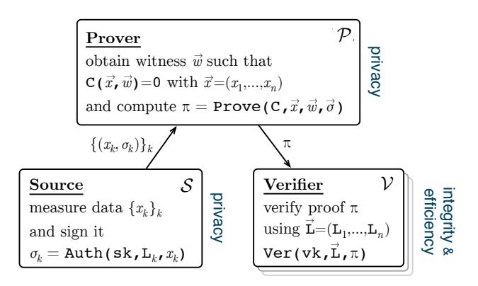
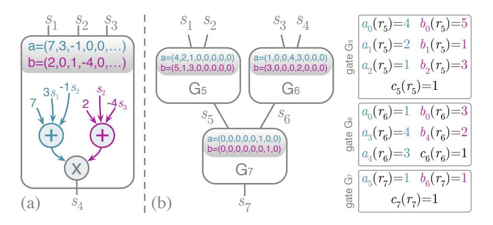
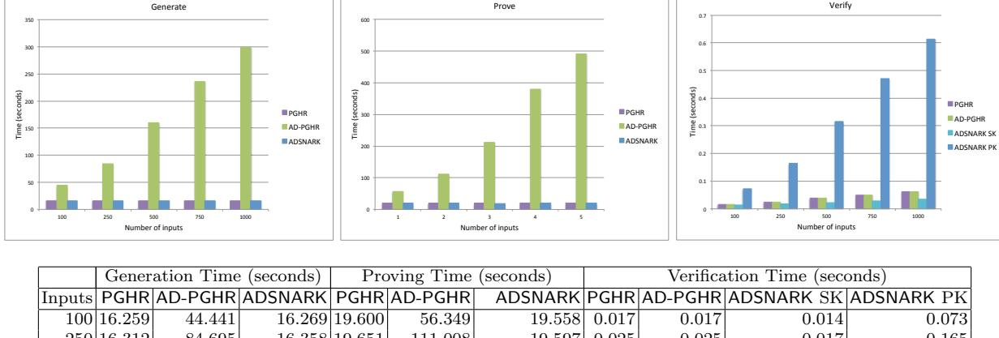
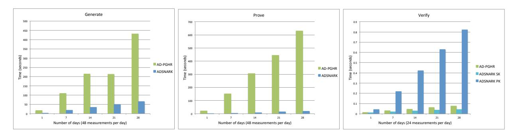

# <span id="page-0-0"></span>ADSNARK: Nearly Practical and Privacy-Preserving Proofs on Authenticated Data

Michael Backes<sup>1</sup> , Manuel Barbosa<sup>2</sup> , Dario Fiore<sup>3</sup> , and Raphael M. Reischuk<sup>4</sup>

> <sup>1</sup> CISPA, Saarland University, Germany <sup>2</sup> HASLab – INESC TEC and Universidade do Minho, Portugal 3 IMDEA Software Institute, Madrid, Spain <sup>4</sup> ETH Zurich, Switzerland

Abstract. We study the problem of privacy-preserving proofs on authenticated data, where a party receives data from a trusted source and is requested to prove computations over the data to third parties in a correct and private way, i.e., the third party learns no information on the data but is still assured that the claimed proof is valid. Our work particularly focuses on the challenging requirement that the third party should be able to verify the validity with respect to the specific data authenticated by the source — even without having access to that source. This problem is motivated by various scenarios emerging from several application areas such as wearable computing, smart metering, or general business-to-business interactions. Furthermore, these applications also demand any meaningful solution to satisfy additional properties related to usability and scalability.

In this paper, we formalize the above three-party model, discuss concrete application scenarios, and then we design, build, and evaluate ADSNARK, a nearly practical system for proving arbitrary computations over authenticated data in a privacy-preserving manner. ADSNARK improves significantly over state-of-the-art solutions for this model. For instance, compared to corresponding solutions based on Pinocchio (Oakland'13), ADSNARK achieves up to 25× improvement in proof-computation time and a 20× reduction in prover storage space.

# Table of Contents

|   | ADSNARK: Nearly Practical and Privacy-Preserving Proofs on Authenticated Data<br> | 1  |
|---|-----------------------------------------------------------------------------------|----|
|   | Michael Backes, Manuel Barbosa, Dario Fiore, and Raphael M. Reischuk              |    |
| 1 | Introduction                                                                      | 3  |
|   | 1.1<br>Detailed Contributions                                                     | 5  |
|   | 1.2<br>An Intuitive Description of Our Techniques<br>                             | 7  |
|   | 1.3<br>Organization                                                               | 8  |
| 2 | Background                                                                        | 8  |
| 3 | Zero-Knowledge SNARKs over Authenticated Data                                     | 11 |
|   | 3.1<br>SNARKs over Authenticated Data                                             | 11 |
|   | 3.2<br>A Generic Construction of Zero-Knowledge AD-SNARKs                         | 15 |
|   | 3.3<br>Signature Verification Overhead                                            | 16 |
| 4 | Our Construction of Zero-Knowledge AD-SNARKs                                      | 17 |
|   | 4.1<br>Completeness                                                               | 22 |
|   | 4.2<br>Adaptive Proof of Knowledge                                                | 24 |
|   | 4.3<br>Proof of the Zero-Knowledge Property                                       | 30 |
| 5 | Evaluation                                                                        | 31 |
|   | 5.1<br>Implementation                                                             | 31 |
|   | 5.2<br>Experiments Setup                                                          | 32 |
|   | 5.3<br>Performance for General Circuits                                           | 35 |
|   | 5.4<br>Performance for Smart Metering Billing                                     | 35 |
| 6 | Further Related Work<br>                                                          | 35 |
| 7 | More Applications                                                                 | 36 |
| 8 | Conclusions<br>                                                                   | 37 |
| A | AD-SNARK Extensions                                                               | 40 |
|   | A.1<br>Multi-Source AD-SNARKs                                                     | 40 |
|   | A.2<br>A Zero-Knowledge AD-SNARK with Constant-Time Verification                  | 41 |
| B | Definition of Zero Knowledge SNARKs                                               | 42 |
| C | The PGHR Zero-Knowledge SNARK                                                     | 43 |

## <span id="page-2-0"></span>1 Introduction

With the emergence of modern IT services, many aspects of the operation of our society have come to critically depend on the ability to share information between multiple parties, subject to complex information flow restrictions. The advance of information and communication technology has often lead to the deployment of systems that offer the desired functionality, but do not offer a technical solution to enforcing the secure information flow restrictions. Instead, parties must simply trust each other, often without reasonable grounds.

The last few years have seen exciting developments in cryptography, where (quasi-)practical solutions to some of these problems were proposed, prototyped, and sometimes deployed (as we will see later in this section). In this paper, we make further progress in this direction by proposing and efficiently instantiating a new cryptographic primitive called AD-SNARK, which targets an important class of applications that is out of reach of current technology. Such applications involve a potentially large set of secret data and three parties with the following trust relationships:

- The data owner wishes to keep her data secret, but is forced by circumstances to reveal partial information on this data to a service provider. Typically, this is an aggregated result computed by some public function f on the secret data.
- The service provider does not trust the data owner to correctly compute the partial information on the data, but wants to be convinced of its validity.
- The data owner has access to a trusted source, who can be given local access to the data, and who is trusted by the service provider to vouch for the quality and legitimacy of the data.

For concreteness, let us look at a few applications that fall into this model, and where the public function that must be applied to the data has varying degrees of complexity.

Health Risk Assessment. A wearable biosensor [\[Vit14,](#page-39-2) [BBC14\]](#page-37-0) collects fine-grained health information of an individual; the individual should give this information to a health insurance company that wants to assess her health risk in order to evaluate a corresponding premium. Privacy determines that the fine-grained health data collected by the sensor remains secret as it may reveal more about the individual's lifestyle and habits than she wishes to reveal. The computation of the premium due to the insurance company (or an aggregate, less privacy-invasive, information of the collected data) should therefore be carried out by the client. However, the client must convince the insurance company that this computation is correct and performed on legitimate data produced by the biosensor (we call this property integrity). In this setting, the biosensor can play the role of the trusted source, provided that it is equipped to cryptographically authenticate the individual measurements that it produces. Then the AD-SNARK primitive can be used to provide the required assurance to the health insurance company.

Smart Metering. The service provider of some commodity installs a trusted device in the facilities of the client. This trusted device periodically measures consumptions and produces a list of readings, which are delivered to the client; the client should give these readings to the service provider for billing purposes. For privacy, the client may not want to disclose these measurements as they may reveal more about the client's habits than she wishes to reveal (see, e.g., [\[AF10\]](#page-37-1)). For integrity, the supplier wants to evaluate a correct bill and prevent customers from cheating. As before, the customer keeps all the readings provided by the local meter, which must be able to authenticate the data and operate as a trusted source. Then, the customer computes the amount due to the provider, and uses AD-SNARK to prove that the result is correct.

Financial Audits. Organizations are often subject to financial audits. Auditors will typically look at specific parts of the accounting data and assert that the results of relevant computations are accurate. However the accounting data should be treated as sensitive information due to its business-critical nature, and minimizing the amount of information disclosed to auditors is desirable. In this scenario, the auditor plays the role of the service provider, and the organization the role of the data owner. The natural entity to play the role of the trusted source is the person (or third party) who is legally responsible for certifying the accounts of the organization, e.g., the official bookkeeper. This entity would authenticate the accounting data, so that the organization could internally compute the audit data in a way that is verifiable by the auditors with respect to both correctness and legitimacy. As intended, using AD-SNARK in this context will transfer the responsibility of any wrongdoing to the official bookkeeper.

In Section 7 we present three more example applications: pay-as-you-drive insurance, loyalty cards, and health statistics. We believe that, with the rise of small computing devices and an increased awareness with respect to privacy protection, many more applications will come to fall into this three-party scenario.

Although the trust model in all of the previous applications is the same, the complexity of the associated computations varies significantly. Solutions have been proposed for smart-metering, payas-you-drive insurance, and loyalty cards, e.g., in [RD11, FKDL13], and [FL14], respectively (and also for other applications of similarly low complexity). However, currently no *generic* solution is able to scale in a satisfactory way to deal with computations of arbitrary size such as those required for scenarios like the ones of financial audits or health statistics. Furthermore, although some scenarios admit to a close relation between the trusted source and the service provider that could lead to secret information being shared between the two (in the style of symmetric cryptography), other scenarios require verification for multiple parties, i.e., a form of public verifiability that is even more challenging. The AD-SNARK primitive and the efficient instantiation that we propose in this paper provides a practical solution for the moderately complex computations, even with public verifiability. Furthermore, the proposed AD-SNARK construction is as practical as the existing state of the art solutions for computations of arbitrary size on non-authenticated data.<sup>5</sup>

Formal Model. We now illustrate more formally the three party model we have introduced above (see Figure 1). We consider a scenario in which a prover  $\mathcal{P}$  (the data owner) is requested to prove certain computations C(D) on input data D to third parties  $\mathcal{V}$  (one or more service providers), which we call the verifiers. Since the two parties  $\mathcal{P}$  and  $\mathcal{V}$  may not trust each other, we are interested in the simultaneous achievement of two main security properties: (1) integrity, in the sense that  $\mathcal{V}$  should be convinced about the correctness of C(D). In particular, in order to verify that this statement holds for some specific input D, the data is assumed to be generated and authenticated by some trusted source  $\mathcal{S}$ ; and (2) privacy, in the sense that  $\mathcal{V}$  should not learn any information about D beyond what is trivially revealed by C(D).

In addition to the security requirements above, any meaningful solution has to meet the following properties that have been identified as key for practical scalability in previous work: (3) efficiency, meaning that  $\mathcal{V}$ 's verification cost should be much cheaper than the cost of computing C(D); and (4) data independence, in the sense that the data source  $\mathcal{S}$  should be independent of  $\mathcal{P}$ , i.e.,  $\mathcal{S}$  should be able to provide D without knowing in advance what computations will be executed on D

<span id="page-3-0"></span><sup>&</sup>lt;sup>5</sup> Hence the designation "nearly practical" in the title of the paper.



<span id="page-4-1"></span>**Figure 1.** Three-party scenario in which a source S authenticates data  $x_k$ , and a prover P proves to a verifier V the satisfiability of a circuit C based on  $x_k$ . The source and the prover are interested in data privacy, whereas the verifier is interested in integrity and efficiency.

(e.g., the billing function may change over time). In particular, also D's size should not be fixed in advance, i.e., S can continuously provide data to P, even after some proofs have been generated.

Related Work. The simultaneous achievement of integrity and privacy is a fundamental goal that has a long research history starting with the seminal work on zero-knowledge proofs [GMR89]. In the last years, the efficiency of zero-knowledge proofs has improved a lot, and nowadays we are on the verge of having nearly practical schemes for general-purpose computations [PGHR13, BSCG<sup>+</sup>13, BSCTV14]. Proofs on authenticated data are an important class of proofs that have been considered earlier especially in very specialized contexts such as credentials and electronic cash [Cha85, Dam88, LRSW99, MEK<sup>+</sup>10]. In the more general case of proving arbitrary computations over authenticated data, there is however little prior work, especially if one is concerned about achieving practical efficiency. While we review this related work later in Section 6, at this point we mention that the recent work ZQL [FKDL13] aimed to address this problem by considering a three party setting such as the one we presented above. ZQL provides an expression language for (privacy-preserving) processing of data that can be originated (i.e., authenticated) by trusted data sources, and proposes a cryptographic scheme that achieves integrity, privacy, and data independence. However, the current ZQL language has some intrinsic limitations that limit its applicability to arbitrary computations while achieving efficiency (i.e., if the verifier should perform less work than that required to generate the proof). In summary, while we do have efficient zero-knowledge proof systems for arbitrary computations, in the case of proofs on authenticated data the situation is not satisfactory.

#### <span id="page-4-0"></span>1.1 Detailed Contributions

Inspired by the goals of ZQL, we formalize a cryptographic primitive for privacy-preserving proofs on authenticated data, and we propose a new realization that achieves the desired efficiency goal for arbitrary computations. We then build a system called ADSNARK and evaluate its performance in comparison with solutions based on the state of the art. More in detail, our contributions are the following.

We fully formalize a model for the above problem by defining a new cryptographic primitive that we call Succinct Non-Interactive Arguments of Knowledge on Authenticated Data (or AD-SNARK,

for short). Succinct Non-Interactive Arguments, first introduced by Micali under the name of "CS proofs" [Mic94], are proof systems that provide  $succinct\ verification$ , i.e., the verifier is able to check a long poly-time computation in much less time than that required to run the computation, given the witness. Our new notion of AD-SNARKs extends SNARKs to explicitly capture proofs of  $\mathcal{NP}$  relations R(x,w) in which the statement x (or a part of it) is authenticated. More precisely, the main difference between SNARKs and AD-SNARKs is that in the former, the verifier always knows the statement, whereas in the latter, the authenticated statements are not disclosed to the verifier, yet the verifier can be assured about the existence of w such that R(x,w) holds for the specific x authenticated by some trusted source. Moreover, to model privacy (and looking ahead to our applications) we define the zero-knowledge property to hold not only for the witnesses of the relation, but also for the authenticated statements. In particular, our zero-knowledge definition holds also against adversaries who generate the authentication keys.

Turning our attention to realizations, we show that AD-SNARKs can be constructed in a generic fashion by embedding digital signatures into SNARKs. However, motivated by the fact that this "generic construction" is not efficient in practice, our second contribution is a direct and more efficient realization of AD-SNARKs, that from now on we refer to as ADSNARK. Compared to instantiating the generic construction with state-of-the-art SNARK schemes, ADSNARK performs way better on the prover side, and achieves a level of efficiency that makes it a plausible candidate for real-world deployment. In what follows we give more details on this efficiency aspect: We first discuss the efficiency of the generic construction with state-of-the-art instantiations, and then we describe our solution.

ON THE (IN)EFFICIENCY OF THE GENERIC CONSTRUCTION. The idea of the generic (not very practical) construction of AD-SNARK for an  $\mathcal{NP}$  relation R(x,w) is to let the prover  $\mathcal{P}$  prove an extended  $\mathcal{NP}$  relation R' which contains the set of tuples (x',w') with  $x'=(|x|,\mathsf{pk}), w'=(w,x,\sigma),$  and  $\sigma=(\sigma_1,\ldots,\sigma_{|x|})$ , such that there is a valid signature  $\sigma_i$  for every statement value  $x_i$  at position i under public key  $\mathsf{pk}$ . The problem with this generic construction is that, in practice, a proof for such extended relation R' is much more expensive than a proof for R. The issue is that R' needs to "embed" the verification algorithm of a signature scheme. If we consider very efficient SNARKs, such as the recent optimization of Pinocchio [PGHR13] proposed in [BSCTV14], then embedding the verification algorithm means encoding the verification algorithm of the signature with an arithmetic circuit over a specific finite field  $\mathbb{F}_p$  (where p is a large prime, the order of some bilinear groups), and then creating a Quadratic Arithmetic Program [GGPR13], a QAP for short, out of this circuit. Without going into the details of QAPs (we will review them later in Section 2), we note that the efficiency of the prover in these systems depends on the size of the QAP, which in turn depends on the number of multiplication gates in the relation satisfiability circuit.

Our main observation is that the circuit resulting from expressing the verification algorithm of a digital signature scheme is very likely to be quite inefficient (from a QAP perspective), especially for the prover. Such inefficiency stems from the fact that the circuit would contain a huge number of multiplication gates. In Section 3.3 we discuss why this is the case for various examples of signatures in both the random oracle and the standard model, and based on different algebraic problems. Our conclusions indicate that a QAP encoding a signature verification circuit is likely to have significantly more that one thousand multiplications for every signature that must be checked. If, for instance, we consider smart-metering, in which the prover wants to certify about 1 000 (signed) meter readings (amounting to approximately 1 month of electricity measurements), the costs can become prohibitive!

|                       | AD-PGHR |                    | ADSNARK Improvement |
|-----------------------|---------|--------------------|---------------------|
| Key Generator         | 299 s   | 16 s               | 18.7×               |
| Prover                | 491 s   | 20 s               | 24.5×               |
| Verifier              | 0.062 s | (PK)<br>0.61 s     | 0.1×                |
|                       |         | (SK) 0.035 s       | 1.8×                |
| Proving key size      | 319 MB  | 16 MB              | 19.9×               |
| Verification key size | 31 KB   | 31 KB              | same                |
| Proof size            |         | 0.3 KB (PK) 126 KB | 0.002×              |
|                       |         | (SK)<br>0.4 KB     | 0.75×               |

<span id="page-6-1"></span>Figure 2. Comparison between ADSNARK and the generic solution (AD-PGHR) based on the [\[BSCTV14\]](#page-37-3) SNARK considering an arithmetic circuit with 50K multiplication gates and 1000 authenticated inputs. Results obtained by running libsnark for AD-PGHR and our implementation (based on libsnark) of ADSNARK, both at a 128-bits security level.

Our Solution. In contrast, we propose ADSNARK, a new, direct, AD-SNARK scheme that achieves the same efficiency as state-of-the-art SNARKs, e.g., [\[BSCTV14\]](#page-37-3), yet it additionally allows for proofs on authenticated statements. Our scheme builds upon an optimized version of Pinocchio proposed and implemented in [\[BSCTV14\]](#page-37-3), and our key technical contribution is a technique (illustrated in [Section 1.2\)](#page-6-0) for embedding the authentication verification mechanism directly in the proof system, without having to resort to extended relations that would incur the efficiency loss discussed earlier. As a result, the performance of our scheme is almost the same as that of running [\[BSCTV14\]](#page-37-3), but with the additional benefit of obtaining proofs about authenticated values.

When comparing our direct construction with an instantiation of the generic scheme with [\[BSCTV14\]](#page-37-3), ADSNARK introduces a dramatic improvement (cf. [Figure 2](#page-6-1) above) in the generation of setup keys (for the relation) and proofs, which is currently the main bottleneck of state-ofthe-art SNARKs (e.g., [\[PGHR13,](#page-38-4) [BSCG](#page-37-2)+13, [BSCTV14\]](#page-37-3)). Namely, while these schemes perform excellently in terms of verification time and proof size, the performances get much worse when it comes to generating keys and proofs, especially for relations that have "unfriendly" arithmetic circuit representations, such as signature verification algorithms, as discussed earlier. This is where our technique for avoiding the explicit encoding of signature verification in the circuits allows us to use much smaller QAPs, thus saving at least one thousand multiplication gates per authenticated input. This improvement is clearly evident in our experimental results that show that the prover can obtain up to a 25× speed-up (20 s vs. 8 mins) and a 20× reduction in storage (16 MB vs. 320 MB). As we discuss later, on the verifier side ADSNARK allows for two different verification modes: one using the secret authentication key and one completely public. Although in the secretkey case, ADSNARK essentially achieves the same verification efficiency and proof size of the generic solution, our scheme pays more for public verification. However, in contrast to what happens on the prover side of the generic solution, the public verification of ADSNARK still achieves timing (0.61 s) and proof size (126 KB) that can be definitely considered practical.

#### <span id="page-6-0"></span>1.2 An Intuitive Description of Our Techniques

The key idea for the construction of our AD-SNARK scheme is to build upon SNARKs based on QAPs, and in particular on the PGHR scheme in [\[BSCTV14\]](#page-37-3). At a high level, our technique consists of extending PGHR by embedding a linearly-homomorphic MAC that enforces the prover to run the PGHR's Prove algorithm on correctly authenticated statements.

More precisely, the PGHR verifier, given a statement  $x = (x_1, \ldots, x_n)$ , has to compute the linear combination  $a_{in} = \sum_{k=1}^{n} x_k \cdot a_k(X)$  (where the  $a_k(X)$  are the QAP polynomials). However, recall that in AD-SNARKs the verifier does not know the statement x, and thus is not able to compute  $a_{in}$ . Our key idea to solve this issue is to shift the computation of the linear combination  $a_{in}$  from the verifier to the prover. Then, to enforce a cheating prover to provide the correct  $a_{in}$ , we ask the prover to additionally show that  $a_{in}$  was indeed obtained by using authenticated values  $x_k$ . To this end, we employ another proof system, namely efficient linearly-homomorphic MACs [CF13, BFR13], that are particularly suitable for linear computations over authenticated data. Specifically, we designed a novel homomorphic MAC (which is implicitly embedded in our AD-SNARK construction) that fits the above setting.

This technique, however, does not completely solve the problem: a further complication arises from the fact that in order to achieve zero-knowledge, the value  $a_{in}$  computed by the prover must be randomized (by adding a random multiple of the QAP target polynomial z(X)). Unfortunately, homomorphic MACs are known to authenticate only deterministic computations. We solve this issue using the following ideas. First, we provide a novel technique to publicly re-randomize our homomorphic MACs: roughly speaking, by publicly revealing a MAC of z(X). Second, we enforce the prover to use the same random coefficient for z(X) in both  $a_{in}$  and its MAC. Intuitively, this is achieved by asking the prover to provide the linear combination  $a_{in}$  in two distinct subspaces. A final observation is that by using a MAC we only get secret-key verification. Although this may not be an issue in several applications, we also show how to further generalize these techniques to obtain public verification.

## <span id="page-7-0"></span>1.3 Organization

The paper is organized as follows. In Section 2, we recall common definitions and background information on QAPs. Section 3 presents our definition of AD-SNARKs, the generic construction, and a discussion on the efficiency of encoding signature verification with arithmetic circuits. We describe our ADSNARK scheme in Section 4 together with a theoretical evaluation and comparison to the generic solution. In Section 5, we present our implementation and discuss the experimental results. Section 6 discusses further related work, Section 7 provides the description of more application scenarios, and finally Section 8 concludes the paper. The appendix includes additional background and the discussion of two extensions of AD-SNARKs: handling multiple data sources, and achieving (amortized) constant-time verification.

#### <span id="page-7-1"></span>2 Background

In this section, we review the notation and some basic definitions that we will use in our work.

**Notation.** We will denote with  $\lambda \in \mathbb{N}$  a security parameter. We say that a function  $\epsilon$  is negligible if it vanishes faster than the inverse of any polynomial. If not explicitly specified otherwise, negligible functions are negligible with respect to  $\lambda$ . If S is a set,  $x \leftarrow_{\mathcal{R}} S$  denotes the process of selecting x uniformly at random in S. If A is a probabilistic algorithm,  $x \leftarrow_{\mathcal{R}} A(\cdot)$  denotes the process of running A on some appropriate input and assigning its output to x. Moreover, for a positive integer n, we denote by [n] the set  $\{1,\ldots,n\}$ . We denote by  $\mathbb{F}$  a finite field and  $\mathbb{F}_n$  is the field of size n. When n is a prime number, then elements of  $\mathbb{F}_n$  are represented as integers modulo n. Elements of  $\mathbb{F}$  are typically denoted by greek letters.  $\mathbb{F}[X]$  denotes the field of polynomials in one variable X and coefficients in  $\mathbb{F}$ , while  $\mathbb{F}^{\leq d}[X]$  is the subring of polynomials in  $\mathbb{F}[X]$  of degree at most d.



<span id="page-8-0"></span>**Figure 3.** Part (a): A bilinear gate representing the arithmetic function  $(7 + 3s_1 - 1s_2) \cdot (2 + s_2 - 4s_3)$  specified by coefficients a and b.

Part (b): A QAP for an arithmetic circuit with 4 input wires, 1 output wire, 3 bilinear gates. The circuit encodes the function  $f(s_1, s_2, s_3, s_4) = (4 + 2s_1 + s_2) \cdot (5 + s_1 + 3s_2) \cdot (1 + 4s_3 + 3s_4) \cdot (3 + 2s_4)$ . The non-zero equations for the QAP polynomials are shown on the right.

Algebraic Tools. Let  $\mathcal{G}(1^{\lambda})$  be an algorithm that, upon input of the security parameter  $1^{\lambda}$ , outputs the description of (asymmetric) bilinear groups bgpp =  $(p, \mathbb{G}_1, \mathbb{G}_2, \mathbb{G}_T, e, \mathcal{P}_1, \mathcal{P}_2)$  where  $\mathbb{G}_1$ ,  $\mathbb{G}_2$ , and  $\mathbb{G}_T$  are groups of the same prime order  $p > 2^{\lambda}$ ;  $\mathcal{P}_1 \in \mathbb{G}_1$  and  $\mathcal{P}_2 \in \mathbb{G}_2$  are the respective generators; and  $e: \mathbb{G}_1 \times \mathbb{G}_2 \to \mathbb{G}_T$  is an efficiently computable bilinear map. We call such an algorithm  $\mathcal{G}$  a bilinear group generator. Note that  $\mathbb{G}_1$  and  $\mathbb{G}_2$  are additive groups, whereas  $\mathbb{G}_T$  is a multiplicative group. In this work we rely on specific computational assumptions in such bilinear groups: the q-DHE [CKS09], the q-BDHE [BBG05], and the q-PKE [Gro10] assumptions.

Arithmetic Circuits and Quadratic Arithmetic Programs. An arithmetic circuit C over a finite field  $\mathbb{F}$  consists of addition and multiplication gates and of a set of wires between the gates. The wires carry values over  $\mathbb{F}$ . As in previous work [BSCTV14], here we consider only arithmetic circuits with bilinear gates: a gate with inputs  $\vec{x} = (x_1, \ldots, x_k)$  is bilinear if its output can be written as inner product  $\langle \vec{a}, (1, x_1, \ldots, x_k) \rangle \cdot \langle \vec{b}, (1, x_1, \ldots, x_k) \rangle$  for some  $\vec{a}, \vec{b} \in \mathbb{F}^{k+1}$ . Note that this definition includes addition, multiplication, and constant gates (cf. Fig. 3(a) for an example).

Associated to any arithmetic circuit, we define a satisfaction problem as follows.

**Definition 1 (Arith. Circuit Satisfaction [BSCTV14]).** The circuit satisfaction problem of a circuit  $C: \mathbb{F}^n \times \mathbb{F}^h \to \mathbb{F}^l$  with bilinear gates is defined by the relation  $\mathcal{R}_C = \{(\vec{x}, \vec{w}) \in \mathbb{F}^n \times \mathbb{F}^h : C(\vec{x}, \vec{w}) = 0^l\}$  and its language is  $\mathcal{L}_C = \{\vec{x} \in \mathbb{F}^n : \exists \vec{w} \in \mathbb{F}^h, C(\vec{x}, \vec{w}) = 0^l\}$ .

The state-of-the-art SNARK schemes that we build on in this paper directly operate on a different model to represent computations called *quadratic arithmetic programs* (QAPs).

**Definition 2 (QAP [GGPR13]).** A quadratic arithmetic program Q of size m and degree d over  $\mathbb{F}$  consists of three vectors of m+1 polynomials  $\overrightarrow{a}$ ,  $\overrightarrow{b}$ ,  $\overrightarrow{c} \in \mathbb{F}^{\leq d-1}[X]$  of degree at most d-1, and a target polynomial  $z(X) \in \mathbb{F}[X]$  of degree exactly d.

<span id="page-8-1"></span>Associated to any QAP, there is a satisfaction problem defined as follows.

**Definition 3 (QAP Satisfaction).** The satisfaction problem of a QAP  $Q = (\vec{a}, \vec{b}, \vec{c}, z)$  of size m and degree d is the relation  $\mathcal{R}_Q$  of pairs  $(\vec{x}, \vec{s})$  such that:

- (1)  $\vec{x} \in \mathbb{F}^n$ ,  $\vec{s} \in \mathbb{F}^m$  for some  $n \leq m$ ;
- (2)  $x_i = s_i \text{ for } i \in [n], i.e., \vec{s} \text{ extends } \vec{x};$
- (3) z(X) divides the polynomial p(X) defined as

$$p(X) = (a_0(X) + \sum_{i=1}^{m} s_i a_i(X)) \cdot (b_0(X) + \sum_{i=1}^{m} s_i b_i(X))$$
$$- (c_0(X) + \sum_{i=1}^{m} s_i c_i(X))$$

The following result implies that one can use any QAP-based SNARK scheme as an efficient SNARK scheme taking computations more conveniently represented as arithmetic circuits.

<span id="page-9-0"></span>**Lemma 1** (Constructing QAPs [GGPR13, BSCTV14]). There exist two polynomial time algorithms QAPInst and QAPwit such that, for any circuit  $C : \mathbb{F}^n \times \mathbb{F}^h \to \mathbb{F}^l$  with u wires and v (bilinear) gates,  $Q_C = (\vec{a}, \vec{b}, \vec{c}, z) = \mathsf{QAPInst}(C)$  is a QAP of size m and degree d over  $\mathbb{F}$  satisfying the following properties:

Efficiency: m = u, and d = v + l + 1.

Completeness: For any  $(\vec{x}, \vec{w}) \in \mathcal{R}_C$ , if it holds that  $\vec{s} = \mathsf{QAPwit}(C, \vec{x}, \vec{w})$  then  $(\vec{x}, \vec{s}) \in \mathcal{R}_{Q_C}$ . Proof of Knowledge: For any  $(\vec{x}, \vec{s}) \in \mathcal{R}_{Q_C}$ , it holds  $(\vec{x}, \vec{w}) \in \mathcal{R}_C$  where  $\vec{w}$  is a prefix of  $\vec{s}$ . Non-Degeneracy: the polynomials  $a_0(X), \ldots, a_n(X)$  are all nonzero and distinct.

The very basic intuition for building a QAP according to Lemma 1 is to encode the inputoutput correctness for each bilinear gate in the polynomials  $\vec{a}$ ,  $\vec{b}$ ,  $\vec{c}$ , z (see Fig. 3(b) for a simple example). Slightly more in detail, for a gate g this is done by first selecting an arbitrary value  $r_g \in \mathbb{F}$  (a "root") and then, for every left wire i going to gate g, one imposes  $a_i(r_g) = c$ , where c is the coefficient which multiplies the value of wire i in g's left input (note that c=0 if wire i is not a left input). A similar process is done for polynomials  $b_i$  and  $c_i$  w.r.t. right input and output wires respectively. Once this procedure has been iterated for every bilinear gate g (selecting distinct roots  $r_q$ ), one will have essentially obtained three tables of size  $u \cdot v$  with entries  $a_i(r_i)$ ,  $b_i(r_i)$ , and  $c_i(r_i)$ , respectively, where i=0 to u are all the wires (where the 0 wire represents constants) and j=1 to v are all the bilinear gates. The final QAP polynomials  $\vec{a}$ ,  $\vec{b}$ ,  $\vec{c}$  are built by extending each row i of the table into a polynomial  $a_i(X)$  (resp.  $b_i(X), c_i(X)$ ) of degree v-1 via interpolation in  $\mathbb{F}$ . The target polynomial z(X) is the degree-v polynomial defined over the roots  $r_g$  of the v bilinear gates:  $z(X) := \prod_{g=1}^{v} (X - r_g)$ . To see why the satisfiability of the QAP implies the satisfiability of the circuit, the key observation is that the third condition of Definition 3, i.e.,  $z(X) \mid p(X)$ , means that  $\langle (1, \vec{s}), \vec{a}(r_g) \rangle \cdot \langle (1, \vec{s}), \vec{b}(r_g) \rangle = \langle (1, \vec{s}), \vec{c}(r_g) \rangle$  for all roots  $r_g$  of the target polynomial z(X). In other words, given the specific construction of the polynomials, the input-output correctness of every bilinear gate g of the circuit is satisfied.

<span id="page-9-1"></span><sup>&</sup>lt;sup>6</sup> The case of  $c_i$  is slightly different as coefficients are only 0 or 1.

<span id="page-9-2"></span><sup>&</sup>lt;sup>7</sup> More precisely, in construction of Lemma 1 one needs to add one "artificial" bilinear gate for every output wire, plus an additional constraint to guarantee non-degeneracy: from which the final degree is d = v + l + 1.

#### <span id="page-10-0"></span>3 Zero-Knowledge SNARKs over Authenticated Data

In this section, we define the notion of SNARKs [Mic94, BCCT12] on authenticated data (AD-SNARKs, for short). Let  $C: \mathbb{F}^n \times \mathbb{F}^h \to \mathbb{F}^l$  be an arithmetic circuit, and let  $\mathcal{R}_C = \{(\vec{x}, \vec{w})\} \subseteq \mathbb{F}^n \times \mathbb{F}^h$  be the corresponding circuit satisfaction relation, where  $\vec{x} \in \mathbb{F}^n$  is called the *statement*, and  $\vec{w} \in \mathbb{F}^h$  is the *witness*.

Proof systems for the circuit satisfaction of C typically consider the problem in which a prover  $\mathcal{P}$  tries to convince a verifier  $\mathcal{V}$  about the existence of a witness  $\overrightarrow{w}$  such that  $(\overrightarrow{x}, \overrightarrow{w}) \in \mathcal{R}_C$ . In this scenario, the statement  $\overrightarrow{x}$  is supposed to be public, i.e., it is known to both the prover and the verifier. For example,  $\mathcal{V}$  could be convinced by  $\mathcal{P}$  that 3 colors are sufficient to color a public graph  $\overrightarrow{x}$  such that no two adjacent vertices are assigned the same color. The coloring serves as witness  $\overrightarrow{w}$ .

In this work, we consider a variation of the above problem in setting in which (1) the statement  $\vec{x}$  (or part of it) is provided to the prover by a trusted source  $\mathcal{S}$ , and (2) the portion of  $\vec{x}$  provided by  $\mathcal{S}$  is not known to  $\mathcal{V}$  (see Figure 1 for illustration). Yet,  $\mathcal{V}$  wants to be convinced by  $\mathcal{P}$  that  $(\vec{x}, \vec{w}) \in \mathcal{R}_C$  holds for the specific  $\vec{x}$  provided by  $\mathcal{S}$ , and not for some other  $\vec{x}'$  of  $\mathcal{P}$ 's choice (which can still be in the language  $\mathcal{L}_C$ ). For example,  $\mathcal{S}$  might have provided a graph  $\vec{x}$  – not known to  $\mathcal{V}$  – for which  $\mathcal{P}$  proves to  $\mathcal{V}$  that  $\vec{x}$  is 3-colorable. A proof for any other graph  $\vec{x}'$  is meaningless.

To formalize the idea that  $\mathcal{V}$  checks that some values unknown to  $\mathcal{V}$  have been authenticated by  $\mathcal{S}$ , we adopt the concept of *labeling* used for homomorphic authenticators [GW13, BFR13]. Namely, we assume that the source  $\mathcal{S}$  authenticates a set of values  $X_{auth} = \{x_i, \ldots, x_\ell\}$  against a set of (public) labels  $\mathsf{L} = \{\mathsf{L}_i, \ldots, \mathsf{L}_\ell\}$  by using a secret authentication key (e.g., a signing key).  $\mathcal{S}$  then sends the authenticated  $X_{auth}$  to  $\mathcal{P}$ . Later,  $\mathcal{P}$ 's goal is to prove to  $\mathcal{V}$  that  $(\vec{x}, \vec{w}) \in \mathcal{R}_C$  for a statement  $\vec{x}$  in which some positions have been correctly authenticated by  $\mathcal{S}$ , i.e.,  $x_i \in X_{auth}$  for some  $i \in [n]$ .

For such a proof system, we define the usual properties of *completeness* and *soundness*, and in addition, to model privacy, we define a *zero-knowledge* property. Moreover, since we are interested in efficient and scalable protocols, we define *succinctness* to model that the size of the proofs (and implicitly the verifier's running time) should be independent of the witness' size  $h = |\vec{w}|$ . Finally, we consider AD-SNARKs that can have either public or secret verifiability, the difference being in whether the adversary knows or not the verification key for the authentication tags produced by the data source  $\mathcal{S}$ .

#### <span id="page-10-1"></span>3.1 SNARKs over Authenticated Data

First, we provide the formal definition for SNARGs over authenticated data. The definition of SNARGs of knowledge (i.e., SNARKs) over authenticated data is provided later.

**Definition 4 (AD-SNARG).** A scheme for Succinct Non-interactive Arguments over Authenticated Data (AD-SNARG, for short) for arithmetic circuit satisfiability consists of a tuple of algorithms (Setup, AuthKG, Auth, AuthVer, Gen, Prove, Ver) satisfying authentication correctness, completeness, succinctness, and adaptive soundness (as defined below):

Setup( $1^{\lambda}$ ): On input the security parameter  $\lambda$ , output some common public parameters pp. The parameters also define the finite field  $\mathbb{F}$  over which the circuits will be defined.

AuthKG(pp): given the public parameters pp, the key generation algorithm outputs a secret authentication key sk, a verification key vk, and public authentication parameters pap.

- Auth(sk, L, x): the authentication algorithm takes as input the secret authentication key sk, a label  $L \in \mathcal{L}$ , and a value  $x \in \mathbb{F}$ , and it outputs an authentication tag  $\sigma$ .
- AuthVer(vk,  $\sigma$ , L, x): the authentication verification algorithm takes as input a verification key vk, a tag  $\sigma$ , a label L  $\in \mathcal{L}$ , and a value  $x \in \mathbb{F}$ . It outputs  $\bot$  (reject) or  $\top$  (accept).
- Gen(pap, C): given the public authentication parameters pap and an arithmetic circuit  $C: \mathbb{F}^n \times \mathbb{F}^h \to \mathbb{F}^l$ , the algorithm outputs an evaluation key  $\mathsf{EK}_C$  and a verification key  $\mathsf{VK}_C$ . Gen can hence be seen as a circuit encoding algorithm.
- Prove( $\mathsf{EK}_C, \vec{x}, \vec{w}, \vec{\sigma}$ ): on input an evaluation key  $\mathsf{EK}_C$ , a statement  $\vec{x} \in \mathbb{F}^n$ , a witness  $\vec{w} \in \mathbb{F}^h$ , and authentication tags for the statement  $\vec{\sigma} = (\sigma_1, \ldots, \sigma_n)$ , the proof algorithm outputs a proof of membership  $\pi$  for  $(\vec{x}, \vec{w}) \in \mathcal{R}_C$ . We stress that  $\vec{\sigma}$  does not need to contain authentication tags for all positions: in case a value at position i is not authenticated, the empty tag  $\sigma_i = \star$  is used instead.
- $\mathsf{Ver}(\mathsf{vk},\mathsf{VK}_C, \overrightarrow{\mathsf{L}}, \{x_i\}_{\mathsf{L}_i=\star}, \pi)$ : given the verification key  $\mathsf{vk}$ , a circuit verification key  $\mathsf{VK}_C$ , labels  $\overrightarrow{\mathsf{L}} = (\mathsf{L}_1, \ldots, \mathsf{L}_n)$  for the statement, unauthenticated statement components  $x_i$ , and a proof  $\pi$ , the verification algorithm outputs  $\bot$  (reject) or  $\top$  (accept).

AUTHENTICATION CORRECTNESS. Intuitively, an AD-SNARG scheme has authentication correctness if any tag  $\sigma$  generated by Auth(sk, L, x) authenticates x with respect to L. More formally, we say that a AD-SNARG scheme satisfies authentication correctness if for any value  $x \in \mathbb{F}$ , all keys (sk, vk, pap)  $\leftarrow_{\mathcal{R}}$  AuthKG(1 $^{\lambda}$ ), any label L  $\in \mathcal{L}$ , and any authentication tag  $\sigma \leftarrow_{\mathcal{R}}$  Auth(sk, L, x), we have that AuthVer(vk,  $\sigma$ , L, x) =  $\top$  with probability 1.

COMPLETENESS. This property aims at capturing that if the Prove algorithm produces  $\pi$  when run on  $(\overrightarrow{x}, \overrightarrow{w}, \overrightarrow{\sigma})$  for some  $(\overrightarrow{x}, \overrightarrow{w}) \in \mathcal{R}_C$ , then verification  $\mathsf{Ver}(\mathsf{vk}, \mathsf{VK}_C, \mathsf{L}, \{x_i\}_{\mathsf{L}_i = \star}, \pi)$  must output  $\top$  with probability 1 whenever  $\mathsf{AuthVer}(\mathsf{vk}, \sigma_i, \mathsf{L}_i, x_i) = \top$ . More formally, let us fix  $(\mathsf{sk}, \mathsf{vk}, \mathsf{pap}) \leftarrow_{\mathcal{R}} \mathsf{AuthKG}(\mathsf{pp})$ , and a circuit  $C : \mathbb{F}^n \times \mathbb{F}^h \to \mathbb{F}^l$  with keys  $(\mathsf{EK}_C, \mathsf{VK}_C) \leftarrow_{\mathcal{R}} \mathsf{Gen}(\mathsf{pap}, C)$ . Let  $(\overrightarrow{x}, \overrightarrow{w}) \in \mathcal{R}_C$  be given. Let  $\overrightarrow{\mathsf{L}} = (\mathsf{L}_1, \dots, \mathsf{L}_n) \in (\mathcal{L} \cup \{\star\})^n$  be a vector of labels, and let  $\overrightarrow{\sigma} = (\sigma_1, \dots, \sigma_n)$  be tags for the statement such that  $\{\mathsf{AuthVer}(\mathsf{vk}, \sigma_i, \mathsf{L}_i, x_i) = \top\}_{\mathsf{L}_i \neq \star}$ . Then if  $\pi \leftarrow_{\mathcal{R}} \mathsf{Prove}(\mathsf{EK}_C, \overrightarrow{x}, \overrightarrow{w}, \overrightarrow{\sigma})$ , we have that  $\mathsf{Ver}(\mathsf{vk}, \mathsf{VK}_C, \overrightarrow{\mathsf{L}}, \{x_i\}_{\mathsf{L}_i = \star}, \pi) = \top$  with probability 1.

SUCCINCTNESS. Given a circuit  $C: \mathbb{F}^n \times \mathbb{F}^h \to \mathbb{F}^l$ , the length of the proof  $\pi$  is bounded by  $|\pi| = \text{poly}(\lambda)\text{polylog}(n, h)$ .

ADAPTIVE SOUNDNESS. Intuitively, the soundness property captures that no malicious party can produce proofs that verify correctly for a statement which is not in the language. We formalize our definition via an experiment, called  $\mathbf{Exp}_{\mathcal{A}}^{\mathsf{AD-Soundness}}$ , which is described in Figure 4. The experiment is parametrized by an adversary  $\mathcal{A}$  who is given access to three oracles (aka procedures)  $\mathbf{Gen}$ ,  $\mathbf{Auth}$ , and  $\mathbf{Ver}$  that can be (concurrently) run.

The three procedures **Gen**, **Auth**, and **Ver** essentially give to the adversary oracle access to the algorithms **Gen**, **Auth**, and **Ver**, respectively, with some additional bookkeeping information. In particular, it is worth noting that **Ver** returns the output of **Ver**, and additionally, checks whether a proof accepted by **Ver** (i.e.,  $v = \top$ ) proves a false statement according to  $\mathcal{R}_C$ . In this case, **Ver** sets **GameOutput**  $\leftarrow$  1.

More formally, let  $\mathcal{C}$  be a class of circuits. Then for any  $\lambda \in \mathbb{N}$ , we define the advantage of an adversary  $\mathcal{A}$  in the experiment  $\mathbf{Exp}_{\mathcal{A}}^{\mathsf{AD-Soundness}}(\mathcal{C}, 1^{\lambda})$  against  $\mathsf{AD-Soundness}$  for  $\mathcal{C}$  as

$$\mathbf{Adv}^{\mathsf{AD-Soundness}}_{\mathcal{A}}(\mathcal{C},\lambda) \ = \ \Pr[\mathbf{Exp}^{\mathsf{AD-Soundness}}_{\mathcal{A}}(\mathcal{C},1^{\lambda}) = 1].$$

```
\mathbf{Exp}_{\mathcal{A},E}^{\mathsf{AD-Soundness}}(1^{\lambda}):
                                                                                      procedure Ver(C, \overrightarrow{L}, \{x_i\}_{L_i=\star}, \pi)
                                                                                      if (C,\cdot,\cdot) \notin \mathsf{S} then Return \perp
\mathsf{pp} \leftarrow_{\mathcal{R}} \mathsf{Set}\overline{\mathsf{up}(1^{\lambda})}
                                                                                      fetch \mathsf{VK}_C with (C,\cdot,\mathsf{VK}_C)\in\mathsf{S}
(sk, vk, pap) \leftarrow_{\mathcal{R}} AuthKG(pp)
                                                                                      v \leftarrow \mathsf{Ver}(\mathsf{vk}, \mathsf{VK}_C, \overrightarrow{\mathsf{L}}, \{x_i\}_{\mathsf{L}_i = \star}, \pi)
\texttt{GameOutput} \leftarrow 0
S \leftarrow \emptyset, \ \bar{T} \leftarrow \{(\star, \star)\}
                                                                                      if v = \top then
\mathcal{A}^{\mathbf{Gen},\mathbf{Auth},\mathbf{Ver}}(\mathsf{pp},\mathsf{pap})
                                                                                         if \exists \, \mathsf{L}_i \in \overrightarrow{\mathsf{L}} : (\mathsf{L}_i, \cdot, \cdot) \notin \mathsf{T} then
Return GameOutput
                                                                                           \texttt{GameOutput} \leftarrow 1 \quad // \ \textit{Type 1}
procedure Gen(C)
                                                                                           fetch \vec{x} = (x_1, \dots, x_n)
(\mathsf{EK}_C, \mathsf{VK}_C) \leftarrow_{\mathcal{R}} \mathsf{Gen}(\mathsf{pap}, C)
                                                                                            with \{(\mathsf{L}_1,x_1,\cdot),\ldots,(\mathsf{L}_n,x_n,\cdot)\}\subseteq\mathsf{T}
S \leftarrow S \cup \{(C, \mathsf{EK}_C, \mathsf{VK}_C)\}
                                                                                            for all L_i \neq \star
Return (\mathsf{EK}_C, \mathsf{VK}_C)
                                                                                           if \overrightarrow{x} \notin \mathcal{L}_C then
procedure Auth(L, x)
                                                                                            \texttt{GameOutput} \leftarrow 1 \quad // \ \textit{Type 2}
if (\mathsf{L},\cdot,\cdot)\in T Return \perp
                                                                                      \mathtt{Return}\ v
\sigma \leftarrow_{\mathcal{R}} \mathsf{Auth}(\mathsf{sk},\mathsf{L},x)
\mathsf{T} \leftarrow \mathsf{T} \cup \{(\mathsf{L}, x, \sigma)\}\
Return \sigma
```

<span id="page-12-0"></span>Figure 4. Game AD-Soundness.

An AD-SNARK with respect to a class of circuits  $\mathcal{C}$  is adaptive computationally sound if for any PPT  $\mathcal{A}$ , it holds that  $\mathbf{Adv}_{\mathcal{A}}^{\mathsf{AD-Soundness}}(\mathcal{C},\lambda)$  is negligible in  $\lambda$ .

Our soundness definition is inspired by the security definition for homomorphic MACs [GW13, CF13, BFR13]. The catch here is that there are essentially two ways to create a "cheating proof", and thus to break the soundness of an AD-SNARG. The first way, Type 1, is to produce an accepting proof without having ever queried an authentication tag for a label  $L_i$ . This basically captures that, in order to create a valid proof, one needs to have all authenticated parts of the statement, each with a valid authentication tag. The second way to break the security, Type 2, is the more "classical" one, i.e., generating a proof that accepts for a tuple  $(\vec{x}, \vec{w})$  which is not the correct one, i.e.,  $\vec{x} \notin \mathcal{L}_C$ .

Second, we note that the above game definition captures the setting in which the verification key vk is kept secret. The definition for the publicly verifiable setting is obtained by providing vk to the adversary.

**AD-SNARKs.** An AD-SNARG of knowledge (AD-SNARK) is an AD-SNARG where adaptive soundness is strengthened as follows.

<span id="page-12-1"></span>**Definition 5 (AD-SNARK).** A tuple of algorithms (Setup, AuthKG, Auth, AuthVer, Gen, Prove, Ver) is an AD-SNARK if it is an AD-SNARG where adaptive soundness is replaced by the stronger property of adaptive proof of knowledge (as defined below).

ADAPTIVE PROOF OF KNOWLEDGE. Consider a variation of the adaptive soundness experiment that is parametrized by an additional algorithm E called the *extractor*. Both  $\mathcal{A}$  and E run on exactly the same input and random tape, including some auxiliary input z. E is an algorithm that, for every verification query of  $\mathcal{A}$  that is accepted by the Ver algorithm, outputs a witness  $\overrightarrow{w}$ . One should think of such E as  $\mathcal{A}$  itself, and the extraction capability intuitively means that if  $\mathcal{A}$  is able to produce an accepting proof, then  $\mathcal{A}$  must know the corresponding witness, and thus such witness can be extracted from  $\mathcal{A}$ 's memory. A detailed description of the experiment procedures is presented in Figure 5.

```
procedure Ver(C, \overrightarrow{L}, \{x_i\}_{L_i=\star}, \pi)
\mathbf{Exp}^{\mathsf{AD}\text{-PoK}}_{\mathcal{A},E}(1^{\lambda}):
                                                                                                 if (C,\cdot,\cdot) \notin \mathsf{S} then Return \perp
\mathsf{pp} \leftarrow_{\mathcal{R}} \mathsf{Setup}(1^{\lambda})
                                                                                                 fetch \mathsf{VK}_C with (C,\cdot,\mathsf{VK}_C)\in\mathsf{S}
(\mathsf{sk}, \mathsf{vk}, \mathsf{pap}) \leftarrow_{\mathcal{R}} \mathsf{AuthKG}(\mathsf{pp})
                                                                                                 v \leftarrow \mathsf{Ver}(\mathsf{vk}, \mathsf{VK}_C, \overrightarrow{\mathsf{L}}, \{x_i\}_{\mathsf{L}_i = \star}, \pi)
GameOutput \leftarrow 0
 \begin{array}{l} \mathsf{S} \leftarrow \emptyset, \ \ \mathsf{\bar{T}} \leftarrow \{(\star, \star)\} \\ \mathcal{A}^{\mathbf{Gen}, \mathbf{Auth}, \mathbf{Ver}}(\mathsf{pp}, \mathsf{pap}, z) \end{array}
                                                                                                 if v = \top then
                                                                                                    if \exists \, \mathsf{L}_i \in \vec{\mathsf{L}} : (\mathsf{L}_i, \cdot, \cdot) \notin \mathsf{T} then
                                                                                                      \texttt{GameOutput} \leftarrow 1 \quad // \ \textit{Type 1}
Return GameOutput
procedure Gen(C)
                                                                                                      fetch \overrightarrow{x} = (x_1, \dots, x_n)
(\mathsf{EK}_C, \mathsf{VK}_C) \leftarrow_{\mathcal{R}} \mathsf{Gen}(\mathsf{pap}, C)
                                                                                                       with \{(\mathsf{L}_1,x_1,\cdot),\ldots,(\mathsf{L}_n,x_n,\cdot)\}\subseteq\mathsf{T}
S \leftarrow S \cup \{(C, \mathsf{EK}_C, \mathsf{VK}_C)\}
                                                                                                       for all L_i \neq \star
Return (\mathsf{EK}_C, \mathsf{VK}_C)
                                                                                                       \overrightarrow{w} \leftarrow E(\mathsf{pp}, \mathsf{pap}, z, \mathsf{T}, \mathsf{S}, \mathsf{Coins}[\mathcal{A}])
procedure Auth(L, x)
                                                                                                       if (\vec{x}, \vec{w}) \notin \mathcal{R}_C then
\mathtt{if}\ (\mathsf{L},\overline{\cdot,\cdot)} \,\overline{\in T\ \mathtt{Return}\ \bot}
                                                                                                        \texttt{GameOutput} \leftarrow 1 \quad // \ \textit{Type 2}
                                                                                                \mathtt{Return}\ v
\sigma \leftarrow_{\mathcal{R}} \mathsf{Auth}(\mathsf{sk},\mathsf{L},x)
\mathsf{T} \leftarrow \mathsf{T} \cup \{(\mathsf{L}, x, \sigma)\}\
Return \sigma
```

<span id="page-13-0"></span>Figure 5. Experiment for the adaptive proof of knowledge definition.

Then we say that a scheme ADSNARK satisfies adaptive proof of knowledge for  $\mathcal{C}$  if for any sufficiently large  $\lambda \in \mathbb{N}$ , and for every PPT adversary  $\mathcal{A}$ , there exists a PPT extractor E such that for every polynomial-size auxiliary input  $z \in \{0,1\}^{\mathsf{poly}(\lambda)}$  the probability  $\Pr[\mathbf{Exp}_{\mathcal{A},E}^{\mathsf{AD-PoK}}(\mathcal{C},\lambda,z)=1]$  is negligible.

**Zero-Knowledge AD-SNARKs.** Finally we extend the AD-SNARK definition with the zero-knowledge property. Loosely speaking, a zero-knowledge AD-SNARK is an AD-SNARK in which the Prove algorithm generates proofs  $\pi$  that reveal no information: neither about the witness, nor about the authenticated statements. In other words, the proofs do not reveal anything beyond what is known by the verifiers when checking a proof. A formal definition follows.

<span id="page-13-1"></span>**Definition 6 (Zero-Knowledge AD-SNARKs).** A zero-knowledge AD-SNARK is an AD-SNARK that satisfies the following additional property "Zero-Knowledge". Let  $C \in \mathcal{C}$  be an arithmetic circuit. Then there exists a simulator  $\mathsf{Sim} = (\mathsf{Sim}_1, \mathsf{Sim}_2)$ , such that for all PPT distinguishers  $\mathcal{D}$ , the following difference is negligible

$$|\Pr[\mathbf{Exp}_{Real}^{\mathcal{D},C}(1^{\lambda}) = 1] - \Pr[\mathbf{Exp}_{Sim}^{\mathcal{D},C}(1^{\lambda}) = 1]|$$

where the experiments Real and Sim are defined as follows:

```
\mathbf{Exp}^{\mathsf{Real}}_{\mathcal{D},C}(1^{\lambda}):
                                                                                                                                                              \mathbf{Exp}_{\mathcal{D},C}^{\mathsf{Sim}}(1^{\lambda}):
pp \leftarrow_{\mathcal{R}} \mathsf{Setup}(1^{\lambda})
                                                                                                                                                              pp \leftarrow_{\mathcal{R}} \mathsf{Setup}(1^{\lambda})
 (\mathsf{sk}, \mathsf{vk}, \mathsf{pap}) \leftarrow_{\mathcal{R}} \mathcal{D}(1^{\lambda}, \mathsf{pp})
                                                                                                                                                              (\mathsf{sk}, \mathsf{vk}, \mathsf{pap}) \leftarrow_{\mathcal{R}} \mathcal{D}(1^{\lambda}, \mathsf{pp})
 (\mathsf{EK}_C, \mathsf{VK}_C) \leftarrow_{\mathcal{R}} \mathsf{Gen}(\mathsf{pap}, C)
                                                                                                                                                              (\mathsf{EK}_C, \mathsf{VK}_C, \mathsf{td})
                                                                                                                                                                                    \leftarrow_{\mathcal{R}} \mathsf{Sim}_1(\mathsf{sk},\mathsf{vk},\mathsf{pp},\mathsf{pap},C)
(\vec{x}, \vec{\mathsf{L}}, \vec{\sigma}, \vec{w}) \leftarrow \mathcal{D}(\mathsf{EK}_C, \mathsf{VK}_C)
                                                                                                                                                              (\vec{x}, \vec{\mathsf{L}}, \vec{\sigma}, \vec{w}) \leftarrow \mathcal{D}(\mathsf{EK}_C, \mathsf{VK}_C)
\pi \leftarrow_{\mathcal{R}} \mathsf{Prove}(\mathsf{EK}_C, \vec{x}, \vec{w}, \vec{\sigma})
                                                                                                                                                             \pi \leftarrow_{\mathcal{R}} \mathsf{Sim}_2(\mathsf{td},\mathsf{L},\{x_i\}_{\mathsf{L}_i=\star})
if (\overrightarrow{x},\overrightarrow{w}) \notin \mathcal{R}_C \vee
                                                                                                                                                             if (\vec{x}, \vec{w}) \notin \mathcal{R}_C \vee
                                                                                                                                                                     \exists i \in [n],
    \exists i \in [n],
            AuthVer(vk, \sigma_i, L_i, x_i) = \bot
                                                                                                                                                                            AuthVer(vk, \sigma_i, L_i, x_i) = \bot
then Return 0
                                                                                                                                                              then Return 0
else Return \mathcal{D}(\pi)
                                                                                                                                                              else Return \mathcal{D}(\pi)
```

Note that the distinguisher  $\mathcal{D}$  in the above game has a shared state that is persistent over all invocations of  $\mathcal{D}$  during an experiment.

We stress that the above zero-knowledge notion aims at capturing, in the strongest possible sense, that the verifier cannot learn any useful information on the inputs, even if it knows (or chooses) the secret authentication key. Indeed, as one can see, our definition allows the distinguisher to choose the authentication key pair as well as the authentication tags.

Interestingly, we note that the notion of AD-SNARKs immediately implies a corresponding notion of verifiable computation on authenticated data (similar to [BFR13]). In [BCCT12], it is discussed how to construct a verifiable computation scheme from SNARGs for  $\mathcal{NP}$  with adaptive soundness. This is simply based on the fact that the correctness of a computation can be described with an  $\mathcal{NP}$  statement. It is not hard to see that, in a very similar way, one can construct verifiable computation on authenticated data from AD-SNARKs.

## <span id="page-14-0"></span>3.2 A Generic Construction of Zero-Knowledge AD-SNARKs

We show how to construct a zero-knowledge AD-SNARK scheme from SNARKs and digital signatures. A similar construction was informally sketched in [BCCT12][Appendix 10.1.2 of the full version]. Here we make it more formal with the main purpose of offering a comparison with our direct AD-SNARK construction proposed in the next section.

The high-level idea of the generic construction is to embed digital signatures into SNARKs. Let therefore  $\Pi' = (\mathsf{Gen'}, \mathsf{Prove'}, \mathsf{Ver'})$  be a SNARK scheme, and  $\Sigma = (\Sigma.\mathsf{KG}, \Sigma.\mathsf{Sign}, \Sigma.\mathsf{Ver})$  be a signature scheme.

We will use the signature scheme to sign pairs consisting of a label L and an actual message m. Although labels and messages can be arbitrary binary strings, for ease of description we assume that labels can take a special value  $\star$ . Also, we modify the signature scheme in such a way that  $\Sigma.\text{Sign}(\mathsf{sk},\star|m) = \star$  and  $\Sigma.\text{Ver}(\mathsf{vk},\star|m',\star) = 1$ . Basically, we let everyone (trivially) generate a valid signature on a message with label  $\star$ .

We define an AD-SNARK  $\Pi = (Setup, AuthKG, Auth, AuthVer, Prove, Ver)$  as follows.

Setup( $1^{\lambda}$ ): Output pp =  $1^{\lambda}$ .

AuthKG(pp): run  $(sk', vk') \leftarrow_{\mathcal{R}} \Sigma.KG(1^{\lambda})$  to generate the key pair of the signature scheme and return sk = sk' and vk = pap = vk'.

Auth(sk, L, x): compute a signature on the concatenation of the label L and the value x, i.e.,  $\sigma' \leftarrow \Sigma.\text{Sign}(\mathsf{sk}',\mathsf{L}|x)$ . Finally, output  $\sigma = (\sigma',\mathsf{L})$ .

AuthVer(vk,  $\sigma$ , L, x): let  $\sigma = (\sigma', L')$ . Output the result of the signature verification algorithm  $Ver'(vk', L|x, \sigma')$ .

Gen(pap, C): for the given circuit  $C: \mathbb{F}^n \times \mathbb{F}^h \to \mathbb{F}^l$  we define C' as the circuit that outputs  $0^l$  on all the pairs  $(\overrightarrow{x}, \overrightarrow{w})$  such that  $C(\overrightarrow{x}, \overrightarrow{w}) = 0^l$  and each  $x_i$  is correctly signed with respect to a set of labels and a public key. More formally, define  $C': \mathbb{F}^{n'} \times \mathbb{F}^{h'} \to \mathbb{F}^l$  as the circuit that takes as inputs pairs  $(\overrightarrow{x}', \overrightarrow{w}')$  with  $\overrightarrow{x}' = (y_1, \mathsf{L}_1, \ldots, y_n, \mathsf{L}_n, \mathsf{vk})$  and  $\overrightarrow{w}' = (\overrightarrow{w}, z_1, \sigma_1, \ldots, z_n, \sigma_n)$  such that, by setting  $x_i = y_i$  if  $\mathsf{L}_i = \star$  and  $x_i = z_i$  otherwise, for all  $i \in [n]$ , it holds: (i)  $((x_1, \ldots, x_n), \overrightarrow{w}) \in \mathcal{R}_C$ , and (ii)  $\Sigma.\mathsf{Ver}(\mathsf{vk}, \mathsf{L}_i | x_i, \sigma_i) = 1$ .

Finally, run  $\mathsf{Gen}'(1^{\lambda}, C')$  to generate  $(\mathsf{EK}'_{C'}, \mathsf{VK}'_{C'})$  and output  $\mathsf{EK}_C = \mathsf{EK}'_{C'}, \mathsf{VK}_C = \mathsf{VK}'_{C'}$ .

Prove( $\mathsf{EK}_C, \vec{x}, \vec{w}, \vec{\sigma}$ ): Let  $\mathsf{EK}_C$  the be evaluation key as defined above,  $(\vec{x}, \vec{w}) \in \mathbb{F}^n \times \mathbb{F}^h$  be a statement-witness pair, and  $\vec{\sigma} = (\sigma_1, \dots, \sigma_n)$  be a tuple of authentication tags for  $\vec{x} =$

 $(x_1,\ldots,x_n)$ . If all the tags verify correctly, define  $\overrightarrow{x}'=(y_1,\mathsf{L}_1,\ldots,y_n,\mathsf{L}_n,\mathsf{vk}), \overrightarrow{w}'=(\overrightarrow{w},z_1,\sigma_1',\ldots,z_n,\sigma_n')$  so that for all  $i\in[n]$ :  $z_i=x_i,\ y_i=x_i$  if  $\sigma_i=\star$  and  $y_i=0$  otherwise. Next, run  $\pi\leftarrow_{\mathcal{R}}\mathsf{Prove}(\mathsf{EK}'_{C'},\overrightarrow{x}',\overrightarrow{w}')$  to generate a proof for  $(\overrightarrow{x}',\overrightarrow{w}')\in\mathcal{R}_{C'}$  and return  $\pi$ .

Ver(vk, VK<sub>C</sub>, L,  $\{x_i\}_{L_i=\star}$ ,  $\pi$ ): given the verification key vk, a circuit verification key VK<sub>C</sub>, statement labels  $\overrightarrow{L} = (L_1, \ldots, L_n)$ , unauthenticated statement components  $x_i$ , and a proof  $\pi$ , the verification algorithm defines  $\overrightarrow{x}' = (y_1, L_1, \ldots, y_n, L_n, \text{vk})$  with  $y_i = x_i$  if  $L_i = \star$  and  $y_i = 0$  otherwise. Finally, it returns the output of  $\text{Ver}'(\text{VK}'_{C'}, \overrightarrow{x}', \pi)$ .

Note that the input size of C' is a circuit larger than C as follows:  $n' = n + n \cdot |\mathsf{L}_i| + |\mathsf{vk}|$  and  $h' = h + n + n \cdot |\sigma|$ , where  $|\mathsf{vk}|$ ,  $|\mathsf{L}_i|$ , and  $|\sigma|$  represent the size, in terms of field elements, of the public key, a label, and a signature, respectively. In terms of gates and wires, C' is at least as large as C plus the circuit size of  $\Sigma$ . Ver for every signature verification, that is up to n of such circuits.

**Theorem 1.** If  $\Pi'$  is a zero-knowledge SNARK and  $\Sigma$  is a secure digital signature, then the scheme described above is a zero-knowledge AD-SNARK.

*Proof (Sketch)*. We provide a proof sketch to show that the generic construction satisfies all the properties. First, it is easy to see that if the SNARK is succinct, then the AD-SNARK proofs are succinct as well. Moreover, authentication correctness and completeness immediately follow from the correctness of the signature scheme and the completeness of the SNARK respectively.

Second, to see that adaptive proof of knowledge holds, note that for every adversary producing an accepting proof for statement  $\vec{x}'$  there is an extractor that returns a corresponding witness  $\vec{w}'$  (since  $\Pi'$  is an argument of knowledge) such that  $(\vec{x}', \vec{w}') \in \mathcal{R}_{C'}$  with all but negligible probability. Such witness  $\vec{w}'$ , by definition, will contain a statement-witness pair  $\vec{x}, \vec{w}$  for  $\mathcal{R}_C$  and a collection of signatures. Moreover,  $(\vec{x}', \vec{w}') \in \mathcal{R}_{C'}$  implies that  $(\vec{x}, \vec{w}) \in \mathcal{R}_C$  and all signatures are valid. Then, if for such a proof there is a message-label pair  $\mathsf{L}_i|x_i$  which was not queried to the **Auth** oracle, then  $\mathsf{L}_i|x_i$  and the corresponding signature  $\sigma_i$  can be used as a forgery to break the unforgeability of the signature scheme. Otherwise, if no forgery occurs, all signatures are valid for the same statement values queried to **Auth** (and thus stored in T). This means that in the check of **Ver**, it also holds  $(\vec{x}, \vec{w}) \in \mathcal{R}_C$ , i.e., GameOutput remains 0.

Third, the zero-knowledge of the AD-SNARK follows from the one of the SNARK in a straightforward way.

#### <span id="page-15-0"></span>3.3 Signature Verification Overhead

We now discuss why the circuit C' resulting from explicitly encoding the verification algorithm of a digital signature scheme, as described in the generic construction, is bound to render the construction very inefficient. We consider various examples of signatures in both the random oracle and the standard model, and based on different algebraic problems.

If one considers signature schemes in the random oracle model (which include virtually all the schemes used in practice), any such scheme uses a collision-resistant hash function (e.g., SHA-1) which is thus part of the verification algorithm computation. Unfortunately, as shown also in [PGHR13], a QAP (just) for a SHA-1 computation is terribly inefficient due to the high number of multiplication gates (roughly 24 000, for inputs of 416 bits). On the other hand, if we focus on standard model signature schemes, it does not get any better: These schemes involve specific algebraic computations, and encoding these computations into an arithmetic circuit over a field  $\mathbb{F}_p$  is

costly. For instance, signatures based on pairings [BB04, Wat05] require pairing computations that amount to, roughly, 10 000 multiplications. RSA-based standard-model signatures (e.g., Cramer-Shoup [CS99]) require exponentiations over rings of large order (e.g., 3 000 bits), and simulating such computations over  $\mathbb{F}_p$  ends up with thousands of multiplication gates as well. Lattice-based signatures (in the standard model), e.g., [Boy10], can be cheaper in terms of the number of multiplications. However, such multiplications typically work over  $\mathbb{Z}_q$  for a q much smaller than our p. An option would be to implement mod-q-reductions in  $\mathbb{F}_p$  circuits, which is costly. Another option would be to let these schemes work over  $\mathbb{Z}_p$ , but then one has to work with higher dimensional lattices (or polynomial rings) for security reasons, again incurring a large number of multiplications.

This state of affairs suggests that a QAP encoding a signature verification circuit is likely to require at least (and this is a very optimistic estimate) one thousand multiplications for *every* signature that must be checked.

## <span id="page-16-0"></span>4 Our Construction of Zero-Knowledge AD-SNARKs

In this section we describe our construction of an AD-SNARK scheme for the satisfiability of arbitrary arithmetic circuits. The scheme can be used with either secret or public verifiability. The main difference between the two verification modes is that the size of the proof in the secretly verifiable case is a fixed constant, whereas in the publicly verifiable case, the proof grows linearly with the number of authenticated statement values. Although we loose constant-size proofs for public verifiability, we stress that: (i) proofs are linear only in the number  $N \leq n$  of authenticated values and their size does not depend on the complexity of the circuit, and (ii) the verification algorithm runs linearly in N in any case (even in the generic construction). Furthermore, when considering concrete implementations and applications, although the proof size of ADSNARK with public verifiability is not constant, it still scales very well, e.g., the size of an ADSNARK proof for a monthly electricity bill is under 170 KB vs. a constant-size proof of 0.3 KB when using the generic scheme with [BSCTV14]. In contrast, when considering the prover's performance, ADSNARK remains in the realm of practicality – 18 seconds for a monthly bill – whereas for the generic scheme the timing goes up to 10 minutes.

For verifiers that know the secret authentication key (e.g., as in a smart metering/insurance application where companies install a symmetric key in the devices), ADSNARK proofs have constant size, and – crucially – the knowledge of such a secret key by the verifier does *not* compromise privacy.

Our scheme is proven secure under two computational assumptions in bilinear groups, the q-Diffie-Hellman Exponent assumption (q-DHE) [CKS09] and the q-Power Knowledge of Exponent assumption (q-PKE) [Gro10]. We note that the latter one is a non-falsifiable assumption. As discussed in Section 6, this kind of assumption is likely to be inherent for SNARKs for  $\mathcal{NP}$ . For privacy, we show that the scheme offers statistical zero-knowledge. We stress that this property holds even against adversaries who know (and even generate) the authentication keys.

A detailed description of our scheme follows.

Setup(1 $^{\lambda}$ ): On input the security parameter 1 $^{\lambda}$ , run  $pp = (p, \mathbb{G}_1, \mathbb{G}_2, \mathbb{G}_T, e, \mathcal{P}_1, \mathcal{P}_2) \leftarrow_{\mathcal{R}} \mathcal{G}(1^{\lambda})$  to generate a bilinear group description, where  $\mathbb{G}_1$ ,  $\mathbb{G}_2$ , and  $\mathbb{G}_T$  are groups of the same prime order  $p > 2^{\lambda}$ ,  $\mathcal{P}_1 \in \mathbb{G}_1$  and  $\mathcal{P}_2 \in \mathbb{G}_2$  are the respective generators, and  $e : \mathbb{G}_1 \times \mathbb{G}_2 \to \mathbb{G}_T$  is an efficiently computable bilinear map. We let the finite field  $\mathbb{F}$  be the set of integers modulo p.

- AuthKG(pp): Create a key pair  $(\mathsf{sk}', \mathsf{vk}') \leftarrow_{\mathcal{R}} \Sigma.\mathsf{KG}(1^{\lambda})$  for a regular signature scheme. Run  $(S, \mathsf{prfpp})$   $\leftarrow_{\mathcal{R}} \mathsf{F}.\mathsf{KG}(1^{\lambda})$  to obtain the seed S and the public parameters  $\mathsf{prfpp}$  of a pseudorandom function  $\mathsf{F}_S: \{0,1\}^* \to \mathbb{F}$ . Choose a random value  $\kappa \leftarrow_{\mathcal{R}} \mathbb{F}$  and compute  $K_1 = \kappa \mathcal{P}_1 \in \mathbb{G}_1, K_2 = \kappa \mathcal{P}_2 \in \mathbb{G}_2$ . Return the secret key  $\mathsf{sk} = (\mathsf{sk}', S, \kappa)$ , the public verification key  $\mathsf{vk} = (\mathsf{vk}', K_2)$ , and the public authentication parameters  $\mathsf{pap} = (\mathsf{pp}, \mathsf{prfpp}, K_1)$ .
- Auth(sk, L, x): To authenticate a value  $x \in \mathbb{F}$  with label L, generate  $\phi \leftarrow \mathsf{F}_S(\mathsf{L})$  using the PRF, compute  $\mu = \phi + \kappa \cdot x \in \mathbb{F}$  and  $\Phi = \phi \mathcal{P}_2 \in \mathbb{G}_2$ . Then compute a signature  $\sigma' \leftarrow_{\mathcal{R}} \Sigma.\mathsf{Sign}(\mathsf{sk}', \Phi | \mathsf{L})$ , and output the tag  $\sigma = (\mu, \Phi, \sigma')$ .
- AuthVer(vk,  $\sigma$ , L, x): Let vk = (vk',  $K_2$ ) be the verification key. To verify that  $\sigma = (\mu, \Phi, \sigma')$  is a valid authentication tag for a value  $x \in \mathbb{F}$  with respect to label L, output  $\top$  if  $\mu \mathcal{P}_2 = \Phi + x K_2$  in  $\mathbb{G}_2$ , and if  $\Sigma$ .Ver(vk',  $\Phi$ |L,  $\sigma'$ ) = 1. Output  $\bot$  otherwise. In the secret key setting (i.e., if vk is replaced by sk), the tag  $\sigma$  can be verified by checking whether  $\mu = F_S(L) + \kappa \cdot x$ .
- $\mathsf{Gen}(\mathsf{pap},C)$ : Let  $C:\mathbb{F}^n\times\mathbb{F}^h\to\mathbb{F}^l$  be an arithmetic circuit. To generate the keys, proceed as follows.
  - 1. Compute  $Q_C = (\vec{a}, \vec{b}, \vec{c}, z) = \mathsf{QAPInst}(C)$  to build a QAP of size m and degree d for C. Recall that  $\vec{a}, \vec{b}, \vec{c}$  are vectors of m+1 polynomials in  $\mathbb{F}^{\leq d-1}[X]$ , while the target polynomial  $z \in \mathbb{F}[X]$  has degree d. Extend  $\vec{a}, \vec{b}, \vec{c}$  with 3 more polynomials each, by setting:

$$\begin{split} a_{m+1}(X) &= b_{m+2}(X) = c_{m+3}(X) = z(X), \\ a_{m+2}(X) &= a_{m+3}(X) = b_{m+1}(X) = b_{m+3}(X) = c_{m+1}(X) = c_{m+2}(X) = 0. \end{split}$$

Let  $I_x, I_{mid}$  be the following partitions of  $\{1, \ldots, m+3\}$ :  $I_x = \{1, \ldots, n\}$ ,  $I_{mid} = \{n+1, \ldots, m+3\}$ . In other words, we partition all the circuit wires into the n statement wires  $I_x$ , and the remaining "internal" wires  $I_{mid}$  (which include the h witness wires).

2. Pick  $\rho_{\mathsf{a}}, \rho_{\mathsf{b}}, \tau, \alpha_{\mathsf{a}}, \alpha_{\mathsf{b}}, \alpha_{\mathsf{c}}, \beta, \gamma \leftarrow_{\mathcal{R}} \mathbb{F}$  uniformly at random, set  $\rho_{\mathsf{c}} = \rho_{\mathsf{a}} \cdot \rho_{\mathsf{b}}$ , and compute the following values:

$$\begin{split} Z &= z(\tau)\rho_{\text{c}}\mathcal{P}_2, \qquad K_{\text{a}} = z(\tau)\,\rho_{\text{a}}\,K_1, \\ \forall k \in \{0,...,m+3\}: \quad A_k &= a_k(\tau)\rho_{\text{a}}\,\mathcal{P}_1, \qquad A_k' = \alpha_{\text{a}}\,a_k(\tau)\rho_{\text{a}}\,\mathcal{P}_1, \\ B_k &= b_k(\tau)\rho_{\text{b}}\,\mathcal{P}_2, \qquad B_k' = \alpha_{\text{b}}\,b_k(\tau)\rho_{\text{b}}\,\mathcal{P}_1, \\ C_k &= c_k(\tau)\rho_{\text{c}}\,\mathcal{P}_1, \qquad C_k' = \alpha_{\text{c}}\,c_k(\tau)\rho_{\text{c}}\,\mathcal{P}_1, \\ E_k &= \beta(a_k(\tau)\rho_{\text{a}} + b_k(\tau)\rho_{\text{b}} + c_k(\tau)\rho_{\text{c}})\,\mathcal{P}_1. \end{split}$$

3. Output the evaluation key  $\mathsf{EK}_C$  and the verification key  $\mathsf{VK}_C$  defined as follows:

$$\begin{split} \mathsf{EK}_C &= \Big(\ Q_C,\ \overrightarrow{A},\ \overrightarrow{A}',\overrightarrow{B},\ \overrightarrow{B}',\overrightarrow{C},\ \overrightarrow{C}',\overrightarrow{E},\ \{\tau^i\,\mathcal{P}_1\}_{i\in\{0,\dots,d\}},K_\mathsf{a}\Big) \\ \mathsf{VK}_C &= \Big(\ \mathcal{P}_1,\ \mathcal{P}_2,\ \alpha_\mathsf{a}\,\mathcal{P}_2,\ \alpha_\mathsf{b}\,\mathcal{P}_1,\ \alpha_\mathsf{c}\,\mathcal{P}_2,\ \gamma\,\mathcal{P}_2,\ \beta\,\gamma\,\mathcal{P}_1,\ \beta\,\gamma\,\mathcal{P}_2,\ Z,\ \{A_k\}_{k=0}^n,\Big) \end{split}$$

Prove( $\mathsf{EK}_C, \vec{x}, \vec{w}, \vec{\sigma}$ ): Let  $\mathsf{EK}_C$  the an evaluation key defined as above,  $(\vec{x}, \vec{w}) \in \mathbb{F}^n \times \mathbb{F}^h$  be a statement-witness pair, and  $\sigma = (\sigma_1, \dots, \sigma_n)$  be a tuple of authentication tags for x such that, for any  $i \in [n]$ , either  $\sigma_i = (\mu_i, \Phi_i, \sigma_i')$  or  $\sigma_i = \star$ . We define  $I_\sigma = \{i \in I_x : \sigma_i \neq \star\} \subseteq I_x$  as the set of indices for which there is an authenticated statement value, and let  $I_\star = I_x \setminus I_\sigma$  be its complement. To produce a proof for the satisfiability of  $C(\vec{x}, \vec{w}) = 0^l$  proceed as follows.

- 1. Compute  $\vec{s} = \mathsf{QAPwit}(C, \vec{x}, \vec{w}) \in \mathbb{F}^m$  (and recall that  $s_i = x_i$  for all  $i \in [n]$ ).
- 2. Randomly sample  $\delta_{\mathsf{a}}^{\sigma}$ ,  $\delta_{\mathsf{a}}^{mid}$ ,  $\delta_{\mathsf{b}}$ ,  $\delta_{\mathsf{c}} \leftarrow_{\mathcal{R}} \mathbb{F}$ , and set  $\delta_{\mathsf{a}} = \delta_{\mathsf{a}}^{\sigma} + \delta_{\mathsf{a}}^{mid}$ . Also, define the vector  $\vec{u} = (1, \vec{s}, \delta_{\mathsf{a}}, \delta_{\mathsf{b}}, \delta_{\mathsf{c}}) \in \mathbb{F}^{m+4}$ .
- 3. Solve the QAP  $Q_C$  by computing the coefficients  $(h_0, \ldots, h_d) \in \mathbb{F}^{d+1}$  of the polynomial  $h \in \mathbb{F}[X]$  such that h(X)z(X) = a(X)b(X) c(X), where  $a, b, c \in \mathbb{F}[X]$  are

$$\begin{split} a(X) &= a_0(X) + \sum_{k \in [m]} s_k \cdot a_k(X) + \delta_{\mathbf{a}} \cdot z(x) \\ b(X) &= b_0(X) + \sum_{k \in [m]} s_k \cdot b_k(X) + \delta_{\mathbf{b}} \cdot z(x) \\ c(X) &= c_0(X) + \sum_{k \in [m]} s_k \cdot c_k(X) + \delta_{\mathbf{c}} \cdot z(x) \end{split}$$

Then compute  $H = h(\tau) \mathcal{P}_1$  using the values  $\tau^i \mathcal{P}_1$  contained in the evaluation key  $\mathsf{EK}_C$ . Note that we have  $a(X) = \langle \overrightarrow{u}, \overrightarrow{a} \rangle, \ b(X) = \langle \overrightarrow{u}, \overrightarrow{b} \rangle$  and  $c(X) = \langle \overrightarrow{u}, \overrightarrow{c} \rangle$ .

4. Compute the following values:

$$\begin{split} \pi_{\mathsf{b}} &= \langle \overrightarrow{u}, \overrightarrow{B} \rangle, \quad \pi'_{\mathsf{b}} &= \langle \overrightarrow{u}, \overrightarrow{B'} \rangle, \\ \pi_{\sigma} &= \langle \overrightarrow{u}, \overrightarrow{A} \rangle_{I_{\sigma}} + \delta^{\sigma}_{\mathsf{a}} \, A_{m+1}, \\ \pi_{mid} &= \langle \overrightarrow{u}, \overrightarrow{A} \rangle_{I_{mid}} - \delta^{\sigma}_{\mathsf{a}} \, A_{m+1}, \\ \pi_{E} &= \langle \overrightarrow{u}, \overrightarrow{E} \rangle. \end{split} \qquad \begin{aligned} \pi_{\mathsf{c}} &= \langle \overrightarrow{u}, \overrightarrow{C} \rangle, \quad \pi'_{\mathsf{c}} &= \langle \overrightarrow{u}, \overrightarrow{C'} \rangle, \\ \pi'_{\mathsf{c}} &= \langle \overrightarrow{u}, \overrightarrow{A'} \rangle_{I_{\sigma}} + \delta^{\sigma}_{\mathsf{a}} \, A'_{m+1} \\ \pi'_{mid} &= \langle \overrightarrow{u}, \overrightarrow{A'} \rangle_{I_{\sigma}} - \delta^{\sigma}_{\mathsf{a}} \, A'_{m+1} \\ \pi'_{E} &= \langle \overrightarrow{u}, \overrightarrow{E} \rangle. \end{aligned}$$

5. Authenticate the value  $\pi_{\sigma}$  by computing

$$\pi_{\mu} = \langle \overrightarrow{\mu}, \overrightarrow{A} \rangle_{I_{\sigma}} + \delta_{\mathsf{a}}^{\sigma} \, K_{\mathsf{a}}$$

- 6. Construct and return proof  $\pi$  as the tuple  $(\pi_{\mu}, \pi_{\sigma}, \pi'_{\sigma}, \pi_{mid}, \pi'_{mid}, \pi_{\mathsf{b}}, \pi'_{\mathsf{b}}, \pi_{\mathsf{c}}, \pi'_{\mathsf{c}}, \pi_{E}, H)$ . To make the proof publicly verifiable, include also  $\{\Phi_{k}, \sigma'_{k}\}_{k \in I_{\sigma}}$ .
- Ver(vk, VK<sub>C</sub>, L,  $\{x_i\}_{L_i=\star}$ ,  $\pi$ ): Let VK<sub>C</sub> be the verification key for the circuit C,  $\overrightarrow{L} = (L_1, \ldots, L_n)$  be a vector of labels, and let  $\pi$  be a proof as defined above. In a similar way as in Prove, we define  $I_{\sigma} = \{i \in I_x : L_i \neq \star\} \subseteq I_x$  and  $I_{\star} = I_x \setminus I_{\sigma}$ . The verification algorithm computes  $A_{\star} = A_0 + \langle \overrightarrow{x}, \overrightarrow{A} \rangle_{I_{\star}}$  and proceeds as follows:
  - (A.1<sup>secret</sup>) If verification is done using the secret key  $\mathsf{sk} = (S, \kappa)$ , check the authenticity of  $\pi_{\sigma}$  against the labels  $\overrightarrow{\mathsf{L}}$  by checking whether the following equation holds in  $\mathbb{G}_1$ :<sup>8</sup>

$$|\pi_{\mu}| = \langle \mathsf{F}_{S}(\overrightarrow{\mathsf{L}}), \overrightarrow{A} \rangle_{I_{\sigma}} + \kappa |\pi_{\sigma}|$$

(A.1<sup>public</sup>) If the verification is performed using the public verification key  $vk = (vk', K_2)$ : first, check the validity of all  $\Phi_k$  by verifying that  $\Sigma$ .Ver $(vk', \Phi_k | L_k, \sigma'_k) = 1$  for all  $k \in I_\sigma$ ; second, check the authenticity of  $\pi_\sigma$  by verifying that the following equation is satisfied over  $\mathbb{G}_T$ :

$$e(\pi_{\mu}, \mathcal{P}_2) = \prod_{k \in I_{\sigma}} e(A_k, \Phi_k) \cdot e(\pi_{\sigma}, K_2)$$

<span id="page-18-0"></span><sup>8</sup> The expansion of  $\langle \mathsf{F}_S(\vec{\mathsf{L}}), \vec{A} \rangle_I$  is defined as the component-wise application of  $\mathsf{F}$ , i.e.,  $\sum_{i \in I} \mathsf{F}_S(\mathsf{L}_i) \cdot A_i$ .

(A.2) Check the validity of knowledge commitments for the authenticated values:

$$e(\pi'_{\sigma}, \mathcal{P}_2) = e(\pi_{\sigma}, \alpha_{\mathsf{a}} \mathcal{P}_2)$$

(P.1) Check the satisfiability of the QAP:

$$e(A_{\star} + |\pi_{\sigma}| + |\pi_{mid}|, |\pi_{\mathsf{b}}|) = e(H, Z) \cdot e(\pi_{\mathsf{c}}, \mathcal{P}_2)$$

(P.2) Check the validity of knowledge commitments:

$$e(\ \pi'_{mid}\ ,\ \mathcal{P}_2) = e(\ \pi_{mid}\ ,\ \alpha_{\mathsf{a}}\mathcal{P}_2)\ \wedge\ e(\ \pi'_{\mathsf{b}}\ ,\mathcal{P}_2) = e(\alpha_{\mathsf{b}}\mathcal{P}_1,\ \pi_{\mathsf{b}}\ )\ \wedge\ e(\ \pi'_{\mathsf{c}}\ ,\ \mathcal{P}_2) = e(\ \pi_{\mathsf{c}}\ ,\ \alpha_{\mathsf{c}}\mathcal{P}_2)$$

(P.3) Check that all the QAP linear combinations use the same coefficients:

$$\begin{split} e(\pi_E \ , \, \gamma \mathcal{P}_2) &= \\ e(A_\star + |\pi_\sigma| + |\pi_{mid}| + |\pi_{\mathsf{c}}|, \, \beta \gamma \mathcal{P}_2) \cdot e(\beta \gamma \mathcal{P}_1, |\pi_{\mathsf{b}}|) \end{split}$$

If all the checks above are satisfied, then return  $\top$ ; otherwise return  $\bot$ .

ReRand(EK<sub>C</sub>, L,  $\{x_i\}_{\mathsf{L}_i=\star}, \pi$ ): The scheme also allows for perfect re-randomization of an existing proof, say  $\pi$  given by tuple  $(\pi_{\mu}, \pi_{\sigma}, \pi'_{\sigma}, \pi_{mid}, \pi'_{mid}, \pi_{\mathsf{b}}, \pi'_{\mathsf{b}}, \pi_{\mathsf{c}}, \pi'_{\mathsf{c}}, \pi_{E}, H)$ . If  $\pi$  verifies for a set of labels L and a set of non-authenticated values  $\{x_i\}_{\mathsf{L}_i=\star}$ , then  $\pi$  can be re-randomized as follows. First, choose random values  $\tilde{\delta}^{\sigma}_{\mathsf{a}}, \tilde{\delta}^{mid}_{\mathsf{a}}, \tilde{\delta}_{\mathsf{b}}, \tilde{\delta}_{\mathsf{c}} \leftarrow_{\mathcal{R}} \mathbb{F}$ , and set  $\tilde{\delta}_{\mathsf{a}} = \tilde{\delta}^{\sigma}_{\mathsf{a}} + \tilde{\delta}^{mid}_{\mathsf{a}}$ . Second, compute

$$\begin{split} \tilde{\pi}_{\mathbf{b}} &= \pi_{\mathbf{b}} + \tilde{\delta}_{\mathbf{b}} \, B_{m+2}, \quad \tilde{\pi}_{\mathbf{b}}' = \pi_{\mathbf{b}}' + \tilde{\delta}_{\mathbf{b}} \, B_{m+2}', \\ \tilde{\pi}_{\mathbf{c}} &= \pi_{\mathbf{c}} + \tilde{\delta}_{\mathbf{c}} \, C_{m+3}, \quad \tilde{\pi}_{\mathbf{c}}' = \pi_{\mathbf{c}} + \tilde{\delta}_{\mathbf{c}} \, C_{m+3}', \\ \tilde{\pi}_{\sigma} &= \pi_{\sigma} + \tilde{\delta}_{\mathbf{a}}^{\sigma} \, A_{m+1}, \quad \tilde{\pi}_{\sigma}' = \pi_{\sigma}' + \tilde{\delta}_{\mathbf{a}}^{\sigma} \, A_{m+1}', \\ \tilde{\pi}_{mid} &= \pi_{mid} + \tilde{\delta}_{\mathbf{a}}^{mid} \, A_{m+1}, \\ \tilde{\pi}_{mid}' &= \pi_{mid}' + \tilde{\delta}_{\mathbf{a}}^{mid} \, A_{m+1}', \\ \tilde{\pi}_{E} &= \pi_{E} + \tilde{\delta}_{\mathbf{a}} \, E_{m+1} + \tilde{\delta}_{\mathbf{b}} \, E_{m+2} + \tilde{\delta}_{\mathbf{c}} \, E_{m+3}, \\ \tilde{\pi}_{\mu} &= \pi_{\mu} + \tilde{\delta}_{\mathbf{a}}^{\sigma} \, K_{\mathbf{a}}, \\ \tilde{H} &= H + \tilde{\delta}_{\mathbf{a}} \pi_{\mathbf{b}} + \tilde{\delta}_{\mathbf{b}} \pi_{\mathbf{a}} + \tilde{\delta}_{\mathbf{a}} \tilde{\delta}_{\mathbf{b}} z(\tau) \mathcal{P}_{1} - \tilde{\delta}_{\mathbf{c}} \, \mathcal{P}_{1}. \end{split}$$

where  $z(\tau)\mathcal{P}_1$  can be included in  $\mathsf{EK}_C$ . Finally, output the re-randomised proof  $\tilde{\pi}$  as  $(\tilde{\pi}_{\mu},\ \tilde{\pi}_{\sigma},\tilde{\pi}'_{\sigma},\ \tilde{\pi}_{mid},\tilde{\pi}'_{mid},\ \tilde{\pi}_{\mathsf{b}},\tilde{\pi}'_{\mathsf{b}},\tilde{\pi}_{\mathsf{c}},\tilde{\pi}'_{\mathsf{c}},\tilde{\pi}_{E},\tilde{H})$ .

It is not hard to check that  $\tilde{\pi}$  is identically distributed as a fresh proof  $\pi$  generated by Prove.

The following theorem shows that the scheme ADSNARK described above is a zero-knowledge AD-SNARK as in Definition 5.

<span id="page-19-0"></span>**Theorem 2.** If F is a pseudorandom function, and the q-PKE [Gro10] and the q-DHE [CKS09] assumptions hold, then ADSNARK is a secretly-verifiable zero-knowledge AD-SNARK. Furthermore, if additionally  $\Sigma$  is a secure signature scheme, then ADSNARK is a publicly-verifiable zero-knowledge AD-SNARK.

We prove theorem by showing separately that the properties of completeness, adaptive proof of knowledge and zero-knowledge are all satisfied. This is done in Sections 4.1, 4.2 and 4.3 respectively.

**Performance and Comparison.** Before proving Theorem 2, we pause to discuss the performance of our scheme ADSNARK in comparison with the SNARK of Parno et al. [PGHR13] that we call PGHR (more precisely, we consider its optimization proposed by Ben-Sasson et al. [BSCTV14] that for convenience we recall in Appendix C).

First, we note that the Gen algorithm is virtually the same in both schemes except that in ADSNARK we have one more exponentiation<sup>9</sup> in  $\mathbb{G}_1$  to generate  $K_a = z(\tau) \rho_a K_1$ . Also, from a bandwidth point of view, the evaluation key of  $\mathsf{EK}_C$  of ADSNARK contains only one more  $\mathbb{G}_1$  element,  $K_a$ , compared to the evaluation key of PGHR. The verification key instead is the same in both schemes.

Second, let us focus on the differences in the Prove algorithm. ADSNARK's Prove has to compute three more  $\mathbb{G}_1$  elements:  $\pi_{\sigma}$ ,  $\pi'_{\sigma}$ , and  $\pi_{\mu}$ . Generating these elements amounts to performing three multi-exponentiations that involve  $N = |I_{\sigma}|$  terms each. When looking at the proof size, ADSNARK's proof contains such three additional elements in the group  $\mathbb{G}_1$ , plus the signatures  $\{\sigma_k\}_{k\in I_{\sigma}}$  in the publicly verifiable setting.

Third, we analyze the differences between ADSNARK and PGHR in the Ver algorithm. The equations (P.1), (P.2), and (P.3) are identical in both schemes and thus require the same computational effort. In PGHR one computes  $A_x = A_0 + \sum_{k=1}^n x_k A_k \in \mathbb{G}_1$ , whereas in ADSNARK we compute a similar value  $A_\star = A_0 + \sum_{k \in I_\star} x_k A_k \in \mathbb{G}_1$  which involves fewer terms: precisely  $|I_\star| = n - N$ . Then, ADSNARK has to perform some additional computation for verifying equations (A.1) and (A.2). (A.2) costs only two pairings – a constant overhead. The first equation instead requires different computations according to whether we are in the secretly verifiable case  $((A.1)^{secret})$  or in the publicly verifiable case  $((A.1)^{public})$ .  $(A.1)^{secret}$  requires one multi-exponentiation with  $N = |I_\sigma|$  terms (plus the cost of running the PRF which is unnoticeable compared to the multi-exponentiation). Hence, considering the cost of computing  $A_x$  in PGHR and the total cost of computing  $A_{\star}$  and  $(A.1)^{secret}$  in ADSNARK, these are essentially the same. In other words, ADSNARK's secretly verifiable case is slightly slower than PGHR for the cost of computing two pairings in (A.2).

In the publicly verifiable case, equation  $(A.1)^{public}$  requires to check a total of N signatures,  $\{\sigma_k\}_{k\in I_\sigma}$ , and then to compute  $e(\pi_\mu, \mathcal{P}_2)e(\pi_\sigma, -K_2)$  and  $\prod_{k\in I_\sigma}e(A_k, \Phi_k)$ . In general, note that the verification of such N signatures can be done by using batching techniques, and the "multi pairings" can also be computed efficiently. In particular, as we show in our instantiation, this cost is close to the cost of computing  $A_x$  in PGHR. In other words, ADSNARK's publicly verifiable case is slightly slower than PGHR for the cost of computing the pairings in (A.1) and (A.2) and for checking the signatures.

In Section 5, we give concrete comparisons resulting from our experiments, which are consistent with the analysis above. Indeed, we show based on concrete timings that ADSNARK performs almost as PGHR used *without* authenticated data. These results conclude that our technique added an important property to the SNARK at almost no cost.

However, for the sake of fairness, we should also consider a comparison of the two protocols when they are used to provide equivalent guarantees, i.e., when proving statements on authenticated data. To this end, we now compare ADSNARK against the best possible instantiation of the generic construction of Section 3.2, which we take to be PGHR working with the "extended" circuit C'.

<span id="page-20-0"></span><sup>&</sup>lt;sup>9</sup> We use the term "exponentiation" only for 'historical' reasons, as  $\mathbb{G}_1$  is actually an additive group.

We call this scheme AD-PGHR. In our analysis, we assume that the verification of every signature requires an arithmetic circuit with c multiplication gates, and also assume (very optimistically) that this is the only additional cost for the design of C'. This means that: if C yields a QAP of size m and degree d, then C' yields a QAP of, at least, size m' = m + cN and degree d' = d + cN.

In AD-PGHR, the performance of Ver remains the same as the one of Ver in PGHR discussed above. On the other hand, the Prove algorithm of AD-PGHR heavily depends on the QAP size m' and degree d'. Precisely, Prove performs multi-exponentiations with m' and d' terms, and a polynomial division operation whose cost is  $O(d' \log^2 d')$ .

In conclusion, if we fix a circuit C and a number N of authenticated values, and we compare ADSNARK for circuit C against AD-PGHR for the same C (i.e., PGHR with the extended circuit C'), then we obtain:

For secret verification, both schemes perform almost the same, the only difference being that we need to perform two more pairings; for public verification, ADSNARK has an additional cost of one multi-pairing computation with N terms plus the signature verification. For proof generation, AD-PGHR has to perform additional operations that involve a factor at least linear in  $c \cdot N$ . We recall from the discussion in Section 3.3 that such c is likely to be larger than 1000. Therefore, one can see that while our solution charges a little more to the verifier (and only in the public verification case), the costs of our scheme on the prover side can be much cheaper, at least by a factor  $c \cdot N$ . We confirm the above asymptotic comparison in Section 5 by showing the experimental results obtained by running our implementation.

#### <span id="page-21-0"></span>4.1 Completeness

**Theorem 3.** The scheme ADSNARK satisfies authentication correctness and completeness.

*Proof.* It is straightforward to see that the scheme has authentication correctness by the correctness of the regular signature scheme and by construction. To show the completeness, we prove the satisfaction of all verification equations in the order they appear in the verification procedure.

 $(A.1^{secret})$

$$\begin{array}{ll} \pi_{\mu} \overset{\mathsf{Prove}}{=} & \langle \overrightarrow{\mu}, \overrightarrow{A} \rangle_{I_{\sigma}} \, + \, \delta_{\mathsf{a}}^{\sigma} \, K_{\mathsf{a}} \\ \overset{\mathsf{Gen}}{=} & \langle \overrightarrow{\mu}, \overrightarrow{A} \rangle_{I_{\sigma}} \, + \, \delta_{\mathsf{a}}^{\sigma} z(\tau) \rho_{\mathsf{a}} K_{1} \\ \overset{\mathsf{Auth}}{=} & \langle \mathsf{F}_{S}(\overrightarrow{\mathsf{L}}) + \kappa \cdot \overrightarrow{x}, \overrightarrow{A} \rangle_{I_{\sigma}} \, + \, \delta_{\mathsf{a}}^{\sigma} z(\tau) \rho_{\mathsf{a}} K_{1} \\ \overset{\mathsf{AuthKG}}{=} & \langle \mathsf{F}_{S}(\overrightarrow{\mathsf{L}}), \overrightarrow{A} \rangle_{I_{\sigma}} + \kappa \langle \overrightarrow{x}, \overrightarrow{A} \rangle_{I_{\sigma}} + \delta_{\mathsf{a}}^{\sigma} z(\tau) \rho_{\mathsf{a}} \kappa \mathcal{P}_{1} \\ \overset{\mathsf{Gen}}{=} & \langle \mathsf{F}_{S}(\overrightarrow{\mathsf{L}}), \overrightarrow{A} \rangle_{I_{\sigma}} + \kappa (\langle \overrightarrow{x}, \overrightarrow{A} \rangle_{I_{\sigma}} + \delta_{\mathsf{a}}^{\sigma} A_{m+1}) \\ \overset{\mathsf{Prove}}{=} & \langle \mathsf{F}_{S}(\overrightarrow{\mathsf{L}}), \overrightarrow{A} \rangle_{I_{\sigma}} + \kappa \cdot \pi_{\sigma} \end{array}$$

 $(A.1^{pub})$

$$\begin{split} e(\pi_{\mu},\mathcal{P}_{2}) & \stackrel{\mathsf{Prove}}{=} & e(\langle\overrightarrow{\mu},\overrightarrow{A}\rangle_{I_{\sigma}} + \delta_{\mathsf{a}}^{\sigma}K_{\mathsf{a}},\mathcal{P}_{2}) \\ & \stackrel{\mathsf{Gen}}{=} & e(\langle\overrightarrow{\mu},\overrightarrow{A}\rangle_{I_{\sigma}} + \delta_{\mathsf{a}}^{\sigma}z(\tau)\rho_{\mathsf{a}}K_{1},\mathcal{P}_{2}) \\ & \stackrel{\mathsf{Auth}}{=} & e(\langle\mathsf{F}_{S}(\overrightarrow{\mathsf{L}}) + \kappa \cdot \overrightarrow{x}, \overrightarrow{A}\rangle_{I_{\sigma}} + \delta_{\mathsf{a}}^{\sigma}z(\tau)\rho_{\mathsf{a}}K_{1},\mathcal{P}_{2}) \\ & \stackrel{\mathsf{Auth}\mathsf{KG}}{=} & e(\langle\mathsf{F}_{S}(\overrightarrow{\mathsf{L}}), \overrightarrow{A}\rangle_{I_{\sigma}}, \mathcal{P}_{2}) \cdot e(\kappa\langle\overrightarrow{x}, \overrightarrow{A}\rangle_{I_{\sigma}} + \delta_{\mathsf{a}}^{\sigma}z(\tau)\rho_{\mathsf{a}}\kappa\mathcal{P}_{1}, \mathcal{P}_{2}) \\ & \stackrel{\mathsf{Gen}}{=} & e(\sum_{k\in I_{\sigma}}(\mathsf{F}_{S}(\mathsf{L}_{k})\rho_{\mathsf{a}}a_{k}(\tau))\mathcal{P}_{1}, \mathcal{P}_{2}) \cdot e(\langle\overrightarrow{x}, \overrightarrow{A}\rangle_{I_{\sigma}} + \delta_{\mathsf{a}}^{\sigma}z(\tau)\rho_{\mathsf{a}}\mathcal{P}_{1}, \mathcal{P}_{2})^{\kappa} \\ & \stackrel{\mathsf{Auth}\mathsf{KG},\mathsf{Prove}}{=} & e(\sum_{k\in I_{\sigma}}\rho_{\mathsf{a}}a_{k}(\tau)\mathcal{P}_{1}, \mathsf{F}_{S}(\mathsf{L}_{k})\mathcal{P}_{2}) \cdot e(\langle\overrightarrow{x}, \overrightarrow{A}\rangle_{I_{\sigma}} + \delta_{\mathsf{a}}^{\sigma}A_{m+1}, K_{2}) \\ & \stackrel{\mathsf{Gen},\mathsf{Auth}}{=} & \prod_{k\in I_{\sigma}}e(A_{k}, \Phi_{k}) \cdot e(\langle\overrightarrow{x}, \overrightarrow{A}\rangle_{I_{\sigma}} + \delta_{\mathsf{a}}^{\sigma}A_{m+1}, K_{2}) \\ & \stackrel{\mathsf{Prove}}{=} & \prod_{k\in I_{\sigma}}e(A_{k}, \Phi_{k}) \cdot e(\pi_{\sigma}, K_{2}) \\ & \stackrel{\mathsf{Prove}}{=} & \prod_{k\in I_{\sigma}}e(A_{k}, \Phi_{k}) \cdot e(\pi_{\sigma}, K_{2}) \\ \end{split}$$

(A.2)

$$\begin{split} e(\pi_{\sigma}',\,\mathcal{P}_2) &\stackrel{\mathsf{Prove}}{=} e\big(\langle \overrightarrow{u},\overrightarrow{A'}\rangle_{I_{\sigma}} + \delta_{\mathsf{a}}^{\sigma}\,A'_{m+1},\,\mathcal{P}_2\big) \\ &\stackrel{\mathsf{Gen}}{=} \,\,e\big(\alpha_{\mathsf{a}}\langle \overrightarrow{u},\overrightarrow{A}\rangle_{I_{\sigma}} + \delta_{\mathsf{a}}^{\sigma}\,\alpha_{\mathsf{a}}\,A_{m+1},\,\mathcal{P}_2\big) \\ &= \,\,e\big(\langle \overrightarrow{u},\overrightarrow{A}\rangle_{I_{\sigma}} + \delta_{\mathsf{a}}^{\sigma}\,A_{m+1},\,\alpha_{\mathsf{a}}\mathcal{P}_2\big) \\ &\stackrel{\mathsf{Prove}}{=} e\big(\pi_{\sigma},\,\alpha_{\mathsf{a}}\mathcal{P}_2\big) \end{split}$$

(P.1)

$$\begin{split} e(A_\star + \pi_\sigma + \pi_{mid}\,\pi_{\mathrm{b}}) & \stackrel{\mathsf{Prove}}{=} & e\Big(A_0 + \langle \overrightarrow{u}, \overrightarrow{A} \rangle_{I_\sigma} + \langle \overrightarrow{u}, \overrightarrow{A} \rangle_{I_\star} + \langle \overrightarrow{u}, \overrightarrow{A} \rangle_{I_{mid}}, \, \langle \overrightarrow{u}, \overrightarrow{B} \rangle \, \Big) \\ & \stackrel{\mathsf{Prove}}{=} & e\Big(\langle \overrightarrow{u}, \overrightarrow{A} \rangle, \langle \overrightarrow{u}, \overrightarrow{B} \rangle \, \Big) \\ & \stackrel{\mathsf{Gen}}{=} & e\Big((\sum_{k=0}^{m+4} u_k a_k(\tau))\rho_{\mathrm{a}}\mathcal{P}_1, \, (\sum_{k=0}^{m+4} u_k b_k(\tau))\rho_{\mathrm{b}}\mathcal{P}_2 \big) \\ & \stackrel{\mathsf{Gen}}{=} & e\Big(\mathcal{P}_1, \, \mathcal{P}_2 \Big)^{\rho_{\mathrm{a}}\rho_{\mathrm{b}}a(\tau)b(\tau)} \\ & \stackrel{\mathsf{Gen},\mathsf{Prove}}{=} & e\Big(\mathcal{P}_1, \, \mathcal{P}_2 \Big)^{\rho_{\mathrm{c}}(h(\tau)z(\tau)+c(\tau))} \\ & = & e\Big(h(\tau)\mathcal{P}_1, \, \rho_{\mathrm{c}}z(\tau)\mathcal{P}_2 \Big) \cdot e\Big(\rho_{\mathrm{c}}c(\tau)\mathcal{P}_1, \, \mathcal{P}_2 \Big) \\ & \stackrel{\mathsf{Prove}}{=} & e\Big(H, \, Z \Big) \cdot e\Big(\rho_{\mathrm{c}}\langle \overrightarrow{u}, \overrightarrow{C} \rangle \, \mathcal{P}_1, \, \mathcal{P}_2 \Big) \\ & \stackrel{\mathsf{Prove}}{=} & e\Big(H, \, Z \Big) \cdot e\Big(\pi_{\mathrm{c}}, \, \mathcal{P}_2 \Big) \end{split}$$

(P.2) We refer to the proof of (A.2), which is very similar to the cases of  $\pi_{mid}$ ,  $\pi_b$ , and  $\pi_c$ .

(P.3)

$$\begin{split} e(\pi_{E}, \gamma \, \mathcal{P}_{2}) & \stackrel{\mathsf{Prove}}{=} e\Big(\langle \overrightarrow{u}, \overrightarrow{E} \rangle, \gamma \, \mathcal{P}_{2}\Big) \stackrel{\mathsf{Gen}}{=} e\Big(\beta \langle \overrightarrow{u}, (\rho_{\mathsf{a}} \overrightarrow{a}(\tau) + \rho_{\mathsf{b}} \overrightarrow{b}(\tau) + \rho_{\mathsf{a}} \rho_{\mathsf{b}} \overrightarrow{c}(\tau)) \, \mathcal{P}_{1} \rangle, \, \gamma \, \mathcal{P}_{2}\Big) \\ &= e\Big(\langle \overrightarrow{u}, (\rho_{\mathsf{a}} \overrightarrow{a}(\tau) + \rho_{\mathsf{b}} \overrightarrow{b}(\tau) + \rho_{\mathsf{a}} \rho_{\mathsf{b}} \overrightarrow{c}(\tau)) \, \mathcal{P}_{1} \rangle, \, \beta \gamma \, \mathcal{P}_{2}\Big) \\ &= e\Big(\langle \overrightarrow{u}, \rho_{\mathsf{a}} \overrightarrow{a}(\tau) \mathcal{P}_{1} \rangle, \, \beta \gamma \mathcal{P}_{2}\Big) \cdot e\Big(\langle \overrightarrow{u}, \rho_{\mathsf{b}} \overrightarrow{b}(\tau) \mathcal{P}_{1} \rangle, \beta \gamma \mathcal{P}_{2}\Big) \cdot e\Big(\langle \overrightarrow{u}, \rho_{\mathsf{a}} \rho_{\mathsf{b}} \overrightarrow{c}(\tau) \mathcal{P}_{1} \rangle, \, \beta \gamma \, \mathcal{P}_{2}\Big) \\ &= e\Big(\langle \overrightarrow{u}, \overrightarrow{A} \rangle, \beta \gamma \mathcal{P}_{2}\Big) \cdot e\Big(\beta \gamma \mathcal{P}_{1}, \, \langle \overrightarrow{u}, \rho_{\mathsf{b}} \overrightarrow{b}(\tau) \mathcal{P}_{2} \rangle\Big) \cdot e\Big(\langle \overrightarrow{u}, \overrightarrow{C} \rangle, \beta \gamma \, \mathcal{P}_{2}\Big) \\ &= e\Big(\langle \overrightarrow{u}, \overrightarrow{A} \rangle_{+} \langle \overrightarrow{u}, \overrightarrow{C} \rangle, \, \beta \gamma \mathcal{P}_{2}\Big) \cdot e\Big(\beta \gamma \mathcal{P}_{1}, \, \langle \overrightarrow{u}, \overrightarrow{B} \rangle\Big) \\ &\stackrel{\mathsf{Prove}}{=} e\Big(A_{0} + \langle \overrightarrow{u}, \overrightarrow{A} \rangle_{I_{\sigma}} + \langle \overrightarrow{u}, \overrightarrow{A} \rangle_{I_{\star}} + \langle \overrightarrow{u}, \overrightarrow{A} \rangle_{I_{mid}} + \pi_{\mathsf{c}}, \, \beta \gamma \mathcal{P}_{2}\Big) \cdot e\Big(\beta \gamma \mathcal{P}_{1}, \pi_{\mathsf{b}}\Big) \\ &\stackrel{\mathsf{Prove}}{=} e\Big(A_{\star} + \pi_{\sigma} + \pi_{mid} + \pi_{\mathsf{c}}, \, \beta \gamma \mathcal{P}_{2}\Big) \cdot e\Big(\beta \gamma \mathcal{P}_{1}, \pi_{\mathsf{b}}\Big) \\ &\stackrel{\mathsf{Prove}}{=} e\Big(A_{\star} + \pi_{\sigma} + \pi_{mid} + \pi_{\mathsf{c}}, \, \beta \gamma \mathcal{P}_{2}\Big) \cdot e\Big(\beta \gamma \mathcal{P}_{1}, \pi_{\mathsf{b}}\Big) \\ &\stackrel{\mathsf{Prove}}{=} e\Big(A_{\star} + \pi_{\sigma} + \pi_{mid} + \pi_{\mathsf{c}}, \, \beta \gamma \mathcal{P}_{2}\Big) \cdot e\Big(\beta \gamma \mathcal{P}_{1}, \pi_{\mathsf{b}}\Big) \\ &\stackrel{\mathsf{Prove}}{=} e\Big(A_{\star} + \pi_{\sigma} + \pi_{mid} + \pi_{\mathsf{c}}, \, \beta \gamma \mathcal{P}_{2}\Big) \cdot e\Big(\beta \gamma \mathcal{P}_{1}, \pi_{\mathsf{b}}\Big) \\ &\stackrel{\mathsf{Prove}}{=} e\Big(A_{\star} + \pi_{\sigma} + \pi_{mid} + \pi_{\mathsf{c}}, \, \beta \gamma \mathcal{P}_{2}\Big) \cdot e\Big(\beta \gamma \mathcal{P}_{1}, \pi_{\mathsf{b}}\Big) \\ &\stackrel{\mathsf{Prove}}{=} e\Big(A_{\star} + \pi_{\sigma} + \pi_{mid} + \pi_{\mathsf{c}}, \, \beta \gamma \mathcal{P}_{2}\Big) \cdot e\Big(\beta \gamma \mathcal{P}_{1}, \pi_{\mathsf{b}}\Big) \\ &\stackrel{\mathsf{Prove}}{=} e\Big(A_{\star} + \pi_{\sigma} + \pi_{mid} + \pi_{\mathsf{c}}, \, \beta \gamma \mathcal{P}_{2}\Big) \cdot e\Big(\beta \gamma \mathcal{P}_{1}, \pi_{\mathsf{b}}\Big) \\ &\stackrel{\mathsf{Prove}}{=} e\Big(A_{\star} + \pi_{\sigma} + \pi_{mid} + \pi_{\mathsf{c}}, \, \beta \gamma \mathcal{P}_{2}\Big) \cdot e\Big(\beta \gamma \mathcal{P}_{1}, \pi_{\mathsf{b}}\Big) \\ &\stackrel{\mathsf{Prove}}{=} e\Big(A_{\star} + \pi_{\sigma} + \pi_{mid} + \pi_{\mathsf{c}}, \, \beta \gamma \mathcal{P}_{2}\Big) \cdot e\Big(\beta \gamma \mathcal{P}_{1}, \pi_{\mathsf{b}}\Big) \\ &\stackrel{\mathsf{Prove}}{=} e\Big(A_{\star} + \pi_{\sigma} + \pi_{mid} + \pi_{\mathsf{c}}, \, \beta \gamma \mathcal{P}_{2}\Big) \cdot e\Big(\beta \gamma \mathcal{P}_{1}, \pi_{\mathsf{b}}\Big) \\ &\stackrel{\mathsf{Prove}}{=} e\Big(A_{\star} + \pi_{\sigma} + \pi_{mid} + \pi_{\mathsf{c}}\Big) \cdot e\Big(A_{\star} + \pi_{\sigma} + \pi_{mid} + \pi_{\mathsf{c}}\Big) \\ &\stackrel$$

## <span id="page-23-0"></span>4.2 Adaptive Proof of Knowledge

In the following theorem we prove that the scheme ADSNARK described in Section 4 satisfies the adaptive proof of knowledge property. For this purpose, we base (part of) the security directly on the proof of knowledge property of the SNARK of Parno et al. [PGHR13] (with the adaptation of [BSCTV14], see Appendix C), that is in turn based on the q-PKE and the q-DHE assumptions.

**Theorem 4.** If PGHR is a SNARK, F is a pseudorandom function, the q-PKE [Gro10] and the q-DHE [CKS09] assumptions hold, then ADSNARK is a secretly-verifiable AD-SNARK with adaptive proof of knowledge.

Before giving the proof, we first recall the q-DHE and the q-PKE assumptions.

**Definition 7** (q-Diffie-Hellman Exponent assumption [CKS09]). The q-DHE problem is defined as follows. Let  $\mathcal{G}$  be a bilinear group generator, and let  $\mathsf{bgpp} = (p, \mathbb{G}_1, \mathbb{G}_2, \mathbb{G}_T, e, \mathcal{P}_1, \mathcal{P}_2) \leftarrow_{\mathcal{R}} \mathcal{G}(1^{\lambda})$ . Let  $\tau \leftarrow_{\mathcal{R}} \mathbb{Z}_p$  be chosen uniformly at random. We define the advantage of an adversary  $\mathcal{A}$  in solving the q-DHE problem as

<span id="page-23-1"></span>
$$\begin{split} \mathbf{Adv}_{\mathcal{A}}^{q-\mathsf{DHE}}(\lambda) &= \Pr[\mathcal{A}(\mathsf{bgpp},\tau\,\mathcal{P}_1,\tau\,\mathcal{P}_2,\dots,\tau^q\,\mathcal{P}_1,\\ &\tau^q\,\mathcal{P}_2,\tau^{q+2}\,\mathcal{P}_1,\tau^{q+2}\,\mathcal{P}_2,\dots,\tau^{2q}\,\mathcal{P}_1,\tau^{2q}\,\mathcal{P}_2) = \tau^{q+1}\,\mathcal{P}_1]. \end{split}$$

We say that the q-DHE assumption holds for  $\mathcal G$  if for every PPT algorithm  $\mathcal A$  and any polynomially-bounded  $q=\operatorname{poly}(\lambda)$  we have that  $\operatorname{\mathbf{Adv}}^{q-\mathsf{DHE}}_{\mathcal A}(\lambda)$  is negligible in  $\lambda$ .

**Definition 8 (q-Power Knowledge of Exponent assumption [Gro10]).** Let  $\mathcal{G}$  be a bilinear group generator,  $\lambda$  be a security parameter and  $q = \text{poly}(\lambda)$ . The q-PKE assumption holds for  $\mathcal{G}$  if for every non-uniform PPT adversary  $\mathcal{A}$  there exists a non-uniform PPT extractor  $\mathcal{E}_{\mathcal{A}}$  such that:

$$\begin{array}{l} \Pr[\alpha H = \hat{H} \ \land \ H \neq (\sum_{i=0}^q \tilde{v}_i \tau^i) \mathcal{P}_1: \\ (H, \hat{H}; \ \tilde{v}_0, \dots, \tilde{v}_q) \leftarrow (\mathcal{A} | \mathcal{E}_{\mathcal{A}}) (\mathsf{bgpp}, \tau \mathcal{P}_1, \tau \mathcal{P}_2, \dots, \tau^q \mathcal{P}_1, \tau^q \mathcal{P}_2, \alpha \mathcal{P}_1, \alpha \tau \mathcal{P}_1, \dots, \alpha \tau^q \mathcal{P}_1, aux)] = \mathsf{negl}(\lambda) \end{array}$$

where  $\mathsf{bgpp} = (p, \mathbb{G}_1, \mathbb{G}_2, \mathbb{G}_T, e, \mathcal{P}_1, \mathcal{P}_2) \leftarrow_{\mathcal{R}} \mathcal{G}(1^{\lambda}), \tau, \alpha \leftarrow_{\mathcal{R}} \mathbb{Z}_p$  are chosen uniformly at random, and aux is any auxiliary information that is generated independently of  $\alpha$ . The notation  $(H, \hat{H}; \tilde{v}_i) \leftarrow (\mathcal{A}|\mathcal{E}_{\mathcal{A}})(inp)$  means that  $\mathcal{A}$  upon input of inp returns  $(H, \hat{H})$  and  $\mathcal{E}_{\mathcal{A}}$  on the same input returns  $\tilde{v}_i$ . In this case,  $\mathcal{E}_{\mathcal{A}}$  has access to  $\mathcal{A}$ 's random tape.

In order to prove Theorem 4, we describe a series of hybrid experiments  $G_0 - G_4$ , where experiment  $G_0$  is identical to the real adaptive proof of knowledge experiment and the remaining experiments  $G_1 - G_4$  are progressively modified in such a way that each consecutive pair is proven to be (computationally) indistinguishable. Some of the games use some flag values  $bad_i$  that are initially set to false. If at the end of a game any of these values is set to true, the game simply outputs 0. For notation, we denote with  $G_i$  the event that a run of  $G_i$  with the adversary outputs 1, and we call  $Bad_i$  the event that  $bad_i$  is set to true during a run of  $G_i$ . Essentially, whenever an event  $Bad_i$  occurs, the corresponding game may deviate its outcome.

**Game**  $G_0$ : This is the adaptive proof of knowledge experiment described in Section 3 and Figure 5. **Game**  $G_1$ : This is the same as  $G_0$  except that the PRF  $F_S(\cdot)$  is replaced by a truly random function  $\mathcal{R}: \{0,1\}^* \to \mathbb{F}$ . By the security of the PRF,  $G_1$  is computationally indistinguishable from  $G_0$ , i.e.,

$$|\Pr[\mathsf{G}_0] - \Pr[\mathsf{G}_1]| \leq \mathbf{Adv}_{\mathcal{D},\mathsf{F}}^{PRF}(\lambda)$$

**Game**  $G_2$ : This is the same as  $G_1$  except that the procedure  $\mathbf{Ver}$  sets  $\mathsf{bad}_2 \leftarrow \mathsf{true}$  if the adversary makes verification queries that (a) verify correctly with respect to the equation  $(A.1)^{\mathit{secret}}$ , and in which (b) there is a label  $L \notin T$  (i.e.,  $\mathcal{A}$  never asked to authenticate a value under label L). Clearly,  $G_1$  and  $G_2$  are identical until  $\mathsf{Bad}_2$ , i.e.,

$$|\Pr[\mathsf{G}_1] - \Pr[\mathsf{G}_2]| \leq \Pr[\mathsf{Bad}_2]$$

We show that  $G_2$  is statistically close to  $G_1$ , by proving in Lemma 2 that  $\Pr[\mathsf{Bad}_2]$  is (unconditionally) negligible. Intuitively, this follows from the fact that when  $\mathsf{L} \notin \mathsf{T}$  the first verification check is an equation with an almost-freshly sampled element  $\phi_\mathsf{L} = \mathcal{R}(\mathsf{L}) \in \mathbb{F}$ , i.e., the equation will be satisfied only with negligible probability, which is at most 1/(p-Q) where Q is the number of verification queries made by  $\mathcal{A}$ .

Game  $G_3$ : This is the same as  $G_2$  except for the following change in **Ver** when answering Type 2 verification queries, i.e., we assume every label L was previously used to authenticate a value. Let  $\pi_{\mu}, \pi_{\sigma}$  be the elements in the proof  $\pi$  queried by the adversary. In  $G_3$  we compute  $\pi_{\sigma}^* = \sum_{k \in I_{\sigma}} x_k A_k \in \mathbb{G}_1$ , as well as its corresponding authentication tag  $\pi_{\mu}^* = \sum_{k \in I_{\sigma}} \mu_k A_k$ , where each  $\mu_k$  is the tag previously generated for  $(\mathsf{L}_k, x_k)$  upon the respective authentication query. Next, we replace the check of equations  $(A.1)^{secret}$  with checking whether

<span id="page-24-0"></span>
$$e(\pi_{\mu}/\pi_{\mu}^{*}, \mathcal{P}_{2}) = e(\pi_{\sigma}/\pi_{\sigma}^{*}, K_{2})$$
 (1)

is satisfied. Then, if equation (A.2) is satisfied (hence  $\pi'_{\sigma} = \alpha_{\mathsf{a}} \pi_{\sigma}$ ), we can run an extractor  $\mathcal{E}_{\mathcal{A}}$  to obtain a polynomial  $\tilde{a}_{\sigma}(X)$  of degree at most d. If  $\pi_{\sigma} \neq \tilde{a}_{\sigma}(\tau) \rho_{\mathsf{a}} \mathcal{P}_{\mathsf{1}}$ , then we set  $\mathsf{bad}_{\mathsf{3}} \leftarrow \mathsf{true}$ .

First, we observe that by correctness, checking equation (1) is equivalent to checking the verification equation  $(A.1)^{secret}$ .

Second, to see that we can run the extractor  $\mathcal{E}_{\mathcal{A}}$ , we observe that the input received by the adversary  $\mathcal{A}$  can indeed be expressed as a pair (T, aux), where  $T = \{\tau^i \mathcal{P}_j, \alpha \tau^i \mathcal{P}_j\}_{i \in [0,d], j=1,2}$  and aux is some auxiliary information independent of  $\alpha$  – as in the definition of the d-PKE assumption.

Hence,  $G_2$  and  $G_3$  are identical up to  $Bad_3$ , i.e.,

$$|\Pr[\mathsf{G}_2] - \Pr[\mathsf{G}_3]| \leq \Pr[\mathsf{Bad}_3]$$

and it is easy to see that the d-PKE assumption immediately implies that the probability of  $\mathsf{Bad}_3$  (i.e., that the extractor outputs a polynomial which is not a correct one) is negligible.

Game  $G_4$ : This game proceeds as  $G_3$  except for the following change in the **Ver** procedure. Assume that the equation (1) is satisfied and that  $\mathsf{bad}_3 \leftarrow \mathsf{true}$  is not set (i.e.,  $\pi_\sigma = \tilde{a}_\sigma(\tau) \rho_{\mathsf{a}} \mathcal{P}_1$  holds). Then, compute the polynomials  $a_\sigma^*(X) = \sum_{k \in I_\sigma} x_k a_k(X)$  and  $\delta_{\mathsf{a}}(X) = \tilde{a}_\sigma(X) - a_\sigma^*(X)$ , where  $\tilde{a}_\sigma(X)$  is the polynomial obtained from the extractor. If  $\delta_{\mathsf{a}}(X)$  is not divisible by z(X) then set  $\mathsf{bad}_4 \leftarrow \mathsf{true}$ .

Clearly,  $G_3$  and  $G_4$  are identical up to  $Bad_4$ , i.e.,

$$|\Pr[\mathsf{G}_3] - \Pr[\mathsf{G}_4]| \le \Pr[\mathsf{Bad}_4]$$

To show that the two games are negligibly close, we prove in Lemma 3 that  $\Pr[\mathsf{Bad}_4]$  is negligible under the q-DHE assumption, for some q=2d+1.

Finally, we observe that at this point, if  $\mathsf{Bad}_4$  does not occur, we have verified that  $\pi_\sigma$  was computed by using the correct (i.e., authenticated) statement values. Namely, except for having a randomized element  $\pi_\sigma$ , we are almost in the same conditions for breaking the proof of knowledge of PGHR. In fact, in Lemma 4 we show that if any adversary has advantage at most  $\epsilon$  in breaking the adaptive proof of knowledge of PGHR, then  $\Pr[\mathsf{G}_4] \leq Q \cdot \epsilon$ , where Q is the number of **Gen** queries made by the adversary.

## <span id="page-25-0"></span>Lemma 2. $\Pr[\mathsf{Bad}_2] \leq Q/(p-Q)$ .

*Proof.* Let Q be the number of verification queries made by the adversary in  $G_2$ , and let  $B_i$  be the event that  $bad_2$  is first set from false to true in the i-th verification query. Clearly, we have:

$$\Pr[\mathsf{Bad}_2] = \Pr\Big[\bigvee_{i=1}^Q \mathsf{B}_i\Big] \leq \sum_{i=1}^Q \Pr[\mathsf{B}_i]$$

To prove the lemma we will bound the probability  $\Pr[B_i]$  for any  $1 \leq i \leq Q$ , where the probability is taken over the random choices of the function  $\mathcal{R}(\cdot)$ .

By definition of  $B_i$  we have  $\Pr[B_i] = \Pr[B_i | \overline{B}_1 \wedge \cdots \wedge \overline{B}_{i-1}]$ . Also, observe that  $\mathsf{bad}_2$  is set to true if  $\exists k \in I_\sigma$  such that  $(\mathsf{L}_k, \cdot) \notin \mathsf{T}$  and the equation

<span id="page-25-2"></span>
$$\pi_{\mu} = \left[ \sum_{k \in I_{\sigma}} \mathcal{R}(\mathsf{L}_{k}) A_{k} \right] + \kappa \cdot \pi_{\sigma} \tag{2}$$

is satisfied.

Let us fix one such index  $\bar{k} \in I_{\sigma}$  such that  $(\mathsf{L}_{\bar{k}}, \cdot) \notin \mathsf{T}$ . If  $\phi_{\bar{k}} = \mathcal{R}(\mathsf{L}_{\bar{k}})$  is sampled uniformly at random in the *i*-th query, then the equation above will be satisfied with probability 1/p. However, the adversary might have asked  $\mathsf{L}_{\bar{k}}$  in some previous verification query, and such a query might have leaked some information about  $\phi_{\bar{k}} = \mathcal{R}(\mathsf{L}_{\bar{k}})$ . Yet, since it holds  $\bar{\mathsf{B}}_1 \wedge \cdots \wedge \bar{\mathsf{B}}_{i-1}$ , the only information leaked to the adversary is that a bunch of equations involving  $\phi_{\bar{k}}$  were not satisfied. For each of these unsatisfied equations, one can exclude at most one possible value of  $\phi_{\bar{k}}$ . In conclusion, we have that in the *i*-th query, the equation (2) is satisfied with probability at most  $\frac{1}{p-(i-1)}$ . Hence,

<span id="page-25-1"></span>
$$\Pr[\mathsf{Bad}_2] \le \sum_{i=1}^Q \frac{1}{p - (i-1)} \le \frac{Q}{p - Q}.$$

**Lemma 3.** If the q-DHE assumption [CKS09] holds for  $\mathcal{G}$ , we have that  $Pr[\mathsf{Bad}_4]$  is negligible for any PPT adversary  $\mathcal{A}$ .

*Proof.* Assume that there is an adversary  $\mathcal{A}$  such that  $\Pr[\mathsf{Bad}_4] \geq \epsilon$  is non-negligible. We show how to build an adversary  $\mathcal{B}$  that breaks the q-DHE assumption with probability  $\epsilon/DQ - 1/|\mathbb{F}|$  such that: (a)  $D = \mathsf{poly}(\lambda)$  is an upper bound on the number of multiplication gates (and thus the degree of the corresponding QAP) in the Q circuits  $C_1, \ldots, C_Q$  queried by  $\mathcal{A}$  to  $\mathbf{Gen}$ , and (b)  $q = 2d^* + 1$  for some  $d^* \leq D$ , which is the degree of the QAP in the circuit  $C^*$  for which  $\mathsf{Bad}_4$  occurs.

 $\mathcal{B}$  takes as input an instance of the q-DHE assumption (bgpp,  $\tau \mathcal{P}_1, \tau \mathcal{P}_2, \dots, \tau^q \mathcal{P}_1, \tau^q \mathcal{P}_2, \tau^{q+2} \mathcal{P}_1, \tau^{q+2} \mathcal{P}_2, \dots, \tau^{2q} \mathcal{P}_1, \tau^{2q} \mathcal{P}_2)$  and its goal is to compute the missing element  $\tau^{q+1} \mathcal{P}_1$ . To do so,  $\mathcal{B}$  simulates  $\mathsf{G}_4$  to  $\mathcal{A}$  as described in the following. Assume that  $\mathsf{Bad}_4$  occurs for the circuit  $C^*$  which is the j-th circuit queried to  $\mathsf{Gen}$ .

## Game setup:

- $-\mathcal{B}$  sets up the experiment for  $\mathcal{A}$  as in  $\mathsf{G}_4$  with the following modifications.
- It picks random  $j^* \leftarrow_{\mathcal{R}} \{1, \dots, Q\}, d^* \leftarrow_{\mathcal{R}} \{1, \dots, D\}$  to guess the query's index of  $C^*$  and its QAP's degree respectively.
- $\mathcal{B}$  sets  $q \leftarrow 2d^* + 1$ , and takes as input an instance (bgpp,  $\tau \mathcal{P}_1, \tau \mathcal{P}_2, \dots, \tau^q \mathcal{P}_1, \tau^q \mathcal{P}_2, \tau^{q+2} \mathcal{P}_1, \tau^{q+2} \mathcal{P}_2, \dots, \tau^{2q} \mathcal{P}_1, \tau^{2q} \mathcal{P}_2)$  of the q-DHE assumption.
- It defines the degree- $d^*$  polynomial  $z^*(X) = \prod_{k=1}^{d^*} (X r_k)$  where  $\{r_k\}$  is a set of canonical roots used to build the QAP.<sup>10</sup>
- $-\mathcal{B}$  chooses  $\kappa^*(X)$  as a random polynomial in  $\mathbb{F}[X]$  of degree  $d^*+1$  such that the polynomial  $\kappa^*(X) z^*(X)$  of degree  $2d^*+1$  has a zero coefficient in front of  $X^{d^*+1}$ .
- $\mathcal{B}$  simulates the secret  $\kappa$  with  $\kappa^*(\tau)$  by computing  $K_j = \kappa^*(\tau)\mathcal{P}_j$ , for j = 1, 2. Observe that  $\kappa^*(\tau)\mathcal{P}_j$  can be computed efficiently using  $\{\tau^i\mathcal{P}_j\}_{i=0}^{d^*+1}$  contained in the q-DHE instance.
- $\mathcal{B}$  generates a key pair  $(\mathsf{sk'}, \mathsf{vk'}) \leftarrow_{\mathcal{R}} \Sigma.\mathsf{KG}(1^{\lambda})$  for the regular signature scheme and gives to the adversary  $\mathsf{pap} = (\mathsf{pp}, \mathsf{prfpp}, K_1, K_2)$  and  $\mathsf{vk} = (\mathsf{vk'}, K_2)$ .

#### $\mathbf{Gen}(C)$

 $\mathcal{B}$  proceeds as follows to simulate the *i*-th query.

- [Case  $i \neq j^*$ ]  $\mathcal{B}$  runs the real  $\mathsf{Gen}(\mathsf{pap}, C)$  algorithm and returns its output.
- [Case  $i = j^*$ ] Let us call  $C^*$  the queried circuit.  $\mathcal{B}$  simulates the answer to this query as follows. First, it builds the QAP for  $C^*$  and if its degree d is not the  $d^*$  guessed earlier, then  $\mathcal{B}$  aborts the simulation. Otherwise, we have  $d = d^*$  and hence  $z(X) = z^*(X)$  and  $\mathcal{B}$  can proceed as follows. For the value  $\tau$ , instead of randomly choosing it,  $\mathcal{B}$  implicitly uses the same value  $\tau$  from the q-DHE assumption. Namely,  $\mathcal{B}$  implicitly sets  $\rho_{\mathsf{a}} = \rho'_{\mathsf{a}} \tau^{d+1}$  and  $\rho_{\mathsf{c}} = \rho'_{\mathsf{a}} \rho_{\mathsf{b}} \tau^{d+1} \rho_{\mathsf{a}} \rho_{\mathsf{b}}$ , where  $\rho'_{\mathsf{a}}$ ,  $\rho_{\mathsf{b}} \leftarrow_{\mathcal{R}} \mathbb{F}$ , by computing, for  $k = 0, \ldots, m$ :

$$A_k = \tau^{d+1} a_k(\tau) \rho_{\mathsf{a}}' \, \mathcal{P}_1, \quad C_k = \tau^{d+1} c_k(\tau) \rho_{\mathsf{a}}' \rho_{\mathsf{b}} \, \mathcal{P}_1, \quad A_{m+1} = \tau^{d+1} z(\tau) \rho_{\mathsf{a}}' \, \mathcal{P}_1, \quad C_{m+3} = \tau^{d+1} z(\tau) \rho_{\mathsf{a}}' \rho_{\mathsf{b}} \, \mathcal{P}_1.$$

Notice that these values can be computed efficiently since all the polynomials  $\tau^{d+1} a_k(\tau)$  and  $\tau^{d+1} c_k(\tau)$  have degree at most  $2d^* < q$ , while  $\tau^{d+1} z(\tau)$  has degree  $2d^* + 1 = q$ . Similarly, all the remaining values  $\{B_k\}$  can be simulated as the degree of the polynomials encoded in the exponent is at most  $d^* < q$ . The simulation of the remaining elements  $Z, A'_k, B'_k, C'_k, E_k$  can be done in a very similar way.

<span id="page-26-0"></span><sup>&</sup>lt;sup>10</sup> The roots of the QAP target polynomial can be chosen arbitrarily.

Finally,  $K_{\mathsf{a}} = (A_{m+1})^{\kappa}$  is simulated by computing  $\rho'_{\mathsf{a}}(\tau^{d+1} \kappa^*(\tau) z(\tau) \mathcal{P}_1)$ . In particular, note that  $(\tau^{d+1} \kappa^*(\tau) z(\tau) \mathcal{P}_1$  can be computed since  $\tau^{d+1} \kappa^*(\tau) z(\tau)$  has degree 3d+2 and has a zero coefficient in front of  $\tau^{2d+2} = \tau^{q+1}$ , by construction of  $\kappa^*(X)$ .

## $\mathbf{Auth}(\mathsf{L},x)$

To simulate authentication queries,  $\mathcal{B}$  samples a random  $\mu \leftarrow_{\mathcal{R}} \mathbb{F}$ , computes  $\Phi = \mu \mathcal{P}_2 - x K_2$ , generates  $\sigma' \leftarrow_{\mathcal{R}} \Sigma.\mathsf{Sign}(\mathsf{sk}', \Phi | \mathsf{L})$ , updates  $\mathsf{T} \leftarrow \mathsf{T} \cup \{(\mathsf{L}, x)\}$ , and returns  $\sigma = (\mu, \Phi, \sigma')$ . Observe that such  $\sigma$  is identically distributed as an authentication tag returned by **Auth** in  $\mathsf{G}_4$ . Also, although  $\mathcal{B}$  is not explicitly generating  $\phi \leftarrow \mathcal{R}(\mathsf{L})$ , as one can notice, these values are no longer used to answer the verification queries.

# $\mathbf{Ver}(C,\mathsf{L},\{x_i\}_{\mathsf{L}_i\neq\star},\tilde{\pi})$

Finally, we describe how  $\mathcal{B}$  handles verification queries. First, note that for those queries that fall in the Type 1 branch,  $\mathcal{B}$  can directly answer  $\bot$  (reject), and it does not have to use the values  $\mathcal{R}(\mathsf{L})$ . Clearly, due to definition of game  $\mathsf{G}_4$  and since  $\mathsf{Bad}_2$  does not occur, answers to these queries are correctly distributed. Second, for queries in the Type 2 branch, we distinguish two cases according to whether the queried circuit C is  $C^*$  or not.

- If  $C \neq C^*$ , then  $\mathcal{B}$  can answer as is done in game  $\mathsf{G}_4$ . In particular, note that equation  $(A.1)^{secret}$  has been replaced by equation (1) that requires only public values to be checked.
- If  $C = C^*$ , then  $\mathcal{B}$  proceeds as in  $\mathsf{G}_4$ . First, set  $\delta_{\mathsf{a}}(X) = \tilde{a}_{\sigma}(X) a_{\sigma}^*(X)$ . Now, since we assume that  $\mathsf{Bad}_4$  occurs in the experiment, this means that  $\delta_{\mathsf{a}}(X)$  is not divisible by  $z^*(X)$ , i.e.,  $\delta_{\mathsf{a}} \notin Span(z^*(X))$ . Then  $\mathcal{B}$  checks whether  $\omega(X) = \delta_{\mathsf{a}}(X)\kappa^*(X)$  is such that its coefficient  $\omega_{d+1}$  is zero. If so,  $\mathcal{B}$  aborts the simulation (however, by Lemma 10 [GGPR13], this happens with probability at most  $1/|\mathbb{F}|$ ). Otherwise, if  $\omega_{d+1} \neq 0$ ,  $\mathcal{B}$  returns

$$\Omega = (\omega_{d+1} \, \rho_{\mathsf{a}}')^{-1} \left[ \pi_{\mu} - \pi_{\mu}^* - \sum_{k=0, k \neq d+1}^{2d+1} \rho_{\mathsf{a}}' \omega_k (\tau^{k+d+1} \mathcal{P}_1) \right]$$

Notice that  $\mathcal{B}$ 's simulation to  $\mathcal{A}$  is perfect except if  $\mathcal{B}$  aborts. However,  $\mathcal{B}$  can abort only in three cases: if its guess on  $j^*$  is wrong, i.e., if  $j \neq j^*$  (which happens with probability 1 - 1/Q); if its guess on  $d^*$  is wrong, i.e., if  $d \neq d^*$  (which happens with probability 1 - 1/D); if  $\omega_{d+1} = 0$  (which holds unconditionally with probability at most  $1/|\mathbb{F}|$ ). Also, it is not hard to see that if  $\mathsf{Bad}_4$  occurs, then  $\mathcal{B}$  returns

$$\Omega = (\omega_{d+1} \, \rho_{\mathsf{a}}')^{-1} \left[ \kappa(\pi_{\sigma} - \pi_{\sigma}^{*}) - \sum_{k=0, k \neq d+1}^{2d+1} \rho_{\mathsf{a}}' \omega_{k} (\tau^{k+d+1} \mathcal{P}_{1}) \right] \\
= (\omega_{d+1} \, \rho_{\mathsf{a}}')^{-1} \left[ \rho_{\mathsf{a}}' \tau^{d+1} \delta_{\mathsf{a}}(\tau) \kappa^{*}(\tau) \mathcal{P}_{1} - \sum_{k=0, k \neq d+1}^{2d+1} \rho_{\mathsf{a}}' \omega_{k} (\tau^{k+d+1} \mathcal{P}_{1}) \right] \\
= (\omega_{d+1} \, \rho_{\mathsf{a}}')^{-1} \left[ \rho_{\mathsf{a}}' \tau^{d+1} \omega(\tau) - \rho_{\mathsf{a}}' \tau^{d+1} (\omega(\tau) - \omega_{d+1} \tau^{d+1}) \right] \mathcal{P}_{1} \\
= (\omega_{d+1} \, \rho_{\mathsf{a}}')^{-1} \left[ \rho_{\mathsf{a}}' \tau^{d+1} \omega_{d+1} \tau^{d+1} \right] \mathcal{P}_{1} \\
= \tau^{2d+2} \, \mathcal{P}_{1}$$

and breaks the q-DHE assumption, as desired.

Therefore, by putting together the probability that  $\mathcal{B}$  does not abort, with our assumption that  $\Pr[\mathsf{Bad}_4] \geq \epsilon$ , then we obtain that  $\mathcal{B}$  breaks the q-DHE assumption with probability  $\geq \epsilon/DQ-1/|\mathbb{F}|$ .

<span id="page-28-0"></span>**Lemma 4.** If PGHR satisfies adaptive proof of knowledge, and the q-PKE assumption holds, then for any PPT adversary  $\mathcal A$  we have that  $\Pr[\mathsf G_4]$  is negligible.

*Proof.* Assume by contradiction that there exists an adversary  $\mathcal{A}$  such that  $\Pr[\mathsf{G}_4] \geq \epsilon$  is non-negligible. We show how to build an adversary  $\mathcal{B}$  that breaks the security of PGHR with probability at least  $\epsilon/Q_1Q_2$ , where  $Q_1$  is the number of circuits  $C_1,\ldots,C_{Q_1}$  queried by  $\mathcal{A}$  to **Gen** during game  $\mathsf{G}_4$ , and  $Q_2$  is the number of verification queries. Without loss of generality, assume that  $\mathcal{B}$  receives the parameters bgpp of the bilinear groups before choosing the circuit  $C^*$  to attack.<sup>11</sup>

## Game setup:

- $-\mathcal{B}$  picks a random  $j^* \leftarrow_{\mathcal{R}} \{1, \dots, Q_1\}$  to guess the query's index of  $C^*$ , the circuit for which  $\mathcal{A}$  will break the security of our ADSNARK scheme in game  $\mathsf{G}_4$ .
- $\mathcal{B}$  generates a key pair  $(\mathsf{sk}', \mathsf{vk}') \leftarrow_{\mathcal{R}} \Sigma.\mathsf{KG}(1^{\lambda})$  for the regular signature scheme, and then samples a random  $\kappa \leftarrow_{\mathcal{R}} \mathbb{F}$ . It gives to  $\mathcal{A}$  pap =  $(\mathsf{bgpp}, \mathsf{prfpp}, K_1 = \kappa \mathcal{P}_1, K_2 = \kappa \mathcal{P}_2)$  and  $\mathsf{vk} = (\mathsf{vk}', K_2)$ .

## $\mathbf{Gen}(C)$

 $\overline{\mathcal{B}}$  proceeds as follows to simulate the *i*-th generation query.

- [Case  $i \neq j^*$ ]  $\mathcal{B}$  runs the real  $\mathsf{Gen}(\mathsf{pap},C)$  algorithm and returns its output.
- [Case  $i=j^*$ ] Let us call  $C^*$  the queried circuit.  $\mathcal B$  forwards  $C^*$  to its challenger and receives a pair of keys  $(\mathsf{VK}_P^*,\mathsf{EK}_P^*)$  of the PGHR scheme.  $\mathcal B$  then uses  $\kappa$  to compute  $K_{\mathsf a}=\kappa\,A_{m+1}$ , sets the key pair of the ADSNARK scheme to  $(\mathsf{VK}^*,\mathsf{EK}^*)$ , where  $\mathsf{VK}^*=\mathsf{VK}_P^*$  and  $\mathsf{EK}^*$  consists of  $\mathsf{EK}_P^*$  and the additional value  $K_{\mathsf a}$ .

## Auth(L, x)

 $\mathcal{B}$  runs  $\mathbf{Auth}$  as in  $\mathsf{G}_4$ , i.e.,  $\mathcal{B}$  outputs  $\sigma = (\mu = \mathcal{R}(\mathsf{L}) + \kappa x, \Phi = \mathcal{R}(\mathsf{L})\mathcal{P}_2, \sigma' = \Sigma.\mathsf{Sign}(\mathsf{sk}', \Phi|\mathsf{L}))$ .

# $\mathbf{Ver}(C,\mathsf{L},\{x_i\}_{\mathsf{L}_i\neq\star},\tilde{\pi})$

Finally, we describe how  $\mathcal{B}$  simulates verification queries to  $\mathcal{A}$ . Notice that all the equation checks require only public values. Also, observe that in  $\mathsf{G}_4$  the adversary  $\mathcal{A}$  can win only by returning a Type 2 forgery, and by returning a proof  $\pi$  containing values  $\pi_{\sigma}, \pi'_{\sigma}$  of the "correct form", i.e.,  $\pi_{\sigma} = (a^*_{\sigma}(\tau) + \delta^{\sigma}_{\mathsf{a}} z(\tau))\rho_{\mathsf{a}} \mathcal{P}_1$  and  $\pi'_{\sigma} = (a^*_{\sigma}(\tau) + \delta^{\sigma}_{\mathsf{a}} z(\tau))\rho_{\mathsf{a}} \alpha_{\mathsf{a}} \mathcal{P}_1 = \alpha_{\mathsf{a}} \pi_{\sigma}$  respectively, for some  $\delta^{\sigma}_{\mathsf{a}} \in \mathbb{F}$ . So, for every verification query that passes the verification checks and that involves the circuit  $C^*$ ,  $\mathcal{B}$  translates the given proof  $\pi$  into a proof  $\pi_P$  as described below.

Translation of  $\pi$  to  $\pi_P$ . Let  $\pi = (\pi_\mu, \pi_\sigma, \pi'_\sigma, \pi_{mid}, \pi'_{mid}, \pi_b, \pi'_b, \pi_c, \pi'_c, \pi_E, H)$ . First,  $\mathcal{B}$  computes  $\hat{\pi}_{mid} = \pi_{mid} + (\pi_\sigma - \pi^*_\sigma)$  and  $\hat{\pi}'_{mid} = \pi'_{mid} + (\pi'_\sigma - \pi'^*_\sigma)$ , where  $\pi^*_\sigma = \langle \vec{x}, \vec{A} \rangle_{I_\sigma}$  and  $\pi'^*_\sigma = \langle \vec{x}, \vec{A}' \rangle_{I_\sigma}$ . Then,  $\mathcal{B}$  computes  $\hat{\pi}_E = \pi_E + \delta^\sigma_{\mathsf{a}} E_{m+1}$  where  $\delta^\sigma_{\mathsf{a}} = (\tilde{a}_\sigma(X) - a^*_\sigma(X))/z(X)$ . Next,  $\mathcal{B}$  changes the (accepting) proof  $\pi$  produced by  $\mathcal{A}$  by: replacing  $\pi_{mid}$ ,  $\pi'_{mid}$  and  $\pi_E$  with the values  $\hat{\pi}_{mid}$ ,  $\hat{\pi}'_{mid}$  and  $\hat{\pi}_E$  (as computed above) respectively; removing  $\pi_\sigma$ ,  $\pi'_\sigma$ ,  $\pi_\mu$ . Let  $\pi_P$  be such modified proof.  $\mathcal{B}$  stores the tuple  $(\{x_k\}_{k\in\mathcal{I}_x}, \pi_P)$  into a list  $\Omega$ .

First, observe that the proof  $\pi_P$  is identical to a proof in the scheme PGHR, and in particular it has the same distribution. Second, we claim that if  $\pi$  is accepted in  $G_4$  for the circuit  $C^*$  and labels

<span id="page-28-1"></span>We note that this reduction to the security of PGHR is done for ease of exposition. Indeed, we could have included in our simulator  $\mathcal{B}$  the same code of the simulator in the security proof of the PGHR scheme, where the parameters of the bilinear groups are received at the very beginning.

 $\{\mathsf{L}_k\}_{k\in\mathcal{I}_\sigma}$  (used to authenticate  $\{x_k\}_{k\in\mathcal{I}_\sigma}$ ), then  $\pi_P$  is accepted for statement  $\{x_k\}_{k\in\mathcal{I}_x}$  in the given instance of the PGHR scheme for circuit  $C^*$ .

The first claim follows by inspection and by observing that since  $\mathsf{Bad}_4$  does not occur, the value  $(\pi_\sigma - \pi_\sigma^*)$  contains a multiple of  $z(\tau)$ , i.e., the correct form of  $\pi_{mid}$  is preserved. In particular, the value  $\delta_{\mathsf{a}}^\sigma$  is a scalar value since  $(\tilde{a}_\sigma(X) - a_\sigma^*(X))$  is divisible by z(X) which has degree d, and  $\deg(\tilde{a}_\sigma(X)), \deg(a_\sigma^*(X)) \leq d$ .

The second claim follows from the fact that the value  $A = \pi_{\sigma} + A_{\star} + \pi_{mid}$  computed to verify the proof  $\pi$  in the ADSNARK scheme, and the value  $A_P = \langle \overrightarrow{x}, \overrightarrow{A} \rangle_{[0,n]} + \hat{\pi}_{mid}$  computed to verify the proof  $\pi_P$  in PGHR are identical – as  $\hat{\pi}_{mid} = \pi_{mid} + (\pi_{\sigma} - \pi_{\sigma}^*)$ . Since Bad<sub>4</sub> does not occur, the value  $\delta_{\mathsf{a}}^{(\sigma)}$  is exactly the coefficient used by  $\mathcal{A}$  for the randomization of  $\pi_{\sigma}$ .

After  $\mathcal{A}$  stops running,  $\mathcal{B}$  picks a random tuple  $(\{x_k\}_{k\in\mathcal{I}_x}, \pi_P)$  from the list  $\Omega$  (which contains at most  $Q_2$  elements) and returns this tuple to its challenger.

To complete the proof we analyze  $\mathcal{B}$ 's success probability. We claim that if  $\mathcal{A}$  breaks the security of the ADSNARK scheme in game  $\mathsf{G}_4$ , then  $\mathcal{B}$  breaks the adaptive proof of knowledge property of PGHR with probability at least  $1/Q_1Q_2$ . It is not hard to see that  $\mathcal{B}$ 's simulation has a distribution which is statistically close to the distribution of game  $\mathsf{G}_4$ . Also, if  $\mathcal{A}$  breaks the scheme it means that for at least one of its verification queries that accepts, say the  $\ell$ -th query, we have that  $x \notin \mathcal{R}_C$ . Assume that C was the j-th circuit queried to  $\mathsf{Gen}$ , and that  $\mathcal{B}$  returns the  $\ell^*$ -th tuple in the list  $\Omega$ . Since the simulation does not leak any information on  $j^*$  and  $\ell^*$ , we have that  $\Pr[j^* = j \land \ell^* = \ell] \ge 1/Q_1Q_2$ . Therefore, if  $\mathcal{A}$  breaks the security of the ADSNARK scheme in game  $\mathsf{G}_4$  with probability at least  $\epsilon$ , then  $\mathcal{B}$  breaks the security of PGHR with probability  $\ge \epsilon/Q_1Q_2$ .  $\square$

Adaptive Proof of Knowledge with Public Verifiability. It is easy to adapt the proof of Theorem 4 in order to show that our scheme satisfies adaptive proof of knowledge even in the case where the proof is made publicly verifiable. Hence, it is possible to prove the following theorem:

<span id="page-29-1"></span>**Theorem 5.** If PGHR is a SNARK, F is a pseudorandom function,  $\Sigma$  is a secure signature scheme, the d-PKE [Gro10] and the q-DHE [CKS09] assumptions hold, then the scheme described above is a publicly-verifiable AD-SNARK with adaptive proof of knowledge.

In the publicly verifiable case, since the adversary can verify the proofs on its own, we can assume that it makes a single verification query to **Ver**. To obtain the proof of Theorem 5, we use the same games as those for Theorem 4. The only difference is that the probability  $\Pr[\mathsf{Bad}_2]$  is now shown to be negligible under the assumption that the regular signature scheme is secure. Such claim is rather straightforward: an adversary which returns a proof involving a statement value with label  $\mathsf{L}_k$  that had not been queried to the **Auth** oracle, has to show at least one signature  $\sigma'_k$  that verifies correctly for some non-queried label  $\mathsf{L}$ .

#### <span id="page-29-0"></span>4.3 Proof of the Zero-Knowledge Property

**Theorem 6.** The ADSNARK scheme described in Section 4 is statistically zero-knowledge in the sense of Definition 6.

*Proof.* To see that our scheme satisfies zero-knowledge, our first observation is that the group elements  $\pi_{\sigma}$ ,  $\pi_{mid}$ , and  $\pi_{c}$ , are statistically uniform over  $\mathbb{G}_{1}$  and the same holds for  $\pi_{b}$  over  $\mathbb{G}_{2}$ . Indeed, as long as  $z(\tau) \neq 0$ , each of these elements is uniformly randomized.

```
\overline{\mathsf{Sim}}_2(\mathsf{td},\mathsf{L},\{x_i\}_{\mathsf{L}_i=\star})
\mathsf{Sim}_1(\mathsf{pp}, C, \mathsf{sk}, \mathsf{vk}, \mathsf{pap})
                                                                                                     let a_{\star}(X) = a_0(X) + \sum_{k \in I_{\star}} x_k a_k(X), \{\phi_k \leftarrow \mathsf{F}_S(\mathsf{L}_k)\}_{k \in I_{\sigma}}
\overline{\text{Run Gen}(pap, C)} to obtain
                                                                                                     Choose random a_{\sigma}(X), a_{mid}(X) \leftarrow_{\mathcal{R}} \mathbb{F}[X]
 (\mathsf{EK}_C,\mathsf{VK}_C) and also store
                                                                                                     a(X) \leftarrow a_{\sigma}(X) + a_{\star}(X) + a_{mid}(X)
 \mathsf{sk}, \tau, \beta, \alpha_\mathsf{a}, \alpha_\mathsf{b}, \alpha_\mathsf{c}, \rho_\mathsf{a}, \rho_\mathsf{b}, \rho_\mathsf{c} \text{ in td}
                                                                                                     Choose random b(X), c(X) \leftarrow_{\mathcal{R}} \mathbb{F}[X], such that z(Z) \mid a(X)b(X) - c(X)
\mathtt{Return}\;(\mathsf{EK}_C,\mathsf{VK}_C,\mathsf{td})
                                                                                                     h(X) \leftarrow (a(X)b(X) - c(X))/z(X)
                                                                                                     \pi_{\mu} \leftarrow \langle \phi, A \rangle_{I_{\sigma}} + \rho_{\mathsf{a}} a_{\sigma}(\tau) \kappa \mathcal{P}_{1}
                                                                                                                                                                                                        \pi_{mid} \leftarrow \rho_{a} a_{mid}(\tau) \mathcal{P}_{1}, \quad \pi'_{mid} \leftarrow \alpha_{a} \pi_{mid}
                                                                                                     \pi_{\sigma} \leftarrow \rho_{\mathsf{a}} a_{\sigma}(\tau) \mathcal{P}_1, \ \pi'_{\sigma} \leftarrow \alpha_{\mathsf{a}} \pi_{\sigma},
                                                                                                     \pi_{\mathsf{b}} \leftarrow \rho_{\mathsf{b}} b(\tau) \mathcal{P}_2, \quad \pi'_{\mathsf{b}} \leftarrow \alpha_{\mathsf{b}} \rho_{\mathsf{b}} b(\tau) \mathcal{P}_1, \quad \pi_{\mathsf{c}} \leftarrow \rho_{\mathsf{c}} c(\tau) \mathcal{P}_1,
                                                                                                     \pi_E \leftarrow \beta [\pi_{\sigma} + \pi_{mid} + (\rho_{\mathsf{a}} a_{\star}(\tau) + \rho_{\mathsf{b}} b(\tau)) \mathcal{P}_1 + \pi_{\mathsf{c}}]
                                                                                                     H \leftarrow h(\tau)\mathcal{P}_1
                                                                                                     Return \pi = (\pi_{\mu}, \pi_{\sigma}, \pi'_{\sigma}, \pi_{mid}, \pi'_{mid}, \pi_{b}, \pi'_{b}, \pi_{c}, \pi'_{c}, \pi_{E}, H)
```

<span id="page-30-2"></span>Figure 6. Simulator Sim.

Second, we notice that once the elements  $\pi_{\sigma}$ ,  $\pi_{mid}$ ,  $\pi_{b}$ ,  $\pi_{c}$ , are fixed, the values of all the remaining elements in  $\pi$ , i.e.,  $\pi_{\mu}$ ,  $\pi'_{\sigma}$ ,  $\pi'_{mid}$ ,  $\pi'_{b}$ ,  $\pi'_{c}$ ,  $\pi_{E}$ , and H get determined according to the constraints of the verification equations (A.1), (A.2), (P.1), (P.2), (P.3).

Finally, we show that there is a simulator  $(\mathsf{Sim}_1, \mathsf{Sim}_2)$ , formally described in Figure 6, that satisfies Definition 6. The simulated keys generated by  $\mathsf{Sim}_1$  are distributed as in the real experiment. Regarding  $\mathsf{Sim}_2$ , it is not hard to see that the simulated values  $\pi_\sigma$ ,  $\pi_{mid}$ ,  $\pi_{\mathsf{b}}$ ,  $\pi_{\mathsf{c}}$  are statistically uniform. Also, given the trapdoor,  $\mathsf{Sim}_2$  can generate (without knowing inputs  $\{x_k\}_{k\in I_\sigma}$ ) all remaining elements of  $\pi$  with the correct distribution, i.e., such that verification equations (A.1), (A.2), (P.1), (P.2), (P.3) are satisfied.

#### <span id="page-30-0"></span>5 Evaluation

We now describe our implementation of the ADSNARK scheme proposed in Section 4 and then present the experimental results we obtained to support the efficiency and practical applicability claims for our construction.

#### <span id="page-30-1"></span>5.1 Implementation

We have implemented our ADSNARK scheme as an extension to the libsnark library<sup>12</sup> [BSCG<sup>+</sup>13, BSCTV14]. Our scheme extends the PGHR SNARK implementation offered by this library and supports the same class of statements expressed in the NP-complete language R1CS (rank-1 constraint systems), which is similar to arithmetic circuit satisfiability. The resulting implementation is totally generic, following the libsnark code writing policies, and can be instantiated with arbitrary digital signatures and PRF constructions (in addition to the various parameterization options already offered by the libsnark library). The source code is available upon request.

The modifications to the original PGHR SNARK implementation required by our extensions were relatively small.<sup>13</sup> In the global parameter generation algorithm, the modifications were limited to one additional exponentiation. In the symmetric verification algorithm, we replaced the computations performed on the (known) inputs with (essentially equivalent) computations on the

<span id="page-30-3"></span><sup>12</sup> https://github.com/scipr-lab/libsnark

<span id="page-30-4"></span><sup>&</sup>lt;sup>13</sup> This would be expected from the theoretical description of our scheme, but praise should also go to the developers of the libsnark library, who produced a nice, modular and well documented implementation on which it was easy to build upon.

corresponding authentication elements.[14](#page-31-1) In the prover algorithm, the extra code comprises the three multi-exponentiations required to compute the extra authentication elements. Finally, our extensions are most visible in the public verification algorithm where, in addition to the digital signature verification operations, the number of pairings to be computed also increases linearly with the number of authenticated inputs. Our implementation strategy was to employ the optimizations available in the libsnark codebase whenever possible, taking advantage of the existing multi- and batch- exponentiation algorithms. The additional pairing computations required in public verification are performed two-by-two, exploiting the available double Miller loop optimization.

For the extra cryptographic components required by our construction, i.e., the generic signature scheme and the PRF mapping labels to field elements, we have turned to the state-of-the-art implementations offered by the most recent version of the Supercop framework.[15](#page-31-2) For the signature scheme, we have used the ed25519[16](#page-31-3) implementation described in [\[BDL](#page-37-13)+12], which offers extremely fast batch verification that we incorporated in the ADSNARK public verification algorithm (recall that one signature per input must be verified). For the PRF implementation, we have fixed labels to be 128-bit binary strings and the PRF key to be a 256-bit string partitioned as two AES keys. The PRF construction uses one AES computation to map the input label to a 128-bit pseudorandom seed, applies an independent instance of AES in counter mode to expand the seed to 384 pseudorandom bits, and then uses modular reduction to obtain a pseudorandom 254-bit field element.[17](#page-31-4) To select the best ed25519 and AES implementations, we have simply run Supercop on our target machine to exhaustively evaluate all available implementations, and then used the recommendations that this framework produced for the fastest implementations and corresponding compilation options.

Microbenchmarks. All measurements were taken in a modest machine with two Dual-Core AMD Opteron 2218 processors clocked at 1 GHz, with 12 GB RAM. The reported values for every parameter correspond to the median of measurements computed over at least 100 runs. Following the original implementation of the libsnark library, we have equipped our implementation of the verification algorithm with the capability to perform part of the computation off-line. However, all our results pessimistically report the full verification time. The security level was set at 128-bits.

#### <span id="page-31-0"></span>5.2 Experiments Setup

We have conducted experiments to carry out two types of performance evaluation: the first targeting general circuits, and the second focusing on a concrete application.

General circuits. To obtain our first set of experimental results, we have relied on the libsnark functionality that permits generating random instances of constraint systems of arbitrary sizes. This allowed us to evaluate the performance of our protocol when dealing with proof goals corresponding to computations of growing complexity and with a varying number of inputs. Our goal here was to corroborate the theoretical analysis presented in Section [4,](#page-16-0) by benchmarking our protocol

<span id="page-31-1"></span><sup>14</sup> We deviate slightly from the original implementation in the way we store these input authentication elements. We use a simple (dense) vector representation as opposed to the more elaborate (sparse) map representation in the original. This originated a slight improvement in verification times in the experiments we conducted, but this is simply due to the fact that we did not explore more complex input handling scenarios, where our representation of inputs data might prove less adequate.

<span id="page-31-2"></span><sup>15</sup> <http://bench.cr.yp.to/supercop.html>

<span id="page-31-3"></span><sup>16</sup> <http://ed25519.cr.yp.to/>

<span id="page-31-4"></span><sup>17</sup> It is straightforward to prove that this construction yields a secure PRF, assuming that AES is itself a secure PRF.

against both the original (unauthenticated) PGHR SNARK protocol and the generic AD-SNARK construction described in Section [3.2](#page-14-0) instantiated with PGHR, that we call AD-PGHR.



|                                                          | 100 16.259   | 44.441  |  | 16.269 19.600 | 56.349  | 19.558 0.017 |  | 0.017 | 0.014               | 0.073 |
|----------------------------------------------------------|--------------|---------|--|---------------|---------|--------------|--|-------|---------------------|-------|
|                                                          | 250 16.312   | 84.695  |  | 16.358 19.651 | 111.008 | 19.597 0.025 |  | 0.025 | 0.017               | 0.165 |
|                                                          | 500 16.317   | 159.943 |  | 16.335 19.561 | 212.162 | 19.473 0.038 |  | 0.038 | 0.023               | 0.316 |
|                                                          | 750 16.344   | 236.379 |  | 16.307 19.602 | 380.563 | 19.672 0.050 |  | 0.050 | 0.029               | 0.470 |
|                                                          | 1 000 16.350 | 299.314 |  | 16.276 19.513 | 490.852 | 19.612 0.062 |  | 0.062 | 0.035               | 0.613 |
|                                                          |              |         |  |               |         |              |  |       |                     |       |
| Proving Key Size (KBytes) Verification Key Size (KBytes) |              |         |  |               |         |              |  |       | Proof size (Kbytes) |       |

|              |         |                                          | Proving Key Size (KBytes) Verification Key Size (KBytes) |      |      | Proof size (Kbytes) |     |     |                                            |
|--------------|---------|------------------------------------------|----------------------------------------------------------|------|------|---------------------|-----|-----|--------------------------------------------|
|              |         | Inputs PGHR AD-PGHR ADSNARK PGHR AD-PGHR |                                                          |      |      |                     |     |     | ADSNARK PGHR AD-PGHR ADSNARK SK ADSNARK PK |
| 100 15 650   | 45 944  | 15 657                                   | 3.5                                                      | 3.5  | 3.5  | 0.3                 | 0.3 | 0.4 | 12.9                                       |
| 250 15 640   | 91 885  | 15 657                                   | 8.2                                                      | 8.2  | 8.2  | 0.3                 | 0.3 | 0.4 | 31.6                                       |
| 500 15 622   | 167 092 | 15 657                                   | 16.0                                                     | 16.0 | 16.0 | 0.3                 | 0.3 | 0.4 | 62.9                                       |
| 750 15 605   | 250 459 | 15 657                                   | 23.8                                                     | 23.8 | 23.8 | 0.3                 | 0.3 | 0.4 | 94.1                                       |
| 1 000 15 587 | 318 590 | 15 657                                   | 31.5                                                     | 31.5 | 31.5 | 0.3                 | 0.3 | 0.4 | 125.4                                      |

<span id="page-32-0"></span>Figure 7. Experimental results showing generation, proving and verification times for random constraint systems of size 50K and varying number of inputs. For AD-PGHR, the number of multiplication gates is 50K + 1000 × #inputs. For ADSNARK in the public verification variant, the proof size is equal to the SNARK proof size plus the size of the authentication data, which is 128 bytes per input.

We have arbitrarily fixed the complexity of the computation associated with the proof goal to involve 50K restrictions (or equivalent, roughly 50K multiplication gates), which typically corresponds to a computation of intermediate complexity according to the state of the art (see for example [\[PGHR13\]](#page-38-4)). The concrete size of the computation is not important, since we will be concerned with the relative degradation of the performance of the various protocols, as we gradually increase the number of (possibly authenticated) inputs to the computation from 100 to 1000. For the generic construction AD-PGHR, we have (very optimistically) taken the penalty for including the signature verification circuit in the proof goal to be only of 1000 multiplications per signature. The fact that, in practice, the cost will probably be higher only strengthens our claims.

Concrete Application. Our second set of experimental results targets a real-world scenario, where the security guarantees provided by an AD-SNARK are highly relevant: a concrete smart-metering application like the one described in the introduction. Analogous results can be obtained for similar applications such as the pay-as-you-drive insurance or the health risk assessment. Our goal here is to indeed demonstrate the practical applicability of our ADSNARK implementation and to show that the overhead incurred by the generic construction can be prohibitive in practice, as it may lead to a significant increase in the complexity of the proof goal. This is particularly true if the proof goal is reasonably simple to start with, as is the case in the application that follows.



|   |            |                     | Generation Time (seconds) |         | Proving Time (seconds) | Verification Time (seconds) |                                       |       |
|---|------------|---------------------|---------------------------|---------|------------------------|-----------------------------|---------------------------------------|-------|
|   |            | Days Mgates AD-PGHR | ADSNARK AD-PGHR           |         |                        |                             | ADSNARK AD-PGHR ADSNARK SK ADSNARK PK |       |
| 1 | 8 641      | 17.929              | 3.262                     | 21.760  | 0.622                  | 0.013                       | 0.013                                 | 0.042 |
| 7 | 60 481     | 110.164             | 18.296                    | 151.146 | 4.463                  | 0.030                       | 0.020                                 | 0.219 |
|   | 14 120 961 | 214.457             | 34.507                    | 306.705 | 9.078                  | 0.047                       | 0.028                                 | 0.421 |
|   | 21 181 441 | 213.647             | 50.770                    | 444.592 | 14.314                 | 0.062                       | 0.037                                 | 0.628 |
|   | 28 241 921 | 431.341             | 65.539                    | 629.003 | 18.426                 | 0.077                       | 0.043                                 | 0.823 |

|   | Proving Key Size (KBytes) Verification Key Size (KBytes) |                     |                 |      |      | Proof size (Kbytes) |                                       |       |
|---|----------------------------------------------------------|---------------------|-----------------|------|------|---------------------|---------------------------------------|-------|
|   |                                                          | Days Mgates AD-PGHR | ADSNARK AD-PGHR |      |      |                     | ADSNARK AD-PGHR ADSNARK SK ADSNARK PK |       |
| 1 | 8 641                                                    | 17 463              | 2 500           | 1.9  | 1.9  | 0.3                 | 0.4                                   | 6.4   |
| 7 | 60 481                                                   | 124 274             | 17 641          | 10.9 | 10.9 | 0.3                 | 0.4                                   | 42.4  |
|   | 14 120 961                                               | 248 547             | 35 282          | 21.3 | 21.4 | 0.3                 | 0.4                                   | 84.4  |
|   | 21 181 441                                               | 364 661             | 52 923          | 31.8 | 31.8 | 0.3                 | 0.4                                   | 126.4 |
|   | 28 241 921                                               | 497 094             | 70 563          | 42.2 | 42.3 | 0.3                 | 0.4                                   | 168.4 |

<span id="page-33-0"></span>Figure 8. Experimental results showing generation, proving, and verification times for the smart metering application, with the number of measurements varying from 1 day to 28 days (with 48 measurements per day). For AD-PGHR, the number of multiplication gates is #Mgates + 1000 × #days × 48. For ADSNARK in the public verification variant, the proof size is equal that of the SNARK proof plus the size of the authentication data (128 bytes per input).

We focus on the smart-metering application described in [\[RD11,](#page-38-0) [FKDL13\]](#page-38-1) where a (non-linear) cumulative price function is applied to the consumption measurements in order to determine the aggregated cost. The idea here is that the smart meter is able to authenticate the measurements, and that the client locally computes the monetary value corresponding to the measured consumption. The client can then use an AD-SNARK protocol to demonstrate to the supplier that the computation is correct and based on legitimate measurements, without divulging the details of the individual values. As a simple example of a cumulative policy [\[RD11\]](#page-38-0), one may think of a non-linear function defined by the following list of threshold/price pairs: [(0, 2),(3, 5),(7, 8)]. This policy establishes four consumption intervals and their corresponding prices, as follows: [0, 3] → 2, (3, 7] → 5, (7, ∞) → 8. For a measured consumption of 9, the price due is 3 ×2 + 4×5 + 2×8 = 42.

In this application, the complexity of the price computation depends on both the number of measurements and the number of intervals prescribed by the cost function.

We have implemented a generator of R1CS statements that, for a specified number of measurements and a concrete cumulative cost function, is able to construct a constraint system for an arithmetic circuit that checks the correctness of the computed cost, for any given set of measurements. The number of multiplication gates in (i.e., the number of constraints associated to) the resulting circuits is 36 <sup>×</sup> #measurements <sup>×</sup> #intervals + 1.[18](#page-34-3) For the generic construction AD-PGHR, we have again used the estimate of 1000 additional multiplications per signature verification. We set the number of thresholds to 5 (a coarse level of granularity in specifying the non-linear policy) so that we obtain a moderately sized circuit even for a month's worth of readings. We then take the indicative value of 48 measurements per day, and vary the number of days separating the price computation to be 1, 7, 14, 21, and 28 days. The policy is defined by thresholds 5, 10, 15, 20, and 25. The measurement values were sampled at random in the range 0 to 100.

## <span id="page-34-0"></span>5.3 Performance for General Circuits

[Figure 7](#page-32-0) shows the results we obtained in terms of execution time. It is clear from the graphs the rapid degradation of the global generation and proving times in the case of AD-PGHR. This is a direct consequence of increasing the size of the circuit and corresponding increase in the size of the proving key, which for 1000 inputs in AD-PGHR approaches 320 MB, as opposed to 15 MB for ADSNARK and PGHR. [19](#page-34-4) The (relatively) small penalty payed for using public verification in ADSNARK is visible in the verification times. Furthermore, it is interesting to observe that the secret-key verification of ADSNARK is as fast as the one of AD-PGHR or the (unauthenticated) PGHR. The size of the proof is under 500 bytes for all protocols except the public verification version of AD-PGHR, where the authentication data takes an additional 128 bytes per input. Even so, for 1000 inputs, the proof size is under 126Kbytes.[20](#page-34-5)

## <span id="page-34-1"></span>5.4 Performance for Smart Metering Billing

Figure [8](#page-33-0) shows the results we obtained in terms of execution time. It is clear from the graphs that ADSNARK yields proving times that are compatible with real-world deployment: even for one month's worth of measurements, the proving time is around 18 seconds, the proof size is under 0.5 KB for secret verification and under 170 KB for public verification. The contrast to AD-PGHR is evident, where the proof size is essentially the same as ADSNARK with secret verification, but the running time of the AD-PGHR's prover goes up to over 10 minutes. Moreover, even for a month's worth of readings, ADSNARK would pay little more time for public verification (around 0.8 seconds vs. 0.08 seconds of AD-PGHR). Although this may not be very important for smart-metering, it shows, once more, that the public verification time scales very well.

## <span id="page-34-2"></span>6 Further Related Work

As we mentioned earlier, our work extends the notion of succinct non-interactive arguments of knowledge (SNARKs) [\[Mic94,](#page-38-8) [BCCT12\]](#page-37-9), which in turn build on (succinct) interactive proofs [\[GMR89\]](#page-38-3) and interactive arguments [\[Kil92,](#page-38-12) [Kil95\]](#page-38-13). In particular, we focus on the so-called preprocessing model where the verifier is required to run an expensive but re-usable key generation phase. In this preprocessing model, several works [\[Gro10,](#page-38-10) [Lip12,](#page-38-14) [GGPR13,](#page-38-9) [BCI](#page-37-14)+13] proposed efficient realizations of SNARKs, and more recent works [\[PGHR13,](#page-38-4) [BSCG](#page-37-2)+13, [BSCTV14\]](#page-37-3) have shown efficient,

<span id="page-34-3"></span><sup>18</sup> The circuit implementation assumes that measurements and thresholds are represented as 32-bit integer values.

<span id="page-34-4"></span><sup>19</sup> For PGHR and ADSNARK the variations in generation and proving times with the increasing number of inputs are barely visible due to the fact that the number of constraints in the circuit is fixed at 50K.

<span id="page-34-5"></span><sup>20</sup> In our implementation each signature and public key takes 64 bytes, and the group element takes 64 bytes per input.

highly-optimized, implementations that support general-purpose computations. These schemes can also support zero-knowledge proofs. It is worth mentioning that all known SNARKs are either in the random oracle model or rely on non-standard non-falsifiable assumptions [Nao03]. Assumptions from this class have been shown [GW11a] likely to be inherent for SNARKs for  $\mathcal{NP}$ .

The notion of SNARKs is also related to *verifiable computation* [GGP10], in which a (computationally weak) client delegates the computation of a function to a powerful server and wants to verify the result efficiently. As noted in previous work, by using SNARKs for  $\mathcal{NP}$ , it is possible to construct a verifiable computation scheme, and several works [GGPR13, PGHR13, BSCG<sup>+</sup>13] indeed follow this approach. However, alternative approaches to realizing verifiable computation have been proposed, notably based on fully homomorphic encryption [GGP10, CKV10, AIK10] or attribute-based encryption [PRV12].

Another line of work which is closely related to ours is the one on homomorphic authentication (comprising both homomorphic/malleable signatures [JMSW02, BF11, ABC+12, CKLM14] and MACs [GW13, CF13, BFR13]). The main idea of homomorphic authenticators is that, given a set of messages  $(\sigma_1, \ldots, \sigma_n)$  authenticated using a secret key sk, anyone can evaluate a program P on such authenticated messages in a way that the result  $\sigma \leftarrow P(\{\sigma_i\})$  is again authenticated with respect to the same key sk (or some public key vk in the case of signatures). Some works in this area [ABC+12, CKLM14] considered various privacy notions (called context-hiding) to model that signatures on the outputs of a computation should not reveal information about the inputs. In this sense, AD-SNARKs are closely related to the notion of multi-input malleable signatures [CKLM14]. However, to the best of our knowledge, none of these schemes achieves practical efficiency for arbitrary computations.

The recent work  $Z\emptyset$  [FL14] aimed to combine the best of different zero-knowledge proof systems by doing an efficiency cost analysis to use the best one for every application. In particular,  $Z\emptyset$  relies on both ZQL and Pinocchio [PGHR13]. However, when using Pinocchio with authenticated data,  $Z\emptyset$  does not provide any guarantee on the integrity of this data, i.e., on the validity of the corresponding signatures.

#### <span id="page-35-0"></span>7 More Applications

In this section we describe three more applications that fit our three-party model.

Pay-as-you-drive Insurance. Similarly to the smart-metering scenario, a trusted black-box installed in the client's car collects information on the driving habits; the driver receives the information and needs to pay a premium to the insurance company according to the driving information (distances, speed, safety, etc.). For privacy, the driver may not want to reveal her personal driving habits to the insurance company. For integrity, the company wants to be sure that every driver pays the correct premium. The solution is similar to the one for smart-metering: the black-box plays the role of the trusted source, the driver keeps the collected information locally, sends to the company only the computed premium and uses AD-SNARK to attest its correctness.

Loyalty Cards. Many large retailers use customer loyalty cards to encourage repeat visits. Typically, the customer must enroll in a loyalty program, and receive a card that can be shown to receive discounts in future visits. However, this has the great disadvantage of allowing the retailer to keep track of the purchase history of its clients. One solution [FL14] would be to let the point of sale become the trusted source by transferring to the client's mobile phone a signed purchase transaction. The client should then be able to compute the discount claim locally, and

use AD-SNARK to prove to the retailer that this is correct and performed on legitimate purchase transactions, without revealing the exact details of its prior purchases.

Health Statistics. Governments and states must periodically publish health statistics in order to inform the public of the status of healthcare systems. Obviously, the original data cannot be made public because it will contain sensitive information pertaining to the people receiving health care. However, this raw information can be authenticated by medical practitioners, who can operate as trusted sources. In this case, the general public (playing the role of a multitude of service providers) can be given the assurance that the statistics computed by the government (playing the role of the data owner) are correct and originated in legitimate medical data by using AD-SNARK.

## <span id="page-36-0"></span>8 Conclusions

This paper presents and addresses the problem of enabling privacy-preserving (aka zero-knowledge) data processing with a specific focus on the case where the input data is authenticated, and solely the authentication guarantees "percolate" to the resulting proof, without disclosing information on the original data. Current approaches to solve this problem are limited in either the class of computations that can be supported [\[FKDL13\]](#page-38-1), or in the prover's scalability (as we show in our experiments).

In this paper, we propose a formal approach to this three-party problem via a new cryptographic primitive, AD-SNARK, of which we propose an efficient realization. Starting from our realization, we build and evaluate a nearly practical system, ADSNARK, for proving arbitrary computations over authenticated data in a privacy-preserving way.

Our experimental evaluations show that ADSNARK performs essentially as well as non-authenticated state of the art solutions [\[PGHR13,](#page-38-4) [BSCTV14\]](#page-37-3), which means that it scales excellently for modest computations. Moreover, ADSNARK dramatically improves over generic solutions to the input authentication problem. Furthermore, since ADSNARK leverages the recent developments in zeroknowledge proof systems, it permits handling arbitrary computations in an easy and usable way. Indeed, any of the available compilers (e.g., [\[PGHR13\]](#page-38-4)) can be used as a front-end tool for translating from high-level languages (e.g., C++) into arithmetic circuit satisfaction problems that can later be passed to the zero-knowledge backend, in our case to ADSNARK.

ADSNARK also inherits some of the limitations of existing SNARKs, such as the use of the circuit computation model. Recent work [\[BSCTV14\]](#page-37-3) have shown how to move to more efficient representations such as RAM. We leave it as future work to study the extension of AD-SNARKs to more convenient and efficient computation models.

## References

- <span id="page-37-18"></span>ABC<sup>+</sup>12. Jae Hyun Ahn, Dan Boneh, Jan Camenisch, Susan Hohenberger, abhi shelat, and Brent Waters. Computing on authenticated data. In Ronald Cramer, editor, TCC 2012, volume 7194 of LNCS, pages 1–20. Springer, March 2012.
- <span id="page-37-1"></span>AF10. Ross Anderson and Shailendra Fuloria. On the security economics of electricity metering. In 9th Annual Workshop on the Economics of Information Security, WEIS 2010, Harvard University, Cambridge, MA, USA, June 7-8, 2010, 2010.
- <span id="page-37-16"></span>AIK10. Benny Applebaum, Yuval Ishai, and Eyal Kushilevitz. From secrecy to soundness: Efficient verification via secure computation. In Samson Abramsky, Cyril Gavoille, Claude Kirchner, Friedhelm Meyer auf der Heide, and Paul G. Spirakis, editors, ICALP 2010, Part I, volume 6198 of LNCS, pages 152–163. Springer, July 2010.
- <span id="page-37-10"></span>BB04. Dan Boneh and Xavier Boyen. Short signatures without random oracles. In Christian Cachin and Jan Camenisch, editors, EUROCRYPT 2004, volume 3027 of LNCS, pages 56–73. Springer, May 2004.
- <span id="page-37-0"></span>BBC14. BBC. Google unveils 'smart contact lens' to measure glucose levels. [http://www.bbc.com/news/](http://www.bbc.com/news/technology-25771907) [technology-25771907](http://www.bbc.com/news/technology-25771907), 2014.
- <span id="page-37-8"></span>BBG05. Dan Boneh, Xavier Boyen, and Eu-Jin Goh. Hierarchical identity based encryption with constant size ciphertext. In Ronald Cramer, editor, EUROCRYPT 2005, volume 3494 of LNCS, pages 440–456. Springer, May 2005.
- <span id="page-37-9"></span>BCCT12. Nir Bitansky, Ran Canetti, Alessandro Chiesa, and Eran Tromer. From extractable collision resistance to succinct non-interactive arguments of knowledge, and back again. In Shafi Goldwasser, editor, ITCS 2012, pages 326–349. ACM, January 2012.
- <span id="page-37-14"></span>BCI<sup>+</sup>13. Nir Bitansky, Alessandro Chiesa, Yuval Ishai, Rafail Ostrovsky, and Omer Paneth. Succinct noninteractive arguments via linear interactive proofs. In Amit Sahai, editor, TCC 2013, volume 7785 of LNCS, pages 315–333. Springer, March 2013.
- <span id="page-37-13"></span>BDL<sup>+</sup>12. Daniel J. Bernstein, Niels Duif, Tanja Lange, Peter Schwabe, and Bo-Yin Yang. High-speed high-security signatures. J. Cryptographic Engineering, 2(2):77–89, 2012.
- <span id="page-37-17"></span>BF11. Dan Boneh and David Mandell Freeman. Homomorphic signatures for polynomial functions. In Kenneth G. Paterson, editor, EUROCRYPT 2011, volume 6632 of LNCS, pages 149–168. Springer, May 2011.
- <span id="page-37-6"></span>BFR13. Michael Backes, Dario Fiore, and Raphael M. Reischuk. Verifiable delegation of computation on outsourced data. In Ahmad-Reza Sadeghi, Virgil D. Gligor, and Moti Yung, editors, ACM CCS 13, pages 863–874. ACM Press, November 2013.
- <span id="page-37-12"></span>Boy10. Xavier Boyen. Lattice mixing and vanishing trapdoors: A framework for fully secure short signatures and more. In Phong Q. Nguyen and David Pointcheval, editors, PKC 2010, volume 6056 of LNCS, pages 499–517. Springer, May 2010.
- <span id="page-37-2"></span>BSCG<sup>+</sup>13. Eli Ben-Sasson, Alessandro Chiesa, Daniel Genkin, Eran Tromer, and Madars Virza. SNARKs for C: Verifying program executions succinctly and in zero knowledge. In Ran Canetti and Juan A. Garay, editors, CRYPTO 2013, Part II, volume 8043 of LNCS, pages 90–108. Springer, August 2013.
- <span id="page-37-3"></span>BSCTV14. Eli Ben-Sasson, Alessandro Chiesa, Eran Tromer, and Madars Virza. Succinct non-interactive zero knowledge for a von Neumann architecture. In USENIX Security, pages 781–796, 2014.
- <span id="page-37-5"></span>CF13. Dario Catalano and Dario Fiore. Practical homomorphic MACs for arithmetic circuits. In Thomas Johansson and Phong Q. Nguyen, editors, EUROCRYPT 2013, volume 7881 of LNCS, pages 336–352. Springer, May 2013.
- <span id="page-37-4"></span>Cha85. David Chaum. Security without identification: Transaction systems to make big brother obsolete. Commun. ACM, 28(10):1030–1044, October 1985.
- <span id="page-37-19"></span>CKLM14. Melissa Chase, Markulf Kohlweiss, Anna Lysyanskaya, and Sarah Meiklejohn. Malleable signatures: New definitions and delegatable anonymous credentials. In Computer Security Foundation (CSF), 2014.
- <span id="page-37-7"></span>CKS09. Jan Camenisch, Markulf Kohlweiss, and Claudio Soriente. An accumulator based on bilinear maps and efficient revocation for anonymous credentials. In Stanislaw Jarecki and Gene Tsudik, editors, PKC 2009, volume 5443 of LNCS, pages 481–500. Springer, March 2009.
- <span id="page-37-15"></span>CKV10. Kai-Min Chung, Yael Kalai, and Salil P. Vadhan. Improved delegation of computation using fully homomorphic encryption. In Tal Rabin, editor, CRYPTO 2010, volume 6223 of LNCS, pages 483–501. Springer, August 2010.
- <span id="page-37-11"></span>CS99. Ronald Cramer and Victor Shoup. Signature schemes based on the strong RSA assumption. In ACM CCS 99, pages 46–51. ACM Press, November 1999.

- <span id="page-38-5"></span>Dam88. Ivan Damg˚ard. Payment systems and credential mechanisms with provable security against abuse by individuals. In Shafi Goldwasser, editor, CRYPTO'88, volume 403 of LNCS, pages 328–335. Springer, August 1988.
- <span id="page-38-1"></span>FKDL13. C´edric Fournet, Markulf Kohlweiss, George Danezis, and Zhengqin Luo. ZQL: A compiler for privacypreserving data processing. In Proceedings of the 22Nd USENIX Conference on Security, SEC'13, pages 163–178, Berkeley, CA, USA, 2013. USENIX Association.
- <span id="page-38-2"></span>FL14. Matthew Fredrikson and Ben Livshits. ZO: An optimizing distributing zero-knowledge compiler. In USENIX Security, 2014.
- <span id="page-38-17"></span>GGP10. Rosario Gennaro, Craig Gentry, and Bryan Parno. Non-interactive verifiable computing: Outsourcing computation to untrusted workers. In Tal Rabin, editor, CRYPTO 2010, volume 6223 of LNCS, pages 465–482. Springer, August 2010.
- <span id="page-38-9"></span>GGPR13. Rosario Gennaro, Craig Gentry, Bryan Parno, and Mariana Raykova. Quadratic span programs and succinct NIZKs without PCPs. In Thomas Johansson and Phong Q. Nguyen, editors, EUROCRYPT 2013, volume 7881 of LNCS, pages 626–645. Springer, May 2013.
- <span id="page-38-3"></span>GMR89. Shafi Goldwasser, Silvio Micali, and Charles Rackoff. The knowledge complexity of interactive proof systems. SIAM Journal on Computing, 18(1):186–208, 1989.
- <span id="page-38-10"></span>Gro10. Jens Groth. Short pairing-based non-interactive zero-knowledge arguments. In Masayuki Abe, editor, ASIACRYPT 2010, volume 6477 of LNCS, pages 321–340. Springer, December 2010.
- <span id="page-38-16"></span>GW11a. Craig Gentry and Daniel Wichs. Separating succinct non-interactive arguments from all falsifiable assumptions. In Lance Fortnow and Salil P. Vadhan, editors, 43rd ACM STOC, pages 99–108. ACM Press, June 2011.
- <span id="page-38-20"></span>GW11b. Craig Gentry and Daniel Wichs. Separating succinct non-interactive arguments from all falsifiable assumptions. In STOC '11: Proceedings of the 43rd Annual ACM Symposium on Theory of Computing. ACM, 2011.
- <span id="page-38-11"></span>GW13. Rosario Gennaro and Daniel Wichs. Fully homomorphic message authenticators. In Kazue Sako and Palash Sarkar, editors, ASIACRYPT 2013, Part II, volume 8270 of LNCS, pages 301–320. Springer, December 2013.
- <span id="page-38-19"></span>JMSW02. Robert Johnson, David Molnar, Dawn Xiaodong Song, and David Wagner. Homomorphic signature schemes. In Bart Preneel, editor, CT-RSA 2002, volume 2271 of LNCS, pages 244–262. Springer, February 2002.
- <span id="page-38-12"></span>Kil92. Joe Kilian. A note on efficient zero-knowledge proofs and arguments (extended abstract). In 24th ACM STOC, pages 723–732. ACM Press, May 1992.
- <span id="page-38-13"></span>Kil95. Joe Kilian. Improved efficient arguments (preliminary version). In Don Coppersmith, editor, CRYPTO'95, volume 963 of LNCS, pages 311–324. Springer, August 1995.
- <span id="page-38-14"></span>Lip12. Helger Lipmaa. Progression-free sets and sublinear pairing-based non-interactive zero-knowledge arguments. In Ronald Cramer, editor, TCC 2012, volume 7194 of LNCS, pages 169–189. Springer, March 2012.
- <span id="page-38-6"></span>LRSW99. Anna Lysyanskaya, Ronald L. Rivest, Amit Sahai, and Stefan Wolf. Pseudonym systems. In Howard M. Heys and Carlisle M. Adams, editors, SAC 1999, volume 1758 of LNCS, pages 184–199. Springer, August 1999.
- <span id="page-38-7"></span>MEK<sup>+</sup>10. Sarah Meiklejohn, C. Chris Erway, Alptekin K¨up¸c¨u, Theodora Hinkle, and Anna Lysyanskaya. Zkpdl: A language-based system for efficient zero-knowledge proofs and electronic cash. In Proceedings of the 19th USENIX Conference on Security, USENIX Security'10, pages 13–13, Berkeley, CA, USA, 2010. USENIX Association.
- <span id="page-38-8"></span>Mic94. Silvio Micali. CS proofs (extended abstracts). In 35th FOCS, pages 436–453. IEEE Computer Society Press, November 1994.
- <span id="page-38-15"></span>Nao03. Moni Naor. On cryptographic assumptions and challenges (invited talk). In Dan Boneh, editor, CRYPTO 2003, volume 2729 of LNCS, pages 96–109. Springer, August 2003.
- <span id="page-38-4"></span>PGHR13. Bryan Parno, Craig Gentry, Jon Howell, and Mariana Raykova. Pinocchio: Nearly practical verifiable computation. In IEEE Symposium on Security and Privacy, Oakland, 2013. Corrected version (13 May 2013): <http://eprint.iacr.org/2013/279>.
- <span id="page-38-18"></span>PRV12. Bryan Parno, Mariana Raykova, and Vinod Vaikuntanathan. How to delegate and verify in public: Verifiable computation from attribute-based encryption. In Ronald Cramer, editor, TCC 2012, volume 7194 of LNCS, pages 422–439. Springer, March 2012.
- <span id="page-38-0"></span>RD11. Alfredo Rial and George Danezis. Privacy-preserving smart metering. In Proceedings of the 10th Annual ACM Workshop on Privacy in the Electronic Society, WPES '11, pages 49–60, New York, NY, USA, 2011. ACM.

<span id="page-39-2"></span>Vit14. Vitalconnect. Healthpatch. http://www.vitalconnect.com, 2014.

<span id="page-39-3"></span>Wat05. Brent R. Waters. Efficient identity-based encryption without random oracles. In Ronald Cramer, editor, EUROCRYPT 2005, volume 3494 of LNCS, pages 114–127. Springer, May 2005.

#### <span id="page-39-0"></span>A AD-SNARK Extensions

In this section we discuss two extensions of AD-SNARKs. The first one is a generalization of AD-SNARKs to the setting in which one proves statements authenticated by *multiple data sources*. As a second extension we show how to obtain a scheme in which the verification algorithm runs in time independent of the number of authenticated inputs. This second extension supports only secret-key verification and assumes labels with a specific structure.

#### <span id="page-39-1"></span>A.1 Multi-Source AD-SNARKs

A multi-source AD-SNARK is an AD-SNARK where: the Gen algorithms takes in a tuple of k public authentication parameters; the Prove may receive inputs authenticated using different authentication keys (i.e., from multiple data sources); the Ver algorithm takes as input a set of authentication verification keys and extended labels L where each  $L_i$  specifies if the statement value  $x_i$  is authenticated and under which key. The definition of completeness is the straightforward generalization of the one in Section 5. Adaptive proof of knowledge is similar to the one of Definition 5 except that in the multi-source setting the adversary is allowed to obtain values authenticated under all possible keys.

AN EFFICIENT MULTI-SOURCE AD-SNARK SCHEME. We briefly show how to adapt our AD-SNARK construction of Section 4 to work in the multi-source setting.

The algorithms  $\mathsf{Setup}$ ,  $\mathsf{AuthKG}$ ,  $\mathsf{Auth}$  and  $\mathsf{AuthVer}$  are identical. The remaining algorithms work as follows.

 $\mathsf{Gen}(\{\mathsf{pap}_j\},C)$  takes as input a circuit C and k public authentication parameters  $\mathsf{pap}_1,\ldots,\mathsf{pap}_k$ . It proceeds exactly as in  $\mathsf{Gen}$  of Section 4 except that now it computes a  $K_\mathsf{a}$  value for each authentication key. Namely, it computes (and includes in  $\mathsf{EK}_C$ )  $K_{\mathsf{a},j} = z(\tau)\rho_\mathsf{a}K_{1,j}$ , for  $j = 1,\ldots,k$ .

Prove( $\mathsf{EK}_C, \vec{x}, \vec{w}, \vec{\sigma}$ ): here each authentication tag  $\sigma_i$  in  $\vec{\sigma}$  also specifies under which authentication key  $\mathsf{vk}_{j_i}$  it verifies. The set  $I_\sigma$  is then further partitioned in several subsets  $I_{\sigma,j}$ , one for every authentication key used in the statement. Without loss of generality, assume there are k of such sets. The algorithm proceeds as follows:

- 1. Compute  $\overrightarrow{s} = \mathsf{QAPwit}(C, \overrightarrow{x}, \overrightarrow{w}) \in \mathbb{F}^m$ .
- 2. Randomly sample  $\delta_{\mathsf{a}}^{(1)}, \dots, \delta_{\mathsf{a}}^{(k)}, \delta_{\mathsf{a}}^{mid}, \delta_{\mathsf{b}}, \delta_{\mathsf{c}} \leftarrow_{\mathcal{R}} \mathbb{F}$ , and set  $\delta_{\mathsf{a}} = \sum_{j=1}^{k} \delta_{\mathsf{a}}^{(j)} + \delta_{\mathsf{a}}^{mid}$ . Also, define the vector  $\overrightarrow{u} = (1, \overrightarrow{s}, \delta_{\mathsf{a}}, \delta_{\mathsf{b}}, \delta_{\mathsf{c}}) \in \mathbb{F}^{m+4}$  as before.
- 3. Solve the QAP  $Q_C$  exactly as in Prove of Section 4. Then compute  $H = h(\tau) \mathcal{P}_1$  using the values  $\tau^i \mathcal{P}_1$  contained in the evaluation key  $\mathsf{EK}_C$ .

4. For j = 1 to k, compute:

$$\begin{split} \pi_{\sigma,j} &= \langle \overrightarrow{u}, \overrightarrow{A} \rangle_{I_{\sigma,j}} + \delta_{\mathsf{a}}^{(j)} A_{m+1}, \ \pi'_{\sigma,j} = \langle \overrightarrow{u}, \overrightarrow{A'} \rangle_{I_{\sigma,j}} + \delta_{\mathsf{a}}^{(j)} A'_{m+1} \\ \pi_{mid} &= \langle \overrightarrow{u}, \overrightarrow{A} \rangle_{I_{mid}} - \sum_{j=1}^k \delta_{\mathsf{a}}^{(j)} A_{m+1}, \\ \pi'_{mid} &= \langle \overrightarrow{u}, \overrightarrow{A'} \rangle_{I_{\sigma}} - \sum_{j=1}^k \delta_{\mathsf{a}}^{(j)} A'_{m+1} \end{split}$$

and then compute  $\pi_b, \pi'_b, \pi_c, \pi'_c, \pi_E$  as in Section 4.

5. Authenticate each value  $\pi_{\sigma,j}$  by computing

$$\pi_{\mu,j} = \langle \overrightarrow{\mu}, \overrightarrow{A} \rangle_{I_{\sigma,j}} + \delta_{\mathsf{a}}^{(j)} K_{\mathsf{a},j}$$

6. Output  $\pi = (\{\pi_{\mu,j}, \pi_{\sigma,j}, \pi'_{\sigma,j}, \}_{j=1}^k \pi_{mid}, \pi'_{mid}, \pi_{\mathsf{b}}, \pi'_{\mathsf{b}}, \pi_{\mathsf{c}}, \pi'_{\mathsf{c}}, \pi_E, H)$ . To make the proof publicly verifiable, include also  $\{\Phi_k, \sigma'_k\}_{k \in I_\sigma}$  in  $\pi$ .

 $\operatorname{\mathsf{Ver}}(\{\operatorname{\mathsf{vk}}_j\},\operatorname{\mathsf{VK}}_C,\mathsf{L},\{x_i\}_{\mathsf{L}_i=\star},\pi)$ : it proceeds as the verification algorithm of Section 4 except that it runs the verification equations (A.1) and (A.2) for every triple  $(\pi_{\mu,j},\pi_{\sigma,j},\pi'_{\sigma,j})$  in the proof.

The completeness of this scheme follows from the same arguments used to argue the completeness of our AD-SNARK. The security of the multi-source AD-SNARK described above holds under the same assumptions used for ADSNARK. The difference in the security proof is that one needs to define more hybrid games as the "bad events" can now occur for either one of the k authentication keys.

As an efficiency remark, note that while the size of the proof  $\pi$  depends on the number k of authentication keys used to sign the statement, in several applications one should think of k as a rather small constant. For instance, one may think of a variation of the pay-as-you-drive insurance application in which there may be k=2 distinct trusted devices acting as data sources, e.g., a GPS collecting geographic data and a car sensor collecting driving information.

#### <span id="page-40-0"></span>A.2 A Zero-Knowledge AD-SNARK with Constant-Time Verification.

Here we show a variant of the scheme proposed in Section 4 which allows for a verification algorithm whose efficiency does *not* depend on the number of authenticated values, in an amortized sense. In order to achieve this appealing property, we trade efficiency for usability in making the previous scheme only secretly verifiable.

The Setup algorithm is identical. The remaining algorithms work as follows.

AuthKG(pp): Run  $(S, \mathsf{prfpp}) \leftarrow_{\mathcal{R}} \mathsf{F.KG}(1^{\lambda})$  to obtain the seed S and the public parameters  $\mathsf{prfpp}$  of a pseudorandom function  $\mathsf{F}_S : \{0,1\}^* \to \mathbb{G}_2$ . Choose a random value  $\kappa \leftarrow_{\mathcal{R}} \mathbb{F}$ . Compute  $K = e(\mathcal{P}_1, \mathcal{P}_2)^{\kappa} \in \mathbb{G}_T$ . Return the secret key  $\mathsf{sk} = \mathsf{vk} = (S, \kappa)$ , and the public authentication parameters  $\mathsf{pap} = (\mathsf{pp}, \mathsf{prfpp}, K)$ .

Auth(sk, L, x): Let  $\mathsf{sk} = (S, \kappa)$ . To authenticate a value  $x \in \mathbb{F}$  with label L, use the PRF to compute  $\Phi \leftarrow \mathsf{F}_S(\mathsf{L})$ , then compute  $\sigma = \Phi + x \kappa \mathcal{P}_2$  and output  $\sigma$ .

AuthVer(vk,  $\sigma$ , L, x): Let vk =  $(S, \kappa)$  be the (secret) verification key. To verify that  $\sigma$  is a valid authentication tag for a value  $x \in \mathbb{F}$  with respect to label L, output  $\top$  if  $\sigma = \mathsf{F}_S(\mathsf{L}) + x \kappa \mathcal{P}_2$  and  $\bot$  otherwise.

Gen(pap, C): is the same as in Section 4 except that here  $K_a = (K)^{z(\tau)} \in \mathbb{G}_T$ .

Prove $(\mathsf{EK}_C, \vec{x}, \vec{w}, \vec{\sigma})$ : is the same as in Section 4 except that here  $\pi_{\mu} = [\prod_{k \in I_{\sigma}} e(A_k, \Phi_k)] \cdot (K_{\mathsf{a}})^{\delta_{\mathsf{a}}^{\sigma}} \in \mathbb{G}_T$ .

- $\mathsf{Ver}(\mathsf{vk},\mathsf{VK}_C,\mathsf{L},\{x_i\}_{\mathsf{L}_i=\star},\pi)$ : is the same as in Section 4 except for the first verification equation. Let  $\mathsf{vk}=(S,\kappa)$ .
  - (A.1) Check the authenticity of  $\pi_{\sigma}$ , against labels L by checking if the following equation is satisfied over  $\mathbb{G}_T$ :

$$|\pi_{\mu}| = \prod_{k \in I_{\sigma}} e(A_k, \mathsf{F}_S(\mathsf{L}_k)) + e(|\pi_{\sigma}|, \kappa \mathcal{P}_2)$$

How to Achieve Efficient Verification. By assuming a proper labeling of the data and a suitable pseudorandom function F, the scheme described above can allow for an improved verification algorithm whose running time does not depend on the number  $|I_{\sigma}|$  of authenticated values. Following the ideas in [BFR13], we assume that every input x is authenticated by using a multilabel  $L = (\Delta, \tau)$ , where  $\Delta$  is a data set identifier, and  $\tau$  is an input identifier. As an example, the input identifiers  $\tau_1, \ldots \tau_n$  can be specific canonical information like date and time (e.g., day 05, 11:12:42), and the data set identifier  $\Delta$  can be more general information describing the category (e.g., "energy consumption for March 2014").

As for the pseudorandom function, we can instantiate  $F_S$  by using the specific ACF-efficient PRF of [BFR13]  $F_S : \{0,1\}^* \times \{0,1\}^* \to \mathbb{G}_2$  such that:  $F_S(\Delta,\tau) = (a_\Delta u_\tau + b_\Delta v_\tau)\mathcal{P}_2$ , where the values  $(a_\Delta,b_\Delta)$  and  $(u_\tau,v_\tau)$  are derived by applying two standard PRFs (each mapping into  $\mathbb{F}^2$ ) to  $\Delta$  and  $\tau$ , respectively. This function is pseudorandom under the Decision Linear assumption [BFR13]. To achieve efficient verification one proceeds as follows:

- Offline phase: precompute  $\omega_u = e(\sum_{k \in I_{\sigma}} u_k A_k, \mathcal{P}_2)$  and  $\omega_v = e(\sum_{k \in I_{\sigma}} v_k A_k, \mathcal{P}_2)$  where each  $(u_k, v_k)$  is derived from  $\tau_k$  for all  $k \in I_{\sigma}$ . Store  $(\omega_u, \omega_v)$ .
- Online phase: given  $\Delta$ , derive  $(a_{\Delta}, b_{\Delta})$  from  $\Delta$ , and compute  $\Omega = (\omega_u)^{a_{\Delta}} \cdot (\omega_v)^{b_{\Delta}} \in \mathbb{G}_T$ . Finally, use  $\Omega$  to check the verification equation (A.1) described above, i.e., check that  $\pi_{\mu} = \Omega \cdot e(\tilde{\pi}_{\sigma}, \kappa \mathcal{P}_2)$ .

The correctness of this efficient verification follows from  $\Omega = \left[\prod_{k \in I_{\sigma}} e(A_k, \mathsf{F}_S(\Delta, \tau_k))\right]$ .

## <span id="page-41-0"></span>B Definition of Zero Knowledge SNARKs

We recall the definition of SNARKs for arithmetic circuit satisfiability [Mic94, GW11b]. A succinct non-interactive argument (SNARG) for arithmetic circuit satisfiability is a triple of algorithms  $\Pi = (\mathsf{Gen}, \mathsf{Prove}, \mathsf{Ver})$  working as follows:

- Given a circuit C, the generation algorithm  $\mathsf{Gen}(1^{\lambda}, C)$  generates a (public) reference string  $\mathsf{EK}_C$  and a corresponding verification key  $\mathsf{VK}_C$  for C.
- Given statement  $\vec{x}$  and witness  $\vec{w}$  such that  $C(\vec{x}, \vec{w}) = 0$ , the prover produces a proof  $\pi \leftarrow \mathsf{Prove}(\mathsf{EK}_C, \vec{x}, \vec{w})$ .
- The verifier runs  $\{\bot, \top\}$   $\leftarrow$   $\mathsf{Ver}(\mathsf{VK}_C, \vec{x}, \pi)$  to verify the validity of  $\pi$ . The following three properties need to be satisfied.
- Completeness. For all  $(\vec{x}, \vec{w}) \in \mathcal{R}_C$ , we have that

$$\begin{split} \Pr[\mathsf{Ver}(\mathsf{VK}_C, \overrightarrow{x}, \pi) &= \bot : (\mathsf{EK}_C, \mathsf{VK}_C) \leftarrow \mathsf{Gen}(1^\lambda, C), \\ \pi &\leftarrow \mathsf{Prove}(\mathsf{EK}_C, \overrightarrow{x}, \overrightarrow{w})] = negl(\lambda) \end{split}$$

- Soundness. (Adaptive case) For all PPT Prove\*, we have

$$\begin{split} &\Pr[\mathsf{Ver}(\mathsf{VK}_C, \overrightarrow{x}, \pi) = \top \wedge \overrightarrow{x} \not\in \mathcal{L}_C: \\ &(\mathsf{EK}_C, \mathsf{VK}_C) \leftarrow \mathsf{Gen}(1^{\lambda}, C), (\overrightarrow{x}, \pi) \leftarrow \mathsf{Prove}^*(\mathsf{EK}_C)] = negl(\lambda) \end{split}$$

(Non-adaptive case) For all PPT  $\mathsf{Prove}^*$ , and  $\vec{x} \not\in \mathcal{L}_C$ :

$$\begin{split} \Pr[\mathsf{Ver}(\mathsf{VK}_C, \overrightarrow{x}, \pi) = \top : (\mathsf{EK}_C, \mathsf{VK}_C) \!\leftarrow\! \mathsf{Gen}(1^\lambda, C), \\ \pi \leftarrow \mathsf{Prove}^*(\mathsf{EK}_C, \overrightarrow{x})] = negl(\lambda) \end{split}$$

- Succinctness. The length of a proof  $\pi$  is given by  $|\pi| = \text{poly}(\lambda)\text{polylog}(|\vec{x}|, |\vec{w}|)$ . A SNARG is called *adaptive* if the prover can choose the statement  $\vec{x}$  after seeing the reference string  $\mathsf{EK}_C$ .

A SNARG of knowledge (SNARK) is a SNARG where soundness is replaced by the following property:

- Adaptive Proof of Knowledge. For all efficient Prove\* there exists a polynomial-size extractor E such that for every auxiliary input  $aux \in \{0,1\}^{poly(\lambda)}$ , and every circuit C of polynomial size,

$$\Pr[\mathsf{Ver}(\mathsf{VK}_C, \overrightarrow{x}, \pi) = \top \land (\overrightarrow{x}, \overrightarrow{w}) \notin \mathcal{R}_C : (\mathsf{EK}_C, \mathsf{VK}_C) \leftarrow \mathsf{Gen}(1^\lambda, C), \\ (\overrightarrow{x}, \pi) \leftarrow \mathsf{Prove}^*(aux, \mathsf{EK}_C), \overrightarrow{w} \leftarrow E(aux, \mathsf{EK}_C)] = negl(\lambda)$$

## <span id="page-42-0"></span>C The PGHR Zero-Knowledge SNARK

We review a version of the zero-knowledge SNARK scheme of Parno et al. [PGHR13] which was described in the recent work of Ben-Sasson et al. [BSCTV14].

Setup(1<sup>\lambda</sup>): generate the public parameters consisting of a bilinear group description  $pp = (p, \mathbb{G}_1, \mathbb{G}_2, \mathbb{G}_1, e, \mathcal{P}_1, \mathcal{P}_2) \leftarrow_{\mathcal{R}} \mathcal{G}(1^{\lambda})$ . Let  $\mathbb{F}$  be the finite field  $\mathbb{F}_p$ . (EK<sub>C</sub>, VK<sub>C</sub>)  $\leftarrow$  Gen(pp, C): Let  $C : \mathbb{F}^n \times \mathbb{F}^h \to \mathbb{F}^l$  be an arithmetic circuit.

1. Run  $Q_C = (\vec{a}, \vec{b}, \vec{c}, z) = \mathsf{QAPInst}(C)$  to build a QAP  $Q_C$  of size m and degree d for C. Extend  $\vec{a}, \vec{b}, \vec{c}$  with 3 more polynomials each, by setting:

$$a_{m+1}(X) = b_{m+2}(X) = c_{m+3}(X) = z(X),$$

 $a_{m+2}(X) = a_{m+3}(X) = b_{m+1}(X) = b_{m+3}(X) = c_{m+1}(X) = c_{m+2}(X) = 0.$

- 2. Pick  $\rho_{\mathsf{a}}, \rho_{\mathsf{b}}, \tau, \alpha_{\mathsf{a}}, \alpha_{\mathsf{b}}, \alpha_{\mathsf{c}}, \beta, \gamma \leftarrow_{\mathcal{R}} \mathbb{F}$ , set  $\rho_{\mathsf{c}} = \rho_{\mathsf{a}} \cdot \rho_{\mathsf{b}}$ .
- 3. Compute  $Z = z(\tau)\rho_{c}\mathcal{P}_{2}$ , and  $\forall k \in \{0,...,m+3\}$ :

$$\begin{split} A_k &= a_k(\tau) \rho_{\mathsf{a}} \, \mathcal{P}_1, \qquad A_k' = \alpha_{\mathsf{a}} \, a_k(\tau) \rho_{\mathsf{a}} \, \mathcal{P}_1, \\ B_k &= b_k(\tau) \rho_{\mathsf{b}} \, \mathcal{P}_2, \qquad B_k' = \alpha_{\mathsf{b}} \, b_k(\tau) \rho_{\mathsf{b}} \, \mathcal{P}_1, \\ C_k &= c_k(\tau) \rho_{\mathsf{c}} \, \mathcal{P}_1, \qquad C_k' = \alpha_{\mathsf{c}} \, c_k(\tau) \rho_{\mathsf{c}} \, \mathcal{P}_1, \\ E_k &= \beta (a_k(\tau) \rho_{\mathsf{a}} + b_k(\tau) \rho_{\mathsf{b}} + c_k(\tau) \rho_{\mathsf{c}}) \, \mathcal{P}_1. \end{split}$$

4. Output the evaluation key  $\mathsf{EK}_C$  and the verification key  $\mathsf{VK}_C$  which are defined as follows:

$$\begin{split} \mathsf{EK}_C &= \left(Q_C, \ \overrightarrow{A}, \ \overrightarrow{A}', \overrightarrow{B}, \ \overrightarrow{B}', \overrightarrow{C}, \ \overrightarrow{C}', \overrightarrow{E}, \ \{\tau^i \, \mathcal{P}_1\}_{i \in \{0, \dots, d\}}\right) \\ \mathsf{VK}_C &= \left(\mathcal{P}_1, \, \mathcal{P}_2, \ \alpha_{\mathsf{a}} \, \mathcal{P}_2, \ \alpha_{\mathsf{b}} \, \mathcal{P}_1, \ \alpha_{\mathsf{c}} \, \mathcal{P}_2, \ \gamma \, \mathcal{P}_2, \ \beta \, \gamma \, \mathcal{P}_1, \ \beta \, \gamma \, \mathcal{P}_2, \ Z, \ \{A_k\}_{k=0}^n, \right) \end{split}$$

 $\mathsf{Prove}(\mathsf{EK}_C, \vec{x}, \vec{w})$ : given a statement  $\vec{x} \in \mathbb{F}^n$  and witness  $\vec{w} \in \mathbb{F}^h$ , proceed as follows:

- 1. Compute  $\vec{s} = \mathsf{QAPwit}(C, \vec{x}, \vec{w}) \in \mathbb{F}^m$ .
- 2. Randomly sample  $\delta_{\mathsf{a}}, \delta_{\mathsf{b}}, \delta_{\mathsf{c}} \leftarrow_{\mathcal{R}} \mathbb{F}$ . Also, define the vector  $\overrightarrow{u} = (1, \overrightarrow{s}, \delta_{\mathsf{a}}, \delta_{\mathsf{b}}, \delta_{\mathsf{c}}) \in \mathbb{F}^{m+4}$ .
- 3. Solve the QAP  $Q_C$  by computing the coefficients  $(h_0, \ldots, h_d) \in \mathbb{F}^{d+1}$  of  $h \in \mathbb{F}[X]$  such that h(X)z(X) = a(X)b(X) c(X), where  $a, b, c \in \mathbb{F}[X]$  are

$$\begin{split} a(X) &= a_0(X) + \sum_{k \in [m]} s_k \cdot a_k(X) \, + \, \delta_{\mathsf{a}} \cdot z(x) = \langle \overrightarrow{u}, \overrightarrow{a} \rangle \\ b(X) &= b_0(X) + \sum_{k \in [m]} s_k \cdot b_k(X) \, + \, \delta_{\mathsf{b}} \cdot z(x) = \langle \overrightarrow{u}, \overrightarrow{b} \rangle \\ c(X) &= c_0(X) + \sum_{k \in [m]} s_k \cdot c_k(X) \, + \, \delta_{\mathsf{c}} \cdot z(x) = \langle \overrightarrow{u}, \overrightarrow{c} \rangle \end{split}$$

Compute  $H = h(\tau) \mathcal{P}_1$  using the values  $\tau^i \mathcal{P}_1$  in  $\mathsf{EK}_C$ .

4. Use the elements in  $\mathsf{EK}_C$  to compute the following values:

$$\begin{split} \pi_{mid} &= \langle \overrightarrow{u}, \overrightarrow{A} \rangle_{I_{mid}} + \delta_{\mathsf{a}} \, A_{m+1}, \\ \pi'_{mid} &= \langle \overrightarrow{u}, \overrightarrow{A'} \rangle_{I_{\sigma}} + \delta_{\mathsf{a}} \, A'_{m+1} \\ \pi_{\mathsf{b}} &= \langle \overrightarrow{u}, \overrightarrow{B} \rangle, \quad \pi_{\mathsf{c}} \, = \langle \overrightarrow{u}, \overrightarrow{C} \rangle, \quad \pi_{E} = \langle \overrightarrow{u}, \overrightarrow{E} \rangle \\ \pi'_{\mathsf{b}} &= \langle \overrightarrow{u}, \overrightarrow{B'} \rangle, \quad \pi'_{\mathsf{c}} \, = \langle \overrightarrow{u}, \overrightarrow{C'} \rangle. \end{split}$$

5. Output  $\pi = (\pi_{mid}, \pi'_{mid}, \pi_{b}, \pi'_{b}, \pi_{c}, \pi'_{c}, \pi_{E}, H)$ .

Verify(VK<sub>C</sub>,  $\vec{x}$ ,  $\pi$ ): in order to verify a proof  $\pi$  (as defined above) for statement  $\vec{x} \in \mathbb{F}^n$ , first compute  $A_x = A_0 + \langle \vec{x}, \vec{A} \rangle_{[1,n]}$  and then perform the following steps:

(P.1) Check the satisfiability of the QAP:

$$e(A_{\star} + |\pi_{\sigma}| + |\pi_{mid}|, |\pi_{\mathsf{b}}|) = e(|H|, Z) \cdot e(|\pi_{\mathsf{c}}|, |\mathcal{P}_{2}|)$$

(P.2) Check the validity of knowledge commitments:

$$e(\ \pi'_{mid}\ ,\ \mathcal{P}_2) = e(\ \pi_{mid}\ ,\ \alpha_{\mathsf{a}}\mathcal{P}_2)\ \wedge\ e(\ \pi'_{\mathsf{b}}\ ,\mathcal{P}_2) = e(\alpha_{\mathsf{b}}\mathcal{P}_1,\ \pi_{\mathsf{b}}\ )\ \wedge\ e(\ \pi'_{\mathsf{c}}\ ,\ \mathcal{P}_2) = e(\ \pi_{\mathsf{c}}\ ,\ \alpha_{\mathsf{c}}\mathcal{P}_2)$$

(P.3) Check that all the QAP linear combinations use the same coefficients:

$$e(\mid \pi_E\mid,\,\gamma\mathcal{P}_2) = e(A_\star + \mid \pi_\sigma\mid + \mid \pi_{mid}\mid + \mid \pi_\mathsf{c}\mid,\,\beta\gamma\mathcal{P}_2) \cdot e(\beta\gamma\mathcal{P}_1,\mid \pi_\mathsf{b}\mid)$$

If all the checks above are satisfied, then return  $\top$ ; otherwise return  $\bot$ .